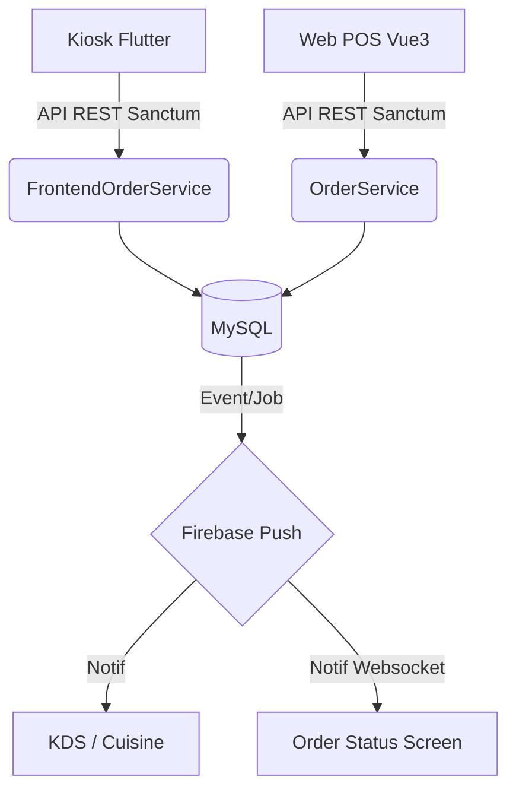

# Architecture FoodKing SaaS

Ce projet suit un modèle MVC monolithique (Laravel) couplé à une SPA Vue 3 pour l'administration. Le code est organisé pour séparer les responsabilités.

## Composants Principaux

### 1. Controllers (Couche Transport HTTP)
Situés dans `app/Http/Controllers`, ils gèrent l'entrée de la requête, l'autorisation, la validation et délèguent le gros du travail aux Services.
* **Frontend** : Gère les appels du client final (App, Kiosk). Exemple `Frontend\OrderController`.
* **Admin** : Gère les appels du back-office et caissiers (POS, KDS). Exemple `Admin\DashboardController`, `Admin\KitchenDisplaySystemController`.

### 2. Services (Couche Logique Métier)
Situés dans `app/Services`, ils contiennent le code métier critique et la persistance.
* **OrderService** : Le service central pour la manipulation de statut et les commandes caisses/tables. Single Source of Truth pour les recalculs.
* **FrontendOrderService** : Spécifiquement conçu pour recevoir les requêtes Kiosk et Web. Recalcule les prix et gère la file d'attente.
* **CouponService** : Moteur de règles pour valider la réduction. Employé au lieu de faire confiance au client.

### 3. Models (Couche Domaine)
Situés dans `app/Models`.
* **Order / FrontendOrder** : Entité de la commande (prix, réductions, etc.)
* **OrderItem** : Article d'une commande (liaison `order_id` et `item_id`).
* **KioskMachine** : Appareil physique lié à une `branch_id`.

### 4. Events / Observers
Le système propage les changements :
* Utilisation massive de **Jobs** (e.g. `SendOrderGotPush`) pour avertir Firebase et les Kiosks sans bloquer le thread de l'API HTTP.

### 5. Frontend (Vue 3)
Dans `resources/js`, l'application administrateur complète (Dashboard, POS, Commandes, Coupons). Buildé par *Laravel Mix* via `webpack.mix.js`.

---

## Modèle des Flux (Diagramme de Modules)

---

## 🛑 Zones Gelées (Ce qu'il NE FAUT PAS toucher sans plan)

Pour la phase actuelle de fiabilisation multi-agents, les modules suivants sont **GELÉS** et ne doivent faire l'objet d'aucune modification de logique interne :

1. **Gateways de Paiement Restantes** (`Stripe`, `Paypal`, `Credit`). Les controllers et helpers associés sont fermés.
2. **Push Notifications Subsystem** (`app/Services/PushNotificationService`). Le code Firebase natif est très lié au flux hérité Guzzle.
3. **Module Analytics Admin** (`Admin/DashboardController` et sous-modules complexes).
4. **Delivery Boy Logic**.

### Core Scope Actuel (Actif)
La phase actuelle d'intervention se limite EXCLUSIVEMENT à :
- **Backend API Core** (Validation JSON, Models)
- **Auth Kiosk** (Tokens Sanctum, Abilities d'isolation)
- **Ordering Encoders** (`OrderService`, Prices integrity)
- **KDS** (Écran Cuisine)
- **OSS** (Écran Client Waiter)
- **Reporting & Boucle QA Multi-Agents**

## 🔗 Dépendances Critiques & Inter-Modules
Si ces dépendances sont modifiées, l'architecture globale cassera :
- **Laravel Sanctum** : Gère les `capabilities` essentielles liées à la matrice AUTHZ. Le Kiosk dépend de clés Sanctum avec des abilities réduites. Ne pas dériver sur JWT.
- **Spatie Permission** : Gère la fine granularité d'accès `Manager/Chef`. Fortement encodé dans les Helpers.
- **Pusher / WebSockets** : La brique qui lie OSS, KDS et POS. Toute modification de payload event doit s'accompagner d'une rétro-compatibilité stricte.
