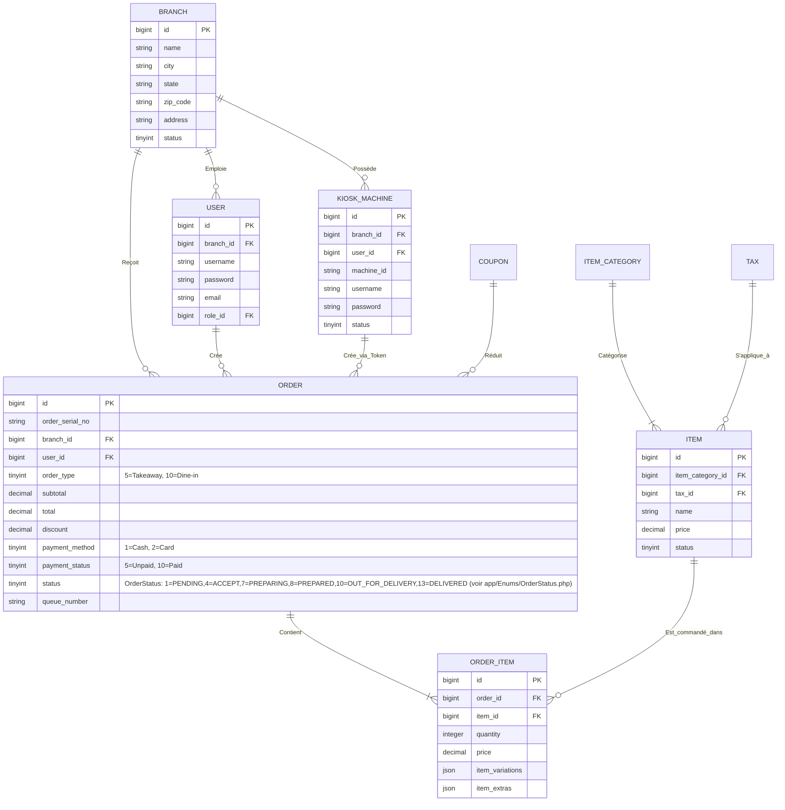
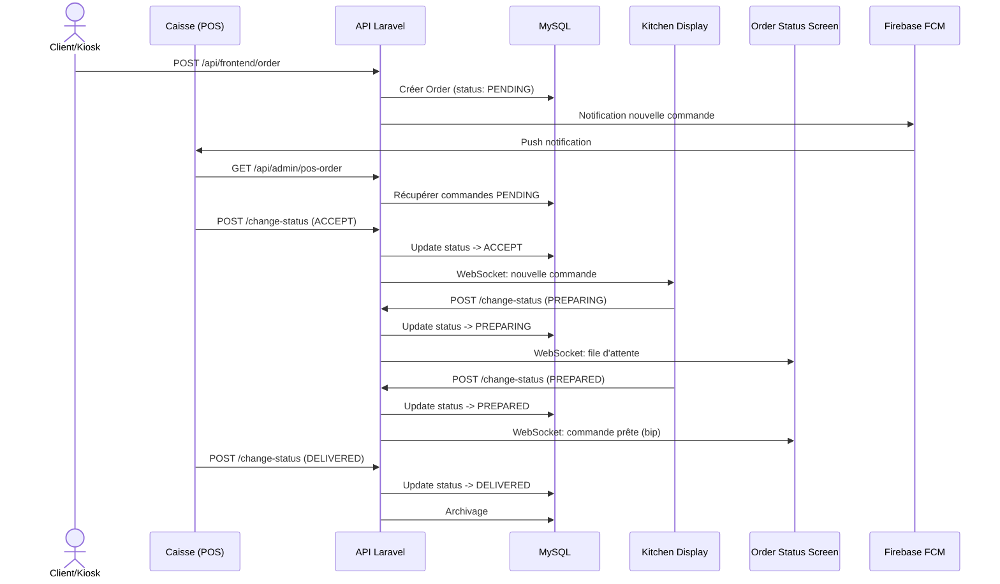

# Architecture Technique FoodKing

> **Document:** Architecture Complète du Système FoodKing SaaS  
> **Version:** 1.0  
> **Date:** 11 Mars 2026  
> **Public:** Équipe Technique, DevOps, Architectes

---

## Table des Matières

1. [Vue d'Ensemble](#1-vue-densemble)
2. [Stack Technique](#2-stack-technique)
3. [Architecture des Composants](#3-architecture-des-composants)
4. [Schéma de Base de Données](#4-schéma-de-base-de-données)
5. [Structure des API](#5-structure-des-api)
6. [Flux d'Authentification](#6-flux-dauthentification)
7. [Cycle de Vie des Commandes](#7-cycle-de-vie-des-commandes)
8. [Diagrammes de Flux](#8-diagrammes-de-flux)

---

## 1. Vue d'Ensemble

FoodKing est un système SaaS complet de gestion de restaurant composé de 4 modules principaux :

| Module | Description | Technologie | Utilisateurs |
|--------|-------------|-------------|--------------|
| **Caisse (POS)** | Interface web de prise de commande | Vue.js 3 + Laravel API | Caissiers, Managers |
| **Kiosk** | Borne interactive client | Flutter (API Backend) | Clients (self-service) |
| **KDS** | Kitchen Display System (Écran Cuisine) | Vue.js 3 + WebSockets | Chefs, Cuisiniers |
| **OSS** | Order Status Screen (Écran File d'Attente) | Vue.js 3 + Pusher | Clients (affichage public) |

### Architecture Globale

```
┌─────────────────────────────────────────────────────────────────────────┐
│                           CLIENTS                                       │
├─────────────┬─────────────┬─────────────┬─────────────┬─────────────────┤
│   Caisse    │   Kiosk     │    KDS      │    OSS      │   Dashboard     │
│   (Vue3)    │  (Flutter)  │   (Vue3)    │   (Vue3)    │    (Vue3)       │
│  Web POS    │   Borne     │   Cuisine   │   File      │    Admin        │
└──────┬──────┴──────┬──────┴──────┬──────┴──────┬──────┴────────┬────────┘
       │             │             │             │               │
       └─────────────┴─────────────┴─────────────┴───────────────┘
                                    │
                         ┌──────────▼──────────┐
                         │   API REST Laravel  │
                         │   (Sanctum Auth)    │
                         └──────────┬──────────┘
                                    │
              ┌─────────────────────┼─────────────────────┐
              │                     │                     │
     ┌────────▼────────┐  ┌────────▼────────┐  ┌────────▼────────┐
     │   MySQL 8+      │  │  Firebase FCM    │  │   WebSockets    │
     │   (Primary DB)  │  │  (Push Notifs)   │  │   (Pusher)      │
     └─────────────────┘  └─────────────────┘  └─────────────────┘
```

---

## 2. Stack Technique

### Backend

| Composant | Technologie | Version | Usage |
|-----------|-------------|---------|-------|
| Framework | Laravel | 9.x | API REST, logique métier |
| Langage | PHP | 8.1+ | Backend processing |
| Base de données | MySQL | 8.0+ | Production |
| Base de données | SQLite | 3.x+ | Tests uniquement |
| Authentification | Laravel Sanctum | 3.x | Tokens API |
| Autorisation | Spatie Permission | 5.x | Rôles et permissions |
| Temps réel | Pusher | 7.x | WebSockets |
| Notifications | Firebase FCM | - | Push notifications |
| Queue | Redis/Database | - | Jobs asynchrones |

### Frontend

| Composant | Technologie | Version | Usage |
|-----------|-------------|---------|-------|
| Framework JS | Vue.js | 3.2+ | SPA Admin/Caisse |
| State Management | Vuex | 4.1+ | Store global |
| Routing | Vue Router | 4.1+ | Navigation SPA |
| UI Framework | Bootstrap | 5.2+ | Base CSS |
| CSS Utility | TailwindCSS | 3.4+ | Styles modernes |
| Build Tool | Laravel Mix | 6.0+ | Compilation assets |
| Charts | Vue3-ApexCharts | 1.5+ | Dashboard analytics |

### Mobile (Kiosk)

| Composant | Technologie | Usage |
|-----------|-------------|-------|
| Framework | Flutter | Application borne tactile |
| State Management | Provider/Riverpod | Gestion état |
| HTTP Client | Dio | Appels API |

---

## 3. Architecture des Composants

### 3.1 Couches d'Architecture

```
┌─────────────────────────────────────────────────────────────┐
│                     PRESENTATION LAYER                      │
│  ┌─────────┐ ┌─────────┐ ┌─────────┐ ┌─────────┐            │
│  │  Caisse │ │  Kiosk  │ │   KDS   │ │   OSS   │            │
│  │  (Vue)  │ │(Flutter)│ │  (Vue)  │ │  (Vue)  │            │
│  └────┬────┘ └────┬────┘ └────┬────┘ └────┬────┘            │
└───────┼───────────┼───────────┼───────────┼─────────────────┘
        │           │           │           │
┌───────┼───────────┼───────────┼───────────┼─────────────────┐
│       ▼           ▼           ▼           ▼                   │
│                    API LAYER (REST)                           │
│              Controllers + Routes                             │
│       ┌─────────────────────────────────┐                     │
│       │    Validation (FormRequests)    │                     │
│       │    Authorization (Policies)     │                     │
│       └────────────────┬────────────────┘                     │
└────────────────────────┼─────────────────────────────────────┘
                         │
┌────────────────────────┼─────────────────────────────────────┐
│                    BUSINESS LAYER                            │
│              Services (Couche Logique)                       │
│   ┌─────────────────────────────────────────────┐            │
│   │  OrderService  │  FrontendOrderService      │            │
│   │  CouponService │  ItemService               │            │
│   └─────────────────────────────────────────────┘            │
└────────────────────────┼─────────────────────────────────────┘
                         │
┌────────────────────────┼─────────────────────────────────────┐
│                     DATA LAYER                               │
│   ┌─────────┐ ┌─────────┐ ┌─────────┐ ┌─────────┐          │
│   │ Orders  │ │  Items  │ │  Users  │ │Branches │          │
│   │ Models  │ │ Models  │ │ Models  │ │ Models  │          │
│   └─────────┘ └─────────┘ └─────────┘ └─────────┘          │
└─────────────────────────────────────────────────────────────┘
```

### 3.2 Responsabilités par Couche

#### Controllers (Transport HTTP)
**Emplacement:** `app/Http/Controllers`

| Namespace | Rôle | Exemples |
|-----------|------|----------|
| `Frontend\` | API publique (Kiosk, clients) | `OrderController`, `ItemController` |
| `Admin\` | API admin (POS, KDS, dashboard) | `PosOrderController`, `KitchenDisplaySystemController` |
| `Auth\` | Authentification | `LoginController`, `KioskMachineLoginController` |

**Responsabilités:**
- Validation des requêtes entrantes
- Autorisation (policies)
- Appel aux Services
- Formatage des réponses (Resources)

#### Services (Logique Métier)
**Emplacement:** `app/Services`

| Service | Fonction | Source of Truth |
|---------|----------|-----------------|
| `OrderService` | Gestion commandes caisse/tables | Statuts et recalculs |
| `FrontendOrderService` | Commandes Kiosk/Web | Recalcule prix, file d'attente |
| `CouponService` | Validation réductions | Règles de coupons |
| `ItemService` | Gestion du menu | Prix et disponibilité |
| `BranchService` | Multi-sites | Isolation branches |

#### Models (Domaine)
**Emplacement:** `app/Models`

| Model | Rôle | Relations Clés |
|-------|------|----------------|
| `Order` | Commande principale | `branch()`, `user()`, `items()` |
| `FrontendOrder` | Commande client/Kiosk | Hérite de Order |
| `OrderItem` | Ligne de commande | `order()`, `item()` |
| `Item` | Produit du menu | `category()`, `tax()` |
| `KioskMachine` | Borne physique | `branch()`, `user()` |
| `Branch` | Restaurant/Succursale | `users()`, `orders()`, `kioskMachines()` |

---

## 4. Schéma de Base de Données

### 4.1 Tables Core (Tables Principales)

```
┌─────────────────────────────────────────────────────────────────┐
│                      CORE TABLES                                │
├─────────────────┬─────────────────┬─────────────────────────────┤
│   branches      │     users       │    kiosk_machines           │
├─────────────────┼─────────────────┼─────────────────────────────┤
│ id (PK)         │ id (PK)         │ id (PK)                     │
│ name            │ branch_id (FK)  │ branch_id (FK)              │
│ city            │ username        │ user_id (FK)                │
│ state           │ password        │ machine_id (MAC)            │
│ zip_code        │ email           │ username                    │
│ address         │ role_id (FK)    │ password                    │
│ status          │ status          │ status                      │
└─────────────────┴─────────────────┴─────────────────────────────┘
┌─────────────────┬─────────────────┬─────────────────────────────┐
│   orders        │   order_items   │      items                  │
├─────────────────┼─────────────────┼─────────────────────────────┤
│ id (PK)         │ id (PK)         │ id (PK)                     │
│ order_serial_no │ order_id (FK)   │ item_category_id (FK)       │
│ branch_id (FK)  │ item_id (FK)    │ tax_id (FK)                 │
│ user_id (FK)    │ quantity        │ name                        │
│ order_type      │ price           │ price (SOT)                 │
│ subtotal        │ item_variations │ description                 │
│ total           │ item_extras     │ status                      │
│ discount        └─────────────────┴─────────────────────────────┘
│ payment_method  
│ payment_status  ┌─────────────────┬─────────────────────────────┐
│ status          │ item_categories │   coupons                   │
│ queue_number    ├─────────────────┼─────────────────────────────┤
└─────────────────┤ id (PK)         │ id (PK)                     │
                  │ name            │ code                        │
                  │ status          │ type (fixed/percentage)     │
                  └─────────────────┤ amount                      │
                                  │ min_purchase                │
                                  │ valid_from/to               │
                                  └─────────────────────────────┘
```

### 4.2 Diagramme Entité-Relation (Mermaid)



### 4.3 Contraintes d'Intégrité

1. **Foreign Keys strictes:** Chaque commande DOIT avoir un `branch_id` et `user_id` existants
2. **Prix calculés serveur:** Les champs `ORDER.subtotal` et `ORDER_ITEM.price` sont toujours recalculés côté serveur
3. **Numérotation des tickets:** Attribuée atomiquement via `lockForUpdate()` pour éviter les doublons
4. **Isolation multi-sites:** Les requêtes sont automatiquement filtrées par `branch_id` via `BranchScope`

---

## 5. Structure des API

### 5.1 Organisation des Routes

```
/api
├── /auth                    # Authentification (Guest)
│   ├── POST /login          # Connexion standard
│   ├── POST /kiosk-login    # Connexion borne Kiosk
│   ├── POST /logout         # Déconnexion (Auth)
│   └── /forgot-password     # Réinitialisation mot de passe
│
├── /frontend                # API Publique (Guest/Client)
│   ├── GET  /item           # Liste des produits
│   ├── GET  /item-category  # Catégories de menu
│   ├── GET  /branch         # Succursales
│   ├── POST /order          # Créer commande (Client/Kiosk)
│   ├── GET  /setting        # Paramètres
│   └── GET  /page           # Pages statiques
│
└── /admin                   # API Admin (Auth requise)
    ├── /dashboard           # Statistiques (Admin/Manager)
    ├── /pos-order           # Commandes Caisse (Manager)
    ├── /table-order         # Commandes Tables (Manager)
    ├── /kds-order           # Kitchen Display (Chef)
    │   ├── GET  /           # Liste PREPARING
    │   └── POST /change-status/{order}
    ├── /oss-order           # Order Status Screen (Lecture)
    └── /payment-gateway     # Configuration (Admin uniquement)
```

### 5.2 Middleware Stack

```
Requête entrante
     │
     ▼
┌─────────────────────────────────────┐
│  installed                          │  # Vérifier installation
│  apiKey                             │  # Clé API pour routes publiques
│  localization                       │  # Langue (fr)
└──────────────┬──────────────────────┘
               │
     ┌─────────┴─────────┐
     │                   │
┌────▼────┐        ┌─────▼─────┐
│  Guest  │        │  Auth     │
│  Routes │        │  Routes   │
│         │        │  sanctum  │
└────┬────┘        │  verify   │
     │             │  api      │
     │             └─────┬─────┘
     │                   │
     │             ┌─────▼──────────┐
     │             │  Role Check    │
     │             │  (Spatie)      │
     │             │  - Admin       │
     │             │  - Manager     │
     │             │  - Chef        │
     │             └────────────────┘
```

### 5.3 Codes de Réponse API

| Code | Signification | Usage |
|------|---------------|-------|
| `200` | OK | Requête réussie |
| `201` | Created | Ressource créée (commande) |
| `400` | Bad Request | Données invalides |
| `401` | Unauthorized | Non authentifié |
| `403` | Forbidden | Pas les permissions requises |
| `404` | Not Found | Ressource inexistante |
| `422` | Validation Error | Erreurs de validation |
| `500` | Server Error | Erreur serveur |

---

## 6. Flux d'Authentification

### 6.1 Authentification Standard (Caisse/Dashboard)

```
┌──────────┐                                ┌──────────────┐
│  Client  │                                │    Serveur   │
│  (Vue3)  │                                │   (Laravel)  │
└────┬─────┘                                └──────┬───────┘
     │                                           │
     │  POST /api/auth/login                     │
     │  {username, password, branch_id}          │
     │──────────────────────────────────────────>│
     │                                           │
     │                                           │  ┌──────────┐
     │                                           │  │ Validate │
     │                                           │  │  Check   │
     │                                           │  │  Role    │
     │                                           │  └────┬─────┘
     │                                           │       │
     │  {token, user, abilities}                 │       │
     │<──────────────────────────────────────────│       │
     │                                           │       │
     │  Stockage: localStorage / Vuex            │       │
     │  Authorization: Bearer <token>            │       │
```

### 6.2 Authentification Kiosk (Borne)

```
┌──────────┐                                ┌──────────────┐
│  Kiosk   │                                │    Serveur   │
│ (Flutter)│                                │   (Laravel)  │
└────┬─────┘                                └──────┬───────┘
     │                                           │
     │  POST /api/auth/kiosk-login               │
     │  {username, password, machine_id}         │
     │──────────────────────────────────────────>│
     │                                           │
     │                                           │  ┌──────────┐
     │                                           │  │ Vérifier │
     │                                           │  │ Machine  │
     │                                           │  │ Branch   │
     │                                           │  └────┬─────┘
     │                                           │       │
     │  {token, abilities: ['kiosk:order']}      │       │
     │<──────────────────────────────────────────│       │
     │                                           │       │
     │  Capacité limitée: création commande      │       │
     │  uniquement - pas d'accès admin           │       │
```

### 6.3 Matrice d'Autorisation

| Acteur | Token | Routes autorisées | Routes interdites |
|--------|-------|-------------------|-------------------|
| **Admin** | Sanctum + Rôle `Admin` | `/api/admin/*` | — |
| **Manager** | Sanctum + Rôle `Manager` | `/api/admin/pos*`, `/api/admin/online-order*` | Config globale, suppression branches |
| **Kiosk** | Sanctum (`kioskToken`) | `/api/frontend/*` (création) | **Toutes** `/api/admin/*` |
| **Chef** | Sanctum + Rôle `Chef` | `/api/admin/kds-order/*` | Autres branches, validation paiement |
| **Client** | Sanctum | `/api/frontend/order` | Imposer prix, marquer `DELIVERED` |
| **OSS** | api-key uniquement | `/api/admin/oss-order` (GET) | POST, PUT, DELETE, prix |

---

## 7. Cycle de Vie des Commandes

### 7.1 States et Transitions

```
┌─────────┐     ┌─────────┐     ┌─────────┐     ┌─────────┐     ┌─────────┐
│ PENDING │────>│ ACCEPT  │────>│PREPARING│────>│PREPARED │────>│DELIVERED│
│   (1)   │     │   (4)   │     │   (7)   │     │   (8)   │     │  (13)   │
└─────────┘     └─────────┘     └─────────┘     └─────────┘     └─────────┘
     │               │               │               │               │
     │               │               │               │               │
┌────┴────┐     ┌────┴────┐     ┌────┴────┐     ┌────┴────┐     ┌────┴────┐
│Création │     │Paiement │     │Cuisine  │     │Prêt     │     │Remise   │
│Client/  │     │validé   │     │en cours │     │à emporter│     │Client   │
│Kiosk    │     │par POS  │     │         │     │         │     │         │
└─────────┘     └─────────┘     └─────────┘     └─────────┘     └─────────┘

Transitions INTERDITES (bloquées par le système):
- PENDING ──X─> PREPARING (Doit passer par ACCEPT)
- PENDING ──X─> DELIVERED (Flow obligatoire)
- PREPARING ──X─> PENDING (Unidirectionnel)
- DELIVERED ──X─> * (Terminal state)
```

### 7.2 Source of Truth (SOT)

**Principe fondamental:** La base de données MySQL + `OrderService` constituent l'unique Source of Truth.

```
┌─────────────────────────────────────────────────────────────┐
│                    SOURCE OF TRUTH                           │
│              (MySQL + OrderService)                          │
├─────────────────────────────────────────────────────────────┤
│  • Prix des items: table `items`                             │
│  • Statut commande: table `orders.status`                    │
│  • Calcul total: serveur uniquement                        │
│  • Transitions: validées côté serveur                      │
└─────────────────────────────────────────────────────────────┘
                              ▲
                              │
        ┌─────────────────────┼─────────────────────┐
        │                     │                     │
┌───────▼───────┐    ┌────────▼────────┐   ┌──────▼──────┐
│     Kiosk     │    │      POS        │   │     KDS     │
│   (Flutter)   │    │     (Vue3)      │   │    (Vue3)   │
│               │    │                 │   │             │
│ Émet des     │    │ Valide paiement │   │ Met à jour  │
│ intentions   │    │ Change statuts  │   │ statut      │
│ uniquement   │    │                 │   │ préparation │
└───────────────┘    └─────────────────┘   └─────────────┘
```

### 7.3 Règles de Transition

| Transition | Qui peut écrire | Condition | Notification |
|------------|-----------------|-----------|--------------|
| `PENDING` → `ACCEPT` | Caissier (Manager) | Paiement validé | Firebase → KDS |
| `ACCEPT` → `PREPARING` | Chef (KDS) | Acceptée | Pusher → OSS |
| `PREPARING` → `PREPARED` | Chef (KDS) | Prête | Pusher → OSS + Son |
| `PREPARED` → `DELIVERED` | Caissier (POS) | Remise client | Archivage |

---

## 8. Diagrammes de Flux

### 8.1 Flux de Commande Complet



### 8.2 Architecture Multi-Sites (SaaS)

```
┌─────────────────────────────────────────────────────────────┐
│                     INSTANCE FOODKING                        │
│                      (Multi-Tenant)                           │
├─────────────────────────────────────────────────────────────┤
│                                                               │
│  ┌─────────────────────────────────────────────────────────┐ │
│  │                    BRANCHE A (Paris)                    │ │
│  │  ┌─────────┐  ┌─────────┐  ┌─────────┐  ┌─────────┐   │ │
│  │  │  POS 1  │  │  POS 2  │  │ Kiosk 1 │  │  KDS    │   │ │
│  │  │ (Caissier)│ │ (Caissier)│ │ (Client)│ │ (Chef)  │   │ │
│  │  └────┬────┘  └────┬────┘  └────┬────┘  └────┬────┘   │ │
│  │       └─────────────┴───────────┴─────────────┘         │ │
│  │                         │                             │ │
│  │                  branch_id = 1                        │ │
│  └─────────────────────────┼───────────────────────────────┘ │
│                            │                                │
│  ┌─────────────────────────┼───────────────────────────────┐│
│  │                    BRANCHE B (Lyon)                     ││
│  │  ┌─────────┐  ┌─────────┐  ┌─────────┐                ││
│  │  │  POS 1  │  │  KDS    │  │  OSS    │                ││
│  │  └────┬────┘  └────┬────┘  └────┬────┘                ││
│  │       └─────────────┴─────────────┘                    ││
│  │                         │                             ││
│  │                  branch_id = 2                        ││
│  └─────────────────────────┼───────────────────────────────┘│
│                            │                               │
│                    ┌─────────▼──────────┐                   │
│                    │   API Laravel      │                   │
│                    │   (Même instance)  │                   │
│                    └─────────┬──────────┘                   │
│                              │                              │
│                    ┌─────────▼──────────┐                   │
│                    │   MySQL            │                   │
│                    │   (Tables isolées  │                   │
│                    │    par branch_id)  │                   │
│                    └────────────────────┘                   │
└─────────────────────────────────────────────────────────────┘
```

---

## Annexes

### A. Configuration Requise

| Environnement | PHP | MySQL | Node | Composer |
|---------------|-----|-------|------|----------|
| Production | 8.1+ | 8.0+ | - | 2.x |
| Développement | 8.1+ | 8.0+ | 18+ | 2.x |
| Tests | 8.1+ | SQLite | - | 2.x |

### B. Fichiers de Configuration Critiques

| Fichier | Usage | Ne JAMAIS modifier |
|---------|-------|-------------------|
| `config/app.php` | Locale (fr) | Locale |
| `config/sanctum.php` | Auth tokens | Guard configuration |
| `config/permission.php` | Spatie roles | Default roles |

### C. Contacts et Support

| Rôle | Fichiers | Contact |
|------|----------|---------|
| Backend API | `app/Services/*`, `app/Http/Controllers/*` | Équipe Backend |
| Frontend Vue | `resources/js/components/*` | Équipe Frontend |
| Kiosk Flutter | API uniquement (repo séparé) | Équipe Mobile |

---

**Documentation complète de l'Architecture Technique FoodKing.**

*Pour les mises à jour, suivre le processus de documentation défini dans `docs/CONTRIBUTING.md`.*
