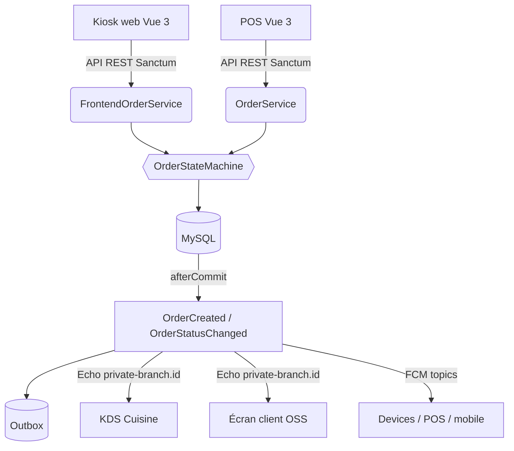

# Architecture FoodKing SaaS

Monolithe **Laravel 9** (PHP 8.1+) + **SPA Vue 3** servant cinq surfaces — admin, caisse **POS**,
**KDS** (cuisine), **OSS** (écran client), **kiosk web borne**. Base **MySQL** (SQLite `:memory:` en
test). Auth **Sanctum** + **Spatie Permission**. Temps réel **Laravel Broadcasting** (Pusher/Soketi)
sur canaux privés par branche, **FCM** en complément, polling de secours.

> Document maintenu courant au 2026-06-05. Les faits historiquement faux ont été corrigés :
> le **kiosk est une app web Vue** (pas Flutter) ; **`SendOrderGotPush` vit dans `app/Events/`**
> (pas `app/Jobs/`).

---

## 1. Couches (du transport au domaine)

```
HTTP (Controllers)  ──►  Services (logique métier + persistance)  ──►  Models (Eloquent)
        │                          │                                        │
   validation/authz        recalcul prix, file,                      branch_id scopes,
   (Form Requests,         transitions, fiscal                       relations
   Sanctum abilities)              │
                          Domain (OrderStateMachine, EventContract)
                                   │
                          Events ──► Listeners (après commit) ──► Broadcast / FCM / Outbox
```

### 1.1 Controllers — `app/Http/Controllers`
Entrée HTTP : autorisation, validation (Form Requests), délégation aux Services. Jamais de logique
métier ou de calcul de prix ici.
- **`Frontend\*`** — client final (kiosk web, app, web). Ex. `Frontend\OrderController`.
- **`Admin\*`** — back-office, caisse, cuisine. Ex. `Admin\KitchenDisplaySystemController`,
  `Admin\OrderStatusScreenController`, contrôleurs fiscaux `/admin/fiscal/*`.

### 1.2 Services — `app/Services` (SSOT métier)
| Service | Rôle |
|---|---|
| **`OrderService`** | SSOT commandes POS/table : création, recalcul prix backend, `queue_number`, transitions via state machine, dispatch d'events après commit. |
| **`FrontendOrderService`** | Commandes kiosk/web : recalcul prix, file d'attente, pipeline paiement borne. **Symétrie obligatoire avec `OrderService`** sur tout changement de commande. |
| **`Pricing\PricingService`** (+ `DiscountCalculator`, `TaxCalculator`, `PricingRequest`, `PricingResult`, `PricingLineResult`) | Calcul prix/remises/taxes côté serveur. Le client ne recalcule jamais le total final. |
| **`CouponService`**, **`LoyaltyService`** | Validation remises et points côté serveur. |
| **`KitchenDisplaySystemOrderService`** | Liste/tri des commandes actives cuisine. |
| **`OrderStatusScreenOrderService`** | Données écran client (OSS). |
| **`Fiscal\ZReportService` / `XReportService` / `FiscalSequenceService` / `AuditLogService`** | Conformité NF525 : séquence fiscale atomique, rapports Z/X, journal `audit_logs` immuable (chaîne HMAC). |
| **`Kiosk\KioskMenuService` / `PricingPreviewService` / `UpsellRuleService` / `KioskPromoService`** | Catalogue borne, aperçu prix, upsell. |
| Notifications : `Fcm…`, `Push…`, `…NotificationBuilder` | Construction et envoi des notifications par canal. |

### 1.3 Domain — `app/Domain`
- **`Order\OrderStateMachine`** — **seule autorité** des transitions de statut (`IllegalTransitionException`
  sur transition interdite). Aucun `$order->status = x` sauvage.
- **`Events\EventContract`** — forme figée (V1) des payloads d'événements temps réel.

### 1.4 Models — `app/Models`
`Order` / `FrontendOrder`, `OrderItem`, `OrderStatusTransition`, `KioskMachine` (liée à `branch_id`),
catalogue (`Item*`), etc. Tous les scopes critiques portent `branch_id`.

### 1.5 Events / Listeners — `app/Events`, `app/Listeners`
Événements clés : **`OrderCreated`**, **`OrderStatusChanged`**, **`ItemAvailabilityChanged`**,
catalogue (`Category*`, `Item*`). Dispatch **strictement après `DB::afterCommit`**.
Listeners notables :
- **Outbox transactionnel** : `PersistOrderCreatedToOutbox`, `PersistOrderStatusChangedToOutbox`,
  `PersistItemAvailabilityChangedToOutbox` → reprise via `OutboxRescueCommand` / `OutboxRetryFailedCommand`.
- **FCM** : `SendFcmOnOrderCreated`, `SendFcmOnOrderStatusChange`.
- **Catalogue/borne** : `InvalidateKioskMenuCacheOnCatalogChange`, `BumpMenuSnapshotOnItemAvailabilityChanged`,
  `DecrementItemAvailabilityOnOrder`.
- **Loyalty** : `AwardLoyaltyPointsOnDelivery`.

### 1.6 Frontend Vue 3 — `resources/js`
SPA admin/POS/KDS/OSS + tunnel kiosk (`components/frontend/kiosk/`). Build **Laravel Mix** (`webpack.mix.js`).
Temps réel via **Laravel Echo**. i18n `vue-i18n` (fr/en/ar/bn/de).

---

## 2. Topologie temps réel

| Couche | Usage | Source de vérité |
|---|---|---|
| **Echo / Broadcasting** | MAJ live UI par branche, canal `private-branch.{branch_id}` | UI temps réel POS/KDS/OSS/borne |
| **FCM** | Réveil device / push passif, topics par surface (`kitchen_branch_X`, `pos_branch_X`, `customer_order_{id}`) | Notification, pas état |
| **Polling** | Filet de secours sur certaines vues | Reprise après perte réseau |
| **Outbox** | Garantie de livraison des events même si broadcast échoue | Cohérence inter-surfaces |

Règle : tout changement de payload d'event respecte **`EventContract` V1** et la rétro-compatibilité.



---

## 3. Invariants à toujours protéger

1. **SSOT pricing backend** — le frontend ne recalcule jamais le total final.
2. **`branch_id` isolation** — dans tous les scopes Eloquent, controllers, policies.
3. **`OrderStateMachine`** — seule autorité des transitions ; `OrderStatus` enum authoritatif (pas de string en dur).
4. **`DB::afterCommit`** pour events/broadcasts (jamais d'event sur état non-commité).
5. **`OrderService` ↔ `FrontendOrderService` symétrie** sur tout changement de commande.
6. **`EventContract` V1** — forme de payload figée pour la sync.
7. **Spatie Permission** — toute décision d'autorisation passe par les permissions nommées (pas de rôle en dur).
8. **NF525 fiscal** côté POS — séquence atomique, rapports Z/X, `audit_logs` INSERT-only chaînés HMAC.

---

## 4. Surfaces et flux

- **POS** — caisse : création commande cash/CB, encaissement, tiroir, rapports fiscaux Z/X.
- **Kiosk (web)** — tunnel borne : wizard produit → paiement TPE → visibilité KDS après confirmation.
- **KDS** — écran cuisine : commandes actives, transitions de préparation.
- **OSS** — écran client : statut de la commande en temps réel.
- **Admin** — catalogue, branches, employés, permissions, analytics.

Détails de cycle : `docs/ORDER_FLOW.md`, par appareil : `docs/DEVICE_FLOW.md`, API : `docs/API_MAP.md`,
autorisations : `docs/AUTHZ_MATRIX.md`, règles métier : `docs/BUSINESS_RULES.md`.

---

## 5. Dépendances critiques (casser = casser l'archi)

- **Laravel Sanctum** — abilities d'isolation (le kiosk dépend de clés à abilities réduites). Ne pas dériver vers JWT.
- **Spatie Permission** — granularité Manager/Chef/Cashier.
- **Pusher / Soketi (WebSockets)** — lie OSS, KDS, POS et borne ; toute modif de payload exige une rétro-compat stricte.
- **Clé API** — Laravel lit `MIX_API_KEY` (`config/app.php`) ; `.env` doit la définir (repli `API_KEY`).

---

## 6. Zones gelées (gate requis avant toute modification de logique interne)

1. **Gateways de paiement** (`Stripe`, `Paypal`, `Credit`) — controllers/helpers fermés.
2. **Push Notifications Subsystem** (`PushNotificationService`, code Firebase natif hérité).
3. **Module Analytics Admin** (`Admin\DashboardController` et sous-modules complexes).
4. **Delivery Boy Logic**.

Toute intervention dans une zone gelée déclenche un **HUMAN GATE** (voir `AGENTS.md` → Stop Conditions).
