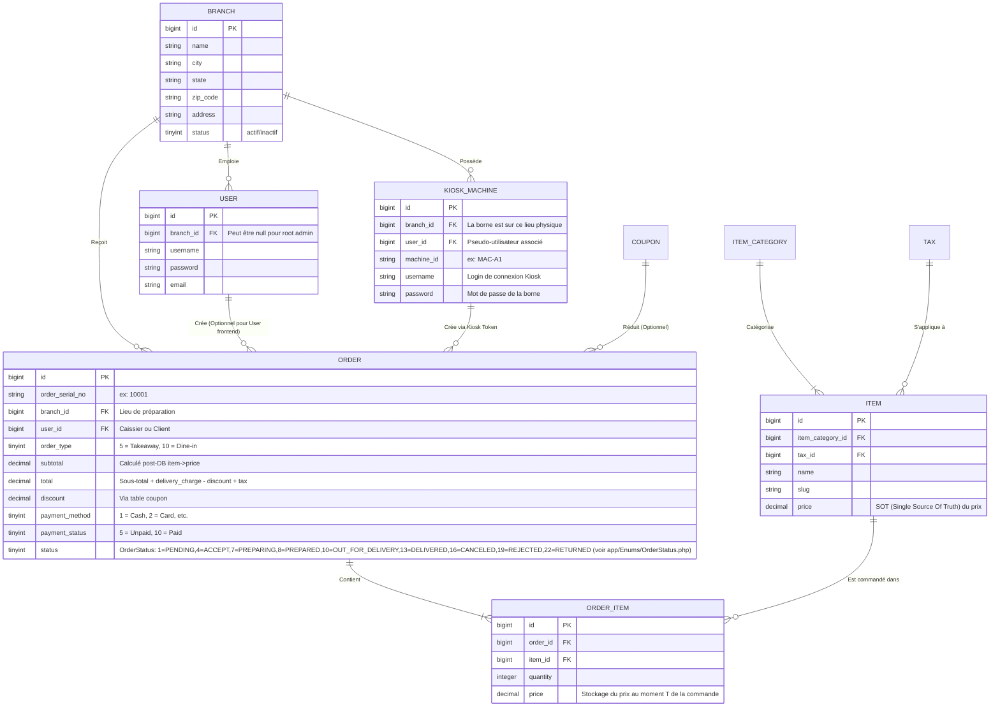

# FoodKing Core : Database Schema (Entity-Relationship)

Ce document décrit les tables vitales et leurs relations pour le cœur métier du système (commandes et isolation). Toute modification de ces tables impactera l'API Kiosk et l'admin VueJS.

## Modèle Entité-Relation (Mermaid)

---

## 🛑 Règles d'Intégrité de Base de Données (SQLite / MySQL)

1. **Foreign Keys (FK) strictes :** Dans les environnements de test et de Prod, il est indispensable de lier chaque commande à un `branch_id` et un `user_id` existants. Ne jamais laisser de valeurs orphelines.
2. **Nullable Constraints :** Soyez vigilants aux restrictions `NOT NULL`. Ex : Une succursale (Branch) DOIT avoir une `city`, `zip_code` etc. (Modèle SQLite l'exige violemment dans les Tests).
3. **Le prix n'est jamais poussé aveuglément :** `ORDER.subtotal` et `ORDER_ITEM.price` sont calculés par interrogtion `SELECT price FROM items WHERE id = x` au moment de la création. On n'insère jamais les dizaines/centaines de `price` envoyées via JSON Payload depuis un client frontend/kiosk.
4. **Race Conditions sur Tickets :** Attention à l'attribution par lots (stress DB) des numéros (`queue_number` / `order_serial_no`). InnoDB `lockForUpdate()` gère cela dans la logique de service, mais le schéma SQL tolèrerait par défaut le duplicata à haut débit.
