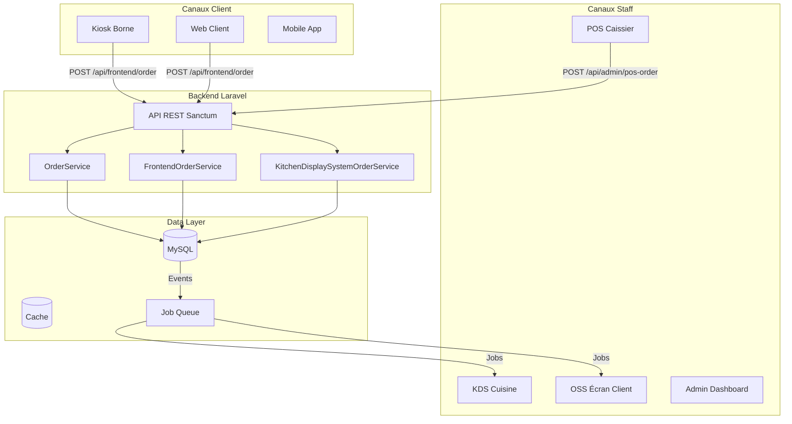
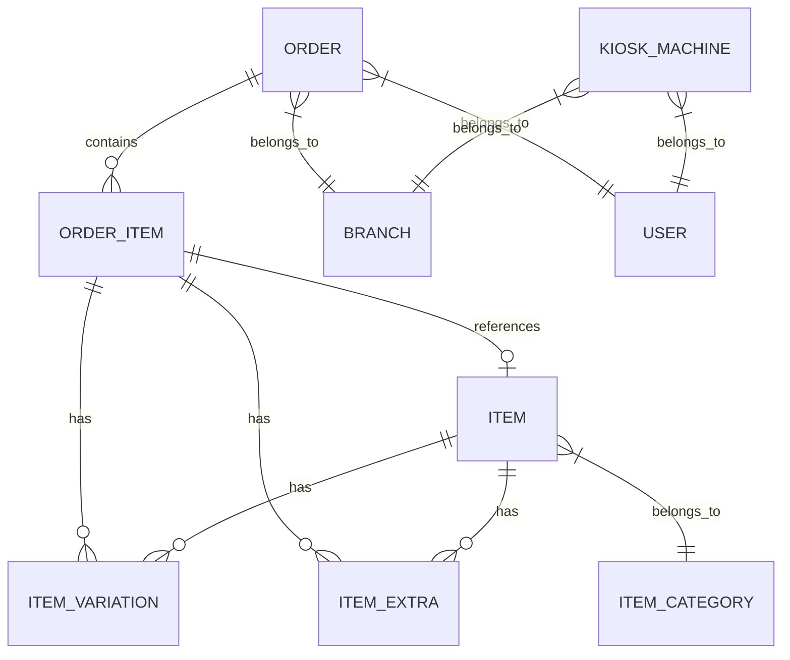

# FoodKing — Guide de Debug & Développement

**Version:** 1.0  
**Date:** Mars 2026  
**Architecte:** Claude (Lead)

---

## Table des Matières

1. [Architecture Overview](#architecture-overview)
2. [Debug par Canal](#debug-par-canal)
3. [Logins & Rôles](#logins--rôles)
4. [Structure Globale](#structure-globale)
5. [Logique Prise Commande](#logique-prise-commande)
6. [Logs & Troubleshooting](#logs--troubleshooting)
7. [Tests](#tests)
8. [Common Errors](#common-errors)

---

## Architecture Overview

### Diagramme des Flux



### Services Critiques

| Service | Fichier | Responsabilité |
|---------|---------|----------------|
| **OrderService** | `app/Services/OrderService.php` | CRUD commandes POS/Table, calcul prix, taxes, coupons |
| **FrontendOrderService** | `app/Services/FrontendOrderService.php` | Commandes Kiosk/Web, prix DB-only |
| **KitchenDisplaySystemOrderService** | `app/Services/KitchenDisplaySystemOrderService.php` | Affichage cuisine, transitions statut |
| **ItemService** | `app/Services/ItemService.php` | Gestion produits, variations, extras |
| **CouponService** | `app/Services/CouponService.php` | Validation coupons, calcul réductions |

### Models & Relations



---

## Debug par Canal

### POS Web (Caissier)

**URL:** `http://localhost:8000/admin/pos`

**Flow Debug:**

1. **Login échoue:**
   ```bash
   # Vérifier rôles
   php artisan tinker
   >>> User::where('email', 'posoperator@example.com')->first()->roles
   # Doit retourner: POS Operator
   ```

2. **Panier vide après refresh:**
   ```javascript
   // Browser Console
   localStorage.getItem('pos_cart_v1');
   // Doit retourner JSON avec items, subtotal, savedAt
   ```

3. **Wizard ne s'ouvre pas:**
   ```javascript
   // Vérifier pos-wizard.js chargé
   window.location.pathname.includes('/admin/pos');
   // Doit retourner true
   ```

4. **Prix incorrect:**
   ```bash
   # Vérifier DB
   php artisan tinker
   >>> Item::find($item_id)->price
   >>> ItemVariation::find($variation_id)->price
   ```

**Fichiers clés:**
- `resources/js/components/admin/pos/PosComponent.vue`
- `resources/js/store/modules/posCart.js`
- `public/js/pos-wizard.js`

---

### Kiosk (Borne)

**URL:** `http://localhost:8000/kiosk/login`

**Flow Debug:**

1. **Login borne échoue:**
   ```bash
   # Vérifier KioskMachine existe
   php artisan tinker
   >>> KioskMachine::where('username', 'kiosk_1')->first()
   ```

2. **Token sans ability:**
   ```bash
   # Vérifier token
   php artisan tinker
   >>> $user = User::where('email', 'kiosk@example.com')->first();
   >>> $user->tokens->first()->abilities
   # Doit retourner: ['kiosk:order']
   ```

3. **Wizard style incorrect:**
   ```bash
   # Vérifier CSS chargé
   npm run prod
   # Vérifier public/css/app.css contient kiosk-wizard.css
   grep "kiosk-touch-btn" public/css/app.css
   ```

4. **Commande n'apparait pas KDS:**
   ```bash
   # Vérifier order_type
   php artisan tinker
   >>> Order::latest()->first()->order_type
   # Doit retourner: 25 (KIOSK)
   ```

**Fichiers clés:**
- `app/Http/Controllers/Auth/KioskMachineLoginController.php`
- `app/Services/FrontendOrderService.php`
- `resources/js/components/frontend/kiosk/KioskWizardComponent.vue`

---

### KDS (Cuisine)

**URL:** `http://localhost:8000/admin/kitchen-display-system`

**Flow Debug:**

1. **Pas de commandes affichées:**
   ```bash
   # Vérifier statut
   php artisan tinker
   >>> Order::where('status', 10)->count()  # ACCEPT = 10
   ```

2. **Commandes d'autre branche:**
   ```bash
   # Vérifier BranchScope
   php artisan tinker
   >>> Order::withoutGlobalScope('branch')->where('branch_id', '!=', $user->branch_id)->count()
   ```

3. **Transition statut échoue:**
   ```bash
   # Vérifier OrderStatusRequest
   php artisan test --filter=KDSOrderItemsTest
   ```

**Fichiers clés:**
- `app/Services/KitchenDisplaySystemOrderService.php`
- `app/Http/Controllers/Admin/KitchenDisplaySystemController.php`

---

### OSS (Écran Client)

**URL:** `http://localhost:8000/admin/order-status-screen`

**Flow Debug:**

1. **Commande PREPARED non affichée:**
   ```bash
   # Vérifier statut
   php artisan tinker
   >>> Order::where('status', 15)->get()  # PREPARED = 15
   ```

2. **Pas de mise à jour temps réel:**
   - OSS utilise polling HTTP (pas WebSocket)
   - Vérifier intervalle dans composant Vue

**Fichiers clés:**
- `app/Http/Controllers/Admin/OrderStatusScreenController.php`

---

## Logins & Rôles

### Credentials Test (Database Seeder)

| Rôle | Email | Password | Landing URL |
|------|-------|----------|-------------|
| **Admin** | `admin@example.com` | `123456` | `/admin/dashboard` |
| **Branch Manager** | `manager@example.com` | `123456` | `/admin/dashboard` |
| **POS Operator** | `posoperator@example.com` | `123456` | `/admin/pos` |
| **Chef** | `chef@example.com` | `123456` | `/admin/kitchen-display-system` |
| **Customer** | `customer@example.com` | `123456` | `/` (home) |

### Rôles Corrects vs Incorrects

**AVANT (INCORRECT):**
```php
// PaymentStatusRequest.php — AVANT
return auth()->user()->hasAnyRole(['Admin', 'Manager', 'Cashier']);
```

**APRÈS (CORRECT):**
```php
// PaymentStatusRequest.php — APRÈS
return auth()->user()->hasAnyRole(['Admin', 'Branch Manager', 'POS Operator']);
```

**Rôles valides (Spatie):**
- `Admin`
- `Branch Manager`
- `POS Operator`
- `Chef`
- `Customer`
- `Stuff`

**Rôles INVALIDES (ne pas utiliser):**
- `Manager` → Utiliser `Branch Manager`
- `Cashier` → Utiliser `POS Operator`

### Vérifier Rôles

```bash
php artisan tinker

# Lister tous les rôles
>>> Role::all()->pluck('name')

# Vérifier utilisateur a rôle
>>> User::where('email', 'posoperator@example.com')->first()->hasRole('POS Operator')

# Vérifier landing_url
>>> Role::where('name', 'POS Operator')->first()->landing_url
```

---

## Structure Globale

### Arborescence Fichiers Critiques

```
app/
├── Http/
│   ├── Controllers/
│   │   ├── Admin/           # POS, KDS, OSS, Dashboard
│   │   ├── Frontend/        # Kiosk, Customer
│   │   └── Auth/            # Login, Logout
│   ├── Requests/            # Validation & Autorisation
│   └── Resources/           # API Responses
├── Services/                # Logique métier
│   ├── OrderService.php
│   ├── FrontendOrderService.php
│   ├── KitchenDisplaySystemOrderService.php
│   └── ItemService.php
├── Models/
│   ├── Scopes/
│   │   └── BranchScope.php  # Isolation multi-branches
│   ├── Order.php
│   ├── FrontendOrder.php    # Alias Order avec BranchScope
│   ├── Item.php
│   └── KioskMachine.php
└── Enums/
    ├── OrderStatus.php      # PENDING, ACCEPT, PREPARING...
    ├── OrderType.php        # DELIVERY, TAKEAWAY, POS, KIOSK...
    └── PaymentStatus.php    # UNPAID, PAID...

resources/
├── js/
│   ├── components/
│   │   ├── admin/
│   │   │   └── pos/
│   │   │       └── PosComponent.vue
│   │   └── frontend/
│   │       └── kiosk/
│   │           ├── KioskWizardComponent.vue
│   │           └── steps/
│   └── store/
│       └── modules/
│           └── posCart.js   # Vuex + localStorage
├── css/
│   ├── app.css              # Import kiosk-wizard.css
│   └── kiosk-wizard.css     # Styles tactiles
└── views/                   # Blade templates

public/
└── js/
    └── pos-wizard.js        # Wizard POS vanilla JS

docs/
├── ARCHITECTURE.md          # Architecture globale
├── ORDER_FLOW.md            # Cycle de vie commande
├── AUTHZ_MATRIX.md          # Matrice autorisation
├── BUSINESS_RULES.md        # Règles métier
├── SECURITY_NOTES.md        # Notes sécurité
└── DEBUG_GUIDE.md           # Ce fichier

tests/
├── Feature/                 # Tests intégration
│   ├── PosOrderTaxTest.php
│   ├── KioskSecurityTest.php
│   └── KDSOrderItemsTest.php
└── Unit/                    # Tests unitaires
```

### Frontend (Vue) vs Backend (Laravel)

| Aspect | Frontend (Vue.js) | Backend (Laravel) |
|--------|-------------------|-------------------|
| **Auth** | Sanctum token | Sanctum driver |
| **State** | Vuex + localStorage | Session/DB |
| **Cart** | posCart.js (TTL 2h) | Order model |
| **Pricing** | Affichage seulement | Calcul serveur |
| **Validation** | Form inputs | FormRequest |

---

## Logique Prise Commande

### Flow Complet

```
┌─────────────────────────────────────────────────────────────────┐
│  1. SÉLECTION ITEM                                                │
│     ├── Clique sur item (Tacos M)                                │
│     └── Appel API: GET /api/admin/item/{id}                     │
└─────────────────────────────────────────────────────────────────┘
                              ↓
┌─────────────────────────────────────────────────────────────────┐
│  2. WIZARD                                                      │
│     ├── Détecte template: 'tacos'                               │
│     ├── Étape 1: Viande (1 pour M)                              │
│     ├── Étape 2: Sauces (multi-select)                          │
│     ├── Étape 3: Garnitures (pre-checked)                       │
│     └── Enregistre selections dans objet                         │
└─────────────────────────────────────────────────────────────────┘
                              ↓
┌─────────────────────────────────────────────────────────────────┐
│  3. AJOUT PANIER                                                │
│     ├── Calcul prix: base + variations + extras                 │
│     ├── Vuex commit: posCart/lists                                │
│     └── localStorage: saveCartToStorage()                       │
└─────────────────────────────────────────────────────────────────┘
                              ↓
┌─────────────────────────────────────────────────────────────────┐
│  4. PAIEMENT                                                    │
│     ├── POST /api/admin/pos-order                               │
│     ├── OrderService::posOrderStore()                           │
│     │   ├── [SECURITY] Prix DB-only (ignore client)             │
│     │   ├── [SECURITY] lockForUpdate() queue_number             │
│     │   ├── Calcul taxes par item                               │
│     │   └── OrderItem::insert()                                 │
│     └── Dispatch jobs: SendOrderGotPush, SendOrderGotMail       │
└─────────────────────────────────────────────────────────────────┘
                              ↓
┌─────────────────────────────────────────────────────────────────┐
│  5. KDS AFFICHAGE                                               │
│     ├── Polling HTTP GET /api/admin/kds-order                   │
│     ├── Filtre: status=ACCEPT (10), branch_id=user.branch_id    │
│     └── Chef voit commande et clique "Préparer"                │
└─────────────────────────────────────────────────────────────────┘
```

### Prix Integrity (DB-Only Pricing)

**Règle d'or:** Le frontend affiche les prix, le backend les calcule.

```php
// OrderService.php — Prix TOUJOURS depuis DB
$dbItems = Item::select('id', 'price')
    ->whereIn('id', $requestedItemIds)
    ->pluck('price', 'id');

foreach ($requestItems as $item) {
    $itemPrice = $dbItems[$item->item_id]; // ← DB only
    
    // Variations
    foreach ($item->item_variations as $variation) {
        $dbVar = $dbVariations[$variation->id]; // ← DB only
        $variationTotal += $dbVar->price;
    }
    
    // Extras
    foreach ($item->item_extras as $extra) {
        $dbExt = $dbExtras[$extra->id]; // ← DB only
        $extraTotal += $dbExt->price;
    }
}
```

### Tax Calculation (Cascade par Item)

```php
// Chaque item a son propre tax_id
$taxId = $dbItems[$item->item_id]->tax_id;
$taxRate = $dbTaxes[$taxId] ?? 0;
$taxType = TaxType::FIXED | TaxType::PERCENTAGE;

if ($taxType === TaxType::FIXED) {
    $taxPrice = $taxRate; // Montant fixe (ex: 0.50€)
} else {
    $taxPrice = ($verifiedTotalPrice * $taxRate) / 100;
}
```

### Coupon Validation (Server-Side)

```php
// CouponService.php
$calculatedDiscount = 0;
if ($request->coupon_id > 0) {
    $coupon = Coupon::find($request->coupon_id);
    
    if ($coupon->type === CouponType::PERCENTAGE) {
        $calculatedDiscount = ($realSubtotal * $coupon->discount) / 100;
    } else {
        $calculatedDiscount = $coupon->discount; // Montant fixe
    }
    
    // Plafonner au maximum défini
    $calculatedDiscount = min($calculatedDiscount, $coupon->maximum_discount);
}
```

---

## Logs & Troubleshooting

### Laravel Logs

```bash
# Voir logs temps réel
tail -f storage/logs/laravel.log

# Voir erreurs récentes
grep -i "error\|exception" storage/logs/laravel.log | tail -20

# Vider logs (attention)
> storage/logs/laravel.log
```

### Telescope (Production Debug)

```bash
# Installer Telescope
php artisan telescope:install
php artisan migrate

# Accéder Telescope
http://localhost:8000/telescope

# Désactiver en production (si besoin)
TELESCOPE_ENABLED=false
```

### Browser DevTools

**Vue DevTools:**
```bash
# Chrome Extension: Vue.js devtools
# Voir state Vuex: posCart/lists, posCart/subtotal
```

**Network:**
```
Filtres utiles:
- XHR: Voir appels API
- Domain: localhost:8000
```

**Console:**
```javascript
// Vérifier Vuex store
JSON.parse(localStorage.getItem('pos_cart_v1'));

// Vérifier wizard chargé
window.location.pathname.includes('/admin/pos');
```

---

## Tests

### Tests PHPUnit

```bash
# Suite complète
php artisan test

# Test spécifique
php artisan test --filter=PosOrderTaxTest

# Avec couverture (si xdebug installé)
php artisan test --coverage

# Lister tous les tests
php artisan test --list-tests
```

### Tests JavaScript

```bash
# Tests posCart
npx vitest tests/js/posCart.spec.js

# Tests Kiosk Wizard
npx vitest tests/js/KioskWizard.spec.js

# Tous les tests JS
npx vitest
```

### Tests E2E (Playwright / E2E verification)

```bash
# Rapports dans reports/antigravity/
cat reports/antigravity/latest.md
```

---

## Common Errors

### Error: "Unable to locate factory for [App\Models\Item]"

**Cause:** Factory supprimée par erreur (Sprint 13)

**Solution:**
```bash
git restore database/factories/ItemFactory.php
```

### Error: "The customer id field is required"

**Cause:** Test fixture incomplet

**Solution:**
```php
// Dans le test, ajouter:
$data['customer_id'] = $customer->id;
$data['branch_id'] = $branch->id;
```

### Error: "Class 'Tests\TestCase' not found"

**Cause:** TestCase.php supprimé

**Solution:**
```bash
git restore tests/TestCase.php
```

### Error: Panier vide après refresh

**Cause:** localStorage inaccessible ou TTL expiré

**Solution:**
```javascript
// Browser Console — Vérifier
localStorage.getItem('pos_cart_v1');

// Si null: Vérifier TTL (2h)
const data = JSON.parse(localStorage.getItem('pos_cart_v1'));
Date.now() - data.savedAt < 2 * 60 * 60 * 1000;
```

### Error: "Item ID X introuvable. Commande rejetée."

**Cause:** Prix integrity — item inexistant en DB

**Solution:**
```bash
# Vérifier item existe
php artisan tinker
>>> Item::find($item_id)

# Si null: Item supprimé ou ID erroné
```

### Error: "Unauthorized" sur AddressController

**Cause:** IDOR fix appliqué — user accède à adresse d'un autre

**Solution:**
```php
// Vérifier ownership
$address->user_id === auth()->id();
```

### Error: KDS vide mais commandes existent

**Cause:** BranchScope filtre par branche

**Solution:**
```bash
# Vérifier branch_id
php artisan tinker
>>> Auth::user()->branch_id
>>> Order::latest()->first()->branch_id
```

### Error: Notification "Panier restoré" ne s'affiche pas

**Cause:** alertService mal appelé

**Solution:**
```javascript
// PosComponent.vue ligne 724 — AVANT
if (this.alertService) {
    this.alertService.info(...);
}

// APRÈS
alertService.info(...); // Import module, pas propriété instance
```

---

## Commandes Utiles

### Artisan

```bash
# Vider cache
php artisan cache:clear
php artisan config:clear
php artisan route:clear
php artisan view:clear

# Reset database
php artisan migrate:fresh --seed

# Seeder spécifique
php artisan db:seed --class=MenuSeeder

# Mode maintenance
php artisan down
php artisan up
```

### NPM

```bash
# Build production
npm run prod

# Watch development
npm run watch

# Vérifier CSS compilé
grep "kiosk-touch-btn" public/css/app.css
```

### MySQL

```bash
# Connexion
mysql -u root -p foodking

# Vérifier dernières commandes
SELECT id, order_serial_no, status, branch_id, order_type, created_at 
FROM orders ORDER BY id DESC LIMIT 10;

# Vérifier rôles
SELECT name, guard_name FROM roles;
```

---

## Contact & Support

**Documentation:** `/docs/`  
**Tests:** `/tests/`  
**Rapports:** `/reports/`

**Workflow Multi-Agent:**
- **Claude:** Architecture, Planning, Reviews
- **Kimi:** Implementation, Corrections
- **Playwright / E2E verification:** E2E Testing, Rapports

---

*Dernière mise à jour: Sprint 14 — Mars 2026*
