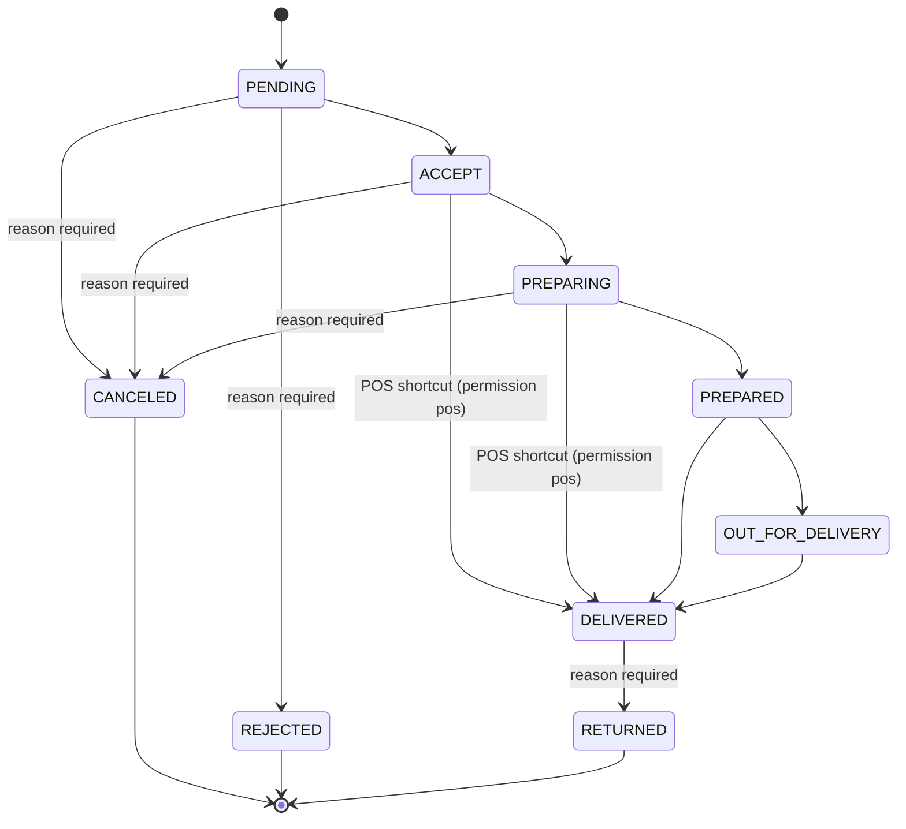

# Flux de Commande (Order Flow) — V1

Ce document décrit le cycle de vie complet d'une commande FoodKing SaaS, de la création par un client à la remise physique, avec les règles strictes de lecture/écriture.

## Source of Truth

**MySQL + `App\Services\OrderService` + `App\Services\FrontendOrderService`** constituent la SOT (Source of Truth). Les appareils locaux (Kiosk, App) ne font qu'émettre des intentions.

**Machine à états** : `App\Domain\Order\OrderStateMachine` (V1) — toute transition doit passer la validation `allows()`. Les routes de modification de statut passent par `App\Rules\ValidStatusTransition` qui délègue à `OrderStateMachine::allows()`.

---

## Diagramme d'états (V1)



### Transitions terminales

`CANCELED`, `REJECTED`, `RETURNED` sont terminaux. Seul un utilisateur `Admin` peut sortir d'un état terminal (correctif opérationnel manuel — audit log systématique).

### Raccourci POS

Un utilisateur authentifié avec la permission `pos` peut transiter `ACCEPT → DELIVERED` ou `PREPARING → DELIVERED` directement (vente comptoir sans passage cuisine).

---

## Table légale explicite

| From              | → To autorisé                                       | Raison requise |
|-------------------|----------------------------------------------------|:--------------:|
| `PENDING` (1)     | `ACCEPT`, `CANCELED`, `REJECTED`                    | sur CANCELED/REJECTED |
| `ACCEPT` (4)      | `PREPARING`, `CANCELED`, `DELIVERED` (POS)          | sur CANCELED |
| `PREPARING` (7)   | `PREPARED`, `CANCELED`, `DELIVERED` (POS)           | sur CANCELED |
| `PREPARED` (8)    | `OUT_FOR_DELIVERY`, `DELIVERED`                     | non |
| `OUT_FOR_DELIVERY`| `DELIVERED`                                         | non |
| `DELIVERED`       | `RETURNED`                                          | oui |
| `CANCELED`        | — (Admin uniquement)                                | — |
| `REJECTED`        | — (Admin uniquement)                                | — |
| `RETURNED`        | — (Admin uniquement)                                | — |

**Total** : 11 transitions non-identité légales (sans-user). L'identité (`from === to`) est toujours autorisée — no-op.

---

## API de la State Machine

```php
use App\Domain\Order\OrderStateMachine;
use App\Enums\OrderStatus;

// Lecture pure — aucune mutation
OrderStateMachine::allows($from, $to, $user);            // bool
OrderStateMachine::assertAllows($from, $to, $user);      // throws IllegalTransitionException
OrderStateMachine::requiresReason($to);                  // bool
OrderStateMachine::legalTransitions();                   // array — toutes paires légales
OrderStateMachine::allStatuses();                        // int[]

// Audit seul (utilisé par les chemins frozen OrderService / FrontendOrderService)
OrderStateMachine::recordTransition($type, $id, $from, $to, $actorId, $reason);

// Mutation atomique guard + persist + audit (chemin préféré pour NEW code)
OrderStateMachine::apply(Model $order, int $next, ?Authenticatable $actor, ?string $reason);
```

### `apply()` — garanties

- **Transaction** : mutation + audit dans le même `DB::transaction`. Si guard échoue, aucun side-effect.
- **Guard reason** : les transitions vers `CANCELED`, `REJECTED`, `RETURNED` requièrent un `reason` non vide, sous peine de `IllegalTransitionException`.
- **Identity no-op** : `apply($order, $order->status, …)` ne fait rien (pas d'audit).
- **Audit actor** : si `$actor` fourni, `actor_id` + `actor_type = 'user'` enregistrés.

---

## Parties prenantes (qui écrit / qui lit)

### 1. Création (`PENDING` = 1)
- **Qui écrit** : Client (Web), Client (Kiosk) via `/api/frontend/order`.
- **Qui lit** : Caissier (POS).
- **Notification** : Push Firebase vers POS + event `OrderCreated` (outbox).

### 2. Validation paiement (`ACCEPT` = 4)
- **Qui écrit** : Caissier (POS) ou `FrontendOrderService::finalizePaidKioskOrder()` (Kiosk auto-accept).
- **Qui lit** : Cuisine (KDS), Client (OSS).
- **Event** : `OrderStatusChanged` (outbox).

### 3. Cuisine (`PREPARING` = 7)
- **Qui écrit** : Cuisinier (KDS).
- **Qui lit** : Client (OSS), Caissier (POS).
- **Interdictions** : Un Kiosk ne peut pas déclencher cet état.

### 4. Prêt (`PREPARED` = 8)
- **Qui écrit** : Cuisinier (KDS).
- **Qui lit** : Caissier, Client (OSS bip + clignotement).

### 5. Livraison (`DELIVERED` = 13)
- **Qui écrit** : Caissier (POS).
- **Qui lit** : Admin (Dashboard/Analytics).

### 6. Terminaux
- `CANCELED` (16) / `REJECTED` (19) : annulation avant remise, raison obligatoire.
- `RETURNED` (22) : retour après livraison, raison obligatoire, Admin only pour re-transition.

---

## Invariants V1

- `OrderStatus` enum est figé. Ajout d'un état = V2+.
- Toute transition passe par `OrderStateMachine::allows()` (validation route) ou `apply()` (domain code).
- Event `order.status_changed` émis **après** commit DB, via outbox (`DomainEvent` + `DispatchDomainEventsJob`).
- Les call sites `OrderService` / `FrontendOrderService` / `KitchenDisplaySystemOrderService` restent dans leur pattern historique (validation rule + mutation + `recordTransition`) — frozen zone V1.

---

## Observabilité

Chaque transition écrit une ligne dans `order_status_transitions` :

```
id | order_id | order_type | from_status | to_status | actor_id | actor_type | reason | correlation_id | occurred_at
```

Index : `(order_id, order_type, occurred_at)` + `occurred_at`. Utilisé pour l'audit métier et le debug support.

## Tests

- `tests/Unit/Domain/Order/OrderStateMachineTest.php` — 77 cas (matrice complète allowed/illegal + raccourci POS + admin override + reason requirement).
- `tests/Feature/Domain/OrderStateMachineApplyTest.php` — 6 cas (rollback sur illegal, audit sur legal, reason required, identity no-op, actor tracking).
