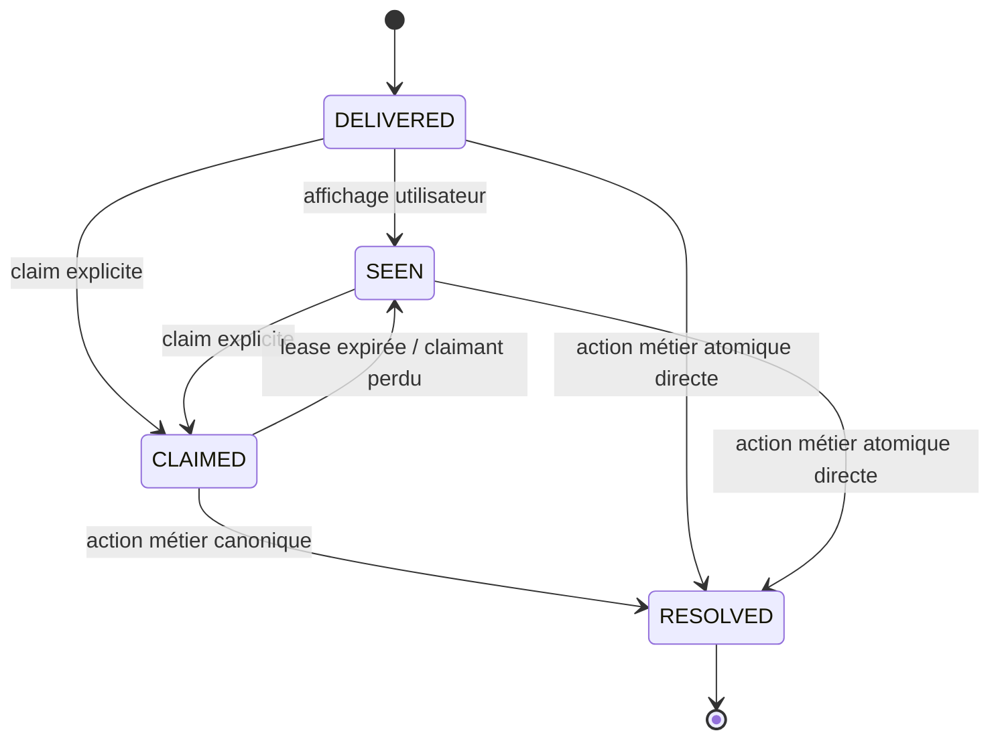

# Operator Inbox & Attention Contract — Proposition V1

**Status:** `PROPOSAL_ONLY — PENDING_HUMAN_GATE`  
**Date:** 2026-08-12  
**Sources:** audit global F-01/F-03/F-05/F-10/F-11, `OrderStateMachine`, `OrderStatus`, `PaymentStatus`  
**Scope:** lecture opératoire commune, actions proposées, attention multi-postes  
**Non-goal:** aucun nouvel `OrderStatus`, aucun prix frontend, aucune migration autorisée par ce document

## 1. Problème résolu par le contrat

Le système expose actuellement plusieurs définitions incompatibles de « commande à traiter ». Le POS, le tracker, le dashboard SLA, la santé, le KDS et l'historique n'emploient ni les mêmes fenêtres temporelles, ni les mêmes plafonds, ni les mêmes horloges. Une nouvelle sidebar branchée sur l'un de ces flux dupliquerait le défaut.

Ce contrat définit une projection de lecture unique et une machine d'attention séparée. Il ne remplace jamais :

- la commande persistée ;
- `OrderStatus` ;
- `PaymentStatus` ;
- `OrderStateMachine` et les policies ;
- les services métier canoniques.

## 2. Principes non négociables

1. L'Inbox est une **projection**, jamais une seconde machine d'état.
2. Toute ligne appartient à un `branch_id` explicite dérivé du modèle serveur.
3. Un administrateur global doit sélectionner une branche avant une mutation ; « toutes branches » est lecture seule par défaut.
4. `actions[]` est un indice UI, pas une autorisation. Toute mutation revalide l'état courant.
5. Aucun total/prix n'est recalculé dans le client.
6. Une erreur réseau conserve la dernière projection avec fraîcheur dégradée ; elle ne produit ni `[]`, ni zéro, ni vert.
7. L'attention est distincte du statut et du paiement.
8. `seen`, `claimed` et `resolved` ont des significations différentes.
9. Les commandes planifiées n'entrent dans l'attention active qu'à `release_at`.
10. Les événements et projections sont émis après commit.

## 3. Ressource `OperatorInboxItemV1`

### 3.1 Identité et version

| Champ | Type | Règle |
| --- | --- | --- |
| `projection_version` | string/int opaque | Change à toute modification visible de la ligne |
| `order_type` | enum serveur | `order` ou famille canonique existante, jamais libre côté client |
| `order_id` | int | ID serveur |
| `correlation_id` | string nullable | Propagation/debug, non utilisé comme autorisation |
| `branch_id` | int | Dérivé de la commande ; obligatoire |
| `source_surface` | enum/version | `pos`, `phone`, `web`, `app`, `kiosk`, `delivery`, intégration explicitement nommée |

### 3.2 État canonique

| Champ | Source |
| --- | --- |
| `order_status` | `App\Enums\OrderStatus` |
| `payment_status` | `App\Enums\PaymentStatus` |
| `payment_method` | enum backend applicable |
| `amounts` | payload serveur déjà calculé, en unités monétaires explicites |
| `is_paid` | dérivé serveur de `PaymentStatus`, jamais reconstitué par label |
| `is_terminal` | dérivé serveur de la state machine |

### 3.3 Temps métier

| Champ | Signification |
| --- | --- |
| `created_at` | création persistée |
| `scheduled_at` | heure demandée par le client/opérateur |
| `release_at` | heure à laquelle production/attention devient actionnable |
| `promised_ready_at` | heure promise si le produit la définit |
| `operational_age_seconds` | âge calculé depuis l'horloge métier appropriée, pas `updated_at` générique |
| `generated_at` | horodatage du snapshot Inbox |

### 3.4 Production et remise

`production_groups[]` contient :

- `logical_station` typée ;
- lignes produit, quantités, modificateurs/notes ;
- indicateurs cuisine/boissons ;
- état de responsabilité/production dérivé ;
- cible d'impression logique si autorisée.

Les boissons doivent être visibles comme groupe/lignes ; elles ne sont jamais réduites à un simple compteur `+N` sans expansion accessible.

### 3.5 Attention et incidents

`attention[]` est une liste par responsabilité :

| Champ | Règle |
| --- | --- |
| `kind` | enum/version, ex. `NEW_WEB_ORDER`, `COUNTER_PAYMENT`, `PRINT_FAILURE` |
| `responsibility` | `counter`, `kitchen`, `drinks`, autre station logique |
| `state` | `DELIVERED`, `SEEN`, `CLAIMED`, `RESOLVED` |
| `generation` | nouvelle valeur pour toute réouverture/escalade distincte |
| `claimed_by` | identité opérateur affichable, branch-scoped |
| `claim_lease_until` | obligatoire si `CLAIMED` |
| `resolved_by_action` | code d'action canonique ou transition qui a résolu |

### 3.6 Actions proposées

Une action contient uniquement :

```json
{
  "code": "ACCEPT_ORDER",
  "action_token": "opaque-short-lived",
  "expected_order_version": "opaque",
  "requires_reason": false,
  "requires_permission": "pos",
  "confirmation_level": "normal"
}
```

Interdictions :

- aucune URL arbitraire fournie par le client ;
- aucun `next_status` libre ;
- aucun montant ou `branch_id` libre dans l'action ;
- aucun token réutilisable sur une autre commande/branche/version.

## 4. Buckets de projection

| Bucket | Définition serveur |
| --- | --- |
| `ACTION_REQUIRED` | action métier ou attention non résolue arrivée à `release_at` |
| `IN_PRODUCTION` | `ACCEPT`/`PREPARING` et réellement libérée |
| `READY_HANDOFF` | `PREPARED` ou état de remise équivalent |
| `UPCOMING` | `scheduled_at/release_at` futur, visible mais non alertable |
| `RECENT_TERMINAL` | terminal récent dans une fenêtre explicitement paramétrée |
| `HISTORICAL_ORPHAN` | état actif ancien hors politique courante, lecture/audit seulement |
| `JANITOR_CANDIDATE` | correspond exactement au prédicat janitor, sans mutation implicite |

Un même item peut porter des tags secondaires, mais possède un bucket primaire déterministe. La projection expose les raisons de classification pour rendre les divergences auditables.

## 5. Matrice minimale d'actions

La table suivante décrit l'intention UI. La décision finale appartient toujours à `OrderStateMachine`, aux permissions et au service métier.

| Statut | Paiement | Contexte | Actions candidates |
| --- | --- | --- | --- |
| `PENDING` | `UNPAID` | web/COD | `ACCEPT_ORDER`, `REJECT_ORDER_WITH_REASON`, `OPEN_DETAIL` |
| `PENDING` | `PAID` | web payé | `ACCEPT_ORDER` ou action canonique équivalente, `REJECT/REFUND` uniquement selon policy manager |
| `PENDING` | `PENDING_COUNTER` | borne/comptoir | `COLLECT_COUNTER_PAYMENT`, `REJECT_ORDER_WITH_REASON`, `OPEN_DETAIL` |
| `ACCEPT` | `UNPAID` | autorisé | `START_PREPARING`, `CANCEL_ORDER_WITH_REASON` selon policy |
| `ACCEPT` | `PAID` | autorisé | `START_PREPARING`; retour/remboursement manager, jamais simple impayé |
| `PREPARING` | tout | cuisine | `MARK_PREPARED`; `CANCEL` seulement si state machine/policy l'autorise |
| `PREPARED` | tout | retrait | `MARK_DELIVERED`, `REPRINT_DOCUMENT`; jamais `CANCEL_ORDER` générique |
| `PREPARED` | tout | livraison | `MARK_OUT_FOR_DELIVERY`, `REPRINT_DOCUMENT` |
| `OUT_FOR_DELIVERY` | tout | livreur assigné | `MARK_DELIVERED` seulement |
| `DELIVERED` | `PAID` | permission retour | `RETURN_WITH_REASON`; remboursement/contre-écriture séparée |
| `CANCELED/REJECTED/RETURNED` | tout | terminal | lecture/reprint audité ; sortie terminale Admin uniquement selon SSOT |

### 5.1 Annulation et paiement

- `PENDING → REJECTED` : refus avant acceptation, raison obligatoire.
- `PENDING/ACCEPT/PREPARING → CANCELED` : uniquement si la state machine et le rôle le permettent.
- `PREPARED` : aucune fausse action Annuler ; remise/livraison ou procédure manager de retour.
- Commande payée : annulation métier et remboursement sont deux effets distincts. La commande ne redevient jamais simplement `UNPAID`.
- CB externe : l'UI rappelle qu'une action TPE externe peut être nécessaire ; FoodKing ne prétend aucun remboursement matériel.

## 6. Protocole de mutation

1. Le client envoie `action_token`, `expected_order_version`, clé d'idempotence et données autorisées telles qu'une raison.
2. Le serveur authentifie utilisateur/device et résout la branche depuis l'ordre.
3. Il vérifie rôle/permission, état, paiement, version et reason.
4. Il appelle le service métier canonique et la state machine.
5. Mutation, audit et résolution d'attention déclarée réussissent dans une transaction cohérente ou échouent ensemble.
6. Les événements/outbox sont dispatchés après commit.
7. Replay identique retourne le même résultat ; contenu différent sous la même clé retourne conflit.
8. Version périmée retourne `409` avec refetch ciblé, jamais transition forcée.

## 7. Machine d'attention



### 7.1 Sémantique sonore

- `DELIVERED`/`SEEN` sans claim valide : salve agrégée toutes les 8–12 secondes selon configuration bornée.
- `CLAIMED` : audio suspendu pour la responsabilité ; visuel et claimant restent visibles sur tous les postes autorisés.
- Lease expirée/leader mort : reprise automatique dans le SLO.
- `RESOLVED` : fin durable de cette génération.
- N commandes : une salve agrégée et compteur, jamais N sons simultanés.
- Audio bloqué : bannière persistante, badge, titre d'onglet et notification système si permise.

Un navigateur suspendu ne peut pas garantir seul l'alarme. Le contrat requiert leader cross-tab avec expiry et prévoit un relais natif/matériel si le SLO terrain ne peut être tenu par le navigateur.

## 8. Lecture, pagination et fraîcheur

### 8.1 Résumé léger

Le premier endpoint/projection renvoie uniquement :

- compte par bucket/responsibility ;
- plus vieille urgence ;
- snapshot/cursor/version ;
- `generated_at`, `last_success_at`, état de fraîcheur.

### 8.2 Pages cursorisées

- tri primaire : urgence/action requise ;
- secondaire : échéance/release ;
- tertiaire : ancienneté + ID stable ;
- aucun `top 100` silencieux ;
- cursor signé/bound à branche, utilisateur/rôle et filtres ;
- changement de branche invalide cache/cursor.

### 8.3 Delta et temps réel

- séquence monotone par feed/branche ;
- gap détecté → catch-up REST cursorisé ;
- au maximum une requête en vol par `{branch, feed, cursor}` ;
- leader cross-tab avec heartbeat/fencing ;
- mutation critique jamais rejouée par un poll coordinator générique.

## 9. Erreurs et mode dégradé

| Incident | Comportement obligatoire |
| --- | --- |
| timeout/5xx lecture | conserver données, marquer `DEGRADED`, horodater, backoff |
| 429 lecture | respecter `Retry-After`, aucune tempête, conserver snapshot |
| 401/403 | verrouiller actions, re-auth ou message permission ; ne pas vider la liste |
| 409 action | afficher changement concurrent et refetch ciblé |
| gap WebSocket | catch-up REST cursorisé |
| audio bloqué | alerte visuelle persistante + activation explicite |
| scheduler/worker inconnu | état `UNKNOWN/DOWN`, jamais zéro vert |

## 10. Isolation de branche et authz

Tests obligatoires :

1. utilisateur A ne lit aucun item B ;
2. cursor/cache/action token A inutilisable sur B ;
3. admin global sans branche sélectionnée ne mute rien ;
4. device/station A ne claim pas responsabilité B ;
5. action forgée avec `branch_id` client est ignorée/rejetée ; branche dérivée du modèle ;
6. même order ID dans des types/tenants différents ne collisionne pas les clés ;
7. payload/cache CDN ne varie jamais insuffisamment par auth/branche.

## 11. Critères d'acceptation du contrat

- [ ] Même jeu d'IDs/comptes pour les mêmes filtres sur POS, tracker et santé.
- [ ] 201 commandes restent toutes cursorisables.
- [ ] Vieille active, future, janitor candidate et historique payé sont distingués.
- [ ] `actions[]` correspond à la state machine et chaque mutation revalide.
- [ ] `PREPARED` n'expose jamais Annuler générique.
- [ ] Cuisine et boissons restent visibles/séparées.
- [ ] Claim temporaire ne vaut ni résolution ni changement de statut.
- [ ] Reload/deuxième poste ne silencient pas une attention non résolue.
- [ ] Expiry/leader mort reprend l'alarme dans le SLO.
- [ ] Zéro fuite de branche dans snapshot, cursor, cache, claim ou action.
- [ ] Panne réseau conserve la dernière vérité et expose sa fraîcheur.

## 12. Gates nécessaires

- contrat projection/routes frozen ;
- migration attention/claims ;
- choix de responsabilité et SLO audio ;
- parité OrderService/FrontendOrderService si action métier touchée ;
- branch isolation ;
- E2E naturel multi-postes ;
- aucun statut Approved ne peut être inscrit par un agent.

**CONTRACT_VERDICT: READY_FOR_HUMAN_REVIEW — NOT AUTHORIZED FOR IMPLEMENTATION**

