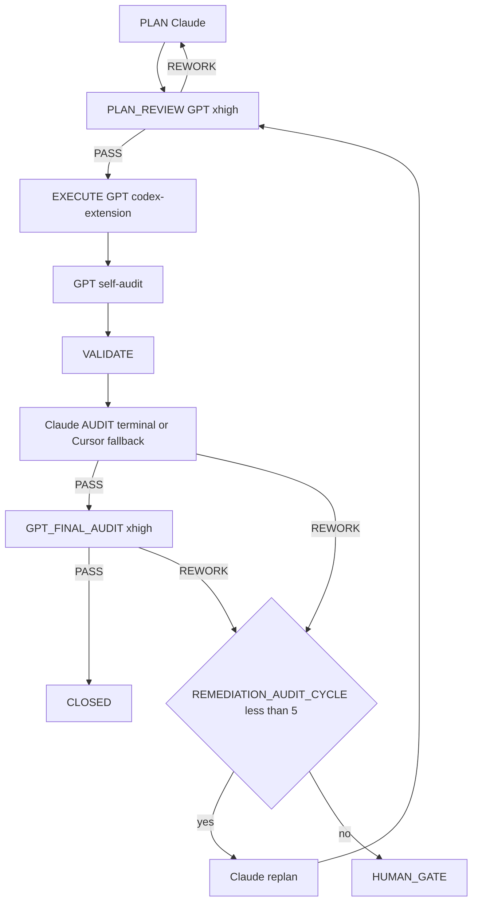

# FoodKing — Primer système global (agents, sous-agents, Graphiti, tokens)

> **Passation + index complet des chemins (SSOT, un seul fichier)** : **`../DOC_EXPO_HER_ANCIEN_AGENT_ALIMENTATION_WORKFLOW_2026-04-22.md`** (table §2 = utilité de chaque path pour une nouvelle session).

> **Fichier d’entrée** pour toute nouvelle conversation, tout nouvel outil d’agent (Cursor, terminal, futur bot), ou tout humain qui reprend le projet.  
> Objectif : **robustesse** = même avec 100 cycles et des exécuteurs différents, le comportement reste **prévisible**, **traçable**, et la **mémoire** reste **alignée** sur le code.

**Obligatoire avant ce Primer (SSOT d’onboarding)** : lire `**AGENTS.md`**, section **Parcours obligatoire** (nouvelle session **et** continuation), puis enchaîner ici.  
**En continuation d’un cycle** : lire d’**abord** `**.cursor/ACTIVE_CYCLE.md`** (éviter un second `TASK_ID` fantôme) ; si `PHASE` = vide ou `CLOSED`, revenir à la table ci-dessous.

---

## 1. Ordre de lecture obligatoire (minimum viable)

Lire **dans cet ordre** avant d’écrire du code ou un plan non trivial (voir aussi `**AGENTS.md` § *Parcours obligatoire* — tableau** pour la même doctrine) :

| #   | Fichier                                                    | Pourquoi                                                                                                                  |
| --- | ---------------------------------------------------------- | ------------------------------------------------------------------------------------------------------------------------- |
| 0   | `**.cursor/ACTIVE_CYCLE.md`** (si reprise)                 | Cycle déjà en cours : même `TASK_ID` / mêmes Steps **jusqu’à** `CLOSE` — **ne pas** forker un plan parallèle sans le dire |
| 1   | `**AGENTS.md`** (dont § *Parcours obligatoire*)            | Contrat global : phases, routing, MCP, terminal, parcours production, non-négociables                                     |
| 1b  | `**docs/orchestration/SESSION_OPENING_ENFORCEMENT.md**`  | **Bloc unique** (tail log + `verify:boucle` + rappel phases) — réduit la répétition « refais la boucle » en session ; **modèle Cursor = Claude pour PLAN** (Auto/Composer ne remplacent pas `routing.md`) |
| 1c  | `**reports/audit/SIMULATION_PARCOURS_PROD_CHECKPOINTS_2026-04-25.md**` | **Simulation production** : checkpoints par phase, fichiers SSOT, limite IDE (qui orchestre quoi) — avant de promettre « zéro dérive » |
| 2   | `**.cursor/routing.md*`*                                   | Qui fait quoi (Claude plan/audit, GPT-5.5-pro xhigh plan review / execute / final audit, Composer validation only)         |
| 3   | `**.cursor/commands/run-cycle.md**`                        | Déroulé exact d’un cycle `TASK_ID` (incl. Graphiti Step 0.5)                                                              |
| 4   | `**.cursor/rules/graphiti-memory.mdc**`                    | Mémoire Graphiti : quand lire / quand écrire                                                                              |
| 5   | `**.cursor/rules/global.mdc**` + `**context-hygiene.mdc**` | Gates, discipline tokens **sans** réduire l’intelligence                                                                  |
| 6   | `**docs/orchestration/MEMORY_MATRIX.md`**                  | **Quel store écrit quoi, lit quoi, quand** (4 stores autorisés A/B/C/D) — antidote unique à la complexité mémoire         |
| 6b  | `**docs/orchestration/MULTI_AGENT_ORCHESTRATION.md`**      | Même tâches, plusieurs onglets Cursor : **activité** + **Graphiti** (lecture) + `AUDIT_VERDICT` — sans empiéter           |
| 7   | `**memory/INDEX.md`**                                      | Carte des domaines mémoire Graphiti (store B) — secours si MCP absent                                                     |
| 8   | `**tasks/[TASK_ID].md**`                                   | Quand un cycle borné est lancé — périmètre de la tâche                                                                    |

Ensuite, **selon le domaine** : `docs/ORDER_FLOW.md`, `docs/DEVICE_FLOW.md`, `docs/ARCHITECTURE.md`, `project-invariants.mdc`, etc.

Référence roster court : `**docs/orchestration/AGENT_ROLES.md`**.

### 1.1 Décision : Claude orchestre ; GPT challenge et exécute en xhigh

- **Cerveau** (priorité, plan, re-plan, gates) : **Claude** (session + terminal `foodking-claude-orchestrate.sh`) — il écrit le plan et tranche la stratégie de remédiation.
- **Challenge plan obligatoire** : **GPT-5.5-pro / xhigh** relit le plan avant EXECUTE (`npm run codex:plan-review -- {TASK_ID}` → `PLAN_REVIEW_VERDICT`). Si `REWORK`, Claude révise avant tout code.
- **Bras + premier contrôle qualité** : **EXECUTE = Codex (PRIMARY)** pour toutes les implémentations produit, même les petites corrections : `npm run codex:complex -- {TASK_ID}` → `reports/audit/GPT_SELF_AUDIT_{TASK_ID}.md`.
- **Pas de routine product implementation** : Composer / `foodking-routine-implementer` ne fait plus d’édition produit en cycle de finition ; il peut aider au reporting/validation seulement.
- **Double audit final** : Claude audit d’abord (`AUDIT_VERDICT`) avec terminal primary + fallback Cursor si quota/rate-limit/terminal HS, puis GPT final audit (`npm run codex:final-audit -- {TASK_ID}` → `GPT_FINAL_AUDIT_VERDICT`). Close seulement si les deux sont `PASS`.

---

## 2. Sous-agents Cursor (Task tool) — intégration dans le flux

Ce ne sont **pas** des fichiers dans le repo ; ce sont des **profils** invoqués par Cursor selon `.cursor/routing.md` et `**run-cycle.md` Step 2**.

| Sub-agent / Canal                                                               | Modèle cible                                                                  | Quand                                                                                                                                                                                                                                          |
| ------------------------------------------------------------------------------- | ----------------------------------------------------------------------------- | ---------------------------------------------------------------------------------------------------------------------------------------------------------------------------------------------------------------------------------------------- |
| `**foodking-routine-implementer`** (sub-agent Cursor)                           | Composer                                                                      | **Validation/report only** en cycles de finition. Pas d’implémentation produit.                                                                                                                                             |
| `**codex-extension` — FoodKing Codex Complex Implementer (PRIMARY)**            | **GPT-5.5-pro / xhigh** via CLI `codex` (compte **ChatGPT Pro**) + `codex exec` | **PLAN_REVIEW + toute implémentation produit + auto-audit + GPT_FINAL_AUDIT**. `npm run codex:complex -- {TASK_ID}`. Voir `scripts/codex-extension-execute.sh`, `agents/codex-extension-instructions.md`. |
| `**foodking-complex-implementer`** (sub-agent Cursor — **FALLBACK uniquement**) | Aligné exécution **GPT-5.5** (emplacement sub-agent)                          | Uniquement si `codex` / `codex exec` est indisponible après reprises sur la même tâche                                                                                                                                                         |

**Règles d'or**

1. **Délégation obligatoire** pour toute modification produit en EXECUTE, avec trace `EXECUTE_DELEGATION:` dans le log de validation. Valeurs autorisées : `codex-extension` | `foodking-complex-implementer (codex-extension-fallback)` | `explicit-prompt-bind`.
2. **EXECUTE = `codex-extension` PRIMAIRE** (CLI `codex` + Pro, `npm run codex:complex -- {TASK_ID}` ; contexte Graphiti/plan dans `missions/…/graphiti_context.md` etc. ; voir `**docs/orchestration/CODEX_API_DELEGATION.md`**). Le sub-agent `foodking-complex-implementer` est le **fallback** (usage Cursor) — indispo `codex exec`. Aucun **connecteur HTTP** / proxy n’est maintenu dans le dépôt.
3. Le sous-agent **ne voit pas toujours** le MCP Graphiti du parent : le plan **doit** contenir `**## PRIOR_CONTEXT`** (faits Graphiti + invariants) — copier ou résumer dans le message de délégation **ou** dans `missions/{TASK_ID}/graphiti_context.md` pour l’appel API.
4. Aucun sub-agent ne **contourne** un gate humain ni n’édite une frozen zone sans `docs/gates/` approuvé.

---

## 3. Terminal allies (hors Task tool) — intégration

Documentés dans `**AGENTS.md` § Terminal allies** :

| Outil                                                                  | Rôle                                                                     | Position + **canal d’abonnement** (SSOT)                                                                                                                                                                                         |
| ---------------------------------------------------------------------- | ------------------------------------------------------------------------ | -------------------------------------------------------------------------------------------------------------------------------------------------------------------------------------------------------------------------------- |
| `**claude` +** `foodking-claude-orchestrate.sh`                        | **AUDIT cycle — PRIMARY (Step 5)** : `context` → `audit` / `audit-brief` | Abonnement **Anthropic (CLI sur terminal)** ; n’**emprunte** pas l’orchestrateur de modèles de Cursor. **FALLBACK actif** (quota / limite / panne après 1 retry) : Task **`foodking-planner-orchestrator`** + même checklist + `AUDIT_CHANNEL: cursor-session` + `AUDIT_FALLBACK_REASON:` — `docs/orchestration/AUDIT_TERMINAL_QUOTA_FALLBACK.md`. |
| **CLI** `codex` + `npm run codex:complex` (`**codex-extension`**, Pro) | **PLAN_REVIEW + EXECUTE + GPT_FINAL_AUDIT — PRIMARY** (GPT-5.5-pro/xhigh) | Compte **ChatGPT Pro** sur le terminal ; ne passe **pas** par l’orchestrateur de modèles **Cursor** ; facturation côté OpenAI ; **FALLBACK** = sub-agent.     |
| `codex` / REPL interactif (OpenAI)                                     | Tâches ad hoc **hors** cycle, ou côté humain                             | N’enlèvent **pas** VALIDATE + AUDIT du `run-cycle`.                                                                                                                                                                              |
| `verify-orchestration-boucle.sh`                                       | Preuve binaire + optionnel smoke (API)                                   | `bash scripts/verify-orchestration-boucle.sh` — `VERIFY_BILLING_FULL=1` lance 1× smoke `claude` + 1× `npm run codex:smoke`.                                                                                                      |

**Clôture :** l’audit Claude écrit `AUDIT_VERDICT: PASS` ou `REWORK`, puis GPT écrit `GPT_FINAL_AUDIT_VERDICT: PASS|REWORK|ESCALATE` (voir `run-cycle.md` Step 5). Pas de `CLOSED` sans double `PASS`. En `REWORK` : re-orchestration + re-EXECUTE GPT jusqu’à double `PASS` ou 5e tour → humain. Schéma :

Le terminal **n’enregistre** pas **Graphiti** seul : après AUDIT/CLOSE, décisions → JSONL + `after-execute-memory.sh` (voir §5) comme avant.

---

## 4. Graphiti — vivre avec l’avancement du projet (N agents, N cycles)

### 4.1 Rôles

| Rôle                                    | Responsable                                                          |
| --------------------------------------- | -------------------------------------------------------------------- |
| **Lecture** avant plan / audit complexe | Tout agent avec MCP `graphiti` chargé                                |
| **Écriture** après décision durable     | Phase AUDIT + CLOSED (`audit-context.md`) ou humain via `add_memory` |
| **Alimentation batch** (JSONL → Neo4j)  | Humain ou pipeline : `bash bin/graphiti-ingest.sh`                   |

### 4.2 Quand mettre à jour la mémoire (checklist — « ne pas oublier »)

Cocher mentalement à **chaque** fin de sujet significatif :

- **Invariant** clarifié ou renforcé → nouvelle ligne dans `memory/episodes/02_architecture_invariants.jsonl` (ou fichier le plus proche) + `ingest` ciblé.
- **Sync / event / canal** modifié → `03_domain_events_sync.jsonl` + ingest.
- **Décision produit / ADR** → `12_decisions_log.jsonl` + ingest.
- **Nouvelle tâche V14+** ou finding cross-vagues → `09_tasks_history.jsonl` + ingest.
- **Changement prod / rollout** → `11_production_plan.jsonl` + ingest.
- **Nouveau rôle agent ou règle d’orchestration** → `13_agents_roles.jsonl` + ingest + **mettre à jour ce Primer** si le modèle change.
- **Audit long (ops + agentique + mémoire)** → suivre `docs/orchestration/MEGA_CHECKLIST_AUTONOMY_AND_MEMORY.md` (180 tâches) ; narratif `reports/audit/MEGA_AUDIT_SYSTEM_OPERATION_AGENTIC_2026-04-23.md`.
- **Après toute écriture JSONL** → `bash scripts/after-execute-memory.sh` (rafraîchit `reports/memory/jsonl_manifest.json`, cohérent avec CI) puis `bin/graphiti-ingest.sh` sur les domaines touchés.

**Règle d’or** : si le code ou la doc **canonical** a changé et que la mémoire dit encore l’ancienne vérité → **mise à jour sous 48 h** (sinon dérive silencieuse).

### 4.3 Outils

- Pipeline post-écriture (manifeste + rappel ingest) : `bash scripts/after-execute-memory.sh`.
- Ingestion : `bin/graphiti-ingest.sh [filtre]` — voir `memory/README.md`.
- Vérification : `python3 memory/verify.py`.
- Terminal (bref + audit option) : `bash scripts/foodking-claude-orchestrate.sh post-execute` ou `context` puis `audit-brief` — `docs/orchestration/TERMINAL_CLAUDE_GRAPHITI_ORCHESTRATION.md`.
- Reset rare : `@graphiti clear_graph` puis full ingest (politique humaine).

---

## 5. Tokens, contexte, cache — politique « intelligence max, gaspillage min »

**But** : réponses **détaillées et stables**, pas des réponses courtes pour économiser des tokens au détriment de la qualité.

| On optimise (effet ≥ 0)                                                              | On n’optimise pas (effet négatif interdit)                               |
| ------------------------------------------------------------------------------------ | ------------------------------------------------------------------------ |
| Re-lire un fichier **déjà** dans la fenêtre contexte                                 | Tronquer un plan, une analyse de risque, ou un gate pour « faire court » |
| Résumer une phase **terminée** pour handoff (voir `context-hygiene.mdc` §4)          | Supprimer `## PRIOR_CONTEXT` ou les invariants du plan                   |
| Utiliser **Graphiti** pour récupérer faits structurés au lieu de rouvrir 50 rapports | Désactiver Graphiti pour « aller plus vite » sur du sync / fiscal        |
| Écrire les preuves dans `reports/` structuré                                         | Remplacer des tests par de la prose vague                                |

**Cache applicatif** (Redis, etc.) : régie par le code Laravel et `**app:preflight-production`** — hors scope de ce Primer, mais **ne jamais** confondre « cache métier » et « mémoire Graphiti » : ce sont deux systèmes.

---

## 6. Révision de ce document

- **À chaque** changement majeur d’orchestration (nouveau sub-agent, nouveau MCP, nouveau cycle obligatoire) : mettre à jour **ce fichier** + une ligne dans `13_agents_roles.jsonl` + ingest.
- **Trimestriel** : relire §4.2 avec un lead dev.

---

## 7. Pointers rapides

| Besoin                                                        | Aller à                                                           |
| ------------------------------------------------------------- | ----------------------------------------------------------------- |
| Cycle complet                                                 | `.cursor/commands/run-cycle.md`                                   |
| Gates                                                         | `.cursor/rules/human-gates.mdc`                                   |
| Invariants code                                               | `.cursor/rules/project-invariants.mdc`                            |
| Mémoire locale                                                | `memory/INDEX.md`                                                 |
| Pannes Graphiti                                               | `.cursor/mcp/GRAPHITI_TROUBLESHOOTING.md`                         |
| Closeout prod + mémoire                                       | `plans/PLAN_EXECUTION_CLOSEOUT_GRAPHITI_CI_PROD_2026-04-22.md`    |
| Méga-checklist autonomie / Graphiti                           | `docs/orchestration/MEGA_CHECKLIST_AUTONOMY_AND_MEMORY.md`        |
| Méga-audit narratif (compagnon)                               | `reports/audit/MEGA_AUDIT_SYSTEM_OPERATION_AGENTIC_2026-04-23.md` |
| Audit graphique workflow                                      | `docs/orchestration/WORKFLOW_AUDIT_GRAPHIQUE_2026-04-23.md`       |
| Terminal Claude + Graphiti (rôles, `context` / `audit-brief`) | `docs/orchestration/TERMINAL_CLAUDE_GRAPHITI_ORCHESTRATION.md`    |
| Matrice routine / complexe (sub-agents)                       | `docs/orchestration/ROUTING_MATRIX.md`                            |
