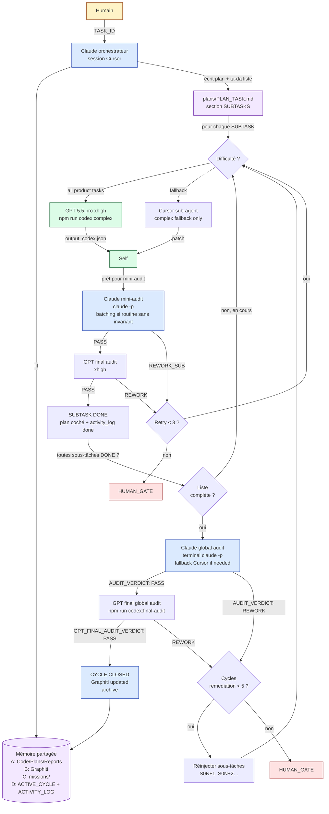
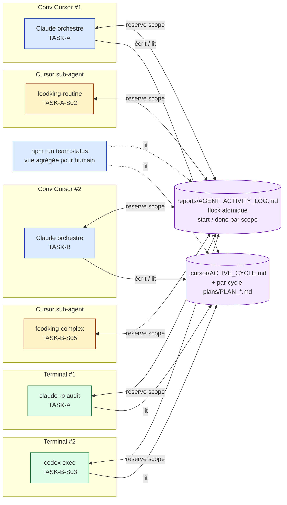

# Team Workflow — comment l'équipe d'agents FoodKing fonctionne

> Ce document existe pour **toi, humain**. Il décrit la logique d'équipe en langage clair,
> sans script. La doctrine technique vit ailleurs (`AGENTS.md`, `MEMORY_MATRIX.md`, `run-cycle.md`).
> Ici, on dit **qui fait quoi, dans quel ordre, et comment ils restent synchronisés**.

---

## 1. L'équipe (qui)

| Membre | Rôle | Outil sous-jacent |
|---|---|---|
| **Claude (chef d'orchestre)** | Lit le contexte, écrit le plan détaillé, découpe en **ta-da liste**, audite chaque livraison, audite l'ensemble à la fin, décide de boucler ou de fermer. | Session Cursor (PLAN) + Claude Code CLI terminal (AUDIT), fallback Cursor si quota/rate-limit/terminal HS. |
| **Codex GPT-5.5 pro (xhigh)** | Relit le plan, implémente toutes les sous-tâches produit, s’auto-audite, puis fait le second avis final. | `npm run codex:plan-review`, `npm run codex:complex`, `npm run codex:final-audit`. Abonnement ChatGPT Pro. |
| **Sub-agents Cursor** (`foodking-planner-orchestrator`, `foodking-complex-implementer`) | Fallback audit Claude côté Cursor ou fallback exécution GPT si Codex CLI indisponible. | `Task` tool dans la session. Compte Cursor. |
| **Toi (humain)** | Décides du `TASK_ID`, valides les gates, lis le **dashboard**. | Terminal + IDE. |

---

## 2. La mémoire partagée (où ils lisent / écrivent — MEMORY_MATRIX.md)

Aucun agent n'a un cerveau LLM partagé (impossible). Mais ils ont une **mémoire fichier partagée**, identique pour tous.

| Store | Usage | Qui écrit | Qui lit |
|---|---|---|---|
| **A — Code** (`docs/`, `scripts/`, `plans/`, `reports/`) | Vérité du dépôt | Tous | Tous |
| **B — Graphiti + JSONL** (`memory/episodes/*.jsonl` + Neo4j MCP) | **Décisions durables uniquement** (ADR, invariants, fin de cycle) | Tous **après AUDIT** | Tous **avant PLAN** |
| **C — Missions** (`missions/${TASK_ID}/` et `missions/${TASK_ID}/subtasks/SNN/`) | Briefs/inputs/outputs **par sous-tâche** + audits GPT | Codex / Claude (orchestrateur) | Tous |
| **D — Reports/Plans** (`plans/`, `reports/`, `.cursor/ACTIVE_CYCLE.md`, `reports/AGENT_ACTIVITY_LOG.md`) | **Statuts opérationnels** + audits Claude + procédural cross-agent | Tous (selon phase) | Tous |

> **Règle d'or** : Graphiti reçoit **les décisions** (« on a tranché : X »), **pas** les micro-statuts (« sous-tâche S03 en cours »). Sinon Graphiti devient illisible.

**Synchronisation procédurale cross-agent** : `reports/AGENT_ACTIVITY_LOG.md` (append-only, atomic via `flock`).
Chaque agent **réclame** son scope (`agent-activity-log.sh start`) et **libère** (`done`). Refus si collision.

---

## 3. Le rituel par sous-tâche (la "ta-da liste")

Chaque sous-tâche a un **`SUBTASK_ID` stable** : `${TASK_ID}-S01`, `-S02`, …
Et passe par cette **machine d'état** :

```
TODO → PLAN_REVIEWED → CLAIMED → EXECUTED_BY_GPT → GPT_SELF_AUDITED → CLAUDE_MINI_PASS → GPT_FINAL_PASS → DONE
                                                                      └→ CLAUDE_MINI_REWORK/GPT_FINAL_REWORK → RETRY (max 3) → HUMAN_GATE
```

| Étape | Acteur | Quoi | Sortie |
|---|---|---|---|
| 1. **Pioche** | Claude (orchestrateur) | Lit la table SUBTASKS du plan, prend la 1re `TODO`. Vérifie `PHASE = EXECUTE`. | `SUBTASK_ID` choisi |
| 2. **Lock** | `team-run-task.sh` | `agent-activity-log.sh start` sur le scope de la sous-tâche. Refus si déjà `CLAIMED`. | `CLAIMED` |
| 3. **Route** | `team-run-task.sh` | Toute difficulté → GPT-5.5-pro/xhigh via `codex-extension`; fallback `foodking-complex-implementer` seulement si Codex CLI indisponible. | exécution lancée |
| 4. **Implémente** | Codex / fallback | Écrit le code dans le scope. Génère `output_codex.json`. | `EXECUTED_BY_GPT` |
| 5. **Auto-audit GPT** | Wrapper Codex (déjà existant) | Génère `GPT_SELF_AUDIT_${TASK}_${SUBTASK_ID}.md`. | `GPT_SELF_AUDITED` |
| 6. **Mini-audit Claude** | `team-audit-subtask.sh` (`claude -p`, fallback Cursor si besoin) | Lit plan + diff + GPT audit. Verdict `PASS` / `REWORK_SUB` / `ESCALATE`. | `CLAUDE_MINI_PASS` ou `CLAUDE_MINI_REWORK` |
| 7. **GPT final par sous-tâche/lot** | `codex:final-audit` ou audit GPT du lot | Second avis final sur la sous-tâche ou le lot. | `GPT_FINAL_PASS` ou `GPT_FINAL_REWORK` |
| 8. **Décision** | `team-run-task.sh` | Double PASS → marque `DONE` dans le plan + `agent-activity-log done`. `REWORK_SUB` / `GPT_FINAL_REWORK` → retry (max 3) → `HUMAN_GATE` au 3e. | sous-tâche bouclée |

> Tu peux tout faire **manuellement** via `npm run team:run -- ${TASK_ID} ${SUBTASK_ID}`.
> Tu peux voir l'état en temps réel via `npm run team:status`.

---

## 4. Le rituel global (quand toute la liste est cochée)

| Étape | Acteur | Quoi | Sortie |
|---|---|---|---|
| 9. **Audit global Claude** | `team-audit-global.sh` (= `foodking-claude-orchestrate.sh audit`) | Lit le plan complet + tous les outputs + tous les mini-audits. Verdict `PASS` / `REWORK`. | `AUDIT_VERDICT:` |
| 10. **Audit global GPT** | `npm run codex:final-audit -- <TASK_ID>` | Second avis final global. | `GPT_FINAL_AUDIT_VERDICT:` |
| 11a. **Double PASS** | Claude orchestrateur | Marque le plan `Passed`, log `done`, archive cycle. Met à jour Graphiti (décision durable). | `CLOSED` |
| 11b. **REWORK** | Claude orchestrateur | Réinjecte de nouvelles sous-tâches (`-S08`, `-S09`…) dans la table. Boucle `REMEDIATION_AUDIT_CYCLE` (max **5** tours). Au 5e échec → `HUMAN_GATE`. | retour étape 1 |

**Distinction critique** :
- `REWORK_SUB` (étape 6) = défaut **dans une sous-tâche** → max **3 retries locaux**.
- `REMEDIATION_AUDIT_CYCLE` (étape 9b) = défaut **dans l'audit global** → max **5 cycles entiers**.

---

## 5. Multi-agents en parallèle (6 conv simultanées + sub-agents)

C'est explicitement supporté. Comment l'éviter qu'ils se marchent dessus :

1. **Au démarrage de chaque session** : `npm run session:open` — affiche `ACTIVE_CYCLE`, `AGENT_ACTIVITY_LOG tail`, et la check-list discipline.
2. **Avant tout write** : `agent-activity-log.sh start` (atomique via `flock`). Refus = collision → re-planifier sur scope disjoint.
3. **Pendant** : chacun voit l'avancement des autres via `team:status` (lit `AGENT_ACTIVITY_LOG` + `ACTIVE_CYCLE`).
4. **À la fin** : `agent-activity-log.sh done`. Les autres voient le scope libéré.

> Cas d'usage : 2 conv Cursor simultanées + 1 codex-extension + 1 claude-terminal = équipe à 4. Chacun sait ce que les autres font, sans cerveau partagé.

---

## 6. Vue d'ensemble — le diagramme équipe



---

## 7. Vue parallèle — 6 agents simultanés



---

## 8. Commandes humaines (que tu peux retenir)

| Commande | Quand | Effet |
|---|---|---|
| `npm run session:open` | Au début de chaque session | Affiche cycle actif, log, check-list |
| `npm run team:status` | À tout moment | Dashboard équipe (sous-tâches, owners, status) |
| `npm run team:run -- TASK_ID SUBTASK_ID` | Pour exécuter une sous-tâche manuellement | Lock + route difficulté + impl + auto-audit GPT + mini-audit Claude |
| `npm run team:audit:sub -- TASK_ID SUBTASK_ID` | Pour ré-auditer une sous-tâche après fix | Mini-audit Claude isolé |
| `npm run team:audit:global -- TASK_ID` | Quand toute la liste est cochée | Audit global Claude terminal + verdict PASS/REWORK |
| `run-cycle TASK_ID` | Pour lancer/reprendre un cycle borné | Cycle structuré PLAN Claude → PLAN_REVIEW GPT → EXECUTE GPT → VALIDATE → AUDIT Claude → GPT_FINAL_AUDIT → CLOSE |

---

## 9. Garanties (zéro-faute en 3 couches)

1. **Doctrinale** — `AGENTS.md`, `.cursor/rules/*.mdc`, `MEMORY_MATRIX.md`, ce doc.
2. **Procédurale** — `run-cycle.md`, `SESSION_OPENING_ENFORCEMENT.md`, `team-run-task.sh`.
3. **Mécanique** — `agent-activity-log.sh` (`flock`), `preflight-execute.sh`, `post-execute-guard.sh`,
   machine d'état SUBTASK qui refuse `DONE` sans `CLAUDE_MINI_PASS`.

Si une couche faillit, les deux autres tiennent. Si les 3 faillissent, **HUMAN_GATE**.
