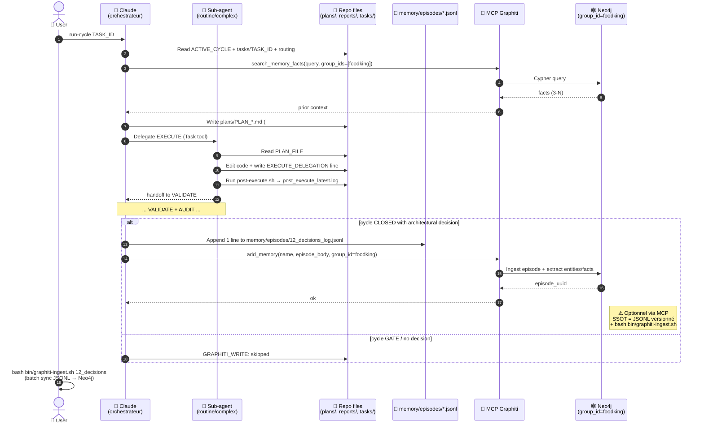

# Audit massif workflow FoodKing — chemin graphique
**Date** : 2026-04-23
**Objet** : Cartographier le cycle borné PLAN→EXECUTE→VALIDATE→AUDIT, identifier les nœuds non-instrumentés, proposer un durcissement priorisé.
**Compagnon** : 
  - `docs/orchestration/MEGA_CHECKLIST_AUTONOMY_AND_MEMORY.md` (180 tâches)
  - `reports/audit/MEGA_AUDIT_SYSTEM_OPERATION_AGENTIC_2026-04-23.md` (audit narratif)
**Sources lues** :
  - `.cursor/commands/run-cycle.md`
  - `.cursor/routing.md`
  - `.cursor/context/plan-context.md`
  - `.cursor/context/execute-context.md`
  - `.cursor/context/audit-context.md`

## 1. Vue d'ensemble (texte court)

Le cycle **borné** relie une intention (`TASK_ID` via `run-cycle`) à une fermeture traçable : **PLAN** produit l’artefact plan, **EXECUTE** implémente uniquement le périmètre déclaré via délégation explicite vers un sous-agent, **post-hook** enchaîne des sentinels shell, **VALIDATE** exécute la stratégie de tests du plan, **AUDIT** compare livrable et invariants avant **CLOSED** ou **GATE**.

Les acteurs principaux sont l’**orchestrateur** (rôle plan/audit, lecture Graphiti en amont, écriture mémoire en aval de décision), les **sous-agents** routés (routine vs complexe selon `PRIMARY_MODEL` / `routing.md`), le **MCP Graphiti** pour rappel de faits et épisodes, et l’**humain** pour les gates, l’ingest batch JSONL→Neo4j, et toute action hors périmètre machine.

Les artefacts charpentent le fil : `ACTIVE_CYCLE.md`, `tasks/TASK_ID.md`, `plans/PLAN_*.md` (évent. `## PRIOR_CONTEXT`), logs `RUN_*.md` / `REPORT_FILE` avec `EXECUTE_DELEGATION:`, `post_execute_latest.log`, puis clôture ou fichier `docs/gates/GATE_*.md`.

**Graphiti** sert de mémoire structurée : recherche de contexte avant le plan, et persistance ciblée des décisions architecturales en fin de cycle (avec SSOT versionné côté `memory/episodes/*.jsonl` et ingest manuel fréquent).

Les **gates humains** interrompent le flux quand la doc ou l’audit exigent une décision produit, une zone gelée, ou un arbitrage de risque : le graphe d’erreur montre la convergence vers `GATE_TASK_DATE.md` et l’attente explicite d’une action humaine avant reprise.

## 2. Diagramme — Workflow nominal complet

```mermaid
flowchart TD
    USER([👤 USER: run-cycle TASK_ID]):::user

    USER --> S0
    S0[/"<b>Step 0 — Pre-flight</b><br/>Claude orchestrator"/]:::claude

    S0 --> R0a[Read .cursor/ACTIVE_CYCLE.md]:::file
    R0a --> Q0a{RUNNER_MODE?}:::decision
    Q0a -->|missing| HALT0([🛑 HALT: RUNNER_MODE not set]):::halt
    Q0a -->|single-session<br/>or manual| Q0b{Gate open?}:::decision
    Q0b -->|yes| HALT0b([🛑 HALT: gate file]):::halt
    Q0b -->|no| MCP0[/"📚 MCP Graphiti<br/>search_memory_facts<br/>group_id=foodking"/]:::graphiti
    MCP0 --> S1

    S1[/"<b>Step 1 — PLAN</b><br/>Claude only"/]:::claude
    S1 --> R1a[Load .cursor/context/plan-context.md]:::file
    R1a --> R1b[Read tasks/TASK_ID.md + routing.md]:::file
    R1b --> Q1a{Graphiti facts<br/>returned ?}:::decision
    Q1a -->|yes| W1a[Write ## PRIOR_CONTEXT<br/>2-5 lignes max]:::artifact
    Q1a -->|no| W1b[skip PRIOR_CONTEXT]:::artifact
    W1a --> W1c[/"📝 Produce plans/<br/>PLAN_TASK_DATE.md"/]:::artifact
    W1b --> W1c
    W1c --> Q1b{Scope ambigu<br/>OR frozen zone<br/>OR gate prévu ?}:::decision
    Q1b -->|yes| HALT1([🛑 HALT]):::halt
    Q1b -->|no| U1[Update ACTIVE_CYCLE<br/>PHASE → EXECUTE]:::artifact
    U1 --> Q1c{RUNNER_MODE ?}:::decision
    Q1c -->|manual| WAIT1([⏸️ Awaiting user 'continue']):::wait
    Q1c -->|single-session| S2

    S2[/"<b>Step 2 — EXECUTE</b><br/>DELEGATION MANDATORY"/]:::execute
    S2 --> Q2a{PRIMARY_MODEL ?}:::decision
    Q2a -->|GPT-5.4| SA1([🤖 foodking-complex-<br/>implementer]):::subagent
    Q2a -->|Composer| SA2([🤖 foodking-routine-<br/>implementer]):::subagent
    SA1 --> R2a[Read PLAN_FILE]:::file
    SA2 --> R2a
    R2a --> Q2b{ESCALATION /<br/>SCOPE_PRESSURE<br/>unresolved ?}:::decision
    Q2b -->|yes| HALT2([🛑 HALT: dev action]):::halt
    Q2b -->|no| Q2c{Files in plan<br/>SUBSYSTEMS_TOUCHED<br/>only ?}:::decision
    Q2c -->|no| ESC2[Log ESCALATION → halt]:::halt
    Q2c -->|yes| IMPL[Implement Execution Steps<br/>NO scope expansion]:::execute
    IMPL --> Q2d{OrderService /<br/>FrontendOrderService<br/>touched ?}:::decision
    Q2d -->|yes| SYM[Log SYMMETRY_NOTE]:::artifact
    Q2d -->|no| W2a
    SYM --> W2a[/"📝 Write line:<br/>EXECUTE_DELEGATION:<br/>name-of-subagent"/]:::artifact
    W2a --> U2[Update ACTIVE_CYCLE<br/>PHASE → VALIDATE]:::artifact
    U2 --> S3

    S3[/"<b>Step 3 — Post-hook</b>"/]:::hook
    S3 --> H3[Run .cursor/hooks/post-execute.sh]:::hook
    H3 --> W3[reports/post_execute_latest.log]:::artifact
    W3 --> Q3{Exit 0 ?}:::decision
    Q3 -->|no| HALT3([🛑 HALT: review log]):::halt
    Q3 -->|yes| S4

    S4[/"<b>Step 4 — VALIDATE</b><br/>Composer"/]:::composer
    S4 --> R4[Read post_execute_latest.log]:::file
    S4 --> T4[Run test strategy from plan<br/>local-validation /<br/>playwright-* / etc.]:::execute
    T4 --> Q4a{Only declared<br/>subsystems<br/>touched ?}:::decision
    Q4a -->|no| FAIL4[VALIDATE FAIL]:::halt
    Q4a -->|yes| Q4b{EXECUTE_DELEGATION:<br/>line present in log ?}:::decision
    Q4b -->|no AND code changed| FAIL4
    Q4b -->|yes OR no-code-change| Q4c{Tests pass ?}:::decision
    Q4c -->|no| FAIL4
    Q4c -->|yes| OK4[Update ACTIVE_CYCLE<br/>PHASE → AUDIT]:::artifact
    FAIL4 --> Q4d{2× consecutive fail<br/>WITHOUT intervening<br/>AUDIT remediation ?}:::decision
    Q4d -->|yes| HALT4([🛑 HALT: 2× VALIDATE]):::halt
    Q4d -->|no| S5
    OK4 --> S5

    S5[/"<b>Step 5 — AUDIT</b><br/>Claude"/]:::claude
    S5 --> R5[Load audit-context.md<br/>+ REPORT_FILE + PLAN_FILE]:::file
    S5 --> CHK[Checklist: Scope ·<br/>Invariants · Symmetry/<br/>Dispatch · Validation ·<br/>EXECUTE_DELEGATION line]:::execute
    CHK --> Q5a{All checks<br/>pass ?}:::decision
    Q5a -->|yes| PASS5[Audit: PASSED]:::ok
    Q5a -->|no| Q5b{Critical zone OR<br/>3rd consecutive bug<br/>same signature ?}:::decision
    Q5b -->|yes| GATE[/"📋 Write docs/gates/<br/>GATE_TASK_DATE.md"/]:::halt
    Q5b -->|no — attempt 1-2| REMED[/"🔁 REMEDIATION_ATTEMPT_N<br/>append to REPORT_FILE"/]:::loop
    REMED -.->|re-route per<br/>routing.md| S2
    GATE --> ENDGATE([🚪 PHASE → GATE<br/>human action]):::halt
    PASS5 --> CLOSE[ACTIVE_CYCLE<br/>PHASE → CLOSED + archive]:::artifact
    CLOSE --> Q5c{Architectural<br/>decision in cycle ?}:::decision
    Q5c -->|yes| GW[/"📚 MCP add_memory<br/>1 episode per decision<br/>group_id=foodking"/]:::graphiti
    Q5c -->|no| END([✅ CLOSED]):::ok
    GW --> END

    classDef user fill:#fde68a,stroke:#92400e,color:#000
    classDef claude fill:#dbeafe,stroke:#1e40af,color:#000
    classDef composer fill:#dcfce7,stroke:#166534,color:#000
    classDef subagent fill:#fef3c7,stroke:#a16207,color:#000
    classDef execute fill:#fce7f3,stroke:#9f1239,color:#000
    classDef hook fill:#e0e7ff,stroke:#4338ca,color:#000
    classDef graphiti fill:#cffafe,stroke:#0e7490,color:#000
    classDef file fill:#f3f4f6,stroke:#4b5563,color:#000
    classDef artifact fill:#ecfccb,stroke:#3f6212,color:#000
    classDef decision fill:#fef9c3,stroke:#854d0e,color:#000
    classDef halt fill:#fecaca,stroke:#991b1b,color:#000
    classDef wait fill:#fed7aa,stroke:#c2410c,color:#000
    classDef loop fill:#ddd6fe,stroke:#6d28d9,color:#000
    classDef ok fill:#bbf7d0,stroke:#15803d,color:#000
```

## 3. Diagramme — Séquence Graphiti (mémoire)

## 4. Diagramme — Branches d'erreur, gates, remédiation

```mermaid
flowchart LR
    subgraph HALTS[🛑 Hard Halts — any phase]
        H1[Gate brief required]
        H2[Ambiguity unresolvable]
        H3[Unresolved ESCALATION]
        H4[post-execute.sh failed]
        H5[2× VALIDATE fail<br/>w/o AUDIT remediation]
        H6[3rd attempt same bug_signature]
        H7[Manual UX test required]
        H8[Product decision required]
        H9[Invariant violation]
    end

    subgraph TRIAGE[Audit triage on FAIL]
        T1{Critical zone ?<br/>auth · schema · frozen ·<br/>Order/Frontend symmetry ·<br/>branch_id · OrderStatus ·<br/>dispatch-after-commit ·<br/>pricing SSOT}
        T2{3rd consecutive<br/>same bug_signature ?}
        T3[REMEDIATION<br/>auto · no human]
    end

    subgraph GATEFLOW[Gate flow]
        G1[Write docs/gates/<br/>GATE_TASK_DATE.md]
        G2[ACTIVE_CYCLE.md<br/>PHASE → GATE +<br/>GATE_FILE set]
        G3([⏸️ HUMAN ACTION<br/>required])
        G4{Human decision ?}
        G4 -->|approve| G5[Update gate file<br/>+ resume cycle]
        G4 -->|reject| G6[Re-plan or close]
    end

    subgraph REMEDFLOW[Remediation flow]
        R1[Append REMEDIATION_ATTEMPT_N<br/>to REPORT_FILE]
        R2[bug_signature ·<br/>root_cause ·<br/>correction_plan]
        R3[Re-route per routing.md]
        R4[Re-run EXECUTE → post-hook<br/>→ VALIDATE → AUDIT]
        R5{N ≥ 3 same signature ?}
        R5 -->|yes| G1
        R5 -->|no| OK([Continue cycle])
    end

    T1 -->|yes| G1
    T1 -->|no| T2
    T2 -->|yes| G1
    T2 -->|no| T3
    T3 --> R1
    R1 --> R2 --> R3 --> R4 --> R5
    G1 --> G2 --> G3 --> G4

    classDef halt fill:#fecaca,stroke:#991b1b,color:#000
    classDef triage fill:#fef9c3,stroke:#854d0e,color:#000
    classDef gate fill:#fed7aa,stroke:#c2410c,color:#000
    classDef remed fill:#ddd6fe,stroke:#6d28d9,color:#000
    classDef ok fill:#bbf7d0,stroke:#15803d,color:#000

    class H1,H2,H3,H4,H5,H6,H7,H8,H9 halt
    class T1,T2,T3 triage
    class G1,G2,G3,G4,G5,G6 gate
    class R1,R2,R3,R4,R5 remed
    class OK ok
```

## 5. Audit drift documenté vs observé

| Étape | Doc dit | Observé sur le repo | Drift / Risque |
|-------|---------|--------------------|----|
| **Step 0 - RUNNER_MODE** | Halt si manquant | 2 cycles `IN_PROGRESS` simultanés dans `ACTIVE_CYCLE.md` (W10 + HOTFIX_W8.5) | **Zombie cycles** non détectés par script |
| **Step 0 - Graphiti** | `search_memory_facts` avant PLAN si MCP chargé | Si MCP non chargé → "one-line note only" + cycle continue | **Mémoire optionnelle** : règle non bloquante |
| **Step 1 - PLAN reads** | Charge `ACTIVE_CYCLE` + `tasks/TASK_ID.md` + `routing.md` UNIQUEMENT | Aucune lecture forcée de `AGENTS.md` "Source of truth" (22 fichiers) | **Contradiction** avec AGENTS.md "read relevant docs" |
| **Step 1 - PRIOR_CONTEXT** | Section `## PRIOR_CONTEXT` 2-5 lignes si Graphiti répond | **17/38 plans (44.7%)** ont la section ; gros plans MEGA souvent sans | Graphiti n'est pas tracé dans 55% des plans |
| **Step 2 - DELEGATION** | Ligne `EXECUTE_DELEGATION:` obligatoire dans log | **30/113 (26.5%)** RUN_*.md conformes (strict) ; **18/113 (15.9%)** si regex `^EXECUTE_DELEGATION:` | **70%+ implémenté dans chat parent** sans preuve délégation |
| **Step 2 - safety-check.sh** | "Confirmed by developer this session" | Script protège **2 fichiers** (`OrderService`, `FrontendOrderService`) ; doc liste des dizaines de frozen | Frozen zones réelles **non protégées** par script |
| **Step 3 - post-execute hook** | Halt si non-zero | `.cursor/hooks/post-edit-check.sh` = **no-op** (echo + exit 0) | **Sentinel cosmétique**, ne valide rien |
| **Step 4 - VALIDATE EXECUTE_DELEGATION** | Confirm line present (required) | Aucun script CI ne vérifie cette ligne ; `check-run-delegation-warn.sh` = **toujours exit 0** | **Audit traçabilité non bloquant** |
| **Step 4 - 2× consecutive fail** | Halt avant 3e tentative | Logique dans doc ; pas de compteur machine `bug_signature` | **Détection dépend du jugement Claude** |
| **Step 5 - AUDIT checklist** | Scope, invariants, symmetry, validation, delegation line | Aucune trace machine de "checklist a été parcourue" | **Auto-déclaration** par Claude |
| **Step 5 - REMEDIATION** | Auto, append `REMEDIATION_ATTEMPT_N`, re-route | Logique correcte en doc ; rare en pratique (peu de loops observés) | OK conceptuellement |
| **Step 5 - Graphiti write** | `add_memory` si décision architecturale, sinon skip | **Ingest manuel** (`bash bin/graphiti-ingest.sh`) ; pas de `add_memory` automatique en CLOSED | **Mémoire vit seulement si humain ingère** |
| **Step 5 - GATE** | Write `docs/gates/GATE_*.md`, halt | OK doc ; pas de SLA, pas de rappel auto | Gates peuvent **dormir** indéfiniment |
| **Routing - PRIMARY_MODEL** | Explicite par cycle, pas d'auto | OK pour les plans qui le déclarent ; **8/38 (21%) plans** mentionnent foodking-*-implementer | **79% des plans** routent à l'aveugle |
| **Routing - schema/migrations** | GPT-5.4 only, jamais Composer | Pas de check CI qui vérifie l'auteur des migrations | **Discipline humaine seulement** |
| **Hard halts - invariant violation** | Halt | `scripts/check-invariants.sh` = **JAMAIS en CI** | **Invariants non vérifiés** automatiquement |

## 6. Top 10 nœuds critiques à durcir

| # | Nœud du graphe | Action proposée | Lien checklist |
|---|---------------|-----------------|---------------|
| 1 | **S2 → W2a** (`EXECUTE_DELEGATION:` line) | Faire échouer post-hook si ligne absente ET `git diff` non vide | L02, B03 |
| 2 | **S5 → CHK** (audit checklist) | Ajouter sentinel CI grep des `[x]` checklist dans REPORT_FILE | L01 |
| 3 | **S0 → MCP0** (Graphiti search) | Rendre bloquant pour cycles `production` / `fiscal` / `sync` | M02, A07 |
| 4 | **S5 → GW** (Graphiti write) | Hook post-CLOSED qui force `bash bin/graphiti-ingest.sh` ciblé | M01, A05 |
| 5 | **S3 → H3** (post-execute hook) | Remplacer `post-edit-check.sh` no-op par vraies vérifications | L02 |
| 6 | **S1 → Q1b** (frozen zone detection) | Étendre `safety-check.sh` à toutes les frozen zones documentées | H02, D04 |
| 7 | **S0 → R0a** (ACTIVE_CYCLE state) | Script qui détecte et purge les cycles `IN_PROGRESS` orphelins | B05, B06 |
| 8 | **TRIAGE → T2** (3rd attempt detection) | Compteur machine basé sur `bug_signature` parsé | C12, B11 |
| 9 | **S2 → SA1/SA2** (delegation real) | Hook qui vérifie nom sub-agent dans Cursor session = nom dans plan | L03 |
| 10 | **GATEFLOW → G3** (human wait) | SLA gate + rappel quotidien si non-réponse | D02 |

## 7. Acteurs et fichiers clés (tableau récap)

| Acteur | Phases | Fichiers lus | Fichiers écrits | MCP utilisés |
|--------|--------|--------------|-----------------|--------------|
| **Claude (orchestrateur)** | Pre-flight, PLAN, validation orchestrée, AUDIT, CLOSED / GATE | `.cursor/ACTIVE_CYCLE.md`, `tasks/TASK_ID.md`, `.cursor/routing.md`, `.cursor/context/plan-context.md`, `audit-context.md`, plans / rapports selon cycle | `plans/PLAN_*.md`, mises à jour `ACTIVE_CYCLE.md`, `docs/gates/GATE_*.md`, `REPORT_FILE`, ligne JSONL décisions (flux nominal) | `search_memory_facts`, `add_memory` (si décision architecturale) |
| **foodking-routine-implementer** | EXECUTE (routine) | `PLAN_FILE` déclaré, dépendances minimales du plan | Code / doc dans `SUBSYSTEMS_TOUCHED`, log avec `EXECUTE_DELEGATION:` | Aucun (délégation sans MCP) |
| **foodking-complex-implementer** | EXECUTE (complexe) | Idem + symétrie si services commande | Idem, `SYMMETRY_NOTE` si requis | Aucun imposé (Graphiti côté parent) |
| **MCP Graphiti** | Pre-flight (lecture), CLOSED (écriture optionnelle) | Requêtes Cypher côté serveur | Effets côté graphe (pas fichiers) ; l’humain/ingest aligne JSONL↔Neo4j | `search_memory_facts`, `add_memory` |
| **Hooks shell** | Post-hook EXECUTE (post-execute) | — | `reports/post_execute_latest.log` | N/A |
| **Humain** | Lancement `run-cycle`, reprise manuelle, gate, ingest | Fichiers gate, logs au besoin | Approbation gate, `bin/graphiti-ingest.sh`, corrections hors agent | Ingestion batch si orchestré localement |

## 8. Recommandations prochaines actions

### Action 1 — Verrouiller la checklist d’audit (L01)
Remplacer l’auto-déclaration par une preuve machine : un job ou grep CI qui exige des cases `[x]` explicites dans le `REPORT_FILE` d’audit, aligné sur la table drift **Step 5 — AUDIT checklist**. Cible directe **L01** (sentinel « Read AGENTS.md extended » et garde-fous sur artefacts sensibles).

### Action 2 — Rendre `post-edit-check` (et le hook associé) non cosmétique (L02)
Remplacer le no-op documenté par des vérifications minimales (présence `EXECUTE_DELEGATION` si diff non vide, format sentinel) : même axe que le nœud **S3 → H3** et la méga-checklist **L02**, pour que le post-edit ne soit plus une coquille vide.

### Action 3 — Standardiser le passage ADR / gate → JSONL (M02)
Publier un prompt court (ou gabarit) listant champs obligatoires pour une ligne `memory/episodes/*.jsonl` après décision, pour combler l’ingest aléatoire et la branche **S5 → GW** sans dépendre du seul rappel manuel. Cartographie **M02**.

### Action 4 — Ingest ciblé post-merge (M01) + baseliner l’artefact (A05 / M06)
Décrire (puis, hors ce doc, implémenter) un hook post-merge sur changement de `memory/episodes/*.jsonl` avec `graphiti-ingest.sh` ciblé, en phase avec **M01** et l’objectif de manifest bloquant **A05** / **M06** (cohérence pipeline mémoire).

### Action 5 — Bloquer l’orchestration « sensible » sans Graphiti (M02, A07)
Pour les tâches étiquetées `production` / `fiscal` / `sync`, lier la politique **A07** (une ligne JSONL + ingest après ADR) à l’exigence d’un contexte Graphiti ou d’un enregistrement d’échec explicite avant PLAN : cadrage **M02** (prompt standard) + **A07** (rituel décision → mémoire).

## 9. Annexe — Hard halts (liste exhaustive des 9 conditions de halt)

1. Gate brief required
2. Ambiguity unresolvable from task context
3. Unresolved ESCALATION in plan file
4. Post-execute hook failed or unavailable without developer confirmation
5. Two consecutive VALIDATE failures without intervening AUDIT remediation
6. Same bug `bug_signature` reaches 3rd consecutive remediation attempt
7. Manual UX test required (per plan)
8. Product decision required (per plan)
9. Invariant violation detected

## 10. Glossaire mini

- **SSOT (Single Source of Truth)** : référence unique et versionnée pour une règle ou un fait (souvent `memory/episodes/*.jsonl` côté mémoire, règles produit côté doc/code).
- **Frozen zone** : zone de code ou fichier où toute modification exige un gate explicite et alignement doc/invariants.
- **EXECUTE_DELEGATION** : ligne sentinel `EXECUTE_DELEGATION: <nom-sous-agent>` attendue dans le log de cycle pour prouver la délégation EXECUTE.
- **REMEDIATION_ATTEMPT_N** : entrée d’audit numérotée (tentative de correction) appendée au `REPORT_FILE` avant re-route vers EXECUTE.
- **bug_signature** : identifiant stable d’un défaut (pour compter essais consécutifs et déclencher gate).
- **PRIOR_CONTEXT** : section `## PRIOR_CONTEXT` du plan, alimentée par Graphiti ou équivalent, 2–5 lignes.
- **SUBSYSTEMS_TOUCHED** : liste bornée des sous-systèmes / chemins qu’EXECUTE a le droit de toucher.
- **SYMMETRY_NOTE** : trace explicite quand `OrderService` / `FrontendOrderService` (ou parité) est concernée, pour audit de symétrie.
- **gate** : arrêt formel (fichier `docs/gates/GATE_*.md`) attendant décision humaine.
- **RUNNER_MODE** : mode d’enchaînement des phases (`single-session` vs `manual`) dans `ACTIVE_CYCLE.md`, requis dès le pre-flight.
