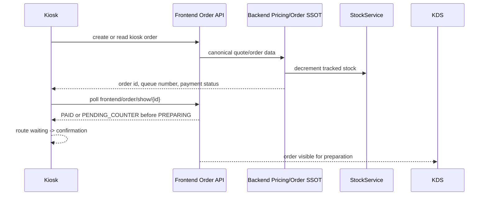

# Kiosk Full Process Audit — 2026-04-27

Scope: C1 from `reports/audit/CLAUDE_MEGA_AUDIT_PLAN_PROCESS_AND_SYNC_2026-04-27.md`.

Verdict: PASS on local Playwright run-many.

## Process Coverage



## Scenarios Tested

| ID | Scenario | Main assertions |
| --- | --- | --- |
| K1 | Simple kiosk order, card paid | `/kiosk/waiting` reaches `/kiosk/confirmation`; `payment_status=PAID`; fiscal sequence allocated; stock decremented. |
| K2 | Tacos composition | `composition_snapshot` is persisted with `viande`, `sauce`, `extra`; paid order still reaches confirmation. |
| K3 | Cash at counter | Kiosk confirms immediately; `payment_status=PENDING_COUNTER`; `fiscal_sequence_no=NULL`; stock is decremented while payment waits at POS. |
| K4 | Rupture during wizard | zero stock blocks decrement and the kiosk menu projection exposes `is_available=false` with `stock_rupture`. |
| K5 | Abandon/new order | Confirmation CTA routes back to locked `/kiosk/idle`; no customer-facing admin/cashier shortcut text appears. |

## Data Ownership

| Data | Source of truth | Consumer |
| --- | --- | --- |
| Price/total | backend order/pricing services | kiosk display only |
| Queue number | backend order row | kiosk waiting/confirmation, KDS/POS |
| Payment state | backend `payment_status` enum | kiosk confirmation and POS counter collect |
| Stock | `stock_levels` + `stock_movements` | kiosk availability projection |
| Composition | immutable `order_items.composition_snapshot` | receipt, KDS, audit |

## Validation

Command:

```bash
npx playwright test tests/e2e/kiosk-full-process/c1-kiosk-process-audit.spec.js --project=chromium --repeat-each=5 --retries=0
```

Result included in combined C1+C2 gate:

```text
50 passed (3.8m)
```

The C1 subset represents 25 of those 50 runs: 5 scenarios x 5 iterations.
