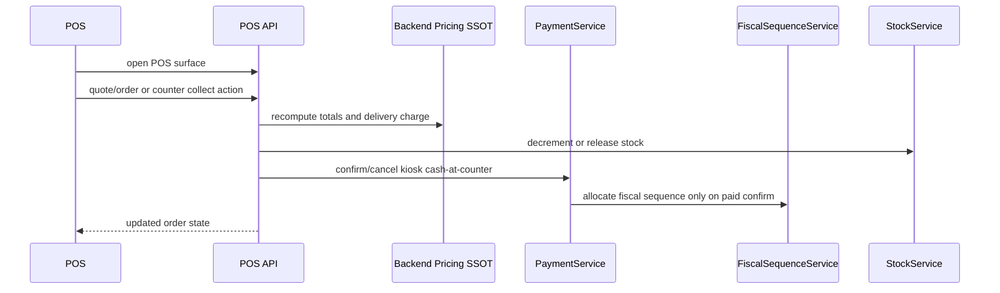

# POS Full Process Audit — 2026-04-27

Scope: C2 from `reports/audit/CLAUDE_MEGA_AUDIT_PLAN_PROCESS_AND_SYNC_2026-04-27.md`.

Verdict: PASS on local Playwright run-many.

## Process Coverage



## Scenarios Tested

| ID | Scenario | Main assertions |
| --- | --- | --- |
| P1 | Dine-in/walk-in cash | POS surface loads; paid POS cash order has fiscal sequence; stock decremented. |
| P2 | Takeaway customer card | POS surface loads; card-paid takeaway order keeps fiscal sequence and immutable composition. |
| P3 | Delivery quote | forged `delivery_charge=999` is ignored; backend recomputes `10` for `5.01 km` under the `5 EUR / 5 km` rule. |
| P4 | Counter collect confirm | POS panel sees kiosk `PENDING_COUNTER`; confirm changes payment to `PAID`, sets cash method, allocates fiscal sequence, and keeps stock consumed. |
| P5 | Counter collect cancel | POS cancellation changes to `REFUNDED` + `CANCELED`, keeps `fiscal_sequence_no=NULL`, and releases stock. |

## Data Ownership

| Data | Source of truth | Consumer |
| --- | --- | --- |
| Delivery charge | backend `DeliveryFeeService` / POS quote endpoint | POS payment UI |
| Fiscal sequence | `FiscalSequenceService` at final paid transition | receipt/Z reports |
| Counter cash lifecycle | `PaymentService` + payment state machine | POS counter panel, KDS badge |
| Stock release | `OrderCanceled` listener + `StockService` | POS/kiosk availability |
| Branch scope | authenticated POS operator branch | counter collect pending/confirm/cancel |

## Validation

Command:

```bash
npx playwright test tests/e2e/pos-full-process/c2-pos-process-audit.spec.js --project=chromium --repeat-each=5 --retries=0
```

Result included in combined C1+C2 gate:

```text
50 passed (3.8m)
```

The C2 subset represents 25 of those 50 runs: 5 scenarios x 5 iterations.
