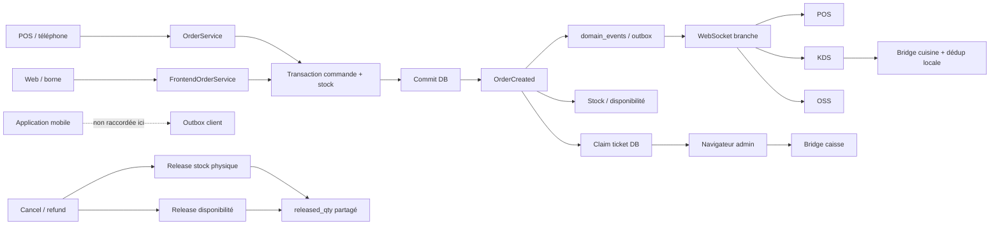
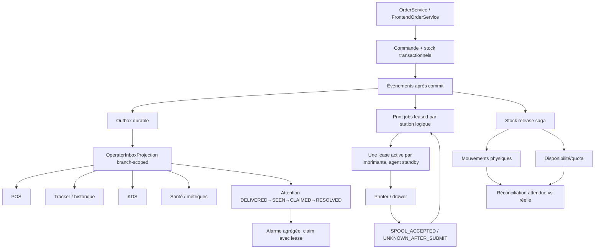

# Audit global opératoire FoodKing — caisse, borne, KDS, web, mobile, stock et matériel

**Date :** 2026-08-11  
**Nature :** audit adversarial, lecture de code, contre-vérification des preuves QA et exploration navigateur locale  
**Décision release :** **HOLD**  
**Périmètre matériel :** non qualifié ; le gate humain reste ouvert  
**État du worktree :** fortement dirty ; aucun changement existant n'a été écrasé ou attribué à cet audit

**Contre-débat et décisions révisées :** `reports/audit/ADVERSARIAL_DECISION_RECORD_GLOBAL_OPS_2026-08-12.md`

**Traçabilité objectif → preuve :** `reports/qa/GLOBAL_OPS_REQUIREMENTS_TRACEABILITY_2026-08-12.md`  
**Écart protocoles matériels :** `reports/hardware/GLOBAL_OPS_HARDWARE_PROTOCOL_GAP_ANALYSIS_2026-08-12.md`

**Formulaire de décision humaine :** `docs/gates/GATE_GLOBAL_OPS_HUMAN_DECISION_FORM_FR_2026-08-12.md`

**Paquet de décision propriétaire Q1–Q29 :** `docs/gates/GATE_GLOBAL_OPS_OWNER_DECISION_PACKET_FR_2026-08-12.md`

## 1. Conclusion exécutive

FoodKing possède plusieurs fondations saines : prix calculés côté serveur sur les flux POS/web principaux, événements après commit, outbox idempotente et isolation de branche présente dans de nombreux parcours. Le problème dominant n'est cependant pas un bouton manquant. Le système ne possède pas encore une **vérité opératoire unique et durable** reliant : commande reçue, attention du caissier, encaissement, production, impression physique, remise en stock et santé opérationnelle.

La contre-vérification locale produit simultanément les états suivants :

| Surface | Observation réelle |
| --- | --- |
| POS | 77 commandes web à traiter |
| Tracker | 0 commande active / 0 aujourd'hui |
| Santé POS | 484 commandes âgées de plus de 15 minutes |
| Dashboard SLA | 331 alertes, dont certaines âgées de 48 à 62 jours |
| Encaissement | 3 commandes signalées hors du tableau principal |
| Historique | 3 191 lignes ; détail et réimpression disponibles, mais pas d'annulation/rejet cohérent |
| KDS | vue locale vide ; mémoire de bump annoncée comme propre au navigateur |

Ces chiffres ne sont pas contradictoires à cause d'une donnée unique corrompue : chaque écran utilise une population, une fenêtre temporelle et une définition de « retard » différentes. Ajouter une sidebar à l'un de ces écrans sans unifier la projection reproduirait le défaut.

### Verdict par promesse utilisateur

| Promesse | État observé | Verdict |
| --- | --- | --- |
| Enregistrer une carte sans TPE intégré | Backend oui, frontend parfois bloquant | **REWORK immédiat** |
| Débiter réellement un TPE | Aucun protocole fabricant/callback démontré | **NON IMPLÉMENTÉ** |
| Encaisser une carte sur la borne | Fallback/stub capable d'approuver sans bridge | **P0 FAIL-OPEN** |
| Voir et agir sur toute commande récente | Projections divergentes, plafonds/jour courant | **P0 opératoire** |
| Annuler/rejeter selon le statut | Actions différentes selon écran ; détail incomplet | **P1** |
| Sonner jusqu'à prise en charge | Bip unique, seed initial silencieux | **P0 opératoire** |
| Imprimer automatiquement le web | File logique présente, sortie papier non prouvée, claim sans lease | **P1 / P0 multi-branche** |
| Ouvrir le tiroir avec preuve | `null` peut être interprété comme succès | **P1** |
| Éviter les 429 au repos | Polling multiplié par onglets et composants | **P0 opératoire** |
| Remettre le stock de manière convergente | Ledger partagé peut cacher l'échec physique | **P1 intégrité** |
| Couvrir l'application mobile cliente | Canal non câblé dans ce dépôt | **HORS PREUVE** |
| Déclarer le matériel prêt terrain | Grille et signatures vides | **P0 release / HUMAN GATE** |

## 2. Méthode et niveau de preuve

L'audit a utilisé quatre niveaux de preuve :

1. **Code et invariants** : services de commandes, state machine, listeners, outbox, KDS, UI POS, routes et throttles.
2. **Tests ciblés** : les suites carte sans terminal, file cuisine, janitor, expiration web, cadence KDS, tiroir et remise en stock passent ; l'audit vérifie ensuite si leurs doubles correspondent au contrat réel.
3. **Exploration navigateur locale authentifiée** : POS, tracker, historique, détail, KDS et dashboard. Aucune commande client n'a été soumise.
4. **Contre-expertise adversariale** : paiement/matériel, opérations/UX et synchronisation/stock ont recherché les contre-exemples et se sont challengés sur les recommandations.

Une seule correction hors rapports/tasks a été appliquée pendant l'audit : `.cursor/ACTIVE_CYCLE.md` utilisait `PHASE=(none)`, rejeté par le validateur. La valeur est désormais `none`; `npm run verify:boucle` et `npm run validate:active-cycle:strict` passent. Aucun fichier produit ni donnée métier n'a été modifié.

### Tests verts qui ne prouvent pas la réalité demandée

| Test | Résultat | Limite révélée |
| --- | --- | --- |
| `PosCardSaleWithoutTerminalTest` | 8 réussis | Prouve l'enregistrement déclaratif, pas le débit physique ; le terminal n'alimente pas le ledger single-tender |
| `KitchenTicketQueueTest` | 10 réussis | Ne couvre pas le crash entre claim et ACK, ni le papier réel |
| `kdsSyncCadence.spec.js` | 3 réussis | Le mock expose l'interface fictive attendue par KDS, pas celle du service réel |
| `posDrawerBridgeFallback.spec.js` | 3 réussis | Le mock renvoie un échec explicite ; le `null` réel reste un faux succès |
| `OrderCanceledCascadeHardenedSentinelTest` | 7 réussis | Valide que l'exception stock est avalée, sans exiger la convergence finale |
| `ReconcileOrderReleasesCommandTest` | 2 réussis | Ne retrouve plus la ligne si le sibling a déjà avancé `released_qty` |
| Dernier Playwright global | 1 spec lecture seule | Ne qualifie ni paiement, ni sonnerie, ni impression, ni multi-onglets, ni stock |

Conclusion QA : **vert simulé n'est pas égal à prêt terrain**. Les tests restent utiles mais doivent être rendus falsifiables face aux fenêtres de panne réelles.

## 3. Carte causale du système actuel

Les événements après commit et l'outbox sont de bonnes bases. Les fractures se situent après cette colonne vertébrale : projections UI concurrentes, livraison/vue/claim/résolution opérateur absents, autorités d'impression multiples, preuve matérielle trop tôt déclarée et ledger de compensation ambigu.

## 4. Findings détaillés

### F-01 — P0 : aucune Inbox opérateur canonique

**Preuves principales**

- Le POS charge des files web propres : `resources/js/components/admin/pos/PosComponent.vue:4018` et `:4037`.
- Le tracker charge une liste limitée au jour courant et à 100 lignes : `resources/js/components/admin/pos/PosOrdersTrackerComponent.vue:1249-1276`.
- Les erreurs tracker peuvent devenir un tableau vide : même fichier `:1324`.
- La santé agrège les statuts vieillissants selon une autre fenêtre : `app/Http/Controllers/Admin/PosSystemHealthController.php:68` et contrôles associés.
- Le dashboard SLA utilise `updated_at` et un seuil fixe : `app/Services/DashboardService.php:472`.

**Impact**

- Une commande peut exister, être payable, être âgée et rester absente du tableau d'action.
- Le caissier ne sait pas quel écran fait foi.
- Les alertes historiques noient les incidents de la minute.

**Forensique DB complémentaire**

La classification en lecture seule du snapshot local confirme que les 484 lignes ne sont pas un rush : aucune des 568 commandes non terminales n'est datée du jour ou des dernières 24 heures. Parmi elles, 479 sont payées et 467 fiscalisées ; elles doivent être protégées d'une purge. Les 89 non fiscalisées se divisent en 78 candidats au janitor web et 11 exceptions manuelles. Preuves et dry-run : `reports/data-repair/OPEN_ORDER_FORENSICS_2026-08-11.md` et `OPEN_ORDER_FORENSICS_DRY_RUN_2026-08-11.sql`.

**Décision d'architecture**

Créer une projection backend branch-scoped et cursorisée `OperatorInbox` avec catégories `ACTION_REQUIRED`, `IN_PRODUCTION`, `READY_HANDOFF`, `UPCOMING` et `RECENT_TERMINAL`. Chaque ligne porte un `source_surface` canonique, un `OrderStatus`, le paiement, les horaires, les groupes cuisine/boissons et `actions[]` calculées côté serveur. POS, tracker, santé et KDS consomment la même population ; ils ne changent que le filtre visuel.

### F-02 — P0 : le 429 est une propriété de l'architecture de polling

**Preuves principales**

- Le throttle API global est monté dans `app/Http/Kernel.php:51`.
- Le plafond utilisateur est 120/min dans `app/Providers/RouteServiceProvider.php:52-58`.
- En fallback, le POS lance plusieurs lectures toutes les cinq secondes : `resources/js/components/admin/pos/PosComponent.vue:3559-3614`.
- Les listeners cuisine et promo ajoutent leur propre boucle : `KitchenTicketPrintListener.vue:41-95`, `PromoFlyerPrintListener.vue:38-95`.
- Dashboard SLA, temps réel et audit possèdent encore des rafraîchissements autonomes.
- Le navigateur a reproduit un détail vide après utilisation multi-onglets, puis le même détail a chargé après expiration de la fenêtre de limitation.

**Impact**

Un poste ouvert sur plusieurs écrans consomme le budget de mutations avant qu'un opérateur ne fasse quoi que ce soit. Selon le composant, le 429 devient un zéro, une page vide, une ancienne valeur ou un message global sans attribution.

**Correction cible**

Une requête Inbox agrégée, un coordinateur de polling partagé, un leader inter-onglets via `BroadcastChannel`, pause des onglets cachés, ETag/delta, jitter, respect de `Retry-After` et backoff. Une erreur doit conserver la dernière valeur connue et exposer sa fraîcheur ; elle ne doit jamais fabriquer `0` ou un succès.

Augmenter uniquement le plafond est rejeté : cela masque l'amplification et diminue la protection des mutations.

**Mesure complémentaire 2026-08-12**

Les compteurs Redis du limiteur réel confirment +50 appels authentifiés lors de l'ouverture de cinq écrans en plus du POS, puis 37 appels sur environ 58 secondes idle pour six écrans connectés. La configuration locale relève le plafond à 1 000/min et masque le défaut ; le code utilise 120/min par défaut. Un second amplificateur a été découvert : un seul reload POS émet 37 rapports CSP, tous enregistrés `csp_violation.malformed`. Le `throttle:1000` de cette route reste enfermé derrière `throttle:api`, donc ne peut pas élargir le plafond global. Rapport probant : `reports/audit/RATE_LIMIT_FORENSICS_2026-08-12.md`.

### F-03 — P0 : absence d'accusé opérateur et d'alarme persistante

**Preuves principales**

- Le POS joue un bip d'environ 0,4 seconde et déduplique définitivement l'ID : `PosComponent.vue:3865-3935`.
- Le premier seed de backlog est silencieux : `PosComponent.vue:4195-4249`.
- Tracker et KDS utilisent aussi un modèle one-shot.
- `SendFcmOnOrderCreated.php:45` exclut explicitement la source web du push POS.

**Impact**

Un redémarrage avec 77 commandes en attente peut ne produire aucun son. Une commande web payée peut déjà avoir évolué métier sans qu'un humain l'ait vue. Utiliser `ACCEPT` comme simple accusé mélangerait état client, paiement et attention opérateur.

**Correction cible sous gate migration**

Ledger durable `DELIVERED → SEEN → CLAIMED(lease) → RESOLVED`, scoped par branche + type d'attention + station/responsabilité, distinct de `OrderStatus`. Un claim explicite suspend temporairement l'audio du scope mais reste visible ; expiry/leader perdu reprend l'alarme. Seule l'action métier canonique résout. Sonnerie agrégée par salves toutes les 8 à 12 secondes, badge, titre d'onglet, notification système et avertissement persistant si l'audio est bloqué. Les commandes futures ne sonnent qu'à `release_at`.

### F-04 — P0/P1 : carte déclarative confondue avec TPE intégré

**Preuves principales**

- Le backend rend `terminal_id` nullable : `app/Http/Requests/PosOrderRequest.php:181`.
- Les feature tests acceptent une carte sans terminal.
- `PaymentComponent.vue:108-148`, `:311`, `:445-451` et `:991-995` continuent de bloquer l'UI sans TPE.
- Le chemin single-tender ne persiste pas aujourd'hui une ligne de ledger de paiement attribuable au terminal.

**Contrat honnête immédiat**

`CARD` signifie : **paiement accepté sur un TPE externe, puis enregistré dans FoodKing**. Le terminal est une attribution optionnelle. L'UI ne doit afficher ni « TPE validé », ni « simulation réussie », ni laisser croire qu'un débit a été envoyé.

**Contrat durable**

Un vrai TPE intégré exige protocole fabricant, identifiant idempotent, états `PENDING_TPE → APPROVED|DECLINED|TIMEOUT`, callback ou réconciliation, référence acquéreur et traitement des doubles réponses. Cette capacité n'existe pas et ne doit pas être simulée.

### F-05 — P1 : le détail et les actions ne respectent pas uniformément la state machine

**Preuves principales**

- La state machine autorise notamment `PENDING → REJECTED|CANCELED`, mais pas une fausse annulation depuis `PREPARED` : `app/Domain/Order/OrderStateMachine.php:30`.
- Le tracker propose pourtant Annuler en `PREPARED` et envoie `CANCELED` : `PosOrdersTrackerComponent.vue:451` et `:1407`.
- Le composant online distingue correctement rejet avant acceptation et annulation après acceptation.
- Le détail POS commence son sélecteur à `ACCEPT`, sans rejet/annulation : `PosOrderShowComponent.vue:596`.
- Son chargement avale l'erreur et laisse une vue vide : même fichier `:509`.

**Correction cible**

Les cartes Inbox reçoivent `actions[]` du backend : Accepter/Rejeter pour web `PENDING`, Annuler selon état/permission, Rembourser via droit manager pour une commande payée, Remettre/Livrer en `PREPARED`, réimpression client/cuisine. Les boissons sont visibles comme groupe, pas cachées derrière `+N`.

### F-06 — P1/P0 multi-branche : impression claimée avant preuve et autorités concurrentes

**Preuves principales**

- `pending()` écrit `kitchen_ticket_printed_at` avant impression : `app/Http/Controllers/Admin/Pos/KitchenTicketQueueController.php:61-106` et `app/Services/Kitchen/KitchenTicketAutoPrinter.php:126-173`.
- Aucun lease, propriétaire ou délai d'expiration n'existe.
- Le listener reconnaît la fenêtre d'ACK perdu : `KitchenTicketPrintListener.vue:154-164`.
- La coquille admin globale et le KDS possèdent deux domaines de dédup indépendants : `DefaultComponent.vue:22-35`, `KitchenDisplaySystemComponent.vue:2186-2217`.
- Le bridge caisse retourne 202 lors de la mise en file, avant résultat Winspool : `tools/caisse-bridge/caisse-bridge.js:221`.
- Pour `branch_id=0`, le contrôleur de queue ne lie pas le device à une branche : `KitchenTicketQueueController.php:74-95,126-132`.

**Scénarios de perte ou doublon**

1. Le navigateur réclame cinq tickets puis ferme : les tickets restent « imprimés » sans papier.
2. Le worker échoue après le 202 : l'ACK peut être positif sans sortie physique.
3. POS et KDS impriment la même commande depuis deux déduplications.
4. Un admin global réclame un ticket d'une autre branche sur la mauvaise imprimante.

**Correction durable sous gate**

SSOT serveur `print_jobs` unique par `(branch, order, ticket_type, order_revision, logical_station, generation)` : `pending → leased → spool_accepted|failed_before_spool|unknown_after_submit|dead_letter`, avec lease fencing, claimant device, attempts, snapshot immuable, erreur et résultat worker complet. Une seule lease active par imprimante, avec agent principal/standby branch/station-bound. Winspool ne prouve pas le papier ; `kitchen_ticket_printed_at` ne peut plus être claim ni être présenté comme preuve physique sur un simple ACK worker.

### F-07 — P1 : faux succès du tiroir

**Preuves principales**

- `kioskHardware.openDrawer()` accepte toute valeur différente de `{ok:false}` : `resources/js/services/kioskHardware.js:257-289`.
- Le helper bridge retourne `null` en échec/indisponibilité : `resources/js/helpers/posLocalPrinter.js:95`.
- Le résultat peut donc être présenté comme succès ; certains chemins de paiement ignorent le résultat.

**Correction immédiate**

`null`, JSON incomplet et 202 ne prouvent jamais l'ouverture. `FAILED_BEFORE_WRITE` seul est retryable en sécurité ; un timeout/résultat perdu après submit devient `UNKNOWN_AFTER_SUBMIT` sans retry automatique, car le tiroir a pu s'ouvrir. Même un ACK Winspool signifie seulement commande acceptée par le spooler, pas ouverture physique. Un seul chemin d'exécution doit éviter le double pulse serveur + local.

**Limite**

Même corrigée, l'UI prouve seulement la réponse du bridge. L'ouverture physique doit être signée pendant le gate matériel.

### F-08 — P1 : KDS utilise un contrat WebSocket inexistant et double-poll

**Preuves principales**

- Le service réel expose des états minuscules, `getState()` et `{previous,current}` : `resources/js/services/WebSocketService.js:38-46,122-124,233`.
- `KdsSyncService` lit `.state`, états majuscules et `{from,to}` : `resources/js/services/KdsSyncService.js:15-19,250-252,307-328`.
- Le composant conserve en plus un full refresh 15 s/5 s : `KitchenDisplaySystemComponent.vue:1721-1722,1773-1801,2415-2439`.
- Le test cadence mocke exactement la fausse interface : `tests/js/kdsSyncCadence.spec.js:9-60`.

**Impact**

Même connecté, le KDS peut rester au régime de polling déconnecté, amplifiant les requêtes et retardant la détection correcte de l'état réseau.

**Correction immédiate**

Aligner le consommateur sur `getState()` et l'événement réel ; remplacer le mock par le service réel ou un contract test partagé ; désigner un seul propriétaire du full/delta polling.

### F-09 — P1 intégrité : split-brain de remise en stock

**Preuves principales**

- L'ordre des listeners cancel/refund est défini dans `app/Providers/EventServiceProvider.php:205-230`.
- Les listeners stock avalent l'erreur : `ReleaseStockOnOrderCanceled.php:12-40`, `ReleaseStockOnRefundCreated.php:12-32`.
- Le sibling disponibilité continue et écrit `released_qty` : `app/Services/Menu/AvailabilityService.php:1036-1041`.
- Le stock physique calcule son reliquat à partir du même champ : `app/Services/Stock/StockService.php:526-529`.
- Le réconciliateur ne sélectionne que `released_qty < quantity` : `ReconcileOrderReleasesCommand.php:38-60`.

**Contre-exemple**

Si la remise en stock physique échoue mais la disponibilité réussit, `released_qty == quantity`. Le réconciliateur conclut qu'il n'y a rien à réparer : la divergence devient durable.

**Correction durable sous gate schema/frozen**

Séparer les preuves de mouvements physiques et de quota/disponibilité, ou introduire une saga durable avec compensations idempotentes. Le réconciliateur doit comparer mouvements attendus et réellement appliqués, pas un compteur partagé. Toute modification de lifecycle exige la parité `OrderService` / `FrontendOrderService` et les événements après commit.

### F-10 — P1 : commandes planifiées, promesse et release sont mélangées

**Preuves principales**

- Le POS expose bien une date/heure exacte : `PosComponent.vue:1034`.
- Le backend valide fenêtre, lead KDS et maximum sept jours : `PosOrderRequest.php:245`.
- La release cuisine possède une règle serveur : `app/Domain/Kds/KitchenReleaseRule.php:142`.
- Le tracker hardcode encore 20 minutes côté frontend : `PosOrdersTrackerComponent.vue:676`.
- Le tracker du jour perd les commandes de demain.

**Correction cible**

Distinguer `scheduled_at` demandé, `promised_ready_at` annoncé, durée estimée et `release_at` production. Le serveur traduit « dans N minutes » et « à HH:mm ». Avant `release_at`, une commande est `UPCOMING`, ne vieillit pas et ne sonne pas.

### F-11 — P1 : santé faussement rassurante et absence de paging humain

**Preuves principales**

- L'outbox n'est signalée en retard qu'au-delà de dix événements.
- Une erreur de probe DB peut être transformée en zéro.
- Le message socket coupé affirme qu'aucune commande n'est perdue sans vérifier la chaîne de fallback.
- Le monitor journalise une erreur et retourne un code non nul, sans canal humain garanti.
- Le scheduler exécute le janitor toutes les cinq minutes, mais sa dernière réussite n'est pas exposée.

Sur l'environnement local audité, `schedule:list` déclare correctement le janitor toutes les cinq minutes, mais aucun processus `schedule:work`, cron ou supervisord n'était actif. Les 78 candidats web vieux de plusieurs jours restent donc en place. Ce constat ne prouve pas l'état production ; il prouve que la santé ne distingue pas un planning déclaré d'une exécution récente.

**Correction cible**

Un événement bloqué important doit suffire à dégrader l'état. Une erreur de probe vaut `UNKNOWN/DOWN`, jamais zéro vert. Exposer âge du plus ancien événement, dernier succès worker, dernier succès scheduler/janitor, candidats en attente, taux 429, freshness Inbox, impression échouée et stock non convergent. Relier au canal d'astreinte choisi par le propriétaire.

### F-12 — P1 scope : l'application mobile cliente n'est pas qualifiée

`app/Listeners/PersistOrderStatusChangedToOutbox.php:138-160` indique que le canal client est câblé pour la surface web et que l'élargissement app/mobile est reporté. Le test « mobile stock » concerne la mini-page `/m` de gestion du stock par PIN, pas une application cliente de commande. En outre, `/m` sélectionne silencieusement la première branche active (`MobileStockController.php:362-374`).

**Décision**

Ne pas déclarer la surface mobile couverte sans le dépôt mobile, ses tokens, push/polling, isolation de branche et matrice de statuts. La sélection silencieuse de branche doit être supprimée ou liée explicitement à l'identité du PIN/device.

### F-13 — P1 avant merge : ingress Uber non transactionnel avec le stock

Le nouveau code Uber non suivi crée une commande en transaction puis décrémente via listener après commit ; le listener avale l'échec. Une commande payée peut donc atteindre la cuisine sans réservation physique. Le mapping écrit aussi les prix/totaux et les recherches de dédup/utilisateur nécessitent une fence de branche.

**Décision**

Le code Uber reste hors GO tant que prix backend, réservation atomique/quarantaine, dédup branch-scoped et traitement explicite des ruptures ne sont pas prouvés. Aucun jugement n'est porté ici sur la propriété de ces fichiers dirty ; ils sont seulement signalés comme risque avant intégration.

### F-14 — P0 : la carte borne peut réussir sans bridge réel

**Preuves principales**

- Le faux bridge de `resources/js/services/kioskHardware.js:29-91` possède un `tpeCharge()` de succès.
- `resources/js/components/frontend/kiosk/KioskPaymentComponent.vue:756-766` sait également approuver sans bridge avec un identifiant `STUB-*`.
- Le serveur vérifie montant, unicité et état, mais ne reçoit pas une preuve acquéreur signée : `app/Http/Controllers/Frontend/OrderController.php:192-277`.

**Impact**

En absence ou panne du bridge, une commande borne peut devenir `PAID` sans encaissement physique. C'est plus grave que le mode POS déclaratif, car le client final n'est pas l'opérateur qui confirme avoir vu un TPE externe approuver.

**Confinement immédiat**

Fail-closed dans tout build non explicitement développement : la CB borne est désactivée sans bridge de confiance ; le serveur rejette toute transaction stub/non attestée. La cible durable est `PENDING_TPE`, confirmation après résultat acquéreur vérifié, puis transition transactionnelle et idempotente vers `PAID`. Les flags locaux `PAYMENT_BYPASS_MODE`, `PRINTING_BYPASS_MODE` et `POS_SIMULATION_HARDWARE` expliquent l'environnement de test ; ils ne constituent jamais une preuve production.

### F-15 — P1 : surface bridge locale trop permissive

Les endpoints raw des bridges caisse et cuisine acceptent des octets ESC/POS avec CORS permissif, sans identité de device/job, nonce, ni borne métier forte (`tools/caisse-bridge/caisse-bridge.js:204-233`, `tools/kitchen-bridge/kitchen-bridge.js:268-287`). Une page locale malveillante peut tenter d'écrire ou de pulser le tiroir.

**Confinement**

Origin allowlist, taille maximale stricte, content-type attendu et suppression des appels arbitraires hors application. Un token statique exposé en JavaScript ne suffit pas. La cible reste un agent local qui **tire** des jobs signés et branch/device-bound depuis le serveur.

### F-16 — P1 : politiques d'impression contradictoires

`config/printing.php:51-71` indique que le reçu client n'est pas automatiquement imprimé, alors que `PrintFiscalReceiptAndOpenDrawerOnCounterPaid.php:37-75` peut l'imprimer systématiquement. Les flux web/kiosk ont en outre des listeners serveur alors que le périphérique réel est local.

La politique doit être explicite par document et origine : ticket production cuisine automatique vers la station cuisine ; copie opérationnelle comptoir configurable ; reçu fiscal client à la demande si la politique reste `false` ; reçu borne selon une règle borne nommée. Cette matrice précède la consolidation des jobs pour éviter d'automatiser une contradiction.

## 5. Architecture cible recommandée

### Principes obligatoires

1. Le backend reste SSOT des prix et des actions autorisées.
2. `OrderStatus` reste l'enum métier ; attention/claim, paiement physique et impression ont leurs propres state machines.
3. `branch_id` est imposé par la ressource/device, même pour un administrateur global.
4. Tout événement externe est dispatché après commit.
5. Une intention n'est jamais présentée comme un effet physique réussi.
6. Toute action est idempotente et auditée avec acteur, device, branche et correlation ID.
7. Le dégradé conserve la dernière vérité connue et expose sa fraîcheur.

## 6. Gates obligatoires

| Gate | Décision requise | État |
| --- | --- | --- |
| `HARDWARE-UAT` | Exécuter et signer TPE, imprimantes, tiroir, borne, tablette, réseau et pannes | **PENDING** |
| `ORDER-ATTENTION` | claim leased par responsabilité, failover audio et résolution canonique ; persistance/rétention | À ouvrir |
| `PRINT-AUTHORITY` | Un agent device-bound unique par station | À ouvrir |
| `PRINT-DELIVERY-SEMANTICS` | Lease, retry, dead-letter, preuve spool | À ouvrir |
| `STOCK-SAGA` | Séparation des ledgers / compensation | À ouvrir |
| `HEALTH-RETENTION` | Traitement humain des 484 orphelins avant mutation | À ouvrir |
| `MOBILE-INTEGRATION` | Dépôt mobile et contrat d'événements | À ouvrir |
| `UBER-ACCEPTANCE` | Prix, rupture et quarantaine | À ouvrir |
| `OPS-PAGING` | Canal humain réel et responsabilités | À ouvrir |
| `KIOSK-CARD` | Fail-closed immédiat puis protocole TPE vérifié | **P0 à fermer** |

Le gate existant `docs/gates/GATE_E2E_HARDWARE_COMPOSER_SIGNOFF_2026-04-27.md` reste `PENDING_HUMAN_GATE`. La grille `reports/hardware/CAISSE_V1_HARDWARE_ACCEPTANCE_GRID_2026-04-25.md` est non signée. Aucun résultat PHPUnit/Vitest/Playwright ne peut remplacer cette exécution.

## 7. Stratégie de validation falsifiable

### Flux nominaux

Tester POS, téléphone, web COD, web carte, borne cash, borne carte et application mobile avec : correlation ID, une seule commande, un seul mouvement stock, visibilité naturelle POS/KDS/OSS, alarme jusqu'au claim puis résolution canonique, un seul job/ticket à la bonne station, transition enum, annulation/remboursement et preuve d'isolation A/B.

### Chaos synchronisation

- Tuer worker avant/après claim outbox et après broadcast avant `broadcast_at`.
- Couper WebSocket en gardant HTTP, puis reconnecter 20 à 50 clients.
- Trois onglets pendant deux minutes : zéro 429 et mutation encore disponible.
- Vérifier `Retry-After`, backoff, fraîcheur et absence de zéro fabriqué.
- Un seul événement bloqué doit déclencher une alerte humaine.

### Chaos impression et matériel

- Fermer l'onglet après claim, perdre l'ACK avant/après sortie papier.
- Papier vide, spooler bloqué, mauvaise imprimante, bridge arrêté, restart worker.
- POS et KDS simultanés, deux branches, admin global.
- Vérifier lease expiry, retry, dead-letter, reprint audité et station correcte.
- Tiroir : bridge absent doit être un échec visible ; pulse physique observé et signé.

### Stock

- Forcer l'échec stock puis le succès disponibilité ; exiger convergence après réconciliation.
- Double cancel, double refund, refund partiel, changement de jour.
- Rupture lors d'une commande Uber ; aucune commande ne doit être silencieusement acceptée sans mouvement ou quarantaine explicite.

### Planification et temps

- Demain, passage minuit et DST Europe/Paris.
- Aucune alarme ni aging avant `release_at`.
- Même heure et même catégorie sur POS, Inbox, KDS et web.

## 8. Décision finale

Le système ne doit pas être déclaré prêt terrain dans son état probant actuel. Le chemin recommandé n'est pas une réécriture globale :

1. corriger immédiatement les mensonges de succès et les contrats frontend propres ;
2. unifier la lecture/action via une Inbox backend ;
3. ouvrir les gates de persistance pour attention/claims, impression et stock ;
4. exécuter les chaos tests ;
5. terminer par le gate matériel réel et signé.

**AUDIT_VERDICT: REWORK**  
**RELEASE_DECISION: HOLD**  
**HUMAN_GATE_REQUIRED: YES**
