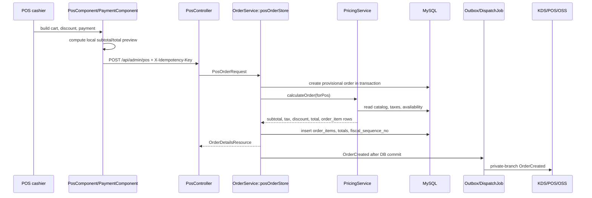
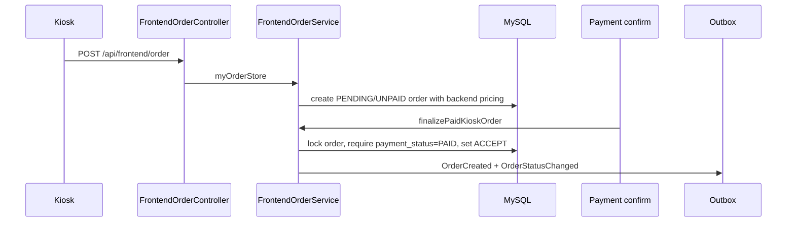
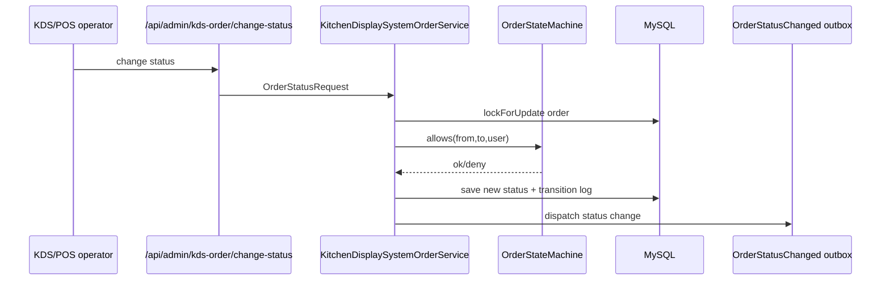
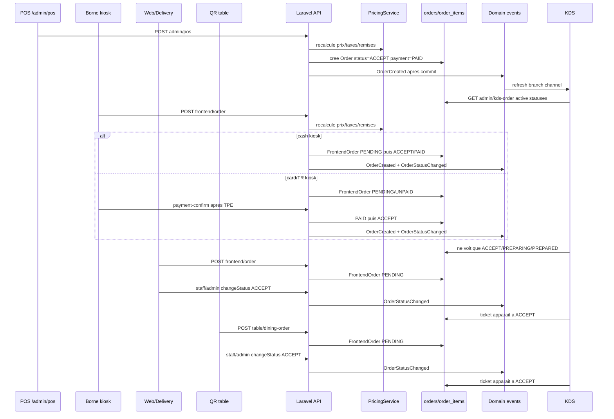

# Audit total systeme FoodKing - focus caisse POS - 2026-04-25

## 0. Statut, perimetre et methode

**Verdict global : NEEDS_FIX_BEFORE_PRODUCTION_POS_V2.**

Le systeme a de bonnes fondations backend : pricing recalcule cote serveur, outbox apres commit, scope branche, enum `OrderStatus`, piste fiscale, tests de non-regression sur POS/KDS/outbox. Le blocage production se situe surtout dans le POS : la caisse affiche et encaisse encore un total local pre-tax avant de recevoir un devis backend autoritaire, la validation des remises s'appuie sur un subtotal client, et le paiement reste un statut binaire sans ledger ni state machine.

**Interpretation de "POS source de verite" dans ce repo :**

- La caisse est le centre operationnel de prise de commande, encaissement, ticket, KDS et OSS.
- Le prix, les taxes, les remises finales, les sequences fiscales et les transitions valides restent des verites backend/DB. Le POS ne doit jamais devenir source de verite tarifaire.

**Mode de travail :** audit read-only. Aucun fichier produit modifie. Sortie consolidee dans ce seul fichier de rapport.

**Contrainte de cycle :** `.cursor/ACTIVE_CYCLE.md` indique un cycle actif distinct (`P_EXEC_CLOSEOUT_GRAPHITI_CI_PROD_2026-04-22`). Je n'ai pas demarre de nouveau `run-cycle`.

**Memoire :** MCP Graphiti non expose dans cette session; fallback via `memory/INDEX.md` et episodes JSONL.

**Rubriques utilisees :**

- FoodKing invariants : pricing backend SSOT, `OrderStatus` enum, isolation `branch_id`, dispatch apres commit, zones frozen.
- `sync-risk-review` : pricing, sync, auth, KDS, ordre de vie commande.
- `web-design-guidelines` : grille UX/a11y/performance; source externe consultee : https://raw.githubusercontent.com/vercel-labs/web-interface-guidelines/main/command.md

**Commandes executees :**

- `bash scripts/verify-orchestration-boucle.sh` : OK, `claude` present, terminal-first docs OK.
- `npm run pos:lint:pricing` : OK, avertissement connu `signoff-pending until 2026-05-10` sur le bloc de total POS local.
- `npm run pos:lint:status` : OK.
- `php artisan test --filter=PosOrderRequestNullableTotalTest` : 5 passed.
- `php artisan test --filter=PosDiscountPermissionTest` : 8 passed.
- `php artisan test --filter=BranchIsolationTest` : 17 passed incluant tests associes.
- `php artisan test --filter=KdsChangeStatusConcurrencyTest` : 1 passed.
- `php artisan test --filter=OutboxTest` : 6 passed.
- `php artisan test --filter='(PosTicketRestaurantPaymentTest|PosParkedOrderTest|PosParkedRecallVariationAvailabilityTest|AvailabilityControllerTest|AvailabilityServiceTest|StockReleaseTest|KdsSyncControllerTest|PrinterControllerTest|EscPosOpenDrawerTest|FloorplanControllerTest|ZReportCloseTest|FiscalSequenceTest|PosPricingSsotProofTest|PosKioskPricingParityTest)'` : 76 passed.
- `npm run test -- tests/js/kioskPaymentTpeTimeout.spec.js tests/js/kioskPaymentRetryGate.spec.js tests/js/kioskOfflineQueue.spec.js tests/js/kioskOfflineQueueV2.spec.js tests/js/kdsSyncCadence.spec.js tests/js/posCashDrawerOpen.spec.js tests/js/posPrinter.spec.js tests/js/posParked.spec.js tests/js/posFloorplan.spec.js tests/js/posPaymentItemsNormalize.spec.js tests/js/posOrderIdempotency.spec.js tests/js/posAvailabilityLiveGuard.spec.js tests/js/KioskWizard.spec.js tests/js/posKioskVariationParity.spec.js` : 159 passed.
- `php artisan test --filter='(KioskFullFlowE2ETest|KioskFrontendComprehensiveTest|KdsChangeStatusConcurrencyTest|KdsSyncControllerTest|OrderStateMachineApplyTest|OrderStateMachineTest|FrontendDiscountIntegrityTest|TableOrderSecurityTest|TableOrderNegativeTotalTest|OrderFlowTest)'` : 119 passed.
- `npm run test -- tests/js/KioskPhase3Routes.spec.js tests/js/KioskWizard.spec.js tests/js/kioskCartSendPayload.spec.js tests/js/kioskOfflineQueueV2.spec.js tests/js/kdsSyncCadence.spec.js tests/js/kdsDedupeByIdVersion.spec.js tests/js/kdsReactsToReconnectStorm.spec.js tests/js/kdsBackoffOn5xx.spec.js` : 123 passed.

**Limites :**

- Pas de suite complete PHPUnit/Vitest; validation ciblee seulement.
- Pas de Playwright device/hardware.
- Pas de TPE physique, imprimante ESC/POS, tiroir-caisse, QR/tablette, borne reelle.
- Pas de verification MySQL prod sous charge; les tests locaux peuvent masquer des problemes de lock/unique index.

---

## 1. Cartographie globale

### 1.1 Vue logique

```mermaid
flowchart LR
    Client[Client web/mobile] --> FrontAPI[API frontend]
    Kiosk[Borne kiosk] --> FrontOrder[FrontendOrderService]
    Table[QR table / dine-in] --> OrderSvc[OrderService]
    POS[Caisse POS] --> PosAPI[/api/admin/pos]
    PosAPI --> OrderSvc
    FrontAPI --> FrontOrder
    KDS[KDS cuisine] --> KdsSvc[KitchenDisplaySystemOrderService]

    OrderSvc --> Pricing[PricingService backend SSOT]
    FrontOrder --> Pricing
    Pricing --> MySQL[(MySQL orders/order_items)]
    OrderSvc --> MySQL
    FrontOrder --> MySQL
    KdsSvc --> MySQL

    MySQL --> Fiscal[Fiscal sequence + audit chain + Z/X]
    MySQL --> Outbox[domain_events outbox]
    Outbox --> Dispatch[DispatchDomainEventsJob high queue]
    Dispatch --> WS[Pusher/Soketi/Echo private-branch]
    WS --> POS
    WS --> KDS
    WS --> OSS[Order status screen]
    WS --> Kiosk

    POS --> Payment[Cash / card / ticket / future external payment]
    Payment --> MySQL
    Delivery[Delivery / takeaway / aggregators] --> OrderSvc
```

### 1.2 Flux de donnees principaux

**POS create order**



**Kiosk deferred card**



**KDS status update**



### 1.3 Modules et dependances

| Module | Role | Dependances critiques | Etat audit |
|---|---|---|---|
| POS | Centre operationnel caisse, panier, paiement, ticket, kiosk cash panel | `OrderService`, `PricingService`, `posCart`, `PaymentComponent`, `OrderStatus` | Fort mais pas encore production-ready sur total/paiement/remises |
| Kiosk | Prise de commande borne, upsell, loyalty, payment deferred/cash | `FrontendOrderService`, `PricingService`, token `kiosk:order` | Solide cote SSOT, validation device restante |
| KDS | Preparation cuisine, transitions ACCEPT/PREPARING/PREPARED | `KitchenDisplaySystemOrderService`, outbox branch channel | Bonne isolation, optimistic lock present |
| OSS | Affichage statut client | outbox `OrderCreated`/`OrderStatusChanged`, `queue_number` | Dependant de sequences queue fiables |
| API backend | SSOT business/pricing/status | Laravel controllers/services/requests | Globalement robuste; quelques gates request trop client-side |
| Websocket/realtime | Sync POS/KDS/Kiosk/OSS | `domain_events`, `DispatchDomainEventsJob`, private branch channels | Bon design; monitoring et degradation a renforcer |
| Paiement | Cash/card/ticket, future TPE/crypto/aggregators | `PaymentStatus`, `PosPaymentMethod`, `OrderService` | Trop faible pour V2 : pas de ledger/state machine |
| Auth/roles | Spatie roles, Sanctum, kiosk ability | `BranchScope`, route middleware | Bonne base; POS Operator a KDS/OSS visibility |
| Multi-branch | Isolation stricte | `BranchScope`, route/channel checks, idempotency composite unique | Bonne base; une recuperation idempotency doit etre rescopee |
| Delivery/takeaway | Modes de commande et fulfillment | `OrderType`, address checks, delivery services | Fonctionnel; external aggregator non mature |

---

## 2. Breakdown POS ultra-detaille

### 2.1 Architecture interne

**Frontend POS**

- `resources/js/components/admin/pos/PosComponent.vue` orchestre catalog/categories, panier, delivery inline, dine-in, kiosk cash panel, idempotency key.
- `resources/js/store/modules/posCart.js` garde le panier en Vuex et `localStorage`.
- Le cache panier est scope par branche et user : `pos_cart_v3:b{branch}:u{user}` (`posCart.js:12-31`). C'est une bonne mitigation des fuites entre caissiers.
- TTL panier : 2 heures (`posCart.js:21`).
- `normalizeCartForApi()` convertit le panier vers payload ids-only en preservant variations/extras (`posCart.js:196-215`).
- Les totaux affiches sont encore calcules localement via `computePosCartLineDisplayTotal()` (`posCart.js:476-483`, `posCartLineMath.js:11-37`).

**Backend POS**

- Route create POS : `POST /api/admin/pos` avec middleware `permission:pos` et throttle `pos-order-create` (`routes/api.php` autour de la route admin POS).
- `PosController::store()` delegue a `OrderService::posOrderStore`.
- `OrderService::posOrderStore()` :
  - lit `X-Idempotency-Key`;
  - cree une commande initiale dans une transaction;
  - appelle `PricingService::calculateOrder(PricingRequest::forPos(...))` par defaut (`OrderService.php:635-647`);
  - insere les `order_items` fournis par PricingService;
  - reserve `fiscal_sequence_no`;
  - sauve les totaux backend;
  - dispatch `OrderCreated` apres transaction (`OrderService.php:986-994`).

**Online/offline**

- Il existe une persistance panier et un service de park/recall (`pos_parked_orders`).
- Il n'y a pas de vrai mode offline transactionnel POS : une commande ne devrait pas etre consideree encaissee sans confirmation backend.
- Kiosk a plus de mecanismes offline/queue historiques que le POS, mais la garantie business doit rester : pas de prix/paiement final hors backend.

**Cache/sync**

- POS et KDS consomment des broadcasts `private-branch.{branch_id}`.
- `routes/channels.php:25-39` limite les canaux par branche, avec restriction speciale pour token kiosk.
- `DispatchDomainEventsJob` claim les events sous lock, diffuse hors transaction, et garde une queue `high` (`DispatchDomainEventsJob.php:44-117`).

### 2.2 Logique metier

**Pricing**

Points forts :

- `config/pricing.php` met `PRICING_USE_SSOT=true` par defaut.
- `OrderService::posOrderStore()` fait `unset($validated['total'], ['subtotal'], ['discount'])` avant creation (`OrderService.php:595-600`).
- Le backend recalcule subtotal, tax, discount, total (`OrderService.php:858-867`).
- Le cash est revalide contre le total serveur (`OrderService.php:870-880`).

Blocage :

- Le POS ouvre le paiement avec un total local pre-tax :
  - affichage `(HT)` et commentaire "Final order total may differ" (`PosComponent.vue:460-473`);
  - `form.total = subtotal + delivery_charge - discount` (`PosComponent.vue:1778-1786`);
  - `PaymentComponent` affiche `props.form.total` et calcule la monnaie dessus (`PaymentComponent.vue:16-20`, `PaymentComponent.vue:142-145`).
- Cela veut dire que le backend est bien SSOT en base, mais la caisse n'est pas fiable au moment critique ou le caissier encaisse.

**Taxes**

- Cote backend, les taxes sont item-level via DB/catalogue.
- Cote UI POS, le panier affiche un HT local; pas de devis TTC backend avant paiement.
- Risque : sous-encaissement, sur-rendu monnaie, confusion facture/receipt, friction caissier.

**Promotions/remises**

- Coupon : recalcule cote backend.
- Remise manuelle POS : `DiscountCalculator::manualDiscount()` accepte le montant demande s'il est inferieur au subtotal backend (`DiscountCalculator.php:22-29`).
- Problème : le gate de permission calcule le pourcentage avec `request('subtotal')`, donc un champ client (`PosOrderRequest.php:132-149`). Les tests actuels valident les seuils mais ne couvrent pas un subtotal forge (`PosDiscountPermissionTest.php:88-115`).

**Gestion commandes**

- `OrderStatus` est centralise dans `App\Enums\OrderStatus`.
- `OrderStateMachine` autorise les transitions, incluant le raccourci POS vers `DELIVERED` si permission `pos`.
- `OrderStatusRequest` contient encore un hardcode `16` pour kiosk cancel (`OrderStatusRequest.php:28-30`) et ne borne pas la valeur avec `Rule::in`.

**Paiement**

- `PaymentStatus` ne contient que `PAID=5` et `UNPAID=10` (`PaymentStatus.php:5-8`).
- `changePaymentStatus()` modifie directement la valeur, sans state machine de paiement.
- `PaymentComponent` ne montre que cash et card/TPE (`PaymentComponent.vue:27-40`), alors que `PosPaymentMethod` contient aussi mobile banking, other, ticket restaurant (`PosPaymentMethod.php:5-16`), et des tests couvrent ticket restaurant backend.
- Pas de ledger de paiements/tenders : difficile de gerer partial, split, refund, void, authorization/capture, crypto, webhook idempotent.

### 2.3 UX critique

Points forts :

- Parcours court : selection item -> panier -> modal paiement -> ticket.
- Cart visible en permanence.
- Kiosk cash panel dans POS pour encaisser les commandes borne cash.
- Feedback temps reel via Echo/outbox.
- Single-flight submit dans `PaymentComponent` (`PaymentComponent.vue:196-202`, `PaymentComponent.vue:96-99`).

Friction / risques :

- Total de paiement non autoritaire et HT.
- La modal paiement ne sait pas afficher une ventilation TTC/taxes/remise serveur.
- "Clear" dans le numpad n'est pas localise ni iconise (`PaymentComponent.vue:89-91`).
- Le bouton close modal est icon-only sans `aria-label` visible dans le code (`PaymentComponent.vue:8`), point a verifier sur le design system.
- Saisie cash/card lit parfois directement le DOM (`PaymentComponent.vue:204-215`), plus fragile qu'un etat composant dedie.
- La caisse ne semble pas exploiter un moteur d'upsell POS backend; l'upsell est plus present cote kiosk.

### 2.4 Performance/concurrence

Points forts :

- `PricingService` bulk-load items/variations/extras.
- KDS liste limitee a 50 commandes actives (`KitchenDisplaySystemOrderService.php:105-107`).
- KDS utilise `lockForUpdate()` et abort 409 sur conflit optimistic lock (`KitchenDisplaySystemOrderService.php:124-148`).
- Outbox dedupe les workers concurrents via lock + `dispatched_at` (`DispatchDomainEventsJob.php:65-86`).

Risques :

- Allocation `queue_number` par `MAX(SUBSTRING(...)) + 1` sous Cache lock; si lock timeout, fallback pseudo-aleatoire (`OrderService.php:828-854`, `FrontendOrderService.php:409-411`).
- La migration `queue_number` n'ajoute pas d'index unique (`2026_03_06_170846_add_queue_number_to_orders_table.php:15-17`).
- Sous rush multi-caisses ou cache split-brain, OSS/KDS peut afficher des tickets ambigus.

### 2.5 Securite/fraude

Points forts :

- `BranchScope` filtre les modeles par branche pour staff (`BranchScope.php:27-39`).
- Tests branch isolation passent.
- Channel broadcast limite par branche (`routes/channels.php:25-39`).
- Backend ignore les prix client pour persistance (`OrderService.php:595-600`).
- Audit fiscal HMAC pour remises (`OrderService.php:960-981`).

Risques :

- Remise : permission calculee sur subtotal client forgeable.
- Idempotency : precheck POS est branche-scope, mais le catch de duplicate DB recupere par `idempotency_key` seul (`OrderService.php:1013-1015`).
- Paiement : statut binaire et update direct, pas de transitions autorisees ni ledger immutable.
- Status request : hardcode enum + validation trop large.

---

## 3. Connectivites POS

| Lien | Mecanisme actuel | Qualite | Risques | Optimisation V2 |
|---|---|---:|---|---|
| POS -> API backend | `POST admin/pos`, `OrderService::posOrderStore`, idempotency header | Bonne base | Total UI local, remise client-side, duplicate catch non scope | `POST /pos/quote`, `POST /pos/orders` avec `quote_id`, idempotency DB scope strict |
| POS -> Pricing | Indirect par `PricingService` apres submit | Backend fort | Pas de quote TTC avant paiement | Quote backend synchrone <150 ms, signature/expiration |
| POS -> KDS | `OrderCreated` outbox + KDS polling/list | Solide | POS utilise endpoint KDS pour collect kiosk cash | Endpoint POS dedie `collect-kiosk-cash`, event explicite |
| POS -> Kiosk | Kiosk cash orders listes via KDS endpoint + branch channel | Fonctionnel | Couplage KDS/POS, statut delivered pour encaissement cash | Payment collection state separe du kitchen status |
| POS -> Paiement | Cash/card UI, backend fields `pos_payment_method`, `pos_received_amount`, note card | Insuffisant V2 | Pas ledger, pas split, pas auth/capture, pas webhook, pas crypto | PaymentAttempt/PaymentTransaction/Tender ledger |
| POS -> Websocket | private branch outbox | Bon | Mode degrade/pusher down a auditer en pre-prod | Alert p95 latency, replay, client recovery |
| POS -> Fiscal | fiscal sequence, audit log, Z/X reports | Bon debut | Paiement/refund trop pauvre pour NF525 avance | Ledger fiscal scelle et sequences par operation |
| POS -> Delivery/takeaway | `OrderType`, address ownership, delivery time | Correct | External aggregators non contractes | Adapter par source, idempotency externe, mapping status |
| POS -> OSS | `queue_number`, outbox status | Correct | Queue numbers non uniques | Sequence table + unique key |
| POS -> legacy web payment | `/payment/{order}/pay` public par id | Risque eleve | Lien non signe, gateway dynamique, transaction non unique | Signed payment intent opaque, ledger idempotent |
| POS -> POS wizard shim | `public/js/pos-wizard.js` injecte dans POS | UX utile mais dangereux | Prix/fallbacks et total recap cote browser | Wizard = selections uniquement; quote backend obligatoire |
| POS -> Branch global views | KDS sync / OSS acceptent `branch_id=0` comme global | Correct si vrai admin | User mal configure avec branch_id=0 peut voir multi-branch | Role Admin explicite pour global scope |

---

## 4. Probleme critiques et dette

### P0/P1 - a traiter avant V2 production

**F-001 - Total POS encaisse non autoritaire.**

- Evidence : `PosComponent.vue:460-473` affiche un total local HT; `PosComponent.vue:1778-1786` calcule `form.total` cote client; `PaymentComponent.vue:16-20` et `142-145` affichent total/change depuis ce champ.
- Impact : sous-encaissement, mauvais rendu monnaie, friction, ticket qui differe du montant annonce.
- Correctif : quote backend avant ouverture paiement. La modal doit afficher `quote.total_ttc`, `tax_breakdown`, `discount_authorized`, `tender_due`.

**F-002 - Gate de remise fonde sur subtotal client forgeable.**

- Evidence : `PosOrderRequest.php:132-149` calcule le pourcentage sur `request('subtotal')`.
- Impact : un caissier peut gonfler le subtotal payload pour passer une remise superieure au seuil de son role.
- Correctif : deplacer le controle de bande apres `PricingService`, sur `realSubtotal`, et tester le cas subtotal forge.

**F-003 - Paiement trop faible pour POS moderne.**

- Evidence : `PaymentStatus.php:5-8` binaire; `PaymentStatusRequest.php:30-32` numerique large; `OrderService::changePaymentStatus` update direct; UI cash/card seulement.
- Impact : impossible de garantir refund, split tender, void, auth/capture, webhook idempotent, crypto, rapprochement TPE.
- Correctif : state machine paiement + ledger immutable de tenders/payments.

**F-004 - Queue number non garanti unique sous incident de lock.**

- Evidence : `OrderService.php:828-854` fallback microtime; migration `queue_number` sans unique index.
- Impact : tickets OSS/KDS dupliques en rush, confusion client/cuisine.
- Correctif : table sequence par `(branch_id,business_date)` ou index unique `(branch_id,business_date,queue_number)` avec retry; supprimer fallback aleatoire.

**F-005 - Idempotency POS duplicate catch non branche-scope.**

- Evidence : precheck scope par `branch_id` (`OrderService.php:580-586`), catch DB par key seule (`OrderService.php:1013-1015`).
- Impact : en cas de race/admin/collision, recuperation potentiellement mauvaise branche.
- Correctif : recuperer avec le meme `targetBranchId`, idealement via `withoutGlobalScopes()` + where branch.

**F-006 - Request status/payment trop permissives.**

- Evidence : `OrderStatusRequest.php:28-30` hardcode `16`; `rules()` accepte tout numeric; `PaymentStatusRequest.php:30-32` idem.
- Impact : gouvernance enum fragile, erreurs 422 tardives, surface d'attaque plus large.
- Correctif : `Rule::in(OrderStateMachine::allStatuses())`, `OrderStatus::CANCELED`, `Rule::in([PaymentStatus::PAID, PaymentStatus::UNPAID])` avant refonte ledger.

**F-007 - POS collecte kiosk cash via endpoint KDS.**

- Evidence : `PosComponent.vue:1414-1421` poste `admin/kds-order/change-status/{id}` vers `DELIVERED`.
- Impact : couplage metier; encaissement et kitchen status sont confondus.
- Correctif : endpoint POS `collect-kiosk-cash` qui marque paiement/collection, puis transition status selon regle explicite.

**F-008 - Argent en floats/decimals applicatifs, pas en cents dans PricingService.**

- Evidence : `PricingService` et `DiscountCalculator` utilisent `float`; DB est decimal(19,6).
- Impact : arrondis fiscaux et parite multi-surfaces plus difficiles; memoire projet decrit un modele cents/int.
- Correctif : Money value object ou migration progressive vers cents int au niveau PricingResult/Payment ledger.

**F-009 - Validation device/hardware incomplete.**

- Evidence : `reports/antigravity/latest.md` marque headless pass mais `NEEDS_DEVICE_VALIDATION`.
- Impact : TPE, imprimante, drawer, kiosk login reel et reseau restaurant pas prouves.
- Correctif : campagne hardware pre-prod + checklist par branch.

**F-010 - Paiement web legacy public par id commande, sans payment intent opaque.**

- Evidence : `routes/web.php:38-44` expose `/payment/{order}/pay`; `PaymentController::index` affiche la page si l'ordre est impaye; `PaymentRequest` autorise tout le monde et valide seulement `paymentMethod`.
- Impact : enumeration ou partage involontaire d'ids commandes; flux paiement non lie a un acteur, une expiration, un montant signe ou une branche; difficile a rapprocher avec POS source de verite.
- Correctif : remplacer par `PaymentIntent` signe/opaque (`intent_id`, `order_id`, `branch_id`, `amount_cents`, `expires_at`, status), jamais par route model id nu.

**F-011 - Gateway Stripe legacy sous-encaisse les montants decimaux.**

- Evidence : `Stripe.php:46-50` envoie `amount => (int) $order->total * 100`; `10.99` devient `1000` cents au lieu de `1099`.
- Impact : P0 si Stripe est actif : perte directe de revenu et rapprochement impossible.
- Correctif : `amount_cents = Money::fromDecimal($order->total)->cents()` ou `round($order->total * 100)` en transition, mais seulement dans le nouveau ledger.

**F-012 - Table `transactions` et `PaymentService` ne garantissent pas l'idempotence financiere.**

- Evidence : migration `transactions` sans unique `(order_id,type)` ni unique `transaction_no`; `PaymentService::payment()` cree une transaction puis met `payment_status=PAID` directement.
- Impact : doublons possibles, pas de statut pending/authorized/captured/void/refunded, pas de preuve montant/currency/gateway comparable.
- Correctif : contrainte DB par provider reference, ledger append-only, reconciliation job.

**F-013 - Paiement kiosk TPE confirme sans ledger ni verification montant.**

- Evidence : `FrontendOrderController::paymentConfirm` verrouille l'ordre et met `payment_status=PAID`, stocke `transaction_id/card_type/payment_method`, puis appelle `finalizePaidKioskOrder`; pas de ligne `transactions`, pas d'unicite transaction id, pas de `amount_cents`.
- Impact : le backend fait confiance au TPE bridge pour le montant; impossible de rapprocher precisement tickets, CB/TR, Z et refund.
- Correctif : `KioskPaymentAttempt` puis `PaymentTransaction` avec `amount_cents` issu de l'ordre backend et reference TPE unique.

**F-014 - Kiosk card/TR offline peut charger le TPE sans commande backend reconciliable.**

- Evidence : `KioskPaymentComponent.vue:292-305` accepte un `offline_*` et prend `cartTotal`; `processCardPayment()` charge le TPE puis appelle `payment-confirm` si `this._lastOrder.id`; `kioskOfflineQueue.js` ne rejoue que `frontend/order`, pas une confirmation paiement.
- Impact : cas critique reseau: carte acceptee localement, commande seulement en queue offline, confirmation backend impossible ou retardee sans preuve transactionnelle.
- Correctif : desactiver CB/TR en offline, ou creer une queue paiement securisee avec `payment_attempt_id`, montant serveur precharge, reconciliation manuelle visible POS.

**F-015 - Statut `CANCELED=16` encore duplique dans frontend kiosk et FormRequest.**

- Evidence : `OrderStatusRequest.php:28-30`, `KioskPaymentComponent.vue:431/556`, `KioskWaitingComponent.vue:392`.
- Impact : l'invariant "enum unique; pas de chaines/valeurs magiques" n'est pas entierement respecte hors POS lint.
- Correctif : exposer un contrat enum frontend (`orderStatus.CANCELED`) et utiliser `Rule::in([...])` cote request.

**F-016 - `POS_WIZARD_CONFIG` et `pos-wizard.js` gardent des prix/fallbacks cote navigateur.**

- Evidence : `admin-pos-v4.blade.php:121-127` injecte `sauceExtraPrice`, `viandeSupplPrice`, `fritesGrandePrice`, `fritesCheddarPrice`; `public/js/pos-wizard.js:85-91`, `1088-1155`, `1878-2154` calcule des totaux recap.
- Impact : meme si `PricingService` recalcule a la creation, l'UX caisse peut annoncer un mauvais montant et le code brouille l'invariant pricing backend SSOT.
- Correctif : le wizard doit produire uniquement des selections; le recap financier doit provenir de `POST /pos/quote`.

**F-017 - Surfaces KDS sync / OSS considerent `branch_id=0` comme global sans verifier le role Admin.**

- Evidence : `KdsSyncController.php:50-75` autorise global si `user.branch_id === 0`; `OrderStatusScreenOrderService.php:38-68` montre tout si `branch_id=0`; `SyncOverviewController` a deja un garde plus strict `hasRole('Admin')`.
- Impact : un utilisateur mal provisionne avec permission KDS/OSS et `branch_id=0` peut voir toutes les branches.
- Correctif : aligner KDS/OSS sur `SyncOverviewController`: `branch_id=0` global seulement pour role Admin explicite; sinon 403.

**F-018 - Credit wallet gateway peut double-debiter sous callback concurrent.**

- Evidence : `Credit::success()` deduit le solde utilisateur avant d'appeler `PaymentService::payment()`, sans `lockForUpdate()` utilisateur/capture; token `rand()` dans `capture_payment_notifications`.
- Impact : si credit wallet est actif, risque de solde negatif ou double debit lors de callbacks/retry simultanes.
- Correctif : verrouiller user + capture, contrainte unique transaction, token cryptographique, idempotency provider.

**F-019 - Routes POS V4 publiques servent encore des cles/configs runtime non minimales.**

- Evidence : `AdminPosV4Controller.php:16-19` documente l'auth client-side; `admin-pos-v4.blade.php:96-105` expose `apiKey`, `googleMapKey`, flags kiosk et prix wizard.
- Impact : ce n'est pas une faille API si `apiKey` est public et Sanctum bloque les donnees, mais l'empreinte publique augmente la surface de scraping/config leak.
- Correctif : middleware auth sur l'entree admin quand compatible SPA, ou boot shell public minimal sans prix, sans configs inutiles.

**F-020 - Pas de contrat unique de prise de commande entre POS, kiosk, web et table.**

- Evidence : POS construit `items` dans `PosComponent.vue` avant `admin/pos`; kiosk utilise `buildKioskOrderPayload()` dans `kioskCart.js`; web checkout reconstruit variations/extras dans `frontend/checkout/CheckoutComponent.vue`; table fait un quatrieme payload dans `table/checkout/CheckoutComponent.vue`.
- Impact : le backend rattrape via `PricingService`, mais les pages peuvent diverger sur instructions, extras, quantites, `order_type`, paiement et affichage total. Le parcours jusqu'au KDS n'a pas un contrat produit unique.
- Correctif : `OrderIntent` versionne commun aux surfaces, payload minimal ids/quantites/instructions, tests contractuels par surface, puis `OrderQuote` backend avant paiement ou validation finale.

**F-021 - Le transfert KDS est implicite via `status`, pas explicite via un ticket cuisine.**

- Evidence : KDS liste seulement `ACCEPT`, `PREPARING`, `PREPARED`; POS cree directement `ACCEPT`; kiosk cash auto-promeut `PENDING -> ACCEPT`; kiosk CB/TR attend `paymentConfirm`; web/table restent `PENDING` jusqu'a `changeStatus`.
- Impact : la question "quand la cuisine doit voir la commande ?" est dispersee entre services et types de paiement. Une commande peut etre creee, payee ou acceptee sans trace unique de transfert cuisine.
- Correctif : introduire un evenement/ledger `KitchenTicketCreated` ou `order.kitchen_released` apres paiement/acceptation, avec `order_id`, `branch_id`, source, acteur, horodatage, idempotency key et correlation outbox.

**F-022 - Le KDS hard-cap a 50 commandes actives peut cacher des tickets en rush.**

- Evidence : `KitchenDisplaySystemOrderService::list()` et `KdsSyncService::sync()` appliquent `limit(50)` sur la fenetre active.
- Impact : si plus de 50 commandes actives existent dans une branche ou vue admin globale, certaines commandes valides ne sont ni visibles ni trackees par l'ecran courant.
- Correctif : pagination/lanes par statut et station, indicateur overflow, requete "unacknowledged first", alerte quand la fenetre active depasse le seuil.

**F-023 - Le dedupe KDS utilise une version `updated_at` en secondes.**

- Evidence : `KdsSyncService::computeOrderVersion()` retourne `updated_at->getTimestamp()`; `KdsSyncService.js` ignore `version <= previousVersion`; le TODO mentionne `status_changed_at`.
- Impact : deux transitions rapides dans la meme seconde peuvent etre gates cote sync apres reconnexion, notamment `ACCEPT -> PREPARING -> PREPARED` ou refresh concurrent.
- Correctif : colonne monotone `kds_version` ou `status_changed_at` haute precision, increment atomique a chaque transition, test meme-seconde avec websocket coupe.

**F-024 - L'admin global KDS est degrade en polling, pas en realtime role-checke.**

- Evidence : `KitchenDisplaySystemComponent.vue` ne s'abonne a Echo que si `authBranchId > 0`; les admins `branch_id=0` dependent du polling.
- Impact : le centre operationnel multi-branches peut voir les tickets avec retard, alors que les branches recoivent du sub-second.
- Correctif : canal global reserve au role Admin explicite ou abonnement multi-branches serveur, avec le meme durcissement que F-017.

**F-025 - Web/table creent une commande visible client mais non transferee KDS tant qu'elle reste `PENDING`.**

- Evidence : `FrontendOrderService::myOrderStore()` et `OrderService::tableOrderStore()` creent `PENDING` pour les flux non kiosk cash; `OrderCreated` part quand meme; KDS filtre `PENDING`.
- Impact : l'utilisateur voit une commande placee, mais la cuisine ne la traite pas avant action staff. Ce comportement peut etre correct, mais il doit etre explicite dans l'UX et mesure par SLA d'acceptation.
- Correctif : file "a confirmer" POS/admin avec timer SLA, libelle client "en attente de confirmation restaurant", test `PENDING -> ACCEPT -> KDS`.

**F-026 - Paiement cash kiosk et statut cuisine sont encore trop couples.**

- Evidence : kiosk cash est cree `PAID` puis `ACCEPT`; le POS collecte ensuite via `admin/kds-order/change-status/{id}` vers `DELIVERED` (F-007).
- Impact : la cuisine peut preparer une commande cash avant encaissement comptoir reel, et la collecte POS modifie un statut KDS plutot qu'un statut de paiement/collecte.
- Correctif : `payment_collection_status` separe, endpoint POS de collecte, regle explicite "release cuisine avant/apres collecte" configurable par branche.

**F-027 - `OrderCreated` est trop large pour piloter le KDS.**

- Evidence : `FrontendOrderService` et `tableOrderStore` dispatchent `OrderCreated` pour des commandes encore `PENDING`; le KDS refresh puis ne les affiche pas.
- Impact : bruit websocket et semantique ambigue : "commande creee" n'est pas "ticket cuisine pret".
- Correctif : le KDS doit ecouter `KitchenTicketCreated` ou `OrderStatusChanged` vers `ACCEPT`; `OrderCreated` reste un signal general OSS/notifications.

**F-028 - Le parcours borne offline CB/TR casse encore la chaine commande -> paiement -> KDS.**

- Evidence : `kioskCart.submitOrder()` peut retourner un `offline_*`; `KioskPaymentComponent` accepte un total local pour offline, puis tente le TPE; la queue offline rejoue `frontend/order`, pas une confirmation paiement auditable.
- Impact : CB/TR peut etre accepte localement sans commande backend immediatement trackable par KDS ni transaction reconciliable.
- Correctif : cash-only en offline, ou payment attempt offline signe avec montant serveur preautorise, replay transactionnel et alerte POS.

### P2 - dette structurante

- Frontend pricing footprints encore autorises sous `@pricing-allowed-block` jusqu'au 2026-05-10.
- Token local POS par `localStorage` pour display (`PosComponent.vue:1813-1818`) peut diverger du `queue_number` serveur.
- UX POS n'a pas encore un moteur d'upsell/cross-sell backend equivalent kiosk.
- External aggregators/Uber Eats ne semblent pas avoir contrat status/payment/idempotency mature.
- Large listes UI a surveiller: si catalogue ou commandes >50/100 items, virtualisation ou pagination stricte.
- Le flux `OrderCreated` melange creation commerciale et liberation cuisine; la V2 doit distinguer commande, paiement, acceptation, ticket cuisine et fulfillment.

### 4.2 Deuxieme passage - coins caches et indirects couverts

| Zone indirecte | Fichiers audites | Verdict |
|---|---|---|
| Paiement web legacy | `PaymentController`, `PaymentService`, `PaymentManagerService`, `Stripe`, `Paypal`, `Credit`, migration `transactions` | Risque financier P0/P1 si gateways actifs; doit passer dans ledger V2 |
| Paiement kiosk TPE | `KioskPaymentComponent.vue`, `FrontendOrderController::paymentConfirm`, `FrontendOrderService::finalizePaidKioskOrder` | Flux online bien teste pour pending->paid->accept, mais pas de ledger ni offline card safe |
| Offline kiosk | `kioskOfflineQueue.js`, `kioskOfflineQueueDb.js`, store `kioskCart` | Solide pour commande cash offline; non suffisant pour CB/TR |
| POS wizard shim | `admin-pos-v4.blade.php`, `master.blade.php`, `public/js/pos-wizard.js` | UX rapide mais prix client/fallbacks a retirer du chemin financier |
| Fiscal Z/X | `ZReportService`, `FiscalSequenceService`, `AuditLogService`, `ZReportController` | Bon niveau; tests passes; contrainte operationnelle branch-pinned pour admin central |
| Hardware | `CashDrawerController`, `PrinterController`, `EscPosPrinterService`, tests JS/PHP | Scope branche correct; manque validation device reelle |
| Stock/availability | `AvailabilityService`, listeners/tests | Correct: locks, release idempotent, events apres commit |
| Parked/floorplan | `PosParkedOrderService`, `DiningTableService`, controllers/tests | Correct: branch/user scoping et warnings variations; `preview_total` reste non financier |
| KDS/OSS sync | `KdsSyncService`, `KdsSyncController`, `OrderStatusScreenOrderService`, JS KDS sync | KDS fallback solide; global branch scope a durcir par role |
| Observability | `SyncOverviewController`, metrics recorder/tests | Plus strict que KDS/OSS sur admin global; pattern a reutiliser |

### 4.3 Ce qui est confirme comme solide par le second passage

- Fiscal : sequences par branche, Z-chain, signature et filtres d'agregation sont couverts par tests cibles.
- Availability : toggle, release sur cancel/refund, branch isolation et events outbox sont couverts.
- Parked orders/floorplan : scoping operateur/branche et transfert table ont des tests.
- KDS sync : polling fallback, cache key branche, deleted ids et cadence JS ont des tests.
- Hardware API : printer/cash drawer ont tests unitaires/fonctionnels, mais pas preuve materiel reel.
- Pricing backend : tests POS/Kiosk prouvent que le backend ecrase les prix forges; le risque restant est l'UX d'encaissement avant quote backend.

### 4.4 Audit deep du systeme de prise de commande jusqu'au KDS

#### 4.4.1 Carte des chemins reels vers la cuisine



**Regle constatee :** le KDS ne tracke pas "toute commande creee". Il tracke les commandes dont le statut est deja dans la fenetre active `ACCEPT`, `PREPARING`, `PREPARED`. Donc le vrai point de transfert cuisine est `ACCEPT`, sauf qu'il n'est pas formalise comme objet metier separe.

#### 4.4.2 Audit page par page - POS caisse

| Etape | Page/composant | Action | Backend | KDS | Risque |
|---|---|---|---|---|---|
| 1 | `/admin/pos` / `PosComponent.vue` | Selection categorie/item, variations, extras, notes | aucun commit | aucun | UX rapide mais recap prix local |
| 2 | Panier POS | subtotal/discount/delivery/total affiches localement | aucun commit | aucun | F-001/F-016 : montant visible avant quote backend |
| 3 | `orderSubmit()` | construit `items`, `branch_id`, `subtotal`, `discount`, `total`, idempotency key | `PosOrderRequest` valide puis `OrderService::posOrderStore()` | aucun avant commit | discount gate encore base sur subtotal client |
| 4 | `PaymentComponent.vue` | cash/card/TR, cash drawer, modal | `POST admin/pos` via `posOrder/save` | aucun avant retour API | paiement confirme sur total local tant que T-001 absent |
| 5 | `OrderService::posOrderStore()` | transaction, recalcule `PricingService`, cree `Order` `ACCEPT`/`PAID`, queue number | DB autoritaire | apres commit | backend protege les prix; sequence queue fallback a durcir |
| 6 | Events | `OrderCreated` `DispatchableAfterCommit`, outbox branch | `domain_events` | KDS refresh | bon pattern apres commit |
| 7 | KDS | `GET admin/kds-order` | lit active statuses | ticket visible immediatement | limite 50 + admin global polling |

**Verdict POS prise de commande :** robuste cote DB, insuffisant cote moment paiement. La caisse est operationnelle mais pas encore "quote-first"; elle doit ouvrir la modal paiement seulement apres devis backend signe, sinon l'operateur peut encaisser un montant different du montant reel ecrit.

#### 4.4.3 Audit page par page - borne kiosk

| Etape | Page/composant | Action | Backend | KDS | Risque |
|---|---|---|---|---|---|
| 1 | `/kiosk/login` | session machine | kiosk user -> branch via `KioskMachine` | aucun | bon: `branch_id` resolu serveur |
| 2 | `/kiosk/idle` | reset panier/session | local | aucun | OK |
| 3 | `/kiosk/categories` | liste menu, add rapide | catalogue frontend | aucun | prix preview non financier |
| 4 | `/kiosk/wizard/:itemId` | variations/extras/instructions | local cart | aucun | payload mieux normalise que web/table, mais contrat non partage |
| 5 | `/kiosk/cart` | choix sur place/a emporter, upsell | local cart | aucun | UX Splash forte |
| 6 | `/kiosk/loyalty` / `/kiosk/upsell` | loyalty/promo/upsell | metadata | aucun | backend recalcule discount |
| 7 | `/kiosk/payment` | `submitOrder()` puis cash ou TPE | `POST frontend/order` | cash: visible; CB/TR: pas avant confirm | offline CB/TR critique |
| 8 | `payment-confirm` | confirme CB/TR TPE | `payment_status=PAID`, `finalizePaidKioskOrder()` -> `ACCEPT` | ticket visible apres promotion | pas de ledger montant/TPE |
| 9 | `/kiosk/waiting/:orderId` | Echo + polling status | `frontend/order/show/{id}` | suit PREPARING/PREPARED | guard OK; offline id reste synthetique |
| 10 | `/kiosk/confirmation` | ticket client | lecture snapshot | aucun | OK si ordre backend existe |

**Verdict kiosk :** le flux online cash et CB/TR est bien encadre par tests et par promotion `PENDING -> ACCEPT`, mais la borne a deux dettes V2 : pas de ledger paiement TPE, et CB/TR offline non reconciliable. La borne est la surface la plus proche d'une UX Splash, mais elle ne doit pas creer une dette comptable invisible.

#### 4.4.4 Audit page par page - web delivery/takeaway

| Etape | Page/composant | Action | Backend | KDS | Risque |
|---|---|---|---|---|---|
| 1 | `/menu` / frontend menu | consultation et panier | catalogue frontend | aucun | OK |
| 2 | `/checkout` | adresse, branche, coupon, delivery time | local form | aucun | total affiche localement |
| 3 | `frontendOrder/save` | `POST /frontend/order` | `FrontendOrderService::myOrderStore()` cree `PENDING` | pas visible | client peut croire que cuisine traite deja |
| 4 | Admin online order | staff accepte/rejette | `OrderService::changeStatus()` | `ACCEPT` rend visible | SLA acceptance non mesure |
| 5 | KDS | refresh event/poll | DB active statuses | ticket visible | `OrderCreated` pending declenche refresh inutile |

**Verdict web :** le comportement peut etre correct pour un restaurant qui confirme les commandes avant cuisine. Il manque toutefois un libelle produit clair et une file d'acceptation mesuree; sinon "commande placee" et "commande transmise cuisine" sont confondus cote client.

#### 4.4.5 Audit page par page - QR table / dine-in

| Etape | Page/composant | Action | Backend | KDS | Risque |
|---|---|---|---|---|---|
| 1 | `/menu/:slug` | menu table branche/table | table branch | aucun | bon scoping via table |
| 2 | `/checkout/:slug` | cash/card choice, cart | local form | aucun | `branch_id` et totals envoyes par client mais recalcules |
| 3 | `tableDiningOrder/save` | `POST table/dining-order` | `OrderService::tableOrderStore()` cree `PENDING` | pas visible | staff doit accepter pour cuisine |
| 4 | Admin table order | `changeStatus` | `PENDING -> ACCEPT` | visible | depend d'une action humaine |
| 5 | Table order details | client suit statut | `table/dining-order/show` | indirect | OK si message "en attente" clair |

**Verdict table :** bon niveau de protection prix (`TableOrderSecurityTest`, `TableOrderNegativeTotalTest`), mais meme dette produit que web: le transfert KDS n'est pas automatique a la creation.

#### 4.4.6 Audit KDS tracking et logique de statut

| Couche | Etat constate | Risque | Correction |
|---|---|---|---|
| Source KDS | `KitchenDisplaySystemOrderService::list()` lit DB active statuses | pas de ticket cuisine explicite | `KitchenTicketCreated`/release ledger |
| Transition KDS | `changeStatus()` verrouille la row, compare statut attendu, applique `OrderStateMachine`, 409 si conflit | solide pour multi-KDS | garder; ajouter tests rush multi-click |
| Branch isolation | staff branch filtre; admin global voit tout | F-017 role Admin non strict partout | guard role Admin explicite |
| Realtime | branch staff recoit Echo; admin global polling; fallback sync | retard operationnel multi-branch | global channel role-checke ou fanout multi-branch |
| Sync fallback | `KdsSyncService` renvoie deltas + `deleted_ids` | version secondes et limite 50 | monotonic version + pagination/overflow |
| Front KDS | refresh debounce, 409 handled, orderItems board | bon niveau | ajouter compteur "hidden overflow" |
| OSS | lit aussi active statuses | coherent mais depend du meme statut | meme ticket/release semantic |

**Point fort confirme :** `php artisan test` a valide `KioskFullFlowE2ETest`, `KdsChangeStatusConcurrencyTest`, `KdsSyncControllerTest` et `OrderStateMachine*`. Le squelette technique tient.

**Point faible V2 :** le vocabulaire metier n'est pas assez precis. Il faut separer `order_created`, `payment_confirmed`, `order_accepted`, `kitchen_ticket_created`, `preparing`, `prepared`, `collected/delivered`. Aujourd'hui plusieurs de ces moments sont compresses dans `status` et `payment_status`.

#### 4.4.7 Matrice de transfert KDS par surface

| Surface | Creation initiale | Paiement initial | Moment exact ou KDS voit la commande | Tracking client/staff | Verdict |
|---|---|---|---|---|---|
| POS | `Order` `ACCEPT` | `PAID` cash/card/TR | immediatement apres commit | POS receipt + KDS | rapide, mais quote backend manquante |
| Kiosk cash | `FrontendOrder` `PENDING` puis `ACCEPT` | `PAID` automatique cash | apres create auto-accept | waiting page Echo/poll | bon UX; collecte cash mal separee |
| Kiosk CB/TR | `PENDING`/`UNPAID` | TPE puis `payment-confirm` | apres `finalizePaidKioskOrder()` | waiting page Echo/poll | online OK; offline dangereux |
| Web delivery/takeaway | `PENDING` | selon payment flow | apres staff `ACCEPT` | my-order + admin | besoin SLA/UX confirmation |
| QR table | `PENDING` | cash/card selection | apres staff `ACCEPT` | table order detail + admin | besoin SLA/UX confirmation |
| Aggregators | non prouve | externe | non prouve | non prouve | contrat V2 requis |

#### 4.4.8 Tests ajoutes a la preuve d'audit

- PHP : 119 tests cibles sur state machine, KDS sync/concurrency, kiosk full flow to KDS, frontend/table integrity.
- JS : 123 tests cibles sur routes kiosk, wizard, payload kiosk, offline queue v2, KDS cadence/dedupe/reconnect/backoff.
- Reste non couvert : Playwright tactile page par page, TPE reel, imprimante/ticket reel, charge >50 tickets KDS, meme-seconde sync version, acceptation web/table sous rush multi-staff.

---

## 5. Audit multi-niveau

### 5.1 Technique

**Points forts**

- Laravel/Vue monolith comprehensible.
- Services metier identifies : `OrderService`, `FrontendOrderService`, `PricingService`, KDS service.
- Tests de regression nombreux sur pricing, branch, outbox, KDS, fiscal.
- Outbox et channel branch sont bien orientes production.
- Fiscal sequence et audit chain presents.

**Anti-patterns**

- FormRequest fait encore du business critique avec valeurs client (`discount/subtotal`).
- UI POS depend de calculs locaux pour moment paiement.
- Payment status direct mutation sans invariant.
- Controllers historiques catchent parfois trop large et rewrap en 422.
- Certains fichiers frozen contiennent des blocs temporaires de pricing frontend.

### 5.2 Produit/UX

**Alignement Splash**

- Parcours rapide et direct.
- Kiosk riche : upsell, loyalty, payment deferred, analytics.
- KDS reactif avec feedback.

**Ecarts**

- "Zero friction" impossible si le montant affiche avant paiement peut differer du backend.
- Upsell POS faible compare au kiosk.
- Payment method UI trop limitee.
- Pas de preuve hardware complete.

### 5.3 Business

**Risques revenus**

- Sous-encaissement ou erreur monnaie si taxe non incluse dans modal.
- Remises non autorisees possibles via subtotal forge.
- Queue duplicate peut creer confusion, retards, remboursements.
- Pas de split/refund ledger = pertes de rapprochement comptable.

**Opportunites revenus**

- Upsell POS backend : menus, boissons, desserts, supplements au moment item et paiement.
- Kiosk/POS shared recommendation engine.
- Loyalty scan NFC au POS connecte au panier quote.
- Analytics de refus, abandon panier, remise, void, refund, temps d'encaissement.

---

## 6. Plan d'action executable V1 -> V2

| Mission | Priorite | Description | Dependances | Complexite | Impact business | Acceptance |
|---|---:|---|---|---:|---|---|
| T-001 | P0 | Creer endpoint `POST /api/admin/pos/quote` qui utilise `PricingService` et retourne TTC/taxes/remise/tender_due/quote_id | aucune | M | Evite erreurs d'encaissement | Payment modal n'ouvre que sur quote backend valide |
| T-002 | P0 | Deplacer permission remise apres calcul backend sur `realSubtotal` | T-001 ou direct `OrderService` | S | Reduit fraude remise | Test subtotal forge + cashier 10% echoue |
| T-003 | P0 | Payment ledger + state machine paiement | schema/gate migrations | XL | Rapprochement TPE/refund/split | Etats pending/authorized/captured/failed/void/refunded testes |
| T-004 | P0 | Sequence robuste `queue_number` | migration/gate | M | Evite confusion KDS/OSS | Unique par branche/date + stress test concurrence |
| T-005 | P1 | Rescoper duplicate catch idempotency POS | aucune | XS | Evite retour mauvaise branche | Test race duplicate admin/cross-branch |
| T-006 | P1 | Validation enum stricte status/payment requests | aucune | S | Reduit erreurs de transition | Plus de magic `16`, `Rule::in` |
| T-007 | P1 | Endpoint POS dedie pour collecter kiosk cash | T-003 idealement | M | Decouple cuisine/paiement | POS n'appelle plus `kds-order/change-status` |
| T-008 | P1 | Money model cents/int dans PricingResult/ledger | T-003 | L | Precision fiscale | Parite POS/Kiosk conservee, arrondis explicites |
| T-009 | P1 | Campagne hardware pre-prod | T-001/T-003 | M | Reduit risque go-live | TPE, printer, drawer, kiosk, network valides |
| T-010 | P1 | Drill sync degrade et alerting outbox | outbox existant | M | Stabilite rush | Dashboard p95/p99, rescue/retry procedure testee |
| T-011 | P2 | Moteur upsell POS backend | T-001 | M | Hausse panier moyen | Recommandations reglees cote backend, pas prix frontend |
| T-012 | P2 | Pass UX/a11y POS | T-001 | M | Vitesse caisse | Focus, labels, hit targets, keyboard, modal safe areas |
| T-013 | P2 | Matrice tests CI production | T-001 a T-007 | M | Qualite continue | Guard pricing/status/branch/payment/queue en CI |
| T-014 | P2 | Roadmap SaaS V2 tenant isolation | decisions archi | L | Scalabilite multi-clients | ADR tenant-per-DB ou isolation explicite |
| T-015 | P0 | Corriger Stripe amount cents et geler gateways legacy derriere feature flag | T-003 idealement | S | Evite sous-encaissement externe | Test 10.99 -> 1099 cents |
| T-016 | P0 | Desactiver CB/TR kiosk en offline ou creer reconciliation payment offline | T-003 | M | Evite paiement sans commande reconciliable | Mode offline affiche cash only ou attempt queue auditable |
| T-017 | P0 | Introduire PaymentIntent opaque pour routes web payment | T-003 | M | Reduit fraude/enumeration | Plus de `/payment/{order}/pay` sans token signe |
| T-018 | P1 | Ajouter contraintes uniques payment transaction/provider refs | T-003/migration gate | M | Evite doublons financiers | Unique keys + retry idempotent testes |
| T-019 | P1 | Retirer les prix du `POS_WIZARD_CONFIG` et du recap financier local | T-001 | M | Cohesion prix/UX caisse | Wizard envoie selections, quote affiche les montants |
| T-020 | P1 | Durcir KDS/OSS global branch scope par role Admin explicite | aucune | S | Evite fuite multi-branch par user mal configure | Non-admin branch_id=0 recoit 403 |
| T-021 | P1 | Remplacer tous les `16` frontend/request par contrat enum partage | T-006 | S | Gouvernance status | `rg "status: 16|=== 16"` vide hors enum/tests |
| T-022 | P1 | Credit wallet lock/idempotency/token crypto | T-003 | M | Evite double debit credit | Callback concurrent ne debite qu'une fois |
| T-023 | P2 | Boot shell POS V4 public minimal ou auth middleware serveur | compat SPA | M | Reduit surface config publique | `admin-pos-v4` ne publie que baseUrl/locale strictement necessaires |
| T-024 | P2 | Playwright + device lab TPE/printer/drawer/kiosk offline | T-009 | L | Preuve go-live | Scenario reseau coupe, TPE timeout, ticket, drawer, reconnect |
| T-025 | P0 | Definir `OrderIntent` commun POS/kiosk/web/table | aucune | M | Reduit drift entre surfaces | Tests contractuels payload par surface |
| T-026 | P0 | Definir `OrderQuote` backend avant validation paiement/commande | T-001/T-025 | L | Prix fiable avant friction paiement | POS/kiosk/web/table affichent quote_id et expiry |
| T-027 | P0 | Introduire release cuisine explicite (`KitchenTicketCreated`) | T-025 | M | Trace claire commande -> KDS | KDS n'a plus besoin d'interpreter `OrderCreated` pending |
| T-028 | P0 | Supprimer le cap KDS silencieux a 50 tickets actifs | aucune | M | Evite tickets caches en rush | Pagination/overflow testee avec >50 commandes actives |
| T-029 | P1 | Version KDS monotone haute precision | aucune | S | Evite sync stale apres reconnexion | Deux transitions meme seconde restent visibles |
| T-030 | P1 | Realtime KDS admin global role-checke | T-020 | M | Meilleur pilotage multi-branches | Admin voit updates sub-second; non-admin branch_id=0 refuse |
| T-031 | P1 | File d'acceptation web/table avec SLA | T-027 | M | Reduit commandes oubliees | Timer pending, alertes staff, metrics acceptance p95 |
| T-032 | P1 | Decoupler cash collection kiosk du statut cuisine | T-003/T-007 | M | Evite confusion paiement/fulfillment | `payment_collection_status` separe de `OrderStatus` |
| T-033 | P1 | Matrice E2E page par page jusqu'au KDS | T-025/T-027 | L | Preuve fonctionnelle go-live | POS, kiosk cash, kiosk CB, web, table, websocket down |
| T-034 | P2 | Instrumenter abandon/upsell par etape de prise de commande | T-025 | M | Hausse panier moyen | Metrics par page et par source sans PII |

### Ordre recommande

1. T-001 + T-002 + T-019 : quote backend et suppression du prix client au moment encaissement.
2. T-015 + T-016 + T-017 : arreter les pertes directes sur gateways/TPE/offline.
3. T-025 + T-026 + T-027 : contrat unique de prise de commande et release cuisine explicite.
4. T-005 + T-006 + T-020 + T-021 + T-029 + T-030 : quick wins invariants, KDS sync et branch isolation.
5. T-004 + T-028 + T-031 : rush, queue, KDS overflow et pending orders web/table.
6. T-003 + T-007 + T-018 + T-022 + T-032 : vraie production paiement.
7. T-009 + T-010 + T-024 + T-033 : go-live operationnel avec hardware et parcours complet jusqu'au KDS.
8. T-011/T-012/T-013/T-014/T-023/T-034 : V2 experience, CI, analytics et scalabilite.

---

## 7. Recommandations V2 production-ready

1. **POS quote-first.** Toute action paiement doit partir d'un devis backend signe/expire. Le frontend peut garder un apercu local, mais jamais encaisser dessus.
2. **Payment ledger.** Remplacer le couple `payment_status`/`pos_payment_method` par un ledger de tenders et transactions, garde par state machine.
3. **Fiscal-grade money.** Stabiliser les montants en cents ou Money VO, arrondis documentes par ligne/taxe.
4. **Sequences serveur.** `queue_number`, fiscal sequence, receipt number et external reference doivent etre attribues par backend avec unicite DB.
5. **Sync observable.** Garder outbox, mais ajouter p95/p99, pending age, retry failed, replay par branche, alerte terminal failure.
6. **Kitchen release contract.** Distinguer creation commande, paiement, acceptation, ticket cuisine et fulfillment. Le KDS doit consommer un signal de release cuisine, pas deviner sur `OrderCreated`.
7. **Upsell backend.** Recommendations POS/Kiosk calculees cote serveur selon branch, stock, heure, panier, marge.
8. **External integrations.** Uber Eats/Deliveroo/TPE/crypto via adapters idempotents, mapping de statuts explicite, dead-letter queue.
9. **Device certification.** Avant go-live : TPE, imprimante, tiroir, kiosk, tablette KDS, refresh/reconnect, perte reseau.
10. **Tenant V2.** Ne pas ajouter du `tenant_id` sporadique; suivre la vision repo : decision explicite tenant-per-DB ou boundary centrale.

---

## 8. Audit de l'audit

Ce qui peut etre faux ou incomplet :

- Certains constats viennent de lecture statique; une configuration runtime peut compenser partiellement.
- Les fichiers frozen/payment gateway externes n'ont pas ete modifies ni audites exhaustivement.
- Les tests locaux passent sur l'environnement courant; une base MySQL prod sous charge peut reveler d'autres races.
- La documentation memoire decrit parfois une cible V2 deja desiree, pas forcement l'etat code exact.
- L'audit n'a pas couvert 100% des controllers admin historiques, mais il a ajoute un second passage sur payment legacy, kiosk TPE/offline, fiscal, hardware, availability, parked/floorplan, KDS/OSS, observability et parcours page par page jusqu'au KDS.
- Pas de vraie mesure latency POS, seulement analyse structurelle.
- Pas de test Playwright/device; UX tactile reelle non observee.

Biais possibles :

- Focus volontairement pessimiste sur caisse et argent.
- Les risques P0/P1 sont classes selon impact business, pas selon difficulte de correction.
- Le rapport privilegie production France/NF525; pour un marche sans contrainte fiscale, certains risques seraient moins severes, mais pas le total POS/remise/paiement.

Controles anti-biais deja faits :

- Verification croisee docs -> code -> tests.
- Tests cibles executes pour branch isolation, outbox, KDS concurrency, cash server total, discount permission nominale, kiosk payment state machine, fiscal Z/sequence, availability/stock release, parked/floorplan, printer/drawer, KDS sync, full flow kiosk vers KDS, table/frontend integrity et JS offline/payment cadence.
- Invariants FoodKing appliques explicitement.

---

## 9. Conclusion CTO

FoodKing n'est pas loin d'une base POS robuste, mais la V2 production ne doit pas partir tant que le moment d'encaissement reste pilote par un total local HT. Le backend est deja capable de recalculer et de rejeter, ce qui protege la base de donnees; il faut maintenant deplacer cette autorite avant la modal paiement.

La priorite n'est pas d'ajouter plus d'ecrans. La priorite est de rendre le POS contractuel : quote backend, paiement ledger, sequences fiables, tests de fraude/remise/concurrence, puis hardware pre-prod. Ensuite seulement, l'upsell POS et les integrations externes pourront augmenter le revenu sans fragiliser la caisse.
