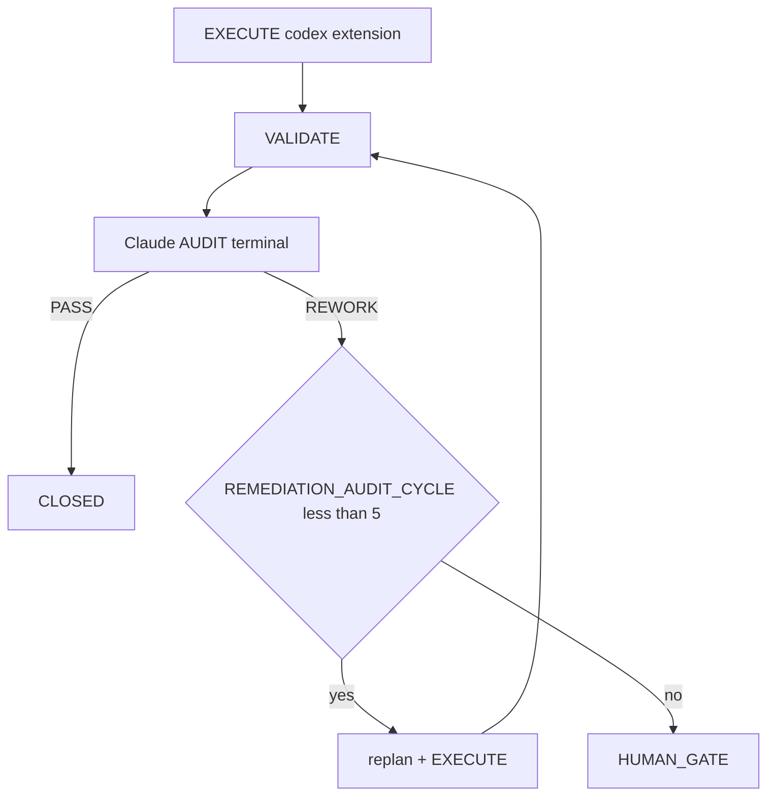
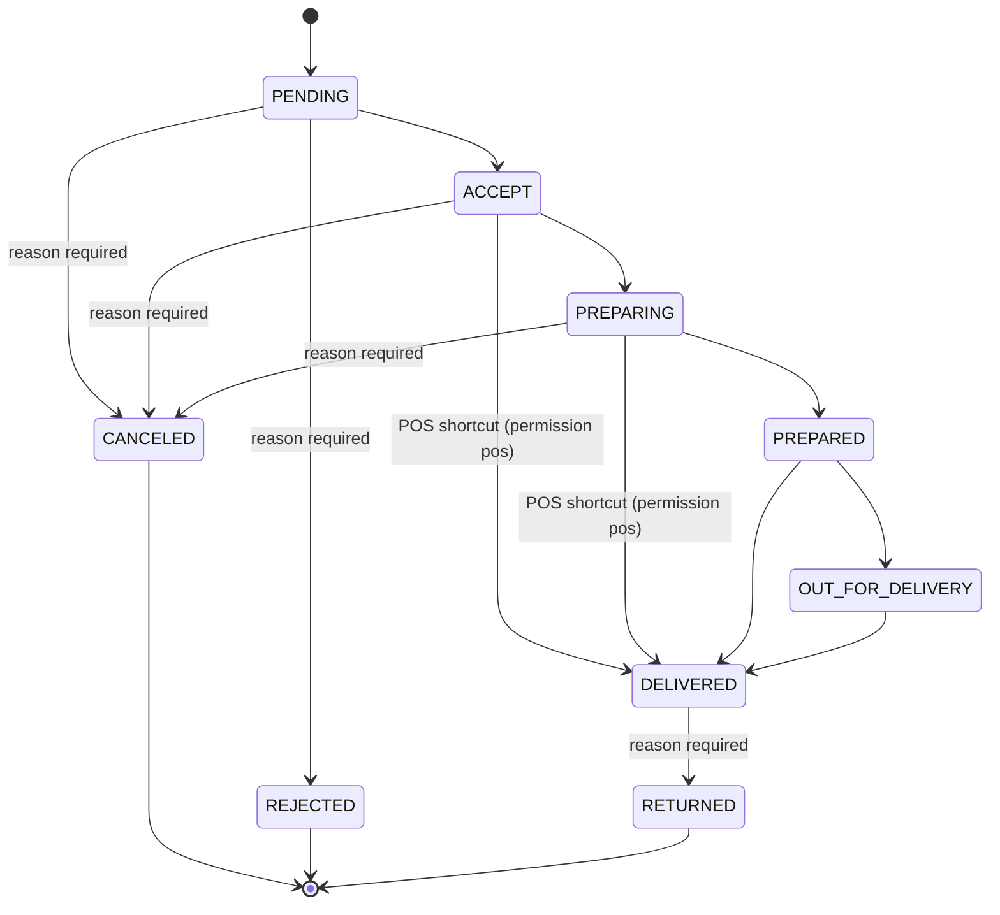

Reading additional input from stdin...
OpenAI Codex v0.125.0 (research preview)
--------
workdir: /Users/1millnonstop/Downloads/projet/foodking-web/web/testttt
model: gpt-5.5
provider: openai
approval: never
sandbox: workspace-write [workdir, /tmp, $TMPDIR, /Users/1millnonstop/Downloads/projet/foodking-web/web/testttt, /Users/1millnonstop/.codex/memories]
reasoning effort: xhigh
reasoning summaries: none
session id: 019dc200-b8bb-72a2-ba43-640be445429d
--------
user
# Round 1 — mission Codex (coller dans `codex exec` ou utiliser : cat + tee)

**Contexte** : dépôt FoodKing (Laravel + Vue). Tu travailles en **lecture/audit** de ce workspace ; n’invente pas d’URL ou de clés. Référence invariants : **AGENTS.md** (prix serveur, branch_id, OrderStatus, after-commit, symétrie Order/Frontend, frozen zones). Objectif concret : aider à un **V1 fonctionnel** des flux **POS · Borne · KDS** (cohérence, sync, idempotence, events).

**Livrable** : un rapport en **français**, structuré exactement en sections **A–G** (titres requis) :

## A) Hypothèses
- 5–8 puces (ce que tu supposes vrai sur le build sans lire 500 fichiers en entier est OK ; marque *supposition*).

## B) Ce qui me semble **correct / robuste** dans le code ou la doc
- 8–20 puces ; cite **fichier** et si possible plage de lignes ou `grep` utile.

## C) Ce qui me semble **fragile, faux ou dangereux** (P0 d’abord)
- 15–25 puces ; chaque puce = **P0** | **P1** | **P2** ; une phrase *pourquoi* + **preuve** (fichier ou test).

## D) Matrice (tableau markdown)
- Lignes = 6–12 sujets (ex. idempotence, Echo, KDS sync, OrderTableChanged, pricing UI, `branch_id` admin) ; Colonnes = `État perçu` | `Risque` | `Action` | `Preuve requise`.

## E) Plan d’amélioration (ordre d’exécution)
- Liste numérotée (1..n) : ce qu’il faudrait **faire** pour un V1, sans patch massif inutile.

## F) Questions pour un **relecteur** (le rôle Closer / Claude)
- 5–8 questions ciblées pour qu’on te contredise ou te confirme.

## G) Métacritique
- 1 paragraphe : où ton analyse pourrait se tromper.

**Règle d’honnêteté** : marque *UNVERIFIED* quand tu n’as pas le fichier complet ouvert. Pas de brûlage d’invariants (pas de contournement backend pricing).

**Sortie** : contenu seul, sans préambule hors sections A–G. Cible d’enregistrement côté opérateur (tee) : `reports/audit/CHALLENGE_CODEX_R1_[CHALLENGE_DATE].md` (remplacer `[CHALLENGE_DATE]` par la date du jour, ex. 2026-04-25).

**Fin.**
codex
J’utilise la skill `sync-risk-review`, parce que la mission porte sur pricing, branch isolation, KDS, events et cycle de commande. Je commence par les lectures P0/P1 imposées, puis je ferai une inspection ciblée du code avant de produire le rapport A-G.
exec
/bin/zsh -lc "sed -n '1,220p' /Users/1millnonstop/Downloads/projet/foodking-web/web/testttt/.agents/skills/sync-risk-review/SKILL.md" in /Users/1millnonstop/Downloads/projet/foodking-web/web/testttt
exec
/bin/zsh -lc "sed -n '1,220p' .cursor/ACTIVE_CYCLE.md" in /Users/1millnonstop/Downloads/projet/foodking-web/web/testttt
exec
/bin/zsh -lc "sed -n '1,220p' AGENTS.md" in /Users/1millnonstop/Downloads/projet/foodking-web/web/testttt
exec
/bin/zsh -lc "sed -n '1,220p' .cursor/rules/global.mdc" in /Users/1millnonstop/Downloads/projet/foodking-web/web/testttt
 succeeded in 0ms:
---
name: sync-risk-review
description: Review changes affecting synchronization, auth, pricing, KDS, OSS, or order lifecycle for architectural and business risk.
disable-model-invocation: true
---

# Sync Risk Review Skill

Use this skill when a change affects:
- sync
- auth
- pricing
- KDS
- OSS
- order lifecycle
- cross-device behavior

## Steps
1. Read the relevant docs
2. Inspect the diff or current implementation
3. Identify:
   - architecture risk
   - state consistency risk
   - business rule violations
   - authz issues
   - missing tests
4. Produce a concise review with recommended next actions.

 succeeded in 0ms:
# Active Cycle – FoodKing

**Méta (SSOT `run-cycle.md` Step 0 + `AGENTS.md` § *Authoritative … cycle state*)** — requis pour que l’orchestrateur ne s’arrête pas sur *« RUNNER_MODE not set »*.

| Champ | Valeur actuelle |
| --- | --- |
| **RUNNER_MODE** | `single-session` |
| **PHASE (cycle W10)** | `IN_PROGRESS` (détail = section `CYCLE_W10_…` ci-dessous) |
| **TASK_ID** | `P_EXEC_CLOSEOUT_GRAPHITI_CI_PROD_2026-04-22` |
| **PLAN_FILE** | `plans/PLAN_EXECUTION_CLOSEOUT_GRAPHITI_CI_PROD_2026-04-22.md` |
| **REPORT_FILE** | `reports/post_execute_latest.log` (append — preuve `EXECUTE_DELEGATION` / `AUDIT_*`) |

> **ACTIVE_PRIMARY** : `CYCLE_W10_EXECUTION_CLOSEOUT` (un seul cycle peut être actif à la fois — voir B03 méga-checklist).
> Cycles plus anciens en lecture seule = **archive** déplacée dans **`.cursor/ACTIVE_CYCLE_ARCHIVE.md`** (lecture humaine / forensique uniquement, **non requise** par le parcours obligatoire).

## CYCLE_W10_EXECUTION_CLOSEOUT (IN_PROGRESS — mémoire 180 + MCP global + commit + CI + prod)

**TASK_ID** : `P_EXEC_CLOSEOUT_GRAPHITI_CI_PROD_2026-04-22`  
**Plan SSOT** : `plans/PLAN_EXECUTION_CLOSEOUT_GRAPHITI_CI_PROD_2026-04-22.md`  
**Ordre** : Piste A (POS+Centrale : PLAN-MEM-1) ∥ Piste B (humain : PLAN-MEM-3) → C (smoke) → D (commit sur « go commit ») → E (CI) → F (prod J-7→J+7).  
**Gate mémoire** : `python3 memory/verify.py` → count **≥ 175** (180 idéal) avant de considérer PLAN-MEM-1 **CLOSED**.

- **Vérif locale (2026-04-22)** : `python3 memory/verify.py` → **count = 182**, smoke `search_memory_facts` OK — gate **satisfaite** pour clôturer l'ingestion côté seuil d'épisodes (suite : commit / CI / prod selon plan `PLAN_EXECUTION_CLOSEOUT_*`).

**Gouvernance globale (2e passe 2026-04-22)** : primer multi-agents + Graphiti vivant + tokens « zéro effet négatif » → **`docs/orchestration/GLOBAL_SYSTEM_PRIMER.md`** + rapport **`reports/audit/AUDIT_SECOND_PASS_GLOBAL_GOVERNANCE_REPORT_2026-04-22.md`**.

---

## Archive

Tous les cycles **CLOSED / COMPLETED PASSED** (W4 → W9, NF525, etc.) ont été déplacés dans **`.cursor/ACTIVE_CYCLE_ARCHIVE.md`** pour réduire le coût de lecture du parcours obligatoire (audit 2026-04-24, mission `T-PARCOURS-OPTIMIZE-001`).

- **Lecture humaine** : ouvrir `.cursor/ACTIVE_CYCLE_ARCHIVE.md`.
- **Lecture agent** : **non requise** sauf instruction explicite du plan ou du chat (ex. "reprend le rationale du cycle W9").
- **Recherche** : `rg "CYCLE_W9_" .cursor/ACTIVE_CYCLE_ARCHIVE.md` ou `git log --follow .cursor/ACTIVE_CYCLE.md`.

 succeeded in 0ms:
---
description: Always-on rules for the FoodKing Cursor local agent. Applied to every cycle, every model, every task.
globs: ["**/*"]
alwaysApply: true
---

# Global Rules – FoodKing

## New or continued session — **mandatory path** (applies to **every** conversation and **every** model)

- **The chat log is not the SSOT.** **This repo** (`AGENTS.md`, `.mdc` rules, `docs/orchestration/`, `run-cycle.md`) is.
- On **any** new thread **or** long continuation: (1) Read **`AGENTS.md` § *Parcours obligatoire*** first, then **`docs/orchestration/GLOBAL_SYSTEM_PRIMER.md`** (§1 table). (2) If resuming work, read **`.cursor/ACTIVE_CYCLE.md`** *before* starting a duplicate cycle — follow the same `TASK_ID` / `PHASE` until `CLOSE` or an explicit new task. (3) For bounded work: run **`run-cycle` / `run-cycle.md`** (Steps 0–5) — do not skip `AUDIT` before `CLOSE`. (4) Run `npm run verify:boucle` (and `verify:boucle:full` when an API proof is needed) per `AGENTS.md`. (5) Ensure **`claude` on `PATH` (AUDIT terminal) et binaire `codex` (CLI OpenAI) pour l’EXÉCUTE complexe (compte ChatGPT Pro)**, pas de clé proxy obligatoire — voir `agents/codex-extension-instructions.md`. (6) Obey **`MEMORY_MATRIX.md`**, `EXECUTE_DELEGATION`, `AUDIT_CHANNEL` + `TERMINAL_AUDIT_OK` when using terminal audit, and **`agent-activity-log.sh`** (tail / start / done).
- Full checklist and French wording: **`AGENTS.md` → section *Parcours obligatoire*.

## Cycle Structure
PLAN → EXECUTE → VALIDATE → AUDIT → [HUMAN GATE | CLOSE]

Phases are sequential and non-skippable.
Audit precedes close on every cycle without exception.

## Model Discipline
- Auto/Premium routing is disabled
- PRIMARY_MODEL is declared in the plan file before execution begins
- One PRIMARY_MODEL per cycle
- Mid-cycle model switch requires Claude confirmation logged under `ESCALATION` in the plan file
- Full routing policy: `.cursor/routing.md`

## Complex EXECUTE Delegation (PRIMARY = `codex-extension`)
- The **FoodKing Codex Complex Implementer** (slug `codex-extension`, CLI `codex` + compte ChatGPT Pro) is the **primary** route for all complex EXÉCUTE work — not the Cursor sub-agent.
- Procedure: prepare `missions/{TASK_ID}/input.json` (+ optional `graphiti_context.md` / `plan_excerpt.md` / `execute_brief.md`), run `npm run codex:complex -- {TASK_ID}` (wrapper `bash scripts/codex-extension-execute.sh`), apply `output_codex.json` + lire l’auto-audit `reports/audit/GPT_SELF_AUDIT_{TASK_ID}.md`, log `EXECUTE_DELEGATION: codex-extension`.
- The Cursor sub-agent `foodking-complex-implementer` is **fallback only** — invoked if `codex` / `exec` échoue (≥2 tentatives documentées) or human-escalation. Trace alors `EXECUTE_DELEGATION: foodking-complex-implementer (codex-extension-fallback)` + `FALLBACK_REASON:`.
- Reference docs: `docs/orchestration/CODEX_API_DELEGATION.md`, `AGENTS.md` § "EXECUTE delegation".

## Autonomy Contract
The agent operates autonomously within declared scope.
It halts and escalates — never self-approves — on any gate trigger, scope expansion,
invariant violation, two consecutive validation failures, or unresolvable ambiguity.
Full policies: `human-gates.mdc`, `scope.mdc`, `project-invariants.mdc`.

## Graphiti (mémoire inter-sessions)
- When the Graphiti MCP server is loaded for this workspace, **query it first** on any non-trivial task (see `.cursor/rules/graphiti-memory.mdc` and `AGENTS.md` § MCP).
- If Graphiti is not loaded, continue without blocking; one-line note to enable `~/.cursor/mcp.json` is enough.

## Channel economics — terminal first (SSOT, symmetric with EXECUTE)
- **Complex implementation (`codex-extension` — CLI `codex` Pro)** is the **default**; Cursor sub-agent `foodking-complex-implementer` is **only** a fallback if the `codex exec` path fails (≥2 attempts or binaire indispo) — `EXECUTE_DELEGATION: …` + `FALLBACK_REASON:`. See `AGENTS.md` and `docs/orchestration/CODEX_API_DELEGATION.md`.
- **Claude AUDIT after implementation** is **by default the terminal** (`bash scripts/foodking-claude-orchestrate.sh context` then `audit` or `audit-brief` — **Anthropic subscription** via `claude` CLI). If the terminal fails after **1 retry** (**quota / rate limit / session saturated**, missing binary, auth, network), **do not stop the cycle**: use the **FALLBACK** — same `audit-context.md` checklist via Cursor Task **`foodking-planner-orchestrator`** (recommended) or in-session **Claude** — with `AUDIT_CHANNEL: cursor-session` **plus** mandatory `AUDIT_FALLBACK_REASON:` and optional `AUDIT_SUBAGENT_FALLBACK: foodking-planner-orchestrator`. See `docs/orchestration/AUDIT_TERMINAL_QUOTA_FALLBACK.md` and `run-cycle.md` Step 5; verify env with `bash scripts/verify-orchestration-boucle.sh`.
- Never invert primary/fallback for billing convenience without that trace — that would be indistinguishable from a mistake in production evidence.

## Token Discipline (quality-first — zero negative optimization)
- **Goal**: maximum correct intelligence per cycle — not shortest answers. Removing detail, skipping invariants, or omitting Graphiti queries to "save tokens" is **forbidden** when it reduces correctness or auditability.
- **Allowed savings only**: do not re-read files already in full context; do not paste verbatim large blobs already in the plan; use **Graphiti** + `## PRIOR_CONTEXT` to avoid re-opening dozens of historical reports; use phase summaries per `context-hygiene.mdc` §4 **after** a phase completes (handoff), not to shrink the plan itself.
- Do not re-explain decisions already recorded in the plan file (link/summarize in one line if needed).
- Structured output in reports — narrative allowed in plans/gates when it carries decisions, risks, or test strategy.
- Flag real risks only — no speculative commentary on out-of-scope subsystems

## Reports Discipline
- Bounded-cycle **plans** live under `plans/`; **gate briefs** under `docs/gates/`; validation logs, execution summaries, and other run evidence under `reports/` per `run-cycle.md` and `ACTIVE_CYCLE.md`
- Composer generates run evidence in `reports/` where applicable — Claude audits
- No new reporting structure without a plan-phase decision

## Absolute Prohibitions
The agent must never: self-approve a gate, expand scope without human instruction,
edit a frozen zone without cleared gate, modify `.cursor/routing.md` mid-cycle.
All invariant prohibitions enforced per `project-invariants.mdc`.

 succeeded in 0ms:
# FoodKing – Cursor Agent Operating Contract

## 0. Quick start contract — read this first

Commence ici. Ne lance aucune action tant que tu n'as pas lu les priorités P0.
Ce contrat fixe l'ordre minimal de lecture pour comprendre le repo en moins de 60 secondes.
Lis complètement ce qui est marqué obligatoire ; diffère seulement ce qui est explicitement classé P2.

### Reading priority

| Priority | What to read | Why |
| --- | --- | --- |
| P0 | `AGENTS.md §1 Parcours obligatoire` | Cadre impératif de travail, ordre de lecture, discipline de cycle. |
| P0 | `.cursor/ACTIVE_CYCLE.md` (continuation) | État courant du cycle actif, contexte vivant, reprise sans divergence. |
| P0 | `.cursor/rules/global.mdc` (auto-attaché — mentionné pour info) | Règles globales toujours applicables, même si déjà injectées par l'outil. |
| P1 | `docs/orchestration/GLOBAL_SYSTEM_PRIMER.md` | Vocabulaire, architecture d'orchestration, invariants transverses. |
| P1 | `.cursor/commands/run-cycle.md` | Procédure exacte pour démarrer un cycle borné correctement. |
| P1 | `docs/orchestration/MEMORY_MATRIX.md` | Où chercher la mémoire utile sans relire tout le dépôt. |
| P1 | `.cursor/routing.md` | Routage des tâches, choix du bon canal, limites d'intervention. |
| P2 | `docs/orchestration/CODEX_API_DELEGATION.md` (quand EXECUTE complexe) | À lire si tu délègues ou exécutes du complexe (uniquement **CLI `codex`**, pas d’exécuteur HTTP dans le dépôt). |
| P2 | `.cursor/ACTIVE_CYCLE_ARCHIVE.md` (forensique humain) | Historique utile pour audit humain, pas requis au démarrage. |
| P2 | `docs/orchestration/EXPORT_CONFIG_CODEX_GPT_API_ET_AUDIT_PERSISTANCE.md` (nouveau poste) | Configuration et persistance utiles surtout lors d'un nouvel environnement. |

Règle simple : P0 avant toute action, P1 avant tout EXECUTE, P2 seulement à la demande du sujet.
Si un doute persiste après P0+P1, arrête-toi et relis ; n'improvise pas.

### One-line bootstrap

```bash
npm run verify:boucle
bash scripts/agent-activity-log.sh tail 50
run-cycle <TASK_ID>
```

**Anti-répétition (nouvel onglet / agent parallèle)** : copier d’abord le bloc de `docs/orchestration/SESSION_OPENING_ENFORCEMENT.md` — même discipline, moins d’oubli de `ACTIVE_CYCLE` / `run-cycle`.

Utilise `run-cycle <TASK_ID>` pour initier tout cycle borné.
Les deux autres commandes servent à vérifier l'état local et le journal d'activité avant d'exécuter.

### Quality-first, not token-cheap

Lis P0 et P1 intégralement, sans skim. Les économies de tokens ne se font jamais sur la substance des règles, seulement sur la répétition, le bruit et les relectures inutiles. En cas de tension entre vitesse et rigueur, applique la rigueur ; voir `.cursor/rules/global.mdc § Token Discipline`.

### If you're a new human contributor

Commence par `docs/orchestration/EXPORT_CONFIG_CODEX_GPT_API_ET_AUDIT_PERSISTANCE.md` pour préparer ton poste et comprendre le mode de persistance attendu.
Lis-le après P0, puis enchaîne sur P1 avant toute contribution effective.

---

## 1. Parcours obligatoire — **nouvelle conversation** **et** **continuation** (production, non négociable)

> **Objectif** : qu’**à chaque** session (premier message ou 500e message), l’exécutant sache **quel** chemin suivre — **sans** supposer un historique de chat. Tout est **dans le dépôt** ; l’histoire de conversation **n’est pas** la SSOT.

**Règle d’or** : *aucune* modification de code **produit** (hors `plans/`, `reports/`, `docs/gates/`, `missions/`, JSONL gouvernance) **dans le cadre d’un travail borné** sans **(a)** parcours ci-dessous **et** **(b)** cycle `run-cycle` + plan actif, sauf **exception** explicite humaine (notée dans le plan / gate).

| Étape | Action | Quand / pourquoi |
|-------|--------|------------------|
| **0. Continuation** | Lire **`.cursor/ACTIVE_CYCLE.md`**. | Si `PHASE` n’est **pas** vide et le cycle n’est **pas** archivé : **reprendre** ce `TASK_ID` / ce `PLAN_FILE` / ce `REPORT_FILE` — **ne pas** dupliquer un second cycle fantôme. Si humain confirme **nouveau** sujet : réinitialiser / nouveau `TASK_ID` selon `run-cycle` Step 0. |
| **1. Lecture initiale** | Lire **ce fichier** (`AGENTS.md`) **puis** **`docs/orchestration/GLOBAL_SYSTEM_PRIMER.md`** (table §1 = ordre complet : routing, `run-cycle`, Graphiti, `MEMORY_MATRIX`, etc.). | **Avant** tout code ou plan non trivial. Même en « continuation » si le contexte a dérivé ou l’onglet a été rafraîchi. |
| **2. Cycle structuré (SSOT procédurale)** | Toute tâche avec **`TASK_ID`** : suivre **`.cursor/commands/run-cycle.md`** et la commande **`run-cycle <TASK_ID>`** (ou équivalent explicite dans le chat : enchaîner les **Steps 0 → 5** sans en sauter). | **C’est** le programme de production en boucle : `PLAN → EXECUTE → VALIDATE → AUDIT → [GATE \| CLOSE]`. Aucun « close » sans `AUDIT` (sauf gate humain documenté). |
| **3. Vérification d’environnement** | `npm run verify:boucle` (0 requête par défaut). **Si le terminal ne “voit” pas Codex alors que l’extension est connectée** : l’auth IDE n’alimente pas le CLI — lancer `npm run codex:doctor` (npm + `login status` + 1 requête). **Rapide :** `npm run codex:verify-pro`. **Complet :** `npm run verify:boucle:full`. Encart : `agents/codex-extension-instructions.md`. | Même en **Step 5** : l’`EXECUTE` (CLI `codex`) requiert le binaire + session Pro sur **ce** binaire. Voir `run-cycle` Step 0 item 8. |
| **4. Secrets & outils machine** | Binaire **`claude`** sur le **`PATH`** (Claude Code CLI) pour l’**AUDIT** PRIMARY en terminal. Binaire **`codex`** (CLI OpenAI) : *Sign in with ChatGPT* **Pro** — **pas** de clé API dans le dépôt. Résolution : `PATH` **ou** `node_modules/.bin/codex` après **`npm install`** (dépendance **`@openai/codex`**) **ou** `npm i -g @openai/codex`. **Ne pas** mélanger avec une clé *Platform* restreinte dans l’environnement (provoque des 401 *scopes* sur l’API Responses) — `npm run codex:audit-bleed` aide. (Option) MCP Graphiti selon `~/.cursor/mcp.json`. | Sans `claude` : noter dès le **plan** l’`AUDIT` fallback + `AUDIT_FALLBACK_REASON`. Sans binaire `codex` : pas d’`EXECUTE` complexe PRIMARY (sub-agent + `FALLBACK_REASON` ou `npm install` + auth Pro). |
| **5. Traces & mémoire (déjà dans ce fichier)** | **`EXECUTE_DELEGATION:`** avant VALIDATE ; **`AUDIT_CHANNEL:`** + **`TERMINAL_AUDIT_OK: 1`** si audit terminal OK ; `docs/orchestration/MEMORY_MATRIX.md` ; `scripts/agent-activity-log.sh` (tail / start / done). | Traçabilité = **même** qualité en prod sur N agents parallèles. |

**Ce n’est pas optionnel** pour travailler « en production FoodKing » : c’est le **contrat** d’onboarding. Les **règles** `.cursor/rules/*.mdc` (dont **`global.mdc` — alwaysApply**) et ce fichier **s’imposent** **à** tout modèle, **dans** toute conversation, dès l’ouverture du dépôt.

**Pour un humain / nouveau compte** : mêmes étapes ; la doc **`docs/orchestration/EXPORT_CONFIG_CODEX_GPT_API_ET_AUDIT_PERSISTANCE.md`** regroupe l’**export** config API + persistance des règles hors-chat.

## Engine
Cursor local agent. No cloud orchestration. No external framework.
Auto/Premium routing: disabled. Model selection is explicit per cycle.

## Global system primer (multi-agents, Graphiti, tokens — lecture clé)

Tout nouvel intervenant (session Cursor, sub-agent Task, CLI terminal, humain) qui touche **orchestration**, **mémoire**, ou **discipline de contexte** : lire **`docs/orchestration/GLOBAL_SYSTEM_PRIMER.md`** après ce fichier. Y sont définis : ordre de lecture obligatoire, **`foodking-routine-implementer` / `foodking-complex-implementer`**, terminal **`claude` / `codex`**, **mise à jour continue de Graphiti**, et la politique **« intelligence max — zéro optimisation négative »** (tokens : supprimer le gaspillage, pas la substance). Pour audits longs et robustesse **opération + agentique + mémoire** : **`docs/orchestration/MEGA_CHECKLIST_AUTONOMY_AND_MEMORY.md`** (180 tâches) et le narratif **`reports/audit/MEGA_AUDIT_SYSTEM_OPERATION_AGENTIC_2026-04-23.md`**.

**Discipline mémoire (qui écrit où, qui lit quoi, quand)** : **`docs/orchestration/MEMORY_MATRIX.md`** — matrice unique des **4 stores autorisés** (Code A · Graphiti+JSONL B · Missions C · Rapports D), table d'écriture par phase, ordre de lecture pour une nouvelle session, anti-patterns. Aucun nouveau store de mémoire ne peut être ajouté sans gate `docs/gates/GATE_MEMORY_*`. Décisions 2026-04-23 sur OpenSpace et claude-mem : **non intégrés**, justifications dans la matrice.

**Synchro multi-agents (cross-conv, cross-terminal)** : `.cursor/rules/cross-agent-sync.mdc` (alwaysApply) + `reports/AGENT_ACTIVITY_LOG.md` (append-only) + `scripts/agent-activity-log.sh` (`tail | start | done | collisions | active`). Au démarrage de session : `tail 50` (~500 tokens). Avant édition produit (Step 2 EXECUTE) : `start` (refus exit 2 si collision). À la clôture (Step 5 CLOSE) : `done`. Évite que deux agents (Cursor convs / `codex-extension` / `claude-terminal` / humain) modifient les mêmes fichiers à leur insu. **Doctrine étendue** (Graphiti = mémoire partagée, rôles Claude vs Codex, anti-patterns) : **`docs/orchestration/MULTI_AGENT_ORCHESTRATION.md`**.

## Workflow
PLAN → EXECUTE → VALIDATE → AUDIT → [HUMAN GATE | CLOSE]

No phase may be skipped. Audit always precedes close.

## Model Roles
| Model | Role | Channel (priorité **économie d’abonnement / token**) |
|---|---|---|
| Claude | Plan, architect, orchestrate, **audit** | **PLAN** : le plus souvent en **session Cursor** (orchestrateur) — c’est l’entretien cerveau, pas l’appel `codex`. **AUDIT (après chaque implementation)** : **PRIMAIRE = terminal** `bash scripts/foodking-claude-orchestrate.sh` (`context` → `audit` ou `audit-brief`) — s’appuie sur l’**abonnement Anthropic (Claude Code CLI)**, *pas* sur l’orchestrateur de modèles de Cursor. **FALLBACK AUDIT** (terminal HS, **quota / rate limit / session Anthropic saturée**, réseau) : **ne pas arrêter** — même checklist via Task **`foodking-planner-orchestrator`** (recommandé) ou session Cursor **modèle Claude** ; tracer **`AUDIT_CHANNEL: cursor-session`** + **`AUDIT_FALLBACK_REASON:`** + optionnel **`AUDIT_SUBAGENT_FALLBACK: foodking-planner-orchestrator`**. Doc : `docs/orchestration/AUDIT_TERMINAL_QUOTA_FALLBACK.md`. Voir `run-cycle.md` Step 5. |
| **GPT-5.5 / GPT-5.5-pro** | **Implémentation complexe (PRIMARY) + auto-audit de l’implémentation** | **`codex-extension`** — `npm run codex:complex` (CLI `codex` + `codex exec`, **compte ChatGPT Pro** ; voir `agents/codex-extension-instructions.md`) : c’est l’**exécutant principal** pour le code lourd, et le wrapper produit l’**auto-audit** `reports/audit/GPT_SELF_AUDIT_{TASK_ID}.md` (revue de ce que Codex vient d’écrire — *premier* filet de qualité). Cela **ne remplace pas** l’**audit de cycle** Claude. N’emprunte **pas** l’orchestrateur de modèles **Cursor** ; facturation **OpenAI / ChatGPT Pro** sur le compte connecté au CLI. |
| GPT-5.5 (fallback) | Complex implementation (FALLBACK only) | **Sub-agent** `foodking-complex-implementer` (Task Cursor) — consomme l’**usage** des modèles de l’**abonnement Cursor**. **Uniquement** si `codex` / l’exécution `codex exec` a échoué (≥2 tentatives documentées) ou binaire indispo. |
| Composer | Routine edits, reports, summaries | Sub-agent `foodking-routine-implementer` — compte côté Cursor. |

**Qui décide (orchestrateur = Claude, « max smart ») + rôle principal de Codex** : **Claude** porte l’**autorité** sur **PLAN** (périmètre, invariants, stratégie de test), **audit de fin de cycle** (verdict `PASS` / `REWORK` dans le `REPORT_FILE`, interprétation des gates), et **re-plan** après `REWORK`. **En chaîne, deux niveaux d’« audit »** : (1) **Codex (PRIMARY)** = **implémente** le plan complexe *et* **s’auto-audite** via `GPT_SELF_AUDIT_{TASK_ID}.md` (ce que le wrapper génère après l’`exec` — exiger lecture avant VALIDATE) ; (2) **Claude terminal** = **audit indépendant** du cycle (invariants FoodKing, gates, preuve de tests). **Composer** : routine, sans `GPT_SELF_AUDIT` imposé de la même façon sauf exigence du plan. **Aucun exécuteur** ne **substitue** l’orchestrateur sur **clôture** ou **priorité** produit — **`ESCALATION`** si hors plan. Le **terminal** `foodking-claude-orchestrate.sh` = défaut **Opus 4.7** + **`effort high`** (`FOODKING_CLAUDE_TERMINAL_*`) pour l’audit non interactif. En **conflit d’opinion** (p.ex. self-audit Codex optimiste vs audit Claude) : **décision** = cycle **Claude** ; le **fait** code / test l’emporte sur la croyance — re-plan explicite.

**Principe unique (symétrique) — à valider en prod sur chaque cycle :** **EXECUTE complexe = CLI `codex` (compte Pro) d’abord + auto-audit** ; **audit = terminale d’abord (Claude + abonnement Anthropic)** ; le **repli** vers les **sub-agents Cursor** n’intervient qu’en **défaut** du chemin `codex exec` documenté, avec `FALLBACK_*` explicite ; **audit terminal** → en défaut **`foodking-planner-orchestrator`** (ou session Claude) avec traces `AUDIT_*` explicites. Preuve d’environnement : `bash scripts/verify-orchestration-boucle.sh` ; smoke complet : `VERIFY_BILLING_FULL=1`.

One PRIMARY_MODEL per cycle. Roles do not overlap.
Full routing policy: `.cursor/routing.md`. Naming: the **PRIMARY complex implementer** is the **FoodKing Codex Complex Implementer** (slug `codex-extension`); see `docs/orchestration/CODEX_API_DELEGATION.md`.

## Authoritative multi-agent bounded cycle (SSOT)

For **TASK_ID-driven** work in Cursor, this path is **authoritative** and overrides any conflicting step elsewhere in this document:

1. **Command:** `.cursor/commands/run-cycle.md` (invoke with a `TASK_ID`, e.g. `run-cycle SMOKE-001`).
2. **Cycle state:** `.cursor/ACTIVE_CYCLE.md` (`RUNNER_MODE: single-session`, `PHASE`, `PLAN_FILE`, `REPORT_FILE`, completion rows).
3. **Plan artifact:** `plans/PLAN_[TASK_ID]_[DATE].md` per `.cursor/context/plan-context.md` (from `plans/PLAN_TEMPLATE.md` when applicable).
4. **Phase instructions:** `.cursor/context/plan-context.md` (PLAN), `.cursor/context/execute-context.md` (EXECUTE), `.cursor/context/audit-context.md` (AUDIT); VALIDATE per `run-cycle.md` when `validate-context.md` is absent.

**EXECUTE delegation (PRIMARY first, FALLBACK only on failure):**

- **Routine** → `Task` → `foodking-routine-implementer`.
- **Complexe — PRIMARY** : **`codex-extension`** — **FoodKing Codex Complex Implementer** (CLI `codex`, compte **ChatGPT Pro**). Procédure :
  1. Préparer `missions/{TASK_ID}/input.json` (+ optionnels : `graphiti_context.md` issu de `search_memory_facts(group_ids=["foodking"])`, `plan_excerpt.md`, `execute_brief.md`, `cycle_snapshot.md` — fusionnés par le script d’assemblage de prompt).
  2. Lancer `npm run codex:complex -- {TASK_ID}` (`bash scripts/codex-extension-execute.sh`) ; variante tâches plus légères : `npm run codex:fast` (`CODEX_EXT_TIER=standard` → modèles *standard* côté UI Codex) ; tâches lourdes : laisser le défaut *complex* + modèle *pro* dans l’app Codex ou `CODEX_EXT_MODEL=…`. (Instructions custom : `agents/codex-extension-instructions.md`.) **Bootstrap** : `npm run codex:prepare -- {TASK_ID}`.
  3. Appliquer `missions/{TASK_ID}/output_codex.json` ; consommer l’**auto-audit** `reports/audit/GPT_SELF_AUDIT_{TASK_ID}.md` (généré par le wrapper).
  4. Tracer `EXECUTE_DELEGATION: codex-extension` dans `reports/post_execute_latest.log` et le `REPORT_FILE`.
- **Complexe — FALLBACK (uniquement si `codex exec` est HS après reprises, ou binaire manquant)** : `Task` → `foodking-complex-implementer` — tracer `EXECUTE_DELEGATION: foodking-complex-implementer (codex-extension-fallback)` + `FALLBACK_REASON:`. 

Référence complète : **`docs/orchestration/CODEX_API_DELEGATION.md`** (naming, fallback contract, audit handoff, token discipline, schéma boucle). Procédure cycle : `.cursor/commands/run-cycle.md`. La trace `EXECUTE_DELEGATION` dans le rapport est **obligatoire** pour passer en VALIDATE.

**Clôture vs. audit :** Après `VALIDATE`, l’**audit** **Claude** (terminal `foodking-claude-orchestrate.sh` en PRIMARY) **tranche** avec `AUDIT_VERDICT: PASS` ou `AUDIT_VERDICT: REWORK` dans le `REPORT_FILE`. **Pas** de `CLOSED` **sans** `PASS`. Sur `REWORK`, boucle `replan (orchestration Claude) → missions + EXECUTE (souvent codex-extension) → self-audit Codex → VALIDATE → re-audit`, avec `REMEDIATION_AUDIT_CYCLE` 1..5 — au 5e `REWORK` sans `PASS`, **HUMAN_GATE** (détail : Step 5 de `run-cycle.md` et `auto-remediation.mdc`).

Sections below labeled **Legacy workflow** remain valid for **PR-centric / review-loop** habits but **do not replace** this SSOT for bounded cycles.

## Source of truth (extended)
- README.md
- docs/PROJECT_CONTINUITY_AND_VISION.md
- docs/ARCHITECTURE.md
- docs/API_MAP.md
- docs/AUTHZ_MATRIX.md
- docs/ORDER_FLOW.md
- docs/DEVICE_FLOW.md
- docs/BUSINESS_RULES.md
- docs/CORE_MODULES.md
- docs/DATABASE_SCHEMA_CORE.md
- docs/ERROR_HANDLING.md
- docs/SECURITY_NOTES.md
- docs/TEST_PLAN.md
- docs/MASSIVE_TEST_PLAN.md
- docs/SAAS_VISION.md
- docs/CONTRIBUTING_QA_BOTS.md
- workflows/qa-loop.md
- workflows/task-routing.md
- workflows/report-format.md
- workflows/task-status.md
- reports/README.md
- docs/orchestration/MEGA_CHECKLIST_AUTONOMY_AND_MEMORY.md
- docs/orchestration/WORKFLOW_AUDIT_GRAPHIQUE_2026-04-23.md
- docs/orchestration/TERMINAL_CLAUDE_GRAPHITI_ORCHESTRATION.md
- docs/orchestration/ROUTING_MATRIX.md

## Stop Conditions
Halt and generate a gate brief on any of:
- Gate trigger detected
- Scope expansion beyond declared boundary
- FoodKing invariant violation
- Two consecutive validation failures
- Planning ambiguity unresolvable from task context
- **`codex` / `codex exec` indisponible après reprises (auth, binaire, ou échec ≥2 sur la même tâche)** : basculer sur le fallback `Task → foodking-complex-implementer` et **noter explicitement** `EXECUTE_DELEGATION: foodking-complex-implementer (codex-extension-fallback)` + `FALLBACK_REASON:`.
- **Audit en terminal (PRIMARY) indisponible ou limité** (`claude` absent, **quota / rate limit / session Anthropic saturée**, auth, réseau — après **1 retry** documenté de `context` + `audit-brief` ou `audit`) : **continuer le cycle** — même checklist `audit-context.md` via Task **`foodking-planner-orchestrator`** (recommandé) ou session Cursor **Claude** ; **`AUDIT_CHANNEL: cursor-session`** + **`AUDIT_FALLBACK_REASON:`** (obligatoire) + optionnel **`AUDIT_SUBAGENT_FALLBACK: foodking-planner-orchestrator`**. Voir `docs/orchestration/AUDIT_TERMINAL_QUOTA_FALLBACK.md`. **Ne jamais** omettre la raison.

## FoodKing Non-Negotiables
- Backend is pricing SSOT — no frontend price logic
- `OrderStatus` enum is authoritative — no hardcoded strings
- `branch_id` = business data isolation — no cross-branch data bleed
- Dispatch strictly after DB commit
- `OrderService` / `FrontendOrderService` symmetry mandatory on any order change
- Frozen zones require gate clearance before any edit

## MCP

### Phase 1 — Filesystem
Filesystem MCP only for repo reads where applicable.

### Phase 2 — Graphiti (mémoire inter-cycles — **présent dans toutes les sessions où le serveur est enregistré**)

**Objectif** : décisions d’architecture, invariants, sync borne↔POS↔KDS, fiscal NF525, historique de cycles — récupérables sans relire des centaines de fichiers.

| Élément | Détail |
|--------|--------|
| **Enregistrement Cursor (obligatoire côté humain)** | Fusionner le bloc `graphiti` dans **`~/.cursor/mcp.json`** (Settings → MCP). Modèle : **`.cursor/mcp/graphiti.json.example`**. Le dépôt ne peut pas injecter un MCP automatiquement dans l’IDE. |
| **Règle agent (automatique dès que le MCP est chargé)** | Voir **`.cursor/rules/graphiti-memory.mdc`** (always-on) + **`global.mdc`** : avant toute tâche non triviale, appeler au moins **`search_memory_facts`** (et optionnellement **`search_memory_nodes`**) avec `group_ids=["foodking"]`. |
| **Après AUDIT / CLOSE** | Si `add_memory` est disponible : enregistrer les décisions durables (ADR, gate, invariant clarifié). |
| **Si Graphiti absent de la session** | **Ne pas bloquer** PLAN / EXECUTE : une ligne « Graphiti non chargé » + secours **`memory/INDEX.md`** + lecture ciblée des JSONL sous `memory/episodes/`. |
| **Server** | Zep Graphiti — wrapper local **`.cursor/mcp/start-graphiti-mcp.sh`** (voir exemple JSON). Clone typique : `/Users/1millnonstop/graphiti`. |
| **Backend** | Neo4j (ex. Aura) — credentials hors repo. |
| **Dépannage** | **`.cursor/mcp/GRAPHITI_TROUBLESHOOTING.md`** (LiteLLM, embeddings, redémarrage proxy). |
| **Group ID** | Toujours **`foodking`**. |
| **Ingestion / vérif locale** | `memory/ingest.py`, `memory/verify.py`, `bin/graphiti-ingest.sh` ; index des domaines **`memory/INDEX.md`**. |

**Intégration bounded cycle** : la commande **`.cursor/commands/run-cycle.md`** inclut l’appel Graphiti en **Step 0 item 5** (query avant PLAN).

### Phase 3 — Playwright MCP (tests E2E sur flows critiques FoodKing)

- Package : `@playwright/mcp@latest` (npx, pas d’install global)
- Browser : Chromium
- BASE_URL : `http://localhost:8000`
- Config : `.cursor/mcp/playwright.json`
- Flows couverts : POS Cash, POS Card, Kiosk, KDS, Auth refresh (F5)
- Déclencheur : plan déclare `playwright-mcp` | `playwright-critical-flow` | `playwright-full-e2e`
- Rapport : `reports/antigravity/latest.md`
- Règle : le Planner-Orchestrator seul décide si un cycle requiert E2E — jamais auto-déclenché.

---

## Terminal allies — Claude Code & OpenAI Codex (abonnements Pro)

Ces outils **complètent** le routage interne Cursor (`.cursor/routing.md` : PLAN/AUDIT Claude modèle Cursor, EXECUTE complexe **GPT-5.5** via **CLI `codex` (compte Pro)** en primaire, routine Composer). **Aucun remplacement** des rôles du dépôt : ce sont des **alliés optionnels** que tu lances **toi** depuis le terminal intégré Cursor quand tu veux plus de profondeur ou un second passage.

### A — Anthropic **Claude Code** (audits / orchestration textuelle, abonnement Anthropic)

1. Dans Cursor : **Extensions** (`Ctrl+Shift+X` / `Cmd+Shift+X`) → chercher **Claude Code** (Anthropic) → **Installer**.
2. Ouvrir le terminal intégré Cursor.
3. Lancer une fois :

```bash
claude
```

codex
Le cycle actif du dépôt est déjà `IN_PROGRESS`, mais ta demande est une mission d’audit ponctuelle sans `TASK_ID` de cycle à exécuter ni modification produit. Je continue donc en lecture seule, sans démarrer un second cycle ni prendre de verrou d’édition.
exec
/bin/zsh -lc "sed -n '1,260p' .cursor/commands/run-cycle.md" in /Users/1millnonstop/Downloads/projet/foodking-web/web/testttt
 succeeded in 0ms:
# Command: run-cycle

Orchestrate one full bounded cycle inside a single Cursor session.

## Trigger
Invoke with a TASK_ID. Example: `run-cycle SMOKE-001`

---

## Step 0 — Pre-flight

1. Read `.cursor/ACTIVE_CYCLE.md`.
2. Read `RUNNER_MODE`:
   - `single-session` → proceed automatically through all phases without stopping between them.
   - `manual` → execute one phase at a time. After each phase, output: `→ PHASE: [completed]. Awaiting manual confirmation to continue to [next phase].` and halt until the developer explicitly says "continue".
   - If RUNNER_MODE is missing: halt. `"RUNNER_MODE not set in ACTIVE_CYCLE.md. Set to single-session or manual and retry."`
3. Confirm TASK_ID matches the provided input. If ACTIVE_CYCLE is blank, write TASK_ID and PHASE: PLAN first.
4. Confirm no gate is currently open (`Gate: None` or all gate rows unchecked). If a gate is open, halt and surface the gate file path.
5. **Graphiti (when MCP `graphiti` is loaded):** call `search_memory_facts` once with a natural-language query derived from the TASK_ID / subsystem (always `group_ids=["foodking"]`). Fold any returned facts into context before PLAN. If Graphiti is not loaded: one-line note only — do not block the cycle (see `.cursor/rules/graphiti-memory.mdc`).
6. **Memory discipline (mandatory):** before writing anywhere, recall the matrix in `docs/orchestration/MEMORY_MATRIX.md`. PLAN writes to **C** (`missions/<TASK>/`) + **D** (`plans/`, `ACTIVE_CYCLE.md`); EXECUTE writes to **A** (code) + **D** (`post_execute_latest.log`); AUDIT writes to **B** (Graphiti/JSONL — *only* for durable decisions) + **D** (verdict). Never invent a 5th store; if a need appears, halt and open `docs/gates/GATE_MEMORY_*`.
7. **Cross-agent sync (mandatory, ~500 tokens):** read the tail of the activity log to detect parallel work :
   ```bash
   bash scripts/agent-activity-log.sh tail 50
   ```
   If an active reservation overlaps the planned scope, halt and adapt the plan (or wait / coordinate). Per `.cursor/rules/cross-agent-sync.mdc`.
8. **Boucle terminal (pre-check, 0 requête API) :** `npm run verify:boucle` — vérifie que le binaire `claude` est sur PATH, que `CODEX_API_DELEGATION` / `run-cycle` contiennent le schéma *terminal-first*, et avertit tôt si l’environnement ne peut pas exécuter l’**AUDIT** / **EXÉCUTE** PRIMARY. Si **exit 1** (binaire `claude` manquant) : le cycle peut quand même **planifier** mais doit **déclarer dès le plan** l’**AUDIT fallback** `cursor-session` (raison: `claude` absent) pour éviter une impasse en Step 5. Pré-API complète (1× chaque) : `npm run verify:boucle:full` — pour cycles **critiques** (POS, fiscal) ou avant release. **Trip E2E automatisé (smoke + mini mission) :** `npm run boucle:e2e` (journal : `reports/execution/BOUCLE_E2E_LAST_RUN.txt`, schéma : `reports/execution/RUN_P_BOUCLE_E2E_2026-04-24.md`).

---

## Step 1 — PLAN

Load `.cursor/context/plan-context.md` and follow its instructions exactly.

- If Step 0 item 5 (Graphiti) returned facts, reference them explicitly in the plan as **`## PRIOR_CONTEXT`** (per `plan-context.md`; 2–5 lines max).
- Produce `plans/PLAN_[TASK_ID]_[DATE].md` (fichier **SSOT** du cycle — l’orchestrateur en **session Cursor** en est l’auteur formel). **Option (tâches sensibles / alignement long)** : amorcer l’orchestration **Claude en terminal** avant d’exécuter le code : `bash scripts/foodking-claude-orchestrate.sh context` (génère le bref disque consommable par un audit/une planification cohérente) ; cela **ne** remplace **pas** le plan `plans/…` — c’est un **gabarit d’intelligence** pour la même session.
- Update `ACTIVE_CYCLE.md`: PHASE → EXECUTE, PLAN_FILE set, PLAN row checked.
- Halt if:
  - Scope is ambiguous
  - A frozen zone is in scope without a cleared gate
  - Any gate condition is anticipated and not pre-cleared

If `RUNNER_MODE: single-session`: proceed to Step 2 immediately without stopping.
If `RUNNER_MODE: manual`: halt here. Output `→ PHASE: PLAN complete. Awaiting confirmation to start EXECUTE.`

---

## Step 2 — EXECUTE

Read the plan file. **Delegation is mandatory** per `.cursor/routing.md`. **Complex (GPT-5.5) — preferred:** (optional but recommended) fold Graphiti `search_memory_facts` (group `foodking`) and plan `## PRIOR_CONTEXT` into `missions/{TASK_ID}/graphiti_context.md` and/or `plan_excerpt.md` (see `docs/orchestration/CODEX_API_DELEGATION.md`), then run `missions/{TASK_ID}/input.json` + `npm run codex:complex -- {TASK_ID}` (`bash scripts/codex-extension-execute.sh`, CLI `codex` + compte **ChatGPT Pro**), apply `missions/{TASK_ID}/output_codex.json`, review `reports/audit/GPT_SELF_AUDIT_{TASK_ID}.md`, and set `EXECUTE_DELEGATION: codex-extension`. If the **CLI `codex`** path fails after retries, use the Cursor subagent **`foodking-complex-implementer`**. **Routine (Composer):** subagent **`foodking-routine-implementer`**. All product edits in this phase must be evidenced by one of these paths (or the same chat only with **human-acknowledged** `explicit-prompt-bind` as in the exception below).

- Before leaving EXECUTE, ensure **delegation is evidenced** for auditors: the validation input (`reports/post_execute_latest.log` and/or `REPORT_FILE` from `ACTIVE_CYCLE.md`) must contain a line `EXECUTE_DELEGATION: foodking-routine-implementer | foodking-complex-implementer | codex-extension | explicit-prompt-bind (human-acknowledged)` naming what actually ran. **Do not** advance to VALIDATE if product code changed without that line (unless EXECUTE made **zero** product edits).
- **Reserve scope before any product edit** (per `.cursor/rules/cross-agent-sync.mdc`):
  ```bash
  bash scripts/agent-activity-log.sh start <AGENT> <TASK_ID> execute "<csv_files_or_dirs>" "<short note>"
  ```
  If exit code 2 (collision with another agent), **halt** — do not force. Adapt scope, wait for release, or coordinate.
- **Then run preflight** (executable guard, refuses if scope mismatch — see `docs/orchestration/COMMAND_DECK.md`):
  ```bash
  bash scripts/preflight-execute.sh <TASK_ID> --scope="<csv>"   # exit 2/3/4 if not aligned
  ```
  Modes: `--mode=governance` (no product edit), `--mode=read-only`, or `--override="reason"` (logged) for documented human exceptions.
- Implementation must follow the active plan only — no scope expansion.
- Before transitioning out of EXECUTE, re-read the plan file and confirm no `ESCALATION` entry is unresolved. If one exists, halt:
  > "Unresolved ESCALATION detected. Halting. Developer action required."
- Update `ACTIVE_CYCLE.md`: PHASE → VALIDATE, EXECUTE row checked.

---

## Step 3 — Post-execute hook

Attempt to trigger `.cursor/hooks/post-execute.sh`.

- If shell execution is available: run it, capture result to `reports/post_execute_latest.log`.
- If shell execution is not available:
  > "Shell execution unavailable. Run `.cursor/hooks/post-execute.sh` manually, then confirm to continue."
  Wait for developer confirmation before proceeding to Step 4.
- If the hook exits non-zero or the log shows a failure: halt.
  > "Post-execute hook failed. Review reports/post_execute_latest.log before continuing."

---

## Step 4 — VALIDATE

Load `.cursor/context/execute-context.md` and apply its handoff section as the validate protocol:

- Primary input: `reports/post_execute_latest.log`
- Invoke Composer validation flow as declared in the plan's test strategy.
- Confirm only declared subsystems were touched.
- Confirm `EXECUTE_DELEGATION:` line is present in the log (required for audit traceability).
- **Run post-execute guard** (refuses VALIDATE if delegation missing OR diff out of reserved scope):
  ```bash
  bash scripts/post-execute-guard.sh <TASK_ID>   # exit 1 (no delegation) or 4 (diff out of scope)
  ```
- Update `ACTIVE_CYCLE.md`: PHASE → AUDIT, VALIDATE row checked.
- **Tests verts ne suffisent pas à clôturer** : la **clôture** d’un cycle borné exige en plus **`AUDIT_VERDICT: PASS`** issu de l’**audit terminal Claude** (Step 5). Tant que l’audit conclut `REWORK`, **ne pas** passer en `PHASE: CLOSED` (voir Step 5 — boucle de remédiation, plafond 5).
- Halt on two consecutive **VALIDATE** failures **without intervening AUDIT-driven remediation** — do not retry autonomously. (REMEDIATION-driven re-runs of EXECUTE → VALIDATE that follow an `audit-context.md` triage are NOT counted as "consecutive validation failures"; they are distinct attempts. See `.cursor/rules/auto-remediation.mdc`.)

---

## Step 5 — AUDIT

Load `.cursor/context/audit-context.md` and follow its checklist exactly.

> **Canal d’audit — ordre de priorité (obligatoire, aligné abonnement produit)**
>
> **PRIMARY** : **Claude en terminal** (abonnement Anthropic / CLI `claude` — l’audit **n’emprunte pas** l’orchestrateur de modèles de Cursor ; c’est l’**abonnement cible côté terminal**) :
> 1) `bash scripts/foodking-claude-orchestrate.sh context` (génère `reports/audit/_TERMINAL_CONTEXT_BRIEF.md` à partir d’ACTIVE_CYCLE + JSONL — peu de tokens),
> 2) puis un audit ciblé : `bash scripts/foodking-claude-orchestrate.sh audit-brief` (audit court) **ou** `bash scripts/foodking-claude-orchestrate.sh audit` (passe d’orchestration plus large, selon criticité de la tâche).
>    - Résultat de checklist dans le `REPORT_FILE` (le même que `ACTIVE_CYCLE.md` → `REPORT_FILE` ou log append).
> 3) Dès qu’un `audit` / `audit-brief` terminal a **produit** une sortie d’audit exploitable (commande **exit 0**), tracer dans le `REPORT_FILE` **`AUDIT_CHANNEL: claude-terminal`** **et** **`TERMINAL_AUDIT_OK: 1`**. Même sémantique de gate que `EXECUTE_DELEGATION` avant VALIDATE : **ne pas** CLOSE avec `claude-terminal` seul **sans** `TERMINAL_AUDIT_OK: 1`. En cas d’**échec** terminal (exit non-zéro) : **1 retour** (retry réseau) autorisé ; si encore KO → **FALLBACK** obligatoire : `AUDIT_CHANNEL: cursor-session` + `AUDIT_FALLBACK_REASON:` (ex. `terminal_exit_nonzero` ou message court).
>
> **FALLBACK** (uniquement si PRIMARY impossible après **1 retry** terminal) : **ne pas bloquer le cycle** si l’abonnement Anthropic est **à court de quota**, en **rate limit**, ou si la **session terminal** est saturée. Repli **canonique** : invoquer le sub-agent Cursor **`foodking-planner-orchestrator`** (Task) avec la **même** checklist `.cursor/context/audit-context.md`, lecture de `reports/audit/_TERMINAL_CONTEXT_BRIEF.md` si utile, et production de **`AUDIT_VERDICT: PASS | REWORK`** dans le `REPORT_FILE`. Alternative acceptée : même checklist en **session Cursor** avec le **modèle Claude** (sans sub-agent), si tu préfères une seule conversation. Dans **tous** les cas : **`AUDIT_CHANNEL: cursor-session`** + **`AUDIT_FALLBACK_REASON: <1 ligne>`** obligatoires ; recommandé en plus **`AUDIT_SUBAGENT_FALLBACK: foodking-planner-orchestrator`** quand le Task planner est utilisé. Exemples de raison : `anthropic_rate_limit_after_retry`, `quota_exceeded`, `claude: command not found`, `terminal_auth_network`.
>
> Doc détaillée : `docs/orchestration/AUDIT_TERMINAL_QUOTA_FALLBACK.md`.
>
> Cette règle réplique la logique **`codex-extension` PRIMARY → `foodking-complex-implementer` FALLBACK** pour l’**EXECUTE**, mais côté **Claude/audit** : *terminal d’abord (abonnement cible), puis repli orchestrateur Cursor (`foodking-planner-orchestrator` ou session Claude) si terminal HS ou limité*.
>
> Vérif. technique d’environnement : `bash scripts/verify-orchestration-boucle.sh` (binaire + optionnel : smoke `codex` + `claude` si `VERIFY_BILLING_FULL=1`).

> **Cycles avec section `## SUBTASKS` (team workflow — voir `docs/orchestration/TEAM_WORKFLOW.md`)** :
> L’audit global Claude **ne démarre qu’après** que **toutes** les sous-tâches soient `DONE` (avec `CLAUDE_MINI_PASS`) ou qu’un `HUMAN_GATE` soit ouvert.
> Les `REWORK_SUB` (échec mini-audit par sous-tâche) sont traités **localement** avec **max 3 retries par sous-tâche** ; au 3e échec → `HUMAN_GATE`.
> Les `REWORK` **post-audit global** (ci-dessous) continuent d’utiliser le `REMEDIATION_AUDIT_CYCLE` 1..5 comme d’habitude.
> Lancement type : `npm run team:audit:global -- <TASK_ID>` (= `foodking-claude-orchestrate.sh audit` avec pré-vérif que toutes les sous-tâches sont `DONE`).

**Verdict binaire (obligatoire — tranché par Claude, canal terminal PRIMARY)** : dans le `REPORT_FILE` (même run que l’audit), **une ligne unique** :
```
AUDIT_VERDICT: PASS
```
ou
```
AUDIT_VERDICT: REWORK
```
- **`PASS` (vert)** = l’implémentation + le plan sont **acceptés** sur le fond (gouvernance, invariants, cohérence) ; **décision** portée par la sortie **Claude** du terminal (ou, en repli, session Cursor + `AUDIT_FALLBACK_REASON:` explicite — même règle de suite).
- **`REWORK` (non vert)** = corrections / replan / nouvelle exécution requises avant toute clôture.

**Jamais** de `CLOSED` **sans** `AUDIT_VERDICT: PASS` (les tests du Step 4 seuls ne suffisent pas).

**Boucle de remédiation (audit → orchestration → EXECUTE), plafond 5**

1. Après l’audit, lire le verdict. Si **`AUDIT_VERDICT: PASS`** → seulement alors : append `Audit: PASSED` (cohérent audit-context), `PHASE → CLOSED`, mémoire / `agent-activity-log.sh done` comme ci-dessous.
2. Si **`AUDIT_VERDICT: REWORK`** :
   - Lire / incrémenter dans `REPORT_FILE` le compteur **`REMEDIATION_AUDIT_CYCLE`** (1 à 5 ; noter `REMEDIATION_AUDIT_CYCLE: N/5` à chaque tour).
   - Si **N < 5** : **ne pas** CLOSED — tracers `CLAUDE_ORCHESTRATION: replan` (l’orchestrateur **Claude** : session et/ou terminal) pour ajuster le plan, la mission `missions/{TASK_ID}/` ou le brief, puis **retour Step 2 EXECUTE** (PRIMARY `codex-extension` si correction complexe), enchaîner **Step 3 → 4 → 5** jusqu’à `PASS` ou épuisement des 5 tours.
   - Si **N == 5** et l’audit reste `REWORK` → **HUMAN_GATE** : bref de gate, `PHASE → GATE`, **pas** de 6e boucle autonome. Intervention humaine requise (stratégie, scope, ou arbitrage de risque).

**Sortie heureuse (PASS)** — alignée audit-context + mémoire :

- Append `Audit: PASSED` (si pas déjà fait) et conserver `AUDIT_VERDICT: PASS` dans le même `REPORT_FILE`, `PHASE → CLOSED`, archiver.
  - **Memory write (only durable decisions):** if AUDIT confirmed a durable decision/invariant/ADR (per `docs/orchestration/MEMORY_MATRIX.md` row B), append **one** JSONL line in the right `memory/episodes/*.jsonl`, then run `bash scripts/after-execute-memory.sh`. The report (D) keeps a 1-line ref, **never** a verbatim copy.
  - **Release scope reservation** (per `.cursor/rules/cross-agent-sync.mdc`):
    ```bash
    bash scripts/agent-activity-log.sh done <AGENT> <TASK_ID> done "1-line summary"
    ```
    Use `blocked` instead of `done` if a gate was opened; use `abandoned` if the cycle was dropped. **Always release** — orphan reservations block future agents.

- Si l’audit échoue sur **invariant / zone critique / même bug 3×** (voir `auto-remediation.mdc` + `audit-context.md` triage) indépendamment de `REWORK` : appliquer la branche **GATE** (gate brief, halt) — cela **court-circuite** le plafond des 5 tours si le risque l’exige.

---

## Hard halts (any phase)

Stop immediately and surface the condition on any of:
- Gate brief required
- Ambiguity unresolvable from task context
- Unresolved ESCALATION in plan file
- Post-execute hook failed or unavailable without developer confirmation
- Two consecutive **VALIDATE** failures **without intervening AUDIT remediation** (see Step 4 nuance above)
- Same bug `bug_signature` reaches **3rd consecutive remediation attempt** (per `.cursor/rules/auto-remediation.mdc`)
- **`AUDIT_VERDICT: REWORK` at `REMEDIATION_AUDIT_CYCLE: 5/5` still without `PASS`** → **HUMAN_GATE** (orchestrator stops autonomous retries; see Step 5)
- Manual UX test required (per plan)
- Product decision required (per plan)
- Invariant violation detected

Do not self-approve any halt condition. Do not silently continue.

---

## Token discipline

Do not re-read files already in context. Do not re-explain policies defined in .mdc rules. Output phase transitions as single-line status only: `→ PHASE: [name]`.

exec
/bin/zsh -lc "sed -n '1,260p' docs/orchestration/GLOBAL_SYSTEM_PRIMER.md" in /Users/1millnonstop/Downloads/projet/foodking-web/web/testttt
 succeeded in 0ms:
# FoodKing — Primer système global (agents, sous-agents, Graphiti, tokens)

> **Fichier d’entrée** pour toute nouvelle conversation, tout nouvel outil d’agent (Cursor, terminal, futur bot), ou tout humain qui reprend le projet.  
> Objectif : **robustesse** = même avec 100 cycles et des exécuteurs différents, le comportement reste **prévisible**, **traçable**, et la **mémoire** reste **alignée** sur le code.

**Obligatoire avant ce Primer (SSOT d’onboarding)** : lire `**AGENTS.md`**, section **Parcours obligatoire** (nouvelle session **et** continuation), puis enchaîner ici.  
**En continuation d’un cycle** : lire d’**abord** `**.cursor/ACTIVE_CYCLE.md`** (éviter un second `TASK_ID` fantôme) ; si `PHASE` = vide ou `CLOSED`, revenir à la table ci-dessous.

---

## 1. Ordre de lecture obligatoire (minimum viable)

Lire **dans cet ordre** avant d’écrire du code ou un plan non trivial (voir aussi `**AGENTS.md` § *Parcours obligatoire* — tableau** pour la même doctrine) :


| #   | Fichier                                                    | Pourquoi                                                                                                                  |
| --- | ---------------------------------------------------------- | ------------------------------------------------------------------------------------------------------------------------- |
| 0   | `**.cursor/ACTIVE_CYCLE.md`** (si reprise)                 | Cycle déjà en cours : même `TASK_ID` / mêmes Steps **jusqu’à** `CLOSE` — **ne pas** forker un plan parallèle sans le dire |
| 1   | `**AGENTS.md`** (dont § *Parcours obligatoire*)            | Contrat global : phases, routing, MCP, terminal, parcours production, non-négociables                                     |
| 1b  | `**docs/orchestration/SESSION_OPENING_ENFORCEMENT.md**`  | **Bloc unique** (tail log + `verify:boucle` + rappel phases) — réduit la répétition « refais la boucle » en session ; **modèle Cursor = Claude pour PLAN** (Auto/Composer ne remplacent pas `routing.md`) |
| 1c  | `**reports/audit/SIMULATION_PARCOURS_PROD_CHECKPOINTS_2026-04-25.md**` | **Simulation production** : checkpoints par phase, fichiers SSOT, limite IDE (qui orchestre quoi) — avant de promettre « zéro dérive » |
| 2   | `**.cursor/routing.md*`*                                   | Qui fait quoi (Claude plan/audit, GPT-5.5 complexe via `codex extension`, Composer routine)                               |
| 3   | `**.cursor/commands/run-cycle.md**`                        | Déroulé exact d’un cycle `TASK_ID` (incl. Graphiti Step 0.5)                                                              |
| 4   | `**.cursor/rules/graphiti-memory.mdc**`                    | Mémoire Graphiti : quand lire / quand écrire                                                                              |
| 5   | `**.cursor/rules/global.mdc**` + `**context-hygiene.mdc**` | Gates, discipline tokens **sans** réduire l’intelligence                                                                  |
| 6   | `**docs/orchestration/MEMORY_MATRIX.md`**                  | **Quel store écrit quoi, lit quoi, quand** (4 stores autorisés A/B/C/D) — antidote unique à la complexité mémoire         |
| 6b  | `**docs/orchestration/MULTI_AGENT_ORCHESTRATION.md`**      | Même tâches, plusieurs onglets Cursor : **activité** + **Graphiti** (lecture) + `AUDIT_VERDICT` — sans empiéter           |
| 7   | `**memory/INDEX.md`**                                      | Carte des domaines mémoire Graphiti (store B) — secours si MCP absent                                                     |
| 8   | `**tasks/[TASK_ID].md**`                                   | Quand un cycle borné est lancé — périmètre de la tâche                                                                    |


Ensuite, **selon le domaine** : `docs/ORDER_FLOW.md`, `docs/DEVICE_FLOW.md`, `docs/ARCHITECTURE.md`, `project-invariants.mdc`, etc.

Référence roster court : `**docs/orchestration/AGENT_ROLES.md`**.

### 1.1 Décision : Claude orchestre ; Codex implémente (principal) et s’auto-audite

- **Cerveau** (priorité, plan, re-plan, **verdict d’audit de cycle** `PASS` / `REWORK`, gates) : **Claude** (session + terminal `foodking-claude-orchestrate.sh`) — **pas** l’exécutant final sur la *décision* de clôture.
- **Bras + premier contrôle qualité** : **EXECUTE complexe = Codex (PRIMARY)** : **implémente** *et*, via le wrapper, **auto-audit** de sa livraison — `reports/audit/GPT_SELF_AUDIT_{TASK_ID}.md` (à lire en entrée de VALIDATE quand le cycle a passé par `codex-extension`). Ce n’est **pas** l’audit de cycle : c’est la **revue** liée à la livraison Codex (même chaîne d’exécution), pour ratissage **avant** l’audit de cycle Claude.
- **Routine** : Composer (`foodking-routine-implementer`) — implémente sans le même fil Codex/self-audit sauf si le plan l’impose.
- **Terminal audit** (2ᵉ filet) : défaut **Opus 4.7** + `effort high` — `AGENTS.md` / `FOODKING_CLAUDE_TERMINAL_*`.

---

## 2. Sous-agents Cursor (Task tool) — intégration dans le flux

Ce ne sont **pas** des fichiers dans le repo ; ce sont des **profils** invoqués par Cursor selon `.cursor/routing.md` et `**run-cycle.md` Step 2**.


| Sub-agent / Canal                                                               | Modèle cible                                                                  | Quand                                                                                                                                                                                                                                          |
| ------------------------------------------------------------------------------- | ----------------------------------------------------------------------------- | ---------------------------------------------------------------------------------------------------------------------------------------------------------------------------------------------------------------------------------------------- |
| `**foodking-routine-implementer`** (sub-agent Cursor)                           | Composer                                                                      | CRUD, UI copy, config, docs, tests simples — **hors** frozen zones, migrations, auth, pricing cœur                                                                                                                                             |
| `**codex-extension` — FoodKing Codex Complex Implementer (PRIMARY)**            | **GPT-5.5** / **pro** via CLI `codex` (compte **ChatGPT Pro**) + `codex exec` | **Tout** EXECUTE complexe par défaut. `npm run codex:complex -- {TASK_ID}`. Voir `scripts/codex-extension-execute.sh`, `agents/codex-extension-instructions.md`. (Ancien *runner* HTTP : **retiré** du dépôt.) |
| `**foodking-complex-implementer`** (sub-agent Cursor — **FALLBACK uniquement**) | Aligné exécution **GPT-5.5** (emplacement sub-agent)                          | Uniquement si `codex` / `codex exec` est indisponible après reprises sur la même tâche                                                                                                                                                         |


**Règles d'or**

1. **Délégation obligatoire** pour toute modification produit en EXECUTE, avec trace `EXECUTE_DELEGATION:` dans le log de validation. Valeurs autorisées : `codex-extension` | `foodking-routine-implementer` | `foodking-complex-implementer (codex-extension-fallback)` | `explicit-prompt-bind`.
2. **EXECUTE complexe = `codex-extension` PRIMAIRE** (CLI `codex` + Pro, `npm run codex:complex -- {TASK_ID}` ; contexte Graphiti/plan dans `missions/…/graphiti_context.md` etc. ; voir `**docs/orchestration/CODEX_API_DELEGATION.md`**). Le sub-agent `foodking-complex-implementer` est le **fallback** (usage Cursor) — indispo `codex exec` ou tâches ponctuelles. Aucun **connecteur HTTP** / proxy n’est maintenu dans le dépôt.
3. Le sous-agent **ne voit pas toujours** le MCP Graphiti du parent : le plan **doit** contenir `**## PRIOR_CONTEXT`** (faits Graphiti + invariants) — copier ou résumer dans le message de délégation **ou** dans `missions/{TASK_ID}/graphiti_context.md` pour l’appel API.
4. Aucun sub-agent ne **contourne** un gate humain ni n’édite une frozen zone sans `docs/gates/` approuvé.

---

## 3. Terminal allies (hors Task tool) — intégration

Documentés dans `**AGENTS.md` § Terminal allies** :


| Outil                                                                  | Rôle                                                                     | Position + **canal d’abonnement** (SSOT)                                                                                                                                                                                         |
| ---------------------------------------------------------------------- | ------------------------------------------------------------------------ | -------------------------------------------------------------------------------------------------------------------------------------------------------------------------------------------------------------------------------- |
| `**claude` +** `foodking-claude-orchestrate.sh`                        | **AUDIT cycle — PRIMARY (Step 5)** : `context` → `audit` / `audit-brief` | Abonnement **Anthropic (CLI sur terminal)** ; n’**emprunte** pas l’orchestrateur de modèles de Cursor. **FALLBACK** (quota / limite / panne après 1 retry) : Task **`foodking-planner-orchestrator`** + même checklist + `AUDIT_CHANNEL: cursor-session` + `AUDIT_FALLBACK_REASON:` — `docs/orchestration/AUDIT_TERMINAL_QUOTA_FALLBACK.md`. |
| **CLI** `codex` + `npm run codex:complex` (`**codex-extension`**, Pro) | **EXECUTE complexe — PRIMARY** (GPT-5.5)                                 | Compte **ChatGPT Pro** sur le terminal ; ne passe **pas** par l’orchestrateur de modèles **Cursor** ; facturation côté OpenAI ; **FALLBACK** = sub-agent.     |
| `codex` / REPL interactif (OpenAI)                                     | Tâches ad hoc **hors** cycle, ou côté humain                             | N’enlèvent **pas** VALIDATE + AUDIT du `run-cycle`.                                                                                                                                                                              |
| `verify-orchestration-boucle.sh`                                       | Preuve binaire + optionnel smoke (API)                                   | `bash scripts/verify-orchestration-boucle.sh` — `VERIFY_BILLING_FULL=1` lance 1× smoke `claude` + 1× `npm run codex:smoke`.                                                                                                      |


**Clôture :** l’audit terminal écrit `AUDIT_VERDICT: PASS` ou `REWORK` (voir `run-cycle.md` Step 5). Pas de `CLOSED` sans `PASS`. En `REWORK` : re-orchestration + re-EXECUTE jusqu’à `PASS` ou 5e tour → humain. Schéma :




Le terminal **n’enregistre** pas **Graphiti** seul : après AUDIT/CLOSE, décisions → JSONL + `after-execute-memory.sh` (voir §5) comme avant.

---

## 4. Graphiti — vivre avec l’avancement du projet (N agents, N cycles)

### 4.1 Rôles


| Rôle                                    | Responsable                                                          |
| --------------------------------------- | -------------------------------------------------------------------- |
| **Lecture** avant plan / audit complexe | Tout agent avec MCP `graphiti` chargé                                |
| **Écriture** après décision durable     | Phase AUDIT + CLOSED (`audit-context.md`) ou humain via `add_memory` |
| **Alimentation batch** (JSONL → Neo4j)  | Humain ou pipeline : `bash bin/graphiti-ingest.sh`                   |


### 4.2 Quand mettre à jour la mémoire (checklist — « ne pas oublier »)

Cocher mentalement à **chaque** fin de sujet significatif :

- **Invariant** clarifié ou renforcé → nouvelle ligne dans `memory/episodes/02_architecture_invariants.jsonl` (ou fichier le plus proche) + `ingest` ciblé.
- **Sync / event / canal** modifié → `03_domain_events_sync.jsonl` + ingest.
- **Décision produit / ADR** → `12_decisions_log.jsonl` + ingest.
- **Nouvelle tâche V14+** ou finding cross-vagues → `09_tasks_history.jsonl` + ingest.
- **Changement prod / rollout** → `11_production_plan.jsonl` + ingest.
- **Nouveau rôle agent ou règle d’orchestration** → `13_agents_roles.jsonl` + ingest + **mettre à jour ce Primer** si le modèle change.
- **Audit long (ops + agentique + mémoire)** → suivre `docs/orchestration/MEGA_CHECKLIST_AUTONOMY_AND_MEMORY.md` (180 tâches) ; narratif `reports/audit/MEGA_AUDIT_SYSTEM_OPERATION_AGENTIC_2026-04-23.md`.
- **Après toute écriture JSONL** → `bash scripts/after-execute-memory.sh` (rafraîchit `reports/memory/jsonl_manifest.json`, cohérent avec CI) puis `bin/graphiti-ingest.sh` sur les domaines touchés.

**Règle d’or** : si le code ou la doc **canonical** a changé et que la mémoire dit encore l’ancienne vérité → **mise à jour sous 48 h** (sinon dérive silencieuse).

### 4.3 Outils

- Pipeline post-écriture (manifeste + rappel ingest) : `bash scripts/after-execute-memory.sh`.
- Ingestion : `bin/graphiti-ingest.sh [filtre]` — voir `memory/README.md`.
- Vérification : `python3 memory/verify.py`.
- Terminal (bref + audit option) : `bash scripts/foodking-claude-orchestrate.sh post-execute` ou `context` puis `audit-brief` — `docs/orchestration/TERMINAL_CLAUDE_GRAPHITI_ORCHESTRATION.md`.
- Reset rare : `@graphiti clear_graph` puis full ingest (politique humaine).

---

## 5. Tokens, contexte, cache — politique « intelligence max, gaspillage min »

**But** : réponses **détaillées et stables**, pas des réponses courtes pour économiser des tokens au détriment de la qualité.


| On optimise (effet ≥ 0)                                                              | On n’optimise pas (effet négatif interdit)                               |
| ------------------------------------------------------------------------------------ | ------------------------------------------------------------------------ |
| Re-lire un fichier **déjà** dans la fenêtre contexte                                 | Tronquer un plan, une analyse de risque, ou un gate pour « faire court » |
| Résumer une phase **terminée** pour handoff (voir `context-hygiene.mdc` §4)          | Supprimer `## PRIOR_CONTEXT` ou les invariants du plan                   |
| Utiliser **Graphiti** pour récupérer faits structurés au lieu de rouvrir 50 rapports | Désactiver Graphiti pour « aller plus vite » sur du sync / fiscal        |
| Écrire les preuves dans `reports/` structuré                                         | Remplacer des tests par de la prose vague                                |


**Cache applicatif** (Redis, etc.) : régie par le code Laravel et `**app:preflight-production`** — hors scope de ce Primer, mais **ne jamais** confondre « cache métier » et « mémoire Graphiti » : ce sont deux systèmes.

---

## 6. Révision de ce document

- **À chaque** changement majeur d’orchestration (nouveau sub-agent, nouveau MCP, nouveau cycle obligatoire) : mettre à jour **ce fichier** + une ligne dans `13_agents_roles.jsonl` + ingest.
- **Trimestriel** : relire §4.2 avec un lead dev.

---

## 7. Pointers rapides


| Besoin                                                        | Aller à                                                           |
| ------------------------------------------------------------- | ----------------------------------------------------------------- |
| Cycle complet                                                 | `.cursor/commands/run-cycle.md`                                   |
| Gates                                                         | `.cursor/rules/human-gates.mdc`                                   |
| Invariants code                                               | `.cursor/rules/project-invariants.mdc`                            |
| Mémoire locale                                                | `memory/INDEX.md`                                                 |
| Pannes Graphiti                                               | `.cursor/mcp/GRAPHITI_TROUBLESHOOTING.md`                         |
| Closeout prod + mémoire                                       | `plans/PLAN_EXECUTION_CLOSEOUT_GRAPHITI_CI_PROD_2026-04-22.md`    |
| Méga-checklist autonomie / Graphiti                           | `docs/orchestration/MEGA_CHECKLIST_AUTONOMY_AND_MEMORY.md`        |
| Méga-audit narratif (compagnon)                               | `reports/audit/MEGA_AUDIT_SYSTEM_OPERATION_AGENTIC_2026-04-23.md` |
| Audit graphique workflow                                      | `docs/orchestration/WORKFLOW_AUDIT_GRAPHIQUE_2026-04-23.md`       |
| Terminal Claude + Graphiti (rôles, `context` / `audit-brief`) | `docs/orchestration/TERMINAL_CLAUDE_GRAPHITI_ORCHESTRATION.md`    |
| Matrice routine / complexe (sub-agents)                       | `docs/orchestration/ROUTING_MATRIX.md`                            |


exec
/bin/zsh -lc "sed -n '1,240p' .cursor/routing.md" in /Users/1millnonstop/Downloads/projet/foodking-web/web/testttt
exec
/bin/zsh -lc "sed -n '1,260p' docs/orchestration/MEMORY_MATRIX.md" in /Users/1millnonstop/Downloads/projet/foodking-web/web/testttt
 succeeded in 0ms:
# FoodKing – Model Routing Policy

Auto/Premium routing: DISABLED
One PRIMARY_MODEL per cycle. Assignment is explicit in every plan file.

---

## Routing Table

| Phase | Model | Permitted scope |
|---|---|---|
| PLAN | Claude | **Typiquement en session Cursor** (orchestrateur) : lire la tâche, écrire le plan, signaler invariants / gates. Peut s’orchestrer 100 % terminal, mais n’est **pas** soumise à la règle « abonnement d’abord » (c’est l’intelligence de dialogue, pas l’API proxy codex / pas l’audit terminal). |
| EXECUTE — complex (PRIMARY) | **`codex-extension`** — GPT-5.5 / GPT-5.5-pro via **CLI `codex`** (compte **ChatGPT Pro** — *Sign in with ChatGPT*, pas de clé API dans le dépôt) | Préparer `missions/{TASK_ID}/input.json` (+ contextes), `npm run codex:complex -- {TASK_ID}` (`bash scripts/codex-extension-execute.sh`), appliquer `output_codex.json`, `EXECUTE_DELEGATION: codex-extension`, auto-audit → `reports/audit/GPT_SELF_AUDIT_*.md`. Voir `docs/orchestration/CODEX_API_DELEGATION.md`. |
| EXECUTE — complex (FALLBACK) | Sub-agent Cursor `foodking-complex-implementer` | **Uniquement** si le binaire `codex` / Pro échoue (≥2 tentatives) ou tâches complexes impossibles en `codex exec` documentées. **Facturé côté Cursor (usage de l’abonnement Cursor)**. Trace : `EXECUTE_DELEGATION: foodking-complex-implementer (codex-extension-fallback)` + `FALLBACK_REASON:`. |
| EXECUTE — routine | Composer (sub-agent `foodking-routine-implementer`) | CRUD, config, UI copy, boilerplate — facturation Cursor. |
| VALIDATE | Composer | Diff summary, test results, anomaly flags, report draft |
| **AUDIT (PRIMARY)** | **Claude** via **terminal** | **`bash scripts/foodking-claude-orchestrate.sh context` puis `audit` ou `audit-brief`**. S’appuie sur l’**abonnement Anthropic** (claude CLI) — ne consomme pas l’orchestrateur de modèles de Cursor. Trace **obligatoire en lot** dès qu’un audit terminal a **réussi** : `AUDIT_CHANNEL: claude-terminal` **et** `TERMINAL_AUDIT_OK: 1`. Si l’appel échoue, **ne pas** tracer seul le canal `claude-terminal` sans `TERMINAL_AUDIT_OK: 1` : retenter 1× ou `AUDIT_CHANNEL: cursor-session` + `AUDIT_FALLBACK_REASON:` (voir `run-cycle.md` Step 5). |
| **AUDIT (FALLBACK)** | **Session Cursor — orchestrateur** | Si le terminal ne peut **pas** auditer après **1 retry** (binaire absent, **quota / rate limit / session Anthropic saturée**, auth, réseau) : **ne pas arrêter le cycle**. Repli **recommandé** : Task **`foodking-planner-orchestrator`** + même checklist `.cursor/context/audit-context.md` + `AUDIT_VERDICT` dans le `REPORT_FILE`. Traces : `AUDIT_CHANNEL: cursor-session` + **`AUDIT_FALLBACK_REASON: <1 ligne>`** + optionnel **`AUDIT_SUBAGENT_FALLBACK: foodking-planner-orchestrator`**. Alternative : session Cursor **modèle Claude** avec la même checklist (toujours les deux traces). Doc : `docs/orchestration/AUDIT_TERMINAL_QUOTA_FALLBACK.md`. **Consomme l’usage Cursor** (sub-agent ou modèle de session). |
| GATE BRIEF | Claude → Human | Même règle d’orchestrateur, mais brouillon de gate côté procédure humaine. |
| REPORT | Composer | Cycle summary aligned to `reports/` discipline |

---

## Hard Boundaries

**Claude**
- No product/application implementation code (`app/`, `resources/`, `routes/`, etc.)
- No edits to product/application source files
- **May** write governance artifacts: plan files under `plans/`, gate briefs under `docs/gates/`, and cycle metadata per workflow (e.g. `ACTIVE_CYCLE.md` where the procedure requires it)
- Sole author of plan files, audit records, and gate briefs

**GPT-5.5**
- No planning, no self-routing, no auditing
- Executes within plan scope only — does not redefine it
- **Schema, migrations, and DDL** are **non-routine**: only here, only when explicitly listed in `SUBSYSTEMS_TOUCHED` with gates satisfied as required
- No auth changes or external service wiring unless explicitly scoped
- No frozen zone edits without gate clearance

**Composer**
- **No** `database/migrations`, migration stubs, schema, or DDL — not even “scaffold-only”; route schema work to GPT-5.5 (complex) with explicit plan scope
- No auth, sync, pricing, dispatch, or `branch_id` filtering logic
- No frozen zone edits
- No architectural decisions
- No gate briefs

---

## FoodKing Routing Triggers

| Condition | Routing consequence |
|---|---|
| `OrderService` or `FrontendOrderService` in scope | GPT-5.5 + symmetry check required in plan |
| Pricing logic in scope | Claude confirms backend-first in plan before routing to GPT-5.5 |
| `OrderStatus` reference in scope | GPT-5.5 must reference enum from code — no strings |
| Dispatch logic in scope | GPT-5.5 + post-commit constraint explicit in plan |
| `branch_id` filtering or scoping in scope | GPT-5.5 + isolation logic declared in plan |
| Frozen zone file in scope | Gate brief required before any implementation begins |
| Schema / migrations / DDL in scope | **Complex (GPT-5.5)** only, explicitly declared; **never** Composer (routine) |

---

## Escalation Protocol
If Composer or GPT-5.5 discovers a scope gap or invariant conflict mid-cycle:
1. Stop execution
2. Log under `ESCALATION` in the active plan file
3. Do not self-resolve — Claude reviews and decides: re-plan or gate

Mid-cycle model switch requires Claude confirmation logged in the plan file.

---

## Routing Integrity
This file is version-controlled and may not be modified during an active cycle.
Routing changes require a plan-phase Claude decision recorded in `docs/gates/GATE_LOG.md`.

 succeeded in 0ms:
# Matrice mémoire FoodKing — qui écrit quoi, qui lit quoi, quand

> **But** : une seule page, lue par **tout agent / humain / nouvelle session** avant d'écrire ou de lire de la "mémoire". Évite la double source, le doc-mort, l'oubli d'ingestion.
>
> **Règle d'or** : *un type de fait → un seul propriétaire de store*. Si le fait existe ailleurs, c'est un **miroir** (lecture), pas une vérité.

---

## 1. Les 4 stores autorisés (et **rien d'autre**)

| # | Store | Format / lieu | Propriétaire | Vérité pour… |
|---|-------|---------------|--------------|--------------|
| **A** | **Code + tests** | git (`app/`, `resources/`, `tests/`) | Le dépôt | **Comportement réel** (la seule vérité absolue). Si Graphiti dit X et le code fait Y → le code gagne, Graphiti a un drift. |
| **B** | **Graphiti** (Neo4j via MCP) + miroir local **`memory/episodes/*.jsonl`** | `.cursor/mcp/graphiti.json` + `bin/graphiti-ingest.sh` | Phase **AUDIT** (humain ou Claude) | **Décisions durables, invariants, ADR, gates, liens entités** *cross-cycle* |
| **C** | **Mission de tâche** | `missions/<TASK_ID>/{input.json, graphiti_context.md, plan_excerpt.md, execute_brief.md, output_codex.json}` | Phase **PLAN + EXECUTE** | **Contexte d'une tâche unique** : ce qui entre dans `codex-terminal`, ce qui en sort. Éphémère par cycle. |
| **D** | **Rapports & cycle** | `plans/PLAN_*.md`, `reports/execution/RUN_*.md`, `reports/post_execute_latest.log`, `.cursor/ACTIVE_CYCLE.md`, `docs/gates/`, **`reports/AGENT_ACTIVITY_LOG.md`** (cross-agent sync) | Phases **PLAN, EXECUTE, VALIDATE, AUDIT** | **Trace procédurale et preuve d'audit** : qui a fait quoi, quand, avec quel résultat (`EXECUTE_DELEGATION`, `AUDIT_VERDICT`), **+ qui réserve quels fichiers en parallèle** (voir `.cursor/rules/cross-agent-sync.mdc`) |

**Aucun autre store** n'est autorisé sans gate. Pas d'OpenSpace, pas de claude-mem, pas de Notion sauvage. Si un besoin nouveau apparaît, il doit s'inscrire dans **A, B, C ou D** ou ouvrir un gate dans `docs/gates/` avec justification.

---

## 2. Matrice "écriture" — qui écrit quoi, à quel moment du cycle

| Phase | Store A (code) | Store B (Graphiti / JSONL) | Store C (missions) | Store D (rapports / cycle) |
|------|----------------|----------------------------|---------------------|----------------------------|
| **PLAN** | — | *Lecture seule* (`search_memory_facts`) | crée `missions/<TASK>/graphiti_context.md` + `plan_excerpt.md` | crée `plans/PLAN_*.md`, met à jour `ACTIVE_CYCLE.md` PHASE→EXECUTE |
| **EXECUTE complex (`codex-extension`, CLI `codex` + Pro)** | écrit (apply `output_codex.json`) | — | écrit `output_codex.json` (par le wrapper) | trace `EXECUTE_DELEGATION: codex-extension` dans `post_execute_latest.log` / `REPORT_FILE` |
| **EXECUTE routine (`foodking-routine-implementer`)** | écrit | — | — | trace `EXECUTE_DELEGATION: foodking-routine-implementer` |
| **EXECUTE fallback (`foodking-complex-implementer`)** | écrit | — | — | trace `EXECUTE_DELEGATION: foodking-complex-implementer (codex-extension-fallback)` + `FALLBACK_REASON:` |
| **VALIDATE** | — (lit, run tests) | — | — | écrit résultats tests dans `REPORT_FILE` + `post_execute_latest.log` |
| **AUDIT** | — | écrit (1 ligne JSONL → ingest) **si décision durable** | — | écrit **`AUDIT_VERDICT: PASS \| REWORK`**, compteur `REMEDIATION_AUDIT_CYCLE` si reprise, + `Audit: PASSED` seulement si `PASS` ; + `AUDIT_CHANNEL: claude-terminal \| cursor-session` |
| **CLOSE** | — | `bash scripts/after-execute-memory.sh` (manifest + ingest si JSONL touché) | archive ou laisse | append `## Final report` dans `REPORT_FILE` |
| **GATE** (zone critique / 3e remediation) | — | — | — | écrit `docs/gates/GATE_<TASK>_<DATE>.md`, halt humain |

> **Règle anti-doublon** : si une décision sort de l'AUDIT, elle va dans **B** (Graphiti + JSONL). Le rapport (D) la **résume en 1 ligne** avec le `episode_id` ou la ref JSONL. Pas de copie verbatim.

---

## 3. Matrice "lecture" — qui lit quoi, dans quel ordre

| Question | Lire d'abord | Puis si besoin |
|----------|--------------|----------------|
| "Quelle est la règle métier sur X ?" | **A** (code) puis **B** (Graphiti `search_memory_facts`) | docs/ canoniques |
| "Pourquoi cette décision a été prise ?" | **B** (`12_decisions_log.jsonl` ou `search_memory_facts`) | `docs/gates/` (D) |
| "Que faisait le cycle précédent ?" | **D** (`ACTIVE_CYCLE.md`, dernier `RUN_*.md`) | **C** (`missions/<DERNIER_TASK>/`) |
| "Que doit livrer cette tâche ?" | **D** (`plans/PLAN_<TASK>_*.md`) | **C** (`missions/<TASK>/input.json`) |
| "Qu'a livré l’EXECUTE `codex-extension` ?" | **C** (`missions/<TASK>/output_codex.json`) | **D** (`post_execute_latest.log`, `GPT_SELF_AUDIT_*.md`) |
| "Quelle invariant interdit ce que je veux faire ?" | **B** (`02_architecture_invariants.jsonl`) + `.cursor/rules/project-invariants.mdc` | **A** (le code lui-même) |
| "Qui a auditeur le dernier cycle ?" | **D** (`AUDIT_VERDICT` + `AUDIT_CHANNEL` dans `RUN_*.md`) | — |

**Ordre de défaut pour une nouvelle session Cursor (zéro contexte)** :
1. `AGENTS.md` (10 lignes top)
2. `docs/orchestration/GLOBAL_SYSTEM_PRIMER.md`
3. `docs/orchestration/MEMORY_MATRIX.md` (ce fichier)
4. `.cursor/ACTIVE_CYCLE.md`
5. Le `PLAN_FILE` cité par ACTIVE_CYCLE
6. Si Graphiti MCP chargé : `search_memory_facts(query=<sujet>, group_ids=["foodking"])`
7. Si pas chargé : `memory/INDEX.md` + JSONL ciblés

---

## 4. Décisions sur les outils tiers évalués (2026-04-23)

| Outil | Verdict | Pourquoi |
|-------|---------|----------|
| **Graphiti** (Zep) | **GARDÉ** = store B officiel | Déjà intégré, MCP, group `foodking`, `add_memory`/`search_memory_facts`, fallback JSONL. Aucun remplaçant équivalent pour la mémoire métier *graphée*. |
| [HKUDS/OpenSpace](https://github.com/HKUDS/OpenSpace) | **NON intégré** (réévaluer si besoin réel apparaît) | Cible *skills auto-évolutives*, pas la mémoire métier. Empile Python + DB + cloud. **N'écrit dans aucun de nos 4 stores**. À reconsidérer seulement si on identifie une famille de tâches répétitives sur lesquelles les *patterns d'exécution* (≠ décisions) coûtent vraiment. |
| [thedotmack/claude-mem](https://github.com/thedotmack/claude-mem) | **NON intégré** | Cible la continuité *intra-session Claude Code* ; nous, on travaille majoritairement dans Cursor + `codex-terminal` + `claude` terminal **non interactif** (audit). Aussi **AGPL-3.0** : redéploiement ou exposition réseau impose ouverture de la source. Si un jour l'usage devient majoritairement Claude Code interactif, à réévaluer alors. |

**Comment ces décisions sont enforced ?** En présence de l'une de ces stacks dans le repo, l'auditeur (humain ou Claude terminal) doit ouvrir un `docs/gates/` car ça change la matrice.

---

## 5. Anti-patterns (à refuser en review)

- ❌ Coller un résumé de chat dans `reports/` "pour mémoire" → c'est un **pseudo-store**. Si c'est important : 1 ligne JSONL dans **B** + référence dans **D**.
- ❌ Stocker une décision dans un commit message uniquement → invisible à `search_memory_facts`.
- ❌ Mettre la sortie `codex-extension` ailleurs que dans `missions/<TASK>/output_codex.json` (ou hors dépôt) sans traçage **D**.
- ❌ Ajouter un nouveau dossier "doc/" parallèle à `docs/orchestration/` → consolider ici.
- ❌ Écrire dans Graphiti **pendant** PLAN ou EXECUTE (ça pollue les faits avec des hypothèses non auditées) — Graphiti = phase AUDIT/CLOSE.
- ❌ Lire `reports/` antérieurs à 30 jours sans passer par Graphiti d'abord (token waste, et Graphiti **est** le résumé canonique).

---

## 6. Comment cette matrice s'auto-applique

- **Référencée depuis** : `AGENTS.md` (§ MCP/store discipline), `.cursor/commands/run-cycle.md` (Step 0 et Step 5), `docs/orchestration/GLOBAL_SYSTEM_PRIMER.md` (§ ordre de lecture).
- **Maintenue par** : la phase AUDIT. Toute proposition d'ajouter un store passe par un **gate** (`docs/gates/GATE_MEMORY_*`).
- **Vérifiable** : `bash scripts/after-execute-memory.sh` confirme la cohérence JSONL ↔ manifeste ; un nouveau store apparaîtrait comme un fichier non listé ici.

---

**TL;DR pour une nouvelle session** :
*Code = vérité. Graphiti = pourquoi. Missions = ce que la tâche fait. Rapports = preuve. Rien d'autre.*

Date : 2026-04-23

exec
/bin/zsh -lc 'bash scripts/agent-activity-log.sh tail 50' in /Users/1millnonstop/Downloads/projet/foodking-web/web/testttt
 succeeded in 0ms:
# FoodKing — Agent Activity Log (append-only)

Voir `scripts/agent-activity-log.sh` (usage) et `docs/orchestration/MEMORY_MATRIX.md` (store D).
Lecture obligatoire (tail -n 50) au démarrage de toute session multi-agent.
Pas de modification rétroactive : append-only, séquentiel, sans lock disque.

2026-04-23T12:19:15Z | AGENT=cursor-claude | CONV=pid17347 | TASK=T-MEMORY-MATRIX | PHASE=plan | EVENT=start | SCOPE=docs/orchestration/MEMORY_MATRIX.md,scripts/agent-activity-log.sh | NOTE=bootstrap
2026-04-23T12:19:15Z | AGENT=cursor-claude | CONV=pid17387 | TASK=T-MEMORY-MATRIX | PHASE=- | EVENT=done | SCOPE=- | NOTE=bootstrap completed
2026-04-23T12:19:26Z | AGENT=agentA | CONV=convA | TASK=T-A | PHASE=execute | EVENT=start | SCOPE=resources/js/components/admin/pos/PaymentComponent.vue | NOTE=agentA at work
2026-04-23T12:19:32Z | AGENT=agentA | CONV=convA | TASK=T-A | PHASE=- | EVENT=done | SCOPE=- | NOTE=cleanup smoke
2026-04-23T12:20:07Z | AGENT=cursor-claude | CONV=pid19734 | TASK=T-MEMORY-MATRIX | PHASE=- | EVENT=done | SCOPE=- | NOTE=smoke cleanup pairing fix
2026-04-23T12:20:07Z | AGENT=cursor-claude | CONV=pid19750 | TASK=T-DEMO | PHASE=execute | EVENT=start | SCOPE=tmp/path/a | NOTE=demo
2026-04-23T12:20:20Z | AGENT=cursor-claude | CONV=pid20371 | TASK=T-DEMO | PHASE=- | EVENT=done | SCOPE=- | NOTE=cleanup
2026-04-23T12:20:20Z | AGENT=cursor-claude | CONV=pid20387 | TASK=T-DEMO | PHASE=execute | EVENT=start | SCOPE=tmp/path/a | NOTE=demo
2026-04-23T12:20:26Z | AGENT=cursor-claude | CONV=pid20641 | TASK=T-DEMO | PHASE=- | EVENT=done | SCOPE=- | NOTE=cleanup post-test
2026-04-23T12:24:20Z | AGENT=cursor-claude | CONV=pid31196 | TASK=T-LOOP-FORMAT-CENTS-001 | PHASE=execute | EVENT=start | SCOPE=resources/js/helpers/posFormatCents.js,tests/js/posFormatCents.spec.js | NOTE=create POS display formatter + spec
2026-04-23T12:28:12Z | AGENT=cursor-claude | CONV=pid42282 | TASK=T-LOOP-FORMAT-CENTS-001 | PHASE=- | EVENT=done | SCOPE=- | NOTE=12/12 PASSED + 749/749 non-régression, 1 round, codex-terminal gpt-5.4
2026-04-23T13:31:17Z | AGENT=cursor-claude | CONV=pid5502 | TASK=T-PARCOURS-OPTIMIZE-001 | PHASE=execute | EVENT=start | SCOPE=.cursor/ACTIVE_CYCLE.md,.cursor/ACTIVE_CYCLE_ARCHIVE.md,AGENTS.md,plans/PLAN_T-PARCOURS-OPTIMIZE-001_2026-04-24.md,missions/T-PARCOURS-OPTIMIZE-001 | NOTE=split ACTIVE_CYCLE + AGENTS quick start contract
2026-04-23T13:36:51Z | AGENT=cursor-claude | CONV=pid20164 | TASK=T-PARCOURS-OPTIMIZE-001 | PHASE=- | EVENT=done | SCOPE=- | NOTE=M1 split + M2 Quick start codex-terminal gpt-5.4 ; AUDIT claude-terminal PASS
2026-04-23T23:13:58Z | AGENT=cursor-composer | CONV=pid71212 | TASK=T-MEGA-EXEC-2026-04-24 | PHASE=execute | EVENT=start | SCOPE=app/Services/KitchenDisplaySystemOrderService.php,resources/js/components/admin/kitchenDisplaySystem/KitchenDisplaySystemComponent.vue,resources/js/helpers/kdsAllergens.js,tests/Feature/KDS/KdsAllergenAggregationSplitTest.php,tests/js/kdsAllergens.spec.js | NOTE=P1 close Lot 2.I + P2 start
2026-04-23T23:21:13Z | AGENT=cursor-composer | CONV=pid93992 | TASK=T-MEGA-EXEC-2026-04-24 | PHASE=- | EVENT=done | SCOPE=- | NOTE=P1 Lot 2.I closed: a11y modal + tests, 811 vitest 936 phpunit 6/6 invariants
2026-04-23T23:23:17Z | AGENT=cursor-composer | CONV=pid243 | TASK=T-LOT-2ABD-2026-04-24 | PHASE=execute | EVENT=start | SCOPE=resources/js/store/modules/posOrder.js,resources/js/components/admin/pos/ReceiptComponent.vue,resources/js/components/frontend/kiosk/KioskPaymentComponent.vue,resources/js/languages/fr.json,resources/js/languages/en.json,resources/js/languages/ar.json,tests/js/posOrderIdempotency.spec.js | NOTE=P2 lots 2.A 2.B 2.D
2026-04-23T23:25:02Z | AGENT=cursor-composer | CONV=pid6079 | TASK=T-LOT-2ABD-2026-04-24 | PHASE=- | EVENT=done | SCOPE=- | NOTE=P2 2.A/2.B/2.D: idempotence tests, reçu toasts, aide TPE kiosk
2026-04-23T23:26:11Z | AGENT=cursor-composer | CONV=pid9787 | TASK=T-LOT-2FGH-2026-04-24 | PHASE=execute | EVENT=start | SCOPE=resources/js/helpers/kdsDisplay.js,resources/js/components/admin/kitchenDisplaySystem/KitchenDisplaySystemComponent.vue,resources/js/components/frontend/kiosk/KioskPaymentComponent.vue,app/Console/Kernel.php,tests/js/kdsStationFilter.spec.js,tests/Feature/Pos/PosPurgeParkedScheduleTest.php | NOTE=MEGA P3 lots 2.F 2.G 2.H
2026-04-23T23:27:40Z | AGENT=cursor-composer | CONV=pid14773 | TASK=T-LOT-2FGH-2026-04-24 | PHASE=- | EVENT=done | SCOPE=- | NOTE=2.F KDS filtre par user, 2.G scheduler purge parked, 2.H single-flight checkout
2026-04-23T23:28:00Z | AGENT=cursor-composer | CONV=pid15728 | TASK=T-LOT-2CEJ-2026-04-24 | PHASE=execute | EVENT=start | SCOPE=resources/js/components/admin/kitchenDisplaySystem/KitchenDisplaySystemComponent.vue,resources/js/helpers/kdsDisplay.js,resources/js/components/frontend/kiosk,app/Services/DiningTableService.php,tests/js,tests/Feature | NOTE=MEGA P4 lots 2.C 2.E 2.J
2026-04-23T23:31:40Z | AGENT=cursor-composer | CONV=pid26340 | TASK=T-LOT-2CEJ-2026-04-24 | PHASE=- | EVENT=done | SCOPE=- | NOTE=2.C son KDS, 2.E timeout loyalty, 2.J libération table POS
2026-04-24T12:42:36Z | AGENT=cursor-claude | CONV=pid63124 | TASK=POS_V4_IMPL_EXEC_FINAL | PHASE=- | EVENT=done | SCOPE=- | NOTE=W0 livré + 2 audits (Claude PASS-WITH-FIX heal, Cross-check AMEND). Codex 504 x2 — fallback documenté. Pré-W1 : 4 P0-CC humain (bundle measure, ADR, sign-off pricing, branch_id status).
2026-04-24T13:50:12Z | AGENT=cursor-claude | CONV=pid67701 | TASK=POS_V4_W0_REMEDIATION | PHASE=execute | EVENT=start | SCOPE=resources/js/components/admin/pos/PosComponent.vue,resources/js/components/admin/pos/PaymentComponent.vue,resources/js/components/admin/pos/ItemComponent.vue,resources/js/components/admin/pos/ParkedOrdersComponent.vue,resources/js/enums/,package.json,docs/design/ADR_POS_V4_COULEUR.md | NOTE=W0+ remediation: 4 P0 refactors + branch_id decision + baseline + ADR draft
2026-04-24T14:08:24Z | AGENT=cursor-claude | CONV=pid70503 | TASK=POS_V4_W0_REMEDIATION | PHASE=- | EVENT=done | SCOPE=- | NOTE=W0+ remediation complete: 4 P0 refactors applied (3 magic ints + 1 idempotency guard + 1 pricing wrap signoff-pending), 2 lint guards CI-wired, ADR draft, baseline measured (965KB→W1-A code splitting), 2 audits PASS-WITH-FIX 7.8/10. PaymentComponent mute props deferred (gate). branch_id ParkedOrders:72 false positive resolved.
2026-04-24T14:10:47Z | AGENT=cursor-claude | CONV=pid71349 | TASK=POS_V4_W1A_CODESPLIT | PHASE=execute | EVENT=start | SCOPE=resources/js/pos-shell.js,resources/js/app.js,webpack.mix.js,resources/views/admin/pos/ | NOTE=W1-A: POS code splitting (pos-shell.js entrypoint + dynamic imports for heavy SFCs)
2026-04-24T14:17:19Z | AGENT=cursor-claude | CONV=pid72258 | TASK=POS_V4_W1A_CODESPLIT | PHASE=- | EVENT=done | SCOPE=- | NOTE=W1-A POS code splitting OK : pos-shell.js 55KB gz (KPI<220 PASS marge 75%), audit Claude PASS-WITH-FIX 8/10, 5 HG humains restants
2026-04-24T14:19:24Z | AGENT=cursor-claude | CONV=pid72934 | TASK=POS_V4_W1B_VENDOR_CHUNK | PHASE=execute | EVENT=start | SCOPE=webpack.mix.js,resources/views/ | NOTE=W1-B: vendor chunking app.js (Vue+Vuex+Router+axios) + investigate +53KB delta + draft HG-4 gate brief
2026-04-24T14:28:57Z | AGENT=cursor-claude | CONV=pid74352 | TASK=POS_V4_W1B_VENDOR_CHUNK | PHASE=- | EVENT=done | SCOPE=- | NOTE=W1-B+ FIX OK : vendor 267KB gz (16 deps), app 752KB gz (-26% vs pre-W1B), version() actif, HG-4 brief amendé (UX+escalation+kiosk owner), GATE_LOG entry, audit Claude PASS-WITH-FIX 8/10 + 4 fixes résolus
2026-04-24T14:31:32Z | AGENT=cursor-claude | CONV=pid75032 | TASK=POS_V4_W1C_LAZY_ADMIN | PHASE=execute | EVENT=start | SCOPE=resources/js/router/modules/,resources/js/router/index.js,reports/baseline/ | NOTE=W1-C: lazy load admin classique routes (Dashboard/Menu/Reports/Staff/etc.) + historisation perf baseline + investigation +56KB delta
2026-04-24T14:43:16Z | AGENT=cursor-claude | CONV=pid78878 | TASK=POS_V4_W1C_LAZY_ADMIN | PHASE=- | EVENT=done | SCOPE=- | NOTE=W1-C OK: 114 SFC lazy → 4 admin chunks (admin-shell 279KB, admin-kds 26KB, admin-oss 6KB, admin-reports 9KB). app.js 752→456 KB gz (-39%, -53% vs W0). Refactor script tools/refactor/lazy_router_modules.mjs in-tree. Perf history SSOT created. Audit Claude PASS-WITH-FIX 8/10, 2 P1 fixes appliqués (R1 dead stub removed, R2 banner reference). +53KB delta W0→W1A RESOLVED. Build prod identique post-fix. Recommandation Claude: jump W2 (ADR pos-app dedicated entry).
2026-04-24T15:06:44Z | AGENT=cursor-claude | CONV=pid83651 | TASK=POS_V4_W2_DEDICATED_ENTRY | PHASE=execute | EVENT=start | SCOPE=resources/js/app.js,resources/js/bootstrap.js,resources/js/pos-app.js,resources/views/master.blade.php,resources/views/admin-pos-v4.blade.php,webpack.mix.js,routes/web.php,docs/design/ADR_POS_V4_DEDICATED_ENTRY.md | NOTE=W2 #1: ADR + impl pos-app.js dedicated entry for POS first-paint <220KB gz target
2026-04-24T15:24:58Z | AGENT=cursor-claude | CONV=pid87358 | TASK=POS_V4_W2_DEDICATED_ENTRY | PHASE=- | EVENT=done | SCOPE=- | NOTE=ADR + pos-app.js entry POC: -17.6% POS first-paint (652 vs 791 KB gz). Audit Claude PASS-WITH-FIX 8/10 post-remediation (P0 creds+env+auth resolved, P1 axios extracted to shared/, KPI revision proposed). Vitest 815/815. Rollback 4-file delete.
2026-04-24T20:23:40Z | AGENT=cursor-claude | CONV=pid8389 | TASK=ORCH-DISCIPLINE-2026-04-25 | PHASE=execute | EVENT=start | SCOPE=scripts/session-open.sh,scripts/preflight-execute.sh,scripts/post-execute-guard.sh,scripts/agent-activity-log.sh,docs/orchestration/COMMAND_DECK.md,docs/orchestration/SESSION_OPENING_ENFORCEMENT.md,plans/PLAN_ORCHESTRATION_DISCIPLINE_SYNTH_2026-04-25.md,package.json,.cursor/commands/run-cycle.md | NOTE=v2 fusion: 3 garde-fous + flock + COMMAND_DECK index
2026-04-24T20:26:04Z | AGENT=cursor-claude | CONV=pid15010 | TASK=ORCH-DISCIPLINE-2026-04-25 | PHASE=execute | EVENT=override | SCOPE=N/A | NOTE=preflight-bypass: test garde-fou
2026-04-24T20:29:32Z | AGENT=cursor-claude | CONV=pid24227 | TASK=ORCH-DISCIPLINE-2026-04-25 | PHASE=- | EVENT=done | SCOPE=- | NOTE=v2 fusion appliquée: 3 garde-fous executables (session-open, preflight-execute, post-execute-guard) + flock atomique + COMMAND_DECK index + npm scripts + run-cycle.md wired. GPT-5.5 second avis intégré (corrections 6/6)
2026-04-24T20:47:10Z | AGENT=cursor-claude | CONV=pid69872 | TASK=TEAM-WORKFLOW-2026-04-25 | PHASE=plan | EVENT=start | SCOPE=missions/TEAM-WORKFLOW-2026-04-25/,plans/PLAN_TEAM_WORKFLOW_2026-04-25.md,docs/orchestration/TEAM_WORKFLOW.md,scripts/team-status.sh,scripts/team-run-task.sh,plans/PLAN_TEMPLATE.md,.cursor/commands/run-cycle.md,package.json,docs/orchestration/COMMAND_DECK.md | NOTE=Plan workflow équipe + dashboard + runner par sous-tâche + dual audit per-task
2026-04-24T20:57:54Z | AGENT=cursor-claude | CONV=pid302 | TASK=TEAM-WORKFLOW-2026-04-25 | PHASE=- | EVENT=done | SCOPE=- | NOTE=Team workflow v2 livré: TEAM_WORKFLOW.md + 4 scripts + template + run-cycle.md + COMMAND_DECK. Second avis GPT-5.5 pro intégré (7 corrections). Ré-audit OK : 3 demandes utilisateur couvertes intégralement (sync/multi-agents/boucle). Cycle méta — smoke test sur cycle d'app réel recommandé.
2026-04-24T23:56:12Z | AGENT=cursor-composer | CONV=pid58501 | TASK=SIM-MASTERPLAY-CONT-2026-04-25 | PHASE=execute | EVENT=start | SCOPE=app/Services/FrontendOrderService.php,tests/Feature/DispatchAfterCommitTest.php,docs/DEVICE_FLOW.md | NOTE=P0 idempotence branch+OrderTableChanged test+doc DEVICE_FLOW
2026-04-24T23:56:36Z | AGENT=cursor-composer | CONV=pid59890 | TASK=SIM-MASTERPLAY-CONT-2026-04-25 | PHASE=- | EVENT=done | SCOPE=- | NOTE=P0: idempotence branch+DispatchAfterCommit OrderTableChanged+DEVICE_FLOW Echo; phpunit OK

exec
/bin/zsh -lc 'npm run verify:boucle' in /Users/1millnonstop/Downloads/projet/foodking-web/web/testttt
 exited 1 in 1327ms:

> verify:boucle
> bash scripts/verify-orchestration-boucle.sh

=== verify-orchestration-boucle (VERIFY_BILLING_FULL=0) ===


mcp: codex/list_mcp_resources started
mcp: codex/list_mcp_resources (completed)
mcp: codex/list_mcp_resource_templates started
mcp: codex/list_mcp_resource_templates (completed)
codex
Graphiti/MCP n’est pas chargé dans cette session, donc je bascule sur le secours prévu : `memory/INDEX.md` et les fichiers repo. Le précheck `npm run verify:boucle` a terminé en échec sans détail exploitable dans cette sortie, mais comme je ne lance pas d’EXECUTE/AUDIT terminal de cycle, ça ne bloque pas la lecture.
  → Lire mémoire/doc métier ciblée POS-Borne-KDS
  • Inspecter services backend, events, enum et routes critiques
  • Inspecter frontend POS/Borne/KDS et tests associés
  • Synthétiser le rapport A-G avec preuves et UNVERIFIED
exec
/bin/zsh -lc "sed -n '1,220p' memory/INDEX.md" in /Users/1millnonstop/Downloads/projet/foodking-web/web/testttt
exec
/bin/zsh -lc "sed -n '1,260p' docs/DEVICE_FLOW.md" in /Users/1millnonstop/Downloads/projet/foodking-web/web/testttt
exec
/bin/zsh -lc "sed -n '1,260p' docs/ORDER_FLOW.md" in /Users/1millnonstop/Downloads/projet/foodking-web/web/testttt
 succeeded in 0ms:
# FoodKing — Index de la mémoire d'intelligence

> Table des matières navigable des épisodes Graphiti.
> Chaque fichier = un domaine. Chaque ligne JSONL = un fact atomique.

| # | Fichier | Domaine | Épisodes | Pour qui |
|---|---------|---------|----------|----------|
| 01 | `01_project_overview.jsonl` | Vision, business, stack, surfaces | ~10 | Tout LLM/dev qui découvre le projet |
| 02 | `02_architecture_invariants.jsonl` | Invariants techniques, frozen zones, multi-tenant | ~16 | Avant toute modification backend |
| 03 | `03_domain_events_sync.jsonl` | Outbox, DispatchableAfterCommit, Echo, dédup | ~14 | Travail sur sync borne↔POS↔KDS |
| 04 | `04_pricing_ssot.jsonl` | Single Source of Truth pricing, formules, edge cases | ~10 | Avant toute modif PricingService |
| 05 | `05_fiscal_nf525.jsonl` | Conformité fiscale FR, chain hash, Z, audit_log | ~12 | Conformité, compta, fiscaliste |
| 06 | `06_kiosk_features.jsonl` | Wizard tacos, multi-quantité, allergens, offline, a11y | ~14 | Dev frontend Kiosk |
| 07 | `07_pos_features.jsonl` | Park orders, multi-tender, refund, floorplan, ESC/POS, NFC | ~16 | Dev frontend POS |
| 08 | `08_kds_features.jsonl` | Bump/recall, station filter, timers, item availability | ~10 | Dev KDS |
| 09 | `09_tasks_history.jsonl` | 22 tasks V14 + Vague D + cross-wave findings (G-1, G-2, G-3, SYNC-001/002) | 24 | Audit, planning, debug régression |
| 10 | `10_tests_coverage.jsonl` | Sentinels Vitest 707 + PHPUnit 825, par domaine | ~12 | Avant tout refactor |
| 11 | `11_production_plan.jsonl` | Sync-first rollout phases 0-5, monitoring, V2 plan | ~12 | Préparation prod, ops |
| 12 | `12_decisions_log.jsonl` | ADRs, gates passed/blocked, choix d'architecture | 25 | Comprendre POURQUOI |
| 13 | `13_agents_roles.jsonl` | Multi-agents (Claude/GPT-5.4/Composer), orchestration | ~20 | Reprendre orchestration |
| 14 | `14_conventions.jsonl` | Naming, scope, safety, paths critiques, hooks | ~10 | Tout dev |

> Voir aussi : `memory/JSONL_SCHEMA.md` (schéma strict), `memory/POLICIES.md` (clear_graph + duplicates).

## Recherche typique par cas d'usage

### "Reprendre le projet sans contexte (nouveau LLM)"
```
search_memory_facts query="FoodKing project overview surfaces stack"
search_nodes query="frozen zone OrderService PaymentService"
```

### "Que fait composition_snapshot et quand l'utiliser ?"
```
search_memory_facts query="composition_snapshot order_items NF525 immutable"
```

### "Pourquoi DispatchableAfterCommit ?"
```
search_memory_facts query="DispatchableAfterCommit transaction rollback gate C9"
```

### "Comment sont synchronisés borne POS KDS ?"
```
search_memory_facts query="DomainEvent outbox correlation_id dédup KDS ItemAvailabilityChanged"
```

### "Quels tests garantissent quoi ?"
```
search_memory_facts query="sentinel test parked recall variation availability"
search_memory_facts query="PosKioskPricingParityTest"
```

### "Comment passer en production ?"
```
search_memory_facts query="production rollout phase sync monitoring G14-B compta DPO"
```

### "Quelle décision pour quel problème historique ?"
```
search_memory_facts query="decision NF525 chain hash branch isolation"
```

## Conventions des fields

- **name** : titre court orienté facts (~80 chars max)
- **episode_body** : `text` ou JSON échappé selon `source`
- **source** :
  - `text` → narratif factuel
  - `json` → structures (matrices d'événements, tableaux d'état)
  - `message` → décisions de type "X a décidé Y parce que Z"
- **source_description** : path(s) source ou rapport(s) d'origine, séparés par ` + `
- **group_id** : toujours `"foodking"` (override env `GRAPHITI_GROUP_ID` si besoin)

 succeeded in 0ms:
# Flux de Commande (Order Flow) — V1

Ce document décrit le cycle de vie complet d'une commande FoodKing SaaS, de la création par un client à la remise physique, avec les règles strictes de lecture/écriture.

## Source of Truth

**MySQL + `App\Services\OrderService` + `App\Services\FrontendOrderService`** constituent la SOT (Source of Truth). Les appareils locaux (Kiosk, App) ne font qu'émettre des intentions.

**Machine à états** : `App\Domain\Order\OrderStateMachine` (V1) — toute transition doit passer la validation `allows()`. Les routes de modification de statut passent par `App\Rules\ValidStatusTransition` qui délègue à `OrderStateMachine::allows()`.

---

## Diagramme d'états (V1)



### Transitions terminales

`CANCELED`, `REJECTED`, `RETURNED` sont terminaux. Seul un utilisateur `Admin` peut sortir d'un état terminal (correctif opérationnel manuel — audit log systématique).

### Raccourci POS

Un utilisateur authentifié avec la permission `pos` peut transiter `ACCEPT → DELIVERED` ou `PREPARING → DELIVERED` directement (vente comptoir sans passage cuisine).

---

## Table légale explicite

| From              | → To autorisé                                       | Raison requise |
|-------------------|----------------------------------------------------|:--------------:|
| `PENDING` (1)     | `ACCEPT`, `CANCELED`, `REJECTED`                    | sur CANCELED/REJECTED |
| `ACCEPT` (4)      | `PREPARING`, `CANCELED`, `DELIVERED` (POS)          | sur CANCELED |
| `PREPARING` (7)   | `PREPARED`, `CANCELED`, `DELIVERED` (POS)           | sur CANCELED |
| `PREPARED` (8)    | `OUT_FOR_DELIVERY`, `DELIVERED`                     | non |
| `OUT_FOR_DELIVERY`| `DELIVERED`                                         | non |
| `DELIVERED`       | `RETURNED`                                          | oui |
| `CANCELED`        | — (Admin uniquement)                                | — |
| `REJECTED`        | — (Admin uniquement)                                | — |
| `RETURNED`        | — (Admin uniquement)                                | — |

**Total** : 11 transitions non-identité légales (sans-user). L'identité (`from === to`) est toujours autorisée — no-op.

---

## API de la State Machine

```php
use App\Domain\Order\OrderStateMachine;
use App\Enums\OrderStatus;

// Lecture pure — aucune mutation
OrderStateMachine::allows($from, $to, $user);            // bool
OrderStateMachine::assertAllows($from, $to, $user);      // throws IllegalTransitionException
OrderStateMachine::requiresReason($to);                  // bool
OrderStateMachine::legalTransitions();                   // array — toutes paires légales
OrderStateMachine::allStatuses();                        // int[]

// Audit seul (utilisé par les chemins frozen OrderService / FrontendOrderService)
OrderStateMachine::recordTransition($type, $id, $from, $to, $actorId, $reason);

// Mutation atomique guard + persist + audit (chemin préféré pour NEW code)
OrderStateMachine::apply(Model $order, int $next, ?Authenticatable $actor, ?string $reason);
```

### `apply()` — garanties

- **Transaction** : mutation + audit dans le même `DB::transaction`. Si guard échoue, aucun side-effect.
- **Guard reason** : les transitions vers `CANCELED`, `REJECTED`, `RETURNED` requièrent un `reason` non vide, sous peine de `IllegalTransitionException`.
- **Identity no-op** : `apply($order, $order->status, …)` ne fait rien (pas d'audit).
- **Audit actor** : si `$actor` fourni, `actor_id` + `actor_type = 'user'` enregistrés.

---

## Parties prenantes (qui écrit / qui lit)

### 1. Création (`PENDING` = 1)
- **Qui écrit** : Client (Web), Client (Kiosk) via `/api/frontend/order`.
- **Qui lit** : Caissier (POS).
- **Notification** : Push Firebase vers POS + event `OrderCreated` (outbox).

### 2. Validation paiement (`ACCEPT` = 4)
- **Qui écrit** : Caissier (POS) ou `FrontendOrderService::finalizePaidKioskOrder()` (Kiosk auto-accept).
- **Qui lit** : Cuisine (KDS), Client (OSS).
- **Event** : `OrderStatusChanged` (outbox).

### 3. Cuisine (`PREPARING` = 7)
- **Qui écrit** : Cuisinier (KDS).
- **Qui lit** : Client (OSS), Caissier (POS).
- **Interdictions** : Un Kiosk ne peut pas déclencher cet état.

### 4. Prêt (`PREPARED` = 8)
- **Qui écrit** : Cuisinier (KDS).
- **Qui lit** : Caissier, Client (OSS bip + clignotement).

### 5. Livraison (`DELIVERED` = 13)
- **Qui écrit** : Caissier (POS).
- **Qui lit** : Admin (Dashboard/Analytics).

### 6. Terminaux
- `CANCELED` (16) / `REJECTED` (19) : annulation avant remise, raison obligatoire.
- `RETURNED` (22) : retour après livraison, raison obligatoire, Admin only pour re-transition.

---

## Invariants V1

- `OrderStatus` enum est figé. Ajout d'un état = V2+.
- Toute transition passe par `OrderStateMachine::allows()` (validation route) ou `apply()` (domain code).
- Event `order.status_changed` émis **après** commit DB, via outbox (`DomainEvent` + `DispatchDomainEventsJob`).
- Les call sites `OrderService` / `FrontendOrderService` / `KitchenDisplaySystemOrderService` restent dans leur pattern historique (validation rule + mutation + `recordTransition`) — frozen zone V1.

---

## Observabilité

Chaque transition écrit une ligne dans `order_status_transitions` :

```
id | order_id | order_type | from_status | to_status | actor_id | actor_type | reason | correlation_id | occurred_at
```

Index : `(order_id, order_type, occurred_at)` + `occurred_at`. Utilisé pour l'audit métier et le debug support.

## Tests

- `tests/Unit/Domain/Order/OrderStateMachineTest.php` — 77 cas (matrice complète allowed/illegal + raccourci POS + admin override + reason requirement).
- `tests/Feature/Domain/OrderStateMachineApplyTest.php` — 6 cas (rollback sur illegal, audit sur legal, reason required, identity no-op, actor tracking).

 succeeded in 0ms:
# Cartographie par Appareil (Device Flow)

L'écosystème FoodKing s'articule autour de multiples appareils physiques ou virtuels. La cohérence entre eux est critique pour le Restaurant.

## 1. Kiosk (Borne Interactive)
- **Acteur** : Client du restaurant (Non-loggué, mais utilise une machine reconnue).
- **Source of Truth Locale** : Panier temporaire en mémoire Vue/Flutter.
- **Écriture** : Envoie un Payload `OrderRequest` via `POST /api/frontend/order`.
- **Lecture** : Récupère la carte via `/api/frontend/item`.
- **Limites** : Ne peut modifier aucune commande une fois soumise.

## 2. POS (Caisse / Web Backend)
- **Acteur** : Caissier (Humain, Authentifié `Manager`).
- **Source of Truth** : Backend direct.
- **Écriture** : Force les statuts, crée des commandes manuellement, applique des remises (`TableOrder`, `PosOrder`).
- **Lecture** : Écoute les mises à jour **Laravel Echo / Pusher (WebSockets)** pour les commandes / entrées kiosk côté caisse (y compris file d’attente encaissement) — *pas* Firebase sur ce chemin. *(Firebase/FCM peuvent exister ailleurs pour d’autres canaux, mais le flux caisse temps réel documenté ici est Echo.)*
- **Limites** : Limité à sa propre succursale (`branch_id`) sauf si compte `Admin`.

## 3. KDS (Kitchen Display System)
- **Acteur** : Brigade de Cuisine (Authentifié `Chef`).
- **Écriture** : Met à jour `OrderStatus` de `ACCEPT` -> `PREPARING` -> `PREPARED`.
- **Lecture** : Liste en temps réel des commandes envoyées par la caisse.
- **Flux Interdit** : Un Chef ne peut pas ajouter un produit ou éditer un prix sur le ticket.

## 4. Status Screen (Écran Client File d'attente / OSS)
- **Acteur** : Passif (Écran public au-dessus du comptoir).
- **Écriture** : AUCUNE. (Lecture Seule stricte).
- **Lecture** : Connecté via Pusher/Websockets, reçoit les `queue_number` en `PREPARING` et `PREPARED`.

exec
/bin/zsh -lc "sed -n '1,260p' docs/BUSINESS_RULES.md" in /Users/1millnonstop/Downloads/projet/foodking-web/web/testttt
 succeeded in 0ms:
# FoodKing : Core Business Rules (Logique Mathématique)

Ce document centralise les **Lois Métier Mathématiques Inflexibles** du projet. Toute modification du code (`Controller`, `Service`, `Frontend`) doit respecter ces principes à la lettre sous peine de corruption financière (`php artisan test` validera ces règles).

### Convention de traçabilité P11

Les mentions `(cycle P11_*, 2026-04-20)` renvoient aux livrables de vérification / durcissement du même millésime. Elles servent à **lier** une règle rédigée ici au cycle qui l’a imposée ou l’a auditée, sans remplacer le détail des rapports `reports/review/VERIFY_*`.

---

## ⚖️ 1. Règle du Prix Central (SSOT)

**Principe : Le frontend (Kiosk, App Cliente, POS Web) n'a PAS le droit de définir le prix d'un produit.**

### Fonctionnement :
1. Le client sélectionne un Menu `Item A` à 10.00 €. Le Panier Kiosk affiche 10.00 €.
2. Le Kiosk envoie la requête API `/api/frontend/order` avec `total: 10.00`.
3. **Action Système :** Laravel capte l'ID de `Item A`, interroge la table `items`, récupère la vraie valeur serveur (10.00) et l'additionne au `Subtotal`. Si le backend indique 15.00 €, la commande vaudra 15.00 €. Le `total` du Payload initial est mathématiquement ignoré.

## 🧮 2. Calcul du Grand Total (Addition des frais)

Le `Total` d'une Order est le résultat direct de l'équation suivante gérée par le `FrontendOrderService` :

```text
ORDER_TOTAL = SUBTOTAL(items_db_price * quantity) 
              + DELIVERY_CHARGE (Si order_type == Delivery)
              - DISCOUNT (Si coupon valide)
              + TAXES (Si taxe locale définie)
```

### Détails Taxes (TVA) :
Le système calcule la taxe en **Cascade**.
- Chaque `Item` possède un `tax_id` dans la BDD.
- Le Service boucle sur le panier, regarde la Taxe assignée à l'Item et calcule le montant de taxe additionnel (ex: `Price * Tax_Rate / 100`).
- Il n'y a pas de "Taxe Unique Globale" appliquée sur le `Total`. C'est l'addition des taxes de chaque élément qui forme la "Global Tax" finale de la commande.

### Arrondi et borne inférieure

- Le sous-total et les taxes sont calculés côté serveur à partir des prix catalogue ; le frontend ne fait qu’afficher la projection.
- Toute réduction (coupon) est bornée pour que le total reste ≥ `0.00` après application (voir §3).

## 🎁 3. Les Réductions (Coupons)

**Un coupon n'est jamais poussé brût ("-5€"). Le Frontend donne le Code ("PROMO20") au Backend.**

- **Validation par le Backend** : Le `CouponService` vérifie la validité du Code (Type : `Date`, Type : `Fixed` (ex: 5€), Type : `Percentage` (ex: 20%)).
- **Plafond (Max Discount)** : Même un coupon `-50%` possède fréquemment une clause "Jusqu'à 10€ max" dans la BDD. Le Backend doit borner le rabais calculé.
- L'addition de tous les discounts ne peut **jamais** rendre un `ORDER_TOTAL` négatif. Le prix plancher est `0.00 €`.
- **Limite par utilisateur (V1)** `(cycle P11_COUPON_LIMIT_PER_USER_KIOSK, V2 — état code 2026-04-20)` : le modèle `Coupon` expose `limit_per_user` ; `CouponService::validateCouponForOrder` compte les lignes `OrderCoupon` pour `(user_id, coupon_id)` et rejette au-delà de la limite (`app/Services/CouponService.php:308-317`). Pas de table `coupon_usages` ni de jeton kiosk dédié dans le code actuel.
- **Scope par branche (prévu V2)** `(cycle P11_COUPON_BRANCH_ISOLATION, V2)` : le schéma `coupons` n’expose pas de `branch_id` au 2026-04-20 (`app/Models/Coupon.php`). La règle cible reste : coupon nullable global vs `branch_id` strict, filtrage dans la validation, cross-branche → HTTP 422 `coupon_not_applicable_for_branch`.

### Points d’entrée publics côté coupon

- `CouponService::resolveCouponById` / `resolveCouponByCode` délèguent à `validateCouponForOrder` (méthode **privée**, partagée) (`app/Services/CouponService.php:248-262`, `287+`).
- `CouponService::calculateDiscountAmount` applique le plafond `maximum_discount` avant de retourner le montant (`app/Services/CouponService.php:268-279`).

## 🔄 4. Transitions d'États Logiques (Order Status)

Une commande vit via un pipeline unidirectionnel (Enum `OrderStatus`).

- **Source de vérité des entiers :** `app/Enums/OrderStatus.php` (à jour avec la colonne `orders.status`).
- Pipeline principal : `PENDING (1)` ➔ `ACCEPT (4)` ➔ `PREPARING (7)` ➔ `PREPARED (8)` ➔ `OUT_FOR_DELIVERY (10)` ➔ `DELIVERED (13)`.
- États terminaux / exceptionnels : `CANCELED (16)`, `REJECTED (19)`, `RETURNED (22)` (voir enum et `OrderStateMachine::allows` / `ValidStatusTransition`).
- **Interdit :** Passer de `PENDING` (Non payé par le Front/TPE) directement à `PREPARING` ou `DELIVERED`. Le Backend rejettera (422/400) ou restaurera le statut via ses Observers. Seul un Admin dashboard avec confirmation de paiement peut bypasser ce flow manuellement (Tracé dans `action_logs`).
- **Isolation Branche :** La succursale B ne peut pas valider une commande passée sur la succursale A. Le Backend vérifie que l'user assigné au changement de statut appartient au même `branch_id` que l'`Order`.
- **RETURNED — no-op de machine d’état** `(cycle P11_RETURNED_IDEMPOTENCY, 2026-04-20)` : `OrderStateMachine::allows` accepte `$from === $to` (`app/Domain/Order/OrderStateMachine.php:29-30`) et `OrderStateMachine::apply` retourne sans mutation si le statut courant égale déjà la cible (`app/Domain/Order/OrderStateMachine.php:139-141`). Le chemin historique `OrderService::changeStatus` (`app/Services/OrderService.php:1440+`) enchaîne encore validation, cashback loyalty et enregistrement d’audit pour les transitions de type annulation/retour : une idempotence « métier » complète sur `RETURNED → RETURNED` doit être confirmée côté POS / tests de régression.
- **Garde fiscal sealed-Z (état constaté)** `(cycle P11_FISCAL_Z_OPEN_HARDENING, 2026-04-20)` : après clôture Z, un ordre agrégé est traité comme scellé pour la **suppression** : `OrderService::destroy` renvoie **HTTP 409** si l’ordre tombe dans la fenêtre d’un `ZReport` `closed` (`app/Services/OrderService.php:1735-1752`). Aucun `HTTP 423` ni garde équivalente n’a été relevé dans `changeStatus` / `changePaymentStatus` sur l’extrait audité au 2026-04-20.
- **Accès chemin KDS vs POS** `(cycle P11_RETURNED_KDS_BYPASS_LOCKDOWN, 2026-04-20)` : `KitchenDisplaySystemOrderService::list` ne charge que `ACCEPT` / `PREPARING` / `PREPARED` (`app/Services/KitchenDisplaySystemOrderService.php:54-55`), donc pas de file cuisine standard pour `DELIVERED`. Le retour caisse passe par le flux POS `POST /api/admin/pos-order/change-status/{order}` (`routes/api.php:633-634`). Il n’existe pas de route dédiée `…/return` dans `routes/api.php` au 2026-04-20.

### Journalisation des transitions

- `OrderStateMachine::recordTransition` est un **best-effort** : si `from_status === to_status`, la méthode retourne immédiatement sans écrire de ligne (`app/Domain/Order/OrderStateMachine.php:92-94`).
- Les transitions « sensibles » (annulation / retour) déclenchent en plus une écriture `AuditLogService::write` dans `OrderService::changeStatus` (`app/Services/OrderService.php:1543-1565`).

## Kiosk Idle Timeout
Canonical value: **3 minutes (180 000 ms)**.
"Still there?" modal appears at **2 min 30 s** (150 000 ms).
If no interaction within 3 min, the kiosk resets to idle screen and clears the cart.
Timer is NOT started on: idle screen, payment, waiting, confirmation routes.

## 5. Stock & Availability (par branche) `(cycle P11_BUSINESS_RULES_DOC_SYNC, 2026-04-20)`

FoodKing gère la **disponibilité** des articles **par branche** (rupture / « 86 »), pas un inventaire quantitatif complet en V1.

- **Persistance** : table `item_branch_availability`, modèle Eloquent `ItemBranchAvailability` (`app/Models/ItemBranchAvailability.php:10-11`). Absence de ligne ⇒ article considéré disponible (`app/Services/Menu/AvailabilityService.php:101-110`).
- **Toggle admin** : `POST /api/admin/menu/availability/toggle` (`routes/api.php:238-239`), contrôleur `AvailabilityController::toggle` (`app/Http/Controllers/Admin/AvailabilityController.php:22-81`), permission `items_edit` (`app/Http/Controllers/Admin/AvailabilityController.php:19`). Le service métier `AvailabilityService::toggle` mutualise création / mise à jour transactionnelle (`app/Services/Menu/AvailabilityService.php:31-72`).
- **À la commande** : `OrderService` et `FrontendOrderService` appellent `AvailabilityService::assertItemsOrderableForBranch` avant de figer les prix (`app/Services/OrderService.php:360-363`, `app/Services/FrontendOrderService.php:273-276`). Item indisponible ⇒ `InvalidArgumentException` avec code **422** (`app/Services/Menu/AvailabilityService.php:142-149`).
- **Temps réel** : `ItemAvailabilityChanged::forBranch` (`app/Events/ItemAvailabilityChanged.php:71-86`) ; autorisation de canal `branch.{branchId}` dans `routes/channels.php:25-38` (côté client Echo, abonnement privé du type `private-branch.{id}` — cf. tests `tests/Feature/Menu/AvailabilityServiceTest.php`).
- **Cache kiosk** : invalidation `kiosk.menu.branch.{id}` via listener dédié (`app/Listeners/InvalidateKioskMenuCacheOnItemAvailabilityChanged.php` et enregistrement dans `EventServiceProvider`).
- **Quantités** : compteurs journaliers `max_daily_qty` / `daily_consumed_qty` et auto-86 possible (`app/Services/Menu/AvailabilityService.php:158-202`) ; pas de colonne `stock_quantity` globale sur `items` dans le flux décrit ici.
- **UI admin** : cycle `P11_AVAILABILITY_TOGGLE_UI_ADMIN` — finalisation de l’écran Menu côté admin suivie séparément.

### Double implémentation toggle (contrôleur + service)

- L’`AvailabilityController` gère le scope multi-branche admin, les transactions et le dispatch **après commit** (`app/Http/Controllers/Admin/AvailabilityController.php:39-72`).
- `AvailabilityService::toggle` reste le point d’entrée pour POS / jobs : verrou de ligne, idempotence partielle si l’état ne change pas (`app/Services/Menu/AvailabilityService.php:37-62`), et `toggleForAllBranches` pour une propagation catalogue (`app/Services/Menu/AvailabilityService.php:79-96`).

## 6. Conformité NF525 `(cycle P11_BUSINESS_RULES_DOC_SYNC, 2026-04-20)`

Le périmètre fiscal français (NF525 / traçabilité caisse) s’appuie sur les briques suivantes **dans le code audité** :

- **Signatures Z** : à la clôture, `ZReportService::close` enchaîne `prev_hash` (signature du Z fermé précédent) et calcule `signature` pour le rapport qui passe à `closed` (`app/Services/Fiscal/ZReportService.php:131-145`). Les statuts de cycle de vie du modèle sont `open` et `closed` uniquement (`app/Models/ZReport.php:15-16`) ; la clôture lit le rapport ouvert sous `lockForUpdate` (`app/Services/Fiscal/ZReportService.php:117-122`).
- **Audit fiscal append-only** : `AuditLogService` écrit une chaîne HMAC par branche avec verrouillage et contraintes d’unicité documentés dans le service (`app/Services/Fiscal/AuditLogService.php:15-65`).
- **Immutabilité après clôture Z** : garde sur `OrderService::destroy` (HTTP 409, message « sealed ») (`app/Services/OrderService.php:1735-1752`).
- **Paiements** : constantes `PaymentStatus` (`app/Enums/PaymentStatus.php:5-9`) ; changement de statut de paiement tracé via `OrderService::changePaymentStatus` et `AuditLogService::write` (`app/Services/OrderService.php:1628-1643`). Idempotence de création de commande : en-tête **`X-Idempotency-Key`** côté `OrderService` / `FrontendOrderService` (`app/Services/OrderService.php:558-561`, `app/Services/FrontendOrderService.php:128-130`). *Note : aucune classe `PaymentStateMachine` dédiée n’existe dans `app/` au 2026-04-20 — le cycle `P11_PAYMENT_STATUS_STATE_MACHINE` couvre la règle métier cible.*

### Ouverture de période Z

- `ZReportService::open` refuse un `branch_id` non positif (`app/Services/Fiscal/ZReportService.php:46-48`), sérialise via `Cache::lock` (`app/Services/Fiscal/ZReportService.php:51-57`) et interdit deux rapports `open` simultanés pour la même branche (`app/Services/Fiscal/ZReportService.php:60-68`).

### Agrégats signés

- La méthode `aggregate` documente les règles d’inclusion des commandes (présence de `fiscal_sequence_no`, demi-intervalle temporel cohérent avec la clôture) (`app/Services/Fiscal/ZReportService.php:181-214`). Seules les commandes réellement comptabilisées fiscalement alimentent les totaux signés.

## 7. Isolation branche (SaaS) `(cycle P11_BUSINESS_RULES_DOC_SYNC, 2026-04-20)`

- **Scope global** : `BranchScope` restreint les requêtes au `branch_id` de l’utilisateur authentifié, sauf `branch_id === 0` (court-circuit admin) (`app/Models/Scopes/BranchScope.php:27-39`). Le scope est enregistré sur `Order`, `FrontendOrder`, `User`, `DiningTable`, `PushNotification` (voir `static::addGlobalScope` dans chaque modèle) ; le modèle `User` est exclu de l’application du filtre dans `apply` pour éviter la récursion Sanctum (`app/Models/Scopes/BranchScope.php:21-23`).
- **Admin (`branch_id = 0`)** : peut lister toutes les branches ; toute action sensible reste tracée (`action_logs`, `audit_logs` selon le flux — ex. changement de statut `app/Services/OrderService.php:1531-1541`).
- **Canaux temps réel** : `routes/channels.php:25-38` — jetons kiosk limités à la branche de la `KioskMachine`, staff à sa branche, admin `branch_id = 0` autorisé sur tous les canaux `branch.{branchId}`.
- **Routes fiscales** : `ZReportController` exige la permission `pos-manage-fiscal` (`app/Http/Controllers/Admin/Fiscal/ZReportController.php:91-95`, seed `database/seeders/RolePermissionTableSeeder.php:35-36`) et `resolveBranchId` refuse un admin sans branche épinglée (**HTTP 422**) pour éviter une clôture accidentelle (`app/Http/Controllers/Admin/Fiscal/ZReportController.php:98-108`).

### Modèles branch-scopés (référence rapide)

| Modèle | Fichier | Global scope |
| --- | --- | --- |
| `Order` | `app/Models/Order.php` | `BranchScope` |
| `FrontendOrder` | `app/Models/FrontendOrder.php` | `BranchScope` |
| `User` | `app/Models/User.php` | `BranchScope` (court-circuité dans `apply`) |
| `DiningTable` | `app/Models/DiningTable.php` | `BranchScope` |
| `PushNotification` | `app/Models/PushNotification.php` | `BranchScope` |

### Contrôle d’accès réseau (rappel)

- Même lorsque le scope SQL est contourné (`withoutGlobalScopes` dans certains rapports fiscaux), les agrégations Z filtrent explicitement `branch_id` (`app/Services/Fiscal/ZReportService.php:207-208`).
- Les jetons API kiosk doivent rester cantonnés à la branche physique : la détection se fait via `tokenCan('kiosk:order')` + `KioskMachine.branch_id` dans `routes/channels.php:27-29`.

## Synthèse des écarts plan / code au 2026-04-20

Les éléments suivants ont été constatés pendant la synchronisation documentaire ; ils ne sont **pas** des bugs déclarés, mais des deltas à connaître pour éviter une lecture trop optimiste des anciens plans :

1. **Modèle de disponibilité** : le code utilise `ItemBranchAvailability` / `item_branch_availability`, pas `BranchItemAvailability` / `branch_item_availabilities`.
2. **Garde HTTP après clôture Z** : `HTTP 409` sur destruction d’ordre scellé (`OrderService::destroy`) plutôt que `HTTP 423` sur `changeStatus`.
3. **État intermédiaire Z** : seuls `open` et `closed` existent sur `ZReport` ; pas de statut `CLOSING` nommé dans le modèle.
4. **Machine de paiement dédiée** : pas de classe `PaymentStateMachine` dans `app/` ; les transitions se lisent dans les services/contrôleurs et l’enum `PaymentStatus`.
5. **Coupons** : `branch_id` coupon et table `coupon_usages` absents — la limite utilisateur repose sur `OrderCoupon` + `limit_per_user`.
6. **Route POS retour** : pas d’endpoint dédié `…/return` — le statut `RETURNED` transite via `change-status` avec les validations habituelles.

---

**Dernière révision :** 2026-04-20 — cycle `P11_BUSINESS_RULES_DOC_SYNC` — sources d'autorité : `reports/review/VERIFY_*_2026-04-20.md`, `reports/review/AUDIT_POS_110_*.md`, `docs/gates/GATE_VERIFY_P0_FROZEN_CONSOLIDATED_2026-04-20.md`.

exec
/bin/zsh -lc "sed -n '1,260p' docs/API_MAP.md" in /Users/1millnonstop/Downloads/projet/foodking-web/web/testttt
 succeeded in 0ms:
# Cartographie des API (API_MAP)

Le projet expose de nombreuses routes pour les différents modules et `devices`. Ce document recense le niveau de risque et les contraintes d'accès associées.

## 1. Auth 
**Namespace** : `Auth`
**Risque** : CRITIQUE (Ne jamais modifier sans audit complet de sécurité)
- `POST /api/auth/login` : Connexion Standard. **Auth** : Guest. **Rôle** : Tout Admin/Manager.
- `POST /api/auth/login` : **Statut nominal** `201`, token Sanctum au top-level (`token`) + `defaultPermission` au top-level.
- `POST /api/auth/kiosk-login` : Connexion Kiosk. **Auth** : Guest. **Rôle** : KioskMachine. (Génère un token limité).
- `POST /api/auth/logout` : Révocation. **Auth** : Sanctum.

## 2. Frontend & Kiosk
**Namespace** : `Frontend`
**Risque** : MOYEN (Impact direct sur l'encaissement et l'UX client)
- **Order** : `/api/frontend/order` (GET, POST). **Auth** : Sanctum. **Rôle** : Client, Kiosk. 
  - *Spécificité : Les prix envoyés par POST sont systématiquement ignorés au profit d'un recalcul serveur.*
- **Référentiel** : `/api/frontend/item`, `/item-category`, `/branch`. **Auth** : Guest (avec api-key). **Rôle** : Public.
- **Pages & Textes** : `/api/frontend/setting`, `/page`. **Auth** : Guest. **Rôle** : Public.

## 3. Back-Office Admin (Restaurant Boss)
**Namespace** : `Admin`
**Risque** : HAUT (Contrôle système et Configuration)
- **Dashboard** : `/api/admin/dashboard/*`. **Auth** : Sanctum. **Rôle** : Admin, Branch Manager.
- **Opérations** : `/api/admin/pos-order`, `/table-order`. **Auth** : Sanctum. **Rôle** : Caissier, Manager.
- **Configuration** : `/api/admin/payment-gateway`. **Auth** : Sanctum. **Rôle** : Admin Exclusivement.
- **Contrat utile** :
  - les routes `DELETE` admin renvoient souvent `202`
  - plusieurs routes `show` admin utilisent `/show/{id}` plutôt que `/{id}`
  - `POST /api/admin/pos` renvoie nominalement `201`

## 4. Kitchen Display System (KDS)
**Namespace** : `Admin/KitchenDisplaySystem`
**Risque** : HAUT (Impact direct sur la production et la sortie des plats)
- `GET /api/admin/kds-order` : Liste filtrée `PREPARING`. **Auth** : Sanctum. **Rôle** : Chef Cuisine / KDS.
- `POST /api/admin/kds-order/change-status/{order}` : Met à jour la commande.
- **Contrat utile** :
  - permission attendue : `kitchen-display-system`
  - changement de statut nominal via controller : HTTP `202`

## 5. Order Status Screen (OSS)
**Namespace** : `Admin/OrderStatusScreen`
**Risque** : FAIBLE (Affichage passif uniquement)
- `GET /api/admin/oss-order` : Flux Websocket/AJAX de la file d'attente. **Auth** : api-key. **Rôle** : Écran public. *Interdiction stricte d'exposer des méthodes POST/PUT.*

codex
Les docs métier confirment les invariants attendus : backend prix, state machine centralisée, Echo pour POS, KDS limité à la progression cuisine, et branch isolation stricte. Je passe maintenant du “contrat” au comportement réel dans `app/`, `routes/`, `resources/js` et `tests/`.
exec
/bin/zsh -lc "rg --files app routes resources/js tests docs reports memory | rg '(OrderService|FrontendOrderService|KitchenDisplay|OrderStatus|OrderStateMachine|DomainEvent|Dispatch|OrderTableChanged|ItemAvailability|kds|Kds|pos|Pos|kiosk|Kiosk|Echo|idempot|branch|pricing|Price|Availability|StatusScreen)'" in /Users/1millnonstop/Downloads/projet/foodking-web/web/testttt
exec
/bin/zsh -lc "rg -n \"branch_id|BranchScope|withoutGlobalScopes|branchId|branch\\.id|kiosk:order|currentBranch|selectedBranch|branchId\" app routes resources/js tests docs memory/episodes/02_architecture_invariants.jsonl" in /Users/1millnonstop/Downloads/projet/foodking-web/web/testttt
exec
/bin/zsh -lc "rg -n \"OrderTableChanged|OrderStatusChanged|OrderCreated|DomainEvent|DispatchableAfterCommit|afterCommit|ShouldDispatchAfterCommit|DB::afterCommit|event\\(|broadcast|Echo|private-branch|branch\\.\\{branchId\\}|idempot|X-Idempotency-Key|Idempotency|OrderStatus::|status_changed|change-status\" app routes resources/js tests docs memory/episodes/03_domain_events_sync.jsonl memory/episodes/08_kds_features.jsonl" in /Users/1millnonstop/Downloads/projet/foodking-web/web/testttt
exec
/bin/zsh -lc 'rg -n "price|pricing|total|subtotal|tax|discount|coupon|unit_price|item_price|variation|backend|SSOT|cartTotal|grandTotal|calculated" app resources/js tests docs memory/episodes/04_pricing_ssot.jsonl' in /Users/1millnonstop/Downloads/projet/foodking-web/web/testttt
 succeeded in 469ms:
memory/episodes/06_kiosk_features.jsonl
memory/episodes/04_pricing_ssot.jsonl
memory/episodes/08_kds_features.jsonl
memory/episodes/07_pos_features.jsonl
resources/js/router/modules/posOrderRoutes.js
resources/js/router/modules/orderStatusScreenRoutes.js
resources/js/router/modules/posRoutes.js
resources/js/router/modules/kioskRoutes.js
app/Console/Commands/SimulateKioskOrders.php
app/Console/Commands/EnsureKioskMachineCommand.php
app/Console/Commands/PosPurgeParkedOrders.php
app/Services/PosParkedOrderService.php
app/Services/FrontendOrderService.php
tests/e2e/pos/tacos-4-viandes-cash-flow.spec.ts
tests/e2e/02-pos-cash.spec.js
tests/e2e/05-pos-card.spec.js
tests/e2e/04-kds-status.spec.js
tests/e2e/03-kiosk-wizard.spec.js
app/Models/OrderStatusTransition.php
app/Models/PosParkedOrder.php
app/Models/DomainEvent.php
app/Models/ItemBranchAvailability.php
app/Models/KioskPromo.php
app/Models/KioskMachine.php
tests/Feature/KioskPaymentStateMachineTest.php
app/Services/Pricing/CompositionSnapshotBuilder.php
resources/js/store/modules/itemAvailability.js
resources/js/store/modules/kioskSetup.js
resources/js/store/modules/kioskCart.js
resources/js/store/modules/posCart.js
resources/js/store/modules/posCustomer.js
resources/js/store/modules/kioskSettings.js
resources/js/store/modules/posCategory.js
resources/js/store/modules/posFloorplan.js
resources/js/store/modules/posParked.js
resources/js/store/modules/kioskMenu.js
resources/js/store/modules/posOrder.js
resources/js/store/modules/kds.js
resources/js/store/modules/kioskMachine.js
resources/js/store/modules/branch.js
resources/js/store/modules/orderStatusScreenOrder.js
resources/js/store/modules/kioskFilter.js
reports/antigravity/playwright-unknown-20260415_210613.json/03-kiosk-wizard-Kiosk-—-éc-6f2af--kioskMenuPricing-configuré-chromium/test-failed-1.png
tests/Feature/KioskPhase7/KioskAdminOverrideAuditTest.php
tests/Feature/KioskPhase7/KioskEventBranchIsolationTest.php
reports/antigravity/report-kiosk-structure-01.md
tests/Feature/KioskUpsellCategoryTest.php
resources/js/store/plugins/kioskAnalyticsPlugin.js
app/Enums/CurrencyPosition.php
app/Enums/OrderStatus.php
app/Enums/PosPaymentMethod.php
reports/antigravity/playwright-unknown-20260415_210613.json/01-auth-refresh-Auth-Refre-65dc0--→-F5-→-reste-sur-admin-pos-chromium-retry1/trace.zip
reports/antigravity/playwright-unknown-20260415_210613.json/01-auth-refresh-Auth-Refre-65dc0--→-F5-→-reste-sur-admin-pos-chromium-retry1/test-failed-1.png
resources/js/services/kioskHardware.js
resources/js/services/KdsSyncService.js
resources/js/services/posNfc.js
resources/js/services/posPrinter.js
reports/antigravity/playwright-unknown-20260415_210613.json/04-kds-status-KDS-—-interf-3bab2-ds-order-list-without-crash-chromium/test-failed-1.png
reports/antigravity/playwright-unknown-20260415_210613.json/04-kds-status-KDS-—-interf-3bab2-ds-order-list-without-crash-chromium-retry1/trace.zip
reports/antigravity/playwright-unknown-20260415_210613.json/04-kds-status-KDS-—-interf-3bab2-ds-order-list-without-crash-chromium-retry1/test-failed-1.png
reports/execution/2026-03-10-pos-wave-v-execution.md
reports/execution/2026-03-10-pos-master-plan-execution.md
reports/execution/2026-03-10-pos-wave-w-execution.md
reports/execution/2026-03-25-pos-priority-qa-run.md
reports/execution/pos-wizard-menu-bundle-2026-03-10.md
reports/execution/2026-03-10-pos-wave-y-execution.md
reports/execution/2026-03-10-pos-wave-x-execution.md
reports/execution/2026-03-10-pos-next-wave-execution.md
reports/antigravity/playwright-unknown-20260415_210613.json/05-pos-card-POS-Card-—-pay-eb714-s-for-card-payment-scenario-chromium-retry1/trace.zip
reports/antigravity/playwright-unknown-20260415_210613.json/05-pos-card-POS-Card-—-pay-eb714-s-for-card-payment-scenario-chromium-retry1/test-failed-1.png
reports/antigravity/playwright-unknown-20260415_210613.json/02-pos-cash-POS-Cash-—-com-ed34e-e-—-pas-de-commande-fantôme-chromium/test-failed-1.png
reports/antigravity/playwright-unknown-20260415_210613.json/05-pos-card-POS-Card-—-pay-eb714-s-for-card-payment-scenario-chromium/test-failed-1.png
app/Traits/HasDomainEvents.php
resources/js/helpers/kdsLineSemantics.js
resources/js/helpers/posFormatCents.js
resources/js/helpers/kdsDisplay.js
resources/js/helpers/kioskExtrasPartition.js
resources/js/helpers/kioskPricingPreview.js
resources/js/helpers/kioskAnalytics.js
resources/js/helpers/kioskSandwichSplit.js
resources/js/helpers/posNormalizeIds.js
resources/js/helpers/kioskDisplayText.js
resources/js/helpers/kioskMenuBundledExtras.js
resources/js/helpers/kioskViandeCatalog.js
resources/js/helpers/kioskTacosSize.js
resources/js/helpers/kioskFormatPrice.js
resources/js/helpers/kioskPricing.js
resources/js/helpers/kioskCategoryOrder.js
resources/js/helpers/kioskItemDisplayOrder.js
resources/js/helpers/kioskUpsellFlow.js
resources/js/helpers/kioskMedia.js
resources/js/helpers/posCentsArith.js
resources/js/helpers/kioskOfflineQueueDb.js
resources/js/helpers/kdsAllergens.js
resources/js/helpers/posReceiptBuilder.js
resources/js/helpers/posBarcode.js
resources/js/helpers/kioskReceiptPersistence.js
resources/js/helpers/kioskOfflineQueue.js
resources/js/helpers/kioskPrinter.js
resources/js/helpers/posCartLineMath.js
resources/js/helpers/kioskSauceCatalog.js
resources/js/helpers/kioskFilters.js
resources/js/helpers/kioskDrinkAddons.js
resources/js/helpers/posA11y.js
resources/js/helpers/kioskMenuCache.js
resources/js/bootstrap-kiosk.js
reports/antigravity/playwright-unknown-20260415_210613.json/02-pos-cash-POS-Cash-—-com-0c94a-e-full-POS-cash-order-cycle-chromium/test-failed-1.png
reports/antigravity/playwright-unknown-20260415_210613.json/04-kds-status-KDS-—-interf-cccfb-rs-login-si-non-authentifié-chromium/test-failed-1.png
reports/antigravity/playwright-unknown-20260415_210613.json/02-pos-cash-POS-Cash-—-com-3e3bd-e-POS-chargée-sur-admin-pos-chromium-retry1/trace.zip
reports/antigravity/playwright-unknown-20260415_210613.json/02-pos-cash-POS-Cash-—-com-3e3bd-e-POS-chargée-sur-admin-pos-chromium-retry1/test-failed-1.png
reports/antigravity/playwright-unknown-20260415_210613.json/02-pos-cash-POS-Cash-—-com-ed34e-e-—-pas-de-commande-fantôme-chromium-retry1/trace.zip
reports/antigravity/playwright-unknown-20260415_210613.json/02-pos-cash-POS-Cash-—-com-ed34e-e-—-pas-de-commande-fantôme-chromium-retry1/test-failed-1.png
app/Services/Kiosk/UpsellRuleService.php
app/Services/Kiosk/KioskPromoService.php
app/Services/Kiosk/KioskMenuService.php
app/Services/Kiosk/PricingPreviewService.php
app/Services/KitchenDisplaySystemOrderService.php
reports/antigravity/playwright-unknown-20260415_210613.json/03-kiosk-wizard-Kiosk-—-éc-c12bf-aScript-fatale-sur-la-borne-chromium-retry1/trace.zip
reports/antigravity/playwright-unknown-20260415_210613.json/03-kiosk-wizard-Kiosk-—-éc-c12bf-aScript-fatale-sur-la-borne-chromium-retry1/test-failed-1.png
reports/antigravity/playwright-unknown-20260415_210613.json/05-pos-card-POS-Card-—-pay-98c13--errors-on-POS-card-surface-chromium/test-failed-1.png
reports/antigravity/playwright-unknown-20260415_210613.json/03-kiosk-wizard-Kiosk-—-éc-c12bf-aScript-fatale-sur-la-borne-chromium/test-failed-1.png
reports/antigravity/playwright-unknown-20260415_210613.json/02-pos-cash-POS-Cash-—-com-3e3bd-e-POS-chargée-sur-admin-pos-chromium/test-failed-1.png
app/Services/KioskMachineService.php
app/Services/OrderService.php
app/Services/OrderStatusScreenOrderService.php
reports/antigravity/playwright-unknown-20260415_210613.json/02-pos-cash-POS-Cash-—-com-0c94a-e-full-POS-cash-order-cycle-chromium-retry1/trace.zip
reports/antigravity/playwright-unknown-20260415_210613.json/02-pos-cash-POS-Cash-—-com-0c94a-e-full-POS-cash-order-cycle-chromium-retry1/test-failed-1.png
reports/antigravity/playwright-unknown-20260415_210613.json/04-kds-status-KDS-—-interf-65642-direction-vers-surface-chef-chromium-retry1/trace.zip
reports/antigravity/playwright-unknown-20260415_210613.json/04-kds-status-KDS-—-interf-65642-direction-vers-surface-chef-chromium-retry1/test-failed-1.png
reports/antigravity/playwright-unknown-20260415_210613.json/04-kds-status-KDS-—-interf-cccfb-rs-login-si-non-authentifié-chromium-retry1/trace.zip
reports/antigravity/playwright-unknown-20260415_210613.json/04-kds-status-KDS-—-interf-cccfb-rs-login-si-non-authentifié-chromium-retry1/test-failed-1.png
resources/js/components/table/components/OrderStatusComponent.vue
reports/antigravity/playwright-unknown-20260415_210613.json/03-kiosk-wizard-Kiosk-—-éc-6f2af--kioskMenuPricing-configuré-chromium-retry1/trace.zip
reports/antigravity/playwright-unknown-20260415_210613.json/03-kiosk-wizard-Kiosk-—-éc-6f2af--kioskMenuPricing-configuré-chromium-retry1/test-failed-1.png
app/Services/Menu/AvailabilityService.php
app/Services/KioskSetupService.php
tests/Feature/PosDiscountPermissionTest.php
tests/Feature/PosOrderTaxTest.php
reports/antigravity/playwright-unknown-20260415_210613.json/03-kiosk-wizard-Kiosk-—-éc-04844-ge-de-configuration-affiché-chromium-retry1/trace.zip
reports/antigravity/playwright-unknown-20260415_210613.json/03-kiosk-wizard-Kiosk-—-éc-04844-ge-de-configuration-affiché-chromium-retry1/test-failed-1.png
tests/Feature/KioskPhase1/Phase1MigrationsTest.php
tests/Feature/KioskPhase1/KioskEventAliasTest.php
tests/Feature/KioskPhase1/BranchAvailableLocalesTest.php
tests/Feature/KioskPhase1/KioskPromoModelTest.php
tests/Feature/KioskPhase1/LoyaltyConsentTest.php
tests/Feature/KioskPhase1/UpsellRuleModelTest.php
tests/Feature/KioskPhase1/KioskEndpointsTest.php
tests/Feature/KioskPhase1/SsotInjectionHardeningTest.php
tests/Feature/KioskPhase1/KioskEventExtendedTypesTest.php
tests/Feature/KioskPhase1/AllergensSeederTest.php
tests/Feature/KioskPhase1/ItemCategoryHierarchyTest.php
tests/Feature/KioskPhase1/NormalItemResourceAllergensTest.php
tests/Feature/KioskPhase1/LoyaltyOptInEndpointTest.php
tests/Feature/KioskPhase1/InvalidateKioskMenuCacheListenerTest.php
app/Services/KdsSyncService.php
reports/antigravity/playwright-unknown-20260415_210613.json/03-kiosk-wizard-Kiosk-—-éc-04844-ge-de-configuration-affiché-chromium/test-failed-1.png
app/Listeners/ReleaseAvailabilityOnRefundCreated.php
app/Listeners/SendFcmOnOrderStatusChange.php
app/Listeners/PersistItemAvailabilityChangedToOutbox.php
app/Listeners/ReleaseAvailabilityOnOrderCanceled.php
app/Listeners/InvalidateKioskMenuCacheOnCatalogChange.php
app/Listeners/DecrementItemAvailabilityOnOrder.php
app/Listeners/PersistOrderStatusChangedToOutbox.php
app/Listeners/BumpMenuSnapshotOnItemAvailabilityChanged.php
app/Listeners/InvalidateKioskMenuCacheOnItemAvailabilityChanged.php
app/Listeners/PersistOrderTableChangedToOutbox.php
reports/antigravity/playwright-unknown-20260415_210613.json/03-kiosk-wizard-Kiosk-—-éc-b934f-login-accessible-sans-crash-chromium/test-failed-1.png
reports/antigravity/playwright-unknown-20260415_210613.json/05-pos-card-POS-Card-—-pay-98c13--errors-on-POS-card-surface-chromium-retry1/trace.zip
reports/antigravity/playwright-unknown-20260415_210613.json/05-pos-card-POS-Card-—-pay-98c13--errors-on-POS-card-surface-chromium-retry1/test-failed-1.png
tests/Feature/KioskFrontendComprehensiveTest.php
tests/Feature/PosParkedOrderTest.php
tests/Feature/PosOrderRequestNullableTotalTest.php
tests/Feature/KioskSecurityTest.php
reports/antigravity/playwright-unknown-20260415_210613.json/03-kiosk-wizard-Kiosk-—-éc-67e6b-egories-and-items-browsable-chromium-retry1/trace.zip
reports/antigravity/playwright-unknown-20260415_210613.json/03-kiosk-wizard-Kiosk-—-éc-67e6b-egories-and-items-browsable-chromium-retry1/test-failed-1.png
reports/antigravity/playwright-unknown-20260415_210613.json/04-kds-status-KDS-—-interf-65642-direction-vers-surface-chef-chromium/test-failed-1.png
reports/antigravity/playwright-unknown-20260415_210613.json/02-pos-cash-POS-Cash-—-com-eca75--visible-sur-la-surface-POS-chromium/test-failed-1.png
reports/antigravity/playwright-unknown-20260415_210613.json/02-pos-cash-POS-Cash-—-com-eca75--visible-sur-la-surface-POS-chromium-retry1/trace.zip
reports/antigravity/playwright-unknown-20260415_210613.json/02-pos-cash-POS-Cash-—-com-eca75--visible-sur-la-surface-POS-chromium-retry1/test-failed-1.png
reports/antigravity/playwright-unknown-20260415_210613.json/01-auth-refresh-Auth-Refre-65dc0--→-F5-→-reste-sur-admin-pos-chromium/test-failed-1.png
reports/antigravity/playwright-unknown-20260415_210613.json/03-kiosk-wizard-Kiosk-—-éc-b934f-login-accessible-sans-crash-chromium-retry1/trace.zip
reports/antigravity/playwright-unknown-20260415_210613.json/03-kiosk-wizard-Kiosk-—-éc-b934f-login-accessible-sans-crash-chromium-retry1/test-failed-1.png
tests/Feature/PosOrderDestroyTest.php
tests/Feature/PosParkedRecallVariationAvailabilityTest.php
tests/Feature/KioskEventTest.php
tests/Feature/KioskSecurity/KioskEventAbilityTest.php
tests/Feature/KioskSecurity/KioskEventBranchSpoofingTest.php
tests/Feature/PosReceiptFiscalExposureTest.php
tests/Feature/KioskLoginApiTest.php
reports/antigravity/playwright-unknown-20260415_210613.json/03-kiosk-wizard-Kiosk-—-éc-67e6b-egories-and-items-browsable-chromium/test-failed-1.png
tests/Feature/Migrations/ActionLogsCompositeIndexTest.php
tests/Feature/KdsBranchFilterExactTest.php
tests/Feature/DeliveryBoyOrderStatusOrderingTest.php
tests/Feature/PosTicketRestaurantPaymentTest.php
tests/Feature/PosPriorityApiTest.php
tests/Feature/Database/ItemBranchAvailabilityFkTest.php
tests/Feature/PosDineInServerGateTest.php
tests/Feature/PosDiscountTest.php
tests/Feature/KioskMultiBranch/KioskLocaleMiddlewareTest.php
app/Services/Hardware/EscPosPrinterService.php
app/Services/Hardware/EscPosCommandBuilder.php
tests/Feature/Domain/OrderStateMachineApplyTest.php
tests/Feature/PosKioskPricingParityTest.php
tests/Feature/DispatchAfterCommitTest.php
tests/Feature/Queue/DispatchDomainEventsFailedCallbackTest.php
tests/Feature/PosPricingSsotProofTest.php
tests/Feature/OrderPipeline/KioskFullFlowE2ETest.php
tests/Feature/Menu/AvailabilityServiceTest.php
tests/Feature/EscPosOpenDrawerTest.php
tests/Feature/Orders/OrderAllergenSnapshotComposedTest.php
tests/Feature/Orders/KioskIdsOnlyPayloadTest.php
tests/Feature/PosOrderRestoreIntegrityTest.php
tests/Feature/KDS/KdsAllergenAggregationSplitTest.php
tests/Feature/KDS/KdsSnapshotImmutableTest.php
tests/Feature/PosUITest.php
tests/Unit/Domain/Order/OrderStateMachineTest.php
app/Domain/Order/OrderStateMachine.php
tests/Feature/KioskPhase5/KioskEventPhase5WhitelistTest.php
tests/Unit/Services/FrontendOrderServiceTest.php
tests/Unit/Services/OrderServiceSecurityTest.php
tests/Feature/KioskAuthTest.php
tests/Feature/PosReceiptTaxLinesTest.php
tests/Feature/KioskScopeIsolationTest.php
tests/Feature/Auth/KioskThrottleKeysTest.php
tests/js/kioskSandwichSplit.spec.js
tests/js/kioskVirtualKeyboard.spec.js
tests/js/kdsSyncCadence.spec.js
tests/js/posKioskVariationParity.spec.js
tests/js/kioskOfflineQueueMigration.spec.js
tests/js/kioskCategoryOrder.spec.js
tests/js/KioskWizard.spec.js
tests/js/kioskRtl.spec.js
tests/js/kioskUpsellFlow.spec.js
tests/js/posSkeletonGrid.spec.js
tests/js/posDineInFlag.spec.js
tests/js/kioskReceiptPersistence.spec.js
tests/js/kioskWizardNavigation.spec.js
tests/js/kioskExtrasPartition.spec.js
tests/js/kioskWizardEditRestore.spec.js
tests/js/kioskMedia.spec.js
tests/js/kioskMenuBundledExtras.spec.js
tests/js/posCart.spec.js
tests/js/kioskStepSauceA11y.spec.js
tests/js/kioskFilterPersist.spec.js
tests/js/posFloorplan.spec.js
tests/js/kioskMenuStore.spec.js
tests/js/kioskSettingsIdleTimeouts.spec.js
tests/js/posParked.spec.js
tests/js/posVariationMultiQty.spec.js
tests/js/kdsDedupeByIdVersion.spec.js
tests/js/PosComponent.spec.js
tests/js/posNfc.spec.js
tests/js/kioskA11yAxe.spec.js
tests/js/kioskPaymentRetryGate.spec.js
tests/js/kdsLineSemantics.spec.js
tests/js/kioskPhase6Instrumentation.spec.js
tests/js/kioskDrinkAddons.spec.js
tests/js/posNormalizeIds.spec.js
tests/js/posNewOrderNotify.spec.js
tests/js/kioskRtl-require-context-polyfill.js
tests/js/KioskCartRestyle.spec.js
tests/js/kioskMenuCache.spec.js
tests/js/posCartPruneScoped.spec.js
tests/js/posPaymentItemsNormalize.spec.js
tests/js/kioskFormatPrice.spec.js
tests/js/kioskAllergenMerge.spec.js
tests/js/kioskCategoriesTopChips.spec.js
tests/js/kioskSpeechComposable.spec.js
tests/js/kdsStationFilter.spec.js
tests/js/adminAvailabilityToggle.spec.js
tests/js/kioskConfirmationFallback.spec.js
tests/js/posA11y.spec.js
tests/js/kdsTimerEscalation.spec.js
tests/js/KioskPaymentRestyle.spec.js
tests/js/kioskViandeCatalog.spec.js
tests/js/kioskCartSendPayload.spec.js
tests/js/kioskOfflineQueue.spec.js
tests/js/kioskItemDisplayOrder.spec.js
tests/js/KioskPhase3EdgeCases.spec.js
tests/js/KioskUpsellOrderSummaryRestyle.spec.js
tests/js/posItemAvailabilityHandler.spec.js
tests/js/posFormatCents.spec.js
tests/js/kioskA11yComposable.spec.js
tests/js/posReceiptPrintFlow.spec.js
tests/js/KioskCategoriesRestyle.spec.js
tests/js/kioskA11ySettingsDrawer.spec.js
tests/js/posComponentA11y.spec.js
tests/js/kioskLoyaltyConsentWiring.spec.js
tests/js/kdsBumpRecall.spec.js
tests/js/KioskLogin.spec.js
tests/js/kdsReactsToReconnectStorm.spec.js
tests/js/posCashDrawerOpen.spec.js
tests/js/kdsAllergens.spec.js
tests/js/kioskDisplayText.spec.js
tests/js/KioskPhase3Screens.spec.js
tests/js/posBarcode.spec.js
tests/js/posReceiptDuplicataMarker.spec.js
tests/Feature/KdsChangeStatusConcurrencyTest.php
tests/Feature/KitchenDisplaySystemOrderSortTest.php
tests/Feature/Observability/DispatchDomainEventsObservabilityIntegrationTest.php
tests/Feature/OrderItemCompositionSnapshotTest.php
tests/Feature/Availability/StockReleaseTest.php
tests/js/kdsVersionGate.spec.js
tests/js/kioskHardwareService.spec.js
tests/js/posPrinter.spec.js
tests/js/posReceiptBuilder.spec.js
tests/js/kioskAnalytics.spec.js
tests/js/kioskConsentModal.spec.js
tests/js/kioskPerfChunks.spec.js
tests/js/kdsBackoffOn5xx.spec.js
tests/js/kioskIdleWarningEvent.spec.js
tests/js/kioskWizardEditRoundtrip.spec.js
tests/js/posCentsArith.spec.js
tests/js/posAvailabilityLiveGuard.spec.js
tests/js/kioskA11yTouchTargets.spec.js
tests/js/kioskA11yStructuralAudit.spec.js
tests/js/posOrderIdempotency.spec.js
tests/js/kioskTacosSize.spec.js
tests/js/posCartScoped.spec.js
tests/js/KioskPhase3Routes.spec.js
tests/js/posCartPrune.spec.js
tests/js/kioskWaitingAudioFallback.spec.js
tests/js/posCartOptimistic.spec.js
tests/js/kioskSauceCatalog.spec.js
tests/js/kioskPrinter.spec.js
tests/js/kioskOfflineQueueV2.spec.js
tests/js/kioskCartPromo.spec.js
tests/js/kioskPaymentTpeTimeout.spec.js
tests/js/kioskPricingPreview.spec.js
tests/js/kioskSettingsStore.spec.js
tests/Feature/Pos/FloorplanControllerTest.php
tests/Feature/Pos/PosPurgeParkedScheduleTest.php
tests/Feature/Pos/DiningTableReleaseAfterPosOrderTest.php
resources/js/pos-app.js
resources/js/composables/useKioskA11y.js
resources/js/composables/useKioskSpeech.js
tests/Feature/Admin/AvailabilityControllerTest.php
app/Events/Concerns/DispatchableAfterCommit.php
app/Events/OrderStatusChanged.php
app/Events/ItemAvailabilityChanged.php
app/Events/OrderTableChanged.php
app/Jobs/DispatchDomainEventsJob.php
resources/js/config/kioskHardware.js
tests/Feature/Admin/KdsSyncControllerTest.php
tests/Feature/Fiscal/PosOrderBL1WireInTest.php
app/Jobs/CleanupStalePendingKioskOrders.php
resources/js/components/frontend/kiosk/KioskLoyaltyComponent.vue
resources/js/components/frontend/kiosk/KioskPromoCarouselComponent.vue
resources/js/components/frontend/kiosk/KioskUpsellComponent.vue
resources/js/components/frontend/kiosk/KioskErrorLayoutComponent.vue
resources/js/components/frontend/kiosk/KioskAppComponent.vue
resources/js/components/frontend/kiosk/KioskAdminComponent.vue
resources/js/components/frontend/kiosk/KioskErrorProductRemovedComponent.vue
resources/js/components/frontend/kiosk/KioskErrorNetworkComponent.vue
resources/js/components/frontend/kiosk/KioskCategoriesComponent.vue
resources/js/enums/modules/posPaymentMethodEnum.js
resources/js/enums/modules/currencyPositionEnum.js
resources/js/components/admin/posOrders/PosOrderReceiptComponent.vue
resources/js/components/admin/posOrders/PosOrderMapComponent.vue
resources/js/components/admin/posOrders/PosOrderShowComponent.vue
resources/js/components/admin/posOrders/PosOrderComponent.vue
resources/js/components/admin/posOrders/PosOrderListComponent.vue
resources/js/components/frontend/kiosk/KioskOfflineConflictModalComponent.vue
resources/js/components/frontend/kiosk/KioskWizardComponent.vue
resources/js/components/frontend/kiosk/KioskCartComponent.vue
resources/js/components/frontend/kiosk/KioskIdleScreenComponent.vue
resources/js/components/frontend/kiosk/KioskOrderSummaryComponent.vue
resources/js/components/frontend/kiosk/KioskPosWizardComponent.vue
resources/js/components/admin/items/AvailabilityToggleComponent.vue
resources/js/components/frontend/kiosk/steps/KioskStepMenuComponent.vue
resources/js/components/frontend/kiosk/steps/KioskStepSauceComponent.vue
resources/js/components/frontend/kiosk/steps/KioskStepGarnituresComponent.vue
resources/js/components/frontend/kiosk/steps/KioskStepTailleComponent.vue
resources/js/components/frontend/kiosk/steps/KioskStepViandeComponent.vue
resources/js/components/frontend/kiosk/steps/KioskStepSupplementsComponent.vue
resources/js/components/frontend/kiosk/steps/KioskStepPainComponent.vue
resources/js/components/frontend/kiosk/KioskConfirmationComponent.vue
resources/js/components/frontend/kiosk/KioskLoginComponent.vue
resources/js/components/frontend/kiosk/KioskCashInstructionComponent.vue
resources/js/components/frontend/kiosk/KioskErrorPaymentRefusedComponent.vue
resources/js/components/frontend/kiosk/KioskErrorMenuUnavailableComponent.vue
resources/js/components/frontend/kiosk/KioskInactivityOverlayComponent.vue
resources/js/components/frontend/kiosk/KioskPaymentComponent.vue
resources/js/components/frontend/kiosk/KioskWaitingComponent.vue
resources/js/components/frontend/kiosk/KioskToastComponent.vue
resources/js/components/frontend/kiosk/ds/KsCard.vue
resources/js/components/frontend/kiosk/ds/KsPriceLine.vue
resources/js/components/frontend/kiosk/ds/KsVirtualKeyboard.vue
resources/js/components/frontend/kiosk/ds/KsFilterChip.vue
resources/js/components/frontend/kiosk/ds/KsConsentModal.vue
resources/js/components/frontend/kiosk/ds/KsChip.vue
resources/js/components/frontend/kiosk/ds/KsModal.vue
resources/js/components/frontend/kiosk/ds/KsBadge.vue
resources/js/components/frontend/kiosk/ds/README.md
resources/js/components/frontend/kiosk/ds/KsAllergenBadge.vue
resources/js/components/frontend/kiosk/ds/index.js
resources/js/components/frontend/kiosk/ds/KsA11ySettings.vue
resources/js/components/frontend/kiosk/ds/KsButton.vue
resources/js/components/frontend/kiosk/ds/KsStepper.vue
tests/Feature/Fiscal/PosOrderBL3DestroyAfterZTest.php
tests/Feature/Fiscal/PosOrderBL2AuditCallSitesTest.php
resources/js/components/admin/kitchenDisplaySystem/KitchenDisplaySystemComponent.vue
resources/js/components/frontend/components/OrderStatusComponent.vue
resources/js/components/admin/orderStatusScreen/OrderStatusScreenComponent.vue
resources/js/components/admin/orderStatusScreen/PreparingAndReadyComponent.vue
resources/js/components/admin/orderStatusScreen/PopularItemComponent.vue
resources/js/components/admin/settings/KioskMachine/KioskMachineListComponent.vue
resources/js/components/admin/settings/KioskMachine/KioskMachineComponent.vue
resources/js/components/admin/settings/KioskMachine/KioskMachineCreateComponent.vue
resources/js/components/admin/settings/KioskSetup/KioskSetupComponent.vue
app/Http/Controllers/Admin/PosOrderController.php
app/Http/Controllers/Admin/KioskMachineController.php
app/Http/Controllers/Admin/KdsSyncController.php
app/Http/Controllers/Admin/Pos/ParkedOrderController.php
app/Http/Controllers/Admin/Pos/FloorplanController.php
app/Http/Controllers/Admin/Pos/CashDrawerController.php
app/Http/Controllers/Admin/Pos/CustomerNfcLookupController.php
app/Http/Controllers/Admin/Pos/PosReceiptPrintController.php
app/Http/Controllers/Admin/AvailabilityController.php
app/Http/Controllers/Admin/PosController.php
app/Http/Controllers/Admin/OrderStatusScreenController.php
app/Http/Controllers/Admin/KitchenDisplaySystemController.php
app/Http/Controllers/Admin/AdminPosV4Controller.php
app/Http/Controllers/Admin/KioskSetupController.php
app/Http/Controllers/Admin/PosCategoryController.php
resources/js/components/admin/pos/PaymentComponent.vue
resources/js/components/admin/pos/ItemComponent.vue
resources/js/components/admin/pos/ParkedOrdersComponent.vue
resources/js/components/admin/pos/PosComponent.vue
resources/js/components/admin/pos/ReceiptComponent.vue
resources/js/components/admin/pos/ReceiptDuplicataMarker.vue
resources/js/components/admin/pos/FloorplanComponent.vue
resources/js/components/admin/pos/CreateCustomerAddressComponent.vue
resources/js/components/admin/pos/SkeletonGrid.vue
app/Http/Middleware/ValidateKioskLocale.php
resources/js/components/admin/components/OrderStatusComponent.vue
app/Http/Controllers/Frontend/KioskEventController.php
app/Http/Resources/KioskMachineResource.php
app/Http/Resources/KioskSetupResource.php
app/Http/Controllers/Auth/KioskMachineLoginController.php
app/Http/Requests/KioskMachineRequest.php
app/Http/Requests/PosOrderRequest.php
app/Http/Requests/KioskSetupRequest.php
app/Http/Requests/OrderStatusRequest.php
app/Http/Requests/Kiosk/PricingPreviewRequest.php
app/Http/Requests/Kiosk/PromoValidateRequest.php
app/Http/Requests/Kiosk/LoyaltyOptInRequest.php
app/Http/Requests/Admin/Pos/FloorplanTransferRequest.php
app/Http/Requests/Admin/AvailabilityToggleRequest.php

 succeeded in 531ms:
memory/episodes/08_kds_features.jsonl:2:{"name": "KDS — bump et recall lifecycle", "source": "text", "source_description": "KitchenDisplaySystemComponent.vue + reports/review/VERIFY_04_P4_KDS_CONCURRENCY_2026-04-20.md", "episode_body": "Bump = marque order ready pour CETTE station. Si toutes les stations qui ont des items sur la commande l'ont bumped → OrderStatusChanged 'preparing' → 'ready' → ticket vire au vert puis disparaît après 30s. Recall = annule un bump (chef réalise erreur), revient à preparing. Concurrence : 2 chefs même écran cliquent bump simultanément → inFlight flag par order_id empêche double appel. Backend OrderService.bump(orderId, station) idempotent + Redis lock 2s par order_id+station."}
memory/episodes/08_kds_features.jsonl:5:{"name": "KDS — SYNC-001 listener ItemAvailabilityChanged", "source": "text", "source_description": "resources/js/components/admin/kitchenDisplaySystem/KitchenDisplaySystemComponent.vue (subscribeEcho method) + RAPPORT_FINAL_PRODUCTION_ALL_GREEN_2026-04-20.md (SYNC-001)", "episode_body": "Avant : KDS écoutait OrderCreated + OrderStatusChanged uniquement. Après hardening : subscribeEcho() ajoute {broadcastAs:'ItemAvailabilityChanged', handler: () => this._debouncedRefresh()}. Au reçoit, refresh debounced (300ms) de la liste des orders pour : (a) marquer items qui sont maintenant 86 avec badge 'rupture' (chefs voient et ne préparent pas), (b) potentiellement transitionner orders dépendantes (si toutes items 86 → notification 'cette commande nécessite intervention POS pour swap'). Évite désynchronisation 86→préparation indispo."}
memory/episodes/08_kds_features.jsonl:6:{"name": "KDS — payload reçu sur OrderCreated", "source": "json", "source_description": "app/Http/Resources/OrderDetailsResource.php", "episode_body": "{\"order\":{\"id\":\"int\",\"branch_id\":\"int\",\"status\":\"preparing\",\"paid_at\":\"ISO 8601\",\"dining_mode\":\"eat_in|takeaway|delivery\",\"customer\":{\"name\":\"optionnel\",\"loyalty_id\":\"hash\"},\"table\":\"optionnel pour eat_in\",\"items\":[{\"id\":\"order_item_id\",\"item_name\":\"string\",\"quantity\":\"int\",\"kds_station\":\"grill|...\",\"composition_snapshot\":{\"variations\":[...],\"extras\":[...]},\"allergens_snapshot\":[\"gluten\",\"lait\"],\"notes\":\"optionnel commentaire client\"}],\"correlation_id\":\"uuid\"}}"}
memory/episodes/08_kds_features.jsonl:9:{"name": "KDS — sentinels concurrence et isolation", "source": "text", "source_description": "tests/Feature/KdsConcurrencyTest.php + reports/review/VERIFY_04_P4_KDS_CONCURRENCY_2026-04-20.md", "episode_body": "Tests : (1) double bump simultané même station → backend lock empêche double transition, (2) bump puis recall puis bump → state cohérent, (3) bump station A pendant station B encore preparing → order reste 'preparing' tant que B non-bumped, (4) BranchScope : KDS branche A ne reçoit jamais order branche B (broadcasts isolés), (5) idempotency : retry bump avec même Idempotency-Key → 200 retour cached."}
memory/episodes/08_kds_features.jsonl:10:{"name": "KDS — mode dégradé offline (V2)", "source": "text", "source_description": "reports/audit-orchestration/REPORT_TASK16_OBSERVABILITY_K9_2026-04-20.md (residual)", "episode_body": "Risque : si Pusher down, KDS ne reçoit plus de broadcasts → chefs ne voient pas les nouvelles commandes. Mitigation V1 : alerte dashboard ops + fallback poll (toutes les 30s GET /api/kds/orders) si websocket disconnected > 60s. V2 prévu : queue locale IndexedDB + websocket reconnect avec replay des events manqués via API /api/kds/missed-events?since=ts. Pas dans MVP J0 mais documenté roadmap."}
memory/episodes/03_domain_events_sync.jsonl:1:{"name": "Pipeline Outbox complet — schéma de bout en bout", "source": "json", "source_description": "reports/audit-orchestration/REPORT_TASK09_EVENTCONTRACT_OUTBOX_BROADCAST_2026-04-20.md + reports/audit-orchestration/RAPPORT_FINAL_PRODUCTION_ALL_GREEN_2026-04-20.md", "episode_body": "{\"steps\":[{\"step\":1,\"actor\":\"OrderService::create()\",\"action\":\"DB::transaction { create order, items, ... ; OrderCreated::dispatch($order) }\"},{\"step\":2,\"actor\":\"DispatchableAfterCommit trait\",\"action\":\"detect transactionLevel>0 → DB::afterCommit(function() { event(new OrderCreated($order)) })\"},{\"step\":3,\"actor\":\"PersistOrderCreatedToOutbox listener\",\"action\":\"insère row domain_events {type:'order.created', payload:OrderResource->toArray, branch_id, correlation_id:Str::uuid(), status:'pending'}\"},{\"step\":4,\"actor\":\"DispatchDomainEventsJob (ShouldQueue, un job par domain_event_id)\",\"action\":\"DomainEvent::find($id) ; décode channel JSON (ex. [\\\"private-branch.{branchId}\\\"]) ; EventContract::buildEnvelope + assertEnvelopeValid ; BroadcastManager::connection()->broadcast(channels, broadcast_as, envelope) ; forceFill dispatched_at. Pas de SELECT pending par branch dans ce job — granularité = une row outbox à la fois.\"},{\"step\":5,\"actor\":\"Echo client (KDS, POS, Kiosk)\",\"action\":\"Echo.private('private-branch.{branchId}').listen('.EventName', handler) — même préfixe private- que le channel stocké en outbox ; filtrage surface (KDS vs POS) côté composant (handlers), pas via un suffixe .kds dans le nom de canal. eventContract.parseEvent + isDuplicateCorrelation ; debounced refresh\"}],\"failure_modes\":{\"rollback\":\"ne crée pas la row outbox (atomicité)\",\"broadcast_fail\":\"status='failed' + retry exponentiel (max 5)\",\"double_broadcast\":\"correlation_id dédup côté client (LRU 512)\"}}"}
memory/episodes/03_domain_events_sync.jsonl:2:{"name": "Trois events critiques sync", "source": "json", "source_description": "app/Events/{OrderCreated,OrderStatusChanged,ItemAvailabilityChanged}.php + app/Listeners/Persist*ToOutbox.php", "episode_body": "{\"OrderCreated\":{\"emitter\":\"OrderService::create() (POS) + FrontendOrderService::create() (Kiosk)\",\"payload\":\"OrderDetailsResource (id, items[], totals, customer, branch_id)\",\"consumers\":[\"KDS (affiche nouvelle commande)\",\"POS (refresh queue)\",\"Backoffice dashboard\"]},\"OrderStatusChanged\":{\"emitter\":\"OrderService::transitionTo() (preparing→ready→served, etc.)\",\"payload\":\"{order_id, branch_id, old_status, new_status, by_user_id, at}\",\"consumers\":[\"KDS (bump/recall via UI mais aussi sync depuis POS)\",\"POS (timeline)\",\"Kiosk (si commande table assignée → notif)\"]},\"ItemAvailabilityChanged\":{\"emitter\":\"ItemAvailabilityService::set86() (POS bouton 86, ou seuil stock auto)\",\"payload\":\"{item_id, branch_id, is_available, variation_ids_unavailable[], at}\",\"consumers\":[\"Kiosk (greys out item)\",\"POS (badge 86)\",\"KDS (ajouté SYNC-001 — refresh pour ne pas préparer item indispo)\"]}}"}
memory/episodes/03_domain_events_sync.jsonl:3:{"name": "SYNC-001 — KDS écoute ItemAvailabilityChanged (hardening cross-cutting)", "source": "text", "source_description": "resources/js/components/admin/kitchenDisplaySystem/KitchenDisplaySystemComponent.vue + reports/audit-orchestration/RAPPORT_FINAL_PRODUCTION_ALL_GREEN_2026-04-20.md (SYNC-001)", "episode_body": "Avant : KDS ne s'abonnait qu'à OrderCreated/OrderStatusChanged. Risque : un item 86'd côté POS ne descendait pas sur KDS, le chef pouvait préparer un item indisponible et la commande échouait au paiement final. Après : KDS subscribeEcho() ajoute {broadcastAs:'ItemAvailabilityChanged', handler:()=>this._debouncedRefresh()}. Refresh debounced (300ms) pour éviter avalanche si plusieurs items 86'd en rafale. Sentinel : tests/js/kitchenDisplaySystemSync.spec.js (à renforcer pour V2)."}
memory/episodes/03_domain_events_sync.jsonl:4:{"name": "SYNC-002 — Dédup côté client par correlation_id", "source": "text", "source_description": "resources/js/services/eventContract.js + tests/js/eventContractDedupe.spec.js", "episode_body": "Risque identifié dans audit sync : si 2 workers DispatchDomainEventsJob tournent en parallèle (concurrence sur même row pending mal verrouillée) → broadcast 2 fois → double UI update (toast doublé, refresh cumulé, etc.). Mitigation : isDuplicateCorrelation(correlationId) — Set + ordered list LRU (capacity SEEN_CORRELATION_CAP=512), évincée FIFO. Intégré dans rawHandler de tous les onEvents listeners. Helper de test __resetCorrelationDedupe() exposé. 7 tests Vitest verts."}
memory/episodes/03_domain_events_sync.jsonl:5:{"name": "Echo client — eventContract.js architecture", "source": "text", "source_description": "resources/js/services/eventContract.js", "episode_body": "Module exporte : (1) parseEvent(rawEnvelope) → {type, payload, correlation_id, broadcastedAt, branch_id} ou null si invalide ; (2) validateEnvelope(envelope) — schema check minimal ; (3) onEvents(channel, bindings[]) — wrapper Echo qui pour chaque {broadcastAs, handler} attache .listen('.broadcastAs', rawHandler) où rawHandler = (a) parseEvent, (b) isDuplicateCorrelation check, (c) handler(parsed). Convention : tout composant Vue qui consomme des broadcasts utilise onEvents(), JAMAIS Echo.listen direct. Garantit consistance dédup + parsing."}
memory/episodes/03_domain_events_sync.jsonl:6:{"name": "DispatchDomainEventsJob — verrouillage et retries", "source": "text", "source_description": "app/Jobs/DispatchDomainEventsJob.php", "episode_body": "Un job est dispatché avec domain_event_id unique. handle() : DomainEvent::find($id) ; si absent ou déjà dispatched_at → return. Sinon increment attempts, refresh ; si channel + broadcast_as présents : decode channel JSON, buildEnvelope + assertEnvelopeValid (sinon PayloadMismatchException → row last_error), puis BroadcastManager::connection()->broadcast(...). forceFill dispatched_at. failed() : last_error + log warning. Retries Laravel : tries=5, backoff [1,5,30,300]s. La concurrence multi-workers se résout par la granularité row + idempotence côté client (SYNC-002), pas par un scan lockForUpdate par branch dans ce job."}
memory/episodes/03_domain_events_sync.jsonl:7:{"name": "Channels Pusher — autorisation et scoping", "source": "text", "source_description": "routes/channels.php + app/Listeners/Persist*ToOutbox.php + reports/audit-orchestration/REPORT_TASK08_BRANCH_ISOLATION_2026-04-20.md", "episode_body": "Outbox stocke des canaux JSON du type [\"private-branch.{branchId}\"] (listeners PersistOrder* / PersistItemAvailability*). Côté client Echo : Echo.private('branch.{branchId}') — Laravel mappe branch.* vers le channel private-branch.*. Authorization (routes/channels.php) : Broadcast::channel('branch.{branchId}', callback) — tokens kiosk:kiosk:order restreints à la branche de la KioskMachine ; staff branch_id>0 = propre branche uniquement ; admin branch_id=0 peut souscrire à toute branche. Pas de segment .{surface} dans le nom de canal PHP : le routage KDS vs POS se fait dans les composants (handlers d'événements), pas dans le nom Pusher. Si auth échoue → 403. tests/Feature/ChannelAuthorizationTest.php : isolation branche A vs B."}
memory/episodes/03_domain_events_sync.jsonl:8:{"name": "Lifecycle commande — états et transitions autorisées", "source": "json", "source_description": "app/Services/Orders/OrderStateMachine.php + tasks/phase9-sync/LOCK_B_POS_9_2_3_OrderService_2026-04-18.md", "episode_body": "{\"states\":[\"pending\",\"paid\",\"preparing\",\"ready\",\"served\",\"completed\",\"cancelled\",\"refunded\"],\"transitions_allowed\":{\"pending\":[\"paid\",\"cancelled\"],\"paid\":[\"preparing\",\"refunded\"],\"preparing\":[\"ready\",\"cancelled\"],\"ready\":[\"served\",\"recalled→preparing\"],\"served\":[\"completed\",\"refunded\"],\"completed\":[\"refunded\"],\"cancelled\":[],\"refunded\":[]},\"sync_events_emitted\":\"chaque transition → OrderStatusChanged dispatch (after-commit)\",\"frozen_zone\":true,\"sentinel\":\"tests/Feature/OrderStateMachineTest.php\"}"}
memory/episodes/03_domain_events_sync.jsonl:9:{"name": "Risques résiduels sync identifiés et mitigations", "source": "json", "source_description": "reports/audit-orchestration/RAPPORT_FINAL_PRODUCTION_ALL_GREEN_2026-04-20.md (section sync residual risks)", "episode_body": "{\"risk_R1\":{\"name\":\"Latence broadcast > 5s en pic\",\"impact\":\"KDS reçoit commande tardivement, allonge délai prep\",\"mitigation_in_place\":\"DispatchDomainEventsJob trigger immédiat via Bus::dispatch après afterCommit (pas que scheduler)\",\"residual\":\"si Pusher down, fallback poll 30s côté client (à confirmer V2)\"},\"risk_R2\":{\"name\":\"Désync horloges entre kiosk/POS et server\",\"impact\":\"timestamps incorrects sur tickets fiscaux\",\"mitigation\":\"backend always source timestamps (created_at server); frontend display only\",\"residual\":\"NF525 OK car horodatage serveur fait foi\"},\"risk_R3\":{\"name\":\"Worker queue down silencieux\",\"impact\":\"events s'accumulent en pending, KDS ne reçoit rien\",\"mitigation\":\"Horizon dashboard + alerte si pending > 100 ou > 5min\",\"residual\":\"monitoring renforcé phase 1 prod (14j)\"}}"}
memory/episodes/03_domain_events_sync.jsonl:11:{"name": "Sentinels tests sync — couverture", "source": "json", "source_description": "tests/Feature/ + tests/js/", "episode_body": "{\"backend\":[\"OutboxTest.php (6 tests : pending insert, dispatched after commit, NOT persisted on rollback, replay idempotent)\",\"DispatchAfterCommitTest.php (6 tests : 3 events × dispatched/not-dispatched)\",\"BranchIsolationTest.php (couverture broadcasts + queries)\",\"ChannelAuthorizationTest.php\"],\"frontend\":[\"eventContractDedupe.spec.js (7 tests : isDuplicateCorrelation + parseEvent + validateEnvelope)\",\"kioskAnalytics.spec.js (events frontend tracking)\"],\"to_strengthen_v2\":[\"E2E qui simule double-broadcast et asserte single UI update\",\"Test KDS reçoit ItemAvailabilityChanged et grise vraiment l'item dans la queue\"]}"}
memory/episodes/03_domain_events_sync.jsonl:13:{"name": "Toast et UI feedback sur events sync", "source": "text", "source_description": "resources/js/components/admin/pos/PosComponent.vue + KitchenDisplaySystemComponent.vue", "episode_body": "Convention UX : tout broadcast significatif déclenche un toast non-bloquant 3-5s (ex: 'Nouvelle commande #123 reçue', '86 sur Tacos Poulet'). Le toast est UNIQUE par correlation_id (grâce à dédup) → pas de doublon visuel même si Pusher renvoie. Implémentation : composable useToast() qui collecte la liste actives. KDS : toast + son cuisine (KDS bump sound configurable par branche). POS : toast + clignotement icône notif."}
memory/episodes/03_domain_events_sync.jsonl:14:{"name": "Audit synchro — outils MCP / scripts pour debug", "source": "json", "source_description": "reports/audit-orchestration/REPORT_TASK16_OBSERVABILITY_K9_2026-04-20.md + reports/execution/RUN_T16B_OBSERVABILITY_2026-04-20.md", "episode_body": "{\"datadog\":\"si MCP datadog activé : query tags:foodking,branch_id:X type:broadcast pour voir latence end-to-end\",\"laravel_log_grep\":\"grep correlation_id storage/logs/laravel.log → trace bout-en-bout\",\"sentry\":\"breadcrumbs incluent correlation_id (configuré phase observability)\",\"horizon\":\"horizon dashboard /horizon → DispatchDomainEventsJob runs + failures\",\"sql_debug\":\"SELECT type,status,COUNT(*) FROM domain_events WHERE branch_id=X AND created_at > NOW()-INTERVAL 1 HOUR GROUP BY type,status\"}"}
docs/ORDER_FLOW.md:98:- **Notification** : Push Firebase vers POS + event `OrderCreated` (outbox).
docs/ORDER_FLOW.md:103:- **Event** : `OrderStatusChanged` (outbox).
docs/ORDER_FLOW.md:128:- Event `order.status_changed` émis **après** commit DB, via outbox (`DomainEvent` + `DispatchDomainEventsJob`).
docs/API_MAP.md:36:- `POST /api/admin/kds-order/change-status/{order}` : Met à jour la commande.
routes/api.php:454:            Route::post('/change-status/{kioskMachine}', [KioskMachineController::class, 'changeStatus']);
routes/api.php:666:        Route::post('/change-status/{order}', [PosOrderController::class, 'changeStatus'])
routes/api.php:682:        Route::post('/change-status/{order}', [OnlineOrderController::class, 'changeStatus']);
routes/api.php:692:        Route::post('/change-status/{order}', [AdminTableOrderController::class, 'changeStatus']);
routes/api.php:776:        Route::get('/change-status/{message}/{customer}', [MessageController::class, 'changeStatus']);
routes/api.php:811:        Route::post('/change-status/{order}', [KitchenDisplaySystemController::class, 'changeStatus']);
routes/api.php:893:        Route::post('/change-status/{frontendOrder}', [FrontendOrderController::class, 'changeStatus']);
routes/api.php:963:        Route::post('/change-status/{order}', [FrontendDeliveryBoyOrderController::class, 'deliveryBoyOrderChangeStatus']);
docs/FCM_SETUP.md:155:**OrderCreated** → `SendFcmOnOrderCreated` :
docs/FCM_SETUP.md:160:**OrderStatusChanged** → `SendFcmOnOrderStatusChange` :
docs/AUDIT_LOGIN_ACCOUNTS.md:42:Commande dédiée, **idempotente** :
app/Console/Commands/OutboxRescueCommand.php:5:use App\Jobs\DispatchDomainEventsJob;
app/Console/Commands/OutboxRescueCommand.php:6:use App\Models\DomainEvent;
app/Console/Commands/OutboxRescueCommand.php:17:        $events = DomainEvent::query()
app/Console/Commands/OutboxRescueCommand.php:24:            DispatchDomainEventsJob::dispatch($event->id);
docs/OBSERVABILITY.md:21:    "broadcast": { "status": "ok", "driver": "pusher" }
docs/CONTRIBUTING_QA_BOTS.md:45:- **Traits/Enums** : Utilisez-les. Ne vous fiez pas aux anciens entiers de doc erronés (ex. 14 pour PREPARED). Utilisez `OrderStatus::PREPARED` (valeur **8** dans `app/Enums/OrderStatus.php`).
tests/Feature/KioskPaymentStateMachineTest.php:12:use App\Events\OrderCreated;
tests/Feature/KioskPaymentStateMachineTest.php:13:use App\Events\OrderStatusChanged;
tests/Feature/KioskPaymentStateMachineTest.php:126:        Event::fake([OrderCreated::class, OrderStatusChanged::class]);
tests/Feature/KioskPaymentStateMachineTest.php:138:            'status' => OrderStatus::PENDING,
tests/Feature/KioskPaymentStateMachineTest.php:143:        Event::assertNotDispatched(OrderCreated::class);
tests/Feature/KioskPaymentStateMachineTest.php:144:        Event::assertNotDispatched(OrderStatusChanged::class);
tests/Feature/KioskPaymentStateMachineTest.php:168:            'status' => OrderStatus::ACCEPT,
tests/Feature/KioskPaymentStateMachineTest.php:173:        Event::assertDispatched(OrderCreated::class);
tests/Feature/KioskPaymentStateMachineTest.php:174:        Event::assertDispatched(OrderStatusChanged::class);
tests/Feature/KioskPaymentStateMachineTest.php:188:        Event::fake([OrderCreated::class, OrderStatusChanged::class]);
tests/Feature/KioskPaymentStateMachineTest.php:200:            'status' => OrderStatus::ACCEPT,
tests/Feature/KioskPaymentStateMachineTest.php:205:        Event::assertDispatched(OrderCreated::class);
tests/Feature/KioskPaymentStateMachineTest.php:206:        Event::assertDispatched(OrderStatusChanged::class);
tests/Feature/KioskPaymentStateMachineTest.php:211:        Event::fake([OrderCreated::class, OrderStatusChanged::class]);
tests/Feature/KioskPaymentStateMachineTest.php:217:            'status' => OrderStatus::PENDING,
tests/Feature/KioskPaymentStateMachineTest.php:244:            'status' => OrderStatus::ACCEPT,
tests/Feature/KioskPaymentStateMachineTest.php:248:        Event::assertDispatched(OrderCreated::class);
tests/Feature/KioskPaymentStateMachineTest.php:249:        Event::assertDispatched(OrderStatusChanged::class);
tests/Feature/KioskPaymentStateMachineTest.php:264:        Event::fake([OrderCreated::class, OrderStatusChanged::class]);
tests/Feature/KioskPaymentStateMachineTest.php:270:            'status' => OrderStatus::PENDING,
tests/Feature/KioskPaymentStateMachineTest.php:291:            'status' => OrderStatus::PENDING,
tests/Feature/KioskPaymentStateMachineTest.php:295:        Event::assertNotDispatched(OrderCreated::class);
tests/Feature/KioskPaymentStateMachineTest.php:296:        Event::assertNotDispatched(OrderStatusChanged::class);
tests/Feature/KioskPaymentStateMachineTest.php:305:        Event::fake([OrderCreated::class, OrderStatusChanged::class]);
tests/Feature/KioskPaymentStateMachineTest.php:311:            'status' => OrderStatus::PENDING,
tests/Feature/KioskPaymentStateMachineTest.php:332:            'status' => OrderStatus::ACCEPT,
tests/Feature/KioskPaymentStateMachineTest.php:336:        Event::assertDispatched(OrderCreated::class);
tests/Feature/KioskPaymentStateMachineTest.php:337:        Event::assertDispatched(OrderStatusChanged::class);
docs/cursor-handoff/01_CONTEXTE_MAX_RAPPORTS_PATHS_2026-04-19.md:79:- **EventContract + `DB::afterCommit`** : outbox / broadcast (`DispatchDomainEventsJob`).
routes/channels.php:10:| Here you may register all of the event broadcasting channels that your
routes/channels.php:20:// [P4-1 FIX] Authorize branch-scoped channels for OrderStatusChanged / OrderCreated events.
routes/channels.php:25:Broadcast::channel('branch.{branchId}', function ($user, $branchId) {
docs/OUTBOX_PATTERN.md:5:FoodKing now persists broadcastable domain events in `domain_events` before any
docs/OUTBOX_PATTERN.md:13:- Add retry visibility for failed broadcasts.
docs/OUTBOX_PATTERN.md:21:2. Service dispatches a plain Laravel event such as `OrderCreated`.
docs/OUTBOX_PATTERN.md:24:5. Listener registers `DispatchDomainEventsJob` with `DB::afterCommit()`.
docs/OUTBOX_PATTERN.md:26:7. Queue worker runs `DispatchDomainEventsJob`.
docs/OUTBOX_PATTERN.md:28:9. Job broadcasts to the stored Pusher channel list.
docs/OUTBOX_PATTERN.md:50:   - `broadcast_as`
docs/OUTBOX_PATTERN.md:54:7. Dispatch `DispatchDomainEventsJob` using `DB::afterCommit()`.
docs/OUTBOX_PATTERN.md:72:select id, channel, broadcast_as, payload
docs/OUTBOX_PATTERN.md:74:where event_type = 'App\\Events\\OrderCreated'
docs/OUTBOX_PATTERN.md:100:- `broadcast_as`: frontend event name, such as `OrderCreated`.
tests/Feature/StaffOnlyRoutingTest.php:39:        // [V5-BUGFIX] Sans ces MIX_ vars, Laravel Echo (webpack) n'initialise pas
tests/Feature/StaffOnlyRoutingTest.php:41:        $this->assertNotEmpty(env('MIX_PUSHER_APP_KEY'), 'MIX_PUSHER_APP_KEY required for Echo client');
tests/Feature/StaffOnlyRoutingTest.php:42:        $this->assertNotEmpty(env('MIX_PUSHER_HOST'), 'MIX_PUSHER_HOST required for Echo client');
tests/Feature/StaffOnlyRoutingTest.php:43:        $this->assertNotEmpty(env('MIX_PUSHER_PORT'), 'MIX_PUSHER_PORT required for Echo client');
app/Jobs/DispatchDomainEventsJob.php:7:use App\Models\DomainEvent;
app/Jobs/DispatchDomainEventsJob.php:20:class DispatchDomainEventsJob implements ShouldQueue
app/Jobs/DispatchDomainEventsJob.php:57:        // acquiring the lock and returns silently — broadcaster never fires twice.
app/Jobs/DispatchDomainEventsJob.php:62:        /** @var DomainEvent|null $domainEvent */
app/Jobs/DispatchDomainEventsJob.php:66:            $domainEvent = DomainEvent::query()
app/Jobs/DispatchDomainEventsJob.php:89:            Log::info('[DispatchDomainEventsJob] Skipped (already dispatched by concurrent worker)', [
app/Jobs/DispatchDomainEventsJob.php:97:            // [NEW-01] Phase 2 — validation + broadcast OUTSIDE any DB transaction.
app/Jobs/DispatchDomainEventsJob.php:100:            if ($domainEvent->channel !== null && $domainEvent->broadcast_as !== null) {
app/Jobs/DispatchDomainEventsJob.php:109:                // Validate the envelope against the V1 contract before broadcast.
app/Jobs/DispatchDomainEventsJob.php:112:                // [T09b / A5 convergence] Respect `config('broadcasting.default')`
app/Jobs/DispatchDomainEventsJob.php:115:                $broadcaster = app(BroadcastManager::class)->connection();
app/Jobs/DispatchDomainEventsJob.php:116:                $broadcaster->broadcast($channels, $domainEvent->broadcast_as, $envelope);
app/Jobs/DispatchDomainEventsJob.php:154:                Log::error('[DispatchDomainEventsJob] Envelope contract violation', [
app/Jobs/DispatchDomainEventsJob.php:177:        $domainEvent = DomainEvent::query()->find($this->domainEventId);
app/Jobs/DispatchDomainEventsJob.php:208:        Log::error('[DispatchDomainEventsJob] Final failure dispatching domain event', $context);
tests/Feature/POSComprehensiveTest.php:88:        $this->assertEquals(\App\Enums\OrderStatus::ACCEPT, $order->status);
tests/Feature/POSComprehensiveTest.php:101:            'status' => \App\Enums\OrderStatus::ACCEPT,
tests/Feature/POSComprehensiveTest.php:122:            'status' => \App\Enums\OrderStatus::ACCEPT,
tests/Feature/POSComprehensiveTest.php:136:     * Route: POST /api/admin/pos-order/change-status/{id}
tests/Feature/POSComprehensiveTest.php:145:            'status' => \App\Enums\OrderStatus::ACCEPT,
tests/Feature/POSComprehensiveTest.php:151:            ->postJson("/api/admin/pos-order/change-status/{$order->id}", [
tests/Feature/POSComprehensiveTest.php:152:                'status' => \App\Enums\OrderStatus::PREPARING,
tests/Feature/POSComprehensiveTest.php:189:            'status' => \App\Enums\OrderStatus::PENDING,
tests/Feature/SyncComprehensiveTest.php:116:        $order->update(['status' => \App\Enums\OrderStatus::ACCEPT]);
tests/Feature/SyncComprehensiveTest.php:206:            'status' => \App\Enums\OrderStatus::PREPARING,
tests/Feature/SyncComprehensiveTest.php:222:            ->postJson("/api/admin/kds-order/change-status/{$order->id}", [
tests/Feature/SyncComprehensiveTest.php:223:                'status' => \App\Enums\OrderStatus::PREPARED,
tests/Feature/SyncComprehensiveTest.php:274:            $order->update(['status' => \App\Enums\OrderStatus::ACCEPT]);
tests/Feature/SyncComprehensiveTest.php:297:            'status' => OrderStatus::DELIVERED,
tests/Feature/SyncComprehensiveTest.php:358:        $order->update(['status' => \App\Enums\OrderStatus::ACCEPT]);
tests/Feature/SyncComprehensiveTest.php:368:            ->postJson("/api/admin/kds-order/change-status/{$orderId}", [
tests/Feature/SyncComprehensiveTest.php:369:                'status' => \App\Enums\OrderStatus::PREPARING,
tests/Feature/Outbox/OutboxConcurrentWorkerDedupeTest.php:7:use App\Jobs\DispatchDomainEventsJob;
tests/Feature/Outbox/OutboxConcurrentWorkerDedupeTest.php:8:use App\Models\DomainEvent;
tests/Feature/Outbox/OutboxConcurrentWorkerDedupeTest.php:19: * [F-NEW01 / Phase 1bis] Verifies the claim-then-broadcast-then-finalize-or-release
tests/Feature/Outbox/OutboxConcurrentWorkerDedupeTest.php:20: * pattern in DispatchDomainEventsJob::handle() so that concurrent workers cannot
tests/Feature/Outbox/OutboxConcurrentWorkerDedupeTest.php:21: * broadcast the same DomainEvent twice, while preserving the
tests/Feature/Outbox/OutboxConcurrentWorkerDedupeTest.php:22: * `commit_before_dispatch` invariant (broadcast happens AFTER the claim
tests/Feature/Outbox/OutboxConcurrentWorkerDedupeTest.php:28: * post-claim idempotence path (sequential handle() calls observe
tests/Feature/Outbox/OutboxConcurrentWorkerDedupeTest.php:38:    public function test_two_sequential_handle_calls_only_broadcast_once(): void
tests/Feature/Outbox/OutboxConcurrentWorkerDedupeTest.php:40:        $event = $this->makeDomainEvent();
tests/Feature/Outbox/OutboxConcurrentWorkerDedupeTest.php:42:        $broadcaster = Mockery::mock(Broadcaster::class);
tests/Feature/Outbox/OutboxConcurrentWorkerDedupeTest.php:43:        $broadcaster->shouldReceive('broadcast')->once();
tests/Feature/Outbox/OutboxConcurrentWorkerDedupeTest.php:44:        $this->mockBroadcastManager($broadcaster);
tests/Feature/Outbox/OutboxConcurrentWorkerDedupeTest.php:46:        (new DispatchDomainEventsJob($event->id))->handle();
tests/Feature/Outbox/OutboxConcurrentWorkerDedupeTest.php:49:        // and return silently without firing the broadcaster again.
tests/Feature/Outbox/OutboxConcurrentWorkerDedupeTest.php:50:        (new DispatchDomainEventsJob($event->id))->handle();
tests/Feature/Outbox/OutboxConcurrentWorkerDedupeTest.php:57:    public function test_claim_is_committed_before_broadcast(): void
tests/Feature/Outbox/OutboxConcurrentWorkerDedupeTest.php:59:        $event = $this->makeDomainEvent();
tests/Feature/Outbox/OutboxConcurrentWorkerDedupeTest.php:62:        $broadcaster = Mockery::mock(Broadcaster::class);
tests/Feature/Outbox/OutboxConcurrentWorkerDedupeTest.php:63:        $broadcaster->shouldReceive('broadcast')
tests/Feature/Outbox/OutboxConcurrentWorkerDedupeTest.php:66:                // While inside broadcast(), the claim transaction MUST already be
tests/Feature/Outbox/OutboxConcurrentWorkerDedupeTest.php:70:                $this->assertNotNull($row->dispatched_at, 'Claim must be committed BEFORE broadcaster fires.');
tests/Feature/Outbox/OutboxConcurrentWorkerDedupeTest.php:72:        $this->mockBroadcastManager($broadcaster);
tests/Feature/Outbox/OutboxConcurrentWorkerDedupeTest.php:74:        (new DispatchDomainEventsJob($event->id))->handle();
tests/Feature/Outbox/OutboxConcurrentWorkerDedupeTest.php:77:    public function test_broadcast_failure_releases_claim_for_retry(): void
tests/Feature/Outbox/OutboxConcurrentWorkerDedupeTest.php:79:        $event = $this->makeDomainEvent();
tests/Feature/Outbox/OutboxConcurrentWorkerDedupeTest.php:82:        $failingBroadcaster->shouldReceive('broadcast')
tests/Feature/Outbox/OutboxConcurrentWorkerDedupeTest.php:84:            ->andThrow(new RuntimeException('simulated broadcaster failure'));
tests/Feature/Outbox/OutboxConcurrentWorkerDedupeTest.php:88:            (new DispatchDomainEventsJob($event->id))->handle();
tests/Feature/Outbox/OutboxConcurrentWorkerDedupeTest.php:91:            $this->assertSame('simulated broadcaster failure', $e->getMessage());
tests/Feature/Outbox/OutboxConcurrentWorkerDedupeTest.php:96:        $this->assertStringContainsString('simulated broadcaster failure', (string) $event->last_error);
tests/Feature/Outbox/OutboxConcurrentWorkerDedupeTest.php:99:        // Subsequent attempt with a healthy broadcaster MUST succeed.
tests/Feature/Outbox/OutboxConcurrentWorkerDedupeTest.php:101:        $okBroadcaster->shouldReceive('broadcast')->once();
tests/Feature/Outbox/OutboxConcurrentWorkerDedupeTest.php:104:        (new DispatchDomainEventsJob($event->id))->handle();
tests/Feature/Outbox/OutboxConcurrentWorkerDedupeTest.php:115:        $event = $this->makeDomainEvent([
tests/Feature/Outbox/OutboxConcurrentWorkerDedupeTest.php:119:        $broadcaster = Mockery::mock(Broadcaster::class);
tests/Feature/Outbox/OutboxConcurrentWorkerDedupeTest.php:120:        $broadcaster->shouldNotReceive('broadcast');
tests/Feature/Outbox/OutboxConcurrentWorkerDedupeTest.php:121:        $this->mockBroadcastManager($broadcaster);
tests/Feature/Outbox/OutboxConcurrentWorkerDedupeTest.php:126:            (new DispatchDomainEventsJob($event->id))->handle();
tests/Feature/Outbox/OutboxConcurrentWorkerDedupeTest.php:138:        $eventA = $this->makeDomainEvent(['correlation_id' => 'corr-a-' . uniqid('', true)]);
tests/Feature/Outbox/OutboxConcurrentWorkerDedupeTest.php:139:        $eventB = $this->makeDomainEvent(['correlation_id' => 'corr-b-' . uniqid('', true)]);
tests/Feature/Outbox/OutboxConcurrentWorkerDedupeTest.php:141:        $broadcaster = Mockery::mock(Broadcaster::class);
tests/Feature/Outbox/OutboxConcurrentWorkerDedupeTest.php:142:        $broadcaster->shouldReceive('broadcast')->twice();
tests/Feature/Outbox/OutboxConcurrentWorkerDedupeTest.php:143:        $this->mockBroadcastManager($broadcaster);
tests/Feature/Outbox/OutboxConcurrentWorkerDedupeTest.php:145:        (new DispatchDomainEventsJob($eventA->id))->handle();
tests/Feature/Outbox/OutboxConcurrentWorkerDedupeTest.php:146:        (new DispatchDomainEventsJob($eventB->id))->handle();
tests/Feature/Outbox/OutboxConcurrentWorkerDedupeTest.php:154:        $event = $this->makeDomainEvent();
tests/Feature/Outbox/OutboxConcurrentWorkerDedupeTest.php:161:        $broadcaster = Mockery::mock(Broadcaster::class);
tests/Feature/Outbox/OutboxConcurrentWorkerDedupeTest.php:162:        $broadcaster->shouldNotReceive('broadcast');
tests/Feature/Outbox/OutboxConcurrentWorkerDedupeTest.php:163:        $this->mockBroadcastManager($broadcaster);
tests/Feature/Outbox/OutboxConcurrentWorkerDedupeTest.php:165:        (new DispatchDomainEventsJob($event->id))->handle();
tests/Feature/Outbox/OutboxConcurrentWorkerDedupeTest.php:179:        $event = $this->makeDomainEvent();
tests/Feature/Outbox/OutboxConcurrentWorkerDedupeTest.php:186:        (new DispatchDomainEventsJob($event->id))->failed($exception);
tests/Feature/Outbox/OutboxConcurrentWorkerDedupeTest.php:201:        $event = $this->makeDomainEvent();
tests/Feature/Outbox/OutboxConcurrentWorkerDedupeTest.php:204:        (new DispatchDomainEventsJob($event->id))->failed($exception);
tests/Feature/Outbox/OutboxConcurrentWorkerDedupeTest.php:211:     * [T-MISS-03] Events with channel == null OR broadcast_as == null skip the
tests/Feature/Outbox/OutboxConcurrentWorkerDedupeTest.php:212:     * broadcast step entirely (legacy persisted-only events) but still finalise
tests/Feature/Outbox/OutboxConcurrentWorkerDedupeTest.php:215:    public function test_event_with_null_channel_marks_dispatched_without_broadcast(): void
tests/Feature/Outbox/OutboxConcurrentWorkerDedupeTest.php:217:        $event = $this->makeDomainEvent([
tests/Feature/Outbox/OutboxConcurrentWorkerDedupeTest.php:219:            'broadcast_as' => null,
tests/Feature/Outbox/OutboxConcurrentWorkerDedupeTest.php:222:        $broadcaster = Mockery::mock(Broadcaster::class);
tests/Feature/Outbox/OutboxConcurrentWorkerDedupeTest.php:223:        $broadcaster->shouldNotReceive('broadcast');
tests/Feature/Outbox/OutboxConcurrentWorkerDedupeTest.php:224:        $this->mockBroadcastManager($broadcaster);
tests/Feature/Outbox/OutboxConcurrentWorkerDedupeTest.php:226:        (new DispatchDomainEventsJob($event->id))->handle();
tests/Feature/Outbox/OutboxConcurrentWorkerDedupeTest.php:234:    private function makeDomainEvent(array $overrides = []): DomainEvent
tests/Feature/Outbox/OutboxConcurrentWorkerDedupeTest.php:242:            'channel' => json_encode(['private-branch.1']),
tests/Feature/Outbox/OutboxConcurrentWorkerDedupeTest.php:243:            'broadcast_as' => 'OrderCreated',
tests/Feature/Outbox/OutboxConcurrentWorkerDedupeTest.php:251:        return DomainEvent::query()->create(array_merge($defaults, $overrides));
tests/Feature/Outbox/OutboxConcurrentWorkerDedupeTest.php:254:    private function mockBroadcastManager(Broadcaster $broadcaster): void
tests/Feature/Outbox/OutboxConcurrentWorkerDedupeTest.php:257:        $manager->shouldReceive('connection')->andReturn($broadcaster);
tests/Feature/Outbox/OutboxConcurrentWorkerDedupeTest.php:259:        $this->app->instance('broadcast.manager', $manager);
app/Console/Commands/PreflightProductionCommand.php:124:        $driver = config('broadcasting.default');
docs/DEBUG_GUIDE.md:200:   >>> Order::where('status', \App\Enums\OrderStatus::ACCEPT)->count()  # ACCEPT = 4
docs/DEBUG_GUIDE.md:232:   >>> Order::where('status', \App\Enums\OrderStatus::PREPARED)->get()  # PREPARED = 8
tests/Feature/KioskPhase7/KioskEventBranchIsolationTest.php:107:    public function test_unauthenticated_cannot_post_any_event(): void
docs/cursor-handoff/02_HISTORIQUE_CONVERSATION_VISION_2026-04-19.md:17:EventContract + outbox `afterCommit`, tests massifs (Vitest + PHPUnit + partie Playwright),
docs/cursor-handoff/02_HISTORIQUE_CONVERSATION_VISION_2026-04-19.md:36:  vert, Vitest vert, correctifs **broadcast** (`DispatchDomainEventsJob` →
docs/cursor-handoff/02_HISTORIQUE_CONVERSATION_VISION_2026-04-19.md:37:  `connection()->broadcast()`), **phpunit.xml** `BROADCAST_DRIVER=log`, mocks
docs/cursor-handoff/02_HISTORIQUE_CONVERSATION_VISION_2026-04-19.md:80:- Corrélation **HTTP** vs **outbox** (`Str::uuid()` sur `OrderCreated`) — désalignement
docs/cursor-handoff/02_HISTORIQUE_CONVERSATION_VISION_2026-04-19.md:84:- E2E Playwright : pas de **golden path** paiement kiosk réel ; mocks Echo masquent Pusher.
docs/known-issues/KI_001_DISPATCH_AFTER_COMMIT_2026-04-20.md:1:# KI-001 — `dispatch-after-commit` invariant broken on broadcast events
docs/known-issues/KI_001_DISPATCH_AFTER_COMMIT_2026-04-20.md:13:Three broadcast events (`OrderCreated`, `OrderStatusChanged`, `ItemAvailabilityChanged`) are dispatched **immediately** during a database transaction, instead of **after the transaction commits**. If the transaction subsequently rolls back, the broadcast already left the application — KDS/OSS/Kiosk surfaces show "ghost" orders/status changes that don't exist in the database.
docs/known-issues/KI_001_DISPATCH_AFTER_COMMIT_2026-04-20.md:17:| Event class | File | Implements `ShouldDispatchAfterCommit` ? |
docs/known-issues/KI_001_DISPATCH_AFTER_COMMIT_2026-04-20.md:19:| `App\Events\OrderCreated` | `app/Events/OrderCreated.php` | ❌ NO |
docs/known-issues/KI_001_DISPATCH_AFTER_COMMIT_2026-04-20.md:20:| `App\Events\OrderStatusChanged` | `app/Events/OrderStatusChanged.php` | ❌ NO |
docs/known-issues/KI_001_DISPATCH_AFTER_COMMIT_2026-04-20.md:23:## Other broadcast events under static surveillance (V7 #1)
docs/known-issues/KI_001_DISPATCH_AFTER_COMMIT_2026-04-20.md:25:**Audit** : 2026-04-20 (`V7_01_P11_INVARIANT_4_OF_6_EXTEND_ITEM_CATEGORY`). The five lifecycle event classes below were read in full. None implement `ShouldBroadcast` or `ShouldBroadcastNow`; each is a plain `Dispatchable` class with **no** parent class beyond the default. They are therefore **not** broadcast (Pusher cross-surface) events for the purposes of the `dispatch-after-commit` / ghost-UI concern described in this KI.
docs/known-issues/KI_001_DISPATCH_AFTER_COMMIT_2026-04-20.md:27:| Event | Path | `ShouldBroadcast` / `ShouldBroadcastNow` ? | `ShouldDispatchAfterCommit` ? | V7 #1 decision |
docs/known-issues/KI_001_DISPATCH_AFTER_COMMIT_2026-04-20.md:29:| `ItemCreated` | `app/Events/ItemCreated.php` | No | N/A (not broadcast) | **SKIP** — out of scope for invariant 4/6 broadcast list |
docs/known-issues/KI_001_DISPATCH_AFTER_COMMIT_2026-04-20.md:35:**Verdict** : **CLOSED — NO_OP** for V7 #1. No change to `scripts/check-invariants.sh` from this wave: do not add non-broadcast events to the broadcast surveillance regex. (`ItemUpdated.php` does **not** exist in the repo — never add it to patterns or KI lists.)
docs/known-issues/KI_001_DISPATCH_AFTER_COMMIT_2026-04-20.md:39:If any of these classes later gain `implements ShouldBroadcast` without `ShouldDispatchAfterCommit`, extend invariant 4/6 and this KI per `V5_01_P11_DISPATCH_AFTER_COMMIT_REMEDIATION.md`.
docs/known-issues/KI_001_DISPATCH_AFTER_COMMIT_2026-04-20.md:49:2. **All 5 events ARE dispatched** but via the helper pattern `event(new XxxCreated($id))` (NOT `XxxCreated::dispatch($id)`), at:
docs/known-issues/KI_001_DISPATCH_AFTER_COMMIT_2026-04-20.md:50:   - `app/Services/ItemService.php:182` `event(new ItemCreated(...))`
docs/known-issues/KI_001_DISPATCH_AFTER_COMMIT_2026-04-20.md:51:   - `app/Services/ItemService.php:306` `event(new ItemDeleted(...))`
docs/known-issues/KI_001_DISPATCH_AFTER_COMMIT_2026-04-20.md:52:   - `app/Services/ItemCategoryService.php:119` `event(new CategoryCreated(...))`
docs/known-issues/KI_001_DISPATCH_AFTER_COMMIT_2026-04-20.md:53:   - `app/Services/ItemCategoryService.php:151` `event(new CategoryUpdated(...))`
docs/known-issues/KI_001_DISPATCH_AFTER_COMMIT_2026-04-20.md:54:   - `app/Services/ItemCategoryService.php:186` `event(new CategoryDeleted(...))`
docs/known-issues/KI_001_DISPATCH_AFTER_COMMIT_2026-04-20.md:55:3. **All 5 dispatch sites are wrapped in `DB::afterCommit(...)`** per audit `reports/review/VERIFY_14_SYNC_CROSS_SURFACE_2026-04-20.md` (manual after-commit pattern, not via the `ShouldDispatchAfterCommit` contract).
docs/known-issues/KI_001_DISPATCH_AFTER_COMMIT_2026-04-20.md:59:- The `dispatch-after-commit` invariant is **already enforced manually** via `DB::afterCommit` wrapping. They are NOT subject to the bug described in this KI as long as the manual wrap is preserved.
docs/known-issues/KI_001_DISPATCH_AFTER_COMMIT_2026-04-20.md:60:- The V5 #2 grep pattern (and V7 #1 verification grep) has a **3rd blind spot**: it does NOT capture the `event(new ...)` helper pattern. Cycle V8 #1 (`P11_INVARIANT_4_OF_6_EVENT_HELPER_PATTERN`) addresses this.
docs/known-issues/KI_001_DISPATCH_AFTER_COMMIT_2026-04-20.md:62:**SKIP decision is therefore preserved BUT for a different reason**: not because they are orphan (they aren't), but because they are already correctly wrapped `DB::afterCommit` (manual contract). If any of the 5 dispatch sites were to be unwrapped (regression risk), invariant 4/6 should detect it — hence V8 #1.
docs/known-issues/KI_001_DISPATCH_AFTER_COMMIT_2026-04-20.md:64:## V8 #1 — invariant 4/6 extended to event() helper pattern
docs/known-issues/KI_001_DISPATCH_AFTER_COMMIT_2026-04-20.md:66:**Audit** : 2026-04-20. The `scripts/check-invariants.sh` invariant 4/6 now also catches `event(new <BroadcastEvent>(...))` and `Event::dispatch(new <BroadcastEvent>(...))` patterns, in addition to the static `XxxCreated::dispatch(...)` patterns covered by V5 #2.
docs/known-issues/KI_001_DISPATCH_AFTER_COMMIT_2026-04-20.md:68:**Confirmed-wrapped sites** (helper call on its own line inside `DB::afterCommit`, so mono-line grep does not see `afterCommit` on the same line) :
docs/known-issues/KI_001_DISPATCH_AFTER_COMMIT_2026-04-20.md:73:These sites are correctly inside `DB::afterCommit(...)` per `VERIFY_14_SYNC_CROSS_SURFACE` audit. The check monitors that the wrap is preserved (removing the closure without restoring after-commit semantics would surface as new 4/6 hits).
docs/known-issues/KI_001_DISPATCH_AFTER_COMMIT_2026-04-20.md:75:## V9 #1 — invariant 4/6 multi-line `DB::afterCommit` detection
docs/known-issues/KI_001_DISPATCH_AFTER_COMMIT_2026-04-20.md:77:**Audit** : 2026-04-20. The `scripts/check-invariants.sh` invariant 4/6 now uses an `awk`-based post-filter that inspects the 5 lines preceding each grep hit. If `DB::afterCommit(` is found in that window, the hit is considered properly wrapped and is removed.
docs/known-issues/KI_001_DISPATCH_AFTER_COMMIT_2026-04-20.md:79:**Consequence** : the 5 `// allow: wrapped DB::afterCommit (V8 #1)` comments added to `ItemService.php` / `ItemCategoryService.php` in V8 #1 have been removed. The detection is now structural rather than convention-based.
docs/known-issues/KI_001_DISPATCH_AFTER_COMMIT_2026-04-20.md:83:- ✅ Future dispatch sites wrapped in `DB::afterCommit` are auto-detected (no manual annotation needed)
docs/known-issues/KI_001_DISPATCH_AFTER_COMMIT_2026-04-20.md:86:- ⚠️ The check is per-line, not per-AST: a `DB::afterCommit(` appearing in a comment 3 lines above would create a false negative. Acceptable trade-off given current codebase patterns.
docs/known-issues/KI_001_DISPATCH_AFTER_COMMIT_2026-04-20.md:88:**Baseline preserved** : 8 hits (3 × `OrderCreated::dispatch` + 3 × `OrderStatusChanged::dispatch` in `OrderService.php` + 1 × `OrderCreated::dispatch` + 1 × `OrderStatusChanged::dispatch` in `FrontendOrderService.php`). To be resolved by V5 #1 remediation (gate C9).
docs/known-issues/KI_001_DISPATCH_AFTER_COMMIT_2026-04-20.md:98:**Result** : **0 matches**. The façade pattern is not used in this codebase. The 3 patterns currently surveilled by `scripts/check-invariants.sh` invariant 4/6 (FQN static, short-name static, helper `event(new ...)`/`Event::dispatch(new ...)`) cover the entire dispatch surface for broadcast events.
docs/known-issues/KI_001_DISPATCH_AFTER_COMMIT_2026-04-20.md:110:| `app/Services/OrderService.php` | 541 | `OrderCreated::dispatch(...)` |
docs/known-issues/KI_001_DISPATCH_AFTER_COMMIT_2026-04-20.md:111:| `app/Services/OrderService.php` | 961 | `OrderCreated::dispatch(...)` |
docs/known-issues/KI_001_DISPATCH_AFTER_COMMIT_2026-04-20.md:112:| `app/Services/OrderService.php` | 1266 | `OrderCreated::dispatch(...)` |
docs/known-issues/KI_001_DISPATCH_AFTER_COMMIT_2026-04-20.md:113:| `app/Services/OrderService.php` | 1423 | `OrderStatusChanged::dispatch(...)` |
docs/known-issues/KI_001_DISPATCH_AFTER_COMMIT_2026-04-20.md:114:| `app/Services/OrderService.php` | 1478 | `OrderStatusChanged::dispatch(...)` |
docs/known-issues/KI_001_DISPATCH_AFTER_COMMIT_2026-04-20.md:115:| `app/Services/OrderService.php` | 1575 | `OrderStatusChanged::dispatch(...)` |
docs/known-issues/KI_001_DISPATCH_AFTER_COMMIT_2026-04-20.md:116:| `app/Services/FrontendOrderService.php` | 842 | `OrderCreated::dispatch(...)` |
docs/known-issues/KI_001_DISPATCH_AFTER_COMMIT_2026-04-20.md:117:| `app/Services/FrontendOrderService.php` | 848 | `OrderStatusChanged::dispatch(...)` |
docs/known-issues/KI_001_DISPATCH_AFTER_COMMIT_2026-04-20.md:146:**Recommended strategy A** : add `implements ShouldDispatchAfterCommit` to the 3 event classes (1-line change each).
docs/known-issues/KI_001_DISPATCH_AFTER_COMMIT_2026-04-20.md:149:// app/Events/OrderCreated.php (and 2 others)
docs/known-issues/KI_001_DISPATCH_AFTER_COMMIT_2026-04-20.md:150:use Illuminate\Contracts\Events\ShouldDispatchAfterCommit;
docs/known-issues/KI_001_DISPATCH_AFTER_COMMIT_2026-04-20.md:152:class OrderCreated implements ShouldDispatchAfterCommit
docs/known-issues/KI_001_DISPATCH_AFTER_COMMIT_2026-04-20.md:158:**Why human gate** : touches frozen-zone-adjacent event classes. Although the change is minimal (1 line + 1 use statement per file), the contract change affects EVERY existing dispatch call-site simultaneously. Risk of side effects in queue workers, listeners ordering, and the broadcast envelope contract.
docs/known-issues/KI_001_DISPATCH_AFTER_COMMIT_2026-04-20.md:167:There is **no clean dev workaround**. The only mitigation is to wrap every dispatch in a manual `DB::afterCommit(fn() => Event::dispatch(...))`, which is exactly what `ShouldDispatchAfterCommit` does automatically.
docs/known-issues/KI_001_DISPATCH_AFTER_COMMIT_2026-04-20.md:169:If a hotfix is needed before V5 #1 lands, the surgical patch is to add `implements ShouldDispatchAfterCommit` to the most critical event (`OrderCreated`) only. This still requires the same human gate.
docs/known-issues/KI_001_DISPATCH_AFTER_COMMIT_2026-04-20.md:175:- `[FISCAL_TIMING]` with `outcome=failure` followed by no compensating broadcast
docs/HANDOFF_NEW_CURSOR/06_MULTI_AGENT_AGENTS_MD.md:38:- Contourner authz, idempotence, ou transitions de statut documentées.
docs/HANDOFF_NEW_CURSOR/03_SYNCHRONISATION_TEMPS_REEL.md:6:- **Echo (WebSocket)** : souscription `private-branch.{branch_id}` après auth Sanctum sur `/api/broadcasting/auth` — voir `resources/js/bootstrap.js`.
docs/HANDOFF_NEW_CURSOR/03_SYNCHRONISATION_TEMPS_REEL.md:7:- **Polling ~30 s** : filet de sécurité sur KDS, OSS, POS si Echo indisponible.
docs/HANDOFF_NEW_CURSOR/03_SYNCHRONISATION_TEMPS_REEL.md:11:- **`OrderCreated`** / **`OrderStatusChanged`** : `ShouldBroadcastNow` → envoi synchrone vers Soketi (try/catch sur les dispatches dans les services pour ne pas casser la requête).
docs/HANDOFF_NEW_CURSOR/03_SYNCHRONISATION_TEMPS_REEL.md:13:  - `SendFcmOnOrderCreated` / `SendFcmOnOrderStatusChange` → jobs FCM.
docs/HANDOFF_NEW_CURSOR/03_SYNCHRONISATION_TEMPS_REEL.md:16:- **`ItemAvailabilityChanged`** : mise à jour menu kiosk sans attendre le TTL cache ; broadcast sur **chaque branche active** (voir `app/Events/ItemAvailabilityChanged.php`).
docs/HANDOFF_NEW_CURSOR/03_SYNCHRONISATION_TEMPS_REEL.md:23:| `app/Providers/BroadcastServiceProvider.php` | Route broadcast + `auth:sanctum` |
docs/HANDOFF_NEW_CURSOR/03_SYNCHRONISATION_TEMPS_REEL.md:24:| `app/Events/OrderCreated.php`, `OrderStatusChanged.php` | Contrat payload WS |
docs/HANDOFF_NEW_CURSOR/03_SYNCHRONISATION_TEMPS_REEL.md:34:- **`docs/DEVICE_FLOW.md`** mentionne encore Firebase pour le POS à certains endroits ; le code actuel s’appuie sur **Echo + événements Laravel** et **FCM** pour une autre couche. En cas de doute, **le code et** `REALTIME_SETUP.md` font foi.
docs/HANDOFF_NEW_CURSOR/03_SYNCHRONISATION_TEMPS_REEL.md:40:Pour carte / ticket restaurant, **`OrderCreated`** peut être **retardé** jusqu’à confirmation paiement (`finalizePaidKioskOrder`) pour éviter d’afficher en cuisine des commandes non payées. C’est une règle **métier de synchro**, pas seulement UI.
docs/HANDOFF_NEW_CURSOR/07_RAPPORTS_PLANS_AUDITS.md:19:| [`../../reports/review/AUDIT_SYNC_BROADCAST_ARCHITECTURE_2026-03-31.md`](../../reports/review/AUDIT_SYNC_BROADCAST_ARCHITECTURE_2026-03-31.md) | OrderCreated / OrderStatusChanged, listeners, gaps |
tests/Feature/KDS/KdsAllergenAggregationSplitTest.php:95:            'status' => OrderStatus::ACCEPT,
tests/Feature/KDS/KdsAllergenAggregationSplitTest.php:182:            'status' => OrderStatus::ACCEPT,
app/Jobs/SendFcmNotificationJob.php:20: * Queued by: OrderStatusChanged listener, OrderCreated listener, etc.
app/Jobs/SendFcmNotificationJob.php:64:        // sends cannot starve `high` (DispatchDomainEventsJob → POS/KDS sync).
app/Console/Commands/OutboxRetryFailedCommand.php:5:use App\Jobs\DispatchDomainEventsJob;
app/Console/Commands/OutboxRetryFailedCommand.php:6:use App\Models\DomainEvent;
app/Console/Commands/OutboxRetryFailedCommand.php:21:        $events = DomainEvent::query()
app/Console/Commands/OutboxRetryFailedCommand.php:34:            DispatchDomainEventsJob::dispatch($event->id);
docs/HANDOFF_NEW_CURSOR/08_BACKLOG_SYNTHESE.md:14:- **Aligner** `docs/DEVICE_FLOW.md` avec Echo/polling/FCM (éviter confusion Firebase seul).
docs/HANDOFF_NEW_CURSOR/08_BACKLOG_SYNTHESE.md:25:- Refactor strict types sur payloads `OrderCreated` / `OrderStatusChanged` si besoin outillage.
docs/HANDOFF_NEW_CURSOR/08_BACKLOG_SYNTHESE.md:32:- **OrderStatusChanged** sur tous les chemins statut pertinents (KDS, POS, annulations).
tests/Feature/KDS/KdsSnapshotImmutableTest.php:69:            'status' => OrderStatus::PREPARING,
tests/Feature/KDS/KdsSnapshotImmutableTest.php:163:            'status' => OrderStatus::PREPARED,
tests/Feature/HealthControllerTest.php:70:            'subsystems' => ['db', 'redis', 'queue', 'broadcast'],
tests/Feature/HealthControllerTest.php:88:        foreach (['db', 'redis', 'queue', 'broadcast'] as $key) {
app/Jobs/Observability/SloEvaluatorJob.php:22: *  - Si `status=breach` : log canal `slack` + canal `observability` + broadcast
app/Jobs/CleanupStalePendingKioskOrders.php:8:use App\Events\OrderStatusChanged;
app/Jobs/CleanupStalePendingKioskOrders.php:30:            ->where('status', OrderStatus::PENDING)
app/Jobs/CleanupStalePendingKioskOrders.php:44:                    OrderStatus::REJECTED,
app/Jobs/CleanupStalePendingKioskOrders.php:51:                SendOrderMail::dispatch(['order_id' => $order->id, 'status' => OrderStatus::REJECTED]);
app/Jobs/CleanupStalePendingKioskOrders.php:52:                SendOrderSms::dispatch(['order_id' => $order->id, 'status' => OrderStatus::REJECTED]);
app/Jobs/CleanupStalePendingKioskOrders.php:53:                SendOrderPush::dispatch(['order_id' => $order->id, 'status' => OrderStatus::REJECTED]);
app/Jobs/CleanupStalePendingKioskOrders.php:54:                OrderStatusChanged::dispatch($order, $oldStatus, OrderStatus::REJECTED);
app/Jobs/CleanupStalePendingKioskOrders.php:56:                // counters consumed at OrderCreated time. Idempotent via released_qty.
docs/HANDOFF_NEW_CURSOR/04_FICHIERS_PIVOTS_PAR_FLUX.md:12:| Idempotence | Header `X-Idempotency-Key` + lock cache côté service |
docs/HANDOFF_NEW_CURSOR/04_FICHIERS_PIVOTS_PAR_FLUX.md:21:| KDS lié | Changements statut doivent continuer à émettre `OrderStatusChanged` |
docs/HANDOFF_NEW_CURSOR/04_FICHIERS_PIVOTS_PAR_FLUX.md:37:| Fichiers | `ItemController` (frontend), `kioskMenu.js`, `KioskAppComponent.vue` (Echo `ItemAvailabilityChanged`), helpers `resources/js/helpers/kiosk*.js` |
docs/HANDOFF_NEW_CURSOR/PROMPT_DEMARRAGE_NOUVEAU_COMPTE.md:28:- Monolithe : Controllers → Services (OrderService, FrontendOrderService, KitchenDisplaySystemOrderService…) → Models (Order / FrontendOrder, même table orders) → Events (OrderCreated, OrderStatusChanged, ItemAvailabilityChanged) → Broadcast Soketi/Pusher + FCM via listeners.
docs/HANDOFF_NEW_CURSOR/PROMPT_DEMARRAGE_NOUVEAU_COMPTE.md:30:- Temps réel : canaux private-branch.{branch_id} ; si BROADCAST_DRIVER=null, seul le polling ~30s reste.
docs/HANDOFF_NEW_CURSOR/PROMPT_DEMARRAGE_NOUVEAU_COMPTE.md:34:- Idempotence borne, locks, isolation branche, Sanctum avec expiration, reset password sécurisé, coupons/loyalty validés serveur, discount ligne forcé côté serveur, audits synchro broadcast documentés sous reports/review/.
tests/Feature/SecurityComprehensiveTest.php:171:            'status' => \App\Enums\OrderStatus::PREPARING,
tests/Feature/SecurityComprehensiveTest.php:175:            'status' => \App\Enums\OrderStatus::PREPARING,
tests/Feature/SecurityComprehensiveTest.php:247:            'status' => \App\Enums\OrderStatus::PENDING,
tests/Feature/SecurityComprehensiveTest.php:252:            ->postJson("/api/admin/pos-order/change-status/{$order->id}", [
tests/Feature/SecurityComprehensiveTest.php:253:                'status' => \App\Enums\OrderStatus::DELIVERED, // Transition invalide
docs/cursor-handoff/03_DEMARRAGE_PROCHAINES_ETAPES_2026-04-19.md:33:1. **AX12-02** — Propager `X-Correlation-ID` dans `PersistOrderCreatedToOutbox` (et listeners
docs/cursor-handoff/03_DEMARRAGE_PROCHAINES_ETAPES_2026-04-19.md:78:| 7 | `app/Jobs/DispatchDomainEventsJob.php` (broadcast défaut) |
docs/cursor-handoff/03_DEMARRAGE_NOUVELLE_SESSION.md:39:2. Réduire risque **double commande** POS : idempotence **stable** jusqu’à succès / annulation — `F-STATE-002`.  
tests/Feature/PosOrderDestroyTest.php:62:            'status'         => OrderStatus::PENDING,
docs/cursor-handoff/01_CONTEXTE_ET_ALIMENTATIONS_COMPLET.md:83:e18344af4 feat(kds): lock change-status transaction and return 409 on status drift
docs/HANDOFF_NEW_CURSOR/00_INDEX.md:22:| 4 | [`03_SYNCHRONISATION_TEMPS_REEL.md`](./03_SYNCHRONISATION_TEMPS_REEL.md) | Echo, événements, FCM, polling |
docs/cursor-handoff/02_HISTORIQUE_CONVERSATION_ET_VISION.md:44:- **Verdict synthétique :** socle **audit_logs + Z + séquence** solide pour audit interne ; tensions notables **Z.open** sans `lockForUpdate` sur MAX, **pas de `order_payments`**, **BUSINESS_RULES** vs dispo, **double parcours paiement** / idempotence.
tests/Feature/Branch/BranchFiscalIdentityTest.php:30:    public function test_migration_down_up_is_idempotent_for_fiscal_columns(): void
docs/ARCHITECTURE_TECHNIQUE.md:342:    │   └── POST /change-status/{order}
docs/ARCHITECTURE_TECHNIQUE.md:543:    POS->>API: POST /change-status (ACCEPT)
docs/ARCHITECTURE_TECHNIQUE.md:547:    KDS->>API: POST /change-status (PREPARING)
docs/ARCHITECTURE_TECHNIQUE.md:551:    KDS->>API: POST /change-status (PREPARED)
docs/ARCHITECTURE_TECHNIQUE.md:555:    POS->>API: POST /change-status (DELIVERED)
app/Services/PosParkedOrderService.php:21:        ?string $idempotencyToken = null
app/Services/PosParkedOrderService.php:23:        $token = $this->normalizeToken($idempotencyToken);
app/Services/PosParkedOrderService.php:28:                ->where('idempotency_token', $token)
app/Services/PosParkedOrderService.php:45:            'idempotency_token' => $token,
app/Services/PosParkedOrderService.php:51:            if ($token === null || ! $this->isDuplicateIdempotencyException($exception)) {
app/Services/PosParkedOrderService.php:57:                ->where('idempotency_token', $token)
app/Services/PosParkedOrderService.php:225:    private function normalizeToken(?string $idempotencyToken): ?string
app/Services/PosParkedOrderService.php:227:        $value = trim((string) $idempotencyToken);
app/Services/PosParkedOrderService.php:232:    private function isDuplicateIdempotencyException(QueryException $exception): bool
docs/PRODUCTION_SETUP.md:1:# Production setup — broadcasting, queue, cache
docs/PRODUCTION_SETUP.md:38:# If using redis broadcaster (Laravel) instead of Pusher client
docs/PRODUCTION_SETUP.md:91:| Show broadcasting config | `php artisan config:show broadcasting` |
tests/Feature/MenuSeederTest.php:72:     * MenuSeeder est idempotent (2e run skip)
tests/Feature/MenuSeederTest.php:74:    public function test_menu_seeder_is_idempotent(): void
tests/Feature/MenuSeederTest.php:82:        $this->assertEquals($count1, $count2, 'Second run should skip (idempotent)');
app/Http/Controllers/HealthController.php:21:            'broadcast' => $this->checkBroadcast(),
app/Http/Controllers/HealthController.php:113:        $driver = config('broadcasting.default');
docs/GATES_DOCTRINE.md:450:broadcasts et polling restent fonctionnels et coherents.
docs/GATES_DOCTRINE.md:461:  ou des composants Vue qui ecoutent des events (`CustomEvent`, Echo).
docs/GATES_DOCTRINE.md:463:  `queue_number`, ou les broadcasts.
docs/GATES_DOCTRINE.md:471:  "events_touched": ["OrderCreated", "OrderStatusChanged"],
docs/GATES_DOCTRINE.md:474:  "broadcast_channels_affected": [],
docs/GATES_DOCTRINE.md:509:1. **Event orphelin** : `OrderStatusChanged` dispatche mais aucun
docs/GATES_DOCTRINE.md:512:   dispatcher `OrderCreated` → `BLOCKED`.
docs/GATES_DOCTRINE.md:515:4. **Broadcast payload modifie** : le payload d'un event broadcast
docs/GATES_DOCTRINE.md:529:  chaine complete (source → event → job → broadcast → listener) et
app/Services/FrontendOrderService.php:27:use App\Events\OrderCreated;
app/Services/FrontendOrderService.php:28:use App\Events\OrderStatusChanged;
app/Services/FrontendOrderService.php:126:        $idempotencyLock = null;
app/Services/FrontendOrderService.php:129:        // [SPLASH SECURITY] Idempotency: if the kiosk sends the same key twice (network retry,
app/Services/FrontendOrderService.php:131:        $idempotencyKey = $request->header('X-Idempotency-Key');
app/Services/FrontendOrderService.php:132:        if ($idempotencyKey) {
app/Services/FrontendOrderService.php:133:            $idempotencyLock = Cache::lock(
app/Services/FrontendOrderService.php:134:                'frontend_order_idempotency_' . sha1($lockBranchId . '|' . $idempotencyKey),
app/Services/FrontendOrderService.php:137:            $idempotencyLock->block(5);
app/Services/FrontendOrderService.php:138:            // [SIM-MP] Read must match DB unique (branch_id, idempotency_key) — not key alone.
app/Services/FrontendOrderService.php:140:                ->where('idempotency_key', $idempotencyKey)
app/Services/FrontendOrderService.php:146:                // so the kiosk shows the correct toast on retry (idempotency hit).
app/Services/FrontendOrderService.php:158:                $idempotencyKey,
app/Services/FrontendOrderService.php:190:                // Attach idempotency key if provided by client
app/Services/FrontendOrderService.php:191:                if ($idempotencyKey) {
app/Services/FrontendOrderService.php:192:                    $validatedRequest['idempotency_key'] = substr($idempotencyKey, 0, 64);
app/Services/FrontendOrderService.php:203:                        'status'           => OrderStatus::PENDING,
app/Services/FrontendOrderService.php:579:                    $this->frontendOrder->status = OrderStatus::ACCEPT;
app/Services/FrontendOrderService.php:589:                    OrderStatus::PENDING,
app/Services/FrontendOrderService.php:590:                    OrderStatus::ACCEPT,
app/Services/FrontendOrderService.php:594:                $this->dispatchOrderStatusSignals($this->frontendOrder, OrderStatus::PENDING, OrderStatus::ACCEPT);
app/Services/FrontendOrderService.php:599:            // [FEAT] OrderCreated broadcast enables real-time KDS/OSS updates via Soketi
app/Services/FrontendOrderService.php:614:            // [FIX-54-6] Catch MySQL duplicate key on idempotency_key UNIQUE constraint.
app/Services/FrontendOrderService.php:616:            if ($qe->getCode() === '23000' && $idempotencyKey) {
app/Services/FrontendOrderService.php:618:                    ->where('idempotency_key', $idempotencyKey)
app/Services/FrontendOrderService.php:622:                    Log::info('[Kiosk Idempotency] Duplicate key caught at DB level — returning existing order #' . $existing->id);
app/Services/FrontendOrderService.php:634:            if ($idempotencyLock) {
app/Services/FrontendOrderService.php:635:                optional($idempotencyLock)->release();
app/Services/FrontendOrderService.php:666:                if ((int) $request->status !== (int) OrderStatus::CANCELED) {
app/Services/FrontendOrderService.php:670:                if ((int) $request->status === (int) OrderStatus::CANCELED) {
app/Services/FrontendOrderService.php:678:                    $cancelableThreshold = $isKioskOrder ? OrderStatus::PREPARING : OrderStatus::ACCEPT;
app/Services/FrontendOrderService.php:704:                    // Use OrderStatusChanged::dispatch (DispatchableAfterCommit) — not event(new …), which
app/Services/FrontendOrderService.php:707:                        OrderStatusChanged::dispatch(
app/Services/FrontendOrderService.php:713:                        Log::warning('[FrontendOrder] OrderStatusChanged on cancel failed: ' . $e->getMessage());
app/Services/FrontendOrderService.php:758:        // Helper is idempotent and falls back gracefully when the
app/Services/FrontendOrderService.php:816:            if ((int) $locked->status >= OrderStatus::ACCEPT) {
app/Services/FrontendOrderService.php:833:            $locked->status = OrderStatus::ACCEPT;
app/Services/FrontendOrderService.php:845:            OrderStatus::PENDING,
app/Services/FrontendOrderService.php:846:            OrderStatus::ACCEPT,
app/Services/FrontendOrderService.php:854:        SendOrderMail::dispatch(['order_id' => $frontendOrder->id, 'status' => OrderStatus::ACCEPT]);
app/Services/FrontendOrderService.php:855:        SendOrderSms::dispatch(['order_id' => $frontendOrder->id, 'status' => OrderStatus::ACCEPT]);
app/Services/FrontendOrderService.php:856:        SendOrderPush::dispatch(['order_id' => $frontendOrder->id, 'status' => OrderStatus::ACCEPT]);
app/Services/FrontendOrderService.php:857:        $this->dispatchOrderStatusSignals($frontendOrder, OrderStatus::PENDING, OrderStatus::ACCEPT);
app/Services/FrontendOrderService.php:867:        OrderCreated::dispatch($frontendOrder);
app/Services/FrontendOrderService.php:873:            OrderStatusChanged::dispatch($frontendOrder, $oldStatus, $newStatus);
app/Services/FrontendOrderService.php:875:            Log::warning('[Kiosk] OrderStatusChanged broadcast failed: ' . $e->getMessage());
docs/MASSIVE_TEST_PLAN.md:80:| 2.20 | Désactiver une borne | `POST /api/admin/setting/kiosk-machine/change-status/{id}` | 200 + status changé |
docs/MASSIVE_TEST_PLAN.md:95:| 3.4 | Changer statut (Accept) | `POST /api/admin/pos-order/change-status/{id}` | 200 + status=4 (`OrderStatus::ACCEPT`) |
docs/MASSIVE_TEST_PLAN.md:134:| 5.3 | Accepter → Preparing | `POST /api/admin/kds-order/change-status/{id}` | 200 + status=7 (`OrderStatus::PREPARING`) |
docs/MASSIVE_TEST_PLAN.md:135:| 5.4 | Transition invalide | `POST /api/admin/kds-order/change-status/{id}` | Rejeté (422/400) |
docs/operations/QUEUE_TOPOLOGY.md:16:| `high` | `DispatchDomainEventsJob` | `outbox_dispatch_latency_p95 < 2s` | Le broadcast Pusher/Soketi alimente POS/KDS/Borne en temps réel ; tout retard > 2s = données stales en cuisine. |
docs/operations/QUEUE_TOPOLOGY.md:35:- `--tries=0` : signifie « **déléguer** à la propriété `$tries` du job » — pas « infini ». Tous les jobs critiques de FoodKing (`DispatchDomainEventsJob = 6`, `SendFcmNotificationJob = 3`) déclarent leur propre `$tries`. Avant d'ajouter un nouveau Job sans `$tries` à la lane `default`, **vérifier qu'il définit bien sa borne** (sinon la combinaison `--tries=0` + job sans `$tries` = retries infinis = risque pager). Audit T (NEW-03 G10) — clarification opérationnelle.
docs/operations/QUEUE_TOPOLOGY.md:37:- `--timeout=60` : kill le job au-delà de 60 s (DispatchDomainEventsJob.handle() doit rester bien en-dessous).
docs/operations/QUEUE_TOPOLOGY.md:108:| `DispatchDomainEventsJob` | `high` | **6** | `[1, 5, 15, 60, 300]` | **~6.4 min** |
docs/operations/QUEUE_TOPOLOGY.md:112:- **DispatchDomainEventsJob** : la courbe 1/5/15/60/300 couvre un redémarrage Pusher typique (1–3 min). Comme Laravel utilise `$backoff[i]` **entre** les tentatives, il faut `$tries > count($backoff)` pour que l'entrée 300 soit effectivement consommée (Audit T G2, 2026-04-23). Avec `$tries = 6` Laravel applique 1, 5, 15, 60, 300, 300 → ~6.4 min de couverture totale. Au-delà, l'événement est en `failed_jobs` + `last_error` peuplé + `OutboxRetryFailedCommand` dispo.
docs/operations/QUEUE_TOPOLOGY.md:119:Le hook `failed()` de `DispatchDomainEventsJob` log un payload structuré (Lot NEW-03) :
docs/operations/QUEUE_TOPOLOGY.md:124:  "event_type": "OrderCreated",
docs/operations/QUEUE_TOPOLOGY.md:162:| `failed_jobs` `DispatchDomainEventsJob` | tout incrément vers Sentry |
docs/operations/QUEUE_TOPOLOGY.md:176:# Outbox-spécifique : rejoue les DomainEvents avec last_error renseigné
docs/MENU_AVAILABILITY.md:52:- Déclenché par listener `DecrementItemAvailabilityOnOrder` sur `OrderCreated`.
docs/MENU_AVAILABILITY.md:73:| Global | `null` | `["private-branch.{id1}", "private-branch.{id2}", …]` pour chaque branche active | `{item_id, status, price, type}` |
docs/MENU_AVAILABILITY.md:74:| Branch-scoped | `{branch_id}` | `["private-branch.{branch_id}"]` | `{item_id, status, price, type: "branch_availability", branch_id, is_available, reason}` |
docs/MENU_AVAILABILITY.md:77:**broadcast_as** : `ItemAvailabilityChanged` (conforme `App\Domain\Events\EventContract::BROADCAST_MAP`).
docs/MENU_AVAILABILITY.md:83:Les surfaces (POS, Kiosk, KDS) s'abonnent à `private-branch.{id}` et écoutent `.ItemAvailabilityChanged`. Le handler doit discriminer le mode via `payload.type` :
docs/MENU_AVAILABILITY.md:93:  - idempotence.
docs/HANDOFF_NEW_CURSOR/CACHE_MEMOIRE_TRANSFERT.md:54:| WebSocket | `private-branch.{branch_id}` ; events `.OrderCreated`, `.OrderStatusChanged`, `.ItemAvailabilityChanged` |
docs/HANDOFF_NEW_CURSOR/CACHE_MEMOIRE_TRANSFERT.md:55:| Auth Echo | Bearer Sanctum sur `/api/broadcasting/auth` — `bootstrap.js` + `_refreshEchoAuth()` |
docs/HANDOFF_NEW_CURSOR/CACHE_MEMOIRE_TRANSFERT.md:56:| Fallback | Polling ~30s sur KDS/OSS/POS si pas d’Echo |
docs/HANDOFF_NEW_CURSOR/CACHE_MEMOIRE_TRANSFERT.md:57:| FCM | Listeners sur `OrderCreated` / `OrderStatusChanged` → jobs ; dépend config Firebase |
docs/HANDOFF_NEW_CURSOR/CACHE_MEMOIRE_TRANSFERT.md:60:**Paiement kiosk différé** : `OrderCreated` peut être retardé jusqu’à confirmation paiement pour ne pas envoyer des impayés au KDS.
docs/HANDOFF_NEW_CURSOR/CACHE_MEMOIRE_TRANSFERT.md:106:- `OrderService.php`, `FrontendOrderService.php` — transitions statut + `OrderStatusChanged`.
docs/orchestration/challenge-prompts/CHALLENGE_CODEX_R1_PROMPT.md:3:**Contexte** : dépôt FoodKing (Laravel + Vue). Tu travailles en **lecture/audit** de ce workspace ; n’invente pas d’URL ou de clés. Référence invariants : **AGENTS.md** (prix serveur, branch_id, OrderStatus, after-commit, symétrie Order/Frontend, frozen zones). Objectif concret : aider à un **V1 fonctionnel** des flux **POS · Borne · KDS** (cohérence, sync, idempotence, events).
docs/orchestration/challenge-prompts/CHALLENGE_CODEX_R1_PROMPT.md:17:- Lignes = 6–12 sujets (ex. idempotence, Echo, KDS sync, OrderTableChanged, pricing UI, `branch_id` admin) ; Colonnes = `État perçu` | `Risque` | `Action` | `Preuve requise`.
docs/HANDOFF_NEW_CURSOR/02_ARCHITECTURE_MONOLITHE.md:10:            → Events (OrderCreated, OrderStatusChanged, ItemAvailabilityChanged)
docs/HANDOFF_NEW_CURSOR/02_ARCHITECTURE_MONOLITHE.md:32:| `FrontendOrderService` | Kiosk / web : création, idempotence, paiement différé, annulation client |
docs/HANDOFF_NEW_CURSOR/02_ARCHITECTURE_MONOLITHE.md:33:| `KitchenDisplaySystemOrderService` | Flux cuisine + broadcast statut |
docs/REALTIME_SETUP.md:8:  Echo.private()                          ShouldBroadcastNow
docs/REALTIME_SETUP.md:9:  authEndpoint: /api/broadcasting/auth    OrderCreated / OrderStatusChanged
docs/REALTIME_SETUP.md:58:    config('broadcasting.connections.pusher.key'),
docs/REALTIME_SETUP.md:59:    config('broadcasting.connections.pusher.secret'),
docs/REALTIME_SETUP.md:60:    config('broadcasting.connections.pusher.app_id'),
docs/REALTIME_SETUP.md:61:    config('broadcasting.connections.pusher.options')
docs/REALTIME_SETUP.md:72:| `KitchenDisplaySystemComponent` | `branch.{id}` | `OrderCreated`, `OrderStatusChanged` |
docs/REALTIME_SETUP.md:73:| `PreparingAndReadyComponent` (OSS) | `branch.{id}` | `OrderCreated`, `OrderStatusChanged` |
docs/REALTIME_SETUP.md:74:| `PosComponent` | `branch.{id}` | `OrderCreated`, `OrderStatusChanged` |
docs/REALTIME_SETUP.md:75:| `KioskWaitingComponent` | `branch.{id}` | `OrderStatusChanged` |
docs/REALTIME_SETUP.md:77:Tous ont un **fallback polling 30s** si Echo n'est pas disponible.
docs/REALTIME_SETUP.md:81:- Route : `POST /api/broadcasting/auth`
docs/REALTIME_SETUP.md:83:- Token : Bearer injecté automatiquement par `_refreshEchoAuth()` après login
docs/REALTIME_SETUP.md:88:`QUEUE_CONNECTION=sync` est suffisant car tous les events broadcast utilisent `ShouldBroadcastNow`
tests/Feature/PosParkedOrderTest.php:47:            'idempotency_token' => 'park-001',
tests/Feature/PosParkedOrderTest.php:64:            'idempotency_token' => 'visible-1',
tests/Feature/PosParkedOrderTest.php:74:            'idempotency_token' => 'hidden-1',
tests/Feature/PosParkedOrderTest.php:84:            'idempotency_token' => 'hidden-2',
tests/Feature/PosParkedOrderTest.php:104:            'idempotency_token' => 'recall-1',
tests/Feature/PosParkedOrderTest.php:135:            'idempotency_token' => 'discard-1',
tests/Feature/PosParkedOrderTest.php:159:            'idempotency_token' => 'cross-branch-1',
tests/Feature/PosParkedOrderTest.php:191:            'idempotency_token' => 'cross-discard-1',
tests/Feature/PosParkedOrderTest.php:205:    public function test_park_with_the_same_idempotency_token_creates_only_one_row(): void
tests/Feature/PosParkedOrderTest.php:228:            'idempotency_token' => $token,
docs/orchestration/MEGA_CHECKLIST_AUTONOMY_AND_MEMORY.md:25:- [x] A13 — Politique **`duplicate_facts`** → **`memory/POLICIES.md`** (cap, dédup, idempotence sémantique) (RUN_BATCH3 2026-04-23)
docs/orchestration/MEGA_CHECKLIST_AUTONOMY_AND_MEMORY.md:26:- [ ] A14 — **`memory/ingest.py`** : idempotence cassée si re-run sans `clear_graph` → ticket correctif + doc « re-ingest safe »
docs/orchestration/MEGA_CHECKLIST_AUTONOMY_AND_MEMORY.md:55:- [ ] B15 — `run-cycle` : idempotence « relancer même `TASK_ID` » documentée
docs/orchestration/MEGA_CHECKLIST_AUTONOMY_AND_MEMORY.md:101:- [x] E03 — `check-invariants.sh` **6/6 vert** (P11 / KI-001) : `OrderCreated`/`OrderStatusChanged` passent par `DispatchableAfterCommit` ; `event(new OrderStatusChanged` **interdit** (contourne le trait) — corrigé `FrontendOrderService` ; script **filter_dispatchableaftercommit_traits** (RUN_2026-04-23)
docs/orchestration/MEGA_CHECKLIST_AUTONOMY_AND_MEMORY.md:113:- [x] E15 — `IdempotencyTest` → **`IdempotencyBranchScopedTest`** (2 occurrences fixées) (RUN_BATCH1 2026-04-23)
docs/orchestration/MEGA_CHECKLIST_AUTONOMY_AND_MEMORY.md:140:## G — Sync & broadcast (13)
docs/orchestration/MEGA_CHECKLIST_AUTONOMY_AND_MEMORY.md:142:- [x] G01 — `DispatchDomainEventsJob` utilise `BroadcastManager::connection()`
docs/orchestration/MEGA_CHECKLIST_AUTONOMY_AND_MEMORY.md:144:- [ ] G03 — P11 : `ShouldDispatchAfterCommit` sur events + suppression hits 4/6 invariants
docs/orchestration/MEGA_CHECKLIST_AUTONOMY_AND_MEMORY.md:145:- [ ] G04 — Test double `DispatchDomainEventsJob` même `domain_event_id` (idempotence serveur)
docs/orchestration/MEGA_CHECKLIST_AUTONOMY_AND_MEMORY.md:152:- [ ] G11 — Events **`ItemCreated`**, **`ItemDeleted`**, **`CategoryCreated` / `Updated` / `Deleted`** : étendre **`DispatchableAfterCommit`** (ou auditer tous call-sites `DB::afterCommit` — risque oubli nouveau call-site)
docs/orchestration/MEGA_CHECKLIST_AUTONOMY_AND_MEMORY.md:154:- [ ] G13 — Runbook : `DispatchDomainEventsJob` log **`warning`** en `failed()` **sans alerte** deployée → silence prod possible
docs/orchestration/MEGA_CHECKLIST_AUTONOMY_AND_MEMORY.md:163:- [ ] H04 — Idempotency cross-branch (PROD-2) — sentinels additionnels si nouveaux endpoints
docs/orchestration/MEGA_CHECKLIST_AUTONOMY_AND_MEMORY.md:188:- [ ] I11 — Alerte **`DispatchDomainEventsJob::failed()`** (monitoring / SIEM)
docs/orchestration/MEGA_CHECKLIST_AUTONOMY_AND_MEMORY.md:216:- [ ] K02 — **P11** dispatch backlog : fermer dette `ShouldDispatchAfterCommit` / invariants 4/6
docs/orchestration/MEGA_CHECKLIST_AUTONOMY_AND_MEMORY.md:251:- [ ] M08 — Ticket engineering : **ingest idempotent** sans `clear_graph` (lien A14) + tests hors prod
docs/KIOSK_DEPLOYMENT.md:50:| 7. Sync | Pusher | `branch.{branchId}` push `order.created` vers KDS/Admin en temps réel |
docs/KIOSK_DEPLOYMENT.md:56:- `branch.{branchId}` : mises à jour stock / disponibilités item (`item.availability.updated`)
docs/EVENT_CONTRACT.md:5:All domain events broadcast to realtime clients MUST use this flat V1 envelope:
docs/EVENT_CONTRACT.md:36:| `order.status_changed` | An order changed lifecycle state. |
docs/EVENT_CONTRACT.md:38:| `order.cancelled` | Reserved V1 type for future cancellation broadcasts. |
docs/EVENT_CONTRACT.md:62:`order.status_changed`
docs/EVENT_CONTRACT.md:67:  "type": "order.status_changed",
docs/EVENT_CONTRACT.md:108:| `order.status_changed` | `order_id`, `old_status`, `new_status` |
docs/EVENT_CONTRACT.md:116:`App\Jobs\DispatchDomainEventsJob` builds the envelope via `EventContract::buildEnvelope()`
docs/EVENT_CONTRACT.md:120:- Pusher is NOT called (zero risk of broadcasting a malformed event).
docs/EVENT_CONTRACT.md:131:- `broadcast_as` values stay unchanged for Echo subscriptions (`OrderCreated`, `OrderStatusChanged`, `ItemAvailabilityChanged`).
docs/EVENT_CONTRACT.md:143:- `onEvent(branchId, broadcastAs, handler)` subscribes to one broadcast name.
docs/orchestration/SIM_MASTERPLAY_POS_BORNE_KDS_CHALLENGE.md:34:1. `search_memory_facts` — *« FoodKing POS kiosk KDS sync OrderStatus Echo Pusher branch_id »*  
docs/PROJECT_CONTINUITY_AND_VISION.md:12:- **Monolithe Laravel 9** + **SPA Vue 3** (admin, POS, KDS, OSS) ; **MySQL** ; **Sanctum** + **Spatie Permission** ; notifications **FCM** et événements **Laravel** (broadcast Pusher/Soketi si configuré).
docs/PROJECT_CONTINUITY_AND_VISION.md:15:- **État** : nombreux correctifs sur **intégrité commandes**, **file d’attente**, **broadcasts**, **auth après refresh**, **loyalty**, **clé API**, **modèle FrontendOrder**, **borne** ; **non livré** en profondeur : **modification d’une commande déjà validée** (amend) côté POS web, **temps réel fiable** (queue worker + WebSockets opérationnels), **FCM** pleinement configuré.
docs/PROJECT_CONTINUITY_AND_VISION.md:43:- **Attente utilisateur** : **mise à jour quasi temps réel** avec l’OSS et le POS ; en pratique : **polling ~30 s** + événement navigateur `realtime-order-update` + **broadcast Laravel** si Pusher/Soketi OK.
docs/PROJECT_CONTINUITY_AND_VISION.md:44:- **Point critique corrigé** : les changements de statut **depuis le KDS** doivent déclencher **`OrderStatusChanged`** pour que l’**OSS** (et le reste) reste cohérent — logique dans `KitchenDisplaySystemOrderService` (à vérifier dans le code actuel).
docs/PROJECT_CONTINUITY_AND_VISION.md:83:  →  Events (OrderCreated, OrderStatusChanged) / Jobs (SendOrderGotPush, …)
docs/PROJECT_CONTINUITY_AND_VISION.md:84:  →  FCM + (optionnel) Broadcast → Echo / Pusher / Soketi
docs/PROJECT_CONTINUITY_AND_VISION.md:116:- **Pusher / Soketi** : si clés placeholder ou service arrêté, le **broadcast échoue** ; le **polling** reste le filet de sécurité.
docs/PROJECT_CONTINUITY_AND_VISION.md:129:2. **`posOrderStore`** : notifications KDS / événements **après** transaction ; **`OrderCreated::dispatch`** sur les flux concernés.
docs/PROJECT_CONTINUITY_AND_VISION.md:130:3. **`changeStatus` (admin)** : **`OrderStatusChanged::dispatch`** avec ancien et nouveau statut.
docs/PROJECT_CONTINUITY_AND_VISION.md:131:4. **KDS `changeStatus`** : dispatch **`OrderStatusChanged`** pour l’OSS (correctif « OSS ne voyait pas les changements depuis KDS »).
docs/PROJECT_CONTINUITY_AND_VISION.md:136:9. **`FrontendOrderService::myOrderStore`** : **`OrderCreated::dispatch($this->frontendOrder)`** après commit (note : l’event peut type-hinter `Order` — PHP accepte mais à homogénéiser si refactor).
docs/PROJECT_CONTINUITY_AND_VISION.md:148:| P0 | **Temps réel** | Soketi ou Pusher réel, `.env` complet, **Laravel Echo** branché partout où objectif &lt; 1 s. |
docs/PROJECT_CONTINUITY_AND_VISION.md:154:| P3 | **Refactor types events** | `OrderCreated` / payloads stricts `Order` vs `FrontendOrder` pour clarté et outillage IDE. |
docs/PROJECT_CONTINUITY_AND_VISION.md:189:- [ ] Vérifier **`.env`** : `APP_URL`, DB, `MIX_API_KEY`, `QUEUE_CONNECTION`, clés broadcast, FCM
docs/PROJECT_CONTINUITY_AND_VISION.md:192:- [ ] Si toucher aux commandes : relire **`OrderService`** / **`FrontendOrderService`** et risques **prix / statuts / idempotence**
tests/js/kioskMenuStore.spec.js:6: *  - patcher `is_available` + `unavailable_reason` (broadcast ou 409 local),
tests/js/kioskMenuStore.spec.js:7: *  - rester idempotente / non-destructrice,
tests/js/kioskMenuStore.spec.js:15:    it('patch is_available=false + unavailable_reason depuis un broadcast branch-scoped', () => {
docs/DECISION_GRAPHIFY.md:105:app/Events/OrderCreated.php
docs/DECISION_GRAPHIFY.md:106:app/Events/OrderStatusChanged.php
docs/DECISION_GRAPHIFY.md:132:         ./app/Events/OrderCreated.php \
docs/DECISION_GRAPHIFY.md:133:         ./app/Events/OrderStatusChanged.php \
docs/DECISION_GRAPHIFY.md:165:| S4 | Le graphe identifie la chaine de sync : `OrderService` → `OrderCreated` → `SendOrderGotPush` | Edges events/jobs visibles |
tests/js/wsReconnectStormDetection.spec.js:22:        global.window.Echo = {
tests/js/wsReconnectStormDetection.spec.js:32:        delete global.window.Echo;
tests/Feature/PosParkedRecallVariationAvailabilityTest.php:106:            'idempotency_token' => 'g3-1',
tests/Feature/PosParkedRecallVariationAvailabilityTest.php:135:            'idempotency_token' => 'g3-2',
tests/Feature/PosParkedRecallVariationAvailabilityTest.php:169:            'idempotency_token' => 'g3-3',
tests/js/PosComponent.spec.js:65:        _subscribeEcho: vi.fn(),
tests/js/PosComponent.spec.js:68:        _unsubscribeEcho: vi.fn(),
docs/GUIDE_DEVELOPPEUR.md:529:>>> Order::where('status', \App\Enums\OrderStatus::PENDING)->get();
docs/GUIDE_DEVELOPPEUR.md:530:>>> Order::find(123)->update(['status' => \App\Enums\OrderStatus::ACCEPT]);
tests/js/posParked.spec.js:23:    it('park POSTs the payload with a generated idempotency token', async () => {
tests/js/posParked.spec.js:61:            idempotency_token: 'uuid-parked-1',
tests/js/posParked.spec.js:67:        expect(response.idempotencyToken).toBe('uuid-parked-1');
docs/orchestration/cycles/CYCLE_PRODUCTION_READY_001_2026-04-14.md:22:- 4 CRITICAL: F-01 (Echo), F-02 (printer), F-03 (TPE), F-04 (loyalty refund) — all FIXED
tests/Feature/OutboxTest.php:6:use App\Events\OrderCreated;
tests/Feature/OutboxTest.php:7:use App\Jobs\DispatchDomainEventsJob;
tests/Feature/OutboxTest.php:9:use App\Models\DomainEvent;
tests/Feature/OutboxTest.php:24:    public function test_order_created_persists_domain_event(): void
tests/Feature/OutboxTest.php:30:        OrderCreated::dispatch($order);
tests/Feature/OutboxTest.php:34:        $domainEvent = DomainEvent::query()->firstOrFail();
tests/Feature/OutboxTest.php:52:            OrderCreated::dispatch($order);
tests/Feature/OutboxTest.php:54:            // Gate C9 — KI-001 : OrderCreated uses DispatchableAfterCommit, so
tests/Feature/OutboxTest.php:55:            // the listener (PersistOrderCreatedToOutbox) is NOT invoked while the
tests/Feature/OutboxTest.php:56:            // transaction is still pending. The afterCommit callback is queued
tests/Feature/OutboxTest.php:66:        // After rollback the queued afterCommit callback is discarded, so no
tests/Feature/OutboxTest.php:78:            OrderCreated::dispatch($order);
tests/Feature/OutboxTest.php:91:        $domainEvent = DomainEvent::query()->create([
tests/Feature/OutboxTest.php:97:            'channel' => json_encode(['private-branch.1']),
tests/Feature/OutboxTest.php:98:            'broadcast_as' => 'OrderCreated',
tests/Feature/OutboxTest.php:103:        // [T09b] Mock the Laravel Broadcaster::broadcast() API, not the
tests/Feature/OutboxTest.php:105:        // Laravel broadcasting API so we assert that contract directly.
tests/Feature/OutboxTest.php:107:        $connection->shouldReceive('broadcast')
tests/Feature/OutboxTest.php:110:                return $channels === ['private-branch.1']
tests/Feature/OutboxTest.php:111:                    && $eventName === 'OrderCreated'
tests/Feature/OutboxTest.php:125:        $this->app->instance('broadcast.manager', $manager);
tests/Feature/OutboxTest.php:127:        (new DispatchDomainEventsJob($domainEvent->id))->handle();
tests/Feature/OutboxTest.php:139:        $domainEvent = DomainEvent::query()->create([
tests/Feature/OutboxTest.php:145:            'channel' => json_encode(['private-branch.1']),
tests/Feature/OutboxTest.php:146:            'broadcast_as' => 'OrderCreated',
tests/Feature/OutboxTest.php:159:        Bus::assertDispatched(DispatchDomainEventsJob::class, function (DispatchDomainEventsJob $job) use ($domainEvent): bool {
tests/Feature/OutboxTest.php:168:        $domainEvent = DomainEvent::query()->create([
tests/Feature/OutboxTest.php:174:            'channel' => json_encode(['private-branch.1']),
tests/Feature/OutboxTest.php:175:            'broadcast_as' => 'OrderCreated',
tests/Feature/OutboxTest.php:195:        Bus::assertDispatched(DispatchDomainEventsJob::class, function (DispatchDomainEventsJob $job) use ($domainEvent): bool {
tests/Feature/OutboxTest.php:218:            'status' => \App\Enums\OrderStatus::PENDING,
docs/orchestration/cycles/CYCLE_REALTIME_001_2026-04-14.md:7:- F-01 (CRITICAL): Echo initialization — already resolved from prior work
tests/Feature/KdsBranchFilterExactTest.php:40:                'status'           => OrderStatus::ACCEPT,
tests/js/posOrderIdempotency.spec.js:2: * Lot 2.A — POS checkout sends X-Idempotency-Key aligned with payload (F-05).
tests/js/posOrderIdempotency.spec.js:17:describe('posOrder idempotency (2.A)', () => {
tests/js/posOrderIdempotency.spec.js:25:    it('POST admin/pos with X-Idempotency-Key equal to payload idempotency_key', async () => {
tests/js/posOrderIdempotency.spec.js:28:        const payload = { branch_id: 1, idempotency_key: idem, form: { foo: 1 } };
tests/js/posOrderIdempotency.spec.js:34:                headers: { 'X-Idempotency-Key': idem },
tests/js/posOrderIdempotency.spec.js:39:    it('sends a non-empty X-Idempotency-Key when idempotency_key is absent', async () => {
tests/js/posOrderIdempotency.spec.js:43:        const key = thirdArg?.headers?.['X-Idempotency-Key'];
tests/Feature/DeliveryBoyOrderStatusOrderingTest.php:7:use App\Events\OrderStatusChanged;
tests/Feature/DeliveryBoyOrderStatusOrderingTest.php:25: *  - OrderStatusChanged event fires once with the correct old/new status
tests/Feature/DeliveryBoyOrderStatusOrderingTest.php:32:    public function test_save_then_dispatch_then_event(): void
tests/Feature/DeliveryBoyOrderStatusOrderingTest.php:38:            OrderStatusChanged::class,
tests/Feature/DeliveryBoyOrderStatusOrderingTest.php:45:        // Route /delivery-boy-order/change-status is guarded by `auth:sanctum`;
tests/Feature/DeliveryBoyOrderStatusOrderingTest.php:55:            'status'           => OrderStatus::OUT_FOR_DELIVERY,
tests/Feature/DeliveryBoyOrderStatusOrderingTest.php:62:            ->postJson('/api/frontend/delivery-boy-order/change-status/' . $order->id, [
tests/Feature/DeliveryBoyOrderStatusOrderingTest.php:63:                'status' => OrderStatus::DELIVERED,
tests/Feature/DeliveryBoyOrderStatusOrderingTest.php:71:            'status' => OrderStatus::DELIVERED,
tests/Feature/DeliveryBoyOrderStatusOrderingTest.php:78:        Event::assertDispatched(OrderStatusChanged::class, function ($e) use ($order) {
tests/Feature/DeliveryBoyOrderStatusOrderingTest.php:80:                && (int) $e->newStatus === (int) OrderStatus::DELIVERED;
docs/orchestration/cycles/CYCLE_PAYMENT_SAFETY_001_2026-04-14.md:4:Payment safety cycle resolving 2 CRITICAL and 1 MAJOR constat. TPE double-debit prevention via UUID idempotency key + 30s timeout. Loyalty point refund on order cancellation via new LoyaltyService. POS cash change display.
docs/orchestration/cycles/CYCLE_PAYMENT_SAFETY_001_2026-04-14.md:7:- F-03 (CRITICAL): TPE double-debit — UUID idempotency + 30s timeout + disable button
docs/orchestration/cycles/CYCLE_PAYMENT_SAFETY_001_2026-04-14.md:15:1. posOrder.js — idempotency + timeout
tests/Feature/KioskPhase1/AllergensSeederTest.php:24:    public function test_seeder_is_idempotent_on_code(): void
docs/gates/GATE_V1_STATUS_MACHINE_001_2026-04-15.md:26:- **Dispatch after DB commit** — `OrderStatusChanged::dispatch` stays after transaction; state machine handles `$order->save()` + audit log inside `DB::transaction()`, event dispatch after.
docs/gates/GATE_V1_STATUS_MACHINE_001_2026-04-15.md:85:- `finalizePaidKioskOrder()` (~L508): `$this->frontendOrder->status = OrderStatus::ACCEPT` → `$this->stateMachine->transition(...)`.
docs/gates/GATE_V1_STATUS_MACHINE_001_2026-04-15.md:86:- Line ~678: `$locked->status = OrderStatus::ACCEPT` → same.
resources/js/store/modules/kioskCart.js:59:        idempotencyKey: null,
resources/js/store/modules/kioskCart.js:221:            state.idempotencyKey = key;
resources/js/store/modules/kioskCart.js:225:            // [GAP-34-2] Re-inject kiosk token into Echo auth headers after kiosk login.
resources/js/store/modules/kioskCart.js:226:            if (typeof window !== 'undefined' && typeof window._refreshEchoAuth === 'function') {
resources/js/store/modules/kioskCart.js:227:                window._refreshEchoAuth();
resources/js/store/modules/kioskCart.js:243:         * [P1] Remove cart lines whose menu row is now unavailable (Echo ItemAvailabilityChanged).
resources/js/store/modules/kioskCart.js:255:            state.idempotencyKey = null;
resources/js/store/modules/kioskCart.js:447:                // [SPLASH SECURITY] Generate idempotency key once per session cart.
resources/js/store/modules/kioskCart.js:449:                let idempotencyKey = state.idempotencyKey;
resources/js/store/modules/kioskCart.js:450:                if (!idempotencyKey) {
resources/js/store/modules/kioskCart.js:451:                    idempotencyKey = ([1e7]+-1e3+-4e3+-8e3+-1e11).replace(/[018]/g, c =>
resources/js/store/modules/kioskCart.js:453:                    commit('SET_IDEMPOTENCY_KEY', idempotencyKey);
resources/js/store/modules/kioskCart.js:462:                    headers: { 'X-Idempotency-Key': idempotencyKey },
resources/js/store/modules/kioskCart.js:473:                        // [FIX-54-3] Preserve original idempotency key for offline replay
resources/js/store/modules/kioskCart.js:476:                        const localKey = saveOrder(orderPayload, idempotencyKey, {
resources/js/store/modules/kioskCart.js:480:                        // [AUDIT-P0] Pass config (headers) so syncQueue can send X-Idempotency-Key
docs/gates/GATE_V1_MENU_86_001_2026-04-15.md:6:Note: **Frozen zone gate NOT triggered** — the plan avoids editing OrderService/FrontendOrderService by using an event listener (`DecrementItemAvailabilityOnOrder` on `OrderCreated`) for the decrement logic.
docs/gates/GATE_V1_MENU_86_001_2026-04-15.md:14:| `app/Listeners/DecrementItemAvailabilityOnOrder.php` | New listener on existing `OrderCreated` event |
tests/Feature/KioskPhase1/InvalidateKioskMenuCacheListenerTest.php:70:    public function test_listener_is_registered_for_item_availability_changed_event(): void
docs/gates/GATE_W2_KPI_REVISION_2026-04-26.md:18:- Even with maximum vendor splitting (W2 #2 `vendor-pos.js` proposal), the floor is approximately **520 KB gz** because Vue + Vuex + Vue Router + axios + Echo + Pusher + DOMPurify + i18n alone weigh ~280 KB gz, and `pos-app.js` itself contributes 318 KB gz of POS-only application logic.
docs/gates/GATE_W2_KPI_REVISION_2026-04-26.md:29:- **POS UX contract**: `resources/views/admin-pos-v4.blade.php` and the `PosComponent` lifecycle — LCP/TTI targets dictate whether further lazy-loading is needed inside POS itself (e.g., deferring `bootstrap.js` Echo init until after first paint).
docs/gates/GATE_W2_KPI_REVISION_2026-04-26.md:62:| POS first-paint gz ceiling | **≤ 600 KB** (current 652 KB → -52 KB via deferred Echo init in W2 #3) |
docs/gates/GATE_W2_KPI_REVISION_2026-04-26.md:68:- Authorizes W2 #3 (CI guards + Echo deferred init) to chase the 600 KB ceiling.
docs/gates/GATE_W2_KPI_REVISION_2026-04-26.md:84:- Authorizes both W2 #2 (vendor split) AND W2 #3 (CI guards + Echo deferred init).
docs/gates/GATE_W2_KPI_REVISION_2026-04-26.md:99:- Removes the WebSocket/Echo path that backs KDS live sync, OSS live order list, and operator presence indicators.
tests/Feature/Availability/StockReleaseTest.php:29: *   - Duplicate OrderCanceled is idempotent (released_qty stays at quantity).
tests/Feature/Availability/StockReleaseTest.php:124:    public function test_full_cancel_flips_unavailable_item_back_to_available_and_dispatches_event(): void
tests/Feature/Availability/StockReleaseTest.php:168:    public function test_duplicate_order_canceled_is_idempotent(): void
docs/gates/GATE_VERIFY_P0_FROZEN_CONSOLIDATED_2026-04-20.md:45:  - Migrations `idempotency_key`/coupons/pricing (LOCK A P9.5 — released)
docs/gates/GATE_VERIFY_P0_FROZEN_CONSOLIDATED_2026-04-20.md:51:  5. Notifications/broadcast hors transaction (`DB::afterCommit()`).
docs/gates/GATE_VERIFY_P0_FROZEN_CONSOLIDATED_2026-04-20.md:65:| C5 | P11_IDEMPOTENCY_KEY_MIDDLEWARE | F-VERIFY-09-02 | Idempotency HTTP, Isolation branche | `app/Http/Kernel.php`, middleware nouveau, migration cache | GPT5 | OUI |
docs/gates/GATE_VERIFY_P0_FROZEN_CONSOLIDATED_2026-04-20.md:78:- `.cursor/rules/human-gates.mdc:24` (invariant violation — OrderStatus transitions + idempotence fiscale)
docs/gates/GATE_VERIFY_P0_FROZEN_CONSOLIDATED_2026-04-20.md:84:| `app/Services/OrderService.php` | 1499‑1567 | `changeStatus` — branche `status == RETURNED` exécute cashback + `refundPoints` + `AuditLogService::write` **sans guard d'idempotence** |
docs/gates/GATE_VERIFY_P0_FROZEN_CONSOLIDATED_2026-04-20.md:97:3. Déplacer les dispatchs `SendOrder*` en `DB::afterCommit()` (cohérence avec `LOCK_B_POS_9_2_3_OrderService_2026-04-18.md` §Partial Release).
docs/gates/GATE_VERIFY_P0_FROZEN_CONSOLIDATED_2026-04-20.md:102:- Aucun patch « cosmétique » possible : l'idempotence fiscale est un **invariant non‑négociable** (`AGENTS.md:66-72`).
docs/gates/GATE_VERIFY_P0_FROZEN_CONSOLIDATED_2026-04-20.md:109:- `tests/Feature/Pos/ReturnedIdempotencyTest.php` (nouveau) : 2 requêtes concurrentes `→ RETURNED` doivent aboutir à **1 cashback, 1 audit, 1 transition**.
docs/gates/GATE_VERIFY_P0_FROZEN_CONSOLIDATED_2026-04-20.md:219:| `app/Services/OrderService.php` | 1592‑1646 | `changePaymentStatus` assigne `payment_status` sans machine à états, sans transaction, sans `Rule::in()`, sans idempotence |
docs/gates/GATE_VERIFY_P0_FROZEN_CONSOLIDATED_2026-04-20.md:225:- Invariant #4 Auth/tokens (idempotency = partie de la sécurité paiement).
docs/gates/GATE_VERIFY_P0_FROZEN_CONSOLIDATED_2026-04-20.md:231:4. Header `Idempotency-Key` **obligatoire** (cohérence C5).
docs/gates/GATE_VERIFY_P0_FROZEN_CONSOLIDATED_2026-04-20.md:243:- `tests/Feature/Pos/ChangePaymentStatusTest.php` — couvrir toutes transitions valides/invalides + idempotence.
docs/gates/GATE_VERIFY_P0_FROZEN_CONSOLIDATED_2026-04-20.md:246:- **A** : state machine + idempotency header — recommandé.
docs/gates/GATE_VERIFY_P0_FROZEN_CONSOLIDATED_2026-04-20.md:247:- **B** : state machine seul (idempotence reportée à C5).
docs/gates/GATE_VERIFY_P0_FROZEN_CONSOLIDATED_2026-04-20.md:257:- `.cursor/rules/human-gates.mdc:26` (`branch_id` isolation : la clé doit être scopée branche, cohérence avec migration `2026_04_18_140003_scope_idempotency_key_to_branch.php`)
docs/gates/GATE_VERIFY_P0_FROZEN_CONSOLIDATED_2026-04-20.md:263:| `app/Http/Kernel.php` | 43‑51 | Groupe `api` ; aucun middleware `idempotency` n'est enregistré |
docs/gates/GATE_VERIFY_P0_FROZEN_CONSOLIDATED_2026-04-20.md:264:| `app/Http/Kernel.php` | 61‑85 | Alias `routeMiddleware` — à étendre avec `'idempotency' => \App\Http\Middleware\IdempotencyKeyMiddleware::class` |
docs/gates/GATE_VERIFY_P0_FROZEN_CONSOLIDATED_2026-04-20.md:265:| `routes/api.php` | 625‑638 | Routes POS sans enforce `Idempotency-Key` |
docs/gates/GATE_VERIFY_P0_FROZEN_CONSOLIDATED_2026-04-20.md:270:- Invariant idempotence globale.
docs/gates/GATE_VERIFY_P0_FROZEN_CONSOLIDATED_2026-04-20.md:271:- Invariant #2 `branch_id` isolation (clé scoped `(branch_id, idempotency_key)` — déjà migrée, cf. `tasks/phase9-sync/LOCK_A_P9_5_idempotency_key_migration_2026-04-18.md`).
docs/gates/GATE_VERIFY_P0_FROZEN_CONSOLIDATED_2026-04-20.md:274:1. Créer `app/Http/Middleware/IdempotencyKeyMiddleware.php` :
docs/gates/GATE_VERIFY_P0_FROZEN_CONSOLIDATED_2026-04-20.md:275:   - Lit header `Idempotency-Key` (obligatoire sur POST/PUT mutants).
docs/gates/GATE_VERIFY_P0_FROZEN_CONSOLIDATED_2026-04-20.md:280:4. Migration : table `idempotency_cache` si on choisit stockage DB (sinon Redis → pas de migration).
docs/gates/GATE_VERIFY_P0_FROZEN_CONSOLIDATED_2026-04-20.md:283:- Un middleware unique est la **seule** façon de garantir l'idempotence sans dupliquer la logique dans 20+ contrôleurs.
docs/gates/GATE_VERIFY_P0_FROZEN_CONSOLIDATED_2026-04-20.md:287:- Migration `idempotency_cache` réversible.
docs/gates/GATE_VERIFY_P0_FROZEN_CONSOLIDATED_2026-04-20.md:291:- `tests/Feature/Http/IdempotencyKeyMiddlewareTest.php` : même clé → même réponse ; clés différentes → traitement indépendant.
docs/gates/GATE_VERIFY_P0_FROZEN_CONSOLIDATED_2026-04-20.md:292:- `tests/Feature/Http/IdempotencyBranchScopeTest.php` : clé identique sur 2 branches différentes → traitements indépendants.
docs/gates/GATE_VERIFY_P0_FROZEN_CONSOLIDATED_2026-04-20.md:455:  C5 (Idempotency-Key middleware)           [débloque C4, C7]
docs/gates/GATE_VERIFY_P0_FROZEN_CONSOLIDATED_2026-04-20.md:461:  C1 (RETURNED idempotency)
docs/gates/GATE_VERIFY_P0_FROZEN_CONSOLIDATED_2026-04-20.md:471:- C5 est un prérequis logique de C4 (idempotence paiement).
docs/gates/GATE_VERIFY_P0_FROZEN_CONSOLIDATED_2026-04-20.md:498:| `tasks/phase9-sync/LOCK_B_POS_9_2_routes_api_2026-04-18.md` | `ACTIVE` | **Doit être étendu** pour C2 (endpoint `/admin/pos-order/{order}/return`) et C5 (application middleware idempotency) |
docs/gates/GATE_VERIFY_P0_FROZEN_CONSOLIDATED_2026-04-20.md:499:| `tasks/phase9-sync/LOCK_A_P9_5_idempotency_key_migration_2026-04-18.md` | `RELEASED` | Sert de précédent : contrainte unique `(branch_id, idempotency_key)` — C5 doit exploiter ce schema existant |
docs/gates/GATE_VERIFY_P0_FROZEN_CONSOLIDATED_2026-04-20.md:511:5. **Migrations autorisées** — 4 migrations prévues (C3 `z_reports.status CLOSING`, C5 optionnelle `idempotency_cache`, C6 `coupons.branch_id`, C7 `coupon_usages`).
docs/gates/GATE_VERIFY_P0_FROZEN_CONSOLIDATED_2026-04-20.md:539:| 6 | Route POS `.../return` inexistante ; `RETURNED` transite via `POST /api/admin/pos-order/change-status/{order}` (`routes/api.php:633-634`) | **C2 (cycle 04 non-top5) + partiel C1** | Pour lockdown KDS, nouvelle route POS à créer (pas "sécuriser route existante"). |
tests/Feature/PosTicketRestaurantPaymentTest.php:89:        $this->assertSame(OrderStatus::ACCEPT, (int) $order->status);
app/Services/Kiosk/PricingPreviewService.php:21: *  - Aucun event broadcast.
tests/js/kioskOfflineQueueMigration.spec.js:60:  it('is idempotent when a crash left v1 data behind after v2 write', async () => {
tests/js/kioskOfflineQueueMigration.spec.js:85:    const { queue } = await loadQueueModule('idempotent');
docs/gates/GATE_G14A_VARIATION_MULTI_QTY_CONSOLIDATED_2026-04-20.md:57:- Migrations (additives only, nullable, idempotent)
docs/gates/GATE_G14A_VARIATION_MULTI_QTY_CONSOLIDATED_2026-04-20.md:88:6. **Idempotency `X-Idempotency-Key`** : la création d'un même OrderItem multi-qty avec même payload + même clé doit retourner la même réponse / le même order id (pas de doublons).
docs/gates/GATE_G14A_VARIATION_MULTI_QTY_CONSOLIDATED_2026-04-20.md:92:8. **Dispatch-after-commit (KI-001)** : aucune nouvelle dispatch d'event hors `DB::afterCommit`. Sentinel `tests/Feature/DispatchAfterCommitTest.php` doit rester vert (ou n'introduire aucune nouvelle violation).
docs/gates/GATE_G14A_VARIATION_MULTI_QTY_CONSOLIDATED_2026-04-20.md:111:**A. Schéma DB (T01 + T07)** — 3 migrations additives, nullable, idempotentes, no data move :
docs/gates/GATE_P_MEGA_19_BRANCH_THEMING_2026-04-20.md:145:4. **Cache invalidation** : changement admin → kiosk doit voir nouveau theme dans <60s (broadcast Echo `BranchThemeChanged` ou polling)
tests/Feature/AdminCrudComprehensiveTest.php:432:     * Route: POST /api/admin/setting/kiosk-machine/change-status/{id}
tests/Feature/AdminCrudComprehensiveTest.php:446:            ->postJson("/api/admin/setting/kiosk-machine/change-status/{$kiosk->id}", [
docs/gates/GATE_W2_CUTOVER_2026-04-26.md:40:| Synchronization (real-time) | Both entries use the same shared `bootstrap.js` → same Echo connection topology. No risk introduced by cutover itself. | Already validated in W2 #1. |
docs/gates/GATE_W2_CUTOVER_2026-04-26.md:55:   - **WebSocket disconnect rate** (Echo) > **+50 %** vs baseline over 1 h (would indicate `pos-app.js` Echo init regressed real-time sync).
tests/Feature/BranchIsolationTest.php:67:    private function makeOrder(int $branchId, int $status = OrderStatus::PENDING, int $paymentStatus = PaymentStatus::UNPAID): Order
tests/Feature/BranchIsolationTest.php:122:            ->postJson('/api/admin/pos-order/change-status/' . $order->id, [
tests/Feature/BranchIsolationTest.php:123:                'status' => OrderStatus::ACCEPT,
tests/Feature/BranchIsolationTest.php:129:            'change-status must return 403 (explicit deny) or 404 (scope-hidden), got: ' . $response->status());
tests/Feature/BranchIsolationTest.php:133:            'status' => OrderStatus::PENDING, // unchanged
tests/Feature/BranchIsolationTest.php:147:        // [POS-9-H.1.4] Strict 403: same rationale as change-status.
tests/Feature/BranchIsolationTest.php:175:        $orderA = $this->makeOrder($this->branchA->id, OrderStatus::ACCEPT);
tests/Feature/BranchIsolationTest.php:176:        $orderB = $this->makeOrder($this->branchB->id, OrderStatus::ACCEPT);
tests/Feature/AntiGravityTest.php:262:            ->postJson('/api/admin/pos-order/change-status/' . $order->id, [
tests/Feature/AntiGravityTest.php:263:                'status' => \App\Enums\OrderStatus::ACCEPT // 4
tests/Feature/AntiGravityTest.php:275:            ->postJson('/api/admin/pos-order/change-status/' . $order->id, [
tests/Feature/AntiGravityTest.php:310:            ->postJson('/api/admin/kds-order/change-status/' . $order->id, [
tests/Feature/Domain/OrderStateMachineApplyTest.php:21:        $order = $this->makeOrder(OrderStatus::PENDING);
tests/Feature/Domain/OrderStateMachineApplyTest.php:23:        OrderStateMachine::apply($order, OrderStatus::ACCEPT, null, null);
tests/Feature/Domain/OrderStateMachineApplyTest.php:26:        $this->assertSame(OrderStatus::ACCEPT, (int) $order->status);
tests/Feature/Domain/OrderStateMachineApplyTest.php:34:        $this->assertSame(OrderStatus::PENDING, (int) $rows->first()->from_status);
tests/Feature/Domain/OrderStateMachineApplyTest.php:35:        $this->assertSame(OrderStatus::ACCEPT, (int) $rows->first()->to_status);
tests/Feature/Domain/OrderStateMachineApplyTest.php:40:        $order = $this->makeOrder(OrderStatus::PENDING);
tests/Feature/Domain/OrderStateMachineApplyTest.php:44:            OrderStateMachine::apply($order, OrderStatus::RETURNED, null, null);
tests/Feature/Domain/OrderStateMachineApplyTest.php:62:        $order = $this->makeOrder(OrderStatus::PREPARING);
tests/Feature/Domain/OrderStateMachineApplyTest.php:64:        OrderStateMachine::apply($order, OrderStatus::PREPARING, null, null);
tests/Feature/Domain/OrderStateMachineApplyTest.php:75:        $order = $this->makeOrder(OrderStatus::PENDING);
tests/Feature/Domain/OrderStateMachineApplyTest.php:78:            OrderStateMachine::apply($order, OrderStatus::CANCELED, null, null);
tests/Feature/Domain/OrderStateMachineApplyTest.php:85:        $this->assertSame(OrderStatus::PENDING, (int) $order->status);
tests/Feature/Domain/OrderStateMachineApplyTest.php:90:        $order = $this->makeOrder(OrderStatus::PENDING);
tests/Feature/Domain/OrderStateMachineApplyTest.php:92:        OrderStateMachine::apply($order, OrderStatus::CANCELED, null, 'customer_request');
tests/Feature/Domain/OrderStateMachineApplyTest.php:95:        $this->assertSame(OrderStatus::CANCELED, (int) $order->status);
tests/Feature/Domain/OrderStateMachineApplyTest.php:106:        $order = $this->makeOrder(OrderStatus::PENDING, $branch->id);
tests/Feature/Domain/OrderStateMachineApplyTest.php:108:        OrderStateMachine::apply($order, OrderStatus::ACCEPT, $user, null);
app/Services/KitchenDisplaySystemOrderService.php:15:use App\Events\OrderStatusChanged;
app/Services/KitchenDisplaySystemOrderService.php:54:                ->whereIn('status', [OrderStatus::ACCEPT, OrderStatus::PREPARING, OrderStatus::PREPARED]);
app/Services/KitchenDisplaySystemOrderService.php:75:                             ->whereNotIn('status', [OrderStatus::DELIVERED, OrderStatus::CANCELED]); // Not already completed
app/Services/KitchenDisplaySystemOrderService.php:178:                OrderStatusChanged::dispatch($snapshot, $oldStatus, $newStatus);
app/Services/KitchenDisplaySystemOrderService.php:180:                Log::warning('[KDS] OrderStatusChanged broadcast failed: ' . $e->getMessage());
app/Services/KitchenDisplaySystemOrderService.php:201:                ->whereIn('status', [OrderStatus::ACCEPT, OrderStatus::PREPARING]);
app/Services/KitchenDisplaySystemOrderService.php:217:                             ->whereNotIn('status', [OrderStatus::DELIVERED, OrderStatus::CANCELED]);
docs/gates/GATE_LOG.md:31:| 2026-04-20 | GATE_VERIFY_P0_FROZEN_CONSOLIDATED_2026-04-20 | docs/gates/GATE_VERIFY_P0_FROZEN_CONSOLIDATED_2026-04-20.md | `app/Services/OrderService.php`, `app/Services/PaymentService.php`, `routes/api.php`, `app/Services/Pricing/DiscountCalculator.php`, migrations idempotency / coupons / pricing ; périmètre détaillé §1–2 du brief (8 cycles P0) | `PENDING_HUMAN_GATE` | (non documenté — en attente humain sur le brief) | (rétroactif — non corrélé) |
docs/gates/GATE_LOG.md:71:`LOCK_A_P9_5_idempotency_key_migration_2026-04-18.md`,  
docs/gates/GATE_V1_PRICING_SSOT_001_2026-04-15.md:90:- Event dispatch (`OrderCreated`, `OrderStatusChanged`) — outbox pattern stays.
tests/Feature/OrderCancellationLoyaltyTest.php:50:            'status' => OrderStatus::PENDING,
tests/Feature/OrderCancellationLoyaltyTest.php:113:            'status' => OrderStatus::PENDING,
docs/design/ADR_POS_V4_DEDICATED_ENTRY.md:60:- The shared `bootstrap.js` (Echo + axios + lodash — required for real-time + API calls).
docs/design/ADR_POS_V4_DEDICATED_ENTRY.md:81:- Two Vue apps in production = two Echo connections **per browser tab** if a user opens both legacy and v4 (rare; mitigated by server-side Pusher rate limits).
docs/design/ADR_POS_V4_DEDICATED_ENTRY.md:109:To approach the 220 KB KPI, a follow-up cycle would also need to **split `vendor.js`** into `vendor-pos.js` (just Vue + Vuex + Vue Router + axios + Echo + Pusher + DOMPurify ~ 130 KB gz) and `vendor-rest.js`. That is W2 #2.
docs/design/ADR_POS_V4_DEDICATED_ENTRY.md:142:1. **Echo double connection** — if a POS terminal accidentally opens both `/admin/pos` and `/admin/pos-v4` in two tabs, two Pusher connections will be opened. Mitigation: document operator instruction to use only one URL; long-term Pusher subscription quota monitoring.
tests/Feature/Queue/DispatchDomainEventsFailedCallbackTest.php:7:use App\Jobs\DispatchDomainEventsJob;
tests/Feature/Queue/DispatchDomainEventsFailedCallbackTest.php:8:use App\Models\DomainEvent;
tests/Feature/Queue/DispatchDomainEventsFailedCallbackTest.php:17: * observability payload of DispatchDomainEventsJob::failed():
tests/Feature/Queue/DispatchDomainEventsFailedCallbackTest.php:19: *   T-MISS-A — null DomainEvent path is crash-free and still pages.
tests/Feature/Queue/DispatchDomainEventsFailedCallbackTest.php:29:class DispatchDomainEventsFailedCallbackTest extends TestCase
tests/Feature/Queue/DispatchDomainEventsFailedCallbackTest.php:34:     * [T-MISS-A / Audit T G5] When the DomainEvent row was deleted between
tests/Feature/Queue/DispatchDomainEventsFailedCallbackTest.php:42:        $job = new DispatchDomainEventsJob($missingId);
tests/Feature/Queue/DispatchDomainEventsFailedCallbackTest.php:69:        $event = $this->makeDomainEvent();
tests/Feature/Queue/DispatchDomainEventsFailedCallbackTest.php:75:        $job = new DispatchDomainEventsJob($event->id);
tests/Feature/Queue/DispatchDomainEventsFailedCallbackTest.php:112:        $event = $this->makeDomainEvent();
tests/Feature/Queue/DispatchDomainEventsFailedCallbackTest.php:113:        $job = new DispatchDomainEventsJob($event->id);
tests/Feature/Queue/DispatchDomainEventsFailedCallbackTest.php:167:        $event = $this->makeDomainEvent();
tests/Feature/Queue/DispatchDomainEventsFailedCallbackTest.php:168:        $job = new DispatchDomainEventsJob($event->id);
tests/Feature/Queue/DispatchDomainEventsFailedCallbackTest.php:200:     * `[DispatchDomainEventsJob] Final failure ...` on a Mockery spy. Returns
tests/Feature/Queue/DispatchDomainEventsFailedCallbackTest.php:209:                if ($message === '[DispatchDomainEventsJob] Final failure dispatching domain event'
tests/Feature/Queue/DispatchDomainEventsFailedCallbackTest.php:222:    private function makeDomainEvent(array $overrides = []): DomainEvent
tests/Feature/Queue/DispatchDomainEventsFailedCallbackTest.php:230:            'channel' => json_encode(['private-branch.1']),
tests/Feature/Queue/DispatchDomainEventsFailedCallbackTest.php:231:            'broadcast_as' => 'OrderCreated',
tests/Feature/Queue/DispatchDomainEventsFailedCallbackTest.php:239:        return DomainEvent::query()->create(array_merge($defaults, $overrides));
tests/js/kioskA11yComposable.spec.js:90:    it('applyKioskA11yFromStore est idempotent (pas de reflow si valeur identique)', () => {
resources/js/store/modules/posCart.js:329:         * broadcast. Mirrors the kiosk pattern (kioskCart/pruneUnavailableLines).
tests/Feature/DispatchAfterCommitTest.php:6:use App\Events\OrderCreated;
tests/Feature/DispatchAfterCommitTest.php:7:use App\Events\OrderStatusChanged;
tests/Feature/DispatchAfterCommitTest.php:8:use App\Events\OrderTableChanged;
tests/Feature/DispatchAfterCommitTest.php:22:    public static function broadcastEventsProvider(): array
tests/Feature/DispatchAfterCommitTest.php:25:            'OrderCreated' => [
tests/Feature/DispatchAfterCommitTest.php:26:                OrderCreated::class,
tests/Feature/DispatchAfterCommitTest.php:29:            'OrderStatusChanged' => [
tests/Feature/DispatchAfterCommitTest.php:30:                OrderStatusChanged::class,
tests/Feature/DispatchAfterCommitTest.php:37:            'OrderTableChanged' => [
tests/Feature/DispatchAfterCommitTest.php:38:                OrderTableChanged::class,
tests/Feature/DispatchAfterCommitTest.php:50:     * @dataProvider broadcastEventsProvider
tests/Feature/DispatchAfterCommitTest.php:72:     * @dataProvider broadcastEventsProvider
docs/design/BINDING_MAP_POS_V4.md:94:| **L.1413 `status: 13` magic int** (collect kiosk DELIVERED) | aucun | **REFACTOR REQUIS** → constante importée `OrderStatus.DELIVERED` | idem | axios `/admin/kds-order/change-status/{id}` |
docs/design/BINDING_MAP_POS_V4.md:95:| `loadKioskCashOrders` broadcast `OrderStatusChanged` (l.1188) | `.fk-pos-v4 .kiosk-cash-tray` | KEEP | Vitest broadcast → list refresh | Echo + axios |
docs/design/BINDING_MAP_POS_V4.md:96:| `idempotency_key` (l.1822) `${Date.now()}_${random}_${branch_id||0}` | aucun | **GUARD AJOUT** → assert branch_id != null (HYPERREVIEW L14) | Vitest "idem key contient branch_id" | axios `/admin/pos/orders` |
docs/design/BINDING_MAP_POS_V4.md:138:| Guard idempotency_key `branch_id != null` | `PosComponent.vue:1822` | branch_id integrity (HYPERREVIEW L14) | **P1** — blocant G5 |
tests/js/kioskOfflineQueueV2.spec.js:205:      expect.objectContaining({ idempotency_key: 'retry-key', attempts: 1 }),
docs/DEVICE_FLOW.md:16:- **Lecture** : Écoute les mises à jour **Laravel Echo / Pusher (WebSockets)** pour les commandes / entrées kiosk côté caisse (y compris file d’attente encaissement) — *pas* Firebase sur ce chemin. *(Firebase/FCM peuvent exister ailleurs pour d’autres canaux, mais le flux caisse temps réel documenté ici est Echo.)*
app/Services/Menu/AvailabilityService.php:22: * on success, which is persisted to the outbox and broadcast on the branch channel.
app/Services/Menu/AvailabilityService.php:78:     * actually touched (excluding idempotent no-ops).
app/Services/Menu/AvailabilityService.php:208:        event(ItemAvailabilityChanged::forBranch(
app/Services/Menu/AvailabilityService.php:229:     * flip are queued and dispatched via DB::afterCommit (commit-before-dispatch
app/Services/Menu/AvailabilityService.php:345:                DB::afterCommit(function () use ($eventsToDispatch): void {
app/Services/Menu/AvailabilityService.php:347:                        event(ItemAvailabilityChanged::forBranch(
tests/Feature/Queue/QueueRoutingTest.php:5:use App\Jobs\DispatchDomainEventsJob;
tests/Feature/Queue/QueueRoutingTest.php:16: * - DispatchDomainEventsJob → 'high'           (SLO p95 < 2s)
tests/Feature/Queue/QueueRoutingTest.php:27:        DispatchDomainEventsJob::dispatch(123);
tests/Feature/Queue/QueueRoutingTest.php:29:        Queue::assertPushedOn('high', DispatchDomainEventsJob::class);
tests/Feature/Queue/QueueRoutingTest.php:72:        $job = new DispatchDomainEventsJob(42);
tests/Feature/Queue/QueueRoutingTest.php:95:        $job = new DispatchDomainEventsJob(1);
docs/BUSINESS_RULES.md:66:- **RETURNED — no-op de machine d’état** `(cycle P11_RETURNED_IDEMPOTENCY, 2026-04-20)` : `OrderStateMachine::allows` accepte `$from === $to` (`app/Domain/Order/OrderStateMachine.php:29-30`) et `OrderStateMachine::apply` retourne sans mutation si le statut courant égale déjà la cible (`app/Domain/Order/OrderStateMachine.php:139-141`). Le chemin historique `OrderService::changeStatus` (`app/Services/OrderService.php:1440+`) enchaîne encore validation, cashback loyalty et enregistrement d’audit pour les transitions de type annulation/retour : une idempotence « métier » complète sur `RETURNED → RETURNED` doit être confirmée côté POS / tests de régression.
docs/BUSINESS_RULES.md:68:- **Accès chemin KDS vs POS** `(cycle P11_RETURNED_KDS_BYPASS_LOCKDOWN, 2026-04-20)` : `KitchenDisplaySystemOrderService::list` ne charge que `ACCEPT` / `PREPARING` / `PREPARED` (`app/Services/KitchenDisplaySystemOrderService.php:54-55`), donc pas de file cuisine standard pour `DELIVERED`. Le retour caisse passe par le flux POS `POST /api/admin/pos-order/change-status/{order}` (`routes/api.php:633-634`). Il n’existe pas de route dédiée `…/return` dans `routes/api.php` au 2026-04-20.
docs/BUSINESS_RULES.md:88:- **Temps réel** : `ItemAvailabilityChanged::forBranch` (`app/Events/ItemAvailabilityChanged.php:71-86`) ; autorisation de canal `branch.{branchId}` dans `routes/channels.php:25-38` (côté client Echo, abonnement privé du type `private-branch.{id}` — cf. tests `tests/Feature/Menu/AvailabilityServiceTest.php`).
docs/BUSINESS_RULES.md:96:- `AvailabilityService::toggle` reste le point d’entrée pour POS / jobs : verrou de ligne, idempotence partielle si l’état ne change pas (`app/Services/Menu/AvailabilityService.php:37-62`), et `toggleForAllBranches` pour une propagation catalogue (`app/Services/Menu/AvailabilityService.php:79-96`).
docs/BUSINESS_RULES.md:105:- **Paiements** : constantes `PaymentStatus` (`app/Enums/PaymentStatus.php:5-9`) ; changement de statut de paiement tracé via `OrderService::changePaymentStatus` et `AuditLogService::write` (`app/Services/OrderService.php:1628-1643`). Idempotence de création de commande : en-tête **`X-Idempotency-Key`** côté `OrderService` / `FrontendOrderService` (`app/Services/OrderService.php:558-561`, `app/Services/FrontendOrderService.php:128-130`). *Note : aucune classe `PaymentStateMachine` dédiée n’existe dans `app/` au 2026-04-20 — le cycle `P11_PAYMENT_STATUS_STATE_MACHINE` couvre la règle métier cible.*
docs/BUSINESS_RULES.md:119:- **Canaux temps réel** : `routes/channels.php:25-38` — jetons kiosk limités à la branche de la `KioskMachine`, staff à sa branche, admin `branch_id = 0` autorisé sur tous les canaux `branch.{branchId}`.
docs/BUSINESS_RULES.md:146:6. **Route POS retour** : pas d’endpoint dédié `…/return` — le statut `RETURNED` transite via `change-status` avec les validations habituelles.
tests/Feature/ConcurrentOrderTest.php:45:    private function makeOrderPayload(int $itemId, int $branchId, ?string $idempotencyKey = null): array
tests/Feature/ConcurrentOrderTest.php:60:     * Test A — Idempotency: sending the same key twice creates only one order.
tests/Feature/ConcurrentOrderTest.php:62:    public function test_idempotency_prevents_duplicate_order(): void
tests/Feature/ConcurrentOrderTest.php:67:        $idempotencyKey = 'test-idempotency-' . uniqid();
tests/Feature/ConcurrentOrderTest.php:71:            ->withHeader('X-Idempotency-Key', $idempotencyKey)
tests/Feature/ConcurrentOrderTest.php:78:            ->withHeader('X-Idempotency-Key', $idempotencyKey)
tests/Feature/ConcurrentOrderTest.php:83:        $this->assertSame(1, FrontendOrder::count(), 'Duplicate idempotency key must not create a second order');
tests/Feature/ConcurrentOrderTest.php:87:     * Test B — Two distinct idempotency keys create two separate orders.
tests/Feature/ConcurrentOrderTest.php:101:            ->withHeader('X-Idempotency-Key', 'key-a-' . uniqid())
tests/Feature/ConcurrentOrderTest.php:106:            ->withHeader('X-Idempotency-Key', 'key-b-' . uniqid())
tests/Feature/ConcurrentOrderTest.php:139:            ->withHeader('X-Idempotency-Key', 'loyalty-a-' . uniqid())
tests/Feature/ConcurrentOrderTest.php:144:            ->withHeader('X-Idempotency-Key', 'loyalty-b-' . uniqid())
tests/Feature/Observability/DispatchDomainEventsObservabilityIntegrationTest.php:5:use App\Jobs\DispatchDomainEventsJob;
tests/Feature/Observability/DispatchDomainEventsObservabilityIntegrationTest.php:6:use App\Models\DomainEvent;
tests/Feature/Observability/DispatchDomainEventsObservabilityIntegrationTest.php:17: * Sentinel tests around the integration point between DispatchDomainEventsJob
tests/Feature/Observability/DispatchDomainEventsObservabilityIntegrationTest.php:22:class DispatchDomainEventsObservabilityIntegrationTest extends TestCase
tests/Feature/Observability/DispatchDomainEventsObservabilityIntegrationTest.php:39:        $domainEvent = $this->makeClaimedDomainEvent(['last_error' => 'old residual']);
tests/Feature/Observability/DispatchDomainEventsObservabilityIntegrationTest.php:48:        (new DispatchDomainEventsJob($domainEvent->id))->handle();
tests/Feature/Observability/DispatchDomainEventsObservabilityIntegrationTest.php:66:        $domainEvent = $this->makeClaimedDomainEvent(['correlation_id' => $cid]);
tests/Feature/Observability/DispatchDomainEventsObservabilityIntegrationTest.php:68:        (new DispatchDomainEventsJob($domainEvent->id))->handle();
tests/Feature/Observability/DispatchDomainEventsObservabilityIntegrationTest.php:79:    private function makeClaimedDomainEvent(array $overrides = []): DomainEvent
tests/Feature/Observability/DispatchDomainEventsObservabilityIntegrationTest.php:87:            // No channel/broadcast_as: handle() skips broadcast and goes
tests/Feature/Observability/DispatchDomainEventsObservabilityIntegrationTest.php:91:            'broadcast_as' => null,
tests/Feature/Observability/DispatchDomainEventsObservabilityIntegrationTest.php:99:        $event = DomainEvent::create(array_merge($defaults, $overrides));
tests/js/eventContractDedupe.spec.js:68:        expect(BROADCAST_MAP.OrderCreated).toBeDefined();
tests/js/eventContractDedupe.spec.js:69:        expect(BROADCAST_MAP.OrderStatusChanged).toBeDefined();
tests/Feature/OrderPipeline/KioskFullFlowE2ETest.php:11:use App\Events\OrderCreated;
tests/Feature/OrderPipeline/KioskFullFlowE2ETest.php:12:use App\Events\OrderStatusChanged;
tests/Feature/OrderPipeline/KioskFullFlowE2ETest.php:141:            OrderCreated::class,
tests/Feature/OrderPipeline/KioskFullFlowE2ETest.php:142:            OrderStatusChanged::class,
tests/Feature/OrderPipeline/KioskFullFlowE2ETest.php:150:        $idempotencyKey = 'kiosk-e2e-key-001';
tests/Feature/OrderPipeline/KioskFullFlowE2ETest.php:152:        $firstResponse = $this->postKioskOrder($this->kioskUserA, $payload, $idempotencyKey);
tests/Feature/OrderPipeline/KioskFullFlowE2ETest.php:161:        $this->assertSame(OrderStatus::ACCEPT, (int) $orderA->status);
tests/Feature/OrderPipeline/KioskFullFlowE2ETest.php:167:        $replayResponse = $this->postKioskOrder($this->kioskUserA, $payload, $idempotencyKey);
tests/Feature/OrderPipeline/KioskFullFlowE2ETest.php:171:        $branchBResponse = $this->postKioskOrder($this->kioskUserB, $payload, $idempotencyKey);
tests/Feature/OrderPipeline/KioskFullFlowE2ETest.php:172:        $branchBCount = FrontendOrder::withoutGlobalScopes()->where('idempotency_key', $idempotencyKey)->count();
tests/Feature/OrderPipeline/KioskFullFlowE2ETest.php:183:            FrontendOrder::withoutGlobalScopes()->where('idempotency_key', $idempotencyKey)->count()
tests/Feature/OrderPipeline/KioskFullFlowE2ETest.php:243:    private function postKioskOrder(User $user, array $payload, string $idempotencyKey)
tests/Feature/OrderPipeline/KioskFullFlowE2ETest.php:249:            ->withHeader('X-Idempotency-Key', $idempotencyKey)
app/Services/ItemCategoryService.php:118:                DB::afterCommit(function () use ($categoryId): void {
app/Services/ItemCategoryService.php:119:                    event(new CategoryCreated($categoryId));
app/Services/ItemCategoryService.php:150:                DB::afterCommit(function () use ($categoryId): void {
app/Services/ItemCategoryService.php:151:                    event(new CategoryUpdated($categoryId));
app/Services/ItemCategoryService.php:185:                DB::afterCommit(function () use ($categoryId): void {
app/Services/ItemCategoryService.php:186:                    event(new CategoryDeleted($categoryId));
tests/Unit/Services/Menu/MenuSnapshotTest.php:28:    public function test_current_is_idempotent(): void
tests/Feature/OrderFlowTest.php:124:            ->postJson('/api/admin/pos-order/change-status/' . $order->id, [
tests/Feature/Orders/OrderAllergenSnapshotComposedTest.php:10:use App\Events\OrderCreated;
tests/Feature/Orders/OrderAllergenSnapshotComposedTest.php:11:use App\Events\OrderStatusChanged;
tests/Feature/Orders/OrderAllergenSnapshotComposedTest.php:53:            'broadcasting.default' => 'log',
tests/Feature/Orders/OrderAllergenSnapshotComposedTest.php:127:        Event::fake([OrderCreated::class, OrderStatusChanged::class]);
tests/Unit/Domain/Events/EventContractUnitTest.php:8:use App\Models\DomainEvent;
tests/Unit/Domain/Events/EventContractUnitTest.php:20:        $event = new DomainEvent();
tests/Unit/Domain/Events/EventContractUnitTest.php:136:    public function test_payload_validation_catches_missing_required_key_for_status_changed(): void
tests/Unit/Domain/Events/EventContractUnitTest.php:167:    public function test_broadcast_map_matches_all_v1_types(): void
tests/Unit/Domain/Events/EventContractUnitTest.php:169:        foreach (EventContract::BROADCAST_MAP as $broadcastAs => $type) {
tests/Unit/Domain/Events/EventContractUnitTest.php:170:            $this->assertContains($type, EventType::all(), "Broadcast map references unknown type for {$broadcastAs}");
tests/Unit/Domain/Events/EventContractUnitTest.php:174:    public function test_type_for_broadcast_as_returns_mapped_type_or_identity(): void
tests/Unit/Domain/Events/EventContractUnitTest.php:176:        $this->assertSame(EventType::ORDER_CREATED, EventContract::typeForBroadcastAs('OrderCreated'));
tests/Feature/Observability/SloEvaluatorJobTest.php:20: *  - Le job est idempotent (2 runs → 2 snapshots distincts, pas de collision).
tests/Feature/Orders/CleanupStalePendingOrdersTest.php:8:use App\Events\OrderStatusChanged;
tests/Feature/Orders/CleanupStalePendingOrdersTest.php:31:            OrderStatusChanged::class,
tests/Feature/Orders/CleanupStalePendingOrdersTest.php:43:        $this->assertSame(OrderStatus::REJECTED, (int) $stale->fresh()->status);
tests/Feature/Orders/CleanupStalePendingOrdersTest.php:44:        $this->assertSame(OrderStatus::PENDING, (int) $fresh->fresh()->status);
tests/Feature/Orders/CleanupStalePendingOrdersTest.php:45:        $this->assertSame(OrderStatus::PENDING, (int) $web->fresh()->status);
tests/Feature/Orders/CleanupStalePendingOrdersTest.php:47:        Event::assertDispatched(OrderStatusChanged::class, function (OrderStatusChanged $event) use ($stale): bool {
tests/Feature/Orders/CleanupStalePendingOrdersTest.php:49:                && $event->oldStatus === OrderStatus::PENDING
tests/Feature/Orders/CleanupStalePendingOrdersTest.php:50:                && $event->newStatus === OrderStatus::REJECTED;
tests/Feature/Orders/CleanupStalePendingOrdersTest.php:85:            'status' => OrderStatus::PENDING,
tests/Feature/Orders/KDSAllergenVisibilityTest.php:89:            'status' => OrderStatus::ACCEPT,
tests/js/wsAuthRefreshLoop.spec.js:5: * [F-12] Sliding-window auth failure detection + idempotent SESSION_INVALID.
tests/Unit/Domain/Order/OrderStateMachineTest.php:25:            'pending → accept'            => [OrderStatus::PENDING, OrderStatus::ACCEPT],
tests/Unit/Domain/Order/OrderStateMachineTest.php:26:            'pending → canceled'          => [OrderStatus::PENDING, OrderStatus::CANCELED],
tests/Unit/Domain/Order/OrderStateMachineTest.php:27:            'pending → rejected'          => [OrderStatus::PENDING, OrderStatus::REJECTED],
tests/Unit/Domain/Order/OrderStateMachineTest.php:30:            'accept → preparing'          => [OrderStatus::ACCEPT, OrderStatus::PREPARING],
tests/Unit/Domain/Order/OrderStateMachineTest.php:31:            'accept → canceled'           => [OrderStatus::ACCEPT, OrderStatus::CANCELED],
tests/Unit/Domain/Order/OrderStateMachineTest.php:34:            'preparing → prepared'        => [OrderStatus::PREPARING, OrderStatus::PREPARED],
tests/Unit/Domain/Order/OrderStateMachineTest.php:35:            'preparing → canceled'        => [OrderStatus::PREPARING, OrderStatus::CANCELED],
tests/Unit/Domain/Order/OrderStateMachineTest.php:38:            'prepared → out_for_delivery' => [OrderStatus::PREPARED, OrderStatus::OUT_FOR_DELIVERY],
tests/Unit/Domain/Order/OrderStateMachineTest.php:39:            'prepared → delivered'        => [OrderStatus::PREPARED, OrderStatus::DELIVERED],
tests/Unit/Domain/Order/OrderStateMachineTest.php:42:            'out_for_delivery → delivered' => [OrderStatus::OUT_FOR_DELIVERY, OrderStatus::DELIVERED],
tests/Unit/Domain/Order/OrderStateMachineTest.php:45:            'delivered → returned'        => [OrderStatus::DELIVERED, OrderStatus::RETURNED],
tests/Unit/Domain/Order/OrderStateMachineTest.php:114:        OrderStateMachine::assertAllows(OrderStatus::PENDING, OrderStatus::RETURNED, null);
tests/Unit/Domain/Order/OrderStateMachineTest.php:119:        OrderStateMachine::assertAllows(OrderStatus::PENDING, OrderStatus::ACCEPT, null);
tests/Unit/Domain/Order/OrderStateMachineTest.php:128:            OrderStateMachine::allows(OrderStatus::ACCEPT, OrderStatus::DELIVERED, $user)
tests/Unit/Domain/Order/OrderStateMachineTest.php:137:            OrderStateMachine::allows(OrderStatus::ACCEPT, OrderStatus::DELIVERED, $user)
tests/Unit/Domain/Order/OrderStateMachineTest.php:145:        $this->assertTrue(OrderStateMachine::allows(OrderStatus::CANCELED, OrderStatus::PENDING, $admin));
tests/Unit/Domain/Order/OrderStateMachineTest.php:146:        $this->assertTrue(OrderStateMachine::allows(OrderStatus::REJECTED, OrderStatus::PENDING, $admin));
tests/Unit/Domain/Order/OrderStateMachineTest.php:147:        $this->assertTrue(OrderStateMachine::allows(OrderStatus::RETURNED, OrderStatus::PENDING, $admin));
tests/Unit/Domain/Order/OrderStateMachineTest.php:183:        $this->assertTrue(OrderStateMachine::requiresReason(OrderStatus::CANCELED));
tests/Unit/Domain/Order/OrderStateMachineTest.php:184:        $this->assertTrue(OrderStateMachine::requiresReason(OrderStatus::REJECTED));
tests/Unit/Domain/Order/OrderStateMachineTest.php:185:        $this->assertTrue(OrderStateMachine::requiresReason(OrderStatus::RETURNED));
tests/Unit/Domain/Order/OrderStateMachineTest.php:190:        $this->assertFalse(OrderStateMachine::requiresReason(OrderStatus::ACCEPT));
tests/Unit/Domain/Order/OrderStateMachineTest.php:191:        $this->assertFalse(OrderStateMachine::requiresReason(OrderStatus::PREPARING));
tests/Unit/Domain/Order/OrderStateMachineTest.php:192:        $this->assertFalse(OrderStateMachine::requiresReason(OrderStatus::PREPARED));
tests/Unit/Domain/Order/OrderStateMachineTest.php:193:        $this->assertFalse(OrderStateMachine::requiresReason(OrderStatus::DELIVERED));
tests/Feature/Orders/KioskIdsOnlyPayloadTest.php:10:use App\Events\OrderCreated;
tests/Feature/Orders/KioskIdsOnlyPayloadTest.php:11:use App\Events\OrderStatusChanged;
tests/Feature/Orders/KioskIdsOnlyPayloadTest.php:143:        Event::fake([OrderCreated::class, OrderStatusChanged::class]);
tests/Feature/Observability/SyncOverviewControllerTest.php:108:            'broadcast_as' => 'order.updated',
tests/Feature/Menu/AvailabilityServiceTest.php:18:    public function test_toggle_creates_row_when_missing_and_dispatches_event(): void
tests/Feature/Menu/AvailabilityServiceTest.php:66:    public function test_toggle_is_idempotent_when_state_unchanged(): void
tests/Feature/Menu/AvailabilityServiceTest.php:140:            'broadcast_as' => 'ItemAvailabilityChanged',
tests/Feature/Menu/AvailabilityServiceTest.php:143:        $event = \App\Models\DomainEvent::query()
tests/Feature/Menu/AvailabilityServiceTest.php:151:        $this->assertSame(['private-branch.' . $branch->id], $channels);
tests/js/kioskOfflineQueue.spec.js:60:          && payload.idempotency_key === 'offline_key_track'
tests/js/kioskOfflineQueue.spec.js:77:          && payload.idempotency_key === 'offline_key_replay',
tests/js/kioskOfflineQueue.spec.js:102:          && payload.idempotency_key === 'offline_key_abandon'
tests/js/kioskOfflineQueue.spec.js:109:  // ─── [V10 #2] Resilience hardening — partial reconnect, abandoned count, idempotency replay, pruning ───
tests/js/kioskOfflineQueue.spec.js:156:    it('replay reuses original idempotency key as X-Idempotency-Key header', async () => {
tests/js/kioskOfflineQueue.spec.js:172:      expect(capturedConfigs[0].headers['X-Idempotency-Key']).toBe(ORIGINAL_KEY);
tests/js/wsReconnectStormCircuitBreaker.spec.js:25:        global.window.Echo = { connector: { pusher } };
tests/js/wsReconnectStormCircuitBreaker.spec.js:33:        delete global.window.Echo;
tests/js/wsReconnectStormCircuitBreaker.spec.js:133:    // [NEW-02 audit T-MISS-E] window.Echo absent → breaker MUST still open
tests/js/wsReconnectStormCircuitBreaker.spec.js:136:    it('safely opens and closes the breaker when window.Echo is unavailable', () => {
tests/js/wsReconnectStormCircuitBreaker.spec.js:137:        delete global.window.Echo;
tests/Feature/Orders/OrderAllergenSnapshotTest.php:10:use App\Events\OrderCreated;
tests/Feature/Orders/OrderAllergenSnapshotTest.php:11:use App\Events\OrderStatusChanged;
tests/Feature/Orders/OrderAllergenSnapshotTest.php:42:            'broadcasting.default' => 'log',
tests/Feature/Orders/OrderAllergenSnapshotTest.php:139:        Event::fake([OrderCreated::class, OrderStatusChanged::class]);
resources/js/store/modules/tableOrder.js:101:                axios.post(`admin/table-order/change-status/${payload.id}`,payload).then((res) => {
tests/Feature/EventContractTest.php:7:use App\Events\OrderCreated;
tests/Feature/EventContractTest.php:8:use App\Events\OrderStatusChanged;
tests/Feature/EventContractTest.php:10:use App\Jobs\DispatchDomainEventsJob;
tests/Feature/EventContractTest.php:12:use App\Models\DomainEvent;
tests/Feature/EventContractTest.php:30:            'order.status_changed',
tests/Feature/EventContractTest.php:51:        OrderCreated::dispatch($order);
tests/Feature/EventContractTest.php:53:        $domainEvent = DomainEvent::query()->latest('id')->firstOrFail();
tests/Feature/EventContractTest.php:58:    public function test_order_status_changed_listener_uses_event_type_constant(): void
tests/Feature/EventContractTest.php:63:            'status' => OrderStatus::ACCEPT,
tests/Feature/EventContractTest.php:66:        OrderStatusChanged::dispatch($order, OrderStatus::ACCEPT, OrderStatus::PREPARING);
tests/Feature/EventContractTest.php:68:        $domainEvent = DomainEvent::query()->latest('id')->firstOrFail();
tests/Feature/EventContractTest.php:73:    public function test_dispatch_job_broadcasts_canonical_envelope(): void
tests/Feature/EventContractTest.php:78:        $domainEvent = DomainEvent::query()->create([
tests/Feature/EventContractTest.php:84:            'channel' => json_encode(['private-branch.1']),
tests/Feature/EventContractTest.php:85:            'broadcast_as' => 'OrderCreated',
tests/Feature/EventContractTest.php:90:        // [T09b] Standard Laravel Broadcaster::broadcast() contract.
tests/Feature/EventContractTest.php:92:        $connection->shouldReceive('broadcast')
tests/Feature/EventContractTest.php:94:            ->with(['private-branch.1'], 'OrderCreated', Mockery::on(function (array $data) use ($occurredAt, $correlationId): bool {
tests/Feature/EventContractTest.php:121:        $this->app->instance('broadcast.manager', $manager);
tests/Feature/EventContractTest.php:123:        (new DispatchDomainEventsJob($domainEvent->id))->handle();
tests/Feature/EventContractTest.php:132:        OrderCreated::dispatch($order);
tests/Feature/EventContractTest.php:134:        $domainEvent = DomainEvent::query()->latest('id')->firstOrFail();
tests/Feature/EventContractTest.php:143:        $domainEvent = DomainEvent::query()->create([
tests/Feature/EventContractTest.php:149:            'channel' => json_encode(['private-branch.1']),
tests/Feature/EventContractTest.php:150:            'broadcast_as' => 'OrderStatusChanged',
tests/Feature/EventContractTest.php:155:        // [T09b] Broadcaster::broadcast() must NOT be called when envelope invalid.
tests/Feature/EventContractTest.php:157:        $connection->shouldNotReceive('broadcast');
tests/Feature/EventContractTest.php:163:        $this->app->instance('broadcast.manager', $manager);
tests/Feature/EventContractTest.php:166:            (new DispatchDomainEventsJob($domainEvent->id))->handle();
tests/Feature/EventContractTest.php:200:            'status' => OrderStatus::PENDING,
app/Http/Controllers/Admin/Pos/ParkedOrderController.php:34:            'idempotency_token' => ['nullable', 'string', 'max:64'],
app/Http/Controllers/Admin/Pos/ParkedOrderController.php:42:            $data['idempotency_token'] ?? null
tests/js/posComponentA11y.spec.js:63:        _subscribeEcho: vi.fn(),
tests/js/posComponentA11y.spec.js:66:        _unsubscribeEcho: vi.fn(),
tests/js/wsAuthAndStormCohabitation.spec.js:18:        global.window.Echo = {
tests/js/wsAuthAndStormCohabitation.spec.js:28:        delete global.window.Echo;
tests/js/wsAuthAndStormCohabitation.spec.js:96:        const pusher = global.window.Echo.connector.pusher;
tests/Feature/KdsChangeStatusConcurrencyTest.php:22: * P4 — KDS change-status: stale in-memory order vs DB must abort with 409.
tests/Feature/KdsChangeStatusConcurrencyTest.php:59:            'status' => OrderStatus::ACCEPT,
tests/Feature/KdsChangeStatusConcurrencyTest.php:62:        Order::query()->whereKey($order->id)->update(['status' => OrderStatus::PREPARING]);
tests/Feature/KdsChangeStatusConcurrencyTest.php:66:        $base = Request::create('/api/admin/kds-order/change-status/' . $order->id, 'POST', [
tests/Feature/KdsChangeStatusConcurrencyTest.php:67:            'status' => OrderStatus::PREPARING,
tests/Feature/Menu/BumpMenuSnapshotListenerTest.php:31:        event(ItemAvailabilityChanged::forBranch(
tests/Feature/Menu/BumpMenuSnapshotListenerTest.php:53:        event(ItemAvailabilityChanged::fromItem($item));
tests/Feature/Auth/KioskThrottleKeysTest.php:10:use App\Events\OrderCreated;
tests/Feature/Auth/KioskThrottleKeysTest.php:11:use App\Events\OrderStatusChanged;
tests/Feature/Auth/KioskThrottleKeysTest.php:52:        Event::fake([OrderCreated::class, OrderStatusChanged::class]);
tests/js/posItemAvailabilityHandler.spec.js:7: * a plain `this` shim (no Vue mount, no Echo) to validate the contract:
tests/js/posItemAvailabilityHandler.spec.js:9: *   - is a no-op if the broadcast targets an unknown item id
tests/js/posItemAvailabilityHandler.spec.js:117:    // [F-04bis] Sentinel: a global broadcast (admin edit price/status, branch_id null,
tests/js/posItemAvailabilityHandler.spec.js:120:    it('[F-04bis] global broadcast (is_available null) does NOT prune the cart and does NOT flip availability', () => {
tests/js/posItemAvailabilityHandler.spec.js:139:    it('[F-04bis] global broadcast with type="full" still triggers itemList() (refresh) but does NOT prune', () => {
tests/js/posItemAvailabilityHandler.spec.js:171:    it('after broadcast unavailable, syncs open modal item and does not close modal (child hook)', () => {
tests/Feature/PosReceiptTaxLinesTest.php:53:            'status' => OrderStatus::ACCEPT,
app/Services/OrderMailNotificationBuilder.php:48:        if ($status == OrderStatus::PENDING) {
app/Services/OrderMailNotificationBuilder.php:50:        } elseif ($status == OrderStatus::ACCEPT) {
app/Services/OrderMailNotificationBuilder.php:52:        } elseif ($status == OrderStatus::PREPARING) {
app/Services/OrderMailNotificationBuilder.php:54:        } elseif ($status == OrderStatus::PREPARED) {
app/Services/OrderMailNotificationBuilder.php:56:        } elseif ($status == OrderStatus::OUT_FOR_DELIVERY) {
app/Services/OrderMailNotificationBuilder.php:58:        } elseif ($status == OrderStatus::DELIVERED) {
app/Services/OrderMailNotificationBuilder.php:60:        } elseif ($status == OrderStatus::CANCELED) {
app/Services/OrderMailNotificationBuilder.php:62:        } elseif ($status == OrderStatus::REJECTED) {
app/Services/OrderMailNotificationBuilder.php:64:        } elseif ($status == OrderStatus::RETURNED) {
tests/Feature/BranchScopeTest.php:72:            'status' => OrderStatus::ACCEPT,
tests/Feature/BranchScopeTest.php:84:            'status' => OrderStatus::ACCEPT,
tests/Feature/BranchScopeTest.php:150:        $orders = Order::where('status', OrderStatus::ACCEPT)->get();
tests/Feature/BranchScopeTest.php:154:        $this->assertEquals(OrderStatus::ACCEPT, $orders->first()->status);
tests/Feature/BranchScopeTest.php:168:            'status' => OrderStatus::PENDING,
tests/Feature/BranchScopeTest.php:178:        $orders = Order::where('status', OrderStatus::ACCEPT)
tests/Feature/BranchScopeTest.php:179:            ->orWhere('status', OrderStatus::PENDING)
tests/Feature/BranchScopeTest.php:216:            'status' => OrderStatus::ACCEPT,
tests/Feature/Orders/IdempotencyBranchScopedTest.php:16:class IdempotencyBranchScopedTest extends TestCase
tests/Feature/Orders/IdempotencyBranchScopedTest.php:28:        $this->assertSame(2, Order::withoutGlobalScopes()->where('idempotency_key', 'shared-key')->count());
tests/Feature/Orders/IdempotencyBranchScopedTest.php:29:        $this->assertOrdersIdempotencyIndexIsBranchScoped();
tests/Feature/Orders/IdempotencyBranchScopedTest.php:43:            $this->assertSame(1, Order::withoutGlobalScopes()->where('idempotency_key', 'same-branch-key')->count());
tests/Feature/Orders/IdempotencyBranchScopedTest.php:44:            $this->assertOrdersIdempotencyIndexIsBranchScoped();
tests/Feature/Orders/IdempotencyBranchScopedTest.php:51:    private function orderAttributes(int $branchId, string $idempotencyKey): array
tests/Feature/Orders/IdempotencyBranchScopedTest.php:58:            'status' => OrderStatus::PENDING,
tests/Feature/Orders/IdempotencyBranchScopedTest.php:59:            'idempotency_key' => $idempotencyKey,
tests/Feature/Orders/IdempotencyBranchScopedTest.php:63:    private function assertOrdersIdempotencyIndexIsBranchScoped(): void
tests/Feature/Orders/IdempotencyBranchScopedTest.php:67:        $this->assertContains('orders_branch_id_idempotency_key_unique', $indexes);
tests/Feature/Orders/IdempotencyBranchScopedTest.php:69:            ['branch_id', 'idempotency_key'],
tests/Feature/Orders/IdempotencyBranchScopedTest.php:70:            $this->indexColumns('orders', 'orders_branch_id_idempotency_key_unique')
tests/Feature/Fiscal/PosOrderBL1WireInTest.php:49:            'broadcasting.default' => 'log',
tests/Feature/Admin/AvailabilityControllerTest.php:8:use App\Jobs\DispatchDomainEventsJob;
tests/Feature/Admin/AvailabilityControllerTest.php:10:use App\Models\DomainEvent;
tests/Feature/Admin/AvailabilityControllerTest.php:148:    public function test_idempotent_toggle_does_not_dispatch_event_when_state_unchanged(): void
tests/Feature/Admin/AvailabilityControllerTest.php:327:            'broadcast_as' => 'ItemAvailabilityChanged',
tests/Feature/Admin/AvailabilityControllerTest.php:330:        $domainEvent = DomainEvent::query()
tests/Feature/Admin/AvailabilityControllerTest.php:338:        $this->assertSame(['private-branch.' . $branch->id], $channels);
tests/Feature/Admin/AvailabilityControllerTest.php:346:        Bus::assertDispatched(DispatchDomainEventsJob::class);
tests/Feature/Admin/AvailabilityControllerTest.php:376:        event(ItemAvailabilityChanged::fromItem($item, 'price'));
tests/Feature/Admin/AvailabilityControllerTest.php:378:        $domainEvent = DomainEvent::query()
tests/Feature/Admin/KdsSyncControllerTest.php:50:    private function makeOrderInBranch(Branch $branch, int $status = OrderStatus::ACCEPT, ?Carbon $updatedAt = null): Order
tests/Feature/Admin/KdsSyncControllerTest.php:89:        $older = $this->makeOrderInBranch($branch, OrderStatus::ACCEPT, Carbon::now()->subMinutes(5));
tests/Feature/Admin/KdsSyncControllerTest.php:91:        $updated = $this->makeOrderInBranch($branch, OrderStatus::PREPARING, Carbon::now());
tests/Feature/Admin/KdsSyncControllerTest.php:110:        $order->status = OrderStatus::DELIVERED;
resources/js/store/modules/posParked.js:3:function generateIdempotencyToken() {
resources/js/store/modules/posParked.js:65:            const idempotencyToken = payload.idempotencyToken || generateIdempotencyToken();
resources/js/store/modules/posParked.js:70:                idempotency_token: idempotencyToken,
resources/js/store/modules/posParked.js:76:                    idempotencyToken,
tests/Feature/KitchenDisplaySystemOrderSortTest.php:56:            'status' => OrderStatus::ACCEPT,
resources/js/store/modules/kioskMenu.js:143:         * [C3] Partial update from ItemAvailabilityChanged broadcast.
resources/js/store/modules/kioskMenu.js:160:         * Kiosk Phase 9.1.5 — Mutation partielle depuis le broadcast
resources/js/store/modules/kioskMenu.js:161:         * `ItemAvailabilityChanged` (Echo channel `branch.{branchId}`) ou depuis
resources/js/store/modules/kioskMenu.js:210:                // Rétrocompat broadcasts anciens (status sans is_available).
tests/Feature/Pos/FloorplanControllerTest.php:5:use App\Events\OrderTableChanged;
tests/Feature/Pos/FloorplanControllerTest.php:98:    public function test_assign_on_a_table_already_occupied_by_the_same_order_is_idempotent(): void
tests/Feature/Pos/FloorplanControllerTest.php:189:     * OrderTableChanged so the KDS can refresh table_name + flash the card.
tests/Feature/Pos/FloorplanControllerTest.php:191:    public function test_transfer_dispatches_order_table_changed_event(): void
tests/Feature/Pos/FloorplanControllerTest.php:193:        Event::fake([OrderTableChanged::class]);
tests/Feature/Pos/FloorplanControllerTest.php:212:        Event::assertDispatched(OrderTableChanged::class, function (OrderTableChanged $event) use ($order, $source, $target) {
tests/Feature/Pos/FloorplanControllerTest.php:222:     * OrderTableChanged with previous_table_id = null and action = 'occupy'.
tests/Feature/Pos/FloorplanControllerTest.php:224:    public function test_assign_dispatches_order_table_changed_event(): void
tests/Feature/Pos/FloorplanControllerTest.php:226:        Event::fake([OrderTableChanged::class]);
tests/Feature/Pos/FloorplanControllerTest.php:235:        Event::assertDispatched(OrderTableChanged::class, function (OrderTableChanged $event) use ($order, $table) {
tests/Feature/Pos/FloorplanControllerTest.php:244:     * [F-02] An idempotent re-assignation of the SAME table to the same order
tests/Feature/Pos/FloorplanControllerTest.php:245:     * must NOT re-dispatch OrderTableChanged (avoid noisy KDS flashes on
tests/Feature/Pos/FloorplanControllerTest.php:248:    public function test_assign_idempotent_does_not_re_dispatch_event(): void
tests/Feature/Pos/FloorplanControllerTest.php:258:        Event::fake([OrderTableChanged::class]);
tests/Feature/Pos/FloorplanControllerTest.php:264:        Event::assertNotDispatched(OrderTableChanged::class);
tests/Feature/KDSOrderItemsTest.php:38:            'status' => OrderStatus::PREPARING,
app/Services/Observability/SloMetricCollector.php:21: *  4. Echo reconnect p95        < 5000 ms (24 h)  — breach ≥ 10000 ms
app/Services/Observability/SloMetricCollector.php:49:                $this->collectEchoReconnectP95($branch, 1)),
app/Services/Observability/SloMetricCollector.php:110:    public function collectEchoReconnectP95(Branch $branch, int $windowHours): ?float
tests/Feature/KDSFlowTest.php:72:            'status' => \App\Enums\OrderStatus::DELIVERED // Déjà livré, ne peut plus repasser en PREPARING normalement
tests/Feature/KDSFlowTest.php:77:            ->postJson('/api/admin/kds-order/change-status/' . $order->id, [
tests/Feature/KDSFlowTest.php:78:                'status' => \App\Enums\OrderStatus::PREPARING
tests/Feature/KDSFlowTest.php:98:            'status' => \App\Enums\OrderStatus::ACCEPT // Visible dans KDS
tests/Feature/KDSFlowTest.php:133:            'status' => \App\Enums\OrderStatus::ACCEPT
tests/Feature/KDSFlowTest.php:151:            ->postJson('/api/admin/kds-order/change-status/' . $order->id, [
tests/Feature/KDSFlowTest.php:152:                'status' => \App\Enums\OrderStatus::PREPARING
tests/Feature/OrderStateTransitionTest.php:19:        $response = $this->actingAs($user)->postJson('/api/admin/kds-order/change-status/1', [
tests/Feature/OrderStateTransitionTest.php:20:            'status' => \App\Enums\OrderStatus::DELIVERED // Status defined generically
tests/Feature/Fiscal/PosOrderBL3DestroyAfterZTest.php:42:            'broadcasting.default' => 'log',
resources/js/store/modules/onlineOrder.js:101:                axios.post(`admin/online-order/change-status/${payload.id}`,payload).then((res) => {
resources/js/store/modules/kitchenDisplaySystemOrder.js:38:                axios.post(`admin/kds-order/change-status/${payload.id}`, payload).then((res) => {
app/Http/Controllers/Admin/AvailabilityController.php:63:            DB::afterCommit(function () use ($dispatches, $itemId): void {
app/Http/Controllers/Admin/AvailabilityController.php:65:                    event(ItemAvailabilityChanged::forBranch(
tests/Feature/Fiscal/ZReportCloseTest.php:66:            'status'             => OrderStatus::DELIVERED,
tests/Feature/Fiscal/ZReportCloseTest.php:76:            'status'             => OrderStatus::PENDING,
tests/Feature/Fiscal/ZReportCloseTest.php:86:            'status'             => OrderStatus::DELIVERED,
tests/Feature/Fiscal/PosOrderBL2AuditCallSitesTest.php:49:            'broadcasting.default' => 'log',
tests/Feature/Fiscal/PosOrderBL2AuditCallSitesTest.php:142:            ->postJson("/api/admin/pos-order/change-status/{$order->id}", [
tests/Feature/Fiscal/PosOrderBL2AuditCallSitesTest.php:143:                'status' => OrderStatus::CANCELED,
tests/Feature/Fiscal/PosOrderBL2AuditCallSitesTest.php:153:        $this->assertSame((int) OrderStatus::CANCELED, (int) $audit->payload['to_status']);
tests/Feature/Fiscal/PosOrderBL2AuditCallSitesTest.php:164:        $order->status = OrderStatus::DELIVERED;
tests/Feature/Fiscal/PosOrderBL2AuditCallSitesTest.php:169:            ->postJson("/api/admin/pos-order/change-status/{$order->id}", [
tests/Feature/Fiscal/PosOrderBL2AuditCallSitesTest.php:170:                'status' => OrderStatus::RETURNED,
tests/Feature/Fiscal/PosOrderBL2AuditCallSitesTest.php:179:        $this->assertSame((int) OrderStatus::RETURNED, (int) $audit->payload['to_status']);
tests/Feature/Fiscal/PosOrderBL2AuditCallSitesTest.php:191:        $order->status = OrderStatus::DELIVERED;
tests/Feature/Fiscal/PosOrderBL2AuditCallSitesTest.php:196:            ->postJson("/api/admin/pos-order/change-status/{$order->id}", [
tests/Feature/Fiscal/PosOrderBL2AuditCallSitesTest.php:197:                'status' => OrderStatus::RETURNED,
tests/Feature/Fiscal/PosOrderBL2AuditCallSitesTest.php:201:    public function test_change_payment_status_writes_payment_status_changed_audit(): void
tests/Feature/Fiscal/PosOrderBL2AuditCallSitesTest.php:211:        $audit = AuditLog::where('action', 'order.payment_status_changed')
tests/Feature/Fiscal/PosOrderBL2AuditCallSitesTest.php:215:        $this->assertNotNull($audit, 'Expected an order.payment_status_changed audit entry.');
resources/js/store/modules/message.js:52:                axios.get(`admin/message/change-status/${payload.message_id}/${payload.user_id}`,payload).then((res) => {
resources/js/store/modules/posOrder.js:73:                const idempotencyKey = payload?.idempotency_key
resources/js/store/modules/posOrder.js:79:                    headers: { 'X-Idempotency-Key': idempotencyKey },
resources/js/store/modules/posOrder.js:121:                axios.post(`admin/pos-order/change-status/${payload.id}`, payload).then((res) => {
resources/js/services/WebSocketService.js:2: * WebSocketService — Heartbeat, reconnection, and fallback coordination for Laravel Echo / Pusher.
resources/js/services/WebSocketService.js:31:// reconnect once. Mitigates the "thundering herd" when the broadcasting
resources/js/services/WebSocketService.js:66:     * Bind to the Pusher connection after Echo is initialized.
resources/js/services/WebSocketService.js:71:        const pusher = window.Echo?.connector?.pusher;
resources/js/services/WebSocketService.js:74:            console.warn('[WS] Echo/Pusher not available — fallback polling will be used.');
resources/js/services/WebSocketService.js:164:     * [F-12] Public hook called by bootstrap.js when Echo/Pusher emits
resources/js/services/WebSocketService.js:289:        return (typeof window !== 'undefined' && window.Echo && window.Echo.connector && window.Echo.connector.pusher)
resources/js/services/WebSocketService.js:290:            ? window.Echo.connector.pusher
tests/Feature/Fiscal/FiscalArchiveScheduledTest.php:34:        $this->assertNotEmpty($entry->mutex, 'withoutOverlapping() requis pour idempotence (W8.C-P2 D4).');
tests/Feature/Fiscal/XReportTest.php:100:    public function test_snapshot_is_idempotent(): void
tests/Feature/Fiscal/ZReportBoundaryTest.php:47:            'status'             => OrderStatus::DELIVERED,
tests/Feature/Fiscal/ZReportBoundaryTest.php:57:            'status'             => OrderStatus::DELIVERED,
tests/Feature/Fiscal/ZReportBoundaryTest.php:67:            'status'             => OrderStatus::DELIVERED,
resources/js/store/modules/kioskMachine.js:82:                axios.post(`admin/setting/kiosk-machine/change-status/${payload.id}`, payload.form).then(res => {
tests/Feature/Fiscal/ZReportAggregateFilterTest.php:49:            'status'             => OrderStatus::DELIVERED,
tests/Feature/Fiscal/ZReportAggregateFilterTest.php:58:            'status'             => OrderStatus::DELIVERED,
tests/Feature/Fiscal/ZReportAggregateFilterTest.php:82:            'status'             => OrderStatus::DELIVERED,
tests/Feature/Fiscal/ZReportAggregateFilterTest.php:90:            'status'             => OrderStatus::DELIVERED,
app/Services/OrderPushNotificationBuilder.php:77:        if ($status == OrderStatus::PENDING) {
app/Services/OrderPushNotificationBuilder.php:79:        } elseif ($status == OrderStatus::ACCEPT) {
app/Services/OrderPushNotificationBuilder.php:81:        } elseif ($status == OrderStatus::PREPARING) {
app/Services/OrderPushNotificationBuilder.php:83:        } elseif ($status == OrderStatus::PREPARED) {
app/Services/OrderPushNotificationBuilder.php:85:        } elseif ($status == OrderStatus::OUT_FOR_DELIVERY) {
app/Services/OrderPushNotificationBuilder.php:87:        } elseif ($status == OrderStatus::DELIVERED) {
app/Services/OrderPushNotificationBuilder.php:89:        } elseif ($status == OrderStatus::CANCELED) {
app/Services/OrderPushNotificationBuilder.php:91:        } elseif ($status == OrderStatus::REJECTED) {
app/Services/OrderPushNotificationBuilder.php:93:        } elseif ($status == OrderStatus::RETURNED) {
resources/js/app.js:6:// [V5-BUGFIX] bootstrap.js contains the Laravel Echo/Pusher client initialization.
resources/js/app.js:8:// This import activates window.Echo + the WS service used by POS/KDS/OSS/Kiosk.
resources/js/store/index.js:242:                "kioskCart.idempotencyKey",
resources/js/services/eventContract.js:3:    ORDER_STATUS_CHANGED: 'order.status_changed',
resources/js/services/eventContract.js:13:    OrderCreated: EVENT_TYPES.ORDER_CREATED,
resources/js/services/eventContract.js:14:    OrderStatusChanged: EVENT_TYPES.ORDER_STATUS_CHANGED,
resources/js/services/eventContract.js:15:    OrderTableChanged: EVENT_TYPES.ORDER_TABLE_CHANGED,
resources/js/services/eventContract.js:65: * Mitigates risk of double broadcast (worker race on dispatched_at) by
resources/js/services/eventContract.js:307:export function onEvent(branchId, broadcastAs, handler) {
resources/js/services/eventContract.js:308:    return onEvents(branchId, [{ broadcastAs, handler }]);
resources/js/services/eventContract.js:312:    if (!window.Echo || !branchId || !Array.isArray(bindings) || bindings.length === 0) {
resources/js/services/eventContract.js:319:    const channel = window.Echo.private(channelName);
resources/js/services/eventContract.js:322:    bindings.forEach(({ broadcastAs, handler }) => {
resources/js/services/eventContract.js:323:        if (!broadcastAs || typeof handler !== 'function') {
resources/js/services/eventContract.js:330:                const expectedType = BROADCAST_MAP[broadcastAs];
resources/js/services/eventContract.js:333:                    console.warn('[eventContract] Event type mismatch for broadcast.', {
resources/js/services/eventContract.js:334:                        broadcastAs,
resources/js/services/eventContract.js:346:                console.warn(`[eventContract] Failed to parse ${broadcastAs}.`, error, raw);
resources/js/services/eventContract.js:350:        channel.listen(`.${broadcastAs}`, rawHandler);
resources/js/services/eventContract.js:351:        listeners.push({ broadcastAs, rawHandler });
resources/js/services/eventContract.js:356:            listeners.forEach(({ broadcastAs }) => {
resources/js/services/eventContract.js:358:                    channel.stopListening(`.${broadcastAs}`);
resources/js/services/eventContract.js:363:                window.Echo.leave(channelName);
resources/js/store/modules/auth.js:150:            // [GAP-34-2] Re-inject the new token into Echo auth headers after login.
resources/js/store/modules/auth.js:151:            // Echo is initialized at page load before the token exists — this ensures
resources/js/store/modules/auth.js:153:            if (typeof window !== 'undefined' && typeof window._refreshEchoAuth === 'function') {
resources/js/store/modules/auth.js:154:                window._refreshEchoAuth();
resources/js/helpers/kdsDisplay.js:71:export function parseOrderCreatedMs(order) {
resources/js/store/modules/frontend/frontendOrder.js:112:                axios.post(`frontend/order/change-status/${payload.id}`,payload).then((res) => {
app/Services/KdsSyncService.php:50:            $activeStatuses = [OrderStatus::ACCEPT, OrderStatus::PREPARING, OrderStatus::PREPARED];
app/Services/KdsSyncService.php:51:            $inactiveStatuses = [OrderStatus::DELIVERED, OrderStatus::CANCELED, OrderStatus::REJECTED];
app/Services/KdsSyncService.php:67:                          ->whereNotIn('status', [OrderStatus::DELIVERED, OrderStatus::CANCELED]);
app/Services/KdsSyncService.php:130:     * `status_changed_at` column lands on Order, switch to
app/Services/KdsSyncService.php:131:     * `max(updated_at_unix, status_changed_at_unix)` to avoid skipping cards
resources/js/services/KdsSyncService.js:226:        // [NEW-02 audit G10] When the broadcasting server restarts, every
app/Services/DiningTableService.php:7:use App\Events\OrderTableChanged;
app/Services/DiningTableService.php:252:            // After-commit dispatch via DispatchableAfterCommit trait.
app/Services/DiningTableService.php:254:                OrderTableChanged::dispatch(
app/Services/DiningTableService.php:421:                OrderTableChanged::dispatch(
app/Services/DashboardService.php:195:            return Order::where('status', OrderStatus::DELIVERED)->count();
app/Services/DashboardService.php:254:            $alerts = Order::where('status', OrderStatus::PREPARING)
app/Http/Controllers/Auth/DeactivateController.php:23:                $checkOrder = Order::where('user_id', auth()->user()->id)->whereNotIn('status', [OrderStatus::DELIVERED, OrderStatus::CANCELED, OrderStatus::REJECTED, OrderStatus::RETURNED])->first();
resources/js/helpers/kioskOfflineQueue.js:63:function _broadcast(message) {
resources/js/helpers/kioskOfflineQueue.js:240:            _broadcast({ type: 'queue-updated' });
resources/js/helpers/kioskOfflineQueue.js:291:    _broadcast({ type: 'lock-acquired', owner });
resources/js/helpers/kioskOfflineQueue.js:312:        _broadcast({ type: 'lock-released', owner });
resources/js/helpers/kioskOfflineQueue.js:346:        idempotency_key: localKey,
resources/js/helpers/kioskOfflineQueue.js:473:                        idempotency_key: entry.localKey,
resources/js/helpers/kioskOfflineQueue.js:482:                        ? { headers: { 'X-Idempotency-Key': entry.localKey } }
resources/js/helpers/kioskOfflineQueue.js:487:                        idempotency_key: entry.localKey,
resources/js/helpers/kioskOfflineQueue.js:505:                            idempotency_key: entry.localKey,
app/Services/Fiscal/ZReportService.php:264:        $cancelCount = (clone $query)->where('status', OrderStatus::CANCELED)->count();
app/Services/Fiscal/ZReportService.php:265:        $refundCount = (clone $query)->where('status', OrderStatus::RETURNED)->count();
app/Services/Fiscal/FiscalSequenceService.php:96:            // Release is idempotent; wrap in try so a double-release never
app/Services/OrderSmsNotificationBuilder.php:52:        if ($status == OrderStatus::PENDING) {
app/Services/OrderSmsNotificationBuilder.php:54:        } elseif ($status == OrderStatus::ACCEPT) {
app/Services/OrderSmsNotificationBuilder.php:56:        } elseif ($status == OrderStatus::PREPARING) {
app/Services/OrderSmsNotificationBuilder.php:58:        } elseif ($status == OrderStatus::PREPARED) {
app/Services/OrderSmsNotificationBuilder.php:60:        } elseif ($status == OrderStatus::OUT_FOR_DELIVERY) {
app/Services/OrderSmsNotificationBuilder.php:62:        } elseif ($status == OrderStatus::DELIVERED) {
app/Services/OrderSmsNotificationBuilder.php:64:        } elseif ($status == OrderStatus::CANCELED) {
app/Services/OrderSmsNotificationBuilder.php:66:        } elseif ($status == OrderStatus::REJECTED) {
app/Services/OrderSmsNotificationBuilder.php:68:        } elseif ($status == OrderStatus::RETURNED) {
resources/js/bootstrap.js:42: * Echo exposes an expressive API for subscribing to channels and listening
resources/js/bootstrap.js:43: * for events that are broadcast by Laravel. Echo and event broadcasting
resources/js/bootstrap.js:47:// [P4-1] Laravel Echo + Pusher/Soketi for real-time KDS/OSS updates
resources/js/bootstrap.js:49:import Echo from 'laravel-echo';
resources/js/bootstrap.js:56:// donc Echo n'était jamais initialisé → temps réel silencieusement cassé depuis le début.
resources/js/bootstrap.js:64:    // [GAP-34-2] Echo must send the Sanctum Bearer token when authenticating private channels.
resources/js/bootstrap.js:65:    // Default Echo auth uses cookies (session) — this SPA uses Bearer tokens.
resources/js/bootstrap.js:67:    // authEndpoint points to /api/broadcasting/auth (Sanctum-protected, see BroadcastServiceProvider).
resources/js/bootstrap.js:68:    function _getEchoBearerToken() {
resources/js/bootstrap.js:79:    window.Echo = new Echo({
resources/js/bootstrap.js:80:        broadcaster: 'pusher',
resources/js/bootstrap.js:95:        authEndpoint: `${_baseUrl}/api/broadcasting/auth`,
resources/js/bootstrap.js:98:                Authorization: `Bearer ${_getEchoBearerToken()}`,
resources/js/bootstrap.js:105:    // When the user logs in, the store updates authToken — Echo must pick it up.
resources/js/bootstrap.js:106:    // We expose a helper so auth.js can call window._refreshEchoAuth() after login.
resources/js/bootstrap.js:107:    window._refreshEchoAuth = function () {
resources/js/bootstrap.js:108:        const token = _getEchoBearerToken();
resources/js/bootstrap.js:109:        if (window.Echo && window.Echo.connector && window.Echo.connector.pusher) {
resources/js/bootstrap.js:110:            window.Echo.connector.options.auth.headers['Authorization'] = `Bearer ${token}`;
resources/js/bootstrap.js:114:    // [F-12] Reactively detect subscription/auth errors on Echo private/presence channels.
resources/js/bootstrap.js:125:                try { window._refreshEchoAuth?.(); } catch (_) { /* ignore */ }
resources/js/bootstrap.js:135:    if (typeof window.Echo.private === 'function') {
resources/js/bootstrap.js:136:        const _origPrivate = window.Echo.private.bind(window.Echo);
resources/js/bootstrap.js:137:        window.Echo.private = (...args) => _bindSubscriptionErrorHandler(_origPrivate(...args));
resources/js/bootstrap.js:139:    if (typeof window.Echo.encryptedPrivate === 'function') {
resources/js/bootstrap.js:140:        const _origEncPrivate = window.Echo.encryptedPrivate.bind(window.Echo);
resources/js/bootstrap.js:141:        window.Echo.encryptedPrivate = (...args) => _bindSubscriptionErrorHandler(_origEncPrivate(...args));
resources/js/bootstrap.js:143:    if (typeof window.Echo.join === 'function') {
resources/js/bootstrap.js:144:        const _origJoin = window.Echo.join.bind(window.Echo);
resources/js/bootstrap.js:145:        window.Echo.join = (...args) => _bindSubscriptionErrorHandler(_origJoin(...args));
app/Services/OrderService.php:303:                        'status'           => OrderStatus::PENDING,
app/Services/OrderService.php:544:                SendOrderMail::dispatch(['order_id' => $this->order->id, 'status' => OrderStatus::PENDING]);
app/Services/OrderService.php:545:                SendOrderSms::dispatch(['order_id' => $this->order->id, 'status' => OrderStatus::PENDING]);
app/Services/OrderService.php:546:                SendOrderPush::dispatch(['order_id' => $this->order->id, 'status' => OrderStatus::PENDING]);
app/Services/OrderService.php:551:                \App\Events\OrderCreated::dispatch($this->order);
app/Services/OrderService.php:568:        // [AUDIT-P49-BUG6] Idempotency: if the cashier double-clicks submit (slow network),
app/Services/OrderService.php:572:        // BranchScope for Admin (branch_id=0), which means the same idempotency key
app/Services/OrderService.php:575:        // to a cashier on branch B as their "duplicate". The intent of idempotency
app/Services/OrderService.php:580:        $idempotencyKey = $request->header('X-Idempotency-Key');
app/Services/OrderService.php:581:        if ($idempotencyKey) {
app/Services/OrderService.php:582:            $targetBranchId = (int) ($request->branch_id ?: 0); // allow: idempotency PROD-2 scoped lookup (not order-create)
app/Services/OrderService.php:584:                ->where('idempotency_key', $idempotencyKey)
app/Services/OrderService.php:594:            DB::transaction(function () use ($request, &$order, $idempotencyKey) {
app/Services/OrderService.php:602:                // Attach idempotency key if provided by client
app/Services/OrderService.php:603:                if ($idempotencyKey) {
app/Services/OrderService.php:604:                    $validated['idempotency_key'] = substr($idempotencyKey, 0, 64);
app/Services/OrderService.php:620:                        'status' => OrderStatus::ACCEPT,
app/Services/OrderService.php:993:                    \App\Events\OrderCreated::dispatch($order);
app/Services/OrderService.php:1009:            // [AUDIT-52-BUG6] Catch MySQL duplicate key (23000) on idempotency_key UNIQUE constraint.
app/Services/OrderService.php:1013:            if ($qe->getCode() === '23000' && $idempotencyKey) {
app/Services/OrderService.php:1014:                $existing = Order::where('idempotency_key', $idempotencyKey)->first();
app/Services/OrderService.php:1016:                    Log::info('[POS Idempotency] Duplicate key caught at DB level — returning existing order #' . $existing->id);
app/Services/OrderService.php:1042:                        'status' => OrderStatus::PENDING,
app/Services/OrderService.php:1315:                \App\Events\OrderCreated::dispatch($this->order);
app/Services/OrderService.php:1408:                ['delivery_boy_id' => Auth::user()->id, 'status' => OrderStatus::DELIVERED]
app/Services/OrderService.php:1411:                ['delivery_boy_id' => Auth::user()->id, 'status' => OrderStatus::RETURNED]
app/Services/OrderService.php:1442:            // Notifications + OrderStatusChanged broadcast are deferred to
app/Services/OrderService.php:1443:            // afterCommit so listeners (OSS, KDS, loyalty) never observe a
app/Services/OrderService.php:1464:            // Dispatch notifications + broadcast AFTER the transaction has
app/Services/OrderService.php:1472:                \App\Events\OrderStatusChanged::dispatch($order, $oldStatus, $newStatus);
app/Services/OrderService.php:1474:                Log::warning('[DeliveryBoy] OrderStatusChanged broadcast failed: ' . $e->getMessage());
app/Services/OrderService.php:1503:                    if ($request->status == OrderStatus::REJECTED || $request->status == OrderStatus::CANCELED) {
app/Services/OrderService.php:1527:                        \App\Events\OrderStatusChanged::dispatch($order, $oldStatus, (int) $request->status);
app/Services/OrderService.php:1529:                        Log::warning('[OrderService] OrderStatusChanged on self-cancel failed: ' . $e->getMessage());
app/Services/OrderService.php:1534:                    if (in_array((int) $request->status, [OrderStatus::CANCELED, OrderStatus::REJECTED], true)) {
app/Services/OrderService.php:1560:                    if (in_array($toStatus, [OrderStatus::REJECTED, OrderStatus::CANCELED, OrderStatus::RETURNED], true)) {
app/Services/OrderService.php:1603:                    if (in_array((int) $request->status, [OrderStatus::CANCELED, OrderStatus::REJECTED, OrderStatus::RETURNED], true)) {
app/Services/OrderService.php:1604:                        $action = (int) $request->status === OrderStatus::CANCELED
app/Services/OrderService.php:1606:                            : ((int) $request->status === OrderStatus::REJECTED
app/Services/OrderService.php:1634:                    \App\Events\OrderStatusChanged::dispatch($order, $oldStatusForBroadcast, (int) $request->status);
app/Services/OrderService.php:1636:                    Log::warning('OrderStatusChanged broadcast failed: ' . $e->getMessage());
app/Services/OrderService.php:1641:                if (in_array((int) $request->status, [OrderStatus::CANCELED, OrderStatus::REJECTED], true)) {
app/Services/OrderService.php:1703:                    'action'      => 'order.payment_status_changed',
resources/js/pos-app.js:9: * Reuses the same `bootstrap.js` (Echo + axios + lodash), `store/`, `i18n.js`
app/Services/OrderStatusScreenOrderService.php:51:                ->whereIn('status', [OrderStatus::PREPARING, OrderStatus::PREPARED])
app/Services/OrderStatusScreenOrderService.php:61:                            ->whereNotIn('status', [OrderStatus::DELIVERED, OrderStatus::CANCELED]);
app/Services/FcmNotificationService.php:117:            Log::warning('[FCM] Server key not configured — skipping topic broadcast');
app/Services/ItemService.php:181:                DB::afterCommit(function () use ($createdItemId): void {
app/Services/ItemService.php:182:                    event(new ItemCreated($createdItemId));
app/Services/ItemService.php:273:            // Determine broadcast type: price change triggers full refetch (variations may differ).
app/Services/ItemService.php:279:                event(ItemAvailabilityChanged::fromItem($refreshed, $type));
app/Services/ItemService.php:281:                // Non-blocking: broadcast failure must not break the admin save
app/Services/ItemService.php:282:                Log::warning('[C3] ItemAvailabilityChanged broadcast failed: ' . $e->getMessage());
app/Services/ItemService.php:305:                DB::afterCommit(function () use ($itemId): void {
app/Services/ItemService.php:306:                    event(new ItemDeleted($itemId));
resources/js/composables/useKioskA11y.js:43: * Écrit de manière idempotente un attribut sur <html>. Skip si la valeur est
resources/js/composables/useKioskA11y.js:104:        // Sync initiale (idempotente).
app/Enums/EventType.php:8:    const ORDER_STATUS_CHANGED = 'order.status_changed';
app/Listeners/SendFcmOnOrderStatusChange.php:6:use App\Events\OrderStatusChanged;
app/Listeners/SendFcmOnOrderStatusChange.php:26:    public function handle(OrderStatusChanged $event): void
app/Listeners/SendFcmOnOrderStatusChange.php:78:            case OrderStatus::PREPARING:
app/Listeners/SendFcmOnOrderStatusChange.php:88:            case OrderStatus::PREPARED:
app/Listeners/SendFcmOnOrderStatusChange.php:116:            case OrderStatus::DELIVERED:
app/Listeners/SendFcmOnOrderStatusChange.php:126:            case OrderStatus::CANCELED:
app/Listeners/PersistItemAvailabilityChangedToOutbox.php:8:use App\Jobs\DispatchDomainEventsJob;
app/Listeners/PersistItemAvailabilityChangedToOutbox.php:10:use App\Models\DomainEvent;
app/Listeners/PersistItemAvailabilityChangedToOutbox.php:37:            $channels = ['private-branch.' . $event->branchId];
app/Listeners/PersistItemAvailabilityChangedToOutbox.php:43:                ->map(fn (int $branchId): string => 'private-branch.' . $branchId)
app/Listeners/PersistItemAvailabilityChangedToOutbox.php:48:        $domainEvent = DomainEvent::query()->create([
app/Listeners/PersistItemAvailabilityChangedToOutbox.php:55:            'broadcast_as'   => 'ItemAvailabilityChanged',
app/Listeners/PersistItemAvailabilityChangedToOutbox.php:60:        DB::afterCommit(function () use ($domainEvent): void {
app/Listeners/PersistItemAvailabilityChangedToOutbox.php:62:            DispatchDomainEventsJob::dispatch($domainEvent->id);
app/Listeners/SendFcmOnOrderCreated.php:7:use App\Events\OrderCreated;
app/Listeners/SendFcmOnOrderCreated.php:18:class SendFcmOnOrderCreated
app/Listeners/SendFcmOnOrderCreated.php:23:    public function handle(OrderCreated $event): void
app/Listeners/SendFcmOnOrderCreated.php:30:        $status      = (int) ($order->status ?? OrderStatus::PENDING);
app/Listeners/SendFcmOnOrderCreated.php:37:        if (!in_array($status, [OrderStatus::ACCEPT, OrderStatus::PREPARING], true)) {
app/Listeners/DecrementItemAvailabilityOnOrder.php:5:use App\Events\OrderCreated;
app/Listeners/DecrementItemAvailabilityOnOrder.php:15:    public function handle(OrderCreated $event): void
app/Listeners/PersistOrderStatusChangedToOutbox.php:6:use App\Events\OrderStatusChanged;
app/Listeners/PersistOrderStatusChangedToOutbox.php:7:use App\Jobs\DispatchDomainEventsJob;
app/Listeners/PersistOrderStatusChangedToOutbox.php:8:use App\Models\DomainEvent;
app/Listeners/PersistOrderStatusChangedToOutbox.php:13:class PersistOrderStatusChangedToOutbox
app/Listeners/PersistOrderStatusChangedToOutbox.php:15:    public function handle(OrderStatusChanged $event): void
app/Listeners/PersistOrderStatusChangedToOutbox.php:19:        $domainEvent = DomainEvent::query()->create([
app/Listeners/PersistOrderStatusChangedToOutbox.php:31:            'channel' => json_encode(['private-branch.' . $order->branch_id]),
app/Listeners/PersistOrderStatusChangedToOutbox.php:32:            'broadcast_as' => 'OrderStatusChanged',
app/Listeners/PersistOrderStatusChangedToOutbox.php:37:        DB::afterCommit(function () use ($domainEvent): void {
app/Listeners/PersistOrderStatusChangedToOutbox.php:39:            DispatchDomainEventsJob::dispatch($domainEvent->id);
app/Listeners/PersistOrderCreatedToOutbox.php:6:use App\Events\OrderCreated;
app/Listeners/PersistOrderCreatedToOutbox.php:7:use App\Jobs\DispatchDomainEventsJob;
app/Listeners/PersistOrderCreatedToOutbox.php:8:use App\Models\DomainEvent;
app/Listeners/PersistOrderCreatedToOutbox.php:13:class PersistOrderCreatedToOutbox
app/Listeners/PersistOrderCreatedToOutbox.php:15:    public function handle(OrderCreated $event): void
app/Listeners/PersistOrderCreatedToOutbox.php:19:        $domainEvent = DomainEvent::query()->create([
app/Listeners/PersistOrderCreatedToOutbox.php:32:            'channel' => json_encode(['private-branch.' . $order->branch_id]),
app/Listeners/PersistOrderCreatedToOutbox.php:33:            'broadcast_as' => 'OrderCreated',
app/Listeners/PersistOrderCreatedToOutbox.php:38:        DB::afterCommit(function () use ($domainEvent): void {
app/Listeners/PersistOrderCreatedToOutbox.php:40:            DispatchDomainEventsJob::dispatch($domainEvent->id);
app/Providers/EventServiceProvider.php:15:use App\Events\OrderCreated;
app/Providers/EventServiceProvider.php:16:use App\Events\OrderStatusChanged;
app/Providers/EventServiceProvider.php:17:use App\Events\OrderTableChanged;
app/Providers/EventServiceProvider.php:38:use App\Listeners\PersistOrderCreatedToOutbox;
app/Providers/EventServiceProvider.php:39:use App\Listeners\PersistOrderStatusChangedToOutbox;
app/Providers/EventServiceProvider.php:40:use App\Listeners\PersistOrderTableChangedToOutbox;
app/Providers/EventServiceProvider.php:41:use App\Listeners\SendFcmOnOrderCreated;
app/Providers/EventServiceProvider.php:102:        OrderStatusChanged::class => [
app/Providers/EventServiceProvider.php:106:            PersistOrderStatusChangedToOutbox::class,
app/Providers/EventServiceProvider.php:109:        OrderCreated::class => [
app/Providers/EventServiceProvider.php:110:            SendFcmOnOrderCreated::class,
app/Providers/EventServiceProvider.php:111:            PersistOrderCreatedToOutbox::class,
app/Providers/EventServiceProvider.php:123:        OrderTableChanged::class => [
app/Providers/EventServiceProvider.php:124:            PersistOrderTableChangedToOutbox::class,
app/Listeners/InvalidateKioskMenuCacheOnItemAvailabilityChanged.php:24: *     invalide une seule clé : `kiosk.menu.branch.{branchId}`.
app/Listeners/InvalidateKioskMenuCacheOnItemAvailabilityChanged.php:33: *     Echo) mais n'invalidait PAS la clé Cache elle-même. Les deux listeners
app/Providers/BroadcastServiceProvider.php:17:        // [GAP-34-1] Use auth:sanctum middleware for the broadcast auth endpoint.
app/Providers/BroadcastServiceProvider.php:20:        // Route: POST /api/broadcasting/auth (matches Echo authEndpoint in bootstrap.js)
app/Providers/BroadcastServiceProvider.php:21:        // prefix 'api' ensures the URL is /api/broadcasting/auth (consistent with SPA API base).
app/Providers/AppServiceProvider.php:66:            if (in_array(config('broadcasting.default'), [null, 'null'], true)) {
app/Contracts/BroadcastableOrder.php:6: * Common contract for Order and FrontendOrder so broadcast events
app/Contracts/BroadcastableOrder.php:15:    // to be accepted by broadcast event constructors.
app/Listeners/AwardLoyaltyPointsOnDelivery.php:7:use App\Events\OrderStatusChanged;
app/Listeners/AwardLoyaltyPointsOnDelivery.php:27:    public function handle(OrderStatusChanged $event): void
app/Listeners/AwardLoyaltyPointsOnDelivery.php:33:        if ($currentStatus === OrderStatus::CANCELED) {
app/Listeners/AwardLoyaltyPointsOnDelivery.php:40:            $shouldTrigger = in_array($event->newStatus, [OrderStatus::PREPARED, OrderStatus::DELIVERED], true);
app/Listeners/AwardLoyaltyPointsOnDelivery.php:42:            $shouldTrigger = ($event->newStatus === OrderStatus::DELIVERED);
app/Listeners/AwardLoyaltyPointsOnDelivery.php:49:        // Atomic idempotency: only one concurrent process can claim the sentinel.
app/Listeners/AwardLoyaltyPointsOnDelivery.php:55:            ->where('status', '!=', OrderStatus::CANCELED)
app/Listeners/PersistOrderTableChangedToOutbox.php:6:use App\Events\OrderTableChanged;
app/Listeners/PersistOrderTableChangedToOutbox.php:7:use App\Jobs\DispatchDomainEventsJob;
app/Listeners/PersistOrderTableChangedToOutbox.php:8:use App\Models\DomainEvent;
app/Listeners/PersistOrderTableChangedToOutbox.php:14: * [F-02] Persist OrderTableChanged into the outbox and fan it out on the
app/Listeners/PersistOrderTableChangedToOutbox.php:15: * private-branch.{branchId} channel after commit. Mirrors the pattern used by
app/Listeners/PersistOrderTableChangedToOutbox.php:16: * {@see PersistOrderStatusChangedToOutbox}.
app/Listeners/PersistOrderTableChangedToOutbox.php:18: * Payload contract (see also broadcast_as = 'OrderTableChanged'):
app/Listeners/PersistOrderTableChangedToOutbox.php:27:class PersistOrderTableChangedToOutbox
app/Listeners/PersistOrderTableChangedToOutbox.php:29:    public function handle(OrderTableChanged $event): void
app/Listeners/PersistOrderTableChangedToOutbox.php:43:        $domainEvent = DomainEvent::query()->create([
app/Listeners/PersistOrderTableChangedToOutbox.php:57:            'channel'        => json_encode(['private-branch.' . $order->branch_id]),
app/Listeners/PersistOrderTableChangedToOutbox.php:58:            'broadcast_as'   => 'OrderTableChanged',
app/Listeners/PersistOrderTableChangedToOutbox.php:63:        DB::afterCommit(function () use ($domainEvent): void {
app/Listeners/PersistOrderTableChangedToOutbox.php:67:            DispatchDomainEventsJob::dispatch($domainEvent->id);
app/Domain/Events/EventContract.php:7:use App\Models\DomainEvent;
app/Domain/Events/EventContract.php:31:     * Mapping broadcast-as names ↔ canonical dotted event types.
app/Domain/Events/EventContract.php:35:        'OrderCreated'              => EventType::ORDER_CREATED,
app/Domain/Events/EventContract.php:36:        'OrderStatusChanged'        => EventType::ORDER_STATUS_CHANGED,
app/Domain/Events/EventContract.php:40:        'OrderTableChanged'         => EventType::ORDER_TABLE_CHANGED,
app/Domain/Events/EventContract.php:54:        // [F-02] OrderTableChanged minimum payload — see PersistOrderTableChangedToOutbox.
app/Domain/Events/EventContract.php:61:     * Build the canonical V1 envelope from a persisted DomainEvent row.
app/Domain/Events/EventContract.php:63:    public static function buildEnvelope(DomainEvent $event): array
app/Domain/Events/EventContract.php:78:     * or has the wrong scalar shape. This is the last guard before broadcast,
app/Domain/Events/EventContract.php:162:     * Resolve the dotted canonical type from a broadcast-as name. Falls back to
app/Domain/Events/EventContract.php:163:     * the raw broadcast-as name if the map does not cover it — the outbox row's
app/Domain/Events/EventContract.php:166:    public static function typeForBroadcastAs(string $broadcastAs): string
app/Domain/Events/EventContract.php:168:        return self::BROADCAST_MAP[$broadcastAs] ?? $broadcastAs;
app/Domain/Order/OrderStateMachine.php:34:            case OrderStatus::PENDING:
app/Domain/Order/OrderStateMachine.php:35:                return in_array($to, [OrderStatus::ACCEPT, OrderStatus::CANCELED, OrderStatus::REJECTED], true);
app/Domain/Order/OrderStateMachine.php:37:            case OrderStatus::ACCEPT:
app/Domain/Order/OrderStateMachine.php:38:                if ($to === OrderStatus::DELIVERED && $user && method_exists($user, 'hasPermissionTo') && $user->hasPermissionTo('pos')) {
app/Domain/Order/OrderStateMachine.php:42:                return in_array($to, [OrderStatus::PREPARING, OrderStatus::CANCELED], true);
app/Domain/Order/OrderStateMachine.php:44:            case OrderStatus::PREPARING:
app/Domain/Order/OrderStateMachine.php:45:                if ($to === OrderStatus::DELIVERED && $user && method_exists($user, 'hasPermissionTo') && $user->hasPermissionTo('pos')) {
app/Domain/Order/OrderStateMachine.php:49:                return in_array($to, [OrderStatus::PREPARED, OrderStatus::CANCELED], true);
app/Domain/Order/OrderStateMachine.php:51:            case OrderStatus::PREPARED:
app/Domain/Order/OrderStateMachine.php:52:                return in_array($to, [OrderStatus::OUT_FOR_DELIVERY, OrderStatus::DELIVERED], true);
app/Domain/Order/OrderStateMachine.php:54:            case OrderStatus::OUT_FOR_DELIVERY:
app/Domain/Order/OrderStateMachine.php:55:                return $to === OrderStatus::DELIVERED;
app/Domain/Order/OrderStateMachine.php:57:            case OrderStatus::DELIVERED:
app/Domain/Order/OrderStateMachine.php:58:                return $to === OrderStatus::RETURNED;
app/Domain/Order/OrderStateMachine.php:60:            case OrderStatus::CANCELED:
app/Domain/Order/OrderStateMachine.php:61:            case OrderStatus::REJECTED:
app/Domain/Order/OrderStateMachine.php:62:            case OrderStatus::RETURNED:
app/Domain/Order/OrderStateMachine.php:125:     * @param  int                     $next   Target OrderStatus::* constant
app/Domain/Order/OrderStateMachine.php:180:            OrderStatus::CANCELED,
app/Domain/Order/OrderStateMachine.php:181:            OrderStatus::REJECTED,
app/Domain/Order/OrderStateMachine.php:182:            OrderStatus::RETURNED,
app/Domain/Order/OrderStateMachine.php:218:            OrderStatus::PENDING,
app/Domain/Order/OrderStateMachine.php:219:            OrderStatus::ACCEPT,
app/Domain/Order/OrderStateMachine.php:220:            OrderStatus::PREPARING,
app/Domain/Order/OrderStateMachine.php:221:            OrderStatus::PREPARED,
app/Domain/Order/OrderStateMachine.php:222:            OrderStatus::OUT_FOR_DELIVERY,
app/Domain/Order/OrderStateMachine.php:223:            OrderStatus::DELIVERED,
app/Domain/Order/OrderStateMachine.php:224:            OrderStatus::CANCELED,
app/Domain/Order/OrderStateMachine.php:225:            OrderStatus::REJECTED,
app/Domain/Order/OrderStateMachine.php:226:            OrderStatus::RETURNED,
app/Traits/HasDomainEvents.php:5:use App\Jobs\DispatchDomainEventsJob;
app/Traits/HasDomainEvents.php:6:use App\Models\DomainEvent;
app/Traits/HasDomainEvents.php:9:trait HasDomainEvents
app/Traits/HasDomainEvents.php:11:    protected array $pendingDomainEvents = [];
app/Traits/HasDomainEvents.php:13:    public function recordDomainEvent(
app/Traits/HasDomainEvents.php:17:        ?string $broadcastAs = null
app/Traits/HasDomainEvents.php:19:        $this->pendingDomainEvents[] = [
app/Traits/HasDomainEvents.php:23:            'broadcast_as' => $broadcastAs,
app/Traits/HasDomainEvents.php:27:    public static function bootHasDomainEvents(): void
app/Traits/HasDomainEvents.php:30:            $events = $model->pendingDomainEvents ?? [];
app/Traits/HasDomainEvents.php:36:            $model->pendingDomainEvents = [];
app/Traits/HasDomainEvents.php:41:                $domainEvent = DomainEvent::create([
app/Traits/HasDomainEvents.php:48:                    'broadcast_as' => $event['broadcast_as'],
app/Traits/HasDomainEvents.php:55:            DB::afterCommit(function () use ($ids): void {
app/Traits/HasDomainEvents.php:58:                    DispatchDomainEventsJob::dispatch($id);
app/Events/Concerns/DispatchableAfterCommit.php:13: * Rationale (gate C9 — KI-001) : domain events that ride the outbox / broadcast
app/Events/Concerns/DispatchableAfterCommit.php:15: * downstream consumers (KDS broadcast, Kiosk presence, POS availability sync)
app/Events/Concerns/DispatchableAfterCommit.php:24: * `DB::afterCommit()` only runs after the outermost transaction commits, at
app/Events/Concerns/DispatchableAfterCommit.php:27:trait DispatchableAfterCommit
app/Events/Concerns/DispatchableAfterCommit.php:34:            $connection->afterCommit(function () use ($arguments): void {
app/Events/Concerns/DispatchableAfterCommit.php:35:                event(new static(...$arguments));
app/Events/Concerns/DispatchableAfterCommit.php:41:        return event(new static(...$arguments));
app/Events/Concerns/DispatchableAfterCommit.php:67:        return event(new static(...$arguments));
app/Events/Concerns/DispatchableAfterCommit.php:70:    public static function broadcast(...$arguments)
resources/js/components/admin/kitchenDisplaySystem/KitchenDisplaySystemComponent.vue:702:  parseOrderCreatedMs,
resources/js/components/admin/kitchenDisplaySystem/KitchenDisplaySystemComponent.vue:908:    this.subscribeEcho();
resources/js/components/admin/kitchenDisplaySystem/KitchenDisplaySystemComponent.vue:1012:      const ms = parseOrderCreatedMs(order);
resources/js/components/admin/kitchenDisplaySystem/KitchenDisplaySystemComponent.vue:1133:    // [P4-1] Subscribe to branch Echo channel for real-time order updates
resources/js/components/admin/kitchenDisplaySystem/KitchenDisplaySystemComponent.vue:1135:    subscribeEcho() {
resources/js/components/admin/kitchenDisplaySystem/KitchenDisplaySystemComponent.vue:1136:      if (!window.Echo) return;
resources/js/components/admin/kitchenDisplaySystem/KitchenDisplaySystemComponent.vue:1140:      this.unsubscribeEcho();
resources/js/components/admin/kitchenDisplaySystem/KitchenDisplaySystemComponent.vue:1143:          { broadcastAs: 'OrderStatusChanged', handler: () => { this._debouncedRefresh(); } },
resources/js/components/admin/kitchenDisplaySystem/KitchenDisplaySystemComponent.vue:1144:          { broadcastAs: 'OrderCreated', handler: () => { this._debouncedRefresh(); } },
resources/js/components/admin/kitchenDisplaySystem/KitchenDisplaySystemComponent.vue:1149:          { broadcastAs: 'ItemAvailabilityChanged', handler: () => { this._debouncedRefresh(); } },
resources/js/components/admin/kitchenDisplaySystem/KitchenDisplaySystemComponent.vue:1154:            broadcastAs: 'OrderTableChanged',
resources/js/components/admin/kitchenDisplaySystem/KitchenDisplaySystemComponent.vue:1158:        // [P13_LOG_HYGIENE] console.log(`[KDS] Echo subscribed to branch.${branchId}`);
resources/js/components/admin/kitchenDisplaySystem/KitchenDisplaySystemComponent.vue:1160:        // Echo not available or auth failed — polling fallback handles it
resources/js/components/admin/kitchenDisplaySystem/KitchenDisplaySystemComponent.vue:1161:        console.warn('[KDS] Echo subscription failed:', e.message);
resources/js/components/admin/kitchenDisplaySystem/KitchenDisplaySystemComponent.vue:1164:    unsubscribeEcho() {
resources/js/components/admin/kitchenDisplaySystem/KitchenDisplaySystemComponent.vue:1169:        // [P13_LOG_HYGIENE] console.log(`[KDS] Echo unsubscribed from branch.${branchId}`);
resources/js/components/admin/kitchenDisplaySystem/KitchenDisplaySystemComponent.vue:1171:        console.warn('[KDS] Echo unsubscribe error:', e.message);
resources/js/components/admin/kitchenDisplaySystem/KitchenDisplaySystemComponent.vue:1375:          // and Echo broadcast also triggers refresh. Use debounce to prevent triple API calls.
resources/js/components/admin/kitchenDisplaySystem/KitchenDisplaySystemComponent.vue:1400:     * [F-02] Handle OrderTableChanged events.
resources/js/components/admin/kitchenDisplaySystem/KitchenDisplaySystemComponent.vue:1428:    // [AUDIT-P49-BUG7] Debounced refresh: prevents simultaneous list()+items()+Echo refresh.
resources/js/components/admin/kitchenDisplaySystem/KitchenDisplaySystemComponent.vue:1436:      }, 300); // 300ms debounce — sufficient to absorb Echo broadcast + manual call
resources/js/components/admin/kitchenDisplaySystem/KitchenDisplaySystemComponent.vue:1455:    this.unsubscribeEcho();
resources/js/components/frontend/kiosk/KioskAppComponent.vue:310:    // [FIX-54-4] Pass config (headers) so syncQueue can send X-Idempotency-Key on replay
resources/js/components/frontend/kiosk/KioskAppComponent.vue:340:    this._leaveEchoChannel();
resources/js/components/frontend/kiosk/KioskAppComponent.vue:435:          this._subscribeEchoChannel(branch.id);
resources/js/components/frontend/kiosk/KioskAppComponent.vue:449:    // [C3] Subscribe to branch Echo channel for real-time item availability updates.
resources/js/components/frontend/kiosk/KioskAppComponent.vue:450:    // No-op if Echo is not configured (Pusher/Soketi absent) — TTL cache remains the fallback.
resources/js/components/frontend/kiosk/KioskAppComponent.vue:451:    _subscribeEchoChannel(branchId) {
resources/js/components/frontend/kiosk/KioskAppComponent.vue:452:      if (!window.Echo || !branchId) return;
resources/js/components/frontend/kiosk/KioskAppComponent.vue:453:      this._leaveEchoChannel();
resources/js/components/frontend/kiosk/KioskAppComponent.vue:459:        // Echo auth may fail if token not ready — silent fallback to TTL
resources/js/components/frontend/kiosk/KioskAppComponent.vue:569:    _leaveEchoChannel() {
app/Exceptions/PayloadMismatchException.php:15: * Consumers: the {@see \App\Jobs\DispatchDomainEventsJob} catches this to mark
app/Exceptions/PayloadMismatchException.php:16: * the offending {@see \App\Models\DomainEvent} row as failed with last_error.
app/Events/OrderStatusChanged.php:6:use App\Events\Concerns\DispatchableAfterCommit;
app/Events/OrderStatusChanged.php:11: * Uses {@see DispatchableAfterCommit} (gate C9 — KI-001) so the event is
app/Events/OrderStatusChanged.php:15:class OrderStatusChanged
app/Events/OrderStatusChanged.php:17:    use DispatchableAfterCommit;
app/Events/RefundCreated.php:5:use App\Events\Concerns\DispatchableAfterCommit;
app/Events/RefundCreated.php:14: * NOT broadcast (internal only). Always dispatched after-commit at call sites.
app/Events/RefundCreated.php:20:    use DispatchableAfterCommit;
app/Events/OrderCanceled.php:5:use App\Events\Concerns\DispatchableAfterCommit;
app/Events/OrderCanceled.php:14: * NOT broadcast (internal only). Always dispatched after-commit at call sites
app/Events/OrderCanceled.php:15: * (see {@see DispatchableAfterCommit} trait).
app/Events/OrderCanceled.php:19:    use DispatchableAfterCommit;
app/Events/OrderCreated.php:6:use App\Events\Concerns\DispatchableAfterCommit;
app/Events/OrderCreated.php:11: * The outbox pattern now persists and broadcasts the payload after commit,
app/Events/OrderCreated.php:14: * Uses {@see DispatchableAfterCommit} (gate C9 — KI-001) so the event is
app/Events/OrderCreated.php:19:class OrderCreated
app/Events/OrderCreated.php:21:    use DispatchableAfterCommit;
app/Events/ItemAvailabilityChanged.php:5:use App\Events\Concerns\DispatchableAfterCommit;
app/Events/ItemAvailabilityChanged.php:23:    use DispatchableAfterCommit;
app/Models/PosParkedOrder.php:19:        'idempotency_token',
app/Events/OrderTableChanged.php:6:use App\Events\Concerns\DispatchableAfterCommit;
app/Events/OrderTableChanged.php:17: * Uses {@see DispatchableAfterCommit} so the event only fires once the
app/Events/OrderTableChanged.php:20: * outbox listener can scope broadcast to the correct branch channel.
app/Events/OrderTableChanged.php:22: * NOT broadcast directly — the outbox persists the payload and the dispatcher
app/Events/OrderTableChanged.php:23: * fans it out via private-branch.{branchId}.
app/Events/OrderTableChanged.php:25:class OrderTableChanged
app/Events/OrderTableChanged.php:27:    use DispatchableAfterCommit;
resources/js/components/frontend/kiosk/KioskWaitingComponent.vue:150:// [AUDIT-P1-C] Polling interval is always 15s — Echo provides real-time pushes.
resources/js/components/frontend/kiosk/KioskWaitingComponent.vue:200:    this._subscribeEcho();
resources/js/components/frontend/kiosk/KioskWaitingComponent.vue:205:    this._unsubscribeEcho();
resources/js/components/frontend/kiosk/KioskWaitingComponent.vue:210:    // Subscribe to branch Echo channel for sub-second order status push.
resources/js/components/frontend/kiosk/KioskWaitingComponent.vue:211:    // Falls back gracefully to polling if Echo/Soketi is unavailable.
resources/js/components/frontend/kiosk/KioskWaitingComponent.vue:212:    _subscribeEcho() {
resources/js/components/frontend/kiosk/KioskWaitingComponent.vue:213:      if (!window.Echo) return;
resources/js/components/frontend/kiosk/KioskWaitingComponent.vue:217:      this._unsubscribeEcho();
resources/js/components/frontend/kiosk/KioskWaitingComponent.vue:221:            broadcastAs: 'OrderCreated',
resources/js/components/frontend/kiosk/KioskWaitingComponent.vue:224:              // [AUDIT-P3] React to OrderCreated to confirm queue number immediately
resources/js/components/frontend/kiosk/KioskWaitingComponent.vue:231:            broadcastAs: 'OrderStatusChanged',
resources/js/components/frontend/kiosk/KioskWaitingComponent.vue:240:        // [P13_LOG_HYGIENE] console.log(`[KioskWaiting] Echo subscribed to branch.${branchId}`);
resources/js/components/frontend/kiosk/KioskWaitingComponent.vue:242:        console.warn('[KioskWaiting] Echo subscription failed:', e.message);
resources/js/components/frontend/kiosk/KioskWaitingComponent.vue:246:    _unsubscribeEcho() {
resources/js/components/frontend/kiosk/KioskWaitingComponent.vue:251:        // [P13_LOG_HYGIENE] console.log(`[KioskWaiting] Echo listeners removed from branch.${branchId}`);
resources/js/components/frontend/kiosk/KioskWaitingComponent.vue:253:        console.warn('[KioskWaiting] Echo unsubscribe error:', e.message);
resources/js/components/frontend/kiosk/KioskWaitingComponent.vue:265:      // Poll immediately once, then on interval (fallback when Echo unavailable)
resources/js/components/frontend/kiosk/KioskWaitingComponent.vue:272:      // [AUDIT-P2-G] Guard against overlapping poll requests (Echo trigger + interval collision)
resources/js/components/frontend/kiosk/KioskWaitingComponent.vue:392:        await axios.post(`frontend/order/change-status/${this.orderId}`, { status: 16 });
app/Models/Allergen.php:14: * Table seedée par `AllergensSeeder` (idempotent sur `code`).
resources/js/components/frontend/kiosk/KioskPaymentComponent.vue:431:          axios.post(`frontend/order/change-status/${this._lastOrder.id}`, { status: 16 })
resources/js/components/frontend/kiosk/KioskPaymentComponent.vue:556:        axios.post(`frontend/order/change-status/${this._lastOrder.id}`, { status: 16 })
app/Models/DomainEvent.php:8:class DomainEvent extends Model
app/Models/DomainEvent.php:19:        'broadcast_as',
resources/js/components/admin/orderStatusScreen/PreparingAndReadyComponent.vue:73:    this.subscribeEcho();
resources/js/components/admin/orderStatusScreen/PreparingAndReadyComponent.vue:79:    this.unsubscribeEcho();
resources/js/components/admin/orderStatusScreen/PreparingAndReadyComponent.vue:123:    subscribeEcho() {
resources/js/components/admin/orderStatusScreen/PreparingAndReadyComponent.vue:124:      if (!window.Echo) return;
resources/js/components/admin/orderStatusScreen/PreparingAndReadyComponent.vue:128:      this.unsubscribeEcho();
resources/js/components/admin/orderStatusScreen/PreparingAndReadyComponent.vue:132:            broadcastAs: 'OrderStatusChanged',
resources/js/components/admin/orderStatusScreen/PreparingAndReadyComponent.vue:135:              // [AUDIT-P1] De-duplicate _markNewReady: Echo fires it here, then list() would fire it
resources/js/components/admin/orderStatusScreen/PreparingAndReadyComponent.vue:148:            broadcastAs: 'OrderCreated',
resources/js/components/admin/orderStatusScreen/PreparingAndReadyComponent.vue:152:        // [P13_LOG_HYGIENE] console.log(`[OSS] Echo subscribed to branch.${branchId}`);
resources/js/components/admin/orderStatusScreen/PreparingAndReadyComponent.vue:154:        console.warn('[OSS] Echo subscription failed:', e.message);
resources/js/components/admin/orderStatusScreen/PreparingAndReadyComponent.vue:157:    unsubscribeEcho() {
resources/js/components/admin/orderStatusScreen/PreparingAndReadyComponent.vue:162:        // [P13_LOG_HYGIENE] console.log(`[OSS] Echo unsubscribed from branch.${branchId}`);
resources/js/components/admin/orderStatusScreen/PreparingAndReadyComponent.vue:164:        console.warn('[OSS] Echo unsubscribe error:', e.message);
resources/js/components/admin/orderStatusScreen/PreparingAndReadyComponent.vue:213:          // [AUDIT-P1] Skip IDs already marked via Echo to prevent double chime/flash.
app/Models/Order.php:8:use App\Traits\HasDomainEvents;
app/Models/Order.php:16:    use HasDomainEvents;
app/Models/Order.php:47:        // [AUDIT-P50-BUG1] Idempotency key must be fillable so POS orders can be deduplicated
app/Models/Order.php:48:        'idempotency_key',
app/Models/Order.php:146:        return $query->where('status', OrderStatus::PENDING);
app/Models/Order.php:151:        return $query->where('status', OrderStatus::ACCEPT);
app/Models/Order.php:156:        return $query->where('status', OrderStatus::PREPARING);
app/Models/Order.php:161:        return $query->where('status', OrderStatus::PREPARED);
app/Models/Order.php:166:        return $query->where('status', OrderStatus::OUT_FOR_DELIVERY);
app/Models/Order.php:171:        return $query->where('status', OrderStatus::DELIVERED);
app/Models/Order.php:176:        return $query->where('status', OrderStatus::CANCELED);
app/Models/Order.php:181:        return $query->where('status', OrderStatus::RETURNED);
app/Models/Order.php:186:        return $query->where('status', OrderStatus::REJECTED);
resources/js/components/admin/pos/ItemComponent.vue:534:         * [T11 POS_AVAILABILITY_LIVE_GUARD] Sync modal item when parent updates list from Echo.
app/Models/FrontendOrder.php:8:use App\Traits\HasDomainEvents;
app/Models/FrontendOrder.php:16:    use HasDomainEvents;
app/Models/FrontendOrder.php:47:        'idempotency_key',
app/Models/FrontendOrder.php:115:        return $query->where('status', OrderStatus::PENDING);
app/Models/FrontendOrder.php:120:        return $query->where('status', OrderStatus::PREPARING);
app/Models/FrontendOrder.php:125:        return $query->where('status', OrderStatus::OUT_FOR_DELIVERY);
app/Models/FrontendOrder.php:130:        return $query->where('status', OrderStatus::DELIVERED);
app/Models/FrontendOrder.php:135:        return $query->where('status', OrderStatus::CANCELED);
app/Models/FrontendOrder.php:140:        return $query->where('status', OrderStatus::RETURNED);
app/Models/FrontendOrder.php:145:        return $query->where('status', OrderStatus::REJECTED);
resources/js/components/admin/pos/PosComponent.vue:1011:        this._unsubscribeEcho();
resources/js/components/admin/pos/PosComponent.vue:1031:        this._subscribeEcho();
resources/js/components/admin/pos/PosComponent.vue:1172:        // ── Echo real-time subscription for kiosk cash orders ─────────────
resources/js/components/admin/pos/PosComponent.vue:1173:        _subscribeEcho() {
resources/js/components/admin/pos/PosComponent.vue:1174:            if (!window.Echo) return;
resources/js/components/admin/pos/PosComponent.vue:1180:                        broadcastAs: 'OrderCreated',
resources/js/components/admin/pos/PosComponent.vue:1189:                    { broadcastAs: 'OrderStatusChanged', handler: () => this.loadKioskCashOrders() },
resources/js/components/admin/pos/PosComponent.vue:1193:                    { broadcastAs: 'ItemAvailabilityChanged', handler: (event) => this._onItemAvailabilityChanged(event) },
resources/js/components/admin/pos/PosComponent.vue:1196:                // Echo auth failed or Soketi not running — polling fallback handles it
resources/js/components/admin/pos/PosComponent.vue:1200:         * [POS-9.1.10] Apply an ItemAvailabilityChanged broadcast to the POS
resources/js/components/admin/pos/PosComponent.vue:1260:            // If the broadcast signals a structural change (price / variation /
resources/js/components/admin/pos/PosComponent.vue:1267:         * [T11] One toast per item per ~1s (rapid duplicate broadcasts).
resources/js/components/admin/pos/PosComponent.vue:1288:        _unsubscribeEcho() {
resources/js/components/admin/pos/PosComponent.vue:1293:         * [POS-9.1.11] Audible + visual cue when a new order is broadcast on
resources/js/components/admin/pos/PosComponent.vue:1420:                await axios.post(`admin/kds-order/change-status/${order.id}`, { status: orderStatusEnum.DELIVERED });
resources/js/components/admin/pos/PosComponent.vue:1834:            // [AUDIT-P50-BUG2 + POS-V4 W0+] Generate idempotency key for POS orders to prevent double-submit duplicates
resources/js/components/admin/pos/PosComponent.vue:1835:            // This key is unique per checkout attempt and sent in X-Idempotency-Key header.
resources/js/components/admin/pos/PosComponent.vue:1843:            this.checkoutProps.form.idempotency_key = `${Date.now()}_${Math.random().toString(36).substr(2, 9)}_${_branchId}`;

 succeeded in 531ms:
memory/episodes/02_architecture_invariants.jsonl:2:{"name": "BranchScope — global scope Eloquent multi-tenant", "source": "text", "source_description": "app/Models/Concerns/HasBranchScope.php + app/Scopes/BranchScope.php", "episode_body": "Tout modèle métier (Order, OrderItem, Payment, Item, AuditLog, DomainEvent, ParkedOrder, etc.) DOIT déclarer le trait HasBranchScope qui applique automatiquement un global scope filtrant where('branch_id', auth_user_active_branch_id). Les jobs queue qui s'exécutent sans user (CLI, schedule) DOIVENT explicitement passer par withoutGlobalScope(BranchScope::class) ET filtrer manuellement par branch_id. Sentinel test : tests/Feature/BranchIsolationTest.php vérifie qu'un user de branche A ne voit jamais de row de branche B."}
memory/episodes/02_architecture_invariants.jsonl:7:{"name": "Pattern Outbox — DomainEvent table + DispatchDomainEventsJob", "source": "text", "source_description": "app/Models/DomainEvent.php + app/Jobs/DispatchDomainEventsJob.php + app/Listeners/Persist*ToOutbox.php", "episode_body": "Table domain_events sert d'outbox transactionnel : chaque listener Persist*ToOutbox crée une row {type, payload (JSON), branch_id, correlation_id (UUID), status='pending', created_at} dans la même transaction que l'action métier. DispatchDomainEventsJob (lancé par Scheduler toutes les minutes ou trigger immédiat via Bus::dispatch) lit les rows pending par branche, broadcast sur le channel privé Pusher, marque status='dispatched'. En cas d'échec broadcast, status='failed' + retry exponentiel (jusqu'à 5 essais). Garantit at-least-once + ordering par order_id grâce à clé de dispatch."}
memory/episodes/02_architecture_invariants.jsonl:9:{"name": "Echo channels — convention de nommage et autorisations", "source": "json", "source_description": "routes/channels.php + resources/js/bootstrap.js", "episode_body": "{\"private_channels\":[\"private-branch.{branchId}.kds\",\"private-branch.{branchId}.pos\",\"private-branch.{branchId}.kiosk.{kioskId}\",\"private-branch.{branchId}.backoffice\"],\"authorization\":\"routes/channels.php — vérifie auth()->user()->branches->contains($branchId) AVANT autoriser join\",\"events_per_channel\":{\"kds\":[\"OrderCreated\",\"OrderStatusChanged\",\"ItemAvailabilityChanged (ajouté SYNC-001)\"],\"pos\":[\"OrderCreated\",\"OrderStatusChanged\",\"ItemAvailabilityChanged\",\"ParkedOrderCreated\"],\"kiosk\":[\"ItemAvailabilityChanged\",\"PromotionUpdated\"]}}"}
memory/episodes/02_architecture_invariants.jsonl:12:{"name": "Audit log chain hash — chaînage cryptographique NF525", "source": "text", "source_description": "app/Services/Fiscal/AuditLogService.php + reports/review/AUDIT_POS_110_FISCAL_NF525_2026-04-19.md", "episode_body": "Chaque écriture audit_log calcule chain_hash = sha256(previous_chain_hash || json_payload). Le service AuditLogService::write() (1) acquiert un lock pessimiste par branche (cache lock 5s, F-C5), (2) lit le dernier chain_hash de la branche, (3) calcule le nouveau, (4) insère dans une transaction. Si une écriture passe sans branch_id, REJETÉE car cela polluerait le chain shared. La vérification de chain integrity se fait via Z report et CLI fiscal:verify-chain. Branche par branche, le hash forme une liste chaînée immutable."}
memory/episodes/02_architecture_invariants.jsonl:14:{"name": "Auth invariants — branch, kiosk token, admin branch_id=0", "source": "json", "source_description": "méga-checklist H11/A18 + conventions sécurité", "episode_body": "{\"auth_invariants\":[\"branch_id ne doit pas être pris depuis la request utilisateur sur le flux commande (SSOT serveur)\",\"token kiosk:order branch-scoped\",\"admin branch_id=0 peut voir toutes les branches mais actions sensibles requièrent journalisation explicite\"]}"}
docs/roles/00_ORCHESTRATOR_ROLE.md:84:6. L'isolation `branch_id` est-elle préservée ?
app/Console/Kernel.php:69:                    ->each(function ($branchId) use ($yesterday) {
app/Console/Kernel.php:71:                            'branch_id' => (int) $branchId,
app/Console/Kernel.php:78:                                'branch_id' => (int) $branchId,
docs/DEPLOIEMENT.md:324:  -d '{"username":"admin","password":"password","branch_id":1}'
docs/DEPLOIEMENT.md:331:    "branch_id": 1,
docs/roles/03_DEEP_AUDIT_ROLE.md:31:3. **Branch isolation** : toutes les requêtes sont-elles scopées par `branch_id` ? Pas de `withoutGlobalScope` injustifié ?
docs/DATABASE_SCHEMA_CORE.md:35:        bigint branch_id FK "Peut être null pour root admin"
docs/DATABASE_SCHEMA_CORE.md:43:        bigint branch_id FK "La borne est sur ce lieu physique"
docs/DATABASE_SCHEMA_CORE.md:53:        bigint branch_id FK "Lieu de préparation"
docs/DATABASE_SCHEMA_CORE.md:86:1. **Foreign Keys (FK) strictes :** Dans les environnements de test et de Prod, il est indispensable de lier chaque commande à un `branch_id` et un `user_id` existants. Ne jamais laisser de valeurs orphelines.
docs/centralisation/ADMIN_CROSS_BRANCH_MAP_2026-04-20.md:3:> Snapshot statique. Source : inventaire `app/Http/Controllers/Admin/*.php` + sous-namespace `App\Http\Controllers\Admin\Fiscal\`, et lecture ciblée des services injectés (grep `branch_id` / `auth()->user()->branch_id` / patterns plan).
docs/centralisation/ADMIN_CROSS_BRANCH_MAP_2026-04-20.md:8:## A. Controllers bornés par `branch_id`
docs/centralisation/ADMIN_CROSS_BRANCH_MAP_2026-04-20.md:12:| `KitchenDisplaySystemController` | `auth()->user()->branch_id` ; `where('branch_id', $userBranchId)` si `branch_id > 0` | `KitchenDisplaySystemOrderService` | Admin `branch_id = 0` voit toutes les branches (intentionnel dans le service). |
docs/centralisation/ADMIN_CROSS_BRANCH_MAP_2026-04-20.md:14:| `AvailabilityController` | `resolveScopedBranchIds`, `where('branch_id', $branchId)`, garde si `branch_id` hors périmètre | (logique contrôleur + `ItemAvailabilityChanged::forBranch`) | Comportement multi-branche explicite avec validation de périmètre. |
docs/centralisation/ADMIN_CROSS_BRANCH_MAP_2026-04-20.md:15:| `Fiscal\ZReportController` | `resolveBranchId()` depuis utilisateur épinglé (`branch_id > 0`) ; requêtes `where('branch_id', $branchId)` ; `abort_if` sur modèle | `Fiscal\ZReportService` | Cross-branch refusé : admin sans branche épinglée → 422. |
docs/centralisation/ADMIN_CROSS_BRANCH_MAP_2026-04-20.md:16:| `Fiscal\XReportController` | `branchId` depuis `user->branch_id` ; `abort_if <= 0` | `Fiscal\XReportService` | Lecture snapshot intraday par branche épinglée. |
docs/centralisation/ADMIN_CROSS_BRANCH_MAP_2026-04-20.md:17:| `DashboardController` | Filtre acteur dans `DashboardService` (`actorBranchId` > 0 → `where('branch_id', …)`) | `DashboardService`, `ItemService` (méthodes dashboard) | Aligné commentaire service : admin `branch_id=0` voit tout ; staff voit sa branche. |
docs/centralisation/ADMIN_CROSS_BRANCH_MAP_2026-04-20.md:24:| `ItemController` | Catalogue articles sans filtre `branch_id` dans `ItemService` (liste / détail globaux au tenant) | Permissions Spatie `items_*` |
docs/centralisation/ADMIN_CROSS_BRANCH_MAP_2026-04-20.md:40:| `TransactionController` | `TransactionService::list` ne filtre par branche **que** si `branch_id` présent dans la requête | Cycle : défaut `branch_id` = branche acteur pour rôles non-admin |
docs/centralisation/ADMIN_CROSS_BRANCH_MAP_2026-04-20.md:43:| `AdministratorController` | `AdministratorService` expose `branch_id` comme **filtre** optionnel (pas de borne par défaut sur `list`) | Cycle : policy + scope liste par rôle |
docs/centralisation/ADMIN_CROSS_BRANCH_MAP_2026-04-20.md:45:| `EmployeeController` | `EmployeeService` : `branch_id` en filtre requête, pas de défaut acteur | Idem |
docs/centralisation/ADMIN_CROSS_BRANCH_MAP_2026-04-20.md:46:| `CreditBalanceReportController` | `UserService::list` : `branch_id` filtre optionnel uniquement | Cycle : rapport crédit — confirmer exposition cross-branch |
docs/centralisation/ADMIN_CROSS_BRANCH_MAP_2026-04-20.md:47:| `DeliveryBoyOrderController` | Liste via `delivery_boy_id`, pas de filtre `branch_id` explicite (livreur peut couvrir plusieurs branches) | Cycle : clarifier risque métier / ajouter borne si requis |
docs/centralisation/ADMIN_CROSS_BRANCH_MAP_2026-04-20.md:54:- **Couverture** : la matrice affirme que le **Chef (KDS)** ne doit pas voir une autre succursale — cohérent avec `KitchenDisplaySystemOrderService` (staff `branch_id > 0`).
docs/centralisation/ADMIN_CROSS_BRANCH_MAP_2026-04-20.md:55:- **Lacune** : aucune mention que les listes **POS / online / table** s’appuient sur `OrderService::list` **sans** contrainte automatique `branch_id` côté service (filtrage seulement si paramètre présent).
docs/centralisation/ADMIN_CROSS_BRANCH_MAP_2026-04-20.md:56:- **Lacune** : les transactions (`TransactionService::list`) peuvent être listées sans filtre branche si le client n’envoie pas `branch_id`.
docs/EVENT_CONTRACT.md:12:  "branch_id": 4,
docs/EVENT_CONTRACT.md:26:| `branch_id` | Branch scope for the event, or `null` for cross-branch menu events. |
docs/EVENT_CONTRACT.md:51:  "branch_id": 2,
docs/EVENT_CONTRACT.md:69:  "branch_id": 2,
docs/EVENT_CONTRACT.md:87:  "branch_id": null,
docs/EVENT_CONTRACT.md:143:- `onEvent(branchId, broadcastAs, handler)` subscribes to one broadcast name.
docs/EVENT_CONTRACT.md:144:- `onEvents(branchId, bindings)` subscribes multiple handlers on the same private branch channel.
docs/EVENT_CONTRACT.md:145:- Handlers receive `{ version, type, aggregateId, branchId, occurredAt, correlationId, payload }`.
app/Console/Commands/SimulateKioskOrders.php:33:        $user = \App\Models\User::where('branch_id', 1)->first() ?? \App\Models\User::first();
app/Console/Commands/SimulateKioskOrders.php:40:                'branch_id' => 1,
docs/roles/02_PRODUCT_VISION_UX_ROLE.md:41:- L'isolation `branch_id` est invisible pour l'utilisateur mais non négociable.
docs/KIOSK_DEPLOYMENT.md:50:| 7. Sync | Pusher | `branch.{branchId}` push `order.created` vers KDS/Admin en temps réel |
docs/KIOSK_DEPLOYMENT.md:56:- `branch.{branchId}` : mises à jour stock / disponibilités item (`item.availability.updated`)
docs/KIOSK_DEPLOYMENT.md:61:- `order.created` avec `channel = order-status-screen.{branchId}` → affichage OSS
docs/KIOSK_DEPLOYMENT.md:97:- [ ] Branch ID correct pour l'établissement : `KioskMachine.branch_id`
routes/api.php:216:                'branch_id'         => (int) $user->branch_id,
routes/api.php:984:    // Auth: kiosk:order ability; throttle: 30 events/min per token (prevents log spam)
routes/api.php:986:        ->middleware(['auth:sanctum', 'abilities:kiosk:order', 'throttle:30,1'])
routes/api.php:992:     * Nouvelles routes kiosk scoped par `KioskMachine::branch_id`.
routes/api.php:1023:    // Auth Sanctum + kiosk:order ability — Scan invoqué depuis le parcours
routes/api.php:1032:        ->middleware(['auth:sanctum', 'abilities:kiosk:order', 'throttle:30,1'])
docs/ERROR_HANDLING.md:18:- **Exemple Backend :** Un token Kiosk (ability: `kiosk:order`) accède aux Stats Administrateur (`/api/admin/dashboard`).
docs/HANDOFF_NEW_CURSOR/03_SYNCHRONISATION_TEMPS_REEL.md:6:- **Echo (WebSocket)** : souscription `private-branch.{branch_id}` après auth Sanctum sur `/api/broadcasting/auth` — voir `resources/js/bootstrap.js`.
docs/PHASE_10_AUDIT_REPORT.md:28:- **Action :** Création du document `docs/AUTHZ_MATRIX.md`. Il définit la matrice des 6 acteurs (Admin, Manager, Chef, Kiosk, Client, Public) croisée avec les 5 surfaces d'API, leurs Tokens et Middlewares associés (`can:admin`, `ability:kiosk:order`, etc.).
docs/PROJECT_CONTINUITY_AND_VISION.md:62:- **File d’attente** `queue_number` : logique **cross-table** entre `Order` et `FrontendOrder` avec gestion de **scope branche** (`BranchScope`, `withoutGlobalScope` là où nécessaire) pour éviter doublons et bugs **branch_id = 0** en admin.
docs/roles/01_ARCHITECTURE_MEMORY_ROLE.md:66:3. **Isolation** : le `branch_id` est-il préservé dans toutes les requêtes affectées ?
docs/roles/01_ARCHITECTURE_MEMORY_ROLE.md:100:- [ ] `branch_id` : pas de scope global manquant
docs/API_KIOSK.md:43:- **Token Kiosk**: Limité à `kiosk:order` uniquement
docs/API_KIOSK.md:48:  "abilities": ["kiosk:order"],
docs/API_KIOSK.md:86:    "abilities": ["kiosk:order"],
docs/API_KIOSK.md:90:      "branch_id": 1,
docs/API_KIOSK.md:206:  "branch_id": 1,
docs/API_KIOSK.md:240:| `branch_id` | integer | Oui | ID de la succursale |
docs/API_KIOSK.md:271:    "branch_id": 1,
docs/API_KIOSK.md:313:    "branch_id": ["Le champ branch_id est requis."],
docs/API_KIOSK.md:352:  final int branchId;
docs/API_KIOSK.md:360:    'branch_id': branchId,
docs/API_KIOSK.md:564:| `branch_id` | "existe pas", "requis" | Vérifier ID succursale |
docs/API_INTEGRATION_GUIDE.md:47:**Important :** Ce token a une "Ability" limitante appelée `kiosk:order`. 
docs/API_INTEGRATION_GUIDE.md:60:Va retourner les produits classés. Le backend filtre **automatiquement** pour ne retourner que les items liés à la `branch_id` à laquelle cette borne Kiosk appartient (isolation transparente, pas besoin de le passer dans l'URL Flutter).
docs/API_INTEGRATION_GUIDE.md:88:- Vous essayez de payer la commande d'une autre branche ➔ Mureté du pare-feu `branch_id`.
docs/ARCHITECTURE_TECHNIQUE.md:194:│ name            │ branch_id (FK)  │ branch_id (FK)              │
docs/ARCHITECTURE_TECHNIQUE.md:206:│ branch_id (FK)  │ item_id (FK)    │ tax_id (FK)                 │
docs/ARCHITECTURE_TECHNIQUE.md:255:        bigint branch_id FK
docs/ARCHITECTURE_TECHNIQUE.md:264:        bigint branch_id FK
docs/ARCHITECTURE_TECHNIQUE.md:275:        bigint branch_id FK
docs/ARCHITECTURE_TECHNIQUE.md:309:1. **Foreign Keys strictes:** Chaque commande DOIT avoir un `branch_id` et `user_id` existants
docs/ARCHITECTURE_TECHNIQUE.md:312:4. **Isolation multi-sites:** Les requêtes sont automatiquement filtrées par `branch_id` via `BranchScope`
docs/ARCHITECTURE_TECHNIQUE.md:404:     │  {username, password, branch_id}          │
docs/ARCHITECTURE_TECHNIQUE.md:438:     │  {token, abilities: ['kiosk:order']}      │       │
docs/ARCHITECTURE_TECHNIQUE.md:576:│  │                  branch_id = 1                        │ │
docs/ARCHITECTURE_TECHNIQUE.md:586:│  │                  branch_id = 2                        ││
docs/ARCHITECTURE_TECHNIQUE.md:597:│                    │    par branch_id)  │                   │
docs/ARCHITECTURE.md:22:* **KioskMachine** : Appareil physique lié à une `branch_id`.
docs/HANDOFF_NEW_CURSOR/CACHE_MEMOIRE_TRANSFERT.md:54:| WebSocket | `private-branch.{branch_id}` ; events `.OrderCreated`, `.OrderStatusChanged`, `.ItemAvailabilityChanged` |
docs/AUTHZ_MATRIX.md:17:- Le Token des bornes Kiosks (`KioskMachine`) possède des "abilities" restreintes (`['kiosk:order']`) au niveau du driver Sanctum qui bloque nativement les échappatoires vers l'Admin.
docs/MENU_AVAILABILITY.md:18:| `item_id`            | bigint FK | Contrainte unique (item_id, branch_id) |
docs/MENU_AVAILABILITY.md:19:| `branch_id`          | bigint FK |  |
docs/MENU_AVAILABILITY.md:27:**Règle V1** : si aucune ligne n'existe pour `(item_id, branch_id)`, l'item est **disponible par défaut** avec quantité illimitée.
docs/MENU_AVAILABILITY.md:33:### `toggle(int $itemId, int $branchId, bool $available, ?string $reason): ItemBranchAvailability`
docs/MENU_AVAILABILITY.md:45:### `isAvailable(int $itemId, int $branchId): bool`
docs/MENU_AVAILABILITY.md:54:- Incrémente le compteur, déclenche auto-86 à `max_daily_qty`, et émet `ItemAvailabilityChanged::forBranch($itemId, $branchId, false, 'out_of_stock')` **uniquement au flip** disponible → indisponible.
docs/MENU_AVAILABILITY.md:66:ItemAvailabilityChanged::forBranch(int $itemId, int $branchId, bool $isAvailable, ?string $reason, float $price = 0.0);
docs/MENU_AVAILABILITY.md:71:| Cas | `branch_id` row | `channel` | Payload |
docs/MENU_AVAILABILITY.md:74:| Branch-scoped | `{branch_id}` | `["private-branch.{branch_id}"]` | `{item_id, status, price, type: "branch_availability", branch_id, is_available, reason}` |
docs/MENU_AVAILABILITY.md:79:Les keys requises par `EventContract::assertPayloadValid()` (`item_id`, `status`) sont présentes dans les deux modes. Le mode branch-scoped ajoute `branch_id`, `is_available`, `reason` comme keys additionnelles — acceptées par le contrat.
routes/channels.php:21:// [GAP-21-5] Kiosk machine users have branch_id=0 (they use the admin user as owner).
routes/channels.php:23:// (same as an admin) — a privilege escalation. Kiosk tokens carry 'kiosk:order' ability
routes/channels.php:25:Broadcast::channel('branch.{branchId}', function ($user, $branchId) {
routes/channels.php:27:    if ($user->currentAccessToken() && $user->tokenCan('kiosk:order')) {
routes/channels.php:29:        return $machine && (int) $machine->branch_id === (int) $branchId;
routes/channels.php:32:    // Admin users (branch_id=0) can subscribe to any branch channel
routes/channels.php:33:    if ((int) $user->branch_id === 0) {
routes/channels.php:38:    return (int) $user->branch_id === (int) $branchId;
tests/Feature/KioskPaymentStateMachineTest.php:79:            'branch_id' => $this->branch->id,
tests/Feature/KioskPaymentStateMachineTest.php:88:            'branch_id' => $this->branch->id,
tests/Feature/KioskPaymentStateMachineTest.php:94:            'branch_id' => $this->branch->id,
tests/Feature/KioskPaymentStateMachineTest.php:106:            'branch_id' => $this->branch->id,
tests/Feature/KioskPaymentStateMachineTest.php:216:            'branch_id' => $this->branch->id,
tests/Feature/KioskPaymentStateMachineTest.php:269:            'branch_id' => $this->branch->id,
tests/Feature/KioskPaymentStateMachineTest.php:310:            'branch_id' => $this->branch->id,
app/Console/Commands/EnsureKioskMachineCommand.php:27:                            {--branch-id= : branch_id explicite (sinon première branche)}
app/Console/Commands/EnsureKioskMachineCommand.php:63:        $branchId = $this->option('branch-id');
app/Console/Commands/EnsureKioskMachineCommand.php:64:        if ($branchId !== null && $branchId !== '') {
app/Console/Commands/EnsureKioskMachineCommand.php:65:            $branch = Branch::query()->find((int) $branchId);
app/Console/Commands/EnsureKioskMachineCommand.php:89:                'branch_id' => $branch->id,
app/Console/Commands/EnsureKioskMachineCommand.php:97:                'branch_id'  => $branch->id,
app/Jobs/DispatchDomainEventsJob.php:127:                    $domainEvent->branch_id !== null ? (int) $domainEvent->branch_id : null,
docs/HANDOFF_NEW_CURSOR/02_ARCHITECTURE_MONOLITHE.md:9:            → Models + global scopes (ex. BranchScope)
docs/HANDOFF_NEW_CURSOR/02_ARCHITECTURE_MONOLITHE.md:41:- **`BranchScope`** : filtre les requêtes selon le contexte branche / admin.
docs/HANDOFF_NEW_CURSOR/02_ARCHITECTURE_MONOLITHE.md:42:- **`DefaultAccess` / trait** : résolution branche utilisateur ; comportement spécifique en tests — voir code et `BranchScopeTest`.
docs/HANDOFF_NEW_CURSOR/02_ARCHITECTURE_MONOLITHE.md:46:- **Sanctum** : tokens API ; abilities dont **`kiosk:order`** pour machines borne.
app/Console/Commands/FiscalArchiveCommand.php:51:                            {branch_id : Branch to archive}
app/Console/Commands/FiscalArchiveCommand.php:76:        $branchId = (int) $this->argument('branch_id');
app/Console/Commands/FiscalArchiveCommand.php:77:        if ($branchId <= 0) {
app/Console/Commands/FiscalArchiveCommand.php:78:            $this->error('branch_id must be a positive integer.');
app/Console/Commands/FiscalArchiveCommand.php:125:        $lockKey = sprintf('z_report_b%d', $branchId);
app/Console/Commands/FiscalArchiveCommand.php:132:                    'branch_id'  => $branchId,
app/Console/Commands/FiscalArchiveCommand.php:136:                $this->error("FiscalArchive: branch {$branchId} is busy (Z open/close in flight). Re-run later.");
app/Console/Commands/FiscalArchiveCommand.php:142:                $verifyResult = $this->verifyZChainOrFail($branchId);
app/Console/Commands/FiscalArchiveCommand.php:148:            $archivePath = $this->build($branchId, $from, $to, $verifyResult);
app/Console/Commands/FiscalArchiveCommand.php:163:    private function verifyZChainOrFail(int $branchId): ?array
app/Console/Commands/FiscalArchiveCommand.php:168:            $result = $service->verifyChain($branchId, false);
app/Console/Commands/FiscalArchiveCommand.php:175:                'branch_id' => $branchId,
app/Console/Commands/FiscalArchiveCommand.php:185:                'branch_id' => $branchId,
app/Console/Commands/FiscalArchiveCommand.php:191:            $this->error("FiscalArchive: Z-chain INVALID for branch {$branchId} — bundle NOT produced. See log channel `fiscal`.");
app/Console/Commands/FiscalArchiveCommand.php:206:    public function build(int $branchId, ?Carbon $from, Carbon $to, ?array $verifyResult = null): string
app/Console/Commands/FiscalArchiveCommand.php:209:        $relDir = trim((string) Config::get('fiscal.archive_path', 'fiscal'), '/') . "/{$branchId}";
app/Console/Commands/FiscalArchiveCommand.php:228:            $this->streamToJson($tmpZReports, $this->zReportQuery($branchId, $from, $to));
app/Console/Commands/FiscalArchiveCommand.php:229:            $this->streamToJson($tmpOrders,   $this->orderQuery($branchId, $from, $to));
app/Console/Commands/FiscalArchiveCommand.php:230:            $this->streamToJson($tmpAudit,    $this->auditLogQuery($branchId, $from, $to));
app/Console/Commands/FiscalArchiveCommand.php:233:                'branch_id'        => $branchId,
app/Console/Commands/FiscalArchiveCommand.php:323:    private function zReportQuery(int $branchId, ?Carbon $from, Carbon $to): Builder
app/Console/Commands/FiscalArchiveCommand.php:326:            ->where('branch_id', $branchId)
app/Console/Commands/FiscalArchiveCommand.php:335:    private function orderQuery(int $branchId, ?Carbon $from, Carbon $to): Builder
app/Console/Commands/FiscalArchiveCommand.php:337:        $q = Order::withoutGlobalScopes()
app/Console/Commands/FiscalArchiveCommand.php:338:            ->where('branch_id', $branchId)
app/Console/Commands/FiscalArchiveCommand.php:346:    private function auditLogQuery(int $branchId, ?Carbon $from, Carbon $to): Builder
app/Console/Commands/FiscalArchiveCommand.php:349:            ->where('branch_id', $branchId)
docs/OUTBOX_PATTERN.md:47:   - `branch_id`
docs/OUTBOX_PATTERN.md:97:- `branch_id`: branch isolation marker when applicable.
docs/HANDOFF_NEW_CURSOR/PROMPT_DEMARRAGE_NOUVEAU_COMPTE.md:29:- Kiosk Vue : resources/js/components/frontend/kiosk/ ; API /api/frontend/* ; tokens Sanctum machine avec ability kiosk:order.
docs/HANDOFF_NEW_CURSOR/PROMPT_DEMARRAGE_NOUVEAU_COMPTE.md:30:- Temps réel : canaux private-branch.{branch_id} ; si BROADCAST_DRIVER=null, seul le polling ~30s reste.
docs/OBSERVABILITY.md:49:  "context": { "correlation_id": "abc-123", "user_id": 5, "branch_id": 1 },
tests/Feature/SyncComprehensiveTest.php:40:        $admin = \Database\Factories\UserFactory::new()->create(['branch_id' => $branch->id]);
tests/Feature/SyncComprehensiveTest.php:48:        $user = \Database\Factories\UserFactory::new()->create(['branch_id' => $branch->id]);
tests/Feature/SyncComprehensiveTest.php:50:            'branch_id' => $branch->id,
tests/Feature/SyncComprehensiveTest.php:63:        $chef = \Database\Factories\UserFactory::new()->create(['branch_id' => $branch->id]);
tests/Feature/SyncComprehensiveTest.php:85:        $chef->update(['branch_id' => $branch->id]);
tests/Feature/SyncComprehensiveTest.php:99:                'branch_id' => $branch->id,
tests/Feature/SyncComprehensiveTest.php:139:        $customer = \Database\Factories\UserFactory::new()->create(['branch_id' => $branch->id]);
tests/Feature/SyncComprehensiveTest.php:161:                'branch_id' => $branch->id,
tests/Feature/SyncComprehensiveTest.php:177:        $chef = \Database\Factories\UserFactory::new()->create(['branch_id' => $branch->id]);
tests/Feature/SyncComprehensiveTest.php:204:            'branch_id' => $branch->id,
tests/Feature/SyncComprehensiveTest.php:236:        $customer = \Database\Factories\UserFactory::new()->create(['branch_id' => $branch->id]);
tests/Feature/SyncComprehensiveTest.php:239:            'branch_id' => $branch->id,
tests/Feature/SyncComprehensiveTest.php:258:                'branch_id' => $branch->id,
tests/Feature/SyncComprehensiveTest.php:296:            'branch_id' => $branch->id,
tests/Feature/SyncComprehensiveTest.php:323:        $chef->update(['branch_id' => $branch->id]);
tests/Feature/SyncComprehensiveTest.php:337:                'branch_id' => $branch->id,
app/Jobs/Observability/SloEvaluatorJob.php:27: *  - Isolation branch_id (K-8) : chaque branche traitée séparément.
app/Jobs/Observability/SloEvaluatorJob.php:58:                    'branch_id' => $branch->id,
app/Jobs/Observability/SloEvaluatorJob.php:68:            'branch_id' => $branch->id,
app/Jobs/Observability/SloEvaluatorJob.php:80:            'branch_id' => $branch->id,
app/Jobs/Observability/SloEvaluatorJob.php:91:                    'branch_id'        => $branch->id,
app/Jobs/Observability/SloEvaluatorJob.php:111:                        'branch_id' => $branch->id, 'error' => $e->getMessage(),
docs/TEST_PLAN.md:18:- [x] Un cuisinier ne doit voir QUE sa succursale (`branch_id`). *(KDSFlowTest - branch isolation)*
docs/MASSIVE_TEST_PLAN.md:17:| 1.3 | Login Kiosk valide | `POST /api/auth/kiosk-login` | username+password | Token ability `kiosk:order` |
docs/GATES_DOCTRINE.md:305:4. **Isolation branche cassee** : suppression de `BranchScope`,
docs/GATES_DOCTRINE.md:312:   `kiosk:order` sur un token machine → `BLOCKED`.
docs/MENU_PROJECTIONS.md:38:$payload = $projection->forChannel('kiosk', branchId: 1);
docs/MENU_PROJECTIONS.md:68:  "branch_id": 1,
docs/MENU_PROJECTIONS.md:76:2. **Availability** — resolved from `item_branch_availability` for the requested `branch_id`. Absent row = available (V1 MENU_86 rule).
docs/MENU_PROJECTIONS.md:90:$v = $snap->current($branchId);  // int, starts at 1
docs/MENU_PROJECTIONS.md:91:$next = $snap->bump($branchId);  // atomic INCR, returns new value
docs/MENU_PROJECTIONS.md:116:GET /api/admin/menu-projection?channel={pos|kiosk|web}&branch_id={int}
docs/MENU_PROJECTIONS.md:131:| `branch_id` | `required`, `integer`, `min:1`                              |
docs/CORE_MODULES.md:14:- Middleware Sanctum : Token d'accès `kiosk:order`.
docs/CORE_MODULES.md:22:- Gestion des affichages par `branch_id`.
docs/cursor-handoff/01_CONTEXTE_MAX_RAPPORTS_PATHS_2026-04-19.md:77:- **`branch_id`** : autorité **KioskMachine** / context sur flux kiosk authentifiés.
tests/Feature/KioskPhase7/KioskAdminOverrideAuditTest.php:48:        $user = User::factory()->create(['branch_id' => $branch->id]);
tests/Feature/KioskPhase7/KioskAdminOverrideAuditTest.php:51:            'machine_id' => 't7', 'branch_id' => $branch->id,
tests/Feature/KioskPhase7/KioskAdminOverrideAuditTest.php:56:        $this->token = $user->createToken('k7', ['kiosk:order'])->plainTextToken;
docs/LOCAL_TEST_ACCOUNTS.md:37:| **Admin** | `admin@lecayenne.fr` *(seed récent)* ou **`admin@example.com`** *(bases déjà seedées)* | Admin | `branch_id` = 0 → **branche par défaut 1** (réglage site) | **Dashboard** (puis menu latéral) |
docs/LOCAL_TEST_ACCOUNTS.md:52:3. **Branche** : l’utilisateur est sur **`branch_id = 1`** → articles et catégories visibles par le POS pour cette succursale (menu issu de **`MenuSeeder`** / `config/menu.php`).
docs/LOCAL_TEST_ACCOUNTS.md:60:- **`admin@lecayenne.fr`** / **`123456`** → tu atterris sur le **dashboard** ; ouvre le menu **POS** pour la même expérience caisse. La branche active pour un admin avec `branch_id = 0` suit **`site_default_branch`** (**1** = Le Cayenne principal).
docs/LOCAL_TEST_ACCOUNTS.md:85:SELECT id, name, branch_id FROM branches ORDER BY id;
docs/LOCAL_TEST_ACCOUNTS.md:86:SELECT id, email, branch_id FROM users WHERE email IN ('admin@lecayenne.fr','pos@lecayenne.fr');
app/Jobs/CleanupStalePendingKioskOrders.php:13:use App\Models\Scopes\BranchScope;
app/Jobs/CleanupStalePendingKioskOrders.php:22:         * [W9-AUDIT FIX-5] Console job runs without Auth context: BranchScope is bypassed
app/Jobs/CleanupStalePendingKioskOrders.php:23:         * naturally, but `withoutGlobalScopes()` would ALSO drop SoftDeletingScope, risking
app/Jobs/CleanupStalePendingKioskOrders.php:25:         * admin action). Drop only BranchScope (multi-tenant by design) and keep the
app/Jobs/CleanupStalePendingKioskOrders.php:28:        FrontendOrder::withoutGlobalScope(BranchScope::class)
app/Console/Commands/EnsureAdminLoginCommand.php:56:        $other = User::withoutGlobalScopes()
app/Console/Commands/EnsureAdminLoginCommand.php:63:            $admin = User::withoutGlobalScopes()
app/Console/Commands/EnsureAdminLoginCommand.php:70:            $admin = User::withoutGlobalScopes()->orderBy('id')->first();
app/Console/Commands/EnsureAdminLoginCommand.php:87:                'branch_id'         => 0,
app/Console/Commands/EnsureAdminLoginCommand.php:98:        $conflict = User::withoutGlobalScopes()
docs/AUDIT_LOGIN_ACCOUNTS.md:35:php artisan tinker --execute="echo App\Models\User::withoutGlobalScopes()->where('email','admin@lecayenne.fr')->exists() ? 'EXISTS' : 'MISSING';"
docs/SAAS_VISION.md:9:- **Structure Master :** Le code tourne autour du modèle `Branch`. Un utilisateur (Chef, Manager, Kiosk) appartient à un `branch_id`.
docs/SAAS_VISION.md:10:- **Limites d'Isolation :** L'isolation se fait via des *Global Scopes* ou des clauses `where('branch_id', ...)` dans les requêtes Eloquent. (Voir `BranchIsolationTest`).
docs/cursor-handoff/02_HISTORIQUE_CONVERSATION_VISION_2026-04-19.md:16:**Principes tenus** : SSOT backend, isolation `branch_id` côté machine pour le kiosk,
tests/Feature/KioskPhase7/KioskEventBranchIsolationTest.php:15: * Kiosk Design V1 — Phase 7.4 : Invariant §1 — `branch_id` isolation sur /kiosk/event.
tests/Feature/KioskPhase7/KioskEventBranchIsolationTest.php:18: *   > Toute requête utilise $user->branch_id serveur. Jamais lu dans le payload.
tests/Feature/KioskPhase7/KioskEventBranchIsolationTest.php:20: * Ce test vérifie que même si le frontend injecte un `branch_id` dans le payload
tests/Feature/KioskPhase7/KioskEventBranchIsolationTest.php:21: * (malicious ou bug), le backend continue d'écrire dans ActionLog le `branch_id`
tests/Feature/KioskPhase7/KioskEventBranchIsolationTest.php:47:        $userA = User::factory()->create(['branch_id' => $branchA->id]);
tests/Feature/KioskPhase7/KioskEventBranchIsolationTest.php:49:            'machine_id' => 'kA', 'branch_id' => $branchA->id,
tests/Feature/KioskPhase7/KioskEventBranchIsolationTest.php:54:        $this->tokenBranchA = $userA->createToken('ka', ['kiosk:order'])->plainTextToken;
tests/Feature/KioskPhase7/KioskEventBranchIsolationTest.php:71:    public function test_analytics_event_with_forged_branch_id_logs_server_branch_A(): void
tests/Feature/KioskPhase7/KioskEventBranchIsolationTest.php:77:            'branch_id' => $this->branchBId,
tests/Feature/KioskPhase7/KioskEventBranchIsolationTest.php:85:        $this->assertStringContainsString('"branch_id_claimed":' . $this->branchBId, $log->details);
tests/Feature/KioskPhase7/KioskEventBranchIsolationTest.php:88:        $userA = User::where('branch_id', $this->branchAId)->first();
tests/Feature/KioskPhase7/KioskEventBranchIsolationTest.php:92:    public function test_branch_id_fallback_to_machine_branch_when_payload_absent(): void
tests/Feature/KioskPhase7/KioskEventBranchIsolationTest.php:101:        // Quand pas de branch_id injecté, le controller fallback sur la
tests/Feature/KioskPhase7/KioskEventBranchIsolationTest.php:118:        // Auparavant : un token sanctum valide sans ability `kiosk:order` passait (200).
tests/Feature/KioskPhase7/KioskEventBranchIsolationTest.php:119:        // Désormais : middleware `abilities:kiosk:order` ajouté sur /kiosk-event ET /kiosk/event
tests/Feature/KioskPhase7/KioskEventBranchIsolationTest.php:125:        $user = User::factory()->create(['branch_id' => $branch->id]);
tests/Feature/KioskPhase7/KioskEventBranchIsolationTest.php:133:        $this->assertSame(403, $res->status(), '[T08b] token without kiosk:order ability must be rejected.');
tests/Feature/KioskPhase7/KioskEventBranchIsolationTest.php:140:        $userA = User::where('branch_id', $this->branchAId)->first();
tests/Feature/KioskPhase7/KioskEventBranchIsolationTest.php:154:                'branch_id' => $this->branchBId, // tentative d'injection
docs/GUIDE_DEVELOPPEUR.md:584:    "branch_id": 1,
docs/DEBUG_GUIDE.md:164:   # Doit retourner: ['kiosk:order']
docs/DEBUG_GUIDE.md:205:   # Vérifier BranchScope
docs/DEBUG_GUIDE.md:207:   >>> Order::withoutGlobalScope('branch')->where('branch_id', '!=', $user->branch_id)->count()
docs/DEBUG_GUIDE.md:319:│   │   └── BranchScope.php  # Isolation multi-branches
docs/DEBUG_GUIDE.md:321:│   ├── FrontendOrder.php    # Alias Order avec BranchScope
docs/DEBUG_GUIDE.md:420:│     ├── Filtre: status=ACCEPT (4), branch_id=user.branch_id    │
docs/DEBUG_GUIDE.md:602:$data['branch_id'] = $branch->id;
docs/DEBUG_GUIDE.md:653:**Cause:** BranchScope filtre par branche
docs/DEBUG_GUIDE.md:657:# Vérifier branch_id
docs/DEBUG_GUIDE.md:659:>>> Auth::user()->branch_id
docs/DEBUG_GUIDE.md:660:>>> Order::latest()->first()->branch_id
docs/DEBUG_GUIDE.md:722:SELECT id, order_serial_no, status, branch_id, order_type, created_at 
docs/FISCAL_SECRETS.md:86:         SELECT branch_id, MAX(sequence_no) AS seq, signature
docs/FISCAL_SECRETS.md:87:         FROM z_reports WHERE status='closed' GROUP BY branch_id;
docs/FISCAL_SECRETS.md:154:   `branch_id`, `user_id`, `hash_prefix` avec Sentry / SIEM.
docs/gates/GATE_MULTISURF_001_2026-04-14.md:14:- **branch_id data isolation** — if OSS becomes public, unauthenticated users could see order data without branch scoping
docs/gates/GATE_MULTISURF_001_2026-04-14.md:54:Aucun risque branch_id — les données restent scopées à l'utilisateur connecté.
tests/Feature/Outbox/OutboxConcurrentWorkerDedupeTest.php:240:            'branch_id' => 1,
docs/ops/CLAUDE_CYCLE_INTAKE.md:143:- isolation stricte `branch_id`
tests/Feature/KioskEventTest.php:38:            'branch_id' => $branch->id,
tests/Feature/KioskEventTest.php:43:            'branch_id'  => $branch->id,
tests/Feature/KioskEventTest.php:51:        // Create a kiosk token with kiosk:order ability
tests/Feature/KioskEventTest.php:52:        $token = $user->createToken('kiosk-token', ['kiosk:order'])->plainTextToken;
app/Services/AdministratorService.php:23:    public $userFilter = ['name', 'email', 'username', 'phone', 'branch_id', 'status'];
app/Services/AdministratorService.php:67:                    'branch_id'         => $request->branch_id,
app/Services/AdministratorService.php:93:                $this->user->branch_id    = $request->branch_id;
tests/Feature/POSComprehensiveTest.php:34:        $admin = \Database\Factories\UserFactory::new()->create(['branch_id' => $branch->id]);
tests/Feature/POSComprehensiveTest.php:72:                'branch_id' => $branch->id,
tests/Feature/POSComprehensiveTest.php:100:            'branch_id' => $branch->id,
tests/Feature/POSComprehensiveTest.php:121:            'branch_id' => $branch->id,
tests/Feature/POSComprehensiveTest.php:144:            'branch_id' => $branch->id,
tests/Feature/POSComprehensiveTest.php:166:            'branch_id' => $branch->id,
tests/Feature/POSComprehensiveTest.php:188:            'branch_id' => $branch->id,
tests/Feature/POSComprehensiveTest.php:208:            'branch_id' => $branch->id,
tests/Feature/POSComprehensiveTest.php:228:            'branch_id' => $branch->id,
app/Services/UserService.php:14:    public array $userFilter = ['name', 'email', 'balance', 'phone', 'branch_id'];
tests/Feature/PosDiscountPermissionTest.php:45:            'branch_id' => $this->branch->id,
tests/Feature/PosDiscountPermissionTest.php:81:            'branch_id' => $this->branch->id,
tests/Feature/PosDiscountPermissionTest.php:94:            'branch_id' => $this->branch->id,
docs/gates/GATE_V1_DATA_SOFTDELETE_001_2026-04-15.md:6:2. **`branch_id` isolation logic interaction** — `Order` and `FrontendOrder` use `BranchScope` global scope; adding `SoftDeletes` introduces a second global scope that must coexist correctly.
docs/gates/GATE_V1_DATA_SOFTDELETE_001_2026-04-15.md:24:- **branch_id data isolation** — `BranchScope` and `SoftDeletingScope` stack on `Order` and `FrontendOrder`. Laravel applies global scopes additively. Analysis:
docs/gates/GATE_V1_DATA_SOFTDELETE_001_2026-04-15.md:25:  - Default query: `WHERE branch_id = X AND deleted_at IS NULL` — correct
docs/gates/GATE_V1_DATA_SOFTDELETE_001_2026-04-15.md:26:  - `withTrashed()`: removes `SoftDeletingScope`, keeps `BranchScope` → `WHERE branch_id = X` — correct (shows soft-deleted records for the user's branch only)
docs/gates/GATE_V1_DATA_SOFTDELETE_001_2026-04-15.md:27:  - `onlyTrashed()`: `WHERE branch_id = X AND deleted_at IS NOT NULL` — correct
docs/gates/GATE_V1_DATA_SOFTDELETE_001_2026-04-15.md:28:  - Admin (branch_id=0): BranchScope returns early (no filter) → `WHERE deleted_at IS NULL` or `withTrashed()` shows all — correct
docs/gates/GATE_V1_DATA_SOFTDELETE_001_2026-04-15.md:29:  - **Risk:** Only if code uses `withoutGlobalScopes()` (removes ALL scopes including BranchScope). This pattern is NOT used in the codebase for Order/FrontendOrder queries. Mitigation: test suite explicitly validates this.
tests/Feature/SecurityComprehensiveTest.php:34:        $admin = \Database\Factories\UserFactory::new()->create(['branch_id' => $branch->id]);
tests/Feature/SecurityComprehensiveTest.php:42:        $user = \Database\Factories\UserFactory::new()->create(['branch_id' => $branch->id]);
tests/Feature/SecurityComprehensiveTest.php:44:            'branch_id' => $branch->id,
tests/Feature/SecurityComprehensiveTest.php:58:            'branch_id' => $branch->id,
tests/Feature/SecurityComprehensiveTest.php:166:        $chef1 = \Database\Factories\UserFactory::new()->create(['branch_id' => $branch1->id]);
tests/Feature/SecurityComprehensiveTest.php:170:            'branch_id' => $branch1->id,
tests/Feature/SecurityComprehensiveTest.php:174:            'branch_id' => $branch2->id,
tests/Feature/SecurityComprehensiveTest.php:212:                'branch_id' => $branch->id,
tests/Feature/SecurityComprehensiveTest.php:246:            'branch_id' => $branch->id,
app/Services/PosParkedOrderService.php:18:        int $branchId,
app/Services/PosParkedOrderService.php:39:            'branch_id' => $branchId,
app/Services/PosParkedOrderService.php:62:    public function listForOperator(int $userId, int $branchId): Collection
app/Services/PosParkedOrderService.php:66:            ->where('branch_id', $branchId)
app/Services/PosParkedOrderService.php:72:    public function recall(int $userId, int $branchId, int $parkedId): ?PosParkedOrder
app/Services/PosParkedOrderService.php:74:        return DB::transaction(function () use ($userId, $branchId, $parkedId): ?PosParkedOrder {
app/Services/PosParkedOrderService.php:78:                ->where('branch_id', $branchId)
app/Services/PosParkedOrderService.php:195:    public function discard(int $userId, int $branchId, int $parkedId): bool
app/Services/PosParkedOrderService.php:200:            ->where('branch_id', $branchId)
app/Http/Kernel.php:80:        // can use `abilities:kiosk:order` / `ability:kiosk:order` without the
docs/ops/CLAUDE_SCORING_RUBRIC.md:96:- `branch_id` est-il toujours respecté ?
docs/ops/CLAUDE_SCORING_RUBRIC.md:259:- isolation stricte `branch_id`
tests/Feature/PosOrderDestroyTest.php:45:            'branch_id' => $this->branchA->id,
tests/Feature/PosOrderDestroyTest.php:51:            'branch_id' => $this->branchB->id,
tests/Feature/PosOrderDestroyTest.php:57:    private function makeOrder(int $branchId, int $paymentStatus = PaymentStatus::UNPAID): Order
tests/Feature/PosOrderDestroyTest.php:60:            'branch_id'      => $branchId,
tests/Feature/PosOrderDestroyTest.php:76:        // Defense in depth: BranchScope hides other-branch orders so route
tests/Feature/PosOrderDestroyTest.php:136:        $this->assertEquals($this->branchA->id, $details['branch_id']);
tests/Feature/KDS/KdsAllergenAggregationSplitTest.php:61:            'branch_id' => $this->branch->id,
tests/Feature/KDS/KdsAllergenAggregationSplitTest.php:89:        $customer = User::factory()->create(['branch_id' => $this->branch->id]);
tests/Feature/KDS/KdsAllergenAggregationSplitTest.php:94:            'branch_id' => $this->branch->id,
tests/Feature/KDS/KdsAllergenAggregationSplitTest.php:177:        $otherCustomer = User::factory()->create(['branch_id' => $this->branch->id]);
tests/Feature/KDS/KdsAllergenAggregationSplitTest.php:181:            'branch_id' => $this->branch->id,
tests/Feature/KDS/KdsAllergenAggregationSplitTest.php:195:            'branch_id' => $this->branch->id,
tests/Feature/KDS/KdsAllergenAggregationSplitTest.php:222:            'branch_id' => $this->branch->id,
tests/Feature/KDS/KdsSnapshotImmutableTest.php:52:        $user = User::factory()->create(['branch_id' => $branch->id]);
tests/Feature/KDS/KdsSnapshotImmutableTest.php:67:            'branch_id' => $branch->id,
tests/Feature/KDS/KdsSnapshotImmutableTest.php:80:            'branch_id' => $branch->id,
tests/Feature/KDS/KdsSnapshotImmutableTest.php:99:            branchId: (int) $branch->id,
tests/Feature/KDS/KdsSnapshotImmutableTest.php:106:            'branch_id' => $branch->id,
tests/Feature/KDS/KdsSnapshotImmutableTest.php:114:        foreach (['subtotal', 'total', 'status', 'branch_id', 'order_type'] as $k) {
tests/Feature/KDS/KdsSnapshotImmutableTest.php:137:        $user = User::factory()->create(['branch_id' => $branch->id]);
tests/Feature/KDS/KdsSnapshotImmutableTest.php:151:            'branch_id' => $branch->id,
tests/Feature/KDS/KdsSnapshotImmutableTest.php:161:            'branch_id' => $branch->id,
tests/Feature/KDS/KdsSnapshotImmutableTest.php:174:            'branch_id' => $branch->id,
tests/Feature/KDS/KdsSnapshotImmutableTest.php:191:            branchId: (int) $branch->id,
tests/Feature/KDS/KdsSnapshotImmutableTest.php:197:        foreach (['subtotal', 'total', 'status', 'branch_id'] as $k) {
tests/Feature/PosOrderTaxTest.php:67:        $admin = \Database\Factories\UserFactory::new()->create(['branch_id' => $branch->id]);
tests/Feature/PosOrderTaxTest.php:75:                'branch_id' => $branch->id,
tests/Feature/PosOrderTaxTest.php:135:        $admin = \Database\Factories\UserFactory::new()->create(['branch_id' => $branch->id]);
tests/Feature/PosOrderTaxTest.php:143:                'branch_id' => $branch->id,
tests/Feature/PosOrderTaxTest.php:159:        $user = \Database\Factories\UserFactory::new()->create(['branch_id' => $branch->id]);
docs/orchestration/CURSOR_PHASE1_LOCKED_PLAN.md:51:Hard gates (immediate halt): schema migrations, auth changes, new external services, manual UX test required, frozen zone edits, invariant violations, scope expansion, branch_id isolation changes, two consecutive validation failures.
docs/orchestration/CURSOR_PHASE1_LOCKED_PLAN.md:73:3. branch_id is business data isolation — no cross-boundary data access without explicit plan authorization
docs/gates/GATE_P_MEGA_20_BRANCH_MISMATCH_2026-04-20.md:15:`KioskEventController::store()` utilise `$request->input('branch_id', $machine?->branch_id)` pour le champ `branch=` dans `ActionLog.details`. Si le client envoie un `branch_id` forgé, le log reflète le forgé au lieu de la branche serveur (lue depuis `KioskMachine`). Pas d'élévation de privilège (l'`user_id` reste celui du token), mais **corrélation SOC faussée** et **pas de signal `security` structuré** sur les écarts.
docs/gates/GATE_P_MEGA_20_BRANCH_MISMATCH_2026-04-20.md:23:1. Lire `serverBranchId = (int) KioskMachine::where('user_id', $user->id)->first()->branch_id`
docs/gates/GATE_P_MEGA_20_BRANCH_MISMATCH_2026-04-20.md:25:3. Si `claimedBranchId` ≠ `serverBranchId` → `Log::channel('security')->warning(...)` avec clés stables : `event=kiosk.branch_mismatch`, `server_branch_id`, `claimed_branch_id`, `user_id`, `machine_id`, `route`, `request_id`
docs/gates/GATE_P_MEGA_20_BRANCH_MISMATCH_2026-04-20.md:26:4. Méta forensic dans `ActionLog.meta` (ou champ dédié) avec `branch_id_claimed`
docs/gates/GATE_P_MEGA_20_BRANCH_MISMATCH_2026-04-20.md:51:- B. Étendre à TOUTES les routes kiosk acceptant `branch_id` (Menu, Pricing, Promo, Upsell, Loyalty)
docs/gates/GATE_P_MEGA_20_BRANCH_MISMATCH_2026-04-20.md:60:- Volume logs `security` si front bugué envoie `branch_id` forgé en masse → prévoir `sample` / rate limit (cycle ultérieur)
docs/gates/GATE_P_MEGA_20_BRANCH_MISMATCH_2026-04-20.md:61:- Spoofing `branch_id` sur **création commande** (`FrontendOrderService`) NON couvert (gated W5) → audit séparé requis
docs/gates/GATE_P_MEGA_20_BRANCH_MISMATCH_2026-04-20.md:69:| `KioskEventBranchSpoofingTest::test_match_no_security_log` | Token A + `branch_id=A` → pas de log `security`, `branch=A` dans details |
docs/gates/GATE_P_MEGA_20_BRANCH_MISMATCH_2026-04-20.md:70:| `KioskEventBranchSpoofingTest::test_mismatch_logs_security_and_uses_server_branch` | Token A + `branch_id=B` → log `security` warning + `branch=A` (autoritaire) |
tests/Feature/Services/Pricing/PricingServiceTest.php:338:            branchId: $this->branch->id,
tests/Feature/Services/Pricing/PricingServiceTest.php:432:    public function test_insert_rows_contain_branch_id_and_order_id(): void
tests/Feature/Services/Pricing/PricingServiceTest.php:442:        $this->assertSame($this->branch->id, $row['branch_id']);
app/Services/FrontendOrderService.php:62:        'branch_id',
app/Services/FrontendOrderService.php:127:        $lockBranchId = (int) (\App\Models\KioskMachine::where('user_id', Auth::id())->value('branch_id')
app/Services/FrontendOrderService.php:128:            ?? (Auth::user()?->branch_id ?? 0));
app/Services/FrontendOrderService.php:138:            // [SIM-MP] Read must match DB unique (branch_id, idempotency_key) — not key alone.
app/Services/FrontendOrderService.php:141:                ->where('branch_id', $lockBranchId)
app/Services/FrontendOrderService.php:171:                    $validatedRequest['branch_id'] = $kiosk->branch_id;
app/Services/FrontendOrderService.php:220:                            (int) $this->frontendOrder->branch_id,
app/Services/FrontendOrderService.php:279:                        (int) $this->frontendOrder->branch_id,
app/Services/FrontendOrderService.php:364:                                'branch_id' => $this->frontendOrder->branch_id,
app/Services/FrontendOrderService.php:398:                $lockKey = 'queue_lock_' . $this->frontendOrder->branch_id . '_' . $today;
app/Services/FrontendOrderService.php:407:                        ->where('branch_id', $this->frontendOrder->branch_id)
app/Services/FrontendOrderService.php:421:                    \Illuminate\Support\Facades\Log::warning('[Queue] Lock timeout for branch ' . $this->frontendOrder->branch_id . ' — fallback queue number used.');
app/Services/FrontendOrderService.php:619:                    ->where('branch_id', $lockBranchId)
tests/Feature/PrinterServiceTest.php:49:        $result = $service->openDrawer((int) $printer->id, (int) $printer->branch_id);
tests/Feature/PrinterServiceTest.php:73:        $userA = User::factory()->create(['branch_id' => $branchA->id]);
tests/Feature/PrinterServiceTest.php:157:    private function printerData(int $branchId, array $overrides = []): array
tests/Feature/PrinterServiceTest.php:160:            'branch_id' => $branchId,
docs/orchestration/CHALLENGE_CODEX_CLAUDE_TERMINAL_PLAYBOOK.md:79:2) **SECTION B — Contestation** : 5–15 puces : erreurs, angles morts, invariants manquants (prix, branch_id, after-commit, OrderStatus, frozen zones), ou preuves insuffisantes.
docs/orchestration/challenge-prompts/CHALLENGE_CODEX_R1_PROMPT.md:3:**Contexte** : dépôt FoodKing (Laravel + Vue). Tu travailles en **lecture/audit** de ce workspace ; n’invente pas d’URL ou de clés. Référence invariants : **AGENTS.md** (prix serveur, branch_id, OrderStatus, after-commit, symétrie Order/Frontend, frozen zones). Objectif concret : aider à un **V1 fonctionnel** des flux **POS · Borne · KDS** (cohérence, sync, idempotence, events).
docs/orchestration/challenge-prompts/CHALLENGE_CODEX_R1_PROMPT.md:17:- Lignes = 6–12 sujets (ex. idempotence, Echo, KDS sync, OrderTableChanged, pricing UI, `branch_id` admin) ; Colonnes = `État perçu` | `Risque` | `Action` | `Preuve requise`.
docs/orchestration/ROUTING_MATRIX.md:9:| **auth / `branch_id` / dispatch** sync sensible | Non | Oui |
docs/orchestration/WORKFLOW_AUDIT_GRAPHIQUE_2026-04-23.md:188:        T1{Critical zone ?<br/>auth · schema · frozen ·<br/>Order/Frontend symmetry ·<br/>branch_id · OrderStatus ·<br/>dispatch-after-commit ·<br/>pricing SSOT}
tests/Feature/Database/ItemBranchAvailabilityFkTest.php:32:            'branch_id'          => $branch->id,
docs/gates/GATE_V1_MENU_86_001_2026-04-15.md:21:- **branch_id data isolation** — `item_branch_availability` is scoped by `(item_id, branch_id)` unique key. All service methods receive `branch_id` explicitly. No cross-branch queries.
docs/gates/GATE_V1_MENU_86_001_2026-04-15.md:32:| branch_id | bigint unsigned | FK → branches(id) ON DELETE CASCADE |
docs/gates/GATE_V1_MENU_86_001_2026-04-15.md:42:- `UNIQUE (item_id, branch_id)` — one availability record per item per branch
docs/gates/GATE_V1_MENU_86_001_2026-04-15.md:43:- `INDEX (branch_id, is_available)` — fast lookup of unavailable items for a branch
docs/gates/GATE_V1_MENU_86_001_2026-04-15.md:45:Foreign keys: cascading deletes on both `item_id` and `branch_id`.
docs/orchestration/MEGA_CHECKLIST_AUTONOMY_AND_MEMORY.md:92:- [ ] D11 — **`docs/AUTHZ_MATRIX.md`** resynchronisé (clarifier admin `branch_id=0`, divergences routes)
docs/orchestration/MEGA_CHECKLIST_AUTONOMY_AND_MEMORY.md:113:- [x] E15 — `IdempotencyTest` → **`IdempotencyBranchScopedTest`** (2 occurrences fixées) (RUN_BATCH1 2026-04-23)
docs/orchestration/MEGA_CHECKLIST_AUTONOMY_AND_MEMORY.md:161:- [ ] H02 — Kiosk token `kiosk:order` branch scope tests exhaustifs (étendre partiel existant)
docs/orchestration/MEGA_CHECKLIST_AUTONOMY_AND_MEMORY.md:162:- [ ] H03 — Admin `branch_id=0` : journaliser accès données par branche
docs/orchestration/MEGA_CHECKLIST_AUTONOMY_AND_MEMORY.md:168:- [ ] H09 — `branch_id` jamais depuis request sur order flow (invariant — étendre grep si nouveaux controllers)
docs/orchestration/MEGA_CHECKLIST_AUTONOMY_AND_MEMORY.md:172:- [ ] H13 — Revue **multi-tenant** : grep contrôleurs nouveaux + patterns `branch_id`
docs/gates/GATE_W2_KPI_REVISION_2026-04-26.md:39:None. Pricing SSOT, OrderStatus enum, branch_id isolation, dispatch ordering, OrderService/FrontendOrderService symmetry, frozen zones — all unaffected by a KPI revision (the target is a measurement contract, not implementation).
app/Services/Pricing/PricingService.php:39:        if ($req->branchId > 0 && $requestedItemIds !== []) {
app/Services/Pricing/PricingService.php:43:                $req->branchId,
app/Services/Pricing/PricingService.php:197:                    'branch_id' => $req->branchId,
docs/orchestration/CURSOR_PHASE1_VALIDATED_FILES_GROUPS_1_3.md:47:- `branch_id` = business data isolation — no cross-branch data bleed
docs/orchestration/CURSOR_PHASE1_VALIDATED_FILES_GROUPS_1_3.md:109:- No schema, auth, sync, pricing, dispatch, or `branch_id` filtering logic
docs/orchestration/CURSOR_PHASE1_VALIDATED_FILES_GROUPS_1_3.md:124:| `branch_id` filtering or scoping in scope | GPT-5.4 + isolation logic declared in plan |
docs/orchestration/CURSOR_PHASE1_VALIDATED_FILES_GROUPS_1_3.md:188:- `branch_id` is business data isolation — no cross-boundary data access without explicit plan authorization
docs/orchestration/CURSOR_PHASE1_VALIDATED_FILES_GROUPS_1_3.md:213:- Access or mutate data across `branch_id` boundaries without declared plan authorization
docs/orchestration/CURSOR_PHASE1_VALIDATED_FILES_GROUPS_1_3.md:252:- If any data query was touched: confirm `branch_id` isolation was maintained
docs/orchestration/CURSOR_PHASE1_VALIDATED_FILES_GROUPS_1_3.md:267:- `branch_id` filtering or data scope in scope → declare isolation logic explicitly
docs/orchestration/CURSOR_PHASE1_VALIDATED_FILES_GROUPS_1_3.md:321:**branch_id Data Isolation**
docs/orchestration/CURSOR_PHASE1_VALIDATED_FILES_GROUPS_1_3.md:322:- All queries and mutations must respect `branch_id` scoping as declared in the plan
docs/orchestration/CURSOR_PHASE1_VALIDATED_FILES_GROUPS_1_3.md:382:- `branch_id` filtering or data scoping logic
docs/orchestration/CURSOR_PHASE1_VALIDATED_FILES_GROUPS_1_3.md:445:- Whether `branch_id` data scoping is affected
docs/orchestration/CURSOR_PHASE1_VALIDATED_FILES_GROUPS_1_3.md:476:- Did `branch_id` data isolation hold where declared?
docs/orchestration/CURSOR_PHASE1_VALIDATED_FILES_GROUPS_1_3.md:518:## 3. branch_id is Business Data Isolation
docs/orchestration/CURSOR_PHASE1_VALIDATED_FILES_GROUPS_1_3.md:519:`branch_id` is a business-level data boundary. It is not a git concept.
docs/orchestration/CURSOR_PHASE1_VALIDATED_FILES_GROUPS_1_3.md:520:Every query and mutation that returns or modifies tenant or branch-scoped data must be filtered by `branch_id`.
docs/orchestration/CURSOR_PHASE1_VALIDATED_FILES_GROUPS_1_3.md:521:No query may return data across `branch_id` boundaries.
docs/orchestration/CURSOR_PHASE1_VALIDATED_FILES_GROUPS_1_3.md:522:No mutation may affect records outside the authorized `branch_id` scope.
docs/orchestration/CURSOR_PHASE1_VALIDATED_FILES_GROUPS_1_3.md:523:If a cycle touches data access logic, the plan must explicitly declare whether `branch_id` isolation is affected and how it is maintained.
docs/orchestration/CURSOR_PHASE1_VALIDATED_FILES_GROUPS_1_3.md:525:Violation trigger: query or mutation that crosses `branch_id` boundaries without explicit plan authorization.
docs/orchestration/CURSOR_PHASE1_VALIDATED_FILES_GROUPS_1_3.md:598:| `branch_id` isolation logic added or modified | Data isolation review |
docs/orchestration/CURSOR_PHASE1_VALIDATED_FILES_GROUPS_1_3.md:657:- No `branch_id` isolation change proceeds without a data isolation review on record
tests/Feature/Services/Menu/MenuProjectionServiceTest.php:62:        $this->assertArrayHasKey('branch_id', $out);
tests/Feature/Services/Menu/MenuProjectionServiceTest.php:64:        $this->assertSame($this->branch->id, $out['branch_id']);
tests/Feature/Services/Menu/MenuProjectionServiceTest.php:165:            'branch_id' => $this->branch->id,
tests/Feature/Services/Menu/MenuProjectionServiceTest.php:197:            'branch_id' => $otherBranch->id, // different branch
docs/orchestration/SIM_MASTERPLAY_POS_BORNE_KDS_CHALLENGE.md:25:| **`branch_id`** | Toute anomalie liste filiale / admin `0`. |
docs/orchestration/SIM_MASTERPLAY_POS_BORNE_KDS_CHALLENGE.md:34:1. `search_memory_facts` — *« FoodKing POS kiosk KDS sync OrderStatus Echo Pusher branch_id »*  
tests/Feature/FrontendDiscountIntegrityTest.php:76:            'branch_id' => $this->branch->id,
tests/Feature/FrontendDiscountIntegrityTest.php:86:            'branch_id' => $this->branch->id,
tests/Feature/FrontendDiscountIntegrityTest.php:96:            'branch_id' => $this->branch->id,
docs/gates/GATE_VERIFY_P0_FROZEN_CONSOLIDATED_2026-04-20.md:26:| T5 | `branch_id` isolation logic added or modified | `.cursor/rules/human-gates.mdc:26` |
docs/gates/GATE_VERIFY_P0_FROZEN_CONSOLIDATED_2026-04-20.md:48:  2. `branch_id` isolation pour toutes les opérations multi‑succursales.
docs/gates/GATE_VERIFY_P0_FROZEN_CONSOLIDATED_2026-04-20.md:185:1. Dans `ZReportService::open()` (`app/Services/Fiscal/ZReportService.php:50-95`) : avant création du nouveau Z, invoquer un `AuditLogChainVerifier::verify($branchId, $lastClosedZ)` ; abort si rupture détectée.
docs/gates/GATE_VERIFY_P0_FROZEN_CONSOLIDATED_2026-04-20.md:257:- `.cursor/rules/human-gates.mdc:26` (`branch_id` isolation : la clé doit être scopée branche, cohérence avec migration `2026_04_18_140003_scope_idempotency_key_to_branch.php`)
docs/gates/GATE_VERIFY_P0_FROZEN_CONSOLIDATED_2026-04-20.md:271:- Invariant #2 `branch_id` isolation (clé scoped `(branch_id, idempotency_key)` — déjà migrée, cf. `tasks/phase9-sync/LOCK_A_P9_5_idempotency_key_migration_2026-04-18.md`).
docs/gates/GATE_VERIFY_P0_FROZEN_CONSOLIDATED_2026-04-20.md:276:   - Clé de cache : `idem:{branch_id}:{user_id}:{key}`.
docs/gates/GATE_VERIFY_P0_FROZEN_CONSOLIDATED_2026-04-20.md:284:- Scope `(branch_id, key)` aligné avec la contrainte DB unique déjà posée.
docs/gates/GATE_VERIFY_P0_FROZEN_CONSOLIDATED_2026-04-20.md:292:- `tests/Feature/Http/IdempotencyBranchScopeTest.php` : clé identique sur 2 branches différentes → traitements indépendants.
docs/gates/GATE_VERIFY_P0_FROZEN_CONSOLIDATED_2026-04-20.md:304:- `.cursor/rules/human-gates.mdc:19` (schema migration — ajout `branch_id` à `coupons`)
docs/gates/GATE_VERIFY_P0_FROZEN_CONSOLIDATED_2026-04-20.md:305:- `.cursor/rules/human-gates.mdc:26` (**`branch_id` isolation logic added**)
docs/gates/GATE_VERIFY_P0_FROZEN_CONSOLIDATED_2026-04-20.md:311:| `database/migrations/2022_11_17_110910_create_coupons_table.php` | 16‑33 | Table `coupons` créée **sans** colonne `branch_id` |
docs/gates/GATE_VERIFY_P0_FROZEN_CONSOLIDATED_2026-04-20.md:312:| `app/Models/Coupon.php` | 14‑27 | `$fillable` ne contient pas `branch_id` ; aucun scope global par branche |
docs/gates/GATE_VERIFY_P0_FROZEN_CONSOLIDATED_2026-04-20.md:317:- Invariant #2 — `branch_id` isolation multi‑tenant (`AGENTS.md:66-72`, `safety.mdc:24-28`).
docs/gates/GATE_VERIFY_P0_FROZEN_CONSOLIDATED_2026-04-20.md:321:1. Nouvelle migration `2026_04_2X_add_branch_id_to_coupons_table.php` :
docs/gates/GATE_VERIFY_P0_FROZEN_CONSOLIDATED_2026-04-20.md:322:   - Ajouter `branch_id` unsigned BigInt nullable puis backfill.
docs/gates/GATE_VERIFY_P0_FROZEN_CONSOLIDATED_2026-04-20.md:323:   - Index composite `(branch_id, code)` unique après backfill.
docs/gates/GATE_VERIFY_P0_FROZEN_CONSOLIDATED_2026-04-20.md:325:3. Model `Coupon` (`app/Models/Coupon.php:14-27`) : ajouter `branch_id` au `$fillable` + `BranchScope` global (aligné patterns FoodKing).
docs/gates/GATE_VERIFY_P0_FROZEN_CONSOLIDATED_2026-04-20.md:326:4. `CouponService::validateCouponForOrder` (`app/Services/CouponService.php:285-321`) : filtrer par `branch_id` de la commande ; rejeter `422` sinon.
docs/gates/GATE_VERIFY_P0_FROZEN_CONSOLIDATED_2026-04-20.md:368:   - Compter les usages sur une fenêtre glissante `(branch_id, effective_identity, coupon_id)`.
docs/gates/GATE_VERIFY_P0_FROZEN_CONSOLIDATED_2026-04-20.md:369:2. Dépend de C6 (scope `branch_id` obligatoire avant ce filtre).
docs/gates/GATE_VERIFY_P0_FROZEN_CONSOLIDATED_2026-04-20.md:370:3. Ajouter table `coupon_usages` (`user_ref`, `device_ref`, `branch_id`, `coupon_id`, `order_id`) — migration.
docs/gates/GATE_VERIFY_P0_FROZEN_CONSOLIDATED_2026-04-20.md:441:| Isolation `branch_id` | – | – | – | – | ✅ | ✅ | ✅ | – |
docs/gates/GATE_VERIFY_P0_FROZEN_CONSOLIDATED_2026-04-20.md:456:  C6 (Coupon branch_id isolation)            [débloque C7]
docs/gates/GATE_VERIFY_P0_FROZEN_CONSOLIDATED_2026-04-20.md:499:| `tasks/phase9-sync/LOCK_A_P9_5_idempotency_key_migration_2026-04-18.md` | `RELEASED` | Sert de précédent : contrainte unique `(branch_id, idempotency_key)` — C5 doit exploiter ce schema existant |
docs/gates/GATE_VERIFY_P0_FROZEN_CONSOLIDATED_2026-04-20.md:511:5. **Migrations autorisées** — 4 migrations prévues (C3 `z_reports.status CLOSING`, C5 optionnelle `idempotency_cache`, C6 `coupons.branch_id`, C7 `coupon_usages`).
docs/gates/GATE_VERIFY_P0_FROZEN_CONSOLIDATED_2026-04-20.md:538:| 5 | `coupons.branch_id` et table `coupon_usages` absents ; `limit_per_user` = comptage `OrderCoupon` | **C6/C7 (V2)** | Plans V2 déjà en mode "création" — cohérent. |
tests/Feature/ItemExtraManagementTest.php:42:        $admin = \Database\Factories\UserFactory::new()->create(['branch_id' => 0]);
tests/Feature/ItemExtraManagementTest.php:73:        $admin = \Database\Factories\UserFactory::new()->create(['branch_id' => 0]);
app/Services/Pricing/PricingRequest.php:14:        public readonly int $branchId,
app/Services/Pricing/PricingRequest.php:30:    public static function forWeb(int $orderId, int $branchId, array $requestItems, int $couponId, int $customerId, float $deliveryCharge): self
app/Services/Pricing/PricingRequest.php:34:            $branchId,
app/Services/Pricing/PricingRequest.php:50:    public static function forPos(int $orderId, int $branchId, array $requestItems, int $couponId, int $customerId, float $manualDiscount, float $deliveryCharge): self
app/Services/Pricing/PricingRequest.php:54:            $branchId,
app/Services/Pricing/PricingRequest.php:70:    public static function forTable(int $orderId, int $branchId, array $requestItems, int $couponId, int $customerId, float $manualDiscount, float $deliveryCharge): self
app/Services/Pricing/PricingRequest.php:74:            $branchId,
app/Services/Pricing/PricingRequest.php:90:    public static function forKiosk(int $orderId, int $branchId, array $requestItems, int $couponId, int $customerUserId, float $deliveryCharge): self
app/Services/Pricing/PricingRequest.php:94:            $branchId,
tests/Feature/KioskFrontendComprehensiveTest.php:115:        $response = $this->getJson('/api/frontend/item?branch_id=' . $this->branch->id);
tests/Feature/KioskFrontendComprehensiveTest.php:169:            'branch_id' => $this->branch->id,
tests/Feature/KioskFrontendComprehensiveTest.php:181:                    'branch_id' => $this->branch->id,
tests/Feature/KioskFrontendComprehensiveTest.php:216:            'branch_id' => $this->branch->id,
tests/Feature/KioskFrontendComprehensiveTest.php:227:                    'branch_id' => $this->branch->id,
tests/Feature/KioskFrontendComprehensiveTest.php:283:            'branch_id' => $this->branch->id
tests/Feature/KioskFrontendComprehensiveTest.php:298:            'branch_id' => $this->branch->id
tests/Feature/KioskSecurity/KioskEventAbilityTest.php:14: * [T08b] — `abilities:kiosk:order` enforcement on kiosk event endpoints.
tests/Feature/KioskSecurity/KioskEventAbilityTest.php:17: * (slash alias) MUST require the Sanctum ability `kiosk:order`. Any other valid
tests/Feature/KioskSecurity/KioskEventAbilityTest.php:36:        $user = User::factory()->create(['branch_id' => $branch->id]);
tests/Feature/KioskSecurity/KioskEventAbilityTest.php:39:            'branch_id' => $branch->id,
tests/Feature/KioskSecurity/KioskEventAbilityTest.php:70:        $this->assertSame(403, $res->status(), "[$url] token sans kiosk:order doit être 403.");
tests/Feature/KioskSecurity/KioskEventAbilityTest.php:77:        $token = $user->createToken('kiosk', ['kiosk:order'])->plainTextToken;
tests/Feature/KioskSecurity/KioskEventAbilityTest.php:85:        $this->assertSame(200, $res->status(), "[$url] token avec kiosk:order doit être 200.");
tests/Feature/PosParkedOrderTest.php:27:            'branch_id' => $this->branch->id,
tests/Feature/PosParkedOrderTest.php:44:            'branch_id' => $this->branch->id,
tests/Feature/PosParkedOrderTest.php:54:        $otherOperator = User::factory()->create(['branch_id' => $this->branch->id]);
tests/Feature/PosParkedOrderTest.php:58:            'branch_id' => $this->branch->id,
tests/Feature/PosParkedOrderTest.php:68:            'branch_id' => $this->branch->id,
tests/Feature/PosParkedOrderTest.php:78:            'branch_id' => $otherBranch->id,
tests/Feature/PosParkedOrderTest.php:98:            'branch_id' => $this->branch->id,
tests/Feature/PosParkedOrderTest.php:129:            'branch_id' => $this->branch->id,
tests/Feature/PosParkedOrderTest.php:153:            'branch_id' => $this->branch->id,
tests/Feature/PosParkedOrderTest.php:163:        $otherOperator = User::factory()->create(['branch_id' => $otherBranch->id]);
tests/Feature/PosParkedOrderTest.php:185:            'branch_id' => $this->branch->id,
tests/Feature/PosParkedOrderTest.php:195:        $otherOperator = User::factory()->create(['branch_id' => $otherBranch->id]);
tests/js/kioskAnalytics.spec.js:82:        expect(s.branchId).toBe(null);
tests/js/kioskAnalytics.spec.js:84:        expect(kioskAnalytics._getInternalStateForTest().branchId).toBe(42);
tests/Feature/PosOrderRequestNullableTotalTest.php:44:            'branch_id' => $this->branch->id,
tests/Feature/PosOrderRequestNullableTotalTest.php:50:            'branch_id' => $this->branch->id,
tests/Feature/PosOrderRequestNullableTotalTest.php:83:            'branch_id' => $this->branch->id,
tests/Feature/PosOrderRequestNullableTotalTest.php:114:            'branch_id' => $this->branch->id,
tests/Feature/PosOrderRequestNullableTotalTest.php:134:            'branch_id' => $this->branch->id,
tests/Feature/KioskSecurityTest.php:55:            'branch_id' => $branch->id
tests/Feature/KioskSecurityTest.php:59:            'branch_id' => $branch->id,
tests/Feature/KioskSecurityTest.php:98:            'branch_id' => $branch->id
tests/Feature/KioskSecurityTest.php:102:            'branch_id' => $branch->id,
tests/Feature/KioskSecurityTest.php:110:        Sanctum::actingAs($user, ['kiosk:order']);
tests/Feature/KioskSecurityTest.php:126:            'branch_id' => $branch->id,
tests/Feature/KioskSecurityTest.php:139:            'branch_id' => $branch->id,
tests/Feature/KioskSecurityTest.php:153:     * [SPLASH SECURITY] branch_id du payload ne doit pas permettre d’attribuer la commande à une autre succursale.
tests/Feature/KioskSecurityTest.php:155:    public function test_kiosk_branch_id_is_forced_from_machine(): void
tests/Feature/KioskSecurityTest.php:179:            'branch_id' => $branchKiosk->id
tests/Feature/KioskSecurityTest.php:183:            'branch_id' => $branchKiosk->id,
tests/Feature/KioskSecurityTest.php:191:        Sanctum::actingAs($user, ['kiosk:order']);
tests/Feature/KioskSecurityTest.php:207:            'branch_id' => $branchOther->id,
tests/Feature/KioskSecurityTest.php:220:            'branch_id' => $branchKiosk->id,
tests/Feature/KioskSecurityTest.php:224:            'branch_id' => $branchOther->id,
tests/Feature/KioskPhase1/Phase1MigrationsTest.php:39:        foreach (['branch_id', 'trigger_type', 'trigger_value', 'suggested_item_id', 'active', 'priority', 'starts_at', 'ends_at', 'deleted_at'] as $col) {
tests/Feature/KioskPhase1/Phase1MigrationsTest.php:47:        foreach (['branch_id', 'code', 'type', 'value', 'min_cart', 'valid_from', 'valid_to', 'max_uses', 'uses_count', 'active', 'deleted_at'] as $col) {
tests/Feature/KioskPhase1/KioskEventAliasTest.php:60:            'branch_id' => $branch->id,
tests/Feature/KioskPhase1/KioskEventAliasTest.php:63:            'machine_id' => 'evt-test', 'branch_id' => $branch->id,
tests/Feature/KioskPhase1/KioskEventAliasTest.php:68:        $token = $user->createToken('kiosk-token', ['kiosk:order'])->plainTextToken;
docs/gates/GATE_BATCH_V1_APPROVAL_CHECKLIST.md:18:| 4 | [GATE_V1_DATA_SOFTDELETE_001_2026-04-15.md](GATE_V1_DATA_SOFTDELETE_001_2026-04-15.md) | Soft deletes + `deletion_log`; BranchScope interaction | migrate:rollback / revert |
tests/Feature/AuthComprehensiveTest.php:51:            'branch_id' => $this->branch->id,
tests/Feature/AuthComprehensiveTest.php:60:            'branch_id' => $this->branch->id,
tests/Feature/AuthComprehensiveTest.php:69:            'branch_id' => $this->branch->id,
tests/Feature/AuthComprehensiveTest.php:78:            'branch_id' => $this->branch->id,
resources/js/store/modules/itemAvailability.js:18:        async toggle({ commit }, { itemId, branchId, isAvailable, unavailableReason }) {
resources/js/store/modules/itemAvailability.js:24:                    branch_id: branchId,
tests/Feature/PosParkedRecallVariationAvailabilityTest.php:38:            'branch_id' => $this->branch->id,
tests/Feature/PosParkedRecallVariationAvailabilityTest.php:97:            'branch_id' => $this->branch->id,
tests/Feature/PosParkedRecallVariationAvailabilityTest.php:127:            'branch_id' => $this->branch->id,
tests/Feature/PosParkedRecallVariationAvailabilityTest.php:160:            'branch_id' => $this->branch->id,
tests/Feature/KioskPhase1/KioskPromoModelTest.php:21:            'branch_id' => $branch->id,
tests/Feature/KioskPhase1/KioskPromoModelTest.php:40:            'branch_id' => $branch->id,
tests/Feature/KioskPhase1/KioskPromoModelTest.php:52:            'branch_id' => $branch->id,
tests/Feature/KioskPhase1/KioskPromoModelTest.php:65:            'branch_id' => $branch->id,
tests/Feature/KioskPhase1/KioskPromoModelTest.php:97:        KioskPromo::create(['branch_id' => $b1->id, 'code' => 'SAME', 'type' => 'amount', 'value' => 1, 'active' => true]);
tests/Feature/KioskPhase1/KioskPromoModelTest.php:98:        KioskPromo::create(['branch_id' => $b2->id, 'code' => 'SAME', 'type' => 'amount', 'value' => 2, 'active' => true]);
tests/Feature/KioskSecurity/KioskEventBranchSpoofingTest.php:38:        $userA = User::factory()->create(['branch_id' => $branchA->id]);
tests/Feature/KioskSecurity/KioskEventBranchSpoofingTest.php:42:            'branch_id' => $branchA->id,
tests/Feature/KioskSecurity/KioskEventBranchSpoofingTest.php:50:        $this->tokenBranchA = $userA->createToken('ka', ['kiosk:order'])->plainTextToken;
tests/Feature/KioskSecurity/KioskEventBranchSpoofingTest.php:104:            'branch_id' => $this->branchAId,
tests/Feature/KioskSecurity/KioskEventBranchSpoofingTest.php:111:        $this->assertStringNotContainsString('"branch_id_claimed"', $log->details);
tests/Feature/KioskSecurity/KioskEventBranchSpoofingTest.php:123:            'branch_id' => $this->branchBId,
tests/Feature/KioskSecurity/KioskEventBranchSpoofingTest.php:130:        $this->assertStringContainsString('"branch_id_claimed":' . $this->branchBId, $log->details);
tests/Feature/KioskSecurity/KioskEventBranchSpoofingTest.php:133:        $this->assertStringContainsString('Kiosk branch_id mismatch detected', $securityDelta);
tests/Feature/KioskSecurity/KioskEventBranchSpoofingTest.php:135:        $this->assertStringContainsString('server_branch_id', $securityDelta);
tests/Feature/KioskSecurity/KioskEventBranchSpoofingTest.php:136:        $this->assertStringContainsString('claimed_branch_id', $securityDelta);
tests/Feature/KioskSecurity/KioskEventBranchSpoofingTest.php:149:            'branch_id' => $this->branchBId,
tests/Feature/KioskSecurity/KioskEventBranchSpoofingTest.php:156:        $this->assertStringContainsString('"branch_id_claimed":' . $this->branchBId, $log->details);
tests/Feature/KioskSecurity/KioskEventBranchSpoofingTest.php:159:        $this->assertStringContainsString('Kiosk branch_id mismatch detected', $securityDelta);
tests/Feature/KioskSecurity/KioskEventBranchSpoofingTest.php:161:        $this->assertStringContainsString('server_branch_id', $securityDelta);
tests/Feature/KioskSecurity/KioskEventBranchSpoofingTest.php:162:        $this->assertStringContainsString('claimed_branch_id', $securityDelta);
tests/Feature/KioskSecurity/KioskEventBranchSpoofingTest.php:167:    public function test_no_branch_id_in_payload_uses_server_branch_no_security_log(): void
tests/Feature/KioskSecurity/KioskEventBranchSpoofingTest.php:181:        $this->assertStringNotContainsString('"branch_id_claimed"', $log->details);
tests/Feature/PosReceiptFiscalExposureTest.php:30:        $user = User::factory()->create(['branch_id' => $branch->id, 'name' => 'Jane Operator']);
tests/Feature/PosReceiptFiscalExposureTest.php:32:            'branch_id' => $branch->id,
tests/Feature/PosReceiptFiscalExposureTest.php:79:            'branch_id' => $order->branch_id,
tests/Feature/PosReceiptFiscalExposureTest.php:159:            'branch_id' => $branch->id,
tests/Feature/OrderRequestNegativeTotalTest.php:30:            'branch_id' => $branch->id,
tests/Feature/OrderRequestNegativeTotalTest.php:37:            'branch_id' => $branch->id,
tests/Feature/OrderRequestNegativeTotalTest.php:58:            'branch_id' => $branch->id,
tests/Feature/OrderRequestNegativeTotalTest.php:65:            'branch_id' => $branch->id,
tests/Feature/OrderRequestNegativeTotalTest.php:86:            'branch_id' => $branch->id,
tests/Feature/OrderRequestNegativeTotalTest.php:93:            'branch_id' => $branch->id,
tests/Feature/KioskPhase1/UpsellRuleModelTest.php:60:        $this->makeRule(['branch_id' => $branch->id, 'active' => false]);
tests/Feature/KioskPhase1/UpsellRuleModelTest.php:61:        $active = $this->makeRule(['branch_id' => $branch->id, 'active' => true]);
tests/Feature/KioskPhase1/UpsellRuleModelTest.php:71:            'branch_id' => $branch->id,
tests/Feature/KioskPhase1/UpsellRuleModelTest.php:76:            'branch_id' => $branch->id,
tests/Feature/KioskPhase1/UpsellRuleModelTest.php:81:            'branch_id' => $branch->id,
tests/Feature/KioskPhase1/UpsellRuleModelTest.php:96:        $low = $this->makeRule(['branch_id' => $branch->id, 'priority' => 1]);
tests/Feature/KioskPhase1/UpsellRuleModelTest.php:97:        $high = $this->makeRule(['branch_id' => $branch->id, 'priority' => 10]);
tests/Feature/KioskPhase1/UpsellRuleModelTest.php:113:        $branchId = $overrides['branch_id'] ?? $this->makeBranch()->id;
tests/Feature/KioskPhase1/UpsellRuleModelTest.php:128:            'branch_id' => $branchId,
tests/js/PosComponent.spec.js:51:    dispatch: vi.fn(() => Promise.resolve({ data: { data: { branch_id: 1 } } })),
docs/gates/GATE_G14A_VARIATION_MULTI_QTY_CONSOLIDATED_2026-04-20.md:67:- Toute logique de `branch_id` / d'autorisation (hors scope)
docs/gates/GATE_G14A_VARIATION_MULTI_QTY_CONSOLIDATED_2026-04-20.md:90:7. **Branch isolation** : `branch_id` reste dérivé de `$user` ou `$order` côté serveur. Aucun changement.
tests/Feature/Migrations/ActionLogsCompositeIndexTest.php:13: * Confirms that the composite (branch_id, created_at) index is
tests/Feature/Migrations/ActionLogsCompositeIndexTest.php:25:        $this->assertTrue(Schema::hasColumn('action_logs', 'branch_id'));
tests/Feature/Migrations/ActionLogsCompositeIndexTest.php:37:                'Composite index (branch_id, created_at) must be installed.');
tests/Feature/Migrations/ActionLogsCompositeIndexTest.php:42:                'Composite index (branch_id, created_at) must be installed.');
tests/Feature/Migrations/ActionLogsCompositeIndexTest.php:43:            // Verify column order — branch_id first (equality), then
tests/Feature/Migrations/ActionLogsCompositeIndexTest.php:51:            $this->assertSame(['branch_id', 'created_at'], array_values($byPos),
tests/Feature/Migrations/ActionLogsCompositeIndexTest.php:52:                'Index column order must be (branch_id, created_at).');
tests/Feature/KioskPhase1/KioskEndpointsTest.php:31: *   - Auth Sanctum ability kiosk:order obligatoire
tests/Feature/KioskPhase1/KioskEndpointsTest.php:32: *   - branch_id serveur (via KioskMachine), jamais payload
tests/Feature/KioskPhase1/KioskEndpointsTest.php:117:            'branch_id' => $this->branch->id,
tests/Feature/KioskPhase1/KioskEndpointsTest.php:121:            'branch_id' => $this->branch->id,
tests/Feature/KioskPhase1/KioskEndpointsTest.php:128:        $this->token = $this->user->createToken('kiosk', ['kiosk:order'])->plainTextToken;
tests/Feature/KioskPhase1/KioskEndpointsTest.php:160:        $this->assertSame($this->branch->id, $r->json('data.branch.id'));
tests/Feature/KioskPhase1/KioskEndpointsTest.php:167:        $orphanUser = User::factory()->create(['branch_id' => $this->branch->id]);
tests/Feature/KioskPhase1/KioskEndpointsTest.php:168:        $orphanToken = $orphanUser->createToken('k', ['kiosk:order'])->plainTextToken;
tests/Feature/KioskPhase1/KioskEndpointsTest.php:248:            'branch_id' => $this->branch->id,
tests/Feature/KioskPhase1/KioskEndpointsTest.php:270:            'branch_id' => $this->branch->id,
tests/Feature/KioskPhase1/KioskEndpointsTest.php:319:            'branch_id' => $otherBranch->id,
tests/Feature/KioskPhase1/KioskEndpointsTest.php:338:            'branch_id' => $this->branch->id,
tests/Feature/KioskPhase1/KioskEndpointsTest.php:369:            'branch_id' => $this->branch->id,
app/Services/CustomerService.php:24:    public array $userFilter = ['name', 'email', 'username', 'branch_id', 'status', 'phone'];
app/Services/CustomerService.php:68:                    'branch_id'         => 0,
tests/js/kioskA11yTouchTargets.spec.js:218:          state: () => ({ branchId: 1, kioskToken: 't' }),
tests/Feature/KioskPhase1/SsotInjectionHardeningTest.php:23: *   - branch_id   : lu SERVEUR-ONLY (KioskMachine), jamais payload.
tests/Feature/KioskPhase1/SsotInjectionHardeningTest.php:68:            'username' => 'kiosk_'.uniqid(), 'branch_id' => $this->branch->id,
tests/Feature/KioskPhase1/SsotInjectionHardeningTest.php:71:            'machine_id' => 't', 'branch_id' => $this->branch->id,
tests/Feature/KioskPhase1/SsotInjectionHardeningTest.php:75:        $this->token = $this->user->createToken('k', ['kiosk:order'])->plainTextToken;
tests/Feature/KioskPhase1/SsotInjectionHardeningTest.php:85:    //  POST /pricing/preview — branch_id injection
tests/Feature/KioskPhase1/SsotInjectionHardeningTest.php:88:    public function test_preview_injection_branch_id_is_ignored(): void
tests/Feature/KioskPhase1/SsotInjectionHardeningTest.php:90:        // Attaquant tente d'injecter branch_id d'une autre branche
tests/Feature/KioskPhase1/SsotInjectionHardeningTest.php:93:            'branch_id' => $this->otherBranch->id,
tests/Feature/KioskPhase1/SsotInjectionHardeningTest.php:99:            'branch_id' => $this->otherBranch->id,   // <-- injection
tests/Feature/KioskPhase1/SsotInjectionHardeningTest.php:106:        // puisque le serveur ignore le branch_id payload et utilise le sien.
tests/Feature/KioskPhase1/SsotInjectionHardeningTest.php:108:            'branch_id serveur-side doit être immuable — promo étranger ignoré.');
tests/Feature/KioskPhase1/SsotInjectionHardeningTest.php:149:    public function test_promo_validate_ignores_injected_branch_id(): void
tests/Feature/KioskPhase1/SsotInjectionHardeningTest.php:152:            'branch_id' => $this->otherBranch->id,
tests/Feature/KioskPhase1/SsotInjectionHardeningTest.php:158:            'branch_id' => $this->otherBranch->id,
tests/Feature/KioskPhase1/SsotInjectionHardeningTest.php:164:            'branch_id payload ignoré, promo otherBranch doit rester invisible.');
tests/Feature/KioskPhase1/SsotInjectionHardeningTest.php:171:    public function test_menu_ignores_injected_branch_id_query_string(): void
tests/Feature/KioskPhase1/SsotInjectionHardeningTest.php:173:        $r = $this->authed()->getJson('/api/frontend/menu?branch_id='.$this->otherBranch->id);
tests/Feature/KioskPhase1/SsotInjectionHardeningTest.php:176:        $this->assertSame($this->branch->id, $r->json('data.branch.id'),
tests/Feature/KioskPhase1/SsotInjectionHardeningTest.php:184:    public function test_upsell_ignores_injected_branch_id(): void
tests/Feature/KioskPhase1/SsotInjectionHardeningTest.php:186:        // Si l'attaquant pouvait injecter branch_id, il verrait les upsell
tests/Feature/KioskPhase1/SsotInjectionHardeningTest.php:189:            'branch_id' => $this->otherBranch->id,
tests/Feature/KioskPhase1/SsotInjectionHardeningTest.php:196:        $r = $this->authed()->getJson('/api/frontend/upsell?cart_total=10&cart_item_ids=&branch_id='.$this->otherBranch->id);
tests/Feature/KioskPhase1/KioskEventExtendedTypesTest.php:34:        $user = User::factory()->create(['branch_id' => $branch->id]);
tests/Feature/KioskPhase1/KioskEventExtendedTypesTest.php:36:            'machine_id' => 't', 'branch_id' => $branch->id,
tests/Feature/KioskPhase1/KioskEventExtendedTypesTest.php:41:        $this->token = $user->createToken('k', ['kiosk:order'])->plainTextToken;
tests/Feature/TableOrderSecurityTest.php:15:            'branch_id' => 1,
tests/Feature/OutboxTest.php:95:            'branch_id' => 1,
tests/Feature/OutboxTest.php:143:            'branch_id' => 1,
tests/Feature/OutboxTest.php:172:            'branch_id' => 1,
tests/Feature/OutboxTest.php:211:            'branch_id' => $branch->id,
tests/Feature/OutboxTest.php:216:            'branch_id' => $branch->id,
tests/Feature/BranchScopeTest.php:17: * Tests isolation multi-branches via BranchScope
tests/Feature/BranchScopeTest.php:20:class BranchScopeTest extends TestCase
tests/Feature/BranchScopeTest.php:49:            'branch_id' => $this->branchA->id,
tests/Feature/BranchScopeTest.php:56:            'branch_id' => $this->branchB->id,
tests/Feature/BranchScopeTest.php:61:        // Admin (branch_id = 0)
tests/Feature/BranchScopeTest.php:63:            'branch_id' => 0,
tests/Feature/BranchScopeTest.php:70:            'branch_id' => $this->branchA->id,
tests/Feature/BranchScopeTest.php:82:            'branch_id' => $this->branchB->id,
tests/Feature/BranchScopeTest.php:99:        // Sans authentification, BranchScope ne s'applique pas
tests/Feature/BranchScopeTest.php:124:     * Test BS-03: Admin (branch_id=0) voit toutes les commandes
tests/Feature/BranchScopeTest.php:129:            'name' => 'branch_id',
tests/Feature/BranchScopeTest.php:143:     * Test BS-04: Requête avec WHERE multiple respecte BranchScope
tests/Feature/BranchScopeTest.php:149:        // Requête complexe: WHERE status = ACCEPT AND branch_id = A
tests/Feature/BranchScopeTest.php:159:     * (BranchScope avec closure protège contre ce cas)
tests/Feature/BranchScopeTest.php:166:            'branch_id' => $this->branchA->id,
tests/Feature/BranchScopeTest.php:177:        // Requête avec orWhere — BranchScope doit encapsuler dans closure
tests/Feature/BranchScopeTest.php:189:     * Test BS-06: [FIX-54-8] Staff ne voit pas les commandes branch_id=0 (réservé admin / FK branches)
tests/Feature/BranchScopeTest.php:191:    public function test_global_records_with_branch_id_zero_are_visible(): void
tests/Feature/BranchScopeTest.php:195:            // is rewritten to the next sequence value — FK from orders.branch_id=0 then fails.
tests/Feature/BranchScopeTest.php:214:            'branch_id' => 0,
tests/Feature/BranchScopeTest.php:236:     * Test BS-07: FrontendOrder a le même BranchScope que Order
tests/Feature/BranchScopeTest.php:242:        // FrontendOrder est un alias de Order avec BranchScope
tests/Feature/BranchScopeTest.php:250:     * Test BS-08: API endpoint admin orders respecte BranchScope
tests/Feature/KdsBranchFilterExactTest.php:19: * Regression case: branch_id=1 was filtered by LIKE '%1%' matching 1, 10, 11,
tests/Feature/KdsBranchFilterExactTest.php:26:    public function test_branch_id_filter_does_not_match_substring_branches(): void
tests/Feature/KdsBranchFilterExactTest.php:38:                'branch_id'        => $b->id,
tests/Feature/KdsBranchFilterExactTest.php:46:        $admin = User::factory()->create(['branch_id' => 0]);
tests/Feature/KdsBranchFilterExactTest.php:51:        $request = Request::create('/admin/kitchen-display-system', 'GET', ['branch_id' => 1]);
tests/Feature/KdsBranchFilterExactTest.php:54:        $branchIds = collect($results)->pluck('branch_id')->unique()->values()->all();
tests/Feature/KdsBranchFilterExactTest.php:55:        $this->assertEquals([1], $branchIds,
tests/Feature/KdsBranchFilterExactTest.php:56:            'KDS branch_id=1 filter must only return branch 1, got: ' . json_encode($branchIds));
resources/js/store/modules/kioskCart.js:28:        // branch_id is intentionally omitted: kiosk orders resolve it server-side from KioskMachine.
resources/js/store/modules/kioskCart.js:58:        branchId: null,
resources/js/store/modules/kioskCart.js:99:        branchId: (state) => state.branchId,
resources/js/store/modules/kioskCart.js:217:        SET_BRANCH(state, branchId) {
resources/js/store/modules/kioskCart.js:218:            state.branchId = branchId;
resources/js/store/modules/kioskCart.js:347:        setBranch({ commit }, branchId) {
resources/js/store/modules/kioskCart.js:348:            commit('SET_BRANCH', branchId);
resources/js/store/modules/kioskCart.js:358:        //  - `branch_id` n'est JAMAIS envoyé (lu serveur via KioskMachine).
resources/js/store/modules/kioskCart.js:427:        async pruneOfflineQueueOnAvailabilityChanged({ state }, { itemId, branchId } = {}) {
resources/js/store/modules/kioskCart.js:430:                branchId: branchId ?? state.branchId ?? null,
resources/js/store/modules/kioskCart.js:475:                        // The backend payload still resolves branch_id server-side from KioskMachine.
resources/js/store/modules/kioskCart.js:477:                            branchId: state.branchId ?? null,
tests/Feature/DeliveryBoyOrderStatusOrderingTest.php:49:        $boy = User::factory()->create(['branch_id' => $branch->id]);
tests/Feature/DeliveryBoyOrderStatusOrderingTest.php:53:            'branch_id'        => $branch->id,
tests/js/posOrderIdempotency.spec.js:28:        const payload = { branch_id: 1, idempotency_key: idem, form: { foo: 1 } };
tests/js/posOrderIdempotency.spec.js:41:        await save(ctx, { branch_id: 1 });
tests/Feature/PosUITest.php:46:            'branch_id' => $this->branch->id,
tests/Feature/PosUITest.php:55:            'branch_id' => $this->branch->id,
tests/Feature/PosUITest.php:110:            'branch_id' => $this->branch->id,
tests/Feature/PosUITest.php:197:            'branch_id' => $this->branch->id,
docs/gates/GATE_W2_CUTOVER_2026-04-26.md:36:| `branch_id` data isolation | None directly. Option C (branch-aware A/B) reads `branch_id` server-side for redirect — must use the existing branch-resolution path, no new query introduced. | Option C plan must cite the existing `branch_id` resolver. |
docs/gates/GATE_W2_CUTOVER_2026-04-26.md:100:### Option C — Server-side A/B test 50/50 by `branch_id`
docs/gates/GATE_W2_CUTOVER_2026-04-26.md:102:Modify `RootController` (or the catch-all logic in `routes/web.php`) so that approximately 50 % of `/admin/pos` requests, deterministically split by `branch_id`, redirect to `/admin/pos-v4`. Requires a feature-flag mechanism (`config/features.php` or DB-stored).
docs/gates/GATE_LOG.md:83:Rappel des **Absolute Prohibitions** : pas de remplissage du champ d’approbation par le modèle ; pas de reprise de boucle parce qu’un gate « paraît » résolu ; pas de traitement silencieux d’un soft gate comme absence de gate ; **pas d’édition frozen sans gate approuvé et trace ici** ; pas de migration sans approbation humaine écrite ; pas de changement d’isolation `branch_id` sans revue d’isolation enregistrée.
tests/Feature/PosDineInServerGateTest.php:47:            'branch_id' => $this->branch->id,
tests/Feature/PosDineInServerGateTest.php:53:            'branch_id' => $this->branch->id,
tests/Feature/PosDineInServerGateTest.php:86:            'branch_id' => $this->branch->id,
app/Services/Kiosk/UpsellRuleService.php:32:        int $branchId,
app/Services/Kiosk/UpsellRuleService.php:47:            ->activeForBranch($branchId, $at)
tests/Feature/PosTicketRestaurantPaymentTest.php:62:        $cashier = User::factory()->create(['branch_id' => $branch->id]);
tests/Feature/PosTicketRestaurantPaymentTest.php:69:                'branch_id' => $branch->id,
tests/Feature/PosDiscountTest.php:45:            'branch_id' => $this->branch->id,
tests/Feature/PosDiscountTest.php:57:            'branch_id' => $this->branch->id,
tests/Feature/PosDiscountTest.php:103:            'branch_id' => $this->branch->id,
tests/Feature/PosDiscountTest.php:153:            'branch_id' => $this->branch->id,
tests/Feature/PosDiscountTest.php:215:            'branch_id' => $this->branch->id,
tests/Feature/KioskPhase1/InvalidateKioskMenuCacheListenerTest.php:32:            branchId: (int) $branchA->id,
app/Services/Kiosk/KioskPromoService.php:36:    public function validate(int $branchId, string $code, float $cartTotal, ?Carbon $at = null): array
app/Services/Kiosk/KioskPromoService.php:46:        $kioskPromo = KioskPromo::findValid($branchId, $code, $cartTotal, $at);
tests/js/posCartScoped.spec.js:5: * [POS-9.1.9] posCart localStorage must be scoped per (branch_id, user_id).
tests/js/posCartScoped.spec.js:82:        posCart.actions.setScope(fakeContext, { branchId: 7, userId: 99 });
tests/js/posCartScoped.spec.js:85:    it('cross-scope tampering: a saved cart with a different branchId is rejected', () => {
tests/js/posCartScoped.spec.js:86:        // Manually plant a key whose stored branchId/userId mismatch the active scope.
tests/js/posCartScoped.spec.js:92:            branchId: 999,   // <-- mismatch
tests/js/posCartScoped.spec.js:103:        posCart.actions.setScope(fakeContext, { branchId: 7, userId: 42 });
docs/gates/GATE_P_MEGA_22_NF525_READINESS_2026-04-20.md:32:Ajouter `ZReportService::verifyChain(int $branchId): ?int` qui retourne le premier `sequence_no` corrompu ou null. Charge Z `status=CLOSED` ordonnés ; pour chaque : `verifySignature` + `prev_hash == signature précédent`. Réutilise `verifySignature` existant.
tests/Feature/Routes/MenuControllerRateLimitTest.php:50:        Sanctum::actingAs($user, ['kiosk:order']);
tests/Feature/Routes/MenuControllerRateLimitTest.php:103:            'branch_id' => $branch->id,
tests/Feature/Routes/MenuControllerRateLimitTest.php:107:            'branch_id'  => $branch->id,
app/Services/Kiosk/KioskMenuService.php:30: *  - `branch_id` lu depuis l'appelant (controller résout via KioskMachine).
app/Services/Kiosk/KioskMenuService.php:47:        $branchId = (int) $branch->id;
app/Services/Kiosk/KioskMenuService.php:76:                ->where('branch_id', $branchId)
app/Services/Kiosk/KioskMenuService.php:87:            ->activeForBranch($branchId)
app/Services/Kiosk/KioskMenuService.php:91:        $promos = $this->loadActivePromos($branchId);
app/Services/Kiosk/KioskMenuService.php:108:    private function loadActivePromos(int $branchId): Collection
app/Services/Kiosk/KioskMenuService.php:113:                ->where('branch_id', $branchId)
app/Http/Controllers/Admin/MenuProjectionController.php:14: *     GET /api/admin/menu-projection?channel=kiosk&branch_id=1
app/Http/Controllers/Admin/MenuProjectionController.php:38:            'branch_id' => ['required', 'integer', 'min:1'],
app/Http/Controllers/Admin/MenuProjectionController.php:43:            (int) $validated['branch_id'],
tests/Feature/PosPriorityApiTest.php:34:        $admin = \Database\Factories\UserFactory::new()->create(['branch_id' => $branch->id]);
tests/Feature/PosPriorityApiTest.php:37:        $customer = \Database\Factories\UserFactory::new()->create(['branch_id' => $branch->id]);
tests/Feature/PosPriorityApiTest.php:57:            'branch_id' => $branch->id,
tests/Feature/PosPriorityApiTest.php:99:        $otherCustomer = \Database\Factories\UserFactory::new()->create(['branch_id' => $branch->id]);
tests/Feature/PosPriorityApiTest.php:118:            'branch_id' => $branch->id,
tests/Feature/KioskLoginApiTest.php:51:            'branch_id' => $branch->id,
tests/Feature/Auth/KioskThrottleKeysTest.php:205:            'branch_id' => $branch->id,
tests/Feature/Auth/KioskThrottleKeysTest.php:210:            'branch_id' => $branch->id,
tests/Feature/Auth/KioskThrottleKeysTest.php:240:        Sanctum::actingAs($user, ['kiosk:order']);
tests/Feature/AdminCrudComprehensiveTest.php:364:                'branch_id' => $branch->id,
tests/Feature/AdminCrudComprehensiveTest.php:379:        $table = \Database\Factories\DiningTableFactory::new()->create(['branch_id' => $branch->id]);
tests/Feature/AdminCrudComprehensiveTest.php:395:        $table = \Database\Factories\DiningTableFactory::new()->create(['branch_id' => $branch->id]);
tests/Feature/AdminCrudComprehensiveTest.php:413:        $kioskUser = \Database\Factories\UserFactory::new()->create(['branch_id' => $branch->id]);
tests/Feature/AdminCrudComprehensiveTest.php:421:                'branch_id' => $branch->id,
tests/Feature/AdminCrudComprehensiveTest.php:437:        $kioskUser = \Database\Factories\UserFactory::new()->create(['branch_id' => $branch->id]);
tests/Feature/AdminCrudComprehensiveTest.php:439:            'branch_id' => $branch->id,
tests/Feature/BranchIsolationTest.php:18: * Exercises real branch_id isolation across the POS surface:
tests/Feature/BranchIsolationTest.php:26: * Invariant #3 — "branch_id isolation" applies to every controller /
tests/Feature/BranchIsolationTest.php:49:            'branch_id' => $this->branchA->id,
tests/Feature/BranchIsolationTest.php:55:            'branch_id' => $this->branchB->id,
tests/Feature/BranchIsolationTest.php:61:            'branch_id' => $this->branchA->id,
tests/Feature/BranchIsolationTest.php:67:    private function makeOrder(int $branchId, int $status = OrderStatus::PENDING, int $paymentStatus = PaymentStatus::UNPAID): Order
tests/Feature/BranchIsolationTest.php:70:            'branch_id'      => $branchId,
tests/Feature/BranchIsolationTest.php:93:        // SimpleOrderResource does not project branch_id, so we verify
tests/Feature/ActionLogBranchIsolationTest.php:14: * [POS-9.1.4] action_logs.branch_id + DashboardService::auditTrail scope.
tests/Feature/ActionLogBranchIsolationTest.php:16: * - Every ActionLog row written by an authenticated user must carry branch_id.
tests/Feature/ActionLogBranchIsolationTest.php:18: *   is forbidden. Admin (branch_id = 0) sees everything.
tests/Feature/ActionLogBranchIsolationTest.php:39:        $this->userA = User::factory()->create(['branch_id' => $this->branchA->id, 'password' => Hash::make('pwd')]);
tests/Feature/ActionLogBranchIsolationTest.php:42:        $this->userB = User::factory()->create(['branch_id' => $this->branchB->id, 'password' => Hash::make('pwd')]);
tests/Feature/ActionLogBranchIsolationTest.php:45:        $this->admin = User::factory()->create(['branch_id' => 0, 'password' => Hash::make('pwd')]);
tests/Feature/ActionLogBranchIsolationTest.php:49:    public function test_creating_log_authenticated_auto_sets_branch_id(): void
tests/Feature/ActionLogBranchIsolationTest.php:59:        $this->assertEquals($this->branchA->id, $log->fresh()->branch_id);
tests/Feature/ActionLogBranchIsolationTest.php:70:        $this->assertEquals($this->branchB->id, $log->fresh()->branch_id);
tests/Feature/ActionLogBranchIsolationTest.php:76:        ActionLog::create(['user_id' => $this->userA->id, 'action' => 'A.1', 'branch_id' => $this->branchA->id]);
tests/Feature/ActionLogBranchIsolationTest.php:77:        ActionLog::create(['user_id' => $this->userA->id, 'action' => 'A.2', 'branch_id' => $this->branchA->id]);
tests/Feature/ActionLogBranchIsolationTest.php:78:        ActionLog::create(['user_id' => $this->userB->id, 'action' => 'B.1', 'branch_id' => $this->branchB->id]);
tests/Feature/ActionLogBranchIsolationTest.php:79:        ActionLog::create(['user_id' => $this->userB->id, 'action' => 'B.2', 'branch_id' => $this->branchB->id]);
tests/Feature/ActionLogBranchIsolationTest.php:80:        ActionLog::create(['user_id' => null, 'action' => 'LEGACY.1', 'branch_id' => null]);
tests/Feature/ActionLogBranchIsolationTest.php:98:        ActionLog::create(['user_id' => null, 'action' => 'LEGACY.1', 'branch_id' => null]);
tests/Feature/ActionLogBranchIsolationTest.php:99:        ActionLog::create(['user_id' => $this->userA->id, 'action' => 'A.1', 'branch_id' => $this->branchA->id]);
tests/Feature/ActionLogBranchIsolationTest.php:110:    public function test_admin_action_log_gets_branch_id_zero_not_null(): void
tests/Feature/ActionLogBranchIsolationTest.php:112:        // [POS-9-H.1.3] Before the booted() is_null fix, Admin's branch_id=0 was
tests/Feature/ActionLogBranchIsolationTest.php:113:        // treated as "empty" and the row fell back to branch_id=NULL → cross-tenant leak.
tests/Feature/ActionLogBranchIsolationTest.php:123:        $this->assertNotNull($fresh->branch_id,
tests/Feature/ActionLogBranchIsolationTest.php:124:            'Admin-authored row must carry a concrete branch_id (0), not NULL.');
tests/Feature/ActionLogBranchIsolationTest.php:125:        $this->assertSame(0, (int) $fresh->branch_id);
tests/Feature/ActionLogBranchIsolationTest.php:130:        ActionLog::create(['user_id' => $this->userA->id, 'action' => 'A.1', 'branch_id' => $this->branchA->id]);
tests/Feature/ActionLogBranchIsolationTest.php:131:        ActionLog::create(['user_id' => $this->userB->id, 'action' => 'B.1', 'branch_id' => $this->branchB->id]);
app/Services/Kiosk/PricingPreviewService.php:22: *  - `branch_id` imposé par l'appelant (controller → KioskMachine).
app/Services/Kiosk/PricingPreviewService.php:53:        int $branchId,
app/Services/Kiosk/PricingPreviewService.php:74:                    branchId: $branchId,
app/Services/Kiosk/PricingPreviewService.php:83:                $branchId,
app/Services/Kiosk/PricingPreviewService.php:110:                branchId: $branchId,
tests/Feature/KioskMultiBranch/KioskLocaleMiddlewareTest.php:54:        $user = User::factory()->create(['branch_id' => $branch->id]);
tests/Feature/KioskMultiBranch/KioskLocaleMiddlewareTest.php:57:            'branch_id'  => $branch->id,
tests/Feature/KioskMultiBranch/KioskLocaleMiddlewareTest.php:64:        $token = $user->createToken('kiosk', ['kiosk:order'])->plainTextToken;
tests/Feature/KioskMultiBranch/KioskLocaleMiddlewareTest.php:156:        $this->assertSame((int) $ctx['branch']->id, $hits[0][2]['branch_id']);
tests/Feature/Domain/OrderStateMachineApplyTest.php:105:        $user = User::factory()->create(['branch_id' => $branch->id]);
tests/Feature/Domain/OrderStateMachineApplyTest.php:116:    private function makeOrder(int $status, ?int $branchId = null): Order
tests/Feature/Domain/OrderStateMachineApplyTest.php:118:        $branch = $branchId ? Branch::find($branchId) : Branch::factory()->create();
tests/Feature/Domain/OrderStateMachineApplyTest.php:119:        $user = User::factory()->create(['branch_id' => $branch->id]);
tests/Feature/Domain/OrderStateMachineApplyTest.php:123:            'branch_id' => $branch->id,
docs/design/ADR_POS_V4_DEDICATED_ENTRY.md:119:| `branch_id` data isolation        | None   | All API calls go through the shared axios interceptor.         |
app/Services/KitchenDisplaySystemOrderService.php:27:        'branch_id',
app/Services/KitchenDisplaySystemOrderService.php:51:            $userBranchId = auth()->user()->branch_id ?? 0;
app/Services/KitchenDisplaySystemOrderService.php:56:            // [FIX BUG-KDS-SYNC] Admin users have branch_id=0 → show all branches.
app/Services/KitchenDisplaySystemOrderService.php:59:                $query->where('branch_id', $userBranchId);
app/Services/KitchenDisplaySystemOrderService.php:84:                        } else if (in_array($key, ['branch_id', 'order_type', 'source'], true)) {
app/Services/KitchenDisplaySystemOrderService.php:86:                            // cross-branch substring leakage. Using LIKE '%1%' on branch_id
app/Services/KitchenDisplaySystemOrderService.php:130:                $userBranchId = (int) (auth()->user()->branch_id ?? 0);
app/Services/KitchenDisplaySystemOrderService.php:131:                if ($userBranchId > 0 && (int) $locked->branch_id !== $userBranchId) {
app/Services/KitchenDisplaySystemOrderService.php:140:                            'branch_id'         => $locked->branch_id ?? null,
app/Services/KitchenDisplaySystemOrderService.php:196:            $userBranchId = auth()->user()->branch_id ?? 0;
app/Services/KitchenDisplaySystemOrderService.php:203:            // Admin bypass: branch_id=0 sees all branches
app/Services/KitchenDisplaySystemOrderService.php:205:                $query->where('branch_id', $userBranchId);
tests/Feature/Security/RateLimitTest.php:30:        $user = User::factory()->create(['branch_id' => $branch->id]);
app/Services/OrderGotPushNotificationBuilder.php:34:                    $q->role('Admin')->where('branch_id', 0);
app/Services/OrderGotPushNotificationBuilder.php:36:                    $q->role('Admin')->where('branch_id', $this->order->branch_id);
app/Services/OrderGotPushNotificationBuilder.php:38:                    $q->role('Branch Manager')->where('branch_id', $this->order->branch_id);
app/Services/OrderGotPushNotificationBuilder.php:40:                    $q->role('POS Operator')->where('branch_id', $this->order->branch_id);
app/Services/OrderGotPushNotificationBuilder.php:43:                    $q->role('Chef')->where('branch_id', $this->order->branch_id);
tests/Feature/OrderCancellationLoyaltyTest.php:28:            'branch_id' => $branch->id,
tests/Feature/OrderCancellationLoyaltyTest.php:36:            'branch_id' => $branch->id,
tests/Feature/OrderCancellationLoyaltyTest.php:43:            'branch_id' => $branch->id,
tests/Feature/OrderCancellationLoyaltyTest.php:100:            'branch_id' => $branch->id,
tests/Feature/OrderCancellationLoyaltyTest.php:106:            'branch_id' => $branch->id,
tests/Feature/PosKioskPricingParityTest.php:48:            'branch_id' => $this->branch->id,
tests/Feature/PosKioskPricingParityTest.php:56:            'branch_id' => $this->branch->id,
tests/Feature/PosKioskPricingParityTest.php:169:            'branch_id' => $this->branch->id,
tests/Feature/PosKioskPricingParityTest.php:194:            'branch_id' => $this->branch->id,
tests/Feature/PosKioskPricingParityTest.php:209:            'branch_id' => $this->branch->id,
tests/Feature/Observability/CorrelationIdEndToEndTest.php:52:        $user = User::factory()->create(['branch_id' => $branch->id]);
tests/Feature/Observability/CorrelationIdEndToEndTest.php:55:            'branch_id'  => $branch->id,
tests/Feature/Observability/CorrelationIdEndToEndTest.php:62:        $token = $user->createToken('kiosk', ['kiosk:order'])->plainTextToken;
tests/Feature/Observability/CorrelationIdEndToEndTest.php:64:        return ['token' => $token, 'branch_id' => (int) $branch->id];
app/Services/Menu/MenuSnapshot.php:36:    public function current(int $branchId): int
app/Services/Menu/MenuSnapshot.php:38:        $key = $this->key($branchId);
app/Services/Menu/MenuSnapshot.php:52:    public function bump(int $branchId): int
app/Services/Menu/MenuSnapshot.php:54:        $key = $this->key($branchId);
app/Services/Menu/MenuSnapshot.php:69:        $next = $this->current($branchId) + 1;
app/Services/Menu/MenuSnapshot.php:75:    private function key(int $branchId): string
app/Services/Menu/MenuSnapshot.php:77:        return "menu:snapshot_version:branch:{$branchId}";
resources/js/store/modules/posCart.js:15: * v3 [POS-9.1.9] : clé scopée par branch_id + user_id pour empêcher la fuite
resources/js/store/modules/posCart.js:27:let _scope = { branchId: null, userId: null };
resources/js/store/modules/posCart.js:30:    if (_scope.branchId == null || _scope.userId == null) return null;
resources/js/store/modules/posCart.js:31:    return `${POS_CART_KEY_PREFIX}:b${_scope.branchId}:u${_scope.userId}`;
resources/js/store/modules/posCart.js:43:            branchId: _scope.branchId,
resources/js/store/modules/posCart.js:66:            (data.branchId != null && data.branchId !== _scope.branchId) ||
resources/js/store/modules/posCart.js:95:export function _applyPosCartScope(branchId, userId) {
resources/js/store/modules/posCart.js:96:    _scope.branchId = branchId == null ? null : Number(branchId);
resources/js/store/modules/posCart.js:203:            branch_id: normalizeCartItemId(normalizedItem.branch_id, normalizedItem.branch_id),
resources/js/store/modules/posCart.js:346:            const branchId = payload && payload.branchId != null ? payload.branchId : null;
resources/js/store/modules/posCart.js:348:            const saved = _applyPosCartScope(branchId, userId);
docs/design/ADR_POS_V4_COULEUR.md:76:| `branch_id` isolation | Aucun (mais theming par branche → vecteur d'expression branding) | |
tests/Feature/Fiscal/FiscalSequenceTest.php:38:                'branch_id'          => $branch->id,
tests/Feature/Fiscal/FiscalSequenceTest.php:47:            ->where('branch_id', $branch->id)
tests/Feature/Fiscal/FiscalSequenceTest.php:62:        Order::factory()->create(['branch_id' => $a->id, 'fiscal_sequence_no' => 1]);
tests/Feature/Fiscal/FiscalSequenceTest.php:65:        Order::factory()->create(['branch_id' => $b->id, 'fiscal_sequence_no' => 1]);
tests/Feature/Fiscal/FiscalSequenceTest.php:71:    public function test_non_positive_branch_id_is_rejected(): void
tests/Feature/Fiscal/FiscalSequenceTest.php:83:            'branch_id'          => $branch->id,
app/Services/Menu/MenuProjectionService.php:56:     *   branch_id: int,
app/Services/Menu/MenuProjectionService.php:60:    public function forChannel(string $channel, int $branchId): array
app/Services/Menu/MenuProjectionService.php:74:            return $this->envelope([], $branchId, $channel);
app/Services/Menu/MenuProjectionService.php:85:            ->where('branch_id', $branchId)
app/Services/Menu/MenuProjectionService.php:108:        return $this->envelope($out, $branchId, $channel);
app/Services/Menu/MenuProjectionService.php:148:    private function envelope(array $categories, int $branchId, string $channel): array
app/Services/Menu/MenuProjectionService.php:152:            'snapshot_version' => $this->snapshot->current($branchId),
app/Services/Menu/MenuProjectionService.php:153:            'branch_id'        => $branchId,
tests/js/kioskA11yAxe.spec.js:236:          state: () => ({ branchId: 1, kioskToken: 't' }),
docs/design/BINDING_MAP_POS_V4.md:32:| `CreateCustomerAddressComponent.vue` | 196 | 8 | 8 — branch_id indirect |
docs/design/BINDING_MAP_POS_V4.md:65:| `@submit form address` | `.fk-pos-v4 .address-modal form` | TODO | Vitest "ne soumet pas si branch_id manquant" (HYPERREVIEW L13) | axios `/admin/customer-address` |
docs/design/BINDING_MAP_POS_V4.md:73:| branch_id filter (l.72 commenté) | aucun, scope backend | TODO documenter | PHPUnit branch isolation | axios `/admin/pos/parked-orders?branch_id=` |
docs/design/BINDING_MAP_POS_V4.md:96:| `idempotency_key` (l.1822) `${Date.now()}_${random}_${branch_id||0}` | aucun | **GUARD AJOUT** → assert branch_id != null (HYPERREVIEW L14) | Vitest "idem key contient branch_id" | axios `/admin/pos/orders` |
docs/design/BINDING_MAP_POS_V4.md:97:| Header / branch_id banner (33 occurrences branch_id) | `.fk-pos-v4 .pos-header__branch` | TODO | snapshot banner | $store |
docs/design/BINDING_MAP_POS_V4.md:138:| Guard idempotency_key `branch_id != null` | `PosComponent.vue:1822` | branch_id integrity (HYPERREVIEW L14) | **P1** — blocant G5 |
tests/Feature/Fiscal/PosOrderBL1WireInTest.php:29: *     gap-free, per branch_id.
tests/Feature/Fiscal/PosOrderBL1WireInTest.php:91:            'branch_id' => $this->branch->id,
tests/Feature/Fiscal/PosOrderBL1WireInTest.php:108:        $persistedNumbers = Order::where('branch_id', $this->branch->id)
tests/Feature/Fiscal/PosOrderBL1WireInTest.php:127:        $otherAdmin = \Database\Factories\UserFactory::new()->create(['branch_id' => $otherBranch->id]);
tests/Feature/Fiscal/PosOrderBL1WireInTest.php:193:                'branch_id'           => $branch->id,
tests/Feature/DispatchAfterCommitTest.php:40:                    (new Order())->fill(['id' => 999999, 'branch_id' => 1]),
app/Services/Menu/AvailabilityService.php:34:        int $branchId,
app/Services/Menu/AvailabilityService.php:38:        return DB::transaction(function () use ($itemId, $branchId, $available, $reason): ItemBranchAvailability {
app/Services/Menu/AvailabilityService.php:41:                ->where('branch_id', $branchId)
app/Services/Menu/AvailabilityService.php:48:                    'branch_id' => $branchId,
app/Services/Menu/AvailabilityService.php:56:                $this->dispatchEvent($itemId, $branchId, $available, $reason);
app/Services/Menu/AvailabilityService.php:70:            $this->dispatchEvent($itemId, $branchId, $available, $reason);
app/Services/Menu/AvailabilityService.php:86:        Branch::query()->pluck('id')->each(function (int $branchId) use ($itemId, $available, $reason, &$count): void {
app/Services/Menu/AvailabilityService.php:89:                ->where('branch_id', $branchId)
app/Services/Menu/AvailabilityService.php:91:            $this->toggle($itemId, $branchId, $available, $reason);
app/Services/Menu/AvailabilityService.php:104:    public function isAvailable(int $itemId, int $branchId): bool
app/Services/Menu/AvailabilityService.php:108:            ->where('branch_id', $branchId)
app/Services/Menu/AvailabilityService.php:124:    public function assertItemsOrderableForBranch(int $branchId, array $itemIds, bool $useRowLock = true): void
app/Services/Menu/AvailabilityService.php:127:        if ($branchId < 1 || $itemIds === []) {
app/Services/Menu/AvailabilityService.php:132:            ->where('branch_id', $branchId)
app/Services/Menu/AvailabilityService.php:161:        $branchId = (int) $order->branch_id;
app/Services/Menu/AvailabilityService.php:167:                ->where('branch_id', $branchId)
app/Services/Menu/AvailabilityService.php:198:                    $branchId,
app/Services/Menu/AvailabilityService.php:206:    private function dispatchEvent(int $itemId, int $branchId, bool $available, ?string $reason): void
app/Services/Menu/AvailabilityService.php:210:            branchId: $branchId,
app/Services/Menu/AvailabilityService.php:227:     * Branch isolation: queries are filtered by both `item_id` AND `branch_id`.
app/Services/Menu/AvailabilityService.php:232:     * @param array<int, array{order_item_id:int, item_id:int, branch_id:int, qty:int}> $lineItems
app/Services/Menu/AvailabilityService.php:246:                $branchId     = (int) ($lineItem['branch_id'] ?? 0);
app/Services/Menu/AvailabilityService.php:249:                if ($orderItemId <= 0 || $itemId <= 0 || $branchId <= 0 || $requestedQty <= 0) {
app/Services/Menu/AvailabilityService.php:256:                    ->first(['id', 'item_id', 'branch_id', 'quantity', 'released_qty']);
app/Services/Menu/AvailabilityService.php:262:                        'branch_id'     => $branchId,
app/Services/Menu/AvailabilityService.php:268:                    || (int) $orderItem->branch_id !== $branchId) {
app/Services/Menu/AvailabilityService.php:273:                        'expected_branch_id' => $branchId,
app/Services/Menu/AvailabilityService.php:274:                        'actual_branch_id'   => (int) $orderItem->branch_id,
app/Services/Menu/AvailabilityService.php:286:                        'branch_id'      => $branchId,
app/Services/Menu/AvailabilityService.php:296:                    ->where('branch_id', $branchId)
app/Services/Menu/AvailabilityService.php:300:                        'branch_id',
app/Services/Menu/AvailabilityService.php:324:                            'branch_id'    => $branchId,
app/Services/Menu/AvailabilityService.php:332:                        ->where('branch_id', $branchId)
app/Services/Menu/AvailabilityService.php:349:                            branchId: $payload['branch_id'],
tests/js/posNormalizeIds.spec.js:65:                branch_id: '3',
tests/js/posNormalizeIds.spec.js:72:                branch_id: 3,
tests/Feature/Observability/DispatchDomainEventsObservabilityIntegrationTest.php:85:            'branch_id' => 1,
docs/DEVICE_FLOW.md:17:- **Limites** : Limité à sa propre succursale (`branch_id`) sauf si compte `Admin`.
docs/BUSINESS_RULES.md:50:- **Scope par branche (prévu V2)** `(cycle P11_COUPON_BRANCH_ISOLATION, V2)` : le schéma `coupons` n’expose pas de `branch_id` au 2026-04-20 (`app/Models/Coupon.php`). La règle cible reste : coupon nullable global vs `branch_id` strict, filtrage dans la validation, cross-branche → HTTP 422 `coupon_not_applicable_for_branch`.
docs/BUSINESS_RULES.md:65:- **Isolation Branche :** La succursale B ne peut pas valider une commande passée sur la succursale A. Le Backend vérifie que l'user assigné au changement de statut appartient au même `branch_id` que l'`Order`.
docs/BUSINESS_RULES.md:88:- **Temps réel** : `ItemAvailabilityChanged::forBranch` (`app/Events/ItemAvailabilityChanged.php:71-86`) ; autorisation de canal `branch.{branchId}` dans `routes/channels.php:25-38` (côté client Echo, abonnement privé du type `private-branch.{id}` — cf. tests `tests/Feature/Menu/AvailabilityServiceTest.php`).
docs/BUSINESS_RULES.md:109:- `ZReportService::open` refuse un `branch_id` non positif (`app/Services/Fiscal/ZReportService.php:46-48`), sérialise via `Cache::lock` (`app/Services/Fiscal/ZReportService.php:51-57`) et interdit deux rapports `open` simultanés pour la même branche (`app/Services/Fiscal/ZReportService.php:60-68`).
docs/BUSINESS_RULES.md:117:- **Scope global** : `BranchScope` restreint les requêtes au `branch_id` de l’utilisateur authentifié, sauf `branch_id === 0` (court-circuit admin) (`app/Models/Scopes/BranchScope.php:27-39`). Le scope est enregistré sur `Order`, `FrontendOrder`, `User`, `DiningTable`, `PushNotification` (voir `static::addGlobalScope` dans chaque modèle) ; le modèle `User` est exclu de l’application du filtre dans `apply` pour éviter la récursion Sanctum (`app/Models/Scopes/BranchScope.php:21-23`).
docs/BUSINESS_RULES.md:118:- **Admin (`branch_id = 0`)** : peut lister toutes les branches ; toute action sensible reste tracée (`action_logs`, `audit_logs` selon le flux — ex. changement de statut `app/Services/OrderService.php:1531-1541`).
docs/BUSINESS_RULES.md:119:- **Canaux temps réel** : `routes/channels.php:25-38` — jetons kiosk limités à la branche de la `KioskMachine`, staff à sa branche, admin `branch_id = 0` autorisé sur tous les canaux `branch.{branchId}`.
docs/BUSINESS_RULES.md:126:| `Order` | `app/Models/Order.php` | `BranchScope` |
docs/BUSINESS_RULES.md:127:| `FrontendOrder` | `app/Models/FrontendOrder.php` | `BranchScope` |
docs/BUSINESS_RULES.md:128:| `User` | `app/Models/User.php` | `BranchScope` (court-circuité dans `apply`) |
docs/BUSINESS_RULES.md:129:| `DiningTable` | `app/Models/DiningTable.php` | `BranchScope` |
docs/BUSINESS_RULES.md:130:| `PushNotification` | `app/Models/PushNotification.php` | `BranchScope` |
docs/BUSINESS_RULES.md:134:- Même lorsque le scope SQL est contourné (`withoutGlobalScopes` dans certains rapports fiscaux), les agrégations Z filtrent explicitement `branch_id` (`app/Services/Fiscal/ZReportService.php:207-208`).
docs/BUSINESS_RULES.md:135:- Les jetons API kiosk doivent rester cantonnés à la branche physique : la détection se fait via `tokenCan('kiosk:order')` + `KioskMachine.branch_id` dans `routes/channels.php:27-29`.
docs/BUSINESS_RULES.md:145:5. **Coupons** : `branch_id` coupon et table `coupon_usages` absents — la limite utilisateur repose sur `OrderCoupon` + `limit_per_user`.
tests/Feature/ConcurrentOrderTest.php:26:            'branch_id' => $branch->id,
tests/Feature/ConcurrentOrderTest.php:30:            'branch_id' => $branch->id,
tests/Feature/ConcurrentOrderTest.php:45:    private function makeOrderPayload(int $itemId, int $branchId, ?string $idempotencyKey = null): array
tests/Feature/ConcurrentOrderTest.php:49:            'branch_id' => $branchId,
tests/Feature/ConcurrentOrderTest.php:127:            'branch_id' => $branch->id,
tests/Feature/Fiscal/ZOpenChainVerifiedTest.php:191:            ZReport::query()->where('branch_id', $branchBlockingOpen->id)->count()
tests/Feature/Fiscal/ZOpenChainVerifiedTest.php:196:                ->where('branch_id', $branchBlockingOpen->id)
tests/Feature/Fiscal/ZOpenChainVerifiedTest.php:219:            ZReport::query()->where('branch_id', $branchBlockingClose->id)->count()
tests/js/eventContractDedupe.spec.js:49:            branch_id: 7,
tests/js/eventContractDedupe.spec.js:57:        expect(parsed.branchId).toBe(7);
tests/js/posCartPruneScoped.spec.js:70:        expect(parsed.branchId).toBe(7);
tests/js/posCartPruneScoped.spec.js:99:        expect(b7.branchId).toBe(7);
tests/js/posCartPruneScoped.spec.js:100:        expect(b8.branchId).toBe(8);
tests/js/posPaymentItemsNormalize.spec.js:37:        branch_id: '7',
tests/js/posPaymentItemsNormalize.spec.js:57:        expect(parsed[0].branch_id).toBe(7);
tests/js/kioskOfflineQueueV2.spec.js:71:      getters: { 'kioskCart/branchId': 7 },
tests/js/kioskOfflineQueueV2.spec.js:72:      state: { kioskCart: { branchId: 7 } },
tests/js/kioskOfflineQueueV2.spec.js:298:    const first = await queue.markStaleItems({ itemId: 12, branchId: 7 });
tests/js/kioskOfflineQueueV2.spec.js:299:    const second = await queue.markStaleItems({ itemId: 12, branchId: 7 });
tests/js/kioskOfflineQueueV2.spec.js:311:      { branchId: 7 },
tests/js/kioskOfflineQueueV2.spec.js:315:    const result = await queue.markStaleItems({ itemId: 12, branchId: 8 });
tests/js/kioskOfflineQueueV2.spec.js:331:      branchId: 8,
tests/js/kioskOfflineQueueV2.spec.js:332:      payload: { id: 55, branch_id: 8 },
tests/js/kioskOfflineQueueV2.spec.js:364:    await queue.markStaleItems({ itemId: 77, branchId: 4 });
tests/Feature/Observability/SyncMetricsRecorderTest.php:22:            'branch_id' => 10,
tests/Feature/Observability/SyncMetricsRecorderTest.php:37:            'branch_id' => 2,
tests/Unit/Domain/Events/EventContractUnitTest.php:24:        $event->branch_id = 3;
tests/Unit/Domain/Events/EventContractUnitTest.php:34:        $this->assertSame(3, $envelope['branch_id']);
tests/Unit/Domain/Events/EventContractUnitTest.php:41:            'version', 'type', 'aggregate_id', 'branch_id', 'occurred_at', 'correlation_id', 'payload',
tests/Unit/Domain/Events/EventContractUnitTest.php:51:            'branch_id'      => 1,
tests/Unit/Domain/Events/EventContractUnitTest.php:69:            'branch_id'      => null,
tests/Unit/Domain/Events/EventContractUnitTest.php:84:            'branch_id'      => null,
tests/Unit/Domain/Events/EventContractUnitTest.php:100:            'branch_id'      => 1,
tests/Unit/Domain/Events/EventContractUnitTest.php:107:    public function test_envelope_missing_branch_id_key_throws(): void
tests/Unit/Domain/Events/EventContractUnitTest.php:129:            'branch_id'      => 1,
tests/Unit/Domain/Events/EventContractUnitTest.php:145:            'branch_id'      => 1,
tests/Unit/Domain/Events/EventContractUnitTest.php:158:            'branch_id'      => null,
tests/Unit/Domain/Events/EventContractUnitTest.php:187:                'branch_id'      => 1,
tests/Feature/Fiscal/FiscalArchiveVerifyChainTest.php:53:            'branch_id' => $this->branch->id,
tests/Feature/Fiscal/FiscalArchiveVerifyChainTest.php:84:            'branch_id' => $this->branch->id,
tests/Feature/Fiscal/FiscalArchiveVerifyChainTest.php:113:            'branch_id'   => $this->branch->id,
tests/Feature/Fiscal/FiscalArchiveVerifyChainTest.php:138:            'branch_id' => $this->branch->id,
tests/Feature/Fiscal/FiscalArchiveVerifyChainTest.php:154:            'branch_id' => $this->branch->id,
tests/Feature/Fiscal/FiscalArchiveVerifyChainTest.php:176:            'branch_id'      => $this->branch->id,
tests/Feature/Fiscal/FiscalArchiveVerifyChainTest.php:181:            'branch_id' => $this->branch->id,
tests/Feature/OrderPipeline/KioskFullFlowE2ETest.php:132:            'branch_id' => $this->branchA->id,
tests/Feature/OrderPipeline/KioskFullFlowE2ETest.php:156:        $orderA = FrontendOrder::withoutGlobalScopes()->findOrFail($orderAId);
tests/Feature/OrderPipeline/KioskFullFlowE2ETest.php:159:        $this->assertSame($this->branchA->id, (int) $orderA->branch_id);
tests/Feature/OrderPipeline/KioskFullFlowE2ETest.php:172:        $branchBCount = FrontendOrder::withoutGlobalScopes()->where('idempotency_key', $idempotencyKey)->count();
tests/Feature/OrderPipeline/KioskFullFlowE2ETest.php:183:            FrontendOrder::withoutGlobalScopes()->where('idempotency_key', $idempotencyKey)->count()
tests/Feature/OrderPipeline/KioskFullFlowE2ETest.php:206:            'branch_id' => $branch->id,
tests/Feature/OrderPipeline/KioskFullFlowE2ETest.php:212:            'branch_id' => $branch->id,
tests/Feature/OrderPipeline/KioskFullFlowE2ETest.php:245:        Sanctum::actingAs($user, ['kiosk:order']);
tests/Feature/OrderPipeline/KioskFullFlowE2ETest.php:253:    private function expectedTotalFor(int $branchId, int $userId, string $itemsJson): float
tests/Feature/OrderPipeline/KioskFullFlowE2ETest.php:258:                $branchId,
tests/js/kioskCartPromo.spec.js:9: *  - action validatePromo : envoi payload sans branch_id/prix, traitement
tests/Feature/Fiscal/FiscalArchiveTest.php:54:            'branch_id'      => $this->branch->id,
tests/Feature/Fiscal/FiscalArchiveTest.php:59:            'branch_id' => $this->branch->id,
tests/Feature/Fiscal/FiscalArchiveTest.php:90:        $this->assertSame($this->branch->id, $manifest['branch_id']);
tests/Feature/Fiscal/FiscalArchiveTest.php:117:            'branch_id'      => $this->branch->id,
tests/Feature/Fiscal/FiscalArchiveTest.php:122:            'branch_id' => $this->branch->id,
tests/Feature/Orders/OrderAllergenSnapshotComposedTest.php:113:            'branch_id' => $branch->id,
tests/Feature/Orders/OrderAllergenSnapshotComposedTest.php:118:            'branch_id' => $branch->id,
tests/Feature/Orders/OrderAllergenSnapshotComposedTest.php:126:        Sanctum::actingAs($kioskUser, ['kiosk:order']);
tests/Feature/Orders/OrderAllergenSnapshotComposedTest.php:136:                'branch_id' => $branch->id,
tests/js/kioskPricingPreview.spec.js:53:    it('n’accepte JAMAIS de clé `branch_id` ni `price` ni `total`', () => {
tests/js/kioskPricingPreview.spec.js:56:            branch_id: 99,
tests/js/kioskPricingPreview.spec.js:61:        expect(n).not.toHaveProperty('branch_id');
tests/Feature/Orders/CleanupStalePendingOrdersTest.php:35:        $customer = User::factory()->create(['branch_id' => $branch->id]);
tests/Feature/Orders/CleanupStalePendingOrdersTest.php:68:    private function makeOrder(int $branchId, int $userId, \Illuminate\Support\Carbon $createdAt, string $sourceSurface): FrontendOrder
tests/Feature/Orders/CleanupStalePendingOrdersTest.php:70:        return FrontendOrder::withoutGlobalScopes()->create([
tests/Feature/Orders/CleanupStalePendingOrdersTest.php:73:            'branch_id' => $branchId,
tests/Feature/Observability/SloEvaluatorJobTest.php:44:            ->where('branch_id', $active->id)
tests/Feature/Observability/SloEvaluatorJobTest.php:48:            ->where('branch_id', $inactive->id)
tests/Feature/Observability/SyncOverviewControllerTest.php:30:        $branchId = $admin->branch_id ?: 1;
tests/Feature/Observability/SyncOverviewControllerTest.php:34:            'branch_id' => $branchId,
tests/Feature/Observability/SyncOverviewControllerTest.php:42:            ->getJson('/api/admin/observability/sync-overview?branch_id=' . $branchId)
tests/Feature/Observability/SyncOverviewControllerTest.php:44:            ->assertJsonPath('branch_id', $branchId)
tests/Feature/Observability/SyncOverviewControllerTest.php:51:        $branchId = $admin->branch_id ?: 1;
tests/Feature/Observability/SyncOverviewControllerTest.php:57:                'branch_id' => $branchId,
tests/Feature/Observability/SyncOverviewControllerTest.php:67:            ->getJson('/api/admin/observability/sync-overview?branch_id=' . $branchId)
tests/Feature/Observability/SyncOverviewControllerTest.php:79:        $branchId = $admin->branch_id ?: 1;
tests/Feature/Observability/SyncOverviewControllerTest.php:83:            'branch_id' => $branchId,
tests/Feature/Observability/SyncOverviewControllerTest.php:91:            ->getJson('/api/admin/observability/sync-overview?branch_id=' . $branchId . '&since=' . urlencode(now()->subMinutes(10)->toISOString()))
tests/Feature/Observability/SyncOverviewControllerTest.php:99:        $branchId = $admin->branch_id ?: 1;
tests/Feature/Observability/SyncOverviewControllerTest.php:105:            'branch_id' => $branchId,
tests/Feature/Observability/SyncOverviewControllerTest.php:119:            ->getJson('/api/admin/observability/sync-overview?branch_id=' . $branchId)
tests/Feature/Observability/SyncOverviewControllerTest.php:180:     * read another branch's metrics by passing ?branch_id=other in the URL.
tests/Feature/Observability/SyncOverviewControllerTest.php:188:        $opA = User::factory()->create(['branch_id' => $branchA->id]);
tests/Feature/Observability/SyncOverviewControllerTest.php:193:            'branch_id' => $branchB->id,
tests/Feature/Observability/SyncOverviewControllerTest.php:201:            ->getJson('/api/admin/observability/sync-overview?branch_id=' . $branchB->id)
tests/Feature/Observability/SyncOverviewControllerTest.php:206:     * T-MISS-B follow-up — Omitting ?branch_id= MUST scope to the user's own
tests/Feature/Observability/SyncOverviewControllerTest.php:210:    public function test_branch_scoped_operator_omitting_branch_id_is_force_scoped_to_own_branch(): void
tests/Feature/Observability/SyncOverviewControllerTest.php:215:        $opA = User::factory()->create(['branch_id' => $branchA->id]);
tests/Feature/Observability/SyncOverviewControllerTest.php:219:            ['metric_type' => 'ws.auth_failure', 'branch_id' => $branchA->id, 'value' => 1, 'labels' => null, 'correlation_id' => null, 'occurred_at' => now()],
tests/Feature/Observability/SyncOverviewControllerTest.php:220:            ['metric_type' => 'ws.auth_failure', 'branch_id' => $branchB->id, 'value' => 1, 'labels' => null, 'correlation_id' => null, 'occurred_at' => now()],
tests/Feature/Observability/SyncOverviewControllerTest.php:226:            ->assertJsonPath('branch_id', $branchA->id)
tests/Feature/Observability/SyncOverviewControllerTest.php:231:     * T-MISS-B follow-up — Global admin (branch_id === 0) can omit the
tests/Feature/Observability/SyncOverviewControllerTest.php:234:    public function test_global_admin_can_aggregate_across_branches_when_omitting_branch_id(): void
tests/Feature/Observability/SyncOverviewControllerTest.php:239:        $globalAdmin = User::factory()->create(['branch_id' => 0]);
tests/Feature/Observability/SyncOverviewControllerTest.php:243:            ['metric_type' => 'ws.auth_failure', 'branch_id' => $branchA->id, 'value' => 1, 'labels' => null, 'correlation_id' => null, 'occurred_at' => now()],
tests/Feature/Observability/SyncOverviewControllerTest.php:244:            ['metric_type' => 'ws.auth_failure', 'branch_id' => $branchB->id, 'value' => 1, 'labels' => null, 'correlation_id' => null, 'occurred_at' => now()],
tests/Feature/Observability/SyncOverviewControllerTest.php:250:            ->assertJsonPath('branch_id', null)
tests/Feature/Observability/SyncOverviewControllerTest.php:264:        $bm = User::factory()->create(['branch_id' => $branch->id]);
tests/Feature/Observability/SyncOverviewControllerTest.php:268:            ->getJson('/api/admin/observability/sync-overview?branch_id=' . $branch->id)
tests/Feature/Observability/SyncOverviewControllerTest.php:281:        $bm = User::factory()->create(['branch_id' => $branch->id]);
tests/Feature/Observability/SyncOverviewControllerTest.php:305:        $cashier = User::factory()->create(['branch_id' => $branchA->id]);
tests/Feature/Observability/SyncOverviewControllerTest.php:309:            ->getJson('/api/admin/observability/sync-overview?branch_id=' . $branchB->id)
tests/Feature/Observability/SyncOverviewControllerTest.php:314:     * T-CLA-3 (P0 → blocks A1 regression) — User with branch_id = NULL/0
tests/Feature/Observability/SyncOverviewControllerTest.php:316:     * POS Operator (factory forgot branch_id) silently sees ALL branches'
tests/Feature/Observability/SyncOverviewControllerTest.php:317:     * metrics. resolveBranchScope() now requires hasRole('Admin') before it
tests/Feature/Observability/SyncOverviewControllerTest.php:320:    public function test_null_branch_id_without_admin_role_cannot_aggregate_globally(): void
tests/Feature/Observability/SyncOverviewControllerTest.php:322:        // Chef with branch_id = 0 (misconfigured; should NEVER happen in prod
tests/Feature/Observability/SyncOverviewControllerTest.php:324:        $chef = User::factory()->create(['branch_id' => 0]);
tests/Feature/Observability/SyncOverviewControllerTest.php:330:            'branch_id' => $branchOther->id,
tests/Feature/Observability/SyncOverviewControllerTest.php:344:        // Global admin (branch_id = 0) — this matches the production
tests/Feature/Observability/SyncOverviewControllerTest.php:346:        // explicit ?branch_id= override path that the controller validates
tests/Feature/Observability/SyncOverviewControllerTest.php:347:        // against the resolveBranchScope() gate.
tests/Feature/Observability/SyncOverviewControllerTest.php:348:        $user = User::factory()->create(['branch_id' => 0]);
app/Services/EmployeeService.php:24:    public $userFilter = ['name', 'email', 'username', 'branch_id', 'status', 'phone'];
app/Services/EmployeeService.php:80:                        'branch_id'         => $request->branch_id,
app/Services/EmployeeService.php:115:                    $this->user->branch_id    = $request->branch_id;
tests/Feature/Fiscal/PosOrderBL3DestroyAfterZTest.php:86:            'branch_id' => $this->branch->id,
tests/Feature/Fiscal/PosOrderBL3DestroyAfterZTest.php:101:            'branch_id'   => $this->branch->id,
tests/Feature/Fiscal/PosOrderBL3DestroyAfterZTest.php:136:            'branch_id'   => $this->branch->id,
tests/Feature/Fiscal/PosOrderBL3DestroyAfterZTest.php:167:            'branch_id'      => $this->branch->id,
tests/Feature/Fiscal/PosOrderBL3DestroyAfterZTest.php:174:            'branch_id'   => $this->branch->id,
tests/Feature/Fiscal/PosOrderBL3DestroyAfterZTest.php:210:                'branch_id'           => $this->branch->id,
tests/Feature/Fiscal/FiscalSecretProductionGuardTest.php:70:            'branch_id' => 1, 'action' => 'order.create', 'payload' => ['id' => 1],
tests/Feature/Fiscal/FiscalSecretProductionGuardTest.php:83:            'branch_id' => 1, 'action' => 'order.create', 'payload' => ['id' => 1],
tests/Feature/Fiscal/FiscalSecretProductionGuardTest.php:93:            'branch_id' => 1, 'action' => 'order.create', 'payload' => ['id' => 1],
tests/Feature/Fiscal/FiscalSecretProductionGuardTest.php:104:            'branch_id' => 1, 'action' => 'order.create', 'payload' => ['id' => 1],
tests/js/kioskCategoriesTopChips.spec.js:48:                state: () => ({ branchId: 1, kioskToken: 'test-token' }),
app/Http/Controllers/Admin/KdsSyncController.php:8: * safe: the resolved branch_id always comes from auth()->user() unless the
app/Http/Controllers/Admin/KdsSyncController.php:9: * authenticated user is admin (branch_id = 0), in which case an explicit
app/Http/Controllers/Admin/KdsSyncController.php:10: * ?branch_id=N override is honoured.
app/Http/Controllers/Admin/KdsSyncController.php:51:        $userBranchId = (int) ($user->branch_id ?? 0);
app/Http/Controllers/Admin/KdsSyncController.php:52:        $requestedBranchId = $request->query('branch_id');
tests/Feature/Fiscal/ZReportBoundaryTest.php:45:            'branch_id'          => $branch->id,
tests/Feature/Fiscal/ZReportBoundaryTest.php:55:            'branch_id'          => $branch->id,
tests/Feature/Fiscal/ZReportBoundaryTest.php:65:            'branch_id'          => $branch->id,
tests/Feature/Fiscal/ZReportBoundaryTest.php:87:            'branch_id'          => $branch->id,
tests/Feature/Fiscal/ZReportBoundaryTest.php:94:            'branch_id'          => $branch->id,
tests/Feature/Fiscal/ZReportBoundaryTest.php:114:            'branch_id' => $branch->id, 'payment_status' => PaymentStatus::PAID,
tests/Feature/Fiscal/ZReportBoundaryTest.php:119:            'branch_id' => $branch->id, 'payment_status' => PaymentStatus::PAID,
tests/Feature/Fiscal/ZReportBoundaryTest.php:124:            'branch_id' => $branch->id, 'payment_status' => PaymentStatus::PAID,
tests/js/adminAvailabilityToggle.spec.js:37:            branchId: null,
tests/js/adminAvailabilityToggle.spec.js:56:            branch_id: null,
tests/Feature/Fiscal/ZReportSchemaTest.php:18: *  - `(branch_id, sequence_no)` is unique (NF525 — no duplicate number);
tests/Feature/Fiscal/ZReportSchemaTest.php:30:            'id', 'branch_id', 'sequence_no',
tests/Feature/Fiscal/ZReportSchemaTest.php:49:            'branch_id'   => $branch->id,
tests/Feature/Fiscal/ZReportSchemaTest.php:57:            'branch_id'   => $branch->id,
tests/Feature/Fiscal/ZReportSchemaTest.php:69:            'branch_id'         => $branch->id,
tests/js/KioskCategoriesRestyle.spec.js:42:                state: () => ({ branchId: 1, kioskToken: 'test-token' }),
tests/Feature/Orders/KDSAllergenVisibilityTest.php:44:            'branch_id' => $branch->id,
tests/Feature/Orders/KDSAllergenVisibilityTest.php:50:            'branch_id' => $branch->id,
tests/Feature/Orders/KDSAllergenVisibilityTest.php:88:            'branch_id' => $branch->id,
tests/Feature/Orders/KDSAllergenVisibilityTest.php:103:            'branch_id' => $branch->id,
tests/Feature/Orders/KDSAllergenVisibilityTest.php:123:            'branch_id' => $branch->id,
tests/Feature/Orders/KioskIdsOnlyPayloadTest.php:103:            'branch_id' => $branch->id,
tests/Feature/Orders/KioskIdsOnlyPayloadTest.php:108:            'branch_id' => $branch->id,
tests/Feature/Orders/KioskIdsOnlyPayloadTest.php:144:        Sanctum::actingAs($kioskUser, ['kiosk:order']);
tests/Feature/Orders/KioskIdsOnlyPayloadTest.php:153:        $order = Order::withoutGlobalScopes()->findOrFail($orderId);
tests/Feature/Orders/KioskIdsOnlyPayloadTest.php:155:        $this->assertSame($branch->id, (int) $order->branch_id);
tests/js/KioskPaymentRestyle.spec.js:28:                    branchId: () => 1,
tests/Feature/Orders/OrderAllergenSnapshotTest.php:86:            'branch_id' => $this->branch->id,
tests/Feature/Orders/OrderAllergenSnapshotTest.php:91:            'branch_id' => $this->branch->id,
tests/Feature/Orders/OrderAllergenSnapshotTest.php:138:        Sanctum::actingAs($this->kioskUser, ['kiosk:order']);
tests/Feature/Orders/OrderAllergenSnapshotTest.php:144:                'branch_id' => $this->branch->id,
tests/Feature/Orders/IdempotencyBranchScopedTest.php:16:class IdempotencyBranchScopedTest extends TestCase
tests/Feature/Orders/IdempotencyBranchScopedTest.php:28:        $this->assertSame(2, Order::withoutGlobalScopes()->where('idempotency_key', 'shared-key')->count());
tests/Feature/Orders/IdempotencyBranchScopedTest.php:29:        $this->assertOrdersIdempotencyIndexIsBranchScoped();
tests/Feature/Orders/IdempotencyBranchScopedTest.php:43:            $this->assertSame(1, Order::withoutGlobalScopes()->where('idempotency_key', 'same-branch-key')->count());
tests/Feature/Orders/IdempotencyBranchScopedTest.php:44:            $this->assertOrdersIdempotencyIndexIsBranchScoped();
tests/Feature/Orders/IdempotencyBranchScopedTest.php:51:    private function orderAttributes(int $branchId, string $idempotencyKey): array
tests/Feature/Orders/IdempotencyBranchScopedTest.php:54:            'branch_id' => $branchId,
tests/Feature/Orders/IdempotencyBranchScopedTest.php:55:            'user_id' => User::factory()->create(['branch_id' => $branchId])->id,
tests/Feature/Orders/IdempotencyBranchScopedTest.php:63:    private function assertOrdersIdempotencyIndexIsBranchScoped(): void
tests/Feature/Orders/IdempotencyBranchScopedTest.php:67:        $this->assertContains('orders_branch_id_idempotency_key_unique', $indexes);
tests/Feature/Orders/IdempotencyBranchScopedTest.php:69:            ['branch_id', 'idempotency_key'],
tests/Feature/Orders/IdempotencyBranchScopedTest.php:70:            $this->indexColumns('orders', 'orders_branch_id_idempotency_key_unique')
tests/Feature/Fiscal/ZReportTaxBreakdownTest.php:38:    private function insertOrderItem(int $orderId, int $branchId, string $taxRate, float $taxAmount): void
tests/Feature/Fiscal/ZReportTaxBreakdownTest.php:44:            'branch_id'  => $branchId,
tests/Feature/Fiscal/ZReportTaxBreakdownTest.php:64:            'branch_id'          => $branch->id,
tests/Feature/Fiscal/ZReportTaxBreakdownTest.php:74:            'branch_id'          => $branch->id,
tests/Feature/Fiscal/ZReportTaxBreakdownTest.php:86:            'branch_id'          => $branch->id,
tests/Feature/Fiscal/ZReportTaxBreakdownTest.php:123:            'branch_id'          => $branch->id,
tests/Feature/Observability/EnsureCorrelationIdPropagatesToMetricsTest.php:24:        $admin = User::factory()->create(['branch_id' => $branch->id]);
tests/js/kioskCartSendPayload.spec.js:19:                    branch_id: 3,
tests/js/kioskCartSendPayload.spec.js:40:        const forbiddenRootKeys = ['branch_id', 'subtotal', 'discount', 'delivery_charge', 'total', 'tax', 'tva'];
tests/js/kioskCartSendPayload.spec.js:57:            'branch_id',
tests/Feature/EventContractTest.php:82:            'branch_id' => 1,
tests/Feature/EventContractTest.php:98:                $this->assertSame(1, $data['branch_id']);
tests/Feature/EventContractTest.php:107:                    'branch_id',
tests/Feature/EventContractTest.php:147:            'branch_id' => 1,
tests/Feature/EventContractTest.php:193:            'branch_id' => $branch->id,
tests/Feature/EventContractTest.php:198:            'branch_id' => $branch->id,
tests/Feature/KdsChangeStatusConcurrencyTest.php:44:            'branch_id' => $this->branch->id,
tests/Feature/KdsChangeStatusConcurrencyTest.php:53:            'branch_id' => $this->branch->id,
tests/js/posComponentA11y.spec.js:49:    dispatch: vi.fn(() => Promise.resolve({ data: { data: { branch_id: 1 } } })),
tests/Feature/Fiscal/AuditLogConcurrencyTest.php:26: *   - a UNIQUE(branch_id, prev_hash) constraint is installed;
tests/Feature/Fiscal/AuditLogConcurrencyTest.php:27: *   - attempting to insert a second row with an identical (branch_id,
tests/Feature/Fiscal/AuditLogConcurrencyTest.php:53:        // is a fork. The UNIQUE(branch_id, prev_hash) index must reject
tests/Feature/Fiscal/AuditLogConcurrencyTest.php:61:            'branch_id' => 42, 'action' => 'x.a', 'payload' => ['n' => 1],
tests/Feature/Fiscal/AuditLogConcurrencyTest.php:64:            'branch_id' => 42, 'action' => 'x.b', 'payload' => ['n' => 2],
tests/Feature/Fiscal/AuditLogConcurrencyTest.php:72:            'branch_id'    => 42,
tests/Feature/Fiscal/AuditLogConcurrencyTest.php:86:            'branch_id' => 77, 'action' => 'x.a', 'payload' => ['i' => 1],
tests/Feature/Fiscal/AuditLogConcurrencyTest.php:94:            'branch_id' => 77, 'action' => 'x.b', 'payload' => ['i' => 2],
tests/Feature/Fiscal/AuditLogConcurrencyTest.php:97:            'branch_id' => 77, 'action' => 'x.c', 'payload' => ['i' => 3],
tests/Feature/Fiscal/AuditLogConcurrencyTest.php:104:        $this->assertSame(3, AuditLog::where('branch_id', 77)->count());
tests/Feature/Fiscal/AuditLogConcurrencyTest.php:110:        // colliding (UNIQUE is per-(branch_id, prev_hash)).
tests/Feature/Fiscal/AuditLogConcurrencyTest.php:111:        $this->service->write(['branch_id' => 1, 'action' => 'a', 'payload' => []]);
tests/Feature/Fiscal/AuditLogConcurrencyTest.php:112:        $this->service->write(['branch_id' => 2, 'action' => 'a', 'payload' => []]);
tests/Feature/Fiscal/AuditLogConcurrencyTest.php:114:        $this->assertSame(1, AuditLog::where('branch_id', 1)->count());
tests/Feature/Fiscal/AuditLogConcurrencyTest.php:115:        $this->assertSame(1, AuditLog::where('branch_id', 2)->count());
tests/Feature/Fiscal/AuditLogConcurrencyTest.php:131:            'branch_id' => 5, 'action' => 'smoke', 'payload' => [],
app/Services/DeliveryBoyService.php:24:    public $userFilter = ['name', 'email', 'username', 'branch_id', 'status', 'phone'];
app/Services/DeliveryBoyService.php:67:                    'branch_id'         => $request->branch_id,
app/Services/DeliveryBoyService.php:96:                    $this->user->branch_id    = $request->branch_id;
app/Http/Controllers/Admin/Pos/ParkedOrderController.php:20:        [$userId, $branchId] = $this->resolveOperatorContext($request);
app/Http/Controllers/Admin/Pos/ParkedOrderController.php:23:            'data' => $this->service->listForOperator($userId, $branchId),
app/Http/Controllers/Admin/Pos/ParkedOrderController.php:29:        [$userId, $branchId] = $this->resolveOperatorContext($request);
app/Http/Controllers/Admin/Pos/ParkedOrderController.php:39:            $branchId,
app/Http/Controllers/Admin/Pos/ParkedOrderController.php:50:        [$userId, $branchId] = $this->resolveOperatorContext($request);
app/Http/Controllers/Admin/Pos/ParkedOrderController.php:52:        $parkedOrder = $this->service->recall($userId, $branchId, $id);
app/Http/Controllers/Admin/Pos/ParkedOrderController.php:63:        [$userId, $branchId] = $this->resolveOperatorContext($request);
app/Http/Controllers/Admin/Pos/ParkedOrderController.php:65:        if (! $this->service->discard($userId, $branchId, $id)) {
app/Http/Controllers/Admin/Pos/ParkedOrderController.php:80:        return [(int) $authId, (int) $requestUser->branch_id];
tests/Feature/Fiscal/FiscalObservabilityTest.php:24: *    structural fields (id, branch_id, action, hash_prefix) but NEVER
tests/Feature/Fiscal/FiscalObservabilityTest.php:81:            'branch_id' => $branch->id,
tests/Feature/Fiscal/FiscalObservabilityTest.php:89:        $this->assertSame($branch->id, $log['context']['branch_id']);
tests/Feature/Fiscal/FiscalObservabilityTest.php:110:        $this->assertSame($branch->id,          $open['context']['branch_id']);
tests/Feature/Fiscal/FiscalObservabilityTest.php:117:        $this->assertSame($branch->id,           $close['context']['branch_id']);
tests/Feature/KDSOrderItemsTest.php:29:        $admin = \Database\Factories\UserFactory::new()->create(['branch_id' => 0]); // Admin = branch_id 0
tests/Feature/KDSOrderItemsTest.php:36:            'branch_id' => $branch->id,
tests/Feature/KDSOrderItemsTest.php:54:        // Admin avec branch_id=0 doit voir les commandes de toutes les branches
tests/Feature/KDSOrderItemsTest.php:55:        // (le test vérifie que la réponse n'est pas vide à cause du bug branch_id=0)
tests/Feature/KDSOrderItemsTest.php:61:        $chef = \Database\Factories\UserFactory::new()->create(['branch_id' => $branch->id]);
tests/Feature/Fiscal/OrderFiscalSequenceSchemaTest.php:17: *  - duplicates of `(branch_id, fiscal_sequence_no)` are rejected by DB.
tests/Feature/Fiscal/OrderFiscalSequenceSchemaTest.php:38:            'branch_id'          => $branch->id,
tests/Feature/Fiscal/OrderFiscalSequenceSchemaTest.php:48:            'branch_id'          => $branch->id,
tests/Feature/Fiscal/OrderFiscalSequenceSchemaTest.php:58:        Order::factory()->create(['branch_id' => $a->id, 'fiscal_sequence_no' => 7]);
tests/Feature/Fiscal/OrderFiscalSequenceSchemaTest.php:59:        Order::factory()->create(['branch_id' => $b->id, 'fiscal_sequence_no' => 7]);
tests/Feature/Fiscal/OrderFiscalSequenceSchemaTest.php:63:            Order::query()->where('branch_id', $a->id)->where('fiscal_sequence_no', 7)->count()
tests/Feature/Fiscal/OrderFiscalSequenceSchemaTest.php:67:            Order::query()->where('branch_id', $b->id)->where('fiscal_sequence_no', 7)->count()
tests/Feature/KioskScopeIsolationTest.php:34:            'branch_id' => $branch->id
tests/Feature/KioskScopeIsolationTest.php:39:            'branch_id' => $branch->id,
tests/Feature/KioskScopeIsolationTest.php:47:        Sanctum::actingAs($user, ['kiosk:order']);
tests/Feature/KioskScopeIsolationTest.php:74:            'branch_id' => $branch->id
tests/Feature/KioskScopeIsolationTest.php:78:            'branch_id' => $branch->id,
tests/Feature/KioskScopeIsolationTest.php:85:        Sanctum::actingAs($user, ['kiosk:order']);
tests/Feature/AntiGravityFinalTest.php:28:        $admin = User::factory()->create(['email' => 'admin@test.com', 'branch_id' => $branch->id]);
tests/Feature/AntiGravityFinalTest.php:44:            'branch_id' => $branch->id,
tests/Feature/PosOrderRestoreIntegrityTest.php:30:        $order  = Order::factory()->create(['branch_id' => $branch->id]);
tests/Feature/PosOrderRestoreIntegrityTest.php:32:        // Bypass the BranchScope for the test actor.
tests/Feature/PosOrderRestoreIntegrityTest.php:48:        $order  = Order::factory()->create(['branch_id' => $branch->id]);
tests/Feature/PosOrderRestoreIntegrityTest.php:62:        $order  = Order::factory()->create(['branch_id' => $branch->id]);
tests/Feature/Fiscal/ZReportAggregateFilterTest.php:28: *    `withoutGlobalScopes()` dropped BOTH BranchScope AND the Eloquent
tests/Feature/Fiscal/ZReportAggregateFilterTest.php:29: *    SoftDeletingScope. `withoutGlobalScope(BranchScope::class)` now
tests/Feature/Fiscal/ZReportAggregateFilterTest.php:48:            'branch_id'          => $branch->id,
tests/Feature/Fiscal/ZReportAggregateFilterTest.php:57:            'branch_id'          => $branch->id,
tests/Feature/Fiscal/ZReportAggregateFilterTest.php:81:            'branch_id'          => $branch->id,
tests/Feature/Fiscal/ZReportAggregateFilterTest.php:89:            'branch_id'          => $branch->id,
tests/Feature/Fiscal/ZReportAggregateFilterTest.php:112:            'branch_id'          => $branch->id,
tests/Feature/Fiscal/ZReportAggregateFilterTest.php:118:            'branch_id'          => $branch->id,
tests/js/posItemAvailabilityHandler.spec.js:117:    // [F-04bis] Sentinel: a global broadcast (admin edit price/status, branch_id null,
tests/js/posItemAvailabilityHandler.spec.js:131:            payload: { item_id: 7, is_available: null, branch_id: null, type: 'price', price: 9.5 },
tests/js/posItemAvailabilityHandler.spec.js:148:            payload: { item_id: 7, is_available: null, branch_id: null, type: 'full' },
tests/js/posItemAvailabilityHandler.spec.js:165:            payload: { item_id: 7, is_available: false, branch_id: 3, reason: 'out_of_stock', type: 'branch_availability' },
tests/Feature/Fiscal/AuditLogBranchRequiredTest.php:14: * Before this patch AuditLogService::write() accepted branch_id=null and
tests/Feature/Fiscal/AuditLogBranchRequiredTest.php:21: *   - branch_id=null  -> InvalidArgumentException.
tests/Feature/Fiscal/AuditLogBranchRequiredTest.php:22: *   - branch_id=0     -> ok (explicit "system" chain).
tests/Feature/Fiscal/AuditLogBranchRequiredTest.php:23: *   - branch_id>0     -> ok (tenant chain).
tests/Feature/Fiscal/AuditLogBranchRequiredTest.php:26: * lastHashFor and verifyChain both filter by branch_id.
tests/Feature/Fiscal/AuditLogBranchRequiredTest.php:44:        $this->expectExceptionMessageMatches('/explicit branch_id/');
tests/Feature/Fiscal/AuditLogBranchRequiredTest.php:47:            // branch_id deliberately omitted
tests/Feature/Fiscal/AuditLogBranchRequiredTest.php:56:            'branch_id' => null, 'action' => 'cli.run', 'payload' => [],
tests/Feature/Fiscal/AuditLogBranchRequiredTest.php:63:            'branch_id' => 0, 'action' => 'system.boot', 'payload' => ['cmd' => 'up'],
tests/Feature/Fiscal/AuditLogBranchRequiredTest.php:65:        $this->assertSame(0, (int) $row->branch_id);
tests/Feature/Fiscal/AuditLogBranchRequiredTest.php:71:        $s1 = $this->svc->write(['branch_id' => 0, 'action' => 'sys.a', 'payload' => []]);
tests/Feature/Fiscal/AuditLogBranchRequiredTest.php:72:        $t1 = $this->svc->write(['branch_id' => 1, 'action' => 'ten.a', 'payload' => []]);
tests/Feature/Fiscal/AuditLogBranchRequiredTest.php:73:        $s2 = $this->svc->write(['branch_id' => 0, 'action' => 'sys.b', 'payload' => []]);
tests/Feature/Fiscal/AuditLogBranchRequiredTest.php:89:        // MySQL stores audit_logs.branch_id as UNSIGNED — use a high sentinel id
tests/Feature/Fiscal/AuditLogBranchRequiredTest.php:92:        $r = $this->svc->write(['branch_id' => $sentinel, 'action' => 'weird', 'payload' => []]);
tests/Feature/Fiscal/AuditLogBranchRequiredTest.php:93:        $this->assertSame($sentinel, (int) $r->branch_id);
tests/Feature/Cache/CacheInvalidationTest.php:34:        $admin = User::factory()->create(['branch_id' => 0]);
tests/Feature/PosReceiptTaxLinesTest.php:51:            'branch_id' => $branch->id,
tests/Feature/PosReceiptTaxLinesTest.php:65:            'order_id' => $order->id, 'branch_id' => $branch->id,
tests/Feature/PosReceiptTaxLinesTest.php:86:        $admin = User::factory()->create(['branch_id' => $branch->id]);
tests/Feature/KioskPhase5/KioskEventPhase5WhitelistTest.php:37:        $user = User::factory()->create(['branch_id' => $branch->id]);
tests/Feature/KioskPhase5/KioskEventPhase5WhitelistTest.php:39:            'machine_id' => 't', 'branch_id' => $branch->id,
tests/Feature/KioskPhase5/KioskEventPhase5WhitelistTest.php:44:        $this->token = $user->createToken('k', ['kiosk:order'])->plainTextToken;
app/Http/Controllers/Admin/Pos/FloorplanController.php:21:        [, $branchId] = $this->resolveOperatorContext($request);
app/Http/Controllers/Admin/Pos/FloorplanController.php:24:            'data' => $this->service->floorplanState($branchId),
app/Http/Controllers/Admin/Pos/FloorplanController.php:30:        [$userId, $branchId] = $this->resolveOperatorContext($request);
app/Http/Controllers/Admin/Pos/FloorplanController.php:38:            $branchId,
app/Http/Controllers/Admin/Pos/FloorplanController.php:48:        [$userId, $branchId] = $this->resolveOperatorContext($request);
app/Http/Controllers/Admin/Pos/FloorplanController.php:50:        $table = $this->service->release($userId, $branchId, $tableId);
app/Http/Controllers/Admin/Pos/FloorplanController.php:57:        [$userId, $branchId] = $this->resolveOperatorContext($request);
app/Http/Controllers/Admin/Pos/FloorplanController.php:61:            $branchId,
app/Http/Controllers/Admin/Pos/FloorplanController.php:77:        return [(int) $authId, (int) $requestUser->branch_id];
app/Services/MessageService.php:32:                ['branch_id' => $request->branch_id, 'user_id' => $request->user_id]
app/Services/MessageService.php:52:                        Arr::except($request->validated(), ['branch_id']) + ['message_id' => $request->message_id]
app/Services/MessageService.php:62:                        Arr::except($request->validated(), ['branch_id']) + ['message_id' => $this->message->id]
tests/Feature/Fiscal/XReportTest.php:46:            'branch_id'          => $branch->id,
tests/Feature/Fiscal/XReportTest.php:52:            'branch_id'          => $branch->id,
tests/Feature/Fiscal/XReportTest.php:59:            'branch_id'          => $branch->id,
tests/Feature/Fiscal/XReportTest.php:68:        $this->assertSame($branch->id, $snap['branch_id']);
tests/Feature/Fiscal/XReportTest.php:73:        $this->assertSame(1, ZReport::query()->where('branch_id', $branch->id)->count());
tests/Feature/Fiscal/XReportTest.php:84:            'branch_id'          => $branch->id,
tests/Feature/Fiscal/XReportTest.php:104:            'branch_id'          => $branch->id,
app/Http/Controllers/Admin/Pos/CashDrawerController.php:25:        $branchId = (int) (auth()->user()?->branch_id ?? 0);
app/Http/Controllers/Admin/Pos/CashDrawerController.php:28:        $result = $this->printerService->openDrawer($printerId, $branchId);
tests/Feature/Admin/AvailabilityControllerTest.php:42:        $admin = User::factory()->create(['branch_id' => 0]);
tests/Feature/Admin/AvailabilityControllerTest.php:60:                'branch_id' => $branch->id,
tests/Feature/Admin/AvailabilityControllerTest.php:69:                'branch_id' => $branch->id,
tests/Feature/Admin/AvailabilityControllerTest.php:76:            'branch_id' => $branch->id,
tests/Feature/Admin/AvailabilityControllerTest.php:83:                && $event->branchId === (int) $branch->id
tests/Feature/Admin/AvailabilityControllerTest.php:94:        $admin = User::factory()->create(['branch_id' => 0]);
tests/Feature/Admin/AvailabilityControllerTest.php:109:            'branch_id' => $branch->id,
tests/Feature/Admin/AvailabilityControllerTest.php:120:                'branch_id' => $branch->id,
tests/Feature/Admin/AvailabilityControllerTest.php:128:                'branch_id' => $branch->id,
tests/Feature/Admin/AvailabilityControllerTest.php:135:            'branch_id' => $branch->id,
tests/Feature/Admin/AvailabilityControllerTest.php:142:                && $event->branchId === (int) $branch->id
tests/Feature/Admin/AvailabilityControllerTest.php:153:        $admin = User::factory()->create(['branch_id' => 0]);
tests/Feature/Admin/AvailabilityControllerTest.php:168:            'branch_id' => $branch->id,
tests/Feature/Admin/AvailabilityControllerTest.php:179:                'branch_id' => $branch->id,
tests/Feature/Admin/AvailabilityControllerTest.php:188:            'branch_id' => $branch->id,
tests/Feature/Admin/AvailabilityControllerTest.php:196:    public function test_admin_global_can_toggle_with_branch_id_null_fan_out(): void
tests/Feature/Admin/AvailabilityControllerTest.php:203:        $admin = User::factory()->create(['branch_id' => 0]);
tests/Feature/Admin/AvailabilityControllerTest.php:219:                'branch_id' => null,
tests/Feature/Admin/AvailabilityControllerTest.php:228:                'branch_id' => null,
tests/Feature/Admin/AvailabilityControllerTest.php:236:                'branch_id' => $branch->id,
tests/Feature/Admin/AvailabilityControllerTest.php:245:                && $event->branchId === (int) $branchA->id
tests/Feature/Admin/AvailabilityControllerTest.php:251:                && $event->branchId === (int) $branchB->id
tests/Feature/Admin/AvailabilityControllerTest.php:264:        $staff = User::factory()->create(['branch_id' => $branchA->id]);
tests/Feature/Admin/AvailabilityControllerTest.php:279:                'branch_id' => $branchB->id,
tests/Feature/Admin/AvailabilityControllerTest.php:289:            'branch_id' => $branchB->id,
tests/Feature/Admin/AvailabilityControllerTest.php:300:        $admin = User::factory()->create(['branch_id' => 0]);
tests/Feature/Admin/AvailabilityControllerTest.php:316:                'branch_id' => $branch->id,
tests/Feature/Admin/AvailabilityControllerTest.php:326:            'branch_id' => $branch->id,
tests/Feature/Admin/AvailabilityControllerTest.php:332:            ->where('branch_id', $branch->id)
tests/Feature/Admin/AvailabilityControllerTest.php:342:        $this->assertSame((int) $branch->id, (int) $payload['branch_id']);
tests/Feature/Admin/AvailabilityControllerTest.php:351:     * status / price / variations — branchId == null) must persist a payload that
tests/Feature/Admin/AvailabilityControllerTest.php:352:     * INCLUDES `is_available`, `branch_id` and `reason` keys (with null values for
tests/Feature/Admin/AvailabilityControllerTest.php:380:            ->whereNull('branch_id')
tests/Feature/Admin/AvailabilityControllerTest.php:385:            'Global ItemAvailabilityChanged must persist a domain_events row with branch_id=null.'
tests/Feature/Admin/AvailabilityControllerTest.php:394:        $this->assertArrayHasKey('branch_id', $payload, '[F-04bis] branch_id MUST be present in global payload.');
tests/Feature/Admin/AvailabilityControllerTest.php:398:        $this->assertNull($payload['branch_id'], '[F-04bis] branch_id is null in global emission (fan-out to all active branches).');
tests/Feature/PricingIntegrityTest.php:15:            'branch_id' => 1,
tests/Feature/Fiscal/AuditLogHashChainTest.php:32:     * the next test if they share the same branch_id, poisoning verifyChain().
tests/Feature/Fiscal/AuditLogHashChainTest.php:56:            'branch_id' => self::BR_CHAIN, 'action' => 'order.create',  'payload' => ['id' => 1, 'total' => 100],
tests/Feature/Fiscal/AuditLogHashChainTest.php:59:            'branch_id' => self::BR_CHAIN, 'action' => 'order.pay',     'payload' => ['id' => 1, 'method' => 'cash'],
tests/Feature/Fiscal/AuditLogHashChainTest.php:62:            'branch_id' => self::BR_CHAIN, 'action' => 'order.cancel',  'payload' => ['id' => 1, 'reason' => 'client leaves'],
tests/Feature/Fiscal/AuditLogHashChainTest.php:74:        $this->service->write(['branch_id' => self::BR_TAMPER, 'action' => 'order.create', 'payload' => ['id' => 1, 'total' => 100]]);
tests/Feature/Fiscal/AuditLogHashChainTest.php:75:        $mid = $this->service->write(['branch_id' => self::BR_TAMPER, 'action' => 'order.pay',    'payload' => ['id' => 1, 'method' => 'cash']]);
tests/Feature/Fiscal/AuditLogHashChainTest.php:76:        $this->service->write(['branch_id' => self::BR_TAMPER, 'action' => 'order.cancel', 'payload' => ['id' => 1]]);
tests/Feature/Fiscal/AuditLogHashChainTest.php:99:        $this->service->write(['branch_id' => self::BR_FORGED, 'action' => 'order.create', 'payload' => ['id' => 1]]);
tests/Feature/Fiscal/AuditLogHashChainTest.php:104:                'branch_id' => self::BR_FORGED,
tests/Feature/Fiscal/AuditLogHashChainTest.php:130:        $this->service->write(['branch_id' => self::BR_SECRET, 'action' => 'order.create', 'payload' => ['id' => 1]]);
tests/Feature/AddressSecurityTest.php:35:            'branch_id' => $this->branch->id,
tests/Feature/AddressSecurityTest.php:49:            'branch_id' => $this->branch->id,
tests/Feature/Availability/StockReleaseTest.php:64:        $user = User::factory()->create(['branch_id' => $branch->id]);
tests/Feature/Availability/StockReleaseTest.php:67:            'branch_id' => $branch->id,
tests/Feature/Availability/StockReleaseTest.php:73:            'branch_id'            => $branch->id,
tests/Feature/Availability/StockReleaseTest.php:90:            'branch_id'          => $branch->id,
tests/Feature/Availability/StockReleaseTest.php:112:            'branch_id'          => $f['branch']->id,
tests/Feature/Availability/StockReleaseTest.php:133:            'branch_id'          => $f['branch']->id,
tests/Feature/Availability/StockReleaseTest.php:143:                && $e->branchId === (int) $f['branch']->id
tests/Feature/Availability/StockReleaseTest.php:162:            'branch_id'          => $f['branch']->id,
tests/Feature/Availability/StockReleaseTest.php:183:            'branch_id'          => $f['branch']->id,
tests/Feature/Availability/StockReleaseTest.php:204:            'branch_id'          => $f['branch']->id,
tests/Feature/Fiscal/FiscalRateLimitTest.php:45:            'branch_id' => $branch->id,
tests/Feature/Fiscal/FiscalHardeningMinorTest.php:123:                'branch_id'          => $branch->id,
app/Http/Controllers/Admin/Pos/CustomerNfcLookupController.php:26:        $branchId = (int) (auth()->user()?->branch_id ?? 0);
app/Http/Controllers/Admin/Pos/CustomerNfcLookupController.php:33:            ->where('branch_id', $branchId)
tests/Feature/TableOrderNegativeTotalTest.php:33:        $customer = UserFactory::new()->create(['branch_id' => $branch->id]);
tests/Feature/TableOrderNegativeTotalTest.php:35:            'branch_id' => $branch->id,
tests/Feature/TableOrderNegativeTotalTest.php:51:            'branch_id' => $branch->id,
tests/Feature/TableOrderNegativeTotalTest.php:70:        $customer = UserFactory::new()->create(['branch_id' => $branch->id]);
tests/Feature/TableOrderNegativeTotalTest.php:72:            'branch_id' => $branch->id,
tests/Feature/TableOrderNegativeTotalTest.php:88:            'branch_id' => $branch->id,
tests/Feature/TableOrderNegativeTotalTest.php:107:        $customer = UserFactory::new()->create(['branch_id' => $branch->id]);
tests/Feature/TableOrderNegativeTotalTest.php:109:            'branch_id' => $branch->id,
tests/Feature/TableOrderNegativeTotalTest.php:126:            'branch_id' => $branch->id,
tests/Feature/KioskAuthTest.php:36:            'branch_id' => $branch->id,
tests/Feature/KioskAuthTest.php:47:            'branch_id' => $branch->id,
tests/Feature/AntiGravityTest.php:33:            'branch_id' => $branch->id,
tests/Feature/AntiGravityTest.php:37:            'branch_id' => $branch->id,
tests/Feature/AntiGravityTest.php:50:        $admin = \Database\Factories\UserFactory::new()->create(['branch_id' => $branch->id]);
tests/Feature/AntiGravityTest.php:58:        $chef = \Database\Factories\UserFactory::new()->create(['branch_id' => $branch->id]);
tests/Feature/AntiGravityTest.php:145:                'branch_id' => $branch->id,
tests/Feature/AntiGravityTest.php:155:            $this->assertEquals($branch->id, Order::first()->branch_id);
tests/Feature/AntiGravityTest.php:247:        \Database\Factories\OrderFactory::new()->create(['branch_id' => $branch->id, 'status' => 5]); // PENDING
tests/Feature/AntiGravityTest.php:258:        $order = \Database\Factories\OrderFactory::new()->create(['branch_id' => $branch->id, 'status' => 5]);
tests/Feature/AntiGravityTest.php:271:        $order = \Database\Factories\OrderFactory::new()->create(['branch_id' => $branch->id, 'status' => 5]);
tests/Feature/AntiGravityTest.php:287:        \Database\Factories\OrderFactory::new()->create(['branch_id' => $branch1->id, 'status' => 10]);
tests/Feature/AntiGravityTest.php:288:        \Database\Factories\OrderFactory::new()->create(['branch_id' => $branch2->id, 'status' => 10]);
tests/Feature/AntiGravityTest.php:306:        $order = \Database\Factories\OrderFactory::new()->create(['branch_id' => $branch->id, 'status' => 12]); // PREPARING
tests/Feature/AntiGravityTest.php:348:        $customer = \Database\Factories\UserFactory::new()->create(['branch_id' => $branch->id]);
tests/Feature/AntiGravityTest.php:359:                'branch_id' => $branch->id,
tests/Feature/AntiGravityTest.php:393:        $customer = \Database\Factories\UserFactory::new()->create(['branch_id' => $branch->id]);
tests/Feature/AntiGravityTest.php:410:                'branch_id' => $branch->id,
tests/Feature/Admin/POS/ReceiptPrintControllerTest.php:37:            'branch_id' => $this->branch->id,
tests/Feature/Admin/POS/ReceiptPrintControllerTest.php:77:            'branch_id' => $this->branch->id,
tests/Feature/Admin/POS/ReceiptPrintControllerTest.php:85:        $foreignUser = User::factory()->create(['branch_id' => $foreignBranch->id]);
tests/Feature/Admin/POS/ReceiptPrintControllerTest.php:87:            'branch_id' => $foreignBranch->id,
tests/Feature/Admin/POS/ReceiptPrintControllerTest.php:121:            ->where('branch_id', $this->branch->id)
tests/Feature/Admin/POS/ReceiptPrintControllerTest.php:227:            'branch_id' => $this->branch->id,
resources/js/store/modules/kioskMenu.js:39:        branchId:           null,
resources/js/store/modules/kioskMenu.js:43:        // branch_id via token Sanctum). Tombe silencieusement en cas d'échec.
resources/js/store/modules/kioskMenu.js:135:        SET_BRANCH(state, branchId) {
resources/js/store/modules/kioskMenu.js:136:            state.branchId = branchId;
resources/js/store/modules/kioskMenu.js:161:         * `ItemAvailabilityChanged` (Echo channel `branch.{branchId}`) ou depuis
resources/js/store/modules/kioskMenu.js:237:        async fetchMenu({ commit, state, getters }, { force = false, branchId = null } = {}) {
resources/js/store/modules/kioskMenu.js:245:            const resolvedBranchId = branchId || state.branchId;
resources/js/store/modules/kioskMenu.js:246:            const branchParam = resolvedBranchId ? `&branch_id=${resolvedBranchId}` : '';
resources/js/store/modules/kioskMenu.js:273:                // kiosk:order (ex: un utilisateur staff POS), on récupère 403
resources/js/store/modules/kioskMenu.js:309:        setBranch({ commit, dispatch }, branchId) {
resources/js/store/modules/kioskMenu.js:310:            commit('SET_BRANCH', branchId);
resources/js/store/modules/kioskMenu.js:313:            dispatch('fetchMenu', { force: true, branchId });
app/Services/TransactionService.php:33:                if (isset($requests['branch_id'])) {
app/Services/TransactionService.php:35:                        $query->where(['branch_id' => $requests['branch_id']]);
tests/Feature/Fiscal/PosOrderBL2AuditCallSitesTest.php:92:            'branch_id' => $this->branch->id,
tests/Feature/Fiscal/PosOrderBL2AuditCallSitesTest.php:103:                'branch_id'           => $this->branch->id,
tests/Feature/Fiscal/PosOrderBL2AuditCallSitesTest.php:120:            ->where('branch_id', $this->branch->id)
tests/Feature/Fiscal/PosOrderBL2AuditCallSitesTest.php:152:        $this->assertSame((int) $this->branch->id, (int) $audit->branch_id);
tests/Feature/Fiscal/PosOrderBL2AuditCallSitesTest.php:282:                'branch_id'           => $this->branch->id,
tests/Feature/Fiscal/ZReportControllerTest.php:41:            'branch_id' => $this->branch->id,
tests/Feature/Fiscal/ZReportControllerTest.php:49:            'branch_id' => $this->branch->id,
tests/Feature/Fiscal/ZReportControllerTest.php:117:            'branch_id'   => $other->id,
tests/Feature/Fiscal/ZReportControllerTest.php:145:        $response->assertJsonPath('data.branch_id', $this->branch->id);
tests/Feature/Fiscal/ZReportControllerTest.php:147:            'data' => ['branch_id', 'generated_at', 'period' => ['from', 'to'], 'totals'],
tests/Feature/Fiscal/FiscalArchiveMemoryBoundedTest.php:56:        $user   = User::factory()->create(['branch_id' => $branch->id]);
tests/Feature/Fiscal/FiscalArchiveMemoryBoundedTest.php:68:                    'branch_id'       => $branch->id,
tests/Feature/Fiscal/FiscalArchiveMemoryBoundedTest.php:88:                'branch_id' => $branch->id,
tests/Feature/Fiscal/AuditLogImmutabilityTest.php:28:            'branch_id' => 1,
app/Http/Controllers/Admin/Pos/PosReceiptPrintController.php:37:        $branchId = (int) $request->user()->branch_id;
app/Http/Controllers/Admin/Pos/PosReceiptPrintController.php:45:            ->where('branch_id', $branchId)
app/Http/Controllers/Admin/Pos/PosReceiptPrintController.php:57:            ->where('branch_id', $branchId)
app/Http/Controllers/Admin/Pos/PosReceiptPrintController.php:67:        $auditEmitted = $this->emitAudit($branchId, $userId, $freshOrder->id, $newCount, $isDuplicata);
app/Http/Controllers/Admin/Pos/PosReceiptPrintController.php:77:    private function emitAudit(int $branchId, int $userId, int $orderId, int $newCount, bool $isDuplicata): bool
app/Http/Controllers/Admin/Pos/PosReceiptPrintController.php:81:                'branch_id' => $branchId,
tests/Feature/KDSFlowTest.php:44:            'branch_id' => $this->branch->id,
tests/Feature/KDSFlowTest.php:66:            'branch_id' => $this->branch->id,
tests/Feature/KDSFlowTest.php:90:            'branch_id' => $this->branch->id,
tests/Feature/KDSFlowTest.php:102:            'branch_id' => $this->branch->id,
tests/Feature/KDSFlowTest.php:116:            ->getJson('/api/admin/kds-order?branch_id=' . $this->branch->id);
tests/Feature/KDSFlowTest.php:125:            'branch_id' => $this->branch->id,
tests/Feature/KDSFlowTest.php:137:            'branch_id' => $this->branch->id,
tests/Feature/AntiGravityLoginRedirectionTest.php:33:            'branch_id' => $branch->id,
tests/Feature/AntiGravityLoginRedirectionTest.php:59:            'branch_id' => $branch->id,
tests/Feature/AntiGravityLoginRedirectionTest.php:85:            'branch_id' => $branch->id,
tests/Feature/AntiGravityLoginRedirectionTest.php:113:        $admin = User::factory()->create(['email' => 'admin@test.com', 'branch_id' => $branch->id, 'status' => Status::ACTIVE]);
app/Services/Observability/SloMetricCollector.php:75:            ->where('branch_id', $branch->id)
app/Services/Observability/SloMetricCollector.php:96:            ->where('branch_id', $branch->id)
app/Services/Observability/SloMetricCollector.php:102:            ->where('branch_id', $branch->id)
app/Services/Observability/SloMetricCollector.php:122:            ->where('branch_id', $branch->id)
app/Services/Observability/SloMetricCollector.php:127:            ->where('branch_id', $branch->id)
app/Services/Observability/SloMetricCollector.php:144:            ->where('branch_id', $branch->id)
app/Http/Controllers/Admin/AvailabilityController.php:26:        $branchId = isset($validated['branch_id']) ? (int) $validated['branch_id'] : null;
app/Http/Controllers/Admin/AvailabilityController.php:29:        $scopeBranchIds = $this->resolveScopedBranchIds((int) ($request->user()?->branch_id ?? 0));
app/Http/Controllers/Admin/AvailabilityController.php:31:        if ($branchId !== null && !in_array($branchId, $scopeBranchIds, true)) {
app/Http/Controllers/Admin/AvailabilityController.php:40:            $branchId,
app/Http/Controllers/Admin/AvailabilityController.php:47:            $targetBranchIds = $branchId !== null ? [$branchId] : $scopeBranchIds;
app/Http/Controllers/Admin/AvailabilityController.php:52:                    branchId: $targetBranchId,
app/Http/Controllers/Admin/AvailabilityController.php:55:                    forceUpsert: $branchId !== null
app/Http/Controllers/Admin/AvailabilityController.php:67:                        branchId: (int) $targetBranchId,
app/Http/Controllers/Admin/AvailabilityController.php:78:            'branch_id' => $branchId,
app/Http/Controllers/Admin/AvailabilityController.php:101:        int $branchId,
app/Http/Controllers/Admin/AvailabilityController.php:108:            ->where('branch_id', $branchId)
app/Http/Controllers/Admin/AvailabilityController.php:119:                'branch_id' => $branchId,
tests/Feature/OrderItemCompositionSnapshotTest.php:76:            'branch_id'            => $order->branch_id,
tests/Feature/OrderItemCompositionSnapshotTest.php:127:            'branch_id'            => $order->branch_id,
tests/Feature/OrderItemCompositionSnapshotTest.php:177:            'branch_id'            => $order->branch_id,
tests/Feature/EscPosOpenDrawerTest.php:38:            'branch_id' => $branch->id,
tests/Feature/Admin/KdsSyncControllerTest.php:11: *   - admin global view (branch_id=0 sees all)
tests/Feature/Admin/KdsSyncControllerTest.php:44:            'branch_id' => $branch ? $branch->id : 0,
tests/Feature/Admin/KdsSyncControllerTest.php:54:            'branch_id' => $branch->id,
tests/Feature/Admin/KdsSyncControllerTest.php:100:        $this->assertSame($branch->id, $response->json('branch_id'));
tests/Feature/Admin/KdsSyncControllerTest.php:128:            ->getJson('/api/admin/kds-order/sync?since=' . $since . '&branch_id=' . $other->id)
tests/Feature/Admin/KdsSyncControllerTest.php:132:    public function test_sync_admin_can_view_all_branches_with_branch_id_zero(): void
tests/Feature/Admin/KdsSyncControllerTest.php:147:        $this->assertNull($response->json('branch_id'), 'Global view echoes branch_id=null.');
tests/Feature/KitchenDisplaySystemOrderSortTest.php:37:            'branch_id' => $branch->id,
tests/Feature/KitchenDisplaySystemOrderSortTest.php:48:            'branch_id' => $branch->id,
tests/Feature/KitchenDisplaySystemOrderSortTest.php:55:            'branch_id' => $branch->id,
tests/Feature/MultiVariationValidationTest.php:77:            'branch_id' => $this->branch->id,
tests/Feature/MultiVariationValidationTest.php:81:            'branch_id' => $this->branch->id,
tests/Feature/MultiVariationValidationTest.php:88:        $this->kioskToken = $this->kioskUser->createToken('kiosk', ['kiosk:order'])->plainTextToken;
tests/Feature/Http/Admin/MenuProjectionControllerTest.php:35:        $admin = \Database\Factories\UserFactory::new()->create(['branch_id' => $branch->id]);
tests/Feature/Http/Admin/MenuProjectionControllerTest.php:60:            ->getJson('/api/admin/menu-projection?channel=kiosk&branch_id=1');
tests/Feature/Http/Admin/MenuProjectionControllerTest.php:69:            ->getJson("/api/admin/menu-projection?branch_id={$branch->id}");
tests/Feature/Http/Admin/MenuProjectionControllerTest.php:78:            ->getJson("/api/admin/menu-projection?channel=mobile&branch_id={$branch->id}");
tests/Feature/Http/Admin/MenuProjectionControllerTest.php:87:            ->getJson("/api/admin/menu-projection?channel=kiosk&branch_id={$branch->id}");
tests/Feature/Http/Admin/MenuProjectionControllerTest.php:93:                'branch_id',
tests/Feature/Http/Admin/MenuProjectionControllerTest.php:97:            ->assertJsonPath('branch_id', $branch->id)
tests/Feature/Http/Admin/MenuProjectionControllerTest.php:107:            ->getJson("/api/admin/menu-projection?channel=pos&branch_id={$branch->id}");
tests/Feature/Menu/AvailabilityServiceTest.php:27:            branchId: (int) $branch->id,
tests/Feature/Menu/AvailabilityServiceTest.php:38:            'branch_id'          => $branch->id,
tests/Feature/Menu/AvailabilityServiceTest.php:45:                && $e->branchId === (int) $branch->id
tests/Feature/Menu/AvailabilityServiceTest.php:131:            branchId: (int) $branch->id,
tests/Feature/Menu/AvailabilityServiceTest.php:139:            'branch_id'    => $branch->id,
tests/Feature/Menu/AvailabilityServiceTest.php:145:            ->where('branch_id', $branch->id)
tests/Feature/Menu/AvailabilityServiceTest.php:155:        $this->assertSame($branch->id, (int) $payload['branch_id']);
tests/Feature/Fiscal/ZReportCloseTest.php:63:            'branch_id'          => $this->branch->id,
tests/Feature/Fiscal/ZReportCloseTest.php:73:            'branch_id'          => $this->branch->id,
tests/Feature/Fiscal/ZReportCloseTest.php:83:            'branch_id'          => $this->branch->id,
tests/Feature/Fiscal/ZReportCloseTest.php:121:            'branch_id'          => $this->branch->id,
tests/Feature/Fiscal/FiscalPermissionTest.php:41:            'branch_id' => $this->branch->id,
tests/Feature/PrinterControllerTest.php:27:            'branch_id' => $this->branch->id,
tests/Feature/PrinterControllerTest.php:47:            ->assertJsonPath('data.branch_id', $this->branch->id);
tests/Feature/PrinterControllerTest.php:50:            'branch_id' => $this->branch->id,
tests/Feature/PrinterControllerTest.php:109:    private function printerData(int $branchId, array $overrides = []): array
tests/Feature/PrinterControllerTest.php:112:            'branch_id' => $branchId,
tests/Feature/AntiGravityManualTest.php:28:        $admin = User::factory()->create(['email' => 'admin@test.com', 'branch_id' => $branch->id]);
tests/Feature/AntiGravityManualTest.php:47:            'branch_id' => $branch->id,
tests/Feature/AntiGravityManualTest.php:68:            'branch_id' => $branch->id,
tests/Feature/AntiGravityManualTest.php:88:            'branch_id' => $branch->id,
tests/Feature/Pos/FloorplanControllerTest.php:30:            'branch_id' => $this->branch->id,
tests/Feature/Pos/FloorplanControllerTest.php:38:            'branch_id' => $this->branch->id,
tests/Feature/Pos/FloorplanControllerTest.php:42:            'branch_id' => $this->branch->id,
tests/Feature/Pos/FloorplanControllerTest.php:46:            'branch_id' => Branch::factory()->create()->id,
tests/Feature/Pos/FloorplanControllerTest.php:59:        $table = DiningTable::factory()->create(['branch_id' => $this->branch->id]);
tests/Feature/Pos/FloorplanControllerTest.php:74:            'branch_id' => $this->branch->id,
tests/Feature/Pos/FloorplanControllerTest.php:85:            'branch_id' => $this->branch->id,
tests/Feature/Pos/FloorplanControllerTest.php:102:            'branch_id' => $this->branch->id,
tests/Feature/Pos/FloorplanControllerTest.php:124:            'branch_id' => $this->branch->id,
tests/Feature/Pos/FloorplanControllerTest.php:157:            'branch_id' => $this->branch->id,
tests/Feature/Pos/FloorplanControllerTest.php:162:        $target = DiningTable::factory()->create(['branch_id' => $this->branch->id]);
tests/Feature/Pos/FloorplanControllerTest.php:197:            'branch_id' => $this->branch->id,
tests/Feature/Pos/FloorplanControllerTest.php:202:        $target = DiningTable::factory()->create(['branch_id' => $this->branch->id]);
tests/Feature/Pos/FloorplanControllerTest.php:228:        $table = DiningTable::factory()->create(['branch_id' => $this->branch->id]);
tests/Feature/Pos/FloorplanControllerTest.php:250:        $table = DiningTable::factory()->create(['branch_id' => $this->branch->id]);
tests/Feature/Pos/FloorplanControllerTest.php:271:            'branch_id' => $this->branch->id,
tests/Feature/Pos/FloorplanControllerTest.php:276:        $target = DiningTable::factory()->create(['branch_id' => $this->branch->id]);
tests/Feature/Pos/FloorplanControllerTest.php:302:            'branch_id' => $this->branch->id,
tests/Feature/Pos/FloorplanControllerTest.php:308:            'branch_id' => Branch::factory()->create()->id,
tests/Feature/Pos/FloorplanControllerTest.php:337:        $table = DiningTable::factory()->create(['branch_id' => $this->branch->id]);
tests/Feature/Pos/FloorplanControllerTest.php:359:        $table = DiningTable::factory()->create(['branch_id' => $this->branch->id]);
tests/Feature/Pos/FloorplanControllerTest.php:382:            'branch_id' => $otherBranch->id,
tests/Feature/Pos/FloorplanControllerTest.php:386:        $table = DiningTable::factory()->create(['branch_id' => $this->branch->id]);
tests/Feature/Pos/FloorplanControllerTest.php:402:            'branch_id' => $this->branch->id,
tests/Feature/Menu/BumpMenuSnapshotListenerTest.php:33:            branchId: (int) $b1->id,
app/Services/Observability/SyncMetricsRecorder.php:54:    public function recordEventDispatched(string $eventType, ?int $branchId, int $latencyMs, ?string $correlationId = null): void
app/Services/Observability/SyncMetricsRecorder.php:58:            $branchId,
app/Services/Observability/SyncMetricsRecorder.php:65:    public function recordWebSocketAuthFailure(?int $branchId, ?string $correlationId = null): void
app/Services/Observability/SyncMetricsRecorder.php:69:            $branchId,
app/Services/Observability/SyncMetricsRecorder.php:76:    public function recordKdsSyncFallback(?int $branchId, int $intervalMs, ?string $reason = null, ?string $correlationId = null): void
app/Services/Observability/SyncMetricsRecorder.php:86:            $branchId,
app/Services/Observability/SyncMetricsRecorder.php:93:    public function recordClientMetric(string $metricType, ?int $branchId, int $value, array $labels, ?string $correlationId = null): void
app/Services/Observability/SyncMetricsRecorder.php:98:                'branch_id' => $branchId,
app/Services/Observability/SyncMetricsRecorder.php:105:        $this->insertMetric($metricType, $branchId, $value, $labels, $correlationId);
app/Services/Observability/SyncMetricsRecorder.php:108:    private function insertMetric(string $metricType, ?int $branchId, int $value, array $labels = [], ?string $correlationId = null): void
app/Services/Observability/SyncMetricsRecorder.php:113:                'branch_id' => $branchId,
app/Services/Observability/SyncMetricsRecorder.php:123:                'branch_id' => $branchId,
tests/Feature/CustomerNfcLookupTest.php:27:            'branch_id' => $this->branch->id,
tests/Feature/CustomerNfcLookupTest.php:35:            'branch_id' => $this->branch->id,
tests/Feature/CustomerNfcLookupTest.php:61:            'branch_id' => $otherBranch->id,
tests/Feature/Queue/DispatchDomainEventsFailedCallbackTest.php:228:            'branch_id' => 1,
tests/Feature/PosPricingSsotProofTest.php:38:            'branch_id' => $branch->id,
tests/Feature/PosPricingSsotProofTest.php:46:            'branch_id' => $branch->id,
tests/Feature/PosPricingSsotProofTest.php:83:            'branch_id' => $branch->id,
tests/Feature/Menu/OrderRejectsUnavailableBranchItemTest.php:75:            'branch_id' => $branch->id,
tests/Feature/Menu/OrderRejectsUnavailableBranchItemTest.php:86:            'branch_id' => $branch->id,
tests/Feature/Menu/OrderRejectsUnavailableBranchItemTest.php:91:            'branch_id' => $branch->id,
tests/Feature/Menu/OrderRejectsUnavailableBranchItemTest.php:113:        Sanctum::actingAs($kioskUser, ['kiosk:order']);
tests/Feature/OrderFlowTest.php:51:            'branch_id' => $branch->id
tests/Feature/OrderFlowTest.php:56:            'branch_id' => $branch->id,
tests/Feature/OrderFlowTest.php:102:            'branch_id' => $branch->id
tests/Feature/OrderFlowTest.php:110:        $order->branch_id = $branch->id;
tests/Feature/Pos/DiningTableReleaseAfterPosOrderTest.php:25:        $operator = User::factory()->create(['branch_id' => $branch->id]);
tests/Feature/Pos/DiningTableReleaseAfterPosOrderTest.php:29:            'branch_id' => $branch->id,
tests/Feature/Pos/DiningTableReleaseAfterPosOrderTest.php:33:            'branch_id' => $branch->id,
tests/Feature/Pos/DiningTableReleaseAfterPosOrderTest.php:62:        $operator = User::factory()->create(['branch_id' => $branch->id]);
tests/Feature/Pos/DiningTableReleaseAfterPosOrderTest.php:64:        $table = DiningTable::factory()->create(['branch_id' => $branch->id]);
tests/Feature/Pos/DiningTableReleaseAfterPosOrderTest.php:65:        $other = Order::factory()->create(['branch_id' => $branch->id, 'user_id' => $operator->id]);
tests/Feature/Pos/DiningTableReleaseAfterPosOrderTest.php:67:            'branch_id' => $branch->id,
app/Services/ChefService.php:24:    public array $chefFilter = ['name', 'email', 'username', 'branch_id', 'status', 'phone'];
app/Services/ChefService.php:68:                    'branch_id'         => $request->branch_id,
app/Services/ChefService.php:101:                    $this->chef->branch_id     = $request->branch_id;
resources/js/store/modules/auth.js:144:            state.authBranchId = payload.branch_id;
resources/js/store/modules/auth.js:189:            state.authBranchId = payload.branch_id;
resources/js/store/index.js:239:                "kioskCart.branchId",
resources/js/services/eventContract.js:56:        branchId: raw.branch_id ?? null,
resources/js/services/eventContract.js:307:export function onEvent(branchId, broadcastAs, handler) {
resources/js/services/eventContract.js:308:    return onEvents(branchId, [{ broadcastAs, handler }]);
resources/js/services/eventContract.js:311:export function onEvents(branchId, bindings) {
resources/js/services/eventContract.js:312:    if (!window.Echo || !branchId || !Array.isArray(bindings) || bindings.length === 0) {
resources/js/services/eventContract.js:318:    const channelName = `branch.${branchId}`;
app/Services/WaiterService.php:25:    public array $waiterFilter = ['name', 'email', 'username', 'branch_id', 'status', 'phone'];
app/Services/WaiterService.php:69:                    'branch_id'         => $request->branch_id,
app/Services/WaiterService.php:102:                    $this->waiter->branch_id     = $request->branch_id;
app/Http/Controllers/Admin/Observability/SyncOverviewController.php:47:        $branchId = $this->resolveBranchScope($request);
app/Http/Controllers/Admin/Observability/SyncOverviewController.php:49:        if ($branchId instanceof JsonResponse) {
app/Http/Controllers/Admin/Observability/SyncOverviewController.php:50:            return $branchId;
app/Http/Controllers/Admin/Observability/SyncOverviewController.php:64:        if ($branchId !== null) {
app/Http/Controllers/Admin/Observability/SyncOverviewController.php:65:            $metricsQuery->where('branch_id', $branchId);
app/Http/Controllers/Admin/Observability/SyncOverviewController.php:69:            ->select(['id', 'metric_type', 'branch_id', 'value', 'labels', 'correlation_id', 'occurred_at'])
app/Http/Controllers/Admin/Observability/SyncOverviewController.php:118:        if ($branchId !== null) {
app/Http/Controllers/Admin/Observability/SyncOverviewController.php:119:            $failuresQuery->where('branch_id', $branchId);
app/Http/Controllers/Admin/Observability/SyncOverviewController.php:123:            ->select(['id', 'event_type', 'aggregate_type', 'aggregate_id', 'branch_id', 'attempts', 'last_error', 'correlation_id', 'occurred_at'])
app/Http/Controllers/Admin/Observability/SyncOverviewController.php:132:                'branch_id' => $failure->branch_id,
app/Http/Controllers/Admin/Observability/SyncOverviewController.php:143:            'branch_id' => $branchId,
app/Http/Controllers/Admin/Observability/SyncOverviewController.php:163:     * - Global admin (branch_id === 0): may pass `?branch_id=N` to scope, OR
app/Http/Controllers/Admin/Observability/SyncOverviewController.php:165:     * - Branch-scoped operator: forced to their own branch_id; passing
app/Http/Controllers/Admin/Observability/SyncOverviewController.php:166:     *   `?branch_id=other` returns 403 (no silent down-scoping that would mask
app/Http/Controllers/Admin/Observability/SyncOverviewController.php:167:     *   a probing attempt). Omitting `?branch_id=` is interpreted as the
app/Http/Controllers/Admin/Observability/SyncOverviewController.php:168:     *   user's own branch_id (NOT global aggregate).
app/Http/Controllers/Admin/Observability/SyncOverviewController.php:173:    private function resolveBranchScope(Request $request): int|null|JsonResponse
app/Http/Controllers/Admin/Observability/SyncOverviewController.php:176:        $userBranchId = (int) ($user->branch_id ?? 0);
app/Http/Controllers/Admin/Observability/SyncOverviewController.php:177:        $requested = $request->query('branch_id');
app/Http/Controllers/Admin/Observability/SyncOverviewController.php:181:            // [Audit Claude A1] NULL/0 branch_id only promotes to global admin
app/Http/Controllers/Admin/Observability/SyncOverviewController.php:184:            // without a branch_id) would silently see ALL branches' metrics.
app/Http/Controllers/Admin/Observability/SyncOverviewController.php:209:        $branchId = $user !== null && isset($user->branch_id) && $user->branch_id !== null
app/Http/Controllers/Admin/Observability/SyncOverviewController.php:210:            ? (int) $user->branch_id
app/Http/Controllers/Admin/Observability/SyncOverviewController.php:218:                $branchId,
resources/js/helpers/kioskPricingPreview.js:22: *     kiosk_promo_code). `branch_id` est résolu serveur-side via `KioskMachine`.
resources/js/helpers/kioskPricingPreview.js:97: * `branch_id`, pas de prix, pas de `customer_token`.
resources/js/services/KdsSyncService.js:28:        this._branchId = null;
resources/js/services/KdsSyncService.js:68:    start(branchId) {
resources/js/services/KdsSyncService.js:74:        this._branchId = branchId;
resources/js/services/KdsSyncService.js:87:        this._branchId = null;
resources/js/services/KdsSyncService.js:117:            const branchQuery = this._branchId !== null && this._branchId !== undefined ? `&branch_id=${encodeURIComponent(this._branchId)}` : '';
app/Services/KdsSyncService.php:11: * Multi-tenant safe: cache key is salted with the resolved branch_id;
app/Services/KdsSyncService.php:12: * caller is responsible for branch_id resolution before invoking sync().
app/Services/KdsSyncService.php:31:     * @param int               $branchId       Resolved branch id (0 = admin global).
app/Services/KdsSyncService.php:35:     * @return array{server_now:string,branch_id:int|null,version:int,orders:array,deleted_ids:array}
app/Services/KdsSyncService.php:37:    public function sync(int $branchId, DateTimeImmutable $since, bool $includeDeleted = true): array
app/Services/KdsSyncService.php:41:        $cacheBranchKey = $branchId === 0 ? 'all' : (string) $branchId;
app/Services/KdsSyncService.php:49:        return Cache::remember($cacheKey, 5, function () use ($branchId, $since, $includeDeleted, $serverNow) {
app/Services/KdsSyncService.php:71:            if ($branchId > 0) {
app/Services/KdsSyncService.php:72:                $ordersQuery->where('branch_id', $branchId);
app/Services/KdsSyncService.php:103:                if ($branchId > 0) {
app/Services/KdsSyncService.php:104:                    $softDeletedQuery->where('branch_id', $branchId);
app/Services/KdsSyncService.php:105:                    $leftWindowQuery->where('branch_id', $branchId);
app/Services/KdsSyncService.php:118:                'branch_id' => $branchId === 0 ? null : $branchId,
resources/js/store/modules/message.js:40:                            branch_id: payload.branch_id,
resources/js/helpers/kioskAnalytics.js:23: *  - `branch_id` vient du store Vuex (kioskCart.branchId) ou d'un call site
resources/js/helpers/kioskAnalytics.js:85:    branchId: null,
resources/js/helpers/kioskAnalytics.js:119:export function setBranchId(branchId) {
resources/js/helpers/kioskAnalytics.js:120:    const n = Number(branchId);
resources/js/helpers/kioskAnalytics.js:121:    state.branchId = Number.isFinite(n) && n > 0 ? n : null;
resources/js/helpers/kioskAnalytics.js:240:        branch_id: state.branchId || undefined,
resources/js/helpers/kioskAnalytics.js:262:        branchId: state.branchId,
resources/js/store/modules/frontend/frontendMessage.js:39:                        branch_id: payload.branch_id,
resources/js/services/eventContract.schema.json:10:    "branch_id": { "type": ["integer", "null"] },
app/Services/OrderGotMailNotificationBuilder.php:33:                    $q->role('Admin')->where('branch_id', 0);
app/Services/OrderGotMailNotificationBuilder.php:35:                    $q->role('Admin')->where('branch_id', $this->order->branch_id);
app/Services/OrderGotMailNotificationBuilder.php:37:                    $q->role('Branch Manager')->where('branch_id', $this->order->branch_id);
resources/js/helpers/posNormalizeIds.js:184:        branch_id: normalizeId(item && item.branch_id),
resources/js/store/modules/branch.js:128:                let url = `/admin/setting/branch/lat-long/${payload.branch_id}`;
app/Services/DiningTableService.php:31:        'branch_id',
app/Services/DiningTableService.php:66:                            if ($key == "branch_id") {
app/Services/DiningTableService.php:89:            $branch      = Branch::find($request->branch_id);           
app/Services/DiningTableService.php:120:            $branch      = Branch::find($request->branch_id);           
app/Services/DiningTableService.php:179:    public function floorplanState(int $branchId): array
app/Services/DiningTableService.php:182:            ->where('branch_id', $branchId)
app/Services/DiningTableService.php:188:    public function occupy(int $userId, int $branchId, int $tableId, int $orderId): DiningTable
app/Services/DiningTableService.php:196:            ->where('branch_id', $branchId)
app/Services/DiningTableService.php:202:        return DB::transaction(function () use ($userId, $branchId, $tableId, $orderId) {
app/Services/DiningTableService.php:205:                ->where('branch_id', $branchId)
app/Services/DiningTableService.php:226:            // (LOCK_B). Multi-tenant guard via where('branch_id') is mandatory.
app/Services/DiningTableService.php:229:                ->where('branch_id', $branchId)
app/Services/DiningTableService.php:237:                ->where('branch_id', $branchId)
app/Services/DiningTableService.php:241:                'branch_id' => $branchId,
app/Services/DiningTableService.php:266:    public function release(int $userId, int $branchId, int $tableId): DiningTable
app/Services/DiningTableService.php:268:        return DB::transaction(function () use ($userId, $branchId, $tableId) {
app/Services/DiningTableService.php:271:                ->where('branch_id', $branchId)
app/Services/DiningTableService.php:288:                'branch_id' => $branchId,
app/Services/DiningTableService.php:323:        $branchId = (int) $order->branch_id;
app/Services/DiningTableService.php:326:            ->where('branch_id', $branchId)
app/Services/DiningTableService.php:334:        $this->release($userId, $branchId, $tableId);
app/Services/DiningTableService.php:337:    public function transfer(int $userId, int $branchId, int $sourceTableId, int $targetTableId): DiningTable
app/Services/DiningTableService.php:343:        return DB::transaction(function () use ($userId, $branchId, $sourceTableId, $targetTableId) {
app/Services/DiningTableService.php:353:                ->where('branch_id', $branchId)
app/Services/DiningTableService.php:359:                ->where('branch_id', $branchId)
app/Services/DiningTableService.php:393:                    ->where('branch_id', $branchId)
app/Services/DiningTableService.php:399:                    ->where('branch_id', $branchId)
app/Services/DiningTableService.php:404:                'branch_id' => $branchId,
app/Services/DashboardService.php:309:            //   - Admin (branch_id = 0) sees every branch.
app/Services/DashboardService.php:310:            //   - Branch staff sees ONLY their own branch. Previously `orWhereNull('branch_id')`
app/Services/DashboardService.php:312:            //   - Any legacy row with branch_id = NULL is considered stale/system-only and
app/Services/DashboardService.php:315:            $actorBranchId = (int) ($actor?->branch_id ?? 0);
app/Services/DashboardService.php:319:                $query->where('branch_id', $actorBranchId);
app/Services/DashboardService.php:329:                        'branch_id' => $log->branch_id,
app/Http/Controllers/Admin/Fiscal/XReportController.php:28:        $branchId = (int) ($user->branch_id ?? 0);
app/Http/Controllers/Admin/Fiscal/XReportController.php:29:        abort_if($branchId <= 0, Response::HTTP_UNPROCESSABLE_ENTITY,
app/Http/Controllers/Admin/Fiscal/XReportController.php:36:            'data' => $this->service->snapshot($branchId, $from, $to),
app/Http/Controllers/Admin/Fiscal/ZReportController.php:26:        $branchId = $this->resolveBranchId($request);
app/Http/Controllers/Admin/Fiscal/ZReportController.php:29:            ->where('branch_id', $branchId)
app/Http/Controllers/Admin/Fiscal/ZReportController.php:41:        $branchId = $this->resolveBranchId($request);
app/Http/Controllers/Admin/Fiscal/ZReportController.php:42:        $z = $this->service->open($branchId, $request->user());
app/Http/Controllers/Admin/Fiscal/ZReportController.php:51:        $branchId = $this->resolveBranchId($request);
app/Http/Controllers/Admin/Fiscal/ZReportController.php:52:        $z = $this->service->close($branchId, $request->user());
app/Http/Controllers/Admin/Fiscal/ZReportController.php:61:        $branchId = $this->resolveBranchId($request);
app/Http/Controllers/Admin/Fiscal/ZReportController.php:62:        abort_if((int) $zReport->branch_id !== $branchId, Response::HTTP_FORBIDDEN);
app/Http/Controllers/Admin/Fiscal/ZReportController.php:77:        $branchId = $this->resolveBranchId($request);
app/Http/Controllers/Admin/Fiscal/ZReportController.php:78:        abort_if((int) $zReport->branch_id !== $branchId, Response::HTTP_FORBIDDEN);
app/Http/Controllers/Admin/Fiscal/ZReportController.php:101:        $fromUser = (int) ($user->branch_id ?? 0);
app/Http/Controllers/Admin/Fiscal/ZReportController.php:106:        // trust a payload-side branch_id for a fiscal-sensitive operation.
app/Services/Fiscal/XReportService.php:30:     *   branch_id: int,
app/Services/Fiscal/XReportService.php:36:    public function snapshot(int $branchId, ?Carbon $from = null, ?Carbon $to = null): array
app/Services/Fiscal/XReportService.php:38:        if ($branchId <= 0) {
app/Services/Fiscal/XReportService.php:39:            throw new \InvalidArgumentException('XReportService::snapshot requires a positive branch_id.');
app/Services/Fiscal/XReportService.php:43:        $from = $from ?? $this->defaultFrom($branchId);
app/Services/Fiscal/XReportService.php:45:        $totals = $this->zReports->aggregate($branchId, $from, $to);
app/Services/Fiscal/XReportService.php:48:            'branch_id'    => $branchId,
app/Services/Fiscal/XReportService.php:58:    private function defaultFrom(int $branchId): ?Carbon
app/Services/Fiscal/XReportService.php:61:            ->where('branch_id', $branchId)
app/Services/Fiscal/XReportService.php:72:            ->where('branch_id', $branchId)
app/Services/Fiscal/AuditLogService.php:36:     *   branch_id?: int|null,
app/Services/Fiscal/AuditLogService.php:60:     *   3. A UNIQUE(branch_id, prev_hash) index (migration
app/Services/Fiscal/AuditLogService.php:73:        $context = ['op' => 'audit_log.write', 'branch_id' => null];
app/Services/Fiscal/AuditLogService.php:84:            $branchId = $this->resolveBranchId($data);
app/Services/Fiscal/AuditLogService.php:85:            $context['branch_id'] = $branchId;
app/Services/Fiscal/AuditLogService.php:88:            // Reject null branch_id: a call that does not pin a branch would
app/Services/Fiscal/AuditLogService.php:91:            // jobs must pass branch_id=0 explicitly to write to the system
app/Services/Fiscal/AuditLogService.php:92:            // chain, or a positive branch_id for a tenant chain.
app/Services/Fiscal/AuditLogService.php:93:            if ($branchId === null) {
app/Services/Fiscal/AuditLogService.php:95:                    'AuditLogService::write() requires an explicit branch_id. '
app/Services/Fiscal/AuditLogService.php:96:                    .'Pass branch_id=0 for system/CLI events, or a positive int for a tenant chain.'
app/Services/Fiscal/AuditLogService.php:100:            $lockKey = 'audit_chain_b'.$branchId;
app/Services/Fiscal/AuditLogService.php:112:                $result = DB::transaction(function () use ($data, $branchId) {
app/Services/Fiscal/AuditLogService.php:113:                    return $this->performInsert($data, $branchId, /* attempt */ 1);
app/Services/Fiscal/AuditLogService.php:134:    private function performInsert(array $data, ?int $branchId, int $attempt): AuditLog
app/Services/Fiscal/AuditLogService.php:144:        $prevHash = $this->lastHashFor($branchId);
app/Services/Fiscal/AuditLogService.php:145:        $currentHash = $this->computeHash($branchId, $prevHash, $data['action'], $payload);
app/Services/Fiscal/AuditLogService.php:149:                'branch_id' => $branchId,
app/Services/Fiscal/AuditLogService.php:169:                'branch_id' => $branchId,
app/Services/Fiscal/AuditLogService.php:182:            // first. The UNIQUE(branch_id, prev_hash) index rejected us.
app/Services/Fiscal/AuditLogService.php:188:                return $this->performInsert($data, $branchId, $attempt + 1);
app/Services/Fiscal/AuditLogService.php:195:     * Re-walk the hash chain for a branch (or global chain when $branchId
app/Services/Fiscal/AuditLogService.php:199:    public function verifyChain(?int $branchId = null): ?int
app/Services/Fiscal/AuditLogService.php:202:        if ($branchId !== null) {
app/Services/Fiscal/AuditLogService.php:203:            $query->where('branch_id', $branchId);
app/Services/Fiscal/AuditLogService.php:216:                (int) ($row->branch_id ?? 0),
app/Services/Fiscal/AuditLogService.php:237:    public function computeHash(int $branchId, ?string $prevHash, string $action, array $payload): string
app/Services/Fiscal/AuditLogService.php:242:        return hash_hmac('sha256', $input, $this->secretFor($branchId));
app/Services/Fiscal/AuditLogService.php:245:    private function lastHashFor(?int $branchId): ?string
app/Services/Fiscal/AuditLogService.php:248:        if ($branchId !== null) {
app/Services/Fiscal/AuditLogService.php:249:            $query->where('branch_id', $branchId);
app/Services/Fiscal/AuditLogService.php:258:        if (array_key_exists('branch_id', $data) && $data['branch_id'] !== null) {
app/Services/Fiscal/AuditLogService.php:259:            return (int) $data['branch_id'];
app/Services/Fiscal/AuditLogService.php:262:        if ($user && isset($user->branch_id)) {
app/Services/Fiscal/AuditLogService.php:263:            return (int) $user->branch_id;
app/Services/Fiscal/AuditLogService.php:269:    private function secretFor(?int $branchId): string
app/Services/Fiscal/AuditLogService.php:272:        if ($branchId !== null) {
app/Services/Fiscal/AuditLogService.php:273:            $override = env('FISCAL_AUDIT_SECRET_BRANCH_'.$branchId);
app/Services/Fiscal/AuditLogService.php:275:                return $this->assertProductionSafe($override, 'fiscal.audit_secret[branch='.$branchId.']');
app/Services/Fiscal/AuditLogService.php:281:        if (is_array($configured) && $branchId !== null && isset($configured[$branchId])) {
app/Services/Fiscal/AuditLogService.php:282:            return $this->assertProductionSafe((string) $configured[$branchId], 'fiscal.audit_secret[branch='.$branchId.']');
resources/js/helpers/kioskOfflineQueue.js:90:function _normalizeBranchId(branchId) {
resources/js/helpers/kioskOfflineQueue.js:91:    const normalized = parseInt(branchId, 10);
resources/js/helpers/kioskOfflineQueue.js:100:function _entryMatchesBranch(entry, branchId) {
resources/js/helpers/kioskOfflineQueue.js:101:    const normalizedBranchId = _normalizeBranchId(branchId);
resources/js/helpers/kioskOfflineQueue.js:108:    const entryBranchId = _normalizeBranchId(entry?.branchId ?? entry?.branch_id ?? null);
resources/js/helpers/kioskOfflineQueue.js:144:        branchId: _normalizeBranchId(entry?.branchId ?? entry?.branch_id ?? null),
resources/js/helpers/kioskOfflineQueue.js:331:    const branchId = _normalizeBranchId(options?.branchId ?? options?.branch_id ?? null);
resources/js/helpers/kioskOfflineQueue.js:342:        branchId,
resources/js/helpers/kioskOfflineQueue.js:368:export async function markStaleItems({ itemId, branchId = null } = {}) {
resources/js/helpers/kioskOfflineQueue.js:375:        if (entry.abandoned || !_entryContainsItem(entry, normalizedItemId) || !_entryMatchesBranch(entry, branchId)) {
resources/js/helpers/kioskOfflineQueue.js:392:            branch_id: branchId,
resources/js/languages/ar.json:307:        "branch_id": "معرف الفرع",
app/Services/Fiscal/ZReportService.php:45:    public function open(int $branchId, User|int|null $openedBy = null): ZReport
app/Services/Fiscal/ZReportService.php:47:        if ($branchId <= 0) {
app/Services/Fiscal/ZReportService.php:48:            throw new \InvalidArgumentException('ZReportService::open requires a positive branch_id.');
app/Services/Fiscal/ZReportService.php:52:        $lockKey    = sprintf('z_report_b%d', $branchId);
app/Services/Fiscal/ZReportService.php:62:            $this->verifyChain($branchId);
app/Services/Fiscal/ZReportService.php:64:            return $this->connection->transaction(function () use ($branchId, $openedById) {
app/Services/Fiscal/ZReportService.php:66:                    ->where('branch_id', $branchId)
app/Services/Fiscal/ZReportService.php:71:                        "ZReportService: branch {$branchId} already has an OPEN Z report "
app/Services/Fiscal/ZReportService.php:77:                    ->where('branch_id', $branchId)
app/Services/Fiscal/ZReportService.php:81:                    'branch_id'   => $branchId,
app/Services/Fiscal/ZReportService.php:91:                    'branch_id'   => $branchId,
app/Services/Fiscal/ZReportService.php:107:    public function close(int $branchId, User|int|null $closedBy = null): ZReport
app/Services/Fiscal/ZReportService.php:110:        $context = ['op' => 'z_report.close', 'branch_id' => $branchId];
app/Services/Fiscal/ZReportService.php:113:            if ($branchId <= 0) {
app/Services/Fiscal/ZReportService.php:114:                throw new \InvalidArgumentException('ZReportService::close requires a positive branch_id.');
app/Services/Fiscal/ZReportService.php:118:            $lockKey    = sprintf('z_report_b%d', $branchId);
app/Services/Fiscal/ZReportService.php:128:                $this->verifyChain($branchId);
app/Services/Fiscal/ZReportService.php:130:                $result = $this->connection->transaction(function () use ($branchId, $closedById) {
app/Services/Fiscal/ZReportService.php:132:                        ->where('branch_id', $branchId)
app/Services/Fiscal/ZReportService.php:138:                        throw new RuntimeException("ZReportService: no open Z report to close for branch {$branchId}.");
app/Services/Fiscal/ZReportService.php:142:                    $aggregates = $this->aggregate($branchId, $open->opened_at, $closedAt);
app/Services/Fiscal/ZReportService.php:145:                        ->where('branch_id', $branchId)
app/Services/Fiscal/ZReportService.php:150:                    $signature = $this->sign($branchId, $prevHash, $open->sequence_no, $aggregates, $closedAt);
app/Services/Fiscal/ZReportService.php:166:                        'branch_id'       => $branchId,
app/Services/Fiscal/ZReportService.php:208:    public function aggregate(int $branchId, ?Carbon $from, Carbon $to): array
app/Services/Fiscal/ZReportService.php:218:        // withoutGlobalScopes() drops BranchScope AND SoftDeletingScope
app/Services/Fiscal/ZReportService.php:221:        // Scope reset to `BranchScope` only.
app/Services/Fiscal/ZReportService.php:234:        $query = Order::withoutGlobalScope(\App\Models\Scopes\BranchScope::class)
app/Services/Fiscal/ZReportService.php:235:            ->where('branch_id', $branchId)
app/Services/Fiscal/ZReportService.php:337:    public function verifyChain(int $branchId, ?bool $strict = null): array
app/Services/Fiscal/ZReportService.php:355:            ->where('branch_id', $branchId)
app/Services/Fiscal/ZReportService.php:424:                    'branch_id' => $branchId,
app/Services/Fiscal/ZReportService.php:438:                    $branchId,
app/Services/Fiscal/ZReportService.php:448:    private function sign(int $branchId, string $prevHash, int $sequenceNo, array $aggregates, Carbon $closedAt): string
app/Services/Fiscal/ZReportService.php:465:                'branch_id'   => $branchId,
app/Services/Fiscal/ZReportService.php:494:            (int) $report->branch_id,
resources/js/languages/en.json:319:        "branch_id": "Branch",
resources/js/languages/de.json:229:        "branch_id": "Zweig",
resources/js/helpers/kioskFilters.js:5: * le backend (lui seul fait le vrai filtrage par `branch_id` / `is_active` —
app/Services/PushNotificationService.php:63:            $pushNotification->branch_id   = $request->branch_id;
app/Services/Fiscal/FiscalSequenceService.php:57:    public function next(int $branchId): int
app/Services/Fiscal/FiscalSequenceService.php:59:        if ($branchId <= 0) {
app/Services/Fiscal/FiscalSequenceService.php:61:                'FiscalSequenceService::next() requires a positive branch_id.'
app/Services/Fiscal/FiscalSequenceService.php:65:        $lockKey = sprintf('fiscal_seq_b%d', $branchId);
app/Services/Fiscal/FiscalSequenceService.php:76:            return $this->connection->transaction(function () use ($branchId) {
app/Services/Fiscal/FiscalSequenceService.php:88:                $max = (int) Order::withoutGlobalScopes()
app/Services/Fiscal/FiscalSequenceService.php:89:                    ->where('branch_id', $branchId)
resources/js/languages/bn.json:229:        "branch_id": "শাখা",
app/Http/Controllers/Admin/PrinterController.php:27:        $requestBranchId = (int) $request->query('branch_id', 0);
app/Http/Controllers/Admin/PrinterController.php:28:        if ($requestBranchId > 0 && (int) $request->user()?->branch_id === 0) {
app/Http/Controllers/Admin/PrinterController.php:29:            $query->where('branch_id', $requestBranchId);
app/Http/Controllers/Admin/PrinterController.php:40:        $data['branch_id'] = $this->resolveBranchId($request);
app/Http/Controllers/Admin/PrinterController.php:61:        if ((int) $request->user()?->branch_id > 0) {
app/Http/Controllers/Admin/PrinterController.php:62:            unset($data['branch_id']);
app/Http/Controllers/Admin/PrinterController.php:89:        $userBranchId = (int) ($request->user()?->branch_id ?? 0);
app/Http/Controllers/Admin/PrinterController.php:95:        return (int) $request->validated('branch_id');
resources/js/shared/axios-setup.js:18: * interceptor (auth, branch_id propagation via Bearer token, x-api-key,
app/Services/Hardware/EscPosPrinterService.php:28:                'branch_id' => $printer->branch_id,
app/Services/Hardware/EscPosPrinterService.php:73:    public function openDrawer(?int $printerId = null, int $branchId = 0): array
app/Services/Hardware/EscPosPrinterService.php:76:            if ($branchId <= 0) {
app/Services/Hardware/EscPosPrinterService.php:81:                $printer = Printer::withoutGlobalScopes()
app/Services/Hardware/EscPosPrinterService.php:82:                    ->where('branch_id', $branchId)
app/Services/Hardware/EscPosPrinterService.php:87:                $printer = Printer::withoutGlobalScopes()
app/Services/Hardware/EscPosPrinterService.php:88:                    ->where('branch_id', $branchId)
app/Services/OrderGotSmsNotificationBuilder.php:31:                    $q->role('Admin')->where('branch_id', 0);
app/Services/OrderGotSmsNotificationBuilder.php:33:                    $q->role('Admin')->where('branch_id', $this->order->branch_id);
app/Services/OrderGotSmsNotificationBuilder.php:35:                    $q->role('Branch Manager')->where('branch_id', $this->order->branch_id);
app/Http/Resources/CustomerResource.php:25:            "branch_id"    => $this->branch_id,
app/Domain/Events/EventContract.php:18: *     branch_id      : int|null,
app/Domain/Events/EventContract.php:69:            'branch_id'      => $event->branch_id,
app/Domain/Events/EventContract.php:98:        if (array_key_exists('branch_id', $envelope) === false) {
app/Domain/Events/EventContract.php:99:            $errors[] = 'branch_id is required (may be null)';
app/Domain/Events/EventContract.php:100:        } elseif ($envelope['branch_id'] !== null && !is_int($envelope['branch_id'])) {
app/Domain/Events/EventContract.php:101:            $errors[] = 'branch_id must be integer or null';
app/Services/OrderService.php:64:        'branch_id',
app/Services/OrderService.php:83:        'branch_id',
app/Services/OrderService.php:319:                            (int) $this->order->branch_id,
app/Services/OrderService.php:363:                        (int) $this->order->branch_id,
app/Services/OrderService.php:425:                                'branch_id'            => $this->order->branch_id,
app/Services/OrderService.php:468:                $lockKey = 'queue_lock_' . $this->order->branch_id . '_' . $today;
app/Services/OrderService.php:477:                        ->where('branch_id', $this->order->branch_id)
app/Services/OrderService.php:489:                    \Illuminate\Support\Facades\Log::warning('[Queue] Lock timeout for branch ' . $this->order->branch_id . ' — fallback queue number used.');
app/Services/OrderService.php:572:        // BranchScope for Admin (branch_id=0), which means the same idempotency key
app/Services/OrderService.php:579:        // both Admin (branch_id=0) and cashier flows.
app/Services/OrderService.php:582:            $targetBranchId = (int) ($request->branch_id ?: 0); // allow: idempotency PROD-2 scoped lookup (not order-create)
app/Services/OrderService.php:585:                ->when($targetBranchId > 0, fn ($q) => $q->where('branch_id', $targetBranchId))
app/Services/OrderService.php:607:                // [AUDIT-P1-A] Validate branch_id ownership: cashier can only create orders for their own branch.
app/Services/OrderService.php:608:                // Admin (branch_id=0) can create orders for any branch.
app/Services/OrderService.php:610:                if ($authUser->branch_id !== 0 && (int) $request->branch_id !== (int) $authUser->branch_id) { // allow: defensive branch comparison (not a write)
app/Services/OrderService.php:639:                            (int) $this->order->branch_id,
app/Services/OrderService.php:684:                        (int) $this->order->branch_id,
app/Services/OrderService.php:776:                                'branch_id'            => $this->order->branch_id,
app/Services/OrderService.php:831:                $lockKey = 'queue_lock_' . $this->order->branch_id . '_' . $today;
app/Services/OrderService.php:839:                        ->where('branch_id', $this->order->branch_id)
app/Services/OrderService.php:851:                    \Illuminate\Support\Facades\Log::warning('[Queue] Lock timeout for branch ' . $this->order->branch_id . ' — fallback queue number used.');
app/Services/OrderService.php:908:                    ->next((int) $this->order->branch_id);
app/Services/OrderService.php:967:                        'branch_id'   => (int) $this->order->branch_id,
app/Services/OrderService.php:1059:                            (int) $this->order->branch_id,
app/Services/OrderService.php:1100:                        (int) $this->order->branch_id,
app/Services/OrderService.php:1186:                                'branch_id'            => $this->order->branch_id, // [AUDIT-P47-BUG3] always use order's branch, never client payload
app/Services/OrderService.php:1237:                $lockKey = 'queue_lock_' . $this->order->branch_id . '_' . $today;
app/Services/OrderService.php:1245:                        ->where('branch_id', $this->order->branch_id)
app/Services/OrderService.php:1257:                    \Illuminate\Support\Facades\Log::warning('[Queue] Lock timeout for branch ' . $this->order->branch_id . ' (table) — fallback used.');
app/Services/OrderService.php:1552:                        $userBranch = Auth::user()->branch_id ?? null;
app/Services/OrderService.php:1553:                        if ($userBranch && (int) $userBranch !== (int) $order->branch_id) {
app/Services/OrderService.php:1595:                            'Nouveau statut: %s | Par: %s (branch_id=%s)',
app/Services/OrderService.php:1598:                            Auth::check() ? (Auth::user()->branch_id ?? 'admin') : '?'
app/Services/OrderService.php:1610:                            'branch_id'   => (int) $order->branch_id,
app/Services/OrderService.php:1676:                    $userBranch = Auth::user()->branch_id ?? null;
app/Services/OrderService.php:1677:                    if ($userBranch && (int) $userBranch !== (int) $order->branch_id) {
app/Services/OrderService.php:1690:                        'Statut paiement: %s | Par: %s (branch_id=%s)',
app/Services/OrderService.php:1693:                        Auth::check() ? (Auth::user()->branch_id ?? 'admin') : '?'
app/Services/OrderService.php:1701:                    'branch_id'   => (int) $order->branch_id,
app/Services/OrderService.php:1790:        $actorBranchId = (int) ($actor->branch_id ?? 0);
app/Services/OrderService.php:1791:        $orderBranchId = (int) $order->branch_id;
app/Services/OrderService.php:1793:        // Admin (branch_id=0) can destroy any; branch staff only own branch.
app/Services/OrderService.php:1813:                ->where('branch_id', $orderBranchId)
app/Services/OrderService.php:1842:                        'branch_id'      => $order->branch_id,
app/Services/OrderService.php:1849:                        'actor_branch'   => $actor?->branch_id,
app/Services/OrderService.php:1858:                    'branch_id'   => (int) $order->branch_id,
app/Http/Controllers/Auth/SignupController.php:92:                    'branch_id'         => 0,
resources/js/components/table/checkout/CheckoutComponent.vue:178:                    branch_id: null,
resources/js/components/table/checkout/CheckoutComponent.vue:223:            this.checkoutProps.form.branch_id = this.table.branch_id;
resources/js/components/table/checkout/CheckoutComponent.vue:269:                    branch_id: this.checkoutProps.form.branch_id,
app/Services/DefaultAccessService.php:41:                    if ($key == 'branch_id') {
app/Services/DefaultAccessService.php:42:                        if (Auth::user()->branch_id != '0') {
app/Services/DefaultAccessService.php:43:                            $item = Auth::user()->branch_id;
app/Http/Resources/KioskMachineResource.php:21:            "branch_id"   => $this->branch_id,
app/Services/OrderStatusScreenOrderService.php:21:        'branch_id',
app/Services/OrderStatusScreenOrderService.php:38:            $userBranchId = auth()->user()->branch_id ?? 0;
app/Services/OrderStatusScreenOrderService.php:65:            // [P3-3 FIX] Branch filter: admin (branch_id=0) sees all, staff sees own branch
app/Services/OrderStatusScreenOrderService.php:67:                $query->where('branch_id', $userBranchId);
app/Http/Controllers/Auth/KioskMachineLoginController.php:85:                ['kiosk:order'],
resources/js/components/layouts/backend/BackendNavbarComponent.vue:27:                            <input @click="changeBranch(branch.id)" v-model="defaultBranch" type="radio"
resources/js/components/layouts/backend/BackendNavbarComponent.vue:28:                                :id="'branch_id_' + branch.id" :value="branch.id" name="branch"
resources/js/components/layouts/backend/BackendNavbarComponent.vue:30:                            <label :for="'branch_id_' + branch.id"
resources/js/components/layouts/backend/BackendNavbarComponent.vue:237:            this.defaultBranch = res.data.data.branch_id;
resources/js/components/layouts/backend/BackendNavbarComponent.vue:238:            this.$store.dispatch('backendGlobalState/branchShow', res.data.data.branch_id).then().catch();
resources/js/components/layouts/backend/BackendNavbarComponent.vue:323:            this.$store.dispatch("defaultAccess/saveOrUpdate", { branch_id: id }).then(res => {
app/Services/FcmNotificationService.php:233:    public static function notifyKitchen(int $branchId, string $orderNumber, int $orderId): bool
app/Services/FcmNotificationService.php:236:            "kitchen_branch_{$branchId}",
app/Services/FcmNotificationService.php:260:    public static function notifyPosNewOrder(int $branchId, string $orderNumber, int $orderId): bool
app/Services/FcmNotificationService.php:263:            "pos_branch_{$branchId}",
app/Http/Controllers/Auth/GuestSignupController.php:95:        // [GAP-32-3] Use withoutGlobalScopes + withTrashed to find ALL accounts with this phone,
app/Http/Controllers/Auth/GuestSignupController.php:96:        // including soft-deleted users and users from other branches (BranchScope).
app/Http/Controllers/Auth/GuestSignupController.php:98:        $user = User::withoutGlobalScopes()->withTrashed()->where('phone', $array['phone'])->first();
app/Http/Controllers/Auth/GuestSignupController.php:121:                'branch_id'         => 0,
app/Http/Controllers/Auth/GuestSignupController.php:131:            $branchId = Auth::user()->branch_id;
app/Http/Controllers/Auth/GuestSignupController.php:132:            if (Auth::user()->branch_id == 0) {
app/Http/Controllers/Auth/GuestSignupController.php:133:                $branchId = Settings::group('site')->get('site_default_branch');
app/Http/Controllers/Auth/GuestSignupController.php:136:            $this->defaultAccessService->storeOrUpdate(['branch_id' => $branchId]);
app/Http/Controllers/Auth/GuestSignupController.php:156:                'branch_id'         => (int)$user->branch_id,
app/Listeners/ReleaseAvailabilityOnRefundCreated.php:38:                    'branch_id'     => (int) $orderItem->branch_id,
app/Listeners/ReleaseAvailabilityOnRefundCreated.php:60:                    'branch_id'     => (int) $orderItem->branch_id,
app/Services/PaymentService.php:55:                'branch_id'   => (int) ($order->branch_id ?? 0),
app/Http/Controllers/Auth/LoginController.php:64:        $branchId = Auth::user()->branch_id;
app/Http/Controllers/Auth/LoginController.php:65:        if (Auth::user()->branch_id == 0) {
app/Http/Controllers/Auth/LoginController.php:66:            $branchId = Settings::group('site')->get('site_default_branch');
app/Http/Controllers/Auth/LoginController.php:68:        $this->defaultAccessService->storeOrUpdate(['branch_id' => $branchId]);
app/Http/Controllers/Auth/LoginController.php:103:            'branch_id'         => (int)$user->branch_id,
app/Listeners/SendFcmOnOrderStatusChange.php:31:        $branchId    = $order->branch_id;
app/Listeners/SendFcmOnOrderStatusChange.php:36:        if (empty($branchId)) {
app/Listeners/SendFcmOnOrderStatusChange.php:43:            $branchId,
app/Listeners/SendFcmOnOrderStatusChange.php:70:        int $branchId,
app/Listeners/SendFcmOnOrderStatusChange.php:81:                    'topic' => "kitchen_branch_{$branchId}",
app/Listeners/SendFcmOnOrderStatusChange.php:91:                    'topic' => "kitchen_branch_{$branchId}",
app/Listeners/SendFcmOnOrderStatusChange.php:109:                    'topic' => "oss_branch_{$branchId}",
app/Listeners/SendFcmOnOrderStatusChange.php:137:                    'topic' => "kitchen_branch_{$branchId}",
app/Listeners/PersistItemAvailabilityChangedToOutbox.php:20:        // contract keys so frontend handlers can rely on `is_available`, `branch_id`
app/Listeners/PersistItemAvailabilityChangedToOutbox.php:31:            'branch_id'    => $event->branchId,
app/Listeners/PersistItemAvailabilityChangedToOutbox.php:35:        if ($event->branchId !== null) {
app/Listeners/PersistItemAvailabilityChangedToOutbox.php:37:            $channels = ['private-branch.' . $event->branchId];
app/Listeners/PersistItemAvailabilityChangedToOutbox.php:43:                ->map(fn (int $branchId): string => 'private-branch.' . $branchId)
app/Listeners/PersistItemAvailabilityChangedToOutbox.php:52:            'branch_id'      => $event->branchId,
app/Events/CategoryUpdated.php:13:        public ?int $branchId = null
app/Events/ItemCreated.php:13:        public ?int $branchId = null
app/Listeners/ReleaseAvailabilityOnOrderCanceled.php:33:                'branch_id'     => (int) $orderItem->branch_id,
app/Services/KioskMachineService.php:22:        'branch_id',
app/Services/KioskMachineService.php:67:                    'branch_id'  => $request->branch_id,
app/Services/KioskMachineService.php:90:                $this->machine->branch_id  = $request->branch_id;
app/Listeners/SendFcmOnOrderCreated.php:26:        $branchId    = $order->branch_id;
app/Listeners/SendFcmOnOrderCreated.php:32:        if (empty($branchId)) {
app/Listeners/SendFcmOnOrderCreated.php:40:                "kitchen_branch_{$branchId}",
app/Listeners/SendFcmOnOrderCreated.php:56:                "pos_branch_{$branchId}",
app/Listeners/InvalidateKioskMenuCacheOnCatalogChange.php:17:            $branchId = property_exists($event, 'branchId') ? $event->branchId : null;
app/Listeners/InvalidateKioskMenuCacheOnCatalogChange.php:19:            if ($branchId !== null) {
app/Listeners/InvalidateKioskMenuCacheOnCatalogChange.php:20:                $this->forgetBranch((int) $branchId, $event);
app/Listeners/InvalidateKioskMenuCacheOnCatalogChange.php:24:            $branchIds = Branch::query()->pluck('id');
app/Listeners/InvalidateKioskMenuCacheOnCatalogChange.php:25:            if ($branchIds->count() > self::SYNC_WARNING_THRESHOLD) {
app/Listeners/InvalidateKioskMenuCacheOnCatalogChange.php:27:                    'branch_count' => $branchIds->count(),
app/Listeners/InvalidateKioskMenuCacheOnCatalogChange.php:32:            $branchIds->each(function ($id) use ($event): void {
app/Listeners/InvalidateKioskMenuCacheOnCatalogChange.php:43:    private function forgetBranch(int $branchId, object $event): void
app/Listeners/InvalidateKioskMenuCacheOnCatalogChange.php:45:        $cacheKey = self::CACHE_KEY_PREFIX . $branchId;
app/Listeners/InvalidateKioskMenuCacheOnCatalogChange.php:49:            'branch_id' => $branchId,
app/Listeners/PersistOrderStatusChangedToOutbox.php:23:            'branch_id' => $order->branch_id,
app/Listeners/PersistOrderStatusChangedToOutbox.php:31:            'channel' => json_encode(['private-branch.' . $order->branch_id]),
resources/js/components/layouts/frontend/FrontendNavBarComponent.vue:332:            if (globalState.branch_id > 0) {
resources/js/components/layouts/frontend/FrontendNavBarComponent.vue:333:                this.defaultBranch = globalState.branch_id;
resources/js/components/layouts/frontend/FrontendNavBarComponent.vue:426:            this.$store.dispatch("globalState/set", { branch_id: id });
app/Http/Resources/OrderItemResource.php:24:            'branch_id'                        => $this->branch_id,
app/Events/CategoryCreated.php:13:        public ?int $branchId = null
resources/js/components/DefaultComponent.vue:86:          branch_id: res.data.data.site_default_branch,
app/Events/ItemAvailabilityChanged.php:19: * additionally includes `branch_id`, `is_available`, `reason`.
app/Events/ItemAvailabilityChanged.php:29:    public ?int    $branchId;
app/Events/ItemAvailabilityChanged.php:38:        ?int $branchId = null,
app/Events/ItemAvailabilityChanged.php:46:        $this->branchId    = $branchId;
app/Events/ItemAvailabilityChanged.php:62:            branchId: null,
app/Events/ItemAvailabilityChanged.php:73:        int $branchId,
app/Events/ItemAvailabilityChanged.php:83:            branchId: $branchId,
app/Events/OrderTableChanged.php:19: * has committed. Multi-tenant: payload always includes branch_id so the
app/Events/OrderTableChanged.php:23: * fans it out via private-branch.{branchId}.
app/Http/Resources/AdministratorResource.php:24:            "branch_id"    => $this->branch_id,
app/Listeners/PersistOrderCreatedToOutbox.php:23:            'branch_id' => $order->branch_id,
app/Listeners/PersistOrderCreatedToOutbox.php:32:            'channel' => json_encode(['private-branch.' . $order->branch_id]),
app/Listeners/BumpMenuSnapshotOnItemAvailabilityChanged.php:31:            if ($event->branchId !== null) {
app/Listeners/BumpMenuSnapshotOnItemAvailabilityChanged.php:32:                $this->snapshot->bump($event->branchId);
app/Listeners/BumpMenuSnapshotOnItemAvailabilityChanged.php:36:            Branch::query()->pluck('id')->each(function (int $branchId): void {
app/Listeners/BumpMenuSnapshotOnItemAvailabilityChanged.php:37:                $this->snapshot->bump($branchId);
app/Listeners/BumpMenuSnapshotOnItemAvailabilityChanged.php:44:                'branch_id' => $event->branchId,
app/Http/Resources/DiningTableResource.php:24:            "branch_id"      => $this->branch_id,
app/Events/ItemDeleted.php:13:        public ?int $branchId = null
app/Http/Resources/OrderResource.php:24:            'branch_id' => $this->branch_id,
resources/js/components/admin/transactions/TransactionListComponent.vue:227:                    branch_id: null,
resources/js/components/admin/transactions/TransactionListComponent.vue:240:            this.props.search.branch_id = res.data.data.branch_id;
app/Listeners/InvalidateKioskMenuCacheOnItemAvailabilityChanged.php:24: *     invalide une seule clé : `kiosk.menu.branch.{branchId}`.
app/Listeners/InvalidateKioskMenuCacheOnItemAvailabilityChanged.php:38: *   - Respecte `branch_id` scope (pas d'invalidation globale silencieuse).
app/Listeners/InvalidateKioskMenuCacheOnItemAvailabilityChanged.php:48:            if ($event->branchId !== null) {
app/Listeners/InvalidateKioskMenuCacheOnItemAvailabilityChanged.php:49:                $this->forgetBranch((int) $event->branchId, (int) $event->itemId);
app/Listeners/InvalidateKioskMenuCacheOnItemAvailabilityChanged.php:56:            Branch::query()->pluck('id')->each(function ($branchId) use ($event): void {
app/Listeners/InvalidateKioskMenuCacheOnItemAvailabilityChanged.php:57:                $this->forgetBranch((int) $branchId, (int) $event->itemId);
app/Listeners/InvalidateKioskMenuCacheOnItemAvailabilityChanged.php:63:                'branch_id'  => $event->branchId,
app/Listeners/InvalidateKioskMenuCacheOnItemAvailabilityChanged.php:69:    private function forgetBranch(int $branchId, int $itemId): void
app/Listeners/InvalidateKioskMenuCacheOnItemAvailabilityChanged.php:71:        $key = self::CACHE_KEY_PREFIX . $branchId;
app/Listeners/InvalidateKioskMenuCacheOnItemAvailabilityChanged.php:74:            'branch_id' => $branchId,
resources/js/components/admin/employees/EmployeeListComponent.vue:62:                                v-model="props.search.branch_id" :options="[
resources/js/components/admin/employees/EmployeeListComponent.vue:63:                                    { id: defaultAccess.branch_id, name: $t('label.current_branch') },
resources/js/components/admin/employees/EmployeeListComponent.vue:223:                    branch_id: null,
resources/js/components/admin/employees/EmployeeListComponent.vue:236:                    branch_id: null,
resources/js/components/admin/employees/EmployeeListComponent.vue:325:            this.props.search.branch_id = null;
resources/js/components/admin/employees/EmployeeListComponent.vue:353:                branch_id: employee.branch_id === 0 ? 0 : employee.branch_id,
resources/js/components/admin/employees/EmployeeCreateComponent.vue:122:                        <label class="db-field-title required" for="branch_id">{{
resources/js/components/admin/employees/EmployeeCreateComponent.vue:123:                            $t("label.branch_id")
resources/js/components/admin/employees/EmployeeCreateComponent.vue:128:                                    <input class="custom-radio-field" v-model="props.form.branch_id" type="radio"
resources/js/components/admin/employees/EmployeeCreateComponent.vue:129:                                        v-bind:class="errors.branch_id ? 'is-invalid' : ''" id="current_branch"
resources/js/components/admin/employees/EmployeeCreateComponent.vue:130:                                        :value="defaultAccess.branch_id" :checked="props.form.branch_id === '' ||
resources/js/components/admin/employees/EmployeeCreateComponent.vue:131:                                            props.form.branch_id === null ||
resources/js/components/admin/employees/EmployeeCreateComponent.vue:132:                                            props.form.branch_id === defaultAccess.branch_id
resources/js/components/admin/employees/EmployeeCreateComponent.vue:142:                                    <input class="custom-radio-field" v-model="props.form.branch_id" type="radio"
resources/js/components/admin/employees/EmployeeCreateComponent.vue:143:                                        v-bind:class="errors.branch_id ? 'is-invalid' : ''" id="all_branch" :value="0"
resources/js/components/admin/employees/EmployeeCreateComponent.vue:144:                                        :checked="props.form.branch_id === 0" />
resources/js/components/admin/employees/EmployeeCreateComponent.vue:261:                branch_id: this.defaultAccess.branch_id,
resources/js/components/admin/employees/EmployeeCreateComponent.vue:276:                branch_id: this.defaultAccess.branch_id,
resources/js/components/admin/employees/EmployeeCreateComponent.vue:298:                            branch_id: this.defaultAccess.branch_id,
app/Http/Controllers/Frontend/LoyaltyController.php:251:     * - A kiosk machine user (tokenCan 'kiosk:order')
app/Http/Controllers/Frontend/LoyaltyController.php:258:        $isKiosk = $caller && $caller->tokenCan('kiosk:order');
app/Http/Controllers/Frontend/LoyaltyController.php:557:     *  - Auth : Sanctum + ability `kiosk:order` (idem /menu, /pricing/preview).
app/Http/Controllers/Frontend/LoyaltyController.php:558:     *  - branch_id : lu via KioskMachine, jamais payload.
app/Http/Controllers/Frontend/LoyaltyController.php:579:            if (!$user || !$user->tokenCan('kiosk:order')) {
resources/js/components/admin/administrators/AdministratorListComponent.vue:56:                                v-model="props.search.branch_id"
resources/js/components/admin/administrators/AdministratorListComponent.vue:57:                                :options="[{ id: defaultAccess.branch_id, name: $t('label.current_branch') }, { id: 0, name: $t('label.all_branch') }]"
resources/js/components/admin/administrators/AdministratorListComponent.vue:219:                    branch_id: null,
resources/js/components/admin/administrators/AdministratorListComponent.vue:232:                    branch_id: null,
resources/js/components/admin/administrators/AdministratorListComponent.vue:306:            this.props.search.branch_id = null;
resources/js/components/admin/administrators/AdministratorListComponent.vue:335:                        branch_id: administrator.branch_id === 0 ?
resources/js/components/admin/administrators/AdministratorListComponent.vue:336:                            0 : administrator.branch_id,
resources/js/components/frontend/account/myOrder/MyOrderComponent.vue:154:                            :to="{ name: 'frontend.chat', query: { id: order.branch.id } }">
app/Events/CategoryDeleted.php:13:        public ?int $branchId = null
app/Http/Resources/PrinterResource.php:13:            'branch_id' => $this->branch_id,
app/Http/Resources/MessageResource.php:21:            "branch_id"  => $this->branch_id,
app/Listeners/PersistOrderTableChangedToOutbox.php:15: * private-branch.{branchId} channel after commit. Mirrors the pattern used by
app/Listeners/PersistOrderTableChangedToOutbox.php:20: *   - branch_id           (int)
app/Listeners/PersistOrderTableChangedToOutbox.php:47:            'branch_id'      => $order->branch_id,
app/Listeners/PersistOrderTableChangedToOutbox.php:50:                'branch_id'          => (int) $order->branch_id,
app/Listeners/PersistOrderTableChangedToOutbox.php:57:            'channel'        => json_encode(['private-branch.' . $order->branch_id]),
app/Providers/AppServiceProvider.php:83:             * can write rows that collide on the UNIQUE(branch_id, prev_hash) index OR worse,
resources/js/components/frontend/account/chat/ChatComponent.vue:9:                            <button @click="branchId(branch.id)"
resources/js/components/frontend/account/chat/ChatComponent.vue:11:                                :class="branch.id === defaultProps.branch ? 'active' : ''">
resources/js/components/frontend/account/chat/ChatComponent.vue:108:                    branch_id: "",
resources/js/components/frontend/account/chat/ChatComponent.vue:213:        branchId: function (branchId) {
resources/js/components/frontend/account/chat/ChatComponent.vue:214:            this.defaultProps.branch = branchId;
resources/js/components/frontend/account/chat/ChatComponent.vue:244:                branch_id: this.defaultProps.branch,
resources/js/components/frontend/account/chat/ChatComponent.vue:259:                fd.append("branch_id", this.chatProps.form.branch_id);
resources/js/components/frontend/account/chat/ChatComponent.vue:298:                        this.chatProps.form.branch_id = message[0].branch_id;
resources/js/components/frontend/account/chat/ChatComponent.vue:304:                    this.chatProps.form.branch_id = this.defaultProps.branch;
app/Http/Controllers/Frontend/UpsellController.php:32:        if (!$user || !$user->tokenCan('kiosk:order')) {
app/Http/Controllers/Frontend/UpsellController.php:48:        $branchId = (int) $kioskMachine->branch_id;
app/Http/Controllers/Frontend/UpsellController.php:78:            $suggestions = $this->service->suggest($branchId, $cartLines, $cartTotal, $limit);
app/Http/Controllers/Frontend/UpsellController.php:91:            Log::error('[Upsell] '.$e->getMessage(), ['branch_id' => $branchId]);
app/Contracts/BroadcastableOrder.php:9: * Both models expose: id, branch_id, queue_number, status, order_type, total, token, created_at
app/Http/Resources/UserOrderResource.php:23:            'branch_id'                      => $this->branch_id,
app/Http/Resources/DefaultAccessResource.php:29:            "branch_id" => $this->info['branch_id']
app/Http/Middleware/CorrelationIdMiddleware.php:20:            'branch_id' => auth()->user()?->branch_id ?? null,
resources/js/components/admin/administrators/AdministratorCreateComponent.vue:115:                                    <input class="custom-radio-field" v-model="props.form.branch_id" type="radio"
resources/js/components/admin/administrators/AdministratorCreateComponent.vue:116:                                        v-bind:class="errors.branch_id ? 'is-invalid' : ''" id="current_branch"
resources/js/components/admin/administrators/AdministratorCreateComponent.vue:117:                                        :value="defaultAccess.branch_id" :checked="props.form.branch_id === '' ||
resources/js/components/admin/administrators/AdministratorCreateComponent.vue:118:                                            props.form.branch_id === null ||
resources/js/components/admin/administrators/AdministratorCreateComponent.vue:119:                                            props.form.branch_id ===
resources/js/components/admin/administrators/AdministratorCreateComponent.vue:120:                                            defaultAccess.branch_id
resources/js/components/admin/administrators/AdministratorCreateComponent.vue:130:                                    <input class="custom-radio-field" v-model="props.form.branch_id" type="radio"
resources/js/components/admin/administrators/AdministratorCreateComponent.vue:131:                                        v-bind:class="errors.branch_id ? 'is-invalid' : ''" id="all_branch" value="0"
resources/js/components/admin/administrators/AdministratorCreateComponent.vue:132:                                        :checked="props.form.branch_id === 0" />
resources/js/components/admin/administrators/AdministratorCreateComponent.vue:245:                branch_id: this.defaultAccess.branch_id,
resources/js/components/admin/administrators/AdministratorCreateComponent.vue:259:                branch_id: this.defaultAccess.branch_id,
resources/js/components/admin/administrators/AdministratorCreateComponent.vue:281:                        branch_id: this.defaultAccess.branch_id,
app/Http/Resources/SettingResource.php:113:            // [KIOSK-19-1] Admin PIN — exposed ONLY to authenticated kiosk tokens (kiosk:order ability).
app/Http/Resources/SettingResource.php:128:        if ($user && $user->tokenCan('kiosk:order')) {
app/Http/Controllers/Frontend/KioskEventController.php:20: * Auth: kiosk:order ability (Sanctum token from KioskMachineLoginController).
app/Http/Controllers/Frontend/KioskEventController.php:38: *  - `branch_id` est TOUJOURS lu depuis KioskMachine côté serveur ;
app/Http/Controllers/Frontend/KioskEventController.php:39: *    le `branch_id` payload est ignoré pour le scope mais conservé
app/Http/Controllers/Frontend/KioskEventController.php:156:            'branch_id'  => ['nullable', 'integer'],
app/Http/Controllers/Frontend/KioskEventController.php:199:        $serverBranchId = (int) ($machine?->branch_id ?? 0);
app/Http/Controllers/Frontend/KioskEventController.php:200:        $claimedBranchId = $request->input('branch_id');
app/Http/Controllers/Frontend/KioskEventController.php:207:                Log::channel('security')->warning('Kiosk branch_id mismatch detected', [
app/Http/Controllers/Frontend/KioskEventController.php:209:                    'server_branch_id' => $serverBranchId,
app/Http/Controllers/Frontend/KioskEventController.php:210:                    'claimed_branch_id' => (int) $claimedBranchId,
app/Http/Controllers/Frontend/KioskEventController.php:234:            $extra['branch_id_claimed'] = (int) $claimedBranchId;
resources/js/components/frontend/checkout/CheckoutComponent.vue:21:                                <button :class="checkoutProps.form.branch_id === branch.id ? 'active' : ''"
resources/js/components/frontend/checkout/CheckoutComponent.vue:22:                                    :value="branch.id"
resources/js/components/frontend/checkout/CheckoutComponent.vue:393:                    branch_id: null,
resources/js/components/frontend/checkout/CheckoutComponent.vue:593:            this.checkoutProps.form.branch_id = this.$store.getters['globalState/lists'].branch_id;
resources/js/components/frontend/checkout/CheckoutComponent.vue:594:            if (this.checkoutProps.form.branch_id > 0) {
resources/js/components/frontend/checkout/CheckoutComponent.vue:602:                    this.checkoutProps.form.branch_id = res.data.data.site_default_branch;
resources/js/components/frontend/checkout/CheckoutComponent.vue:723:            this.checkoutProps.form.branch_id = branch.id;
resources/js/components/frontend/checkout/CheckoutComponent.vue:760:                    this.checkoutProps.form.branch_id = branchRes.data.data.id;
resources/js/components/frontend/checkout/CheckoutComponent.vue:771:                    this.checkoutProps.form.branch_id = null;
resources/js/components/frontend/checkout/CheckoutComponent.vue:782:                    this.checkoutProps.form.branch_id = null;
resources/js/components/frontend/checkout/CheckoutComponent.vue:843:                    branch_id: this.checkoutProps.form.branch_id,
resources/js/components/frontend/checkout/CheckoutComponent.vue:862:                this.checkoutProps.form.branch_id = null;
resources/js/components/frontend/checkout/CheckoutComponent.vue:892:                if (!this.checkoutProps.form.branch_id) {
resources/js/components/frontend/checkout/CheckoutComponent.vue:893:                    this.checkoutProps.form.branch_id = this.branch.id;
resources/js/components/frontend/checkout/CheckoutComponent.vue:906:                if (global.branch_id !== "undefined") {
resources/js/components/frontend/checkout/CheckoutComponent.vue:908:                    this.checkoutProps.form.branch_id = global.branch_id;
resources/js/components/frontend/checkout/CheckoutComponent.vue:909:                    this.$store.dispatch("frontendBranch/show", this.checkoutProps.form.branch_id).then(res => {
app/Http/Middleware/ValidateKioskLocale.php:76:            // and kiosk runtime. Includes branch_id for cohort filtering.
app/Http/Middleware/ValidateKioskLocale.php:82:                'branch_id'  => (int) $machine->branch_id,
app/Observers/UserObserver.php:14:        $user->branch_id = $this->setBranch($user->branch_id);
app/Observers/UserObserver.php:19:        $user->branch_id = $this->setBranch($user->branch_id);
app/Http/Controllers/Frontend/PromoController.php:41:        $branchId = (int) $kioskMachine->branch_id;
app/Http/Controllers/Frontend/PromoController.php:46:                branchId: $branchId,
app/Http/Controllers/Frontend/PromoController.php:58:                'branch_id' => $branchId,
resources/js/components/admin/creditBalanceReport/CreditBalanceReportComponent.vue:175:                    branch_id: null
app/Http/Resources/EmployeeResource.php:25:            "branch_id"    => $this->branch_id,
resources/js/components/admin/diningTable/DiningTableListComponent.vue:188:                    branch_id: null,
resources/js/components/admin/diningTable/DiningTableListComponent.vue:267:                branch_id: diningTable.branch_id,
app/Http/Controllers/Frontend/PricingPreviewController.php:21: *  - branch_id lu depuis `KioskMachine`.
app/Http/Controllers/Frontend/PricingPreviewController.php:46:        $branchId = (int) $kioskMachine->branch_id;
app/Http/Controllers/Frontend/PricingPreviewController.php:51:                branchId: $branchId,
app/Http/Controllers/Frontend/PricingPreviewController.php:71:                'branch_id' => $branchId,
app/Traits/DefaultAccessModelTrait.php:16:        // Mirror BranchScope: in PHPUnit (runningInConsole + testing) we still resolve the real user branch.
app/Traits/DefaultAccessModelTrait.php:18:            $access = DefaultAccess::where(['user_id' => Auth::id(), 'name' => 'branch_id'])->first();
app/Traits/DefaultAccessModelTrait.php:21:            } elseif ((int) Auth::user()->branch_id === 0) {
app/Traits/DefaultAccessModelTrait.php:22:                // Admin / cross-branch: BranchScope must not apply a branch filter (see BranchScope FIX-54-8).
app/Traits/DefaultAccessModelTrait.php:25:                return Auth::user()->branch_id;
app/Traits/DefaultAccessModelTrait.php:32:    public function setBranch($branchId)
app/Traits/DefaultAccessModelTrait.php:35:            if ($branchId != '0' && ($branchId == '' || $branchId == null)) {
app/Traits/DefaultAccessModelTrait.php:36:                $branchId = $this->branch();
app/Traits/DefaultAccessModelTrait.php:37:            } elseif ($branchId == '0' && $branchId == Auth::user()->branch_id) {
app/Traits/DefaultAccessModelTrait.php:38:                $branchId = 0;
app/Traits/DefaultAccessModelTrait.php:42:        } elseif ($branchId != 0) {
app/Traits/DefaultAccessModelTrait.php:44:                $branchId = $branchId;
app/Traits/DefaultAccessModelTrait.php:46:                $branchId = Settings::group('site')->get('site_default_branch');
app/Traits/DefaultAccessModelTrait.php:49:        return $branchId;
app/Traits/HasDomainEvents.php:45:                    'branch_id' => $model->branch_id ?? null,
app/Http/Resources/ChefResource.php:25:            "branch_id"    => $this->branch_id,
resources/js/components/admin/diningTable/DiningTableCreateComponent.vue:107:                this.props.form.branch_id = res.data.data.branch_id;
resources/js/components/admin/diningTable/DiningTableCreateComponent.vue:126:                branch_id: this.props.form.branch_id
resources/js/components/admin/diningTable/DiningTableCreateComponent.vue:136:                branch_id: this.props.form.branch_id
resources/js/components/admin/diningTable/DiningTableCreateComponent.vue:149:                    this.props.form.branch_id = this.props.form.branch_id;
app/Http/Resources/WaiterResource.php:25:            "branch_id"    => $this->branch_id,
app/Http/Controllers/Frontend/MenuController.php:22: *  - Auth Sanctum + ability `kiosk:order`.
app/Http/Controllers/Frontend/MenuController.php:23: *  - branch_id lu depuis `KioskMachine` de l'utilisateur — jamais payload.
app/Http/Controllers/Frontend/MenuController.php:37:        if (!$user || !$user->tokenCan('kiosk:order')) {
app/Http/Controllers/Frontend/MenuController.php:56:        $branchId = (int) $kioskMachine->branch_id;
app/Http/Controllers/Frontend/MenuController.php:57:        $branch = Branch::query()->find($branchId);
app/Http/Controllers/Frontend/MenuController.php:67:        $cacheKey = "kiosk.menu.branch.{$branchId}";
app/Http/Controllers/Frontend/MenuController.php:80:                'branch_id' => $branchId,
resources/js/components/frontend/kiosk/KioskAppComponent.vue:306:    // [PHASE-5.5] Restaure l'état analytics (consent + branch_id) depuis le store.
resources/js/components/frontend/kiosk/KioskAppComponent.vue:430:          this.setBranch(branch.id);
resources/js/components/frontend/kiosk/KioskAppComponent.vue:433:          this.$store.dispatch('kioskMenu/fetchMenu', { branchId: branch.id }).catch(() => {});
resources/js/components/frontend/kiosk/KioskAppComponent.vue:435:          this._subscribeEchoChannel(branch.id);
resources/js/components/frontend/kiosk/KioskAppComponent.vue:451:    _subscribeEchoChannel(branchId) {
resources/js/components/frontend/kiosk/KioskAppComponent.vue:452:      if (!window.Echo || !branchId) return;
resources/js/components/frontend/kiosk/KioskAppComponent.vue:455:        this._eventSub = onEvent(branchId, 'ItemAvailabilityChanged', (event) => {
resources/js/components/frontend/kiosk/KioskAppComponent.vue:456:          this._handleItemAvailabilityChanged(event, branchId);
resources/js/components/frontend/kiosk/KioskAppComponent.vue:470:        this.$store?.getters?.['kioskCart/branchId']
resources/js/components/frontend/kiosk/KioskAppComponent.vue:471:          ?? this.$store?.state?.kioskCart?.branchId
resources/js/components/frontend/kiosk/KioskAppComponent.vue:508:        event?.branchId
resources/js/components/frontend/kiosk/KioskAppComponent.vue:509:          ?? payload?.branch_id
resources/js/components/frontend/kiosk/KioskAppComponent.vue:510:          ?? payload?.branchId
resources/js/components/frontend/kiosk/KioskAppComponent.vue:524:      // type = 'status' | 'price' | 'full', branch_id null) from a real branch-scoped
resources/js/components/frontend/kiosk/KioskAppComponent.vue:536:            branchId: activeBranchId ?? eventBranchId ?? subscribedBranchId,
resources/js/components/frontend/kiosk/KioskAppComponent.vue:549:        branchId: scopedBranchId,
resources/js/components/frontend/kiosk/KioskAppComponent.vue:561:            branchId: scopedBranchId ?? subscribedBranchId,
resources/js/components/frontend/kiosk/KioskAppComponent.vue:793:        const branchId = this.$store?.state?.kioskCart?.branchId;
resources/js/components/frontend/kiosk/KioskAppComponent.vue:794:        if (branchId) kioskAnalytics.setBranchId(branchId);
resources/js/components/frontend/kiosk/KioskAppComponent.vue:801:          (state) => state.kioskCart?.branchId,
app/Http/Resources/DeliveryBoyResource.php:25:            "branch_id"    => $this->branch_id,
resources/js/components/admin/kitchenDisplaySystem/KitchenDisplaySystemComponent.vue:930:      const branchId = parseInt(this.$store.getters['auth/authBranchId'] || 0, 10);
resources/js/components/admin/kitchenDisplaySystem/KitchenDisplaySystemComponent.vue:931:      kdsSyncService.start(branchId);
resources/js/components/admin/kitchenDisplaySystem/KitchenDisplaySystemComponent.vue:1134:    // Admin users (branch_id=0) rely on 30s polling; branch staff get sub-second push
resources/js/components/admin/kitchenDisplaySystem/KitchenDisplaySystemComponent.vue:1137:      const branchId = parseInt(this.$store.getters['auth/authBranchId'] || 0);
resources/js/components/admin/kitchenDisplaySystem/KitchenDisplaySystemComponent.vue:1138:      if (branchId <= 0) return; // Admin: polling fallback is sufficient
resources/js/components/admin/kitchenDisplaySystem/KitchenDisplaySystemComponent.vue:1142:        this._eventSub = onEvents(branchId, [
resources/js/components/admin/kitchenDisplaySystem/KitchenDisplaySystemComponent.vue:1158:        // [P13_LOG_HYGIENE] console.log(`[KDS] Echo subscribed to branch.${branchId}`);
resources/js/components/admin/kitchenDisplaySystem/KitchenDisplaySystemComponent.vue:1165:      const branchId = parseInt(this.$store.getters['auth/authBranchId'] || 0);
resources/js/components/admin/kitchenDisplaySystem/KitchenDisplaySystemComponent.vue:1166:      if (branchId <= 0) return;
resources/js/components/admin/kitchenDisplaySystem/KitchenDisplaySystemComponent.vue:1169:        // [P13_LOG_HYGIENE] console.log(`[KDS] Echo unsubscribed from branch.${branchId}`);
resources/js/components/frontend/kiosk/KioskAdminComponent.vue:698:        const branchId = this.$store.state.kioskCart?.branchId;
resources/js/components/frontend/kiosk/KioskAdminComponent.vue:699:        await this.fetchMenu({ force: true, branchId });
resources/js/components/frontend/kiosk/ds/index.js:9: *  - Aucun atome ne contient de logique métier (pricing, branch_id, SSOT).
resources/js/components/frontend/kiosk/KioskCategoriesComponent.vue:518:        const branchId = this.$store.state.kioskCart?.branchId;
resources/js/components/frontend/kiosk/KioskCategoriesComponent.vue:519:        await this.fetchMenu({ branchId });
app/Models/DiningTableAuditLog.php:14:        'branch_id',
app/Models/DiningTableAuditLog.php:25:        'branch_id' => 'integer',
app/Models/Message.php:13:    protected $fillable = ['branch_id', 'user_id'];
app/Models/Message.php:16:        'branch_id' => 'integer',
resources/js/components/admin/chefs/ChefCreateComponent.vue:107:                        <label class="db-field-title required" for="branch_id">{{ $t("label.branch_id") }}</label>
resources/js/components/admin/chefs/ChefCreateComponent.vue:111:                                    <input class="custom-radio-field" v-model="props.form.branch_id" type="radio"
resources/js/components/admin/chefs/ChefCreateComponent.vue:112:                                        v-bind:class="errors.branch_id ? 'is-invalid' : ''" id="current_branch"
resources/js/components/admin/chefs/ChefCreateComponent.vue:113:                                        :value="defaultAccess.branch_id"
resources/js/components/admin/chefs/ChefCreateComponent.vue:114:                                        :checked="props.form.branch_id === '' || props.form.branch_id === null || props.form.branch_id === defaultAccess.branch_id" />
resources/js/components/admin/chefs/ChefCreateComponent.vue:123:                                    <input class="custom-radio-field" v-model="props.form.branch_id" type="radio"
resources/js/components/admin/chefs/ChefCreateComponent.vue:124:                                        v-bind:class="errors.branch_id ? 'is-invalid' : ''" id="all_branch" :value="0"
resources/js/components/admin/chefs/ChefCreateComponent.vue:125:                                        :checked="props.form.branch_id === 0" />
resources/js/components/admin/chefs/ChefCreateComponent.vue:232:                branch_id: this.defaultAccess.branch_id,
resources/js/components/admin/chefs/ChefCreateComponent.vue:246:                branch_id: this.defaultAccess.branch_id,
resources/js/components/admin/chefs/ChefCreateComponent.vue:270:                            branch_id: this.defaultAccess.branch_id,
app/Models/Printer.php:5:use App\Models\Scopes\BranchScope;
app/Models/Printer.php:17:        'branch_id',
app/Models/Printer.php:30:        'branch_id' => 'integer',
app/Models/Printer.php:41:        static::addGlobalScope(new BranchScope());
resources/js/components/admin/chefs/ChefListComponent.vue:61:                                v-model="props.search.branch_id"
resources/js/components/admin/chefs/ChefListComponent.vue:62:                                :options="[{ id: defaultAccess.branch_id, name: $t('label.current_branch') }, { id: 0, name: $t('label.all_branch') }]"
resources/js/components/admin/chefs/ChefListComponent.vue:214:                    branch_id: null,
resources/js/components/admin/chefs/ChefListComponent.vue:227:                    branch_id: null,
resources/js/components/admin/chefs/ChefListComponent.vue:305:            this.props.search.branch_id = null;
resources/js/components/admin/chefs/ChefListComponent.vue:334:                        branch_id:
resources/js/components/admin/chefs/ChefListComponent.vue:335:                            chef.branch_id === 0
resources/js/components/admin/chefs/ChefListComponent.vue:337:                                : chef.branch_id,
resources/js/components/admin/orderStatusScreen/PreparingAndReadyComponent.vue:125:      const branchId = parseInt(this.$store.getters['auth/authBranchId'] || 0);
resources/js/components/admin/orderStatusScreen/PreparingAndReadyComponent.vue:126:      if (branchId <= 0) return;
resources/js/components/admin/orderStatusScreen/PreparingAndReadyComponent.vue:130:        this._eventSub = onEvents(branchId, [
resources/js/components/admin/orderStatusScreen/PreparingAndReadyComponent.vue:152:        // [P13_LOG_HYGIENE] console.log(`[OSS] Echo subscribed to branch.${branchId}`);
resources/js/components/admin/orderStatusScreen/PreparingAndReadyComponent.vue:158:      const branchId = parseInt(this.$store.getters['auth/authBranchId'] || 0);
resources/js/components/admin/orderStatusScreen/PreparingAndReadyComponent.vue:159:      if (branchId <= 0) return;
resources/js/components/admin/orderStatusScreen/PreparingAndReadyComponent.vue:162:        // [P13_LOG_HYGIENE] console.log(`[OSS] Echo unsubscribed from branch.${branchId}`);
resources/js/components/frontend/kiosk/KioskPaymentComponent.vue:250:    ...mapGetters('kioskCart', ['total', 'branchId', 'orderType']),
resources/js/components/admin/messages/MessageListComponent.vue:142:                    branch_id: "",
resources/js/components/admin/messages/MessageListComponent.vue:159:                branch_id: null,
resources/js/components/admin/messages/MessageListComponent.vue:169:            this.props.form.branch_id = res.data.data.branch_id;
resources/js/components/admin/messages/MessageListComponent.vue:170:            this.defaultProps.branch_id = res.data.data.branch_id;
resources/js/components/admin/messages/MessageListComponent.vue:251:                branch_id: Object.keys(this.defaultAccess).length > 0 ? this.defaultAccess.branch_id : this.defaultProps.branch_id,
resources/js/components/admin/messages/MessageListComponent.vue:280:                fd.append("branch_id", this.props.form.branch_id);
resources/js/components/admin/messages/MessageListComponent.vue:300:                        branch_id: this.props.form.branch_id,
resources/js/components/admin/messages/MessageListComponent.vue:325:                        this.props.form.branch_id = message[0].branch_id;
resources/js/components/admin/messages/MessageListComponent.vue:332:                        this.props.form.branch_id = res.data.data.branch_id;
app/Models/Scopes/BranchScope.php:13:class BranchScope implements Scope
app/Models/Scopes/BranchScope.php:20:        // Calling Auth::check() here would re-enter the guard → infinite recursion (see stack: BranchScope ↔ Sanctum).
app/Models/Scopes/BranchScope.php:26:        // that use actingAs() match production isolation (see BranchScopeTest).
app/Models/Scopes/BranchScope.php:28:            $field = sprintf('%s.%s', $builder->getQuery()->from, 'branch_id');
app/Models/Scopes/BranchScope.php:31:            // [FIX-54-8] Only admins (branch_id = 0) can see cross-branch records.
app/Models/Scopes/BranchScope.php:32:            // Regular staff should NEVER see records with branch_id = 0.
app/Models/Scopes/BranchScope.php:34:                // Admin: no filter applied — sees all branches including branch_id=0 rows
app/Models/Scopes/BranchScope.php:38:            // Staff: only their own branch — never expose branch_id=0 rows
resources/js/components/frontend/kiosk/KioskWaitingComponent.vue:214:      const branchId = parseInt(this.$store.getters['kioskCart/branchId'] || 0);
resources/js/components/frontend/kiosk/KioskWaitingComponent.vue:215:      if (branchId <= 0) return;
resources/js/components/frontend/kiosk/KioskWaitingComponent.vue:219:        this._eventSub = onEvents(branchId, [
resources/js/components/frontend/kiosk/KioskWaitingComponent.vue:240:        // [P13_LOG_HYGIENE] console.log(`[KioskWaiting] Echo subscribed to branch.${branchId}`);
resources/js/components/frontend/kiosk/KioskWaitingComponent.vue:247:      const branchId = parseInt(this.$store.getters['kioskCart/branchId'] || 0);
resources/js/components/frontend/kiosk/KioskWaitingComponent.vue:248:      if (branchId <= 0) return;
resources/js/components/frontend/kiosk/KioskWaitingComponent.vue:251:        // [P13_LOG_HYGIENE] console.log(`[KioskWaiting] Echo listeners removed from branch.${branchId}`);
resources/js/components/admin/pushNotification/PushNotificationCreateComponent.vue:124:            this.authBranchId = res.data.data.branch_id;
resources/js/components/admin/pushNotification/PushNotificationCreateComponent.vue:166:                branch_id: null,
resources/js/components/admin/pushNotification/PushNotificationCreateComponent.vue:175:                fd.append('branch_id', this.authBranchId);
app/Models/AuditLog.php:21:        'branch_id',
app/Models/AuditLog.php:35:        'branch_id'   => 'integer',
app/Models/DiningTable.php:5:use App\Models\Scopes\BranchScope;
app/Models/DiningTable.php:13:    protected $fillable = ['name', 'slug', 'size', 'status', 'branch_id', 'qr_code', 'occupancy_status', 'occupied_order_id', 'occupied_at'];
app/Models/DiningTable.php:20:        'branch_id' => 'integer',
app/Models/DiningTable.php:30:        static::addGlobalScope(new BranchScope());
resources/js/components/admin/pushNotification/PushNotificationListComponent.vue:186:                    branch_id: null,
resources/js/components/admin/pushNotification/PushNotificationListComponent.vue:198:            this.props.search.branch_id = res.data.data.branch_id;
resources/js/components/admin/pushNotification/PushNotificationListComponent.vue:254:                branch_id: null,
app/Models/PushNotification.php:5:use App\Models\Scopes\BranchScope;
app/Models/PushNotification.php:18:    protected $fillable = ['role_id', 'user_id', 'branch_id', 'title', 'description'];
app/Models/PushNotification.php:23:        'branch_id'   => 'integer',
app/Models/PushNotification.php:31:        static::addGlobalScope(new BranchScope());
app/Models/PosParkedOrder.php:13:        'branch_id',
app/Models/PosParkedOrder.php:23:        'branch_id' => 'integer',
resources/js/components/admin/deliveryBoys/DeliveryBoyListComponent.vue:56:                                v-model="props.search.branch_id"
resources/js/components/admin/deliveryBoys/DeliveryBoyListComponent.vue:57:                                :options="[{ id: defaultAccess.branch_id, name: $t('label.current_branch') }, { id: 0, name: $t('label.all_branch') }]"
resources/js/components/admin/deliveryBoys/DeliveryBoyListComponent.vue:203:                    branch_id: null,
resources/js/components/admin/deliveryBoys/DeliveryBoyListComponent.vue:216:                    branch_id: null,
resources/js/components/admin/deliveryBoys/DeliveryBoyListComponent.vue:292:            this.props.search.branch_id = null;
resources/js/components/admin/deliveryBoys/DeliveryBoyListComponent.vue:316:                    branch_id:
resources/js/components/admin/deliveryBoys/DeliveryBoyListComponent.vue:317:                        deliveryBoy.branch_id === 0
resources/js/components/admin/deliveryBoys/DeliveryBoyListComponent.vue:319:                            : deliveryBoy.branch_id,
app/Models/ZReport.php:19:        'branch_id',
app/Models/ZReport.php:40:        'branch_id'         => 'integer',
app/Models/FrontendDiningTable.php:13:    protected $fillable = ['name', 'slug', 'size', 'status', 'branch_id', 'qr_code'];
app/Models/FrontendDiningTable.php:20:        'branch_id' => 'integer',
resources/js/components/admin/waiters/WaiterCreateComponent.vue:107:                        <label class="db-field-title required" for="branch_id">{{ $t("label.branch_id") }}</label>
resources/js/components/admin/waiters/WaiterCreateComponent.vue:111:                                    <input class="custom-radio-field" v-model="props.form.branch_id" type="radio"
resources/js/components/admin/waiters/WaiterCreateComponent.vue:112:                                        v-bind:class="errors.branch_id ? 'is-invalid' : ''" id="current_branch"
resources/js/components/admin/waiters/WaiterCreateComponent.vue:113:                                        :value="defaultAccess.branch_id"
resources/js/components/admin/waiters/WaiterCreateComponent.vue:114:                                        :checked="props.form.branch_id === '' || props.form.branch_id === null || props.form.branch_id === defaultAccess.branch_id" />
resources/js/components/admin/waiters/WaiterCreateComponent.vue:123:                                    <input class="custom-radio-field" v-model="props.form.branch_id" type="radio"
resources/js/components/admin/waiters/WaiterCreateComponent.vue:124:                                        v-bind:class="errors.branch_id ? 'is-invalid' : ''" id="all_branch" :value="0"
resources/js/components/admin/waiters/WaiterCreateComponent.vue:125:                                        :checked="props.form.branch_id === 0" />
resources/js/components/admin/waiters/WaiterCreateComponent.vue:232:                branch_id: this.defaultAccess.branch_id,
resources/js/components/admin/waiters/WaiterCreateComponent.vue:246:                branch_id: this.defaultAccess.branch_id,
resources/js/components/admin/waiters/WaiterCreateComponent.vue:270:                            branch_id: this.defaultAccess.branch_id,
app/Models/DomainEvent.php:16:        'branch_id',
resources/js/components/admin/deliveryBoys/DeliveryBoyCreateComponent.vue:90:                        <label class="db-field-title required" for="branch_id">{{ $t("label.branch_id") }}</label>
resources/js/components/admin/deliveryBoys/DeliveryBoyCreateComponent.vue:94:                                    <input class="custom-radio-field" v-model="props.form.branch_id" type="radio"
resources/js/components/admin/deliveryBoys/DeliveryBoyCreateComponent.vue:95:                                        v-bind:class="errors.branch_id ? 'is-invalid' : ''" id="current_branch"
resources/js/components/admin/deliveryBoys/DeliveryBoyCreateComponent.vue:96:                                        :value="defaultAccess.branch_id"
resources/js/components/admin/deliveryBoys/DeliveryBoyCreateComponent.vue:97:                                        :checked="props.form.branch_id === '' || props.form.branch_id === null || props.form.branch_id === defaultAccess.branch_id" />
resources/js/components/admin/deliveryBoys/DeliveryBoyCreateComponent.vue:106:                                    <input class="custom-radio-field" v-model="props.form.branch_id" type="radio"
resources/js/components/admin/deliveryBoys/DeliveryBoyCreateComponent.vue:107:                                        v-bind:class="errors.branch_id ? 'is-invalid' : ''" id="all_branch" :value="0"
resources/js/components/admin/deliveryBoys/DeliveryBoyCreateComponent.vue:108:                                        :checked="props.form.branch_id === 0" />
resources/js/components/admin/deliveryBoys/DeliveryBoyCreateComponent.vue:215:                branch_id: this.defaultAccess.branch_id,
resources/js/components/admin/deliveryBoys/DeliveryBoyCreateComponent.vue:229:                branch_id: this.defaultAccess.branch_id,
resources/js/components/admin/deliveryBoys/DeliveryBoyCreateComponent.vue:248:                        branch_id: this.defaultAccess.branch_id,
app/Models/ItemBranchAvailability.php:14:        'branch_id',
resources/js/components/admin/pos/PaymentComponent.vue:221:                    this.$props.props.form.branch_id = normalizeId(res.data.data.branch_id) || res.data.data.branch_id;
resources/js/components/admin/settings/Branch/BranchListComponent.vue:28:                        <td class="db-table-body-td" v-if="site_default_branch === branch.id">
resources/js/components/admin/settings/Branch/BranchListComponent.vue:41:                                <SmViewComponent :link="'admin.settings.branch.show'" :id="branch.id" />
resources/js/components/admin/settings/Branch/BranchListComponent.vue:43:                                <SmDeleteComponent @click="destroy(branch.id)"
resources/js/components/admin/settings/Branch/BranchListComponent.vue:44:                                    v-if="site_default_branch !== branch.id" />
resources/js/components/admin/settings/Branch/BranchListComponent.vue:183:            this.$store.dispatch("branch/edit", branch.id);
app/Models/Customer.php:17:        'branch_id',
resources/js/components/admin/pos/FloorplanComponent.vue:94:// cross-branch 422/404 (voir `FloorplanControllerTest`, GATE C-β / branch_id).
app/Models/ActionLog.php:14:        'branch_id', // [POS-9.1.4] multi-tenant scoping
app/Models/ActionLog.php:21:     * [POS-9.1.4 + POS-9-H.1.3] Auto-populate branch_id from the authenticated user when absent
app/Models/ActionLog.php:25:     *   - A deliberate branch_id = 0 (Admin-scope) is preserved.
app/Models/ActionLog.php:26:     *   - A user->branch_id of 0 (Admin actor) is persisted instead of being skipped
app/Models/ActionLog.php:32:            if (is_null($log->branch_id)) {
app/Models/ActionLog.php:34:                if ($user && !is_null($user->branch_id)) {
app/Models/ActionLog.php:35:                    $log->branch_id = (int) $user->branch_id;
app/Models/ActionLog.php:38:                    if ($owner && !is_null($owner->branch_id)) {
app/Models/ActionLog.php:39:                        $log->branch_id = (int) $owner->branch_id;
resources/js/components/admin/items/AvailabilityToggleComponent.vue:22:        branchId: { default: null },
resources/js/components/admin/items/AvailabilityToggleComponent.vue:39:                    branchId: this.branchId,
app/Models/UpsellRule.php:18: * @property int    $branch_id
app/Models/UpsellRule.php:45:        'branch_id',
app/Models/UpsellRule.php:57:        'branch_id'         => 'integer',
app/Models/UpsellRule.php:81:    public function scopeActiveForBranch(Builder $q, int $branchId, ?Carbon $at = null): Builder
app/Models/UpsellRule.php:84:        return $q->where('branch_id', $branchId)
resources/js/components/admin/settings/Branch/BranchShowComponent.vue:285:                id: this.branch.id,
app/Models/User.php:10:use App\Models\Scopes\BranchScope;
app/Models/User.php:48:        'branch_id',
app/Models/User.php:67:        'branch_id'         => 'integer',
app/Models/User.php:90:        static::addGlobalScope(new BranchScope());
resources/js/components/admin/waiters/WaiterListComponent.vue:61:                                v-model="props.search.branch_id"
resources/js/components/admin/waiters/WaiterListComponent.vue:62:                                :options="[{ id: defaultAccess.branch_id, name: $t('label.current_branch') }, { id: 0, name: $t('label.all_branch') }]"
resources/js/components/admin/waiters/WaiterListComponent.vue:214:                    branch_id: null,
resources/js/components/admin/waiters/WaiterListComponent.vue:227:                    branch_id: null,
resources/js/components/admin/waiters/WaiterListComponent.vue:305:            this.props.search.branch_id = null;
resources/js/components/admin/waiters/WaiterListComponent.vue:334:                        branch_id:
resources/js/components/admin/waiters/WaiterListComponent.vue:335:                            waiter.branch_id === 0
resources/js/components/admin/waiters/WaiterListComponent.vue:337:                                : waiter.branch_id,
resources/js/components/admin/pos/PosComponent.vue:797:                    branch_id: null,
resources/js/components/admin/pos/PosComponent.vue:1037:                this.checkoutProps.form.branch_id = res.data.data.branch_id
resources/js/components/admin/pos/PosComponent.vue:1044:                        branchId: res.data.data.branch_id,
resources/js/components/admin/pos/PosComponent.vue:1048:                this.$store.dispatch("frontendBranch/show", this.checkoutProps.form.branch_id).then(res => {
resources/js/components/admin/pos/PosComponent.vue:1175:            const branchId = parseInt(this.$store.getters['auth/authBranchId'] || 0);
resources/js/components/admin/pos/PosComponent.vue:1176:            if (branchId <= 0) return;
resources/js/components/admin/pos/PosComponent.vue:1178:                this._eventSub = onEvents(branchId, [
resources/js/components/admin/pos/PosComponent.vue:1213:            //     `is_available` is null/undefined; `branch_id` is null; type is one of
resources/js/components/admin/pos/PosComponent.vue:1218:            //     `is_available` is explicitly true|false; `branch_id` is set.
resources/js/components/admin/pos/PosComponent.vue:1460:                    branch_id: this.checkoutProps.form.branch_id,
resources/js/components/admin/pos/PosComponent.vue:1546:                this.checkoutProps.form.branch_id = savedForm.branch_id ?? this.checkoutProps.form.branch_id;
resources/js/components/admin/pos/PosComponent.vue:1761:                branch_id: this.checkoutProps.form.branch_id,
resources/js/components/admin/pos/PosComponent.vue:1836:            // INVARIANT (branch_id isolation): a null branch_id would suffix the key with "_0_" and risk
resources/js/components/admin/pos/PosComponent.vue:1838:            const _branchId = this.checkoutProps.form.branch_id;
resources/js/components/admin/pos/PosComponent.vue:1839:            if (_branchId == null || _branchId === '' || _branchId === 0) {
resources/js/components/admin/pos/PosComponent.vue:1843:            this.checkoutProps.form.idempotency_key = `${Date.now()}_${Math.random().toString(36).substr(2, 9)}_${_branchId}`;
resources/js/components/admin/pos/PosComponent.vue:2075:                    branch_id: this.checkoutProps.form.branch_id,
app/Models/FrontendOrder.php:7:use App\Models\Scopes\BranchScope;
app/Models/FrontendOrder.php:23:        static::addGlobalScope(new BranchScope);
app/Models/FrontendOrder.php:30:        'branch_id',
app/Models/FrontendOrder.php:61:        'branch_id'        => 'integer',
app/Http/Requests/KioskMachineRequest.php:25:            'branch_id' => ['required', 'integer', 'exists:branches,id'],
app/Http/Requests/KioskMachineRequest.php:41:            'branch_id.required' => 'The branch field is required',
resources/js/components/admin/pos/ParkedOrdersComponent.vue:72:// côté store (récent d’abord) — rappel ne traverse pas `branch_id` (API 404) ;
app/Models/KioskPromo.php:18: * @property int    $branch_id
app/Models/KioskPromo.php:42:        'branch_id', 'code', 'type', 'value',
app/Models/KioskPromo.php:49:        'branch_id'  => 'integer',
app/Models/KioskPromo.php:71:        int $branchId,
app/Models/KioskPromo.php:79:            ->where('branch_id', $branchId)
app/Models/KioskPromo.php:111:    public function scopeValidFor(Builder $q, int $branchId, ?Carbon $at = null): Builder
app/Models/KioskPromo.php:114:        return $q->where('branch_id', $branchId)
app/Http/Requests/Admin/PrinterRequest.php:18:        $branchId = $this->resolvedBranchId();
app/Http/Requests/Admin/PrinterRequest.php:21:            'branch_id' => ['nullable', 'integer', 'exists:branches,id'],
app/Http/Requests/Admin/PrinterRequest.php:27:                    ->where(fn ($query) => $query->where('branch_id', $branchId))
app/Http/Requests/Admin/PrinterRequest.php:47:        $userBranchId = (int) ($this->user()?->branch_id ?? 0);
app/Http/Requests/Admin/PrinterRequest.php:53:        return (int) ($this->input('branch_id') ?: $this->route('printer')?->branch_id ?: 0);
app/Libraries/AppLibrary.php:209:    public static function branchChecking($branch_id): int
app/Libraries/AppLibrary.php:212:            $branch_id = $branch_id ?? null;
app/Libraries/AppLibrary.php:213:            if ($branch_id === null) {
app/Libraries/AppLibrary.php:214:                $branch_id = Settings::group('site')->get('site_default_branch');
app/Libraries/AppLibrary.php:215:            } elseif ($branch_id === 0) {
app/Libraries/AppLibrary.php:216:                if ($branch_id === Auth::user()->branch_id) {
app/Libraries/AppLibrary.php:217:                    $branch_id = 0;
app/Libraries/AppLibrary.php:219:                    $branch_id = Auth::user()->branch_id;
app/Libraries/AppLibrary.php:222:                $branch_id = Auth::user()->branch_id;
app/Libraries/AppLibrary.php:225:        return $branch_id;
app/Models/Order.php:7:use App\Models\Scopes\BranchScope;
app/Models/Order.php:25:        'branch_id',
app/Models/Order.php:58:        'branch_id' => 'integer',
app/Models/Order.php:82:        static::addGlobalScope(new BranchScope());
app/Models/OrderItem.php:17:        'branch_id',
app/Models/OrderItem.php:44:        'branch_id'            => 'integer',
app/Http/Requests/Admin/AvailabilityToggleRequest.php:18:            'branch_id' => ['nullable', 'integer', 'exists:branches,id'],
app/Models/KioskMachine.php:12:    protected $fillable = ['user_id', 'branch_id', 'machine_id', 'username', 'password', 'is_login', 'status'];
app/Models/KioskMachine.php:16:        'branch_id'  => 'integer',
app/Http/Requests/AdministratorRequest.php:49:            'branch_id'             => ['nullable', 'numeric'],
app/Http/Requests/BranchRequest.php:33:                Rule::unique("branches", "name")->ignore($this->route('branch.id'))
app/Http/Requests/PosOrderRequest.php:51:            'branch_id' => ['required', 'numeric'],
app/Http/Requests/DeliveryBoyRequest.php:56:            'branch_id'             => ['nullable', 'numeric'],
app/Http/Requests/EmployeeRequest.php:56:            'branch_id'             => ['nullable', 'numeric'],
resources/js/components/admin/settings/KioskMachine/KioskMachineCreateComponent.vue:60:                            <label for="branch_id" class="db-field-title required">
resources/js/components/admin/settings/KioskMachine/KioskMachineCreateComponent.vue:63:                            <vue-select class="db-field-control f-b-custom-select" id="branch_id"
resources/js/components/admin/settings/KioskMachine/KioskMachineCreateComponent.vue:64:                                v-bind:class="errors.branch_id ? 'invalid' : ''" v-model="props.form.branch_id"
resources/js/components/admin/settings/KioskMachine/KioskMachineCreateComponent.vue:67:                            <small class="db-field-alert" v-if="errors.branch_id">{{
resources/js/components/admin/settings/KioskMachine/KioskMachineCreateComponent.vue:68:                                errors.branch_id[0]
resources/js/components/admin/settings/KioskMachine/KioskMachineCreateComponent.vue:175:                branch_id: null,
resources/js/components/admin/settings/KioskMachine/KioskMachineCreateComponent.vue:196:                        branch_id: null,
app/Http/Requests/OrderStatusRequest.php:30:        if ($user->tokenCan('kiosk:order') && (int) $this->input('status') === 16) {
app/Http/Requests/CustomerRequest.php:56:            'branch_id'             => ['nullable', 'numeric'],
resources/js/components/admin/customers/CustomerListComponent.vue:281:            this.props.search.branch_id = null;
app/Http/Requests/DiningTableRequest.php:34:                    return $query->where('branch_id', $this->input('branch_id'));
app/Http/Requests/DiningTableRequest.php:38:            'branch_id' => ['required', 'numeric'],
app/Http/Requests/TableOrderRequest.php:37:            'branch_id' => ['required', 'numeric'],
app/Http/Requests/Kiosk/PricingPreviewRequest.php:18: *  - `branch_id` JAMAIS dans le payload : résolu côté controller via
app/Http/Requests/Kiosk/PricingPreviewRequest.php:28:        return $user && $user->tokenCan('kiosk:order');
app/Http/Requests/Kiosk/PricingPreviewRequest.php:60:     * Protège contre les tentatives d'injection `branch_id`, `price`, `total`…
app/Http/Requests/WaiterRequest.php:56:            'branch_id'             => ['nullable', 'numeric'],
app/Http/Requests/MessageRequest.php:28:            'branch_id' => ['required', 'numeric'],
app/Http/Requests/Kiosk/PromoValidateRequest.php:19:        return $user && $user->tokenCan('kiosk:order');
app/Http/Requests/PushNotificationRequest.php:36:            'branch_id'   => ['required', 'numeric'],
app/Http/Requests/ChefRequest.php:56:            'branch_id'             => ['nullable', 'numeric'],
app/Http/Requests/OrderRequest.php:36:            // Kiosk branch_id is always server-resolved from KioskMachine; web/app legacy clients may still send it.
app/Http/Requests/OrderRequest.php:37:            'branch_id' => ($this->input('order_type') == OrderType::DELIVERY || $isKioskMachineOrder)
app/Http/Requests/OrderRequest.php:80:            $isKioskToken = $user && $user->tokenCan('kiosk:order');
app/Http/Requests/OrderRequest.php:102:            && $user->tokenCan('kiosk:order')
resources/js/components/admin/settings/KioskMachine/KioskMachineListComponent.vue:126:                    branch_id: null,
resources/js/components/admin/settings/KioskMachine/KioskMachineListComponent.vue:182:                branch_id: kioskMachine.branch_id,

 succeeded in 530ms:
app/Console/Commands/SimulateKioskOrders.php:41:                'subtotal' => 15.00,
app/Console/Commands/SimulateKioskOrders.php:42:                'total_tax' => 1.50,
app/Console/Commands/SimulateKioskOrders.php:43:                'total' => 16.50,
docs/CONTRIBUTING_QA_BOTS.md:11:- Le Backend DOIT refaire le calcul mathématique en interrogeant la DB (`Item::find($request->item_id)->price`).
docs/CONTRIBUTING_QA_BOTS.md:12:- Si vous touchez à un contrôleur de panier, de coupon ou de checkout, c'est **cette** logique que vous devez protéger ou étendre, jamais raccourcir pour aller plus vite.
docs/CONTRIBUTING_QA_BOTS.md:44:- **Services** : Épais. (La logique `FrontendOrderService` calcule le total, crée l'Order, boucle sur les Items).
memory/episodes/04_pricing_ssot.jsonl:1:{"name": "PricingService — SSOT formule canonique", "source": "text", "source_description": "app/Services/Pricing/PricingService.php + reports/audit-orchestration/REPORT_TASK06_SSOT_PRICING_2026-04-20.md", "episode_body": "PricingService::compute(orderDraft) calcule TOUJOURS dans cet ordre : (1) lineSubtotal_i = unit_price_i × quantity_i + sum(variation_modifiers × variation_qty) + sum(extras_price × extras_qty), (2) lineDiscount_i (coupon item-level OR cart-level prorata), (3) subtotalNet = sum(lineSubtotal_i - lineDiscount_i), (4) tax = subtotalNet × VAT_rate (TVA 10% restauration sur place, 5.5% emporter, 20% boissons alcoolisées — par item via item.tax_rate), (5) totalTTC = subtotalNet + tax, (6) tenderDue = totalTTC - sum(payments_already), (7) change = sum(payments) - totalTTC si > 0. Toutes les valeurs en centimes (int) JAMAIS en float."}
memory/episodes/04_pricing_ssot.jsonl:2:{"name": "Cents arithmetic — règle anti-erreur d'arrondi", "source": "text", "source_description": ".cursor/rules/project-invariants.mdc + reports/review/AUDIT_POS_110_DATA_2026-04-19.md", "episode_body": "Tous les montants monétaires (price, discount, tax, total, tender, change) sont stockés et calculés en CENTIMES (entier). Conversion display : centimes / 100 → euros à 2 décimales (toFixed(2)). Calcul intermédiaire : intval(a + b) ou intval(round($x)) pour éviter erreurs flottantes (0.1 + 0.2 != 0.3). DB columns : INT signé (nullable false). Sentinel : tests/Unit/PricingServiceCentsTest.php. Important pour conformité fiscale : NF525 exige des montants exacts au centime."}
memory/episodes/04_pricing_ssot.jsonl:3:{"name": "Edge case — multi-tender split partiel", "source": "text", "source_description": "app/Services/Payments/PaymentService.php + reports/review/VERIFY_02_P2_MULTI_TENDER_2026-04-20.md", "episode_body": "Cas : commande 25.00€, client paie 10€ cash + 15€ carte. Workflow : POS appelle /api/pos/payments avec [{type:'cash', amount:1000}, {type:'card', amount:1500}]. PaymentService valide sum >= totalTTC, crée 1 row Payment par tender, set order.status='paid' uniquement si sum >= total. Si paiement intermédiaire (sum < total), order reste 'pending' et UI POS affiche 'restant à payer X.XX €'. Reçu fiscal : impression 1 ticket par tender + 1 ticket récap. Sentinel : tests/Feature/MultiTenderTest.php (P2 verify scenario)."}
memory/episodes/04_pricing_ssot.jsonl:5:{"name": "Edge case — coupons et discount stacking", "source": "text", "source_description": "app/Services/Pricing/CouponService.php + reports/review/VERIFY_06_P8_P9_COUPONS_2026-04-20.md", "episode_body": "Règles coupons : (a) 1 seul coupon cart-level OU N coupons item-level (jamais les deux), (b) coupon 'percent' s'applique sur subtotal AVANT taxes, (c) coupon 'amount' s'applique en dernier, plafonné au subtotal (jamais négatif), (d) coupon 'free_item' = item gratuit ajouté avec price=0, (e) un coupon a un usage_limit + per_user_limit + branch_restrictions[]. PricingService respecte cet ordre. Sentinel : tests/Feature/CouponStackingTest.php. Audit P8+P9 a vérifié."}
memory/episodes/04_pricing_ssot.jsonl:6:{"name": "Edge case — discount minimum zero", "source": "text", "source_description": "reports/review/VERIFY_05_P5_P7_MIN_ZERO_2026-04-20.md", "episode_body": "Le total après discounts ne peut JAMAIS être négatif. Plafonnement : if (totalAfterDiscount < 0) totalAfterDiscount = 0. Cas typique : commande 5€ + coupon 10€ → total 0€ (et non -5€). Si total = 0 → still create order, paymentStatus='free' (pas de tender requis), still émet OrderCreated pour KDS. Sentinel : tests/Unit/PricingServiceMinZeroTest.php. P5+P7 ont vérifié."}
memory/episodes/04_pricing_ssot.jsonl:7:{"name": "Parité POS Kiosk — sentinels Vitest et PHPUnit", "source": "text", "source_description": "tests/js/posKioskVariationParity.spec.js + tests/Feature/PosKioskPricingParityTest.php", "episode_body": "Vitest posKioskVariationParity.spec.js : pour ~10 scénarios (mono-variation, multi-variation, multi-quantité, avec extras, avec discount), génère le même payload côté Kiosk et côté POS et asserte que le payload submitted au backend est identique en termes de structure (variations[].id, quantity, extras[].id). PHPUnit PosKioskPricingParityTest : pour les mêmes scénarios, asserte que PricingService::compute() retourne IDENTIQUE total que payload soit issu kiosk ou POS. Garantit que le Kiosk et le POS ne divergent pas sur la perception de prix."}
memory/episodes/04_pricing_ssot.jsonl:8:{"name": "Multi-quantité par variation — feature T07/T22-α", "source": "text", "source_description": "reports/audit-orchestration/REPORT_TASK11_POS_110_P0P1_2026-04-20.md + composition_snapshot logic", "episode_body": "Cas tacos 3 viandes : client peut choisir 3× steak (mono-choix répété) OU 1 steak + 1 poulet + 1 cheese (mix) OU 2 steak + 1 poulet (multi-quantité par variation). La ligne PaymentComponent.vue gère via variation.quantity (1..max_quantity de la variation). Le payload : variations:[{id:steak, quantity:2}, {id:poulet, quantity:1}]. composition_snapshot enregistre {attribute:'Viande', variation:'Steak', quantity:2}. Affichage receipt : '2× Steak, 1× Poulet'. Helper normalizeReceiptVariations gère correctement tous les shapes."}
memory/episodes/04_pricing_ssot.jsonl:9:{"name": "PricingService — appelé strictement côté backend", "source": "text", "source_description": "app/Services/Pricing/PricingService.php + safety check", "episode_body": "Règle stricte : PricingService::compute() ne peut être invoqué que depuis : (1) OrderService::create() / update(), (2) PaymentService::process(), (3) PreviewController::estimate() (endpoint readonly pour aperçu Kiosk avec cache 30s). JAMAIS depuis un controller arbitraire ni un job non-validé. Frontend NE doit JAMAIS recalculer un prix faisant autorité — son calcul local est purement UX (affichage instantané). Sentinel architectural : grep PricingService dans app/Http/Controllers/ doit retourner uniquement Preview*."}
memory/episodes/04_pricing_ssot.jsonl:10:{"name": "Tax mode — sur place vs emporter", "source": "text", "source_description": "app/Models/Item.php + reports/review/VERIFY_07_P10_ORDER_SETUP_2026-04-20.md", "episode_body": "TVA française restauration : 10% sur place / 5.5% à emporter (et 20% boissons alcool quel que soit). Item porte tax_rate_eat_in et tax_rate_takeaway. PricingService applique selon order.dining_mode ('eat_in' | 'takeaway' | 'delivery'). Sur Kiosk : étape Wizard demande dining_mode au démarrage (cf KioskOrderSetupComponent). Sur POS : opérateur sélectionne via toggle dans header. Receipt affiche le taux appliqué (NF525)."}
docs/PRICING_SSOT.md:1:# Pricing SSOT (V1)
docs/PRICING_SSOT.md:11:`OrderService` (`myOrderStore`, `posOrderStore`, `tableOrderStore`) and `FrontendOrderService::myOrderStore` delegate line/tax/coupon/manual pricing when `config('pricing.use_ssot_service')` is **true** (default: `PRICING_USE_SSOT=true` in `.env`).
docs/PRICING_SSOT.md:13:Legacy inline calculation remains in the `else` branches when SSOT is disabled.
docs/PRICING_SSOT.md:17:Loyalty point lock + ledger updates remain in `FrontendOrderService` after SSOT cart totals; only line/coupon math is centralized.
resources/js/router/modules/profileRoutes.js:4:// (see reports/baseline/POS_V4_PERF_HISTORY.md — cross-cycle SSOT).
tests/TestCase.php:118:            'coupons',
tests/TestCase.php:119:            'coupons_create',
tests/TestCase.php:120:            'coupons_edit',
tests/TestCase.php:121:            'coupons_delete',
tests/TestCase.php:122:            'coupons_show',
tests/TestCase.php:133:            // [POS-9.1.1] POS discount permission gate
tests/TestCase.php:134:            'pos-discount-up-to-10',
tests/TestCase.php:135:            'pos-discount-over-10-requires-manager',
tests/TestCase.php:136:            'pos-discount-unlimited',
tests/TestCase.php:161:                // [POS-9.1.1] cashier = up to 10% discount
tests/TestCase.php:162:                'pos-discount-up-to-10',
tests/TestCase.php:166:        // [POS-9.1.1] Branch Manager = 10%-50% discount
tests/TestCase.php:173:                'pos-discount-up-to-10',
tests/TestCase.php:174:                'pos-discount-over-10-requires-manager',
resources/js/router/modules/employeeRoutes.js:4:// (see reports/baseline/POS_V4_PERF_HISTORY.md — cross-cycle SSOT).
docs/known-issues/KI_001_DISPATCH_AFTER_COMMIT_2026-04-20.md:162:- A : 3 files × 2 lines each = 6 lines total. Fixes ALL existing AND future call-sites.
resources/js/router/modules/subscriberRoutes.js:4:// (see reports/baseline/POS_V4_PERF_HISTORY.md — cross-cycle SSOT).
docs/centralisation/ADMIN_CROSS_BRANCH_MAP_2026-04-20.md:6:**PARTIAL_COVERAGE** : classification détaillée pour le périmètre sensible (commandes, transactions, KDS/OSS, fiscal, items/rapports articles, settings société & accès, utilisateurs). **52** fichiers `app/Http/Controllers/Admin/*.php` restent listés en annexe sans catégorie A/B/C (à traiter dans un cycle dédié). Les contrôleurs `Admin\Fiscal\*` sont traités en section A en complément de cet inventaire racine (**77** fichiers au total à la racine).
docs/PA_MENU_IMAGES_LE_CAYENNE.md:119:**Prix sauce supplément (config) :** `supplement_sauce_price` = 0,50 €.
docs/API_INTEGRATION_GUIDE.md:38:Si valide, le backend renvoie :
docs/API_INTEGRATION_GUIDE.md:60:Va retourner les produits classés. Le backend filtre **automatiquement** pour ne retourner que les items liés à la `branch_id` à laquelle cette borne Kiosk appartient (isolation transparente, pas besoin de le passer dans l'URL Flutter).
docs/API_INTEGRATION_GUIDE.md:68:    "subtotal": 24.50,         // IGNORE par le back 🔒
docs/API_INTEGRATION_GUIDE.md:69:    "total": 24.50,            // IGNORE par le back 🔒
docs/API_INTEGRATION_GUIDE.md:74:            "price": 12.25     // IGNORE par le back 🔒
docs/API_INTEGRATION_GUIDE.md:80:⚠️ **Le Kiosk DOIT continuer d'envoyer des prix pour afficher des UX fluides en attendant que le réseau réponde.** Mais en backend, c'est **Laravel** et la Database qui calculent l'addition réelle. Si un client bidouille le prix de son menu à `0.01 €` via un proxy Charles/MITM et paye ce montant au TPE avant de requêter l'API, la commande côté Web Admin ressortira soit comme Invalid Payment (car `0.01` est différent du montant DB), soit sera rejetée avant la création.
docs/MAINTENANCE.md:180:  \$avg = Order::where('created_at', '>=', \$week)->avg('total');
docs/DECISION_GRAPHIFY.md:36:  le code, l'auth, le pricing, ni les flows de commande. Il ne
docs/DECISION_GRAPHIFY.md:245:### Rollback complet (suppression totale)
docs/PLAYWRIGHT_MCP_OPS.md:57:- Configuration backend pure (`config/`, `.env.example`)
app/Console/Commands/OutboxRescueCommand.php:23:            // [Audit Claude NEW-03 B7] Queue lane SSOT = job constructor.
docs/KIOSK_DEPLOYMENT.md:17:KIOSK_USE_POS_WIZARD=true       # borne réutilise le wizard POS (SSOT pricing/UX)
docs/AUTHZ_MATRIX.md:18:- Les validations JSON pour la prise de commande NE DOIVENT JAMAIS accepter les totaux envoyés par les clients ; le backend utilise sa propre **Source of Truth** (DB).
docs/AUTHZ_MATRIX.md:26:| `pos-apply-discount` | `Admin`, `Branch Manager` uniquement. `POS Operator` explicitement exclu. | `OrderService::applyDiscount()` + `PosOrderRequest::rules()` rejettent `discount > 0` si absent. | `POST /api/admin/pos-order/*` avec champ `discount`. |
resources/js/router/modules/posOrderRoutes.js:4:// (see reports/baseline/POS_V4_PERF_HISTORY.md — cross-cycle SSOT).
docs/HANDOFF_NEW_CURSOR/CACHE_MEMOIRE_TRANSFERT.md:45:**Invariant** : prix, taxes, coupons, fidélité = **calcul serveur** ; le client envoie des intentions.
docs/HANDOFF_NEW_CURSOR/CACHE_MEMOIRE_TRANSFERT.md:70:- `item_discount` / discount ligne non trusted client (forcé serveur).
docs/HANDOFF_NEW_CURSOR/08_BACKLOG_SYNTHESE.md:30:- Recalcul **serveur** des prix ; pas de confiance au `discount` client sur les lignes.
tests/e2e/pos/tacos-4-viandes-cash-flow.spec.ts:10: * TODO data-testid : `pos-cart-total` n’existe pas — le total est lu via `#pos-cart` (ligne Total). Voir T18 / tâche hooks test.
tests/e2e/pos/tacos-4-viandes-cash-flow.spec.ts:42: * Ligne variation « multi » (compteurs +/-) dans le modal, identifiée par le nom affiché (h3).
tests/e2e/pos/tacos-4-viandes-cash-flow.spec.ts:44:function variationQuantityRow(page: Page, nameRe: RegExp) {
tests/e2e/pos/tacos-4-viandes-cash-flow.spec.ts:46:    .locator('#item-variation-modal div.flex.items-center.gap-3.rounded-lg.border')
tests/e2e/pos/tacos-4-viandes-cash-flow.spec.ts:52:    .locator('#item-variation-modal div.flex.items-center.gap-3.rounded-lg.border')
tests/e2e/pos/tacos-4-viandes-cash-flow.spec.ts:65: * Pas de data-testid `pos-cart-total` — sélecteur structurel documenté pour ops.
tests/e2e/pos/tacos-4-viandes-cash-flow.spec.ts:90:    const itemTile = page.locator('div[data-modal="#item-variation-modal"]').filter({ hasText: ITEM_CATALOG_RE }).first();
tests/e2e/pos/tacos-4-viandes-cash-flow.spec.ts:96:    await expect(page.locator('#item-variation-modal')).toBeVisible({ timeout: 10_000 });
tests/e2e/pos/tacos-4-viandes-cash-flow.spec.ts:99:    const rowA = variationQuantityRow(page, MEAT_A_RE);
tests/e2e/pos/tacos-4-viandes-cash-flow.spec.ts:100:    const rowB = variationQuantityRow(page, MEAT_B_RE);
tests/e2e/pos/tacos-4-viandes-cash-flow.spec.ts:113:    await expect(page.locator('#item-variation-modal')).toBeHidden({ timeout: 10_000 });
tests/e2e/pos/tacos-4-viandes-cash-flow.spec.ts:119:    const totalEl = posCartTotalLocator(page);
tests/e2e/pos/tacos-4-viandes-cash-flow.spec.ts:120:    await expect(totalEl).toBeVisible();
tests/e2e/pos/tacos-4-viandes-cash-flow.spec.ts:121:    const totalNumber = parseAmount(await totalEl.innerText());
tests/e2e/pos/tacos-4-viandes-cash-flow.spec.ts:122:    expect(totalNumber, 'Total panier illisible').toBeGreaterThan(0);
tests/e2e/pos/tacos-4-viandes-cash-flow.spec.ts:130:    const received = String(Math.ceil(totalNumber + 5));
tests/e2e/pos/tacos-4-viandes-cash-flow.spec.ts:140:    // Ligne variations : « 3× … » et « 1× … » (ReceiptComponent + normalizeReceiptVariations)
tests/e2e/README.md:25:(en cas d’absence totale : `npm i -D @playwright/test playwright` — **gate dépendance** côté ops.)
tests/e2e/README.md:40:- Le total panier est lu via la ligne **Total** dans `#pos-cart` (pas de `data-testid="pos-cart-total"` à ce jour — voir plan T18 / hooks de test).
tests/e2e/README.md:41:- Le dépôt n’inclut pas forcément le compilateur **`typescript`** npm : la syntaxe du spec est validée par Playwright (`npx playwright test … --list`).
resources/js/router/modules/kitchenDisplaySystemRoutes.js:4:// (see reports/baseline/POS_V4_PERF_HISTORY.md — cross-cycle SSOT).
docs/ERROR_HANDLING.md:31:        "coupon_code": ["This coupon has expired or is invalid for your branch."]
docs/PHASE_10_AUDIT_REPORT.md:20:- **Problème :** La documentation comportait d'énormes hallucinations (mention de Flutter sur le backend, URLs en `/v1/` inexistantes).
docs/PHASE_10_AUDIT_REPORT.md:22:  - Le `README.md` a été réécrit pour indiquer clairement : *"Ce repo contient le backend (Laravel) et le dashboard (Vue). L'app Kiosk Flutter est dans l'autre dépôt.*"
docs/PHASE_10_AUDIT_REPORT.md:33:  - *Falsification des prix (Kiosk)* : Vérification que l'API ignore un `total` envoyé par le frontend et recalcule tout depuis la DB.
resources/js/router/modules/offerRoutes.js:4:// (see reports/baseline/POS_V4_PERF_HISTORY.md — cross-cycle SSOT).
tests/e2e/02-pos-cash.spec.js:32:    // Le total affiché doit être 0.00 ou équivalent (pas de commande pré-chargée)
docs/HANDOFF_NEW_CURSOR/02_ARCHITECTURE_MONOLITHE.md:14:**Règle d’or** : le client (Vue, kiosk) envoie des **intentions** ; le serveur **recalcule prix, taxes, coupons, statuts**.
docs/HANDOFF_NEW_CURSOR/02_ARCHITECTURE_MONOLITHE.md:31:| `OrderService` | Commandes POS, tables, coupons, nombreux changements de statut |
docs/HANDOFF_NEW_CURSOR/02_ARCHITECTURE_MONOLITHE.md:34:| `CouponService` | Validation coupons, listes sécurisées |
docs/FCM_SETUP.md:84:// Must use backend API or device token targeting
docs/FCM_SETUP.md:87:**Pour Web**, il faut utiliser le device token et le stocker côté backend :
docs/FCM_SETUP.md:93:// Send token to backend
docs/HANDOFF_NEW_CURSOR/PROMPT_DEMARRAGE_NOUVEAU_COMPTE.md:34:- Idempotence borne, locks, isolation branche, Sanctum avec expiration, reset password sécurisé, coupons/loyalty validés serveur, discount ligne forcé côté serveur, audits synchro broadcast documentés sous reports/review/.
docs/DATABASE_SCHEMA_CORE.md:56:        decimal subtotal "Calculé post-DB item->price"
docs/DATABASE_SCHEMA_CORE.md:57:        decimal total "Sous-total + delivery_charge - discount + tax"
docs/DATABASE_SCHEMA_CORE.md:58:        decimal discount "Via table coupon"
docs/DATABASE_SCHEMA_CORE.md:67:        bigint tax_id FK
docs/DATABASE_SCHEMA_CORE.md:70:        decimal price "SOT (Single Source Of Truth) du prix"
docs/DATABASE_SCHEMA_CORE.md:78:        decimal price "Stockage du prix au moment T de la commande"
docs/DATABASE_SCHEMA_CORE.md:88:3. **Le prix n'est jamais poussé aveuglément :** `ORDER.subtotal` et `ORDER_ITEM.price` sont calculés par interrogtion `SELECT price FROM items WHERE id = x` au moment de la création. On n'insère jamais les dizaines/centaines de `price` envoyées via JSON Payload depuis un client frontend/kiosk.
resources/js/router/modules/pushNotificationRoutes.js:4:// (see reports/baseline/POS_V4_PERF_HISTORY.md — cross-cycle SSOT).
resources/js/router/modules/waiterRoutes.js:4:// (see reports/baseline/POS_V4_PERF_HISTORY.md — cross-cycle SSOT).
resources/js/router/modules/customerRoutes.js:4:// (see reports/baseline/POS_V4_PERF_HISTORY.md — cross-cycle SSOT).
docs/API_KIOSK.md:208:  "subtotal": "25.00",
docs/API_KIOSK.md:210:  "discount": "0.00",
docs/API_KIOSK.md:211:  "tax": "2.50",
docs/API_KIOSK.md:212:  "total": "27.50",
docs/API_KIOSK.md:217:      "item_variations": [
docs/API_KIOSK.md:229:  "coupon_id": null,
docs/API_KIOSK.md:242:| `subtotal` | string | Oui | Sous-total (ignoré serveur) |
docs/API_KIOSK.md:244:| `discount` | string | Non | Remise (ignoré serveur) |
docs/API_KIOSK.md:245:| `tax` | string | Non | Taxes (ignoré serveur) |
docs/API_KIOSK.md:246:| `total` | string | Oui | Total (ignoré serveur) |
docs/API_KIOSK.md:250:| `items[].item_variations` | array | Non | Variations (viandes, sauces...). **Format SSOT v14** : `[{ "id": <variation_id>, "quantity"?: <int ≥1, défaut 1> }]`. Pour le multi-choix (ex: « tacos 4 viandes mix » avec `allow_repeat=true`), répéter la même `id` n'est PAS supporté — utilisez `quantity`. Le serveur applique `min_select` / `max_select` / `allow_repeat` (table `item_attributes`, T01). Violation → 422. |
docs/API_KIOSK.md:251:| `items[].item_extras` | array | Non | Suppléments. **Format SSOT v14** : `[{ "id": <extra_id>, "quantity"?: <int ≥1, défaut 1> }]`. |
docs/API_KIOSK.md:253:| `coupon_id` | integer | Non | ID coupon (si utilisé) |
docs/API_KIOSK.md:258:**⚠️ IMPORTANT:** Les champs `subtotal`, `discount`, `tax`, `total` sont **recalculés serveur**. Le Kiosk peut envoyer des valeurs mais elles seront ignorées au profit du calcul serveur basé sur les prix en base de données.
docs/API_KIOSK.md:260:**📦 Snapshot NF525 (V14 / T07):** À chaque création de commande via l'API SSOT (chemin par défaut `PRICING_USE_SSOT=true`), un **snapshot immuable** `composition_snapshot` est persisté sur chaque `order_items` avec : `schema_version`, `captured_at`, `lines[]` (variations résolues : `attribute_name`, `variation_name`, `quantity`, `unit_price`, `line_total`) et `extras[]`. Ce snapshot est **lu en priorité** par `OrderItemResource` (les noms / prix au moment de la commande sont garantis stables même si le catalogue change ensuite). **Aucun client ne doit écrire ce champ** — il est généré côté serveur uniquement.
docs/API_KIOSK.md:275:    "subtotal": "25.00",
docs/API_KIOSK.md:277:    "discount": "0.00",
docs/API_KIOSK.md:278:    "tax": "2.50",
docs/API_KIOSK.md:279:    "total": "27.50",
docs/API_KIOSK.md:290:        "price": "12.50",
docs/API_KIOSK.md:291:        "item_variations": [
docs/API_KIOSK.md:296:          {"name": "Menu (Frites+Boisson)", "price": "3.00"}
docs/API_KIOSK.md:362:    'subtotal': '0.00',  // Sera recalculé serveur
docs/API_KIOSK.md:363:    'total': '0.00',     // Sera recalculé serveur
docs/API_KIOSK.md:374:  final List<Map<String, String>>? variations;
docs/API_KIOSK.md:381:    'item_variations': variations,
docs/API_KIOSK.md:450:        "price": "8.50",
docs/API_KIOSK.md:453:        "tax_id": 1,
docs/API_KIOSK.md:463:        "variations": [
docs/API_KIOSK.md:468:            "price": "0.00"
docs/API_KIOSK.md:490:    "price": "8.50",
docs/API_KIOSK.md:493:    "variations": [...],
docs/API_KIOSK.md:498:        "price": "1.00"
tests/e2e/03-kiosk-wizard.spec.js:51:    // Vérifier que la config pricing est injectée par le serveur
docs/DEBUG_GUIDE.md:75:| **OrderService** | `app/Services/OrderService.php` | CRUD commandes POS/Table, calcul prix, taxes, coupons |
docs/DEBUG_GUIDE.md:78:| **ItemService** | `app/Services/ItemService.php` | Gestion produits, variations, extras |
docs/DEBUG_GUIDE.md:79:| **CouponService** | `app/Services/CouponService.php` | Validation coupons, calcul réductions |
docs/DEBUG_GUIDE.md:120:   // Doit retourner JSON avec items, subtotal, savedAt
docs/DEBUG_GUIDE.md:134:   >>> Item::find($item_id)->price
docs/DEBUG_GUIDE.md:135:   >>> ItemVariation::find($variation_id)->price
docs/DEBUG_GUIDE.md:401:│     ├── Calcul prix: base + variations + extras                 │
docs/DEBUG_GUIDE.md:412:│     │   ├── Calcul taxes par item                               │
docs/DEBUG_GUIDE.md:427:**Règle d'or:** Le frontend affiche les prix, le backend les calcule.
docs/DEBUG_GUIDE.md:431:$dbItems = Item::select('id', 'price')
docs/DEBUG_GUIDE.md:433:    ->pluck('price', 'id');
docs/DEBUG_GUIDE.md:439:    foreach ($item->item_variations as $variation) {
docs/DEBUG_GUIDE.md:440:        $dbVar = $dbVariations[$variation->id]; // ← DB only
docs/DEBUG_GUIDE.md:441:        $variationTotal += $dbVar->price;
docs/DEBUG_GUIDE.md:447:        $extraTotal += $dbExt->price;
docs/DEBUG_GUIDE.md:455:// Chaque item a son propre tax_id
docs/DEBUG_GUIDE.md:456:$taxId = $dbItems[$item->item_id]->tax_id;
docs/DEBUG_GUIDE.md:457:$taxRate = $dbTaxes[$taxId] ?? 0;
docs/DEBUG_GUIDE.md:458:$taxType = TaxType::FIXED | TaxType::PERCENTAGE;
docs/DEBUG_GUIDE.md:460:if ($taxType === TaxType::FIXED) {
docs/DEBUG_GUIDE.md:461:    $taxPrice = $taxRate; // Montant fixe (ex: 0.50€)
docs/DEBUG_GUIDE.md:463:    $taxPrice = ($verifiedTotalPrice * $taxRate) / 100;
docs/DEBUG_GUIDE.md:471:$calculatedDiscount = 0;
docs/DEBUG_GUIDE.md:472:if ($request->coupon_id > 0) {
docs/DEBUG_GUIDE.md:473:    $coupon = Coupon::find($request->coupon_id);
docs/DEBUG_GUIDE.md:475:    if ($coupon->type === CouponType::PERCENTAGE) {
docs/DEBUG_GUIDE.md:476:        $calculatedDiscount = ($realSubtotal * $coupon->discount) / 100;
docs/DEBUG_GUIDE.md:478:        $calculatedDiscount = $coupon->discount; // Montant fixe
docs/DEBUG_GUIDE.md:482:    $calculatedDiscount = min($calculatedDiscount, $coupon->maximum_discount);
docs/DEBUG_GUIDE.md:522:# Voir state Vuex: posCart/lists, posCart/subtotal
docs/ARCHITECTURE_TECHNIQUE.md:165:| `CouponService` | Validation réductions | Règles de coupons |
docs/ARCHITECTURE_TECHNIQUE.md:177:| `Item` | Produit du menu | `category()`, `tax()` |
docs/ARCHITECTURE_TECHNIQUE.md:206:│ branch_id (FK)  │ item_id (FK)    │ tax_id (FK)                 │
docs/ARCHITECTURE_TECHNIQUE.md:208:│ order_type      │ price           │ price (SOT)                 │
docs/ARCHITECTURE_TECHNIQUE.md:209:│ subtotal        │ item_variations │ description                 │
docs/ARCHITECTURE_TECHNIQUE.md:210:│ total           │ item_extras     │ status                      │
docs/ARCHITECTURE_TECHNIQUE.md:211:│ discount        └─────────────────┴─────────────────────────────┘
docs/ARCHITECTURE_TECHNIQUE.md:214:│ status          │ item_categories │   coupons                   │
docs/ARCHITECTURE_TECHNIQUE.md:278:        decimal subtotal
docs/ARCHITECTURE_TECHNIQUE.md:279:        decimal total
docs/ARCHITECTURE_TECHNIQUE.md:280:        decimal discount
docs/ARCHITECTURE_TECHNIQUE.md:290:        bigint tax_id FK
docs/ARCHITECTURE_TECHNIQUE.md:292:        decimal price
docs/ARCHITECTURE_TECHNIQUE.md:301:        decimal price
docs/ARCHITECTURE_TECHNIQUE.md:302:        json item_variations
docs/ARCHITECTURE_TECHNIQUE.md:310:2. **Prix calculés serveur:** Les champs `ORDER.subtotal` et `ORDER_ITEM.price` sont toujours recalculés côté serveur
docs/ARCHITECTURE_TECHNIQUE.md:493:│  • Calcul total: serveur uniquement                        │
docs/MENU_AVAILABILITY.md:66:ItemAvailabilityChanged::forBranch(int $itemId, int $branchId, bool $isAvailable, ?string $reason, float $price = 0.0);
docs/MENU_AVAILABILITY.md:73:| Global | `null` | `["private-branch.{id1}", "private-branch.{id2}", …]` pour chaque branche active | `{item_id, status, price, type}` |
docs/MENU_AVAILABILITY.md:74:| Branch-scoped | `{branch_id}` | `["private-branch.{branch_id}"]` | `{item_id, status, price, type: "branch_availability", branch_id, is_available, reason}` |
app/Console/Commands/MenuCommand.php:266:        // 5. Verify prices are in reasonable EUR range
app/Console/Commands/MenuCommand.php:267:        $this->line('5. Checking prices are in EUR range...');
app/Console/Commands/MenuCommand.php:271:            if ($item->price < 0.50 || $item->price > 50.00) {
app/Console/Commands/MenuCommand.php:272:                $warnings[] = "Suspicious price: '{$item->name}' = {$item->price}€";
app/Console/Commands/MenuCommand.php:278:            $this->line('   ✓ All prices are in valid EUR range');
docs/EVENT_CONTRACT.md:39:| `menu.item_availability_changed` | A menu item status or price changed. |
docs/EVENT_CONTRACT.md:93:    "price": 12.5,
docs/EVENT_CONTRACT.md:101:The backend helper `App\Domain\Events\EventContract::assertPayloadValid($type, $payload)`
docs/EVENT_CONTRACT.md:132:- New event types require an explicit pull request that updates backend constants, frontend helpers, tests, and this document together.
docs/TEST_PLAN.md:41:- `auth-security` : auth, scopes, isolation, pricing/security de base
docs/GATES_DOCTRINE.md:144:de contrat entre backend et frontend, entre `Order` et `FrontendOrder`,
docs/GATES_DOCTRINE.md:251:- Manuel : quand `blast_radius` touche auth, pricing, abilities ou
docs/GATES_DOCTRINE.md:259:  "security_zones_touched": ["auth", "pricing", "branch_isolation"],
docs/GATES_DOCTRINE.md:280:  "ssot_pricing_risk": false,
docs/GATES_DOCTRINE.md:298:1. **SSOT prix casse** : `OrderService.posOrderStore` ou
docs/GATES_DOCTRINE.md:328:- Sur `BLOCKED` : arret total, aucune edition.
docs/GATES_DOCTRINE.md:353:- Aucun trigger si le changement est purement backend.
docs/GATES_DOCTRINE.md:395:2. Le total se met a jour en temps reel pendant le wizard.
docs/GATES_DOCTRINE.md:522:   `realtime-order-update` mais le backend ne l'emet plus → `BLOCKED`.
docs/SAAS_VISION.md:30:2. Le Kiosk, au démarrage, téléchargera sa configuration réseau ciblant le backend de *son* propriétaire.
docs/DESIGN_BRIEF_KIOSK_2026.md:44:zone haute sert à l'information (titre, progression, total), le centre
docs/DESIGN_BRIEF_KIOSK_2026.md:137:  - Centre : total en gros (`12,80 €`)
docs/DESIGN_BRIEF_KIOSK_2026.md:174:quantité (− 1 +), champ instructions optionnel, total ligne, CTA
docs/DESIGN_BRIEF_KIOSK_2026.md:183:- Ligne « Sous-total », ligne « TVA », ligne « Total » en gras
docs/DESIGN_BRIEF_KIOSK_2026.md:249:temps que le backend persiste la commande et que la caisse l'accepte
docs/DESIGN_BRIEF_KIOSK_2026.md:280:Après **3 min d'inactivité** totale : retour forcé à l'écran idle et
docs/DESIGN_BRIEF_KIOSK_2026.md:305:  - Statut réseau / backend
docs/DESIGN_BRIEF_KIOSK_2026.md:392:- Typographie (H1, H2, H3, body, caption, price, number XXL)
docs/DESIGN_BRIEF_KIOSK_2026.md:425:- Footer sticky (total + CTA)
docs/CORE_MODULES.md:18:- `App\Services\CouponService` : Injection et validation des discounts.
resources/js/router/modules/deliveryBoyRoutes.js:4:// (see reports/baseline/POS_V4_PERF_HISTORY.md — cross-cycle SSOT).
docs/MASSIVE_TEST_PLAN.md:63:| 2.13 | Créer un coupon | `POST /api/admin/coupon` | 201 |
docs/MASSIVE_TEST_PLAN.md:64:| 2.14 | Lister les coupons | `GET /api/admin/coupon` | 200 |
docs/MASSIVE_TEST_PLAN.md:65:| 2.15 | Supprimer un coupon | `DELETE /api/admin/coupon/{id}` | 200 |
docs/MASSIVE_TEST_PLAN.md:114:| 4.4 | Détails d'un item | `GET /api/frontend/item/details/{id}` | 200 + variations/extras |
docs/MASSIVE_TEST_PLAN.md:117:| 4.7 | **Falsification prix Kiosk** | `POST /api/frontend/order` (prix=0.01) | Prix ignoré, total DB correct |
docs/MASSIVE_TEST_PLAN.md:118:| 4.8 | Vérifier coupon valide | `POST /api/frontend/coupon/coupon-checking` | 200 + discount |
docs/MASSIVE_TEST_PLAN.md:119:| 4.9 | Vérifier coupon invalide | `POST /api/frontend/coupon/coupon-checking` | Erreur |
docs/MASSIVE_TEST_PLAN.md:204:| ✅ 9.6 | **Cohérence totale Kiosk→KDS→OSS** | Commande complète bout-en-bout | Même order_id partout |
docs/MASSIVE_TEST_PLAN.md:216:| 10.1 | Total ventes | `GET /api/admin/dashboard/total-sales` | 200 + montant |
docs/MASSIVE_TEST_PLAN.md:217:| 10.2 | Total commandes | `GET /api/admin/dashboard/total-orders` | 200 + count |
docs/RATE_LIMITS_MATRIX.md:20:| Coupon checking | 10 / min | IP | Prevents coupon brute-force |
docs/roles/00_ORCHESTRATOR_ROLE.md:23:- Identifier immédiatement les **zones critiques** touchées (pricing, auth, statut, sync, UX).
docs/roles/00_ORCHESTRATOR_ROLE.md:44:| Business logic completeness | La logique métier (prix, statuts, coupons, isolation) est-elle complète et conforme ? |
docs/roles/00_ORCHESTRATOR_ROLE.md:96:Zones critiques: [pricing | auth | statut | sync | aucune]
docs/WIZARD_LOGIC_DOCUMENTATION.md:101:**Sauces disponibles (17 total):**
docs/WIZARD_LOGIC_DOCUMENTATION.md:307:- Vérifier API retourne bien `itemAttributes` et `variations`
docs/WIZARD_LOGIC_DOCUMENTATION.md:327:  "price": 8.50,
docs/WIZARD_LOGIC_DOCUMENTATION.md:329:  "item_variations": [
docs/WIZARD_LOGIC_DOCUMENTATION.md:336:    {"name": "Supplément Cheddar", "price": 1.00},
docs/WIZARD_LOGIC_DOCUMENTATION.md:337:    {"name": "Menu (Frites+Boisson)", "price": 3.00}
docs/WIZARD_LOGIC_DOCUMENTATION.md:346:// item_variations → JSON string
docs/WIZARD_LOGIC_DOCUMENTATION.md:361:- [ ] Vérifier impression ticket détaille variations
docs/PROJECT_CONTINUITY_AND_VISION.md:87:### 4.2 Fichiers et modules clés (backend)
docs/PROJECT_CONTINUITY_AND_VISION.md:91:| Commandes POS / admin | `app/Services/OrderService.php` (très volumineux — recalcul prix, statuts, coupons, notifications) |
docs/PROJECT_CONTINUITY_AND_VISION.md:135:8. **`FrontendOrder`** : `$fillable` incluant **`queue_number`**, **`total_tax`** ; cast **`source`** aligné avec `Order`.
app/Console/Commands/OutboxRetryFailedCommand.php:33:            // [Audit Claude NEW-03 B7] Queue lane SSOT = job constructor.
resources/js/router/modules/itemsReportRoutes.js:4:// (see reports/baseline/POS_V4_PERF_HISTORY.md — cross-cycle SSOT).
docs/GUIDE_DEVELOPPEUR.md:253:   - Ajouter des variations (Viandes, Sauces)
docs/GUIDE_DEVELOPPEUR.md:276:    'price' => 10.50,
docs/GUIDE_DEVELOPPEUR.md:278:    'tax_id' => $taxId,
docs/GUIDE_DEVELOPPEUR.md:373:    { key: 'ketchup', name: 'Ketchup', emoji: '🍅', price: 0 },
docs/GUIDE_DEVELOPPEUR.md:374:    { key: 'mayo', name: 'Mayonnaise', emoji: '🥚', price: 0 },
docs/GUIDE_DEVELOPPEUR.md:376:    { key: 'nouvelle_sauce', name: 'Nouvelle Sauce', emoji: '🌶️', price: 0 },
docs/GUIDE_DEVELOPPEUR.md:405:[POS-WIZARD] Calculated price: 13.50
docs/GUIDE_DEVELOPPEUR.md:428:  "price": 8.50,
docs/GUIDE_DEVELOPPEUR.md:430:  "item_variations": [
docs/GUIDE_DEVELOPPEUR.md:438:    {"name": "Supplément Cheddar", "price": 1.00},
docs/GUIDE_DEVELOPPEUR.md:439:    {"name": "Menu (Frites+Boisson)", "price": 3.00}
docs/GUIDE_DEVELOPPEUR.md:517:Log::info('Commande créée', ['order_id' => $orderId, 'total' => $total]);
resources/js/router/modules/couponRoutes.js:4:// (see reports/baseline/POS_V4_PERF_HISTORY.md — cross-cycle SSOT).
resources/js/router/modules/couponRoutes.js:5:const CouponComponent = () => import(/* webpackChunkName: "admin-shell" */ "../../components/admin/coupons/CouponComponent");
resources/js/router/modules/couponRoutes.js:6:const CouponListComponent = () => import(/* webpackChunkName: "admin-shell" */ "../../components/admin/coupons/CouponListComponent");
resources/js/router/modules/couponRoutes.js:7:const CouponShowComponent = () => import(/* webpackChunkName: "admin-shell" */ "../../components/admin/coupons/CouponShowComponent");
resources/js/router/modules/couponRoutes.js:10:        path: "/admin/coupons",
resources/js/router/modules/couponRoutes.js:12:        name: "admin.coupons",
resources/js/router/modules/couponRoutes.js:13:        redirect: { name: "admin.coupons.list" },
resources/js/router/modules/couponRoutes.js:17:            permissionUrl: "coupons",
resources/js/router/modules/couponRoutes.js:18:            breadcrumb: "coupons",
resources/js/router/modules/couponRoutes.js:24:                name: "admin.coupons.list",
resources/js/router/modules/couponRoutes.js:28:                    permissionUrl: "coupons",
resources/js/router/modules/couponRoutes.js:35:                name: "admin.coupon.show",
resources/js/router/modules/couponRoutes.js:39:                    permissionUrl: "coupons",
resources/js/router/modules/creditBalanceReportRoutes.js:4:// (see reports/baseline/POS_V4_PERF_HISTORY.md — cross-cycle SSOT).
resources/js/router/modules/orderStatusScreenRoutes.js:4:// (see reports/baseline/POS_V4_PERF_HISTORY.md — cross-cycle SSOT).
docs/ops/CLAUDE_CYCLE_OUTPUT.md:81:- [pricing | auth | status | sync | ux | none]
docs/ops/CLAUDE_CYCLE_OUTPUT.md:123:- si le sujet touche auth/pricing/status/sync : le plan doit citer explicitement le risque
docs/TESTING.md:27:- `tests/Feature/Menu/FrontendSurfaceFilteringTest.php` — repose sur `JSON_CONTAINS(channels, '"kiosk"')` via `whereJsonContains`. Le filtre `?surface=kiosk|pos|web` est une surface SSOT critique pour éviter les leaks de produits POS vers le kiosk et inversement (cf. Kiosk Phase 9.1.14).
docs/MENU_PROJECTIONS.md:1:# Menu Projections — Dual-channel SSOT (section 5)
docs/MENU_PROJECTIONS.md:3:**Status** : V1 foundation shipped (backend only). V1.5 migrates POS / Kiosk read paths.
docs/MENU_PROJECTIONS.md:57:          "price": 6.5,
docs/MENU_PROJECTIONS.md:99:- **Global event** (admin edits item status/price) → bump every active branch.
docs/MENU_PROJECTIONS.md:152:4. Add `price_overrides` table for happy-hour-style temporal overrides.
docs/roles/02_PRODUCT_VISION_UX_ROLE.md:16:lisible, intuitif) — mais le backend reste la source de vérité
docs/roles/02_PRODUCT_VISION_UX_ROLE.md:30:| Kiosk | Client non formé | Autonomie totale, idle → commande → ticket en < 90s théorique, fallback si erreur, pas de dead-end |
docs/roles/02_PRODUCT_VISION_UX_ROLE.md:40:- Le `queue_number` affiché = celui retourné par le backend.
docs/roles/02_PRODUCT_VISION_UX_ROLE.md:60:- [ ] **Même donnée, même source** : le prix, le statut, le `queue_number` proviennent-ils de la même source backend sur toutes les surfaces touchées ?
docs/roles/02_PRODUCT_VISION_UX_ROLE.md:64:- [ ] **Impact KDS/OSS** : si le changement modifie ce qui est envoyé au backend (payload, statut, événement), le KDS et l'OSS reçoivent-ils toujours les mêmes informations qu'avant ?
docs/roles/02_PRODUCT_VISION_UX_ROLE.md:73:- Ne jamais proposer que le frontend « cache » ou « anticipe » un prix, un statut ou un total — le backend est la source de vérité (`CLAUDE.md` §3.7, `docs/BUSINESS_RULES.md` §1).
docs/roles/02_PRODUCT_VISION_UX_ROLE.md:118:- [ ] Aucune proposition de prix/statut/total côté client comme source de vérité
tests/Feature/KioskPaymentStateMachineTest.php:68:            'price' => 12.50,
tests/Feature/KioskPaymentStateMachineTest.php:107:            'subtotal' => 12.50,
tests/Feature/KioskPaymentStateMachineTest.php:108:            'discount' => 0,
tests/Feature/KioskPaymentStateMachineTest.php:110:            'total' => 12.50,
tests/Feature/KioskPaymentStateMachineTest.php:118:                'item_variations' => [],
tests/Feature/KioskPaymentStateMachineTest.php:222:            'subtotal' => 12.50,
tests/Feature/KioskPaymentStateMachineTest.php:223:            'total' => 12.50,
tests/Feature/KioskPaymentStateMachineTest.php:224:            'discount' => 0,
tests/Feature/KioskPaymentStateMachineTest.php:275:            'subtotal' => 12.50,
tests/Feature/KioskPaymentStateMachineTest.php:276:            'total' => 12.50,
tests/Feature/KioskPaymentStateMachineTest.php:277:            'discount' => 0,
tests/Feature/KioskPaymentStateMachineTest.php:316:            'subtotal' => 12.50,
tests/Feature/KioskPaymentStateMachineTest.php:317:            'total' => 12.50,
tests/Feature/KioskPaymentStateMachineTest.php:318:            'discount' => 0,
docs/roles/01_ARCHITECTURE_MEMORY_ROLE.md:46:4. **Recommander** la mise à jour documentaire comme **prérequis** avant implémentation si le décalage touche une zone critique (pricing, auth, statut, sync).
docs/roles/01_ARCHITECTURE_MEMORY_ROLE.md:53:- Ne pas trancher les **règles métier chiffrées** (prix, taxes, coupons) sans renvoi à `docs/BUSINESS_RULES.md`.
docs/ops/CLAUDE_CYCLE_INTAKE.md:78:| `critical_zones` | Oui | `pricing`, `auth`, `status`, `sync`, `ux`, `none` |
docs/ops/CLAUDE_CYCLE_INTAKE.md:122:- `pricing` : total, taxes, coupons, recalcul serveur
docs/ops/CLAUDE_CYCLE_INTAKE.md:137:- "les fichiers backend"
docs/ops/CLAUDE_CYCLE_INTAKE.md:212:- [pricing | auth | status | sync | ux | none]
resources/js/router/modules/salesReportRoutes.js:4:// (see reports/baseline/POS_V4_PERF_HISTORY.md — cross-cycle SSOT).
docs/roles/03_DEEP_AUDIT_ROLE.md:29:1. **Pricing integrity** : le prix est-il recalculé côté serveur ? Le total client est-il ignoré ? (`docs/BUSINESS_RULES.md` §1)
docs/roles/03_DEEP_AUDIT_ROLE.md:34:6. **Validation d'entrée** : les payloads sont-ils validés (item_id, quantity, coupon code) ? Pas de trust client ?
docs/roles/03_DEEP_AUDIT_ROLE.md:57:   - **Invariant menacé** : est-ce un des 6 invariants métier (prix SSOT, branch isolation, statut, auth, notifications hors transaction, validation entrée) ?
docs/roles/03_DEEP_AUDIT_ROLE.md:84:Pour chaque audit touchant un chemin de commande, auth ou pricing :
docs/roles/03_DEEP_AUDIT_ROLE.md:99:    Invariant menacé: [pricing | statut | branch | auth | sync | aucun]
docs/operations/QUEUE_TOPOLOGY.md:3:**Statut** : SSOT opérationnel (Lot NEW-03, 2026-04-23).
docs/operations/QUEUE_TOPOLOGY.md:112:- **DispatchDomainEventsJob** : la courbe 1/5/15/60/300 couvre un redémarrage Pusher typique (1–3 min). Comme Laravel utilise `$backoff[i]` **entre** les tentatives, il faut `$tries > count($backoff)` pour que l'entrée 300 soit effectivement consommée (Audit T G2, 2026-04-23). Avec `$tries = 6` Laravel applique 1, 5, 15, 60, 300, 300 → ~6.4 min de couverture totale. Au-delà, l'événement est en `failed_jobs` + `last_error` peuplé + `OutboxRetryFailedCommand` dispo.
resources/js/router/modules/chefRoutes.js:4:// (see reports/baseline/POS_V4_PERF_HISTORY.md — cross-cycle SSOT).
docs/MANUEL_CAISSIER.md:187:1. Vérifier le total affiché dans le panier
docs/MANUEL_CAISSIER.md:259:3. Le total se met à jour automatiquement
docs/MANUEL_CAISSIER.md:356:4. Vérifier les items et le total
docs/gates/GATE_MULTISURF_001_2026-04-14.md:43:2. **Add frontend redirect mapping** — After login, the Vue app reads the role from the response and redirects based on a frontend mapping table. More complex, duplicates backend logic.
tests/Feature/PosOrderDestroyTest.php:64:            'total'          => 12.50,
tests/Feature/MenuSeederTest.php:29:        // Tax id=1 requis par config/menu.php default_tax_id
tests/Feature/MenuSeederTest.php:35:                'tax_rate'   => 10,
docs/orchestration/AUDIT_TERMINAL_QUOTA_FALLBACK.md:31:Dans le **`REPORT_FILE`** du cycle (et/ou append `reports/post_execute_latest.log` si c’est le SSOT du run) :
resources/js/router/modules/posRoutes.js:7:// reports/baseline/POS_V4_PERF_HISTORY.md — cross-cycle SSOT (current app.js = 965 KB gzipped).
docs/ops/CLAUDE_SCORING_RUBRIC.md:32:| Business logic completeness | Prix, statuts, coupons, branch isolation, queue number, règles métier : tout est-il complet et correct ? |
docs/ops/CLAUDE_SCORING_RUBRIC.md:128:- coupons bornés correctement
docs/ops/CLAUDE_SCORING_RUBRIC.md:133:- total client accepté implicitement
docs/ops/CLAUDE_SCORING_RUBRIC.md:140:- le backend reste-t-il la source de vérité ?
docs/ops/CLAUDE_SCORING_RUBRIC.md:250:7. si une zone business-critique est touchée (`pricing`, `auth`, `status`, `branch isolation`, `queue_number`), l'approbation exige une preuve **directe et pertinente** pour cette zone, pas seulement une confiance indirecte ou une impression générale
docs/orchestration/CHALLENGE_CODEX_CLAUDE_TERMINAL_PLAYBOOK.md:5:**Règles d’or** (SSOT) :
docs/orchestration/CHALLENGE_CODEX_CLAUDE_TERMINAL_PLAYBOOK.md:75:- et au choix 1..N références SSOT d’audit déjà en dépôt (ex. reports/audit/SIM_MASTERPLAY_FINAL_CONSOLIDATED_*.md, AGENTS.md, docs/orchestration/GLOBAL_SYSTEM_PRIMER.md).
docs/orchestration/CHALLENGE_CODEX_CLAUDE_TERMINAL_PLAYBOOK.md:124:2) Liste **P0** (ordre) pour **V1 fonctionnelle** (backend + 3 surfaces si scope).
tests/Feature/SyncComprehensiveTest.php:91:            'price' => 10.00,
tests/Feature/SyncComprehensiveTest.php:100:                'subtotal' => 10.00,
tests/Feature/SyncComprehensiveTest.php:101:                'total' => 10.00,
tests/Feature/SyncComprehensiveTest.php:107:                    'price' => 10.00,
tests/Feature/SyncComprehensiveTest.php:140:        $tax = Tax::factory()->create([
tests/Feature/SyncComprehensiveTest.php:141:            'tax_rate' => 0,
tests/Feature/SyncComprehensiveTest.php:148:            'tax_id' => $tax->id,
tests/Feature/SyncComprehensiveTest.php:149:            'price' => 15.00,
tests/Feature/SyncComprehensiveTest.php:157:                'subtotal' => 15.00,
tests/Feature/SyncComprehensiveTest.php:158:                'total' => 15.00,
tests/Feature/SyncComprehensiveTest.php:167:                    'price' => 15.00,
tests/Feature/SyncComprehensiveTest.php:246:            'price' => 12.00,
tests/Feature/SyncComprehensiveTest.php:254:                'subtotal' => 12.00,
tests/Feature/SyncComprehensiveTest.php:255:                'total' => 12.00,
tests/Feature/SyncComprehensiveTest.php:262:                    'price' => 12.00,
tests/Feature/SyncComprehensiveTest.php:298:            'subtotal' => 50.00,
tests/Feature/SyncComprehensiveTest.php:299:            'total' => 50.00,
tests/Feature/SyncComprehensiveTest.php:305:            ->getJson('/api/admin/dashboard/total-orders');
tests/Feature/SyncComprehensiveTest.php:310:            $total = $response->json('data.total_orders');
tests/Feature/SyncComprehensiveTest.php:311:            $this->assertGreaterThanOrEqual(3, (int) ($total ?? 0));
tests/Feature/SyncComprehensiveTest.php:316:     * 9.6 - Cohérence totale Kiosk→KDS→OSS
tests/Feature/SyncComprehensiveTest.php:329:            'price' => 20.00,
tests/Feature/SyncComprehensiveTest.php:338:                'subtotal' => 20.00,
tests/Feature/SyncComprehensiveTest.php:339:                'total' => 20.00,
tests/Feature/SyncComprehensiveTest.php:345:                    'price' => 20.00,
docs/gates/GATE_V1_DATA_SOFTDELETE_001_2026-04-15.md:5:1. **Schema migration** — adding `deleted_at` column to 5 tables + creating `deletion_log` table (6 migrations total).
docs/gates/GATE_V1_DATA_SOFTDELETE_001_2026-04-15.md:21:**NOT modified:** OrderService, FrontendOrderService (frozen), pricing, status transitions, events.
docs/gates/GATE_V1_DATA_SOFTDELETE_001_2026-04-15.md:56:`users`, `items`, `item_variations`, `item_extras`, `item_addons` — already have `deleted_at` + `SoftDeletes` trait.
docs/orchestration/challenge-prompts/CHALLENGE_CODEX_R1_PROMPT.md:17:- Lignes = 6–12 sujets (ex. idempotence, Echo, KDS sync, OrderTableChanged, pricing UI, `branch_id` admin) ; Colonnes = `État perçu` | `Risque` | `Action` | `Preuve requise`.
docs/orchestration/challenge-prompts/CHALLENGE_CODEX_R1_PROMPT.md:28:**Règle d’honnêteté** : marque *UNVERIFIED* quand tu n’as pas le fichier complet ouvert. Pas de brûlage d’invariants (pas de contournement backend pricing).
resources/js/router/modules/tableOrderRoutes.js:4:// (see reports/baseline/POS_V4_PERF_HISTORY.md — cross-cycle SSOT).
docs/orchestration/ROUTING_MATRIX.md:3:> **SSOT** : `.cursor/routing.md` (règles complètes). Ce document est un **aide-mémoire 1 page** pour router avant `EXECUTE`.
app/Services/PosParkedOrderService.php:43:            'preview_total' => $this->extractPreviewTotal($payload),
app/Services/PosParkedOrderService.php:96:                'unavailable_variations' => $unavailableVariationWarnings,
app/Services/PosParkedOrderService.php:106:     * [G-3 / V14 T03] Drop variations that are no longer sellable (inactive, soft-deleted,
app/Services/PosParkedOrderService.php:137:            $rawVars = $line['item_variations'] ?? [];
app/Services/PosParkedOrderService.php:152:                $variationId = isset($entry['id']) ? (int) $entry['id'] : 0;
app/Services/PosParkedOrderService.php:153:                if ($variationId <= 0) {
app/Services/PosParkedOrderService.php:157:                $variation = ItemVariation::withTrashed()
app/Services/PosParkedOrderService.php:159:                    ->where('id', $variationId)
app/Services/PosParkedOrderService.php:162:                $available = $variation
app/Services/PosParkedOrderService.php:163:                    && ! $variation->trashed()
app/Services/PosParkedOrderService.php:164:                    && (int) $variation->status === Status::ACTIVE;
app/Services/PosParkedOrderService.php:175:                    'variation_id' => $variationId,
app/Services/PosParkedOrderService.php:179:                Log::info('parked.recall.variation_dropped', [
app/Services/PosParkedOrderService.php:181:                    'variation_id' => $variationId,
app/Services/PosParkedOrderService.php:183:                    'reason' => $variation === null ? 'not_found' : ($variation->trashed() ? 'trashed' : 'inactive'),
app/Services/PosParkedOrderService.php:187:            $lines[$idx]['item_variations'] = $kept;
app/Services/PosParkedOrderService.php:213:        $candidate = $payload['total'] ?? $payload['subtotal'] ?? 0;
resources/js/router/modules/onlineOrderRoutes.js:4:// (see reports/baseline/POS_V4_PERF_HISTORY.md — cross-cycle SSOT).
tests/Feature/KioskPhase7/KioskAdminOverrideAuditTest.php:112:        // bug frontend qui enverrait du téléphone — la guard backend bloque.
app/Services/FrontendOrderService.php:49:        protected CouponService $couponService,
app/Services/FrontendOrderService.php:50:        protected PricingService $pricingService,
app/Services/FrontendOrderService.php:51:        protected DiscountCalculator $discountCalculator,
app/Services/FrontendOrderService.php:56:    // [AUDIT-P2] Flag set to true when loyalty discount is successfully applied server-side.
app/Services/FrontendOrderService.php:63:        'total',
app/Services/FrontendOrderService.php:86:            $allowedColumns = ['id', 'order_serial_no', 'total', 'order_datetime', 'status', 'created_at'];
app/Services/FrontendOrderService.php:145:                // [AUDIT-P47-BUG10] Restore loyaltyApplied based on existing order's discount
app/Services/FrontendOrderService.php:147:                $this->loyaltyApplied = ($existing->discount > 0);
app/Services/FrontendOrderService.php:196:                // The server recalculates total, subtotal, discount from DB prices below.
app/Services/FrontendOrderService.php:198:                unset($validatedRequest['total'], $validatedRequest['subtotal'], $validatedRequest['discount']);
app/Services/FrontendOrderService.php:207:                        'total'            => 0,
app/Services/FrontendOrderService.php:208:                        'subtotal'         => 0,
app/Services/FrontendOrderService.php:209:                        'discount'         => 0,
app/Services/FrontendOrderService.php:216:                if (config('pricing.use_ssot_service', true)) {
app/Services/FrontendOrderService.php:217:                    $kioskSsot = $this->pricingService->calculateOrder(
app/Services/FrontendOrderService.php:222:                            (int) $request->coupon_id,
app/Services/FrontendOrderService.php:226:                        $this->couponService
app/Services/FrontendOrderService.php:230:                    $realSubtotal = $kioskSsot->accumulatedSubtotal;
app/Services/FrontendOrderService.php:231:                    $totalTax = $kioskSsot->totalTax;
app/Services/FrontendOrderService.php:232:                    $calculatedDiscount = $kioskSsot->discount;
app/Services/FrontendOrderService.php:238:                    $totalTax = 0;
app/Services/FrontendOrderService.php:240:                    $taxes = AppLibrary::pluck(Tax::get(), 'obj', 'id');
app/Services/FrontendOrderService.php:242:                    $realSubtotal = 0;
app/Services/FrontendOrderService.php:244:                    // [PERF-02] Bulk-load toutes les items, variations et extras avant la boucle
app/Services/FrontendOrderService.php:246:                    $dbItems = Item::select('id', 'price', 'tax_id')
app/Services/FrontendOrderService.php:251:                    // Extraire tax_id pour compatibilité avec code existant
app/Services/FrontendOrderService.php:252:                    $items = $dbItems->pluck('tax_id', 'id');
app/Services/FrontendOrderService.php:254:                    $variationIds = collect($requestItems)
app/Services/FrontendOrderService.php:255:                        ->pluck('item_variations')
app/Services/FrontendOrderService.php:270:                    $dbVariations = !empty($variationIds)
app/Services/FrontendOrderService.php:271:                        ? \App\Models\ItemVariation::whereIn('id', $variationIds)->get()->keyBy('id')
app/Services/FrontendOrderService.php:294:                            $itemPrice = $dbItem->price; // ← prix TOUJOURS depuis la DB
app/Services/FrontendOrderService.php:296:                            // [PERF-02] Calculer prix variations depuis collection pre-chargée
app/Services/FrontendOrderService.php:297:                            // [T05] Multi-quantity support: variations may carry optional `quantity` (default 1).
app/Services/FrontendOrderService.php:299:                            if (!empty($item->item_variations)) {
app/Services/FrontendOrderService.php:300:                                foreach ($item->item_variations as $var) {
app/Services/FrontendOrderService.php:309:                                    // [GAP-21-3] Cross-item injection guard: reject variation that
app/Services/FrontendOrderService.php:310:                                    // belongs to a different item — prevents price manipulation via
app/Services/FrontendOrderService.php:311:                                    // a cheap item's variation applied to an expensive item.
app/Services/FrontendOrderService.php:319:                                    $calcVariationTotal += (float) $dbVar->price * $varQuantity;
app/Services/FrontendOrderService.php:345:                                    $calcExtraTotal += (float) $dbExt->price * $extraQuantity;
app/Services/FrontendOrderService.php:351:                            $realSubtotal += $verifiedTotalPrice;
app/Services/FrontendOrderService.php:353:                            $taxId = isset($items[$item->item_id]) ? $items[$item->item_id] : 0;
app/Services/FrontendOrderService.php:354:                            $taxName = isset($taxes[$taxId]) ? $taxes[$taxId]->name : null;
app/Services/FrontendOrderService.php:355:                            $taxRate = isset($taxes[$taxId]) ? $taxes[$taxId]->tax_rate : 0;
app/Services/FrontendOrderService.php:356:                            $taxType = isset($taxes[$taxId]) ? $taxes[$taxId]->type : TaxType::FIXED;
app/Services/FrontendOrderService.php:357:                            $taxPrice = round($taxType === TaxType::FIXED ? $taxRate : ($verifiedTotalPrice * $taxRate) / 100, 2);
app/Services/FrontendOrderService.php:367:                                'discount' => 0,
app/Services/FrontendOrderService.php:368:                                'tax_name' => $taxName,
app/Services/FrontendOrderService.php:369:                                'tax_rate' => $taxRate,
app/Services/FrontendOrderService.php:370:                                'tax_type' => $taxType,
app/Services/FrontendOrderService.php:371:                                'tax_amount' => $taxPrice,
app/Services/FrontendOrderService.php:372:                                'price' => $itemPrice,
app/Services/FrontendOrderService.php:373:                                'item_variations' => json_encode($item->item_variations ?? []),
app/Services/FrontendOrderService.php:377:                                'item_variation_total' => $calcVariationTotal,
app/Services/FrontendOrderService.php:378:                                'item_extra_total' => $calcExtraTotal,
app/Services/FrontendOrderService.php:379:                                'total_price' => $verifiedTotalPrice,
app/Services/FrontendOrderService.php:381:                            $totalTax = $totalTax + $taxPrice;
app/Services/FrontendOrderService.php:426:                // [PHASE 7] SECURISATION P0 COUPON / DISCOUNT (legacy path recalc; SSOT keeps totals from PricingService)
app/Services/FrontendOrderService.php:428:                if (!config('pricing.use_ssot_service', true)) {
app/Services/FrontendOrderService.php:429:                    $calculatedDiscount = 0;
app/Services/FrontendOrderService.php:430:                    if ($request->coupon_id > 0) {
app/Services/FrontendOrderService.php:431:                        $validatedCoupon = $this->couponService->resolveCouponById(
app/Services/FrontendOrderService.php:432:                            (int) $request->coupon_id,
app/Services/FrontendOrderService.php:433:                            (float) $realSubtotal,
app/Services/FrontendOrderService.php:436:                        $calculatedDiscount = $this->couponService->calculateDiscountAmount(
app/Services/FrontendOrderService.php:438:                            (float) $realSubtotal
app/Services/FrontendOrderService.php:441:                } elseif ($request->coupon_id > 0) {
app/Services/FrontendOrderService.php:442:                    $validatedCoupon = $this->couponService->resolveCouponById(
app/Services/FrontendOrderService.php:443:                        (int) $request->coupon_id,
app/Services/FrontendOrderService.php:444:                        (float) $realSubtotal,
app/Services/FrontendOrderService.php:451:                // ET que la commande arrive ici avec discount > 0 + loyalty_code,
app/Services/FrontendOrderService.php:456:                // [SPLASH LOYALTY] Validate and apply loyalty discount server-side.
app/Services/FrontendOrderService.php:457:                // The kiosk sends loyalty_code + discount amount. We verify:
app/Services/FrontendOrderService.php:459:                //   2. The user has enough points to cover the requested discount
app/Services/FrontendOrderService.php:460:                //   3. The discount does not exceed the subtotal
app/Services/FrontendOrderService.php:461:                // If valid, deduct the points atomically and add the discount.
app/Services/FrontendOrderService.php:463:                if ($validatedCoupon && $request->loyalty_code && $request->discount > 0) {
app/Services/FrontendOrderService.php:464:                    Log::info('[Loyalty] Loyalty discount skipped because coupon takes priority on frontend order.');
app/Services/FrontendOrderService.php:465:                } elseif ($request->loyalty_code && $request->discount > 0) {
app/Services/FrontendOrderService.php:467:                        $rate = (int) Settings::group('loyalty_setup')->get('loyalty_points_for_1_euro_discount', 100);
app/Services/FrontendOrderService.php:469:                        $requestedDiscount = (float) $request->discount;
app/Services/FrontendOrderService.php:470:                        $maxDiscount = min($requestedDiscount, $realSubtotal);
app/Services/FrontendOrderService.php:496:                                $calculatedDiscount += $maxDiscount;
app/Services/FrontendOrderService.php:532:                $this->frontendOrder->total_tax = round($totalTax, 2);
app/Services/FrontendOrderService.php:533:                $this->frontendOrder->subtotal = round($realSubtotal, 2);
app/Services/FrontendOrderService.php:534:                $this->frontendOrder->discount = $calculatedDiscount;
app/Services/FrontendOrderService.php:535:                $this->frontendOrder->total = round(max(0, $realSubtotal + $totalTax + $this->frontendOrder->delivery_charge - $calculatedDiscount), 2);
app/Services/FrontendOrderService.php:572:                        'coupon_id' => $validatedCoupon->id,
app/Services/FrontendOrderService.php:574:                        'discount' => $calculatedDiscount
tests/Feature/Seeders/RolePermissionSeederTest.php:50:        $this->assertContains('pos-discount-up-to-10', $names);
tests/Feature/Seeders/RolePermissionSeederTest.php:51:        $this->assertContains('pos-discount-over-10-requires-manager', $names);
tests/Feature/Seeders/RolePermissionSeederTest.php:71:        $this->assertContains('pos-discount-up-to-10', $names);
tests/Feature/Seeders/RolePermissionSeederTest.php:76:        // POS Operator MUST NOT receive fiscal or over-10% discount permissions.
tests/Feature/Seeders/RolePermissionSeederTest.php:81:        $this->assertNotContains('pos-discount-over-10-requires-manager', $names,
tests/Feature/AntiGravityFinalTest.php:30:        $tax = Tax::factory()->create(['tax_rate' => 0, 'type' => TaxType::FIXED]);
tests/Feature/AntiGravityFinalTest.php:31:        $item = Item::factory()->create(['name' => 'Tacos L (2 Viandes)', 'price' => 10.00, 'tax_id' => $tax->id]);
tests/Feature/AntiGravityFinalTest.php:46:            'subtotal' => 10.00,
tests/Feature/AntiGravityFinalTest.php:47:            'discount' => 0,
tests/Feature/AntiGravityFinalTest.php:48:            'coupon_id' => 0,
tests/Feature/AntiGravityFinalTest.php:49:            'total' => 10.00,
tests/Feature/AntiGravityFinalTest.php:57:                'item_price' => $item->price,
tests/Feature/AntiGravityFinalTest.php:58:                'item_variations' => [],
docs/orchestration/SIM_MASTERPLAY_POS_BORNE_KDS_CHALLENGE.md:23:| **Pricing** | SSOT backend — tout écart kiosk/POS **affichage vs API** = risque, pas « prix calculé côté Vue » sans preuve. |
docs/orchestration/SIM_MASTERPLAY_POS_BORNE_KDS_CHALLENGE.md:78:| Step 1 | Plan `PLAN_SIM_MASTERPLAY_2026-04-25.md` (optionnel) ou ce doc comme SSOT procédural. |
tests/Feature/KioskPhase7/KioskEventBranchIsolationTest.php:21: * (malicious ou bug), le backend continue d'écrire dans ActionLog le `branch_id`
tests/Feature/CouponCheckNegativeTotalTest.php:9: * P8 — CouponCheckRequest: negative cart total must be rejected before coupon logic runs.
tests/Feature/CouponCheckNegativeTotalTest.php:21:    public function test_coupon_checking_rejects_negative_total(): void
tests/Feature/CouponCheckNegativeTotalTest.php:24:            ->postJson('/api/frontend/coupon/coupon-checking', [
tests/Feature/CouponCheckNegativeTotalTest.php:26:                'total' => -10,
tests/Feature/CouponCheckNegativeTotalTest.php:30:        $response->assertJsonValidationErrors(['total']);
tests/Feature/KioskUpsellCategoryTest.php:27:            'tax_rate'  => 0,
tests/Feature/KioskUpsellCategoryTest.php:35:        $tax = $this->seedTax();
tests/Feature/KioskUpsellCategoryTest.php:63:            'tax_id'           => $tax->id,
tests/Feature/KioskUpsellCategoryTest.php:64:            'price'            => 2.50,
tests/Feature/KioskUpsellCategoryTest.php:74:            'tax_id'           => $tax->id,
tests/Feature/KioskUpsellCategoryTest.php:75:            'price'            => 4.00,
tests/Feature/Services/Pricing/PricingServiceMultiQtyTest.php:21: * [T05] Multi-quantity SSOT pricing — additive coverage.
tests/Feature/Services/Pricing/PricingServiceMultiQtyTest.php:24: * an optional `quantity` field on each item_variations / item_extras entry,
tests/Feature/Services/Pricing/PricingServiceMultiQtyTest.php:29: * Anti-regression: the Pricing SSOT contract for legacy payloads MUST NOT shift.
tests/Feature/Services/Pricing/PricingServiceMultiQtyTest.php:36:    private Tax $tax10;
tests/Feature/Services/Pricing/PricingServiceMultiQtyTest.php:39:    private CouponService $couponService;
tests/Feature/Services/Pricing/PricingServiceMultiQtyTest.php:49:        $this->tax10 = Tax::factory()->create([
tests/Feature/Services/Pricing/PricingServiceMultiQtyTest.php:53:            'tax_rate' => 10.0,
tests/Feature/Services/Pricing/PricingServiceMultiQtyTest.php:63:        $this->couponService = app(CouponService::class);
tests/Feature/Services/Pricing/PricingServiceMultiQtyTest.php:70:    public function test_legacy_single_variation_no_quantity_yields_baseline_price(): void
tests/Feature/Services/Pricing/PricingServiceMultiQtyTest.php:74:        $variation = $this->makeVariation($item, $attr, 'Algerienne', 1.50);
tests/Feature/Services/Pricing/PricingServiceMultiQtyTest.php:79:            [$this->line($item->id, 1, [['id' => $variation->id]])],
tests/Feature/Services/Pricing/PricingServiceMultiQtyTest.php:85:        $out = $this->service->calculateOrder($req, $this->couponService);
tests/Feature/Services/Pricing/PricingServiceMultiQtyTest.php:87:        // 10 + 1.50 = 11.50 base ; tax 10% = 1.15
tests/Feature/Services/Pricing/PricingServiceMultiQtyTest.php:88:        $this->assertSame(11.50, $out->lines[0]->lineSubtotalExTax);
tests/Feature/Services/Pricing/PricingServiceMultiQtyTest.php:89:        $this->assertSame(1.15, $out->totalTax);
tests/Feature/Services/Pricing/PricingServiceMultiQtyTest.php:92:    public function test_legacy_single_variation_with_explicit_quantity_one_is_identical(): void
tests/Feature/Services/Pricing/PricingServiceMultiQtyTest.php:96:        $variation = $this->makeVariation($item, $attr, 'Algerienne', 1.50);
tests/Feature/Services/Pricing/PricingServiceMultiQtyTest.php:101:            [$this->line($item->id, 1, [['id' => $variation->id]])],
tests/Feature/Services/Pricing/PricingServiceMultiQtyTest.php:107:            [$this->line($item->id, 1, [['id' => $variation->id, 'quantity' => 1]])],
tests/Feature/Services/Pricing/PricingServiceMultiQtyTest.php:111:        $outLegacy = $this->service->calculateOrder($reqLegacy, $this->couponService);
tests/Feature/Services/Pricing/PricingServiceMultiQtyTest.php:112:        $outExplicit = $this->service->calculateOrder($reqExplicit, $this->couponService);
tests/Feature/Services/Pricing/PricingServiceMultiQtyTest.php:114:        $this->assertSame($outLegacy->total, $outExplicit->total, 'quantity:1 must be identical to legacy payload');
tests/Feature/Services/Pricing/PricingServiceMultiQtyTest.php:115:        $this->assertSame($outLegacy->totalTax, $outExplicit->totalTax);
tests/Feature/Services/Pricing/PricingServiceMultiQtyTest.php:134:        $out = $this->service->calculateOrder($req, $this->couponService);
tests/Feature/Services/Pricing/PricingServiceMultiQtyTest.php:137:        $this->assertSame(18.0, $out->lines[0]->lineSubtotalExTax);
tests/Feature/Services/Pricing/PricingServiceMultiQtyTest.php:156:        $out = $this->service->calculateOrder($req, $this->couponService);
tests/Feature/Services/Pricing/PricingServiceMultiQtyTest.php:159:        $this->assertSame(19.0, $out->lines[0]->lineSubtotalExTax);
tests/Feature/Services/Pricing/PricingServiceMultiQtyTest.php:178:        $out = $this->service->calculateOrder($req, $this->couponService);
tests/Feature/Services/Pricing/PricingServiceMultiQtyTest.php:181:        $this->assertSame(17.80, $out->lines[0]->lineSubtotalExTax);
tests/Feature/Services/Pricing/PricingServiceMultiQtyTest.php:203:        $this->service->calculateOrder($req, $this->couponService);
tests/Feature/Services/Pricing/PricingServiceMultiQtyTest.php:221:        $this->service->calculateOrder($req, $this->couponService);
tests/Feature/Services/Pricing/PricingServiceMultiQtyTest.php:239:        $this->service->calculateOrder($req, $this->couponService);
tests/Feature/Services/Pricing/PricingServiceMultiQtyTest.php:246:    public function test_extras_with_quantity_field_multiplies_price(): void
tests/Feature/Services/Pricing/PricingServiceMultiQtyTest.php:257:        $out = $this->service->calculateOrder($req, $this->couponService);
tests/Feature/Services/Pricing/PricingServiceMultiQtyTest.php:260:        $this->assertSame(11.0, $out->lines[0]->lineSubtotalExTax);
tests/Feature/Services/Pricing/PricingServiceMultiQtyTest.php:264:     * SSOT path — composition_snapshot persistence sentinels
tests/Feature/Services/Pricing/PricingServiceMultiQtyTest.php:266:     *  default PRICING_USE_SSOT=true path → NF525 immutability not enforced)
tests/Feature/Services/Pricing/PricingServiceMultiQtyTest.php:281:        $out = $this->service->calculateOrder($req, $this->couponService);
tests/Feature/Services/Pricing/PricingServiceMultiQtyTest.php:283:        $this->assertCount(1, $out->orderItemInsertRows, 'SSOT must yield exactly 1 insert row');
tests/Feature/Services/Pricing/PricingServiceMultiQtyTest.php:286:            'SSOT path must persist composition_snapshot on order_items (NF525).');
tests/Feature/Services/Pricing/PricingServiceMultiQtyTest.php:293:        $this->assertSame('Kebab', $snap['lines'][0]['variation_name']);
tests/Feature/Services/Pricing/PricingServiceMultiQtyTest.php:295:        $this->assertEquals(2.0, (float) $snap['lines'][0]['unit_price']);
tests/Feature/Services/Pricing/PricingServiceMultiQtyTest.php:296:        $this->assertEquals(8.0, (float) $snap['lines'][0]['line_total']);
tests/Feature/Services/Pricing/PricingServiceMultiQtyTest.php:322:        $out = $this->service->calculateOrder($req, $this->couponService);
tests/Feature/Services/Pricing/PricingServiceMultiQtyTest.php:327:        $names = array_column($snap['lines'], 'variation_name');
tests/Feature/Services/Pricing/PricingServiceMultiQtyTest.php:349:        $out = $this->service->calculateOrder($req, $this->couponService);
tests/Feature/Services/Pricing/PricingServiceMultiQtyTest.php:353:        $this->assertEquals(1.5, (float) $snap['lines'][0]['unit_price']);
tests/Feature/Services/Pricing/PricingServiceMultiQtyTest.php:354:        $this->assertEquals(1.5, (float) $snap['lines'][0]['line_total']);
tests/Feature/Services/Pricing/PricingServiceMultiQtyTest.php:361:    private function makeItem(float $price): Item
tests/Feature/Services/Pricing/PricingServiceMultiQtyTest.php:365:            'tax_id' => $this->tax10->id,
tests/Feature/Services/Pricing/PricingServiceMultiQtyTest.php:366:            'price' => $price,
tests/Feature/Services/Pricing/PricingServiceMultiQtyTest.php:382:    private function makeVariation(Item $item, ItemAttribute $attr, string $name, float $price): ItemVariation
tests/Feature/Services/Pricing/PricingServiceMultiQtyTest.php:388:            'price' => $price,
tests/Feature/Services/Pricing/PricingServiceMultiQtyTest.php:389:            'new_price' => $price,
tests/Feature/Services/Pricing/PricingServiceMultiQtyTest.php:394:    private function makeExtra(Item $item, string $name, float $price): ItemExtra
tests/Feature/Services/Pricing/PricingServiceMultiQtyTest.php:399:            'price' => $price,
tests/Feature/Services/Pricing/PricingServiceMultiQtyTest.php:400:            'new_price' => $price,
tests/Feature/Services/Pricing/PricingServiceMultiQtyTest.php:405:    private function line(int $itemId, int $quantity, array $variations = [], array $extras = []): object
tests/Feature/Services/Pricing/PricingServiceMultiQtyTest.php:410:            'item_variations' => array_map(fn ($v) => (object) $v, $variations),
app/Services/Pricing/PricingService.php:18:        private readonly TaxCalculator $taxCalculator = new TaxCalculator,
app/Services/Pricing/PricingService.php:19:        private readonly DiscountCalculator $discountCalculator = new DiscountCalculator,
app/Services/Pricing/PricingService.php:25:     * Server-side cart pricing for order creation (lines + tax + coupon/manual).
app/Services/Pricing/PricingService.php:30:        CouponService $couponService,
app/Services/Pricing/PricingService.php:50:            ->select('id', 'price', 'tax_id')
app/Services/Pricing/PricingService.php:55:        $taxes = AppLibrary::pluck(Tax::get(), 'obj', 'id');
app/Services/Pricing/PricingService.php:57:        $variationIds = collect($requestItems)
app/Services/Pricing/PricingService.php:58:            ->pluck('item_variations')
app/Services/Pricing/PricingService.php:74:        $dbVariations = $variationIds !== []
app/Services/Pricing/PricingService.php:75:            ? ItemVariation::query()->whereIn('id', $variationIds)->get()->keyBy('id')
app/Services/Pricing/PricingService.php:81:        // [T07 SSOT] Preload all involved attributes once for the snapshot builder
app/Services/Pricing/PricingService.php:90:        $realSubtotal = 0.0;
app/Services/Pricing/PricingService.php:91:        $totalTax = 0.0;
app/Services/Pricing/PricingService.php:103:                $itemPrice = (float) $dbItem->price;
app/Services/Pricing/PricingService.php:105:                // [T05] Multi-quantity support: variations carry an optional `quantity`
app/Services/Pricing/PricingService.php:107:                $variationTotal = 0.0;
app/Services/Pricing/PricingService.php:108:                if (isset($item->item_variations) && is_array($item->item_variations)) {
app/Services/Pricing/PricingService.php:109:                    foreach ($item->item_variations as $variation) {
app/Services/Pricing/PricingService.php:110:                        $varId = $variation->id ?? null;
app/Services/Pricing/PricingService.php:127:                        $varQuantity = max(1, (int) ($variation->quantity ?? 1));
app/Services/Pricing/PricingService.php:128:                        $variationTotal += (float) $dbVar->price * $varQuantity;
app/Services/Pricing/PricingService.php:158:                        $extraTotal += (float) $dbExt->price * $extraQuantity;
app/Services/Pricing/PricingService.php:163:                $unitSum = $itemPrice + $variationTotal + $extraTotal;
app/Services/Pricing/PricingService.php:169:                $realSubtotal += $verifiedTotalPrice;
app/Services/Pricing/PricingService.php:171:                $taxId = (int) ($dbItem->tax_id ?? 0);
app/Services/Pricing/PricingService.php:172:                $taxObj = $taxes[$taxId] ?? null;
app/Services/Pricing/PricingService.php:173:                $taxName = $taxObj?->name;
app/Services/Pricing/PricingService.php:174:                $taxRate = $taxObj ? (float) $taxObj->tax_rate : 0.0;
app/Services/Pricing/PricingService.php:175:                $taxType = $taxObj ? (int) $taxObj->type : TaxType::FIXED;
app/Services/Pricing/PricingService.php:177:                $taxPrice = $this->taxCalculator->lineTaxAmount(
app/Services/Pricing/PricingService.php:179:                    $taxType,
app/Services/Pricing/PricingService.php:180:                    $taxRate,
app/Services/Pricing/PricingService.php:184:                // [T07 SSOT] Build the immutable composition_snapshot at order creation
app/Services/Pricing/PricingService.php:200:                    'discount' => 0,
app/Services/Pricing/PricingService.php:201:                    'tax_name' => $taxName,
app/Services/Pricing/PricingService.php:202:                    'tax_rate' => $taxRate,
app/Services/Pricing/PricingService.php:203:                    'tax_type' => $taxType,
app/Services/Pricing/PricingService.php:204:                    'tax_amount' => $taxPrice,
app/Services/Pricing/PricingService.php:205:                    'price' => $itemPrice,
app/Services/Pricing/PricingService.php:206:                    'item_variations' => json_encode($item->item_variations ?? []),
app/Services/Pricing/PricingService.php:210:                    'item_variation_total' => $variationTotal,
app/Services/Pricing/PricingService.php:211:                    'item_extra_total' => $extraTotal,
app/Services/Pricing/PricingService.php:212:                    'total_price' => $verifiedTotalPrice,
app/Services/Pricing/PricingService.php:221:                    $variationTotal,
app/Services/Pricing/PricingService.php:224:                    $taxName,
app/Services/Pricing/PricingService.php:225:                    $taxRate,
app/Services/Pricing/PricingService.php:226:                    $taxType,
app/Services/Pricing/PricingService.php:227:                    $taxPrice,
app/Services/Pricing/PricingService.php:228:                    $itemsArray[$i]['item_variations'],
app/Services/Pricing/PricingService.php:233:                $totalTax += $taxPrice;
app/Services/Pricing/PricingService.php:239:            $totalTax = round($totalTax, 2);
app/Services/Pricing/PricingService.php:242:        $subtotalForDiscount = $realSubtotal;
app/Services/Pricing/PricingService.php:243:        if ($req->roundSubtotal) {
app/Services/Pricing/PricingService.php:244:            $subtotalForDiscount = round($realSubtotal, 2);
app/Services/Pricing/PricingService.php:247:        $calculatedDiscount = 0.0;
app/Services/Pricing/PricingService.php:248:        if ($req->couponId > 0) {
app/Services/Pricing/PricingService.php:249:            $calculatedDiscount = $this->discountCalculator->couponDiscount(
app/Services/Pricing/PricingService.php:250:                $couponService,
app/Services/Pricing/PricingService.php:251:                $req->couponId,
app/Services/Pricing/PricingService.php:252:                (float) $subtotalForDiscount,
app/Services/Pricing/PricingService.php:253:                $req->couponCustomerUserId
app/Services/Pricing/PricingService.php:256:            $calculatedDiscount = $this->discountCalculator->manualDiscount(
app/Services/Pricing/PricingService.php:258:                (float) $subtotalForDiscount
app/Services/Pricing/PricingService.php:263:        $rawTotal = $realSubtotal + $totalTax + $delivery - $calculatedDiscount;
app/Services/Pricing/PricingService.php:266:        $displaySubtotal = $req->roundSubtotal ? round($realSubtotal, 2) : $realSubtotal;
app/Services/Pricing/PricingService.php:271:            $realSubtotal,
app/Services/Pricing/PricingService.php:272:            $displaySubtotal,
app/Services/Pricing/PricingService.php:273:            $totalTax,
app/Services/Pricing/PricingService.php:274:            $calculatedDiscount,
app/Services/Pricing/PricingService.php:288:     *   - allow_repeat=false (no duplicate variation_id within same attribute)
app/Services/Pricing/PricingService.php:294:        if (! isset($item->item_variations) || ! is_array($item->item_variations)) {
app/Services/Pricing/PricingService.php:298:        // Group payload variations by attribute_id (resolved from DB).
app/Services/Pricing/PricingService.php:299:        $byAttribute = [];      // [attrId => total_qty]
app/Services/Pricing/PricingService.php:300:        $varOccurByAttr = [];   // [attrId => [varId => total_qty_for_that_var]]
app/Services/Pricing/PricingService.php:302:        foreach ($item->item_variations as $variation) {
app/Services/Pricing/PricingService.php:303:            $varId = $variation->id ?? null;
app/Services/Pricing/PricingService.php:312:            $qty = max(1, (int) ($variation->quantity ?? 1));
app/Services/Pricing/PricingService.php:326:        foreach ($byAttribute as $attrId => $totalQty) {
app/Services/Pricing/PricingService.php:336:            if ($max > 0 && $totalQty > $max) {
app/Services/Pricing/PricingService.php:338:                    "Attribut {$attr->name} : maximum {$max} sélection(s), reçu {$totalQty}.",
app/Services/Pricing/PricingService.php:342:            if ($min > 0 && $totalQty < $min) {
app/Services/Pricing/PricingService.php:344:                    "Attribut {$attr->name} : minimum {$min} sélection(s) requise(s), reçu {$totalQty}.",
app/Services/Pricing/PricingService.php:352:                            "Attribut {$attr->name} : la variation #{$varId} ne peut être sélectionnée qu'une seule fois (allow_repeat=false).",
app/Services/Pricing/PricingLineResult.php:6: * Immutable per-line pricing snapshot (mirrors persisted OrderItem financial fields).
app/Services/Pricing/PricingLineResult.php:14:        public readonly float $variationTotal,
app/Services/Pricing/PricingLineResult.php:16:        public readonly float $lineSubtotalExTax,
app/Services/Pricing/PricingLineResult.php:17:        public readonly ?string $taxName,
app/Services/Pricing/PricingLineResult.php:18:        public readonly float $taxRate,
app/Services/Pricing/PricingLineResult.php:19:        public readonly int $taxType,
app/Services/Pricing/PricingLineResult.php:20:        public readonly float $taxAmount,
app/Services/Pricing/PricingLineResult.php:21:        public readonly string $variationsJson,
tests/Feature/Http/Admin/MenuProjectionControllerTest.php:38:        $tax = Tax::factory()->create(['status' => Status::ACTIVE]);
tests/Feature/Http/Admin/MenuProjectionControllerTest.php:47:            'tax_id' => $tax->id,
docs/orchestration/MEGA_CHECKLIST_AUTONOMY_AND_MEMORY.md:13:- [x] A01 — SSOT JSONL versionné sous `memory/episodes/` (**14** fichiers, **184** lignes valides post-2026-04-23, diff Git)
docs/orchestration/MEGA_CHECKLIST_AUTONOMY_AND_MEMORY.md:24:- [ ] A12 — Métrique **`add_episode`** / durée totale d’ingest par fichier (observabilité pipeline Graphiti)
docs/orchestration/MEGA_CHECKLIST_AUTONOMY_AND_MEMORY.md:32:- [ ] A20 — Retry / backoff sur échecs `add_memory` dans le chemin d’ingest (pas de silence total)
docs/orchestration/MEGA_CHECKLIST_AUTONOMY_AND_MEMORY.md:44:- [ ] B04 — Rétro-remplir **`EXECUTE_DELEGATION:`** sur `reports/**/RUN_*.md` : **113** fichiers au total, **30/113 = 26,5 %** avec sentinel stricte aujourd’hui
docs/orchestration/MEGA_CHECKLIST_AUTONOMY_AND_MEMORY.md:201:- [ ] J07 — **Revue trimestrielle** SSOT (primer, matrices, TEST_PLAN)
docs/orchestration/MEGA_CHECKLIST_AUTONOMY_AND_MEMORY.md:217:- [ ] K03 — **G-3** recall : parité dispo **variation** POS ↔ Kiosk (rappel audit V14)
docs/orchestration/MEGA_CHECKLIST_AUTONOMY_AND_MEMORY.md:230:- [ ] L01 — Sentinel CI « **Read `AGENTS.md` extended SSOT** » avant merge doc/plan sensible
docs/orchestration/MEGA_CHECKLIST_AUTONOMY_AND_MEMORY.md:252:- [ ] M09 — Rapport semestriel : densité fichiers (**14 JSONL**, **184** lignes totales après décision 2026-04-23) vs objectifs par domaine
app/Services/Pricing/PricingResult.php:6: * Immutable order-level pricing outcome for a single cart before persistence side-effects.
app/Services/Pricing/PricingResult.php:17:        /** Sum of line totals before optional order-level subtotal rounding (used by kiosk loyalty cap). */
app/Services/Pricing/PricingResult.php:18:        public readonly float $accumulatedSubtotal,
app/Services/Pricing/PricingResult.php:19:        public readonly float $subtotal,
app/Services/Pricing/PricingResult.php:20:        public readonly float $totalTax,
app/Services/Pricing/PricingResult.php:21:        public readonly float $discount,
app/Services/Pricing/PricingResult.php:23:        public readonly float $total,
docs/gates/GATE_V1_STATUS_MACHINE_001_2026-04-15.md:25:- **Frozen zones** — edits scoped to status-transition methods only; pricing, item creation, event dispatch logic untouched.
docs/gates/GATE_V1_STATUS_MACHINE_001_2026-04-15.md:81:- **NOT changed**: `myOrderStore`, `posOrderStore`, `tableOrderStore` initial status assignment at order creation, pricing logic, event dispatch, notification dispatch.
docs/gates/GATE_V1_STATUS_MACHINE_001_2026-04-15.md:88:- **NOT changed**: `myOrderStore` initial creation, pricing logic, loyalty logic, event dispatch.
docs/gates/GATE_V1_STATUS_MACHINE_001_2026-04-15.md:100:No feature flag needed for this task (unlike PRICING_SSOT) because the transition table matches the existing `ValidStatusTransition` rule exactly — the behavior is identical, just formalized and audit-logged.
docs/orchestration/COMMAND_DECK.md:3:> **Rôle** : un seul fichier à connaître pour retrouver les bonnes commandes et les bonnes SSOT.
docs/orchestration/COMMAND_DECK.md:103:## SSOT (autorité) — par ordre de lecture
docs/orchestration/CURSOR_PHASE1_LOCKED_PLAN.md:71:1. Backend pricing is SSOT — no frontend price logic
tests/js/posReceiptBuilder.spec.js:31:            total: 42,
tests/js/posReceiptBuilder.spec.js:68:     * shape `[{variation_id, attribute_name, variation_name, quantity,
tests/js/posReceiptBuilder.spec.js:69:     * unit_price}]`. Without the helper, the template that historically
tests/js/posReceiptBuilder.spec.js:70:     * read `variation.name` would print "undefined" for snapshot rows.
tests/js/posReceiptBuilder.spec.js:74:            { variation_id: 5, attribute_name: 'Viande', variation_name: 'Steak', quantity: 3, unit_price: 0 },
tests/js/posReceiptBuilder.spec.js:75:            { variation_id: 7, attribute_name: 'Viande', variation_name: 'Poulet', quantity: 1, unit_price: 0 },
tests/js/posReceiptBuilder.spec.js:86:     * Sentinel : Backward-compat — legacy item_variations JSON shape
tests/js/posReceiptBuilder.spec.js:87:     * `[{id, variation_name, name}]` (pre-T07) must keep working.
tests/js/posReceiptBuilder.spec.js:89:    it('normalizeReceiptVariations reads legacy item_variations shape', () => {
tests/js/posReceiptBuilder.spec.js:91:            { id: 5, variation_name: 'Viande', name: 'Steak' },
tests/js/posReceiptBuilder.spec.js:92:            { id: 7, variation_name: 'Sauce', name: 'Algerienne' },
tests/js/posReceiptBuilder.spec.js:103:     * Sentinel : Very legacy `{attrId: {variation_name, name}}` keyed-object
tests/js/posReceiptBuilder.spec.js:108:            12: { variation_name: 'Viande', name: 'Steak' },
tests/js/posReceiptBuilder.spec.js:109:            14: { variation_name: 'Sauce', name: 'Algerienne' },
tests/js/posReceiptBuilder.spec.js:131:     * Sentinel : Receipt must show `quantity` for variations when > 1
tests/js/posReceiptBuilder.spec.js:136:            { variation_id: 5, attribute_name: 'Viande', variation_name: 'Steak', quantity: 4 },
tests/Feature/Services/Pricing/PricingServiceTest.php:28: * Any drift — rounding, discount stacking, cross-item guard, etc. — fails a
tests/Feature/Services/Pricing/PricingServiceTest.php:32: * @see docs/PRICING_SSOT.md
tests/Feature/Services/Pricing/PricingServiceTest.php:39:    private Tax $tax10;
tests/Feature/Services/Pricing/PricingServiceTest.php:40:    private Tax $tax20;
tests/Feature/Services/Pricing/PricingServiceTest.php:43:    private CouponService $couponService;
tests/Feature/Services/Pricing/PricingServiceTest.php:53:        $this->tax10 = Tax::factory()->create([
tests/Feature/Services/Pricing/PricingServiceTest.php:57:            'tax_rate' => 10.0,
tests/Feature/Services/Pricing/PricingServiceTest.php:60:        $this->tax20 = Tax::factory()->create([
tests/Feature/Services/Pricing/PricingServiceTest.php:64:            'tax_rate' => 20.0,
tests/Feature/Services/Pricing/PricingServiceTest.php:74:        $this->couponService = app(CouponService::class);
tests/Feature/Services/Pricing/PricingServiceTest.php:84:        $out = $this->service->calculateOrder($req, $this->couponService);
tests/Feature/Services/Pricing/PricingServiceTest.php:88:        $this->assertSame(0.0, $out->accumulatedSubtotal);
tests/Feature/Services/Pricing/PricingServiceTest.php:89:        $this->assertSame(0.0, $out->subtotal);
tests/Feature/Services/Pricing/PricingServiceTest.php:90:        $this->assertSame(0.0, $out->totalTax);
tests/Feature/Services/Pricing/PricingServiceTest.php:91:        $this->assertSame(0.0, $out->discount);
tests/Feature/Services/Pricing/PricingServiceTest.php:92:        $this->assertSame(0.0, $out->total);
tests/Feature/Services/Pricing/PricingServiceTest.php:95:    public function test_single_line_pos_rounds_totals_and_tax(): void
tests/Feature/Services/Pricing/PricingServiceTest.php:97:        $item = $this->makeItem(12.345, $this->tax10);
tests/Feature/Services/Pricing/PricingServiceTest.php:108:        $out = $this->service->calculateOrder($req, $this->couponService);
tests/Feature/Services/Pricing/PricingServiceTest.php:110:        // Line subtotal = 12.345 * 2 = 24.69 (rounded from 24.69)
tests/Feature/Services/Pricing/PricingServiceTest.php:112:        $this->assertSame(24.69, $out->lines[0]->lineSubtotalExTax);
tests/Feature/Services/Pricing/PricingServiceTest.php:113:        $this->assertSame(2.47, $out->totalTax); // 10% of 24.69 rounded
tests/Feature/Services/Pricing/PricingServiceTest.php:114:        $this->assertSame(27.16, $out->total);
tests/Feature/Services/Pricing/PricingServiceTest.php:119:        $item = $this->makeItem(12.345, $this->tax10);
tests/Feature/Services/Pricing/PricingServiceTest.php:129:        $out = $this->service->calculateOrder($req, $this->couponService);
tests/Feature/Services/Pricing/PricingServiceTest.php:131:        // Unrounded: 12.345 * 2 = 24.69, tax 2.469
tests/Feature/Services/Pricing/PricingServiceTest.php:132:        $this->assertEqualsWithDelta(24.69, $out->lines[0]->lineSubtotalExTax, 0.0001);
tests/Feature/Services/Pricing/PricingServiceTest.php:133:        $this->assertEqualsWithDelta(2.469, $out->totalTax, 0.0001);
tests/Feature/Services/Pricing/PricingServiceTest.php:136:    public function test_zero_priced_item_is_valid(): void
tests/Feature/Services/Pricing/PricingServiceTest.php:138:        $item = $this->makeItem(0.0, $this->tax10);
tests/Feature/Services/Pricing/PricingServiceTest.php:141:        $out = $this->service->calculateOrder($req, $this->couponService);
tests/Feature/Services/Pricing/PricingServiceTest.php:143:        $this->assertSame(0.0, $out->lines[0]->lineSubtotalExTax);
tests/Feature/Services/Pricing/PricingServiceTest.php:144:        $this->assertSame(0.0, $out->totalTax);
tests/Feature/Services/Pricing/PricingServiceTest.php:145:        $this->assertSame(0.0, $out->total);
tests/Feature/Services/Pricing/PricingServiceTest.php:150:        $item = $this->makeItem(5.00, $this->tax10);
tests/Feature/Services/Pricing/PricingServiceTest.php:152:        // Quantity 0 must behave like quantity 1 (pricing never produces empty rows from bad input).
tests/Feature/Services/Pricing/PricingServiceTest.php:154:        $out = $this->service->calculateOrder($req, $this->couponService);
tests/Feature/Services/Pricing/PricingServiceTest.php:157:        $this->assertSame(5.00, $out->lines[0]->lineSubtotalExTax);
tests/Feature/Services/Pricing/PricingServiceTest.php:161:     * Multi-line, mixed tax
tests/Feature/Services/Pricing/PricingServiceTest.php:164:    public function test_multi_line_same_tax_sums_correctly(): void
tests/Feature/Services/Pricing/PricingServiceTest.php:166:        $a = $this->makeItem(10.00, $this->tax10);
tests/Feature/Services/Pricing/PricingServiceTest.php:167:        $b = $this->makeItem(4.50, $this->tax10);
tests/Feature/Services/Pricing/PricingServiceTest.php:173:        $out = $this->service->calculateOrder($req, $this->couponService);
tests/Feature/Services/Pricing/PricingServiceTest.php:175:        // 10 + (4.5 * 2) = 19.00, tax 10% = 1.90, total 20.90
tests/Feature/Services/Pricing/PricingServiceTest.php:176:        $this->assertSame(19.00, $out->subtotal);
tests/Feature/Services/Pricing/PricingServiceTest.php:177:        $this->assertSame(1.90, $out->totalTax);
tests/Feature/Services/Pricing/PricingServiceTest.php:178:        $this->assertSame(20.90, $out->total);
tests/Feature/Services/Pricing/PricingServiceTest.php:181:    public function test_multi_line_mixed_tax_accumulates_per_line(): void
tests/Feature/Services/Pricing/PricingServiceTest.php:183:        $food = $this->makeItem(10.00, $this->tax10);
tests/Feature/Services/Pricing/PricingServiceTest.php:184:        $drink = $this->makeItem(5.00, $this->tax20);
tests/Feature/Services/Pricing/PricingServiceTest.php:190:        $out = $this->service->calculateOrder($req, $this->couponService);
tests/Feature/Services/Pricing/PricingServiceTest.php:192:        $this->assertSame(15.00, $out->subtotal);
tests/Feature/Services/Pricing/PricingServiceTest.php:193:        $this->assertSame(2.00, $out->totalTax); // 1.00 + 1.00
tests/Feature/Services/Pricing/PricingServiceTest.php:194:        $this->assertSame(17.00, $out->total);
tests/Feature/Services/Pricing/PricingServiceTest.php:201:    public function test_variation_price_adds_to_unit(): void
tests/Feature/Services/Pricing/PricingServiceTest.php:203:        $item = $this->makeItem(10.00, $this->tax10);
tests/Feature/Services/Pricing/PricingServiceTest.php:204:        $variation = $this->makeVariation($item, 2.50);
tests/Feature/Services/Pricing/PricingServiceTest.php:207:            $this->line($item->id, 1, [['id' => $variation->id]]),
tests/Feature/Services/Pricing/PricingServiceTest.php:209:        $out = $this->service->calculateOrder($req, $this->couponService);
tests/Feature/Services/Pricing/PricingServiceTest.php:211:        // (10 + 2.5) * 1 = 12.50, tax 1.25, total 13.75
tests/Feature/Services/Pricing/PricingServiceTest.php:212:        $this->assertSame(12.50, $out->lines[0]->lineSubtotalExTax);
tests/Feature/Services/Pricing/PricingServiceTest.php:213:        $this->assertSame(1.25, $out->totalTax);
tests/Feature/Services/Pricing/PricingServiceTest.php:214:        $this->assertSame(13.75, $out->total);
tests/Feature/Services/Pricing/PricingServiceTest.php:217:    public function test_extra_price_adds_to_unit(): void
tests/Feature/Services/Pricing/PricingServiceTest.php:219:        $item = $this->makeItem(10.00, $this->tax10);
tests/Feature/Services/Pricing/PricingServiceTest.php:225:        $out = $this->service->calculateOrder($req, $this->couponService);
tests/Feature/Services/Pricing/PricingServiceTest.php:227:        // (10 + 1.2) * 2 = 22.40, tax 2.24, total 24.64
tests/Feature/Services/Pricing/PricingServiceTest.php:228:        $this->assertSame(22.40, $out->lines[0]->lineSubtotalExTax);
tests/Feature/Services/Pricing/PricingServiceTest.php:229:        $this->assertSame(2.24, $out->totalTax);
tests/Feature/Services/Pricing/PricingServiceTest.php:230:        $this->assertSame(24.64, $out->total);
tests/Feature/Services/Pricing/PricingServiceTest.php:233:    public function test_cross_item_variation_rejected_when_guards_on(): void
tests/Feature/Services/Pricing/PricingServiceTest.php:235:        $foreign = $this->makeItem(10.00, $this->tax10);
tests/Feature/Services/Pricing/PricingServiceTest.php:236:        $target = $this->makeItem(8.00, $this->tax10);
tests/Feature/Services/Pricing/PricingServiceTest.php:245:        $this->service->calculateOrder($req, $this->couponService);
tests/Feature/Services/Pricing/PricingServiceTest.php:250:        $foreign = $this->makeItem(10.00, $this->tax10);
tests/Feature/Services/Pricing/PricingServiceTest.php:251:        $target = $this->makeItem(8.00, $this->tax10);
tests/Feature/Services/Pricing/PricingServiceTest.php:260:        $this->service->calculateOrder($req, $this->couponService);
tests/Feature/Services/Pricing/PricingServiceTest.php:263:    public function test_cross_item_variation_rejected_for_web_when_guards_on(): void
tests/Feature/Services/Pricing/PricingServiceTest.php:265:        $foreign = $this->makeItem(10.00, $this->tax10);
tests/Feature/Services/Pricing/PricingServiceTest.php:266:        $target = $this->makeItem(8.00, $this->tax10);
tests/Feature/Services/Pricing/PricingServiceTest.php:279:        $this->service->calculateOrder($req, $this->couponService);
tests/Feature/Services/Pricing/PricingServiceTest.php:290:        $this->service->calculateOrder($req, $this->couponService);
tests/Feature/Services/Pricing/PricingServiceTest.php:293:    public function test_unknown_variation_is_rejected(): void
tests/Feature/Services/Pricing/PricingServiceTest.php:295:        $item = $this->makeItem(10.00, $this->tax10);
tests/Feature/Services/Pricing/PricingServiceTest.php:303:        $this->service->calculateOrder($req, $this->couponService);
tests/Feature/Services/Pricing/PricingServiceTest.php:310:    public function test_manual_discount_applied_in_pos_context(): void
tests/Feature/Services/Pricing/PricingServiceTest.php:312:        $item = $this->makeItem(10.00, $this->tax10);
tests/Feature/Services/Pricing/PricingServiceTest.php:323:        $out = $this->service->calculateOrder($req, $this->couponService);
tests/Feature/Services/Pricing/PricingServiceTest.php:325:        // 10 + 1 (tax) - 2 (discount) = 9.00
tests/Feature/Services/Pricing/PricingServiceTest.php:326:        $this->assertSame(2.00, $out->discount);
tests/Feature/Services/Pricing/PricingServiceTest.php:327:        $this->assertSame(9.00, $out->total);
tests/Feature/Services/Pricing/PricingServiceTest.php:330:    public function test_manual_discount_ignored_in_web_context(): void
tests/Feature/Services/Pricing/PricingServiceTest.php:332:        $item = $this->makeItem(10.00, $this->tax10);
tests/Feature/Services/Pricing/PricingServiceTest.php:341:            couponId: 0,
tests/Feature/Services/Pricing/PricingServiceTest.php:342:            couponCustomerUserId: 0,
tests/Feature/Services/Pricing/PricingServiceTest.php:350:            roundSubtotal: false,
tests/Feature/Services/Pricing/PricingServiceTest.php:352:        $out = $this->service->calculateOrder($reqWebWithManual, $this->couponService);
tests/Feature/Services/Pricing/PricingServiceTest.php:354:        $this->assertSame(0.0, $out->discount);
tests/Feature/Services/Pricing/PricingServiceTest.php:357:    public function test_manual_discount_greater_than_subtotal_becomes_zero(): void
tests/Feature/Services/Pricing/PricingServiceTest.php:359:        $item = $this->makeItem(10.00, $this->tax10);
tests/Feature/Services/Pricing/PricingServiceTest.php:362:        $out = $this->service->calculateOrder($req, $this->couponService);
tests/Feature/Services/Pricing/PricingServiceTest.php:364:        $this->assertSame(0.0, $out->discount);
tests/Feature/Services/Pricing/PricingServiceTest.php:367:    public function test_coupon_discount_takes_precedence_over_manual(): void
tests/Feature/Services/Pricing/PricingServiceTest.php:369:        $item = $this->makeItem(50.00, $this->tax10);
tests/Feature/Services/Pricing/PricingServiceTest.php:371:        $coupon = Coupon::factory()->create([
tests/Feature/Services/Pricing/PricingServiceTest.php:373:            'discount' => 10.0,
tests/Feature/Services/Pricing/PricingServiceTest.php:374:            'discount_type' => DiscountType::PERCENTAGE,
tests/Feature/Services/Pricing/PricingServiceTest.php:376:            'maximum_discount' => 0,
tests/Feature/Services/Pricing/PricingServiceTest.php:385:            $coupon->id,
tests/Feature/Services/Pricing/PricingServiceTest.php:390:        $out = $this->service->calculateOrder($req, $this->couponService);
tests/Feature/Services/Pricing/PricingServiceTest.php:392:        // Coupon 10% of 50 = 5.00. Manual discount 25 ignored because coupon has precedence.
tests/Feature/Services/Pricing/PricingServiceTest.php:393:        $this->assertSame(5.00, $out->discount);
tests/Feature/Services/Pricing/PricingServiceTest.php:396:    public function test_delivery_charge_added_to_total_after_tax(): void
tests/Feature/Services/Pricing/PricingServiceTest.php:398:        $item = $this->makeItem(10.00, $this->tax10);
tests/Feature/Services/Pricing/PricingServiceTest.php:401:        $out = $this->service->calculateOrder($req, $this->couponService);
tests/Feature/Services/Pricing/PricingServiceTest.php:403:        // 10 + 1 tax + 3.50 delivery = 14.50
tests/Feature/Services/Pricing/PricingServiceTest.php:405:        $this->assertSame(14.50, $out->total);
tests/Feature/Services/Pricing/PricingServiceTest.php:408:    public function test_total_never_goes_negative_even_if_discount_exceeds_subtotal_plus_tax(): void
tests/Feature/Services/Pricing/PricingServiceTest.php:410:        $item = $this->makeItem(5.00, $this->tax10);
tests/Feature/Services/Pricing/PricingServiceTest.php:412:        $coupon = Coupon::factory()->create([
tests/Feature/Services/Pricing/PricingServiceTest.php:414:            'discount' => 99.0,
tests/Feature/Services/Pricing/PricingServiceTest.php:415:            'discount_type' => DiscountType::PERCENTAGE,
tests/Feature/Services/Pricing/PricingServiceTest.php:417:            'maximum_discount' => 100.00,
tests/Feature/Services/Pricing/PricingServiceTest.php:422:        $req = PricingRequest::forPos(1, $this->branch->id, [$this->line($item->id, 1)], $coupon->id, 0, 0.0, 0.0);
tests/Feature/Services/Pricing/PricingServiceTest.php:423:        $out = $this->service->calculateOrder($req, $this->couponService);
tests/Feature/Services/Pricing/PricingServiceTest.php:425:        $this->assertGreaterThanOrEqual(0.0, $out->total);
tests/Feature/Services/Pricing/PricingServiceTest.php:434:        $item = $this->makeItem(10.00, $this->tax10);
tests/Feature/Services/Pricing/PricingServiceTest.php:437:        $out = $this->service->calculateOrder($req, $this->couponService);
tests/Feature/Services/Pricing/PricingServiceTest.php:445:        $this->assertSame('TVA 10%', $row['tax_name']);
tests/Feature/Services/Pricing/PricingServiceTest.php:446:        $this->assertSame(10.0, $row['tax_rate']);
tests/Feature/Services/Pricing/PricingServiceTest.php:447:        $this->assertSame(TaxType::PERCENTAGE, $row['tax_type']);
tests/Feature/Services/Pricing/PricingServiceTest.php:448:        $this->assertSame(1.0, $row['tax_amount']);
tests/Feature/Services/Pricing/PricingServiceTest.php:449:        $this->assertIsString($row['item_variations']); // serialized JSON
tests/Feature/Services/Pricing/PricingServiceTest.php:457:    private function makeItem(float $price, Tax $tax): Item
tests/Feature/Services/Pricing/PricingServiceTest.php:461:            'tax_id' => $tax->id,
tests/Feature/Services/Pricing/PricingServiceTest.php:462:            'price' => $price,
tests/Feature/Services/Pricing/PricingServiceTest.php:467:    private function makeVariation(Item $item, float $price): ItemVariation
tests/Feature/Services/Pricing/PricingServiceTest.php:482:            'price' => $price,
tests/Feature/Services/Pricing/PricingServiceTest.php:487:    private function makeExtra(Item $item, float $price): ItemExtra
tests/Feature/Services/Pricing/PricingServiceTest.php:492:            'price' => $price,
tests/Feature/Services/Pricing/PricingServiceTest.php:498:     * @param  array<int, array{id:int}>  $variations
tests/Feature/Services/Pricing/PricingServiceTest.php:501:    private function line(int $itemId, int $quantity, array $variations = [], array $extras = []): object
tests/Feature/Services/Pricing/PricingServiceTest.php:506:            'item_variations' => array_map(fn ($v) => (object) $v, $variations),
docs/orchestration/TERMINAL_CLAUDE_GRAPHITI_ORCHESTRATION.md:3:> **SSOT** : `AGENTS.md` (moteur Cursor, terminal allié, MCP Graphiti). Ce document fixe le **modèle mental** : qui orchestre, qui audite, où est la mémoire.
resources/js/router/modules/kioskRoutes.js:206:                    orderTotal: route.query.total !== undefined && route.query.total !== '' ? parseFloat(route.query.total) : null, // [AUDIT-P47-BUG6] preserve zero (0 is valid total, not "null")
resources/js/router/modules/kioskRoutes.js:231:                    orderTotal: route.query.total !== undefined && route.query.total !== ''
resources/js/router/modules/kioskRoutes.js:232:                        ? parseFloat(route.query.total)
docs/orchestration/WORKFLOW_AUDIT_GRAPHIQUE_2026-04-23.md:22:**Graphiti** sert de mémoire structurée : recherche de contexte avant le plan, et persistance ciblée des décisions architecturales en fin de cycle (avec SSOT versionné côté `memory/episodes/*.jsonl` et ingest manuel fréquent).
docs/orchestration/WORKFLOW_AUDIT_GRAPHIQUE_2026-04-23.md:163:        Note right of Neo4j: ⚠️ Optionnel via MCP<br/>SSOT = JSONL versionné<br/>+ bash bin/graphiti-ingest.sh
docs/orchestration/WORKFLOW_AUDIT_GRAPHIQUE_2026-04-23.md:188:        T1{Critical zone ?<br/>auth · schema · frozen ·<br/>Order/Frontend symmetry ·<br/>branch_id · OrderStatus ·<br/>dispatch-after-commit ·<br/>pricing SSOT}
docs/orchestration/WORKFLOW_AUDIT_GRAPHIQUE_2026-04-23.md:311:- **SSOT (Single Source of Truth)** : référence unique et versionnée pour une règle ou un fait (souvent `memory/episodes/*.jsonl` côté mémoire, règles produit côté doc/code).
tests/Feature/Cache/CacheInvalidationTest.php:42:        $tax = Tax::factory()->create(['status' => Status::ACTIVE]);
tests/Feature/Cache/CacheInvalidationTest.php:48:                'tax_id' => $tax->id,
tests/Feature/Cache/CacheInvalidationTest.php:50:                'price' => 9.90,
resources/js/router/modules/messageRoutes.js:4:// (see reports/baseline/POS_V4_PERF_HISTORY.md — cross-cycle SSOT).
docs/orchestration/SESSION_OPENING_ENFORCEMENT.md:3:> **But** : éviter de **redemander** à l’orchestrateur de « refaire la boucle ». Le chat **n’est pas** la SSOT. Ce bloc **remplace** la répétition orale par des **fichiers** + **1 commande agrégée**.
app/Services/Pricing/CompositionSnapshotBuilder.php:21:     * @param  object  $item  Decoded payload line (stdClass) with item_variations / item_extras.
app/Services/Pricing/CompositionSnapshotBuilder.php:32:        if (isset($item->item_variations) && is_array($item->item_variations)) {
app/Services/Pricing/CompositionSnapshotBuilder.php:34:            foreach ($item->item_variations as $v) {
app/Services/Pricing/CompositionSnapshotBuilder.php:50:            foreach ($item->item_variations as $v) {
app/Services/Pricing/CompositionSnapshotBuilder.php:60:                $unitPrice = (float) $dbVar->price;
app/Services/Pricing/CompositionSnapshotBuilder.php:63:                    'variation_id'   => (int) $dbVar->id,
app/Services/Pricing/CompositionSnapshotBuilder.php:66:                    'variation_name' => (string) $dbVar->name,
app/Services/Pricing/CompositionSnapshotBuilder.php:68:                    'unit_price'     => round($unitPrice, 6),
app/Services/Pricing/CompositionSnapshotBuilder.php:69:                    'line_total'     => round($unitPrice * $qty, 6),
app/Services/Pricing/CompositionSnapshotBuilder.php:85:                $unitPrice = (float) $dbExt->price;
app/Services/Pricing/CompositionSnapshotBuilder.php:90:                    'unit_price' => round($unitPrice, 6),
app/Services/Pricing/CompositionSnapshotBuilder.php:91:                    'line_total' => round($unitPrice * $qty, 6),
docs/gates/GATE_P_MEGA_21_THROTTLE_2026-04-20.md:23:- `RateLimiterConfigTest` lit `app.login_lockout_max_attempts` au lieu de `auth.login_lockout.max_attempts` (double SSOT silencieux)
app/Services/Pricing/TaxCalculator.php:9:    public function lineTaxAmount(float $lineSubtotalExTax, int $taxType, float $taxRate, bool $round): float
app/Services/Pricing/TaxCalculator.php:11:        $raw = $taxType === TaxType::FIXED
app/Services/Pricing/TaxCalculator.php:12:            ? $taxRate
app/Services/Pricing/TaxCalculator.php:13:            : ($lineSubtotalExTax * $taxRate) / 100.0;
docs/orchestration/GLOBAL_SYSTEM_PRIMER.md:6:**Obligatoire avant ce Primer (SSOT d’onboarding)** : lire `**AGENTS.md`**, section **Parcours obligatoire** (nouvelle session **et** continuation), puis enchaîner ici.  
docs/orchestration/GLOBAL_SYSTEM_PRIMER.md:21:| 1c  | `**reports/audit/SIMULATION_PARCOURS_PROD_CHECKPOINTS_2026-04-25.md**` | **Simulation production** : checkpoints par phase, fichiers SSOT, limite IDE (qui orchestre quoi) — avant de promettre « zéro dérive » |
docs/orchestration/GLOBAL_SYSTEM_PRIMER.md:52:| `**foodking-routine-implementer`** (sub-agent Cursor)                           | Composer                                                                      | CRUD, UI copy, config, docs, tests simples — **hors** frozen zones, migrations, auth, pricing cœur                                                                                                                                             |
docs/orchestration/GLOBAL_SYSTEM_PRIMER.md:71:| Outil                                                                  | Rôle                                                                     | Position + **canal d’abonnement** (SSOT)                                                                                                                                                                                         |
app/Services/Pricing/DiscountCalculator.php:12:    public function couponDiscount(CouponService $couponService, int $couponId, float $subtotal, int $customerUserId): float
app/Services/Pricing/DiscountCalculator.php:14:        if ($couponId <= 0) {
app/Services/Pricing/DiscountCalculator.php:17:        $coupon = $couponService->resolveCouponById($couponId, $subtotal, $customerUserId);
app/Services/Pricing/DiscountCalculator.php:19:        return (float) $couponService->calculateDiscountAmount($coupon, $subtotal);
app/Services/Pricing/DiscountCalculator.php:22:    public function manualDiscount(float $requested, float $subtotal): float
app/Services/Pricing/DiscountCalculator.php:28:        return $requested <= $subtotal ? $requested : 0.0;
app/Services/Pricing/DiscountCalculator.php:32:     * Loyalty euro discount and points to deduct (no DB writes). Mirrors FrontendOrderService kiosk logic.
app/Services/Pricing/DiscountCalculator.php:34:     * @return  array{discount: float, points: int}
app/Services/Pricing/DiscountCalculator.php:36:    public function kioskLoyaltyRedemption(?Coupon $validatedCoupon, string $loyaltyCode, float $requestedDiscount, float $realSubtotal, User $lockedLoyaltyUser): array
app/Services/Pricing/DiscountCalculator.php:39:            return ['discount' => 0.0, 'points' => 0];
app/Services/Pricing/DiscountCalculator.php:42:            return ['discount' => 0.0, 'points' => 0];
app/Services/Pricing/DiscountCalculator.php:45:        $rate = (int) Settings::group('loyalty_setup')->get('loyalty_points_for_1_euro_discount', 100);
app/Services/Pricing/DiscountCalculator.php:49:        $maxDiscount = min($requestedDiscount, $realSubtotal);
app/Services/Pricing/DiscountCalculator.php:57:            return ['discount' => 0.0, 'points' => 0];
app/Services/Pricing/DiscountCalculator.php:60:            return ['discount' => 0.0, 'points' => 0];
app/Services/Pricing/DiscountCalculator.php:63:        return ['discount' => $maxDiscount, 'points' => $pointsRequired];
docs/orchestration/MULTI_AGENT_ORCHESTRATION.md:4:> **Règle d’or** : le **chat n’est pas la SSOT** — le **dépôt** l’est (`AGENTS.md`, `run-cycle`, matrice ci-dessous).
docs/orchestration/MULTI_AGENT_ORCHESTRATION.md:22:- **Partagé** entre agents : `search_memory_facts` / nœuds avec **`group_id: foodking`** — mêmes faits pour tous les MCP qui tournent sur le **même backend** Neo4j.
tests/js/kioskMenuStore.spec.js:34:            { id: 7, name: 'Tacos', price: 8.5, category: 'tacos', variations: { x: 1 }, is_available: true },
tests/js/kioskMenuStore.spec.js:39:        expect(state.items[0].price).toBe(8.5);
tests/js/kioskMenuStore.spec.js:41:        expect(state.items[0].variations).toEqual({ x: 1 });
docs/orchestration/AGENT_ROLES.md:12:| FoodKing-Implementer | GPT-5.4 | EXECUTE (complex) | Implement complex backend logic, sync, data layer, API contracts per active plan only |
tests/Feature/PosReceiptTaxLinesTest.php:30:    public function test_tax_lines_are_grouped_by_rate(): void
tests/Feature/PosReceiptTaxLinesTest.php:39:            'type' => TaxType::PERCENTAGE, 'tax_rate' => 10.00, 'status' => Status::ACTIVE,
tests/Feature/PosReceiptTaxLinesTest.php:43:            'type' => TaxType::PERCENTAGE, 'tax_rate' => 20.00, 'status' => Status::ACTIVE,
tests/Feature/PosReceiptTaxLinesTest.php:47:        $i10 = Item::factory()->create(['item_category_id' => $cat->id, 'tax_id' => $tva10->id, 'price' => 10.00, 'status' => Status::ACTIVE]);
tests/Feature/PosReceiptTaxLinesTest.php:48:        $i20 = Item::factory()->create(['item_category_id' => $cat->id, 'tax_id' => $tva20->id, 'price' => 10.00, 'status' => Status::ACTIVE]);
tests/Feature/PosReceiptTaxLinesTest.php:55:            'subtotal' => 33.00,
tests/Feature/PosReceiptTaxLinesTest.php:56:            // 2 lines @ 10% → 1€ + 1€ = 2€ ; 1 line @ 20% → 2€ ; total 4€.
tests/Feature/PosReceiptTaxLinesTest.php:57:            'total_tax' => 4.00,
tests/Feature/PosReceiptTaxLinesTest.php:58:            'total' => 33.00,
tests/Feature/PosReceiptTaxLinesTest.php:62:        // Two lines @ 10% (each 11€ TTC, 1€ VAT) → group "10" base 20, tax 2.
tests/Feature/PosReceiptTaxLinesTest.php:66:            'discount' => 0, 'item_variations' => '[]', 'item_extras' => '[]',
tests/Feature/PosReceiptTaxLinesTest.php:67:            'item_variation_total' => 0, 'item_extra_total' => 0,
tests/Feature/PosReceiptTaxLinesTest.php:70:            'item_id' => $i10->id, 'tax_name' => 'TVA 10', 'tax_rate' => '10',
tests/Feature/PosReceiptTaxLinesTest.php:71:            'tax_type' => TaxType::PERCENTAGE, 'tax_amount' => 1.00,
tests/Feature/PosReceiptTaxLinesTest.php:72:            'price' => 10.00, 'quantity' => 1, 'total_price' => 11.00,
tests/Feature/PosReceiptTaxLinesTest.php:75:            'item_id' => $i10->id, 'tax_name' => 'TVA 10', 'tax_rate' => '10',
tests/Feature/PosReceiptTaxLinesTest.php:76:            'tax_type' => TaxType::PERCENTAGE, 'tax_amount' => 1.00,
tests/Feature/PosReceiptTaxLinesTest.php:77:            'price' => 10.00, 'quantity' => 1, 'total_price' => 11.00,
tests/Feature/PosReceiptTaxLinesTest.php:79:        // One line @ 20% → group "20" base 10, tax 2
tests/Feature/PosReceiptTaxLinesTest.php:81:            'item_id' => $i20->id, 'tax_name' => 'TVA 20', 'tax_rate' => '20',
tests/Feature/PosReceiptTaxLinesTest.php:82:            'tax_type' => TaxType::PERCENTAGE, 'tax_amount' => 2.00,
tests/Feature/PosReceiptTaxLinesTest.php:83:            'price' => 10.00, 'quantity' => 1, 'total_price' => 12.00,
tests/Feature/PosReceiptTaxLinesTest.php:95:        $this->assertArrayHasKey('tax_lines', $payload, 'tax_lines must be exposed by OrderDetailsResource');
tests/Feature/PosReceiptTaxLinesTest.php:96:        $lines = collect($payload['tax_lines'])->keyBy('tax_rate');
tests/Feature/PosReceiptTaxLinesTest.php:97:        $this->assertCount(2, $lines, 'Two distinct VAT rates must be grouped into 2 tax_lines.');
tests/Feature/PosReceiptTaxLinesTest.php:106:        $this->assertEqualsWithDelta(2.00,  (float) $line10['tax'],     0.01);
tests/Feature/PosReceiptTaxLinesTest.php:110:        $this->assertEqualsWithDelta(2.00,  (float) $line20['tax'],     0.01);
tests/Feature/PosReceiptTaxLinesTest.php:112:        // Sum of tax_lines.tax must match total_tax (invariant)
tests/Feature/PosReceiptTaxLinesTest.php:113:        $sum = collect($payload['tax_lines'])->sum(fn ($l) => (float) $l['tax']);
docs/orchestration/CODEX_API_DELEGATION.md:3:## SSOT 2026
resources/js/router/modules/adminTableOrderRoutes.js:4:// (see reports/baseline/POS_V4_PERF_HISTORY.md — cross-cycle SSOT).
resources/js/router/modules/itemRoutes.js:4:// (see reports/baseline/POS_V4_PERF_HISTORY.md — cross-cycle SSOT).
tests/Feature/KioskAuthTest.php:69:        $response = $this->actingAs($user, 'sanctum')->getJson('/api/admin/dashboard/total-orders');
docs/gates/GATE_PAYMENT_SAFETY_001_2026-04-14.md:23:    if ($loyaltyUser && $order->discount > 0) {
docs/gates/GATE_PAYMENT_SAFETY_001_2026-04-14.md:24:        $rate = (int) \App\Models\Settings::group('loyalty_setup')->get('loyalty_points_for_1_euro_discount', 100);
docs/gates/GATE_PAYMENT_SAFETY_001_2026-04-14.md:26:        $pointsToRefund = (int) ceil($order->discount * $rate);
docs/gates/GATE_PAYMENT_SAFETY_001_2026-04-14.md:47:- **Backend pricing SSOT** — Not affected (no price calculation changes)
resources/js/router/modules/transactionRoutes.js:4:// (see reports/baseline/POS_V4_PERF_HISTORY.md — cross-cycle SSOT).
docs/gates/GATE_W2_KPI_REVISION_2026-04-26.md:39:None. Pricing SSOT, OrderStatus enum, branch_id isolation, dispatch ordering, OrderService/FrontendOrderService symmetry, frozen zones — all unaffected by a KPI revision (the target is a measurement contract, not implementation).
docs/gates/GATE_W2_KPI_REVISION_2026-04-26.md:88:**Investment**: ~3 cycles total + LCP measurement.
docs/gates/GATE_W2_KPI_REVISION_2026-04-26.md:139:- Bundle measurements: `reports/baseline/POS_V4_PERF_HISTORY.md` (cross-cycle SSOT).
docs/gates/GATE_W2_KPI_REVISION_2026-04-26.md:154:This dual update is required so future cycles inherit the binding KPI from both the architectural record (ADR) and the cycle plan (SSOT for execution).
resources/js/router/modules/diningTableRoutes.js:4:// (see reports/baseline/POS_V4_PERF_HISTORY.md — cross-cycle SSOT).
tests/Feature/Services/Menu/MenuProjectionServiceTest.php:30:    private Tax $tax;
tests/Feature/Services/Menu/MenuProjectionServiceTest.php:38:        $this->tax = Tax::factory()->create([
tests/Feature/Services/Menu/MenuProjectionServiceTest.php:41:            'tax_rate' => 10.0,
tests/Feature/Services/Menu/MenuProjectionServiceTest.php:285:        float $price,
tests/Feature/Services/Menu/MenuProjectionServiceTest.php:292:            'tax_id' => $this->tax->id,
tests/Feature/Services/Menu/MenuProjectionServiceTest.php:294:            'price' => $price,
app/Services/Pricing/PricingRequest.php:6: * Input for server-side order pricing (immutable).
app/Services/Pricing/PricingRequest.php:17:        public readonly int $couponId,
app/Services/Pricing/PricingRequest.php:18:        public readonly int $couponCustomerUserId,
app/Services/Pricing/PricingRequest.php:26:        public readonly bool $roundSubtotal,
app/Services/Pricing/PricingRequest.php:30:    public static function forWeb(int $orderId, int $branchId, array $requestItems, int $couponId, int $customerId, float $deliveryCharge): self
app/Services/Pricing/PricingRequest.php:37:            $couponId,
app/Services/Pricing/PricingRequest.php:46:            roundSubtotal: false,
app/Services/Pricing/PricingRequest.php:50:    public static function forPos(int $orderId, int $branchId, array $requestItems, int $couponId, int $customerId, float $manualDiscount, float $deliveryCharge): self
app/Services/Pricing/PricingRequest.php:57:            $couponId,
app/Services/Pricing/PricingRequest.php:66:            roundSubtotal: true,
app/Services/Pricing/PricingRequest.php:70:    public static function forTable(int $orderId, int $branchId, array $requestItems, int $couponId, int $customerId, float $manualDiscount, float $deliveryCharge): self
app/Services/Pricing/PricingRequest.php:77:            $couponId,
app/Services/Pricing/PricingRequest.php:86:            roundSubtotal: false,
app/Services/Pricing/PricingRequest.php:90:    public static function forKiosk(int $orderId, int $branchId, array $requestItems, int $couponId, int $customerUserId, float $deliveryCharge): self
app/Services/Pricing/PricingRequest.php:97:            $couponId,
app/Services/Pricing/PricingRequest.php:106:            roundSubtotal: true,
tests/Feature/OrderItemCompositionSnapshotTest.php:27: *  5) snapshot remains immutable when DB variation/extra is renamed afterwards
tests/Feature/OrderItemCompositionSnapshotTest.php:62:        $item = Item::factory()->create(['item_category_id' => $cat->id, 'price' => 10.0, 'status' => Status::ACTIVE]);
tests/Feature/OrderItemCompositionSnapshotTest.php:70:            'name' => 'Algerienne', 'price' => 1.0, 'new_price' => 1.0, 'status' => Status::ACTIVE,
tests/Feature/OrderItemCompositionSnapshotTest.php:79:            'discount'             => 0,
tests/Feature/OrderItemCompositionSnapshotTest.php:80:            'tax_name'             => 'TVA',
tests/Feature/OrderItemCompositionSnapshotTest.php:81:            'tax_rate'             => 10,
tests/Feature/OrderItemCompositionSnapshotTest.php:82:            'tax_type'             => \App\Enums\TaxType::PERCENTAGE,
tests/Feature/OrderItemCompositionSnapshotTest.php:83:            'tax_amount'           => 1.0,
tests/Feature/OrderItemCompositionSnapshotTest.php:84:            'price'                => 10.0,
tests/Feature/OrderItemCompositionSnapshotTest.php:85:            'item_variations'      => json_encode([['id' => $var->id]]),
tests/Feature/OrderItemCompositionSnapshotTest.php:88:            'item_variation_total' => 1.0,
tests/Feature/OrderItemCompositionSnapshotTest.php:89:            'item_extra_total'     => 0.0,
tests/Feature/OrderItemCompositionSnapshotTest.php:90:            'total_price'          => 11.0,
tests/Feature/OrderItemCompositionSnapshotTest.php:97:        // Legacy fallback : variations resolved from item_variations JSON.
tests/Feature/OrderItemCompositionSnapshotTest.php:98:        $this->assertIsArray($arr['item_variations']);
tests/Feature/OrderItemCompositionSnapshotTest.php:99:        $this->assertCount(1, $arr['item_variations']);
tests/Feature/OrderItemCompositionSnapshotTest.php:105:        $item = Item::factory()->create(['item_category_id' => $cat->id, 'price' => 10.0, 'status' => Status::ACTIVE]);
tests/Feature/OrderItemCompositionSnapshotTest.php:113:            'name' => 'Kebab', 'price' => 2.0, 'new_price' => 2.0, 'status' => Status::ACTIVE,
tests/Feature/OrderItemCompositionSnapshotTest.php:118:                'item_variations' => [(object) ['id' => $var->id, 'quantity' => 4]],
tests/Feature/OrderItemCompositionSnapshotTest.php:130:            'discount'             => 0,
tests/Feature/OrderItemCompositionSnapshotTest.php:131:            'tax_name'             => 'TVA',
tests/Feature/OrderItemCompositionSnapshotTest.php:132:            'tax_rate'             => 10,
tests/Feature/OrderItemCompositionSnapshotTest.php:133:            'tax_type'             => \App\Enums\TaxType::PERCENTAGE,
tests/Feature/OrderItemCompositionSnapshotTest.php:134:            'tax_amount'           => 1.8,
tests/Feature/OrderItemCompositionSnapshotTest.php:135:            'price'                => 10.0,
tests/Feature/OrderItemCompositionSnapshotTest.php:136:            'item_variations'      => json_encode([['id' => $var->id, 'quantity' => 4]]),
tests/Feature/OrderItemCompositionSnapshotTest.php:142:            'item_variation_total' => 8.0,
tests/Feature/OrderItemCompositionSnapshotTest.php:143:            'item_extra_total'     => 0.0,
tests/Feature/OrderItemCompositionSnapshotTest.php:144:            'total_price'          => 18.0,
tests/Feature/OrderItemCompositionSnapshotTest.php:150:        // Resource resolved variations from snapshot lines (rich shape).
tests/Feature/OrderItemCompositionSnapshotTest.php:151:        $this->assertSame('Kebab', $arr['item_variations'][0]['variation_name']);
tests/Feature/OrderItemCompositionSnapshotTest.php:152:        $this->assertSame(4, $arr['item_variations'][0]['quantity']);
tests/Feature/OrderItemCompositionSnapshotTest.php:155:    public function test_snapshot_is_immutable_after_variation_rename(): void
tests/Feature/OrderItemCompositionSnapshotTest.php:158:        $item = Item::factory()->create(['item_category_id' => $cat->id, 'price' => 10.0, 'status' => Status::ACTIVE]);
tests/Feature/OrderItemCompositionSnapshotTest.php:166:            'name' => 'Algerienne', 'price' => 1.0, 'new_price' => 1.0, 'status' => Status::ACTIVE,
tests/Feature/OrderItemCompositionSnapshotTest.php:170:            (object) ['item_variations' => [(object) ['id' => $var->id]], 'item_extras' => []],
tests/Feature/OrderItemCompositionSnapshotTest.php:180:            'discount'             => 0,
tests/Feature/OrderItemCompositionSnapshotTest.php:181:            'tax_name'             => 'TVA',
tests/Feature/OrderItemCompositionSnapshotTest.php:182:            'tax_rate'             => 10,
tests/Feature/OrderItemCompositionSnapshotTest.php:183:            'tax_type'             => \App\Enums\TaxType::PERCENTAGE,
tests/Feature/OrderItemCompositionSnapshotTest.php:184:            'tax_amount'           => 1.1,
tests/Feature/OrderItemCompositionSnapshotTest.php:185:            'price'                => 10.0,
tests/Feature/OrderItemCompositionSnapshotTest.php:186:            'item_variations'      => json_encode([['id' => $var->id]]),
tests/Feature/OrderItemCompositionSnapshotTest.php:189:            'item_variation_total' => 1.0,
tests/Feature/OrderItemCompositionSnapshotTest.php:190:            'item_extra_total'     => 0.0,
tests/Feature/OrderItemCompositionSnapshotTest.php:191:            'total_price'          => 11.0,
tests/Feature/OrderItemCompositionSnapshotTest.php:194:        // Now rename / reprice the variation in the catalog AFTER the order is sealed.
tests/Feature/OrderItemCompositionSnapshotTest.php:195:        $var->update(['name' => 'Sauce Blanche', 'price' => 99.99]);
tests/Feature/OrderItemCompositionSnapshotTest.php:197:        // Reload OrderItem and read snapshot — the old name + price must remain.
tests/Feature/OrderItemCompositionSnapshotTest.php:199:        $this->assertSame('Algerienne', $reloaded->composition_snapshot['lines'][0]['variation_name']);
tests/Feature/OrderItemCompositionSnapshotTest.php:201:        $this->assertEquals(1.0, $reloaded->composition_snapshot['lines'][0]['unit_price']);
tests/Feature/OrderItemCompositionSnapshotTest.php:207:        $item = Item::factory()->create(['item_category_id' => $cat->id, 'price' => 10.0, 'status' => Status::ACTIVE]);
tests/Feature/OrderItemCompositionSnapshotTest.php:214:            'name' => 'Kebab', 'price' => 2.0, 'new_price' => 2.0, 'status' => Status::ACTIVE,
tests/Feature/OrderItemCompositionSnapshotTest.php:218:            'name' => 'Merguez', 'price' => 2.5, 'new_price' => 2.5, 'status' => Status::ACTIVE,
tests/Feature/OrderItemCompositionSnapshotTest.php:222:            'name' => 'Cheddar', 'price' => 1.0, 'new_price' => 1.0, 'status' => Status::ACTIVE,
tests/Feature/OrderItemCompositionSnapshotTest.php:227:                'item_variations' => [
tests/Feature/OrderItemCompositionSnapshotTest.php:243:        $kebabLine = collect($snapshot['lines'])->firstWhere('variation_id', $kebab->id);
tests/Feature/OrderItemCompositionSnapshotTest.php:245:        $this->assertSame(6.0, $kebabLine['line_total']);
tests/Feature/OrderItemCompositionSnapshotTest.php:249:        $this->assertSame(2.0, $cheddarLine['line_total']);
tests/js/kioskAnalytics.spec.js:36:        const ok = kioskAnalytics.track('add_to_cart', { item_id: 'x', qty: 1, extras_total_cents: 0, line_total_cents: 200, has_menu_upgrade: false });
tests/js/kioskAnalytics.spec.js:43:        const ok = kioskAnalytics.track('add_to_cart', { item_id: 'x', qty: 1, extras_total_cents: 0, line_total_cents: 200, has_menu_upgrade: false });
tests/Feature/POSComprehensiveTest.php:53:        // TaxFactory uses type FIXED + random tax_rate (euros) — can exceed pos_received_amount (15).
tests/Feature/POSComprehensiveTest.php:54:        $tax = Tax::factory()->create([
tests/Feature/POSComprehensiveTest.php:55:            'tax_rate' => 0,
tests/Feature/POSComprehensiveTest.php:60:            'tax_id' => $tax->id,
tests/Feature/POSComprehensiveTest.php:61:            'price' => 10.00,
tests/Feature/POSComprehensiveTest.php:68:                'subtotal' => 10.00,
tests/Feature/POSComprehensiveTest.php:69:                'total' => 10.00,
tests/Feature/POSComprehensiveTest.php:78:                    'price' => 10.00,
tests/Feature/KioskPhase1/KioskPromoModelTest.php:74:    public function test_compute_discount_percent(): void
tests/Feature/KioskPhase1/KioskPromoModelTest.php:80:    public function test_compute_discount_amount_capped_at_cart_total(): void
tests/Feature/KioskPhase1/KioskPromoModelTest.php:83:        $this->assertEquals(25.0, $promo->computeDiscount(25.0), 'Discount ne doit jamais dépasser le cart total.');
tests/Feature/KioskPhase1/KioskPromoModelTest.php:86:    public function test_compute_discount_zero_for_empty_cart(): void
tests/js/__fixtures__/variationParityFixtures.js:2: * [V14 T03] Canonical variation selection + pricing rows for POS↔Kiosk parity tests.
tests/js/__fixtures__/variationParityFixtures.js:45:export function posTryIncrement(attribute, variation, itemVariations) {
tests/js/__fixtures__/variationParityFixtures.js:47:    const vid = normalizeId(variation.id);
tests/js/__fixtures__/variationParityFixtures.js:64:        variation_name: attribute.name,
tests/js/__fixtures__/variationParityFixtures.js:65:        name: variation.name,
tests/js/__fixtures__/variationParityFixtures.js:73:export function kioskTryIncrement(attribute, variation, itemVariations, kioskMaxSlots) {
tests/js/__fixtures__/variationParityFixtures.js:74:    const total = getAttributeTotalQuantity(itemVariations, attribute.id);
tests/js/__fixtures__/variationParityFixtures.js:75:    if (total >= kioskMaxSlots) return itemVariations;
tests/js/__fixtures__/variationParityFixtures.js:76:    return posTryIncrement(attribute, variation, itemVariations);
tests/js/__fixtures__/variationParityFixtures.js:79:function priceBookForItem(item) {
tests/js/__fixtures__/variationParityFixtures.js:81:    const bag = item && item.variations ? item.variations : {};
tests/js/__fixtures__/variationParityFixtures.js:87:                const p = parseFloat(v.convert_price) || parseFloat(v.price) || 0;
tests/js/__fixtures__/variationParityFixtures.js:96:    const book = priceBookForItem(itemFixture);
tests/js/__fixtures__/variationParityFixtures.js:99:        convert_price: book.get(e.id) ?? 0,
tests/js/__fixtures__/variationParityFixtures.js:104:    const priced = enrichVariationsWithCatalogPrices(itemFixture, itemVariations);
tests/js/__fixtures__/variationParityFixtures.js:105:    const variationAddon = priced.reduce(
tests/js/__fixtures__/variationParityFixtures.js:106:        (s, v) => s + (parseFloat(v.convert_price) || 0) * normalizeQuantity(v.quantity, 1),
tests/js/__fixtures__/variationParityFixtures.js:110:        (s, e) => s + (parseFloat(e.convert_price) || parseFloat(e.price) || 0) * normalizeQuantity(e.quantity, 1),
tests/js/__fixtures__/variationParityFixtures.js:116:        convert_price: itemFixture.convert_price,
tests/js/__fixtures__/variationParityFixtures.js:117:        item_variation_total: variationAddon,
tests/js/__fixtures__/variationParityFixtures.js:118:        item_extra_total: extraAddon,
tests/js/__fixtures__/variationParityFixtures.js:119:        item_variations: normalizeVariationEntries(itemVariations),
tests/js/__fixtures__/variationParityFixtures.js:137:export function filterPosVariationChoices(variationsList) {
tests/js/__fixtures__/variationParityFixtures.js:138:    return (Array.isArray(variationsList) ? variationsList : []).filter(posVariationVisibleInChoices);
tests/js/__fixtures__/variationParityFixtures.js:158:export function makeMeatItem(attr, variationDefs, kioskExtra = {}) {
tests/js/__fixtures__/variationParityFixtures.js:159:    const variations = {};
tests/js/__fixtures__/variationParityFixtures.js:160:    variations[attr.id] = variationDefs.map((d, i) => ({
tests/js/__fixtures__/variationParityFixtures.js:164:        convert_price: d.price ?? 0,
tests/js/__fixtures__/variationParityFixtures.js:165:        price: d.price ?? 0,
tests/js/__fixtures__/variationParityFixtures.js:175:        convert_price: 10,
tests/js/__fixtures__/variationParityFixtures.js:176:        currency_price: '10 EUR',
tests/js/__fixtures__/variationParityFixtures.js:178:        variations,
docs/orchestration/CURSOR_PHASE1_VALIDATED_FILES_GROUPS_1_3.md:45:- Backend is pricing SSOT — no frontend price logic
docs/orchestration/CURSOR_PHASE1_VALIDATED_FILES_GROUPS_1_3.md:109:- No schema, auth, sync, pricing, dispatch, or `branch_id` filtering logic
docs/orchestration/CURSOR_PHASE1_VALIDATED_FILES_GROUPS_1_3.md:121:| Pricing logic in scope | Claude confirms backend-first in plan before routing to GPT-5.4 |
docs/orchestration/CURSOR_PHASE1_VALIDATED_FILES_GROUPS_1_3.md:186:- Backend is pricing SSOT — no frontend price logic
docs/orchestration/CURSOR_PHASE1_VALIDATED_FILES_GROUPS_1_3.md:211:- Place pricing logic on the frontend
docs/orchestration/CURSOR_PHASE1_VALIDATED_FILES_GROUPS_1_3.md:262:- Pricing in scope → confirm backend-first routing before assigning GPT-5.4
docs/orchestration/CURSOR_PHASE1_VALIDATED_FILES_GROUPS_1_3.md:303:- No hardcoded string values for order status anywhere — backend or frontend
docs/orchestration/CURSOR_PHASE1_VALIDATED_FILES_GROUPS_1_3.md:306:- All pricing logic on the Laravel backend only
docs/orchestration/CURSOR_PHASE1_VALIDATED_FILES_GROUPS_1_3.md:307:- No price calculation, discount, or tax logic in Vue components, Pinia stores, or JS utilities
docs/orchestration/CURSOR_PHASE1_VALIDATED_FILES_GROUPS_1_3.md:308:- If the plan does not explicitly confirm backend-first authorization: stop before implementing
docs/orchestration/CURSOR_PHASE1_VALIDATED_FILES_GROUPS_1_3.md:499:## 1. Backend Pricing is SSOT
docs/orchestration/CURSOR_PHASE1_VALIDATED_FILES_GROUPS_1_3.md:500:The Laravel backend is the sole source of truth for all pricing.
docs/orchestration/CURSOR_PHASE1_VALIDATED_FILES_GROUPS_1_3.md:501:No Vue component, Pinia store, computed property, or JS utility may calculate, derive, adjust, or override a price.
docs/orchestration/CURSOR_PHASE1_VALIDATED_FILES_GROUPS_1_3.md:502:The frontend displays values returned by the backend — nothing more.
docs/orchestration/CURSOR_PHASE1_VALIDATED_FILES_GROUPS_1_3.md:504:Violation trigger: any pricing logic outside the Laravel backend.
docs/orchestration/CURSOR_PHASE1_VALIDATED_FILES_GROUPS_1_3.md:510:No hardcoded string values for order status on backend or frontend.
docs/gates/GATE_VERIFY_P0_FROZEN_CONSOLIDATED_2026-04-20.md:25:| T4 | FoodKing invariant violation detected (SSOT, state machine, isolation, fiscal) | `.cursor/rules/human-gates.mdc:24` |
docs/gates/GATE_VERIFY_P0_FROZEN_CONSOLIDATED_2026-04-20.md:28:| T7 | Ajout/modification de migration touchant table pricing/orders/coupons/payments | `.cursor/rules/auto-remediation.mdc:82-84` |
docs/gates/GATE_VERIFY_P0_FROZEN_CONSOLIDATED_2026-04-20.md:33:- **`.cursor/rules/safety.mdc:14-54`** — Règles n°1 (SSOT pricing serveur), n°2 (isolation branche), n°3 (transitions statut), n°4 (Auth/tokens), n°5 (notifications hors transaction), n°6 (validation entrées).
docs/gates/GATE_VERIFY_P0_FROZEN_CONSOLIDATED_2026-04-20.md:45:  - Migrations `idempotency_key`/coupons/pricing (LOCK A P9.5 — released)
docs/gates/GATE_VERIFY_P0_FROZEN_CONSOLIDATED_2026-04-20.md:47:  1. Server pricing = SSOT.
docs/gates/GATE_VERIFY_P0_FROZEN_CONSOLIDATED_2026-04-20.md:50:  4. Fiscal NF525 : chaîne HMAC immuable, séquences Z, traçabilité totale.
docs/gates/GATE_VERIFY_P0_FROZEN_CONSOLIDATED_2026-04-20.md:61:| C1 | P11_RETURNED_IDEMPOTENCY | F-VERIFY-03-01, F-VERIFY-03-04 | OrderStatus, Fiscal NF525, SSOT pricing | `OrderService.php`, `OrderStateMachine.php` | GPT5 | OUI |
docs/gates/GATE_VERIFY_P0_FROZEN_CONSOLIDATED_2026-04-20.md:66:| C6 | P11_COUPON_BRANCH_ISOLATION | F-VERIFY-06-01 | Isolation branche, SSOT pricing | migration `coupons`, `Coupon` model, `CouponService.php` | GPT5 | OUI |
docs/gates/GATE_VERIFY_P0_FROZEN_CONSOLIDATED_2026-04-20.md:67:| C7 | P11_COUPON_LIMIT_PER_USER_KIOSK | F-VERIFY-06-02 | Fair usage, intégrité coupons | `CouponService.php`, kiosk order flow | GPT5 | OUI |
docs/gates/GATE_VERIFY_P0_FROZEN_CONSOLIDATED_2026-04-20.md:90:- Invariant #3 OrderStatus SSOT (`AGENTS.md:66-72`, `safety.mdc:31-35`).
docs/gates/GATE_VERIFY_P0_FROZEN_CONSOLIDATED_2026-04-20.md:92:- Invariant #1 SSOT pricing — cashback dupliqué fausse la trésorerie.
docs/gates/GATE_VERIFY_P0_FROZEN_CONSOLIDATED_2026-04-20.md:304:- `.cursor/rules/human-gates.mdc:19` (schema migration — ajout `branch_id` à `coupons`)
docs/gates/GATE_VERIFY_P0_FROZEN_CONSOLIDATED_2026-04-20.md:311:| `database/migrations/2022_11_17_110910_create_coupons_table.php` | 16‑33 | Table `coupons` créée **sans** colonne `branch_id` |
docs/gates/GATE_VERIFY_P0_FROZEN_CONSOLIDATED_2026-04-20.md:318:- Invariant #1 — SSOT pricing (coupons affectent le total).
docs/gates/GATE_VERIFY_P0_FROZEN_CONSOLIDATED_2026-04-20.md:321:1. Nouvelle migration `2026_04_2X_add_branch_id_to_coupons_table.php` :
docs/gates/GATE_VERIFY_P0_FROZEN_CONSOLIDATED_2026-04-20.md:324:2. Backfill déterministe : associer les coupons existants à la branche de leur créateur (`creator_id`) ; fallback branche 0 (global) documenté.
docs/gates/GATE_VERIFY_P0_FROZEN_CONSOLIDATED_2026-04-20.md:329:- Un coupon cross‑branche casse la facturation par succursale (F-VERIFY-06-01).
docs/gates/GATE_VERIFY_P0_FROZEN_CONSOLIDATED_2026-04-20.md:343:- **B** : validation applicative uniquement (sans colonne) — refusé (pas de SSOT).
docs/gates/GATE_VERIFY_P0_FROZEN_CONSOLIDATED_2026-04-20.md:352:- `.cursor/rules/auto-remediation.mdc:86-88` (zones critiques pricing)
docs/gates/GATE_VERIFY_P0_FROZEN_CONSOLIDATED_2026-04-20.md:363:- Cohérence SSOT pricing (abus coupons → écart caisse).
docs/gates/GATE_VERIFY_P0_FROZEN_CONSOLIDATED_2026-04-20.md:368:   - Compter les usages sur une fenêtre glissante `(branch_id, effective_identity, coupon_id)`.
docs/gates/GATE_VERIFY_P0_FROZEN_CONSOLIDATED_2026-04-20.md:370:3. Ajouter table `coupon_usages` (`user_ref`, `device_ref`, `branch_id`, `coupon_id`, `order_id`) — migration.
docs/gates/GATE_VERIFY_P0_FROZEN_CONSOLIDATED_2026-04-20.md:374:- Simple « unique email per coupon » est contournable (MPE, kiosk anon). Le fingerprint appareil + téléphone est le pattern FoodKing adopté.
docs/gates/GATE_VERIFY_P0_FROZEN_CONSOLIDATED_2026-04-20.md:385:- **A** : table `coupon_usages` + logique fingerprint — recommandé.
docs/gates/GATE_VERIFY_P0_FROZEN_CONSOLIDATED_2026-04-20.md:442:| SSOT pricing | ✅ | – | – | – | – | ✅ | ✅ | – |
docs/gates/GATE_VERIFY_P0_FROZEN_CONSOLIDATED_2026-04-20.md:511:5. **Migrations autorisées** — 4 migrations prévues (C3 `z_reports.status CLOSING`, C5 optionnelle `idempotency_cache`, C6 `coupons.branch_id`, C7 `coupon_usages`).
docs/gates/GATE_VERIFY_P0_FROZEN_CONSOLIDATED_2026-04-20.md:538:| 5 | `coupons.branch_id` et table `coupon_usages` absents ; `limit_per_user` = comptage `OrderCoupon` | **C6/C7 (V2)** | Plans V2 déjà en mode "création" — cohérent. |
docs/gates/GATE_BATCH_V1_APPROVAL_CHECKLIST.md:15:| 1 | [GATE_V1_PRICING_SSOT_001_2026-04-15.md](GATE_V1_PRICING_SSOT_001_2026-04-15.md) | Frozen: `OrderService` + `FrontendOrderService` → `PricingService`; feature flag | `PRICING_SSOT=false` / revert |
docs/orchestration/cycles/CYCLE_SYNC_WIZARD_DEEP_001_2026-04-14.md:4:Deep synchronization and wizard audit cycle covering backend rounding, client-side rounding, kiosk wizard edge cases (sauce visibility, viande extras, taille heuristic, selections reset), KDS sort order, idle timeout normalization, stale price warning, concurrent order tests, and documentation gaps.
tests/Feature/KitchenDisplaySystemOrderSortTest.php:61:            'subtotal' => 15,
tests/Feature/KitchenDisplaySystemOrderSortTest.php:62:            'total' => 15,
tests/Feature/KitchenDisplaySystemOrderSortTest.php:63:            'discount' => 0,
docs/gates/GATE_PAYMENT_PROP_MUTATION_2026-04-26.md:16:this.$props.props.form.total = 0;
docs/gates/GATE_PAYMENT_PROP_MUTATION_2026-04-26.md:34:| Backend `OrderService` / `FrontendOrderService` | **Indirectement** : si la mutation prop affecte le payload posté au backend, vérifier que le contrat API reste identique (pas de régression NF525) |
docs/gates/GATE_PAYMENT_PROP_MUTATION_2026-04-26.md:41:| `commit_before_dispatch` | **MOYEN** — la mutation prop peut intervenir hors séquence du commit DB → backend peut recevoir un total/payment_id incorrect si l'event parent part avant le commit |
docs/gates/GATE_PAYMENT_PROP_MUTATION_2026-04-26.md:43:| `pricing_ssot` | **FAIBLE** — la mutation côté frontend ne calcule pas, elle remet à zéro. Mais audit propre obligatoire (l'opération `total = 0` ne doit pas servir d'autorité, juste reset UX). |
docs/gates/GATE_PAYMENT_PROP_MUTATION_2026-04-26.md:51:2. Tests Vitest étendus AVANT refactor (couverture des 5 cas : POS cash, POS card, kiosk auto, refund partiel, refund total)
resources/js/router/modules/administratorRoutes.js:4:// (see reports/baseline/POS_V4_PERF_HISTORY.md — cross-cycle SSOT).
resources/js/router/modules/settingRoutes.js:4:// (see reports/baseline/POS_V4_PERF_HISTORY.md — cross-cycle SSOT).
resources/js/router/modules/settingRoutes.js:392:                path: "taxes",
resources/js/router/modules/settingRoutes.js:394:                name: "admin.settings.tax",
resources/js/router/modules/settingRoutes.js:395:                redirect: { name: "admin.settings.tax.list" },
resources/js/router/modules/settingRoutes.js:400:                    breadcrumb: "taxes",
resources/js/router/modules/settingRoutes.js:406:                        name: "admin.settings.tax.list",
tests/Feature/KioskPhase1/UpsellRuleModelTest.php:37:    public function test_trigger_cart_total_gte(): void
tests/Feature/KioskPhase1/UpsellRuleModelTest.php:122:            'item_category_id' => $categoryId, 'price' => 1,
tests/js/kioskWizardEditRoundtrip.spec.js:42:  convert_price: 9,
tests/js/kioskWizardEditRoundtrip.spec.js:43:  currency_price: '9,00 €',
tests/js/kioskWizardEditRoundtrip.spec.js:44:  item_variations: [{ id: 11, variation_name: 'Viande', name: 'Boeuf' }],
tests/js/kioskWizardEditRoundtrip.spec.js:46:  item_variation_total: 0,
tests/js/kioskWizardEditRoundtrip.spec.js:47:  item_extra_total: 0,
tests/js/kioskWizardEditRoundtrip.spec.js:48:  total: 18,
tests/js/kioskWizardEditRoundtrip.spec.js:55:      { id: 11, key: 'var_11', name: 'Boeuf', source: 'variation', count: 2 },
tests/js/kioskWizardEditRoundtrip.spec.js:56:      { id: 12, key: 'var_12', name: 'Poulet', source: 'variation', count: 1 },
tests/js/kioskWizardEditRoundtrip.spec.js:59:    totalViandes: 3,
tests/js/kioskWizardEditRoundtrip.spec.js:110:    await store.dispatch('kioskCart/addItem', sampleLine({ item_id: 1, name: 'Burger A', item_variations: [], item_extras: [] }));
tests/js/kioskWizardEditRoundtrip.spec.js:112:    await store.dispatch('kioskCart/addItem', sampleLine({ item_id: 99, name: 'Boisson', item_variations: [], item_extras: [{ id: 999, name: 'Glaçons' }] }));
tests/js/kioskWizardEditRoundtrip.spec.js:151:  it('REPLACE_ITEM_AT recompute total si absent', async () => {
tests/js/kioskWizardEditRoundtrip.spec.js:154:    const lineNoTotal = sampleLine({ total: undefined, quantity: 3, convert_price: 10 });
tests/js/kioskWizardEditRoundtrip.spec.js:156:    expect(store.getters['kioskCart/items'][0].total).toBe(30);
tests/js/kioskWizardEditRoundtrip.spec.js:176:      item_variations: [{ id: 11, variation_name: 'Viande', name: 'Boeuf' }],
tests/js/kioskWizardEditRoundtrip.spec.js:181:    expect(items[0].convert_price).toBeUndefined();
tests/js/kioskWizardEditRoundtrip.spec.js:182:    expect(items[0].total).toBeUndefined();
tests/js/kioskWizardEditRoundtrip.spec.js:191:    expect(snap._wizardSelections.totalViandes).toBe(3);
resources/js/router/index.js:13:import couponRoutes from "./modules/couponRoutes";
resources/js/router/index.js:113:    couponRoutes,
tests/Feature/PosDiscountPermissionTest.php:21: * Any POS discount > 0 requires :
tests/Feature/PosDiscountPermissionTest.php:23: *  - permission matching the discount band :
tests/Feature/PosDiscountPermissionTest.php:24: *      - 0%   < pct ≤ 10%   → pos-discount-up-to-10
tests/Feature/PosDiscountPermissionTest.php:25: *      - 10%  < pct ≤ 50%   → pos-discount-over-10-requires-manager (or unlimited)
tests/Feature/PosDiscountPermissionTest.php:26: *      - 50%  < pct          → pos-discount-unlimited
tests/Feature/PosDiscountPermissionTest.php:50:        $tax = Tax::factory()->create([
tests/Feature/PosDiscountPermissionTest.php:54:            'tax_rate' => 10.00,
tests/Feature/PosDiscountPermissionTest.php:66:            'tax_id' => $tax->id,
tests/Feature/PosDiscountPermissionTest.php:68:            'price' => 10.00,
tests/Feature/PosDiscountPermissionTest.php:76:        // seedSpatieRoles it now carries `pos-discount-up-to-10` by default,
tests/Feature/PosDiscountPermissionTest.php:88:    private function buildOrderPayload(float $discount, ?string $reason, float $subtotal = 10.00): array
tests/Feature/PosDiscountPermissionTest.php:90:        $total = max(0, $subtotal + ($subtotal * 0.10) - $discount);
tests/Feature/PosDiscountPermissionTest.php:95:            'subtotal' => $subtotal,
tests/Feature/PosDiscountPermissionTest.php:96:            'discount' => $discount,
tests/Feature/PosDiscountPermissionTest.php:97:            'discount_reason' => $reason,
tests/Feature/PosDiscountPermissionTest.php:98:            'coupon_id' => 0,
tests/Feature/PosDiscountPermissionTest.php:99:            'total' => $total,
tests/Feature/PosDiscountPermissionTest.php:104:            'pos_received_amount' => $total,
tests/Feature/PosDiscountPermissionTest.php:108:                    'item_price' => $this->item->price,
tests/Feature/PosDiscountPermissionTest.php:110:                    'total_price' => $subtotal,
tests/Feature/PosDiscountPermissionTest.php:111:                    'item_variations' => [],
tests/Feature/PosDiscountPermissionTest.php:118:    public function test_discount_without_motif_is_rejected(): void
tests/Feature/PosDiscountPermissionTest.php:120:        $operator = $this->makeOperatorWith(['pos-discount-unlimited']);
tests/Feature/PosDiscountPermissionTest.php:127:        $response->assertJsonValidationErrors(['discount_reason']);
tests/Feature/PosDiscountPermissionTest.php:130:    public function test_discount_5pct_without_permission_is_rejected(): void
tests/Feature/PosDiscountPermissionTest.php:132:        $operator = $this->makeOperatorWith([]); // no discount permission
tests/Feature/PosDiscountPermissionTest.php:139:        $response->assertJsonValidationErrors(['discount']);
tests/Feature/PosDiscountPermissionTest.php:142:    public function test_discount_5pct_with_cashier_permission_is_accepted(): void
tests/Feature/PosDiscountPermissionTest.php:144:        $operator = $this->makeOperatorWith(['pos-discount-up-to-10']);
tests/Feature/PosDiscountPermissionTest.php:153:    public function test_discount_25pct_cashier_only_is_rejected(): void
tests/Feature/PosDiscountPermissionTest.php:155:        $operator = $this->makeOperatorWith(['pos-discount-up-to-10']);
tests/Feature/PosDiscountPermissionTest.php:162:        $response->assertJsonValidationErrors(['discount']);
tests/Feature/PosDiscountPermissionTest.php:165:    public function test_discount_25pct_with_manager_permission_is_accepted(): void
tests/Feature/PosDiscountPermissionTest.php:168:            'pos-discount-up-to-10',
tests/Feature/PosDiscountPermissionTest.php:169:            'pos-discount-over-10-requires-manager',
tests/Feature/PosDiscountPermissionTest.php:179:    public function test_discount_75pct_manager_only_is_rejected(): void
tests/Feature/PosDiscountPermissionTest.php:182:            'pos-discount-up-to-10',
tests/Feature/PosDiscountPermissionTest.php:183:            'pos-discount-over-10-requires-manager',
tests/Feature/PosDiscountPermissionTest.php:191:        $response->assertJsonValidationErrors(['discount']);
tests/Feature/PosDiscountPermissionTest.php:194:    public function test_discount_75pct_with_unlimited_is_accepted(): void
tests/Feature/PosDiscountPermissionTest.php:196:        $operator = $this->makeOperatorWith(['pos-discount-unlimited']);
tests/Feature/PosDiscountPermissionTest.php:205:    public function test_zero_discount_does_not_require_motif_or_permission(): void
tests/Feature/PosDiscountPermissionTest.php:207:        $operator = $this->makeOperatorWith([]); // no discount permission
tests/js/PosComponent.spec.js:37:    'posCart/subtotal': 0,
tests/js/PosComponent.spec.js:38:    'posCart/discount': 0,
tests/js/PosComponent.spec.js:70:        totalItems: vi.fn(() => 0),
tests/js/PosComponent.spec.js:109:                            item_variations: [{ variation_name: 'Taille', name: 'XL' }],
tests/js/posReceiptPrintFlow.spec.js:19:    'backendGlobalState/branchShow': { address: '1 rue', phone: '0102030405' },
tests/Feature/SecurityComprehensiveTest.php:80:            ->getJson('/api/admin/dashboard/total-orders');
tests/Feature/SecurityComprehensiveTest.php:112:                'price' => 0.01,
tests/Feature/SecurityComprehensiveTest.php:120:     * 8.4 - Kiosk → Edit price (bloqué)
tests/Feature/SecurityComprehensiveTest.php:122:    public function test_kiosk_cannot_edit_item_price()
tests/Feature/SecurityComprehensiveTest.php:128:            'price' => 10.00,
tests/Feature/SecurityComprehensiveTest.php:135:                'price' => 0.01, // Prix falsifié
tests/Feature/SecurityComprehensiveTest.php:151:            ->getJson('/api/admin/dashboard/total-orders');
tests/Feature/SecurityComprehensiveTest.php:195:    public function test_pos_recalculates_prices_server_side()
tests/Feature/SecurityComprehensiveTest.php:201:            'price' => 10.00, // Prix réel en DB
tests/Feature/SecurityComprehensiveTest.php:208:                'subtotal' => 0.01, // Prix falsifié
tests/Feature/SecurityComprehensiveTest.php:209:                'total' => 0.01,    // Prix falsifié
tests/Feature/SecurityComprehensiveTest.php:218:                    'price' => 0.01, // Prix falsifié
tests/Feature/SecurityComprehensiveTest.php:227:            $this->assertGreaterThan(0.01, $order->total);
tests/Feature/SecurityComprehensiveTest.php:232:                'POS doit rejeter ou valider la payload — pas de 200 avec total falsifié accepté tel quel'
tests/Feature/SecurityComprehensiveTest.php:270:            ->getJson('/api/admin/dashboard/total-orders');
tests/Feature/SecurityComprehensiveTest.php:288:            ->getJson('/api/admin/dashboard/total-orders');
tests/Feature/KioskPhase1/KioskEndpointsTest.php:26: *   POST /api/frontend/pricing/preview
tests/Feature/KioskPhase1/KioskEndpointsTest.php:33: *   - SSOT prix (prix clients ignorés, recalc serveur)
tests/Feature/KioskPhase1/KioskEndpointsTest.php:34: *   - Kiosk promo branch-scoped, fallback coupons globaux
tests/Feature/KioskPhase1/KioskEndpointsTest.php:66:        $tax = Tax::create(['name' => 'TVA 10', 'code' => 'TVA10', 'tax_rate' => 10, 'type' => 2, 'status' => 1]);
tests/Feature/KioskPhase1/KioskEndpointsTest.php:68:        // FK parent requise pour item_variations.item_attribute_id
tests/Feature/KioskPhase1/KioskEndpointsTest.php:82:            'item_category_id' => $cat->id, 'tax_id' => $tax->id,
tests/Feature/KioskPhase1/KioskEndpointsTest.php:83:            'item_type' => 1, 'price' => 9.90,
tests/Feature/KioskPhase1/KioskEndpointsTest.php:96:            'item_category_id' => $catFries->id, 'tax_id' => $tax->id,
tests/Feature/KioskPhase1/KioskEndpointsTest.php:97:            'item_type' => 1, 'price' => 3.50,
tests/Feature/KioskPhase1/KioskEndpointsTest.php:105:            'name' => 'XL', 'price' => 1.50, 'status' => Status::ACTIVE,
tests/Feature/KioskPhase1/KioskEndpointsTest.php:111:            'name' => 'Cheddar', 'price' => 1.00, 'status' => Status::ACTIVE,
tests/Feature/KioskPhase1/KioskEndpointsTest.php:156:                    'items' => [['id', 'category_id', 'slug', 'name', 'price', 'is_chef_pick', 'allergens', 'variations', 'extras']],
tests/Feature/KioskPhase1/KioskEndpointsTest.php:185:    //  POST /api/frontend/pricing/preview
tests/Feature/KioskPhase1/KioskEndpointsTest.php:190:        $this->postJson('/api/frontend/pricing/preview', [])->assertStatus(401);
tests/Feature/KioskPhase1/KioskEndpointsTest.php:193:    public function test_preview_ignores_client_prices_ssot(): void
tests/Feature/KioskPhase1/KioskEndpointsTest.php:195:        $r = $this->authed()->postJson('/api/frontend/pricing/preview', [
tests/Feature/KioskPhase1/KioskEndpointsTest.php:200:                    'price' => 0.01,     // <-- tentative injection : ignoré
tests/Feature/KioskPhase1/KioskEndpointsTest.php:201:                    'total' => 0.01,     // <-- idem, FormRequest strip
tests/Feature/KioskPhase1/KioskEndpointsTest.php:202:                    'item_variations' => [['id' => $this->sizeXL->id]],
tests/Feature/KioskPhase1/KioskEndpointsTest.php:209:        $lineTotal = (float) $r->json('data.lines.0.line_subtotal');
tests/Feature/KioskPhase1/KioskEndpointsTest.php:217:    public function test_preview_guards_cross_item_variation(): void
tests/Feature/KioskPhase1/KioskEndpointsTest.php:219:        // Crée un item distinct ; on essaye d'attacher sa variation à cayenne.
tests/Feature/KioskPhase1/KioskEndpointsTest.php:222:            'item_category_id' => $this->cayenne->item_category_id, 'tax_id' => $this->cayenne->tax_id,
tests/Feature/KioskPhase1/KioskEndpointsTest.php:223:            'item_type' => 1, 'price' => 5, 'status' => Status::ACTIVE, 'order' => 1,
tests/Feature/KioskPhase1/KioskEndpointsTest.php:230:            'name' => 'Rogue', 'price' => 99, 'status' => Status::ACTIVE,
tests/Feature/KioskPhase1/KioskEndpointsTest.php:234:        $r = $this->authed()->postJson('/api/frontend/pricing/preview', [
tests/Feature/KioskPhase1/KioskEndpointsTest.php:238:                'item_variations' => [['id' => $rogueVariation->id]],
tests/Feature/KioskPhase1/KioskEndpointsTest.php:253:        $r = $this->authed()->postJson('/api/frontend/pricing/preview', [
tests/Feature/KioskPhase1/KioskEndpointsTest.php:259:            ->assertJsonPath('data.discount_source', 'kiosk_promo');
tests/Feature/KioskPhase1/KioskEndpointsTest.php:260:        $this->assertGreaterThan(0, $r->json('data.discount'));
tests/Feature/KioskPhase1/KioskEndpointsTest.php:267:    public function test_promo_validate_prioritizes_kiosk_promo_over_coupon(): void
tests/Feature/KioskPhase1/KioskEndpointsTest.php:276:            'discount' => 5, 'discount_type' => 2,
tests/Feature/KioskPhase1/KioskEndpointsTest.php:277:            'minimum_order' => 0, 'maximum_discount' => 0, 'limit_per_user' => 0,
tests/Feature/KioskPhase1/KioskEndpointsTest.php:281:            'code' => 'WELCOME', 'cart_total' => 20,
tests/Feature/KioskPhase1/KioskEndpointsTest.php:288:    public function test_promo_validate_falls_back_to_coupon(): void
tests/Feature/KioskPhase1/KioskEndpointsTest.php:292:            'discount' => 2, 'discount_type' => 2,
tests/Feature/KioskPhase1/KioskEndpointsTest.php:293:            'minimum_order' => 0, 'maximum_discount' => 0, 'limit_per_user' => 0,
tests/Feature/KioskPhase1/KioskEndpointsTest.php:297:            'code' => 'FALLBACK', 'cart_total' => 20,
tests/Feature/KioskPhase1/KioskEndpointsTest.php:301:            ->assertJsonPath('data.source', 'coupon');
tests/Feature/KioskPhase1/KioskEndpointsTest.php:307:            'code' => 'DOESNOTEXIST', 'cart_total' => 10,
tests/Feature/KioskPhase1/KioskEndpointsTest.php:325:            'code' => 'OTHERBRANCH', 'cart_total' => 20,
tests/Feature/KioskPhase1/KioskEndpointsTest.php:345:        $r = $this->authed()->getJson('/api/frontend/upsell?cart_total=10&cart_item_ids='.$this->cayenne->id);
tests/Feature/KioskPhase1/KioskEndpointsTest.php:357:        $r = $this->authed()->getJson('/api/frontend/upsell?cart_total=10&cart_item_ids='.$this->cayenne->id);
tests/Feature/KioskPhase1/KioskEndpointsTest.php:377:        $r = $this->authed()->getJson('/api/frontend/upsell?cart_total=10&cart_item_ids='.$this->fries->id);
docs/orchestration/cycles/CYCLE_PRODUCTION_READY_001_2026-04-14.md:4:Final production readiness cycle. Merged SECURITY_HARDEN_001 + POLISH_001. Addressed all remaining 8 findings from the audit global (F-07 to F-18). Kiosk rate limiting, landing_url validation, loyalty diagnostics, wizard_template backfill, Vue syntax modernization, receipt key fix, dashboard error boundaries.
tests/Feature/PosOrderTaxTest.php:37:    public function test_pos_order_tax_is_calculated_from_db(): void
tests/Feature/PosOrderTaxTest.php:39:        // Créer une taxe de 10%
tests/Feature/PosOrderTaxTest.php:40:        $tax = Tax::create([
tests/Feature/PosOrderTaxTest.php:43:            'tax_rate' => 10,
tests/Feature/PosOrderTaxTest.php:55:        // Créer un item avec cette taxe
tests/Feature/PosOrderTaxTest.php:60:            'price' => 10.00,
tests/Feature/PosOrderTaxTest.php:61:            'tax_id' => $tax->id,
tests/Feature/PosOrderTaxTest.php:76:                'subtotal' => 10.00,
tests/Feature/PosOrderTaxTest.php:77:                'total' => 11.00,
tests/Feature/PosOrderTaxTest.php:84:                    ['item_id' => $item->id, 'quantity' => 1, 'item_variations' => [], 'item_extras' => []]
tests/Feature/PosOrderTaxTest.php:91:        // La taxe doit être > 0 (vérifier via total_tax_currency_price ou order_items.tax)
tests/Feature/PosOrderTaxTest.php:92:        $totalTax = $data['data']['total_tax_currency_price'] ?? null;
tests/Feature/PosOrderTaxTest.php:93:        $itemTax = $data['data']['order_items'][0]['tax_currency_amount'] ?? null;
tests/Feature/PosOrderTaxTest.php:95:        // Au moins un des deux doit indiquer une taxe > 0
tests/Feature/PosOrderTaxTest.php:96:        $hasTax = (strpos($totalTax ?? '', '0.00') === false && $totalTax !== null) ||
tests/Feature/PosOrderTaxTest.php:100:            'La taxe doit être > 0 quand une taxe est configurée sur l\'item. ' .
tests/Feature/PosOrderTaxTest.php:101:            'total_tax_currency_price: ' . ($totalTax ?? 'null') . ', ' .
tests/Feature/PosOrderTaxTest.php:102:            'item_tax: ' . ($itemTax ?? 'null'));
tests/Feature/PosOrderTaxTest.php:107:        // Créer une taxe
tests/Feature/PosOrderTaxTest.php:108:        $tax = Tax::create([
tests/Feature/PosOrderTaxTest.php:111:            'tax_rate' => 10,
tests/Feature/PosOrderTaxTest.php:128:            'price' => 10.00,
tests/Feature/PosOrderTaxTest.php:129:            'tax_id' => $tax->id,
tests/Feature/PosOrderTaxTest.php:144:                'subtotal' => 10.00,
tests/Feature/PosOrderTaxTest.php:145:                'total' => 11.00,
tests/Feature/PosOrderTaxTest.php:152:                    ['item_id' => $item->id, 'quantity' => 1, 'item_variations' => [], 'item_extras' => []]
resources/js/store/modules/administrator.js:201:                    total: payload.total,
resources/js/store/modules/administrator.js:231:                    total: payload.total,
tests/js/kioskA11yAxe.spec.js:74:              convert_price: 5,
tests/js/kioskA11yAxe.spec.js:75:              item_variation_total: 0,
tests/js/kioskA11yAxe.spec.js:76:              item_extra_total: 0,
tests/js/kioskA11yAxe.spec.js:82:          total: () => 12.5,
tests/js/kioskA11yAxe.spec.js:154:      convert_price: 9,
tests/js/kioskA11yAxe.spec.js:156:      variations: {
tests/js/kioskA11yAxe.spec.js:157:        1: [{ id: 11, name: 'Boeuf', convert_price: '0', price: 0, status: 5 }],
tests/js/kioskA11yAxe.spec.js:223:                convert_price: 8,
tests/js/kioskA11yAxe.spec.js:239:            total: () => 0,
resources/js/store/modules/employeeAddress.js:109:                    total: payload.total
docs/gates/GATE_SYNC_WIZARD_DEEP_001_2026-04-14.md:7:- `app/Services/FrontendOrderService.php` (kiosk/frontend order pricing)
docs/gates/GATE_SYNC_WIZARD_DEEP_001_2026-04-14.md:8:- `app/Services/OrderService.php` (POS order pricing)
docs/gates/GATE_SYNC_WIZARD_DEEP_001_2026-04-14.md:14:- `FrontendOrderService.php` — tax, subtotal, total calculation (lines 295-296, 302, 321, 452-455)
docs/gates/GATE_SYNC_WIZARD_DEEP_001_2026-04-14.md:15:- `OrderService.php` — tax, subtotal, total calculation (lines 661-668, 690-691, 730, 751-753)
docs/gates/GATE_SYNC_WIZARD_DEEP_001_2026-04-14.md:19:- **Backend pricing SSOT** — the fix strengthens this invariant (ensures clean 2-decimal values in DB)
docs/gates/GATE_SYNC_WIZARD_DEEP_001_2026-04-14.md:27:- L.302: `$taxPrice = round((...), 2)` — per-line tax
docs/gates/GATE_SYNC_WIZARD_DEEP_001_2026-04-14.md:28:- L.295: `$verifiedTotalPrice = round((...), 2)` — per-line total
docs/gates/GATE_SYNC_WIZARD_DEEP_001_2026-04-14.md:29:- L.452: `$this->frontendOrder->total_tax = round($totalTax, 2)`
docs/gates/GATE_SYNC_WIZARD_DEEP_001_2026-04-14.md:30:- L.453: `$this->frontendOrder->subtotal = round($realSubtotal, 2)`
docs/gates/GATE_SYNC_WIZARD_DEEP_001_2026-04-14.md:31:- L.455: `$this->frontendOrder->total = round(max(0, ...), 2)`
docs/gates/GATE_SYNC_WIZARD_DEEP_001_2026-04-14.md:35:- L.668: `$taxPrice = round((...), 2)` — per-line tax
docs/gates/GATE_SYNC_WIZARD_DEEP_001_2026-04-14.md:36:- L.661-663: `$verifiedTotalPrice = round((...), 2)` — per-line total
docs/gates/GATE_SYNC_WIZARD_DEEP_001_2026-04-14.md:37:- L.730: `$this->order->total_tax = round($totalTax, 2)`
docs/gates/GATE_SYNC_WIZARD_DEEP_001_2026-04-14.md:38:- L.751: `$this->order->subtotal = round($realSubtotal, 2)`
docs/gates/GATE_SYNC_WIZARD_DEEP_001_2026-04-14.md:39:- L.753: `$this->order->total = round(max(0, ...), 2)`
docs/gates/GATE_SYNC_WIZARD_DEEP_001_2026-04-14.md:54:1. Approve — add `round($value, 2)` to both services (symmetric, strengthens pricing SSOT)
resources/js/store/modules/deliveryBoyAddress.js:109:                    total: payload.total
tests/Feature/ItemExtraManagementTest.php:55:            'price' => 10.00,
tests/Feature/ItemExtraManagementTest.php:60:                ['name' => 'Supplément Fromage', 'price' => 1.00, 'status' => Status::ACTIVE],
tests/Feature/ItemExtraManagementTest.php:61:                ['name' => 'Supplément Jambon', 'price' => 1.00, 'status' => Status::ACTIVE],
tests/Feature/ItemExtraManagementTest.php:82:            'price' => 10.00, 'is_featured' => 1, 'status' => Status::ACTIVE, 'order' => 1,
tests/Feature/ItemExtraManagementTest.php:84:        $extra = ItemExtra::create(['item_id' => $item->id, 'name' => 'Old Extra', 'price' => 1.00, 'status' => Status::ACTIVE]);
tests/Feature/ItemExtraManagementTest.php:92:            'price' => 10.00,
tests/Feature/ItemExtraManagementTest.php:97:                ['name' => 'New Extra', 'price' => 2.00, 'status' => Status::ACTIVE],
resources/js/store/modules/language.js:163:                    total: payload.total,
tests/Feature/PosReceiptFiscalExposureTest.php:37:            'total' => 42.00,
tests/Feature/PosReceiptFiscalExposureTest.php:113:     * frontend template historically read `variation.name` — which does NOT
tests/Feature/PosReceiptFiscalExposureTest.php:114:     * exist in the snapshot shape (`{variation_id, attribute_name,
tests/Feature/PosReceiptFiscalExposureTest.php:115:     * variation_name, quantity, unit_price}`). The ReceiptComponent now goes
tests/Feature/PosReceiptFiscalExposureTest.php:117:     * the resource exposes the snapshot shape on `item_variations`.
tests/Feature/PosReceiptFiscalExposureTest.php:120:     * the snapshot lines under the `item_variations` key, with the keys
tests/Feature/PosReceiptFiscalExposureTest.php:121:     * `attribute_name`, `variation_name`, and `quantity` populated. If a
tests/Feature/PosReceiptFiscalExposureTest.php:137:                    'variation_id' => 5,
tests/Feature/PosReceiptFiscalExposureTest.php:139:                    'variation_name' => 'Steak',
tests/Feature/PosReceiptFiscalExposureTest.php:141:                    'unit_price' => 0,
tests/Feature/PosReceiptFiscalExposureTest.php:144:                    'variation_id' => 7,
tests/Feature/PosReceiptFiscalExposureTest.php:146:                    'variation_name' => 'Poulet',
tests/Feature/PosReceiptFiscalExposureTest.php:148:                    'unit_price' => 0,
tests/Feature/PosReceiptFiscalExposureTest.php:152:                ['extra_id' => 11, 'name' => 'Cheddar', 'quantity' => 2, 'unit_price' => 0.5],
tests/Feature/PosReceiptFiscalExposureTest.php:162:            'discount' => 0,
tests/Feature/PosReceiptFiscalExposureTest.php:163:            'price' => 9.90,
tests/Feature/PosReceiptFiscalExposureTest.php:164:            'item_variations' => json_encode([['id' => 5, 'variation_name' => 'Viande', 'name' => 'Steak']]),
tests/Feature/PosReceiptFiscalExposureTest.php:167:            'item_variation_total' => 0,
tests/Feature/PosReceiptFiscalExposureTest.php:168:            'item_extra_total' => 1,
tests/Feature/PosReceiptFiscalExposureTest.php:169:            'total_price' => 10.90,
tests/Feature/PosReceiptFiscalExposureTest.php:170:            'tax_name' => 'TVA 10',
tests/Feature/PosReceiptFiscalExposureTest.php:171:            'tax_rate' => 10,
tests/Feature/PosReceiptFiscalExposureTest.php:172:            'tax_type' => 1,
tests/Feature/PosReceiptFiscalExposureTest.php:173:            'tax_amount' => 0.99,
tests/Feature/PosReceiptFiscalExposureTest.php:178:        $this->assertSame(2, count($payload['item_variations']),
tests/Feature/PosReceiptFiscalExposureTest.php:179:            'Expected 2 snapshot variation lines (3× Steak + 1× Poulet).');
tests/Feature/PosReceiptFiscalExposureTest.php:180:        $first = $payload['item_variations'][0];
tests/Feature/PosReceiptFiscalExposureTest.php:182:        $this->assertSame('Steak', $first['variation_name'] ?? null);
docs/orchestration/cycles/CYCLE_UX_FLOW_001_2026-04-14.md:24:- **POS:** Empty cart blocked, cash server-validated, change from backend
docs/orchestration/cycles/CYCLE_UX_FLOW_001_2026-04-14.md:30:All respected. No pricing logic added. OrderStatus enum used throughout. Frozen zones intact.
tests/Feature/KioskPhase1/SsotInjectionHardeningTest.php:19: * Kiosk Design V1 — Phase 1 Audit sécurité (hardening SSOT).
tests/Feature/KioskPhase1/SsotInjectionHardeningTest.php:24: *   - price/total : ignorés (FormRequest whitelist + PricingService SSOT).
tests/Feature/KioskPhase1/SsotInjectionHardeningTest.php:25: *   - subtotal    : idem.
tests/Feature/KioskPhase1/SsotInjectionHardeningTest.php:26: *   - discount    : idem.
tests/Feature/KioskPhase1/SsotInjectionHardeningTest.php:53:        $tax = Tax::create(['name' => 'T', 'code' => 'T'.uniqid(), 'tax_rate' => 10, 'type' => 2, 'status' => 1]);
tests/Feature/KioskPhase1/SsotInjectionHardeningTest.php:60:            'item_category_id' => $cat->id, 'tax_id' => $tax->id,
tests/Feature/KioskPhase1/SsotInjectionHardeningTest.php:61:            'item_type' => 1, 'price' => 10.00,
tests/Feature/KioskPhase1/SsotInjectionHardeningTest.php:85:    //  POST /pricing/preview — branch_id injection
tests/Feature/KioskPhase1/SsotInjectionHardeningTest.php:98:        $r = $this->authed()->postJson('/api/frontend/pricing/preview', [
tests/Feature/KioskPhase1/SsotInjectionHardeningTest.php:107:        $this->assertNull($r->json('data.discount_source'),
tests/Feature/KioskPhase1/SsotInjectionHardeningTest.php:109:        $this->assertEquals(0.0, (float) $r->json('data.discount'));
tests/Feature/KioskPhase1/SsotInjectionHardeningTest.php:112:    public function test_preview_injection_price_is_ignored(): void
tests/Feature/KioskPhase1/SsotInjectionHardeningTest.php:114:        $r = $this->authed()->postJson('/api/frontend/pricing/preview', [
tests/Feature/KioskPhase1/SsotInjectionHardeningTest.php:118:                'price' => 0.01,     // injection
tests/Feature/KioskPhase1/SsotInjectionHardeningTest.php:119:                'total' => 0.01,     // injection
tests/Feature/KioskPhase1/SsotInjectionHardeningTest.php:120:                'subtotal' => 0.01,  // injection
tests/Feature/KioskPhase1/SsotInjectionHardeningTest.php:121:                'discount' => 999,   // injection
tests/Feature/KioskPhase1/SsotInjectionHardeningTest.php:126:        $this->assertEquals(10.00, (float) $r->json('data.lines.0.unit_price'),
tests/Feature/KioskPhase1/SsotInjectionHardeningTest.php:132:        $r = $this->authed()->postJson('/api/frontend/pricing/preview', [
tests/Feature/KioskPhase1/SsotInjectionHardeningTest.php:141:        $this->assertEquals(10.00, (float) $r->json('data.subtotal'));
tests/Feature/KioskPhase1/SsotInjectionHardeningTest.php:160:            'cart_total' => 100,
tests/Feature/KioskPhase1/SsotInjectionHardeningTest.php:190:            'trigger_type' => 'cart_total_gte',
tests/Feature/KioskPhase1/SsotInjectionHardeningTest.php:196:        $r = $this->authed()->getJson('/api/frontend/upsell?cart_total=10&cart_item_ids=&branch_id='.$this->otherBranch->id);
docs/gates/GATE_G14A_VARIATION_MULTI_QTY_CONSOLIDATED_2026-04-20.md:17:- **PricingService SSOT** (`app/Services/Pricing/PricingService.php` — `// IMMUTABLE CONTRACT`)
docs/gates/GATE_G14A_VARIATION_MULTI_QTY_CONSOLIDATED_2026-04-20.md:20:Conformément à `.cursor/rules/human-gates.mdc` §"Frozen zones / OrderService / PricingService SSOT" + `auto-remediation.mdc` §"Critical zones override" → **HUMAN_GATE obligatoire avant tout EXECUTE**.
docs/gates/GATE_G14A_VARIATION_MULTI_QTY_CONSOLIDATED_2026-04-20.md:31:- **POS** (`resources/js/components/admin/pos/ItemComponent.vue` L82-112, L520) : `<select>` + `<input type="radio">` v-model `temp.item_variations.variations[attributeId] = variationId` → **single-select strict** par attribut. Aucun moyen UI d'exprimer "3× Steak + 1× Poulet".
docs/gates/GATE_G14A_VARIATION_MULTI_QTY_CONSOLIDATED_2026-04-20.md:32:- **Kiosk** (`KioskWizardComponent.vue` L950-960) : 1 viande "principale" ⇒ variation, viandes additionnelles ⇒ **hack `normalizedExtras` (1 extra/unité)**. Workaround fonctionnel mais sémantiquement incorrect (extras payants ≠ variations) + impossible de mixer si l'attribut n'a pas d'extras correspondants.
docs/gates/GATE_G14A_VARIATION_MULTI_QTY_CONSOLIDATED_2026-04-20.md:33:- **Backend** (`OrderService.php` L378, 683, 1085 + `FrontendOrderService.php` L293 + `PricingService.php` L97) : itère `foreach ($item->item_variations as $variation)` et fait `$variationTotal += $dbVar->price` **sans notion de quantity**. Le format JSON persisté (`order_items.item_variations` LONGTEXT) accepte un array `[{id, name, ...}]` — pas de `quantity` field.
docs/gates/GATE_G14A_VARIATION_MULTI_QTY_CONSOLIDATED_2026-04-20.md:36:**Conséquence métier** : un tacos "4 viandes mixables" n'est **pas exprimable** dans le modèle actuel ni en POS ni en backend strict. Bug architectural P0.
docs/gates/GATE_G14A_VARIATION_MULTI_QTY_CONSOLIDATED_2026-04-20.md:46:| `app/Services/OrderService.php` | LOCK_B POS-9.4.BL+9.2+9.3 (ACTIVE) | T05 — extension boucle pricing (multiplier par `quantity ?? 1`) sur **3 sites** L378-388, L683-693, L1085-1095. **Aucune nouvelle règle métier**, dérogation §LOCK_B.règles : "wire-in / refacto / propagation". |
docs/gates/GATE_G14A_VARIATION_MULTI_QTY_CONSOLIDATED_2026-04-20.md:48:| `app/Services/Pricing/PricingService.php` | SSOT IMMUTABLE | T05 — extension boucle L97-117 + L120-141. **Backward-compat strict** : `quantity ?? 1` ⇒ comportement actuel inchangé pour payloads legacy. |
docs/gates/GATE_G14A_VARIATION_MULTI_QTY_CONSOLIDATED_2026-04-20.md:52:| `app/Http/Resources/OrderItemResource.php` | (transformer) | T07 — fallback `composition_snapshot ?? item_variations`. |
docs/gates/GATE_G14A_VARIATION_MULTI_QTY_CONSOLIDATED_2026-04-20.md:58:- Documentation `docs/PRICING_SSOT.md` + `docs/known-issues/KI_003_*` si nécessaire
docs/gates/GATE_G14A_VARIATION_MULTI_QTY_CONSOLIDATED_2026-04-20.md:75:1. **Backward-compat lecture legacy** : un `OrderItem` créé avant cette vague (`item_variations = [{id, name}]`, sans `quantity`, sans `composition_snapshot`) doit continuer à être :
docs/gates/GATE_G14A_VARIATION_MULTI_QTY_CONSOLIDATED_2026-04-20.md:78:   - Reprintable identiquement (NF525 — snapshot manquant ⇒ fallback `item_variations`)
docs/gates/GATE_G14A_VARIATION_MULTI_QTY_CONSOLIDATED_2026-04-20.md:80:2. **Backward-compat écriture legacy** : un payload POS actuel `[{id, item_id, item_attribute_id, name}]` doit continuer à produire EXACTEMENT le même `total_price` qu'avant (quantity implicite = 1). Test bit-identique sur fixture POS V1.
docs/gates/GATE_G14A_VARIATION_MULTI_QTY_CONSOLIDATED_2026-04-20.md:82:3. **SSOT pricing** : tout `total_price` reste calculé par `PricingService` ou la logique mirror dans `OrderService`. Aucun calcul dupliqué ni shortcut.
docs/gates/GATE_G14A_VARIATION_MULTI_QTY_CONSOLIDATED_2026-04-20.md:86:5. **Cross-item guards** : `enforceCrossItemGuards` continue à rejeter une variation/extra n'appartenant pas à l'item parent (test régression `PricingServiceTest`).
docs/gates/GATE_G14A_VARIATION_MULTI_QTY_CONSOLIDATED_2026-04-20.md:116:   - ADD `allow_repeat` BOOLEAN DEFAULT FALSE (true ⇒ même variation comptable plusieurs fois)
docs/gates/GATE_G14A_VARIATION_MULTI_QTY_CONSOLIDATED_2026-04-20.md:120:   - ADD `composition_snapshot` JSON NULLABLE (NULL ⇒ legacy ⇒ fallback `item_variations`)
docs/gates/GATE_G14A_VARIATION_MULTI_QTY_CONSOLIDATED_2026-04-20.md:123:3. (Pas de 3e migration — `order_items.item_variations` reste LONGTEXT JSON tel quel.)
docs/gates/GATE_G14A_VARIATION_MULTI_QTY_CONSOLIDATED_2026-04-20.md:129:{ "item_id": 7, "quantity": 1, "item_variations": [{ "id": 42, "item_id": 7, "item_attribute_id": 3, "name": "Steak" }] }
docs/gates/GATE_G14A_VARIATION_MULTI_QTY_CONSOLIDATED_2026-04-20.md:132:{ "item_id": 7, "quantity": 1, "item_variations": [
docs/gates/GATE_G14A_VARIATION_MULTI_QTY_CONSOLIDATED_2026-04-20.md:138:- Pricing : `$variationTotal += $dbVar->price * max(1, (int) ($variation->quantity ?? 1))`
docs/gates/GATE_G14A_VARIATION_MULTI_QTY_CONSOLIDATED_2026-04-20.md:142:  - Si `allow_repeat == false` : refuser plusieurs occurrences DU MÊME `variation_id` (mais accepter plusieurs `variation_id` différents pour le même attribut tant que sum <= max_select)
docs/gates/GATE_G14A_VARIATION_MULTI_QTY_CONSOLIDATED_2026-04-20.md:155:      "variation_id": 42,
docs/gates/GATE_G14A_VARIATION_MULTI_QTY_CONSOLIDATED_2026-04-20.md:158:      "variation_name": "Steak",
docs/gates/GATE_G14A_VARIATION_MULTI_QTY_CONSOLIDATED_2026-04-20.md:160:      "unit_price": 1.50
docs/gates/GATE_G14A_VARIATION_MULTI_QTY_CONSOLIDATED_2026-04-20.md:167:`OrderItemResource` lit prioritairement `composition_snapshot.lines` ; fallback sur `item_variations` legacy.
docs/gates/GATE_G14A_VARIATION_MULTI_QTY_CONSOLIDATED_2026-04-20.md:171:- **Alternative 1 (table normalisée `order_item_variations`)** : aurait nécessité (a) migration de données existantes JSON → rows, (b) double-écriture transitoire, (c) refonte intégrale `OrderItemResource` + Vuex POS + helpers Kiosk, (d) risque casse de tickets reprint historiques. **Rejetée** car coût ×3 sans gain métier.
docs/gates/GATE_G14A_VARIATION_MULTI_QTY_CONSOLIDATED_2026-04-20.md:173:- **Alternative 2 (rester sur répétition de l'objet `[{id:42},{id:42},{id:42}]` sans champ `quantity`)** : techniquement faisable côté pricing actuel, MAIS (a) explose la taille JSON, (b) ne permet pas de validation `allow_repeat`, (c) sémantiquement obscur (3 lignes "Steak" vs 1 ligne "Steak ×3"), (d) ne prépare pas T07 snapshot. **Rejetée**.
docs/gates/GATE_G14A_VARIATION_MULTI_QTY_CONSOLIDATED_2026-04-20.md:175:- **Alternative 3 (modifier UI POS sans toucher backend)** : impossible, la limite est dans le pricing/persistence, pas dans l'UI.
docs/gates/GATE_G14A_VARIATION_MULTI_QTY_CONSOLIDATED_2026-04-20.md:202:- ☐ T05 CLOSED — pricing multi-qty, 5+ tests Feature couvrant : 1 viande, 4 mêmes viandes (allow_repeat), 2+2 mixé, 3+1 mixé, 1+1+1+1 (4 différentes), violation `max_select`, violation `min_select`, violation `allow_repeat=false` avec doublons
docs/gates/GATE_G14A_VARIATION_MULTI_QTY_CONSOLIDATED_2026-04-20.md:203:- ☐ T07 CLOSED — snapshot immutable, test "rename variation après commande, ticket reprint inchangé"
tests/js/posAvailabilityLiveGuard.spec.js:18:    convert_price: 8,
tests/js/posAvailabilityLiveGuard.spec.js:19:    currency_price: '8.00 EUR',
tests/js/posAvailabilityLiveGuard.spec.js:23:    variations: {
tests/js/posAvailabilityLiveGuard.spec.js:25:            { id: 301, item_attribute_id: 2, name: 'Mega', convert_price: 0, currency_price: '0.00 EUR', price: 0 },
tests/js/posAvailabilityLiveGuard.spec.js:26:            { id: 302, item_attribute_id: 2, name: 'Maxi', convert_price: 1, currency_price: '1.00 EUR', price: 1 },
tests/js/posAvailabilityLiveGuard.spec.js:38:    currency_price: '5 EUR',
tests/js/posAvailabilityLiveGuard.spec.js:47:    currency_price: '5 EUR',
tests/js/posAvailabilityLiveGuard.spec.js:114:    vm.temp.discount = 0;
tests/js/posAvailabilityLiveGuard.spec.js:115:    vm.temp.convert_price = item.convert_price;
tests/js/posAvailabilityLiveGuard.spec.js:116:    vm.temp.currency_price = item.currency_price;
tests/js/posAvailabilityLiveGuard.spec.js:117:    vm.totalPriceSetup();
docs/orchestration/cycles/CYCLE_WIZARD_AUDIT_001_2026-04-14.md:21:| `ItemComponent.vue` (POS) | P11: typeof guard for addon.variations |
docs/orchestration/cycles/CYCLE_WIZARD_AUDIT_001_2026-04-14.md:24:- **P5:** Kiosk and POS variation formats both compatible with backend (arrays with `id` field)
docs/orchestration/cycles/CYCLE_WIZARD_AUDIT_001_2026-04-14.md:28:- **P10:** No client-side pricing SSOT violation in PaymentComponent
tests/Feature/AuthComprehensiveTest.php:196:        $response = $this->getJson('/api/admin/dashboard/total-orders');
tests/Feature/AuthComprehensiveTest.php:207:            ->getJson('/api/admin/dashboard/total-orders');
tests/Feature/AuthComprehensiveTest.php:218:            ->getJson('/api/admin/dashboard/total-orders');
docs/gates/GATE_P_MEGA_19_BRANCH_THEMING_2026-04-20.md:143:2. **Pas de payload prix dans theme** : theming = visuel pur, ne JAMAIS embed `tax_rate` / `currency` / pricing
tests/Feature/PosParkedRecallVariationAvailabilityTest.php:42:        $tax = Tax::factory()->create([
tests/Feature/PosParkedRecallVariationAvailabilityTest.php:45:            'tax_rate' => 10,
tests/Feature/PosParkedRecallVariationAvailabilityTest.php:58:            'tax_id' => $tax->id,
tests/Feature/PosParkedRecallVariationAvailabilityTest.php:59:            'price' => 10.00,
tests/Feature/PosParkedRecallVariationAvailabilityTest.php:76:            'price' => 2.00,
tests/Feature/PosParkedRecallVariationAvailabilityTest.php:77:            'new_price' => 2.00,
tests/Feature/PosParkedRecallVariationAvailabilityTest.php:85:            'price' => 2.50,
tests/Feature/PosParkedRecallVariationAvailabilityTest.php:86:            'new_price' => 2.50,
tests/Feature/PosParkedRecallVariationAvailabilityTest.php:91:    public function test_recall_drops_unavailable_variation_and_returns_warning(): void
tests/Feature/PosParkedRecallVariationAvailabilityTest.php:104:            'preview_total' => 99.00,
tests/Feature/PosParkedRecallVariationAvailabilityTest.php:113:        $vars = $response->json('data.payload_json.lists.0.item_variations');
tests/Feature/PosParkedRecallVariationAvailabilityTest.php:117:        $warnings = $response->json('data.warnings.unavailable_variations');
tests/Feature/PosParkedRecallVariationAvailabilityTest.php:120:        $this->assertSame($this->v2->id, $warnings[0]['variation_id']);
tests/Feature/PosParkedRecallVariationAvailabilityTest.php:124:    public function test_recall_succeeds_unchanged_when_all_variations_available(): void
tests/Feature/PosParkedRecallVariationAvailabilityTest.php:133:            'preview_total' => 99.00,
tests/Feature/PosParkedRecallVariationAvailabilityTest.php:142:        $vars = $response->json('data.payload_json.lists.0.item_variations');
tests/Feature/PosParkedRecallVariationAvailabilityTest.php:145:        $this->assertSame([], $response->json('data.warnings.unavailable_variations'));
tests/Feature/PosParkedRecallVariationAvailabilityTest.php:148:    public function test_recall_returns_warning_count_matching_dropped_variations(): void
tests/Feature/PosParkedRecallVariationAvailabilityTest.php:154:            'price' => 1.00,
tests/Feature/PosParkedRecallVariationAvailabilityTest.php:155:            'new_price' => 1.00,
tests/Feature/PosParkedRecallVariationAvailabilityTest.php:167:            'preview_total' => 99.00,
tests/Feature/PosParkedRecallVariationAvailabilityTest.php:179:        $warnings = $response->json('data.warnings.unavailable_variations');
tests/Feature/PosParkedRecallVariationAvailabilityTest.php:181:        $this->assertCount(0, $response->json('data.payload_json.lists.0.item_variations'));
tests/Feature/PosParkedRecallVariationAvailabilityTest.php:185:     * @param  array<int, array<string, mixed>>  $variations
tests/Feature/PosParkedRecallVariationAvailabilityTest.php:188:    private function payloadWithVariations(array $variations): array
tests/Feature/PosParkedRecallVariationAvailabilityTest.php:197:                    'item_variations' => $variations,
tests/Feature/PosParkedRecallVariationAvailabilityTest.php:201:            'subtotal' => 28.50,
tests/Feature/PosParkedRecallVariationAvailabilityTest.php:202:            'discount' => 0,
tests/Feature/PosParkedRecallVariationAvailabilityTest.php:203:            'total' => 28.50,
docs/gates/GATE_W2_CUTOVER_2026-04-26.md:38:| Backend pricing SSOT | None. Same backend. | n/a |
docs/gates/GATE_W2_CUTOVER_2026-04-26.md:192:This dual update (active plan + downstream plan when applicable) ensures the cycle SSOT records the decision before any new code is written, per the spec's intent.
tests/Feature/OrderRequestNegativeTotalTest.php:26:    public function test_frontend_order_rejects_negative_total(): void
tests/Feature/OrderRequestNegativeTotalTest.php:33:        $item = ItemFactory::new()->create(['price' => 10]);
tests/Feature/OrderRequestNegativeTotalTest.php:38:            'subtotal' => 10,
tests/Feature/OrderRequestNegativeTotalTest.php:39:            'total' => -50,
tests/Feature/OrderRequestNegativeTotalTest.php:43:            'items' => json_encode([['item_id' => $item->id, 'price' => 10, 'quantity' => 1]]),
tests/Feature/OrderRequestNegativeTotalTest.php:51:        $response->assertJsonValidationErrors(['total']);
tests/Feature/OrderRequestNegativeTotalTest.php:54:    public function test_frontend_order_rejects_negative_subtotal(): void
tests/Feature/OrderRequestNegativeTotalTest.php:61:        $item = ItemFactory::new()->create(['price' => 10]);
tests/Feature/OrderRequestNegativeTotalTest.php:66:            'subtotal' => -10,
tests/Feature/OrderRequestNegativeTotalTest.php:67:            'total' => 10,
tests/Feature/OrderRequestNegativeTotalTest.php:71:            'items' => json_encode([['item_id' => $item->id, 'price' => 10, 'quantity' => 1]]),
tests/Feature/OrderRequestNegativeTotalTest.php:79:        $response->assertJsonValidationErrors(['subtotal']);
tests/Feature/OrderRequestNegativeTotalTest.php:82:    public function test_frontend_order_rejects_negative_discount(): void
tests/Feature/OrderRequestNegativeTotalTest.php:89:        $item = ItemFactory::new()->create(['price' => 10]);
tests/Feature/OrderRequestNegativeTotalTest.php:94:            'subtotal' => 10,
tests/Feature/OrderRequestNegativeTotalTest.php:95:            'discount' => -3,
tests/Feature/OrderRequestNegativeTotalTest.php:96:            'total' => 10,
tests/Feature/OrderRequestNegativeTotalTest.php:100:            'items' => json_encode([['item_id' => $item->id, 'price' => 10, 'quantity' => 1]]),
tests/Feature/OrderRequestNegativeTotalTest.php:108:        $response->assertJsonValidationErrors(['discount']);
tests/Feature/KioskPhase1/KioskEventExtendedTypesTest.php:102:            'type' => 'totally_bogus_type_xyz',
tests/js/kioskA11yTouchTargets.spec.js:140:      convert_price: 9,
tests/js/kioskA11yTouchTargets.spec.js:142:      variations: {
tests/js/kioskA11yTouchTargets.spec.js:143:        1: [{ id: 11, name: 'Boeuf', convert_price: '0', price: 0, status: 5 }],
tests/js/kioskA11yTouchTargets.spec.js:205:                convert_price: 8,
tests/js/kioskA11yTouchTargets.spec.js:221:            total: () => 0,
tests/js/posParked.spec.js:37:                'posCart/subtotal': 25.5,
tests/js/posParked.spec.js:38:                'posCart/discount': 2,
tests/js/posParked.spec.js:52:                subtotal: 25.5,
tests/js/posParked.spec.js:53:                discount: 2,
tests/js/posParked.spec.js:54:                total: 23.5,
tests/js/posParked.spec.js:77:                        discount: 1.5,
tests/js/posParked.spec.js:91:        expect(dispatch).toHaveBeenNthCalledWith(3, 'posCart/discount', 1.5, { root: true });
tests/js/posParked.spec.js:111:     * (using the live item catalog as SSOT). Otherwise the operator silently
tests/js/posParked.spec.js:129:                        discount: 0,
tests/js/posParked.spec.js:173:                        discount: 0,
tests/Feature/KDS/KdsAllergenAggregationSplitTest.php:24: * Two order_items with the same item_id+variations+extras+instruction MUST
tests/Feature/KDS/KdsAllergenAggregationSplitTest.php:36:    private Tax $tax;
tests/Feature/KDS/KdsAllergenAggregationSplitTest.php:66:        $this->tax = Tax::create([
tests/Feature/KDS/KdsAllergenAggregationSplitTest.php:69:            'tax_rate' => 10,
tests/Feature/KDS/KdsAllergenAggregationSplitTest.php:83:            'price' => 9.50,
tests/Feature/KDS/KdsAllergenAggregationSplitTest.php:86:            'tax_id' => $this->tax->id,
tests/Feature/KDS/KdsAllergenAggregationSplitTest.php:100:            'subtotal' => 19.0,
tests/Feature/KDS/KdsAllergenAggregationSplitTest.php:101:            'total' => 19.0,
tests/Feature/KDS/KdsAllergenAggregationSplitTest.php:102:            'discount' => 0,
tests/Feature/KDS/KdsAllergenAggregationSplitTest.php:187:            'subtotal' => 9.5,
tests/Feature/KDS/KdsAllergenAggregationSplitTest.php:188:            'total' => 9.5,
tests/Feature/KDS/KdsAllergenAggregationSplitTest.php:189:            'discount' => 0,
tests/Feature/KDS/KdsAllergenAggregationSplitTest.php:198:            'discount' => 0,
tests/Feature/KDS/KdsAllergenAggregationSplitTest.php:199:            'tax_name' => 'TVA 10',
tests/Feature/KDS/KdsAllergenAggregationSplitTest.php:200:            'tax_rate' => 10,
tests/Feature/KDS/KdsAllergenAggregationSplitTest.php:201:            'tax_type' => 2,
tests/Feature/KDS/KdsAllergenAggregationSplitTest.php:202:            'tax_amount' => 0.95,
tests/Feature/KDS/KdsAllergenAggregationSplitTest.php:203:            'price' => 9.50,
tests/Feature/KDS/KdsAllergenAggregationSplitTest.php:204:            'item_variations' => json_encode([]),
tests/Feature/KDS/KdsAllergenAggregationSplitTest.php:206:            'item_variation_total' => 0,
tests/Feature/KDS/KdsAllergenAggregationSplitTest.php:207:            'item_extra_total' => 0,
tests/Feature/KDS/KdsAllergenAggregationSplitTest.php:208:            'total_price' => 9.50,
tests/Feature/KDS/KdsAllergenAggregationSplitTest.php:225:            'discount' => 0,
tests/Feature/KDS/KdsAllergenAggregationSplitTest.php:226:            'tax_name' => 'TVA 10',
tests/Feature/KDS/KdsAllergenAggregationSplitTest.php:227:            'tax_rate' => 10,
tests/Feature/KDS/KdsAllergenAggregationSplitTest.php:228:            'tax_type' => 2,
tests/Feature/KDS/KdsAllergenAggregationSplitTest.php:229:            'tax_amount' => 0.95,
tests/Feature/KDS/KdsAllergenAggregationSplitTest.php:230:            'price' => 9.50,
tests/Feature/KDS/KdsAllergenAggregationSplitTest.php:231:            'item_variations' => json_encode([]),
tests/Feature/KDS/KdsAllergenAggregationSplitTest.php:233:            'item_variation_total' => 0,
tests/Feature/KDS/KdsAllergenAggregationSplitTest.php:234:            'item_extra_total' => 0,
tests/Feature/KDS/KdsAllergenAggregationSplitTest.php:235:            'total_price' => 9.50,
resources/js/store/modules/kioskCart.js:21:        item_variations: Array.isArray(item.item_variations) ? item.item_variations : [],
resources/js/store/modules/kioskCart.js:31:        // Promo code remains non-financial metadata; the backend recomputes the discount.
resources/js/store/modules/kioskCart.js:50:        // coupon global. Validé lecture-seule via POST /promo/validate, la
resources/js/store/modules/kioskCart.js:52:        // création de commande côté serveur (SSOT).
resources/js/store/modules/kioskCart.js:55:        promoMeta: null,      // { type: 'percent'|'amount', value, message, kind: 'kiosk'|'coupon' }
resources/js/store/modules/kioskCart.js:79:        subtotal: (state) =>
resources/js/store/modules/kioskCart.js:81:                const base = parseFloat(i.convert_price) || 0;
resources/js/store/modules/kioskCart.js:82:                const varExtra = parseFloat(i.item_variation_total) || 0;
resources/js/store/modules/kioskCart.js:83:                const extras   = parseFloat(i.item_extra_total) || 0;
resources/js/store/modules/kioskCart.js:102:        // SSOT : ce total reste purement local (affichage). La vérité finale
resources/js/store/modules/kioskCart.js:104:        total: (state, getters) => Math.max(
resources/js/store/modules/kioskCart.js:106:            getters.subtotal - state.loyaltyDiscount - state.promoDiscount,
resources/js/store/modules/kioskCart.js:113:                JSON.stringify(i.item_variations) === JSON.stringify(item.item_variations) &&
resources/js/store/modules/kioskCart.js:120:                // [KIOSK-17] Keep line total in sync when merging identical items
resources/js/store/modules/kioskCart.js:121:                const base = parseFloat(state.items[existing].convert_price) || 0;
resources/js/store/modules/kioskCart.js:122:                const varE = parseFloat(state.items[existing].item_variation_total) || 0;
resources/js/store/modules/kioskCart.js:123:                const ext  = parseFloat(state.items[existing].item_extra_total) || 0;
resources/js/store/modules/kioskCart.js:124:                state.items[existing].total = parseFloat(((base + varE + ext) * qty).toFixed(2));
resources/js/store/modules/kioskCart.js:134:                // Ensure total is always present
resources/js/store/modules/kioskCart.js:135:                if (!newItem.total) {
resources/js/store/modules/kioskCart.js:136:                    const base = parseFloat(newItem.convert_price) || 0;
resources/js/store/modules/kioskCart.js:137:                    const varE = parseFloat(newItem.item_variation_total) || 0;
resources/js/store/modules/kioskCart.js:138:                    const ext  = parseFloat(newItem.item_extra_total) || 0;
resources/js/store/modules/kioskCart.js:139:                    newItem.total = parseFloat(((base + varE + ext) * newItem.quantity).toFixed(2));
resources/js/store/modules/kioskCart.js:148:        // l'ordre visuel et les coupons attachés à un slot précis).
resources/js/store/modules/kioskCart.js:156:            if (!safeItem.total) {
resources/js/store/modules/kioskCart.js:157:                const base = parseFloat(safeItem.convert_price) || 0;
resources/js/store/modules/kioskCart.js:158:                const varE = parseFloat(safeItem.item_variation_total) || 0;
resources/js/store/modules/kioskCart.js:159:                const ext = parseFloat(safeItem.item_extra_total) || 0;
resources/js/store/modules/kioskCart.js:160:                safeItem.total = parseFloat(((base + varE + ext) * safeItem.quantity).toFixed(2));
resources/js/store/modules/kioskCart.js:177:                // [KIOSK-17] Keep line total in sync when quantity changes
resources/js/store/modules/kioskCart.js:178:                const base = parseFloat(state.items[index].convert_price) || 0;
resources/js/store/modules/kioskCart.js:179:                const varE = parseFloat(state.items[index].item_variation_total) || 0;
resources/js/store/modules/kioskCart.js:180:                const ext  = parseFloat(state.items[index].item_extra_total) || 0;
resources/js/store/modules/kioskCart.js:181:                state.items[index].total = parseFloat(((base + varE + ext) * quantity).toFixed(2));
resources/js/store/modules/kioskCart.js:191:        SET_LOYALTY(state, { customer, discount }) {
resources/js/store/modules/kioskCart.js:193:            state.loyaltyDiscount = discount || 0;
resources/js/store/modules/kioskCart.js:199:        SET_PROMO(state, { code, discount, meta }) {
resources/js/store/modules/kioskCart.js:201:            state.promoDiscount = Math.max(0, parseFloat(discount) || 0);
resources/js/store/modules/kioskCart.js:271:         * Authenticate this kiosk machine against the backend.
resources/js/store/modules/kioskCart.js:359:        //  - `cart_total` est envoyé pour permettre au serveur d'appliquer
resources/js/store/modules/kioskCart.js:360:        //    `min_cart` mais le montant de discount reste calculé serveur.
resources/js/store/modules/kioskCart.js:371:                const cartTotal = getters.subtotal || 0;
resources/js/store/modules/kioskCart.js:374:                    cart_total: cartTotal,
resources/js/store/modules/kioskCart.js:381:                        discount: parseFloat(data.discount || 0) || 0,
resources/js/store/modules/kioskCart.js:440:                        console.warn('[Kiosk] Menu snapshot is stale (>4h). Server will recalculate prices at order time (SSOT).');
resources/js/store/modules/kioskCart.js:475:                        // The backend payload still resolves branch_id server-side from KioskMachine.
resources/js/store/modules/kioskCart.js:516:                // Sends item IDs in cart so backend can suggest complementary items
tests/Feature/KDS/KdsSnapshotImmutableTest.php:27: *   - `order_items.item_id` / pricing snapshot
tests/Feature/KDS/KdsSnapshotImmutableTest.php:28: *   - `order_items.item_variations` / `item_extras`
tests/Feature/KDS/KdsSnapshotImmutableTest.php:29: *   - `orders.total` / `subtotal`
tests/Feature/KDS/KdsSnapshotImmutableTest.php:60:            'price' => 12,
tests/Feature/KDS/KdsSnapshotImmutableTest.php:71:            'subtotal' => 12.0,
tests/Feature/KDS/KdsSnapshotImmutableTest.php:72:            'total' => 12.0,
tests/Feature/KDS/KdsSnapshotImmutableTest.php:83:            'price' => 24,
tests/Feature/KDS/KdsSnapshotImmutableTest.php:84:            'discount' => 0,
tests/Feature/KDS/KdsSnapshotImmutableTest.php:85:            'item_variation_total' => 0,
tests/Feature/KDS/KdsSnapshotImmutableTest.php:86:            'item_extra_total' => 0,
tests/Feature/KDS/KdsSnapshotImmutableTest.php:87:            'total_price' => 24,
tests/Feature/KDS/KdsSnapshotImmutableTest.php:88:            'item_variations' => '[]',
tests/Feature/KDS/KdsSnapshotImmutableTest.php:114:        foreach (['subtotal', 'total', 'status', 'branch_id', 'order_type'] as $k) {
tests/Feature/KDS/KdsSnapshotImmutableTest.php:117:        foreach (['item_id', 'quantity', 'price', 'total_price', 'item_variations', 'item_extras'] as $k) {
tests/Feature/KDS/KdsSnapshotImmutableTest.php:145:            'price' => 7,
tests/Feature/KDS/KdsSnapshotImmutableTest.php:165:            'subtotal' => 7.0,
tests/Feature/KDS/KdsSnapshotImmutableTest.php:166:            'total' => 7.0,
tests/Feature/KDS/KdsSnapshotImmutableTest.php:177:            'price' => 7,
tests/Feature/KDS/KdsSnapshotImmutableTest.php:178:            'discount' => 0,
tests/Feature/KDS/KdsSnapshotImmutableTest.php:179:            'item_variation_total' => 0,
tests/Feature/KDS/KdsSnapshotImmutableTest.php:180:            'item_extra_total' => 0,
tests/Feature/KDS/KdsSnapshotImmutableTest.php:181:            'total_price' => 7,
tests/Feature/KDS/KdsSnapshotImmutableTest.php:182:            'item_variations' => '[]',
tests/Feature/KDS/KdsSnapshotImmutableTest.php:197:        foreach (['subtotal', 'total', 'status', 'branch_id'] as $k) {
tests/Feature/KioskPhase1/NormalItemResourceAllergensTest.php:139:        foreach (['id', 'name', 'price', 'item_type', 'status', 'description', 'variations', 'extras'] as $key) {
docs/gates/GATE_LOG.md:3:**Politique** : tout changement qui touche un fichier sous **verrou** actif (`tasks/phase9-sync/LOCK_*.md`), ou le **schéma DB**, l’**auth**, le **pricing SSOT**, le **fiscal / NF525**, la **machine à états commande**, ou un **dispatch** sensible (ordre vs commit), doit être couvert par un **Gate Brief** humain (`docs/gates/GATE_*.md`, hors ce fichier) puis **consigné ici** après décision. Procédure de brief et de reprise de boucle : `.cursor/rules/human-gates.mdc`.
docs/gates/GATE_LOG.md:26:| 2026-04-15 | GATE_BATCH_V1_APPROVAL_CHECKLIST | docs/gates/GATE_BATCH_V1_APPROVAL_CHECKLIST.md | Checklist batch renvoyant vers 4 briefs V1 : `OrderService` + `FrontendOrderService` (pricing / status machine), migration `item_branch_availability`, soft-delete + `deletion_log` | (non documenté — rétroactif) | (non documenté — rétroactif) | (rétroactif — non corrélé) |
docs/gates/GATE_LOG.md:29:| 2026-04-15 | GATE_V1_PRICING_SSOT_001_2026-04-15 | docs/gates/GATE_V1_PRICING_SSOT_001_2026-04-15.md | `app/Services/OrderService.php`, `app/Services/FrontendOrderService.php`, namespace `app/Services/Pricing/` (`PricingService`, etc.) | (non documenté — rétroactif) | (non documenté — rétroactif) | (rétroactif — non corrélé) |
docs/gates/GATE_LOG.md:31:| 2026-04-20 | GATE_VERIFY_P0_FROZEN_CONSOLIDATED_2026-04-20 | docs/gates/GATE_VERIFY_P0_FROZEN_CONSOLIDATED_2026-04-20.md | `app/Services/OrderService.php`, `app/Services/PaymentService.php`, `routes/api.php`, `app/Services/Pricing/DiscountCalculator.php`, migrations idempotency / coupons / pricing ; périmètre détaillé §1–2 du brief (8 cycles P0) | `PENDING_HUMAN_GATE` | (non documenté — en attente humain sur le brief) | (rétroactif — non corrélé) |
docs/gates/GATE_LOG.md:39:| 2026-04-26 | GATE_PAYMENT_PROP_MUTATION_2026-04-26 | docs/gates/GATE_PAYMENT_PROP_MUTATION_2026-04-26.md | `resources/js/components/admin/pos/PaymentComponent.vue`, `resources/js/components/admin/pos/PosComponent.vue`, `resources/js/components/frontend/kiosk/KioskPaymentComponent.vue` (symétrie), backend `OrderService` / `FrontendOrderService` (vérification contrat API) | `PENDING_HUMAN_GATE` | (en attente — TL + Backend + QA NF525 + UX) | POS_V4_W1B_VENDOR_CHUNK (cycle d'origine du brief — refactor en cycle dédié POS_V4_W2_PAYMENT_REFACTOR si Option A approuvée) |
tests/Feature/FrontendDiscountIntegrityTest.php:43:            'loyalty_points_for_1_euro_discount' => 100,
tests/Feature/FrontendDiscountIntegrityTest.php:64:            'slug' => 'discount-menu',
tests/Feature/FrontendDiscountIntegrityTest.php:65:            'price' => 20.00,
tests/Feature/FrontendDiscountIntegrityTest.php:72:            'email' => 'frontend-discount@test.local',
tests/Feature/FrontendDiscountIntegrityTest.php:73:            'username' => 'frontend_discount',
tests/Feature/FrontendDiscountIntegrityTest.php:97:            'subtotal' => 20.00,
tests/Feature/FrontendDiscountIntegrityTest.php:98:            'discount' => 0,
tests/Feature/FrontendDiscountIntegrityTest.php:100:            'total' => 20.00,
tests/Feature/FrontendDiscountIntegrityTest.php:105:            'coupon_id' => null,
tests/Feature/FrontendDiscountIntegrityTest.php:109:                'item_variations' => [],
tests/Feature/FrontendDiscountIntegrityTest.php:115:    public function test_invalid_coupon_id_rejects_frontend_order(): void
tests/Feature/FrontendDiscountIntegrityTest.php:121:                'coupon_id' => 999999,
tests/Feature/FrontendDiscountIntegrityTest.php:128:    public function test_valid_coupon_is_applied_through_centralized_validation(): void
tests/Feature/FrontendDiscountIntegrityTest.php:130:        $coupon = Coupon::forceCreate([
tests/Feature/FrontendDiscountIntegrityTest.php:134:            'discount' => 10,
tests/Feature/FrontendDiscountIntegrityTest.php:135:            'discount_type' => DiscountType::PERCENTAGE,
tests/Feature/FrontendDiscountIntegrityTest.php:139:            'maximum_discount' => 5,
tests/Feature/FrontendDiscountIntegrityTest.php:147:                'coupon_id' => $coupon->id,
tests/Feature/FrontendDiscountIntegrityTest.php:155:            'discount' => 2.00,
tests/Feature/FrontendDiscountIntegrityTest.php:158:        $this->assertDatabaseHas('order_coupons', [
tests/Feature/FrontendDiscountIntegrityTest.php:160:            'coupon_id' => $coupon->id,
tests/Feature/FrontendDiscountIntegrityTest.php:161:            'discount' => 2.00,
tests/Feature/FrontendDiscountIntegrityTest.php:165:    public function test_coupon_takes_priority_over_loyalty_discount_on_frontend_order(): void
tests/Feature/FrontendDiscountIntegrityTest.php:167:        $coupon = Coupon::forceCreate([
tests/Feature/FrontendDiscountIntegrityTest.php:171:            'discount' => 5,
tests/Feature/FrontendDiscountIntegrityTest.php:172:            'discount_type' => DiscountType::FIXED,
tests/Feature/FrontendDiscountIntegrityTest.php:176:            'maximum_discount' => 5,
tests/Feature/FrontendDiscountIntegrityTest.php:184:                'coupon_id' => $coupon->id,
tests/Feature/FrontendDiscountIntegrityTest.php:186:                'discount' => 3.00,
tests/Feature/FrontendDiscountIntegrityTest.php:194:            'discount' => 5.00,
tests/Feature/FrontendDiscountIntegrityTest.php:208:                'discount' => 0.50,
tests/Feature/FrontendDiscountIntegrityTest.php:216:            'discount' => 0.00,
docs/SECURITY_NOTES.md:6:- ✅ **En place et Testé : Recalcul Forcé (Single Source of Truth)** : Toutes les routes `POST` créant des commandes (que ce soit pour le Kiosk `FrontendOrderService` ou la table `OrderService::tableOrderStore`) **ignorent** les prix, options et `total` présents dans le payload JSON du client. Les données sont validées et recalculées mathématiquement après une requête en Base de Données (`Item::find()`). Impossible de payer 0.01€ en modifiant la requête réseau. *(Testé via TableOrderSecurityTest et OrderFlowTest)*
docs/SECURITY_NOTES.md:7:- ✅ **En place et Testé : Discount & Coupons** : Pareil pour la réduction. Elle est évaluée par le backend selon les conditions du coupon (pourcentage + limite max, ou valeur fixe) par le `CouponService`. *(Testé via CouponSecurityTest)*
tests/js/posVariationMultiQty.spec.js:35:    convert_price: 10,
tests/js/posVariationMultiQty.spec.js:36:    currency_price: '10.00 EUR',
tests/js/posVariationMultiQty.spec.js:40:    variations: {
tests/js/posVariationMultiQty.spec.js:42:            { id: 101, item_attribute_id: 1, name: 'Steak', convert_price: 0, currency_price: '0.00 EUR', price: 0 },
tests/js/posVariationMultiQty.spec.js:43:            { id: 102, item_attribute_id: 1, name: 'Poulet', convert_price: 0, currency_price: '0.00 EUR', price: 0 },
tests/js/posVariationMultiQty.spec.js:44:            { id: 103, item_attribute_id: 1, name: 'Cordon bleu', convert_price: 0, currency_price: '0.00 EUR', price: 0 },
tests/js/posVariationMultiQty.spec.js:45:            { id: 104, item_attribute_id: 1, name: 'Nuggets', convert_price: 0, currency_price: '0.00 EUR', price: 0 },
tests/js/posVariationMultiQty.spec.js:49:        { id: 201, name: 'Sauce Algerienne', convert_price: 1, currency_price: '1.00 EUR' },
tests/js/posVariationMultiQty.spec.js:61:    convert_price: 8,
tests/js/posVariationMultiQty.spec.js:62:    currency_price: '8.00 EUR',
tests/js/posVariationMultiQty.spec.js:66:    variations: {
tests/js/posVariationMultiQty.spec.js:68:            { id: 301, item_attribute_id: 2, name: 'Mega', convert_price: 0, currency_price: '0.00 EUR', price: 0 },
tests/js/posVariationMultiQty.spec.js:69:            { id: 302, item_attribute_id: 2, name: 'Maxi', convert_price: 1, currency_price: '1.00 EUR', price: 1 },
tests/js/posVariationMultiQty.spec.js:79:        subtotal: 0,
tests/js/posVariationMultiQty.spec.js:80:        discount: 0,
tests/js/posVariationMultiQty.spec.js:152:    vm.temp.discount = 0;
tests/js/posVariationMultiQty.spec.js:153:    vm.temp.convert_price = item.convert_price;
tests/js/posVariationMultiQty.spec.js:154:    vm.temp.currency_price = item.currency_price;
tests/js/posVariationMultiQty.spec.js:155:    vm.totalPriceSetup();
tests/js/posVariationMultiQty.spec.js:158:describe('POS variation multi quantity', () => {
tests/js/posVariationMultiQty.spec.js:159:    it('stores 4x same variation in cart payload', () => {
tests/js/posVariationMultiQty.spec.js:164:        const steak = vm.item.variations[1][0];
tests/js/posVariationMultiQty.spec.js:170:        expect(vm.buildPosCartMainPayload().item_variations).toEqual([
tests/js/posVariationMultiQty.spec.js:171:            { id: 101, item_attribute_id: 1, quantity: 4, variation_name: 'Viande', name: 'Steak' },
tests/js/posVariationMultiQty.spec.js:180:        const [steak, poulet] = vm.item.variations[1];
tests/js/posVariationMultiQty.spec.js:187:        expect(vm.buildPosCartMainPayload().item_variations).toEqual([
tests/js/posVariationMultiQty.spec.js:188:            { id: 101, item_attribute_id: 1, quantity: 2, variation_name: 'Viande', name: 'Steak' },
tests/js/posVariationMultiQty.spec.js:189:            { id: 102, item_attribute_id: 1, quantity: 2, variation_name: 'Viande', name: 'Poulet' },
tests/js/posVariationMultiQty.spec.js:198:        const [steak, poulet] = vm.item.variations[1];
tests/js/posVariationMultiQty.spec.js:205:        expect(vm.buildPosCartMainPayload().item_variations).toEqual([
tests/js/posVariationMultiQty.spec.js:206:            { id: 101, item_attribute_id: 1, quantity: 3, variation_name: 'Viande', name: 'Steak' },
tests/js/posVariationMultiQty.spec.js:207:            { id: 102, item_attribute_id: 1, quantity: 1, variation_name: 'Viande', name: 'Poulet' },
tests/js/posVariationMultiQty.spec.js:224:        const steak = vm.item.variations[1][0];
tests/js/posVariationMultiQty.spec.js:233:    it('removes a variation entry when decremented to zero', () => {
tests/js/posVariationMultiQty.spec.js:236:            item_variations: [
tests/js/posVariationMultiQty.spec.js:237:                { id: 101, item_attribute_id: 1, quantity: 1, variation_name: 'Viande', name: 'Steak' },
tests/js/posVariationMultiQty.spec.js:248:        expect(item.item_variations).toEqual([]);
tests/js/posVariationMultiQty.spec.js:260:            discount: 0,
tests/js/posVariationMultiQty.spec.js:261:            convert_price: 10,
tests/js/posVariationMultiQty.spec.js:262:            currency_price: '10.00 EUR',
tests/js/posVariationMultiQty.spec.js:264:            item_variations: [
tests/js/posVariationMultiQty.spec.js:265:                { id: 101, item_attribute_id: 1, quantity: 3, variation_name: 'Viande', name: 'Steak' },
tests/js/posVariationMultiQty.spec.js:266:                { id: 102, item_attribute_id: 1, quantity: 1, variation_name: 'Viande', name: 'Poulet' },
tests/js/posVariationMultiQty.spec.js:285:        expect(vm.buildPosCartMainPayload().item_variations).toEqual([
tests/js/posVariationMultiQty.spec.js:286:            { id: 301, item_attribute_id: 2, quantity: 1, variation_name: 'Taille', name: 'Mega' },
docs/gates/GATE_V1_PRICING_SSOT_001_2026-04-15.md:1:# GATE — TASK_V1_PRICING_SSOT_001 — 2026-04-15
docs/gates/GATE_V1_PRICING_SSOT_001_2026-04-15.md:7:Approve controlled refactoring of pricing logic inside both frozen services to delegate to a new centralized `PricingService`.
docs/gates/GATE_V1_PRICING_SSOT_001_2026-04-15.md:13:### OrderService.php — 3 pricing paths
docs/gates/GATE_V1_PRICING_SSOT_001_2026-04-15.md:16:| `myOrderStore` (web orders) | 294–451 | item price + variations + extras × qty, tax (fixed/%), coupon discount, subtotal/total_tax/discount/total |
docs/gates/GATE_V1_PRICING_SSOT_001_2026-04-15.md:17:| `posOrderStore` (POS) | 562–760 | Same formula + `round()` on line totals & tax, manual discount, cash validation |
docs/gates/GATE_V1_PRICING_SSOT_001_2026-04-15.md:18:| `tableOrderStore` (QR dine-in) | 888–1072 | Same formula (no round), coupon + manual discount |
docs/gates/GATE_V1_PRICING_SSOT_001_2026-04-15.md:20:### FrontendOrderService.php — 1 pricing path
docs/gates/GATE_V1_PRICING_SSOT_001_2026-04-15.md:23:| `myOrderStore` (kiosk/frontend) | 185–464 | Same formula with `round()`, coupon + loyalty redemption |
docs/gates/GATE_V1_PRICING_SSOT_001_2026-04-15.md:29:- `kioskPricing.js` — menu ratio display pricing (server recalculates)
docs/gates/GATE_V1_PRICING_SSOT_001_2026-04-15.md:31:- `kioskCart.js` Vuex — cart total display
docs/gates/GATE_V1_PRICING_SSOT_001_2026-04-15.md:39:| 1 | **Rounding** | `round(...,2)` on `$verifiedTotalPrice` and `$taxPrice` | `round(...,2)` on same + final totals | Cent-level differences possible on multi-line orders |
docs/gates/GATE_V1_PRICING_SSOT_001_2026-04-15.md:40:| 2 | **Web path rounding** | NO `round()` on line totals or tax | N/A (web uses OrderService) | Floating-point accumulation drift |
docs/gates/GATE_V1_PRICING_SSOT_001_2026-04-15.md:41:| 3 | **Loyalty** | Not available (coupon or manual only) | Inline loyalty redemption (`ceil` points, stacked after coupon) | Different discount totals for same basket if loyalty active |
docs/gates/GATE_V1_PRICING_SSOT_001_2026-04-15.md:42:| 4 | **Manual discount** | Available (POS operator can apply) | Not available on kiosk | Expected asymmetry — context-dependent |
docs/gates/GATE_V1_PRICING_SSOT_001_2026-04-15.md:44:| 6 | **Cross-item validation** | POS validates variation/extra belongs to item | Kiosk does same | Web `myOrderStore` has weaker validation (existence-only) |
docs/gates/GATE_V1_PRICING_SSOT_001_2026-04-15.md:46:**Fixtures expected to fail before refactor:** baskets with 3+ items where cumulative rounding differs (divergence #1), and baskets with loyalty + coupon stacking (divergence #3).
docs/gates/GATE_V1_PRICING_SSOT_001_2026-04-15.md:57:- **Feature-flagged**: `config('pricing.use_ssot_service', true)`.
docs/gates/GATE_V1_PRICING_SSOT_001_2026-04-15.md:58:- Inside each pricing path (`myOrderStore`, `posOrderStore`, `tableOrderStore` in OrderService; `myOrderStore` in FrontendOrderService):
docs/gates/GATE_V1_PRICING_SSOT_001_2026-04-15.md:65:- Parity test: same 50+ baskets → identical `total` between POS and Kiosk contexts.
docs/gates/GATE_V1_PRICING_SSOT_001_2026-04-15.md:75:| **Instant** | Set `PRICING_SSOT=false` in `.env` | < 1 minute |
docs/gates/GATE_V1_PRICING_SSOT_001_2026-04-15.md:79:The feature flag is the primary safety mechanism. The old pricing code stays in the codebase inside the `else` branch until the next major cleanup cycle.
app/Services/Kiosk/UpsellRuleService.php:34:        float $cartTotal,
app/Services/Kiosk/UpsellRuleService.php:50:        $matchedRules = $rules->filter(function (UpsellRule $rule) use ($cartLines, $cartTotal, $cartItemIds) {
app/Services/Kiosk/UpsellRuleService.php:54:            return $rule->matches($cartLines, $cartTotal);
app/Services/Kiosk/UpsellRuleService.php:96:            'price'             => (float) $item->price,
docs/cursor-handoff/01_CONTEXTE_MAX_RAPPORTS_PATHS_2026-04-19.md:76:- **SSOT** : prix, taxes, totaux commande, disponibilité autorisée — **backend** (`FrontendOrderService`, garde 409, etc.).
tests/Feature/UpsellApiTest.php:19:        $tax = Tax::forceCreate(['name' => 'TVA', 'code' => 'TVA', 'tax_rate' => 20, 'type' => 5, 'status' => 1]);
tests/Feature/UpsellApiTest.php:28:            'tax_id' => $tax->id,
tests/Feature/UpsellApiTest.php:29:            'price' => 10,
tests/Feature/UpsellApiTest.php:39:                'tax_id' => $tax->id,
tests/Feature/UpsellApiTest.php:40:                'price' => 8,
tests/Feature/UpsellApiTest.php:50:            'tax_id' => $tax->id,
tests/Feature/UpsellApiTest.php:51:            'price' => 3,
tests/js/kioskPhase6Instrumentation.spec.js:125:            item_variations: [{ id: 1 }, { id: 2 }],
tests/js/kioskPhase6Instrumentation.spec.js:132:            variations_count: 2,
tests/js/kioskPhase6Instrumentation.spec.js:212:            items: [{ name: 'Test', quantity: 1, total_price: 0 }],
tests/js/kioskPhase6Instrumentation.spec.js:213:            total: 0,
docs/cursor-handoff/02_HISTORIQUE_CONVERSATION_VISION_2026-04-19.md:16:**Principes tenus** : SSOT backend, isolation `branch_id` côté machine pour le kiosk,
docs/cursor-handoff/02_HISTORIQUE_CONVERSATION_VISION_2026-04-19.md:29:  capabilities, pentest 5 branches, heal item SSOT).
docs/cursor-handoff/02_HISTORIQUE_CONVERSATION_VISION_2026-04-19.md:82:- Fallback **montant** paiement UI si réponse API incomplète (P1 — UX vs SSOT écriture).
docs/cursor-handoff/03_DEMARRAGE_PROCHAINES_ETAPES_2026-04-19.md:35:2. **AX4-04** — Bloquer paiement kiosk si `total` serveur absent (`KioskPaymentComponent.vue`).  
resources/js/store/modules/employee.js:178:                    total: payload.total,
resources/js/store/modules/employee.js:204:                    total: payload.total,
app/Services/Kiosk/KioskPromoService.php:14: *  2. Fallback `coupons` globaux (table existante, inchangée).
app/Services/Kiosk/KioskPromoService.php:17: * montant de discount à appliquer. Le discount n'est JAMAIS définitif avant
app/Services/Kiosk/KioskPromoService.php:18: * `POST /order`, qui ré-applique le calcul côté FrontendOrderService (SSOT).
app/Services/Kiosk/KioskPromoService.php:23:    public const SOURCE_COUPON      = 'coupon';
app/Services/Kiosk/KioskPromoService.php:32:     *   discount_amount: float,
app/Services/Kiosk/KioskPromoService.php:36:    public function validate(int $branchId, string $code, float $cartTotal, ?Carbon $at = null): array
app/Services/Kiosk/KioskPromoService.php:46:        $kioskPromo = KioskPromo::findValid($branchId, $code, $cartTotal, $at);
app/Services/Kiosk/KioskPromoService.php:54:                'discount_amount' => $kioskPromo->computeDiscount($cartTotal),
app/Services/Kiosk/KioskPromoService.php:59:        // -- 2. Fallback coupon global --------------------------------------
app/Services/Kiosk/KioskPromoService.php:60:        /** @var ?Coupon $coupon */
app/Services/Kiosk/KioskPromoService.php:61:        $coupon = Coupon::query()->where('code', $code)->first();
app/Services/Kiosk/KioskPromoService.php:62:        if (!$coupon) {
app/Services/Kiosk/KioskPromoService.php:66:        if ($coupon->start_date && Carbon::parse($coupon->start_date)->gt($at)) {
app/Services/Kiosk/KioskPromoService.php:69:        if ($coupon->end_date && Carbon::parse($coupon->end_date)->lt($at)) {
app/Services/Kiosk/KioskPromoService.php:72:        if ((float) ($coupon->minimum_order ?? 0) > $cartTotal) {
app/Services/Kiosk/KioskPromoService.php:76:        $discount = $this->computeCouponDiscount($coupon, $cartTotal);
app/Services/Kiosk/KioskPromoService.php:80:            'code'            => $coupon->code,
app/Services/Kiosk/KioskPromoService.php:82:            'type'            => $coupon->discount_type == 1 ? 'percent' : 'amount',
app/Services/Kiosk/KioskPromoService.php:83:            'value'           => (float) $coupon->discount,
app/Services/Kiosk/KioskPromoService.php:84:            'discount_amount' => $discount,
app/Services/Kiosk/KioskPromoService.php:90:     * Calcule le discount d'un coupon global (type 1 = percent, 2 = amount
app/Services/Kiosk/KioskPromoService.php:91:     * par convention projet), plafonné par `maximum_discount` si défini.
app/Services/Kiosk/KioskPromoService.php:93:    private function computeCouponDiscount(Coupon $coupon, float $cartTotal): float
app/Services/Kiosk/KioskPromoService.php:95:        if ($cartTotal <= 0) return 0.0;
app/Services/Kiosk/KioskPromoService.php:97:        $value = (float) ($coupon->discount ?? 0);
app/Services/Kiosk/KioskPromoService.php:98:        $discount = ((int) ($coupon->discount_type ?? 0) == 1)
app/Services/Kiosk/KioskPromoService.php:99:            ? $cartTotal * ($value / 100.0)
app/Services/Kiosk/KioskPromoService.php:102:        $maxCap = (float) ($coupon->maximum_discount ?? 0);
app/Services/Kiosk/KioskPromoService.php:104:            $discount = min($discount, $maxCap);
app/Services/Kiosk/KioskPromoService.php:107:        return round(min(max(0.0, $discount), $cartTotal), 2);
app/Services/Kiosk/KioskPromoService.php:118:            'discount_amount' => 0.0,
resources/js/store/modules/itemCategory.js:154:                    total: payload.total
tests/js/posKioskVariationParity.spec.js:11:} from './__fixtures__/variationParityFixtures';
tests/js/posKioskVariationParity.spec.js:13:describe('POS ↔ Kiosk variation parity (T03)', () => {
tests/js/posKioskVariationParity.spec.js:14:    it('case 1: min=1 max=1 accepts exactly one variation slot; totals match', () => {
tests/js/posKioskVariationParity.spec.js:16:        const v1 = { id: 101, name: 'A', price: 0.5 };
tests/js/posKioskVariationParity.spec.js:17:        const v2 = { id: 102, name: 'B', price: 0.25 };
tests/js/posKioskVariationParity.spec.js:23:        posV = posTryIncrement(attr, item.variations[attr.id][0], posV);
tests/js/posKioskVariationParity.spec.js:24:        kioskV = kioskTryIncrement(attr, item.variations[attr.id][0], kioskV, kioskSlots);
tests/js/posKioskVariationParity.spec.js:28:        const posV2 = posTryIncrement(attr, item.variations[attr.id][1], posV);
tests/js/posKioskVariationParity.spec.js:29:        const kioskV2 = kioskTryIncrement(attr, item.variations[attr.id][1], kioskV, kioskSlots);
tests/js/posKioskVariationParity.spec.js:36:    it('case 2: min=2 max=2 accepts two slots (2× same OK); totals match', () => {
tests/js/posKioskVariationParity.spec.js:38:        const v1 = { id: 201, name: 'Steak', price: 1 };
tests/js/posKioskVariationParity.spec.js:39:        const item = makeMeatItem(attr, [v1, { id: 202, name: 'Poulet', price: 0 }]);
tests/js/posKioskVariationParity.spec.js:44:        posV = posTryIncrement(attr, item.variations[attr.id][0], posV);
tests/js/posKioskVariationParity.spec.js:45:        kioskV = kioskTryIncrement(attr, item.variations[attr.id][0], kioskV, kioskSlots);
tests/js/posKioskVariationParity.spec.js:46:        posV = posTryIncrement(attr, item.variations[attr.id][0], posV);
tests/js/posKioskVariationParity.spec.js:47:        kioskV = kioskTryIncrement(attr, item.variations[attr.id][0], kioskV, kioskSlots);
tests/js/posKioskVariationParity.spec.js:54:    it('case 3: min=3 max=3 accepts 2+1 mix; totals match', () => {
tests/js/posKioskVariationParity.spec.js:57:            { id: 301, name: 'A', price: 1 },
tests/js/posKioskVariationParity.spec.js:58:            { id: 302, name: 'B', price: 2 },
tests/js/posKioskVariationParity.spec.js:65:        const meatA = item.variations[attr.id][0];
tests/js/posKioskVariationParity.spec.js:66:        const meatB = item.variations[attr.id][1];
tests/js/posKioskVariationParity.spec.js:81:        const item = makeMeatItem(attr, [{ id: 401, name: 'X', price: 0 }]);
tests/js/posKioskVariationParity.spec.js:83:        const meat = item.variations[attr.id][0];
tests/js/posKioskVariationParity.spec.js:97:    it('case 5: min=2 — total slots below 2 yields selection error (checkout blocked)', () => {
tests/js/posKioskVariationParity.spec.js:100:            { id: 501, name: 'A', price: 0 },
tests/js/posKioskVariationParity.spec.js:101:            { id: 502, name: 'B', price: 0 },
tests/js/posKioskVariationParity.spec.js:103:        const meatA = item.variations[attr.id][0];
tests/js/posKioskVariationParity.spec.js:104:        const meatB = item.variations[attr.id][1];
tests/js/posKioskVariationParity.spec.js:116:        const underMin = [{ id: 502, item_attribute_id: attr.id, quantity: 1, name: 'B', variation_name: attr.name }];
tests/js/posKioskVariationParity.spec.js:120:    it('case 6: eighty-sixed variation (inactive status) not offered in POS or kiosk meat catalog', () => {
tests/js/posKioskVariationParity.spec.js:123:            { id: 601, name: 'OK', price: 0, status: 5 },
tests/js/posKioskVariationParity.spec.js:124:            { id: 602, name: 'EightySixed', price: 0, status: 10 },
tests/js/posKioskVariationParity.spec.js:127:        const list = item.variations[attr.id];
tests/js/posKioskVariationParity.spec.js:138:    // (variationParityFixtures.js) quand le total est sous le cap. Un scénario E2E
tests/Feature/KioskFrontendComprehensiveTest.php:113:        Item::forceCreate(['name' => 'K Burger', 'slug' => 'k-burger', 'price' => 15, 'status' => 5, 'item_category_id' => $category->id]);
tests/Feature/KioskFrontendComprehensiveTest.php:138:        $item = Item::forceCreate(['name' => 'K Fries', 'slug' => 'k-fries', 'price' => 5, 'status' => 5, 'item_category_id' => $category->id]);
tests/Feature/KioskFrontendComprehensiveTest.php:158:        $item = Item::forceCreate(['name' => 'Kiosk Meal', 'slug' => 'kiosk-meal', 'price' => 20, 'status' => 5, 'item_category_id' => $category->id]);
tests/Feature/KioskFrontendComprehensiveTest.php:170:            'subtotal' => 20,
tests/Feature/KioskFrontendComprehensiveTest.php:171:            'discount' => 0,
tests/Feature/KioskFrontendComprehensiveTest.php:173:            'total' => 20,
tests/Feature/KioskFrontendComprehensiveTest.php:184:                    'item_price' => 20,
tests/Feature/KioskFrontendComprehensiveTest.php:185:                    'price' => 20,
tests/Feature/KioskFrontendComprehensiveTest.php:186:                    'discount' => 0,
tests/Feature/KioskFrontendComprehensiveTest.php:187:                    'item_variation_total' => 0,
tests/Feature/KioskFrontendComprehensiveTest.php:188:                    'item_extra_total' => 0,
tests/Feature/KioskFrontendComprehensiveTest.php:189:                    'total_price' => 20,
tests/Feature/KioskFrontendComprehensiveTest.php:191:                    'item_variations' => [],
tests/Feature/KioskFrontendComprehensiveTest.php:202:    public function test_fake_price_kiosk_order_is_ignored()
tests/Feature/KioskFrontendComprehensiveTest.php:204:        $category = ItemCategory::forceCreate(['name' => 'Cat', 'slug' => 'cat-fake-price', 'status' => 5]);
tests/Feature/KioskFrontendComprehensiveTest.php:205:        $item = Item::forceCreate(['name' => 'Golden Burger', 'slug' => 'golden-burger', 'price' => 100, 'status' => 5, 'item_category_id' => $category->id]);
tests/Feature/KioskFrontendComprehensiveTest.php:217:            'subtotal' => 1, // Falsifié !
tests/Feature/KioskFrontendComprehensiveTest.php:218:            'discount' => 0,
tests/Feature/KioskFrontendComprehensiveTest.php:219:            'total' => 1,    // Falsifié !
tests/Feature/KioskFrontendComprehensiveTest.php:230:                    'item_price' => 1, // Tentative de payer l'item 1$ au lieu de 100$
tests/Feature/KioskFrontendComprehensiveTest.php:231:                    'price' => 1,
tests/Feature/KioskFrontendComprehensiveTest.php:232:                    'discount' => 0,
tests/Feature/KioskFrontendComprehensiveTest.php:233:                    'item_variation_total' => 0,
tests/Feature/KioskFrontendComprehensiveTest.php:234:                    'item_extra_total' => 0,
tests/Feature/KioskFrontendComprehensiveTest.php:235:                    'total_price' => 1,
tests/Feature/KioskFrontendComprehensiveTest.php:237:                    'item_variations' => [],
tests/Feature/KioskFrontendComprehensiveTest.php:246:        // SECURITE : Vérifier que le serveur a ignoré le sous-total=1$ et total=1$
tests/Feature/KioskFrontendComprehensiveTest.php:247:        // et a recalculé à sous-total=100$ et total=100$
tests/Feature/KioskFrontendComprehensiveTest.php:252:                'subtotal' => 100
tests/Feature/KioskFrontendComprehensiveTest.php:257:    // 4.8 Vérifier coupon valide
tests/Feature/KioskFrontendComprehensiveTest.php:258:    public function test_valid_coupon()
tests/Feature/KioskFrontendComprehensiveTest.php:263:            'discount' => 20,
tests/Feature/KioskFrontendComprehensiveTest.php:264:            'discount_type' => 5,
tests/Feature/KioskFrontendComprehensiveTest.php:266:            'maximum_discount' => 50,
tests/Feature/KioskFrontendComprehensiveTest.php:274:            'email' => 'coupon@user.test',
tests/Feature/KioskFrontendComprehensiveTest.php:275:            'username' => 'coupon_user',
tests/Feature/KioskFrontendComprehensiveTest.php:280:        $response = $this->actingAs($user, 'sanctum')->postJson('/api/frontend/coupon/coupon-checking', [
tests/Feature/KioskFrontendComprehensiveTest.php:282:            'total' => 50,
tests/Feature/KioskFrontendComprehensiveTest.php:292:    // 4.9 Vérifier coupon invalide
tests/Feature/KioskFrontendComprehensiveTest.php:293:    public function test_invalid_coupon()
tests/Feature/KioskFrontendComprehensiveTest.php:295:        $response = $this->postJson('/api/frontend/coupon/coupon-checking', [
tests/Feature/KioskFrontendComprehensiveTest.php:297:            'total' => 50,
docs/cursor-handoff/01_CONTEXTE_ET_ALIMENTATIONS_COMPLET.md:26:| Règles business (prix SSOT, états, coupons) | `docs/BUSINESS_RULES.md` — **note :** section stock peut être obsolète vs dispo branche (P1) |
docs/cursor-handoff/01_CONTEXTE_ET_ALIMENTATIONS_COMPLET.md:78:649d18d06 feat(coupon): P9 min:0 on admin CouponRequest money fields
docs/cursor-handoff/01_CONTEXTE_ET_ALIMENTATIONS_COMPLET.md:79:4113423fb feat(coupon): P8 reject negative total on coupon-checking
docs/cursor-handoff/01_CONTEXTE_ET_ALIMENTATIONS_COMPLET.md:80:19476d56b feat(order): P7 min:0 on subtotal, discount, delivery charge, cash received
docs/cursor-handoff/01_CONTEXTE_ET_ALIMENTATIONS_COMPLET.md:81:952b840b1 feat(order): P6 reject negative subtotal/total on table dining orders
docs/cursor-handoff/01_CONTEXTE_ET_ALIMENTATIONS_COMPLET.md:82:87491043c feat(order): P5 reject negative total on kiosk OrderRequest
docs/cursor-handoff/01_CONTEXTE_ET_ALIMENTATIONS_COMPLET.md:95:- `resources/js/components/admin/pos/PosComponent.vue` — panneau commandes kiosk cash : expansion détails (variations, extras, instructions, allergènes), imports `.vue` explicites, état `expandedKioskCashOrders`, méthodes `toggleKioskCashOrderDetails` / `isKioskCashOrderExpanded`.
tests/Feature/PosParkedOrderTest.php:62:            'preview_total' => 28.50,
tests/Feature/PosParkedOrderTest.php:72:            'preview_total' => 28.50,
tests/Feature/PosParkedOrderTest.php:82:            'preview_total' => 28.50,
tests/Feature/PosParkedOrderTest.php:102:            'preview_total' => 28.50,
tests/Feature/PosParkedOrderTest.php:113:            ->assertJsonPath('data.warnings.unavailable_variations', []);
tests/Feature/PosParkedOrderTest.php:133:            'preview_total' => 28.50,
tests/Feature/PosParkedOrderTest.php:157:            'preview_total' => 28.50,
tests/Feature/PosParkedOrderTest.php:189:            'preview_total' => 28.50,
tests/Feature/PosParkedOrderTest.php:242:                    'item_variations' => [
tests/Feature/PosParkedOrderTest.php:255:                    'item_variations' => [],
tests/Feature/PosParkedOrderTest.php:259:            'subtotal' => 28.50,
tests/Feature/PosParkedOrderTest.php:260:            'discount' => 0,
tests/Feature/PosParkedOrderTest.php:261:            'total' => 28.50,
docs/cursor-handoff/02_HISTORIQUE_CONVERSATION_ET_VISION.md:20:| **P5** | `OrderRequest` : `total` avec `min:0` ; test négatif. Commit `87491043c`. |
docs/cursor-handoff/02_HISTORIQUE_CONVERSATION_ET_VISION.md:21:| **P6** | `TableOrderRequest` : `subtotal` / `total` `min:0` ; tests. Commit `952b840b1`. |
docs/cursor-handoff/02_HISTORIQUE_CONVERSATION_ET_VISION.md:22:| **P7** | Alignement `min:0` sur `subtotal`, `discount`, `delivery_charge` (OrderRequest, Table, Pos) + `pos_received_amount` ; tests étendus. Commit `19476d56b`. |
docs/cursor-handoff/02_HISTORIQUE_CONVERSATION_ET_VISION.md:23:| **P8** | `CouponCheckRequest` : `total` `min:0` ; test. Commit `4113423fb`. |
docs/cursor-handoff/02_HISTORIQUE_CONVERSATION_ET_VISION.md:33:- **P4–P10** forment une **ligne continue d’hygiène validation** (montants / coupons / paramètres) + **cohérence KDS** sous concurrence. Ce n’est **pas** un refactor fiscal : **OrderService gelé** respecté sauf travaux antérieurs (P1–P3).
docs/cursor-handoff/02_HISTORIQUE_CONVERSATION_ET_VISION.md:34:- **Principe récurrent :** rejeter les **entrées négatives absurdes** tôt (`FormRequest`) ; le **prix SSOT** reste côté services (cf. `BUSINESS_RULES.md`).
tests/Feature/PosOrderRequestNullableTotalTest.php:19: * [POS-9.1.8] PosOrderRequest — total/subtotal nullable (POS-GA-F-47).
tests/Feature/PosOrderRequestNullableTotalTest.php:21: * Backend recomputes subtotal/discount/total in OrderService::posOrderStore.
tests/Feature/PosOrderRequestNullableTotalTest.php:22: * The request must therefore accept payloads that omit `total` (and `subtotal`)
tests/Feature/PosOrderRequestNullableTotalTest.php:23: * and the order must still persist with the server-computed total. The
tests/Feature/PosOrderRequestNullableTotalTest.php:24: * client-sent total can no longer be used to spoof / underbill an order.
tests/Feature/PosOrderRequestNullableTotalTest.php:55:        $tax = Tax::factory()->create([
tests/Feature/PosOrderRequestNullableTotalTest.php:59:            'tax_rate' => 10.00,
tests/Feature/PosOrderRequestNullableTotalTest.php:71:            'tax_id' => $tax->id,
tests/Feature/PosOrderRequestNullableTotalTest.php:73:            'price' => 10.00,
tests/Feature/PosOrderRequestNullableTotalTest.php:84:            'discount' => 0,
tests/Feature/PosOrderRequestNullableTotalTest.php:93:                    'item_price' => $this->item->price,
tests/Feature/PosOrderRequestNullableTotalTest.php:95:                    'total_price' => 10.00,
tests/Feature/PosOrderRequestNullableTotalTest.php:96:                    'item_variations' => [],
tests/Feature/PosOrderRequestNullableTotalTest.php:103:    public function test_payload_without_total_or_subtotal_is_accepted(): void
tests/Feature/PosOrderRequestNullableTotalTest.php:111:        // Persisted order must reflect the SERVER-computed total (10.00 + 10% TVA = 11.00),
tests/Feature/PosOrderRequestNullableTotalTest.php:115:            'subtotal'  => 10.00,
tests/Feature/PosOrderRequestNullableTotalTest.php:116:            'total'     => 11.00,
tests/Feature/PosOrderRequestNullableTotalTest.php:120:    public function test_spoofed_low_total_is_ignored_server_recomputes(): void
tests/Feature/PosOrderRequestNullableTotalTest.php:127:                'subtotal' => 0.10,
tests/Feature/PosOrderRequestNullableTotalTest.php:128:                'total'    => 1.00,
tests/Feature/PosOrderRequestNullableTotalTest.php:132:        // Server-computed total wins.
tests/Feature/PosOrderRequestNullableTotalTest.php:135:            'total'     => 11.00,
tests/Feature/PosOrderRequestNullableTotalTest.php:139:    public function test_cash_received_below_server_total_is_rejected(): void
tests/Feature/PosOrderRequestNullableTotalTest.php:143:        // Client omits total, but only hands over 5€ for an 11€ order — server check must trip.
tests/Feature/PosOrderRequestNullableTotalTest.php:152:    public function test_negative_subtotal_rejected_at_validation(): void
tests/Feature/PosOrderRequestNullableTotalTest.php:158:                'subtotal' => -5.00,
tests/Feature/PosOrderRequestNullableTotalTest.php:162:        $response->assertJsonValidationErrors(['subtotal']);
tests/Feature/KioskPhase1/InvalidateKioskMenuCacheListenerTest.php:56:        $item = new \App\Models\Item(['id' => 77, 'status' => 1, 'price' => 5.5]);
tests/Feature/Requests/ItemRequestTest.php:22:        $tax = Tax::factory()->create();
tests/Feature/Requests/ItemRequestTest.php:27:            'tax_id' => $tax->id,
tests/Feature/Requests/ItemRequestTest.php:29:            'price' => '12.50',
resources/js/store/modules/deliveryBoyOrder.js:115:                    total: payload.total,
docs/gates/GATE_W9_AUDIT_KIOSK_RECEIPT_NON_FISCAL_2026-04-21.md:47:   total — sans valeur fiscale autonome. La commande Kiosk reste tracée au même
app/Services/Kiosk/KioskMenuService.php:22: *  - Renvoie variations + extras + allergens (pivot) par item.
app/Services/Kiosk/KioskMenuService.php:60:        // -- Items associés, eager load variations/extras/allergens --------
app/Services/Kiosk/KioskMenuService.php:64:                    'variations:id,item_id,item_attribute_id,name,price,visible_on,status',
app/Services/Kiosk/KioskMenuService.php:65:                    'extras:id,item_id,name,price,visible_on,group_label,status',
app/Services/Kiosk/KioskMenuService.php:185:     * que le front utilise l'horloge client (invariant SSOT).
app/Services/Kiosk/KioskMenuService.php:265:                'price'              => (float) $item->price,
app/Services/Kiosk/KioskMenuService.php:266:                'tax_id'             => $item->tax_id !== null ? (int) $item->tax_id : null,
app/Services/Kiosk/KioskMenuService.php:290:                'variations'         => $item->variations
app/Services/Kiosk/KioskMenuService.php:296:                        'price'        => (float) $v->price,
app/Services/Kiosk/KioskMenuService.php:304:                        'price'       => (float) $e->price,
app/Services/Kiosk/KioskMenuService.php:332:                // Jamais utilisé côté front pour calculer un prix (SSOT
app/Services/Kiosk/KioskMenuService.php:333:                // /pricing/preview). Exposé uniquement pour affichage du code
tests/js/kioskExtrasPartition.spec.js:29:  it('detects via group_label viande/meat/protein when price > 0', () => {
tests/js/kioskExtrasPartition.spec.js:30:    expect(kioskIsViandePaidExtra({ name: 'Steak', group_label: 'Viande', convert_price: 2 })).toBe(true);
tests/js/kioskExtrasPartition.spec.js:31:    expect(kioskIsViandePaidExtra({ name: 'Chicken', group_label: 'meat', convert_price: 1.5 })).toBe(true);
tests/js/kioskExtrasPartition.spec.js:32:    expect(kioskIsViandePaidExtra({ name: 'Whey', group_label: 'protein', price: 1 })).toBe(true);
tests/js/kioskExtrasPartition.spec.js:35:  it('rejects when price is 0 even with viande group', () => {
tests/js/kioskExtrasPartition.spec.js:36:    expect(kioskIsViandePaidExtra({ name: 'Steak', group_label: 'viande', convert_price: 0 })).toBe(false);
tests/js/kioskExtrasPartition.spec.js:39:  it('detects via name viande when price > 0', () => {
tests/js/kioskExtrasPartition.spec.js:40:    expect(kioskIsViandePaidExtra({ name: 'Suppl. viande', convert_price: 2 })).toBe(true);
tests/js/kioskExtrasPartition.spec.js:44:    expect(kioskIsViandePaidExtra({ name: 'Bacon', convert_price: 1 })).toBe(false);
tests/js/kioskExtrasPartition.spec.js:45:    expect(kioskIsViandePaidExtra({ name: 'Cheddar', convert_price: 1 })).toBe(false);
tests/js/kioskExtrasPartition.spec.js:68:        { id: 1, name: 'Salade', convert_price: 0 },
tests/js/kioskExtrasPartition.spec.js:69:        { id: 2, name: 'Tomate', price: 0 },
tests/js/kioskExtrasPartition.spec.js:82:        { id: 1, name: 'Algerienne', group_label: 'sauce', convert_price: 0 },
tests/js/kioskExtrasPartition.spec.js:83:        { id: 2, name: 'Sauce Biggy', convert_price: 0.5 },
tests/js/kioskExtrasPartition.spec.js:97:        { id: 10, name: 'Frites Cheddar', convert_price: 1 },
tests/js/kioskExtrasPartition.spec.js:98:        { id: 11, name: 'Frites Cheddar Crispy', convert_price: 2 },
tests/js/kioskExtrasPartition.spec.js:99:        { id: 12, name: 'Bacon', convert_price: 1.5 },
tests/js/kioskExtrasPartition.spec.js:113:        { id: 20, name: 'Double Steak', group_label: 'viande', convert_price: 2.5 },
tests/js/kioskExtrasPartition.spec.js:114:        { id: 21, name: 'Suppl. viande poulet', convert_price: 1.5 },
tests/js/kioskExtrasPartition.spec.js:115:        { id: 22, name: 'Bacon', convert_price: 1 },
tests/js/kioskExtrasPartition.spec.js:130:        { id: 1, name: 'Salade', convert_price: 0 },
tests/js/kioskExtrasPartition.spec.js:131:        { id: 2, name: 'Algerienne', group_label: 'sauce', convert_price: 0 },
tests/js/kioskExtrasPartition.spec.js:132:        { id: 3, name: 'Frites Cheddar', convert_price: 1 },
tests/js/kioskExtrasPartition.spec.js:133:        { id: 4, name: 'Double Steak', group_label: 'viande', convert_price: 2 },
tests/js/kioskExtrasPartition.spec.js:134:        { id: 5, name: 'Bacon', convert_price: 1 },
tests/js/kioskExtrasPartition.spec.js:150:    const item = { extras: [null, undefined, { id: 1, name: 'Salade', convert_price: 0 }] };
tests/js/posCartScoped.spec.js:28:            convert_price: 6.50, item_variation_total: 0, item_extra_total: 0,
tests/js/posCartScoped.spec.js:29:            item_variations: { variations: {}, names: {} },
tests/js/posCartScoped.spec.js:31:            image: null, instruction: '', discount: 0,
tests/js/posCartScoped.spec.js:32:            currency_price: '6.50€', pos_line_addons: [], cart_display: '',
tests/js/posCartScoped.spec.js:34:        subtotal: 13.00,
tests/js/posCartScoped.spec.js:35:        discount: 0,
tests/js/posCartScoped.spec.js:49:        // subtotal mutation triggers saveCartToStorage internally — simulate it
tests/js/posCartScoped.spec.js:51:        posCart.mutations.subtotal(state);
tests/js/posCartScoped.spec.js:58:        posCart.mutations.subtotal(state);
tests/js/posCartScoped.spec.js:66:        posCart.mutations.subtotal(makeStateWithLine());
tests/js/posCartScoped.spec.js:89:            subtotal: 5,
tests/js/posCartScoped.spec.js:90:            discount: 0,
tests/js/posCartScoped.spec.js:107:        localStorageMock.setItem('pos_cart_v2', JSON.stringify({ lists: [{}], subtotal: 1, discount: 0, savedAt: Date.now() }));
app/Services/Kiosk/PricingPreviewService.php:14: * Recalcul SSOT d'un panier SANS persistance. Consommé par :
app/Services/Kiosk/PricingPreviewService.php:15: *  - Le wizard kiosk (affichage temps-réel du total avant POST /order).
app/Services/Kiosk/PricingPreviewService.php:17: *  - La promo UI (montrer le discount calculé côté serveur).
app/Services/Kiosk/PricingPreviewService.php:24: *  - Garde cross-item active (une variation doit appartenir à son item).
app/Services/Kiosk/PricingPreviewService.php:26: * Priorité de discount :
app/Services/Kiosk/PricingPreviewService.php:28: *  2. `coupon_code` si matché      → applied, source = 'coupon'.
app/Services/Kiosk/PricingPreviewService.php:29: *  3. Aucun                         → discount = 0, source = null.
app/Services/Kiosk/PricingPreviewService.php:34:        private readonly PricingService $pricing = new PricingService(),
app/Services/Kiosk/PricingPreviewService.php:35:        private readonly CouponService $couponService = new CouponService(),
app/Services/Kiosk/PricingPreviewService.php:40:     * @param  array<int, array<string, mixed>>  $items  ex. [['item_id'=>1,'quantity'=>1,'item_variations'=>[...],'item_extras'=>[...]]]
app/Services/Kiosk/PricingPreviewService.php:44:     *   subtotal: float,
app/Services/Kiosk/PricingPreviewService.php:45:     *   tax: float,
app/Services/Kiosk/PricingPreviewService.php:46:     *   discount: float,
app/Services/Kiosk/PricingPreviewService.php:47:     *   discount_source: ?string,
app/Services/Kiosk/PricingPreviewService.php:48:     *   total: float,
app/Services/Kiosk/PricingPreviewService.php:56:        ?string $couponCode,
app/Services/Kiosk/PricingPreviewService.php:69:            // On calcule d'abord le sous-total "brut" pour connaître la base de
app/Services/Kiosk/PricingPreviewService.php:71:            $draft = $this->pricing->calculateOrder(
app/Services/Kiosk/PricingPreviewService.php:76:                    couponId: 0,
app/Services/Kiosk/PricingPreviewService.php:80:                $this->couponService
app/Services/Kiosk/PricingPreviewService.php:85:                (float) $draft->subtotal
app/Services/Kiosk/PricingPreviewService.php:88:                $kioskDiscount = $kioskPromo->computeDiscount((float) $draft->subtotal);
app/Services/Kiosk/PricingPreviewService.php:91:                    subtotal: (float) $draft->subtotal,
app/Services/Kiosk/PricingPreviewService.php:92:                    tax: (float) $draft->totalTax,
app/Services/Kiosk/PricingPreviewService.php:93:                    discount: $kioskDiscount,
app/Services/Kiosk/PricingPreviewService.php:94:                    discountSource: 'kiosk_promo',
app/Services/Kiosk/PricingPreviewService.php:95:                    // recompute total with discount applied (PricingService skipped it)
app/Services/Kiosk/PricingPreviewService.php:96:                    total: round(max(0.0, (float) $draft->subtotal + (float) $draft->totalTax - $kioskDiscount), 2),
app/Services/Kiosk/PricingPreviewService.php:101:        // -- Étape 2 : fallback coupon global (DB table `coupons`) ----------
app/Services/Kiosk/PricingPreviewService.php:102:        $couponId = 0;
app/Services/Kiosk/PricingPreviewService.php:103:        if ($couponCode !== null && $couponCode !== '') {
app/Services/Kiosk/PricingPreviewService.php:104:            $couponId = (int) (Coupon::query()->where('code', $couponCode)->value('id') ?? 0);
app/Services/Kiosk/PricingPreviewService.php:107:        $result = $this->pricing->calculateOrder(
app/Services/Kiosk/PricingPreviewService.php:112:                couponId: $couponId,
app/Services/Kiosk/PricingPreviewService.php:116:            $this->couponService
app/Services/Kiosk/PricingPreviewService.php:121:            subtotal: (float) $result->subtotal,
app/Services/Kiosk/PricingPreviewService.php:122:            tax: (float) $result->totalTax,
app/Services/Kiosk/PricingPreviewService.php:123:            discount: (float) $result->discount,
app/Services/Kiosk/PricingPreviewService.php:124:            discountSource: ($couponId > 0 && $result->discount > 0) ? 'coupon' : null,
app/Services/Kiosk/PricingPreviewService.php:125:            total: (float) $result->total,
app/Services/Kiosk/PricingPreviewService.php:137:            'unit_price'       => (float) $line->unitItemPrice,
app/Services/Kiosk/PricingPreviewService.php:138:            'variations_total' => (float) $line->variationTotal,
app/Services/Kiosk/PricingPreviewService.php:139:            'extras_total'     => (float) $line->extraTotal,
app/Services/Kiosk/PricingPreviewService.php:140:            'line_subtotal'    => (float) $line->lineSubtotalExTax,
app/Services/Kiosk/PricingPreviewService.php:141:            'tax'              => (float) $line->taxAmount,
app/Services/Kiosk/PricingPreviewService.php:142:            'line_total'       => round((float) $line->lineSubtotalExTax + (float) $line->taxAmount, 2),
app/Services/Kiosk/PricingPreviewService.php:152:            'item_variations' => array_map(
app/Services/Kiosk/PricingPreviewService.php:154:                (array) ($line['item_variations'] ?? [])
app/Services/Kiosk/PricingPreviewService.php:166:        float $subtotal,
app/Services/Kiosk/PricingPreviewService.php:167:        float $tax,
app/Services/Kiosk/PricingPreviewService.php:168:        float $discount,
app/Services/Kiosk/PricingPreviewService.php:169:        ?string $discountSource,
app/Services/Kiosk/PricingPreviewService.php:170:        float $total
app/Services/Kiosk/PricingPreviewService.php:174:            'subtotal'        => round($subtotal, 2),
app/Services/Kiosk/PricingPreviewService.php:175:            'tax'             => round($tax, 2),
app/Services/Kiosk/PricingPreviewService.php:176:            'discount'        => round($discount, 2),
app/Services/Kiosk/PricingPreviewService.php:177:            'discount_source' => $discountSource,
app/Services/Kiosk/PricingPreviewService.php:178:            'total'           => round($total, 2),
tests/Feature/OutboxTest.php:220:            'total' => 19.90,
tests/js/KioskPhase3Routes.spec.js:65:        const props = route.props({ query: { number: '000123', total: '12.50', timeout: '60' } });
tests/js/KioskPhase3Routes.spec.js:77:        const props = route.props({ query: { total: '' } });
tests/js/KioskPhase3Routes.spec.js:83:            query: { number: '<script>', total: 'NaN_injection', timeout: 'abc' },
tests/js/kioskWizardEditRestore.spec.js:49:  convert_price: 9,
tests/js/kioskWizardEditRestore.spec.js:50:  currency_price: '9,00 €',
tests/js/kioskWizardEditRestore.spec.js:52:  variations: {
tests/js/kioskWizardEditRestore.spec.js:74:            { id: 11, key: 'var_11', name: 'Boeuf', source: 'variation', count: 2 },
tests/js/kioskWizardEditRestore.spec.js:75:            { id: 12, key: 'var_12', name: 'Poulet', source: 'variation', count: 1 },
tests/js/kioskWizardEditRestore.spec.js:78:          totalViandes: 3,
tests/js/kioskWizardEditRestore.spec.js:96:    expect(wrapper.vm.selections.totalViandes).toBe(3);
tests/js/kioskWizardEditRestore.spec.js:109:        _wizardSelections: { viandes: { 11: 5 }, totalViandes: 5, sauces: {}, sauceOrder: [], garnitures: {}, supplements: {}, quantity: 5, instruction: 'spam' },
tests/js/kioskWizardEditRestore.spec.js:115:    expect(wrapper.vm.selections.totalViandes).toBe(0);
tests/js/kioskWizardEditRestore.spec.js:126:      convert_price: 9,
tests/js/kioskWizardEditRestore.spec.js:127:      item_variations: [],
tests/js/kioskWizardEditRestore.spec.js:160:      item_id: 42, name: 'Tacos original', quantity: 4, convert_price: 9, item_variations: [], item_extras: [],
tests/js/kioskWizardEditRestore.spec.js:178:      item_id: 42, name: 'Tacos', quantity: 2, convert_price: 9, item_variations: [], item_extras: [],
tests/js/kioskWizardEditRestore.spec.js:194:    wrapper.vm.selections.totalViandes = 1;
tests/Feature/KioskSecurityTest.php:120:            'price' => 10.00,
tests/Feature/KioskSecurityTest.php:127:            'subtotal' => $item->price,
tests/Feature/KioskSecurityTest.php:128:            'total' => $item->price,
tests/Feature/KioskSecurityTest.php:133:                ['item_id' => $item->id, 'quantity' => 1, 'item_variations' => [], 'item_extras' => []]
tests/Feature/KioskSecurityTest.php:201:            'price' => 5.00,
tests/Feature/KioskSecurityTest.php:208:            'subtotal' => $item->price,
tests/Feature/KioskSecurityTest.php:209:            'total' => $item->price,
tests/Feature/KioskSecurityTest.php:214:                ['item_id' => $item->id, 'quantity' => 1, 'item_variations' => [], 'item_extras' => []]
tests/Feature/AdminCrudComprehensiveTest.php:72:        $tax = Tax::factory()->create();
tests/Feature/AdminCrudComprehensiveTest.php:78:                'price' => 10.99,
tests/Feature/AdminCrudComprehensiveTest.php:80:                'tax_id' => $tax->id,
tests/Feature/AdminCrudComprehensiveTest.php:112:    public function test_admin_can_update_item_price()
tests/Feature/AdminCrudComprehensiveTest.php:116:            'price' => 10.00,
tests/Feature/AdminCrudComprehensiveTest.php:123:                'price' => 15.99,
tests/Feature/AdminCrudComprehensiveTest.php:125:                'tax_id' => $item->tax_id,
tests/Feature/AdminCrudComprehensiveTest.php:133:        $this->assertDatabaseHas('items', ['id' => $item->id, 'price' => 15.99]);
tests/Feature/AdminCrudComprehensiveTest.php:292:     * 2.13 - Créer un coupon
tests/Feature/AdminCrudComprehensiveTest.php:293:     * Route: POST /api/admin/coupon
tests/Feature/AdminCrudComprehensiveTest.php:295:    public function test_admin_can_create_coupon()
tests/Feature/AdminCrudComprehensiveTest.php:301:            ->postJson('/api/admin/coupon', [
tests/Feature/AdminCrudComprehensiveTest.php:304:                'discount' => 10,
tests/Feature/AdminCrudComprehensiveTest.php:305:                'discount_type' => DiscountType::PERCENTAGE,
tests/Feature/AdminCrudComprehensiveTest.php:309:                'maximum_discount' => 50,
tests/Feature/AdminCrudComprehensiveTest.php:310:                'image' => UploadedFile::fake()->image('coupon.png'),
tests/Feature/AdminCrudComprehensiveTest.php:314:        $this->assertDatabaseHas('coupons', ['code' => 'TEST10']);
tests/Feature/AdminCrudComprehensiveTest.php:318:     * 2.14 - Lister les coupons
tests/Feature/AdminCrudComprehensiveTest.php:319:     * Route: GET /api/admin/coupon
tests/Feature/AdminCrudComprehensiveTest.php:321:    public function test_admin_can_list_coupons()
tests/Feature/AdminCrudComprehensiveTest.php:324:        $coupon = \Database\Factories\CouponFactory::new()->create();
tests/Feature/AdminCrudComprehensiveTest.php:328:            ->getJson('/api/admin/coupon');
tests/Feature/AdminCrudComprehensiveTest.php:334:     * 2.15 - Supprimer un coupon
tests/Feature/AdminCrudComprehensiveTest.php:335:     * Route: DELETE /api/admin/coupon/{id}
tests/Feature/AdminCrudComprehensiveTest.php:337:    public function test_admin_can_delete_coupon()
tests/Feature/AdminCrudComprehensiveTest.php:340:        $coupon = \Database\Factories\CouponFactory::new()->create();
tests/Feature/AdminCrudComprehensiveTest.php:344:            ->deleteJson("/api/admin/coupon/{$coupon->id}");
resources/js/store/modules/slider.js:128:                    total: payload.total,
resources/js/store/modules/smsGateway.js:78:                    total: payload.total,
tests/js/posCartPrune.spec.js:18:        subtotal: state.subtotal,
tests/js/posCartPrune.spec.js:19:        discount: state.discount,
tests/js/posCartPrune.spec.js:31:        state.discount = 0;
tests/js/posCartPrune.spec.js:42:    it('happy path: removes matching line, resets discount, persists cart', () => {
tests/js/posCartPrune.spec.js:49:            subtotal: 42,
tests/js/posCartPrune.spec.js:50:            discount: 7,
tests/js/posCartPrune.spec.js:54:        expect(state.discount).toBe(0);
tests/js/posCartPrune.spec.js:62:        expect(saved.subtotal).toBe(42);
tests/js/posCartPrune.spec.js:63:        expect(saved.discount).toBe(0);
tests/js/posCartPrune.spec.js:67:    it('no-op when item_id is unknown: cart, discount unchanged; no persistence', () => {
tests/js/posCartPrune.spec.js:74:            subtotal: 10,
tests/js/posCartPrune.spec.js:75:            discount: 4,
tests/js/posCartPrune.spec.js:79:        expect(state.discount).toBe(4);
tests/js/posCartPrune.spec.js:85:        const state = { lists: [line], subtotal: 5, discount: 2 };
tests/js/posCartPrune.spec.js:91:        expect(state.discount).toBe(2);
tests/js/posCartPrune.spec.js:98:            subtotal: 9,
tests/js/posCartPrune.spec.js:99:            discount: 1,
tests/js/posCartPrune.spec.js:103:        expect(state.discount).toBe(0);
tests/js/posCartPrune.spec.js:113:            subtotal: 20,
tests/js/posCartPrune.spec.js:114:            discount: 3,
tests/js/posCartPrune.spec.js:118:        expect(state.discount).toBe(0);
tests/js/posCartPrune.spec.js:122:    it('discount reset only when a line was removed (no-op keeps discount)', () => {
tests/js/posCartPrune.spec.js:125:            subtotal: 8,
tests/js/posCartPrune.spec.js:126:            discount: 5,
tests/js/posCartPrune.spec.js:130:        expect(state.discount).toBe(5);
app/Services/KitchenDisplaySystemOrderService.php:223:                $variations = empty($item['item_variations']) ? '[]' : collect($item['item_variations'])->sortKeys()->toJson();
app/Services/KitchenDisplaySystemOrderService.php:229:                // Two order_items sharing item_id+variations+extras+instruction MUST appear
app/Services/KitchenDisplaySystemOrderService.php:237:                    'item_variations' => $variations,
tests/Feature/ItemResourceAllergensTest.php:45:            'price' => 6.50,
tests/Feature/ItemResourceAllergensTest.php:95:            'price' => 5.00,
docs/design/ADR_POS_V4_DEDICATED_ENTRY.md:117:| Backend pricing SSOT              | None   | No backend touched.                                            |
docs/design/ADR_POS_V4_DEDICATED_ENTRY.md:120:| Dispatch after DB commit          | None   | No backend touched.                                            |
docs/design/ADR_POS_V4_DEDICATED_ENTRY.md:156:| Lints clean (`pos:lint:pricing`, `pos:lint:status`) | hard | TBD | TBD |
tests/Feature/Domain/OrderStateMachineApplyTest.php:127:            'total' => 10.00,
tests/js/posNormalizeIds.spec.js:41:    it('normalizes variation payloads and drops invalid ids', () => {
tests/js/posNormalizeIds.spec.js:66:                item_variations: [{ id: '9', quantity: '4' }],
tests/js/posNormalizeIds.spec.js:73:                item_variations: [{ id: 9, quantity: 4 }],
tests/js/posNormalizeIds.spec.js:79:    it('normalizeVariationEntries preserves variation_name + name (wizard edit / restore path)', () => {
tests/js/posNormalizeIds.spec.js:86:                variation_name: 'Viande 1',
tests/js/posNormalizeIds.spec.js:89:        expect(out[0].variation_name).toBe('Viande 1');
tests/js/kioskMedia.spec.js:17:  it('returns variations for both string and numeric attribute keys', () => {
tests/js/kioskMedia.spec.js:19:      variations: {
tests/Feature/Outbox/OutboxConcurrentWorkerDedupeTest.php:25: * Audit G3 (Claude Code, 2026-04-23) note: SQLite (CI test backend) treats
tests/js/KioskWizard.spec.js:33:        <p class="kiosk-running-total">{{ formatPrice(runningTotal) }}</p>
tests/js/KioskWizard.spec.js:61:        totalViandes: 0,
tests/js/KioskWizard.spec.js:100:      let total = parseFloat(this.item.convert_price) || 0;
tests/js/KioskWizard.spec.js:102:        total += (this.selections.sauceOrder.length - 1) * 0.50;
tests/js/KioskWizard.spec.js:104:      return total * this.selections.quantity;
tests/js/KioskWizard.spec.js:109:      if (step.type === 'viande') return this.selections.totalViandes >= this.detectViandeCount();
tests/js/KioskWizard.spec.js:133:    formatPrice(price) {
tests/js/KioskWizard.spec.js:137:      }).format(price || 0);
tests/js/KioskWizard.spec.js:151:          if (parseFloat(extra.convert_price || extra.price || 0) === 0) {
tests/js/KioskWizard.spec.js:179:        if (viandeAttr && item.variations?.[viandeAttr.id]) {
tests/js/KioskWizard.spec.js:195:          if (sauceAttr && item.variations?.[sauceAttr.id]) {
tests/js/KioskWizard.spec.js:196:            const variation = typeof firstSauceKey === 'number'
tests/js/KioskWizard.spec.js:197:              ? item.variations[sauceAttr.id].find(v => v.id === firstSauceKey)
tests/js/KioskWizard.spec.js:198:              : item.variations[sauceAttr.id].find(v => v.name === firstSauceKey);
tests/js/KioskWizard.spec.js:199:            if (variation) {
tests/js/KioskWizard.spec.js:200:              allVariations[sauceAttr.id] = variation.id;
tests/js/KioskWizard.spec.js:201:              allVariationNames[sauceAttr.name] = variation.name;
tests/js/KioskWizard.spec.js:212:          const variationName = attr?.name || Object.keys(allVariationNames)[0] || '';
tests/js/KioskWizard.spec.js:213:          const name = allVariationNames[variationName] || allVariationNames[attr?.name] || '';
tests/js/KioskWizard.spec.js:214:          return { id: parseInt(varId), variation_name: variationName, name };
tests/js/KioskWizard.spec.js:231:          if (extra) itemExtraTotal += parseFloat(extra.convert_price || extra.price || 0);
tests/js/KioskWizard.spec.js:235:      const basePrice = parseFloat(item.convert_price) || 0;
tests/js/KioskWizard.spec.js:243:        convert_price: basePrice,
tests/js/KioskWizard.spec.js:244:        currency_price: item.currency_price,
tests/js/KioskWizard.spec.js:245:        discount: 0,
tests/js/KioskWizard.spec.js:246:        item_variations: normalizedVariations,
tests/js/KioskWizard.spec.js:248:        item_variation_total: 0,
tests/js/KioskWizard.spec.js:249:        item_extra_total: parseFloat(itemExtraTotal.toFixed(2)),
tests/js/KioskWizard.spec.js:250:        total: parseFloat(((basePrice + itemExtraTotal) * qty).toFixed(2)),
tests/js/KioskWizard.spec.js:268:    convert_price: 8.50,
tests/js/KioskWizard.spec.js:275:    variations: {
tests/js/KioskWizard.spec.js:280:      { id: 301, name: 'Salade', convert_price: 0 },
tests/js/KioskWizard.spec.js:281:      { id: 302, name: 'Tomate', convert_price: 0 },
tests/js/KioskWizard.spec.js:282:      { id: 303, name: 'Fromage', convert_price: 1.00 }
tests/js/KioskWizard.spec.js:289:    convert_price: 6.50,
tests/js/KioskWizard.spec.js:297:    variations: {
tests/js/KioskWizard.spec.js:303:      { id: 701, name: 'Salade', convert_price: 0 },
tests/js/KioskWizard.spec.js:304:      { id: 702, name: 'Oignon', convert_price: 0 }
tests/js/KioskWizard.spec.js:366:  it('should calculate running total correctly', () => {
tests/js/KioskWizard.spec.js:401:    wrapper.vm.selections.totalViandes = 0;
tests/js/KioskWizard.spec.js:406:    wrapper.vm.selections.totalViandes = 2;
tests/js/KioskWizard.spec.js:410:    wrapper.vm.selections.totalViandes = 3;
tests/js/KioskWizard.spec.js:414:  it('should format prices correctly in EUR', () => {
tests/js/KioskWizard.spec.js:456:  it('should handle quantity multiplier in running total', () => {
tests/js/KioskWizard.spec.js:539:          convert_price: 8.00,
tests/js/KioskWizard.spec.js:542:          variations: { 1: [{ id: 101, name: 'Poulet' }] },
tests/js/KioskWizard.spec.js:551:    wrapper.vm.selections.totalViandes = 1;
tests/js/KioskWizard.spec.js:572:          convert_price: 8.00,
tests/js/KioskWizard.spec.js:575:          variations: { 1: [{ id: 101, name: 'Poulet' }] },
tests/js/KioskWizard.spec.js:584:    wrapper.vm.selections.totalViandes = 0;
tests/js/KioskWizard.spec.js:595:  it('should initialize garnitures from extras with zero price', () => {
tests/js/KioskWizard.spec.js:602:          convert_price: 10.00,
tests/js/KioskWizard.spec.js:604:            { id: 1, name: 'Salade', convert_price: 0, price: 0 },
tests/js/KioskWizard.spec.js:605:            { id: 2, name: 'Tomate', convert_price: '0.00', price: '0.00' },
tests/js/KioskWizard.spec.js:606:            { id: 3, name: 'Fromage', convert_price: 1.50, price: 1.50 },
tests/js/KioskWizard.spec.js:607:            { id: 4, name: 'Oignon', price: 0 }, // sans convert_price
tests/js/KioskWizard.spec.js:608:            { id: 5, name: 'Bacon', price: 2.00 }
tests/js/KioskWizard.spec.js:635:          convert_price: 5.00,
tests/js/KioskWizard.spec.js:653:          convert_price: 5.00
tests/js/KioskWizard.spec.js:669:  // Minimal item fixture with itemAttributes and variations
tests/js/KioskWizard.spec.js:673:    convert_price: '8.00',
tests/js/KioskWizard.spec.js:674:    currency_price: '8,00 €',
tests/js/KioskWizard.spec.js:680:    variations: {
tests/js/KioskWizard.spec.js:681:      10: [{ id: 101, name: 'Poulet', convert_price: '0', price: 0 }],
tests/js/KioskWizard.spec.js:683:        { id: 201, name: 'Harissa', convert_price: '0', price: 0 },
tests/js/KioskWizard.spec.js:684:        { id: 202, name: 'Blanche', convert_price: '0.50', price: 0.5 },
tests/js/KioskWizard.spec.js:688:      { id: 301, name: 'Tomate',    convert_price: '0',    price: 0 },
tests/js/KioskWizard.spec.js:689:      { id: 302, name: 'Fromage',   convert_price: '1.00', price: 1 },
tests/js/KioskWizard.spec.js:695:  it('item_variations is an array of { id, variation_name, name }', () => {
tests/js/KioskWizard.spec.js:707:    expect(Array.isArray(cartItem.item_variations)).toBe(true);
tests/js/KioskWizard.spec.js:708:    cartItem.item_variations.forEach(v => {
tests/js/KioskWizard.spec.js:710:      expect(typeof v.variation_name).toBe('string');
tests/js/KioskWizard.spec.js:733:  it('paid supplements contribute to item_extra_total, free garnitures do not', () => {
tests/js/KioskWizard.spec.js:744:    expect(cartItem.item_extra_total).toBeCloseTo(1.0);
tests/js/KioskWizard.spec.js:748:  it('no variations selected → item_variations is empty array', () => {
tests/js/KioskWizard.spec.js:757:    expect(cartItem.item_variations).toEqual([]);
tests/js/KioskWizard.spec.js:760:  it('no extras selected → item_extras is empty array and extra_total is 0', () => {
tests/js/KioskWizard.spec.js:773:    expect(cartItem.item_extra_total).toBe(0);
tests/js/KioskWizard.spec.js:796:            convert_price: 8.00,
tests/js/KioskWizard.spec.js:814:    // frites doit venir EXCLUSIVEMENT du catalogue (variations sauce du produit).
tests/js/KioskWizard.spec.js:816:    variations: {
tests/js/KioskWizard.spec.js:823:      { addon_item_name: 'Menu', addon_item_convert_price: 10 },
tests/js/KioskWizard.spec.js:937:    variations: {
tests/js/KioskWizard.spec.js:939:        { id: 201, name: 'Algérienne', convert_price: '0', price: 0 },
tests/js/KioskWizard.spec.js:940:        { id: 202, name: 'Blanche', convert_price: '0.50', price: 0.5 },
tests/js/KioskWizard.spec.js:963:  it('sauceList reads variations when attribute id is numeric but variation keys are strings', () => {
tests/js/KioskWizard.spec.js:966:      variations: {
tests/js/KioskWizard.spec.js:987:  it('sauceList hides variations with status INACTIVE (10) — ACTIVE en base = 5', () => {
tests/js/KioskWizard.spec.js:990:      variations: {
tests/js/KioskWizard.spec.js:992:          { id: 401, name: 'Active', status: 5, convert_price: '0' },
tests/js/KioskWizard.spec.js:993:          { id: 402, name: 'Hidden', status: 10, convert_price: '0' },
tests/js/KioskWizard.spec.js:1011:  // si toutes les variations sont inactives, la liste est vide et l'étape expose
tests/js/KioskWizard.spec.js:1013:  it('sauceList renvoie [] quand toutes les variations sont inactives (sans fallback hardcodé)', () => {
tests/js/KioskWizard.spec.js:1016:      variations: {
tests/js/KioskWizard.spec.js:1017:        99: [{ id: 402, name: 'Hidden', status: 10, convert_price: '0' }],
tests/js/KioskWizard.spec.js:1050:    convert_price: 6.5,
tests/js/KioskWizard.spec.js:1051:    currency_price: '6,50 €',
tests/js/KioskWizard.spec.js:1056:    variations: {
tests/js/KioskWizard.spec.js:1057:      10: [{ id: 201, name: 'Ketchup', convert_price: '0', price: 0 }],
tests/js/KioskWizard.spec.js:1063:        addon_item_convert_price: 2,
tests/js/KioskWizard.spec.js:1064:        price: 2,
tests/js/KioskWizard.spec.js:1134:    convert_price: 6.5,
tests/js/KioskWizard.spec.js:1135:    currency_price: '6,50 €',
tests/js/KioskWizard.spec.js:1140:    variations: {
tests/js/KioskWizard.spec.js:1141:      10: [{ id: 201, name: 'Ketchup', convert_price: '0', price: 0 }],
tests/js/KioskWizard.spec.js:1145:      { addon_item_name: 'Menu', addon_item_convert_price: 2, price: 2 },
tests/js/KioskWizard.spec.js:1261:          addons: [{ addon_item_name: 'Menu', addon_item_convert_price: 1 }],
tests/js/KioskWizard.spec.js:1279:          addons: [{ addon_item_name: 'Menu', addon_item_convert_price: 1 }],
tests/js/KioskWizard.spec.js:1300:            { addon_item_name: 'Menu', addon_item_convert_price: 1 },
tests/js/KioskWizard.spec.js:1331:    convert_price: 5,
tests/js/KioskWizard.spec.js:1332:    currency_price: '5',
tests/js/KioskWizard.spec.js:1335:    variations: {},
tests/js/KioskWizard.spec.js:1415:    convert_price: 5,
tests/js/KioskWizard.spec.js:1416:    currency_price: '5',
tests/js/KioskWizard.spec.js:1419:    variations: {},
tests/js/KioskWizard.spec.js:1454:// utilisaient des regex incohérentes. Refactor : helper SSOT
tests/js/KioskWizard.spec.js:1493:        convert_price: 7.5,
tests/js/KioskWizard.spec.js:1494:        currency_price: '7,50 €',
tests/js/KioskWizard.spec.js:1496:        variations: { 1: [{ id: 11, name: 'Boeuf' }, { id: 12, name: 'Poulet' }] },
tests/js/KioskWizard.spec.js:1511:      convert_price: 12,
tests/js/KioskWizard.spec.js:1512:      currency_price: '12,00 €',
tests/js/KioskWizard.spec.js:1514:      variations: {},
tests/js/KioskWizard.spec.js:1527:      convert_price: 9,
tests/js/KioskWizard.spec.js:1528:      currency_price: '9,00 €',
tests/js/KioskWizard.spec.js:1530:      variations: {},
tests/js/KioskWizard.spec.js:1537:  it('item.viande_count serveur prime sur tout (P-MEGA-23 future SSOT)', async () => {
tests/js/KioskWizard.spec.js:1544:      convert_price: 11,
tests/js/KioskWizard.spec.js:1545:      currency_price: '11,00 €',
tests/js/KioskWizard.spec.js:1547:      variations: {},
tests/js/KioskWizard.spec.js:1561:      convert_price: 7,
tests/js/KioskWizard.spec.js:1562:      currency_price: '7,00 €',
tests/js/KioskWizard.spec.js:1564:      variations: {},
tests/js/KioskWizard.spec.js:1578:      convert_price: 12,
tests/js/KioskWizard.spec.js:1579:      currency_price: '12,00 €',
tests/js/KioskWizard.spec.js:1581:      variations: {},
tests/js/KioskWizard.spec.js:1599:    convert_price: 5,
tests/js/KioskWizard.spec.js:1600:    currency_price: '5',
tests/js/KioskWizard.spec.js:1603:    variations: {},
tests/js/KioskWizard.spec.js:1659:    // [AUDIT 2026-04-17 C2] shouldShowStep('sauce') exige désormais des variations
tests/js/KioskWizard.spec.js:1661:    // valider la branche burger sans casser l'invariant SSOT.
tests/js/KioskWizard.spec.js:1666:      variations: { 33: [{ id: 1, name: 'Ketchup' }] },
tests/js/KioskWizard.spec.js:1682:      variations: { 33: [{ id: 1, name: 'Ketchup' }] },
tests/js/KioskWizard.spec.js:1709:  it('KioskStepPain liste dynamiquement les variations Pain du catalogue', () => {
tests/js/KioskWizard.spec.js:1717:          variations: {
tests/js/KioskWizard.spec.js:1748:// pas de variations pour pain/viande, la liste retournée est vide. C'est
tests/js/KioskWizard.spec.js:1759:          variations: { 99: [{ id: 1, name: 'Harissa' }] },
tests/js/KioskWizard.spec.js:1777:          variations: { 88: [{ id: 1, name: 'Algérienne' }] },
tests/js/KioskWizard.spec.js:1796:          variations: { 12: [{ id: 1, name: 'Steak' }] },
tests/js/KioskWizard.spec.js:1798:            { id: 99, name: 'Double Steak', group_label: 'viande', convert_price: 2.5 },
tests/Feature/PosTicketRestaurantPaymentTest.php:38:        $tax = Tax::create([
tests/Feature/PosTicketRestaurantPaymentTest.php:41:            'tax_rate' => 10,
tests/Feature/PosTicketRestaurantPaymentTest.php:56:            'price' => 20.00,
tests/Feature/PosTicketRestaurantPaymentTest.php:57:            'tax_id' => $tax->id,
tests/Feature/PosTicketRestaurantPaymentTest.php:70:                'total' => 22.00,
tests/Feature/PosTicketRestaurantPaymentTest.php:77:                    ['item_id' => $item->id, 'quantity' => 1, 'item_variations' => [], 'item_extras' => []],
app/Services/OfferItemService.php:20:        'price',
resources/js/store/modules/dashboard.js:7:        totalSales: [],
resources/js/store/modules/dashboard.js:8:        totalOrders: [],
resources/js/store/modules/dashboard.js:9:        totalCustomers: [],
resources/js/store/modules/dashboard.js:10:        totalMenuItems: [],
resources/js/store/modules/dashboard.js:26:        totalSales: function (state) {
resources/js/store/modules/dashboard.js:27:            return state.totalSales;
resources/js/store/modules/dashboard.js:29:        totalOrders: function (state) {
resources/js/store/modules/dashboard.js:30:            return state.totalOrders;
resources/js/store/modules/dashboard.js:32:        totalCustomers: function (state) {
resources/js/store/modules/dashboard.js:33:            return state.totalCustomers;
resources/js/store/modules/dashboard.js:35:        totalMenuItems: function (state) {
resources/js/store/modules/dashboard.js:36:            return state.totalMenuItems;
resources/js/store/modules/dashboard.js:74:        totalSales: function (context) {
resources/js/store/modules/dashboard.js:77:                    .get("admin/dashboard/total-sales")
resources/js/store/modules/dashboard.js:79:                        context.commit("totalSales", res.data.data);
resources/js/store/modules/dashboard.js:87:        totalOrders: function (context) {
resources/js/store/modules/dashboard.js:90:                    .get("admin/dashboard/total-orders")
resources/js/store/modules/dashboard.js:92:                        context.commit("totalOrders", res.data.data);
resources/js/store/modules/dashboard.js:100:        totalCustomers: function (context) {
resources/js/store/modules/dashboard.js:103:                    .get("admin/dashboard/total-customers")
resources/js/store/modules/dashboard.js:105:                        context.commit("totalCustomers", res.data.data);
resources/js/store/modules/dashboard.js:113:        totalMenuItems: function (context) {
resources/js/store/modules/dashboard.js:116:                    .get("admin/dashboard/total-menu-items")
resources/js/store/modules/dashboard.js:118:                        context.commit("totalMenuItems", res.data.data);
resources/js/store/modules/dashboard.js:260:        totalSales: function (state, payload) {
resources/js/store/modules/dashboard.js:261:            state.totalSales = payload;
resources/js/store/modules/dashboard.js:263:        totalOrders: function (state, payload) {
resources/js/store/modules/dashboard.js:264:            state.totalOrders = payload;
resources/js/store/modules/dashboard.js:266:        totalCustomers: function (state, payload) {
resources/js/store/modules/dashboard.js:267:            state.totalCustomers = payload;
resources/js/store/modules/dashboard.js:269:        totalMenuItems: function (state, payload) {
resources/js/store/modules/dashboard.js:270:            state.totalMenuItems = payload;
tests/js/kioskMenuBundledExtras.spec.js:9:      { name: 'Frites Cheddar', convert_price: 1 },
tests/js/kioskMenuBundledExtras.spec.js:17:      { name: 'Ketchup', group_label: 'sauce', convert_price: 0.5 },
tests/js/kioskMenuBundledExtras.spec.js:26:        { name: 'Frites Cheddar', convert_price: 1 },
tests/js/kioskMenuBundledExtras.spec.js:35:        { name: 'Frites Cheddar Crispy', convert_price: 2 },
tests/js/kioskMenuBundledExtras.spec.js:44:        { name: 'Portion XL', group_label: 'Menu frites upgrade', convert_price: 1.5 },
tests/js/kioskMenuBundledExtras.spec.js:53:        { name: 'Bacon', convert_price: 1 },
tests/js/kioskMenuBundledExtras.spec.js:59:        { name: 'Supplément viande', convert_price: 2 },
tests/js/kioskMenuBundledExtras.spec.js:65:  it('returns false for zero-priced extras', () => {
tests/js/kioskMenuBundledExtras.spec.js:68:        { name: 'Frites Cheddar', convert_price: 0 },
resources/js/store/modules/customerAddress.js:117:                    total: payload.total,
tests/Feature/TableOrderSecurityTest.php:9:    public function test_fake_price_in_table_order_is_ignored()
tests/Feature/TableOrderSecurityTest.php:16:            'subtotal' => 10,
tests/Feature/TableOrderSecurityTest.php:17:            'total' => 0.01,
tests/Feature/OrderCancellationLoyaltyTest.php:23:    private function createOrderWithLoyalty(int $discount, int $pointsRedeemed): array
tests/Feature/OrderCancellationLoyaltyTest.php:46:            'subtotal' => 20.00,
tests/Feature/OrderCancellationLoyaltyTest.php:47:            'total' => 20.00 - $discount,
tests/Feature/OrderCancellationLoyaltyTest.php:48:            'discount' => $discount,
tests/Feature/OrderCancellationLoyaltyTest.php:109:            'subtotal' => 20.00,
tests/Feature/OrderCancellationLoyaltyTest.php:110:            'total' => 20.00,
tests/Feature/OrderCancellationLoyaltyTest.php:111:            'discount' => 0,
tests/Feature/PosPriorityApiTest.php:15: * Tests prioritaires automatisables côté API (coupon / adresse livraison) — alignés local-validation / E2E.
tests/Feature/PosPriorityApiTest.php:43:            'price' => 10.00,
tests/Feature/PosPriorityApiTest.php:51:        $subtotal = 10.00;
tests/Feature/PosPriorityApiTest.php:52:        $total = $subtotal;
tests/Feature/PosPriorityApiTest.php:58:            'subtotal' => $subtotal,
tests/Feature/PosPriorityApiTest.php:59:            'discount' => 0,
tests/Feature/PosPriorityApiTest.php:60:            'coupon_id' => 0,
tests/Feature/PosPriorityApiTest.php:61:            'total' => $total,
tests/Feature/PosPriorityApiTest.php:66:            'pos_received_amount' => $total,
tests/Feature/PosPriorityApiTest.php:69:                'item_price' => $item->price,
tests/Feature/PosPriorityApiTest.php:71:                'total_price' => $subtotal,
tests/Feature/PosPriorityApiTest.php:72:                'item_variations' => [],
tests/Feature/PosPriorityApiTest.php:78:    public function test_invalid_coupon_id_returns_422(): void
tests/Feature/PosPriorityApiTest.php:83:            'coupon_id' => 999_999,
tests/Feature/PosPriorityApiTest.php:92:        $this->assertStringContainsStringIgnoringCase('coupon', $response->json('message'));
tests/Feature/PosPriorityApiTest.php:111:        $subtotal = 10.00;
tests/Feature/PosPriorityApiTest.php:113:        $total = $subtotal + $deliveryCharge;
tests/Feature/PosPriorityApiTest.php:119:            'subtotal' => $subtotal,
tests/Feature/PosPriorityApiTest.php:120:            'discount' => 0,
tests/Feature/PosPriorityApiTest.php:121:            'coupon_id' => 0,
tests/Feature/PosPriorityApiTest.php:122:            'total' => $total,
tests/Feature/PosPriorityApiTest.php:132:                'item_price' => $item->price,
tests/Feature/PosPriorityApiTest.php:134:                'total_price' => $subtotal,
tests/Feature/PosPriorityApiTest.php:135:                'item_variations' => [],
tests/Feature/BranchScopeTest.php:75:            'subtotal' => 50.00,
tests/Feature/BranchScopeTest.php:76:            'total' => 50.00,
tests/Feature/BranchScopeTest.php:87:            'subtotal' => 75.00,
tests/Feature/BranchScopeTest.php:88:            'total' => 75.00,
tests/Feature/BranchScopeTest.php:171:            'subtotal' => 25.00,
tests/Feature/BranchScopeTest.php:172:            'total' => 25.00,
tests/Feature/BranchScopeTest.php:219:            'subtotal' => 100.00,
tests/Feature/BranchScopeTest.php:220:            'total' => 100.00,
tests/js/posCartOptimistic.spec.js:20:    discount: 0,
tests/js/posCartOptimistic.spec.js:21:    currency_price: '1€',
tests/js/posCartOptimistic.spec.js:22:    convert_price: 1,
tests/js/posCartOptimistic.spec.js:23:    item_variations: [],
tests/js/posCartOptimistic.spec.js:25:    item_variation_total: 0,
tests/js/posCartOptimistic.spec.js:26:    item_extra_total: 0,
tests/js/posCartOptimistic.spec.js:35:        subtotal: 0,
tests/js/posCartOptimistic.spec.js:36:        discount: 0,
tests/js/posCartOptimistic.spec.js:51:            } else if (type === 'subtotal') {
tests/js/posCartOptimistic.spec.js:52:                posCart.mutations.subtotal(state);
resources/js/store/modules/menuSection.js:64:                    total: payload.total,
tests/Feature/BranchIsolationTest.php:74:            'total'          => 10.00,
tests/Feature/PosUITest.php:32:    protected Tax $tax;
tests/Feature/PosUITest.php:61:        // Percentage tax: type FIXED (5) with tax_rate as euros would add 10€ — use PERCENTAGE for 10%.
tests/Feature/PosUITest.php:62:        $this->tax = Tax::factory()->create([
tests/Feature/PosUITest.php:65:            'tax_rate' => 10,
tests/Feature/PosUITest.php:89:            'tax_id' => $this->tax->id,
tests/Feature/PosUITest.php:91:            'price' => 10.00,
tests/Feature/PosUITest.php:103:        $subtotal = 10.00;
tests/Feature/PosUITest.php:104:        $tax = $subtotal * 0.10; // 10%
tests/Feature/PosUITest.php:105:        $total = $subtotal + $tax;
tests/Feature/PosUITest.php:111:            'subtotal' => $subtotal,
tests/Feature/PosUITest.php:112:            'discount' => 0,
tests/Feature/PosUITest.php:113:            'coupon_id' => 0,
tests/Feature/PosUITest.php:114:            'total' => $total,
tests/Feature/PosUITest.php:119:            'pos_received_amount' => $total,
tests/Feature/PosUITest.php:123:                    'item_price' => $this->item->price,
tests/Feature/PosUITest.php:125:                    'total_price' => $subtotal,
tests/Feature/PosUITest.php:126:                    'item_variations' => [],
tests/Feature/PosUITest.php:140:            'subtotal' => $subtotal,
tests/Feature/PosUITest.php:174:     * UI-03: Mobile cart total includes delivery charge (BUG-A3)
tests/Feature/PosUITest.php:176:    public function test_order_total_includes_delivery_charge(): void
tests/Feature/PosUITest.php:180:        $subtotal = 10.00;
tests/Feature/PosUITest.php:183:        $tax = $subtotal * 0.10;
tests/Feature/PosUITest.php:184:        $total = $subtotal + $deliveryCharge + $tax;
tests/Feature/PosUITest.php:198:            'subtotal' => $subtotal,
tests/Feature/PosUITest.php:199:            'discount' => 0,
tests/Feature/PosUITest.php:202:            'coupon_id' => 0,
tests/Feature/PosUITest.php:203:            'total' => $total,
tests/Feature/PosUITest.php:210:            'pos_received_amount' => $total,
tests/Feature/PosUITest.php:214:                    'item_price' => $this->item->price,
tests/Feature/PosUITest.php:216:                    'total_price' => $subtotal,
tests/Feature/PosUITest.php:217:                    'item_variations' => [],
tests/Feature/PosKioskPricingParityTest.php:26: * [V14 T03] POS vs Kiosk order totals must match for identical compositions (SSOT pricing).
tests/Feature/PosKioskPricingParityTest.php:35:    private Tax $tax;
tests/Feature/PosKioskPricingParityTest.php:62:        $this->tax = Tax::factory()->create([
tests/Feature/PosKioskPricingParityTest.php:65:            'tax_rate' => 10,
tests/Feature/PosKioskPricingParityTest.php:77:    public function test_case_a_two_meat_mix_1_plus_1_totals_match(): void
tests/Feature/PosKioskPricingParityTest.php:91:    public function test_case_b_three_same_meat_totals_match(): void
tests/Feature/PosKioskPricingParityTest.php:104:    public function test_case_c_four_meat_2_plus_1_plus_1_totals_match(): void
tests/Feature/PosKioskPricingParityTest.php:119:    public function test_case_d_with_paid_extra_totals_match(): void
tests/Feature/PosKioskPricingParityTest.php:125:            'price' => 1.50,
tests/Feature/PosKioskPricingParityTest.php:126:            'new_price' => 1.50,
tests/Feature/PosKioskPricingParityTest.php:150:     * @param  array<int, array{id:int, quantity:int}>  $variations
tests/Feature/PosKioskPricingParityTest.php:153:    private function postPosOrder(Item $item, array $variations, array $extras): float
tests/Feature/PosKioskPricingParityTest.php:159:            'item_price' => (float) $item->price,
tests/Feature/PosKioskPricingParityTest.php:161:            'total_price' => (float) $item->price,
tests/Feature/PosKioskPricingParityTest.php:162:            'item_variations' => $variations,
tests/Feature/PosKioskPricingParityTest.php:170:            'subtotal' => 0,
tests/Feature/PosKioskPricingParityTest.php:171:            'discount' => 0,
tests/Feature/PosKioskPricingParityTest.php:172:            'coupon_id' => 0,
tests/Feature/PosKioskPricingParityTest.php:173:            'total' => 0,
tests/Feature/PosKioskPricingParityTest.php:184:        return (float) $response->json('data.total');
tests/Feature/PosKioskPricingParityTest.php:188:     * @param  array<int, array{id:int, quantity:int}>  $variations
tests/Feature/PosKioskPricingParityTest.php:191:    private function postKioskOrder(Item $item, array $variations, array $extras): float
tests/Feature/PosKioskPricingParityTest.php:197:            'item_price' => (float) $item->price,
tests/Feature/PosKioskPricingParityTest.php:198:            'price' => (float) $item->price,
tests/Feature/PosKioskPricingParityTest.php:199:            'discount' => 0,
tests/Feature/PosKioskPricingParityTest.php:200:            'item_variation_total' => 0,
tests/Feature/PosKioskPricingParityTest.php:201:            'item_extra_total' => 0,
tests/Feature/PosKioskPricingParityTest.php:202:            'total_price' => (float) $item->price,
tests/Feature/PosKioskPricingParityTest.php:204:            'item_variations' => $variations,
tests/Feature/PosKioskPricingParityTest.php:210:            'subtotal' => 0,
tests/Feature/PosKioskPricingParityTest.php:211:            'discount' => 0,
tests/Feature/PosKioskPricingParityTest.php:213:            'total' => 0,
tests/Feature/PosKioskPricingParityTest.php:224:        return (float) $response->json('data.total');
tests/Feature/PosKioskPricingParityTest.php:234:            'tax_id' => $this->tax->id,
tests/Feature/PosKioskPricingParityTest.php:235:            'price' => 10.00,
tests/Feature/PosKioskPricingParityTest.php:252:            'price' => 2.00,
tests/Feature/PosKioskPricingParityTest.php:253:            'new_price' => 2.00,
tests/Feature/PosKioskPricingParityTest.php:261:            'price' => 2.50,
tests/Feature/PosKioskPricingParityTest.php:262:            'new_price' => 2.50,
tests/Feature/PosKioskPricingParityTest.php:270:            'price' => 1.00,
tests/Feature/PosKioskPricingParityTest.php:271:            'new_price' => 1.00,
tests/js/kioskSauceCatalog.spec.js:8:      variations: { 1: [{ id: 10, name: 'Classique' }] },
tests/js/kioskSauceCatalog.spec.js:13:  it('extracts sauce variations using attribute id key', () => {
tests/js/kioskSauceCatalog.spec.js:16:      variations: {
tests/js/kioskSauceCatalog.spec.js:28:  it('filters out disabled variations (status 10)', () => {
tests/js/kioskSauceCatalog.spec.js:31:      variations: {
tests/js/kioskSauceCatalog.spec.js:45:      variations: { 2: [{ id: 9, name: 'Harissa' }] },
tests/Feature/KioskMultiBranch/KioskLocaleMiddlewareTest.php:24: * invariants apply to /menu, /pricing/preview, /promo/validate.
tests/Feature/PosDineInServerGateTest.php:58:        $tax = Tax::factory()->create([
tests/Feature/PosDineInServerGateTest.php:62:            'tax_rate' => 10.00,
tests/Feature/PosDineInServerGateTest.php:74:            'tax_id' => $tax->id,
tests/Feature/PosDineInServerGateTest.php:76:            'price' => 10.00,
tests/Feature/PosDineInServerGateTest.php:87:            'discount' => 0,
tests/Feature/PosDineInServerGateTest.php:96:                    'item_price' => $this->item->price,
tests/Feature/PosDineInServerGateTest.php:98:                    'total_price' => 10.00,
tests/Feature/PosDineInServerGateTest.php:99:                    'item_variations' => [],
app/Services/Menu/MenuProjectionService.php:12: * Dual-channel menu SSOT projection — V1 section 5 foundation.
app/Services/Menu/MenuProjectionService.php:126:                'price'      => (float) $item->price,
docs/design/ADR_POS_V4_COULEUR.md:74:| `pricing_ssot` | Aucun | Couleur, pas logique métier |
resources/js/store/modules/posCart.js:40:            subtotal: state.subtotal,
resources/js/store/modules/posCart.js:41:            discount: state.discount,
resources/js/store/modules/posCart.js:113:function buildVariationSignature(variations) {
resources/js/store/modules/posCart.js:114:    return normalizeVariationEntries(variations)
resources/js/store/modules/posCart.js:115:        .map((variation) => `${variation.item_attribute_id || '_'}:${variation.id}:${variation.quantity}`)
resources/js/store/modules/posCart.js:127:/** Same merge signature as `lists` mutation (item_id, variations, extras, instruction, bundled addons). */
resources/js/store/modules/posCart.js:132:    if (buildVariationSignature(a.item_variations) !== buildVariationSignature(b.item_variations)) {
resources/js/store/modules/posCart.js:147:            return `${a.parent_addon_id}:${a.item_id}:${a.quantity}:${extrasHash}:${buildVariationSignature(a.item_variations)}:${buildExtraSignature(a.item_extras)}`;
resources/js/store/modules/posCart.js:161:        discount: a.discount || 0,
resources/js/store/modules/posCart.js:162:        currency_price: a.currency_price,
resources/js/store/modules/posCart.js:163:        convert_price: a.convert_price,
resources/js/store/modules/posCart.js:164:        item_variations: normalizeVariationEntries(a.item_variations),
resources/js/store/modules/posCart.js:166:        item_variation_total: a.item_variation_total || 0,
resources/js/store/modules/posCart.js:167:        item_extra_total: a.item_extra_total || 0,
resources/js/store/modules/posCart.js:169:        total_price: a.total_price || 0,
resources/js/store/modules/posCart.js:177:    const normalized = normalizeVariationEntries(item.item_variations);
resources/js/store/modules/posCart.js:178:    item.item_variations = normalized;
resources/js/store/modules/posCart.js:204:            item_variations: normalizeVariationsPayload(normalizedItem.item_variations),
resources/js/store/modules/posCart.js:210:                item_variations: normalizeVariationsPayload(normalizeVariationEntries(addon.item_variations)),
resources/js/store/modules/posCart.js:222:        discount: pay.discount,
resources/js/store/modules/posCart.js:225:        item_extra_total: pay.item_extra_total,
resources/js/store/modules/posCart.js:228:        item_variation_total: pay.item_variation_total,
resources/js/store/modules/posCart.js:229:        item_variations: normalized.item_variations,
resources/js/store/modules/posCart.js:231:        currency_price: pay.currency_price,
resources/js/store/modules/posCart.js:232:        convert_price: pay.convert_price,
resources/js/store/modules/posCart.js:247:            subtotal: 0,
resources/js/store/modules/posCart.js:248:            discount: 0,
resources/js/store/modules/posCart.js:259:        subtotal: function (state) {
resources/js/store/modules/posCart.js:260:            return state.subtotal;
resources/js/store/modules/posCart.js:262:        discount: function (state) {
resources/js/store/modules/posCart.js:263:            return state.discount;
resources/js/store/modules/posCart.js:269:            return function (item, variationId) {
resources/js/store/modules/posCart.js:270:                const variationKey = normalizeId(variationId);
resources/js/store/modules/posCart.js:272:                if (variationKey === null) return 0;
resources/js/store/modules/posCart.js:274:                return normalizeVariationEntries(item && item.item_variations)
resources/js/store/modules/posCart.js:275:                    .filter((variation) => variation.id === variationKey)
resources/js/store/modules/posCart.js:276:                    .reduce((total, variation) => total + normalizeQuantity(variation.quantity, 1), 0);
resources/js/store/modules/posCart.js:285:                return normalizeVariationEntries(item && item.item_variations)
resources/js/store/modules/posCart.js:286:                    .filter((variation) => variation.item_attribute_id === attributeKey)
resources/js/store/modules/posCart.js:287:                    .reduce((total, variation) => total + normalizeQuantity(variation.quantity, 1), 0);
resources/js/store/modules/posCart.js:294:            context.commit("subtotal");
resources/js/store/modules/posCart.js:298:            context.commit("subtotal");
resources/js/store/modules/posCart.js:299:            context.commit("discount",0);
resources/js/store/modules/posCart.js:303:            context.commit("subtotal");
resources/js/store/modules/posCart.js:304:            context.commit("discount",0);
resources/js/store/modules/posCart.js:306:        discount: function (context, payload) {
resources/js/store/modules/posCart.js:307:            context.commit("discount", payload);
resources/js/store/modules/posCart.js:310:            context.commit('discount', 0);
resources/js/store/modules/posCart.js:320:            context.commit('subtotal');
resources/js/store/modules/posCart.js:324:            context.commit('subtotal');
resources/js/store/modules/posCart.js:331:         * server guard remains the SSOT and rejects the order at submit time.
resources/js/store/modules/posCart.js:335:            context.commit('subtotal');
resources/js/store/modules/posCart.js:362:            context.commit('subtotal');
resources/js/store/modules/posCart.js:425:                                    buildVariationSignature(state.lists[listKey].item_variations) ===
resources/js/store/modules/posCart.js:426:                                    buildVariationSignature(shapedPay.item_variations);
resources/js/store/modules/posCart.js:476:        subtotal: function (state) {
resources/js/store/modules/posCart.js:478:                let subtotal = 0;
resources/js/store/modules/posCart.js:480:                    state.lists[listKey].total = computePosCartLineDisplayTotal(state.lists[listKey]);
resources/js/store/modules/posCart.js:481:                    subtotal += state.lists[listKey].total;
resources/js/store/modules/posCart.js:483:                state.subtotal = subtotal;
resources/js/store/modules/posCart.js:485:                state.subtotal = 0;
resources/js/store/modules/posCart.js:495:                    state.discount = 0;
resources/js/store/modules/posCart.js:516:                state.discount = 0;
resources/js/store/modules/posCart.js:520:        discount: function (state, payload) {
resources/js/store/modules/posCart.js:521:            state.discount = payload;
resources/js/store/modules/posCart.js:526:            state.subtotal = 0;
resources/js/store/modules/posCart.js:527:            state.discount = 0;
resources/js/store/modules/posCart.js:541:                state.subtotal = saved.subtotal || 0;
resources/js/store/modules/posCart.js:542:                state.discount = saved.discount || 0;
resources/js/store/modules/posCart.js:546:                state.subtotal = 0;
resources/js/store/modules/posCart.js:547:                state.discount = 0;
resources/js/store/modules/posCart.js:553:            const variationId = normalizeId(payload && payload.varId);
resources/js/store/modules/posCart.js:556:            if (!item || variationId === null) return;
resources/js/store/modules/posCart.js:559:            const variations = normalizeVariationEntries(item.item_variations);
resources/js/store/modules/posCart.js:560:            const existingIndex = variations.findIndex((variation) => variation.id === variationId);
resources/js/store/modules/posCart.js:564:                    variations.splice(existingIndex, 1);
resources/js/store/modules/posCart.js:567:                variations.splice(existingIndex, 1, {
resources/js/store/modules/posCart.js:568:                    ...variations[existingIndex],
resources/js/store/modules/posCart.js:569:                    id: variationId,
resources/js/store/modules/posCart.js:574:                variations.push({
resources/js/store/modules/posCart.js:575:                    id: variationId,
resources/js/store/modules/posCart.js:581:            item.item_variations = variations;
tests/js/posDineInFlag.spec.js:84:        // to handle backend payload variants (Eloquent cast 0/1 vs '0'/'1').
tests/Feature/PosDiscountTest.php:21: * Tests discount application in POS orders (Sprint 15 - BUG-3 FIX)
tests/Feature/PosDiscountTest.php:22: * Verifies that manual cashier discounts are properly applied
tests/Feature/PosDiscountTest.php:32:    protected Tax $tax;
tests/Feature/PosDiscountTest.php:50:        // [POS-9.1.1] owner-level permission so legacy tests with large discounts pass the gate;
tests/Feature/PosDiscountTest.php:52:        $this->posOperator->givePermissionTo('pos-discount-unlimited');
tests/Feature/PosDiscountTest.php:53:        $this->posOperator->givePermissionTo('pos-discount-over-10-requires-manager');
tests/Feature/PosDiscountTest.php:64:        $this->tax = Tax::factory()->create([
tests/Feature/PosDiscountTest.php:68:            'tax_rate' => 10.00,
tests/Feature/PosDiscountTest.php:79:        // Create Item (price 10.00)
tests/Feature/PosDiscountTest.php:82:            'tax_id' => $this->tax->id,
tests/Feature/PosDiscountTest.php:84:            'price' => 10.00,
tests/Feature/PosDiscountTest.php:90:     * DISCOUNT-01: Manual discount <= subtotal is applied correctly
tests/Feature/PosDiscountTest.php:92:    public function test_manual_discount_is_applied_when_less_than_or_equal_to_subtotal(): void
tests/Feature/PosDiscountTest.php:96:        $subtotal = 10.00;
tests/Feature/PosDiscountTest.php:97:        $discount = 2.00; // 20% discount
tests/Feature/PosDiscountTest.php:98:        $expectedTotal = $subtotal + ($subtotal * 0.10) - $discount; // +tax - discount
tests/Feature/PosDiscountTest.php:104:            'subtotal' => $subtotal,
tests/Feature/PosDiscountTest.php:105:            'discount' => $discount, // Manual discount from cashier
tests/Feature/PosDiscountTest.php:106:            'discount_reason' => 'Geste commercial test',
tests/Feature/PosDiscountTest.php:107:            'coupon_id' => 0, // No coupon
tests/Feature/PosDiscountTest.php:108:            'total' => $expectedTotal,
tests/Feature/PosDiscountTest.php:117:                    'item_price' => $this->item->price,
tests/Feature/PosDiscountTest.php:119:                    'total_price' => $subtotal,
tests/Feature/PosDiscountTest.php:120:                    'item_variations' => [],
tests/Feature/PosDiscountTest.php:130:        // Verify order was created with correct discount
tests/Feature/PosDiscountTest.php:133:            'subtotal' => $subtotal,
tests/Feature/PosDiscountTest.php:134:            'discount' => $discount, // BUG-3 FIX: Manual discount should be applied
tests/Feature/PosDiscountTest.php:139:     * DISCOUNT-02: Manual discount > subtotal is ignored (rejected)
tests/Feature/PosDiscountTest.php:141:    public function test_manual_discount_is_ignored_when_greater_than_subtotal(): void
tests/Feature/PosDiscountTest.php:145:        $subtotal = 10.00;
tests/Feature/PosDiscountTest.php:146:        $invalidDiscount = 15.00; // More than subtotal - should be rejected
tests/Feature/PosDiscountTest.php:148:        $expectedTotal = $subtotal + ($subtotal * 0.10); // +tax, no discount
tests/Feature/PosDiscountTest.php:154:            'subtotal' => $subtotal,
tests/Feature/PosDiscountTest.php:155:            'discount' => $invalidDiscount, // Invalid discount
tests/Feature/PosDiscountTest.php:156:            'discount_reason' => 'Geste commercial test',
tests/Feature/PosDiscountTest.php:157:            'coupon_id' => 0,
tests/Feature/PosDiscountTest.php:158:            'total' => $expectedTotal,
tests/Feature/PosDiscountTest.php:167:                    'item_price' => $this->item->price,
tests/Feature/PosDiscountTest.php:169:                    'total_price' => $subtotal,
tests/Feature/PosDiscountTest.php:170:                    'item_variations' => [],
tests/Feature/PosDiscountTest.php:180:        // Verify order was created with discount = 0 (invalid discount rejected)
tests/Feature/PosDiscountTest.php:183:            'subtotal' => $subtotal,
tests/Feature/PosDiscountTest.php:184:            'discount' => $expectedDiscount, // BUG-3 FIX: Invalid discount should be 0
tests/Feature/PosDiscountTest.php:189:     * DISCOUNT-03: Coupon takes priority over manual discount
tests/Feature/PosDiscountTest.php:191:    public function test_coupon_takes_priority_over_manual_discount(): void
tests/Feature/PosDiscountTest.php:195:        // Create a coupon (10% off, max 5.00)
tests/Feature/PosDiscountTest.php:196:        $coupon = Coupon::factory()->create([
tests/Feature/PosDiscountTest.php:199:            'discount_type' => DiscountType::PERCENTAGE,
tests/Feature/PosDiscountTest.php:200:            'discount' => 10.00,
tests/Feature/PosDiscountTest.php:202:            'maximum_discount' => 5.00,
tests/Feature/PosDiscountTest.php:207:        $subtotal = 10.00;
tests/Feature/PosDiscountTest.php:208:        $manualDiscount = 2.00; // Should be ignored because coupon is used
tests/Feature/PosDiscountTest.php:209:        $couponDiscount = 1.00; // 10% of 10.00
tests/Feature/PosDiscountTest.php:210:        $expectedTotal = $subtotal + ($subtotal * 0.10) - $couponDiscount;
tests/Feature/PosDiscountTest.php:216:            'subtotal' => $subtotal,
tests/Feature/PosDiscountTest.php:217:            'discount' => $manualDiscount, // Manual discount - should be ignored
tests/Feature/PosDiscountTest.php:218:            'discount_reason' => 'Geste commercial test',
tests/Feature/PosDiscountTest.php:219:            'coupon_id' => $coupon->id, // Coupon takes priority
tests/Feature/PosDiscountTest.php:220:            'total' => $expectedTotal,
tests/Feature/PosDiscountTest.php:229:                    'item_price' => $this->item->price,
tests/Feature/PosDiscountTest.php:231:                    'total_price' => $subtotal,
tests/Feature/PosDiscountTest.php:232:                    'item_variations' => [],
tests/Feature/PosDiscountTest.php:242:        // Verify order was created with coupon discount, not manual discount
tests/Feature/PosDiscountTest.php:245:            'subtotal' => $subtotal,
tests/Feature/PosDiscountTest.php:246:            'discount' => $couponDiscount, // BUG-3 FIX: Coupon discount applied
tests/Feature/PosDiscountTest.php:249:        // Verify the discount is NOT the manual one
tests/Feature/PosDiscountTest.php:252:            'discount' => $manualDiscount,
tests/js/posCart.spec.js:23:        var state = { lists: [], subtotal: 0, discount: 0, restoredFromStorage: false };
tests/js/posCart.spec.js:26:            convert_price: 6.50, item_variation_total: 0, item_extra_total: 0,
tests/js/posCart.spec.js:27:            item_variations: { variations: {}, names: {} },
tests/js/posCart.spec.js:29:            image: null, instruction: null, discount: 0, currency_price: '6.50€'
tests/js/posCart.spec.js:33:        state.subtotal = 6.50;
tests/js/posCart.spec.js:38:            subtotal: state.subtotal,
tests/js/posCart.spec.js:39:            discount: state.discount,
tests/js/posCart.spec.js:46:        expect(saved.subtotal).toBe(6.50);
tests/js/posCart.spec.js:51:            lists: [{ item_id: 1 }], subtotal: 6.50, discount: 0, savedAt: Date.now()
tests/js/posCart.spec.js:63:            lists: [{ item_id: 1 }], subtotal: 6.50, discount: 0, savedAt: oldTimestamp
tests/js/kioskReceiptPersistence.spec.js:30:            total: 18.5,
tests/js/kioskReceiptPersistence.spec.js:31:            discount: 2,
tests/js/kioskReceiptPersistence.spec.js:32:            subtotal: 20.5,
tests/js/kioskReceiptPersistence.spec.js:34:                { item_id: 1, name: 'Tacos M', quantity: 1, total: 12.5 },
tests/js/kioskReceiptPersistence.spec.js:35:                { item_id: 2, name: 'Cola', quantity: 1, total: 2.5 },
tests/js/kioskReceiptPersistence.spec.js:48:        expect(read.total).toBe(18.5);
tests/js/kioskReceiptPersistence.spec.js:58:            total: 10,
tests/js/kioskReceiptPersistence.spec.js:59:            items: [{ item_id: 1, name: 'X', quantity: 1, total: 10 }],
tests/js/kioskReceiptPersistence.spec.js:73:        saveKioskReceiptSnapshot({ orderId: 1, total: 5, items: [] });
tests/js/kioskReceiptPersistence.spec.js:102:        saveKioskReceiptSnapshot({ orderId: 1, total: 5, items: [] });
tests/js/kioskReceiptPersistence.spec.js:114:        saveKioskReceiptSnapshot({ orderId: 1, total: 5, items: [] });
tests/js/kioskStepSauceA11y.spec.js:26:  variations: {
tests/js/kioskStepSauceA11y.spec.js:85:    const firstSauceKey = '101'; // matches variation.id
tests/Feature/Auth/KioskThrottleKeysTest.php:180:        $tax = Tax::create([
tests/Feature/Auth/KioskThrottleKeysTest.php:183:            'tax_rate' => 10,
tests/Feature/Auth/KioskThrottleKeysTest.php:197:            'price' => 10.00,
tests/Feature/Auth/KioskThrottleKeysTest.php:200:            'tax_id' => $tax->id,
tests/js/kioskWizardNavigation.spec.js:67:    convert_price: 9,
tests/js/kioskWizardNavigation.spec.js:68:    currency_price: '9,00 €',
tests/js/kioskWizardNavigation.spec.js:73:    variations: {
tests/js/kioskWizardNavigation.spec.js:75:        { id: 11, name: 'Boeuf', convert_price: '0', price: 0, status: 5 },
tests/js/kioskWizardNavigation.spec.js:76:        { id: 12, name: 'Poulet', convert_price: '0', price: 0, status: 5 },
tests/js/kioskWizardNavigation.spec.js:77:        { id: 13, name: 'Merguez', convert_price: '0', price: 0, status: 5 },
tests/js/kioskWizardNavigation.spec.js:80:        { id: 21, name: 'Algérienne', convert_price: '0', price: 0, status: 5 },
tests/js/kioskWizardNavigation.spec.js:81:        { id: 22, name: 'Blanche', convert_price: '0', price: 0, status: 5 },
tests/js/kioskWizardNavigation.spec.js:93:    wrapper.vm.updateSelection('totalViandes', 3);
tests/js/kioskWizardNavigation.spec.js:95:      { id: 11, key: 'var_11', name: 'Boeuf', price: 0, source: 'variation', count: 2 },
tests/js/kioskWizardNavigation.spec.js:96:      { id: 12, key: 'var_12', name: 'Poulet', price: 0, source: 'variation', count: 1 },
tests/js/kioskWizardNavigation.spec.js:115:    expect(wrapper.vm.selections.totalViandes).toBe(3);
tests/js/kioskWizardNavigation.spec.js:129:    wrapper.vm.updateSelection('totalViandes', 2);
tests/js/kioskWizardNavigation.spec.js:131:      { id: 11, key: 'var_11', name: 'Boeuf', price: 0, source: 'variation', count: 1 },
tests/js/kioskWizardNavigation.spec.js:132:      { id: 12, key: 'var_12', name: 'Poulet', price: 0, source: 'variation', count: 1 },
tests/js/kioskWizardNavigation.spec.js:141:    expect(wrapper.vm.selections.totalViandes).toBe(0);
tests/js/kioskWizardNavigation.spec.js:189:          variations: { 1: [{ id: 11, name: 'Boeuf' }, { id: 12, name: 'Poulet' }] },
tests/js/kioskWizardNavigation.spec.js:199:    expect(w.vm.totalSelected).toBe(3);
tests/js/kioskWizardNavigation.spec.js:210:            { id: 301, name: 'Tomate', convert_price: 0, price: 0 },
tests/js/kioskWizardNavigation.spec.js:211:            { id: 302, name: 'Salade', convert_price: 0, price: 0 },
tests/js/kioskWizardNavigation.spec.js:212:            { id: 303, name: 'Oignon', convert_price: 0, price: 0 },
tests/js/kioskWizardNavigation.spec.js:231:          variations: {
tests/js/kioskWizardNavigation.spec.js:232:            1: [{ id: 21, name: 'Algérienne', status: 5, convert_price: '0' }],
tests/js/kioskPrinter.spec.js:36:  it('builds an ESC/POS receipt with queue number and totals', () => {
tests/js/kioskPrinter.spec.js:42:      subtotal: 10,
tests/js/kioskPrinter.spec.js:43:      discount: 0,
tests/js/kioskPrinter.spec.js:44:      total: 10,
tests/js/kioskPrinter.spec.js:61:      total: 0,
tests/js/kioskPrinter.spec.js:78:      total: 0,
tests/js/kioskPrinter.spec.js:97:      total: 0,
tests/Feature/Fiscal/PosOrderBL1WireInTest.php:50:            'pricing.use_ssot_service' => true,
tests/Feature/Fiscal/PosOrderBL1WireInTest.php:67:        $tax = Tax::create([
tests/Feature/Fiscal/PosOrderBL1WireInTest.php:70:            'tax_rate' => 10,
tests/Feature/Fiscal/PosOrderBL1WireInTest.php:84:            'price' => 10.00,
tests/Feature/Fiscal/PosOrderBL1WireInTest.php:87:            'tax_id' => $tax->id,
tests/Feature/Fiscal/PosOrderBL1WireInTest.php:194:                'subtotal'            => 10.00,
tests/Feature/Fiscal/PosOrderBL1WireInTest.php:195:                'total'               => 11.00,
tests/Feature/Fiscal/PosOrderBL1WireInTest.php:205:                        'item_variations' => [],
tests/js/KioskCartRestyle.spec.js:31:                    subtotal: () => opts.subtotal ?? 0,
tests/js/KioskCartRestyle.spec.js:32:                    total: () => opts.total ?? 0,
tests/js/KioskCartRestyle.spec.js:93:                convert_price: 8,
tests/js/KioskCartRestyle.spec.js:94:                total: 16,
tests/js/KioskCartRestyle.spec.js:96:                item_variations: [],
tests/js/KioskCartRestyle.spec.js:98:                item_variation_total: 0,
tests/js/KioskCartRestyle.spec.js:99:                item_extra_total: 0,
tests/js/KioskCartRestyle.spec.js:102:        const store = makeStore({ items, subtotal: 16, total: 16 });
tests/js/KioskCartRestyle.spec.js:107:        expect(wrapper.find('[data-testid="kiosk-cart-item-total-0"]').exists()).toBe(true);
tests/js/KioskCartRestyle.spec.js:108:        expect(wrapper.find('[data-testid="kiosk-cart-total"]').exists()).toBe(true);
tests/js/KioskCartRestyle.spec.js:114:        const items = [{ item_id: 1, name: 'X', quantity: 1, convert_price: 1, total: 1, item_variations: [], item_extras: [] }];
tests/js/KioskCartRestyle.spec.js:127:        const items = [{ item_id: 1, name: 'X', quantity: 1, convert_price: 1, total: 1, item_variations: [], item_extras: [] }];
tests/js/KioskCartRestyle.spec.js:140:        const items = [{ item_id: 1, name: 'X', quantity: 3, convert_price: 1, total: 3, item_variations: [], item_extras: [] }];
tests/js/KioskCartRestyle.spec.js:149:        const items = [{ item_id: 1, name: 'X', quantity: 1, convert_price: 5, total: 5, item_variations: [], item_extras: [] }];
tests/js/KioskCartRestyle.spec.js:150:        const store = makeStore({ items, loyaltyDiscount: 2, total: 3 });
tests/js/KioskCartRestyle.spec.js:153:        expect(wrapper.find('[data-testid="kiosk-cart-loyalty-discount"]').text()).toContain('-');
tests/Feature/CouponSecurityTest.php:9:    public function test_apply_valid_coupon_recalculates_discount()
tests/Feature/CouponSecurityTest.php:14:    public function test_fake_discount_injection_is_ignored()
tests/Feature/CouponSecurityTest.php:16:        // On poste un discount absurde de 9999 avec un subtotal de 100
tests/Feature/CouponSecurityTest.php:18:            'subtotal' => 100,
tests/Feature/CouponSecurityTest.php:19:            'discount' => 9999,
tests/Feature/CouponSecurityTest.php:20:            'total' => 1,
tests/Feature/ConcurrentOrderTest.php:50:            'subtotal' => 10,
tests/Feature/ConcurrentOrderTest.php:51:            'total' => 10,
tests/Feature/ConcurrentOrderTest.php:55:            'items' => json_encode([['item_id' => $itemId, 'price' => 10, 'quantity' => 1]]),
tests/Feature/ConcurrentOrderTest.php:65:        $item = \Database\Factories\ItemFactory::new()->create(['price' => 10]);
tests/Feature/ConcurrentOrderTest.php:96:        $item = \Database\Factories\ItemFactory::new()->create(['price' => 10]);
tests/Feature/ConcurrentOrderTest.php:124:        $item = \Database\Factories\ItemFactory::new()->create(['price' => 10]);
tests/Feature/ConcurrentOrderTest.php:135:        $basePayload['discount'] = 0.50;
tests/js/kioskOfflineQueueV2.spec.js:216:  it('skips immediately when an active lock is already present in the backend', async () => {
app/Services/Menu/AvailabilityService.php:118:     * With `$useRowLock=false` (e.g. pricing preview), performs a read-only check without locks.
tests/js/kioskMenuCache.spec.js:18:const ITEMS = [{ id: 10, name: 'Tacos L', price: 8 }];
tests/js/kioskCartPromo.spec.js:11: *  - getter total : combine loyalty + promo, jamais négatif.
tests/js/kioskCartPromo.spec.js:17:            items: [{ id: 1, quantity: 1, convert_price: 10, item_variation_total: 0, item_extra_total: 0, total: 10 }],
tests/js/kioskCartPromo.spec.js:21:    it('SET_PROMO stocke code, discount, meta et efface l’erreur', () => {
tests/js/kioskCartPromo.spec.js:27:            discount: 1.5,
tests/js/kioskCartPromo.spec.js:37:    it('SET_PROMO_ERROR nettoie discount + meta', () => {
tests/js/kioskCartPromo.spec.js:39:        kioskCart.mutations.SET_PROMO(state, { code: 'X', discount: 2, meta: {} });
tests/js/kioskCartPromo.spec.js:52:        kioskCart.mutations.SET_PROMO(state, { code: 'X', discount: 2, meta: {} });
tests/js/kioskCartPromo.spec.js:65:        kioskCart.mutations.SET_PROMO(state, { code: 'X', discount: 2, meta: {} });
tests/js/kioskCartPromo.spec.js:73:    it('getter total = max(0, subtotal - loyalty - promo)', () => {
tests/js/kioskCartPromo.spec.js:77:        const subtotal = kioskCart.getters.subtotal(state);
tests/js/kioskCartPromo.spec.js:78:        const total = kioskCart.getters.total(state, {
tests/js/kioskCartPromo.spec.js:79:            subtotal,
tests/js/kioskCartPromo.spec.js:81:        expect(subtotal).toBe(10);
tests/js/kioskCartPromo.spec.js:82:        expect(total).toBe(5);
tests/js/kioskCartPromo.spec.js:85:    it('getter total ne passe jamais négatif', () => {
tests/js/kioskCartPromo.spec.js:89:        const subtotal = kioskCart.getters.subtotal(state);
tests/js/kioskCartPromo.spec.js:90:        const total = kioskCart.getters.total(state, { subtotal });
tests/js/kioskCartPromo.spec.js:91:        expect(total).toBe(0);
tests/js/kioskCartPromo.spec.js:101:    function makeContext(subtotal = 10) {
tests/js/kioskCartPromo.spec.js:107:                getters: { subtotal },
tests/js/kioskCartPromo.spec.js:113:    it('envoie {code, cart_total} et commit SET_PROMO sur success', async () => {
tests/js/kioskCartPromo.spec.js:118:                data: { discount: 1.5, type: 'percent', value: 15, kind: 'kiosk' },
tests/Unit/Services/Pricing/TaxCalculatorTest.php:13: * @see docs/PRICING_SSOT.md
tests/Unit/Services/Pricing/TaxCalculatorTest.php:17:    public function test_percentage_tax_rounded(): void
tests/Unit/Services/Pricing/TaxCalculatorTest.php:23:    public function test_percentage_tax_unrounded(): void
tests/Unit/Services/Pricing/TaxCalculatorTest.php:33:    public function test_percentage_tax_rounds_to_two_decimals(): void
tests/Unit/Services/Pricing/TaxCalculatorTest.php:39:    public function test_fixed_tax_not_rounded_when_disabled(): void
tests/Unit/Services/Pricing/TaxCalculatorTest.php:45:    public function test_fixed_tax_ignores_subtotal(): void
tests/Unit/Services/Pricing/TaxCalculatorTest.php:48:        // Fixed tax is the rate verbatim, regardless of line subtotal.
tests/Unit/Services/Pricing/TaxCalculatorTest.php:52:    public function test_zero_rate_produces_zero_tax(): void
tests/Unit/Services/Pricing/TaxCalculatorTest.php:59:    public function test_zero_subtotal_with_percentage_is_zero(): void
tests/Unit/Services/Pricing/TaxCalculatorTest.php:72:    public function test_negative_rate_produces_negative_tax_percentage(): void
tests/Unit/Services/Pricing/TaxCalculatorTest.php:79:    public function test_unknown_tax_type_falls_back_to_percentage_branch(): void
tests/Unit/Services/Pricing/TaxCalculatorTest.php:81:        // Current impl: any $taxType !== FIXED uses percentage formula. Contract pinned here
tests/js/posCartPruneScoped.spec.js:27:            convert_price: 5.0,
tests/js/posCartPruneScoped.spec.js:28:            item_variation_total: 0,
tests/js/posCartPruneScoped.spec.js:29:            item_extra_total: 0,
tests/js/posCartPruneScoped.spec.js:30:            item_variations: { variations: {}, names: {} },
tests/js/posCartPruneScoped.spec.js:34:            discount: 0,
tests/js/posCartPruneScoped.spec.js:35:            currency_price: '5.00€',
tests/js/posCartPruneScoped.spec.js:39:        subtotal: itemIds.length * 5.0,
tests/js/posCartPruneScoped.spec.js:40:        discount: 0,
tests/Unit/Services/Pricing/DiscountCalculatorTest.php:13: * Pure-PHP paths only (couponDiscount / manualDiscount). kioskLoyaltyRedemption
tests/Unit/Services/Pricing/DiscountCalculatorTest.php:18: * @see docs/PRICING_SSOT.md
tests/Unit/Services/Pricing/DiscountCalculatorTest.php:22:    public function test_manual_discount_zero_when_requested_negative_or_zero(): void
tests/Unit/Services/Pricing/DiscountCalculatorTest.php:29:    public function test_manual_discount_returns_requested_when_below_subtotal(): void
tests/Unit/Services/Pricing/DiscountCalculatorTest.php:36:    public function test_manual_discount_equal_to_subtotal_is_allowed(): void
tests/Unit/Services/Pricing/DiscountCalculatorTest.php:42:    public function test_manual_discount_rejected_when_greater_than_subtotal(): void
tests/Unit/Services/Pricing/DiscountCalculatorTest.php:44:        // Contract: cashier cannot discount more than the cart subtotal (would yield
tests/Unit/Services/Pricing/DiscountCalculatorTest.php:45:        // a negative total). Calculator returns 0 rather than capping so the caller
tests/Unit/Services/Pricing/DiscountCalculatorTest.php:51:    public function test_coupon_discount_zero_when_id_non_positive(): void
tests/Unit/Services/Pricing/DiscountCalculatorTest.php:54:        $couponSvc = $this->createMock(CouponService::class);
tests/Unit/Services/Pricing/DiscountCalculatorTest.php:55:        $couponSvc->expects($this->never())->method('resolveCouponById');
tests/Unit/Services/Pricing/DiscountCalculatorTest.php:56:        $couponSvc->expects($this->never())->method('calculateDiscountAmount');
tests/Unit/Services/Pricing/DiscountCalculatorTest.php:58:        $this->assertSame(0.0, $calc->couponDiscount($couponSvc, 0, 100.0, 42));
tests/Unit/Services/Pricing/DiscountCalculatorTest.php:59:        $this->assertSame(0.0, $calc->couponDiscount($couponSvc, -1, 100.0, 42));
tests/Unit/Services/Pricing/DiscountCalculatorTest.php:62:    public function test_coupon_discount_delegates_to_service_and_casts_to_float(): void
tests/Unit/Services/Pricing/DiscountCalculatorTest.php:65:        $coupon = $this->createMock(Coupon::class);
tests/Unit/Services/Pricing/DiscountCalculatorTest.php:67:        $couponSvc = $this->createMock(CouponService::class);
tests/Unit/Services/Pricing/DiscountCalculatorTest.php:68:        $couponSvc->expects($this->once())
tests/Unit/Services/Pricing/DiscountCalculatorTest.php:71:            ->willReturn($coupon);
tests/Unit/Services/Pricing/DiscountCalculatorTest.php:72:        $couponSvc->expects($this->once())
tests/Unit/Services/Pricing/DiscountCalculatorTest.php:74:            ->with($coupon, 42.50)
tests/Unit/Services/Pricing/DiscountCalculatorTest.php:77:        $this->assertSame(5.75, $calc->couponDiscount($couponSvc, 7, 42.50, 99));
tests/Unit/Services/Pricing/DiscountCalculatorTest.php:80:    public function test_coupon_discount_propagates_service_exception(): void
tests/Unit/Services/Pricing/DiscountCalculatorTest.php:83:        $couponSvc = $this->createMock(CouponService::class);
tests/Unit/Services/Pricing/DiscountCalculatorTest.php:84:        $couponSvc->expects($this->once())
tests/Unit/Services/Pricing/DiscountCalculatorTest.php:91:        $calc->couponDiscount($couponSvc, 11, 30.0, 1);
resources/js/store/modules/itemAddon.js:111:                    total: payload.total
tests/Feature/Fiscal/ZOpenChainVerifiedTest.php:85:            'total_ttc' => 999999.99,
app/Services/ItemCategoryService.php:66:            // [AUDIT 2026-04-17 R1] Channels SSOT parity (POS/Kiosk/Web).
tests/js/kioskPaymentTpeTimeout.spec.js:2: * Sentinel: TPE timeout uses SSOT constant from config (W7.B β).
tests/js/posPaymentItemsNormalize.spec.js:14: *       4. Re-stringify so the backend ValidJsonOrder rule keeps receiving
tests/js/posPaymentItemsNormalize.spec.js:39:        convert_price: 9.5,
tests/js/posPaymentItemsNormalize.spec.js:40:        item_variation_total: 0,
tests/js/posPaymentItemsNormalize.spec.js:41:        item_extra_total: 0,
tests/js/posPaymentItemsNormalize.spec.js:42:        item_variations: [{ id: '101', quantity: 2 }, { id: '102' }],
tests/js/posPaymentItemsNormalize.spec.js:60:    it('preserves multi-qty in variations + extras (T05/T20 contract)', () => {
tests/js/posPaymentItemsNormalize.spec.js:64:        const v = parsed[0].item_variations;
tests/Feature/Fiscal/FiscalArchiveVerifyChainTest.php:71:        // Corrupt: tamper a signed totals field after close (saveQuietly so
tests/Feature/Fiscal/FiscalArchiveVerifyChainTest.php:73:        $z->total_ttc = 999999.99;
tests/Feature/Fiscal/FiscalArchiveVerifyChainTest.php:109:        $z->total_ttc = 1.0;
tests/Feature/Fiscal/FiscalArchiveVerifyChainTest.php:134:        $z->total_ttc = 1.0;
tests/Feature/Fiscal/FiscalArchiveVerifyChainTest.php:177:            'total'          => 42.00,
tests/Feature/Fiscal/FiscalArchiveVerifyChainTest.php:183:            'payload'   => ['id' => $order->id, 'total' => 42.00],
tests/js/kioskPricingPreview.spec.js:8:describe('kioskPricingPreview — payload normalization (SSOT)', () => {
tests/js/kioskPricingPreview.spec.js:25:    it('projette variations/extras en { id: int } uniquement (strip prix)', () => {
tests/js/kioskPricingPreview.spec.js:28:            item_variations: [{ id: 10, price: 99 }, { id: 11 }, { id: 'bad' }, null],
tests/js/kioskPricingPreview.spec.js:29:            item_extras: [{ id: 20, convert_price: 0.5 }, { id: 'x' }],
tests/js/kioskPricingPreview.spec.js:31:        expect(n.item_variations).toEqual([{ id: 10 }, { id: 11 }]);
tests/js/kioskPricingPreview.spec.js:41:    it('buildPayload filtre les items invalides et trim les coupons', () => {
tests/js/kioskPricingPreview.spec.js:44:            coupon_code: '   SAVE10  ',
tests/js/kioskPricingPreview.spec.js:49:        expect(payload.coupon_code).toBe('SAVE10');
tests/js/kioskPricingPreview.spec.js:53:    it('n’accepte JAMAIS de clé `branch_id` ni `price` ni `total`', () => {
tests/js/kioskPricingPreview.spec.js:57:            price: 12.5,
tests/js/kioskPricingPreview.spec.js:58:            total: 100,
tests/js/kioskPricingPreview.spec.js:59:            convert_price: 9.9,
tests/js/kioskPricingPreview.spec.js:62:        expect(n).not.toHaveProperty('price');
tests/js/kioskPricingPreview.spec.js:63:        expect(n).not.toHaveProperty('total');
tests/js/kioskPricingPreview.spec.js:64:        expect(n).not.toHaveProperty('convert_price');
tests/js/kioskPricingPreview.spec.js:68:describe('createKioskPricingPreview — debounce + SSOT', () => {
tests/js/kioskPricingPreview.spec.js:84:            data: { status: true, data: { grand_total: 12.5, lines: [], discount: 0 } },
tests/js/kioskPricingPreview.spec.js:109:            data: { status: true, data: { grand_total: 10 } },
tests/js/kioskPricingPreview.spec.js:125:    it('mappe la réponse 200 {status,data:{grand_total,...}} → {total, lines, discount, raw}', async () => {
tests/js/kioskPricingPreview.spec.js:130:                    grand_total: 12.3,
tests/js/kioskPricingPreview.spec.js:131:                    discount: 1.2,
tests/js/kioskPricingPreview.spec.js:132:                    lines: [{ item_id: 7, subtotal: 11.1 }],
tests/js/kioskPricingPreview.spec.js:133:                    tax_total: 2.1,
tests/js/kioskPricingPreview.spec.js:141:        expect(res.total).toBe(12.3);
tests/js/kioskPricingPreview.spec.js:142:        expect(res.discount).toBe(1.2);
tests/js/kioskPricingPreview.spec.js:144:        expect(res.raw.tax_total).toBe(2.1);
docs/design/BINDING_MAP_POS_V4.md:21:| **Service appelé** | (HYPERREVIEW L18) Service backend touché : `OrderService`, `FrontendOrderService`, `axios direct`, `$store/posOrder`, `$store/posCart`, `appService`, `none` |
docs/design/BINDING_MAP_POS_V4.md:31:| `ReceiptComponent.vue` | 479 | 3 | 2 — display backend-fed |
docs/design/BINDING_MAP_POS_V4.md:35:| `ItemComponent.vue` | 1276 | 21 | 45 — pricing_ssot violation L734-770 |
docs/design/BINDING_MAP_POS_V4.md:58:| `v-for tax_lines` (à localiser) | `.fk-pos-v4 .receipt__taxes ul` | TODO | `tests/js/posReceipt.spec.js` (à créer) | axios `/admin/order/print/{id}` |
docs/design/BINDING_MAP_POS_V4.md:72:| `formatMoney(order.preview_total)` | `.fk-pos-v4 .parked-list__total` (display backend) | KEEP | snapshot | $store/posCart |
docs/design/BINDING_MAP_POS_V4.md:73:| branch_id filter (l.72 commenté) | aucun, scope backend | TODO documenter | PHPUnit branch isolation | axios `/admin/pos/parked-orders?branch_id=` |
docs/design/BINDING_MAP_POS_V4.md:85:| **`totalPriceSetup()` (l.734-770) — pricing_ssot** | `.fk-pos-v4 .item-modal__total` | **TODO** — voir `reports/audit/W0_PRICING_SSOT_ITEMCOMPONENT_DECISION.md` | garde CI `pos:lint:pricing` (D1) | none (calc local — à conditionner) |
docs/design/BINDING_MAP_POS_V4.md:86:| `bumpPricingToCatalog()` (l.~795) | re-fetch convert_price | KEEP | Vitest "bump rebascule prix catalog" | axios `/admin/items/{id}/pricing` |
docs/design/BINDING_MAP_POS_V4.md:87:| `changeVariation/Extra` (l.731+) | `.fk-pos-v4 .item-modal__variations` | TODO | snapshot variations | none |
docs/design/BINDING_MAP_POS_V4.md:104:| **`this.$props.props.form.subtotal/discount/total = …` (l.251-265) — mute props** | aucun | **REFACTOR REQUIS** → `$emit('payment-reset')` (HYPERREVIEW L10) | Vitest snapshot post-erreur paiement | $store action `resetCart` |
docs/design/BINDING_MAP_POS_V4.md:137:| Garde CI `pos:lint:pricing` | `package.json` + `ItemComponent.vue` | `pricing_ssot` (W0-A décision D1) | **P0** — blocant G3 |
resources/js/store/modules/itemExtra.js:111:                    total: payload.total
tests/Feature/OrderPipeline/KioskFullFlowE2ETest.php:47:    private ItemVariation $variation;
tests/Feature/OrderPipeline/KioskFullFlowE2ETest.php:68:        $tax = Tax::create([
tests/Feature/OrderPipeline/KioskFullFlowE2ETest.php:71:            'tax_rate' => 10,
tests/Feature/OrderPipeline/KioskFullFlowE2ETest.php:92:            'price' => 10.00,
tests/Feature/OrderPipeline/KioskFullFlowE2ETest.php:95:            'tax_id' => $tax->id,
tests/Feature/OrderPipeline/KioskFullFlowE2ETest.php:98:        $this->variation = ItemVariation::query()->create([
tests/Feature/OrderPipeline/KioskFullFlowE2ETest.php:102:            'price' => 1.50,
tests/Feature/OrderPipeline/KioskFullFlowE2ETest.php:109:            'price' => 2.00,
tests/Feature/OrderPipeline/KioskFullFlowE2ETest.php:138:    public function test_kiosk_order_full_flow_to_kds_with_variations_extras_allergens(): void
tests/Feature/OrderPipeline/KioskFullFlowE2ETest.php:160:        $this->assertEqualsWithDelta($expectedTotal, (float) $orderA->total, 0.0001);
tests/Feature/OrderPipeline/KioskFullFlowE2ETest.php:163:        $this->assertCount(1, json_decode((string) $orderItemA->item_variations, true));
tests/Feature/OrderPipeline/KioskFullFlowE2ETest.php:237:                'item_variations' => [['id' => $this->variation->id]],
tests/Feature/OrderPipeline/KioskFullFlowE2ETest.php:255:        $pricing = (new PricingService())->calculateOrder(
tests/Feature/OrderPipeline/KioskFullFlowE2ETest.php:267:        return $pricing->total;
tests/Unit/Services/OrderServiceSecurityTest.php:8: * PLAN_02 D-002 — Tests de sécurité prix variations/extras
tests/Unit/Services/OrderServiceSecurityTest.php:9: * Vérifie que les prix des variations et extras viennent de la DB, pas du payload
tests/Unit/Services/OrderServiceSecurityTest.php:17:    public function it_throws_exception_for_nonexistent_variation(): void
tests/Unit/Services/OrderServiceSecurityTest.php:57:     * D-002 : Le prix DB doit être prioritaire sur le prix client pour variations
tests/Unit/Services/OrderServiceSecurityTest.php:59:    public function it_prioritizes_db_price_for_variations(): void
tests/Unit/Services/OrderServiceSecurityTest.php:65:        $dbVar = (object)['price' => $dbPrice];
tests/Unit/Services/OrderServiceSecurityTest.php:66:        $calculatedPrice = $dbVar->price; // Toujours utiliser prix DB
tests/Unit/Services/OrderServiceSecurityTest.php:68:        $this->assertEquals($dbPrice, $calculatedPrice);
tests/Unit/Services/OrderServiceSecurityTest.php:69:        $this->assertNotEquals($clientPrice, $calculatedPrice);
tests/Unit/Services/OrderServiceSecurityTest.php:76:    public function it_prioritizes_db_price_for_extras(): void
tests/Unit/Services/OrderServiceSecurityTest.php:81:        $dbExt = (object)['price' => $dbPrice];
tests/Unit/Services/OrderServiceSecurityTest.php:82:        $calculatedPrice = $dbExt->price;
tests/Unit/Services/OrderServiceSecurityTest.php:84:        $this->assertEquals($dbPrice, $calculatedPrice);
tests/Unit/Services/OrderServiceSecurityTest.php:85:        $this->assertNotEquals($clientPrice, $calculatedPrice);
tests/Unit/Services/OrderServiceSecurityTest.php:92:    public function source_code_contains_variation_validation(): void
tests/Unit/Services/OrderServiceSecurityTest.php:100:        // [PERF-02] Bulk DB load — same security invariant as find(): prices from DB rows only
resources/js/store/modules/chef.js:211:                    total: payload.total,
resources/js/store/modules/chef.js:226:                    total: payload.total,
tests/js/kioskFormatPrice.spec.js:19:  it('extracts price options from global state lists', () => {
tests/Feature/Orders/CrossItemGuardTest.php:26:    private Tax $tax;
tests/Feature/Orders/CrossItemGuardTest.php:27:    private PricingService $pricingService;
tests/Feature/Orders/CrossItemGuardTest.php:28:    private CouponService $couponService;
tests/Feature/Orders/CrossItemGuardTest.php:36:        $this->tax = Tax::factory()->create([
tests/Feature/Orders/CrossItemGuardTest.php:40:            'tax_rate' => 10.0,
tests/Feature/Orders/CrossItemGuardTest.php:49:        $this->pricingService = new PricingService();
tests/Feature/Orders/CrossItemGuardTest.php:50:        $this->couponService = app(CouponService::class);
tests/Feature/Orders/CrossItemGuardTest.php:53:    public function test_pos_pricing_request_rejects_forbidden_item_combo(): void
tests/Feature/Orders/CrossItemGuardTest.php:69:        $this->pricingService->calculateOrder($request, $this->couponService);
tests/Feature/Orders/CrossItemGuardTest.php:87:            $this->pricingService->calculateOrder($tableRequest, $this->couponService);
tests/Feature/Orders/CrossItemGuardTest.php:88:            $this->fail('Expected table pricing request to reject a foreign extra.');
tests/Feature/Orders/CrossItemGuardTest.php:104:        $this->pricingService->calculateOrder($webRequest, $this->couponService);
tests/Feature/Orders/CrossItemGuardTest.php:129:    private function makeItem(float $price): Item
tests/Feature/Orders/CrossItemGuardTest.php:133:            'tax_id' => $this->tax->id,
tests/Feature/Orders/CrossItemGuardTest.php:134:            'price' => $price,
tests/Feature/Orders/CrossItemGuardTest.php:139:    private function makeVariation(Item $item, float $price): ItemVariation
tests/Feature/Orders/CrossItemGuardTest.php:154:            'price' => $price,
tests/Feature/Orders/CrossItemGuardTest.php:159:    private function makeExtra(Item $item, float $price): ItemExtra
tests/Feature/Orders/CrossItemGuardTest.php:164:            'price' => $price,
tests/Feature/Orders/CrossItemGuardTest.php:170:     * @param  array<int, array{id:int}>  $variations
tests/Feature/Orders/CrossItemGuardTest.php:174:    private function line(int $itemId, int $quantity, array $variations = [], array $extras = []): object
tests/Feature/Orders/CrossItemGuardTest.php:179:            'item_variations' => array_map(fn ($variation) => (object) $variation, $variations),
docs/V4.1_WIZARD_UNIFICATION.md:12:| POS caisse | `public/js/pos-wizard.js` + `resources/js/components/admin/pos/ItemComponent.vue` | 5763 + 1076 | Vanilla JS qui observe `#item-variation-modal` et intercepte XHR `admin/item/*` |
docs/V4.1_WIZARD_UNIFICATION.md:21:**Principe** : patcher `pos-wizard.js` pour accepter une source de données externe (pas seulement XHR admin), et faire monter par le Kiosk le même scaffold DOM `#item-variation-modal`.
docs/V4.1_WIZARD_UNIFICATION.md:27:   - Render le scaffold `#item-variation-modal` attendu par pos-wizard.js
docs/V4.1_WIZARD_UNIFICATION.md:44:3. Brancher depuis `frontend/kiosk/KioskWizardComponent.vue` en remplacement total
docs/V4.1_WIZARD_UNIFICATION.md:47:**Pros** : SSOT UX, maintenance simple, tests Vue faciles.
docs/V4.1_WIZARD_UNIFICATION.md:72:- [ ] Sauces : 1ère gratuite, suivantes +0.50€ (config `order_setup_sauce_extra_price`)
docs/V4.1_WIZARD_UNIFICATION.md:78:- [ ] Submit → `kioskCart/addItem` avec payload complet (variations, addons, prix total)
tests/js/kioskAllergenMerge.spec.js:30:    it('6 — item [gluten] + variation pain [gluten] → [gluten]', () => {
tests/js/kioskAllergenMerge.spec.js:35:    it('7 — variations/extras sans allergens → pas de crash', () => {
tests/js/kioskAllergenMerge.spec.js:39:    it('8 — selections.variations undefined → seulement allergènes item (rétrocompat)', () => {
tests/Feature/Orders/OrderAllergenSnapshotComposedTest.php:29: * Sentinel W3.A — documente le gap backend : snapshot commandé devrait inclure
tests/Feature/Orders/OrderAllergenSnapshotComposedTest.php:72:        $tax = Tax::create([
tests/Feature/Orders/OrderAllergenSnapshotComposedTest.php:75:            'tax_rate' => 10,
tests/Feature/Orders/OrderAllergenSnapshotComposedTest.php:89:            'price' => 8.00,
tests/Feature/Orders/OrderAllergenSnapshotComposedTest.php:92:            'tax_id' => $tax->id,
tests/Feature/Orders/OrderAllergenSnapshotComposedTest.php:98:            'price' => 1.00,
tests/Feature/Orders/OrderAllergenSnapshotComposedTest.php:131:        $total = $base + $extraPrice;
tests/Feature/Orders/OrderAllergenSnapshotComposedTest.php:137:                'subtotal' => $total,
tests/Feature/Orders/OrderAllergenSnapshotComposedTest.php:138:                'discount' => 0,
tests/Feature/Orders/OrderAllergenSnapshotComposedTest.php:140:                'total' => $total,
tests/Feature/Orders/OrderAllergenSnapshotComposedTest.php:148:                    'item_variations' => [],
tests/js/kioskConfirmationFallback.spec.js:50:          getters: { total: () => 9.9 },
resources/js/store/modules/pushNotification.js:124:                    total: payload.total
tests/Unit/Services/FrontendOrderServiceTest.php:39:    public function it_prioritizes_db_price_over_client_price(): void
tests/Unit/Services/FrontendOrderServiceTest.php:46:        $dbItem = (object)['price' => $dbPrice];
tests/Unit/Services/FrontendOrderServiceTest.php:50:        $itemPrice = $dbItem->price; // Toujours utiliser prix DB
tests/Unit/Services/FrontendOrderServiceTest.php:74:        $this->assertStringNotContainsString('$item->item_price', $content);
tests/Unit/Services/FrontendOrderServiceTest.php:79:     * Les variations/extras invalides doivent rejeter la commande au lieu d'être ignorés.
tests/Unit/Services/FrontendOrderServiceTest.php:81:    public function source_code_rejects_invalid_variations_and_extras(): void
docs/BUSINESS_RULES.md:11:## ⚖️ 1. Règle du Prix Central (SSOT)
docs/BUSINESS_RULES.md:17:2. Le Kiosk envoie la requête API `/api/frontend/order` avec `total: 10.00`.
docs/BUSINESS_RULES.md:18:3. **Action Système :** Laravel capte l'ID de `Item A`, interroge la table `items`, récupère la vraie valeur serveur (10.00) et l'additionne au `Subtotal`. Si le backend indique 15.00 €, la commande vaudra 15.00 €. Le `total` du Payload initial est mathématiquement ignoré.
docs/BUSINESS_RULES.md:25:ORDER_TOTAL = SUBTOTAL(items_db_price * quantity) 
docs/BUSINESS_RULES.md:27:              - DISCOUNT (Si coupon valide)
docs/BUSINESS_RULES.md:28:              + TAXES (Si taxe locale définie)
docs/BUSINESS_RULES.md:32:Le système calcule la taxe en **Cascade**.
docs/BUSINESS_RULES.md:33:- Chaque `Item` possède un `tax_id` dans la BDD.
docs/BUSINESS_RULES.md:34:- Le Service boucle sur le panier, regarde la Taxe assignée à l'Item et calcule le montant de taxe additionnel (ex: `Price * Tax_Rate / 100`).
docs/BUSINESS_RULES.md:35:- Il n'y a pas de "Taxe Unique Globale" appliquée sur le `Total`. C'est l'addition des taxes de chaque élément qui forme la "Global Tax" finale de la commande.
docs/BUSINESS_RULES.md:39:- Le sous-total et les taxes sont calculés côté serveur à partir des prix catalogue ; le frontend ne fait qu’afficher la projection.
docs/BUSINESS_RULES.md:40:- Toute réduction (coupon) est bornée pour que le total reste ≥ `0.00` après application (voir §3).
docs/BUSINESS_RULES.md:44:**Un coupon n'est jamais poussé brût ("-5€"). Le Frontend donne le Code ("PROMO20") au Backend.**
docs/BUSINESS_RULES.md:47:- **Plafond (Max Discount)** : Même un coupon `-50%` possède fréquemment une clause "Jusqu'à 10€ max" dans la BDD. Le Backend doit borner le rabais calculé.
docs/BUSINESS_RULES.md:48:- L'addition de tous les discounts ne peut **jamais** rendre un `ORDER_TOTAL` négatif. Le prix plancher est `0.00 €`.
docs/BUSINESS_RULES.md:49:- **Limite par utilisateur (V1)** `(cycle P11_COUPON_LIMIT_PER_USER_KIOSK, V2 — état code 2026-04-20)` : le modèle `Coupon` expose `limit_per_user` ; `CouponService::validateCouponForOrder` compte les lignes `OrderCoupon` pour `(user_id, coupon_id)` et rejette au-delà de la limite (`app/Services/CouponService.php:308-317`). Pas de table `coupon_usages` ni de jeton kiosk dédié dans le code actuel.
docs/BUSINESS_RULES.md:50:- **Scope par branche (prévu V2)** `(cycle P11_COUPON_BRANCH_ISOLATION, V2)` : le schéma `coupons` n’expose pas de `branch_id` au 2026-04-20 (`app/Models/Coupon.php`). La règle cible reste : coupon nullable global vs `branch_id` strict, filtrage dans la validation, cross-branche → HTTP 422 `coupon_not_applicable_for_branch`.
docs/BUSINESS_RULES.md:52:### Points d’entrée publics côté coupon
docs/BUSINESS_RULES.md:55:- `CouponService::calculateDiscountAmount` applique le plafond `maximum_discount` avant de retourner le montant (`app/Services/CouponService.php:268-279`).
docs/BUSINESS_RULES.md:145:5. **Coupons** : `branch_id` coupon et table `coupon_usages` absents — la limite utilisateur repose sur `OrderCoupon` + `limit_per_user`.
app/Services/LoyaltyService.php:13:     * Refund loyalty points when an order that used loyalty discount is cancelled.
app/Services/LoyaltyService.php:35:        $totalPointsToRefund = $redeemTxns->sum(fn ($t) => abs($t->points));
app/Services/LoyaltyService.php:36:        if ($totalPointsToRefund <= 0) {
app/Services/LoyaltyService.php:51:                'points' => $totalPointsToRefund,
app/Services/LoyaltyService.php:58:            ->increment('loyalty_points', $totalPointsToRefund);
app/Services/LoyaltyService.php:60:        $balanceAfter = $loyaltyUser->loyalty_points + $totalPointsToRefund;
app/Services/LoyaltyService.php:67:            'points' => $totalPointsToRefund,
app/Services/LoyaltyService.php:76:            'points_refunded' => $totalPointsToRefund,
tests/Unit/Domain/Events/EventContractUnitTest.php:161:            'payload'        => ['item_id' => 7, 'status' => 1, 'price' => 12.5, 'type' => 'status'],
tests/js/kioskCategoriesTopChips.spec.js:49:                getters: { count: () => 0, total: () => 0, isEmpty: () => true },
tests/Feature/Fiscal/FiscalArchiveTest.php:55:            'total'          => 42.00,
tests/Feature/Fiscal/FiscalArchiveTest.php:61:            'payload'   => ['id' => $order->id, 'total' => 42.00],
tests/Feature/Fiscal/FiscalArchiveTest.php:118:            'total'          => 10.00,
tests/Feature/Fiscal/FiscalArchiveTest.php:124:            'payload'   => ['id' => 1, 'total' => 10.00],
app/Services/ItemVariationService.php:21:        'price',
app/Services/ItemVariationService.php:88:                                    'price'             => $itemVariation->price,
app/Services/ItemVariationService.php:102:                            'price'             => $itemVariation->price,
app/Services/ItemVariationService.php:178:    private function recursiveDelete($variation)
app/Services/ItemVariationService.php:180:        $itemId = $variation->item_id;
app/Services/ItemVariationService.php:181:        $variation->delete();
tests/Unit/Rules/ValidJsonOrderTest.php:22:        $result = $rule->passes('items', json_encode([['quantity' => 1, 'item_price' => 5.00]]));
tests/Unit/Rules/ValidJsonOrderTest.php:47:        $result = $rule->passes('items', json_encode([['item_id' => 4, 'item_price' => 5.00]]));
tests/Unit/Rules/ValidJsonOrderTest.php:91:            ['item_id' => 4, 'quantity' => 2, 'item_price' => 8.50]
tests/Feature/Fiscal/PosOrderBL3DestroyAfterZTest.php:43:            'pricing.use_ssot_service' => true,
tests/Feature/Fiscal/PosOrderBL3DestroyAfterZTest.php:62:        $tax = Tax::create([
tests/Feature/Fiscal/PosOrderBL3DestroyAfterZTest.php:65:            'tax_rate' => 10,
tests/Feature/Fiscal/PosOrderBL3DestroyAfterZTest.php:79:            'price' => 10.00,
tests/Feature/Fiscal/PosOrderBL3DestroyAfterZTest.php:82:            'tax_id' => $tax->id,
tests/Feature/Fiscal/PosOrderBL3DestroyAfterZTest.php:107:            'total_ht'    => 10.0,
tests/Feature/Fiscal/PosOrderBL3DestroyAfterZTest.php:108:            'total_ttc'   => 11.0,
tests/Feature/Fiscal/PosOrderBL3DestroyAfterZTest.php:109:            'total_tva'   => 1.0,
tests/Feature/Fiscal/PosOrderBL3DestroyAfterZTest.php:110:            'total_by_method'   => ['cash' => 11.0],
tests/Feature/Fiscal/PosOrderBL3DestroyAfterZTest.php:111:            'total_by_tax_rate' => ['10' => 1.0],
tests/Feature/Fiscal/PosOrderBL3DestroyAfterZTest.php:142:            'total_ht'    => 0,
tests/Feature/Fiscal/PosOrderBL3DestroyAfterZTest.php:143:            'total_ttc'   => 0,
tests/Feature/Fiscal/PosOrderBL3DestroyAfterZTest.php:144:            'total_tva'   => 0,
tests/Feature/Fiscal/PosOrderBL3DestroyAfterZTest.php:145:            'total_by_method'   => [],
tests/Feature/Fiscal/PosOrderBL3DestroyAfterZTest.php:146:            'total_by_tax_rate' => [],
tests/Feature/Fiscal/PosOrderBL3DestroyAfterZTest.php:180:            'total_ht'    => 0,
tests/Feature/Fiscal/PosOrderBL3DestroyAfterZTest.php:181:            'total_ttc'   => 0,
tests/Feature/Fiscal/PosOrderBL3DestroyAfterZTest.php:182:            'total_tva'   => 0,
tests/Feature/Fiscal/PosOrderBL3DestroyAfterZTest.php:183:            'total_by_method'   => [],
tests/Feature/Fiscal/PosOrderBL3DestroyAfterZTest.php:184:            'total_by_tax_rate' => [],
tests/Feature/Fiscal/PosOrderBL3DestroyAfterZTest.php:211:                'subtotal'            => 10.00,
tests/Feature/Fiscal/PosOrderBL3DestroyAfterZTest.php:212:                'total'               => 11.00,
tests/Feature/Fiscal/PosOrderBL3DestroyAfterZTest.php:220:                    'item_variations' => [], 'item_extras' => [],
resources/js/store/modules/waiterAddress.js:109:                    total: payload.total
tests/js/kdsAllergens.spec.js:12: * Mirrors the backend `KitchenDisplaySystemOrderService::normalizeAllergensForHash`
tests/js/kdsAllergens.spec.js:77:    it('coerces numeric entries to strings (parity with strval on backend)', () => {
tests/Feature/Fiscal/FiscalSecretProductionGuardTest.php:126:        $m->invoke($svc, 1, 'prev', 1, ['total' => 100], now());
tests/Feature/Fiscal/FiscalSecretProductionGuardTest.php:142:        $m->invoke($svc, 1, 'prev', 1, ['total' => 100], now());
app/Services/Receipt/ReceiptDataService.php:11:     * Pure read. No mutation. No pricing computation.
tests/Feature/EventContractTest.php:202:            'total' => 19.90,
tests/js/KioskCategoriesRestyle.spec.js:45:                    total: () => overrides.cartTotal || 0,
tests/js/KioskCategoriesRestyle.spec.js:141:        const items = [{ id: 42, name: 'Tacos Classic', convert_price: 8.5 }];
tests/js/KioskCategoriesRestyle.spec.js:176:            cartTotal: 15,
tests/js/kioskCartSendPayload.spec.js:14:                    convert_price: 9.9,
tests/js/kioskCartSendPayload.spec.js:15:                    item_variation_total: 1.5,
tests/js/kioskCartSendPayload.spec.js:16:                    item_extra_total: 2,
tests/js/kioskCartSendPayload.spec.js:17:                    total: 26.8,
tests/js/kioskCartSendPayload.spec.js:18:                    discount: 5,
tests/js/kioskCartSendPayload.spec.js:21:                    item_variations: [{ id: 100, variation_name: 'taille', name: 'XL', price: 1.5 }],
tests/js/kioskCartSendPayload.spec.js:22:                    item_extras: [{ id: 200, name: 'cheddar', price: 2 }],
tests/js/kioskCartSendPayload.spec.js:40:        const forbiddenRootKeys = ['branch_id', 'subtotal', 'discount', 'delivery_charge', 'total', 'tax', 'tva'];
tests/js/kioskCartSendPayload.spec.js:51:                item_variations: [{ id: 100, variation_name: 'taille', name: 'XL', price: 1.5 }],
tests/js/kioskCartSendPayload.spec.js:52:                item_extras: [{ id: 200, name: 'cheddar', price: 2 }],
tests/js/kioskCartSendPayload.spec.js:58:            'item_price',
tests/js/kioskCartSendPayload.spec.js:59:            'price',
tests/js/kioskCartSendPayload.spec.js:60:            'discount',
tests/js/kioskCartSendPayload.spec.js:61:            'total_price',
tests/js/kioskCartSendPayload.spec.js:62:            'item_variation_total',
tests/js/kioskCartSendPayload.spec.js:63:            'item_extra_total',
tests/js/kioskCartSendPayload.spec.js:64:            'subtotal',
tests/js/kioskCartSendPayload.spec.js:65:            'total',
tests/js/kioskCartSendPayload.spec.js:66:            'tax',
tests/js/kioskOfflineQueue.spec.js:150:      // 9th replay attempt (= 10th total attempt incl. initial failure) → abandoned
tests/Feature/Fiscal/ZReportBoundaryTest.php:48:            'total'              => 10.00,
tests/Feature/Fiscal/ZReportBoundaryTest.php:58:            'total'              => 20.00,
tests/Feature/Fiscal/ZReportBoundaryTest.php:68:            'total'              => 30.00,
tests/Feature/Fiscal/ZReportBoundaryTest.php:73:        $totals = app(ZReportService::class)->aggregate($branch->id, $from, $to);
tests/Feature/Fiscal/ZReportBoundaryTest.php:75:        $this->assertSame(2, $totals['order_count'],
tests/Feature/Fiscal/ZReportBoundaryTest.php:77:        $this->assertEqualsWithDelta(50.00, (float) $totals['total_ttc'], 0.01);
tests/Feature/Fiscal/ZReportBoundaryTest.php:89:            'total'              => 5.00,
tests/Feature/Fiscal/ZReportBoundaryTest.php:96:            'total'              => 7.00,
tests/Feature/Fiscal/ZReportBoundaryTest.php:101:        $totals = app(ZReportService::class)->aggregate($branch->id, null, $to);
tests/Feature/Fiscal/ZReportBoundaryTest.php:103:        $this->assertSame(2, $totals['order_count']);
tests/Feature/Fiscal/ZReportBoundaryTest.php:104:        $this->assertEqualsWithDelta(12.00, (float) $totals['total_ttc'], 0.01);
tests/Feature/Fiscal/ZReportBoundaryTest.php:115:            'total' => 1.00, 'fiscal_sequence_no' => 1,
tests/Feature/Fiscal/ZReportBoundaryTest.php:120:            'total' => 2.00, 'fiscal_sequence_no' => 2,
tests/Feature/Fiscal/ZReportBoundaryTest.php:125:            'total' => 4.00, 'fiscal_sequence_no' => 3,
tests/Feature/Fiscal/ZReportBoundaryTest.php:133:        $this->assertEqualsWithDelta(3.00, (float) $z1['total_ttc'], 0.01);
tests/Feature/Fiscal/ZReportBoundaryTest.php:137:        $this->assertEqualsWithDelta(4.00, (float) $z2['total_ttc'], 0.01);
tests/Feature/Fiscal/ZReportBoundaryTest.php:141:            (float) $z1['total_ttc'] + (float) $z2['total_ttc'],
tests/js/kioskItemDisplayOrder.spec.js:9:  it('sorts by lowest price first', () => {
tests/js/kioskItemDisplayOrder.spec.js:11:      { id: 1, name: 'A', convert_price: 12 },
tests/js/kioskItemDisplayOrder.spec.js:12:      { id: 2, name: 'B', convert_price: 5 },
tests/js/kioskItemDisplayOrder.spec.js:13:      { id: 3, name: 'C', convert_price: 8 },
tests/js/kioskItemDisplayOrder.spec.js:18:  it('at same price orders taco-style M then L then XL then XXL', () => {
tests/js/kioskItemDisplayOrder.spec.js:20:      { id: 1, name: 'Tacos XXL', convert_price: 8 },
tests/js/kioskItemDisplayOrder.spec.js:21:      { id: 2, name: 'Tacos M', convert_price: 8 },
tests/js/kioskItemDisplayOrder.spec.js:22:      { id: 3, name: 'Tacos XL', convert_price: 8 },
tests/js/kioskItemDisplayOrder.spec.js:23:      { id: 4, name: 'Tacos L', convert_price: 8 },
tests/js/kioskItemDisplayOrder.spec.js:39:  it('uses admin sort when price and size tie', () => {
tests/js/kioskItemDisplayOrder.spec.js:40:    const a = { id: 1, name: 'X', convert_price: 5, sort: 20 };
tests/js/kioskItemDisplayOrder.spec.js:41:    const b = { id: 2, name: 'Y', convert_price: 5, sort: 10 };
tests/js/KioskPaymentRestyle.spec.js:5: *  - data-testid stables pour back, title, total, 3 méthodes, confirm, error, processing, overlay
tests/js/KioskPaymentRestyle.spec.js:20:function makeStore(total = 12.5) {
tests/js/KioskPaymentRestyle.spec.js:27:                    total: () => total,
tests/js/KioskPaymentRestyle.spec.js:65:        expect(w.find('[data-testid="kiosk-payment-total"]').exists()).toBe(true);
tests/js/kioskViandeCatalog.spec.js:7:function buildItem({ variations = [], extras = [], attrId = 7 } = {}) {
tests/js/kioskViandeCatalog.spec.js:10:    variations: { [String(attrId)]: variations },
tests/js/kioskViandeCatalog.spec.js:21:  it('lists variations as free (price=0, source=variation)', () => {
tests/js/kioskViandeCatalog.spec.js:23:      variations: [
tests/js/kioskViandeCatalog.spec.js:30:    expect(rows[0]).toMatchObject({ id: 1, name: 'Poulet', price: 0, source: 'variation', attrId: 7 });
tests/js/kioskViandeCatalog.spec.js:31:    expect(rows[1]).toMatchObject({ id: 2, name: 'Boeuf', price: 0, source: 'variation' });
tests/js/kioskViandeCatalog.spec.js:34:  it('skips deleted variations (status=10)', () => {
tests/js/kioskViandeCatalog.spec.js:36:      variations: [
tests/js/kioskViandeCatalog.spec.js:45:  it('appends paid viande extras with price > 0 and source=extra', () => {
tests/js/kioskViandeCatalog.spec.js:47:      variations: [{ id: 1, name: 'Poulet' }],
tests/js/kioskViandeCatalog.spec.js:49:        { id: 99, name: 'Double Steak', group_label: 'viande', convert_price: 2.5 },
tests/js/kioskViandeCatalog.spec.js:50:        { id: 100, name: 'Bacon', convert_price: 1 },
tests/js/kioskViandeCatalog.spec.js:58:      price: 2.5,
tests/js/kioskViandeCatalog.spec.js:64:  it('does not include free extras (price=0) even if labeled viande', () => {
tests/js/kioskViandeCatalog.spec.js:66:      extras: [{ id: 99, name: 'Galette', group_label: 'viande', convert_price: 0 }],
tests/js/kioskViandeCatalog.spec.js:73:    const item = { itemAttributes: [{ id: 1, name: 'Sauce' }], variations: {}, extras: [] };
tests/js/kioskViandeCatalog.spec.js:80:      variations: {},
tests/js/kioskViandeCatalog.spec.js:81:      extras: [{ id: 5, name: 'Suppl. viande', convert_price: 1.5 }],
tests/js/kioskViandeCatalog.spec.js:85:    expect(rows[0]).toMatchObject({ id: 5, source: 'extra', price: 1.5 });
tests/js/kioskViandeCatalog.spec.js:88:  it('deduplicates same variation id silently', () => {
tests/js/kioskViandeCatalog.spec.js:90:      variations: [
tests/js/kioskViandeCatalog.spec.js:106:  it('sums price * count only for source="extra"', () => {
tests/js/kioskViandeCatalog.spec.js:108:      { source: 'variation', price: 0, count: 2 },
tests/js/kioskViandeCatalog.spec.js:109:      { source: 'extra', price: 2.5, count: 1 },
tests/js/kioskViandeCatalog.spec.js:110:      { source: 'extra', price: 1.5, count: 2 },
tests/js/kioskViandeCatalog.spec.js:115:  it('ignores rows with missing price/count', () => {
tests/js/kioskViandeCatalog.spec.js:117:      { source: 'extra', price: 2 },
tests/js/kioskViandeCatalog.spec.js:125:    expect(kioskSumPaidViandesSurcharge([null, { source: 'extra', price: 1, count: 2 }])).toBe(2);
resources/js/store/modules/itemVariation.js:41:                let url = `admin/item/variation/${payload.id}`;
resources/js/store/modules/itemVariation.js:59:                let url = `admin/item/variation/group-by-attribute/${payload.id}`;
resources/js/store/modules/itemVariation.js:76:                let url = `/admin/item/variation/${payload.id}`;
resources/js/store/modules/itemVariation.js:79:                    url = `/admin/item/variation/${payload.id}/${this.state['itemVariation'].temp.temp_id}`;
resources/js/store/modules/itemVariation.js:96:                axios.delete(`admin/item/variation/${payload.item}/${payload.id}`).then((res) => {
resources/js/store/modules/itemVariation.js:134:                    total: payload.total
tests/Feature/Orders/CleanupStalePendingOrdersTest.php:74:            'subtotal' => 10,
tests/Feature/Orders/CleanupStalePendingOrdersTest.php:75:            'discount' => 0,
tests/Feature/Orders/CleanupStalePendingOrdersTest.php:77:            'total_tax' => 1,
tests/Feature/Orders/CleanupStalePendingOrdersTest.php:78:            'total' => 11,
resources/js/store/modules/administratorAddress.js:109:                    total: payload.total
tests/js/KioskUpsellOrderSummaryRestyle.spec.js:10: *  - data-testid (root, total, qty +/-/value, main-item/name/price)
tests/js/KioskUpsellOrderSummaryRestyle.spec.js:69:            { id: 10, name: 'Coca', convert_price: 2.5, thumb: null },
tests/js/KioskUpsellOrderSummaryRestyle.spec.js:70:            { id: 11, name: 'Frites', convert_price: 3, thumb: null },
tests/js/KioskUpsellOrderSummaryRestyle.spec.js:87:        const items = [{ id: 42, name: 'Cookie', convert_price: 1.5, thumb: null }];
tests/js/KioskUpsellOrderSummaryRestyle.spec.js:105:        convert_price: 9,
tests/js/KioskUpsellOrderSummaryRestyle.spec.js:108:        variations: {},
tests/js/KioskUpsellOrderSummaryRestyle.spec.js:121:        totalViandes: 0,
tests/js/KioskUpsellOrderSummaryRestyle.spec.js:131:    it('renders root / main item / total / qty testids', () => {
tests/js/KioskUpsellOrderSummaryRestyle.spec.js:135:        expect(w.find('[data-testid="kiosk-order-summary-total"]').attributes('role')).toBe('status');
resources/js/store/modules/item.js:203:                    total: payload.total
tests/js/posComponentA11y.spec.js:35:    'posCart/subtotal': 0,
tests/js/posComponentA11y.spec.js:36:    'posCart/discount': 0,
tests/js/posComponentA11y.spec.js:68:        totalItems: vi.fn(() => 0),
tests/js/posComponentA11y.spec.js:136:            currency_price: '5 EUR',
tests/js/posComponentA11y.spec.js:147:                            return `add:${params.item}:${params.price}`;
tests/Feature/Fiscal/ZReportSchemaTest.php:32:            'total_ht', 'total_ttc', 'total_tva',
tests/Feature/Fiscal/ZReportSchemaTest.php:33:            'total_by_method', 'total_by_tax_rate',
tests/Feature/Fiscal/ZReportSchemaTest.php:73:            'total_by_method'   => ['cash' => 42.50, 'card' => 17.25],
tests/Feature/Fiscal/ZReportSchemaTest.php:74:            'total_by_tax_rate' => ['10' => 5.00, '20' => 3.00],
tests/Feature/Fiscal/ZReportSchemaTest.php:78:        $this->assertSame(42.50, $fresh->total_by_method['cash']);
tests/Feature/Fiscal/ZReportSchemaTest.php:79:        $this->assertSame(17.25, $fresh->total_by_method['card']);
tests/Feature/Fiscal/ZReportSchemaTest.php:82:        $this->assertEqualsWithDelta(5.00, (float) $fresh->total_by_tax_rate['10'], 0.0001);
tests/Feature/Fiscal/FiscalArchiveMemoryBoundedTest.php:69:                    'subtotal'        => 10.00 + ($i % 20),
tests/Feature/Fiscal/FiscalArchiveMemoryBoundedTest.php:70:                    'discount'        => 0,
tests/Feature/Fiscal/FiscalArchiveMemoryBoundedTest.php:72:                    'total_tax'       => 0,
tests/Feature/Fiscal/FiscalArchiveMemoryBoundedTest.php:73:                    'total'           => 10.00 + ($i % 20),
app/Services/CouponService.php:22:    public $coupon;
app/Services/CouponService.php:27:        'discount',
app/Services/CouponService.php:28:        'discount_type',
app/Services/CouponService.php:32:        'maximum_discount',
app/Services/CouponService.php:36:    protected $couponFilter = [
app/Services/CouponService.php:39:        'discount',
app/Services/CouponService.php:40:        'discount_type',
app/Services/CouponService.php:44:        'maximum_discount',
app/Services/CouponService.php:66:                    if (in_array($key, $this->couponFilter)) {
app/Services/CouponService.php:119:            $this->coupon = Coupon::create([
app/Services/CouponService.php:123:                'discount'         => $request->discount,
app/Services/CouponService.php:124:                'discount_type'    => $request->discount_type,
app/Services/CouponService.php:134:                'maximum_discount' => $request->maximum_discount,
app/Services/CouponService.php:138:                $this->coupon->addMedia($request->image)->toMediaCollection('coupon');
app/Services/CouponService.php:140:            return $this->coupon;
app/Services/CouponService.php:150:    public function update(CouponRequest $request, Coupon $coupon)
app/Services/CouponService.php:153:            DB::transaction(function () use ($request, $coupon) {
app/Services/CouponService.php:154:                $this->coupon             = $coupon;
app/Services/CouponService.php:155:                $coupon->name             = $request->name;
app/Services/CouponService.php:156:                $coupon->description      = $request->description;
app/Services/CouponService.php:157:                $coupon->code             = $request->code;
app/Services/CouponService.php:158:                $coupon->discount         = $request->discount;
app/Services/CouponService.php:159:                $coupon->discount_type    = $request->discount_type;
app/Services/CouponService.php:160:                $coupon->start_date       = !blank($request->start_date) ? date(
app/Services/CouponService.php:164:                $coupon->end_date         = !blank($request->end_date) ? date(
app/Services/CouponService.php:168:                $coupon->minimum_order    = $request->minimum_order;
app/Services/CouponService.php:169:                $coupon->maximum_discount = $request->maximum_discount;
app/Services/CouponService.php:170:                $coupon->limit_per_user   = $request->limit_per_user;
app/Services/CouponService.php:171:                $coupon->save();
app/Services/CouponService.php:173:                    $coupon->media()->delete();
app/Services/CouponService.php:174:                    $coupon->addMedia($request->image)->toMediaCollection('coupon');
app/Services/CouponService.php:177:            return $this->coupon;
app/Services/CouponService.php:187:    public function destroy(Coupon $coupon)
app/Services/CouponService.php:190:            $coupon->delete();
app/Services/CouponService.php:200:    public function show(Coupon $coupon): Coupon
app/Services/CouponService.php:203:            return $coupon;
app/Services/CouponService.php:213:    public function couponDateWise(): \Illuminate\Database\Eloquent\Collection
app/Services/CouponService.php:233:    public function couponChecking(CouponCheckRequest $request)
app/Services/CouponService.php:236:            return $this->resolveCouponByCode((string) $request->code, (float) $request->total, (int) auth()->id());
app/Services/CouponService.php:244:     * Resolve and validate a coupon selected by ID for an order flow.
app/Services/CouponService.php:248:    public function resolveCouponById(int $couponId, float $subtotal, int $userId): Coupon
app/Services/CouponService.php:250:        $coupon = Coupon::find($couponId);
app/Services/CouponService.php:251:        return $this->validateCouponForOrder($coupon, $subtotal, $userId);
app/Services/CouponService.php:255:     * Resolve and validate a coupon selected by code for public/frontend checks.
app/Services/CouponService.php:259:    public function resolveCouponByCode(string $code, float $subtotal, int $userId): Coupon
app/Services/CouponService.php:261:        $coupon = Coupon::where(['code' => trim($code)])->first();
app/Services/CouponService.php:262:        return $this->validateCouponForOrder($coupon, $subtotal, $userId);
app/Services/CouponService.php:266:     * Calculate the monetary discount for a validated coupon.
app/Services/CouponService.php:268:    public function calculateDiscountAmount(Coupon $coupon, float $subtotal): float
app/Services/CouponService.php:270:        $amount = $coupon->discount_type == DiscountType::PERCENTAGE
app/Services/CouponService.php:271:            ? ($subtotal * (float) $coupon->discount) / 100
app/Services/CouponService.php:272:            : (float) $coupon->discount;
app/Services/CouponService.php:274:        $maximumDiscount = (float) ($coupon->maximum_discount ?? 0);
app/Services/CouponService.php:279:        return round(max(0, min($amount, $subtotal)), 2);
app/Services/CouponService.php:287:    private function validateCouponForOrder(?Coupon $coupon, float $subtotal, int $userId): Coupon
app/Services/CouponService.php:289:        if (!$coupon) {
app/Services/CouponService.php:290:            throw new Exception(trans('all.message.coupon_not_exist'), 422);
app/Services/CouponService.php:293:        if ((float) $coupon->minimum_order > $subtotal) {
app/Services/CouponService.php:295:                trans('all.message.minimum_order_amount') . AppLibrary::currencyAmountFormat($coupon->minimum_order),
app/Services/CouponService.php:301:        if ($coupon->start_date && $now->lt(Carbon::parse($coupon->start_date))) {
app/Services/CouponService.php:302:            throw new Exception(trans('all.message.coupon_not_yet_active'), 422);
app/Services/CouponService.php:304:        if ($coupon->end_date && $now->gt(Carbon::parse($coupon->end_date))) {
app/Services/CouponService.php:305:            throw new Exception(trans('all.message.coupon_date_expired'), 422);
app/Services/CouponService.php:308:        $limitPerUser = (int) ($coupon->limit_per_user ?? 0);
app/Services/CouponService.php:312:                'coupon_id' => $coupon->id,
app/Services/CouponService.php:316:                throw new Exception(trans('all.message.coupon_limit_exceeded'), 422);
app/Services/CouponService.php:320:        return $coupon;
app/Services/TaxService.php:16:    protected array $taxFilter = [
app/Services/TaxService.php:19:        'tax_rate',
app/Services/TaxService.php:38:                    if (in_array($key, $this->taxFilter)) {
app/Services/TaxService.php:67:    public function update(TaxRequest $request, Tax $tax)
app/Services/TaxService.php:70:            return tap($tax)->update($request->validated());
app/Services/TaxService.php:80:    public function destroy(Tax $tax): void
app/Services/TaxService.php:83:            $checkItem = $tax->items->whereNull('deleted_at');
app/Services/TaxService.php:85:                $tax->delete();
app/Services/TaxService.php:88:                $tax->delete();
app/Services/TaxService.php:100:    public function show(Tax $tax): Tax
app/Services/TaxService.php:103:            return $tax;
tests/Feature/KioskPhase5/KioskEventPhase5WhitelistTest.php:110:                'extras_total_cents' => 0,
tests/Feature/KioskPhase5/KioskEventPhase5WhitelistTest.php:111:                'line_total_cents' => 950,
tests/Feature/Fiscal/ZReportTaxBreakdownTest.php:18: * ZReportService::aggregate() used to return `total_by_tax_rate => []`
tests/Feature/Fiscal/ZReportTaxBreakdownTest.php:20: * be the evidence of an NF525 close — signing an empty tax breakdown
tests/Feature/Fiscal/ZReportTaxBreakdownTest.php:23: * Fix: aggregate `order_items.tax_rate` / `tax_amount` (server-
tests/Feature/Fiscal/ZReportTaxBreakdownTest.php:24: * recomputed pricing from POS-9.1.8) grouped per rate, with a stable
tests/Feature/Fiscal/ZReportTaxBreakdownTest.php:34:        Config::set('fiscal.audit_secret',    'unit-test-secret-tax-break-x');
tests/Feature/Fiscal/ZReportTaxBreakdownTest.php:35:        Config::set('fiscal.z_report_secret', 'unit-test-secret-tax-break-z');
tests/Feature/Fiscal/ZReportTaxBreakdownTest.php:38:    private function insertOrderItem(int $orderId, int $branchId, string $taxRate, float $taxAmount): void
tests/Feature/Fiscal/ZReportTaxBreakdownTest.php:47:            'discount'   => 0,
tests/Feature/Fiscal/ZReportTaxBreakdownTest.php:48:            'price'      => 1.00,
tests/Feature/Fiscal/ZReportTaxBreakdownTest.php:49:            'tax_rate'   => $taxRate,
tests/Feature/Fiscal/ZReportTaxBreakdownTest.php:50:            'tax_amount' => $taxAmount,
tests/Feature/Fiscal/ZReportTaxBreakdownTest.php:51:            'total_price'=> 1.00 + $taxAmount,
tests/Feature/Fiscal/ZReportTaxBreakdownTest.php:57:    public function test_tax_breakdown_groups_per_rate(): void
tests/Feature/Fiscal/ZReportTaxBreakdownTest.php:62:        // Order A: one line @ 10% TVA (tax_amount = 1.00).
tests/Feature/Fiscal/ZReportTaxBreakdownTest.php:66:            'total'              => 11.00,
tests/Feature/Fiscal/ZReportTaxBreakdownTest.php:67:            'total_tax'          => 1.00,
tests/Feature/Fiscal/ZReportTaxBreakdownTest.php:76:            'total'              => 25.55,
tests/Feature/Fiscal/ZReportTaxBreakdownTest.php:77:            'total_tax'          => 2.55,
tests/Feature/Fiscal/ZReportTaxBreakdownTest.php:88:            'total'              => 50.00,
tests/Feature/Fiscal/ZReportTaxBreakdownTest.php:93:        $totals = app(ZReportService::class)->aggregate($branch->id, null, $to);
tests/Feature/Fiscal/ZReportTaxBreakdownTest.php:95:        $this->assertIsArray($totals['total_by_tax_rate']);
tests/Feature/Fiscal/ZReportTaxBreakdownTest.php:98:        $this->assertArrayHasKey('10', $totals['total_by_tax_rate']);
tests/Feature/Fiscal/ZReportTaxBreakdownTest.php:99:        $this->assertEqualsWithDelta(3.00, (float) $totals['total_by_tax_rate']['10'], 0.01);
tests/Feature/Fiscal/ZReportTaxBreakdownTest.php:101:        $this->assertArrayHasKey('5.5', $totals['total_by_tax_rate']);
tests/Feature/Fiscal/ZReportTaxBreakdownTest.php:102:        $this->assertEqualsWithDelta(0.55, (float) $totals['total_by_tax_rate']['5.5'], 0.01);
tests/Feature/Fiscal/ZReportTaxBreakdownTest.php:104:        $this->assertArrayNotHasKey('20', $totals['total_by_tax_rate']);
tests/Feature/Fiscal/ZReportTaxBreakdownTest.php:110:        $totals = app(ZReportService::class)->aggregate($branch->id, null, now()->addMinute());
tests/Feature/Fiscal/ZReportTaxBreakdownTest.php:112:        $this->assertSame([], $totals['total_by_tax_rate']);
tests/Feature/Fiscal/ZReportTaxBreakdownTest.php:115:    public function test_tax_rate_keys_are_canonicalised(): void
tests/Feature/Fiscal/ZReportTaxBreakdownTest.php:117:        // tax_rate stored as "10.00" and "10" must collapse to the same
tests/Feature/Fiscal/ZReportTaxBreakdownTest.php:125:            'total'              => 20.00,
tests/Feature/Fiscal/ZReportTaxBreakdownTest.php:131:        $totals = app(ZReportService::class)->aggregate($branch->id, null, now()->addMinute());
tests/Feature/Fiscal/ZReportTaxBreakdownTest.php:133:        $this->assertArrayHasKey('10', $totals['total_by_tax_rate']);
tests/Feature/Fiscal/ZReportTaxBreakdownTest.php:134:        $this->assertCount(1, $totals['total_by_tax_rate'],
tests/Feature/Fiscal/ZReportTaxBreakdownTest.php:136:        $this->assertEqualsWithDelta(2.00, (float) $totals['total_by_tax_rate']['10'], 0.01);
tests/Feature/Fiscal/ZReportControllerTest.php:147:            'data' => ['branch_id', 'generated_at', 'period' => ['from', 'to'], 'totals'],
tests/Feature/Fiscal/ZReportAggregateFilterTest.php:51:            'total'              => 99.99,
tests/Feature/Fiscal/ZReportAggregateFilterTest.php:52:            'total_tax'          => 9.99,
tests/Feature/Fiscal/ZReportAggregateFilterTest.php:60:            'total'              => 42.00,
tests/Feature/Fiscal/ZReportAggregateFilterTest.php:61:            'total_tax'          => 4.20,
tests/Feature/Fiscal/ZReportAggregateFilterTest.php:65:        $totals = app(ZReportService::class)->aggregate(
tests/Feature/Fiscal/ZReportAggregateFilterTest.php:71:        $this->assertSame(1, $totals['order_count'],
tests/Feature/Fiscal/ZReportAggregateFilterTest.php:73:        $this->assertEqualsWithDelta(42.00, (float) $totals['total_ttc'], 0.01);
tests/Feature/Fiscal/ZReportAggregateFilterTest.php:84:            'total'              => 10.00,
tests/Feature/Fiscal/ZReportAggregateFilterTest.php:92:            'total'              => 999.00,
tests/Feature/Fiscal/ZReportAggregateFilterTest.php:97:        $totals = app(ZReportService::class)->aggregate(
tests/Feature/Fiscal/ZReportAggregateFilterTest.php:103:        $this->assertSame(1, $totals['order_count']);
tests/Feature/Fiscal/ZReportAggregateFilterTest.php:104:        $this->assertEqualsWithDelta(10.00, (float) $totals['total_ttc'], 0.01);
tests/Feature/Fiscal/ZReportAggregateFilterTest.php:114:            'total'              => 50.00,
tests/Feature/Fiscal/ZReportAggregateFilterTest.php:120:            'total'              => 25.00,
tests/Feature/Fiscal/ZReportAggregateFilterTest.php:125:        $this->assertSame(1, $snap['totals']['order_count']);
tests/Feature/Fiscal/ZReportAggregateFilterTest.php:126:        $this->assertEqualsWithDelta(25.00, (float) $snap['totals']['total_ttc'], 0.01);
tests/Feature/Orders/KDSAllergenVisibilityTest.php:53:        $tax = Tax::create([
tests/Feature/Orders/KDSAllergenVisibilityTest.php:56:            'tax_rate' => 10,
tests/Feature/Orders/KDSAllergenVisibilityTest.php:70:            'price' => 8.50,
tests/Feature/Orders/KDSAllergenVisibilityTest.php:73:            'tax_id' => $tax->id,
tests/Feature/Orders/KDSAllergenVisibilityTest.php:79:            'price' => 4.00,
tests/Feature/Orders/KDSAllergenVisibilityTest.php:82:            'tax_id' => $tax->id,
tests/Feature/Orders/KDSAllergenVisibilityTest.php:94:            'subtotal' => 12.50,
tests/Feature/Orders/KDSAllergenVisibilityTest.php:95:            'total' => 12.50,
tests/Feature/Orders/KDSAllergenVisibilityTest.php:96:            'discount' => 0,
tests/Feature/Orders/KDSAllergenVisibilityTest.php:106:            'discount' => 0,
tests/Feature/Orders/KDSAllergenVisibilityTest.php:107:            'tax_name' => 'TVA 10',
tests/Feature/Orders/KDSAllergenVisibilityTest.php:108:            'tax_rate' => 10,
tests/Feature/Orders/KDSAllergenVisibilityTest.php:109:            'tax_type' => 2,
tests/Feature/Orders/KDSAllergenVisibilityTest.php:110:            'tax_amount' => 0.85,
tests/Feature/Orders/KDSAllergenVisibilityTest.php:111:            'price' => 8.50,
tests/Feature/Orders/KDSAllergenVisibilityTest.php:112:            'item_variations' => json_encode([]),
tests/Feature/Orders/KDSAllergenVisibilityTest.php:114:            'item_variation_total' => 0,
tests/Feature/Orders/KDSAllergenVisibilityTest.php:115:            'item_extra_total' => 0,
tests/Feature/Orders/KDSAllergenVisibilityTest.php:116:            'total_price' => 8.50,
tests/Feature/Orders/KDSAllergenVisibilityTest.php:126:            'discount' => 0,
tests/Feature/Orders/KDSAllergenVisibilityTest.php:127:            'tax_name' => 'TVA 10',
tests/Feature/Orders/KDSAllergenVisibilityTest.php:128:            'tax_rate' => 10,
tests/Feature/Orders/KDSAllergenVisibilityTest.php:129:            'tax_type' => 2,
tests/Feature/Orders/KDSAllergenVisibilityTest.php:130:            'tax_amount' => 0.40,
tests/Feature/Orders/KDSAllergenVisibilityTest.php:131:            'price' => 4.00,
tests/Feature/Orders/KDSAllergenVisibilityTest.php:132:            'item_variations' => json_encode([]),
tests/Feature/Orders/KDSAllergenVisibilityTest.php:134:            'item_variation_total' => 0,
tests/Feature/Orders/KDSAllergenVisibilityTest.php:135:            'item_extra_total' => 0,
tests/Feature/Orders/KDSAllergenVisibilityTest.php:136:            'total_price' => 4.00,
tests/Feature/Orders/KioskIdsOnlyPayloadTest.php:35:    public function test_kiosk_ids_only_payload_is_accepted_and_total_is_recomputed_server_side(): void
tests/Feature/Orders/KioskIdsOnlyPayloadTest.php:56:        $tax = Tax::create([
tests/Feature/Orders/KioskIdsOnlyPayloadTest.php:59:            'tax_rate' => 10,
tests/Feature/Orders/KioskIdsOnlyPayloadTest.php:65:            'name' => 'SSOT Category',
tests/Feature/Orders/KioskIdsOnlyPayloadTest.php:78:            'name' => 'SSOT Burger',
tests/Feature/Orders/KioskIdsOnlyPayloadTest.php:80:            'price' => 10.00,
tests/Feature/Orders/KioskIdsOnlyPayloadTest.php:83:            'tax_id' => $tax->id,
tests/Feature/Orders/KioskIdsOnlyPayloadTest.php:86:        $variation = ItemVariation::query()->create([
tests/Feature/Orders/KioskIdsOnlyPayloadTest.php:90:            'price' => 1.50,
tests/Feature/Orders/KioskIdsOnlyPayloadTest.php:97:            'price' => 2.00,
tests/Feature/Orders/KioskIdsOnlyPayloadTest.php:125:                'item_variations' => [['id' => $variation->id]],
tests/Feature/Orders/KioskIdsOnlyPayloadTest.php:130:        $pricingService = new PricingService();
tests/Feature/Orders/KioskIdsOnlyPayloadTest.php:131:        $expectedPricing = $pricingService->calculateOrder(
tests/Feature/Orders/KioskIdsOnlyPayloadTest.php:156:        $this->assertEqualsWithDelta($expectedPricing->total, (float) $order->total, 0.0001);
tests/Feature/Orders/KioskIdsOnlyPayloadTest.php:157:        $this->assertEqualsWithDelta($expectedPricing->subtotal, (float) $order->subtotal, 0.0001);
tests/Feature/Orders/OrderAllergenSnapshotTest.php:61:        $tax = Tax::create([
tests/Feature/Orders/OrderAllergenSnapshotTest.php:64:            'tax_rate' => 10,
tests/Feature/Orders/OrderAllergenSnapshotTest.php:78:            'price' => 12.50,
tests/Feature/Orders/OrderAllergenSnapshotTest.php:81:            'tax_id' => $tax->id,
tests/Feature/Orders/OrderAllergenSnapshotTest.php:145:                'subtotal' => 12.50,
tests/Feature/Orders/OrderAllergenSnapshotTest.php:146:                'discount' => 0,
tests/Feature/Orders/OrderAllergenSnapshotTest.php:148:                'total' => 12.50,
tests/Feature/Orders/OrderAllergenSnapshotTest.php:156:                    'item_variations' => [],
tests/Feature/Fiscal/XReportTest.php:47:            'total'              => 12.34,
tests/Feature/Fiscal/XReportTest.php:53:            'total'              => 8.00,
tests/Feature/Fiscal/XReportTest.php:60:            'total'              => 5.00,
tests/Feature/Fiscal/XReportTest.php:69:        $this->assertSame(2, $snap['totals']['order_count']);
tests/Feature/Fiscal/XReportTest.php:70:        $this->assertEqualsWithDelta(20.34, $snap['totals']['total_ttc'], 0.001);
tests/Feature/Fiscal/XReportTest.php:85:            'total'              => 4.20,
tests/Feature/Fiscal/XReportTest.php:95:        $this->assertSame(1, $snap['totals']['order_count']);
tests/Feature/Fiscal/XReportTest.php:105:            'total'              => 9.99,
tests/Feature/Fiscal/XReportTest.php:115:        $this->assertSame($a['totals']['order_count'], $b['totals']['order_count']);
tests/Feature/Fiscal/XReportTest.php:116:        $this->assertSame($a['totals']['total_ttc'],   $b['totals']['total_ttc']);
resources/js/store/modules/tableOrder.js:158:                    total: payload.total
tests/Feature/AntiGravityLoginRedirectionTest.php:117:            'price' => 9.99,
tests/Feature/KDSOrderItemsTest.php:40:            'subtotal' => 10.00,
tests/Feature/KDSOrderItemsTest.php:41:            'total' => 10.00,
tests/Feature/Admin/AvailabilityControllerTest.php:50:        $tax = Tax::factory()->create(['status' => Status::ACTIVE]);
tests/Feature/Admin/AvailabilityControllerTest.php:53:            'tax_id' => $tax->id,
tests/Feature/Admin/AvailabilityControllerTest.php:100:        $tax = Tax::factory()->create(['status' => Status::ACTIVE]);
tests/Feature/Admin/AvailabilityControllerTest.php:103:            'tax_id' => $tax->id,
tests/Feature/Admin/AvailabilityControllerTest.php:159:        $tax = Tax::factory()->create(['status' => Status::ACTIVE]);
tests/Feature/Admin/AvailabilityControllerTest.php:162:            'tax_id' => $tax->id,
tests/Feature/Admin/AvailabilityControllerTest.php:209:        $tax = Tax::factory()->create(['status' => Status::ACTIVE]);
tests/Feature/Admin/AvailabilityControllerTest.php:212:            'tax_id' => $tax->id,
tests/Feature/Admin/AvailabilityControllerTest.php:269:        $tax = Tax::factory()->create(['status' => Status::ACTIVE]);
tests/Feature/Admin/AvailabilityControllerTest.php:272:            'tax_id' => $tax->id,
tests/Feature/Admin/AvailabilityControllerTest.php:306:        $tax = Tax::factory()->create(['status' => Status::ACTIVE]);
tests/Feature/Admin/AvailabilityControllerTest.php:309:            'tax_id' => $tax->id,
tests/Feature/Admin/AvailabilityControllerTest.php:351:     * status / price / variations — branchId == null) must persist a payload that
tests/Feature/Admin/AvailabilityControllerTest.php:355:     * `payload.is_available === true` to false → cart pruned on plain price edits.
tests/Feature/Admin/AvailabilityControllerTest.php:368:        $tax = Tax::factory()->create(['status' => Status::ACTIVE]);
tests/Feature/Admin/AvailabilityControllerTest.php:371:            'tax_id' => $tax->id,
tests/Feature/Admin/AvailabilityControllerTest.php:373:            'price' => 9.5,
tests/Feature/Admin/AvailabilityControllerTest.php:376:        event(ItemAvailabilityChanged::fromItem($item, 'price'));
tests/Feature/Admin/AvailabilityControllerTest.php:400:        $this->assertSame('price', $payload['type']);
tests/Feature/Fiscal/FiscalHardeningMinorTest.php:55:        $aggregates = ['total_ttc' => 100.0];
tests/Feature/Fiscal/FiscalHardeningMinorTest.php:80:        $sigA = $m->invoke($svc, 1, 'prev', 1, ['total_ttc' => 100.0], $a);
tests/Feature/Fiscal/FiscalHardeningMinorTest.php:81:        $sigB = $m->invoke($svc, 1, 'prev', 1, ['total_ttc' => 100.0], $b);
resources/js/store/modules/table/tableCart.js:8:        subtotal: 0,
resources/js/store/modules/table/tableCart.js:9:        coupon: {},
resources/js/store/modules/table/tableCart.js:17:        subtotal: function (state) {
resources/js/store/modules/table/tableCart.js:18:            return state.subtotal;
resources/js/store/modules/table/tableCart.js:20:        coupon: function (state) {
resources/js/store/modules/table/tableCart.js:21:            return state.coupon;
resources/js/store/modules/table/tableCart.js:33:            context.commit("subtotal");
resources/js/store/modules/table/tableCart.js:37:            context.commit("subtotal");
resources/js/store/modules/table/tableCart.js:39:        coupon: function (context, payload) {
resources/js/store/modules/table/tableCart.js:40:            context.commit("coupon", payload);
resources/js/store/modules/table/tableCart.js:43:            context.commit('coupon', {});
resources/js/store/modules/table/tableCart.js:63:                let variationAndExtraChecker = [];
resources/js/store/modules/table/tableCart.js:72:                                if (state.lists[listKey].item_variations.variations !== "undefined") {
resources/js/store/modules/table/tableCart.js:73:                                    if (Object.keys(state.lists[listKey].item_variations.variations).length !== 0) {
resources/js/store/modules/table/tableCart.js:74:                                        _.forEach(state.lists[listKey].item_variations.variations, (variationId, variationKey) => {
resources/js/store/modules/table/tableCart.js:75:                                            if (pay.item_variations.variations[variationKey] !== "undefined" && pay.item_variations.variations[variationKey] === variationId) {
resources/js/store/modules/table/tableCart.js:76:                                                variationAndExtraChecker.push(true);
resources/js/store/modules/table/tableCart.js:78:                                                variationAndExtraChecker.push(false);
resources/js/store/modules/table/tableCart.js:87:                                            variationAndExtraChecker.push(true);
resources/js/store/modules/table/tableCart.js:89:                                            variationAndExtraChecker.push(false);
resources/js/store/modules/table/tableCart.js:94:                                        variationAndExtraChecker.push(true);
resources/js/store/modules/table/tableCart.js:96:                                        variationAndExtraChecker.push(false);
resources/js/store/modules/table/tableCart.js:100:                                if (variationAndExtraChecker.includes(false)) {
resources/js/store/modules/table/tableCart.js:106:                                variationAndExtraChecker = [];
resources/js/store/modules/table/tableCart.js:122:                            discount: pay.discount,
resources/js/store/modules/table/tableCart.js:125:                            item_extra_total: pay.item_extra_total,
resources/js/store/modules/table/tableCart.js:128:                            item_variation_total: pay.item_variation_total,
resources/js/store/modules/table/tableCart.js:129:                            item_variations: pay.item_variations,
resources/js/store/modules/table/tableCart.js:131:                            currency_price: pay.currency_price,
resources/js/store/modules/table/tableCart.js:132:                            convert_price: pay.convert_price,
resources/js/store/modules/table/tableCart.js:140:        subtotal: function (state) {
resources/js/store/modules/table/tableCart.js:142:                let subtotal = 0;
resources/js/store/modules/table/tableCart.js:144:                    state.lists[listKey].total = ((list.convert_price + list.item_variation_total + list.item_extra_total) * list.quantity);
resources/js/store/modules/table/tableCart.js:145:                    subtotal += state.lists[listKey].total;
resources/js/store/modules/table/tableCart.js:147:                state.subtotal = subtotal;
resources/js/store/modules/table/tableCart.js:149:                state.subtotal = 0;
resources/js/store/modules/table/tableCart.js:168:        coupon: function (state, payload) {
resources/js/store/modules/table/tableCart.js:169:            state.coupon = payload;
resources/js/store/modules/table/tableCart.js:176:            state.subtotal = 0;
resources/js/store/modules/table/tableCart.js:177:            state.coupon = {};
tests/Feature/TableOrderNegativeTotalTest.php:30:    public function test_table_dining_order_rejects_negative_total(): void
tests/Feature/TableOrderNegativeTotalTest.php:41:            'price' => 12.00,
tests/Feature/TableOrderNegativeTotalTest.php:47:            'subtotal' => 12.00,
tests/Feature/TableOrderNegativeTotalTest.php:48:            'total' => -12.00,
tests/Feature/TableOrderNegativeTotalTest.php:55:                'price' => 12.00,
tests/Feature/TableOrderNegativeTotalTest.php:64:        $response->assertJsonValidationErrors(['total']);
tests/Feature/TableOrderNegativeTotalTest.php:67:    public function test_table_dining_order_rejects_negative_subtotal(): void
tests/Feature/TableOrderNegativeTotalTest.php:78:            'price' => 12.00,
tests/Feature/TableOrderNegativeTotalTest.php:84:            'subtotal' => -5.00,
tests/Feature/TableOrderNegativeTotalTest.php:85:            'total' => 12.00,
tests/Feature/TableOrderNegativeTotalTest.php:92:                'price' => 12.00,
tests/Feature/TableOrderNegativeTotalTest.php:101:        $response->assertJsonValidationErrors(['subtotal']);
tests/Feature/TableOrderNegativeTotalTest.php:104:    public function test_table_dining_order_rejects_negative_discount(): void
tests/Feature/TableOrderNegativeTotalTest.php:115:            'price' => 12.00,
tests/Feature/TableOrderNegativeTotalTest.php:121:            'subtotal' => 12.00,
tests/Feature/TableOrderNegativeTotalTest.php:122:            'discount' => -2,
tests/Feature/TableOrderNegativeTotalTest.php:123:            'total' => 12.00,
tests/Feature/TableOrderNegativeTotalTest.php:130:                'price' => 12.00,
tests/Feature/TableOrderNegativeTotalTest.php:139:        $response->assertJsonValidationErrors(['discount']);
tests/Feature/PosOrderRestoreIntegrityTest.php:16: * structurally incomplete — the address and coupon rows are gone.
tests/Feature/Fiscal/AuditLogHashChainTest.php:56:            'branch_id' => self::BR_CHAIN, 'action' => 'order.create',  'payload' => ['id' => 1, 'total' => 100],
tests/Feature/Fiscal/AuditLogHashChainTest.php:74:        $this->service->write(['branch_id' => self::BR_TAMPER, 'action' => 'order.create', 'payload' => ['id' => 1, 'total' => 100]]);
tests/Feature/Fiscal/AuditLogHashChainTest.php:106:                'payload' => ['id' => 1, 'new_total' => 0.01],
resources/js/store/modules/table/tableDiningTable.js:69:                    total: payload.total
tests/Feature/KDSFlowTest.php:48:        $tax = \App\Models\Tax::forceCreate(['name' => 'TVA', 'code' => 'TVA', 'tax_rate' => 20, 'type' => 5, 'status' => 1]);
tests/Feature/KDSFlowTest.php:55:            'tax_id' => $tax->id,
tests/Feature/KDSFlowTest.php:56:            'price' => 20,
tests/Feature/KDSFlowTest.php:67:            'subtotal' => 20,
tests/Feature/KDSFlowTest.php:68:            'total' => 20,
tests/Feature/KDSFlowTest.php:91:            'subtotal' => 20,
tests/Feature/KDSFlowTest.php:92:            'total' => 20,
tests/Feature/KDSFlowTest.php:104:            'price' => 20,
tests/Feature/KDSFlowTest.php:106:            'discount' => 0,
tests/Feature/KDSFlowTest.php:107:            'tax_amount' => 0,
tests/Feature/KDSFlowTest.php:108:            'tax_type' => 5,
tests/Feature/KDSFlowTest.php:109:            'tax_name' => 'TVA',
tests/Feature/KDSFlowTest.php:110:            'tax_rate' => 20,
tests/Feature/KDSFlowTest.php:111:            'total_price' => 20
tests/Feature/KDSFlowTest.php:126:            'subtotal' => 20,
tests/Feature/KDSFlowTest.php:127:            'total' => 20,
tests/Feature/KDSFlowTest.php:139:            'price' => 20,
tests/Feature/KDSFlowTest.php:141:            'discount' => 0,
tests/Feature/KDSFlowTest.php:142:            'tax_amount' => 0,
tests/Feature/KDSFlowTest.php:143:            'tax_type' => 5,
tests/Feature/KDSFlowTest.php:144:            'tax_name' => 'TVA',
tests/Feature/KDSFlowTest.php:145:            'tax_rate' => 20,
tests/Feature/KDSFlowTest.php:146:            'total_price' => 20
tests/Feature/PosPricingSsotProofTest.php:22: * Sentinelle SSOT : prouve que le POS authentifié recalcule total / sous-total / prix ligne
tests/Feature/PosPricingSsotProofTest.php:30:    public function test_pos_order_overwrites_client_forged_pricing_with_ssot(): void
tests/Feature/PosPricingSsotProofTest.php:52:        $tax = Tax::factory()->create([
tests/Feature/PosPricingSsotProofTest.php:53:            'name' => 'No tax',
tests/Feature/PosPricingSsotProofTest.php:54:            'code' => 'ZERO-SSOT',
tests/Feature/PosPricingSsotProofTest.php:55:            'tax_rate' => 0,
tests/Feature/PosPricingSsotProofTest.php:61:            'name' => 'SSOT Proof Category',
tests/Feature/PosPricingSsotProofTest.php:68:            'tax_id' => $tax->id,
tests/Feature/PosPricingSsotProofTest.php:69:            'name' => 'SSOT Proof Item',
tests/Feature/PosPricingSsotProofTest.php:70:            'price' => 10.00,
tests/Feature/PosPricingSsotProofTest.php:76:        $forgedSubtotal = 0.01;
tests/Feature/PosPricingSsotProofTest.php:84:            'subtotal' => $forgedSubtotal,
tests/Feature/PosPricingSsotProofTest.php:85:            'discount' => 0,
tests/Feature/PosPricingSsotProofTest.php:86:            'coupon_id' => 0,
tests/Feature/PosPricingSsotProofTest.php:87:            'total' => $forgedTotal,
tests/Feature/PosPricingSsotProofTest.php:96:                    'item_price' => 0.01,
tests/Feature/PosPricingSsotProofTest.php:97:                    'price' => 0.01,
tests/Feature/PosPricingSsotProofTest.php:99:                    'total_price' => 0.01,
tests/Feature/PosPricingSsotProofTest.php:100:                    'item_variations' => [],
tests/Feature/PosPricingSsotProofTest.php:119:            (float) $order->total,
tests/Feature/PosPricingSsotProofTest.php:121:            'Le total persisté doit refléter le prix SSOT (2 × 10), pas le total client truqué.'
tests/Feature/PosPricingSsotProofTest.php:128:            (float) $line->price,
tests/Feature/PricingIntegrityTest.php:9:    public function test_server_rejects_forged_pricing_in_order_payload()
tests/Feature/PricingIntegrityTest.php:11:        // On vérifie que le JSON posté avec un faux total est rejeté avec un code de validation strict (422)
tests/Feature/PricingIntegrityTest.php:16:            'subtotal' => 100, // Forged
tests/Feature/PricingIntegrityTest.php:17:            'total' => 0.01,    // Forged to pay less
tests/Feature/PricingIntegrityTest.php:21:                    'price' => 0.01, // Forged item price
tests/js/posItemAvailabilityHandler.spec.js:117:    // [F-04bis] Sentinel: a global broadcast (admin edit price/status, branch_id null,
tests/js/posItemAvailabilityHandler.spec.js:131:            payload: { item_id: 7, is_available: null, branch_id: null, type: 'price', price: 9.5 },
tests/Feature/Menu/OrderRejectsUnavailableBranchItemTest.php:50:        $tax = Tax::create([
tests/Feature/Menu/OrderRejectsUnavailableBranchItemTest.php:53:            'tax_rate' => 10,
tests/Feature/Menu/OrderRejectsUnavailableBranchItemTest.php:67:            'price' => 8.00,
tests/Feature/Menu/OrderRejectsUnavailableBranchItemTest.php:70:            'tax_id' => $tax->id,
tests/Feature/Menu/OrderRejectsUnavailableBranchItemTest.php:108:                'item_variations' => [],
tests/Feature/AntiGravityTest.php:125:        // Test sur une vraie route admin protégée (dashboard/total-orders)
tests/Feature/AntiGravityTest.php:128:            ->getJson('/api/admin/dashboard/total-orders');
tests/Feature/AntiGravityTest.php:137:            'price' => 10,
tests/Feature/AntiGravityTest.php:146:                'subtotal' => 10,
tests/Feature/AntiGravityTest.php:147:                'total' => 10,
tests/Feature/AntiGravityTest.php:151:                'items' => json_encode([['item_id' => $item->id, 'price' => 10, 'quantity' => 1]])
tests/Feature/AntiGravityTest.php:169:    public function test_t08_order_forged_price_uses_db_price()
tests/Feature/AntiGravityTest.php:172:        $item = \Database\Factories\ItemFactory::new()->create(['price' => 10]);
tests/Feature/AntiGravityTest.php:174:        // Client sends forged price (0.01) — API must recalculate from DB and store 10
tests/Feature/AntiGravityTest.php:177:            'subtotal' => 0.01,
tests/Feature/AntiGravityTest.php:178:            'total' => 0.01,
tests/Feature/AntiGravityTest.php:181:            'items' => json_encode([['item_id' => $item->id, 'price' => 0.01, 'quantity' => 1]])
tests/Feature/AntiGravityTest.php:184:        // API accepts but silently overrides subtotal/total with DB-recalculated values
tests/Feature/AntiGravityTest.php:189:            $this->assertEquals(10, $order->subtotal);
tests/Feature/AntiGravityTest.php:193:    public function test_t09_order_forged_total_rejected()
tests/Feature/AntiGravityTest.php:196:        $item = \Database\Factories\ItemFactory::new()->create(['price' => 10]);
tests/Feature/AntiGravityTest.php:198:        // API recalculates total server-side — a forged total is silently corrected, not rejected.
tests/Feature/AntiGravityTest.php:199:        // This test verifies the order is accepted and the stored total matches DB price, not client input.
tests/Feature/AntiGravityTest.php:202:            'subtotal' => 10,
tests/Feature/AntiGravityTest.php:203:            'total' => 0.01,
tests/Feature/AntiGravityTest.php:206:            'items' => json_encode([['item_id' => $item->id, 'price' => 10, 'quantity' => 1]])
tests/Feature/AntiGravityTest.php:212:            // Total must be recalculated from DB, not the forged 0.01
tests/Feature/AntiGravityTest.php:213:            $this->assertGreaterThan(0.01, $order->total);
tests/Feature/AntiGravityTest.php:217:    public function test_t10_invalid_coupon_rejected()
tests/Feature/AntiGravityTest.php:220:        $item = \Database\Factories\ItemFactory::new()->create(['price' => 10]);
tests/Feature/AntiGravityTest.php:222:        // API uses coupon_id (integer), not coupon_code (string).
tests/Feature/AntiGravityTest.php:223:        // Invalid coupon_id must now reject the order instead of being silently ignored.
tests/Feature/AntiGravityTest.php:226:            'subtotal' => 10,
tests/Feature/AntiGravityTest.php:227:            'total' => 10,
tests/Feature/AntiGravityTest.php:230:            'coupon_id' => 99999, // Non-existent coupon
tests/Feature/AntiGravityTest.php:231:            'items' => json_encode([['item_id' => $item->id, 'price' => 10, 'quantity' => 1]])
tests/Feature/AntiGravityTest.php:331:     * T08b: POS order with forged price uses DB price (Anti-falsification)
tests/Feature/AntiGravityTest.php:333:    public function test_t08b_pos_order_forged_price_uses_db_price()
tests/Feature/AntiGravityTest.php:336:        $tax = Tax::factory()->create([
tests/Feature/AntiGravityTest.php:337:            'tax_rate' => 0,
tests/Feature/AntiGravityTest.php:343:            'price' => 10.00,
tests/Feature/AntiGravityTest.php:344:            'tax_id' => $tax->id,
tests/Feature/AntiGravityTest.php:355:                'subtotal' => 0.01,  // Falsifié
tests/Feature/AntiGravityTest.php:356:                'total' => 0.01,     // Falsifié
tests/Feature/AntiGravityTest.php:362:                // Montant reçu doit couvrir le total recalculé serveur (prix DB + taxes), pas le total falsifié 0.01
tests/Feature/AntiGravityTest.php:366:                    'price' => 0.01,  // Falsifié
tests/Feature/AntiGravityTest.php:368:                    'total_price' => 0.01, // Falsifié
tests/Feature/AntiGravityTest.php:377:        $this->assertEquals(10.00, $order->subtotal, 'Prix DB doit être utilisé, pas prix falsifié');
tests/Feature/AntiGravityTest.php:386:        $tax = Tax::factory()->create([
tests/Feature/AntiGravityTest.php:387:            'tax_rate' => 0,
tests/Feature/AntiGravityTest.php:392:        $item = \Database\Factories\ItemFactory::new()->create(['price' => 10.00, 'tax_id' => $tax->id]);
tests/Feature/AntiGravityTest.php:406:                'subtotal' => 10.00,
tests/Feature/AntiGravityTest.php:407:                'total' => 10.00,
tests/Feature/AntiGravityTest.php:416:                    'price' => 10.00,
resources/js/store/modules/customer.js:211:                    total: payload.total,
resources/js/store/modules/customer.js:226:                    total: payload.total,
app/Services/Observability/SloMetricCollector.php:11: * K-9 Phase E — Agrégateur SLO côté backend (ADR-10).
tests/Feature/Menu/FrontendSurfaceFilteringTest.php:33:    private Tax $tax;
tests/Feature/Menu/FrontendSurfaceFilteringTest.php:67:        $this->tax = Tax::factory()->create(['status' => Status::ACTIVE]);
tests/Feature/Menu/FrontendSurfaceFilteringTest.php:85:            'tax_id' => $this->tax->id,
tests/Feature/OrderFlowTest.php:27:    public function test_order_price_recalculated_server_side()
tests/Feature/OrderFlowTest.php:33:        $tax = \App\Models\Tax::forceCreate(['name' => 'TVA', 'code' => 'TVA', 'tax_rate' => 20, 'type' => 5, 'status' => 1]);
tests/Feature/OrderFlowTest.php:40:        $item->price = 10;
tests/Feature/OrderFlowTest.php:41:        $item->tax_id = $tax->id;
tests/Feature/OrderFlowTest.php:58:            'subtotal' => 0.01,
tests/Feature/OrderFlowTest.php:59:            'total' => 0.01,
tests/Feature/OrderFlowTest.php:65:                    'price' => 0.01, // Tentative de falsification
tests/Feature/OrderFlowTest.php:86:            // On vérifie que le backend a ignoré le 0.01 et a forcé les 10€ de la base
tests/Feature/OrderFlowTest.php:87:            $this->assertEquals(10, $order->subtotal, "Le prix falsifié a été accepté par le serveur au lieu du prix SOT.");
tests/Feature/OrderFlowTest.php:112:        $order->subtotal = 10;
tests/Feature/OrderFlowTest.php:113:        $order->total = 10;
tests/Feature/OrderFlowTest.php:114:        $order->discount = 0;
tests/Feature/MultiVariationValidationTest.php:37:    private Tax $tax;
tests/Feature/MultiVariationValidationTest.php:52:        $this->tax = Tax::factory()->create([
tests/Feature/MultiVariationValidationTest.php:56:            'tax_rate' => 10.00,
tests/Feature/MultiVariationValidationTest.php:68:            'tax_id' => $this->tax->id,
tests/Feature/MultiVariationValidationTest.php:70:            'price' => 10.00,
tests/Feature/MultiVariationValidationTest.php:100:    private function variationErrorMessages(TestResponse $response): array
tests/Feature/MultiVariationValidationTest.php:103:        $key = 'items.0.item_variations';
tests/Feature/MultiVariationValidationTest.php:123:    private function makeVariation(Item $item, ItemAttribute $attr, string $name, float $price): ItemVariation
tests/Feature/MultiVariationValidationTest.php:129:            'price' => $price,
tests/Feature/MultiVariationValidationTest.php:130:            'new_price' => $price,
tests/Feature/MultiVariationValidationTest.php:140:        $this->authedKiosk()->postJson('/api/frontend/pricing/preview', [
tests/Feature/MultiVariationValidationTest.php:144:                'item_variations' => [['id' => $v->id]],
tests/Feature/MultiVariationValidationTest.php:155:        $this->authedKiosk()->postJson('/api/frontend/pricing/preview', [
tests/Feature/MultiVariationValidationTest.php:159:                'item_variations' => [
tests/Feature/MultiVariationValidationTest.php:167:    public function test_preview_rejects_total_below_min_select_with_structured_errors(): void
tests/Feature/MultiVariationValidationTest.php:173:        $r = $this->authedKiosk()->postJson('/api/frontend/pricing/preview', [
tests/Feature/MultiVariationValidationTest.php:177:                'item_variations' => [['id' => $v->id, 'quantity' => 1]],
tests/Feature/MultiVariationValidationTest.php:182:            ->assertJsonValidationErrors(['items.0.item_variations']);
tests/Feature/MultiVariationValidationTest.php:184:        $messages = $this->variationErrorMessages($r);
tests/Feature/MultiVariationValidationTest.php:193:    public function test_preview_rejects_total_above_max_select(): void
tests/Feature/MultiVariationValidationTest.php:199:        $this->authedKiosk()->postJson('/api/frontend/pricing/preview', [
tests/Feature/MultiVariationValidationTest.php:203:                'item_variations' => [
tests/Feature/MultiVariationValidationTest.php:209:            ->assertJsonValidationErrors(['items.0.item_variations']);
tests/Feature/MultiVariationValidationTest.php:217:        $r = $this->authedKiosk()->postJson('/api/frontend/pricing/preview', [
tests/Feature/MultiVariationValidationTest.php:221:                'item_variations' => [['id' => $v->id, 'quantity' => 2]],
tests/Feature/MultiVariationValidationTest.php:226:            ->assertJsonValidationErrors(['items.0.item_variations']);
tests/Feature/MultiVariationValidationTest.php:228:        $msg = implode(' ', $this->variationErrorMessages($r));
tests/Feature/MultiVariationValidationTest.php:240:        $this->authedKiosk()->postJson('/api/frontend/pricing/preview', [
tests/Feature/MultiVariationValidationTest.php:244:                'item_variations' => [
tests/Feature/MultiVariationValidationTest.php:253:    public function test_preview_accepts_missing_or_empty_item_variations(): void
tests/Feature/MultiVariationValidationTest.php:255:        $this->authedKiosk()->postJson('/api/frontend/pricing/preview', [
tests/Feature/MultiVariationValidationTest.php:262:        $this->authedKiosk()->postJson('/api/frontend/pricing/preview', [
tests/Feature/MultiVariationValidationTest.php:266:                'item_variations' => [],
tests/Feature/MultiVariationValidationTest.php:271:    public function test_rule_ignores_unknown_variation_id_for_constraint(): void
tests/Feature/MultiVariationValidationTest.php:275:            [['item_variations' => [['id' => 999_999_999, 'quantity' => 99]]]],
resources/js/store/modules/currency.js:115:                    total: payload.total,
tests/Feature/Fiscal/PosOrderBL2AuditCallSitesTest.php:50:            'pricing.use_ssot_service' => true,
tests/Feature/Fiscal/PosOrderBL2AuditCallSitesTest.php:68:        $tax = Tax::create([
tests/Feature/Fiscal/PosOrderBL2AuditCallSitesTest.php:71:            'tax_rate' => 10,
tests/Feature/Fiscal/PosOrderBL2AuditCallSitesTest.php:85:            'price' => 10.00,
tests/Feature/Fiscal/PosOrderBL2AuditCallSitesTest.php:88:            'tax_id' => $tax->id,
tests/Feature/Fiscal/PosOrderBL2AuditCallSitesTest.php:97:    public function test_pos_order_with_manual_discount_writes_discount_applied_audit(): void
tests/Feature/Fiscal/PosOrderBL2AuditCallSitesTest.php:104:                'subtotal'            => 10.00,
tests/Feature/Fiscal/PosOrderBL2AuditCallSitesTest.php:105:                'discount'            => 2.50,
tests/Feature/Fiscal/PosOrderBL2AuditCallSitesTest.php:106:                'discount_reason'     => 'Geste commercial — BL2 test',
tests/Feature/Fiscal/PosOrderBL2AuditCallSitesTest.php:107:                'total'               => 8.50,
tests/Feature/Fiscal/PosOrderBL2AuditCallSitesTest.php:115:                    'item_variations' => [], 'item_extras' => [],
tests/Feature/Fiscal/PosOrderBL2AuditCallSitesTest.php:119:        $audit = AuditLog::where('action', 'order.discount_applied')
tests/Feature/Fiscal/PosOrderBL2AuditCallSitesTest.php:124:        $this->assertNotNull($audit, 'Expected an order.discount_applied audit entry.');
tests/Feature/Fiscal/PosOrderBL2AuditCallSitesTest.php:127:        $this->assertSame('manual_cashier', $payload['discount_type']);
tests/Feature/Fiscal/PosOrderBL2AuditCallSitesTest.php:128:        $this->assertSame(2.5, (float) $payload['discount_amount']);
tests/Feature/Fiscal/PosOrderBL2AuditCallSitesTest.php:132:            'Audit chain must stay intact after discount write.'
tests/Feature/Fiscal/PosOrderBL2AuditCallSitesTest.php:255:            'amount'         => $order->total,
tests/Feature/Fiscal/PosOrderBL2AuditCallSitesTest.php:283:                'subtotal'            => 10.00,
tests/Feature/Fiscal/PosOrderBL2AuditCallSitesTest.php:284:                'total'               => 11.00,
tests/Feature/Fiscal/PosOrderBL2AuditCallSitesTest.php:292:                    'item_variations' => [], 'item_extras' => [],
tests/Feature/AntiGravityManualTest.php:30:        $tax = Tax::factory()->create(['tax_rate' => 0, 'type' => TaxType::FIXED]);
tests/Feature/AntiGravityManualTest.php:31:        $item = Item::factory()->create(['name' => 'Tacos L (2 Viandes)', 'price' => 10.00, 'tax_id' => $tax->id]);
tests/Feature/AntiGravityManualTest.php:49:            'subtotal' => 0.01,
tests/Feature/AntiGravityManualTest.php:50:            'discount' => 0,
tests/Feature/AntiGravityManualTest.php:51:            'coupon_id' => 0,
tests/Feature/AntiGravityManualTest.php:52:            'total' => 0.01,
tests/Feature/AntiGravityManualTest.php:57:            'items' => json_encode([['item_id' => 999999, 'quantity' => 1, 'item_price' => 0.01, 'item_variations' => [], 'item_extras' => []]]),
tests/Feature/AntiGravityManualTest.php:70:            'subtotal' => 5.00,
tests/Feature/AntiGravityManualTest.php:71:            'discount' => 0,
tests/Feature/AntiGravityManualTest.php:72:            'coupon_id' => 0,
tests/Feature/AntiGravityManualTest.php:73:            'total' => 5.00,
tests/Feature/AntiGravityManualTest.php:78:            'items' => json_encode([['quantity' => 1, 'item_price' => 5.00, 'item_variations' => [], 'item_extras' => []]]),
tests/Feature/AntiGravityManualTest.php:90:            'subtotal' => (float) $item->price,
tests/Feature/AntiGravityManualTest.php:91:            'discount' => 0,
tests/Feature/AntiGravityManualTest.php:92:            'coupon_id' => 0,
tests/Feature/AntiGravityManualTest.php:93:            'total' => (float) $item->price,
tests/Feature/AntiGravityManualTest.php:98:            'items' => json_encode([['item_id' => $item->id, 'quantity' => 1, 'item_price' => $item->price, 'item_variations' => [], 'item_extras' => []]]),
resources/js/store/modules/posCategory.js:65:                    total: payload.total
tests/Feature/CouponRequestNegativeAmountsTest.php:12: * P9 — CouponRequest (admin coupon CRUD): reject negative amounts on create.
tests/Feature/CouponRequestNegativeAmountsTest.php:30:            'discount' => 10,
tests/Feature/CouponRequestNegativeAmountsTest.php:31:            'discount_type' => DiscountType::PERCENTAGE,
tests/Feature/CouponRequestNegativeAmountsTest.php:35:            'maximum_discount' => 50,
tests/Feature/CouponRequestNegativeAmountsTest.php:36:            'image' => UploadedFile::fake()->image('coupon.png'),
tests/Feature/CouponRequestNegativeAmountsTest.php:40:    public function test_admin_coupon_store_rejects_negative_minimum_order(): void
tests/Feature/CouponRequestNegativeAmountsTest.php:47:            ->postJson('/api/admin/coupon', $this->basePayload([
tests/Feature/CouponRequestNegativeAmountsTest.php:55:    public function test_admin_coupon_store_rejects_negative_discount(): void
tests/Feature/CouponRequestNegativeAmountsTest.php:62:            ->postJson('/api/admin/coupon', $this->basePayload([
tests/Feature/CouponRequestNegativeAmountsTest.php:63:                'discount' => -5,
tests/Feature/CouponRequestNegativeAmountsTest.php:67:        $response->assertJsonValidationErrors(['discount']);
tests/Feature/Fiscal/FiscalObservabilityTest.php:28: *    aggregate totals and a signature prefix (12 chars — enough for
tests/Feature/Fiscal/FiscalObservabilityTest.php:119:        $this->assertArrayHasKey('total_ttc',    $close['context']);
resources/js/store/modules/analytic.js:109:                    total: payload.total
tests/Feature/Availability/StockReleaseTest.php:57:        $tax = Tax::factory()->create();
tests/Feature/Availability/StockReleaseTest.php:60:            'tax_id'           => $tax->id,
tests/Feature/Availability/StockReleaseTest.php:61:            'price'            => 12.50,
tests/Feature/Availability/StockReleaseTest.php:76:            'discount'             => 0,
tests/Feature/Availability/StockReleaseTest.php:77:            'tax_name'             => null,
tests/Feature/Availability/StockReleaseTest.php:78:            'tax_rate'             => 0,
tests/Feature/Availability/StockReleaseTest.php:79:            'tax_type'             => 1,
tests/Feature/Availability/StockReleaseTest.php:80:            'tax_amount'           => 0,
tests/Feature/Availability/StockReleaseTest.php:81:            'price'                => 12.50,
tests/Feature/Availability/StockReleaseTest.php:82:            'item_variation_total' => 0,
tests/Feature/Availability/StockReleaseTest.php:83:            'item_extra_total'     => 0,
tests/Feature/Availability/StockReleaseTest.php:84:            'total_price'          => 12.50 * $orderItemQty,
tests/Feature/Fiscal/ZReportCloseTest.php:64:            'total'              => 42.50,
tests/Feature/Fiscal/ZReportCloseTest.php:74:            'total'              => 100.00,
tests/Feature/Fiscal/ZReportCloseTest.php:84:            'total'              => 999.00,
tests/Feature/Fiscal/ZReportCloseTest.php:95:        $this->assertEqualsWithDelta(42.50, (float) $closed->total_ttc, 0.001);
tests/Feature/Fiscal/ZReportCloseTest.php:122:            'total'              => 10.00,
tests/Feature/Fiscal/ZReportCloseTest.php:132:        $closed->total_ttc = 999999.99;
resources/js/store/modules/offerItem.js:101:                    total: payload.total
resources/js/store/index.js:14:import { tax } from "./modules/tax";
resources/js/store/index.js:22:import { coupon } from "./modules/coupon";
resources/js/store/index.js:82:import { backendGlobalState } from "./modules/backendGlobalState";
resources/js/store/index.js:130:        tax,
resources/js/store/index.js:139:        coupon,
resources/js/store/index.js:198:        backendGlobalState,
resources/js/store/modules/posOrder.js:178:                    total: payload.total
resources/js/store/modules/analyticSection.js:109:                    total: payload.total
app/Services/ItemAddonService.php:20:        'price',
resources/js/store/modules/posParked.js:13:    const subtotal = Number(rootGetters['posCart/subtotal'] || 0);
resources/js/store/modules/posParked.js:14:    const discount = Number(rootGetters['posCart/discount'] || 0);
resources/js/store/modules/posParked.js:19:        subtotal,
resources/js/store/modules/posParked.js:20:        discount,
resources/js/store/modules/posParked.js:21:        total: subtotal + deliveryCharge - discount,
resources/js/store/modules/posParked.js:93:            await context.dispatch('posCart/discount', restoredPayload.discount || 0, { root: true });
tests/Feature/Queue/QueueRoutingTest.php:15: * Topology contract (SSOT: docs/operations/QUEUE_TOPOLOGY.md):
tests/Feature/Queue/QueueRoutingTest.php:106:        $totalDelay = array_sum($job->backoff);
tests/Feature/Queue/QueueRoutingTest.php:107:        $this->assertGreaterThanOrEqual(360, $totalDelay, 'Backoff sum must give >= 6 min coverage.');
resources/js/store/modules/kioskMenu.js:167:         *   { item_id, status?, price?, type?, is_available?, unavailable_reason? }
resources/js/store/modules/kioskMenu.js:169:         * `type='full'` → flags uniquement un refetch global (prix/variation
resources/js/store/modules/kioskMenu.js:181:         *   - Aucune écriture de prix client : si le serveur pousse un price,
resources/js/store/modules/kioskMenu.js:182:         *     on l'accepte uniquement comme hint d'affichage — la SSOT reste
resources/js/store/modules/kioskMenu.js:183:         *     l'API /pricing/preview avant commande.
resources/js/store/modules/kioskMenu.js:203:            if (Object.prototype.hasOwnProperty.call(payload, 'price')) {
resources/js/store/modules/kioskMenu.js:204:                patch.price = payload.price;
resources/js/store/modules/chefAddress.js:109:                    total: payload.total
resources/js/store/modules/kioskMachine.js:140:                    total: payload.total,
resources/js/store/modules/itemsReport.js:98:                    total: payload.total
resources/js/store/modules/tax.js:4:export const tax = {
resources/js/store/modules/tax.js:36:                let url = "admin/setting/tax";
resources/js/store/modules/tax.js:61:                let url = "/admin/setting/tax";
resources/js/store/modules/tax.js:62:                if (this.state["tax"].temp.isEditing) {
resources/js/store/modules/tax.js:64:                    url = `/admin/setting/tax/${this.state["tax"].temp.temp_id}`;
resources/js/store/modules/tax.js:86:                    .delete(`admin/setting/tax/${payload.id}`)
resources/js/store/modules/tax.js:115:                    total: payload.total,
resources/js/store/modules/salesReport.js:115:                    total: payload.total
resources/js/store/modules/paymentGateway.js:78:                    total: payload.total,
resources/js/store/modules/itemAttribute.js:110:                    total: payload.total,
resources/js/store/modules/offer.js:147:                    total: payload.total
resources/js/store/modules/diningTable.js:122:                    total: payload.total
resources/js/store/modules/branch.js:152:                    total: payload.total,
resources/js/store/plugins/kioskAnalyticsPlugin.js:48:                variations_count: Array.isArray(item.item_variations) ? item.item_variations.length : 0,
resources/js/store/plugins/kioskAnalyticsPlugin.js:57:        // l'item exact supprimé. On émet juste le signal (le backend tient le compte).
resources/js/store/modules/page.js:122:                    total: payload.total,
resources/js/store/modules/role.js:109:                    total: payload.total
resources/js/services/MetricsBatcher.js:18: *     emitted from WebSocketService) are silently dropped — backend's
resources/js/services/MetricsBatcher.js:26:// (StoreClientMetricsRequest test for the backend rejection, vitest for the
resources/js/services/kioskHardware.js:14: *    un event `hardware_event` dans le backend (via `reportHardwareEvent`).
resources/js/services/kioskHardware.js:356: * Log utilitaire pour signaler un event hardware au backend.
resources/js/store/modules/frontend/frontendCart.js:10:        subtotal: 0,
resources/js/store/modules/frontend/frontendCart.js:11:        coupon: {},
resources/js/store/modules/frontend/frontendCart.js:19:        subtotal: function (state) {
resources/js/store/modules/frontend/frontendCart.js:20:            return state.subtotal;
resources/js/store/modules/frontend/frontendCart.js:22:        coupon: function (state) {
resources/js/store/modules/frontend/frontendCart.js:23:            return state.coupon;
resources/js/store/modules/frontend/frontendCart.js:35:            context.commit("subtotal");
resources/js/store/modules/frontend/frontendCart.js:39:            context.commit("subtotal");
resources/js/store/modules/frontend/frontendCart.js:41:        coupon: function (context, payload) {
resources/js/store/modules/frontend/frontendCart.js:42:            context.commit("coupon", payload);
resources/js/store/modules/frontend/frontendCart.js:45:            context.commit('coupon', {});
resources/js/store/modules/frontend/frontendCart.js:65:                let variationAndExtraChecker = [];
resources/js/store/modules/frontend/frontendCart.js:74:                                if (state.lists[listKey].item_variations.variations !== "undefined") {
resources/js/store/modules/frontend/frontendCart.js:75:                                    if (Object.keys(state.lists[listKey].item_variations.variations).length !== 0) {
resources/js/store/modules/frontend/frontendCart.js:76:                                        _.forEach(state.lists[listKey].item_variations.variations, (variationId, variationKey) => {
resources/js/store/modules/frontend/frontendCart.js:77:                                            if (pay.item_variations.variations[variationKey] !== "undefined" && pay.item_variations.variations[variationKey] === variationId) {
resources/js/store/modules/frontend/frontendCart.js:78:                                                variationAndExtraChecker.push(true);
resources/js/store/modules/frontend/frontendCart.js:80:                                                variationAndExtraChecker.push(false);
resources/js/store/modules/frontend/frontendCart.js:89:                                            variationAndExtraChecker.push(true);
resources/js/store/modules/frontend/frontendCart.js:91:                                            variationAndExtraChecker.push(false);
resources/js/store/modules/frontend/frontendCart.js:96:                                        variationAndExtraChecker.push(true);
resources/js/store/modules/frontend/frontendCart.js:98:                                        variationAndExtraChecker.push(false);
resources/js/store/modules/frontend/frontendCart.js:102:                                if (variationAndExtraChecker.includes(false)) {
resources/js/store/modules/frontend/frontendCart.js:108:                                variationAndExtraChecker = [];
resources/js/store/modules/frontend/frontendCart.js:124:                            discount: pay.discount,
resources/js/store/modules/frontend/frontendCart.js:127:                            item_extra_total: pay.item_extra_total,
resources/js/store/modules/frontend/frontendCart.js:130:                            item_variation_total: pay.item_variation_total,
resources/js/store/modules/frontend/frontendCart.js:131:                            item_variations: pay.item_variations,
resources/js/store/modules/frontend/frontendCart.js:133:                            currency_price: pay.currency_price,
resources/js/store/modules/frontend/frontendCart.js:134:                            convert_price: pay.convert_price,
resources/js/store/modules/frontend/frontendCart.js:142:        subtotal: function (state) {
resources/js/store/modules/frontend/frontendCart.js:144:                let subtotal = 0;
resources/js/store/modules/frontend/frontendCart.js:146:                    state.lists[listKey].total = ((list.convert_price + list.item_variation_total + list.item_extra_total) * list.quantity);
resources/js/store/modules/frontend/frontendCart.js:147:                    subtotal += state.lists[listKey].total;
resources/js/store/modules/frontend/frontendCart.js:149:                state.subtotal = subtotal;
resources/js/store/modules/frontend/frontendCart.js:151:                state.subtotal = 0;
resources/js/store/modules/frontend/frontendCart.js:167:        coupon: function (state, payload) {
resources/js/store/modules/frontend/frontendCart.js:168:            state.coupon = payload;
resources/js/store/modules/frontend/frontendCart.js:190:            state.subtotal = 0;
resources/js/store/modules/frontend/frontendCart.js:191:            state.coupon = {};
resources/js/store/modules/user.js:148:                    total: payload.total
resources/js/store/modules/user.js:160:                    total: payload.total,
app/Services/OrderService.php:59:    protected CouponService $couponService;
app/Services/OrderService.php:60:    protected PricingService $pricingService;
app/Services/OrderService.php:65:        'total',
app/Services/OrderService.php:84:        'total',
app/Services/OrderService.php:85:        'subtotal',
app/Services/OrderService.php:86:        'discount',
app/Services/OrderService.php:99:    public function __construct(CouponService $couponService, PricingService $pricingService)
app/Services/OrderService.php:101:        $this->couponService = $couponService;
app/Services/OrderService.php:102:        $this->pricingService = $pricingService;
app/Services/OrderService.php:296:                // total, subtotal, discount are recalculated server-side below — never trust the client.
app/Services/OrderService.php:298:                unset($validated['total'], $validated['subtotal'], $validated['discount']);
app/Services/OrderService.php:306:                        'total'            => 0,
app/Services/OrderService.php:307:                        'subtotal'         => 0,
app/Services/OrderService.php:308:                        'discount'         => 0,
app/Services/OrderService.php:315:                if (config('pricing.use_ssot_service', true)) {
app/Services/OrderService.php:316:                    $res = $this->pricingService->calculateOrder(
app/Services/OrderService.php:321:                            (int) $request->coupon_id,
app/Services/OrderService.php:325:                        $this->couponService
app/Services/OrderService.php:328:                    $realSubtotal = $res->accumulatedSubtotal;
app/Services/OrderService.php:329:                    $totalTax = $res->totalTax;
app/Services/OrderService.php:330:                    $calculatedDiscount = $res->discount;
app/Services/OrderService.php:336:                    $totalTax     = 0;
app/Services/OrderService.php:338:                    $realSubtotal = 0;
app/Services/OrderService.php:341:                    // [AUDIT-FIX P0] Include tax_id in Item select — previous code omitted it, causing tax=0 on all web/app orders.
app/Services/OrderService.php:343:                    $dbItems = Item::select('id', 'price', 'tax_id')
app/Services/OrderService.php:347:                    $taxCollection = Tax::get();
app/Services/OrderService.php:348:                    $taxes         = AppLibrary::pluck($taxCollection, 'obj', 'id');
app/Services/OrderService.php:350:                    // [PERF-02] Bulk-load variations and extras before the loop.
app/Services/OrderService.php:353:                    $variationIds = collect($requestItems)->pluck('item_variations')->flatten(1)->pluck('id')->filter()->unique()->toArray();
app/Services/OrderService.php:355:                    $dbVariations = !empty($variationIds)
app/Services/OrderService.php:356:                        ? \App\Models\ItemVariation::whereIn('id', $variationIds)->get()->keyBy('id')
app/Services/OrderService.php:377:                            $itemPrice = (float) $dbItem->price; // ← prix TOUJOURS depuis la DB
app/Services/OrderService.php:379:                            // [T05] Multi-quantity support: variations may carry optional `quantity` (default 1).
app/Services/OrderService.php:380:                            $variationTotal = 0;
app/Services/OrderService.php:381:                            if (isset($item->item_variations) && is_array($item->item_variations)) {
app/Services/OrderService.php:382:                                foreach ($item->item_variations as $variation) {
app/Services/OrderService.php:383:                                    $varId = $variation->id ?? null;
app/Services/OrderService.php:389:                                    $varQuantity = max(1, (int) ($variation->quantity ?? 1));
app/Services/OrderService.php:390:                                    $variationTotal += (float) $dbVar->price * $varQuantity;
app/Services/OrderService.php:405:                                    $extraTotal += (float) $dbExt->price * $extraQuantity;
app/Services/OrderService.php:410:                            $verifiedTotalPrice = ($itemPrice + $variationTotal + $extraTotal) * $verifiedQuantity;
app/Services/OrderService.php:411:                            $realSubtotal      += $verifiedTotalPrice;
app/Services/OrderService.php:413:                            // [AUDIT-FIX P0] tax_id now correctly read from DB item record
app/Services/OrderService.php:414:                            $taxId    = $dbItem->tax_id ?? 0;
app/Services/OrderService.php:415:                            $taxName  = isset($taxes[$taxId]) ? $taxes[$taxId]->name : null;
app/Services/OrderService.php:416:                            $taxRate  = isset($taxes[$taxId]) ? $taxes[$taxId]->tax_rate : 0;
app/Services/OrderService.php:417:                            $taxType  = isset($taxes[$taxId]) ? $taxes[$taxId]->type : TaxType::FIXED;
app/Services/OrderService.php:418:                            $taxPrice = $taxType === TaxType::FIXED ? $taxRate : ($verifiedTotalPrice * $taxRate) / 100;
app/Services/OrderService.php:428:                                'discount'             => 0,
app/Services/OrderService.php:429:                                'tax_name'             => $taxName,
app/Services/OrderService.php:430:                                'tax_rate'             => $taxRate,
app/Services/OrderService.php:431:                                'tax_type'             => $taxType,
app/Services/OrderService.php:432:                                'tax_amount'           => $taxPrice,
app/Services/OrderService.php:433:                                'price'                => $itemPrice,
app/Services/OrderService.php:434:                                'item_variations'      => json_encode($item->item_variations ?? []),
app/Services/OrderService.php:438:                                'item_variation_total' => $variationTotal,
app/Services/OrderService.php:439:                                'item_extra_total'     => $extraTotal,
app/Services/OrderService.php:440:                                'total_price'          => $verifiedTotalPrice,
app/Services/OrderService.php:444:                            $totalTax += $taxPrice;
app/Services/OrderService.php:453:                    // [AUDIT-FIX P0-1] Coupon recalculation server-side — never trust $request->discount
app/Services/OrderService.php:454:                    $calculatedDiscount = 0;
app/Services/OrderService.php:455:                    if ($request->coupon_id > 0) {
app/Services/OrderService.php:456:                        $coupon = $this->couponService->resolveCouponById(
app/Services/OrderService.php:457:                            (int) $request->coupon_id,
app/Services/OrderService.php:458:                            (float) $realSubtotal,
app/Services/OrderService.php:461:                        $calculatedDiscount = $this->couponService->calculateDiscountAmount($coupon, (float) $realSubtotal);
app/Services/OrderService.php:494:                // [AUDIT-FIX P0] Overwrite all financial fields with server-recalculated values
app/Services/OrderService.php:497:                $this->order->subtotal        = $realSubtotal;
app/Services/OrderService.php:498:                $this->order->total_tax       = $totalTax;
app/Services/OrderService.php:499:                $this->order->discount        = $calculatedDiscount;
app/Services/OrderService.php:500:                $this->order->total           = max(0, $realSubtotal + $totalTax + ($this->order->delivery_charge ?? 0) - $calculatedDiscount);
app/Services/OrderService.php:518:                // [AUDIT-FIX P0-1] OrderCoupon stores the SERVER-recalculated discount, not the client value
app/Services/OrderService.php:519:                if ($request->coupon_id > 0 && $calculatedDiscount > 0) {
app/Services/OrderService.php:522:                        'coupon_id' => $request->coupon_id,
app/Services/OrderService.php:524:                        'discount'  => $calculatedDiscount,
app/Services/OrderService.php:535:                        number_format($this->order->total, 2),
app/Services/OrderService.php:536:                        number_format($totalTax, 2),
app/Services/OrderService.php:537:                        number_format($calculatedDiscount, 2)
app/Services/OrderService.php:597:                // total, subtotal, discount from DB prices below. This prevents any
app/Services/OrderService.php:600:                unset($validated['total'], $validated['subtotal'], $validated['discount']);
app/Services/OrderService.php:625:                        'total'    => 0,
app/Services/OrderService.php:626:                        'subtotal' => 0,
app/Services/OrderService.php:627:                        'discount' => 0,
app/Services/OrderService.php:635:                if (config('pricing.use_ssot_service', true)) {
app/Services/OrderService.php:636:                    $posSsotPricingResult = $this->pricingService->calculateOrder(
app/Services/OrderService.php:641:                            (int) $request->coupon_id,
app/Services/OrderService.php:643:                            (float) $request->discount,
app/Services/OrderService.php:646:                        $this->couponService
app/Services/OrderService.php:649:                    $realSubtotal = $posSsotPricingResult->accumulatedSubtotal;
app/Services/OrderService.php:650:                    $totalTax = $posSsotPricingResult->totalTax;
app/Services/OrderService.php:651:                    $calculatedDiscount = $posSsotPricingResult->discount;
app/Services/OrderService.php:661:                    $totalTax = 0;
app/Services/OrderService.php:667:                    $dbItems = Item::select('id', 'price', 'tax_id')
app/Services/OrderService.php:672:                    // [BUG-CRIT-2 FIX] Bulk-load variations et extras avant la boucle pour éviter N+1
app/Services/OrderService.php:673:                    $variationIds = collect($requestItems)->pluck('item_variations')->flatten(1)->pluck('id')->filter()->unique()->toArray();
app/Services/OrderService.php:676:                    $dbVariations = !empty($variationIds)
app/Services/OrderService.php:677:                        ? \App\Models\ItemVariation::whereIn('id', $variationIds)->get()->keyBy('id')
app/Services/OrderService.php:690:                    $taxes = AppLibrary::pluck(Tax::get(), 'obj', 'id');
app/Services/OrderService.php:691:                    $realSubtotal = 0;
app/Services/OrderService.php:702:                            $itemPrice = (float) $dbItems[$item->item_id]->price; // ← prix TOUJOURS depuis la DB
app/Services/OrderService.php:704:                            // [PLAN_02 D-002] Calculer prix variations depuis DB (pas du payload)
app/Services/OrderService.php:706:                            // [T05] Multi-quantity support: variations may carry optional `quantity` (default 1).
app/Services/OrderService.php:707:                            $variationTotal = 0;
app/Services/OrderService.php:708:                            if (isset($item->item_variations) && is_array($item->item_variations)) {
app/Services/OrderService.php:709:                                foreach ($item->item_variations as $variation) {
app/Services/OrderService.php:710:                                    $varId = $variation->id ?? null;
app/Services/OrderService.php:720:                            // [P2-1 FIX] Cross-item injection guard: variation must belong to this item
app/Services/OrderService.php:727:                            $varQuantity = max(1, (int) ($variation->quantity ?? 1));
app/Services/OrderService.php:728:                            $variationTotal += (float) $dbVar->price * $varQuantity;
app/Services/OrderService.php:756:                            $extraTotal += (float) $dbExt->price * $extraQuantity;
app/Services/OrderService.php:762:                            $verifiedUnitPrice = $itemPrice + $variationTotal + $extraTotal;
app/Services/OrderService.php:765:                            $taxId = isset($dbItems[$item->item_id]) ? ($dbItems[$item->item_id]->tax_id ?? 0) : 0;
app/Services/OrderService.php:766:                            $taxName = isset($taxes[$taxId]) ? $taxes[$taxId]->name : null;
app/Services/OrderService.php:767:                            $taxRate = isset($taxes[$taxId]) ? $taxes[$taxId]->tax_rate : 0;
app/Services/OrderService.php:768:                            $taxType = isset($taxes[$taxId]) ? $taxes[$taxId]->type : TaxType::FIXED;
app/Services/OrderService.php:769:                            $taxPrice = round($taxType === TaxType::FIXED ? $taxRate : ($verifiedTotalPrice * $taxRate) / 100, 2);
app/Services/OrderService.php:779:                                'discount'             => 0,
app/Services/OrderService.php:780:                                'tax_name'             => $taxName,
app/Services/OrderService.php:781:                                'tax_rate'             => $taxRate,
app/Services/OrderService.php:782:                                'tax_type'             => $taxType,
app/Services/OrderService.php:783:                                'tax_amount'           => $taxPrice,
app/Services/OrderService.php:784:                                'price'                => $itemPrice,
app/Services/OrderService.php:785:                                'item_variations'      => json_encode($item->item_variations ?? []),
app/Services/OrderService.php:789:                                'item_variation_total' => $variationTotal,
app/Services/OrderService.php:790:                                'item_extra_total'     => $extraTotal,
app/Services/OrderService.php:791:                                'total_price'          => $verifiedTotalPrice,
app/Services/OrderService.php:795:                            $realSubtotal += $verifiedTotalPrice;
app/Services/OrderService.php:796:                            $totalTax = $totalTax + $taxPrice;
app/Services/OrderService.php:802:                    // non-SSOT legacy path (feature flag `pricing.use_ssot_service=false`).
app/Services/OrderService.php:809:                    // [BUG-3 FIX] Apply manual discount when no coupon, validate discount <= subtotal
app/Services/OrderService.php:810:                    $calculatedDiscount = 0;
app/Services/OrderService.php:811:                    if ($request->coupon_id > 0) {
app/Services/OrderService.php:812:                        $coupon = $this->couponService->resolveCouponById(
app/Services/OrderService.php:813:                            (int) $request->coupon_id,
app/Services/OrderService.php:814:                            (float) $realSubtotal,
app/Services/OrderService.php:817:                        $calculatedDiscount = $this->couponService->calculateDiscountAmount($coupon, (float) $realSubtotal);
app/Services/OrderService.php:818:                    } elseif ($request->discount > 0) {
app/Services/OrderService.php:819:                        // [AUDIT-FIX P1-3] Manual cashier discount — validated server-side, will be logged below
app/Services/OrderService.php:820:                        $manualDiscount = (float) $request->discount;
app/Services/OrderService.php:821:                        if ($manualDiscount <= $realSubtotal) {
app/Services/OrderService.php:822:                            $calculatedDiscount = $manualDiscount;
app/Services/OrderService.php:824:                        // Si discount > subtotal, on ignore (pas de total négatif)
app/Services/OrderService.php:859:                    $this->order->total_tax = $posSsotPricingResult->totalTax;
app/Services/OrderService.php:860:                    $this->order->subtotal = $posSsotPricingResult->subtotal;
app/Services/OrderService.php:861:                    $this->order->discount = $posSsotPricingResult->discount;
app/Services/OrderService.php:862:                    $this->order->total = $posSsotPricingResult->total;
app/Services/OrderService.php:864:                    $this->order->total_tax = round($totalTax, 2);
app/Services/OrderService.php:865:                    $this->order->subtotal = round($realSubtotal, 2);
app/Services/OrderService.php:866:                    $this->order->discount = $calculatedDiscount;
app/Services/OrderService.php:867:                    $this->order->total = round(max(0, $realSubtotal + $totalTax + ($this->order->delivery_charge ?? 0) - $calculatedDiscount), 2);
app/Services/OrderService.php:870:                // [AUDIT-P1-B] Server-side cash validation against the REAL computed total.
app/Services/OrderService.php:871:                // The client-side check in PosOrderRequest uses the client-sent total (may differ).
app/Services/OrderService.php:872:                // This check uses the server-recalculated total to ensure correct cash handling.
app/Services/OrderService.php:875:                    && (float) $request->pos_received_amount < $this->order->total) {
app/Services/OrderService.php:877:                        'Le montant reçu (' . $request->pos_received_amount . '€) est inférieur au total réel (' . $this->order->total . '€).',
app/Services/OrderService.php:912:                // [BUG-C3 FIX] Create OrderCoupon record for POS orders — tracks coupon usage per order
app/Services/OrderService.php:913:                if ($request->coupon_id > 0 && $calculatedDiscount > 0) {
app/Services/OrderService.php:916:                        'coupon_id' => $request->coupon_id,
app/Services/OrderService.php:918:                        'discount'  => $calculatedDiscount,
app/Services/OrderService.php:946:                // [AUDIT-FIX P1-3] Log includes discount amount and type for auditability
app/Services/OrderService.php:947:                $discountDetail = $calculatedDiscount > 0
app/Services/OrderService.php:948:                    ? ($request->coupon_id > 0
app/Services/OrderService.php:949:                        ? sprintf('Coupon #%s → -%s€', $request->coupon_id, number_format($calculatedDiscount, 2))
app/Services/OrderService.php:950:                        : sprintf('Remise manuelle caissier → -%s€ (sur %s€)', number_format($calculatedDiscount, 2), number_format($realSubtotal, 2)))
app/Services/OrderService.php:957:                    'details'  => sprintf('Créée via Point de Vente | Total: %s€ | %s', number_format($this->order->total, 2), $discountDetail),
app/Services/OrderService.php:960:                // [POS-9.4.BL.2] NF525 audit trail: any manual or coupon discount
app/Services/OrderService.php:962:                // discount becomes detectable post-hoc. Skipped when no discount
app/Services/OrderService.php:965:                if ($calculatedDiscount > 0) {
app/Services/OrderService.php:969:                        'action'      => 'order.discount_applied',
app/Services/OrderService.php:974:                            'coupon_id'          => $request->coupon_id > 0 ? (int) $request->coupon_id : null,
app/Services/OrderService.php:975:                            'discount_amount'    => round((float) $calculatedDiscount, 2),
app/Services/OrderService.php:976:                            'discount_type'      => $request->coupon_id > 0 ? 'coupon' : 'manual_cashier',
app/Services/OrderService.php:977:                            'subtotal_before'    => round((float) $realSubtotal, 2),
app/Services/OrderService.php:978:                            'total_after'        => round((float) $this->order->total, 2),
app/Services/OrderService.php:1037:                unset($validated['total'], $validated['subtotal'], $validated['discount']);
app/Services/OrderService.php:1045:                        'total' => 0,
app/Services/OrderService.php:1046:                        'subtotal' => 0,
app/Services/OrderService.php:1047:                        'discount' => 0,
app/Services/OrderService.php:1055:                if (config('pricing.use_ssot_service', true)) {
app/Services/OrderService.php:1056:                    $tableSsotPricingResult = $this->pricingService->calculateOrder(
app/Services/OrderService.php:1061:                            (int) $request->coupon_id,
app/Services/OrderService.php:1063:                            (float) $request->discount,
app/Services/OrderService.php:1066:                        $this->couponService
app/Services/OrderService.php:1069:                    $realSubtotal = $tableSsotPricingResult->accumulatedSubtotal;
app/Services/OrderService.php:1070:                    $totalTax = $tableSsotPricingResult->totalTax;
app/Services/OrderService.php:1071:                    $calculatedDiscount = $tableSsotPricingResult->discount;
app/Services/OrderService.php:1077:                    $totalTax = 0;
app/Services/OrderService.php:1082:                    $dbItems = Item::select('id', 'price', 'tax_id')
app/Services/OrderService.php:1086:                    $items = $dbItems->pluck('tax_id', 'id');
app/Services/OrderService.php:1088:                    // [BUG-CRIT-2 FIX] Bulk-load variations et extras avant la boucle pour éviter N+1
app/Services/OrderService.php:1089:                    $variationIds = collect($requestItems)->pluck('item_variations')->flatten(1)->pluck('id')->filter()->unique()->toArray();
app/Services/OrderService.php:1092:                    $dbVariations = !empty($variationIds)
app/Services/OrderService.php:1093:                        ? \App\Models\ItemVariation::whereIn('id', $variationIds)->get()->keyBy('id')
app/Services/OrderService.php:1105:                    $taxes = AppLibrary::pluck(Tax::get(), 'obj', 'id');
app/Services/OrderService.php:1106:                    $realSubtotal = 0;
app/Services/OrderService.php:1120:                            $itemPrice = $dbItem->price; // ← prix TOUJOURS depuis la DB
app/Services/OrderService.php:1124:                            // [T05] Multi-quantity support: variations may carry optional `quantity` (default 1).
app/Services/OrderService.php:1126:                            if (isset($item->item_variations) && !empty($item->item_variations)) {
app/Services/OrderService.php:1127:                                foreach ($item->item_variations as $var) {
app/Services/OrderService.php:1143:                                    $calcVariationTotal += (float) $dbVar->price * $varQuantity;
app/Services/OrderService.php:1167:                                    $calcExtraTotal += (float) $dbExt->price * $extraQuantity;
app/Services/OrderService.php:1173:                            $realSubtotal += $verifiedTotalPrice;
app/Services/OrderService.php:1175:                            $taxId = isset($items[$item->item_id]) ? $items[$item->item_id] : 0;
app/Services/OrderService.php:1176:                            $taxName = isset($taxes[$taxId]) ? $taxes[$taxId]->name : null;
app/Services/OrderService.php:1177:                            $taxRate = isset($taxes[$taxId]) ? $taxes[$taxId]->tax_rate : 0;
app/Services/OrderService.php:1178:                            $taxType = isset($taxes[$taxId]) ? $taxes[$taxId]->type : TaxType::FIXED;
app/Services/OrderService.php:1179:                            $taxPrice = $taxType === TaxType::FIXED ? $taxRate : ($verifiedTotalPrice * $taxRate) / 100;
app/Services/OrderService.php:1189:                                'discount'             => 0,
app/Services/OrderService.php:1190:                                'tax_name'             => $taxName,
app/Services/OrderService.php:1191:                                'tax_rate'             => $taxRate,
app/Services/OrderService.php:1192:                                'tax_type'             => $taxType,
app/Services/OrderService.php:1193:                                'tax_amount'           => $taxPrice,
app/Services/OrderService.php:1194:                                'price'                => $itemPrice,
app/Services/OrderService.php:1195:                                'item_variations'      => json_encode($item->item_variations ?? []),
app/Services/OrderService.php:1199:                                'item_variation_total' => $calcVariationTotal,
app/Services/OrderService.php:1200:                                'item_extra_total'     => $calcExtraTotal,
app/Services/OrderService.php:1201:                                'total_price'          => $verifiedTotalPrice,
app/Services/OrderService.php:1205:                            $totalTax = $totalTax + $taxPrice;
app/Services/OrderService.php:1215:                    // [BUG-3 FIX] Apply manual discount when no coupon, validate discount <= subtotal
app/Services/OrderService.php:1216:                    $calculatedDiscount = 0;
app/Services/OrderService.php:1217:                    if ($request->coupon_id > 0) {
app/Services/OrderService.php:1218:                        $coupon = $this->couponService->resolveCouponById(
app/Services/OrderService.php:1219:                            (int) $request->coupon_id,
app/Services/OrderService.php:1220:                            (float) $realSubtotal,
app/Services/OrderService.php:1223:                        $calculatedDiscount = $this->couponService->calculateDiscountAmount($coupon, (float) $realSubtotal);
app/Services/OrderService.php:1224:                    } elseif ($request->discount > 0) {
app/Services/OrderService.php:1225:                        // [AUDIT-FIX P1-3] Manual cashier discount — validated server-side, will be logged below
app/Services/OrderService.php:1226:                        $manualDiscount = (float) $request->discount;
app/Services/OrderService.php:1227:                        if ($manualDiscount <= $realSubtotal) {
app/Services/OrderService.php:1228:                            $calculatedDiscount = $manualDiscount;
app/Services/OrderService.php:1230:                        // Si discount > subtotal, on ignore (pas de total négatif)
app/Services/OrderService.php:1265:                    $this->order->total_tax = $tableSsotPricingResult->totalTax;
app/Services/OrderService.php:1266:                    $this->order->subtotal = $tableSsotPricingResult->subtotal;
app/Services/OrderService.php:1267:                    $this->order->discount = $tableSsotPricingResult->discount;
app/Services/OrderService.php:1268:                    $this->order->total = $tableSsotPricingResult->total;
app/Services/OrderService.php:1270:                    $this->order->total_tax = $totalTax;
app/Services/OrderService.php:1271:                    $this->order->subtotal = $realSubtotal;
app/Services/OrderService.php:1272:                    $this->order->discount = $calculatedDiscount;
app/Services/OrderService.php:1273:                    // [BUG-H1 FIX] null-coalescing + max(0) guard — prevents negative total with large coupons or null delivery_charge
app/Services/OrderService.php:1274:                    $this->order->total = max(0, $realSubtotal + $totalTax + ($this->order->delivery_charge ?? 0) - $calculatedDiscount);
app/Services/OrderService.php:1284:                // [BUG-C3 FIX] Create OrderCoupon record for table orders — tracks coupon usage
app/Services/OrderService.php:1285:                if ($request->coupon_id > 0 && $calculatedDiscount > 0) {
app/Services/OrderService.php:1288:                        'coupon_id' => $request->coupon_id,
app/Services/OrderService.php:1290:                        'discount'  => $calculatedDiscount,
app/Services/OrderService.php:1294:                // [AUDIT-FIX P1-3] Log includes discount amount and type for auditability
app/Services/OrderService.php:1295:                $discountDetail = $calculatedDiscount > 0
app/Services/OrderService.php:1296:                    ? ($request->coupon_id > 0
app/Services/OrderService.php:1297:                        ? sprintf('Coupon #%s → -%s€', $request->coupon_id, number_format($calculatedDiscount, 2))
app/Services/OrderService.php:1298:                        : sprintf('Remise manuelle → -%s€ (sur %s€)', number_format($calculatedDiscount, 2), number_format($realSubtotal, 2)))
app/Services/OrderService.php:1305:                    'details'  => sprintf('Créée via QR Code Dine-in | Total: %s€ | %s', number_format($this->order->total, 2), $discountDetail),
app/Services/OrderService.php:1407:            $orderCountArray['total_delivered'] = $order->where(
app/Services/OrderService.php:1410:            $orderCountArray['total_returned'] = $order->where(
app/Services/OrderService.php:1620:                                'total'           => round((float) $order->total, 2),
app/Services/OrderService.php:1699:                // PAID→UNPAID or PAID→REFUNDED, which impacts Z report totals).
app/Services/OrderService.php:1709:                        'total'              => round((float) $order->total, 2),
app/Services/OrderService.php:1831:                $order->coupon()?->delete();
app/Services/OrderService.php:1846:                        'total'          => $order->total,
app/Services/OrderService.php:1868:                        'total'              => round((float) $order->total, 2),
app/Services/OrderService.php:1936:            $salesReportArray['total_orders'] = $orders->count();
app/Services/OrderService.php:1937:            $salesReportArray['total_earnings'] = AppLibrary::currencyAmountFormat($orders->sum('total'));
app/Services/OrderService.php:1938:            $salesReportArray['total_discounts'] = AppLibrary::currencyAmountFormat($orders->sum('discount'));
app/Services/OrderService.php:1939:            $salesReportArray['total_delivery_charges'] = AppLibrary::currencyAmountFormat($orders->sum('delivery_charge'));
app/Models/ItemAddon.php:14:    protected $fillable = ['item_id', 'addon_item_id', 'addon_item_variation'];
app/Models/ItemAddon.php:19:        'addon_item_variation' => 'array',
resources/js/store/modules/timeSlot.js:112:                    total: payload.total,
app/Services/ItemExtraService.php:20:        'price',
resources/js/store/modules/deliveryBoy.js:177:                    total: payload.total,
resources/js/store/modules/deliveryBoy.js:203:                    total: payload.total,
app/Services/KdsSyncService.php:7: * Read-only adaptive sync endpoint backend. Returns deltas of active KDS
resources/js/store/modules/transaction.js:78:                    total: payload.total
resources/js/store/modules/creditBalanceReport.js:71:                    total: payload.total
resources/js/store/modules/onlineOrder.js:171:                    total: payload.total
resources/js/store/modules/profile.js:145:                    total: payload.total,
resources/js/store/modules/backendGlobalState.js:4:export const backendGlobalState = {
resources/js/store/modules/coupon.js:4:export const coupon = {
resources/js/store/modules/coupon.js:37:                let url = "admin/coupon";
resources/js/store/modules/coupon.js:63:                let url = "/admin/coupon";
resources/js/store/modules/coupon.js:64:                if (this.state["coupon"].temp.isEditing) {
resources/js/store/modules/coupon.js:66:                    url = `/admin/coupon/${this.state["coupon"].temp.temp_id}`;
resources/js/store/modules/coupon.js:83:                    .delete(`admin/coupon/${payload.id}`)
resources/js/store/modules/coupon.js:99:                    .get(`admin/coupon/show/${payload}`)
resources/js/store/modules/coupon.js:112:                let url = 'admin/coupon/export';
resources/js/store/modules/coupon.js:139:                    total: payload.total,
resources/js/store/modules/menuTemplate.js:64:                    total: payload.total,
resources/js/services/appService.js:6:import taxTypeEnum from "../enums/modules/taxTypeEnum";
resources/js/services/appService.js:209:    taxTypeClass: function (type) {
resources/js/services/appService.js:210:        if (type === taxTypeEnum.FIXED) {
app/Services/PaymentService.php:20:                'amount'         => $order->total,
app/Services/PaymentService.php:38:                'amount'         => $order->total,
app/Services/PaymentService.php:46:                $user->balance = ($user->balance + $order->total);
app/Services/PaymentService.php:65:                    'amount'              => round((float) $order->total, 2),
resources/js/store/modules/frontend/frontendAddress.js:99:                    total: payload.total,
resources/js/store/modules/subscriber.js:112:                    total: payload.total,
app/Models/Coupon.php:14:    protected $table = "coupons";
app/Models/Coupon.php:22:        'discount',
app/Models/Coupon.php:23:        'discount_type',
app/Models/Coupon.php:25:        'maximum_discount',
app/Models/Coupon.php:35:        'discount'         => 'decimal:6',
app/Models/Coupon.php:36:        'discount_type'    => 'integer',
app/Models/Coupon.php:38:        'maximum_discount' => 'decimal:6',
app/Models/Coupon.php:44:        if (!empty($this->getFirstMediaUrl('coupon'))) {
app/Models/Coupon.php:45:            return asset($this->getFirstMediaUrl('coupon'));
resources/js/store/modules/frontend/frontendOffer.js:81:                    total: payload.total
resources/js/store/modules/frontend/frontendOrder.js:154:                    total: payload.total,
resources/js/store/modules/frontend/frontendCoupon.js:21:                let url = "frontend/coupon";
resources/js/store/modules/frontend/frontendCoupon.js:38:                    axios.get(`frontend/coupon/show/${payload}`).then((res) => {
resources/js/store/modules/frontend/frontendCoupon.js:50:                    axios.post(`frontend/coupon/coupon-checking`, payload).then((res) => {
app/Models/OrderCoupon.php:12:    protected $table = "order_coupons";
app/Models/OrderCoupon.php:13:    protected $fillable = ['order_id', 'coupon_id', 'user_id', 'discount'];
app/Models/OrderCoupon.php:17:        'coupon_id' => 'integer',
app/Models/OrderCoupon.php:19:        'discount'  => 'decimal:6',
resources/js/store/modules/waiter.js:211:                    total: payload.total,
resources/js/store/modules/waiter.js:226:                    total: payload.total,
app/Services/DashboardService.php:38:            $orderStatisticsArray["total_order"] = $order->whereDate('order_datetime', '>=', $first_date)->whereDate('order_datetime', '<=', $last_date)->count();
app/Services/DashboardService.php:71:            $total_order = $order->whereDate('order_datetime', '>=', $first_date)->whereDate('order_datetime', '<=', $last_date)->count();
app/Services/DashboardService.php:72:            $total_delivered = $order->delivered()->whereDate('order_datetime', '>=', $first_date)->whereDate('order_datetime', '<=', $last_date)->count();
app/Services/DashboardService.php:73:            $total_canceled = $order->canceled()->whereDate('order_datetime', '>=', $first_date)->whereDate('order_datetime', '<=', $last_date)->count();
app/Services/DashboardService.php:74:            $total_returned = $order->returned()->whereDate('order_datetime', '>=', $first_date)->whereDate('order_datetime', '<=', $last_date)->count();
app/Services/DashboardService.php:75:            $total_rejected = $order->rejected()->whereDate('order_datetime', '>=', $first_date)->whereDate('order_datetime', '<=', $last_date)->count();
app/Services/DashboardService.php:78:            if ($total_order > 0) {
app/Services/DashboardService.php:79:                $orderSummaryArray["delivered"] = (int) round(($total_delivered * 100) / $total_order);
app/Services/DashboardService.php:80:                $orderSummaryArray["returned"] = (int) round(($total_returned * 100) / $total_order);
app/Services/DashboardService.php:81:                $orderSummaryArray["canceled"] = (int) round(($total_canceled * 100) / $total_order);
app/Services/DashboardService.php:82:                $orderSummaryArray["rejected"] = (int) round(($total_rejected * 100) / $total_order);
app/Services/DashboardService.php:111:        $total_sales = AppLibrary::flatAmountFormat($order->whereDate('order_datetime', '>=', $first_date)->whereDate('order_datetime', '<=', $last_date)->where('payment_status', PaymentStatus::PAID)->sum('total'));
app/Services/DashboardService.php:122:            $per_day = AppLibrary::flatAmountFormat($order->whereDate('order_datetime', $dateRangeArray[$i])->where('payment_status', PaymentStatus::PAID)->sum('total'));
app/Services/DashboardService.php:129:            $salesSummaryArray['total_sales'] = AppLibrary::currencyAmountFormat($total_sales);
app/Services/DashboardService.php:130:            $salesSummaryArray['avg_per_day'] = AppLibrary::currencyAmountFormat($total_sales / $date_diff);
app/Services/DashboardService.php:133:            $salesSummaryArray['total_sales'] = AppLibrary::currencyAmountFormat($total_sales);
app/Services/DashboardService.php:134:            $salesSummaryArray['avg_per_day'] = AppLibrary::currencyAmountFormat($total_sales);
app/Services/DashboardService.php:155:        $totalCustomerArray = [];
app/Services/DashboardService.php:162:            $total_customer = $order->whereDate('order_datetime', '>=', $first_date)->whereDate('order_datetime', '<=', $last_date)->whereTime('order_datetime', '>=', Carbon::parse($first_time))->whereTime('order_datetime', '<=', Carbon::parse($last_time))->get()->count();
app/Services/DashboardService.php:163:            $totalCustomerArray[] = $total_customer;
app/Services/DashboardService.php:166:        $customerSateArray['total_customers'] = $totalCustomerArray;
app/Services/DashboardService.php:182:    public function totalSales()
app/Services/DashboardService.php:185:            return Order::where('payment_status', PaymentStatus::PAID)->sum('total');
app/Services/DashboardService.php:192:    public function totalOrders()
app/Services/DashboardService.php:202:    public function totalCustomers()
app/Services/DashboardService.php:212:    public function totalMenuItems()
app/Services/DashboardService.php:230:                ->sum('total');
app/Services/DashboardService.php:265:                    'total' => AppLibrary::currencyAmountFormat($order->total),
app/Services/DashboardService.php:280:            $total = $orders->count();
app/Services/DashboardService.php:282:            if ($total === 0) {
app/Services/DashboardService.php:295:                ['name' => 'Web', 'value' => round(($web / $total) * 100, 2)],
app/Services/DashboardService.php:296:                ['name' => 'Kiosk/App', 'value' => round(($app / $total) * 100, 2)],
app/Services/DashboardService.php:297:                ['name' => 'POS', 'value' => round(($pos / $total) * 100, 2)]
resources/js/helpers/kioskExtrasPartition.js:20: * via variations d'attribut, jamais via extras).
resources/js/helpers/kioskExtrasPartition.js:47:  const price = parseFloat(extra?.convert_price || extra?.price || 0);
resources/js/helpers/kioskExtrasPartition.js:48:  if (!(price > 0)) return false;
resources/js/helpers/kioskExtrasPartition.js:59: * Retourne des objets { id, name, price, raw } pour simplifier la consommation.
resources/js/helpers/kioskExtrasPartition.js:63: *   garnitures: Array<{ id:any, name:string, price:number, raw:any }>,
resources/js/helpers/kioskExtrasPartition.js:64: *   supplements: Array<{ id:any, name:string, price:number, raw:any }>,
resources/js/helpers/kioskExtrasPartition.js:65: *   fritesUpgrades: Array<{ id:any, name:string, price:number, raw:any }>,
resources/js/helpers/kioskExtrasPartition.js:66: *   viandesPaid: Array<{ id:any, name:string, price:number, raw:any }>,
resources/js/helpers/kioskExtrasPartition.js:75:    const price = parseFloat(e.convert_price || e.price || 0) || 0;
resources/js/helpers/kioskExtrasPartition.js:76:    const row = { id: e.id, name: e.name || '', price, raw: e };
resources/js/helpers/kioskExtrasPartition.js:80:    if (price === 0) {
app/Models/FrontendOrder.php:31:        'subtotal',
app/Models/FrontendOrder.php:32:        'discount',
app/Models/FrontendOrder.php:34:        'total',
app/Models/FrontendOrder.php:35:        'total_tax',
app/Models/FrontendOrder.php:62:        'subtotal'         => 'decimal:6',
app/Models/FrontendOrder.php:63:        'discount'         => 'decimal:6',
app/Models/FrontendOrder.php:65:        'total'            => 'decimal:6',
app/Models/FrontendOrder.php:108:    public function coupon(): \Illuminate\Database\Eloquent\Relations\HasOne
app/Services/ItemService.php:29:        'price',
app/Services/ItemService.php:32:        'tax_id',
app/Services/ItemService.php:51:            return Item::with('media', 'category', 'tax')->where(function ($query) use ($requests) {
app/Services/ItemService.php:109:            // [AUDIT 2026-04-17 R1] Channels SSOT parity (POS/Kiosk/Web).
app/Services/ItemService.php:158:                if ($request->variations) {
app/Services/ItemService.php:159:                    $variations = $this->safeJsonDecode($request->variations, true);
app/Services/ItemService.php:160:                    if ($variations !== null) {
app/Services/ItemService.php:161:                        $this->item->variations()->createMany($variations);
app/Services/ItemService.php:173:                                'price'   => $extra['price'] ?? 0,
app/Services/ItemService.php:204:                if ($request->variations) {
app/Services/ItemService.php:205:                    $variationIdsArray = [];
app/Services/ItemService.php:206:                    $variationDeleteArray = [];
app/Services/ItemService.php:207:                    $oldVariations = $item->variations->pluck('id')->toArray();
app/Services/ItemService.php:208:                    $decodedVariations = $this->safeJsonDecode($request->variations, true);
app/Services/ItemService.php:210:                        throw new Exception('Invalid variations JSON format', 422);
app/Services/ItemService.php:212:                    foreach ($decodedVariations as $variation) {
app/Services/ItemService.php:213:                        if (isset($variation['id'])) {
app/Services/ItemService.php:214:                            $variationIdsArray[] = $variation['id'];
app/Services/ItemService.php:215:                            ItemVariation::where('id', $variation['id'])->update([
app/Services/ItemService.php:216:                                'name' => $variation['name'],
app/Services/ItemService.php:217:                                'price' => $variation['price'],
app/Services/ItemService.php:220:                            $item->variations()->create($variation);
app/Services/ItemService.php:224:                    if ($variationIdsArray) {
app/Services/ItemService.php:226:                            if (!in_array($oldVariation, $variationIdsArray)) {
app/Services/ItemService.php:227:                                $variationDeleteArray[] = $oldVariation;
app/Services/ItemService.php:232:                    if ($variationDeleteArray) {
app/Services/ItemService.php:233:                        ItemVariation::whereIn('id', $variationDeleteArray)->delete();
app/Services/ItemService.php:247:                                    'price'  => $extra['price'] ?? 0,
app/Services/ItemService.php:256:                                    'price'   => $extra['price'] ?? 0,
app/Services/ItemService.php:273:            // Determine broadcast type: price change triggers full refetch (variations may differ).
app/Services/ItemService.php:275:            if ($request->has('price') || $request->has('variations') || $request->has('extras')) {
app/Services/ItemService.php:301:                $item->variations()->delete();
app/Services/ItemService.php:322:            return $item->load('media', 'category', 'tax', 'offer', 'addons', 'variations', 'extras');
app/Services/ItemService.php:407:        return $item->load('media', 'category', 'tax', 'offer', 'addons', 'variations', 'extras');
resources/js/helpers/kioskPricingPreview.js:2: * Kiosk Phase 9.1.3 — SSOT pricing preview client avec debounce.
resources/js/helpers/kioskPricingPreview.js:8: *   - divergeait silencieusement du total backend calculé par `PricingService`
resources/js/helpers/kioskPricingPreview.js:9: *     côté `/order` / `/pricing/preview` (risque découverte tardive à la
resources/js/helpers/kioskPricingPreview.js:15: *    preview.request({ items, coupon_code?, kiosk_promo_code? })   // debounced
resources/js/helpers/kioskPricingPreview.js:16: *      → Promise<{ total, lines, discount, raw } | null>   // null si erreur douce
resources/js/helpers/kioskPricingPreview.js:21: *     item_variations[].id, item_extras[].id, instruction, coupon_code,
resources/js/helpers/kioskPricingPreview.js:29: *     (dégradé gracieux, jamais de total à 0 affiché par erreur).
resources/js/helpers/kioskPricingPreview.js:48: * produire un élément `items[]` SSOT-friendly accepté par `/pricing/preview`.
resources/js/helpers/kioskPricingPreview.js:54: *   items[].item_variations[].id (int, requis si array)
resources/js/helpers/kioskPricingPreview.js:57: * On REJETTE toute clé de prix (convert_price, price, total, …) — la liste
resources/js/helpers/kioskPricingPreview.js:67:    const rawVariations = Array.isArray(raw.item_variations) ? raw.item_variations : [];
resources/js/helpers/kioskPricingPreview.js:70:    const item_variations = rawVariations
resources/js/helpers/kioskPricingPreview.js:90:        item_variations,
resources/js/helpers/kioskPricingPreview.js:96: * Construit le payload POST — items uniquement + coupons éventuels. Pas de
resources/js/helpers/kioskPricingPreview.js:99:export function buildKioskPricingPreviewPayload({ items, coupon_code, kiosk_promo_code }) {
resources/js/helpers/kioskPricingPreview.js:106:    if (typeof coupon_code === 'string' && coupon_code.trim() !== '') {
resources/js/helpers/kioskPricingPreview.js:107:        payload.coupon_code = coupon_code.trim().slice(0, 64);
resources/js/helpers/kioskPricingPreview.js:122: * @param {string} [options.endpoint] défaut 'frontend/pricing/preview'
resources/js/helpers/kioskPricingPreview.js:131:    const endpoint = options.endpoint || 'frontend/pricing/preview';
resources/js/helpers/kioskPricingPreview.js:183:                    currentCancel = () => source.cancel('pricing-preview:newer-request');
resources/js/helpers/kioskPricingPreview.js:199:                        total: Number(result.grand_total ?? result.total ?? 0) || 0,
resources/js/helpers/kioskPricingPreview.js:201:                        discount: Number(result.discount ?? 0) || 0,
app/Services/Fiscal/XReportService.php:33:     *   totals: array<string,mixed>
app/Services/Fiscal/XReportService.php:45:        $totals = $this->zReports->aggregate($branchId, $from, $to);
app/Services/Fiscal/XReportService.php:54:            'totals' => $totals,
app/Models/ItemVariation.php:16:    protected $table = "item_variations";
app/Models/ItemVariation.php:17:    protected $appends = ['convert_price', 'currency_price', 'flat_price', 'thumb'];
app/Models/ItemVariation.php:23:        'price',
app/Models/ItemVariation.php:33:        'price'             => 'decimal:6',
app/Models/ItemVariation.php:40:     * Returns true if this variation is visible on the given surface.
app/Models/ItemVariation.php:127:        return AppLibrary::currencyAmountFormat($this->price);
app/Models/ItemVariation.php:132:        return AppLibrary::currencyAmountFormat($this->price);
app/Models/ItemVariation.php:137:        return AppLibrary::convertAmountFormat($this->price);
resources/js/helpers/kioskReceiptPersistence.js:27: *  - Aucun prix n'est recalculé à partir de ce snapshot côté SSOT — c'est un
resources/js/helpers/kioskReceiptPersistence.js:56: * @param {number} receipt.total               - Montant TTC payé.
resources/js/helpers/kioskReceiptPersistence.js:57: * @param {number} [receipt.discount]          - Réduction fidélité éventuelle.
resources/js/helpers/kioskReceiptPersistence.js:58: * @param {number} [receipt.subtotal]          - Sous-total HT/TTC (selon SSOT).
resources/js/helpers/kioskReceiptPersistence.js:59: * @param {Array}  [receipt.items]             - Lignes du ticket (nom + qty + total).
resources/js/helpers/kioskReceiptPersistence.js:78:        total: Number.isFinite(receipt.total) ? receipt.total : 0,
resources/js/helpers/kioskReceiptPersistence.js:79:        discount: Number.isFinite(receipt.discount) ? receipt.discount : 0,
resources/js/helpers/kioskReceiptPersistence.js:80:        subtotal: Number.isFinite(receipt.subtotal) ? receipt.subtotal : null,
resources/js/helpers/kioskReceiptPersistence.js:86:                total: Number.isFinite(it.total) ? it.total : 0,
resources/js/helpers/kioskOfflineQueue.js:348:        backend: isIndexedDbReady() ? 'idb' : 'localStorage-fallback',
resources/js/helpers/kioskAnalytics.js:16: *  - Validation payload : refuse les clés PII (backend-side aussi protégé).
app/Services/Fiscal/ZReportService.php:169:                        'total_ttc'       => (float) $aggregates['total_ttc'],
app/Services/Fiscal/ZReportService.php:170:                        'total_ht'        => (float) $aggregates['total_ht'],
app/Services/Fiscal/ZReportService.php:171:                        'total_tva'       => (float) $aggregates['total_tva'],
app/Services/Fiscal/ZReportService.php:214:        // otherwise the signed totals would include untraceable rows
app/Services/Fiscal/ZReportService.php:247:        $totalTtc = 0.0;
app/Services/Fiscal/ZReportService.php:248:        $totalHt  = 0.0;
app/Services/Fiscal/ZReportService.php:249:        $totalTva = 0.0;
app/Services/Fiscal/ZReportService.php:255:            $totalTtc += (float) ($o->total ?? 0);
app/Services/Fiscal/ZReportService.php:256:            $totalHt  += (float) ($o->total_ht ?? ($o->subtotal ?? 0));
app/Services/Fiscal/ZReportService.php:257:            $totalTva += (float) ($o->total_tax ?? 0);
app/Services/Fiscal/ZReportService.php:261:            $byMethod[$method] = ($byMethod[$method] ?? 0.0) + (float) ($o->total ?? 0);
app/Services/Fiscal/ZReportService.php:268:        // Populate total_by_tax_rate by summing order_items.tax_amount
app/Services/Fiscal/ZReportService.php:269:        // grouped by tax_rate, scoped to the exact same order set we
app/Services/Fiscal/ZReportService.php:271:        // server-recomputed pricing from POS-9.1.8) avoids re-running
app/Services/Fiscal/ZReportService.php:278:                ->selectRaw('tax_rate, SUM(tax_amount) AS total_tax_for_rate')
app/Services/Fiscal/ZReportService.php:280:                ->whereNotNull('tax_rate')
app/Services/Fiscal/ZReportService.php:281:                ->groupBy('tax_rate')
app/Services/Fiscal/ZReportService.php:284:                // Normalize the key — tax_rate is stored as a string with
app/Services/Fiscal/ZReportService.php:288:                $key = rtrim(rtrim(number_format((float) $r->tax_rate, 2, '.', ''), '0'), '.');
app/Services/Fiscal/ZReportService.php:289:                $byTaxRate[$key] = ($byTaxRate[$key] ?? 0.0) + (float) $r->total_tax_for_rate;
app/Services/Fiscal/ZReportService.php:300:            'total_ttc'         => round($totalTtc, 2),
app/Services/Fiscal/ZReportService.php:301:            'total_ht'          => round($totalHt,  2),
app/Services/Fiscal/ZReportService.php:302:            'total_tva'         => round($totalTva, 2),
app/Services/Fiscal/ZReportService.php:303:            'total_by_method'   => $byMethod,
app/Services/Fiscal/ZReportService.php:304:            'total_by_tax_rate' => $byTaxRate,
app/Services/Fiscal/ZReportService.php:483:            'total_ttc' => (float) $report->total_ttc,
app/Services/Fiscal/ZReportService.php:484:            'total_ht' => (float) $report->total_ht,
app/Services/Fiscal/ZReportService.php:485:            'total_tva' => (float) $report->total_tva,
app/Services/Fiscal/ZReportService.php:486:            'total_by_method' => (array) ($report->total_by_method ?? []),
app/Services/Fiscal/ZReportService.php:487:            'total_by_tax_rate' => (array) ($report->total_by_tax_rate ?? []),
resources/js/components/table/components/ItemComponent.vue:19:                    <div class="product-card-list-price-group">
resources/js/components/table/components/ItemComponent.vue:20:                        <del v-if="item.offer.length > 0" class="product-card-grid-price-previous">
resources/js/components/table/components/ItemComponent.vue:21:                            {{ item.currency_price }}
resources/js/components/table/components/ItemComponent.vue:23:                        <h4 class="product-card-list-price-current">
resources/js/components/table/components/ItemComponent.vue:24:                            {{ item.offer.length > 0 ? item.offer[0].currency_price : item.currency_price }}
resources/js/components/table/components/ItemComponent.vue:27:                    <button @click.prevent="variationModalShow(item)" data-modal="#item-variation-modal"
resources/js/components/table/components/ItemComponent.vue:52:                    <div class="product-card-grid-price-group">
resources/js/components/table/components/ItemComponent.vue:53:                        <del v-if="item.offer.length > 0" class="product-card-grid-price-previous">
resources/js/components/table/components/ItemComponent.vue:54:                            {{ item.currency_price }}
resources/js/components/table/components/ItemComponent.vue:56:                        <h4 class="product-card-grid-price-current">
resources/js/components/table/components/ItemComponent.vue:57:                            {{ item.offer.length > 0 ? item.offer[0].currency_price : item.currency_price }}
resources/js/components/table/components/ItemComponent.vue:60:                    <button @click.prevent="variationModalShow(item)" data-modal="#item-variation-modal"
resources/js/components/table/components/ItemComponent.vue:86:    <div id="item-variation-modal" ref="itemVariationModal" class="modal ff-modal">
resources/js/components/table/components/ItemComponent.vue:102:                            {{ item.offer.length > 0 ? item.offer[0].currency_price : item.currency_price }}</h4>
resources/js/components/table/components/ItemComponent.vue:106:                    @click.prevent="variationModalHide"></button>
resources/js/components/table/components/ItemComponent.vue:132:                                    @change.prevent="changeVariationAdjust(itemAttribute.id, temp.item_variations.variations[itemAttribute.id])"
resources/js/components/table/components/ItemComponent.vue:133:                                    v-model="temp.item_variations.variations[itemAttribute.id]"
resources/js/components/table/components/ItemComponent.vue:135:                                    <option :value="variation.id" v-for="variation in item.variations[itemAttribute.id]"
resources/js/components/table/components/ItemComponent.vue:136:                                        :key="variation">{{ variation.name }} +{{ variation.currency_price }}
resources/js/components/table/components/ItemComponent.vue:151:                                <SwiperSlide v-for="variation in item.variations[item.itemAttributes[0].id]"
resources/js/components/table/components/ItemComponent.vue:152:                                    :key="variation" class="!w-fit !relative">
resources/js/components/table/components/ItemComponent.vue:154:                                        :class="temp.item_variations.variations[variation.item_attribute_id] === variation.id ? 'active' : ''"
resources/js/components/table/components/ItemComponent.vue:155:                                        :for="variation.item_attribute_id + '-' + variation.name"
resources/js/components/table/components/ItemComponent.vue:158:                                            <input :value="variation.id"
resources/js/components/table/components/ItemComponent.vue:159:                                                @click="changeVariation(variation.item_attribute_id, variation.id, variation.name, variation.convert_price)"
resources/js/components/table/components/ItemComponent.vue:160:                                                v-model="temp.item_variations.variations[variation.item_attribute_id]"
resources/js/components/table/components/ItemComponent.vue:161:                                                type="radio" :id="variation.item_attribute_id + '-' + variation.name"
resources/js/components/table/components/ItemComponent.vue:167:                                                {{ textShortener(variation.name, 15) }}</h3>
resources/js/components/table/components/ItemComponent.vue:168:                                            <h4 v-if="variation.price > 0"
resources/js/components/table/components/ItemComponent.vue:170:                                                +{{ variation.currency_price }}
resources/js/components/table/components/ItemComponent.vue:199:                                                extra.currency_price
resources/js/components/table/components/ItemComponent.vue:224:                                            <p v-if="addon.variation_names.length > 0"
resources/js/components/table/components/ItemComponent.vue:226:                                                <span v-for="(variation, index) in addon.variation_names">
resources/js/components/table/components/ItemComponent.vue:227:                                                    {{ textShortener(variation.name, 8) }}
resources/js/components/table/components/ItemComponent.vue:228:                                                    <span v-if="index + 1 < addon.variation_names.length">,
resources/js/components/table/components/ItemComponent.vue:234:                                                {{ addon.total_currency_price }}
resources/js/components/table/components/ItemComponent.vue:271:                <button type="button" :disabled="temp.total_price <= 0" @click.prevent="addToCart"
resources/js/components/table/components/ItemComponent.vue:277:                            currencyFormat(temp.total_price, setting.site_digit_after_decimal_point,
resources/js/components/table/components/ItemComponent.vue:329:                discount: 0,
resources/js/components/table/components/ItemComponent.vue:330:                currency_price: 0,
resources/js/components/table/components/ItemComponent.vue:331:                convert_price: 0,
resources/js/components/table/components/ItemComponent.vue:332:                item_variations: {
resources/js/components/table/components/ItemComponent.vue:333:                    variations: {},
resources/js/components/table/components/ItemComponent.vue:340:                item_variation_total: 0,
resources/js/components/table/components/ItemComponent.vue:341:                item_extra_total: 0,
resources/js/components/table/components/ItemComponent.vue:342:                total_price: 0,
resources/js/components/table/components/ItemComponent.vue:394:        variationModalShow: function (selectedItem) {
resources/js/components/table/components/ItemComponent.vue:403:                            if (typeof this.item.variations[element.id][0] !== "undefined") {
resources/js/components/table/components/ItemComponent.vue:404:                                this.temp.item_variations.variations[this.item.variations[element.id][0].item_attribute_id] = this.item.variations[element.id][0].id;
resources/js/components/table/components/ItemComponent.vue:405:                                this.temp.item_variations.names[element.name] = this.item.variations[element.id][0].name;
resources/js/components/table/components/ItemComponent.vue:406:                                this.temp.item_variation_total += this.item.variations[element.id][0].convert_price;
resources/js/components/table/components/ItemComponent.vue:421:                    this.temp.discount = 0;
resources/js/components/table/components/ItemComponent.vue:422:                    this.temp.convert_price = item.offer.length > 0 ? item.offer[0].convert_price : item.convert_price;
resources/js/components/table/components/ItemComponent.vue:423:                    this.temp.currency_price = item.offer.length > 0 ? item.offer[0].currency_price : item.currency_price;
resources/js/components/table/components/ItemComponent.vue:424:                    this.temp.total_price = (item.offer.length > 0 ? item.offer[0].convert_price : item.convert_price) + this.temp.item_variation_total;
resources/js/components/table/components/ItemComponent.vue:431:        variationModalHide: function () {
resources/js/components/table/components/ItemComponent.vue:438:            this.temp.discount = 0;
resources/js/components/table/components/ItemComponent.vue:439:            this.temp.currency_price = 0;
resources/js/components/table/components/ItemComponent.vue:440:            this.temp.convert_price = 0;
resources/js/components/table/components/ItemComponent.vue:441:            this.temp.item_variations = {
resources/js/components/table/components/ItemComponent.vue:442:                variations: {},
resources/js/components/table/components/ItemComponent.vue:449:            this.temp.item_variation_total = 0;
resources/js/components/table/components/ItemComponent.vue:450:            this.temp.item_extra_total = 0;
resources/js/components/table/components/ItemComponent.vue:451:            this.temp.total_price = 0;
resources/js/components/table/components/ItemComponent.vue:459:        changeVariation: function (attributeId, variationId, variationName, variationPrice) {
resources/js/components/table/components/ItemComponent.vue:460:            this.temp.item_variations.variations[attributeId] = variationId;
resources/js/components/table/components/ItemComponent.vue:463:                    this.temp.item_variations.names[element.name] = variationName;
resources/js/components/table/components/ItemComponent.vue:466:            this.totalPriceSetup();
resources/js/components/table/components/ItemComponent.vue:468:        changeVariationAdjust: function (attributeId, variationId) {
resources/js/components/table/components/ItemComponent.vue:469:            _.forEach(this.item.variations[attributeId], (variation) => {
resources/js/components/table/components/ItemComponent.vue:470:                if (variation.id === variationId) {
resources/js/components/table/components/ItemComponent.vue:471:                    this.changeVariation(attributeId, variationId, variation.name, variation.convert_price);
resources/js/components/table/components/ItemComponent.vue:491:            this.totalPriceSetup();
resources/js/components/table/components/ItemComponent.vue:493:        totalPriceSetup: function () {
resources/js/components/table/components/ItemComponent.vue:494:            let item_variation_total = 0;
resources/js/components/table/components/ItemComponent.vue:495:            let item_extra_total = 0;
resources/js/components/table/components/ItemComponent.vue:496:            let item_addon_total = 0;
resources/js/components/table/components/ItemComponent.vue:497:            _.forEach(this.temp.item_variations.variations, (variationId, attributeId) => {
resources/js/components/table/components/ItemComponent.vue:498:                _.forEach(this.item.variations[attributeId], (itemVariation) => {
resources/js/components/table/components/ItemComponent.vue:499:                    if (variationId === itemVariation.id) {
resources/js/components/table/components/ItemComponent.vue:500:                        item_variation_total += itemVariation.convert_price;
resources/js/components/table/components/ItemComponent.vue:508:                        item_extra_total += itemExtra.convert_price;
resources/js/components/table/components/ItemComponent.vue:514:                item_addon_total += (addon.total_price * addon.quantity);
resources/js/components/table/components/ItemComponent.vue:517:            this.temp.item_variation_total = item_variation_total;
resources/js/components/table/components/ItemComponent.vue:518:            this.temp.item_extra_total = item_extra_total;
resources/js/components/table/components/ItemComponent.vue:519:            this.temp.total_price = parseFloat((((this.item.offer.length > 0 ? this.item.offer[0].convert_price : this.item.convert_price) + this.temp.item_variation_total + this.temp.item_extra_total) * this.temp.quantity) + item_addon_total);
resources/js/components/table/components/ItemComponent.vue:525:            this.totalPriceSetup();
resources/js/components/table/components/ItemComponent.vue:532:            this.totalPriceSetup();
resources/js/components/table/components/ItemComponent.vue:539:            this.totalPriceSetup();
resources/js/components/table/components/ItemComponent.vue:551:            this.totalPriceSetup();
resources/js/components/table/components/ItemComponent.vue:562:                this.totalPriceSetup();
resources/js/components/table/components/ItemComponent.vue:574:                this.totalPriceSetup();
resources/js/components/table/components/ItemComponent.vue:584:                    discount: 0,
resources/js/components/table/components/ItemComponent.vue:585:                    currency_price: addon.offer.length > 0 ? addon.offer[0].currency_price : addon.addon_item_currency_price,
resources/js/components/table/components/ItemComponent.vue:586:                    convert_price: addon.offer.length > 0 ? addon.offer[0].convert_price : addon.addon_item_convert_price,
resources/js/components/table/components/ItemComponent.vue:587:                    item_variations: {
resources/js/components/table/components/ItemComponent.vue:588:                        variations: {},
resources/js/components/table/components/ItemComponent.vue:595:                    item_variation_total: addon.variation_total_convert_price,
resources/js/components/table/components/ItemComponent.vue:596:                    item_extra_total: 0,
resources/js/components/table/components/ItemComponent.vue:597:                    total_price: addon.total_convert_price,
resources/js/components/table/components/ItemComponent.vue:600:                if (addon.variations !== "undefined" && Object.keys(addon.variations).length !== 0) {
resources/js/components/table/components/ItemComponent.vue:601:                    _.forEach(addon.variations, (variationId, attributeId) => {
resources/js/components/table/components/ItemComponent.vue:602:                        this.addons[addon.id].item_variations.variations[attributeId] = variationId;
resources/js/components/table/components/ItemComponent.vue:606:                if (addon.variation_names.length > 0) {
resources/js/components/table/components/ItemComponent.vue:607:                    _.forEach(addon.variation_names, (variation) => {
resources/js/components/table/components/ItemComponent.vue:608:                        this.addons[addon.id].item_variations.names[variation.attribute_name] = variation.name;
resources/js/components/table/components/ItemComponent.vue:614:            this.totalPriceSetup();
resources/js/components/table/components/ItemComponent.vue:623:                    discount: this.temp.discount,
resources/js/components/table/components/ItemComponent.vue:624:                    currency_price: this.temp.currency_price,
resources/js/components/table/components/ItemComponent.vue:625:                    convert_price: this.temp.convert_price,
resources/js/components/table/components/ItemComponent.vue:626:                    item_variations: this.temp.item_variations,
resources/js/components/table/components/ItemComponent.vue:628:                    item_variation_total: this.temp.item_variation_total,
resources/js/components/table/components/ItemComponent.vue:629:                    item_extra_total: this.temp.item_extra_total,
resources/js/components/table/components/ItemComponent.vue:641:                        discount: addon.discount,
resources/js/components/table/components/ItemComponent.vue:642:                        price: addon.price,
resources/js/components/table/components/ItemComponent.vue:643:                        currency_price: addon.currency_price,
resources/js/components/table/components/ItemComponent.vue:644:                        convert_price: addon.convert_price,
resources/js/components/table/components/ItemComponent.vue:645:                        item_variations: addon.item_variations,
resources/js/components/table/components/ItemComponent.vue:647:                        item_variation_total: addon.item_variation_total,
resources/js/components/table/components/ItemComponent.vue:648:                        item_extra_total: addon.item_extra_total,
resources/js/components/table/components/ItemComponent.vue:661:                    this.temp.discount = 0;
resources/js/components/table/components/ItemComponent.vue:662:                    this.temp.currency_price = 0;
resources/js/components/table/components/ItemComponent.vue:663:                    this.temp.convert_price = 0;
resources/js/components/table/components/ItemComponent.vue:664:                    this.temp.item_variations = {
resources/js/components/table/components/ItemComponent.vue:665:                        variations: {},
resources/js/components/table/components/ItemComponent.vue:672:                    this.temp.item_variation_total = 0;
resources/js/components/table/components/ItemComponent.vue:673:                    this.temp.item_extra_total = 0;
resources/js/components/table/components/ItemComponent.vue:674:                    this.temp.total_price = 0;
resources/js/components/table/components/ItemComponent.vue:680:                    appService.modalHide('#item-variation-modal');
resources/js/components/table/components/ItemComponent.vue:699:.swiper-variation .swiper-wrapper {
app/Models/UpsellRule.php:19: * @property string $trigger_type        'category_in_cart'|'item_in_cart'|'cart_total_gte'
app/Models/UpsellRule.php:34:    public const TRIGGER_CART_TOTAL_GTE   = 'cart_total_gte';
app/Models/UpsellRule.php:98:    public function matches(array $cartItems, float $cartTotal): bool
app/Models/UpsellRule.php:122:                return $cartTotal >= $threshold;
resources/js/helpers/posNormalizeIds.js:24:        payload.variations &&
resources/js/helpers/posNormalizeIds.js:25:        typeof payload.variations === 'object'
resources/js/helpers/posNormalizeIds.js:118:    return Object.entries(payload.variations || {})
resources/js/helpers/posNormalizeIds.js:119:        .map(([attributeId, variationId], index) => {
resources/js/helpers/posNormalizeIds.js:120:            const id = normalizeId(variationId);
resources/js/helpers/posNormalizeIds.js:133:                variation_name: nameMeta ? nameMeta.attrName : (fallbackNameEntry ? fallbackNameEntry[0] : undefined),
resources/js/helpers/posNormalizeIds.js:185:        item_variations: normalizeVariationsPayload(normalizeVariationEntries(item && item.item_variations)),
resources/js/helpers/kioskPrinter.js:70: * @param {number}   receipt.subtotal
resources/js/helpers/kioskPrinter.js:71: * @param {number}   receipt.discount
resources/js/helpers/kioskPrinter.js:72: * @param {number}   receipt.total
resources/js/helpers/kioskPrinter.js:114:    const price = formatEur((parseFloat(item.unitPrice) || 0) * (item.quantity || 1));
resources/js/helpers/kioskPrinter.js:117:    lines.push(padLine(label, price));
resources/js/helpers/kioskPrinter.js:139:  if (receipt.discount && receipt.discount > 0) {
resources/js/helpers/kioskPrinter.js:140:    lines.push(padLine(labels.subtotal || 'Subtotal', formatEur(receipt.subtotal)));
resources/js/helpers/kioskPrinter.js:142:    lines.push(padLine(labels.discount || 'Loyalty discount', '-' + formatEur(receipt.discount)));
resources/js/helpers/kioskPrinter.js:147:  lines.push(padLine(labels.total || 'TOTAL', formatEur(receipt.total)));
resources/js/helpers/kioskPrinter.js:211:      total:           receipt.total,
resources/js/helpers/kioskPrinter.js:216:        total_price: (i.unitPrice || 0) * (i.quantity || 1),
resources/js/helpers/kioskPrinter.js:266: * Report a printer failure to the backend hardware log.
resources/js/helpers/kioskPrinter.js:294: * @param {number}  opts.subtotal
resources/js/helpers/kioskPrinter.js:295: * @param {number}  opts.discount
resources/js/helpers/kioskPrinter.js:296: * @param {number}  opts.total
resources/js/helpers/kioskPrinter.js:306:  subtotal,
resources/js/helpers/kioskPrinter.js:307:  discount,
resources/js/helpers/kioskPrinter.js:308:  total,
resources/js/helpers/kioskPrinter.js:321:    unitPrice: (parseFloat(item.convert_price) || 0)
resources/js/helpers/kioskPrinter.js:322:               + (parseFloat(item.item_variation_total) || 0)
resources/js/helpers/kioskPrinter.js:323:               + (parseFloat(item.item_extra_total) || 0),
resources/js/helpers/kioskPrinter.js:332:    subtotal:       parseFloat(subtotal) || 0,
resources/js/helpers/kioskPrinter.js:333:    discount:       parseFloat(discount) || 0,
resources/js/helpers/kioskPrinter.js:334:    total:          parseFloat(total)    || 0,
resources/js/helpers/kioskDisplayText.js:18:    [/\bitem variation\b/gi, 'personnalisation'],
resources/js/helpers/kioskDisplayText.js:19:    [/\bvariation id\b/gi, ''],
resources/js/helpers/posCartLineMath.js:11:/** Unité « principal » : convert + variations + extras (hors qty panier) */
resources/js/helpers/posCartLineMath.js:15:        (parseFloat(row.convert_price) || 0) +
resources/js/helpers/posCartLineMath.js:16:        (parseFloat(row.item_variation_total) || 0) +
resources/js/helpers/posCartLineMath.js:17:        (parseFloat(row.item_extra_total) || 0)
resources/js/helpers/posCartLineMath.js:26:/** Total affiché / subtotal pour une entrée lists[] (principal × qty + Σ addons × qty_addon × qty_parent) */
resources/js/helpers/posCartLineMath.js:30:    let total = rowUnitMain(list) * qParent;
resources/js/helpers/posCartLineMath.js:34:        total += rowUnitBundled(a) * qAddon * qParent;
resources/js/helpers/posCartLineMath.js:36:    return total;
resources/js/helpers/posCartLineMath.js:45:/** Quantité et total commande pour un addon regroupé */
resources/js/helpers/kioskMenuBundledExtras.js:30:  const price = parseFloat(extra?.convert_price || extra?.price || 0);
resources/js/helpers/kioskMenuBundledExtras.js:31:  if (!(price > 0)) return false;
resources/js/helpers/kioskSauceCatalog.js:2: * Liste des variations « sauce » pour un item (même logique que KioskStepSauceComponent).
resources/js/helpers/kioskSauceCatalog.js:23:function variationsRowsForAttribute(variations, attrId) {
resources/js/helpers/kioskSauceCatalog.js:24:  const raw = variations?.[String(attrId)] ?? variations?.[attrId];
resources/js/helpers/kioskSauceCatalog.js:43: * @param {{ itemAttributes?: unknown, variations?: unknown }|null|undefined} item
resources/js/helpers/kioskSauceCatalog.js:51:  const sauceVariations = variationsRowsForAttribute(item?.variations, sauceAttr.id);
resources/js/helpers/kioskFilters.js:5: * le backend (lui seul fait le vrai filtrage par `branch_id` / `is_active` —
resources/js/helpers/kioskFilters.js:6: * invariant SSOT). Ils ne modifient jamais la requête réseau.
resources/js/helpers/kioskFilters.js:14: *   - 'under_10'     → prix effectif < 10€ (compare sur convert_price ou price)
resources/js/helpers/kioskFilters.js:34:    // Tolérance pour trois formats : convert_price (legacy), price (DB),
resources/js/helpers/kioskFilters.js:35:    // base_price_cents (DATA_CONTRACT V2). On privilégie toujours le plus fin.
resources/js/helpers/kioskFilters.js:37:    if (typeof item.base_price_cents === 'number') {
resources/js/helpers/kioskFilters.js:38:        return item.base_price_cents / 100;
resources/js/helpers/kioskFilters.js:40:    if (typeof item.convert_price !== 'undefined' && item.convert_price !== null) {
resources/js/helpers/kioskFilters.js:41:        const p = parseFloat(item.convert_price);
resources/js/helpers/kioskFilters.js:44:    if (typeof item.price !== 'undefined' && item.price !== null) {
resources/js/helpers/kioskFilters.js:45:        const p = parseFloat(item.price);
resources/js/helpers/kioskFilters.js:175: * Fusionne allergènes de l'item de base + variations + extras sélectionnés.
resources/js/helpers/kioskFilters.js:204: * Résout un objet variation catalogue par id (recherche dans `item.variations`).
resources/js/helpers/kioskFilters.js:206:export function findVariationObjectById(item, variationId) {
resources/js/helpers/kioskFilters.js:207:    if (item == null || variationId == null || !item.variations || typeof item.variations !== 'object') {
resources/js/helpers/kioskFilters.js:210:    const vid = parseInt(String(variationId), 10);
resources/js/helpers/kioskFilters.js:212:    const keys = Object.keys(item.variations);
resources/js/helpers/kioskFilters.js:214:        const list = item.variations[keys[i]];
resources/js/helpers/kioskFilters.js:234:function getVariationPriceEuros(variation) {
resources/js/helpers/kioskFilters.js:235:    if (variation == null) return null;
resources/js/helpers/kioskFilters.js:236:    if (typeof variation.base_price_cents === 'number') {
resources/js/helpers/kioskFilters.js:237:        return variation.base_price_cents / 100;
resources/js/helpers/kioskFilters.js:239:    if (typeof variation.convert_price !== 'undefined' && variation.convert_price !== null) {
resources/js/helpers/kioskFilters.js:240:        const p = parseFloat(variation.convert_price);
resources/js/helpers/kioskFilters.js:243:    if (typeof variation.price !== 'undefined' && variation.price !== null) {
resources/js/helpers/kioskFilters.js:244:        const p = parseFloat(variation.price);
resources/js/helpers/kioskFilters.js:251: * Filtres catalogue sur une variation / extra (wizard). Tolérant si les
resources/js/helpers/kioskFilters.js:255: * @param {Object|null|undefined} variation
resources/js/helpers/kioskFilters.js:259:export function isVariationAllowedByFilters(variation, activeFilters = []) {
resources/js/helpers/kioskFilters.js:261:    if (!variation) return true;
resources/js/helpers/kioskFilters.js:266:        if (filterId === 'vegetarian' && variation.is_vegetarian === false) return false;
resources/js/helpers/kioskFilters.js:267:        if (filterId === 'halal' && variation.is_halal === false) return false;
resources/js/helpers/kioskFilters.js:268:        if (filterId === 'pork_free' && variation.is_pork_free === false) return false;
resources/js/helpers/kioskFilters.js:269:        if (filterId === 'spicy' && variation.is_spicy === false) return false;
resources/js/helpers/kioskFilters.js:271:            if (variation.is_gluten_free === false) return false;
resources/js/helpers/kioskFilters.js:272:            const allergens = Array.isArray(variation.allergens)
resources/js/helpers/kioskFilters.js:273:                ? variation.allergens.map((a) =>
resources/js/helpers/kioskFilters.js:280:            const p = getVariationPriceEuros(variation);
app/Libraries/AppLibrary.php:228:    public static function amountCheck($amount, $attr = 'price'): object
app/Listeners/PersistItemAvailabilityChangedToOutbox.php:23:        // handlers wrongly prune carts on plain price/structural changes (the
app/Listeners/PersistItemAvailabilityChangedToOutbox.php:28:            'price'        => $event->price,
app/Listeners/PersistItemAvailabilityChangedToOutbox.php:61:            // [Audit Claude NEW-03 B7] Queue lane SSOT = job constructor.
resources/js/components/table/checkout/CheckoutComponent.vue:70:                                            <p v-if="Object.keys(cart.item_variations.variations).length !== 0"
resources/js/components/table/checkout/CheckoutComponent.vue:73:                                                    v-for="(variation, variationName, index) in cart.item_variations.names">
resources/js/components/table/checkout/CheckoutComponent.vue:74:                                                    {{ variationName }}: {{ variation }}
resources/js/components/table/checkout/CheckoutComponent.vue:76:                                                        v-if="index + 1 < Object.keys(cart.item_variations.names).length">,
resources/js/components/table/checkout/CheckoutComponent.vue:82:                                                    currencyFormat(cart.total, setting.site_digit_after_decimal_point,
resources/js/components/table/checkout/CheckoutComponent.vue:117:                                            {{ $t('label.subtotal') }}
resources/js/components/table/checkout/CheckoutComponent.vue:121:                                                currencyFormat(subtotal, setting.site_digit_after_decimal_point,
resources/js/components/table/checkout/CheckoutComponent.vue:129:                                        {{ $t('label.total') }}
resources/js/components/table/checkout/CheckoutComponent.vue:133:                                            currencyFormat(subtotal, setting.site_digit_after_decimal_point,
resources/js/components/table/checkout/CheckoutComponent.vue:179:                    subtotal: 0,
resources/js/components/table/checkout/CheckoutComponent.vue:180:                    discount: 0,
resources/js/components/table/checkout/CheckoutComponent.vue:183:                    total: 0,
resources/js/components/table/checkout/CheckoutComponent.vue:188:                    coupon_id: null,
resources/js/components/table/checkout/CheckoutComponent.vue:206:        subtotal: function () {
resources/js/components/table/checkout/CheckoutComponent.vue:207:            return this.$store.getters['tableCart/subtotal'];
resources/js/components/table/checkout/CheckoutComponent.vue:224:            this.checkoutProps.form.subtotal = this.subtotal;
resources/js/components/table/checkout/CheckoutComponent.vue:225:            this.checkoutProps.form.total = parseFloat(this.subtotal).toFixed(this.setting.site_digit_after_decimal_point);
resources/js/components/table/checkout/CheckoutComponent.vue:228:                let item_variations = [];
resources/js/components/table/checkout/CheckoutComponent.vue:229:                if (Object.keys(item.item_variations.variations).length > 0) {
resources/js/components/table/checkout/CheckoutComponent.vue:230:                    _.forEach(item.item_variations.variations, (value, index) => {
resources/js/components/table/checkout/CheckoutComponent.vue:231:                        item_variations.push({
resources/js/components/table/checkout/CheckoutComponent.vue:239:                if (Object.keys(item.item_variations.names).length > 0) {
resources/js/components/table/checkout/CheckoutComponent.vue:241:                    _.forEach(item.item_variations.names, (value, index) => {
resources/js/components/table/checkout/CheckoutComponent.vue:242:                        item_variations[i].variation_name = index;
resources/js/components/table/checkout/CheckoutComponent.vue:243:                        item_variations[i].name = value;
resources/js/components/table/checkout/CheckoutComponent.vue:268:                    item_price: item.convert_price,
resources/js/components/table/checkout/CheckoutComponent.vue:272:                    discount: item.discount,
resources/js/components/table/checkout/CheckoutComponent.vue:273:                    total_price: item.total,
resources/js/components/table/checkout/CheckoutComponent.vue:274:                    item_variation_total: item.item_variation_total,
resources/js/components/table/checkout/CheckoutComponent.vue:275:                    item_extra_total: item.item_extra_total,
resources/js/components/table/checkout/CheckoutComponent.vue:276:                    item_variations: item_variations,
resources/js/components/table/checkout/CheckoutComponent.vue:283:                this.checkoutProps.form.subtotal = 0;
resources/js/components/table/checkout/CheckoutComponent.vue:284:                this.checkoutProps.form.discount = 0;
resources/js/components/table/checkout/CheckoutComponent.vue:287:                this.checkoutProps.form.total = 0;
resources/js/helpers/kioskViandeCatalog.js:2: * [AUDIT 2026-04-17 C3] Catalogue viandes borne — fusion variations + extras payants.
resources/js/helpers/kioskViandeCatalog.js:5: *   KioskStepViandeComponent ne lisait QUE les variations de l'attribut "Viande"
resources/js/helpers/kioskViandeCatalog.js:13: *     [{ id, key, name, price, source: 'variation'|'extra', thumb, emoji, attrId? }]
resources/js/helpers/kioskViandeCatalog.js:15: *     - source='variation' : prix = 0 (offert dans le produit de base)
resources/js/helpers/kioskViandeCatalog.js:16: *     - source='extra'     : prix > 0 (surplus ajouté au total)
resources/js/helpers/kioskViandeCatalog.js:18: *   le mapping en base (item_variations pour les variations, item_extras
resources/js/helpers/kioskViandeCatalog.js:22: *   - Le client peut panacher variations et extras dans le compteur ±.
resources/js/helpers/kioskViandeCatalog.js:23: *   - Le total affiché inclut le prix des viandes-extras sélectionnées.
resources/js/helpers/kioskViandeCatalog.js:24: *   - `_viandeMeta` contient { id, key, name, count, price, source } pour
resources/js/helpers/kioskViandeCatalog.js:61: *   price: number,
resources/js/helpers/kioskViandeCatalog.js:62: *   source: 'variation'|'extra',
resources/js/helpers/kioskViandeCatalog.js:75:  const variations = viandeAttr ? kioskVariationsForAttribute(item, viandeAttr.id) : null;
resources/js/helpers/kioskViandeCatalog.js:77:  if (Array.isArray(variations) && variations.length > 0) {
resources/js/helpers/kioskViandeCatalog.js:78:    for (const v of variations) {
resources/js/helpers/kioskViandeCatalog.js:89:        price: 0,
resources/js/helpers/kioskViandeCatalog.js:90:        source: 'variation',
resources/js/helpers/kioskViandeCatalog.js:110:      price: parseFloat(e.convert_price || e.price || 0) || 0,
resources/js/helpers/kioskViandeCatalog.js:123: * @param {Array<{ price?: number, source?: string, count?: number }>} viandeMeta
resources/js/helpers/kioskViandeCatalog.js:130:    const price = parseFloat(row.price || 0) || 0;
resources/js/helpers/kioskViandeCatalog.js:132:    return sum + price * count;
resources/js/helpers/kioskTacosSize.js:28: *   Ce helper ne remplace PAS la SSOT future `item.viande_count` exposée
resources/js/helpers/kioskFormatPrice.js:2: * [PHASE-38] Centralized price formatter for kiosk components.
resources/js/helpers/kioskFormatPrice.js:5: * so all kiosk screens display prices consistently and follow the
resources/js/helpers/kioskFormatPrice.js:17: * Format a price value using the configured currency and locale.
resources/js/helpers/kioskFormatPrice.js:19: * @param {number|string} value - The price to format
resources/js/helpers/kioskFormatPrice.js:26: * @returns {string} Formatted price string
resources/js/helpers/kioskFormatPrice.js:58: * Extract price formatting options from Vuex globalState.lists
resources/js/helpers/kioskFormatPrice.js:78: *   // Then use: this.formatPrice(12.5) or {{ formatPrice(item.price) }}
app/Models/OrderItem.php:20:        'discount',
app/Models/OrderItem.php:21:        'tax_name',
app/Models/OrderItem.php:22:        'tax_rate',
app/Models/OrderItem.php:23:        'tax_type',
app/Models/OrderItem.php:24:        'tax_amount',
app/Models/OrderItem.php:25:        'price',
app/Models/OrderItem.php:26:        'item_variations',
app/Models/OrderItem.php:29:        'item_variation_total',
app/Models/OrderItem.php:30:        'item_extra_total',
app/Models/OrderItem.php:31:        'total_price',
app/Models/OrderItem.php:47:        'discount'             => 'decimal:6',
app/Models/OrderItem.php:48:        'tax_name'             => 'string',
app/Models/OrderItem.php:49:        'tax_rate'             => 'string',
app/Models/OrderItem.php:50:        'tax_type'             => 'integer',
app/Models/OrderItem.php:51:        'tax_amount'           => 'decimal:6',
app/Models/OrderItem.php:52:        'price'                => 'decimal:6',
app/Models/OrderItem.php:53:        'item_variations'      => 'string',
app/Models/OrderItem.php:56:        'item_variation_total' => 'decimal:6',
app/Models/OrderItem.php:57:        'item_extra_total'     => 'decimal:6',
app/Models/OrderItem.php:58:        'total_price'          => 'decimal:6',
app/Events/ItemAvailabilityChanged.php:12: *  - **Global** (legacy) — admin changes item.status / item.price / item.variations.
app/Events/ItemAvailabilityChanged.php:27:    public float   $price;
app/Events/ItemAvailabilityChanged.php:36:        float $price,
app/Events/ItemAvailabilityChanged.php:44:        $this->price       = $price;
app/Events/ItemAvailabilityChanged.php:52:     * Global item change (admin edits item status/price/variations).
app/Events/ItemAvailabilityChanged.php:60:            price: (float) $item->price,
app/Events/ItemAvailabilityChanged.php:76:        float $price = 0.0
app/Events/ItemAvailabilityChanged.php:81:            price: $price,
resources/js/languages/ar.json:36:        "add_item": "إضافة {item}، {price}",
resources/js/languages/ar.json:78:        "taxes": "الضرائب",
resources/js/languages/ar.json:87:        "coupons": "القسائم",
resources/js/languages/ar.json:104:        "variations": "التغييرات",
resources/js/languages/ar.json:224:        "price": "السعر",
resources/js/languages/ar.json:232:        "tax": "الضريبة",
resources/js/languages/ar.json:244:        "tax_rate": "نسبة الضريبة",
resources/js/languages/ar.json:267:        "discount": "خصم",
resources/js/languages/ar.json:268:        "discount_type": "نوع الخصم",
resources/js/languages/ar.json:270:        "maximum_discount": "الحد الأقصى للخصم",
resources/js/languages/ar.json:302:        "coupon": "كوبون",
resources/js/languages/ar.json:328:        "additional_price": "السعر الإضافي",
resources/js/languages/ar.json:329:        "variation": "تغيير",
resources/js/languages/ar.json:349:        "total_sales": "إجمالي المبيعات",
resources/js/languages/ar.json:350:        "total_orders": "إجمالي الطلبات",
resources/js/languages/ar.json:351:        "total_customers": "إجمالي العملاء",
resources/js/languages/ar.json:352:        "total_menu_items": "إجمالي عناصر القائمة",
resources/js/languages/ar.json:378:        "discount_percentage": "نسبة الخصم",
resources/js/languages/ar.json:396:        "total": "المجموع",
resources/js/languages/ar.json:412:        "subtotal": "المجموع الفرعي",
resources/js/languages/ar.json:440:        "coupon_code": "رمز الكوبون",
resources/js/languages/ar.json:442:        "coupon_for_you": "كوبون مصمم خصيصًا لك",
resources/js/languages/ar.json:483:        "sub_total": "المجموع الفرعي",
resources/js/languages/ar.json:506:        "add_discount": "إضافة خصم",
resources/js/languages/ar.json:580:        "total_tax": "إجمالي الضريبة",
resources/js/languages/ar.json:653:        "total_earnings": "إجمالي الأرباح",
resources/js/languages/ar.json:654:        "total_discounts": "إجمالي الخصومات",
resources/js/languages/ar.json:655:        "total_delivery_charges": "إجمالي رسوم التوصيل",
resources/js/languages/ar.json:696:        "total_amount": "إجمالي المبلغ",
resources/js/languages/ar.json:768:        "add_tax": "إضافة ضريبة",
resources/js/languages/ar.json:776:        "add_coupon": "إضافة كوبون",
resources/js/languages/ar.json:785:        "add_variation": "إضافة تغيير",
resources/js/languages/ar.json:857:        "pagination_label": "عرض {from} إلى {to} من مدخلات {total}",
resources/js/languages/ar.json:869:        "get_discount": "احصل على خصم مع طلبك",
resources/js/languages/ar.json:870:        "discount_off": "احصل على {discount}{type} خصم على هذا الطلب",
resources/js/languages/ar.json:872:        "coupon_add": "تمت إضافة القسيمة بنجاح.",
resources/js/languages/ar.json:873:        "coupon_delete": "تم حذف القسيمة بنجاح.",
resources/js/languages/ar.json:897:        "discount_error_message": "الخصم أقل من أو يساوي 100",
resources/js/languages/ar.json:898:        "discount_fixed_error_message": "مبلغ الخصم لا يتجاوز مبلغ الإجمالي",
resources/js/languages/ar.json:929:        "total": "المجموع",
resources/js/languages/ar.json:930:        "subtotal": "المجموع الفرعي",
resources/js/languages/ar.json:931:        "discount": "خصم الولاء",
resources/js/languages/ar.json:948:        "apply_discount": "تطبيق الخصم",
resources/js/languages/ar.json:1025:        "discount_loyalty": "خصم الولاء",
resources/js/languages/ar.json:1026:        "discount_promo": "رمز ترويجي {code}",
resources/js/languages/ar.json:1122:            "total_prefix": "المبلغ المستحق:",
resources/js/languages/ar.json:1284:            "confirm_discount_title": "تم تطبيق الخصم!",
resources/js/languages/ar.json:1286:            "confirm_discount_sub": "تم خصم المبلغ من الإجمالي",
resources/js/languages/ar.json:1291:            "toast_discount": "تم تطبيق خصم {amount}!",
resources/js/languages/ar.json:1447:                    "extra_one": "+{n} صلصة إضافية ({price})",
resources/js/languages/ar.json:1448:                    "extra_many": "+{n} صلصات إضافية ({price})",
resources/js/languages/ar.json:1530:            "total_paid": "المبلغ المدفوع",
resources/js/languages/ar.json:1541:            "receipt_discount": "خصم الولاء",
resources/js/languages/ar.json:1542:            "receipt_total": "الإجمالي",
resources/js/languages/ar.json:1546:            "speech_summary": "تم تأكيد الطلب رقم {number}. المبلغ المدفوع: {total}. يرجى التوجه إلى الكاونتر.",
app/Models/Order.php:26:        'subtotal',
app/Models/Order.php:27:        'discount',
app/Models/Order.php:29:        'total_tax',
app/Models/Order.php:30:        'total',
app/Models/Order.php:59:        'subtotal' => 'decimal:6',
app/Models/Order.php:60:        'discount' => 'decimal:6',
app/Models/Order.php:62:        'total_tax' => 'decimal:6',
app/Models/Order.php:63:        'total' => 'decimal:6',
app/Models/Order.php:90:        // coupon discount, but a Z/X report that still counts its total.
app/Models/Order.php:101:                . 'hard deletes on child rows (address, coupon) that cannot be '
app/Models/Order.php:139:    public function coupon(): \Illuminate\Database\Eloquent\Relations\HasOne
resources/js/helpers/kioskPricing.js:32:    ? (item?.variations?.[String(sauceAttr.id)] || item?.variations?.[sauceAttr.id])
resources/js/helpers/kioskPricing.js:37:    const priced = vars.find((v) => parseFloat(v.convert_price || v.price || 0) > 0);
resources/js/helpers/kioskPricing.js:38:    if (priced) {
resources/js/helpers/kioskPricing.js:39:      unit = parseFloat(priced.convert_price || priced.price || 0.50);
resources/js/helpers/kioskPricing.js:59:  const fullPrice = parseFloat(menuAddon.addon_item_convert_price || menuAddon.price || 0);
resources/js/helpers/kioskPricing.js:60:  const pricing = getKioskMenuPricingConfig();
resources/js/helpers/kioskPricing.js:63:  if (menuChoice === 'full') result = fullPrice * pricing.fullRatio;
resources/js/helpers/kioskPricing.js:64:  else if (menuChoice === 'frites') result = fullPrice * pricing.friesRatio;
resources/js/helpers/kioskPricing.js:65:  else if (menuChoice === 'boisson') result = fullPrice * pricing.drinkRatio;
resources/js/helpers/kioskPricing.js:75:  let total = parseFloat(item.convert_price) || 0;
resources/js/helpers/kioskPricing.js:80:    total += (sauceOrder.length - 1) * extraSauceUnitPrice;
resources/js/helpers/kioskPricing.js:85:    total += (frySauces.length - 1) * extraSauceUnitPrice;
resources/js/helpers/kioskPricing.js:92:      const price = parseFloat(extra.convert_price || extra.price || 0);
resources/js/helpers/kioskPricing.js:97:      if (price > 0 && !isSauce) {
resources/js/helpers/kioskPricing.js:98:        total += price;
resources/js/helpers/kioskPricing.js:103:  total += getKioskMenuAddonPrice(item, selections.menuChoice);
resources/js/helpers/kioskPricing.js:108:  // lu sans underscore => toujours falsy => running total sous-évalué pour les
resources/js/helpers/kioskPricing.js:110:  // silencieuse avec le total du panier (perte revenu + rupture de confiance).
resources/js/helpers/kioskPricing.js:117:    total += kioskSumPaidViandesSurcharge(viandeMetaList);
resources/js/helpers/kioskPricing.js:120:  const rawTotal = total * Math.max(1, parseInt(selections.quantity, 10) || 1);
resources/js/languages/fr.json:36:        "add_item": "Ajouter {item}, {price}",
resources/js/languages/fr.json:125:        "price": "Prix",
resources/js/languages/fr.json:129:        "total": "Total",
resources/js/languages/fr.json:130:        "subtotal": "Sous-total",
resources/js/languages/fr.json:149:        "loyalty_points_for_1_euro_discount": "Points pour 1€ de réduction",
resources/js/languages/fr.json:154:        "discount": "Remise",
resources/js/languages/fr.json:167:        "add_discount": "Ajouter remise",
resources/js/languages/fr.json:179:        "sub_total": "Sous-total",
resources/js/languages/fr.json:280:        "get_discount": "Obtenez une remise",
resources/js/languages/fr.json:301:        "discount_error_message": "Remise max 100%",
resources/js/languages/fr.json:321:        "total": "Total",
resources/js/languages/fr.json:338:        "apply_discount": "Appliquer la remise",
resources/js/languages/fr.json:351:        "subtotal": "Sous-total",
resources/js/languages/fr.json:352:        "discount_loyalty": "Réduction fidélité",
resources/js/languages/fr.json:353:        "discount_promo": "Code promo {code}",
resources/js/languages/fr.json:513:            "total_prefix": "Total à régler :",
resources/js/languages/fr.json:675:            "confirm_discount_title": "Réduction appliquée !",
resources/js/languages/fr.json:677:            "confirm_discount_sub": "Réduction déduite de votre total",
resources/js/languages/fr.json:682:            "toast_discount": "Réduction de {amount} appliquée !",
resources/js/languages/fr.json:838:                    "extra_one": "+{n} sauce supplémentaire ({price})",
resources/js/languages/fr.json:839:                    "extra_many": "+{n} sauces supplémentaires ({price})",
resources/js/languages/fr.json:921:            "total_paid": "Total payé",
resources/js/languages/fr.json:932:            "receipt_discount": "Réduction fidélité",
resources/js/languages/fr.json:933:            "receipt_total": "TOTAL",
resources/js/languages/fr.json:937:            "speech_summary": "Commande numéro {number} confirmée. Total payé : {total}. Présentez-vous au comptoir.",
app/Models/PosParkedOrder.php:17:        'preview_total',
app/Models/PosParkedOrder.php:26:        'preview_total' => 'decimal:2',
app/Models/ZReport.php:25:        'total_ht',
app/Models/ZReport.php:26:        'total_ttc',
app/Models/ZReport.php:27:        'total_tva',
app/Models/ZReport.php:28:        'total_by_method',
app/Models/ZReport.php:29:        'total_by_tax_rate',
app/Models/ZReport.php:46:        'total_ht'          => 'float',
app/Models/ZReport.php:47:        'total_ttc'         => 'float',
app/Models/ZReport.php:48:        'total_tva'         => 'float',
app/Models/ZReport.php:49:        'total_by_method'   => 'array',
app/Models/ZReport.php:50:        'total_by_tax_rate' => 'array',
resources/js/components/table/order/OrderReceiptComponent.vue:40:                                <span>{{ $t('label.price') }}</span>
resources/js/components/table/order/OrderReceiptComponent.vue:53:                                    <p class="text-xs leading-5 text-heading">{{ item.total_without_tax_currency_price
resources/js/components/table/order/OrderReceiptComponent.vue:57:                                <p v-if="Object.keys(item.item_variations).length !== 0"
resources/js/components/table/order/OrderReceiptComponent.vue:59:                                    <span v-for="(variation, index) in item.item_variations">
resources/js/components/table/order/OrderReceiptComponent.vue:60:                                        {{ variation.variation_name }}: {{ variation.name }}
resources/js/components/table/order/OrderReceiptComponent.vue:61:                                        <span v-if="index + 1 < Object.keys(item.item_variations).length">, </span>
resources/js/components/table/order/OrderReceiptComponent.vue:77:                                <div class="flex items-center justify-between" v-if="item.tax_rate > 0">
resources/js/components/table/order/OrderReceiptComponent.vue:78:                                    <p class="text-xs leading-5 font-normal text-heading">{{ item.tax_name }}
resources/js/components/table/order/OrderReceiptComponent.vue:79:                                        ({{ item.tax_currency_rate }} {{ item.tax_type }})</p>
resources/js/components/table/order/OrderReceiptComponent.vue:81:                                        {{ item.tax_currency_amount }}
resources/js/components/table/order/OrderReceiptComponent.vue:93:                                <td class="text-xs text-left py-0.5 uppercase text-heading">{{ $t('label.subtotal') }}:
resources/js/components/table/order/OrderReceiptComponent.vue:96:                                    {{ order.subtotal_without_tax_currency_price }}
resources/js/components/table/order/OrderReceiptComponent.vue:101:                                    {{ $t('label.total_tax') }}:
resources/js/components/table/order/OrderReceiptComponent.vue:104:                                    {{ order.total_tax_currency_price }}
resources/js/components/table/order/OrderReceiptComponent.vue:109:                                    {{ $t('label.total') }}:
resources/js/components/table/order/OrderReceiptComponent.vue:112:                                    {{ order.total_currency_price }}
resources/js/helpers/kioskItemDisplayOrder.js:3: * 1) prix affiché croissant (convert_price)
resources/js/helpers/kioskItemDisplayOrder.js:17:  const v = parseFloat(item?.convert_price ?? item?.price ?? 0);
resources/js/helpers/kioskMenuCache.js:5: * can display a catalogue even when the backend is unreachable.
resources/js/helpers/kioskMenuCache.js:7: * IMPORTANT: The snapshot is display-only. Prices are always recalculated
resources/js/languages/en.json:36:        "add_item": "Add {item}, {price}",
resources/js/languages/en.json:78:        "taxes": "Taxes",
resources/js/languages/en.json:87:        "coupons": "Coupons",
resources/js/languages/en.json:104:        "variations": "Variations",
resources/js/languages/en.json:234:        "price": "Price",
resources/js/languages/en.json:244:        "tax": "Tax",
resources/js/languages/en.json:256:        "tax_rate": "Tax Rate",
resources/js/languages/en.json:279:        "discount": "Discount",
resources/js/languages/en.json:280:        "discount_type": "Discount Type",
resources/js/languages/en.json:282:        "maximum_discount": "Maximum Discount",
resources/js/languages/en.json:314:        "coupon": "Coupon",
resources/js/languages/en.json:340:        "additional_price": "Additional Price",
resources/js/languages/en.json:341:        "variation": "Variation",
resources/js/languages/en.json:361:        "total_sales": "Total Sales",
resources/js/languages/en.json:362:        "total_orders": "Total Orders",
resources/js/languages/en.json:363:        "total_customers": "Total Customers",
resources/js/languages/en.json:364:        "total_menu_items": "Total Menu Items",
resources/js/languages/en.json:386:        "loyalty_points_for_1_euro_discount": "Points needed for €1 discount",
resources/js/languages/en.json:387:        "loyalty_points_for_1_euro_discount_hint": "How many points are required to get €1 off.",
resources/js/languages/en.json:409:        "discount_percentage": "Discount Percentage",
resources/js/languages/en.json:427:        "total": "Total",
resources/js/languages/en.json:443:        "subtotal": "Subtotal",
resources/js/languages/en.json:471:        "coupon_code": "Coupon Code",
resources/js/languages/en.json:473:        "coupon_for_you": "Coupon built just for you",
resources/js/languages/en.json:514:        "sub_total": "Sub Total",
resources/js/languages/en.json:537:        "add_discount": "Add Discount",
resources/js/languages/en.json:612:        "total_tax": "Total Tax",
resources/js/languages/en.json:685:        "total_earnings": "Total earnings",
resources/js/languages/en.json:686:        "total_discounts": "Total discounts",
resources/js/languages/en.json:687:        "total_delivery_charges": "Total delivery charges",
resources/js/languages/en.json:728:        "total_amount": "Total Amount",
resources/js/languages/en.json:801:        "add_tax": "Add Tax",
resources/js/languages/en.json:809:        "add_coupon": "Add Coupon",
resources/js/languages/en.json:818:        "add_variation": "Add Variation",
resources/js/languages/en.json:893:        "pagination_label": "Showing {from} to {to} of {total} entries",
resources/js/languages/en.json:905:        "get_discount": "Get discount with your order",
resources/js/languages/en.json:906:        "discount_off": "Get {discount}{type} off on this orders",
resources/js/languages/en.json:908:        "coupon_add": "Coupon Add Successfully.",
resources/js/languages/en.json:909:        "coupon_delete": "Coupon Delete Successfully.",
resources/js/languages/en.json:933:        "discount_error_message": "Discount less then or equal to 100",
resources/js/languages/en.json:934:        "discount_fixed_error_message": "The discount amount does not over the subtotal amount",
resources/js/languages/en.json:965:        "total": "Total",
resources/js/languages/en.json:966:        "subtotal": "Subtotal",
resources/js/languages/en.json:967:        "discount": "Loyalty discount",
resources/js/languages/en.json:968:        "discount_loyalty": "Loyalty discount",
resources/js/languages/en.json:969:        "discount_promo": "Promo code {code}",
resources/js/languages/en.json:993:        "apply_discount": "Apply discount",
resources/js/languages/en.json:1084:            "cache_banner": "Offline menu — prices are indicative. We will reconnect automatically when possible.",
resources/js/languages/en.json:1158:            "total_prefix": "Amount to pay:",
resources/js/languages/en.json:1176:            "loyalty_not_applied_toast": "Your loyalty discount could not be applied (not enough points at payment time). Your order was confirmed without the discount.",
resources/js/languages/en.json:1235:            "section_menu": "Menu & prices",
resources/js/languages/en.json:1316:            "not_enough": "You have {current} points — you need at least {min} for a discount.",
resources/js/languages/en.json:1320:            "confirm_discount_title": "Discount applied!",
resources/js/languages/en.json:1322:            "confirm_discount_sub": "Discount taken off your total",
resources/js/languages/en.json:1327:            "toast_discount": "Discount of {amount} applied!",
resources/js/languages/en.json:1483:                    "extra_one": "+{n} extra sauce ({price})",
resources/js/languages/en.json:1484:                    "extra_many": "+{n} extra sauces ({price})",
resources/js/languages/en.json:1529:            "audio_description_hint": "Speaks buttons, prices and choices aloud (EAA 2025)",
resources/js/languages/en.json:1566:            "total_paid": "Total paid",
resources/js/languages/en.json:1577:            "receipt_discount": "Loyalty discount",
resources/js/languages/en.json:1578:            "receipt_total": "TOTAL",
resources/js/languages/en.json:1582:            "speech_summary": "Order number {number} confirmed. Total paid: {total}. Please go to the counter.",
app/Models/KioskPromo.php:14: * Code promo kiosk scoped par branche (distinct des `coupons` globaux
app/Models/KioskPromo.php:15: * existants). Le discount final est toujours recalculé serveur (SSOT).
app/Models/KioskPromo.php:68:     * total de panier donné. Retourne null si invalide / expiré / épuisé.
app/Models/KioskPromo.php:73:        float $cartTotal,
app/Models/KioskPromo.php:88:        if ($cartTotal < (float) $promo->min_cart) return null;
app/Models/KioskPromo.php:94:     * Calcule le montant de discount pour un total donné.
app/Models/KioskPromo.php:95:     * Retourne toujours un montant ≥ 0 et plafonné au total du panier.
app/Models/KioskPromo.php:97:    public function computeDiscount(float $cartTotal): float
app/Models/KioskPromo.php:99:        if ($cartTotal <= 0) return 0.0;
app/Models/KioskPromo.php:101:        $discount = match ($this->type) {
app/Models/KioskPromo.php:102:            self::TYPE_PERCENT => $cartTotal * ((float) $this->value / 100.0),
app/Models/KioskPromo.php:107:        $discount = round(max(0.0, $discount), 2);
app/Models/KioskPromo.php:108:        return min($discount, round($cartTotal, 2));
app/Models/ItemExtra.php:15:    protected $fillable = ['item_id', 'name', 'status', 'price', 'visible_on', 'group_label'];
app/Models/ItemExtra.php:21:        'price'       => 'decimal:6',
resources/js/helpers/kdsAllergens.js:7: * The backend (KitchenDisplaySystemOrderService::normalizeAllergensForHash)
resources/js/helpers/kdsAllergens.js:46: * Mirror of the backend `normalizeAllergensForHash` shape (without the sha1).
resources/js/components/table/order/OrderDetailsComponent.vue:100:                                        <p v-if="item.item_variations.length > 0" class="capitalize text-xs mb-1.5">
resources/js/components/table/order/OrderDetailsComponent.vue:101:                                            <span v-for="variation in item.item_variations" :key="variation">
resources/js/components/table/order/OrderDetailsComponent.vue:103:                                                    {{ variation.variation_name }}:&nbsp;
resources/js/components/table/order/OrderDetailsComponent.vue:106:                                                    {{ variation.name }}
resources/js/components/table/order/OrderDetailsComponent.vue:111:                                        <h3 class="text-xs font-semibold">{{ item.total_currency_price }}</h3>
resources/js/components/table/order/OrderDetailsComponent.vue:136:                                    <span class="text-sm leading-6 capitalize">{{ $t("label.subtotal") }}</span>
resources/js/components/table/order/OrderDetailsComponent.vue:138:                                        {{ order.subtotal_currency_price }}
resources/js/components/table/order/OrderDetailsComponent.vue:143:                                <h4 class="text-sm leading-6 font-semibold capitalize">{{ $t("label.total") }}</h4>
resources/js/components/table/order/OrderDetailsComponent.vue:145:                                    {{ order.total_currency_price }}
resources/js/helpers/kioskMedia.js:34: * NormalItemResource groups variations by item_attribute_id; JSON keys are often strings.
resources/js/helpers/kioskMedia.js:41:  if (!item?.variations || attrId == null) return null;
resources/js/helpers/kioskMedia.js:42:  const raw = item.variations[String(attrId)] ?? item.variations[attrId];
app/Models/Tax.php:12:    protected $table = "taxes";
app/Models/Tax.php:13:    protected $fillable = ['name', 'code', 'tax_rate', 'type', 'status'];
app/Models/Tax.php:18:        'tax_rate' => 'string',
app/Models/Item.php:25:        'tax_id',
app/Models/Item.php:27:        'price',
app/Models/Item.php:55:        'tax_id'           => 'integer',
app/Models/Item.php:57:        'price'            => 'decimal:6',
app/Models/Item.php:80:     * Dual-channel projection helper — section 5 MENU SSOT.
app/Models/Item.php:131:    public function variations(): \Illuminate\Database\Eloquent\Relations\HasMany
app/Models/Item.php:151:    public function tax(): \Illuminate\Database\Eloquent\Relations\BelongsTo
app/Models/ItemCategory.php:51:     * Dual-channel projection helpers — section 5 MENU SSOT.
resources/js/helpers/posCentsArith.js:40:  return values.reduce((total, value, index) => {
resources/js/helpers/posCentsArith.js:42:    return total + value;
resources/js/helpers/posReceiptBuilder.js:32:            : Number(order.total || 0);
resources/js/helpers/posReceiptBuilder.js:36:            currency_amount: order.pos_received_currency_amount ?? order.total_currency_price ?? null,
resources/js/helpers/posReceiptBuilder.js:74: * Normalize an order_item.item_variations payload into a flat array of lines
resources/js/helpers/posReceiptBuilder.js:77: *  • LEGACY (pre-T07) — `[{id, variation: {variation_name, name}}]`
resources/js/helpers/posReceiptBuilder.js:78: *      OR `{attrId: {variation_name, name}}` (very old) — `quantity` absent or 1.
resources/js/helpers/posReceiptBuilder.js:80: *  • SNAPSHOT (post-T07) — `[{variation_id, attribute_name, variation_name,
resources/js/helpers/posReceiptBuilder.js:81: *      quantity, unit_price}]` — comes from
resources/js/helpers/posReceiptBuilder.js:86: * receipt template that previously read `variation.variation_name` and
resources/js/helpers/posReceiptBuilder.js:87: * `variation.name` produced "undefined" for the snapshot shape because
resources/js/helpers/posReceiptBuilder.js:88: * the snapshot uses `variation_name` for the value and `attribute_name`
resources/js/helpers/posReceiptBuilder.js:101:            const fromSnapshot = typeof v.attribute_name === 'string' || typeof v.variation_id !== 'undefined';
resources/js/helpers/posReceiptBuilder.js:103:                ? (v.attribute_name || v.variation_name || '')
resources/js/helpers/posReceiptBuilder.js:104:                : (v.variation_name || v.attribute_name || '');
resources/js/helpers/posReceiptBuilder.js:106:                ? (v.variation_name || v.name || '')
resources/js/helpers/posReceiptBuilder.js:107:                : (v.name || v.variation_name || '');
resources/js/helpers/posReceiptBuilder.js:123: * unit_price}`). Empty / null inputs return [].
resources/js/languages/de.json:15:        "taxes": "Steuern",
resources/js/languages/de.json:24:        "coupons": "Gutscheine",
resources/js/languages/de.json:41:        "variations": "Variationen",
resources/js/languages/de.json:146:        "price": "Preis",
resources/js/languages/de.json:154:        "tax": "Steuer",
resources/js/languages/de.json:166:        "tax_rate": "Steuersatz",
resources/js/languages/de.json:189:        "discount": "Rabatt",
resources/js/languages/de.json:190:        "discount_type": "Rabatttyp",
resources/js/languages/de.json:192:        "maximum_discount": "Maximaler Rabatt",
resources/js/languages/de.json:224:        "coupon": "Coupon",
resources/js/languages/de.json:250:        "additional_price": "Mehrpreis",
resources/js/languages/de.json:251:        "variation": "Variation",
resources/js/languages/de.json:271:        "total_sales": "Gesamtumsatz",
resources/js/languages/de.json:272:        "total_orders": "Bestellungen insgesamt",
resources/js/languages/de.json:273:        "total_customers": "Kunden insgesamt",
resources/js/languages/de.json:274:        "total_menu_items": "Gesamtzahl der Menüpunkte",
resources/js/languages/de.json:300:        "discount_percentage": "Rabattprozentsatz",
resources/js/languages/de.json:318:        "total": "Gesamt",
resources/js/languages/de.json:334:        "subtotal": "Zwischensumme",
resources/js/languages/de.json:362:        "coupon_code": "Gutscheincode",
resources/js/languages/de.json:364:        "coupon_for_you": "Coupon speziell für Sie erstellt",
resources/js/languages/de.json:405:        "sub_total": "Zwischensumme",
resources/js/languages/de.json:428:        "add_discount": "Rabatt hinzufügen",
resources/js/languages/de.json:503:        "total_tax": "Totale belasting",
resources/js/languages/de.json:576:        "total_earnings": "Totale inkomsten",
resources/js/languages/de.json:577:        "total_discounts": "Totale kortingen",
resources/js/languages/de.json:578:        "total_delivery_charges": "Totale bezorgkosten",
resources/js/languages/de.json:619:        "total_amount": "Totaalbedrag",
resources/js/languages/de.json:663:        "add_tax": "Steuern hinzufügen",
resources/js/languages/de.json:671:        "add_coupon": "Gutschein hinzufügen",
resources/js/languages/de.json:680:        "add_variation": "Variante hinzufügen",
resources/js/languages/de.json:741:        "pagination_label": "Anzeigen {from} Zu {to} von {total} einträge",
resources/js/languages/de.json:753:        "get_discount": "Erhalten Sie Rabatt bei Ihrer Bestellung",
resources/js/languages/de.json:754:        "discount_off": "Erhalten {discount}{type} ab auf diese Befehle",
resources/js/languages/de.json:756:        "coupon_add": "Gutschein erfolgreich hinzugefügt.",
resources/js/languages/de.json:757:        "coupon_delete": "Gutschein erfolgreich gelöscht.",
resources/js/languages/de.json:781:        "discount_error_message": "Rabatt kleiner oder gleich 100",
resources/js/languages/de.json:782:        "discount_fixed_error_message": "Der Rabattbetrag übersteigt nicht den Zwischensummenbetrag",
resources/js/languages/de.json:812:        "total": "Total",
resources/js/languages/de.json:829:        "apply_discount": "Appliquer la remise",
resources/js/languages/de.json:842:        "subtotal": "Sous-total",
resources/js/languages/de.json:843:        "discount_loyalty": "Réduction fidélité",
resources/js/languages/de.json:844:        "discount_promo": "Code promo {code}",
resources/js/languages/de.json:1004:            "total_prefix": "Total à régler :",
resources/js/languages/de.json:1165:            "confirm_discount_title": "Réduction appliquée !",
resources/js/languages/de.json:1167:            "confirm_discount_sub": "Réduction déduite de votre total",
resources/js/languages/de.json:1171:            "toast_discount": "Réduction de {amount} appliquée !",
resources/js/languages/de.json:1327:                    "extra_one": "+{n} sauce supplémentaire ({price})",
resources/js/languages/de.json:1328:                    "extra_many": "+{n} sauces supplémentaires ({price})",
resources/js/languages/de.json:1410:            "total_paid": "Total payé",
resources/js/languages/de.json:1421:            "receipt_discount": "Réduction fidélité",
resources/js/languages/de.json:1422:            "receipt_total": "TOTAL",
resources/js/languages/de.json:1426:            "speech_summary": "Commande numéro {number} confirmée. Total payé : {total}. Présentez-vous au comptoir.",
resources/js/languages/bn.json:15:        "taxes": "কর",
resources/js/languages/bn.json:24:        "coupons": "কুপন",
resources/js/languages/bn.json:41:        "variations": "বৈচিত্র্য",
resources/js/languages/bn.json:146:        "price": "দাম",
resources/js/languages/bn.json:154:        "tax": "ট্যাক্স",
resources/js/languages/bn.json:166:        "tax_rate": "করের হার",
resources/js/languages/bn.json:189:        "discount": "ছাড়",
resources/js/languages/bn.json:190:        "discount_type": "ছাড়ের প্রকার",
resources/js/languages/bn.json:192:        "maximum_discount": "সর্বোচ্চ ছাড়",
resources/js/languages/bn.json:224:        "coupon": "কুপন",
resources/js/languages/bn.json:250:        "additional_price": "অতিরিক্ত মূল্য",
resources/js/languages/bn.json:251:        "variation": "প্রকরণ",
resources/js/languages/bn.json:271:        "total_sales": "মোট বিক্রয়",
resources/js/languages/bn.json:272:        "total_orders": "মোট অর্ডার",
resources/js/languages/bn.json:273:        "total_customers": "মোট গ্রাহক",
resources/js/languages/bn.json:274:        "total_menu_items": "মোট মেনু পন্য",
resources/js/languages/bn.json:300:        "discount_percentage": "ছাড় শতাংশ",
resources/js/languages/bn.json:318:        "total": "মোট",
resources/js/languages/bn.json:334:        "subtotal": "সাবটোটাল",
resources/js/languages/bn.json:362:        "coupon_code": "কুপন কোড",
resources/js/languages/bn.json:364:        "coupon_for_you": "কুপন শুধুমাত্র আপনার জন্য তৈরি করা হয়েছে",
resources/js/languages/bn.json:405:        "sub_total": "সাবটোটাল",
resources/js/languages/bn.json:428:        "add_discount": "ডিসকাউন্ট যোগ করুন",
resources/js/languages/bn.json:503:        "total_tax": "মোট ট্যাক্স",
resources/js/languages/bn.json:576:        "total_earnings": "মোট উপার্জন",
resources/js/languages/bn.json:577:        "total_discounts": "মোট ছাড়",
resources/js/languages/bn.json:578:        "total_delivery_charges": "মোট ডেলিভারি চার্জ",
resources/js/languages/bn.json:619:        "total_amount": "মোট পরিমাণ",
resources/js/languages/bn.json:663:        "add_tax": "ট্যাক্স যোগ করুন",
resources/js/languages/bn.json:671:        "add_coupon": "কুপন যোগ করুন",
resources/js/languages/bn.json:680:        "add_variation": "প্রকরণ যোগ করুন",
resources/js/languages/bn.json:741:        "pagination_label": "{total} টি এন্ট্রির মধ্যে {from} থেকে {to} পর্যন্ত দেখানো হচ্ছে",
resources/js/languages/bn.json:753:        "get_discount": "আপনার অর্ডারের সাথে ডিসকাউন্ট পান",
resources/js/languages/bn.json:754:        "discount_off": "এই অর্ডারে {discount}{type} ছাড় পান",
resources/js/languages/bn.json:756:        "coupon_add": "সফলভাবে কুপন যোগ করা হয়েছে।",
resources/js/languages/bn.json:757:        "coupon_delete": "কুপন সফলভাবে মুছে ফেলা হয়েছে।",
resources/js/languages/bn.json:781:        "discount_error_message": "ছাড় 100 এর কম বা সমান",
resources/js/languages/bn.json:782:        "discount_fixed_error_message": "ছাড়ের পরিমাণ মোট পরিমাণের বেশি নয়",
resources/js/languages/bn.json:812:        "total": "Total",
resources/js/languages/bn.json:829:        "apply_discount": "Appliquer la remise",
resources/js/languages/bn.json:842:        "subtotal": "Sous-total",
resources/js/languages/bn.json:843:        "discount_loyalty": "Réduction fidélité",
resources/js/languages/bn.json:844:        "discount_promo": "Code promo {code}",
resources/js/languages/bn.json:1004:            "total_prefix": "Total à régler :",
resources/js/languages/bn.json:1165:            "confirm_discount_title": "Réduction appliquée !",
resources/js/languages/bn.json:1167:            "confirm_discount_sub": "Réduction déduite de votre total",
resources/js/languages/bn.json:1171:            "toast_discount": "Réduction de {amount} appliquée !",
resources/js/languages/bn.json:1327:                    "extra_one": "+{n} sauce supplémentaire ({price})",
resources/js/languages/bn.json:1328:                    "extra_many": "+{n} sauces supplémentaires ({price})",
resources/js/languages/bn.json:1410:            "total_paid": "Total payé",
resources/js/languages/bn.json:1421:            "receipt_discount": "Réduction fidélité",
resources/js/languages/bn.json:1422:            "receipt_total": "TOTAL",
resources/js/languages/bn.json:1426:            "speech_summary": "Commande numéro {number} confirmée. Total payé : {total}. Présentez-vous au comptoir.",
resources/js/components/layouts/table/TableCartComponent.vue:30:                                <p v-if="Object.keys(cart.item_variations.variations).length !== 0"
resources/js/components/layouts/table/TableCartComponent.vue:32:                                        v-for="(variation, variationName, index) in cart.item_variations.names">
resources/js/components/layouts/table/TableCartComponent.vue:33:                                        {{ variationName }}: {{ variation }}
resources/js/components/layouts/table/TableCartComponent.vue:34:                                        <span v-if="index + 1 < Object.keys(cart.item_variations.names).length">,
resources/js/components/layouts/table/TableCartComponent.vue:40:                                        {{ currencyFormat(cart.total, setting.site_digit_after_decimal_point,
resources/js/components/layouts/table/TableCartComponent.vue:83:                    <h3 class="capitalize text-sm font-medium">{{ $t('label.subtotal') }}</h3>
resources/js/components/layouts/table/TableCartComponent.vue:85:                        {{ currencyFormat(subtotal, setting.site_digit_after_decimal_point,
resources/js/components/layouts/table/TableCartComponent.vue:112:        subtotal: function () {
resources/js/components/layouts/table/TableCartComponent.vue:113:            return this.$store.getters['tableCart/subtotal'];
app/Listeners/PersistOrderStatusChangedToOutbox.php:38:            // [Audit Claude NEW-03 B7] Queue lane SSOT = job constructor.
resources/js/components/layouts/table/TableNavBarComponent.vue:15:                        {{ currencyFormat(subtotal, setting.site_digit_after_decimal_point,
resources/js/components/layouts/table/TableNavBarComponent.vue:56:                        {{ currencyFormat(subtotal, setting.site_digit_after_decimal_point,
resources/js/components/layouts/table/TableNavBarComponent.vue:102:        subtotal: function () {
resources/js/components/layouts/table/TableNavBarComponent.vue:103:            return this.$store.getters['tableCart/subtotal'];
app/Listeners/PersistOrderCreatedToOutbox.php:29:                'total' => $order->total,
app/Listeners/PersistOrderCreatedToOutbox.php:39:            // [Audit Claude NEW-03 B7] Queue lane SSOT = job constructor.
resources/js/components/layouts/backend/BackendNavbarComponent.vue:209:            return this.$store.getters['backendGlobalState/branches'];
resources/js/components/layouts/backend/BackendNavbarComponent.vue:212:            return this.$store.getters['backendGlobalState/branchShow'];
resources/js/components/layouts/backend/BackendNavbarComponent.vue:238:            this.$store.dispatch('backendGlobalState/branchShow', res.data.data.branch_id).then().catch();
resources/js/components/layouts/backend/BackendNavbarComponent.vue:240:        this.$store.dispatch('backendGlobalState/branches', this.branchProps).then().catch();
resources/js/components/layouts/backend/BackendNavbarComponent.vue:324:                this.$store.dispatch('backendGlobalState/branchShow', id).then(res => {
resources/js/enums/modules/taxTypeEnum.js:1:const taxTypeEnum = Object.freeze({
resources/js/enums/modules/taxTypeEnum.js:5:export default taxTypeEnum;
resources/js/components/layouts/frontend/FrontendMobileNavBarComponent.vue:18:        after:shadow " :class="subtotal > 0 ? ' after:bg-[#FFDB1F]' : ''"></button>
resources/js/components/layouts/frontend/FrontendMobileNavBarComponent.vue:84:        subtotal: function () {
resources/js/components/layouts/frontend/FrontendMobileNavBarComponent.vue:85:            return this.$store.getters['frontendCart/subtotal'];
resources/js/components/layouts/frontend/FrontendCartComponent.vue:56:                                <p v-if="Object.keys(cart.item_variations.variations).length !== 0"
resources/js/components/layouts/frontend/FrontendCartComponent.vue:58:                                        v-for="(variation, variationName, index) in cart.item_variations.names">{{
resources/js/components/layouts/frontend/FrontendCartComponent.vue:59:                                            variationName
resources/js/components/layouts/frontend/FrontendCartComponent.vue:60:                                        }}: {{ variation }}
resources/js/components/layouts/frontend/FrontendCartComponent.vue:61:                                        <span v-if="index + 1 < Object.keys(cart.item_variations.names).length">,
resources/js/components/layouts/frontend/FrontendCartComponent.vue:66:                                        currencyFormat(cart.total, setting.site_digit_after_decimal_point,
resources/js/components/layouts/frontend/FrontendCartComponent.vue:110:                    <h3 class="capitalize text-sm font-medium">{{ $t('label.subtotal') }}</h3>
resources/js/components/layouts/frontend/FrontendCartComponent.vue:113:                            currencyFormat(subtotal, setting.site_digit_after_decimal_point,
resources/js/components/layouts/frontend/FrontendCartComponent.vue:148:        subtotal: function () {
resources/js/components/layouts/frontend/FrontendCartComponent.vue:149:            return this.$store.getters['frontendCart/subtotal'];
resources/js/components/layouts/frontend/FrontendNavBarComponent.vue:61:                        currencyFormat(subtotal, setting.site_digit_after_decimal_point,
resources/js/components/layouts/frontend/FrontendNavBarComponent.vue:285:        subtotal: function () {
resources/js/components/layouts/frontend/FrontendNavBarComponent.vue:286:            return this.$store.getters['frontendCart/subtotal'];
resources/js/components/admin/employees/EmployeeShowComponent.vue:186:                                            {{ $t("label.total") }}: <span class="font-medium">{{
resources/js/components/admin/employees/EmployeeShowComponent.vue:187:                                                order.total_currency_price
app/Rules/MultiVariationConstraint.php:12: * `item_variations` au format SSOT [{id, quantity?}].
app/Rules/MultiVariationConstraint.php:23:     * @param  array<int, mixed>  $orderItems  Liste d'items (chacun peut contenir item_variations)
app/Rules/MultiVariationConstraint.php:33:            $vars = $item['item_variations'] ?? null;
app/Rules/MultiVariationConstraint.php:53:        $variationModels = ItemVariation::query()->whereIn('id', $allVarIds)->get()->keyBy('id');
app/Rules/MultiVariationConstraint.php:54:        $attrIds = $variationModels->pluck('item_attribute_id')->unique()->values()->all();
app/Rules/MultiVariationConstraint.php:63:            $vars = $item['item_variations'] ?? null;
app/Rules/MultiVariationConstraint.php:69:                $variationModels,
app/Rules/MultiVariationConstraint.php:79:     * @param  Collection<int, ItemVariation>|array<int, ItemVariation>  $variations  keyed by variation id
app/Rules/MultiVariationConstraint.php:85:        Collection|array $variations,
app/Rules/MultiVariationConstraint.php:96:            $var = $variations instanceof Collection
app/Rules/MultiVariationConstraint.php:97:                ? $variations->get($varId)
app/Rules/MultiVariationConstraint.php:98:                : ($variations[$varId] ?? null);
app/Rules/MultiVariationConstraint.php:113:            $totalQty = array_sum($quantities);
app/Rules/MultiVariationConstraint.php:118:            if ($min > 0 && $totalQty < $min) {
app/Rules/MultiVariationConstraint.php:119:                $fail(__('validation.multi_variation.min', [
app/Rules/MultiVariationConstraint.php:122:                    'actual' => $totalQty,
app/Rules/MultiVariationConstraint.php:125:            if ($max > 0 && $totalQty > $max) {
app/Rules/MultiVariationConstraint.php:126:                $fail(__('validation.multi_variation.max', [
app/Rules/MultiVariationConstraint.php:129:                    'actual' => $totalQty,
app/Rules/MultiVariationConstraint.php:135:                        $fail(__('validation.multi_variation.no_repeat', [
app/Http/Resources/CDSPopularItemResource.php:19:        $price = $this->price;
app/Http/Resources/CDSPopularItemResource.php:23:            "currency_price" => AppLibrary::currencyAmountFormat($this->price),
app/Listeners/PersistOrderTableChangedToOutbox.php:65:            // constructor (SSOT). Do NOT chain ->onQueue(...) here unless
app/Imports/ItemImport.php:33:                'tax_id' => $this->getTaxId($row['tax']),
app/Imports/ItemImport.php:35:                'price' => $row['price'],
app/Imports/ItemImport.php:54:            'tax' => ['nullable', 'numeric'],
app/Imports/ItemImport.php:56:            'price' => ['required', new IniAmount()],
app/Imports/ItemImport.php:69:    private function getTaxId($tax_rate): int|null
app/Imports/ItemImport.php:71:        $tax = Tax::where('tax_rate', $tax_rate)->first();
app/Imports/ItemImport.php:72:        if ($tax) {
app/Imports/ItemImport.php:73:            return $tax->id;
app/Http/Resources/ItemVariationResource.php:24:            'price'             => $this->price,
app/Http/Resources/ItemVariationResource.php:25:            'flat_price'        => AppLibrary::flatAmountFormat($this->price),
app/Http/Resources/ItemVariationResource.php:26:            'convert_price'     => AppLibrary::convertAmountFormat($this->price),
app/Http/Resources/ItemVariationResource.php:27:            'currency_price'    => AppLibrary::currencyAmountFormat($this->price),
app/Http/Resources/DeliveryBoyOrderCountResource.php:21:            "total_delivered" => $this->info['total_delivered'],
app/Http/Resources/DeliveryBoyOrderCountResource.php:22:            "total_returned"  => $this->info['total_returned']
app/Http/Resources/SimpleOrderResource.php:23:            "total_currency_price"         => AppLibrary::currencyAmountFormat($this->total),
app/Http/Resources/SimpleOrderResource.php:24:            "total_amount_price"           => AppLibrary::flatAmountFormat($this->total),
app/Http/Resources/SimpleOrderResource.php:25:            "discount_amount_price"        => AppLibrary::flatAmountFormat($this->discount),
app/Http/Resources/SimpleOrderResource.php:26:            "delivery_charge_amount_price" => AppLibrary::flatAmountFormat($this->delivery_charge),
resources/js/enums/modules/discountTypeEnum.js:1:const discountTypeEnum = Object.freeze({
resources/js/enums/modules/discountTypeEnum.js:5:export default discountTypeEnum;
app/Http/Controllers/Admin/PosOrderController.php:131:                    'unit_price' => $orderItem->price,
app/Http/Controllers/Admin/PosOrderController.php:132:                    'total_price' => $orderItem->total_price,
app/Http/Controllers/Admin/PosOrderController.php:133:                    'variations' => $orderItem->itemVariations->map(fn($v) => [
app/Http/Controllers/Admin/PosOrderController.php:134:                        'id' => $v->item_variation_id,
app/Http/Controllers/Admin/PosOrderController.php:136:                        'price' => $v->price,
app/Http/Controllers/Admin/PosOrderController.php:141:                        'price' => $e->price,
app/Listeners/AwardLoyaltyPointsOnDelivery.php:93:            // [AUDIT-P49-BUG2] FrontendOrder (kiosk) uses 'total', Order (POS) uses 'order_amount'.
app/Listeners/AwardLoyaltyPointsOnDelivery.php:98:                $orderTotal = (float) ($order->total ?? 0);
app/Listeners/AwardLoyaltyPointsOnDelivery.php:100:                $orderTotal = (float) ($order->order_amount ?? $order->total ?? 0);
app/Listeners/AwardLoyaltyPointsOnDelivery.php:145:                '[Loyalty] +%d points pour %s via %s (commande #%s, total %.2f€)',
app/Http/Resources/TaxResource.php:23:            "tax_rate"          => $this->tax_rate,
app/Http/Resources/TaxResource.php:24:            "tax_currency_rate" => AppLibrary::flatAmountFormat($this->tax_rate),
app/Contracts/BroadcastableOrder.php:9: * Both models expose: id, branch_id, queue_number, status, order_type, total, token, created_at
resources/js/components/admin/administrators/AdministratorShowComponent.vue:185:                                            $t("label.total")
resources/js/components/admin/administrators/AdministratorShowComponent.vue:186:                                        }}: <span class="font-medium">{{ order.total_currency_price }}</span></p>
resources/js/components/admin/coupons/CouponCreateComponent.vue:7:            <h3 class="drawer-title">{{ $t("menu.coupons") }}</h3>
resources/js/components/admin/coupons/CouponCreateComponent.vue:30:                        <label for="discount" class="db-field-title required">{{
resources/js/components/admin/coupons/CouponCreateComponent.vue:31:                            $t("label.discount")
resources/js/components/admin/coupons/CouponCreateComponent.vue:33:                        <input v-model="props.form.discount" v-on:keypress="floatNumber($event)"
resources/js/components/admin/coupons/CouponCreateComponent.vue:34:                            v-bind:class="errors.discount ? 'invalid' : ''" type="text" id="discount"
resources/js/components/admin/coupons/CouponCreateComponent.vue:36:                        <small class="db-field-alert" v-if="errors.discount">{{ errors.discount[0] }}</small>
resources/js/components/admin/coupons/CouponCreateComponent.vue:40:                        <label class="db-field-title required" for="active">{{ $t("label.discount_type") }}</label>
resources/js/components/admin/coupons/CouponCreateComponent.vue:44:                                    <input :value="enums.taxTypeEnum.FIXED" v-model="props.form.discount_type"
resources/js/components/admin/coupons/CouponCreateComponent.vue:54:                                    <input :value="enums.taxTypeEnum.PERCENTAGE" v-model="props.form.discount_type"
resources/js/components/admin/coupons/CouponCreateComponent.vue:61:                        <small class="db-field-alert" v-if="errors.discount_type">{{ errors.discount_type[0] }}</small>
resources/js/components/admin/coupons/CouponCreateComponent.vue:96:                        <label for="maximum_discount" class="db-field-title required">{{
resources/js/components/admin/coupons/CouponCreateComponent.vue:97:                            $t("label.maximum_discount")
resources/js/components/admin/coupons/CouponCreateComponent.vue:99:                        <input v-model="props.form.maximum_discount" v-on:keypress="floatNumber($event)"
resources/js/components/admin/coupons/CouponCreateComponent.vue:100:                            v-bind:class="errors.maximum_discount ? 'invalid' : ''" type="text" id="maximum_discount"
resources/js/components/admin/coupons/CouponCreateComponent.vue:102:                        <small class="db-field-alert" v-if="errors.maximum_discount">{{
resources/js/components/admin/coupons/CouponCreateComponent.vue:103:                            errors.maximum_discount[0]
resources/js/components/admin/coupons/CouponCreateComponent.vue:150:import taxTypeEnum from "../../../enums/modules/taxTypeEnum";
resources/js/components/admin/coupons/CouponCreateComponent.vue:164:                taxTypeEnum: taxTypeEnum,
resources/js/components/admin/coupons/CouponCreateComponent.vue:165:                taxTypeEnumArray: {
resources/js/components/admin/coupons/CouponCreateComponent.vue:166:                    [taxTypeEnum.FIXED]: this.$t("label.fixed"),
resources/js/components/admin/coupons/CouponCreateComponent.vue:167:                    [taxTypeEnum.PERCENTAGE]: this.$t("label.percentage"),
resources/js/components/admin/coupons/CouponCreateComponent.vue:176:            return { title: this.$t('button.add_coupon') };
resources/js/components/admin/coupons/CouponCreateComponent.vue:188:            this.$store.dispatch("coupon/reset").then().catch();
resources/js/components/admin/coupons/CouponCreateComponent.vue:194:                discount: "",
resources/js/components/admin/coupons/CouponCreateComponent.vue:195:                discount_type: taxTypeEnum.FIXED,
resources/js/components/admin/coupons/CouponCreateComponent.vue:199:                maximum_discount: "",
resources/js/components/admin/coupons/CouponCreateComponent.vue:208:            this.$store.dispatch("coupon/reset").then().catch();
resources/js/components/admin/coupons/CouponCreateComponent.vue:214:                discount: "",
resources/js/components/admin/coupons/CouponCreateComponent.vue:215:                discount_type: taxTypeEnum.FIXED,
resources/js/components/admin/coupons/CouponCreateComponent.vue:219:                maximum_discount: "",
resources/js/components/admin/coupons/CouponCreateComponent.vue:234:                fd.append("discount", this.props.form.discount);
resources/js/components/admin/coupons/CouponCreateComponent.vue:235:                fd.append("discount_type", this.props.form.discount_type);
resources/js/components/admin/coupons/CouponCreateComponent.vue:239:                fd.append("maximum_discount", this.props.form.maximum_discount);
resources/js/components/admin/coupons/CouponCreateComponent.vue:244:                const tempId = this.$store.getters["coupon/temp"].temp_id;
resources/js/components/admin/coupons/CouponCreateComponent.vue:247:                    .dispatch("coupon/save", {
resources/js/components/admin/coupons/CouponCreateComponent.vue:256:                            this.$t("menu.coupons")
resources/js/components/admin/coupons/CouponCreateComponent.vue:262:                            discount: "",
resources/js/components/admin/coupons/CouponCreateComponent.vue:263:                            discount_type: taxTypeEnum.FIXED,
resources/js/components/admin/coupons/CouponCreateComponent.vue:267:                            maximum_discount: "",
app/Http/Resources/CouponResource.php:25:            'discount'          => $this->discount === null ? 0 : $this->discount,
app/Http/Resources/CouponResource.php:26:            "flat_discount"     => AppLibrary::flatAmountFormat($this->discount),
app/Http/Resources/CouponResource.php:27:            "convert_discount"  => AppLibrary::convertAmountFormat($this->discount),
app/Http/Resources/CouponResource.php:28:            "currency_discount" => AppLibrary::currencyAmountFormat($this->discount),
app/Http/Resources/CouponResource.php:30:            'discount_type'      => $this->discount_type === null ? 5 : $this->discount_type,
app/Http/Resources/CouponResource.php:41:            'maximum_discount'          => $this->maximum_discount === null ? 0 : $this->maximum_discount,
app/Http/Resources/CouponResource.php:42:            "maximum_flat_discount"     => AppLibrary::flatAmountFormat($this->maximum_discount),
app/Http/Resources/CouponResource.php:43:            "maximum_convert_discount"  => AppLibrary::convertAmountFormat($this->maximum_discount),
app/Http/Resources/CouponResource.php:44:            "maximum_currency_discount" => AppLibrary::currencyAmountFormat($this->maximum_discount),
app/Http/Resources/ItemReportResource.php:21:        $price = $this->price;
app/Http/Resources/ItemReportResource.php:27:            "tax_id"           => $this->tax_id,
app/Http/Resources/ItemReportResource.php:28:            "flat_price"       => AppLibrary::flatAmountFormat($this->price),
app/Http/Resources/ItemReportResource.php:29:            "convert_price"    => AppLibrary::convertAmountFormat($this->price),
app/Http/Resources/ItemReportResource.php:30:            "currency_price"   => AppLibrary::currencyAmountFormat($this->price),
app/Http/Resources/ItemReportResource.php:31:            "price"            => $this->price,
app/Http/Controllers/Admin/TaxController.php:15:    public TaxService $taxService;
app/Http/Controllers/Admin/TaxController.php:17:    public function __construct(TaxService $taxService)
app/Http/Controllers/Admin/TaxController.php:20:        $this->taxService = $taxService;
app/Http/Controllers/Admin/TaxController.php:27:            return TaxResource::collection($this->taxService->list($request));
app/Http/Controllers/Admin/TaxController.php:36:            return new TaxResource($this->taxService->store($request));
app/Http/Controllers/Admin/TaxController.php:42:    public function update(TaxRequest $request, Tax $tax): \Illuminate\Http\Response|\Illuminate\Contracts\Routing\ResponseFactory|\Illuminate\Contracts\Foundation\Application|TaxResource
app/Http/Controllers/Admin/TaxController.php:45:            return new TaxResource($this->taxService->update($request, $tax));
app/Http/Controllers/Admin/TaxController.php:51:    public function destroy(Tax $tax): \Illuminate\Http\Response|\Illuminate\Contracts\Foundation\Application|\Illuminate\Contracts\Routing\ResponseFactory
app/Http/Controllers/Admin/TaxController.php:54:            $this->taxService->destroy($tax);
app/Http/Controllers/Admin/TaxController.php:61:    public function show(Tax $tax): \Illuminate\Http\Response|\Illuminate\Contracts\Routing\ResponseFactory|\Illuminate\Contracts\Foundation\Application|TaxResource
app/Http/Controllers/Admin/TaxController.php:64:            return new TaxResource($this->taxService->show($tax));
resources/js/components/admin/coupons/CouponListComponent.vue:6:                <h3 class="db-card-title">{{ $t("menu.coupons") }}</h3>
resources/js/components/admin/coupons/CouponListComponent.vue:9:                    <FilterComponent @click.prevent="handleSlide('coupon-filter')" />
resources/js/components/admin/coupons/CouponListComponent.vue:18:                    <CouponCreateComponent :props="props" v-if="permissionChecker('coupons_create')" />
resources/js/components/admin/coupons/CouponListComponent.vue:21:            <div class="table-filter-div" id="coupon-filter">
resources/js/components/admin/coupons/CouponListComponent.vue:34:                                $t('label.discount')
resources/js/components/admin/coupons/CouponListComponent.vue:36:                            <input id="searchDiscount" v-model="props.search.discount"
resources/js/components/admin/coupons/CouponListComponent.vue:41:                            <label for="discount_type" class="db-field-title after:hidden">{{
resources/js/components/admin/coupons/CouponListComponent.vue:42:                                $t('label.discount_type')
resources/js/components/admin/coupons/CouponListComponent.vue:44:                            <vue-select class="db-field-control f-b-custom-select" id="discount_type"
resources/js/components/admin/coupons/CouponListComponent.vue:45:                                v-model="props.search.discount_type" :options="[
resources/js/components/admin/coupons/CouponListComponent.vue:46:                                    { id: enums.taxTypeEnum.FIXED, name: $t('label.fixed') },
resources/js/components/admin/coupons/CouponListComponent.vue:47:                                    { id: enums.taxTypeEnum.PERCENTAGE, name: $t('label.percentage') }
resources/js/components/admin/coupons/CouponListComponent.vue:82:                                $t('label.maximum_discount')
resources/js/components/admin/coupons/CouponListComponent.vue:84:                            <input id="searchMaximumDiscount" v-model="props.search.maximum_discount"
resources/js/components/admin/coupons/CouponListComponent.vue:115:                            <th class="db-table-head-th">{{ $t("label.discount") }}</th>
resources/js/components/admin/coupons/CouponListComponent.vue:116:                            <th class="db-table-head-th">{{ $t("label.discount_type") }}</th>
resources/js/components/admin/coupons/CouponListComponent.vue:120:                                v-if="permissionChecker('coupons_show') || permissionChecker('coupons_edit') || permissionChecker('coupons_delete')">
resources/js/components/admin/coupons/CouponListComponent.vue:124:                    <tbody class="db-table-body" v-if="coupons.length > 0">
resources/js/components/admin/coupons/CouponListComponent.vue:125:                        <tr class="db-table-body-tr" v-for="coupon in coupons" :key="coupon">
resources/js/components/admin/coupons/CouponListComponent.vue:127:                                <div v-if="coupon.name.length < 40"> {{ coupon.name }}</div>
resources/js/components/admin/coupons/CouponListComponent.vue:128:                                <div v-else>{{ coupon.name.substring(0, 40) + ".." }}</div>
resources/js/components/admin/coupons/CouponListComponent.vue:130:                            <td class="db-table-body-td">{{ coupon.code }}</td>
resources/js/components/admin/coupons/CouponListComponent.vue:131:                            <td class="db-table-body-td">{{ coupon.flat_discount }}</td>
resources/js/components/admin/coupons/CouponListComponent.vue:133:                                <span :class="taxTypeClass(coupon.discount_type)">{{
resources/js/components/admin/coupons/CouponListComponent.vue:134:                                    enums.taxTypeEnumArray[coupon.discount_type]
resources/js/components/admin/coupons/CouponListComponent.vue:137:                            <td class="db-table-body-td">{{ coupon.convert_start_date }}</td>
resources/js/components/admin/coupons/CouponListComponent.vue:138:                            <td class="db-table-body-td">{{ coupon.convert_end_date }}</td>
resources/js/components/admin/coupons/CouponListComponent.vue:140:                                v-if="permissionChecker('coupons_show') || permissionChecker('coupons_edit') || permissionChecker('coupons_delete')">
resources/js/components/admin/coupons/CouponListComponent.vue:142:                                    <SmIconViewComponent :link="'admin.coupon.show'" :id="coupon.id"
resources/js/components/admin/coupons/CouponListComponent.vue:143:                                        v-if="permissionChecker('coupons_show')" />
resources/js/components/admin/coupons/CouponListComponent.vue:144:                                    <SmIconSidebarModalEditComponent @click="edit(coupon)"
resources/js/components/admin/coupons/CouponListComponent.vue:145:                                        v-if="permissionChecker('coupons_edit')" />
resources/js/components/admin/coupons/CouponListComponent.vue:146:                                    <SmIconDeleteComponent @click="destroy(coupon.id)"
resources/js/components/admin/coupons/CouponListComponent.vue:147:                                        v-if="permissionChecker('coupons_delete')" />
resources/js/components/admin/coupons/CouponListComponent.vue:169:                v-if="coupons.length > 0">
resources/js/components/admin/coupons/CouponListComponent.vue:187:import taxTypeEnum from "../../../enums/modules/taxTypeEnum";
resources/js/components/admin/coupons/CouponListComponent.vue:229:                taxTypeEnum: taxTypeEnum,
resources/js/components/admin/coupons/CouponListComponent.vue:230:                taxTypeEnumArray: {
resources/js/components/admin/coupons/CouponListComponent.vue:231:                    [taxTypeEnum.FIXED]: this.$t("label.fixed"),
resources/js/components/admin/coupons/CouponListComponent.vue:232:                    [taxTypeEnum.PERCENTAGE]: this.$t("label.percentage"),
resources/js/components/admin/coupons/CouponListComponent.vue:239:                popTitle: this.$t('menu.coupons')
resources/js/components/admin/coupons/CouponListComponent.vue:246:                    discount: "",
resources/js/components/admin/coupons/CouponListComponent.vue:247:                    discount_type: taxTypeEnum.FIXED,
resources/js/components/admin/coupons/CouponListComponent.vue:251:                    maximum_discount: "",
resources/js/components/admin/coupons/CouponListComponent.vue:262:                    discount: "",
resources/js/components/admin/coupons/CouponListComponent.vue:263:                    discount_type: null,
resources/js/components/admin/coupons/CouponListComponent.vue:267:                    maximum_discount: "",
resources/js/components/admin/coupons/CouponListComponent.vue:278:        coupons: function () {
resources/js/components/admin/coupons/CouponListComponent.vue:279:            return this.$store.getters["coupon/lists"];
resources/js/components/admin/coupons/CouponListComponent.vue:282:            return this.$store.getters["coupon/pagination"];
resources/js/components/admin/coupons/CouponListComponent.vue:285:            return this.$store.getters["coupon/page"];
resources/js/components/admin/coupons/CouponListComponent.vue:298:        taxTypeClass: function (status) {
resources/js/components/admin/coupons/CouponListComponent.vue:299:            return appService.taxTypeClass(status);
resources/js/components/admin/coupons/CouponListComponent.vue:315:            this.props.search.discount = "";
resources/js/components/admin/coupons/CouponListComponent.vue:316:            this.props.search.discount_type = null;
resources/js/components/admin/coupons/CouponListComponent.vue:320:            this.props.search.maximum_discount = "";
resources/js/components/admin/coupons/CouponListComponent.vue:327:            this.$store.dispatch("coupon/lists", this.props.search).then((res) => {
resources/js/components/admin/coupons/CouponListComponent.vue:333:        edit: function (coupon) {
resources/js/components/admin/coupons/CouponListComponent.vue:336:            this.$store.dispatch("coupon/edit", coupon.id).then((res) => {
resources/js/components/admin/coupons/CouponListComponent.vue:340:                    name: coupon.name,
resources/js/components/admin/coupons/CouponListComponent.vue:341:                    description: coupon.description,
resources/js/components/admin/coupons/CouponListComponent.vue:342:                    code: coupon.code,
resources/js/components/admin/coupons/CouponListComponent.vue:343:                    discount: coupon.flat_discount,
resources/js/components/admin/coupons/CouponListComponent.vue:344:                    discount_type: coupon.discount_type,
resources/js/components/admin/coupons/CouponListComponent.vue:345:                    start_date: coupon.start_date,
resources/js/components/admin/coupons/CouponListComponent.vue:346:                    end_date: coupon.end_date,
resources/js/components/admin/coupons/CouponListComponent.vue:347:                    minimum_order: coupon.minimum_order_flat_amount,
resources/js/components/admin/coupons/CouponListComponent.vue:348:                    maximum_discount: coupon.maximum_flat_discount,
resources/js/components/admin/coupons/CouponListComponent.vue:349:                    limit_per_user: coupon.limit_per_user,
resources/js/components/admin/coupons/CouponListComponent.vue:359:                    this.$store.dispatch("coupon/destroy", {
resources/js/components/admin/coupons/CouponListComponent.vue:366:                            this.$t("menu.coupons")
resources/js/components/admin/coupons/CouponListComponent.vue:383:            this.$store.dispatch('coupon/export', this.props.search).then(res => {
resources/js/components/admin/coupons/CouponListComponent.vue:388:                link.download = this.$t("menu.coupons");
resources/js/enums/index.js:7:import taxTypeEnum from "./modules/taxTypeEnum";
resources/js/enums/index.js:26:import discountTypeEnum from './modules/discountTypeEnum';
resources/js/enums/index.js:45:    taxTypeEnum,
resources/js/enums/index.js:56:    discountTypeEnum,
resources/js/components/admin/coupons/CouponShowComponent.vue:6:                <h3 class="db-card-title">{{ $t('label.coupon') }}</h3>
resources/js/components/admin/coupons/CouponShowComponent.vue:11:                        
resources/js/components/admin/coupons/CouponShowComponent.vue:17:                                <span class="db-list-item-text">{{ coupon.name }}</span>
resources/js/components/admin/coupons/CouponShowComponent.vue:21:                                <span class="db-list-item-text">{{ coupon.code }}</span>
resources/js/components/admin/coupons/CouponShowComponent.vue:24:                                <span class="db-list-item-title">{{ $t('label.discount') }}</span>
resources/js/components/admin/coupons/CouponShowComponent.vue:25:                                <span class="db-list-item-text">{{ coupon.flat_discount }}</span>
resources/js/components/admin/coupons/CouponShowComponent.vue:28:                                <span class="db-list-item-title">{{ $t('label.discount_type') }}</span>
resources/js/components/admin/coupons/CouponShowComponent.vue:30:                                    {{ enums.taxTypeEnumArray[coupon.discount_type] }}
resources/js/components/admin/coupons/CouponShowComponent.vue:35:                                <span class="db-list-item-text">{{ coupon.convert_start_date }}</span>
resources/js/components/admin/coupons/CouponShowComponent.vue:39:                                <span class="db-list-item-text">{{ coupon.convert_end_date }}</span>
resources/js/components/admin/coupons/CouponShowComponent.vue:43:                                <span class="db-list-item-text">{{ coupon.minimum_order_flat_amount }}</span>
resources/js/components/admin/coupons/CouponShowComponent.vue:46:                                <span class="db-list-item-title">{{ $t('label.maximum_discount') }}</span>
resources/js/components/admin/coupons/CouponShowComponent.vue:47:                                <span class="db-list-item-text">{{ coupon.maximum_flat_discount }}</span>
resources/js/components/admin/coupons/CouponShowComponent.vue:51:                                <span class="db-list-item-text" v-if="coupon.limit_per_user == 0">{{ $t('label.unlimited')
resources/js/components/admin/coupons/CouponShowComponent.vue:53:                                <span class="db-list-item-text" v-else>{{ coupon.limit_per_user }}</span>
resources/js/components/admin/coupons/CouponShowComponent.vue:67:import taxTypeEnum from "../../../enums/modules/taxTypeEnum";
resources/js/components/admin/coupons/CouponShowComponent.vue:80:                taxTypeEnum: taxTypeEnum,
resources/js/components/admin/coupons/CouponShowComponent.vue:81:                taxTypeEnumArray: {
resources/js/components/admin/coupons/CouponShowComponent.vue:82:                    [taxTypeEnum.FIXED]: this.$t("label.fixed"),
resources/js/components/admin/coupons/CouponShowComponent.vue:83:                    [taxTypeEnum.PERCENTAGE]: this.$t("label.percentage"),
resources/js/components/admin/coupons/CouponShowComponent.vue:89:        coupon: function () {
resources/js/components/admin/coupons/CouponShowComponent.vue:90:            return this.$store.getters['coupon/show'];
resources/js/components/admin/coupons/CouponShowComponent.vue:95:        this.$store.dispatch('coupon/show', this.$route.params.id).then(res => {
resources/js/components/admin/coupons/CouponShowComponent.vue:102:        taxTypeClass: function (status) {
resources/js/components/admin/coupons/CouponShowComponent.vue:103:            return appService.taxTypeClass(status);
app/Http/Resources/CustomerStatesResource.php:22:            "total_customers" => $this->info['total_customers'],
app/Http/Resources/SalesReportOverviewResource.php:21:            "total_orders"           => $this->info['total_orders'],
app/Http/Resources/SalesReportOverviewResource.php:22:            "total_earnings"         => $this->info['total_earnings'],
app/Http/Resources/SalesReportOverviewResource.php:23:            "total_discounts"        => $this->info['total_discounts'],
app/Http/Resources/SalesReportOverviewResource.php:24:            "total_delivery_charges" => $this->info['total_delivery_charges'],
app/Http/Controllers/Admin/Observability/SyncOverviewController.php:73:            // total order even when many rows share an `occurred_at` value.
resources/js/components/admin/orderStatusScreen/PopularItemComponent.vue:14:          <p class="text-lg font-semibold text-primary">{{ item.currency_price }}</p>
resources/js/bootstrap.js:20:// be unjoinable to the originating backend trace. The interceptor is
resources/js/bootstrap.js:119:    // No timer-based proactive refresh: there is no backend refresh-token endpoint.
app/Http/Controllers/Admin/CouponController.php:18:    private CouponService $couponService;
app/Http/Controllers/Admin/CouponController.php:20:    public function __construct(CouponService $coupon)
app/Http/Controllers/Admin/CouponController.php:23:        $this->couponService = $coupon;
app/Http/Controllers/Admin/CouponController.php:24:        $this->middleware(['permission:coupons'])->only('index', 'export');
app/Http/Controllers/Admin/CouponController.php:25:        $this->middleware(['permission:coupons_create'])->only('store');
app/Http/Controllers/Admin/CouponController.php:26:        $this->middleware(['permission:coupons_edit'])->only('update');
app/Http/Controllers/Admin/CouponController.php:27:        $this->middleware(['permission:coupons_delete'])->only('destroy');
app/Http/Controllers/Admin/CouponController.php:28:        $this->middleware(['permission:coupons_show'])->only('show');
app/Http/Controllers/Admin/CouponController.php:34:            return CouponResource::collection($this->couponService->list($request));
app/Http/Controllers/Admin/CouponController.php:43:            return new CouponResource($this->couponService->store($request));
app/Http/Controllers/Admin/CouponController.php:50:    public function show(Coupon $coupon
app/Http/Controllers/Admin/CouponController.php:53:            return new CouponResource($this->couponService->show($coupon));
app/Http/Controllers/Admin/CouponController.php:62:        Coupon $coupon
app/Http/Controllers/Admin/CouponController.php:65:            return new CouponResource($this->couponService->update($request, $coupon));
app/Http/Controllers/Admin/CouponController.php:71:    public function destroy(Coupon $coupon
app/Http/Controllers/Admin/CouponController.php:74:            $this->couponService->destroy($coupon);
app/Http/Controllers/Admin/CouponController.php:84:            return Excel::download(new CouponExport($this->couponService, $request), 'Coupons.xlsx');
app/Http/Resources/OrderItemResource.php:29:            'discount'                         => AppLibrary::currencyAmountFormat($this->discount),
app/Http/Resources/OrderItemResource.php:30:            'price'                            => AppLibrary::currencyAmountFormat($this->price),
app/Http/Resources/OrderItemResource.php:32:            // legacy rows (composition_snapshot=null) fall back to raw item_variations / item_extras JSON.
app/Http/Resources/OrderItemResource.php:33:            'item_variations'                  => $this->resolveVariationsForApi(),
app/Http/Resources/OrderItemResource.php:37:            'item_variation_currency_total'    => AppLibrary::currencyAmountFormat($this->item_variation_total),
app/Http/Resources/OrderItemResource.php:38:            'item_extra_currency_total'        => AppLibrary::currencyAmountFormat($this->item_extra_total),
app/Http/Resources/OrderItemResource.php:39:            'total_convert_price'              => AppLibrary::convertAmountFormat($this->total_price),
app/Http/Resources/OrderItemResource.php:40:            'total_currency_price'             => AppLibrary::currencyAmountFormat($this->total_price),
app/Http/Resources/OrderItemResource.php:43:            'tax_type'                         => $this->tax_type === TaxType::FIXED ? env('CURRENCY') : '%',
app/Http/Resources/OrderItemResource.php:44:            'tax_rate'                         => $this->tax_rate,
app/Http/Resources/OrderItemResource.php:45:            'tax_currency_rate'                => AppLibrary::flatAmountFormat($this->tax_rate),
app/Http/Resources/OrderItemResource.php:46:            'tax_name'                         => $this->tax_name,
app/Http/Resources/OrderItemResource.php:47:            'tax_currency_amount'              => AppLibrary::currencyAmountFormat($this->tax_amount),
app/Http/Resources/OrderItemResource.php:48:            'total_without_tax_currency_price' => AppLibrary::currencyAmountFormat($this->total_price - $this->tax_amount),
app/Http/Resources/OrderItemResource.php:57:     * `item_variations` JSON column (lean [{id,quantity?}] shape).
app/Http/Resources/OrderItemResource.php:60:     * legacy `item_variations` shape continue to work because the snapshot's
app/Http/Resources/OrderItemResource.php:61:     * `lines` is also an array of objects keyed by `variation_id`. Front-ends that
app/Http/Resources/OrderItemResource.php:62:     * want richer data (attribute_name, line_total) can read `composition_snapshot`.
app/Http/Resources/OrderItemResource.php:70:        return $this->safeJsonDecode($this->item_variations);
resources/js/components/admin/messages/MessageListComponent.vue:45:                <ul class="chat-list backend">
resources/js/components/admin/components/OrderDetailsComponent.vue:86:                                    <p v-if="item.item_variations.length > 0" class="capitalize text-xs mb-1.5">
resources/js/components/admin/components/OrderDetailsComponent.vue:87:                                        <span v-for="variation in item.item_variations" :key="variation">
resources/js/components/admin/components/OrderDetailsComponent.vue:89:                                                {{ variation.variation_name }}:&nbsp;
resources/js/components/admin/components/OrderDetailsComponent.vue:92:                                                {{ variation.name }}
resources/js/components/admin/components/OrderDetailsComponent.vue:97:                                    <h3 class="text-xs font-semibold">{{ item.total_currency_price }}</h3>
resources/js/components/admin/components/OrderDetailsComponent.vue:122:                                <span class="text-sm leading-6 capitalize">{{ $t("label.subtotal") }}</span>
resources/js/components/admin/components/OrderDetailsComponent.vue:124:                                    {{ order.subtotal_currency_price }}
resources/js/components/admin/components/OrderDetailsComponent.vue:128:                                <span class="text-sm leading-6 capitalize">{{ $t("label.discount") }}</span>
resources/js/components/admin/components/OrderDetailsComponent.vue:130:                                    {{ order.discount_currency_price }}
resources/js/components/admin/components/OrderDetailsComponent.vue:137:                                    {{ order.delivery_charge_currency_price }}</span>
resources/js/components/admin/components/OrderDetailsComponent.vue:141:                            <h4 class="text-sm leading-6 font-semibold capitalize">{{ $t("label.total") }}</h4>
resources/js/components/admin/components/OrderDetailsComponent.vue:143:                                {{ order.total_currency_price }}
app/Http/Controllers/Admin/DashboardController.php:35:            'totalSales',
app/Http/Controllers/Admin/DashboardController.php:38:            'totalOrders',
app/Http/Controllers/Admin/DashboardController.php:39:            'totalCustomers',
app/Http/Controllers/Admin/DashboardController.php:40:            'totalMenuItems',
app/Http/Controllers/Admin/DashboardController.php:48:    public function totalSales(): \Illuminate\Http\Response|array|\Illuminate\Contracts\Foundation\Application|\Illuminate\Contracts\Routing\ResponseFactory
app/Http/Controllers/Admin/DashboardController.php:51:            return ['data' => ['total_sales' => AppLibrary::currencyAmountFormat($this->dashboardService->totalSales())]];
app/Http/Controllers/Admin/DashboardController.php:57:    public function totalOrders(): \Illuminate\Http\Response|array|\Illuminate\Contracts\Foundation\Application|\Illuminate\Contracts\Routing\ResponseFactory
app/Http/Controllers/Admin/DashboardController.php:60:            return ['data' => ['total_orders' => $this->dashboardService->totalOrders()]];
app/Http/Controllers/Admin/DashboardController.php:66:    public function totalCustomers(): \Illuminate\Http\Response|array|\Illuminate\Contracts\Foundation\Application|\Illuminate\Contracts\Routing\ResponseFactory
app/Http/Controllers/Admin/DashboardController.php:69:            return ['data' => ['total_customers' => $this->dashboardService->totalCustomers()]];
app/Http/Controllers/Admin/DashboardController.php:75:    public function totalMenuItems(): \Illuminate\Http\Response|array|\Illuminate\Contracts\Foundation\Application|\Illuminate\Contracts\Routing\ResponseFactory
app/Http/Controllers/Admin/DashboardController.php:78:            return ['data' => ['total_menu_items' => $this->dashboardService->totalMenuItems()]];
app/Exports/SalesReportExport.php:33:                AppLibrary::flatAmountFormat($order->total),
app/Exports/SalesReportExport.php:34:                AppLibrary::flatAmountFormat($order->discount),
app/Exports/SalesReportExport.php:49:            trans('all.label.total'),
app/Exports/SalesReportExport.php:50:            trans('all.label.discount'),
app/Http/Resources/OrderResource.php:27:            "total_currency_price" => AppLibrary::currencyAmountFormat($this->total),
app/Http/Resources/OrderResource.php:28:            "total_tax_currency_price" => AppLibrary::currencyAmountFormat($this->total_tax),
app/Http/Resources/OrderResource.php:29:            "total_amount_price" => AppLibrary::flatAmountFormat($this->total),
app/Http/Resources/OrderResource.php:30:            "discount_currency_price" => AppLibrary::currencyAmountFormat($this->discount),
app/Http/Resources/OrderResource.php:31:            "delivery_charge_currency_price" => AppLibrary::currencyAmountFormat($this->delivery_charge),
resources/js/components/admin/kitchenDisplaySystem/KitchenDisplaySystemComponent.vue:66:                <p v-if="Array.isArray(orderItem.item_variations) && orderItem.item_variations.length > 0"
resources/js/components/admin/kitchenDisplaySystem/KitchenDisplaySystemComponent.vue:68:                  <span v-for="(variation, index) in orderItem.item_variations" :key="index" class="text-heading">
resources/js/components/admin/kitchenDisplaySystem/KitchenDisplaySystemComponent.vue:69:                    {{ variation.variation_name }}: {{ variation.name }}<span
resources/js/components/admin/kitchenDisplaySystem/KitchenDisplaySystemComponent.vue:70:                      v-if="index + 1 < orderItem.item_variations.length">,&nbsp;</span>
resources/js/components/admin/kitchenDisplaySystem/KitchenDisplaySystemComponent.vue:234:                        <!-- [Y2 FIX] Guard item_variations -->
resources/js/components/admin/kitchenDisplaySystem/KitchenDisplaySystemComponent.vue:235:                        <p v-if="Array.isArray(item.item_variations) && item.item_variations.length > 0"
resources/js/components/admin/kitchenDisplaySystem/KitchenDisplaySystemComponent.vue:237:                          <span v-for="(variation, index) in item.item_variations" :key="index" class="text-heading">
resources/js/components/admin/kitchenDisplaySystem/KitchenDisplaySystemComponent.vue:238:                            {{ variation.variation_name }}: {{ variation.name }}<span
resources/js/components/admin/kitchenDisplaySystem/KitchenDisplaySystemComponent.vue:239:                              v-if="index + 1 < item.item_variations.length">,&nbsp;</span>
resources/js/components/admin/kitchenDisplaySystem/KitchenDisplaySystemComponent.vue:347:                        <!-- [Y2 FIX] Guard item_variations -->
resources/js/components/admin/kitchenDisplaySystem/KitchenDisplaySystemComponent.vue:348:                        <p v-if="Array.isArray(item.item_variations) && item.item_variations.length > 0"
resources/js/components/admin/kitchenDisplaySystem/KitchenDisplaySystemComponent.vue:350:                          <span v-for="(variation, index) in item.item_variations" :key="index" class="text-heading">
resources/js/components/admin/kitchenDisplaySystem/KitchenDisplaySystemComponent.vue:351:                            {{ variation.variation_name }}: {{ variation.name }}<span
resources/js/components/admin/kitchenDisplaySystem/KitchenDisplaySystemComponent.vue:352:                              v-if="index + 1 < item.item_variations.length">,&nbsp;</span>
resources/js/components/admin/kitchenDisplaySystem/KitchenDisplaySystemComponent.vue:456:                        <!-- [Y2 FIX] Guard item_variations -->
resources/js/components/admin/kitchenDisplaySystem/KitchenDisplaySystemComponent.vue:457:                        <p v-if="Array.isArray(item.item_variations) && item.item_variations.length > 0"
resources/js/components/admin/kitchenDisplaySystem/KitchenDisplaySystemComponent.vue:459:                          <span v-for="(variation, index) in item.item_variations" :key="index" class="text-heading">
resources/js/components/admin/kitchenDisplaySystem/KitchenDisplaySystemComponent.vue:460:                            {{ variation.variation_name }}: {{ variation.name }}<span
resources/js/components/admin/kitchenDisplaySystem/KitchenDisplaySystemComponent.vue:461:                              v-if="index + 1 < item.item_variations.length">,&nbsp;</span>
resources/js/components/admin/kitchenDisplaySystem/KitchenDisplaySystemComponent.vue:565:                        <!-- [Y2 FIX] Guard item_variations -->
resources/js/components/admin/kitchenDisplaySystem/KitchenDisplaySystemComponent.vue:566:                        <p v-if="Array.isArray(item.item_variations) && item.item_variations.length > 0"
resources/js/components/admin/kitchenDisplaySystem/KitchenDisplaySystemComponent.vue:568:                          <span v-for="(variation, index) in item.item_variations" :key="index" class="text-heading">
resources/js/components/admin/kitchenDisplaySystem/KitchenDisplaySystemComponent.vue:569:                            {{ variation.variation_name }}: {{ variation.name }}<span
resources/js/components/admin/kitchenDisplaySystem/KitchenDisplaySystemComponent.vue:570:                              v-if="index + 1 < item.item_variations.length">,&nbsp;</span>
resources/js/components/admin/kitchenDisplaySystem/KitchenDisplaySystemComponent.vue:786:    /** 45–49: backend plafond 50 — avertir avant d’atteindre la limite d’affichage */
resources/js/components/admin/kitchenDisplaySystem/KitchenDisplaySystemComponent.vue:791:    /** Exactement 50 = requête backend limit(50) — d’autres commandes actives peuvent exister */
resources/js/components/admin/kitchenDisplaySystem/KitchenDisplaySystemComponent.vue:1152:          // backend; flash provides the visual cue (gate G-2 decision).
resources/js/components/admin/kitchenDisplaySystem/KitchenDisplaySystemComponent.vue:1299:    // Opens a minimal print window with order ref, items, variations, extras, and instructions.
resources/js/components/admin/kitchenDisplaySystem/KitchenDisplaySystemComponent.vue:1323:        if (Array.isArray(item.item_variations) && item.item_variations.length > 0) {
resources/js/components/admin/kitchenDisplaySystem/KitchenDisplaySystemComponent.vue:1324:          const vars = item.item_variations.map(v => `${e(v.variation_name)}: ${e(v.name)}`).join(' | ');
resources/js/components/admin/kitchenDisplaySystem/KitchenDisplaySystemComponent.vue:1403:     *   - Refresh the list so the new table_name appears (SSOT = backend).
resources/js/components/DefaultComponent.vue:13:    <div v-if="theme === 'backend'">
resources/js/components/DefaultComponent.vue:35:import BackendNavbarComponent from "./layouts/backend/BackendNavbarComponent";
resources/js/components/DefaultComponent.vue:36:import BackendMenuComponent from "./layouts/backend/BackendMenuComponent";
resources/js/components/DefaultComponent.vue:95:        if (res.data.status === false && (this.theme == "frontend" || this.theme == "backend")) {
resources/js/components/DefaultComponent.vue:110:        this.theme = "backend";
app/Http/Resources/CouponCheckResource.php:22:            'discount'          => $this->amount($request),
app/Http/Resources/CouponCheckResource.php:23:            "flat_discount"     => AppLibrary::flatAmountFormat($this->amount($request)),
app/Http/Resources/CouponCheckResource.php:24:            "convert_discount"  => AppLibrary::convertAmountFormat($this->amount($request)),
app/Http/Resources/CouponCheckResource.php:25:            "currency_discount" => AppLibrary::currencyAmountFormat($this->amount($request)),
app/Http/Resources/CouponCheckResource.php:31:        if ($this->discount_type == DiscountType::FIXED) {
app/Http/Resources/CouponCheckResource.php:32:            $amount = $this->discount;
app/Http/Resources/CouponCheckResource.php:33:            if ($amount > $this->maximum_discount) {
app/Http/Resources/CouponCheckResource.php:34:                return $this->maximum_discount;
app/Http/Resources/CouponCheckResource.php:39:            $amount = ($request->total * ($this->discount) / 100);
app/Http/Resources/CouponCheckResource.php:40:            if ($amount > $this->maximum_discount) {
app/Http/Resources/CouponCheckResource.php:41:                return $this->maximum_discount;
resources/js/components/admin/onlineOrders/OnlineOrderReceiptComponent.vue:40:                                <span>{{ $t('label.price') }}</span>
resources/js/components/admin/onlineOrders/OnlineOrderReceiptComponent.vue:53:                                    <p class="text-xs leading-5 text-heading">{{ item.total_without_tax_currency_price }}
resources/js/components/admin/onlineOrders/OnlineOrderReceiptComponent.vue:56:                                <p v-if="Object.keys(item.item_variations).length !== 0"
resources/js/components/admin/onlineOrders/OnlineOrderReceiptComponent.vue:58:                                    <span v-for="(variation, index) in item.item_variations">
resources/js/components/admin/onlineOrders/OnlineOrderReceiptComponent.vue:59:                                        {{ variation.variation_name }}: {{ variation.name }}
resources/js/components/admin/onlineOrders/OnlineOrderReceiptComponent.vue:60:                                        <span v-if="index + 1 < Object.keys(item.item_variations).length">, </span>
resources/js/components/admin/onlineOrders/OnlineOrderReceiptComponent.vue:75:                                <div class="flex items-center justify-between" v-if="item.tax_rate > 0">
resources/js/components/admin/onlineOrders/OnlineOrderReceiptComponent.vue:76:                                    <p class="text-xs leading-5 font-normal text-heading">{{ item.tax_name }}
resources/js/components/admin/onlineOrders/OnlineOrderReceiptComponent.vue:77:                                        ({{ item.tax_currency_rate }} {{ item.tax_type }})</p>
resources/js/components/admin/onlineOrders/OnlineOrderReceiptComponent.vue:79:                                        {{ item.tax_currency_amount }}
resources/js/components/admin/onlineOrders/OnlineOrderReceiptComponent.vue:92:                                <td class="text-xs text-left py-0.5 uppercase text-heading">{{ $t('label.subtotal') }}:</td>
resources/js/components/admin/onlineOrders/OnlineOrderReceiptComponent.vue:94:                                    {{ order.subtotal_without_tax_currency_price }}
resources/js/components/admin/onlineOrders/OnlineOrderReceiptComponent.vue:99:                                    {{ $t('label.total_tax') }}:
resources/js/components/admin/onlineOrders/OnlineOrderReceiptComponent.vue:102:                                    {{ order.total_tax_currency_price }}
resources/js/components/admin/onlineOrders/OnlineOrderReceiptComponent.vue:106:                                <td class="text-xs text-left py-0.5 uppercase text-heading">{{ $t('label.discount') }}:</td>
resources/js/components/admin/onlineOrders/OnlineOrderReceiptComponent.vue:107:                                <td class="text-xs text-right py-0.5 text-heading">{{ order.discount_currency_price }}</td>
resources/js/components/admin/onlineOrders/OnlineOrderReceiptComponent.vue:114:                                <td class="text-xs text-right py-0.5 text-heading">{{ order.delivery_charge_currency_price
resources/js/components/admin/onlineOrders/OnlineOrderReceiptComponent.vue:121:                                    {{ $t('label.total') }}:
resources/js/components/admin/onlineOrders/OnlineOrderReceiptComponent.vue:124:                                    {{ order.total_currency_price }}
resources/js/components/admin/onlineOrders/OnlineOrderReceiptComponent.vue:234:            return this.$store.getters['backendGlobalState/branchShow'];
resources/js/components/admin/customers/CustomerShowComponent.vue:187:                                            {{ $t("label.total") }}: <span class="font-medium">{{
resources/js/components/admin/customers/CustomerShowComponent.vue:188:                                                order.total_currency_price
app/Http/Resources/LoyaltySetupResource.php:21:            'loyalty_points_for_1_euro_discount' => (int) ($this->info['loyalty_points_for_1_euro_discount'] ?? 100),
app/Traits/HasDomainEvents.php:57:                    // [Audit Claude NEW-03 B7] Queue lane SSOT = job constructor.
app/Exports/CouponExport.php:16:    public CouponService $couponService;
app/Exports/CouponExport.php:19:    public function __construct(CouponService $couponService, $request)
app/Exports/CouponExport.php:21:        $this->couponService = $couponService;
app/Exports/CouponExport.php:27:        $couponArray = [];
app/Exports/CouponExport.php:28:        $couponsArray     = $this->couponService->list($this->request);
app/Exports/CouponExport.php:30:        foreach ($couponsArray as $coupon) {
app/Exports/CouponExport.php:31:            $couponArray[] = [
app/Exports/CouponExport.php:32:                $coupon->name,
app/Exports/CouponExport.php:33:                $coupon->code,
app/Exports/CouponExport.php:34:                $coupon->discount,
app/Exports/CouponExport.php:35:                $coupon->discount_type == DiscountType::FIXED ? 'Fixed' : 'Percentage',
app/Exports/CouponExport.php:36:                AppLibrary::datetime($coupon->start_date),
app/Exports/CouponExport.php:37:                AppLibrary::datetime($coupon->end_date),
app/Exports/CouponExport.php:40:        return collect($couponArray);
app/Exports/CouponExport.php:48:            trans('all.label.discount'),
app/Exports/CouponExport.php:49:            trans('all.label.discount_type'),
app/Http/Resources/OfferItemResource.php:27:            'offer_item_price'          => optional($this->item)->price,
app/Http/Resources/OfferItemResource.php:28:            "offer_item_flat_price"     => AppLibrary::flatAmountFormat(optional($this->item)->price),
app/Http/Resources/OfferItemResource.php:29:            "offer_item_convert_price"  => AppLibrary::convertAmountFormat(optional($this->item)->price),
app/Http/Resources/OfferItemResource.php:30:            "offer_item_currency_price" => AppLibrary::currencyAmountFormat(optional($this->item)->price),
app/Http/Resources/UserOrderResource.php:26:            "total_currency_price"           => AppLibrary::currencyAmountFormat($this->total),
app/Http/Resources/UserOrderResource.php:27:            "total_tax_currency_price"       => AppLibrary::currencyAmountFormat($this->total_tax),
app/Http/Resources/UserOrderResource.php:28:            "total_amount_price"             => AppLibrary::flatAmountFormat($this->total),
app/Http/Resources/UserOrderResource.php:29:            "discount_currency_price"        => AppLibrary::currencyAmountFormat($this->discount),
app/Http/Resources/UserOrderResource.php:30:            "delivery_charge_currency_price" => AppLibrary::currencyAmountFormat($this->delivery_charge),
app/Exports/OrderExport.php:34:                AppLibrary::flatAmountFormat($order->total),
resources/js/components/frontend/account/myOrder/MyOrderComponent.vue:41:                                            $t("label.total")
resources/js/components/frontend/account/myOrder/MyOrderComponent.vue:42:                                            }}: <span class="font-medium">{{ activeOrder.total_currency_price }}</span>
resources/js/components/frontend/account/myOrder/MyOrderComponent.vue:83:                                        $t("label.total")
resources/js/components/frontend/account/myOrder/MyOrderComponent.vue:85:                                        <span class="font-medium">{{ previousOrder.total_currency_price }}</span>
app/Http/Resources/OrderStatisticsResource.php:22:            "total_order"            => $this->info['total_order'],
app/Http/Resources/NormalItemResource.php:21:        $price = $this->price;
app/Http/Resources/NormalItemResource.php:23:        // Surface filtering: pass ?surface=kiosk|pos|web to restrict extras and variations.
app/Http/Resources/NormalItemResource.php:32:            ? $this->variations->filter(fn($v) => $v->isVisibleOn($surface))->values()
app/Http/Resources/NormalItemResource.php:33:            : $this->variations;
app/Http/Resources/NormalItemResource.php:69:            "flat_price" => AppLibrary::flatAmountFormat($this->price),
app/Http/Resources/NormalItemResource.php:70:            "convert_price" => AppLibrary::convertAmountFormat($this->price),
app/Http/Resources/NormalItemResource.php:71:            "currency_price" => AppLibrary::currencyAmountFormat($this->price),
app/Http/Resources/NormalItemResource.php:72:            "price" => $this->price,
app/Http/Resources/NormalItemResource.php:82:            "variations" => $filteredVariations->groupBy('item_attribute_id'),
app/Http/Resources/NormalItemResource.php:85:            "addons" => ItemAddonResource::collection($this->addons->load('addonItem', 'addonItem.variations', 'addonItem.offer', 'item')),
app/Http/Resources/NormalItemResource.php:87:                $this->offer->filter(function ($offer) use ($price) {
app/Http/Resources/NormalItemResource.php:94:                        $offer->flat_price = AppLibrary::flatAmountFormat($price - ($price / 100 * $offer->amount));
app/Http/Resources/NormalItemResource.php:95:                        $offer->convert_price = AppLibrary::convertAmountFormat(
app/Http/Resources/NormalItemResource.php:96:                            $price - ($price / 100 * $offer->amount)
app/Http/Resources/NormalItemResource.php:98:                        $offer->currency_price = AppLibrary::currencyAmountFormat(
app/Http/Resources/NormalItemResource.php:99:                            $price - ($price / 100 * $offer->amount)
app/Http/Resources/NormalItemResource.php:109:        $variations
app/Http/Resources/NormalItemResource.php:112:        foreach ($variations as $b) {
resources/js/components/frontend/account/myOrder/OrderDetailsComponent.vue:134:                                        <p v-if="item.item_variations.length > 0" class="capitalize text-xs mb-1.5">
resources/js/components/frontend/account/myOrder/OrderDetailsComponent.vue:135:                                            <span v-for="variation in item.item_variations" :key="variation">
resources/js/components/frontend/account/myOrder/OrderDetailsComponent.vue:137:                                                    {{ variation.variation_name }}:&nbsp;
resources/js/components/frontend/account/myOrder/OrderDetailsComponent.vue:140:                                                    {{ variation.name }}
resources/js/components/frontend/account/myOrder/OrderDetailsComponent.vue:145:                                        <h3 class="text-xs font-semibold">{{ item.total_currency_price }}</h3>
resources/js/components/frontend/account/myOrder/OrderDetailsComponent.vue:170:                                    <span class="text-sm leading-6 capitalize">{{ $t("label.subtotal") }}</span>
resources/js/components/frontend/account/myOrder/OrderDetailsComponent.vue:172:                                        {{ order.subtotal_currency_price }}
resources/js/components/frontend/account/myOrder/OrderDetailsComponent.vue:176:                                    <span class="text-sm leading-6 capitalize">{{ $t("label.discount") }}</span>
resources/js/components/frontend/account/myOrder/OrderDetailsComponent.vue:178:                                        {{ order.discount_currency_price }}
resources/js/components/frontend/account/myOrder/OrderDetailsComponent.vue:185:                                        {{ order.delivery_charge_currency_price }}</span>
resources/js/components/frontend/account/myOrder/OrderDetailsComponent.vue:189:                                <h4 class="text-sm leading-6 font-semibold capitalize">{{ $t("label.total") }}</h4>
resources/js/components/frontend/account/myOrder/OrderDetailsComponent.vue:191:                                    {{ order.total_currency_price }}
app/Http/Resources/SimpleOfferResource.php:23:            'flat_price'     => $this->flat_price,
app/Http/Resources/SimpleOfferResource.php:24:            'convert_price'  => $this->convert_price,
app/Http/Resources/SimpleOfferResource.php:25:            'currency_price' => $this->currency_price
app/Exports/SubscriberExport.php:29:        foreach ($subscribersArray as $coupon) {
app/Exports/SubscriberExport.php:31:                $coupon->email,
app/Exports/SubscriberExport.php:32:                AppLibrary::datetime($coupon->created_at),
app/Http/Resources/ItemAddonResource.php:16:    public $variation = 0;
app/Http/Resources/ItemAddonResource.php:28:        $this->variation = $this->variationTotal();
app/Http/Resources/ItemAddonResource.php:29:        $price = $this?->addonItem?->price;
app/Http/Resources/ItemAddonResource.php:30:        $offer = $this->addonItem?->offer?->filter(function ($offer) use ($price) {
app/Http/Resources/ItemAddonResource.php:37:                $amount = ($price - ($price / 100 * $offer->amount));
app/Http/Resources/ItemAddonResource.php:38:                $offer->flat_price = AppLibrary::flatAmountFormat($amount);
app/Http/Resources/ItemAddonResource.php:39:                $offer->convert_price = AppLibrary::convertAmountFormat($amount);
app/Http/Resources/ItemAddonResource.php:40:                $offer->currency_price = AppLibrary::currencyAmountFormat($amount);
app/Http/Resources/ItemAddonResource.php:47:        $total = $this->variation?->price + (count($offer) ? $offer[0]->convert_price : $this->addonItem?->price);
app/Http/Resources/ItemAddonResource.php:54:            'addon_item_price' => optional($this->addonItem)->price,
app/Http/Resources/ItemAddonResource.php:55:            "addon_item_flat_price" => AppLibrary::flatAmountFormat(optional($this->addonItem)->price),
app/Http/Resources/ItemAddonResource.php:56:            "addon_item_convert_price" => AppLibrary::convertAmountFormat(optional($this->addonItem)->price),
app/Http/Resources/ItemAddonResource.php:57:            "addon_item_currency_price" => AppLibrary::currencyAmountFormat(optional($this->addonItem)->price),
app/Http/Resources/ItemAddonResource.php:59:            'variations' => $this->safeJsonDecode($this->addon_item_variation),
app/Http/Resources/ItemAddonResource.php:60:            'variation_total' => optional($this->variation)->price,
app/Http/Resources/ItemAddonResource.php:61:            "variation_total_flat_price" => AppLibrary::flatAmountFormat(optional($this->variation)->price),
app/Http/Resources/ItemAddonResource.php:62:            "variation_total_convert_price" => AppLibrary::convertAmountFormat(optional($this->variation)->price),
app/Http/Resources/ItemAddonResource.php:63:            "variation_total_currency_price" => AppLibrary::currencyAmountFormat(optional($this->variation)->price),
app/Http/Resources/ItemAddonResource.php:64:            'total' => $total,
app/Http/Resources/ItemAddonResource.php:65:            "total_flat_price" => AppLibrary::flatAmountFormat($total),
app/Http/Resources/ItemAddonResource.php:66:            "total_convert_price" => AppLibrary::convertAmountFormat($total),
app/Http/Resources/ItemAddonResource.php:67:            "total_currency_price" => AppLibrary::currencyAmountFormat($total),
app/Http/Resources/ItemAddonResource.php:68:            'variation_names' => $this->variation?->name,
app/Http/Resources/ItemAddonResource.php:79:    private function variationTotal()
app/Http/Resources/ItemAddonResource.php:81:        $variationArray = $this->addonItem?->variations?->mapWithKeys(function ($variation) {
app/Http/Resources/ItemAddonResource.php:82:            return [$variation->id => $variation];
app/Http/Resources/ItemAddonResource.php:84:        if ($this->addon_item_variation) {
app/Http/Resources/ItemAddonResource.php:85:            $decoded = json_decode($this->addon_item_variation, true);
app/Http/Resources/ItemAddonResource.php:87:                return (object) ['price' => 0, 'name' => []];
app/Http/Resources/ItemAddonResource.php:89:            $variations = (object) $decoded;
app/Http/Resources/ItemAddonResource.php:90:            $price = 0;
app/Http/Resources/ItemAddonResource.php:92:            foreach ($variations as $variation) {
app/Http/Resources/ItemAddonResource.php:93:                if (isset($variationArray[$variation])) {
app/Http/Resources/ItemAddonResource.php:95:                        'id' => $variationArray[$variation]->id,
app/Http/Resources/ItemAddonResource.php:96:                        'name' => $variationArray[$variation]->name,
app/Http/Resources/ItemAddonResource.php:97:                        'attribute_name' => $variationArray[$variation]->itemAttribute->name
app/Http/Resources/ItemAddonResource.php:99:                    $price += $variationArray[$variation]->price;
app/Http/Resources/ItemAddonResource.php:103:                'price' => $price,
app/Http/Resources/ItemAddonResource.php:107:        return (object) ['price' => 0, 'name' => []];
resources/js/components/frontend/account/myOrder/FrontendOrderReceiptComponent.vue:40:                                <span>{{ $t('label.price') }}</span>
resources/js/components/frontend/account/myOrder/FrontendOrderReceiptComponent.vue:53:                                    <p class="text-xs leading-5 text-heading">{{ item.total_without_tax_currency_price }}
resources/js/components/frontend/account/myOrder/FrontendOrderReceiptComponent.vue:56:                                <p v-if="Object.keys(item.item_variations).length !== 0"
resources/js/components/frontend/account/myOrder/FrontendOrderReceiptComponent.vue:58:                                    <span v-for="(variation, index) in item.item_variations">
resources/js/components/frontend/account/myOrder/FrontendOrderReceiptComponent.vue:59:                                        {{ variation.variation_name }}: {{ variation.name }}
resources/js/components/frontend/account/myOrder/FrontendOrderReceiptComponent.vue:60:                                        <span v-if="index + 1 < Object.keys(item.item_variations).length">, </span>
resources/js/components/frontend/account/myOrder/FrontendOrderReceiptComponent.vue:75:                                <div class="flex items-center justify-between" v-if="item.tax_rate > 0">
resources/js/components/frontend/account/myOrder/FrontendOrderReceiptComponent.vue:76:                                    <p class="text-xs leading-5 font-normal text-heading">{{ item.tax_name }}
resources/js/components/frontend/account/myOrder/FrontendOrderReceiptComponent.vue:77:                                        ({{ item.tax_currency_rate }} {{ item.tax_type }})</p>
resources/js/components/frontend/account/myOrder/FrontendOrderReceiptComponent.vue:79:                                        {{ item.tax_currency_amount }}
resources/js/components/frontend/account/myOrder/FrontendOrderReceiptComponent.vue:91:                                <td class="text-xs text-left py-0.5 uppercase text-heading">{{ $t('label.subtotal') }}:</td>
resources/js/components/frontend/account/myOrder/FrontendOrderReceiptComponent.vue:93:                                    {{ order.subtotal_without_tax_currency_price }}
resources/js/components/frontend/account/myOrder/FrontendOrderReceiptComponent.vue:98:                                    {{ $t('label.total_tax') }}:
resources/js/components/frontend/account/myOrder/FrontendOrderReceiptComponent.vue:101:                                    {{ order.total_tax_currency_price }}
resources/js/components/frontend/account/myOrder/FrontendOrderReceiptComponent.vue:105:                                <td class="text-xs text-left py-0.5 uppercase text-heading">{{ $t('label.discount') }}:</td>
resources/js/components/frontend/account/myOrder/FrontendOrderReceiptComponent.vue:106:                                <td class="text-xs text-right py-0.5 text-heading">{{ order.discount_currency_price }}</td>
resources/js/components/frontend/account/myOrder/FrontendOrderReceiptComponent.vue:113:                                <td class="text-xs text-right py-0.5 text-heading">{{ order.delivery_charge_currency_price
resources/js/components/frontend/account/myOrder/FrontendOrderReceiptComponent.vue:120:                                    {{ $t('label.total') }}:
resources/js/components/frontend/account/myOrder/FrontendOrderReceiptComponent.vue:123:                                    {{ order.total_currency_price }}
app/Exports/ItemsReportExport.php:28:        $total = 0;
app/Exports/ItemsReportExport.php:30:            $total              += $item->orders->count();
app/Exports/ItemsReportExport.php:39:            trans('all.label.total'),
app/Exports/ItemsReportExport.php:42:            $total
app/Http/Resources/OfferItemByDateResource.php:23:                            $itemPrice = ($item->item?->price - ($item->item?->price / 100 * ($offer->amount)));
app/Http/Resources/OfferItemByDateResource.php:27:                                "item_price_after_flat_discount"     => AppLibrary::flatAmountFormat($itemPrice),
app/Http/Resources/OfferItemByDateResource.php:28:                                "item_price_after_convert_discount"  => AppLibrary::convertAmountFormat($itemPrice),
app/Http/Resources/OfferItemByDateResource.php:29:                                "item_price_after_currency_discount" => AppLibrary::currencyAmountFormat($itemPrice),
app/Http/Resources/OfferItemByDateResource.php:30:                                "convert_discount"                   => AppLibrary::convertAmountFormat($offer->amount),
app/Http/Resources/SalesSummaryResource.php:24:            "total_sales"   => $this->info['total_sales'],
app/Http/Resources/ItemResource.php:21:        $price = $this->price;
app/Http/Resources/ItemResource.php:49:            "tax_id"           => $this->tax_id,
app/Http/Resources/ItemResource.php:50:            "flat_price"       => AppLibrary::flatAmountFormat($this->price),
app/Http/Resources/ItemResource.php:51:            "convert_price"    => AppLibrary::convertAmountFormat($this->price),
app/Http/Resources/ItemResource.php:52:            "currency_price"   => AppLibrary::currencyAmountFormat($this->price),
app/Http/Resources/ItemResource.php:53:            "price"            => $this->price,
app/Http/Resources/ItemResource.php:73:            "tax"              => new TaxResource($this->tax),
app/Http/Resources/ItemResource.php:74:            "variations"       => $this->variations->groupBy('item_attribute_id'),
app/Http/Resources/ItemResource.php:75:            "itemAttributes"   => ItemAttributeResource::collection($this->itemAttributeList($this->variations)),
app/Http/Resources/ItemResource.php:79:                $this->offer->filter(function ($offer) use ($price) {
app/Http/Resources/ItemResource.php:81:                        $amount                = ($price - ($price / 100 * $offer->amount));
app/Http/Resources/ItemResource.php:82:                        $offer->flat_price     = AppLibrary::flatAmountFormat($amount);
app/Http/Resources/ItemResource.php:83:                        $offer->convert_price  = AppLibrary::convertAmountFormat($amount);
app/Http/Resources/ItemResource.php:84:                        $offer->currency_price = AppLibrary::currencyAmountFormat($amount);
app/Http/Resources/ItemResource.php:92:    private function itemAttributeList($variations)
app/Http/Resources/ItemResource.php:95:        foreach ($variations as $b) {
app/Http/Controllers/Frontend/PaymentController.php:37:        if ($order?->user?->balance >= $order->total) {
resources/js/components/admin/onlineOrders/OnlineOrderListComponent.vue:118:                            <td class="db-table-body-td">{{ order.total_amount_price }}</td>
resources/js/components/frontend/kiosk/KioskLoyaltyComponent.vue:167:          <span v-if="discountValue > 0" class="kiosk-loyalty-points-equiv">
resources/js/components/frontend/kiosk/KioskLoyaltyComponent.vue:168:            {{ $t('kiosk.loyalty_screen.points_equiv', { amount: formatPrice(Math.min(discountValue, total)) }) }}
resources/js/components/frontend/kiosk/KioskLoyaltyComponent.vue:199:              <span>{{ $t('kiosk.loyalty_screen.redeem_use_sub', { amount: formatPrice(Math.min(discountValue, total)) }) }}</span>
resources/js/components/frontend/kiosk/KioskLoyaltyComponent.vue:278:          {{ $t('kiosk.loyalty_screen.confirm_discount_title') }}
resources/js/components/frontend/kiosk/KioskLoyaltyComponent.vue:287:          {{ appliedDiscount > 0 ? $t('kiosk.loyalty_screen.confirm_discount_sub') : $t('kiosk.loyalty_screen.confirm_saved_sub') }}
resources/js/components/frontend/kiosk/KioskLoyaltyComponent.vue:334:      discountValue: 0,
resources/js/components/frontend/kiosk/KioskLoyaltyComponent.vue:357:    ...mapGetters('kioskCart', ['total', 'upsellShown', 'items']),
resources/js/components/frontend/kiosk/KioskLoyaltyComponent.vue:499:        this.discountValue = parseFloat(data.discount_value || 0);
resources/js/components/frontend/kiosk/KioskLoyaltyComponent.vue:515:        this.appliedDiscount = Math.min(this.discountValue, this.total);
resources/js/components/frontend/kiosk/KioskLoyaltyComponent.vue:516:        await this.setLoyalty({ customer: this.customer, discount: this.appliedDiscount });
resources/js/components/frontend/kiosk/KioskLoyaltyComponent.vue:518:          this.$t('kiosk.loyalty_screen.toast_discount', { amount: this.formatPrice(this.appliedDiscount) }),
resources/js/components/frontend/kiosk/KioskLoyaltyComponent.vue:523:        await this.setLoyalty({ customer: this.customer, discount: 0 });
resources/js/components/frontend/kiosk/KioskLoyaltyComponent.vue:585:        this.discountValue = 0;
app/Exports/ItemExport.php:34:                $item->price,
app/Exports/ItemExport.php:36:                $item->tax?->tax_rate,
app/Exports/ItemExport.php:51:            trans('all.label.price'),
app/Exports/ItemExport.php:53:            trans('all.label.tax_id'),
app/Http/Resources/ItemExtraResource.php:23:            'price'         => $this->price,
app/Http/Resources/ItemExtraResource.php:24:            'currency_price'=> AppLibrary::currencyAmountFormat($this->price),
app/Http/Resources/ItemExtraResource.php:25:            'flat_price'    => AppLibrary::flatAmountFormat($this->price),
app/Http/Resources/ItemExtraResource.php:26:            'convert_price' => AppLibrary::convertAmountFormat($this->price),
app/Http/Controllers/Frontend/LoyaltyController.php:85:                // [SPLASH] Return points + computed discount value so kiosk can display it
app/Http/Controllers/Frontend/LoyaltyController.php:86:                $discountValue = $this->pointsToDiscount($user->loyalty_points);
app/Http/Controllers/Frontend/LoyaltyController.php:92:                        'discount_value' => $discountValue,
app/Http/Controllers/Frontend/LoyaltyController.php:289:                // Rate: loyalty_points_for_1_euro_discount (default 100 points = 1€).
app/Http/Controllers/Frontend/LoyaltyController.php:290:                $rate = (int) Settings::group('loyalty_setup')->get('loyalty_points_for_1_euro_discount', 100);
app/Http/Controllers/Frontend/LoyaltyController.php:414:            $pointsFor1Euro = (int)   Settings::group('loyalty_setup')->get('loyalty_points_for_1_euro_discount', 100);
app/Http/Controllers/Frontend/LoyaltyController.php:442:                    'points_for_1_euro_discount'  => $pointsFor1Euro,
app/Http/Controllers/Frontend/LoyaltyController.php:502:                        'total'        => $transactions->total(),
app/Http/Controllers/Frontend/LoyaltyController.php:540:                    'total'        => $orders->total(),
app/Http/Controllers/Frontend/LoyaltyController.php:557:     *  - Auth : Sanctum + ability `kiosk:order` (idem /menu, /pricing/preview).
app/Http/Controllers/Frontend/LoyaltyController.php:639:            // usage (loyalty/balance ou pricing/preview le ré-acceptent).
app/Http/Controllers/Frontend/LoyaltyController.php:717:     * [SPLASH] Convert N loyalty points to a discount amount in €.
app/Http/Controllers/Frontend/LoyaltyController.php:718:     * Rate from settings: loyalty_points_for_1_euro_discount (default 100).
app/Http/Controllers/Frontend/LoyaltyController.php:723:            $rate = (int) Settings::group('loyalty_setup')->get('loyalty_points_for_1_euro_discount', 100);
resources/js/components/frontend/kiosk/KioskPromoCarouselComponent.vue:52: *    `POST /api/frontend/promo/validate` au panier (SSOT).
resources/js/components/admin/offers/item/OfferItemListComponent.vue:10:                        <th class="db-table-head-th">{{ $t("label.price") }}</th>
resources/js/components/admin/offers/item/OfferItemListComponent.vue:21:                            {{ offerItem.offer_item_flat_price }}
resources/js/components/frontend/kiosk/KioskUpsellComponent.vue:38:          :aria-label="sanitizeItemName(item.name) + ' — ' + formatPrice(item.convert_price)"
resources/js/components/frontend/kiosk/KioskUpsellComponent.vue:53:            <span class="kiosk-upsell-item-price" :data-testid="'kiosk-upsell-card-price-' + item.id">{{ formatPrice(item.convert_price) }}</span>
resources/js/components/frontend/kiosk/KioskUpsellComponent.vue:83:          <span class="kiosk-btn-price" aria-hidden="true">+{{ formatPrice(addedTotal) }}</span>
resources/js/components/frontend/kiosk/KioskUpsellComponent.vue:148:    addedTotal() { return this.selectedItems.reduce((s, i) => s + parseFloat(i.convert_price || 0), 0); },
resources/js/components/frontend/kiosk/KioskUpsellComponent.vue:229:          convert_price: parseFloat(item.convert_price) || 0,
resources/js/components/frontend/kiosk/KioskUpsellComponent.vue:230:          currency_price: item.currency_price,
resources/js/components/frontend/kiosk/KioskUpsellComponent.vue:231:          discount: 0,
resources/js/components/frontend/kiosk/KioskUpsellComponent.vue:232:          item_variation_total: 0,
resources/js/components/frontend/kiosk/KioskUpsellComponent.vue:233:          item_extra_total: 0,
resources/js/components/frontend/kiosk/KioskUpsellComponent.vue:234:          item_variations: { variations: {}, names: {} },
resources/js/components/frontend/kiosk/KioskUpsellComponent.vue:416:.kiosk-upsell-item-price {
resources/js/components/frontend/kiosk/KioskUpsellComponent.vue:486:.kiosk-btn-price {
app/Http/Controllers/Frontend/UpsellController.php:17: * `GET /api/frontend/upsell?cart_item_ids=1,5,12&cart_total=24.50[&limit=4]`
app/Http/Controllers/Frontend/UpsellController.php:60:        $cartTotal = (float) $request->input('cart_total', 0);
app/Http/Controllers/Frontend/UpsellController.php:78:            $suggestions = $this->service->suggest($branchId, $cartLines, $cartTotal, $limit);
app/Http/Controllers/Frontend/UpsellController.php:117:            'price'        => (float) $it->price,
resources/js/components/admin/onlineOrders/OnlineOrderShowComponent.vue:169:                                        <p v-if="item.item_variations.length !== 0" class="capitalize text-xs mb-1.5">
resources/js/components/admin/onlineOrders/OnlineOrderShowComponent.vue:170:                                            <span v-for="(variation, index) in item.item_variations">
resources/js/components/admin/onlineOrders/OnlineOrderShowComponent.vue:171:                                                {{ variation.variation_name }}: {{ variation.name }}<span
resources/js/components/admin/onlineOrders/OnlineOrderShowComponent.vue:172:                                                    v-if="index + 1 < item.item_variations.length">,&nbsp;</span>
resources/js/components/admin/onlineOrders/OnlineOrderShowComponent.vue:175:                                        <h3 class="text-xs font-semibold">{{ item.total_currency_price }}</h3>
resources/js/components/admin/onlineOrders/OnlineOrderShowComponent.vue:224:                            <span class="text-sm leading-6 capitalize">{{ $t('label.subtotal') }}</span>
resources/js/components/admin/onlineOrders/OnlineOrderShowComponent.vue:225:                            <span class="text-sm leading-6 capitalize">{{ order.subtotal_currency_price }}</span>
resources/js/components/admin/onlineOrders/OnlineOrderShowComponent.vue:228:                            <span class="text-sm leading-6 capitalize">{{ $t('label.discount') }}</span>
resources/js/components/admin/onlineOrders/OnlineOrderShowComponent.vue:229:                            <span class="text-sm leading-6 capitalize">{{ order.discount_currency_price }}</span>
resources/js/components/admin/onlineOrders/OnlineOrderShowComponent.vue:235:                                {{ order.delivery_charge_currency_price }}
resources/js/components/admin/onlineOrders/OnlineOrderShowComponent.vue:240:                        <h4 class="text-sm leading-6 font-bold capitalize">{{ $t('label.total') }}</h4>
resources/js/components/admin/onlineOrders/OnlineOrderShowComponent.vue:242:                            {{ order.total_currency_price }}
resources/js/components/frontend/kiosk/KioskAppComponent.vue:38:          <span class="kiosk-cart-bar-total">{{ formatPrice(cartTotal) }}</span>
resources/js/components/frontend/kiosk/KioskAppComponent.vue:241:    ...mapGetters('kioskCart', ['count', 'total']),
resources/js/components/frontend/kiosk/KioskAppComponent.vue:243:    cartTotal() { return this.total; },
resources/js/components/frontend/kiosk/KioskAppComponent.vue:247:      return `${this.$t('kiosk.app.cart_bar_label')}, ${n} ${articles}, ${this.$t('kiosk.total')} ${this.formatPrice(this.cartTotal)}`;
resources/js/components/frontend/kiosk/KioskAppComponent.vue:524:      // type = 'status' | 'price' | 'full', branch_id null) from a real branch-scoped
resources/js/components/frontend/kiosk/KioskAppComponent.vue:527:      // if the change was structural (variations / categories changed).
resources/js/components/frontend/kiosk/KioskAppComponent.vue:557:        // If full refetch needed (price/variations changed), trigger it in background.
resources/js/components/frontend/kiosk/KioskAppComponent.vue:1030:.kiosk-cart-bar-total {
app/Http/Controllers/Frontend/CouponController.php:20:    private CouponService $couponService;
app/Http/Controllers/Frontend/CouponController.php:22:    public function __construct(CouponService $coupon)
app/Http/Controllers/Frontend/CouponController.php:24:        $this->couponService = $coupon;
app/Http/Controllers/Frontend/CouponController.php:30:            return CouponResource::collection($this->couponService->couponDateWise());
app/Http/Controllers/Frontend/CouponController.php:36:    public function couponChecking(CouponCheckRequest $request) : \Illuminate\Http\Response | CouponCheckResource | \Illuminate\Contracts\Foundation\Application | \Illuminate\Contracts\Routing\ResponseFactory
app/Http/Controllers/Frontend/CouponController.php:39:            return new CouponCheckResource($this->couponService->couponChecking($request));
app/Http/Controllers/Frontend/OrderController.php:43:            // if the client sent a loyalty discount that was silently dropped server-side
resources/js/components/frontend/kiosk/KioskAdminComponent.vue:511:          total:           0,
resources/js/components/frontend/kiosk/KioskAdminComponent.vue:512:          items:           [{ name: this.$t('kiosk.admin_screen.test_ticket_name'), quantity: 1, total_price: 0 }],
resources/js/components/frontend/kiosk/KioskAdminComponent.vue:673:     * [PHASE-7.1] Émet un event `admin_action` vers le backend pour tracer
resources/js/components/frontend/kiosk/KioskAdminComponent.vue:677:     * via Sanctum). Silent fail — si le backend est injoignable, l'override local
app/Http/PaymentGateways/Gateways/Paypal.php:85:                            "value"         => (float)$order->total
app/Http/Controllers/Frontend/KioskEventController.php:43: *    contrat DATA_CONTRACT.md ; le backend ne filtre pas le contenu
app/Http/Controllers/Frontend/PricingPreviewController.php:17: * `POST /api/frontend/pricing/preview` — recalcul SSOT sans persistance.
app/Http/Controllers/Frontend/PricingPreviewController.php:20: *  - Aucun prix / total / discount accepté du client (FormRequest strip).
app/Http/Controllers/Frontend/PricingPreviewController.php:54:                couponCode: $payload['coupon_code'] ?? null,
app/Http/Controllers/Frontend/PricingPreviewController.php:64:            // violations SSOT (item introuvable, guard cross-item, …).
app/Http/Resources/SimpleItemResource.php:21:        $price = $this->price;
app/Http/Resources/SimpleItemResource.php:27:            "tax_id"           => $this->tax_id,
app/Http/Resources/SimpleItemResource.php:30:            "flat_price"     => AppLibrary::flatAmountFormat($this->price),
app/Http/Resources/SimpleItemResource.php:31:            "convert_price"  => AppLibrary::convertAmountFormat($this->price),
app/Http/Resources/SimpleItemResource.php:32:            "currency_price" => AppLibrary::currencyAmountFormat($this->price),
app/Http/Resources/SimpleItemResource.php:33:            "price"          => $this->price,
app/Http/Resources/SimpleItemResource.php:43:                $this->offer->filter(function ($offer) use ($price) {
app/Http/Resources/SimpleItemResource.php:48:                        $offer->flat_price     = AppLibrary::flatAmountFormat($price - ($price / 100 * $offer->amount));
app/Http/Resources/SimpleItemResource.php:49:                        $offer->convert_price  = AppLibrary::convertAmountFormat(
app/Http/Resources/SimpleItemResource.php:50:                            $price - ($price / 100 * $offer->amount)
app/Http/Resources/SimpleItemResource.php:52:                        $offer->currency_price = AppLibrary::currencyAmountFormat(
app/Http/Resources/SimpleItemResource.php:53:                            $price - ($price / 100 * $offer->amount)
app/Http/Controllers/Frontend/PromoController.php:18: * Priorité : kiosk_promos (branch-scoped) > coupons globaux.
app/Http/Controllers/Frontend/PromoController.php:48:                cartTotal: (float) $data['cart_total'],
app/Http/Resources/OrderDetailsResource.php:23:            // Montants numériques (SSOT) pour kiosk / TPE / intégrations — complément des *_currency_price.
app/Http/Resources/OrderDetailsResource.php:24:            'subtotal' => round((float) ($this->subtotal ?? 0), 2),
app/Http/Resources/OrderDetailsResource.php:25:            'discount' => round((float) ($this->discount ?? 0), 2),
app/Http/Resources/OrderDetailsResource.php:26:            'total_tax' => round((float) ($this->total_tax ?? 0), 2),
app/Http/Resources/OrderDetailsResource.php:27:            'total' => round((float) ($this->total ?? 0), 2),
app/Http/Resources/OrderDetailsResource.php:28:            'subtotal_currency_price' => AppLibrary::currencyAmountFormat($this->subtotal),
app/Http/Resources/OrderDetailsResource.php:29:            'subtotal_without_tax_currency_price' => AppLibrary::currencyAmountFormat($this->subtotal - $this->total_tax),
app/Http/Resources/OrderDetailsResource.php:30:            'discount_currency_price' => AppLibrary::currencyAmountFormat($this->discount),
app/Http/Resources/OrderDetailsResource.php:31:            'delivery_charge_currency_price' => AppLibrary::currencyAmountFormat($this->delivery_charge),
app/Http/Resources/OrderDetailsResource.php:32:            'total_currency_price' => AppLibrary::currencyAmountFormat($this->total),
app/Http/Resources/OrderDetailsResource.php:33:            'total_tax_currency_price' => AppLibrary::currencyAmountFormat($this->total_tax),
app/Http/Resources/OrderDetailsResource.php:51:            'coupon' => new CouponResource($this->coupon),
app/Http/Resources/OrderDetailsResource.php:60:            'cash_back_amount' => $this->pos_received_amount - $this->total,
app/Http/Resources/OrderDetailsResource.php:61:            'cash_back_currency_amount' => AppLibrary::currencyAmountFormat($this->pos_received_amount - $this->total),
app/Http/Resources/OrderDetailsResource.php:64:            // and tax per rate). POS-GA-F-20.
app/Http/Resources/OrderDetailsResource.php:65:            'tax_lines' => $this->buildTaxLines(),
app/Http/Resources/OrderDetailsResource.php:131:            $total = (float) ($order->total ?? 0);
app/Http/Resources/OrderDetailsResource.php:132:            $change = max(0.0, $received - $total);
app/Http/Resources/OrderDetailsResource.php:133:            $amountForLine = $received > 0 ? $received : $total;
app/Http/Resources/OrderDetailsResource.php:148:     * [POS-9.1.13] Group order_items by (tax_name, tax_rate, tax_type),
app/Http/Resources/OrderDetailsResource.php:149:     * summing tax_amount and computing the HT base per group.
app/Http/Resources/OrderDetailsResource.php:151:     * Assumes total_price is TTC at the line level (which matches how
app/Http/Resources/OrderDetailsResource.php:152:     * OrderService::posOrderStore stores items; tax_amount is also
app/Http/Resources/OrderDetailsResource.php:163:            $rate = (string) (0 + (float) ($oi->tax_rate ?? 0));
app/Http/Resources/OrderDetailsResource.php:164:            $name = (string) ($oi->tax_name ?? '');
app/Http/Resources/OrderDetailsResource.php:165:            $type = (int) ($oi->tax_type ?? 0);
app/Http/Resources/OrderDetailsResource.php:169:                    'tax_name' => $name,
app/Http/Resources/OrderDetailsResource.php:170:                    'tax_rate' => $rate,
app/Http/Resources/OrderDetailsResource.php:171:                    'tax_type' => $type,
app/Http/Resources/OrderDetailsResource.php:172:                    'tax_amount_raw' => 0.0,
app/Http/Resources/OrderDetailsResource.php:176:            $taxAmount = (float) ($oi->tax_amount ?? 0);
app/Http/Resources/OrderDetailsResource.php:177:            $totalTtc = (float) ($oi->total_price ?? 0);
app/Http/Resources/OrderDetailsResource.php:178:            $groups[$key]['tax_amount_raw'] += $taxAmount;
app/Http/Resources/OrderDetailsResource.php:179:            $groups[$key]['base_ht_raw'] += max(0.0, $totalTtc - $taxAmount);
app/Http/Resources/OrderDetailsResource.php:184:                'tax_name' => $g['tax_name'],
app/Http/Resources/OrderDetailsResource.php:185:                'tax_rate' => $g['tax_rate'],
app/Http/Resources/OrderDetailsResource.php:186:                'tax_type' => $g['tax_type'],
app/Http/Resources/OrderDetailsResource.php:189:                'tax' => round($g['tax_amount_raw'], 2),
app/Http/Resources/OrderDetailsResource.php:190:                'tax_currency' => AppLibrary::currencyAmountFormat($g['tax_amount_raw']),
resources/js/components/frontend/kiosk/KioskErrorNetworkComponent.vue:40: * Écran erreur réseau : heartbeat backend indisponible. Remonte un event
resources/js/components/frontend/kiosk/KioskCategoriesComponent.vue:32:               alimentaires) une fois le backend `user_dietary_prefs` posé.
resources/js/components/frontend/kiosk/KioskCategoriesComponent.vue:263:                      class="kiosk-product-price"
resources/js/components/frontend/kiosk/KioskCategoriesComponent.vue:264:                      :data-testid="`kiosk-product-price-${product.id}`"
resources/js/components/frontend/kiosk/KioskCategoriesComponent.vue:265:                    >{{ formatPrice(product.convert_price) }}</span>
resources/js/components/frontend/kiosk/KioskCategoriesComponent.vue:301:          <div class="kiosk-bottom-total" data-testid="kiosk-categories-cart-total">{{ formatPrice(cartTotal) }}</div>
resources/js/components/frontend/kiosk/KioskCategoriesComponent.vue:398:    ...mapGetters('kioskCart', { cartCount: 'count', cartTotal: 'total' }),
resources/js/components/frontend/kiosk/KioskCategoriesComponent.vue:597:        // Même contrat que KioskWizard (surface=kiosk) : variations/extras filtrés borne
resources/js/components/frontend/kiosk/KioskCategoriesComponent.vue:621:             (detail.variations && Object.keys(detail.variations).length > 0) ||
resources/js/components/frontend/kiosk/KioskCategoriesComponent.vue:628:      //   - item_variations : Array<{ id, variation_name, name }>
resources/js/components/frontend/kiosk/KioskCategoriesComponent.vue:631:      // gérer deux shapes (le legacy { variations, names } et le tableau).
resources/js/components/frontend/kiosk/KioskCategoriesComponent.vue:632:      const basePrice = parseFloat(item.convert_price) || 0;
resources/js/components/frontend/kiosk/KioskCategoriesComponent.vue:639:        convert_price: basePrice,
resources/js/components/frontend/kiosk/KioskCategoriesComponent.vue:640:        currency_price: item.currency_price,
resources/js/components/frontend/kiosk/KioskCategoriesComponent.vue:641:        discount: 0,
resources/js/components/frontend/kiosk/KioskCategoriesComponent.vue:642:        item_variation_total: 0,
resources/js/components/frontend/kiosk/KioskCategoriesComponent.vue:643:        item_extra_total: 0,
resources/js/components/frontend/kiosk/KioskCategoriesComponent.vue:644:        item_variations: [],
resources/js/components/frontend/kiosk/KioskCategoriesComponent.vue:646:        total: basePrice,
resources/js/components/frontend/kiosk/KioskCategoriesComponent.vue:1269:.kiosk-product-price {
resources/js/components/frontend/kiosk/KioskCategoriesComponent.vue:1303:.kiosk-bottom-total {
resources/js/components/frontend/kiosk/KioskCategoriesComponent.vue:1340:.kiosk-bottom-total {
app/Http/PaymentGateways/Gateways/Stripe.php:47:                'amount'      => (int) $order->total * 100,
resources/js/components/frontend/checkout/CheckoutComponent.vue:166:                                            <p v-if="Object.keys(cart.item_variations.variations).length !== 0"
resources/js/components/frontend/checkout/CheckoutComponent.vue:169:                                                    v-for="(variation, variationName, index) in cart.item_variations.names">
resources/js/components/frontend/checkout/CheckoutComponent.vue:170:                                                    {{ variationName }}: {{ variation }}
resources/js/components/frontend/checkout/CheckoutComponent.vue:172:                                                        v-if="index + 1 < Object.keys(cart.item_variations.names).length">,
resources/js/components/frontend/checkout/CheckoutComponent.vue:178:                                                    currencyFormat(cart.total, setting.site_digit_after_decimal_point,
resources/js/components/frontend/checkout/CheckoutComponent.vue:212:                            <CouponComponent :props="{ total: parseFloat(subtotal) }" :coupon="coupon" />
resources/js/components/frontend/checkout/CheckoutComponent.vue:218:                                            {{ $t('label.subtotal') }}
resources/js/components/frontend/checkout/CheckoutComponent.vue:222:                                                currencyFormat(subtotal, setting.site_digit_after_decimal_point,
resources/js/components/frontend/checkout/CheckoutComponent.vue:229:                                            {{ $t('label.discount') }}
resources/js/components/frontend/checkout/CheckoutComponent.vue:233:                                                currencyFormat(checkoutProps.form.discount,
resources/js/components/frontend/checkout/CheckoutComponent.vue:257:                                        {{ $t('label.total') }}
resources/js/components/frontend/checkout/CheckoutComponent.vue:261:                                            currencyFormat(subtotal +
resources/js/components/frontend/checkout/CheckoutComponent.vue:262:                                                checkoutProps.form.delivery_charge - checkoutProps.form.discount,
resources/js/components/frontend/checkout/CheckoutComponent.vue:394:                    subtotal: 0,
resources/js/components/frontend/checkout/CheckoutComponent.vue:395:                    discount: 0,
resources/js/components/frontend/checkout/CheckoutComponent.vue:398:                    total: 0,
resources/js/components/frontend/checkout/CheckoutComponent.vue:403:                    coupon_id: null,
resources/js/components/frontend/checkout/CheckoutComponent.vue:560:        subtotal: function () {
resources/js/components/frontend/checkout/CheckoutComponent.vue:561:            return this.$store.getters['frontendCart/subtotal'];
resources/js/components/frontend/checkout/CheckoutComponent.vue:787:        coupon: function (e) {
resources/js/components/frontend/checkout/CheckoutComponent.vue:789:                this.checkoutProps.form.discount = e.convert_discount;
resources/js/components/frontend/checkout/CheckoutComponent.vue:790:                this.checkoutProps.form.coupon_id = e.id;
resources/js/components/frontend/checkout/CheckoutComponent.vue:792:                this.checkoutProps.form.discount = 0;
resources/js/components/frontend/checkout/CheckoutComponent.vue:793:                this.checkoutProps.form.coupon_id = null;
resources/js/components/frontend/checkout/CheckoutComponent.vue:798:            this.checkoutProps.form.subtotal = this.subtotal;
resources/js/components/frontend/checkout/CheckoutComponent.vue:799:            this.checkoutProps.form.total = parseFloat(this.subtotal + this.checkoutProps.form.delivery_charge - this.checkoutProps.form.discount).toFixed(this.setting.site_digit_after_decimal_point);
resources/js/components/frontend/checkout/CheckoutComponent.vue:802:                let item_variations = [];
resources/js/components/frontend/checkout/CheckoutComponent.vue:803:                if (Object.keys(item.item_variations.variations).length > 0) {
resources/js/components/frontend/checkout/CheckoutComponent.vue:804:                    _.forEach(item.item_variations.variations, (value, index) => {
resources/js/components/frontend/checkout/CheckoutComponent.vue:805:                        item_variations.push({
resources/js/components/frontend/checkout/CheckoutComponent.vue:813:                if (Object.keys(item.item_variations.names).length > 0) {
resources/js/components/frontend/checkout/CheckoutComponent.vue:815:                    _.forEach(item.item_variations.names, (value, index) => {
resources/js/components/frontend/checkout/CheckoutComponent.vue:816:                        item_variations[i].variation_name = index;
resources/js/components/frontend/checkout/CheckoutComponent.vue:817:                        item_variations[i].name = value;
resources/js/components/frontend/checkout/CheckoutComponent.vue:842:                    item_price: item.convert_price,
resources/js/components/frontend/checkout/CheckoutComponent.vue:846:                    discount: item.discount,
resources/js/components/frontend/checkout/CheckoutComponent.vue:847:                    total_price: item.total,
resources/js/components/frontend/checkout/CheckoutComponent.vue:848:                    item_variation_total: item.item_variation_total,
resources/js/components/frontend/checkout/CheckoutComponent.vue:849:                    item_extra_total: item.item_extra_total,
resources/js/components/frontend/checkout/CheckoutComponent.vue:850:                    item_variations: item_variations,
resources/js/components/frontend/checkout/CheckoutComponent.vue:863:                this.checkoutProps.form.subtotal = null;
resources/js/components/frontend/checkout/CheckoutComponent.vue:864:                this.checkoutProps.form.discount = 0;
resources/js/components/frontend/checkout/CheckoutComponent.vue:867:                this.checkoutProps.form.total = 0;
resources/js/components/frontend/checkout/CheckoutComponent.vue:871:                this.checkoutProps.form.coupon_id = null;
resources/js/components/admin/offers/OfferShowComponent.vue:30:                        <span class="db-list-item-title w-full sm:w-1/2">{{ $t('label.discount_percentage') }}</span>
resources/js/components/frontend/kiosk/KioskWizardComponent.vue:131:        <div class="kiosk-nav-total">{{ $t('kiosk.total') }} {{ formatPrice(runningTotal) }}</div>
resources/js/components/frontend/kiosk/KioskWizardComponent.vue:175:// Kiosk Phase 9.1.3 — SSOT pricing preview debounced (400 ms) côté wizard.
resources/js/components/frontend/kiosk/KioskWizardComponent.vue:187:// [P-MEGA-01] SSOT pour la détection taille / nombre de viandes : un seul
resources/js/components/frontend/kiosk/KioskWizardComponent.vue:257:        totalViandes: 0,
resources/js/components/frontend/kiosk/KioskWizardComponent.vue:269:      // Kiosk Phase 9.1.3 — total SSOT renvoyé par `POST /pricing/preview`.
resources/js/components/frontend/kiosk/KioskWizardComponent.vue:287:    // NormalItemResource (backend) expose `allergens` sous forme d'objets
resources/js/components/frontend/kiosk/KioskWizardComponent.vue:305:      if (!item) return { variations: [], extras: [] };
resources/js/components/frontend/kiosk/KioskWizardComponent.vue:306:      const variations = [];
resources/js/components/frontend/kiosk/KioskWizardComponent.vue:313:        if (v) variations.push(v);
resources/js/components/frontend/kiosk/KioskWizardComponent.vue:318:        (v) => v.source === 'variation' && typeof v.id === 'number',
resources/js/components/frontend/kiosk/KioskWizardComponent.vue:327:        const rawVars = viandeAttr && item.variations?.[viandeAttr.id];
resources/js/components/frontend/kiosk/KioskWizardComponent.vue:330:        if (v) variations.push(v);
resources/js/components/frontend/kiosk/KioskWizardComponent.vue:335:        if (v) variations.push(v);
resources/js/components/frontend/kiosk/KioskWizardComponent.vue:361:      return { variations, extras };
resources/js/components/frontend/kiosk/KioskWizardComponent.vue:454:    // SSOT côté client. Jamais utilisé pour envoyer un prix au serveur — seul
resources/js/components/frontend/kiosk/KioskWizardComponent.vue:455:    // le backend fait autorité via `PricingService` (`/order` + `/preview`).
resources/js/components/frontend/kiosk/KioskWizardComponent.vue:459:    // Total affiché dans le footer du wizard : priorité au total serveur dès
resources/js/components/frontend/kiosk/KioskWizardComponent.vue:500:      if (step.type === 'viande') return this.selections.totalViandes >= this.detectViandeCount();
resources/js/components/frontend/kiosk/KioskWizardComponent.vue:517:        // Uniquement si le catalogue expose des sauces (attribut sauce + variations) — sinon on ne bloque pas.
resources/js/components/frontend/kiosk/KioskWizardComponent.vue:649:      // on s'appuie sur le helper SSOT kioskTacosSize. Si une taille est
resources/js/components/frontend/kiosk/KioskWizardComponent.vue:693:        this.selections.totalViandes = 0;
resources/js/components/frontend/kiosk/KioskWizardComponent.vue:752:      const raw = item.variations?.[String(sauceAttr.id)] ?? item.variations?.[sauceAttr.id];
resources/js/components/frontend/kiosk/KioskWizardComponent.vue:762:        const priced = vars.find(v => parseFloat(v.convert_price || v.price || 0) > 0);
resources/js/components/frontend/kiosk/KioskWizardComponent.vue:763:        if (priced) unit = parseFloat(priced.convert_price || priced.price || 0.50);
resources/js/components/frontend/kiosk/KioskWizardComponent.vue:842:        const variation = list?.[0];
resources/js/components/frontend/kiosk/KioskWizardComponent.vue:843:        return kioskResolveImageSrc(variation);
resources/js/components/frontend/kiosk/KioskWizardComponent.vue:855:        const variation = list?.find(v => kioskResolveImageSrc(v)) || list?.[0];
resources/js/components/frontend/kiosk/KioskWizardComponent.vue:856:        return kioskResolveImageSrc(variation);
resources/js/components/frontend/kiosk/KioskWizardComponent.vue:864:        const variation = list?.find(v => kioskResolveImageSrc(v)) || list?.[0];
resources/js/components/frontend/kiosk/KioskWizardComponent.vue:865:        return kioskResolveImageSrc(variation);
resources/js/components/frontend/kiosk/KioskWizardComponent.vue:870:          parseFloat(e.convert_price || e.price || 0) === 0 && kioskResolveImageSrc(e)
resources/js/components/frontend/kiosk/KioskWizardComponent.vue:877:          parseFloat(e.convert_price || e.price || 0) > 0 && kioskResolveImageSrc(e)
resources/js/components/frontend/kiosk/KioskWizardComponent.vue:952:          if (parseFloat(extra.convert_price || extra.price || 0) === 0) {
resources/js/components/frontend/kiosk/KioskWizardComponent.vue:970:        totalViandes: 0,
resources/js/components/frontend/kiosk/KioskWizardComponent.vue:989:        // Pass surface=kiosk so NormalItemResource filters extras/variations for kiosk only
resources/js/components/frontend/kiosk/KioskWizardComponent.vue:1018:    // Kiosk Phase 9.1.3 — Déclenche un preview SSOT debounced. Silencieux en
resources/js/components/frontend/kiosk/KioskWizardComponent.vue:1033:            item_variations: (cartItem.item_variations || []).map((v) => ({ id: v.id })),
resources/js/components/frontend/kiosk/KioskWizardComponent.vue:1039:          if (res && Number.isFinite(res.total)) {
resources/js/components/frontend/kiosk/KioskWizardComponent.vue:1040:            this.serverPreviewTotal = Math.round(res.total * 100) / 100;
resources/js/components/frontend/kiosk/KioskWizardComponent.vue:1042:          // res === null : on garde le total précédent (UX > affichage 0,00).
resources/js/components/frontend/kiosk/KioskWizardComponent.vue:1054:      // Pain variation — only when real catalog ID exists (not fallback null)
resources/js/components/frontend/kiosk/KioskWizardComponent.vue:1061:      // [AUDIT 2026-04-17 C3] Viande : la première variation choisie alimente
resources/js/components/frontend/kiosk/KioskWizardComponent.vue:1062:      // item_variations (mappage attribut). Les viandes-extras payantes sont
resources/js/components/frontend/kiosk/KioskWizardComponent.vue:1065:      const firstVariationViande = viandeMeta.find(v => v.source === 'variation' && typeof v.id === 'number');
resources/js/components/frontend/kiosk/KioskWizardComponent.vue:1070:        if (viandeAttr && item.variations?.[viandeAttr.id]) {
resources/js/components/frontend/kiosk/KioskWizardComponent.vue:1076:      // Sauce variation (first selection only — extras are priced via sauceVariationSurcharge)
resources/js/components/frontend/kiosk/KioskWizardComponent.vue:1080:        const variation = sauceAttr ? this.kioskFindSauceVariation(item, firstSauceKey) : null;
resources/js/components/frontend/kiosk/KioskWizardComponent.vue:1081:        if (sauceAttr && variation) {
resources/js/components/frontend/kiosk/KioskWizardComponent.vue:1082:          allVariations[sauceAttr.id] = variation.id;
resources/js/components/frontend/kiosk/KioskWizardComponent.vue:1083:          allVariationNames[sauceAttr.name] = variation.name;
resources/js/components/frontend/kiosk/KioskWizardComponent.vue:1087:      // Build normalized item_variations array directly in server format:
resources/js/components/frontend/kiosk/KioskWizardComponent.vue:1088:      // [{ id: varId, variation_name: attrLabel, name: chosenValueName }]
resources/js/components/frontend/kiosk/KioskWizardComponent.vue:1098:          const variationName = attr?.name || Object.keys(allVariationNames).find(k =>
resources/js/components/frontend/kiosk/KioskWizardComponent.vue:1101:          const name = allVariationNames[variationName] || allVariationNames[attr?.name] || '';
resources/js/components/frontend/kiosk/KioskWizardComponent.vue:1102:          return { id: parseInt(varId), variation_name: variationName, name };
resources/js/components/frontend/kiosk/KioskWizardComponent.vue:1122:            itemExtraTotal += parseFloat(extra.convert_price || extra.price || 0);
resources/js/components/frontend/kiosk/KioskWizardComponent.vue:1129:      // compatible avec le serveur qui calcule le total à partir d'un tableau
resources/js/components/frontend/kiosk/KioskWizardComponent.vue:1130:      // d'IDs d'extras, et incluses dans item_extra_total côté client pour
resources/js/components/frontend/kiosk/KioskWizardComponent.vue:1135:        const price = parseFloat(v.price || 0) || 0;
resources/js/components/frontend/kiosk/KioskWizardComponent.vue:1138:          itemExtraTotal += price;
resources/js/components/frontend/kiosk/KioskWizardComponent.vue:1142:      // Sauce extra price — read from DB variations, fallback 0.50€
resources/js/components/frontend/kiosk/KioskWizardComponent.vue:1151:      // Menu addon price — handle all choices (full / frites / boisson)
resources/js/components/frontend/kiosk/KioskWizardComponent.vue:1156:      const basePrice  = parseFloat(item.convert_price) || 0;
resources/js/components/frontend/kiosk/KioskWizardComponent.vue:1166:        convert_price: basePrice,
resources/js/components/frontend/kiosk/KioskWizardComponent.vue:1167:        currency_price: item.currency_price,
resources/js/components/frontend/kiosk/KioskWizardComponent.vue:1168:        discount: 0,
resources/js/components/frontend/kiosk/KioskWizardComponent.vue:1169:        // Server-ready format: arrays of { id, variation_name, name } / { id, name }
resources/js/components/frontend/kiosk/KioskWizardComponent.vue:1171:        item_variations: normalizedVariations,
resources/js/components/frontend/kiosk/KioskWizardComponent.vue:1173:        item_variation_total: parseFloat(itemVariationTotal.toFixed(2)),
resources/js/components/frontend/kiosk/KioskWizardComponent.vue:1174:        item_extra_total: parseFloat(itemExtraTotal.toFixed(2)),
resources/js/components/frontend/kiosk/KioskWizardComponent.vue:1175:        // [KIOSK-17] Pre-computed line total so KioskCartComponent and KioskConfirmationComponent
resources/js/components/frontend/kiosk/KioskWizardComponent.vue:1177:        total: lineTotal,
resources/js/components/frontend/kiosk/KioskWizardComponent.vue:1183:        // `kioskWizardEditRoundtrip.spec.js`). Donc zéro impact backend, zéro
resources/js/components/frontend/kiosk/KioskWizardComponent.vue:1201:        if (painAttr && item.variations?.[painAttr.id]) {
resources/js/components/frontend/kiosk/KioskWizardComponent.vue:1202:          const painVar = item.variations[painAttr.id].find(v => v.id === this.selections.pain);
resources/js/components/frontend/kiosk/KioskWizardComponent.vue:1207:      if (this.selections.totalViandes > 0) {
resources/js/components/frontend/kiosk/KioskWizardComponent.vue:1312:    // Kiosk Phase 9.1.3 — Initialise le debouncer SSOT (non-reactif pour éviter
resources/js/components/frontend/kiosk/KioskWizardComponent.vue:1317:          console.warn('[kiosk] pricing preview failed:', err && err.message ? err.message : err);
resources/js/components/frontend/kiosk/KioskWizardComponent.vue:1321:    // Premier appel pour initialiser le total serveur dès que l'item est connu.
resources/js/components/frontend/kiosk/KioskWizardComponent.vue:1332:    // pas de track wizard_abandoned, pas de destroy debouncer pricing.
resources/js/components/frontend/kiosk/KioskWizardComponent.vue:1396:    // SSOT (debounced 400 ms côté helper, donc pas de storm réseau). `deep`
resources/js/components/frontend/kiosk/KioskWizardComponent.vue:1402:    // Changement d'item (edit mode, fetch par id) → reset du total serveur
resources/js/components/frontend/kiosk/KioskWizardComponent.vue:1403:    // pour éviter d'afficher un ancien total pendant que la nouvelle requête
resources/js/components/frontend/kiosk/KioskWizardComponent.vue:1803:.kiosk-nav-total {
app/Http/PaymentGateways/Gateways/Credit.php:28:            if ($order?->user?->balance >= $order->total) {
app/Http/PaymentGateways/Gateways/Credit.php:79:                            $user->balance = ($user->balance - $order->total);
app/Http/Resources/KDSOrderItemsResource.php:22:            'item_variations' => $this->safeJsonDecode($this->item_variations),
resources/js/components/frontend/checkout/CouponComponent.vue:3:        class="flex items-center gap-3 mb-4 h-[50px] rounded-lg shadow-coupon">
resources/js/components/frontend/checkout/CouponComponent.vue:16:                        cartCoupon.currency_discount
resources/js/components/frontend/checkout/CouponComponent.vue:25:    <button v-else @click.prevent="couponModalShow"
resources/js/components/frontend/checkout/CouponComponent.vue:26:        class="mb-4 w-full flex items-center gap-3.5 py-2 px-4 rounded-lg shadow-coupon text-heading bg-white transition hover:text-primary"
resources/js/components/frontend/checkout/CouponComponent.vue:27:        data-modal="#coupon-modal" type="button">
resources/js/components/frontend/checkout/CouponComponent.vue:28:        <i class="lab-ticket-discount lab-font-size-30 text-3xl text-[#008BBA]"></i>
resources/js/components/frontend/checkout/CouponComponent.vue:30:                class="block text-[9px]">{{ $t('message.get_discount') }}</small></span>
resources/js/components/frontend/checkout/CouponComponent.vue:34:    <div id="coupon-modal" class="modal coupon-modal ff-modal">
resources/js/components/frontend/checkout/CouponComponent.vue:37:                <h3 class="capitalize font-medium">{{ $t('label.coupon_code') }}</h3>
resources/js/components/frontend/checkout/CouponComponent.vue:38:                <button @click.prevent="couponModalHide" class="modal-close fa-regular fa-circle-xmark"></button>
resources/js/components/frontend/checkout/CouponComponent.vue:41:                <form @submit.prevent="couponChecking" class="flex w-full h-12">
resources/js/components/frontend/checkout/CouponComponent.vue:42:                    <input :class="error ? 'invalid' : ''" v-model="couponProps.form.code" type="text"
resources/js/components/frontend/checkout/CouponComponent.vue:52:                    <h4 class="text-xs">{{ $t('label.coupon_for_you') }}</h4>
resources/js/components/frontend/checkout/CouponComponent.vue:55:                <div v-if="coupons.length > 0" v-for="coupon in coupons" :key="coupon"
resources/js/components/frontend/checkout/CouponComponent.vue:56:                    class="relative rounded-lg shadow-coupon mb-4 bg-white">
resources/js/components/frontend/checkout/CouponComponent.vue:60:                        }}: {{ coupon.code }}</h3>
resources/js/components/frontend/checkout/CouponComponent.vue:63:                                $t('message.discount_off', {
resources/js/components/frontend/checkout/CouponComponent.vue:64:                                    discount: coupon.discount_type === taxTypeEnum.PERCENTAGE ? coupon.flat_discount + '%' :
resources/js/components/frontend/checkout/CouponComponent.vue:65:                                        currencyFormat(coupon.flat_discount,
resources/js/components/frontend/checkout/CouponComponent.vue:73:                    <button @click.prevent="appCouponButton(coupon)" type="button"
resources/js/components/frontend/checkout/CouponComponent.vue:77:                    <div v-if="coupon.description">
resources/js/components/frontend/checkout/CouponComponent.vue:78:                        <button @click.prevent="termStatus(coupon.id)" type="button"
resources/js/components/frontend/checkout/CouponComponent.vue:82:                        <div :id="'terms-' + coupon.id" class="h-0 overflow-hidden transition">
resources/js/components/frontend/checkout/CouponComponent.vue:84:                                {{ coupon.description }}
resources/js/components/frontend/checkout/CouponComponent.vue:97:import taxTypeEnum from "../../../enums/modules/taxTypeEnum";
resources/js/components/frontend/checkout/CouponComponent.vue:104:        coupon: Function,
resources/js/components/frontend/checkout/CouponComponent.vue:108:            taxTypeEnum: taxTypeEnum,
resources/js/components/frontend/checkout/CouponComponent.vue:109:            couponProps: {
resources/js/components/frontend/checkout/CouponComponent.vue:121:        coupons: function () {
resources/js/components/frontend/checkout/CouponComponent.vue:125:            return this.$store.getters['frontendCart/coupon'];
resources/js/components/frontend/checkout/CouponComponent.vue:130:        this.coupon(this.cartCoupon);
resources/js/components/frontend/checkout/CouponComponent.vue:136:        couponModalShow: function () {
resources/js/components/frontend/checkout/CouponComponent.vue:138:            this.couponProps.form.code = null;
resources/js/components/frontend/checkout/CouponComponent.vue:139:            appService.modalShow('.coupon-modal');
resources/js/components/frontend/checkout/CouponComponent.vue:141:        couponModalHide: function () {
resources/js/components/frontend/checkout/CouponComponent.vue:142:            appService.modalHide('.coupon-modal');
resources/js/components/frontend/checkout/CouponComponent.vue:152:        appCouponButton(coupon) {
resources/js/components/frontend/checkout/CouponComponent.vue:153:            this.couponProps.form.code = coupon.code;
resources/js/components/frontend/checkout/CouponComponent.vue:155:        couponChecking() {
resources/js/components/frontend/checkout/CouponComponent.vue:157:                total: this.props.total,
resources/js/components/frontend/checkout/CouponComponent.vue:158:                code: this.couponProps.form.code
resources/js/components/frontend/checkout/CouponComponent.vue:161:                this.coupon(res.data.data);
resources/js/components/frontend/checkout/CouponComponent.vue:162:                this.$store.dispatch("frontendCart/coupon", res.data.data);
resources/js/components/frontend/checkout/CouponComponent.vue:163:                this.couponModalHide();
resources/js/components/frontend/checkout/CouponComponent.vue:164:                alertService.success(this.$t('message.coupon_add'));
resources/js/components/frontend/checkout/CouponComponent.vue:171:                this.coupon({});
resources/js/components/frontend/checkout/CouponComponent.vue:172:                alertService.success(this.$t('message.coupon_delete'));
resources/js/components/frontend/kiosk/steps/KioskStepMenuComponent.vue:7:      <span v-if="menuPrice > 0" class="kiosk-menu-price">
resources/js/components/frontend/kiosk/steps/KioskStepMenuComponent.vue:142:          <span class="kiosk-menu-desc">+{{ formatPrice(row.price) }}</span>
resources/js/components/frontend/kiosk/steps/KioskStepMenuComponent.vue:194:    <!-- Sauces frites — catalogue variations (comme étape sauce), en bas -->
resources/js/components/frontend/kiosk/steps/KioskStepMenuComponent.vue:230:          <span class="kiosk-frites-sauce-price">{{ fritesSaucePriceLabel(sauce.key) }}</span>
resources/js/components/frontend/kiosk/steps/KioskStepMenuComponent.vue:308:          price: parseFloat(e.convert_price || e.price || 0),
resources/js/components/frontend/kiosk/steps/KioskStepMenuComponent.vue:331:    // frites provient EXCLUSIVEMENT du catalogue (mêmes variations que
resources/js/components/frontend/kiosk/steps/KioskStepMenuComponent.vue:575:.kiosk-menu-price {
resources/js/components/frontend/kiosk/steps/KioskStepMenuComponent.vue:805:.kiosk-frites-sauce-price {
resources/js/components/frontend/kiosk/KioskCartComponent.vue:147:            <!-- [GAP-22-2] Afficher les sélections wizard (variations, extras) -->
resources/js/components/frontend/kiosk/KioskCartComponent.vue:170:              {{ formatPrice((parseFloat(item.convert_price) || 0) + (item.item_variation_total || 0) + (item.item_extra_total || 0)) }}
resources/js/components/frontend/kiosk/KioskCartComponent.vue:209:            <!-- [KIOSK-17] item.total is always present (computed by ADD_ITEM / UPDATE_QUANTITY) -->
resources/js/components/frontend/kiosk/KioskCartComponent.vue:211:              class="kiosk-cart-item-total"
resources/js/components/frontend/kiosk/KioskCartComponent.vue:212:              :data-testid="`kiosk-cart-item-total-${idx}`"
resources/js/components/frontend/kiosk/KioskCartComponent.vue:214:              {{ formatPrice(item.total) }}
resources/js/components/frontend/kiosk/KioskCartComponent.vue:224:        :aria-label="$t('kiosk.subtotal')"
resources/js/components/frontend/kiosk/KioskCartComponent.vue:228:          <span>{{ $t('kiosk.subtotal') }}</span>
resources/js/components/frontend/kiosk/KioskCartComponent.vue:229:          <span data-testid="kiosk-cart-subtotal">{{ formatPrice(cartSubtotal) }}</span>
resources/js/components/frontend/kiosk/KioskCartComponent.vue:232:          <span><span aria-hidden="true">🎁</span> {{ $t('kiosk.discount_loyalty') }}</span>
resources/js/components/frontend/kiosk/KioskCartComponent.vue:233:          <span class="green" data-testid="kiosk-cart-loyalty-discount">-{{ formatPrice(loyaltyDiscount) }}</span>
resources/js/components/frontend/kiosk/KioskCartComponent.vue:235:        <!-- Kiosk Phase 9.1.6 — Ligne discount promo, ne s'affiche que si appliquée. -->
resources/js/components/frontend/kiosk/KioskCartComponent.vue:237:          <span><span aria-hidden="true">🏷️</span> {{ $t('kiosk.discount_promo', { code: promoCode }) }}</span>
resources/js/components/frontend/kiosk/KioskCartComponent.vue:238:          <span class="green" data-testid="kiosk-cart-promo-discount">-{{ formatPrice(promoDiscount) }}</span>
resources/js/components/frontend/kiosk/KioskCartComponent.vue:240:        <div class="kiosk-cart-summary-row total">
resources/js/components/frontend/kiosk/KioskCartComponent.vue:241:          <span>{{ $t('kiosk.total') }}</span>
resources/js/components/frontend/kiosk/KioskCartComponent.vue:243:            class="kiosk-cart-grand-total"
resources/js/components/frontend/kiosk/KioskCartComponent.vue:244:            data-testid="kiosk-cart-total"
resources/js/components/frontend/kiosk/KioskCartComponent.vue:245:          >{{ formatPrice(cartTotal) }}</span>
resources/js/components/frontend/kiosk/KioskCartComponent.vue:249:      <!-- Kiosk Phase 9.1.6 — Champ code promo (SSOT lecture-seule, revalidé
resources/js/components/frontend/kiosk/KioskCartComponent.vue:323:          <span class="kiosk-btn-price">{{ formatPrice(cartTotal) }}</span>
resources/js/components/frontend/kiosk/KioskCartComponent.vue:375:      cartSubtotal: 'subtotal',
resources/js/components/frontend/kiosk/KioskCartComponent.vue:376:      cartTotal: 'total',
resources/js/components/frontend/kiosk/KioskCartComponent.vue:453:      if (!cat) return { variations: [], extras: [] };
resources/js/components/frontend/kiosk/KioskCartComponent.vue:454:      const vars = (line.item_variations || [])
resources/js/components/frontend/kiosk/KioskCartComponent.vue:460:      return { variations: vars, extras: ext };
resources/js/components/frontend/kiosk/KioskCartComponent.vue:463:    // [GAP-22-2] Récap des choix : supporte item_variations en tableau (wizard) + ancien format names
resources/js/components/frontend/kiosk/KioskCartComponent.vue:468:      if (Array.isArray(item.item_variations) && item.item_variations.length > 0) {
resources/js/components/frontend/kiosk/KioskCartComponent.vue:469:        const bits = item.item_variations
resources/js/components/frontend/kiosk/KioskCartComponent.vue:470:          .map((v) => clean(v.name || v.variation_name || ''))
resources/js/components/frontend/kiosk/KioskCartComponent.vue:473:      } else if (item.item_variations?.names) {
resources/js/components/frontend/kiosk/KioskCartComponent.vue:474:        const names = Object.values(item.item_variations.names)
resources/js/components/frontend/kiosk/KioskCartComponent.vue:518:     *    coupons attachés à un slot précis).
resources/js/components/frontend/kiosk/KioskCartComponent.vue:849:.kiosk-cart-item-total {
resources/js/components/frontend/kiosk/KioskCartComponent.vue:874:.kiosk-cart-summary-row.total {
resources/js/components/frontend/kiosk/KioskCartComponent.vue:887:.kiosk-cart-grand-total {
resources/js/components/frontend/kiosk/KioskCartComponent.vue:1028:.kiosk-btn-price {
resources/js/components/frontend/kiosk/steps/KioskStepSauceComponent.vue:27:          'kiosk-variation--disabled': !sauceFilterAllowed(sauce),
resources/js/components/frontend/kiosk/steps/KioskStepSauceComponent.vue:52:        <span class="kiosk-sauce-price">{{ sauceUnitPriceLabel(sauce) }}</span>
resources/js/components/frontend/kiosk/steps/KioskStepSauceComponent.vue:108:      const price = this.extraSaucePriceLabel;
resources/js/components/frontend/kiosk/steps/KioskStepSauceComponent.vue:110:        ? this.$t('kiosk.wizard.step.sauce.extra_one', { n, price })
resources/js/components/frontend/kiosk/steps/KioskStepSauceComponent.vue:111:        : this.$t('kiosk.wizard.step.sauce.extra_many', { n, price });
resources/js/components/frontend/kiosk/steps/KioskStepSauceComponent.vue:134:    /** variations[attrId] : tableau ou objet ; clés string/number */
resources/js/components/frontend/kiosk/steps/KioskStepSauceComponent.vue:135:    variationsRowsForAttribute(variations, attrId) {
resources/js/components/frontend/kiosk/steps/KioskStepSauceComponent.vue:136:      if (variations == null || attrId == null) return [];
resources/js/components/frontend/kiosk/steps/KioskStepSauceComponent.vue:138:        variations[String(attrId)] ??
resources/js/components/frontend/kiosk/steps/KioskStepSauceComponent.vue:139:        variations[attrId];
resources/js/components/frontend/kiosk/steps/KioskStepSauceComponent.vue:159:        ? this.variationsRowsForAttribute(this.item?.variations, sauceAttr.id)
resources/js/components/frontend/kiosk/steps/KioskStepSauceComponent.vue:197:    // ID numérique (number ou string JSON) → number pour cohérence avec item.variations
resources/js/components/frontend/kiosk/steps/KioskStepSauceComponent.vue:327:.kiosk-option-card.kiosk-variation--disabled {
resources/js/components/frontend/kiosk/steps/KioskStepSauceComponent.vue:375:.kiosk-sauce-price {
resources/js/components/frontend/kiosk/steps/KioskStepGarnituresComponent.vue:22:          'kiosk-variation--disabled': !garnitureFilterAllowed(garniture),
resources/js/components/frontend/kiosk/steps/KioskStepGarnituresComponent.vue:247:.kiosk-garniture-row.kiosk-variation--disabled {
resources/js/components/admin/offers/OfferCreateComponent.vue:23:                            {{ $t("label.discount_percentage") }}
resources/js/components/frontend/kiosk/steps/KioskStepTailleComponent.vue:63:      // If the catalog exposes a "Taille" attribute with DB variations, use them.
resources/js/components/frontend/kiosk/steps/KioskStepTailleComponent.vue:91:      // Fallback: static S/M/L/XL options (no catalog variation mapping)
resources/js/components/frontend/kiosk/KioskOrderSummaryComponent.vue:11:        <span class="kiosk-summary-price" data-testid="kiosk-order-summary-main-price">{{ formatPrice(item.convert_price) }}</span>
resources/js/components/frontend/kiosk/KioskOrderSummaryComponent.vue:26:      <!-- Viandes (variations gratuites + extras payants : prix affiché par ligne) -->
resources/js/components/frontend/kiosk/KioskOrderSummaryComponent.vue:27:      <div v-if="selections.totalViandes > 0" class="kiosk-summary-section">
resources/js/components/frontend/kiosk/KioskOrderSummaryComponent.vue:28:        <h4>{{ $t('kiosk.wizard.summary.meats') }} ({{ selections.totalViandes }})</h4>
resources/js/components/frontend/kiosk/KioskOrderSummaryComponent.vue:31:          <span v-if="row.count > 0 && row.unitPrice > 0" class="kiosk-price">
resources/js/components/frontend/kiosk/KioskOrderSummaryComponent.vue:44:          <span v-else class="kiosk-price">+{{ formatPrice(extraSaucePrice) }}</span>
resources/js/components/frontend/kiosk/KioskOrderSummaryComponent.vue:63:          <span class="kiosk-price">+{{ formatPrice(supplement.price) }}</span>
resources/js/components/frontend/kiosk/KioskOrderSummaryComponent.vue:72:          <span v-if="menuPrice > 0" class="kiosk-price">+{{ formatPrice(menuPrice) }}</span>
resources/js/components/frontend/kiosk/KioskOrderSummaryComponent.vue:86:          <span v-else class="kiosk-price">+{{ formatPrice(extraSaucePrice) }}</span>
resources/js/components/frontend/kiosk/KioskOrderSummaryComponent.vue:93:      class="kiosk-summary-total"
resources/js/components/frontend/kiosk/KioskOrderSummaryComponent.vue:96:      data-testid="kiosk-order-summary-total"
resources/js/components/frontend/kiosk/KioskOrderSummaryComponent.vue:98:      <span>{{ $t('kiosk.total') }}</span>
resources/js/components/frontend/kiosk/KioskOrderSummaryComponent.vue:100:        class="kiosk-total-price"
resources/js/components/frontend/kiosk/KioskOrderSummaryComponent.vue:101:        data-testid="kiosk-order-summary-total-price"
resources/js/components/frontend/kiosk/KioskOrderSummaryComponent.vue:102:        :aria-label="$t('kiosk.total') + ' ' + formatPrice(runningTotal)"
resources/js/components/frontend/kiosk/KioskOrderSummaryComponent.vue:162:        .filter(e => this.selections.supplements?.[e.id] && parseFloat(e.convert_price || e.price || 0) > 0)
resources/js/components/frontend/kiosk/KioskOrderSummaryComponent.vue:166:          price: parseFloat(e.convert_price || e.price || 0)
resources/js/components/frontend/kiosk/KioskOrderSummaryComponent.vue:178:            unitPrice: parseFloat(m.price || 0) || 0,
resources/js/components/frontend/kiosk/KioskOrderSummaryComponent.vue:233:      if (painAttr && this.item.variations?.[painAttr.id]) {
resources/js/components/frontend/kiosk/KioskOrderSummaryComponent.vue:234:        const pain = this.item.variations[painAttr.id].find(v => v.id === painId);
resources/js/components/frontend/kiosk/KioskOrderSummaryComponent.vue:248:        ? (this.item.variations?.[String(sauceAttr.id)] || this.item.variations?.[sauceAttr.id])
resources/js/components/frontend/kiosk/KioskOrderSummaryComponent.vue:267:        ? this.item.variations?.[String(sauceAttr.id)] || this.item.variations?.[sauceAttr.id]
resources/js/components/frontend/kiosk/KioskOrderSummaryComponent.vue:382:.kiosk-summary-price {
resources/js/components/frontend/kiosk/KioskOrderSummaryComponent.vue:435:.kiosk-price {
resources/js/components/frontend/kiosk/KioskOrderSummaryComponent.vue:457:.kiosk-summary-total {
resources/js/components/frontend/kiosk/KioskOrderSummaryComponent.vue:468:.kiosk-summary-total span:first-child {
resources/js/components/frontend/kiosk/KioskOrderSummaryComponent.vue:474:.kiosk-total-price {
resources/js/components/frontend/kiosk/steps/KioskStepViandeComponent.vue:8:      <div class="kiosk-counter-badge" :class="{ complete: totalSelected >= maxViandes }">
resources/js/components/frontend/kiosk/steps/KioskStepViandeComponent.vue:9:        {{ totalSelected }} / {{ maxViandes }}
resources/js/components/frontend/kiosk/steps/KioskStepViandeComponent.vue:11:      <span v-if="totalSelected >= maxViandes" class="kiosk-complete-badge">✅ {{ $t('kiosk.wizard.step.viande.complete') }}</span>
resources/js/components/frontend/kiosk/steps/KioskStepViandeComponent.vue:25:          'is-paid': viande.price > 0,
resources/js/components/frontend/kiosk/steps/KioskStepViandeComponent.vue:26:          'kiosk-variation--disabled': !variationFilterAllowed(viande),
resources/js/components/frontend/kiosk/steps/KioskStepViandeComponent.vue:28:        :title="variationFilterTooltip(viande)"
resources/js/components/frontend/kiosk/steps/KioskStepViandeComponent.vue:30:        <span v-if="viande.price > 0" class="kiosk-viande-badge-paid">
resources/js/components/frontend/kiosk/steps/KioskStepViandeComponent.vue:31:          +{{ formatPrice(viande.price) }}
resources/js/components/frontend/kiosk/steps/KioskStepViandeComponent.vue:58:            :disabled="totalSelected >= maxViandes || !variationFilterAllowed(viande)"
resources/js/components/frontend/kiosk/steps/KioskStepViandeComponent.vue:64:    <div v-if="viandeList.length > 0 && totalSelected < maxViandes" class="kiosk-validation-hint" role="status" aria-live="polite">
resources/js/components/frontend/kiosk/steps/KioskStepViandeComponent.vue:98:    totalSelected() {
resources/js/components/frontend/kiosk/steps/KioskStepViandeComponent.vue:108:      const n = this.maxViandes - this.totalSelected;
resources/js/components/frontend/kiosk/steps/KioskStepViandeComponent.vue:114:    // [AUDIT 2026-04-17 C3] Catalogue viandes dynamique = variations (prix 0)
resources/js/components/frontend/kiosk/steps/KioskStepViandeComponent.vue:116:    // (variations d'abord, puis extras payants). Plus de fallback hardcodé.
resources/js/components/frontend/kiosk/steps/KioskStepViandeComponent.vue:139:      this.$emit('update', 'totalViandes', this.totalSelected);
resources/js/components/frontend/kiosk/steps/KioskStepViandeComponent.vue:140:      // [AUDIT 2026-04-17 C3] Meta enrichie : inclut `source` (variation/extra)
resources/js/components/frontend/kiosk/steps/KioskStepViandeComponent.vue:141:      // et `price` pour que le wizard/pricing puisse :
resources/js/components/frontend/kiosk/steps/KioskStepViandeComponent.vue:142:      //   - mapper les variations vers item_variations,
resources/js/components/frontend/kiosk/steps/KioskStepViandeComponent.vue:151:          price: v.price,
resources/js/components/frontend/kiosk/steps/KioskStepViandeComponent.vue:171:    variationFilterAllowed(viande) {
resources/js/components/frontend/kiosk/steps/KioskStepViandeComponent.vue:175:    variationFilterTooltip(viande) {
resources/js/components/frontend/kiosk/steps/KioskStepViandeComponent.vue:176:      if (this.variationFilterAllowed(viande)) return '';
resources/js/components/frontend/kiosk/steps/KioskStepViandeComponent.vue:181:      if (viande && !this.variationFilterAllowed(viande)) return;
resources/js/components/frontend/kiosk/steps/KioskStepViandeComponent.vue:182:      if (this.totalSelected < this.maxViandes) {
resources/js/components/frontend/kiosk/steps/KioskStepViandeComponent.vue:345:.kiosk-viande-card.kiosk-variation--disabled {
resources/js/components/frontend/kiosk/steps/KioskStepSupplementsComponent.vue:7:      <span v-if="totalPrice > 0" class="kiosk-supplements-price">
resources/js/components/frontend/kiosk/steps/KioskStepSupplementsComponent.vue:8:        +{{ formatPrice(totalPrice) }}
resources/js/components/frontend/kiosk/steps/KioskStepSupplementsComponent.vue:24:          'kiosk-variation--disabled': !supplementFilterAllowed(supplement),
resources/js/components/frontend/kiosk/steps/KioskStepSupplementsComponent.vue:30:        :aria-label="`${supplement.name} ${formatPrice(supplement.price)}`"
resources/js/components/frontend/kiosk/steps/KioskStepSupplementsComponent.vue:51:        <span class="kiosk-supplement-price">{{ formatPrice(supplement.price) }}</span>
resources/js/components/frontend/kiosk/steps/KioskStepSupplementsComponent.vue:97:        price: s.price,
resources/js/components/frontend/kiosk/steps/KioskStepSupplementsComponent.vue:104:    totalPrice() {
resources/js/components/frontend/kiosk/steps/KioskStepSupplementsComponent.vue:107:          return sum + s.price;
resources/js/components/frontend/kiosk/steps/KioskStepSupplementsComponent.vue:185:.kiosk-supplements-price {
resources/js/components/frontend/kiosk/steps/KioskStepSupplementsComponent.vue:246:.kiosk-supplement-row.kiosk-variation--disabled {
resources/js/components/frontend/kiosk/steps/KioskStepSupplementsComponent.vue:299:.kiosk-supplement-price {
resources/js/components/frontend/kiosk/steps/KioskStepPainComponent.vue:117:      // Emit full pain object so wizard can decide whether to map to item_variations
resources/js/components/frontend/kiosk/KioskConfirmationComponent.vue:36:      <!-- [AUDIT-P2-B] Check null/undefined explicitly so total=0 is shown correctly -->
resources/js/components/frontend/kiosk/KioskConfirmationComponent.vue:38:        <span class="kiosk-confirmation-label">{{ $t('kiosk.confirmation.total_paid') }}</span>
resources/js/components/frontend/kiosk/KioskConfirmationComponent.vue:39:        <span class="kiosk-confirmation-price" data-testid="kiosk-confirmation-total">{{ formatPrice(displayTotal) }}</span>
resources/js/components/frontend/kiosk/KioskConfirmationComponent.vue:118:      <span>{{ formatPrice(item.total) }}</span>
resources/js/components/frontend/kiosk/KioskConfirmationComponent.vue:121:    <div v-if="receiptDiscount > 0" class="receipt-line receipt-discount">
resources/js/components/frontend/kiosk/KioskConfirmationComponent.vue:122:      <span>{{ $t('kiosk.confirmation.receipt_discount') }}</span>
resources/js/components/frontend/kiosk/KioskConfirmationComponent.vue:125:    <div class="receipt-line receipt-total">
resources/js/components/frontend/kiosk/KioskConfirmationComponent.vue:126:      <span>{{ $t('kiosk.confirmation.receipt_total') }}</span>
resources/js/components/frontend/kiosk/KioskConfirmationComponent.vue:156:// Énoncé du numéro de commande + total pour les malvoyants (EAA 2025).
resources/js/components/frontend/kiosk/KioskConfirmationComponent.vue:178:      _snapshotSubtotal:     null,
resources/js/components/frontend/kiosk/KioskConfirmationComponent.vue:186:    // [GAP-35-7] Points earned = floor(total * rate) — same formula as AwardLoyaltyPointsOnDelivery
resources/js/components/frontend/kiosk/KioskConfirmationComponent.vue:188:      const total = this._snapshotOrderTotal || 0;
resources/js/components/frontend/kiosk/KioskConfirmationComponent.vue:191:      if (total <= 0 || rate <= 0) return 0;
resources/js/components/frontend/kiosk/KioskConfirmationComponent.vue:192:      return Math.floor(total * rate);
resources/js/components/frontend/kiosk/KioskConfirmationComponent.vue:203:      return this.$store.getters['kioskCart/total'] || null;
resources/js/components/frontend/kiosk/KioskConfirmationComponent.vue:212:    receiptSubtotal() {
resources/js/components/frontend/kiosk/KioskConfirmationComponent.vue:214:      // [KIOSK-17] Use item.total (always present after ADD_ITEM fix) for accuracy
resources/js/components/frontend/kiosk/KioskConfirmationComponent.vue:215:      return this._snapshotSubtotal ?? items.reduce((sum, item) => sum + (parseFloat(item.total) || 0), 0);
resources/js/components/frontend/kiosk/KioskConfirmationComponent.vue:247:    // localStorage recharge items/total/queueNumber pour afficher le ticket.
resources/js/components/frontend/kiosk/KioskConfirmationComponent.vue:248:    // SSOT : ces données ne sont JAMAIS utilisées pour refaire un paiement.
resources/js/components/frontend/kiosk/KioskConfirmationComponent.vue:256:      ? (snapshot.discount || 0)
resources/js/components/frontend/kiosk/KioskConfirmationComponent.vue:258:    // [KIOSK-17] Use item.total (always present after ADD_ITEM fix) for accuracy
resources/js/components/frontend/kiosk/KioskConfirmationComponent.vue:259:    this._snapshotSubtotal = cartIsEmpty && snapshot
resources/js/components/frontend/kiosk/KioskConfirmationComponent.vue:260:      ? (snapshot.subtotal ?? (snapshot.items || []).reduce((s, it) => s + (parseFloat(it.total) || 0), 0))
resources/js/components/frontend/kiosk/KioskConfirmationComponent.vue:261:      : items.reduce((sum, item) => sum + (parseFloat(item.total) || 0), 0);
resources/js/components/frontend/kiosk/KioskConfirmationComponent.vue:276:    // [GAP-35-7] Snapshot loyalty customer name and order total for points display
resources/js/components/frontend/kiosk/KioskConfirmationComponent.vue:279:      this._snapshotOrderTotal = Number.isFinite(snapshot.total) ? snapshot.total : 0;
resources/js/components/frontend/kiosk/KioskConfirmationComponent.vue:286:        : Math.max(0, this._snapshotSubtotal - this._snapshotDiscount);
resources/js/components/frontend/kiosk/KioskConfirmationComponent.vue:301:        total: this._snapshotOrderTotal,
resources/js/components/frontend/kiosk/KioskConfirmationComponent.vue:302:        discount: this._snapshotDiscount,
resources/js/components/frontend/kiosk/KioskConfirmationComponent.vue:303:        subtotal: this._snapshotSubtotal,
resources/js/components/frontend/kiosk/KioskConfirmationComponent.vue:328:        total: this.formatPrice(this.displayTotal || 0),
resources/js/components/frontend/kiosk/KioskConfirmationComponent.vue:363:        subtotal:       this.receiptSubtotal,
resources/js/components/frontend/kiosk/KioskConfirmationComponent.vue:364:        discount:       this.receiptDiscount,
resources/js/components/frontend/kiosk/KioskConfirmationComponent.vue:365:        total:          this.displayTotal || 0,
resources/js/components/frontend/kiosk/KioskConfirmationComponent.vue:372:          subtotal: this.$t('kiosk.subtotal'),
resources/js/components/frontend/kiosk/KioskConfirmationComponent.vue:373:          discount: this.$t('kiosk.confirmation.receipt_discount'),
resources/js/components/frontend/kiosk/KioskConfirmationComponent.vue:374:          total: this.$t('kiosk.confirmation.receipt_total'),
resources/js/components/frontend/kiosk/KioskConfirmationComponent.vue:514:.kiosk-confirmation-price {
resources/js/components/admin/chefs/ChefShowComponent.vue:187:                                            {{ $t("label.total") }}: <span class="font-medium">{{
resources/js/components/admin/chefs/ChefShowComponent.vue:188:                                                order.total_currency_price
resources/js/components/admin/components/TableLimitComponent.vue:2:    <div class="dropdown-group" v-if="page.total > 10">
resources/js/components/frontend/kiosk/KioskCashInstructionComponent.vue:27:            :price="typeof orderTotal === 'number' ? orderTotal : null"
resources/js/components/frontend/components/ItemComponent.vue:18:                    <div class="product-card-list-price-group">
resources/js/components/frontend/components/ItemComponent.vue:19:                        <del v-if="item.offer.length > 0" class="product-card-grid-price-previous">
resources/js/components/frontend/components/ItemComponent.vue:20:                            {{ item.currency_price }}
resources/js/components/frontend/components/ItemComponent.vue:22:                        <h4 class="product-card-list-price-current">
resources/js/components/frontend/components/ItemComponent.vue:23:                            {{ item.offer.length > 0 ? item.offer[0].currency_price : item.currency_price }}
resources/js/components/frontend/components/ItemComponent.vue:26:                    <button @click.prevent="variationModalShow(item)" data-modal="#item-variation-modal"
resources/js/components/frontend/components/ItemComponent.vue:51:                    <div class="product-card-grid-price-group">
resources/js/components/frontend/components/ItemComponent.vue:52:                        <del v-if="item.offer.length > 0" class="product-card-grid-price-previous">
resources/js/components/frontend/components/ItemComponent.vue:53:                            {{ item.currency_price }}
resources/js/components/frontend/components/ItemComponent.vue:55:                        <h4 class="product-card-grid-price-current">
resources/js/components/frontend/components/ItemComponent.vue:56:                            {{ item.offer.length > 0 ? item.offer[0].currency_price : item.currency_price }}
resources/js/components/frontend/components/ItemComponent.vue:59:                    <button @click.prevent="variationModalShow(item)" data-modal="#item-variation-modal"
resources/js/components/frontend/components/ItemComponent.vue:83:    <div id="item-variation-modal" ref="itemVariationModal" class="modal ff-modal">
resources/js/components/frontend/components/ItemComponent.vue:99:                            {{ item.offer.length > 0 ? item.offer[0].currency_price : item.currency_price }}</h4>
resources/js/components/frontend/components/ItemComponent.vue:103:                    @click.prevent="variationModalHide"></button>
resources/js/components/frontend/components/ItemComponent.vue:129:                                    @change.prevent="changeVariationAdjust(itemAttribute.id, temp.item_variations.variations[itemAttribute.id])"
resources/js/components/frontend/components/ItemComponent.vue:130:                                    v-model="temp.item_variations.variations[itemAttribute.id]"
resources/js/components/frontend/components/ItemComponent.vue:132:                                    <option :value="variation.id" v-for="variation in item.variations[itemAttribute.id]"
resources/js/components/frontend/components/ItemComponent.vue:133:                                        :key="variation">{{ variation.name }} +{{ variation.currency_price }}
resources/js/components/frontend/components/ItemComponent.vue:147:                                <SwiperSlide v-for="variation in item.variations[item.itemAttributes[0].id]"
resources/js/components/frontend/components/ItemComponent.vue:148:                                    :key="variation" class="!w-fit !relative">
resources/js/components/frontend/components/ItemComponent.vue:150:                                        :class="temp.item_variations.variations[variation.item_attribute_id] === variation.id ? 'active' : ''"
resources/js/components/frontend/components/ItemComponent.vue:151:                                        :for="variation.item_attribute_id + '-' + variation.name"
resources/js/components/frontend/components/ItemComponent.vue:154:                                            <input :value="variation.id"
resources/js/components/frontend/components/ItemComponent.vue:155:                                                @click="changeVariation(variation.item_attribute_id, variation.id, variation.name, variation.convert_price)"
resources/js/components/frontend/components/ItemComponent.vue:156:                                                v-model="temp.item_variations.variations[variation.item_attribute_id]"
resources/js/components/frontend/components/ItemComponent.vue:157:                                                type="radio" :id="variation.item_attribute_id + '-' + variation.name"
resources/js/components/frontend/components/ItemComponent.vue:163:                                                {{ textShortener(variation.name, 15) }}</h3>
resources/js/components/frontend/components/ItemComponent.vue:164:                                            <h4 v-if="variation.price > 0"
resources/js/components/frontend/components/ItemComponent.vue:166:                                                +{{ variation.currency_price }}
resources/js/components/frontend/components/ItemComponent.vue:195:                                                extra.currency_price
resources/js/components/frontend/components/ItemComponent.vue:220:                                            <p v-if="addon.variation_names.length > 0"
resources/js/components/frontend/components/ItemComponent.vue:222:                                                <span v-for="(variation, index) in addon.variation_names">
resources/js/components/frontend/components/ItemComponent.vue:223:                                                    {{ textShortener(variation.name, 8) }}
resources/js/components/frontend/components/ItemComponent.vue:224:                                                    <span v-if="index + 1 < addon.variation_names.length">, </span>
resources/js/components/frontend/components/ItemComponent.vue:230:                                                {{ addon.total_currency_price }}
resources/js/components/frontend/components/ItemComponent.vue:266:                <button type="button" :disabled="temp.total_price <= 0" @click.prevent="addToCart"
resources/js/components/frontend/components/ItemComponent.vue:272:                            currencyFormat(temp.total_price, setting.site_digit_after_decimal_point,
resources/js/components/frontend/components/ItemComponent.vue:324:                discount: 0,
resources/js/components/frontend/components/ItemComponent.vue:325:                currency_price: 0,
resources/js/components/frontend/components/ItemComponent.vue:326:                convert_price: 0,
resources/js/components/frontend/components/ItemComponent.vue:327:                item_variations: {
resources/js/components/frontend/components/ItemComponent.vue:328:                    variations: {},
resources/js/components/frontend/components/ItemComponent.vue:335:                item_variation_total: 0,
resources/js/components/frontend/components/ItemComponent.vue:336:                item_extra_total: 0,
resources/js/components/frontend/components/ItemComponent.vue:337:                total_price: 0,
resources/js/components/frontend/components/ItemComponent.vue:389:        variationModalShow: function (selectedItem) {
resources/js/components/frontend/components/ItemComponent.vue:399:                            if (typeof this.item.variations[element.id][0] !== "undefined") {
resources/js/components/frontend/components/ItemComponent.vue:400:                                this.temp.item_variations.variations[this.item.variations[element.id][0].item_attribute_id] = this.item.variations[element.id][0].id;
resources/js/components/frontend/components/ItemComponent.vue:401:                                this.temp.item_variations.names[element.name] = this.item.variations[element.id][0].name;
resources/js/components/frontend/components/ItemComponent.vue:402:                                this.temp.item_variation_total += this.item.variations[element.id][0].convert_price;
resources/js/components/frontend/components/ItemComponent.vue:417:                    this.temp.discount = 0;
resources/js/components/frontend/components/ItemComponent.vue:418:                    this.temp.convert_price = item.offer.length > 0 ? item.offer[0].convert_price : item.convert_price;
resources/js/components/frontend/components/ItemComponent.vue:419:                    this.temp.currency_price = item.offer.length > 0 ? item.offer[0].currency_price : item.currency_price;
resources/js/components/frontend/components/ItemComponent.vue:420:                    this.temp.total_price = (item.offer.length > 0 ? item.offer[0].convert_price : item.convert_price) + this.temp.item_variation_total;
resources/js/components/frontend/components/ItemComponent.vue:428:        variationModalHide: function () {
resources/js/components/frontend/components/ItemComponent.vue:435:            this.temp.discount = 0;
resources/js/components/frontend/components/ItemComponent.vue:436:            this.temp.currency_price = 0;
resources/js/components/frontend/components/ItemComponent.vue:437:            this.temp.convert_price = 0;
resources/js/components/frontend/components/ItemComponent.vue:438:            this.temp.item_variations = {
resources/js/components/frontend/components/ItemComponent.vue:439:                variations: {},
resources/js/components/frontend/components/ItemComponent.vue:446:            this.temp.item_variation_total = 0;
resources/js/components/frontend/components/ItemComponent.vue:447:            this.temp.item_extra_total = 0;
resources/js/components/frontend/components/ItemComponent.vue:448:            this.temp.total_price = 0;
resources/js/components/frontend/components/ItemComponent.vue:456:        changeVariation: function (attributeId, variationId, variationName, variationPrice) {
resources/js/components/frontend/components/ItemComponent.vue:457:            this.temp.item_variations.variations[attributeId] = variationId;
resources/js/components/frontend/components/ItemComponent.vue:460:                    this.temp.item_variations.names[element.name] = variationName;
resources/js/components/frontend/components/ItemComponent.vue:463:            this.totalPriceSetup();
resources/js/components/frontend/components/ItemComponent.vue:465:        changeVariationAdjust: function (attributeId, variationId) {
resources/js/components/frontend/components/ItemComponent.vue:466:            _.forEach(this.item.variations[attributeId], (variation) => {
resources/js/components/frontend/components/ItemComponent.vue:467:                if (variation.id === variationId) {
resources/js/components/frontend/components/ItemComponent.vue:468:                    this.changeVariation(attributeId, variationId, variation.name, variation.convert_price);
resources/js/components/frontend/components/ItemComponent.vue:488:            this.totalPriceSetup();
resources/js/components/frontend/components/ItemComponent.vue:490:        totalPriceSetup: function () {
resources/js/components/frontend/components/ItemComponent.vue:491:            let item_variation_total = 0;
resources/js/components/frontend/components/ItemComponent.vue:492:            let item_extra_total = 0;
resources/js/components/frontend/components/ItemComponent.vue:493:            let item_addon_total = 0;
resources/js/components/frontend/components/ItemComponent.vue:494:            _.forEach(this.temp.item_variations.variations, (variationId, attributeId) => {
resources/js/components/frontend/components/ItemComponent.vue:495:                _.forEach(this.item.variations[attributeId], (itemVariation) => {
resources/js/components/frontend/components/ItemComponent.vue:496:                    if (variationId === itemVariation.id) {
resources/js/components/frontend/components/ItemComponent.vue:497:                        item_variation_total += itemVariation.convert_price;
resources/js/components/frontend/components/ItemComponent.vue:505:                        item_extra_total += itemExtra.convert_price;
resources/js/components/frontend/components/ItemComponent.vue:511:                item_addon_total += (addon.total_price * addon.quantity);
resources/js/components/frontend/components/ItemComponent.vue:514:            this.temp.item_variation_total = item_variation_total;
resources/js/components/frontend/components/ItemComponent.vue:515:            this.temp.item_extra_total = item_extra_total;
resources/js/components/frontend/components/ItemComponent.vue:516:            this.temp.total_price = parseFloat((((this.item.offer.length > 0 ? this.item.offer[0].convert_price : this.item.convert_price) + this.temp.item_variation_total + this.temp.item_extra_total) * this.temp.quantity) + item_addon_total);
resources/js/components/frontend/components/ItemComponent.vue:522:            this.totalPriceSetup();
resources/js/components/frontend/components/ItemComponent.vue:529:            this.totalPriceSetup();
resources/js/components/frontend/components/ItemComponent.vue:536:            this.totalPriceSetup();
resources/js/components/frontend/components/ItemComponent.vue:548:            this.totalPriceSetup();
resources/js/components/frontend/components/ItemComponent.vue:559:                this.totalPriceSetup();
resources/js/components/frontend/components/ItemComponent.vue:571:                this.totalPriceSetup();
resources/js/components/frontend/components/ItemComponent.vue:581:                    discount: 0,
resources/js/components/frontend/components/ItemComponent.vue:582:                    currency_price: addon.offer.length > 0 ? addon.offer[0].currency_price : addon.addon_item_currency_price,
resources/js/components/frontend/components/ItemComponent.vue:583:                    convert_price: addon.offer.length > 0 ? addon.offer[0].convert_price : addon.addon_item_convert_price,
resources/js/components/frontend/components/ItemComponent.vue:584:                    item_variations: {
resources/js/components/frontend/components/ItemComponent.vue:585:                        variations: {},
resources/js/components/frontend/components/ItemComponent.vue:592:                    item_variation_total: addon.variation_total_convert_price,
resources/js/components/frontend/components/ItemComponent.vue:593:                    item_extra_total: 0,
resources/js/components/frontend/components/ItemComponent.vue:594:                    total_price: addon.total_convert_price,
resources/js/components/frontend/components/ItemComponent.vue:597:                if (addon.variations !== "undefined" && Object.keys(addon.variations).length !== 0) {
resources/js/components/frontend/components/ItemComponent.vue:598:                    _.forEach(addon.variations, (variationId, attributeId) => {
resources/js/components/frontend/components/ItemComponent.vue:599:                        this.addons[addon.id].item_variations.variations[attributeId] = variationId;
resources/js/components/frontend/components/ItemComponent.vue:603:                if (addon.variation_names.length > 0) {
resources/js/components/frontend/components/ItemComponent.vue:604:                    _.forEach(addon.variation_names, (variation) => {
resources/js/components/frontend/components/ItemComponent.vue:605:                        this.addons[addon.id].item_variations.names[variation.attribute_name] = variation.name;
resources/js/components/frontend/components/ItemComponent.vue:611:            this.totalPriceSetup();
resources/js/components/frontend/components/ItemComponent.vue:620:                    discount: this.temp.discount,
resources/js/components/frontend/components/ItemComponent.vue:621:                    currency_price: this.temp.currency_price,
resources/js/components/frontend/components/ItemComponent.vue:622:                    convert_price: this.temp.convert_price,
resources/js/components/frontend/components/ItemComponent.vue:623:                    item_variations: this.temp.item_variations,
resources/js/components/frontend/components/ItemComponent.vue:625:                    item_variation_total: this.temp.item_variation_total,
resources/js/components/frontend/components/ItemComponent.vue:626:                    item_extra_total: this.temp.item_extra_total,
resources/js/components/frontend/components/ItemComponent.vue:638:                        discount: addon.discount,
resources/js/components/frontend/components/ItemComponent.vue:639:                        price: addon.price,
resources/js/components/frontend/components/ItemComponent.vue:640:                        currency_price: addon.currency_price,
resources/js/components/frontend/components/ItemComponent.vue:641:                        convert_price: addon.convert_price,
resources/js/components/frontend/components/ItemComponent.vue:642:                        item_variations: addon.item_variations,
resources/js/components/frontend/components/ItemComponent.vue:644:                        item_variation_total: addon.item_variation_total,
resources/js/components/frontend/components/ItemComponent.vue:645:                        item_extra_total: addon.item_extra_total,
resources/js/components/frontend/components/ItemComponent.vue:658:                    this.temp.discount = 0;
resources/js/components/frontend/components/ItemComponent.vue:659:                    this.temp.currency_price = 0;
resources/js/components/frontend/components/ItemComponent.vue:660:                    this.temp.convert_price = 0;
resources/js/components/frontend/components/ItemComponent.vue:661:                    this.temp.item_variations = {
resources/js/components/frontend/components/ItemComponent.vue:662:                        variations: {},
resources/js/components/frontend/components/ItemComponent.vue:669:                    this.temp.item_variation_total = 0;
resources/js/components/frontend/components/ItemComponent.vue:670:                    this.temp.item_extra_total = 0;
resources/js/components/frontend/components/ItemComponent.vue:671:                    this.temp.total_price = 0;
resources/js/components/frontend/components/ItemComponent.vue:677:                    appService.modalHide('#item-variation-modal');
resources/js/components/frontend/components/ItemComponent.vue:696:.swiper-variation .swiper-wrapper {
resources/js/components/frontend/kiosk/KioskInactivityOverlayComponent.vue:70: *   - countdownMs      (Number)  : durée totale du countdown (défaut 15s)
resources/js/components/frontend/kiosk/KioskPaymentComponent.vue:17:        <p class="kiosk-pay-total-label" data-testid="kiosk-payment-total">{{ $t('kiosk.pay_screen.total_prefix') }} <strong>{{ formatPrice(cartTotal) }}</strong></p>
resources/js/components/frontend/kiosk/KioskPaymentComponent.vue:187:        :aria-label="$t('kiosk.pay_screen.confirm', { amount: formatPrice(cartTotal) })"
resources/js/components/frontend/kiosk/KioskPaymentComponent.vue:190:        <span>{{ $t('kiosk.pay_screen.confirm', { amount: formatPrice(cartTotal) }) }}</span>
resources/js/components/frontend/kiosk/KioskPaymentComponent.vue:250:    ...mapGetters('kioskCart', ['total', 'branchId', 'orderType']),
resources/js/components/frontend/kiosk/KioskPaymentComponent.vue:251:    cartTotal() { return this.total; },
resources/js/components/frontend/kiosk/KioskPaymentComponent.vue:284:      try { kioskAnalytics.track('checkout_started', { method: this.method, total_cents: Math.round(this.cartTotal * 100) }); } catch (_) {}
resources/js/components/frontend/kiosk/KioskPaymentComponent.vue:293:        // [AUDIT-52 / T06] SSOT paiement : total numérique serveur (`OrderDetailsResource.total` / POS `order_amount`).
resources/js/components/frontend/kiosk/KioskPaymentComponent.vue:294:        // Hors-ligne seulement : pas de total serveur → repli sur le panier local pour l’UX TPE.
resources/js/components/frontend/kiosk/KioskPaymentComponent.vue:295:        const rawTotal = res?.data?.data?.total ?? res?.data?.data?.order_amount;
resources/js/components/frontend/kiosk/KioskPaymentComponent.vue:296:        let total;
resources/js/components/frontend/kiosk/KioskPaymentComponent.vue:298:          total = this.cartTotal;
resources/js/components/frontend/kiosk/KioskPaymentComponent.vue:304:          total = n;
resources/js/components/frontend/kiosk/KioskPaymentComponent.vue:307:        // [AUDIT-P2] Check if loyalty discount was silently dropped server-side.
resources/js/components/frontend/kiosk/KioskPaymentComponent.vue:309:        // and the order commit (race condition). The order still succeeds but without the discount.
resources/js/components/frontend/kiosk/KioskPaymentComponent.vue:324:        this._lastOrder = { id: orderId, queue_number: queueNum, total };
resources/js/components/frontend/kiosk/KioskPaymentComponent.vue:331:          query:  { queue: queueNum, total },
resources/js/components/frontend/kiosk/KioskPaymentComponent.vue:406:      // [AUDIT-52-BUG7] Wrap dans un timeout global (TPE peut figer sur chip+PIN). SSOT: config/kioskHardware.js
resources/js/components/frontend/kiosk/KioskPaymentComponent.vue:408:      const amountEuros = this._lastOrder.total || this.cartTotal;
resources/js/components/frontend/kiosk/KioskPaymentComponent.vue:424:            total_cents: Math.round((this._lastOrder.total || this.cartTotal) * 100),
resources/js/components/frontend/kiosk/KioskPaymentComponent.vue:443:          total_cents: Math.round((this._lastOrder.total || this.cartTotal) * 100),
resources/js/components/frontend/kiosk/KioskPaymentComponent.vue:447:      // Step 3 — Confirm payment on backend (stores transaction_id)
resources/js/components/frontend/kiosk/KioskPaymentComponent.vue:519:          total_cents: Math.round((this._lastOrder?.total || this.cartTotal) * 100),
resources/js/components/frontend/kiosk/KioskPaymentComponent.vue:633:.kiosk-pay-total-label {
resources/js/components/frontend/kiosk/KioskPaymentComponent.vue:639:.kiosk-pay-total-label strong { color: var(--kiosk-text); font-size: 18px; }
resources/js/components/frontend/kiosk/ds/KsPriceLine.vue:4:      'ks-priceline',
resources/js/components/frontend/kiosk/ds/KsPriceLine.vue:5:      `ks-priceline--${size}`,
resources/js/components/frontend/kiosk/ds/KsPriceLine.vue:6:      { 'ks-priceline--total': emphasis, 'ks-priceline--neg': signedDelta < 0 }
resources/js/components/frontend/kiosk/ds/KsPriceLine.vue:9:    <span class="ks-priceline__label">
resources/js/components/frontend/kiosk/ds/KsPriceLine.vue:12:    <span class="ks-priceline__value" aria-live="polite">
resources/js/components/frontend/kiosk/ds/KsPriceLine.vue:25: * Rappel SSOT : la borne n'affiche que des prix reçus du backend
resources/js/components/frontend/kiosk/ds/KsPriceLine.vue:26: * (FrontendOrderService / /pricing/preview / /promo/validate).
resources/js/components/frontend/kiosk/ds/KsPriceLine.vue:27: * Aucune multiplication / total calculé côté Vue hors preview server-side.
resources/js/components/frontend/kiosk/ds/KsPriceLine.vue:31: *  - price      : montant à afficher (number, EUR)
resources/js/components/frontend/kiosk/ds/KsPriceLine.vue:35: *  - size       : sm | md | lg (lg = total gras)
resources/js/components/frontend/kiosk/ds/KsPriceLine.vue:44:        price: { type: Number, default: null },
resources/js/components/frontend/kiosk/ds/KsPriceLine.vue:59:            return this.formatMoney(this.price ?? 0);
resources/js/components/frontend/kiosk/ds/KsPriceLine.vue:86:.ks-priceline {
resources/js/components/frontend/kiosk/ds/KsPriceLine.vue:96:.ks-priceline__label {
resources/js/components/frontend/kiosk/ds/KsPriceLine.vue:104:.ks-priceline__value {
resources/js/components/frontend/kiosk/ds/KsPriceLine.vue:112:.ks-priceline--sm .ks-priceline__label,
resources/js/components/frontend/kiosk/ds/KsPriceLine.vue:113:.ks-priceline--sm .ks-priceline__value {
resources/js/components/frontend/kiosk/ds/KsPriceLine.vue:116:.ks-priceline--md .ks-priceline__label,
resources/js/components/frontend/kiosk/ds/KsPriceLine.vue:117:.ks-priceline--md .ks-priceline__value {
resources/js/components/frontend/kiosk/ds/KsPriceLine.vue:120:.ks-priceline--lg .ks-priceline__label {
resources/js/components/frontend/kiosk/ds/KsPriceLine.vue:123:.ks-priceline--lg .ks-priceline__value {
resources/js/components/frontend/kiosk/ds/KsPriceLine.vue:127:/* ---------- Emphasis (total) ---------- */
resources/js/components/frontend/kiosk/ds/KsPriceLine.vue:128:.ks-priceline--total .ks-priceline__label {
resources/js/components/frontend/kiosk/ds/KsPriceLine.vue:134:.ks-priceline--total .ks-priceline__value {
resources/js/components/frontend/kiosk/ds/KsPriceLine.vue:140:.ks-priceline--neg .ks-priceline__value {
resources/js/components/frontend/kiosk/ds/KsVirtualKeyboard.vue:95: *  - N'envoie RIEN au backend — c'est une pure UI primitive.
resources/js/components/frontend/kiosk/ds/KsConsentModal.vue:249:            // Persist loyalty opt-in côté backend si loyalty=true et persistLoyalty=true.
resources/js/components/admin/items/addon/ItemAddonCreateComponent.vue:24:                                @update:modelValue="variation" v-bind:class="errors.addon_item_id ? 'invalid' : ''"
resources/js/components/admin/items/addon/ItemAddonCreateComponent.vue:32:                        <div class="form-col-12 sm:form-col-6" v-if="variations.length > 0" v-for="variation in variations"
resources/js/components/admin/items/addon/ItemAddonCreateComponent.vue:33:                            :key="variation">
resources/js/components/admin/items/addon/ItemAddonCreateComponent.vue:34:                            <label :for="'addon_item_id_' + variation.item_attribute_id" class="db-field-title">
resources/js/components/admin/items/addon/ItemAddonCreateComponent.vue:35:                                {{ variation.name }}
resources/js/components/admin/items/addon/ItemAddonCreateComponent.vue:39:                                :id="'addon_item_id_' + variation.item_attribute_id"
resources/js/components/admin/items/addon/ItemAddonCreateComponent.vue:40:                                v-model="props.form.addon_item_variation[variation.item_attribute_id]">
resources/js/components/admin/items/addon/ItemAddonCreateComponent.vue:42:                                <option v-for="child in variation.children" :value="child.id">{{ child.name }}
resources/js/components/admin/items/addon/ItemAddonCreateComponent.vue:91:            variations: [],
resources/js/components/admin/items/addon/ItemAddonCreateComponent.vue:124:            this.variations = [];
resources/js/components/admin/items/addon/ItemAddonCreateComponent.vue:127:                addon_item_variation: {},
resources/js/components/admin/items/addon/ItemAddonCreateComponent.vue:130:        variation: function (id) {
resources/js/components/admin/items/addon/ItemAddonCreateComponent.vue:134:                addon_item_variation: {},
resources/js/components/admin/items/addon/ItemAddonCreateComponent.vue:144:                this.variations = res.data.data;
resources/js/components/admin/items/addon/ItemAddonCreateComponent.vue:155:                if (this.props.form.addon_item_variation) {
resources/js/components/admin/items/addon/ItemAddonCreateComponent.vue:157:                    this.props.form.addon_item_variation = JSON.stringify(this.props.form.addon_item_variation);
resources/js/components/admin/items/addon/ItemAddonCreateComponent.vue:168:                        addon_item_variation: {},
resources/js/components/admin/items/addon/ItemAddonCreateComponent.vue:170:                    this.variations = [],
resources/js/components/admin/components/pagination/PaginationTextComponent.vue:7:                    total: props.page.total
resources/js/components/admin/itemsReport/ItemsReportListComponent.vue:122:                            <td class="db-table-body-td">{{ $t('label.total') }}</td>
resources/js/components/frontend/kiosk/ds/KsStepper.vue:89:         * Hook i18n : ({ current: Number, total: Number, label: String }) => String.
resources/js/components/frontend/kiosk/ds/KsStepper.vue:95:            default: ({ current, total, label }) => `Étape ${current} sur ${total} : ${label}`,
resources/js/components/frontend/kiosk/ds/KsStepper.vue:135:                total: this.steps.length,
resources/js/components/admin/items/addon/ItemAddonListComponent.vue:10:                        <th class="db-table-head-th">{{ $t("label.price") }}</th>
resources/js/components/admin/items/addon/ItemAddonListComponent.vue:19:                            <span v-if="addon.variation_names.length > 0"
resources/js/components/admin/items/addon/ItemAddonListComponent.vue:20:                                v-for="(variationName, index) in addon.variation_names">
resources/js/components/admin/items/addon/ItemAddonListComponent.vue:21:                                <span>{{ variationName.attribute_name }} : {{ variationName.name }}
resources/js/components/admin/items/addon/ItemAddonListComponent.vue:22:                                    <span v-if="index + 1 < addon.variation_names.length">, </span>
resources/js/components/admin/items/addon/ItemAddonListComponent.vue:28:                            {{ addon.total_flat_price }}
resources/js/components/admin/items/addon/ItemAddonListComponent.vue:85:                    addon_item_variation: {},
resources/js/components/admin/items/addon/ItemAddonListComponent.vue:94:            variations: [],
resources/js/components/frontend/kiosk/ds/README.md:49:| `KsPriceLine` | Ligne prix / total / delta | `label`, `price` \| `delta`, `size`, `emphasis`, `locale` |
resources/js/components/frontend/kiosk/ds/README.md:65:  fourni par le backend (payload POST `/api/frontend/order` ou réponses
resources/js/components/frontend/kiosk/ds/README.md:66:  `/pricing/preview` / `/promo/validate`). Cf. invariant §1.1 du prompt maître.
resources/js/components/frontend/kiosk/ds/README.md:82:Phase 1 = prérequis backend (migrations + 6 endpoints). Aucun restyle Vue
resources/js/components/admin/settings/Currency/CurrencyListComponent.vue:193:        edit: function (tax) {
resources/js/components/admin/settings/Currency/CurrencyListComponent.vue:196:            this.$store.dispatch("currency/edit", tax.id);
resources/js/components/admin/settings/Currency/CurrencyListComponent.vue:198:                name: tax.name,
resources/js/components/admin/settings/Currency/CurrencyListComponent.vue:199:                symbol: tax.symbol,
resources/js/components/admin/settings/Currency/CurrencyListComponent.vue:200:                code: tax.code,
resources/js/components/admin/settings/Currency/CurrencyListComponent.vue:201:                is_cryptocurrency: tax.is_cryptocurrency,
resources/js/components/admin/settings/Currency/CurrencyListComponent.vue:202:                exchange_rate: tax.exchange_rate,
resources/js/components/admin/settings/Tax/TaxListComponent.vue:6:            <h3 class="db-card-title">{{ $t("menu.taxes") }}</h3>
resources/js/components/admin/settings/Tax/TaxListComponent.vue:20:                            {{ $t("label.tax_rate") }}
resources/js/components/admin/settings/Tax/TaxListComponent.vue:28:                <tbody class="db-table-body" v-if="taxes.length > 0">
resources/js/components/admin/settings/Tax/TaxListComponent.vue:29:                    <tr class="db-table-body-tr" v-for="tax in taxes" :key="tax">
resources/js/components/admin/settings/Tax/TaxListComponent.vue:31:                            {{ tax.name }}
resources/js/components/admin/settings/Tax/TaxListComponent.vue:34:                            {{ tax.code }}
resources/js/components/admin/settings/Tax/TaxListComponent.vue:37:                            {{ tax.tax_currency_rate }}
resources/js/components/admin/settings/Tax/TaxListComponent.vue:40:                            <span :class="statusClass(tax.status)">
resources/js/components/admin/settings/Tax/TaxListComponent.vue:41:                                {{ enums.statusEnumArray[tax.status] }}
resources/js/components/admin/settings/Tax/TaxListComponent.vue:46:                                <SmModalEditComponent @click="edit(tax)" />
resources/js/components/admin/settings/Tax/TaxListComponent.vue:47:                                <SmDeleteComponent @click="destroy(tax.id)" />
resources/js/components/admin/settings/Tax/TaxListComponent.vue:69:            v-if="taxes.length > 0">
resources/js/components/admin/settings/Tax/TaxListComponent.vue:89:import taxTypeEnum from "../../../../enums/modules/taxTypeEnum";
resources/js/components/admin/settings/Tax/TaxListComponent.vue:104:        taxTypeEnum,
resources/js/components/admin/settings/Tax/TaxListComponent.vue:112:                taxTypeEnum: taxTypeEnum,
resources/js/components/admin/settings/Tax/TaxListComponent.vue:113:                taxTypeEnumArray: {
resources/js/components/admin/settings/Tax/TaxListComponent.vue:114:                    [taxTypeEnum.FIXED]: this.$t("label.fixed"),
resources/js/components/admin/settings/Tax/TaxListComponent.vue:115:                    [taxTypeEnum.PERCENTAGE]: this.$t("label.percentage"),
resources/js/components/admin/settings/Tax/TaxListComponent.vue:127:                    tax_rate: "",
resources/js/components/admin/settings/Tax/TaxListComponent.vue:145:        taxes: function () {
resources/js/components/admin/settings/Tax/TaxListComponent.vue:146:            return this.$store.getters["tax/lists"];
resources/js/components/admin/settings/Tax/TaxListComponent.vue:149:            return this.$store.getters["tax/pagination"];
resources/js/components/admin/settings/Tax/TaxListComponent.vue:152:            return this.$store.getters["tax/page"];
resources/js/components/admin/settings/Tax/TaxListComponent.vue:166:                .dispatch("tax/lists", this.props.search)
resources/js/components/admin/settings/Tax/TaxListComponent.vue:174:        edit: function (tax) {
resources/js/components/admin/settings/Tax/TaxListComponent.vue:177:            this.$store.dispatch("tax/edit", tax.id);
resources/js/components/admin/settings/Tax/TaxListComponent.vue:179:                name: tax.name,
resources/js/components/admin/settings/Tax/TaxListComponent.vue:180:                code: tax.code,
resources/js/components/admin/settings/Tax/TaxListComponent.vue:181:                tax_rate: tax.tax_currency_rate,
resources/js/components/admin/settings/Tax/TaxListComponent.vue:182:                status: tax.status,
resources/js/components/admin/settings/Tax/TaxListComponent.vue:190:                    this.$store.dispatch("tax/destroy", {
resources/js/components/admin/settings/Tax/TaxListComponent.vue:197:                            this.$t("menu.taxes")
resources/js/components/admin/dashboard/MostPopularItemsComponent.vue:19:                            <h6 class="text-sm font-bold">{{ popular_item.currency_price }}</h6>
resources/js/components/admin/items/extra/ItemExtraListComponent.vue:11:                        <th class="db-table-head-th">{{ $t("label.price") }}</th>
resources/js/components/admin/items/extra/ItemExtraListComponent.vue:26:                        <td class="db-table-body-td">{{ extra.flat_price }}</td>
resources/js/components/admin/items/extra/ItemExtraListComponent.vue:88:                    price: null,
resources/js/components/admin/items/extra/ItemExtraListComponent.vue:131:                price:       itemExtra.flat_price,
resources/js/components/frontend/kiosk/ds/KsAllergenBadge.vue:89:         * Sélections courantes : `{ variations: [...], extras: [...] }`.
resources/js/components/frontend/kiosk/ds/KsAllergenBadge.vue:90:         * Si défini avec `item`, les allergènes affichés = merge item + variations + extras.
resources/js/components/frontend/kiosk/ds/KsAllergenBadge.vue:99:                    this.selections.variations,
resources/js/components/admin/items/extra/ItemExtraCreateComponent.vue:27:                            <label for="price" class="db-field-title required">{{
resources/js/components/admin/items/extra/ItemExtraCreateComponent.vue:28:                                $t("label.additional_price")
resources/js/components/admin/items/extra/ItemExtraCreateComponent.vue:30:                            <input v-on:keypress="numberOnly($event)" v-model="props.form.price"
resources/js/components/admin/items/extra/ItemExtraCreateComponent.vue:31:                                v-bind:class="errors.price ? 'invalid' : ''" type="text" id="price"
resources/js/components/admin/items/extra/ItemExtraCreateComponent.vue:33:                            <small class="db-field-alert" v-if="errors.price">{{ errors.price[0] }}</small>
resources/js/components/admin/items/extra/ItemExtraCreateComponent.vue:157:                price:       null,
resources/js/components/admin/items/extra/ItemExtraCreateComponent.vue:198:                            price:       null,
resources/js/components/admin/dashboard/SalesSummaryComponent.vue:22:                            <h3 class="font-bold text-[22px] leading-[34px]">{{ total_sales }}</h3>
resources/js/components/admin/dashboard/SalesSummaryComponent.vue:24:                        <p class="text-xs capitalize">{{ $t("label.total_sales") }}</p>
resources/js/components/admin/dashboard/SalesSummaryComponent.vue:58:            total_sales: null,
resources/js/components/admin/dashboard/SalesSummaryComponent.vue:93:                this.total_sales = res.data.data.total_sales;
resources/js/components/admin/items/ItemListComponent.vue:41:                            <label for="price" class="db-field-title after:hidden">{{
resources/js/components/admin/items/ItemListComponent.vue:42:                                $t("label.price")
resources/js/components/admin/items/ItemListComponent.vue:44:                            <input id="price" v-on:keypress="numberOnly($event)" v-model="props.search.price"
resources/js/components/admin/items/ItemListComponent.vue:59:                            <label for="tax_id" class="db-field-title">{{
resources/js/components/admin/items/ItemListComponent.vue:60:                                $t("label.tax")
resources/js/components/admin/items/ItemListComponent.vue:63:                            <vue-select class="db-field-control f-b-custom-select" id="tax_id"
resources/js/components/admin/items/ItemListComponent.vue:64:                                v-model="props.search.tax_id" :options="taxes" label-by="name" value-by="id"
resources/js/components/admin/items/ItemListComponent.vue:132:                                {{ $t('label.price') }}
resources/js/components/admin/items/ItemListComponent.vue:152:                            <td class="db-table-body-td">{{ item.flat_price }}</td>
resources/js/components/admin/items/ItemListComponent.vue:268:            taxProps: {
resources/js/components/admin/items/ItemListComponent.vue:285:                    price: "",
resources/js/components/admin/items/ItemListComponent.vue:293:                    tax_id: null,
resources/js/components/admin/items/ItemListComponent.vue:303:                    price: "",
resources/js/components/admin/items/ItemListComponent.vue:306:                    tax_id: null,
resources/js/components/admin/items/ItemListComponent.vue:323:        this.$store.dispatch('tax/lists', this.taxProps.search).then(res => {
resources/js/components/admin/items/ItemListComponent.vue:342:        taxes: function () {
resources/js/components/admin/items/ItemListComponent.vue:343:            return this.$store.getters['tax/lists'];
resources/js/components/admin/items/ItemListComponent.vue:373:            this.props.search.price = "";
resources/js/components/admin/items/ItemListComponent.vue:376:            this.props.search.tax_id = null;
resources/js/components/admin/items/ItemListComponent.vue:398:                price: item.flat_price,
resources/js/components/admin/items/ItemListComponent.vue:405:                tax_id: item.tax_id,
resources/js/components/admin/settings/Tax/TaxCreateComponent.vue:8:                <h3 class="modal-title">{{ $t("menu.taxes") }}</h3>
resources/js/components/admin/settings/Tax/TaxCreateComponent.vue:37:                            <label for="tax_rate" class="db-field-title required">
resources/js/components/admin/settings/Tax/TaxCreateComponent.vue:38:                                {{ $t("label.tax_rate") }}
resources/js/components/admin/settings/Tax/TaxCreateComponent.vue:40:                            <input v-model="props.form.tax_rate" v-bind:class="errors.tax_rate ? 'invalid' : ''" type="text"
resources/js/components/admin/settings/Tax/TaxCreateComponent.vue:41:                                id="tax_rate" class="db-field-control" />
resources/js/components/admin/settings/Tax/TaxCreateComponent.vue:42:                            <small class="db-field-alert" v-if="errors.tax_rate">{{ errors.tax_rate[0] }}</small>
resources/js/components/admin/settings/Tax/TaxCreateComponent.vue:114:            return { title: this.$t('button.add_tax') };
resources/js/components/admin/settings/Tax/TaxCreateComponent.vue:120:            this.$store.dispatch("tax/reset").then().catch();
resources/js/components/admin/settings/Tax/TaxCreateComponent.vue:125:                tax_rate: "",
resources/js/components/admin/settings/Tax/TaxCreateComponent.vue:132:                const tempId = this.$store.getters["tax/temp"].temp_id;
resources/js/components/admin/settings/Tax/TaxCreateComponent.vue:134:                this.$store.dispatch("tax/save", this.props).then((res) => {
resources/js/components/admin/settings/Tax/TaxCreateComponent.vue:139:                        this.$t("menu.taxes")
resources/js/components/admin/settings/Tax/TaxCreateComponent.vue:144:                        tax_rate: "",
resources/js/components/admin/dashboard/OverviewComponent.vue:9:                        <i class="lab lab-total-sale lab-font-size-24 lab-color-pink"></i>
resources/js/components/admin/dashboard/OverviewComponent.vue:12:                        <h3 class="font-medium text-white">{{ $t('label.total_sales') }}</h3>
resources/js/components/admin/dashboard/OverviewComponent.vue:13:                        <h4 class="font-semibold text-[22px] leading-[34px] text-white">{{ total_sales }}</h4>
resources/js/components/admin/dashboard/OverviewComponent.vue:20:                        <i class="lab lab-total-orders lab-font-size-24 lab-color-portage"></i>
resources/js/components/admin/dashboard/OverviewComponent.vue:23:                        <h3 class="font-medium text-white">{{ $t('label.total_orders') }}</h3>
resources/js/components/admin/dashboard/OverviewComponent.vue:24:                        <h4 class="font-semibold text-[22px] leading-[34px] text-white">{{ total_orders }}</h4>
resources/js/components/admin/dashboard/OverviewComponent.vue:31:                        <i class="lab lab-total-customers lab-font-size-24 lab-color-cornflower-blue"></i>
resources/js/components/admin/dashboard/OverviewComponent.vue:34:                        <h3 class="font-medium text-white">{{ $t('label.total_customers') }}</h3>
resources/js/components/admin/dashboard/OverviewComponent.vue:35:                        <h4 class="font-semibold text-[22px] leading-[34px] text-white">{{ total_customers }}</h4>
resources/js/components/admin/dashboard/OverviewComponent.vue:42:                        <i class="lab lab-total-menu-items lab-font-size-24 lab-color-heliotrope"></i>
resources/js/components/admin/dashboard/OverviewComponent.vue:45:                        <h3 class="font-medium text-white">{{ $t('label.total_menu_items') }}</h3>
resources/js/components/admin/dashboard/OverviewComponent.vue:46:                        <h4 class="font-semibold text-[22px] leading-[34px] text-white">{{ total_menu_items }}</h4>
resources/js/components/admin/dashboard/OverviewComponent.vue:65:            total_sales: null,
resources/js/components/admin/dashboard/OverviewComponent.vue:66:            total_orders: null,
resources/js/components/admin/dashboard/OverviewComponent.vue:67:            total_customers: null,
resources/js/components/admin/dashboard/OverviewComponent.vue:68:            total_menu_items: null,
resources/js/components/admin/dashboard/OverviewComponent.vue:72:        this.totalSales();
resources/js/components/admin/dashboard/OverviewComponent.vue:73:        this.totalOrders();
resources/js/components/admin/dashboard/OverviewComponent.vue:74:        this.totalCustomers();
resources/js/components/admin/dashboard/OverviewComponent.vue:75:        this.totalMenuItems();
resources/js/components/admin/dashboard/OverviewComponent.vue:78:        totalSales: function () {
resources/js/components/admin/dashboard/OverviewComponent.vue:80:            this.$store.dispatch("dashboard/totalSales").then((res) => {
resources/js/components/admin/dashboard/OverviewComponent.vue:81:                this.total_sales = res.data.data.total_sales;
resources/js/components/admin/dashboard/OverviewComponent.vue:88:        totalOrders: function () {
resources/js/components/admin/dashboard/OverviewComponent.vue:90:            this.$store.dispatch("dashboard/totalOrders").then((res) => {
resources/js/components/admin/dashboard/OverviewComponent.vue:91:                this.total_orders = res.data.data.total_orders;
resources/js/components/admin/dashboard/OverviewComponent.vue:97:        totalCustomers: function () {
resources/js/components/admin/dashboard/OverviewComponent.vue:99:            this.$store.dispatch("dashboard/totalCustomers").then((res) => {
resources/js/components/admin/dashboard/OverviewComponent.vue:100:                this.total_customers = res.data.data.total_customers;
resources/js/components/admin/dashboard/OverviewComponent.vue:106:        totalMenuItems: function () {
resources/js/components/admin/dashboard/OverviewComponent.vue:108:            this.$store.dispatch("dashboard/totalMenuItems").then((res) => {
resources/js/components/admin/dashboard/OverviewComponent.vue:109:                this.total_menu_items = res.data.data.total_menu_items;
resources/js/components/frontend/kiosk/ds/index.js:9: *  - Aucun atome ne contient de logique métier (pricing, branch_id, SSOT).
resources/js/components/admin/pos/PaymentComponent.vue:14:                        <span class="text-sm font-normal text-[#2E2F38]">{{ $t('label.total_amount')
resources/js/components/admin/pos/PaymentComponent.vue:17:                            currencyFormat(props.form.total,
resources/js/components/admin/pos/PaymentComponent.vue:144:            const total = parseFloat(this.props?.form?.total) || 0;
resources/js/components/admin/pos/PaymentComponent.vue:145:            return received > total ? Math.round((received - total) * 100) / 100 : 0;
resources/js/components/admin/pos/PaymentComponent.vue:225:                    // Parse → normalize (multi-qty + ids) → re-stringify so backend stays happy.
resources/js/components/admin/pos/PaymentComponent.vue:251:                        this.$props.props.form.subtotal = null;
resources/js/components/admin/pos/PaymentComponent.vue:252:                        this.$props.props.form.discount = 0;
resources/js/components/admin/pos/PaymentComponent.vue:255:                        this.$props.props.form.total = 0;
resources/js/components/admin/pos/PaymentComponent.vue:261:                        this.$props.props.form.coupon_id = null;
app/Http/Requests/Concerns/ValidatesOrderItemVariations.php:11:     * Après les règles de base : valide item_variations pour chaque ligne,
app/Http/Requests/Concerns/ValidatesOrderItemVariations.php:12:     * avec chargement groupé (pas de N+1 sur item_variations / item_attributes).
app/Http/Requests/Concerns/ValidatesOrderItemVariations.php:33:                $validator->errors()->add("items.{$index}.item_variations", $message);
app/Http/Requests/CouponCheckRequest.php:29:            // [P8] Symmetry with P5–P7 — cart/order totals used for coupon eligibility must not be negative.
app/Http/Requests/CouponCheckRequest.php:30:            'total' => ['required', 'numeric', 'min:0'],
resources/js/components/admin/settings/TimeSlot/TimeSlotListComponent.vue:121:    taxTypeClass: function (type) {
resources/js/components/admin/settings/TimeSlot/TimeSlotListComponent.vue:122:      return appService.taxTypeClass(type);
resources/js/components/admin/settings/LoyaltySetup/LoyaltySetupComponent.vue:32:                            <label for="loyalty_points_for_1_euro_discount" class="db-field-title required">
resources/js/components/admin/settings/LoyaltySetup/LoyaltySetupComponent.vue:33:                                {{ $t('label.loyalty_points_for_1_euro_discount') }}
resources/js/components/admin/settings/LoyaltySetup/LoyaltySetupComponent.vue:36:                                v-model.number="form.loyalty_points_for_1_euro_discount"
resources/js/components/admin/settings/LoyaltySetup/LoyaltySetupComponent.vue:37:                                v-bind:class="errors.loyalty_points_for_1_euro_discount ? 'invalid' : ''"
resources/js/components/admin/settings/LoyaltySetup/LoyaltySetupComponent.vue:39:                                id="loyalty_points_for_1_euro_discount"
resources/js/components/admin/settings/LoyaltySetup/LoyaltySetupComponent.vue:44:                            <small class="db-field-alert" v-if="errors.loyalty_points_for_1_euro_discount">{{ errors.loyalty_points_for_1_euro_discount[0] }}</small>
resources/js/components/admin/settings/LoyaltySetup/LoyaltySetupComponent.vue:45:                            <p class="text-xs text-gray-400 mt-1">{{ $t('label.loyalty_points_for_1_euro_discount_hint') }}</p>
resources/js/components/admin/settings/LoyaltySetup/LoyaltySetupComponent.vue:67:                    <div v-if="form.loyalty_points_per_euro > 0 && form.loyalty_points_for_1_euro_discount > 0" class="mt-4 p-3 bg-blue-50 rounded-lg border border-blue-200">
resources/js/components/admin/settings/LoyaltySetup/LoyaltySetupComponent.vue:71:                            → {{ (form.loyalty_points_per_euro * 10 / form.loyalty_points_for_1_euro_discount).toFixed(2) }}€ de réduction
resources/js/components/admin/settings/LoyaltySetup/LoyaltySetupComponent.vue:97:                loyalty_points_for_1_euro_discount: 100,
resources/js/components/admin/settings/LoyaltySetup/LoyaltySetupComponent.vue:110:                    loyalty_points_for_1_euro_discount: d.loyalty_points_for_1_euro_discount ?? 100,
app/Http/Requests/LoyaltySetupRequest.php:18:            'loyalty_points_for_1_euro_discount' => ['required', 'integer', 'min:1', 'max:10000'],
app/Http/Requests/OfferRequest.php:46:            'amount.required' => 'The discount percentage field is required'
resources/js/components/admin/settings/MenuComponent.vue:89:            <router-link :to="{ name: 'admin.settings.tax' }" class="db-tab-btn">
resources/js/components/admin/settings/MenuComponent.vue:90:                <i class="lab lab-taxes text-sm"></i>
resources/js/components/admin/settings/MenuComponent.vue:91:                {{ $t("menu.taxes") }}
resources/js/components/admin/waiters/WaiterShowComponent.vue:187:                                            {{ $t("label.total") }}: <span class="font-medium">{{
resources/js/components/admin/waiters/WaiterShowComponent.vue:188:                                                order.total_currency_price
app/Http/Requests/ItemRequest.php:39:            'tax_id'           => ['nullable', 'numeric', 'not_in:0'],
app/Http/Requests/ItemRequest.php:41:            'price'            => ['required', new IniAmount()],
app/Http/Requests/ItemRequest.php:66:            'variations'       => ['nullable', 'json'],
app/Http/Requests/ItemRequest.php:76:            'tax_id'           => strtolower(trans('all.label.tax_id')),
resources/js/components/admin/settings/TimeSlot/TimeSlotCreateComponent.vue:111:            this.$store.dispatch("tax/reset").then().catch();
resources/js/components/admin/salesReport/SalesReportListComponent.vue:123:                            <i class="lab-total-orders text-[#6E7191] text-2xl lab-font-size-24"></i>
resources/js/components/admin/salesReport/SalesReportListComponent.vue:127:                                {{ $t('label.total_orders') }}
resources/js/components/admin/salesReport/SalesReportListComponent.vue:129:                            <h4 class="font-bold text-lg text-[#6E7191]"> {{ salesReportOverview.total_orders }} </h4>
resources/js/components/admin/salesReport/SalesReportListComponent.vue:136:                            <i class="lab-total-sale text-[#6E7191] text-2xl lab-font-size-24"></i>
resources/js/components/admin/salesReport/SalesReportListComponent.vue:140:                                $t('label.total_earnings') }}
resources/js/components/admin/salesReport/SalesReportListComponent.vue:142:                            <h4 class="font-bold text-lg text-[#6E7191]">{{ salesReportOverview.total_earnings }}</h4>
resources/js/components/admin/salesReport/SalesReportListComponent.vue:149:                            <i class="lab-fill-ticket-discount text-[#6E7191] text-2xl lab-font-size-24"></i>
resources/js/components/admin/salesReport/SalesReportListComponent.vue:153:                                $t('label.total_discounts')
resources/js/components/admin/salesReport/SalesReportListComponent.vue:156:                            <h4 class="font-bold text-lg text-[#6E7191]">{{ salesReportOverview.total_discounts }}</h4>
resources/js/components/admin/salesReport/SalesReportListComponent.vue:167:                                {{ $t('label.total_delivery_charges') }}
resources/js/components/admin/salesReport/SalesReportListComponent.vue:169:                            <h4 class="font-bold text-lg text-[#6E7191]">{{ salesReportOverview.total_delivery_charges
resources/js/components/admin/salesReport/SalesReportListComponent.vue:185:                            <th class="db-table-head-th">{{ $t('label.total') }}</th>
resources/js/components/admin/salesReport/SalesReportListComponent.vue:186:                            <th class="db-table-head-th">{{ $t('label.discount') }}</th>
resources/js/components/admin/salesReport/SalesReportListComponent.vue:196:                            <td class="db-table-body-td">{{ salesReport.total_amount_price }}</td>
resources/js/components/admin/salesReport/SalesReportListComponent.vue:197:                            <td class="db-table-body-td">{{ salesReport.discount_amount_price }}</td>
resources/js/components/admin/salesReport/SalesReportListComponent.vue:198:                            <td class="db-table-body-td">{{ salesReport.delivery_charge_amount_price }}</td>
resources/js/components/admin/items/variation/ItemVariationCreateComponent.vue:8:                <h3 class="modal-title">{{ $t("menu.variations") }}</h3>
resources/js/components/admin/items/variation/ItemVariationCreateComponent.vue:23:                            <label for="price" class="db-field-title required">{{
resources/js/components/admin/items/variation/ItemVariationCreateComponent.vue:24:                                $t("label.additional_price")
resources/js/components/admin/items/variation/ItemVariationCreateComponent.vue:26:                            <input v-on:keypress="numberOnly($event)" v-model="props.form.price"
resources/js/components/admin/items/variation/ItemVariationCreateComponent.vue:27:                                v-bind:class="errors.price ? 'invalid' : ''" type="text" id="price"
resources/js/components/admin/items/variation/ItemVariationCreateComponent.vue:29:                            <small class="db-field-alert" v-if="errors.price">{{ errors.price[0] }}</small>
resources/js/components/admin/items/variation/ItemVariationCreateComponent.vue:149:            return { title: this.$t('button.add_variation') };
resources/js/components/admin/items/variation/ItemVariationCreateComponent.vue:173:                price:             null,
resources/js/components/admin/items/variation/ItemVariationCreateComponent.vue:207:                        this.$t("label.variation")
resources/js/components/admin/items/variation/ItemVariationCreateComponent.vue:211:                        price:             null,
resources/js/components/admin/dashboard/CustomerStatsComponent.vue:87:            data: res.data.data.total_customers,
resources/js/components/admin/posOrders/PosOrderReceiptComponent.vue:34:                                <span>{{ $t('label.price') }}</span>
resources/js/components/admin/posOrders/PosOrderReceiptComponent.vue:45:                                <!-- Nom produit + prix total -->
resources/js/components/admin/posOrders/PosOrderReceiptComponent.vue:48:                                    <p class="text-xs font-semibold text-heading whitespace-nowrap">{{ item.total_without_tax_currency_price }}</p>
resources/js/components/admin/posOrders/PosOrderReceiptComponent.vue:64:                                <div class="flex items-center justify-between mt-0.5" v-if="item.tax_rate > 0">
resources/js/components/admin/posOrders/PosOrderReceiptComponent.vue:65:                                    <p class="text-[10px] leading-4 text-gray-400">{{ item.tax_name }} ({{ item.tax_currency_rate }} {{ item.tax_type }})</p>
resources/js/components/admin/posOrders/PosOrderReceiptComponent.vue:66:                                    <p class="text-[10px] leading-4 text-gray-400">{{ item.tax_currency_amount }}</p>
resources/js/components/admin/posOrders/PosOrderReceiptComponent.vue:77:                                <td class="text-xs text-left py-0.5 uppercase text-heading">{{ $t('label.subtotal') }}:
resources/js/components/admin/posOrders/PosOrderReceiptComponent.vue:80:                                    {{ order.subtotal_without_tax_currency_price }}
resources/js/components/admin/posOrders/PosOrderReceiptComponent.vue:85:                                    {{ $t('label.total_tax') }}:
resources/js/components/admin/posOrders/PosOrderReceiptComponent.vue:88:                                    {{ order.total_tax_currency_price }}
resources/js/components/admin/posOrders/PosOrderReceiptComponent.vue:92:                                <td class="text-xs text-left py-0.5 uppercase text-heading">{{ $t('label.discount') }}:
resources/js/components/admin/posOrders/PosOrderReceiptComponent.vue:94:                                <td class="text-xs text-right py-0.5 text-heading">{{ order.discount_currency_price }}
resources/js/components/admin/posOrders/PosOrderReceiptComponent.vue:102:                                    order.delivery_charge_currency_price }}</td>
resources/js/components/admin/posOrders/PosOrderReceiptComponent.vue:107:                                    {{ $t('label.total') }}:
resources/js/components/admin/posOrders/PosOrderReceiptComponent.vue:110:                                    {{ order.total_currency_price }}
resources/js/components/admin/posOrders/PosOrderReceiptComponent.vue:189:            return this.$store.getters['backendGlobalState/branchShow'];
resources/js/components/admin/items/variation/ItemVariationListComponent.vue:2:    <ItemVariationCreateComponent :props="variationProps" />
resources/js/components/admin/items/variation/ItemVariationListComponent.vue:4:    <div class="db-card mb-5" v-if="variations.length > 0" v-for="variation in variations" :key="variation">
resources/js/components/admin/items/variation/ItemVariationListComponent.vue:6:            <h3 class="db-card-title">{{ variation.name }}</h3>
resources/js/components/admin/items/variation/ItemVariationListComponent.vue:13:                        <th class="db-table-head-th">{{ $t("label.additional_price") }}</th>
resources/js/components/admin/items/variation/ItemVariationListComponent.vue:19:                <tbody class="db-table-body" v-if="variation.children">
resources/js/components/admin/items/variation/ItemVariationListComponent.vue:20:                    <tr class="db-table-body-tr" v-for="child in variation.children" :key="child">
resources/js/components/admin/items/variation/ItemVariationListComponent.vue:22:                        <td class="db-table-body-td">{{ child.flat_price }}</td>
resources/js/components/admin/items/variation/ItemVariationListComponent.vue:79:            variationProps: {
resources/js/components/admin/items/variation/ItemVariationListComponent.vue:83:                    price: null,
resources/js/components/admin/items/variation/ItemVariationListComponent.vue:100:        this.variationProps.id = this.item;
resources/js/components/admin/items/variation/ItemVariationListComponent.vue:101:        this.variationProps.search.id = this.item;
resources/js/components/admin/items/variation/ItemVariationListComponent.vue:105:        variations: function () {
resources/js/components/admin/items/variation/ItemVariationListComponent.vue:115:            this.$store.dispatch("itemVariation/listGroupByAttributes", this.variationProps.search).then((res) => {
resources/js/components/admin/items/variation/ItemVariationListComponent.vue:124:            this.variationProps.form = {
resources/js/components/admin/items/variation/ItemVariationListComponent.vue:126:                price:             itemVariation.flat_price,
resources/js/components/admin/items/variation/ItemVariationListComponent.vue:137:                    this.$store.dispatch('itemVariation/destroy', { item: this.item, id: id, search: this.variationProps.search }).then((res) => {
resources/js/components/admin/items/variation/ItemVariationListComponent.vue:139:                        alertService.successFlip(null, this.$t('label.variation'));
resources/js/components/admin/posOrders/PosOrderListComponent.vue:109:                            <td class="db-table-body-td">{{ order.total_amount_price }}</td>
resources/js/components/admin/dashboard/OrderStatisticsComponent.vue:18:                    <i class="lab lab-total-orders lab-font-size-24 text-primary"></i>
resources/js/components/admin/dashboard/OrderStatisticsComponent.vue:22:                        {{ $t('label.total_orders') }}
resources/js/components/admin/dashboard/OrderStatisticsComponent.vue:24:                    <h4 class="font-bold text-lg leading-[34px]">{{ total_order }}</h4>
resources/js/components/admin/dashboard/OrderStatisticsComponent.vue:151:            total_order: null,
resources/js/components/admin/dashboard/OrderStatisticsComponent.vue:194:                    this.total_order = res.data.data.total_order;
resources/js/components/admin/dashboard/OrderStatisticsComponent.vue:218:                this.total_order = res.data.data.total_order;
app/Http/Requests/OrderRequest.php:40:            // [GAP-31-1] subtotal is recalculated server-side — nullable here, backend ignores client value
app/Http/Requests/OrderRequest.php:42:            'subtotal' => ['nullable', 'numeric', 'min:0'],
app/Http/Requests/OrderRequest.php:43:            'discount' => ['nullable', 'numeric', 'min:0'],
app/Http/Requests/OrderRequest.php:49:            // [P9.5.8] Frontend kiosk payload no longer sends client totals; server recomputes via PricingService SSOT.
app/Http/Requests/OrderRequest.php:50:            // [P5] If a client still sends total, reject negatives (align PosOrderRequest / audit P50-4).
app/Http/Requests/OrderRequest.php:51:            'total' => ['nullable', 'numeric', 'min:0'],
app/Http/Requests/OrderRequest.php:62:            'coupon_id' => ['nullable', 'numeric'],
resources/js/components/admin/posOrders/PosOrderShowComponent.vue:163:                                <p v-if="item.item_variations.length !== 0" class="capitalize text-xs mb-1.5">
resources/js/components/admin/posOrders/PosOrderShowComponent.vue:164:                                    <span v-for="(variation, index) in item.item_variations">
resources/js/components/admin/posOrders/PosOrderShowComponent.vue:165:                                        {{ variation.variation_name }}: {{ variation.name }}<span
resources/js/components/admin/posOrders/PosOrderShowComponent.vue:166:                                            v-if="index + 1 < item.item_variations.length">,&nbsp;</span>
resources/js/components/admin/posOrders/PosOrderShowComponent.vue:169:                                <h3 class="text-xs font-semibold">{{ item.total_currency_price }}</h3>
resources/js/components/admin/posOrders/PosOrderShowComponent.vue:200:                            <span class="text-sm leading-6 capitalize">{{ $t('label.subtotal') }}</span>
resources/js/components/admin/posOrders/PosOrderShowComponent.vue:201:                            <span class="text-sm leading-6 capitalize">{{ order.subtotal_currency_price }}</span>
resources/js/components/admin/posOrders/PosOrderShowComponent.vue:204:                            <span class="text-sm leading-6 capitalize">{{ $t('label.discount') }}</span>
resources/js/components/admin/posOrders/PosOrderShowComponent.vue:205:                            <span class="text-sm leading-6 capitalize">{{ order.discount_currency_price }}</span>
resources/js/components/admin/posOrders/PosOrderShowComponent.vue:211:                                {{ order.delivery_charge_currency_price }}
resources/js/components/admin/posOrders/PosOrderShowComponent.vue:216:                        <h4 class="text-sm leading-6 font-bold capitalize">{{ $t('label.total') }}</h4>
resources/js/components/admin/posOrders/PosOrderShowComponent.vue:218:                            {{ order.total_currency_price }}
resources/js/components/admin/items/ItemCreateComponent.vue:21:                        <label for="price" class="db-field-title required">{{ $t("label.price") }}</label>
resources/js/components/admin/items/ItemCreateComponent.vue:22:                        <input v-model="props.form.price" v-bind:class="errors.price ? 'invalid' : ''" type="text"
resources/js/components/admin/items/ItemCreateComponent.vue:23:                            id="price" class="db-field-control">
resources/js/components/admin/items/ItemCreateComponent.vue:24:                        <small class="db-field-alert" v-if="errors.price">{{ errors.price[0] }}</small>
resources/js/components/admin/items/ItemCreateComponent.vue:40:                        <label for="tax_id" class="db-field-title">{{ $t("label.tax") }} ({{ $t("label.including")
resources/js/components/admin/items/ItemCreateComponent.vue:42:                        <vue-select class="db-field-control f-b-custom-select" id="tax_id"
resources/js/components/admin/items/ItemCreateComponent.vue:43:                            v-bind:class="errors.tax_id ? 'invalid' : ''" v-model="props.form.tax_id" :options="taxes"
resources/js/components/admin/items/ItemCreateComponent.vue:46:                        <small class="db-field-alert" v-if="errors.tax_id">{{ errors.tax_id[0] }}</small>
resources/js/components/admin/items/ItemCreateComponent.vue:227:        taxes: function () {
resources/js/components/admin/items/ItemCreateComponent.vue:228:            return this.$store.getters['tax/lists'];
resources/js/components/admin/items/ItemCreateComponent.vue:238:        this.$store.dispatch('tax/lists', {
resources/js/components/admin/items/ItemCreateComponent.vue:254:                price: "",
resources/js/components/admin/items/ItemCreateComponent.vue:261:                tax_id: null,
resources/js/components/admin/items/ItemCreateComponent.vue:274:                price: "",
resources/js/components/admin/items/ItemCreateComponent.vue:281:                tax_id: null,
resources/js/components/admin/items/ItemCreateComponent.vue:293:                fd.append('price', this.props.form.price);
resources/js/components/admin/items/ItemCreateComponent.vue:295:                fd.append('tax_id', this.props.form.tax_id == null ? '' : this.props.form.tax_id);
resources/js/components/admin/items/ItemCreateComponent.vue:317:                        price: "",
resources/js/components/admin/items/ItemCreateComponent.vue:324:                        tax_id: null,
resources/js/components/admin/deliveryBoys/DeliveryBoyShowComponent.vue:180:                                            $t("label.total")
resources/js/components/admin/deliveryBoys/DeliveryBoyShowComponent.vue:181:                                            }}: <span class="font-medium">{{ order.total_currency_price }}</span></p>
resources/js/components/admin/items/ItemShowComponent.vue:16:                @click="handleTab($event, '#variations', '.db-tabBtn', '.db-tabDiv', 'active')"><i
resources/js/components/admin/items/ItemShowComponent.vue:17:                    class="lab lab-variation lab-font-size-16"></i>
resources/js/components/admin/items/ItemShowComponent.vue:18:                {{ $t('label.variation') }}
resources/js/components/admin/items/ItemShowComponent.vue:41:                        <span class="db-list-item-title w-full sm:w-1/2">{{ $t('label.price') }}</span>
resources/js/components/admin/items/ItemShowComponent.vue:42:                        <span class="db-list-item-text w-full sm:w-1/2">{{ item.flat_price }}</span>
resources/js/components/admin/items/ItemShowComponent.vue:55:                        <span class="db-list-item-title w-full sm:w-1/2">{{ $t('label.tax') }}</span>
resources/js/components/admin/items/ItemShowComponent.vue:56:                        <span class="db-list-item-text w-full sm:w-1/2">{{ tax_name }}</span>
resources/js/components/admin/items/ItemShowComponent.vue:150:        <div class="db-tabDiv" id="variations">
resources/js/components/admin/items/ItemShowComponent.vue:169:import ItemVariationListComponent from "./variation/ItemVariationListComponent";
resources/js/components/admin/items/ItemShowComponent.vue:203:            tax_name: "",
resources/js/components/admin/items/ItemShowComponent.vue:282:                if (typeof item.tax === 'object' && item.tax != null) {
resources/js/components/admin/items/ItemShowComponent.vue:283:                    if (typeof item.tax.name !== "undefined") {
resources/js/components/admin/items/ItemShowComponent.vue:284:                        this.tax_name = item.tax.name;
resources/js/components/admin/pos/ParkedOrdersComponent.vue:38:                            <span class="parked-orders-total">
resources/js/components/admin/pos/ParkedOrdersComponent.vue:39:                                {{ formatMoney(order.preview_total) }}
resources/js/components/admin/pos/ParkedOrdersComponent.vue:73:// G-3 variation indispo : voir `posParked` recall + backlog.
resources/js/components/admin/pos/ParkedOrdersComponent.vue:290:.parked-orders-total {
resources/js/components/admin/pos/PosComponent.vue:310:                        {{ $t('label.price') }}
resources/js/components/admin/pos/PosComponent.vue:333:                                <!-- Fallback for non-wizard products: show raw variations/extras -->
resources/js/components/admin/pos/PosComponent.vue:392:                            currencyFormat(cart.total, setting.site_digit_after_decimal_point,
resources/js/components/admin/pos/PosComponent.vue:406:                        <span class="flex-1 text-start" v-if="discountType === discountTypeEnum.PERCENTAGE">{{
resources/js/components/admin/pos/PosComponent.vue:415:                                { name: $t('label.percentage'), value: discountTypeEnum.PERCENTAGE },
resources/js/components/admin/pos/PosComponent.vue:416:                                { name: $t('label.fixed'), value: discountTypeEnum.FIXED }
resources/js/components/admin/pos/PosComponent.vue:423:                <input v-on:keypress="floatNumber($event)" v-model="discount" type="text"
resources/js/components/admin/pos/PosComponent.vue:424:                    :placeholder="$t('label.add_discount')"
resources/js/components/admin/pos/PosComponent.vue:435:                        {{ $t("label.sub_total") }}
resources/js/components/admin/pos/PosComponent.vue:439:                            currencyFormat(subtotal, setting.site_digit_after_decimal_point,
resources/js/components/admin/pos/PosComponent.vue:445:                    <span class="text-sm font-rubik capitalize leading-6">{{ $t("label.discount") }}</span>
resources/js/components/admin/pos/PosComponent.vue:462:                        {{ $t("label.total") }}
resources/js/components/admin/pos/PosComponent.vue:463:                        <!-- [AUDIT-P2] Tax is recalculated server-side from catalog tax_id.
resources/js/components/admin/pos/PosComponent.vue:464:                             Display total here is pre-tax (subtotal + delivery - discount).
resources/js/components/admin/pos/PosComponent.vue:465:                             Final order total may differ slightly if products carry a tax rate. -->
resources/js/components/admin/pos/PosComponent.vue:470:                            currencyFormat((subtotal + checkoutProps.form.delivery_charge) - posDiscount,
resources/js/components/admin/pos/PosComponent.vue:596:            {{ totalItems() }} {{ $t('label.items') }} - {{
resources/js/components/admin/pos/PosComponent.vue:597:                // [BUG-A3 FIX] Include delivery_charge in mobile total (match cart panel)
resources/js/components/admin/pos/PosComponent.vue:598:                currencyFormat((subtotal + checkoutProps.form.delivery_charge) - posDiscount,
resources/js/components/admin/pos/PosComponent.vue:651:                  <span class="kiosk-cash-order-total">{{ formatKioskPrice(order.order_amount) }}</span>
resources/js/components/admin/pos/PosComponent.vue:673:                  <div v-if="Array.isArray(item.item_variations) && item.item_variations.length > 0" class="kiosk-cash-order-detail-line">
resources/js/components/admin/pos/PosComponent.vue:675:                    <span>{{ item.item_variations.map(variation => `${variation.variation_name || 'Option'}: ${variation.name}`).join(', ') }}</span>
resources/js/components/admin/pos/PosComponent.vue:724:import discountTypeEnum from "../../../enums/modules/discountTypeEnum";
resources/js/components/admin/pos/PosComponent.vue:754:// logique prix côté client (SSOT serveur). Voir plan 10 phases, Phase 6.
resources/js/components/admin/pos/PosComponent.vue:779:            discount: null,
resources/js/components/admin/pos/PosComponent.vue:780:            // [POS-9.1.1] mandatory motif for any POS discount
resources/js/components/admin/pos/PosComponent.vue:781:            discountReason: '',
resources/js/components/admin/pos/PosComponent.vue:798:                    subtotal: 0,
resources/js/components/admin/pos/PosComponent.vue:801:                    discount: 0,
resources/js/components/admin/pos/PosComponent.vue:804:                    total: 0,
resources/js/components/admin/pos/PosComponent.vue:811:                    coupon_id: null,
resources/js/components/admin/pos/PosComponent.vue:816:                    // [POS-9.1.1] motif mandatory when discount > 0
resources/js/components/admin/pos/PosComponent.vue:817:                    discount_reason: null,
resources/js/components/admin/pos/PosComponent.vue:843:            discountTypeEnum: discountTypeEnum,
resources/js/components/admin/pos/PosComponent.vue:844:            discountType: discountTypeEnum.PERCENTAGE,
resources/js/components/admin/pos/PosComponent.vue:922:         * defaults to FALSE so a regressed/empty backend stays safe.
resources/js/components/admin/pos/PosComponent.vue:964:        subtotal: function () {
resources/js/components/admin/pos/PosComponent.vue:965:            return this.$store.getters['posCart/subtotal'];
resources/js/components/admin/pos/PosComponent.vue:968:            return this.$store.getters['posCart/discount'];
resources/js/components/admin/pos/PosComponent.vue:1203:         * Stock86 listener: { item_id, is_available, type, reason, price }.
resources/js/components/admin/pos/PosComponent.vue:1212:            //   • Global catalogue update — admin edited item status/price/variations.
resources/js/components/admin/pos/PosComponent.vue:1214:            //     'status' | 'price' | 'full'. MUST NOT prune the cart (the item is still
resources/js/components/admin/pos/PosComponent.vue:1260:            // If the broadcast signals a structural change (price / variation /
resources/js/components/admin/pos/PosComponent.vue:1456:                subtotal: this.subtotal,
resources/js/components/admin/pos/PosComponent.vue:1457:                discount: this.posDiscount,
resources/js/components/admin/pos/PosComponent.vue:1458:                total: (this.subtotal + (Number(this.checkoutProps.form.delivery_charge) || 0)) - this.posDiscount,
resources/js/components/admin/pos/PosComponent.vue:1587:                    this.$refs.posItemComponent?.variationModalShow(item);
resources/js/components/admin/pos/PosComponent.vue:1607:            this.discountType = value;
resources/js/components/admin/pos/PosComponent.vue:1665:            // [POS-9.1.1] Require motif for any non-zero discount; surface server permission gate.
resources/js/components/admin/pos/PosComponent.vue:1666:            const hasDiscount = this.discount && parseFloat(this.discount) > 0;
resources/js/components/admin/pos/PosComponent.vue:1668:                const reason = (this.discountReason || '').trim();
resources/js/components/admin/pos/PosComponent.vue:1670:                    return alertService.error(this.$t('message.discount_reason_required') || 'A reason is required for any POS discount (min 3 characters).');
resources/js/components/admin/pos/PosComponent.vue:1672:                this.checkoutProps.form.discount_reason = reason;
resources/js/components/admin/pos/PosComponent.vue:1674:                this.checkoutProps.form.discount_reason = null;
resources/js/components/admin/pos/PosComponent.vue:1677:            if (this.discountType == discountTypeEnum.FIXED) {
resources/js/components/admin/pos/PosComponent.vue:1678:                if (this.subtotal < this.discount) {
resources/js/components/admin/pos/PosComponent.vue:1679:                    return alertService.error(this.$t('message.discount_fixed_error_message'));
resources/js/components/admin/pos/PosComponent.vue:1681:                    this.checkoutProps.form.discount = parseFloat(+this.discount).toFixed(this.setting.site_digit_after_decimal_point);
resources/js/components/admin/pos/PosComponent.vue:1682:                    this.$store.dispatch('posCart/discount', this.checkoutProps.form.discount).then().catch();
resources/js/components/admin/pos/PosComponent.vue:1686:                if (this.discount > 100) {
resources/js/components/admin/pos/PosComponent.vue:1687:                    return alertService.error(this.$t('message.discount_error_message'));
resources/js/components/admin/pos/PosComponent.vue:1690:                    this.checkoutProps.form.discount = parseFloat((this.subtotal * this.discount) / 100).toFixed(this.setting.site_digit_after_decimal_point);
resources/js/components/admin/pos/PosComponent.vue:1691:                    this.$store.dispatch('posCart/discount', this.checkoutProps.form.discount).then().catch();
resources/js/components/admin/pos/PosComponent.vue:1708:            return normalizeVariationEntries(cart && cart.item_variations);
resources/js/components/admin/pos/PosComponent.vue:1718:                .map((variation) => {
resources/js/components/admin/pos/PosComponent.vue:1719:                    const quantity = Math.max(1, parseInt(variation.quantity, 10) || 1);
resources/js/components/admin/pos/PosComponent.vue:1720:                    const label = variation.name || variation.variation_name || 'Option';
resources/js/components/admin/pos/PosComponent.vue:1743:            const item_variations = this.cartVariationEntries(row).map((variation) => ({
resources/js/components/admin/pos/PosComponent.vue:1744:                id: normalizeId(variation.id) || variation.id,
resources/js/components/admin/pos/PosComponent.vue:1746:                item_attribute_id: normalizeId(variation.item_attribute_id),
resources/js/components/admin/pos/PosComponent.vue:1747:                variation_name: variation.variation_name,
resources/js/components/admin/pos/PosComponent.vue:1748:                name: variation.name,
resources/js/components/admin/pos/PosComponent.vue:1749:                quantity: Math.max(1, parseInt(variation.quantity, 10) || 1),
resources/js/components/admin/pos/PosComponent.vue:1760:                item_price: row.convert_price,
resources/js/components/admin/pos/PosComponent.vue:1764:                discount: row.discount || 0,
resources/js/components/admin/pos/PosComponent.vue:1765:                total_price: lineTotal,
resources/js/components/admin/pos/PosComponent.vue:1766:                item_variation_total: row.item_variation_total,
resources/js/components/admin/pos/PosComponent.vue:1767:                item_extra_total: row.item_extra_total,
resources/js/components/admin/pos/PosComponent.vue:1768:                item_variations: item_variations,
resources/js/components/admin/pos/PosComponent.vue:1778:            this.checkoutProps.form.subtotal = this.subtotal;
resources/js/components/admin/pos/PosComponent.vue:1779:            // @pricing-allowed-block start
resources/js/components/admin/pos/PosComponent.vue:1780:            // [POS-V4 W0+ DISCOVERY 2026-04-26] Pre-modal display total — backend remains SSOT and recomputes server-side.
resources/js/components/admin/pos/PosComponent.vue:1781:            // Identical pattern to ItemComponent.totalPriceSetup (W0_PRICING_SSOT_ITEMCOMPONENT_DECISION.md, decision D1).
resources/js/components/admin/pos/PosComponent.vue:1784:            // Migration path: replace by backend-computed `quote/preview` endpoint (W2 deliverable per HYPERREVIEW §6.D2).
resources/js/components/admin/pos/PosComponent.vue:1785:            this.checkoutProps.form.total = parseFloat(this.subtotal + this.checkoutProps.form.delivery_charge - this.checkoutProps.form.discount).toFixed(this.setting.site_digit_after_decimal_point);
resources/js/components/admin/pos/PosComponent.vue:1786:            // @pricing-allowed-block end
resources/js/components/admin/pos/PosComponent.vue:1795:                    // [C2 FIX] Skip bundled addons with no resolvable item_id to avoid backend 422
resources/js/components/admin/pos/PosComponent.vue:1837:            // cross-branch collisions on a shared backend key store. We hard-stop here instead of falling back to 0.
resources/js/components/admin/pos/PosComponent.vue:1848:        totalItems: function () {
resources/js/components/admin/pos/PosComponent.vue:1850:                let totalItem = 0;
resources/js/components/admin/pos/PosComponent.vue:1852:                    totalItem += cart.quantity;
resources/js/components/admin/pos/PosComponent.vue:1854:                return totalItem;
resources/js/components/admin/pos/PosComponent.vue:2270:                    this.discount = null;
resources/js/components/admin/pos/PosComponent.vue:2271:                    this.discountType = discountTypeEnum.PERCENTAGE;
resources/js/components/admin/pos/PosComponent.vue:2272:                    this.discountReason = '';
resources/js/components/admin/pos/PosComponent.vue:2273:                    this.checkoutProps.form.discount_reason = null;
resources/js/components/admin/pos/PosComponent.vue:2379:.kiosk-cash-order-total { font-weight: 700; color: #e8001c; font-size: 1rem; }
app/Http/Requests/ItemVariationRequest.php:34:                Rule::unique("item_variations", "name")->whereNull('deleted_at')->ignore($this->route('itemVariation.id'))->where(
app/Http/Requests/ItemVariationRequest.php:40:            'price'             => ['required', new IniAmount(true)],
resources/js/components/admin/tableOrders/TableOrderListComponent.vue:115:                            <td class="db-table-body-td">{{ order.total_amount_price }}</td>
resources/js/components/admin/tableOrders/TableOrderReceiptComponent.vue:40:                                <span>{{ $t("label.price") }}</span>
resources/js/components/admin/tableOrders/TableOrderReceiptComponent.vue:54:                                        {{ item.total_without_tax_currency_price }}
resources/js/components/admin/tableOrders/TableOrderReceiptComponent.vue:57:                                <p v-if="Object.keys(item.item_variations).length !== 0"
resources/js/components/admin/tableOrders/TableOrderReceiptComponent.vue:59:                                    <span v-for="(variation, index) in item.item_variations">
resources/js/components/admin/tableOrders/TableOrderReceiptComponent.vue:60:                                        {{ variation.variation_name }}: {{ variation.name }}
resources/js/components/admin/tableOrders/TableOrderReceiptComponent.vue:61:                                        <span v-if="index + 1 < Object.keys(item.item_variations).length">,
resources/js/components/admin/tableOrders/TableOrderReceiptComponent.vue:78:                                <div class="flex items-center justify-between" v-if="item.tax_rate > 0">
resources/js/components/admin/tableOrders/TableOrderReceiptComponent.vue:80:                                        {{ item.tax_name }} ({{ item.tax_currency_rate }} {{ item.tax_type }})
resources/js/components/admin/tableOrders/TableOrderReceiptComponent.vue:83:                                        {{ item.tax_currency_amount }}
resources/js/components/admin/tableOrders/TableOrderReceiptComponent.vue:96:                                    {{ $t("label.subtotal") }}:
resources/js/components/admin/tableOrders/TableOrderReceiptComponent.vue:99:                                    {{ order.subtotal_without_tax_currency_price }}
resources/js/components/admin/tableOrders/TableOrderReceiptComponent.vue:104:                                    {{ $t("label.total_tax") }}:
resources/js/components/admin/tableOrders/TableOrderReceiptComponent.vue:107:                                    {{ order.total_tax_currency_price }}
resources/js/components/admin/tableOrders/TableOrderReceiptComponent.vue:113:                                    {{ $t("label.total") }}:
resources/js/components/admin/tableOrders/TableOrderReceiptComponent.vue:116:                                    {{ order.total_currency_price }}
resources/js/components/admin/tableOrders/TableOrderReceiptComponent.vue:214:            return this.$store.getters["backendGlobalState/branchShow"];
app/Http/Requests/Kiosk/PricingPreviewRequest.php:13: * Validation payload `POST /api/frontend/pricing/preview`.
app/Http/Requests/Kiosk/PricingPreviewRequest.php:16: *  - Aucun prix/total accepté du client. Seul `items` (id + quantity +
app/Http/Requests/Kiosk/PricingPreviewRequest.php:17: *    variations.id + extras.id + instruction) est autorisé.
app/Http/Requests/Kiosk/PricingPreviewRequest.php:40:            'items.*.item_variations'             => ['nullable', 'array', 'max:20'],
app/Http/Requests/Kiosk/PricingPreviewRequest.php:41:            'items.*.item_variations.*.id'        => ['required_with:items.*.item_variations', 'integer', 'min:1'],
app/Http/Requests/Kiosk/PricingPreviewRequest.php:42:            'items.*.item_variations.*.quantity'    => ['sometimes', 'nullable', 'integer', 'min:1'],
app/Http/Requests/Kiosk/PricingPreviewRequest.php:46:            'coupon_code'                         => ['nullable', 'string', 'min:3', 'max:64'],
app/Http/Requests/Kiosk/PricingPreviewRequest.php:60:     * Protège contre les tentatives d'injection `branch_id`, `price`, `total`…
app/Http/Requests/Kiosk/PricingPreviewRequest.php:68:        $allowed = ['items', 'coupon_code', 'kiosk_promo_code'];
resources/js/components/admin/pos/ReceiptComponent.vue:67:                                <span>{{ $t('label.price') }}</span>
resources/js/components/admin/pos/ReceiptComponent.vue:80:                                    <p class="text-xs leading-5 text-heading">{{ item.total_without_tax_currency_price
resources/js/components/admin/pos/ReceiptComponent.vue:86:                                    <span v-for="(variation, index) in receiptVariationsFor(item)" :key="'var-' + idx + '-' + index">
resources/js/components/admin/pos/ReceiptComponent.vue:87:                                        <template v-if="variation.label">{{ variation.label }}: </template>
resources/js/components/admin/pos/ReceiptComponent.vue:88:                                        <template v-if="variation.quantity > 1">{{ variation.quantity }}× </template>{{ variation.name }}
resources/js/components/admin/pos/ReceiptComponent.vue:105:                                <div class="flex items-center justify-between" v-if="item.tax_rate > 0">
resources/js/components/admin/pos/ReceiptComponent.vue:107:                                        {{ item.tax_name }} ({{ item.tax_currency_rate }} {{ item.tax_type }})</p>
resources/js/components/admin/pos/ReceiptComponent.vue:109:                                        {{ item.tax_currency_amount }}
resources/js/components/admin/pos/ReceiptComponent.vue:121:                                <td class="text-xs text-left py-0.5 uppercase text-heading">{{ $t('label.subtotal') }}:
resources/js/components/admin/pos/ReceiptComponent.vue:124:                                    order.subtotal_without_tax_currency_price
resources/js/components/admin/pos/ReceiptComponent.vue:129:                                    {{ $t('label.total_tax') }}:
resources/js/components/admin/pos/ReceiptComponent.vue:132:                                    {{ order.total_tax_currency_price }}
resources/js/components/admin/pos/ReceiptComponent.vue:138:                              (back-compat with old orders without `tax_lines`).
resources/js/components/admin/pos/ReceiptComponent.vue:140:                            <template v-if="Array.isArray(order.tax_lines) && order.tax_lines.length > 0">
resources/js/components/admin/pos/ReceiptComponent.vue:141:                                <tr v-for="line in order.tax_lines" :key="(line.tax_name || '') + '@' + line.tax_rate">
resources/js/components/admin/pos/ReceiptComponent.vue:143:                                        {{ line.tax_name || $t('label.total_tax') }}
resources/js/components/admin/pos/ReceiptComponent.vue:144:                                        <span v-if="line.tax_rate"> ({{ line.tax_rate }}%)</span>
resources/js/components/admin/pos/ReceiptComponent.vue:148:                                        {{ line.tax_currency }}
resources/js/components/admin/pos/ReceiptComponent.vue:153:                                <td class="text-xs text-left py-0.5 uppercase text-heading">{{ $t('label.discount') }}:
resources/js/components/admin/pos/ReceiptComponent.vue:155:                                <td class="text-xs text-right py-0.5 text-heading">{{ order.discount_currency_price }}
resources/js/components/admin/pos/ReceiptComponent.vue:162:                                    order.delivery_charge_currency_price }}</td>
resources/js/components/admin/pos/ReceiptComponent.vue:167:                                    {{ $t('label.total') }}:
resources/js/components/admin/pos/ReceiptComponent.vue:170:                                    {{ order.total_currency_price }}
resources/js/components/admin/pos/ReceiptComponent.vue:303:            return this.$store.getters['backendGlobalState/branchShow'];
resources/js/components/admin/pos/ReceiptComponent.vue:376:        // item_variations JSON (pre-T07) without breaking either path.
resources/js/components/admin/pos/ReceiptComponent.vue:377:        // The snapshot uses `variation_name` as the value and `attribute_name`
resources/js/components/admin/pos/ReceiptComponent.vue:378:        // as the label ; legacy uses `name` as the value and `variation_name`
resources/js/components/admin/pos/ReceiptComponent.vue:384:            return normalizeReceiptVariations(item ? item.item_variations : []);
resources/js/components/admin/dashboard/OrderSummaryComponent.vue:139:                total: {
resources/js/components/admin/dashboard/OrderSummaryComponent.vue:141:                  label: this.$t('label.total'),
app/Http/Requests/CouponRequest.php:33:                Rule::unique("coupons", "name")->ignore($this->route('coupon.id'))
app/Http/Requests/CouponRequest.php:36:            'code'             => ['required', 'string', 'max:24', Rule::unique("coupons", "code")->ignore($this->route('coupon.id'))],
app/Http/Requests/CouponRequest.php:38:            'discount'         => ['required', 'numeric', 'min:0'],
app/Http/Requests/CouponRequest.php:39:            'discount_type'    => ['required', 'numeric', 'max:24'],
app/Http/Requests/CouponRequest.php:43:            'maximum_discount' => ['required', 'numeric', 'min:0'],
app/Http/Requests/CouponRequest.php:45:            'image'            => $this->route('coupon.id') ? ['nullable', 'image', 'mimes:jpg,jpeg,png', 'max:2048'] : ['required', 'image', 'mimes:jpg,jpeg,png', 'max:2048'],
app/Http/Requests/CouponRequest.php:62:            if ($this->isPercentage() && request('discount') > 100) {
app/Http/Requests/CouponRequest.php:63:                $validator->errors()->add('discount', 'Percentage amount can\'t be greater than 100.');
app/Http/Requests/CouponRequest.php:66:            if (!$this->isPercentage() && request('minimum_order') < request('discount')) {
app/Http/Requests/CouponRequest.php:67:                $validator->errors()->add('minimum_order', 'Minimum order amount can\'t be less than discount amount.');
app/Http/Requests/CouponRequest.php:82:        return request('discount_type') == DiscountType::PERCENTAGE ? true : false;
resources/js/components/admin/deliveryBoys/deliveredOrder/DeliveredOrderList.vue:31:                                    $t("label.total")
resources/js/components/admin/deliveryBoys/deliveredOrder/DeliveredOrderList.vue:32:                                }}: <span class="font-medium">{{ order.total_currency_price }}</span></p>
app/Http/Requests/Kiosk/PromoValidateRequest.php:26:            'cart_total' => ['required', 'numeric', 'min:0', 'max:100000'],
app/Http/Requests/PosOrderRequest.php:26:     * [POS-9.1.1] Discount permission thresholds (% of subtotal).
app/Http/Requests/PosOrderRequest.php:27:     * - cashier (pos-discount-up-to-10) : 0-10%
app/Http/Requests/PosOrderRequest.php:28:     * - manager (pos-discount-over-10-requires-manager) : 10-50%
app/Http/Requests/PosOrderRequest.php:29:     * - owner   (pos-discount-unlimited) : 50-100%
app/Http/Requests/PosOrderRequest.php:52:            // [GAP-31-1] subtotal is recalculated server-side — nullable here, backend ignores client value
app/Http/Requests/PosOrderRequest.php:54:            'subtotal' => ['nullable', 'numeric', 'min:0'],
app/Http/Requests/PosOrderRequest.php:55:            'discount' => ['nullable', 'numeric', 'min:0'],
app/Http/Requests/PosOrderRequest.php:56:            // [POS-9.1.1] Mandatory motif for any discount above 0
app/Http/Requests/PosOrderRequest.php:57:            'discount_reason' => ['nullable', 'string', 'max:191'],
app/Http/Requests/PosOrderRequest.php:67:            // [POS-9.1.8] total is recomputed server-side in OrderService::posOrderStore;
app/Http/Requests/PosOrderRequest.php:70:            // server logic by spoofing total. (POS-GA-F-47)
app/Http/Requests/PosOrderRequest.php:71:            // [AUDIT-P50-BUG4] kept min:0 — server allows total=0 for 100% loyalty redemption.
app/Http/Requests/PosOrderRequest.php:72:            'total' => ['nullable', 'numeric', 'min:0'],
app/Http/Requests/PosOrderRequest.php:80:            'coupon_id' => ['nullable', 'numeric'],
app/Http/Requests/PosOrderRequest.php:112:            // [AUDIT-P1-B] NOTE: This validation uses the client-sent 'total' as a preliminary check.
app/Http/Requests/PosOrderRequest.php:113:            // The server recalculates the real total in OrderService::posOrderStore.
app/Http/Requests/PosOrderRequest.php:114:            // A second validation against the server-computed total is enforced there.
app/Http/Requests/PosOrderRequest.php:117:            // sent a `total` (now nullable per POS-GA-F-47). The authoritative
app/Http/Requests/PosOrderRequest.php:118:            // total is computed server-side in OrderService::posOrderStore and
app/Http/Requests/PosOrderRequest.php:121:                && request()->filled('total')
app/Http/Requests/PosOrderRequest.php:122:                && ((float) request('total') > (float) request('pos_received_amount'))) {
app/Http/Requests/PosOrderRequest.php:123:                $validator->errors()->add('pos_received_amount', 'The received amount can not be less than the total amount.');
app/Http/Requests/PosOrderRequest.php:127:            //  - every non-zero discount requires a written motif (≥ 3 chars)
app/Http/Requests/PosOrderRequest.php:128:            //  - discount_pct = discount / subtotal * 100
app/Http/Requests/PosOrderRequest.php:129:            //  - cashier  (pos-discount-up-to-10)                    ≤ 10%
app/Http/Requests/PosOrderRequest.php:130:            //  - manager  (pos-discount-over-10-requires-manager)    ≤ 50%
app/Http/Requests/PosOrderRequest.php:131:            //  - owner    (pos-discount-unlimited)                   > 50%
app/Http/Requests/PosOrderRequest.php:132:            $discount = (float) request('discount', 0);
app/Http/Requests/PosOrderRequest.php:133:            $subtotal = (float) request('subtotal', 0);
app/Http/Requests/PosOrderRequest.php:134:            if ($discount > 0) {
app/Http/Requests/PosOrderRequest.php:135:                $reason = trim((string) request('discount_reason', ''));
app/Http/Requests/PosOrderRequest.php:137:                    $validator->errors()->add('discount_reason', 'A reason is required for any POS discount (min 3 characters).');
app/Http/Requests/PosOrderRequest.php:142:                if ($subtotal <= 0) {
app/Http/Requests/PosOrderRequest.php:143:                    $validator->errors()->add('discount', 'Cannot apply discount without a valid subtotal.');
app/Http/Requests/PosOrderRequest.php:148:                $pct = ($discount / $subtotal) * 100.0;
app/Http/Requests/PosOrderRequest.php:152:                    $validator->errors()->add('discount', 'Authentication required to apply a discount.');
app/Http/Requests/PosOrderRequest.php:157:                if ($pct > self::DISCOUNT_MANAGER_MAX_PCT && ! $user->can('pos-discount-unlimited')) {
app/Http/Requests/PosOrderRequest.php:158:                    $validator->errors()->add('discount', 'Only an owner can apply a discount above '.self::DISCOUNT_MANAGER_MAX_PCT.'%.');
app/Http/Requests/PosOrderRequest.php:159:                } elseif ($pct > self::DISCOUNT_CASHIER_MAX_PCT && ! $user->can('pos-discount-over-10-requires-manager') && ! $user->can('pos-discount-unlimited')) {
app/Http/Requests/PosOrderRequest.php:160:                    $validator->errors()->add('discount', 'Discount above '.self::DISCOUNT_CASHIER_MAX_PCT.'% requires manager approval.');
app/Http/Requests/PosOrderRequest.php:161:                } elseif (! $user->can('pos-discount-up-to-10') && ! $user->can('pos-discount-over-10-requires-manager') && ! $user->can('pos-discount-unlimited')) {
app/Http/Requests/PosOrderRequest.php:162:                    $validator->errors()->add('discount', 'You do not have permission to apply POS discounts.');
resources/js/components/admin/pos/ItemComponent.vue:8:            :aria-label="$t('a11y.add_item', { item: item.name, price: itemOfferPrice(item) })"
resources/js/components/admin/pos/ItemComponent.vue:13:            data-modal="#item-variation-modal">
resources/js/components/admin/pos/ItemComponent.vue:20:                    {{ item.offer.length > 0 ? item.offer[0].currency_price : item.currency_price }}
resources/js/components/admin/pos/ItemComponent.vue:22:                <button type="button" tabindex="-1" aria-hidden="true" @click.stop.prevent="onProductTileClick(item)" data-modal="#item-variation-modal"
resources/js/components/admin/pos/ItemComponent.vue:45:    <div id="item-variation-modal" ref="itemVariationModal" class="modal ff-modal">
resources/js/components/admin/pos/ItemComponent.vue:60:                        <h4 class="text-sm font-semibold">{{ item.offer.length > 0 ? item.offer[0].currency_price :
resources/js/components/admin/pos/ItemComponent.vue:61:                            item.currency_price }}</h4>
resources/js/components/admin/pos/ItemComponent.vue:65:                    @click.prevent="variationModalHide"></button>
resources/js/components/admin/pos/ItemComponent.vue:106:                                <template v-for="variation in getAttributeVariations(itemAttribute)" :key="variation.id">
resources/js/components/admin/pos/ItemComponent.vue:108:                                        :class="getVariationQuantity(variation.id) > 0 ? 'border-primary bg-[#FFEDF4]' : 'border-[#F7F7FC] bg-[#F7F7FC]'"
resources/js/components/admin/pos/ItemComponent.vue:111:                                            <input :checked="getVariationQuantity(variation.id) > 0"
resources/js/components/admin/pos/ItemComponent.vue:112:                                                @change="selectLegacyVariation(itemAttribute, variation)"
resources/js/components/admin/pos/ItemComponent.vue:114:                                                :id="variation.item_attribute_id + '-' + variation.name"
resources/js/components/admin/pos/ItemComponent.vue:118:                                        
resources/js/components/admin/pos/ItemComponent.vue:121:                                                {{ textShortener(variation.name, 15) }}</h3>
resources/js/components/admin/pos/ItemComponent.vue:122:                                            <h4 v-if="variation.price > 0" class="block text-xs font-medium text-heading">
resources/js/components/admin/pos/ItemComponent.vue:123:                                                +{{ variation.currency_price }}
resources/js/components/admin/pos/ItemComponent.vue:129:                                        
resources/js/components/admin/pos/ItemComponent.vue:132:                                                {{ textShortener(variation.name, 18) }}
resources/js/components/admin/pos/ItemComponent.vue:134:                                            <h4 v-if="variation.price > 0" class="block text-xs font-medium text-heading">
resources/js/components/admin/pos/ItemComponent.vue:135:                                                +{{ variation.currency_price }}
resources/js/components/admin/pos/ItemComponent.vue:139:                                            <button @click.prevent="decrementVariation(itemAttribute, variation)"
resources/js/components/admin/pos/ItemComponent.vue:140:                                                :disabled="getVariationQuantity(variation.id) === 0"
resources/js/components/admin/pos/ItemComponent.vue:143:                                                {{ getVariationQuantity(variation.id) }}
resources/js/components/admin/pos/ItemComponent.vue:145:                                            <button @click.prevent="incrementVariation(itemAttribute, variation)"
resources/js/components/admin/pos/ItemComponent.vue:164:                                <h4 class="block text-xs font-medium text-heading">+{{ extra.currency_price }}</h4>
resources/js/components/admin/pos/ItemComponent.vue:198:                                            <p v-if="addon.variation_names.length > 0"
resources/js/components/admin/pos/ItemComponent.vue:200:                                                <span v-for="(variation, index) in addon.variation_names">
resources/js/components/admin/pos/ItemComponent.vue:201:                                                    {{ textShortener(variation.name, 8) }}
resources/js/components/admin/pos/ItemComponent.vue:202:                                                    <span v-if="index + 1 < addon.variation_names.length">,
resources/js/components/admin/pos/ItemComponent.vue:208:                                                {{ addon.total_currency_price }}
resources/js/components/admin/pos/ItemComponent.vue:252:                                currencyFormat(temp.total_price, setting.site_digit_after_decimal_point,
resources/js/components/admin/pos/ItemComponent.vue:286:        discount: 0,
resources/js/components/admin/pos/ItemComponent.vue:287:        currency_price: 0,
resources/js/components/admin/pos/ItemComponent.vue:288:        convert_price: 0,
resources/js/components/admin/pos/ItemComponent.vue:289:        item_variations: [],
resources/js/components/admin/pos/ItemComponent.vue:291:        item_variation_total: 0,
resources/js/components/admin/pos/ItemComponent.vue:292:        item_extra_total: 0,
resources/js/components/admin/pos/ItemComponent.vue:293:        total_price: 0,
resources/js/components/admin/pos/ItemComponent.vue:316:            /** True juste après ouverture depuis le panier : garde convert_price enregistré (wizard) jusqu’à une modif */
resources/js/components/admin/pos/ItemComponent.vue:350:            return this.temp.total_price > 0 && !this.hasSelectionErrors() && this.catalogItemAvailable;
resources/js/components/admin/pos/ItemComponent.vue:387:            return Array.isArray(this.item.variations && this.item.variations[attribute.id])
resources/js/components/admin/pos/ItemComponent.vue:388:                ? this.item.variations[attribute.id]
resources/js/components/admin/pos/ItemComponent.vue:393:            return normalizeVariationEntries(this.temp.item_variations)
resources/js/components/admin/pos/ItemComponent.vue:396:        getVariationQuantity: function (variationId) {
resources/js/components/admin/pos/ItemComponent.vue:397:            const normalizedVariationId = normalizeId(variationId);
resources/js/components/admin/pos/ItemComponent.vue:400:            const existing = normalizeVariationEntries(this.temp.item_variations)
resources/js/components/admin/pos/ItemComponent.vue:407:                .reduce((total, entry) => total + normalizeQuantity(entry.quantity, 1), 0);
resources/js/components/admin/pos/ItemComponent.vue:421:        setVariationQuantity: function (attribute, variation, quantity) {
resources/js/components/admin/pos/ItemComponent.vue:424:            const variationId = normalizeId(variation && variation.id);
resources/js/components/admin/pos/ItemComponent.vue:426:            if (attributeId === null || variationId === null) return;
resources/js/components/admin/pos/ItemComponent.vue:430:            let next = normalizeVariationEntries(this.temp.item_variations)
resources/js/components/admin/pos/ItemComponent.vue:431:                .filter((entry) => entry.item_attribute_id !== attributeId || entry.id !== variationId);
resources/js/components/admin/pos/ItemComponent.vue:439:                    id: variationId,
resources/js/components/admin/pos/ItemComponent.vue:442:                    variation_name: attribute.name,
resources/js/components/admin/pos/ItemComponent.vue:443:                    name: variation.name,
resources/js/components/admin/pos/ItemComponent.vue:447:            this.temp.item_variations = next;
resources/js/components/admin/pos/ItemComponent.vue:448:            this.totalPriceSetup();
resources/js/components/admin/pos/ItemComponent.vue:450:        selectLegacyVariation: function (attribute, variation) {
resources/js/components/admin/pos/ItemComponent.vue:451:            this.setVariationQuantity(attribute, variation, 1);
resources/js/components/admin/pos/ItemComponent.vue:453:        incrementVariation: function (attribute, variation) {
resources/js/components/admin/pos/ItemComponent.vue:455:            this.setVariationQuantity(attribute, variation, this.getVariationQuantity(variation.id) + 1);
resources/js/components/admin/pos/ItemComponent.vue:457:        decrementVariation: function (attribute, variation) {
resources/js/components/admin/pos/ItemComponent.vue:458:            this.setVariationQuantity(attribute, variation, this.getVariationQuantity(variation.id) - 1);
resources/js/components/admin/pos/ItemComponent.vue:488:            this.totalPriceSetup();
resources/js/components/admin/pos/ItemComponent.vue:501:                const variations = this.getAttributeVariations(attribute);
resources/js/components/admin/pos/ItemComponent.vue:503:                if (!config.isMulti && variations.length > 0) {
resources/js/components/admin/pos/ItemComponent.vue:504:                    this.setVariationQuantity(attribute, variations[0], 1);
resources/js/components/admin/pos/ItemComponent.vue:524:            this.variationModalShow(selectedItem);
resources/js/components/admin/pos/ItemComponent.vue:528:            return row.offer && row.offer.length > 0 ? row.offer[0].currency_price : row.currency_price;
resources/js/components/admin/pos/ItemComponent.vue:559:        variationModalShow: function (selectedItem) {
resources/js/components/admin/pos/ItemComponent.vue:564:            // [AUDIT 2026-04-17 R2] Surface=pos so the backend only returns
resources/js/components/admin/pos/ItemComponent.vue:565:            // extras/variations visible on the cashier channel (NormalItemResource).
resources/js/components/admin/pos/ItemComponent.vue:582:                    this.temp.discount = 0;
resources/js/components/admin/pos/ItemComponent.vue:583:                    this.temp.convert_price = item.offer.length > 0 ? item.offer[0].convert_price : item.convert_price;
resources/js/components/admin/pos/ItemComponent.vue:584:                    this.temp.currency_price = item.offer.length > 0 ? item.offer[0].currency_price : item.currency_price;
resources/js/components/admin/pos/ItemComponent.vue:586:                    this.totalPriceSetup();
resources/js/components/admin/pos/ItemComponent.vue:612:                    this.temp.item_variations = [];
resources/js/components/admin/pos/ItemComponent.vue:614:                    this.temp.item_variation_total = 0;
resources/js/components/admin/pos/ItemComponent.vue:615:                    this.temp.item_extra_total = 0;
resources/js/components/admin/pos/ItemComponent.vue:620:                    this.temp.discount = cartLine.discount || 0;
resources/js/components/admin/pos/ItemComponent.vue:621:                    this.temp.convert_price = parseFloat(cartLine.convert_price) || 0;
resources/js/components/admin/pos/ItemComponent.vue:622:                    this.temp.currency_price = cartLine.currency_price;
resources/js/components/admin/pos/ItemComponent.vue:624:                    this.temp.item_variations = normalizeVariationEntries(cartLine.item_variations);
resources/js/components/admin/pos/ItemComponent.vue:637:                                discount: b.discount || 0,
resources/js/components/admin/pos/ItemComponent.vue:638:                                currency_price: b.currency_price,
resources/js/components/admin/pos/ItemComponent.vue:639:                                convert_price: parseFloat(b.convert_price) || 0,
resources/js/components/admin/pos/ItemComponent.vue:640:                                item_variations: _.cloneDeep(b.item_variations),
resources/js/components/admin/pos/ItemComponent.vue:642:                                item_variation_total: parseFloat(b.item_variation_total) || 0,
resources/js/components/admin/pos/ItemComponent.vue:643:                                item_extra_total: parseFloat(b.item_extra_total) || 0,
resources/js/components/admin/pos/ItemComponent.vue:644:                                total_price: parseFloat(b.total_price) || 0,
resources/js/components/admin/pos/ItemComponent.vue:656:                    this.totalPriceSetup();
resources/js/components/admin/pos/ItemComponent.vue:658:                    this.temp.convert_price = parseFloat(cartLine.convert_price) || 0;
resources/js/components/admin/pos/ItemComponent.vue:659:                    this.temp.currency_price = cartLine.currency_price;
resources/js/components/admin/pos/ItemComponent.vue:660:                    var item_addon_total = 0;
resources/js/components/admin/pos/ItemComponent.vue:662:                        item_addon_total += (parseFloat(addon.total_price) || 0) * (parseInt(addon.quantity) || 1);
resources/js/components/admin/pos/ItemComponent.vue:664:                    this.temp.total_price = parseFloat(
resources/js/components/admin/pos/ItemComponent.vue:665:                        (this.temp.convert_price + this.temp.item_variation_total + this.temp.item_extra_total) *
resources/js/components/admin/pos/ItemComponent.vue:667:                            item_addon_total
resources/js/components/admin/pos/ItemComponent.vue:693:        variationModalHide: function () {
resources/js/components/admin/pos/ItemComponent.vue:712:            this.temp.convert_price = this.item.offer.length > 0 ? this.item.offer[0].convert_price : this.item.convert_price;
resources/js/components/admin/pos/ItemComponent.vue:713:            this.temp.currency_price = this.item.offer.length > 0 ? this.item.offer[0].currency_price : this.item.currency_price;
resources/js/components/admin/pos/ItemComponent.vue:715:        changeVariation: function (attributeId, variationId, variationName, variationPrice) {
resources/js/components/admin/pos/ItemComponent.vue:717:            const variation = this.getAttributeVariations(attribute || { id: attributeId })
resources/js/components/admin/pos/ItemComponent.vue:718:                .find((entry) => String(entry.id) === String(variationId));
resources/js/components/admin/pos/ItemComponent.vue:720:            if (!attribute || !variation) return;
resources/js/components/admin/pos/ItemComponent.vue:722:            this.selectLegacyVariation(attribute, variation);
resources/js/components/admin/pos/ItemComponent.vue:724:        changeVariationAdjust: function (attributeId, variationId) {
resources/js/components/admin/pos/ItemComponent.vue:725:            _.forEach(this.getAttributeVariations({ id: attributeId }), (variation) => {
resources/js/components/admin/pos/ItemComponent.vue:726:                if (variation.id === variationId) {
resources/js/components/admin/pos/ItemComponent.vue:727:                    this.changeVariation(attributeId, variationId, variation.name, variation.convert_price);
resources/js/components/admin/pos/ItemComponent.vue:734:        totalPriceSetup: function () {
resources/js/components/admin/pos/ItemComponent.vue:735:            let item_variation_total = 0;
resources/js/components/admin/pos/ItemComponent.vue:736:            let item_extra_total = 0;
resources/js/components/admin/pos/ItemComponent.vue:737:            let item_addon_total = 0;
resources/js/components/admin/pos/ItemComponent.vue:738:            _.forEach(normalizeVariationEntries(this.temp.item_variations), (selectedVariation) => {
resources/js/components/admin/pos/ItemComponent.vue:742:                        item_variation_total += (parseFloat(itemVariation.convert_price) || 0) * normalizeQuantity(selectedVariation.quantity, 1);
resources/js/components/admin/pos/ItemComponent.vue:750:                        item_extra_total += (parseFloat(itemExtra.convert_price) || 0) * normalizeQuantity(selectedExtra.quantity, 1);
resources/js/components/admin/pos/ItemComponent.vue:756:                item_addon_total += (addon.total_price * addon.quantity);
resources/js/components/admin/pos/ItemComponent.vue:759:            this.temp.item_variation_total = item_variation_total;
resources/js/components/admin/pos/ItemComponent.vue:760:            this.temp.item_extra_total = item_extra_total;
resources/js/components/admin/pos/ItemComponent.vue:762:                parseFloat(this.item.offer.length > 0 ? this.item.offer[0].convert_price : this.item.convert_price) || 0;
resources/js/components/admin/pos/ItemComponent.vue:764:                this.temp.convert_price = catalogBase;
resources/js/components/admin/pos/ItemComponent.vue:766:            var baseUnit = this.usePricedCartBase ? parseFloat(this.temp.convert_price) || 0 : catalogBase;
resources/js/components/admin/pos/ItemComponent.vue:767:            this.temp.total_price = parseFloat(
resources/js/components/admin/pos/ItemComponent.vue:768:                (baseUnit + this.temp.item_variation_total + this.temp.item_extra_total) * this.temp.quantity +
resources/js/components/admin/pos/ItemComponent.vue:769:                    item_addon_total
resources/js/components/admin/pos/ItemComponent.vue:777:            this.totalPriceSetup();
resources/js/components/admin/pos/ItemComponent.vue:785:            this.totalPriceSetup();
resources/js/components/admin/pos/ItemComponent.vue:793:            this.totalPriceSetup();
resources/js/components/admin/pos/ItemComponent.vue:806:            this.totalPriceSetup();
resources/js/components/admin/pos/ItemComponent.vue:818:                this.totalPriceSetup();
resources/js/components/admin/pos/ItemComponent.vue:831:                this.totalPriceSetup();
resources/js/components/admin/pos/ItemComponent.vue:842:                    discount: 0,
resources/js/components/admin/pos/ItemComponent.vue:843:                    currency_price: addon.offer.length > 0 ? addon.offer[0].currency_price : addon.addon_item_currency_price,
resources/js/components/admin/pos/ItemComponent.vue:844:                    convert_price: addon.offer.length > 0 ? addon.offer[0].convert_price : addon.addon_item_convert_price,
resources/js/components/admin/pos/ItemComponent.vue:845:                    item_variations: {
resources/js/components/admin/pos/ItemComponent.vue:846:                        variations: {},
resources/js/components/admin/pos/ItemComponent.vue:853:                    item_variation_total: addon.variation_total_convert_price,
resources/js/components/admin/pos/ItemComponent.vue:854:                    item_extra_total: 0,
resources/js/components/admin/pos/ItemComponent.vue:855:                    total_price: addon.total_convert_price,
resources/js/components/admin/pos/ItemComponent.vue:858:                if (typeof addon.variations !== 'undefined' && addon.variations && Object.keys(addon.variations).length !== 0) {
resources/js/components/admin/pos/ItemComponent.vue:859:                    _.forEach(addon.variations, (variationId, attributeId) => {
resources/js/components/admin/pos/ItemComponent.vue:860:                        this.addons[addon.id].item_variations.variations[attributeId] = variationId;
resources/js/components/admin/pos/ItemComponent.vue:864:                if (addon.variation_names.length > 0) {
resources/js/components/admin/pos/ItemComponent.vue:865:                    _.forEach(addon.variation_names, (variation) => {
resources/js/components/admin/pos/ItemComponent.vue:866:                        this.addons[addon.id].item_variations.names[variation.attribute_name] = variation.name;
resources/js/components/admin/pos/ItemComponent.vue:872:            this.totalPriceSetup();
resources/js/components/admin/pos/ItemComponent.vue:916:            const variationEntries = normalizeVariationEntries(cartLine.item_variations);
resources/js/components/admin/pos/ItemComponent.vue:917:            if (variationEntries.length > 0) {
resources/js/components/admin/pos/ItemComponent.vue:918:                variationEntries.forEach((variationEntry) => {
resources/js/components/admin/pos/ItemComponent.vue:919:                    const attrName = variationEntry.variation_name || '';
resources/js/components/admin/pos/ItemComponent.vue:920:                    const varName = variationEntry.name || '';
resources/js/components/admin/pos/ItemComponent.vue:932:                        if (painAttr && item.variations && item.variations[painAttr.id]) {
resources/js/components/admin/pos/ItemComponent.vue:933:                            const painVar = item.variations[painAttr.id].find(v => v.name === varName);
resources/js/components/admin/pos/ItemComponent.vue:952:                        if (viandeAttr && item.variations && item.variations[viandeAttr.id]) {
resources/js/components/admin/pos/ItemComponent.vue:953:                            const viandeVar = item.variations[viandeAttr.id].find(v => v.name === varName);
resources/js/components/admin/pos/ItemComponent.vue:956:                                restore.viandes[key] = (restore.viandes[key] || 0) + normalizeQuantity(variationEntry.quantity, 1);
resources/js/components/admin/pos/ItemComponent.vue:966:                        if (sauceAttr && item.variations && item.variations[sauceAttr.id]) {
resources/js/components/admin/pos/ItemComponent.vue:967:                            const sauceVar = item.variations[sauceAttr.id].find(v => v.name === varName);
resources/js/components/admin/pos/ItemComponent.vue:990:                        if (accompAttr && item.variations && item.variations[accompAttr.id]) {
resources/js/components/admin/pos/ItemComponent.vue:991:                            const accompVar = item.variations[accompAttr.id].find(v => v.name === varName);
resources/js/components/admin/pos/ItemComponent.vue:1007:                    const isFree = parseFloat(extra.convert_price) <= 0;
resources/js/components/admin/pos/ItemComponent.vue:1043:            // [P5-2 FIX] Restore sauceSingle from instruction text if not already set via variations
resources/js/components/admin/pos/ItemComponent.vue:1105:                    addonTotal += (parseFloat(b.total_price) || 0) * (parseInt(b.quantity) || 1);
resources/js/components/admin/pos/ItemComponent.vue:1113:                    addonTotal += (parseFloat(addon.total_price) || 0) * (parseInt(addon.quantity) || 1);
resources/js/components/admin/pos/ItemComponent.vue:1122:                        discount: addon.discount || 0,
resources/js/components/admin/pos/ItemComponent.vue:1123:                        currency_price: addon.currency_price,
resources/js/components/admin/pos/ItemComponent.vue:1124:                        convert_price: addon.convert_price,
resources/js/components/admin/pos/ItemComponent.vue:1125:                        item_variations: _.cloneDeep(addon.item_variations),
resources/js/components/admin/pos/ItemComponent.vue:1127:                        item_variation_total: addon.item_variation_total,
resources/js/components/admin/pos/ItemComponent.vue:1128:                        item_extra_total: addon.item_extra_total,
resources/js/components/admin/pos/ItemComponent.vue:1130:                        total_price: addon.total_price,
resources/js/components/admin/pos/ItemComponent.vue:1135:            var effectiveLineTotal = bridgedWizardTotal > 0 ? bridgedWizardTotal : (parseFloat(this.temp.total_price) || 0);
resources/js/components/admin/pos/ItemComponent.vue:1140:                mainUnitTotal - (parseFloat(this.temp.item_variation_total) || 0) - (parseFloat(this.temp.item_extra_total) || 0)
resources/js/components/admin/pos/ItemComponent.vue:1148:                discount: this.temp.discount,
resources/js/components/admin/pos/ItemComponent.vue:1149:                currency_price: this.temp.currency_price,
resources/js/components/admin/pos/ItemComponent.vue:1150:                convert_price: adjustedBaseConvertPrice,
resources/js/components/admin/pos/ItemComponent.vue:1151:                item_variations: normalizeVariationEntries(this.temp.item_variations),
resources/js/components/admin/pos/ItemComponent.vue:1153:                item_variation_total: this.temp.item_variation_total,
resources/js/components/admin/pos/ItemComponent.vue:1154:                item_extra_total: this.temp.item_extra_total,
resources/js/components/admin/pos/ItemComponent.vue:1176:                appService.modalHide('#item-variation-modal');
resources/js/components/admin/pos/ItemComponent.vue:1202:                        this.$store.commit('posCart/subtotal');
resources/js/components/admin/pos/ItemComponent.vue:1209:                        this.$store.commit('posCart/subtotal');
resources/js/components/admin/pos/ItemComponent.vue:1236:                // Ensure total_price is set from wizard total if Vue hasn't computed it yet
resources/js/components/admin/pos/ItemComponent.vue:1238:                if (wizardTotal > 0 && this.temp.total_price <= 0) {
resources/js/components/admin/pos/ItemComponent.vue:1239:                    this.temp.total_price = wizardTotal;
app/Http/Requests/TaxRequest.php:37:                Rule::unique("taxes", "code")->ignore($this->route('tax.id'))
app/Http/Requests/TaxRequest.php:39:            'tax_rate' => ['required', 'numeric', 'min:0', 'max:9999999999999'],
app/Http/Requests/ItemExtraRequest.php:35:            'price'       => ['required', new IniAmount()],
resources/js/components/admin/tableOrders/TableOrderShowComponent.vue:156:                                        <p v-if="item.item_variations.length !== 0" class="capitalize text-xs mb-1.5">
resources/js/components/admin/tableOrders/TableOrderShowComponent.vue:157:                                            <span v-for="(variation, index) in item.item_variations">
resources/js/components/admin/tableOrders/TableOrderShowComponent.vue:158:                                                {{ variation.variation_name }}: {{ variation.name
resources/js/components/admin/tableOrders/TableOrderShowComponent.vue:159:                                                }}<span v-if="index + 1 < item.item_variations.length">,&nbsp;</span>
resources/js/components/admin/tableOrders/TableOrderShowComponent.vue:162:                                        <h3 class="text-xs font-semibold">{{ item.total_currency_price }}</h3>
resources/js/components/admin/tableOrders/TableOrderShowComponent.vue:210:                            <span class="text-sm leading-6 capitalize">{{ $t("label.subtotal") }}</span>
resources/js/components/admin/tableOrders/TableOrderShowComponent.vue:212:                                order.subtotal_currency_price
resources/js/components/admin/tableOrders/TableOrderShowComponent.vue:218:                            {{ $t("label.total") }}
resources/js/components/admin/tableOrders/TableOrderShowComponent.vue:221:                            {{ order.total_currency_price }}
app/Http/Requests/TableOrderRequest.php:38:            'subtotal' => ['required', 'numeric', 'min:0'],
app/Http/Requests/TableOrderRequest.php:39:            'discount' => ['nullable', 'numeric', 'min:0'],
app/Http/Requests/TableOrderRequest.php:42:            'total' => ['required', 'numeric', 'min:0'],
app/Http/Requests/TableOrderRequest.php:47:            'coupon_id' => ['nullable', 'numeric'],
app/Http/Requests/ItemAddonRequest.php:35:            'addon_item_variation'   => ['nullable', 'json'],
app/Http/Requests/Admin/Observability/StoreClientMetricsRequest.php:15: *   single SSOT controls what the public surface accepts.

exec
/bin/zsh -lc "nl -ba app/Enums/OrderStatus.php | sed -n '1,220p'" in /Users/1millnonstop/Downloads/projet/foodking-web/web/testttt
exec
/bin/zsh -lc "nl -ba app/Traits/HasDomainEvents.php | sed -n '1,140p'" in /Users/1millnonstop/Downloads/projet/foodking-web/web/testttt
exec
/bin/zsh -lc "nl -ba app/Events/Concerns/DispatchableAfterCommit.php | sed -n '1,180p'" in /Users/1millnonstop/Downloads/projet/foodking-web/web/testttt
 succeeded in 0ms:
     1	<?php
     2	
     3	namespace App\Enums;
     4	
     5	interface OrderStatus
     6	{
     7	    const PENDING          = 1;
     8	    const ACCEPT           = 4;
     9	    const PREPARING        = 7;
    10	    const PREPARED         = 8;
    11	    const OUT_FOR_DELIVERY = 10;
    12	    const DELIVERED        = 13;
    13	    const CANCELED         = 16;
    14	    const REJECTED         = 19;
    15	    const RETURNED         = 22;
    16	}

 succeeded in 0ms:
     1	<?php
     2	
     3	namespace App\Traits;
     4	
     5	use App\Jobs\DispatchDomainEventsJob;
     6	use App\Models\DomainEvent;
     7	use Illuminate\Support\Facades\DB;
     8	
     9	trait HasDomainEvents
    10	{
    11	    protected array $pendingDomainEvents = [];
    12	
    13	    public function recordDomainEvent(
    14	        string $eventType,
    15	        array $payload,
    16	        ?string $channel = null,
    17	        ?string $broadcastAs = null
    18	    ): void {
    19	        $this->pendingDomainEvents[] = [
    20	            'event_type' => $eventType,
    21	            'payload' => $payload,
    22	            'channel' => $channel,
    23	            'broadcast_as' => $broadcastAs,
    24	        ];
    25	    }
    26	
    27	    public static function bootHasDomainEvents(): void
    28	    {
    29	        static::saved(function ($model): void {
    30	            $events = $model->pendingDomainEvents ?? [];
    31	
    32	            if (empty($events)) {
    33	                return;
    34	            }
    35	
    36	            $model->pendingDomainEvents = [];
    37	
    38	            $ids = [];
    39	
    40	            foreach ($events as $event) {
    41	                $domainEvent = DomainEvent::create([
    42	                    'event_type' => $event['event_type'],
    43	                    'aggregate_type' => get_class($model),
    44	                    'aggregate_id' => $model->getKey(),
    45	                    'branch_id' => $model->branch_id ?? null,
    46	                    'payload' => $event['payload'],
    47	                    'channel' => $event['channel'],
    48	                    'broadcast_as' => $event['broadcast_as'],
    49	                    'occurred_at' => now(),
    50	                ]);
    51	
    52	                $ids[] = $domainEvent->id;
    53	            }
    54	
    55	            DB::afterCommit(function () use ($ids): void {
    56	                foreach ($ids as $id) {
    57	                    // [Audit Claude NEW-03 B7] Queue lane SSOT = job constructor.
    58	                    DispatchDomainEventsJob::dispatch($id);
    59	                }
    60	            });
    61	        });
    62	    }
    63	}

 succeeded in 0ms:
     1	<?php
     2	
     3	namespace App\Events\Concerns;
     4	
     5	use Illuminate\Foundation\Bus\PendingDispatch;
     6	use Illuminate\Support\Facades\DB;
     7	
     8	/**
     9	 * Replacement for {@see \Illuminate\Foundation\Events\Dispatchable} that defers
    10	 * dispatch until the active DB transaction commits (and discards the dispatch
    11	 * entirely on rollback).
    12	 *
    13	 * Rationale (gate C9 — KI-001) : domain events that ride the outbox / broadcast
    14	 * pipeline MUST NOT fire while a write transaction is still pending, because
    15	 * downstream consumers (KDS broadcast, Kiosk presence, POS availability sync)
    16	 * could observe state that gets rolled back.
    17	 *
    18	 * Behavior matrix :
    19	 *  - No active transaction              → dispatch immediately (Laravel default)
    20	 *  - Inside DB::transaction()           → dispatch fires AFTER commit succeeds
    21	 *  - Inside DB::transaction() rollback  → dispatch is dropped silently
    22	 *
    23	 * Compatible with `Event::fake()` because the closure registered on
    24	 * `DB::afterCommit()` only runs after the outermost transaction commits, at
    25	 * which point the EventFake captures it normally.
    26	 */
    27	trait DispatchableAfterCommit
    28	{
    29	    public static function dispatch(...$arguments)
    30	    {
    31	        $connection = DB::connection();
    32	
    33	        if ($connection->transactionLevel() > 0) {
    34	            $connection->afterCommit(function () use ($arguments): void {
    35	                event(new static(...$arguments));
    36	            });
    37	
    38	            return null;
    39	        }
    40	
    41	        return event(new static(...$arguments));
    42	    }
    43	
    44	    public static function dispatchIf($boolean, ...$arguments)
    45	    {
    46	        if ($boolean) {
    47	            return static::dispatch(...$arguments);
    48	        }
    49	
    50	        return null;
    51	    }
    52	
    53	    public static function dispatchUnless($boolean, ...$arguments)
    54	    {
    55	        if (! $boolean) {
    56	            return static::dispatch(...$arguments);
    57	        }
    58	
    59	        return null;
    60	    }
    61	
    62	    /**
    63	     * Bypass the after-commit guard (rare — for tests or explicit imperative cases).
    64	     */
    65	    public static function dispatchNow(...$arguments)
    66	    {
    67	        return event(new static(...$arguments));
    68	    }
    69	
    70	    public static function broadcast(...$arguments)
    71	    {
    72	        return new PendingDispatch(new static(...$arguments));
    73	    }
    74	}

exec
/bin/zsh -lc "nl -ba app/Domain/Order/OrderStateMachine.php | sed -n '1,280p'" in /Users/1millnonstop/Downloads/projet/foodking-web/web/testttt
exec
/bin/zsh -lc "nl -ba routes/channels.php | sed -n '1,120p'" in /Users/1millnonstop/Downloads/projet/foodking-web/web/testttt
 succeeded in 0ms:
     1	<?php
     2	
     3	use Illuminate\Support\Facades\Broadcast;
     4	
     5	/*
     6	|--------------------------------------------------------------------------
     7	| Broadcast Channels
     8	|--------------------------------------------------------------------------
     9	|
    10	| Here you may register all of the event broadcasting channels that your
    11	| application supports. The given channel authorization callbacks are
    12	| used to check if an authenticated user can listen to the channel.
    13	|
    14	*/
    15	
    16	Broadcast::channel('App.Models.User.{id}', function ($user, $id) {
    17	    return (int) $user->id === (int) $id;
    18	});
    19	
    20	// [P4-1 FIX] Authorize branch-scoped channels for OrderStatusChanged / OrderCreated events.
    21	// [GAP-21-5] Kiosk machine users have branch_id=0 (they use the admin user as owner).
    22	// Without the token ability check, a kiosk token could subscribe to ALL branch channels
    23	// (same as an admin) — a privilege escalation. Kiosk tokens carry 'kiosk:order' ability
    24	// and must be restricted to the branch of their KioskMachine record.
    25	Broadcast::channel('branch.{branchId}', function ($user, $branchId) {
    26	    // Kiosk machine token: restrict to the machine's own branch
    27	    if ($user->currentAccessToken() && $user->tokenCan('kiosk:order')) {
    28	        $machine = \App\Models\KioskMachine::where('user_id', $user->id)->first();
    29	        return $machine && (int) $machine->branch_id === (int) $branchId;
    30	    }
    31	
    32	    // Admin users (branch_id=0) can subscribe to any branch channel
    33	    if ((int) $user->branch_id === 0) {
    34	        return true;
    35	    }
    36	
    37	    // Regular staff: own branch only
    38	    return (int) $user->branch_id === (int) $branchId;
    39	});

 succeeded in 0ms:
     1	<?php
     2	
     3	namespace App\Domain\Order;
     4	
     5	use App\Enums\OrderStatus;
     6	use App\Models\OrderStatusTransition;
     7	use Illuminate\Contracts\Auth\Authenticatable;
     8	use Illuminate\Database\Eloquent\Model;
     9	use Illuminate\Support\Facades\DB;
    10	
    11	/**
    12	 * Single source of truth for allowed order status transitions (mirrors ValidStatusTransition rules).
    13	 *
    14	 * Two entry points:
    15	 * - {@see self::allows()} / {@see self::assertAllows()} — pure checks, no side effect.
    16	 * - {@see self::apply()} — atomic guard + mutate + audit. Use this from NEW call sites.
    17	 *
    18	 * Existing OrderService / FrontendOrderService call sites keep their historical
    19	 * pattern (`$order->status = $next; save(); recordTransition(...)`) to honour
    20	 * the frozen zone V1 rule. The `apply()` method is the path forward.
    21	 */
    22	final class OrderStateMachine
    23	{
    24	    /**
    25	     * @param  Authenticatable|null  $user  Authenticated user for POS shortcut / Admin override checks
    26	     */
    27	    public static function allows(int $from, int $to, ?Authenticatable $user = null): bool
    28	    {
    29	        if ($from === $to) {
    30	            return true;
    31	        }
    32	
    33	        switch ($from) {
    34	            case OrderStatus::PENDING:
    35	                return in_array($to, [OrderStatus::ACCEPT, OrderStatus::CANCELED, OrderStatus::REJECTED], true);
    36	
    37	            case OrderStatus::ACCEPT:
    38	                if ($to === OrderStatus::DELIVERED && $user && method_exists($user, 'hasPermissionTo') && $user->hasPermissionTo('pos')) {
    39	                    return true;
    40	                }
    41	
    42	                return in_array($to, [OrderStatus::PREPARING, OrderStatus::CANCELED], true);
    43	
    44	            case OrderStatus::PREPARING:
    45	                if ($to === OrderStatus::DELIVERED && $user && method_exists($user, 'hasPermissionTo') && $user->hasPermissionTo('pos')) {
    46	                    return true;
    47	                }
    48	
    49	                return in_array($to, [OrderStatus::PREPARED, OrderStatus::CANCELED], true);
    50	
    51	            case OrderStatus::PREPARED:
    52	                return in_array($to, [OrderStatus::OUT_FOR_DELIVERY, OrderStatus::DELIVERED], true);
    53	
    54	            case OrderStatus::OUT_FOR_DELIVERY:
    55	                return $to === OrderStatus::DELIVERED;
    56	
    57	            case OrderStatus::DELIVERED:
    58	                return $to === OrderStatus::RETURNED;
    59	
    60	            case OrderStatus::CANCELED:
    61	            case OrderStatus::REJECTED:
    62	            case OrderStatus::RETURNED:
    63	                if ($user && method_exists($user, 'hasRole') && $user->hasRole('Admin')) {
    64	                    return true;
    65	                }
    66	
    67	                return false;
    68	
    69	            default:
    70	                return false;
    71	        }
    72	    }
    73	
    74	    public static function assertAllows(int $from, int $to, ?Authenticatable $user = null): void
    75	    {
    76	        if (!self::allows($from, $to, $user)) {
    77	            throw new IllegalTransitionException('Illegal order status transition from ' . $from . ' to ' . $to);
    78	        }
    79	    }
    80	
    81	    /**
    82	     * Persist an audit row for a successful transition (best-effort; failures are logged only).
    83	     */
    84	    public static function recordTransition(
    85	        string $orderType,
    86	        int $orderId,
    87	        int $fromStatus,
    88	        int $toStatus,
    89	        ?int $actorId = null,
    90	        ?string $reason = null,
    91	    ): void {
    92	        if ($fromStatus === $toStatus) {
    93	            return;
    94	        }
    95	
    96	        try {
    97	            OrderStatusTransition::query()->create([
    98	                'order_id' => $orderId,
    99	                'order_type' => $orderType,
   100	                'from_status' => $fromStatus,
   101	                'to_status' => $toStatus,
   102	                'actor_id' => $actorId,
   103	                'actor_type' => $actorId ? 'user' : null,
   104	                'reason' => $reason,
   105	                'correlation_id' => request()?->header('X-Correlation-ID'),
   106	                'occurred_at' => now(),
   107	            ]);
   108	        } catch (\Throwable $e) {
   109	            \Illuminate\Support\Facades\Log::warning('[OrderStateMachine] Failed to record transition: ' . $e->getMessage());
   110	        }
   111	    }
   112	
   113	    /**
   114	     * Atomic guard + mutate + audit. Throws IllegalTransitionException if the
   115	     * transition is not permitted by {@see self::allows()}, leaves the DB
   116	     * unchanged, and never emits an audit row.
   117	     *
   118	     * Reason is required for cancellation-like transitions (CANCELED/REJECTED/RETURNED).
   119	     *
   120	     * This method is the preferred entry point for NEW code. Existing frozen-zone
   121	     * call sites in OrderService / FrontendOrderService remain on the historical
   122	     * pattern per the V1 frozen-zone rule.
   123	     *
   124	     * @param  Model                   $order  Must expose `status` attribute (Order or FrontendOrder)
   125	     * @param  int                     $next   Target OrderStatus::* constant
   126	     * @param  Authenticatable|null    $actor  Authenticated user for permission checks + audit
   127	     * @param  string|null             $reason Required for cancel/reject/return transitions
   128	     *
   129	     * @throws IllegalTransitionException
   130	     */
   131	    public static function apply(
   132	        Model $order,
   133	        int $next,
   134	        ?Authenticatable $actor = null,
   135	        ?string $reason = null
   136	    ): void {
   137	        $from = (int) $order->status;
   138	
   139	        if ($from === $next) {
   140	            return;
   141	        }
   142	
   143	        if (!self::allows($from, $next, $actor)) {
   144	            throw new IllegalTransitionException(
   145	                sprintf('Illegal transition %d → %d for %s#%s', $from, $next, get_class($order), $order->getKey())
   146	            );
   147	        }
   148	
   149	        if (self::requiresReason($next) && (!is_string($reason) || trim($reason) === '')) {
   150	            throw new IllegalTransitionException(
   151	                sprintf('Transition to status %d requires a non-empty reason.', $next)
   152	            );
   153	        }
   154	
   155	        DB::transaction(function () use ($order, $from, $next, $actor, $reason): void {
   156	            $order->status = $next;
   157	            if ($reason !== null && $order->isFillable('reason')) {
   158	                $order->reason = $reason;
   159	            }
   160	            $order->save();
   161	
   162	            self::recordTransition(
   163	                get_class($order),
   164	                (int) $order->getKey(),
   165	                $from,
   166	                $next,
   167	                $actor?->getAuthIdentifier() ? (int) $actor->getAuthIdentifier() : null,
   168	                $reason
   169	            );
   170	        });
   171	    }
   172	
   173	    /**
   174	     * Transitions that MUST carry a human-readable reason.
   175	     * Kept conservative for V1 — only terminal negative outcomes.
   176	     */
   177	    public static function requiresReason(int $to): bool
   178	    {
   179	        return in_array($to, [
   180	            OrderStatus::CANCELED,
   181	            OrderStatus::REJECTED,
   182	            OrderStatus::RETURNED,
   183	        ], true);
   184	    }
   185	
   186	    /**
   187	     * Enumerate every legal (from, to) pair — used by tests and docs tooling.
   188	     *
   189	     * @return array<int, array{from:int, to:int, requires_reason:bool}>
   190	     */
   191	    public static function legalTransitions(): array
   192	    {
   193	        $pairs = [];
   194	        foreach (self::allStatuses() as $from) {
   195	            foreach (self::allStatuses() as $to) {
   196	                if ($from === $to) {
   197	                    continue;
   198	                }
   199	                if (self::allows($from, $to, null)) {
   200	                    $pairs[] = [
   201	                        'from' => $from,
   202	                        'to' => $to,
   203	                        'requires_reason' => self::requiresReason($to),
   204	                    ];
   205	                }
   206	            }
   207	        }
   208	
   209	        return $pairs;
   210	    }
   211	
   212	    /**
   213	     * @return int[]
   214	     */
   215	    public static function allStatuses(): array
   216	    {
   217	        return [
   218	            OrderStatus::PENDING,
   219	            OrderStatus::ACCEPT,
   220	            OrderStatus::PREPARING,
   221	            OrderStatus::PREPARED,
   222	            OrderStatus::OUT_FOR_DELIVERY,
   223	            OrderStatus::DELIVERED,
   224	            OrderStatus::CANCELED,
   225	            OrderStatus::REJECTED,
   226	            OrderStatus::RETURNED,
   227	        ];
   228	    }
   229	}

exec
/bin/zsh -lc "nl -ba app/Jobs/DispatchDomainEventsJob.php | sed -n '1,220p'" in /Users/1millnonstop/Downloads/projet/foodking-web/web/testttt
 succeeded in 0ms:
     1	<?php
     2	
     3	namespace App\Jobs;
     4	
     5	use App\Domain\Events\EventContract;
     6	use App\Exceptions\PayloadMismatchException;
     7	use App\Models\DomainEvent;
     8	use App\Services\Observability\SyncMetricsRecorder;
     9	use App\Traits\HasCorrelationId;
    10	use Illuminate\Broadcasting\BroadcastManager;
    11	use Illuminate\Bus\Queueable;
    12	use Illuminate\Contracts\Queue\ShouldQueue;
    13	use Illuminate\Foundation\Bus\Dispatchable;
    14	use Illuminate\Queue\InteractsWithQueue;
    15	use Illuminate\Queue\SerializesModels;
    16	use Illuminate\Support\Facades\DB;
    17	use Illuminate\Support\Facades\Log;
    18	use Throwable;
    19	
    20	class DispatchDomainEventsJob implements ShouldQueue
    21	{
    22	    use Dispatchable, HasCorrelationId, InteractsWithQueue, Queueable, SerializesModels;
    23	
    24	    /**
    25	     * [NEW-03 / Audit T G2] Backoff curve: 1s → 5s → 15s → 60s → 5min.
    26	     *
    27	     * Laravel applies $backoff[i] BETWEEN attempts (i.e. (tries - 1) delays
    28	     * are actually used; the last $backoff entry is only consumed if tries >
    29	     * count(backoff)). With $tries = 6 and $backoff = [1, 5, 15, 60, 300]:
    30	     *   - Delays applied: 1, 5, 15, 60, 300 (Laravel reuses the last value
    31	     *     beyond the array length, so attempt #5 → #6 also waits 300s).
    32	     *   - Total worst-case retry window ≈ 1 + 5 + 15 + 60 + 300 = 381s (~6.4 min)
    33	     *     → outlasts a typical Pusher/Soketi restart (1-3 min) while keeping
    34	     *     the SLO `outbox_dispatch_latency_p95 < 2s` healthy in steady state.
    35	     *
    36	     * Audit T G2 (2026-04-23) caught that previous `tries=5` made the 300s
    37	     * trailing entry unreachable; bumping to 6 makes the curve match the
    38	     * documented intent.
    39	     */
    40	    public array $backoff = [1, 5, 15, 60, 300];
    41	
    42	    public int $tries = 6;
    43	
    44	    public function __construct(public int $domainEventId)
    45	    {
    46	        $this->onQueue('high');
    47	        $this->initializeCorrelationId();
    48	    }
    49	
    50	    public function handle(): void
    51	    {
    52	        $this->restoreCorrelationContext();
    53	
    54	        // [NEW-01] Phase 1 — atomic claim under row lock.
    55	        // The lockForUpdate + dispatched_at guard + claim mutation form a single
    56	        // committed unit. The losing worker observes dispatched_at != null after
    57	        // acquiring the lock and returns silently — broadcaster never fires twice.
    58	        // Broadcast happens AFTER this transaction commits to honour the
    59	        // commit_before_dispatch invariant.
    60	        $claimed = false;
    61	        $skip = false;
    62	        /** @var DomainEvent|null $domainEvent */
    63	        $domainEvent = null;
    64	
    65	        DB::transaction(function () use (&$claimed, &$skip, &$domainEvent): void {
    66	            $domainEvent = DomainEvent::query()
    67	                ->lockForUpdate()
    68	                ->find($this->domainEventId);
    69	
    70	            if (! $domainEvent) {
    71	                $skip = true;
    72	                return;
    73	            }
    74	
    75	            if ($domainEvent->dispatched_at !== null) {
    76	                $skip = true;
    77	                return;
    78	            }
    79	
    80	            $domainEvent->forceFill([
    81	                'dispatched_at' => now(),
    82	                'attempts' => ((int) $domainEvent->attempts) + 1,
    83	            ])->save();
    84	
    85	            $claimed = true;
    86	        });
    87	
    88	        if ($skip || ! $claimed || $domainEvent === null) {
    89	            Log::info('[DispatchDomainEventsJob] Skipped (already dispatched by concurrent worker)', [
    90	                'domain_event_id' => $this->domainEventId,
    91	            ]);
    92	
    93	            return;
    94	        }
    95	
    96	        try {
    97	            // [NEW-01] Phase 2 — validation + broadcast OUTSIDE any DB transaction.
    98	            $domainEvent->refresh();
    99	
   100	            if ($domainEvent->channel !== null && $domainEvent->broadcast_as !== null) {
   101	                $channels = json_decode($domainEvent->channel, true);
   102	
   103	                if (! is_array($channels)) {
   104	                    $channels = [$domainEvent->channel];
   105	                }
   106	
   107	                $envelope = EventContract::buildEnvelope($domainEvent);
   108	
   109	                // Validate the envelope against the V1 contract before broadcast.
   110	                EventContract::assertEnvelopeValid($envelope, $domainEvent->event_type);
   111	
   112	                // [T09b / A5 convergence] Respect `config('broadcasting.default')`
   113	                // (e.g. `log` in PHPUnit, `pusher` in prod). DO NOT hard-code
   114	                // `connection('pusher')` — breaks CI/tests when PUSHER_* env is unset.
   115	                $broadcaster = app(BroadcastManager::class)->connection();
   116	                $broadcaster->broadcast($channels, $domainEvent->broadcast_as, $envelope);
   117	            }
   118	
   119	            // [NEW-04] Non-blocking telemetry: record dispatch latency on the
   120	            // success path BEFORE clearing last_error so the recorder failure
   121	            // (best-effort, internally swallowed) cannot leave a stale error
   122	            // visible. Wrapped in defensive try/catch as belt-and-suspenders;
   123	            // the recorder ALSO has its own internal try/catch.
   124	            try {
   125	                app(SyncMetricsRecorder::class)->recordEventDispatched(
   126	                    (string) $domainEvent->event_type,
   127	                    $domainEvent->branch_id !== null ? (int) $domainEvent->branch_id : null,
   128	                    (int) now()->diffInMilliseconds($domainEvent->occurred_at),
   129	                    $domainEvent->correlation_id
   130	                );
   131	            } catch (Throwable $observabilityException) {
   132	                // Observability MUST NEVER break outbox dispatch.
   133	            }
   134	
   135	            // [NEW-01] Phase 3a — success: keep dispatched_at (set during claim),
   136	            // clear last_error if any previous attempt left one behind.
   137	            $domainEvent->forceFill([
   138	                'last_error' => null,
   139	            ])->save();
   140	        } catch (Throwable $e) {
   141	            // [NEW-01] Phase 3b — release the claim so the queue retry
   142	            // ($tries / $backoff curve documented at top of class) can re-attempt
   143	            // cleanly. Preserves PayloadMismatchException semantics:
   144	            // last_error is populated AND the original exception is rethrown so the
   145	            // job lands in failed_jobs after all attempts exhausted.
   146	            $domainEvent->forceFill([
   147	                'dispatched_at' => null,
   148	                'last_error' => $e instanceof PayloadMismatchException
   149	                    ? 'contract_violation: ' . $e->getMessage()
   150	                    : $e->getMessage(),
   151	            ])->save();
   152	
   153	            if ($e instanceof PayloadMismatchException) {
   154	                Log::error('[DispatchDomainEventsJob] Envelope contract violation', [
   155	                    'domain_event_id' => $domainEvent->id,
   156	                    'event_type' => $domainEvent->event_type,
   157	                    'errors' => $e->errors,
   158	                ]);
   159	            }
   160	
   161	            throw $e;
   162	        }
   163	    }
   164	
   165	    public function failed(\Throwable $exception): void
   166	    {
   167	        // [Audit T G3] Compute the persisted error string ONCE so log context
   168	        // and DB last_error stay in sync. PayloadMismatchException is surfaced
   169	        // with the `contract_violation:` prefix in BOTH places so monitoring
   170	        // pipelines that grep on this prefix do not lose terminal failures.
   171	        $isContractViolation = $exception instanceof PayloadMismatchException;
   172	        $persistedErrorMessage = $isContractViolation
   173	            ? 'contract_violation: ' . $exception->getMessage()
   174	            : $exception->getMessage();
   175	        $errorCategory = $isContractViolation ? 'contract_violation' : 'runtime_failure';
   176	
   177	        $domainEvent = DomainEvent::query()->find($this->domainEventId);
   178	
   179	        if ($domainEvent !== null) {
   180	            // [NEW-01 / Audit G1] Preserve the `contract_violation:` prefix
   181	            // written by handle() so monitoring filters keying on this prefix
   182	            // do NOT lose terminal failures after `tries` exhaustion.
   183	            $domainEvent->forceFill([
   184	                'last_error' => $persistedErrorMessage,
   185	            ])->save();
   186	        }
   187	
   188	        // [NEW-03] Structured log + optional Sentry breadcrumb for pager-grade
   189	        // signaling. Log::error (was warning) because this is the *terminal*
   190	        // failure after $tries exhausted — by definition pager-worthy.
   191	        $createdAt = $domainEvent?->created_at;
   192	
   193	        $context = [
   194	            'domain_event_id' => $this->domainEventId,
   195	            'event_type' => $domainEvent?->event_type,
   196	            'queue' => $this->queue ?? 'high',
   197	            'connection' => $this->connection ?? config('queue.default'),
   198	            'attempts' => method_exists($this, 'attempts') ? $this->attempts() : null,
   199	            'delay_since_creation_seconds' => $createdAt ? (int) now()->diffInSeconds($createdAt) : null,
   200	            'error' => $exception->getMessage(),
   201	            'error_class' => get_class($exception),
   202	            // [Audit T G3] Mirror DB last_error so log scanners filtering on the
   203	            // `contract_violation:` prefix see the same payload as the database.
   204	            'last_error' => $persistedErrorMessage,
   205	            'error_category' => $errorCategory,
   206	        ];
   207	
   208	        Log::error('[DispatchDomainEventsJob] Final failure dispatching domain event', $context);
   209	
   210	        // Sentry integration is OPTIONAL — codebase does not require sentry/sentry-laravel.
   211	        if (class_exists(\Sentry\State\Scope::class)
   212	            && function_exists('Sentry\\addBreadcrumb')
   213	            && class_exists(\Sentry\Breadcrumb::class)
   214	        ) {
   215	            \Sentry\addBreadcrumb(\Sentry\Breadcrumb::fromArray([
   216	                'category' => 'queue.dispatch_domain_events.failed',
   217	                'level' => 'error',
   218	                'message' => 'Final failure dispatching domain event',
   219	                'data' => $context,
   220	            ]));

exec
/bin/zsh -lc "nl -ba app/Listeners/PersistOrderTableChangedToOutbox.php | sed -n '1,200p'" in /Users/1millnonstop/Downloads/projet/foodking-web/web/testttt
exec
/bin/zsh -lc "nl -ba app/Listeners/PersistOrderStatusChangedToOutbox.php | sed -n '1,200p'" in /Users/1millnonstop/Downloads/projet/foodking-web/web/testttt
exec
/bin/zsh -lc "nl -ba app/Events/ItemAvailabilityChanged.php | sed -n '1,180p'" in /Users/1millnonstop/Downloads/projet/foodking-web/web/testttt
exec
/bin/zsh -lc "nl -ba app/Events/OrderCreated.php | sed -n '1,140p'" in /Users/1millnonstop/Downloads/projet/foodking-web/web/testttt
exec
/bin/zsh -lc "nl -ba app/Events/OrderStatusChanged.php | sed -n '1,160p'" in /Users/1millnonstop/Downloads/projet/foodking-web/web/testttt
exec
/bin/zsh -lc "nl -ba app/Events/OrderTableChanged.php | sed -n '1,160p'" in /Users/1millnonstop/Downloads/projet/foodking-web/web/testttt
 succeeded in 0ms:
     1	<?php
     2	
     3	namespace App\Listeners;
     4	
     5	use App\Enums\EventType;
     6	use App\Events\OrderStatusChanged;
     7	use App\Jobs\DispatchDomainEventsJob;
     8	use App\Models\DomainEvent;
     9	use Illuminate\Support\Facades\DB;
    10	use Illuminate\Support\Facades\Log;
    11	use Illuminate\Support\Str;
    12	
    13	class PersistOrderStatusChangedToOutbox
    14	{
    15	    public function handle(OrderStatusChanged $event): void
    16	    {
    17	        $order = $event->order;
    18	
    19	        $domainEvent = DomainEvent::query()->create([
    20	            'event_type' => EventType::ORDER_STATUS_CHANGED,
    21	            'aggregate_type' => get_class($order),
    22	            'aggregate_id' => $order->id,
    23	            'branch_id' => $order->branch_id,
    24	            'payload' => [
    25	                'order_id' => $order->id,
    26	                'queue_number' => $order->queue_number,
    27	                'old_status' => $event->oldStatus,
    28	                'new_status' => $event->newStatus,
    29	                'token' => $order->token ?? null,
    30	            ],
    31	            'channel' => json_encode(['private-branch.' . $order->branch_id]),
    32	            'broadcast_as' => 'OrderStatusChanged',
    33	            'correlation_id' => $this->resolveCorrelationId(),
    34	            'occurred_at' => now(),
    35	        ]);
    36	
    37	        DB::afterCommit(function () use ($domainEvent): void {
    38	            // [Audit Claude NEW-03 B7] Queue lane SSOT = job constructor.
    39	            DispatchDomainEventsJob::dispatch($domainEvent->id);
    40	        });
    41	    }
    42	
    43	    private function resolveCorrelationId(): string
    44	    {
    45	        $sharedContext = Log::sharedContext();
    46	        $sharedCorrelationId = is_array($sharedContext) ? ($sharedContext['correlation_id'] ?? null) : null;
    47	
    48	        if (is_string($sharedCorrelationId) && trim($sharedCorrelationId) !== '') {
    49	            return $sharedCorrelationId;
    50	        }
    51	
    52	        $requestCorrelationId = request()?->header('X-Correlation-ID');
    53	
    54	        if (is_string($requestCorrelationId) && trim($requestCorrelationId) !== '') {
    55	            return $requestCorrelationId;
    56	        }
    57	
    58	        return (string) Str::uuid();
    59	    }
    60	}

 succeeded in 0ms:
     1	<?php
     2	
     3	namespace App\Listeners;
     4	
     5	use App\Enums\EventType;
     6	use App\Events\OrderTableChanged;
     7	use App\Jobs\DispatchDomainEventsJob;
     8	use App\Models\DomainEvent;
     9	use Illuminate\Support\Facades\DB;
    10	use Illuminate\Support\Facades\Log;
    11	use Illuminate\Support\Str;
    12	
    13	/**
    14	 * [F-02] Persist OrderTableChanged into the outbox and fan it out on the
    15	 * private-branch.{branchId} channel after commit. Mirrors the pattern used by
    16	 * {@see PersistOrderStatusChangedToOutbox}.
    17	 *
    18	 * Payload contract (see also broadcast_as = 'OrderTableChanged'):
    19	 *   - order_id            (int)
    20	 *   - branch_id           (int)
    21	 *   - previous_table_id   (?int)
    22	 *   - new_table_id        (int)
    23	 *   - action              ('occupy'|'transfer')
    24	 *   - queue_number        (?int)  — KDS card key
    25	 *   - dining_table_name   (?string) — frontend label hint, when known
    26	 */
    27	class PersistOrderTableChangedToOutbox
    28	{
    29	    public function handle(OrderTableChanged $event): void
    30	    {
    31	        $order = $event->order;
    32	
    33	        $diningTableName = null;
    34	        try {
    35	            if (method_exists($order, 'diningTable') || isset($order->diningTable)) {
    36	                $relation = $order->diningTable ?? null;
    37	                $diningTableName = is_object($relation) && isset($relation->name) ? (string) $relation->name : null;
    38	            }
    39	        } catch (\Throwable $e) {
    40	            $diningTableName = null;
    41	        }
    42	
    43	        $domainEvent = DomainEvent::query()->create([
    44	            'event_type'     => EventType::ORDER_TABLE_CHANGED,
    45	            'aggregate_type' => get_class($order),
    46	            'aggregate_id'   => $order->id,
    47	            'branch_id'      => $order->branch_id,
    48	            'payload'        => [
    49	                'order_id'           => (int) $order->id,
    50	                'branch_id'          => (int) $order->branch_id,
    51	                'previous_table_id'  => $event->previousTableId,
    52	                'new_table_id'       => (int) $event->newTableId,
    53	                'action'             => $event->action,
    54	                'queue_number'       => $order->queue_number ?? null,
    55	                'dining_table_name'  => $diningTableName,
    56	            ],
    57	            'channel'        => json_encode(['private-branch.' . $order->branch_id]),
    58	            'broadcast_as'   => 'OrderTableChanged',
    59	            'correlation_id' => $this->resolveCorrelationId(),
    60	            'occurred_at'    => now(),
    61	        ]);
    62	
    63	        DB::afterCommit(function () use ($domainEvent): void {
    64	            // [Audit Claude NEW-03 B7] Queue lane is encoded in the job
    65	            // constructor (SSOT). Do NOT chain ->onQueue(...) here unless
    66	            // an intentional override is required.
    67	            DispatchDomainEventsJob::dispatch($domainEvent->id);
    68	        });
    69	    }
    70	
    71	    private function resolveCorrelationId(): string
    72	    {
    73	        $sharedContext = Log::sharedContext();
    74	        $sharedCorrelationId = is_array($sharedContext) ? ($sharedContext['correlation_id'] ?? null) : null;
    75	
    76	        if (is_string($sharedCorrelationId) && trim($sharedCorrelationId) !== '') {
    77	            return $sharedCorrelationId;
    78	        }
    79	
    80	        $requestCorrelationId = request()?->header('X-Correlation-ID');
    81	
    82	        if (is_string($requestCorrelationId) && trim($requestCorrelationId) !== '') {
    83	            return $requestCorrelationId;
    84	        }
    85	
    86	        return (string) Str::uuid();
    87	    }
    88	}

 succeeded in 0ms:
     1	<?php
     2	
     3	namespace App\Events;
     4	
     5	use App\Events\Concerns\DispatchableAfterCommit;
     6	use App\Models\Item;
     7	
     8	/**
     9	 * Plain domain event fired when an item's availability changes.
    10	 *
    11	 * Two emission modes:
    12	 *  - **Global** (legacy) — admin changes item.status / item.price / item.variations.
    13	 *    Constructed via {@see self::fromItem()}. Broadcast to all active branches.
    14	 *  - **Branch-scoped** (V1 MENU_86) — per-branch rupture toggle / auto-86.
    15	 *    Constructed via {@see self::forBranch()}. Broadcast only on that branch channel.
    16	 *
    17	 * Both paths ride the outbox via {@see \App\Listeners\PersistItemAvailabilityChangedToOutbox}.
    18	 * Payload shape (V1 event contract) always includes `item_id` and `status`; branch mode
    19	 * additionally includes `branch_id`, `is_available`, `reason`.
    20	 */
    21	class ItemAvailabilityChanged
    22	{
    23	    use DispatchableAfterCommit;
    24	
    25	    public int     $itemId;
    26	    public int     $status;
    27	    public float   $price;
    28	    public string  $type;
    29	    public ?int    $branchId;
    30	    public ?bool   $isAvailable;
    31	    public ?string $reason;
    32	
    33	    public function __construct(
    34	        int $itemId,
    35	        int $status,
    36	        float $price,
    37	        string $type = 'status',
    38	        ?int $branchId = null,
    39	        ?bool $isAvailable = null,
    40	        ?string $reason = null
    41	    ) {
    42	        $this->itemId      = $itemId;
    43	        $this->status      = $status;
    44	        $this->price       = $price;
    45	        $this->type        = $type;
    46	        $this->branchId    = $branchId;
    47	        $this->isAvailable = $isAvailable;
    48	        $this->reason      = $reason;
    49	    }
    50	
    51	    /**
    52	     * Global item change (admin edits item status/price/variations).
    53	     * Back-compat with pre-V1 callers (ItemService).
    54	     */
    55	    public static function fromItem(Item $item, string $type = 'status'): self
    56	    {
    57	        return new self(
    58	            itemId: (int) $item->id,
    59	            status: (int) $item->status,
    60	            price: (float) $item->price,
    61	            type: $type,
    62	            branchId: null,
    63	            isAvailable: null,
    64	            reason: null
    65	        );
    66	    }
    67	
    68	    /**
    69	     * Branch-scoped availability toggle (MENU_86 rupture flow).
    70	     */
    71	    public static function forBranch(
    72	        int $itemId,
    73	        int $branchId,
    74	        bool $isAvailable,
    75	        ?string $reason,
    76	        float $price = 0.0
    77	    ): self {
    78	        return new self(
    79	            itemId: $itemId,
    80	            status: $isAvailable ? 1 : 0,
    81	            price: $price,
    82	            type: 'branch_availability',
    83	            branchId: $branchId,
    84	            isAvailable: $isAvailable,
    85	            reason: $reason
    86	        );
    87	    }
    88	}

 succeeded in 0ms:
     1	<?php
     2	
     3	namespace App\Events;
     4	
     5	use App\Contracts\BroadcastableOrder;
     6	use App\Events\Concerns\DispatchableAfterCommit;
     7	
     8	/**
     9	 * Plain domain event fired when an order status changes.
    10	 *
    11	 * Uses {@see DispatchableAfterCommit} (gate C9 — KI-001) so the event is
    12	 * deferred until the surrounding DB::transaction() commits, and dropped
    13	 * entirely on rollback.
    14	 */
    15	class OrderStatusChanged
    16	{
    17	    use DispatchableAfterCommit;
    18	
    19	    public function __construct(
    20	        public BroadcastableOrder $order,
    21	        public int $oldStatus,
    22	        public int $newStatus
    23	    ) {
    24	    }
    25	}

 succeeded in 0ms:
     1	<?php
     2	
     3	namespace App\Events;
     4	
     5	use App\Contracts\BroadcastableOrder;
     6	use App\Events\Concerns\DispatchableAfterCommit;
     7	
     8	/**
     9	 * [F-02] Domain event fired when an order's dining table assignment changes
    10	 * (occupy / transfer between two tables in the floorplan).
    11	 *
    12	 * Per orchestrator gate G-2 decision (in_place_with_css_flash): the KDS card
    13	 * must visually flash for ~2s on receipt and update its table label without
    14	 * being re-printed or re-sounded — this gives the kitchen a clear "table moved"
    15	 * signal without disrupting the prep queue.
    16	 *
    17	 * Uses {@see DispatchableAfterCommit} so the event only fires once the
    18	 * surrounding DB::transaction() (table lock + Order.dining_table_id update)
    19	 * has committed. Multi-tenant: payload always includes branch_id so the
    20	 * outbox listener can scope broadcast to the correct branch channel.
    21	 *
    22	 * NOT broadcast directly — the outbox persists the payload and the dispatcher
    23	 * fans it out via private-branch.{branchId}.
    24	 */
    25	class OrderTableChanged
    26	{
    27	    use DispatchableAfterCommit;
    28	
    29	    public function __construct(
    30	        public readonly BroadcastableOrder $order,
    31	        public readonly ?int $previousTableId,
    32	        public readonly int $newTableId,
    33	        public readonly string $action = 'transfer'
    34	    ) {
    35	    }
    36	}

 succeeded in 0ms:
     1	<?php
     2	
     3	namespace App\Events;
     4	
     5	use App\Contracts\BroadcastableOrder;
     6	use App\Events\Concerns\DispatchableAfterCommit;
     7	
     8	/**
     9	 * Plain domain event fired when a new order is created.
    10	 *
    11	 * The outbox pattern now persists and broadcasts the payload after commit,
    12	 * replacing direct ShouldBroadcastNow dispatch from this event class.
    13	 *
    14	 * Uses {@see DispatchableAfterCommit} (gate C9 — KI-001) so the event is
    15	 * deferred until the surrounding DB::transaction() commits, and dropped
    16	 * entirely on rollback. Guarantees KDS / Kiosk / POS sync consumers never
    17	 * observe orders that did not actually persist.
    18	 */
    19	class OrderCreated
    20	{
    21	    use DispatchableAfterCommit;
    22	
    23	    public function __construct(public BroadcastableOrder $order)
    24	    {
    25	    }
    26	}

exec
/bin/zsh -lc "nl -ba app/Models/DomainEvent.php | sed -n '1,100p'" in /Users/1millnonstop/Downloads/projet/foodking-web/web/testttt
exec
/bin/zsh -lc "nl -ba app/Domain/Events/EventContract.php | sed -n '1,260p'" in /Users/1millnonstop/Downloads/projet/foodking-web/web/testttt
exec
/bin/zsh -lc "nl -ba app/Listeners/PersistOrderCreatedToOutbox.php | sed -n '1,220p'" in /Users/1millnonstop/Downloads/projet/foodking-web/web/testttt
exec
/bin/zsh -lc "nl -ba app/Listeners/PersistItemAvailabilityChangedToOutbox.php | sed -n '1,240p'" in /Users/1millnonstop/Downloads/projet/foodking-web/web/testttt
 succeeded in 0ms:
     1	<?php
     2	
     3	namespace App\Models;
     4	
     5	use Illuminate\Database\Eloquent\Builder;
     6	use Illuminate\Database\Eloquent\Model;
     7	
     8	class DomainEvent extends Model
     9	{
    10	    protected $table = 'domain_events';
    11	
    12	    protected $fillable = [
    13	        'event_type',
    14	        'aggregate_type',
    15	        'aggregate_id',
    16	        'branch_id',
    17	        'payload',
    18	        'channel',
    19	        'broadcast_as',
    20	        'correlation_id',
    21	        'occurred_at',
    22	        'dispatched_at',
    23	        'attempts',
    24	        'last_error',
    25	    ];
    26	
    27	    protected $casts = [
    28	        'payload' => 'array',
    29	        'occurred_at' => 'datetime',
    30	        'dispatched_at' => 'datetime',
    31	    ];
    32	
    33	    public function scopePending(Builder $query): Builder
    34	    {
    35	        return $query->whereNull('dispatched_at');
    36	    }
    37	
    38	    public function scopeStale(Builder $query, int $minutes = 2): Builder
    39	    {
    40	        return $query->pending()
    41	            ->where('created_at', '<', now()->subMinutes($minutes));
    42	    }
    43	
    44	    public function scopeFailed(Builder $query, int $maxAttempts = 4): Builder
    45	    {
    46	        return $query->pending()
    47	            ->where('attempts', '>=', $maxAttempts);
    48	    }
    49	}

 succeeded in 0ms:
     1	<?php
     2	
     3	namespace App\Domain\Events;
     4	
     5	use App\Enums\EventType;
     6	use App\Exceptions\PayloadMismatchException;
     7	use App\Models\DomainEvent;
     8	
     9	/**
    10	 * V1 canonical event envelope — single source of truth used by the outbox job
    11	 * and by every listener that writes to the `domain_events` outbox.
    12	 *
    13	 * Envelope shape (frozen for V1):
    14	 *   {
    15	 *     version        : int   (always 1),
    16	 *     type           : string (dotted, matches EventType::*),
    17	 *     aggregate_id   : int|string,
    18	 *     branch_id      : int|null,
    19	 *     occurred_at    : string (ISO-8601),
    20	 *     correlation_id : string (UUID),
    21	 *     payload        : object
    22	 *   }
    23	 *
    24	 * @see docs/EVENT_CONTRACT.md
    25	 */
    26	final class EventContract
    27	{
    28	    public const ENVELOPE_VERSION = 1;
    29	
    30	    /**
    31	     * Mapping broadcast-as names ↔ canonical dotted event types.
    32	     * Keep in sync with resources/js/services/eventContract.js (BROADCAST_MAP).
    33	     */
    34	    public const BROADCAST_MAP = [
    35	        'OrderCreated'              => EventType::ORDER_CREATED,
    36	        'OrderStatusChanged'        => EventType::ORDER_STATUS_CHANGED,
    37	        'OrderItemAdded'            => EventType::ORDER_ITEM_ADDED,
    38	        'OrderCancelled'            => EventType::ORDER_CANCELLED,
    39	        // [F-02] KDS table reassignment fan-out.
    40	        'OrderTableChanged'         => EventType::ORDER_TABLE_CHANGED,
    41	        'ItemAvailabilityChanged'   => EventType::MENU_ITEM_AVAILABILITY_CHANGED,
    42	        'StockLow'                  => EventType::STOCK_LOW,
    43	    ];
    44	
    45	    /**
    46	     * Required payload keys for each canonical event type.
    47	     * Enforced by assertPayloadValid() before a row reaches the outbox.
    48	     */
    49	    private const REQUIRED_PAYLOAD_KEYS = [
    50	        EventType::ORDER_CREATED                  => ['order_id'],
    51	        EventType::ORDER_STATUS_CHANGED           => ['order_id', 'old_status', 'new_status'],
    52	        EventType::ORDER_ITEM_ADDED               => ['order_id', 'item_id'],
    53	        EventType::ORDER_CANCELLED                => ['order_id'],
    54	        // [F-02] OrderTableChanged minimum payload — see PersistOrderTableChangedToOutbox.
    55	        EventType::ORDER_TABLE_CHANGED            => ['order_id', 'new_table_id'],
    56	        EventType::MENU_ITEM_AVAILABILITY_CHANGED => ['item_id', 'status'],
    57	        EventType::STOCK_LOW                      => ['item_id'],
    58	    ];
    59	
    60	    /**
    61	     * Build the canonical V1 envelope from a persisted DomainEvent row.
    62	     */
    63	    public static function buildEnvelope(DomainEvent $event): array
    64	    {
    65	        return [
    66	            'version'        => self::ENVELOPE_VERSION,
    67	            'type'           => $event->event_type,
    68	            'aggregate_id'   => $event->aggregate_id,
    69	            'branch_id'      => $event->branch_id,
    70	            'occurred_at'    => $event->occurred_at?->toIso8601String(),
    71	            'correlation_id' => $event->correlation_id,
    72	            'payload'        => is_array($event->payload) ? $event->payload : [],
    73	        ];
    74	    }
    75	
    76	    /**
    77	     * Hard-validate the envelope shape. Throws if any required key is missing
    78	     * or has the wrong scalar shape. This is the last guard before broadcast,
    79	     * catching drift introduced by a new listener or schema change.
    80	     */
    81	    public static function assertEnvelopeValid(array $envelope, ?string $eventType = null): void
    82	    {
    83	        $errors = [];
    84	
    85	        if (($envelope['version'] ?? null) !== self::ENVELOPE_VERSION) {
    86	            $errors[] = 'version must be ' . self::ENVELOPE_VERSION;
    87	        }
    88	
    89	        $type = $envelope['type'] ?? null;
    90	        if (!is_string($type) || $type === '' || !in_array($type, EventType::all(), true)) {
    91	            $errors[] = 'type must be one of ' . implode('|', EventType::all());
    92	        }
    93	
    94	        if (!array_key_exists('aggregate_id', $envelope) || $envelope['aggregate_id'] === null) {
    95	            $errors[] = 'aggregate_id is required';
    96	        }
    97	
    98	        if (array_key_exists('branch_id', $envelope) === false) {
    99	            $errors[] = 'branch_id is required (may be null)';
   100	        } elseif ($envelope['branch_id'] !== null && !is_int($envelope['branch_id'])) {
   101	            $errors[] = 'branch_id must be integer or null';
   102	        }
   103	
   104	        $occurredAt = $envelope['occurred_at'] ?? null;
   105	        if (!is_string($occurredAt) || $occurredAt === '') {
   106	            $errors[] = 'occurred_at must be a non-empty ISO-8601 string';
   107	        }
   108	
   109	        $correlationId = $envelope['correlation_id'] ?? null;
   110	        if (!is_string($correlationId) || $correlationId === '') {
   111	            $errors[] = 'correlation_id must be a non-empty string (UUID)';
   112	        }
   113	
   114	        $payload = $envelope['payload'] ?? null;
   115	        if (!is_array($payload)) {
   116	            $errors[] = 'payload must be an object';
   117	        }
   118	
   119	        if ($errors !== []) {
   120	            throw new PayloadMismatchException(
   121	                'Event envelope violates V1 contract: ' . implode('; ', $errors),
   122	                $errors,
   123	                $eventType ?? (is_string($type) ? $type : null)
   124	            );
   125	        }
   126	
   127	        if (is_array($payload)) {
   128	            self::assertPayloadValid((string) $type, $payload);
   129	        }
   130	    }
   131	
   132	    /**
   133	     * Check that a payload contains the minimal keys expected for its type.
   134	     * Unknown types pass (forward-compatibility): additions happen via
   135	     * REQUIRED_PAYLOAD_KEYS in an explicit PR.
   136	     */
   137	    public static function assertPayloadValid(string $type, array $payload): void
   138	    {
   139	        $required = self::REQUIRED_PAYLOAD_KEYS[$type] ?? null;
   140	
   141	        if ($required === null) {
   142	            return;
   143	        }
   144	
   145	        $missing = [];
   146	        foreach ($required as $key) {
   147	            if (!array_key_exists($key, $payload)) {
   148	                $missing[] = $key;
   149	            }
   150	        }
   151	
   152	        if ($missing !== []) {
   153	            throw new PayloadMismatchException(
   154	                sprintf('Event "%s" payload missing required keys: %s', $type, implode(', ', $missing)),
   155	                array_map(fn (string $k): string => 'missing:' . $k, $missing),
   156	                $type
   157	            );
   158	        }
   159	    }
   160	
   161	    /**
   162	     * Resolve the dotted canonical type from a broadcast-as name. Falls back to
   163	     * the raw broadcast-as name if the map does not cover it — the outbox row's
   164	     * event_type column remains the authoritative source.
   165	     */
   166	    public static function typeForBroadcastAs(string $broadcastAs): string
   167	    {
   168	        return self::BROADCAST_MAP[$broadcastAs] ?? $broadcastAs;
   169	    }
   170	}

exec
/bin/zsh -lc "nl -ba app/Providers/EventServiceProvider.php | sed -n '1,180p'" in /Users/1millnonstop/Downloads/projet/foodking-web/web/testttt
 succeeded in 0ms:
     1	<?php
     2	
     3	namespace App\Listeners;
     4	
     5	use App\Enums\EventType;
     6	use App\Events\OrderCreated;
     7	use App\Jobs\DispatchDomainEventsJob;
     8	use App\Models\DomainEvent;
     9	use Illuminate\Support\Facades\DB;
    10	use Illuminate\Support\Facades\Log;
    11	use Illuminate\Support\Str;
    12	
    13	class PersistOrderCreatedToOutbox
    14	{
    15	    public function handle(OrderCreated $event): void
    16	    {
    17	        $order = $event->order;
    18	
    19	        $domainEvent = DomainEvent::query()->create([
    20	            'event_type' => EventType::ORDER_CREATED,
    21	            'aggregate_type' => get_class($order),
    22	            'aggregate_id' => $order->id,
    23	            'branch_id' => $order->branch_id,
    24	            'payload' => [
    25	                'order_id' => $order->id,
    26	                'queue_number' => $order->queue_number,
    27	                'status' => $order->status,
    28	                'order_type' => $order->order_type,
    29	                'total' => $order->total,
    30	                'created_at' => $order->created_at?->toISOString(),
    31	            ],
    32	            'channel' => json_encode(['private-branch.' . $order->branch_id]),
    33	            'broadcast_as' => 'OrderCreated',
    34	            'correlation_id' => $this->resolveCorrelationId(),
    35	            'occurred_at' => now(),
    36	        ]);
    37	
    38	        DB::afterCommit(function () use ($domainEvent): void {
    39	            // [Audit Claude NEW-03 B7] Queue lane SSOT = job constructor.
    40	            DispatchDomainEventsJob::dispatch($domainEvent->id);
    41	        });
    42	    }
    43	
    44	    private function resolveCorrelationId(): string
    45	    {
    46	        $sharedContext = Log::sharedContext();
    47	        $sharedCorrelationId = is_array($sharedContext) ? ($sharedContext['correlation_id'] ?? null) : null;
    48	
    49	        if (is_string($sharedCorrelationId) && trim($sharedCorrelationId) !== '') {
    50	            return $sharedCorrelationId;
    51	        }
    52	
    53	        $requestCorrelationId = request()?->header('X-Correlation-ID');
    54	
    55	        if (is_string($requestCorrelationId) && trim($requestCorrelationId) !== '') {
    56	            return $requestCorrelationId;
    57	        }
    58	
    59	        return (string) Str::uuid();
    60	    }
    61	}

 succeeded in 0ms:
     1	<?php
     2	
     3	namespace App\Listeners;
     4	
     5	use App\Enums\EventType;
     6	use App\Enums\Status;
     7	use App\Events\ItemAvailabilityChanged;
     8	use App\Jobs\DispatchDomainEventsJob;
     9	use App\Models\Branch;
    10	use App\Models\DomainEvent;
    11	use Illuminate\Support\Facades\DB;
    12	use Illuminate\Support\Facades\Log;
    13	use Illuminate\Support\Str;
    14	
    15	class PersistItemAvailabilityChangedToOutbox
    16	{
    17	    public function handle(ItemAvailabilityChanged $event): void
    18	    {
    19	        // [F-04bis] All payloads (global and branch-scoped) MUST include the same
    20	        // contract keys so frontend handlers can rely on `is_available`, `branch_id`
    21	        // and `reason` being PRESENT (possibly null) in every event. Before this
    22	        // fix, global events omitted `is_available`, which made POS/KDS/Kiosk
    23	        // handlers wrongly prune carts on plain price/structural changes (the
    24	        // handler reads `payload.is_available === true` ⇒ false when undefined).
    25	        $payload = [
    26	            'item_id'      => $event->itemId,
    27	            'status'       => $event->status,
    28	            'price'        => $event->price,
    29	            'type'         => $event->type,
    30	            'is_available' => $event->isAvailable,
    31	            'branch_id'    => $event->branchId,
    32	            'reason'       => $event->reason,
    33	        ];
    34	
    35	        if ($event->branchId !== null) {
    36	            // Branch-scoped toggle (MENU_86) — single-branch channel.
    37	            $channels = ['private-branch.' . $event->branchId];
    38	        } else {
    39	            // Global menu change (admin edits item) — fan-out to every active branch.
    40	            $channels = Branch::query()
    41	                ->where('status', Status::ACTIVE)
    42	                ->pluck('id')
    43	                ->map(fn (int $branchId): string => 'private-branch.' . $branchId)
    44	                ->values()
    45	                ->all();
    46	        }
    47	
    48	        $domainEvent = DomainEvent::query()->create([
    49	            'event_type'     => EventType::MENU_ITEM_AVAILABILITY_CHANGED,
    50	            'aggregate_type' => 'item',
    51	            'aggregate_id'   => $event->itemId,
    52	            'branch_id'      => $event->branchId,
    53	            'payload'        => $payload,
    54	            'channel'        => json_encode($channels),
    55	            'broadcast_as'   => 'ItemAvailabilityChanged',
    56	            'correlation_id' => $this->resolveCorrelationId(),
    57	            'occurred_at'    => now(),
    58	        ]);
    59	
    60	        DB::afterCommit(function () use ($domainEvent): void {
    61	            // [Audit Claude NEW-03 B7] Queue lane SSOT = job constructor.
    62	            DispatchDomainEventsJob::dispatch($domainEvent->id);
    63	        });
    64	    }
    65	
    66	    private function resolveCorrelationId(): string
    67	    {
    68	        $sharedContext = Log::sharedContext();
    69	        $sharedCorrelationId = is_array($sharedContext) ? ($sharedContext['correlation_id'] ?? null) : null;
    70	
    71	        if (is_string($sharedCorrelationId) && trim($sharedCorrelationId) !== '') {
    72	            return $sharedCorrelationId;
    73	        }
    74	
    75	        $requestCorrelationId = request()?->header('X-Correlation-ID');
    76	
    77	        if (is_string($requestCorrelationId) && trim($requestCorrelationId) !== '') {
    78	            return $requestCorrelationId;
    79	        }
    80	
    81	        return (string) Str::uuid();
    82	    }
    83	}

 succeeded in 0ms:
     1	<?php
     2	
     3	namespace App\Providers;
     4	
     5	use App\Events\SendOrderDeliveryBoyMail;
     6	use App\Events\SendOrderDeliveryBoyPush;
     7	use App\Events\SendOrderDeliveryBoySms;
     8	use App\Events\CategoryCreated;
     9	use App\Events\CategoryDeleted;
    10	use App\Events\CategoryUpdated;
    11	use App\Events\ItemAvailabilityChanged;
    12	use App\Events\ItemCreated;
    13	use App\Events\ItemDeleted;
    14	use App\Events\OrderCanceled;
    15	use App\Events\OrderCreated;
    16	use App\Events\OrderStatusChanged;
    17	use App\Events\OrderTableChanged;
    18	use App\Events\RefundCreated;
    19	use App\Events\SendOrderGotMail;
    20	use App\Events\SendOrderGotPush;
    21	use App\Events\SendOrderGotSms;
    22	use App\Events\SendOrderMail;
    23	use App\Events\SendOrderPush;
    24	use App\Events\SendOrderSms;
    25	use App\Events\SendResetPassword;
    26	use App\Events\SendSmsCode;
    27	use App\Listeners\SendOrderDeliveryBoyMailNotification;
    28	use App\Listeners\SendOrderDeliveryBoyPushNotification;
    29	use App\Listeners\SendOrderDeliveryBoySmsNotification;
    30	use App\Listeners\AwardLoyaltyPointsOnDelivery;
    31	use App\Listeners\BumpMenuSnapshotOnItemAvailabilityChanged;
    32	use App\Listeners\InvalidateKioskMenuCacheOnCatalogChange;
    33	use App\Listeners\InvalidateKioskMenuCacheOnItemAvailabilityChanged;
    34	use App\Listeners\PersistItemAvailabilityChangedToOutbox;
    35	use App\Listeners\DecrementItemAvailabilityOnOrder;
    36	use App\Listeners\ReleaseAvailabilityOnOrderCanceled;
    37	use App\Listeners\ReleaseAvailabilityOnRefundCreated;
    38	use App\Listeners\PersistOrderCreatedToOutbox;
    39	use App\Listeners\PersistOrderStatusChangedToOutbox;
    40	use App\Listeners\PersistOrderTableChangedToOutbox;
    41	use App\Listeners\SendFcmOnOrderCreated;
    42	use App\Listeners\SendFcmOnOrderStatusChange;
    43	use App\Listeners\SendOrderGotMailNotification;
    44	use App\Listeners\SendOrderGotPushNotification;
    45	use App\Listeners\SendOrderGotSmsNotification;
    46	use App\Listeners\SendOrderMailNotification;
    47	use App\Listeners\SendOrderPushNotification;
    48	use App\Listeners\SendOrderSmsNotification;
    49	use App\Listeners\SendResetPasswordNotification;
    50	use App\Listeners\SendSmsCodeNotification;
    51	use App\Models\User;
    52	use App\Observers\UserObserver;
    53	use Illuminate\Auth\Events\Registered;
    54	use Illuminate\Auth\Listeners\SendEmailVerificationNotification;
    55	use Illuminate\Foundation\Support\Providers\EventServiceProvider as ServiceProvider;
    56	
    57	class EventServiceProvider extends ServiceProvider
    58	{
    59	    /**
    60	     * The event to listener mappings for the application.
    61	     *
    62	     * @var array<class-string, array<int, class-string>>
    63	     */
    64	    protected $listen = [
    65	        Registered::class               => [
    66	            SendEmailVerificationNotification::class
    67	        ],
    68	        SendResetPassword::class        => [
    69	            SendResetPasswordNotification::class
    70	        ],
    71	        SendSmsCode::class              => [
    72	            SendSmsCodeNotification::class
    73	        ],
    74	        SendOrderMail::class            => [
    75	            SendOrderMailNotification::class
    76	        ],
    77	        SendOrderSms::class             => [
    78	            SendOrderSmsNotification::class
    79	        ],
    80	        SendOrderPush::class            => [
    81	            SendOrderPushNotification::class
    82	        ],
    83	        SendOrderDeliveryBoyMail::class => [
    84	            SendOrderDeliveryBoyMailNotification::class
    85	        ],
    86	        SendOrderDeliveryBoySms::class  => [
    87	            SendOrderDeliveryBoySmsNotification::class
    88	        ],
    89	        SendOrderDeliveryBoyPush::class => [
    90	            SendOrderDeliveryBoyPushNotification::class
    91	        ],
    92	        SendOrderGotMail::class         => [
    93	            SendOrderGotMailNotification::class
    94	        ],
    95	        SendOrderGotSms::class         => [
    96	            SendOrderGotSmsNotification::class
    97	        ],
    98	        SendOrderGotPush::class         => [
    99	            SendOrderGotPushNotification::class
   100	        ],
   101	        // [SPLASH LOYALTY] Auto-award points when order is delivered
   102	        OrderStatusChanged::class => [
   103	            AwardLoyaltyPointsOnDelivery::class,
   104	            // [PHASE-36-P1] FCM push notifications on status change
   105	            SendFcmOnOrderStatusChange::class,
   106	            PersistOrderStatusChangedToOutbox::class,
   107	        ],
   108	        // [PHASE-36-P1] FCM push notifications on new order
   109	        OrderCreated::class => [
   110	            SendFcmOnOrderCreated::class,
   111	            PersistOrderCreatedToOutbox::class,
   112	            DecrementItemAvailabilityOnOrder::class,
   113	        ],
   114	        // [F-01 + NEW-05] Compensating release of stock counters on cancel / refund.
   115	        // Idempotent via order_items.released_qty ledger inside AvailabilityService.
   116	        OrderCanceled::class => [
   117	            ReleaseAvailabilityOnOrderCanceled::class,
   118	        ],
   119	        RefundCreated::class => [
   120	            ReleaseAvailabilityOnRefundCreated::class,
   121	        ],
   122	        // [F-02] Floorplan transfer / occupy → KDS gets a non-disruptive update.
   123	        OrderTableChanged::class => [
   124	            PersistOrderTableChangedToOutbox::class,
   125	        ],
   126	        ItemAvailabilityChanged::class => [
   127	            PersistItemAvailabilityChangedToOutbox::class,
   128	            BumpMenuSnapshotOnItemAvailabilityChanged::class,
   129	            // Kiosk Phase 9.1.4 — invalidation du cache `kiosk.menu.branch.{id}`
   130	            // pour que les bornes voient un 86 temps réel en < 1 s au lieu
   131	            // d'attendre l'expiration naturelle du TTL (≤ 60 s).
   132	            InvalidateKioskMenuCacheOnItemAvailabilityChanged::class,
   133	        ],
   134	        ItemCreated::class => [
   135	            InvalidateKioskMenuCacheOnCatalogChange::class,
   136	        ],
   137	        ItemDeleted::class => [
   138	            InvalidateKioskMenuCacheOnCatalogChange::class,
   139	        ],
   140	        CategoryCreated::class => [
   141	            InvalidateKioskMenuCacheOnCatalogChange::class,
   142	        ],
   143	        CategoryUpdated::class => [
   144	            InvalidateKioskMenuCacheOnCatalogChange::class,
   145	        ],
   146	        CategoryDeleted::class => [
   147	            InvalidateKioskMenuCacheOnCatalogChange::class,
   148	        ],
   149	    ];
   150	
   151	    /**
   152	     * Register any events for your application.
   153	     *
   154	     * @return void
   155	     */
   156	    public function boot()
   157	    {
   158	        User::observe(UserObserver::class);
   159	    }
   160	
   161	    /**
   162	     * Determine if events and listeners should be automatically discovered.
   163	     *
   164	     * @return bool
   165	     */
   166	    public function shouldDiscoverEvents()
   167	    {
   168	        return false;
   169	    }
   170	}

exec
/bin/zsh -lc 'rg -n "domain_events|create_domain_events|idempotency_key|order_status_transitions|unique.*idempotency|correlation_id|dispatched_at" database/migrations app tests | head -n 200' in /Users/1millnonstop/Downloads/projet/foodking-web/web/testttt
 succeeded in 0ms:
app/Domain/Events/EventContract.php:11: * and by every listener that writes to the `domain_events` outbox.
app/Domain/Events/EventContract.php:20: *     correlation_id : string (UUID),
app/Domain/Events/EventContract.php:71:            'correlation_id' => $event->correlation_id,
app/Domain/Events/EventContract.php:109:        $correlationId = $envelope['correlation_id'] ?? null;
app/Domain/Events/EventContract.php:111:            $errors[] = 'correlation_id must be a non-empty string (UUID)';
app/Domain/Order/OrderStateMachine.php:105:                'correlation_id' => request()?->header('X-Correlation-ID'),
app/Listeners/PersistItemAvailabilityChangedToOutbox.php:56:            'correlation_id' => $this->resolveCorrelationId(),
app/Listeners/PersistItemAvailabilityChangedToOutbox.php:69:        $sharedCorrelationId = is_array($sharedContext) ? ($sharedContext['correlation_id'] ?? null) : null;
database/migrations/2026_04_23_220000_create_sync_metrics_table.php:16:            $table->char('correlation_id', 36)->nullable();
tests/Unit/Domain/Events/EventContractUnitTest.php:26:        $event->correlation_id = $correlationId;
tests/Unit/Domain/Events/EventContractUnitTest.php:35:        $this->assertSame($correlationId, $envelope['correlation_id']);
tests/Unit/Domain/Events/EventContractUnitTest.php:41:            'version', 'type', 'aggregate_id', 'branch_id', 'occurred_at', 'correlation_id', 'payload',
tests/Unit/Domain/Events/EventContractUnitTest.php:53:            'correlation_id' => (string) Str::uuid(),
tests/Unit/Domain/Events/EventContractUnitTest.php:71:            'correlation_id' => (string) Str::uuid(),
tests/Unit/Domain/Events/EventContractUnitTest.php:86:            'correlation_id' => (string) Str::uuid(),
tests/Unit/Domain/Events/EventContractUnitTest.php:102:            'correlation_id' => (string) Str::uuid(),
tests/Unit/Domain/Events/EventContractUnitTest.php:116:            'correlation_id' => (string) Str::uuid(),
tests/Unit/Domain/Events/EventContractUnitTest.php:131:            'correlation_id' => (string) Str::uuid(),
tests/Unit/Domain/Events/EventContractUnitTest.php:147:            'correlation_id' => (string) Str::uuid(),
tests/Unit/Domain/Events/EventContractUnitTest.php:160:            'correlation_id' => (string) Str::uuid(),
tests/Unit/Domain/Events/EventContractUnitTest.php:189:                'correlation_id' => (string) Str::uuid(),
app/Traits/HasCorrelationId.php:16:            $this->correlationId = is_array($shared) && isset($shared['correlation_id'])
app/Traits/HasCorrelationId.php:17:                ? (string) $shared['correlation_id']
app/Traits/HasCorrelationId.php:24:        Log::withContext(['correlation_id' => $this->correlationId]);
app/Console/Commands/OutboxRetryFailedCommand.php:30:                'dispatched_at' => null,
app/Listeners/PersistOrderStatusChangedToOutbox.php:33:            'correlation_id' => $this->resolveCorrelationId(),
app/Listeners/PersistOrderStatusChangedToOutbox.php:46:        $sharedCorrelationId = is_array($sharedContext) ? ($sharedContext['correlation_id'] ?? null) : null;
app/Listeners/PersistOrderCreatedToOutbox.php:34:            'correlation_id' => $this->resolveCorrelationId(),
app/Listeners/PersistOrderCreatedToOutbox.php:47:        $sharedCorrelationId = is_array($sharedContext) ? ($sharedContext['correlation_id'] ?? null) : null;
app/Listeners/PersistOrderTableChangedToOutbox.php:59:            'correlation_id' => $this->resolveCorrelationId(),
app/Listeners/PersistOrderTableChangedToOutbox.php:74:        $sharedCorrelationId = is_array($sharedContext) ? ($sharedContext['correlation_id'] ?? null) : null;
tests/js/posOrderIdempotency.spec.js:25:    it('POST admin/pos with X-Idempotency-Key equal to payload idempotency_key', async () => {
tests/js/posOrderIdempotency.spec.js:28:        const payload = { branch_id: 1, idempotency_key: idem, form: { foo: 1 } };
tests/js/posOrderIdempotency.spec.js:39:    it('sends a non-empty X-Idempotency-Key when idempotency_key is absent', async () => {
app/Services/FrontendOrderService.php:138:            // [SIM-MP] Read must match DB unique (branch_id, idempotency_key) — not key alone.
app/Services/FrontendOrderService.php:140:                ->where('idempotency_key', $idempotencyKey)
app/Services/FrontendOrderService.php:192:                    $validatedRequest['idempotency_key'] = substr($idempotencyKey, 0, 64);
app/Services/FrontendOrderService.php:614:            // [FIX-54-6] Catch MySQL duplicate key on idempotency_key UNIQUE constraint.
app/Services/FrontendOrderService.php:618:                    ->where('idempotency_key', $idempotencyKey)
app/Services/OrderService.php:584:                ->where('idempotency_key', $idempotencyKey)
app/Services/OrderService.php:604:                    $validated['idempotency_key'] = substr($idempotencyKey, 0, 64);
app/Services/OrderService.php:1009:            // [AUDIT-52-BUG6] Catch MySQL duplicate key (23000) on idempotency_key UNIQUE constraint.
app/Services/OrderService.php:1014:                $existing = Order::where('idempotency_key', $idempotencyKey)->first();
app/Jobs/DispatchDomainEventsJob.php:55:        // The lockForUpdate + dispatched_at guard + claim mutation form a single
app/Jobs/DispatchDomainEventsJob.php:56:        // committed unit. The losing worker observes dispatched_at != null after
app/Jobs/DispatchDomainEventsJob.php:75:            if ($domainEvent->dispatched_at !== null) {
app/Jobs/DispatchDomainEventsJob.php:81:                'dispatched_at' => now(),
app/Jobs/DispatchDomainEventsJob.php:129:                    $domainEvent->correlation_id
app/Jobs/DispatchDomainEventsJob.php:135:            // [NEW-01] Phase 3a — success: keep dispatched_at (set during claim),
app/Jobs/DispatchDomainEventsJob.php:147:                'dispatched_at' => null,
app/Jobs/DispatchDomainEventsJob.php:216:                'category' => 'queue.dispatch_domain_events.failed',
tests/js/kioskOfflineQueueV2.spec.js:205:      expect.objectContaining({ idempotency_key: 'retry-key', attempts: 1 }),
app/Models/OrderStatusTransition.php:19:        'correlation_id',
database/migrations/2026_03_25_002938_add_idempotency_key_to_orders_table.php:17:            $table->string('idempotency_key', 64)->nullable()->unique()->after('order_serial_no');
database/migrations/2026_03_25_002938_add_idempotency_key_to_orders_table.php:24:            $table->dropUnique(['idempotency_key']);
database/migrations/2026_03_25_002938_add_idempotency_key_to_orders_table.php:25:            $table->dropColumn('idempotency_key');
tests/Feature/OrderPipeline/KioskFullFlowE2ETest.php:172:        $branchBCount = FrontendOrder::withoutGlobalScopes()->where('idempotency_key', $idempotencyKey)->count();
tests/Feature/OrderPipeline/KioskFullFlowE2ETest.php:183:            FrontendOrder::withoutGlobalScopes()->where('idempotency_key', $idempotencyKey)->count()
app/Services/Observability/SyncMetricsRecorder.php:99:                'correlation_id' => $this->resolveCorrelationId($correlationId),
app/Services/Observability/SyncMetricsRecorder.php:115:                'correlation_id' => $this->resolveCorrelationId($correlationId),
tests/Feature/Orders/IdempotencyBranchScopedTest.php:28:        $this->assertSame(2, Order::withoutGlobalScopes()->where('idempotency_key', 'shared-key')->count());
tests/Feature/Orders/IdempotencyBranchScopedTest.php:43:            $this->assertSame(1, Order::withoutGlobalScopes()->where('idempotency_key', 'same-branch-key')->count());
tests/Feature/Orders/IdempotencyBranchScopedTest.php:59:            'idempotency_key' => $idempotencyKey,
tests/Feature/Orders/IdempotencyBranchScopedTest.php:67:        $this->assertContains('orders_branch_id_idempotency_key_unique', $indexes);
tests/Feature/Orders/IdempotencyBranchScopedTest.php:69:            ['branch_id', 'idempotency_key'],
tests/Feature/Orders/IdempotencyBranchScopedTest.php:70:            $this->indexColumns('orders', 'orders_branch_id_idempotency_key_unique')
tests/js/kioskOfflineQueue.spec.js:60:          && payload.idempotency_key === 'offline_key_track'
tests/js/kioskOfflineQueue.spec.js:77:          && payload.idempotency_key === 'offline_key_replay',
tests/js/kioskOfflineQueue.spec.js:102:          && payload.idempotency_key === 'offline_key_abandon'
app/Models/DomainEvent.php:10:    protected $table = 'domain_events';
app/Models/DomainEvent.php:20:        'correlation_id',
app/Models/DomainEvent.php:22:        'dispatched_at',
app/Models/DomainEvent.php:30:        'dispatched_at' => 'datetime',
app/Models/DomainEvent.php:35:        return $query->whereNull('dispatched_at');
tests/js/eventContractDedupe.spec.js:50:            correlation_id: 'uuid-v4-here',
tests/Feature/CorrelationIdMiddlewareTest.php:16:    public function test_generates_correlation_id_if_absent(): void
tests/Feature/CorrelationIdMiddlewareTest.php:29:    public function test_propagates_correlation_id_from_request(): void
tests/Feature/CorrelationIdMiddlewareTest.php:39:    public function test_correlation_id_is_stable_within_request(): void
tests/Feature/CorrelationIdMiddlewareTest.php:51:    public function test_correlation_id_is_attached_to_subsequent_log_entries(): void
tests/Feature/CorrelationIdMiddlewareTest.php:74:        $this->assertArrayHasKey('correlation_id', $probe->context);
tests/Feature/CorrelationIdMiddlewareTest.php:75:        $this->assertSame($cid, $probe->context['correlation_id']);
app/Models/Order.php:48:        'idempotency_key',
database/migrations/2026_03_25_003209_add_loyalty_awarded_to_orders_table.php:17:            $table->unsignedInteger('loyalty_points_awarded')->nullable()->after('idempotency_key');
app/Models/FrontendOrder.php:47:        'idempotency_key',
tests/js/correlationDedupePersistence.spec.js:96:    // correlation_id, server-side null, etc.).
database/migrations/2026_04_15_200000_create_domain_events_table.php:11:        Schema::create('domain_events', function (Blueprint $table): void {
database/migrations/2026_04_15_200000_create_domain_events_table.php:20:            $table->char('correlation_id', 36)->nullable();
database/migrations/2026_04_15_200000_create_domain_events_table.php:22:            $table->dateTime('dispatched_at', 3)->nullable();
database/migrations/2026_04_15_200000_create_domain_events_table.php:27:            $table->index(['dispatched_at', 'occurred_at'], 'idx_pending');
database/migrations/2026_04_15_200000_create_domain_events_table.php:35:        Schema::dropIfExists('domain_events');
tests/Feature/Queue/DispatchDomainEventsFailedCallbackTest.php:57:        $this->assertDatabaseMissing('domain_events', ['id' => $missingId]);
tests/Feature/Queue/DispatchDomainEventsFailedCallbackTest.php:232:            'correlation_id' => 'corr-' . uniqid('', true),
tests/Feature/Queue/DispatchDomainEventsFailedCallbackTest.php:236:            'dispatched_at' => null,
tests/Feature/Queue/QueueRoutingTest.php:23:    public function test_dispatch_domain_events_job_targets_high_queue(): void
tests/Feature/Queue/QueueRoutingTest.php:70:    public function test_dispatch_domain_events_default_queue_property(): void
tests/Feature/Queue/QueueRoutingTest.php:93:    public function test_dispatch_domain_events_backoff_curve_outlasts_pusher_restart(): void
database/migrations/2026_04_15_230000_create_order_status_transitions_table.php:11:        if (Schema::hasTable('order_status_transitions')) {
database/migrations/2026_04_15_230000_create_order_status_transitions_table.php:15:        Schema::create('order_status_transitions', function (Blueprint $table) {
database/migrations/2026_04_15_230000_create_order_status_transitions_table.php:24:            $table->string('correlation_id', 64)->nullable();
database/migrations/2026_04_15_230000_create_order_status_transitions_table.php:33:        Schema::dropIfExists('order_status_transitions');
database/migrations/2026_04_18_140003_scope_idempotency_key_to_branch.php:11:    private const COMPOSITE_INDEX = 'orders_branch_id_idempotency_key_unique';
database/migrations/2026_04_18_140003_scope_idempotency_key_to_branch.php:12:    private const STANDALONE_INDEX = 'orders_idempotency_key_unique';
database/migrations/2026_04_18_140003_scope_idempotency_key_to_branch.php:16:        if (!Schema::hasColumn(self::TABLE, 'idempotency_key')) {
database/migrations/2026_04_18_140003_scope_idempotency_key_to_branch.php:18:                $table->string('idempotency_key', 64)->nullable();
database/migrations/2026_04_18_140003_scope_idempotency_key_to_branch.php:35:                $table->unique(['branch_id', 'idempotency_key'], self::COMPOSITE_INDEX);
database/migrations/2026_04_18_140003_scope_idempotency_key_to_branch.php:49:        if (Schema::hasColumn(self::TABLE, 'idempotency_key') && $this->findStandaloneIndex($this->uniqueIndexes()) === null) {
database/migrations/2026_04_18_140003_scope_idempotency_key_to_branch.php:51:                $table->unique('idempotency_key', self::STANDALONE_INDEX);
database/migrations/2026_04_18_140003_scope_idempotency_key_to_branch.php:118:            if ($columns === ['branch_id', 'idempotency_key']) {
database/migrations/2026_04_18_140003_scope_idempotency_key_to_branch.php:132:            if ($columns === ['idempotency_key']) {
tests/Feature/Menu/AvailabilityServiceTest.php:136:        $this->assertDatabaseHas('domain_events', [
tests/Feature/Observability/CorrelationIdEndToEndTest.php:16: * [X2 / K-9 Phase C] End-to-end `correlation_id` propagation.
tests/Feature/Observability/CorrelationIdEndToEndTest.php:67:    public function test_client_provided_correlation_id_is_echoed_in_response_header(): void
tests/Feature/Observability/CorrelationIdEndToEndTest.php:85:    public function test_missing_correlation_id_is_generated_by_middleware(): void
tests/Feature/Observability/CorrelationIdEndToEndTest.php:95:        $this->assertNotNull($generated, 'Middleware must generate a correlation_id when none is sent.');
tests/Feature/Observability/CorrelationIdEndToEndTest.php:99:            'Generated correlation_id must be a UUID v4.'
tests/Feature/Observability/CorrelationIdEndToEndTest.php:103:    public function test_correlation_id_works_on_anonymous_routes_csp_report(): void
tests/Feature/Observability/CorrelationIdEndToEndTest.php:118:            'Anonymous CSP report endpoint must also propagate correlation_id.'
tests/Feature/Observability/CorrelationIdEndToEndTest.php:122:    public function test_log_listen_does_not_capture_a_different_correlation_id(): void
tests/Feature/Observability/CorrelationIdEndToEndTest.php:138:        // Hard guard: any emitted log MUST NOT carry a *different* correlation_id
tests/Feature/Observability/CorrelationIdEndToEndTest.php:141:            if (isset($ctxArr['correlation_id']) && $ctxArr['correlation_id'] !== $given) {
tests/Feature/Observability/CorrelationIdEndToEndTest.php:143:                    'A log captured a correlation_id different from the one sent: '
tests/Feature/Observability/CorrelationIdEndToEndTest.php:144:                    . var_export($ctxArr['correlation_id'], true) . ' vs ' . $given
database/migrations/2026_04_20_200000_create_pos_parked_orders_table.php:27:            $table->unique(['user_id', 'idempotency_token'], 'pos_parked_user_idem_uniq');
tests/Feature/Observability/DispatchDomainEventsObservabilityIntegrationTest.php:34:     * locked, etc.), the outbox job MUST finalise: dispatched_at preserved,
tests/Feature/Observability/DispatchDomainEventsObservabilityIntegrationTest.php:52:        $this->assertNotNull($domainEvent->dispatched_at, 'dispatched_at must remain set after telemetry failure');
tests/Feature/Observability/DispatchDomainEventsObservabilityIntegrationTest.php:59:     * domain_event.correlation_id must be propagated to sync_metrics. This
tests/Feature/Observability/DispatchDomainEventsObservabilityIntegrationTest.php:60:     * verifies the explicit correlation_id arg wins over the request fallback
tests/Feature/Observability/DispatchDomainEventsObservabilityIntegrationTest.php:63:    public function test_worker_context_propagates_domain_event_correlation_id(): void
tests/Feature/Observability/DispatchDomainEventsObservabilityIntegrationTest.php:66:        $domainEvent = $this->makeClaimedDomainEvent(['correlation_id' => $cid]);
tests/Feature/Observability/DispatchDomainEventsObservabilityIntegrationTest.php:76:        $this->assertSame($cid, $row->correlation_id, 'sync_metrics.correlation_id must match the domain event');
tests/Feature/Observability/DispatchDomainEventsObservabilityIntegrationTest.php:92:            'correlation_id' => (string) Str::uuid(),
tests/Feature/Observability/DispatchDomainEventsObservabilityIntegrationTest.php:94:            'dispatched_at' => null,
tests/Feature/Outbox/OutboxConcurrentWorkerDedupeTest.php:29: * `dispatched_at != null` after the first commit and skip), not the true
tests/Feature/Outbox/OutboxConcurrentWorkerDedupeTest.php:48:        // post-claim) MUST observe dispatched_at != null after lockForUpdate
tests/Feature/Outbox/OutboxConcurrentWorkerDedupeTest.php:53:        $this->assertNotNull($event->dispatched_at);
tests/Feature/Outbox/OutboxConcurrentWorkerDedupeTest.php:67:                // committed → a fresh DB read sees dispatched_at != null.
tests/Feature/Outbox/OutboxConcurrentWorkerDedupeTest.php:68:                $row = DB::table('domain_events')->where('id', $eventId)->first();
tests/Feature/Outbox/OutboxConcurrentWorkerDedupeTest.php:70:                $this->assertNotNull($row->dispatched_at, 'Claim must be committed BEFORE broadcaster fires.');
tests/Feature/Outbox/OutboxConcurrentWorkerDedupeTest.php:95:        $this->assertNull($event->dispatched_at, 'Claim must be released so retry can re-attempt.');
tests/Feature/Outbox/OutboxConcurrentWorkerDedupeTest.php:107:        $this->assertNotNull($event->dispatched_at);
tests/Feature/Outbox/OutboxConcurrentWorkerDedupeTest.php:129:            $this->assertNull($event->dispatched_at, 'Claim must be released on contract violation.');
tests/Feature/Outbox/OutboxConcurrentWorkerDedupeTest.php:136:    public function test_unrelated_domain_events_do_not_block_each_other(): void
tests/Feature/Outbox/OutboxConcurrentWorkerDedupeTest.php:138:        $eventA = $this->makeDomainEvent(['correlation_id' => 'corr-a-' . uniqid('', true)]);
tests/Feature/Outbox/OutboxConcurrentWorkerDedupeTest.php:139:        $eventB = $this->makeDomainEvent(['correlation_id' => 'corr-b-' . uniqid('', true)]);
tests/Feature/Outbox/OutboxConcurrentWorkerDedupeTest.php:148:        $this->assertNotNull($eventA->fresh()->dispatched_at);
tests/Feature/Outbox/OutboxConcurrentWorkerDedupeTest.php:149:        $this->assertNotNull($eventB->fresh()->dispatched_at);
tests/Feature/Outbox/OutboxConcurrentWorkerDedupeTest.php:156:            'dispatched_at' => now(),
tests/Feature/Outbox/OutboxConcurrentWorkerDedupeTest.php:213:     * the dispatched_at timestamp so they are not retried indefinitely.
tests/Feature/Outbox/OutboxConcurrentWorkerDedupeTest.php:229:        $this->assertNotNull($event->dispatched_at);
tests/Feature/Outbox/OutboxConcurrentWorkerDedupeTest.php:244:            'correlation_id' => 'corr-' . uniqid('', true),
tests/Feature/Outbox/OutboxConcurrentWorkerDedupeTest.php:248:            'dispatched_at' => null,
tests/Feature/Observability/SyncMetricsRecorderTest.php:24:            'correlation_id' => '11111111-1111-1111-1111-111111111111',
tests/Feature/Observability/SyncMetricsRecorderTest.php:39:            'correlation_id' => '22222222-2222-2222-2222-222222222222',
tests/Feature/HealthControllerTest.php:24:    public function test_health_live_carries_correlation_id_header(): void
tests/Feature/Observability/SyncOverviewControllerTest.php:37:            'correlation_id' => null,
tests/Feature/Observability/SyncOverviewControllerTest.php:60:                'correlation_id' => null,
tests/Feature/Observability/SyncOverviewControllerTest.php:86:            'correlation_id' => null,
tests/Feature/Observability/SyncOverviewControllerTest.php:96:    public function test_overview_includes_recent_failures_from_domain_events_table(): void
tests/Feature/Observability/SyncOverviewControllerTest.php:101:        DB::table('domain_events')->insert([
tests/Feature/Observability/SyncOverviewControllerTest.php:109:            'correlation_id' => '33333333-3333-3333-3333-333333333333',
tests/Feature/Observability/SyncOverviewControllerTest.php:111:            'dispatched_at' => null,
tests/Feature/Observability/SyncOverviewControllerTest.php:143:            'correlation_id' => '44444444-4444-4444-4444-444444444444',
tests/Feature/Observability/SyncOverviewControllerTest.php:196:            'correlation_id' => null,
tests/Feature/Observability/SyncOverviewControllerTest.php:219:            ['metric_type' => 'ws.auth_failure', 'branch_id' => $branchA->id, 'value' => 1, 'labels' => null, 'correlation_id' => null, 'occurred_at' => now()],
tests/Feature/Observability/SyncOverviewControllerTest.php:220:            ['metric_type' => 'ws.auth_failure', 'branch_id' => $branchB->id, 'value' => 1, 'labels' => null, 'correlation_id' => null, 'occurred_at' => now()],
tests/Feature/Observability/SyncOverviewControllerTest.php:243:            ['metric_type' => 'ws.auth_failure', 'branch_id' => $branchA->id, 'value' => 1, 'labels' => null, 'correlation_id' => null, 'occurred_at' => now()],
tests/Feature/Observability/SyncOverviewControllerTest.php:244:            ['metric_type' => 'ws.auth_failure', 'branch_id' => $branchB->id, 'value' => 1, 'labels' => null, 'correlation_id' => null, 'occurred_at' => now()],
tests/Feature/Observability/SyncOverviewControllerTest.php:333:            'correlation_id' => null,
tests/Feature/Admin/AvailabilityControllerTest.php:323:        $this->assertDatabaseHas('domain_events', [
tests/Feature/Admin/AvailabilityControllerTest.php:385:            'Global ItemAvailabilityChanged must persist a domain_events row with branch_id=null.'
tests/Feature/Observability/EnsureCorrelationIdPropagatesToMetricsTest.php:21:    public function test_request_correlation_id_header_is_propagated_to_sync_metrics(): void
tests/Feature/Observability/EnsureCorrelationIdPropagatesToMetricsTest.php:40:            'correlation_id' => '55555555-5555-5555-5555-555555555555',
tests/Feature/EventContractTest.php:86:            'correlation_id' => $correlationId,
tests/Feature/EventContractTest.php:100:                $this->assertSame($correlationId, $data['correlation_id']);
tests/Feature/EventContractTest.php:109:                    'correlation_id',
tests/Feature/EventContractTest.php:126:    public function test_domain_event_has_correlation_id(): void
tests/Feature/EventContractTest.php:136:        $this->assertNotNull($domainEvent->correlation_id);
tests/Feature/EventContractTest.php:137:        $this->assertTrue(Str::isUuid($domainEvent->correlation_id));
tests/Feature/EventContractTest.php:151:            'correlation_id' => (string) Str::uuid(),
tests/Feature/EventContractTest.php:177:        $this->assertNull($domainEvent->dispatched_at);
app/Http/Controllers/Admin/Observability/SyncOverviewController.php:69:            ->select(['id', 'metric_type', 'branch_id', 'value', 'labels', 'correlation_id', 'occurred_at'])
app/Http/Controllers/Admin/Observability/SyncOverviewController.php:113:        $failuresQuery = DB::table('domain_events')
app/Http/Controllers/Admin/Observability/SyncOverviewController.php:115:            ->whereNull('dispatched_at')
app/Http/Controllers/Admin/Observability/SyncOverviewController.php:123:            ->select(['id', 'event_type', 'aggregate_type', 'aggregate_id', 'branch_id', 'attempts', 'last_error', 'correlation_id', 'occurred_at'])
app/Http/Controllers/Admin/Observability/SyncOverviewController.php:135:                'correlation_id' => $failure->correlation_id,
tests/Feature/OutboxTest.php:32:        $this->assertDatabaseCount('domain_events', 1);
tests/Feature/OutboxTest.php:61:            $this->assertDatabaseCount('domain_events', 0);
tests/Feature/OutboxTest.php:67:        // domain_events row was ever created — exactly the invariant we want.
tests/Feature/OutboxTest.php:68:        $this->assertDatabaseCount('domain_events', 0);
tests/Feature/OutboxTest.php:81:            $this->assertDatabaseCount('domain_events', 0);
tests/Feature/OutboxTest.php:86:        $this->assertDatabaseCount('domain_events', 1);
tests/Feature/OutboxTest.php:99:            'correlation_id' => 'test-uuid-1234',
tests/Feature/OutboxTest.php:131:        $this->assertNotNull($domainEvent->dispatched_at);
tests/Feature/OutboxTest.php:193:        $this->assertNull($domainEvent->dispatched_at);
app/Http/Middleware/CorrelationIdMiddleware.php:18:            'correlation_id' => $correlationId,

codex
Le backend montre déjà un vrai outbox avec after-commit, contrat d’enveloppe et verrou de claim. Je vais maintenant vérifier les deux chemins qui risquent le plus de casser un V1 réel : création/statut dans `OrderService` et `FrontendOrderService`, puis la consommation POS/KDS/Borne.
exec
/bin/zsh -lc "nl -ba app/Services/OrderService.php | sed -n '520,660p'" in /Users/1millnonstop/Downloads/projet/foodking-web/web/testttt
exec
/bin/zsh -lc "nl -ba app/Services/OrderService.php | sed -n '960,1060p'" in /Users/1millnonstop/Downloads/projet/foodking-web/web/testttt
exec
/bin/zsh -lc "nl -ba app/Services/OrderService.php | sed -n '1715,1765p'" in /Users/1millnonstop/Downloads/projet/foodking-web/web/testttt
exec
/bin/zsh -lc "nl -ba app/Services/OrderService.php | sed -n '1400,1585p'" in /Users/1millnonstop/Downloads/projet/foodking-web/web/testttt
exec
/bin/zsh -lc "nl -ba app/Services/OrderService.php | sed -n '1,220p'" in /Users/1millnonstop/Downloads/projet/foodking-web/web/testttt
 succeeded in 0ms:
  1715	            }
  1716	        } catch (\Symfony\Component\HttpKernel\Exception\HttpException $http) {
  1717	            throw $http;
  1718	        } catch (Exception $exception) {
  1719	            Log::info($exception->getMessage());
  1720	            throw new Exception(QueryExceptionLibrary::message($exception), 422);
  1721	        }
  1722	    }
  1723	
  1724	
  1725	    public function tokenCreate(Order $order, TableOrderTokenRequest $request, bool $auth = false): Order|array
  1726	    {
  1727	        try {
  1728	            if ($auth) {
  1729	                if ($order->user_id == Auth::user()->id) {
  1730	                    $order->token = $request->token;
  1731	                    $order->save();
  1732	                    return $order;
  1733	                } else {
  1734	                    abort(403, 'Access denied: you do not have permission to modify this order.');
  1735	                }
  1736	            } else {
  1737	                $order->token = $request->token;
  1738	                $order->save();
  1739	                return $order;
  1740	            }
  1741	        } catch (\Symfony\Component\HttpKernel\Exception\HttpException $http) {
  1742	            throw $http;
  1743	        } catch (Exception $exception) {
  1744	            Log::info($exception->getMessage());
  1745	            throw new Exception(QueryExceptionLibrary::message($exception), 422);
  1746	        }
  1747	    }
  1748	
  1749	    /**
  1750	     * @throws Exception
  1751	     */
  1752	    public function selectDeliveryBoy(Order $order, Request $request, bool $auth = false): Order|array
  1753	    {
  1754	        try {
  1755	            if ($auth) {
  1756	                if ($order->user_id == Auth::user()->id) {
  1757	                    $order->delivery_boy_id = $request->delivery_boy_id;
  1758	                    $order->save();
  1759	                    SendOrderDeliveryBoyMail::dispatch(['order_id' => $order->id, 'status' => 101]);
  1760	                    SendOrderDeliveryBoySms::dispatch(['order_id' => $order->id, 'status' => 101]);
  1761	                    SendOrderDeliveryBoyPush::dispatch(['order_id' => $order->id, 'status' => 101]);
  1762	                    return $order;
  1763	                } else {
  1764	                    abort(403, 'Access denied: you do not have permission to modify this order.');
  1765	                }

 succeeded in 0ms:
  1400	     * @throws Exception
  1401	     */
  1402	    public function deliveryBoyOrderCount(): array
  1403	    {
  1404	        try {
  1405	            $order = new Order;
  1406	            $orderCountArray = [];
  1407	            $orderCountArray['total_delivered'] = $order->where(
  1408	                ['delivery_boy_id' => Auth::user()->id, 'status' => OrderStatus::DELIVERED]
  1409	            )->count();
  1410	            $orderCountArray['total_returned'] = $order->where(
  1411	                ['delivery_boy_id' => Auth::user()->id, 'status' => OrderStatus::RETURNED]
  1412	            )->count();
  1413	
  1414	            return $orderCountArray;
  1415	        } catch (Exception $exception) {
  1416	            Log::info($exception->getMessage());
  1417	            throw new Exception(QueryExceptionLibrary::message($exception), 422);
  1418	        }
  1419	    }
  1420	
  1421	    /**
  1422	     * @throws Exception
  1423	     */
  1424	    public function deliveryBoyOrderChangeStatus(Order $order, OrderStatusRequest $request): Order
  1425	    {
  1426	        try {
  1427	            // [FIX-54-1] Ownership check — same as deliveryBoyOrderDetails()
  1428	            if ($order->delivery_boy_id != Auth::user()->id) {
  1429	                abort(403, 'Access denied: this order is not assigned to you.');
  1430	            }
  1431	
  1432	            // [FIX-54-1] Enforce valid state machine transitions
  1433	            if (!(new \App\Rules\ValidStatusTransition($order->status))->passes('status', $request->status)) {
  1434	                throw new Exception(trans('all.message.invalid_status_transition'), 422);
  1435	            }
  1436	
  1437	            $oldStatus  = (int) $order->status;
  1438	            $newStatus  = (int) $request->status;
  1439	
  1440	            // [POS-9.1.7] Wrap mutations in DB::transaction so a partial failure
  1441	            // (save / state-machine / payment_status flip) rolls back atomically.
  1442	            // Notifications + OrderStatusChanged broadcast are deferred to
  1443	            // afterCommit so listeners (OSS, KDS, loyalty) never observe a
  1444	            // half-written state nor fire if the transaction rolls back.
  1445	            DB::transaction(function () use ($order, $oldStatus, $newStatus) {
  1446	                $transaction = Transaction::where('order_id', $order->id)->first();
  1447	                if (!$transaction && $order->payment_status == PaymentStatus::UNPAID) {
  1448	                    $order->payment_status = PaymentStatus::PAID;
  1449	                }
  1450	
  1451	                $order->status = $newStatus;
  1452	                $order->save();
  1453	
  1454	                OrderStateMachine::recordTransition(
  1455	                    Order::class,
  1456	                    (int) $order->id,
  1457	                    $oldStatus,
  1458	                    $newStatus,
  1459	                    Auth::check() ? (int) Auth::id() : null,
  1460	                    null
  1461	                );
  1462	            });
  1463	
  1464	            // Dispatch notifications + broadcast AFTER the transaction has
  1465	            // committed so jobs and listeners always read the persisted state.
  1466	            SendOrderMail::dispatch(['order_id' => $order->id, 'status' => $newStatus]);
  1467	            SendOrderSms::dispatch(['order_id' => $order->id, 'status' => $newStatus]);
  1468	            SendOrderPush::dispatch(['order_id' => $order->id, 'status' => $newStatus]);
  1469	
  1470	            // [FIX-54-1] Broadcast so OSS, KDS, loyalty listener all fire
  1471	            try {
  1472	                \App\Events\OrderStatusChanged::dispatch($order, $oldStatus, $newStatus);
  1473	            } catch (\Exception $e) {
  1474	                Log::warning('[DeliveryBoy] OrderStatusChanged broadcast failed: ' . $e->getMessage());
  1475	            }
  1476	
  1477	            return $order;
  1478	        } catch (\Symfony\Component\HttpKernel\Exception\HttpException $http) {
  1479	            throw $http;
  1480	        } catch (Exception $exception) {
  1481	            Log::info($exception->getMessage());
  1482	            throw new Exception(QueryExceptionLibrary::message($exception), 422);
  1483	        }
  1484	    }
  1485	
  1486	    /**
  1487	     * @throws Exception
  1488	     */
  1489	    public function changeStatus(Order $order, OrderStatusRequest $request, bool $auth = false): Order|array
  1490	    {
  1491	        try {
  1492	            if (!(new \App\Rules\ValidStatusTransition($order->status))->passes('status', $request->status)) {
  1493	                throw new Exception(trans('all.message.invalid_status_transition'), 422);
  1494	            }
  1495	
  1496	            if ($auth) {
  1497	                // Customer self-cancellation path — owner check only
  1498	                if ($order->user_id == Auth::user()->id) {
  1499	                    $oldStatus = $order->status;
  1500	                    if ($request->reason) {
  1501	                        $order->reason = $request->reason;
  1502	                    }
  1503	                    if ($request->status == OrderStatus::REJECTED || $request->status == OrderStatus::CANCELED) {
  1504	                        if ($order->transaction) {
  1505	                            app(PaymentService::class)->cashBack(
  1506	                                $order,
  1507	                                'credit',
  1508	                                'TXN-' . \Illuminate\Support\Str::random(12)
  1509	                            );
  1510	                        }
  1511	                        app(LoyaltyService::class)->refundPoints($order, 'pos');
  1512	                    }
  1513	                    $order->status = $request->status;
  1514	                    $order->save();
  1515	                    OrderStateMachine::recordTransition(
  1516	                        Order::class,
  1517	                        (int) $order->id,
  1518	                        (int) $oldStatus,
  1519	                        (int) $request->status,
  1520	                        Auth::check() ? (int) Auth::id() : null,
  1521	                        $request->reason ?? null
  1522	                    );
  1523	                    SendOrderMail::dispatch(['order_id' => $order->id, 'status' => $request->status]);
  1524	                    SendOrderSms::dispatch(['order_id' => $order->id, 'status' => $request->status]);
  1525	                    SendOrderPush::dispatch(['order_id' => $order->id, 'status' => $request->status]);
  1526	                    try {
  1527	                        \App\Events\OrderStatusChanged::dispatch($order, $oldStatus, (int) $request->status);
  1528	                    } catch (\Exception $e) {
  1529	                        Log::warning('[OrderService] OrderStatusChanged on self-cancel failed: ' . $e->getMessage());
  1530	                    }
  1531	                    // [F-01] Compensating release of branch-scoped stock counters when an order
  1532	                    // is cancelled (self-cancel path). Idempotent via the `released_qty` ledger
  1533	                    // — safe even if dispatched more than once or paired with a future refund.
  1534	                    if (in_array((int) $request->status, [OrderStatus::CANCELED, OrderStatus::REJECTED], true)) {
  1535	                        try {
  1536	                            OrderCanceled::dispatch($order); // allow: stock-release dispatch; ActionLog already recorded by self-cancel branch caller.
  1537	                        } catch (\Exception $e) {
  1538	                            Log::warning('[OrderService] OrderCanceled on self-cancel failed: ' . $e->getMessage()); // allow: warning only
  1539	                        }
  1540	                    }
  1541	                } else {
  1542	                    // [FIX-54-7] Return 403 instead of silent 200 for non-owner
  1543	                    abort(403, 'Access denied: you do not own this order.');
  1544	                }
  1545	            } else {
  1546	                // [CYCLE-002b] Atomic branch check, cashback, status save + ActionLog; notifications after commit.
  1547	                $oldStatusForBroadcast = null;
  1548	                DB::transaction(function () use ($order, $request, &$oldStatusForBroadcast) {
  1549	                    // [AUDIT-FIX P0-2 / POS-9-H.1.1] Branch isolation: non-Admin staff can only modify orders of their branch.
  1550	                    // Use abort() so the 403 is a real HttpException and bubbles untouched through the generic catch below.
  1551	                    if (Auth::check() && !Auth::user()->hasRole('Admin')) {
  1552	                        $userBranch = Auth::user()->branch_id ?? null;
  1553	                        if ($userBranch && (int) $userBranch !== (int) $order->branch_id) {
  1554	                            abort(403, 'Accès refusé : cette commande appartient à une autre succursale.');
  1555	                        }
  1556	                    }
  1557	
  1558	                    $toStatus = (int) $request->status;
  1559	                    // [P3] RETURNED — même barrière motif / contrepartie que CANCELED & REJECTED.
  1560	                    if (in_array($toStatus, [OrderStatus::REJECTED, OrderStatus::CANCELED, OrderStatus::RETURNED], true)) {
  1561	                        $request->validate([
  1562	                            'reason' => 'required|max:700',
  1563	                        ]);
  1564	                        if ($request->reason) {
  1565	                            $order->reason = $request->reason;
  1566	                        }
  1567	                        if ($order->transaction) {
  1568	                            app(PaymentService::class)->cashBack(
  1569	                                $order,
  1570	                                'credit',
  1571	                                'TXN-' . \Illuminate\Support\Str::random(12)
  1572	                            );
  1573	                        }
  1574	                        app(LoyaltyService::class)->refundPoints($order, 'pos');
  1575	                    }
  1576	
  1577	                    $oldStatusForBroadcast = $order->status;
  1578	                    $order->status = $request->status;
  1579	                    $order->save();
  1580	
  1581	                    OrderStateMachine::recordTransition(
  1582	                        Order::class,
  1583	                        (int) $order->id,
  1584	                        (int) $oldStatusForBroadcast,
  1585	                        (int) $request->status,

exec
/bin/zsh -lc "nl -ba app/Services/OrderService.php | sed -n '1585,1665p'" in /Users/1millnonstop/Downloads/projet/foodking-web/web/testttt
 succeeded in 0ms:
     1	<?php
     2	
     3	namespace App\Services;
     4	
     5	use Exception;
     6	use Carbon\Carbon;
     7	use App\Models\Tax;
     8	use App\Models\Item;
     9	use App\Models\User;
    10	use App\Models\Order;
    11	use App\Enums\TaxType;
    12	use App\Models\Address;
    13	use App\Enums\OrderType;
    14	use App\Models\OrderItem;
    15	use App\Enums\OrderStatus;
    16	use App\Models\OrderCoupon;
    17	use App\Models\Transaction;
    18	use App\Enums\PaymentStatus;
    19	use App\Events\OrderCanceled; // allow: domain event class import — audit log written by ActionLog/AuditLogService at call sites.
    20	use App\Events\SendOrderSms;
    21	use App\Models\OrderAddress;
    22	use Illuminate\Http\Request;
    23	use App\Events\SendOrderMail;
    24	use App\Events\SendOrderPush;
    25	use App\Libraries\AppLibrary;
    26	use App\Models\FrontendOrder;
    27	use App\Models\PaymentGateway;
    28	use App\Events\SendOrderGotSms;
    29	use App\Events\SendOrderGotMail;
    30	use App\Events\SendOrderGotPush;
    31	use Illuminate\Support\Facades\DB;
    32	use App\Http\Requests\OrderRequest;
    33	use Illuminate\Support\Facades\Log;
    34	use Illuminate\Support\Facades\Auth;
    35	use App\Http\Requests\PaginateRequest;
    36	use App\Http\Requests\PosOrderRequest;
    37	use App\Events\SendOrderDeliveryBoySms;
    38	use App\Events\SendOrderDeliveryBoyMail;
    39	use App\Events\SendOrderDeliveryBoyPush;
    40	use App\Http\Requests\TableOrderRequest;
    41	use App\Libraries\QueryExceptionLibrary;
    42	use Smartisan\Settings\Facades\Settings;
    43	use App\Http\Requests\OrderStatusRequest;
    44	use App\Http\Requests\PaymentStatusRequest;
    45	use App\Domain\Order\OrderStateMachine;
    46	use App\Http\Requests\TableOrderTokenRequest;
    47	use App\Services\Fiscal\AuditLogService;
    48	use App\Services\Fiscal\FiscalSequenceService;
    49	use App\Services\Orders\OrderItemAllergenSnapshot;
    50	use App\Services\Pricing\PricingRequest;
    51	use App\Services\Pricing\PricingResult;
    52	use App\Services\Pricing\PricingService;
    53	use App\Services\Menu\AvailabilityService;
    54	use App\Services\DiningTableService;
    55	
    56	class OrderService
    57	{
    58	    public object $order;
    59	    protected CouponService $couponService;
    60	    protected PricingService $pricingService;
    61	    protected array $orderFilter = [
    62	        'order_serial_no',
    63	        'user_id',
    64	        'branch_id',
    65	        'total',
    66	        'order_type',
    67	        'order_datetime',
    68	        'payment_method',
    69	        'payment_status',
    70	        'status',
    71	        'delivery_boy_id',
    72	        'source'
    73	    ];
    74	
    75	    protected array $exceptFilter = [
    76	        'excepts'
    77	    ];
    78	
    79	    protected array $allowedOrderColumns = [
    80	        'id',
    81	        'order_serial_no',
    82	        'user_id',
    83	        'branch_id',
    84	        'total',
    85	        'subtotal',
    86	        'discount',
    87	        'order_type',
    88	        'order_datetime',
    89	        'payment_method',
    90	        'payment_status',
    91	        'status',
    92	        'delivery_boy_id',
    93	        'created_at',
    94	        'updated_at',
    95	        'queue_number',
    96	        'source',
    97	    ];
    98	
    99	    public function __construct(CouponService $couponService, PricingService $pricingService)
   100	    {
   101	        $this->couponService = $couponService;
   102	        $this->pricingService = $pricingService;
   103	    }
   104	
   105	    /**
   106	     * @throws Exception
   107	     */
   108	    public function list(PaginateRequest $request)
   109	    {
   110	        try {
   111	            $requests = $request->all();
   112	            $method = $request->get('paginate', 0) == 1 ? 'paginate' : 'get';
   113	            $methodValue = $request->get('paginate', 0) == 1 ? $request->get('per_page', 10) : '*';
   114	            $orderColumn = $this->sanitizeOrderColumn((string) ($request->get('order_column') ?? 'id'));
   115	            $orderType = $this->sanitizeOrderDirection((string) ($request->get('order_by') ?? 'desc'));
   116	
   117	            return Order::with([
   118	                'transaction',
   119	                'orderItems.item.media',
   120	                'orderItems.item.category',
   121	                'branch',
   122	                'user'
   123	            ])->where(function ($query) use ($requests) {
   124	                if (isset($requests['from_date']) && isset($requests['to_date'])) {
   125	                    $first_date = Date('Y-m-d', strtotime($requests['from_date']));
   126	                    $last_date = Date('Y-m-d', strtotime($requests['to_date']));
   127	                    $query->whereDate('order_datetime', '>=', $first_date)->whereDate(
   128	                        'order_datetime',
   129	                        '<=',
   130	                        $last_date
   131	                    );
   132	                }
   133	                foreach ($requests as $key => $request) {
   134	                    if (in_array($key, $this->orderFilter)) {
   135	                        if ($key === "status") {
   136	                            $query->where($key, (int) $request);
   137	                        } else if ($key === 'payment_method') {
   138	                            if ((int) $request > 0) {
   139	                                if ((int) $request === 1) {
   140	                                    $query->where('payment_method', 1)->where('pos_payment_method', null)->whereDoesntHave('transaction');
   141	                                } else {
   142	                                    $paymentGateway = PaymentGateway::findOrFail((int) $request);
   143	                                    $query->whereHas('transaction', function ($q) use ($paymentGateway) {
   144	                                        $q->where('payment_method', $paymentGateway->slug);
   145	                                    });
   146	                                }
   147	                            } else {
   148	                                $query->where('pos_payment_method', abs((int) $request));
   149	                            }
   150	                        } else {
   151	                            $query->where($key, 'like', '%' . $this->escapeLike((string) $request) . '%');
   152	                        }
   153	                    }
   154	
   155	                    if (in_array($key, $this->exceptFilter)) {
   156	                        $explodes = explode('|', $request);
   157	                        if (is_array($explodes)) {
   158	                            foreach ($explodes as $explode) {
   159	                                $query->where('order_type', '!=', $explode);
   160	                            }
   161	                        }
   162	                    }
   163	                }
   164	
   165	                // Add condition for "exceptSource"
   166	                if (isset($requests['exceptSource'])) {
   167	                    $query->where('source', '!=', $requests['exceptSource']);
   168	                }
   169	            })->orderBy($orderColumn, $orderType)->$method(
   170	                    $methodValue
   171	                );
   172	        } catch (Exception $exception) {
   173	            Log::info($exception->getMessage());
   174	            throw new Exception(QueryExceptionLibrary::message($exception), 422);
   175	        }
   176	    }
   177	
   178	    /**
   179	     * @throws Exception
   180	     */
   181	    public function userOrder(PaginateRequest $request, User $user)
   182	    {
   183	        try {
   184	            $requests = $request->all();
   185	            $method = $request->get('paginate', 0) == 1 ? 'paginate' : 'get';
   186	            $methodValue = $request->get('paginate', 0) == 1 ? $request->get('per_page', 10) : '*';
   187	            $orderColumn = $this->sanitizeOrderColumn((string) ($request->get('order_column') ?? 'id'));
   188	            $orderType = $this->sanitizeOrderDirection((string) ($request->get('order_by') ?? 'desc'));
   189	
   190	            return Order::with('transaction', 'orderItems', 'branch', 'user')->where('order_type', "!=", OrderType::POS)->where(function ($query) use ($requests, $user) {
   191	                $query->where('user_id', $user->id);
   192	                foreach ($requests as $key => $request) {
   193	                    if (in_array($key, $this->orderFilter)) {
   194	                        $query->where($key, 'like', '%' . $this->escapeLike((string) $request) . '%');
   195	                    }
   196	                    if (in_array($key, $this->exceptFilter)) {
   197	                        $explodes = explode('|', $request);
   198	                        if (is_array($explodes)) {
   199	                            foreach ($explodes as $explode) {
   200	                                $query->where('status', '!=', $explode);
   201	                            }
   202	                        }
   203	                    }
   204	                }
   205	            })->orderBy($orderColumn, $orderType)->$method(
   206	                    $methodValue
   207	                );
   208	        } catch (Exception $exception) {
   209	            Log::info($exception->getMessage());
   210	            throw new Exception(QueryExceptionLibrary::message($exception), 422);
   211	        }
   212	    }
   213	
   214	    /**
   215	     * @throws Exception
   216	     */
   217	    public function deliveredOrder(PaginateRequest $request, User $user)
   218	    {
   219	        try {
   220	            $requests = $request->all();

 succeeded in 0ms:
  1585	                        (int) $request->status,
  1586	                        Auth::check() ? (int) Auth::id() : null,
  1587	                        $request->reason ?? null
  1588	                    );
  1589	
  1590	                    \App\Models\ActionLog::create([
  1591	                        'user_id'  => Auth::check() ? Auth::user()->id : null,
  1592	                        'action'   => 'Changement de statut',
  1593	                        'resource' => 'Commande #' . $order->order_serial_no,
  1594	                        'details'  => sprintf(
  1595	                            'Nouveau statut: %s | Par: %s (branch_id=%s)',
  1596	                            trans('all.order.status.' . $request->status),
  1597	                            Auth::check() ? Auth::user()->name : 'Système',
  1598	                            Auth::check() ? (Auth::user()->branch_id ?? 'admin') : '?'
  1599	                        ),
  1600	                    ]);
  1601	
  1602	                    // [POS-9.4.BL.2] NF525 — cancel / reject / return (contrepartie comptable ou clôture client).
  1603	                    if (in_array((int) $request->status, [OrderStatus::CANCELED, OrderStatus::REJECTED, OrderStatus::RETURNED], true)) {
  1604	                        $action = (int) $request->status === OrderStatus::CANCELED
  1605	                            ? 'order.cancelled'
  1606	                            : ((int) $request->status === OrderStatus::REJECTED
  1607	                                ? 'order.rejected'
  1608	                                : 'order.returned');
  1609	                        app(AuditLogService::class)->write([
  1610	                            'branch_id'   => (int) $order->branch_id,
  1611	                            'user_id'     => Auth::check() ? (int) Auth::id() : null,
  1612	                            'action'      => $action,
  1613	                            'resource'    => 'order',
  1614	                            'resource_id' => (int) $order->id,
  1615	                            'payload'     => [
  1616	                                'order_serial_no' => $order->order_serial_no,
  1617	                                'from_status'     => (int) $oldStatusForBroadcast,
  1618	                                'to_status'       => (int) $request->status,
  1619	                                'reason'          => $request->reason,
  1620	                                'total'           => round((float) $order->total, 2),
  1621	                                'payment_status'  => (int) $order->payment_status,
  1622	                                'fiscal_sequence_no' => $order->fiscal_sequence_no,
  1623	                            ],
  1624	                        ]);
  1625	                    }
  1626	                });
  1627	
  1628	                SendOrderMail::dispatch(['order_id' => $order->id, 'status' => $request->status]);
  1629	                SendOrderSms::dispatch(['order_id' => $order->id, 'status' => $request->status]);
  1630	                SendOrderPush::dispatch(['order_id' => $order->id, 'status' => $request->status]);
  1631	
  1632	                // [PHASE-E] After commit; ShouldBroadcastNow — must not run inside DB::transaction
  1633	                try {
  1634	                    \App\Events\OrderStatusChanged::dispatch($order, $oldStatusForBroadcast, (int) $request->status);
  1635	                } catch (\Exception $e) {
  1636	                    Log::warning('OrderStatusChanged broadcast failed: ' . $e->getMessage());
  1637	                }
  1638	                // [F-01] Compensating release of branch-scoped stock counters when an order
  1639	                // is cancelled or rejected by admin / POS / branch staff. Idempotent ledger
  1640	                // (order_items.released_qty) makes this safe to dispatch unconditionally.
  1641	                if (in_array((int) $request->status, [OrderStatus::CANCELED, OrderStatus::REJECTED], true)) {
  1642	                    try {
  1643	                        OrderCanceled::dispatch($order); // allow: stock-release dispatch; AuditLogService::write already called above for order.cancelled / order.rejected.
  1644	                    } catch (\Exception $e) {
  1645	                        Log::warning('[OrderService] OrderCanceled on admin cancel failed: ' . $e->getMessage()); // allow: warning only
  1646	                    }
  1647	                }
  1648	            }
  1649	            return $order;
  1650	        } catch (\Symfony\Component\HttpKernel\Exception\HttpException $http) {
  1651	            throw $http;
  1652	        } catch (Exception $exception) {
  1653	            Log::info($exception->getMessage());
  1654	            throw new Exception(QueryExceptionLibrary::message($exception), 422);
  1655	        }
  1656	    }
  1657	
  1658	    /**
  1659	     * @throws Exception
  1660	     */
  1661	    public function changePaymentStatus(Order $order, PaymentStatusRequest $request, bool $auth = false): Order|array
  1662	    {
  1663	        try {
  1664	            if ($auth) {
  1665	                if ($order->user_id == Auth::user()->id) {

 succeeded in 0ms:
   960	                // [POS-9.4.BL.2] NF525 audit trail: any manual or coupon discount
   961	                // must be recorded on the HMAC chain so a fraudulent cashier
   962	                // discount becomes detectable post-hoc. Skipped when no discount
   963	                // was applied to keep the chain focused on financially sensitive
   964	                // events.
   965	                if ($calculatedDiscount > 0) {
   966	                    app(AuditLogService::class)->write([
   967	                        'branch_id'   => (int) $this->order->branch_id,
   968	                        'user_id'     => Auth::check() ? (int) Auth::id() : null,
   969	                        'action'      => 'order.discount_applied',
   970	                        'resource'    => 'order',
   971	                        'resource_id' => (int) $this->order->id,
   972	                        'payload'     => [
   973	                            'order_serial_no'    => $this->order->order_serial_no,
   974	                            'coupon_id'          => $request->coupon_id > 0 ? (int) $request->coupon_id : null,
   975	                            'discount_amount'    => round((float) $calculatedDiscount, 2),
   976	                            'discount_type'      => $request->coupon_id > 0 ? 'coupon' : 'manual_cashier',
   977	                            'subtotal_before'    => round((float) $realSubtotal, 2),
   978	                            'total_after'        => round((float) $this->order->total, 2),
   979	                        ],
   980	                    ]);
   981	                }
   982	
   983	                $order = $this->order;
   984	            });
   985	            
   986	            // Dispatcher notifications APRÈS transaction (hors transaction)
   987	            if ($order) {
   988	                try {
   989	                    SendOrderGotMail::dispatch(['order_id' => $order->id]);
   990	                    SendOrderGotSms::dispatch(['order_id' => $order->id]);
   991	                    SendOrderGotPush::dispatch(['order_id' => $order->id]);
   992	                    // [PHASE-E] Broadcast via Soketi WebSockets (no-op if BROADCAST_DRIVER=null)
   993	                    \App\Events\OrderCreated::dispatch($order);
   994	                } catch (\Exception $e) {
   995	                    Log::warning('Notification KDS échouée pour order #' . $order->id . ': ' . $e->getMessage());
   996	                }
   997	                // [MEGA 2.J / F-16] Dine-in: free floorplan table when this order is paid
   998	                // and still holds the table. SYMMETRY_NOTE: kiosk has no parallel dine-in
   999	                // table bind — FrontendOrderService unchanged.
  1000	                try {
  1001	                    app(DiningTableService::class)->tryReleaseTableAfterPosOrderPaid($order);
  1002	                } catch (\Throwable $e) {
  1003	                    Log::warning('[posOrderStore] floorplan table release: ' . $e->getMessage());
  1004	                }
  1005	            }
  1006	            
  1007	            return $this->order;
  1008	        } catch (\Illuminate\Database\QueryException $qe) {
  1009	            // [AUDIT-52-BUG6] Catch MySQL duplicate key (23000) on idempotency_key UNIQUE constraint.
  1010	            // This handles the race condition where two simultaneous requests both pass the pre-check
  1011	            // (both see NULL) but the second INSERT hits the DB-level unique constraint.
  1012	            // Return the existing order gracefully instead of a 500 error.
  1013	            if ($qe->getCode() === '23000' && $idempotencyKey) {
  1014	                $existing = Order::where('idempotency_key', $idempotencyKey)->first();
  1015	                if ($existing) {
  1016	                    Log::info('[POS Idempotency] Duplicate key caught at DB level — returning existing order #' . $existing->id);
  1017	                    return $existing;
  1018	                }
  1019	            }
  1020	            Log::info($qe->getMessage());
  1021	            throw new Exception(QueryExceptionLibrary::message($qe), 422);
  1022	        } catch (Exception $exception) {
  1023	            Log::info($exception->getMessage());
  1024	            throw new Exception(QueryExceptionLibrary::message($exception), 422);
  1025	        }
  1026	    }
  1027	
  1028	
  1029	    /**
  1030	     * @throws Exception
  1031	     */
  1032	    public function tableOrderStore(TableOrderRequest $request): object
  1033	    {
  1034	        try {
  1035	            DB::transaction(function () use ($request) {
  1036	                $validated = $request->validated();
  1037	                unset($validated['total'], $validated['subtotal'], $validated['discount']);
  1038	
  1039	                $this->order = FrontendOrder::create(
  1040	                    $validated + [
  1041	                        'user_id' => $request->customer_id,
  1042	                        'status' => OrderStatus::PENDING,
  1043	                        'order_datetime' => date('Y-m-d H:i:s'),
  1044	                        'preparation_time' => Settings::group('order_setup')->get('order_setup_food_preparation_time'),
  1045	                        'total' => 0,
  1046	                        'subtotal' => 0,
  1047	                        'discount' => 0,
  1048	                    ]
  1049	                );
  1050	
  1051	                $requestItems = $this->safeJsonDecode($request->items);
  1052	                $requestItems = is_array($requestItems) ? $requestItems : [];
  1053	
  1054	                $tableSsotPricingResult = null;
  1055	                if (config('pricing.use_ssot_service', true)) {
  1056	                    $tableSsotPricingResult = $this->pricingService->calculateOrder(
  1057	                        PricingRequest::forTable(
  1058	                            $this->order->id,
  1059	                            (int) $this->order->branch_id,
  1060	                            $requestItems,

 succeeded in 0ms:
   520	                    OrderCoupon::create([
   521	                        'order_id'  => $this->order->id,
   522	                        'coupon_id' => $request->coupon_id,
   523	                        'user_id'   => Auth::user()->id,
   524	                        'discount'  => $calculatedDiscount,
   525	                    ]);
   526	                }
   527	
   528	                \App\Models\ActionLog::create([
   529	                    'user_id'  => Auth::check() ? Auth::id() : null,
   530	                    'action'   => 'Nouvelle commande Web/App',
   531	                    'resource' => 'Commande #' . $this->order->order_serial_no,
   532	                    'details'  => sprintf(
   533	                        'Auteur: %s | Total: %s€ | Taxe: %s€ | Remise: %s€',
   534	                        Auth::check() ? Auth::user()->name : 'Client anonyme',
   535	                        number_format($this->order->total, 2),
   536	                        number_format($totalTax, 2),
   537	                        number_format($calculatedDiscount, 2)
   538	                    ),
   539	                ]);
   540	            });
   541	
   542	            // [BUG-C1 FIX] Dispatch notifications AFTER transaction commit — prevents ghost KDS orders on rollback
   543	            try {
   544	                SendOrderMail::dispatch(['order_id' => $this->order->id, 'status' => OrderStatus::PENDING]);
   545	                SendOrderSms::dispatch(['order_id' => $this->order->id, 'status' => OrderStatus::PENDING]);
   546	                SendOrderPush::dispatch(['order_id' => $this->order->id, 'status' => OrderStatus::PENDING]);
   547	                SendOrderGotMail::dispatch(['order_id' => $this->order->id]);
   548	                SendOrderGotSms::dispatch(['order_id' => $this->order->id]);
   549	                SendOrderGotPush::dispatch(['order_id' => $this->order->id]);
   550	                // [PHASE-E] Broadcast via Soketi WebSockets
   551	                \App\Events\OrderCreated::dispatch($this->order);
   552	            } catch (\Exception $e) {
   553	                Log::warning('Notifications post-commande Web/App échouées pour order #' . $this->order->id . ': ' . $e->getMessage());
   554	            }
   555	
   556	            return $this->order;
   557	        } catch (Exception $exception) {
   558	            Log::info($exception->getMessage());
   559	            throw new Exception(QueryExceptionLibrary::message($exception), 422);
   560	        }
   561	    }
   562	
   563	    /**
   564	     * @throws Exception
   565	     */
   566	    public function posOrderStore(PosOrderRequest $request): object
   567	    {
   568	        // [AUDIT-P49-BUG6] Idempotency: if the cashier double-clicks submit (slow network),
   569	        // return the existing order instead of creating a duplicate.
   570	        //
   571	        // [W9-AUDIT PROD-2] Tenant-scope the lookup: previously the query ignored
   572	        // BranchScope for Admin (branch_id=0), which means the same idempotency key
   573	        // forwarded by two different branches would incorrectly resolve to the first
   574	        // matching order across the whole tenant — leaking an order from branch A
   575	        // to a cashier on branch B as their "duplicate". The intent of idempotency
   576	        // is per-(branch, key), not per-tenant. We resolve the target branch from
   577	        // the request payload (already validated against the cashier's own branch
   578	        // a few lines below for non-admin users), so the lookup is now safe across
   579	        // both Admin (branch_id=0) and cashier flows.
   580	        $idempotencyKey = $request->header('X-Idempotency-Key');
   581	        if ($idempotencyKey) {
   582	            $targetBranchId = (int) ($request->branch_id ?: 0); // allow: idempotency PROD-2 scoped lookup (not order-create)
   583	            $existing = Order::query()
   584	                ->where('idempotency_key', $idempotencyKey)
   585	                ->when($targetBranchId > 0, fn ($q) => $q->where('branch_id', $targetBranchId))
   586	                ->first();
   587	            if ($existing) {
   588	                return $existing;
   589	            }
   590	        }
   591	
   592	        try {
   593	            $order = null;
   594	            DB::transaction(function () use ($request, &$order, $idempotencyKey) {
   595	                // [GAP-20-3] Unset client-supplied financial fields before Order::create().
   596	                // Mirrors the same pattern in myOrderStore() — server always recalculates
   597	                // total, subtotal, discount from DB prices below. This prevents any
   598	                // client-manipulated value from persisting even transiently in the DB row.
   599	                $validated = $request->validated();
   600	                unset($validated['total'], $validated['subtotal'], $validated['discount']);
   601	
   602	                // Attach idempotency key if provided by client
   603	                if ($idempotencyKey) {
   604	                    $validated['idempotency_key'] = substr($idempotencyKey, 0, 64);
   605	                }
   606	
   607	                // [AUDIT-P1-A] Validate branch_id ownership: cashier can only create orders for their own branch.
   608	                // Admin (branch_id=0) can create orders for any branch.
   609	                $authUser = \Illuminate\Support\Facades\Auth::user();
   610	                if ($authUser->branch_id !== 0 && (int) $request->branch_id !== (int) $authUser->branch_id) { // allow: defensive branch comparison (not a write)
   611	                    throw new \InvalidArgumentException(
   612	                        'Vous ne pouvez pas créer une commande pour une autre branche.',
   613	                        403
   614	                    );
   615	                }
   616	
   617	                $this->order = Order::create(
   618	                    $validated + [
   619	                        'user_id' => $request->customer_id,
   620	                        'status' => OrderStatus::ACCEPT,
   621	                        'token' => $request->token,
   622	                        'payment_status' => PaymentStatus::PAID,
   623	                        'order_datetime' => date('Y-m-d H:i:s'),
   624	                        'preparation_time' => Settings::group('order_setup')->get('order_setup_food_preparation_time'),
   625	                        'total'    => 0,
   626	                        'subtotal' => 0,
   627	                        'discount' => 0,
   628	                    ]
   629	                );
   630	
   631	                $requestItems = $this->safeJsonDecode($request->items);
   632	                $requestItems = is_array($requestItems) ? $requestItems : [];
   633	
   634	                $posSsotPricingResult = null;
   635	                if (config('pricing.use_ssot_service', true)) {
   636	                    $posSsotPricingResult = $this->pricingService->calculateOrder(
   637	                        PricingRequest::forPos(
   638	                            $this->order->id,
   639	                            (int) $this->order->branch_id,
   640	                            $requestItems,
   641	                            (int) $request->coupon_id,
   642	                            (int) ($request->customer_id ?? 0),
   643	                            (float) $request->discount,
   644	                            (float) ($this->order->delivery_charge ?? 0)
   645	                        ),
   646	                        $this->couponService
   647	                    );
   648	                    $itemsArray = $posSsotPricingResult->orderItemInsertRows;
   649	                    $realSubtotal = $posSsotPricingResult->accumulatedSubtotal;
   650	                    $totalTax = $posSsotPricingResult->totalTax;
   651	                    $calculatedDiscount = $posSsotPricingResult->discount;
   652	                    // [POS-9.4.BL.1] Persist immutable allergen snapshot on each
   653	                    // order_item row for NF525 fiscal traceability (must be frozen
   654	                    // at order time, not read through a live FK join later).
   655	                    $itemsArray = OrderItemAllergenSnapshot::hydrate($itemsArray);
   656	                    if (!blank($itemsArray)) {
   657	                        OrderItem::insert($itemsArray);
   658	                    }
   659	                } else {
   660	                    $i = 0;

exec
/bin/zsh -lc "nl -ba app/Services/OrderService.php | sed -n '1660,1730p'" in /Users/1millnonstop/Downloads/projet/foodking-web/web/testttt
exec
/bin/zsh -lc "nl -ba app/Services/OrderService.php | sed -n '1800,1885p'" in /Users/1millnonstop/Downloads/projet/foodking-web/web/testttt
 succeeded in 0ms:
  1660	     */
  1661	    public function changePaymentStatus(Order $order, PaymentStatusRequest $request, bool $auth = false): Order|array
  1662	    {
  1663	        try {
  1664	            if ($auth) {
  1665	                if ($order->user_id == Auth::user()->id) {
  1666	                    $order->payment_status = $request->payment_status;
  1667	                    $order->save();
  1668	                    return $order;
  1669	                } else {
  1670	                    abort(403, 'Access denied: you do not have permission to modify this order.');
  1671	                }
  1672	            } else {
  1673	                // [AUDIT-FIX P0-2 / POS-9-H.1.1] Branch isolation: non-Admin staff can only modify their branch's orders.
  1674	                // Use abort() so the 403 bubbles through the generic catch as a real HttpException.
  1675	                if (Auth::check() && !Auth::user()->hasRole('Admin')) {
  1676	                    $userBranch = Auth::user()->branch_id ?? null;
  1677	                    if ($userBranch && (int) $userBranch !== (int) $order->branch_id) {
  1678	                        abort(403, 'Accès refusé : cette commande appartient à une autre succursale.');
  1679	                    }
  1680	                }
  1681	
  1682	                $order->payment_status = $request->payment_status;
  1683	                $order->save();
  1684	
  1685	                \App\Models\ActionLog::create([
  1686	                    'user_id'  => Auth::check() ? Auth::id() : null,
  1687	                    'action'   => 'Statut paiement modifié',
  1688	                    'resource' => 'Commande #' . $order->order_serial_no,
  1689	                    'details'  => sprintf(
  1690	                        'Statut paiement: %s | Par: %s (branch_id=%s)',
  1691	                        $request->payment_status,
  1692	                        Auth::check() ? Auth::user()->name : 'Système',
  1693	                        Auth::check() ? (Auth::user()->branch_id ?? 'admin') : '?'
  1694	                    ),
  1695	                ]);
  1696	
  1697	                // [POS-9.4.BL.2] NF525 audit trail on payment_status change.
  1698	                // Change of payment status is financially sensitive (especially
  1699	                // PAID→UNPAID or PAID→REFUNDED, which impacts Z report totals).
  1700	                app(AuditLogService::class)->write([
  1701	                    'branch_id'   => (int) $order->branch_id,
  1702	                    'user_id'     => Auth::check() ? (int) Auth::id() : null,
  1703	                    'action'      => 'order.payment_status_changed',
  1704	                    'resource'    => 'order',
  1705	                    'resource_id' => (int) $order->id,
  1706	                    'payload'     => [
  1707	                        'order_serial_no'    => $order->order_serial_no,
  1708	                        'to_payment_status'  => (int) $request->payment_status,
  1709	                        'total'              => round((float) $order->total, 2),
  1710	                        'fiscal_sequence_no' => $order->fiscal_sequence_no,
  1711	                    ],
  1712	                ]);
  1713	
  1714	                return $order;
  1715	            }
  1716	        } catch (\Symfony\Component\HttpKernel\Exception\HttpException $http) {
  1717	            throw $http;
  1718	        } catch (Exception $exception) {
  1719	            Log::info($exception->getMessage());
  1720	            throw new Exception(QueryExceptionLibrary::message($exception), 422);
  1721	        }
  1722	    }
  1723	
  1724	
  1725	    public function tokenCreate(Order $order, TableOrderTokenRequest $request, bool $auth = false): Order|array
  1726	    {
  1727	        try {
  1728	            if ($auth) {
  1729	                if ($order->user_id == Auth::user()->id) {
  1730	                    $order->token = $request->token;

 succeeded in 0ms:
  1800	            && $actor && !$actor->can('pos-destroy-paid')) {
  1801	            abort(403, 'Paid orders cannot be destroyed without elevated permission.');
  1802	        }
  1803	
  1804	        // [POS-9.4.BL.3] NF525 immutability: once a Z report is closed, every
  1805	        // order that was aggregated in it becomes fiscally sealed. We detect
  1806	        // seal state by checking if there exists a closed ZReport whose
  1807	        // (opened_at, closed_at] half-open window contains the order's
  1808	        // created_at — the same half-open semantic used by Z aggregation
  1809	        // itself (Phase H.2). Returning 409 (Conflict) makes the intent
  1810	        // explicit: "the server state conflicts with what you're trying to do".
  1811	        if ($order->fiscal_sequence_no !== null) {
  1812	            $isSealed = \App\Models\ZReport::query()
  1813	                ->where('branch_id', $orderBranchId)
  1814	                ->where('status', \App\Models\ZReport::STATUS_CLOSED)
  1815	                ->where('opened_at', '<', $order->created_at)
  1816	                ->where('closed_at', '>=', $order->created_at)
  1817	                ->exists();
  1818	            if ($isSealed) {
  1819	                abort(
  1820	                    409,
  1821	                    'Order is sealed by a closed Z report — cannot destroy (NF525 immutability).'
  1822	                );
  1823	            }
  1824	        }
  1825	
  1826	        try {
  1827	            $reason = trim((string) request('destroy_reason', ''));
  1828	
  1829	            DB::transaction(function () use ($order, $actor, $reason) {
  1830	                $order->address()?->delete();
  1831	                $order->coupon()?->delete();
  1832	                $order->orderItems()?->delete();
  1833	                // Soft-delete only (Order model uses SoftDeletes)
  1834	                $order->delete();
  1835	
  1836	                \App\Models\ActionLog::create([
  1837	                    'user_id'  => $actor?->id,
  1838	                    'action'   => 'order.destroyed',
  1839	                    'resource' => 'Order #' . $order->id,
  1840	                    'details'  => json_encode([
  1841	                        'order_id'       => $order->id,
  1842	                        'branch_id'      => $order->branch_id,
  1843	                        'order_type'     => $order->order_type,
  1844	                        'status'         => $order->status,
  1845	                        'payment_status' => $order->payment_status,
  1846	                        'total'          => $order->total,
  1847	                        'reason'         => $reason ?: null,
  1848	                        'actor_id'       => $actor?->id,
  1849	                        'actor_branch'   => $actor?->branch_id,
  1850	                    ]),
  1851	                ]);
  1852	
  1853	                // [POS-9.4.BL.2] NF525 audit trail on soft-delete of an order.
  1854	                // Critical because order items and address are hard-deleted
  1855	                // above (one-way), so the audit chain is the ONLY surviving
  1856	                // canonical record of what was on this order at destroy time.
  1857	                app(AuditLogService::class)->write([
  1858	                    'branch_id'   => (int) $order->branch_id,
  1859	                    'user_id'     => $actor?->id,
  1860	                    'action'      => 'order.destroyed',
  1861	                    'resource'    => 'order',
  1862	                    'resource_id' => (int) $order->id,
  1863	                    'payload'     => [
  1864	                        'order_serial_no'    => $order->order_serial_no,
  1865	                        'order_type'         => (int) $order->order_type,
  1866	                        'status_at_destroy'  => (int) $order->status,
  1867	                        'payment_status_at_destroy' => (int) $order->payment_status,
  1868	                        'total'              => round((float) $order->total, 2),
  1869	                        'fiscal_sequence_no' => $order->fiscal_sequence_no,
  1870	                        'reason'             => $reason ?: null,
  1871	                    ],
  1872	                ]);
  1873	            });
  1874	        } catch (\Symfony\Component\HttpKernel\Exception\HttpException $http) {
  1875	            // Bubble HTTP exceptions (403/404) untouched.
  1876	            throw $http;
  1877	        } catch (Exception $exception) {
  1878	            Log::info($exception->getMessage());
  1879	            throw new Exception(QueryExceptionLibrary::message($exception), 422);
  1880	        }
  1881	    }
  1882	
  1883	    public function salesReportOverview(Request $request)
  1884	    {
  1885	        try {

exec
/bin/zsh -lc "nl -ba app/Rules/ValidStatusTransition.php | sed -n '1,160p'" in /Users/1millnonstop/Downloads/projet/foodking-web/web/testttt
 succeeded in 0ms:
     1	<?php
     2	
     3	namespace App\Rules;
     4	
     5	use App\Domain\Order\OrderStateMachine;
     6	use Illuminate\Contracts\Validation\Rule;
     7	
     8	class ValidStatusTransition implements Rule
     9	{
    10	    protected $currentStatus;
    11	
    12	    /**
    13	     * Create a new rule instance.
    14	     *
    15	     * @param int $currentStatus
    16	     * @return void
    17	     */
    18	    public function __construct($currentStatus)
    19	    {
    20	        $this->currentStatus = (int) $currentStatus;
    21	    }
    22	
    23	    /**
    24	     * Determine if the validation rule passes.
    25	     *
    26	     * @param  string  $attribute
    27	     * @param  mixed  $value
    28	     * @return bool
    29	     */
    30	    public function passes($attribute, $value)
    31	    {
    32	        $newStatus = (int) $value;
    33	        $user = auth()->check() ? auth()->user() : null;
    34	
    35	        return OrderStateMachine::allows($this->currentStatus, $newStatus, $user);
    36	    }
    37	
    38	    /**
    39	     * Get the validation error message.
    40	     *
    41	     * @return string
    42	     */
    43	    public function message()
    44	    {
    45	        return trans('all.message.invalid_status_transition');
    46	    }
    47	}

exec
/bin/zsh -lc "nl -ba app/Http/Requests/OrderStatusRequest.php | sed -n '1,100p'" in /Users/1millnonstop/Downloads/projet/foodking-web/web/testttt
 succeeded in 0ms:
     1	<?php
     2	
     3	namespace App\Http\Requests;
     4	
     5	use Illuminate\Foundation\Http\FormRequest;
     6	use Illuminate\Validation\Rule;
     7	
     8	class OrderStatusRequest extends FormRequest
     9	{
    10	    /**
    11	     * Determine if the user is authorized to make this request.
    12	     *
    13	     * @return bool
    14	     */
    15	    public function authorize(): bool
    16	    {
    17	        if (!auth()->check()) {
    18	            return false;
    19	        }
    20	
    21	        $user = auth()->user();
    22	
    23	        // Staff/admin roles can change any order status
    24	        if ($user->hasAnyRole(['Admin', 'Branch Manager', 'Chef', 'POS Operator', 'Cashier'])) {
    25	            return true;
    26	        }
    27	
    28	        // Kiosk machine users can only cancel their OWN orders (status 16 = CANCELED)
    29	        // The service layer enforces ownership + status constraints.
    30	        if ($user->tokenCan('kiosk:order') && (int) $this->input('status') === 16) {
    31	            return true;
    32	        }
    33	
    34	        return false;
    35	    }
    36	
    37	    /**
    38	     * Get the validation rules that apply to the request.
    39	     *
    40	     * @return array
    41	     */
    42	    public function rules(): array
    43	    {
    44	
    45	        return [
    46	            'status' => ['required', 'numeric'],
    47	        ];
    48	    }
    49	}

exec
/bin/zsh -lc "nl -ba app/Http/Requests/PosOrderRequest.php | sed -n '1,110p'" in /Users/1millnonstop/Downloads/projet/foodking-web/web/testttt
 succeeded in 0ms:
     1	<?php
     2	
     3	namespace App\Http\Requests;
     4	
     5	use App\Enums\Activity;
     6	use App\Enums\OrderType;
     7	use App\Enums\PosPaymentMethod;
     8	use App\Http\Requests\Concerns\ValidatesOrderItemVariations;
     9	use App\Rules\ValidJsonOrder;
    10	use Illuminate\Foundation\Http\FormRequest;
    11	use Smartisan\Settings\Facades\Settings;
    12	
    13	class PosOrderRequest extends FormRequest
    14	{
    15	    use ValidatesOrderItemVariations;
    16	
    17	    /**
    18	     * Determine if the user is authorized to make this request.
    19	     */
    20	    public function authorize(): bool
    21	    {
    22	        return true;
    23	    }
    24	
    25	    /**
    26	     * [POS-9.1.1] Discount permission thresholds (% of subtotal).
    27	     * - cashier (pos-discount-up-to-10) : 0-10%
    28	     * - manager (pos-discount-over-10-requires-manager) : 10-50%
    29	     * - owner   (pos-discount-unlimited) : 50-100%
    30	     */
    31	    private const DISCOUNT_CASHIER_MAX_PCT = 10.0;
    32	
    33	    private const DISCOUNT_MANAGER_MAX_PCT = 50.0;
    34	
    35	    /**
    36	     * Get the validation rules that apply to the request.
    37	     */
    38	    public function rules(): array
    39	    {
    40	        // [POS-9-H.1.5] F-A5 fix: `request('order_type')` is a string-ish HTTP value
    41	        // and `OrderType::DINING_TABLE` is an int enum value. Strict `===` always
    42	        // returned false, so `dining_table_id` was ALWAYS `nullable` in practice.
    43	        // Cast to int and use ==-style comparison to actually enforce the rule.
    44	        $orderTypeInt = (int) request('order_type', 0);
    45	        $dineInEnabled = (bool) Settings::group('pos')->get('pos_dine_in_enabled', false);
    46	
    47	        return [
    48	            // Numeric daily counter OR delivery call-out name (prénom) — must not be digits-only
    49	            'token' => ['nullable', 'string', 'max:191'],
    50	            'customer_id' => ['required', 'numeric'],
    51	            'branch_id' => ['required', 'numeric'],
    52	            // [GAP-31-1] subtotal is recalculated server-side — nullable here, backend ignores client value
    53	            // [P7] Reject negative client-sent amounts if present.
    54	            'subtotal' => ['nullable', 'numeric', 'min:0'],
    55	            'discount' => ['nullable', 'numeric', 'min:0'],
    56	            // [POS-9.1.1] Mandatory motif for any discount above 0
    57	            'discount_reason' => ['nullable', 'string', 'max:191'],
    58	            'dining_table_id' => ($orderTypeInt === OrderType::DINING_TABLE && $dineInEnabled) ? [
    59	                'required',
    60	                'numeric',
    61	            ] : ['nullable'],
    62	            'delivery_charge' => request('order_type') === OrderType::DELIVERY ? [
    63	                'required',
    64	                'numeric',
    65	                'min:0',
    66	            ] : ['nullable', 'numeric', 'min:0'],
    67	            // [POS-9.1.8] total is recomputed server-side in OrderService::posOrderStore;
    68	            // payload value is only used as a UX cross-check for cash payments
    69	            // (see withValidator below). nullable so a desynced UI cannot bypass
    70	            // server logic by spoofing total. (POS-GA-F-47)
    71	            // [AUDIT-P50-BUG4] kept min:0 — server allows total=0 for 100% loyalty redemption.
    72	            'total' => ['nullable', 'numeric', 'min:0'],
    73	            'order_type' => ['required', 'numeric'],
    74	            'is_advance_order' => ['required', 'numeric'],
    75	            'address_id' => request('order_type') === OrderType::DELIVERY ? [
    76	                'required',
    77	                'numeric',
    78	            ] : ['nullable'],
    79	            'delivery_time' => ['nullable'],
    80	            'coupon_id' => ['nullable', 'numeric'],
    81	            'source' => ['required', 'numeric'],
    82	            'items' => ['required', 'json', new ValidJsonOrder],
    83	            'pos_payment_method' => ['required', 'numeric'],
    84	            'pos_payment_note' => request('pos_payment_method') === PosPaymentMethod::CARD || request('pos_payment_method') === PosPaymentMethod::MOBILE_BANKING || request('pos_payment_method') === PosPaymentMethod::OTHER || (string) request('pos_payment_method') === (string) PosPaymentMethod::TICKET_RESTAURANT ? (request('pos_payment_method') === PosPaymentMethod::CARD ? ['required', 'numeric', 'min_digits:4', 'max_digits:4'] : ['required', 'string', 'max:200']) : ['nullable', 'string'],
    85	            'pos_received_amount' => request('pos_payment_method') === PosPaymentMethod::CASH ? ['required', 'numeric', 'min:0'] : ['nullable', 'numeric', 'min:0'],
    86	            'loyalty_customer_code' => ['nullable', 'string', 'min:4', 'max:25'],
    87	        ];
    88	    }
    89	
    90	    public function withValidator($validator)
    91	    {
    92	        $validator->after(function ($validator) {
    93	            // [POS-9-H.1.5] F-A5: Server-side dine-in feature gate.
    94	            // The UI hides dine-in when `pos_dine_in_enabled` is off, but nothing
    95	            // was enforcing it server-side. An attacker posting order_type=15
    96	            // (DINING_TABLE) would bypass the UI and create a dine-in order.
    97	            $orderTypeInt = (int) request('order_type', 0);
    98	            if ($orderTypeInt === OrderType::DINING_TABLE
    99	                && ! (bool) Settings::group('pos')->get('pos_dine_in_enabled', false)) {
   100	                $validator->errors()->add('order_type', 'Dine-in is disabled for this branch.');
   101	
   102	                return;
   103	            }
   104	
   105	            if ($orderTypeInt === OrderType::DELIVERY && Settings::group('order_setup')->get('order_setup_delivery') == Activity::DISABLE) {
   106	                $validator->errors()->add('order_type', 'This order type is disabled now you can try another order type right now or call the management.');
   107	            } elseif ($orderTypeInt === OrderType::TAKEAWAY && Settings::group('order_setup')->get('order_setup_takeaway') == Activity::DISABLE) {
   108	                $validator->errors()->add('order_type', 'This order type is disabled now you can try another order type right now or call the management.');
   109	            } elseif (blank(request('order_type'))) {
   110	                $validator->errors()->add('order_type', 'This order type is disabled now you can try another order type right now or call the management.');

exec
/bin/zsh -lc "rg -n \"sealed|ZReport|destroy|changePaymentStatus|OrderCanceled|OrderStatusChanged|OrderCreated::dispatch|return \\"'$order|payment_status" app/Services/OrderService.php' in /Users/1millnonstop/Downloads/projet/foodking-web/web/testttt
 succeeded in 0ms:
19:use App\Events\OrderCanceled; // allow: domain event class import — audit log written by ActionLog/AuditLogService at call sites.
69:        'payment_status',
90:        'payment_status',
551:                \App\Events\OrderCreated::dispatch($this->order);
622:                        'payment_status' => PaymentStatus::PAID,
993:                    \App\Events\OrderCreated::dispatch($order);
1315:                \App\Events\OrderCreated::dispatch($this->order);
1441:            // (save / state-machine / payment_status flip) rolls back atomically.
1442:            // Notifications + OrderStatusChanged broadcast are deferred to
1447:                if (!$transaction && $order->payment_status == PaymentStatus::UNPAID) {
1448:                    $order->payment_status = PaymentStatus::PAID;
1472:                \App\Events\OrderStatusChanged::dispatch($order, $oldStatus, $newStatus);
1474:                Log::warning('[DeliveryBoy] OrderStatusChanged broadcast failed: ' . $e->getMessage());
1527:                        \App\Events\OrderStatusChanged::dispatch($order, $oldStatus, (int) $request->status);
1529:                        Log::warning('[OrderService] OrderStatusChanged on self-cancel failed: ' . $e->getMessage());
1536:                            OrderCanceled::dispatch($order); // allow: stock-release dispatch; ActionLog already recorded by self-cancel branch caller.
1538:                            Log::warning('[OrderService] OrderCanceled on self-cancel failed: ' . $e->getMessage()); // allow: warning only
1621:                                'payment_status'  => (int) $order->payment_status,
1634:                    \App\Events\OrderStatusChanged::dispatch($order, $oldStatusForBroadcast, (int) $request->status);
1636:                    Log::warning('OrderStatusChanged broadcast failed: ' . $e->getMessage());
1643:                        OrderCanceled::dispatch($order); // allow: stock-release dispatch; AuditLogService::write already called above for order.cancelled / order.rejected.
1645:                        Log::warning('[OrderService] OrderCanceled on admin cancel failed: ' . $e->getMessage()); // allow: warning only
1661:    public function changePaymentStatus(Order $order, PaymentStatusRequest $request, bool $auth = false): Order|array
1666:                    $order->payment_status = $request->payment_status;
1682:                $order->payment_status = $request->payment_status;
1691:                        $request->payment_status,
1697:                // [POS-9.4.BL.2] NF525 audit trail on payment_status change.
1703:                    'action'      => 'order.payment_status_changed',
1708:                        'to_payment_status'  => (int) $request->payment_status,
1783:    public function destroy(Order $order)
1793:        // Admin (branch_id=0) can destroy any; branch staff only own branch.
1799:        if ((int) $order->payment_status === PaymentStatus::PAID
1800:            && $actor && !$actor->can('pos-destroy-paid')) {
1801:            abort(403, 'Paid orders cannot be destroyed without elevated permission.');
1805:        // order that was aggregated in it becomes fiscally sealed. We detect
1806:        // seal state by checking if there exists a closed ZReport whose
1812:            $isSealed = \App\Models\ZReport::query()
1814:                ->where('status', \App\Models\ZReport::STATUS_CLOSED)
1821:                    'Order is sealed by a closed Z report — cannot destroy (NF525 immutability).'
1827:            $reason = trim((string) request('destroy_reason', ''));
1838:                    'action'   => 'order.destroyed',
1845:                        'payment_status' => $order->payment_status,
1856:                // canonical record of what was on this order at destroy time.
1860:                    'action'      => 'order.destroyed',
1866:                        'status_at_destroy'  => (int) $order->status,
1867:                        'payment_status_at_destroy' => (int) $order->payment_status,

exec
/bin/zsh -lc "nl -ba app/Http/Requests/PosOrderRequest.php | sed -n '110,240p'" in /Users/1millnonstop/Downloads/projet/foodking-web/web/testttt
exec
/bin/zsh -lc "nl -ba app/Http/Requests/OrderRequest.php | sed -n '1,140p'" in /Users/1millnonstop/Downloads/projet/foodking-web/web/testttt
 succeeded in 0ms:
   110	                $validator->errors()->add('order_type', 'This order type is disabled now you can try another order type right now or call the management.');
   111	            }
   112	            // [AUDIT-P1-B] NOTE: This validation uses the client-sent 'total' as a preliminary check.
   113	            // The server recalculates the real total in OrderService::posOrderStore.
   114	            // A second validation against the server-computed total is enforced there.
   115	            // This check only prevents obvious UI errors (cashier entered less cash than shown).
   116	            // [POS-9.1.8] Only run this UX cross-check when the client actually
   117	            // sent a `total` (now nullable per POS-GA-F-47). The authoritative
   118	            // total is computed server-side in OrderService::posOrderStore and
   119	            // re-validated against pos_received_amount there.
   120	            if (request('pos_payment_method') == PosPaymentMethod::CASH
   121	                && request()->filled('total')
   122	                && ((float) request('total') > (float) request('pos_received_amount'))) {
   123	                $validator->errors()->add('pos_received_amount', 'The received amount can not be less than the total amount.');
   124	            }
   125	
   126	            // [POS-9.1.1] Discount permission gate:
   127	            //  - every non-zero discount requires a written motif (≥ 3 chars)
   128	            //  - discount_pct = discount / subtotal * 100
   129	            //  - cashier  (pos-discount-up-to-10)                    ≤ 10%
   130	            //  - manager  (pos-discount-over-10-requires-manager)    ≤ 50%
   131	            //  - owner    (pos-discount-unlimited)                   > 50%
   132	            $discount = (float) request('discount', 0);
   133	            $subtotal = (float) request('subtotal', 0);
   134	            if ($discount > 0) {
   135	                $reason = trim((string) request('discount_reason', ''));
   136	                if (strlen($reason) < 3) {
   137	                    $validator->errors()->add('discount_reason', 'A reason is required for any POS discount (min 3 characters).');
   138	
   139	                    return;
   140	                }
   141	
   142	                if ($subtotal <= 0) {
   143	                    $validator->errors()->add('discount', 'Cannot apply discount without a valid subtotal.');
   144	
   145	                    return;
   146	                }
   147	
   148	                $pct = ($discount / $subtotal) * 100.0;
   149	                $user = auth()->user();
   150	
   151	                if (! $user) {
   152	                    $validator->errors()->add('discount', 'Authentication required to apply a discount.');
   153	
   154	                    return;
   155	                }
   156	
   157	                if ($pct > self::DISCOUNT_MANAGER_MAX_PCT && ! $user->can('pos-discount-unlimited')) {
   158	                    $validator->errors()->add('discount', 'Only an owner can apply a discount above '.self::DISCOUNT_MANAGER_MAX_PCT.'%.');
   159	                } elseif ($pct > self::DISCOUNT_CASHIER_MAX_PCT && ! $user->can('pos-discount-over-10-requires-manager') && ! $user->can('pos-discount-unlimited')) {
   160	                    $validator->errors()->add('discount', 'Discount above '.self::DISCOUNT_CASHIER_MAX_PCT.'% requires manager approval.');
   161	                } elseif (! $user->can('pos-discount-up-to-10') && ! $user->can('pos-discount-over-10-requires-manager') && ! $user->can('pos-discount-unlimited')) {
   162	                    $validator->errors()->add('discount', 'You do not have permission to apply POS discounts.');
   163	                }
   164	            }
   165	
   166	            $this->validateOrderItemVariationsAfter($validator);
   167	        });
   168	    }
   169	
   170	    public function messages()
   171	    {
   172	        return [
   173	            'pos_payment_note.required' => request('pos_payment_method') == PosPaymentMethod::CARD ? 'Last 4 digits of card is required' : (request('pos_payment_method') == PosPaymentMethod::MOBILE_BANKING ? 'Transaction ID field is required' : 'Payment note field is required'),
   174	            'pos_payment_note.min_digits' => 'The cart must contain at least 4 digits',
   175	            'pos_payment_note.max_digits' => 'The cart must not contain more than 4 digits',
   176	            'pos_received_amount.required' => 'The received amount field is required',
   177	            'dining_table_id.required' => 'The dining table field is required',
   178	        ];
   179	    }
   180	}

 succeeded in 0ms:
     1	<?php
     2	
     3	namespace App\Http\Requests;
     4	
     5	use App\Enums\Activity;
     6	use App\Enums\OrderType;
     7	use App\Http\Requests\Concerns\ValidatesOrderItemVariations;
     8	use App\Rules\ValidJsonOrder;
     9	use Smartisan\Settings\Facades\Settings;
    10	use Illuminate\Foundation\Http\FormRequest;
    11	
    12	class OrderRequest extends FormRequest
    13	{
    14	    use ValidatesOrderItemVariations;
    15	
    16	    /**
    17	     * Determine if the user is authorized to make this request.
    18	     *
    19	     * @return bool
    20	     */
    21	    public function authorize(): bool
    22	    {
    23	        return true;
    24	    }
    25	
    26	    /**
    27	     * Get the validation rules that apply to the request.
    28	     *
    29	     * @return array
    30	     */
    31	    public function rules(): array
    32	    {
    33	        $isKioskMachineOrder = $this->isKioskMachineOrder();
    34	
    35	        return [
    36	            // Kiosk branch_id is always server-resolved from KioskMachine; web/app legacy clients may still send it.
    37	            'branch_id' => ($this->input('order_type') == OrderType::DELIVERY || $isKioskMachineOrder)
    38	                ? ['nullable', 'numeric']
    39	                : ['required', 'numeric'],
    40	            // [GAP-31-1] subtotal is recalculated server-side — nullable here, backend ignores client value
    41	            // [P7] Reject negative client-sent amounts (symmetry with P5–P6).
    42	            'subtotal' => ['nullable', 'numeric', 'min:0'],
    43	            'discount' => ['nullable', 'numeric', 'min:0'],
    44	            'delivery_charge' => $this->input('order_type') === OrderType::DELIVERY ? [
    45	                'required',
    46	                'numeric',
    47	                'min:0',
    48	            ] : ['nullable', 'numeric', 'min:0'],
    49	            // [P9.5.8] Frontend kiosk payload no longer sends client totals; server recomputes via PricingService SSOT.
    50	            // [P5] If a client still sends total, reject negatives (align PosOrderRequest / audit P50-4).
    51	            'total' => ['nullable', 'numeric', 'min:0'],
    52	            'order_type' => ['required', 'numeric'],
    53	            'is_advance_order' => ['required', 'numeric'],
    54	            'address_id' => $this->input('order_type') === OrderType::DELIVERY ? [
    55	                'required',
    56	                'numeric'
    57	            ] : ['nullable'],
    58	            'delivery_time' => $this->input('order_type') === OrderType::DELIVERY ? [
    59	                'required',
    60	                'string'
    61	            ] : ['nullable'],
    62	            'coupon_id' => ['nullable', 'numeric'],
    63	            'loyalty_code' => ['nullable', 'string', 'max:25'],
    64	            'source' => ['required', 'numeric'],
    65	            'payment_method' => ['nullable', 'numeric'],
    66	            'token' => ['nullable', 'string'],
    67	            'items' => ['required', 'json', new ValidJsonOrder]
    68	        ];
    69	    }
    70	
    71	    public function withValidator($validator)
    72	    {
    73	        $validator->after(function ($validator) {
    74	            $orderType = request('order_type');
    75	
    76	            // [GAP-22-1] Kiosk machine orders (KIOSK=25 or TAKEAWAY=10 from a kiosk token) are always
    77	            // allowed regardless of order_setup_takeaway setting. The kiosk is a physical machine in
    78	            // the restaurant — it must offer "à emporter" independently of the web ordering settings.
    79	            $user = $this->user('sanctum');
    80	            $isKioskToken = $user && $user->tokenCan('kiosk:order');
    81	            if ($isKioskToken && in_array((int) $orderType, [OrderType::KIOSK, OrderType::TAKEAWAY], true)) {
    82	                return; // Kiosk orders bypass order_type setting restrictions
    83	            }
    84	
    85	            if ($orderType == OrderType::DELIVERY && Settings::group('order_setup')->get("order_setup_delivery") == Activity::DISABLE) {
    86	                $validator->errors()->add('order_type', 'This order type is disabled now you can try another order type right now or call the management.');
    87	            } else if ($orderType == OrderType::TAKEAWAY && Settings::group('order_setup')->get("order_setup_takeaway") == Activity::DISABLE) {
    88	                $validator->errors()->add('order_type', 'This order type is disabled now you can try another order type right now or call the management.');
    89	            } else if (blank($orderType)) {
    90	                $validator->errors()->add('order_type', 'This order type is disabled now you can try another order type right now or call the management.');
    91	            }
    92	
    93	            $this->validateOrderItemVariationsAfter($validator);
    94	        });
    95	    }
    96	
    97	    private function isKioskMachineOrder(): bool
    98	    {
    99	        $user = $this->user('sanctum');
   100	
   101	        return (bool) ($user
   102	            && $user->tokenCan('kiosk:order')
   103	            && in_array((int) $this->input('order_type'), [OrderType::KIOSK, OrderType::TAKEAWAY], true));
   104	    }
   105	}
exec
/bin/zsh -lc "nl -ba app/Http/Controllers/Kiosk/PricingPreviewController.php | sed -n '1,180p'" in /Users/1millnonstop/Downloads/projet/foodking-web/web/testttt
 succeeded in 0ms:
nl: app/Http/Controllers/Kiosk/PricingPreviewController.php: No such file or directory

exec
/bin/zsh -lc "nl -ba app/Http/Requests/Kiosk/PricingPreviewRequest.php | sed -n '1,120p'" in /Users/1millnonstop/Downloads/projet/foodking-web/web/testttt
 succeeded in 0ms:
     1	<?php
     2	
     3	namespace App\Http\Requests\Kiosk;
     4	
     5	use App\Http\Requests\Concerns\ValidatesOrderItemVariations;
     6	use Illuminate\Contracts\Validation\Validator;
     7	use Illuminate\Foundation\Http\FormRequest;
     8	use Illuminate\Http\Exceptions\HttpResponseException;
     9	
    10	/**
    11	 * Kiosk Design V1 — Phase 1.5
    12	 *
    13	 * Validation payload `POST /api/frontend/pricing/preview`.
    14	 *
    15	 * Invariants :
    16	 *  - Aucun prix/total accepté du client. Seul `items` (id + quantity +
    17	 *    variations.id + extras.id + instruction) est autorisé.
    18	 *  - `branch_id` JAMAIS dans le payload : résolu côté controller via
    19	 *    `KioskMachine::where(user_id=Auth::id())`.
    20	 */
    21	class PricingPreviewRequest extends FormRequest
    22	{
    23	    use ValidatesOrderItemVariations;
    24	
    25	    public function authorize(): bool
    26	    {
    27	        $user = $this->user();
    28	        return $user && $user->tokenCan('kiosk:order');
    29	    }
    30	
    31	    public function rules(): array
    32	    {
    33	        $maxItems = (int) config('kiosk.max_item_qty', 20);
    34	
    35	        return [
    36	            'items'                               => ['required', 'array', 'min:1', 'max:100'],
    37	            'items.*.item_id'                     => ['required', 'integer', 'min:1'],
    38	            'items.*.quantity'                    => ['required', 'integer', 'min:1', "max:{$maxItems}"],
    39	            'items.*.instruction'                 => ['nullable', 'string', 'max:255'],
    40	            'items.*.item_variations'             => ['nullable', 'array', 'max:20'],
    41	            'items.*.item_variations.*.id'        => ['required_with:items.*.item_variations', 'integer', 'min:1'],
    42	            'items.*.item_variations.*.quantity'    => ['sometimes', 'nullable', 'integer', 'min:1'],
    43	            'items.*.item_extras'                 => ['nullable', 'array', 'max:30'],
    44	            'items.*.item_extras.*.id'            => ['required_with:items.*.item_extras', 'integer', 'min:1'],
    45	
    46	            'coupon_code'                         => ['nullable', 'string', 'min:3', 'max:64'],
    47	            'kiosk_promo_code'                    => ['nullable', 'string', 'min:3', 'max:64'],
    48	        ];
    49	    }
    50	
    51	    public function withValidator($validator): void
    52	    {
    53	        $validator->after(function (Validator $validator): void {
    54	            $this->validateOrderItemVariationsAfter($validator);
    55	        });
    56	    }
    57	
    58	    /**
    59	     * Refuse TOUTE clé non-listée ci-dessus (def. whitelist strict).
    60	     * Protège contre les tentatives d'injection `branch_id`, `price`, `total`…
    61	     */
    62	    public function validated($key = null, $default = null): array
    63	    {
    64	        $data = parent::validated($key, $default);
    65	
    66	        // Extra-paranoid: strip unexpected keys even s'ils passent rules()
    67	        // (Laravel les supprime déjà, mais on garde-fou).
    68	        $allowed = ['items', 'coupon_code', 'kiosk_promo_code'];
    69	        return array_intersect_key($data, array_flip($allowed));
    70	    }
    71	
    72	    protected function failedValidation(Validator $validator): void
    73	    {
    74	        throw new HttpResponseException(response()->json([
    75	            'status'  => false,
    76	            'message' => 'Payload invalide.',
    77	            'errors'  => $validator->errors(),
    78	        ], 422));
    79	    }
    80	}

exec
/bin/zsh -lc "nl -ba app/Http/Controllers/Admin/KitchenDisplaySystemController.php | sed -n '1,160p'" in /Users/1millnonstop/Downloads/projet/foodking-web/web/testttt
exec
/bin/zsh -lc "nl -ba app/Http/Controllers/Admin/PosOrderController.php | sed -n '1,170p'" in /Users/1millnonstop/Downloads/projet/foodking-web/web/testttt
 succeeded in 0ms:
     1	<?php
     2	
     3	namespace App\Http\Controllers\Admin;
     4	
     5	use Exception;
     6	use App\Models\Order;
     7	use Illuminate\Http\Request;
     8	use App\Http\Requests\OrderStatusRequest;
     9	use App\Http\Resources\KDSOrderItemsResource;
    10	use App\Http\Resources\KDSOrderDetailsResource;
    11	use App\Services\KitchenDisplaySystemOrderService;
    12	use Symfony\Component\HttpKernel\Exception\HttpException;
    13	
    14	class KitchenDisplaySystemController extends AdminController
    15	{
    16	    private KitchenDisplaySystemOrderService $kitchenDisplaySystemOrderService;
    17	
    18	    public function __construct(KitchenDisplaySystemOrderService $kitchenDisplaySystemOrderService)
    19	    {
    20	        parent::__construct();
    21	        $this->kitchenDisplaySystemOrderService = $kitchenDisplaySystemOrderService;
    22	        $this->middleware(['permission:kitchen-display-system'])->only('index', 'changeStatus', 'orderItems');
    23	    }
    24	
    25	    public function index(Request $request): \Illuminate\Http\Response | \Illuminate\Http\Resources\Json\AnonymousResourceCollection | \Illuminate\Contracts\Foundation\Application | \Illuminate\Contracts\Routing\ResponseFactory
    26	    {
    27	        try {
    28	            return KDSOrderDetailsResource::collection($this->kitchenDisplaySystemOrderService->list($request));
    29	        } catch (Exception $exception) {
    30	            return response(['status' => false, 'message' => $exception->getMessage()], 422);
    31	        }
    32	    }
    33	
    34	    public function changeStatus(Order $order, OrderStatusRequest $request): \Illuminate\Http\Response | \Illuminate\Contracts\Foundation\Application | \Illuminate\Contracts\Routing\ResponseFactory
    35	    {
    36	        try {
    37	            $this->kitchenDisplaySystemOrderService->changeStatus($order, $request);
    38	            return response('', 202);
    39	        } catch (HttpException $e) {
    40	            return response(['status' => false, 'message' => $e->getMessage()], $e->getStatusCode());
    41	        } catch (Exception $exception) {
    42	            return response(['status' => false, 'message' => $exception->getMessage()], 422);
    43	        }
    44	    }
    45	
    46	    public function orderItems(): \Illuminate\Http\Response | \Illuminate\Http\Resources\Json\AnonymousResourceCollection | \Illuminate\Contracts\Foundation\Application | \Illuminate\Contracts\Routing\ResponseFactory
    47	    {
    48	        try {
    49	            return KDSOrderItemsResource::collection($this->kitchenDisplaySystemOrderService->orderItems());
    50	        } catch (Exception $exception) {
    51	            return response(['status' => false, 'message' => $exception->getMessage()], 422);
    52	        }
    53	    }
    54	}
 succeeded in 0ms:
     1	<?php
     2	
     3	namespace App\Http\Controllers\Admin;
     4	
     5	use Exception;
     6	use App\Models\Order;
     7	use App\Exports\OrderExport;
     8	use Illuminate\Http\Request;
     9	use App\Services\OrderService;
    10	use Maatwebsite\Excel\Facades\Excel;
    11	use App\Http\Requests\PaginateRequest;
    12	use App\Http\Requests\OrderStatusRequest;
    13	use App\Http\Requests\PaymentStatusRequest;
    14	use App\Http\Resources\SimpleOrderResource;
    15	use App\Http\Resources\OrderDetailsResource;
    16	
    17	
    18	class PosOrderController extends AdminController
    19	{
    20	    private OrderService $orderService;
    21	
    22	    public function __construct(OrderService $order)
    23	    {
    24	        parent::__construct();
    25	        $this->orderService = $order;
    26	        $this->middleware(['permission:pos-orders'])->only(
    27	            'index',
    28	            'destroy',
    29	            'export',
    30	            'changeStatus',
    31	            'changePaymentStatus',
    32	            'selectDeliveryBoy',
    33	            'reorderItems' // [P2-3 FIX] Explicit permission guard for reorder
    34	        );
    35	        $this->middleware(['permission:pos-orders|pos'])->only('show');
    36	    }
    37	
    38	    public function index(
    39	        PaginateRequest $request
    40	    ): \Illuminate\Http\Response|\Illuminate\Http\Resources\Json\AnonymousResourceCollection|\Illuminate\Contracts\Foundation\Application|\Illuminate\Contracts\Routing\ResponseFactory {
    41	        abort_unless(auth()->user()?->can('pos-orders'), 403);
    42	        try {
    43	            return SimpleOrderResource::collection($this->orderService->list($request));
    44	        } catch (Exception $exception) {
    45	            return response(['status' => false, 'message' => $exception->getMessage()], 422);
    46	        }
    47	    }
    48	
    49	    public function show(
    50	        Order $order
    51	    ): \Illuminate\Http\Response|OrderDetailsResource|\Illuminate\Contracts\Foundation\Application|\Illuminate\Contracts\Routing\ResponseFactory {
    52	        try {
    53	            return new OrderDetailsResource($this->orderService->show($order, false));
    54	        } catch (Exception $exception) {
    55	            return response(['status' => false, 'message' => $exception->getMessage()], 422);
    56	        }
    57	    }
    58	
    59	    public function destroy(
    60	        Order $order
    61	    ): \Illuminate\Http\Response|\Illuminate\Contracts\Foundation\Application|\Illuminate\Contracts\Routing\ResponseFactory {
    62	        try {
    63	            $this->orderService->destroy($order);
    64	            return response('', 202);
    65	        } catch (\Symfony\Component\HttpKernel\Exception\HttpException $http) {
    66	            // [POS-9.1.2] Do NOT mask 403/404 as 422: security-critical
    67	            // HTTP status codes from abort() must reach the client intact.
    68	            throw $http;
    69	        } catch (Exception $exception) {
    70	            return response(['status' => false, 'message' => $exception->getMessage()], 422);
    71	        }
    72	    }
    73	
    74	    public function export(
    75	        PaginateRequest $request
    76	    ): \Illuminate\Http\Response|\Symfony\Component\HttpFoundation\BinaryFileResponse|\Illuminate\Contracts\Foundation\Application|\Illuminate\Contracts\Routing\ResponseFactory {
    77	        try {
    78	            return Excel::download(new OrderExport($this->orderService, $request), 'POS-Order.xlsx');
    79	        } catch (Exception $exception) {
    80	            return response(['status' => false, 'message' => $exception->getMessage()], 422);
    81	        }
    82	    }
    83	
    84	    public function changeStatus(
    85	        Order $order,
    86	        OrderStatusRequest $request
    87	    ): \Illuminate\Http\Response|OrderDetailsResource|\Illuminate\Contracts\Foundation\Application|\Illuminate\Contracts\Routing\ResponseFactory {
    88	        try {
    89	            return new OrderDetailsResource($this->orderService->changeStatus($order, $request));
    90	        } catch (Exception $exception) {
    91	            return response(['status' => false, 'message' => $exception->getMessage()], 422);
    92	        }
    93	    }
    94	
    95	    public function changePaymentStatus(
    96	        Order $order,
    97	        PaymentStatusRequest $request
    98	    ): \Illuminate\Http\Response|OrderDetailsResource|\Illuminate\Contracts\Foundation\Application|\Illuminate\Contracts\Routing\ResponseFactory {
    99	        try {
   100	            return new OrderDetailsResource($this->orderService->changePaymentStatus($order, $request));
   101	        } catch (Exception $exception) {
   102	            return response(['status' => false, 'message' => $exception->getMessage()], 422);
   103	        }
   104	    }
   105	
   106	    public function selectDeliveryBoy(Order $order, Request $request): \Illuminate\Http\Response|OrderDetailsResource|\Illuminate\Contracts\Foundation\Application|\Illuminate\Contracts\Routing\ResponseFactory
   107	    {
   108	        try {
   109	            return new OrderDetailsResource($this->orderService->selectDeliveryBoy($order, $request));
   110	        } catch (Exception $exception) {
   111	            return response(['status' => false, 'message' => $exception->getMessage()], 422);
   112	        }
   113	    }
   114	
   115	    // ─────────────────────────────────────────────────────────────────────────
   116	    // GET /api/v1/admin/pos-order/{order}/reorder-items
   117	    // Returns the structured cart payload of a past order for instant re-import
   118	    // by the POS front-end (e.g. Vue/React cart state).
   119	    // ─────────────────────────────────────────────────────────────────────────
   120	    public function reorderItems(Order $order): \Illuminate\Http\JsonResponse|\Illuminate\Http\Response
   121	    {
   122	        try {
   123	            $order->load(['orderItems.item', 'orderItems.itemVariations', 'orderItems.itemExtras']);
   124	
   125	            $cartItems = $order->orderItems->map(function ($orderItem) {
   126	                return [
   127	                    'item_id' => $orderItem->item_id,
   128	                    'item_name' => $orderItem->item?->name,
   129	                    'item_image' => $orderItem->item?->thumb,
   130	                    'quantity' => $orderItem->quantity,
   131	                    'unit_price' => $orderItem->price,
   132	                    'total_price' => $orderItem->total_price,
   133	                    'variations' => $orderItem->itemVariations->map(fn($v) => [
   134	                        'id' => $v->item_variation_id,
   135	                        'name' => $v->name,
   136	                        'price' => $v->price,
   137	                    ])->values(),
   138	                    'extras' => $orderItem->itemExtras->map(fn($e) => [
   139	                        'id' => $e->item_extra_id,
   140	                        'name' => $e->name,
   141	                        'price' => $e->price,
   142	                    ])->values(),
   143	                    'note' => $orderItem->note ?? '',
   144	                ];
   145	            });
   146	
   147	            return response()->json([
   148	                'status' => true,
   149	                'order_id' => $order->id,
   150	                'order_type' => $order->order_type,
   151	                'note' => $order->note,
   152	                'cart_items' => $cartItems,
   153	            ]);
   154	        } catch (Exception $exception) {
   155	            return response(['status' => false, 'message' => $exception->getMessage()], 422);
   156	        }
   157	    }
   158	}
exec
/bin/zsh -lc 'rg -n "class .*Pricing.*Preview|PricingPreviewRequest|pricing/preview" app routes resources/js tests' in /Users/1millnonstop/Downloads/projet/foodking-web/web/testttt
 succeeded in 0ms:
routes/api.php:1002:    // 1.5 — POST /api/frontend/pricing/preview : recalcul SSOT sans persistance.
routes/api.php:1003:    Route::post('/pricing/preview', [\App\Http\Controllers\Frontend\PricingPreviewController::class, 'preview'])
resources/js/helpers/kioskPricingPreview.js:9: *     côté `/order` / `/pricing/preview` (risque découverte tardive à la
resources/js/helpers/kioskPricingPreview.js:48: * produire un élément `items[]` SSOT-friendly accepté par `/pricing/preview`.
resources/js/helpers/kioskPricingPreview.js:50: * Contrat de la route (voir `PricingPreviewRequest`) :
resources/js/helpers/kioskPricingPreview.js:122: * @param {string} [options.endpoint] défaut 'frontend/pricing/preview'
resources/js/helpers/kioskPricingPreview.js:131:    const endpoint = options.endpoint || 'frontend/pricing/preview';
tests/Feature/KioskPhase1/KioskEndpointsTest.php:26: *   POST /api/frontend/pricing/preview
tests/Feature/KioskPhase1/KioskEndpointsTest.php:185:    //  POST /api/frontend/pricing/preview
tests/Feature/KioskPhase1/KioskEndpointsTest.php:190:        $this->postJson('/api/frontend/pricing/preview', [])->assertStatus(401);
tests/Feature/KioskPhase1/KioskEndpointsTest.php:195:        $r = $this->authed()->postJson('/api/frontend/pricing/preview', [
tests/Feature/KioskPhase1/KioskEndpointsTest.php:234:        $r = $this->authed()->postJson('/api/frontend/pricing/preview', [
tests/Feature/KioskPhase1/KioskEndpointsTest.php:253:        $r = $this->authed()->postJson('/api/frontend/pricing/preview', [
tests/Feature/KioskPhase1/SsotInjectionHardeningTest.php:85:    //  POST /pricing/preview — branch_id injection
tests/Feature/KioskPhase1/SsotInjectionHardeningTest.php:98:        $r = $this->authed()->postJson('/api/frontend/pricing/preview', [
tests/Feature/KioskPhase1/SsotInjectionHardeningTest.php:114:        $r = $this->authed()->postJson('/api/frontend/pricing/preview', [
tests/Feature/KioskPhase1/SsotInjectionHardeningTest.php:132:        $r = $this->authed()->postJson('/api/frontend/pricing/preview', [
tests/Feature/KioskMultiBranch/KioskLocaleMiddlewareTest.php:24: * invariants apply to /menu, /pricing/preview, /promo/validate.
app/Services/Kiosk/KioskMenuService.php:333:                // /pricing/preview). Exposé uniquement pour affichage du code
app/Services/Kiosk/PricingPreviewService.php:31:final class PricingPreviewService
tests/Feature/MultiVariationValidationTest.php:140:        $this->authedKiosk()->postJson('/api/frontend/pricing/preview', [
tests/Feature/MultiVariationValidationTest.php:155:        $this->authedKiosk()->postJson('/api/frontend/pricing/preview', [
tests/Feature/MultiVariationValidationTest.php:173:        $r = $this->authedKiosk()->postJson('/api/frontend/pricing/preview', [
tests/Feature/MultiVariationValidationTest.php:199:        $this->authedKiosk()->postJson('/api/frontend/pricing/preview', [
tests/Feature/MultiVariationValidationTest.php:217:        $r = $this->authedKiosk()->postJson('/api/frontend/pricing/preview', [
tests/Feature/MultiVariationValidationTest.php:240:        $this->authedKiosk()->postJson('/api/frontend/pricing/preview', [
tests/Feature/MultiVariationValidationTest.php:255:        $this->authedKiosk()->postJson('/api/frontend/pricing/preview', [
tests/Feature/MultiVariationValidationTest.php:262:        $this->authedKiosk()->postJson('/api/frontend/pricing/preview', [
resources/js/store/modules/kioskMenu.js:183:         *     l'API /pricing/preview avant commande.
app/Http/Controllers/Frontend/LoyaltyController.php:557:     *  - Auth : Sanctum + ability `kiosk:order` (idem /menu, /pricing/preview).
app/Http/Controllers/Frontend/LoyaltyController.php:639:            // usage (loyalty/balance ou pricing/preview le ré-acceptent).
resources/js/components/frontend/kiosk/ds/KsPriceLine.vue:26: * (FrontendOrderService / /pricing/preview / /promo/validate).
app/Http/Controllers/Frontend/PricingPreviewController.php:6:use App\Http\Requests\Kiosk\PricingPreviewRequest;
app/Http/Controllers/Frontend/PricingPreviewController.php:17: * `POST /api/frontend/pricing/preview` — recalcul SSOT sans persistance.
app/Http/Controllers/Frontend/PricingPreviewController.php:25:class PricingPreviewController extends Controller
app/Http/Controllers/Frontend/PricingPreviewController.php:31:    public function preview(PricingPreviewRequest $request): JsonResponse
resources/js/components/frontend/kiosk/ds/README.md:66:  `/pricing/preview` / `/promo/validate`). Cf. invariant §1.1 du prompt maître.
resources/js/components/frontend/kiosk/KioskWizardComponent.vue:269:      // Kiosk Phase 9.1.3 — total SSOT renvoyé par `POST /pricing/preview`.
app/Http/Requests/Kiosk/PricingPreviewRequest.php:13: * Validation payload `POST /api/frontend/pricing/preview`.
app/Http/Requests/Kiosk/PricingPreviewRequest.php:21:class PricingPreviewRequest extends FormRequest

exec
/bin/zsh -lc "nl -ba app/Services/Kiosk/PricingPreviewService.php | sed -n '1,220p'" in /Users/1millnonstop/Downloads/projet/foodking-web/web/testttt
exec
/bin/zsh -lc "nl -ba app/Http/Controllers/Frontend/PricingPreviewController.php | sed -n '1,160p'" in /Users/1millnonstop/Downloads/projet/foodking-web/web/testttt
 succeeded in 0ms:
     1	<?php
     2	
     3	namespace App\Http\Controllers\Frontend;
     4	
     5	use App\Http\Controllers\Controller;
     6	use App\Http\Requests\Kiosk\PricingPreviewRequest;
     7	use App\Models\KioskMachine;
     8	use App\Services\Kiosk\PricingPreviewService;
     9	use Exception;
    10	use Illuminate\Http\JsonResponse;
    11	use Illuminate\Support\Facades\Auth;
    12	use Illuminate\Support\Facades\Log;
    13	
    14	/**
    15	 * Kiosk Design V1 — Phase 1.5
    16	 *
    17	 * `POST /api/frontend/pricing/preview` — recalcul SSOT sans persistance.
    18	 *
    19	 * Invariants :
    20	 *  - Aucun prix / total / discount accepté du client (FormRequest strip).
    21	 *  - branch_id lu depuis `KioskMachine`.
    22	 *  - Aucune persistance DB, aucun event.
    23	 *  - Rate-limit (voir routes/api.php).
    24	 */
    25	class PricingPreviewController extends Controller
    26	{
    27	    public function __construct(private readonly PricingPreviewService $service = new PricingPreviewService())
    28	    {
    29	    }
    30	
    31	    public function preview(PricingPreviewRequest $request): JsonResponse
    32	    {
    33	        $user = $request->user();
    34	        $kioskMachine = KioskMachine::query()
    35	            ->where('user_id', $user->id)
    36	            ->first();
    37	
    38	        if (!$kioskMachine) {
    39	            return response()->json([
    40	                'status'  => false,
    41	                'message' => 'Borne non associée.',
    42	                'code'    => 'KIOSK_MACHINE_NOT_FOUND',
    43	            ], 503);
    44	        }
    45	
    46	        $branchId = (int) $kioskMachine->branch_id;
    47	        $payload = $request->validated();
    48	
    49	        try {
    50	            $result = $this->service->preview(
    51	                branchId: $branchId,
    52	                items: $payload['items'] ?? [],
    53	                customerUserId: (int) $user->id,
    54	                couponCode: $payload['coupon_code'] ?? null,
    55	                kioskPromoCode: $payload['kiosk_promo_code'] ?? null,
    56	            );
    57	
    58	            return response()->json([
    59	                'status' => true,
    60	                'data'   => $result,
    61	            ], 200);
    62	        } catch (\InvalidArgumentException $iae) {
    63	            // PricingService lance InvalidArgumentException(422) pour les
    64	            // violations SSOT (item introuvable, guard cross-item, …).
    65	            return response()->json([
    66	                'status'  => false,
    67	                'message' => $iae->getMessage(),
    68	            ], 422);
    69	        } catch (Exception $e) {
    70	            Log::error('[PricingPreview] '.$e->getMessage(), [
    71	                'branch_id' => $branchId,
    72	                'user_id'   => Auth::id(),
    73	            ]);
    74	            return response()->json([
    75	                'status'  => false,
    76	                'message' => 'Erreur serveur.',
    77	            ], 500);
    78	        }
    79	    }
    80	}

 succeeded in 0ms:
     1	<?php
     2	
     3	namespace App\Services\Kiosk;
     4	
     5	use App\Models\Coupon;
     6	use App\Models\KioskPromo;
     7	use App\Services\CouponService;
     8	use App\Services\Pricing\PricingRequest;
     9	use App\Services\Pricing\PricingService;
    10	
    11	/**
    12	 * Kiosk Design V1 — Phase 1.5
    13	 *
    14	 * Recalcul SSOT d'un panier SANS persistance. Consommé par :
    15	 *  - Le wizard kiosk (affichage temps-réel du total avant POST /order).
    16	 *  - L'upsell UI (impact d'un ajout).
    17	 *  - La promo UI (montrer le discount calculé côté serveur).
    18	 *
    19	 * Invariants :
    20	 *  - Aucune écriture DB.
    21	 *  - Aucun event broadcast.
    22	 *  - `branch_id` imposé par l'appelant (controller → KioskMachine).
    23	 *  - Les `id` payload sont des hints UX ; les prix sont RELUS en DB.
    24	 *  - Garde cross-item active (une variation doit appartenir à son item).
    25	 *
    26	 * Priorité de discount :
    27	 *  1. `kiosk_promo_code` si matché → applied, source = 'kiosk_promo'.
    28	 *  2. `coupon_code` si matché      → applied, source = 'coupon'.
    29	 *  3. Aucun                         → discount = 0, source = null.
    30	 */
    31	final class PricingPreviewService
    32	{
    33	    public function __construct(
    34	        private readonly PricingService $pricing = new PricingService(),
    35	        private readonly CouponService $couponService = new CouponService(),
    36	    ) {
    37	    }
    38	
    39	    /**
    40	     * @param  array<int, array<string, mixed>>  $items  ex. [['item_id'=>1,'quantity'=>1,'item_variations'=>[...],'item_extras'=>[...]]]
    41	     *
    42	     * @return array{
    43	     *   lines: array<int, array<string, mixed>>,
    44	     *   subtotal: float,
    45	     *   tax: float,
    46	     *   discount: float,
    47	     *   discount_source: ?string,
    48	     *   total: float,
    49	     *   currency: string
    50	     * }
    51	     */
    52	    public function preview(
    53	        int $branchId,
    54	        array $items,
    55	        ?int $customerUserId,
    56	        ?string $couponCode,
    57	        ?string $kioskPromoCode
    58	    ): array {
    59	        // Convert plain arrays → stdClass to match what PricingService expects
    60	        // (FrontendOrderService passes decoded JSON via safeJsonDecode).
    61	        $requestItems = array_map(
    62	            fn (array $line) => $this->toObject($line),
    63	            array_values($items)
    64	        );
    65	
    66	        // -- Étape 1 : priorité kiosk_promo local (branch-scoped) -----------
    67	        $kioskPromo = null;
    68	        if ($kioskPromoCode !== null && $kioskPromoCode !== '') {
    69	            // On calcule d'abord le sous-total "brut" pour connaître la base de
    70	            // comparaison vs min_cart et appliquer un % si besoin.
    71	            $draft = $this->pricing->calculateOrder(
    72	                PricingRequest::forKiosk(
    73	                    orderId: 0,
    74	                    branchId: $branchId,
    75	                    requestItems: $requestItems,
    76	                    couponId: 0,
    77	                    customerUserId: $customerUserId ?? 0,
    78	                    deliveryCharge: 0.0,
    79	                ),
    80	                $this->couponService
    81	            );
    82	            $kioskPromo = KioskPromo::findValid(
    83	                $branchId,
    84	                $kioskPromoCode,
    85	                (float) $draft->subtotal
    86	            );
    87	            if ($kioskPromo) {
    88	                $kioskDiscount = $kioskPromo->computeDiscount((float) $draft->subtotal);
    89	                return $this->envelope(
    90	                    lines: $this->projectLines($draft->lines),
    91	                    subtotal: (float) $draft->subtotal,
    92	                    tax: (float) $draft->totalTax,
    93	                    discount: $kioskDiscount,
    94	                    discountSource: 'kiosk_promo',
    95	                    // recompute total with discount applied (PricingService skipped it)
    96	                    total: round(max(0.0, (float) $draft->subtotal + (float) $draft->totalTax - $kioskDiscount), 2),
    97	                );
    98	            }
    99	        }
   100	
   101	        // -- Étape 2 : fallback coupon global (DB table `coupons`) ----------
   102	        $couponId = 0;
   103	        if ($couponCode !== null && $couponCode !== '') {
   104	            $couponId = (int) (Coupon::query()->where('code', $couponCode)->value('id') ?? 0);
   105	        }
   106	
   107	        $result = $this->pricing->calculateOrder(
   108	            PricingRequest::forKiosk(
   109	                orderId: 0,
   110	                branchId: $branchId,
   111	                requestItems: $requestItems,
   112	                couponId: $couponId,
   113	                customerUserId: $customerUserId ?? 0,
   114	                deliveryCharge: 0.0,
   115	            ),
   116	            $this->couponService
   117	        );
   118	
   119	        return $this->envelope(
   120	            lines: $this->projectLines($result->lines),
   121	            subtotal: (float) $result->subtotal,
   122	            tax: (float) $result->totalTax,
   123	            discount: (float) $result->discount,
   124	            discountSource: ($couponId > 0 && $result->discount > 0) ? 'coupon' : null,
   125	            total: (float) $result->total,
   126	        );
   127	    }
   128	
   129	    /**
   130	     * @param  \App\Services\Pricing\PricingLineResult[]  $lines
   131	     */
   132	    private function projectLines(array $lines): array
   133	    {
   134	        return array_map(fn ($line) => [
   135	            'item_id'          => $line->itemId,
   136	            'quantity'         => $line->quantity,
   137	            'unit_price'       => (float) $line->unitItemPrice,
   138	            'variations_total' => (float) $line->variationTotal,
   139	            'extras_total'     => (float) $line->extraTotal,
   140	            'line_subtotal'    => (float) $line->lineSubtotalExTax,
   141	            'tax'              => (float) $line->taxAmount,
   142	            'line_total'       => round((float) $line->lineSubtotalExTax + (float) $line->taxAmount, 2),
   143	        ], $lines);
   144	    }
   145	
   146	    private function toObject(array $line): object
   147	    {
   148	        $obj = (object) [
   149	            'item_id'         => (int) ($line['item_id'] ?? 0),
   150	            'quantity'        => max(1, (int) ($line['quantity'] ?? 1)),
   151	            'instruction'     => $line['instruction'] ?? null,
   152	            'item_variations' => array_map(
   153	                fn ($v) => (object) ['id' => (int) ($v['id'] ?? 0)],
   154	                (array) ($line['item_variations'] ?? [])
   155	            ),
   156	            'item_extras'     => array_map(
   157	                fn ($e) => (object) ['id' => (int) ($e['id'] ?? 0)],
   158	                (array) ($line['item_extras'] ?? [])
   159	            ),
   160	        ];
   161	        return $obj;
   162	    }
   163	
   164	    private function envelope(
   165	        array $lines,
   166	        float $subtotal,
   167	        float $tax,
   168	        float $discount,
   169	        ?string $discountSource,
   170	        float $total
   171	    ): array {
   172	        return [
   173	            'lines'           => $lines,
   174	            'subtotal'        => round($subtotal, 2),
   175	            'tax'             => round($tax, 2),
   176	            'discount'        => round($discount, 2),
   177	            'discount_source' => $discountSource,
   178	            'total'           => round($total, 2),
   179	            'currency'        => (string) config('app.currency_symbol', '€'),
   180	        ];
   181	    }
   182	}

exec
/bin/zsh -lc "nl -ba app/Services/FrontendOrderService.php | sed -n '220,380p'" in /Users/1millnonstop/Downloads/projet/foodking-web/web/testttt
exec
/bin/zsh -lc "nl -ba app/Services/FrontendOrderService.php | sed -n '1,220p'" in /Users/1millnonstop/Downloads/projet/foodking-web/web/testttt
exec
/bin/zsh -lc "nl -ba app/Services/FrontendOrderService.php | sed -n '560,660p'" in /Users/1millnonstop/Downloads/projet/foodking-web/web/testttt
 succeeded in 0ms:
     1	<?php
     2	
     3	namespace App\Services;
     4	
     5	
     6	use Exception;
     7	use App\Models\Tax;
     8	use App\Models\Item;
     9	use App\Enums\TaxType;
    10	use App\Models\Address;
    11	use App\Enums\OrderType;
    12	use App\Models\OrderItem;
    13	use App\Enums\OrderStatus;
    14	use App\Models\OrderCoupon;
    15	use App\Events\SendOrderSms;
    16	use App\Models\OrderAddress;
    17	use App\Events\SendOrderMail;
    18	use App\Events\SendOrderPush;
    19	use App\Enums\PaymentStatus;
    20	use App\Models\Coupon;
    21	use App\Libraries\AppLibrary;
    22	use App\Models\FrontendOrder;
    23	use App\Events\SendOrderGotSms;
    24	use App\Events\SendOrderGotMail;
    25	use App\Events\SendOrderGotPush;
    26	use App\Events\OrderCanceled; // allow: domain event class import — release listener writes its own audit trail via Log warnings on mismatch.
    27	use App\Events\OrderCreated;
    28	use App\Events\OrderStatusChanged;
    29	use App\Enums\PaymentGateway;
    30	use Illuminate\Support\Facades\DB;
    31	use Illuminate\Support\Facades\Cache;
    32	use App\Http\Requests\OrderRequest;
    33	use Illuminate\Support\Facades\Log;
    34	use Illuminate\Support\Facades\Auth;
    35	use App\Http\Requests\PaginateRequest;
    36	use App\Libraries\QueryExceptionLibrary;
    37	use Smartisan\Settings\Facades\Settings;
    38	use App\Http\Requests\OrderStatusRequest;
    39	use App\Domain\Order\OrderStateMachine;
    40	use App\Services\CouponService;
    41	use App\Services\Pricing\DiscountCalculator;
    42	use App\Services\Pricing\PricingRequest;
    43	use App\Services\Pricing\PricingService;
    44	use App\Services\Menu\AvailabilityService;
    45	
    46	class FrontendOrderService
    47	{
    48	    public function __construct(
    49	        protected CouponService $couponService,
    50	        protected PricingService $pricingService,
    51	        protected DiscountCalculator $discountCalculator,
    52	    ) {
    53	    }
    54	
    55	    public object $frontendOrder;
    56	    // [AUDIT-P2] Flag set to true when loyalty discount is successfully applied server-side.
    57	    // Exposed in the API response so the kiosk can show a toast if points were silently dropped.
    58	    public bool $loyaltyApplied = false;
    59	    protected array $frontendOrderFilter = [
    60	        'order_serial_no',
    61	        'user_id',
    62	        'branch_id',
    63	        'total',
    64	        'order_type',
    65	        'order_datetime',
    66	        'payment_method',
    67	        'payment_status',
    68	        'status',
    69	        'delivery_boy_id'
    70	    ];
    71	
    72	    protected array $exceptFilter = [
    73	        'excepts'
    74	    ];
    75	
    76	    /**
    77	     * @throws Exception
    78	     */
    79	    public function myOrder(PaginateRequest $request)
    80	    {
    81	        try {
    82	            $requests = $request->all();
    83	            $method = $request->get('paginate', 0) == 1 ? 'paginate' : 'get';
    84	            $methodValue = $request->get('paginate', 0) == 1 ? $request->get('per_page', 10) : '*';
    85	            // [SECURITY] Whitelist sortable columns to prevent SQL manipulation via order_column
    86	            $allowedColumns = ['id', 'order_serial_no', 'total', 'order_datetime', 'status', 'created_at'];
    87	            $requestedColumn = $request->get('order_column', 'id');
    88	            $frontendOrderColumn = in_array($requestedColumn, $allowedColumns, true) ? $requestedColumn : 'id';
    89	            $requestedType = strtolower($request->get('order_by', 'desc'));
    90	            $frontendOrderType = in_array($requestedType, ['asc', 'desc'], true) ? $requestedType : 'desc';
    91	
    92	            return FrontendOrder::with('transaction', 'orderItems', 'branch', 'user')->where('order_type', "!=", OrderType::POS)->where(function ($query) use ($requests) {
    93	                $query->where('user_id', auth()->user()->id);
    94	                foreach ($requests as $key => $request) {
    95	                    if (in_array($key, $this->frontendOrderFilter)) {
    96	                        if ($key === "status") {
    97	                            $query->where($key, (int) $request);
    98	                        } else {
    99	                            $query->where($key, 'like', '%' . $request . '%');
   100	                        }
   101	                    }
   102	                    if (in_array($key, $this->exceptFilter)) {
   103	                        $explodes = explode('|', $request);
   104	                        if (is_array($explodes)) {
   105	                            foreach ($explodes as $explode) {
   106	                                $query->where('status', '!=', $explode);
   107	                            }
   108	                        }
   109	                    }
   110	                }
   111	            })->orderBy($frontendOrderColumn, $frontendOrderType)->$method(
   112	                    $methodValue
   113	                );
   114	        } catch (Exception $exception) {
   115	            Log::info($exception->getMessage());
   116	            throw new Exception(QueryExceptionLibrary::message($exception), 422);
   117	        }
   118	    }
   119	
   120	    /**
   121	     * @throws Exception
   122	     */
   123	    public function myOrderStore(OrderRequest $request): object
   124	    {
   125	        $this->loyaltyApplied = false;
   126	        $idempotencyLock = null;
   127	        $lockBranchId = (int) (\App\Models\KioskMachine::where('user_id', Auth::id())->value('branch_id')
   128	            ?? (Auth::user()?->branch_id ?? 0));
   129	        // [SPLASH SECURITY] Idempotency: if the kiosk sends the same key twice (network retry,
   130	        // double-tap), return the existing order instead of creating a duplicate.
   131	        $idempotencyKey = $request->header('X-Idempotency-Key');
   132	        if ($idempotencyKey) {
   133	            $idempotencyLock = Cache::lock(
   134	                'frontend_order_idempotency_' . sha1($lockBranchId . '|' . $idempotencyKey),
   135	                10
   136	            );
   137	            $idempotencyLock->block(5);
   138	            // [SIM-MP] Read must match DB unique (branch_id, idempotency_key) — not key alone.
   139	            $existing = FrontendOrder::query()
   140	                ->where('idempotency_key', $idempotencyKey)
   141	                ->where('branch_id', $lockBranchId)
   142	                ->first();
   143	            if ($existing) {
   144	                $this->frontendOrder = $existing;
   145	                // [AUDIT-P47-BUG10] Restore loyaltyApplied based on existing order's discount
   146	                // so the kiosk shows the correct toast on retry (idempotency hit).
   147	                $this->loyaltyApplied = ($existing->discount > 0);
   148	                return $this->frontendOrder;
   149	            }
   150	        }
   151	
   152	        try {
   153	            $shouldAutoAcceptAfterCreate = false;
   154	            $shouldDispatchNewOrderSignals = true;
   155	            $statusChangedAfterCreate = false;
   156	            DB::transaction(function () use (
   157	                $request,
   158	                $idempotencyKey,
   159	                &$shouldAutoAcceptAfterCreate,
   160	                &$shouldDispatchNewOrderSignals,
   161	                &$statusChangedAfterCreate
   162	            ) {
   163	                $validatedRequest = $request->validated();
   164	                $kiosk = \App\Models\KioskMachine::where('user_id', Auth::user()->id)->first();
   165	                $isKioskPaymentMethod = in_array(
   166	                    (int) ($validatedRequest['payment_method'] ?? 0),
   167	                    [PaymentGateway::CASH_ON_DELIVERY, PaymentGateway::CARD, PaymentGateway::TICKET_RESTAURANT],
   168	                    true
   169	                );
   170	                if ($kiosk) {
   171	                    $validatedRequest['branch_id'] = $kiosk->branch_id;
   172	                    // [GAP-22-1] Allow kiosk to send TAKEAWAY (10) or KIOSK (25).
   173	                    // Only force KIOSK if the client sent neither of these valid kiosk types.
   174	                    $clientOrderType = (int) ($validatedRequest['order_type'] ?? 0);
   175	                    if (!in_array($clientOrderType, [OrderType::KIOSK, OrderType::TAKEAWAY], true)) {
   176	                        $validatedRequest['order_type'] = OrderType::KIOSK;
   177	                    }
   178	                }
   179	                $isKioskMachineOrder = (bool) $kiosk;
   180	                $isKioskOrderType = $isKioskMachineOrder && in_array(
   181	                    (int) ($validatedRequest['order_type'] ?? 0),
   182	                    [OrderType::KIOSK, OrderType::TAKEAWAY],
   183	                    true
   184	                );
   185	                $isImmediatePaidKioskCash = $isKioskOrderType
   186	                    && (int) ($validatedRequest['payment_method'] ?? 0) === PaymentGateway::CASH_ON_DELIVERY;
   187	                $shouldAutoAcceptAfterCreate = $isImmediatePaidKioskCash;
   188	                $shouldDispatchNewOrderSignals = !$isKioskOrderType || $isImmediatePaidKioskCash || !$isKioskPaymentMethod;
   189	
   190	                // Attach idempotency key if provided by client
   191	                if ($idempotencyKey) {
   192	                    $validatedRequest['idempotency_key'] = substr($idempotencyKey, 0, 64);
   193	                }
   194	
   195	                // [GAP-21-2] Unset client-supplied financial fields before FrontendOrder::create().
   196	                // The server recalculates total, subtotal, discount from DB prices below.
   197	                // Prevents any client-manipulated value from persisting even transiently.
   198	                unset($validatedRequest['total'], $validatedRequest['subtotal'], $validatedRequest['discount']);
   199	
   200	                $this->frontendOrder = FrontendOrder::create(
   201	                    $validatedRequest + [
   202	                        'user_id'          => Auth::user()->id,
   203	                        'status'           => OrderStatus::PENDING,
   204	                        'order_datetime'   => date('Y-m-d H:i:s'),
   205	                        'preparation_time' => Settings::group('order_setup')->get('order_setup_food_preparation_time'),
   206	                        'payment_status'   => $isImmediatePaidKioskCash ? PaymentStatus::PAID : PaymentStatus::UNPAID,
   207	                        'total'            => 0,
   208	                        'subtotal'         => 0,
   209	                        'discount'         => 0,
   210	                    ]
   211	                );
   212	
   213	                $requestItems = $this->safeJsonDecode($request->items);
   214	                $requestItems = is_array($requestItems) ? $requestItems : [];
   215	
   216	                if (config('pricing.use_ssot_service', true)) {
   217	                    $kioskSsot = $this->pricingService->calculateOrder(
   218	                        PricingRequest::forKiosk(
   219	                            $this->frontendOrder->id,
   220	                            (int) $this->frontendOrder->branch_id,

 succeeded in 0ms:
   220	                            (int) $this->frontendOrder->branch_id,
   221	                            $requestItems,
   222	                            (int) $request->coupon_id,
   223	                            (int) Auth::id(),
   224	                            (float) ($this->frontendOrder->delivery_charge ?? 0)
   225	                        ),
   226	                        $this->couponService
   227	                    );
   228	                    $itemsArray = $kioskSsot->orderItemInsertRows;
   229	                    $itemsArray = $this->hydrateAllergenSnapshots($itemsArray);
   230	                    $realSubtotal = $kioskSsot->accumulatedSubtotal;
   231	                    $totalTax = $kioskSsot->totalTax;
   232	                    $calculatedDiscount = $kioskSsot->discount;
   233	                    if (!blank($itemsArray)) {
   234	                        OrderItem::insert($itemsArray);
   235	                    }
   236	                } else {
   237	                    $i = 0;
   238	                    $totalTax = 0;
   239	                    $itemsArray = [];
   240	                    $taxes = AppLibrary::pluck(Tax::get(), 'obj', 'id');
   241	
   242	                    $realSubtotal = 0;
   243	                    
   244	                    // [PERF-02] Bulk-load toutes les items, variations et extras avant la boucle
   245	                    $requestedItemIds = collect($requestItems)->pluck('item_id')->filter()->unique()->toArray();
   246	                    $dbItems = Item::select('id', 'price', 'tax_id')
   247	                        ->whereIn('id', $requestedItemIds)
   248	                        ->get()
   249	                        ->keyBy('id');
   250	                    
   251	                    // Extraire tax_id pour compatibilité avec code existant
   252	                    $items = $dbItems->pluck('tax_id', 'id');
   253	                    
   254	                    $variationIds = collect($requestItems)
   255	                        ->pluck('item_variations')
   256	                        ->flatten(1)
   257	                        ->pluck('id')
   258	                        ->filter()
   259	                        ->unique()
   260	                        ->toArray();
   261	                    
   262	                    $extraIds = collect($requestItems)
   263	                        ->pluck('item_extras')
   264	                        ->flatten(1)
   265	                        ->pluck('id')
   266	                        ->filter()
   267	                        ->unique()
   268	                        ->toArray();
   269	                    
   270	                    $dbVariations = !empty($variationIds)
   271	                        ? \App\Models\ItemVariation::whereIn('id', $variationIds)->get()->keyBy('id')
   272	                        : collect();
   273	                    
   274	                    $dbExtras = !empty($extraIds)
   275	                        ? \App\Models\ItemExtra::whereIn('id', $extraIds)->get()->keyBy('id')
   276	                        : collect();
   277	
   278	                    app(AvailabilityService::class)->assertItemsOrderableForBranch(
   279	                        (int) $this->frontendOrder->branch_id,
   280	                        $requestedItemIds,
   281	                        true
   282	                    );
   283	
   284	                    if (!blank($requestItems)) {
   285	                        foreach ($requestItems as $item) {
   286	                            // [PLAN_01 D-001] REJETER ITEM INEXISTANT - Pas de fallback sur prix client
   287	                            $dbItem = $dbItems[$item->item_id] ?? null;
   288	                            if (!$dbItem) {
   289	                                throw new \InvalidArgumentException(
   290	                                    "Item ID {$item->item_id} introuvable. Commande rejetée.",
   291	                                    422
   292	                                );
   293	                            }
   294	                            $itemPrice = $dbItem->price; // ← prix TOUJOURS depuis la DB
   295	
   296	                            // [PERF-02] Calculer prix variations depuis collection pre-chargée
   297	                            // [T05] Multi-quantity support: variations may carry optional `quantity` (default 1).
   298	                            $calcVariationTotal = 0;
   299	                            if (!empty($item->item_variations)) {
   300	                                foreach ($item->item_variations as $var) {
   301	                                    $varId = $var->id ?? 0;
   302	                                    $dbVar = $dbVariations[$varId] ?? null;
   303	                                    if (!$dbVar) {
   304	                                        throw new \InvalidArgumentException(
   305	                                            "Variation ID {$varId} introuvable pour l'article {$item->item_id}.",
   306	                                            422
   307	                                        );
   308	                                    }
   309	                                    // [GAP-21-3] Cross-item injection guard: reject variation that
   310	                                    // belongs to a different item — prevents price manipulation via
   311	                                    // a cheap item's variation applied to an expensive item.
   312	                                    if ((int) $dbVar->item_id !== (int) $item->item_id) {
   313	                                        throw new \InvalidArgumentException(
   314	                                            "Variation ID {$varId} n'appartient pas à l'article {$item->item_id}.",
   315	                                            422
   316	                                        );
   317	                                    }
   318	                                    $varQuantity = max(1, (int) ($var->quantity ?? 1));
   319	                                    $calcVariationTotal += (float) $dbVar->price * $varQuantity;
   320	                                }
   321	                            }
   322	                            
   323	                            // [PERF-02] Calculer prix extras depuis collection pre-chargée
   324	                            // [T05] Multi-quantity support: extras may carry optional `quantity` (default 1).
   325	                            $calcExtraTotal = 0;
   326	                            if (!empty($item->item_extras)) {
   327	                                foreach ($item->item_extras as $ext) {
   328	                                    $extId = $ext->id ?? 0;
   329	                                    $dbExt = $dbExtras[$extId] ?? null;
   330	                                    if (!$dbExt) {
   331	                                        throw new \InvalidArgumentException(
   332	                                            "Extra ID {$extId} introuvable pour l'article {$item->item_id}.",
   333	                                            422
   334	                                        );
   335	                                    }
   336	                                    // [GAP-21-3] Cross-item injection guard: reject extra that
   337	                                    // belongs to a different item.
   338	                                    if ((int) $dbExt->item_id !== (int) $item->item_id) {
   339	                                        throw new \InvalidArgumentException(
   340	                                            "Extra ID {$extId} n'appartient pas à l'article {$item->item_id}.",
   341	                                            422
   342	                                        );
   343	                                    }
   344	                                    $extraQuantity = max(1, (int) ($ext->quantity ?? 1));
   345	                                    $calcExtraTotal += (float) $dbExt->price * $extraQuantity;
   346	                                }
   347	                            }
   348	
   349	                            $verifiedQuantity = max(1, (int) ($item->quantity ?? 1));
   350	                            $verifiedTotalPrice = round(($itemPrice + $calcVariationTotal + $calcExtraTotal) * $verifiedQuantity, 2);
   351	                            $realSubtotal += $verifiedTotalPrice;
   352	
   353	                            $taxId = isset($items[$item->item_id]) ? $items[$item->item_id] : 0;
   354	                            $taxName = isset($taxes[$taxId]) ? $taxes[$taxId]->name : null;
   355	                            $taxRate = isset($taxes[$taxId]) ? $taxes[$taxId]->tax_rate : 0;
   356	                            $taxType = isset($taxes[$taxId]) ? $taxes[$taxId]->type : TaxType::FIXED;
   357	                            $taxPrice = round($taxType === TaxType::FIXED ? $taxRate : ($verifiedTotalPrice * $taxRate) / 100, 2);
   358	
   359	                            // [T07] NF525 immutable composition snapshot — written in same transaction as insert.
   360	                            $compositionSnapshot = (new \App\Services\Pricing\CompositionSnapshotBuilder())->build($item, $dbVariations, $dbExtras);
   361	
   362	                            $itemsArray[$i] = [
   363	                                'order_id' => $this->frontendOrder->id,
   364	                                'branch_id' => $this->frontendOrder->branch_id,
   365	                                'item_id' => $item->item_id,
   366	                                'quantity' => $verifiedQuantity,
   367	                                'discount' => 0,
   368	                                'tax_name' => $taxName,
   369	                                'tax_rate' => $taxRate,
   370	                                'tax_type' => $taxType,
   371	                                'tax_amount' => $taxPrice,
   372	                                'price' => $itemPrice,
   373	                                'item_variations' => json_encode($item->item_variations ?? []),
   374	                                'item_extras' => json_encode($item->item_extras ?? []),
   375	                                'composition_snapshot' => json_encode($compositionSnapshot),
   376	                                'instruction' => $item->instruction ?? null,
   377	                                'item_variation_total' => $calcVariationTotal,
   378	                                'item_extra_total' => $calcExtraTotal,
   379	                                'total_price' => $verifiedTotalPrice,
   380	                            ];

 succeeded in 0ms:
   560	                            'label' => $address->label,
   561	                            'address' => $address->address,
   562	                            'apartment' => $address->apartment,
   563	                            'latitude' => $address->latitude,
   564	                            'longitude' => $address->longitude
   565	                        ]);
   566	                    }
   567	                }
   568	
   569	                if ($validatedCoupon instanceof Coupon) {
   570	                    OrderCoupon::create([
   571	                        'order_id' => $this->frontendOrder->id,
   572	                        'coupon_id' => $validatedCoupon->id,
   573	                        'user_id' => Auth::user()->id,
   574	                        'discount' => $calculatedDiscount
   575	                    ]);
   576	                }
   577	
   578	                if ($shouldAutoAcceptAfterCreate) {
   579	                    $this->frontendOrder->status = OrderStatus::ACCEPT;
   580	                    $this->frontendOrder->save();
   581	                    $statusChangedAfterCreate = true;
   582	                }
   583	            });
   584	
   585	            if ($statusChangedAfterCreate) {
   586	                OrderStateMachine::recordTransition(
   587	                    FrontendOrder::class,
   588	                    (int) $this->frontendOrder->id,
   589	                    OrderStatus::PENDING,
   590	                    OrderStatus::ACCEPT,
   591	                    null,
   592	                    null
   593	                );
   594	                $this->dispatchOrderStatusSignals($this->frontendOrder, OrderStatus::PENDING, OrderStatus::ACCEPT);
   595	            }
   596	
   597	            // [BUG-C1 FIX] Dispatch notifications AFTER transaction commit
   598	            // Prevents ghost KDS orders if the transaction rolls back after these dispatches
   599	            // [FEAT] OrderCreated broadcast enables real-time KDS/OSS updates via Soketi
   600	            try {
   601	                $notifStatus = $this->frontendOrder->status; // ACCEPT for kiosk, PENDING for others
   602	                SendOrderMail::dispatch(['order_id' => $this->frontendOrder->id, 'status' => $notifStatus]);
   603	                SendOrderSms::dispatch(['order_id' => $this->frontendOrder->id, 'status' => $notifStatus]);
   604	                SendOrderPush::dispatch(['order_id' => $this->frontendOrder->id, 'status' => $notifStatus]);
   605	                if ($shouldDispatchNewOrderSignals) {
   606	                    $this->dispatchNewOrderSignals($this->frontendOrder);
   607	                }
   608	            } catch (\Exception $e) {
   609	                Log::warning('[FrontendOrder] Post-commit notifications failed for order #' . $this->frontendOrder->id . ': ' . $e->getMessage());
   610	            }
   611	
   612	            return $this->frontendOrder;
   613	        } catch (\Illuminate\Database\QueryException $qe) {
   614	            // [FIX-54-6] Catch MySQL duplicate key on idempotency_key UNIQUE constraint.
   615	            // Same recovery logic as OrderService::posOrderStore() for consistency.
   616	            if ($qe->getCode() === '23000' && $idempotencyKey) {
   617	                $existing = FrontendOrder::query()
   618	                    ->where('idempotency_key', $idempotencyKey)
   619	                    ->where('branch_id', $lockBranchId)
   620	                    ->first();
   621	                if ($existing) {
   622	                    Log::info('[Kiosk Idempotency] Duplicate key caught at DB level — returning existing order #' . $existing->id);
   623	                    return $existing;
   624	                }
   625	            }
   626	            Log::info($qe->getMessage());
   627	            throw new Exception(QueryExceptionLibrary::message($qe), 422);
   628	        } catch (Exception $exception) {
   629	            // Note: DB::transaction() already rolls back on exception.
   630	            // Calling DB::rollBack() here is redundant and can interfere with nested transactions.
   631	            Log::info($exception->getMessage());
   632	            throw new Exception(QueryExceptionLibrary::message($exception), 422);
   633	        } finally {
   634	            if ($idempotencyLock) {
   635	                optional($idempotencyLock)->release();
   636	            }
   637	        }
   638	    }
   639	
   640	    /**
   641	     * @throws Exception
   642	     */
   643	    public function show(FrontendOrder $frontendOrder): FrontendOrder|array
   644	    {
   645	        try {
   646	            if ((int) $frontendOrder->user_id === (int) Auth::id()) {
   647	                return $frontendOrder;
   648	            }
   649	            abort(403, 'Access denied: you do not own this order.');
   650	        } catch (Exception $exception) {
   651	            Log::info($exception->getMessage());
   652	            throw new Exception(QueryExceptionLibrary::message($exception), 422);
   653	        }
   654	    }
   655	
   656	    /**
   657	     * @throws Exception
   658	     */
   659	    public function changeStatus(FrontendOrder $frontendOrder, OrderStatusRequest $request): FrontendOrder
   660	    {

exec
/bin/zsh -lc 'rg -n "finalizePaidKioskOrder|OrderCreated::dispatch|OrderStatusChanged::dispatch|changeStatus|OrderCanceled|idempotency|branch_id|OrderStateMachine|KioskMachine" app/Services/FrontendOrderService.php' in /Users/1millnonstop/Downloads/projet/foodking-web/web/testttt
 succeeded in 0ms:
26:use App\Events\OrderCanceled; // allow: domain event class import — release listener writes its own audit trail via Log warnings on mismatch.
39:use App\Domain\Order\OrderStateMachine;
62:        'branch_id',
126:        $idempotencyLock = null;
127:        $lockBranchId = (int) (\App\Models\KioskMachine::where('user_id', Auth::id())->value('branch_id')
128:            ?? (Auth::user()?->branch_id ?? 0));
131:        $idempotencyKey = $request->header('X-Idempotency-Key');
132:        if ($idempotencyKey) {
133:            $idempotencyLock = Cache::lock(
134:                'frontend_order_idempotency_' . sha1($lockBranchId . '|' . $idempotencyKey),
137:            $idempotencyLock->block(5);
138:            // [SIM-MP] Read must match DB unique (branch_id, idempotency_key) — not key alone.
140:                ->where('idempotency_key', $idempotencyKey)
141:                ->where('branch_id', $lockBranchId)
146:                // so the kiosk shows the correct toast on retry (idempotency hit).
158:                $idempotencyKey,
164:                $kiosk = \App\Models\KioskMachine::where('user_id', Auth::user()->id)->first();
171:                    $validatedRequest['branch_id'] = $kiosk->branch_id;
179:                $isKioskMachineOrder = (bool) $kiosk;
180:                $isKioskOrderType = $isKioskMachineOrder && in_array(
190:                // Attach idempotency key if provided by client
191:                if ($idempotencyKey) {
192:                    $validatedRequest['idempotency_key'] = substr($idempotencyKey, 0, 64);
220:                            (int) $this->frontendOrder->branch_id,
279:                        (int) $this->frontendOrder->branch_id,
364:                                'branch_id' => $this->frontendOrder->branch_id,
398:                $lockKey = 'queue_lock_' . $this->frontendOrder->branch_id . '_' . $today;
407:                        ->where('branch_id', $this->frontendOrder->branch_id)
421:                    \Illuminate\Support\Facades\Log::warning('[Queue] Lock timeout for branch ' . $this->frontendOrder->branch_id . ' — fallback queue number used.');
586:                OrderStateMachine::recordTransition(
614:            // [FIX-54-6] Catch MySQL duplicate key on idempotency_key UNIQUE constraint.
616:            if ($qe->getCode() === '23000' && $idempotencyKey) {
618:                    ->where('idempotency_key', $idempotencyKey)
619:                    ->where('branch_id', $lockBranchId)
634:            if ($idempotencyLock) {
635:                optional($idempotencyLock)->release();
659:    public function changeStatus(FrontendOrder $frontendOrder, OrderStatusRequest $request): FrontendOrder
695:                    OrderStateMachine::recordTransition(
704:                    // Use OrderStatusChanged::dispatch (DispatchableAfterCommit) — not event(new …), which
707:                        OrderStatusChanged::dispatch(
721:                        OrderCanceled::dispatch($frontendOrder); // allow: stock-release dispatch; OrderStateMachine::recordTransition already wrote the canonical state-transition audit row above.
723:                        Log::warning('[FrontendOrder] OrderCanceled on cancel failed: ' . $e->getMessage()); // allow: warning only
791:    public function finalizePaidKioskOrder(FrontendOrder $frontendOrder): bool
793:        $isKioskMachineOrder = \App\Models\KioskMachine::where('user_id', $frontendOrder->user_id)->exists();
794:        $isKioskOrderType = $isKioskMachineOrder && in_array(
825:                Log::warning('finalizePaidKioskOrder called without confirmed payment', [
842:        OrderStateMachine::recordTransition(
867:        OrderCreated::dispatch($frontendOrder);
873:            OrderStatusChanged::dispatch($frontendOrder, $oldStatus, $newStatus);

exec
/bin/zsh -lc "nl -ba app/Services/FrontendOrderService.php | sed -n '659,735p'" in /Users/1millnonstop/Downloads/projet/foodking-web/web/testttt
exec
/bin/zsh -lc "nl -ba database/migrations/2026_04_18_140003_scope_idempotency_key_to_branch.php | sed -n '1,160p'" in /Users/1millnonstop/Downloads/projet/foodking-web/web/testttt
exec
/bin/zsh -lc "nl -ba app/Services/FrontendOrderService.php | sed -n '780,885p'" in /Users/1millnonstop/Downloads/projet/foodking-web/web/testttt
 succeeded in 0ms:
   659	    public function changeStatus(FrontendOrder $frontendOrder, OrderStatusRequest $request): FrontendOrder
   660	    {
   661	        try {
   662	            if (!(new \App\Rules\ValidStatusTransition($frontendOrder->status))->passes('status', $request->status)) {
   663	                throw new Exception(trans('all.message.invalid_status_transition'), 422);
   664	            }
   665	            if ((int) $frontendOrder->user_id === (int) Auth::id()) {
   666	                if ((int) $request->status !== (int) OrderStatus::CANCELED) {
   667	                    throw new Exception(trans('all.message.invalid_status_transition'), 422);
   668	                }
   669	
   670	                if ((int) $request->status === (int) OrderStatus::CANCELED) {
   671	                    // [FIX] Both KIOSK (25) and TAKEAWAY (10) from kiosk machine follow the same
   672	                    // cancel threshold: allow cancel until PREPARING starts.
   673	                    $isKioskOrder = in_array(
   674	                        (int) $frontendOrder->order_type,
   675	                        [OrderType::KIOSK, OrderType::TAKEAWAY],
   676	                        true
   677	                    );
   678	                    $cancelableThreshold = $isKioskOrder ? OrderStatus::PREPARING : OrderStatus::ACCEPT;
   679	
   680	                    if ($frontendOrder->status >= $cancelableThreshold) {
   681	                        throw new Exception(trans('all.message.order_accept'), 422);
   682	                    }
   683	
   684	                    if ($frontendOrder->transaction) {
   685	                        app(PaymentService::class)->cashBack(
   686	                            $frontendOrder,
   687	                            'credit',
   688	                            'TXN-' . \Illuminate\Support\Str::random(12)
   689	                        );
   690	                    }
   691	                    app(LoyaltyService::class)->refundPoints($frontendOrder, 'kiosk');
   692	                    $oldStatus = $frontendOrder->status;
   693	                    $frontendOrder->status = $request->status;
   694	                    $frontendOrder->save();
   695	                    OrderStateMachine::recordTransition(
   696	                        FrontendOrder::class,
   697	                        (int) $frontendOrder->id,
   698	                        (int) $oldStatus,
   699	                        (int) $request->status,
   700	                        Auth::check() ? (int) Auth::id() : null,
   701	                        null
   702	                    );
   703	                    // [BUG-1 FIX] Notify KDS/OSS that order is cancelled so it disappears from screens.
   704	                    // Use OrderStatusChanged::dispatch (DispatchableAfterCommit) — not event(new …), which
   705	                    // bypasses the trait and can fire before DB commit.
   706	                    try {
   707	                        OrderStatusChanged::dispatch(
   708	                            $frontendOrder,
   709	                            $oldStatus,
   710	                            (int) $request->status
   711	                        );
   712	                    } catch (\Exception $e) {
   713	                        Log::warning('[FrontendOrder] OrderStatusChanged on cancel failed: ' . $e->getMessage());
   714	                    }
   715	                    SendOrderMail::dispatch(['order_id' => $frontendOrder->id, 'status' => $request->status]);
   716	                    SendOrderSms::dispatch(['order_id' => $frontendOrder->id, 'status' => $request->status]);
   717	                    SendOrderPush::dispatch(['order_id' => $frontendOrder->id, 'status' => $request->status]);
   718	                    // [F-01] Compensating release of branch-scoped stock counters on customer
   719	                    // self-cancel of a kiosk / takeaway order. Idempotent via released_qty.
   720	                    try {
   721	                        OrderCanceled::dispatch($frontendOrder); // allow: stock-release dispatch; OrderStateMachine::recordTransition already wrote the canonical state-transition audit row above.
   722	                    } catch (\Exception $e) {
   723	                        Log::warning('[FrontendOrder] OrderCanceled on cancel failed: ' . $e->getMessage()); // allow: warning only
   724	                    }
   725	                }
   726	            } else {
   727	                abort(403, 'Access denied: you do not own this order.');
   728	            }
   729	            return $frontendOrder;
   730	        } catch (Exception $exception) {
   731	            Log::info($exception->getMessage());
   732	            throw new Exception(QueryExceptionLibrary::message($exception), 422);
   733	        }
   734	    }
   735	

 succeeded in 0ms:
   780	        if (!method_exists(AllergenService::class, 'projectFlags')) {
   781	            // Legacy fallback only for environments that have not yet shipped AllergenService::projectFlags.
   782	            return collect($item->allergen_flags ?? [])
   783	                ->filter(fn ($code): bool => is_string($code) && $code !== '')
   784	                ->values()
   785	                ->all();
   786	        }
   787	
   788	        return [];
   789	    }
   790	
   791	    public function finalizePaidKioskOrder(FrontendOrder $frontendOrder): bool
   792	    {
   793	        $isKioskMachineOrder = \App\Models\KioskMachine::where('user_id', $frontendOrder->user_id)->exists();
   794	        $isKioskOrderType = $isKioskMachineOrder && in_array(
   795	            (int) $frontendOrder->order_type,
   796	            [OrderType::KIOSK, OrderType::TAKEAWAY],
   797	            true
   798	        );
   799	        $isDeferredPaymentMethod = in_array(
   800	            (int) $frontendOrder->payment_method,
   801	            [PaymentGateway::CARD, PaymentGateway::TICKET_RESTAURANT],
   802	            true
   803	        );
   804	
   805	        if (!$isKioskOrderType || !$isDeferredPaymentMethod) {
   806	            return false;
   807	        }
   808	
   809	        $promoted = false;
   810	
   811	        DB::transaction(function () use ($frontendOrder, &$promoted) {
   812	            $locked = FrontendOrder::where('id', $frontendOrder->id)
   813	                ->lockForUpdate()
   814	                ->first();
   815	
   816	            if ((int) $locked->status >= OrderStatus::ACCEPT) {
   817	                return;
   818	            }
   819	
   820	            // [F-21] Defense in depth — never advance to ACCEPT without confirmed payment.
   821	            // Re-check inside the lock to prevent race / misuse from any caller path
   822	            // (controller already pre-checks, but service must guarantee invariant on
   823	            // its own — see tasks/gates/GATE_FROZEN_F21_FINALIZE_PAID_KIOSK_2026-04-23.md).
   824	            if ((int) $locked->payment_status !== PaymentStatus::PAID) {
   825	                Log::warning('finalizePaidKioskOrder called without confirmed payment', [
   826	                    'order_id'       => $locked->id,
   827	                    'payment_status' => $locked->payment_status,
   828	                    'order_type'     => $locked->order_type,
   829	                ]);
   830	                return;
   831	            }
   832	
   833	            $locked->status = OrderStatus::ACCEPT;
   834	            $locked->save();
   835	            $promoted = true;
   836	        });
   837	
   838	        if (!$promoted) {
   839	            return false;
   840	        }
   841	
   842	        OrderStateMachine::recordTransition(
   843	            FrontendOrder::class,
   844	            (int) $frontendOrder->id,
   845	            OrderStatus::PENDING,
   846	            OrderStatus::ACCEPT,
   847	            null,
   848	            null
   849	        );
   850	
   851	        $frontendOrder->refresh();
   852	
   853	        $this->dispatchNewOrderSignals($frontendOrder);
   854	        SendOrderMail::dispatch(['order_id' => $frontendOrder->id, 'status' => OrderStatus::ACCEPT]);
   855	        SendOrderSms::dispatch(['order_id' => $frontendOrder->id, 'status' => OrderStatus::ACCEPT]);
   856	        SendOrderPush::dispatch(['order_id' => $frontendOrder->id, 'status' => OrderStatus::ACCEPT]);
   857	        $this->dispatchOrderStatusSignals($frontendOrder, OrderStatus::PENDING, OrderStatus::ACCEPT);
   858	
   859	        return true;
   860	    }
   861	
   862	    private function dispatchNewOrderSignals(FrontendOrder $frontendOrder): void
   863	    {
   864	        SendOrderGotMail::dispatch(['order_id' => $frontendOrder->id]);
   865	        SendOrderGotSms::dispatch(['order_id' => $frontendOrder->id]);
   866	        SendOrderGotPush::dispatch(['order_id' => $frontendOrder->id]);
   867	        OrderCreated::dispatch($frontendOrder);
   868	    }
   869	
   870	    private function dispatchOrderStatusSignals(FrontendOrder $frontendOrder, int $oldStatus, int $newStatus): void
   871	    {
   872	        try {
   873	            OrderStatusChanged::dispatch($frontendOrder, $oldStatus, $newStatus);
   874	        } catch (\Exception $e) {
   875	            Log::warning('[Kiosk] OrderStatusChanged broadcast failed: ' . $e->getMessage());
   876	        }
   877	    }
   878	}

 succeeded in 0ms:
     1	<?php
     2	
     3	use Illuminate\Database\Migrations\Migration;
     4	use Illuminate\Database\Schema\Blueprint;
     5	use Illuminate\Support\Facades\DB;
     6	use Illuminate\Support\Facades\Schema;
     7	
     8	return new class extends Migration
     9	{
    10	    private const TABLE = 'orders';
    11	    private const COMPOSITE_INDEX = 'orders_branch_id_idempotency_key_unique';
    12	    private const STANDALONE_INDEX = 'orders_idempotency_key_unique';
    13	
    14	    public function up(): void
    15	    {
    16	        if (!Schema::hasColumn(self::TABLE, 'idempotency_key')) {
    17	            Schema::table(self::TABLE, function (Blueprint $table): void {
    18	                $table->string('idempotency_key', 64)->nullable();
    19	            });
    20	        }
    21	
    22	        $indexes = $this->uniqueIndexes();
    23	
    24	        if ($this->hasCompositeIndex($indexes)) {
    25	            return;
    26	        }
    27	
    28	        $standaloneIndex = $this->findStandaloneIndex($indexes);
    29	        if ($standaloneIndex !== null) {
    30	            $this->dropIndex($standaloneIndex);
    31	        }
    32	
    33	        if (!$this->hasCompositeIndex($this->uniqueIndexes())) {
    34	            Schema::table(self::TABLE, function (Blueprint $table): void {
    35	                $table->unique(['branch_id', 'idempotency_key'], self::COMPOSITE_INDEX);
    36	            });
    37	        }
    38	    }
    39	
    40	    public function down(): void
    41	    {
    42	        $indexes = $this->uniqueIndexes();
    43	        $compositeIndex = $this->findCompositeIndex($indexes);
    44	
    45	        if ($compositeIndex !== null) {
    46	            $this->dropIndex($compositeIndex);
    47	        }
    48	
    49	        if (Schema::hasColumn(self::TABLE, 'idempotency_key') && $this->findStandaloneIndex($this->uniqueIndexes()) === null) {
    50	            Schema::table(self::TABLE, function (Blueprint $table): void {
    51	                $table->unique('idempotency_key', self::STANDALONE_INDEX);
    52	            });
    53	        }
    54	    }
    55	
    56	    /**
    57	     * @return array<string, list<string>>
    58	     */
    59	    private function uniqueIndexes(): array
    60	    {
    61	        $driver = Schema::getConnection()->getDriverName();
    62	
    63	        if ($driver === 'sqlite') {
    64	            $definitions = [];
    65	            $rows = DB::select("PRAGMA index_list('" . self::TABLE . "')");
    66	
    67	            foreach ($rows as $row) {
    68	                if ((int) ($row->unique ?? 0) !== 1) {
    69	                    continue;
    70	                }
    71	
    72	                $indexName = (string) $row->name;
    73	                $columns = DB::select("PRAGMA index_info('" . $indexName . "')");
    74	                $definitions[$indexName] = array_values(array_map(
    75	                    static fn ($column): string => (string) $column->name,
    76	                    $columns
    77	                ));
    78	            }
    79	
    80	            return $definitions;
    81	        }
    82	
    83	        $rows = DB::select('SHOW INDEX FROM `' . self::TABLE . '`');
    84	        $definitions = [];
    85	
    86	        foreach ($rows as $row) {
    87	            if ((int) ($row->Non_unique ?? 1) !== 0) {
    88	                continue;
    89	            }
    90	
    91	            $indexName = (string) $row->Key_name;
    92	            $definitions[$indexName] ??= [];
    93	            $definitions[$indexName][((int) $row->Seq_in_index) - 1] = (string) $row->Column_name;
    94	        }
    95	
    96	        foreach ($definitions as $indexName => $columns) {
    97	            ksort($columns);
    98	            $definitions[$indexName] = array_values($columns);
    99	        }
   100	
   101	        return $definitions;
   102	    }
   103	
   104	    /**
   105	     * @param  array<string, list<string>>  $indexes
   106	     */
   107	    private function hasCompositeIndex(array $indexes): bool
   108	    {
   109	        return $this->findCompositeIndex($indexes) !== null;
   110	    }
   111	
   112	    /**
   113	     * @param  array<string, list<string>>  $indexes
   114	     */
   115	    private function findCompositeIndex(array $indexes): ?string
   116	    {
   117	        foreach ($indexes as $name => $columns) {
   118	            if ($columns === ['branch_id', 'idempotency_key']) {
   119	                return $name;
   120	            }
   121	        }
   122	
   123	        return null;
   124	    }
   125	
   126	    /**
   127	     * @param  array<string, list<string>>  $indexes
   128	     */
   129	    private function findStandaloneIndex(array $indexes): ?string
   130	    {
   131	        foreach ($indexes as $name => $columns) {
   132	            if ($columns === ['idempotency_key']) {
   133	                return $name;
   134	            }
   135	        }
   136	
   137	        return null;
   138	    }
   139	
   140	    private function dropIndex(string $indexName): void
   141	    {
   142	        if (Schema::getConnection()->getDriverName() === 'sqlite') {
   143	            DB::statement('DROP INDEX IF EXISTS "' . $indexName . '"');
   144	
   145	            return;
   146	        }
   147	
   148	        Schema::table(self::TABLE, function (Blueprint $table) use ($indexName): void {
   149	            $table->dropUnique($indexName);
   150	        });
   151	    }
   152	};

exec
/bin/zsh -lc "nl -ba app/Services/FrontendOrderService.php | sed -n '380,620p'" in /Users/1millnonstop/Downloads/projet/foodking-web/web/testttt
 succeeded in 0ms:
   380	                            ];
   381	                            $totalTax = $totalTax + $taxPrice;
   382	                            $i++;
   383	                        }
   384	                    }
   385	
   386	                    $itemsArray = $this->hydrateAllergenSnapshots($itemsArray);
   387	
   388	                    if (!blank($itemsArray)) {
   389	                        OrderItem::insert($itemsArray);
   390	                    }
   391	                }
   392	
   393	                // [AUDIT-P0-B] Atomic queue number allocation using Cache lock.
   394	                // lockForUpdate() is weak when no rows exist yet (first order of the day) — two concurrent
   395	                // transactions both read NULL and both compute A001. Cache::lock() provides a named mutex
   396	                // that serializes the allocation even on empty result sets.
   397	                $today = date('Y-m-d');
   398	                $lockKey = 'queue_lock_' . $this->frontendOrder->branch_id . '_' . $today;
   399	                $lock = \Illuminate\Support\Facades\Cache::lock($lockKey, 10); // 10s max hold
   400	
   401	                try {
   402	                    $lock->block(5); // wait up to 5s to acquire
   403	
   404	                    // [AUDIT-P51-BUG3] Single atomic query to prevent race condition between Order and FrontendOrder
   405	                    // Both models use the same 'orders' table — use direct DB query with MAX() for true atomicity
   406	                    $maxQueueNum = (int) \Illuminate\Support\Facades\DB::table('orders')
   407	                        ->where('branch_id', $this->frontendOrder->branch_id)
   408	                        ->whereDate('created_at', $today)
   409	                        ->whereNotNull('queue_number')
   410	                        ->whereRaw("queue_number REGEXP '^A[0-9]+$'")
   411	                        ->selectRaw("MAX(CAST(SUBSTRING(queue_number, 2) AS UNSIGNED)) as max_num")
   412	                        ->value('max_num');
   413	
   414	                    $nextQueueNum = $maxQueueNum + 1;
   415	                    // [AUDIT-P2-F] 4 digits = up to A9999 (was 3 digits limited to 999)
   416	                    $queueNumber = 'A' . str_pad($nextQueueNum, 4, '0', STR_PAD_LEFT);
   417	
   418	                } catch (\Illuminate\Contracts\Cache\LockTimeoutException $e) {
   419	                    // Fallback: use timestamp-based suffix to avoid collision if lock times out
   420	                    $queueNumber = 'A' . str_pad((int)(microtime(true) * 10) % 9999 + 1, 4, '0', STR_PAD_LEFT);
   421	                    \Illuminate\Support\Facades\Log::warning('[Queue] Lock timeout for branch ' . $this->frontendOrder->branch_id . ' — fallback queue number used.');
   422	                } finally {
   423	                    $lock->release();
   424	                }
   425	
   426	                // [PHASE 7] SECURISATION P0 COUPON / DISCOUNT (legacy path recalc; SSOT keeps totals from PricingService)
   427	                $validatedCoupon = null;
   428	                if (!config('pricing.use_ssot_service', true)) {
   429	                    $calculatedDiscount = 0;
   430	                    if ($request->coupon_id > 0) {
   431	                        $validatedCoupon = $this->couponService->resolveCouponById(
   432	                            (int) $request->coupon_id,
   433	                            (float) $realSubtotal,
   434	                            (int) Auth::id()
   435	                        );
   436	                        $calculatedDiscount = $this->couponService->calculateDiscountAmount(
   437	                            $validatedCoupon,
   438	                            (float) $realSubtotal
   439	                        );
   440	                    }
   441	                } elseif ($request->coupon_id > 0) {
   442	                    $validatedCoupon = $this->couponService->resolveCouponById(
   443	                        (int) $request->coupon_id,
   444	                        (float) $realSubtotal,
   445	                        (int) Auth::id()
   446	                    );
   447	                }
   448	
   449	                // [AUDIT-P47-BUG5] AVERTISSEMENT ARCHITECTURE — Double déduction possible.
   450	                // Si le kiosk appelle LoyaltyController::redeem() AVANT de soumettre la commande,
   451	                // ET que la commande arrive ici avec discount > 0 + loyalty_code,
   452	                // les points sont déduits DEUX FOIS (une fois dans redeem, une fois ici).
   453	                // RÈGLE : Le kiosk NE DOIT PAS appeler redeem() si la déduction se fait ici.
   454	                // Le flow kiosk actuel passe par ici uniquement (pas par redeem()).
   455	                // redeem() est réservé au POS/web qui n'ont pas ce bloc.
   456	                // [SPLASH LOYALTY] Validate and apply loyalty discount server-side.
   457	                // The kiosk sends loyalty_code + discount amount. We verify:
   458	                //   1. The loyalty_code belongs to a real active user
   459	                //   2. The user has enough points to cover the requested discount
   460	                //   3. The discount does not exceed the subtotal
   461	                // If valid, deduct the points atomically and add the discount.
   462	                $loyaltyUser = null;
   463	                if ($validatedCoupon && $request->loyalty_code && $request->discount > 0) {
   464	                    Log::info('[Loyalty] Loyalty discount skipped because coupon takes priority on frontend order.');
   465	                } elseif ($request->loyalty_code && $request->discount > 0) {
   466	                    try {
   467	                        $rate = (int) Settings::group('loyalty_setup')->get('loyalty_points_for_1_euro_discount', 100);
   468	                        if ($rate <= 0) $rate = 100;
   469	                        $requestedDiscount = (float) $request->discount;
   470	                        $maxDiscount = min($requestedDiscount, $realSubtotal);
   471	                        $pointsRequired = (int) ceil($maxDiscount * $rate);
   472	                        $minRedeemPoints = (int) Settings::group('loyalty_setup')->get('loyalty_min_redeem_points', 50);
   473	                        if ($minRedeemPoints < 0) {
   474	                            $minRedeemPoints = 0;
   475	                        }
   476	
   477	                        if ($pointsRequired > 0) {
   478	                            if ($pointsRequired < $minRedeemPoints) {
   479	                                Log::warning("[Loyalty] Requested redemption below minimum threshold: {$pointsRequired} < {$minRedeemPoints}");
   480	                            } else {
   481	                            // [BUG-11-6 FIX] Use lockForUpdate() to prevent race condition:
   482	                            // two simultaneous kiosk orders with the same loyalty_code could
   483	                            // both read the same point balance and both succeed, overdrawing points.
   484	                            $loyaltyUser = \App\Models\User::where('loyalty_code', $request->loyalty_code)
   485	                                ->where('status', 1)
   486	                                ->lockForUpdate()
   487	                                ->first();
   488	
   489	                            if ($loyaltyUser && $loyaltyUser->loyalty_points >= $pointsRequired) {
   490	                                Log::info('[Loyalty] Lock acquired, deducting points', [
   491	                                    'user_id' => $loyaltyUser->id,
   492	                                    'order_id' => $this->frontendOrder->id,
   493	                                    'requested' => $pointsRequired,
   494	                                    'available' => $loyaltyUser->loyalty_points,
   495	                                ]);
   496	                                $calculatedDiscount += $maxDiscount;
   497	                                \Illuminate\Support\Facades\DB::table('users')
   498	                                    ->where('id', $loyaltyUser->id)
   499	                                    ->decrement('loyalty_points', $pointsRequired);
   500	                                $this->loyaltyApplied = true;
   501	                                // [AUDIT-P49-BUG8] Write redemption to loyalty_transactions ledger for complete audit trail.
   502	                                // This ensures the customer's history shows the redeem event even when inline (not via LoyaltyController).
   503	                                $balanceAfter = $loyaltyUser->loyalty_points - $pointsRequired;
   504	                                \App\Models\LoyaltyTransaction::create([
   505	                                    'user_id'        => $loyaltyUser->id,
   506	                                    'loyalty_code'   => $loyaltyUser->loyalty_code,
   507	                                    'order_id'       => $this->frontendOrder->id,
   508	                                    'type'           => 'redeem',
   509	                                    'points'         => -$pointsRequired,
   510	                                    'balance_after'  => $balanceAfter,
   511	                                    'source_surface' => 'kiosk',
   512	                                    'description'    => 'Réduction fidélité appliquée sur commande kiosk',
   513	                                ]);
   514	                                Log::info("[Loyalty] {$pointsRequired} pts redeemed for user #{$loyaltyUser->id} (-{$maxDiscount}€)");
   515	                            } elseif ($loyaltyUser) {
   516	                                Log::warning('[Loyalty] Insufficient points after lock', [
   517	                                    'user_id' => $loyaltyUser->id,
   518	                                    'order_id' => $this->frontendOrder->id,
   519	                                    'requested' => $pointsRequired,
   520	                                    'available' => $loyaltyUser->loyalty_points,
   521	                                ]);
   522	                            }
   523	                            }
   524	                        }
   525	                    } catch (\Throwable $e) {
   526	                        Log::warning("[Loyalty] Discount calculation failed: " . $e->getMessage());
   527	                    }
   528	                }
   529	
   530	                $this->frontendOrder->order_serial_no = date('dmy') . $this->frontendOrder->id;
   531	                $this->frontendOrder->queue_number = $queueNumber;
   532	                $this->frontendOrder->total_tax = round($totalTax, 2);
   533	                $this->frontendOrder->subtotal = round($realSubtotal, 2);
   534	                $this->frontendOrder->discount = $calculatedDiscount;
   535	                $this->frontendOrder->total = round(max(0, $realSubtotal + $totalTax + $this->frontendOrder->delivery_charge - $calculatedDiscount), 2);
   536	                // [SPLASH LOYALTY] Store the loyalty customer code so the AwardLoyaltyPointsOnDelivery
   537	                // listener can credit the right customer even on kiosk orders (user_id = machine, not customer)
   538	                if ($request->loyalty_code) {
   539	                    $this->frontendOrder->loyalty_customer_code = $request->loyalty_code;
   540	                }
   541	                // Track which surface generated this order for loyalty analytics
   542	                if (!$this->frontendOrder->source_surface) {
   543	                    $orderType = (int) ($this->frontendOrder->order_type ?? 0);
   544	                    $isKiosk = in_array($orderType, [\App\Enums\OrderType::KIOSK, \App\Enums\OrderType::TAKEAWAY], true);
   545	                    $this->frontendOrder->source_surface = $isKiosk ? 'kiosk' : 'web';
   546	                }
   547	                $this->frontendOrder->save();
   548	
   549	                if ($request->address_id) {
   550	                    // [SECURITY-IDOR] Ensure the address belongs to the authenticated user.
   551	                    // Without this check, any user could reference another user's address_id
   552	                    // and snapshot their private address data onto an order.
   553	                    $address = Address::where('id', $request->address_id)
   554	                        ->where('user_id', Auth::user()->id)
   555	                        ->first();
   556	                    if ($address) {
   557	                        OrderAddress::create([
   558	                            'order_id' => $this->frontendOrder->id,
   559	                            'user_id' => Auth::user()->id,
   560	                            'label' => $address->label,
   561	                            'address' => $address->address,
   562	                            'apartment' => $address->apartment,
   563	                            'latitude' => $address->latitude,
   564	                            'longitude' => $address->longitude
   565	                        ]);
   566	                    }
   567	                }
   568	
   569	                if ($validatedCoupon instanceof Coupon) {
   570	                    OrderCoupon::create([
   571	                        'order_id' => $this->frontendOrder->id,
   572	                        'coupon_id' => $validatedCoupon->id,
   573	                        'user_id' => Auth::user()->id,
   574	                        'discount' => $calculatedDiscount
   575	                    ]);
   576	                }
   577	
   578	                if ($shouldAutoAcceptAfterCreate) {
   579	                    $this->frontendOrder->status = OrderStatus::ACCEPT;
   580	                    $this->frontendOrder->save();
   581	                    $statusChangedAfterCreate = true;
   582	                }
   583	            });
   584	
   585	            if ($statusChangedAfterCreate) {
   586	                OrderStateMachine::recordTransition(
   587	                    FrontendOrder::class,
   588	                    (int) $this->frontendOrder->id,
   589	                    OrderStatus::PENDING,
   590	                    OrderStatus::ACCEPT,
   591	                    null,
   592	                    null
   593	                );
   594	                $this->dispatchOrderStatusSignals($this->frontendOrder, OrderStatus::PENDING, OrderStatus::ACCEPT);
   595	            }
   596	
   597	            // [BUG-C1 FIX] Dispatch notifications AFTER transaction commit
   598	            // Prevents ghost KDS orders if the transaction rolls back after these dispatches
   599	            // [FEAT] OrderCreated broadcast enables real-time KDS/OSS updates via Soketi
   600	            try {
   601	                $notifStatus = $this->frontendOrder->status; // ACCEPT for kiosk, PENDING for others
   602	                SendOrderMail::dispatch(['order_id' => $this->frontendOrder->id, 'status' => $notifStatus]);
   603	                SendOrderSms::dispatch(['order_id' => $this->frontendOrder->id, 'status' => $notifStatus]);
   604	                SendOrderPush::dispatch(['order_id' => $this->frontendOrder->id, 'status' => $notifStatus]);
   605	                if ($shouldDispatchNewOrderSignals) {
   606	                    $this->dispatchNewOrderSignals($this->frontendOrder);
   607	                }
   608	            } catch (\Exception $e) {
   609	                Log::warning('[FrontendOrder] Post-commit notifications failed for order #' . $this->frontendOrder->id . ': ' . $e->getMessage());
   610	            }
   611	
   612	            return $this->frontendOrder;
   613	        } catch (\Illuminate\Database\QueryException $qe) {
   614	            // [FIX-54-6] Catch MySQL duplicate key on idempotency_key UNIQUE constraint.
   615	            // Same recovery logic as OrderService::posOrderStore() for consistency.
   616	            if ($qe->getCode() === '23000' && $idempotencyKey) {
   617	                $existing = FrontendOrder::query()
   618	                    ->where('idempotency_key', $idempotencyKey)
   619	                    ->where('branch_id', $lockBranchId)
   620	                    ->first();

exec
/bin/zsh -lc "nl -ba tests/Feature/Orders/IdempotencyBranchScopedTest.php | sed -n '1,120p'" in /Users/1millnonstop/Downloads/projet/foodking-web/web/testttt
 succeeded in 0ms:
     1	<?php
     2	
     3	namespace Tests\Feature\Orders;
     4	
     5	use App\Enums\OrderStatus;
     6	use App\Enums\OrderType;
     7	use App\Enums\PaymentStatus;
     8	use App\Models\Branch;
     9	use App\Models\Order;
    10	use App\Models\User;
    11	use Illuminate\Database\QueryException;
    12	use Illuminate\Foundation\Testing\RefreshDatabase;
    13	use Illuminate\Support\Facades\DB;
    14	use Tests\TestCase;
    15	
    16	class IdempotencyBranchScopedTest extends TestCase
    17	{
    18	    use RefreshDatabase;
    19	
    20	    public function test_same_key_different_branches_ok(): void
    21	    {
    22	        $branchA = Branch::factory()->create();
    23	        $branchB = Branch::factory()->create();
    24	
    25	        Order::factory()->create($this->orderAttributes($branchA->id, 'shared-key'));
    26	        Order::factory()->create($this->orderAttributes($branchB->id, 'shared-key'));
    27	
    28	        $this->assertSame(2, Order::withoutGlobalScopes()->where('idempotency_key', 'shared-key')->count());
    29	        $this->assertOrdersIdempotencyIndexIsBranchScoped();
    30	    }
    31	
    32	    public function test_same_key_same_branch_duplicate_rejected(): void
    33	    {
    34	        $branch = Branch::factory()->create();
    35	
    36	        Order::factory()->create($this->orderAttributes($branch->id, 'same-branch-key'));
    37	
    38	        $this->expectException(QueryException::class);
    39	
    40	        try {
    41	            Order::factory()->create($this->orderAttributes($branch->id, 'same-branch-key'));
    42	        } finally {
    43	            $this->assertSame(1, Order::withoutGlobalScopes()->where('idempotency_key', 'same-branch-key')->count());
    44	            $this->assertOrdersIdempotencyIndexIsBranchScoped();
    45	        }
    46	    }
    47	
    48	    /**
    49	     * @return array<string, mixed>
    50	     */
    51	    private function orderAttributes(int $branchId, string $idempotencyKey): array
    52	    {
    53	        return [
    54	            'branch_id' => $branchId,
    55	            'user_id' => User::factory()->create(['branch_id' => $branchId])->id,
    56	            'order_type' => OrderType::TAKEAWAY,
    57	            'payment_status' => PaymentStatus::UNPAID,
    58	            'status' => OrderStatus::PENDING,
    59	            'idempotency_key' => $idempotencyKey,
    60	        ];
    61	    }
    62	
    63	    private function assertOrdersIdempotencyIndexIsBranchScoped(): void
    64	    {
    65	        $indexes = $this->indexNames('orders');
    66	
    67	        $this->assertContains('orders_branch_id_idempotency_key_unique', $indexes);
    68	        $this->assertSame(
    69	            ['branch_id', 'idempotency_key'],
    70	            $this->indexColumns('orders', 'orders_branch_id_idempotency_key_unique')
    71	        );
    72	    }
    73	
    74	    /**
    75	     * @return list<string>
    76	     */
    77	    private function indexNames(string $table): array
    78	    {
    79	        $driver = DB::getDriverName();
    80	
    81	        if ($driver === 'sqlite') {
    82	            $rows = DB::select("PRAGMA index_list('" . $table . "')");
    83	
    84	            return array_values(array_map(
    85	                static fn ($row): string => (string) $row->name,
    86	                $rows
    87	            ));
    88	        }
    89	
    90	        $rows = DB::select('SHOW INDEX FROM `' . $table . '`');
    91	
    92	        return array_values(array_unique(array_map(
    93	            static fn ($row): string => (string) $row->Key_name,
    94	            $rows
    95	        )));
    96	    }
    97	
    98	    /**
    99	     * @return list<string>
   100	     */
   101	    private function indexColumns(string $table, string $index): array
   102	    {
   103	        $driver = DB::getDriverName();
   104	
   105	        if ($driver === 'sqlite') {
   106	            $rows = DB::select("PRAGMA index_info('" . $index . "')");
   107	
   108	            return array_values(array_map(
   109	                static fn ($row): string => (string) $row->name,
   110	                $rows
   111	            ));
   112	        }
   113	
   114	        $rows = DB::select('SHOW INDEX FROM `' . $table . '` WHERE Key_name = ?', [$index]);
   115	        usort($rows, static fn ($left, $right): int => ((int) $left->Seq_in_index) <=> ((int) $right->Seq_in_index));
   116	
   117	        return array_values(array_map(
   118	            static fn ($row): string => (string) $row->Column_name,
   119	            $rows
   120	        ));

exec
/bin/zsh -lc "nl -ba tests/Feature/DispatchAfterCommitTest.php | sed -n '1,220p'" in /Users/1millnonstop/Downloads/projet/foodking-web/web/testttt
 succeeded in 0ms:
     1	<?php
     2	
     3	namespace Tests\Feature;
     4	
     5	use App\Events\ItemAvailabilityChanged;
     6	use App\Events\OrderCreated;
     7	use App\Events\OrderStatusChanged;
     8	use App\Events\OrderTableChanged;
     9	use App\Models\Order;
    10	use Illuminate\Foundation\Testing\RefreshDatabase;
    11	use Illuminate\Support\Facades\DB;
    12	use Illuminate\Support\Facades\Event;
    13	use Tests\TestCase;
    14	
    15	class DispatchAfterCommitTest extends TestCase
    16	{
    17	    use RefreshDatabase;
    18	
    19	    /**
    20	     * @return array<string, array{0: class-string, 1: callable(): array<int, mixed>}>
    21	     */
    22	    public static function broadcastEventsProvider(): array
    23	    {
    24	        return [
    25	            'OrderCreated' => [
    26	                OrderCreated::class,
    27	                static fn (): array => [(new Order())->fill(['id' => 999999])],
    28	            ],
    29	            'OrderStatusChanged' => [
    30	                OrderStatusChanged::class,
    31	                static fn (): array => [(new Order())->fill(['id' => 999999]), 1, 2],
    32	            ],
    33	            'ItemAvailabilityChanged' => [
    34	                ItemAvailabilityChanged::class,
    35	                static fn (): array => [999999, 1, 9.99],
    36	            ],
    37	            'OrderTableChanged' => [
    38	                OrderTableChanged::class,
    39	                static fn (): array => [
    40	                    (new Order())->fill(['id' => 999999, 'branch_id' => 1]),
    41	                    1,
    42	                    2,
    43	                    'transfer',
    44	                ],
    45	            ],
    46	        ];
    47	    }
    48	
    49	    /**
    50	     * @dataProvider broadcastEventsProvider
    51	     *
    52	     * @group dispatch_after_commit_invariant
    53	     */
    54	    public function test_event_is_not_dispatched_if_transaction_rolls_back(string $eventClass, callable $dispatchArgsFactory): void
    55	    {
    56	        Event::fake([$eventClass]);
    57	
    58	        try {
    59	            DB::transaction(function () use ($eventClass, $dispatchArgsFactory) {
    60	                $eventClass::dispatch(...$dispatchArgsFactory());
    61	                throw new \RuntimeException('forced rollback');
    62	            });
    63	        } catch (\RuntimeException $e) {
    64	            // expected
    65	        }
    66	
    67	        // Laravel Event::assertNotDispatched second parameter is a filter callback, not a custom message.
    68	        Event::assertNotDispatched($eventClass);
    69	    }
    70	
    71	    /**
    72	     * @dataProvider broadcastEventsProvider
    73	     *
    74	     * @group dispatch_after_commit_invariant
    75	     */
    76	    public function test_event_is_dispatched_after_successful_commit(string $eventClass, callable $dispatchArgsFactory): void
    77	    {
    78	        Event::fake([$eventClass]);
    79	
    80	        DB::transaction(function () use ($eventClass, $dispatchArgsFactory) {
    81	            $eventClass::dispatch(...$dispatchArgsFactory());
    82	        });
    83	
    84	        Event::assertDispatched($eventClass);
    85	    }
    86	}

exec
/bin/zsh -lc "nl -ba app/Services/KitchenDisplaySystemOrderService.php | sed -n '220,420p'" in /Users/1millnonstop/Downloads/projet/foodking-web/web/testttt
 succeeded in 0ms:
   220	
   221	            $allItems = $orders->pluck('orderItems')->flatten();
   222	            $mergedItems = $allItems->groupBy(function ($item) {
   223	                $variations = empty($item['item_variations']) ? '[]' : collect($item['item_variations'])->sortKeys()->toJson();
   224	                $extras = empty($item['item_extras']) ? '[]' : collect($item['item_extras'])->sortKeys()->toJson();
   225	                // [L2 FIX] Normalize instruction: trim whitespace and lowercase to avoid
   226	                // spurious KDS splits caused by minor formatting differences
   227	                $instruction = mb_strtolower(trim($item['instruction'] ?? ''));
   228	                // [Lot 2.I / G-5] split lines whose allergens snapshots differ — food safety.
   229	                // Two order_items sharing item_id+variations+extras+instruction MUST appear
   230	                // as 2 distinct KDS lines if their allergens_snapshot differ. Otherwise the
   231	                // chef sees "Burger x2" with allergens of the FIRST item only — masking the
   232	                // second customer's allergy declaration.
   233	                $allergensHash = sha1(json_encode($this->normalizeAllergensForHash($item['allergens_snapshot'] ?? [])));
   234	
   235	                return json_encode([
   236	                    'item_id' => $item['item_id'],
   237	                    'item_variations' => $variations,
   238	                    'item_extras' => $extras,
   239	                    'instruction' => $instruction,
   240	                    'allergens_hash' => $allergensHash,
   241	                ]);
   242	            })->map(function ($groupedItems) {
   243	                $firstItem = $groupedItems->first();
   244	                // [B-2 FIX] Always sum quantities — items with same instruction are already grouped separately
   245	                $firstItem['quantity'] = $groupedItems->sum('quantity');
   246	                return $firstItem;
   247	            })->values();
   248	            return $mergedItems;
   249	        } catch (Exception $exception) {
   250	            Log::info($exception->getMessage());
   251	            throw new Exception(QueryExceptionLibrary::message($exception), 422);
   252	        }
   253	    }
   254	
   255	    /**
   256	     * [Lot 2.I / G-5] Deterministic allergen hash input.
   257	     *
   258	     * Defensive against legacy data shapes (null, JSON object, scalar string)
   259	     * that may exist on rows pre-dating the 2026_04_18_140004 backfill. Empty
   260	     * snapshot, null, and non-array values all collapse to the same hash so
   261	     * items WITHOUT declared allergens still merge together (regression safe).
   262	     *
   263	     * @param  mixed  $snapshot
   264	     * @return array<int, string>
   265	     */
   266	    private function normalizeAllergensForHash($snapshot): array
   267	    {
   268	        if (! is_array($snapshot)) {
   269	            return [];
   270	        }
   271	
   272	        $normalized = array_values(array_unique(array_map(
   273	            'strval',
   274	            array_filter($snapshot, static fn ($value) => $value !== null && $value !== '')
   275	        )));
   276	
   277	        sort($normalized);
   278	
   279	        return $normalized;
   280	    }
   281	}
exec
/bin/zsh -lc "nl -ba app/Services/KitchenDisplaySystemOrderService.php | sed -n '1,220p'" in /Users/1millnonstop/Downloads/projet/foodking-web/web/testttt
 succeeded in 0ms:
     1	<?php
     2	
     3	namespace App\Services;
     4	
     5	use Exception;
     6	use App\Enums\Ask;
     7	use Carbon\Carbon;
     8	use App\Models\Order;
     9	use App\Enums\OrderStatus;
    10	use App\Events\SendOrderSms;
    11	use Illuminate\Http\Request;
    12	use App\Events\SendOrderMail;
    13	use App\Events\SendOrderPush;
    14	use App\Domain\Order\OrderStateMachine;
    15	use App\Events\OrderStatusChanged;
    16	use Illuminate\Support\Facades\Log;
    17	use App\Libraries\QueryExceptionLibrary;
    18	use App\Http\Requests\OrderStatusRequest;
    19	use Illuminate\Support\Facades\DB;
    20	use Symfony\Component\HttpKernel\Exception\HttpException;
    21	
    22	class KitchenDisplaySystemOrderService
    23	{
    24	    public object $order;
    25	    protected array $orderFilter = [
    26	        'order_serial_no',
    27	        'branch_id',
    28	        'order_type',
    29	        'status',
    30	        'source',
    31	        'payment_method', // [GAP-29-3] Allow filtering by payment method (e.g. cash=1 for kiosk cash panel)
    32	    ];
    33	
    34	    protected array $exceptFilter = [
    35	        'excepts'
    36	    ];
    37	
    38	    /**
    39	     * @throws Exception
    40	     */
    41	    public function list(Request $request)
    42	    {
    43	        try {
    44	            $requests = $request->all();
    45	            $allowedColumns = ['id', 'order_datetime', 'queue_number', 'order_serial_no', 'status', 'created_at'];
    46	            $requestedColumn = (string) ($request->get('order_column') ?? 'id');
    47	            $orderColumn = in_array($requestedColumn, $allowedColumns, true) ? $requestedColumn : 'id';
    48	            $requestedType = strtolower((string) ($request->get('order_by') ?? 'asc'));
    49	            $orderType = in_array($requestedType, ['asc', 'desc'], true) ? $requestedType : 'desc';
    50	
    51	            $userBranchId = auth()->user()->branch_id ?? 0;
    52	
    53	            $query = Order::with('orderItems')
    54	                ->whereIn('status', [OrderStatus::ACCEPT, OrderStatus::PREPARING, OrderStatus::PREPARED]);
    55	
    56	            // [FIX BUG-KDS-SYNC] Admin users have branch_id=0 → show all branches.
    57	            // Branch-specific staff see only their own branch.
    58	            if ($userBranchId > 0) {
    59	                $query->where('branch_id', $userBranchId);
    60	            }
    61	
    62	            // [FIX-FRONT-05] Pagination KDS: limiter à 50 commandes actives maximum
    63	            // [AUDIT-P51-BUG1] Fix: include advance orders scheduled for today OR overdue from yesterday+
    64	            // Previously only showed yesterday's advance orders, causing "zombie" orders to persist unseen.
    65	            return $query->where(function ($query) {
    66	                // Standard orders: placed today (non-advance)
    67	                $query->where(function ($subQuery) {
    68	                    $subQuery->whereDate('order_datetime', Carbon::today())
    69	                             ->where('is_advance_order', Ask::NO);
    70	                })
    71	                // Advance orders: scheduled for today OR overdue from yesterday/past
    72	                ->orWhere(function ($subQuery) {
    73	                    $subQuery->where('is_advance_order', Ask::YES)
    74	                             ->whereDate('order_datetime', '<=', Carbon::today()) // Today or overdue past dates
    75	                             ->whereNotIn('status', [OrderStatus::DELIVERED, OrderStatus::CANCELED]); // Not already completed
    76	                });
    77	            })->where(function ($query) use ($requests) {
    78	                foreach ($requests as $key => $request) {
    79	                    if (in_array($key, $this->orderFilter)) {
    80	                        if ($key === "status" && $request) {
    81	                            $query->where($key, (int) $request);
    82	                        } else if ($key === "payment_method" && $request !== null && $request !== '') {
    83	                            $query->where($key, (int) $request);
    84	                        } else if (in_array($key, ['branch_id', 'order_type', 'source'], true)) {
    85	                            // [POS-9.1.5] LIKE → = on integer-ID columns to prevent
    86	                            // cross-branch substring leakage. Using LIKE '%1%' on branch_id
    87	                            // matched rows 1, 10, 11, 12, 21, 100… a real data leak.
    88	                            if ($request !== null && $request !== '') {
    89	                                $query->where($key, (int) $request);
    90	                            }
    91	                        } else {
    92	                            $query->where($key, 'like', '%' . str_replace(['\\', '%', '_'], ['\\\\', '\\%', '\\_'], (string) $request) . '%');
    93	                        }
    94	                    }
    95	
    96	                    if (in_array($key, $this->exceptFilter)) {
    97	                        $explodes = explode('|', $request);
    98	                        if (is_array($explodes)) {
    99	                            foreach ($explodes as $explode) {
   100	                                $query->where('order_type', '!=', $explode);
   101	                            }
   102	                        }
   103	                    }
   104	                }
   105	            })->orderBy($orderColumn, $orderType)
   106	            ->limit(50)  // Max 50 commandes actives sur un KDS
   107	            ->get();
   108	        } catch (Exception $exception) {
   109	            Log::info($exception->getMessage());
   110	            throw new Exception(QueryExceptionLibrary::message($exception), 422);
   111	        }
   112	    }
   113	
   114	    /**
   115	     * @throws Exception
   116	     */
   117	    public function changeStatus(Order $order, OrderStatusRequest $request)
   118	    {
   119	        try {
   120	            $newStatus = (int) $request->status;
   121	            // Compare expected "from" to the locked row so two tabs / stale SPA state cannot overwrite.
   122	            $expectedFrom = (int) $order->status;
   123	
   124	            $result = DB::transaction(function () use ($order, $newStatus, $expectedFrom) {
   125	                $locked = Order::query()
   126	                    ->whereKey($order->id)
   127	                    ->lockForUpdate()
   128	                    ->firstOrFail();
   129	
   130	                $userBranchId = (int) (auth()->user()->branch_id ?? 0);
   131	                if ($userBranchId > 0 && (int) $locked->branch_id !== $userBranchId) {
   132	                    abort(403, 'Accès refusé : cette commande appartient à une autre succursale.');
   133	                }
   134	
   135	                if ((int) $locked->status !== $expectedFrom) {
   136	                    try {
   137	                        Log::channel('stack')->warning('[KDS_409]', [
   138	                            'op'                => 'kds.change_status',
   139	                            'order_id'          => $locked->id ?? null,
   140	                            'branch_id'         => $locked->branch_id ?? null,
   141	                            'current_status'    => $locked->status ?? null,
   142	                            'attempted_status'  => $newStatus,
   143	                            'user_id'           => auth()->id(),
   144	                            'reason'            => 'optimistic_lock_conflict',
   145	                        ]);
   146	                    } catch (\Throwable $logEx) { /* never break the abort flow */ }
   147	                    abort(409, 'Order status was updated elsewhere — please refresh the KDS.');
   148	                }
   149	
   150	                if (!OrderStateMachine::allows((int) $locked->status, $newStatus, auth()->user())) {
   151	                    throw new Exception(trans('all.message.invalid_status_transition'), 422);
   152	                }
   153	
   154	                $fromLocked = (int) $locked->status;
   155	                $locked->status = $newStatus;
   156	                $locked->save();
   157	
   158	                OrderStateMachine::recordTransition(
   159	                    Order::class,
   160	                    (int) $locked->id,
   161	                    $fromLocked,
   162	                    $newStatus,
   163	                    auth()->check() ? (int) auth()->id() : null,
   164	                    null
   165	                );
   166	
   167	                return ['model' => $locked->fresh(), 'from' => $fromLocked];
   168	            });
   169	
   170	            $snapshot = $result['model'];
   171	            $oldStatus = $result['from'];
   172	
   173	            SendOrderMail::dispatch(['order_id' => $snapshot->id, 'status' => $newStatus]);
   174	            SendOrderSms::dispatch(['order_id' => $snapshot->id, 'status' => $newStatus]);
   175	            SendOrderPush::dispatch(['order_id' => $snapshot->id, 'status' => $newStatus]);
   176	
   177	            try {
   178	                OrderStatusChanged::dispatch($snapshot, $oldStatus, $newStatus);
   179	            } catch (\Exception $e) {
   180	                Log::warning('[KDS] OrderStatusChanged broadcast failed: ' . $e->getMessage());
   181	            }
   182	        } catch (HttpException $e) {
   183	            throw $e;
   184	        } catch (Exception $exception) {
   185	            Log::info($exception->getMessage());
   186	            throw new Exception(QueryExceptionLibrary::message($exception), 422);
   187	        }
   188	    }
   189	
   190	    /**
   191	     * @throws Exception
   192	     */
   193	    public function orderItems()
   194	    {
   195	        try {
   196	            $userBranchId = auth()->user()->branch_id ?? 0;
   197	
   198	            // [P3-2 FIX] Include ACCEPT orders so new POS orders appear on items board immediately
   199	            // without waiting for chef to click "Start Preparing"
   200	            $query = Order::with('orderItems')
   201	                ->whereIn('status', [OrderStatus::ACCEPT, OrderStatus::PREPARING]);
   202	
   203	            // Admin bypass: branch_id=0 sees all branches
   204	            if ($userBranchId > 0) {
   205	                $query->where('branch_id', $userBranchId);
   206	            }
   207	
   208	            // [FIX-53-2] Mirror the same fix applied to list() in Phase 51:
   209	            // orderItems() was still using Carbon::yesterday() for advance orders,
   210	            // causing overdue orders to vanish from the items board after 24h.
   211	            $orders = $query->where(function ($query) {
   212	                $query->where(function ($subQuery) {
   213	                    $subQuery->whereDate('order_datetime', Carbon::today())->where('is_advance_order', Ask::NO);
   214	                })->orWhere(function ($subQuery) {
   215	                    $subQuery->where('is_advance_order', Ask::YES)
   216	                             ->whereDate('order_datetime', '<=', Carbon::today())
   217	                             ->whereNotIn('status', [OrderStatus::DELIVERED, OrderStatus::CANCELED]);
   218	                });
   219	            })->get();
   220	

exec
/bin/zsh -lc "nl -ba tests/Feature/KdsChangeStatusConcurrencyTest.php | sed -n '1,220p'" in /Users/1millnonstop/Downloads/projet/foodking-web/web/testttt
 succeeded in 0ms:
     1	<?php
     2	
     3	namespace Tests\Feature;
     4	
     5	use App\Enums\Ask;
     6	use App\Enums\OrderStatus;
     7	use App\Enums\OrderType;
     8	use App\Enums\PaymentStatus;
     9	use App\Enums\Source;
    10	use App\Http\Requests\OrderStatusRequest;
    11	use App\Models\Branch;
    12	use App\Models\Order;
    13	use App\Models\User;
    14	use App\Services\KitchenDisplaySystemOrderService;
    15	use Illuminate\Foundation\Testing\RefreshDatabase;
    16	use Illuminate\Http\Request;
    17	use Illuminate\Support\Facades\Hash;
    18	use Symfony\Component\HttpKernel\Exception\HttpException;
    19	use Tests\TestCase;
    20	
    21	/**
    22	 * P4 — KDS change-status: stale in-memory order vs DB must abort with 409.
    23	 *
    24	 * HTTP route model binding always loads a fresh Order, so concurrency is asserted
    25	 * against {@see KitchenDisplaySystemOrderService::changeStatus()} (same code the controller calls).
    26	 */
    27	class KdsChangeStatusConcurrencyTest extends TestCase
    28	{
    29	    use RefreshDatabase;
    30	
    31	    protected Branch $branch;
    32	
    33	    protected User $chef;
    34	
    35	    protected function setUp(): void
    36	    {
    37	        parent::setUp();
    38	        $this->seedSpatieRoles();
    39	        $this->seedMinimalSettings();
    40	
    41	        $this->branch = Branch::factory()->create();
    42	
    43	        $this->chef = User::factory()->create([
    44	            'branch_id' => $this->branch->id,
    45	            'password' => Hash::make('pwd'),
    46	        ]);
    47	        $this->chef->assignRole('Chef');
    48	    }
    49	
    50	    public function test_kds_service_aborts_409_when_in_memory_order_status_differs_from_locked_row(): void
    51	    {
    52	        $order = Order::factory()->create([
    53	            'branch_id' => $this->branch->id,
    54	            'order_type' => OrderType::POS,
    55	            'source' => Source::POS,
    56	            'order_datetime' => now(),
    57	            'is_advance_order' => Ask::NO,
    58	            'payment_status' => PaymentStatus::PAID,
    59	            'status' => OrderStatus::ACCEPT,
    60	        ]);
    61	
    62	        Order::query()->whereKey($order->id)->update(['status' => OrderStatus::PREPARING]);
    63	
    64	        $this->actingAs($this->chef, 'sanctum');
    65	
    66	        $base = Request::create('/api/admin/kds-order/change-status/' . $order->id, 'POST', [
    67	            'status' => OrderStatus::PREPARING,
    68	        ]);
    69	        $formRequest = OrderStatusRequest::createFrom($base);
    70	        $formRequest->setContainer($this->app);
    71	        $formRequest->setRedirector($this->app->make('redirect'));
    72	        $formRequest->validateResolved();
    73	
    74	        try {
    75	            app(KitchenDisplaySystemOrderService::class)->changeStatus($order, $formRequest);
    76	            $this->fail('Expected HttpException 409 (stale expected-from vs locked row).');
    77	        } catch (HttpException $e) {
    78	            $this->assertSame(409, $e->getStatusCode());
    79	            $this->assertStringContainsStringIgnoringCase('refresh', $e->getMessage());
    80	        }
    81	    }
    82	}

exec
/bin/zsh -lc "nl -ba tests/Feature/KdsBranchFilterExactTest.php | sed -n '1,180p'" in /Users/1millnonstop/Downloads/projet/foodking-web/web/testttt
exec
/bin/zsh -lc "nl -ba app/Services/KdsSyncService.php | sed -n '1,220p'" in /Users/1millnonstop/Downloads/projet/foodking-web/web/testttt
 succeeded in 0ms:
     1	<?php
     2	
     3	namespace Tests\Feature;
     4	
     5	use App\Enums\Ask;
     6	use App\Enums\OrderStatus;
     7	use App\Enums\OrderType;
     8	use App\Models\Branch;
     9	use App\Models\Order;
    10	use App\Models\User;
    11	use App\Services\KitchenDisplaySystemOrderService;
    12	use Illuminate\Foundation\Testing\RefreshDatabase;
    13	use Illuminate\Http\Request;
    14	use Tests\TestCase;
    15	
    16	/**
    17	 * [POS-9.1.5] KDS list() integer-ID filters use `=` instead of `LIKE '%X%'`.
    18	 *
    19	 * Regression case: branch_id=1 was filtered by LIKE '%1%' matching 1, 10, 11,
    20	 * 12, 21, 100 … Cross-branch data leak in the KDS panel.
    21	 */
    22	class KdsBranchFilterExactTest extends TestCase
    23	{
    24	    use RefreshDatabase;
    25	
    26	    public function test_branch_id_filter_does_not_match_substring_branches(): void
    27	    {
    28	        $this->seedSpatieRoles();
    29	        $this->seedMinimalSettings();
    30	
    31	        $branch1  = Branch::factory()->create(['id' => 1]);
    32	        $branch10 = Branch::factory()->create(['id' => 10]);
    33	        $branch12 = Branch::factory()->create(['id' => 12]);
    34	
    35	        // Ensure there is ≥1 active order per branch so LIKE '%1%' would leak 3 rows.
    36	        foreach ([$branch1, $branch10, $branch12] as $b) {
    37	            Order::factory()->create([
    38	                'branch_id'        => $b->id,
    39	                'order_type'       => OrderType::POS,
    40	                'status'           => OrderStatus::ACCEPT,
    41	                'is_advance_order' => Ask::NO,
    42	                'order_datetime'   => now(),
    43	            ]);
    44	        }
    45	
    46	        $admin = User::factory()->create(['branch_id' => 0]);
    47	        $admin->assignRole('Admin');
    48	        $this->actingAs($admin, 'sanctum');
    49	
    50	        $service = app(KitchenDisplaySystemOrderService::class);
    51	        $request = Request::create('/admin/kitchen-display-system', 'GET', ['branch_id' => 1]);
    52	        $results = $service->list($request);
    53	
    54	        $branchIds = collect($results)->pluck('branch_id')->unique()->values()->all();
    55	        $this->assertEquals([1], $branchIds,
    56	            'KDS branch_id=1 filter must only return branch 1, got: ' . json_encode($branchIds));
    57	    }
    58	}

 succeeded in 0ms:
     1	<?php
     2	
     3	/**
     4	 * F-03 / NEW-02 / NEW-04
     5	 * Authority: plans/MEGA_PLAN_SYNC_HARDENING_v3_2026-04-23.md (Lot 1.C)
     6	 *
     7	 * Read-only adaptive sync endpoint backend. Returns deltas of active KDS
     8	 * orders since a client `since` stamp + ids that left the active window
     9	 * (DELIVERED / CANCELED / REJECTED / soft-deleted).
    10	 *
    11	 * Multi-tenant safe: cache key is salted with the resolved branch_id;
    12	 * caller is responsible for branch_id resolution before invoking sync().
    13	 */
    14	
    15	namespace App\Services;
    16	
    17	use App\Enums\Ask;
    18	use App\Enums\OrderStatus;
    19	use App\Http\Resources\KDSOrderDetailsResource;
    20	use App\Models\Order;
    21	use Carbon\Carbon;
    22	use Carbon\CarbonImmutable;
    23	use DateTimeImmutable;
    24	use Illuminate\Support\Facades\Cache;
    25	
    26	class KdsSyncService
    27	{
    28	    /**
    29	     * Returns the delta payload for the KDS sync endpoint.
    30	     *
    31	     * @param int               $branchId       Resolved branch id (0 = admin global).
    32	     * @param DateTimeImmutable $since          Lower bound for updated_at / deleted_at filter.
    33	     * @param bool              $includeDeleted When true, also returns ids that left the active window.
    34	     *
    35	     * @return array{server_now:string,branch_id:int|null,version:int,orders:array,deleted_ids:array}
    36	     */
    37	    public function sync(int $branchId, DateTimeImmutable $since, bool $includeDeleted = true): array
    38	    {
    39	        $serverNow = CarbonImmutable::now('UTC')->toIso8601String();
    40	        $minuteBucket = CarbonImmutable::now('UTC')->format('YmdHi');
    41	        $cacheBranchKey = $branchId === 0 ? 'all' : (string) $branchId;
    42	        $cacheKey = sprintf(
    43	            'kds.sync.%s.%s.%s',
    44	            $cacheBranchKey,
    45	            $minuteBucket,
    46	            md5($since->format(DATE_ATOM) . '|' . (int) $includeDeleted)
    47	        );
    48	
    49	        return Cache::remember($cacheKey, 5, function () use ($branchId, $since, $includeDeleted, $serverNow) {
    50	            $activeStatuses = [OrderStatus::ACCEPT, OrderStatus::PREPARING, OrderStatus::PREPARED];
    51	            $inactiveStatuses = [OrderStatus::DELIVERED, OrderStatus::CANCELED, OrderStatus::REJECTED];
    52	
    53	            $sinceForDb = $since->format('Y-m-d H:i:s');
    54	
    55	            // Mirror KitchenDisplaySystemOrderService::list active window
    56	            // (today's standard orders + advance orders scheduled today/overdue).
    57	            $ordersQuery = Order::with('orderItems')
    58	                ->whereIn('status', $activeStatuses)
    59	                ->where('updated_at', '>=', $sinceForDb)
    60	                ->where(function ($q) {
    61	                    $q->where(function ($s) {
    62	                        $s->whereDate('order_datetime', Carbon::today())
    63	                          ->where('is_advance_order', Ask::NO);
    64	                    })->orWhere(function ($s) {
    65	                        $s->where('is_advance_order', Ask::YES)
    66	                          ->whereDate('order_datetime', '<=', Carbon::today())
    67	                          ->whereNotIn('status', [OrderStatus::DELIVERED, OrderStatus::CANCELED]);
    68	                    });
    69	                });
    70	
    71	            if ($branchId > 0) {
    72	                $ordersQuery->where('branch_id', $branchId);
    73	            }
    74	
    75	            $orders = $ordersQuery
    76	                ->orderByDesc('updated_at')
    77	                ->limit(50)
    78	                ->get();
    79	
    80	            // Enrich each KDSOrderDetailsResource entry with `version` (used by
    81	            // the frontend version-gate). version = updated_at unix seconds.
    82	            $resourceOrders = KDSOrderDetailsResource::collection($orders)->resolve();
    83	            $enrichedOrders = collect($resourceOrders)
    84	                ->values()
    85	                ->map(function ($resourceOrder, $index) use ($orders) {
    86	                    $model = $orders->values()->get($index);
    87	                    return array_merge((array) $resourceOrder, [
    88	                        'version' => $this->computeOrderVersion($model),
    89	                    ]);
    90	                })
    91	                ->all();
    92	
    93	            $deletedIds = [];
    94	
    95	            if ($includeDeleted) {
    96	                $softDeletedQuery = Order::onlyTrashed()
    97	                    ->where('deleted_at', '>=', $sinceForDb);
    98	
    99	                $leftWindowQuery = Order::query()
   100	                    ->where('updated_at', '>=', $sinceForDb)
   101	                    ->whereIn('status', $inactiveStatuses);
   102	
   103	                if ($branchId > 0) {
   104	                    $softDeletedQuery->where('branch_id', $branchId);
   105	                    $leftWindowQuery->where('branch_id', $branchId);
   106	                }
   107	
   108	                $deletedIds = $softDeletedQuery->pluck('id')
   109	                    ->merge($leftWindowQuery->pluck('id'))
   110	                    ->unique()
   111	                    ->values()
   112	                    ->map(fn ($id) => (int) $id)
   113	                    ->all();
   114	            }
   115	
   116	            return [
   117	                'server_now' => $serverNow,
   118	                'branch_id' => $branchId === 0 ? null : $branchId,
   119	                'version' => (int) (microtime(true) * 1000),
   120	                'orders' => $enrichedOrders,
   121	                'deleted_ids' => $deletedIds,
   122	            ];
   123	        });
   124	    }
   125	
   126	    /**
   127	     * Compute a per-order version stamp the frontend version-gate compares.
   128	     *
   129	     * TODO(F-03 / Phase 3 dette technique D-03bis): when the planned
   130	     * `status_changed_at` column lands on Order, switch to
   131	     * `max(updated_at_unix, status_changed_at_unix)` to avoid skipping cards
   132	     * whose status moved without other field updates. Tracked in
   133	     * `plans/MEGA_PLAN_SYNC_HARDENING_v3_2026-04-23.md` (§5).
   134	     */
   135	    public function computeOrderVersion(?Order $order): int
   136	    {
   137	        if ($order === null) {
   138	            return 0;
   139	        }
   140	
   141	        return (int) (optional($order->updated_at)->getTimestamp() ?? 0);
   142	    }
   143	}

exec
/bin/zsh -lc "nl -ba app/Http/Controllers/Admin/KdsSyncController.php | sed -n '1,180p'" in /Users/1millnonstop/Downloads/projet/foodking-web/web/testttt
 succeeded in 0ms:
     1	<?php
     2	
     3	/**
     4	 * F-03 / NEW-02 / NEW-04
     5	 * Authority: plans/MEGA_PLAN_SYNC_HARDENING_v3_2026-04-23.md (Lot 1.C)
     6	 *
     7	 * Polling fallback endpoint for KDS. Idempotent (read-only). Multi-tenant
     8	 * safe: the resolved branch_id always comes from auth()->user() unless the
     9	 * authenticated user is admin (branch_id = 0), in which case an explicit
    10	 * ?branch_id=N override is honoured.
    11	 */
    12	
    13	namespace App\Http\Controllers\Admin;
    14	
    15	use App\Services\KdsSyncService;
    16	use DateTimeImmutable;
    17	use Illuminate\Http\JsonResponse;
    18	use Illuminate\Http\Request;
    19	use Throwable;
    20	
    21	class KdsSyncController extends AdminController
    22	{
    23	    private KdsSyncService $kdsSyncService;
    24	
    25	    public function __construct(KdsSyncService $kdsSyncService)
    26	    {
    27	        parent::__construct();
    28	        $this->kdsSyncService = $kdsSyncService;
    29	        $this->middleware(['permission:kitchen-display-system'])->only('sync');
    30	    }
    31	
    32	    public function sync(Request $request): JsonResponse
    33	    {
    34	        $since = $request->query('since');
    35	
    36	        if (! is_string($since) || $since === '') {
    37	            return response()->json([
    38	                'message' => 'The since query parameter is required.',
    39	            ], 400);
    40	        }
    41	
    42	        try {
    43	            $sinceAt = new DateTimeImmutable($since);
    44	        } catch (Throwable $e) {
    45	            return response()->json([
    46	                'message' => 'The since query parameter must be a valid ISO-8601 timestamp.',
    47	            ], 400);
    48	        }
    49	
    50	        $user = auth()->user();
    51	        $userBranchId = (int) ($user->branch_id ?? 0);
    52	        $requestedBranchId = $request->query('branch_id');
    53	        $resolvedBranchId = $userBranchId;
    54	
    55	        if ($userBranchId === 0) {
    56	            // Admin: may scope to a single branch via explicit override.
    57	            if ($requestedBranchId !== null && $requestedBranchId !== '') {
    58	                $resolvedBranchId = (int) $requestedBranchId;
    59	            }
    60	        } elseif ($requestedBranchId !== null
    61	            && $requestedBranchId !== ''
    62	            && (int) $requestedBranchId !== $userBranchId) {
    63	            return response()->json([
    64	                'message' => 'Cross-branch access is forbidden.',
    65	            ], 403);
    66	        }
    67	
    68	        $rawIncludeDeleted = $request->query('include_deleted');
    69	        $includeDeleted = true;
    70	        if ($rawIncludeDeleted !== null && $rawIncludeDeleted !== '') {
    71	            $parsed = filter_var($rawIncludeDeleted, FILTER_VALIDATE_BOOL, FILTER_NULL_ON_FAILURE);
    72	            $includeDeleted = $parsed ?? true;
    73	        }
    74	
    75	        $payload = $this->kdsSyncService->sync($resolvedBranchId, $sinceAt, $includeDeleted);
    76	
    77	        return response()->json($payload);
    78	    }
    79	}

exec
/bin/zsh -lc "nl -ba resources/js/services/eventContract.js | sed -n '1,260p'" in /Users/1millnonstop/Downloads/projet/foodking-web/web/testttt
exec
/bin/zsh -lc "nl -ba tests/js/kdsDedupeByIdVersion.spec.js | sed -n '1,220p'" in /Users/1millnonstop/Downloads/projet/foodking-web/web/testttt
exec
/bin/zsh -lc "nl -ba tests/js/kdsVersionGate.spec.js | sed -n '1,220p'" in /Users/1millnonstop/Downloads/projet/foodking-web/web/testttt
 succeeded in 0ms:
     1	/**
     2	 * F-03 / NEW-02 / NEW-04
     3	 * Authority: plans/MEGA_PLAN_SYNC_HARDENING_v3_2026-04-23.md
     4	 */
     5	
     6	import { describe, it, expect, vi, beforeEach, afterEach } from 'vitest';
     7	import { KdsSyncService } from '../../resources/js/services/KdsSyncService';
     8	
     9	describe('KdsSyncService dedupe map', () => {
    10	    beforeEach(() => {
    11	        vi.useFakeTimers();
    12	    });
    13	
    14	    afterEach(() => {
    15	        vi.restoreAllMocks();
    16	        vi.useRealTimers();
    17	    });
    18	
    19	    it('never exceeds 256 entries and evicts oldest ids', async () => {
    20	        const payloads = Array.from({ length: 300 }, (_, i) => ({
    21	            ok: true,
    22	            json: async () => ({
    23	                server_now: `2026-04-23T10:00:${String(i).padStart(2, '0')}Z`,
    24	                orders: [{ id: i + 1, version: i + 1 }],
    25	                deleted_ids: [],
    26	            }),
    27	        }));
    28	
    29	        const fetchFn = vi.fn();
    30	        payloads.forEach((payload) => fetchFn.mockResolvedValueOnce(payload));
    31	
    32	        const service = new KdsSyncService({ wsService: { state: 'DISCONNECTED', on: () => () => {} }, fetchFn });
    33	        service.start(1);
    34	
    35	        for (let i = 0; i < 300; i += 1) {
    36	            await service.forceSync();
    37	        }
    38	
    39	        expect(service._versionMap.size).toBeLessThanOrEqual(256);
    40	        expect(service._versionMap.has(1)).toBe(false);
    41	        expect(service._versionMap.has(300)).toBe(true);
    42	    });
    43	});

 succeeded in 0ms:
     1	export const EVENT_TYPES = {
     2	    ORDER_CREATED: 'order.created',
     3	    ORDER_STATUS_CHANGED: 'order.status_changed',
     4	    ORDER_ITEM_ADDED: 'order.item_added',
     5	    ORDER_CANCELLED: 'order.cancelled',
     6	    // [F-02] KDS table reassignment fan-out — keep in sync with PHP EventType.
     7	    ORDER_TABLE_CHANGED: 'order.table_changed',
     8	    MENU_ITEM_AVAILABILITY_CHANGED: 'menu.item_availability_changed',
     9	    STOCK_LOW: 'stock.low',
    10	};
    11	
    12	export const BROADCAST_MAP = {
    13	    OrderCreated: EVENT_TYPES.ORDER_CREATED,
    14	    OrderStatusChanged: EVENT_TYPES.ORDER_STATUS_CHANGED,
    15	    OrderTableChanged: EVENT_TYPES.ORDER_TABLE_CHANGED,
    16	    ItemAvailabilityChanged: EVENT_TYPES.MENU_ITEM_AVAILABILITY_CHANGED,
    17	};
    18	
    19	function warnValidation(reason, data) {
    20	    console.warn('[eventContract] Invalid envelope:', reason, data);
    21	}
    22	
    23	export function validateEnvelope(data) {
    24	    if (!data || typeof data !== 'object' || Array.isArray(data)) {
    25	        warnValidation('Envelope must be an object.', data);
    26	        return false;
    27	    }
    28	
    29	    if (data.version !== 1) {
    30	        warnValidation('Envelope version must be 1.', data);
    31	        return false;
    32	    }
    33	
    34	    if (typeof data.type !== 'string' || data.type.length === 0) {
    35	        warnValidation('Envelope type must be a non-empty string.', data);
    36	        return false;
    37	    }
    38	
    39	    if (!data.payload || typeof data.payload !== 'object' || Array.isArray(data.payload)) {
    40	        warnValidation('Envelope payload must be an object.', data);
    41	        return false;
    42	    }
    43	
    44	    return true;
    45	}
    46	
    47	export function parseEvent(raw) {
    48	    if (!validateEnvelope(raw)) {
    49	        throw new Error('Invalid event envelope.');
    50	    }
    51	
    52	    return {
    53	        version: raw.version,
    54	        type: raw.type,
    55	        aggregateId: raw.aggregate_id,
    56	        branchId: raw.branch_id ?? null,
    57	        occurredAt: raw.occurred_at ?? null,
    58	        correlationId: raw.correlation_id ?? null,
    59	        payload: raw.payload,
    60	    };
    61	}
    62	
    63	/**
    64	 * Bounded set of correlation IDs already handled in this session.
    65	 * Mitigates risk of double broadcast (worker race on dispatched_at) by
    66	 * dropping duplicates before they reach UI handlers (toast spam, double
    67	 * refresh, double cart prune).
    68	 *
    69	 * [NEW-01] Phase 1bis hardening:
    70	 *   - Capacity raised from 512 → 2048 to absorb high-volume branches
    71	 *     (>50 events/min) without false negatives.
    72	 *   - Persisted to sessionStorage with a 10-minute TTL so a tab reload
    73	 *     does NOT lose the dedupe window. Storage failure (quota, privacy
    74	 *     mode) degrades gracefully to in-memory-only with one console.warn.
    75	 *   - TTL eviction is lazy (no setInterval) — happens on each lookup.
    76	 *   - Persistence is debounced (250ms) + flushed on `pagehide` to avoid
    77	 *     I/O storm on bursty traffic without losing the last writes. (Audit G4.)
    78	 *
    79	 * Known limitations (Audit G5/G6/G7 — info-level, accepted by design):
    80	 *   - sessionStorage is per-tab (W3C spec); dedupe is NOT shared across
    81	 *     browser tabs. Each tab maintains its own window. Cross-tab dedup
    82	 *     would require BroadcastChannel + localStorage and is out of scope.
    83	 *   - The eviction policy is FIFO by insertion order, not strict LRU
    84	 *     (lookups do NOT reposition entries). Functionally equivalent for
    85	 *     our use case (a correlation id seen once must remain visible until
    86	 *     TTL/capacity eviction).
    87	 *   - Events without a `correlation_id` (null/undefined/empty) bypass
    88	 *     dedup entirely — by design, a missing id cannot be matched.
    89	 *     Producers MUST set correlation_id (already enforced by V1 contract).
    90	 */
    91	const SEEN_CORRELATION_CAP = 2048;
    92	const CORRELATION_DEDUPE_TTL_MS = 10 * 60 * 1000;
    93	const CORRELATION_DEDUPE_STORAGE_KEY = 'foodking_correlation_dedupe_v1';
    94	
    95	const seenCorrelationIds = new Set();
    96	const seenCorrelationOrder = [];
    97	let correlationStorageWarningLogged = false;
    98	
    99	function warnCorrelationStorageOnce(error) {
   100	    if (correlationStorageWarningLogged || typeof console === 'undefined' || typeof console.warn !== 'function') {
   101	        return;
   102	    }
   103	    correlationStorageWarningLogged = true;
   104	    console.warn(
   105	        '[eventContract] correlation dedupe sessionStorage unavailable; using in-memory dedupe only',
   106	        error
   107	    );
   108	}
   109	
   110	function getCorrelationSessionStorage() {
   111	    if (typeof window === 'undefined' || !window.sessionStorage) {
   112	        return null;
   113	    }
   114	    return window.sessionStorage;
   115	}
   116	
   117	// [NEW-01 / Audit G4] Debounced storage write. At ≥50 events/min the previous
   118	// per-event setItem with full JSON serialisation became wasteful; coalesce
   119	// rapid bursts into a single write 250ms after the last mutation. A pagehide
   120	// listener flushes synchronously so the last-mutation-window is never lost
   121	// when the user closes/reloads the tab faster than the debounce timer.
   122	const PERSIST_DEBOUNCE_MS = 250;
   123	let persistTimer = null;
   124	let persistDirty = false;
   125	
   126	function flushCorrelationDedupeNow() {
   127	    persistDirty = false;
   128	    if (persistTimer !== null) {
   129	        clearTimeout(persistTimer);
   130	        persistTimer = null;
   131	    }
   132	    try {
   133	        const storage = getCorrelationSessionStorage();
   134	        if (!storage) {
   135	            return;
   136	        }
   137	        storage.setItem(
   138	            CORRELATION_DEDUPE_STORAGE_KEY,
   139	            JSON.stringify(seenCorrelationOrder.map((entry) => ({ id: entry.id, ts: entry.ts })))
   140	        );
   141	    } catch (error) {
   142	        warnCorrelationStorageOnce(error);
   143	    }
   144	}
   145	
   146	function persistCorrelationDedupe() {
   147	    persistDirty = true;
   148	    if (persistTimer !== null) {
   149	        return;
   150	    }
   151	    if (typeof setTimeout !== 'function') {
   152	        flushCorrelationDedupeNow();
   153	        return;
   154	    }
   155	    persistTimer = setTimeout(() => {
   156	        persistTimer = null;
   157	        if (persistDirty) {
   158	            flushCorrelationDedupeNow();
   159	        }
   160	    }, PERSIST_DEBOUNCE_MS);
   161	}
   162	
   163	if (typeof window !== 'undefined' && typeof window.addEventListener === 'function') {
   164	    // Synchronous flush before the tab unloads / pagehide → guarantees no
   165	    // lost writes when the debounce timer hasn't fired yet.
   166	    window.addEventListener('pagehide', () => {
   167	        if (persistDirty) {
   168	            flushCorrelationDedupeNow();
   169	        }
   170	    });
   171	}
   172	
   173	function resetCorrelationMemory() {
   174	    seenCorrelationIds.clear();
   175	    seenCorrelationOrder.length = 0;
   176	}
   177	
   178	function loadCorrelationDedupeFromStorage() {
   179	    resetCorrelationMemory();
   180	    try {
   181	        const storage = getCorrelationSessionStorage();
   182	        if (!storage) {
   183	            return;
   184	        }
   185	        const raw = storage.getItem(CORRELATION_DEDUPE_STORAGE_KEY);
   186	        if (!raw) {
   187	            return;
   188	        }
   189	        const parsed = JSON.parse(raw);
   190	        if (!Array.isArray(parsed)) {
   191	            return;
   192	        }
   193	        const now = Date.now();
   194	        for (const entry of parsed) {
   195	            if (!entry || typeof entry.id !== 'string' || typeof entry.ts !== 'number') {
   196	                continue;
   197	            }
   198	            if (now - entry.ts > CORRELATION_DEDUPE_TTL_MS) {
   199	                continue;
   200	            }
   201	            if (seenCorrelationIds.has(entry.id)) {
   202	                continue;
   203	            }
   204	            seenCorrelationIds.add(entry.id);
   205	            seenCorrelationOrder.push({ id: entry.id, ts: entry.ts });
   206	        }
   207	        while (seenCorrelationOrder.length > SEEN_CORRELATION_CAP) {
   208	            const evicted = seenCorrelationOrder.shift();
   209	            if (evicted) {
   210	                seenCorrelationIds.delete(evicted.id);
   211	            }
   212	        }
   213	        persistCorrelationDedupe();
   214	    } catch (error) {
   215	        resetCorrelationMemory();
   216	        warnCorrelationStorageOnce(error);
   217	    }
   218	}
   219	
   220	function evictExpiredCorrelations(now) {
   221	    let mutated = false;
   222	    while (seenCorrelationOrder.length > 0) {
   223	        const oldest = seenCorrelationOrder[0];
   224	        if (!oldest || now - oldest.ts <= CORRELATION_DEDUPE_TTL_MS) {
   225	            break;
   226	        }
   227	        seenCorrelationOrder.shift();
   228	        seenCorrelationIds.delete(oldest.id);
   229	        mutated = true;
   230	    }
   231	    if (mutated) {
   232	        persistCorrelationDedupe();
   233	    }
   234	}
   235	
   236	function evictCorrelationCapacity() {
   237	    let mutated = false;
   238	    while (seenCorrelationOrder.length > SEEN_CORRELATION_CAP) {
   239	        const evicted = seenCorrelationOrder.shift();
   240	        if (evicted) {
   241	            seenCorrelationIds.delete(evicted.id);
   242	            mutated = true;
   243	        }
   244	    }
   245	    if (mutated) {
   246	        persistCorrelationDedupe();
   247	    }
   248	}
   249	
   250	loadCorrelationDedupeFromStorage();
   251	
   252	export function isDuplicateCorrelation(correlationId) {
   253	    if (!correlationId || typeof correlationId !== 'string') {
   254	        return false;
   255	    }
   256	    const now = Date.now();
   257	    evictExpiredCorrelations(now);
   258	    if (seenCorrelationIds.has(correlationId)) {
   259	        return true;
   260	    }

 succeeded in 0ms:
     1	/**
     2	 * F-03 / NEW-02 / NEW-04
     3	 * Authority: plans/MEGA_PLAN_SYNC_HARDENING_v3_2026-04-23.md
     4	 */
     5	
     6	import { describe, it, expect, vi, beforeEach, afterEach } from 'vitest';
     7	import { KdsSyncService } from '../../resources/js/services/KdsSyncService';
     8	
     9	describe('KdsSyncService version gate', () => {
    10	    beforeEach(() => {
    11	        vi.useFakeTimers();
    12	    });
    13	
    14	    afterEach(() => {
    15	        vi.restoreAllMocks();
    16	        vi.useRealTimers();
    17	    });
    18	
    19	    it('gates same version on second sync', async () => {
    20	        const fetchFn = vi.fn().mockResolvedValue({
    21	            ok: true,
    22	            json: async () => ({
    23	                server_now: '2026-04-23T10:00:00Z',
    24	                orders: [{ id: 1, version: 100 }],
    25	                deleted_ids: [],
    26	            }),
    27	        });
    28	
    29	        const service = new KdsSyncService({ wsService: { state: 'DISCONNECTED', on: () => () => {} }, fetchFn });
    30	        const events = [];
    31	        service.on('sync', (payload) => events.push(payload));
    32	        service.start(1);
    33	
    34	        await service.forceSync();
    35	        await service.forceSync();
    36	
    37	        expect(events[1].gatedIds).toContain(1);
    38	    });
    39	
    40	    it('gates older version on subsequent sync', async () => {
    41	        const fetchFn = vi
    42	            .fn()
    43	            .mockResolvedValueOnce({
    44	                ok: true,
    45	                json: async () => ({
    46	                    server_now: '2026-04-23T10:00:00Z',
    47	                    orders: [{ id: 1, version: 100 }],
    48	                    deleted_ids: [],
    49	                }),
    50	            })
    51	            .mockResolvedValueOnce({
    52	                ok: true,
    53	                json: async () => ({
    54	                    server_now: '2026-04-23T10:00:05Z',
    55	                    orders: [{ id: 1, version: 99 }],
    56	                    deleted_ids: [],
    57	                }),
    58	            });
    59	
    60	        const service = new KdsSyncService({ wsService: { state: 'DISCONNECTED', on: () => () => {} }, fetchFn });
    61	        const events = [];
    62	        service.on('sync', (payload) => events.push(payload));
    63	        service.start(1);
    64	
    65	        await service.forceSync();
    66	        await service.forceSync();
    67	
    68	        expect(events[1].gatedIds).toContain(1);
    69	    });
    70	});

exec
/bin/zsh -lc "nl -ba resources/js/services/KdsSyncService.js | sed -n '1,260p'" in /Users/1millnonstop/Downloads/projet/foodking-web/web/testttt
 succeeded in 0ms:
     1	/**
     2	 * F-03 / NEW-02 / NEW-04
     3	 * Authority: plans/MEGA_PLAN_SYNC_HARDENING_v3_2026-04-23.md
     4	 */
     5	
     6	export const KDS_SYNC_STATE = {
     7	    IDLE: 'IDLE',
     8	    ACTIVE: 'ACTIVE',
     9	    BACKOFF: 'BACKOFF',
    10	    STOPPED: 'STOPPED',
    11	};
    12	
    13	const WS_CONNECTED = 'CONNECTED';
    14	const WS_RECONNECTING = 'RECONNECTING';
    15	const WS_DEGRADED = 'DEGRADED';
    16	const WS_DISCONNECTED = 'DISCONNECTED';
    17	const WS_SESSION_INVALID = 'SESSION_INVALID';
    18	
    19	export class KdsSyncService {
    20	    constructor({ wsService = (typeof window !== 'undefined' ? window._wsService : null), fetchFn, now } = {}) {
    21	        this.wsService = wsService || null;
    22	        this.fetchFn = fetchFn || (typeof window !== 'undefined' && window.fetch ? window.fetch.bind(window) : null);
    23	        this.now = now || (() => Date.now());
    24	
    25	        this._listeners = new Map();
    26	        this._state = KDS_SYNC_STATE.IDLE;
    27	        this._started = false;
    28	        this._branchId = null;
    29	        this._lastSyncAt = null;
    30	        this._currentIntervalMs = Infinity;
    31	        this._timer = null;
    32	        this._driftTimer = null;
    33	        this._abortController = null;
    34	        this._wsUnsubscribers = [];
    35	        this._lastSince = null;
    36	        this._versionMap = new Map();
    37	        this._versionOrder = [];
    38	        this._maxVersionEntries = 256;
    39	        this._highActivityUntil = 0;
    40	        this._consecutive5xx = 0;
    41	    }
    42	
    43	    get state() {
    44	        return this._state;
    45	    }
    46	
    47	    get lastSyncAt() {
    48	        return this._lastSyncAt;
    49	    }
    50	
    51	    get currentIntervalMs() {
    52	        return this._currentIntervalMs;
    53	    }
    54	
    55	    on(eventName, callback) {
    56	        if (!this._listeners.has(eventName)) {
    57	            this._listeners.set(eventName, new Set());
    58	        }
    59	
    60	        const set = this._listeners.get(eventName);
    61	        set.add(callback);
    62	
    63	        return () => {
    64	            set.delete(callback);
    65	        };
    66	    }
    67	
    68	    start(branchId) {
    69	        if (this._started) {
    70	            return;
    71	        }
    72	
    73	        this._started = true;
    74	        this._branchId = branchId;
    75	        this._lastSince = this._lastSince || new Date(this.now()).toISOString();
    76	        this._setState(KDS_SYNC_STATE.IDLE);
    77	        this._bindWsState();
    78	        this._recomputeCadence('initial');
    79	    }
    80	
    81	    stop() {
    82	        if (!this._started && this._state === KDS_SYNC_STATE.STOPPED) {
    83	            return;
    84	        }
    85	
    86	        this._started = false;
    87	        this._branchId = null;
    88	        this._clearTimers();
    89	
    90	        if (this._abortController) {
    91	            this._abortController.abort();
    92	            this._abortController = null;
    93	        }
    94	
    95	        this._wsUnsubscribers.forEach((unsubscribe) => unsubscribe && unsubscribe());
    96	        this._wsUnsubscribers = [];
    97	        this._setState(KDS_SYNC_STATE.STOPPED);
    98	    }
    99	
   100	    async forceSync() {
   101	        if (!this.fetchFn) {
   102	            throw new Error('No fetch implementation available.');
   103	        }
   104	
   105	        if (!this._lastSince) {
   106	            this._lastSince = new Date(this.now()).toISOString();
   107	        }
   108	
   109	        if (this._abortController) {
   110	            this._abortController.abort();
   111	        }
   112	
   113	        this._abortController = new AbortController();
   114	        const signal = this._abortController.signal;
   115	
   116	        try {
   117	            const branchQuery = this._branchId !== null && this._branchId !== undefined ? `&branch_id=${encodeURIComponent(this._branchId)}` : '';
   118	            const response = await this.fetchFn(`/api/admin/kds-order/sync?since=${encodeURIComponent(this._lastSince)}${branchQuery}&include_deleted=true`, {
   119	                method: 'GET',
   120	                credentials: 'same-origin',
   121	                headers: {
   122	                    Accept: 'application/json',
   123	                },
   124	                signal,
   125	            });
   126	
   127	            if (signal.aborted || !this._started) {
   128	                return null;
   129	            }
   130	
   131	            if (!response.ok) {
   132	                await this._handleHttpError(response);
   133	                return null;
   134	            }
   135	
   136	            const payload = await response.json();
   137	            if (signal.aborted || !this._started) {
   138	                return null;
   139	            }
   140	
   141	            this._consecutive5xx = 0;
   142	            const previousState = this._state;
   143	            this._setState(KDS_SYNC_STATE.ACTIVE);
   144	
   145	            if (previousState === KDS_SYNC_STATE.BACKOFF) {
   146	                this._recomputeCadence('reset_after_200');
   147	            }
   148	
   149	            const gatedIds = [];
   150	            const orders = (payload.orders || []).map((order) => {
   151	                const version = Number(order.version || 0);
   152	                const previousVersion = this._versionMap.get(order.id);
   153	                const gated = previousVersion !== undefined && version <= previousVersion;
   154	
   155	                if (gated) {
   156	                    gatedIds.push(order.id);
   157	                    return { ...order, versionGated: true };
   158	                }
   159	
   160	                this._rememberVersion(order.id, version);
   161	                return { ...order, versionGated: false };
   162	            });
   163	
   164	            if (orders.filter((order) => !order.versionGated).length > 5) {
   165	                this._highActivityUntil = this.now() + 60000;
   166	            }
   167	
   168	            this._lastSyncAt = payload.server_now || new Date(this.now()).toISOString();
   169	            this._lastSince = this._lastSyncAt;
   170	
   171	            const syncPayload = {
   172	                orders,
   173	                deleted_ids: payload.deleted_ids || [],
   174	                server_now: payload.server_now,
   175	                lastSyncAt: this._lastSyncAt,
   176	                gatedIds,
   177	            };
   178	
   179	            this._emit('sync', syncPayload);
   180	            this._recomputeCadence('post_sync');
   181	
   182	            return payload;
   183	        } catch (error) {
   184	            if (error?.name === 'AbortError') {
   185	                return null;
   186	            }
   187	
   188	            this._emit('error', {
   189	                status: null,
   190	                message: error?.message || 'Sync failed',
   191	                willRetryInMs: Number.isFinite(this._currentIntervalMs) ? this._currentIntervalMs : 0,
   192	            });
   193	
   194	            // [F-03 / Lot 1.C / Audit G1 fix] Network-level errors (DNS, TLS,
   195	            // ERR_NETWORK_CHANGED) MUST not silently halt the poll loop.
   196	            // Re-schedule with the current cadence so the KDS self-heals once
   197	            // connectivity returns; without this, a concurrent WS+HTTP outage
   198	            // would leave the kitchen permanently blind.
   199	            try {
   200	                this._schedule();
   201	            } catch (e) { /* defensive: never throw from catch path */ }
   202	
   203	            throw error;
   204	        }
   205	    }
   206	
   207	    _bindWsState() {
   208	        if (!this.wsService || typeof this.wsService.on !== 'function') {
   209	            return;
   210	        }
   211	
   212	        const unsubscribe = this.wsService.on('state_change', ({ from, to } = {}) => {
   213	            this._emit('state_change', { from, to });
   214	            this._recomputeCadence(this._reasonFromWsState(to || this.wsService.state));
   215	        });
   216	
   217	        this._wsUnsubscribers.push(unsubscribe);
   218	
   219	        // [NEW-02] React to a wsService-detected reconnect storm: bypass the
   220	        // normal state_change cycle and run a single forceSync() so the
   221	        // kitchen does not go blind during the cool-down window. We
   222	        // intentionally do NOT alter the cadence formula — the next scheduled
   223	        // poll keeps the WS_DEGRADED/WS_DISCONNECTED interval, which is
   224	        // already short enough to bridge the breaker timeout.
   225	        //
   226	        // [NEW-02 audit G10] When the broadcasting server restarts, every
   227	        // KDS station receives `reconnect_storm` simultaneously. Without
   228	        // client-side jitter, all 50+ kitchens would hit
   229	        // /api/admin/kds-order/sync at the same instant — server-side
   230	        // Cache::remember softens the cost but the burst still amplifies
   231	        // during an incident. We add a 0–500ms uniform jitter to spread
   232	        // the herd; the breaker delay is 5–30s so 500ms is negligible from
   233	        // the user's perspective.
   234	        const unsubscribeStorm = this.wsService.on('reconnect_storm', (payload = {}) => {
   235	            this._emit('reconnect_storm', payload);
   236	            const jitterMs = Math.floor(Math.random() * 500);
   237	            const runForceSync = () => {
   238	                try {
   239	                    const result = this.forceSync();
   240	                    if (result && typeof result.catch === 'function') {
   241	                        result.catch(() => { /* swallowed: 'error' listener handles it */ });
   242	                    }
   243	                } catch (_) { /* defensive: never propagate from event handler */ }
   244	            };
   245	            if (jitterMs <= 0) {
   246	                runForceSync();
   247	            } else {
   248	                setTimeout(runForceSync, jitterMs);
   249	            }
   250	        });
   251	
   252	        this._wsUnsubscribers.push(unsubscribeStorm);
   253	    }
   254	
   255	    _reasonFromWsState(state) {
   256	        if (state === WS_CONNECTED) {
   257	            return 'ws_connected';
   258	        }
   259	        if (state === WS_RECONNECTING || state === WS_DEGRADED) {
   260	            return 'ws_degraded';

exec
/bin/zsh -lc "nl -ba tests/js/kdsSyncCadence.spec.js | sed -n '1,220p'" in /Users/1millnonstop/Downloads/projet/foodking-web/web/testttt
 succeeded in 0ms:
     1	/**
     2	 * F-03 / NEW-02 / NEW-04
     3	 * Authority: plans/MEGA_PLAN_SYNC_HARDENING_v3_2026-04-23.md
     4	 */
     5	
     6	import { describe, it, expect, vi, beforeEach, afterEach } from 'vitest';
     7	import { KdsSyncService } from '../../resources/js/services/KdsSyncService';
     8	
     9	function makeWsService(initialState = 'CONNECTED') {
    10	    const listeners = new Map();
    11	    return {
    12	        state: initialState,
    13	        on(event, cb) {
    14	            if (!listeners.has(event)) listeners.set(event, new Set());
    15	            listeners.get(event).add(cb);
    16	            return () => listeners.get(event).delete(cb);
    17	        },
    18	        emit(event, payload) {
    19	            (listeners.get(event) || new Set()).forEach((cb) => cb(payload));
    20	        },
    21	    };
    22	}
    23	
    24	describe('KdsSyncService cadence', () => {
    25	    beforeEach(() => {
    26	        vi.useFakeTimers();
    27	        vi.spyOn(Math, 'random').mockReturnValue(0);
    28	    });
    29	
    30	    afterEach(() => {
    31	        vi.restoreAllMocks();
    32	        vi.useRealTimers();
    33	    });
    34	
    35	    it('pauses polling when ws is CONNECTED and resumes near 10s when DISCONNECTED', () => {
    36	        const ws = makeWsService('CONNECTED');
    37	        const service = new KdsSyncService({ wsService: ws, fetchFn: vi.fn() });
    38	
    39	        service.start(1);
    40	        expect(service.currentIntervalMs).toBe(Infinity);
    41	
    42	        ws.state = 'DISCONNECTED';
    43	        ws.emit('state_change', { from: 'CONNECTED', to: 'DISCONNECTED' });
    44	
    45	        expect(service.currentIntervalMs).toBeGreaterThanOrEqual(10000);
    46	        expect(service.currentIntervalMs).toBeLessThanOrEqual(13000);
    47	    });
    48	
    49	    it('emits cadence_change with ws_degraded on CONNECTED to RECONNECTING', () => {
    50	        const ws = makeWsService('CONNECTED');
    51	        const service = new KdsSyncService({ wsService: ws, fetchFn: vi.fn() });
    52	        const spy = vi.fn();
    53	
    54	        service.on('cadence_change', spy);
    55	        service.start(1);
    56	
    57	        ws.state = 'RECONNECTING';
    58	        ws.emit('state_change', { from: 'CONNECTED', to: 'RECONNECTING' });
    59	
    60	        expect(spy).toHaveBeenCalled();
    61	        expect(spy.mock.calls.at(-1)[0].reason).toBe('ws_degraded');
    62	    });
    63	});

exec
/bin/zsh -lc "nl -ba tests/js/eventContractDedupe.spec.js | sed -n '1,220p'" in /Users/1millnonstop/Downloads/projet/foodking-web/web/testttt
 succeeded in 0ms:
     1	import { describe, it, expect, beforeEach, vi } from 'vitest';
     2	import {
     3	    isDuplicateCorrelation,
     4	    __resetCorrelationDedupe,
     5	    parseEvent,
     6	    validateEnvelope,
     7	    BROADCAST_MAP,
     8	} from '../../resources/js/services/eventContract.js';
     9	
    10	describe('eventContract — correlation dedupe (SYNC-002)', () => {
    11	    beforeEach(() => {
    12	        __resetCorrelationDedupe();
    13	    });
    14	
    15	    it('returns false for the first occurrence of a correlation id', () => {
    16	        expect(isDuplicateCorrelation('corr-1')).toBe(false);
    17	    });
    18	
    19	    it('returns true for the second occurrence of the same correlation id', () => {
    20	        isDuplicateCorrelation('corr-1');
    21	        expect(isDuplicateCorrelation('corr-1')).toBe(true);
    22	    });
    23	
    24	    it('treats null/undefined correlation ids as never-duplicate (defensive)', () => {
    25	        expect(isDuplicateCorrelation(null)).toBe(false);
    26	        expect(isDuplicateCorrelation(undefined)).toBe(false);
    27	        expect(isDuplicateCorrelation('')).toBe(false);
    28	    });
    29	
    30	    it('evicts the oldest entry once the LRU cap is exceeded (allows replay after rotation)', () => {
    31	        // NEW-01 raised the cap from 512 → 2048; keep this test in sync with
    32	        // SEEN_CORRELATION_CAP in eventContract.js.
    33	        const cap = 2048;
    34	        for (let i = 0; i < cap; i++) {
    35	            isDuplicateCorrelation(`corr-${i}`);
    36	        }
    37	        expect(isDuplicateCorrelation('corr-0')).toBe(true);
    38	        isDuplicateCorrelation('corr-new');
    39	        expect(isDuplicateCorrelation('corr-0')).toBe(false);
    40	    });
    41	});
    42	
    43	describe('eventContract — envelope validation', () => {
    44	    it('parseEvent extracts correlationId for downstream dedupe', () => {
    45	        const raw = {
    46	            version: 1,
    47	            type: 'order.created',
    48	            aggregate_id: 42,
    49	            branch_id: 7,
    50	            correlation_id: 'uuid-v4-here',
    51	            occurred_at: '2026-04-20T12:00:00Z',
    52	            payload: { order_id: 42 },
    53	        };
    54	        const parsed = parseEvent(raw);
    55	        expect(parsed.correlationId).toBe('uuid-v4-here');
    56	        expect(parsed.aggregateId).toBe(42);
    57	        expect(parsed.branchId).toBe(7);
    58	    });
    59	
    60	    it('validateEnvelope rejects v0 / missing payload / wrong type', () => {
    61	        expect(validateEnvelope(null)).toBe(false);
    62	        expect(validateEnvelope({ version: 0, type: 'x', payload: {} })).toBe(false);
    63	        expect(validateEnvelope({ version: 1, type: '', payload: {} })).toBe(false);
    64	        expect(validateEnvelope({ version: 1, type: 'x' })).toBe(false);
    65	    });
    66	
    67	    it('BROADCAST_MAP covers the 3 V1 events POS/Kiosk/KDS rely on', () => {
    68	        expect(BROADCAST_MAP.OrderCreated).toBeDefined();
    69	        expect(BROADCAST_MAP.OrderStatusChanged).toBeDefined();
    70	        expect(BROADCAST_MAP.ItemAvailabilityChanged).toBeDefined();
    71	    });
    72	});

exec
/bin/zsh -lc "nl -ba resources/js/services/eventContract.js | sed -n '252,340p'" in /Users/1millnonstop/Downloads/projet/foodking-web/web/testttt
 succeeded in 0ms:
   252	export function isDuplicateCorrelation(correlationId) {
   253	    if (!correlationId || typeof correlationId !== 'string') {
   254	        return false;
   255	    }
   256	    const now = Date.now();
   257	    evictExpiredCorrelations(now);
   258	    if (seenCorrelationIds.has(correlationId)) {
   259	        return true;
   260	    }
   261	    seenCorrelationIds.add(correlationId);
   262	    seenCorrelationOrder.push({ id: correlationId, ts: now });
   263	    evictCorrelationCapacity();
   264	    persistCorrelationDedupe();
   265	    return false;
   266	}
   267	
   268	// Test hook : reset the dedupe window between specs.
   269	export function __resetCorrelationDedupe() {
   270	    if (persistTimer !== null) {
   271	        clearTimeout(persistTimer);
   272	        persistTimer = null;
   273	    }
   274	    persistDirty = false;
   275	    resetCorrelationMemory();
   276	    correlationStorageWarningLogged = false;
   277	    try {
   278	        const storage = getCorrelationSessionStorage();
   279	        if (storage) {
   280	            storage.removeItem(CORRELATION_DEDUPE_STORAGE_KEY);
   281	        }
   282	    } catch (error) {
   283	        warnCorrelationStorageOnce(error);
   284	    }
   285	}
   286	
   287	// Test hook : re-read sessionStorage to simulate a tab reload. Flushes any
   288	// pending debounced write first so the simulation observes the latest state.
   289	export function __forceLoadCorrelationDedupe() {
   290	    if (persistDirty) {
   291	        flushCorrelationDedupeNow();
   292	    }
   293	    loadCorrelationDedupeFromStorage();
   294	}
   295	
   296	// Test hook : observe the in-memory dedupe size after lazy eviction.
   297	export function __getCorrelationDedupeSize() {
   298	    evictExpiredCorrelations(Date.now());
   299	    return seenCorrelationOrder.length;
   300	}
   301	
   302	// Test hook : force-flush any pending debounced sessionStorage write.
   303	export function __flushCorrelationDedupePersistence() {
   304	    flushCorrelationDedupeNow();
   305	}
   306	
   307	export function onEvent(branchId, broadcastAs, handler) {
   308	    return onEvents(branchId, [{ broadcastAs, handler }]);
   309	}
   310	
   311	export function onEvents(branchId, bindings) {
   312	    if (!window.Echo || !branchId || !Array.isArray(bindings) || bindings.length === 0) {
   313	        return {
   314	            unsubscribe() {},
   315	        };
   316	    }
   317	
   318	    const channelName = `branch.${branchId}`;
   319	    const channel = window.Echo.private(channelName);
   320	    const listeners = [];
   321	
   322	    bindings.forEach(({ broadcastAs, handler }) => {
   323	        if (!broadcastAs || typeof handler !== 'function') {
   324	            return;
   325	        }
   326	
   327	        const rawHandler = (raw) => {
   328	            try {
   329	                const parsed = parseEvent(raw);
   330	                const expectedType = BROADCAST_MAP[broadcastAs];
   331	
   332	                if (expectedType && parsed.type !== expectedType) {
   333	                    console.warn('[eventContract] Event type mismatch for broadcast.', {
   334	                        broadcastAs,
   335	                        expectedType,
   336	                        receivedType: parsed.type,
   337	                    });
   338	                }
   339	
   340	                if (isDuplicateCorrelation(parsed.correlationId)) {

exec
/bin/zsh -lc "nl -ba resources/js/services/eventContract.js | sed -n '340,390p'" in /Users/1millnonstop/Downloads/projet/foodking-web/web/testttt
 succeeded in 0ms:
   340	                if (isDuplicateCorrelation(parsed.correlationId)) {
   341	                    return;
   342	                }
   343	
   344	                handler(parsed);
   345	            } catch (error) {
   346	                console.warn(`[eventContract] Failed to parse ${broadcastAs}.`, error, raw);
   347	            }
   348	        };
   349	
   350	        channel.listen(`.${broadcastAs}`, rawHandler);
   351	        listeners.push({ broadcastAs, rawHandler });
   352	    });
   353	
   354	    return {
   355	        unsubscribe() {
   356	            listeners.forEach(({ broadcastAs }) => {
   357	                try {
   358	                    channel.stopListening(`.${broadcastAs}`);
   359	                } catch (_) {}
   360	            });
   361	
   362	            try {
   363	                window.Echo.leave(channelName);
   364	            } catch (_) {}
   365	        },
   366	    };
   367	}

exec
/bin/zsh -lc "nl -ba resources/js/components/admin/kitchenDisplaySystem/KitchenDisplaySystemComponent.vue | sed -n '780,860p'" in /Users/1millnonstop/Downloads/projet/foodking-web/web/testttt
exec
/bin/zsh -lc "nl -ba resources/js/components/admin/kitchenDisplaySystem/KitchenDisplaySystemComponent.vue | sed -n '1450,1485p'" in /Users/1millnonstop/Downloads/projet/foodking-web/web/testttt
exec
/bin/zsh -lc "nl -ba resources/js/components/admin/kitchenDisplaySystem/KitchenDisplaySystemComponent.vue | sed -n '1128,1178p'" in /Users/1millnonstop/Downloads/projet/foodking-web/web/testttt
exec
/bin/zsh -lc "nl -ba resources/js/components/admin/kitchenDisplaySystem/KitchenDisplaySystemComponent.vue | sed -n '1370,1450p'" in /Users/1millnonstop/Downloads/projet/foodking-web/web/testttt
exec
/bin/zsh -lc "nl -ba resources/js/components/admin/kitchenDisplaySystem/KitchenDisplaySystemComponent.vue | sed -n '880,940p'" in /Users/1millnonstop/Downloads/projet/foodking-web/web/testttt
 succeeded in 0ms:
   780	    };
   781	  },
   782	  computed: {
   783	    kdsIsCentralAdmin() {
   784	      return parseInt(this.$store.getters["auth/authBranchId"] || 0, 10) <= 0;
   785	    },
   786	    /** 45–49: backend plafond 50 — avertir avant d’atteindre la limite d’affichage */
   787	    kdsOrderApproachingCap() {
   788	      const n = Array.isArray(this.orders) ? this.orders.length : 0;
   789	      return n >= 45 && n < 50;
   790	    },
   791	    /** Exactement 50 = requête backend limit(50) — d’autres commandes actives peuvent exister */
   792	    kdsOrderListAtCap() {
   793	      return Array.isArray(this.orders) && this.orders.length === 50;
   794	    },
   795	    // [F-03 / Lot 1.C] Last-sync badge — uses kdsSyncService.lastSyncAt and
   796	    // re-renders every second via syncNowTick.
   797	    humanizedSyncAgo() {
   798	      const stamp = kdsSyncService.lastSyncAt;
   799	      if (!stamp) return null;
   800	      const diffMs = Math.max(0, this.syncNowTick - new Date(stamp).getTime());
   801	      const seconds = Math.floor(diffMs / 1000);
   802	      if (seconds < 60) return `${seconds}s`;
   803	      const minutes = Math.floor(seconds / 60);
   804	      return `${minutes}m`;
   805	    },
   806	    syncBadgeText() {
   807	      if (!this.humanizedSyncAgo) return this.$t("label.kds_sync_never");
   808	      return this.$t("label.kds_sync_stamp", { ago: this.humanizedSyncAgo });
   809	    },
   810	    syncBadgeIsStale() {
   811	      const stamp = kdsSyncService.lastSyncAt;
   812	      if (!stamp) return true;
   813	      return (this.syncNowTick - new Date(stamp).getTime()) > 30000;
   814	    },
   815	    orders: function () {
   816	      return this.$store.getters["kitchenDisplaySystemOrder/lists"];
   817	    },
   818	    orderItems: function () {
   819	      return this.$store.getters["kitchenDisplaySystemOrder/orderItems"];
   820	    },
   821	    filteredDineinOrders() {
   822	      return filterOrdersByStation(this.dineinOrders, this.stationFilter);
   823	    },
   824	    filteredOnlineOrders() {
   825	      return filterOrdersByStation(this.onlineOrders, this.stationFilter);
   826	    },
   827	    filteredTakeawayOrders() {
   828	      return filterOrdersByStation(this.takeawayOrders, this.stationFilter);
   829	    },
   830	    filteredKioskOrders() {
   831	      return filterOrdersByStation(this.kioskOrders, this.stationFilter);
   832	    },
   833	    sortedFilteredDinein() {
   834	      const key = (o) => (o.table_name && String(o.table_name).trim()) || "—";
   835	      const rows = [...this.filteredDineinOrders];
   836	      if (this.groupByTable) {
   837	        rows.sort((a, b) => key(a).localeCompare(key(b), undefined, { sensitivity: "base" }));
   838	      }
   839	      return rows;
   840	    },
   841	    // [Lot 2.I / G-4] Items shown in the allergens modal. Backwards-compatible
   842	    // with both the new orderItems shape and the legacy order_items shape that
   843	    // some surfaces still emit.
   844	    allergensModalItems() {
   845	      const order = this.allergensModal.order;
   846	      if (!order) return [];
   847	      return order.orderItems || order.order_items || [];
   848	    },
   849	  },
   850	  watch: {
   851	    orders(newVal, oldVal) {
   852	      if (!this._kdsOrdersHydrated || oldVal === undefined) {
   853	        return;
   854	      }
   855	      if (newVal.length > oldVal.length) {
   856	        this.playKdsNewOrderSound();
   857	      }
   858	    },
   859	  },
   860	  created() {

 succeeded in 0ms:
  1450	      clearInterval(this._kdsWaitInterval);
  1451	      this._kdsWaitInterval = null;
  1452	    }
  1453	    this.openSidebar();
  1454	    window.removeEventListener('realtime-order-update', this.refreshOrderList);
  1455	    this.unsubscribeEcho();
  1456	    this._unbindWsService();
  1457	    Object.values(this._tableFlashTimers || {}).forEach((t) => { try { clearTimeout(t); } catch (e) {} });
  1458	    this._tableFlashTimers = {};
  1459	    // [F-03 / Lot 1.C] Tear down adaptive polling cleanly.
  1460	    try { kdsSyncService.stop(); } catch (e) { /* ignore */ }
  1461	    (this.kdsSyncUnsubscribers || []).forEach((u) => { try { u && u(); } catch (e) {} });
  1462	    this.kdsSyncUnsubscribers = [];
  1463	    if (this._kdsSyncStampTimer) {
  1464	      clearInterval(this._kdsSyncStampTimer);
  1465	      this._kdsSyncStampTimer = null;
  1466	    }
  1467	  },
  1468	};
  1469	</script>
  1470	
  1471	<style scoped>
  1472	.kds-instruction {
  1473	  line-height: 1.5;
  1474	  border-left: 3px solid #e0e0e0;
  1475	  padding-left: 0.4rem;
  1476	}
  1477	.kds-instruction--note {
  1478	  color: #4e4b66;
  1479	  border-left-color: #a0a3bd;
  1480	  background: rgba(160, 163, 189, 0.08);
  1481	  border-radius: 0 4px 4px 0;
  1482	  padding: 0.2rem 0.35rem 0.2rem 0.4rem;
  1483	}
  1484	.kds-instruction--exclusion {
  1485	  color: #7c2d12;

 succeeded in 0ms:
  1128	        this.autoRefreshInterval = setInterval(() => {
  1129	          this.refreshOrderList();
  1130	        }, this._pollingInterval());
  1131	      }
  1132	    },
  1133	    // [P4-1] Subscribe to branch Echo channel for real-time order updates
  1134	    // Admin users (branch_id=0) rely on 30s polling; branch staff get sub-second push
  1135	    subscribeEcho() {
  1136	      if (!window.Echo) return;
  1137	      const branchId = parseInt(this.$store.getters['auth/authBranchId'] || 0);
  1138	      if (branchId <= 0) return; // Admin: polling fallback is sufficient
  1139	      // [AUDIT-P51-BUG2] Always unsubscribe first to prevent duplicate listeners on re-mount
  1140	      this.unsubscribeEcho();
  1141	      try {
  1142	        this._eventSub = onEvents(branchId, [
  1143	          { broadcastAs: 'OrderStatusChanged', handler: () => { this._debouncedRefresh(); } },
  1144	          { broadcastAs: 'OrderCreated', handler: () => { this._debouncedRefresh(); } },
  1145	          // [SYNC-001] KDS now also receives ItemAvailabilityChanged so the
  1146	          // station can flag in-flight tickets that include a freshly 86'd item
  1147	          // (rupture stock cuisine). Cheaper to refresh the active list than
  1148	          // to maintain a per-item availability map on the KDS surface.
  1149	          { broadcastAs: 'ItemAvailabilityChanged', handler: () => { this._debouncedRefresh(); } },
  1150	          // [F-02] Floor-plan transfer / occupy → update the table label in place
  1151	          // and flash the card briefly. Refresh re-fetches table_name from the
  1152	          // backend; flash provides the visual cue (gate G-2 decision).
  1153	          {
  1154	            broadcastAs: 'OrderTableChanged',
  1155	            handler: (payload) => { this._handleTableChanged(payload); },
  1156	          },
  1157	        ]);
  1158	        // [P13_LOG_HYGIENE] console.log(`[KDS] Echo subscribed to branch.${branchId}`);
  1159	      } catch (e) {
  1160	        // Echo not available or auth failed — polling fallback handles it
  1161	        console.warn('[KDS] Echo subscription failed:', e.message);
  1162	      }
  1163	    },
  1164	    unsubscribeEcho() {
  1165	      const branchId = parseInt(this.$store.getters['auth/authBranchId'] || 0);
  1166	      if (branchId <= 0) return;
  1167	      try {
  1168	        this._eventSub?.unsubscribe();
  1169	        // [P13_LOG_HYGIENE] console.log(`[KDS] Echo unsubscribed from branch.${branchId}`);
  1170	      } catch (e) {
  1171	        console.warn('[KDS] Echo unsubscribe error:', e.message);
  1172	      }
  1173	      this._eventSub = null;
  1174	    },
  1175	    refreshOrderList() {
  1176	      this.items();
  1177	      // [FIX-54-5] Preserve current filter — use _refreshWithCurrentFilter instead of list()
  1178	      // to avoid falsy value (0) being treated as "no filter" and resetting the status

 succeeded in 0ms:
   880	          localStorage.setItem(sKey, leg);
   881	        }
   882	      } catch (e) {
   883	        /* ignore */
   884	      }
   885	    }
   886	    if (sf == null) {
   887	      try {
   888	        sf = localStorage.getItem("kds.station_filter");
   889	      } catch (e) {
   890	        sf = null;
   891	      }
   892	    }
   893	    if (sf === "all" || sf === "bar" || sf === "cuisine_chaude" || sf === "cuisine_froide") {
   894	      this.stationFilter = sf;
   895	    }
   896	    const gb = localStorage.getItem("kds.group_by_table");
   897	    this.groupByTable = gb === "1" || gb === "true";
   898	    const se = localStorage.getItem("kds.sound_enabled");
   899	    this.soundEnabled = se !== "0" && se !== "false";
   900	    const sv = parseInt(localStorage.getItem("kds.sound_volume") || "80", 10);
   901	    this.soundVolume = Number.isFinite(sv) ? Math.min(100, Math.max(0, sv)) : 80;
   902	  },
   903	  mounted() {
   904	    this.closeSidebar();
   905	    this.refreshOrderList();
   906	    this.startAutoRefresh();
   907	    window.addEventListener('realtime-order-update', this.refreshOrderList);
   908	    this.subscribeEcho();
   909	    this._bindWsService();
   910	    this._kdsWaitInterval = setInterval(() => {
   911	      this.waitTick += 1;
   912	    }, 30000);
   913	    // [F-03 / Lot 1.C] Adaptive polling fallback. Pauses automatically when
   914	    // wsService.state === 'CONNECTED'; accelerates when degraded; backoffs on
   915	    // 5xx. Safe to mount unconditionally — the service no-ops while WS is up.
   916	    this.kdsSyncUnsubscribers.push(
   917	      kdsSyncService.on('sync', ({ gatedIds = [], orders = [], deleted_ids = [] }) => {
   918	        const hasFreshOrders = orders.some((o) => !gatedIds.includes(o.id));
   919	        const hasDeletes = (deleted_ids || []).length > 0;
   920	        this.syncNowTick = Date.now();
   921	        if (hasFreshOrders || hasDeletes) {
   922	          this._debouncedRefresh && this._debouncedRefresh();
   923	        }
   924	      })
   925	    );
   926	    this.kdsSyncUnsubscribers.push(
   927	      kdsSyncService.on('error', () => { this.syncNowTick = Date.now(); })
   928	    );
   929	    try {
   930	      const branchId = parseInt(this.$store.getters['auth/authBranchId'] || 0, 10);
   931	      kdsSyncService.start(branchId);
   932	    } catch (e) { /* defensive: never break KDS mount because of poller */ }
   933	    this._kdsSyncStampTimer = setInterval(() => { this.syncNowTick = Date.now(); }, 1000);
   934	  },
   935	  methods: {
   936	    kdsInstructionClass(text) {
   937	      return kdsInstructionVisualClass(text);
   938	    },
   939	    // [Lot 2.I / G-4] Thin wrappers over pure helpers in kdsAllergens.js so
   940	    // they remain unit-testable in isolation (see tests/js/kdsAllergens.spec.js).

 succeeded in 0ms:
  1370	          alertService.successFlip(
  1371	            1,
  1372	            this.$t("label.status")
  1373	          );
  1374	          // [AUDIT-P49-BUG7] Debounce refresh: list() triggers items update via store,
  1375	          // and Echo broadcast also triggers refresh. Use debounce to prevent triple API calls.
  1376	          this._debouncedRefresh();
  1377	          // Propager le changement de statut à tous les composants qui écoutent (OSS, autres KDS)
  1378	          window.dispatchEvent(new CustomEvent('realtime-order-update', {
  1379	            detail: { type: 'status-change', order_id: id, status: status }
  1380	          }));
  1381	        }).catch((err) => {
  1382	          this.loading.isActive = false;
  1383	          if (err?.response?.status === 409) {
  1384	            alertService.error(this.$t("message.kds_status_conflict"));
  1385	            this._debouncedRefresh();
  1386	            return;
  1387	          }
  1388	          // [AUDIT-P47-BUG7] Null-safe guard — err.response is undefined on network timeout
  1389	          const msg = err?.response?.data?.message || err?.message || 'Erreur réseau';
  1390	          alertService.error(msg);
  1391	        });
  1392	      } catch (err) {
  1393	        this.loading.isActive = false;
  1394	        // [AUDIT-P47-BUG7] Null-safe guard — err.response is undefined on network timeout
  1395	        const msg = err?.response?.data?.message || err?.message || 'Erreur réseau';
  1396	        alertService.error(msg);
  1397	      }
  1398	    },
  1399	    /**
  1400	     * [F-02] Handle OrderTableChanged events.
  1401	     *
  1402	     * Per orchestrator gate G-2 (in_place_with_css_flash):
  1403	     *   - Refresh the list so the new table_name appears (SSOT = backend).
  1404	     *   - Mark the order id as "freshly moved" for ~2s so the card flashes.
  1405	     *   - NEVER replay a sound and NEVER trigger a re-print — this is a silent,
  1406	     *     visual-only signal that respects the kitchen rush flow.
  1407	     *
  1408	     * Idempotent: receiving the same payload twice resets the 2s timer.
  1409	     */
  1410	    _handleTableChanged(payload) {
  1411	      const orderId = parseInt(payload?.order_id || 0);
  1412	      if (orderId <= 0) {
  1413	        this._debouncedRefresh();
  1414	        return;
  1415	      }
  1416	      this.flashTableChangeIds = { ...this.flashTableChangeIds, [orderId]: true };
  1417	      if (this._tableFlashTimers[orderId]) {
  1418	        clearTimeout(this._tableFlashTimers[orderId]);
  1419	      }
  1420	      this._tableFlashTimers[orderId] = setTimeout(() => {
  1421	        const next = { ...this.flashTableChangeIds };
  1422	        delete next[orderId];
  1423	        this.flashTableChangeIds = next;
  1424	        delete this._tableFlashTimers[orderId];
  1425	      }, 2000);
  1426	      this._debouncedRefresh();
  1427	    },
  1428	    // [AUDIT-P49-BUG7] Debounced refresh: prevents simultaneous list()+items()+Echo refresh.
  1429	    _debouncedRefresh() {
  1430	      if (this._refreshTimeout) {
  1431	        clearTimeout(this._refreshTimeout);
  1432	      }
  1433	      this._refreshTimeout = setTimeout(() => {
  1434	        this._refreshWithCurrentFilter();
  1435	        this.items();
  1436	      }, 300); // 300ms debounce — sufficient to absorb Echo broadcast + manual call
  1437	    },
  1438	    toggleFilter(index) {
  1439	      if (this.expandedFilter === index) {
  1440	        this.expandedFilter = null;
  1441	      } else {
  1442	        this.expandedFilter = index;
  1443	      }
  1444	    },
  1445	
  1446	  },
  1447	  beforeUnmount() {
  1448	    this.stopAutoRefresh();
  1449	    if (this._kdsWaitInterval) {
  1450	      clearInterval(this._kdsWaitInterval);

exec
/bin/zsh -lc 'rg -n "KdsSyncService|forceSync|deleted_ids|versionGated|gatedIds|_eventSub|subscribeEcho|OrderTableChanged|handleOrderTableChanged|sync" resources/js/components/admin/kitchenDisplaySystem/KitchenDisplaySystemComponent.vue' in /Users/1millnonstop/Downloads/projet/foodking-web/web/testttt
 succeeded in 0ms:
635:    <!-- [F-03 / Lot 1.C] Adaptive sync badge: reassures the kitchen that the
637:         orange after 30s without sync. -->
638:    <div class="kds-sync-footer">
640:        class="kds-sync-stamp"
641:        :class="{ 'kds-sync-stamp--stale': syncBadgeIsStale }"
642:        :title="syncBadgeText"
644:        {{ syncBadgeText }}
695:import kdsSyncService from "../../../services/KdsSyncService";
746:      _eventSub: null,
764:      // Xs ago" badge. The KdsSyncService itself manages cadence based on
765:      // wsService state — we only consume its `sync` events here.
767:      syncNowTick: Date.now(),
795:    // [F-03 / Lot 1.C] Last-sync badge — uses kdsSyncService.lastSyncAt and
796:    // re-renders every second via syncNowTick.
800:      const diffMs = Math.max(0, this.syncNowTick - new Date(stamp).getTime());
806:    syncBadgeText() {
807:      if (!this.humanizedSyncAgo) return this.$t("label.kds_sync_never");
808:      return this.$t("label.kds_sync_stamp", { ago: this.humanizedSyncAgo });
810:    syncBadgeIsStale() {
813:      return (this.syncNowTick - new Date(stamp).getTime()) > 30000;
908:    this.subscribeEcho();
917:      kdsSyncService.on('sync', ({ gatedIds = [], orders = [], deleted_ids = [] }) => {
918:        const hasFreshOrders = orders.some((o) => !gatedIds.includes(o.id));
919:        const hasDeletes = (deleted_ids || []).length > 0;
920:        this.syncNowTick = Date.now();
927:      kdsSyncService.on('error', () => { this.syncNowTick = Date.now(); })
933:    this._kdsSyncStampTimer = setInterval(() => { this.syncNowTick = Date.now(); }, 1000);
1089:    async kdsRecall(order, item) {
1135:    subscribeEcho() {
1140:      this.unsubscribeEcho();
1142:        this._eventSub = onEvents(branchId, [
1154:            broadcastAs: 'OrderTableChanged',
1164:    unsubscribeEcho() {
1168:        this._eventSub?.unsubscribe();
1173:      this._eventSub = null;
1400:     * [F-02] Handle OrderTableChanged events.
1455:    this.unsubscribeEcho();
1531:.kds-sync-footer {
1538:.kds-sync-stamp {
1544:.kds-sync-stamp--stale {

exec
/bin/zsh -lc "nl -ba resources/js/store/modules/kds.js | sed -n '1,220p'" in /Users/1millnonstop/Downloads/projet/foodking-web/web/testttt
 succeeded in 0ms:
     1	const STORAGE_BUMPED = 'kds.bumped_items_v1';
     2	
     3	function loadMap() {
     4	    if (typeof localStorage === 'undefined') {
     5	        return {};
     6	    }
     7	    try {
     8	        return JSON.parse(localStorage.getItem(STORAGE_BUMPED) || '{}');
     9	    } catch {
    10	        return {};
    11	    }
    12	}
    13	
    14	function persistMap(map) {
    15	    if (typeof localStorage === 'undefined') {
    16	        return;
    17	    }
    18	    localStorage.setItem(STORAGE_BUMPED, JSON.stringify(map));
    19	}
    20	
    21	export const kds = {
    22	    namespaced: true,
    23	    state: {
    24	        bumpedByOrder: loadMap(),
    25	    },
    26	    getters: {
    27	        bumpedItems: (state) => (orderId) => state.bumpedByOrder[orderId] || {},
    28	        isReadyOrder: (state, getters) => (order) => {
    29	            const items = order.order_items || [];
    30	            if (items.length === 0) {
    31	                return false;
    32	            }
    33	            const b = getters.bumpedItems(order.id);
    34	            return items.every((line) => b[line.id] != null);
    35	        },
    36	        bumpTimestamp: (state, getters) => (orderId, itemId) => {
    37	            const b = getters.bumpedItems(orderId);
    38	            return b[itemId] ?? null;
    39	        },
    40	    },
    41	    mutations: {
    42	        REPLACE_BUMPED(state, map) {
    43	            state.bumpedByOrder = { ...map };
    44	        },
    45	    },
    46	    actions: {
    47	        bumpItem({ commit, state }, { orderId, itemId }) {
    48	            const next = { ...state.bumpedByOrder };
    49	            const cur = { ...(next[orderId] || {}) };
    50	            cur[itemId] = Date.now();
    51	            next[orderId] = cur;
    52	            commit('REPLACE_BUMPED', next);
    53	            persistMap(next);
    54	        },
    55	        /**
    56	         * @returns {{ ok: boolean, reason?: string }}
    57	         */
    58	        recallItem({ commit, state }, { orderId, itemId, now = Date.now() }) {
    59	            const b = state.bumpedByOrder[orderId];
    60	            if (!b || b[itemId] == null) {
    61	                return { ok: false, reason: 'not_bumped' };
    62	            }
    63	            if (now - b[itemId] >= 60000) {
    64	                return { ok: false, reason: 'grace_expired' };
    65	            }
    66	            const next = { ...state.bumpedByOrder };
    67	            const cur = { ...next[orderId] };
    68	            delete cur[itemId];
    69	            if (Object.keys(cur).length === 0) {
    70	                delete next[orderId];
    71	            } else {
    72	                next[orderId] = cur;
    73	            }
    74	            commit('REPLACE_BUMPED', next);
    75	            persistMap(next);
    76	            return { ok: true };
    77	        },
    78	    },
    79	};

exec
/bin/zsh -lc "nl -ba resources/js/store/modules/kitchenDisplaySystemOrder.js | sed -n '1,220p'" in /Users/1millnonstop/Downloads/projet/foodking-web/web/testttt
 succeeded in 0ms:
     1	import axios from 'axios'
     2	import appService from "../../services/appService";
     3	
     4	
     5	export const kitchenDisplaySystemOrder = {
     6	    namespaced: true,
     7	    state: {
     8	        lists: [],
     9	        orderItems: [],
    10	    },
    11	    getters: {
    12	        lists: function (state) {
    13	            return state.lists;
    14	        },
    15	        orderItems: function (state) {
    16	            return state.orderItems;
    17	        },
    18	    },
    19	    actions: {
    20	        lists: function (context, payload) {
    21	            return new Promise((resolve, reject) => {
    22	                let url = 'admin/kds-order';
    23	                if (payload) {
    24	                    url = url + appService.requestHandler(payload);
    25	                }
    26	                axios.get(url).then((res) => {
    27	                    if (typeof payload.vuex === "undefined" || payload.vuex === true) {
    28	                        context.commit('lists', res.data.data);
    29	                    }
    30	                    resolve(res);
    31	                }).catch((err) => {
    32	                    reject(err);
    33	                });
    34	            });
    35	        },
    36	        changeStatus: function (context, payload) {
    37	            return new Promise((resolve, reject) => {
    38	                axios.post(`admin/kds-order/change-status/${payload.id}`, payload).then((res) => {
    39	                    context.dispatch("lists", payload).then().catch();
    40	                    resolve(res);
    41	                }).catch((err) => {
    42	                    if (err.response && err.response.status === 409) {
    43	                        context.dispatch("lists", payload).catch(() => {});
    44	                        context.dispatch("orderItems").catch(() => {});
    45	                    }
    46	                    reject(err);
    47	                });
    48	            });
    49	        },
    50	        orderItems: function (context, payload) {
    51	            return new Promise((resolve, reject) => {
    52	                let url = 'admin/kds-order/items';
    53	                axios.get(url).then((res) => {
    54	                    context.commit('orderItems', res.data.data);
    55	                    resolve(res);
    56	                }).catch((err) => {
    57	                    reject(err);
    58	                });
    59	            });
    60	        },
    61	    },
    62	    mutations: {
    63	        lists: function (state, payload) {
    64	            state.lists = payload
    65	        },
    66	        orderItems: function (state, payload) {
    67	            state.orderItems = payload
    68	        },
    69	    },
    70	}

exec
/bin/zsh -lc "rg --files resources/js/store/modules | rg 'kitchen|kds|order'" in /Users/1millnonstop/Downloads/projet/foodking-web/web/testttt
 succeeded in 0ms:
resources/js/store/modules/kds.js
resources/js/store/modules/orderStatusScreenOrder.js
resources/js/store/modules/orderSetup.js
resources/js/store/modules/kitchenDisplaySystemOrder.js

exec
/bin/zsh -lc "rg -n \"kitchenDisplaySystemOrder|kds-order|sync\" resources/js/store/modules resources/js/components/admin/kitchenDisplaySystem -g '*.js' -g '*.vue'" in /Users/1millnonstop/Downloads/projet/foodking-web/web/testttt
 succeeded in 0ms:
resources/js/components/admin/kitchenDisplaySystem/KitchenDisplaySystemComponent.vue:635:    <!-- [F-03 / Lot 1.C] Adaptive sync badge: reassures the kitchen that the
resources/js/components/admin/kitchenDisplaySystem/KitchenDisplaySystemComponent.vue:637:         orange after 30s without sync. -->
resources/js/components/admin/kitchenDisplaySystem/KitchenDisplaySystemComponent.vue:638:    <div class="kds-sync-footer">
resources/js/components/admin/kitchenDisplaySystem/KitchenDisplaySystemComponent.vue:640:        class="kds-sync-stamp"
resources/js/components/admin/kitchenDisplaySystem/KitchenDisplaySystemComponent.vue:641:        :class="{ 'kds-sync-stamp--stale': syncBadgeIsStale }"
resources/js/components/admin/kitchenDisplaySystem/KitchenDisplaySystemComponent.vue:642:        :title="syncBadgeText"
resources/js/components/admin/kitchenDisplaySystem/KitchenDisplaySystemComponent.vue:644:        {{ syncBadgeText }}
resources/js/components/admin/kitchenDisplaySystem/KitchenDisplaySystemComponent.vue:765:      // wsService state — we only consume its `sync` events here.
resources/js/components/admin/kitchenDisplaySystem/KitchenDisplaySystemComponent.vue:767:      syncNowTick: Date.now(),
resources/js/components/admin/kitchenDisplaySystem/KitchenDisplaySystemComponent.vue:795:    // [F-03 / Lot 1.C] Last-sync badge — uses kdsSyncService.lastSyncAt and
resources/js/components/admin/kitchenDisplaySystem/KitchenDisplaySystemComponent.vue:796:    // re-renders every second via syncNowTick.
resources/js/components/admin/kitchenDisplaySystem/KitchenDisplaySystemComponent.vue:800:      const diffMs = Math.max(0, this.syncNowTick - new Date(stamp).getTime());
resources/js/components/admin/kitchenDisplaySystem/KitchenDisplaySystemComponent.vue:806:    syncBadgeText() {
resources/js/components/admin/kitchenDisplaySystem/KitchenDisplaySystemComponent.vue:807:      if (!this.humanizedSyncAgo) return this.$t("label.kds_sync_never");
resources/js/components/admin/kitchenDisplaySystem/KitchenDisplaySystemComponent.vue:808:      return this.$t("label.kds_sync_stamp", { ago: this.humanizedSyncAgo });
resources/js/components/admin/kitchenDisplaySystem/KitchenDisplaySystemComponent.vue:810:    syncBadgeIsStale() {
resources/js/components/admin/kitchenDisplaySystem/KitchenDisplaySystemComponent.vue:813:      return (this.syncNowTick - new Date(stamp).getTime()) > 30000;
resources/js/components/admin/kitchenDisplaySystem/KitchenDisplaySystemComponent.vue:816:      return this.$store.getters["kitchenDisplaySystemOrder/lists"];
resources/js/components/admin/kitchenDisplaySystem/KitchenDisplaySystemComponent.vue:819:      return this.$store.getters["kitchenDisplaySystemOrder/orderItems"];
resources/js/components/admin/kitchenDisplaySystem/KitchenDisplaySystemComponent.vue:917:      kdsSyncService.on('sync', ({ gatedIds = [], orders = [], deleted_ids = [] }) => {
resources/js/components/admin/kitchenDisplaySystem/KitchenDisplaySystemComponent.vue:920:        this.syncNowTick = Date.now();
resources/js/components/admin/kitchenDisplaySystem/KitchenDisplaySystemComponent.vue:927:      kdsSyncService.on('error', () => { this.syncNowTick = Date.now(); })
resources/js/components/admin/kitchenDisplaySystem/KitchenDisplaySystemComponent.vue:933:    this._kdsSyncStampTimer = setInterval(() => { this.syncNowTick = Date.now(); }, 1000);
resources/js/components/admin/kitchenDisplaySystem/KitchenDisplaySystemComponent.vue:1089:    async kdsRecall(order, item) {
resources/js/components/admin/kitchenDisplaySystem/KitchenDisplaySystemComponent.vue:1187:        .dispatch("kitchenDisplaySystemOrder/lists", this.props.search)
resources/js/components/admin/kitchenDisplaySystem/KitchenDisplaySystemComponent.vue:1230:        .dispatch("kitchenDisplaySystemOrder/lists", this.props.search)
resources/js/components/admin/kitchenDisplaySystem/KitchenDisplaySystemComponent.vue:1256:        .dispatch("kitchenDisplaySystemOrder/orderItems")
resources/js/components/admin/kitchenDisplaySystem/KitchenDisplaySystemComponent.vue:1365:        this.$store.dispatch("kitchenDisplaySystemOrder/changeStatus", {
resources/js/components/admin/kitchenDisplaySystem/KitchenDisplaySystemComponent.vue:1531:.kds-sync-footer {
resources/js/components/admin/kitchenDisplaySystem/KitchenDisplaySystemComponent.vue:1538:.kds-sync-stamp {
resources/js/components/admin/kitchenDisplaySystem/KitchenDisplaySystemComponent.vue:1544:.kds-sync-stamp--stale {
resources/js/store/modules/itemAvailability.js:18:        async toggle({ commit }, { itemId, branchId, isAvailable, unavailableReason }) {
resources/js/store/modules/posFloorplan.js:26:        async assign(context, payload) {
resources/js/store/modules/posFloorplan.js:35:        async release(context, tableId) {
resources/js/store/modules/posFloorplan.js:42:        async transfer(context, payload) {
resources/js/store/modules/posParked.js:80:        async recall(context, id) {
resources/js/store/modules/kioskMenu.js:237:        async fetchMenu({ commit, state, getters }, { force = false, branchId = null } = {}) {
resources/js/store/modules/kitchenDisplaySystemOrder.js:5:export const kitchenDisplaySystemOrder = {
resources/js/store/modules/kitchenDisplaySystemOrder.js:22:                let url = 'admin/kds-order';
resources/js/store/modules/kitchenDisplaySystemOrder.js:38:                axios.post(`admin/kds-order/change-status/${payload.id}`, payload).then((res) => {
resources/js/store/modules/kitchenDisplaySystemOrder.js:52:                let url = 'admin/kds-order/items';
resources/js/store/modules/kioskCart.js:120:                // [KIOSK-17] Keep line total in sync when merging identical items
resources/js/store/modules/kioskCart.js:177:                // [KIOSK-17] Keep line total in sync when quantity changes
resources/js/store/modules/kioskCart.js:275:        async kioskLogin({ commit }, { username, password }) {
resources/js/store/modules/kioskCart.js:286:        async kioskLogout({ commit, state }) {
resources/js/store/modules/kioskCart.js:363:        async validatePromo({ commit, getters }, rawCode) {
resources/js/store/modules/kioskCart.js:427:        async pruneOfflineQueueOnAvailabilityChanged({ state }, { itemId, branchId } = {}) {
resources/js/store/modules/kioskCart.js:470:                    // The order will be synced automatically when connectivity returns.
resources/js/store/modules/kioskCart.js:479:                        // Start background sync so it retries when network comes back
resources/js/store/modules/kioskCart.js:480:                        // [AUDIT-P0] Pass config (headers) so syncQueue can send X-Idempotency-Key

exec
/bin/zsh -lc "nl -ba resources/js/components/admin/pos/PosComponent.vue | sed -n '1170,1305p'" in /Users/1millnonstop/Downloads/projet/foodking-web/web/testttt
exec
/bin/zsh -lc "nl -ba resources/js/components/admin/pos/PosComponent.vue | sed -n '1018,1055p'" in /Users/1millnonstop/Downloads/projet/foodking-web/web/testttt
exec
/bin/zsh -lc "nl -ba resources/js/components/admin/pos/PosComponent.vue | sed -n '1818,1852p'" in /Users/1millnonstop/Downloads/projet/foodking-web/web/testttt
 succeeded in 0ms:
  1018	        this._stopBarcode = createBarcodeDetector((code) => this.onBarcodeScanned(code));
  1019	        // [V14 C-α / FINDING C-5 P2] Disable F-key shortcuts when the parked
  1020	        // orders drawer is open (prevents background category switching while
  1021	        // the operator interacts with the drawer).
  1022	        this._stopFKeys = createFKeyShortcuts(
  1023	            (idx) => this.onFKeyShortcut(idx),
  1024	            { shouldIntercept: () => !this.showParkedOrders }
  1025	        );
  1026	        this.closeSidebar();
  1027	        this.$refs.takeAway.click();
  1028	        this.itemCategories();
  1029	        this.itemList();
  1030	        this.loadKioskCashOrders();
  1031	        this._subscribeEcho();
  1032	        this._startKioskPolling();
  1033	        this._bindWsService();
  1034	        try {
  1035	            this.loading.isActive = true;
  1036	            this.$store.dispatch("defaultAccess/show").then((res) => {
  1037	                this.checkoutProps.form.branch_id = res.data.data.branch_id
  1038	                // [POS-9.1.9] Bind the POS cart to the active cashier (branch + user).
  1039	                // Without this, all carts share `pos_cart_v2` and a cashier B
  1040	                // logging in after cashier A inherits A's lines (POS-GA-F-41).
  1041	                try {
  1042	                    const authInfo = this.$store.getters['auth/authInfo'] || {};
  1043	                    this.$store.dispatch('posCart/setScope', {
  1044	                        branchId: res.data.data.branch_id,
  1045	                        userId: authInfo.id || null,
  1046	                    });
  1047	                } catch (e) { /* defensive: never block POS bootstrap */ }
  1048	                this.$store.dispatch("frontendBranch/show", this.checkoutProps.form.branch_id).then(res => {
  1049	                    this.location = {
  1050	                        lat: res.data.data.latitude,
  1051	                        lng: res.data.data.longitude
  1052	                    };
  1053	                }).catch();
  1054	
  1055	            }).catch((err) => {

 succeeded in 0ms:
  1818	                    this.checkoutProps.form.token = String(seq);
  1819	                }
  1820	            }
  1821	            if (this.checkoutProps.form.order_type === orderTypeEnum.DINING_TABLE && !this.checkoutProps.form.dining_table_id) {
  1822	                this.loading.isActive = false;
  1823	                return alertService.error(this.$t("message.table_field_required"));
  1824	            }
  1825	            if (this.checkoutProps.form.order_type === orderTypeEnum.DELIVERY && !this.checkoutProps.form.address_id) {
  1826	                // [P4] Try to create customer+address from inline form before rejecting
  1827	                const ok = await this.ensureDeliveryCustomerAndAddress();
  1828	                if (!ok) {
  1829	                    this.loading.isActive = false;
  1830	                    return;
  1831	                }
  1832	            }
  1833	
  1834	            // [AUDIT-P50-BUG2 + POS-V4 W0+] Generate idempotency key for POS orders to prevent double-submit duplicates
  1835	            // This key is unique per checkout attempt and sent in X-Idempotency-Key header.
  1836	            // INVARIANT (branch_id isolation): a null branch_id would suffix the key with "_0_" and risk
  1837	            // cross-branch collisions on a shared backend key store. We hard-stop here instead of falling back to 0.
  1838	            const _branchId = this.checkoutProps.form.branch_id;
  1839	            if (_branchId == null || _branchId === '' || _branchId === 0) {
  1840	                this.loading.isActive = false;
  1841	                return alertService.error(this.$t("message.branch_required") || "Branche requise pour valider la commande.");
  1842	            }
  1843	            this.checkoutProps.form.idempotency_key = `${Date.now()}_${Math.random().toString(36).substr(2, 9)}_${_branchId}`;
  1844	
  1845	            this.loading.isActive = false;
  1846	            appService.modalShow('#orderpayment');
  1847	        },
  1848	        totalItems: function () {
  1849	            if (this.carts.length > 0) {
  1850	                let totalItem = 0;
  1851	                this.carts.forEach(cart => {
  1852	                    totalItem += cart.quantity;

 succeeded in 0ms:
  1170	            this._startKioskPolling();
  1171	        },
  1172	        // ── Echo real-time subscription for kiosk cash orders ─────────────
  1173	        _subscribeEcho() {
  1174	            if (!window.Echo) return;
  1175	            const branchId = parseInt(this.$store.getters['auth/authBranchId'] || 0);
  1176	            if (branchId <= 0) return;
  1177	            try {
  1178	                this._eventSub = onEvents(branchId, [
  1179	                    {
  1180	                        broadcastAs: 'OrderCreated',
  1181	                        handler: (event) => {
  1182	                            // [POS-9.1.11] Audible + visual notification for new POS orders.
  1183	                            // Audit POS-GA-F-55 — cashier had zero feedback on new
  1184	                            // kiosk-cash / online orders, only a silent list refresh.
  1185	                            this._notifyNewOrder(event);
  1186	                            this.loadKioskCashOrders();
  1187	                        },
  1188	                    },
  1189	                    { broadcastAs: 'OrderStatusChanged', handler: () => this.loadKioskCashOrders() },
  1190	                    // [POS-9.1.10] React live to admin 86 (item availability change)
  1191	                    // so freshly out-of-stock tiles grey out without an F5.
  1192	                    // Audit POS-GA-F-45 — kiosk already subscribes; POS did not.
  1193	                    { broadcastAs: 'ItemAvailabilityChanged', handler: (event) => this._onItemAvailabilityChanged(event) },
  1194	                ]);
  1195	            } catch (e) {
  1196	                // Echo auth failed or Soketi not running — polling fallback handles it
  1197	            }
  1198	        },
  1199	        /**
  1200	         * [POS-9.1.10] Apply an ItemAvailabilityChanged broadcast to the POS
  1201	         * item list in-place (no full refetch unless type === 'full'). The
  1202	         * payload shape is the contract emitted by AvailabilityService /
  1203	         * Stock86 listener: { item_id, is_available, type, reason, price }.
  1204	         */
  1205	        _onItemAvailabilityChanged(event) {
  1206	            const payload = (event && event.payload) ? event.payload : event || {};
  1207	            const itemId = parseInt(payload.item_id || payload.itemId || 0, 10);
  1208	            if (!itemId) return;
  1209	
  1210	            // [F-04bis] Distinguish two emission modes (event contract is now uniform —
  1211	            // see app/Listeners/PersistItemAvailabilityChangedToOutbox + ItemAvailabilityChanged):
  1212	            //   • Global catalogue update — admin edited item status/price/variations.
  1213	            //     `is_available` is null/undefined; `branch_id` is null; type is one of
  1214	            //     'status' | 'price' | 'full'. MUST NOT prune the cart (the item is still
  1215	            //     available everywhere — we just need to refresh the catalogue if the
  1216	            //     change was structural).
  1217	            //   • Branch-scoped flip — MENU_86 toggle / auto-86 / release-after-cancel.
  1218	            //     `is_available` is explicitly true|false; `branch_id` is set.
  1219	            //     Apply normal pruning logic.
  1220	            const hasAvailabilitySignal =
  1221	                payload.is_available === true || payload.is_available === false ||
  1222	                payload.is_available === 1 || payload.is_available === 0 ||
  1223	                payload.is_available === '1' || payload.is_available === '0';
  1224	
  1225	            if (!hasAvailabilitySignal) {
  1226	                // Global catalogue change — refresh items list silently if structural.
  1227	                if (payload.type === 'full') {
  1228	                    try { this.itemList(); } catch (e) { /* defensive */ }
  1229	                }
  1230	                return;
  1231	            }
  1232	
  1233	            // Locate item in the cached POS list (this.itemsRaw / this.items).
  1234	            const list = Array.isArray(this.itemsRaw) ? this.itemsRaw
  1235	                       : (Array.isArray(this.items) ? this.items : null);
  1236	            if (list) {
  1237	                const idx = list.findIndex(i => parseInt(i.id, 10) === itemId);
  1238	                if (idx !== -1) {
  1239	                    const isAvailable = payload.is_available === true || payload.is_available === 1 || payload.is_available === '1';
  1240	                    const prevName = list[idx].name;
  1241	                    list[idx] = Object.assign({}, list[idx], {
  1242	                        is_available: isAvailable,
  1243	                        availability_reason: payload.reason || null,
  1244	                    });
  1245	                    // [P12_POS_CART_PRUNE / F-VERIFY-01-02] Mirror kiosk parity:
  1246	                    // remove cart lines for this item_id when it becomes unavailable.
  1247	                    if (!isAvailable) {
  1248	                        try { this.$store.dispatch('posCart/pruneUnavailable', itemId); } catch (e) { /* defensive */ }
  1249	                        this._maybeToastItemUnavailableLost(itemId, prevName);
  1250	                    }
  1251	                    try {
  1252	                        const child = this.$refs.posItemComponent;
  1253	                        if (child && typeof child.syncItemAvailabilityFromBroadcast === 'function') {
  1254	                            child.syncItemAvailabilityFromBroadcast(itemId, isAvailable, payload.reason || null);
  1255	                        }
  1256	                    } catch (e) { /* defensive */ }
  1257	                }
  1258	            }
  1259	
  1260	            // If the broadcast signals a structural change (price / variation /
  1261	            // category move), reload the catalogue in the background.
  1262	            if (payload.type === 'full') {
  1263	                try { this.itemList(); } catch (e) { /* defensive */ }
  1264	            }
  1265	        },
  1266	        /**
  1267	         * [T11] One toast per item per ~1s (rapid duplicate broadcasts).
  1268	         */
  1269	        _maybeToastItemUnavailableLost(itemId, itemName) {
  1270	            if (!this._availabilityToastTimers) {
  1271	                this._availabilityToastTimers = Object.create(null);
  1272	            }
  1273	            const key = String(itemId);
  1274	            if (this._availabilityToastTimers[key]) return;
  1275	            this._availabilityToastTimers[key] = true;
  1276	            setTimeout(() => {
  1277	                delete this._availabilityToastTimers[key];
  1278	            }, 1000);
  1279	            try {
  1280	                const label = this.$t
  1281	                    ? this.$t('pos.item_no_longer_available', { name: itemName || ('#' + itemId) })
  1282	                    : ((itemName || itemId) + ' indisponible');
  1283	                alertService.warning(label);
  1284	            } catch (e) {
  1285	                alertService.warning(String(itemName || itemId));
  1286	            }
  1287	        },
  1288	        _unsubscribeEcho() {
  1289	            this._eventSub?.unsubscribe();
  1290	            this._eventSub = null;
  1291	        },
  1292	        /**
  1293	         * [POS-9.1.11] Audible + visual cue when a new order is broadcast on
  1294	         * the POS branch channel. Audit POS-GA-F-55.
  1295	         *  - Toast (alertService.info) so the cashier sees the order ID;
  1296	         *  - Short beep via Web Audio API (no asset to ship); silently
  1297	         *    skipped if AudioContext is unavailable or denied by autoplay.
  1298	         *  - Honors the `pos_new_order_sound_enabled` frontend setting (defaults true).
  1299	         */
  1300	        _notifyNewOrder(event) {
  1301	            const payload = (event && event.payload) ? event.payload : event || {};
  1302	            const orderId = payload.order_id || payload.id || null;
  1303	
  1304	            // [H.3.4 / F-A6] Source filter + self-exclusion.
  1305	            // Cashier-originated orders (POS=15, DINING_TABLE=20) are

exec
/bin/zsh -lc "nl -ba resources/js/components/admin/pos/PaymentComponent.vue | sed -n '1,280p'" in /Users/1millnonstop/Downloads/projet/foodking-web/web/testttt
 succeeded in 0ms:
     1	<template>
     2	    <LoadingComponent :props="loading" />
     3	
     4	    <div id="orderpayment" class="modal">
     5	        <div class="modal-dialog max-w-[428px] w-full">
     6	            <div class="modal-header pb-3 border-b border-[#D9DBE9]">
     7	                <h3 class="capitalize font-medium">{{ $t('label.order_payment') }}</h3>
     8	                <button class="modal-close fa-regular fa-circle-xmark" @click="reset"></button>
     9	            </div>
    10	            <div class="modal-body">
    11	                <div class="mb-4">
    12	                    <div
    13	                        class="flex justify-between items-center h-12 w-full rounded-lg py-1.5 px-2 placeholder:text-[10px] placeholder:text-[#6E7191] bg-[#F7F7FC]">
    14	                        <span class="text-sm font-normal text-[#2E2F38]">{{ $t('label.total_amount')
    15	                            }}</span>
    16	                        <span class="text-primary text-base font-medium">{{
    17	                            currencyFormat(props.form.total,
    18	                                setting.site_digit_after_decimal_point, setting.site_default_currency_symbol,
    19	                                setting.site_currency_position)
    20	                        }}</span>
    21	                    </div>
    22	                </div>
    23	                <div class="mb-4">
    24	                    <h3 class="capitalize font-medium mb-2">{{ $t('label.select_payment_method')
    25	                        }}</h3>
    26	                    <nav class="flex flex-wrap gap-4 active-group">
    27	                        <button data-tab="#cash" type="button"
    28	                            class="other-tabBtn w-fit flex flex-col items-center gap-2 rounded-lg py-3 px-7 border bg-[#F7F7FC] border-[#F7F7FC] flex-1"
    29	                            :class="props.form.pos_payment_method === posPaymentMethodEnum.CASH ? 'active' : ''"
    30	                            @click="paymentMethod(posPaymentMethodEnum.CASH, 'cashInput')">
    31	                            <i class="lab lab-cash lab-font-size-24"></i>
    32	                            <span class="text-xs font-normal leading-none text-heading">{{ $t("label.cash") }}</span>
    33	                        </button>
    34	                        <button data-tab="#card" type="button"
    35	                            class="other-tabBtn w-fit flex flex-col items-center gap-2 rounded-lg py-3 px-7 border bg-[#F7F7FC] border-[#F7F7FC] flex-1"
    36	                            :class="props.form.pos_payment_method === posPaymentMethodEnum.CARD ? 'active' : ''"
    37	                            @click="paymentMethod(posPaymentMethodEnum.CARD, 'cardInput')">
    38	                            <i class="lab lab-card-2 lab-font-size-24"></i>
    39	                            <span class="text-xs font-normal leading-none text-heading">{{ $t("label.card") }} (TPE)</span>
    40	                        </button>
    41	                    </nav>
    42	                </div>
    43	                <div id="cash" class="data-tab hidden"
    44	                    :class="props.form.pos_payment_method === posPaymentMethodEnum.CASH ? 'active' : ''">
    45	                    <div class="mb-4">
    46	                        <h3 class="capitalize font-medium mb-2">{{ $t("label.received_amount") }}</h3>
    47	                        <input id="cashInput" ref="cashInput" type="text" v-on:keypress="floatNumber($event)"
    48	                            @input="onCashInput"
    49	                            class="h-12 w-full rounded-lg border py-1.5 px-4 border-[#D9DBE9] text-black">
    50	                    </div>
    51	                    <div v-if="cashChange > 0"
    52	                        class="mb-4 flex justify-between items-center h-12 w-full rounded-lg py-1.5 px-3 bg-green-50 border border-green-300">
    53	                        <span class="text-sm font-semibold text-green-700">{{ $t("label.change_due") || 'Monnaie à rendre' }}</span>
    54	                        <span class="text-green-700 text-lg font-bold">{{
    55	                            currencyFormat(cashChange,
    56	                                setting.site_digit_after_decimal_point, setting.site_default_currency_symbol,
    57	                                setting.site_currency_position)
    58	                        }}</span>
    59	                    </div>
    60	                </div>
    61	                <div id="card" class="data-tab hidden"
    62	                    :class="props.form.pos_payment_method === posPaymentMethodEnum.CARD ? 'active' : ''">
    63	                    <div class="mb-4">
    64	                        <h3 class="capitalize font-medium mb-2">{{ $t('label.enter_card_last_4_digits') }}</h3>
    65	                        <input id="cardInput" type="number" ref="cardInput"
    66	                            class="h-12 w-full rounded-lg border py-1.5 px-4 border-[#D9DBE9] text-black" required>
    67	                    </div>
    68	                </div>
    69	
    70	
    71	                <div class="grid grid-cols-4 gap-x-4 gap-y-3.5 mb-6"
    72	                    v-if="props.form.pos_payment_method === posPaymentMethodEnum.CASH || props.form.pos_payment_method === posPaymentMethodEnum.CARD">
    73	                    <button @click="numpadInput('1')" class="num bg-[#F7F7FC] rounded-lg p-2.5 flex items-center justify-center text-base font-medium text-[#1F1F39]">1</button>
    74	                    <button @click="numpadInput('2')" class="num bg-[#F7F7FC] rounded-lg p-2.5 flex items-center justify-center text-base font-medium text-[#1F1F39]">2</button>
    75	                    <button @click="numpadInput('3')" class="num bg-[#F7F7FC] rounded-lg p-2.5 flex items-center justify-center text-base font-medium text-[#1F1F39]">3</button>
    76	                    <button @click="numpadBack()" class="num bg-[#F7F7FC] rounded-lg p-2.5 flex items-center justify-center text-base font-medium text-[#1F1F39] row-span-2">
    77	                        <svg xmlns="http://www.w3.org/2000/svg" width="24" height="24" viewBox="0 0 24 24" fill="none">
    78	                            <path
    79	                                d="M16.9997 3.75H10.2797C8.86969 3.75 7.52969 4.34 6.57969 5.39L3.04969 9.27C1.63969 10.82 1.63969 13.18 3.04969 14.73L6.57969 18.61C7.52969 19.65 8.86969 20.25 10.2797 20.25H16.9997C19.7597 20.25 21.9997 18.01 21.9997 15.25V8.75C21.9997 5.99 19.7597 3.75 16.9997 3.75ZM16.5297 13.94C16.8197 14.23 16.8197 14.71 16.5297 15C16.3797 15.15 16.1897 15.22 15.9997 15.22C15.8097 15.22 15.6197 15.15 15.4697 15L13.5297 13.06L11.5897 15C11.4397 15.15 11.2497 15.22 11.0597 15.22C10.8697 15.22 10.6797 15.15 10.5297 15C10.2397 14.71 10.2397 14.23 10.5297 13.94L12.4697 12L10.5297 10.06C10.2397 9.77 10.2397 9.29 10.5297 9C10.8197 8.71 11.2997 8.71 11.5897 9L13.5297 10.94L15.4697 9C15.7597 8.71 16.2397 8.71 16.5297 9C16.8197 9.29 16.8197 9.77 16.5297 10.06L14.5897 12L16.5297 13.94Z"
    80	                                fill="#1F1F39" />
    81	                        </svg>
    82	                    </button>
    83	                    <button @click="numpadInput('4')" class="num bg-[#F7F7FC] rounded-lg p-2.5 flex items-center justify-center text-base font-medium text-[#1F1F39]">4</button>
    84	                    <button @click="numpadInput('5')" class="num bg-[#F7F7FC] rounded-lg p-2.5 flex items-center justify-center text-base font-medium text-[#1F1F39]">5</button>
    85	                    <button @click="numpadInput('6')" class="num bg-[#F7F7FC] rounded-lg p-2.5 flex items-center justify-center text-base font-medium text-[#1F1F39]">6</button>
    86	                    <button @click="numpadInput('7')" class="num bg-[#F7F7FC] rounded-lg p-2.5 flex items-center justify-center text-base font-medium text-[#1F1F39]">7</button>
    87	                    <button @click="numpadInput('8')" class="num bg-[#F7F7FC] rounded-lg p-2.5 flex items-center justify-center text-base font-medium text-[#1F1F39]">8</button>
    88	                    <button @click="numpadInput('9')" class="num bg-[#F7F7FC] rounded-lg p-2.5 flex items-center justify-center text-base font-medium text-[#1F1F39]">9</button>
    89	                    <button @click="numpadClear()" type="reset" class="num bg-[#F7F7FC] rounded-lg p-2.5 flex items-center justify-center text-base font-medium text-[#1F1F39] row-span-2">
    90	                        Clear
    91	                    </button>
    92	                    <button @click="numpadInput('00')" class="num bg-[#F7F7FC] rounded-lg p-2.5 flex items-center justify-center text-base font-medium text-[#1F1F39]">00</button>
    93	                    <button @click="numpadInput('0')" class="num bg-[#F7F7FC] rounded-lg p-2.5 flex items-center justify-center text-base font-medium text-[#1F1F39]">0</button>
    94	                    <button @click="numpadInput('.')" class="num bg-[#F7F7FC] rounded-lg p-2.5 flex items-center justify-center text-base font-medium text-[#1F1F39]">.</button>
    95	                </div>
    96	                <!-- [AUDIT-P2] :disabled prevents a second click while the order is being submitted -->
    97	                <button @click="confirmOrder" type="button" :disabled="loading.isActive"
    98	                    class="rounded-3xl text-base py-2 px-3 font-medium w-full text-white bg-primary disabled:opacity-50 disabled:cursor-not-allowed">{{
    99	                        $t('button.confirm_and_print') }}</button>
   100	            </div>
   101	        </div>
   102	    </div>
   103	
   104	    <ReceiptComponent :order="order" />
   105	</template>
   106	<script>
   107	import _ from "lodash";
   108	import LoadingComponent from "../components/LoadingComponent.vue";
   109	import appService from "../../../services/appService";
   110	import alertService from "../../../services/alertService";
   111	import ReceiptComponent from "./ReceiptComponent.vue";
   112	import posPaymentMethodEnum from "../../../enums/modules/posPaymentMethodEnum";
   113	import sourceEnum from "../../../enums/modules/sourceEnum";
   114	import isAdvanceOrderEnum from "../../../enums/modules/isAdvanceOrderEnum";
   115	import orderTypeEnum from "../../../enums/modules/orderTypeEnum";
   116	// [POS-9.1.12] Hardware bridge for the cash drawer (POS-GA-F-19).
   117	import { openDrawer } from "../../../services/kioskHardware";
   118	import { normalizeId } from "../../../helpers/posNormalizeIds";
   119	import { normalizeCartForApi } from "../../../store/modules/posCart";
   120	
   121	export default {
   122	    name: "PaymentComponent",
   123	    components: { LoadingComponent, ReceiptComponent },
   124	    props: {
   125	        props: Object,
   126	    },
   127	    data() {
   128	        return {
   129	            loading: {
   130	                isActive: false,
   131	            },
   132	            order: {},
   133	            posPaymentMethodEnum: posPaymentMethodEnum,
   134	            inputIdName: "cashInput",
   135	            cashReceivedRaw: 0,
   136	        };
   137	    },
   138	    computed: {
   139	        setting: function () {
   140	            return this.$store.getters['frontendSetting/lists'];
   141	        },
   142	        cashChange: function () {
   143	            const received = parseFloat(this.cashReceivedRaw) || 0;
   144	            const total = parseFloat(this.props?.form?.total) || 0;
   145	            return received > total ? Math.round((received - total) * 100) / 100 : 0;
   146	        },
   147	    },
   148	    mounted() {
   149	    },
   150	    methods: {
   151	        currencyFormat: function (amount, decimal, currency, position) {
   152	            return appService.currencyFormat(amount, decimal, currency, position);
   153	        },
   154	        floatNumber(e) {
   155	            return appService.floatNumber(e);
   156	        },
   157	        onCashInput(e) {
   158	            this.cashReceivedRaw = e.target.value;
   159	        },
   160	        numpadInput(val) {
   161	            const el = document.getElementById(this.inputIdName);
   162	            if (el) { el.value += val; el.dispatchEvent(new Event('input')); }
   163	        },
   164	        numpadBack() {
   165	            const el = document.getElementById(this.inputIdName);
   166	            if (el) { el.value = el.value.slice(0, -1); el.dispatchEvent(new Event('input')); }
   167	        },
   168	        numpadClear() {
   169	            const el = document.getElementById(this.inputIdName);
   170	            if (el) { el.value = ''; el.dispatchEvent(new Event('input')); }
   171	        },
   172	        reset: function () {
   173	            Object.keys(this.$refs).forEach(refName => {
   174	                if (this.$refs[refName].value !== undefined) {
   175	                    this.$refs[refName].value = "";
   176	                }
   177	            });
   178	            this.cashReceivedRaw = 0;
   179	            this.$props.props.form.pos_payment_note = "";
   180	            appService.modalHide('#orderpayment');
   181	        },
   182	        paymentMethod: function (method, Idname = "") {
   183	            if (Idname) {
   184	                this.inputIdName = Idname;
   185	            }
   186	
   187	            Object.keys(this.$refs).forEach(refName => {
   188	                if (this.$refs[refName].value !== undefined) {
   189	                    this.$refs[refName].value = "";
   190	                }
   191	            });
   192	            this.$props.props.form.pos_payment_method = method;
   193	            this.$props.props.form.pos_payment_note = "";
   194	            this.cashReceivedRaw = 0;
   195	        },
   196	        confirmOrder: function () {
   197	            // [Phase-3 / T17] Paiement POS : single-flight, erreurs API (catch → alertService),
   198	            // normalisation items string→array (V14 B-6), libellé d’échec réseau côté catch.
   199	            // [AUDIT-P2] Strict single-flight guard: if already submitting, bail out immediately.
   200	            // The :disabled on the button is the first line of defense; this is the second.
   201	            if (this.loading.isActive) return;
   202	            this.loading.isActive = true;
   203	            try {
   204	                // Fix: Lire directement depuis le DOM pour éviter le problème de binding Vue.js
   205	                if (this.$props.props.form.pos_payment_method === this.posPaymentMethodEnum.CASH) {
   206	                    const cashInput = document.getElementById('cashInput');
   207	                    if (cashInput && cashInput.value) {
   208	                        this.$props.props.form.pos_received_amount = parseFloat(cashInput.value);
   209	                    } else {
   210	                        this.$props.props.form.pos_received_amount = null;
   211	                    }
   212	                }
   213	
   214	                if (this.$props.props.form.pos_payment_method === this.posPaymentMethodEnum.CARD && this.$refs.cardInput.value) {
   215	                    this.$props.props.form.pos_payment_note = this.$refs.cardInput.value;
   216	                } else {
   217	                    this.$props.props.form.pos_payment_note = "";
   218	                }
   219	
   220	                this.$store.dispatch("defaultAccess/show").then((res) => {
   221	                    this.$props.props.form.branch_id = normalizeId(res.data.data.branch_id) || res.data.data.branch_id;
   222	                    // [V14 B-6 FIX] form.items is JSON-stringified by orderSubmit (PosComponent.vue)
   223	                    // before opening the payment modal. normalizeCartForApi only accepts arrays;
   224	                    // passing the string would silently empty the cart → ValidJsonOrder 422.
   225	                    // Parse → normalize (multi-qty + ids) → re-stringify so backend stays happy.
   226	                    const __rawItems = this.$props.props.form.items;
   227	                    let __itemsArray;
   228	                    if (typeof __rawItems === "string") {
   229	                        try { __itemsArray = JSON.parse(__rawItems) || []; }
   230	                        catch (_e) { __itemsArray = []; }
   231	                    } else if (Array.isArray(__rawItems)) {
   232	                        __itemsArray = __rawItems;
   233	                    } else {
   234	                        __itemsArray = [];
   235	                    }
   236	                    const __normalized = normalizeCartForApi(__itemsArray);
   237	                    this.$props.props.form.items = (typeof __rawItems === "string")
   238	                        ? JSON.stringify(__normalized)
   239	                        : __normalized;
   240	                    this.$store.dispatch('posOrder/save', this.$props.props.form).then(orderResponse => {
   241	                        // [POS-9.1.12] Open the physical cash drawer the moment a CASH
   242	                        // payment is accepted. The hardware bridge is a no-op when no
   243	                        // bridge is exposed (web-only POS), so this is safe in dev.
   244	                        // Audit POS-GA-F-19.
   245	                        if (this.$props.props.form.pos_payment_method === this.posPaymentMethodEnum.CASH) {
   246	                            try {
   247	                                Promise.resolve(openDrawer()).catch(() => {});
   248	                            } catch (e) { /* defensive: never block the receipt path */ }
   249	                        }
   250	                        this.$props.props.form.token = "";
   251	                        this.$props.props.form.subtotal = null;
   252	                        this.$props.props.form.discount = 0;
   253	                        this.$props.props.form.delivery_time = null;
   254	                        this.$props.props.form.delivery_charge = null;
   255	                        this.$props.props.form.total = 0;
   256	                        this.$props.props.form.order_type = orderTypeEnum.TAKEAWAY; // [BUG-A2 FIX] Reset to TAKEAWAY instead of DINING_TABLE
   257	                        this.$props.props.form.is_advance_order = isAdvanceOrderEnum.NO;
   258	                        this.$props.props.form.source = sourceEnum.POS;
   259	                        this.$props.props.form.address_id = null;
   260	                        this.$props.props.form.dining_table_id = null;
   261	                        this.$props.props.form.coupon_id = null;
   262	                        this.$props.props.form.items = [];
   263	                        this.$props.props.form.pos_payment_method = this.posPaymentMethodEnum.CASH;
   264	                        this.$props.props.form.pos_payment_note = null;
   265	                        this.$props.props.form.pos_received_amount = null;
   266	                        appService.modalHide('#orderpayment');
   267	                        this.$store.dispatch('posCart/resetCart').then(res => {
   268	                            this.loading.isActive = false;
   269	                        }).catch();
   270	                        this.$store.dispatch('posOrder/show', orderResponse.data.data.id).then(res => {
   271	                            this.order = res.data.data;
   272	                            this.loading.isActive = false;
   273	                        }).catch((error) => {
   274	                            this.loading.isActive = false;
   275	                            alertService.error(error.response.data.message);
   276	                        });
   277	                        this.reset();
   278	                        appService.modalShow('#receiptModal');
   279	                    }).catch((err) => {
   280	                        this.loading.isActive = false;

exec
/bin/zsh -lc "nl -ba resources/js/store/modules/posOrder.js | sed -n '1,140p'" in /Users/1millnonstop/Downloads/projet/foodking-web/web/testttt
 succeeded in 0ms:
     1	import axios from 'axios'
     2	import appService from "../../services/appService";
     3	
     4	
     5	export const posOrder = {
     6	    namespaced: true,
     7	    state: {
     8	        lists: [],
     9	        page: {},
    10	        pagination: [],
    11	        show: {},
    12	        orderItems: {},
    13	        orderBranch: {},
    14	        orderUser: {},
    15	        orderAddress: {},
    16	        temp: {
    17	            temp_id: null,
    18	            isEditing: false,
    19	        },
    20	    },
    21	    getters: {
    22	        lists: function (state) {
    23	            return state.lists;
    24	        },
    25	
    26	        pagination: function (state) {
    27	            return state.pagination
    28	        },
    29	        page: function (state) {
    30	            return state.page;
    31	        },
    32	        show: function (state) {
    33	            return state.show;
    34	        },
    35	        orderItems: function (state) {
    36	            return state.orderItems;
    37	        },
    38	        orderBranch: function (state) {
    39	            return state.orderBranch;
    40	        },
    41	        orderUser: function (state) {
    42	            return state.orderUser;
    43	        },
    44	        orderAddress: function (state) {
    45	            return state.orderAddress;
    46	        },
    47	        temp: function (state) {
    48	            return state.temp;
    49	        }
    50	    },
    51	    actions: {
    52	        lists: function (context, payload) {
    53	            return new Promise((resolve, reject) => {
    54	                let url = 'admin/pos-order';
    55	                if (payload) {
    56	                    url = url + appService.requestHandler(payload);
    57	                }
    58	                axios.get(url).then((res) => {
    59	                    if (typeof payload.vuex === "undefined" || payload.vuex === true) {
    60	                        context.commit('lists', res.data.data);
    61	                        context.commit('page', res.data.meta);
    62	                        context.commit('pagination', res.data);
    63	                    }
    64	
    65	                    resolve(res);
    66	                }).catch((err) => {
    67	                    reject(err);
    68	                });
    69	            });
    70	        },
    71	        save: function (context, payload) {
    72	            return new Promise((resolve, reject) => {
    73	                const idempotencyKey = payload?.idempotency_key
    74	                    || crypto.randomUUID?.()
    75	                    || (`pos-${Date.now()}-${Math.random().toString(36).slice(2)}`);
    76	                const controller = new AbortController();
    77	                const timeoutId = setTimeout(() => controller.abort(), 30000);
    78	                const config = {
    79	                    headers: { 'X-Idempotency-Key': idempotencyKey },
    80	                    signal: controller.signal,
    81	                };
    82	                axios.post("admin/pos", payload, config).then((res) => {
    83	                    clearTimeout(timeoutId);
    84	                    resolve(res);
    85	                }).catch((err) => {
    86	                    clearTimeout(timeoutId);
    87	                    if (err?.code === 'ERR_CANCELED' || err?.name === 'CanceledError') {
    88	                        reject({ _paymentTimeout: true, message: 'Délai de paiement dépassé (30s). Ne relancez pas — vérifiez le statut.' });
    89	                    } else {
    90	                        reject(err);
    91	                    }
    92	                });
    93	            });
    94	        },
    95	        show: function (context, payload) {
    96	            return new Promise((resolve, reject) => {
    97	                axios.get(`admin/pos-order/show/${payload}`).then((res) => {
    98	                    context.commit('show', res.data.data);
    99	                    context.commit("orderItems", res.data.data.order_items);
   100	                    context.commit("orderBranch", res.data.data.branch);
   101	                    context.commit("orderUser", res.data.data.user);
   102	                    context.commit("orderAddress", res.data.data.order_address);
   103	                    resolve(res);
   104	                }).catch((err) => {
   105	                    reject(err);
   106	                });
   107	            });
   108	        },
   109	        destroy: function (context, payload) {
   110	            return new Promise((resolve, reject) => {
   111	                axios.delete(`admin/pos-order/${payload.id}`).then((res) => {
   112	                    context.dispatch('lists', payload.search).then().catch();
   113	                    resolve(res);
   114	                }).catch((err) => {
   115	                    reject(err);
   116	                });
   117	            });
   118	        },
   119	        changeStatus: function (context, payload) {
   120	            return new Promise((resolve, reject) => {
   121	                axios.post(`admin/pos-order/change-status/${payload.id}`, payload).then((res) => {
   122	                    context.commit('show', res.data.data);
   123	                    resolve(res);
   124	                }).catch((err) => {
   125	                    reject(err);
   126	                });
   127	            });
   128	        },
   129	        changePaymentStatus: function (context, payload) {
   130	            return new Promise((resolve, reject) => {
   131	                axios.post(`admin/pos-order/change-payment-status/${payload.id}`, payload).then((res) => {
   132	                    context.commit('show', res.data.data);
   133	                    resolve(res);
   134	                }).catch((err) => {
   135	                    reject(err);
   136	                });
   137	            });
   138	        },
   139	        selectDeliveryBoy: function (context, payload) {
   140	            return new Promise((resolve, reject) => {

exec
/bin/zsh -lc "nl -ba tests/js/posOrderIdempotency.spec.js | sed -n '1,120p'" in /Users/1millnonstop/Downloads/projet/foodking-web/web/testttt
 succeeded in 0ms:
     1	/**
     2	 * Lot 2.A — POS checkout sends X-Idempotency-Key aligned with payload (F-05).
     3	 */
     4	import { beforeEach, describe, expect, it, vi } from 'vitest';
     5	
     6	vi.mock('axios', () => ({
     7	    default: {
     8	        post: vi.fn(() => Promise.resolve({ data: {} })),
     9	    },
    10	}));
    11	/** `posOrder` imports `appService` which loads the full Vuex store — avoid in Vitest. */
    12	vi.mock('../../resources/js/services/appService', () => ({ default: {} }));
    13	
    14	import axios from 'axios';
    15	import { posOrder } from '../../resources/js/store/modules/posOrder.js';
    16	
    17	describe('posOrder idempotency (2.A)', () => {
    18	    const save = posOrder.actions.save;
    19	
    20	    beforeEach(() => {
    21	        vi.mocked(axios.post).mockClear();
    22	        vi.mocked(axios.post).mockResolvedValue({ data: {} });
    23	    });
    24	
    25	    it('POST admin/pos with X-Idempotency-Key equal to payload idempotency_key', async () => {
    26	        const idem = 'idem-pos-test-8f2a-4c1b';
    27	        const ctx = { commit: vi.fn() };
    28	        const payload = { branch_id: 1, idempotency_key: idem, form: { foo: 1 } };
    29	        await save(ctx, payload);
    30	        expect(axios.post).toHaveBeenCalledWith(
    31	            'admin/pos',
    32	            payload,
    33	            expect.objectContaining({
    34	                headers: { 'X-Idempotency-Key': idem },
    35	            })
    36	        );
    37	    });
    38	
    39	    it('sends a non-empty X-Idempotency-Key when idempotency_key is absent', async () => {
    40	        const ctx = { commit: vi.fn() };
    41	        await save(ctx, { branch_id: 1 });
    42	        const thirdArg = vi.mocked(axios.post).mock.calls[0][2];
    43	        const key = thirdArg?.headers?.['X-Idempotency-Key'];
    44	        expect(key).toBeTruthy();
    45	        expect(String(key).length).toBeGreaterThan(4);
    46	    });
    47	});

exec
/bin/zsh -lc "nl -ba resources/js/components/admin/pos/PaymentComponent.vue | sed -n '279,340p'" in /Users/1millnonstop/Downloads/projet/foodking-web/web/testttt
 succeeded in 0ms:
   279	                    }).catch((err) => {
   280	                        this.loading.isActive = false;
   281	                        if (err?._paymentTimeout) {
   282	                            alertService.error(err.message);
   283	                            return;
   284	                        }
   285	                        const errors = err?.response?.data?.errors;
   286	                        if (errors && typeof errors === 'object') {
   287	                            _.forEach(errors, (error) => {
   288	                                alertService.error(error[0]);
   289	                            });
   290	                        } else {
   291	                            alertService.error(
   292	                                err?.response?.data?.message ||
   293	                                err?.message ||
   294	                                'Erreur réseau. Veuillez réessayer.'
   295	                            );
   296	                        }
   297	                    });
   298	                }).catch((err) => {
   299	                    this.loading.isActive = false;
   300	                    alertService.error(
   301	                        err?.response?.data?.message ||
   302	                        err?.message ||
   303	                        'Erreur réseau. Veuillez réessayer.'
   304	                    );
   305	                });
   306	
   307	            } catch (err) {
   308	                this.loading.isActive = false;
   309	                alertService.error(err);
   310	            }
   311	        },
   312	    },
   313	};
   314	</script>
exec
/bin/zsh -lc "nl -ba resources/js/store/modules/kioskCart.js | sed -n '450,520p'" in /Users/1millnonstop/Downloads/projet/foodking-web/web/testttt
exec
/bin/zsh -lc "nl -ba resources/js/helpers/kioskPricingPreview.js | sed -n '1,190p'" in /Users/1millnonstop/Downloads/projet/foodking-web/web/testttt
exec
/bin/zsh -lc "nl -ba resources/js/store/modules/kioskCart.js | sed -n '1,160p'" in /Users/1millnonstop/Downloads/projet/foodking-web/web/testttt
 succeeded in 0ms:
   450	                if (!idempotencyKey) {
   451	                    idempotencyKey = ([1e7]+-1e3+-4e3+-8e3+-1e11).replace(/[018]/g, c =>
   452	                        (c ^ crypto.getRandomValues(new Uint8Array(1))[0] & 15 >> c / 4).toString(16));
   453	                    commit('SET_IDEMPOTENCY_KEY', idempotencyKey);
   454	                }
   455	
   456	                const orderPayload = buildKioskOrderPayload(state, {
   457	                    orderType,
   458	                    paymentMethod,
   459	                });
   460	
   461	                axios.post('frontend/order', orderPayload, {
   462	                    headers: { 'X-Idempotency-Key': idempotencyKey },
   463	                }).then((res) => {
   464	                    const orderId = res.data?.data?.id || res.data?.id;
   465	                    const queueNumber = res.data?.data?.queue_number || res.data?.queue_number;
   466	                    commit('SET_ORDER_REF', { orderId, queueNumber });
   467	                    resolve(res);
   468	                }).catch((err) => {
   469	                    // [SPLASH OFFLINE MODE] If network is unavailable, queue locally.
   470	                    // The order will be synced automatically when connectivity returns.
   471	                    const isNetworkError = !err.response || err.response?.status >= 500;
   472	                    if (isNetworkError) {
   473	                        // [FIX-54-3] Preserve original idempotency key for offline replay
   474	                        // Queue metadata keeps the kiosk branch for stale invalidation only.
   475	                        // The backend payload still resolves branch_id server-side from KioskMachine.
   476	                        const localKey = saveOrder(orderPayload, idempotencyKey, {
   477	                            branchId: state.branchId ?? null,
   478	                        });
   479	                        // Start background sync so it retries when network comes back
   480	                        // [AUDIT-P0] Pass config (headers) so syncQueue can send X-Idempotency-Key
   481	                        startAutoSync((url, data, config) => axios.post(url, data, config || {}));
   482	                        // Return a synthetic "offline" response so the UI can proceed
   483	                        const offlineRes = {
   484	                            data: {
   485	                                data: {
   486	                                    id: localKey,
   487	                                    queue_number: '—',
   488	                                    _offline: true,
   489	                                },
   490	                            },
   491	                        };
   492	                        commit('SET_ORDER_REF', { orderId: localKey, queueNumber: '—' });
   493	                        resolve(offlineRes);
   494	                    } else {
   495	                        reject(err);
   496	                    }
   497	                });
   498	            });
   499	        },
   500	
   501	        /**
   502	         * Return how many orders are queued offline (for UI badge).
   503	         */
   504	        getOfflinePendingCount() {
   505	            return getPendingCount();
   506	        },
   507	        fetchOrderStatus(_, orderId) {
   508	            // Utiliser l'endpoint show comme frontendOrder/show
   509	            return new Promise((resolve, reject) => {
   510	                axios.get(`frontend/order/show/${orderId}`).then(resolve).catch(reject);
   511	            });
   512	        },
   513	        fetchUpsellItems({ state }) {
   514	            return new Promise((resolve) => {
   515	                // [SPLASH MERCHANDISING] Use smart kiosk-upsell endpoint
   516	                // Sends item IDs in cart so backend can suggest complementary items
   517	                const itemIds = state.items.map(i => i.item_id).join(',');
   518	                const url = itemIds
   519	                    ? `frontend/item/kiosk-upsell?item_ids=${itemIds}&limit=6`
   520	                    : 'frontend/item/kiosk-upsell?limit=6';

 succeeded in 0ms:
     1	/**
     2	 * Kiosk Phase 9.1.3 — SSOT pricing preview client avec debounce.
     3	 *
     4	 * Motif (invariant §1.1 du prompt maître + AUDIT_KIOSK_GLOBAL_2026-04-18.md
     5	 * finding #3). Jusqu'ici le wizard calculait `runningTotal` en local via
     6	 * `calculateKioskRunningTotal()` (helper pur), ce qui :
     7	 *   - dérivait des prix exposés dans `GET /menu` (pas la vérité ultime),
     8	 *   - divergeait silencieusement du total backend calculé par `PricingService`
     9	 *     côté `/order` / `/pricing/preview` (risque découverte tardive à la
    10	 *     caisse = perte revenu + rupture de confiance client).
    11	 *
    12	 * Ce helper expose une API minimale :
    13	 *
    14	 *    const preview = createKioskPricingPreview(options?)
    15	 *    preview.request({ items, coupon_code?, kiosk_promo_code? })   // debounced
    16	 *      → Promise<{ total, lines, discount, raw } | null>   // null si erreur douce
    17	 *    preview.cancel()                                              // flush pending debounce
    18	 *
    19	 * Invariants respectés :
    20	 *   - Aucun prix envoyé côté client : on ne passe QUE (item_id, quantity,
    21	 *     item_variations[].id, item_extras[].id, instruction, coupon_code,
    22	 *     kiosk_promo_code). `branch_id` est résolu serveur-side via `KioskMachine`.
    23	 *   - Debounce 400 ms (`KIOSK_HARDWARE.DEBOUNCE_PRICING_PREVIEW_MS` → 400) pour
    24	 *     éviter la storm de requêtes pendant que le client ajuste ses sélections.
    25	 *   - Abort de la requête précédente dès qu'une nouvelle est émise (axios
    26	 *     CancelToken) → pas de race condition d'affichage.
    27	 *   - Erreurs réseau / 4xx : le helper renvoie `null` et log console — le
    28	 *     consommateur peut retomber sur `calculateKioskRunningTotal()` en fallback
    29	 *     (dégradé gracieux, jamais de total à 0 affiché par erreur).
    30	 *
    31	 * @module kioskPricingPreview
    32	 */
    33	
    34	import { MINI_RECAP } from '../config/kioskHardware';
    35	
    36	/**
    37	 * Résout l'axios utilisé par l'app (bootstrap injecte `window.axios`).
    38	 * Permet d'importer le helper dans des tests Vitest sans side-effects.
    39	 */
    40	function resolveAxios(override) {
    41	    if (override) return override;
    42	    if (typeof window !== 'undefined' && window.axios) return window.axios;
    43	    return null;
    44	}
    45	
    46	/**
    47	 * Nettoie un payload wizard (ce que reçoit `calculateKioskRunningTotal`) pour
    48	 * produire un élément `items[]` SSOT-friendly accepté par `/pricing/preview`.
    49	 *
    50	 * Contrat de la route (voir `PricingPreviewRequest`) :
    51	 *   items[].item_id              (int, requis)
    52	 *   items[].quantity             (int, requis)
    53	 *   items[].instruction          (string|null, ≤ 255)
    54	 *   items[].item_variations[].id (int, requis si array)
    55	 *   items[].item_extras[].id     (int, requis si array)
    56	 *
    57	 * On REJETTE toute clé de prix (convert_price, price, total, …) — la liste
    58	 * blanche `validated()` côté serveur strip déjà, mais on évite un round-trip
    59	 * pour rien quand on sait localement qu'un champ est interdit.
    60	 */
    61	export function normalizeKioskPricingPreviewItem(raw = {}) {
    62	    const itemId = parseInt(raw.item_id ?? raw.id, 10);
    63	    if (!Number.isFinite(itemId) || itemId < 1) return null;
    64	
    65	    const quantity = Math.max(1, parseInt(raw.quantity, 10) || 1);
    66	
    67	    const rawVariations = Array.isArray(raw.item_variations) ? raw.item_variations : [];
    68	    const rawExtras = Array.isArray(raw.item_extras) ? raw.item_extras : [];
    69	
    70	    const item_variations = rawVariations
    71	        .map((v) => {
    72	            const id = parseInt(v?.id ?? v, 10);
    73	            return Number.isFinite(id) && id > 0 ? { id } : null;
    74	        })
    75	        .filter(Boolean);
    76	
    77	    const item_extras = rawExtras
    78	        .map((e) => {
    79	            const id = parseInt(e?.id ?? e, 10);
    80	            return Number.isFinite(id) && id > 0 ? { id } : null;
    81	        })
    82	        .filter(Boolean);
    83	
    84	    const instruction = typeof raw.instruction === 'string' ? raw.instruction.slice(0, 255) : '';
    85	
    86	    return {
    87	        item_id: itemId,
    88	        quantity,
    89	        instruction,
    90	        item_variations,
    91	        item_extras,
    92	    };
    93	}
    94	
    95	/**
    96	 * Construit le payload POST — items uniquement + coupons éventuels. Pas de
    97	 * `branch_id`, pas de prix, pas de `customer_token`.
    98	 */
    99	export function buildKioskPricingPreviewPayload({ items, coupon_code, kiosk_promo_code }) {
   100	    const normalized = (Array.isArray(items) ? items : [])
   101	        .map(normalizeKioskPricingPreviewItem)
   102	        .filter(Boolean);
   103	
   104	    const payload = { items: normalized };
   105	
   106	    if (typeof coupon_code === 'string' && coupon_code.trim() !== '') {
   107	        payload.coupon_code = coupon_code.trim().slice(0, 64);
   108	    }
   109	    if (typeof kiosk_promo_code === 'string' && kiosk_promo_code.trim() !== '') {
   110	        payload.kiosk_promo_code = kiosk_promo_code.trim().slice(0, 64);
   111	    }
   112	
   113	    return payload;
   114	}
   115	
   116	/**
   117	 * Factory — crée une instance debounce dédiée au contexte (wizard, cart, …).
   118	 *
   119	 * @param {Object} [options]
   120	 * @param {Object} [options.axios]    instance axios custom (tests)
   121	 * @param {number} [options.debounceMs]  override debounce (défaut 400 ms)
   122	 * @param {string} [options.endpoint] défaut 'frontend/pricing/preview'
   123	 * @param {Function} [options.onError] callback erreur (log dev, pas de PII)
   124	 * @returns {{ request: Function, cancel: Function, destroy: Function }}
   125	 */
   126	export function createKioskPricingPreview(options = {}) {
   127	    const client = resolveAxios(options.axios);
   128	    const debounceMs = Number.isFinite(options.debounceMs)
   129	        ? Math.max(0, options.debounceMs)
   130	        : MINI_RECAP.PREVIEW_DEBOUNCE_MS;
   131	    const endpoint = options.endpoint || 'frontend/pricing/preview';
   132	
   133	    let timer = null;
   134	    let currentCancel = null; // axios cancel fn (ou AbortController.abort)
   135	    let destroyed = false;
   136	
   137	    const clearTimer = () => {
   138	        if (timer) {
   139	            clearTimeout(timer);
   140	            timer = null;
   141	        }
   142	    };
   143	
   144	    const cancelCurrent = () => {
   145	        if (currentCancel) {
   146	            try { currentCancel(); } catch (_) { /* noop */ }
   147	            currentCancel = null;
   148	        }
   149	    };
   150	
   151	    function request(payloadArgs) {
   152	        if (destroyed) return Promise.resolve(null);
   153	
   154	        clearTimer();
   155	        cancelCurrent();
   156	
   157	        return new Promise((resolve) => {
   158	            timer = setTimeout(async () => {
   159	                timer = null;
   160	
   161	                if (!client) {
   162	                    // Pas d'axios disponible (ex: storybook, dev sans bootstrap).
   163	                    if (options.onError) options.onError(new Error('axios unavailable'));
   164	                    resolve(null);
   165	                    return;
   166	                }
   167	
   168	                const payload = buildKioskPricingPreviewPayload(payloadArgs || {});
   169	                if (!payload.items || payload.items.length === 0) {
   170	                    resolve(null);
   171	                    return;
   172	                }
   173	
   174	                // AbortController si dispo (fetch / axios ≥ 0.22), sinon
   175	                // CancelToken legacy.
   176	                let config = {};
   177	                if (typeof AbortController !== 'undefined') {
   178	                    const controller = new AbortController();
   179	                    currentCancel = () => controller.abort();
   180	                    config.signal = controller.signal;
   181	                } else if (client.CancelToken) {
   182	                    const source = client.CancelToken.source();
   183	                    currentCancel = () => source.cancel('pricing-preview:newer-request');
   184	                    config.cancelToken = source.token;
   185	                }
   186	
   187	                try {
   188	                    const res = await client.post(endpoint, payload, config);
   189	                    currentCancel = null;
   190	

 succeeded in 0ms:
     1	import axios from "axios";
     2	import {
     3	    getPendingCount,
     4	    markStaleItems,
     5	    saveOrder,
     6	    startAutoSync,
     7	} from "../../helpers/kioskOfflineQueue";
     8	import { isSnapshotStale, loadSnapshot } from "../../helpers/kioskMenuCache";
     9	
    10	// Source identique à sourceEnum.WEB (pas de valeur KIOSK côté frontend)
    11	const SOURCE_KIOSK = 5;
    12	
    13	const PAYMENT_METHOD_MAP = { cash: 1, card: 4, tr: 5 };
    14	const MAX_ITEM_QTY = window.foodkingConfig?.maxItemQty ?? 20;
    15	
    16	function sanitizeKioskOrderItem(item) {
    17	    return {
    18	        item_id: item.item_id,
    19	        instruction: item.instruction || '',
    20	        quantity: item.quantity,
    21	        item_variations: Array.isArray(item.item_variations) ? item.item_variations : [],
    22	        item_extras: Array.isArray(item.item_extras) ? item.item_extras : [],
    23	    };
    24	}
    25	
    26	export function buildKioskOrderPayload(state, { orderType, paymentMethod } = {}) {
    27	    return {
    28	        // branch_id is intentionally omitted: kiosk orders resolve it server-side from KioskMachine.
    29	        order_type: orderType || state.orderType || 25,
    30	        loyalty_code: state.loyaltyCustomer?.loyalty_code || null,
    31	        // Promo code remains non-financial metadata; the backend recomputes the discount.
    32	        kiosk_promo_code: state.promoCode || null,
    33	        is_advance_order: 0,
    34	        source: SOURCE_KIOSK,
    35	        payment_method: PAYMENT_METHOD_MAP[paymentMethod] ?? PAYMENT_METHOD_MAP.cash,
    36	        items: JSON.stringify(state.items.map(sanitizeKioskOrderItem)),
    37	    };
    38	}
    39	
    40	export const kioskCart = {
    41	    namespaced: true,
    42	    state: {
    43	        items: [],
    44	        orderRef: null,
    45	        queueNumber: null,
    46	        upsellShown: false,
    47	        loyaltyCustomer: null,
    48	        loyaltyDiscount: 0,
    49	        // Kiosk Phase 9.1.6 — Code promo branch-scoped (kiosk_promos) ou
    50	        // coupon global. Validé lecture-seule via POST /promo/validate, la
    51	        // consommation réelle (increment uses_count) n'intervient qu'à la
    52	        // création de commande côté serveur (SSOT).
    53	        promoCode: null,
    54	        promoDiscount: 0,
    55	        promoMeta: null,      // { type: 'percent'|'amount', value, message, kind: 'kiosk'|'coupon' }
    56	        promoError: null,     // string i18n key OU message serveur (affiché sous l'input)
    57	        promoLoading: false,
    58	        branchId: null,
    59	        idempotencyKey: null,
    60	        kioskToken: null,
    61	        kioskMachineId: null,
    62	        paymentMethod: null,
    63	        // [GAP-22-1] Sur place (25=KIOSK) ou à emporter (10=TAKEAWAY)
    64	        orderType: 25,
    65	        // [P-MEGA-05] Édition d'une ligne du panier : on garde l'index +
    66	        // un snapshot complet (incluant `_wizardSelections`) pour rouvrir
    67	        // le wizard pré-rempli, REMPLACER en place à la validation, et
    68	        // restaurer la ligne en cas d'abandon. Aucune suppression
    69	        // intermédiaire — résilient à un close du wizard ou à un crash.
    70	        editingCartIndex: null,
    71	        editingCartSnapshot: null,
    72	    },
    73	    getters: {
    74	        items: (state) => state.items,
    75	        count: (state) => state.items.reduce((sum, i) => sum + i.quantity, 0),
    76	        kioskToken: (state) => state.kioskToken,
    77	        isAuthenticated: (state) => !!state.kioskToken,
    78	        orderType: (state) => state.orderType,
    79	        subtotal: (state) =>
    80	            state.items.reduce((sum, i) => {
    81	                const base = parseFloat(i.convert_price) || 0;
    82	                const varExtra = parseFloat(i.item_variation_total) || 0;
    83	                const extras   = parseFloat(i.item_extra_total) || 0;
    84	                return sum + (base + varExtra + extras) * i.quantity;
    85	            }, 0),
    86	        orderRef: (state) => state.orderRef,
    87	        queueNumber: (state) => state.queueNumber,
    88	        upsellShown: (state) => state.upsellShown,
    89	        loyaltyCustomer: (state) => state.loyaltyCustomer,
    90	        loyaltyDiscount: (state) => state.loyaltyDiscount,
    91	        editingCartIndex: (state) => state.editingCartIndex,
    92	        editingCartSnapshot: (state) => state.editingCartSnapshot,
    93	        isEditingCart: (state) => state.editingCartIndex !== null,
    94	        promoCode: (state) => state.promoCode,
    95	        promoDiscount: (state) => state.promoDiscount,
    96	        promoMeta: (state) => state.promoMeta,
    97	        promoError: (state) => state.promoError,
    98	        promoLoading: (state) => state.promoLoading,
    99	        branchId: (state) => state.branchId,
   100	        isEmpty: (state) => state.items.length === 0,
   101	        // Kiosk Phase 9.1.6 — Total cumule loyalty + promo, jamais négatif.
   102	        // SSOT : ce total reste purement local (affichage). La vérité finale
   103	        // est recalculée serveur par PricingService à POST /frontend/order.
   104	        total: (state, getters) => Math.max(
   105	            0,
   106	            getters.subtotal - state.loyaltyDiscount - state.promoDiscount,
   107	        ),
   108	    },
   109	    mutations: {
   110	        ADD_ITEM(state, item) {
   111	            const existing = state.items.findIndex(i =>
   112	                i.item_id === item.item_id &&
   113	                JSON.stringify(i.item_variations) === JSON.stringify(item.item_variations) &&
   114	                JSON.stringify(i.item_extras) === JSON.stringify(item.item_extras) &&
   115	                (i.instruction || '') === (item.instruction || '')
   116	            );
   117	            if (existing >= 0) {
   118	                const qty = Math.min(state.items[existing].quantity + (item.quantity || 1), MAX_ITEM_QTY);
   119	                state.items[existing].quantity = qty;
   120	                // [KIOSK-17] Keep line total in sync when merging identical items
   121	                const base = parseFloat(state.items[existing].convert_price) || 0;
   122	                const varE = parseFloat(state.items[existing].item_variation_total) || 0;
   123	                const ext  = parseFloat(state.items[existing].item_extra_total) || 0;
   124	                state.items[existing].total = parseFloat(((base + varE + ext) * qty).toFixed(2));
   125	            } else {
   126	                // [PHASE9 W-P1-5 FIX] Clamp quantity even for new lines (previously
   127	                // only merged lines were clamped, creating an asymmetric contract
   128	                // where a fresh-line quantity=99 was shipped as-is to server).
   129	                const rawQty = Number(item.quantity || 1);
   130	                const newItem = {
   131	                    ...item,
   132	                    quantity: Math.max(1, Math.min(Number.isFinite(rawQty) ? Math.floor(rawQty) : 1, MAX_ITEM_QTY)),
   133	                };
   134	                // Ensure total is always present
   135	                if (!newItem.total) {
   136	                    const base = parseFloat(newItem.convert_price) || 0;
   137	                    const varE = parseFloat(newItem.item_variation_total) || 0;
   138	                    const ext  = parseFloat(newItem.item_extra_total) || 0;
   139	                    newItem.total = parseFloat(((base + varE + ext) * newItem.quantity).toFixed(2));
   140	                }
   141	                state.items.push(newItem);
   142	            }
   143	        },
   144	        REMOVE_ITEM(state, index) {
   145	            state.items.splice(index, 1);
   146	        },
   147	        // [P-MEGA-05] Replace une ligne en place (préserve l'index, donc
   148	        // l'ordre visuel et les coupons attachés à un slot précis).
   149	        REPLACE_ITEM_AT(state, { index, item }) {
   150	            if (index < 0 || index >= state.items.length) return;
   151	            const rawQty = Number(item?.quantity || 1);
   152	            const safeItem = {
   153	                ...item,
   154	                quantity: Math.max(1, Math.min(Number.isFinite(rawQty) ? Math.floor(rawQty) : 1, MAX_ITEM_QTY)),
   155	            };
   156	            if (!safeItem.total) {
   157	                const base = parseFloat(safeItem.convert_price) || 0;
   158	                const varE = parseFloat(safeItem.item_variation_total) || 0;
   159	                const ext = parseFloat(safeItem.item_extra_total) || 0;
   160	                safeItem.total = parseFloat(((base + varE + ext) * safeItem.quantity).toFixed(2));

exec
/bin/zsh -lc "nl -ba resources/js/components/frontend/kiosk/KioskAppComponent.vue | sed -n '300,465p'" in /Users/1millnonstop/Downloads/projet/foodking-web/web/testttt
 succeeded in 0ms:
   300	    //             sur le <html> root (AAA/PMR/dir/lang). Les watchers Vuex
   301	    //             dans _wireA11yWatchers maintiennent la synchro ensuite.
   302	    applyKioskA11yFromStore(this.$store);
   303	    this._wireA11yWatchers();
   304	    // [PHASE-5.2] Healthcheck initial puis périodique (90s) + boot info()
   305	    this._bootHardware();
   306	    // [PHASE-5.5] Restaure l'état analytics (consent + branch_id) depuis le store.
   307	    this._bootAnalyticsGate();
   308	    document.addEventListener('touchstart', this.handleTouch, { passive: true });
   309	    // Start offline sync and check pending count every 15s
   310	    // [FIX-54-4] Pass config (headers) so syncQueue can send X-Idempotency-Key on replay
   311	    const syncCb = () => {
   312	      this.offlinePending = getPendingCount();
   313	      this.offlineAbandoned = getAbandonedCount();
   314	    };
   315	    startAutoSync((url, data, config) => axios.post(url, data, config || {}), syncCb);
   316	    this.offlinePending = getPendingCount();
   317	    this.offlineAbandoned = getAbandonedCount();
   318	    this.offlineCheckTimer = setInterval(syncCb, 15000);
   319	    this.refreshOfflineConflictEntries();
   320	    this._offlineQuotaListener = () => {
   321	      this.$refs.toast?.show('File saturée. Veuillez relancer la borne.', 'error', 6000);
   322	    };
   323	    window.addEventListener('kiosk-offline-queue:quota-exceeded', this._offlineQuotaListener);
   324	    if (window._wsService) {
   325	      this._onWsReconnect = () => {
   326	        if (getPendingCount() > 0) {
   327	          startAutoSync((url, data, config) => axios.post(url, data, config || {}), syncCb);
   328	        }
   329	      };
   330	      window._wsService.on('connected', this._onWsReconnect);
   331	    }
   332	  },
   333	  beforeUnmount() {
   334	    this.clearIdleTimer();
   335	    clearTimeout(this._adminTapTimer);
   336	    clearTimeout(this.rippleTimer);
   337	    clearInterval(this.offlineCheckTimer);
   338	    stopAutoSync();
   339	    document.removeEventListener('touchstart', this.handleTouch);
   340	    this._leaveEchoChannel();
   341	    // [PHASE-5.2] Stop healthcheck + unsubscribe hardware events
   342	    if (this._healthcheckTimer) { clearInterval(this._healthcheckTimer); this._healthcheckTimer = null; }
   343	    if (typeof this._hardwareUnsub === 'function') { try { this._hardwareUnsub(); } catch (_) {} }
   344	    this._hardwareUnsub = null;
   345	    // [PHASE-4.4] Dispose les watchers a11y pour éviter les fuites inter-route.
   346	    this._unwatchA11y && this._unwatchA11y.forEach((fn) => { try { fn(); } catch (_) {} });
   347	    this._unwatchA11y = [];
   348	    if (window._wsService && this._onWsReconnect) {
   349	      window._wsService.off('connected', this._onWsReconnect);
   350	    }
   351	    if (this._offlineQuotaListener) {
   352	      window.removeEventListener('kiosk-offline-queue:quota-exceeded', this._offlineQuotaListener);
   353	    }
   354	    if (this._staleToastDebounceTimer) {
   355	      clearTimeout(this._staleToastDebounceTimer);
   356	      this._staleToastDebounceTimer = null;
   357	    }
   358	    this._pendingStaleItemIds.clear();
   359	  },
   360	  methods: {
   361	    ...mapActions('kioskCart', ['reset', 'setBranch', 'pruneOfflineQueueOnAvailabilityChanged']),
   362	    ...mapActions('frontendBranch', { loadBranchList: 'lists' }),
   363	    ...mapActions('globalState', { _setGlobalState: 'set' }),
   364	
   365	    /**
   366	     * [PHASE-4.4] Wire des watchers Vuex → attributs <html>.
   367	     *  Maintient data-kiosk-contrast / data-kiosk-pmr / data-kiosk-audio /
   368	     *  lang / dir synchronisés avec kioskSettings, sans nécessiter de reload.
   369	     *  Les disposers sont stockés pour cleanup au beforeUnmount.
   370	     */
   371	    _wireA11yWatchers() {
   372	      const applyLocale = (lang) => {
   373	        setLocale(lang || 'fr');
   374	      };
   375	      this._unwatchA11y = [
   376	        this.$store.watch(
   377	          (state) => state.kioskSettings?.contrast,
   378	          (v) => document.documentElement.setAttribute('data-kiosk-contrast', v || 'aa')
   379	        ),
   380	        this.$store.watch(
   381	          (state) => state.kioskSettings?.pmr,
   382	          (v) => document.documentElement.setAttribute('data-kiosk-pmr', v ? 'true' : 'false')
   383	        ),
   384	        this.$store.watch(
   385	          (state) => state.kioskSettings?.audio,
   386	          (v) => document.documentElement.setAttribute('data-kiosk-audio', v ? 'true' : 'false')
   387	        ),
   388	        this.$store.watch(
   389	          (state) => state.kioskSettings?.locale,
   390	          applyLocale
   391	        ),
   392	      ];
   393	    },
   394	
   395	    // 5 taps rapides sur la zone secrète (coin bas-gauche) ouvre le panel admin
   396	    handleAdminTap() {
   397	      this._adminTapCount++;
   398	      clearTimeout(this._adminTapTimer);
   399	      this._adminTapTimer = setTimeout(() => { this._adminTapCount = 0; }, 2000);
   400	      if (this._adminTapCount >= 5) {
   401	        this._adminTapCount = 0;
   402	        this.showAdmin = true;
   403	      }
   404	    },
   405	
   406	    // [KIOSK-16/17] Load all settings into globalState so kiosk components can read
   407	    // company_name, kiosk_admin_pin, loyalty rates, etc. without individual axios calls.
   408	    // Uses globalState/set (not init) to ensure values are always overwritten — init
   409	    // skips keys that already exist, which would leave stale defaults in place.
   410	    async _loadSettingsIntoGlobalState() {
   411	      try {
   412	        const res = await axios.get('frontend/setting');
   413	        const data = res?.data?.data || {};
   414	        await this._setGlobalState(data);
   415	      } catch (e) {
   416	        // Non-blocking — individual components have their own fallbacks
   417	        console.warn('[KioskApp] Failed to load settings into globalState:', e.message);
   418	      }
   419	    },
   420	
   421	    async loadBranch() {
   422	      this.branchLoading = true;
   423	      this.branchError = null;
   424	      try {
   425	        const res = await this.loadBranchList({ vuex: false });
   426	        const branch = res?.data?.data?.[0];
   427	        if (branch?.id) {
   428	          // W7.A invariant: one kiosk instance operates on one active branch loaded at boot.
   429	          // All real-time availability side effects must stay scoped to that branch only.
   430	          this.setBranch(branch.id);
   431	          this.branchLoading = false;
   432	          // Pre-warm menu cache in background so Categories screen is instant
   433	          this.$store.dispatch('kioskMenu/fetchMenu', { branchId: branch.id }).catch(() => {});
   434	          // [C3] Subscribe to item availability updates for this branch
   435	          this._subscribeEchoChannel(branch.id);
   436	        } else {
   437	          this.branchError = this.$t('kiosk.app.branch_unavailable');
   438	          this.branchLoading = false;
   439	        }
   440	      } catch (err) {
   441	        const msg = err?.response?.status === 401
   442	          ? this.$t('kiosk.app.session_expired')
   443	          : this.$t('kiosk.app.server_unreachable');
   444	        this.branchError = msg;
   445	        this.branchLoading = false;
   446	      }
   447	    },
   448	
   449	    // [C3] Subscribe to branch Echo channel for real-time item availability updates.
   450	    // No-op if Echo is not configured (Pusher/Soketi absent) — TTL cache remains the fallback.
   451	    _subscribeEchoChannel(branchId) {
   452	      if (!window.Echo || !branchId) return;
   453	      this._leaveEchoChannel();
   454	      try {
   455	        this._eventSub = onEvent(branchId, 'ItemAvailabilityChanged', (event) => {
   456	          this._handleItemAvailabilityChanged(event, branchId);
   457	        });
   458	      } catch (_) {
   459	        // Echo auth may fail if token not ready — silent fallback to TTL
   460	      }
   461	    },
   462	
   463	    _normalizeBranchId(value) {
   464	      const normalized = parseInt(value, 10);
   465	      return Number.isFinite(normalized) ? normalized : null;

exec
/bin/zsh -lc "nl -ba resources/js/components/frontend/kiosk/KioskPaymentComponent.vue | sed -n '400,575p'" in /Users/1millnonstop/Downloads/projet/foodking-web/web/testttt
exec
/bin/zsh -lc "nl -ba resources/js/components/frontend/kiosk/KioskWaitingComponent.vue | sed -n '200,285p'" in /Users/1millnonstop/Downloads/projet/foodking-web/web/testttt
 succeeded in 0ms:
   400	            : 'tpe_default';
   401	      this.tpeMessage = this.$t(`kiosk.pay_screen.${tpeKey}`);
   402	      this.tpeCanCancel = true;
   403	
   404	      // [PHASE-6.1] Passage par kioskHardware — stub auto en navigateur (dev/tests),
   405	      // contrat {ok, error?} uniforme, auto-report vers /frontend/kiosk-event en cas de throw.
   406	      // [AUDIT-52-BUG7] Wrap dans un timeout global (TPE peut figer sur chip+PIN). SSOT: config/kioskHardware.js
   407	      const { TPE_TIMEOUT_MS } = KIOSK_HARDWARE;
   408	      const amountEuros = this._lastOrder.total || this.cartTotal;
   409	      const tpeMethod = this.method === 'tr' ? 'TR' : 'CB';
   410	      const paymentResult = await Promise.race([
   411	        this._invokeTpe(amountEuros, tpeMethod),
   412	        new Promise((_, reject) => setTimeout(() => reject(new Error('TPE_TIMEOUT')), TPE_TIMEOUT_MS)),
   413	      ]);
   414	
   415	      this.tpeCanCancel = false;
   416	
   417	      if (!paymentResult.approved) {
   418	        this.tpeWaiting = false;
   419	        // [PHASE-6.4] Analytics : échec paiement (code normalisé, jamais de PII).
   420	        try {
   421	          kioskAnalytics.track('payment_failed', {
   422	            method: this.method,
   423	            reason_code: paymentResult.error_code || 'declined',
   424	            total_cents: Math.round((this._lastOrder.total || this.cartTotal) * 100),
   425	          });
   426	        } catch (_) {}
   427	        // [AUDIT-P1] Void the server-side order when TPE declines/cancels.
   428	        // Without this, a PENDING order stays in DB forever (orphan order).
   429	        // We fire-and-forget: if the void fails, staff can cancel manually from admin.
   430	        if (this._lastOrder?.id && !String(this._lastOrder.id).startsWith('offline_')) {
   431	          axios.post(`frontend/order/change-status/${this._lastOrder.id}`, { status: 16 })
   432	            .catch(e => console.warn('[KioskPayment] void order failed:', e.message));
   433	        }
   434	        throw new Error(paymentResult.error || this.$t('kiosk.pay_screen.payment_declined'));
   435	      }
   436	
   437	      this.tpeMessage = this.$t('kiosk.pay_screen.tpe_accepted');
   438	
   439	      // [PHASE-6.4] Analytics : paiement validé au TPE (avant confirm API).
   440	      try {
   441	        kioskAnalytics.track('payment_completed', {
   442	          method: this.method,
   443	          total_cents: Math.round((this._lastOrder.total || this.cartTotal) * 100),
   444	        });
   445	      } catch (_) {}
   446	
   447	      // Step 3 — Confirm payment on backend (stores transaction_id)
   448	      if (this._lastOrder?.id && paymentResult.transaction_id) {
   449	        await this.confirmBackendPayment(this._lastOrder.id, {
   450	          transaction_id: paymentResult.transaction_id,
   451	          card_type:      paymentResult.card_type || 'CARD',
   452	          payment_method: this.method === 'tr' ? 5 : 4,
   453	        });
   454	      }
   455	
   456	      await new Promise(r => setTimeout(r, 800));
   457	      this.tpeWaiting = false;
   458	      this.submitting = false;
   459	      this.$router.push(navTarget);
   460	    },
   461	
   462	    /**
   463	     * [PHASE-6.1] Invoque le TPE via kioskHardware.tpeCharge et normalise le
   464	     * résultat au shape historique `{approved, transaction_id, card_type, error}`
   465	     * attendu par processCardPayment. En dev (stub), retourne un stub synthétique.
   466	     *
   467	     * Contrat `tpeCharge(amountCents, method)` du service :
   468	     *   → { ok: true, tx_ref, legacy?, data? } | { ok: false, error }
   469	     *
   470	     * Rétro-compat : si le bridge renvoie un shape legacy { status: 'approved', ... }
   471	     * (vieux firmware Electron), runSafe encapsule déjà dans `data`.
   472	     */
   473	    async _invokeTpe(amountEuros, method = 'CB') {
   474	      // Pas de bridge réel → stub navigateur classique avec délai visuel.
   475	      if (!kioskHardware.isKioskBridge()) {
   476	        this.tpeMessage = this.$t('kiosk.pay_screen.tpe_browser_sim');
   477	        await new Promise((r) => setTimeout(r, 2000));
   478	        return { approved: true, transaction_id: `STUB-${Date.now()}`, card_type: 'VISA' };
   479	      }
   480	      const amountCents = Math.round(Number(amountEuros) * 100);
   481	      const result = await kioskHardware.tpeCharge(amountCents, method);
   482	      if (!result?.ok) {
   483	        return {
   484	          approved: false,
   485	          error: result?.error || 'tpe_unknown_error',
   486	          error_code: result?.error_code || null,
   487	        };
   488	      }
   489	      // Le bridge peut renvoyer soit un shape direct `{tx_ref}`, soit une capsule
   490	      // `{data: {status: 'approved', transaction_id, card_type, ...}}` (legacy).
   491	      const raw = result.data || result;
   492	      const approved =
   493	        result.ok !== false &&
   494	        (raw.status === 'approved' || raw.approved === true || !!raw.transaction_id || !!raw.tx_ref);
   495	      return {
   496	        approved,
   497	        transaction_id: raw.transaction_id || raw.tx_ref || result.tx_ref || null,
   498	        card_type: raw.card_type || raw.cardType || 'CARD',
   499	        error: !approved ? (raw.error || result.error || 'declined') : null,
   500	        error_code: raw.error_code || result.error_code || null,
   501	      };
   502	    },
   503	
   504	    async processCashPayment(navTarget) {
   505	      // [PHASE-6.1] Passage par kioskHardware.openDrawer — le service gère
   506	      // bridge absent (no-op stub) + report auto d'erreur via hardware_event.
   507	      if (kioskHardware.isKioskBridge()) {
   508	        const drawerResult = await kioskHardware.openDrawer();
   509	        if (!drawerResult.ok) {
   510	          console.warn('[KioskPayment] Cash drawer failed:', drawerResult.error);
   511	          this._reportDrawerFailure(drawerResult.error || 'no success');
   512	        }
   513	      }
   514	      // [PHASE-6.4] Paiement cash : l'ordre est transmis, le cash est encaissé par le staff.
   515	      // On émet payment_completed ici même sans validation TPE (cf. KIOSK_ANALYTICS_EVENTS.md).
   516	      try {
   517	        kioskAnalytics.track('payment_completed', {
   518	          method: 'cash',
   519	          total_cents: Math.round((this._lastOrder?.total || this.cartTotal) * 100),
   520	        });
   521	      } catch (_) {}
   522	      this.submitting = false;
   523	      this.$router.push(navTarget);
   524	    },
   525	    _reportDrawerFailure(errorMsg) {
   526	      // [PHASE-6.1] Conservé : reporte un event "cash_drawer_failure" dédié
   527	      // (séparé du hardware_event générique car utilisé par dashboards ops).
   528	      try {
   529	        window.axios?.post('frontend/kiosk-event', {
   530	          type: 'cash_drawer_failure',
   531	          details: `error=${errorMsg || 'unknown'}`,
   532	        }).catch(() => {});
   533	      } catch (_) {}
   534	    },
   535	
   536	    async cancelCardPayment() {
   537	      // [PHASE-6.1] cancelPayment via kioskHardware — no-op silencieux si bridge absent.
   538	      if (kioskHardware.isKioskBridge()) {
   539	        await kioskHardware.cancelPayment().catch(() => {});
   540	      }
   541	      this.tpeWaiting = false;
   542	      this.tpeCanCancel = false;
   543	      this.submitted = false;
   544	      this.submitting = false;
   545	      this.error = this.$t('kiosk.pay_screen.payment_cancelled');
   546	      this.showToast(this.$t('kiosk.pay_screen.payment_cancelled_toast'), 'warning', 2500);
   547	      // [PHASE-6.4] Analytics : abandon explicite utilisateur au TPE.
   548	      try {
   549	        kioskAnalytics.track('order_cancelled', {
   550	          method: this.method,
   551	          stage: 'tpe_cancel',
   552	        });
   553	      } catch (_) {}
   554	      // [AUDIT-P1] Void the server order created before TPE — prevents orphan PENDING orders.
   555	      if (this._lastOrder?.id && !String(this._lastOrder.id).startsWith('offline_')) {
   556	        axios.post(`frontend/order/change-status/${this._lastOrder.id}`, { status: 16 })
   557	          .catch(e => console.warn('[KioskPayment] void on cancel failed:', e.message));
   558	        this._lastOrder = null;
   559	      }
   560	    },
   561	
   562	    async confirmBackendPayment(orderId, payload) {
   563	      let lastError = null;
   564	      for (let attempt = 1; attempt <= 3; attempt++) {
   565	        try {
   566	          await axios.post(`frontend/order/${orderId}/payment-confirm`, payload);
   567	          return;
   568	        } catch (error) {
   569	          lastError = error;
   570	          if (attempt < 3) {
   571	            await new Promise((resolve) => setTimeout(resolve, attempt * 700));
   572	          }
   573	        }
   574	      }
   575	      console.warn('[KioskPayment] payment-confirm failed after retries:', lastError?.message);

 succeeded in 0ms:
   200	    this._subscribeEcho();
   201	    this.startElapsedTimer();
   202	  },
   203	  beforeUnmount() {
   204	    this.stopAll();
   205	    this._unsubscribeEcho();
   206	  },
   207	  methods: {
   208	    ...mapActions('kioskCart', ['fetchOrderStatus', 'reset']),
   209	
   210	    // Subscribe to branch Echo channel for sub-second order status push.
   211	    // Falls back gracefully to polling if Echo/Soketi is unavailable.
   212	    _subscribeEcho() {
   213	      if (!window.Echo) return;
   214	      const branchId = parseInt(this.$store.getters['kioskCart/branchId'] || 0);
   215	      if (branchId <= 0) return;
   216	      // [FIX-53-1] Always unsubscribe first to prevent duplicate listeners on re-mount
   217	      this._unsubscribeEcho();
   218	      try {
   219	        this._eventSub = onEvents(branchId, [
   220	          {
   221	            broadcastAs: 'OrderCreated',
   222	            handler: (event) => {
   223	              const data = event.payload || {};
   224	              // [AUDIT-P3] React to OrderCreated to confirm queue number immediately
   225	              if (parseInt(data.order_id, 10) === parseInt(this.orderId, 10)) {
   226	                if (data.queue_number) this.queueNumber = data.queue_number;
   227	              }
   228	            },
   229	          },
   230	          {
   231	            broadcastAs: 'OrderStatusChanged',
   232	            handler: (event) => {
   233	              const data = event.payload || {};
   234	              if (parseInt(data.order_id, 10) === parseInt(this.orderId, 10)) {
   235	                this._doPoll();
   236	              }
   237	            },
   238	          },
   239	        ]);
   240	        // [P13_LOG_HYGIENE] console.log(`[KioskWaiting] Echo subscribed to branch.${branchId}`);
   241	      } catch (e) {
   242	        console.warn('[KioskWaiting] Echo subscription failed:', e.message);
   243	      }
   244	    },
   245	
   246	    _unsubscribeEcho() {
   247	      const branchId = parseInt(this.$store.getters['kioskCart/branchId'] || 0);
   248	      if (branchId <= 0) return;
   249	      try {
   250	        this._eventSub?.unsubscribe();
   251	        // [P13_LOG_HYGIENE] console.log(`[KioskWaiting] Echo listeners removed from branch.${branchId}`);
   252	      } catch (e) {
   253	        console.warn('[KioskWaiting] Echo unsubscribe error:', e.message);
   254	      }
   255	      this._eventSub = null;
   256	    },
   257	
   258	    startPolling() {
   259	      // [AUDIT-P50-BUG7] Guard: do not start polling if orderId is missing or invalid
   260	      const oid = this.orderId;
   261	      if (!oid || oid === 'undefined' || oid === 'null' || String(oid).trim() === '') {
   262	        console.warn('[KioskWaiting] Polling skipped — invalid orderId:', oid);
   263	        return;
   264	      }
   265	      // Poll immediately once, then on interval (fallback when Echo unavailable)
   266	      this._doPoll();
   267	      this.pollTimer = setInterval(() => this._doPoll(), POLL_INTERVAL_MS);
   268	    },
   269	
   270	    async _doPoll() {
   271	      if (this.isReady) return;
   272	      // [AUDIT-P2-G] Guard against overlapping poll requests (Echo trigger + interval collision)
   273	      if (this._pollInFlight) return;
   274	      this._pollInFlight = true;
   275	      try {
   276	        const res = await this.fetchOrderStatus(this.orderId);
   277	        const data = res?.data?.data || res?.data || {};
   278	        const numericStatus = parseInt(data.status ?? data.order_status ?? -1, 10);
   279	
   280	        if (numericStatus === STATUS_PREPARED || numericStatus === STATUS_DELIVERED) {
   281	          if (data.queue_number) this.queueNumber = data.queue_number;
   282	          this.markReady();
   283	        } else if (numericStatus === STATUS_CANCELLED) {
   284	          // [SPLASH] Order was cancelled by admin/staff — redirect to idle with message
   285	          this.stopAll();

exec
/bin/zsh -lc "nl -ba resources/js/components/frontend/kiosk/KioskPaymentComponent.vue | sed -n '250,400p'" in /Users/1millnonstop/Downloads/projet/foodking-web/web/testttt
 succeeded in 0ms:
   250	    ...mapGetters('kioskCart', ['total', 'branchId', 'orderType']),
   251	    cartTotal() { return this.total; },
   252	  },
   253	  mounted() {
   254	    // Kiosk Phase 9.1.8 — prépare le composable TTS (no-op si audio off ou
   255	    // absence de Web Speech API sur le navigateur kiosk).
   256	    try {
   257	      this._kioskSpeech = useKioskSpeech({ store: this.$store });
   258	    } catch (_) { this._kioskSpeech = null; }
   259	  },
   260	  beforeUnmount() {
   261	    this._lastOrder = null;
   262	    // Kiosk Phase 9.1.8 — stoppe le TTS si on quitte l'écran pendant la lecture.
   263	    try { this._kioskSpeech?.stop(); } catch (_) {}
   264	  },
   265	  methods: {
   266	    ...mapActions('kioskCart', ['submitOrder', 'reset']),
   267	
   268	    selectMethod(m) {
   269	      this.method = m;
   270	      this.error = null;
   271	      // Kiosk Phase 9.1.11 — changer de mode réinitialise le compteur d'échec.
   272	      // Motif : si un client re-sélectionne "Espèces" après un CB refusé,
   273	      // on ne veut pas l'envoyer direct sur /error au premier problème cash.
   274	      this.paymentFailureCount = 0;
   275	      // [PHASE-6.4] Analytics : sélection d'un moyen de paiement (avant confirm).
   276	      try { kioskAnalytics.track('payment_method_selected', { method: m }); } catch (_) {}
   277	    },
   278	
   279	    async confirmPayment() {
   280	      if (!this.method || this.submitting) return;
   281	      this.submitting = true;
   282	      this.error = null;
   283	      // [PHASE-6.4] Analytics : démarrage du checkout (intent de payer).
   284	      try { kioskAnalytics.track('checkout_started', { method: this.method, total_cents: Math.round(this.cartTotal * 100) }); } catch (_) {}
   285	
   286	      try {
   287	        // Step 1 — Submit order to Laravel API
   288	        // [GAP-22-4] Pass orderType (sur place=25 / à emporter=10) chosen by customer in cart
   289	        const res = await this.submitOrder({ paymentMethod: this.method, orderType: this.orderType });
   290	        const orderId  = res?.data?.data?.id || res?.data?.id;
   291	        const queueNum = res?.data?.data?.queue_number || res?.data?.queue_number;
   292	        const isOfflineId = typeof orderId === 'string' && String(orderId).startsWith('offline_');
   293	        // [AUDIT-52 / T06] SSOT paiement : total numérique serveur (`OrderDetailsResource.total` / POS `order_amount`).
   294	        // Hors-ligne seulement : pas de total serveur → repli sur le panier local pour l’UX TPE.
   295	        const rawTotal = res?.data?.data?.total ?? res?.data?.data?.order_amount;
   296	        let total;
   297	        if (isOfflineId) {
   298	          total = this.cartTotal;
   299	        } else {
   300	          const n = rawTotal != null && rawTotal !== '' ? Number(rawTotal) : NaN;
   301	          if (!Number.isFinite(n)) {
   302	            throw new Error(this.$t('kiosk.pay_screen.invalid_order_response'));
   303	          }
   304	          total = n;
   305	        }
   306	
   307	        // [AUDIT-P2] Check if loyalty discount was silently dropped server-side.
   308	        // This happens when points were consumed by another order between the loyalty check
   309	        // and the order commit (race condition). The order still succeeds but without the discount.
   310	        const loyaltyWasRequested = this.$store.state.kioskCart?.loyaltyDiscount > 0;
   311	        const loyaltyApplied = res?.data?.loyalty_applied;
   312	        if (loyaltyWasRequested && loyaltyApplied === false) {
   313	          this.showToast(this.$t('kiosk.pay_screen.loyalty_not_applied_toast'), 'warning', 6000);
   314	        }
   315	
   316	        // [AUDIT-P0] Guard: if the API response is malformed and orderId is missing,
   317	        // do NOT navigate to /waiting/undefined — show a clear error instead.
   318	        // This prevents an infinite poll loop on GET frontend/order/undefined.
   319	        // [AUDIT-P48-BUG3] Clearer logic: throw if no orderId AND it's not an offline queued order.
   320	        if (!orderId && !isOfflineId) {
   321	          throw new Error(this.$t('kiosk.pay_screen.invalid_order_response'));
   322	        }
   323	
   324	        this._lastOrder = { id: orderId, queue_number: queueNum, total };
   325	
   326	        // [Lot 2.H / F-13] Keep submitting=true through TPE/cash so the confirm
   327	        // control cannot re-fire; clear only after payment path completes or in catch.
   328	        const navTarget = {
   329	          name:   'kiosk.waiting',
   330	          params: { orderId: String(orderId) },
   331	          query:  { queue: queueNum, total },
   332	        };
   333	
   334	        // Step 2 — Payment processing
   335	        if (this.method === 'card' || this.method === 'tr') {
   336	          await this.processCardPayment(navTarget);
   337	        } else {
   338	          await this.processCashPayment(navTarget);
   339	        }
   340	
   341	      } catch (err) {
   342	        this.tpeWaiting = false;
   343	        this.tpeCanCancel = false;
   344	        // [AUDIT-52-BUG7] Specific user-friendly message for TPE timeout
   345	        let msg;
   346	        if (err?.message === 'TPE_TIMEOUT') {
   347	          msg = this.$t('kiosk.payment.tpe_timeout_message');
   348	        } else {
   349	          msg = err?.response?.data?.errors
   350	            ? Object.values(err.response.data.errors).flat().join(' ')
   351	            : (err?.message || this.$t('kiosk.pay_screen.payment_error_generic'));
   352	        }
   353	        this.error = msg;
   354	        this.showToast(msg, 'error', 6000);
   355	        this.submitting = false;
   356	        this.submitted = false;
   357	        // Kiosk Phase 9.1.8 — annonce vocale de l'erreur (no-op si audio off).
   358	        // On énonce un message court + clef i18n pour le fallback AR mp3 statique.
   359	        try {
   360	          this._kioskSpeech?.speak(
   361	            this.$t('kiosk.pay_screen.speech_error', { msg }),
   362	            { key: 'kiosk.pay_screen.speech_error' },
   363	          ).catch(() => {});
   364	        } catch (_) {}
   365	
   366	        // Kiosk Phase 9.1.11 — au-delà de MAX_PAYMENT_FAILURES refus TPE
   367	        // consécutifs, on route vers l'écran d'erreur dédié qui offre des
   368	        // CTA clairs (retry / cash / cancel). On passe en query :
   369	        //  - `code`     : code d'erreur TPE (pour le diag staff).
   370	        //  - `order_id` : référence de la commande pending pour void.
   371	        // Le compteur est remis à 0 quand l'utilisateur change de method ou
   372	        // re-sélectionne : resetPaymentFailureCount() ci-dessous.
   373	        this.paymentFailureCount += 1;
   374	        if (this.paymentFailureCount >= this.$options.MAX_PAYMENT_FAILURES) {
   375	          const code = err?.code || err?.response?.data?.code || 'declined';
   376	          const orderId = this._lastOrder?.id ? String(this._lastOrder.id) : null;
   377	          // Reset avant navigation pour ne pas empiler les seuils si l'utilisateur
   378	          // revient (back) sur /payment après l'écran d'erreur.
   379	          this.paymentFailureCount = 0;
   380	          try {
   381	            this.$router.push({
   382	              name: 'kiosk.error.payment-refused',
   383	              query: {
   384	                code,
   385	                ...(orderId ? { order_id: orderId } : {}),
   386	              },
   387	            });
   388	          } catch (_) { /* navigation garde hors dispo (tests) → no-op */ }
   389	        }
   390	      }
   391	    },
   392	
   393	    async processCardPayment(navTarget) {
   394	      this.tpeWaiting = true;
   395	      const tpeKey =
   396	        this.method === 'card'
   397	          ? 'tpe_card'
   398	          : this.method === 'tr'
   399	            ? 'tpe_tr'
   400	            : 'tpe_default';

exec
/bin/zsh -lc "nl -ba app/Http/Controllers/Frontend/FrontendOrderController.php | sed -n '1,220p'" in /Users/1millnonstop/Downloads/projet/foodking-web/web/testttt
 succeeded in 0ms:
nl: app/Http/Controllers/Frontend/FrontendOrderController.php: No such file or directory

exec
/bin/zsh -lc "nl -ba tests/Feature/KioskPaymentStateMachineTest.php | sed -n '110,260p'" in /Users/1millnonstop/Downloads/projet/foodking-web/web/testttt
exec
/bin/zsh -lc "nl -ba app/Http/Controllers/Frontend/KioskPaymentController.php | sed -n '1,220p'" in /Users/1millnonstop/Downloads/projet/foodking-web/web/testttt
 succeeded in 0ms:
nl: app/Http/Controllers/Frontend/KioskPaymentController.php: No such file or directory

 succeeded in 0ms:
   110	            'total' => 12.50,
   111	            'order_type' => OrderType::TAKEAWAY,
   112	            'is_advance_order' => Ask::NO,
   113	            'source' => Source::APP,
   114	            'payment_method' => $paymentMethod,
   115	            'items' => json_encode([[
   116	                'item_id' => $this->item->id,
   117	                'quantity' => 1,
   118	                'item_variations' => [],
   119	                'item_extras' => [],
   120	            ]]),
   121	        ];
   122	    }
   123	
   124	    public function test_card_order_stays_pending_until_payment_confirm(): void
   125	    {
   126	        Event::fake([OrderCreated::class, OrderStatusChanged::class]);
   127	
   128	        $response = $this
   129	            ->actingAs($this->kioskUser, 'sanctum')
   130	            ->withHeader('x-api-key', '123456')
   131	            ->postJson('/api/frontend/order', $this->kioskPayload(PaymentGateway::CARD));
   132	
   133	        $this->assertContains($response->status(), [200, 201]);
   134	        $orderId = $response->json('data.id');
   135	
   136	        $this->assertDatabaseHas('orders', [
   137	            'id' => $orderId,
   138	            'status' => OrderStatus::PENDING,
   139	            'payment_status' => PaymentStatus::UNPAID,
   140	            'payment_method' => PaymentGateway::CARD,
   141	        ]);
   142	
   143	        Event::assertNotDispatched(OrderCreated::class);
   144	        Event::assertNotDispatched(OrderStatusChanged::class);
   145	
   146	        $kdsBefore = $this
   147	            ->actingAs($this->chefUser, 'sanctum')
   148	            ->withHeader('x-api-key', '123456')
   149	            ->getJson('/api/admin/kds-order');
   150	
   151	        $kdsBefore->assertOk();
   152	        $beforeRows = $kdsBefore->json('data') ?? $kdsBefore->json() ?? [];
   153	        $this->assertNotContains($orderId, collect($beforeRows)->pluck('id')->all());
   154	
   155	        $confirm = $this
   156	            ->actingAs($this->kioskUser, 'sanctum')
   157	            ->withHeader('x-api-key', '123456')
   158	            ->postJson("/api/frontend/order/{$orderId}/payment-confirm", [
   159	                'transaction_id' => 'TXN-STATE-001',
   160	                'card_type' => 'VISA',
   161	                'payment_method' => PaymentGateway::CARD,
   162	            ]);
   163	
   164	        $confirm->assertOk();
   165	
   166	        $this->assertDatabaseHas('orders', [
   167	            'id' => $orderId,
   168	            'status' => OrderStatus::ACCEPT,
   169	            'payment_status' => PaymentStatus::PAID,
   170	            'transaction_id' => 'TXN-STATE-001',
   171	        ]);
   172	
   173	        Event::assertDispatched(OrderCreated::class);
   174	        Event::assertDispatched(OrderStatusChanged::class);
   175	
   176	        $kdsAfter = $this
   177	            ->actingAs($this->chefUser, 'sanctum')
   178	            ->withHeader('x-api-key', '123456')
   179	            ->getJson('/api/admin/kds-order');
   180	
   181	        $kdsAfter->assertOk();
   182	        $afterRows = $kdsAfter->json('data') ?? $kdsAfter->json() ?? [];
   183	        $this->assertContains($orderId, collect($afterRows)->pluck('id')->all());
   184	    }
   185	
   186	    public function test_cash_order_is_immediately_accepted_and_paid(): void
   187	    {
   188	        Event::fake([OrderCreated::class, OrderStatusChanged::class]);
   189	
   190	        $response = $this
   191	            ->actingAs($this->kioskUser, 'sanctum')
   192	            ->withHeader('x-api-key', '123456')
   193	            ->postJson('/api/frontend/order', $this->kioskPayload(PaymentGateway::CASH_ON_DELIVERY));
   194	
   195	        $this->assertContains($response->status(), [200, 201]);
   196	        $orderId = $response->json('data.id');
   197	
   198	        $this->assertDatabaseHas('orders', [
   199	            'id' => $orderId,
   200	            'status' => OrderStatus::ACCEPT,
   201	            'payment_status' => PaymentStatus::PAID,
   202	            'payment_method' => PaymentGateway::CASH_ON_DELIVERY,
   203	        ]);
   204	
   205	        Event::assertDispatched(OrderCreated::class);
   206	        Event::assertDispatched(OrderStatusChanged::class);
   207	    }
   208	
   209	    public function test_payment_confirm_can_finalize_an_already_paid_but_pending_kiosk_order(): void
   210	    {
   211	        Event::fake([OrderCreated::class, OrderStatusChanged::class]);
   212	
   213	        $order = FrontendOrder::forceCreate([
   214	            'order_serial_no' => '310326999',
   215	            'user_id' => $this->kioskUser->id,
   216	            'branch_id' => $this->branch->id,
   217	            'status' => OrderStatus::PENDING,
   218	            'payment_status' => PaymentStatus::PAID,
   219	            'payment_method' => PaymentGateway::CARD,
   220	            'order_type' => OrderType::TAKEAWAY,
   221	            'source' => Source::APP,
   222	            'subtotal' => 12.50,
   223	            'total' => 12.50,
   224	            'discount' => 0,
   225	            'delivery_charge' => 0,
   226	            'order_datetime' => now(),
   227	            'preparation_time' => 30,
   228	            'queue_number' => 'A0001',
   229	        ]);
   230	
   231	        $response = $this
   232	            ->actingAs($this->kioskUser, 'sanctum')
   233	            ->withHeader('x-api-key', '123456')
   234	            ->postJson("/api/frontend/order/{$order->id}/payment-confirm", [
   235	                'transaction_id' => 'TXN-STATE-ALREADY',
   236	                'card_type' => 'VISA',
   237	                'payment_method' => PaymentGateway::CARD,
   238	            ]);
   239	
   240	        $response->assertOk();
   241	
   242	        $this->assertDatabaseHas('orders', [
   243	            'id' => $order->id,
   244	            'status' => OrderStatus::ACCEPT,
   245	            'payment_status' => PaymentStatus::PAID,
   246	        ]);
   247	
   248	        Event::assertDispatched(OrderCreated::class);
   249	        Event::assertDispatched(OrderStatusChanged::class);
   250	    }
   251	
   252	    /**
   253	     * [F-21] Defense in depth — finalizePaidKioskOrder must REJECT a non-paid order
   254	     * even if called directly (bypassing the controller pre-check). Caller paths like
   255	     * job retries, future refactors, or any service-to-service call must NOT be able
   256	     * to advance an unpaid kiosk order to ACCEPT.
   257	     *
   258	     * @see app/Services/FrontendOrderService.php finalizePaidKioskOrder
   259	     * @see tasks/gates/GATE_FROZEN_F21_FINALIZE_PAID_KIOSK_2026-04-23.md
   260	     * @see plans/PLAN_POS_KIOSK_KDS_SYNC_REPAIR_v2_2026-04-23.md lot 1.G

exec
/bin/zsh -lc "rg -n \"submit|sendOrder|placeOrder|payment-confirm|_lastOrder|submitOrder|kioskCart/send|createOrder|orderPayload|dispatch\\('kioskCart\" resources/js/components/frontend/kiosk/KioskPaymentComponent.vue resources/js/store/modules/kioskCart.js app/Http/Controllers/Frontend" in /Users/1millnonstop/Downloads/projet/foodking-web/web/testttt
 succeeded in 0ms:
resources/js/store/modules/kioskCart.js:436:        submitOrder({ commit, state }, { orderType, paymentMethod } = {}) {
resources/js/store/modules/kioskCart.js:456:                const orderPayload = buildKioskOrderPayload(state, {
resources/js/store/modules/kioskCart.js:461:                axios.post('frontend/order', orderPayload, {
resources/js/store/modules/kioskCart.js:476:                        const localKey = saveOrder(orderPayload, idempotencyKey, {
resources/js/components/frontend/kiosk/KioskPaymentComponent.vue:8:        :disabled="submitting"
resources/js/components/frontend/kiosk/KioskPaymentComponent.vue:23:      v-if="!submitting && !submitted"
resources/js/components/frontend/kiosk/KioskPaymentComponent.vue:124:      v-if="submitting && !tpeWaiting"
resources/js/components/frontend/kiosk/KioskPaymentComponent.vue:175:    <div v-if="!submitting && !submitted && !tpeWaiting" class="kiosk-pay-confirm">
resources/js/components/frontend/kiosk/KioskPaymentComponent.vue:188:        data-testid="kiosk-payment-confirm"
resources/js/components/frontend/kiosk/KioskPaymentComponent.vue:227:      submitting:    false,
resources/js/components/frontend/kiosk/KioskPaymentComponent.vue:228:      submitted:     false,
resources/js/components/frontend/kiosk/KioskPaymentComponent.vue:233:      _lastOrder:    null,
resources/js/components/frontend/kiosk/KioskPaymentComponent.vue:249:    // [GAP-22-4] Also read orderType so it's passed to submitOrder
resources/js/components/frontend/kiosk/KioskPaymentComponent.vue:261:    this._lastOrder = null;
resources/js/components/frontend/kiosk/KioskPaymentComponent.vue:266:    ...mapActions('kioskCart', ['submitOrder', 'reset']),
resources/js/components/frontend/kiosk/KioskPaymentComponent.vue:280:      if (!this.method || this.submitting) return;
resources/js/components/frontend/kiosk/KioskPaymentComponent.vue:281:      this.submitting = true;
resources/js/components/frontend/kiosk/KioskPaymentComponent.vue:289:        const res = await this.submitOrder({ paymentMethod: this.method, orderType: this.orderType });
resources/js/components/frontend/kiosk/KioskPaymentComponent.vue:324:        this._lastOrder = { id: orderId, queue_number: queueNum, total };
resources/js/components/frontend/kiosk/KioskPaymentComponent.vue:326:        // [Lot 2.H / F-13] Keep submitting=true through TPE/cash so the confirm
resources/js/components/frontend/kiosk/KioskPaymentComponent.vue:355:        this.submitting = false;
resources/js/components/frontend/kiosk/KioskPaymentComponent.vue:356:        this.submitted = false;
resources/js/components/frontend/kiosk/KioskPaymentComponent.vue:376:          const orderId = this._lastOrder?.id ? String(this._lastOrder.id) : null;
resources/js/components/frontend/kiosk/KioskPaymentComponent.vue:408:      const amountEuros = this._lastOrder.total || this.cartTotal;
resources/js/components/frontend/kiosk/KioskPaymentComponent.vue:424:            total_cents: Math.round((this._lastOrder.total || this.cartTotal) * 100),
resources/js/components/frontend/kiosk/KioskPaymentComponent.vue:430:        if (this._lastOrder?.id && !String(this._lastOrder.id).startsWith('offline_')) {
resources/js/components/frontend/kiosk/KioskPaymentComponent.vue:431:          axios.post(`frontend/order/change-status/${this._lastOrder.id}`, { status: 16 })
resources/js/components/frontend/kiosk/KioskPaymentComponent.vue:443:          total_cents: Math.round((this._lastOrder.total || this.cartTotal) * 100),
resources/js/components/frontend/kiosk/KioskPaymentComponent.vue:448:      if (this._lastOrder?.id && paymentResult.transaction_id) {
resources/js/components/frontend/kiosk/KioskPaymentComponent.vue:449:        await this.confirmBackendPayment(this._lastOrder.id, {
resources/js/components/frontend/kiosk/KioskPaymentComponent.vue:458:      this.submitting = false;
resources/js/components/frontend/kiosk/KioskPaymentComponent.vue:519:          total_cents: Math.round((this._lastOrder?.total || this.cartTotal) * 100),
resources/js/components/frontend/kiosk/KioskPaymentComponent.vue:522:      this.submitting = false;
resources/js/components/frontend/kiosk/KioskPaymentComponent.vue:543:      this.submitted = false;
resources/js/components/frontend/kiosk/KioskPaymentComponent.vue:544:      this.submitting = false;
resources/js/components/frontend/kiosk/KioskPaymentComponent.vue:555:      if (this._lastOrder?.id && !String(this._lastOrder.id).startsWith('offline_')) {
resources/js/components/frontend/kiosk/KioskPaymentComponent.vue:556:        axios.post(`frontend/order/change-status/${this._lastOrder.id}`, { status: 16 })
resources/js/components/frontend/kiosk/KioskPaymentComponent.vue:558:        this._lastOrder = null;
resources/js/components/frontend/kiosk/KioskPaymentComponent.vue:566:          await axios.post(`frontend/order/${orderId}/payment-confirm`, payload);
resources/js/components/frontend/kiosk/KioskPaymentComponent.vue:575:      console.warn('[KioskPayment] payment-confirm failed after retries:', lastError?.message);

exec
/bin/zsh -lc 'rg -n "payment-confirm|finalizePaidKioskOrder|confirmPayment|PaymentConfirm|frontend/order/.*/payment" app routes tests' in /Users/1millnonstop/Downloads/projet/foodking-web/web/testttt
 succeeded in 0ms:
routes/api.php:895:        Route::post('/{frontendOrder}/payment-confirm', [FrontendOrderController::class, 'paymentConfirm']);
tests/Feature/KioskPaymentStateMachineTest.php:158:            ->postJson("/api/frontend/order/{$orderId}/payment-confirm", [
tests/Feature/KioskPaymentStateMachineTest.php:234:            ->postJson("/api/frontend/order/{$order->id}/payment-confirm", [
tests/Feature/KioskPaymentStateMachineTest.php:253:     * [F-21] Defense in depth — finalizePaidKioskOrder must REJECT a non-paid order
tests/Feature/KioskPaymentStateMachineTest.php:258:     * @see app/Services/FrontendOrderService.php finalizePaidKioskOrder
tests/Feature/KioskPaymentStateMachineTest.php:285:        $promoted = $service->finalizePaidKioskOrder($unpaidOrder);
tests/Feature/KioskPaymentStateMachineTest.php:326:        $promoted = $service->finalizePaidKioskOrder($paidOrder);
app/Services/FrontendOrderService.php:791:    public function finalizePaidKioskOrder(FrontendOrder $frontendOrder): bool
app/Services/FrontendOrderService.php:825:                Log::warning('finalizePaidKioskOrder called without confirmed payment', [
tests/js/kioskPaymentRetryGate.spec.js:58:    it('confirmPayment() incrémente paymentFailureCount dans le catch', () => {
tests/js/kioskPaymentRetryGate.spec.js:59:        // Match "this.paymentFailureCount += 1" dans le catch de confirmPayment.
tests/js/KioskPaymentRestyle.spec.js:69:        expect(w.find('[data-testid="kiosk-payment-confirm"]').exists()).toBe(true);
tests/js/KioskPaymentRestyle.spec.js:96:        const confirm = w.find('[data-testid="kiosk-payment-confirm"]');
app/Http/Controllers/Frontend/OrderController.php:120:            $promoted = $this->frontendOrderService->finalizePaidKioskOrder(

exec
/bin/zsh -lc "nl -ba app/Http/Controllers/Frontend/OrderController.php | sed -n '1,190p'" in /Users/1millnonstop/Downloads/projet/foodking-web/web/testttt
exec
/bin/zsh -lc "nl -ba app/Http/Controllers/Frontend/OrderController.php | sed -n '190,360p'" in /Users/1millnonstop/Downloads/projet/foodking-web/web/testttt
 succeeded in 0ms:
 succeeded in 0ms:
     1	<?php
     2	
     3	namespace App\Http\Controllers\Frontend;
     4	
     5	
     6	use App\Http\Resources\UserOrderResource;
     7	use Exception;
     8	use App\Models\FrontendOrder;
     9	use App\Http\Requests\OrderRequest;
    10	use App\Http\Controllers\Controller;
    11	use App\Http\Resources\OrderResource;
    12	use App\Http\Requests\PaginateRequest;
    13	use App\Services\FrontendOrderService;
    14	use App\Http\Requests\OrderStatusRequest;
    15	use App\Http\Resources\OrderDetailsResource;
    16	use App\Enums\PaymentStatus;
    17	use Illuminate\Support\Facades\Auth;
    18	use Illuminate\Support\Facades\DB;
    19	
    20	class OrderController extends Controller
    21	{
    22	    private FrontendOrderService $frontendOrderService;
    23	
    24	    public function __construct(FrontendOrderService $frontendOrderService)
    25	    {
    26	        $this->frontendOrderService = $frontendOrderService;
    27	    }
    28	
    29	    public function index(PaginateRequest $request): \Illuminate\Http\Response | \Illuminate\Http\Resources\Json\AnonymousResourceCollection | \Illuminate\Contracts\Foundation\Application | \Illuminate\Contracts\Routing\ResponseFactory
    30	    {
    31	        try {
    32	            return UserOrderResource::collection($this->frontendOrderService->myOrder($request));
    33	        } catch (Exception $exception) {
    34	            return response(['status' => false, 'message' => $exception->getMessage()], 422);
    35	        }
    36	    }
    37	
    38	    public function store(OrderRequest $request): \Illuminate\Http\Response | OrderDetailsResource | \Illuminate\Contracts\Foundation\Application | \Illuminate\Contracts\Routing\ResponseFactory
    39	    {
    40	        try {
    41	            $order = $this->frontendOrderService->myOrderStore($request);
    42	            // [AUDIT-P2] Include loyalty_applied flag so the kiosk can show a toast
    43	            // if the client sent a loyalty discount that was silently dropped server-side
    44	            // (e.g. race condition, insufficient points at commit time).
    45	            return (new OrderDetailsResource($order))->additional([
    46	                'loyalty_applied' => $this->frontendOrderService->loyaltyApplied,
    47	            ]);
    48	        } catch (Exception $exception) {
    49	            return response(['status' => false, 'message' => $exception->getMessage()], 422);
    50	        }
    51	    }
    52	
    53	    public function show(FrontendOrder $frontendOrder): \Illuminate\Http\Response|OrderDetailsResource|\Illuminate\Contracts\Foundation\Application|\Illuminate\Contracts\Routing\ResponseFactory
    54	    {
    55	
    56	        try {
    57	            return new OrderDetailsResource($this->frontendOrderService->show($frontendOrder));
    58	        } catch (Exception $exception) {
    59	            return response(['status' => false, 'message' => $exception->getMessage()], 422);
    60	        }
    61	    }
    62	
    63	    public function changeStatus(FrontendOrder $frontendOrder, OrderStatusRequest $request): \Illuminate\Http\Response | OrderDetailsResource | \Illuminate\Contracts\Foundation\Application | \Illuminate\Contracts\Routing\ResponseFactory
    64	    {
    65	        try {
    66	            return new OrderDetailsResource($this->frontendOrderService->changeStatus($frontendOrder, $request));
    67	        } catch (Exception $exception) {
    68	            return response(['status' => false, 'message' => $exception->getMessage()], 422);
    69	        }
    70	    }
    71	
    72	    /**
    73	     * [BORNE-WINDOWS + SPLASH SECURITY] Confirm card payment from physical terminal.
    74	     * Idempotent: calling twice with same transaction_id returns 200 without double-billing.
    75	     * Called by the Electron app after TPE approves the transaction.
    76	     */
    77	    public function paymentConfirm(FrontendOrder $frontendOrder, \Illuminate\Http\Request $request): \Illuminate\Http\Response|\Illuminate\Contracts\Foundation\Application|\Illuminate\Contracts\Routing\ResponseFactory
    78	    {
    79	        try {
    80	            $request->validate([
    81	                'transaction_id' => ['required', 'string', 'max:255'],
    82	                'card_type'      => ['nullable', 'string', 'max:50'],
    83	                'payment_method' => ['nullable', 'integer'],
    84	            ]);
    85	            $authenticatedUserId = $request->user('sanctum')?->id
    86	                ?? $request->user()?->id
    87	                ?? Auth::id();
    88	
    89	            if (!$authenticatedUserId) {
    90	                return response(['status' => false, 'message' => 'Unauthenticated'], 401);
    91	            }
    92	            $authenticatedUserId = (int) $authenticatedUserId;
    93	
    94	            if ((int) $frontendOrder->user_id !== $authenticatedUserId) {
    95	                return response(['status' => false, 'message' => 'Unauthorized'], 403);
    96	            }
    97	
    98	            $alreadyPaid = false;
    99	            $promoted = false;
   100	
   101	            DB::transaction(function () use ($frontendOrder, $request, &$alreadyPaid) {
   102	                $locked = FrontendOrder::where('id', $frontendOrder->id)
   103	                    ->lockForUpdate()
   104	                    ->first();
   105	
   106	                if ((int) $locked->payment_status === PaymentStatus::PAID) {
   107	                    $alreadyPaid = true;
   108	                    return;
   109	                }
   110	
   111	                $locked->payment_status = PaymentStatus::PAID;
   112	                $locked->payment_method = $request->payment_method ?? $locked->payment_method;
   113	                $locked->transaction_id = $request->transaction_id;
   114	                $locked->card_type = $request->card_type;
   115	                $locked->save();
   116	
   117	                $frontendOrder->refresh();
   118	            });
   119	
   120	            $promoted = $this->frontendOrderService->finalizePaidKioskOrder(
   121	                $frontendOrder->fresh()
   122	            );
   123	
   124	            if ($alreadyPaid && !$promoted) {
   125	                return response([
   126	                    'status'  => true,
   127	                    'message' => 'Paiement déjà confirmé',
   128	                    'data'    => ['order_id' => $frontendOrder->id],
   129	                ], 200);
   130	            }
   131	
   132	            try {
   133	                \App\Models\ActionLog::create([
   134	                    'user_id'  => $authenticatedUserId,
   135	                    'action'   => 'Paiement carte confirmé (borne)',
   136	                    'resource' => 'Commande #' . $frontendOrder->order_serial_no,
   137	                    'details'  => sprintf(
   138	                        'Transaction: %s | Carte: %s',
   139	                        $request->transaction_id,
   140	                        $request->card_type ?? 'N/A'
   141	                    ),
   142	                ]);
   143	            } catch (\Throwable $e) {
   144	                \Illuminate\Support\Facades\Log::warning('[Kiosk] ActionLog write failed: ' . $e->getMessage());
   145	            }
   146	
   147	            return response(['status' => true, 'message' => 'Paiement confirmé', 'data' => ['order_id' => $frontendOrder->id]], 200);
   148	        } catch (Exception $exception) {
   149	            return response(['status' => false, 'message' => $exception->getMessage()], 422);
   150	        }
   151	    }
   152	}

exec
/bin/zsh -lc "nl -ba tests/Feature/KioskPaymentStateMachineTest.php | sed -n '252,350p'" in /Users/1millnonstop/Downloads/projet/foodking-web/web/testttt
 succeeded in 0ms:
   252	    /**
   253	     * [F-21] Defense in depth — finalizePaidKioskOrder must REJECT a non-paid order
   254	     * even if called directly (bypassing the controller pre-check). Caller paths like
   255	     * job retries, future refactors, or any service-to-service call must NOT be able
   256	     * to advance an unpaid kiosk order to ACCEPT.
   257	     *
   258	     * @see app/Services/FrontendOrderService.php finalizePaidKioskOrder
   259	     * @see tasks/gates/GATE_FROZEN_F21_FINALIZE_PAID_KIOSK_2026-04-23.md
   260	     * @see plans/PLAN_POS_KIOSK_KDS_SYNC_REPAIR_v2_2026-04-23.md lot 1.G
   261	     */
   262	    public function test_finalize_paid_kiosk_order_rejects_unpaid_order(): void
   263	    {
   264	        Event::fake([OrderCreated::class, OrderStatusChanged::class]);
   265	
   266	        $unpaidOrder = FrontendOrder::forceCreate([
   267	            'order_serial_no' => '310326F21A',
   268	            'user_id' => $this->kioskUser->id,
   269	            'branch_id' => $this->branch->id,
   270	            'status' => OrderStatus::PENDING,
   271	            'payment_status' => PaymentStatus::UNPAID,
   272	            'payment_method' => PaymentGateway::CARD,
   273	            'order_type' => OrderType::TAKEAWAY,
   274	            'source' => Source::APP,
   275	            'subtotal' => 12.50,
   276	            'total' => 12.50,
   277	            'discount' => 0,
   278	            'delivery_charge' => 0,
   279	            'order_datetime' => now(),
   280	            'preparation_time' => 30,
   281	            'queue_number' => 'A0F21',
   282	        ]);
   283	
   284	        $service = app(FrontendOrderService::class);
   285	        $promoted = $service->finalizePaidKioskOrder($unpaidOrder);
   286	
   287	        $this->assertFalse($promoted, 'Service must return false when payment is not confirmed.');
   288	
   289	        $this->assertDatabaseHas('orders', [
   290	            'id' => $unpaidOrder->id,
   291	            'status' => OrderStatus::PENDING,
   292	            'payment_status' => PaymentStatus::UNPAID,
   293	        ]);
   294	
   295	        Event::assertNotDispatched(OrderCreated::class);
   296	        Event::assertNotDispatched(OrderStatusChanged::class);
   297	    }
   298	
   299	    /**
   300	     * [F-21] Counterpart positive path — calling the service directly on a paid order
   301	     * still succeeds (no regression introduced by the defense-in-depth check).
   302	     */
   303	    public function test_finalize_paid_kiosk_order_promotes_paid_order_when_called_directly(): void
   304	    {
   305	        Event::fake([OrderCreated::class, OrderStatusChanged::class]);
   306	
   307	        $paidOrder = FrontendOrder::forceCreate([
   308	            'order_serial_no' => '310326F21B',
   309	            'user_id' => $this->kioskUser->id,
   310	            'branch_id' => $this->branch->id,
   311	            'status' => OrderStatus::PENDING,
   312	            'payment_status' => PaymentStatus::PAID,
   313	            'payment_method' => PaymentGateway::CARD,
   314	            'order_type' => OrderType::TAKEAWAY,
   315	            'source' => Source::APP,
   316	            'subtotal' => 12.50,
   317	            'total' => 12.50,
   318	            'discount' => 0,
   319	            'delivery_charge' => 0,
   320	            'order_datetime' => now(),
   321	            'preparation_time' => 30,
   322	            'queue_number' => 'A0F21B',
   323	        ]);
   324	
   325	        $service = app(FrontendOrderService::class);
   326	        $promoted = $service->finalizePaidKioskOrder($paidOrder);
   327	
   328	        $this->assertTrue($promoted, 'Service must promote a paid kiosk order to ACCEPT.');
   329	
   330	        $this->assertDatabaseHas('orders', [
   331	            'id' => $paidOrder->id,
   332	            'status' => OrderStatus::ACCEPT,
   333	            'payment_status' => PaymentStatus::PAID,
   334	        ]);
   335	
   336	        Event::assertDispatched(OrderCreated::class);
   337	        Event::assertDispatched(OrderStatusChanged::class);
   338	    }
   339	}

exec
/bin/zsh -lc "nl -ba routes/api.php | sed -n '870,910p'" in /Users/1millnonstop/Downloads/projet/foodking-web/web/testttt
exec
/bin/zsh -lc "nl -ba routes/api.php | sed -n '990,1010p'" in /Users/1millnonstop/Downloads/projet/foodking-web/web/testttt
 succeeded in 0ms:
   990	     * Kiosk Design V1 — Phase 1 (master prompt)
   991	     * ================================================================
   992	     * Nouvelles routes kiosk scoped par `KioskMachine::branch_id`.
   993	     * Les routes historiques (/coupon-checking, /kiosk-upsell,
   994	     * /loyalty/register, /kiosk-event) RESTENT actives et intactes.
   995	     */
   996	
   997	    // 1.4 — GET /api/frontend/menu : payload unifié (1 round-trip kiosk).
   998	    Route::get('/menu', [\App\Http\Controllers\Frontend\MenuController::class, 'kiosk'])
   999	        ->middleware(['auth:sanctum', 'throttle:kiosk-menu', 'kiosk.locale'])
  1000	        ->name('frontend.menu.kiosk');
  1001	
  1002	    // 1.5 — POST /api/frontend/pricing/preview : recalcul SSOT sans persistance.
  1003	    Route::post('/pricing/preview', [\App\Http\Controllers\Frontend\PricingPreviewController::class, 'preview'])
  1004	        ->middleware(['auth:sanctum', 'throttle:60,1', 'kiosk.locale'])
  1005	        ->name('frontend.pricing.preview');
  1006	
  1007	    // 1.6 — POST /api/frontend/promo/validate : kiosk_promo prio + fallback coupons globaux.
  1008	    Route::post('/promo/validate', [\App\Http\Controllers\Frontend\PromoController::class, 'check'])
  1009	        ->middleware(['auth:sanctum', 'throttle:30,1', 'kiosk.locale'])
  1010	        ->name('frontend.promo.validate');

 succeeded in 0ms:
   870	        Route::get('/', [FrontendAddressController::class, 'index']);
   871	        Route::get('/{address}', [FrontendAddressController::class, 'show']);
   872	        Route::get('/show/{address}', [FrontendAddressController::class, 'show']);
   873	        Route::post('/', [FrontendAddressController::class, 'store']);
   874	        Route::match(['put', 'patch'], '/{address}', [FrontendAddressController::class, 'update']);
   875	        Route::delete('/{address}', [FrontendAddressController::class, 'destroy']);
   876	    });
   877	
   878	    Route::prefix('branch')->name('branch.')->group(function () {
   879	        Route::get('/', [FrontendBranchController::class, 'index']);
   880	        Route::get('/show/{branch}', [FrontendBranchController::class, 'show']);
   881	        Route::get('/lat-long', [FrontendBranchController::class, 'showByLatLong']);
   882	    });
   883	
   884	    Route::prefix('language')->name('language.')->group(function () {
   885	        Route::get('/', [FrontendLanguageController::class, 'index']);
   886	        Route::get('/show/{language}', [FrontendLanguageController::class, 'show']);
   887	    });
   888	
   889	    Route::prefix('order')->name('order.')->middleware(['auth:sanctum'])->group(function () {
   890	        Route::get('/', [FrontendOrderController::class, 'index']);
   891	        Route::get('/show/{frontendOrder}', [FrontendOrderController::class, 'show']);
   892	        Route::post('/', [FrontendOrderController::class, 'store'])->middleware('throttle:kiosk-orders');
   893	        Route::post('/change-status/{frontendOrder}', [FrontendOrderController::class, 'changeStatus']);
   894	        // [BORNE-WINDOWS] Confirm card payment from physical terminal — stores transaction_id
   895	        Route::post('/{frontendOrder}/payment-confirm', [FrontendOrderController::class, 'paymentConfirm']);
   896	    });
   897	
   898	    Route::prefix('offer')->name('offer.')->group(function () {
   899	        Route::get('/', [FrontendOfferController::class, 'index']);
   900	        Route::get('/show/{slug}', [FrontendOfferController::class, 'offerItems']);
   901	        Route::get('/today', [FrontendOfferController::class, 'offerItemByDate']);
   902	    });
   903	
   904	    Route::prefix('item')->name('item.')->group(function () {
   905	        Route::get('/', [FrontendItemController::class, 'index']);
   906	        Route::get('/featured-items', [FrontendItemController::class, 'featuredItems']);
   907	        Route::get('/popular-items', [FrontendItemController::class, 'mostPopularItems']);
   908	        Route::get('/details/{item}', [FrontendItemController::class, 'itemDetails']);
   909	        Route::get('/upsell/{item}', [FrontendItemController::class, 'upsell']);
   910	        // [SPLASH] Smart kiosk upsell — GET /frontend/item/kiosk-upsell?item_ids=1,2,3

exec
/bin/zsh -lc "nl -ba routes/api.php | sed -n '650,820p'" in /Users/1millnonstop/Downloads/projet/foodking-web/web/testttt
 succeeded in 0ms:
   650	    });
   651	
   652	    Route::prefix('printers')->name('printers.')->group(function () {
   653	        Route::get('/', [PrinterController::class, 'index'])->name('index');
   654	        Route::post('/', [PrinterController::class, 'store'])->name('store');
   655	        Route::get('/{printer}', [PrinterController::class, 'show'])->name('show');
   656	        Route::match(['put', 'patch'], '/{printer}', [PrinterController::class, 'update'])->name('update');
   657	        Route::delete('/{printer}', [PrinterController::class, 'destroy'])->name('destroy');
   658	        Route::post('/{printer}/test-print', [PrinterController::class, 'testPrint'])->name('test-print');
   659	    });
   660	
   661	    Route::prefix('pos-order')->name('posOrder.')->group(function () {
   662	        Route::get('/', [PosOrderController::class, 'index']);
   663	        Route::get('show/{order}', [PosOrderController::class, 'show']);
   664	        Route::delete('/{order}', [PosOrderController::class, 'destroy']);
   665	        Route::get('/export', [PosOrderController::class, 'export']);
   666	        Route::post('/change-status/{order}', [PosOrderController::class, 'changeStatus'])
   667	            ->middleware('throttle:pos-order-update');
   668	        Route::post('/change-payment-status/{order}', [PosOrderController::class, 'changePaymentStatus'])
   669	            ->middleware('throttle:pos-order-update');
   670	        Route::post('/select-delivery-boy/{order}', [PosOrderController::class, 'selectDeliveryBoy'])
   671	            ->middleware('throttle:pos-order-update');
   672	        // [SPRINT-5] Quick re-order — returns structured cart payload for rapid re-import
   673	        Route::get('/reorder-items/{order}', [PosOrderController::class, 'reorderItems'])->name('reorderItems');
   674	    });
   675	
   676	    Route::prefix('online-order')->name('onlineOrder.')->group(function () {
   677	        Route::get('/', [OnlineOrderController::class, 'index']);
   678	        Route::get('/show/{order}', [OnlineOrderController::class, 'show']);
   679	        Route::delete('/{order}', [OnlineOrderController::class, 'destroy']);
   680	        Route::get('/export', [OnlineOrderController::class, 'export']);
   681	        Route::get('/pdf', [OnlineOrderController::class, 'pdf']);
   682	        Route::post('/change-status/{order}', [OnlineOrderController::class, 'changeStatus']);
   683	        Route::post('/change-payment-status/{order}', [OnlineOrderController::class, 'changePaymentStatus']);
   684	        Route::post('/select-delivery-boy/{order}', [OnlineOrderController::class, 'selectDeliveryBoy']);
   685	    });
   686	
   687	    Route::prefix('table-order')->name('tableOrder.')->group(function () {
   688	        Route::get('/', [AdminTableOrderController::class, 'index']);
   689	        Route::get('/show/{order}', [AdminTableOrderController::class, 'show']);
   690	        Route::delete('/{order}', [AdminTableOrderController::class, 'destroy']);
   691	        Route::get('/export', [AdminTableOrderController::class, 'export']);
   692	        Route::post('/change-status/{order}', [AdminTableOrderController::class, 'changeStatus']);
   693	        Route::post('/change-payment-status/{order}', [AdminTableOrderController::class, 'changePaymentStatus']);
   694	        Route::post('/token-create/{order}', [AdminTableOrderController::class, 'tokenCreate']);
   695	    });
   696	
   697	    Route::prefix('push-notification')->name('push-notification.')->group(function () {
   698	        Route::get('/', [PushNotificationController::class, 'index']);
   699	        Route::post('/', [PushNotificationController::class, 'store']);
   700	        Route::get('/show/{pushNotification}', [PushNotificationController::class, 'show']);
   701	        Route::delete('/{pushNotification}', [PushNotificationController::class, 'destroy']);
   702	        Route::get('/export', [PushNotificationController::class, 'export']);
   703	    });
   704	
   705	    Route::prefix('administrator')->name('administrator.')->group(function () {
   706	        Route::get('/', [AdministratorController::class, 'index']);
   707	        Route::get('/show/{administrator}', [AdministratorController::class, 'show']);
   708	        Route::post('/', [AdministratorController::class, 'store']);
   709	        Route::match(['post', 'put', 'patch'], '/{administrator}', [AdministratorController::class, 'update']);
   710	        Route::delete('/{administrator}', [AdministratorController::class, 'destroy']);
   711	
   712	        Route::get('/export', [AdministratorController::class, 'export']);
   713	        Route::post('/change-password/{administrator}', [AdministratorController::class, 'changePassword']);
   714	        Route::post('/change-image/{administrator}', [AdministratorController::class, 'changeImage']);
   715	
   716	        Route::get('/my-order/{administrator}', [AdministratorController::class, 'myOrder']);
   717	
   718	        Route::get('/address/{administrator}', [AdministratorAddressController::class, 'index']);
   719	        Route::get('/address/show/{administrator}/{address}', [AdministratorAddressController::class, 'show']);
   720	        Route::post('/address/{administrator}', [AdministratorAddressController::class, 'store']);
   721	        Route::match(
   722	            ['put', 'patch'],
   723	            '/address/{administrator}/{address}',
   724	            [AdministratorAddressController::class, 'update']
   725	        );
   726	        Route::delete('/address/{administrator}/{address}', [AdministratorAddressController::class, 'destroy']);
   727	    });
   728	
   729	    Route::prefix('timezone')->name('timezone.')->group(function () {
   730	        Route::get('/', [TimezoneController::class, 'index']);
   731	    });
   732	
   733	    Route::prefix('dashboard')->name('dashboard.')->group(function () {
   734	        Route::get('/total-sales', [DashboardController::class, 'totalSales']);
   735	        Route::get('/total-orders', [DashboardController::class, 'totalOrders']);
   736	        Route::get('/total-customers', [DashboardController::class, 'totalCustomers']);
   737	        Route::get('/total-menu-items', [DashboardController::class, 'totalMenuItems']);
   738	        Route::get('/order-statistics', [DashboardController::class, 'orderStatistics']);
   739	        Route::get('/order-summary', [DashboardController::class, 'orderSummary']);
   740	        Route::get('/sales-summary', [DashboardController::class, 'salesSummary']);
   741	        Route::get('/customer-states', [DashboardController::class, 'customerStates']);
   742	        Route::get('/top-customers', [DashboardController::class, 'topCustomers']);
   743	        Route::get('/featured-items', [DashboardController::class, 'featuredItems']);
   744	        Route::get('/popular-items', [DashboardController::class, 'mostPopularItems']);
   745	        // [PHASE-6] Nouveaux endpoints Dashboard Boss
   746	        Route::get('/realtime-report', [DashboardController::class, 'realtimeReport']);
   747	        Route::get('/sla-alerts', [DashboardController::class, 'slaAlerts']);
   748	        Route::get('/channel-statistics', [DashboardController::class, 'channelStatistics']);
   749	        Route::get('/audit-trail', [DashboardController::class, 'auditTrail']);
   750	    });
   751	
   752	    Route::prefix('sales-report')->name('sales-report.')->group(function () {
   753	        Route::get('/', [SalesReportController::class, 'index']);
   754	        Route::get('/export', [SalesReportController::class, 'export']);
   755	        Route::get('/pdf', [SalesReportController::class, 'pdf']);
   756	        Route::get('/overview', [SalesReportController::class, 'salesReportOverview']);
   757	    });
   758	
   759	    Route::prefix('items-report')->name('items-report.')->group(function () {
   760	        Route::get('/', [ItemsReportController::class, 'index']);
   761	        Route::get('/export', [ItemsReportController::class, 'export']);
   762	        Route::get('/pdf', [ItemsReportController::class, 'pdf']);
   763	    });
   764	
   765	    Route::prefix('credit-balance-report')->name('credit-balance-report.')->group(function () {
   766	        Route::get('/', [CreditBalanceReportController::class, 'index']);
   767	        Route::get('/export', [CreditBalanceReportController::class, 'export']);
   768	    });
   769	
   770	    Route::prefix('message')->name('message.')->middleware(['auth:sanctum'])->group(function () {
   771	        Route::get('/', [MessageController::class, 'index']);
   772	        Route::get('/show/{message}', [MessageController::class, 'show']);
   773	        Route::post('/', [MessageController::class, 'store']);
   774	        Route::match(['put', 'patch'], '/{message}', [MessageController::class, 'update']);
   775	        Route::delete('/{message}', [MessageController::class, 'destroy']);
   776	        Route::get('/change-status/{message}/{customer}', [MessageController::class, 'changeStatus']);
   777	    });
   778	
   779	    Route::prefix('country-code')->name('country-code.')->group(function () {
   780	        Route::get('/', [CountryCodeController::class, 'index']);
   781	        Route::get('/show/{country}', [CountryCodeController::class, 'show']);
   782	    });
   783	
   784	    Route::prefix('transaction')->name('transaction.')->middleware(['auth:sanctum'])->group(function () {
   785	        Route::get('/', [TransactionController::class, 'index']);
   786	        Route::get('/export', [TransactionController::class, 'export']);
   787	    });
   788	
   789	    Route::prefix('users')->name('users.')->group(function () {
   790	        Route::get('/', [SimpleUserController::class, 'index']);
   791	        Route::post('/', [SimpleUserController::class, 'store']);
   792	        Route::get('/address/{customer}', [SimpleUserController::class, 'addresses']);
   793	        Route::post('/address/{customer}', [SimpleUserController::class, 'storeAddress']);
   794	        Route::match(['put', 'patch'], '/address/{customer}/{address}', [SimpleUserController::class, 'updateAddress']);
   795	    });
   796	
   797	    Route::prefix('pos-category')->name('pos-category.')->group(function () {
   798	        Route::get('/', [PosCategoryController::class, 'index']);
   799	    });
   800	
   801	    Route::prefix('dining-table')->name('dining-table.')->group(function () {
   802	        Route::get('/', [DiningTableController::class, 'index']);
   803	        Route::get('/show/{diningTable}', [DiningTableController::class, 'show']);
   804	        Route::post('/', [DiningTableController::class, 'store']);
   805	        Route::match(['post', 'put', 'patch'], '/{diningTable}', [DiningTableController::class, 'update']);
   806	        Route::delete('/{diningTable}', [DiningTableController::class, 'destroy']);
   807	        Route::get('/export', [DiningTableController::class, 'export']);
   808	    });
   809	    Route::prefix('kds-order')->name('kdsOrder.')->group(function () {
   810	        Route::get('/', [KitchenDisplaySystemController::class, 'index']);
   811	        Route::post('/change-status/{order}', [KitchenDisplaySystemController::class, 'changeStatus']);
   812	        Route::get('/items', [KitchenDisplaySystemController::class, 'orderItems']);
   813	        // [F-03 / Lot 1.C] Adaptive polling fallback when WebSocket is degraded.
   814	        Route::get('/sync', [KdsSyncController::class, 'sync']);
   815	    });
   816	
   817	    // [NEW-04] Observability surface — non-blocking telemetry rollups + ingestion.
   818	    Route::prefix('observability')->name('observability.')->group(function () {
   819	        Route::get('/sync-overview', [SyncOverviewController::class, 'index'])->name('sync-overview');
   820	        Route::post('/client-metrics', [SyncOverviewController::class, 'clientMetrics'])

exec
/bin/zsh -lc "nl -ba resources/js/components/admin/pos/PosComponent.vue | sed -n '1405,1430p'" in /Users/1millnonstop/Downloads/projet/foodking-web/web/testttt
 succeeded in 0ms:
  1405	            this.expandedKioskCashOrders = {
  1406	                ...this.expandedKioskCashOrders,
  1407	                [orderId]: !this.expandedKioskCashOrders[orderId],
  1408	            };
  1409	        },
  1410	        isKioskCashOrderExpanded(orderId) {
  1411	            return !!this.expandedKioskCashOrders[orderId];
  1412	        },
  1413	
  1414	        // [GAP-25-2] Mark a kiosk cash order as DELIVERED (collected + paid by cashier)
  1415	        async collectKioskCashOrder(order) {
  1416	            if (order._collecting) return;
  1417	            order._collecting = true;
  1418	            try {
  1419	                // [POS-V4 W0+] Use orderStatusEnum (invariant: no magic int for OrderStatus)
  1420	                await axios.post(`admin/kds-order/change-status/${order.id}`, { status: orderStatusEnum.DELIVERED });
  1421	                await this.loadKioskCashOrders();
  1422	            } catch (err) {
  1423	                const msg = err?.response?.data?.message || 'Erreur lors de l\'encaissement';
  1424	                alertService.error(msg);
  1425	                order._collecting = false;
  1426	            }
  1427	        },
  1428	        formatKioskPrice(amount) {
  1429	            return new Intl.NumberFormat('fr-FR', { style: 'currency', currency: 'EUR' }).format(amount || 0);
  1430	        },

exec
/bin/zsh -lc "nl -ba app/Models/Scopes/BranchScope.php | sed -n '1,90p'" in /Users/1millnonstop/Downloads/projet/foodking-web/web/testttt
exec
/bin/zsh -lc "nl -ba app/Models/Order.php | sed -n '1,110p'" in /Users/1millnonstop/Downloads/projet/foodking-web/web/testttt
 succeeded in 0ms:
     1	<?php
     2	
     3	namespace App\Models\Scopes;
     4	
     5	use App\Models\User;
     6	use App\Traits\DefaultAccessModelTrait;
     7	use Illuminate\Database\Eloquent\Scope;
     8	use Illuminate\Database\Eloquent\Model;
     9	use Illuminate\Database\Eloquent\Builder;
    10	use Illuminate\Support\Facades\App;
    11	use Illuminate\Support\Facades\Auth;
    12	
    13	class BranchScope implements Scope
    14	{
    15	    use DefaultAccessModelTrait;
    16	
    17	    public function apply(Builder $builder, Model $model)
    18	    {
    19	        // Never branch-filter the authenticatable model: Sanctum resolves the user via User queries.
    20	        // Calling Auth::check() here would re-enter the guard → infinite recursion (see stack: BranchScope ↔ Sanctum).
    21	        if ($model instanceof User) {
    22	            return;
    23	        }
    24	
    25	        // PHPUnit runs in the console; still apply scope when APP_ENV=testing so HTTP/feature tests
    26	        // that use actingAs() match production isolation (see BranchScopeTest).
    27	        if ((!App::runningInConsole() || App::runningUnitTests()) && Auth::check()) {
    28	            $field = sprintf('%s.%s', $builder->getQuery()->from, 'branch_id');
    29	            $userBranch = $this->branch();
    30	
    31	            // [FIX-54-8] Only admins (branch_id = 0) can see cross-branch records.
    32	            // Regular staff should NEVER see records with branch_id = 0.
    33	            if ($userBranch === 0) {
    34	                // Admin: no filter applied — sees all branches including branch_id=0 rows
    35	                return;
    36	            }
    37	
    38	            // Staff: only their own branch — never expose branch_id=0 rows
    39	            $builder->where($field, '=', $userBranch);
    40	        }
    41	    }
    42	}

 succeeded in 0ms:
     1	<?php
     2	
     3	namespace App\Models;
     4	
     5	use App\Contracts\BroadcastableOrder;
     6	use App\Enums\OrderStatus;
     7	use App\Models\Scopes\BranchScope;
     8	use App\Traits\HasDomainEvents;
     9	use Illuminate\Database\Eloquent\Factories\HasFactory;
    10	use Illuminate\Database\Eloquent\Model;
    11	use Illuminate\Database\Eloquent\SoftDeletes;
    12	
    13	class Order extends Model implements BroadcastableOrder
    14	{
    15	    use HasFactory;
    16	    use HasDomainEvents;
    17	    use SoftDeletes;
    18	
    19	    protected $table = "orders";
    20	    protected $fillable = [
    21	        'order_serial_no',
    22	        'queue_number',
    23	        'token',
    24	        'user_id',
    25	        'branch_id',
    26	        'subtotal',
    27	        'discount',
    28	        'delivery_charge',
    29	        'total_tax',
    30	        'total',
    31	        'order_type',
    32	        'order_datetime',
    33	        'delivery_time',
    34	        'preparation_time',
    35	        'is_advance_order',
    36	        'address',
    37	        'payment_method',
    38	        'payment_status',
    39	        'status',
    40	        'dining_table_id',
    41	        'source',
    42	        'pos_payment_method',
    43	        'pos_payment_note',
    44	        'pos_received_amount',
    45	        'loyalty_customer_code',
    46	        'source_surface',
    47	        // [AUDIT-P50-BUG1] Idempotency key must be fillable so POS orders can be deduplicated
    48	        'idempotency_key',
    49	        // [FIX-53-6] loyalty_points_awarded must be fillable for atomic sentinel updates via Eloquent
    50	        'loyalty_points_awarded',
    51	    ];
    52	
    53	    protected $casts = [
    54	        'id' => 'integer',
    55	        'order_serial_no' => 'string',
    56	        'token' => 'string',
    57	        'user_id' => 'integer',
    58	        'branch_id' => 'integer',
    59	        'subtotal' => 'decimal:6',
    60	        'discount' => 'decimal:6',
    61	        'delivery_charge' => 'decimal:6',
    62	        'total_tax' => 'decimal:6',
    63	        'total' => 'decimal:6',
    64	        'order_type' => 'integer',
    65	        'order_datetime' => 'datetime',
    66	        'delivery_time' => 'string',
    67	        'preparation_time' => 'integer',
    68	        'is_advance_order' => 'integer',
    69	        'payment_method' => 'integer',
    70	        'payment_status' => 'integer',
    71	        'status' => 'integer',
    72	        'dining_table_id' => 'integer',
    73	        'source' => 'integer',
    74	        'pos_payment_method' => 'integer',
    75	        'pos_payment_note' => 'string',
    76	        'pos_received_amount' => 'decimal:6'
    77	    ];
    78	
    79	    protected static function boot(): void
    80	    {
    81	        parent::boot();
    82	        static::addGlobalScope(new BranchScope());
    83	
    84	        // [POS-9-H.3.5 / F-A7]
    85	        // OrderService::destroy() soft-deletes the Order itself but
    86	        // HARD-deletes its related OrderAddress and OrderCoupon (those
    87	        // models don't use the SoftDeletes trait). Re-hydrating the
    88	        // Order via $order->restore() would leave the aggregate in a
    89	        // permanently inconsistent state: missing address line, missing
    90	        // coupon discount, but a Z/X report that still counts its total.
    91	        //
    92	        // Rather than add SoftDeletes to those two child models (which
    93	        // would pollute every query and is a schema change we can't
    94	        // retrofit onto live branches safely), we block restore at the
    95	        // model level. Soft-delete becomes a ONE-WAY audit trail: the
    96	        // row is retained for forensic purposes (NF525) but the
    97	        // aggregate is never resurrected.
    98	        static::restoring(function (self $order) {
    99	            throw new \RuntimeException(
   100	                'Order::restore() is disabled — OrderService::destroy() performs '
   101	                . 'hard deletes on child rows (address, coupon) that cannot be '
   102	                . 'rebuilt. A soft-deleted order is kept for audit only. '
   103	                . 'To reopen an order, create a new one and reference the '
   104	                . 'soft-deleted id in its notes.'
   105	            );
   106	        });
   107	    }
   108	
   109	    public function orderItems(): \Illuminate\Database\Eloquent\Relations\HasMany
   110	    {

exec
/bin/zsh -lc "nl -ba app/Models/FrontendOrder.php | sed -n '1,90p'" in /Users/1millnonstop/Downloads/projet/foodking-web/web/testttt
 succeeded in 0ms:
     1	<?php
     2	
     3	namespace App\Models;
     4	
     5	use App\Contracts\BroadcastableOrder;
     6	use App\Enums\OrderStatus;
     7	use App\Models\Scopes\BranchScope;
     8	use App\Traits\HasDomainEvents;
     9	use Illuminate\Database\Eloquent\Factories\HasFactory;
    10	use Illuminate\Database\Eloquent\Model;
    11	use Illuminate\Database\Eloquent\SoftDeletes;
    12	
    13	class FrontendOrder extends Model implements BroadcastableOrder
    14	{
    15	    use HasFactory;
    16	    use HasDomainEvents;
    17	    use SoftDeletes;
    18	
    19	    protected $table = "orders";
    20	
    21	    protected static function booted(): void
    22	    {
    23	        static::addGlobalScope(new BranchScope);
    24	    }
    25	    protected $fillable = [
    26	        'order_serial_no',
    27	        'queue_number',
    28	        'token',
    29	        'user_id',
    30	        'branch_id',
    31	        'subtotal',
    32	        'discount',
    33	        'delivery_charge',
    34	        'total',
    35	        'total_tax',
    36	        'order_type',
    37	        'order_datetime',
    38	        'delivery_time',
    39	        'preparation_time',
    40	        'is_advance_order',
    41	        'address',
    42	        'payment_method',
    43	        'payment_status',
    44	        'status',
    45	        'dining_table_id',
    46	        'source',
    47	        'idempotency_key',
    48	        'loyalty_points_awarded',
    49	        // [AUDIT-P50-BUG3] source_surface must be fillable for analytics/tracing (kiosk, web, mobile)
    50	        'source_surface',
    51	        'loyalty_customer_code',
    52	        'transaction_id',
    53	        'card_type',
    54	    ];
    55	
    56	    protected $casts = [
    57	        'id'               => 'integer',
    58	        'order_serial_no'  => 'string',
    59	        'token'            => 'string',
    60	        'user_id'          => 'integer',
    61	        'branch_id'        => 'integer',
    62	        'subtotal'         => 'decimal:6',
    63	        'discount'         => 'decimal:6',
    64	        'delivery_charge'  => 'decimal:6',
    65	        'total'            => 'decimal:6',
    66	        'order_type'       => 'integer',
    67	        'order_datetime'   => 'datetime',
    68	        'delivery_time'    => 'string',
    69	        'preparation_time' => 'integer',
    70	        'is_advance_order' => 'integer',
    71	        'payment_method'   => 'integer',
    72	        'payment_status'   => 'integer',
    73	        'status'           => 'integer',
    74	        'dining_table_id'  => 'integer',
    75	        'source'           => 'integer'
    76	    ];
    77	
    78	    public function orderItems(): \Illuminate\Database\Eloquent\Relations\HasMany
    79	    {
    80	        return $this->hasMany(OrderItem::class, 'order_id', 'id');
    81	    }
    82	
    83	    public function items(): \Illuminate\Database\Eloquent\Relations\BelongsToMany
    84	    {
    85	        return $this->belongsToMany(Item::class, 'order_items');
    86	    }
    87	
    88	    public function user(): \Illuminate\Database\Eloquent\Relations\BelongsTo
    89	    {
    90	        return $this->belongsTo(User::class)->withTrashed();

exec
/bin/zsh -lc "nl -ba docs/centralisation/ADMIN_CROSS_BRANCH_MAP_2026-04-20.md | sed -n '1,70p'" in /Users/1millnonstop/Downloads/projet/foodking-web/web/testttt
 succeeded in 0ms:
     1	# Admin cross-branch map — 2026-04-20
     2	
     3	> Snapshot statique. Source : inventaire `app/Http/Controllers/Admin/*.php` + sous-namespace `App\Http\Controllers\Admin\Fiscal\`, et lecture ciblée des services injectés (grep `branch_id` / `auth()->user()->branch_id` / patterns plan).
     4	> Cible : centralisation globale FoodKing — cohérence multi-branch.
     5	
     6	**PARTIAL_COVERAGE** : classification détaillée pour le périmètre sensible (commandes, transactions, KDS/OSS, fiscal, items/rapports articles, settings société & accès, utilisateurs). **52** fichiers `app/Http/Controllers/Admin/*.php` restent listés en annexe sans catégorie A/B/C (à traiter dans un cycle dédié). Les contrôleurs `Admin\Fiscal\*` sont traités en section A en complément de cet inventaire racine (**77** fichiers au total à la racine).
     7	
     8	## A. Controllers bornés par `branch_id`
     9	
    10	| Controller | Méthode de filter | Service associé | Note |
    11	|---|---|---|---|
    12	| `KitchenDisplaySystemController` | `auth()->user()->branch_id` ; `where('branch_id', $userBranchId)` si `branch_id > 0` | `KitchenDisplaySystemOrderService` | Admin `branch_id = 0` voit toutes les branches (intentionnel dans le service). |
    13	| `OrderStatusScreenController` | Idem filtre branche pour staff | `OrderStatusScreenOrderService` | Même schéma admin global / staff borné. |
    14	| `AvailabilityController` | `resolveScopedBranchIds`, `where('branch_id', $branchId)`, garde si `branch_id` hors périmètre | (logique contrôleur + `ItemAvailabilityChanged::forBranch`) | Comportement multi-branche explicite avec validation de périmètre. |
    15	| `Fiscal\ZReportController` | `resolveBranchId()` depuis utilisateur épinglé (`branch_id > 0`) ; requêtes `where('branch_id', $branchId)` ; `abort_if` sur modèle | `Fiscal\ZReportService` | Cross-branch refusé : admin sans branche épinglée → 422. |
    16	| `Fiscal\XReportController` | `branchId` depuis `user->branch_id` ; `abort_if <= 0` | `Fiscal\XReportService` | Lecture snapshot intraday par branche épinglée. |
    17	| `DashboardController` | Filtre acteur dans `DashboardService` (`actorBranchId` > 0 → `where('branch_id', …)`) | `DashboardService`, `ItemService` (méthodes dashboard) | Aligné commentaire service : admin `branch_id=0` voit tout ; staff voit sa branche. |
    18	
    19	## B. Controllers volontairement cross-branch
    20	
    21	| Controller | Justification | Rôles requis |
    22	|---|---|---|
    23	| `BranchController` | Gestion du répertoire des succursales (CRUD) — périmètre métier multi-branche natif | `permission:settings` sur mutations ; lecture selon garde `AdminController` |
    24	| `ItemController` | Catalogue articles sans filtre `branch_id` dans `ItemService` (liste / détail globaux au tenant) | Permissions Spatie `items_*` |
    25	| `ItemsReportController` | Rapport agrégé sur items (`itemReport`) — pas de scope branche dans la requête item | `permission:items-report` |
    26	| `RoleController` | Rôles Spatie — dimension tenant / app, pas par succursale | Selon middleware contrôleur |
    27	| `PermissionController` | Idem permissions globales | Selon middleware contrôleur |
    28	| `AnalyticController` | Entités analytics (config pistage) sans dimension branche dans `AnalyticService::list` | Selon middleware |
    29	| `OrderSetupController` | Paramètres globaux de commande (`OrderSetupService`) | `permission:settings` sur `update` |
    30	| `CompanyController` | Données société (`CompanyService`) — singleton / global | `permission:settings` sur `update` |
    31	| `DefaultAccessController` | Accès par défaut (`DefaultAccessService`) — configuration globale | Selon middleware |
    32	
    33	## C. Controllers non classés (à investiguer)
    34	
    35	| Controller | Pourquoi ambigu | Action proposée |
    36	|---|---|---|
    37	| `PosOrderController` | Délègue `OrderService::list` : **aucun** filtre branche implicite ; `show` utilise `OrderService::show($order, false)` sans vérif branche | Cycle review : imposer scope liste + policy `Order` pour `show` / aligner matrice doc |
    38	| `OnlineOrderController` | Même dépendance `OrderService::list` / `show` | Idem |
    39	| `TableOrderController` | Idem `list` + `show` | Idem |
    40	| `TransactionController` | `TransactionService::list` ne filtre par branche **que** si `branch_id` présent dans la requête | Cycle : défaut `branch_id` = branche acteur pour rôles non-admin |
    41	| `SalesReportController` | S’appuie sur `OrderService::list` pour agrégats / exports | Idem que contrôleurs commande |
    42	| `PosController` | Aucune occurrence des motifs grep dans le contrôleur — comportement branche à tracer (POS / tiroir / wizard) | Cycle : lire service injecté et flux caisse |
    43	| `AdministratorController` | `AdministratorService` expose `branch_id` comme **filtre** optionnel (pas de borne par défaut sur `list`) | Cycle : policy + scope liste par rôle |
    44	| `SimpleUserController` | Même schéma probable (utilisateurs) | Idem |
    45	| `EmployeeController` | `EmployeeService` : `branch_id` en filtre requête, pas de défaut acteur | Idem |
    46	| `CreditBalanceReportController` | `UserService::list` : `branch_id` filtre optionnel uniquement | Cycle : rapport crédit — confirmer exposition cross-branch |
    47	| `DeliveryBoyOrderController` | Liste via `delivery_boy_id`, pas de filtre `branch_id` explicite (livreur peut couvrir plusieurs branches) | Cycle : clarifier risque métier / ajouter borne si requis |
    48	| `MyOrderDetailsController` | `orderDetails(User, Order)` borne par `user_id` de la commande, pas par branche acteur | Cycle : abuse par choix de `User` en route — vérifier policies |
    49	
    50	## D. Écarts vs `docs/AUTHZ_MATRIX.md`
    51	
    52	Fichier présent et lu (matrice acteurs, permissions POS/fiscal, rate-limit Z).
    53	
    54	- **Couverture** : la matrice affirme que le **Chef (KDS)** ne doit pas voir une autre succursale — cohérent avec `KitchenDisplaySystemOrderService` (staff `branch_id > 0`).
    55	- **Lacune** : aucune mention que les listes **POS / online / table** s’appuient sur `OrderService::list` **sans** contrainte automatique `branch_id` côté service (filtrage seulement si paramètre présent).
    56	- **Lacune** : les transactions (`TransactionService::list`) peuvent être listées sans filtre branche si le client n’envoie pas `branch_id`.
    57	- **Lacune** : `OrderService::show` en mode admin (`$auth = false`) ne vérifie pas la branche — non documenté dans la matrice.
    58	- **OSS** : la matrice décrit l’acteur OSS (api-key) mais pas le comportement branche côté `OrderStatusScreenOrderService` (voir section A pour le détail code).
    59	
    60	## E. Recommandations cycles futurs
    61	
    62	- **P13 / sécurité** : revue ciblée `OrderService::list` + `show` + routes `PosOrder` / `OnlineOrder` / `TableOrder` — catégorie **C** (3 contrôleurs + `SalesReportController`).
    63	- **Transactions** : cycle durcissement `TransactionService::list` (défaut branche acteur) — **C**.
    64	- **Utilisateurs / crédit** : `AdministratorController`, `EmployeeController`, `SimpleUserController`, `CreditBalanceReportController` — **C**.
    65	- **POS core** : `PosController` — **C** (trace services + drawer).
    66	- **Livreur / détail commande** : `DeliveryBoyOrderController`, `MyOrderDetailsController` — **C**.
    67	- **Documentation** : cycle mise à jour `docs/AUTHZ_MATRIX.md` (hors scope de ce snapshot) pour refléter listes commandes/transactions et `show` order.
    68	- **Annexe** : classifier les **52** contrôleurs racine restants (menus, offres, kiosk, notifications, etc.) dans un cycle « inventaire admin complet ».
    69	
    70	### Annexe — Contrôleurs admin non classés dans ce document (à classer ultérieurement)

exec
/bin/zsh -lc 'rg -n "class TransactionService|function list|branch_id" app/Services/TransactionService.php app/Http/Controllers/Admin/TransactionController.php' in /Users/1millnonstop/Downloads/projet/foodking-web/web/testttt
 succeeded in 0ms:
app/Services/TransactionService.php:12:class TransactionService
app/Services/TransactionService.php:23:    public function list(PaginateRequest $request)
app/Services/TransactionService.php:33:                if (isset($requests['branch_id'])) {
app/Services/TransactionService.php:35:                        $query->where(['branch_id' => $requests['branch_id']]);

exec
/bin/zsh -lc "rg -n \"branch_id.*like|where\\('branch_id'.*like|where\\(\\"'$key, '"'like'\" app/Services app/Http/Controllers tests docs/centralisation/ADMIN_CROSS_BRANCH_MAP_2026-04-20.md" in /Users/1millnonstop/Downloads/projet/foodking-web/web/testttt
 exited 1 in 0ms:
context compacted
codex
## A) Hypothèses
- *Supposition* : l’objectif V1 prioritaire est un flux opérationnel minimal POS · Borne · KDS, pas une couverture exhaustive fiscale/NF525.
- *Supposition* : les rôles réels en production suivent les permissions Laravel actuelles ; les seeders/guards complets n’ont pas été relus.
- *Supposition* : Echo/Pusher et les queues tournent en production ; l’audit juge surtout les contrats code/events.
- *Supposition* : les tests cités sont représentatifs, mais je n’ai pas lancé toute la suite ni Playwright.
- *Supposition* : les gros fichiers ont été lus par extraits ciblés ; je marque `UNVERIFIED` quand le fichier complet n’a pas été ouvert.
- *Supposition* : Graphiti/MCP n’était pas disponible dans cette session ; fallback par docs et mémoire locale.
- *Supposition* : les invariants AGENTS.md restent bloquants : prix serveur, `branch_id`, enum `OrderStatus`, dispatch après commit, symétrie Order/Frontend.

## B) Ce qui me semble **correct / robuste** dans le code ou la doc
- `OrderStatus` est centralisé dans `app/Enums/OrderStatus.php:5-15`, ce qui évite une partie des chaînes magiques côté PHP.
- La machine d’état est explicite dans `app/Domain/Order/OrderStateMachine.php:33-67`, avec transitions canoniques et terminaux protégés.
- Les raisons obligatoires pour annulation/rejet/retour existent dans `OrderStateMachine.php:177-183`.
- Les events critiques utilisent un trait after-commit : `app/Events/Concerns/DispatchableAfterCommit.php:29-41`, testé par `tests/Feature/DispatchAfterCommitTest.php:54-85`.
- Les events `OrderCreated`, `OrderStatusChanged`, `OrderTableChanged`, `ItemAvailabilityChanged` sont branchés vers outbox/listeners dans `app/Providers/EventServiceProvider.php:102-133`.
- L’outbox a un contrat d’enveloppe strict côté backend : `app/Domain/Events/EventContract.php:34-73` et validation `:81-129`.
- `DispatchDomainEventsJob` verrouille la ligne outbox avant diffusion et réinitialise en cas d’exception : `app/Jobs/DispatchDomainEventsJob.php:65-117` et `:140-161` (`UNVERIFIED`: fichier lu par extraits).
- Le canal Echo `branch.{branchId}` vérifie `branch_id`, y compris restriction kiosk token → branche machine : `routes/channels.php:25-38`.
- POS serveur ignore les totaux client et recalcule via pricing SSOT : `app/Services/OrderService.php:592-655` (`UNVERIFIED`).
- Borne serveur ignore aussi les totaux client et calcule via `PricingService` : `app/Services/FrontendOrderService.php:195-227` (`UNVERIFIED`).
- La preview pricing borne refuse prix/totaux/branch côté client et résout la branche via `KioskMachine` : `app/Http/Requests/Kiosk/PricingPreviewRequest.php:15-20`, `app/Http/Controllers/Frontend/PricingPreviewController.php:31-56`.
- L’idempotence borne est branch-scoped avec lock cache : `app/Services/FrontendOrderService.php:126-149` (`UNVERIFIED`).
- La contrainte DB composite `branch_id + idempotency_key` existe : `database/migrations/2026_04_18_140003_scope_idempotency_key_to_branch.php:14-36`.
- Le test `tests/Feature/Orders/IdempotencyBranchScopedTest.php:20-71` couvre même clé sur branches différentes et rejet sur même branche.
- KDS a un test de filtre exact par branche contre l’ancien risque `LIKE`: `tests/Feature/KdsBranchFilterExactTest.php:16-57`.
- Le composant KDS écoute les events utiles, dont `OrderCreated`, `OrderStatusChanged`, `ItemAvailabilityChanged`, `OrderTableChanged` : `resources/js/components/admin/kitchenDisplaySystem/KitchenDisplaySystemComponent.vue:1135-1157` (`UNVERIFIED`).

## C) Ce qui me semble **fragile, faux ou dangereux** (P0 d’abord)
- **P0** — `payment-confirm` peut marquer une commande frontend possédée comme `PAID` avant de prouver qu’elle est bien une commande borne/TPE ; pourquoi : fraude ou état payé artificiel. Preuve : `routes/api.php:889-895`, `app/Http/Controllers/Frontend/OrderController.php:77-115`.
- **P0** — Si le TPE accepte mais que `payment-confirm` échoue après retries, le front borne continue vers l’écran d’attente ; pourquoi : paiement réel possible avec commande backend encore `PENDING/UNPAID`. Preuve : `resources/js/components/frontend/kiosk/KioskPaymentComponent.vue:448-459` et `:562-575` (`UNVERIFIED`).
- **P0** — KDS peut théoriquement envoyer des statuts terminaux comme `CANCELED` via la machine d’état ; pourquoi : Device Flow dit KDS limité à ACCEPT→PREPARING→PREPARED, sans annulation/reason flow. Preuve : `OrderStatusRequest.php:23-30`, `KitchenDisplaySystemOrderService.php:150-179`, `OrderStateMachine.php:37-49`.
- **P0** — Le verrou optimiste KDS est faible en HTTP : `expectedFrom` vient du modèle fraîchement bindé, pas d’un état client ; pourquoi : deux écrans peuvent écraser/sauter un conflit UI. Preuve : `KitchenDisplaySystemOrderService.php:120-148`, commentaire test `tests/Feature/KdsChangeStatusConcurrencyTest.php:21-26`.
- **P0** — Les transitions identité peuvent répéter des side-effects dans `OrderService::changeStatus` avant sauvegarde ; pourquoi : cashback/refund/audit peuvent se répéter sur retry terminal. Preuve : identité autorisée `OrderStateMachine.php:27-31`, side-effects `app/Services/OrderService.php:1548-1575` (`UNVERIFIED`).
- **P0** — La promo borne est appliquée en preview mais ne semble pas consommée à la création réelle ; pourquoi : total affiché ≠ total facturé serveur. Preuve : preview `PricingPreviewService.php:66-97`, payload `kioskCart.js:26-37`, absence règle `OrderRequest.php:35-68`, création `FrontendOrderService.php:216-227` (`UNVERIFIED`).
- **P1** — Le catch duplicate idempotency POS est non scopé par branche dans un chemin d’erreur ; pourquoi : admin branch 0 + collision concurrente peut retourner la mauvaise commande. Preuve : precheck scopé `OrderService.php:568-589`, catch non scopé `:1008-1018` (`UNVERIFIED`).
- **P1** — L’outbox marque `dispatched_at` avant broadcast ; pourquoi : crash process entre claim et broadcast peut laisser un event bloqué hors `pending()`. Preuve : `DispatchDomainEventsJob.php:65-86`, `DomainEvent.php:33-35`.
- **P1** — POS “collect cash” utilise l’endpoint KDS `admin/kds-order/change-status/{order}` pour `DELIVERED` ; pourquoi : permission et responsabilité métier confuses. Preuve : `PosComponent.vue:1414-1421`, `KitchenDisplaySystemController.php:18-23` (`UNVERIFIED`).
- **P1** — La preview pricing borne accepte une quantité de variation mais la conversion la perd ; pourquoi : preview fausse sur multi-quantités. Preuve : `PricingPreviewRequest.php:40-42`, `kioskPricingPreview.js:70-75`, `PricingPreviewService.php:146-155`.
- **P1** — `changeStatus` / `changePaymentStatus` n’ont pas le même garde sealed-Z que `destroy`; pourquoi : risque fiscal si NF525 V1 exige immutabilité après clôture. Preuve : `OrderService.php:1661-1714` vs `:1804-1823` (`UNVERIFIED`).
- **P1** — KDS peut dispatcher un `OrderStatusChanged` old==new ; pourquoi : bruit sync, notifications et outbox inutiles. Preuve : identité autorisée `OrderStateMachine.php:27-31`, dispatch KDS `KitchenDisplaySystemOrderService.php:173-179`.
- **P1** — Le filtre admin `branch_id` dans `OrderService::list` passe par une logique générique `LIKE`; pourquoi : vues admin/rapports peuvent mélanger branche 1 et 10. Preuve : `OrderService.php:61-72` et `:133-151`, doc lacune `docs/centralisation/ADMIN_CROSS_BRANCH_MAP_2026-04-20.md:55-57` (`UNVERIFIED`).
- **P1** — `OrderStatusRequest` autorise plusieurs rôles sur tout statut numérique ; pourquoi : les politiques par surface POS/KDS/borne ne sont pas assez exprimées dans la request. Preuve : `app/Http/Requests/OrderStatusRequest.php:23-49`.
- **P2** — Le contrat event frontend valide moins strictement que le backend ; pourquoi : broadcasts legacy/directs peuvent contourner `correlation_id`/`branch_id` et la déduplication. Preuve : `resources/js/services/eventContract.js:23-45` et `:252-265`.
- **P2** — KDS sync version repose surtout sur `updated_at` et contient un TODO `status_changed_at`; pourquoi : dette de versioning pour sync fine. Preuve : `app/Services/KdsSyncService.php:126-142`.
- **P2** — Store KDS accède à `payload.vuex` sans garde si payload absent ; pourquoi : crash mineur possible sur appel action mal formé. Preuve : `resources/js/store/modules/kitchenDisplaySystemOrder.js:20-29`.
- **P2** — Couverture E2E récente non vérifiée ici ; pourquoi : l’audit statique ne prouve pas POS cash/card + borne TPE + KDS temps réel bout-en-bout. Preuve : tests unitaires/feature vus, mais rapport Playwright courant non ouvert (`UNVERIFIED`).

## D) Matrice

| Sujet | État perçu | Risque | Action | Preuve requise |
|---|---|---|---|---|
| Paiement TPE borne | Fragile | P0 fraude / commande bloquée | Garde serveur avant mutation + erreur bloquante front | Test `payment-confirm` non-kiosk refusé + retry failure |
| KDS transitions | Trop permissif | P0 annulation sans flux métier | Whitelist KDS PREPARING/PREPARED + reason hors KDS | Feature test rôle Chef |
| Verrou optimiste KDS | Insuffisant | P0 conflit silencieux | Ajouter `expected_status` client requis | Test HTTP 409 sur état périmé |
| Idempotence POS | Bonne base, catch faible | P1 mauvaise commande retournée | Scoper catch duplicate par branche | Test admin multi-branch concurrent |
| Outbox events | Robuste mais stuck possible | P1 event perdu après crash | Ajouter claim state/timeout rescue | Test ou job de récupération |
| Pricing serveur | Globalement correct | P1 mismatch UX | Garder SSOT, corriger promo/variation preview | Tests preview vs création |
| Promo borne | Incohérente | P0/P1 total affiché ≠ facturé | Appliquer réellement ou retirer preview | Test checkout avec `kiosk_promo_code` |
| `branch_id` admin | Partiel | P1 vues croisées imprécises | Filtres exacts dans services | Test branch 1 vs 10 |
| `OrderTableChanged` | Bien outboxé | P2 intégration à surveiller | Garder event + refresh ciblé | Test KDS refresh table |
| Sealed-Z | Garde partielle | P1 fiscal | Étendre aux status/payment si requis V1 | Test mutation refusée après Z |

## E) Plan d’amélioration (ordre d’exécution)
1. Verrouiller `/frontend/order/{id}/payment-confirm` : exiger contexte borne/TPE, propriété machine/branche, méthode différée, et ne muter `PAID` qu’après validation.
2. Faire échouer le parcours borne si `confirmBackendPayment()` échoue après retries, avec état explicite “paiement accepté, confirmation serveur en attente/échec”.
3. Restreindre le service KDS à une whitelist métier (`PREPARING`, `PREPARED`, éventuellement `ACCEPT` si voulu) et interdire les statuts terminaux.
4. Ajouter `expected_status` obligatoire aux mutations KDS/POS sensibles et retourner 409 si l’état serveur diffère.
5. Ajouter garde no-op idempotente avant side-effects dans `OrderService::changeStatus` et chemins terminal/payment.
6. Décider le statut V1 de `kiosk_promo_code` : soit support complet à la création, soit retrait de la preview ; corriger aussi la quantité des variations.
7. Corriger le catch duplicate POS pour rechercher par `branch_id + idempotency_key`.
8. Ajouter une récupération outbox pour claims bloqués ou un état `claimed_at` séparé de `dispatched_at`.
9. Remplacer le changement POS cash via endpoint KDS par une route/service POS explicite.
10. Ajouter une suite V1 bout-en-bout minimale : POS cash, POS card, borne card confirm, KDS preparing/prepared, Echo/outbox, branch 1 vs 10.

## F) Questions pour un **relecteur** (le rôle Closer / Claude)
- Le endpoint `payment-confirm` doit-il être réservé exclusivement aux tokens borne/TPE, ou un client web connecté peut-il confirmer un paiement ?
- KDS a-t-il le droit métier d’annuler/rejeter une commande, ou seulement de passer en préparation/prêt ?
- Le V1 doit-il supporter `kiosk_promo_code` au checkout réel, ou seulement les coupons classiques ?
- Souhaite-t-on rendre `expected_status` obligatoire pour toutes les mutations de statut POS/KDS ?
- Après paiement TPE accepté mais confirmation backend échouée, quel état UX/opérationnel est attendu ?
- La contrainte sealed-Z doit-elle bloquer status/payment dès V1 ou seulement delete/export ?
- Les vues admin branch 0 doivent-elles rester globales par défaut, ou imposer une branche active pour POS/KDS ?

## G) Métacritique
Cette analyse est statique et partielle : plusieurs gros fichiers ont été lus par extraits, Graphiti n’était pas disponible, les seeders de permissions et la configuration runtime n’ont pas été exhaustivement vérifiés, et je n’ai pas lancé la suite complète ni un vrai parcours Playwright. Les risques P0 signalés reposent sur preuves de code précises, mais certains peuvent être atténués par middleware, politiques, config ou conventions d’exploitation non ouvertes ici ; ils doivent donc être confirmés par tests ciblés avant patch massif.
2026-04-25T00:28:31.853523Z ERROR codex_core::session: failed to record rollout items: thread 019dc200-b8bb-72a2-ba43-640be445429d not found
tokens used
265 710
## A) Hypothèses
- *Supposition* : l’objectif V1 prioritaire est un flux opérationnel minimal POS · Borne · KDS, pas une couverture exhaustive fiscale/NF525.
- *Supposition* : les rôles réels en production suivent les permissions Laravel actuelles ; les seeders/guards complets n’ont pas été relus.
- *Supposition* : Echo/Pusher et les queues tournent en production ; l’audit juge surtout les contrats code/events.
- *Supposition* : les tests cités sont représentatifs, mais je n’ai pas lancé toute la suite ni Playwright.
- *Supposition* : les gros fichiers ont été lus par extraits ciblés ; je marque `UNVERIFIED` quand le fichier complet n’a pas été ouvert.
- *Supposition* : Graphiti/MCP n’était pas disponible dans cette session ; fallback par docs et mémoire locale.
- *Supposition* : les invariants AGENTS.md restent bloquants : prix serveur, `branch_id`, enum `OrderStatus`, dispatch après commit, symétrie Order/Frontend.

## B) Ce qui me semble **correct / robuste** dans le code ou la doc
- `OrderStatus` est centralisé dans `app/Enums/OrderStatus.php:5-15`, ce qui évite une partie des chaînes magiques côté PHP.
- La machine d’état est explicite dans `app/Domain/Order/OrderStateMachine.php:33-67`, avec transitions canoniques et terminaux protégés.
- Les raisons obligatoires pour annulation/rejet/retour existent dans `OrderStateMachine.php:177-183`.
- Les events critiques utilisent un trait after-commit : `app/Events/Concerns/DispatchableAfterCommit.php:29-41`, testé par `tests/Feature/DispatchAfterCommitTest.php:54-85`.
- Les events `OrderCreated`, `OrderStatusChanged`, `OrderTableChanged`, `ItemAvailabilityChanged` sont branchés vers outbox/listeners dans `app/Providers/EventServiceProvider.php:102-133`.
- L’outbox a un contrat d’enveloppe strict côté backend : `app/Domain/Events/EventContract.php:34-73` et validation `:81-129`.
- `DispatchDomainEventsJob` verrouille la ligne outbox avant diffusion et réinitialise en cas d’exception : `app/Jobs/DispatchDomainEventsJob.php:65-117` et `:140-161` (`UNVERIFIED`: fichier lu par extraits).
- Le canal Echo `branch.{branchId}` vérifie `branch_id`, y compris restriction kiosk token → branche machine : `routes/channels.php:25-38`.
- POS serveur ignore les totaux client et recalcule via pricing SSOT : `app/Services/OrderService.php:592-655` (`UNVERIFIED`).
- Borne serveur ignore aussi les totaux client et calcule via `PricingService` : `app/Services/FrontendOrderService.php:195-227` (`UNVERIFIED`).
- La preview pricing borne refuse prix/totaux/branch côté client et résout la branche via `KioskMachine` : `app/Http/Requests/Kiosk/PricingPreviewRequest.php:15-20`, `app/Http/Controllers/Frontend/PricingPreviewController.php:31-56`.
- L’idempotence borne est branch-scoped avec lock cache : `app/Services/FrontendOrderService.php:126-149` (`UNVERIFIED`).
- La contrainte DB composite `branch_id + idempotency_key` existe : `database/migrations/2026_04_18_140003_scope_idempotency_key_to_branch.php:14-36`.
- Le test `tests/Feature/Orders/IdempotencyBranchScopedTest.php:20-71` couvre même clé sur branches différentes et rejet sur même branche.
- KDS a un test de filtre exact par branche contre l’ancien risque `LIKE`: `tests/Feature/KdsBranchFilterExactTest.php:16-57`.
- Le composant KDS écoute les events utiles, dont `OrderCreated`, `OrderStatusChanged`, `ItemAvailabilityChanged`, `OrderTableChanged` : `resources/js/components/admin/kitchenDisplaySystem/KitchenDisplaySystemComponent.vue:1135-1157` (`UNVERIFIED`).

## C) Ce qui me semble **fragile, faux ou dangereux** (P0 d’abord)
- **P0** — `payment-confirm` peut marquer une commande frontend possédée comme `PAID` avant de prouver qu’elle est bien une commande borne/TPE ; pourquoi : fraude ou état payé artificiel. Preuve : `routes/api.php:889-895`, `app/Http/Controllers/Frontend/OrderController.php:77-115`.
- **P0** — Si le TPE accepte mais que `payment-confirm` échoue après retries, le front borne continue vers l’écran d’attente ; pourquoi : paiement réel possible avec commande backend encore `PENDING/UNPAID`. Preuve : `resources/js/components/frontend/kiosk/KioskPaymentComponent.vue:448-459` et `:562-575` (`UNVERIFIED`).
- **P0** — KDS peut théoriquement envoyer des statuts terminaux comme `CANCELED` via la machine d’état ; pourquoi : Device Flow dit KDS limité à ACCEPT→PREPARING→PREPARED, sans annulation/reason flow. Preuve : `OrderStatusRequest.php:23-30`, `KitchenDisplaySystemOrderService.php:150-179`, `OrderStateMachine.php:37-49`.
- **P0** — Le verrou optimiste KDS est faible en HTTP : `expectedFrom` vient du modèle fraîchement bindé, pas d’un état client ; pourquoi : deux écrans peuvent écraser/sauter un conflit UI. Preuve : `KitchenDisplaySystemOrderService.php:120-148`, commentaire test `tests/Feature/KdsChangeStatusConcurrencyTest.php:21-26`.
- **P0** — Les transitions identité peuvent répéter des side-effects dans `OrderService::changeStatus` avant sauvegarde ; pourquoi : cashback/refund/audit peuvent se répéter sur retry terminal. Preuve : identité autorisée `OrderStateMachine.php:27-31`, side-effects `app/Services/OrderService.php:1548-1575` (`UNVERIFIED`).
- **P0** — La promo borne est appliquée en preview mais ne semble pas consommée à la création réelle ; pourquoi : total affiché ≠ total facturé serveur. Preuve : preview `PricingPreviewService.php:66-97`, payload `kioskCart.js:26-37`, absence règle `OrderRequest.php:35-68`, création `FrontendOrderService.php:216-227` (`UNVERIFIED`).
- **P1** — Le catch duplicate idempotency POS est non scopé par branche dans un chemin d’erreur ; pourquoi : admin branch 0 + collision concurrente peut retourner la mauvaise commande. Preuve : precheck scopé `OrderService.php:568-589`, catch non scopé `:1008-1018` (`UNVERIFIED`).
- **P1** — L’outbox marque `dispatched_at` avant broadcast ; pourquoi : crash process entre claim et broadcast peut laisser un event bloqué hors `pending()`. Preuve : `DispatchDomainEventsJob.php:65-86`, `DomainEvent.php:33-35`.
- **P1** — POS “collect cash” utilise l’endpoint KDS `admin/kds-order/change-status/{order}` pour `DELIVERED` ; pourquoi : permission et responsabilité métier confuses. Preuve : `PosComponent.vue:1414-1421`, `KitchenDisplaySystemController.php:18-23` (`UNVERIFIED`).
- **P1** — La preview pricing borne accepte une quantité de variation mais la conversion la perd ; pourquoi : preview fausse sur multi-quantités. Preuve : `PricingPreviewRequest.php:40-42`, `kioskPricingPreview.js:70-75`, `PricingPreviewService.php:146-155`.
- **P1** — `changeStatus` / `changePaymentStatus` n’ont pas le même garde sealed-Z que `destroy`; pourquoi : risque fiscal si NF525 V1 exige immutabilité après clôture. Preuve : `OrderService.php:1661-1714` vs `:1804-1823` (`UNVERIFIED`).
- **P1** — KDS peut dispatcher un `OrderStatusChanged` old==new ; pourquoi : bruit sync, notifications et outbox inutiles. Preuve : identité autorisée `OrderStateMachine.php:27-31`, dispatch KDS `KitchenDisplaySystemOrderService.php:173-179`.
- **P1** — Le filtre admin `branch_id` dans `OrderService::list` passe par une logique générique `LIKE`; pourquoi : vues admin/rapports peuvent mélanger branche 1 et 10. Preuve : `OrderService.php:61-72` et `:133-151`, doc lacune `docs/centralisation/ADMIN_CROSS_BRANCH_MAP_2026-04-20.md:55-57` (`UNVERIFIED`).
- **P1** — `OrderStatusRequest` autorise plusieurs rôles sur tout statut numérique ; pourquoi : les politiques par surface POS/KDS/borne ne sont pas assez exprimées dans la request. Preuve : `app/Http/Requests/OrderStatusRequest.php:23-49`.
- **P2** — Le contrat event frontend valide moins strictement que le backend ; pourquoi : broadcasts legacy/directs peuvent contourner `correlation_id`/`branch_id` et la déduplication. Preuve : `resources/js/services/eventContract.js:23-45` et `:252-265`.
- **P2** — KDS sync version repose surtout sur `updated_at` et contient un TODO `status_changed_at`; pourquoi : dette de versioning pour sync fine. Preuve : `app/Services/KdsSyncService.php:126-142`.
- **P2** — Store KDS accède à `payload.vuex` sans garde si payload absent ; pourquoi : crash mineur possible sur appel action mal formé. Preuve : `resources/js/store/modules/kitchenDisplaySystemOrder.js:20-29`.
- **P2** — Couverture E2E récente non vérifiée ici ; pourquoi : l’audit statique ne prouve pas POS cash/card + borne TPE + KDS temps réel bout-en-bout. Preuve : tests unitaires/feature vus, mais rapport Playwright courant non ouvert (`UNVERIFIED`).

## D) Matrice

| Sujet | État perçu | Risque | Action | Preuve requise |
|---|---|---|---|---|
| Paiement TPE borne | Fragile | P0 fraude / commande bloquée | Garde serveur avant mutation + erreur bloquante front | Test `payment-confirm` non-kiosk refusé + retry failure |
| KDS transitions | Trop permissif | P0 annulation sans flux métier | Whitelist KDS PREPARING/PREPARED + reason hors KDS | Feature test rôle Chef |
| Verrou optimiste KDS | Insuffisant | P0 conflit silencieux | Ajouter `expected_status` client requis | Test HTTP 409 sur état périmé |
| Idempotence POS | Bonne base, catch faible | P1 mauvaise commande retournée | Scoper catch duplicate par branche | Test admin multi-branch concurrent |
| Outbox events | Robuste mais stuck possible | P1 event perdu après crash | Ajouter claim state/timeout rescue | Test ou job de récupération |
| Pricing serveur | Globalement correct | P1 mismatch UX | Garder SSOT, corriger promo/variation preview | Tests preview vs création |
| Promo borne | Incohérente | P0/P1 total affiché ≠ facturé | Appliquer réellement ou retirer preview | Test checkout avec `kiosk_promo_code` |
| `branch_id` admin | Partiel | P1 vues croisées imprécises | Filtres exacts dans services | Test branch 1 vs 10 |
| `OrderTableChanged` | Bien outboxé | P2 intégration à surveiller | Garder event + refresh ciblé | Test KDS refresh table |
| Sealed-Z | Garde partielle | P1 fiscal | Étendre aux status/payment si requis V1 | Test mutation refusée après Z |

## E) Plan d’amélioration (ordre d’exécution)
1. Verrouiller `/frontend/order/{id}/payment-confirm` : exiger contexte borne/TPE, propriété machine/branche, méthode différée, et ne muter `PAID` qu’après validation.
2. Faire échouer le parcours borne si `confirmBackendPayment()` échoue après retries, avec état explicite “paiement accepté, confirmation serveur en attente/échec”.
3. Restreindre le service KDS à une whitelist métier (`PREPARING`, `PREPARED`, éventuellement `ACCEPT` si voulu) et interdire les statuts terminaux.
4. Ajouter `expected_status` obligatoire aux mutations KDS/POS sensibles et retourner 409 si l’état serveur diffère.
5. Ajouter garde no-op idempotente avant side-effects dans `OrderService::changeStatus` et chemins terminal/payment.
6. Décider le statut V1 de `kiosk_promo_code` : soit support complet à la création, soit retrait de la preview ; corriger aussi la quantité des variations.
7. Corriger le catch duplicate POS pour rechercher par `branch_id + idempotency_key`.
8. Ajouter une récupération outbox pour claims bloqués ou un état `claimed_at` séparé de `dispatched_at`.
9. Remplacer le changement POS cash via endpoint KDS par une route/service POS explicite.
10. Ajouter une suite V1 bout-en-bout minimale : POS cash, POS card, borne card confirm, KDS preparing/prepared, Echo/outbox, branch 1 vs 10.

## F) Questions pour un **relecteur** (le rôle Closer / Claude)
- Le endpoint `payment-confirm` doit-il être réservé exclusivement aux tokens borne/TPE, ou un client web connecté peut-il confirmer un paiement ?
- KDS a-t-il le droit métier d’annuler/rejeter une commande, ou seulement de passer en préparation/prêt ?
- Le V1 doit-il supporter `kiosk_promo_code` au checkout réel, ou seulement les coupons classiques ?
- Souhaite-t-on rendre `expected_status` obligatoire pour toutes les mutations de statut POS/KDS ?
- Après paiement TPE accepté mais confirmation backend échouée, quel état UX/opérationnel est attendu ?
- La contrainte sealed-Z doit-elle bloquer status/payment dès V1 ou seulement delete/export ?
- Les vues admin branch 0 doivent-elles rester globales par défaut, ou imposer une branche active pour POS/KDS ?

## G) Métacritique
Cette analyse est statique et partielle : plusieurs gros fichiers ont été lus par extraits, Graphiti n’était pas disponible, les seeders de permissions et la configuration runtime n’ont pas été exhaustivement vérifiés, et je n’ai pas lancé la suite complète ni un vrai parcours Playwright. Les risques P0 signalés reposent sur preuves de code précises, mais certains peuvent être atténués par middleware, politiques, config ou conventions d’exploitation non ouvertes ici ; ils doivent donc être confirmés par tests ciblés avant patch massif.
