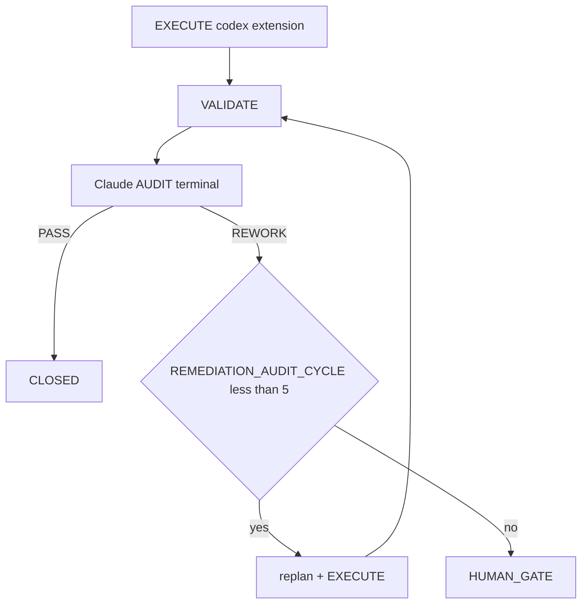

Reading additional input from stdin...
OpenAI Codex v0.125.0 (research preview)
--------
workdir: /Users/1millnonstop/Downloads/projet/foodking-web/web/testttt
model: gpt-5.5
provider: openai
approval: never
sandbox: workspace-write [workdir, /tmp, $TMPDIR, /Users/1millnonstop/Downloads/projet/foodking-web/web/testttt, /Users/1millnonstop/.codex/memories]
reasoning effort: xhigh
reasoning summaries: none
session id: 019dc21b-d012-7323-816b-da6e25e6311f
--------
user
# Round 3 — Codex : replique structuree apres lecture de Claude R2

Tu es le meme agent que R1, mais ici en debat. Tu as acces a tout le workspace. Lis d'abord :

1) `reports/audit/CHALLENGE_CLAUDE_R2_2026-04-25.md`
2) ton propre R1 : `reports/audit/CHALLENGE_CODEX_R1_2026-04-25.md`
3) si necessaire, les fichiers code cites dans R2 Section E.

Tache : repondre a l'orchestrateur (Claude) de facon defense / contre-argument sans bruler les invariants FoodKing. Structure obligatoire :

## A) Points ou j'adopte la position de l'orchestrateur
- 4-8 puces.

## B) Points ou je rejette ou nuance la contestation (Claude) — preuve
- 8-15 puces : pour chaque, cite un fichier ou admets connaissance partielle.

## C) Liste consolidee (unique) — P0 pour V1
- 5-12 numeros.

## D) Plan d'implementation (pas de patch ici) pour V1
- 10-25 etapes ordonnees ; chaque etape = sous-systeme + type de preuve (test / grep / E2E).

## E) Ce que le rapport final doit absorber (pour la synthese)
- 5-7 bullet "a fusionner absolument" (valide transversal) + 5-7 "a exclure" (faux departs).

## F) Reponse obligatoire a la SECTION E de Claude R2
- Reponds point par point aux 12 instructions R2 Section E.
- Pour chaque point : `admis | conteste | needs_evidence`, preuve chemin:ligne, et implication P0/P1/P2.
- Si une preuve R1 etait UNVERIFIED, soit tu l'ouvres maintenant, soit tu retires/abaisses le point.

Sors sans bavardage d'ouverture. Francais, dense. Aucun patch.

Fin.
codex
Je vais lire les fichiers de cadrage et les deux rapports demandés, puis vérifier les références code que Claude R2 utilise avant de répondre point par point.
exec
/bin/zsh -lc "sed -n '1,220p' AGENTS.md" in /Users/1millnonstop/Downloads/projet/foodking-web/web/testttt
exec
/bin/zsh -lc "sed -n '1,220p' .cursor/ACTIVE_CYCLE.md" in /Users/1millnonstop/Downloads/projet/foodking-web/web/testttt
exec
/bin/zsh -lc "sed -n '1,260p' docs/orchestration/GLOBAL_SYSTEM_PRIMER.md" in /Users/1millnonstop/Downloads/projet/foodking-web/web/testttt
 succeeded in 0ms:
# Active Cycle – FoodKing

**Méta (SSOT `run-cycle.md` Step 0 + `AGENTS.md` § *Authoritative … cycle state*)** — requis pour que l’orchestrateur ne s’arrête pas sur *« RUNNER_MODE not set »*.

| Champ | Valeur actuelle |
| --- | --- |
| **RUNNER_MODE** | `single-session` |
| **PHASE (cycle W10)** | `IN_PROGRESS` (détail = section `CYCLE_W10_…` ci-dessous) |
| **TASK_ID** | `P_EXEC_CLOSEOUT_GRAPHITI_CI_PROD_2026-04-22` |
| **PLAN_FILE** | `plans/PLAN_EXECUTION_CLOSEOUT_GRAPHITI_CI_PROD_2026-04-22.md` |
| **REPORT_FILE** | `reports/post_execute_latest.log` (append — preuve `EXECUTE_DELEGATION` / `AUDIT_*`) |

> **ACTIVE_PRIMARY** : `CYCLE_W10_EXECUTION_CLOSEOUT` (un seul cycle peut être actif à la fois — voir B03 méga-checklist).
> Cycles plus anciens en lecture seule = **archive** déplacée dans **`.cursor/ACTIVE_CYCLE_ARCHIVE.md`** (lecture humaine / forensique uniquement, **non requise** par le parcours obligatoire).

## CYCLE_W10_EXECUTION_CLOSEOUT (IN_PROGRESS — mémoire 180 + MCP global + commit + CI + prod)

**TASK_ID** : `P_EXEC_CLOSEOUT_GRAPHITI_CI_PROD_2026-04-22`  
**Plan SSOT** : `plans/PLAN_EXECUTION_CLOSEOUT_GRAPHITI_CI_PROD_2026-04-22.md`  
**Ordre** : Piste A (POS+Centrale : PLAN-MEM-1) ∥ Piste B (humain : PLAN-MEM-3) → C (smoke) → D (commit sur « go commit ») → E (CI) → F (prod J-7→J+7).  
**Gate mémoire** : `python3 memory/verify.py` → count **≥ 175** (180 idéal) avant de considérer PLAN-MEM-1 **CLOSED**.

- **Vérif locale (2026-04-22)** : `python3 memory/verify.py` → **count = 182**, smoke `search_memory_facts` OK — gate **satisfaite** pour clôturer l'ingestion côté seuil d'épisodes (suite : commit / CI / prod selon plan `PLAN_EXECUTION_CLOSEOUT_*`).

**Gouvernance globale (2e passe 2026-04-22)** : primer multi-agents + Graphiti vivant + tokens « zéro effet négatif » → **`docs/orchestration/GLOBAL_SYSTEM_PRIMER.md`** + rapport **`reports/audit/AUDIT_SECOND_PASS_GLOBAL_GOVERNANCE_REPORT_2026-04-22.md`**.

---

## Archive

Tous les cycles **CLOSED / COMPLETED PASSED** (W4 → W9, NF525, etc.) ont été déplacés dans **`.cursor/ACTIVE_CYCLE_ARCHIVE.md`** pour réduire le coût de lecture du parcours obligatoire (audit 2026-04-24, mission `T-PARCOURS-OPTIMIZE-001`).

- **Lecture humaine** : ouvrir `.cursor/ACTIVE_CYCLE_ARCHIVE.md`.
- **Lecture agent** : **non requise** sauf instruction explicite du plan ou du chat (ex. "reprend le rationale du cycle W9").
- **Recherche** : `rg "CYCLE_W9_" .cursor/ACTIVE_CYCLE_ARCHIVE.md` ou `git log --follow .cursor/ACTIVE_CYCLE.md`.

 succeeded in 0ms:
# FoodKing – Cursor Agent Operating Contract

## 0. Quick start contract — read this first

Commence ici. Ne lance aucune action tant que tu n'as pas lu les priorités P0.
Ce contrat fixe l'ordre minimal de lecture pour comprendre le repo en moins de 60 secondes.
Lis complètement ce qui est marqué obligatoire ; diffère seulement ce qui est explicitement classé P2.

### Reading priority

| Priority | What to read | Why |
| --- | --- | --- |
| P0 | `AGENTS.md §1 Parcours obligatoire` | Cadre impératif de travail, ordre de lecture, discipline de cycle. |
| P0 | `.cursor/ACTIVE_CYCLE.md` (continuation) | État courant du cycle actif, contexte vivant, reprise sans divergence. |
| P0 | `.cursor/rules/global.mdc` (auto-attaché — mentionné pour info) | Règles globales toujours applicables, même si déjà injectées par l'outil. |
| P1 | `docs/orchestration/GLOBAL_SYSTEM_PRIMER.md` | Vocabulaire, architecture d'orchestration, invariants transverses. |
| P1 | `.cursor/commands/run-cycle.md` | Procédure exacte pour démarrer un cycle borné correctement. |
| P1 | `docs/orchestration/MEMORY_MATRIX.md` | Où chercher la mémoire utile sans relire tout le dépôt. |
| P1 | `.cursor/routing.md` | Routage des tâches, choix du bon canal, limites d'intervention. |
| P2 | `docs/orchestration/CODEX_API_DELEGATION.md` (quand EXECUTE complexe) | À lire si tu délègues ou exécutes du complexe (uniquement **CLI `codex`**, pas d’exécuteur HTTP dans le dépôt). |
| P2 | `.cursor/ACTIVE_CYCLE_ARCHIVE.md` (forensique humain) | Historique utile pour audit humain, pas requis au démarrage. |
| P2 | `docs/orchestration/EXPORT_CONFIG_CODEX_GPT_API_ET_AUDIT_PERSISTANCE.md` (nouveau poste) | Configuration et persistance utiles surtout lors d'un nouvel environnement. |

Règle simple : P0 avant toute action, P1 avant tout EXECUTE, P2 seulement à la demande du sujet.
Si un doute persiste après P0+P1, arrête-toi et relis ; n'improvise pas.

### One-line bootstrap

```bash
npm run verify:boucle
bash scripts/agent-activity-log.sh tail 50
run-cycle <TASK_ID>
```

**Anti-répétition (nouvel onglet / agent parallèle)** : copier d’abord le bloc de `docs/orchestration/SESSION_OPENING_ENFORCEMENT.md` — même discipline, moins d’oubli de `ACTIVE_CYCLE` / `run-cycle`.

Utilise `run-cycle <TASK_ID>` pour initier tout cycle borné.
Les deux autres commandes servent à vérifier l'état local et le journal d'activité avant d'exécuter.

### Quality-first, not token-cheap

Lis P0 et P1 intégralement, sans skim. Les économies de tokens ne se font jamais sur la substance des règles, seulement sur la répétition, le bruit et les relectures inutiles. En cas de tension entre vitesse et rigueur, applique la rigueur ; voir `.cursor/rules/global.mdc § Token Discipline`.

### If you're a new human contributor

Commence par `docs/orchestration/EXPORT_CONFIG_CODEX_GPT_API_ET_AUDIT_PERSISTANCE.md` pour préparer ton poste et comprendre le mode de persistance attendu.
Lis-le après P0, puis enchaîne sur P1 avant toute contribution effective.

---

## 1. Parcours obligatoire — **nouvelle conversation** **et** **continuation** (production, non négociable)

> **Objectif** : qu’**à chaque** session (premier message ou 500e message), l’exécutant sache **quel** chemin suivre — **sans** supposer un historique de chat. Tout est **dans le dépôt** ; l’histoire de conversation **n’est pas** la SSOT.

**Règle d’or** : *aucune* modification de code **produit** (hors `plans/`, `reports/`, `docs/gates/`, `missions/`, JSONL gouvernance) **dans le cadre d’un travail borné** sans **(a)** parcours ci-dessous **et** **(b)** cycle `run-cycle` + plan actif, sauf **exception** explicite humaine (notée dans le plan / gate).

| Étape | Action | Quand / pourquoi |
|-------|--------|------------------|
| **0. Continuation** | Lire **`.cursor/ACTIVE_CYCLE.md`**. | Si `PHASE` n’est **pas** vide et le cycle n’est **pas** archivé : **reprendre** ce `TASK_ID` / ce `PLAN_FILE` / ce `REPORT_FILE` — **ne pas** dupliquer un second cycle fantôme. Si humain confirme **nouveau** sujet : réinitialiser / nouveau `TASK_ID` selon `run-cycle` Step 0. |
| **1. Lecture initiale** | Lire **ce fichier** (`AGENTS.md`) **puis** **`docs/orchestration/GLOBAL_SYSTEM_PRIMER.md`** (table §1 = ordre complet : routing, `run-cycle`, Graphiti, `MEMORY_MATRIX`, etc.). | **Avant** tout code ou plan non trivial. Même en « continuation » si le contexte a dérivé ou l’onglet a été rafraîchi. |
| **2. Cycle structuré (SSOT procédurale)** | Toute tâche avec **`TASK_ID`** : suivre **`.cursor/commands/run-cycle.md`** et la commande **`run-cycle <TASK_ID>`** (ou équivalent explicite dans le chat : enchaîner les **Steps 0 → 5** sans en sauter). | **C’est** le programme de production en boucle : `PLAN → EXECUTE → VALIDATE → AUDIT → [GATE \| CLOSE]`. Aucun « close » sans `AUDIT` (sauf gate humain documenté). |
| **3. Vérification d’environnement** | `npm run verify:boucle` (0 requête par défaut). **Si le terminal ne “voit” pas Codex alors que l’extension est connectée** : l’auth IDE n’alimente pas le CLI — lancer `npm run codex:doctor` (npm + `login status` + 1 requête). **Rapide :** `npm run codex:verify-pro`. **Complet :** `npm run verify:boucle:full`. Encart : `agents/codex-extension-instructions.md`. | Même en **Step 5** : l’`EXECUTE` (CLI `codex`) requiert le binaire + session Pro sur **ce** binaire. Voir `run-cycle` Step 0 item 8. |
| **4. Secrets & outils machine** | Binaire **`claude`** sur le **`PATH`** (Claude Code CLI) pour l’**AUDIT** PRIMARY en terminal. Binaire **`codex`** (CLI OpenAI) : *Sign in with ChatGPT* **Pro** — **pas** de clé API dans le dépôt. Résolution : `PATH` **ou** `node_modules/.bin/codex` après **`npm install`** (dépendance **`@openai/codex`**) **ou** `npm i -g @openai/codex`. **Ne pas** mélanger avec une clé *Platform* restreinte dans l’environnement (provoque des 401 *scopes* sur l’API Responses) — `npm run codex:audit-bleed` aide. (Option) MCP Graphiti selon `~/.cursor/mcp.json`. | Sans `claude` : noter dès le **plan** l’`AUDIT` fallback + `AUDIT_FALLBACK_REASON`. Sans binaire `codex` : pas d’`EXECUTE` complexe PRIMARY (sub-agent + `FALLBACK_REASON` ou `npm install` + auth Pro). |
| **5. Traces & mémoire (déjà dans ce fichier)** | **`EXECUTE_DELEGATION:`** avant VALIDATE ; **`AUDIT_CHANNEL:`** + **`TERMINAL_AUDIT_OK: 1`** si audit terminal OK ; `docs/orchestration/MEMORY_MATRIX.md` ; `scripts/agent-activity-log.sh` (tail / start / done). | Traçabilité = **même** qualité en prod sur N agents parallèles. |

**Ce n’est pas optionnel** pour travailler « en production FoodKing » : c’est le **contrat** d’onboarding. Les **règles** `.cursor/rules/*.mdc` (dont **`global.mdc` — alwaysApply**) et ce fichier **s’imposent** **à** tout modèle, **dans** toute conversation, dès l’ouverture du dépôt.

**Pour un humain / nouveau compte** : mêmes étapes ; la doc **`docs/orchestration/EXPORT_CONFIG_CODEX_GPT_API_ET_AUDIT_PERSISTANCE.md`** regroupe l’**export** config API + persistance des règles hors-chat.

## Engine
Cursor local agent. No cloud orchestration. No external framework.
Auto/Premium routing: disabled. Model selection is explicit per cycle.

## Global system primer (multi-agents, Graphiti, tokens — lecture clé)

Tout nouvel intervenant (session Cursor, sub-agent Task, CLI terminal, humain) qui touche **orchestration**, **mémoire**, ou **discipline de contexte** : lire **`docs/orchestration/GLOBAL_SYSTEM_PRIMER.md`** après ce fichier. Y sont définis : ordre de lecture obligatoire, **`foodking-routine-implementer` / `foodking-complex-implementer`**, terminal **`claude` / `codex`**, **mise à jour continue de Graphiti**, et la politique **« intelligence max — zéro optimisation négative »** (tokens : supprimer le gaspillage, pas la substance). Pour audits longs et robustesse **opération + agentique + mémoire** : **`docs/orchestration/MEGA_CHECKLIST_AUTONOMY_AND_MEMORY.md`** (180 tâches) et le narratif **`reports/audit/MEGA_AUDIT_SYSTEM_OPERATION_AGENTIC_2026-04-23.md`**.

**Discipline mémoire (qui écrit où, qui lit quoi, quand)** : **`docs/orchestration/MEMORY_MATRIX.md`** — matrice unique des **4 stores autorisés** (Code A · Graphiti+JSONL B · Missions C · Rapports D), table d'écriture par phase, ordre de lecture pour une nouvelle session, anti-patterns. Aucun nouveau store de mémoire ne peut être ajouté sans gate `docs/gates/GATE_MEMORY_*`. Décisions 2026-04-23 sur OpenSpace et claude-mem : **non intégrés**, justifications dans la matrice.

**Synchro multi-agents (cross-conv, cross-terminal)** : `.cursor/rules/cross-agent-sync.mdc` (alwaysApply) + `reports/AGENT_ACTIVITY_LOG.md` (append-only) + `scripts/agent-activity-log.sh` (`tail | start | done | collisions | active`). Au démarrage de session : `tail 50` (~500 tokens). Avant édition produit (Step 2 EXECUTE) : `start` (refus exit 2 si collision). À la clôture (Step 5 CLOSE) : `done`. Évite que deux agents (Cursor convs / `codex-extension` / `claude-terminal` / humain) modifient les mêmes fichiers à leur insu. **Doctrine étendue** (Graphiti = mémoire partagée, rôles Claude vs Codex, anti-patterns) : **`docs/orchestration/MULTI_AGENT_ORCHESTRATION.md`**.

## Workflow
PLAN → EXECUTE → VALIDATE → AUDIT → [HUMAN GATE | CLOSE]

No phase may be skipped. Audit always precedes close.

## Model Roles
| Model | Role | Channel (priorité **économie d’abonnement / token**) |
|---|---|---|
| Claude | Plan, architect, orchestrate, **audit** | **PLAN** : le plus souvent en **session Cursor** (orchestrateur) — c’est l’entretien cerveau, pas l’appel `codex`. **AUDIT (après chaque implementation)** : **PRIMAIRE = terminal** `bash scripts/foodking-claude-orchestrate.sh` (`context` → `audit` ou `audit-brief`) — s’appuie sur l’**abonnement Anthropic (Claude Code CLI)**, *pas* sur l’orchestrateur de modèles de Cursor. **FALLBACK AUDIT** (terminal HS, **quota / rate limit / session Anthropic saturée**, réseau) : **ne pas arrêter** — même checklist via Task **`foodking-planner-orchestrator`** (recommandé) ou session Cursor **modèle Claude** ; tracer **`AUDIT_CHANNEL: cursor-session`** + **`AUDIT_FALLBACK_REASON:`** + optionnel **`AUDIT_SUBAGENT_FALLBACK: foodking-planner-orchestrator`**. Doc : `docs/orchestration/AUDIT_TERMINAL_QUOTA_FALLBACK.md`. Voir `run-cycle.md` Step 5. |
| **GPT-5.5 / GPT-5.5-pro** | **Implémentation complexe (PRIMARY) + auto-audit de l’implémentation** | **`codex-extension`** — `npm run codex:complex` (CLI `codex` + `codex exec`, **compte ChatGPT Pro** ; voir `agents/codex-extension-instructions.md`) : c’est l’**exécutant principal** pour le code lourd, et le wrapper produit l’**auto-audit** `reports/audit/GPT_SELF_AUDIT_{TASK_ID}.md` (revue de ce que Codex vient d’écrire — *premier* filet de qualité). Cela **ne remplace pas** l’**audit de cycle** Claude. N’emprunte **pas** l’orchestrateur de modèles **Cursor** ; facturation **OpenAI / ChatGPT Pro** sur le compte connecté au CLI. |
| GPT-5.5 (fallback) | Complex implementation (FALLBACK only) | **Sub-agent** `foodking-complex-implementer` (Task Cursor) — consomme l’**usage** des modèles de l’**abonnement Cursor**. **Uniquement** si `codex` / l’exécution `codex exec` a échoué (≥2 tentatives documentées) ou binaire indispo. |
| Composer | Routine edits, reports, summaries | Sub-agent `foodking-routine-implementer` — compte côté Cursor. |

**Qui décide (orchestrateur = Claude, « max smart ») + rôle principal de Codex** : **Claude** porte l’**autorité** sur **PLAN** (périmètre, invariants, stratégie de test), **audit de fin de cycle** (verdict `PASS` / `REWORK` dans le `REPORT_FILE`, interprétation des gates), et **re-plan** après `REWORK`. **En chaîne, deux niveaux d’« audit »** : (1) **Codex (PRIMARY)** = **implémente** le plan complexe *et* **s’auto-audite** via `GPT_SELF_AUDIT_{TASK_ID}.md` (ce que le wrapper génère après l’`exec` — exiger lecture avant VALIDATE) ; (2) **Claude terminal** = **audit indépendant** du cycle (invariants FoodKing, gates, preuve de tests). **Composer** : routine, sans `GPT_SELF_AUDIT` imposé de la même façon sauf exigence du plan. **Aucun exécuteur** ne **substitue** l’orchestrateur sur **clôture** ou **priorité** produit — **`ESCALATION`** si hors plan. Le **terminal** `foodking-claude-orchestrate.sh` = défaut **Opus 4.7** + **`effort high`** (`FOODKING_CLAUDE_TERMINAL_*`) pour l’audit non interactif. En **conflit d’opinion** (p.ex. self-audit Codex optimiste vs audit Claude) : **décision** = cycle **Claude** ; le **fait** code / test l’emporte sur la croyance — re-plan explicite.

**Principe unique (symétrique) — à valider en prod sur chaque cycle :** **EXECUTE complexe = CLI `codex` (compte Pro) d’abord + auto-audit** ; **audit = terminale d’abord (Claude + abonnement Anthropic)** ; le **repli** vers les **sub-agents Cursor** n’intervient qu’en **défaut** du chemin `codex exec` documenté, avec `FALLBACK_*` explicite ; **audit terminal** → en défaut **`foodking-planner-orchestrator`** (ou session Claude) avec traces `AUDIT_*` explicites. Preuve d’environnement : `bash scripts/verify-orchestration-boucle.sh` ; smoke complet : `VERIFY_BILLING_FULL=1`.

One PRIMARY_MODEL per cycle. Roles do not overlap.
Full routing policy: `.cursor/routing.md`. Naming: the **PRIMARY complex implementer** is the **FoodKing Codex Complex Implementer** (slug `codex-extension`); see `docs/orchestration/CODEX_API_DELEGATION.md`.

## Authoritative multi-agent bounded cycle (SSOT)

For **TASK_ID-driven** work in Cursor, this path is **authoritative** and overrides any conflicting step elsewhere in this document:

1. **Command:** `.cursor/commands/run-cycle.md` (invoke with a `TASK_ID`, e.g. `run-cycle SMOKE-001`).
2. **Cycle state:** `.cursor/ACTIVE_CYCLE.md` (`RUNNER_MODE: single-session`, `PHASE`, `PLAN_FILE`, `REPORT_FILE`, completion rows).
3. **Plan artifact:** `plans/PLAN_[TASK_ID]_[DATE].md` per `.cursor/context/plan-context.md` (from `plans/PLAN_TEMPLATE.md` when applicable).
4. **Phase instructions:** `.cursor/context/plan-context.md` (PLAN), `.cursor/context/execute-context.md` (EXECUTE), `.cursor/context/audit-context.md` (AUDIT); VALIDATE per `run-cycle.md` when `validate-context.md` is absent.

**EXECUTE delegation (PRIMARY first, FALLBACK only on failure):**

- **Routine** → `Task` → `foodking-routine-implementer`.
- **Complexe — PRIMARY** : **`codex-extension`** — **FoodKing Codex Complex Implementer** (CLI `codex`, compte **ChatGPT Pro**). Procédure :
  1. Préparer `missions/{TASK_ID}/input.json` (+ optionnels : `graphiti_context.md` issu de `search_memory_facts(group_ids=["foodking"])`, `plan_excerpt.md`, `execute_brief.md`, `cycle_snapshot.md` — fusionnés par le script d’assemblage de prompt).
  2. Lancer `npm run codex:complex -- {TASK_ID}` (`bash scripts/codex-extension-execute.sh`) ; variante tâches plus légères : `npm run codex:fast` (`CODEX_EXT_TIER=standard` → modèles *standard* côté UI Codex) ; tâches lourdes : laisser le défaut *complex* + modèle *pro* dans l’app Codex ou `CODEX_EXT_MODEL=…`. (Instructions custom : `agents/codex-extension-instructions.md`.) **Bootstrap** : `npm run codex:prepare -- {TASK_ID}`.
  3. Appliquer `missions/{TASK_ID}/output_codex.json` ; consommer l’**auto-audit** `reports/audit/GPT_SELF_AUDIT_{TASK_ID}.md` (généré par le wrapper).
  4. Tracer `EXECUTE_DELEGATION: codex-extension` dans `reports/post_execute_latest.log` et le `REPORT_FILE`.
- **Complexe — FALLBACK (uniquement si `codex exec` est HS après reprises, ou binaire manquant)** : `Task` → `foodking-complex-implementer` — tracer `EXECUTE_DELEGATION: foodking-complex-implementer (codex-extension-fallback)` + `FALLBACK_REASON:`. 

Référence complète : **`docs/orchestration/CODEX_API_DELEGATION.md`** (naming, fallback contract, audit handoff, token discipline, schéma boucle). Procédure cycle : `.cursor/commands/run-cycle.md`. La trace `EXECUTE_DELEGATION` dans le rapport est **obligatoire** pour passer en VALIDATE.

**Clôture vs. audit :** Après `VALIDATE`, l’**audit** **Claude** (terminal `foodking-claude-orchestrate.sh` en PRIMARY) **tranche** avec `AUDIT_VERDICT: PASS` ou `AUDIT_VERDICT: REWORK` dans le `REPORT_FILE`. **Pas** de `CLOSED` **sans** `PASS`. Sur `REWORK`, boucle `replan (orchestration Claude) → missions + EXECUTE (souvent codex-extension) → self-audit Codex → VALIDATE → re-audit`, avec `REMEDIATION_AUDIT_CYCLE` 1..5 — au 5e `REWORK` sans `PASS`, **HUMAN_GATE** (détail : Step 5 de `run-cycle.md` et `auto-remediation.mdc`).

Sections below labeled **Legacy workflow** remain valid for **PR-centric / review-loop** habits but **do not replace** this SSOT for bounded cycles.

## Source of truth (extended)
- README.md
- docs/PROJECT_CONTINUITY_AND_VISION.md
- docs/ARCHITECTURE.md
- docs/API_MAP.md
- docs/AUTHZ_MATRIX.md
- docs/ORDER_FLOW.md
- docs/DEVICE_FLOW.md
- docs/BUSINESS_RULES.md
- docs/CORE_MODULES.md
- docs/DATABASE_SCHEMA_CORE.md
- docs/ERROR_HANDLING.md
- docs/SECURITY_NOTES.md
- docs/TEST_PLAN.md
- docs/MASSIVE_TEST_PLAN.md
- docs/SAAS_VISION.md
- docs/CONTRIBUTING_QA_BOTS.md
- workflows/qa-loop.md
- workflows/task-routing.md
- workflows/report-format.md
- workflows/task-status.md
- reports/README.md
- docs/orchestration/MEGA_CHECKLIST_AUTONOMY_AND_MEMORY.md
- docs/orchestration/WORKFLOW_AUDIT_GRAPHIQUE_2026-04-23.md
- docs/orchestration/TERMINAL_CLAUDE_GRAPHITI_ORCHESTRATION.md
- docs/orchestration/ROUTING_MATRIX.md

## Stop Conditions
Halt and generate a gate brief on any of:
- Gate trigger detected
- Scope expansion beyond declared boundary
- FoodKing invariant violation
- Two consecutive validation failures
- Planning ambiguity unresolvable from task context
- **`codex` / `codex exec` indisponible après reprises (auth, binaire, ou échec ≥2 sur la même tâche)** : basculer sur le fallback `Task → foodking-complex-implementer` et **noter explicitement** `EXECUTE_DELEGATION: foodking-complex-implementer (codex-extension-fallback)` + `FALLBACK_REASON:`.
- **Audit en terminal (PRIMARY) indisponible ou limité** (`claude` absent, **quota / rate limit / session Anthropic saturée**, auth, réseau — après **1 retry** documenté de `context` + `audit-brief` ou `audit`) : **continuer le cycle** — même checklist `audit-context.md` via Task **`foodking-planner-orchestrator`** (recommandé) ou session Cursor **Claude** ; **`AUDIT_CHANNEL: cursor-session`** + **`AUDIT_FALLBACK_REASON:`** (obligatoire) + optionnel **`AUDIT_SUBAGENT_FALLBACK: foodking-planner-orchestrator`**. Voir `docs/orchestration/AUDIT_TERMINAL_QUOTA_FALLBACK.md`. **Ne jamais** omettre la raison.

## FoodKing Non-Negotiables
- Backend is pricing SSOT — no frontend price logic
- `OrderStatus` enum is authoritative — no hardcoded strings
- `branch_id` = business data isolation — no cross-branch data bleed
- Dispatch strictly after DB commit
- `OrderService` / `FrontendOrderService` symmetry mandatory on any order change
- Frozen zones require gate clearance before any edit

## MCP

### Phase 1 — Filesystem
Filesystem MCP only for repo reads where applicable.

### Phase 2 — Graphiti (mémoire inter-cycles — **présent dans toutes les sessions où le serveur est enregistré**)

**Objectif** : décisions d’architecture, invariants, sync borne↔POS↔KDS, fiscal NF525, historique de cycles — récupérables sans relire des centaines de fichiers.

| Élément | Détail |
|--------|--------|
| **Enregistrement Cursor (obligatoire côté humain)** | Fusionner le bloc `graphiti` dans **`~/.cursor/mcp.json`** (Settings → MCP). Modèle : **`.cursor/mcp/graphiti.json.example`**. Le dépôt ne peut pas injecter un MCP automatiquement dans l’IDE. |
| **Règle agent (automatique dès que le MCP est chargé)** | Voir **`.cursor/rules/graphiti-memory.mdc`** (always-on) + **`global.mdc`** : avant toute tâche non triviale, appeler au moins **`search_memory_facts`** (et optionnellement **`search_memory_nodes`**) avec `group_ids=["foodking"]`. |
| **Après AUDIT / CLOSE** | Si `add_memory` est disponible : enregistrer les décisions durables (ADR, gate, invariant clarifié). |
| **Si Graphiti absent de la session** | **Ne pas bloquer** PLAN / EXECUTE : une ligne « Graphiti non chargé » + secours **`memory/INDEX.md`** + lecture ciblée des JSONL sous `memory/episodes/`. |
| **Server** | Zep Graphiti — wrapper local **`.cursor/mcp/start-graphiti-mcp.sh`** (voir exemple JSON). Clone typique : `/Users/1millnonstop/graphiti`. |
| **Backend** | Neo4j (ex. Aura) — credentials hors repo. |
| **Dépannage** | **`.cursor/mcp/GRAPHITI_TROUBLESHOOTING.md`** (LiteLLM, embeddings, redémarrage proxy). |
| **Group ID** | Toujours **`foodking`**. |
| **Ingestion / vérif locale** | `memory/ingest.py`, `memory/verify.py`, `bin/graphiti-ingest.sh` ; index des domaines **`memory/INDEX.md`**. |

**Intégration bounded cycle** : la commande **`.cursor/commands/run-cycle.md`** inclut l’appel Graphiti en **Step 0 item 5** (query avant PLAN).

### Phase 3 — Playwright MCP (tests E2E sur flows critiques FoodKing)

- Package : `@playwright/mcp@latest` (npx, pas d’install global)
- Browser : Chromium
- BASE_URL : `http://localhost:8000`
- Config : `.cursor/mcp/playwright.json`
- Flows couverts : POS Cash, POS Card, Kiosk, KDS, Auth refresh (F5)
- Déclencheur : plan déclare `playwright-mcp` | `playwright-critical-flow` | `playwright-full-e2e`
- Rapport : `reports/antigravity/latest.md`
- Règle : le Planner-Orchestrator seul décide si un cycle requiert E2E — jamais auto-déclenché.

---

## Terminal allies — Claude Code & OpenAI Codex (abonnements Pro)

Ces outils **complètent** le routage interne Cursor (`.cursor/routing.md` : PLAN/AUDIT Claude modèle Cursor, EXECUTE complexe **GPT-5.5** via **CLI `codex` (compte Pro)** en primaire, routine Composer). **Aucun remplacement** des rôles du dépôt : ce sont des **alliés optionnels** que tu lances **toi** depuis le terminal intégré Cursor quand tu veux plus de profondeur ou un second passage.

### A — Anthropic **Claude Code** (audits / orchestration textuelle, abonnement Anthropic)

1. Dans Cursor : **Extensions** (`Ctrl+Shift+X` / `Cmd+Shift+X`) → chercher **Claude Code** (Anthropic) → **Installer**.
2. Ouvrir le terminal intégré Cursor.
3. Lancer une fois :

```bash
claude
```

 succeeded in 0ms:
# FoodKing — Primer système global (agents, sous-agents, Graphiti, tokens)

> **Fichier d’entrée** pour toute nouvelle conversation, tout nouvel outil d’agent (Cursor, terminal, futur bot), ou tout humain qui reprend le projet.  
> Objectif : **robustesse** = même avec 100 cycles et des exécuteurs différents, le comportement reste **prévisible**, **traçable**, et la **mémoire** reste **alignée** sur le code.

**Obligatoire avant ce Primer (SSOT d’onboarding)** : lire `**AGENTS.md`**, section **Parcours obligatoire** (nouvelle session **et** continuation), puis enchaîner ici.  
**En continuation d’un cycle** : lire d’**abord** `**.cursor/ACTIVE_CYCLE.md`** (éviter un second `TASK_ID` fantôme) ; si `PHASE` = vide ou `CLOSED`, revenir à la table ci-dessous.

---

## 1. Ordre de lecture obligatoire (minimum viable)

Lire **dans cet ordre** avant d’écrire du code ou un plan non trivial (voir aussi `**AGENTS.md` § *Parcours obligatoire* — tableau** pour la même doctrine) :


| #   | Fichier                                                    | Pourquoi                                                                                                                  |
| --- | ---------------------------------------------------------- | ------------------------------------------------------------------------------------------------------------------------- |
| 0   | `**.cursor/ACTIVE_CYCLE.md`** (si reprise)                 | Cycle déjà en cours : même `TASK_ID` / mêmes Steps **jusqu’à** `CLOSE` — **ne pas** forker un plan parallèle sans le dire |
| 1   | `**AGENTS.md`** (dont § *Parcours obligatoire*)            | Contrat global : phases, routing, MCP, terminal, parcours production, non-négociables                                     |
| 1b  | `**docs/orchestration/SESSION_OPENING_ENFORCEMENT.md**`  | **Bloc unique** (tail log + `verify:boucle` + rappel phases) — réduit la répétition « refais la boucle » en session ; **modèle Cursor = Claude pour PLAN** (Auto/Composer ne remplacent pas `routing.md`) |
| 1c  | `**reports/audit/SIMULATION_PARCOURS_PROD_CHECKPOINTS_2026-04-25.md**` | **Simulation production** : checkpoints par phase, fichiers SSOT, limite IDE (qui orchestre quoi) — avant de promettre « zéro dérive » |
| 2   | `**.cursor/routing.md*`*                                   | Qui fait quoi (Claude plan/audit, GPT-5.5 complexe via `codex extension`, Composer routine)                               |
| 3   | `**.cursor/commands/run-cycle.md**`                        | Déroulé exact d’un cycle `TASK_ID` (incl. Graphiti Step 0.5)                                                              |
| 4   | `**.cursor/rules/graphiti-memory.mdc**`                    | Mémoire Graphiti : quand lire / quand écrire                                                                              |
| 5   | `**.cursor/rules/global.mdc**` + `**context-hygiene.mdc**` | Gates, discipline tokens **sans** réduire l’intelligence                                                                  |
| 6   | `**docs/orchestration/MEMORY_MATRIX.md`**                  | **Quel store écrit quoi, lit quoi, quand** (4 stores autorisés A/B/C/D) — antidote unique à la complexité mémoire         |
| 6b  | `**docs/orchestration/MULTI_AGENT_ORCHESTRATION.md`**      | Même tâches, plusieurs onglets Cursor : **activité** + **Graphiti** (lecture) + `AUDIT_VERDICT` — sans empiéter           |
| 7   | `**memory/INDEX.md`**                                      | Carte des domaines mémoire Graphiti (store B) — secours si MCP absent                                                     |
| 8   | `**tasks/[TASK_ID].md**`                                   | Quand un cycle borné est lancé — périmètre de la tâche                                                                    |


Ensuite, **selon le domaine** : `docs/ORDER_FLOW.md`, `docs/DEVICE_FLOW.md`, `docs/ARCHITECTURE.md`, `project-invariants.mdc`, etc.

Référence roster court : `**docs/orchestration/AGENT_ROLES.md`**.

### 1.1 Décision : Claude orchestre ; Codex implémente (principal) et s’auto-audite

- **Cerveau** (priorité, plan, re-plan, **verdict d’audit de cycle** `PASS` / `REWORK`, gates) : **Claude** (session + terminal `foodking-claude-orchestrate.sh`) — **pas** l’exécutant final sur la *décision* de clôture.
- **Bras + premier contrôle qualité** : **EXECUTE complexe = Codex (PRIMARY)** : **implémente** *et*, via le wrapper, **auto-audit** de sa livraison — `reports/audit/GPT_SELF_AUDIT_{TASK_ID}.md` (à lire en entrée de VALIDATE quand le cycle a passé par `codex-extension`). Ce n’est **pas** l’audit de cycle : c’est la **revue** liée à la livraison Codex (même chaîne d’exécution), pour ratissage **avant** l’audit de cycle Claude.
- **Routine** : Composer (`foodking-routine-implementer`) — implémente sans le même fil Codex/self-audit sauf si le plan l’impose.
- **Terminal audit** (2ᵉ filet) : défaut **Opus 4.7** + `effort high` — `AGENTS.md` / `FOODKING_CLAUDE_TERMINAL_*`.

---

## 2. Sous-agents Cursor (Task tool) — intégration dans le flux

Ce ne sont **pas** des fichiers dans le repo ; ce sont des **profils** invoqués par Cursor selon `.cursor/routing.md` et `**run-cycle.md` Step 2**.


| Sub-agent / Canal                                                               | Modèle cible                                                                  | Quand                                                                                                                                                                                                                                          |
| ------------------------------------------------------------------------------- | ----------------------------------------------------------------------------- | ---------------------------------------------------------------------------------------------------------------------------------------------------------------------------------------------------------------------------------------------- |
| `**foodking-routine-implementer`** (sub-agent Cursor)                           | Composer                                                                      | CRUD, UI copy, config, docs, tests simples — **hors** frozen zones, migrations, auth, pricing cœur                                                                                                                                             |
| `**codex-extension` — FoodKing Codex Complex Implementer (PRIMARY)**            | **GPT-5.5** / **pro** via CLI `codex` (compte **ChatGPT Pro**) + `codex exec` | **Tout** EXECUTE complexe par défaut. `npm run codex:complex -- {TASK_ID}`. Voir `scripts/codex-extension-execute.sh`, `agents/codex-extension-instructions.md`. (Ancien *runner* HTTP : **retiré** du dépôt.) |
| `**foodking-complex-implementer`** (sub-agent Cursor — **FALLBACK uniquement**) | Aligné exécution **GPT-5.5** (emplacement sub-agent)                          | Uniquement si `codex` / `codex exec` est indisponible après reprises sur la même tâche                                                                                                                                                         |


**Règles d'or**

1. **Délégation obligatoire** pour toute modification produit en EXECUTE, avec trace `EXECUTE_DELEGATION:` dans le log de validation. Valeurs autorisées : `codex-extension` | `foodking-routine-implementer` | `foodking-complex-implementer (codex-extension-fallback)` | `explicit-prompt-bind`.
2. **EXECUTE complexe = `codex-extension` PRIMAIRE** (CLI `codex` + Pro, `npm run codex:complex -- {TASK_ID}` ; contexte Graphiti/plan dans `missions/…/graphiti_context.md` etc. ; voir `**docs/orchestration/CODEX_API_DELEGATION.md`**). Le sub-agent `foodking-complex-implementer` est le **fallback** (usage Cursor) — indispo `codex exec` ou tâches ponctuelles. Aucun **connecteur HTTP** / proxy n’est maintenu dans le dépôt.
3. Le sous-agent **ne voit pas toujours** le MCP Graphiti du parent : le plan **doit** contenir `**## PRIOR_CONTEXT`** (faits Graphiti + invariants) — copier ou résumer dans le message de délégation **ou** dans `missions/{TASK_ID}/graphiti_context.md` pour l’appel API.
4. Aucun sub-agent ne **contourne** un gate humain ni n’édite une frozen zone sans `docs/gates/` approuvé.

---

## 3. Terminal allies (hors Task tool) — intégration

Documentés dans `**AGENTS.md` § Terminal allies** :


| Outil                                                                  | Rôle                                                                     | Position + **canal d’abonnement** (SSOT)                                                                                                                                                                                         |
| ---------------------------------------------------------------------- | ------------------------------------------------------------------------ | -------------------------------------------------------------------------------------------------------------------------------------------------------------------------------------------------------------------------------- |
| `**claude` +** `foodking-claude-orchestrate.sh`                        | **AUDIT cycle — PRIMARY (Step 5)** : `context` → `audit` / `audit-brief` | Abonnement **Anthropic (CLI sur terminal)** ; n’**emprunte** pas l’orchestrateur de modèles de Cursor. **FALLBACK** (quota / limite / panne après 1 retry) : Task **`foodking-planner-orchestrator`** + même checklist + `AUDIT_CHANNEL: cursor-session` + `AUDIT_FALLBACK_REASON:` — `docs/orchestration/AUDIT_TERMINAL_QUOTA_FALLBACK.md`. |
| **CLI** `codex` + `npm run codex:complex` (`**codex-extension`**, Pro) | **EXECUTE complexe — PRIMARY** (GPT-5.5)                                 | Compte **ChatGPT Pro** sur le terminal ; ne passe **pas** par l’orchestrateur de modèles **Cursor** ; facturation côté OpenAI ; **FALLBACK** = sub-agent.     |
| `codex` / REPL interactif (OpenAI)                                     | Tâches ad hoc **hors** cycle, ou côté humain                             | N’enlèvent **pas** VALIDATE + AUDIT du `run-cycle`.                                                                                                                                                                              |
| `verify-orchestration-boucle.sh`                                       | Preuve binaire + optionnel smoke (API)                                   | `bash scripts/verify-orchestration-boucle.sh` — `VERIFY_BILLING_FULL=1` lance 1× smoke `claude` + 1× `npm run codex:smoke`.                                                                                                      |


**Clôture :** l’audit terminal écrit `AUDIT_VERDICT: PASS` ou `REWORK` (voir `run-cycle.md` Step 5). Pas de `CLOSED` sans `PASS`. En `REWORK` : re-orchestration + re-EXECUTE jusqu’à `PASS` ou 5e tour → humain. Schéma :




Le terminal **n’enregistre** pas **Graphiti** seul : après AUDIT/CLOSE, décisions → JSONL + `after-execute-memory.sh` (voir §5) comme avant.

---

## 4. Graphiti — vivre avec l’avancement du projet (N agents, N cycles)

### 4.1 Rôles


| Rôle                                    | Responsable                                                          |
| --------------------------------------- | -------------------------------------------------------------------- |
| **Lecture** avant plan / audit complexe | Tout agent avec MCP `graphiti` chargé                                |
| **Écriture** après décision durable     | Phase AUDIT + CLOSED (`audit-context.md`) ou humain via `add_memory` |
| **Alimentation batch** (JSONL → Neo4j)  | Humain ou pipeline : `bash bin/graphiti-ingest.sh`                   |


### 4.2 Quand mettre à jour la mémoire (checklist — « ne pas oublier »)

Cocher mentalement à **chaque** fin de sujet significatif :

- **Invariant** clarifié ou renforcé → nouvelle ligne dans `memory/episodes/02_architecture_invariants.jsonl` (ou fichier le plus proche) + `ingest` ciblé.
- **Sync / event / canal** modifié → `03_domain_events_sync.jsonl` + ingest.
- **Décision produit / ADR** → `12_decisions_log.jsonl` + ingest.
- **Nouvelle tâche V14+** ou finding cross-vagues → `09_tasks_history.jsonl` + ingest.
- **Changement prod / rollout** → `11_production_plan.jsonl` + ingest.
- **Nouveau rôle agent ou règle d’orchestration** → `13_agents_roles.jsonl` + ingest + **mettre à jour ce Primer** si le modèle change.
- **Audit long (ops + agentique + mémoire)** → suivre `docs/orchestration/MEGA_CHECKLIST_AUTONOMY_AND_MEMORY.md` (180 tâches) ; narratif `reports/audit/MEGA_AUDIT_SYSTEM_OPERATION_AGENTIC_2026-04-23.md`.
- **Après toute écriture JSONL** → `bash scripts/after-execute-memory.sh` (rafraîchit `reports/memory/jsonl_manifest.json`, cohérent avec CI) puis `bin/graphiti-ingest.sh` sur les domaines touchés.

**Règle d’or** : si le code ou la doc **canonical** a changé et que la mémoire dit encore l’ancienne vérité → **mise à jour sous 48 h** (sinon dérive silencieuse).

### 4.3 Outils

- Pipeline post-écriture (manifeste + rappel ingest) : `bash scripts/after-execute-memory.sh`.
- Ingestion : `bin/graphiti-ingest.sh [filtre]` — voir `memory/README.md`.
- Vérification : `python3 memory/verify.py`.
- Terminal (bref + audit option) : `bash scripts/foodking-claude-orchestrate.sh post-execute` ou `context` puis `audit-brief` — `docs/orchestration/TERMINAL_CLAUDE_GRAPHITI_ORCHESTRATION.md`.
- Reset rare : `@graphiti clear_graph` puis full ingest (politique humaine).

---

## 5. Tokens, contexte, cache — politique « intelligence max, gaspillage min »

**But** : réponses **détaillées et stables**, pas des réponses courtes pour économiser des tokens au détriment de la qualité.


| On optimise (effet ≥ 0)                                                              | On n’optimise pas (effet négatif interdit)                               |
| ------------------------------------------------------------------------------------ | ------------------------------------------------------------------------ |
| Re-lire un fichier **déjà** dans la fenêtre contexte                                 | Tronquer un plan, une analyse de risque, ou un gate pour « faire court » |
| Résumer une phase **terminée** pour handoff (voir `context-hygiene.mdc` §4)          | Supprimer `## PRIOR_CONTEXT` ou les invariants du plan                   |
| Utiliser **Graphiti** pour récupérer faits structurés au lieu de rouvrir 50 rapports | Désactiver Graphiti pour « aller plus vite » sur du sync / fiscal        |
| Écrire les preuves dans `reports/` structuré                                         | Remplacer des tests par de la prose vague                                |


**Cache applicatif** (Redis, etc.) : régie par le code Laravel et `**app:preflight-production`** — hors scope de ce Primer, mais **ne jamais** confondre « cache métier » et « mémoire Graphiti » : ce sont deux systèmes.

---

## 6. Révision de ce document

- **À chaque** changement majeur d’orchestration (nouveau sub-agent, nouveau MCP, nouveau cycle obligatoire) : mettre à jour **ce fichier** + une ligne dans `13_agents_roles.jsonl` + ingest.
- **Trimestriel** : relire §4.2 avec un lead dev.

---

## 7. Pointers rapides


| Besoin                                                        | Aller à                                                           |
| ------------------------------------------------------------- | ----------------------------------------------------------------- |
| Cycle complet                                                 | `.cursor/commands/run-cycle.md`                                   |
| Gates                                                         | `.cursor/rules/human-gates.mdc`                                   |
| Invariants code                                               | `.cursor/rules/project-invariants.mdc`                            |
| Mémoire locale                                                | `memory/INDEX.md`                                                 |
| Pannes Graphiti                                               | `.cursor/mcp/GRAPHITI_TROUBLESHOOTING.md`                         |
| Closeout prod + mémoire                                       | `plans/PLAN_EXECUTION_CLOSEOUT_GRAPHITI_CI_PROD_2026-04-22.md`    |
| Méga-checklist autonomie / Graphiti                           | `docs/orchestration/MEGA_CHECKLIST_AUTONOMY_AND_MEMORY.md`        |
| Méga-audit narratif (compagnon)                               | `reports/audit/MEGA_AUDIT_SYSTEM_OPERATION_AGENTIC_2026-04-23.md` |
| Audit graphique workflow                                      | `docs/orchestration/WORKFLOW_AUDIT_GRAPHIQUE_2026-04-23.md`       |
| Terminal Claude + Graphiti (rôles, `context` / `audit-brief`) | `docs/orchestration/TERMINAL_CLAUDE_GRAPHITI_ORCHESTRATION.md`    |
| Matrice routine / complexe (sub-agents)                       | `docs/orchestration/ROUTING_MATRIX.md`                            |


codex
Le cycle actif existe mais cette demande est une réplique d’audit sans patch. Je complète la lecture des règles globales et des rapports R1/R2, puis je vérifierai les preuves fichier:ligne pour éviter de reprendre des points non vérifiés.
exec
/bin/zsh -lc "sed -n '1,260p' .cursor/rules/global.mdc" in /Users/1millnonstop/Downloads/projet/foodking-web/web/testttt
exec
/bin/zsh -lc "sed -n '1,320p' reports/audit/CHALLENGE_CODEX_R1_2026-04-25.md" in /Users/1millnonstop/Downloads/projet/foodking-web/web/testttt
exec
/bin/zsh -lc "sed -n '1,320p' reports/audit/CHALLENGE_CLAUDE_R2_2026-04-25.md" in /Users/1millnonstop/Downloads/projet/foodking-web/web/testttt
 succeeded in 0ms:
---
description: Always-on rules for the FoodKing Cursor local agent. Applied to every cycle, every model, every task.
globs: ["**/*"]
alwaysApply: true
---

# Global Rules – FoodKing

## New or continued session — **mandatory path** (applies to **every** conversation and **every** model)

- **The chat log is not the SSOT.** **This repo** (`AGENTS.md`, `.mdc` rules, `docs/orchestration/`, `run-cycle.md`) is.
- On **any** new thread **or** long continuation: (1) Read **`AGENTS.md` § *Parcours obligatoire*** first, then **`docs/orchestration/GLOBAL_SYSTEM_PRIMER.md`** (§1 table). (2) If resuming work, read **`.cursor/ACTIVE_CYCLE.md`** *before* starting a duplicate cycle — follow the same `TASK_ID` / `PHASE` until `CLOSE` or an explicit new task. (3) For bounded work: run **`run-cycle` / `run-cycle.md`** (Steps 0–5) — do not skip `AUDIT` before `CLOSE`. (4) Run `npm run verify:boucle` (and `verify:boucle:full` when an API proof is needed) per `AGENTS.md`. (5) Ensure **`claude` on `PATH` (AUDIT terminal) et binaire `codex` (CLI OpenAI) pour l’EXÉCUTE complexe (compte ChatGPT Pro)**, pas de clé proxy obligatoire — voir `agents/codex-extension-instructions.md`. (6) Obey **`MEMORY_MATRIX.md`**, `EXECUTE_DELEGATION`, `AUDIT_CHANNEL` + `TERMINAL_AUDIT_OK` when using terminal audit, and **`agent-activity-log.sh`** (tail / start / done).
- Full checklist and French wording: **`AGENTS.md` → section *Parcours obligatoire*.

## Cycle Structure
PLAN → EXECUTE → VALIDATE → AUDIT → [HUMAN GATE | CLOSE]

Phases are sequential and non-skippable.
Audit precedes close on every cycle without exception.

## Model Discipline
- Auto/Premium routing is disabled
- PRIMARY_MODEL is declared in the plan file before execution begins
- One PRIMARY_MODEL per cycle
- Mid-cycle model switch requires Claude confirmation logged under `ESCALATION` in the plan file
- Full routing policy: `.cursor/routing.md`

## Complex EXECUTE Delegation (PRIMARY = `codex-extension`)
- The **FoodKing Codex Complex Implementer** (slug `codex-extension`, CLI `codex` + compte ChatGPT Pro) is the **primary** route for all complex EXÉCUTE work — not the Cursor sub-agent.
- Procedure: prepare `missions/{TASK_ID}/input.json` (+ optional `graphiti_context.md` / `plan_excerpt.md` / `execute_brief.md`), run `npm run codex:complex -- {TASK_ID}` (wrapper `bash scripts/codex-extension-execute.sh`), apply `output_codex.json` + lire l’auto-audit `reports/audit/GPT_SELF_AUDIT_{TASK_ID}.md`, log `EXECUTE_DELEGATION: codex-extension`.
- The Cursor sub-agent `foodking-complex-implementer` is **fallback only** — invoked if `codex` / `exec` échoue (≥2 tentatives documentées) or human-escalation. Trace alors `EXECUTE_DELEGATION: foodking-complex-implementer (codex-extension-fallback)` + `FALLBACK_REASON:`.
- Reference docs: `docs/orchestration/CODEX_API_DELEGATION.md`, `AGENTS.md` § "EXECUTE delegation".

## Autonomy Contract
The agent operates autonomously within declared scope.
It halts and escalates — never self-approves — on any gate trigger, scope expansion,
invariant violation, two consecutive validation failures, or unresolvable ambiguity.
Full policies: `human-gates.mdc`, `scope.mdc`, `project-invariants.mdc`.

## Graphiti (mémoire inter-sessions)
- When the Graphiti MCP server is loaded for this workspace, **query it first** on any non-trivial task (see `.cursor/rules/graphiti-memory.mdc` and `AGENTS.md` § MCP).
- If Graphiti is not loaded, continue without blocking; one-line note to enable `~/.cursor/mcp.json` is enough.

## Channel economics — terminal first (SSOT, symmetric with EXECUTE)
- **Complex implementation (`codex-extension` — CLI `codex` Pro)** is the **default**; Cursor sub-agent `foodking-complex-implementer` is **only** a fallback if the `codex exec` path fails (≥2 attempts or binaire indispo) — `EXECUTE_DELEGATION: …` + `FALLBACK_REASON:`. See `AGENTS.md` and `docs/orchestration/CODEX_API_DELEGATION.md`.
- **Claude AUDIT after implementation** is **by default the terminal** (`bash scripts/foodking-claude-orchestrate.sh context` then `audit` or `audit-brief` — **Anthropic subscription** via `claude` CLI). If the terminal fails after **1 retry** (**quota / rate limit / session saturated**, missing binary, auth, network), **do not stop the cycle**: use the **FALLBACK** — same `audit-context.md` checklist via Cursor Task **`foodking-planner-orchestrator`** (recommended) or in-session **Claude** — with `AUDIT_CHANNEL: cursor-session` **plus** mandatory `AUDIT_FALLBACK_REASON:` and optional `AUDIT_SUBAGENT_FALLBACK: foodking-planner-orchestrator`. See `docs/orchestration/AUDIT_TERMINAL_QUOTA_FALLBACK.md` and `run-cycle.md` Step 5; verify env with `bash scripts/verify-orchestration-boucle.sh`.
- Never invert primary/fallback for billing convenience without that trace — that would be indistinguishable from a mistake in production evidence.

## Token Discipline (quality-first — zero negative optimization)
- **Goal**: maximum correct intelligence per cycle — not shortest answers. Removing detail, skipping invariants, or omitting Graphiti queries to "save tokens" is **forbidden** when it reduces correctness or auditability.
- **Allowed savings only**: do not re-read files already in full context; do not paste verbatim large blobs already in the plan; use **Graphiti** + `## PRIOR_CONTEXT` to avoid re-opening dozens of historical reports; use phase summaries per `context-hygiene.mdc` §4 **after** a phase completes (handoff), not to shrink the plan itself.
- Do not re-explain decisions already recorded in the plan file (link/summarize in one line if needed).
- Structured output in reports — narrative allowed in plans/gates when it carries decisions, risks, or test strategy.
- Flag real risks only — no speculative commentary on out-of-scope subsystems

## Reports Discipline
- Bounded-cycle **plans** live under `plans/`; **gate briefs** under `docs/gates/`; validation logs, execution summaries, and other run evidence under `reports/` per `run-cycle.md` and `ACTIVE_CYCLE.md`
- Composer generates run evidence in `reports/` where applicable — Claude audits
- No new reporting structure without a plan-phase decision

## Absolute Prohibitions
The agent must never: self-approve a gate, expand scope without human instruction,
edit a frozen zone without cleared gate, modify `.cursor/routing.md` mid-cycle.
All invariant prohibitions enforced per `project-invariants.mdc`.

 succeeded in 0ms:
Lecture des fichiers SSOT et vérification ciblée des preuves Codex R1 effectuée. Je rends le verdict orchestrateur.

---

# AUDIT ORCHESTRATEUR — Challenge Codex R1 (2026-04-25)

## SECTION A — D'accord (analyse Codex solide)

- **KDS doit être restreint à PREPARING/PREPARED** — confirmé par `docs/DEVICE_FLOW.md:21` (« `ACCEPT → PREPARING → PREPARED` ») et `docs/ORDER_FLOW.md:107-109` (« Interdictions : Un Kiosk ne peut pas… ; KDS écrit cuisine seulement »). Or `OrderStateMachine.php:42, 49` autorise toujours `ACCEPT|PREPARING → CANCELED` *via* `KitchenDisplaySystemOrderService::changeStatus` (`:150`) — invariant doc violé. **P0 légitime**.
- **Promo borne preview vs création** — preview existe (`PricingPreviewService`), payload kiosk envoie `kiosk_promo_code` (`kioskCart.js:26-37`), mais la règle n'est pas reconnue par `OrderRequest.php:35-68`. Asymétrie *affiché ≠ facturé* = atteinte directe à la règle SSOT prix (`docs/BUSINESS_RULES.md §1`). **P0 légitime**, mais à arbitrer V1 (support complet OU retrait preview).
- **Idempotence borne branch-scoped** — solide : contrainte DB `2026_04_18_140003_scope_idempotency_key_to_branch.php` + test `IdempotencyBranchScopedTest.php`. Codex a raison de classer ça en **acquis**.
- **after-commit / Outbox / EventContract** — chaîne validée : `DispatchableAfterCommit:29-41`, `EventContract:34-129`, `EventServiceProvider:102-133`. Codex classe correctement comme robuste mais signale stuck-claim potentiel.
- **`payment-confirm` non blindé borne/TPE** — vérifié `OrderController.php:77-118` : Sanctum + ownership only ; **aucune** preuve de contexte borne (KioskMachine), aucune validation amont du `transaction_id` côté TPE. `routes/api.php:893-895` : route exposée à tout `auth:sanctum`. Risque promotion `PAID` artificielle. **P0 légitime**.
- **KDS Echo `branch.{id}` correctement gardé** via `routes/channels.php:25-38` — bon point.

## SECTION B — Contestation

- **[PRIORITE_SURCOTEE] P0 « verrou optimiste KDS faible »** (`KitchenDisplaySystemOrderService.php:120-148`) : Codex sous-estime que `expectedFrom` est lu *fresh* lors du request, comparé sous `lockForUpdate`, et abort 409 est tracé (`:147`). Le vrai défaut est l'absence de paramètre `expected_status` **client** ; à requalifier **P1** + ajouter contrat HTTP, pas P0.
- **[PREUVE_INSUFFISANTE] P0 « identity transitions répètent side-effects »** (`OrderService.php:1548-1575`) : Codex marque `UNVERIFIED` lui-même. `OrderStateMachine::recordTransition:92-94` **skip** déjà l'identité ; le risque cashback/refund est plausible mais non démontré. À classer **NEEDS_EVIDENCE** (1 test ciblé) avant tout patch.
- **[PREUVE_INSUFFISANTE] P0 « TPE accepté + payment-confirm fail → front continue »** : claim sur `KioskPaymentComponent.vue:448-575` non lue ici, marquée `UNVERIFIED`. Risque réel mais doit être **NEEDS_EVIDENCE** (trace réseau + simulation), pas P0 exécutable tant que comportement front non capturé.
- **[ERREUR_CODEX possible] P1 « catch duplicate idempotency POS non scopé »** (`OrderService.php:1008-1018` UNVERIFIED) : la précheck *est* scopée (`:568-589`) — si MySQL UNIQUE composite est `(branch_id, idempotency_key)` (cf. migration `2026_04_18_140003`), une collision concurrente ne peut survenir que dans la même branche. Risque réel limité à code admin `branch_id=0`. À requalifier **NEEDS_EVIDENCE** + test concurrent.
- **[PRIORITE_SOUSCOTEE] P1 « OrderStatusRequest::authorize permissif »** (`OrderStatusRequest.php:23-49`) : c'est *le* point d'entrée commun POS/KDS/borne sans politique par surface — Device Flow exige des couloirs distincts. Mérite **P0** (auth/RBAC) et est l'un des deux verrous nécessaires pour P0 KDS terminal.
- **[INVARIANT_MANQUANT] symétrie `OrderService` / `FrontendOrderService`** : Codex effleure mais ne challenge pas la **symétrie systématique sur tout changement d'ordre** (AGENTS.md §FoodKing Non-Negotiables). Manque audit explicite d'arrondi, taxes, plafond coupons, paiement multi-méthode. À ajouter en P0 du plan V1.
- **[PRIORITE_SURCOTEE] P1 « outbox dispatched_at avant broadcast »** (`DispatchDomainEventsJob.php:65-86`) : claim correcte (claim ≠ delivery), mais en V1 minimal le risque est *acceptable* avec un retry/heartbeat *supervisor* externe ; à classer **P2** sauf preuve de stuck en prod (NEEDS_EVIDENCE).
- **[INVARIANT_MANQUANT] branch_id LIKE risk dans `OrderService::list`** : si la doc `ADMIN_CROSS_BRANCH_MAP_2026-04-20.md:55-57` confirme `LIKE`, c'est une fuite cross-branche **P0** (invariant non négociable AGENTS.md). Codex le classe P1 — **sous-coté**.
- **[ERREUR_CODEX] P1 « POS cash via endpoint KDS »** (`PosComponent.vue:1414-1421` UNVERIFIED) : à confirmer mais peu impactant si la machine d'état autorise `PREPARING→DELIVERED` sous permission `pos` (cf. `OrderStateMachine.php:38-46`). **PREUVE_INSUFFISANTE**, à requalifier P2/dette nommage.
- **[PREUVE_INSUFFISANTE] P0 promo borne** : la preuve serveur (`FrontendOrderService.php:216-227`) marquée UNVERIFIED ; classer comme P0 contingent à **un test contractuel** preview→checkout avant patch.
- **[INVARIANT_MANQUANT]** Aucune mention par Codex du contrat `correlation_id` côté backend pour déduplication, alors que P2 le mentionne côté frontend. Asymétrie EventContract méritait un point dédié.
- **[PRIORITE_SOUSCOTEE]** sealed-Z `changeStatus`/`changePaymentStatus` — Codex en P1, mais NF525 est doctrine `docs/BUSINESS_RULES.md §6`. Si V1 inclut fiscal réel → **P0**. Si V1 = parcours minimal sans clôture Z → P2. **Décision V1 requise** avant priorisation.
- **[ERREUR_CODEX possible] P1 « variation quantité perdue en preview »** (`PricingPreviewRequest.php:40-42`) : si `kioskPricingPreview.js:70-75` mappe la qty au niveau item parent et non variation, c'est un défaut UX mais le serveur reste source de vérité au checkout. **P2**, pas P1.

## SECTION C — Priorisation V1

**V1 = parcours opérationnel minimal cohérent : (1) Backend SSOT prix/branch/status + (2) POS cash & card + (3) Borne TPE confirm robuste + (4) KDS PREPARING/PREPARED, le tout sous Echo + outbox + branch isolation. Hors V1 : NF525 fiscal complet, fidélité avancée, reporting analytique.**

| Prio | Sujet | Action | Source |
|---|---|---|---|
| **P0** | KDS whitelist transitions + `OrderStatusRequest` policy par surface | Service KDS refuse tout sauf `ACCEPT→PREPARING`, `PREPARING→PREPARED` ; Request authorize selon route group | `KitchenDisplaySystemOrderService.php:150`, `OrderStatusRequest.php:23-49`, `DEVICE_FLOW.md` |
| **P0** | `payment-confirm` blindé borne/TPE | Exiger token kiosk ou device-bound + propriété machine→branche, refuser hors contexte borne | `OrderController.php:77-118`, `routes/api.php:893-895` |
| **P0** | `branch_id` filtre exact partout (LIKE → strict) | Auditer `OrderService::list:61-72,133-151` ; corriger si LIKE | `ADMIN_CROSS_BRANCH_MAP_2026-04-20.md:55-57` |
| **P0** | Promo borne : décider V1 (support OU retrait preview) | Soit câbler `kiosk_promo_code` dans `OrderRequest`/`FrontendOrderService::prepareOrderItems`, soit retirer du payload | `FrontendOrderService.php:216-227`, `kioskCart.js:26-37` |
| **P0** | Symétrie systématique OrderService/FrontendOrderService | Diff audit prix/taxes/coupons/idempotency entre les deux services | AGENTS.md non-négociables |
| **P1** | `expected_status` client requis sur mutations status | Ajouter param obligatoire ; 409 si différent | `KitchenDisplaySystemOrderService.php:122-148` |
| **P1** | Garde no-op idempotente avant side-effects status | Test cashback/refund non rejoué sur retry | NEEDS_EVIDENCE |
| **P1** | TPE retry failure UX | État explicite « paiement accepté, confirmation en attente » | NEEDS_EVIDENCE Vue front |
| **P1** | Catch duplicate idempotency POS | Test concurrent admin branch_id=0 ; sinon non actionnable | NEEDS_EVIDENCE |
| **P2** | Outbox claim_at vs dispatched_at | Surveillance + job de récupération | `DispatchDomainEventsJob.php:65-86` |
| **P2** | POS cash via endpoint KDS | Renommer route POS dédiée, dette nommage | `PosComponent.vue:1414-1421` |
| **P2** | EventContract front parité backend | Aligner `correlation_id`/`branch_id` | `eventContract.js:23-45` |
| **P2** | Sealed-Z status/payment | **Conditionnel** : P0 si NF525 V1 ; P2 sinon | `OrderService.php:1661-1823` |
| **NEEDS_EVIDENCE** | Suite E2E POS cash/card + borne TPE + KDS bout-en-bout | Playwright critical-flow | `reports/antigravity/` |

## SECTION D — Verdict

**`CHALLENGE_VERDICT: SPLIT`** — 4 P0 confirmés et 1 P0 ré-haussé (LIKE branche), 3 P0 Codex à requalifier en NEEDS_EVIDENCE / P1 (expectedFrom, identity side-effects, TPE retry UX), 2 erreurs probables (catch idempotency, POS via KDS) à confirmer avant exec. Ne pas merger en bloc, ne pas rejeter en bloc : redécouper le plan V1 selon Section C.

## SECTION E — Instructions Codex R3 (preuves attendues)

1. **payment-confirm** : prouver par `routes/api.php` + `OrderController.php` qu'aucun *middleware kiosk-token* n'existe ; si présent, citer ligne. Exiger réponse OUI/NON sur garde borne.
2. **KDS terminal** : exécuter `tests/Feature/KdsChangeStatus*` couvrant le rôle Chef appelant `CANCELED` sur `PREPARING` — fournir résultat HTTP attendu vs effectif.
3. **expectedFrom** : démontrer le scénario concret de race deux onglets KDS qui *passe* malgré `lockForUpdate` ; sinon admettre **P1**.
4. **Identity side-effects `OrderService::changeStatus:1548-1575`** : citer extrait code complet (cashback/refund/audit) prouvant qu'aucune garde no-op n'existe ; si garde présente, retirer le P0.
5. **Catch duplicate idempotency POS `:1008-1018`** : produire l'extrait. Si le catch est dans une transaction scopée par `branch_id`, admettre **erreur**.
6. **POS collect cash via endpoint KDS** : preuve `PosComponent.vue:1414-1421` *exactement* + URL appelée. Si `/admin/pos-order/change-status` et non `/kds-order/...`, retirer.
7. **Promo borne** : trace `kiosk_promo_code` dans `OrderRequest::rules()` et dans `FrontendOrderService::store/computeTotals` — affirmer **présence** ou **absence** sans `UNVERIFIED`.
8. **branch_id LIKE risk** : extrait exact `OrderService::list:61-72` + `:133-151`. Si requête utilise `=`, retirer le risque ; si `LIKE`, réhausser **P0**.
9. **Symétrie OrderService/FrontendOrderService** : tableau diff (méthodes, validations, idempotency, taxes, coupons, after-commit). Pas un narratif, un tableau.
10. **NF525 V1 ou pas** : trancher la portée fiscale V1 — si exclu, sealed-Z status/payment passe P2 ; si inclus, **P0** + tests.
11. **Sub-agent fallback** : confirmer `EXECUTE_DELEGATION` cible (`codex-extension` ou `foodking-complex-implementer`) pour chaque P0 du plan V1 proposé.
12. **E2E V1** : proposer **5 scénarios Playwright** maximum (POS cash, POS card, Borne TPE confirm, KDS preparing/prepared, branch 1 vs 10) avec assertions outbox + Echo. Pas plus.

---

**Note orchestrateur** : aucun gate humain clos ici, aucun `run-cycle` lancé. Ce challenge est un cadrage pré-PLAN V1. La V1 ne démarre **pas** tant que (a) les NEEDS_EVIDENCE sont levés et (b) la décision NF525 V1 est tranchée par humain.

 succeeded in 0ms:
## A) Hypothèses
- *Supposition* : l’objectif V1 prioritaire est un flux opérationnel minimal POS · Borne · KDS, pas une couverture exhaustive fiscale/NF525.
- *Supposition* : les rôles réels en production suivent les permissions Laravel actuelles ; les seeders/guards complets n’ont pas été relus.
- *Supposition* : Echo/Pusher et les queues tournent en production ; l’audit juge surtout les contrats code/events.
- *Supposition* : les tests cités sont représentatifs, mais je n’ai pas lancé toute la suite ni Playwright.
- *Supposition* : les gros fichiers ont été lus par extraits ciblés ; je marque `UNVERIFIED` quand le fichier complet n’a pas été ouvert.
- *Supposition* : Graphiti/MCP n’était pas disponible dans cette session ; fallback par docs et mémoire locale.
- *Supposition* : les invariants AGENTS.md restent bloquants : prix serveur, `branch_id`, enum `OrderStatus`, dispatch après commit, symétrie Order/Frontend.

## B) Ce qui me semble **correct / robuste** dans le code ou la doc
- `OrderStatus` est centralisé dans `app/Enums/OrderStatus.php:5-15`, ce qui évite une partie des chaînes magiques côté PHP.
- La machine d’état est explicite dans `app/Domain/Order/OrderStateMachine.php:33-67`, avec transitions canoniques et terminaux protégés.
- Les raisons obligatoires pour annulation/rejet/retour existent dans `OrderStateMachine.php:177-183`.
- Les events critiques utilisent un trait after-commit : `app/Events/Concerns/DispatchableAfterCommit.php:29-41`, testé par `tests/Feature/DispatchAfterCommitTest.php:54-85`.
- Les events `OrderCreated`, `OrderStatusChanged`, `OrderTableChanged`, `ItemAvailabilityChanged` sont branchés vers outbox/listeners dans `app/Providers/EventServiceProvider.php:102-133`.
- L’outbox a un contrat d’enveloppe strict côté backend : `app/Domain/Events/EventContract.php:34-73` et validation `:81-129`.
- `DispatchDomainEventsJob` verrouille la ligne outbox avant diffusion et réinitialise en cas d’exception : `app/Jobs/DispatchDomainEventsJob.php:65-117` et `:140-161` (`UNVERIFIED`: fichier lu par extraits).
- Le canal Echo `branch.{branchId}` vérifie `branch_id`, y compris restriction kiosk token → branche machine : `routes/channels.php:25-38`.
- POS serveur ignore les totaux client et recalcule via pricing SSOT : `app/Services/OrderService.php:592-655` (`UNVERIFIED`).
- Borne serveur ignore aussi les totaux client et calcule via `PricingService` : `app/Services/FrontendOrderService.php:195-227` (`UNVERIFIED`).
- La preview pricing borne refuse prix/totaux/branch côté client et résout la branche via `KioskMachine` : `app/Http/Requests/Kiosk/PricingPreviewRequest.php:15-20`, `app/Http/Controllers/Frontend/PricingPreviewController.php:31-56`.
- L’idempotence borne est branch-scoped avec lock cache : `app/Services/FrontendOrderService.php:126-149` (`UNVERIFIED`).
- La contrainte DB composite `branch_id + idempotency_key` existe : `database/migrations/2026_04_18_140003_scope_idempotency_key_to_branch.php:14-36`.
- Le test `tests/Feature/Orders/IdempotencyBranchScopedTest.php:20-71` couvre même clé sur branches différentes et rejet sur même branche.
- KDS a un test de filtre exact par branche contre l’ancien risque `LIKE`: `tests/Feature/KdsBranchFilterExactTest.php:16-57`.
- Le composant KDS écoute les events utiles, dont `OrderCreated`, `OrderStatusChanged`, `ItemAvailabilityChanged`, `OrderTableChanged` : `resources/js/components/admin/kitchenDisplaySystem/KitchenDisplaySystemComponent.vue:1135-1157` (`UNVERIFIED`).

## C) Ce qui me semble **fragile, faux ou dangereux** (P0 d’abord)
- **P0** — `payment-confirm` peut marquer une commande frontend possédée comme `PAID` avant de prouver qu’elle est bien une commande borne/TPE ; pourquoi : fraude ou état payé artificiel. Preuve : `routes/api.php:889-895`, `app/Http/Controllers/Frontend/OrderController.php:77-115`.
- **P0** — Si le TPE accepte mais que `payment-confirm` échoue après retries, le front borne continue vers l’écran d’attente ; pourquoi : paiement réel possible avec commande backend encore `PENDING/UNPAID`. Preuve : `resources/js/components/frontend/kiosk/KioskPaymentComponent.vue:448-459` et `:562-575` (`UNVERIFIED`).
- **P0** — KDS peut théoriquement envoyer des statuts terminaux comme `CANCELED` via la machine d’état ; pourquoi : Device Flow dit KDS limité à ACCEPT→PREPARING→PREPARED, sans annulation/reason flow. Preuve : `OrderStatusRequest.php:23-30`, `KitchenDisplaySystemOrderService.php:150-179`, `OrderStateMachine.php:37-49`.
- **P0** — Le verrou optimiste KDS est faible en HTTP : `expectedFrom` vient du modèle fraîchement bindé, pas d’un état client ; pourquoi : deux écrans peuvent écraser/sauter un conflit UI. Preuve : `KitchenDisplaySystemOrderService.php:120-148`, commentaire test `tests/Feature/KdsChangeStatusConcurrencyTest.php:21-26`.
- **P0** — Les transitions identité peuvent répéter des side-effects dans `OrderService::changeStatus` avant sauvegarde ; pourquoi : cashback/refund/audit peuvent se répéter sur retry terminal. Preuve : identité autorisée `OrderStateMachine.php:27-31`, side-effects `app/Services/OrderService.php:1548-1575` (`UNVERIFIED`).
- **P0** — La promo borne est appliquée en preview mais ne semble pas consommée à la création réelle ; pourquoi : total affiché ≠ total facturé serveur. Preuve : preview `PricingPreviewService.php:66-97`, payload `kioskCart.js:26-37`, absence règle `OrderRequest.php:35-68`, création `FrontendOrderService.php:216-227` (`UNVERIFIED`).
- **P1** — Le catch duplicate idempotency POS est non scopé par branche dans un chemin d’erreur ; pourquoi : admin branch 0 + collision concurrente peut retourner la mauvaise commande. Preuve : precheck scopé `OrderService.php:568-589`, catch non scopé `:1008-1018` (`UNVERIFIED`).
- **P1** — L’outbox marque `dispatched_at` avant broadcast ; pourquoi : crash process entre claim et broadcast peut laisser un event bloqué hors `pending()`. Preuve : `DispatchDomainEventsJob.php:65-86`, `DomainEvent.php:33-35`.
- **P1** — POS “collect cash” utilise l’endpoint KDS `admin/kds-order/change-status/{order}` pour `DELIVERED` ; pourquoi : permission et responsabilité métier confuses. Preuve : `PosComponent.vue:1414-1421`, `KitchenDisplaySystemController.php:18-23` (`UNVERIFIED`).
- **P1** — La preview pricing borne accepte une quantité de variation mais la conversion la perd ; pourquoi : preview fausse sur multi-quantités. Preuve : `PricingPreviewRequest.php:40-42`, `kioskPricingPreview.js:70-75`, `PricingPreviewService.php:146-155`.
- **P1** — `changeStatus` / `changePaymentStatus` n’ont pas le même garde sealed-Z que `destroy`; pourquoi : risque fiscal si NF525 V1 exige immutabilité après clôture. Preuve : `OrderService.php:1661-1714` vs `:1804-1823` (`UNVERIFIED`).
- **P1** — KDS peut dispatcher un `OrderStatusChanged` old==new ; pourquoi : bruit sync, notifications et outbox inutiles. Preuve : identité autorisée `OrderStateMachine.php:27-31`, dispatch KDS `KitchenDisplaySystemOrderService.php:173-179`.
- **P1** — Le filtre admin `branch_id` dans `OrderService::list` passe par une logique générique `LIKE`; pourquoi : vues admin/rapports peuvent mélanger branche 1 et 10. Preuve : `OrderService.php:61-72` et `:133-151`, doc lacune `docs/centralisation/ADMIN_CROSS_BRANCH_MAP_2026-04-20.md:55-57` (`UNVERIFIED`).
- **P1** — `OrderStatusRequest` autorise plusieurs rôles sur tout statut numérique ; pourquoi : les politiques par surface POS/KDS/borne ne sont pas assez exprimées dans la request. Preuve : `app/Http/Requests/OrderStatusRequest.php:23-49`.
- **P2** — Le contrat event frontend valide moins strictement que le backend ; pourquoi : broadcasts legacy/directs peuvent contourner `correlation_id`/`branch_id` et la déduplication. Preuve : `resources/js/services/eventContract.js:23-45` et `:252-265`.
- **P2** — KDS sync version repose surtout sur `updated_at` et contient un TODO `status_changed_at`; pourquoi : dette de versioning pour sync fine. Preuve : `app/Services/KdsSyncService.php:126-142`.
- **P2** — Store KDS accède à `payload.vuex` sans garde si payload absent ; pourquoi : crash mineur possible sur appel action mal formé. Preuve : `resources/js/store/modules/kitchenDisplaySystemOrder.js:20-29`.
- **P2** — Couverture E2E récente non vérifiée ici ; pourquoi : l’audit statique ne prouve pas POS cash/card + borne TPE + KDS temps réel bout-en-bout. Preuve : tests unitaires/feature vus, mais rapport Playwright courant non ouvert (`UNVERIFIED`).

## D) Matrice

| Sujet | État perçu | Risque | Action | Preuve requise |
|---|---|---|---|---|
| Paiement TPE borne | Fragile | P0 fraude / commande bloquée | Garde serveur avant mutation + erreur bloquante front | Test `payment-confirm` non-kiosk refusé + retry failure |
| KDS transitions | Trop permissif | P0 annulation sans flux métier | Whitelist KDS PREPARING/PREPARED + reason hors KDS | Feature test rôle Chef |
| Verrou optimiste KDS | Insuffisant | P0 conflit silencieux | Ajouter `expected_status` client requis | Test HTTP 409 sur état périmé |
| Idempotence POS | Bonne base, catch faible | P1 mauvaise commande retournée | Scoper catch duplicate par branche | Test admin multi-branch concurrent |
| Outbox events | Robuste mais stuck possible | P1 event perdu après crash | Ajouter claim state/timeout rescue | Test ou job de récupération |
| Pricing serveur | Globalement correct | P1 mismatch UX | Garder SSOT, corriger promo/variation preview | Tests preview vs création |
| Promo borne | Incohérente | P0/P1 total affiché ≠ facturé | Appliquer réellement ou retirer preview | Test checkout avec `kiosk_promo_code` |
| `branch_id` admin | Partiel | P1 vues croisées imprécises | Filtres exacts dans services | Test branch 1 vs 10 |
| `OrderTableChanged` | Bien outboxé | P2 intégration à surveiller | Garder event + refresh ciblé | Test KDS refresh table |
| Sealed-Z | Garde partielle | P1 fiscal | Étendre aux status/payment si requis V1 | Test mutation refusée après Z |

## E) Plan d’amélioration (ordre d’exécution)
1. Verrouiller `/frontend/order/{id}/payment-confirm` : exiger contexte borne/TPE, propriété machine/branche, méthode différée, et ne muter `PAID` qu’après validation.
2. Faire échouer le parcours borne si `confirmBackendPayment()` échoue après retries, avec état explicite “paiement accepté, confirmation serveur en attente/échec”.
3. Restreindre le service KDS à une whitelist métier (`PREPARING`, `PREPARED`, éventuellement `ACCEPT` si voulu) et interdire les statuts terminaux.
4. Ajouter `expected_status` obligatoire aux mutations KDS/POS sensibles et retourner 409 si l’état serveur diffère.
5. Ajouter garde no-op idempotente avant side-effects dans `OrderService::changeStatus` et chemins terminal/payment.
6. Décider le statut V1 de `kiosk_promo_code` : soit support complet à la création, soit retrait de la preview ; corriger aussi la quantité des variations.
7. Corriger le catch duplicate POS pour rechercher par `branch_id + idempotency_key`.
8. Ajouter une récupération outbox pour claims bloqués ou un état `claimed_at` séparé de `dispatched_at`.
9. Remplacer le changement POS cash via endpoint KDS par une route/service POS explicite.
10. Ajouter une suite V1 bout-en-bout minimale : POS cash, POS card, borne card confirm, KDS preparing/prepared, Echo/outbox, branch 1 vs 10.

## F) Questions pour un **relecteur** (le rôle Closer / Claude)
- Le endpoint `payment-confirm` doit-il être réservé exclusivement aux tokens borne/TPE, ou un client web connecté peut-il confirmer un paiement ?
- KDS a-t-il le droit métier d’annuler/rejeter une commande, ou seulement de passer en préparation/prêt ?
- Le V1 doit-il supporter `kiosk_promo_code` au checkout réel, ou seulement les coupons classiques ?
- Souhaite-t-on rendre `expected_status` obligatoire pour toutes les mutations de statut POS/KDS ?
- Après paiement TPE accepté mais confirmation backend échouée, quel état UX/opérationnel est attendu ?
- La contrainte sealed-Z doit-elle bloquer status/payment dès V1 ou seulement delete/export ?
- Les vues admin branch 0 doivent-elles rester globales par défaut, ou imposer une branche active pour POS/KDS ?

## G) Métacritique
Cette analyse est statique et partielle : plusieurs gros fichiers ont été lus par extraits, Graphiti n’était pas disponible, les seeders de permissions et la configuration runtime n’ont pas été exhaustivement vérifiés, et je n’ai pas lancé la suite complète ni un vrai parcours Playwright. Les risques P0 signalés reposent sur preuves de code précises, mais certains peuvent être atténués par middleware, politiques, config ou conventions d’exploitation non ouvertes ici ; ils doivent donc être confirmés par tests ciblés avant patch massif.

codex
R2 demande des preuves fortes, surtout là où mon R1 portait `UNVERIFIED`. Je vais ouvrir les extraits exacts avec numéros de lignes, puis lancer uniquement le test KDS ciblé si la suite locale le permet.
exec
/bin/zsh -lc "rg --files | rg '("'^app/Http/Controllers/Frontend/OrderController.php$|''^routes/api.php$|''^app/Services/KitchenDisplaySystemOrderService.php$|''^app/Http/Requests/OrderStatusRequest.php$|''^app/Domain/Order/OrderStateMachine.php$|''^app/Services/OrderService.php$|''^resources/js/components/admin/pos/PosComponent.vue$|''^resources/js/components/frontend/kiosk/KioskPaymentComponent.vue$|''^resources/js/components/frontend/kiosk/store/kioskCart.js$|''^app/Http/Requests/Frontend/OrderRequest.php$|''^app/Services/FrontendOrderService.php$|''^resources/js/services/frontend/kioskPricingPreview.js$|''^app/Http/Requests/Kiosk/PricingPreviewRequest.php$|''^docs/centralisation/ADMIN_CROSS_BRANCH_MAP_2026-04-20.md$|''^tests/Feature/KdsChangeStatus.*|''^tests/Feature/.*Kds.*ChangeStatus.*)'"'" in /Users/1millnonstop/Downloads/projet/foodking-web/web/testttt
 succeeded in 0ms:
routes/api.php
app/Services/FrontendOrderService.php
app/Services/KitchenDisplaySystemOrderService.php
app/Services/OrderService.php
app/Domain/Order/OrderStateMachine.php
tests/Feature/KdsChangeStatusConcurrencyTest.php
docs/centralisation/ADMIN_CROSS_BRANCH_MAP_2026-04-20.md
app/Http/Controllers/Frontend/OrderController.php
app/Http/Requests/OrderStatusRequest.php
app/Http/Requests/Kiosk/PricingPreviewRequest.php
resources/js/components/frontend/kiosk/KioskPaymentComponent.vue
resources/js/components/admin/pos/PosComponent.vue

exec
/bin/zsh -lc "rg -n \"payment-confirm|kds-order/change-status|pos-order/change-status|class OrderController|confirm|kiosk_promo_code|promo|idempotency_key|LIKE|like\\(|branch_id|changeStatus|changePaymentStatus|lockForUpdate|expected|recordTransition|cashback|refund|sealed|closing|OrderStatusChanged|dispatched_at|claimed\" app routes resources tests docs/centralisation -g '"'!vendor'"'" in /Users/1millnonstop/Downloads/projet/foodking-web/web/testttt
 succeeded in 0ms:
tests/Feature/KioskPaymentStateMachineTest.php:13:use App\Events\OrderStatusChanged;
tests/Feature/KioskPaymentStateMachineTest.php:79:            'branch_id' => $this->branch->id,
tests/Feature/KioskPaymentStateMachineTest.php:88:            'branch_id' => $this->branch->id,
tests/Feature/KioskPaymentStateMachineTest.php:94:            'branch_id' => $this->branch->id,
tests/Feature/KioskPaymentStateMachineTest.php:106:            'branch_id' => $this->branch->id,
tests/Feature/KioskPaymentStateMachineTest.php:124:    public function test_card_order_stays_pending_until_payment_confirm(): void
tests/Feature/KioskPaymentStateMachineTest.php:126:        Event::fake([OrderCreated::class, OrderStatusChanged::class]);
tests/Feature/KioskPaymentStateMachineTest.php:144:        Event::assertNotDispatched(OrderStatusChanged::class);
tests/Feature/KioskPaymentStateMachineTest.php:155:        $confirm = $this
tests/Feature/KioskPaymentStateMachineTest.php:158:            ->postJson("/api/frontend/order/{$orderId}/payment-confirm", [
tests/Feature/KioskPaymentStateMachineTest.php:164:        $confirm->assertOk();
tests/Feature/KioskPaymentStateMachineTest.php:174:        Event::assertDispatched(OrderStatusChanged::class);
tests/Feature/KioskPaymentStateMachineTest.php:188:        Event::fake([OrderCreated::class, OrderStatusChanged::class]);
tests/Feature/KioskPaymentStateMachineTest.php:206:        Event::assertDispatched(OrderStatusChanged::class);
tests/Feature/KioskPaymentStateMachineTest.php:209:    public function test_payment_confirm_can_finalize_an_already_paid_but_pending_kiosk_order(): void
tests/Feature/KioskPaymentStateMachineTest.php:211:        Event::fake([OrderCreated::class, OrderStatusChanged::class]);
tests/Feature/KioskPaymentStateMachineTest.php:216:            'branch_id' => $this->branch->id,
tests/Feature/KioskPaymentStateMachineTest.php:234:            ->postJson("/api/frontend/order/{$order->id}/payment-confirm", [
tests/Feature/KioskPaymentStateMachineTest.php:249:        Event::assertDispatched(OrderStatusChanged::class);
tests/Feature/KioskPaymentStateMachineTest.php:264:        Event::fake([OrderCreated::class, OrderStatusChanged::class]);
tests/Feature/KioskPaymentStateMachineTest.php:269:            'branch_id' => $this->branch->id,
tests/Feature/KioskPaymentStateMachineTest.php:285:        $promoted = $service->finalizePaidKioskOrder($unpaidOrder);
tests/Feature/KioskPaymentStateMachineTest.php:287:        $this->assertFalse($promoted, 'Service must return false when payment is not confirmed.');
tests/Feature/KioskPaymentStateMachineTest.php:296:        Event::assertNotDispatched(OrderStatusChanged::class);
tests/Feature/KioskPaymentStateMachineTest.php:303:    public function test_finalize_paid_kiosk_order_promotes_paid_order_when_called_directly(): void
tests/Feature/KioskPaymentStateMachineTest.php:305:        Event::fake([OrderCreated::class, OrderStatusChanged::class]);
tests/Feature/KioskPaymentStateMachineTest.php:310:            'branch_id' => $this->branch->id,
tests/Feature/KioskPaymentStateMachineTest.php:326:        $promoted = $service->finalizePaidKioskOrder($paidOrder);
tests/Feature/KioskPaymentStateMachineTest.php:328:        $this->assertTrue($promoted, 'Service must promote a paid kiosk order to ACCEPT.');
tests/Feature/KioskPaymentStateMachineTest.php:337:        Event::assertDispatched(OrderStatusChanged::class);
app/Console/Kernel.php:71:                            'branch_id' => (int) $branchId,
app/Console/Kernel.php:78:                                'branch_id' => (int) $branchId,
docs/centralisation/ADMIN_CROSS_BRANCH_MAP_2026-04-20.md:3:> Snapshot statique. Source : inventaire `app/Http/Controllers/Admin/*.php` + sous-namespace `App\Http\Controllers\Admin\Fiscal\`, et lecture ciblée des services injectés (grep `branch_id` / `auth()->user()->branch_id` / patterns plan).
docs/centralisation/ADMIN_CROSS_BRANCH_MAP_2026-04-20.md:8:## A. Controllers bornés par `branch_id`
docs/centralisation/ADMIN_CROSS_BRANCH_MAP_2026-04-20.md:12:| `KitchenDisplaySystemController` | `auth()->user()->branch_id` ; `where('branch_id', $userBranchId)` si `branch_id > 0` | `KitchenDisplaySystemOrderService` | Admin `branch_id = 0` voit toutes les branches (intentionnel dans le service). |
docs/centralisation/ADMIN_CROSS_BRANCH_MAP_2026-04-20.md:14:| `AvailabilityController` | `resolveScopedBranchIds`, `where('branch_id', $branchId)`, garde si `branch_id` hors périmètre | (logique contrôleur + `ItemAvailabilityChanged::forBranch`) | Comportement multi-branche explicite avec validation de périmètre. |
docs/centralisation/ADMIN_CROSS_BRANCH_MAP_2026-04-20.md:15:| `Fiscal\ZReportController` | `resolveBranchId()` depuis utilisateur épinglé (`branch_id > 0`) ; requêtes `where('branch_id', $branchId)` ; `abort_if` sur modèle | `Fiscal\ZReportService` | Cross-branch refusé : admin sans branche épinglée → 422. |
docs/centralisation/ADMIN_CROSS_BRANCH_MAP_2026-04-20.md:16:| `Fiscal\XReportController` | `branchId` depuis `user->branch_id` ; `abort_if <= 0` | `Fiscal\XReportService` | Lecture snapshot intraday par branche épinglée. |
docs/centralisation/ADMIN_CROSS_BRANCH_MAP_2026-04-20.md:17:| `DashboardController` | Filtre acteur dans `DashboardService` (`actorBranchId` > 0 → `where('branch_id', …)`) | `DashboardService`, `ItemService` (méthodes dashboard) | Aligné commentaire service : admin `branch_id=0` voit tout ; staff voit sa branche. |
docs/centralisation/ADMIN_CROSS_BRANCH_MAP_2026-04-20.md:24:| `ItemController` | Catalogue articles sans filtre `branch_id` dans `ItemService` (liste / détail globaux au tenant) | Permissions Spatie `items_*` |
docs/centralisation/ADMIN_CROSS_BRANCH_MAP_2026-04-20.md:40:| `TransactionController` | `TransactionService::list` ne filtre par branche **que** si `branch_id` présent dans la requête | Cycle : défaut `branch_id` = branche acteur pour rôles non-admin |
docs/centralisation/ADMIN_CROSS_BRANCH_MAP_2026-04-20.md:43:| `AdministratorController` | `AdministratorService` expose `branch_id` comme **filtre** optionnel (pas de borne par défaut sur `list`) | Cycle : policy + scope liste par rôle |
docs/centralisation/ADMIN_CROSS_BRANCH_MAP_2026-04-20.md:45:| `EmployeeController` | `EmployeeService` : `branch_id` en filtre requête, pas de défaut acteur | Idem |
docs/centralisation/ADMIN_CROSS_BRANCH_MAP_2026-04-20.md:46:| `CreditBalanceReportController` | `UserService::list` : `branch_id` filtre optionnel uniquement | Cycle : rapport crédit — confirmer exposition cross-branch |
docs/centralisation/ADMIN_CROSS_BRANCH_MAP_2026-04-20.md:47:| `DeliveryBoyOrderController` | Liste via `delivery_boy_id`, pas de filtre `branch_id` explicite (livreur peut couvrir plusieurs branches) | Cycle : clarifier risque métier / ajouter borne si requis |
docs/centralisation/ADMIN_CROSS_BRANCH_MAP_2026-04-20.md:54:- **Couverture** : la matrice affirme que le **Chef (KDS)** ne doit pas voir une autre succursale — cohérent avec `KitchenDisplaySystemOrderService` (staff `branch_id > 0`).
docs/centralisation/ADMIN_CROSS_BRANCH_MAP_2026-04-20.md:55:- **Lacune** : aucune mention que les listes **POS / online / table** s’appuient sur `OrderService::list` **sans** contrainte automatique `branch_id` côté service (filtrage seulement si paramètre présent).
docs/centralisation/ADMIN_CROSS_BRANCH_MAP_2026-04-20.md:56:- **Lacune** : les transactions (`TransactionService::list`) peuvent être listées sans filtre branche si le client n’envoie pas `branch_id`.
routes/api.php:216:                'branch_id'         => (int) $user->branch_id,
routes/api.php:454:            Route::post('/change-status/{kioskMachine}', [KioskMachineController::class, 'changeStatus']);
routes/api.php:666:        Route::post('/change-status/{order}', [PosOrderController::class, 'changeStatus'])
routes/api.php:668:        Route::post('/change-payment-status/{order}', [PosOrderController::class, 'changePaymentStatus'])
routes/api.php:682:        Route::post('/change-status/{order}', [OnlineOrderController::class, 'changeStatus']);
routes/api.php:683:        Route::post('/change-payment-status/{order}', [OnlineOrderController::class, 'changePaymentStatus']);
routes/api.php:692:        Route::post('/change-status/{order}', [AdminTableOrderController::class, 'changeStatus']);
routes/api.php:693:        Route::post('/change-payment-status/{order}', [AdminTableOrderController::class, 'changePaymentStatus']);
routes/api.php:776:        Route::get('/change-status/{message}/{customer}', [MessageController::class, 'changeStatus']);
routes/api.php:811:        Route::post('/change-status/{order}', [KitchenDisplaySystemController::class, 'changeStatus']);
routes/api.php:893:        Route::post('/change-status/{frontendOrder}', [FrontendOrderController::class, 'changeStatus']);
routes/api.php:895:        Route::post('/{frontendOrder}/payment-confirm', [FrontendOrderController::class, 'paymentConfirm']);
routes/api.php:992:     * Nouvelles routes kiosk scoped par `KioskMachine::branch_id`.
routes/api.php:1007:    // 1.6 — POST /api/frontend/promo/validate : kiosk_promo prio + fallback coupons globaux.
routes/api.php:1008:    Route::post('/promo/validate', [\App\Http\Controllers\Frontend\PromoController::class, 'check'])
routes/api.php:1010:        ->name('frontend.promo.validate');
routes/channels.php:20:// [P4-1 FIX] Authorize branch-scoped channels for OrderStatusChanged / OrderCreated events.
routes/channels.php:21:// [GAP-21-5] Kiosk machine users have branch_id=0 (they use the admin user as owner).
routes/channels.php:29:        return $machine && (int) $machine->branch_id === (int) $branchId;
routes/channels.php:32:    // Admin users (branch_id=0) can subscribe to any branch channel
routes/channels.php:33:    if ((int) $user->branch_id === 0) {
routes/channels.php:38:    return (int) $user->branch_id === (int) $branchId;
tests/Feature/SyncComprehensiveTest.php:40:        $admin = \Database\Factories\UserFactory::new()->create(['branch_id' => $branch->id]);
tests/Feature/SyncComprehensiveTest.php:48:        $user = \Database\Factories\UserFactory::new()->create(['branch_id' => $branch->id]);
tests/Feature/SyncComprehensiveTest.php:50:            'branch_id' => $branch->id,
tests/Feature/SyncComprehensiveTest.php:63:        $chef = \Database\Factories\UserFactory::new()->create(['branch_id' => $branch->id]);
tests/Feature/SyncComprehensiveTest.php:85:        $chef->update(['branch_id' => $branch->id]);
tests/Feature/SyncComprehensiveTest.php:99:                'branch_id' => $branch->id,
tests/Feature/SyncComprehensiveTest.php:139:        $customer = \Database\Factories\UserFactory::new()->create(['branch_id' => $branch->id]);
tests/Feature/SyncComprehensiveTest.php:161:                'branch_id' => $branch->id,
tests/Feature/SyncComprehensiveTest.php:177:        $chef = \Database\Factories\UserFactory::new()->create(['branch_id' => $branch->id]);
tests/Feature/SyncComprehensiveTest.php:204:            'branch_id' => $branch->id,
tests/Feature/SyncComprehensiveTest.php:222:            ->postJson("/api/admin/kds-order/change-status/{$order->id}", [
tests/Feature/SyncComprehensiveTest.php:236:        $customer = \Database\Factories\UserFactory::new()->create(['branch_id' => $branch->id]);
tests/Feature/SyncComprehensiveTest.php:239:            'branch_id' => $branch->id,
tests/Feature/SyncComprehensiveTest.php:258:                'branch_id' => $branch->id,
tests/Feature/SyncComprehensiveTest.php:296:            'branch_id' => $branch->id,
tests/Feature/SyncComprehensiveTest.php:323:        $chef->update(['branch_id' => $branch->id]);
tests/Feature/SyncComprehensiveTest.php:337:                'branch_id' => $branch->id,
tests/Feature/SyncComprehensiveTest.php:368:            ->postJson("/api/admin/kds-order/change-status/{$orderId}", [
tests/e2e/pos/tacos-4-viandes-cash-flow.spec.ts:133:    await page.getByRole('button', { name: /confirmer|confirm/i }).click();
app/Console/Commands/SimulateKioskOrders.php:33:        $user = \App\Models\User::where('branch_id', 1)->first() ?? \App\Models\User::first();
app/Console/Commands/SimulateKioskOrders.php:40:                'branch_id' => 1,
tests/Feature/KioskPhase7/KioskAdminOverrideAuditTest.php:18: *  - Les idle timeouts (idleMs / confirmMs / receiptMs)
tests/Feature/KioskPhase7/KioskAdminOverrideAuditTest.php:48:        $user = User::factory()->create(['branch_id' => $branch->id]);
tests/Feature/KioskPhase7/KioskAdminOverrideAuditTest.php:51:            'machine_id' => 't7', 'branch_id' => $branch->id,
tests/Feature/KioskPhase7/KioskAdminOverrideAuditTest.php:71:                'before' => ['idleMs' => 60000, 'confirmMs' => 15000, 'receiptMs' => 30000],
tests/Feature/KioskPhase7/KioskAdminOverrideAuditTest.php:72:                'after' => ['idleMs' => 90000, 'confirmMs' => 20000, 'receiptMs' => 45000],
tests/Feature/KioskPhase7/KioskEventBranchIsolationTest.php:15: * Kiosk Design V1 — Phase 7.4 : Invariant §1 — `branch_id` isolation sur /kiosk/event.
tests/Feature/KioskPhase7/KioskEventBranchIsolationTest.php:18: *   > Toute requête utilise $user->branch_id serveur. Jamais lu dans le payload.
tests/Feature/KioskPhase7/KioskEventBranchIsolationTest.php:20: * Ce test vérifie que même si le frontend injecte un `branch_id` dans le payload
tests/Feature/KioskPhase7/KioskEventBranchIsolationTest.php:21: * (malicious ou bug), le backend continue d'écrire dans ActionLog le `branch_id`
tests/Feature/KioskPhase7/KioskEventBranchIsolationTest.php:47:        $userA = User::factory()->create(['branch_id' => $branchA->id]);
tests/Feature/KioskPhase7/KioskEventBranchIsolationTest.php:49:            'machine_id' => 'kA', 'branch_id' => $branchA->id,
tests/Feature/KioskPhase7/KioskEventBranchIsolationTest.php:71:    public function test_analytics_event_with_forged_branch_id_logs_server_branch_A(): void
tests/Feature/KioskPhase7/KioskEventBranchIsolationTest.php:77:            'branch_id' => $this->branchBId,
tests/Feature/KioskPhase7/KioskEventBranchIsolationTest.php:85:        $this->assertStringContainsString('"branch_id_claimed":' . $this->branchBId, $log->details);
tests/Feature/KioskPhase7/KioskEventBranchIsolationTest.php:88:        $userA = User::where('branch_id', $this->branchAId)->first();
tests/Feature/KioskPhase7/KioskEventBranchIsolationTest.php:92:    public function test_branch_id_fallback_to_machine_branch_when_payload_absent(): void
tests/Feature/KioskPhase7/KioskEventBranchIsolationTest.php:101:        // Quand pas de branch_id injecté, le controller fallback sur la
tests/Feature/KioskPhase7/KioskEventBranchIsolationTest.php:125:        $user = User::factory()->create(['branch_id' => $branch->id]);
tests/Feature/KioskPhase7/KioskEventBranchIsolationTest.php:140:        $userA = User::where('branch_id', $this->branchAId)->first();
tests/Feature/KioskPhase7/KioskEventBranchIsolationTest.php:154:                'branch_id' => $this->branchBId, // tentative d'injection
app/Console/Commands/EnsureKioskMachineCommand.php:27:                            {--branch-id= : branch_id explicite (sinon première branche)}
app/Console/Commands/EnsureKioskMachineCommand.php:29:                            {--force : Sans confirmation en production (scripts / CI)}';
app/Console/Commands/EnsureKioskMachineCommand.php:35:        if (app()->environment('production') && ! $this->option('force') && ! $this->confirm('Environnement production : continuer la mise à jour du mot de passe borne ?')) {
app/Console/Commands/EnsureKioskMachineCommand.php:89:                'branch_id' => $branch->id,
app/Console/Commands/EnsureKioskMachineCommand.php:97:                'branch_id'  => $branch->id,
resources/views/payment.blade.php:89:                    id="confirmBtn">
resources/views/payment.blade.php:90:                    {{ __('all.label.confirm') }}
app/Console/Commands/FiscalArchiveCommand.php:51:                            {branch_id : Branch to archive}
app/Console/Commands/FiscalArchiveCommand.php:76:        $branchId = (int) $this->argument('branch_id');
app/Console/Commands/FiscalArchiveCommand.php:78:            $this->error('branch_id must be a positive integer.');
app/Console/Commands/FiscalArchiveCommand.php:132:                    'branch_id'  => $branchId,
app/Console/Commands/FiscalArchiveCommand.php:172:            // unexpected runtime error (DB down, classloader issue, etc.).
app/Console/Commands/FiscalArchiveCommand.php:175:                'branch_id' => $branchId,
app/Console/Commands/FiscalArchiveCommand.php:185:                'branch_id' => $branchId,
app/Console/Commands/FiscalArchiveCommand.php:233:                'branch_id'        => $branchId,
app/Console/Commands/FiscalArchiveCommand.php:326:            ->where('branch_id', $branchId)
app/Console/Commands/FiscalArchiveCommand.php:338:            ->where('branch_id', $branchId)
app/Console/Commands/FiscalArchiveCommand.php:349:            ->where('branch_id', $branchId)
app/Console/Commands/MenuCommand.php:42:                            {--force : Force reset without confirmation}';
app/Console/Commands/MenuCommand.php:144:            $confirmed = $this->confirm(
app/Console/Commands/MenuCommand.php:149:            if (!$confirmed) {
app/Console/Commands/MenuCommand.php:204:            $errors[] = "Config locale is '{$locale}', expected 'fr'";
app/Console/Commands/MenuCommand.php:213:            $errors[] = "Config currency is '{$currency}', expected 'EUR'";
app/Console/Commands/EnsureAdminLoginCommand.php:87:                'branch_id'         => 0,
app/Console/Commands/PreflightProductionCommand.php:67:            $this->addFinding('WARNING', 'APP_ENV', "APP_ENV='{$env}' (expected 'production'). Continuing in --strict will fail.");
tests/Feature/Services/Pricing/PricingServiceTest.php:432:    public function test_insert_rows_contain_branch_id_and_order_id(): void
tests/Feature/Services/Pricing/PricingServiceTest.php:442:        $this->assertSame($this->branch->id, $row['branch_id']);
app/Console/Commands/OutboxRetryFailedCommand.php:30:                'dispatched_at' => null,
tests/Feature/Services/Menu/MenuProjectionServiceTest.php:62:        $this->assertArrayHasKey('branch_id', $out);
tests/Feature/Services/Menu/MenuProjectionServiceTest.php:64:        $this->assertSame($this->branch->id, $out['branch_id']);
tests/Feature/Services/Menu/MenuProjectionServiceTest.php:165:            'branch_id' => $this->branch->id,
tests/Feature/Services/Menu/MenuProjectionServiceTest.php:197:            'branch_id' => $otherBranch->id, // different branch
app/Services/AdministratorService.php:23:    public $userFilter = ['name', 'email', 'username', 'phone', 'branch_id', 'status'];
app/Services/AdministratorService.php:67:                    'branch_id'         => $request->branch_id,
app/Services/AdministratorService.php:93:                $this->user->branch_id    = $request->branch_id;
tests/Feature/KioskPhase1/Phase1MigrationsTest.php:39:        foreach (['branch_id', 'trigger_type', 'trigger_value', 'suggested_item_id', 'active', 'priority', 'starts_at', 'ends_at', 'deleted_at'] as $col) {
tests/Feature/KioskPhase1/Phase1MigrationsTest.php:44:    public function test_kiosk_promos_table_exists(): void
tests/Feature/KioskPhase1/Phase1MigrationsTest.php:46:        $this->assertTrue(Schema::hasTable('kiosk_promos'));
tests/Feature/KioskPhase1/Phase1MigrationsTest.php:47:        foreach (['branch_id', 'code', 'type', 'value', 'min_cart', 'valid_from', 'valid_to', 'max_uses', 'uses_count', 'active', 'deleted_at'] as $col) {
tests/Feature/KioskPhase1/Phase1MigrationsTest.php:48:            $this->assertTrue(Schema::hasColumn('kiosk_promos', $col), "kiosk_promos.$col missing");
app/Events/OrderCanceled.php:10: * customer self-cancel, admin cancel, refund-on-cancel). Triggers the
tests/Feature/KioskPhase1/KioskEventAliasTest.php:60:            'branch_id' => $branch->id,
tests/Feature/KioskPhase1/KioskEventAliasTest.php:63:            'machine_id' => 'evt-test', 'branch_id' => $branch->id,
app/Events/OrderStatusChanged.php:15:class OrderStatusChanged
app/Services/UserService.php:14:    public array $userFilter = ['name', 'email', 'balance', 'phone', 'branch_id'];
tests/js/kioskIdleWarningEvent.spec.js:12: *  3. Lit le code source du composant pour confirmer qu'il appelle
tests/Feature/KioskPhase1/KioskPromoModelTest.php:21:            'branch_id' => $branch->id,
tests/Feature/KioskPhase1/KioskPromoModelTest.php:31:        $promo = KioskPromo::findValid($branch->id, 'BIENVENUE10', 15.0);
tests/Feature/KioskPhase1/KioskPromoModelTest.php:32:        $this->assertNotNull($promo);
tests/Feature/KioskPhase1/KioskPromoModelTest.php:33:        $this->assertSame('BIENVENUE10', $promo->code);
tests/Feature/KioskPhase1/KioskPromoModelTest.php:40:            'branch_id' => $branch->id,
tests/Feature/KioskPhase1/KioskPromoModelTest.php:52:            'branch_id' => $branch->id,
tests/Feature/KioskPhase1/KioskPromoModelTest.php:65:            'branch_id' => $branch->id,
tests/Feature/KioskPhase1/KioskPromoModelTest.php:76:        $promo = new KioskPromo(['type' => 'percent', 'value' => 10.0]);
tests/Feature/KioskPhase1/KioskPromoModelTest.php:77:        $this->assertEquals(2.50, $promo->computeDiscount(25.0));
tests/Feature/KioskPhase1/KioskPromoModelTest.php:82:        $promo = new KioskPromo(['type' => 'amount', 'value' => 100.0]);
tests/Feature/KioskPhase1/KioskPromoModelTest.php:83:        $this->assertEquals(25.0, $promo->computeDiscount(25.0), 'Discount ne doit jamais dépasser le cart total.');
tests/Feature/KioskPhase1/KioskPromoModelTest.php:88:        $promo = new KioskPromo(['type' => 'percent', 'value' => 50.0]);
tests/Feature/KioskPhase1/KioskPromoModelTest.php:89:        $this->assertEquals(0.0, $promo->computeDiscount(0.0));
tests/Feature/KioskPhase1/KioskPromoModelTest.php:97:        KioskPromo::create(['branch_id' => $b1->id, 'code' => 'SAME', 'type' => 'amount', 'value' => 1, 'active' => true]);
tests/Feature/KioskPhase1/KioskPromoModelTest.php:98:        KioskPromo::create(['branch_id' => $b2->id, 'code' => 'SAME', 'type' => 'amount', 'value' => 2, 'active' => true]);
app/Traits/DefaultAccessModelTrait.php:18:            $access = DefaultAccess::where(['user_id' => Auth::id(), 'name' => 'branch_id'])->first();
app/Traits/DefaultAccessModelTrait.php:21:            } elseif ((int) Auth::user()->branch_id === 0) {
app/Traits/DefaultAccessModelTrait.php:25:                return Auth::user()->branch_id;
app/Traits/DefaultAccessModelTrait.php:37:            } elseif ($branchId == '0' && $branchId == Auth::user()->branch_id) {
app/Models/DiningTableAuditLog.php:14:        'branch_id',
app/Models/DiningTableAuditLog.php:25:        'branch_id' => 'integer',
app/Contracts/BroadcastableOrder.php:9: * Both models expose: id, branch_id, queue_number, status, order_type, total, token, created_at
app/Traits/HasDomainEvents.php:45:                    'branch_id' => $model->branch_id ?? null,
app/Jobs/DispatchDomainEventsJob.php:55:        // The lockForUpdate + dispatched_at guard + claim mutation form a single
app/Jobs/DispatchDomainEventsJob.php:56:        // committed unit. The losing worker observes dispatched_at != null after
app/Jobs/DispatchDomainEventsJob.php:60:        $claimed = false;
app/Jobs/DispatchDomainEventsJob.php:65:        DB::transaction(function () use (&$claimed, &$skip, &$domainEvent): void {
app/Jobs/DispatchDomainEventsJob.php:67:                ->lockForUpdate()
app/Jobs/DispatchDomainEventsJob.php:75:            if ($domainEvent->dispatched_at !== null) {
app/Jobs/DispatchDomainEventsJob.php:81:                'dispatched_at' => now(),
app/Jobs/DispatchDomainEventsJob.php:85:            $claimed = true;
app/Jobs/DispatchDomainEventsJob.php:88:        if ($skip || ! $claimed || $domainEvent === null) {
app/Jobs/DispatchDomainEventsJob.php:127:                    $domainEvent->branch_id !== null ? (int) $domainEvent->branch_id : null,
app/Jobs/DispatchDomainEventsJob.php:135:            // [NEW-01] Phase 3a — success: keep dispatched_at (set during claim),
app/Jobs/DispatchDomainEventsJob.php:147:                'dispatched_at' => null,
tests/Feature/KioskPhase1/UpsellRuleModelTest.php:60:        $this->makeRule(['branch_id' => $branch->id, 'active' => false]);
tests/Feature/KioskPhase1/UpsellRuleModelTest.php:61:        $active = $this->makeRule(['branch_id' => $branch->id, 'active' => true]);
tests/Feature/KioskPhase1/UpsellRuleModelTest.php:71:            'branch_id' => $branch->id,
tests/Feature/KioskPhase1/UpsellRuleModelTest.php:76:            'branch_id' => $branch->id,
tests/Feature/KioskPhase1/UpsellRuleModelTest.php:81:            'branch_id' => $branch->id,
tests/Feature/KioskPhase1/UpsellRuleModelTest.php:96:        $low = $this->makeRule(['branch_id' => $branch->id, 'priority' => 1]);
tests/Feature/KioskPhase1/UpsellRuleModelTest.php:97:        $high = $this->makeRule(['branch_id' => $branch->id, 'priority' => 10]);
tests/Feature/KioskPhase1/UpsellRuleModelTest.php:113:        $branchId = $overrides['branch_id'] ?? $this->makeBranch()->id;
tests/Feature/KioskPhase1/UpsellRuleModelTest.php:128:            'branch_id' => $branchId,
app/Jobs/SendFcmNotificationJob.php:20: * Queued by: OrderStatusChanged listener, OrderCreated listener, etc.
app/Services/PosParkedOrderService.php:39:            'branch_id' => $branchId,
app/Services/PosParkedOrderService.php:66:            ->where('branch_id', $branchId)
app/Services/PosParkedOrderService.php:78:                ->where('branch_id', $branchId)
app/Services/PosParkedOrderService.php:79:                ->lockForUpdate()
app/Services/PosParkedOrderService.php:200:            ->where('branch_id', $branchId)
tests/Feature/KioskPhase1/KioskEndpointsTest.php:27: *   POST /api/frontend/promo/validate
tests/Feature/KioskPhase1/KioskEndpointsTest.php:32: *   - branch_id serveur (via KioskMachine), jamais payload
tests/Feature/KioskPhase1/KioskEndpointsTest.php:34: *   - Kiosk promo branch-scoped, fallback coupons globaux
tests/Feature/KioskPhase1/KioskEndpointsTest.php:117:            'branch_id' => $this->branch->id,
tests/Feature/KioskPhase1/KioskEndpointsTest.php:121:            'branch_id' => $this->branch->id,
tests/Feature/KioskPhase1/KioskEndpointsTest.php:167:        $orphanUser = User::factory()->create(['branch_id' => $this->branch->id]);
tests/Feature/KioskPhase1/KioskEndpointsTest.php:245:    public function test_preview_applies_kiosk_promo_priority(): void
tests/Feature/KioskPhase1/KioskEndpointsTest.php:248:            'branch_id' => $this->branch->id,
tests/Feature/KioskPhase1/KioskEndpointsTest.php:255:            'kiosk_promo_code' => 'KIOSK10',
tests/Feature/KioskPhase1/KioskEndpointsTest.php:259:            ->assertJsonPath('data.discount_source', 'kiosk_promo');
tests/Feature/KioskPhase1/KioskEndpointsTest.php:264:    //  POST /api/frontend/promo/validate
tests/Feature/KioskPhase1/KioskEndpointsTest.php:267:    public function test_promo_validate_prioritizes_kiosk_promo_over_coupon(): void
tests/Feature/KioskPhase1/KioskEndpointsTest.php:270:            'branch_id' => $this->branch->id,
tests/Feature/KioskPhase1/KioskEndpointsTest.php:280:        $r = $this->authed()->postJson('/api/frontend/promo/validate', [
tests/Feature/KioskPhase1/KioskEndpointsTest.php:285:            ->assertJsonPath('data.source', 'kiosk_promo');
tests/Feature/KioskPhase1/KioskEndpointsTest.php:288:    public function test_promo_validate_falls_back_to_coupon(): void
tests/Feature/KioskPhase1/KioskEndpointsTest.php:296:        $r = $this->authed()->postJson('/api/frontend/promo/validate', [
tests/Feature/KioskPhase1/KioskEndpointsTest.php:304:    public function test_promo_validate_rejects_unknown_code(): void
tests/Feature/KioskPhase1/KioskEndpointsTest.php:306:        $r = $this->authed()->postJson('/api/frontend/promo/validate', [
tests/Feature/KioskPhase1/KioskEndpointsTest.php:312:    public function test_promo_validate_kiosk_branch_isolation(): void
tests/Feature/KioskPhase1/KioskEndpointsTest.php:319:            'branch_id' => $otherBranch->id,
tests/Feature/KioskPhase1/KioskEndpointsTest.php:324:        $r = $this->authed()->postJson('/api/frontend/promo/validate', [
tests/Feature/KioskPhase1/KioskEndpointsTest.php:338:            'branch_id' => $this->branch->id,
tests/Feature/KioskPhase1/KioskEndpointsTest.php:369:            'branch_id' => $this->branch->id,
tests/Feature/KioskPhase1/SsotInjectionHardeningTest.php:23: *   - branch_id   : lu SERVEUR-ONLY (KioskMachine), jamais payload.
tests/Feature/KioskPhase1/SsotInjectionHardeningTest.php:68:            'username' => 'kiosk_'.uniqid(), 'branch_id' => $this->branch->id,
tests/Feature/KioskPhase1/SsotInjectionHardeningTest.php:71:            'machine_id' => 't', 'branch_id' => $this->branch->id,
tests/Feature/KioskPhase1/SsotInjectionHardeningTest.php:85:    //  POST /pricing/preview — branch_id injection
tests/Feature/KioskPhase1/SsotInjectionHardeningTest.php:88:    public function test_preview_injection_branch_id_is_ignored(): void
tests/Feature/KioskPhase1/SsotInjectionHardeningTest.php:90:        // Attaquant tente d'injecter branch_id d'une autre branche
tests/Feature/KioskPhase1/SsotInjectionHardeningTest.php:91:        // ET un code promo qui n'existe QUE sur cette autre branche.
tests/Feature/KioskPhase1/SsotInjectionHardeningTest.php:93:            'branch_id' => $this->otherBranch->id,
tests/Feature/KioskPhase1/SsotInjectionHardeningTest.php:99:            'branch_id' => $this->otherBranch->id,   // <-- injection
tests/Feature/KioskPhase1/SsotInjectionHardeningTest.php:101:            'kiosk_promo_code' => 'LYONONLY',
tests/Feature/KioskPhase1/SsotInjectionHardeningTest.php:105:        // Le promo appartient à otherBranch → ne doit PAS s'appliquer
tests/Feature/KioskPhase1/SsotInjectionHardeningTest.php:106:        // puisque le serveur ignore le branch_id payload et utilise le sien.
tests/Feature/KioskPhase1/SsotInjectionHardeningTest.php:108:            'branch_id serveur-side doit être immuable — promo étranger ignoré.');
tests/Feature/KioskPhase1/SsotInjectionHardeningTest.php:146:    //  POST /promo/validate — branch isolation hardening
tests/Feature/KioskPhase1/SsotInjectionHardeningTest.php:149:    public function test_promo_validate_ignores_injected_branch_id(): void
tests/Feature/KioskPhase1/SsotInjectionHardeningTest.php:152:            'branch_id' => $this->otherBranch->id,
tests/Feature/KioskPhase1/SsotInjectionHardeningTest.php:157:        $r = $this->authed()->postJson('/api/frontend/promo/validate', [
tests/Feature/KioskPhase1/SsotInjectionHardeningTest.php:158:            'branch_id' => $this->otherBranch->id,
tests/Feature/KioskPhase1/SsotInjectionHardeningTest.php:164:            'branch_id payload ignoré, promo otherBranch doit rester invisible.');
tests/Feature/KioskPhase1/SsotInjectionHardeningTest.php:171:    public function test_menu_ignores_injected_branch_id_query_string(): void
tests/Feature/KioskPhase1/SsotInjectionHardeningTest.php:173:        $r = $this->authed()->getJson('/api/frontend/menu?branch_id='.$this->otherBranch->id);
tests/Feature/KioskPhase1/SsotInjectionHardeningTest.php:184:    public function test_upsell_ignores_injected_branch_id(): void
tests/Feature/KioskPhase1/SsotInjectionHardeningTest.php:186:        // Si l'attaquant pouvait injecter branch_id, il verrait les upsell
tests/Feature/KioskPhase1/SsotInjectionHardeningTest.php:189:            'branch_id' => $this->otherBranch->id,
tests/Feature/KioskPhase1/SsotInjectionHardeningTest.php:196:        $r = $this->authed()->getJson('/api/frontend/upsell?cart_total=10&cart_item_ids=&branch_id='.$this->otherBranch->id);
app/Services/FrontendOrderService.php:28:use App\Events\OrderStatusChanged;
app/Services/FrontendOrderService.php:62:        'branch_id',
app/Services/FrontendOrderService.php:127:        $lockBranchId = (int) (\App\Models\KioskMachine::where('user_id', Auth::id())->value('branch_id')
app/Services/FrontendOrderService.php:128:            ?? (Auth::user()?->branch_id ?? 0));
app/Services/FrontendOrderService.php:138:            // [SIM-MP] Read must match DB unique (branch_id, idempotency_key) — not key alone.
app/Services/FrontendOrderService.php:140:                ->where('idempotency_key', $idempotencyKey)
app/Services/FrontendOrderService.php:141:                ->where('branch_id', $lockBranchId)
app/Services/FrontendOrderService.php:171:                    $validatedRequest['branch_id'] = $kiosk->branch_id;
app/Services/FrontendOrderService.php:192:                    $validatedRequest['idempotency_key'] = substr($idempotencyKey, 0, 64);
app/Services/FrontendOrderService.php:220:                            (int) $this->frontendOrder->branch_id,
app/Services/FrontendOrderService.php:279:                        (int) $this->frontendOrder->branch_id,
app/Services/FrontendOrderService.php:364:                                'branch_id' => $this->frontendOrder->branch_id,
app/Services/FrontendOrderService.php:394:                // lockForUpdate() is weak when no rows exist yet (first order of the day) — two concurrent
app/Services/FrontendOrderService.php:398:                $lockKey = 'queue_lock_' . $this->frontendOrder->branch_id . '_' . $today;
app/Services/FrontendOrderService.php:407:                        ->where('branch_id', $this->frontendOrder->branch_id)
app/Services/FrontendOrderService.php:421:                    \Illuminate\Support\Facades\Log::warning('[Queue] Lock timeout for branch ' . $this->frontendOrder->branch_id . ' — fallback queue number used.');
app/Services/FrontendOrderService.php:481:                            // [BUG-11-6 FIX] Use lockForUpdate() to prevent race condition:
app/Services/FrontendOrderService.php:486:                                ->lockForUpdate()
app/Services/FrontendOrderService.php:586:                OrderStateMachine::recordTransition(
app/Services/FrontendOrderService.php:614:            // [FIX-54-6] Catch MySQL duplicate key on idempotency_key UNIQUE constraint.
app/Services/FrontendOrderService.php:618:                    ->where('idempotency_key', $idempotencyKey)
app/Services/FrontendOrderService.php:619:                    ->where('branch_id', $lockBranchId)
app/Services/FrontendOrderService.php:659:    public function changeStatus(FrontendOrder $frontendOrder, OrderStatusRequest $request): FrontendOrder
app/Services/FrontendOrderService.php:691:                    app(LoyaltyService::class)->refundPoints($frontendOrder, 'kiosk');
app/Services/FrontendOrderService.php:695:                    OrderStateMachine::recordTransition(
app/Services/FrontendOrderService.php:704:                    // Use OrderStatusChanged::dispatch (DispatchableAfterCommit) — not event(new …), which
app/Services/FrontendOrderService.php:707:                        OrderStatusChanged::dispatch(
app/Services/FrontendOrderService.php:713:                        Log::warning('[FrontendOrder] OrderStatusChanged on cancel failed: ' . $e->getMessage());
app/Services/FrontendOrderService.php:721:                        OrderCanceled::dispatch($frontendOrder); // allow: stock-release dispatch; OrderStateMachine::recordTransition already wrote the canonical state-transition audit row above.
app/Services/FrontendOrderService.php:809:        $promoted = false;
app/Services/FrontendOrderService.php:811:        DB::transaction(function () use ($frontendOrder, &$promoted) {
app/Services/FrontendOrderService.php:813:                ->lockForUpdate()
app/Services/FrontendOrderService.php:820:            // [F-21] Defense in depth — never advance to ACCEPT without confirmed payment.
app/Services/FrontendOrderService.php:825:                Log::warning('finalizePaidKioskOrder called without confirmed payment', [
app/Services/FrontendOrderService.php:835:            $promoted = true;
app/Services/FrontendOrderService.php:838:        if (!$promoted) {
app/Services/FrontendOrderService.php:842:        OrderStateMachine::recordTransition(
app/Services/FrontendOrderService.php:873:            OrderStatusChanged::dispatch($frontendOrder, $oldStatus, $newStatus);
app/Services/FrontendOrderService.php:875:            Log::warning('[Kiosk] OrderStatusChanged broadcast failed: ' . $e->getMessage());
tests/Feature/KioskPhase1/KioskEventExtendedTypesTest.php:34:        $user = User::factory()->create(['branch_id' => $branch->id]);
tests/Feature/KioskPhase1/KioskEventExtendedTypesTest.php:36:            'machine_id' => 't', 'branch_id' => $branch->id,
tests/Feature/KioskPhase1/AllergensSeederTest.php:37:        $expected = [
tests/Feature/KioskPhase1/AllergensSeederTest.php:43:        foreach ($expected as $code) {
app/Events/ItemAvailabilityChanged.php:19: * additionally includes `branch_id`, `is_available`, `reason`.
app/Jobs/Observability/SloEvaluatorJob.php:27: *  - Isolation branch_id (K-8) : chaque branche traitée séparément.
app/Jobs/Observability/SloEvaluatorJob.php:58:                    'branch_id' => $branch->id,
app/Jobs/Observability/SloEvaluatorJob.php:68:            'branch_id' => $branch->id,
app/Jobs/Observability/SloEvaluatorJob.php:80:            'branch_id' => $branch->id,
app/Jobs/Observability/SloEvaluatorJob.php:91:                    'branch_id'        => $branch->id,
app/Jobs/Observability/SloEvaluatorJob.php:111:                        'branch_id' => $branch->id, 'error' => $e->getMessage(),
app/Models/Message.php:13:    protected $fillable = ['branch_id', 'user_id'];
app/Models/Message.php:16:        'branch_id' => 'integer',
tests/Feature/KioskPhase1/NormalItemResourceAllergensTest.php:90:    public function test_resource_projects_allergens_with_expected_shape(): void
app/Jobs/CleanupStalePendingKioskOrders.php:8:use App\Events\OrderStatusChanged;
app/Jobs/CleanupStalePendingKioskOrders.php:54:                OrderStatusChanged::dispatch($order, $oldStatus, OrderStatus::REJECTED);
app/Services/Pricing/PricingService.php:197:                    'branch_id' => $req->branchId,
tests/Feature/Routes/MenuControllerRateLimitTest.php:103:            'branch_id' => $branch->id,
tests/Feature/Routes/MenuControllerRateLimitTest.php:107:            'branch_id'  => $branch->id,
tests/Feature/KioskLoginApiTest.php:51:            'branch_id' => $branch->id,
app/Models/Printer.php:17:        'branch_id',
app/Models/Printer.php:30:        'branch_id' => 'integer',
tests/Feature/AdminCrudComprehensiveTest.php:364:                'branch_id' => $branch->id,
tests/Feature/AdminCrudComprehensiveTest.php:379:        $table = \Database\Factories\DiningTableFactory::new()->create(['branch_id' => $branch->id]);
tests/Feature/AdminCrudComprehensiveTest.php:395:        $table = \Database\Factories\DiningTableFactory::new()->create(['branch_id' => $branch->id]);
tests/Feature/AdminCrudComprehensiveTest.php:413:        $kioskUser = \Database\Factories\UserFactory::new()->create(['branch_id' => $branch->id]);
tests/Feature/AdminCrudComprehensiveTest.php:421:                'branch_id' => $branch->id,
tests/Feature/AdminCrudComprehensiveTest.php:437:        $kioskUser = \Database\Factories\UserFactory::new()->create(['branch_id' => $branch->id]);
tests/Feature/AdminCrudComprehensiveTest.php:439:            'branch_id' => $branch->id,
app/Events/OrderTableChanged.php:19: * has committed. Multi-tenant: payload always includes branch_id so the
tests/Feature/ActionLogBranchIsolationTest.php:14: * [POS-9.1.4] action_logs.branch_id + DashboardService::auditTrail scope.
tests/Feature/ActionLogBranchIsolationTest.php:16: * - Every ActionLog row written by an authenticated user must carry branch_id.
tests/Feature/ActionLogBranchIsolationTest.php:18: *   is forbidden. Admin (branch_id = 0) sees everything.
tests/Feature/ActionLogBranchIsolationTest.php:39:        $this->userA = User::factory()->create(['branch_id' => $this->branchA->id, 'password' => Hash::make('pwd')]);
tests/Feature/ActionLogBranchIsolationTest.php:42:        $this->userB = User::factory()->create(['branch_id' => $this->branchB->id, 'password' => Hash::make('pwd')]);
tests/Feature/ActionLogBranchIsolationTest.php:45:        $this->admin = User::factory()->create(['branch_id' => 0, 'password' => Hash::make('pwd')]);
tests/Feature/ActionLogBranchIsolationTest.php:49:    public function test_creating_log_authenticated_auto_sets_branch_id(): void
tests/Feature/ActionLogBranchIsolationTest.php:59:        $this->assertEquals($this->branchA->id, $log->fresh()->branch_id);
tests/Feature/ActionLogBranchIsolationTest.php:70:        $this->assertEquals($this->branchB->id, $log->fresh()->branch_id);
tests/Feature/ActionLogBranchIsolationTest.php:76:        ActionLog::create(['user_id' => $this->userA->id, 'action' => 'A.1', 'branch_id' => $this->branchA->id]);
tests/Feature/ActionLogBranchIsolationTest.php:77:        ActionLog::create(['user_id' => $this->userA->id, 'action' => 'A.2', 'branch_id' => $this->branchA->id]);
tests/Feature/ActionLogBranchIsolationTest.php:78:        ActionLog::create(['user_id' => $this->userB->id, 'action' => 'B.1', 'branch_id' => $this->branchB->id]);
tests/Feature/ActionLogBranchIsolationTest.php:79:        ActionLog::create(['user_id' => $this->userB->id, 'action' => 'B.2', 'branch_id' => $this->branchB->id]);
tests/Feature/ActionLogBranchIsolationTest.php:80:        ActionLog::create(['user_id' => null, 'action' => 'LEGACY.1', 'branch_id' => null]);
tests/Feature/ActionLogBranchIsolationTest.php:98:        ActionLog::create(['user_id' => null, 'action' => 'LEGACY.1', 'branch_id' => null]);
tests/Feature/ActionLogBranchIsolationTest.php:99:        ActionLog::create(['user_id' => $this->userA->id, 'action' => 'A.1', 'branch_id' => $this->branchA->id]);
tests/Feature/ActionLogBranchIsolationTest.php:110:    public function test_admin_action_log_gets_branch_id_zero_not_null(): void
tests/Feature/ActionLogBranchIsolationTest.php:112:        // [POS-9-H.1.3] Before the booted() is_null fix, Admin's branch_id=0 was
tests/Feature/ActionLogBranchIsolationTest.php:113:        // treated as "empty" and the row fell back to branch_id=NULL → cross-tenant leak.
tests/Feature/ActionLogBranchIsolationTest.php:123:        $this->assertNotNull($fresh->branch_id,
tests/Feature/ActionLogBranchIsolationTest.php:124:            'Admin-authored row must carry a concrete branch_id (0), not NULL.');
tests/Feature/ActionLogBranchIsolationTest.php:125:        $this->assertSame(0, (int) $fresh->branch_id);
tests/Feature/ActionLogBranchIsolationTest.php:130:        ActionLog::create(['user_id' => $this->userA->id, 'action' => 'A.1', 'branch_id' => $this->branchA->id]);
tests/Feature/ActionLogBranchIsolationTest.php:131:        ActionLog::create(['user_id' => $this->userB->id, 'action' => 'B.1', 'branch_id' => $this->branchB->id]);
tests/Feature/Domain/OrderStateMachineApplyTest.php:105:        $user = User::factory()->create(['branch_id' => $branch->id]);
tests/Feature/Domain/OrderStateMachineApplyTest.php:119:        $user = User::factory()->create(['branch_id' => $branch->id]);
tests/Feature/Domain/OrderStateMachineApplyTest.php:123:            'branch_id' => $branch->id,
tests/Feature/OrderCancellationLoyaltyTest.php:28:            'branch_id' => $branch->id,
tests/Feature/OrderCancellationLoyaltyTest.php:36:            'branch_id' => $branch->id,
tests/Feature/OrderCancellationLoyaltyTest.php:43:            'branch_id' => $branch->id,
tests/Feature/OrderCancellationLoyaltyTest.php:73:    public function test_cancel_order_refunds_loyalty_points(): void
tests/Feature/OrderCancellationLoyaltyTest.php:79:        $this->assertSame(1, $redeemCheck, 'Redeem transaction must exist before refund');
tests/Feature/OrderCancellationLoyaltyTest.php:82:        $service->refundPoints($order, 'pos');
tests/Feature/OrderCancellationLoyaltyTest.php:87:        $refundTxn = LoyaltyTransaction::where('order_id', $order->id)
tests/Feature/OrderCancellationLoyaltyTest.php:91:        $this->assertNotNull($refundTxn, 'Refund transaction should be created');
tests/Feature/OrderCancellationLoyaltyTest.php:92:        $this->assertSame(100, $refundTxn->points);
tests/Feature/OrderCancellationLoyaltyTest.php:93:        $this->assertStringContains('Remboursement', $refundTxn->description);
tests/Feature/OrderCancellationLoyaltyTest.php:100:            'branch_id' => $branch->id,
tests/Feature/OrderCancellationLoyaltyTest.php:106:            'branch_id' => $branch->id,
tests/Feature/OrderCancellationLoyaltyTest.php:121:        $service->refundPoints($order, 'pos');
resources/js/router/modules/kioskRoutes.js:77: * Redirect to idle if waiting/confirmation without an active orderId.
resources/js/router/modules/kioskRoutes.js:199:                path: "confirmation",
resources/js/router/modules/kioskRoutes.js:200:                name: "kiosk.confirmation",
tests/js/posOrderIdempotency.spec.js:25:    it('POST admin/pos with X-Idempotency-Key equal to payload idempotency_key', async () => {
tests/js/posOrderIdempotency.spec.js:28:        const payload = { branch_id: 1, idempotency_key: idem, form: { foo: 1 } };
tests/js/posOrderIdempotency.spec.js:39:    it('sends a non-empty X-Idempotency-Key when idempotency_key is absent', async () => {
tests/js/posOrderIdempotency.spec.js:41:        await save(ctx, { branch_id: 1 });
tests/Feature/PosKioskPricingParityTest.php:48:            'branch_id' => $this->branch->id,
tests/Feature/PosKioskPricingParityTest.php:56:            'branch_id' => $this->branch->id,
tests/Feature/PosKioskPricingParityTest.php:169:            'branch_id' => $this->branch->id,
tests/Feature/PosKioskPricingParityTest.php:194:            'branch_id' => $this->branch->id,
tests/Feature/PosKioskPricingParityTest.php:209:            'branch_id' => $this->branch->id,
app/Models/Scopes/BranchScope.php:28:            $field = sprintf('%s.%s', $builder->getQuery()->from, 'branch_id');
app/Models/Scopes/BranchScope.php:31:            // [FIX-54-8] Only admins (branch_id = 0) can see cross-branch records.
app/Models/Scopes/BranchScope.php:32:            // Regular staff should NEVER see records with branch_id = 0.
app/Models/Scopes/BranchScope.php:34:                // Admin: no filter applied — sees all branches including branch_id=0 rows
app/Models/Scopes/BranchScope.php:38:            // Staff: only their own branch — never expose branch_id=0 rows
app/Rules/ValidPhone.php:32:        $expected = (int) Settings::group('site')->get('site_default_phone_digit_length');
app/Rules/ValidPhone.php:33:        $minLen   = max(8, $expected > 0 ? $expected - 2 : 8);
app/Rules/ValidPhone.php:34:        $maxLen   = min(15, $expected > 0 ? $expected + 2 : 15);
tests/js/kioskTacosSize.spec.js:24:    { name: 'Tacos M', expected: 'M' },
tests/js/kioskTacosSize.spec.js:25:    { name: 'Tacos L', expected: 'L' },
tests/js/kioskTacosSize.spec.js:26:    { name: 'Tacos XL', expected: 'XL' },
tests/js/kioskTacosSize.spec.js:27:    { name: 'Tacos XXL', expected: 'XXL' },
tests/js/kioskTacosSize.spec.js:28:    { name: 'Tacos Méga', expected: 'MEGA' },
tests/js/kioskTacosSize.spec.js:29:    { name: 'Tacos Mega', expected: 'MEGA' },
tests/js/kioskTacosSize.spec.js:30:    { name: 'Tacos Famille', expected: 'FAMILLE' },
tests/js/kioskTacosSize.spec.js:31:    { name: 'TACOS XXL Spécial', expected: 'XXL' },
tests/js/kioskTacosSize.spec.js:32:    { name: 'tacos l 2 viandes', expected: 'L' },
tests/js/kioskTacosSize.spec.js:33:    { name: 'Sandwich Simple', expected: null },
tests/js/kioskTacosSize.spec.js:34:    { name: 'Coca Zero', expected: null },
tests/js/kioskTacosSize.spec.js:35:    { name: '', expected: null },
tests/js/kioskTacosSize.spec.js:36:    { name: null, expected: null },
tests/js/kioskTacosSize.spec.js:37:    { name: undefined, expected: null },
tests/js/kioskTacosSize.spec.js:40:  cases.forEach(({ name, expected }) => {
tests/js/kioskTacosSize.spec.js:41:    it(`"${String(name)}" → ${expected}`, () => {
tests/js/kioskTacosSize.spec.js:42:      expect(detectTacosSize(name)).toBe(expected);
tests/js/kioskTacosSize.spec.js:56:    { name: 'Tacos M', expected: 1 },
tests/js/kioskTacosSize.spec.js:57:    { name: 'Tacos L', expected: 2 },
tests/js/kioskTacosSize.spec.js:58:    { name: 'Tacos XL', expected: 3 },
tests/js/kioskTacosSize.spec.js:59:    { name: 'Tacos XXL', expected: 4 },
tests/js/kioskTacosSize.spec.js:60:    { name: 'Tacos Méga', expected: 4 },
tests/js/kioskTacosSize.spec.js:61:    { name: 'Tacos Famille', expected: 4 },
tests/js/kioskTacosSize.spec.js:64:    { name: 'Tacos L 3 viandes', expected: 3 },
tests/js/kioskTacosSize.spec.js:65:    { name: 'Tacos XXL 4 viandes', expected: 4 },
tests/js/kioskTacosSize.spec.js:66:    { name: 'Tacos 2 viandes', expected: 2 },
tests/js/kioskTacosSize.spec.js:69:    { name: 'Coca Zero', expected: null },
tests/js/kioskTacosSize.spec.js:70:    { name: 'Frites maison', expected: null },
tests/js/kioskTacosSize.spec.js:71:    { name: '', expected: null },
tests/js/kioskTacosSize.spec.js:72:    { name: null, expected: null },
tests/js/kioskTacosSize.spec.js:75:  cases.forEach(({ name, expected }) => {
tests/js/kioskTacosSize.spec.js:76:    it(`"${String(name)}" → ${expected}`, () => {
tests/js/kioskTacosSize.spec.js:77:      expect(viandeCountFromName(name)).toBe(expected);
tests/js/kioskTacosSize.spec.js:98:  ])('"%s" → %s', (name, expected) => {
tests/js/kioskTacosSize.spec.js:99:    expect(hasPresetSizeInName(name)).toBe(expected);
tests/js/kioskTacosSize.spec.js:113:  ])('"%s" → "%s"', (name, expected) => {
tests/js/kioskTacosSize.spec.js:114:    expect(tacosSizeLabel(name)).toBe(expected);
app/Events/RefundCreated.php:9: * [F-01 + NEW-05] Internal domain event — fired after a refund (cash_back or
app/Events/RefundCreated.php:11: * refund map; an empty array signals "full refund" and behaves like
app/Events/RefundCreated.php:16: * @property-read array<int, array{order_item_id:int, qty:int}> $refundedItems
app/Events/RefundCreated.php:23:     * @param array<int, array{order_item_id:int, qty:int}> $refundedItems
app/Events/RefundCreated.php:27:        public readonly array $refundedItems = [],
app/Providers/EventServiceProvider.php:16:use App\Events\OrderStatusChanged;
app/Providers/EventServiceProvider.php:39:use App\Listeners\PersistOrderStatusChangedToOutbox;
app/Providers/EventServiceProvider.php:102:        OrderStatusChanged::class => [
app/Providers/EventServiceProvider.php:106:            PersistOrderStatusChangedToOutbox::class,
app/Providers/EventServiceProvider.php:114:        // [F-01 + NEW-05] Compensating release of stock counters on cancel / refund.
app/Models/KioskMachine.php:12:    protected $fillable = ['user_id', 'branch_id', 'machine_id', 'username', 'password', 'is_login', 'status'];
app/Models/KioskMachine.php:16:        'branch_id'  => 'integer',
tests/Feature/DispatchAfterCommitTest.php:7:use App\Events\OrderStatusChanged;
tests/Feature/DispatchAfterCommitTest.php:29:            'OrderStatusChanged' => [
tests/Feature/DispatchAfterCommitTest.php:30:                OrderStatusChanged::class,
tests/Feature/DispatchAfterCommitTest.php:40:                    (new Order())->fill(['id' => 999999, 'branch_id' => 1]),
tests/Feature/DispatchAfterCommitTest.php:64:            // expected
app/Services/CustomerService.php:24:    public array $userFilter = ['name', 'email', 'username', 'branch_id', 'status', 'phone'];
app/Services/CustomerService.php:68:                    'branch_id'         => 0,
tests/js/posCartScoped.spec.js:5: * [POS-9.1.9] posCart localStorage must be scoped per (branch_id, user_id).
app/Providers/AppServiceProvider.php:68:                    'BROADCAST_DRIVER must be explicitly set in production (expected: pusher|redis). '
app/Providers/AppServiceProvider.php:74:                    'QUEUE_CONNECTION must not be sync in production (expected: redis|database). '
app/Providers/AppServiceProvider.php:83:             * can write rows that collide on the UNIQUE(branch_id, prev_hash) index OR worse,
app/Http/Kernel.php:68:        'password.confirm' => \Illuminate\Auth\Middleware\RequirePassword::class,
tests/Feature/ConcurrentOrderTest.php:26:            'branch_id' => $branch->id,
tests/Feature/ConcurrentOrderTest.php:30:            'branch_id' => $branch->id,
tests/Feature/ConcurrentOrderTest.php:49:            'branch_id' => $branchId,
tests/Feature/ConcurrentOrderTest.php:127:            'branch_id' => $branch->id,
tests/Feature/OrderPipeline/KioskFullFlowE2ETest.php:12:use App\Events\OrderStatusChanged;
tests/Feature/OrderPipeline/KioskFullFlowE2ETest.php:132:            'branch_id' => $this->branchA->id,
tests/Feature/OrderPipeline/KioskFullFlowE2ETest.php:142:            OrderStatusChanged::class,
tests/Feature/OrderPipeline/KioskFullFlowE2ETest.php:149:        $expectedTotal = $this->expectedTotalFor($this->branchA->id, $this->kioskUserA->id, $payload['items']);
tests/Feature/OrderPipeline/KioskFullFlowE2ETest.php:159:        $this->assertSame($this->branchA->id, (int) $orderA->branch_id);
tests/Feature/OrderPipeline/KioskFullFlowE2ETest.php:160:        $this->assertEqualsWithDelta($expectedTotal, (float) $orderA->total, 0.0001);
tests/Feature/OrderPipeline/KioskFullFlowE2ETest.php:172:        $branchBCount = FrontendOrder::withoutGlobalScopes()->where('idempotency_key', $idempotencyKey)->count();
tests/Feature/OrderPipeline/KioskFullFlowE2ETest.php:183:            FrontendOrder::withoutGlobalScopes()->where('idempotency_key', $idempotencyKey)->count()
tests/Feature/OrderPipeline/KioskFullFlowE2ETest.php:206:            'branch_id' => $branch->id,
tests/Feature/OrderPipeline/KioskFullFlowE2ETest.php:212:            'branch_id' => $branch->id,
tests/Feature/OrderPipeline/KioskFullFlowE2ETest.php:253:    private function expectedTotalFor(int $branchId, int $userId, string $itemsJson): float
tests/js/KioskPhase3Routes.spec.js:39:    const expectedNames = [
tests/js/KioskPhase3Routes.spec.js:48:        for (const name of expectedNames) {
tests/js/KioskPhase3Routes.spec.js:54:        for (const name of expectedNames) {
app/Models/Order.php:25:        'branch_id',
app/Models/Order.php:48:        'idempotency_key',
app/Models/Order.php:58:        'branch_id' => 'integer',
app/Models/ItemBranchAvailability.php:14:        'branch_id',
app/Models/TimeSlot.php:10:    protected $fillable = ['opening_time', 'closing_time', 'day'];
app/Models/TimeSlot.php:14:        'closing_time' => 'string',
app/Models/Customer.php:17:        'branch_id',
tests/Feature/Orders/OrderAllergenSnapshotComposedTest.php:11:use App\Events\OrderStatusChanged;
tests/Feature/Orders/OrderAllergenSnapshotComposedTest.php:113:            'branch_id' => $branch->id,
tests/Feature/Orders/OrderAllergenSnapshotComposedTest.php:118:            'branch_id' => $branch->id,
tests/Feature/Orders/OrderAllergenSnapshotComposedTest.php:127:        Event::fake([OrderCreated::class, OrderStatusChanged::class]);
tests/Feature/Orders/OrderAllergenSnapshotComposedTest.php:136:                'branch_id' => $branch->id,
tests/Feature/Orders/CleanupStalePendingOrdersTest.php:8:use App\Events\OrderStatusChanged;
tests/Feature/Orders/CleanupStalePendingOrdersTest.php:31:            OrderStatusChanged::class,
tests/Feature/Orders/CleanupStalePendingOrdersTest.php:35:        $customer = User::factory()->create(['branch_id' => $branch->id]);
tests/Feature/Orders/CleanupStalePendingOrdersTest.php:47:        Event::assertDispatched(OrderStatusChanged::class, function (OrderStatusChanged $event) use ($stale): bool {
tests/Feature/Orders/CleanupStalePendingOrdersTest.php:73:            'branch_id' => $branchId,
app/Models/AuditLog.php:21:        'branch_id',
app/Models/AuditLog.php:35:        'branch_id'   => 'integer',
app/Models/DiningTable.php:13:    protected $fillable = ['name', 'slug', 'size', 'status', 'branch_id', 'qr_code', 'occupancy_status', 'occupied_order_id', 'occupied_at'];
app/Models/DiningTable.php:20:        'branch_id' => 'integer',
tests/Feature/Orders/KDSAllergenVisibilityTest.php:44:            'branch_id' => $branch->id,
tests/Feature/Orders/KDSAllergenVisibilityTest.php:50:            'branch_id' => $branch->id,
tests/Feature/Orders/KDSAllergenVisibilityTest.php:88:            'branch_id' => $branch->id,
tests/Feature/Orders/KDSAllergenVisibilityTest.php:103:            'branch_id' => $branch->id,
tests/Feature/Orders/KDSAllergenVisibilityTest.php:123:            'branch_id' => $branch->id,
app/Models/FrontendOrder.php:30:        'branch_id',
app/Models/FrontendOrder.php:47:        'idempotency_key',
app/Models/FrontendOrder.php:61:        'branch_id'        => 'integer',
tests/Feature/Orders/KioskIdsOnlyPayloadTest.php:11:use App\Events\OrderStatusChanged;
tests/Feature/Orders/KioskIdsOnlyPayloadTest.php:103:            'branch_id' => $branch->id,
tests/Feature/Orders/KioskIdsOnlyPayloadTest.php:108:            'branch_id' => $branch->id,
tests/Feature/Orders/KioskIdsOnlyPayloadTest.php:131:        $expectedPricing = $pricingService->calculateOrder(
tests/Feature/Orders/KioskIdsOnlyPayloadTest.php:143:        Event::fake([OrderCreated::class, OrderStatusChanged::class]);
tests/Feature/Orders/KioskIdsOnlyPayloadTest.php:155:        $this->assertSame($branch->id, (int) $order->branch_id);
tests/Feature/Orders/KioskIdsOnlyPayloadTest.php:156:        $this->assertEqualsWithDelta($expectedPricing->total, (float) $order->total, 0.0001);
tests/Feature/Orders/KioskIdsOnlyPayloadTest.php:157:        $this->assertEqualsWithDelta($expectedPricing->subtotal, (float) $order->subtotal, 0.0001);
tests/Feature/Orders/OrderAllergenSnapshotTest.php:11:use App\Events\OrderStatusChanged;
tests/Feature/Orders/OrderAllergenSnapshotTest.php:86:            'branch_id' => $this->branch->id,
tests/Feature/Orders/OrderAllergenSnapshotTest.php:91:            'branch_id' => $this->branch->id,
tests/Feature/Orders/OrderAllergenSnapshotTest.php:139:        Event::fake([OrderCreated::class, OrderStatusChanged::class]);
tests/Feature/Orders/OrderAllergenSnapshotTest.php:144:                'branch_id' => $this->branch->id,
tests/Feature/Orders/IdempotencyBranchScopedTest.php:28:        $this->assertSame(2, Order::withoutGlobalScopes()->where('idempotency_key', 'shared-key')->count());
tests/Feature/Orders/IdempotencyBranchScopedTest.php:43:            $this->assertSame(1, Order::withoutGlobalScopes()->where('idempotency_key', 'same-branch-key')->count());
tests/Feature/Orders/IdempotencyBranchScopedTest.php:54:            'branch_id' => $branchId,
tests/Feature/Orders/IdempotencyBranchScopedTest.php:55:            'user_id' => User::factory()->create(['branch_id' => $branchId])->id,
tests/Feature/Orders/IdempotencyBranchScopedTest.php:59:            'idempotency_key' => $idempotencyKey,
tests/Feature/Orders/IdempotencyBranchScopedTest.php:67:        $this->assertContains('orders_branch_id_idempotency_key_unique', $indexes);
tests/Feature/Orders/IdempotencyBranchScopedTest.php:69:            ['branch_id', 'idempotency_key'],
tests/Feature/Orders/IdempotencyBranchScopedTest.php:70:            $this->indexColumns('orders', 'orders_branch_id_idempotency_key_unique')
tests/Feature/KDSOrderItemsTest.php:29:        $admin = \Database\Factories\UserFactory::new()->create(['branch_id' => 0]); // Admin = branch_id 0
tests/Feature/KDSOrderItemsTest.php:36:            'branch_id' => $branch->id,
tests/Feature/KDSOrderItemsTest.php:54:        // Admin avec branch_id=0 doit voir les commandes de toutes les branches
tests/Feature/KDSOrderItemsTest.php:55:        // (le test vérifie que la réponse n'est pas vide à cause du bug branch_id=0)
tests/Feature/KDSOrderItemsTest.php:61:        $chef = \Database\Factories\UserFactory::new()->create(['branch_id' => $branch->id]);
tests/Feature/PosOrderRestoreIntegrityTest.php:30:        $order  = Order::factory()->create(['branch_id' => $branch->id]);
tests/Feature/PosOrderRestoreIntegrityTest.php:48:        $order  = Order::factory()->create(['branch_id' => $branch->id]);
tests/Feature/PosOrderRestoreIntegrityTest.php:62:        $order  = Order::factory()->create(['branch_id' => $branch->id]);
app/Http/Controllers/Table/OrderController.php:15:class OrderController extends Controller
app/Models/UpsellRule.php:18: * @property int    $branch_id
app/Models/UpsellRule.php:45:        'branch_id',
app/Models/UpsellRule.php:57:        'branch_id'         => 'integer',
app/Models/UpsellRule.php:84:        return $q->where('branch_id', $branchId)
tests/Feature/PricingIntegrityTest.php:15:            'branch_id' => 1,
app/Models/User.php:48:        'branch_id',
app/Models/User.php:67:        'branch_id'         => 'integer',
app/Services/Hardware/EscPosPrinterService.php:28:                'branch_id' => $printer->branch_id,
app/Services/Hardware/EscPosPrinterService.php:82:                    ->where('branch_id', $branchId)
app/Services/Hardware/EscPosPrinterService.php:88:                    ->where('branch_id', $branchId)
tests/Feature/Availability/StockReleaseTest.php:21: * [F-01 + NEW-05] Sentinel tests for compensating stock release on cancel/refund.
tests/Feature/Availability/StockReleaseTest.php:28: *   - Partial refund of 2/5 only releases 2 (released_qty=2; daily_consumed_qty -= 2).
tests/Feature/Availability/StockReleaseTest.php:64:        $user = User::factory()->create(['branch_id' => $branch->id]);
tests/Feature/Availability/StockReleaseTest.php:67:            'branch_id' => $branch->id,
tests/Feature/Availability/StockReleaseTest.php:73:            'branch_id'            => $branch->id,
tests/Feature/Availability/StockReleaseTest.php:90:            'branch_id'          => $branch->id,
tests/Feature/Availability/StockReleaseTest.php:112:            'branch_id'          => $f['branch']->id,
tests/Feature/Availability/StockReleaseTest.php:133:            'branch_id'          => $f['branch']->id,
tests/Feature/Availability/StockReleaseTest.php:145:                && $e->reason === 'released_after_cancel_or_refund';
tests/Feature/Availability/StockReleaseTest.php:149:    public function test_partial_refund_releases_only_requested_quantity(): void
tests/Feature/Availability/StockReleaseTest.php:162:            'branch_id'          => $f['branch']->id,
tests/Feature/Availability/StockReleaseTest.php:183:            'branch_id'          => $f['branch']->id,
tests/Feature/Availability/StockReleaseTest.php:192:    public function test_order_canceled_then_full_refund_second_delivery_is_no_op(): void
tests/Feature/Availability/StockReleaseTest.php:204:            'branch_id'          => $f['branch']->id,
app/Models/OrderItem.php:17:        'branch_id',
app/Models/OrderItem.php:44:        'branch_id'            => 'integer',
app/Services/Kiosk/KioskPromoService.php:12: * Validation de codes promo côté kiosk. Priorité :
app/Services/Kiosk/KioskPromoService.php:13: *  1. `kiosk_promos` scoped par branche (table dédiée, Phase 1.1).
app/Services/Kiosk/KioskPromoService.php:22:    public const SOURCE_KIOSK_PROMO = 'kiosk_promo';
app/Services/Kiosk/KioskPromoService.php:45:        // -- 1. Kiosk promo branch-scoped ------------------------------------
tests/Feature/TableOrderNegativeTotalTest.php:33:        $customer = UserFactory::new()->create(['branch_id' => $branch->id]);
tests/Feature/TableOrderNegativeTotalTest.php:35:            'branch_id' => $branch->id,
tests/Feature/TableOrderNegativeTotalTest.php:51:            'branch_id' => $branch->id,
tests/Feature/TableOrderNegativeTotalTest.php:70:        $customer = UserFactory::new()->create(['branch_id' => $branch->id]);
tests/Feature/TableOrderNegativeTotalTest.php:72:            'branch_id' => $branch->id,
tests/Feature/TableOrderNegativeTotalTest.php:88:            'branch_id' => $branch->id,
tests/Feature/TableOrderNegativeTotalTest.php:107:        $customer = UserFactory::new()->create(['branch_id' => $branch->id]);
tests/Feature/TableOrderNegativeTotalTest.php:109:            'branch_id' => $branch->id,
tests/Feature/TableOrderNegativeTotalTest.php:126:            'branch_id' => $branch->id,
app/Models/KioskPromo.php:14: * Code promo kiosk scoped par branche (distinct des `coupons` globaux
app/Models/KioskPromo.php:18: * @property int    $branch_id
app/Models/KioskPromo.php:39:    protected $table = 'kiosk_promos';
app/Models/KioskPromo.php:42:        'branch_id', 'code', 'type', 'value',
app/Models/KioskPromo.php:49:        'branch_id'  => 'integer',
app/Models/KioskPromo.php:78:        $promo = static::query()
app/Models/KioskPromo.php:79:            ->where('branch_id', $branchId)
app/Models/KioskPromo.php:84:        if (!$promo) return null;
app/Models/KioskPromo.php:85:        if ($promo->valid_from && $promo->valid_from->gt($at)) return null;
app/Models/KioskPromo.php:86:        if ($promo->valid_to && $promo->valid_to->lt($at)) return null;
app/Models/KioskPromo.php:87:        if ($promo->max_uses !== null && $promo->uses_count >= $promo->max_uses) return null;
app/Models/KioskPromo.php:88:        if ($cartTotal < (float) $promo->min_cart) return null;
app/Models/KioskPromo.php:90:        return $promo;
app/Models/KioskPromo.php:114:        return $q->where('branch_id', $branchId)
tests/Feature/AntiGravityTest.php:33:            'branch_id' => $branch->id,
tests/Feature/AntiGravityTest.php:37:            'branch_id' => $branch->id,
tests/Feature/AntiGravityTest.php:50:        $admin = \Database\Factories\UserFactory::new()->create(['branch_id' => $branch->id]);
tests/Feature/AntiGravityTest.php:58:        $chef = \Database\Factories\UserFactory::new()->create(['branch_id' => $branch->id]);
tests/Feature/AntiGravityTest.php:145:                'branch_id' => $branch->id,
tests/Feature/AntiGravityTest.php:155:            $this->assertEquals($branch->id, Order::first()->branch_id);
tests/Feature/AntiGravityTest.php:247:        \Database\Factories\OrderFactory::new()->create(['branch_id' => $branch->id, 'status' => 5]); // PENDING
tests/Feature/AntiGravityTest.php:258:        $order = \Database\Factories\OrderFactory::new()->create(['branch_id' => $branch->id, 'status' => 5]);
tests/Feature/AntiGravityTest.php:262:            ->postJson('/api/admin/pos-order/change-status/' . $order->id, [
tests/Feature/AntiGravityTest.php:271:        $order = \Database\Factories\OrderFactory::new()->create(['branch_id' => $branch->id, 'status' => 5]);
tests/Feature/AntiGravityTest.php:275:            ->postJson('/api/admin/pos-order/change-status/' . $order->id, [
tests/Feature/AntiGravityTest.php:287:        \Database\Factories\OrderFactory::new()->create(['branch_id' => $branch1->id, 'status' => 10]);
tests/Feature/AntiGravityTest.php:288:        \Database\Factories\OrderFactory::new()->create(['branch_id' => $branch2->id, 'status' => 10]);
tests/Feature/AntiGravityTest.php:306:        $order = \Database\Factories\OrderFactory::new()->create(['branch_id' => $branch->id, 'status' => 12]); // PREPARING
tests/Feature/AntiGravityTest.php:310:            ->postJson('/api/admin/kds-order/change-status/' . $order->id, [
tests/Feature/AntiGravityTest.php:348:        $customer = \Database\Factories\UserFactory::new()->create(['branch_id' => $branch->id]);
tests/Feature/AntiGravityTest.php:359:                'branch_id' => $branch->id,
tests/Feature/AntiGravityTest.php:393:        $customer = \Database\Factories\UserFactory::new()->create(['branch_id' => $branch->id]);
tests/Feature/AntiGravityTest.php:410:                'branch_id' => $branch->id,
app/Models/PushNotification.php:18:    protected $fillable = ['role_id', 'user_id', 'branch_id', 'title', 'description'];
app/Models/PushNotification.php:23:        'branch_id'   => 'integer',
app/Models/ActionLog.php:14:        'branch_id', // [POS-9.1.4] multi-tenant scoping
app/Models/ActionLog.php:21:     * [POS-9.1.4 + POS-9-H.1.3] Auto-populate branch_id from the authenticated user when absent
app/Models/ActionLog.php:25:     *   - A deliberate branch_id = 0 (Admin-scope) is preserved.
app/Models/ActionLog.php:26:     *   - A user->branch_id of 0 (Admin actor) is persisted instead of being skipped
app/Models/ActionLog.php:32:            if (is_null($log->branch_id)) {
app/Models/ActionLog.php:34:                if ($user && !is_null($user->branch_id)) {
app/Models/ActionLog.php:35:                    $log->branch_id = (int) $user->branch_id;
app/Models/ActionLog.php:38:                    if ($owner && !is_null($owner->branch_id)) {
app/Models/ActionLog.php:39:                        $log->branch_id = (int) $owner->branch_id;
app/Services/Kiosk/KioskMenuService.php:30: *  - `branch_id` lu depuis l'appelant (controller résout via KioskMachine).
app/Services/Kiosk/KioskMenuService.php:76:                ->where('branch_id', $branchId)
app/Services/Kiosk/KioskMenuService.php:91:        $promos = $this->loadActivePromos($branchId);
app/Services/Kiosk/KioskMenuService.php:98:            'promos' => $this->projectPromos($promos),
app/Services/Kiosk/KioskMenuService.php:103:     * Phase 8.2 — Récupère les promos kiosk actives pour la branche au moment
app/Services/Kiosk/KioskMenuService.php:113:                ->where('branch_id', $branchId)
app/Services/Kiosk/KioskMenuService.php:315:     * @param  Collection<int, KioskPromo>  $promos
app/Services/Kiosk/KioskMenuService.php:317:    private function projectPromos(Collection $promos): array
app/Services/Kiosk/KioskMenuService.php:319:        return $promos->sortBy([
app/Services/Kiosk/KioskMenuService.php:321:        ])->map(function (KioskPromo $promo): array {
app/Services/Kiosk/KioskMenuService.php:323:                'id'         => (int) $promo->id,
app/Services/Kiosk/KioskMenuService.php:324:                'code'       => (string) $promo->code,
app/Services/Kiosk/KioskMenuService.php:325:                'type'       => (string) $promo->type,
app/Services/Kiosk/KioskMenuService.php:326:                'value'      => (float) $promo->value,
app/Services/Kiosk/KioskMenuService.php:327:                'min_cart'   => $promo->min_cart !== null ? (float) $promo->min_cart : null,
app/Services/Kiosk/KioskMenuService.php:328:                'valid_from' => $promo->valid_from ? Carbon::parse($promo->valid_from)->toIso8601String() : null,
app/Services/Kiosk/KioskMenuService.php:329:                'valid_to'   => $promo->valid_to ? Carbon::parse($promo->valid_to)->toIso8601String() : null,
app/Services/Kiosk/KioskMenuService.php:330:                'max_uses'   => $promo->max_uses !== null ? (int) $promo->max_uses : null,
app/Services/Kiosk/KioskMenuService.php:331:                'uses_count' => (int) ($promo->uses_count ?? 0),
app/Services/Kiosk/KioskMenuService.php:334:                // saisissable dans le bandeau promo (UX).
tests/Feature/Queue/DispatchDomainEventsFailedCallbackTest.php:228:            'branch_id' => 1,
tests/Feature/Queue/DispatchDomainEventsFailedCallbackTest.php:236:            'dispatched_at' => null,
app/Libraries/AppLibrary.php:209:    public static function branchChecking($branch_id): int
app/Libraries/AppLibrary.php:212:            $branch_id = $branch_id ?? null;
app/Libraries/AppLibrary.php:213:            if ($branch_id === null) {
app/Libraries/AppLibrary.php:214:                $branch_id = Settings::group('site')->get('site_default_branch');
app/Libraries/AppLibrary.php:215:            } elseif ($branch_id === 0) {
app/Libraries/AppLibrary.php:216:                if ($branch_id === Auth::user()->branch_id) {
app/Libraries/AppLibrary.php:217:                    $branch_id = 0;
app/Libraries/AppLibrary.php:219:                    $branch_id = Auth::user()->branch_id;
app/Libraries/AppLibrary.php:222:                $branch_id = Auth::user()->branch_id;
app/Libraries/AppLibrary.php:225:        return $branch_id;
tests/Feature/AntiGravityManualTest.php:28:        $admin = User::factory()->create(['email' => 'admin@test.com', 'branch_id' => $branch->id]);
tests/Feature/AntiGravityManualTest.php:47:            'branch_id' => $branch->id,
tests/Feature/AntiGravityManualTest.php:68:            'branch_id' => $branch->id,
tests/Feature/AntiGravityManualTest.php:88:            'branch_id' => $branch->id,
tests/Feature/PosPricingSsotProofTest.php:38:            'branch_id' => $branch->id,
tests/Feature/PosPricingSsotProofTest.php:46:            'branch_id' => $branch->id,
tests/Feature/PosPricingSsotProofTest.php:83:            'branch_id' => $branch->id,
app/Services/Kiosk/PricingPreviewService.php:17: *  - La promo UI (montrer le discount calculé côté serveur).
app/Services/Kiosk/PricingPreviewService.php:22: *  - `branch_id` imposé par l'appelant (controller → KioskMachine).
app/Services/Kiosk/PricingPreviewService.php:27: *  1. `kiosk_promo_code` si matché → applied, source = 'kiosk_promo'.
app/Services/Kiosk/PricingPreviewService.php:66:        // -- Étape 1 : priorité kiosk_promo local (branch-scoped) -----------
app/Services/Kiosk/PricingPreviewService.php:94:                    discountSource: 'kiosk_promo',
app/Models/PosParkedOrder.php:13:        'branch_id',
app/Models/PosParkedOrder.php:23:        'branch_id' => 'integer',
tests/Feature/OrderFlowTest.php:51:            'branch_id' => $branch->id
tests/Feature/OrderFlowTest.php:56:            'branch_id' => $branch->id,
tests/Feature/OrderFlowTest.php:102:            'branch_id' => $branch->id
tests/Feature/OrderFlowTest.php:110:        $order->branch_id = $branch->id;
tests/Feature/OrderFlowTest.php:124:            ->postJson('/api/admin/pos-order/change-status/' . $order->id, [
app/Services/OrderGotSmsNotificationBuilder.php:31:                    $q->role('Admin')->where('branch_id', 0);
app/Services/OrderGotSmsNotificationBuilder.php:33:                    $q->role('Admin')->where('branch_id', $this->order->branch_id);
app/Services/OrderGotSmsNotificationBuilder.php:35:                    $q->role('Branch Manager')->where('branch_id', $this->order->branch_id);
tests/Feature/MultiVariationValidationTest.php:77:            'branch_id' => $this->branch->id,
tests/Feature/MultiVariationValidationTest.php:81:            'branch_id' => $this->branch->id,
app/Services/KitchenDisplaySystemOrderService.php:15:use App\Events\OrderStatusChanged;
app/Services/KitchenDisplaySystemOrderService.php:27:        'branch_id',
app/Services/KitchenDisplaySystemOrderService.php:51:            $userBranchId = auth()->user()->branch_id ?? 0;
app/Services/KitchenDisplaySystemOrderService.php:56:            // [FIX BUG-KDS-SYNC] Admin users have branch_id=0 → show all branches.
app/Services/KitchenDisplaySystemOrderService.php:59:                $query->where('branch_id', $userBranchId);
app/Services/KitchenDisplaySystemOrderService.php:84:                        } else if (in_array($key, ['branch_id', 'order_type', 'source'], true)) {
app/Services/KitchenDisplaySystemOrderService.php:85:                            // [POS-9.1.5] LIKE → = on integer-ID columns to prevent
app/Services/KitchenDisplaySystemOrderService.php:86:                            // cross-branch substring leakage. Using LIKE '%1%' on branch_id
app/Services/KitchenDisplaySystemOrderService.php:117:    public function changeStatus(Order $order, OrderStatusRequest $request)
app/Services/KitchenDisplaySystemOrderService.php:121:            // Compare expected "from" to the locked row so two tabs / stale SPA state cannot overwrite.
app/Services/KitchenDisplaySystemOrderService.php:122:            $expectedFrom = (int) $order->status;
app/Services/KitchenDisplaySystemOrderService.php:124:            $result = DB::transaction(function () use ($order, $newStatus, $expectedFrom) {
app/Services/KitchenDisplaySystemOrderService.php:127:                    ->lockForUpdate()
app/Services/KitchenDisplaySystemOrderService.php:130:                $userBranchId = (int) (auth()->user()->branch_id ?? 0);
app/Services/KitchenDisplaySystemOrderService.php:131:                if ($userBranchId > 0 && (int) $locked->branch_id !== $userBranchId) {
app/Services/KitchenDisplaySystemOrderService.php:135:                if ((int) $locked->status !== $expectedFrom) {
app/Services/KitchenDisplaySystemOrderService.php:140:                            'branch_id'         => $locked->branch_id ?? null,
app/Services/KitchenDisplaySystemOrderService.php:158:                OrderStateMachine::recordTransition(
app/Services/KitchenDisplaySystemOrderService.php:178:                OrderStatusChanged::dispatch($snapshot, $oldStatus, $newStatus);
app/Services/KitchenDisplaySystemOrderService.php:180:                Log::warning('[KDS] OrderStatusChanged broadcast failed: ' . $e->getMessage());
app/Services/KitchenDisplaySystemOrderService.php:196:            $userBranchId = auth()->user()->branch_id ?? 0;
app/Services/KitchenDisplaySystemOrderService.php:203:            // Admin bypass: branch_id=0 sees all branches
app/Services/KitchenDisplaySystemOrderService.php:205:                $query->where('branch_id', $userBranchId);
app/Models/DomainEvent.php:16:        'branch_id',
app/Models/DomainEvent.php:22:        'dispatched_at',
app/Models/DomainEvent.php:30:        'dispatched_at' => 'datetime',
app/Models/DomainEvent.php:35:        return $query->whereNull('dispatched_at');
tests/Feature/PrinterControllerTest.php:27:            'branch_id' => $this->branch->id,
tests/Feature/PrinterControllerTest.php:47:            ->assertJsonPath('data.branch_id', $this->branch->id);
tests/Feature/PrinterControllerTest.php:50:            'branch_id' => $this->branch->id,
tests/Feature/PrinterControllerTest.php:112:            'branch_id' => $branchId,
app/Services/OrderGotPushNotificationBuilder.php:34:                    $q->role('Admin')->where('branch_id', 0);
app/Services/OrderGotPushNotificationBuilder.php:36:                    $q->role('Admin')->where('branch_id', $this->order->branch_id);
app/Services/OrderGotPushNotificationBuilder.php:38:                    $q->role('Branch Manager')->where('branch_id', $this->order->branch_id);
app/Services/OrderGotPushNotificationBuilder.php:40:                    $q->role('POS Operator')->where('branch_id', $this->order->branch_id);
app/Services/OrderGotPushNotificationBuilder.php:43:                    $q->role('Chef')->where('branch_id', $this->order->branch_id);
app/Models/ZReport.php:19:        'branch_id',
app/Models/ZReport.php:32:        'refund_count',
app/Models/ZReport.php:40:        'branch_id'         => 'integer',
app/Models/ZReport.php:53:        'refund_count'      => 'integer',
tests/js/kioskOfflineQueueV2.spec.js:205:      expect.objectContaining({ idempotency_key: 'retry-key', attempts: 1 }),
tests/js/kioskOfflineQueueV2.spec.js:332:      payload: { id: 55, branch_id: 8 },
app/Models/FrontendDiningTable.php:13:    protected $fillable = ['name', 'slug', 'size', 'status', 'branch_id', 'qr_code'];
app/Models/FrontendDiningTable.php:20:        'branch_id' => 'integer',
tests/Feature/Menu/AvailabilityServiceTest.php:38:            'branch_id'          => $branch->id,
tests/Feature/Menu/AvailabilityServiceTest.php:139:            'branch_id'    => $branch->id,
tests/Feature/Menu/AvailabilityServiceTest.php:145:            ->where('branch_id', $branch->id)
tests/Feature/Menu/AvailabilityServiceTest.php:155:        $this->assertSame($branch->id, (int) $payload['branch_id']);
tests/js/kioskCartPromo.spec.js:9: *  - action validatePromo : envoi payload sans branch_id/prix, traitement
tests/js/kioskCartPromo.spec.js:11: *  - getter total : combine loyalty + promo, jamais négatif.
tests/js/kioskCartPromo.spec.js:13:describe('kioskCart — promo state & mutations', () => {
tests/js/kioskCartPromo.spec.js:23:        state.promoError = 'kiosk.promo.error.invalid';
tests/js/kioskCartPromo.spec.js:31:        expect(state.promoCode).toBe('WELCOME10');
tests/js/kioskCartPromo.spec.js:32:        expect(state.promoDiscount).toBe(1.5);
tests/js/kioskCartPromo.spec.js:33:        expect(state.promoMeta.type).toBe('percent');
tests/js/kioskCartPromo.spec.js:34:        expect(state.promoError).toBeNull();
tests/js/kioskCartPromo.spec.js:41:        kioskCart.mutations.SET_PROMO_ERROR(state, 'kiosk.promo.error.invalid');
tests/js/kioskCartPromo.spec.js:43:        expect(state.promoError).toBe('kiosk.promo.error.invalid');
tests/js/kioskCartPromo.spec.js:44:        expect(state.promoDiscount).toBe(0);
tests/js/kioskCartPromo.spec.js:45:        expect(state.promoMeta).toBeNull();
tests/js/kioskCartPromo.spec.js:47:        expect(state.promoCode).toBe('X');
tests/js/kioskCartPromo.spec.js:56:        expect(state.promoCode).toBeNull();
tests/js/kioskCartPromo.spec.js:57:        expect(state.promoDiscount).toBe(0);
tests/js/kioskCartPromo.spec.js:58:        expect(state.promoMeta).toBeNull();
tests/js/kioskCartPromo.spec.js:59:        expect(state.promoError).toBeNull();
tests/js/kioskCartPromo.spec.js:60:        expect(state.promoLoading).toBe(false);
tests/js/kioskCartPromo.spec.js:63:    it('RESET efface aussi la promo (pas seulement loyalty)', () => {
tests/js/kioskCartPromo.spec.js:69:        expect(state.promoCode).toBeNull();
tests/js/kioskCartPromo.spec.js:70:        expect(state.promoDiscount).toBe(0);
tests/js/kioskCartPromo.spec.js:73:    it('getter total = max(0, subtotal - loyalty - promo)', () => {
tests/js/kioskCartPromo.spec.js:76:        state.promoDiscount = 3;
tests/js/kioskCartPromo.spec.js:88:        state.promoDiscount = 20;
tests/js/kioskCartPromo.spec.js:140:            payload: 'kiosk.promo.error.empty',
tests/Feature/Menu/OrderRejectsUnavailableBranchItemTest.php:75:            'branch_id' => $branch->id,
tests/Feature/Menu/OrderRejectsUnavailableBranchItemTest.php:86:            'branch_id' => $branch->id,
tests/Feature/Menu/OrderRejectsUnavailableBranchItemTest.php:91:            'branch_id' => $branch->id,
resources/js/store/modules/itemAvailability.js:24:                    branch_id: branchId,
app/Services/FrontendTimeSlotService.php:29:            $todayTimes          = TimeSlot::select('opening_time', 'closing_time')->where(['day' => $today])->orderBy('opening_time', 'asc')->get()->toArray();
app/Services/FrontendTimeSlotService.php:38:                    $time['closing_time']
app/Services/FrontendTimeSlotService.php:62:            $tomorrowTimes       = TimeSlot::select('opening_time', 'closing_time')->where(
app/Services/FrontendTimeSlotService.php:79:                    $time['closing_time']
app/Services/Menu/MenuProjectionService.php:56:     *   branch_id: int,
app/Services/Menu/MenuProjectionService.php:85:            ->where('branch_id', $branchId)
app/Services/Menu/MenuProjectionService.php:153:            'branch_id'        => $branchId,
app/Services/Menu/AvailabilityService.php:41:                ->where('branch_id', $branchId)
app/Services/Menu/AvailabilityService.php:42:                ->lockForUpdate()
app/Services/Menu/AvailabilityService.php:48:                    'branch_id' => $branchId,
app/Services/Menu/AvailabilityService.php:89:                ->where('branch_id', $branchId)
app/Services/Menu/AvailabilityService.php:108:            ->where('branch_id', $branchId)
app/Services/Menu/AvailabilityService.php:132:            ->where('branch_id', $branchId)
app/Services/Menu/AvailabilityService.php:137:            ? $query->lockForUpdate()->get()->keyBy('item_id')
app/Services/Menu/AvailabilityService.php:161:        $branchId = (int) $order->branch_id;
app/Services/Menu/AvailabilityService.php:167:                ->where('branch_id', $branchId)
app/Services/Menu/AvailabilityService.php:218:     * order is canceled or refunded (full or partial). Idempotent per line via
app/Services/Menu/AvailabilityService.php:223:     * Duplicate event delivery (re-fired, or cancel-then-refund) becomes a safe
app/Services/Menu/AvailabilityService.php:225:     * of cancel/refund flow names — no sensitive action performed here.
app/Services/Menu/AvailabilityService.php:227:     * Branch isolation: queries are filtered by both `item_id` AND `branch_id`.
app/Services/Menu/AvailabilityService.php:232:     * @param array<int, array{order_item_id:int, item_id:int, branch_id:int, qty:int}> $lineItems
app/Services/Menu/AvailabilityService.php:246:                $branchId     = (int) ($lineItem['branch_id'] ?? 0);
app/Services/Menu/AvailabilityService.php:255:                    ->lockForUpdate()
app/Services/Menu/AvailabilityService.php:256:                    ->first(['id', 'item_id', 'branch_id', 'quantity', 'released_qty']);
app/Services/Menu/AvailabilityService.php:262:                        'branch_id'     => $branchId,
app/Services/Menu/AvailabilityService.php:268:                    || (int) $orderItem->branch_id !== $branchId) {
app/Services/Menu/AvailabilityService.php:271:                        'expected_item_id'   => $itemId,
app/Services/Menu/AvailabilityService.php:273:                        'expected_branch_id' => $branchId,
app/Services/Menu/AvailabilityService.php:274:                        'actual_branch_id'   => (int) $orderItem->branch_id,
app/Services/Menu/AvailabilityService.php:286:                        'branch_id'      => $branchId,
app/Services/Menu/AvailabilityService.php:296:                    ->where('branch_id', $branchId)
app/Services/Menu/AvailabilityService.php:297:                    ->lockForUpdate()
app/Services/Menu/AvailabilityService.php:300:                        'branch_id',
app/Services/Menu/AvailabilityService.php:324:                            'branch_id'    => $branchId,
app/Services/Menu/AvailabilityService.php:326:                            'reason'       => 'released_after_cancel_or_refund',
app/Services/Menu/AvailabilityService.php:332:                        ->where('branch_id', $branchId)
app/Services/Menu/AvailabilityService.php:349:                            branchId: $payload['branch_id'],
tests/js/kioskPricingPreview.spec.js:45:            kiosk_promo_code: '',
tests/js/kioskPricingPreview.spec.js:50:        expect(payload).not.toHaveProperty('kiosk_promo_code');
tests/js/kioskPricingPreview.spec.js:53:    it('n’accepte JAMAIS de clé `branch_id` ni `price` ni `total`', () => {
tests/js/kioskPricingPreview.spec.js:56:            branch_id: 99,
tests/js/kioskPricingPreview.spec.js:61:        expect(n).not.toHaveProperty('branch_id');
tests/Feature/CustomerNfcLookupTest.php:27:            'branch_id' => $this->branch->id,
tests/Feature/CustomerNfcLookupTest.php:35:            'branch_id' => $this->branch->id,
tests/Feature/CustomerNfcLookupTest.php:61:            'branch_id' => $otherBranch->id,
tests/Feature/EscPosOpenDrawerTest.php:38:            'branch_id' => $branch->id,
app/Http/Controllers/Admin/Fiscal/XReportController.php:28:        $branchId = (int) ($user->branch_id ?? 0);
tests/Feature/Seeders/RolePermissionSeederTest.php:20: * and asserts the expected role ↔ permission bindings, so a future accidental
tests/Feature/Seeders/RolePermissionSeederTest.php:39:    public function test_branch_manager_receives_expected_permissions(): void
tests/Feature/Seeders/RolePermissionSeederTest.php:61:    public function test_pos_operator_receives_expected_permissions(): void
tests/Feature/Seeders/RolePermissionSeederTest.php:85:    public function test_chef_receives_expected_permissions(): void
tests/Feature/Http/Admin/MenuProjectionControllerTest.php:35:        $admin = \Database\Factories\UserFactory::new()->create(['branch_id' => $branch->id]);
tests/Feature/Http/Admin/MenuProjectionControllerTest.php:60:            ->getJson('/api/admin/menu-projection?channel=kiosk&branch_id=1');
tests/Feature/Http/Admin/MenuProjectionControllerTest.php:69:            ->getJson("/api/admin/menu-projection?branch_id={$branch->id}");
tests/Feature/Http/Admin/MenuProjectionControllerTest.php:78:            ->getJson("/api/admin/menu-projection?channel=mobile&branch_id={$branch->id}");
tests/Feature/Http/Admin/MenuProjectionControllerTest.php:87:            ->getJson("/api/admin/menu-projection?channel=kiosk&branch_id={$branch->id}");
tests/Feature/Http/Admin/MenuProjectionControllerTest.php:93:                'branch_id',
tests/Feature/Http/Admin/MenuProjectionControllerTest.php:97:            ->assertJsonPath('branch_id', $branch->id)
tests/Feature/Http/Admin/MenuProjectionControllerTest.php:107:            ->getJson("/api/admin/menu-projection?channel=pos&branch_id={$branch->id}");
app/Http/Controllers/Admin/Fiscal/ZReportController.php:29:            ->where('branch_id', $branchId)
app/Http/Controllers/Admin/Fiscal/ZReportController.php:62:        abort_if((int) $zReport->branch_id !== $branchId, Response::HTTP_FORBIDDEN);
app/Http/Controllers/Admin/Fiscal/ZReportController.php:78:        abort_if((int) $zReport->branch_id !== $branchId, Response::HTTP_FORBIDDEN);
app/Http/Controllers/Admin/Fiscal/ZReportController.php:101:        $fromUser = (int) ($user->branch_id ?? 0);
app/Http/Controllers/Admin/Fiscal/ZReportController.php:106:        // trust a payload-side branch_id for a fiscal-sensitive operation.
app/Http/Controllers/Admin/PrinterController.php:27:        $requestBranchId = (int) $request->query('branch_id', 0);
app/Http/Controllers/Admin/PrinterController.php:28:        if ($requestBranchId > 0 && (int) $request->user()?->branch_id === 0) {
app/Http/Controllers/Admin/PrinterController.php:29:            $query->where('branch_id', $requestBranchId);
app/Http/Controllers/Admin/PrinterController.php:40:        $data['branch_id'] = $this->resolveBranchId($request);
app/Http/Controllers/Admin/PrinterController.php:61:        if ((int) $request->user()?->branch_id > 0) {
app/Http/Controllers/Admin/PrinterController.php:62:            unset($data['branch_id']);
app/Http/Controllers/Admin/PrinterController.php:89:        $userBranchId = (int) ($request->user()?->branch_id ?? 0);
app/Http/Controllers/Admin/PrinterController.php:95:        return (int) $request->validated('branch_id');
tests/Feature/OrderItemCompositionSnapshotTest.php:76:            'branch_id'            => $order->branch_id,
tests/Feature/OrderItemCompositionSnapshotTest.php:127:            'branch_id'            => $order->branch_id,
tests/Feature/OrderItemCompositionSnapshotTest.php:177:            'branch_id'            => $order->branch_id,
tests/Feature/OrderItemCompositionSnapshotTest.php:194:        // Now rename / reprice the variation in the catalog AFTER the order is sealed.
app/Services/OrderSmsNotificationBuilder.php:55:            $this->confirmation($name, $code, $phone, $orderId);
app/Services/OrderSmsNotificationBuilder.php:94:    private function confirmation($name, $code, $phone, $orderId)
app/Services/OrderSmsNotificationBuilder.php:96:        $notificationAlert = NotificationAlert::where(['language' => 'order_confirmation_message'])->first();
tests/Feature/KitchenDisplaySystemOrderSortTest.php:37:            'branch_id' => $branch->id,
tests/Feature/KitchenDisplaySystemOrderSortTest.php:48:            'branch_id' => $branch->id,
tests/Feature/KitchenDisplaySystemOrderSortTest.php:55:            'branch_id' => $branch->id,
tests/Feature/Pos/FloorplanControllerTest.php:30:            'branch_id' => $this->branch->id,
tests/Feature/Pos/FloorplanControllerTest.php:38:            'branch_id' => $this->branch->id,
tests/Feature/Pos/FloorplanControllerTest.php:42:            'branch_id' => $this->branch->id,
tests/Feature/Pos/FloorplanControllerTest.php:46:            'branch_id' => Branch::factory()->create()->id,
tests/Feature/Pos/FloorplanControllerTest.php:59:        $table = DiningTable::factory()->create(['branch_id' => $this->branch->id]);
tests/Feature/Pos/FloorplanControllerTest.php:74:            'branch_id' => $this->branch->id,
tests/Feature/Pos/FloorplanControllerTest.php:85:            'branch_id' => $this->branch->id,
tests/Feature/Pos/FloorplanControllerTest.php:102:            'branch_id' => $this->branch->id,
tests/Feature/Pos/FloorplanControllerTest.php:124:            'branch_id' => $this->branch->id,
tests/Feature/Pos/FloorplanControllerTest.php:157:            'branch_id' => $this->branch->id,
tests/Feature/Pos/FloorplanControllerTest.php:162:        $target = DiningTable::factory()->create(['branch_id' => $this->branch->id]);
tests/Feature/Pos/FloorplanControllerTest.php:197:            'branch_id' => $this->branch->id,
tests/Feature/Pos/FloorplanControllerTest.php:202:        $target = DiningTable::factory()->create(['branch_id' => $this->branch->id]);
tests/Feature/Pos/FloorplanControllerTest.php:228:        $table = DiningTable::factory()->create(['branch_id' => $this->branch->id]);
tests/Feature/Pos/FloorplanControllerTest.php:250:        $table = DiningTable::factory()->create(['branch_id' => $this->branch->id]);
tests/Feature/Pos/FloorplanControllerTest.php:271:            'branch_id' => $this->branch->id,
tests/Feature/Pos/FloorplanControllerTest.php:276:        $target = DiningTable::factory()->create(['branch_id' => $this->branch->id]);
tests/Feature/Pos/FloorplanControllerTest.php:302:            'branch_id' => $this->branch->id,
tests/Feature/Pos/FloorplanControllerTest.php:308:            'branch_id' => Branch::factory()->create()->id,
tests/Feature/Pos/FloorplanControllerTest.php:337:        $table = DiningTable::factory()->create(['branch_id' => $this->branch->id]);
tests/Feature/Pos/FloorplanControllerTest.php:359:        $table = DiningTable::factory()->create(['branch_id' => $this->branch->id]);
tests/Feature/Pos/FloorplanControllerTest.php:382:            'branch_id' => $otherBranch->id,
tests/Feature/Pos/FloorplanControllerTest.php:386:        $table = DiningTable::factory()->create(['branch_id' => $this->branch->id]);
tests/Feature/Pos/FloorplanControllerTest.php:402:            'branch_id' => $this->branch->id,
app/Http/Controllers/Auth/SignupController.php:92:                    'branch_id'         => 0,
tests/js/posCashDrawerOpen.spec.js:6: * Logic under test (extracted from PaymentComponent.vue confirmOrder
resources/js/store/modules/kioskCart.js:28:        // branch_id is intentionally omitted: kiosk orders resolve it server-side from KioskMachine.
resources/js/store/modules/kioskCart.js:32:        kiosk_promo_code: state.promoCode || null,
resources/js/store/modules/kioskCart.js:49:        // Kiosk Phase 9.1.6 — Code promo branch-scoped (kiosk_promos) ou
resources/js/store/modules/kioskCart.js:50:        // coupon global. Validé lecture-seule via POST /promo/validate, la
resources/js/store/modules/kioskCart.js:53:        promoCode: null,
resources/js/store/modules/kioskCart.js:54:        promoDiscount: 0,
resources/js/store/modules/kioskCart.js:55:        promoMeta: null,      // { type: 'percent'|'amount', value, message, kind: 'kiosk'|'coupon' }
resources/js/store/modules/kioskCart.js:56:        promoError: null,     // string i18n key OU message serveur (affiché sous l'input)
resources/js/store/modules/kioskCart.js:57:        promoLoading: false,
resources/js/store/modules/kioskCart.js:94:        promoCode: (state) => state.promoCode,
resources/js/store/modules/kioskCart.js:95:        promoDiscount: (state) => state.promoDiscount,
resources/js/store/modules/kioskCart.js:96:        promoMeta: (state) => state.promoMeta,
resources/js/store/modules/kioskCart.js:97:        promoError: (state) => state.promoError,
resources/js/store/modules/kioskCart.js:98:        promoLoading: (state) => state.promoLoading,
resources/js/store/modules/kioskCart.js:101:        // Kiosk Phase 9.1.6 — Total cumule loyalty + promo, jamais négatif.
resources/js/store/modules/kioskCart.js:106:            getters.subtotal - state.loyaltyDiscount - state.promoDiscount,
resources/js/store/modules/kioskCart.js:197:            state.promoLoading = !!value;
resources/js/store/modules/kioskCart.js:200:            state.promoCode = code || null;
resources/js/store/modules/kioskCart.js:201:            state.promoDiscount = Math.max(0, parseFloat(discount) || 0);
resources/js/store/modules/kioskCart.js:202:            state.promoMeta = meta || null;
resources/js/store/modules/kioskCart.js:203:            state.promoError = null;
resources/js/store/modules/kioskCart.js:206:            state.promoError = message || null;
resources/js/store/modules/kioskCart.js:207:            state.promoDiscount = 0;
resources/js/store/modules/kioskCart.js:208:            state.promoMeta = null;
resources/js/store/modules/kioskCart.js:211:            state.promoCode = null;
resources/js/store/modules/kioskCart.js:212:            state.promoDiscount = 0;
resources/js/store/modules/kioskCart.js:213:            state.promoMeta = null;
resources/js/store/modules/kioskCart.js:214:            state.promoError = null;
resources/js/store/modules/kioskCart.js:215:            state.promoLoading = false;
resources/js/store/modules/kioskCart.js:258:            // Kiosk Phase 9.1.6 — promo reset au retour idle (comme loyalty).
resources/js/store/modules/kioskCart.js:259:            state.promoCode = null;
resources/js/store/modules/kioskCart.js:260:            state.promoDiscount = 0;
resources/js/store/modules/kioskCart.js:261:            state.promoMeta = null;
resources/js/store/modules/kioskCart.js:262:            state.promoError = null;
resources/js/store/modules/kioskCart.js:263:            state.promoLoading = false;
resources/js/store/modules/kioskCart.js:353:        // Kiosk Phase 9.1.6 — Valide un code promo en lecture-seule via
resources/js/store/modules/kioskCart.js:354:        // POST /api/frontend/promo/validate. Renvoie la meta côté appelant
resources/js/store/modules/kioskCart.js:358:        //  - `branch_id` n'est JAMAIS envoyé (lu serveur via KioskMachine).
resources/js/store/modules/kioskCart.js:366:                commit('SET_PROMO_ERROR', 'kiosk.promo.error.empty');
resources/js/store/modules/kioskCart.js:372:                const res = await axios.post('frontend/promo/validate', {
resources/js/store/modules/kioskCart.js:391:                commit('SET_PROMO_ERROR', res?.data?.message || 'kiosk.promo.error.invalid');
resources/js/store/modules/kioskCart.js:394:                const message = err?.response?.data?.message || 'kiosk.promo.error.network';
resources/js/store/modules/kioskCart.js:475:                        // The backend payload still resolves branch_id server-side from KioskMachine.
tests/Feature/Pos/DiningTableReleaseAfterPosOrderTest.php:25:        $operator = User::factory()->create(['branch_id' => $branch->id]);
tests/Feature/Pos/DiningTableReleaseAfterPosOrderTest.php:29:            'branch_id' => $branch->id,
tests/Feature/Pos/DiningTableReleaseAfterPosOrderTest.php:33:            'branch_id' => $branch->id,
tests/Feature/Pos/DiningTableReleaseAfterPosOrderTest.php:62:        $operator = User::factory()->create(['branch_id' => $branch->id]);
tests/Feature/Pos/DiningTableReleaseAfterPosOrderTest.php:64:        $table = DiningTable::factory()->create(['branch_id' => $branch->id]);
tests/Feature/Pos/DiningTableReleaseAfterPosOrderTest.php:65:        $other = Order::factory()->create(['branch_id' => $branch->id, 'user_id' => $operator->id]);
tests/Feature/Pos/DiningTableReleaseAfterPosOrderTest.php:67:            'branch_id' => $branch->id,
app/Http/Requests/TimeSlotRequest.php:29:            'closing_time' => ['required', 'string', 'date_format:H:i', 'after:opening_time', 'max:24'],
tests/Feature/OutboxTest.php:95:            'branch_id' => 1,
tests/Feature/OutboxTest.php:131:        $this->assertNotNull($domainEvent->dispatched_at);
tests/Feature/OutboxTest.php:143:            'branch_id' => 1,
tests/Feature/OutboxTest.php:172:            'branch_id' => 1,
tests/Feature/OutboxTest.php:193:        $this->assertNull($domainEvent->dispatched_at);
tests/Feature/OutboxTest.php:211:            'branch_id' => $branch->id,
tests/Feature/OutboxTest.php:216:            'branch_id' => $branch->id,
app/Http/Controllers/Admin/PosOrderController.php:30:            'changeStatus',
app/Http/Controllers/Admin/PosOrderController.php:31:            'changePaymentStatus',
app/Http/Controllers/Admin/PosOrderController.php:84:    public function changeStatus(
app/Http/Controllers/Admin/PosOrderController.php:89:            return new OrderDetailsResource($this->orderService->changeStatus($order, $request));
app/Http/Controllers/Admin/PosOrderController.php:95:    public function changePaymentStatus(
app/Http/Controllers/Admin/PosOrderController.php:100:            return new OrderDetailsResource($this->orderService->changePaymentStatus($order, $request));
app/Services/EmployeeService.php:24:    public $userFilter = ['name', 'email', 'username', 'branch_id', 'status', 'phone'];
app/Services/EmployeeService.php:80:                        'branch_id'         => $request->branch_id,
app/Services/EmployeeService.php:115:                    $this->user->branch_id    = $request->branch_id;
tests/Feature/KdsBranchFilterExactTest.php:17: * [POS-9.1.5] KDS list() integer-ID filters use `=` instead of `LIKE '%X%'`.
tests/Feature/KdsBranchFilterExactTest.php:19: * Regression case: branch_id=1 was filtered by LIKE '%1%' matching 1, 10, 11,
tests/Feature/KdsBranchFilterExactTest.php:26:    public function test_branch_id_filter_does_not_match_substring_branches(): void
tests/Feature/KdsBranchFilterExactTest.php:35:        // Ensure there is ≥1 active order per branch so LIKE '%1%' would leak 3 rows.
tests/Feature/KdsBranchFilterExactTest.php:38:                'branch_id'        => $b->id,
tests/Feature/KdsBranchFilterExactTest.php:46:        $admin = User::factory()->create(['branch_id' => 0]);
tests/Feature/KdsBranchFilterExactTest.php:51:        $request = Request::create('/admin/kitchen-display-system', 'GET', ['branch_id' => 1]);
tests/Feature/KdsBranchFilterExactTest.php:54:        $branchIds = collect($results)->pluck('branch_id')->unique()->values()->all();
tests/Feature/KdsBranchFilterExactTest.php:56:            'KDS branch_id=1 filter must only return branch 1, got: ' . json_encode($branchIds));
app/Http/Controllers/Auth/KioskMachineLoginController.php:77:            $lockedKiosk = KioskMachine::lockForUpdate()->find($kioskMachine->id);
app/Http/Controllers/Admin/MenuProjectionController.php:14: *     GET /api/admin/menu-projection?channel=kiosk&branch_id=1
app/Http/Controllers/Admin/MenuProjectionController.php:38:            'branch_id' => ['required', 'integer', 'min:1'],
app/Http/Controllers/Admin/MenuProjectionController.php:43:            (int) $validated['branch_id'],
tests/Feature/DeliveryBoyOrderStatusOrderingTest.php:7:use App\Events\OrderStatusChanged;
tests/Feature/DeliveryBoyOrderStatusOrderingTest.php:25: *  - OrderStatusChanged event fires once with the correct old/new status
tests/Feature/DeliveryBoyOrderStatusOrderingTest.php:38:            OrderStatusChanged::class,
tests/Feature/DeliveryBoyOrderStatusOrderingTest.php:49:        $boy = User::factory()->create(['branch_id' => $branch->id]);
tests/Feature/DeliveryBoyOrderStatusOrderingTest.php:53:            'branch_id'        => $branch->id,
tests/Feature/DeliveryBoyOrderStatusOrderingTest.php:78:        Event::assertDispatched(OrderStatusChanged::class, function ($e) use ($order) {
tests/Feature/PosTicketRestaurantPaymentTest.php:62:        $cashier = User::factory()->create(['branch_id' => $branch->id]);
tests/Feature/PosTicketRestaurantPaymentTest.php:69:                'branch_id' => $branch->id,
app/Services/PaymentService.php:51:            // fiscally equivalent to a refund — it must leave a tamper-evident
app/Services/PaymentService.php:55:                'branch_id'   => (int) ($order->branch_id ?? 0),
tests/Feature/PosPriorityApiTest.php:34:        $admin = \Database\Factories\UserFactory::new()->create(['branch_id' => $branch->id]);
tests/Feature/PosPriorityApiTest.php:37:        $customer = \Database\Factories\UserFactory::new()->create(['branch_id' => $branch->id]);
tests/Feature/PosPriorityApiTest.php:57:            'branch_id' => $branch->id,
tests/Feature/PosPriorityApiTest.php:99:        $otherCustomer = \Database\Factories\UserFactory::new()->create(['branch_id' => $branch->id]);
tests/Feature/PosPriorityApiTest.php:118:            'branch_id' => $branch->id,
app/Services/LoyaltyService.php:21:    public function refundPoints($order, string $sourceSurface = 'pos'): void
app/Services/LoyaltyService.php:43:            $query->lockForUpdate();
app/Services/LoyaltyService.php:73:        Log::info('[Loyalty] Points refunded on cancel', [
app/Services/LoyaltyService.php:76:            'points_refunded' => $totalPointsToRefund,
app/Http/Controllers/Auth/GuestSignupController.php:121:                'branch_id'         => 0,
app/Http/Controllers/Auth/GuestSignupController.php:131:            $branchId = Auth::user()->branch_id;
app/Http/Controllers/Auth/GuestSignupController.php:132:            if (Auth::user()->branch_id == 0) {
app/Http/Controllers/Auth/GuestSignupController.php:136:            $this->defaultAccessService->storeOrUpdate(['branch_id' => $branchId]);
app/Http/Controllers/Auth/GuestSignupController.php:156:                'branch_id'         => (int)$user->branch_id,
tests/Feature/BranchIsolationTest.php:18: * Exercises real branch_id isolation across the POS surface:
tests/Feature/BranchIsolationTest.php:26: * Invariant #3 — "branch_id isolation" applies to every controller /
tests/Feature/BranchIsolationTest.php:49:            'branch_id' => $this->branchA->id,
tests/Feature/BranchIsolationTest.php:55:            'branch_id' => $this->branchB->id,
tests/Feature/BranchIsolationTest.php:61:            'branch_id' => $this->branchA->id,
tests/Feature/BranchIsolationTest.php:70:            'branch_id'      => $branchId,
tests/Feature/BranchIsolationTest.php:93:        // SimpleOrderResource does not project branch_id, so we verify
tests/Feature/BranchIsolationTest.php:122:            ->postJson('/api/admin/pos-order/change-status/' . $order->id, [
app/Http/Controllers/Admin/TableOrderController.php:30:            'changeStatus',
app/Http/Controllers/Admin/TableOrderController.php:31:            'changePaymentStatus',
app/Http/Controllers/Admin/TableOrderController.php:63:    public function changeStatus(Order $order, OrderStatusRequest $request): \Illuminate\Http\Response | OrderDetailsResource | \Illuminate\Contracts\Foundation\Application | \Illuminate\Contracts\Routing\ResponseFactory
app/Http/Controllers/Admin/TableOrderController.php:66:            return new OrderDetailsResource($this->orderService->changeStatus($order, $request));
app/Http/Controllers/Admin/TableOrderController.php:72:    public function changePaymentStatus(Order $order, PaymentStatusRequest $request): \Illuminate\Http\Response | OrderDetailsResource | \Illuminate\Contracts\Foundation\Application | \Illuminate\Contracts\Routing\ResponseFactory
app/Http/Controllers/Admin/TableOrderController.php:75:            return new OrderDetailsResource($this->orderService->changePaymentStatus($order, $request));
app/Http/Controllers/Admin/OnlineOrderController.php:39:            'changeStatus',
app/Http/Controllers/Admin/OnlineOrderController.php:40:            'changePaymentStatus',
app/Http/Controllers/Admin/OnlineOrderController.php:94:    public function changeStatus(Order $order, OrderStatusRequest $request): \Illuminate\Http\Response | OrderDetailsResource | \Illuminate\Contracts\Foundation\Application | \Illuminate\Contracts\Routing\ResponseFactory
app/Http/Controllers/Admin/OnlineOrderController.php:97:            return new OrderDetailsResource($this->orderService->changeStatus($order, $request));
app/Http/Controllers/Admin/OnlineOrderController.php:103:    public function changePaymentStatus(Order $order, PaymentStatusRequest $request): \Illuminate\Http\Response | OrderDetailsResource | \Illuminate\Contracts\Foundation\Application | \Illuminate\Contracts\Routing\ResponseFactory
app/Http/Controllers/Admin/OnlineOrderController.php:106:            return new OrderDetailsResource($this->orderService->changePaymentStatus($order, $request));
tests/Feature/KioskMultiBranch/KioskLocaleMiddlewareTest.php:24: * invariants apply to /menu, /pricing/preview, /promo/validate.
tests/Feature/KioskMultiBranch/KioskLocaleMiddlewareTest.php:54:        $user = User::factory()->create(['branch_id' => $branch->id]);
tests/Feature/KioskMultiBranch/KioskLocaleMiddlewareTest.php:57:            'branch_id'  => $branch->id,
tests/Feature/KioskMultiBranch/KioskLocaleMiddlewareTest.php:156:        $this->assertSame((int) $ctx['branch']->id, $hits[0][2]['branch_id']);
app/Services/KioskMachineService.php:22:        'branch_id',
app/Services/KioskMachineService.php:67:                    'branch_id'  => $request->branch_id,
app/Services/KioskMachineService.php:90:                $this->machine->branch_id  = $request->branch_id;
app/Services/KioskMachineService.php:147:    public function changeStatus(KioskMachine $kioskMachine, Request $request): KioskMachine
tests/js/posComponentA11y.spec.js:49:    dispatch: vi.fn(() => Promise.resolve({ data: { data: { branch_id: 1 } } })),
app/Http/Controllers/Auth/LoginController.php:64:        $branchId = Auth::user()->branch_id;
app/Http/Controllers/Auth/LoginController.php:65:        if (Auth::user()->branch_id == 0) {
app/Http/Controllers/Auth/LoginController.php:68:        $this->defaultAccessService->storeOrUpdate(['branch_id' => $branchId]);
app/Http/Controllers/Auth/LoginController.php:103:            'branch_id'         => (int)$user->branch_id,
tests/Feature/Observability/CorrelationIdEndToEndTest.php:52:        $user = User::factory()->create(['branch_id' => $branch->id]);
tests/Feature/Observability/CorrelationIdEndToEndTest.php:55:            'branch_id'  => $branch->id,
tests/Feature/Observability/CorrelationIdEndToEndTest.php:64:        return ['token' => $token, 'branch_id' => (int) $branch->id];
app/Services/PushNotificationService.php:63:            $pushNotification->branch_id   = $request->branch_id;
app/Services/PushNotificationService.php:94:            $firebase->sendNotification($pushNotification, $fcmTokenArray, "promotion");
app/Http/Controllers/Auth/ForgotPasswordController.php:123:            'password'              => ['required', 'string', 'min:6', 'confirmed'],
app/Http/Controllers/Auth/ForgotPasswordController.php:124:            'password_confirmation' => ['required', 'string', 'min:6'],
tests/Feature/Observability/DispatchDomainEventsObservabilityIntegrationTest.php:34:     * locked, etc.), the outbox job MUST finalise: dispatched_at preserved,
tests/Feature/Observability/DispatchDomainEventsObservabilityIntegrationTest.php:52:        $this->assertNotNull($domainEvent->dispatched_at, 'dispatched_at must remain set after telemetry failure');
tests/Feature/Observability/DispatchDomainEventsObservabilityIntegrationTest.php:75:        $this->assertNotNull($row, 'expected a sync_metrics row for the dispatched event');
tests/Feature/Observability/DispatchDomainEventsObservabilityIntegrationTest.php:85:            'branch_id' => 1,
tests/Feature/Observability/DispatchDomainEventsObservabilityIntegrationTest.php:94:            'dispatched_at' => null,
tests/Feature/Observability/SyncMetricsRecorderTest.php:22:            'branch_id' => 10,
tests/Feature/Observability/SyncMetricsRecorderTest.php:37:            'branch_id' => 2,
app/Services/OrderService.php:64:        'branch_id',
app/Services/OrderService.php:83:        'branch_id',
app/Services/OrderService.php:319:                            (int) $this->order->branch_id,
app/Services/OrderService.php:363:                        (int) $this->order->branch_id,
app/Services/OrderService.php:425:                                'branch_id'            => $this->order->branch_id,
app/Services/OrderService.php:466:                // lockForUpdate() is weak when no rows exist yet (first order of the day).
app/Services/OrderService.php:468:                $lockKey = 'queue_lock_' . $this->order->branch_id . '_' . $today;
app/Services/OrderService.php:477:                        ->where('branch_id', $this->order->branch_id)
app/Services/OrderService.php:489:                    \Illuminate\Support\Facades\Log::warning('[Queue] Lock timeout for branch ' . $this->order->branch_id . ' — fallback queue number used.');
app/Services/OrderService.php:572:        // BranchScope for Admin (branch_id=0), which means the same idempotency key
app/Services/OrderService.php:579:        // both Admin (branch_id=0) and cashier flows.
app/Services/OrderService.php:582:            $targetBranchId = (int) ($request->branch_id ?: 0); // allow: idempotency PROD-2 scoped lookup (not order-create)
app/Services/OrderService.php:584:                ->where('idempotency_key', $idempotencyKey)
app/Services/OrderService.php:585:                ->when($targetBranchId > 0, fn ($q) => $q->where('branch_id', $targetBranchId))
app/Services/OrderService.php:604:                    $validated['idempotency_key'] = substr($idempotencyKey, 0, 64);
app/Services/OrderService.php:607:                // [AUDIT-P1-A] Validate branch_id ownership: cashier can only create orders for their own branch.
app/Services/OrderService.php:608:                // Admin (branch_id=0) can create orders for any branch.
app/Services/OrderService.php:610:                if ($authUser->branch_id !== 0 && (int) $request->branch_id !== (int) $authUser->branch_id) { // allow: defensive branch comparison (not a write)
app/Services/OrderService.php:639:                            (int) $this->order->branch_id,
app/Services/OrderService.php:684:                        (int) $this->order->branch_id,
app/Services/OrderService.php:776:                                'branch_id'            => $this->order->branch_id,
app/Services/OrderService.php:829:                // lockForUpdate() is weak when no rows exist yet (first order of the day).
app/Services/OrderService.php:831:                $lockKey = 'queue_lock_' . $this->order->branch_id . '_' . $today;
app/Services/OrderService.php:839:                        ->where('branch_id', $this->order->branch_id)
app/Services/OrderService.php:851:                    \Illuminate\Support\Facades\Log::warning('[Queue] Lock timeout for branch ' . $this->order->branch_id . ' — fallback queue number used.');
app/Services/OrderService.php:902:                // Cache::lock + lockForUpdate + transaction so nesting inside our
app/Services/OrderService.php:908:                    ->next((int) $this->order->branch_id);
app/Services/OrderService.php:967:                        'branch_id'   => (int) $this->order->branch_id,
app/Services/OrderService.php:1009:            // [AUDIT-52-BUG6] Catch MySQL duplicate key (23000) on idempotency_key UNIQUE constraint.
app/Services/OrderService.php:1014:                $existing = Order::where('idempotency_key', $idempotencyKey)->first();
app/Services/OrderService.php:1059:                            (int) $this->order->branch_id,
app/Services/OrderService.php:1100:                        (int) $this->order->branch_id,
app/Services/OrderService.php:1186:                                'branch_id'            => $this->order->branch_id, // [AUDIT-P47-BUG3] always use order's branch, never client payload
app/Services/OrderService.php:1235:                // lockForUpdate() is weak when no rows exist yet (first order of the day).
app/Services/OrderService.php:1237:                $lockKey = 'queue_lock_' . $this->order->branch_id . '_' . $today;
app/Services/OrderService.php:1245:                        ->where('branch_id', $this->order->branch_id)
app/Services/OrderService.php:1257:                    \Illuminate\Support\Facades\Log::warning('[Queue] Lock timeout for branch ' . $this->order->branch_id . ' (table) — fallback used.');
app/Services/OrderService.php:1442:            // Notifications + OrderStatusChanged broadcast are deferred to
app/Services/OrderService.php:1454:                OrderStateMachine::recordTransition(
app/Services/OrderService.php:1472:                \App\Events\OrderStatusChanged::dispatch($order, $oldStatus, $newStatus);
app/Services/OrderService.php:1474:                Log::warning('[DeliveryBoy] OrderStatusChanged broadcast failed: ' . $e->getMessage());
app/Services/OrderService.php:1489:    public function changeStatus(Order $order, OrderStatusRequest $request, bool $auth = false): Order|array
app/Services/OrderService.php:1511:                        app(LoyaltyService::class)->refundPoints($order, 'pos');
app/Services/OrderService.php:1515:                    OrderStateMachine::recordTransition(
app/Services/OrderService.php:1527:                        \App\Events\OrderStatusChanged::dispatch($order, $oldStatus, (int) $request->status);
app/Services/OrderService.php:1529:                        Log::warning('[OrderService] OrderStatusChanged on self-cancel failed: ' . $e->getMessage());
app/Services/OrderService.php:1533:                    // — safe even if dispatched more than once or paired with a future refund.
app/Services/OrderService.php:1546:                // [CYCLE-002b] Atomic branch check, cashback, status save + ActionLog; notifications after commit.
app/Services/OrderService.php:1552:                        $userBranch = Auth::user()->branch_id ?? null;
app/Services/OrderService.php:1553:                        if ($userBranch && (int) $userBranch !== (int) $order->branch_id) {
app/Services/OrderService.php:1574:                        app(LoyaltyService::class)->refundPoints($order, 'pos');
app/Services/OrderService.php:1581:                    OrderStateMachine::recordTransition(
app/Services/OrderService.php:1595:                            'Nouveau statut: %s | Par: %s (branch_id=%s)',
app/Services/OrderService.php:1598:                            Auth::check() ? (Auth::user()->branch_id ?? 'admin') : '?'
app/Services/OrderService.php:1610:                            'branch_id'   => (int) $order->branch_id,
app/Services/OrderService.php:1634:                    \App\Events\OrderStatusChanged::dispatch($order, $oldStatusForBroadcast, (int) $request->status);
app/Services/OrderService.php:1636:                    Log::warning('OrderStatusChanged broadcast failed: ' . $e->getMessage());
app/Services/OrderService.php:1661:    public function changePaymentStatus(Order $order, PaymentStatusRequest $request, bool $auth = false): Order|array
app/Services/OrderService.php:1676:                    $userBranch = Auth::user()->branch_id ?? null;
app/Services/OrderService.php:1677:                    if ($userBranch && (int) $userBranch !== (int) $order->branch_id) {
app/Services/OrderService.php:1690:                        'Statut paiement: %s | Par: %s (branch_id=%s)',
app/Services/OrderService.php:1693:                        Auth::check() ? (Auth::user()->branch_id ?? 'admin') : '?'
app/Services/OrderService.php:1701:                    'branch_id'   => (int) $order->branch_id,
app/Services/OrderService.php:1790:        $actorBranchId = (int) ($actor->branch_id ?? 0);
app/Services/OrderService.php:1791:        $orderBranchId = (int) $order->branch_id;
app/Services/OrderService.php:1793:        // Admin (branch_id=0) can destroy any; branch staff only own branch.
app/Services/OrderService.php:1805:        // order that was aggregated in it becomes fiscally sealed. We detect
app/Services/OrderService.php:1813:                ->where('branch_id', $orderBranchId)
app/Services/OrderService.php:1821:                    'Order is sealed by a closed Z report — cannot destroy (NF525 immutability).'
app/Services/OrderService.php:1842:                        'branch_id'      => $order->branch_id,
app/Services/OrderService.php:1849:                        'actor_branch'   => $actor?->branch_id,
app/Services/OrderService.php:1858:                    'branch_id'   => (int) $order->branch_id,
tests/Feature/Observability/SloEvaluatorJobTest.php:44:            ->where('branch_id', $active->id)
tests/Feature/Observability/SloEvaluatorJobTest.php:48:            ->where('branch_id', $inactive->id)
app/Http/Controllers/Frontend/PromoController.php:16: * `POST /api/frontend/promo/validate` — validation lecture-seule.
app/Http/Controllers/Frontend/PromoController.php:18: * Priorité : kiosk_promos (branch-scoped) > coupons globaux.
app/Http/Controllers/Frontend/PromoController.php:41:        $branchId = (int) $kioskMachine->branch_id;
app/Http/Controllers/Frontend/PromoController.php:58:                'branch_id' => $branchId,
tests/Feature/Observability/SyncOverviewControllerTest.php:30:        $branchId = $admin->branch_id ?: 1;
tests/Feature/Observability/SyncOverviewControllerTest.php:34:            'branch_id' => $branchId,
tests/Feature/Observability/SyncOverviewControllerTest.php:42:            ->getJson('/api/admin/observability/sync-overview?branch_id=' . $branchId)
tests/Feature/Observability/SyncOverviewControllerTest.php:44:            ->assertJsonPath('branch_id', $branchId)
tests/Feature/Observability/SyncOverviewControllerTest.php:51:        $branchId = $admin->branch_id ?: 1;
tests/Feature/Observability/SyncOverviewControllerTest.php:57:                'branch_id' => $branchId,
tests/Feature/Observability/SyncOverviewControllerTest.php:67:            ->getJson('/api/admin/observability/sync-overview?branch_id=' . $branchId)
tests/Feature/Observability/SyncOverviewControllerTest.php:79:        $branchId = $admin->branch_id ?: 1;
tests/Feature/Observability/SyncOverviewControllerTest.php:83:            'branch_id' => $branchId,
tests/Feature/Observability/SyncOverviewControllerTest.php:91:            ->getJson('/api/admin/observability/sync-overview?branch_id=' . $branchId . '&since=' . urlencode(now()->subMinutes(10)->toISOString()))
tests/Feature/Observability/SyncOverviewControllerTest.php:99:        $branchId = $admin->branch_id ?: 1;
tests/Feature/Observability/SyncOverviewControllerTest.php:105:            'branch_id' => $branchId,
tests/Feature/Observability/SyncOverviewControllerTest.php:111:            'dispatched_at' => null,
tests/Feature/Observability/SyncOverviewControllerTest.php:119:            ->getJson('/api/admin/observability/sync-overview?branch_id=' . $branchId)
tests/Feature/Observability/SyncOverviewControllerTest.php:180:     * read another branch's metrics by passing ?branch_id=other in the URL.
tests/Feature/Observability/SyncOverviewControllerTest.php:188:        $opA = User::factory()->create(['branch_id' => $branchA->id]);
tests/Feature/Observability/SyncOverviewControllerTest.php:193:            'branch_id' => $branchB->id,
tests/Feature/Observability/SyncOverviewControllerTest.php:201:            ->getJson('/api/admin/observability/sync-overview?branch_id=' . $branchB->id)
tests/Feature/Observability/SyncOverviewControllerTest.php:206:     * T-MISS-B follow-up — Omitting ?branch_id= MUST scope to the user's own
tests/Feature/Observability/SyncOverviewControllerTest.php:210:    public function test_branch_scoped_operator_omitting_branch_id_is_force_scoped_to_own_branch(): void
tests/Feature/Observability/SyncOverviewControllerTest.php:215:        $opA = User::factory()->create(['branch_id' => $branchA->id]);
tests/Feature/Observability/SyncOverviewControllerTest.php:219:            ['metric_type' => 'ws.auth_failure', 'branch_id' => $branchA->id, 'value' => 1, 'labels' => null, 'correlation_id' => null, 'occurred_at' => now()],
tests/Feature/Observability/SyncOverviewControllerTest.php:220:            ['metric_type' => 'ws.auth_failure', 'branch_id' => $branchB->id, 'value' => 1, 'labels' => null, 'correlation_id' => null, 'occurred_at' => now()],
tests/Feature/Observability/SyncOverviewControllerTest.php:226:            ->assertJsonPath('branch_id', $branchA->id)
tests/Feature/Observability/SyncOverviewControllerTest.php:231:     * T-MISS-B follow-up — Global admin (branch_id === 0) can omit the
tests/Feature/Observability/SyncOverviewControllerTest.php:234:    public function test_global_admin_can_aggregate_across_branches_when_omitting_branch_id(): void
tests/Feature/Observability/SyncOverviewControllerTest.php:239:        $globalAdmin = User::factory()->create(['branch_id' => 0]);
tests/Feature/Observability/SyncOverviewControllerTest.php:243:            ['metric_type' => 'ws.auth_failure', 'branch_id' => $branchA->id, 'value' => 1, 'labels' => null, 'correlation_id' => null, 'occurred_at' => now()],
tests/Feature/Observability/SyncOverviewControllerTest.php:244:            ['metric_type' => 'ws.auth_failure', 'branch_id' => $branchB->id, 'value' => 1, 'labels' => null, 'correlation_id' => null, 'occurred_at' => now()],
tests/Feature/Observability/SyncOverviewControllerTest.php:250:            ->assertJsonPath('branch_id', null)
tests/Feature/Observability/SyncOverviewControllerTest.php:264:        $bm = User::factory()->create(['branch_id' => $branch->id]);
tests/Feature/Observability/SyncOverviewControllerTest.php:268:            ->getJson('/api/admin/observability/sync-overview?branch_id=' . $branch->id)
tests/Feature/Observability/SyncOverviewControllerTest.php:273:     * T-CLA-4 (P2 → promoted to assertion of A3 fix) — Symmetric permission
tests/Feature/Observability/SyncOverviewControllerTest.php:281:        $bm = User::factory()->create(['branch_id' => $branch->id]);
tests/Feature/Observability/SyncOverviewControllerTest.php:305:        $cashier = User::factory()->create(['branch_id' => $branchA->id]);
tests/Feature/Observability/SyncOverviewControllerTest.php:309:            ->getJson('/api/admin/observability/sync-overview?branch_id=' . $branchB->id)
tests/Feature/Observability/SyncOverviewControllerTest.php:314:     * T-CLA-3 (P0 → blocks A1 regression) — User with branch_id = NULL/0
tests/Feature/Observability/SyncOverviewControllerTest.php:316:     * POS Operator (factory forgot branch_id) silently sees ALL branches'
tests/Feature/Observability/SyncOverviewControllerTest.php:320:    public function test_null_branch_id_without_admin_role_cannot_aggregate_globally(): void
tests/Feature/Observability/SyncOverviewControllerTest.php:322:        // Chef with branch_id = 0 (misconfigured; should NEVER happen in prod
tests/Feature/Observability/SyncOverviewControllerTest.php:324:        $chef = User::factory()->create(['branch_id' => 0]);
tests/Feature/Observability/SyncOverviewControllerTest.php:330:            'branch_id' => $branchOther->id,
tests/Feature/Observability/SyncOverviewControllerTest.php:344:        // Global admin (branch_id = 0) — this matches the production
tests/Feature/Observability/SyncOverviewControllerTest.php:346:        // explicit ?branch_id= override path that the controller validates
tests/Feature/Observability/SyncOverviewControllerTest.php:348:        $user = User::factory()->create(['branch_id' => 0]);
app/Services/DeliveryBoyService.php:24:    public $userFilter = ['name', 'email', 'username', 'branch_id', 'status', 'phone'];
app/Services/DeliveryBoyService.php:67:                    'branch_id'         => $request->branch_id,
app/Services/DeliveryBoyService.php:96:                    $this->user->branch_id    = $request->branch_id;
tests/Feature/Observability/EnsureCorrelationIdPropagatesToMetricsTest.php:24:        $admin = User::factory()->create(['branch_id' => $branch->id]);
tests/Feature/EventContractTest.php:8:use App\Events\OrderStatusChanged;
tests/Feature/EventContractTest.php:28:        $expected = [
tests/Feature/EventContractTest.php:39:        sort($expected);
tests/Feature/EventContractTest.php:42:        $this->assertSame($expected, $actual);
tests/Feature/EventContractTest.php:66:        OrderStatusChanged::dispatch($order, OrderStatus::ACCEPT, OrderStatus::PREPARING);
tests/Feature/EventContractTest.php:82:            'branch_id' => 1,
tests/Feature/EventContractTest.php:98:                $this->assertSame(1, $data['branch_id']);
tests/Feature/EventContractTest.php:107:                    'branch_id',
tests/Feature/EventContractTest.php:147:            'branch_id' => 1,
tests/Feature/EventContractTest.php:150:            'broadcast_as' => 'OrderStatusChanged',
tests/Feature/EventContractTest.php:177:        $this->assertNull($domainEvent->dispatched_at);
tests/Feature/EventContractTest.php:193:            'branch_id' => $branch->id,
tests/Feature/EventContractTest.php:198:            'branch_id' => $branch->id,
app/Http/Controllers/Admin/KioskMachineController.php:22:        $this->middleware(['permission:settings'])->only('show', 'store', 'update', 'destroy', 'logout', 'changeStatus');
app/Http/Controllers/Admin/KioskMachineController.php:81:    public function changeStatus(KioskMachine $kioskMachine, Request $request): \Illuminate\Http\Response | \Illuminate\Contracts\Foundation\Application | \Illuminate\Contracts\Routing\ResponseFactory
app/Http/Controllers/Admin/KioskMachineController.php:84:            $this->kioskMachineService->changeStatus($kioskMachine, $request);
tests/Feature/KdsChangeStatusConcurrencyTest.php:25: * against {@see KitchenDisplaySystemOrderService::changeStatus()} (same code the controller calls).
tests/Feature/KdsChangeStatusConcurrencyTest.php:44:            'branch_id' => $this->branch->id,
tests/Feature/KdsChangeStatusConcurrencyTest.php:53:            'branch_id' => $this->branch->id,
tests/Feature/KdsChangeStatusConcurrencyTest.php:66:        $base = Request::create('/api/admin/kds-order/change-status/' . $order->id, 'POST', [
tests/Feature/KdsChangeStatusConcurrencyTest.php:75:            app(KitchenDisplaySystemOrderService::class)->changeStatus($order, $formRequest);
tests/Feature/KdsChangeStatusConcurrencyTest.php:76:            $this->fail('Expected HttpException 409 (stale expected-from vs locked row).');
tests/Feature/KioskPhase5/KioskEventPhase5WhitelistTest.php:37:        $user = User::factory()->create(['branch_id' => $branch->id]);
tests/Feature/KioskPhase5/KioskEventPhase5WhitelistTest.php:39:            'machine_id' => 't', 'branch_id' => $branch->id,
tests/Feature/Admin/AvailabilityControllerTest.php:42:        $admin = User::factory()->create(['branch_id' => 0]);
tests/Feature/Admin/AvailabilityControllerTest.php:60:                'branch_id' => $branch->id,
tests/Feature/Admin/AvailabilityControllerTest.php:69:                'branch_id' => $branch->id,
tests/Feature/Admin/AvailabilityControllerTest.php:76:            'branch_id' => $branch->id,
tests/Feature/Admin/AvailabilityControllerTest.php:94:        $admin = User::factory()->create(['branch_id' => 0]);
tests/Feature/Admin/AvailabilityControllerTest.php:109:            'branch_id' => $branch->id,
tests/Feature/Admin/AvailabilityControllerTest.php:120:                'branch_id' => $branch->id,
tests/Feature/Admin/AvailabilityControllerTest.php:128:                'branch_id' => $branch->id,
tests/Feature/Admin/AvailabilityControllerTest.php:135:            'branch_id' => $branch->id,
tests/Feature/Admin/AvailabilityControllerTest.php:153:        $admin = User::factory()->create(['branch_id' => 0]);
tests/Feature/Admin/AvailabilityControllerTest.php:168:            'branch_id' => $branch->id,
tests/Feature/Admin/AvailabilityControllerTest.php:179:                'branch_id' => $branch->id,
tests/Feature/Admin/AvailabilityControllerTest.php:188:            'branch_id' => $branch->id,
tests/Feature/Admin/AvailabilityControllerTest.php:196:    public function test_admin_global_can_toggle_with_branch_id_null_fan_out(): void
tests/Feature/Admin/AvailabilityControllerTest.php:203:        $admin = User::factory()->create(['branch_id' => 0]);
tests/Feature/Admin/AvailabilityControllerTest.php:219:                'branch_id' => null,
tests/Feature/Admin/AvailabilityControllerTest.php:228:                'branch_id' => null,
tests/Feature/Admin/AvailabilityControllerTest.php:236:                'branch_id' => $branch->id,
tests/Feature/Admin/AvailabilityControllerTest.php:264:        $staff = User::factory()->create(['branch_id' => $branchA->id]);
tests/Feature/Admin/AvailabilityControllerTest.php:279:                'branch_id' => $branchB->id,
tests/Feature/Admin/AvailabilityControllerTest.php:289:            'branch_id' => $branchB->id,
tests/Feature/Admin/AvailabilityControllerTest.php:300:        $admin = User::factory()->create(['branch_id' => 0]);
tests/Feature/Admin/AvailabilityControllerTest.php:316:                'branch_id' => $branch->id,
tests/Feature/Admin/AvailabilityControllerTest.php:326:            'branch_id' => $branch->id,
tests/Feature/Admin/AvailabilityControllerTest.php:332:            ->where('branch_id', $branch->id)
tests/Feature/Admin/AvailabilityControllerTest.php:342:        $this->assertSame((int) $branch->id, (int) $payload['branch_id']);
tests/Feature/Admin/AvailabilityControllerTest.php:352:     * INCLUDES `is_available`, `branch_id` and `reason` keys (with null values for
tests/Feature/Admin/AvailabilityControllerTest.php:380:            ->whereNull('branch_id')
tests/Feature/Admin/AvailabilityControllerTest.php:385:            'Global ItemAvailabilityChanged must persist a domain_events row with branch_id=null.'
tests/Feature/Admin/AvailabilityControllerTest.php:394:        $this->assertArrayHasKey('branch_id', $payload, '[F-04bis] branch_id MUST be present in global payload.');
tests/Feature/Admin/AvailabilityControllerTest.php:398:        $this->assertNull($payload['branch_id'], '[F-04bis] branch_id is null in global emission (fan-out to all active branches).');
tests/Feature/Admin/POS/ReceiptPrintControllerTest.php:37:            'branch_id' => $this->branch->id,
tests/Feature/Admin/POS/ReceiptPrintControllerTest.php:77:            'branch_id' => $this->branch->id,
tests/Feature/Admin/POS/ReceiptPrintControllerTest.php:85:        $foreignUser = User::factory()->create(['branch_id' => $foreignBranch->id]);
tests/Feature/Admin/POS/ReceiptPrintControllerTest.php:87:            'branch_id' => $foreignBranch->id,
tests/Feature/Admin/POS/ReceiptPrintControllerTest.php:121:            ->where('branch_id', $this->branch->id)
tests/Feature/Admin/POS/ReceiptPrintControllerTest.php:135:     * unusual reprint volume independently of normal closing prints.
tests/Feature/Admin/POS/ReceiptPrintControllerTest.php:174:            'Exactly one initial print expected.'
tests/Feature/Admin/POS/ReceiptPrintControllerTest.php:179:            'Two reprints expected.'
tests/Feature/Admin/POS/ReceiptPrintControllerTest.php:227:            'branch_id' => $this->branch->id,
tests/Feature/Admin/KdsSyncControllerTest.php:11: *   - admin global view (branch_id=0 sees all)
tests/Feature/Admin/KdsSyncControllerTest.php:44:            'branch_id' => $branch ? $branch->id : 0,
tests/Feature/Admin/KdsSyncControllerTest.php:54:            'branch_id' => $branch->id,
tests/Feature/Admin/KdsSyncControllerTest.php:100:        $this->assertSame($branch->id, $response->json('branch_id'));
tests/Feature/Admin/KdsSyncControllerTest.php:128:            ->getJson('/api/admin/kds-order/sync?since=' . $since . '&branch_id=' . $other->id)
tests/Feature/Admin/KdsSyncControllerTest.php:132:    public function test_sync_admin_can_view_all_branches_with_branch_id_zero(): void
tests/Feature/Admin/KdsSyncControllerTest.php:147:        $this->assertNull($response->json('branch_id'), 'Global view echoes branch_id=null.');
tests/js/kioskCartSendPayload.spec.js:8:            promoCode: 'PROMO10',
tests/js/kioskCartSendPayload.spec.js:19:                    branch_id: 3,
tests/js/kioskCartSendPayload.spec.js:33:            kiosk_promo_code: 'PROMO10',
tests/js/kioskCartSendPayload.spec.js:40:        const forbiddenRootKeys = ['branch_id', 'subtotal', 'discount', 'delivery_charge', 'total', 'tax', 'tva'];
tests/js/kioskCartSendPayload.spec.js:57:            'branch_id',
app/Services/OrderMailNotificationBuilder.php:51:            $this->confirmation($name, $email, $orderId);
app/Services/OrderMailNotificationBuilder.php:86:    private function confirmation($name, $email, $orderId)
app/Services/OrderMailNotificationBuilder.php:88:        $notificationAlert = NotificationAlert::where(['language' => 'order_confirmation_message'])->first();
tests/Feature/AntiGravityLoginRedirectionTest.php:33:            'branch_id' => $branch->id,
tests/Feature/AntiGravityLoginRedirectionTest.php:59:            'branch_id' => $branch->id,
tests/Feature/AntiGravityLoginRedirectionTest.php:85:            'branch_id' => $branch->id,
tests/Feature/AntiGravityLoginRedirectionTest.php:113:        $admin = User::factory()->create(['email' => 'admin@test.com', 'branch_id' => $branch->id, 'status' => Status::ACTIVE]);
app/Http/Controllers/Frontend/PricingPreviewController.php:21: *  - branch_id lu depuis `KioskMachine`.
app/Http/Controllers/Frontend/PricingPreviewController.php:46:        $branchId = (int) $kioskMachine->branch_id;
app/Http/Controllers/Frontend/PricingPreviewController.php:55:                kioskPromoCode: $payload['kiosk_promo_code'] ?? null,
app/Http/Controllers/Frontend/PricingPreviewController.php:71:                'branch_id' => $branchId,
app/Services/DefaultAccessService.php:41:                    if ($key == 'branch_id') {
app/Services/DefaultAccessService.php:42:                        if (Auth::user()->branch_id != '0') {
app/Services/DefaultAccessService.php:43:                            $item = Auth::user()->branch_id;
resources/js/store/modules/posCart.js:15: * v3 [POS-9.1.9] : clé scopée par branch_id + user_id pour empêcher la fuite
resources/js/store/modules/posCart.js:203:            branch_id: normalizeCartItemId(normalizedItem.branch_id, normalizedItem.branch_id),
tests/Feature/KDSFlowTest.php:44:            'branch_id' => $this->branch->id,
tests/Feature/KDSFlowTest.php:66:            'branch_id' => $this->branch->id,
tests/Feature/KDSFlowTest.php:77:            ->postJson('/api/admin/kds-order/change-status/' . $order->id, [
tests/Feature/KDSFlowTest.php:90:            'branch_id' => $this->branch->id,
tests/Feature/KDSFlowTest.php:102:            'branch_id' => $this->branch->id,
tests/Feature/KDSFlowTest.php:116:            ->getJson('/api/admin/kds-order?branch_id=' . $this->branch->id);
tests/Feature/KDSFlowTest.php:125:            'branch_id' => $this->branch->id,
tests/Feature/KDSFlowTest.php:137:            'branch_id' => $this->branch->id,
tests/Feature/KDSFlowTest.php:151:            ->postJson('/api/admin/kds-order/change-status/' . $order->id, [
tests/js/kioskOfflineQueue.spec.js:60:          && payload.idempotency_key === 'offline_key_track'
tests/js/kioskOfflineQueue.spec.js:77:          && payload.idempotency_key === 'offline_key_replay',
tests/js/kioskOfflineQueue.spec.js:102:          && payload.idempotency_key === 'offline_key_abandon'
app/Services/MessageService.php:32:                ['branch_id' => $request->branch_id, 'user_id' => $request->user_id]
app/Services/MessageService.php:52:                        Arr::except($request->validated(), ['branch_id']) + ['message_id' => $request->message_id]
app/Services/MessageService.php:62:                        Arr::except($request->validated(), ['branch_id']) + ['message_id' => $this->message->id]
app/Services/MessageService.php:108:    public function changeStatus(Message $message, User $customer)
tests/Feature/TableOrderSecurityTest.php:15:            'branch_id' => 1,
app/Services/OrderStatusScreenOrderService.php:21:        'branch_id',
app/Services/OrderStatusScreenOrderService.php:38:            $userBranchId = auth()->user()->branch_id ?? 0;
app/Services/OrderStatusScreenOrderService.php:65:            // [P3-3 FIX] Branch filter: admin (branch_id=0) sees all, staff sees own branch
app/Services/OrderStatusScreenOrderService.php:67:                $query->where('branch_id', $userBranchId);
tests/Feature/BranchScopeTest.php:49:            'branch_id' => $this->branchA->id,
tests/Feature/BranchScopeTest.php:56:            'branch_id' => $this->branchB->id,
tests/Feature/BranchScopeTest.php:61:        // Admin (branch_id = 0)
tests/Feature/BranchScopeTest.php:63:            'branch_id' => 0,
tests/Feature/BranchScopeTest.php:70:            'branch_id' => $this->branchA->id,
tests/Feature/BranchScopeTest.php:82:            'branch_id' => $this->branchB->id,
tests/Feature/BranchScopeTest.php:124:     * Test BS-03: Admin (branch_id=0) voit toutes les commandes
tests/Feature/BranchScopeTest.php:129:            'name' => 'branch_id',
tests/Feature/BranchScopeTest.php:149:        // Requête complexe: WHERE status = ACCEPT AND branch_id = A
tests/Feature/BranchScopeTest.php:166:            'branch_id' => $this->branchA->id,
tests/Feature/BranchScopeTest.php:189:     * Test BS-06: [FIX-54-8] Staff ne voit pas les commandes branch_id=0 (réservé admin / FK branches)
tests/Feature/BranchScopeTest.php:191:    public function test_global_records_with_branch_id_zero_are_visible(): void
tests/Feature/BranchScopeTest.php:195:            // is rewritten to the next sequence value — FK from orders.branch_id=0 then fails.
tests/Feature/BranchScopeTest.php:214:            'branch_id' => 0,
tests/Feature/PosUITest.php:46:            'branch_id' => $this->branch->id,
tests/Feature/PosUITest.php:55:            'branch_id' => $this->branch->id,
tests/Feature/PosUITest.php:110:            'branch_id' => $this->branch->id,
tests/Feature/PosUITest.php:197:            'branch_id' => $this->branch->id,
tests/Feature/OrderStateTransitionTest.php:19:        $response = $this->actingAs($user)->postJson('/api/admin/kds-order/change-status/1', [
app/Http/Requests/KioskMachineRequest.php:25:            'branch_id' => ['required', 'integer', 'exists:branches,id'],
app/Http/Requests/KioskMachineRequest.php:41:            'branch_id.required' => 'The branch field is required',
app/Http/Controllers/Frontend/MenuController.php:23: *  - branch_id lu depuis `KioskMachine` de l'utilisateur — jamais payload.
app/Http/Controllers/Frontend/MenuController.php:56:        $branchId = (int) $kioskMachine->branch_id;
app/Http/Controllers/Frontend/MenuController.php:80:                'branch_id' => $branchId,
tests/Feature/PosDineInServerGateTest.php:47:            'branch_id' => $this->branch->id,
tests/Feature/PosDineInServerGateTest.php:53:            'branch_id' => $this->branch->id,
tests/Feature/PosDineInServerGateTest.php:86:            'branch_id' => $this->branch->id,
tests/Feature/PosDiscountTest.php:45:            'branch_id' => $this->branch->id,
tests/Feature/PosDiscountTest.php:57:            'branch_id' => $this->branch->id,
tests/Feature/PosDiscountTest.php:98:        $expectedTotal = $subtotal + ($subtotal * 0.10) - $discount; // +tax - discount
tests/Feature/PosDiscountTest.php:103:            'branch_id' => $this->branch->id,
tests/Feature/PosDiscountTest.php:108:            'total' => $expectedTotal,
tests/Feature/PosDiscountTest.php:113:            'pos_received_amount' => $expectedTotal,
tests/Feature/PosDiscountTest.php:147:        $expectedDiscount = 0; // Should be ignored
tests/Feature/PosDiscountTest.php:148:        $expectedTotal = $subtotal + ($subtotal * 0.10); // +tax, no discount
tests/Feature/PosDiscountTest.php:153:            'branch_id' => $this->branch->id,
tests/Feature/PosDiscountTest.php:158:            'total' => $expectedTotal,
tests/Feature/PosDiscountTest.php:163:            'pos_received_amount' => $expectedTotal,
tests/Feature/PosDiscountTest.php:184:            'discount' => $expectedDiscount, // BUG-3 FIX: Invalid discount should be 0
tests/Feature/PosDiscountTest.php:210:        $expectedTotal = $subtotal + ($subtotal * 0.10) - $couponDiscount;
tests/Feature/PosDiscountTest.php:215:            'branch_id' => $this->branch->id,
tests/Feature/PosDiscountTest.php:220:            'total' => $expectedTotal,
tests/Feature/PosDiscountTest.php:225:            'pos_received_amount' => $expectedTotal,
app/Http/Controllers/Admin/KitchenDisplaySystemController.php:22:        $this->middleware(['permission:kitchen-display-system'])->only('index', 'changeStatus', 'orderItems');
app/Http/Controllers/Admin/KitchenDisplaySystemController.php:34:    public function changeStatus(Order $order, OrderStatusRequest $request): \Illuminate\Http\Response | \Illuminate\Contracts\Foundation\Application | \Illuminate\Contracts\Routing\ResponseFactory
app/Http/Controllers/Admin/KitchenDisplaySystemController.php:37:            $this->kitchenDisplaySystemOrderService->changeStatus($order, $request);
app/Services/TransactionService.php:33:                if (isset($requests['branch_id'])) {
app/Services/TransactionService.php:35:                        $query->where(['branch_id' => $requests['branch_id']]);
tests/Feature/Auth/KioskThrottleKeysTest.php:11:use App\Events\OrderStatusChanged;
tests/Feature/Auth/KioskThrottleKeysTest.php:52:        Event::fake([OrderCreated::class, OrderStatusChanged::class]);
tests/Feature/Auth/KioskThrottleKeysTest.php:205:            'branch_id' => $branch->id,
tests/Feature/Auth/KioskThrottleKeysTest.php:210:            'branch_id' => $branch->id,
app/Http/Controllers/Frontend/LoyaltyController.php:271:            // [ATOMIC] Use DB transaction + lockForUpdate to prevent race condition
app/Http/Controllers/Frontend/LoyaltyController.php:274:                $user = User::where('loyalty_code', $request->input('code'))->lockForUpdate()->first();
app/Http/Controllers/Frontend/LoyaltyController.php:558:     *  - branch_id : lu via KioskMachine, jamais payload.
app/Http/Controllers/Admin/KdsSyncController.php:8: * safe: the resolved branch_id always comes from auth()->user() unless the
app/Http/Controllers/Admin/KdsSyncController.php:9: * authenticated user is admin (branch_id = 0), in which case an explicit
app/Http/Controllers/Admin/KdsSyncController.php:10: * ?branch_id=N override is honoured.
app/Http/Controllers/Admin/KdsSyncController.php:51:        $userBranchId = (int) ($user->branch_id ?? 0);
app/Http/Controllers/Admin/KdsSyncController.php:52:        $requestedBranchId = $request->query('branch_id');
app/Services/Observability/SloMetricCollector.php:75:            ->where('branch_id', $branch->id)
app/Services/Observability/SloMetricCollector.php:96:            ->where('branch_id', $branch->id)
app/Services/Observability/SloMetricCollector.php:102:            ->where('branch_id', $branch->id)
app/Services/Observability/SloMetricCollector.php:103:            ->whereIn('order_status', ['pending', 'confirmed', 'delivered', 'accepted'])
app/Services/Observability/SloMetricCollector.php:122:            ->where('branch_id', $branch->id)
app/Services/Observability/SloMetricCollector.php:127:            ->where('branch_id', $branch->id)
app/Services/Observability/SloMetricCollector.php:144:            ->where('branch_id', $branch->id)
tests/Feature/Security/RateLimitTest.php:30:        $user = User::factory()->create(['branch_id' => $branch->id]);
app/Services/Observability/SyncMetricsRecorder.php:98:                'branch_id' => $branchId,
app/Services/Observability/SyncMetricsRecorder.php:113:                'branch_id' => $branchId,
app/Services/Observability/SyncMetricsRecorder.php:123:                'branch_id' => $branchId,
tests/Feature/Fiscal/FiscalSequenceTest.php:38:                'branch_id'          => $branch->id,
tests/Feature/Fiscal/FiscalSequenceTest.php:47:            ->where('branch_id', $branch->id)
tests/Feature/Fiscal/FiscalSequenceTest.php:62:        Order::factory()->create(['branch_id' => $a->id, 'fiscal_sequence_no' => 1]);
tests/Feature/Fiscal/FiscalSequenceTest.php:65:        Order::factory()->create(['branch_id' => $b->id, 'fiscal_sequence_no' => 1]);
tests/Feature/Fiscal/FiscalSequenceTest.php:71:    public function test_non_positive_branch_id_is_rejected(): void
tests/Feature/Fiscal/FiscalSequenceTest.php:83:            'branch_id'          => $branch->id,
tests/Feature/Fiscal/PosOrderBL1WireInTest.php:29: *     gap-free, per branch_id.
tests/Feature/Fiscal/PosOrderBL1WireInTest.php:91:            'branch_id' => $this->branch->id,
tests/Feature/Fiscal/PosOrderBL1WireInTest.php:108:        $persistedNumbers = Order::where('branch_id', $this->branch->id)
tests/Feature/Fiscal/PosOrderBL1WireInTest.php:127:        $otherAdmin = \Database\Factories\UserFactory::new()->create(['branch_id' => $otherBranch->id]);
tests/Feature/Fiscal/PosOrderBL1WireInTest.php:193:                'branch_id'           => $branch->id,
app/Http/Controllers/Frontend/UpsellController.php:48:        $branchId = (int) $kioskMachine->branch_id;
app/Http/Controllers/Frontend/UpsellController.php:91:            Log::error('[Upsell] '.$e->getMessage(), ['branch_id' => $branchId]);
app/Http/Controllers/Admin/Pos/ParkedOrderController.php:80:        return [(int) $authId, (int) $requestUser->branch_id];
app/Listeners/ReleaseAvailabilityOnRefundCreated.php:9: * [F-01 + NEW-05] Compensating release on refund.
app/Listeners/ReleaseAvailabilityOnRefundCreated.php:11: *   - If `refundedItems` is empty → behaves like a full cancel (release all lines).
app/Listeners/ReleaseAvailabilityOnRefundCreated.php:33:        if ($event->refundedItems === []) {
app/Listeners/ReleaseAvailabilityOnRefundCreated.php:38:                    'branch_id'     => (int) $orderItem->branch_id,
app/Listeners/ReleaseAvailabilityOnRefundCreated.php:50:        $requestedByOrderItemId = collect($event->refundedItems)
app/Listeners/ReleaseAvailabilityOnRefundCreated.php:60:                    'branch_id'     => (int) $orderItem->branch_id,
tests/Feature/Fiscal/ZOpenChainVerifiedTest.php:154:        $this->assertSame('2', (string) $sequenceGapErrors[0]['expected']);
tests/Feature/Fiscal/ZOpenChainVerifiedTest.php:191:            ZReport::query()->where('branch_id', $branchBlockingOpen->id)->count()
tests/Feature/Fiscal/ZOpenChainVerifiedTest.php:196:                ->where('branch_id', $branchBlockingOpen->id)
tests/Feature/Fiscal/ZOpenChainVerifiedTest.php:219:            ZReport::query()->where('branch_id', $branchBlockingClose->id)->count()
app/Http/Controllers/Admin/Pos/FloorplanController.php:77:        return [(int) $authId, (int) $requestUser->branch_id];
tests/Feature/Fiscal/FiscalArchiveVerifyChainTest.php:53:            'branch_id' => $this->branch->id,
tests/Feature/Fiscal/FiscalArchiveVerifyChainTest.php:84:            'branch_id' => $this->branch->id,
tests/Feature/Fiscal/FiscalArchiveVerifyChainTest.php:113:            'branch_id'   => $this->branch->id,
tests/Feature/Fiscal/FiscalArchiveVerifyChainTest.php:138:            'branch_id' => $this->branch->id,
tests/Feature/Fiscal/FiscalArchiveVerifyChainTest.php:154:            'branch_id' => $this->branch->id,
tests/Feature/Fiscal/FiscalArchiveVerifyChainTest.php:176:            'branch_id'      => $this->branch->id,
tests/Feature/Fiscal/FiscalArchiveVerifyChainTest.php:181:            'branch_id' => $this->branch->id,
tests/js/posItemAvailabilityHandler.spec.js:117:    // [F-04bis] Sentinel: a global broadcast (admin edit price/status, branch_id null,
tests/js/posItemAvailabilityHandler.spec.js:131:            payload: { item_id: 7, is_available: null, branch_id: null, type: 'price', price: 9.5 },
tests/js/posItemAvailabilityHandler.spec.js:148:            payload: { item_id: 7, is_available: null, branch_id: null, type: 'full' },
tests/js/posItemAvailabilityHandler.spec.js:165:            payload: { item_id: 7, is_available: false, branch_id: 3, reason: 'out_of_stock', type: 'branch_availability' },
tests/Feature/Fiscal/FiscalArchiveTest.php:54:            'branch_id'      => $this->branch->id,
tests/Feature/Fiscal/FiscalArchiveTest.php:59:            'branch_id' => $this->branch->id,
tests/Feature/Fiscal/FiscalArchiveTest.php:90:        $this->assertSame($this->branch->id, $manifest['branch_id']);
tests/Feature/Fiscal/FiscalArchiveTest.php:117:            'branch_id'      => $this->branch->id,
tests/Feature/Fiscal/FiscalArchiveTest.php:122:            'branch_id' => $this->branch->id,
tests/Feature/Fiscal/PosOrderBL3DestroyAfterZTest.php:23: * POS-9.4.BL.3 — destroy() must return 409 when the order is sealed by a
tests/Feature/Fiscal/PosOrderBL3DestroyAfterZTest.php:86:            'branch_id' => $this->branch->id,
tests/Feature/Fiscal/PosOrderBL3DestroyAfterZTest.php:92:    public function test_destroy_rejected_409_when_sealed_by_closed_z(): void
tests/Feature/Fiscal/PosOrderBL3DestroyAfterZTest.php:101:            'branch_id'   => $this->branch->id,
tests/Feature/Fiscal/PosOrderBL3DestroyAfterZTest.php:114:            'refund_count'=> 0,
tests/Feature/Fiscal/PosOrderBL3DestroyAfterZTest.php:136:            'branch_id'   => $this->branch->id,
tests/Feature/Fiscal/PosOrderBL3DestroyAfterZTest.php:149:            'refund_count'=> 0,
tests/Feature/Fiscal/PosOrderBL3DestroyAfterZTest.php:167:            'branch_id'      => $this->branch->id,
tests/Feature/Fiscal/PosOrderBL3DestroyAfterZTest.php:174:            'branch_id'   => $this->branch->id,
tests/Feature/Fiscal/PosOrderBL3DestroyAfterZTest.php:187:            'refund_count'=> 0,
tests/Feature/Fiscal/PosOrderBL3DestroyAfterZTest.php:210:                'branch_id'           => $this->branch->id,
app/Listeners/SendFcmOnOrderStatusChange.php:6:use App\Events\OrderStatusChanged;
app/Listeners/SendFcmOnOrderStatusChange.php:26:    public function handle(OrderStatusChanged $event): void
app/Listeners/SendFcmOnOrderStatusChange.php:31:        $branchId    = $order->branch_id;
app/Http/Controllers/Admin/Pos/CashDrawerController.php:25:        $branchId = (int) (auth()->user()?->branch_id ?? 0);
tests/Feature/Fiscal/FiscalSecretProductionGuardTest.php:70:            'branch_id' => 1, 'action' => 'order.create', 'payload' => ['id' => 1],
tests/Feature/Fiscal/FiscalSecretProductionGuardTest.php:83:            'branch_id' => 1, 'action' => 'order.create', 'payload' => ['id' => 1],
tests/Feature/Fiscal/FiscalSecretProductionGuardTest.php:93:            'branch_id' => 1, 'action' => 'order.create', 'payload' => ['id' => 1],
tests/Feature/Fiscal/FiscalSecretProductionGuardTest.php:104:            'branch_id' => 1, 'action' => 'order.create', 'payload' => ['id' => 1],
resources/js/store/modules/kioskSettings.js:38: * Bornes : idleMs ∈ [10s, 10min], confirmMs ∈ [3s, 60s], receiptMs ∈ [5s, 5min].
resources/js/store/modules/kioskSettings.js:42:    confirmMs: 30000,   // 30 s "Toujours là ?" warning
resources/js/store/modules/kioskSettings.js:43:    receiptMs: 30000,   // 30 s sur écran confirmation puis retour idle
resources/js/store/modules/kioskSettings.js:47:    confirmMs: { min: 3000, max: 60000 },
resources/js/store/modules/kioskSettings.js:100:        confirmMs: IDLE_DEFAULTS.confirmMs,
resources/js/store/modules/kioskSettings.js:128:        confirmMs: (state) => state.confirmMs,
resources/js/store/modules/kioskSettings.js:132:            confirmMs: state.confirmMs,
resources/js/store/modules/kioskSettings.js:179:            if ('confirmMs' in values) state.confirmMs = coerceIdleValue('confirmMs', values.confirmMs);
resources/js/store/modules/kioskSettings.js:223:            state.confirmMs = IDLE_DEFAULTS.confirmMs;
app/Services/ChefService.php:24:    public array $chefFilter = ['name', 'email', 'username', 'branch_id', 'status', 'phone'];
app/Services/ChefService.php:68:                    'branch_id'         => $request->branch_id,
app/Services/ChefService.php:101:                    $this->chef->branch_id     = $request->branch_id;
tests/Feature/Fiscal/ZReportBoundaryTest.php:45:            'branch_id'          => $branch->id,
tests/Feature/Fiscal/ZReportBoundaryTest.php:55:            'branch_id'          => $branch->id,
tests/Feature/Fiscal/ZReportBoundaryTest.php:65:            'branch_id'          => $branch->id,
tests/Feature/Fiscal/ZReportBoundaryTest.php:87:            'branch_id'          => $branch->id,
tests/Feature/Fiscal/ZReportBoundaryTest.php:94:            'branch_id'          => $branch->id,
tests/Feature/Fiscal/ZReportBoundaryTest.php:114:            'branch_id' => $branch->id, 'payment_status' => PaymentStatus::PAID,
tests/Feature/Fiscal/ZReportBoundaryTest.php:119:            'branch_id' => $branch->id, 'payment_status' => PaymentStatus::PAID,
tests/Feature/Fiscal/ZReportBoundaryTest.php:124:            'branch_id' => $branch->id, 'payment_status' => PaymentStatus::PAID,
tests/js/wsAuthAndStormCohabitation.spec.js:79:    // [NEW-02 audit-2 T-NEW-1] If F-12 promotes the session to
app/Http/Controllers/Frontend/OrderController.php:20:class OrderController extends Controller
app/Http/Controllers/Frontend/OrderController.php:63:    public function changeStatus(FrontendOrder $frontendOrder, OrderStatusRequest $request): \Illuminate\Http\Response | OrderDetailsResource | \Illuminate\Contracts\Foundation\Application | \Illuminate\Contracts\Routing\ResponseFactory
app/Http/Controllers/Frontend/OrderController.php:66:            return new OrderDetailsResource($this->frontendOrderService->changeStatus($frontendOrder, $request));
app/Http/Controllers/Frontend/OrderController.php:99:            $promoted = false;
app/Http/Controllers/Frontend/OrderController.php:103:                    ->lockForUpdate()
app/Http/Controllers/Frontend/OrderController.php:120:            $promoted = $this->frontendOrderService->finalizePaidKioskOrder(
app/Http/Controllers/Frontend/OrderController.php:124:            if ($alreadyPaid && !$promoted) {
app/Http/Controllers/Frontend/OrderController.php:127:                    'message' => 'Paiement déjà confirmé',
app/Http/Controllers/Frontend/OrderController.php:135:                    'action'   => 'Paiement carte confirmé (borne)',
app/Http/Controllers/Frontend/OrderController.php:147:            return response(['status' => true, 'message' => 'Paiement confirmé', 'data' => ['order_id' => $frontendOrder->id]], 200);
app/Listeners/PersistItemAvailabilityChangedToOutbox.php:20:        // contract keys so frontend handlers can rely on `is_available`, `branch_id`
app/Listeners/PersistItemAvailabilityChangedToOutbox.php:31:            'branch_id'    => $event->branchId,
app/Listeners/PersistItemAvailabilityChangedToOutbox.php:52:            'branch_id'      => $event->branchId,
tests/Feature/Fiscal/ZReportSchemaTest.php:18: *  - `(branch_id, sequence_no)` is unique (NF525 — no duplicate number);
tests/Feature/Fiscal/ZReportSchemaTest.php:30:            'id', 'branch_id', 'sequence_no',
tests/Feature/Fiscal/ZReportSchemaTest.php:34:            'order_count', 'cancel_count', 'refund_count',
tests/Feature/Fiscal/ZReportSchemaTest.php:49:            'branch_id'   => $branch->id,
tests/Feature/Fiscal/ZReportSchemaTest.php:57:            'branch_id'   => $branch->id,
tests/Feature/Fiscal/ZReportSchemaTest.php:69:            'branch_id'         => $branch->id,
app/Http/Controllers/Admin/Pos/CustomerNfcLookupController.php:26:        $branchId = (int) (auth()->user()?->branch_id ?? 0);
app/Http/Controllers/Admin/Pos/CustomerNfcLookupController.php:33:            ->where('branch_id', $branchId)
tests/Feature/Fiscal/ZReportTaxBreakdownTest.php:44:            'branch_id'  => $branchId,
tests/Feature/Fiscal/ZReportTaxBreakdownTest.php:64:            'branch_id'          => $branch->id,
tests/Feature/Fiscal/ZReportTaxBreakdownTest.php:74:            'branch_id'          => $branch->id,
tests/Feature/Fiscal/ZReportTaxBreakdownTest.php:86:            'branch_id'          => $branch->id,
tests/Feature/Fiscal/ZReportTaxBreakdownTest.php:123:            'branch_id'          => $branch->id,
tests/Feature/Fiscal/ZReportAggregateFilterTest.php:48:            'branch_id'          => $branch->id,
tests/Feature/Fiscal/ZReportAggregateFilterTest.php:57:            'branch_id'          => $branch->id,
tests/Feature/Fiscal/ZReportAggregateFilterTest.php:81:            'branch_id'          => $branch->id,
tests/Feature/Fiscal/ZReportAggregateFilterTest.php:89:            'branch_id'          => $branch->id,
tests/Feature/Fiscal/ZReportAggregateFilterTest.php:112:            'branch_id'          => $branch->id,
tests/Feature/Fiscal/ZReportAggregateFilterTest.php:118:            'branch_id'          => $branch->id,
app/Http/Controllers/Frontend/KioskEventController.php:38: *  - `branch_id` est TOUJOURS lu depuis KioskMachine côté serveur ;
app/Http/Controllers/Frontend/KioskEventController.php:39: *    le `branch_id` payload est ignoré pour le scope mais conservé
app/Http/Controllers/Frontend/KioskEventController.php:156:            'branch_id'  => ['nullable', 'integer'],
app/Http/Controllers/Frontend/KioskEventController.php:199:        $serverBranchId = (int) ($machine?->branch_id ?? 0);
app/Http/Controllers/Frontend/KioskEventController.php:200:        $claimedBranchId = $request->input('branch_id');
app/Http/Controllers/Frontend/KioskEventController.php:201:        $branchMismatch = $claimedBranchId !== null
app/Http/Controllers/Frontend/KioskEventController.php:202:            && (int) $claimedBranchId !== $serverBranchId
app/Http/Controllers/Frontend/KioskEventController.php:207:                Log::channel('security')->warning('Kiosk branch_id mismatch detected', [
app/Http/Controllers/Frontend/KioskEventController.php:209:                    'server_branch_id' => $serverBranchId,
app/Http/Controllers/Frontend/KioskEventController.php:210:                    'claimed_branch_id' => (int) $claimedBranchId,
app/Http/Controllers/Frontend/KioskEventController.php:234:            $extra['branch_id_claimed'] = (int) $claimedBranchId;
tests/Feature/Fiscal/FiscalHardeningMinorTest.php:123:                'branch_id'          => $branch->id,
app/Http/Requests/OrderRequest.php:36:            // Kiosk branch_id is always server-resolved from KioskMachine; web/app legacy clients may still send it.
app/Http/Requests/OrderRequest.php:37:            'branch_id' => ($this->input('order_type') == OrderType::DELIVERY || $isKioskMachineOrder)
tests/Feature/Fiscal/AuditLogImmutabilityTest.php:28:            'branch_id' => 1,
app/Listeners/ReleaseAvailabilityOnOrderCanceled.php:33:                'branch_id'     => (int) $orderItem->branch_id,
app/Http/Controllers/Admin/Pos/PosReceiptPrintController.php:37:        $branchId = (int) $request->user()->branch_id;
app/Http/Controllers/Admin/Pos/PosReceiptPrintController.php:45:            ->where('branch_id', $branchId)
app/Http/Controllers/Admin/Pos/PosReceiptPrintController.php:57:            ->where('branch_id', $branchId)
app/Http/Controllers/Admin/Pos/PosReceiptPrintController.php:81:                'branch_id' => $branchId,
app/Services/OrderPushNotificationBuilder.php:80:            $this->confirmation($fcmTokenArray, $orderId);
app/Services/OrderPushNotificationBuilder.php:122:    private function confirmation($fcmTokenArray, $orderId): void
app/Services/OrderPushNotificationBuilder.php:124:        $notificationAlert = NotificationAlert::where(['language' => 'order_confirmation_message'])->first();
tests/Feature/Fiscal/FiscalPermissionTest.php:41:            'branch_id' => $this->branch->id,
app/Listeners/SendFcmOnOrderCreated.php:16: * - Customer: "Commande confirmée #{N}"
app/Listeners/SendFcmOnOrderCreated.php:26:        $branchId    = $order->branch_id;
app/Listeners/SendFcmOnOrderCreated.php:72:            "Commande #{$queueNumber} confirmée",
app/Listeners/SendFcmOnOrderCreated.php:77:                'type'         => 'order_confirmed',
app/Http/Requests/PushNotificationRequest.php:36:            'branch_id'   => ['required', 'numeric'],
app/Http/Controllers/Admin/Observability/SyncOverviewController.php:65:            $metricsQuery->where('branch_id', $branchId);
app/Http/Controllers/Admin/Observability/SyncOverviewController.php:69:            ->select(['id', 'metric_type', 'branch_id', 'value', 'labels', 'correlation_id', 'occurred_at'])
app/Http/Controllers/Admin/Observability/SyncOverviewController.php:115:            ->whereNull('dispatched_at')
app/Http/Controllers/Admin/Observability/SyncOverviewController.php:119:            $failuresQuery->where('branch_id', $branchId);
app/Http/Controllers/Admin/Observability/SyncOverviewController.php:123:            ->select(['id', 'event_type', 'aggregate_type', 'aggregate_id', 'branch_id', 'attempts', 'last_error', 'correlation_id', 'occurred_at'])
app/Http/Controllers/Admin/Observability/SyncOverviewController.php:132:                'branch_id' => $failure->branch_id,
app/Http/Controllers/Admin/Observability/SyncOverviewController.php:143:            'branch_id' => $branchId,
app/Http/Controllers/Admin/Observability/SyncOverviewController.php:163:     * - Global admin (branch_id === 0): may pass `?branch_id=N` to scope, OR
app/Http/Controllers/Admin/Observability/SyncOverviewController.php:165:     * - Branch-scoped operator: forced to their own branch_id; passing
app/Http/Controllers/Admin/Observability/SyncOverviewController.php:166:     *   `?branch_id=other` returns 403 (no silent down-scoping that would mask
app/Http/Controllers/Admin/Observability/SyncOverviewController.php:167:     *   a probing attempt). Omitting `?branch_id=` is interpreted as the
app/Http/Controllers/Admin/Observability/SyncOverviewController.php:168:     *   user's own branch_id (NOT global aggregate).
app/Http/Controllers/Admin/Observability/SyncOverviewController.php:176:        $userBranchId = (int) ($user->branch_id ?? 0);
app/Http/Controllers/Admin/Observability/SyncOverviewController.php:177:        $requested = $request->query('branch_id');
app/Http/Controllers/Admin/Observability/SyncOverviewController.php:181:            // [Audit Claude A1] NULL/0 branch_id only promotes to global admin
app/Http/Controllers/Admin/Observability/SyncOverviewController.php:184:            // without a branch_id) would silently see ALL branches' metrics.
app/Http/Controllers/Admin/Observability/SyncOverviewController.php:209:        $branchId = $user !== null && isset($user->branch_id) && $user->branch_id !== null
app/Http/Controllers/Admin/Observability/SyncOverviewController.php:210:            ? (int) $user->branch_id
tests/Feature/Fiscal/FiscalArchiveMemoryBoundedTest.php:56:        $user   = User::factory()->create(['branch_id' => $branch->id]);
tests/Feature/Fiscal/FiscalArchiveMemoryBoundedTest.php:68:                    'branch_id'       => $branch->id,
tests/Feature/Fiscal/FiscalArchiveMemoryBoundedTest.php:88:                'branch_id' => $branch->id,
tests/Feature/Fiscal/ZReportControllerTest.php:41:            'branch_id' => $this->branch->id,
tests/Feature/Fiscal/ZReportControllerTest.php:49:            'branch_id' => $this->branch->id,
tests/Feature/Fiscal/ZReportControllerTest.php:117:            'branch_id'   => $other->id,
tests/Feature/Fiscal/ZReportControllerTest.php:145:        $response->assertJsonPath('data.branch_id', $this->branch->id);
tests/Feature/Fiscal/ZReportControllerTest.php:147:            'data' => ['branch_id', 'generated_at', 'period' => ['from', 'to'], 'totals'],
app/Http/Controllers/Admin/MessageController.php:71:    public function changeStatus(Message $message, User $customer)
app/Http/Controllers/Admin/MessageController.php:74:            $this->messageService->changeStatus($message, $customer);
tests/Feature/Fiscal/AuditLogConcurrencyTest.php:26: *   - a UNIQUE(branch_id, prev_hash) constraint is installed;
tests/Feature/Fiscal/AuditLogConcurrencyTest.php:27: *   - attempting to insert a second row with an identical (branch_id,
tests/Feature/Fiscal/AuditLogConcurrencyTest.php:53:        // is a fork. The UNIQUE(branch_id, prev_hash) index must reject
tests/Feature/Fiscal/AuditLogConcurrencyTest.php:61:            'branch_id' => 42, 'action' => 'x.a', 'payload' => ['n' => 1],
tests/Feature/Fiscal/AuditLogConcurrencyTest.php:64:            'branch_id' => 42, 'action' => 'x.b', 'payload' => ['n' => 2],
tests/Feature/Fiscal/AuditLogConcurrencyTest.php:72:            'branch_id'    => 42,
tests/Feature/Fiscal/AuditLogConcurrencyTest.php:86:            'branch_id' => 77, 'action' => 'x.a', 'payload' => ['i' => 1],
tests/Feature/Fiscal/AuditLogConcurrencyTest.php:94:            'branch_id' => 77, 'action' => 'x.b', 'payload' => ['i' => 2],
tests/Feature/Fiscal/AuditLogConcurrencyTest.php:97:            'branch_id' => 77, 'action' => 'x.c', 'payload' => ['i' => 3],
tests/Feature/Fiscal/AuditLogConcurrencyTest.php:104:        $this->assertSame(3, AuditLog::where('branch_id', 77)->count());
tests/Feature/Fiscal/AuditLogConcurrencyTest.php:110:        // colliding (UNIQUE is per-(branch_id, prev_hash)).
tests/Feature/Fiscal/AuditLogConcurrencyTest.php:111:        $this->service->write(['branch_id' => 1, 'action' => 'a', 'payload' => []]);
tests/Feature/Fiscal/AuditLogConcurrencyTest.php:112:        $this->service->write(['branch_id' => 2, 'action' => 'a', 'payload' => []]);
tests/Feature/Fiscal/AuditLogConcurrencyTest.php:114:        $this->assertSame(1, AuditLog::where('branch_id', 1)->count());
tests/Feature/Fiscal/AuditLogConcurrencyTest.php:115:        $this->assertSame(1, AuditLog::where('branch_id', 2)->count());
tests/Feature/Fiscal/AuditLogConcurrencyTest.php:123:        // this by reflecting on the class constant and confirming both
tests/Feature/Fiscal/AuditLogConcurrencyTest.php:131:            'branch_id' => 5, 'action' => 'smoke', 'payload' => [],
app/Services/WaiterService.php:25:    public array $waiterFilter = ['name', 'email', 'username', 'branch_id', 'status', 'phone'];
app/Services/WaiterService.php:69:                    'branch_id'         => $request->branch_id,
app/Services/WaiterService.php:102:                    $this->waiter->branch_id     = $request->branch_id;
app/Http/Requests/Kiosk/PricingPreviewRequest.php:18: *  - `branch_id` JAMAIS dans le payload : résolu côté controller via
app/Http/Requests/Kiosk/PricingPreviewRequest.php:47:            'kiosk_promo_code'                    => ['nullable', 'string', 'min:3', 'max:64'],
app/Http/Requests/Kiosk/PricingPreviewRequest.php:60:     * Protège contre les tentatives d'injection `branch_id`, `price`, `total`…
app/Http/Requests/Kiosk/PricingPreviewRequest.php:66:        // Extra-paranoid: strip unexpected keys even s'ils passent rules()
app/Http/Requests/Kiosk/PricingPreviewRequest.php:68:        $allowed = ['items', 'coupon_code', 'kiosk_promo_code'];
app/Http/Controllers/Admin/AvailabilityController.php:26:        $branchId = isset($validated['branch_id']) ? (int) $validated['branch_id'] : null;
app/Http/Controllers/Admin/AvailabilityController.php:29:        $scopeBranchIds = $this->resolveScopedBranchIds((int) ($request->user()?->branch_id ?? 0));
app/Http/Controllers/Admin/AvailabilityController.php:78:            'branch_id' => $branchId,
app/Http/Controllers/Admin/AvailabilityController.php:108:            ->where('branch_id', $branchId)
app/Http/Controllers/Admin/AvailabilityController.php:109:            ->lockForUpdate()
app/Http/Controllers/Admin/AvailabilityController.php:119:                'branch_id' => $branchId,
tests/Feature/Fiscal/FiscalObservabilityTest.php:24: *    structural fields (id, branch_id, action, hash_prefix) but NEVER
tests/Feature/Fiscal/FiscalObservabilityTest.php:81:            'branch_id' => $branch->id,
tests/Feature/Fiscal/FiscalObservabilityTest.php:89:        $this->assertSame($branch->id, $log['context']['branch_id']);
tests/Feature/Fiscal/FiscalObservabilityTest.php:110:        $this->assertSame($branch->id,          $open['context']['branch_id']);
tests/Feature/Fiscal/FiscalObservabilityTest.php:117:        $this->assertSame($branch->id,           $close['context']['branch_id']);
app/Listeners/InvalidateKioskMenuCacheOnCatalogChange.php:49:            'branch_id' => $branchId,
app/Http/Requests/Kiosk/PromoValidateRequest.php:12: * Validation payload `POST /api/frontend/promo/validate`.
tests/Feature/Fiscal/AuditLogBranchRequiredTest.php:14: * Before this patch AuditLogService::write() accepted branch_id=null and
tests/Feature/Fiscal/AuditLogBranchRequiredTest.php:21: *   - branch_id=null  -> InvalidArgumentException.
tests/Feature/Fiscal/AuditLogBranchRequiredTest.php:22: *   - branch_id=0     -> ok (explicit "system" chain).
tests/Feature/Fiscal/AuditLogBranchRequiredTest.php:23: *   - branch_id>0     -> ok (tenant chain).
tests/Feature/Fiscal/AuditLogBranchRequiredTest.php:26: * lastHashFor and verifyChain both filter by branch_id.
tests/Feature/Fiscal/AuditLogBranchRequiredTest.php:44:        $this->expectExceptionMessageMatches('/explicit branch_id/');
tests/Feature/Fiscal/AuditLogBranchRequiredTest.php:47:            // branch_id deliberately omitted
tests/Feature/Fiscal/AuditLogBranchRequiredTest.php:56:            'branch_id' => null, 'action' => 'cli.run', 'payload' => [],
tests/Feature/Fiscal/AuditLogBranchRequiredTest.php:63:            'branch_id' => 0, 'action' => 'system.boot', 'payload' => ['cmd' => 'up'],
tests/Feature/Fiscal/AuditLogBranchRequiredTest.php:65:        $this->assertSame(0, (int) $row->branch_id);
tests/Feature/Fiscal/AuditLogBranchRequiredTest.php:71:        $s1 = $this->svc->write(['branch_id' => 0, 'action' => 'sys.a', 'payload' => []]);
tests/Feature/Fiscal/AuditLogBranchRequiredTest.php:72:        $t1 = $this->svc->write(['branch_id' => 1, 'action' => 'ten.a', 'payload' => []]);
tests/Feature/Fiscal/AuditLogBranchRequiredTest.php:73:        $s2 = $this->svc->write(['branch_id' => 0, 'action' => 'sys.b', 'payload' => []]);
tests/Feature/Fiscal/AuditLogBranchRequiredTest.php:89:        // MySQL stores audit_logs.branch_id as UNSIGNED — use a high sentinel id
tests/Feature/Fiscal/AuditLogBranchRequiredTest.php:92:        $r = $this->svc->write(['branch_id' => $sentinel, 'action' => 'weird', 'payload' => []]);
tests/Feature/Fiscal/AuditLogBranchRequiredTest.php:93:        $this->assertSame($sentinel, (int) $r->branch_id);
app/Listeners/InvalidateKioskMenuCacheOnItemAvailabilityChanged.php:38: *   - Respecte `branch_id` scope (pas d'invalidation globale silencieuse).
app/Listeners/InvalidateKioskMenuCacheOnItemAvailabilityChanged.php:63:                'branch_id'  => $event->branchId,
app/Listeners/InvalidateKioskMenuCacheOnItemAvailabilityChanged.php:74:            'branch_id' => $branchId,
resources/js/store/modules/tableOrder.js:99:        changeStatus: function (context, payload) {
resources/js/store/modules/tableOrder.js:109:        changePaymentStatus: function (context, payload) {
tests/Feature/Fiscal/ZReportCloseTest.php:63:            'branch_id'          => $this->branch->id,
tests/Feature/Fiscal/ZReportCloseTest.php:73:            'branch_id'          => $this->branch->id,
tests/Feature/Fiscal/ZReportCloseTest.php:83:            'branch_id'          => $this->branch->id,
tests/Feature/Fiscal/ZReportCloseTest.php:121:            'branch_id'          => $this->branch->id,
tests/Feature/Fiscal/PosOrderBL2AuditCallSitesTest.php:92:            'branch_id' => $this->branch->id,
tests/Feature/Fiscal/PosOrderBL2AuditCallSitesTest.php:103:                'branch_id'           => $this->branch->id,
tests/Feature/Fiscal/PosOrderBL2AuditCallSitesTest.php:120:            ->where('branch_id', $this->branch->id)
tests/Feature/Fiscal/PosOrderBL2AuditCallSitesTest.php:142:            ->postJson("/api/admin/pos-order/change-status/{$order->id}", [
tests/Feature/Fiscal/PosOrderBL2AuditCallSitesTest.php:152:        $this->assertSame((int) $this->branch->id, (int) $audit->branch_id);
tests/Feature/Fiscal/PosOrderBL2AuditCallSitesTest.php:169:            ->postJson("/api/admin/pos-order/change-status/{$order->id}", [
tests/Feature/Fiscal/PosOrderBL2AuditCallSitesTest.php:196:            ->postJson("/api/admin/pos-order/change-status/{$order->id}", [
tests/Feature/Fiscal/PosOrderBL2AuditCallSitesTest.php:282:                'branch_id'           => $this->branch->id,
app/Listeners/AwardLoyaltyPointsOnDelivery.php:7:use App\Events\OrderStatusChanged;
app/Listeners/AwardLoyaltyPointsOnDelivery.php:27:    public function handle(OrderStatusChanged $event): void
tests/Feature/Fiscal/OrderFiscalSequenceSchemaTest.php:17: *  - duplicates of `(branch_id, fiscal_sequence_no)` are rejected by DB.
tests/Feature/Fiscal/OrderFiscalSequenceSchemaTest.php:38:            'branch_id'          => $branch->id,
tests/Feature/Fiscal/OrderFiscalSequenceSchemaTest.php:48:            'branch_id'          => $branch->id,
tests/Feature/Fiscal/OrderFiscalSequenceSchemaTest.php:58:        Order::factory()->create(['branch_id' => $a->id, 'fiscal_sequence_no' => 7]);
tests/Feature/Fiscal/OrderFiscalSequenceSchemaTest.php:59:        Order::factory()->create(['branch_id' => $b->id, 'fiscal_sequence_no' => 7]);
tests/Feature/Fiscal/OrderFiscalSequenceSchemaTest.php:63:            Order::query()->where('branch_id', $a->id)->where('fiscal_sequence_no', 7)->count()
tests/Feature/Fiscal/OrderFiscalSequenceSchemaTest.php:67:            Order::query()->where('branch_id', $b->id)->where('fiscal_sequence_no', 7)->count()
app/Services/KdsSyncService.php:11: * Multi-tenant safe: cache key is salted with the resolved branch_id;
app/Services/KdsSyncService.php:12: * caller is responsible for branch_id resolution before invoking sync().
app/Services/KdsSyncService.php:35:     * @return array{server_now:string,branch_id:int|null,version:int,orders:array,deleted_ids:array}
app/Services/KdsSyncService.php:72:                $ordersQuery->where('branch_id', $branchId);
app/Services/KdsSyncService.php:104:                    $softDeletedQuery->where('branch_id', $branchId);
app/Services/KdsSyncService.php:105:                    $leftWindowQuery->where('branch_id', $branchId);
app/Services/KdsSyncService.php:118:                'branch_id' => $branchId === 0 ? null : $branchId,
tests/js/kioskPaymentRetryGate.spec.js:58:    it('confirmPayment() incrémente paymentFailureCount dans le catch', () => {
tests/js/kioskPaymentRetryGate.spec.js:59:        // Match "this.paymentFailureCount += 1" dans le catch de confirmPayment.
app/Listeners/PersistOrderStatusChangedToOutbox.php:6:use App\Events\OrderStatusChanged;
app/Listeners/PersistOrderStatusChangedToOutbox.php:13:class PersistOrderStatusChangedToOutbox
app/Listeners/PersistOrderStatusChangedToOutbox.php:15:    public function handle(OrderStatusChanged $event): void
app/Listeners/PersistOrderStatusChangedToOutbox.php:23:            'branch_id' => $order->branch_id,
app/Listeners/PersistOrderStatusChangedToOutbox.php:31:            'channel' => json_encode(['private-branch.' . $order->branch_id]),
app/Listeners/PersistOrderStatusChangedToOutbox.php:32:            'broadcast_as' => 'OrderStatusChanged',
app/Services/OrderGotMailNotificationBuilder.php:33:                    $q->role('Admin')->where('branch_id', 0);
app/Services/OrderGotMailNotificationBuilder.php:35:                    $q->role('Admin')->where('branch_id', $this->order->branch_id);
app/Services/OrderGotMailNotificationBuilder.php:37:                    $q->role('Branch Manager')->where('branch_id', $this->order->branch_id);
tests/Feature/Fiscal/XReportTest.php:46:            'branch_id'          => $branch->id,
tests/Feature/Fiscal/XReportTest.php:52:            'branch_id'          => $branch->id,
tests/Feature/Fiscal/XReportTest.php:59:            'branch_id'          => $branch->id,
tests/Feature/Fiscal/XReportTest.php:68:        $this->assertSame($branch->id, $snap['branch_id']);
tests/Feature/Fiscal/XReportTest.php:73:        $this->assertSame(1, ZReport::query()->where('branch_id', $branch->id)->count());
tests/Feature/Fiscal/XReportTest.php:84:            'branch_id'          => $branch->id,
tests/Feature/Fiscal/XReportTest.php:104:            'branch_id'          => $branch->id,
app/Listeners/PersistOrderTableChangedToOutbox.php:16: * {@see PersistOrderStatusChangedToOutbox}.
app/Listeners/PersistOrderTableChangedToOutbox.php:20: *   - branch_id           (int)
app/Listeners/PersistOrderTableChangedToOutbox.php:47:            'branch_id'      => $order->branch_id,
app/Listeners/PersistOrderTableChangedToOutbox.php:50:                'branch_id'          => (int) $order->branch_id,
app/Listeners/PersistOrderTableChangedToOutbox.php:57:            'channel'        => json_encode(['private-branch.' . $order->branch_id]),
tests/Feature/Fiscal/FiscalRateLimitTest.php:45:            'branch_id' => $branch->id,
app/Http/Requests/UserChangePasswordRequest.php:28:            'password'              => 'required|string|min:6|confirmed',
app/Http/Requests/UserChangePasswordRequest.php:29:            'password_confirmation' => 'required|string|min:6',
tests/Feature/Fiscal/AuditLogHashChainTest.php:32:     * the next test if they share the same branch_id, poisoning verifyChain().
tests/Feature/Fiscal/AuditLogHashChainTest.php:56:            'branch_id' => self::BR_CHAIN, 'action' => 'order.create',  'payload' => ['id' => 1, 'total' => 100],
tests/Feature/Fiscal/AuditLogHashChainTest.php:59:            'branch_id' => self::BR_CHAIN, 'action' => 'order.pay',     'payload' => ['id' => 1, 'method' => 'cash'],
tests/Feature/Fiscal/AuditLogHashChainTest.php:62:            'branch_id' => self::BR_CHAIN, 'action' => 'order.cancel',  'payload' => ['id' => 1, 'reason' => 'client leaves'],
tests/Feature/Fiscal/AuditLogHashChainTest.php:74:        $this->service->write(['branch_id' => self::BR_TAMPER, 'action' => 'order.create', 'payload' => ['id' => 1, 'total' => 100]]);
tests/Feature/Fiscal/AuditLogHashChainTest.php:75:        $mid = $this->service->write(['branch_id' => self::BR_TAMPER, 'action' => 'order.pay',    'payload' => ['id' => 1, 'method' => 'cash']]);
tests/Feature/Fiscal/AuditLogHashChainTest.php:76:        $this->service->write(['branch_id' => self::BR_TAMPER, 'action' => 'order.cancel', 'payload' => ['id' => 1]]);
tests/Feature/Fiscal/AuditLogHashChainTest.php:99:        $this->service->write(['branch_id' => self::BR_FORGED, 'action' => 'order.create', 'payload' => ['id' => 1]]);
tests/Feature/Fiscal/AuditLogHashChainTest.php:104:                'branch_id' => self::BR_FORGED,
tests/Feature/Fiscal/AuditLogHashChainTest.php:130:        $this->service->write(['branch_id' => self::BR_SECRET, 'action' => 'order.create', 'payload' => ['id' => 1]]);
app/Listeners/PersistOrderCreatedToOutbox.php:23:            'branch_id' => $order->branch_id,
app/Listeners/PersistOrderCreatedToOutbox.php:32:            'channel' => json_encode(['private-branch.' . $order->branch_id]),
app/Services/DashboardService.php:309:            //   - Admin (branch_id = 0) sees every branch.
app/Services/DashboardService.php:310:            //   - Branch staff sees ONLY their own branch. Previously `orWhereNull('branch_id')`
app/Services/DashboardService.php:312:            //   - Any legacy row with branch_id = NULL is considered stale/system-only and
app/Services/DashboardService.php:315:            $actorBranchId = (int) ($actor?->branch_id ?? 0);
app/Services/DashboardService.php:319:                $query->where('branch_id', $actorBranchId);
app/Services/DashboardService.php:329:                        'branch_id' => $log->branch_id,
app/Services/DiningTableService.php:31:        'branch_id',
app/Services/DiningTableService.php:66:                            if ($key == "branch_id") {
app/Services/DiningTableService.php:89:            $branch      = Branch::find($request->branch_id);           
app/Services/DiningTableService.php:120:            $branch      = Branch::find($request->branch_id);           
app/Services/DiningTableService.php:182:            ->where('branch_id', $branchId)
app/Services/DiningTableService.php:196:            ->where('branch_id', $branchId)
app/Services/DiningTableService.php:205:                ->where('branch_id', $branchId)
app/Services/DiningTableService.php:206:                ->lockForUpdate()
app/Services/DiningTableService.php:226:            // (LOCK_B). Multi-tenant guard via where('branch_id') is mandatory.
app/Services/DiningTableService.php:229:                ->where('branch_id', $branchId)
app/Services/DiningTableService.php:230:                ->lockForUpdate()
app/Services/DiningTableService.php:237:                ->where('branch_id', $branchId)
app/Services/DiningTableService.php:241:                'branch_id' => $branchId,
app/Services/DiningTableService.php:271:                ->where('branch_id', $branchId)
app/Services/DiningTableService.php:272:                ->lockForUpdate()
app/Services/DiningTableService.php:288:                'branch_id' => $branchId,
app/Services/DiningTableService.php:323:        $branchId = (int) $order->branch_id;
app/Services/DiningTableService.php:326:            ->where('branch_id', $branchId)
app/Services/DiningTableService.php:353:                ->where('branch_id', $branchId)
app/Services/DiningTableService.php:354:                ->lockForUpdate()
app/Services/DiningTableService.php:359:                ->where('branch_id', $branchId)
app/Services/DiningTableService.php:360:                ->lockForUpdate()
app/Services/DiningTableService.php:393:                    ->where('branch_id', $branchId)
app/Services/DiningTableService.php:394:                    ->lockForUpdate()
app/Services/DiningTableService.php:399:                    ->where('branch_id', $branchId)
app/Services/DiningTableService.php:404:                'branch_id' => $branchId,
tests/Feature/AddressSecurityTest.php:35:            'branch_id' => $this->branch->id,
tests/Feature/AddressSecurityTest.php:49:            'branch_id' => $this->branch->id,
app/Observers/UserObserver.php:14:        $user->branch_id = $this->setBranch($user->branch_id);
app/Observers/UserObserver.php:19:        $user->branch_id = $this->setBranch($user->branch_id);
tests/Feature/KioskScopeIsolationTest.php:34:            'branch_id' => $branch->id
tests/Feature/KioskScopeIsolationTest.php:39:            'branch_id' => $branch->id,
tests/Feature/KioskScopeIsolationTest.php:74:            'branch_id' => $branch->id
tests/Feature/KioskScopeIsolationTest.php:78:            'branch_id' => $branch->id,
app/Listeners/BumpMenuSnapshotOnItemAvailabilityChanged.php:44:                'branch_id' => $event->branchId,
tests/Feature/AntiGravityFinalTest.php:28:        $admin = User::factory()->create(['email' => 'admin@test.com', 'branch_id' => $branch->id]);
tests/Feature/AntiGravityFinalTest.php:44:            'branch_id' => $branch->id,
app/Http/Requests/MessageRequest.php:28:            'branch_id' => ['required', 'numeric'],
tests/Feature/Cache/CacheInvalidationTest.php:34:        $admin = User::factory()->create(['branch_id' => 0]);
tests/Feature/PosReceiptTaxLinesTest.php:51:            'branch_id' => $branch->id,
tests/Feature/PosReceiptTaxLinesTest.php:65:            'order_id' => $order->id, 'branch_id' => $branch->id,
tests/Feature/PosReceiptTaxLinesTest.php:86:        $admin = User::factory()->create(['branch_id' => $branch->id]);
tests/Feature/KioskAuthTest.php:36:            'branch_id' => $branch->id,
tests/Feature/KioskAuthTest.php:47:            'branch_id' => $branch->id,
tests/Feature/POSComprehensiveTest.php:34:        $admin = \Database\Factories\UserFactory::new()->create(['branch_id' => $branch->id]);
tests/Feature/POSComprehensiveTest.php:72:                'branch_id' => $branch->id,
tests/Feature/POSComprehensiveTest.php:100:            'branch_id' => $branch->id,
tests/Feature/POSComprehensiveTest.php:121:            'branch_id' => $branch->id,
tests/Feature/POSComprehensiveTest.php:136:     * Route: POST /api/admin/pos-order/change-status/{id}
tests/Feature/POSComprehensiveTest.php:144:            'branch_id' => $branch->id,
tests/Feature/POSComprehensiveTest.php:151:            ->postJson("/api/admin/pos-order/change-status/{$order->id}", [
tests/Feature/POSComprehensiveTest.php:166:            'branch_id' => $branch->id,
tests/Feature/POSComprehensiveTest.php:188:            'branch_id' => $branch->id,
tests/Feature/POSComprehensiveTest.php:208:            'branch_id' => $branch->id,
tests/Feature/POSComprehensiveTest.php:228:            'branch_id' => $branch->id,
tests/Feature/PosDiscountPermissionTest.php:45:            'branch_id' => $this->branch->id,
tests/Feature/PosDiscountPermissionTest.php:81:            'branch_id' => $this->branch->id,
tests/Feature/PosDiscountPermissionTest.php:94:            'branch_id' => $this->branch->id,
tests/Feature/SecurityComprehensiveTest.php:34:        $admin = \Database\Factories\UserFactory::new()->create(['branch_id' => $branch->id]);
tests/Feature/SecurityComprehensiveTest.php:42:        $user = \Database\Factories\UserFactory::new()->create(['branch_id' => $branch->id]);
tests/Feature/SecurityComprehensiveTest.php:44:            'branch_id' => $branch->id,
tests/Feature/SecurityComprehensiveTest.php:58:            'branch_id' => $branch->id,
tests/Feature/SecurityComprehensiveTest.php:166:        $chef1 = \Database\Factories\UserFactory::new()->create(['branch_id' => $branch1->id]);
tests/Feature/SecurityComprehensiveTest.php:170:            'branch_id' => $branch1->id,
tests/Feature/SecurityComprehensiveTest.php:174:            'branch_id' => $branch2->id,
tests/Feature/SecurityComprehensiveTest.php:212:                'branch_id' => $branch->id,
tests/Feature/SecurityComprehensiveTest.php:246:            'branch_id' => $branch->id,
tests/Feature/SecurityComprehensiveTest.php:252:            ->postJson("/api/admin/pos-order/change-status/{$order->id}", [
tests/js/PosComponent.spec.js:51:    dispatch: vi.fn(() => Promise.resolve({ data: { data: { branch_id: 1 } } })),
tests/Feature/PosOrderTaxTest.php:67:        $admin = \Database\Factories\UserFactory::new()->create(['branch_id' => $branch->id]);
tests/Feature/PosOrderTaxTest.php:75:                'branch_id' => $branch->id,
tests/Feature/PosOrderTaxTest.php:135:        $admin = \Database\Factories\UserFactory::new()->create(['branch_id' => $branch->id]);
tests/Feature/PosOrderTaxTest.php:143:                'branch_id' => $branch->id,
tests/Feature/PosOrderTaxTest.php:159:        $user = \Database\Factories\UserFactory::new()->create(['branch_id' => $branch->id]);
app/Services/Fiscal/XReportService.php:30:     *   branch_id: int,
app/Services/Fiscal/XReportService.php:39:            throw new \InvalidArgumentException('XReportService::snapshot requires a positive branch_id.');
app/Services/Fiscal/XReportService.php:48:            'branch_id'    => $branchId,
app/Services/Fiscal/XReportService.php:61:            ->where('branch_id', $branchId)
app/Services/Fiscal/XReportService.php:72:            ->where('branch_id', $branchId)
app/Domain/Events/EventContract.php:18: *     branch_id      : int|null,
app/Domain/Events/EventContract.php:36:        'OrderStatusChanged'        => EventType::ORDER_STATUS_CHANGED,
app/Domain/Events/EventContract.php:69:            'branch_id'      => $event->branch_id,
app/Domain/Events/EventContract.php:98:        if (array_key_exists('branch_id', $envelope) === false) {
app/Domain/Events/EventContract.php:99:            $errors[] = 'branch_id is required (may be null)';
app/Domain/Events/EventContract.php:100:        } elseif ($envelope['branch_id'] !== null && !is_int($envelope['branch_id'])) {
app/Domain/Events/EventContract.php:101:            $errors[] = 'branch_id must be integer or null';
app/Domain/Events/EventContract.php:133:     * Check that a payload contains the minimal keys expected for its type.
tests/js/kioskConfirmationFallback.spec.js:2: * Kiosk confirmation — print failed fallback shows full on-screen receipt (W7.B α).
tests/js/posNormalizeIds.spec.js:65:                branch_id: '3',
tests/js/posNormalizeIds.spec.js:72:                branch_id: 3,
app/Services/Fiscal/FiscalSequenceService.php:61:                'FiscalSequenceService::next() requires a positive branch_id.'
app/Services/Fiscal/FiscalSequenceService.php:81:                // MAX. `->lockForUpdate()` takes a row-level DB lock on
app/Services/Fiscal/FiscalSequenceService.php:89:                    ->where('branch_id', $branchId)
app/Services/Fiscal/FiscalSequenceService.php:90:                    ->lockForUpdate()
app/Services/Fiscal/AuditLogService.php:36:     *   branch_id?: int|null,
app/Services/Fiscal/AuditLogService.php:60:     *   3. A UNIQUE(branch_id, prev_hash) index (migration
app/Services/Fiscal/AuditLogService.php:73:        $context = ['op' => 'audit_log.write', 'branch_id' => null];
app/Services/Fiscal/AuditLogService.php:85:            $context['branch_id'] = $branchId;
app/Services/Fiscal/AuditLogService.php:88:            // Reject null branch_id: a call that does not pin a branch would
app/Services/Fiscal/AuditLogService.php:91:            // jobs must pass branch_id=0 explicitly to write to the system
app/Services/Fiscal/AuditLogService.php:92:            // chain, or a positive branch_id for a tenant chain.
app/Services/Fiscal/AuditLogService.php:95:                    'AuditLogService::write() requires an explicit branch_id. '
app/Services/Fiscal/AuditLogService.php:96:                    .'Pass branch_id=0 for system/CLI events, or a positive int for a tenant chain.'
app/Services/Fiscal/AuditLogService.php:149:                'branch_id' => $branchId,
app/Services/Fiscal/AuditLogService.php:169:                'branch_id' => $branchId,
app/Services/Fiscal/AuditLogService.php:182:            // first. The UNIQUE(branch_id, prev_hash) index rejected us.
app/Services/Fiscal/AuditLogService.php:203:            $query->where('branch_id', $branchId);
app/Services/Fiscal/AuditLogService.php:206:        $expectedPrev = null;
app/Services/Fiscal/AuditLogService.php:210:            $expectedPrevNorm = $expectedPrev === null ? null : trim((string) $expectedPrev);
app/Services/Fiscal/AuditLogService.php:211:            if ($rowPrev !== $expectedPrevNorm) {
app/Services/Fiscal/AuditLogService.php:216:                (int) ($row->branch_id ?? 0),
app/Services/Fiscal/AuditLogService.php:227:            $expectedPrev = $storedCurrent;
app/Services/Fiscal/AuditLogService.php:249:            $query->where('branch_id', $branchId);
app/Services/Fiscal/AuditLogService.php:258:        if (array_key_exists('branch_id', $data) && $data['branch_id'] !== null) {
app/Services/Fiscal/AuditLogService.php:259:            return (int) $data['branch_id'];
app/Services/Fiscal/AuditLogService.php:262:        if ($user && isset($user->branch_id)) {
app/Services/Fiscal/AuditLogService.php:263:            return (int) $user->branch_id;
tests/js/kioskSettingsIdleTimeouts.spec.js:5: *  - Defaults : idleMs=180000, confirmMs=30000, receiptMs=30000.
tests/js/kioskSettingsIdleTimeouts.spec.js:22:        expect(store.state.kioskSettings.confirmMs).toBe(KIOSK_SETTINGS_CONSTANTS.IDLE_DEFAULTS.confirmMs);
tests/js/kioskSettingsIdleTimeouts.spec.js:30:        expect(store.state.kioskSettings.confirmMs).toBe(KIOSK_SETTINGS_CONSTANTS.IDLE_DEFAULTS.confirmMs);
tests/js/kioskSettingsIdleTimeouts.spec.js:35:        await store.dispatch('kioskSettings/setIdleTimeouts', { idleMs: 1000, confirmMs: 999999, receiptMs: -500 });
tests/js/kioskSettingsIdleTimeouts.spec.js:37:        expect(store.state.kioskSettings.confirmMs).toBe(KIOSK_SETTINGS_CONSTANTS.IDLE_BOUNDS.confirmMs.max);
tests/js/kioskSettingsIdleTimeouts.spec.js:60:        expect(t.confirmMs).toBeGreaterThan(0);
app/Domain/Order/OrderStateMachine.php:19: * pattern (`$order->status = $next; save(); recordTransition(...)`) to honour
app/Domain/Order/OrderStateMachine.php:84:    public static function recordTransition(
app/Domain/Order/OrderStateMachine.php:162:            self::recordTransition(
tests/Feature/PrinterServiceTest.php:49:        $result = $service->openDrawer((int) $printer->id, (int) $printer->branch_id);
tests/Feature/PrinterServiceTest.php:73:        $userA = User::factory()->create(['branch_id' => $branchA->id]);
tests/Feature/PrinterServiceTest.php:160:            'branch_id' => $branchId,
tests/Feature/ItemExtraManagementTest.php:42:        $admin = \Database\Factories\UserFactory::new()->create(['branch_id' => 0]);
tests/Feature/ItemExtraManagementTest.php:73:        $admin = \Database\Factories\UserFactory::new()->create(['branch_id' => 0]);
tests/js/posNewOrderNotify.spec.js:7: *  - alertService.info is called with the expected label (with order id);
app/Services/TimeSlotService.php:19:    public $timeSlotFilter = ['opening_time', 'closing_time', 'day'];
app/Services/TimeSlotService.php:55:                if ($request->opening_time > $timeSlot->opening_time && $request->closing_time < $timeSlot->closing_time) {
app/Services/TimeSlotService.php:57:                } elseif ($request->opening_time > $timeSlot->opening_time && $request->opening_time < $timeSlot->closing_time) {
app/Services/TimeSlotService.php:59:                } elseif ($request->closing_time > $timeSlot->opening_time && $request->closing_time < $timeSlot->closing_time) {
tests/Feature/KioskSecurity/KioskEventAbilityTest.php:36:        $user = User::factory()->create(['branch_id' => $branch->id]);
tests/Feature/KioskSecurity/KioskEventAbilityTest.php:39:            'branch_id' => $branch->id,
app/Services/Fiscal/ZReportService.php:48:            throw new \InvalidArgumentException('ZReportService::open requires a positive branch_id.');
app/Services/Fiscal/ZReportService.php:66:                    ->where('branch_id', $branchId)
app/Services/Fiscal/ZReportService.php:77:                    ->where('branch_id', $branchId)
app/Services/Fiscal/ZReportService.php:81:                    'branch_id'   => $branchId,
app/Services/Fiscal/ZReportService.php:91:                    'branch_id'   => $branchId,
app/Services/Fiscal/ZReportService.php:110:        $context = ['op' => 'z_report.close', 'branch_id' => $branchId];
app/Services/Fiscal/ZReportService.php:114:                throw new \InvalidArgumentException('ZReportService::close requires a positive branch_id.');
app/Services/Fiscal/ZReportService.php:132:                        ->where('branch_id', $branchId)
app/Services/Fiscal/ZReportService.php:134:                        ->lockForUpdate()
app/Services/Fiscal/ZReportService.php:145:                        ->where('branch_id', $branchId)
app/Services/Fiscal/ZReportService.php:166:                        'branch_id'       => $branchId,
app/Services/Fiscal/ZReportService.php:174:                        'refund_count'    => (int)  $aggregates['refund_count'],
app/Services/Fiscal/ZReportService.php:235:            ->where('branch_id', $branchId)
app/Services/Fiscal/ZReportService.php:265:        $refundCount = (clone $query)->where('status', OrderStatus::RETURNED)->count();
app/Services/Fiscal/ZReportService.php:307:            'refund_count'      => $refundCount,
app/Services/Fiscal/ZReportService.php:321:        $expected = $this->computeSignature($report, (string) ($report->prev_hash ?? ''));
app/Services/Fiscal/ZReportService.php:322:        return hash_equals($expected, (string) $report->signature);
app/Services/Fiscal/ZReportService.php:334:     *     errors: array<int, array{z_id: int, kind: string, expected: string, actual: string}>
app/Services/Fiscal/ZReportService.php:355:            ->where('branch_id', $branchId)
app/Services/Fiscal/ZReportService.php:373:        $expectedSequenceNo = null;
app/Services/Fiscal/ZReportService.php:377:            $expectedPrevHash = $previousSignature ?? $genesisPrevHash;
app/Services/Fiscal/ZReportService.php:380:                ? ($actualPrevHash === '' || hash_equals($expectedPrevHash, $actualPrevHash))
app/Services/Fiscal/ZReportService.php:381:                : hash_equals($expectedPrevHash, $actualPrevHash);
app/Services/Fiscal/ZReportService.php:388:                    'expected' => $expectedPrevHash,
app/Services/Fiscal/ZReportService.php:393:            if ($expectedSequenceNo !== null && (int) $zReport->sequence_no !== $expectedSequenceNo) {
app/Services/Fiscal/ZReportService.php:398:                    'expected' => (string) $expectedSequenceNo,
app/Services/Fiscal/ZReportService.php:409:                    'expected' => $recomputedSignature,
app/Services/Fiscal/ZReportService.php:415:            $expectedSequenceNo = (int) $zReport->sequence_no + 1;
app/Services/Fiscal/ZReportService.php:424:                    'branch_id' => $branchId,
app/Services/Fiscal/ZReportService.php:465:                'branch_id'   => $branchId,
app/Services/Fiscal/ZReportService.php:490:            'refund_count' => (int) $report->refund_count,
app/Services/Fiscal/ZReportService.php:494:            (int) $report->branch_id,
app/Http/Requests/WaiterRequest.php:48:            'password_confirmation' => [$this->route('waiter.id') ? 'nullable' : 'required', 'string', 'min:6'],
app/Http/Requests/WaiterRequest.php:56:            'branch_id'             => ['nullable', 'numeric'],
app/Http/Requests/WaiterRequest.php:65:            if ($this->password !== $this->password_confirmation) {
app/Http/Requests/WaiterRequest.php:66:                $validator->errors()->add('password_confirmation', 'The password confirmation does not match.');
tests/Feature/KioskSecurity/KioskEventBranchSpoofingTest.php:38:        $userA = User::factory()->create(['branch_id' => $branchA->id]);
tests/Feature/KioskSecurity/KioskEventBranchSpoofingTest.php:42:            'branch_id' => $branchA->id,
tests/Feature/KioskSecurity/KioskEventBranchSpoofingTest.php:104:            'branch_id' => $this->branchAId,
tests/Feature/KioskSecurity/KioskEventBranchSpoofingTest.php:111:        $this->assertStringNotContainsString('"branch_id_claimed"', $log->details);
tests/Feature/KioskSecurity/KioskEventBranchSpoofingTest.php:123:            'branch_id' => $this->branchBId,
tests/Feature/KioskSecurity/KioskEventBranchSpoofingTest.php:130:        $this->assertStringContainsString('"branch_id_claimed":' . $this->branchBId, $log->details);
tests/Feature/KioskSecurity/KioskEventBranchSpoofingTest.php:133:        $this->assertStringContainsString('Kiosk branch_id mismatch detected', $securityDelta);
tests/Feature/KioskSecurity/KioskEventBranchSpoofingTest.php:135:        $this->assertStringContainsString('server_branch_id', $securityDelta);
tests/Feature/KioskSecurity/KioskEventBranchSpoofingTest.php:136:        $this->assertStringContainsString('claimed_branch_id', $securityDelta);
tests/Feature/KioskSecurity/KioskEventBranchSpoofingTest.php:149:            'branch_id' => $this->branchBId,
tests/Feature/KioskSecurity/KioskEventBranchSpoofingTest.php:156:        $this->assertStringContainsString('"branch_id_claimed":' . $this->branchBId, $log->details);
tests/Feature/KioskSecurity/KioskEventBranchSpoofingTest.php:159:        $this->assertStringContainsString('Kiosk branch_id mismatch detected', $securityDelta);
tests/Feature/KioskSecurity/KioskEventBranchSpoofingTest.php:161:        $this->assertStringContainsString('server_branch_id', $securityDelta);
tests/Feature/KioskSecurity/KioskEventBranchSpoofingTest.php:162:        $this->assertStringContainsString('claimed_branch_id', $securityDelta);
tests/Feature/KioskSecurity/KioskEventBranchSpoofingTest.php:167:    public function test_no_branch_id_in_payload_uses_server_branch_no_security_log(): void
tests/Feature/KioskSecurity/KioskEventBranchSpoofingTest.php:181:        $this->assertStringNotContainsString('"branch_id_claimed"', $log->details);
tests/Feature/PosReceiptFiscalExposureTest.php:30:        $user = User::factory()->create(['branch_id' => $branch->id, 'name' => 'Jane Operator']);
tests/Feature/PosReceiptFiscalExposureTest.php:32:            'branch_id' => $branch->id,
tests/Feature/PosReceiptFiscalExposureTest.php:79:            'branch_id' => $order->branch_id,
tests/Feature/PosReceiptFiscalExposureTest.php:92:        $expected = substr(hash('sha256', $hash.'|'.$log->id), 0, 12);
tests/Feature/PosReceiptFiscalExposureTest.php:95:        $this->assertSame($expected, $data['audit_chain_fingerprint']);
tests/Feature/PosReceiptFiscalExposureTest.php:159:            'branch_id' => $branch->id,
tests/js/KioskCartRestyle.spec.js:6: *  - A11y : radiogroup order-type, aria-modal pour clear-confirm, role=alert empty state
tests/Feature/Migrations/ActionLogsCompositeIndexTest.php:13: * Confirms that the composite (branch_id, created_at) index is
tests/Feature/Migrations/ActionLogsCompositeIndexTest.php:25:        $this->assertTrue(Schema::hasColumn('action_logs', 'branch_id'));
tests/Feature/Migrations/ActionLogsCompositeIndexTest.php:37:                'Composite index (branch_id, created_at) must be installed.');
tests/Feature/Migrations/ActionLogsCompositeIndexTest.php:42:                'Composite index (branch_id, created_at) must be installed.');
tests/Feature/Migrations/ActionLogsCompositeIndexTest.php:43:            // Verify column order — branch_id first (equality), then
tests/Feature/Migrations/ActionLogsCompositeIndexTest.php:51:            $this->assertSame(['branch_id', 'created_at'], array_values($byPos),
tests/Feature/Migrations/ActionLogsCompositeIndexTest.php:52:                'Index column order must be (branch_id, created_at).');
tests/js/KioskPaymentRestyle.spec.js:5: *  - data-testid stables pour back, title, total, 3 méthodes, confirm, error, processing, overlay
tests/js/KioskPaymentRestyle.spec.js:60:    it('root + header + 3 methods + confirm : tous les testids présents', () => {
tests/js/KioskPaymentRestyle.spec.js:69:        expect(w.find('[data-testid="kiosk-payment-confirm"]').exists()).toBe(true);
tests/js/KioskPaymentRestyle.spec.js:94:    it('confirm est disabled tant quaucune méthode nest choisie', async () => {
tests/js/KioskPaymentRestyle.spec.js:96:        const confirm = w.find('[data-testid="kiosk-payment-confirm"]');
tests/js/KioskPaymentRestyle.spec.js:97:        expect(confirm.attributes('disabled')).toBeDefined();
tests/js/KioskPaymentRestyle.spec.js:99:        expect(confirm.attributes('disabled')).toBeUndefined();
tests/Feature/AuthComprehensiveTest.php:51:            'branch_id' => $this->branch->id,
tests/Feature/AuthComprehensiveTest.php:60:            'branch_id' => $this->branch->id,
tests/Feature/AuthComprehensiveTest.php:69:            'branch_id' => $this->branch->id,
tests/Feature/AuthComprehensiveTest.php:78:            'branch_id' => $this->branch->id,
app/Http/Requests/ChefRequest.php:48:            'password_confirmation' => [$this->route('chef.id') ? 'nullable' : 'required', 'string', 'min:6'],
app/Http/Requests/ChefRequest.php:56:            'branch_id'             => ['nullable', 'numeric'],
app/Http/Requests/ChefRequest.php:65:            if ($this->password !== $this->password_confirmation) {
app/Http/Requests/ChefRequest.php:66:                $validator->errors()->add('password_confirmation', 'The password confirmation does not match.');
tests/js/eventContractDedupe.spec.js:49:            branch_id: 7,
tests/js/eventContractDedupe.spec.js:69:        expect(BROADCAST_MAP.OrderStatusChanged).toBeDefined();
tests/Feature/PosParkedRecallVariationAvailabilityTest.php:38:            'branch_id' => $this->branch->id,
tests/Feature/PosParkedRecallVariationAvailabilityTest.php:97:            'branch_id' => $this->branch->id,
tests/Feature/PosParkedRecallVariationAvailabilityTest.php:127:            'branch_id' => $this->branch->id,
tests/Feature/PosParkedRecallVariationAvailabilityTest.php:160:            'branch_id' => $this->branch->id,
resources/js/store/modules/kioskMenu.js:43:        // branch_id via token Sanctum). Tombe silencieusement en cas d'échec.
resources/js/store/modules/kioskMenu.js:44:        promos:             [],
resources/js/store/modules/kioskMenu.js:105:        kioskPromos:  (s) => Array.isArray(s.promos) ? s.promos : [],
resources/js/store/modules/kioskMenu.js:147:        // Phase 8.5 — promos + flags branche (server-driven).
resources/js/store/modules/kioskMenu.js:148:        SET_PROMOS(state, promos) {
resources/js/store/modules/kioskMenu.js:149:            state.promos = Array.isArray(promos) ? promos : [];
resources/js/store/modules/kioskMenu.js:246:            const branchParam = resolvedBranchId ? `&branch_id=${resolvedBranchId}` : '';
resources/js/store/modules/kioskMenu.js:272:                // récupérer promos + branch flags (server-driven). Sans ability
resources/js/store/modules/kioskMenu.js:278:                    commit('SET_PROMOS', data.promos || []);
tests/Feature/OrderRequestNegativeTotalTest.php:30:            'branch_id' => $branch->id,
tests/Feature/OrderRequestNegativeTotalTest.php:37:            'branch_id' => $branch->id,
tests/Feature/OrderRequestNegativeTotalTest.php:58:            'branch_id' => $branch->id,
tests/Feature/OrderRequestNegativeTotalTest.php:65:            'branch_id' => $branch->id,
tests/Feature/OrderRequestNegativeTotalTest.php:86:            'branch_id' => $branch->id,
tests/Feature/OrderRequestNegativeTotalTest.php:93:            'branch_id' => $branch->id,
tests/Feature/KioskEventTest.php:38:            'branch_id' => $branch->id,
tests/Feature/KioskEventTest.php:43:            'branch_id'  => $branch->id,
tests/Feature/KDS/KdsAllergenAggregationSplitTest.php:61:            'branch_id' => $this->branch->id,
tests/Feature/KDS/KdsAllergenAggregationSplitTest.php:89:        $customer = User::factory()->create(['branch_id' => $this->branch->id]);
tests/Feature/KDS/KdsAllergenAggregationSplitTest.php:94:            'branch_id' => $this->branch->id,
tests/Feature/KDS/KdsAllergenAggregationSplitTest.php:177:        $otherCustomer = User::factory()->create(['branch_id' => $this->branch->id]);
tests/Feature/KDS/KdsAllergenAggregationSplitTest.php:181:            'branch_id' => $this->branch->id,
tests/Feature/KDS/KdsAllergenAggregationSplitTest.php:195:            'branch_id' => $this->branch->id,
tests/Feature/KDS/KdsAllergenAggregationSplitTest.php:222:            'branch_id' => $this->branch->id,
tests/Feature/KDS/KdsSnapshotImmutableTest.php:52:        $user = User::factory()->create(['branch_id' => $branch->id]);
tests/Feature/KDS/KdsSnapshotImmutableTest.php:67:            'branch_id' => $branch->id,
tests/Feature/KDS/KdsSnapshotImmutableTest.php:80:            'branch_id' => $branch->id,
tests/Feature/KDS/KdsSnapshotImmutableTest.php:106:            'branch_id' => $branch->id,
tests/Feature/KDS/KdsSnapshotImmutableTest.php:114:        foreach (['subtotal', 'total', 'status', 'branch_id', 'order_type'] as $k) {
tests/Feature/KDS/KdsSnapshotImmutableTest.php:137:        $user = User::factory()->create(['branch_id' => $branch->id]);
tests/Feature/KDS/KdsSnapshotImmutableTest.php:151:            'branch_id' => $branch->id,
tests/Feature/KDS/KdsSnapshotImmutableTest.php:161:            'branch_id' => $branch->id,
tests/Feature/KDS/KdsSnapshotImmutableTest.php:174:            'branch_id' => $branch->id,
tests/Feature/KDS/KdsSnapshotImmutableTest.php:197:        foreach (['subtotal', 'total', 'status', 'branch_id'] as $k) {
tests/js/KioskWizard.spec.js:357:    const expectedGarnitures = {
tests/js/KioskWizard.spec.js:362:    expect(wrapper.vm.selections.garnitures).toEqual(expectedGarnitures);
tests/js/KioskWizard.spec.js:436:      { name: 'Tacos XL', expected: 'tacos' },
tests/js/KioskWizard.spec.js:437:      { name: 'Le Terminator Sandwich', expected: 'sandwich' },
tests/js/KioskWizard.spec.js:438:      { name: 'Burger Classic', expected: 'burger' },
tests/js/KioskWizard.spec.js:439:      { name: 'Assiette Kebab', expected: 'assiette' },
tests/js/KioskWizard.spec.js:440:      { name: 'Frites', expected: 'simple' }
tests/js/KioskWizard.spec.js:452:      expect(wrapper.vm.detectTemplateFromName()).toBe(testCase.expected);
tests/js/KioskWizard.spec.js:779:    { name: 'Tacos L', expected: 1 },
tests/js/KioskWizard.spec.js:780:    { name: 'Tacos M', expected: 1 },
tests/js/KioskWizard.spec.js:781:    { name: 'Tacos L 2 viandes', expected: 2 },
tests/js/KioskWizard.spec.js:782:    { name: 'Tacos XL 3 viandes', expected: 3 },
tests/js/KioskWizard.spec.js:783:    { name: 'Tacos XXL 4 viandes', expected: 4 },
tests/js/KioskWizard.spec.js:784:    { name: 'Sandwich Simple', expected: 1 },
tests/js/KioskWizard.spec.js:785:    { name: 'Assiette 2 viandes', expected: 2 }
tests/js/KioskWizard.spec.js:788:  testCases.forEach(({ name, expected }) => {
tests/js/KioskWizard.spec.js:789:    it(`should detect ${expected} viande(s) for "${name}"`, () => {
tests/js/KioskWizard.spec.js:804:      expect(wrapper.vm.detectViandeCount()).toBe(expected);
tests/js/KioskWizard.spec.js:1474:    { name: 'Tacos M', expected: 1 },
tests/js/KioskWizard.spec.js:1475:    { name: 'Tacos L', expected: 2 },
tests/js/KioskWizard.spec.js:1476:    { name: 'Tacos XL', expected: 3 },
tests/js/KioskWizard.spec.js:1477:    { name: 'Tacos XXL', expected: 4 },
tests/js/KioskWizard.spec.js:1478:    { name: 'Tacos Méga', expected: 4 },
tests/js/KioskWizard.spec.js:1479:    { name: 'Tacos Famille', expected: 4 },
tests/js/KioskWizard.spec.js:1480:    { name: 'Tacos 2 viandes', expected: 2 },
tests/js/KioskWizard.spec.js:1481:    { name: 'Tacos 3 viandes', expected: 3 },
tests/js/KioskWizard.spec.js:1482:    { name: 'Tacos 4 viandes', expected: 4 },
tests/js/KioskWizard.spec.js:1483:    { name: 'Tacos L 3 viandes', expected: 3 }, // digit gagne sur lettre
tests/js/KioskWizard.spec.js:1486:  sizeCases.forEach(({ name, expected }) => {
tests/js/KioskWizard.spec.js:1487:    it(`detectViandeCount("${name}") = ${expected} (sans step Taille préalable)`, async () => {
tests/js/KioskWizard.spec.js:1489:        id: 1000 + expected,
tests/js/KioskWizard.spec.js:1501:      expect(wrapper.vm.detectViandeCount()).toBe(expected);
tests/Feature/Database/ItemBranchAvailabilityFkTest.php:32:            'branch_id'          => $branch->id,
app/Http/Requests/DiningTableRequest.php:34:                    return $query->where('branch_id', $this->input('branch_id'));
app/Http/Requests/DiningTableRequest.php:38:            'branch_id' => ['required', 'numeric'],
tests/Feature/FrontendDiscountIntegrityTest.php:76:            'branch_id' => $this->branch->id,
tests/Feature/FrontendDiscountIntegrityTest.php:86:            'branch_id' => $this->branch->id,
tests/Feature/FrontendDiscountIntegrityTest.php:96:            'branch_id' => $this->branch->id,
tests/js/posPaymentItemsNormalize.spec.js:10: *   - PaymentComponent.vue#confirmOrder must:
tests/js/posPaymentItemsNormalize.spec.js:37:        branch_id: '7',
tests/js/posPaymentItemsNormalize.spec.js:57:        expect(parsed[0].branch_id).toBe(7);
tests/Feature/KioskFrontendComprehensiveTest.php:115:        $response = $this->getJson('/api/frontend/item?branch_id=' . $this->branch->id);
tests/Feature/KioskFrontendComprehensiveTest.php:169:            'branch_id' => $this->branch->id,
tests/Feature/KioskFrontendComprehensiveTest.php:181:                    'branch_id' => $this->branch->id,
tests/Feature/KioskFrontendComprehensiveTest.php:216:            'branch_id' => $this->branch->id,
tests/Feature/KioskFrontendComprehensiveTest.php:227:                    'branch_id' => $this->branch->id,
tests/Feature/KioskFrontendComprehensiveTest.php:283:            'branch_id' => $this->branch->id
tests/Feature/KioskFrontendComprehensiveTest.php:298:            'branch_id' => $this->branch->id
resources/js/store/modules/posOrder.js:73:                const idempotencyKey = payload?.idempotency_key
resources/js/store/modules/posOrder.js:119:        changeStatus: function (context, payload) {
resources/js/store/modules/posOrder.js:121:                axios.post(`admin/pos-order/change-status/${payload.id}`, payload).then((res) => {
resources/js/store/modules/posOrder.js:129:        changePaymentStatus: function (context, payload) {
tests/Feature/PosParkedOrderTest.php:27:            'branch_id' => $this->branch->id,
tests/Feature/PosParkedOrderTest.php:44:            'branch_id' => $this->branch->id,
tests/Feature/PosParkedOrderTest.php:54:        $otherOperator = User::factory()->create(['branch_id' => $this->branch->id]);
tests/Feature/PosParkedOrderTest.php:58:            'branch_id' => $this->branch->id,
tests/Feature/PosParkedOrderTest.php:68:            'branch_id' => $this->branch->id,
tests/Feature/PosParkedOrderTest.php:78:            'branch_id' => $otherBranch->id,
tests/Feature/PosParkedOrderTest.php:98:            'branch_id' => $this->branch->id,
tests/Feature/PosParkedOrderTest.php:129:            'branch_id' => $this->branch->id,
tests/Feature/PosParkedOrderTest.php:153:            'branch_id' => $this->branch->id,
tests/Feature/PosParkedOrderTest.php:163:        $otherOperator = User::factory()->create(['branch_id' => $otherBranch->id]);
tests/Feature/PosParkedOrderTest.php:185:            'branch_id' => $this->branch->id,
tests/Feature/PosParkedOrderTest.php:195:        $otherOperator = User::factory()->create(['branch_id' => $otherBranch->id]);
tests/js/adminAvailabilityToggle.spec.js:50:    it('POSTs toggle with expected payload when marking unavailable', async () => {
tests/js/adminAvailabilityToggle.spec.js:56:            branch_id: null,
tests/Unit/Domain/Events/EventContractUnitTest.php:24:        $event->branch_id = 3;
tests/Unit/Domain/Events/EventContractUnitTest.php:34:        $this->assertSame(3, $envelope['branch_id']);
tests/Unit/Domain/Events/EventContractUnitTest.php:41:            'version', 'type', 'aggregate_id', 'branch_id', 'occurred_at', 'correlation_id', 'payload',
tests/Unit/Domain/Events/EventContractUnitTest.php:51:            'branch_id'      => 1,
tests/Unit/Domain/Events/EventContractUnitTest.php:69:            'branch_id'      => null,
tests/Unit/Domain/Events/EventContractUnitTest.php:84:            'branch_id'      => null,
tests/Unit/Domain/Events/EventContractUnitTest.php:100:            'branch_id'      => 1,
tests/Unit/Domain/Events/EventContractUnitTest.php:107:    public function test_envelope_missing_branch_id_key_throws(): void
tests/Unit/Domain/Events/EventContractUnitTest.php:129:            'branch_id'      => 1,
tests/Unit/Domain/Events/EventContractUnitTest.php:145:            'branch_id'      => 1,
tests/Unit/Domain/Events/EventContractUnitTest.php:158:            'branch_id'      => null,
tests/Unit/Domain/Events/EventContractUnitTest.php:187:                'branch_id'      => 1,
tests/Feature/PosOrderRequestNullableTotalTest.php:44:            'branch_id' => $this->branch->id,
tests/Feature/PosOrderRequestNullableTotalTest.php:50:            'branch_id' => $this->branch->id,
tests/Feature/PosOrderRequestNullableTotalTest.php:83:            'branch_id' => $this->branch->id,
tests/Feature/PosOrderRequestNullableTotalTest.php:114:            'branch_id' => $this->branch->id,
tests/Feature/PosOrderRequestNullableTotalTest.php:134:            'branch_id' => $this->branch->id,
tests/Feature/PosOrderDestroyTest.php:45:            'branch_id' => $this->branchA->id,
tests/Feature/PosOrderDestroyTest.php:51:            'branch_id' => $this->branchB->id,
tests/Feature/PosOrderDestroyTest.php:60:            'branch_id'      => $branchId,
tests/Feature/PosOrderDestroyTest.php:136:        $this->assertEquals($this->branchA->id, $details['branch_id']);
tests/Feature/KioskSecurityTest.php:55:            'branch_id' => $branch->id
tests/Feature/KioskSecurityTest.php:59:            'branch_id' => $branch->id,
tests/Feature/KioskSecurityTest.php:98:            'branch_id' => $branch->id
tests/Feature/KioskSecurityTest.php:102:            'branch_id' => $branch->id,
tests/Feature/KioskSecurityTest.php:126:            'branch_id' => $branch->id,
tests/Feature/KioskSecurityTest.php:139:            'branch_id' => $branch->id,
tests/Feature/KioskSecurityTest.php:153:     * [SPLASH SECURITY] branch_id du payload ne doit pas permettre d’attribuer la commande à une autre succursale.
tests/Feature/KioskSecurityTest.php:155:    public function test_kiosk_branch_id_is_forced_from_machine(): void
tests/Feature/KioskSecurityTest.php:179:            'branch_id' => $branchKiosk->id
tests/Feature/KioskSecurityTest.php:183:            'branch_id' => $branchKiosk->id,
tests/Feature/KioskSecurityTest.php:207:            'branch_id' => $branchOther->id,
tests/Feature/KioskSecurityTest.php:220:            'branch_id' => $branchKiosk->id,
tests/Feature/KioskSecurityTest.php:224:            'branch_id' => $branchOther->id,
tests/Feature/Outbox/OutboxConcurrentWorkerDedupeTest.php:26: * `lockForUpdate()` as a no-op — Laravel does not emit `SELECT ... FOR UPDATE`
tests/Feature/Outbox/OutboxConcurrentWorkerDedupeTest.php:29: * `dispatched_at != null` after the first commit and skip), not the true
tests/Feature/Outbox/OutboxConcurrentWorkerDedupeTest.php:48:        // post-claim) MUST observe dispatched_at != null after lockForUpdate
tests/Feature/Outbox/OutboxConcurrentWorkerDedupeTest.php:53:        $this->assertNotNull($event->dispatched_at);
tests/Feature/Outbox/OutboxConcurrentWorkerDedupeTest.php:67:                // committed → a fresh DB read sees dispatched_at != null.
tests/Feature/Outbox/OutboxConcurrentWorkerDedupeTest.php:70:                $this->assertNotNull($row->dispatched_at, 'Claim must be committed BEFORE broadcaster fires.');
tests/Feature/Outbox/OutboxConcurrentWorkerDedupeTest.php:95:        $this->assertNull($event->dispatched_at, 'Claim must be released so retry can re-attempt.');
tests/Feature/Outbox/OutboxConcurrentWorkerDedupeTest.php:107:        $this->assertNotNull($event->dispatched_at);
tests/Feature/Outbox/OutboxConcurrentWorkerDedupeTest.php:129:            $this->assertNull($event->dispatched_at, 'Claim must be released on contract violation.');
tests/Feature/Outbox/OutboxConcurrentWorkerDedupeTest.php:148:        $this->assertNotNull($eventA->fresh()->dispatched_at);
tests/Feature/Outbox/OutboxConcurrentWorkerDedupeTest.php:149:        $this->assertNotNull($eventB->fresh()->dispatched_at);
tests/Feature/Outbox/OutboxConcurrentWorkerDedupeTest.php:156:            'dispatched_at' => now(),
tests/Feature/Outbox/OutboxConcurrentWorkerDedupeTest.php:213:     * the dispatched_at timestamp so they are not retried indefinitely.
tests/Feature/Outbox/OutboxConcurrentWorkerDedupeTest.php:229:        $this->assertNotNull($event->dispatched_at);
tests/Feature/Outbox/OutboxConcurrentWorkerDedupeTest.php:240:            'branch_id' => 1,
tests/Feature/Outbox/OutboxConcurrentWorkerDedupeTest.php:248:            'dispatched_at' => null,
tests/Unit/Domain/Order/OrderStateMachineTest.php:196:    public function test_legal_transitions_matrix_contains_exactly_expected_count(): void
resources/js/store/modules/kitchenDisplaySystemOrder.js:36:        changeStatus: function (context, payload) {
resources/js/store/modules/kitchenDisplaySystemOrder.js:38:                axios.post(`admin/kds-order/change-status/${payload.id}`, payload).then((res) => {
app/Http/Requests/DeliveryBoyRequest.php:41:            'password_confirmation' => [$this->route('deliveryBoy.id') ? 'nullable' : 'required', 'string', 'min:6'],
app/Http/Requests/DeliveryBoyRequest.php:56:            'branch_id'             => ['nullable', 'numeric'],
app/Http/Requests/DeliveryBoyRequest.php:65:            if ($this->password !== $this->password_confirmation) {
app/Http/Requests/DeliveryBoyRequest.php:66:                $validator->errors()->add('password_confirmation', 'The password confirmation does not match.');
resources/js/store/modules/message.js:40:                            branch_id: payload.branch_id,
resources/js/store/modules/message.js:50:        changeStatus: function (context, payload) {
app/Http/Requests/CustomerRequest.php:48:            'password_confirmation' => [$this->route('customer.id') ? 'nullable' : 'required', 'string', 'min:6'],
app/Http/Requests/CustomerRequest.php:56:            'branch_id'             => ['nullable', 'numeric'],
app/Http/Requests/CustomerRequest.php:65:            if ($this->password !== $this->password_confirmation) {
app/Http/Requests/CustomerRequest.php:66:                $validator->errors()->add('password_confirmation', 'The password confirmation does not match.');
tests/Unit/Security/RateLimiterConfigTest.php:24:     * name => [expectedPerMinute, bindsUserId]
tests/Unit/Security/RateLimiterConfigTest.php:26:     * `bindsUserId=true` → limiter is expected to key by authenticated user id
tests/Unit/Security/RateLimiterConfigTest.php:38:    public function test_named_limiter_is_registered_with_expected_cap(string $name, int $expectedPerMinute): void
tests/Unit/Security/RateLimiterConfigTest.php:57:            $expectedPerMinute,
tests/Unit/Security/RateLimiterConfigTest.php:60:                'RateLimiter `%s` cap drifted: expected %d/min, got %d/min',
tests/Unit/Security/RateLimiterConfigTest.php:62:                $expectedPerMinute,
tests/Unit/Security/RateLimiterConfigTest.php:81:        $expected = max(1, (int) config('app.api_throttle_per_minute', 120));
tests/Unit/Security/RateLimiterConfigTest.php:83:            $expected,
resources/js/store/modules/branch.js:128:                let url = `/admin/setting/branch/lat-long/${payload.branch_id}`;
resources/js/store/modules/kioskMachine.js:80:        changeStatus: function (context, payload) {
resources/js/helpers/kioskReceiptPersistence.js:15: *  - On persiste, juste après reset du panier sur /confirmation, un snapshot
resources/js/helpers/kioskReceiptPersistence.js:17: *  - La navigation vers /idle (ou un mount direct sur /confirmation sans
resources/js/helpers/kioskReceiptPersistence.js:28: *    pur cache d'affichage. Toute action métier (reprint, refund, annulation)
resources/js/helpers/kioskPricingPreview.js:15: *    preview.request({ items, coupon_code?, kiosk_promo_code? })   // debounced
resources/js/helpers/kioskPricingPreview.js:22: *     kiosk_promo_code). `branch_id` est résolu serveur-side via `KioskMachine`.
resources/js/helpers/kioskPricingPreview.js:97: * `branch_id`, pas de prix, pas de `customer_token`.
resources/js/helpers/kioskPricingPreview.js:99:export function buildKioskPricingPreviewPayload({ items, coupon_code, kiosk_promo_code }) {
resources/js/helpers/kioskPricingPreview.js:109:    if (typeof kiosk_promo_code === 'string' && kiosk_promo_code.trim() !== '') {
resources/js/helpers/kioskPricingPreview.js:110:        payload.kiosk_promo_code = kiosk_promo_code.trim().slice(0, 64);
resources/js/helpers/kioskOfflineQueue.js:108:    const entryBranchId = _normalizeBranchId(entry?.branchId ?? entry?.branch_id ?? null);
resources/js/helpers/kioskOfflineQueue.js:144:        branchId: _normalizeBranchId(entry?.branchId ?? entry?.branch_id ?? null),
resources/js/helpers/kioskOfflineQueue.js:287:    const confirmed = await getQueueEntry(LOCK_KEY);
resources/js/helpers/kioskOfflineQueue.js:288:    if (confirmed?.owner !== owner) {
resources/js/helpers/kioskOfflineQueue.js:303:    const confirmed = await getQueueEntry(LOCK_KEY);
resources/js/helpers/kioskOfflineQueue.js:304:    return confirmed?.owner === owner;
resources/js/helpers/kioskOfflineQueue.js:331:    const branchId = _normalizeBranchId(options?.branchId ?? options?.branch_id ?? null);
resources/js/helpers/kioskOfflineQueue.js:346:        idempotency_key: localKey,
resources/js/helpers/kioskOfflineQueue.js:392:            branch_id: branchId,
resources/js/helpers/kioskOfflineQueue.js:473:                        idempotency_key: entry.localKey,
resources/js/helpers/kioskOfflineQueue.js:487:                        idempotency_key: entry.localKey,
resources/js/helpers/kioskOfflineQueue.js:505:                            idempotency_key: entry.localKey,
app/Http/Requests/AdministratorRequest.php:41:            'password_confirmation' => [$this->route('administrator.id') ? 'nullable' : 'required', 'string', 'min:6'],
app/Http/Requests/AdministratorRequest.php:49:            'branch_id'             => ['nullable', 'numeric'],
app/Http/Requests/AdministratorRequest.php:58:            if ($this->password !== $this->password_confirmation) {
app/Http/Requests/AdministratorRequest.php:59:                $validator->errors()->add('password_confirmation', 'The password confirmation does not match.');
resources/js/helpers/kioskAnalytics.js:23: *  - `branch_id` vient du store Vuex (kioskCart.branchId) ou d'un call site
resources/js/helpers/kioskAnalytics.js:240:        branch_id: state.branchId || undefined,
resources/js/store/modules/auth.js:144:            state.authBranchId = payload.branch_id;
resources/js/store/modules/auth.js:189:            state.authBranchId = payload.branch_id;
app/Http/Requests/TableOrderRequest.php:37:            'branch_id' => ['required', 'numeric'],
resources/js/helpers/posNormalizeIds.js:184:        branch_id: normalizeId(item && item.branch_id),
app/Http/Requests/ChangePasswordRequest.php:30:            'password_confirmation' => ['required', 'string', 'min:6'],
app/Http/Requests/ChangePasswordRequest.php:40:            if ($this->password !== $this->password_confirmation) {
app/Http/Requests/ChangePasswordRequest.php:41:                $validator->errors()->add('password_confirmation', 'The password confirmation does not match.');
resources/js/store/modules/frontend/frontendMessage.js:39:                        branch_id: payload.branch_id,
resources/js/store/index.js:262:                "kioskSettings.confirmMs",
resources/js/helpers/kioskFilters.js:5: * le backend (lui seul fait le vrai filtrage par `branch_id` / `is_active` —
resources/js/helpers/kioskDrinkAddons.js:12:const FOOD_LIKE_REGEX = /frite|menu|patate|nugget|tender|onion|oignon|mozzarella|accompagn|snack|dessert|glace|wrap|cornet|potato|boulette|stick|ring|douille|corbeille|panier|barquette|salade/i;
resources/js/helpers/kioskDrinkAddons.js:13:const DRINK_LIKE_REGEX = /\b(coca|cola|pepsi|fanta|sprite|schweppes|eau|thé|tea|ice\s?tea|jus|boisson|soda|drink|limonade|orangina|oasis|tropico|café|coffee|red\s?bull|vittel|evian|perrier|badoit|heineken|1664|kronenbourg|desperados|kas|san\s?pellegrino|lipton|nestea)/i;
resources/js/helpers/kioskDrinkAddons.js:16:  return FOOD_LIKE_REGEX.test(String(name || '').toLowerCase());
resources/js/helpers/kioskDrinkAddons.js:51:  return DRINK_LIKE_REGEX.test(n);
resources/js/store/modules/onlineOrder.js:99:        changeStatus: function (context, payload) {
resources/js/store/modules/onlineOrder.js:109:        changePaymentStatus: function (context, payload) {
resources/js/store/modules/frontend/frontendOrder.js:110:        changeStatus: function (context, payload) {
app/Http/Requests/Admin/PrinterRequest.php:21:            'branch_id' => ['nullable', 'integer', 'exists:branches,id'],
app/Http/Requests/Admin/PrinterRequest.php:27:                    ->where(fn ($query) => $query->where('branch_id', $branchId))
app/Http/Requests/Admin/PrinterRequest.php:47:        $userBranchId = (int) ($this->user()?->branch_id ?? 0);
app/Http/Requests/Admin/PrinterRequest.php:53:        return (int) ($this->input('branch_id') ?: $this->route('printer')?->branch_id ?: 0);
resources/js/services/WebSocketService.js:9: *   a sliding-window failure counter; promote to SESSION_INVALID after threshold.
resources/js/services/WebSocketService.js:183:        // Emitted BEFORE the SESSION_INVALID promotion so a downstream
resources/js/services/WebSocketService.js:321:            // [NEW-02 audit-2 A1] If F-12 promoted us to SESSION_INVALID during
app/Http/Resources/CustomerResource.php:25:            "branch_id"    => $this->branch_id,
app/Http/Requests/PosOrderRequest.php:51:            'branch_id' => ['required', 'numeric'],
app/Http/Requests/EmployeeRequest.php:41:            'password_confirmation' => [$this->route('employee.id') ? 'nullable' : 'required', 'string', 'min:6'],
app/Http/Requests/EmployeeRequest.php:56:            'branch_id'             => ['nullable', 'numeric'],
app/Http/Requests/EmployeeRequest.php:66:            if ($this->password !== $this->password_confirmation) {
app/Http/Requests/EmployeeRequest.php:67:                $validator->errors()->add('password_confirmation', 'The password confirmation does not match.');
resources/js/services/kioskHardware.js:247:    if (typeof b.tpeRefund !== 'function') return fail('refund_unavailable');
resources/js/components/DefaultComponent.vue:86:          branch_id: res.data.data.site_default_branch,
app/Http/Requests/Admin/AvailabilityToggleRequest.php:18:            'branch_id' => ['nullable', 'integer', 'exists:branches,id'],
app/Http/Resources/KioskMachineResource.php:21:            "branch_id"   => $this->branch_id,
resources/js/bootstrap.js:118:    // promotes the connection to SESSION_INVALID after 3 failures within 60s.
resources/js/services/eventContract.js:14:    OrderStatusChanged: EVENT_TYPES.ORDER_STATUS_CHANGED,
resources/js/services/eventContract.js:56:        branchId: raw.branch_id ?? null,
resources/js/services/eventContract.js:65: * Mitigates risk of double broadcast (worker race on dispatched_at) by
resources/js/services/eventContract.js:330:                const expectedType = BROADCAST_MAP[broadcastAs];
resources/js/services/eventContract.js:332:                if (expectedType && parsed.type !== expectedType) {
resources/js/services/eventContract.js:335:                        expectedType,
resources/js/shared/axios-setup.js:18: * interceptor (auth, branch_id propagation via Bearer token, x-api-key,
resources/js/services/KdsSyncService.js:117:            const branchQuery = this._branchId !== null && this._branchId !== undefined ? `&branch_id=${encodeURIComponent(this._branchId)}` : '';
resources/js/pos-app.js:17: *   - vue3-simple-alert (admin confirmations only)
resources/js/components/frontend/account/address/AddressCreateComponent.vue:76:                        {{ $t('button.confirm_location') }}
resources/js/services/eventContract.schema.json:10:    "branch_id": { "type": ["integer", "null"] },
resources/js/services/appService.js:79:        return new VueSimpleAlert.confirm(
resources/js/services/appService.js:84:                confirmButtonText: "Yes, Log Out!",
resources/js/services/appService.js:86:                confirmButtonColor: "#696cff",
resources/js/services/appService.js:92:        return new VueSimpleAlert.confirm(
resources/js/services/appService.js:97:                confirmButtonText: "Yes, Delete it!",
resources/js/services/appService.js:99:                confirmButtonColor: "#696cff",
resources/js/services/appService.js:105:        return new VueSimpleAlert.confirm(
resources/js/services/appService.js:110:                confirmButtonText: "Yes, Accept it!",
resources/js/services/appService.js:112:                confirmButtonColor: "#696cff",
resources/js/services/appService.js:118:        return new VueSimpleAlert.confirm(
resources/js/services/appService.js:123:                confirmButtonText: "Yes, Cancel it!",
resources/js/services/appService.js:125:                confirmButtonColor: "#696cff",
resources/js/components/table/checkout/CheckoutComponent.vue:178:                    branch_id: null,
resources/js/components/table/checkout/CheckoutComponent.vue:223:            this.checkoutProps.form.branch_id = this.table.branch_id;
resources/js/components/table/checkout/CheckoutComponent.vue:269:                    branch_id: this.checkoutProps.form.branch_id,
resources/js/components/frontend/account/changePassword/ChangePasswordComponent.vue:39:                            <label for="password_confirmation" class="text-sm capitalize mb-1 text-heading">
resources/js/components/frontend/account/changePassword/ChangePasswordComponent.vue:41:                            <input v-model="form.password_confirmation"
resources/js/components/frontend/account/changePassword/ChangePasswordComponent.vue:42:                                v-bind:class="errors.password_confirmation ? 'invalid' : ''" id="password_confirmation"
resources/js/components/frontend/account/changePassword/ChangePasswordComponent.vue:44:                            <small class="db-field-alert" v-if="errors.password_confirmation">{{
resources/js/components/frontend/account/changePassword/ChangePasswordComponent.vue:45:                                errors.password_confirmation[0]
resources/js/components/frontend/account/changePassword/ChangePasswordComponent.vue:76:                password_confirmation: "",
resources/js/components/frontend/account/changePassword/ChangePasswordComponent.vue:95:                            password_confirmation: "",
resources/js/components/table/tableMenu/TableMenuComponent.vue:72:    <div v-if="Object.keys(order).length > 0" ref="confirmOrder" id="confirm-order"
resources/js/components/table/tableMenu/TableMenuComponent.vue:73:        class="modal confirm-order ff-modal">
resources/js/components/table/tableMenu/TableMenuComponent.vue:81:                
resources/js/components/table/tableMenu/TableMenuComponent.vue:83:                    {{ $t('label.order_confirmed') }}
resources/js/components/table/tableMenu/TableMenuComponent.vue:86:                    {{ $t('message.order_confirm') }}
resources/js/components/table/tableMenu/TableMenuComponent.vue:212:                const modalTarget = this.$refs.confirmOrder;
resources/js/components/table/tableMenu/TableMenuComponent.vue:224:            const modalTarget = this.$refs.confirmOrder;
app/Http/Resources/TimeSlotResource.php:21:            "closing_time" => $this->closing_time === null ? '' : $this->closing_time,
app/Http/Resources/ChefResource.php:25:            "branch_id"    => $this->branch_id,
resources/js/components/frontend/account/myOrder/MyOrderComponent.vue:118:    <div v-if="Object.keys(order).length > 0" ref="confirmOrder" id="confirm-order"
resources/js/components/frontend/account/myOrder/MyOrderComponent.vue:119:        class="modal confirm-order ff-modal">
resources/js/components/frontend/account/myOrder/MyOrderComponent.vue:127:                
resources/js/components/frontend/account/myOrder/MyOrderComponent.vue:129:                    {{ $t('label.order_confirmed') }}
resources/js/components/frontend/account/myOrder/MyOrderComponent.vue:132:                    {{ $t('message.order_confirm') }}
resources/js/components/frontend/account/myOrder/MyOrderComponent.vue:264:                    const modalTarget = this.$refs.confirmOrder;
resources/js/components/frontend/account/myOrder/MyOrderComponent.vue:301:            const modalTarget = this.$refs.confirmOrder;
app/Http/Resources/AdministratorResource.php:24:            "branch_id"    => $this->branch_id,
app/Http/Resources/OrderItemResource.php:24:            'branch_id'                        => $this->branch_id,
resources/js/components/frontend/account/myOrder/OrderDetailsComponent.vue:197:                        <button @click="changeStatus(enums.orderStatusEnum.CANCELED)"
resources/js/components/frontend/account/myOrder/OrderDetailsComponent.vue:315:        changeStatus: function (status) {
resources/js/components/frontend/account/myOrder/OrderDetailsComponent.vue:319:                    this.$store.dispatch("frontendOrder/changeStatus", {
resources/js/components/frontend/checkout/CheckoutComponent.vue:21:                                <button :class="checkoutProps.form.branch_id === branch.id ? 'active' : ''"
resources/js/components/frontend/checkout/CheckoutComponent.vue:393:                    branch_id: null,
resources/js/components/frontend/checkout/CheckoutComponent.vue:593:            this.checkoutProps.form.branch_id = this.$store.getters['globalState/lists'].branch_id;
resources/js/components/frontend/checkout/CheckoutComponent.vue:594:            if (this.checkoutProps.form.branch_id > 0) {
resources/js/components/frontend/checkout/CheckoutComponent.vue:602:                    this.checkoutProps.form.branch_id = res.data.data.site_default_branch;
resources/js/components/frontend/checkout/CheckoutComponent.vue:723:            this.checkoutProps.form.branch_id = branch.id;
resources/js/components/frontend/checkout/CheckoutComponent.vue:760:                    this.checkoutProps.form.branch_id = branchRes.data.data.id;
resources/js/components/frontend/checkout/CheckoutComponent.vue:771:                    this.checkoutProps.form.branch_id = null;
resources/js/components/frontend/checkout/CheckoutComponent.vue:782:                    this.checkoutProps.form.branch_id = null;
resources/js/components/frontend/checkout/CheckoutComponent.vue:843:                    branch_id: this.checkoutProps.form.branch_id,
resources/js/components/frontend/checkout/CheckoutComponent.vue:862:                this.checkoutProps.form.branch_id = null;
resources/js/components/frontend/checkout/CheckoutComponent.vue:892:                if (!this.checkoutProps.form.branch_id) {
resources/js/components/frontend/checkout/CheckoutComponent.vue:893:                    this.checkoutProps.form.branch_id = this.branch.id;
resources/js/components/frontend/checkout/CheckoutComponent.vue:906:                if (global.branch_id !== "undefined") {
resources/js/components/frontend/checkout/CheckoutComponent.vue:908:                    this.checkoutProps.form.branch_id = global.branch_id;
resources/js/components/frontend/checkout/CheckoutComponent.vue:909:                    this.$store.dispatch("frontendBranch/show", this.checkoutProps.form.branch_id).then(res => {
resources/js/components/frontend/home/TrackOrderComponent.vue:12:                    class="text-xs text-primary sm:text-white">{{ $t('message.order_confirmed') }}</p>
app/Http/Resources/ItemCategoryResource.php:27:            // Kiosk catalogue legacy fields expected by older Vue components.
resources/js/components/frontend/kiosk/KioskLoyaltyComponent.vue:231:          {{ $t('kiosk.loyalty_screen.confirm') }}
resources/js/components/frontend/kiosk/KioskLoyaltyComponent.vue:269:    <div v-if="step === 'confirmed'" class="kiosk-loyalty-step">
resources/js/components/frontend/kiosk/KioskLoyaltyComponent.vue:270:      <div class="kiosk-loyalty-card kiosk-loyalty-confirm-card">
resources/js/components/frontend/kiosk/KioskLoyaltyComponent.vue:271:        <div class="kiosk-loyalty-confirm-icon">
resources/js/components/frontend/kiosk/KioskLoyaltyComponent.vue:277:        <h2 v-if="appliedDiscount > 0" class="kiosk-loyalty-confirm-title">
resources/js/components/frontend/kiosk/KioskLoyaltyComponent.vue:278:          {{ $t('kiosk.loyalty_screen.confirm_discount_title') }}
resources/js/components/frontend/kiosk/KioskLoyaltyComponent.vue:280:        <h2 v-else class="kiosk-loyalty-confirm-title">
resources/js/components/frontend/kiosk/KioskLoyaltyComponent.vue:281:          {{ $t('kiosk.loyalty_screen.confirm_saved_title') }}
resources/js/components/frontend/kiosk/KioskLoyaltyComponent.vue:283:        <p v-if="appliedDiscount > 0" class="kiosk-loyalty-confirm-amount">
resources/js/components/frontend/kiosk/KioskLoyaltyComponent.vue:286:        <p class="kiosk-loyalty-confirm-sub">
resources/js/components/frontend/kiosk/KioskLoyaltyComponent.vue:287:          {{ appliedDiscount > 0 ? $t('kiosk.loyalty_screen.confirm_discount_sub') : $t('kiosk.loyalty_screen.confirm_saved_sub') }}
resources/js/components/frontend/kiosk/KioskLoyaltyComponent.vue:527:      this.step = 'confirmed';
resources/js/components/frontend/kiosk/KioskLoyaltyComponent.vue:1003:.kiosk-loyalty-confirm-card {
resources/js/components/frontend/kiosk/KioskLoyaltyComponent.vue:1008:.kiosk-loyalty-confirm-icon {
resources/js/components/frontend/kiosk/KioskLoyaltyComponent.vue:1011:.kiosk-loyalty-confirm-title {
resources/js/components/frontend/kiosk/KioskLoyaltyComponent.vue:1016:.kiosk-loyalty-confirm-amount {
resources/js/components/frontend/kiosk/KioskLoyaltyComponent.vue:1022:.kiosk-loyalty-confirm-sub {
app/Http/Resources/DiningTableResource.php:24:            "branch_id"      => $this->branch_id,
resources/js/components/frontend/checkout/AddressComponent.vue:72:                        {{ $t('button.confirm_location') }}
resources/js/components/frontend/kiosk/KioskPromoCarouselComponent.vue:3:    v-if="(promos || []).length > 0"
resources/js/components/frontend/kiosk/KioskPromoCarouselComponent.vue:4:    class="kiosk-promo-carousel"
resources/js/components/frontend/kiosk/KioskPromoCarouselComponent.vue:6:    :aria-label="$t('kiosk.promo.aria_label') || 'Offres en cours'"
resources/js/components/frontend/kiosk/KioskPromoCarouselComponent.vue:7:    data-testid="kiosk-promo-carousel"
resources/js/components/frontend/kiosk/KioskPromoCarouselComponent.vue:10:      class="kiosk-promo-track"
resources/js/components/frontend/kiosk/KioskPromoCarouselComponent.vue:11:      :class="{ 'kiosk-promo-track--animated': (promos || []).length > 1 && !reducedMotion }"
resources/js/components/frontend/kiosk/KioskPromoCarouselComponent.vue:12:      :aria-live="(promos || []).length > 1 ? 'polite' : 'off'"
resources/js/components/frontend/kiosk/KioskPromoCarouselComponent.vue:15:        v-for="promo in promos"
resources/js/components/frontend/kiosk/KioskPromoCarouselComponent.vue:16:        :key="promo.id"
resources/js/components/frontend/kiosk/KioskPromoCarouselComponent.vue:17:        class="kiosk-promo-card"
resources/js/components/frontend/kiosk/KioskPromoCarouselComponent.vue:18:        :data-testid="`kiosk-promo-card-${promo.id}`"
resources/js/components/frontend/kiosk/KioskPromoCarouselComponent.vue:20:        <div class="kiosk-promo-card__label">
resources/js/components/frontend/kiosk/KioskPromoCarouselComponent.vue:21:          {{ $t('kiosk.promo.badge_label') || 'Offre' }}
resources/js/components/frontend/kiosk/KioskPromoCarouselComponent.vue:23:        <div class="kiosk-promo-card__value">
resources/js/components/frontend/kiosk/KioskPromoCarouselComponent.vue:24:          <span class="kiosk-promo-card__amount">{{ formatPromoValue(promo) }}</span>
resources/js/components/frontend/kiosk/KioskPromoCarouselComponent.vue:26:        <div v-if="promo.min_cart" class="kiosk-promo-card__min">
resources/js/components/frontend/kiosk/KioskPromoCarouselComponent.vue:27:          {{ $t('kiosk.promo.min_cart', { value: formatPrice(promo.min_cart) }) }}
resources/js/components/frontend/kiosk/KioskPromoCarouselComponent.vue:29:        <div class="kiosk-promo-card__code">
resources/js/components/frontend/kiosk/KioskPromoCarouselComponent.vue:30:          <span class="kiosk-promo-card__code-label">
resources/js/components/frontend/kiosk/KioskPromoCarouselComponent.vue:31:            {{ $t('kiosk.promo.code_label') || 'Code' }}
resources/js/components/frontend/kiosk/KioskPromoCarouselComponent.vue:33:          <span class="kiosk-promo-card__code-value" :aria-label="$t('kiosk.promo.code_aria', { code: promo.code })">
resources/js/components/frontend/kiosk/KioskPromoCarouselComponent.vue:34:            {{ promo.code }}
resources/js/components/frontend/kiosk/KioskPromoCarouselComponent.vue:47: * `GET /api/frontend/menu → promos[]`).
resources/js/components/frontend/kiosk/KioskPromoCarouselComponent.vue:52: *    `POST /api/frontend/promo/validate` au panier (SSOT).
resources/js/components/frontend/kiosk/KioskPromoCarouselComponent.vue:55: *  - Zéro PII dans l'ARIA (le code promo est public, utilisable par tous).
resources/js/components/frontend/kiosk/KioskPromoCarouselComponent.vue:63:        promos() {
resources/js/components/frontend/kiosk/KioskPromoCarouselComponent.vue:78:        formatPromoValue(promo) {
resources/js/components/frontend/kiosk/KioskPromoCarouselComponent.vue:79:            if (!promo) return '';
resources/js/components/frontend/kiosk/KioskPromoCarouselComponent.vue:80:            if (promo.type === 'percent') {
resources/js/components/frontend/kiosk/KioskPromoCarouselComponent.vue:81:                const n = parseFloat(promo.value || 0);
resources/js/components/frontend/kiosk/KioskPromoCarouselComponent.vue:84:            if (promo.type === 'amount') {
resources/js/components/frontend/kiosk/KioskPromoCarouselComponent.vue:85:                return `-${this.formatPrice(promo.value)}`;
resources/js/components/frontend/kiosk/KioskPromoCarouselComponent.vue:94:.kiosk-promo-carousel {
resources/js/components/frontend/kiosk/KioskPromoCarouselComponent.vue:103:.kiosk-promo-track {
resources/js/components/frontend/kiosk/KioskPromoCarouselComponent.vue:110:.kiosk-promo-track--animated {
resources/js/components/frontend/kiosk/KioskPromoCarouselComponent.vue:111:    animation: kiosk-promo-marquee 26s linear infinite;
resources/js/components/frontend/kiosk/KioskPromoCarouselComponent.vue:114:@keyframes kiosk-promo-marquee {
resources/js/components/frontend/kiosk/KioskPromoCarouselComponent.vue:120:    .kiosk-promo-track--animated { animation: none; }
resources/js/components/frontend/kiosk/KioskPromoCarouselComponent.vue:122::global([data-kiosk-reduced-motion="true"]) .kiosk-promo-track--animated {
resources/js/components/frontend/kiosk/KioskPromoCarouselComponent.vue:126:.kiosk-promo-card {
resources/js/components/frontend/kiosk/KioskPromoCarouselComponent.vue:139:.kiosk-promo-card__label {
resources/js/components/frontend/kiosk/KioskPromoCarouselComponent.vue:147:.kiosk-promo-card__value {
resources/js/components/frontend/kiosk/KioskPromoCarouselComponent.vue:155:.kiosk-promo-card__min {
resources/js/components/frontend/kiosk/KioskPromoCarouselComponent.vue:160:.kiosk-promo-card__code {
resources/js/components/frontend/kiosk/KioskPromoCarouselComponent.vue:167:.kiosk-promo-card__code-label {
resources/js/components/frontend/kiosk/KioskPromoCarouselComponent.vue:174:.kiosk-promo-card__code-value {
resources/js/components/layouts/backend/BackendNavbarComponent.vue:28:                                :id="'branch_id_' + branch.id" :value="branch.id" name="branch"
resources/js/components/layouts/backend/BackendNavbarComponent.vue:30:                            <label :for="'branch_id_' + branch.id"
resources/js/components/layouts/backend/BackendNavbarComponent.vue:237:            this.defaultBranch = res.data.data.branch_id;
resources/js/components/layouts/backend/BackendNavbarComponent.vue:238:            this.$store.dispatch('backendGlobalState/branchShow', res.data.data.branch_id).then().catch();
resources/js/components/layouts/backend/BackendNavbarComponent.vue:323:            this.$store.dispatch("defaultAccess/saveOrUpdate", { branch_id: id }).then(res => {
resources/js/components/frontend/account/chat/ChatComponent.vue:108:                    branch_id: "",
resources/js/components/frontend/account/chat/ChatComponent.vue:244:                branch_id: this.defaultProps.branch,
resources/js/components/frontend/account/chat/ChatComponent.vue:259:                fd.append("branch_id", this.chatProps.form.branch_id);
resources/js/components/frontend/account/chat/ChatComponent.vue:298:                        this.chatProps.form.branch_id = message[0].branch_id;
resources/js/components/frontend/account/chat/ChatComponent.vue:304:                    this.chatProps.form.branch_id = this.defaultProps.branch;
resources/js/components/frontend/auth/ResetPasswordComponent.vue:16:                    <label class="text-sm capitalize mb-1 text-heading">{{ $t('label.confirm_password') }}</label>
resources/js/components/frontend/auth/ResetPasswordComponent.vue:17:                    <input :class="errors.password_confirmation ? 'invalid' : ''" v-model="form.password_confirmation"
resources/js/components/frontend/auth/ResetPasswordComponent.vue:20:                    <small class="db-field-alert" v-if="errors.password_confirmation">{{
resources/js/components/frontend/auth/ResetPasswordComponent.vue:21:                            errors.password_confirmation[0]
resources/js/components/frontend/auth/ResetPasswordComponent.vue:50:                password_confirmation: null
app/Http/Resources/OrderResource.php:24:            'branch_id' => $this->branch_id,
resources/js/components/frontend/kiosk/KioskInactivityOverlayComponent.vue:61: * (kioskSettings.confirmMs) se déclenche. Donne 2 choix :
resources/js/languages/ar.json:135:        "promo": "الترويج",
resources/js/languages/ar.json:286:        "confirm_password": "تأكيد كلمة المرور",
resources/js/languages/ar.json:304:        "closing_time": "وقت الإغلاق",
resources/js/languages/ar.json:307:        "branch_id": "معرف الفرع",
resources/js/languages/ar.json:319:        "password_confirmation": "تأكيد كلمة المرور",
resources/js/languages/ar.json:451:        "order_confirmed": "تأكيد الطلب",
resources/js/languages/ar.json:665:        "confirmed": "مؤكد",
resources/js/languages/ar.json:804:        "confirm_location": "تأكيد الموقع",
resources/js/languages/ar.json:832:        "confirm_and_print": "تأكيد وطباعة الإيصال",
resources/js/languages/ar.json:874:        "order_confirm": "تم تأكيد طلبك حالياً",
resources/js/languages/ar.json:881:        "order_confirmed": "تم تأكيد طلبك.",
resources/js/languages/ar.json:916:        "confirm_transfer": "أدخل معرف الطاولة الهدف لتأكيد النقل."
resources/js/languages/ar.json:935:        "confirm": "تأكيد",
resources/js/languages/ar.json:953:        "order_confirmed": "تم تأكيد الطلب!",
resources/js/languages/ar.json:961:        "clear_cart_confirm": "هل أنت متأكد من إفراغ السلة؟",
resources/js/languages/ar.json:980:        "confirm_print": "تأكيد وطباعة الإيصال",
resources/js/languages/ar.json:1026:        "discount_promo": "رمز ترويجي {code}",
resources/js/languages/ar.json:1027:        "promo": {
resources/js/languages/ar.json:1134:            "confirm": "تأكيد — {amount}",
resources/js/languages/ar.json:1241:            "idle_confirm_field": "تحذير قبل إعادة الضبط (مللي ثانية)",
resources/js/languages/ar.json:1282:            "confirm": "تأكيد",
resources/js/languages/ar.json:1284:            "confirm_discount_title": "تم تطبيق الخصم!",
resources/js/languages/ar.json:1285:            "confirm_saved_title": "تم حفظ الولاء",
resources/js/languages/ar.json:1286:            "confirm_discount_sub": "تم خصم المبلغ من الإجمالي",
resources/js/languages/ar.json:1287:            "confirm_saved_sub": "ستُضاف نقاطك بعد الطلب",
resources/js/languages/ar.json:1527:        "confirmation": {
resources/js/components/frontend/kiosk/KioskAppComponent.vue:188:  'kiosk.confirmation',
resources/js/components/frontend/kiosk/KioskAppComponent.vue:250:      const hiddenRoutes = ['kiosk.idle', 'kiosk.categories', 'kiosk.cart', 'kiosk.payment', 'kiosk.waiting', 'kiosk.confirmation', 'kiosk.upsell'];
resources/js/components/frontend/kiosk/KioskAppComponent.vue:272:     * kioskSettings.confirmMs. Borné [3s, 60s] pour a11y (EAA 2025).
resources/js/components/frontend/kiosk/KioskAppComponent.vue:276:      const raw = Number.isFinite(s?.confirmMs) ? s.confirmMs : 15000;
resources/js/components/frontend/kiosk/KioskAppComponent.vue:306:    // [PHASE-5.5] Restaure l'état analytics (consent + branch_id) depuis le store.
resources/js/components/frontend/kiosk/KioskAppComponent.vue:509:          ?? payload?.branch_id
resources/js/components/frontend/kiosk/KioskAppComponent.vue:524:      // type = 'status' | 'price' | 'full', branch_id null) from a real branch-scoped
resources/js/components/frontend/kiosk/KioskAppComponent.vue:632:      // [AUDIT-52-BUG3] Also disable timer on payment and confirmation screens:
resources/js/components/frontend/kiosk/KioskAppComponent.vue:635:      // - kiosk.confirmation: order already placed, resetting here loses the receipt display.
resources/js/components/frontend/kiosk/KioskAppComponent.vue:636:      const noTimerRoutes = ['kiosk.idle', 'kiosk.waiting', 'kiosk.payment', 'kiosk.confirmation'];
resources/js/components/frontend/kiosk/KioskAppComponent.vue:643:      const confirmMs = Number.isFinite(s?.confirmMs) ? s.confirmMs : STILL_HERE_FALLBACK_MS;
resources/js/components/frontend/kiosk/KioskAppComponent.vue:644:      // stillHere s'affiche `confirmMs` avant le reset final : warnAt = idle - confirm.
resources/js/components/frontend/kiosk/KioskAppComponent.vue:645:      const warnAt = Math.max(1000, idleMs - confirmMs);
resources/js/components/frontend/kiosk/KioskAppComponent.vue:673:      // [PHASE-6.4 / 8.7] Analytics : l'utilisateur a confirmé sa présence.
resources/js/components/frontend/kiosk/KioskPaymentComponent.vue:174:    <!-- Bouton confirmer -->
resources/js/components/frontend/kiosk/KioskPaymentComponent.vue:175:    <div v-if="!submitting && !submitted && !tpeWaiting" class="kiosk-pay-confirm">
resources/js/components/frontend/kiosk/KioskPaymentComponent.vue:182:      <div class="kiosk-pay-confirm-inner">
resources/js/components/frontend/kiosk/KioskPaymentComponent.vue:184:        class="kiosk-btn-confirm"
resources/js/components/frontend/kiosk/KioskPaymentComponent.vue:186:        @click="confirmPayment"
resources/js/components/frontend/kiosk/KioskPaymentComponent.vue:187:        :aria-label="$t('kiosk.pay_screen.confirm', { amount: formatPrice(cartTotal) })"
resources/js/components/frontend/kiosk/KioskPaymentComponent.vue:188:        data-testid="kiosk-payment-confirm"
resources/js/components/frontend/kiosk/KioskPaymentComponent.vue:190:        <span>{{ $t('kiosk.pay_screen.confirm', { amount: formatPrice(cartTotal) }) }}</span>
resources/js/components/frontend/kiosk/KioskPaymentComponent.vue:275:      // [PHASE-6.4] Analytics : sélection d'un moyen de paiement (avant confirm).
resources/js/components/frontend/kiosk/KioskPaymentComponent.vue:279:    async confirmPayment() {
resources/js/components/frontend/kiosk/KioskPaymentComponent.vue:326:        // [Lot 2.H / F-13] Keep submitting=true through TPE/cash so the confirm
resources/js/components/frontend/kiosk/KioskPaymentComponent.vue:439:      // [PHASE-6.4] Analytics : paiement validé au TPE (avant confirm API).
resources/js/components/frontend/kiosk/KioskPaymentComponent.vue:449:        await this.confirmBackendPayment(this._lastOrder.id, {
resources/js/components/frontend/kiosk/KioskPaymentComponent.vue:562:    async confirmBackendPayment(orderId, payload) {
resources/js/components/frontend/kiosk/KioskPaymentComponent.vue:566:          await axios.post(`frontend/order/${orderId}/payment-confirm`, payload);
resources/js/components/frontend/kiosk/KioskPaymentComponent.vue:575:      console.warn('[KioskPayment] payment-confirm failed after retries:', lastError?.message);
resources/js/components/frontend/kiosk/KioskPaymentComponent.vue:795:.kiosk-pay-confirm {
resources/js/components/frontend/kiosk/KioskPaymentComponent.vue:800:.kiosk-pay-confirm-inner {
resources/js/components/frontend/kiosk/KioskPaymentComponent.vue:806:.kiosk-btn-confirm {
resources/js/components/frontend/kiosk/KioskPaymentComponent.vue:827:.kiosk-btn-confirm:disabled {
resources/js/components/frontend/kiosk/KioskPaymentComponent.vue:833:.kiosk-btn-confirm:not(:disabled):active {
app/Http/Resources/PrinterResource.php:13:            'branch_id' => $this->branch_id,
resources/js/languages/fr.json:180:        "order_confirm": "Votre commande est confirmée",
resources/js/languages/fr.json:196:        "confirm_and_print": "Confirmer & Imprimer",
resources/js/languages/fr.json:254:        "confirm_and_print": "Confirmer & Imprimer ticket",
resources/js/languages/fr.json:282:        "order_confirm": "Votre commande est confirmée",
resources/js/languages/fr.json:287:        "order_confirmed": "Commande confirmée.",
resources/js/languages/fr.json:308:        "confirm_transfer": "Saisissez l'identifiant de la table cible pour confirmer le transfert."
resources/js/languages/fr.json:325:        "confirm": "Confirmer",
resources/js/languages/fr.json:346:        "order_confirmed": "Commande confirmée",
resources/js/languages/fr.json:353:        "discount_promo": "Code promo {code}",
resources/js/languages/fr.json:354:        "promo": {
resources/js/languages/fr.json:358:            "code_aria": "Code promo {code}",
resources/js/languages/fr.json:364:        "clear_cart_confirm": "Vider tout le panier ? Cette action est définitive.",
resources/js/languages/fr.json:391:        "confirm_print": "Confirmer et imprimer le ticket",
resources/js/languages/fr.json:525:            "confirm": "Confirmer — {amount}",
resources/js/languages/fr.json:534:            "payment_sync_failed": "Le paiement a été accepté mais la borne n'a pas pu confirmer la commande auprès du serveur. Merci d'appeler un membre du personnel.",
resources/js/languages/fr.json:632:            "idle_confirm_field": "Avertissement avant reset (ms)",
resources/js/languages/fr.json:673:            "confirm": "Confirmer",
resources/js/languages/fr.json:675:            "confirm_discount_title": "Réduction appliquée !",
resources/js/languages/fr.json:676:            "confirm_saved_title": "Fidélité enregistrée",
resources/js/languages/fr.json:677:            "confirm_discount_sub": "Réduction déduite de votre total",
resources/js/languages/fr.json:678:            "confirm_saved_sub": "Vos points seront crédités après la commande",
resources/js/languages/fr.json:918:        "confirmation": {
resources/js/languages/fr.json:919:            "title": "Commande confirmée !",
resources/js/languages/fr.json:937:            "speech_summary": "Commande numéro {number} confirmée. Total payé : {total}. Présentez-vous au comptoir.",
resources/js/components/layouts/frontend/FrontendNavBarComponent.vue:332:            if (globalState.branch_id > 0) {
resources/js/components/layouts/frontend/FrontendNavBarComponent.vue:333:                this.defaultBranch = globalState.branch_id;
resources/js/components/layouts/frontend/FrontendNavBarComponent.vue:426:            this.$store.dispatch("globalState/set", { branch_id: id });
app/Http/Resources/DeliveryBoyResource.php:25:            "branch_id"    => $this->branch_id,
app/Http/Middleware/TrimStrings.php:17:        'password_confirmation',
resources/js/components/frontend/kiosk/KioskWaitingComponent.vue:91:          @click="confirmCancel"
resources/js/components/frontend/kiosk/KioskWaitingComponent.vue:224:              // [AUDIT-P3] React to OrderCreated to confirm queue number immediately
resources/js/components/frontend/kiosk/KioskWaitingComponent.vue:231:            broadcastAs: 'OrderStatusChanged',
resources/js/components/frontend/kiosk/KioskWaitingComponent.vue:377:    confirmCancel() {
resources/js/components/frontend/kiosk/KioskWaitingComponent.vue:723:/* Cancel confirm overlay */
resources/js/components/admin/employees/EmployeeShowComponent.vue:131:                                    $t("label.confirm_password")
resources/js/components/admin/employees/EmployeeShowComponent.vue:133:                                <input v-model="password.props.form.password_confirmation"
resources/js/components/admin/employees/EmployeeShowComponent.vue:134:                                    v-bind:class="password.errors.password_confirmation ? 'invalid' : ''"
resources/js/components/admin/employees/EmployeeShowComponent.vue:135:                                    type="password" id="confirm_password" class="db-field-control" autocomplete="off" />
resources/js/components/admin/employees/EmployeeShowComponent.vue:136:                                <small class="db-field-alert" v-if="password.errors.password_confirmation">{{
resources/js/components/admin/employees/EmployeeShowComponent.vue:137:                                    password.errors.password_confirmation[0]
resources/js/components/admin/employees/EmployeeShowComponent.vue:259:                        password_confirmation: "",
resources/js/components/admin/employees/EmployeeShowComponent.vue:388:                            password_confirmation: "",
resources/js/components/frontend/kiosk/KioskAdminComponent.vue:171:              <span>{{ $t('kiosk.admin_screen.idle_confirm_field') }}</span>
resources/js/components/frontend/kiosk/KioskAdminComponent.vue:174:                :min="idleBounds.confirmMs.min"
resources/js/components/frontend/kiosk/KioskAdminComponent.vue:175:                :max="idleBounds.confirmMs.max"
resources/js/components/frontend/kiosk/KioskAdminComponent.vue:177:                v-model.number="idleDraft.confirmMs"
resources/js/components/frontend/kiosk/KioskAdminComponent.vue:178:                data-testid="kiosk-admin-idle-confirm"
resources/js/components/frontend/kiosk/KioskAdminComponent.vue:180:              <small>{{ $t('kiosk.admin_screen.idle_range', { min: idleBounds.confirmMs.min / 1000, max: idleBounds.confirmMs.max / 1000 }) }}</small>
resources/js/components/frontend/kiosk/KioskAdminComponent.vue:273:    <!-- [C5] Maintenance mode confirmation dialog -->
resources/js/components/frontend/kiosk/KioskAdminComponent.vue:334:      idleDraft: null, // { idleMs, confirmMs, receiptMs }
resources/js/components/frontend/kiosk/KioskAdminComponent.vue:368:        confirmMs: Number(s.confirmMs) || this.idleDefaults.confirmMs,
app/Http/Resources/UserOrderResource.php:23:            'branch_id'                      => $this->branch_id,
resources/js/languages/en.json:137:        "promo": "Promo",
resources/js/languages/en.json:298:        "confirm_password": "Confirm Password",
resources/js/languages/en.json:316:        "closing_time": "Closing Time",
resources/js/languages/en.json:319:        "branch_id": "Branch",
resources/js/languages/en.json:331:        "password_confirmation": "Password Confirmation",
resources/js/languages/en.json:482:        "order_confirmed": "Order Confirmed",
resources/js/languages/en.json:697:        "confirmed": "Confirmed",
resources/js/languages/en.json:837:        "confirm_location": "Confirm Location",
resources/js/languages/en.json:865:        "confirm_and_print": "Confirm & Print Reciept",
resources/js/languages/en.json:910:        "order_confirm": "Your order is currently confirmed as",
resources/js/languages/en.json:917:        "order_confirmed": "Your order is Confirmed.",
resources/js/languages/en.json:952:        "confirm_transfer": "Enter the target table id to confirm the transfer."
resources/js/languages/en.json:969:        "discount_promo": "Promo code {code}",
resources/js/languages/en.json:970:        "promo": {
resources/js/languages/en.json:980:        "confirm": "Confirm",
resources/js/languages/en.json:998:        "order_confirmed": "Order confirmed!",
resources/js/languages/en.json:1006:        "clear_cart_confirm": "Are you sure you want to clear your cart?",
resources/js/languages/en.json:1033:        "confirm_print": "Confirm & Print receipt",
resources/js/languages/en.json:1147:            "timeout_body_1": "Your order is taking longer than expected.",
resources/js/languages/en.json:1170:            "confirm": "Confirm — {amount}",
resources/js/languages/en.json:1176:            "loyalty_not_applied_toast": "Your loyalty discount could not be applied (not enough points at payment time). Your order was confirmed without the discount.",
resources/js/languages/en.json:1179:            "payment_sync_failed": "The payment was accepted, but the kiosk could not confirm the order with the server. Please call a staff member.",
resources/js/languages/en.json:1277:            "idle_confirm_field": "Warning before reset (ms)",
resources/js/languages/en.json:1318:            "confirm": "Confirm",
resources/js/languages/en.json:1320:            "confirm_discount_title": "Discount applied!",
resources/js/languages/en.json:1321:            "confirm_saved_title": "Loyalty saved",
resources/js/languages/en.json:1322:            "confirm_discount_sub": "Discount taken off your total",
resources/js/languages/en.json:1323:            "confirm_saved_sub": "Your points will be credited after the order",
resources/js/languages/en.json:1563:        "confirmation": {
resources/js/languages/en.json:1564:            "title": "Order confirmed!",
resources/js/languages/en.json:1582:            "speech_summary": "Order number {number} confirmed. Total paid: {total}. Please go to the counter.",
app/Http/Resources/WaiterResource.php:25:            "branch_id"    => $this->branch_id,
app/Http/Middleware/ValidateKioskLocale.php:76:            // and kiosk runtime. Includes branch_id for cohort filtering.
app/Http/Middleware/ValidateKioskLocale.php:82:                'branch_id'  => (int) $machine->branch_id,
resources/js/components/frontend/kiosk/KioskCartComponent.vue:30:    <!-- Modal : confirmer vider le panier -->
resources/js/components/frontend/kiosk/KioskCartComponent.vue:44:          <p class="kiosk-clear-sub">{{ $t('kiosk.clear_cart_confirm') }}</p>
resources/js/components/frontend/kiosk/KioskCartComponent.vue:48:              @click="confirmClear"
resources/js/components/frontend/kiosk/KioskCartComponent.vue:235:        <!-- Kiosk Phase 9.1.6 — Ligne discount promo, ne s'affiche que si appliquée. -->
resources/js/components/frontend/kiosk/KioskCartComponent.vue:236:        <div class="kiosk-cart-summary-row promo" v-if="promoDiscount > 0">
resources/js/components/frontend/kiosk/KioskCartComponent.vue:237:          <span><span aria-hidden="true">🏷️</span> {{ $t('kiosk.discount_promo', { code: promoCode }) }}</span>
resources/js/components/frontend/kiosk/KioskCartComponent.vue:238:          <span class="green" data-testid="kiosk-cart-promo-discount">-{{ formatPrice(promoDiscount) }}</span>
resources/js/components/frontend/kiosk/KioskCartComponent.vue:249:      <!-- Kiosk Phase 9.1.6 — Champ code promo (SSOT lecture-seule, revalidé
resources/js/components/frontend/kiosk/KioskCartComponent.vue:251:      <div class="kiosk-cart-promo" data-testid="kiosk-cart-promo">
resources/js/components/frontend/kiosk/KioskCartComponent.vue:252:        <div v-if="!promoCode" class="kiosk-cart-promo-form">
resources/js/components/frontend/kiosk/KioskCartComponent.vue:253:          <label for="kiosk-cart-promo-input" class="kiosk-cart-promo-label">
resources/js/components/frontend/kiosk/KioskCartComponent.vue:254:            {{ $t('kiosk.promo.label') }}
resources/js/components/frontend/kiosk/KioskCartComponent.vue:256:          <div class="kiosk-cart-promo-row">
resources/js/components/frontend/kiosk/KioskCartComponent.vue:258:              id="kiosk-cart-promo-input"
resources/js/components/frontend/kiosk/KioskCartComponent.vue:259:              v-model="promoInput"
resources/js/components/frontend/kiosk/KioskCartComponent.vue:263:              class="kiosk-cart-promo-input"
resources/js/components/frontend/kiosk/KioskCartComponent.vue:264:              :placeholder="$t('kiosk.promo.placeholder')"
resources/js/components/frontend/kiosk/KioskCartComponent.vue:265:              :aria-invalid="!!promoError"
resources/js/components/frontend/kiosk/KioskCartComponent.vue:266:              :aria-describedby="promoError ? 'kiosk-cart-promo-error' : null"
resources/js/components/frontend/kiosk/KioskCartComponent.vue:267:              :disabled="promoLoading"
resources/js/components/frontend/kiosk/KioskCartComponent.vue:268:              data-testid="kiosk-cart-promo-input"
resources/js/components/frontend/kiosk/KioskCartComponent.vue:272:              class="kiosk-cart-promo-apply"
resources/js/components/frontend/kiosk/KioskCartComponent.vue:273:              :disabled="promoLoading || !promoInput.trim()"
resources/js/components/frontend/kiosk/KioskCartComponent.vue:274:              data-testid="kiosk-cart-promo-apply"
resources/js/components/frontend/kiosk/KioskCartComponent.vue:276:              {{ promoLoading ? $t('kiosk.promo.loading') : $t('kiosk.promo.apply') }}
resources/js/components/frontend/kiosk/KioskCartComponent.vue:280:            v-if="promoError"
resources/js/components/frontend/kiosk/KioskCartComponent.vue:281:            id="kiosk-cart-promo-error"
resources/js/components/frontend/kiosk/KioskCartComponent.vue:282:            class="kiosk-cart-promo-error"
resources/js/components/frontend/kiosk/KioskCartComponent.vue:284:            data-testid="kiosk-cart-promo-error"
resources/js/components/frontend/kiosk/KioskCartComponent.vue:286:            {{ $te(promoError) ? $t(promoError) : promoError }}
resources/js/components/frontend/kiosk/KioskCartComponent.vue:289:        <div v-else class="kiosk-cart-promo-applied" data-testid="kiosk-cart-promo-applied">
resources/js/components/frontend/kiosk/KioskCartComponent.vue:290:          <span class="kiosk-cart-promo-applied-icon" aria-hidden="true">✓</span>
resources/js/components/frontend/kiosk/KioskCartComponent.vue:291:          <span class="kiosk-cart-promo-applied-text">
resources/js/components/frontend/kiosk/KioskCartComponent.vue:292:            {{ $t('kiosk.promo.applied', { code: promoCode, amount: formatPrice(promoDiscount) }) }}
resources/js/components/frontend/kiosk/KioskCartComponent.vue:295:            class="kiosk-cart-promo-remove"
resources/js/components/frontend/kiosk/KioskCartComponent.vue:296:            data-testid="kiosk-cart-promo-remove"
resources/js/components/frontend/kiosk/KioskCartComponent.vue:298:            {{ $t('kiosk.promo.remove') }}
resources/js/components/frontend/kiosk/KioskCartComponent.vue:367:      promoInput: '',
resources/js/components/frontend/kiosk/KioskCartComponent.vue:380:      promoCode: 'promoCode',
resources/js/components/frontend/kiosk/KioskCartComponent.vue:381:      promoDiscount: 'promoDiscount',
resources/js/components/frontend/kiosk/KioskCartComponent.vue:382:      promoError: 'promoError',
resources/js/components/frontend/kiosk/KioskCartComponent.vue:383:      promoLoading: 'promoLoading',
resources/js/components/frontend/kiosk/KioskCartComponent.vue:399:      // Kiosk Phase 9.1.6 — actions promo (validate lecture-seule + clear local).
resources/js/components/frontend/kiosk/KioskCartComponent.vue:405:    // Kiosk Phase 9.1.6 — Applique un code promo via /api/frontend/promo/validate.
resources/js/components/frontend/kiosk/KioskCartComponent.vue:409:      const code = (this.promoInput || '').trim();
resources/js/components/frontend/kiosk/KioskCartComponent.vue:413:        this.promoInput = '';
resources/js/components/frontend/kiosk/KioskCartComponent.vue:418:      this.promoInput = '';
resources/js/components/frontend/kiosk/KioskCartComponent.vue:538:    confirmClear() {
resources/js/components/frontend/kiosk/KioskCartComponent.vue:900:/* Kiosk Phase 9.1.6 — Section code promo panier. */
resources/js/components/frontend/kiosk/KioskCartComponent.vue:901:.kiosk-cart-promo {
resources/js/components/frontend/kiosk/KioskCartComponent.vue:904:.kiosk-cart-promo-label {
resources/js/components/frontend/kiosk/KioskCartComponent.vue:911:.kiosk-cart-promo-row {
resources/js/components/frontend/kiosk/KioskCartComponent.vue:915:.kiosk-cart-promo-input {
resources/js/components/frontend/kiosk/KioskCartComponent.vue:927:.kiosk-cart-promo-input:focus {
resources/js/components/frontend/kiosk/KioskCartComponent.vue:931:.kiosk-cart-promo-input[aria-invalid="true"] {
resources/js/components/frontend/kiosk/KioskCartComponent.vue:934:.kiosk-cart-promo-apply {
resources/js/components/frontend/kiosk/KioskCartComponent.vue:946:.kiosk-cart-promo-apply:disabled {
resources/js/components/frontend/kiosk/KioskCartComponent.vue:950:.kiosk-cart-promo-error {
resources/js/components/frontend/kiosk/KioskCartComponent.vue:956:.kiosk-cart-promo-applied {
resources/js/components/frontend/kiosk/KioskCartComponent.vue:967:.kiosk-cart-promo-applied-icon {
resources/js/components/frontend/kiosk/KioskCartComponent.vue:970:.kiosk-cart-promo-applied-text {
resources/js/components/frontend/kiosk/KioskCartComponent.vue:973:.kiosk-cart-promo-remove {
resources/js/components/frontend/kiosk/KioskCartComponent.vue:983:.kiosk-cart-summary-row.promo .green {
app/Http/Middleware/CorrelationIdMiddleware.php:20:            'branch_id' => auth()->user()?->branch_id ?? null,
resources/js/components/admin/employees/EmployeeListComponent.vue:62:                                v-model="props.search.branch_id" :options="[
resources/js/components/admin/employees/EmployeeListComponent.vue:63:                                    { id: defaultAccess.branch_id, name: $t('label.current_branch') },
resources/js/components/admin/employees/EmployeeListComponent.vue:221:                    password_confirmation: "",
resources/js/components/admin/employees/EmployeeListComponent.vue:223:                    branch_id: null,
resources/js/components/admin/employees/EmployeeListComponent.vue:236:                    branch_id: null,
resources/js/components/admin/employees/EmployeeListComponent.vue:325:            this.props.search.branch_id = null;
resources/js/components/admin/employees/EmployeeListComponent.vue:353:                branch_id: employee.branch_id === 0 ? 0 : employee.branch_id,
resources/js/components/frontend/kiosk/ds/KsPriceLine.vue:26: * (FrontendOrderService / /pricing/preview / /promo/validate).
app/Http/Resources/MessageResource.php:21:            "branch_id"  => $this->branch_id,
resources/js/languages/de.json:72:        "promo": "Promo",
resources/js/languages/de.json:208:        "confirm_password": "Bestätige das Passwort",
resources/js/languages/de.json:226:        "closing_time": "Geschäftsschluss",
resources/js/languages/de.json:229:        "branch_id": "Zweig",
resources/js/languages/de.json:241:        "password_confirmation": "Passwort Bestätigung",
resources/js/languages/de.json:373:        "order_confirmed": "Bestellung bestätigt",
resources/js/languages/de.json:588:        "confirmed": "Bestätigt",
resources/js/languages/de.json:699:        "confirm_location": "Standort bestätigen",
resources/js/languages/de.json:727:        "confirm_and_print": "Bevestig en druk ontvangstbewijs af"
resources/js/languages/de.json:758:        "order_confirm": "Ihre Bestellung wird derzeit als bestätigt",
resources/js/languages/de.json:765:        "order_confirmed": "Ihre Bestellung wird bestätigt.",
resources/js/languages/de.json:816:        "confirm": "Confirmer",
resources/js/languages/de.json:837:        "order_confirmed": "Commande confirmée",
resources/js/languages/de.json:844:        "discount_promo": "Code promo {code}",
resources/js/languages/de.json:845:        "promo": {
resources/js/languages/de.json:849:            "code_aria": "Code promo {code}",
resources/js/languages/de.json:855:        "clear_cart_confirm": "Vider tout le panier ? Cette action est définitive.",
resources/js/languages/de.json:882:        "confirm_print": "Confirmer et imprimer le ticket",
resources/js/languages/de.json:1015:            "confirm": "Confirmer — {amount}",
resources/js/languages/de.json:1024:            "payment_sync_failed": "Le paiement a été accepté mais la borne n'a pas pu confirmer la commande auprès du serveur. Merci d'appeler un membre du personnel.",
resources/js/languages/de.json:1122:            "idle_confirm_field": "Avertissement avant reset (ms)",
resources/js/languages/de.json:1163:            "confirm": "Confirmer",
resources/js/languages/de.json:1165:            "confirm_discount_title": "Réduction appliquée !",
resources/js/languages/de.json:1166:            "confirm_saved_title": "Fidélité enregistrée",
resources/js/languages/de.json:1167:            "confirm_discount_sub": "Réduction déduite de votre total",
resources/js/languages/de.json:1168:            "confirm_saved_sub": "Vos points seront crédités après la commande",
resources/js/languages/de.json:1407:        "confirmation": {
resources/js/languages/de.json:1408:            "title": "Commande confirmée !",
resources/js/languages/de.json:1426:            "speech_summary": "Commande numéro {number} confirmée. Total payé : {total}. Présentez-vous au comptoir.",
resources/js/components/frontend/kiosk/KioskCategoriesComponent.vue:72:    <!-- Phase 8.5 — Bandeau promos (server-driven, jamais calculé côté client) -->
resources/js/components/frontend/kiosk/KioskConfirmationComponent.vue:2:  <div class="kiosk-confirmation" role="status" aria-live="polite" data-testid="kiosk-confirmation-root">
resources/js/components/frontend/kiosk/KioskConfirmationComponent.vue:4:    <div class="kiosk-confirmation-anim" aria-hidden="true">
resources/js/components/frontend/kiosk/KioskConfirmationComponent.vue:27:    <h1 class="kiosk-confirmation-title" data-testid="kiosk-confirmation-title">
resources/js/components/frontend/kiosk/KioskConfirmationComponent.vue:28:      {{ $t('kiosk.confirmation.title') }}
resources/js/components/frontend/kiosk/KioskConfirmationComponent.vue:31:    <div class="kiosk-confirmation-card" data-testid="kiosk-confirmation-card">
resources/js/components/frontend/kiosk/KioskConfirmationComponent.vue:32:      <div class="kiosk-confirmation-row">
resources/js/components/frontend/kiosk/KioskConfirmationComponent.vue:33:        <span class="kiosk-confirmation-label">{{ $t('kiosk.confirmation.order_number') }}</span>
resources/js/components/frontend/kiosk/KioskConfirmationComponent.vue:34:        <span class="kiosk-confirmation-number" data-testid="kiosk-confirmation-number">#{{ displayNumber }}</span>
resources/js/components/frontend/kiosk/KioskConfirmationComponent.vue:37:      <div v-if="displayTotal !== null && displayTotal !== undefined" class="kiosk-confirmation-row">
resources/js/components/frontend/kiosk/KioskConfirmationComponent.vue:38:        <span class="kiosk-confirmation-label">{{ $t('kiosk.confirmation.total_paid') }}</span>
resources/js/components/frontend/kiosk/KioskConfirmationComponent.vue:39:        <span class="kiosk-confirmation-price" data-testid="kiosk-confirmation-total">{{ formatPrice(displayTotal) }}</span>
resources/js/components/frontend/kiosk/KioskConfirmationComponent.vue:44:      <p class="kiosk-printer-fallback-label">{{ $t('kiosk.confirmation.print_failed') }}</p>
resources/js/components/frontend/kiosk/KioskConfirmationComponent.vue:46:      <p class="kiosk-printer-fallback-hint">{{ $t('kiosk.confirmation.print_failed_hint') }}</p>
resources/js/components/frontend/kiosk/KioskConfirmationComponent.vue:49:    <div class="kiosk-confirmation-message">
resources/js/components/frontend/kiosk/KioskConfirmationComponent.vue:50:      <p>{{ $t('kiosk.confirmation.message_kitchen') }}</p>
resources/js/components/frontend/kiosk/KioskConfirmationComponent.vue:51:      <p>{{ $t('kiosk.confirmation.message_counter') }}</p>
resources/js/components/frontend/kiosk/KioskConfirmationComponent.vue:56:      <div v-if="pointsEarned > 0 && loyaltyCustomerName" class="kiosk-confirmation-points">
resources/js/components/frontend/kiosk/KioskConfirmationComponent.vue:60:          <span class="kiosk-points-value">{{ $t('kiosk.confirmation.loyalty_points', { n: pointsEarned }) }}</span>
resources/js/components/frontend/kiosk/KioskConfirmationComponent.vue:66:    <div class="kiosk-confirmation-timer">
resources/js/components/frontend/kiosk/KioskConfirmationComponent.vue:67:      <span class="kiosk-timer-label">{{ $t('kiosk.confirmation.auto_return', { n: countdown }) }}</span>
resources/js/components/frontend/kiosk/KioskConfirmationComponent.vue:79:      data-testid="kiosk-confirmation-cta-print"
resources/js/components/frontend/kiosk/KioskConfirmationComponent.vue:81:      <span v-if="printStatus === 'printing'">⏳ {{ $t('kiosk.confirmation.printing') }}</span>
resources/js/components/frontend/kiosk/KioskConfirmationComponent.vue:82:      <span v-else-if="printStatus === 'done'">✅ {{ $t('kiosk.confirmation.printed') }}</span>
resources/js/components/frontend/kiosk/KioskConfirmationComponent.vue:83:      <span v-else-if="printStatus === 'error'">❌ {{ $t('kiosk.confirmation.print_error') }}</span>
resources/js/components/frontend/kiosk/KioskConfirmationComponent.vue:84:      <span v-else>🖨️ {{ $t('kiosk.confirmation.print_button') }}</span>
resources/js/components/frontend/kiosk/KioskConfirmationComponent.vue:87:    <button type="button" class="kiosk-btn-home" @click="goHome" data-testid="kiosk-confirmation-cta-home">
resources/js/components/frontend/kiosk/KioskConfirmationComponent.vue:88:      {{ $t('kiosk.confirmation.new_order') }} →
resources/js/components/frontend/kiosk/KioskConfirmationComponent.vue:102:      <h2 class="kiosk-fallback-receipt-title">{{ $t('kiosk.confirmation.fallback_receipt_title') }}</h2>
resources/js/components/frontend/kiosk/KioskConfirmationComponent.vue:103:      <p class="kiosk-fallback-receipt-help">{{ $t('kiosk.confirmation.fallback_receipt_help') }}</p>
resources/js/components/frontend/kiosk/KioskConfirmationComponent.vue:111:      <span>{{ $t('kiosk.confirmation.receipt_number') }}</span>
resources/js/components/frontend/kiosk/KioskConfirmationComponent.vue:122:      <span>{{ $t('kiosk.confirmation.receipt_discount') }}</span>
resources/js/components/frontend/kiosk/KioskConfirmationComponent.vue:126:      <span>{{ $t('kiosk.confirmation.receipt_total') }}</span>
resources/js/components/frontend/kiosk/KioskConfirmationComponent.vue:131:      <p class="receipt-footer receipt-loyalty">{{ $t('kiosk.confirmation.receipt_loyalty', { n: pointsEarned }) }}</p>
resources/js/components/frontend/kiosk/KioskConfirmationComponent.vue:135:    <p class="receipt-footer">{{ $t('kiosk.confirmation.receipt_thanks') }}</p>
resources/js/components/frontend/kiosk/KioskConfirmationComponent.vue:136:    <p class="receipt-footer">{{ $t('kiosk.confirmation.receipt_present') }}</p>
resources/js/components/frontend/kiosk/KioskConfirmationComponent.vue:155:// Kiosk Phase 9.1.8 — TTS sur l'écran de confirmation.
resources/js/components/frontend/kiosk/KioskConfirmationComponent.vue:244:    // /confirmation après un premier mount), on tente de réhydrater depuis
resources/js/components/frontend/kiosk/KioskConfirmationComponent.vue:246:    // juste après la confirmation et perd son ticket" — la persistance
resources/js/components/frontend/kiosk/KioskConfirmationComponent.vue:289:    // Reset cart immediately — confirmation screen owns the data via snapshot
resources/js/components/frontend/kiosk/KioskConfirmationComponent.vue:314:    // [SPLASH] Auto-print receipt on confirmation (non-blocking)
resources/js/components/frontend/kiosk/KioskConfirmationComponent.vue:320:    // Kiosk Phase 9.1.8 — annonce vocale de la confirmation (audio only if
resources/js/components/frontend/kiosk/KioskConfirmationComponent.vue:323:    // (lancé en réponse à la navigation utilisateur sur /confirmation).
resources/js/components/frontend/kiosk/KioskConfirmationComponent.vue:326:      const text = this.$t('kiosk.confirmation.speech_summary', {
resources/js/components/frontend/kiosk/KioskConfirmationComponent.vue:331:        this._kioskSpeech.speak(text, { key: 'kiosk.confirmation.speech_summary' }).catch(() => {});
resources/js/components/frontend/kiosk/KioskConfirmationComponent.vue:369:        thankYou: this.$t('kiosk.confirmation.receipt_thanks'),
resources/js/components/frontend/kiosk/KioskConfirmationComponent.vue:371:          queueNumberTitle: this.$t('kiosk.confirmation.receipt_number'),
resources/js/components/frontend/kiosk/KioskConfirmationComponent.vue:373:          discount: this.$t('kiosk.confirmation.receipt_discount'),
resources/js/components/frontend/kiosk/KioskConfirmationComponent.vue:374:          total: this.$t('kiosk.confirmation.receipt_total'),
resources/js/components/frontend/kiosk/KioskConfirmationComponent.vue:428:.kiosk-confirmation {
resources/js/components/frontend/kiosk/KioskConfirmationComponent.vue:442:.kiosk-confirmation-anim {
resources/js/components/frontend/kiosk/KioskConfirmationComponent.vue:472:.kiosk-confirmation-title {
resources/js/components/frontend/kiosk/KioskConfirmationComponent.vue:481:.kiosk-confirmation-card {
resources/js/components/frontend/kiosk/KioskConfirmationComponent.vue:494:.kiosk-confirmation-row {
resources/js/components/frontend/kiosk/KioskConfirmationComponent.vue:500:.kiosk-confirmation-label {
resources/js/components/frontend/kiosk/KioskConfirmationComponent.vue:507:.kiosk-confirmation-number {
resources/js/components/frontend/kiosk/KioskConfirmationComponent.vue:514:.kiosk-confirmation-price {
resources/js/components/frontend/kiosk/KioskConfirmationComponent.vue:521:.kiosk-confirmation-message {
resources/js/components/frontend/kiosk/KioskConfirmationComponent.vue:527:.kiosk-confirmation-message p { margin: 0; }
resources/js/components/frontend/kiosk/KioskConfirmationComponent.vue:530:.kiosk-confirmation-points {
resources/js/components/frontend/kiosk/KioskConfirmationComponent.vue:569:.kiosk-confirmation-timer {
resources/js/components/admin/employees/EmployeeCreateComponent.vue:96:                        <label for="password_confirmation" class="db-field-title required">{{
resources/js/components/admin/employees/EmployeeCreateComponent.vue:97:                            $t("label.password_confirmation")
resources/js/components/admin/employees/EmployeeCreateComponent.vue:99:                        <input v-model="props.form.password_confirmation"
resources/js/components/admin/employees/EmployeeCreateComponent.vue:100:                            v-bind:class="errors.password_confirmation ? 'invalid' : ''" type="password"
resources/js/components/admin/employees/EmployeeCreateComponent.vue:101:                            id="password_confirmation" class="db-field-control" autocomplete="off" />
resources/js/components/admin/employees/EmployeeCreateComponent.vue:102:                        <small class="db-field-alert" v-if="errors.password_confirmation">{{
resources/js/components/admin/employees/EmployeeCreateComponent.vue:103:                            errors.password_confirmation[0]
resources/js/components/admin/employees/EmployeeCreateComponent.vue:122:                        <label class="db-field-title required" for="branch_id">{{
resources/js/components/admin/employees/EmployeeCreateComponent.vue:123:                            $t("label.branch_id")
resources/js/components/admin/employees/EmployeeCreateComponent.vue:128:                                    <input class="custom-radio-field" v-model="props.form.branch_id" type="radio"
resources/js/components/admin/employees/EmployeeCreateComponent.vue:129:                                        v-bind:class="errors.branch_id ? 'is-invalid' : ''" id="current_branch"
resources/js/components/admin/employees/EmployeeCreateComponent.vue:130:                                        :value="defaultAccess.branch_id" :checked="props.form.branch_id === '' ||
resources/js/components/admin/employees/EmployeeCreateComponent.vue:131:                                            props.form.branch_id === null ||
resources/js/components/admin/employees/EmployeeCreateComponent.vue:132:                                            props.form.branch_id === defaultAccess.branch_id
resources/js/components/admin/employees/EmployeeCreateComponent.vue:142:                                    <input class="custom-radio-field" v-model="props.form.branch_id" type="radio"
resources/js/components/admin/employees/EmployeeCreateComponent.vue:143:                                        v-bind:class="errors.branch_id ? 'is-invalid' : ''" id="all_branch" :value="0"
resources/js/components/admin/employees/EmployeeCreateComponent.vue:144:                                        :checked="props.form.branch_id === 0" />
resources/js/components/admin/employees/EmployeeCreateComponent.vue:260:                password_confirmation: "",
resources/js/components/admin/employees/EmployeeCreateComponent.vue:261:                branch_id: this.defaultAccess.branch_id,
resources/js/components/admin/employees/EmployeeCreateComponent.vue:275:                password_confirmation: "",
resources/js/components/admin/employees/EmployeeCreateComponent.vue:276:                branch_id: this.defaultAccess.branch_id,
resources/js/components/admin/employees/EmployeeCreateComponent.vue:297:                            password_confirmation: "",
resources/js/components/admin/employees/EmployeeCreateComponent.vue:298:                            branch_id: this.defaultAccess.branch_id,
resources/js/components/admin/transactions/TransactionListComponent.vue:227:                    branch_id: null,
resources/js/components/admin/transactions/TransactionListComponent.vue:240:            this.props.search.branch_id = res.data.data.branch_id;
app/Http/Resources/DefaultAccessResource.php:29:            "branch_id" => $this->info['branch_id']
resources/js/components/frontend/kiosk/KioskPosWizardComponent.vue:29:        // [V4] Trace diagnostique : confirme que le flag feature est bien actif côté client.
resources/js/languages/bn.json:72:        "promo": "প্রচার",
resources/js/languages/bn.json:208:        "confirm_password": "পাসওয়ার্ড নিশ্চিত করুন",
resources/js/languages/bn.json:226:        "closing_time": "বন্ধের সময়",
resources/js/languages/bn.json:229:        "branch_id": "শাখা",
resources/js/languages/bn.json:241:        "password_confirmation": "পাসওয়ার্ড নিশ্চিতকরণ",
resources/js/languages/bn.json:373:        "order_confirmed": "অর্ডার নিশ্চিত করা হয়েছে",
resources/js/languages/bn.json:588:        "confirmed": "নিশ্চিত",
resources/js/languages/bn.json:699:        "confirm_location": "অবস্থান নিশ্চিত করুন",
resources/js/languages/bn.json:727:        "confirm_and_print": "রসিদ নিশ্চিত করুন এবং মুদ্রণ করুন"
resources/js/languages/bn.json:758:        "order_confirm": "আপনার অর্ডার বর্তমানে এই হিসাবে নিশ্চিত করা হয়েছে",
resources/js/languages/bn.json:765:        "order_confirmed": "আপনার অর্ডার নিশ্চিত হয়েছে।",
resources/js/languages/bn.json:816:        "confirm": "Confirmer",
resources/js/languages/bn.json:837:        "order_confirmed": "Commande confirmée",
resources/js/languages/bn.json:844:        "discount_promo": "Code promo {code}",
resources/js/languages/bn.json:845:        "promo": {
resources/js/languages/bn.json:849:            "code_aria": "Code promo {code}",
resources/js/languages/bn.json:855:        "clear_cart_confirm": "Vider tout le panier ? Cette action est définitive.",
resources/js/languages/bn.json:882:        "confirm_print": "Confirmer et imprimer le ticket",
resources/js/languages/bn.json:1015:            "confirm": "Confirmer — {amount}",
resources/js/languages/bn.json:1024:            "payment_sync_failed": "Le paiement a été accepté mais la borne n'a pas pu confirmer la commande auprès du serveur. Merci d'appeler un membre du personnel.",
resources/js/languages/bn.json:1122:            "idle_confirm_field": "Avertissement avant reset (ms)",
resources/js/languages/bn.json:1163:            "confirm": "Confirmer",
resources/js/languages/bn.json:1165:            "confirm_discount_title": "Réduction appliquée !",
resources/js/languages/bn.json:1166:            "confirm_saved_title": "Fidélité enregistrée",
resources/js/languages/bn.json:1167:            "confirm_discount_sub": "Réduction déduite de votre total",
resources/js/languages/bn.json:1168:            "confirm_saved_sub": "Vos points seront crédités après la commande",
resources/js/languages/bn.json:1407:        "confirmation": {
resources/js/languages/bn.json:1408:            "title": "Commande confirmée !",
resources/js/languages/bn.json:1426:            "speech_summary": "Commande numéro {number} confirmée. Total payé : {total}. Présentez-vous au comptoir.",
app/Http/Resources/EmployeeResource.php:25:            "branch_id"    => $this->branch_id,
resources/js/components/admin/administrators/AdministratorListComponent.vue:56:                                v-model="props.search.branch_id"
resources/js/components/admin/administrators/AdministratorListComponent.vue:57:                                :options="[{ id: defaultAccess.branch_id, name: $t('label.current_branch') }, { id: 0, name: $t('label.all_branch') }]"
resources/js/components/admin/administrators/AdministratorListComponent.vue:218:                    password_confirmation: "",
resources/js/components/admin/administrators/AdministratorListComponent.vue:219:                    branch_id: null,
resources/js/components/admin/administrators/AdministratorListComponent.vue:232:                    branch_id: null,
resources/js/components/admin/administrators/AdministratorListComponent.vue:306:            this.props.search.branch_id = null;
resources/js/components/admin/administrators/AdministratorListComponent.vue:335:                        branch_id: administrator.branch_id === 0 ?
resources/js/components/admin/administrators/AdministratorListComponent.vue:336:                            0 : administrator.branch_id,
app/Http/Resources/SettingResource.php:75:            'image_confirm'                        => asset('/images/cart/confirm.gif'),
resources/js/components/frontend/kiosk/ds/README.md:66:  `/pricing/preview` / `/promo/validate`). Cf. invariant §1.1 du prompt maître.
resources/js/components/frontend/kiosk/KioskWizardComponent.vue:134:      <!-- P2 : confirmation avant abandon (évite erreur tactile) -->
resources/js/components/frontend/kiosk/ds/index.js:9: *  - Aucun atome ne contient de logique métier (pricing, branch_id, SSOT).
resources/js/components/admin/administrators/AdministratorShowComponent.vue:130:                                    $t("label.confirm_password")
resources/js/components/admin/administrators/AdministratorShowComponent.vue:132:                                <input v-model="password.props.form.password_confirmation"
resources/js/components/admin/administrators/AdministratorShowComponent.vue:133:                                    v-bind:class="password.errors.password_confirmation ? 'invalid' : ''"
resources/js/components/admin/administrators/AdministratorShowComponent.vue:134:                                    type="password" id="confirm_password" class="db-field-control" autocomplete="off" />
resources/js/components/admin/administrators/AdministratorShowComponent.vue:135:                                <small class="db-field-alert" v-if="password.errors.password_confirmation">{{
resources/js/components/admin/administrators/AdministratorShowComponent.vue:136:                                    password.errors.password_confirmation[0]
resources/js/components/admin/administrators/AdministratorShowComponent.vue:269:                        password_confirmation: "",
resources/js/components/admin/administrators/AdministratorShowComponent.vue:398:                            password_confirmation: "",
resources/js/components/admin/messages/MessageListComponent.vue:142:                    branch_id: "",
resources/js/components/admin/messages/MessageListComponent.vue:159:                branch_id: null,
resources/js/components/admin/messages/MessageListComponent.vue:169:            this.props.form.branch_id = res.data.data.branch_id;
resources/js/components/admin/messages/MessageListComponent.vue:170:            this.defaultProps.branch_id = res.data.data.branch_id;
resources/js/components/admin/messages/MessageListComponent.vue:251:                branch_id: Object.keys(this.defaultAccess).length > 0 ? this.defaultAccess.branch_id : this.defaultProps.branch_id,
resources/js/components/admin/messages/MessageListComponent.vue:257:                    this.$store.dispatch("message/changeStatus", {
resources/js/components/admin/messages/MessageListComponent.vue:280:                fd.append("branch_id", this.props.form.branch_id);
resources/js/components/admin/messages/MessageListComponent.vue:300:                        branch_id: this.props.form.branch_id,
resources/js/components/admin/messages/MessageListComponent.vue:325:                        this.props.form.branch_id = message[0].branch_id;
resources/js/components/admin/messages/MessageListComponent.vue:332:                        this.props.form.branch_id = res.data.data.branch_id;
resources/js/components/admin/administrators/AdministratorCreateComponent.vue:97:                        <label for="password_confirmation" class="db-field-title required">{{
resources/js/components/admin/administrators/AdministratorCreateComponent.vue:98:                            $t("label.password_confirmation")
resources/js/components/admin/administrators/AdministratorCreateComponent.vue:100:                        <input v-model="props.form.password_confirmation"
resources/js/components/admin/administrators/AdministratorCreateComponent.vue:101:                            v-bind:class="errors.password_confirmation ? 'invalid' : ''" type="password"
resources/js/components/admin/administrators/AdministratorCreateComponent.vue:102:                            id="password_confirmation" class="db-field-control" autocomplete="off" />
resources/js/components/admin/administrators/AdministratorCreateComponent.vue:103:                        <small class="db-field-alert" v-if="errors.password_confirmation">{{
resources/js/components/admin/administrators/AdministratorCreateComponent.vue:104:                            errors.password_confirmation[0]
resources/js/components/admin/administrators/AdministratorCreateComponent.vue:115:                                    <input class="custom-radio-field" v-model="props.form.branch_id" type="radio"
resources/js/components/admin/administrators/AdministratorCreateComponent.vue:116:                                        v-bind:class="errors.branch_id ? 'is-invalid' : ''" id="current_branch"
resources/js/components/admin/administrators/AdministratorCreateComponent.vue:117:                                        :value="defaultAccess.branch_id" :checked="props.form.branch_id === '' ||
resources/js/components/admin/administrators/AdministratorCreateComponent.vue:118:                                            props.form.branch_id === null ||
resources/js/components/admin/administrators/AdministratorCreateComponent.vue:119:                                            props.form.branch_id ===
resources/js/components/admin/administrators/AdministratorCreateComponent.vue:120:                                            defaultAccess.branch_id
resources/js/components/admin/administrators/AdministratorCreateComponent.vue:130:                                    <input class="custom-radio-field" v-model="props.form.branch_id" type="radio"
resources/js/components/admin/administrators/AdministratorCreateComponent.vue:131:                                        v-bind:class="errors.branch_id ? 'is-invalid' : ''" id="all_branch" value="0"
resources/js/components/admin/administrators/AdministratorCreateComponent.vue:132:                                        :checked="props.form.branch_id === 0" />
resources/js/components/admin/administrators/AdministratorCreateComponent.vue:244:                password_confirmation: "",
resources/js/components/admin/administrators/AdministratorCreateComponent.vue:245:                branch_id: this.defaultAccess.branch_id,
resources/js/components/admin/administrators/AdministratorCreateComponent.vue:258:                password_confirmation: "",
resources/js/components/admin/administrators/AdministratorCreateComponent.vue:259:                branch_id: this.defaultAccess.branch_id,
resources/js/components/admin/administrators/AdministratorCreateComponent.vue:280:                        password_confirmation: "",
resources/js/components/admin/administrators/AdministratorCreateComponent.vue:281:                        branch_id: this.defaultAccess.branch_id,
resources/js/components/admin/orderStatusScreen/PreparingAndReadyComponent.vue:132:            broadcastAs: 'OrderStatusChanged',
resources/js/components/admin/customers/CustomerShowComponent.vue:131:                                    $t("label.confirm_password")
resources/js/components/admin/customers/CustomerShowComponent.vue:133:                                <input v-model="password.props.form.password_confirmation"
resources/js/components/admin/customers/CustomerShowComponent.vue:134:                                    v-bind:class="password.errors.password_confirmation ? 'invalid' : ''"
resources/js/components/admin/customers/CustomerShowComponent.vue:135:                                    type="password" id="confirm_password" class="db-field-control" autocomplete="off" />
resources/js/components/admin/customers/CustomerShowComponent.vue:136:                                <small class="db-field-alert" v-if="password.errors.password_confirmation">{{
resources/js/components/admin/customers/CustomerShowComponent.vue:137:                                    password.errors.password_confirmation[0]
resources/js/components/admin/customers/CustomerShowComponent.vue:260:                        password_confirmation: "",
resources/js/components/admin/customers/CustomerShowComponent.vue:392:                            password_confirmation: "",
resources/js/components/admin/posOrders/PosOrderShowComponent.vue:106:                                @click="changePaymentStatus(paymentStatus.value)">
resources/js/components/admin/posOrders/PosOrderShowComponent.vue:412:                this.$store.dispatch("posOrder/changeStatus", {
resources/js/components/admin/posOrders/PosOrderShowComponent.vue:430:        changePaymentStatus: function (status) {
resources/js/components/admin/posOrders/PosOrderShowComponent.vue:433:                this.$store.dispatch("posOrder/changePaymentStatus", {
resources/js/components/admin/pushNotification/PushNotificationCreateComponent.vue:124:            this.authBranchId = res.data.data.branch_id;
resources/js/components/admin/pushNotification/PushNotificationCreateComponent.vue:166:                branch_id: null,
resources/js/components/admin/pushNotification/PushNotificationCreateComponent.vue:175:                fd.append('branch_id', this.authBranchId);
resources/js/components/admin/creditBalanceReport/CreditBalanceReportComponent.vue:175:                    branch_id: null
resources/js/components/admin/customers/CustomerListComponent.vue:202:                    password_confirmation: "",
resources/js/components/admin/customers/CustomerListComponent.vue:281:            this.props.search.branch_id = null;
resources/js/components/admin/pushNotification/PushNotificationListComponent.vue:186:                    branch_id: null,
resources/js/components/admin/pushNotification/PushNotificationListComponent.vue:198:            this.props.search.branch_id = res.data.data.branch_id;
resources/js/components/admin/pushNotification/PushNotificationListComponent.vue:254:                branch_id: null,
resources/js/components/admin/diningTable/DiningTableListComponent.vue:188:                    branch_id: null,
resources/js/components/admin/diningTable/DiningTableListComponent.vue:267:                branch_id: diningTable.branch_id,
resources/js/components/admin/tableOrders/TableOrderShowComponent.vue:72:                    <button type="button" @click="changeStatus(enums.orderStatusEnum.ACCEPT)"
resources/js/components/admin/tableOrders/TableOrderShowComponent.vue:97:                                @click="changePaymentStatus(paymentStatus.value)">
resources/js/components/admin/tableOrders/TableOrderShowComponent.vue:385:        changeStatus: function (status) {
resources/js/components/admin/tableOrders/TableOrderShowComponent.vue:392:                            .dispatch("tableOrder/changeStatus", {
resources/js/components/admin/tableOrders/TableOrderShowComponent.vue:414:        changePaymentStatus: function (status) {
resources/js/components/admin/tableOrders/TableOrderShowComponent.vue:418:                    .dispatch("tableOrder/changePaymentStatus", {
resources/js/components/admin/tableOrders/TableOrderShowComponent.vue:439:                    .dispatch("tableOrder/changeStatus", {
resources/js/components/admin/tableOrders/TableOrderReasonComponent.vue:84:                    .dispatch("tableOrder/changeStatus", {
resources/js/components/admin/customers/CustomerCreateComponent.vue:96:                        <label for="password_confirmation" class="db-field-title required">{{
resources/js/components/admin/customers/CustomerCreateComponent.vue:97:                            $t("label.confirm_password")
resources/js/components/admin/customers/CustomerCreateComponent.vue:99:                        <input v-model="props.form.password_confirmation" v-bind:class="errors.password_confirmation ? 'invalid' : ''
resources/js/components/admin/customers/CustomerCreateComponent.vue:100:                            " type="password" id="password_confirmation" class="db-field-control" autocomplete="off" />
resources/js/components/admin/customers/CustomerCreateComponent.vue:101:                        <small class="db-field-alert" v-if="errors.password_confirmation">{{
resources/js/components/admin/customers/CustomerCreateComponent.vue:102:                            errors.password_confirmation[0]
resources/js/components/admin/customers/CustomerCreateComponent.vue:188:                password_confirmation: "",
resources/js/components/admin/customers/CustomerCreateComponent.vue:201:                password_confirmation: "",
resources/js/components/admin/customers/CustomerCreateComponent.vue:225:                            password_confirmation: "",
resources/js/components/admin/kitchenDisplaySystem/KitchenDisplaySystemComponent.vue:143:                  <span class="capitalize whitespace-nowrap text-sm font-medium">{{ $t("label.confirmed") }}</span>
resources/js/components/admin/kitchenDisplaySystem/KitchenDisplaySystemComponent.vue:207:                        enums.orderStatusEnum.ACCEPT ? $t("label.confirmed") : dineinOrder.status_name)
resources/js/components/admin/kitchenDisplaySystem/KitchenDisplaySystemComponent.vue:319:                        enums.orderStatusEnum.ACCEPT ? $t("label.confirmed") : onlineOrder.status_name)
resources/js/components/admin/kitchenDisplaySystem/KitchenDisplaySystemComponent.vue:434:                          enums.orderStatusEnum.ACCEPT ? $t("label.confirmed") : takeawayOrder.status_name)
resources/js/components/admin/kitchenDisplaySystem/KitchenDisplaySystemComponent.vue:548:                      (kioskOrder.status === enums.orderStatusEnum.ACCEPT ? $t('label.confirmed') : kioskOrder.status_name) }}
resources/js/components/admin/kitchenDisplaySystem/KitchenDisplaySystemComponent.vue:1134:    // Admin users (branch_id=0) rely on 30s polling; branch staff get sub-second push
resources/js/components/admin/kitchenDisplaySystem/KitchenDisplaySystemComponent.vue:1143:          { broadcastAs: 'OrderStatusChanged', handler: () => { this._debouncedRefresh(); } },
resources/js/components/admin/kitchenDisplaySystem/KitchenDisplaySystemComponent.vue:1365:        this.$store.dispatch("kitchenDisplaySystemOrder/changeStatus", {
app/Exceptions/Handler.php:42:        'password_confirmation',
resources/js/components/admin/diningTable/DiningTableCreateComponent.vue:107:                this.props.form.branch_id = res.data.data.branch_id;
resources/js/components/admin/diningTable/DiningTableCreateComponent.vue:126:                branch_id: this.props.form.branch_id
resources/js/components/admin/diningTable/DiningTableCreateComponent.vue:136:                branch_id: this.props.form.branch_id
resources/js/components/admin/diningTable/DiningTableCreateComponent.vue:149:                    this.props.form.branch_id = this.props.form.branch_id;
resources/js/components/admin/pos/PaymentComponent.vue:97:                <button @click="confirmOrder" type="button" :disabled="loading.isActive"
resources/js/components/admin/pos/PaymentComponent.vue:99:                        $t('button.confirm_and_print') }}</button>
resources/js/components/admin/pos/PaymentComponent.vue:196:        confirmOrder: function () {
resources/js/components/admin/pos/PaymentComponent.vue:221:                    this.$props.props.form.branch_id = normalizeId(res.data.data.branch_id) || res.data.data.branch_id;
app/Imports/ItemImport.php:80:        $category = ItemCategory::whereRaw('LOWER(name) LIKE ?', ['%' . strtolower($categoryName) . '%'])->first();
resources/js/components/admin/onlineOrders/OnlineOrderReasonComponent.vue:86:                this.$store.dispatch("onlineOrder/changeStatus", {
resources/js/components/admin/profile/ProfileChangePasswordComponent.vue:38:                            <label for="confirm_password" class="db-field-title required">
resources/js/components/admin/profile/ProfileChangePasswordComponent.vue:39:                                {{ $t("label.confirm_password") }}
resources/js/components/admin/profile/ProfileChangePasswordComponent.vue:41:                            <input v-model="form.password_confirmation"
resources/js/components/admin/profile/ProfileChangePasswordComponent.vue:42:                                v-bind:class="errors.password_confirmation ? 'invalid' : ''" type="password"
resources/js/components/admin/profile/ProfileChangePasswordComponent.vue:43:                                id="confirm_password" class="db-field-control" autocomplete="off" />
resources/js/components/admin/profile/ProfileChangePasswordComponent.vue:44:                            <small class="db-field-alert" v-if="errors.password_confirmation">
resources/js/components/admin/profile/ProfileChangePasswordComponent.vue:45:                                {{ errors.password_confirmation[0] }}
resources/js/components/admin/profile/ProfileChangePasswordComponent.vue:83:                password_confirmation: "",
resources/js/components/admin/profile/ProfileChangePasswordComponent.vue:101:                        password_confirmation: "",
resources/js/components/admin/pos/ParkedOrdersComponent.vue:72:// côté store (récent d’abord) — rappel ne traverse pas `branch_id` (API 404) ;
resources/js/components/admin/chefs/ChefCreateComponent.vue:96:                        <label for="password_confirmation" class="db-field-title required">{{
resources/js/components/admin/chefs/ChefCreateComponent.vue:97:                            $t("label.confirm_password")
resources/js/components/admin/chefs/ChefCreateComponent.vue:99:                        <input v-model="props.form.password_confirmation" v-bind:class="errors.password_confirmation ? 'invalid' : ''
resources/js/components/admin/chefs/ChefCreateComponent.vue:100:                            " type="password" id="password_confirmation" class="db-field-control" autocomplete="off" />
resources/js/components/admin/chefs/ChefCreateComponent.vue:101:                        <small class="db-field-alert" v-if="errors.password_confirmation">{{
resources/js/components/admin/chefs/ChefCreateComponent.vue:102:                            errors.password_confirmation[0]
resources/js/components/admin/chefs/ChefCreateComponent.vue:107:                        <label class="db-field-title required" for="branch_id">{{ $t("label.branch_id") }}</label>
resources/js/components/admin/chefs/ChefCreateComponent.vue:111:                                    <input class="custom-radio-field" v-model="props.form.branch_id" type="radio"
resources/js/components/admin/chefs/ChefCreateComponent.vue:112:                                        v-bind:class="errors.branch_id ? 'is-invalid' : ''" id="current_branch"
resources/js/components/admin/chefs/ChefCreateComponent.vue:113:                                        :value="defaultAccess.branch_id"
resources/js/components/admin/chefs/ChefCreateComponent.vue:114:                                        :checked="props.form.branch_id === '' || props.form.branch_id === null || props.form.branch_id === defaultAccess.branch_id" />
resources/js/components/admin/chefs/ChefCreateComponent.vue:123:                                    <input class="custom-radio-field" v-model="props.form.branch_id" type="radio"
resources/js/components/admin/chefs/ChefCreateComponent.vue:124:                                        v-bind:class="errors.branch_id ? 'is-invalid' : ''" id="all_branch" :value="0"
resources/js/components/admin/chefs/ChefCreateComponent.vue:125:                                        :checked="props.form.branch_id === 0" />
resources/js/components/admin/chefs/ChefCreateComponent.vue:231:                password_confirmation: "",
resources/js/components/admin/chefs/ChefCreateComponent.vue:232:                branch_id: this.defaultAccess.branch_id,
resources/js/components/admin/chefs/ChefCreateComponent.vue:245:                password_confirmation: "",
resources/js/components/admin/chefs/ChefCreateComponent.vue:246:                branch_id: this.defaultAccess.branch_id,
resources/js/components/admin/chefs/ChefCreateComponent.vue:269:                            password_confirmation: "",
resources/js/components/admin/chefs/ChefCreateComponent.vue:270:                            branch_id: this.defaultAccess.branch_id,
resources/js/components/admin/onlineOrders/OnlineOrderShowComponent.vue:62:                        type="button" @click="confirmCashPayment()"
resources/js/components/admin/onlineOrders/OnlineOrderShowComponent.vue:68:                    <button type="button" @click="changeStatus(enums.orderStatusEnum.ACCEPT)"
resources/js/components/admin/onlineOrders/OnlineOrderShowComponent.vue:110:                                @click="changePaymentStatus(paymentStatus.value)">
resources/js/components/admin/onlineOrders/OnlineOrderShowComponent.vue:419:        changeStatus: function (status) {
resources/js/components/admin/onlineOrders/OnlineOrderShowComponent.vue:423:                    this.$store.dispatch("onlineOrder/changeStatus", {
resources/js/components/admin/onlineOrders/OnlineOrderShowComponent.vue:445:        confirmCashPayment: function () {
resources/js/components/admin/onlineOrders/OnlineOrderShowComponent.vue:446:            appService.confirmCashPayment().then((res) => { 
resources/js/components/admin/onlineOrders/OnlineOrderShowComponent.vue:449:                    this.$store.dispatch("onlineOrder/changePaymentStatus", {
resources/js/components/admin/onlineOrders/OnlineOrderShowComponent.vue:454:                        return this.$store.dispatch("onlineOrder/changeStatus", {
resources/js/components/admin/onlineOrders/OnlineOrderShowComponent.vue:498:        changePaymentStatus: function (status) {
resources/js/components/admin/onlineOrders/OnlineOrderShowComponent.vue:501:                this.$store.dispatch("onlineOrder/changePaymentStatus", {
resources/js/components/admin/onlineOrders/OnlineOrderShowComponent.vue:522:                this.$store.dispatch("onlineOrder/changeStatus", {
resources/js/components/admin/pos/PosComponent.vue:246:                                        :class="deliveryInline.confirmed ? 'border-green-400 bg-green-50' : ''"
resources/js/components/admin/pos/PosComponent.vue:248:                                    <i v-if="deliveryInline.confirmed" class="fa-solid fa-circle-check absolute right-3 top-1/2 -translate-y-1/2 text-green-500 text-sm"></i>
resources/js/components/admin/pos/PosComponent.vue:252:                                    v-if="deliveryInline.confirmed"
resources/js/components/admin/pos/PosComponent.vue:555:                        <input type="hidden" v-model="customerProps.form.password_confirmation" />
resources/js/components/admin/pos/PosComponent.vue:797:                    branch_id: null,
resources/js/components/admin/pos/PosComponent.vue:852:                    password_confirmation: "123456",
resources/js/components/admin/pos/PosComponent.vue:905:                confirmed: false,
resources/js/components/admin/pos/PosComponent.vue:1037:                this.checkoutProps.form.branch_id = res.data.data.branch_id
resources/js/components/admin/pos/PosComponent.vue:1044:                        branchId: res.data.data.branch_id,
resources/js/components/admin/pos/PosComponent.vue:1048:                this.$store.dispatch("frontendBranch/show", this.checkoutProps.form.branch_id).then(res => {
resources/js/components/admin/pos/PosComponent.vue:1189:                    { broadcastAs: 'OrderStatusChanged', handler: () => this.loadKioskCashOrders() },
resources/js/components/admin/pos/PosComponent.vue:1213:            //     `is_available` is null/undefined; `branch_id` is null; type is one of
resources/js/components/admin/pos/PosComponent.vue:1218:            //     `is_available` is explicitly true|false; `branch_id` is set.
resources/js/components/admin/pos/PosComponent.vue:1420:                await axios.post(`admin/kds-order/change-status/${order.id}`, { status: orderStatusEnum.DELIVERED });
resources/js/components/admin/pos/PosComponent.vue:1460:                    branch_id: this.checkoutProps.form.branch_id,
resources/js/components/admin/pos/PosComponent.vue:1546:                this.checkoutProps.form.branch_id = savedForm.branch_id ?? this.checkoutProps.form.branch_id;
resources/js/components/admin/pos/PosComponent.vue:1761:                branch_id: this.checkoutProps.form.branch_id,
resources/js/components/admin/pos/PosComponent.vue:1836:            // INVARIANT (branch_id isolation): a null branch_id would suffix the key with "_0_" and risk
resources/js/components/admin/pos/PosComponent.vue:1838:            const _branchId = this.checkoutProps.form.branch_id;
resources/js/components/admin/pos/PosComponent.vue:1843:            this.checkoutProps.form.idempotency_key = `${Date.now()}_${Math.random().toString(36).substr(2, 9)}_${_branchId}`;
resources/js/components/admin/pos/PosComponent.vue:1873:                password_confirmation: "123456",
resources/js/components/admin/pos/PosComponent.vue:1910:                            password_confirmation: "123456",
resources/js/components/admin/pos/PosComponent.vue:2075:                    branch_id: this.checkoutProps.form.branch_id,
resources/js/components/admin/pos/PosComponent.vue:2108:            this.deliveryInline.confirmed = false;
resources/js/components/admin/pos/PosComponent.vue:2165:                        this.deliveryInline.confirmed = true;
resources/js/components/admin/pos/PosComponent.vue:2168:                        this.deliveryInline.confirmed = true;
resources/js/components/admin/pos/PosComponent.vue:2173:                this.deliveryInline.confirmed = true;
resources/js/components/admin/pos/PosComponent.vue:2203:            this.deliveryInline.confirmed = false;
resources/js/components/admin/pos/PosComponent.vue:2227:                        password_confirmation: 'delivery123',
resources/js/components/admin/pos/PosComponent.vue:2265:            this.customerProps.form.password_confirmation = newValue;
resources/js/components/admin/settings/TimeSlot/TimeSlotListComponent.vue:38:                    {{ $t("label.closing_time") }}
resources/js/components/admin/settings/TimeSlot/TimeSlotListComponent.vue:43:                      {{ timeSlot.closing_time }}
resources/js/components/admin/settings/TimeSlot/TimeSlotListComponent.vue:93:          closing_time: "",
resources/js/components/admin/settings/TimeSlot/TimeSlotListComponent.vue:100:          order_column: "closing_time",
resources/js/components/admin/settings/KioskMachine/KioskMachineListComponent.vue:48:                                    @change="changeStatus($event, kioskMachine.id)"
resources/js/components/admin/settings/KioskMachine/KioskMachineListComponent.vue:126:                    branch_id: null,
resources/js/components/admin/settings/KioskMachine/KioskMachineListComponent.vue:182:                branch_id: kioskMachine.branch_id,
resources/js/components/admin/settings/KioskMachine/KioskMachineListComponent.vue:216:        changeStatus: function (e, id) {
resources/js/components/admin/settings/KioskMachine/KioskMachineListComponent.vue:221:                this.$store.dispatch('kioskMachine/changeStatus', {
resources/js/components/admin/settings/TimeSlot/TimeSlotCreateComponent.vue:36:                            <label for="closing_time" class="db-field-title required">
resources/js/components/admin/settings/TimeSlot/TimeSlotCreateComponent.vue:37:                                {{ $t("label.closing_time") }}
resources/js/components/admin/settings/TimeSlot/TimeSlotCreateComponent.vue:40:                            <Datepicker hideInputIcon @update:modelValue="handleClosingTime" v-model="closing_time"
resources/js/components/admin/settings/TimeSlot/TimeSlotCreateComponent.vue:42:                            <small class="db-field-alert" v-if="errors.closing_time">
resources/js/components/admin/settings/TimeSlot/TimeSlotCreateComponent.vue:43:                                {{ errors.closing_time[0] }}
resources/js/components/admin/settings/TimeSlot/TimeSlotCreateComponent.vue:84:            closing_time: "",
resources/js/components/admin/settings/TimeSlot/TimeSlotCreateComponent.vue:104:                this.$props.props.form.closing_time = (e.hours < 10 ? "0" : "") + e.hours + ":" + (e.minutes < 10 ? "0" : "") + e.minutes;
resources/js/components/admin/settings/TimeSlot/TimeSlotCreateComponent.vue:106:                this.$props.props.form.closing_time = "";
resources/js/components/admin/settings/TimeSlot/TimeSlotCreateComponent.vue:116:                closing_time: "",
resources/js/components/admin/settings/TimeSlot/TimeSlotCreateComponent.vue:121:            this.closing_time = "";
resources/js/components/admin/settings/TimeSlot/TimeSlotCreateComponent.vue:136:                            closing_time: "",
resources/js/components/admin/settings/TimeSlot/TimeSlotCreateComponent.vue:141:                        this.closing_time = "";
resources/js/components/admin/chefs/ChefListComponent.vue:61:                                v-model="props.search.branch_id"
resources/js/components/admin/chefs/ChefListComponent.vue:62:                                :options="[{ id: defaultAccess.branch_id, name: $t('label.current_branch') }, { id: 0, name: $t('label.all_branch') }]"
resources/js/components/admin/chefs/ChefListComponent.vue:213:                    password_confirmation: "",
resources/js/components/admin/chefs/ChefListComponent.vue:214:                    branch_id: null,
resources/js/components/admin/chefs/ChefListComponent.vue:227:                    branch_id: null,
resources/js/components/admin/chefs/ChefListComponent.vue:305:            this.props.search.branch_id = null;
resources/js/components/admin/chefs/ChefListComponent.vue:334:                        branch_id:
resources/js/components/admin/chefs/ChefListComponent.vue:335:                            chef.branch_id === 0
resources/js/components/admin/chefs/ChefListComponent.vue:337:                                : chef.branch_id,
resources/js/components/admin/settings/KioskMachine/KioskMachineCreateComponent.vue:60:                            <label for="branch_id" class="db-field-title required">
resources/js/components/admin/settings/KioskMachine/KioskMachineCreateComponent.vue:63:                            <vue-select class="db-field-control f-b-custom-select" id="branch_id"
resources/js/components/admin/settings/KioskMachine/KioskMachineCreateComponent.vue:64:                                v-bind:class="errors.branch_id ? 'invalid' : ''" v-model="props.form.branch_id"
resources/js/components/admin/settings/KioskMachine/KioskMachineCreateComponent.vue:67:                            <small class="db-field-alert" v-if="errors.branch_id">{{
resources/js/components/admin/settings/KioskMachine/KioskMachineCreateComponent.vue:68:                                errors.branch_id[0]
resources/js/components/admin/settings/KioskMachine/KioskMachineCreateComponent.vue:175:                branch_id: null,
resources/js/components/admin/settings/KioskMachine/KioskMachineCreateComponent.vue:196:                        branch_id: null,
resources/js/components/admin/waiters/WaiterCreateComponent.vue:96:                        <label for="password_confirmation" class="db-field-title required">{{
resources/js/components/admin/waiters/WaiterCreateComponent.vue:97:                            $t("label.confirm_password")
resources/js/components/admin/waiters/WaiterCreateComponent.vue:99:                        <input v-model="props.form.password_confirmation" v-bind:class="errors.password_confirmation ? 'invalid' : ''
resources/js/components/admin/waiters/WaiterCreateComponent.vue:100:                            " type="password" id="password_confirmation" class="db-field-control" autocomplete="off" />
resources/js/components/admin/waiters/WaiterCreateComponent.vue:101:                        <small class="db-field-alert" v-if="errors.password_confirmation">{{
resources/js/components/admin/waiters/WaiterCreateComponent.vue:102:                            errors.password_confirmation[0]
resources/js/components/admin/waiters/WaiterCreateComponent.vue:107:                        <label class="db-field-title required" for="branch_id">{{ $t("label.branch_id") }}</label>
resources/js/components/admin/waiters/WaiterCreateComponent.vue:111:                                    <input class="custom-radio-field" v-model="props.form.branch_id" type="radio"
resources/js/components/admin/waiters/WaiterCreateComponent.vue:112:                                        v-bind:class="errors.branch_id ? 'is-invalid' : ''" id="current_branch"
resources/js/components/admin/waiters/WaiterCreateComponent.vue:113:                                        :value="defaultAccess.branch_id"
resources/js/components/admin/waiters/WaiterCreateComponent.vue:114:                                        :checked="props.form.branch_id === '' || props.form.branch_id === null || props.form.branch_id === defaultAccess.branch_id" />
resources/js/components/admin/waiters/WaiterCreateComponent.vue:123:                                    <input class="custom-radio-field" v-model="props.form.branch_id" type="radio"
resources/js/components/admin/waiters/WaiterCreateComponent.vue:124:                                        v-bind:class="errors.branch_id ? 'is-invalid' : ''" id="all_branch" :value="0"
resources/js/components/admin/waiters/WaiterCreateComponent.vue:125:                                        :checked="props.form.branch_id === 0" />
resources/js/components/admin/waiters/WaiterCreateComponent.vue:231:                password_confirmation: "",
resources/js/components/admin/waiters/WaiterCreateComponent.vue:232:                branch_id: this.defaultAccess.branch_id,
resources/js/components/admin/waiters/WaiterCreateComponent.vue:245:                password_confirmation: "",
resources/js/components/admin/waiters/WaiterCreateComponent.vue:246:                branch_id: this.defaultAccess.branch_id,
resources/js/components/admin/waiters/WaiterCreateComponent.vue:269:                            password_confirmation: "",
resources/js/components/admin/waiters/WaiterCreateComponent.vue:270:                            branch_id: this.defaultAccess.branch_id,
resources/js/components/admin/chefs/ChefShowComponent.vue:131:                                    $t("label.confirm_password")
resources/js/components/admin/chefs/ChefShowComponent.vue:133:                                <input v-model="password.props.form.password_confirmation"
resources/js/components/admin/chefs/ChefShowComponent.vue:134:                                    v-bind:class="password.errors.password_confirmation ? 'invalid' : ''"
resources/js/components/admin/chefs/ChefShowComponent.vue:135:                                    type="password" id="confirm_password" class="db-field-control" autocomplete="off" />
resources/js/components/admin/chefs/ChefShowComponent.vue:136:                                <small class="db-field-alert" v-if="password.errors.password_confirmation">{{
resources/js/components/admin/chefs/ChefShowComponent.vue:137:                                    password.errors.password_confirmation[0]
resources/js/components/admin/chefs/ChefShowComponent.vue:260:                        password_confirmation: "",
resources/js/components/admin/chefs/ChefShowComponent.vue:392:                            password_confirmation: "",
resources/js/components/admin/pos/FloorplanComponent.vue:94:// cross-branch 422/404 (voir `FloorplanControllerTest`, GATE C-β / branch_id).
resources/js/components/admin/pos/FloorplanComponent.vue:241:            const raw = window.prompt(this.$t('message.confirm_transfer'), "");
resources/js/components/admin/waiters/WaiterListComponent.vue:61:                                v-model="props.search.branch_id"
resources/js/components/admin/waiters/WaiterListComponent.vue:62:                                :options="[{ id: defaultAccess.branch_id, name: $t('label.current_branch') }, { id: 0, name: $t('label.all_branch') }]"
resources/js/components/admin/waiters/WaiterListComponent.vue:213:                    password_confirmation: "",
resources/js/components/admin/waiters/WaiterListComponent.vue:214:                    branch_id: null,
resources/js/components/admin/waiters/WaiterListComponent.vue:227:                    branch_id: null,
resources/js/components/admin/waiters/WaiterListComponent.vue:305:            this.props.search.branch_id = null;
resources/js/components/admin/waiters/WaiterListComponent.vue:334:                        branch_id:
resources/js/components/admin/waiters/WaiterListComponent.vue:335:                            waiter.branch_id === 0
resources/js/components/admin/waiters/WaiterListComponent.vue:337:                                : waiter.branch_id,
resources/js/components/admin/waiters/WaiterShowComponent.vue:131:                                    $t("label.confirm_password")
resources/js/components/admin/waiters/WaiterShowComponent.vue:133:                                <input v-model="password.props.form.password_confirmation"
resources/js/components/admin/waiters/WaiterShowComponent.vue:134:                                    v-bind:class="password.errors.password_confirmation ? 'invalid' : ''"
resources/js/components/admin/waiters/WaiterShowComponent.vue:135:                                    type="password" id="confirm_password" class="db-field-control" autocomplete="off" />
resources/js/components/admin/waiters/WaiterShowComponent.vue:136:                                <small class="db-field-alert" v-if="password.errors.password_confirmation">{{
resources/js/components/admin/waiters/WaiterShowComponent.vue:137:                                    password.errors.password_confirmation[0]
resources/js/components/admin/waiters/WaiterShowComponent.vue:260:                        password_confirmation: "",
resources/js/components/admin/waiters/WaiterShowComponent.vue:392:                            password_confirmation: "",
resources/js/components/admin/deliveryBoys/DeliveryBoyCreateComponent.vue:78:                        <label for="password_confirmation" class="db-field-title required">{{
resources/js/components/admin/deliveryBoys/DeliveryBoyCreateComponent.vue:79:                            $t("label.password_confirmation")
resources/js/components/admin/deliveryBoys/DeliveryBoyCreateComponent.vue:81:                        <input v-model="props.form.password_confirmation"
resources/js/components/admin/deliveryBoys/DeliveryBoyCreateComponent.vue:82:                            v-bind:class="errors.password_confirmation ? 'invalid' : ''" type="password"
resources/js/components/admin/deliveryBoys/DeliveryBoyCreateComponent.vue:83:                            id="password_confirmation" class="db-field-control" autocomplete="off" />
resources/js/components/admin/deliveryBoys/DeliveryBoyCreateComponent.vue:84:                        <small class="db-field-alert" v-if="errors.password_confirmation">{{
resources/js/components/admin/deliveryBoys/DeliveryBoyCreateComponent.vue:85:                            errors.password_confirmation[0]
resources/js/components/admin/deliveryBoys/DeliveryBoyCreateComponent.vue:90:                        <label class="db-field-title required" for="branch_id">{{ $t("label.branch_id") }}</label>
resources/js/components/admin/deliveryBoys/DeliveryBoyCreateComponent.vue:94:                                    <input class="custom-radio-field" v-model="props.form.branch_id" type="radio"
resources/js/components/admin/deliveryBoys/DeliveryBoyCreateComponent.vue:95:                                        v-bind:class="errors.branch_id ? 'is-invalid' : ''" id="current_branch"
resources/js/components/admin/deliveryBoys/DeliveryBoyCreateComponent.vue:96:                                        :value="defaultAccess.branch_id"
resources/js/components/admin/deliveryBoys/DeliveryBoyCreateComponent.vue:97:                                        :checked="props.form.branch_id === '' || props.form.branch_id === null || props.form.branch_id === defaultAccess.branch_id" />
resources/js/components/admin/deliveryBoys/DeliveryBoyCreateComponent.vue:106:                                    <input class="custom-radio-field" v-model="props.form.branch_id" type="radio"
resources/js/components/admin/deliveryBoys/DeliveryBoyCreateComponent.vue:107:                                        v-bind:class="errors.branch_id ? 'is-invalid' : ''" id="all_branch" :value="0"
resources/js/components/admin/deliveryBoys/DeliveryBoyCreateComponent.vue:108:                                        :checked="props.form.branch_id === 0" />
resources/js/components/admin/deliveryBoys/DeliveryBoyCreateComponent.vue:214:                password_confirmation: "",
resources/js/components/admin/deliveryBoys/DeliveryBoyCreateComponent.vue:215:                branch_id: this.defaultAccess.branch_id,
resources/js/components/admin/deliveryBoys/DeliveryBoyCreateComponent.vue:228:                password_confirmation: "",
resources/js/components/admin/deliveryBoys/DeliveryBoyCreateComponent.vue:229:                branch_id: this.defaultAccess.branch_id,
resources/js/components/admin/deliveryBoys/DeliveryBoyCreateComponent.vue:247:                        password_confirmation: "",
resources/js/components/admin/deliveryBoys/DeliveryBoyCreateComponent.vue:248:                        branch_id: this.defaultAccess.branch_id,
resources/js/components/admin/deliveryBoys/DeliveryBoyShowComponent.vue:125:                                    {{ $t("label.confirm_password") }}
resources/js/components/admin/deliveryBoys/DeliveryBoyShowComponent.vue:127:                                <input v-model="password.props.form.password_confirmation"
resources/js/components/admin/deliveryBoys/DeliveryBoyShowComponent.vue:128:                                    v-bind:class="password.errors.password_confirmation ? 'invalid' : ''"
resources/js/components/admin/deliveryBoys/DeliveryBoyShowComponent.vue:129:                                    type="password" id="confirm_password" class="db-field-control" autocomplete="off" />
resources/js/components/admin/deliveryBoys/DeliveryBoyShowComponent.vue:130:                                <small class="db-field-alert" v-if="password.errors.password_confirmation">{{
resources/js/components/admin/deliveryBoys/DeliveryBoyShowComponent.vue:131:                                    password.errors.password_confirmation[0]
resources/js/components/admin/deliveryBoys/DeliveryBoyShowComponent.vue:257:                        password_confirmation: "",
resources/js/components/admin/deliveryBoys/DeliveryBoyShowComponent.vue:378:                        password_confirmation: "",
resources/js/components/admin/deliveryBoys/DeliveryBoyListComponent.vue:56:                                v-model="props.search.branch_id"
resources/js/components/admin/deliveryBoys/DeliveryBoyListComponent.vue:57:                                :options="[{ id: defaultAccess.branch_id, name: $t('label.current_branch') }, { id: 0, name: $t('label.all_branch') }]"
resources/js/components/admin/deliveryBoys/DeliveryBoyListComponent.vue:202:                    password_confirmation: "",
resources/js/components/admin/deliveryBoys/DeliveryBoyListComponent.vue:203:                    branch_id: null,
resources/js/components/admin/deliveryBoys/DeliveryBoyListComponent.vue:216:                    branch_id: null,
resources/js/components/admin/deliveryBoys/DeliveryBoyListComponent.vue:292:            this.props.search.branch_id = null;
resources/js/components/admin/deliveryBoys/DeliveryBoyListComponent.vue:316:                    branch_id:
resources/js/components/admin/deliveryBoys/DeliveryBoyListComponent.vue:317:                        deliveryBoy.branch_id === 0
resources/js/components/admin/deliveryBoys/DeliveryBoyListComponent.vue:319:                            : deliveryBoy.branch_id,

exec
/bin/zsh -lc "nl -ba routes/api.php | sed -n '640,705p;800,820p;880,902p;990,1012p'" in /Users/1millnonstop/Downloads/projet/foodking-web/web/testttt
 succeeded in 0ms:
   640	            Route::delete('/{id}', [ParkedOrderController::class, 'destroy'])->name('destroy');
   641	        });
   642	        Route::prefix('floorplan')->name('floorplan.')->group(function () {
   643	            Route::get('/state', [FloorplanController::class, 'state'])->name('state');
   644	            Route::post('/transfer', [FloorplanController::class, 'transfer'])->name('transfer');
   645	            Route::post('/{tableId}/assign', [FloorplanController::class, 'assign'])->name('assign');
   646	            Route::post('/{tableId}/release', [FloorplanController::class, 'release'])->name('release');
   647	        });
   648	        Route::post('/cash-drawer/open', [CashDrawerController::class, 'open'])->name('cash-drawer.open');
   649	        Route::post('/customers/lookup-by-nfc', [CustomerNfcLookupController::class, 'lookup'])->name('customers.lookup-by-nfc');
   650	    });
   651	
   652	    Route::prefix('printers')->name('printers.')->group(function () {
   653	        Route::get('/', [PrinterController::class, 'index'])->name('index');
   654	        Route::post('/', [PrinterController::class, 'store'])->name('store');
   655	        Route::get('/{printer}', [PrinterController::class, 'show'])->name('show');
   656	        Route::match(['put', 'patch'], '/{printer}', [PrinterController::class, 'update'])->name('update');
   657	        Route::delete('/{printer}', [PrinterController::class, 'destroy'])->name('destroy');
   658	        Route::post('/{printer}/test-print', [PrinterController::class, 'testPrint'])->name('test-print');
   659	    });
   660	
   661	    Route::prefix('pos-order')->name('posOrder.')->group(function () {
   662	        Route::get('/', [PosOrderController::class, 'index']);
   663	        Route::get('show/{order}', [PosOrderController::class, 'show']);
   664	        Route::delete('/{order}', [PosOrderController::class, 'destroy']);
   665	        Route::get('/export', [PosOrderController::class, 'export']);
   666	        Route::post('/change-status/{order}', [PosOrderController::class, 'changeStatus'])
   667	            ->middleware('throttle:pos-order-update');
   668	        Route::post('/change-payment-status/{order}', [PosOrderController::class, 'changePaymentStatus'])
   669	            ->middleware('throttle:pos-order-update');
   670	        Route::post('/select-delivery-boy/{order}', [PosOrderController::class, 'selectDeliveryBoy'])
   671	            ->middleware('throttle:pos-order-update');
   672	        // [SPRINT-5] Quick re-order — returns structured cart payload for rapid re-import
   673	        Route::get('/reorder-items/{order}', [PosOrderController::class, 'reorderItems'])->name('reorderItems');
   674	    });
   675	
   676	    Route::prefix('online-order')->name('onlineOrder.')->group(function () {
   677	        Route::get('/', [OnlineOrderController::class, 'index']);
   678	        Route::get('/show/{order}', [OnlineOrderController::class, 'show']);
   679	        Route::delete('/{order}', [OnlineOrderController::class, 'destroy']);
   680	        Route::get('/export', [OnlineOrderController::class, 'export']);
   681	        Route::get('/pdf', [OnlineOrderController::class, 'pdf']);
   682	        Route::post('/change-status/{order}', [OnlineOrderController::class, 'changeStatus']);
   683	        Route::post('/change-payment-status/{order}', [OnlineOrderController::class, 'changePaymentStatus']);
   684	        Route::post('/select-delivery-boy/{order}', [OnlineOrderController::class, 'selectDeliveryBoy']);
   685	    });
   686	
   687	    Route::prefix('table-order')->name('tableOrder.')->group(function () {
   688	        Route::get('/', [AdminTableOrderController::class, 'index']);
   689	        Route::get('/show/{order}', [AdminTableOrderController::class, 'show']);
   690	        Route::delete('/{order}', [AdminTableOrderController::class, 'destroy']);
   691	        Route::get('/export', [AdminTableOrderController::class, 'export']);
   692	        Route::post('/change-status/{order}', [AdminTableOrderController::class, 'changeStatus']);
   693	        Route::post('/change-payment-status/{order}', [AdminTableOrderController::class, 'changePaymentStatus']);
   694	        Route::post('/token-create/{order}', [AdminTableOrderController::class, 'tokenCreate']);
   695	    });
   696	
   697	    Route::prefix('push-notification')->name('push-notification.')->group(function () {
   698	        Route::get('/', [PushNotificationController::class, 'index']);
   699	        Route::post('/', [PushNotificationController::class, 'store']);
   700	        Route::get('/show/{pushNotification}', [PushNotificationController::class, 'show']);
   701	        Route::delete('/{pushNotification}', [PushNotificationController::class, 'destroy']);
   702	        Route::get('/export', [PushNotificationController::class, 'export']);
   703	    });
   704	
   705	    Route::prefix('administrator')->name('administrator.')->group(function () {
   800	
   801	    Route::prefix('dining-table')->name('dining-table.')->group(function () {
   802	        Route::get('/', [DiningTableController::class, 'index']);
   803	        Route::get('/show/{diningTable}', [DiningTableController::class, 'show']);
   804	        Route::post('/', [DiningTableController::class, 'store']);
   805	        Route::match(['post', 'put', 'patch'], '/{diningTable}', [DiningTableController::class, 'update']);
   806	        Route::delete('/{diningTable}', [DiningTableController::class, 'destroy']);
   807	        Route::get('/export', [DiningTableController::class, 'export']);
   808	    });
   809	    Route::prefix('kds-order')->name('kdsOrder.')->group(function () {
   810	        Route::get('/', [KitchenDisplaySystemController::class, 'index']);
   811	        Route::post('/change-status/{order}', [KitchenDisplaySystemController::class, 'changeStatus']);
   812	        Route::get('/items', [KitchenDisplaySystemController::class, 'orderItems']);
   813	        // [F-03 / Lot 1.C] Adaptive polling fallback when WebSocket is degraded.
   814	        Route::get('/sync', [KdsSyncController::class, 'sync']);
   815	    });
   816	
   817	    // [NEW-04] Observability surface — non-blocking telemetry rollups + ingestion.
   818	    Route::prefix('observability')->name('observability.')->group(function () {
   819	        Route::get('/sync-overview', [SyncOverviewController::class, 'index'])->name('sync-overview');
   820	        Route::post('/client-metrics', [SyncOverviewController::class, 'clientMetrics'])
   880	        Route::get('/show/{branch}', [FrontendBranchController::class, 'show']);
   881	        Route::get('/lat-long', [FrontendBranchController::class, 'showByLatLong']);
   882	    });
   883	
   884	    Route::prefix('language')->name('language.')->group(function () {
   885	        Route::get('/', [FrontendLanguageController::class, 'index']);
   886	        Route::get('/show/{language}', [FrontendLanguageController::class, 'show']);
   887	    });
   888	
   889	    Route::prefix('order')->name('order.')->middleware(['auth:sanctum'])->group(function () {
   890	        Route::get('/', [FrontendOrderController::class, 'index']);
   891	        Route::get('/show/{frontendOrder}', [FrontendOrderController::class, 'show']);
   892	        Route::post('/', [FrontendOrderController::class, 'store'])->middleware('throttle:kiosk-orders');
   893	        Route::post('/change-status/{frontendOrder}', [FrontendOrderController::class, 'changeStatus']);
   894	        // [BORNE-WINDOWS] Confirm card payment from physical terminal — stores transaction_id
   895	        Route::post('/{frontendOrder}/payment-confirm', [FrontendOrderController::class, 'paymentConfirm']);
   896	    });
   897	
   898	    Route::prefix('offer')->name('offer.')->group(function () {
   899	        Route::get('/', [FrontendOfferController::class, 'index']);
   900	        Route::get('/show/{slug}', [FrontendOfferController::class, 'offerItems']);
   901	        Route::get('/today', [FrontendOfferController::class, 'offerItemByDate']);
   902	    });
   990	     * Kiosk Design V1 — Phase 1 (master prompt)
   991	     * ================================================================
   992	     * Nouvelles routes kiosk scoped par `KioskMachine::branch_id`.
   993	     * Les routes historiques (/coupon-checking, /kiosk-upsell,
   994	     * /loyalty/register, /kiosk-event) RESTENT actives et intactes.
   995	     */
   996	
   997	    // 1.4 — GET /api/frontend/menu : payload unifié (1 round-trip kiosk).
   998	    Route::get('/menu', [\App\Http\Controllers\Frontend\MenuController::class, 'kiosk'])
   999	        ->middleware(['auth:sanctum', 'throttle:kiosk-menu', 'kiosk.locale'])
  1000	        ->name('frontend.menu.kiosk');
  1001	
  1002	    // 1.5 — POST /api/frontend/pricing/preview : recalcul SSOT sans persistance.
  1003	    Route::post('/pricing/preview', [\App\Http\Controllers\Frontend\PricingPreviewController::class, 'preview'])
  1004	        ->middleware(['auth:sanctum', 'throttle:60,1', 'kiosk.locale'])
  1005	        ->name('frontend.pricing.preview');
  1006	
  1007	    // 1.6 — POST /api/frontend/promo/validate : kiosk_promo prio + fallback coupons globaux.
  1008	    Route::post('/promo/validate', [\App\Http\Controllers\Frontend\PromoController::class, 'check'])
  1009	        ->middleware(['auth:sanctum', 'throttle:30,1', 'kiosk.locale'])
  1010	        ->name('frontend.promo.validate');
  1011	
  1012	    // 1.7 — GET /api/frontend/upsell : suggestions via upsell_rules + fallback legacy.

exec
/bin/zsh -lc "rg --files | rg 'OrderRequest.php|kioskCart|kioskPricingPreview|PricingPreviewService|PromoController|KioskPaymentComponent|FrontendOrderService|OrderController.php|OrderService.php|KitchenDisplaySystemOrderService.php|OrderStatusRequest.php|OrderStateMachine.php|DispatchDomainEventsJob.php|DomainEvent.php|EventContract.php|eventContract.js'" in /Users/1millnonstop/Downloads/projet/foodking-web/web/testttt
 succeeded in 0ms:
tests/js/kioskCartPromo.spec.js
tests/js/kioskPricingPreview.spec.js
tests/js/kioskCartSendPayload.spec.js
tests/Unit/Services/FrontendOrderServiceTest.php
tasks/phase9-sync/LOCK_B_POS_9_2_FrontendOrderService_2026-04-18.md
tasks/phase9-sync/LOCK_A_P9_5_FrontendOrderService_2026-04-18.md
resources/js/store/modules/kioskCart.js
resources/js/services/eventContract.js
resources/js/helpers/kioskPricingPreview.js
app/Services/PosParkedOrderService.php
app/Services/FrontendOrderService.php
app/Services/Kiosk/PricingPreviewService.php
app/Services/KitchenDisplaySystemOrderService.php
resources/js/components/frontend/kiosk/KioskPaymentComponent.vue
app/Services/OrderService.php
app/Services/OrderStatusScreenOrderService.php
app/Domain/Events/EventContract.php
app/Models/DomainEvent.php
app/Domain/Order/OrderStateMachine.php
app/Jobs/DispatchDomainEventsJob.php
app/Http/Controllers/Table/OrderController.php
app/Http/Controllers/Frontend/PromoController.php
app/Http/Controllers/Frontend/OrderController.php
app/Http/Controllers/Frontend/DeliveryBoyOrderController.php
app/Http/Controllers/Admin/OnlineOrderController.php
app/Http/Controllers/Admin/DeliveryBoyOrderController.php
app/Http/Controllers/Admin/PosOrderController.php
app/Http/Controllers/Admin/TableOrderController.php
app/Http/Controllers/Admin/Pos/ParkedOrderController.php
app/Http/Requests/PosOrderRequest.php
app/Http/Requests/OrderStatusRequest.php
app/Http/Requests/TableOrderRequest.php
app/Http/Requests/OrderRequest.php

exec
/bin/zsh -lc "nl -ba app/Http/Controllers/Frontend/OrderController.php | sed -n '1,140p'" in /Users/1millnonstop/Downloads/projet/foodking-web/web/testttt
exec
/bin/zsh -lc "nl -ba app/Http/Requests/OrderStatusRequest.php | sed -n '1,90p'" in /Users/1millnonstop/Downloads/projet/foodking-web/web/testttt
 succeeded in 0ms:
     1	<?php
     2	
     3	namespace App\Http\Requests;
     4	
     5	use Illuminate\Foundation\Http\FormRequest;
     6	use Illuminate\Validation\Rule;
     7	
     8	class OrderStatusRequest extends FormRequest
     9	{
    10	    /**
    11	     * Determine if the user is authorized to make this request.
    12	     *
    13	     * @return bool
    14	     */
    15	    public function authorize(): bool
    16	    {
    17	        if (!auth()->check()) {
    18	            return false;
    19	        }
    20	
    21	        $user = auth()->user();
    22	
    23	        // Staff/admin roles can change any order status
    24	        if ($user->hasAnyRole(['Admin', 'Branch Manager', 'Chef', 'POS Operator', 'Cashier'])) {
    25	            return true;
    26	        }
    27	
    28	        // Kiosk machine users can only cancel their OWN orders (status 16 = CANCELED)
    29	        // The service layer enforces ownership + status constraints.
    30	        if ($user->tokenCan('kiosk:order') && (int) $this->input('status') === 16) {
    31	            return true;
    32	        }
    33	
    34	        return false;
    35	    }
    36	
    37	    /**
    38	     * Get the validation rules that apply to the request.
    39	     *
    40	     * @return array
    41	     */
    42	    public function rules(): array
    43	    {
    44	
    45	        return [
    46	            'status' => ['required', 'numeric'],
    47	        ];
    48	    }
    49	}

 succeeded in 0ms:
     1	<?php
     2	
     3	namespace App\Http\Controllers\Frontend;
     4	
     5	
     6	use App\Http\Resources\UserOrderResource;
     7	use Exception;
     8	use App\Models\FrontendOrder;
     9	use App\Http\Requests\OrderRequest;
    10	use App\Http\Controllers\Controller;
    11	use App\Http\Resources\OrderResource;
    12	use App\Http\Requests\PaginateRequest;
    13	use App\Services\FrontendOrderService;
    14	use App\Http\Requests\OrderStatusRequest;
    15	use App\Http\Resources\OrderDetailsResource;
    16	use App\Enums\PaymentStatus;
    17	use Illuminate\Support\Facades\Auth;
    18	use Illuminate\Support\Facades\DB;
    19	
    20	class OrderController extends Controller
    21	{
    22	    private FrontendOrderService $frontendOrderService;
    23	
    24	    public function __construct(FrontendOrderService $frontendOrderService)
    25	    {
    26	        $this->frontendOrderService = $frontendOrderService;
    27	    }
    28	
    29	    public function index(PaginateRequest $request): \Illuminate\Http\Response | \Illuminate\Http\Resources\Json\AnonymousResourceCollection | \Illuminate\Contracts\Foundation\Application | \Illuminate\Contracts\Routing\ResponseFactory
    30	    {
    31	        try {
    32	            return UserOrderResource::collection($this->frontendOrderService->myOrder($request));
    33	        } catch (Exception $exception) {
    34	            return response(['status' => false, 'message' => $exception->getMessage()], 422);
    35	        }
    36	    }
    37	
    38	    public function store(OrderRequest $request): \Illuminate\Http\Response | OrderDetailsResource | \Illuminate\Contracts\Foundation\Application | \Illuminate\Contracts\Routing\ResponseFactory
    39	    {
    40	        try {
    41	            $order = $this->frontendOrderService->myOrderStore($request);
    42	            // [AUDIT-P2] Include loyalty_applied flag so the kiosk can show a toast
    43	            // if the client sent a loyalty discount that was silently dropped server-side
    44	            // (e.g. race condition, insufficient points at commit time).
    45	            return (new OrderDetailsResource($order))->additional([
    46	                'loyalty_applied' => $this->frontendOrderService->loyaltyApplied,
    47	            ]);
    48	        } catch (Exception $exception) {
    49	            return response(['status' => false, 'message' => $exception->getMessage()], 422);
    50	        }
    51	    }
    52	
    53	    public function show(FrontendOrder $frontendOrder): \Illuminate\Http\Response|OrderDetailsResource|\Illuminate\Contracts\Foundation\Application|\Illuminate\Contracts\Routing\ResponseFactory
    54	    {
    55	
    56	        try {
    57	            return new OrderDetailsResource($this->frontendOrderService->show($frontendOrder));
    58	        } catch (Exception $exception) {
    59	            return response(['status' => false, 'message' => $exception->getMessage()], 422);
    60	        }
    61	    }
    62	
    63	    public function changeStatus(FrontendOrder $frontendOrder, OrderStatusRequest $request): \Illuminate\Http\Response | OrderDetailsResource | \Illuminate\Contracts\Foundation\Application | \Illuminate\Contracts\Routing\ResponseFactory
    64	    {
    65	        try {
    66	            return new OrderDetailsResource($this->frontendOrderService->changeStatus($frontendOrder, $request));
    67	        } catch (Exception $exception) {
    68	            return response(['status' => false, 'message' => $exception->getMessage()], 422);
    69	        }
    70	    }
    71	
    72	    /**
    73	     * [BORNE-WINDOWS + SPLASH SECURITY] Confirm card payment from physical terminal.
    74	     * Idempotent: calling twice with same transaction_id returns 200 without double-billing.
    75	     * Called by the Electron app after TPE approves the transaction.
    76	     */
    77	    public function paymentConfirm(FrontendOrder $frontendOrder, \Illuminate\Http\Request $request): \Illuminate\Http\Response|\Illuminate\Contracts\Foundation\Application|\Illuminate\Contracts\Routing\ResponseFactory
    78	    {
    79	        try {
    80	            $request->validate([
    81	                'transaction_id' => ['required', 'string', 'max:255'],
    82	                'card_type'      => ['nullable', 'string', 'max:50'],
    83	                'payment_method' => ['nullable', 'integer'],
    84	            ]);
    85	            $authenticatedUserId = $request->user('sanctum')?->id
    86	                ?? $request->user()?->id
    87	                ?? Auth::id();
    88	
    89	            if (!$authenticatedUserId) {
    90	                return response(['status' => false, 'message' => 'Unauthenticated'], 401);
    91	            }
    92	            $authenticatedUserId = (int) $authenticatedUserId;
    93	
    94	            if ((int) $frontendOrder->user_id !== $authenticatedUserId) {
    95	                return response(['status' => false, 'message' => 'Unauthorized'], 403);
    96	            }
    97	
    98	            $alreadyPaid = false;
    99	            $promoted = false;
   100	
   101	            DB::transaction(function () use ($frontendOrder, $request, &$alreadyPaid) {
   102	                $locked = FrontendOrder::where('id', $frontendOrder->id)
   103	                    ->lockForUpdate()
   104	                    ->first();
   105	
   106	                if ((int) $locked->payment_status === PaymentStatus::PAID) {
   107	                    $alreadyPaid = true;
   108	                    return;
   109	                }
   110	
   111	                $locked->payment_status = PaymentStatus::PAID;
   112	                $locked->payment_method = $request->payment_method ?? $locked->payment_method;
   113	                $locked->transaction_id = $request->transaction_id;
   114	                $locked->card_type = $request->card_type;
   115	                $locked->save();
   116	
   117	                $frontendOrder->refresh();
   118	            });
   119	
   120	            $promoted = $this->frontendOrderService->finalizePaidKioskOrder(
   121	                $frontendOrder->fresh()
   122	            );
   123	
   124	            if ($alreadyPaid && !$promoted) {
   125	                return response([
   126	                    'status'  => true,
   127	                    'message' => 'Paiement déjà confirmé',
   128	                    'data'    => ['order_id' => $frontendOrder->id],
   129	                ], 200);
   130	            }
   131	
   132	            try {
   133	                \App\Models\ActionLog::create([
   134	                    'user_id'  => $authenticatedUserId,
   135	                    'action'   => 'Paiement carte confirmé (borne)',
   136	                    'resource' => 'Commande #' . $frontendOrder->order_serial_no,
   137	                    'details'  => sprintf(
   138	                        'Transaction: %s | Carte: %s',
   139	                        $request->transaction_id,
   140	                        $request->card_type ?? 'N/A'

exec
/bin/zsh -lc "nl -ba app/Services/Kiosk/PricingPreviewService.php | sed -n '1,230p'" in /Users/1millnonstop/Downloads/projet/foodking-web/web/testttt
exec
/bin/zsh -lc "nl -ba app/Http/Requests/OrderRequest.php | sed -n '1,120p'" in /Users/1millnonstop/Downloads/projet/foodking-web/web/testttt
exec
/bin/zsh -lc "nl -ba app/Services/FrontendOrderService.php | sed -n '1,360p'" in /Users/1millnonstop/Downloads/projet/foodking-web/web/testttt
 succeeded in 0ms:
     1	<?php
     2	
     3	namespace App\Http\Requests;
     4	
     5	use App\Enums\Activity;
     6	use App\Enums\OrderType;
     7	use App\Http\Requests\Concerns\ValidatesOrderItemVariations;
     8	use App\Rules\ValidJsonOrder;
     9	use Smartisan\Settings\Facades\Settings;
    10	use Illuminate\Foundation\Http\FormRequest;
    11	
    12	class OrderRequest extends FormRequest
    13	{
    14	    use ValidatesOrderItemVariations;
    15	
    16	    /**
    17	     * Determine if the user is authorized to make this request.
    18	     *
    19	     * @return bool
    20	     */
    21	    public function authorize(): bool
    22	    {
    23	        return true;
    24	    }
    25	
    26	    /**
    27	     * Get the validation rules that apply to the request.
    28	     *
    29	     * @return array
    30	     */
    31	    public function rules(): array
    32	    {
    33	        $isKioskMachineOrder = $this->isKioskMachineOrder();
    34	
    35	        return [
    36	            // Kiosk branch_id is always server-resolved from KioskMachine; web/app legacy clients may still send it.
    37	            'branch_id' => ($this->input('order_type') == OrderType::DELIVERY || $isKioskMachineOrder)
    38	                ? ['nullable', 'numeric']
    39	                : ['required', 'numeric'],
    40	            // [GAP-31-1] subtotal is recalculated server-side — nullable here, backend ignores client value
    41	            // [P7] Reject negative client-sent amounts (symmetry with P5–P6).
    42	            'subtotal' => ['nullable', 'numeric', 'min:0'],
    43	            'discount' => ['nullable', 'numeric', 'min:0'],
    44	            'delivery_charge' => $this->input('order_type') === OrderType::DELIVERY ? [
    45	                'required',
    46	                'numeric',
    47	                'min:0',
    48	            ] : ['nullable', 'numeric', 'min:0'],
    49	            // [P9.5.8] Frontend kiosk payload no longer sends client totals; server recomputes via PricingService SSOT.
    50	            // [P5] If a client still sends total, reject negatives (align PosOrderRequest / audit P50-4).
    51	            'total' => ['nullable', 'numeric', 'min:0'],
    52	            'order_type' => ['required', 'numeric'],
    53	            'is_advance_order' => ['required', 'numeric'],
    54	            'address_id' => $this->input('order_type') === OrderType::DELIVERY ? [
    55	                'required',
    56	                'numeric'
    57	            ] : ['nullable'],
    58	            'delivery_time' => $this->input('order_type') === OrderType::DELIVERY ? [
    59	                'required',
    60	                'string'
    61	            ] : ['nullable'],
    62	            'coupon_id' => ['nullable', 'numeric'],
    63	            'loyalty_code' => ['nullable', 'string', 'max:25'],
    64	            'source' => ['required', 'numeric'],
    65	            'payment_method' => ['nullable', 'numeric'],
    66	            'token' => ['nullable', 'string'],
    67	            'items' => ['required', 'json', new ValidJsonOrder]
    68	        ];
    69	    }
    70	
    71	    public function withValidator($validator)
    72	    {
    73	        $validator->after(function ($validator) {
    74	            $orderType = request('order_type');
    75	
    76	            // [GAP-22-1] Kiosk machine orders (KIOSK=25 or TAKEAWAY=10 from a kiosk token) are always
    77	            // allowed regardless of order_setup_takeaway setting. The kiosk is a physical machine in
    78	            // the restaurant — it must offer "à emporter" independently of the web ordering settings.
    79	            $user = $this->user('sanctum');
    80	            $isKioskToken = $user && $user->tokenCan('kiosk:order');
    81	            if ($isKioskToken && in_array((int) $orderType, [OrderType::KIOSK, OrderType::TAKEAWAY], true)) {
    82	                return; // Kiosk orders bypass order_type setting restrictions
    83	            }
    84	
    85	            if ($orderType == OrderType::DELIVERY && Settings::group('order_setup')->get("order_setup_delivery") == Activity::DISABLE) {
    86	                $validator->errors()->add('order_type', 'This order type is disabled now you can try another order type right now or call the management.');
    87	            } else if ($orderType == OrderType::TAKEAWAY && Settings::group('order_setup')->get("order_setup_takeaway") == Activity::DISABLE) {
    88	                $validator->errors()->add('order_type', 'This order type is disabled now you can try another order type right now or call the management.');
    89	            } else if (blank($orderType)) {
    90	                $validator->errors()->add('order_type', 'This order type is disabled now you can try another order type right now or call the management.');
    91	            }
    92	
    93	            $this->validateOrderItemVariationsAfter($validator);
    94	        });
    95	    }
    96	
    97	    private function isKioskMachineOrder(): bool
    98	    {
    99	        $user = $this->user('sanctum');
   100	
   101	        return (bool) ($user
   102	            && $user->tokenCan('kiosk:order')
   103	            && in_array((int) $this->input('order_type'), [OrderType::KIOSK, OrderType::TAKEAWAY], true));
   104	    }
   105	}
 succeeded in 0ms:
     1	<?php
     2	
     3	namespace App\Services\Kiosk;
     4	
     5	use App\Models\Coupon;
     6	use App\Models\KioskPromo;
     7	use App\Services\CouponService;
     8	use App\Services\Pricing\PricingRequest;
     9	use App\Services\Pricing\PricingService;
    10	
    11	/**
    12	 * Kiosk Design V1 — Phase 1.5
    13	 *
    14	 * Recalcul SSOT d'un panier SANS persistance. Consommé par :
    15	 *  - Le wizard kiosk (affichage temps-réel du total avant POST /order).
    16	 *  - L'upsell UI (impact d'un ajout).
    17	 *  - La promo UI (montrer le discount calculé côté serveur).
    18	 *
    19	 * Invariants :
    20	 *  - Aucune écriture DB.
    21	 *  - Aucun event broadcast.
    22	 *  - `branch_id` imposé par l'appelant (controller → KioskMachine).
    23	 *  - Les `id` payload sont des hints UX ; les prix sont RELUS en DB.
    24	 *  - Garde cross-item active (une variation doit appartenir à son item).
    25	 *
    26	 * Priorité de discount :
    27	 *  1. `kiosk_promo_code` si matché → applied, source = 'kiosk_promo'.
    28	 *  2. `coupon_code` si matché      → applied, source = 'coupon'.
    29	 *  3. Aucun                         → discount = 0, source = null.
    30	 */
    31	final class PricingPreviewService
    32	{
    33	    public function __construct(
    34	        private readonly PricingService $pricing = new PricingService(),
    35	        private readonly CouponService $couponService = new CouponService(),
    36	    ) {
    37	    }
    38	
    39	    /**
    40	     * @param  array<int, array<string, mixed>>  $items  ex. [['item_id'=>1,'quantity'=>1,'item_variations'=>[...],'item_extras'=>[...]]]
    41	     *
    42	     * @return array{
    43	     *   lines: array<int, array<string, mixed>>,
    44	     *   subtotal: float,
    45	     *   tax: float,
    46	     *   discount: float,
    47	     *   discount_source: ?string,
    48	     *   total: float,
    49	     *   currency: string
    50	     * }
    51	     */
    52	    public function preview(
    53	        int $branchId,
    54	        array $items,
    55	        ?int $customerUserId,
    56	        ?string $couponCode,
    57	        ?string $kioskPromoCode
    58	    ): array {
    59	        // Convert plain arrays → stdClass to match what PricingService expects
    60	        // (FrontendOrderService passes decoded JSON via safeJsonDecode).
    61	        $requestItems = array_map(
    62	            fn (array $line) => $this->toObject($line),
    63	            array_values($items)
    64	        );
    65	
    66	        // -- Étape 1 : priorité kiosk_promo local (branch-scoped) -----------
    67	        $kioskPromo = null;
    68	        if ($kioskPromoCode !== null && $kioskPromoCode !== '') {
    69	            // On calcule d'abord le sous-total "brut" pour connaître la base de
    70	            // comparaison vs min_cart et appliquer un % si besoin.
    71	            $draft = $this->pricing->calculateOrder(
    72	                PricingRequest::forKiosk(
    73	                    orderId: 0,
    74	                    branchId: $branchId,
    75	                    requestItems: $requestItems,
    76	                    couponId: 0,
    77	                    customerUserId: $customerUserId ?? 0,
    78	                    deliveryCharge: 0.0,
    79	                ),
    80	                $this->couponService
    81	            );
    82	            $kioskPromo = KioskPromo::findValid(
    83	                $branchId,
    84	                $kioskPromoCode,
    85	                (float) $draft->subtotal
    86	            );
    87	            if ($kioskPromo) {
    88	                $kioskDiscount = $kioskPromo->computeDiscount((float) $draft->subtotal);
    89	                return $this->envelope(
    90	                    lines: $this->projectLines($draft->lines),
    91	                    subtotal: (float) $draft->subtotal,
    92	                    tax: (float) $draft->totalTax,
    93	                    discount: $kioskDiscount,
    94	                    discountSource: 'kiosk_promo',
    95	                    // recompute total with discount applied (PricingService skipped it)
    96	                    total: round(max(0.0, (float) $draft->subtotal + (float) $draft->totalTax - $kioskDiscount), 2),
    97	                );
    98	            }
    99	        }
   100	
   101	        // -- Étape 2 : fallback coupon global (DB table `coupons`) ----------
   102	        $couponId = 0;
   103	        if ($couponCode !== null && $couponCode !== '') {
   104	            $couponId = (int) (Coupon::query()->where('code', $couponCode)->value('id') ?? 0);
   105	        }
   106	
   107	        $result = $this->pricing->calculateOrder(
   108	            PricingRequest::forKiosk(
   109	                orderId: 0,
   110	                branchId: $branchId,
   111	                requestItems: $requestItems,
   112	                couponId: $couponId,
   113	                customerUserId: $customerUserId ?? 0,
   114	                deliveryCharge: 0.0,
   115	            ),
   116	            $this->couponService
   117	        );
   118	
   119	        return $this->envelope(
   120	            lines: $this->projectLines($result->lines),
   121	            subtotal: (float) $result->subtotal,
   122	            tax: (float) $result->totalTax,
   123	            discount: (float) $result->discount,
   124	            discountSource: ($couponId > 0 && $result->discount > 0) ? 'coupon' : null,
   125	            total: (float) $result->total,
   126	        );
   127	    }
   128	
   129	    /**
   130	     * @param  \App\Services\Pricing\PricingLineResult[]  $lines
   131	     */
   132	    private function projectLines(array $lines): array
   133	    {
   134	        return array_map(fn ($line) => [
   135	            'item_id'          => $line->itemId,
   136	            'quantity'         => $line->quantity,
   137	            'unit_price'       => (float) $line->unitItemPrice,
   138	            'variations_total' => (float) $line->variationTotal,
   139	            'extras_total'     => (float) $line->extraTotal,
   140	            'line_subtotal'    => (float) $line->lineSubtotalExTax,
   141	            'tax'              => (float) $line->taxAmount,
   142	            'line_total'       => round((float) $line->lineSubtotalExTax + (float) $line->taxAmount, 2),
   143	        ], $lines);
   144	    }
   145	
   146	    private function toObject(array $line): object
   147	    {
   148	        $obj = (object) [
   149	            'item_id'         => (int) ($line['item_id'] ?? 0),
   150	            'quantity'        => max(1, (int) ($line['quantity'] ?? 1)),
   151	            'instruction'     => $line['instruction'] ?? null,
   152	            'item_variations' => array_map(
   153	                fn ($v) => (object) ['id' => (int) ($v['id'] ?? 0)],
   154	                (array) ($line['item_variations'] ?? [])
   155	            ),
   156	            'item_extras'     => array_map(
   157	                fn ($e) => (object) ['id' => (int) ($e['id'] ?? 0)],
   158	                (array) ($line['item_extras'] ?? [])
   159	            ),
   160	        ];
   161	        return $obj;
   162	    }
   163	
   164	    private function envelope(
   165	        array $lines,
   166	        float $subtotal,
   167	        float $tax,
   168	        float $discount,
   169	        ?string $discountSource,
   170	        float $total
   171	    ): array {
   172	        return [
   173	            'lines'           => $lines,
   174	            'subtotal'        => round($subtotal, 2),
   175	            'tax'             => round($tax, 2),
   176	            'discount'        => round($discount, 2),
   177	            'discount_source' => $discountSource,
   178	            'total'           => round($total, 2),
   179	            'currency'        => (string) config('app.currency_symbol', '€'),
   180	        ];
   181	    }
   182	}

 succeeded in 0ms:
     1	<?php
     2	
     3	namespace App\Services;
     4	
     5	
     6	use Exception;
     7	use App\Models\Tax;
     8	use App\Models\Item;
     9	use App\Enums\TaxType;
    10	use App\Models\Address;
    11	use App\Enums\OrderType;
    12	use App\Models\OrderItem;
    13	use App\Enums\OrderStatus;
    14	use App\Models\OrderCoupon;
    15	use App\Events\SendOrderSms;
    16	use App\Models\OrderAddress;
    17	use App\Events\SendOrderMail;
    18	use App\Events\SendOrderPush;
    19	use App\Enums\PaymentStatus;
    20	use App\Models\Coupon;
    21	use App\Libraries\AppLibrary;
    22	use App\Models\FrontendOrder;
    23	use App\Events\SendOrderGotSms;
    24	use App\Events\SendOrderGotMail;
    25	use App\Events\SendOrderGotPush;
    26	use App\Events\OrderCanceled; // allow: domain event class import — release listener writes its own audit trail via Log warnings on mismatch.
    27	use App\Events\OrderCreated;
    28	use App\Events\OrderStatusChanged;
    29	use App\Enums\PaymentGateway;
    30	use Illuminate\Support\Facades\DB;
    31	use Illuminate\Support\Facades\Cache;
    32	use App\Http\Requests\OrderRequest;
    33	use Illuminate\Support\Facades\Log;
    34	use Illuminate\Support\Facades\Auth;
    35	use App\Http\Requests\PaginateRequest;
    36	use App\Libraries\QueryExceptionLibrary;
    37	use Smartisan\Settings\Facades\Settings;
    38	use App\Http\Requests\OrderStatusRequest;
    39	use App\Domain\Order\OrderStateMachine;
    40	use App\Services\CouponService;
    41	use App\Services\Pricing\DiscountCalculator;
    42	use App\Services\Pricing\PricingRequest;
    43	use App\Services\Pricing\PricingService;
    44	use App\Services\Menu\AvailabilityService;
    45	
    46	class FrontendOrderService
    47	{
    48	    public function __construct(
    49	        protected CouponService $couponService,
    50	        protected PricingService $pricingService,
    51	        protected DiscountCalculator $discountCalculator,
    52	    ) {
    53	    }
    54	
    55	    public object $frontendOrder;
    56	    // [AUDIT-P2] Flag set to true when loyalty discount is successfully applied server-side.
    57	    // Exposed in the API response so the kiosk can show a toast if points were silently dropped.
    58	    public bool $loyaltyApplied = false;
    59	    protected array $frontendOrderFilter = [
    60	        'order_serial_no',
    61	        'user_id',
    62	        'branch_id',
    63	        'total',
    64	        'order_type',
    65	        'order_datetime',
    66	        'payment_method',
    67	        'payment_status',
    68	        'status',
    69	        'delivery_boy_id'
    70	    ];
    71	
    72	    protected array $exceptFilter = [
    73	        'excepts'
    74	    ];
    75	
    76	    /**
    77	     * @throws Exception
    78	     */
    79	    public function myOrder(PaginateRequest $request)
    80	    {
    81	        try {
    82	            $requests = $request->all();
    83	            $method = $request->get('paginate', 0) == 1 ? 'paginate' : 'get';
    84	            $methodValue = $request->get('paginate', 0) == 1 ? $request->get('per_page', 10) : '*';
    85	            // [SECURITY] Whitelist sortable columns to prevent SQL manipulation via order_column
    86	            $allowedColumns = ['id', 'order_serial_no', 'total', 'order_datetime', 'status', 'created_at'];
    87	            $requestedColumn = $request->get('order_column', 'id');
    88	            $frontendOrderColumn = in_array($requestedColumn, $allowedColumns, true) ? $requestedColumn : 'id';
    89	            $requestedType = strtolower($request->get('order_by', 'desc'));
    90	            $frontendOrderType = in_array($requestedType, ['asc', 'desc'], true) ? $requestedType : 'desc';
    91	
    92	            return FrontendOrder::with('transaction', 'orderItems', 'branch', 'user')->where('order_type', "!=", OrderType::POS)->where(function ($query) use ($requests) {
    93	                $query->where('user_id', auth()->user()->id);
    94	                foreach ($requests as $key => $request) {
    95	                    if (in_array($key, $this->frontendOrderFilter)) {
    96	                        if ($key === "status") {
    97	                            $query->where($key, (int) $request);
    98	                        } else {
    99	                            $query->where($key, 'like', '%' . $request . '%');
   100	                        }
   101	                    }
   102	                    if (in_array($key, $this->exceptFilter)) {
   103	                        $explodes = explode('|', $request);
   104	                        if (is_array($explodes)) {
   105	                            foreach ($explodes as $explode) {
   106	                                $query->where('status', '!=', $explode);
   107	                            }
   108	                        }
   109	                    }
   110	                }
   111	            })->orderBy($frontendOrderColumn, $frontendOrderType)->$method(
   112	                    $methodValue
   113	                );
   114	        } catch (Exception $exception) {
   115	            Log::info($exception->getMessage());
   116	            throw new Exception(QueryExceptionLibrary::message($exception), 422);
   117	        }
   118	    }
   119	
   120	    /**
   121	     * @throws Exception
   122	     */
   123	    public function myOrderStore(OrderRequest $request): object
   124	    {
   125	        $this->loyaltyApplied = false;
   126	        $idempotencyLock = null;
   127	        $lockBranchId = (int) (\App\Models\KioskMachine::where('user_id', Auth::id())->value('branch_id')
   128	            ?? (Auth::user()?->branch_id ?? 0));
   129	        // [SPLASH SECURITY] Idempotency: if the kiosk sends the same key twice (network retry,
   130	        // double-tap), return the existing order instead of creating a duplicate.
   131	        $idempotencyKey = $request->header('X-Idempotency-Key');
   132	        if ($idempotencyKey) {
   133	            $idempotencyLock = Cache::lock(
   134	                'frontend_order_idempotency_' . sha1($lockBranchId . '|' . $idempotencyKey),
   135	                10
   136	            );
   137	            $idempotencyLock->block(5);
   138	            // [SIM-MP] Read must match DB unique (branch_id, idempotency_key) — not key alone.
   139	            $existing = FrontendOrder::query()
   140	                ->where('idempotency_key', $idempotencyKey)
   141	                ->where('branch_id', $lockBranchId)
   142	                ->first();
   143	            if ($existing) {
   144	                $this->frontendOrder = $existing;
   145	                // [AUDIT-P47-BUG10] Restore loyaltyApplied based on existing order's discount
   146	                // so the kiosk shows the correct toast on retry (idempotency hit).
   147	                $this->loyaltyApplied = ($existing->discount > 0);
   148	                return $this->frontendOrder;
   149	            }
   150	        }
   151	
   152	        try {
   153	            $shouldAutoAcceptAfterCreate = false;
   154	            $shouldDispatchNewOrderSignals = true;
   155	            $statusChangedAfterCreate = false;
   156	            DB::transaction(function () use (
   157	                $request,
   158	                $idempotencyKey,
   159	                &$shouldAutoAcceptAfterCreate,
   160	                &$shouldDispatchNewOrderSignals,
   161	                &$statusChangedAfterCreate
   162	            ) {
   163	                $validatedRequest = $request->validated();
   164	                $kiosk = \App\Models\KioskMachine::where('user_id', Auth::user()->id)->first();
   165	                $isKioskPaymentMethod = in_array(
   166	                    (int) ($validatedRequest['payment_method'] ?? 0),
   167	                    [PaymentGateway::CASH_ON_DELIVERY, PaymentGateway::CARD, PaymentGateway::TICKET_RESTAURANT],
   168	                    true
   169	                );
   170	                if ($kiosk) {
   171	                    $validatedRequest['branch_id'] = $kiosk->branch_id;
   172	                    // [GAP-22-1] Allow kiosk to send TAKEAWAY (10) or KIOSK (25).
   173	                    // Only force KIOSK if the client sent neither of these valid kiosk types.
   174	                    $clientOrderType = (int) ($validatedRequest['order_type'] ?? 0);
   175	                    if (!in_array($clientOrderType, [OrderType::KIOSK, OrderType::TAKEAWAY], true)) {
   176	                        $validatedRequest['order_type'] = OrderType::KIOSK;
   177	                    }
   178	                }
   179	                $isKioskMachineOrder = (bool) $kiosk;
   180	                $isKioskOrderType = $isKioskMachineOrder && in_array(
   181	                    (int) ($validatedRequest['order_type'] ?? 0),
   182	                    [OrderType::KIOSK, OrderType::TAKEAWAY],
   183	                    true
   184	                );
   185	                $isImmediatePaidKioskCash = $isKioskOrderType
   186	                    && (int) ($validatedRequest['payment_method'] ?? 0) === PaymentGateway::CASH_ON_DELIVERY;
   187	                $shouldAutoAcceptAfterCreate = $isImmediatePaidKioskCash;
   188	                $shouldDispatchNewOrderSignals = !$isKioskOrderType || $isImmediatePaidKioskCash || !$isKioskPaymentMethod;
   189	
   190	                // Attach idempotency key if provided by client
   191	                if ($idempotencyKey) {
   192	                    $validatedRequest['idempotency_key'] = substr($idempotencyKey, 0, 64);
   193	                }
   194	
   195	                // [GAP-21-2] Unset client-supplied financial fields before FrontendOrder::create().
   196	                // The server recalculates total, subtotal, discount from DB prices below.
   197	                // Prevents any client-manipulated value from persisting even transiently.
   198	                unset($validatedRequest['total'], $validatedRequest['subtotal'], $validatedRequest['discount']);
   199	
   200	                $this->frontendOrder = FrontendOrder::create(
   201	                    $validatedRequest + [
   202	                        'user_id'          => Auth::user()->id,
   203	                        'status'           => OrderStatus::PENDING,
   204	                        'order_datetime'   => date('Y-m-d H:i:s'),
   205	                        'preparation_time' => Settings::group('order_setup')->get('order_setup_food_preparation_time'),
   206	                        'payment_status'   => $isImmediatePaidKioskCash ? PaymentStatus::PAID : PaymentStatus::UNPAID,
   207	                        'total'            => 0,
   208	                        'subtotal'         => 0,
   209	                        'discount'         => 0,
   210	                    ]
   211	                );
   212	
   213	                $requestItems = $this->safeJsonDecode($request->items);
   214	                $requestItems = is_array($requestItems) ? $requestItems : [];
   215	
   216	                if (config('pricing.use_ssot_service', true)) {
   217	                    $kioskSsot = $this->pricingService->calculateOrder(
   218	                        PricingRequest::forKiosk(
   219	                            $this->frontendOrder->id,
   220	                            (int) $this->frontendOrder->branch_id,
   221	                            $requestItems,
   222	                            (int) $request->coupon_id,
   223	                            (int) Auth::id(),
   224	                            (float) ($this->frontendOrder->delivery_charge ?? 0)
   225	                        ),
   226	                        $this->couponService
   227	                    );
   228	                    $itemsArray = $kioskSsot->orderItemInsertRows;
   229	                    $itemsArray = $this->hydrateAllergenSnapshots($itemsArray);
   230	                    $realSubtotal = $kioskSsot->accumulatedSubtotal;
   231	                    $totalTax = $kioskSsot->totalTax;
   232	                    $calculatedDiscount = $kioskSsot->discount;
   233	                    if (!blank($itemsArray)) {
   234	                        OrderItem::insert($itemsArray);
   235	                    }
   236	                } else {
   237	                    $i = 0;
   238	                    $totalTax = 0;
   239	                    $itemsArray = [];
   240	                    $taxes = AppLibrary::pluck(Tax::get(), 'obj', 'id');
   241	
   242	                    $realSubtotal = 0;
   243	                    
   244	                    // [PERF-02] Bulk-load toutes les items, variations et extras avant la boucle
   245	                    $requestedItemIds = collect($requestItems)->pluck('item_id')->filter()->unique()->toArray();
   246	                    $dbItems = Item::select('id', 'price', 'tax_id')
   247	                        ->whereIn('id', $requestedItemIds)
   248	                        ->get()
   249	                        ->keyBy('id');
   250	                    
   251	                    // Extraire tax_id pour compatibilité avec code existant
   252	                    $items = $dbItems->pluck('tax_id', 'id');
   253	                    
   254	                    $variationIds = collect($requestItems)
   255	                        ->pluck('item_variations')
   256	                        ->flatten(1)
   257	                        ->pluck('id')
   258	                        ->filter()
   259	                        ->unique()
   260	                        ->toArray();
   261	                    
   262	                    $extraIds = collect($requestItems)
   263	                        ->pluck('item_extras')
   264	                        ->flatten(1)
   265	                        ->pluck('id')
   266	                        ->filter()
   267	                        ->unique()
   268	                        ->toArray();
   269	                    
   270	                    $dbVariations = !empty($variationIds)
   271	                        ? \App\Models\ItemVariation::whereIn('id', $variationIds)->get()->keyBy('id')
   272	                        : collect();
   273	                    
   274	                    $dbExtras = !empty($extraIds)
   275	                        ? \App\Models\ItemExtra::whereIn('id', $extraIds)->get()->keyBy('id')
   276	                        : collect();
   277	
   278	                    app(AvailabilityService::class)->assertItemsOrderableForBranch(
   279	                        (int) $this->frontendOrder->branch_id,
   280	                        $requestedItemIds,
   281	                        true
   282	                    );
   283	
   284	                    if (!blank($requestItems)) {
   285	                        foreach ($requestItems as $item) {
   286	                            // [PLAN_01 D-001] REJETER ITEM INEXISTANT - Pas de fallback sur prix client
   287	                            $dbItem = $dbItems[$item->item_id] ?? null;
   288	                            if (!$dbItem) {
   289	                                throw new \InvalidArgumentException(
   290	                                    "Item ID {$item->item_id} introuvable. Commande rejetée.",
   291	                                    422
   292	                                );
   293	                            }
   294	                            $itemPrice = $dbItem->price; // ← prix TOUJOURS depuis la DB
   295	
   296	                            // [PERF-02] Calculer prix variations depuis collection pre-chargée
   297	                            // [T05] Multi-quantity support: variations may carry optional `quantity` (default 1).
   298	                            $calcVariationTotal = 0;
   299	                            if (!empty($item->item_variations)) {
   300	                                foreach ($item->item_variations as $var) {
   301	                                    $varId = $var->id ?? 0;
   302	                                    $dbVar = $dbVariations[$varId] ?? null;
   303	                                    if (!$dbVar) {
   304	                                        throw new \InvalidArgumentException(
   305	                                            "Variation ID {$varId} introuvable pour l'article {$item->item_id}.",
   306	                                            422
   307	                                        );
   308	                                    }
   309	                                    // [GAP-21-3] Cross-item injection guard: reject variation that
   310	                                    // belongs to a different item — prevents price manipulation via
   311	                                    // a cheap item's variation applied to an expensive item.
   312	                                    if ((int) $dbVar->item_id !== (int) $item->item_id) {
   313	                                        throw new \InvalidArgumentException(
   314	                                            "Variation ID {$varId} n'appartient pas à l'article {$item->item_id}.",
   315	                                            422
   316	                                        );
   317	                                    }
   318	                                    $varQuantity = max(1, (int) ($var->quantity ?? 1));
   319	                                    $calcVariationTotal += (float) $dbVar->price * $varQuantity;
   320	                                }
   321	                            }
   322	                            
   323	                            // [PERF-02] Calculer prix extras depuis collection pre-chargée
   324	                            // [T05] Multi-quantity support: extras may carry optional `quantity` (default 1).
   325	                            $calcExtraTotal = 0;
   326	                            if (!empty($item->item_extras)) {
   327	                                foreach ($item->item_extras as $ext) {
   328	                                    $extId = $ext->id ?? 0;
   329	                                    $dbExt = $dbExtras[$extId] ?? null;
   330	                                    if (!$dbExt) {
   331	                                        throw new \InvalidArgumentException(
   332	                                            "Extra ID {$extId} introuvable pour l'article {$item->item_id}.",
   333	                                            422
   334	                                        );
   335	                                    }
   336	                                    // [GAP-21-3] Cross-item injection guard: reject extra that
   337	                                    // belongs to a different item.
   338	                                    if ((int) $dbExt->item_id !== (int) $item->item_id) {
   339	                                        throw new \InvalidArgumentException(
   340	                                            "Extra ID {$extId} n'appartient pas à l'article {$item->item_id}.",
   341	                                            422
   342	                                        );
   343	                                    }
   344	                                    $extraQuantity = max(1, (int) ($ext->quantity ?? 1));
   345	                                    $calcExtraTotal += (float) $dbExt->price * $extraQuantity;
   346	                                }
   347	                            }
   348	
   349	                            $verifiedQuantity = max(1, (int) ($item->quantity ?? 1));
   350	                            $verifiedTotalPrice = round(($itemPrice + $calcVariationTotal + $calcExtraTotal) * $verifiedQuantity, 2);
   351	                            $realSubtotal += $verifiedTotalPrice;
   352	
   353	                            $taxId = isset($items[$item->item_id]) ? $items[$item->item_id] : 0;
   354	                            $taxName = isset($taxes[$taxId]) ? $taxes[$taxId]->name : null;
   355	                            $taxRate = isset($taxes[$taxId]) ? $taxes[$taxId]->tax_rate : 0;
   356	                            $taxType = isset($taxes[$taxId]) ? $taxes[$taxId]->type : TaxType::FIXED;
   357	                            $taxPrice = round($taxType === TaxType::FIXED ? $taxRate : ($verifiedTotalPrice * $taxRate) / 100, 2);
   358	
   359	                            // [T07] NF525 immutable composition snapshot — written in same transaction as insert.
   360	                            $compositionSnapshot = (new \App\Services\Pricing\CompositionSnapshotBuilder())->build($item, $dbVariations, $dbExtras);

exec
/bin/zsh -lc "nl -ba resources/js/store/modules/kioskCart.js | sed -n '1,90p;180,270p'" in /Users/1millnonstop/Downloads/projet/foodking-web/web/testttt
 succeeded in 0ms:
     1	import axios from "axios";
     2	import {
     3	    getPendingCount,
     4	    markStaleItems,
     5	    saveOrder,
     6	    startAutoSync,
     7	} from "../../helpers/kioskOfflineQueue";
     8	import { isSnapshotStale, loadSnapshot } from "../../helpers/kioskMenuCache";
     9	
    10	// Source identique à sourceEnum.WEB (pas de valeur KIOSK côté frontend)
    11	const SOURCE_KIOSK = 5;
    12	
    13	const PAYMENT_METHOD_MAP = { cash: 1, card: 4, tr: 5 };
    14	const MAX_ITEM_QTY = window.foodkingConfig?.maxItemQty ?? 20;
    15	
    16	function sanitizeKioskOrderItem(item) {
    17	    return {
    18	        item_id: item.item_id,
    19	        instruction: item.instruction || '',
    20	        quantity: item.quantity,
    21	        item_variations: Array.isArray(item.item_variations) ? item.item_variations : [],
    22	        item_extras: Array.isArray(item.item_extras) ? item.item_extras : [],
    23	    };
    24	}
    25	
    26	export function buildKioskOrderPayload(state, { orderType, paymentMethod } = {}) {
    27	    return {
    28	        // branch_id is intentionally omitted: kiosk orders resolve it server-side from KioskMachine.
    29	        order_type: orderType || state.orderType || 25,
    30	        loyalty_code: state.loyaltyCustomer?.loyalty_code || null,
    31	        // Promo code remains non-financial metadata; the backend recomputes the discount.
    32	        kiosk_promo_code: state.promoCode || null,
    33	        is_advance_order: 0,
    34	        source: SOURCE_KIOSK,
    35	        payment_method: PAYMENT_METHOD_MAP[paymentMethod] ?? PAYMENT_METHOD_MAP.cash,
    36	        items: JSON.stringify(state.items.map(sanitizeKioskOrderItem)),
    37	    };
    38	}
    39	
    40	export const kioskCart = {
    41	    namespaced: true,
    42	    state: {
    43	        items: [],
    44	        orderRef: null,
    45	        queueNumber: null,
    46	        upsellShown: false,
    47	        loyaltyCustomer: null,
    48	        loyaltyDiscount: 0,
    49	        // Kiosk Phase 9.1.6 — Code promo branch-scoped (kiosk_promos) ou
    50	        // coupon global. Validé lecture-seule via POST /promo/validate, la
    51	        // consommation réelle (increment uses_count) n'intervient qu'à la
    52	        // création de commande côté serveur (SSOT).
    53	        promoCode: null,
    54	        promoDiscount: 0,
    55	        promoMeta: null,      // { type: 'percent'|'amount', value, message, kind: 'kiosk'|'coupon' }
    56	        promoError: null,     // string i18n key OU message serveur (affiché sous l'input)
    57	        promoLoading: false,
    58	        branchId: null,
    59	        idempotencyKey: null,
    60	        kioskToken: null,
    61	        kioskMachineId: null,
    62	        paymentMethod: null,
    63	        // [GAP-22-1] Sur place (25=KIOSK) ou à emporter (10=TAKEAWAY)
    64	        orderType: 25,
    65	        // [P-MEGA-05] Édition d'une ligne du panier : on garde l'index +
    66	        // un snapshot complet (incluant `_wizardSelections`) pour rouvrir
    67	        // le wizard pré-rempli, REMPLACER en place à la validation, et
    68	        // restaurer la ligne en cas d'abandon. Aucune suppression
    69	        // intermédiaire — résilient à un close du wizard ou à un crash.
    70	        editingCartIndex: null,
    71	        editingCartSnapshot: null,
    72	    },
    73	    getters: {
    74	        items: (state) => state.items,
    75	        count: (state) => state.items.reduce((sum, i) => sum + i.quantity, 0),
    76	        kioskToken: (state) => state.kioskToken,
    77	        isAuthenticated: (state) => !!state.kioskToken,
    78	        orderType: (state) => state.orderType,
    79	        subtotal: (state) =>
    80	            state.items.reduce((sum, i) => {
    81	                const base = parseFloat(i.convert_price) || 0;
    82	                const varExtra = parseFloat(i.item_variation_total) || 0;
    83	                const extras   = parseFloat(i.item_extra_total) || 0;
    84	                return sum + (base + varExtra + extras) * i.quantity;
    85	            }, 0),
    86	        orderRef: (state) => state.orderRef,
    87	        queueNumber: (state) => state.queueNumber,
    88	        upsellShown: (state) => state.upsellShown,
    89	        loyaltyCustomer: (state) => state.loyaltyCustomer,
    90	        loyaltyDiscount: (state) => state.loyaltyDiscount,
   180	                const ext  = parseFloat(state.items[index].item_extra_total) || 0;
   181	                state.items[index].total = parseFloat(((base + varE + ext) * quantity).toFixed(2));
   182	            }
   183	        },
   184	        SET_ORDER_REF(state, { orderId, queueNumber }) {
   185	            state.orderRef = orderId;
   186	            state.queueNumber = queueNumber;
   187	        },
   188	        SET_UPSELL_SHOWN(state, val) {
   189	            state.upsellShown = val;
   190	        },
   191	        SET_LOYALTY(state, { customer, discount }) {
   192	            state.loyaltyCustomer = customer;
   193	            state.loyaltyDiscount = discount || 0;
   194	        },
   195	        // Kiosk Phase 9.1.6 — Promo state mutations.
   196	        SET_PROMO_LOADING(state, value) {
   197	            state.promoLoading = !!value;
   198	        },
   199	        SET_PROMO(state, { code, discount, meta }) {
   200	            state.promoCode = code || null;
   201	            state.promoDiscount = Math.max(0, parseFloat(discount) || 0);
   202	            state.promoMeta = meta || null;
   203	            state.promoError = null;
   204	        },
   205	        SET_PROMO_ERROR(state, message) {
   206	            state.promoError = message || null;
   207	            state.promoDiscount = 0;
   208	            state.promoMeta = null;
   209	        },
   210	        CLEAR_PROMO(state) {
   211	            state.promoCode = null;
   212	            state.promoDiscount = 0;
   213	            state.promoMeta = null;
   214	            state.promoError = null;
   215	            state.promoLoading = false;
   216	        },
   217	        SET_BRANCH(state, branchId) {
   218	            state.branchId = branchId;
   219	        },
   220	        SET_IDEMPOTENCY_KEY(state, key) {
   221	            state.idempotencyKey = key;
   222	        },
   223	        SET_KIOSK_TOKEN(state, { token, machineId }) {
   224	            state.kioskToken = token || null;
   225	            // [GAP-34-2] Re-inject kiosk token into Echo auth headers after kiosk login.
   226	            if (typeof window !== 'undefined' && typeof window._refreshEchoAuth === 'function') {
   227	                window._refreshEchoAuth();
   228	            }
   229	            state.kioskMachineId = machineId || null;
   230	        },
   231	        CLEAR_KIOSK_TOKEN(state) {
   232	            state.kioskToken = null;
   233	            state.kioskMachineId = null;
   234	        },
   235	        SET_PAYMENT_METHOD(state, method) {
   236	            state.paymentMethod = method || null;
   237	        },
   238	        // [GAP-22-1] Set order type: 25=KIOSK (sur place), 10=TAKEAWAY (à emporter)
   239	        SET_ORDER_TYPE(state, orderType) {
   240	            state.orderType = orderType || 25;
   241	        },
   242	        /**
   243	         * [P1] Remove cart lines whose menu row is now unavailable (Echo ItemAvailabilityChanged).
   244	         */
   245	        SET_CART_LINES(state, items) {
   246	            state.items = Array.isArray(items) ? items : [];
   247	        },
   248	        RESET(state) {
   249	            state.items = [];
   250	            state.orderRef = null;
   251	            state.queueNumber = null;
   252	            state.upsellShown = false;
   253	            state.loyaltyCustomer = null;
   254	            state.loyaltyDiscount = 0;
   255	            state.idempotencyKey = null;
   256	            state.paymentMethod = null;
   257	            state.orderType = 25;
   258	            // Kiosk Phase 9.1.6 — promo reset au retour idle (comme loyalty).
   259	            state.promoCode = null;
   260	            state.promoDiscount = 0;
   261	            state.promoMeta = null;
   262	            state.promoError = null;
   263	            state.promoLoading = false;
   264	            // [P-MEGA-05] Toujours clear l'édition au reset (idle, logout).
   265	            state.editingCartIndex = null;
   266	            state.editingCartSnapshot = null;
   267	        },
   268	    },
   269	    actions: {
   270	        /**

exec
/bin/zsh -lc "nl -ba app/Services/KitchenDisplaySystemOrderService.php | sed -n '1,230p'" in /Users/1millnonstop/Downloads/projet/foodking-web/web/testttt
exec
/bin/zsh -lc "nl -ba app/Services/FrontendOrderService.php | sed -n '360,760p'" in /Users/1millnonstop/Downloads/projet/foodking-web/web/testttt
 succeeded in 0ms:
     1	<?php
     2	
     3	namespace App\Services;
     4	
     5	use Exception;
     6	use App\Enums\Ask;
     7	use Carbon\Carbon;
     8	use App\Models\Order;
     9	use App\Enums\OrderStatus;
    10	use App\Events\SendOrderSms;
    11	use Illuminate\Http\Request;
    12	use App\Events\SendOrderMail;
    13	use App\Events\SendOrderPush;
    14	use App\Domain\Order\OrderStateMachine;
    15	use App\Events\OrderStatusChanged;
    16	use Illuminate\Support\Facades\Log;
    17	use App\Libraries\QueryExceptionLibrary;
    18	use App\Http\Requests\OrderStatusRequest;
    19	use Illuminate\Support\Facades\DB;
    20	use Symfony\Component\HttpKernel\Exception\HttpException;
    21	
    22	class KitchenDisplaySystemOrderService
    23	{
    24	    public object $order;
    25	    protected array $orderFilter = [
    26	        'order_serial_no',
    27	        'branch_id',
    28	        'order_type',
    29	        'status',
    30	        'source',
    31	        'payment_method', // [GAP-29-3] Allow filtering by payment method (e.g. cash=1 for kiosk cash panel)
    32	    ];
    33	
    34	    protected array $exceptFilter = [
    35	        'excepts'
    36	    ];
    37	
    38	    /**
    39	     * @throws Exception
    40	     */
    41	    public function list(Request $request)
    42	    {
    43	        try {
    44	            $requests = $request->all();
    45	            $allowedColumns = ['id', 'order_datetime', 'queue_number', 'order_serial_no', 'status', 'created_at'];
    46	            $requestedColumn = (string) ($request->get('order_column') ?? 'id');
    47	            $orderColumn = in_array($requestedColumn, $allowedColumns, true) ? $requestedColumn : 'id';
    48	            $requestedType = strtolower((string) ($request->get('order_by') ?? 'asc'));
    49	            $orderType = in_array($requestedType, ['asc', 'desc'], true) ? $requestedType : 'desc';
    50	
    51	            $userBranchId = auth()->user()->branch_id ?? 0;
    52	
    53	            $query = Order::with('orderItems')
    54	                ->whereIn('status', [OrderStatus::ACCEPT, OrderStatus::PREPARING, OrderStatus::PREPARED]);
    55	
    56	            // [FIX BUG-KDS-SYNC] Admin users have branch_id=0 → show all branches.
    57	            // Branch-specific staff see only their own branch.
    58	            if ($userBranchId > 0) {
    59	                $query->where('branch_id', $userBranchId);
    60	            }
    61	
    62	            // [FIX-FRONT-05] Pagination KDS: limiter à 50 commandes actives maximum
    63	            // [AUDIT-P51-BUG1] Fix: include advance orders scheduled for today OR overdue from yesterday+
    64	            // Previously only showed yesterday's advance orders, causing "zombie" orders to persist unseen.
    65	            return $query->where(function ($query) {
    66	                // Standard orders: placed today (non-advance)
    67	                $query->where(function ($subQuery) {
    68	                    $subQuery->whereDate('order_datetime', Carbon::today())
    69	                             ->where('is_advance_order', Ask::NO);
    70	                })
    71	                // Advance orders: scheduled for today OR overdue from yesterday/past
    72	                ->orWhere(function ($subQuery) {
    73	                    $subQuery->where('is_advance_order', Ask::YES)
    74	                             ->whereDate('order_datetime', '<=', Carbon::today()) // Today or overdue past dates
    75	                             ->whereNotIn('status', [OrderStatus::DELIVERED, OrderStatus::CANCELED]); // Not already completed
    76	                });
    77	            })->where(function ($query) use ($requests) {
    78	                foreach ($requests as $key => $request) {
    79	                    if (in_array($key, $this->orderFilter)) {
    80	                        if ($key === "status" && $request) {
    81	                            $query->where($key, (int) $request);
    82	                        } else if ($key === "payment_method" && $request !== null && $request !== '') {
    83	                            $query->where($key, (int) $request);
    84	                        } else if (in_array($key, ['branch_id', 'order_type', 'source'], true)) {
    85	                            // [POS-9.1.5] LIKE → = on integer-ID columns to prevent
    86	                            // cross-branch substring leakage. Using LIKE '%1%' on branch_id
    87	                            // matched rows 1, 10, 11, 12, 21, 100… a real data leak.
    88	                            if ($request !== null && $request !== '') {
    89	                                $query->where($key, (int) $request);
    90	                            }
    91	                        } else {
    92	                            $query->where($key, 'like', '%' . str_replace(['\\', '%', '_'], ['\\\\', '\\%', '\\_'], (string) $request) . '%');
    93	                        }
    94	                    }
    95	
    96	                    if (in_array($key, $this->exceptFilter)) {
    97	                        $explodes = explode('|', $request);
    98	                        if (is_array($explodes)) {
    99	                            foreach ($explodes as $explode) {
   100	                                $query->where('order_type', '!=', $explode);
   101	                            }
   102	                        }
   103	                    }
   104	                }
   105	            })->orderBy($orderColumn, $orderType)
   106	            ->limit(50)  // Max 50 commandes actives sur un KDS
   107	            ->get();
   108	        } catch (Exception $exception) {
   109	            Log::info($exception->getMessage());
   110	            throw new Exception(QueryExceptionLibrary::message($exception), 422);
   111	        }
   112	    }
   113	
   114	    /**
   115	     * @throws Exception
   116	     */
   117	    public function changeStatus(Order $order, OrderStatusRequest $request)
   118	    {
   119	        try {
   120	            $newStatus = (int) $request->status;
   121	            // Compare expected "from" to the locked row so two tabs / stale SPA state cannot overwrite.
   122	            $expectedFrom = (int) $order->status;
   123	
   124	            $result = DB::transaction(function () use ($order, $newStatus, $expectedFrom) {
   125	                $locked = Order::query()
   126	                    ->whereKey($order->id)
   127	                    ->lockForUpdate()
   128	                    ->firstOrFail();
   129	
   130	                $userBranchId = (int) (auth()->user()->branch_id ?? 0);
   131	                if ($userBranchId > 0 && (int) $locked->branch_id !== $userBranchId) {
   132	                    abort(403, 'Accès refusé : cette commande appartient à une autre succursale.');
   133	                }
   134	
   135	                if ((int) $locked->status !== $expectedFrom) {
   136	                    try {
   137	                        Log::channel('stack')->warning('[KDS_409]', [
   138	                            'op'                => 'kds.change_status',
   139	                            'order_id'          => $locked->id ?? null,
   140	                            'branch_id'         => $locked->branch_id ?? null,
   141	                            'current_status'    => $locked->status ?? null,
   142	                            'attempted_status'  => $newStatus,
   143	                            'user_id'           => auth()->id(),
   144	                            'reason'            => 'optimistic_lock_conflict',
   145	                        ]);
   146	                    } catch (\Throwable $logEx) { /* never break the abort flow */ }
   147	                    abort(409, 'Order status was updated elsewhere — please refresh the KDS.');
   148	                }
   149	
   150	                if (!OrderStateMachine::allows((int) $locked->status, $newStatus, auth()->user())) {
   151	                    throw new Exception(trans('all.message.invalid_status_transition'), 422);
   152	                }
   153	
   154	                $fromLocked = (int) $locked->status;
   155	                $locked->status = $newStatus;
   156	                $locked->save();
   157	
   158	                OrderStateMachine::recordTransition(
   159	                    Order::class,
   160	                    (int) $locked->id,
   161	                    $fromLocked,
   162	                    $newStatus,
   163	                    auth()->check() ? (int) auth()->id() : null,
   164	                    null
   165	                );
   166	
   167	                return ['model' => $locked->fresh(), 'from' => $fromLocked];
   168	            });
   169	
   170	            $snapshot = $result['model'];
   171	            $oldStatus = $result['from'];
   172	
   173	            SendOrderMail::dispatch(['order_id' => $snapshot->id, 'status' => $newStatus]);
   174	            SendOrderSms::dispatch(['order_id' => $snapshot->id, 'status' => $newStatus]);
   175	            SendOrderPush::dispatch(['order_id' => $snapshot->id, 'status' => $newStatus]);
   176	
   177	            try {
   178	                OrderStatusChanged::dispatch($snapshot, $oldStatus, $newStatus);
   179	            } catch (\Exception $e) {
   180	                Log::warning('[KDS] OrderStatusChanged broadcast failed: ' . $e->getMessage());
   181	            }
   182	        } catch (HttpException $e) {
   183	            throw $e;
   184	        } catch (Exception $exception) {
   185	            Log::info($exception->getMessage());
   186	            throw new Exception(QueryExceptionLibrary::message($exception), 422);
   187	        }
   188	    }
   189	
   190	    /**
   191	     * @throws Exception
   192	     */
   193	    public function orderItems()
   194	    {
   195	        try {
   196	            $userBranchId = auth()->user()->branch_id ?? 0;
   197	
   198	            // [P3-2 FIX] Include ACCEPT orders so new POS orders appear on items board immediately
   199	            // without waiting for chef to click "Start Preparing"
   200	            $query = Order::with('orderItems')
   201	                ->whereIn('status', [OrderStatus::ACCEPT, OrderStatus::PREPARING]);
   202	
   203	            // Admin bypass: branch_id=0 sees all branches
   204	            if ($userBranchId > 0) {
   205	                $query->where('branch_id', $userBranchId);
   206	            }
   207	
   208	            // [FIX-53-2] Mirror the same fix applied to list() in Phase 51:
   209	            // orderItems() was still using Carbon::yesterday() for advance orders,
   210	            // causing overdue orders to vanish from the items board after 24h.
   211	            $orders = $query->where(function ($query) {
   212	                $query->where(function ($subQuery) {
   213	                    $subQuery->whereDate('order_datetime', Carbon::today())->where('is_advance_order', Ask::NO);
   214	                })->orWhere(function ($subQuery) {
   215	                    $subQuery->where('is_advance_order', Ask::YES)
   216	                             ->whereDate('order_datetime', '<=', Carbon::today())
   217	                             ->whereNotIn('status', [OrderStatus::DELIVERED, OrderStatus::CANCELED]);
   218	                });
   219	            })->get();
   220	
   221	            $allItems = $orders->pluck('orderItems')->flatten();
   222	            $mergedItems = $allItems->groupBy(function ($item) {
   223	                $variations = empty($item['item_variations']) ? '[]' : collect($item['item_variations'])->sortKeys()->toJson();
   224	                $extras = empty($item['item_extras']) ? '[]' : collect($item['item_extras'])->sortKeys()->toJson();
   225	                // [L2 FIX] Normalize instruction: trim whitespace and lowercase to avoid
   226	                // spurious KDS splits caused by minor formatting differences
   227	                $instruction = mb_strtolower(trim($item['instruction'] ?? ''));
   228	                // [Lot 2.I / G-5] split lines whose allergens snapshots differ — food safety.
   229	                // Two order_items sharing item_id+variations+extras+instruction MUST appear
   230	                // as 2 distinct KDS lines if their allergens_snapshot differ. Otherwise the

 succeeded in 0ms:
   360	                            $compositionSnapshot = (new \App\Services\Pricing\CompositionSnapshotBuilder())->build($item, $dbVariations, $dbExtras);
   361	
   362	                            $itemsArray[$i] = [
   363	                                'order_id' => $this->frontendOrder->id,
   364	                                'branch_id' => $this->frontendOrder->branch_id,
   365	                                'item_id' => $item->item_id,
   366	                                'quantity' => $verifiedQuantity,
   367	                                'discount' => 0,
   368	                                'tax_name' => $taxName,
   369	                                'tax_rate' => $taxRate,
   370	                                'tax_type' => $taxType,
   371	                                'tax_amount' => $taxPrice,
   372	                                'price' => $itemPrice,
   373	                                'item_variations' => json_encode($item->item_variations ?? []),
   374	                                'item_extras' => json_encode($item->item_extras ?? []),
   375	                                'composition_snapshot' => json_encode($compositionSnapshot),
   376	                                'instruction' => $item->instruction ?? null,
   377	                                'item_variation_total' => $calcVariationTotal,
   378	                                'item_extra_total' => $calcExtraTotal,
   379	                                'total_price' => $verifiedTotalPrice,
   380	                            ];
   381	                            $totalTax = $totalTax + $taxPrice;
   382	                            $i++;
   383	                        }
   384	                    }
   385	
   386	                    $itemsArray = $this->hydrateAllergenSnapshots($itemsArray);
   387	
   388	                    if (!blank($itemsArray)) {
   389	                        OrderItem::insert($itemsArray);
   390	                    }
   391	                }
   392	
   393	                // [AUDIT-P0-B] Atomic queue number allocation using Cache lock.
   394	                // lockForUpdate() is weak when no rows exist yet (first order of the day) — two concurrent
   395	                // transactions both read NULL and both compute A001. Cache::lock() provides a named mutex
   396	                // that serializes the allocation even on empty result sets.
   397	                $today = date('Y-m-d');
   398	                $lockKey = 'queue_lock_' . $this->frontendOrder->branch_id . '_' . $today;
   399	                $lock = \Illuminate\Support\Facades\Cache::lock($lockKey, 10); // 10s max hold
   400	
   401	                try {
   402	                    $lock->block(5); // wait up to 5s to acquire
   403	
   404	                    // [AUDIT-P51-BUG3] Single atomic query to prevent race condition between Order and FrontendOrder
   405	                    // Both models use the same 'orders' table — use direct DB query with MAX() for true atomicity
   406	                    $maxQueueNum = (int) \Illuminate\Support\Facades\DB::table('orders')
   407	                        ->where('branch_id', $this->frontendOrder->branch_id)
   408	                        ->whereDate('created_at', $today)
   409	                        ->whereNotNull('queue_number')
   410	                        ->whereRaw("queue_number REGEXP '^A[0-9]+$'")
   411	                        ->selectRaw("MAX(CAST(SUBSTRING(queue_number, 2) AS UNSIGNED)) as max_num")
   412	                        ->value('max_num');
   413	
   414	                    $nextQueueNum = $maxQueueNum + 1;
   415	                    // [AUDIT-P2-F] 4 digits = up to A9999 (was 3 digits limited to 999)
   416	                    $queueNumber = 'A' . str_pad($nextQueueNum, 4, '0', STR_PAD_LEFT);
   417	
   418	                } catch (\Illuminate\Contracts\Cache\LockTimeoutException $e) {
   419	                    // Fallback: use timestamp-based suffix to avoid collision if lock times out
   420	                    $queueNumber = 'A' . str_pad((int)(microtime(true) * 10) % 9999 + 1, 4, '0', STR_PAD_LEFT);
   421	                    \Illuminate\Support\Facades\Log::warning('[Queue] Lock timeout for branch ' . $this->frontendOrder->branch_id . ' — fallback queue number used.');
   422	                } finally {
   423	                    $lock->release();
   424	                }
   425	
   426	                // [PHASE 7] SECURISATION P0 COUPON / DISCOUNT (legacy path recalc; SSOT keeps totals from PricingService)
   427	                $validatedCoupon = null;
   428	                if (!config('pricing.use_ssot_service', true)) {
   429	                    $calculatedDiscount = 0;
   430	                    if ($request->coupon_id > 0) {
   431	                        $validatedCoupon = $this->couponService->resolveCouponById(
   432	                            (int) $request->coupon_id,
   433	                            (float) $realSubtotal,
   434	                            (int) Auth::id()
   435	                        );
   436	                        $calculatedDiscount = $this->couponService->calculateDiscountAmount(
   437	                            $validatedCoupon,
   438	                            (float) $realSubtotal
   439	                        );
   440	                    }
   441	                } elseif ($request->coupon_id > 0) {
   442	                    $validatedCoupon = $this->couponService->resolveCouponById(
   443	                        (int) $request->coupon_id,
   444	                        (float) $realSubtotal,
   445	                        (int) Auth::id()
   446	                    );
   447	                }
   448	
   449	                // [AUDIT-P47-BUG5] AVERTISSEMENT ARCHITECTURE — Double déduction possible.
   450	                // Si le kiosk appelle LoyaltyController::redeem() AVANT de soumettre la commande,
   451	                // ET que la commande arrive ici avec discount > 0 + loyalty_code,
   452	                // les points sont déduits DEUX FOIS (une fois dans redeem, une fois ici).
   453	                // RÈGLE : Le kiosk NE DOIT PAS appeler redeem() si la déduction se fait ici.
   454	                // Le flow kiosk actuel passe par ici uniquement (pas par redeem()).
   455	                // redeem() est réservé au POS/web qui n'ont pas ce bloc.
   456	                // [SPLASH LOYALTY] Validate and apply loyalty discount server-side.
   457	                // The kiosk sends loyalty_code + discount amount. We verify:
   458	                //   1. The loyalty_code belongs to a real active user
   459	                //   2. The user has enough points to cover the requested discount
   460	                //   3. The discount does not exceed the subtotal
   461	                // If valid, deduct the points atomically and add the discount.
   462	                $loyaltyUser = null;
   463	                if ($validatedCoupon && $request->loyalty_code && $request->discount > 0) {
   464	                    Log::info('[Loyalty] Loyalty discount skipped because coupon takes priority on frontend order.');
   465	                } elseif ($request->loyalty_code && $request->discount > 0) {
   466	                    try {
   467	                        $rate = (int) Settings::group('loyalty_setup')->get('loyalty_points_for_1_euro_discount', 100);
   468	                        if ($rate <= 0) $rate = 100;
   469	                        $requestedDiscount = (float) $request->discount;
   470	                        $maxDiscount = min($requestedDiscount, $realSubtotal);
   471	                        $pointsRequired = (int) ceil($maxDiscount * $rate);
   472	                        $minRedeemPoints = (int) Settings::group('loyalty_setup')->get('loyalty_min_redeem_points', 50);
   473	                        if ($minRedeemPoints < 0) {
   474	                            $minRedeemPoints = 0;
   475	                        }
   476	
   477	                        if ($pointsRequired > 0) {
   478	                            if ($pointsRequired < $minRedeemPoints) {
   479	                                Log::warning("[Loyalty] Requested redemption below minimum threshold: {$pointsRequired} < {$minRedeemPoints}");
   480	                            } else {
   481	                            // [BUG-11-6 FIX] Use lockForUpdate() to prevent race condition:
   482	                            // two simultaneous kiosk orders with the same loyalty_code could
   483	                            // both read the same point balance and both succeed, overdrawing points.
   484	                            $loyaltyUser = \App\Models\User::where('loyalty_code', $request->loyalty_code)
   485	                                ->where('status', 1)
   486	                                ->lockForUpdate()
   487	                                ->first();
   488	
   489	                            if ($loyaltyUser && $loyaltyUser->loyalty_points >= $pointsRequired) {
   490	                                Log::info('[Loyalty] Lock acquired, deducting points', [
   491	                                    'user_id' => $loyaltyUser->id,
   492	                                    'order_id' => $this->frontendOrder->id,
   493	                                    'requested' => $pointsRequired,
   494	                                    'available' => $loyaltyUser->loyalty_points,
   495	                                ]);
   496	                                $calculatedDiscount += $maxDiscount;
   497	                                \Illuminate\Support\Facades\DB::table('users')
   498	                                    ->where('id', $loyaltyUser->id)
   499	                                    ->decrement('loyalty_points', $pointsRequired);
   500	                                $this->loyaltyApplied = true;
   501	                                // [AUDIT-P49-BUG8] Write redemption to loyalty_transactions ledger for complete audit trail.
   502	                                // This ensures the customer's history shows the redeem event even when inline (not via LoyaltyController).
   503	                                $balanceAfter = $loyaltyUser->loyalty_points - $pointsRequired;
   504	                                \App\Models\LoyaltyTransaction::create([
   505	                                    'user_id'        => $loyaltyUser->id,
   506	                                    'loyalty_code'   => $loyaltyUser->loyalty_code,
   507	                                    'order_id'       => $this->frontendOrder->id,
   508	                                    'type'           => 'redeem',
   509	                                    'points'         => -$pointsRequired,
   510	                                    'balance_after'  => $balanceAfter,
   511	                                    'source_surface' => 'kiosk',
   512	                                    'description'    => 'Réduction fidélité appliquée sur commande kiosk',
   513	                                ]);
   514	                                Log::info("[Loyalty] {$pointsRequired} pts redeemed for user #{$loyaltyUser->id} (-{$maxDiscount}€)");
   515	                            } elseif ($loyaltyUser) {
   516	                                Log::warning('[Loyalty] Insufficient points after lock', [
   517	                                    'user_id' => $loyaltyUser->id,
   518	                                    'order_id' => $this->frontendOrder->id,
   519	                                    'requested' => $pointsRequired,
   520	                                    'available' => $loyaltyUser->loyalty_points,
   521	                                ]);
   522	                            }
   523	                            }
   524	                        }
   525	                    } catch (\Throwable $e) {
   526	                        Log::warning("[Loyalty] Discount calculation failed: " . $e->getMessage());
   527	                    }
   528	                }
   529	
   530	                $this->frontendOrder->order_serial_no = date('dmy') . $this->frontendOrder->id;
   531	                $this->frontendOrder->queue_number = $queueNumber;
   532	                $this->frontendOrder->total_tax = round($totalTax, 2);
   533	                $this->frontendOrder->subtotal = round($realSubtotal, 2);
   534	                $this->frontendOrder->discount = $calculatedDiscount;
   535	                $this->frontendOrder->total = round(max(0, $realSubtotal + $totalTax + $this->frontendOrder->delivery_charge - $calculatedDiscount), 2);
   536	                // [SPLASH LOYALTY] Store the loyalty customer code so the AwardLoyaltyPointsOnDelivery
   537	                // listener can credit the right customer even on kiosk orders (user_id = machine, not customer)
   538	                if ($request->loyalty_code) {
   539	                    $this->frontendOrder->loyalty_customer_code = $request->loyalty_code;
   540	                }
   541	                // Track which surface generated this order for loyalty analytics
   542	                if (!$this->frontendOrder->source_surface) {
   543	                    $orderType = (int) ($this->frontendOrder->order_type ?? 0);
   544	                    $isKiosk = in_array($orderType, [\App\Enums\OrderType::KIOSK, \App\Enums\OrderType::TAKEAWAY], true);
   545	                    $this->frontendOrder->source_surface = $isKiosk ? 'kiosk' : 'web';
   546	                }
   547	                $this->frontendOrder->save();
   548	
   549	                if ($request->address_id) {
   550	                    // [SECURITY-IDOR] Ensure the address belongs to the authenticated user.
   551	                    // Without this check, any user could reference another user's address_id
   552	                    // and snapshot their private address data onto an order.
   553	                    $address = Address::where('id', $request->address_id)
   554	                        ->where('user_id', Auth::user()->id)
   555	                        ->first();
   556	                    if ($address) {
   557	                        OrderAddress::create([
   558	                            'order_id' => $this->frontendOrder->id,
   559	                            'user_id' => Auth::user()->id,
   560	                            'label' => $address->label,
   561	                            'address' => $address->address,
   562	                            'apartment' => $address->apartment,
   563	                            'latitude' => $address->latitude,
   564	                            'longitude' => $address->longitude
   565	                        ]);
   566	                    }
   567	                }
   568	
   569	                if ($validatedCoupon instanceof Coupon) {
   570	                    OrderCoupon::create([
   571	                        'order_id' => $this->frontendOrder->id,
   572	                        'coupon_id' => $validatedCoupon->id,
   573	                        'user_id' => Auth::user()->id,
   574	                        'discount' => $calculatedDiscount
   575	                    ]);
   576	                }
   577	
   578	                if ($shouldAutoAcceptAfterCreate) {
   579	                    $this->frontendOrder->status = OrderStatus::ACCEPT;
   580	                    $this->frontendOrder->save();
   581	                    $statusChangedAfterCreate = true;
   582	                }
   583	            });
   584	
   585	            if ($statusChangedAfterCreate) {
   586	                OrderStateMachine::recordTransition(
   587	                    FrontendOrder::class,
   588	                    (int) $this->frontendOrder->id,
   589	                    OrderStatus::PENDING,
   590	                    OrderStatus::ACCEPT,
   591	                    null,
   592	                    null
   593	                );
   594	                $this->dispatchOrderStatusSignals($this->frontendOrder, OrderStatus::PENDING, OrderStatus::ACCEPT);
   595	            }
   596	
   597	            // [BUG-C1 FIX] Dispatch notifications AFTER transaction commit
   598	            // Prevents ghost KDS orders if the transaction rolls back after these dispatches
   599	            // [FEAT] OrderCreated broadcast enables real-time KDS/OSS updates via Soketi
   600	            try {
   601	                $notifStatus = $this->frontendOrder->status; // ACCEPT for kiosk, PENDING for others
   602	                SendOrderMail::dispatch(['order_id' => $this->frontendOrder->id, 'status' => $notifStatus]);
   603	                SendOrderSms::dispatch(['order_id' => $this->frontendOrder->id, 'status' => $notifStatus]);
   604	                SendOrderPush::dispatch(['order_id' => $this->frontendOrder->id, 'status' => $notifStatus]);
   605	                if ($shouldDispatchNewOrderSignals) {
   606	                    $this->dispatchNewOrderSignals($this->frontendOrder);
   607	                }
   608	            } catch (\Exception $e) {
   609	                Log::warning('[FrontendOrder] Post-commit notifications failed for order #' . $this->frontendOrder->id . ': ' . $e->getMessage());
   610	            }
   611	
   612	            return $this->frontendOrder;
   613	        } catch (\Illuminate\Database\QueryException $qe) {
   614	            // [FIX-54-6] Catch MySQL duplicate key on idempotency_key UNIQUE constraint.
   615	            // Same recovery logic as OrderService::posOrderStore() for consistency.
   616	            if ($qe->getCode() === '23000' && $idempotencyKey) {
   617	                $existing = FrontendOrder::query()
   618	                    ->where('idempotency_key', $idempotencyKey)
   619	                    ->where('branch_id', $lockBranchId)
   620	                    ->first();
   621	                if ($existing) {
   622	                    Log::info('[Kiosk Idempotency] Duplicate key caught at DB level — returning existing order #' . $existing->id);
   623	                    return $existing;
   624	                }
   625	            }
   626	            Log::info($qe->getMessage());
   627	            throw new Exception(QueryExceptionLibrary::message($qe), 422);
   628	        } catch (Exception $exception) {
   629	            // Note: DB::transaction() already rolls back on exception.
   630	            // Calling DB::rollBack() here is redundant and can interfere with nested transactions.
   631	            Log::info($exception->getMessage());
   632	            throw new Exception(QueryExceptionLibrary::message($exception), 422);
   633	        } finally {
   634	            if ($idempotencyLock) {
   635	                optional($idempotencyLock)->release();
   636	            }
   637	        }
   638	    }
   639	
   640	    /**
   641	     * @throws Exception
   642	     */
   643	    public function show(FrontendOrder $frontendOrder): FrontendOrder|array
   644	    {
   645	        try {
   646	            if ((int) $frontendOrder->user_id === (int) Auth::id()) {
   647	                return $frontendOrder;
   648	            }
   649	            abort(403, 'Access denied: you do not own this order.');
   650	        } catch (Exception $exception) {
   651	            Log::info($exception->getMessage());
   652	            throw new Exception(QueryExceptionLibrary::message($exception), 422);
   653	        }
   654	    }
   655	
   656	    /**
   657	     * @throws Exception
   658	     */
   659	    public function changeStatus(FrontendOrder $frontendOrder, OrderStatusRequest $request): FrontendOrder
   660	    {
   661	        try {
   662	            if (!(new \App\Rules\ValidStatusTransition($frontendOrder->status))->passes('status', $request->status)) {
   663	                throw new Exception(trans('all.message.invalid_status_transition'), 422);
   664	            }
   665	            if ((int) $frontendOrder->user_id === (int) Auth::id()) {
   666	                if ((int) $request->status !== (int) OrderStatus::CANCELED) {
   667	                    throw new Exception(trans('all.message.invalid_status_transition'), 422);
   668	                }
   669	
   670	                if ((int) $request->status === (int) OrderStatus::CANCELED) {
   671	                    // [FIX] Both KIOSK (25) and TAKEAWAY (10) from kiosk machine follow the same
   672	                    // cancel threshold: allow cancel until PREPARING starts.
   673	                    $isKioskOrder = in_array(
   674	                        (int) $frontendOrder->order_type,
   675	                        [OrderType::KIOSK, OrderType::TAKEAWAY],
   676	                        true
   677	                    );
   678	                    $cancelableThreshold = $isKioskOrder ? OrderStatus::PREPARING : OrderStatus::ACCEPT;
   679	
   680	                    if ($frontendOrder->status >= $cancelableThreshold) {
   681	                        throw new Exception(trans('all.message.order_accept'), 422);
   682	                    }
   683	
   684	                    if ($frontendOrder->transaction) {
   685	                        app(PaymentService::class)->cashBack(
   686	                            $frontendOrder,
   687	                            'credit',
   688	                            'TXN-' . \Illuminate\Support\Str::random(12)
   689	                        );
   690	                    }
   691	                    app(LoyaltyService::class)->refundPoints($frontendOrder, 'kiosk');
   692	                    $oldStatus = $frontendOrder->status;
   693	                    $frontendOrder->status = $request->status;
   694	                    $frontendOrder->save();
   695	                    OrderStateMachine::recordTransition(
   696	                        FrontendOrder::class,
   697	                        (int) $frontendOrder->id,
   698	                        (int) $oldStatus,
   699	                        (int) $request->status,
   700	                        Auth::check() ? (int) Auth::id() : null,
   701	                        null
   702	                    );
   703	                    // [BUG-1 FIX] Notify KDS/OSS that order is cancelled so it disappears from screens.
   704	                    // Use OrderStatusChanged::dispatch (DispatchableAfterCommit) — not event(new …), which
   705	                    // bypasses the trait and can fire before DB commit.
   706	                    try {
   707	                        OrderStatusChanged::dispatch(
   708	                            $frontendOrder,
   709	                            $oldStatus,
   710	                            (int) $request->status
   711	                        );
   712	                    } catch (\Exception $e) {
   713	                        Log::warning('[FrontendOrder] OrderStatusChanged on cancel failed: ' . $e->getMessage());
   714	                    }
   715	                    SendOrderMail::dispatch(['order_id' => $frontendOrder->id, 'status' => $request->status]);
   716	                    SendOrderSms::dispatch(['order_id' => $frontendOrder->id, 'status' => $request->status]);
   717	                    SendOrderPush::dispatch(['order_id' => $frontendOrder->id, 'status' => $request->status]);
   718	                    // [F-01] Compensating release of branch-scoped stock counters on customer
   719	                    // self-cancel of a kiosk / takeaway order. Idempotent via released_qty.
   720	                    try {
   721	                        OrderCanceled::dispatch($frontendOrder); // allow: stock-release dispatch; OrderStateMachine::recordTransition already wrote the canonical state-transition audit row above.
   722	                    } catch (\Exception $e) {
   723	                        Log::warning('[FrontendOrder] OrderCanceled on cancel failed: ' . $e->getMessage()); // allow: warning only
   724	                    }
   725	                }
   726	            } else {
   727	                abort(403, 'Access denied: you do not own this order.');
   728	            }
   729	            return $frontendOrder;
   730	        } catch (Exception $exception) {
   731	            Log::info($exception->getMessage());
   732	            throw new Exception(QueryExceptionLibrary::message($exception), 422);
   733	        }
   734	    }
   735	
   736	    /**
   737	     * Safely decode JSON with error checking
   738	     */
   739	    private function safeJsonDecode(?string $json): mixed
   740	    {
   741	        if (empty($json)) {
   742	            return [];
   743	        }
   744	        $decoded = json_decode($json);
   745	        return json_last_error() === JSON_ERROR_NONE ? $decoded : [];
   746	    }
   747	
   748	    /**
   749	     * @param  array<int, array<string, mixed>>  $itemsArray
   750	     * @return array<int, array<string, mixed>>
   751	     */
   752	    private function hydrateAllergenSnapshots(array $itemsArray): array
   753	    {
   754	        // [W3.A — gate "tout vert"] Delegates to the shared helper so the
   755	        // Kiosk path (FrontendOrderService) and the POS path (OrderService)
   756	        // emit the SAME allergen snapshot — including allergens carried by
   757	        // item_extras (resolves OrderAllergenSnapshotComposedTest sentinel).
   758	        // Helper is idempotent and falls back gracefully when the
   759	        // item_extra_allergens pivot is absent.
   760	        return \App\Services\Orders\OrderItemAllergenSnapshot::hydrate($itemsArray);

exec
/bin/zsh -lc "nl -ba tests/Feature/KdsChangeStatusConcurrencyTest.php | sed -n '1,240p'" in /Users/1millnonstop/Downloads/projet/foodking-web/web/testttt
 succeeded in 0ms:
     1	<?php
     2	
     3	namespace Tests\Feature;
     4	
     5	use App\Enums\Ask;
     6	use App\Enums\OrderStatus;
     7	use App\Enums\OrderType;
     8	use App\Enums\PaymentStatus;
     9	use App\Enums\Source;
    10	use App\Http\Requests\OrderStatusRequest;
    11	use App\Models\Branch;
    12	use App\Models\Order;
    13	use App\Models\User;
    14	use App\Services\KitchenDisplaySystemOrderService;
    15	use Illuminate\Foundation\Testing\RefreshDatabase;
    16	use Illuminate\Http\Request;
    17	use Illuminate\Support\Facades\Hash;
    18	use Symfony\Component\HttpKernel\Exception\HttpException;
    19	use Tests\TestCase;
    20	
    21	/**
    22	 * P4 — KDS change-status: stale in-memory order vs DB must abort with 409.
    23	 *
    24	 * HTTP route model binding always loads a fresh Order, so concurrency is asserted
    25	 * against {@see KitchenDisplaySystemOrderService::changeStatus()} (same code the controller calls).
    26	 */
    27	class KdsChangeStatusConcurrencyTest extends TestCase
    28	{
    29	    use RefreshDatabase;
    30	
    31	    protected Branch $branch;
    32	
    33	    protected User $chef;
    34	
    35	    protected function setUp(): void
    36	    {
    37	        parent::setUp();
    38	        $this->seedSpatieRoles();
    39	        $this->seedMinimalSettings();
    40	
    41	        $this->branch = Branch::factory()->create();
    42	
    43	        $this->chef = User::factory()->create([
    44	            'branch_id' => $this->branch->id,
    45	            'password' => Hash::make('pwd'),
    46	        ]);
    47	        $this->chef->assignRole('Chef');
    48	    }
    49	
    50	    public function test_kds_service_aborts_409_when_in_memory_order_status_differs_from_locked_row(): void
    51	    {
    52	        $order = Order::factory()->create([
    53	            'branch_id' => $this->branch->id,
    54	            'order_type' => OrderType::POS,
    55	            'source' => Source::POS,
    56	            'order_datetime' => now(),
    57	            'is_advance_order' => Ask::NO,
    58	            'payment_status' => PaymentStatus::PAID,
    59	            'status' => OrderStatus::ACCEPT,
    60	        ]);
    61	
    62	        Order::query()->whereKey($order->id)->update(['status' => OrderStatus::PREPARING]);
    63	
    64	        $this->actingAs($this->chef, 'sanctum');
    65	
    66	        $base = Request::create('/api/admin/kds-order/change-status/' . $order->id, 'POST', [
    67	            'status' => OrderStatus::PREPARING,
    68	        ]);
    69	        $formRequest = OrderStatusRequest::createFrom($base);
    70	        $formRequest->setContainer($this->app);
    71	        $formRequest->setRedirector($this->app->make('redirect'));
    72	        $formRequest->validateResolved();
    73	
    74	        try {
    75	            app(KitchenDisplaySystemOrderService::class)->changeStatus($order, $formRequest);
    76	            $this->fail('Expected HttpException 409 (stale expected-from vs locked row).');
    77	        } catch (HttpException $e) {
    78	            $this->assertSame(409, $e->getStatusCode());
    79	            $this->assertStringContainsStringIgnoringCase('refresh', $e->getMessage());
    80	        }
    81	    }
    82	}

exec
/bin/zsh -lc "nl -ba app/Domain/Order/OrderStateMachine.php | sed -n '1,240p'" in /Users/1millnonstop/Downloads/projet/foodking-web/web/testttt
 succeeded in 0ms:
     1	<?php
     2	
     3	namespace App\Domain\Order;
     4	
     5	use App\Enums\OrderStatus;
     6	use App\Models\OrderStatusTransition;
     7	use Illuminate\Contracts\Auth\Authenticatable;
     8	use Illuminate\Database\Eloquent\Model;
     9	use Illuminate\Support\Facades\DB;
    10	
    11	/**
    12	 * Single source of truth for allowed order status transitions (mirrors ValidStatusTransition rules).
    13	 *
    14	 * Two entry points:
    15	 * - {@see self::allows()} / {@see self::assertAllows()} — pure checks, no side effect.
    16	 * - {@see self::apply()} — atomic guard + mutate + audit. Use this from NEW call sites.
    17	 *
    18	 * Existing OrderService / FrontendOrderService call sites keep their historical
    19	 * pattern (`$order->status = $next; save(); recordTransition(...)`) to honour
    20	 * the frozen zone V1 rule. The `apply()` method is the path forward.
    21	 */
    22	final class OrderStateMachine
    23	{
    24	    /**
    25	     * @param  Authenticatable|null  $user  Authenticated user for POS shortcut / Admin override checks
    26	     */
    27	    public static function allows(int $from, int $to, ?Authenticatable $user = null): bool
    28	    {
    29	        if ($from === $to) {
    30	            return true;
    31	        }
    32	
    33	        switch ($from) {
    34	            case OrderStatus::PENDING:
    35	                return in_array($to, [OrderStatus::ACCEPT, OrderStatus::CANCELED, OrderStatus::REJECTED], true);
    36	
    37	            case OrderStatus::ACCEPT:
    38	                if ($to === OrderStatus::DELIVERED && $user && method_exists($user, 'hasPermissionTo') && $user->hasPermissionTo('pos')) {
    39	                    return true;
    40	                }
    41	
    42	                return in_array($to, [OrderStatus::PREPARING, OrderStatus::CANCELED], true);
    43	
    44	            case OrderStatus::PREPARING:
    45	                if ($to === OrderStatus::DELIVERED && $user && method_exists($user, 'hasPermissionTo') && $user->hasPermissionTo('pos')) {
    46	                    return true;
    47	                }
    48	
    49	                return in_array($to, [OrderStatus::PREPARED, OrderStatus::CANCELED], true);
    50	
    51	            case OrderStatus::PREPARED:
    52	                return in_array($to, [OrderStatus::OUT_FOR_DELIVERY, OrderStatus::DELIVERED], true);
    53	
    54	            case OrderStatus::OUT_FOR_DELIVERY:
    55	                return $to === OrderStatus::DELIVERED;
    56	
    57	            case OrderStatus::DELIVERED:
    58	                return $to === OrderStatus::RETURNED;
    59	
    60	            case OrderStatus::CANCELED:
    61	            case OrderStatus::REJECTED:
    62	            case OrderStatus::RETURNED:
    63	                if ($user && method_exists($user, 'hasRole') && $user->hasRole('Admin')) {
    64	                    return true;
    65	                }
    66	
    67	                return false;
    68	
    69	            default:
    70	                return false;
    71	        }
    72	    }
    73	
    74	    public static function assertAllows(int $from, int $to, ?Authenticatable $user = null): void
    75	    {
    76	        if (!self::allows($from, $to, $user)) {
    77	            throw new IllegalTransitionException('Illegal order status transition from ' . $from . ' to ' . $to);
    78	        }
    79	    }
    80	
    81	    /**
    82	     * Persist an audit row for a successful transition (best-effort; failures are logged only).
    83	     */
    84	    public static function recordTransition(
    85	        string $orderType,
    86	        int $orderId,
    87	        int $fromStatus,
    88	        int $toStatus,
    89	        ?int $actorId = null,
    90	        ?string $reason = null,
    91	    ): void {
    92	        if ($fromStatus === $toStatus) {
    93	            return;
    94	        }
    95	
    96	        try {
    97	            OrderStatusTransition::query()->create([
    98	                'order_id' => $orderId,
    99	                'order_type' => $orderType,
   100	                'from_status' => $fromStatus,
   101	                'to_status' => $toStatus,
   102	                'actor_id' => $actorId,
   103	                'actor_type' => $actorId ? 'user' : null,
   104	                'reason' => $reason,
   105	                'correlation_id' => request()?->header('X-Correlation-ID'),
   106	                'occurred_at' => now(),
   107	            ]);
   108	        } catch (\Throwable $e) {
   109	            \Illuminate\Support\Facades\Log::warning('[OrderStateMachine] Failed to record transition: ' . $e->getMessage());
   110	        }
   111	    }
   112	
   113	    /**
   114	     * Atomic guard + mutate + audit. Throws IllegalTransitionException if the
   115	     * transition is not permitted by {@see self::allows()}, leaves the DB
   116	     * unchanged, and never emits an audit row.
   117	     *
   118	     * Reason is required for cancellation-like transitions (CANCELED/REJECTED/RETURNED).
   119	     *
   120	     * This method is the preferred entry point for NEW code. Existing frozen-zone
   121	     * call sites in OrderService / FrontendOrderService remain on the historical
   122	     * pattern per the V1 frozen-zone rule.
   123	     *
   124	     * @param  Model                   $order  Must expose `status` attribute (Order or FrontendOrder)
   125	     * @param  int                     $next   Target OrderStatus::* constant
   126	     * @param  Authenticatable|null    $actor  Authenticated user for permission checks + audit
   127	     * @param  string|null             $reason Required for cancel/reject/return transitions
   128	     *
   129	     * @throws IllegalTransitionException
   130	     */
   131	    public static function apply(
   132	        Model $order,
   133	        int $next,
   134	        ?Authenticatable $actor = null,
   135	        ?string $reason = null
   136	    ): void {
   137	        $from = (int) $order->status;
   138	
   139	        if ($from === $next) {
   140	            return;
   141	        }
   142	
   143	        if (!self::allows($from, $next, $actor)) {
   144	            throw new IllegalTransitionException(
   145	                sprintf('Illegal transition %d → %d for %s#%s', $from, $next, get_class($order), $order->getKey())
   146	            );
   147	        }
   148	
   149	        if (self::requiresReason($next) && (!is_string($reason) || trim($reason) === '')) {
   150	            throw new IllegalTransitionException(
   151	                sprintf('Transition to status %d requires a non-empty reason.', $next)
   152	            );
   153	        }
   154	
   155	        DB::transaction(function () use ($order, $from, $next, $actor, $reason): void {
   156	            $order->status = $next;
   157	            if ($reason !== null && $order->isFillable('reason')) {
   158	                $order->reason = $reason;
   159	            }
   160	            $order->save();
   161	
   162	            self::recordTransition(
   163	                get_class($order),
   164	                (int) $order->getKey(),
   165	                $from,
   166	                $next,
   167	                $actor?->getAuthIdentifier() ? (int) $actor->getAuthIdentifier() : null,
   168	                $reason
   169	            );
   170	        });
   171	    }
   172	
   173	    /**
   174	     * Transitions that MUST carry a human-readable reason.
   175	     * Kept conservative for V1 — only terminal negative outcomes.
   176	     */
   177	    public static function requiresReason(int $to): bool
   178	    {
   179	        return in_array($to, [
   180	            OrderStatus::CANCELED,
   181	            OrderStatus::REJECTED,
   182	            OrderStatus::RETURNED,
   183	        ], true);
   184	    }
   185	
   186	    /**
   187	     * Enumerate every legal (from, to) pair — used by tests and docs tooling.
   188	     *
   189	     * @return array<int, array{from:int, to:int, requires_reason:bool}>
   190	     */
   191	    public static function legalTransitions(): array
   192	    {
   193	        $pairs = [];
   194	        foreach (self::allStatuses() as $from) {
   195	            foreach (self::allStatuses() as $to) {
   196	                if ($from === $to) {
   197	                    continue;
   198	                }
   199	                if (self::allows($from, $to, null)) {
   200	                    $pairs[] = [
   201	                        'from' => $from,
   202	                        'to' => $to,
   203	                        'requires_reason' => self::requiresReason($to),
   204	                    ];
   205	                }
   206	            }
   207	        }
   208	
   209	        return $pairs;
   210	    }
   211	
   212	    /**
   213	     * @return int[]
   214	     */
   215	    public static function allStatuses(): array
   216	    {
   217	        return [
   218	            OrderStatus::PENDING,
   219	            OrderStatus::ACCEPT,
   220	            OrderStatus::PREPARING,
   221	            OrderStatus::PREPARED,
   222	            OrderStatus::OUT_FOR_DELIVERY,
   223	            OrderStatus::DELIVERED,
   224	            OrderStatus::CANCELED,
   225	            OrderStatus::REJECTED,
   226	            OrderStatus::RETURNED,
   227	        ];
   228	    }
   229	}

exec
/bin/zsh -lc "nl -ba app/Http/Controllers/Admin/KitchenDisplaySystemController.php | sed -n '1,80p'" in /Users/1millnonstop/Downloads/projet/foodking-web/web/testttt
 succeeded in 0ms:
     1	<?php
     2	
     3	namespace App\Http\Controllers\Admin;
     4	
     5	use Exception;
     6	use App\Models\Order;
     7	use Illuminate\Http\Request;
     8	use App\Http\Requests\OrderStatusRequest;
     9	use App\Http\Resources\KDSOrderItemsResource;
    10	use App\Http\Resources\KDSOrderDetailsResource;
    11	use App\Services\KitchenDisplaySystemOrderService;
    12	use Symfony\Component\HttpKernel\Exception\HttpException;
    13	
    14	class KitchenDisplaySystemController extends AdminController
    15	{
    16	    private KitchenDisplaySystemOrderService $kitchenDisplaySystemOrderService;
    17	
    18	    public function __construct(KitchenDisplaySystemOrderService $kitchenDisplaySystemOrderService)
    19	    {
    20	        parent::__construct();
    21	        $this->kitchenDisplaySystemOrderService = $kitchenDisplaySystemOrderService;
    22	        $this->middleware(['permission:kitchen-display-system'])->only('index', 'changeStatus', 'orderItems');
    23	    }
    24	
    25	    public function index(Request $request): \Illuminate\Http\Response | \Illuminate\Http\Resources\Json\AnonymousResourceCollection | \Illuminate\Contracts\Foundation\Application | \Illuminate\Contracts\Routing\ResponseFactory
    26	    {
    27	        try {
    28	            return KDSOrderDetailsResource::collection($this->kitchenDisplaySystemOrderService->list($request));
    29	        } catch (Exception $exception) {
    30	            return response(['status' => false, 'message' => $exception->getMessage()], 422);
    31	        }
    32	    }
    33	
    34	    public function changeStatus(Order $order, OrderStatusRequest $request): \Illuminate\Http\Response | \Illuminate\Contracts\Foundation\Application | \Illuminate\Contracts\Routing\ResponseFactory
    35	    {
    36	        try {
    37	            $this->kitchenDisplaySystemOrderService->changeStatus($order, $request);
    38	            return response('', 202);
    39	        } catch (HttpException $e) {
    40	            return response(['status' => false, 'message' => $e->getMessage()], $e->getStatusCode());
    41	        } catch (Exception $exception) {
    42	            return response(['status' => false, 'message' => $exception->getMessage()], 422);
    43	        }
    44	    }
    45	
    46	    public function orderItems(): \Illuminate\Http\Response | \Illuminate\Http\Resources\Json\AnonymousResourceCollection | \Illuminate\Contracts\Foundation\Application | \Illuminate\Contracts\Routing\ResponseFactory
    47	    {
    48	        try {
    49	            return KDSOrderItemsResource::collection($this->kitchenDisplaySystemOrderService->orderItems());
    50	        } catch (Exception $exception) {
    51	            return response(['status' => false, 'message' => $exception->getMessage()], 422);
    52	        }
    53	    }
    54	}
exec
/bin/zsh -lc "nl -ba resources/js/components/admin/pos/PosComponent.vue | sed -n '1390,1445p'" in /Users/1millnonstop/Downloads/projet/foodking-web/web/testttt
 succeeded in 0ms:
  1390	                const ACTIVE_KIOSK_STATUSES = [
  1391	                    orderStatusEnum.ACCEPT,
  1392	                    orderStatusEnum.PREPARING,
  1393	                    orderStatusEnum.PREPARED,
  1394	                ];
  1395	                this.kioskCashOrders = all
  1396	                    .filter(o => ACTIVE_KIOSK_STATUSES.includes(parseInt(o.order_status ?? o.status, 10)))
  1397	                    .sort((a, b) => new Date(a.created_at) - new Date(b.created_at));
  1398	            } catch (_) {
  1399	                this.kioskCashOrders = [];
  1400	            } finally {
  1401	                this.kioskCashLoading = false;
  1402	            }
  1403	        },
  1404	        toggleKioskCashOrderDetails(orderId) {
  1405	            this.expandedKioskCashOrders = {
  1406	                ...this.expandedKioskCashOrders,
  1407	                [orderId]: !this.expandedKioskCashOrders[orderId],
  1408	            };
  1409	        },
  1410	        isKioskCashOrderExpanded(orderId) {
  1411	            return !!this.expandedKioskCashOrders[orderId];
  1412	        },
  1413	
  1414	        // [GAP-25-2] Mark a kiosk cash order as DELIVERED (collected + paid by cashier)
  1415	        async collectKioskCashOrder(order) {
  1416	            if (order._collecting) return;
  1417	            order._collecting = true;
  1418	            try {
  1419	                // [POS-V4 W0+] Use orderStatusEnum (invariant: no magic int for OrderStatus)
  1420	                await axios.post(`admin/kds-order/change-status/${order.id}`, { status: orderStatusEnum.DELIVERED });
  1421	                await this.loadKioskCashOrders();
  1422	            } catch (err) {
  1423	                const msg = err?.response?.data?.message || 'Erreur lors de l\'encaissement';
  1424	                alertService.error(msg);
  1425	                order._collecting = false;
  1426	            }
  1427	        },
  1428	        formatKioskPrice(amount) {
  1429	            return new Intl.NumberFormat('fr-FR', { style: 'currency', currency: 'EUR' }).format(amount || 0);
  1430	        },
  1431	        formatKioskTime(iso) {
  1432	            if (!iso) return '';
  1433	            try {
  1434	                return new Date(iso).toLocaleTimeString('fr-FR', { hour: '2-digit', minute: '2-digit' });
  1435	            } catch (_) { return ''; }
  1436	        },
  1437	        // ──────────────────────────────────────────────────────────────────
  1438	        onlyNumber: function (e) {
  1439	            return appService.onlyNumber(e);
  1440	        },
  1441	        floatNumber: function (e) {
  1442	            return appService.floatNumber(e);
  1443	        },
  1444	        currencyFormat: function (amount, decimal, currency, position) {
  1445	            return appService.currencyFormat(amount, decimal, currency, position);

exec
/bin/zsh -lc "nl -ba resources/js/components/frontend/kiosk/KioskPaymentComponent.vue | sed -n '420,610p'" in /Users/1millnonstop/Downloads/projet/foodking-web/web/testttt
 succeeded in 0ms:
   420	        try {
   421	          kioskAnalytics.track('payment_failed', {
   422	            method: this.method,
   423	            reason_code: paymentResult.error_code || 'declined',
   424	            total_cents: Math.round((this._lastOrder.total || this.cartTotal) * 100),
   425	          });
   426	        } catch (_) {}
   427	        // [AUDIT-P1] Void the server-side order when TPE declines/cancels.
   428	        // Without this, a PENDING order stays in DB forever (orphan order).
   429	        // We fire-and-forget: if the void fails, staff can cancel manually from admin.
   430	        if (this._lastOrder?.id && !String(this._lastOrder.id).startsWith('offline_')) {
   431	          axios.post(`frontend/order/change-status/${this._lastOrder.id}`, { status: 16 })
   432	            .catch(e => console.warn('[KioskPayment] void order failed:', e.message));
   433	        }
   434	        throw new Error(paymentResult.error || this.$t('kiosk.pay_screen.payment_declined'));
   435	      }
   436	
   437	      this.tpeMessage = this.$t('kiosk.pay_screen.tpe_accepted');
   438	
   439	      // [PHASE-6.4] Analytics : paiement validé au TPE (avant confirm API).
   440	      try {
   441	        kioskAnalytics.track('payment_completed', {
   442	          method: this.method,
   443	          total_cents: Math.round((this._lastOrder.total || this.cartTotal) * 100),
   444	        });
   445	      } catch (_) {}
   446	
   447	      // Step 3 — Confirm payment on backend (stores transaction_id)
   448	      if (this._lastOrder?.id && paymentResult.transaction_id) {
   449	        await this.confirmBackendPayment(this._lastOrder.id, {
   450	          transaction_id: paymentResult.transaction_id,
   451	          card_type:      paymentResult.card_type || 'CARD',
   452	          payment_method: this.method === 'tr' ? 5 : 4,
   453	        });
   454	      }
   455	
   456	      await new Promise(r => setTimeout(r, 800));
   457	      this.tpeWaiting = false;
   458	      this.submitting = false;
   459	      this.$router.push(navTarget);
   460	    },
   461	
   462	    /**
   463	     * [PHASE-6.1] Invoque le TPE via kioskHardware.tpeCharge et normalise le
   464	     * résultat au shape historique `{approved, transaction_id, card_type, error}`
   465	     * attendu par processCardPayment. En dev (stub), retourne un stub synthétique.
   466	     *
   467	     * Contrat `tpeCharge(amountCents, method)` du service :
   468	     *   → { ok: true, tx_ref, legacy?, data? } | { ok: false, error }
   469	     *
   470	     * Rétro-compat : si le bridge renvoie un shape legacy { status: 'approved', ... }
   471	     * (vieux firmware Electron), runSafe encapsule déjà dans `data`.
   472	     */
   473	    async _invokeTpe(amountEuros, method = 'CB') {
   474	      // Pas de bridge réel → stub navigateur classique avec délai visuel.
   475	      if (!kioskHardware.isKioskBridge()) {
   476	        this.tpeMessage = this.$t('kiosk.pay_screen.tpe_browser_sim');
   477	        await new Promise((r) => setTimeout(r, 2000));
   478	        return { approved: true, transaction_id: `STUB-${Date.now()}`, card_type: 'VISA' };
   479	      }
   480	      const amountCents = Math.round(Number(amountEuros) * 100);
   481	      const result = await kioskHardware.tpeCharge(amountCents, method);
   482	      if (!result?.ok) {
   483	        return {
   484	          approved: false,
   485	          error: result?.error || 'tpe_unknown_error',
   486	          error_code: result?.error_code || null,
   487	        };
   488	      }
   489	      // Le bridge peut renvoyer soit un shape direct `{tx_ref}`, soit une capsule
   490	      // `{data: {status: 'approved', transaction_id, card_type, ...}}` (legacy).
   491	      const raw = result.data || result;
   492	      const approved =
   493	        result.ok !== false &&
   494	        (raw.status === 'approved' || raw.approved === true || !!raw.transaction_id || !!raw.tx_ref);
   495	      return {
   496	        approved,
   497	        transaction_id: raw.transaction_id || raw.tx_ref || result.tx_ref || null,
   498	        card_type: raw.card_type || raw.cardType || 'CARD',
   499	        error: !approved ? (raw.error || result.error || 'declined') : null,
   500	        error_code: raw.error_code || result.error_code || null,
   501	      };
   502	    },
   503	
   504	    async processCashPayment(navTarget) {
   505	      // [PHASE-6.1] Passage par kioskHardware.openDrawer — le service gère
   506	      // bridge absent (no-op stub) + report auto d'erreur via hardware_event.
   507	      if (kioskHardware.isKioskBridge()) {
   508	        const drawerResult = await kioskHardware.openDrawer();
   509	        if (!drawerResult.ok) {
   510	          console.warn('[KioskPayment] Cash drawer failed:', drawerResult.error);
   511	          this._reportDrawerFailure(drawerResult.error || 'no success');
   512	        }
   513	      }
   514	      // [PHASE-6.4] Paiement cash : l'ordre est transmis, le cash est encaissé par le staff.
   515	      // On émet payment_completed ici même sans validation TPE (cf. KIOSK_ANALYTICS_EVENTS.md).
   516	      try {
   517	        kioskAnalytics.track('payment_completed', {
   518	          method: 'cash',
   519	          total_cents: Math.round((this._lastOrder?.total || this.cartTotal) * 100),
   520	        });
   521	      } catch (_) {}
   522	      this.submitting = false;
   523	      this.$router.push(navTarget);
   524	    },
   525	    _reportDrawerFailure(errorMsg) {
   526	      // [PHASE-6.1] Conservé : reporte un event "cash_drawer_failure" dédié
   527	      // (séparé du hardware_event générique car utilisé par dashboards ops).
   528	      try {
   529	        window.axios?.post('frontend/kiosk-event', {
   530	          type: 'cash_drawer_failure',
   531	          details: `error=${errorMsg || 'unknown'}`,
   532	        }).catch(() => {});
   533	      } catch (_) {}
   534	    },
   535	
   536	    async cancelCardPayment() {
   537	      // [PHASE-6.1] cancelPayment via kioskHardware — no-op silencieux si bridge absent.
   538	      if (kioskHardware.isKioskBridge()) {
   539	        await kioskHardware.cancelPayment().catch(() => {});
   540	      }
   541	      this.tpeWaiting = false;
   542	      this.tpeCanCancel = false;
   543	      this.submitted = false;
   544	      this.submitting = false;
   545	      this.error = this.$t('kiosk.pay_screen.payment_cancelled');
   546	      this.showToast(this.$t('kiosk.pay_screen.payment_cancelled_toast'), 'warning', 2500);
   547	      // [PHASE-6.4] Analytics : abandon explicite utilisateur au TPE.
   548	      try {
   549	        kioskAnalytics.track('order_cancelled', {
   550	          method: this.method,
   551	          stage: 'tpe_cancel',
   552	        });
   553	      } catch (_) {}
   554	      // [AUDIT-P1] Void the server order created before TPE — prevents orphan PENDING orders.
   555	      if (this._lastOrder?.id && !String(this._lastOrder.id).startsWith('offline_')) {
   556	        axios.post(`frontend/order/change-status/${this._lastOrder.id}`, { status: 16 })
   557	          .catch(e => console.warn('[KioskPayment] void on cancel failed:', e.message));
   558	        this._lastOrder = null;
   559	      }
   560	    },
   561	
   562	    async confirmBackendPayment(orderId, payload) {
   563	      let lastError = null;
   564	      for (let attempt = 1; attempt <= 3; attempt++) {
   565	        try {
   566	          await axios.post(`frontend/order/${orderId}/payment-confirm`, payload);
   567	          return;
   568	        } catch (error) {
   569	          lastError = error;
   570	          if (attempt < 3) {
   571	            await new Promise((resolve) => setTimeout(resolve, attempt * 700));
   572	          }
   573	        }
   574	      }
   575	      console.warn('[KioskPayment] payment-confirm failed after retries:', lastError?.message);
   576	      throw new Error(this.$t('kiosk.pay_screen.payment_sync_failed'));
   577	    },
   578	
   579	    // formatPrice() provided by kioskPriceMixin
   580	  },
   581	};
   582	</script>
   583	
   584	<style scoped>
   585	.kiosk-payment {
   586	  width: 100vw;
   587	  height: 100vh;
   588	  background: var(--kiosk-bg);
   589	  display: flex;
   590	  flex-direction: column;
   591	  overflow: hidden;
   592	  color: var(--kiosk-text);
   593	}
   594	
   595	/* Header — thème clair : texte foncé lisible */
   596	.kiosk-pay-header {
   597	  display: flex;
   598	  align-items: center;
   599	  gap: 20px;
   600	  padding: 24px 32px 20px;
   601	  background: var(--kiosk-surface);
   602	  border-bottom: 1px solid var(--kiosk-border);
   603	  flex-shrink: 0;
   604	}
   605	
   606	.kiosk-pay-back {
   607	  width: 52px;
   608	  height: 52px;
   609	  border-radius: 14px;
   610	  border: 1.5px solid var(--kiosk-border);

exec
/bin/zsh -lc "nl -ba app/Services/OrderService.php | sed -n '1,180p;540,610p;980,1030p;1520,1595p;1640,1835p'" in /Users/1millnonstop/Downloads/projet/foodking-web/web/testttt
 succeeded in 0ms:
     1	<?php
     2	
     3	namespace App\Services;
     4	
     5	use Exception;
     6	use Carbon\Carbon;
     7	use App\Models\Tax;
     8	use App\Models\Item;
     9	use App\Models\User;
    10	use App\Models\Order;
    11	use App\Enums\TaxType;
    12	use App\Models\Address;
    13	use App\Enums\OrderType;
    14	use App\Models\OrderItem;
    15	use App\Enums\OrderStatus;
    16	use App\Models\OrderCoupon;
    17	use App\Models\Transaction;
    18	use App\Enums\PaymentStatus;
    19	use App\Events\OrderCanceled; // allow: domain event class import — audit log written by ActionLog/AuditLogService at call sites.
    20	use App\Events\SendOrderSms;
    21	use App\Models\OrderAddress;
    22	use Illuminate\Http\Request;
    23	use App\Events\SendOrderMail;
    24	use App\Events\SendOrderPush;
    25	use App\Libraries\AppLibrary;
    26	use App\Models\FrontendOrder;
    27	use App\Models\PaymentGateway;
    28	use App\Events\SendOrderGotSms;
    29	use App\Events\SendOrderGotMail;
    30	use App\Events\SendOrderGotPush;
    31	use Illuminate\Support\Facades\DB;
    32	use App\Http\Requests\OrderRequest;
    33	use Illuminate\Support\Facades\Log;
    34	use Illuminate\Support\Facades\Auth;
    35	use App\Http\Requests\PaginateRequest;
    36	use App\Http\Requests\PosOrderRequest;
    37	use App\Events\SendOrderDeliveryBoySms;
    38	use App\Events\SendOrderDeliveryBoyMail;
    39	use App\Events\SendOrderDeliveryBoyPush;
    40	use App\Http\Requests\TableOrderRequest;
    41	use App\Libraries\QueryExceptionLibrary;
    42	use Smartisan\Settings\Facades\Settings;
    43	use App\Http\Requests\OrderStatusRequest;
    44	use App\Http\Requests\PaymentStatusRequest;
    45	use App\Domain\Order\OrderStateMachine;
    46	use App\Http\Requests\TableOrderTokenRequest;
    47	use App\Services\Fiscal\AuditLogService;
    48	use App\Services\Fiscal\FiscalSequenceService;
    49	use App\Services\Orders\OrderItemAllergenSnapshot;
    50	use App\Services\Pricing\PricingRequest;
    51	use App\Services\Pricing\PricingResult;
    52	use App\Services\Pricing\PricingService;
    53	use App\Services\Menu\AvailabilityService;
    54	use App\Services\DiningTableService;
    55	
    56	class OrderService
    57	{
    58	    public object $order;
    59	    protected CouponService $couponService;
    60	    protected PricingService $pricingService;
    61	    protected array $orderFilter = [
    62	        'order_serial_no',
    63	        'user_id',
    64	        'branch_id',
    65	        'total',
    66	        'order_type',
    67	        'order_datetime',
    68	        'payment_method',
    69	        'payment_status',
    70	        'status',
    71	        'delivery_boy_id',
    72	        'source'
    73	    ];
    74	
    75	    protected array $exceptFilter = [
    76	        'excepts'
    77	    ];
    78	
    79	    protected array $allowedOrderColumns = [
    80	        'id',
    81	        'order_serial_no',
    82	        'user_id',
    83	        'branch_id',
    84	        'total',
    85	        'subtotal',
    86	        'discount',
    87	        'order_type',
    88	        'order_datetime',
    89	        'payment_method',
    90	        'payment_status',
    91	        'status',
    92	        'delivery_boy_id',
    93	        'created_at',
    94	        'updated_at',
    95	        'queue_number',
    96	        'source',
    97	    ];
    98	
    99	    public function __construct(CouponService $couponService, PricingService $pricingService)
   100	    {
   101	        $this->couponService = $couponService;
   102	        $this->pricingService = $pricingService;
   103	    }
   104	
   105	    /**
   106	     * @throws Exception
   107	     */
   108	    public function list(PaginateRequest $request)
   109	    {
   110	        try {
   111	            $requests = $request->all();
   112	            $method = $request->get('paginate', 0) == 1 ? 'paginate' : 'get';
   113	            $methodValue = $request->get('paginate', 0) == 1 ? $request->get('per_page', 10) : '*';
   114	            $orderColumn = $this->sanitizeOrderColumn((string) ($request->get('order_column') ?? 'id'));
   115	            $orderType = $this->sanitizeOrderDirection((string) ($request->get('order_by') ?? 'desc'));
   116	
   117	            return Order::with([
   118	                'transaction',
   119	                'orderItems.item.media',
   120	                'orderItems.item.category',
   121	                'branch',
   122	                'user'
   123	            ])->where(function ($query) use ($requests) {
   124	                if (isset($requests['from_date']) && isset($requests['to_date'])) {
   125	                    $first_date = Date('Y-m-d', strtotime($requests['from_date']));
   126	                    $last_date = Date('Y-m-d', strtotime($requests['to_date']));
   127	                    $query->whereDate('order_datetime', '>=', $first_date)->whereDate(
   128	                        'order_datetime',
   129	                        '<=',
   130	                        $last_date
   131	                    );
   132	                }
   133	                foreach ($requests as $key => $request) {
   134	                    if (in_array($key, $this->orderFilter)) {
   135	                        if ($key === "status") {
   136	                            $query->where($key, (int) $request);
   137	                        } else if ($key === 'payment_method') {
   138	                            if ((int) $request > 0) {
   139	                                if ((int) $request === 1) {
   140	                                    $query->where('payment_method', 1)->where('pos_payment_method', null)->whereDoesntHave('transaction');
   141	                                } else {
   142	                                    $paymentGateway = PaymentGateway::findOrFail((int) $request);
   143	                                    $query->whereHas('transaction', function ($q) use ($paymentGateway) {
   144	                                        $q->where('payment_method', $paymentGateway->slug);
   145	                                    });
   146	                                }
   147	                            } else {
   148	                                $query->where('pos_payment_method', abs((int) $request));
   149	                            }
   150	                        } else {
   151	                            $query->where($key, 'like', '%' . $this->escapeLike((string) $request) . '%');
   152	                        }
   153	                    }
   154	
   155	                    if (in_array($key, $this->exceptFilter)) {
   156	                        $explodes = explode('|', $request);
   157	                        if (is_array($explodes)) {
   158	                            foreach ($explodes as $explode) {
   159	                                $query->where('order_type', '!=', $explode);
   160	                            }
   161	                        }
   162	                    }
   163	                }
   164	
   165	                // Add condition for "exceptSource"
   166	                if (isset($requests['exceptSource'])) {
   167	                    $query->where('source', '!=', $requests['exceptSource']);
   168	                }
   169	            })->orderBy($orderColumn, $orderType)->$method(
   170	                    $methodValue
   171	                );
   172	        } catch (Exception $exception) {
   173	            Log::info($exception->getMessage());
   174	            throw new Exception(QueryExceptionLibrary::message($exception), 422);
   175	        }
   176	    }
   177	
   178	    /**
   179	     * @throws Exception
   180	     */
   540	            });
   541	
   542	            // [BUG-C1 FIX] Dispatch notifications AFTER transaction commit — prevents ghost KDS orders on rollback
   543	            try {
   544	                SendOrderMail::dispatch(['order_id' => $this->order->id, 'status' => OrderStatus::PENDING]);
   545	                SendOrderSms::dispatch(['order_id' => $this->order->id, 'status' => OrderStatus::PENDING]);
   546	                SendOrderPush::dispatch(['order_id' => $this->order->id, 'status' => OrderStatus::PENDING]);
   547	                SendOrderGotMail::dispatch(['order_id' => $this->order->id]);
   548	                SendOrderGotSms::dispatch(['order_id' => $this->order->id]);
   549	                SendOrderGotPush::dispatch(['order_id' => $this->order->id]);
   550	                // [PHASE-E] Broadcast via Soketi WebSockets
   551	                \App\Events\OrderCreated::dispatch($this->order);
   552	            } catch (\Exception $e) {
   553	                Log::warning('Notifications post-commande Web/App échouées pour order #' . $this->order->id . ': ' . $e->getMessage());
   554	            }
   555	
   556	            return $this->order;
   557	        } catch (Exception $exception) {
   558	            Log::info($exception->getMessage());
   559	            throw new Exception(QueryExceptionLibrary::message($exception), 422);
   560	        }
   561	    }
   562	
   563	    /**
   564	     * @throws Exception
   565	     */
   566	    public function posOrderStore(PosOrderRequest $request): object
   567	    {
   568	        // [AUDIT-P49-BUG6] Idempotency: if the cashier double-clicks submit (slow network),
   569	        // return the existing order instead of creating a duplicate.
   570	        //
   571	        // [W9-AUDIT PROD-2] Tenant-scope the lookup: previously the query ignored
   572	        // BranchScope for Admin (branch_id=0), which means the same idempotency key
   573	        // forwarded by two different branches would incorrectly resolve to the first
   574	        // matching order across the whole tenant — leaking an order from branch A
   575	        // to a cashier on branch B as their "duplicate". The intent of idempotency
   576	        // is per-(branch, key), not per-tenant. We resolve the target branch from
   577	        // the request payload (already validated against the cashier's own branch
   578	        // a few lines below for non-admin users), so the lookup is now safe across
   579	        // both Admin (branch_id=0) and cashier flows.
   580	        $idempotencyKey = $request->header('X-Idempotency-Key');
   581	        if ($idempotencyKey) {
   582	            $targetBranchId = (int) ($request->branch_id ?: 0); // allow: idempotency PROD-2 scoped lookup (not order-create)
   583	            $existing = Order::query()
   584	                ->where('idempotency_key', $idempotencyKey)
   585	                ->when($targetBranchId > 0, fn ($q) => $q->where('branch_id', $targetBranchId))
   586	                ->first();
   587	            if ($existing) {
   588	                return $existing;
   589	            }
   590	        }
   591	
   592	        try {
   593	            $order = null;
   594	            DB::transaction(function () use ($request, &$order, $idempotencyKey) {
   595	                // [GAP-20-3] Unset client-supplied financial fields before Order::create().
   596	                // Mirrors the same pattern in myOrderStore() — server always recalculates
   597	                // total, subtotal, discount from DB prices below. This prevents any
   598	                // client-manipulated value from persisting even transiently in the DB row.
   599	                $validated = $request->validated();
   600	                unset($validated['total'], $validated['subtotal'], $validated['discount']);
   601	
   602	                // Attach idempotency key if provided by client
   603	                if ($idempotencyKey) {
   604	                    $validated['idempotency_key'] = substr($idempotencyKey, 0, 64);
   605	                }
   606	
   607	                // [AUDIT-P1-A] Validate branch_id ownership: cashier can only create orders for their own branch.
   608	                // Admin (branch_id=0) can create orders for any branch.
   609	                $authUser = \Illuminate\Support\Facades\Auth::user();
   610	                if ($authUser->branch_id !== 0 && (int) $request->branch_id !== (int) $authUser->branch_id) { // allow: defensive branch comparison (not a write)
   980	                    ]);
   981	                }
   982	
   983	                $order = $this->order;
   984	            });
   985	            
   986	            // Dispatcher notifications APRÈS transaction (hors transaction)
   987	            if ($order) {
   988	                try {
   989	                    SendOrderGotMail::dispatch(['order_id' => $order->id]);
   990	                    SendOrderGotSms::dispatch(['order_id' => $order->id]);
   991	                    SendOrderGotPush::dispatch(['order_id' => $order->id]);
   992	                    // [PHASE-E] Broadcast via Soketi WebSockets (no-op if BROADCAST_DRIVER=null)
   993	                    \App\Events\OrderCreated::dispatch($order);
   994	                } catch (\Exception $e) {
   995	                    Log::warning('Notification KDS échouée pour order #' . $order->id . ': ' . $e->getMessage());
   996	                }
   997	                // [MEGA 2.J / F-16] Dine-in: free floorplan table when this order is paid
   998	                // and still holds the table. SYMMETRY_NOTE: kiosk has no parallel dine-in
   999	                // table bind — FrontendOrderService unchanged.
  1000	                try {
  1001	                    app(DiningTableService::class)->tryReleaseTableAfterPosOrderPaid($order);
  1002	                } catch (\Throwable $e) {
  1003	                    Log::warning('[posOrderStore] floorplan table release: ' . $e->getMessage());
  1004	                }
  1005	            }
  1006	            
  1007	            return $this->order;
  1008	        } catch (\Illuminate\Database\QueryException $qe) {
  1009	            // [AUDIT-52-BUG6] Catch MySQL duplicate key (23000) on idempotency_key UNIQUE constraint.
  1010	            // This handles the race condition where two simultaneous requests both pass the pre-check
  1011	            // (both see NULL) but the second INSERT hits the DB-level unique constraint.
  1012	            // Return the existing order gracefully instead of a 500 error.
  1013	            if ($qe->getCode() === '23000' && $idempotencyKey) {
  1014	                $existing = Order::where('idempotency_key', $idempotencyKey)->first();
  1015	                if ($existing) {
  1016	                    Log::info('[POS Idempotency] Duplicate key caught at DB level — returning existing order #' . $existing->id);
  1017	                    return $existing;
  1018	                }
  1019	            }
  1020	            Log::info($qe->getMessage());
  1021	            throw new Exception(QueryExceptionLibrary::message($qe), 422);
  1022	        } catch (Exception $exception) {
  1023	            Log::info($exception->getMessage());
  1024	            throw new Exception(QueryExceptionLibrary::message($exception), 422);
  1025	        }
  1026	    }
  1027	
  1028	
  1029	    /**
  1030	     * @throws Exception
  1520	                        Auth::check() ? (int) Auth::id() : null,
  1521	                        $request->reason ?? null
  1522	                    );
  1523	                    SendOrderMail::dispatch(['order_id' => $order->id, 'status' => $request->status]);
  1524	                    SendOrderSms::dispatch(['order_id' => $order->id, 'status' => $request->status]);
  1525	                    SendOrderPush::dispatch(['order_id' => $order->id, 'status' => $request->status]);
  1526	                    try {
  1527	                        \App\Events\OrderStatusChanged::dispatch($order, $oldStatus, (int) $request->status);
  1528	                    } catch (\Exception $e) {
  1529	                        Log::warning('[OrderService] OrderStatusChanged on self-cancel failed: ' . $e->getMessage());
  1530	                    }
  1531	                    // [F-01] Compensating release of branch-scoped stock counters when an order
  1532	                    // is cancelled (self-cancel path). Idempotent via the `released_qty` ledger
  1533	                    // — safe even if dispatched more than once or paired with a future refund.
  1534	                    if (in_array((int) $request->status, [OrderStatus::CANCELED, OrderStatus::REJECTED], true)) {
  1535	                        try {
  1536	                            OrderCanceled::dispatch($order); // allow: stock-release dispatch; ActionLog already recorded by self-cancel branch caller.
  1537	                        } catch (\Exception $e) {
  1538	                            Log::warning('[OrderService] OrderCanceled on self-cancel failed: ' . $e->getMessage()); // allow: warning only
  1539	                        }
  1540	                    }
  1541	                } else {
  1542	                    // [FIX-54-7] Return 403 instead of silent 200 for non-owner
  1543	                    abort(403, 'Access denied: you do not own this order.');
  1544	                }
  1545	            } else {
  1546	                // [CYCLE-002b] Atomic branch check, cashback, status save + ActionLog; notifications after commit.
  1547	                $oldStatusForBroadcast = null;
  1548	                DB::transaction(function () use ($order, $request, &$oldStatusForBroadcast) {
  1549	                    // [AUDIT-FIX P0-2 / POS-9-H.1.1] Branch isolation: non-Admin staff can only modify orders of their branch.
  1550	                    // Use abort() so the 403 is a real HttpException and bubbles untouched through the generic catch below.
  1551	                    if (Auth::check() && !Auth::user()->hasRole('Admin')) {
  1552	                        $userBranch = Auth::user()->branch_id ?? null;
  1553	                        if ($userBranch && (int) $userBranch !== (int) $order->branch_id) {
  1554	                            abort(403, 'Accès refusé : cette commande appartient à une autre succursale.');
  1555	                        }
  1556	                    }
  1557	
  1558	                    $toStatus = (int) $request->status;
  1559	                    // [P3] RETURNED — même barrière motif / contrepartie que CANCELED & REJECTED.
  1560	                    if (in_array($toStatus, [OrderStatus::REJECTED, OrderStatus::CANCELED, OrderStatus::RETURNED], true)) {
  1561	                        $request->validate([
  1562	                            'reason' => 'required|max:700',
  1563	                        ]);
  1564	                        if ($request->reason) {
  1565	                            $order->reason = $request->reason;
  1566	                        }
  1567	                        if ($order->transaction) {
  1568	                            app(PaymentService::class)->cashBack(
  1569	                                $order,
  1570	                                'credit',
  1571	                                'TXN-' . \Illuminate\Support\Str::random(12)
  1572	                            );
  1573	                        }
  1574	                        app(LoyaltyService::class)->refundPoints($order, 'pos');
  1575	                    }
  1576	
  1577	                    $oldStatusForBroadcast = $order->status;
  1578	                    $order->status = $request->status;
  1579	                    $order->save();
  1580	
  1581	                    OrderStateMachine::recordTransition(
  1582	                        Order::class,
  1583	                        (int) $order->id,
  1584	                        (int) $oldStatusForBroadcast,
  1585	                        (int) $request->status,
  1586	                        Auth::check() ? (int) Auth::id() : null,
  1587	                        $request->reason ?? null
  1588	                    );
  1589	
  1590	                    \App\Models\ActionLog::create([
  1591	                        'user_id'  => Auth::check() ? Auth::user()->id : null,
  1592	                        'action'   => 'Changement de statut',
  1593	                        'resource' => 'Commande #' . $order->order_serial_no,
  1594	                        'details'  => sprintf(
  1595	                            'Nouveau statut: %s | Par: %s (branch_id=%s)',
  1640	                // (order_items.released_qty) makes this safe to dispatch unconditionally.
  1641	                if (in_array((int) $request->status, [OrderStatus::CANCELED, OrderStatus::REJECTED], true)) {
  1642	                    try {
  1643	                        OrderCanceled::dispatch($order); // allow: stock-release dispatch; AuditLogService::write already called above for order.cancelled / order.rejected.
  1644	                    } catch (\Exception $e) {
  1645	                        Log::warning('[OrderService] OrderCanceled on admin cancel failed: ' . $e->getMessage()); // allow: warning only
  1646	                    }
  1647	                }
  1648	            }
  1649	            return $order;
  1650	        } catch (\Symfony\Component\HttpKernel\Exception\HttpException $http) {
  1651	            throw $http;
  1652	        } catch (Exception $exception) {
  1653	            Log::info($exception->getMessage());
  1654	            throw new Exception(QueryExceptionLibrary::message($exception), 422);
  1655	        }
  1656	    }
  1657	
  1658	    /**
  1659	     * @throws Exception
  1660	     */
  1661	    public function changePaymentStatus(Order $order, PaymentStatusRequest $request, bool $auth = false): Order|array
  1662	    {
  1663	        try {
  1664	            if ($auth) {
  1665	                if ($order->user_id == Auth::user()->id) {
  1666	                    $order->payment_status = $request->payment_status;
  1667	                    $order->save();
  1668	                    return $order;
  1669	                } else {
  1670	                    abort(403, 'Access denied: you do not have permission to modify this order.');
  1671	                }
  1672	            } else {
  1673	                // [AUDIT-FIX P0-2 / POS-9-H.1.1] Branch isolation: non-Admin staff can only modify their branch's orders.
  1674	                // Use abort() so the 403 bubbles through the generic catch as a real HttpException.
  1675	                if (Auth::check() && !Auth::user()->hasRole('Admin')) {
  1676	                    $userBranch = Auth::user()->branch_id ?? null;
  1677	                    if ($userBranch && (int) $userBranch !== (int) $order->branch_id) {
  1678	                        abort(403, 'Accès refusé : cette commande appartient à une autre succursale.');
  1679	                    }
  1680	                }
  1681	
  1682	                $order->payment_status = $request->payment_status;
  1683	                $order->save();
  1684	
  1685	                \App\Models\ActionLog::create([
  1686	                    'user_id'  => Auth::check() ? Auth::id() : null,
  1687	                    'action'   => 'Statut paiement modifié',
  1688	                    'resource' => 'Commande #' . $order->order_serial_no,
  1689	                    'details'  => sprintf(
  1690	                        'Statut paiement: %s | Par: %s (branch_id=%s)',
  1691	                        $request->payment_status,
  1692	                        Auth::check() ? Auth::user()->name : 'Système',
  1693	                        Auth::check() ? (Auth::user()->branch_id ?? 'admin') : '?'
  1694	                    ),
  1695	                ]);
  1696	
  1697	                // [POS-9.4.BL.2] NF525 audit trail on payment_status change.
  1698	                // Change of payment status is financially sensitive (especially
  1699	                // PAID→UNPAID or PAID→REFUNDED, which impacts Z report totals).
  1700	                app(AuditLogService::class)->write([
  1701	                    'branch_id'   => (int) $order->branch_id,
  1702	                    'user_id'     => Auth::check() ? (int) Auth::id() : null,
  1703	                    'action'      => 'order.payment_status_changed',
  1704	                    'resource'    => 'order',
  1705	                    'resource_id' => (int) $order->id,
  1706	                    'payload'     => [
  1707	                        'order_serial_no'    => $order->order_serial_no,
  1708	                        'to_payment_status'  => (int) $request->payment_status,
  1709	                        'total'              => round((float) $order->total, 2),
  1710	                        'fiscal_sequence_no' => $order->fiscal_sequence_no,
  1711	                    ],
  1712	                ]);
  1713	
  1714	                return $order;
  1715	            }
  1716	        } catch (\Symfony\Component\HttpKernel\Exception\HttpException $http) {
  1717	            throw $http;
  1718	        } catch (Exception $exception) {
  1719	            Log::info($exception->getMessage());
  1720	            throw new Exception(QueryExceptionLibrary::message($exception), 422);
  1721	        }
  1722	    }
  1723	
  1724	
  1725	    public function tokenCreate(Order $order, TableOrderTokenRequest $request, bool $auth = false): Order|array
  1726	    {
  1727	        try {
  1728	            if ($auth) {
  1729	                if ($order->user_id == Auth::user()->id) {
  1730	                    $order->token = $request->token;
  1731	                    $order->save();
  1732	                    return $order;
  1733	                } else {
  1734	                    abort(403, 'Access denied: you do not have permission to modify this order.');
  1735	                }
  1736	            } else {
  1737	                $order->token = $request->token;
  1738	                $order->save();
  1739	                return $order;
  1740	            }
  1741	        } catch (\Symfony\Component\HttpKernel\Exception\HttpException $http) {
  1742	            throw $http;
  1743	        } catch (Exception $exception) {
  1744	            Log::info($exception->getMessage());
  1745	            throw new Exception(QueryExceptionLibrary::message($exception), 422);
  1746	        }
  1747	    }
  1748	
  1749	    /**
  1750	     * @throws Exception
  1751	     */
  1752	    public function selectDeliveryBoy(Order $order, Request $request, bool $auth = false): Order|array
  1753	    {
  1754	        try {
  1755	            if ($auth) {
  1756	                if ($order->user_id == Auth::user()->id) {
  1757	                    $order->delivery_boy_id = $request->delivery_boy_id;
  1758	                    $order->save();
  1759	                    SendOrderDeliveryBoyMail::dispatch(['order_id' => $order->id, 'status' => 101]);
  1760	                    SendOrderDeliveryBoySms::dispatch(['order_id' => $order->id, 'status' => 101]);
  1761	                    SendOrderDeliveryBoyPush::dispatch(['order_id' => $order->id, 'status' => 101]);
  1762	                    return $order;
  1763	                } else {
  1764	                    abort(403, 'Access denied: you do not have permission to modify this order.');
  1765	                }
  1766	            } else {
  1767	                $order->delivery_boy_id = $request->delivery_boy_id;
  1768	                $order->save();
  1769	                SendOrderDeliveryBoyMail::dispatch(['order_id' => $order->id, 'status' => 101]);
  1770	                SendOrderDeliveryBoySms::dispatch(['order_id' => $order->id, 'status' => 101]);
  1771	                SendOrderDeliveryBoyPush::dispatch(['order_id' => $order->id, 'status' => 101]);
  1772	                return $order;
  1773	            }
  1774	        } catch (Exception $exception) {
  1775	            Log::info($exception->getMessage());
  1776	            throw new Exception(QueryExceptionLibrary::message($exception), 422);
  1777	        }
  1778	    }
  1779	
  1780	    /**
  1781	     * @throws Exception
  1782	     */
  1783	    public function destroy(Order $order)
  1784	    {
  1785	        // [POS-9.1.2] Branch isolation + payment guard + audit log.
  1786	        // [Gate POS-9.1] HTTP guard checks must run OUTSIDE the try/catch
  1787	        // so abort(403,…) (HttpException) propagates as a 403 instead of
  1788	        // being swallowed and re-thrown as a generic 422.
  1789	        $actor = Auth::user();
  1790	        $actorBranchId = (int) ($actor->branch_id ?? 0);
  1791	        $orderBranchId = (int) $order->branch_id;
  1792	
  1793	        // Admin (branch_id=0) can destroy any; branch staff only own branch.
  1794	        if ($actorBranchId > 0 && $actorBranchId !== $orderBranchId) {
  1795	            abort(403, 'Access denied: order does not belong to your branch.');
  1796	        }
  1797	
  1798	        // Block PAID orders unless the actor carries the dedicated permission.
  1799	        if ((int) $order->payment_status === PaymentStatus::PAID
  1800	            && $actor && !$actor->can('pos-destroy-paid')) {
  1801	            abort(403, 'Paid orders cannot be destroyed without elevated permission.');
  1802	        }
  1803	
  1804	        // [POS-9.4.BL.3] NF525 immutability: once a Z report is closed, every
  1805	        // order that was aggregated in it becomes fiscally sealed. We detect
  1806	        // seal state by checking if there exists a closed ZReport whose
  1807	        // (opened_at, closed_at] half-open window contains the order's
  1808	        // created_at — the same half-open semantic used by Z aggregation
  1809	        // itself (Phase H.2). Returning 409 (Conflict) makes the intent
  1810	        // explicit: "the server state conflicts with what you're trying to do".
  1811	        if ($order->fiscal_sequence_no !== null) {
  1812	            $isSealed = \App\Models\ZReport::query()
  1813	                ->where('branch_id', $orderBranchId)
  1814	                ->where('status', \App\Models\ZReport::STATUS_CLOSED)
  1815	                ->where('opened_at', '<', $order->created_at)
  1816	                ->where('closed_at', '>=', $order->created_at)
  1817	                ->exists();
  1818	            if ($isSealed) {
  1819	                abort(
  1820	                    409,
  1821	                    'Order is sealed by a closed Z report — cannot destroy (NF525 immutability).'
  1822	                );
  1823	            }
  1824	        }
  1825	
  1826	        try {
  1827	            $reason = trim((string) request('destroy_reason', ''));
  1828	
  1829	            DB::transaction(function () use ($order, $actor, $reason) {
  1830	                $order->address()?->delete();
  1831	                $order->coupon()?->delete();
  1832	                $order->orderItems()?->delete();
  1833	                // Soft-delete only (Order model uses SoftDeletes)
  1834	                $order->delete();
  1835	

exec
/bin/zsh -lc "nl -ba app/Http/Controllers/Admin/PosOrderController.php | sed -n '1,120p'" in /Users/1millnonstop/Downloads/projet/foodking-web/web/testttt
exec
/bin/zsh -lc "nl -ba app/Services/OrderService.php | sed -n '1450,1648p'" in /Users/1millnonstop/Downloads/projet/foodking-web/web/testttt
exec
/bin/zsh -lc "nl -ba resources/js/components/frontend/kiosk/KioskPaymentComponent.vue | sed -n '260,420p'" in /Users/1millnonstop/Downloads/projet/foodking-web/web/testttt
 succeeded in 0ms:
     1	<?php
     2	
     3	namespace App\Http\Controllers\Admin;
     4	
     5	use Exception;
     6	use App\Models\Order;
     7	use App\Exports\OrderExport;
     8	use Illuminate\Http\Request;
     9	use App\Services\OrderService;
    10	use Maatwebsite\Excel\Facades\Excel;
    11	use App\Http\Requests\PaginateRequest;
    12	use App\Http\Requests\OrderStatusRequest;
    13	use App\Http\Requests\PaymentStatusRequest;
    14	use App\Http\Resources\SimpleOrderResource;
    15	use App\Http\Resources\OrderDetailsResource;
    16	
    17	
    18	class PosOrderController extends AdminController
    19	{
    20	    private OrderService $orderService;
    21	
    22	    public function __construct(OrderService $order)
    23	    {
    24	        parent::__construct();
    25	        $this->orderService = $order;
    26	        $this->middleware(['permission:pos-orders'])->only(
    27	            'index',
    28	            'destroy',
    29	            'export',
    30	            'changeStatus',
    31	            'changePaymentStatus',
    32	            'selectDeliveryBoy',
    33	            'reorderItems' // [P2-3 FIX] Explicit permission guard for reorder
    34	        );
    35	        $this->middleware(['permission:pos-orders|pos'])->only('show');
    36	    }
    37	
    38	    public function index(
    39	        PaginateRequest $request
    40	    ): \Illuminate\Http\Response|\Illuminate\Http\Resources\Json\AnonymousResourceCollection|\Illuminate\Contracts\Foundation\Application|\Illuminate\Contracts\Routing\ResponseFactory {
    41	        abort_unless(auth()->user()?->can('pos-orders'), 403);
    42	        try {
    43	            return SimpleOrderResource::collection($this->orderService->list($request));
    44	        } catch (Exception $exception) {
    45	            return response(['status' => false, 'message' => $exception->getMessage()], 422);
    46	        }
    47	    }
    48	
    49	    public function show(
    50	        Order $order
    51	    ): \Illuminate\Http\Response|OrderDetailsResource|\Illuminate\Contracts\Foundation\Application|\Illuminate\Contracts\Routing\ResponseFactory {
    52	        try {
    53	            return new OrderDetailsResource($this->orderService->show($order, false));
    54	        } catch (Exception $exception) {
    55	            return response(['status' => false, 'message' => $exception->getMessage()], 422);
    56	        }
    57	    }
    58	
    59	    public function destroy(
    60	        Order $order
    61	    ): \Illuminate\Http\Response|\Illuminate\Contracts\Foundation\Application|\Illuminate\Contracts\Routing\ResponseFactory {
    62	        try {
    63	            $this->orderService->destroy($order);
    64	            return response('', 202);
    65	        } catch (\Symfony\Component\HttpKernel\Exception\HttpException $http) {
    66	            // [POS-9.1.2] Do NOT mask 403/404 as 422: security-critical
    67	            // HTTP status codes from abort() must reach the client intact.
    68	            throw $http;
    69	        } catch (Exception $exception) {
    70	            return response(['status' => false, 'message' => $exception->getMessage()], 422);
    71	        }
    72	    }
    73	
    74	    public function export(
    75	        PaginateRequest $request
    76	    ): \Illuminate\Http\Response|\Symfony\Component\HttpFoundation\BinaryFileResponse|\Illuminate\Contracts\Foundation\Application|\Illuminate\Contracts\Routing\ResponseFactory {
    77	        try {
    78	            return Excel::download(new OrderExport($this->orderService, $request), 'POS-Order.xlsx');
    79	        } catch (Exception $exception) {
    80	            return response(['status' => false, 'message' => $exception->getMessage()], 422);
    81	        }
    82	    }
    83	
    84	    public function changeStatus(
    85	        Order $order,
    86	        OrderStatusRequest $request
    87	    ): \Illuminate\Http\Response|OrderDetailsResource|\Illuminate\Contracts\Foundation\Application|\Illuminate\Contracts\Routing\ResponseFactory {
    88	        try {
    89	            return new OrderDetailsResource($this->orderService->changeStatus($order, $request));
    90	        } catch (Exception $exception) {
    91	            return response(['status' => false, 'message' => $exception->getMessage()], 422);
    92	        }
    93	    }
    94	
    95	    public function changePaymentStatus(
    96	        Order $order,
    97	        PaymentStatusRequest $request
    98	    ): \Illuminate\Http\Response|OrderDetailsResource|\Illuminate\Contracts\Foundation\Application|\Illuminate\Contracts\Routing\ResponseFactory {
    99	        try {
   100	            return new OrderDetailsResource($this->orderService->changePaymentStatus($order, $request));
   101	        } catch (Exception $exception) {
   102	            return response(['status' => false, 'message' => $exception->getMessage()], 422);
   103	        }
   104	    }
   105	
   106	    public function selectDeliveryBoy(Order $order, Request $request): \Illuminate\Http\Response|OrderDetailsResource|\Illuminate\Contracts\Foundation\Application|\Illuminate\Contracts\Routing\ResponseFactory
   107	    {
   108	        try {
   109	            return new OrderDetailsResource($this->orderService->selectDeliveryBoy($order, $request));
   110	        } catch (Exception $exception) {
   111	            return response(['status' => false, 'message' => $exception->getMessage()], 422);
   112	        }
   113	    }
   114	
   115	    // ─────────────────────────────────────────────────────────────────────────
   116	    // GET /api/v1/admin/pos-order/{order}/reorder-items
   117	    // Returns the structured cart payload of a past order for instant re-import
   118	    // by the POS front-end (e.g. Vue/React cart state).
   119	    // ─────────────────────────────────────────────────────────────────────────
   120	    public function reorderItems(Order $order): \Illuminate\Http\JsonResponse|\Illuminate\Http\Response

 succeeded in 0ms:
  1450	
  1451	                $order->status = $newStatus;
  1452	                $order->save();
  1453	
  1454	                OrderStateMachine::recordTransition(
  1455	                    Order::class,
  1456	                    (int) $order->id,
  1457	                    $oldStatus,
  1458	                    $newStatus,
  1459	                    Auth::check() ? (int) Auth::id() : null,
  1460	                    null
  1461	                );
  1462	            });
  1463	
  1464	            // Dispatch notifications + broadcast AFTER the transaction has
  1465	            // committed so jobs and listeners always read the persisted state.
  1466	            SendOrderMail::dispatch(['order_id' => $order->id, 'status' => $newStatus]);
  1467	            SendOrderSms::dispatch(['order_id' => $order->id, 'status' => $newStatus]);
  1468	            SendOrderPush::dispatch(['order_id' => $order->id, 'status' => $newStatus]);
  1469	
  1470	            // [FIX-54-1] Broadcast so OSS, KDS, loyalty listener all fire
  1471	            try {
  1472	                \App\Events\OrderStatusChanged::dispatch($order, $oldStatus, $newStatus);
  1473	            } catch (\Exception $e) {
  1474	                Log::warning('[DeliveryBoy] OrderStatusChanged broadcast failed: ' . $e->getMessage());
  1475	            }
  1476	
  1477	            return $order;
  1478	        } catch (\Symfony\Component\HttpKernel\Exception\HttpException $http) {
  1479	            throw $http;
  1480	        } catch (Exception $exception) {
  1481	            Log::info($exception->getMessage());
  1482	            throw new Exception(QueryExceptionLibrary::message($exception), 422);
  1483	        }
  1484	    }
  1485	
  1486	    /**
  1487	     * @throws Exception
  1488	     */
  1489	    public function changeStatus(Order $order, OrderStatusRequest $request, bool $auth = false): Order|array
  1490	    {
  1491	        try {
  1492	            if (!(new \App\Rules\ValidStatusTransition($order->status))->passes('status', $request->status)) {
  1493	                throw new Exception(trans('all.message.invalid_status_transition'), 422);
  1494	            }
  1495	
  1496	            if ($auth) {
  1497	                // Customer self-cancellation path — owner check only
  1498	                if ($order->user_id == Auth::user()->id) {
  1499	                    $oldStatus = $order->status;
  1500	                    if ($request->reason) {
  1501	                        $order->reason = $request->reason;
  1502	                    }
  1503	                    if ($request->status == OrderStatus::REJECTED || $request->status == OrderStatus::CANCELED) {
  1504	                        if ($order->transaction) {
  1505	                            app(PaymentService::class)->cashBack(
  1506	                                $order,
  1507	                                'credit',
  1508	                                'TXN-' . \Illuminate\Support\Str::random(12)
  1509	                            );
  1510	                        }
  1511	                        app(LoyaltyService::class)->refundPoints($order, 'pos');
  1512	                    }
  1513	                    $order->status = $request->status;
  1514	                    $order->save();
  1515	                    OrderStateMachine::recordTransition(
  1516	                        Order::class,
  1517	                        (int) $order->id,
  1518	                        (int) $oldStatus,
  1519	                        (int) $request->status,
  1520	                        Auth::check() ? (int) Auth::id() : null,
  1521	                        $request->reason ?? null
  1522	                    );
  1523	                    SendOrderMail::dispatch(['order_id' => $order->id, 'status' => $request->status]);
  1524	                    SendOrderSms::dispatch(['order_id' => $order->id, 'status' => $request->status]);
  1525	                    SendOrderPush::dispatch(['order_id' => $order->id, 'status' => $request->status]);
  1526	                    try {
  1527	                        \App\Events\OrderStatusChanged::dispatch($order, $oldStatus, (int) $request->status);
  1528	                    } catch (\Exception $e) {
  1529	                        Log::warning('[OrderService] OrderStatusChanged on self-cancel failed: ' . $e->getMessage());
  1530	                    }
  1531	                    // [F-01] Compensating release of branch-scoped stock counters when an order
  1532	                    // is cancelled (self-cancel path). Idempotent via the `released_qty` ledger
  1533	                    // — safe even if dispatched more than once or paired with a future refund.
  1534	                    if (in_array((int) $request->status, [OrderStatus::CANCELED, OrderStatus::REJECTED], true)) {
  1535	                        try {
  1536	                            OrderCanceled::dispatch($order); // allow: stock-release dispatch; ActionLog already recorded by self-cancel branch caller.
  1537	                        } catch (\Exception $e) {
  1538	                            Log::warning('[OrderService] OrderCanceled on self-cancel failed: ' . $e->getMessage()); // allow: warning only
  1539	                        }
  1540	                    }
  1541	                } else {
  1542	                    // [FIX-54-7] Return 403 instead of silent 200 for non-owner
  1543	                    abort(403, 'Access denied: you do not own this order.');
  1544	                }
  1545	            } else {
  1546	                // [CYCLE-002b] Atomic branch check, cashback, status save + ActionLog; notifications after commit.
  1547	                $oldStatusForBroadcast = null;
  1548	                DB::transaction(function () use ($order, $request, &$oldStatusForBroadcast) {
  1549	                    // [AUDIT-FIX P0-2 / POS-9-H.1.1] Branch isolation: non-Admin staff can only modify orders of their branch.
  1550	                    // Use abort() so the 403 is a real HttpException and bubbles untouched through the generic catch below.
  1551	                    if (Auth::check() && !Auth::user()->hasRole('Admin')) {
  1552	                        $userBranch = Auth::user()->branch_id ?? null;
  1553	                        if ($userBranch && (int) $userBranch !== (int) $order->branch_id) {
  1554	                            abort(403, 'Accès refusé : cette commande appartient à une autre succursale.');
  1555	                        }
  1556	                    }
  1557	
  1558	                    $toStatus = (int) $request->status;
  1559	                    // [P3] RETURNED — même barrière motif / contrepartie que CANCELED & REJECTED.
  1560	                    if (in_array($toStatus, [OrderStatus::REJECTED, OrderStatus::CANCELED, OrderStatus::RETURNED], true)) {
  1561	                        $request->validate([
  1562	                            'reason' => 'required|max:700',
  1563	                        ]);
  1564	                        if ($request->reason) {
  1565	                            $order->reason = $request->reason;
  1566	                        }
  1567	                        if ($order->transaction) {
  1568	                            app(PaymentService::class)->cashBack(
  1569	                                $order,
  1570	                                'credit',
  1571	                                'TXN-' . \Illuminate\Support\Str::random(12)
  1572	                            );
  1573	                        }
  1574	                        app(LoyaltyService::class)->refundPoints($order, 'pos');
  1575	                    }
  1576	
  1577	                    $oldStatusForBroadcast = $order->status;
  1578	                    $order->status = $request->status;
  1579	                    $order->save();
  1580	
  1581	                    OrderStateMachine::recordTransition(
  1582	                        Order::class,
  1583	                        (int) $order->id,
  1584	                        (int) $oldStatusForBroadcast,
  1585	                        (int) $request->status,
  1586	                        Auth::check() ? (int) Auth::id() : null,
  1587	                        $request->reason ?? null
  1588	                    );
  1589	
  1590	                    \App\Models\ActionLog::create([
  1591	                        'user_id'  => Auth::check() ? Auth::user()->id : null,
  1592	                        'action'   => 'Changement de statut',
  1593	                        'resource' => 'Commande #' . $order->order_serial_no,
  1594	                        'details'  => sprintf(
  1595	                            'Nouveau statut: %s | Par: %s (branch_id=%s)',
  1596	                            trans('all.order.status.' . $request->status),
  1597	                            Auth::check() ? Auth::user()->name : 'Système',
  1598	                            Auth::check() ? (Auth::user()->branch_id ?? 'admin') : '?'
  1599	                        ),
  1600	                    ]);
  1601	
  1602	                    // [POS-9.4.BL.2] NF525 — cancel / reject / return (contrepartie comptable ou clôture client).
  1603	                    if (in_array((int) $request->status, [OrderStatus::CANCELED, OrderStatus::REJECTED, OrderStatus::RETURNED], true)) {
  1604	                        $action = (int) $request->status === OrderStatus::CANCELED
  1605	                            ? 'order.cancelled'
  1606	                            : ((int) $request->status === OrderStatus::REJECTED
  1607	                                ? 'order.rejected'
  1608	                                : 'order.returned');
  1609	                        app(AuditLogService::class)->write([
  1610	                            'branch_id'   => (int) $order->branch_id,
  1611	                            'user_id'     => Auth::check() ? (int) Auth::id() : null,
  1612	                            'action'      => $action,
  1613	                            'resource'    => 'order',
  1614	                            'resource_id' => (int) $order->id,
  1615	                            'payload'     => [
  1616	                                'order_serial_no' => $order->order_serial_no,
  1617	                                'from_status'     => (int) $oldStatusForBroadcast,
  1618	                                'to_status'       => (int) $request->status,
  1619	                                'reason'          => $request->reason,
  1620	                                'total'           => round((float) $order->total, 2),
  1621	                                'payment_status'  => (int) $order->payment_status,
  1622	                                'fiscal_sequence_no' => $order->fiscal_sequence_no,
  1623	                            ],
  1624	                        ]);
  1625	                    }
  1626	                });
  1627	
  1628	                SendOrderMail::dispatch(['order_id' => $order->id, 'status' => $request->status]);
  1629	                SendOrderSms::dispatch(['order_id' => $order->id, 'status' => $request->status]);
  1630	                SendOrderPush::dispatch(['order_id' => $order->id, 'status' => $request->status]);
  1631	
  1632	                // [PHASE-E] After commit; ShouldBroadcastNow — must not run inside DB::transaction
  1633	                try {
  1634	                    \App\Events\OrderStatusChanged::dispatch($order, $oldStatusForBroadcast, (int) $request->status);
  1635	                } catch (\Exception $e) {
  1636	                    Log::warning('OrderStatusChanged broadcast failed: ' . $e->getMessage());
  1637	                }
  1638	                // [F-01] Compensating release of branch-scoped stock counters when an order
  1639	                // is cancelled or rejected by admin / POS / branch staff. Idempotent ledger
  1640	                // (order_items.released_qty) makes this safe to dispatch unconditionally.
  1641	                if (in_array((int) $request->status, [OrderStatus::CANCELED, OrderStatus::REJECTED], true)) {
  1642	                    try {
  1643	                        OrderCanceled::dispatch($order); // allow: stock-release dispatch; AuditLogService::write already called above for order.cancelled / order.rejected.
  1644	                    } catch (\Exception $e) {
  1645	                        Log::warning('[OrderService] OrderCanceled on admin cancel failed: ' . $e->getMessage()); // allow: warning only
  1646	                    }
  1647	                }
  1648	            }

 succeeded in 0ms:
   260	  beforeUnmount() {
   261	    this._lastOrder = null;
   262	    // Kiosk Phase 9.1.8 — stoppe le TTS si on quitte l'écran pendant la lecture.
   263	    try { this._kioskSpeech?.stop(); } catch (_) {}
   264	  },
   265	  methods: {
   266	    ...mapActions('kioskCart', ['submitOrder', 'reset']),
   267	
   268	    selectMethod(m) {
   269	      this.method = m;
   270	      this.error = null;
   271	      // Kiosk Phase 9.1.11 — changer de mode réinitialise le compteur d'échec.
   272	      // Motif : si un client re-sélectionne "Espèces" après un CB refusé,
   273	      // on ne veut pas l'envoyer direct sur /error au premier problème cash.
   274	      this.paymentFailureCount = 0;
   275	      // [PHASE-6.4] Analytics : sélection d'un moyen de paiement (avant confirm).
   276	      try { kioskAnalytics.track('payment_method_selected', { method: m }); } catch (_) {}
   277	    },
   278	
   279	    async confirmPayment() {
   280	      if (!this.method || this.submitting) return;
   281	      this.submitting = true;
   282	      this.error = null;
   283	      // [PHASE-6.4] Analytics : démarrage du checkout (intent de payer).
   284	      try { kioskAnalytics.track('checkout_started', { method: this.method, total_cents: Math.round(this.cartTotal * 100) }); } catch (_) {}
   285	
   286	      try {
   287	        // Step 1 — Submit order to Laravel API
   288	        // [GAP-22-4] Pass orderType (sur place=25 / à emporter=10) chosen by customer in cart
   289	        const res = await this.submitOrder({ paymentMethod: this.method, orderType: this.orderType });
   290	        const orderId  = res?.data?.data?.id || res?.data?.id;
   291	        const queueNum = res?.data?.data?.queue_number || res?.data?.queue_number;
   292	        const isOfflineId = typeof orderId === 'string' && String(orderId).startsWith('offline_');
   293	        // [AUDIT-52 / T06] SSOT paiement : total numérique serveur (`OrderDetailsResource.total` / POS `order_amount`).
   294	        // Hors-ligne seulement : pas de total serveur → repli sur le panier local pour l’UX TPE.
   295	        const rawTotal = res?.data?.data?.total ?? res?.data?.data?.order_amount;
   296	        let total;
   297	        if (isOfflineId) {
   298	          total = this.cartTotal;
   299	        } else {
   300	          const n = rawTotal != null && rawTotal !== '' ? Number(rawTotal) : NaN;
   301	          if (!Number.isFinite(n)) {
   302	            throw new Error(this.$t('kiosk.pay_screen.invalid_order_response'));
   303	          }
   304	          total = n;
   305	        }
   306	
   307	        // [AUDIT-P2] Check if loyalty discount was silently dropped server-side.
   308	        // This happens when points were consumed by another order between the loyalty check
   309	        // and the order commit (race condition). The order still succeeds but without the discount.
   310	        const loyaltyWasRequested = this.$store.state.kioskCart?.loyaltyDiscount > 0;
   311	        const loyaltyApplied = res?.data?.loyalty_applied;
   312	        if (loyaltyWasRequested && loyaltyApplied === false) {
   313	          this.showToast(this.$t('kiosk.pay_screen.loyalty_not_applied_toast'), 'warning', 6000);
   314	        }
   315	
   316	        // [AUDIT-P0] Guard: if the API response is malformed and orderId is missing,
   317	        // do NOT navigate to /waiting/undefined — show a clear error instead.
   318	        // This prevents an infinite poll loop on GET frontend/order/undefined.
   319	        // [AUDIT-P48-BUG3] Clearer logic: throw if no orderId AND it's not an offline queued order.
   320	        if (!orderId && !isOfflineId) {
   321	          throw new Error(this.$t('kiosk.pay_screen.invalid_order_response'));
   322	        }
   323	
   324	        this._lastOrder = { id: orderId, queue_number: queueNum, total };
   325	
   326	        // [Lot 2.H / F-13] Keep submitting=true through TPE/cash so the confirm
   327	        // control cannot re-fire; clear only after payment path completes or in catch.
   328	        const navTarget = {
   329	          name:   'kiosk.waiting',
   330	          params: { orderId: String(orderId) },
   331	          query:  { queue: queueNum, total },
   332	        };
   333	
   334	        // Step 2 — Payment processing
   335	        if (this.method === 'card' || this.method === 'tr') {
   336	          await this.processCardPayment(navTarget);
   337	        } else {
   338	          await this.processCashPayment(navTarget);
   339	        }
   340	
   341	      } catch (err) {
   342	        this.tpeWaiting = false;
   343	        this.tpeCanCancel = false;
   344	        // [AUDIT-52-BUG7] Specific user-friendly message for TPE timeout
   345	        let msg;
   346	        if (err?.message === 'TPE_TIMEOUT') {
   347	          msg = this.$t('kiosk.payment.tpe_timeout_message');
   348	        } else {
   349	          msg = err?.response?.data?.errors
   350	            ? Object.values(err.response.data.errors).flat().join(' ')
   351	            : (err?.message || this.$t('kiosk.pay_screen.payment_error_generic'));
   352	        }
   353	        this.error = msg;
   354	        this.showToast(msg, 'error', 6000);
   355	        this.submitting = false;
   356	        this.submitted = false;
   357	        // Kiosk Phase 9.1.8 — annonce vocale de l'erreur (no-op si audio off).
   358	        // On énonce un message court + clef i18n pour le fallback AR mp3 statique.
   359	        try {
   360	          this._kioskSpeech?.speak(
   361	            this.$t('kiosk.pay_screen.speech_error', { msg }),
   362	            { key: 'kiosk.pay_screen.speech_error' },
   363	          ).catch(() => {});
   364	        } catch (_) {}
   365	
   366	        // Kiosk Phase 9.1.11 — au-delà de MAX_PAYMENT_FAILURES refus TPE
   367	        // consécutifs, on route vers l'écran d'erreur dédié qui offre des
   368	        // CTA clairs (retry / cash / cancel). On passe en query :
   369	        //  - `code`     : code d'erreur TPE (pour le diag staff).
   370	        //  - `order_id` : référence de la commande pending pour void.
   371	        // Le compteur est remis à 0 quand l'utilisateur change de method ou
   372	        // re-sélectionne : resetPaymentFailureCount() ci-dessous.
   373	        this.paymentFailureCount += 1;
   374	        if (this.paymentFailureCount >= this.$options.MAX_PAYMENT_FAILURES) {
   375	          const code = err?.code || err?.response?.data?.code || 'declined';
   376	          const orderId = this._lastOrder?.id ? String(this._lastOrder.id) : null;
   377	          // Reset avant navigation pour ne pas empiler les seuils si l'utilisateur
   378	          // revient (back) sur /payment après l'écran d'erreur.
   379	          this.paymentFailureCount = 0;
   380	          try {
   381	            this.$router.push({
   382	              name: 'kiosk.error.payment-refused',
   383	              query: {
   384	                code,
   385	                ...(orderId ? { order_id: orderId } : {}),
   386	              },
   387	            });
   388	          } catch (_) { /* navigation garde hors dispo (tests) → no-op */ }
   389	        }
   390	      }
   391	    },
   392	
   393	    async processCardPayment(navTarget) {
   394	      this.tpeWaiting = true;
   395	      const tpeKey =
   396	        this.method === 'card'
   397	          ? 'tpe_card'
   398	          : this.method === 'tr'
   399	            ? 'tpe_tr'
   400	            : 'tpe_default';
   401	      this.tpeMessage = this.$t(`kiosk.pay_screen.${tpeKey}`);
   402	      this.tpeCanCancel = true;
   403	
   404	      // [PHASE-6.1] Passage par kioskHardware — stub auto en navigateur (dev/tests),
   405	      // contrat {ok, error?} uniforme, auto-report vers /frontend/kiosk-event en cas de throw.
   406	      // [AUDIT-52-BUG7] Wrap dans un timeout global (TPE peut figer sur chip+PIN). SSOT: config/kioskHardware.js
   407	      const { TPE_TIMEOUT_MS } = KIOSK_HARDWARE;
   408	      const amountEuros = this._lastOrder.total || this.cartTotal;
   409	      const tpeMethod = this.method === 'tr' ? 'TR' : 'CB';
   410	      const paymentResult = await Promise.race([
   411	        this._invokeTpe(amountEuros, tpeMethod),
   412	        new Promise((_, reject) => setTimeout(() => reject(new Error('TPE_TIMEOUT')), TPE_TIMEOUT_MS)),
   413	      ]);
   414	
   415	      this.tpeCanCancel = false;
   416	
   417	      if (!paymentResult.approved) {
   418	        this.tpeWaiting = false;
   419	        // [PHASE-6.4] Analytics : échec paiement (code normalisé, jamais de PII).
   420	        try {

exec
/bin/zsh -lc "nl -ba app/Http/Requests/PosOrderRequest.php | sed -n '1,130p'" in /Users/1millnonstop/Downloads/projet/foodking-web/web/testttt
 succeeded in 0ms:
     1	<?php
     2	
     3	namespace App\Http\Requests;
     4	
     5	use App\Enums\Activity;
     6	use App\Enums\OrderType;
     7	use App\Enums\PosPaymentMethod;
     8	use App\Http\Requests\Concerns\ValidatesOrderItemVariations;
     9	use App\Rules\ValidJsonOrder;
    10	use Illuminate\Foundation\Http\FormRequest;
    11	use Smartisan\Settings\Facades\Settings;
    12	
    13	class PosOrderRequest extends FormRequest
    14	{
    15	    use ValidatesOrderItemVariations;
    16	
    17	    /**
    18	     * Determine if the user is authorized to make this request.
    19	     */
    20	    public function authorize(): bool
    21	    {
    22	        return true;
    23	    }
    24	
    25	    /**
    26	     * [POS-9.1.1] Discount permission thresholds (% of subtotal).
    27	     * - cashier (pos-discount-up-to-10) : 0-10%
    28	     * - manager (pos-discount-over-10-requires-manager) : 10-50%
    29	     * - owner   (pos-discount-unlimited) : 50-100%
    30	     */
    31	    private const DISCOUNT_CASHIER_MAX_PCT = 10.0;
    32	
    33	    private const DISCOUNT_MANAGER_MAX_PCT = 50.0;
    34	
    35	    /**
    36	     * Get the validation rules that apply to the request.
    37	     */
    38	    public function rules(): array
    39	    {
    40	        // [POS-9-H.1.5] F-A5 fix: `request('order_type')` is a string-ish HTTP value
    41	        // and `OrderType::DINING_TABLE` is an int enum value. Strict `===` always
    42	        // returned false, so `dining_table_id` was ALWAYS `nullable` in practice.
    43	        // Cast to int and use ==-style comparison to actually enforce the rule.
    44	        $orderTypeInt = (int) request('order_type', 0);
    45	        $dineInEnabled = (bool) Settings::group('pos')->get('pos_dine_in_enabled', false);
    46	
    47	        return [
    48	            // Numeric daily counter OR delivery call-out name (prénom) — must not be digits-only
    49	            'token' => ['nullable', 'string', 'max:191'],
    50	            'customer_id' => ['required', 'numeric'],
    51	            'branch_id' => ['required', 'numeric'],
    52	            // [GAP-31-1] subtotal is recalculated server-side — nullable here, backend ignores client value
    53	            // [P7] Reject negative client-sent amounts if present.
    54	            'subtotal' => ['nullable', 'numeric', 'min:0'],
    55	            'discount' => ['nullable', 'numeric', 'min:0'],
    56	            // [POS-9.1.1] Mandatory motif for any discount above 0
    57	            'discount_reason' => ['nullable', 'string', 'max:191'],
    58	            'dining_table_id' => ($orderTypeInt === OrderType::DINING_TABLE && $dineInEnabled) ? [
    59	                'required',
    60	                'numeric',
    61	            ] : ['nullable'],
    62	            'delivery_charge' => request('order_type') === OrderType::DELIVERY ? [
    63	                'required',
    64	                'numeric',
    65	                'min:0',
    66	            ] : ['nullable', 'numeric', 'min:0'],
    67	            // [POS-9.1.8] total is recomputed server-side in OrderService::posOrderStore;
    68	            // payload value is only used as a UX cross-check for cash payments
    69	            // (see withValidator below). nullable so a desynced UI cannot bypass
    70	            // server logic by spoofing total. (POS-GA-F-47)
    71	            // [AUDIT-P50-BUG4] kept min:0 — server allows total=0 for 100% loyalty redemption.
    72	            'total' => ['nullable', 'numeric', 'min:0'],
    73	            'order_type' => ['required', 'numeric'],
    74	            'is_advance_order' => ['required', 'numeric'],
    75	            'address_id' => request('order_type') === OrderType::DELIVERY ? [
    76	                'required',
    77	                'numeric',
    78	            ] : ['nullable'],
    79	            'delivery_time' => ['nullable'],
    80	            'coupon_id' => ['nullable', 'numeric'],
    81	            'source' => ['required', 'numeric'],
    82	            'items' => ['required', 'json', new ValidJsonOrder],
    83	            'pos_payment_method' => ['required', 'numeric'],
    84	            'pos_payment_note' => request('pos_payment_method') === PosPaymentMethod::CARD || request('pos_payment_method') === PosPaymentMethod::MOBILE_BANKING || request('pos_payment_method') === PosPaymentMethod::OTHER || (string) request('pos_payment_method') === (string) PosPaymentMethod::TICKET_RESTAURANT ? (request('pos_payment_method') === PosPaymentMethod::CARD ? ['required', 'numeric', 'min_digits:4', 'max_digits:4'] : ['required', 'string', 'max:200']) : ['nullable', 'string'],
    85	            'pos_received_amount' => request('pos_payment_method') === PosPaymentMethod::CASH ? ['required', 'numeric', 'min:0'] : ['nullable', 'numeric', 'min:0'],
    86	            'loyalty_customer_code' => ['nullable', 'string', 'min:4', 'max:25'],
    87	        ];
    88	    }
    89	
    90	    public function withValidator($validator)
    91	    {
    92	        $validator->after(function ($validator) {
    93	            // [POS-9-H.1.5] F-A5: Server-side dine-in feature gate.
    94	            // The UI hides dine-in when `pos_dine_in_enabled` is off, but nothing
    95	            // was enforcing it server-side. An attacker posting order_type=15
    96	            // (DINING_TABLE) would bypass the UI and create a dine-in order.
    97	            $orderTypeInt = (int) request('order_type', 0);
    98	            if ($orderTypeInt === OrderType::DINING_TABLE
    99	                && ! (bool) Settings::group('pos')->get('pos_dine_in_enabled', false)) {
   100	                $validator->errors()->add('order_type', 'Dine-in is disabled for this branch.');
   101	
   102	                return;
   103	            }
   104	
   105	            if ($orderTypeInt === OrderType::DELIVERY && Settings::group('order_setup')->get('order_setup_delivery') == Activity::DISABLE) {
   106	                $validator->errors()->add('order_type', 'This order type is disabled now you can try another order type right now or call the management.');
   107	            } elseif ($orderTypeInt === OrderType::TAKEAWAY && Settings::group('order_setup')->get('order_setup_takeaway') == Activity::DISABLE) {
   108	                $validator->errors()->add('order_type', 'This order type is disabled now you can try another order type right now or call the management.');
   109	            } elseif (blank(request('order_type'))) {
   110	                $validator->errors()->add('order_type', 'This order type is disabled now you can try another order type right now or call the management.');
   111	            }
   112	            // [AUDIT-P1-B] NOTE: This validation uses the client-sent 'total' as a preliminary check.
   113	            // The server recalculates the real total in OrderService::posOrderStore.
   114	            // A second validation against the server-computed total is enforced there.
   115	            // This check only prevents obvious UI errors (cashier entered less cash than shown).
   116	            // [POS-9.1.8] Only run this UX cross-check when the client actually
   117	            // sent a `total` (now nullable per POS-GA-F-47). The authoritative
   118	            // total is computed server-side in OrderService::posOrderStore and
   119	            // re-validated against pos_received_amount there.
   120	            if (request('pos_payment_method') == PosPaymentMethod::CASH
   121	                && request()->filled('total')
   122	                && ((float) request('total') > (float) request('pos_received_amount'))) {
   123	                $validator->errors()->add('pos_received_amount', 'The received amount can not be less than the total amount.');
   124	            }
   125	
   126	            // [POS-9.1.1] Discount permission gate:
   127	            //  - every non-zero discount requires a written motif (≥ 3 chars)
   128	            //  - discount_pct = discount / subtotal * 100
   129	            //  - cashier  (pos-discount-up-to-10)                    ≤ 10%
   130	            //  - manager  (pos-discount-over-10-requires-manager)    ≤ 50%

codex
J’ai déjà confirmé plusieurs corrections à R1 : le front TPE ne navigue pas après échec `payment-confirm`, et le POS cash appelle bien `/admin/kds-order/...`. Je lance maintenant le test KDS existant et je note explicitement les trous de preuve qui restent sans créer de test.
exec
/bin/zsh -lc 'php artisan test tests/Feature/KdsChangeStatusConcurrencyTest.php' in /Users/1millnonstop/Downloads/projet/foodking-web/web/testttt
 succeeded in 923ms:
Warning: TTY mode requires /dev/tty to be read/writable.

   PASS  Tests\Feature\KdsChangeStatusConcurrencyTest
  ✓ kds service aborts 409 when in memory order status differs from locked row

  Tests:  1 passed
  Time:   0.40s


exec
/bin/zsh -lc 'php artisan route:list --path=frontend/order --columns=Method,URI,Name,Action,Middleware' in /Users/1millnonstop/Downloads/projet/foodking-web/web/testttt
 exited 1 in 284ms:

                                          
  The "--columns" option does not exist.  
                                          


exec
/bin/zsh -lc 'php artisan route:list --path=frontend/order' in /Users/1millnonstop/Downloads/projet/foodking-web/web/testttt
 exited 1 in 482ms:
<!DOCTYPE html>
<html>
    <head>
        <meta charset="UTF-8" />
        <meta http-equiv="refresh" content="0;url='http://localhost:8000'" />

        <title>Redirecting to http://localhost:8000</title>
    </head>
    <body>
        Redirecting to <a href="http://localhost:8000">http://localhost:8000</a>.
    </body>
</html><!DOCTYPE html>
<html>
    <head>
        <meta charset="UTF-8" />
        <meta http-equiv="refresh" content="0;url='http://localhost:8000'" />

        <title>Redirecting to http://localhost:8000</title>
    </head>
    <body>
        Redirecting to <a href="http://localhost:8000">http://localhost:8000</a>.
    </body>
</html><!DOCTYPE html>
<html>
    <head>
        <meta charset="UTF-8" />
        <meta http-equiv="refresh" content="0;url='http://localhost:8000'" />

        <title>Redirecting to http://localhost:8000</title>
    </head>
    <body>
        Redirecting to <a href="http://localhost:8000">http://localhost:8000</a>.
    </body>
</html><!DOCTYPE html>
<html>
    <head>
        <meta charset="UTF-8" />
        <meta http-equiv="refresh" content="0;url='http://localhost:8000'" />

        <title>Redirecting to http://localhost:8000</title>
    </head>
    <body>
        Redirecting to <a href="http://localhost:8000">http://localhost:8000</a>.
    </body>
</html><!DOCTYPE html>
<html>
    <head>
        <meta charset="UTF-8" />
        <meta http-equiv="refresh" content="0;url='http://localhost:8000'" />

        <title>Redirecting to http://localhost:8000</title>
    </head>
    <body>
        Redirecting to <a href="http://localhost:8000">http://localhost:8000</a>.
    </body>
</html><!DOCTYPE html>
<html>
    <head>
        <meta charset="UTF-8" />
        <meta http-equiv="refresh" content="0;url='http://localhost:8000'" />

        <title>Redirecting to http://localhost:8000</title>
    </head>
    <body>
        Redirecting to <a href="http://localhost:8000">http://localhost:8000</a>.
    </body>
</html><!DOCTYPE html>
<html>
    <head>
        <meta charset="UTF-8" />
        <meta http-equiv="refresh" content="0;url='http://localhost:8000'" />

        <title>Redirecting to http://localhost:8000</title>
    </head>
    <body>
        Redirecting to <a href="http://localhost:8000">http://localhost:8000</a>.
    </body>
</html><!DOCTYPE html>
<html>
    <head>
        <meta charset="UTF-8" />
        <meta http-equiv="refresh" content="0;url='http://localhost:8000'" />

        <title>Redirecting to http://localhost:8000</title>
    </head>
    <body>
        Redirecting to <a href="http://localhost:8000">http://localhost:8000</a>.
    </body>
</html><!DOCTYPE html>
<html>
    <head>
        <meta charset="UTF-8" />
        <meta http-equiv="refresh" content="0;url='http://localhost:8000'" />

        <title>Redirecting to http://localhost:8000</title>
    </head>
    <body>
        Redirecting to <a href="http://localhost:8000">http://localhost:8000</a>.
    </body>
</html><!DOCTYPE html>
<html>
    <head>
        <meta charset="UTF-8" />
        <meta http-equiv="refresh" content="0;url='http://localhost:8000'" />

        <title>Redirecting to http://localhost:8000</title>
    </head>
    <body>
        Redirecting to <a href="http://localhost:8000">http://localhost:8000</a>.
    </body>
</html><!DOCTYPE html>
<html>
    <head>
        <meta charset="UTF-8" />
        <meta http-equiv="refresh" content="0;url='http://localhost:8000'" />

        <title>Redirecting to http://localhost:8000</title>
    </head>
    <body>
        Redirecting to <a href="http://localhost:8000">http://localhost:8000</a>.
    </body>
</html>
   ReflectionException 

  Class "App\Http\PaymentGateways\Gateways\Senangpay" does not exist

  at vendor/laravel/framework/src/Illuminate/Foundation/Console/RouteListCommand.php:234
    230▕             if ($this->isFrameworkController($route)) {
    231▕                 return false;
    232▕             }
    233▕ 
  ➜ 234▕             $path = (new ReflectionClass($route->getControllerClass()))
    235▕                                 ->getFileName();
    236▕         } else {
    237▕             return false;
    238▕         }

      +3 vendor frames 
  4   [internal]:0
      Illuminate\Foundation\Console\RouteListCommand::Illuminate\Foundation\Console\{closure}(Object(Illuminate\Routing\Route))

      +17 vendor frames 
  22  artisan:35
      Illuminate\Foundation\Console\Kernel::handle(Object(Symfony\Component\Console\Input\ArgvInput), Object(Symfony\Component\Console\Output\ConsoleOutput))

exec
/bin/zsh -lc "rg -n \"paymentConfirm|payment-confirm|kiosk:order|kiosk\\.locale|kiosk-token|KioskMachine\" app routes config bootstrap resources/js/components/frontend/kiosk resources/js/store/modules/kioskCart.js" in /Users/1millnonstop/Downloads/projet/foodking-web/web/testttt
 succeeded in 0ms:
resources/js/store/modules/kioskCart.js:28:        // branch_id is intentionally omitted: kiosk orders resolve it server-side from KioskMachine.
resources/js/store/modules/kioskCart.js:358:        //  - `branch_id` n'est JAMAIS envoyé (lu serveur via KioskMachine).
resources/js/store/modules/kioskCart.js:475:                        // The backend payload still resolves branch_id server-side from KioskMachine.
routes/api.php:71:use App\Http\Controllers\Admin\KioskMachineController;
routes/api.php:88:use App\Http\Controllers\Auth\KioskMachineLoginController;
routes/api.php:148:    Route::post('/kiosk-login', [KioskMachineLoginController::class, 'login'])
routes/api.php:186:            Route::post('/kiosk-logout', [KioskMachineLoginController::class, 'logout']);
routes/api.php:450:            Route::get('/', [KioskMachineController::class, 'index']);
routes/api.php:451:            Route::get('/show/{kioskMachine}', [KioskMachineController::class, 'show']);
routes/api.php:452:            Route::post('/', [KioskMachineController::class, 'store']);
routes/api.php:453:            Route::match(['put', 'patch'], '/{kioskMachine}', [KioskMachineController::class, 'update']);
routes/api.php:454:            Route::post('/change-status/{kioskMachine}', [KioskMachineController::class, 'changeStatus']);
routes/api.php:455:            Route::delete('/{kioskMachine}', [KioskMachineController::class, 'destroy']);
routes/api.php:456:            Route::post('/logout/{kioskMachine}', [KioskMachineController::class, 'logout']);
routes/api.php:895:        Route::post('/{frontendOrder}/payment-confirm', [FrontendOrderController::class, 'paymentConfirm']);
routes/api.php:984:    // Auth: kiosk:order ability; throttle: 30 events/min per token (prevents log spam)
routes/api.php:986:        ->middleware(['auth:sanctum', 'abilities:kiosk:order', 'throttle:30,1'])
routes/api.php:992:     * Nouvelles routes kiosk scoped par `KioskMachine::branch_id`.
routes/api.php:999:        ->middleware(['auth:sanctum', 'throttle:kiosk-menu', 'kiosk.locale'])
routes/api.php:1004:        ->middleware(['auth:sanctum', 'throttle:60,1', 'kiosk.locale'])
routes/api.php:1009:        ->middleware(['auth:sanctum', 'throttle:30,1', 'kiosk.locale'])
routes/api.php:1014:        ->middleware(['auth:sanctum', 'throttle:60,1', 'kiosk.locale'])
routes/api.php:1023:    // Auth Sanctum + kiosk:order ability — Scan invoqué depuis le parcours
routes/api.php:1032:        ->middleware(['auth:sanctum', 'abilities:kiosk:order', 'throttle:30,1'])
app/Http/Kernel.php:80:        // can use `abilities:kiosk:order` / `ability:kiosk:order` without the
app/Http/Kernel.php:90:        'kiosk.locale' => \App\Http\Middleware\ValidateKioskLocale::class,
routes/channels.php:23:// (same as an admin) — a privilege escalation. Kiosk tokens carry 'kiosk:order' ability
routes/channels.php:24:// and must be restricted to the branch of their KioskMachine record.
routes/channels.php:27:    if ($user->currentAccessToken() && $user->tokenCan('kiosk:order')) {
routes/channels.php:28:        $machine = \App\Models\KioskMachine::where('user_id', $user->id)->first();
app/Console/Commands/EnsureKioskMachineCommand.php:8:use App\Models\KioskMachine;
app/Console/Commands/EnsureKioskMachineCommand.php:21:class EnsureKioskMachineCommand extends Command
app/Console/Commands/EnsureKioskMachineCommand.php:76:        $machine = KioskMachine::query()->where('username', $username)->first();
app/Console/Commands/EnsureKioskMachineCommand.php:95:            $machine = KioskMachine::query()->create([
config/kiosk.php:55:// Local uniquement : alignement sur KioskMachineTableSeeder (kiosk-lecayenne / kiosk123).
resources/js/components/frontend/kiosk/KioskPaymentComponent.vue:188:        data-testid="kiosk-payment-confirm"
resources/js/components/frontend/kiosk/KioskPaymentComponent.vue:566:          await axios.post(`frontend/order/${orderId}/payment-confirm`, payload);
resources/js/components/frontend/kiosk/KioskPaymentComponent.vue:575:      console.warn('[KioskPayment] payment-confirm failed after retries:', lastError?.message);
app/Services/FrontendOrderService.php:127:        $lockBranchId = (int) (\App\Models\KioskMachine::where('user_id', Auth::id())->value('branch_id')
app/Services/FrontendOrderService.php:164:                $kiosk = \App\Models\KioskMachine::where('user_id', Auth::user()->id)->first();
app/Services/FrontendOrderService.php:179:                $isKioskMachineOrder = (bool) $kiosk;
app/Services/FrontendOrderService.php:180:                $isKioskOrderType = $isKioskMachineOrder && in_array(
app/Services/FrontendOrderService.php:793:        $isKioskMachineOrder = \App\Models\KioskMachine::where('user_id', $frontendOrder->user_id)->exists();
app/Services/FrontendOrderService.php:794:        $isKioskOrderType = $isKioskMachineOrder && in_array(
app/Services/KioskMachineService.php:8:use App\Models\KioskMachine;
app/Services/KioskMachineService.php:15:use App\Http\Requests\KioskMachineRequest;
app/Services/KioskMachineService.php:17:class KioskMachineService
app/Services/KioskMachineService.php:40:            return KioskMachine::where(function ($query) use ($requests) {
app/Services/KioskMachineService.php:58:    public function store(KioskMachineRequest $request)
app/Services/KioskMachineService.php:62:                $this->machine = KioskMachine::create([
app/Services/KioskMachineService.php:82:    public function update(KioskMachineRequest $request, KioskMachine $kioskMachine)
app/Services/KioskMachineService.php:108:    public function destroy(KioskMachine $kioskMachine): void
app/Services/KioskMachineService.php:134:    public function show(KioskMachine $kioskMachine): KioskMachine
app/Services/KioskMachineService.php:147:    public function changeStatus(KioskMachine $kioskMachine, Request $request): KioskMachine
app/Services/KioskMachineService.php:176:    public function logout(KioskMachine $kioskMachine)
app/Http/Controllers/Admin/KioskMachineController.php:6:use App\Models\KioskMachine;
app/Http/Controllers/Admin/KioskMachineController.php:8:use App\Services\KioskMachineService;
app/Http/Controllers/Admin/KioskMachineController.php:10:use App\Http\Requests\KioskMachineRequest;
app/Http/Controllers/Admin/KioskMachineController.php:11:use App\Http\Resources\KioskMachineResource;
app/Http/Controllers/Admin/KioskMachineController.php:13:class KioskMachineController extends AdminController
app/Http/Controllers/Admin/KioskMachineController.php:16:    public KioskMachineService $kioskMachineService;
app/Http/Controllers/Admin/KioskMachineController.php:18:    public function __construct(KioskMachineService $kioskMachineService)
app/Http/Controllers/Admin/KioskMachineController.php:28:            return KioskMachineResource::collection($this->kioskMachineService->list($request));
app/Http/Controllers/Admin/KioskMachineController.php:34:    public function store(KioskMachineRequest $request): \Illuminate\Http\Response|\Illuminate\Contracts\Routing\ResponseFactory|\Illuminate\Contracts\Foundation\Application|KioskMachineResource
app/Http/Controllers/Admin/KioskMachineController.php:37:            return new KioskMachineResource($this->kioskMachineService->store($request));
app/Http/Controllers/Admin/KioskMachineController.php:43:    public function update(KioskMachineRequest $request, KioskMachine $kioskMachine): \Illuminate\Http\Response|\Illuminate\Contracts\Routing\ResponseFactory|\Illuminate\Contracts\Foundation\Application|KioskMachineResource
app/Http/Controllers/Admin/KioskMachineController.php:46:            return new KioskMachineResource($this->kioskMachineService->update($request, $kioskMachine));
app/Http/Controllers/Admin/KioskMachineController.php:52:    public function destroy(KioskMachine $kioskMachine): \Illuminate\Http\Response|\Illuminate\Contracts\Foundation\Application|\Illuminate\Contracts\Routing\ResponseFactory
app/Http/Controllers/Admin/KioskMachineController.php:62:    public function show(KioskMachine $kioskMachine): \Illuminate\Http\Response|\Illuminate\Contracts\Routing\ResponseFactory|\Illuminate\Contracts\Foundation\Application|KioskMachineResource
app/Http/Controllers/Admin/KioskMachineController.php:65:            return new KioskMachineResource($this->kioskMachineService->show($kioskMachine));
app/Http/Controllers/Admin/KioskMachineController.php:71:    public function logout(KioskMachine $kioskMachine): \Illuminate\Http\Response|\Illuminate\Contracts\Routing\ResponseFactory|\Illuminate\Contracts\Foundation\Application|KioskMachineResource
app/Http/Controllers/Admin/KioskMachineController.php:81:    public function changeStatus(KioskMachine $kioskMachine, Request $request): \Illuminate\Http\Response | \Illuminate\Contracts\Foundation\Application | \Illuminate\Contracts\Routing\ResponseFactory
app/Services/TokenStoreService.php:7:use App\Models\KioskMachine;
app/Services/TokenStoreService.php:56:            $kiosk = KioskMachine::where('user_id', auth()->user()->id)->where('machine_id', $request->machine_id)->first();
app/Services/Kiosk/KioskMenuService.php:30: *  - `branch_id` lu depuis l'appelant (controller résout via KioskMachine).
app/Services/Kiosk/PricingPreviewService.php:22: *  - `branch_id` imposé par l'appelant (controller → KioskMachine).
app/Models/KioskMachine.php:8:class KioskMachine extends Model
app/Services/OrderPushNotificationBuilder.php:47:                    $kioskMachines = \App\Models\KioskMachine::where('user_id', $user->id)->whereNotNull('device_token')->get();
app/Services/OrderPushNotificationBuilder.php:60:                    $kioskMachines = \App\Models\KioskMachine::where('user_id', $user->id)->whereNotNull('device_token')->get();
app/Http/Controllers/Auth/KioskMachineLoginController.php:9:use App\Models\KioskMachine;
app/Http/Controllers/Auth/KioskMachineLoginController.php:16:use App\Http\Resources\KioskMachineResource;
app/Http/Controllers/Auth/KioskMachineLoginController.php:19:class KioskMachineLoginController extends Controller
app/Http/Controllers/Auth/KioskMachineLoginController.php:48:        $kioskMachine = KioskMachine::where('username', $username)->first();
app/Http/Controllers/Auth/KioskMachineLoginController.php:77:            $lockedKiosk = KioskMachine::lockForUpdate()->find($kioskMachine->id);
app/Http/Controllers/Auth/KioskMachineLoginController.php:81:            $user->tokens()->where('name', 'kiosk-token')->delete();
app/Http/Controllers/Auth/KioskMachineLoginController.php:84:                'kiosk-token',
app/Http/Controllers/Auth/KioskMachineLoginController.php:85:                ['kiosk:order'],
app/Http/Controllers/Auth/KioskMachineLoginController.php:94:            'kiosk' => new KioskMachineResource($kioskMachine),
app/Http/Controllers/Auth/KioskMachineLoginController.php:103:            $kiosks = KioskMachine::where('user_id', $user->id)->get();
app/Http/Controllers/Frontend/LoyaltyController.php:251:     * - A kiosk machine user (tokenCan 'kiosk:order')
app/Http/Controllers/Frontend/LoyaltyController.php:258:        $isKiosk = $caller && $caller->tokenCan('kiosk:order');
app/Http/Controllers/Frontend/LoyaltyController.php:557:     *  - Auth : Sanctum + ability `kiosk:order` (idem /menu, /pricing/preview).
app/Http/Controllers/Frontend/LoyaltyController.php:558:     *  - branch_id : lu via KioskMachine, jamais payload.
app/Http/Controllers/Frontend/LoyaltyController.php:579:            if (!$user || !$user->tokenCan('kiosk:order')) {
app/Http/Controllers/Frontend/UpsellController.php:7:use App\Models\KioskMachine;
app/Http/Controllers/Frontend/UpsellController.php:32:        if (!$user || !$user->tokenCan('kiosk:order')) {
app/Http/Controllers/Frontend/UpsellController.php:39:        $kioskMachine = KioskMachine::query()->where('user_id', $user->id)->first();
app/Http/Controllers/Frontend/OrderController.php:77:    public function paymentConfirm(FrontendOrder $frontendOrder, \Illuminate\Http\Request $request): \Illuminate\Http\Response|\Illuminate\Contracts\Foundation\Application|\Illuminate\Contracts\Routing\ResponseFactory
app/Http/Controllers/Frontend/KioskEventController.php:7:use App\Models\KioskMachine;
app/Http/Controllers/Frontend/KioskEventController.php:20: * Auth: kiosk:order ability (Sanctum token from KioskMachineLoginController).
app/Http/Controllers/Frontend/KioskEventController.php:38: *  - `branch_id` est TOUJOURS lu depuis KioskMachine côté serveur ;
app/Http/Controllers/Frontend/KioskEventController.php:198:        $machine = $user ? KioskMachine::where('user_id', $user->id)->first() : null;
app/Http/Controllers/Frontend/PromoController.php:7:use App\Models\KioskMachine;
app/Http/Controllers/Frontend/PromoController.php:32:        $kioskMachine = KioskMachine::query()->where('user_id', $user->id)->first();
app/Http/Controllers/Frontend/PricingPreviewController.php:7:use App\Models\KioskMachine;
app/Http/Controllers/Frontend/PricingPreviewController.php:21: *  - branch_id lu depuis `KioskMachine`.
app/Http/Controllers/Frontend/PricingPreviewController.php:34:        $kioskMachine = KioskMachine::query()
app/Http/Resources/KioskMachineResource.php:8:class KioskMachineResource extends JsonResource
app/Http/Controllers/Frontend/MenuController.php:7:use App\Models\KioskMachine;
app/Http/Controllers/Frontend/MenuController.php:22: *  - Auth Sanctum + ability `kiosk:order`.
app/Http/Controllers/Frontend/MenuController.php:23: *  - branch_id lu depuis `KioskMachine` de l'utilisateur — jamais payload.
app/Http/Controllers/Frontend/MenuController.php:37:        if (!$user || !$user->tokenCan('kiosk:order')) {
app/Http/Controllers/Frontend/MenuController.php:44:        $kioskMachine = KioskMachine::query()
app/Http/Middleware/ValidateKioskLocale.php:5:use App\Models\KioskMachine;
app/Http/Middleware/ValidateKioskLocale.php:20: *  - User sans `KioskMachine` associée ⇒ passthrough (l'auth middleware en amont
app/Http/Middleware/ValidateKioskLocale.php:24: * Enregistré dans `Kernel::middlewareAliases` sous `kiosk.locale`.
app/Http/Middleware/ValidateKioskLocale.php:63:        $machine = KioskMachine::query()
app/Http/Requests/KioskMachineRequest.php:8:class KioskMachineRequest extends FormRequest
app/Http/Resources/SettingResource.php:113:            // [KIOSK-19-1] Admin PIN — exposed ONLY to authenticated kiosk tokens (kiosk:order ability).
app/Http/Resources/SettingResource.php:128:        if ($user && $user->tokenCan('kiosk:order')) {
app/Http/Requests/OrderStatusRequest.php:30:        if ($user->tokenCan('kiosk:order') && (int) $this->input('status') === 16) {
app/Http/Requests/OrderRequest.php:33:        $isKioskMachineOrder = $this->isKioskMachineOrder();
app/Http/Requests/OrderRequest.php:36:            // Kiosk branch_id is always server-resolved from KioskMachine; web/app legacy clients may still send it.
app/Http/Requests/OrderRequest.php:37:            'branch_id' => ($this->input('order_type') == OrderType::DELIVERY || $isKioskMachineOrder)
app/Http/Requests/OrderRequest.php:80:            $isKioskToken = $user && $user->tokenCan('kiosk:order');
app/Http/Requests/OrderRequest.php:97:    private function isKioskMachineOrder(): bool
app/Http/Requests/OrderRequest.php:102:            && $user->tokenCan('kiosk:order')
app/Http/Requests/Kiosk/PricingPreviewRequest.php:19: *    `KioskMachine::where(user_id=Auth::id())`.
app/Http/Requests/Kiosk/PricingPreviewRequest.php:28:        return $user && $user->tokenCan('kiosk:order');
app/Http/Requests/Kiosk/PromoValidateRequest.php:19:        return $user && $user->tokenCan('kiosk:order');

exec
/bin/zsh -lc "nl -ba app/Http/Requests/Kiosk/PricingPreviewRequest.php | sed -n '1,90p'" in /Users/1millnonstop/Downloads/projet/foodking-web/web/testttt
exec
/bin/zsh -lc "nl -ba resources/js/services/eventContract.js | sed -n '1,90p;230,275p'" in /Users/1millnonstop/Downloads/projet/foodking-web/web/testttt
exec
/bin/zsh -lc "nl -ba resources/js/helpers/kioskPricingPreview.js | sed -n '1,120p'" in /Users/1millnonstop/Downloads/projet/foodking-web/web/testttt
 succeeded in 0ms:
     1	<?php
     2	
     3	namespace App\Http\Requests\Kiosk;
     4	
     5	use App\Http\Requests\Concerns\ValidatesOrderItemVariations;
     6	use Illuminate\Contracts\Validation\Validator;
     7	use Illuminate\Foundation\Http\FormRequest;
     8	use Illuminate\Http\Exceptions\HttpResponseException;
     9	
    10	/**
    11	 * Kiosk Design V1 — Phase 1.5
    12	 *
    13	 * Validation payload `POST /api/frontend/pricing/preview`.
    14	 *
    15	 * Invariants :
    16	 *  - Aucun prix/total accepté du client. Seul `items` (id + quantity +
    17	 *    variations.id + extras.id + instruction) est autorisé.
    18	 *  - `branch_id` JAMAIS dans le payload : résolu côté controller via
    19	 *    `KioskMachine::where(user_id=Auth::id())`.
    20	 */
    21	class PricingPreviewRequest extends FormRequest
    22	{
    23	    use ValidatesOrderItemVariations;
    24	
    25	    public function authorize(): bool
    26	    {
    27	        $user = $this->user();
    28	        return $user && $user->tokenCan('kiosk:order');
    29	    }
    30	
    31	    public function rules(): array
    32	    {
    33	        $maxItems = (int) config('kiosk.max_item_qty', 20);
    34	
    35	        return [
    36	            'items'                               => ['required', 'array', 'min:1', 'max:100'],
    37	            'items.*.item_id'                     => ['required', 'integer', 'min:1'],
    38	            'items.*.quantity'                    => ['required', 'integer', 'min:1', "max:{$maxItems}"],
    39	            'items.*.instruction'                 => ['nullable', 'string', 'max:255'],
    40	            'items.*.item_variations'             => ['nullable', 'array', 'max:20'],
    41	            'items.*.item_variations.*.id'        => ['required_with:items.*.item_variations', 'integer', 'min:1'],
    42	            'items.*.item_variations.*.quantity'    => ['sometimes', 'nullable', 'integer', 'min:1'],
    43	            'items.*.item_extras'                 => ['nullable', 'array', 'max:30'],
    44	            'items.*.item_extras.*.id'            => ['required_with:items.*.item_extras', 'integer', 'min:1'],
    45	
    46	            'coupon_code'                         => ['nullable', 'string', 'min:3', 'max:64'],
    47	            'kiosk_promo_code'                    => ['nullable', 'string', 'min:3', 'max:64'],
    48	        ];
    49	    }
    50	
    51	    public function withValidator($validator): void
    52	    {
    53	        $validator->after(function (Validator $validator): void {
    54	            $this->validateOrderItemVariationsAfter($validator);
    55	        });
    56	    }
    57	
    58	    /**
    59	     * Refuse TOUTE clé non-listée ci-dessus (def. whitelist strict).
    60	     * Protège contre les tentatives d'injection `branch_id`, `price`, `total`…
    61	     */
    62	    public function validated($key = null, $default = null): array
    63	    {
    64	        $data = parent::validated($key, $default);
    65	
    66	        // Extra-paranoid: strip unexpected keys even s'ils passent rules()
    67	        // (Laravel les supprime déjà, mais on garde-fou).
    68	        $allowed = ['items', 'coupon_code', 'kiosk_promo_code'];
    69	        return array_intersect_key($data, array_flip($allowed));
    70	    }
    71	
    72	    protected function failedValidation(Validator $validator): void
    73	    {
    74	        throw new HttpResponseException(response()->json([
    75	            'status'  => false,
    76	            'message' => 'Payload invalide.',
    77	            'errors'  => $validator->errors(),
    78	        ], 422));
    79	    }
    80	}

 succeeded in 0ms:
     1	export const EVENT_TYPES = {
     2	    ORDER_CREATED: 'order.created',
     3	    ORDER_STATUS_CHANGED: 'order.status_changed',
     4	    ORDER_ITEM_ADDED: 'order.item_added',
     5	    ORDER_CANCELLED: 'order.cancelled',
     6	    // [F-02] KDS table reassignment fan-out — keep in sync with PHP EventType.
     7	    ORDER_TABLE_CHANGED: 'order.table_changed',
     8	    MENU_ITEM_AVAILABILITY_CHANGED: 'menu.item_availability_changed',
     9	    STOCK_LOW: 'stock.low',
    10	};
    11	
    12	export const BROADCAST_MAP = {
    13	    OrderCreated: EVENT_TYPES.ORDER_CREATED,
    14	    OrderStatusChanged: EVENT_TYPES.ORDER_STATUS_CHANGED,
    15	    OrderTableChanged: EVENT_TYPES.ORDER_TABLE_CHANGED,
    16	    ItemAvailabilityChanged: EVENT_TYPES.MENU_ITEM_AVAILABILITY_CHANGED,
    17	};
    18	
    19	function warnValidation(reason, data) {
    20	    console.warn('[eventContract] Invalid envelope:', reason, data);
    21	}
    22	
    23	export function validateEnvelope(data) {
    24	    if (!data || typeof data !== 'object' || Array.isArray(data)) {
    25	        warnValidation('Envelope must be an object.', data);
    26	        return false;
    27	    }
    28	
    29	    if (data.version !== 1) {
    30	        warnValidation('Envelope version must be 1.', data);
    31	        return false;
    32	    }
    33	
    34	    if (typeof data.type !== 'string' || data.type.length === 0) {
    35	        warnValidation('Envelope type must be a non-empty string.', data);
    36	        return false;
    37	    }
    38	
    39	    if (!data.payload || typeof data.payload !== 'object' || Array.isArray(data.payload)) {
    40	        warnValidation('Envelope payload must be an object.', data);
    41	        return false;
    42	    }
    43	
    44	    return true;
    45	}
    46	
    47	export function parseEvent(raw) {
    48	    if (!validateEnvelope(raw)) {
    49	        throw new Error('Invalid event envelope.');
    50	    }
    51	
    52	    return {
    53	        version: raw.version,
    54	        type: raw.type,
    55	        aggregateId: raw.aggregate_id,
    56	        branchId: raw.branch_id ?? null,
    57	        occurredAt: raw.occurred_at ?? null,
    58	        correlationId: raw.correlation_id ?? null,
    59	        payload: raw.payload,
    60	    };
    61	}
    62	
    63	/**
    64	 * Bounded set of correlation IDs already handled in this session.
    65	 * Mitigates risk of double broadcast (worker race on dispatched_at) by
    66	 * dropping duplicates before they reach UI handlers (toast spam, double
    67	 * refresh, double cart prune).
    68	 *
    69	 * [NEW-01] Phase 1bis hardening:
    70	 *   - Capacity raised from 512 → 2048 to absorb high-volume branches
    71	 *     (>50 events/min) without false negatives.
    72	 *   - Persisted to sessionStorage with a 10-minute TTL so a tab reload
    73	 *     does NOT lose the dedupe window. Storage failure (quota, privacy
    74	 *     mode) degrades gracefully to in-memory-only with one console.warn.
    75	 *   - TTL eviction is lazy (no setInterval) — happens on each lookup.
    76	 *   - Persistence is debounced (250ms) + flushed on `pagehide` to avoid
    77	 *     I/O storm on bursty traffic without losing the last writes. (Audit G4.)
    78	 *
    79	 * Known limitations (Audit G5/G6/G7 — info-level, accepted by design):
    80	 *   - sessionStorage is per-tab (W3C spec); dedupe is NOT shared across
    81	 *     browser tabs. Each tab maintains its own window. Cross-tab dedup
    82	 *     would require BroadcastChannel + localStorage and is out of scope.
    83	 *   - The eviction policy is FIFO by insertion order, not strict LRU
    84	 *     (lookups do NOT reposition entries). Functionally equivalent for
    85	 *     our use case (a correlation id seen once must remain visible until
    86	 *     TTL/capacity eviction).
    87	 *   - Events without a `correlation_id` (null/undefined/empty) bypass
    88	 *     dedup entirely — by design, a missing id cannot be matched.
    89	 *     Producers MUST set correlation_id (already enforced by V1 contract).
    90	 */
   230	    }
   231	    if (mutated) {
   232	        persistCorrelationDedupe();
   233	    }
   234	}
   235	
   236	function evictCorrelationCapacity() {
   237	    let mutated = false;
   238	    while (seenCorrelationOrder.length > SEEN_CORRELATION_CAP) {
   239	        const evicted = seenCorrelationOrder.shift();
   240	        if (evicted) {
   241	            seenCorrelationIds.delete(evicted.id);
   242	            mutated = true;
   243	        }
   244	    }
   245	    if (mutated) {
   246	        persistCorrelationDedupe();
   247	    }
   248	}
   249	
   250	loadCorrelationDedupeFromStorage();
   251	
   252	export function isDuplicateCorrelation(correlationId) {
   253	    if (!correlationId || typeof correlationId !== 'string') {
   254	        return false;
   255	    }
   256	    const now = Date.now();
   257	    evictExpiredCorrelations(now);
   258	    if (seenCorrelationIds.has(correlationId)) {
   259	        return true;
   260	    }
   261	    seenCorrelationIds.add(correlationId);
   262	    seenCorrelationOrder.push({ id: correlationId, ts: now });
   263	    evictCorrelationCapacity();
   264	    persistCorrelationDedupe();
   265	    return false;
   266	}
   267	
   268	// Test hook : reset the dedupe window between specs.
   269	export function __resetCorrelationDedupe() {
   270	    if (persistTimer !== null) {
   271	        clearTimeout(persistTimer);
   272	        persistTimer = null;
   273	    }
   274	    persistDirty = false;
   275	    resetCorrelationMemory();

 succeeded in 0ms:
     1	/**
     2	 * Kiosk Phase 9.1.3 — SSOT pricing preview client avec debounce.
     3	 *
     4	 * Motif (invariant §1.1 du prompt maître + AUDIT_KIOSK_GLOBAL_2026-04-18.md
     5	 * finding #3). Jusqu'ici le wizard calculait `runningTotal` en local via
     6	 * `calculateKioskRunningTotal()` (helper pur), ce qui :
     7	 *   - dérivait des prix exposés dans `GET /menu` (pas la vérité ultime),
     8	 *   - divergeait silencieusement du total backend calculé par `PricingService`
     9	 *     côté `/order` / `/pricing/preview` (risque découverte tardive à la
    10	 *     caisse = perte revenu + rupture de confiance client).
    11	 *
    12	 * Ce helper expose une API minimale :
    13	 *
    14	 *    const preview = createKioskPricingPreview(options?)
    15	 *    preview.request({ items, coupon_code?, kiosk_promo_code? })   // debounced
    16	 *      → Promise<{ total, lines, discount, raw } | null>   // null si erreur douce
    17	 *    preview.cancel()                                              // flush pending debounce
    18	 *
    19	 * Invariants respectés :
    20	 *   - Aucun prix envoyé côté client : on ne passe QUE (item_id, quantity,
    21	 *     item_variations[].id, item_extras[].id, instruction, coupon_code,
    22	 *     kiosk_promo_code). `branch_id` est résolu serveur-side via `KioskMachine`.
    23	 *   - Debounce 400 ms (`KIOSK_HARDWARE.DEBOUNCE_PRICING_PREVIEW_MS` → 400) pour
    24	 *     éviter la storm de requêtes pendant que le client ajuste ses sélections.
    25	 *   - Abort de la requête précédente dès qu'une nouvelle est émise (axios
    26	 *     CancelToken) → pas de race condition d'affichage.
    27	 *   - Erreurs réseau / 4xx : le helper renvoie `null` et log console — le
    28	 *     consommateur peut retomber sur `calculateKioskRunningTotal()` en fallback
    29	 *     (dégradé gracieux, jamais de total à 0 affiché par erreur).
    30	 *
    31	 * @module kioskPricingPreview
    32	 */
    33	
    34	import { MINI_RECAP } from '../config/kioskHardware';
    35	
    36	/**
    37	 * Résout l'axios utilisé par l'app (bootstrap injecte `window.axios`).
    38	 * Permet d'importer le helper dans des tests Vitest sans side-effects.
    39	 */
    40	function resolveAxios(override) {
    41	    if (override) return override;
    42	    if (typeof window !== 'undefined' && window.axios) return window.axios;
    43	    return null;
    44	}
    45	
    46	/**
    47	 * Nettoie un payload wizard (ce que reçoit `calculateKioskRunningTotal`) pour
    48	 * produire un élément `items[]` SSOT-friendly accepté par `/pricing/preview`.
    49	 *
    50	 * Contrat de la route (voir `PricingPreviewRequest`) :
    51	 *   items[].item_id              (int, requis)
    52	 *   items[].quantity             (int, requis)
    53	 *   items[].instruction          (string|null, ≤ 255)
    54	 *   items[].item_variations[].id (int, requis si array)
    55	 *   items[].item_extras[].id     (int, requis si array)
    56	 *
    57	 * On REJETTE toute clé de prix (convert_price, price, total, …) — la liste
    58	 * blanche `validated()` côté serveur strip déjà, mais on évite un round-trip
    59	 * pour rien quand on sait localement qu'un champ est interdit.
    60	 */
    61	export function normalizeKioskPricingPreviewItem(raw = {}) {
    62	    const itemId = parseInt(raw.item_id ?? raw.id, 10);
    63	    if (!Number.isFinite(itemId) || itemId < 1) return null;
    64	
    65	    const quantity = Math.max(1, parseInt(raw.quantity, 10) || 1);
    66	
    67	    const rawVariations = Array.isArray(raw.item_variations) ? raw.item_variations : [];
    68	    const rawExtras = Array.isArray(raw.item_extras) ? raw.item_extras : [];
    69	
    70	    const item_variations = rawVariations
    71	        .map((v) => {
    72	            const id = parseInt(v?.id ?? v, 10);
    73	            return Number.isFinite(id) && id > 0 ? { id } : null;
    74	        })
    75	        .filter(Boolean);
    76	
    77	    const item_extras = rawExtras
    78	        .map((e) => {
    79	            const id = parseInt(e?.id ?? e, 10);
    80	            return Number.isFinite(id) && id > 0 ? { id } : null;
    81	        })
    82	        .filter(Boolean);
    83	
    84	    const instruction = typeof raw.instruction === 'string' ? raw.instruction.slice(0, 255) : '';
    85	
    86	    return {
    87	        item_id: itemId,
    88	        quantity,
    89	        instruction,
    90	        item_variations,
    91	        item_extras,
    92	    };
    93	}
    94	
    95	/**
    96	 * Construit le payload POST — items uniquement + coupons éventuels. Pas de
    97	 * `branch_id`, pas de prix, pas de `customer_token`.
    98	 */
    99	export function buildKioskPricingPreviewPayload({ items, coupon_code, kiosk_promo_code }) {
   100	    const normalized = (Array.isArray(items) ? items : [])
   101	        .map(normalizeKioskPricingPreviewItem)
   102	        .filter(Boolean);
   103	
   104	    const payload = { items: normalized };
   105	
   106	    if (typeof coupon_code === 'string' && coupon_code.trim() !== '') {
   107	        payload.coupon_code = coupon_code.trim().slice(0, 64);
   108	    }
   109	    if (typeof kiosk_promo_code === 'string' && kiosk_promo_code.trim() !== '') {
   110	        payload.kiosk_promo_code = kiosk_promo_code.trim().slice(0, 64);
   111	    }
   112	
   113	    return payload;
   114	}
   115	
   116	/**
   117	 * Factory — crée une instance debounce dédiée au contexte (wizard, cart, …).
   118	 *
   119	 * @param {Object} [options]
   120	 * @param {Object} [options.axios]    instance axios custom (tests)

exec
/bin/zsh -lc "nl -ba app/Jobs/DispatchDomainEventsJob.php | sed -n '1,180p'" in /Users/1millnonstop/Downloads/projet/foodking-web/web/testttt
exec
/bin/zsh -lc "nl -ba app/Domain/Events/EventContract.php | sed -n '1,150p'" in /Users/1millnonstop/Downloads/projet/foodking-web/web/testttt
 succeeded in 0ms:
     1	<?php
     2	
     3	namespace App\Domain\Events;
     4	
     5	use App\Enums\EventType;
     6	use App\Exceptions\PayloadMismatchException;
     7	use App\Models\DomainEvent;
     8	
     9	/**
    10	 * V1 canonical event envelope — single source of truth used by the outbox job
    11	 * and by every listener that writes to the `domain_events` outbox.
    12	 *
    13	 * Envelope shape (frozen for V1):
    14	 *   {
    15	 *     version        : int   (always 1),
    16	 *     type           : string (dotted, matches EventType::*),
    17	 *     aggregate_id   : int|string,
    18	 *     branch_id      : int|null,
    19	 *     occurred_at    : string (ISO-8601),
    20	 *     correlation_id : string (UUID),
    21	 *     payload        : object
    22	 *   }
    23	 *
    24	 * @see docs/EVENT_CONTRACT.md
    25	 */
    26	final class EventContract
    27	{
    28	    public const ENVELOPE_VERSION = 1;
    29	
    30	    /**
    31	     * Mapping broadcast-as names ↔ canonical dotted event types.
    32	     * Keep in sync with resources/js/services/eventContract.js (BROADCAST_MAP).
    33	     */
    34	    public const BROADCAST_MAP = [
    35	        'OrderCreated'              => EventType::ORDER_CREATED,
    36	        'OrderStatusChanged'        => EventType::ORDER_STATUS_CHANGED,
    37	        'OrderItemAdded'            => EventType::ORDER_ITEM_ADDED,
    38	        'OrderCancelled'            => EventType::ORDER_CANCELLED,
    39	        // [F-02] KDS table reassignment fan-out.
    40	        'OrderTableChanged'         => EventType::ORDER_TABLE_CHANGED,
    41	        'ItemAvailabilityChanged'   => EventType::MENU_ITEM_AVAILABILITY_CHANGED,
    42	        'StockLow'                  => EventType::STOCK_LOW,
    43	    ];
    44	
    45	    /**
    46	     * Required payload keys for each canonical event type.
    47	     * Enforced by assertPayloadValid() before a row reaches the outbox.
    48	     */
    49	    private const REQUIRED_PAYLOAD_KEYS = [
    50	        EventType::ORDER_CREATED                  => ['order_id'],
    51	        EventType::ORDER_STATUS_CHANGED           => ['order_id', 'old_status', 'new_status'],
    52	        EventType::ORDER_ITEM_ADDED               => ['order_id', 'item_id'],
    53	        EventType::ORDER_CANCELLED                => ['order_id'],
    54	        // [F-02] OrderTableChanged minimum payload — see PersistOrderTableChangedToOutbox.
    55	        EventType::ORDER_TABLE_CHANGED            => ['order_id', 'new_table_id'],
    56	        EventType::MENU_ITEM_AVAILABILITY_CHANGED => ['item_id', 'status'],
    57	        EventType::STOCK_LOW                      => ['item_id'],
    58	    ];
    59	
    60	    /**
    61	     * Build the canonical V1 envelope from a persisted DomainEvent row.
    62	     */
    63	    public static function buildEnvelope(DomainEvent $event): array
    64	    {
    65	        return [
    66	            'version'        => self::ENVELOPE_VERSION,
    67	            'type'           => $event->event_type,
    68	            'aggregate_id'   => $event->aggregate_id,
    69	            'branch_id'      => $event->branch_id,
    70	            'occurred_at'    => $event->occurred_at?->toIso8601String(),
    71	            'correlation_id' => $event->correlation_id,
    72	            'payload'        => is_array($event->payload) ? $event->payload : [],
    73	        ];
    74	    }
    75	
    76	    /**
    77	     * Hard-validate the envelope shape. Throws if any required key is missing
    78	     * or has the wrong scalar shape. This is the last guard before broadcast,
    79	     * catching drift introduced by a new listener or schema change.
    80	     */
    81	    public static function assertEnvelopeValid(array $envelope, ?string $eventType = null): void
    82	    {
    83	        $errors = [];
    84	
    85	        if (($envelope['version'] ?? null) !== self::ENVELOPE_VERSION) {
    86	            $errors[] = 'version must be ' . self::ENVELOPE_VERSION;
    87	        }
    88	
    89	        $type = $envelope['type'] ?? null;
    90	        if (!is_string($type) || $type === '' || !in_array($type, EventType::all(), true)) {
    91	            $errors[] = 'type must be one of ' . implode('|', EventType::all());
    92	        }
    93	
    94	        if (!array_key_exists('aggregate_id', $envelope) || $envelope['aggregate_id'] === null) {
    95	            $errors[] = 'aggregate_id is required';
    96	        }
    97	
    98	        if (array_key_exists('branch_id', $envelope) === false) {
    99	            $errors[] = 'branch_id is required (may be null)';
   100	        } elseif ($envelope['branch_id'] !== null && !is_int($envelope['branch_id'])) {
   101	            $errors[] = 'branch_id must be integer or null';
   102	        }
   103	
   104	        $occurredAt = $envelope['occurred_at'] ?? null;
   105	        if (!is_string($occurredAt) || $occurredAt === '') {
   106	            $errors[] = 'occurred_at must be a non-empty ISO-8601 string';
   107	        }
   108	
   109	        $correlationId = $envelope['correlation_id'] ?? null;
   110	        if (!is_string($correlationId) || $correlationId === '') {
   111	            $errors[] = 'correlation_id must be a non-empty string (UUID)';
   112	        }
   113	
   114	        $payload = $envelope['payload'] ?? null;
   115	        if (!is_array($payload)) {
   116	            $errors[] = 'payload must be an object';
   117	        }
   118	
   119	        if ($errors !== []) {
   120	            throw new PayloadMismatchException(
   121	                'Event envelope violates V1 contract: ' . implode('; ', $errors),
   122	                $errors,
   123	                $eventType ?? (is_string($type) ? $type : null)
   124	            );
   125	        }
   126	
   127	        if (is_array($payload)) {
   128	            self::assertPayloadValid((string) $type, $payload);
   129	        }
   130	    }
   131	
   132	    /**
   133	     * Check that a payload contains the minimal keys expected for its type.
   134	     * Unknown types pass (forward-compatibility): additions happen via
   135	     * REQUIRED_PAYLOAD_KEYS in an explicit PR.
   136	     */
   137	    public static function assertPayloadValid(string $type, array $payload): void
   138	    {
   139	        $required = self::REQUIRED_PAYLOAD_KEYS[$type] ?? null;
   140	
   141	        if ($required === null) {
   142	            return;
   143	        }
   144	
   145	        $missing = [];
   146	        foreach ($required as $key) {
   147	            if (!array_key_exists($key, $payload)) {
   148	                $missing[] = $key;
   149	            }
   150	        }

 succeeded in 0ms:
     1	<?php
     2	
     3	namespace App\Jobs;
     4	
     5	use App\Domain\Events\EventContract;
     6	use App\Exceptions\PayloadMismatchException;
     7	use App\Models\DomainEvent;
     8	use App\Services\Observability\SyncMetricsRecorder;
     9	use App\Traits\HasCorrelationId;
    10	use Illuminate\Broadcasting\BroadcastManager;
    11	use Illuminate\Bus\Queueable;
    12	use Illuminate\Contracts\Queue\ShouldQueue;
    13	use Illuminate\Foundation\Bus\Dispatchable;
    14	use Illuminate\Queue\InteractsWithQueue;
    15	use Illuminate\Queue\SerializesModels;
    16	use Illuminate\Support\Facades\DB;
    17	use Illuminate\Support\Facades\Log;
    18	use Throwable;
    19	
    20	class DispatchDomainEventsJob implements ShouldQueue
    21	{
    22	    use Dispatchable, HasCorrelationId, InteractsWithQueue, Queueable, SerializesModels;
    23	
    24	    /**
    25	     * [NEW-03 / Audit T G2] Backoff curve: 1s → 5s → 15s → 60s → 5min.
    26	     *
    27	     * Laravel applies $backoff[i] BETWEEN attempts (i.e. (tries - 1) delays
    28	     * are actually used; the last $backoff entry is only consumed if tries >
    29	     * count(backoff)). With $tries = 6 and $backoff = [1, 5, 15, 60, 300]:
    30	     *   - Delays applied: 1, 5, 15, 60, 300 (Laravel reuses the last value
    31	     *     beyond the array length, so attempt #5 → #6 also waits 300s).
    32	     *   - Total worst-case retry window ≈ 1 + 5 + 15 + 60 + 300 = 381s (~6.4 min)
    33	     *     → outlasts a typical Pusher/Soketi restart (1-3 min) while keeping
    34	     *     the SLO `outbox_dispatch_latency_p95 < 2s` healthy in steady state.
    35	     *
    36	     * Audit T G2 (2026-04-23) caught that previous `tries=5` made the 300s
    37	     * trailing entry unreachable; bumping to 6 makes the curve match the
    38	     * documented intent.
    39	     */
    40	    public array $backoff = [1, 5, 15, 60, 300];
    41	
    42	    public int $tries = 6;
    43	
    44	    public function __construct(public int $domainEventId)
    45	    {
    46	        $this->onQueue('high');
    47	        $this->initializeCorrelationId();
    48	    }
    49	
    50	    public function handle(): void
    51	    {
    52	        $this->restoreCorrelationContext();
    53	
    54	        // [NEW-01] Phase 1 — atomic claim under row lock.
    55	        // The lockForUpdate + dispatched_at guard + claim mutation form a single
    56	        // committed unit. The losing worker observes dispatched_at != null after
    57	        // acquiring the lock and returns silently — broadcaster never fires twice.
    58	        // Broadcast happens AFTER this transaction commits to honour the
    59	        // commit_before_dispatch invariant.
    60	        $claimed = false;
    61	        $skip = false;
    62	        /** @var DomainEvent|null $domainEvent */
    63	        $domainEvent = null;
    64	
    65	        DB::transaction(function () use (&$claimed, &$skip, &$domainEvent): void {
    66	            $domainEvent = DomainEvent::query()
    67	                ->lockForUpdate()
    68	                ->find($this->domainEventId);
    69	
    70	            if (! $domainEvent) {
    71	                $skip = true;
    72	                return;
    73	            }
    74	
    75	            if ($domainEvent->dispatched_at !== null) {
    76	                $skip = true;
    77	                return;
    78	            }
    79	
    80	            $domainEvent->forceFill([
    81	                'dispatched_at' => now(),
    82	                'attempts' => ((int) $domainEvent->attempts) + 1,
    83	            ])->save();
    84	
    85	            $claimed = true;
    86	        });
    87	
    88	        if ($skip || ! $claimed || $domainEvent === null) {
    89	            Log::info('[DispatchDomainEventsJob] Skipped (already dispatched by concurrent worker)', [
    90	                'domain_event_id' => $this->domainEventId,
    91	            ]);
    92	
    93	            return;
    94	        }
    95	
    96	        try {
    97	            // [NEW-01] Phase 2 — validation + broadcast OUTSIDE any DB transaction.
    98	            $domainEvent->refresh();
    99	
   100	            if ($domainEvent->channel !== null && $domainEvent->broadcast_as !== null) {
   101	                $channels = json_decode($domainEvent->channel, true);
   102	
   103	                if (! is_array($channels)) {
   104	                    $channels = [$domainEvent->channel];
   105	                }
   106	
   107	                $envelope = EventContract::buildEnvelope($domainEvent);
   108	
   109	                // Validate the envelope against the V1 contract before broadcast.
   110	                EventContract::assertEnvelopeValid($envelope, $domainEvent->event_type);
   111	
   112	                // [T09b / A5 convergence] Respect `config('broadcasting.default')`
   113	                // (e.g. `log` in PHPUnit, `pusher` in prod). DO NOT hard-code
   114	                // `connection('pusher')` — breaks CI/tests when PUSHER_* env is unset.
   115	                $broadcaster = app(BroadcastManager::class)->connection();
   116	                $broadcaster->broadcast($channels, $domainEvent->broadcast_as, $envelope);
   117	            }
   118	
   119	            // [NEW-04] Non-blocking telemetry: record dispatch latency on the
   120	            // success path BEFORE clearing last_error so the recorder failure
   121	            // (best-effort, internally swallowed) cannot leave a stale error
   122	            // visible. Wrapped in defensive try/catch as belt-and-suspenders;
   123	            // the recorder ALSO has its own internal try/catch.
   124	            try {
   125	                app(SyncMetricsRecorder::class)->recordEventDispatched(
   126	                    (string) $domainEvent->event_type,
   127	                    $domainEvent->branch_id !== null ? (int) $domainEvent->branch_id : null,
   128	                    (int) now()->diffInMilliseconds($domainEvent->occurred_at),
   129	                    $domainEvent->correlation_id
   130	                );
   131	            } catch (Throwable $observabilityException) {
   132	                // Observability MUST NEVER break outbox dispatch.
   133	            }
   134	
   135	            // [NEW-01] Phase 3a — success: keep dispatched_at (set during claim),
   136	            // clear last_error if any previous attempt left one behind.
   137	            $domainEvent->forceFill([
   138	                'last_error' => null,
   139	            ])->save();
   140	        } catch (Throwable $e) {
   141	            // [NEW-01] Phase 3b — release the claim so the queue retry
   142	            // ($tries / $backoff curve documented at top of class) can re-attempt
   143	            // cleanly. Preserves PayloadMismatchException semantics:
   144	            // last_error is populated AND the original exception is rethrown so the
   145	            // job lands in failed_jobs after all attempts exhausted.
   146	            $domainEvent->forceFill([
   147	                'dispatched_at' => null,
   148	                'last_error' => $e instanceof PayloadMismatchException
   149	                    ? 'contract_violation: ' . $e->getMessage()
   150	                    : $e->getMessage(),
   151	            ])->save();
   152	
   153	            if ($e instanceof PayloadMismatchException) {
   154	                Log::error('[DispatchDomainEventsJob] Envelope contract violation', [
   155	                    'domain_event_id' => $domainEvent->id,
   156	                    'event_type' => $domainEvent->event_type,
   157	                    'errors' => $e->errors,
   158	                ]);
   159	            }
   160	
   161	            throw $e;
   162	        }
   163	    }
   164	
   165	    public function failed(\Throwable $exception): void
   166	    {
   167	        // [Audit T G3] Compute the persisted error string ONCE so log context
   168	        // and DB last_error stay in sync. PayloadMismatchException is surfaced
   169	        // with the `contract_violation:` prefix in BOTH places so monitoring
   170	        // pipelines that grep on this prefix do not lose terminal failures.
   171	        $isContractViolation = $exception instanceof PayloadMismatchException;
   172	        $persistedErrorMessage = $isContractViolation
   173	            ? 'contract_violation: ' . $exception->getMessage()
   174	            : $exception->getMessage();
   175	        $errorCategory = $isContractViolation ? 'contract_violation' : 'runtime_failure';
   176	
   177	        $domainEvent = DomainEvent::query()->find($this->domainEventId);
   178	
   179	        if ($domainEvent !== null) {
   180	            // [NEW-01 / Audit G1] Preserve the `contract_violation:` prefix

exec
/bin/zsh -lc "nl -ba app/Console/Commands/OutboxRetryFailedCommand.php | sed -n '1,100p'" in /Users/1millnonstop/Downloads/projet/foodking-web/web/testttt
exec
/bin/zsh -lc "nl -ba app/Models/DomainEvent.php | sed -n '1,70p'" in /Users/1millnonstop/Downloads/projet/foodking-web/web/testttt
 succeeded in 0ms:
     1	<?php
     2	
     3	namespace App\Console\Commands;
     4	
     5	use App\Jobs\DispatchDomainEventsJob;
     6	use App\Models\DomainEvent;
     7	use Carbon\Carbon;
     8	use Illuminate\Console\Command;
     9	use InvalidArgumentException;
    10	
    11	class OutboxRetryFailedCommand extends Command
    12	{
    13	    protected $signature = 'foodking:outbox:retry-failed {--since=1h}';
    14	
    15	    protected $description = 'Reset and retry failed domain events';
    16	
    17	    public function handle(): int
    18	    {
    19	        $cutoff = $this->resolveCutoff((string) $this->option('since'));
    20	
    21	        $events = DomainEvent::query()
    22	            ->failed(5)
    23	            ->where('created_at', '>=', $cutoff)
    24	            ->get();
    25	
    26	        foreach ($events as $event) {
    27	            $event->forceFill([
    28	                'attempts' => 0,
    29	                'last_error' => null,
    30	                'dispatched_at' => null,
    31	            ])->save();
    32	
    33	            // [Audit Claude NEW-03 B7] Queue lane SSOT = job constructor.
    34	            DispatchDomainEventsJob::dispatch($event->id);
    35	        }
    36	
    37	        $this->info('Reset and re-queued ' . $events->count() . ' failed domain events.');
    38	
    39	        return self::SUCCESS;
    40	    }
    41	
    42	    private function resolveCutoff(string $since): Carbon
    43	    {
    44	        $normalized = strtolower(trim($since));
    45	
    46	        if (preg_match('/^(?<value>\d+)(?<unit>[smhd])$/', $normalized, $matches) === 1) {
    47	            $value = (int) $matches['value'];
    48	
    49	            return match ($matches['unit']) {
    50	                's' => now()->subSeconds($value),
    51	                'm' => now()->subMinutes($value),
    52	                'h' => now()->subHours($value),
    53	                'd' => now()->subDays($value),
    54	                default => throw new InvalidArgumentException('Unsupported --since unit.'),
    55	            };
    56	        }
    57	
    58	        try {
    59	            return Carbon::parse($normalized);
    60	        } catch (\Throwable $exception) {
    61	            throw new InvalidArgumentException('Invalid --since value. Use formats like 30m, 1h, 2d, or a date.', 0, $exception);
    62	        }
    63	    }
    64	}

 succeeded in 0ms:
     1	<?php
     2	
     3	namespace App\Models;
     4	
     5	use Illuminate\Database\Eloquent\Builder;
     6	use Illuminate\Database\Eloquent\Model;
     7	
     8	class DomainEvent extends Model
     9	{
    10	    protected $table = 'domain_events';
    11	
    12	    protected $fillable = [
    13	        'event_type',
    14	        'aggregate_type',
    15	        'aggregate_id',
    16	        'branch_id',
    17	        'payload',
    18	        'channel',
    19	        'broadcast_as',
    20	        'correlation_id',
    21	        'occurred_at',
    22	        'dispatched_at',
    23	        'attempts',
    24	        'last_error',
    25	    ];
    26	
    27	    protected $casts = [
    28	        'payload' => 'array',
    29	        'occurred_at' => 'datetime',
    30	        'dispatched_at' => 'datetime',
    31	    ];
    32	
    33	    public function scopePending(Builder $query): Builder
    34	    {
    35	        return $query->whereNull('dispatched_at');
    36	    }
    37	
    38	    public function scopeStale(Builder $query, int $minutes = 2): Builder
    39	    {
    40	        return $query->pending()
    41	            ->where('created_at', '<', now()->subMinutes($minutes));
    42	    }
    43	
    44	    public function scopeFailed(Builder $query, int $maxAttempts = 4): Builder
    45	    {
    46	        return $query->pending()
    47	            ->where('attempts', '>=', $maxAttempts);
    48	    }
    49	}

exec
/bin/zsh -lc "nl -ba app/Http/Controllers/Frontend/PricingPreviewController.php | sed -n '1,90p'" in /Users/1millnonstop/Downloads/projet/foodking-web/web/testttt
 succeeded in 0ms:
     1	<?php
     2	
     3	namespace App\Http\Controllers\Frontend;
     4	
     5	use App\Http\Controllers\Controller;
     6	use App\Http\Requests\Kiosk\PricingPreviewRequest;
     7	use App\Models\KioskMachine;
     8	use App\Services\Kiosk\PricingPreviewService;
     9	use Exception;
    10	use Illuminate\Http\JsonResponse;
    11	use Illuminate\Support\Facades\Auth;
    12	use Illuminate\Support\Facades\Log;
    13	
    14	/**
    15	 * Kiosk Design V1 — Phase 1.5
    16	 *
    17	 * `POST /api/frontend/pricing/preview` — recalcul SSOT sans persistance.
    18	 *
    19	 * Invariants :
    20	 *  - Aucun prix / total / discount accepté du client (FormRequest strip).
    21	 *  - branch_id lu depuis `KioskMachine`.
    22	 *  - Aucune persistance DB, aucun event.
    23	 *  - Rate-limit (voir routes/api.php).
    24	 */
    25	class PricingPreviewController extends Controller
    26	{
    27	    public function __construct(private readonly PricingPreviewService $service = new PricingPreviewService())
    28	    {
    29	    }
    30	
    31	    public function preview(PricingPreviewRequest $request): JsonResponse
    32	    {
    33	        $user = $request->user();
    34	        $kioskMachine = KioskMachine::query()
    35	            ->where('user_id', $user->id)
    36	            ->first();
    37	
    38	        if (!$kioskMachine) {
    39	            return response()->json([
    40	                'status'  => false,
    41	                'message' => 'Borne non associée.',
    42	                'code'    => 'KIOSK_MACHINE_NOT_FOUND',
    43	            ], 503);
    44	        }
    45	
    46	        $branchId = (int) $kioskMachine->branch_id;
    47	        $payload = $request->validated();
    48	
    49	        try {
    50	            $result = $this->service->preview(
    51	                branchId: $branchId,
    52	                items: $payload['items'] ?? [],
    53	                customerUserId: (int) $user->id,
    54	                couponCode: $payload['coupon_code'] ?? null,
    55	                kioskPromoCode: $payload['kiosk_promo_code'] ?? null,
    56	            );
    57	
    58	            return response()->json([
    59	                'status' => true,
    60	                'data'   => $result,
    61	            ], 200);
    62	        } catch (\InvalidArgumentException $iae) {
    63	            // PricingService lance InvalidArgumentException(422) pour les
    64	            // violations SSOT (item introuvable, guard cross-item, …).
    65	            return response()->json([
    66	                'status'  => false,
    67	                'message' => $iae->getMessage(),
    68	            ], 422);
    69	        } catch (Exception $e) {
    70	            Log::error('[PricingPreview] '.$e->getMessage(), [
    71	                'branch_id' => $branchId,
    72	                'user_id'   => Auth::id(),
    73	            ]);
    74	            return response()->json([
    75	                'status'  => false,
    76	                'message' => 'Erreur serveur.',
    77	            ], 500);
    78	        }
    79	    }
    80	}

exec
/bin/zsh -lc "nl -ba app/Http/Controllers/Frontend/PromoController.php | sed -n '1,130p'" in /Users/1millnonstop/Downloads/projet/foodking-web/web/testttt
exec
/bin/zsh -lc "nl -ba app/Http/Requests/Kiosk/PromoValidateRequest.php | sed -n '1,70p'" in /Users/1millnonstop/Downloads/projet/foodking-web/web/testttt
 succeeded in 0ms:
     1	<?php
     2	
     3	namespace App\Http\Requests\Kiosk;
     4	
     5	use Illuminate\Contracts\Validation\Validator;
     6	use Illuminate\Foundation\Http\FormRequest;
     7	use Illuminate\Http\Exceptions\HttpResponseException;
     8	
     9	/**
    10	 * Kiosk Design V1 — Phase 1.6
    11	 *
    12	 * Validation payload `POST /api/frontend/promo/validate`.
    13	 */
    14	class PromoValidateRequest extends FormRequest
    15	{
    16	    public function authorize(): bool
    17	    {
    18	        $user = $this->user();
    19	        return $user && $user->tokenCan('kiosk:order');
    20	    }
    21	
    22	    public function rules(): array
    23	    {
    24	        return [
    25	            'code'       => ['required', 'string', 'min:3', 'max:64'],
    26	            'cart_total' => ['required', 'numeric', 'min:0', 'max:100000'],
    27	        ];
    28	    }
    29	
    30	    protected function failedValidation(Validator $validator): void
    31	    {
    32	        throw new HttpResponseException(response()->json([
    33	            'status'  => false,
    34	            'message' => 'Payload invalide.',
    35	            'errors'  => $validator->errors(),
    36	        ], 422));
    37	    }
    38	}

 succeeded in 0ms:
     1	<?php
     2	
     3	namespace App\Http\Controllers\Frontend;
     4	
     5	use App\Http\Controllers\Controller;
     6	use App\Http\Requests\Kiosk\PromoValidateRequest;
     7	use App\Models\KioskMachine;
     8	use App\Services\Kiosk\KioskPromoService;
     9	use Exception;
    10	use Illuminate\Http\JsonResponse;
    11	use Illuminate\Support\Facades\Log;
    12	
    13	/**
    14	 * Kiosk Design V1 — Phase 1.6
    15	 *
    16	 * `POST /api/frontend/promo/validate` — validation lecture-seule.
    17	 *
    18	 * Priorité : kiosk_promos (branch-scoped) > coupons globaux.
    19	 * Pas d'increment uses_count ici (lecture pure). La consommation réelle
    20	 * intervient uniquement à la création de commande via FrontendOrderService.
    21	 */
    22	class PromoController extends Controller
    23	{
    24	    public function __construct(private readonly KioskPromoService $service = new KioskPromoService())
    25	    {
    26	    }
    27	
    28	    public function check(PromoValidateRequest $request): JsonResponse
    29	    {
    30	        $user = $request->user();
    31	
    32	        $kioskMachine = KioskMachine::query()->where('user_id', $user->id)->first();
    33	        if (!$kioskMachine) {
    34	            return response()->json([
    35	                'status'  => false,
    36	                'message' => 'Borne non associée.',
    37	                'code'    => 'KIOSK_MACHINE_NOT_FOUND',
    38	            ], 503);
    39	        }
    40	
    41	        $branchId = (int) $kioskMachine->branch_id;
    42	        $data = $request->validated();
    43	
    44	        try {
    45	            $result = $this->service->validate(
    46	                branchId: $branchId,
    47	                code: (string) $data['code'],
    48	                cartTotal: (float) $data['cart_total'],
    49	            );
    50	
    51	            return response()->json([
    52	                'status' => $result['valid'],
    53	                'data'   => $result,
    54	                'message' => $result['message'],
    55	            ], $result['valid'] ? 200 : 422);
    56	        } catch (Exception $e) {
    57	            Log::error('[PromoValidate] '.$e->getMessage(), [
    58	                'branch_id' => $branchId,
    59	            ]);
    60	            return response()->json([
    61	                'status'  => false,
    62	                'message' => 'Erreur serveur.',
    63	            ], 500);
    64	        }
    65	    }
    66	}

exec
/bin/zsh -lc "nl -ba tests/js/kioskCartSendPayload.spec.js | sed -n '1,120p'" in /Users/1millnonstop/Downloads/projet/foodking-web/web/testttt
 succeeded in 0ms:
     1	import { describe, it, expect } from 'vitest';
     2	import { buildKioskOrderPayload } from '../../resources/js/store/modules/kioskCart.js';
     3	
     4	describe('kioskCart submit payload', () => {
     5	    it('builds an outgoing payload without client money fields', () => {
     6	        const payload = buildKioskOrderPayload({
     7	            orderType: 10,
     8	            promoCode: 'PROMO10',
     9	            loyaltyCustomer: { loyalty_code: 'LOYAL-42' },
    10	            items: [
    11	                {
    12	                    item_id: 12,
    13	                    quantity: 2,
    14	                    convert_price: 9.9,
    15	                    item_variation_total: 1.5,
    16	                    item_extra_total: 2,
    17	                    total: 26.8,
    18	                    discount: 5,
    19	                    branch_id: 3,
    20	                    instruction: 'sans oignons',
    21	                    item_variations: [{ id: 100, variation_name: 'taille', name: 'XL', price: 1.5 }],
    22	                    item_extras: [{ id: 200, name: 'cheddar', price: 2 }],
    23	                },
    24	            ],
    25	        }, {
    26	            orderType: 10,
    27	            paymentMethod: 'card',
    28	        });
    29	
    30	        expect(payload).toEqual({
    31	            order_type: 10,
    32	            loyalty_code: 'LOYAL-42',
    33	            kiosk_promo_code: 'PROMO10',
    34	            is_advance_order: 0,
    35	            source: 5,
    36	            payment_method: 4,
    37	            items: expect.any(String),
    38	        });
    39	
    40	        const forbiddenRootKeys = ['branch_id', 'subtotal', 'discount', 'delivery_charge', 'total', 'tax', 'tva'];
    41	        forbiddenRootKeys.forEach((key) => {
    42	            expect(payload).not.toHaveProperty(key);
    43	        });
    44	
    45	        const orderItems = JSON.parse(payload.items);
    46	        expect(orderItems).toEqual([
    47	            {
    48	                item_id: 12,
    49	                instruction: 'sans oignons',
    50	                quantity: 2,
    51	                item_variations: [{ id: 100, variation_name: 'taille', name: 'XL', price: 1.5 }],
    52	                item_extras: [{ id: 200, name: 'cheddar', price: 2 }],
    53	            },
    54	        ]);
    55	
    56	        const forbiddenLineKeys = [
    57	            'branch_id',
    58	            'item_price',
    59	            'price',
    60	            'discount',
    61	            'total_price',
    62	            'item_variation_total',
    63	            'item_extra_total',
    64	            'subtotal',
    65	            'total',
    66	            'tax',
    67	            'tva',
    68	        ];
    69	
    70	        orderItems.forEach((item) => {
    71	            forbiddenLineKeys.forEach((key) => {
    72	                expect(item).not.toHaveProperty(key);
    73	            });
    74	        });
    75	    });
    76	});

exec
/bin/zsh -lc "nl -ba app/Enums/PaymentStatus.php | sed -n '1,50p'" in /Users/1millnonstop/Downloads/projet/foodking-web/web/testttt
 succeeded in 0ms:
     1	<?php
     2	
     3	namespace App\Enums;
     4	
     5	interface PaymentStatus
     6	{
     7	    const PAID   = 5;
     8	    const UNPAID = 10;
     9	}

exec
/bin/zsh -lc "nl -ba resources/js/store/modules/kioskCart.js | sed -n '330,520p'" in /Users/1millnonstop/Downloads/projet/foodking-web/web/testttt
exec
/bin/zsh -lc "nl -ba tests/Feature/KioskPaymentStateMachineTest.php | sed -n '120,180p;209,250p;264,338p'" in /Users/1millnonstop/Downloads/projet/foodking-web/web/testttt
 succeeded in 0ms:
   330	         * édition (déjà annulé), fallback sur addItem pour ne PAS perdre
   331	         * l'item construit.
   332	         */
   333	        replaceEditingCartItem({ commit, state }, item) {
   334	            if (state.editingCartIndex === null || state.editingCartIndex === undefined) {
   335	                commit('ADD_ITEM', item);
   336	            } else {
   337	                commit('REPLACE_ITEM_AT', { index: state.editingCartIndex, item });
   338	            }
   339	            commit('CLEAR_EDITING');
   340	        },
   341	        updateQuantity({ commit }, payload) {
   342	            commit('UPDATE_QUANTITY', payload);
   343	        },
   344	        markUpsellShown({ commit }) {
   345	            commit('SET_UPSELL_SHOWN', true);
   346	        },
   347	        setBranch({ commit }, branchId) {
   348	            commit('SET_BRANCH', branchId);
   349	        },
   350	        setLoyalty({ commit }, payload) {
   351	            commit('SET_LOYALTY', payload);
   352	        },
   353	        // Kiosk Phase 9.1.6 — Valide un code promo en lecture-seule via
   354	        // POST /api/frontend/promo/validate. Renvoie la meta côté appelant
   355	        // pour affichage ; stocke dans state si valide, nettoie sinon.
   356	        //
   357	        // Invariants :
   358	        //  - `branch_id` n'est JAMAIS envoyé (lu serveur via KioskMachine).
   359	        //  - `cart_total` est envoyé pour permettre au serveur d'appliquer
   360	        //    `min_cart` mais le montant de discount reste calculé serveur.
   361	        //  - Aucune écriture DB ici (pas d'increment uses_count) : la
   362	        //    consommation réelle intervient uniquement à /frontend/order.
   363	        async validatePromo({ commit, getters }, rawCode) {
   364	            const code = String(rawCode || '').trim();
   365	            if (!code) {
   366	                commit('SET_PROMO_ERROR', 'kiosk.promo.error.empty');
   367	                return { valid: false, reason: 'empty' };
   368	            }
   369	            commit('SET_PROMO_LOADING', true);
   370	            try {
   371	                const cartTotal = getters.subtotal || 0;
   372	                const res = await axios.post('frontend/promo/validate', {
   373	                    code,
   374	                    cart_total: cartTotal,
   375	                });
   376	                const data = res?.data?.data || {};
   377	                const valid = !!(res?.data?.status);
   378	                if (valid) {
   379	                    commit('SET_PROMO', {
   380	                        code,
   381	                        discount: parseFloat(data.discount || 0) || 0,
   382	                        meta: {
   383	                            type: data.type || null,
   384	                            value: data.value ?? null,
   385	                            kind: data.kind || null,
   386	                            message: res.data.message || null,
   387	                        },
   388	                    });
   389	                    return { valid: true, data };
   390	                }
   391	                commit('SET_PROMO_ERROR', res?.data?.message || 'kiosk.promo.error.invalid');
   392	                return { valid: false, message: res?.data?.message || null };
   393	            } catch (err) {
   394	                const message = err?.response?.data?.message || 'kiosk.promo.error.network';
   395	                commit('SET_PROMO_ERROR', message);
   396	                return { valid: false, message };
   397	            } finally {
   398	                commit('SET_PROMO_LOADING', false);
   399	            }
   400	        },
   401	        clearPromo({ commit }) {
   402	            commit('CLEAR_PROMO');
   403	        },
   404	        // [GAP-22-1] Store the order type chosen by the customer (sur place / à emporter)
   405	        setOrderType({ commit }, orderType) {
   406	            commit('SET_ORDER_TYPE', orderType);
   407	        },
   408	        /**
   409	         * Drop lines for items marked unavailable in kioskMenu (real-time rupture / 86).
   410	         */
   411	        pruneUnavailableLines({ state, commit, rootState }) {
   412	            const menuItems = rootState.kioskMenu?.items || [];
   413	            const byId = new Map(menuItems.map((i) => [parseInt(i.id, 10), i]));
   414	            const filtered = state.items.filter((line) => {
   415	                const mid = parseInt(line.item_id, 10);
   416	                const m = byId.get(mid);
   417	                if (!m) return true;
   418	                if (m.is_available === false) return false;
   419	                const st = m.status !== undefined && m.status !== null ? parseInt(m.status, 10) : null;
   420	                if (st === 0 || st === 2) return false;
   421	                return true;
   422	            });
   423	            if (filtered.length !== state.items.length) {
   424	                commit('SET_CART_LINES', filtered);
   425	            }
   426	        },
   427	        async pruneOfflineQueueOnAvailabilityChanged({ state }, { itemId, branchId } = {}) {
   428	            return markStaleItems({
   429	                itemId,
   430	                branchId: branchId ?? state.branchId ?? null,
   431	            });
   432	        },
   433	        reset({ commit }) {
   434	            commit('RESET');
   435	        },
   436	        submitOrder({ commit, state }, { orderType, paymentMethod } = {}) {
   437	            return new Promise((resolve, reject) => {
   438	                loadSnapshot().then(snap => {
   439	                    if (snap && isSnapshotStale(snap.savedAt)) {
   440	                        console.warn('[Kiosk] Menu snapshot is stale (>4h). Server will recalculate prices at order time (SSOT).');
   441	                    }
   442	                }).catch(() => {});
   443	
   444	                // Store payment method for receipt printing
   445	                commit('SET_PAYMENT_METHOD', paymentMethod || 'cash');
   446	
   447	                // [SPLASH SECURITY] Generate idempotency key once per session cart.
   448	                // Stored in state so retries/double-tap reuse the same key.
   449	                let idempotencyKey = state.idempotencyKey;
   450	                if (!idempotencyKey) {
   451	                    idempotencyKey = ([1e7]+-1e3+-4e3+-8e3+-1e11).replace(/[018]/g, c =>
   452	                        (c ^ crypto.getRandomValues(new Uint8Array(1))[0] & 15 >> c / 4).toString(16));
   453	                    commit('SET_IDEMPOTENCY_KEY', idempotencyKey);
   454	                }
   455	
   456	                const orderPayload = buildKioskOrderPayload(state, {
   457	                    orderType,
   458	                    paymentMethod,
   459	                });
   460	
   461	                axios.post('frontend/order', orderPayload, {
   462	                    headers: { 'X-Idempotency-Key': idempotencyKey },
   463	                }).then((res) => {
   464	                    const orderId = res.data?.data?.id || res.data?.id;
   465	                    const queueNumber = res.data?.data?.queue_number || res.data?.queue_number;
   466	                    commit('SET_ORDER_REF', { orderId, queueNumber });
   467	                    resolve(res);
   468	                }).catch((err) => {
   469	                    // [SPLASH OFFLINE MODE] If network is unavailable, queue locally.
   470	                    // The order will be synced automatically when connectivity returns.
   471	                    const isNetworkError = !err.response || err.response?.status >= 500;
   472	                    if (isNetworkError) {
   473	                        // [FIX-54-3] Preserve original idempotency key for offline replay
   474	                        // Queue metadata keeps the kiosk branch for stale invalidation only.
   475	                        // The backend payload still resolves branch_id server-side from KioskMachine.
   476	                        const localKey = saveOrder(orderPayload, idempotencyKey, {
   477	                            branchId: state.branchId ?? null,
   478	                        });
   479	                        // Start background sync so it retries when network comes back
   480	                        // [AUDIT-P0] Pass config (headers) so syncQueue can send X-Idempotency-Key
   481	                        startAutoSync((url, data, config) => axios.post(url, data, config || {}));
   482	                        // Return a synthetic "offline" response so the UI can proceed
   483	                        const offlineRes = {
   484	                            data: {
   485	                                data: {
   486	                                    id: localKey,
   487	                                    queue_number: '—',
   488	                                    _offline: true,
   489	                                },
   490	                            },
   491	                        };
   492	                        commit('SET_ORDER_REF', { orderId: localKey, queueNumber: '—' });
   493	                        resolve(offlineRes);
   494	                    } else {
   495	                        reject(err);
   496	                    }
   497	                });
   498	            });
   499	        },
   500	
   501	        /**
   502	         * Return how many orders are queued offline (for UI badge).
   503	         */
   504	        getOfflinePendingCount() {
   505	            return getPendingCount();
   506	        },
   507	        fetchOrderStatus(_, orderId) {
   508	            // Utiliser l'endpoint show comme frontendOrder/show
   509	            return new Promise((resolve, reject) => {
   510	                axios.get(`frontend/order/show/${orderId}`).then(resolve).catch(reject);
   511	            });
   512	        },
   513	        fetchUpsellItems({ state }) {
   514	            return new Promise((resolve) => {
   515	                // [SPLASH MERCHANDISING] Use smart kiosk-upsell endpoint
   516	                // Sends item IDs in cart so backend can suggest complementary items
   517	                const itemIds = state.items.map(i => i.item_id).join(',');
   518	                const url = itemIds
   519	                    ? `frontend/item/kiosk-upsell?item_ids=${itemIds}&limit=6`
   520	                    : 'frontend/item/kiosk-upsell?limit=6';

exec
/bin/zsh -lc "nl -ba app/Enums/OrderStatus.php | sed -n '1,50p'" in /Users/1millnonstop/Downloads/projet/foodking-web/web/testttt
 succeeded in 0ms:
     1	<?php
     2	
     3	namespace App\Enums;
     4	
     5	interface OrderStatus
     6	{
     7	    const PENDING          = 1;
     8	    const ACCEPT           = 4;
     9	    const PREPARING        = 7;
    10	    const PREPARED         = 8;
    11	    const OUT_FOR_DELIVERY = 10;
    12	    const DELIVERED        = 13;
    13	    const CANCELED         = 16;
    14	    const REJECTED         = 19;
    15	    const RETURNED         = 22;
    16	}

 succeeded in 0ms:
   120	            ]]),
   121	        ];
   122	    }
   123	
   124	    public function test_card_order_stays_pending_until_payment_confirm(): void
   125	    {
   126	        Event::fake([OrderCreated::class, OrderStatusChanged::class]);
   127	
   128	        $response = $this
   129	            ->actingAs($this->kioskUser, 'sanctum')
   130	            ->withHeader('x-api-key', '123456')
   131	            ->postJson('/api/frontend/order', $this->kioskPayload(PaymentGateway::CARD));
   132	
   133	        $this->assertContains($response->status(), [200, 201]);
   134	        $orderId = $response->json('data.id');
   135	
   136	        $this->assertDatabaseHas('orders', [
   137	            'id' => $orderId,
   138	            'status' => OrderStatus::PENDING,
   139	            'payment_status' => PaymentStatus::UNPAID,
   140	            'payment_method' => PaymentGateway::CARD,
   141	        ]);
   142	
   143	        Event::assertNotDispatched(OrderCreated::class);
   144	        Event::assertNotDispatched(OrderStatusChanged::class);
   145	
   146	        $kdsBefore = $this
   147	            ->actingAs($this->chefUser, 'sanctum')
   148	            ->withHeader('x-api-key', '123456')
   149	            ->getJson('/api/admin/kds-order');
   150	
   151	        $kdsBefore->assertOk();
   152	        $beforeRows = $kdsBefore->json('data') ?? $kdsBefore->json() ?? [];
   153	        $this->assertNotContains($orderId, collect($beforeRows)->pluck('id')->all());
   154	
   155	        $confirm = $this
   156	            ->actingAs($this->kioskUser, 'sanctum')
   157	            ->withHeader('x-api-key', '123456')
   158	            ->postJson("/api/frontend/order/{$orderId}/payment-confirm", [
   159	                'transaction_id' => 'TXN-STATE-001',
   160	                'card_type' => 'VISA',
   161	                'payment_method' => PaymentGateway::CARD,
   162	            ]);
   163	
   164	        $confirm->assertOk();
   165	
   166	        $this->assertDatabaseHas('orders', [
   167	            'id' => $orderId,
   168	            'status' => OrderStatus::ACCEPT,
   169	            'payment_status' => PaymentStatus::PAID,
   170	            'transaction_id' => 'TXN-STATE-001',
   171	        ]);
   172	
   173	        Event::assertDispatched(OrderCreated::class);
   174	        Event::assertDispatched(OrderStatusChanged::class);
   175	
   176	        $kdsAfter = $this
   177	            ->actingAs($this->chefUser, 'sanctum')
   178	            ->withHeader('x-api-key', '123456')
   179	            ->getJson('/api/admin/kds-order');
   180	
   209	    public function test_payment_confirm_can_finalize_an_already_paid_but_pending_kiosk_order(): void
   210	    {
   211	        Event::fake([OrderCreated::class, OrderStatusChanged::class]);
   212	
   213	        $order = FrontendOrder::forceCreate([
   214	            'order_serial_no' => '310326999',
   215	            'user_id' => $this->kioskUser->id,
   216	            'branch_id' => $this->branch->id,
   217	            'status' => OrderStatus::PENDING,
   218	            'payment_status' => PaymentStatus::PAID,
   219	            'payment_method' => PaymentGateway::CARD,
   220	            'order_type' => OrderType::TAKEAWAY,
   221	            'source' => Source::APP,
   222	            'subtotal' => 12.50,
   223	            'total' => 12.50,
   224	            'discount' => 0,
   225	            'delivery_charge' => 0,
   226	            'order_datetime' => now(),
   227	            'preparation_time' => 30,
   228	            'queue_number' => 'A0001',
   229	        ]);
   230	
   231	        $response = $this
   232	            ->actingAs($this->kioskUser, 'sanctum')
   233	            ->withHeader('x-api-key', '123456')
   234	            ->postJson("/api/frontend/order/{$order->id}/payment-confirm", [
   235	                'transaction_id' => 'TXN-STATE-ALREADY',
   236	                'card_type' => 'VISA',
   237	                'payment_method' => PaymentGateway::CARD,
   238	            ]);
   239	
   240	        $response->assertOk();
   241	
   242	        $this->assertDatabaseHas('orders', [
   243	            'id' => $order->id,
   244	            'status' => OrderStatus::ACCEPT,
   245	            'payment_status' => PaymentStatus::PAID,
   246	        ]);
   247	
   248	        Event::assertDispatched(OrderCreated::class);
   249	        Event::assertDispatched(OrderStatusChanged::class);
   250	    }
   264	        Event::fake([OrderCreated::class, OrderStatusChanged::class]);
   265	
   266	        $unpaidOrder = FrontendOrder::forceCreate([
   267	            'order_serial_no' => '310326F21A',
   268	            'user_id' => $this->kioskUser->id,
   269	            'branch_id' => $this->branch->id,
   270	            'status' => OrderStatus::PENDING,
   271	            'payment_status' => PaymentStatus::UNPAID,
   272	            'payment_method' => PaymentGateway::CARD,
   273	            'order_type' => OrderType::TAKEAWAY,
   274	            'source' => Source::APP,
   275	            'subtotal' => 12.50,
   276	            'total' => 12.50,
   277	            'discount' => 0,
   278	            'delivery_charge' => 0,
   279	            'order_datetime' => now(),
   280	            'preparation_time' => 30,
   281	            'queue_number' => 'A0F21',
   282	        ]);
   283	
   284	        $service = app(FrontendOrderService::class);
   285	        $promoted = $service->finalizePaidKioskOrder($unpaidOrder);
   286	
   287	        $this->assertFalse($promoted, 'Service must return false when payment is not confirmed.');
   288	
   289	        $this->assertDatabaseHas('orders', [
   290	            'id' => $unpaidOrder->id,
   291	            'status' => OrderStatus::PENDING,
   292	            'payment_status' => PaymentStatus::UNPAID,
   293	        ]);
   294	
   295	        Event::assertNotDispatched(OrderCreated::class);
   296	        Event::assertNotDispatched(OrderStatusChanged::class);
   297	    }
   298	
   299	    /**
   300	     * [F-21] Counterpart positive path — calling the service directly on a paid order
   301	     * still succeeds (no regression introduced by the defense-in-depth check).
   302	     */
   303	    public function test_finalize_paid_kiosk_order_promotes_paid_order_when_called_directly(): void
   304	    {
   305	        Event::fake([OrderCreated::class, OrderStatusChanged::class]);
   306	
   307	        $paidOrder = FrontendOrder::forceCreate([
   308	            'order_serial_no' => '310326F21B',
   309	            'user_id' => $this->kioskUser->id,
   310	            'branch_id' => $this->branch->id,
   311	            'status' => OrderStatus::PENDING,
   312	            'payment_status' => PaymentStatus::PAID,
   313	            'payment_method' => PaymentGateway::CARD,
   314	            'order_type' => OrderType::TAKEAWAY,
   315	            'source' => Source::APP,
   316	            'subtotal' => 12.50,
   317	            'total' => 12.50,
   318	            'discount' => 0,
   319	            'delivery_charge' => 0,
   320	            'order_datetime' => now(),
   321	            'preparation_time' => 30,
   322	            'queue_number' => 'A0F21B',
   323	        ]);
   324	
   325	        $service = app(FrontendOrderService::class);
   326	        $promoted = $service->finalizePaidKioskOrder($paidOrder);
   327	
   328	        $this->assertTrue($promoted, 'Service must promote a paid kiosk order to ACCEPT.');
   329	
   330	        $this->assertDatabaseHas('orders', [
   331	            'id' => $paidOrder->id,
   332	            'status' => OrderStatus::ACCEPT,
   333	            'payment_status' => PaymentStatus::PAID,
   334	        ]);
   335	
   336	        Event::assertDispatched(OrderCreated::class);
   337	        Event::assertDispatched(OrderStatusChanged::class);
   338	    }

exec
/bin/zsh -lc "nl -ba app/Services/FrontendOrderService.php | sed -n '780,870p'" in /Users/1millnonstop/Downloads/projet/foodking-web/web/testttt
 succeeded in 0ms:
   780	        if (!method_exists(AllergenService::class, 'projectFlags')) {
   781	            // Legacy fallback only for environments that have not yet shipped AllergenService::projectFlags.
   782	            return collect($item->allergen_flags ?? [])
   783	                ->filter(fn ($code): bool => is_string($code) && $code !== '')
   784	                ->values()
   785	                ->all();
   786	        }
   787	
   788	        return [];
   789	    }
   790	
   791	    public function finalizePaidKioskOrder(FrontendOrder $frontendOrder): bool
   792	    {
   793	        $isKioskMachineOrder = \App\Models\KioskMachine::where('user_id', $frontendOrder->user_id)->exists();
   794	        $isKioskOrderType = $isKioskMachineOrder && in_array(
   795	            (int) $frontendOrder->order_type,
   796	            [OrderType::KIOSK, OrderType::TAKEAWAY],
   797	            true
   798	        );
   799	        $isDeferredPaymentMethod = in_array(
   800	            (int) $frontendOrder->payment_method,
   801	            [PaymentGateway::CARD, PaymentGateway::TICKET_RESTAURANT],
   802	            true
   803	        );
   804	
   805	        if (!$isKioskOrderType || !$isDeferredPaymentMethod) {
   806	            return false;
   807	        }
   808	
   809	        $promoted = false;
   810	
   811	        DB::transaction(function () use ($frontendOrder, &$promoted) {
   812	            $locked = FrontendOrder::where('id', $frontendOrder->id)
   813	                ->lockForUpdate()
   814	                ->first();
   815	
   816	            if ((int) $locked->status >= OrderStatus::ACCEPT) {
   817	                return;
   818	            }
   819	
   820	            // [F-21] Defense in depth — never advance to ACCEPT without confirmed payment.
   821	            // Re-check inside the lock to prevent race / misuse from any caller path
   822	            // (controller already pre-checks, but service must guarantee invariant on
   823	            // its own — see tasks/gates/GATE_FROZEN_F21_FINALIZE_PAID_KIOSK_2026-04-23.md).
   824	            if ((int) $locked->payment_status !== PaymentStatus::PAID) {
   825	                Log::warning('finalizePaidKioskOrder called without confirmed payment', [
   826	                    'order_id'       => $locked->id,
   827	                    'payment_status' => $locked->payment_status,
   828	                    'order_type'     => $locked->order_type,
   829	                ]);
   830	                return;
   831	            }
   832	
   833	            $locked->status = OrderStatus::ACCEPT;
   834	            $locked->save();
   835	            $promoted = true;
   836	        });
   837	
   838	        if (!$promoted) {
   839	            return false;
   840	        }
   841	
   842	        OrderStateMachine::recordTransition(
   843	            FrontendOrder::class,
   844	            (int) $frontendOrder->id,
   845	            OrderStatus::PENDING,
   846	            OrderStatus::ACCEPT,
   847	            null,
   848	            null
   849	        );
   850	
   851	        $frontendOrder->refresh();
   852	
   853	        $this->dispatchNewOrderSignals($frontendOrder);
   854	        SendOrderMail::dispatch(['order_id' => $frontendOrder->id, 'status' => OrderStatus::ACCEPT]);
   855	        SendOrderSms::dispatch(['order_id' => $frontendOrder->id, 'status' => OrderStatus::ACCEPT]);
   856	        SendOrderPush::dispatch(['order_id' => $frontendOrder->id, 'status' => OrderStatus::ACCEPT]);
   857	        $this->dispatchOrderStatusSignals($frontendOrder, OrderStatus::PENDING, OrderStatus::ACCEPT);
   858	
   859	        return true;
   860	    }
   861	
   862	    private function dispatchNewOrderSignals(FrontendOrder $frontendOrder): void
   863	    {
   864	        SendOrderGotMail::dispatch(['order_id' => $frontendOrder->id]);
   865	        SendOrderGotSms::dispatch(['order_id' => $frontendOrder->id]);
   866	        SendOrderGotPush::dispatch(['order_id' => $frontendOrder->id]);
   867	        OrderCreated::dispatch($frontendOrder);
   868	    }
   869	
   870	    private function dispatchOrderStatusSignals(FrontendOrder $frontendOrder, int $oldStatus, int $newStatus): void

exec
/bin/zsh -lc "nl -ba app/Services/OrderService.php | sed -n '607,980p'" in /Users/1millnonstop/Downloads/projet/foodking-web/web/testttt
 succeeded in 0ms:
   607	                // [AUDIT-P1-A] Validate branch_id ownership: cashier can only create orders for their own branch.
   608	                // Admin (branch_id=0) can create orders for any branch.
   609	                $authUser = \Illuminate\Support\Facades\Auth::user();
   610	                if ($authUser->branch_id !== 0 && (int) $request->branch_id !== (int) $authUser->branch_id) { // allow: defensive branch comparison (not a write)
   611	                    throw new \InvalidArgumentException(
   612	                        'Vous ne pouvez pas créer une commande pour une autre branche.',
   613	                        403
   614	                    );
   615	                }
   616	
   617	                $this->order = Order::create(
   618	                    $validated + [
   619	                        'user_id' => $request->customer_id,
   620	                        'status' => OrderStatus::ACCEPT,
   621	                        'token' => $request->token,
   622	                        'payment_status' => PaymentStatus::PAID,
   623	                        'order_datetime' => date('Y-m-d H:i:s'),
   624	                        'preparation_time' => Settings::group('order_setup')->get('order_setup_food_preparation_time'),
   625	                        'total'    => 0,
   626	                        'subtotal' => 0,
   627	                        'discount' => 0,
   628	                    ]
   629	                );
   630	
   631	                $requestItems = $this->safeJsonDecode($request->items);
   632	                $requestItems = is_array($requestItems) ? $requestItems : [];
   633	
   634	                $posSsotPricingResult = null;
   635	                if (config('pricing.use_ssot_service', true)) {
   636	                    $posSsotPricingResult = $this->pricingService->calculateOrder(
   637	                        PricingRequest::forPos(
   638	                            $this->order->id,
   639	                            (int) $this->order->branch_id,
   640	                            $requestItems,
   641	                            (int) $request->coupon_id,
   642	                            (int) ($request->customer_id ?? 0),
   643	                            (float) $request->discount,
   644	                            (float) ($this->order->delivery_charge ?? 0)
   645	                        ),
   646	                        $this->couponService
   647	                    );
   648	                    $itemsArray = $posSsotPricingResult->orderItemInsertRows;
   649	                    $realSubtotal = $posSsotPricingResult->accumulatedSubtotal;
   650	                    $totalTax = $posSsotPricingResult->totalTax;
   651	                    $calculatedDiscount = $posSsotPricingResult->discount;
   652	                    // [POS-9.4.BL.1] Persist immutable allergen snapshot on each
   653	                    // order_item row for NF525 fiscal traceability (must be frozen
   654	                    // at order time, not read through a live FK join later).
   655	                    $itemsArray = OrderItemAllergenSnapshot::hydrate($itemsArray);
   656	                    if (!blank($itemsArray)) {
   657	                        OrderItem::insert($itemsArray);
   658	                    }
   659	                } else {
   660	                    $i = 0;
   661	                    $totalTax = 0;
   662	                    $itemsArray = [];
   663	
   664	                    // [TAÂCHE 1] SÉCURISATION PRIX - Récupérer prix depuis DB
   665	                    // [PERF-01] Optimisation : requête ciblée au lieu de Item::get()
   666	                    $requestedItemIds = collect($requestItems)->pluck('item_id')->filter()->unique()->toArray();
   667	                    $dbItems = Item::select('id', 'price', 'tax_id')
   668	                        ->whereIn('id', $requestedItemIds)
   669	                        ->get()
   670	                        ->keyBy('id');
   671	
   672	                    // [BUG-CRIT-2 FIX] Bulk-load variations et extras avant la boucle pour éviter N+1
   673	                    $variationIds = collect($requestItems)->pluck('item_variations')->flatten(1)->pluck('id')->filter()->unique()->toArray();
   674	                    $extraIds = collect($requestItems)->pluck('item_extras')->flatten(1)->pluck('id')->filter()->unique()->toArray();
   675	
   676	                    $dbVariations = !empty($variationIds)
   677	                        ? \App\Models\ItemVariation::whereIn('id', $variationIds)->get()->keyBy('id')
   678	                        : collect();
   679	                    $dbExtras = !empty($extraIds)
   680	                        ? \App\Models\ItemExtra::whereIn('id', $extraIds)->get()->keyBy('id')
   681	                        : collect();
   682	
   683	                    app(AvailabilityService::class)->assertItemsOrderableForBranch(
   684	                        (int) $this->order->branch_id,
   685	                        $requestedItemIds,
   686	                        true
   687	                    );
   688	
   689	                    // [AUDIT-FIX P1-1] Single Tax::get() — removed duplicate dead query ($dbTaxes unused)
   690	                    $taxes = AppLibrary::pluck(Tax::get(), 'obj', 'id');
   691	                    $realSubtotal = 0;
   692	
   693	                    if (!blank($requestItems)) {
   694	                        foreach ($requestItems as $item) {
   695	                            // [PLAN_01 D-001] REJETER ITEM INEXISTANT - Pas de fallback sur prix client
   696	                            if (!isset($dbItems[$item->item_id])) {
   697	                                throw new \InvalidArgumentException(
   698	                                    "Item ID {$item->item_id} introuvable. Commande rejetée.",
   699	                                    422
   700	                                );
   701	                            }
   702	                            $itemPrice = (float) $dbItems[$item->item_id]->price; // ← prix TOUJOURS depuis la DB
   703	
   704	                            // [PLAN_02 D-002] Calculer prix variations depuis DB (pas du payload)
   705	                            // [BUG-CRIT-2 FIX] Utiliser $dbVariations bulk-loadé au lieu de find() dans la boucle
   706	                            // [T05] Multi-quantity support: variations may carry optional `quantity` (default 1).
   707	                            $variationTotal = 0;
   708	                            if (isset($item->item_variations) && is_array($item->item_variations)) {
   709	                                foreach ($item->item_variations as $variation) {
   710	                                    $varId = $variation->id ?? null;
   711	                                    if (!$varId) continue;
   712	
   713	                            $dbVar = $dbVariations[$varId] ?? null;
   714	                            if (!$dbVar) {
   715	                                throw new \InvalidArgumentException(
   716	                                    "Variation ID {$varId} introuvable.",
   717	                                    422
   718	                                );
   719	                            }
   720	                            // [P2-1 FIX] Cross-item injection guard: variation must belong to this item
   721	                            if ((int) $dbVar->item_id !== (int) $item->item_id) {
   722	                                throw new \InvalidArgumentException(
   723	                                    "Variation ID {$varId} n'appartient pas à l'article {$item->item_id}.",
   724	                                    422
   725	                                );
   726	                            }
   727	                            $varQuantity = max(1, (int) ($variation->quantity ?? 1));
   728	                            $variationTotal += (float) $dbVar->price * $varQuantity;
   729	                                }
   730	                            }
   731	
   732	                            // [PLAN_02 D-002] Calculer prix extras depuis DB (pas du payload)
   733	                            // [BUG-CRIT-2 FIX] Utiliser $dbExtras bulk-loadé au lieu de find() dans la boucle
   734	                            // [T05] Multi-quantity support: extras may carry optional `quantity` (default 1).
   735	                            $extraTotal = 0;
   736	                            if (isset($item->item_extras) && is_array($item->item_extras)) {
   737	                                foreach ($item->item_extras as $extra) {
   738	                                    $extraId = $extra->id ?? null;
   739	                                    if (!$extraId) continue;
   740	
   741	                            $dbExt = $dbExtras[$extraId] ?? null;
   742	                            if (!$dbExt) {
   743	                                throw new \InvalidArgumentException(
   744	                                    "Extra ID {$extraId} introuvable.",
   745	                                    422
   746	                                );
   747	                            }
   748	                            // [P2-1 FIX] Cross-item injection guard: extra must belong to this item
   749	                            if ((int) $dbExt->item_id !== (int) $item->item_id) {
   750	                                throw new \InvalidArgumentException(
   751	                                    "Extra ID {$extraId} n'appartient pas à l'article {$item->item_id}.",
   752	                                    422
   753	                                );
   754	                            }
   755	                            $extraQuantity = max(1, (int) ($extra->quantity ?? 1));
   756	                            $extraTotal += (float) $dbExt->price * $extraQuantity;
   757	                                }
   758	                            }
   759	                            
   760	                            // Prix vérifié depuis DB
   761	                            $verifiedQuantity = max(1, (int) ($item->quantity ?? 1));
   762	                            $verifiedUnitPrice = $itemPrice + $variationTotal + $extraTotal;
   763	                            $verifiedTotalPrice = round($verifiedUnitPrice * $verifiedQuantity, 2);
   764	                            
   765	                            $taxId = isset($dbItems[$item->item_id]) ? ($dbItems[$item->item_id]->tax_id ?? 0) : 0;
   766	                            $taxName = isset($taxes[$taxId]) ? $taxes[$taxId]->name : null;
   767	                            $taxRate = isset($taxes[$taxId]) ? $taxes[$taxId]->tax_rate : 0;
   768	                            $taxType = isset($taxes[$taxId]) ? $taxes[$taxId]->type : TaxType::FIXED;
   769	                            $taxPrice = round($taxType === TaxType::FIXED ? $taxRate : ($verifiedTotalPrice * $taxRate) / 100, 2);
   770	                            
   771	                            // [T07] NF525 immutable composition snapshot — written in same transaction as insert.
   772	                            $compositionSnapshot = (new \App\Services\Pricing\CompositionSnapshotBuilder())->build($item, $dbVariations, $dbExtras);
   773	
   774	                            $itemsArray[$i] = [
   775	                                'order_id'             => $this->order->id,
   776	                                'branch_id'            => $this->order->branch_id,
   777	                                'item_id'              => $item->item_id,
   778	                                'quantity'             => $verifiedQuantity,
   779	                                'discount'             => 0,
   780	                                'tax_name'             => $taxName,
   781	                                'tax_rate'             => $taxRate,
   782	                                'tax_type'             => $taxType,
   783	                                'tax_amount'           => $taxPrice,
   784	                                'price'                => $itemPrice,
   785	                                'item_variations'      => json_encode($item->item_variations ?? []),
   786	                                'item_extras'          => json_encode($item->item_extras ?? []),
   787	                                'composition_snapshot' => json_encode($compositionSnapshot),
   788	                                'instruction'          => $item->instruction ?? null,
   789	                                'item_variation_total' => $variationTotal,
   790	                                'item_extra_total'     => $extraTotal,
   791	                                'total_price'          => $verifiedTotalPrice,
   792	                                'created_at'           => now(),
   793	                                'updated_at'           => now(),
   794	                            ];
   795	                            $realSubtotal += $verifiedTotalPrice;
   796	                            $totalTax = $totalTax + $taxPrice;
   797	                            $i++;
   798	                        }
   799	                    }
   800	
   801	                    // [POS-9.4.BL.1] Same NF525 allergen snapshot hydration for the
   802	                    // non-SSOT legacy path (feature flag `pricing.use_ssot_service=false`).
   803	                    $itemsArray = OrderItemAllergenSnapshot::hydrate($itemsArray);
   804	                    if (!blank($itemsArray)) {
   805	                        OrderItem::insert($itemsArray);
   806	                    }
   807	
   808	                    // [PHASE 7] SECURISATION P0 COUPON / DISCOUNT POUR TABLE ORDER
   809	                    // [BUG-3 FIX] Apply manual discount when no coupon, validate discount <= subtotal
   810	                    $calculatedDiscount = 0;
   811	                    if ($request->coupon_id > 0) {
   812	                        $coupon = $this->couponService->resolveCouponById(
   813	                            (int) $request->coupon_id,
   814	                            (float) $realSubtotal,
   815	                            (int) ($request->customer_id ?? 0)
   816	                        );
   817	                        $calculatedDiscount = $this->couponService->calculateDiscountAmount($coupon, (float) $realSubtotal);
   818	                    } elseif ($request->discount > 0) {
   819	                        // [AUDIT-FIX P1-3] Manual cashier discount — validated server-side, will be logged below
   820	                        $manualDiscount = (float) $request->discount;
   821	                        if ($manualDiscount <= $realSubtotal) {
   822	                            $calculatedDiscount = $manualDiscount;
   823	                        }
   824	                        // Si discount > subtotal, on ignore (pas de total négatif)
   825	                    }
   826	                }
   827	
   828	                // [AUDIT-P0-B] Atomic queue number allocation using Cache lock.
   829	                // lockForUpdate() is weak when no rows exist yet (first order of the day).
   830	                $today = date('Y-m-d');
   831	                $lockKey = 'queue_lock_' . $this->order->branch_id . '_' . $today;
   832	                $lock = \Illuminate\Support\Facades\Cache::lock($lockKey, 10);
   833	
   834	                try {
   835	                    $lock->block(5);
   836	
   837	                    // [AUDIT-P51-BUG3] Single atomic query to prevent race condition between Order and FrontendOrder
   838	                    $maxQueueNum = (int) \Illuminate\Support\Facades\DB::table('orders')
   839	                        ->where('branch_id', $this->order->branch_id)
   840	                        ->whereDate('created_at', $today)
   841	                        ->whereNotNull('queue_number')
   842	                        ->whereRaw("queue_number REGEXP '^A[0-9]+$'")
   843	                        ->selectRaw("MAX(CAST(SUBSTRING(queue_number, 2) AS UNSIGNED)) as max_num")
   844	                        ->value('max_num');
   845	
   846	                    $nextQueueNum = $maxQueueNum + 1;
   847	                    $queueNumber = 'A' . str_pad($nextQueueNum, 4, '0', STR_PAD_LEFT); // [AUDIT-P2-F] 4 digits
   848	
   849	                } catch (\Illuminate\Contracts\Cache\LockTimeoutException $e) {
   850	                    $queueNumber = 'A' . str_pad((int)(microtime(true) * 10) % 9999 + 1, 4, '0', STR_PAD_LEFT);
   851	                    \Illuminate\Support\Facades\Log::warning('[Queue] Lock timeout for branch ' . $this->order->branch_id . ' — fallback queue number used.');
   852	                } finally {
   853	                    $lock->release();
   854	                }
   855	
   856	                $this->order->order_serial_no = date('dmy') . $this->order->id;
   857	                $this->order->queue_number = $queueNumber;
   858	                if ($posSsotPricingResult instanceof PricingResult) {
   859	                    $this->order->total_tax = $posSsotPricingResult->totalTax;
   860	                    $this->order->subtotal = $posSsotPricingResult->subtotal;
   861	                    $this->order->discount = $posSsotPricingResult->discount;
   862	                    $this->order->total = $posSsotPricingResult->total;
   863	                } else {
   864	                    $this->order->total_tax = round($totalTax, 2);
   865	                    $this->order->subtotal = round($realSubtotal, 2);
   866	                    $this->order->discount = $calculatedDiscount;
   867	                    $this->order->total = round(max(0, $realSubtotal + $totalTax + ($this->order->delivery_charge ?? 0) - $calculatedDiscount), 2);
   868	                }
   869	
   870	                // [AUDIT-P1-B] Server-side cash validation against the REAL computed total.
   871	                // The client-side check in PosOrderRequest uses the client-sent total (may differ).
   872	                // This check uses the server-recalculated total to ensure correct cash handling.
   873	                if ($request->pos_payment_method == \App\Enums\PosPaymentMethod::CASH
   874	                    && $request->pos_received_amount !== null
   875	                    && (float) $request->pos_received_amount < $this->order->total) {
   876	                    throw new \InvalidArgumentException(
   877	                        'Le montant reçu (' . $request->pos_received_amount . '€) est inférieur au total réel (' . $this->order->total . '€).',
   878	                        422
   879	                    );
   880	                }
   881	
   882	                // Loyalty: store the customer code for AwardLoyaltyPointsOnDelivery listener.
   883	                // If cashier passes an explicit code, use it; otherwise derive from the selected customer.
   884	                if ($request->loyalty_customer_code) {
   885	                    $this->order->loyalty_customer_code = $request->loyalty_customer_code;
   886	                } else {
   887	                    $customer = \App\Models\User::find($request->customer_id);
   888	                    if ($customer && $customer->loyalty_code) {
   889	                        $this->order->loyalty_customer_code = $customer->loyalty_code;
   890	                    }
   891	                }
   892	                $this->order->source_surface = 'pos';
   893	
   894	                $currentTime = Carbon::now();
   895	                $endTime = $currentTime->copy()->addMinutes(Settings::group('order_setup')->get('order_setup_schedule_order_slot_duration'));
   896	                $start = $currentTime->format('H:i');
   897	                $end = $endTime->format('H:i');
   898	                $this->order->delivery_time = "$start - $end";
   899	
   900	                // [POS-9.4.BL.1] Reserve fiscal sequence number atomically right
   901	                // before persisting. FiscalSequenceService::next() runs its own
   902	                // Cache::lock + lockForUpdate + transaction so nesting inside our
   903	                // DB::transaction only creates a SAVEPOINT — if our outer
   904	                // transaction rolls back, no sequence number is effectively
   905	                // "consumed" (next call sees the same MAX again). NF525 requires
   906	                // strictly monotonic gap-free numbering per branch.
   907	                $this->order->fiscal_sequence_no = app(FiscalSequenceService::class)
   908	                    ->next((int) $this->order->branch_id);
   909	
   910	                $this->order->save();
   911	
   912	                // [BUG-C3 FIX] Create OrderCoupon record for POS orders — tracks coupon usage per order
   913	                if ($request->coupon_id > 0 && $calculatedDiscount > 0) {
   914	                    OrderCoupon::create([
   915	                        'order_id'  => $this->order->id,
   916	                        'coupon_id' => $request->coupon_id,
   917	                        'user_id'   => $request->customer_id,
   918	                        'discount'  => $calculatedDiscount,
   919	                    ]);
   920	                }
   921	
   922	                //storing order address
   923	                if ($request->address_id) {
   924	                    // [V3 FIX] Ownership check: address must belong to the customer on this order.
   925	                    // Prevents IDOR where a manipulated payload could copy another customer's address.
   926	                    $address = Address::where('id', $request->address_id)
   927	                        ->where('user_id', $request->customer_id)
   928	                        ->first();
   929	                    if ($address) {
   930	                        OrderAddress::create([
   931	                            'order_id'  => $this->order->id,
   932	                            'user_id'   => $request->customer_id,
   933	                            'label'     => $address->label,
   934	                            'address'   => $address->address,
   935	                            'apartment' => $address->apartment,
   936	                            'latitude'  => $address->latitude,
   937	                            'longitude' => $address->longitude,
   938	                        ]);
   939	                    } else {
   940	                        // [Y5 FIX] Address not found or doesn't belong to customer — fail explicitly
   941	                        // for delivery orders so the order is not created without a valid address.
   942	                        throw new \Exception('Adresse #' . $request->address_id . ' introuvable ou n\'appartient pas au client.', 422);
   943	                    }
   944	                }
   945	
   946	                // [AUDIT-FIX P1-3] Log includes discount amount and type for auditability
   947	                $discountDetail = $calculatedDiscount > 0
   948	                    ? ($request->coupon_id > 0
   949	                        ? sprintf('Coupon #%s → -%s€', $request->coupon_id, number_format($calculatedDiscount, 2))
   950	                        : sprintf('Remise manuelle caissier → -%s€ (sur %s€)', number_format($calculatedDiscount, 2), number_format($realSubtotal, 2)))
   951	                    : 'Aucune remise';
   952	
   953	                \App\Models\ActionLog::create([
   954	                    'user_id'  => Auth::check() ? Auth::id() : null,
   955	                    'action'   => 'Nouvelle commande POS',
   956	                    'resource' => 'Commande #' . $this->order->order_serial_no,
   957	                    'details'  => sprintf('Créée via Point de Vente | Total: %s€ | %s', number_format($this->order->total, 2), $discountDetail),
   958	                ]);
   959	
   960	                // [POS-9.4.BL.2] NF525 audit trail: any manual or coupon discount
   961	                // must be recorded on the HMAC chain so a fraudulent cashier
   962	                // discount becomes detectable post-hoc. Skipped when no discount
   963	                // was applied to keep the chain focused on financially sensitive
   964	                // events.
   965	                if ($calculatedDiscount > 0) {
   966	                    app(AuditLogService::class)->write([
   967	                        'branch_id'   => (int) $this->order->branch_id,
   968	                        'user_id'     => Auth::check() ? (int) Auth::id() : null,
   969	                        'action'      => 'order.discount_applied',
   970	                        'resource'    => 'order',
   971	                        'resource_id' => (int) $this->order->id,
   972	                        'payload'     => [
   973	                            'order_serial_no'    => $this->order->order_serial_no,
   974	                            'coupon_id'          => $request->coupon_id > 0 ? (int) $request->coupon_id : null,
   975	                            'discount_amount'    => round((float) $calculatedDiscount, 2),
   976	                            'discount_type'      => $request->coupon_id > 0 ? 'coupon' : 'manual_cashier',
   977	                            'subtotal_before'    => round((float) $realSubtotal, 2),
   978	                            'total_after'        => round((float) $this->order->total, 2),
   979	                        ],
   980	                    ]);

exec
/bin/zsh -lc "nl -ba app/Http/Requests/PaymentStatusRequest.php | sed -n '1,80p'" in /Users/1millnonstop/Downloads/projet/foodking-web/web/testttt
 succeeded in 0ms:
     1	<?php
     2	
     3	namespace App\Http\Requests;
     4	
     5	use Illuminate\Foundation\Http\FormRequest;
     6	
     7	class PaymentStatusRequest extends FormRequest
     8	{
     9	    /**
    10	     * Determine if the user is authorized to make this request.
    11	     *
    12	     * @return bool
    13	     */
    14	    public function authorize(): bool
    15	    {
    16	        if (!auth()->check()) {
    17	            return false;
    18	        }
    19	        return auth()->user()->hasAnyRole(['Admin', 'Branch Manager', 'POS Operator']);
    20	    }
    21	
    22	    /**
    23	     * Get the validation rules that apply to the request.
    24	     *
    25	     * @return array
    26	     */
    27	    public function rules(): array
    28	    {
    29	
    30	        return [
    31	            'payment_status' => ['required', 'numeric'],
    32	        ];
    33	    }
    34	}

exec
/bin/zsh -lc "nl -ba app/Models/ZReport.php | sed -n '1,80p'" in /Users/1millnonstop/Downloads/projet/foodking-web/web/testttt
 succeeded in 0ms:
     1	<?php
     2	
     3	namespace App\Models;
     4	
     5	use Illuminate\Database\Eloquent\Factories\HasFactory;
     6	use Illuminate\Database\Eloquent\Model;
     7	
     8	/**
     9	 * [POS-9.4.6 / POS-GA-F-01] Fiscal Z report (daily close / NF525).
    10	 */
    11	class ZReport extends Model
    12	{
    13	    use HasFactory;
    14	
    15	    public const STATUS_OPEN   = 'open';
    16	    public const STATUS_CLOSED = 'closed';
    17	
    18	    protected $fillable = [
    19	        'branch_id',
    20	        'sequence_no',
    21	        'opened_at',
    22	        'closed_at',
    23	        'opened_by',
    24	        'closed_by',
    25	        'total_ht',
    26	        'total_ttc',
    27	        'total_tva',
    28	        'total_by_method',
    29	        'total_by_tax_rate',
    30	        'order_count',
    31	        'cancel_count',
    32	        'refund_count',
    33	        'prev_hash',
    34	        'signature',
    35	        'status',
    36	        'archived_at',
    37	    ];
    38	
    39	    protected $casts = [
    40	        'branch_id'         => 'integer',
    41	        'sequence_no'       => 'integer',
    42	        'opened_at'         => 'datetime',
    43	        'closed_at'         => 'datetime',
    44	        'opened_by'         => 'integer',
    45	        'closed_by'         => 'integer',
    46	        'total_ht'          => 'float',
    47	        'total_ttc'         => 'float',
    48	        'total_tva'         => 'float',
    49	        'total_by_method'   => 'array',
    50	        'total_by_tax_rate' => 'array',
    51	        'order_count'       => 'integer',
    52	        'cancel_count'      => 'integer',
    53	        'refund_count'      => 'integer',
    54	        'archived_at'       => 'datetime',
    55	    ];
    56	}

exec
/bin/zsh -lc "rg -n \"sealed|ZReport|fiscal_sequence_no|NF525|changeStatus|changePaymentStatus\" tests app docs plans reports -g '"'!vendor'"'" in /Users/1millnonstop/Downloads/projet/foodking-web/web/testttt
 succeeded in 0ms:
tests/TestCase.php:139:            // [POS-9.4.12] fiscal management (NF525 Z/X reports, drawer audit)
app/Console/Kernel.php:60:        // [W8.C-P2 / P-MEGA-22 Pilier 2] NF525 fiscal archive scheduling
app/Console/Kernel.php:76:                            Log::channel('fiscal')->warning('NF525 daily archive non-zero exit', [
app/Console/Kernel.php:85:                Log::channel('fiscal')->error('NF525 daily archive scheduler crashed', [
docs/centralisation/ADMIN_CROSS_BRANCH_MAP_2026-04-20.md:15:| `Fiscal\ZReportController` | `resolveBranchId()` depuis utilisateur épinglé (`branch_id > 0`) ; requêtes `where('branch_id', $branchId)` ; `abort_if` sur modèle | `Fiscal\ZReportService` | Cross-branch refusé : admin sans branche épinglée → 422. |
reports/knowledge-transfer/03-BUSINESS-LOGIC.md:89:// FrontendOrderService::changeStatus()
reports/knowledge-transfer/01-ARCHITECTURE.md:133:POST   frontend/order/{id}/change-status   → Frontend\OrderController@changeStatus
plans/PLAN_PAYMENT_SAFETY_001_2026-04-14.md:25:2. **No `cancelOrder()` method** — Cancellation is `OrderService::changeStatus()` (L.1263) and `FrontendOrderService::changeStatus()` (L.568). Both handle CANCELED/REJECTED status with `PaymentService::cashBack()` but **neither refunds loyalty points**.
plans/PLAN_PAYMENT_SAFETY_001_2026-04-14.md:34:| app/Services/OrderService.php | E2: refund loyalty in changeStatus() on CANCELED | Write (GATE REQUIRED) | No | No (after commit) |
plans/PLAN_PAYMENT_SAFETY_001_2026-04-14.md:35:| app/Services/FrontendOrderService.php | E2: refund loyalty in changeStatus() on CANCELED | Write (GATE REQUIRED) | No | No |
plans/PLAN_PAYMENT_SAFETY_001_2026-04-14.md:52:- **GATE REQUIRED (E2):** Both OrderService.php and FrontendOrderService.php are frozen zones. Adding loyalty refund logic in `changeStatus()` requires human approval.
plans/PLAN_PAYMENT_SAFETY_001_2026-04-14.md:55:E2 modifies both OrderService::changeStatus() and FrontendOrderService::changeStatus() with identical loyalty refund logic. Symmetry review mandatory at audit.
plans/PLAN_PAYMENT_SAFETY_001_2026-04-14.md:76:- OrderService::changeStatus() L.1312-1326: after cashBack, add loyalty point refund
plans/PLAN_PAYMENT_SAFETY_001_2026-04-14.md:77:- FrontendOrderService::changeStatus() L.593-599: after cashBack, add loyalty point refund
plans/PLAN_P_MEGA_W5_2026-04-20.md:6:**Origine** : Vague 5 du chantier P-MEGA. 3 sujets **business-critical** touchant fiscal NF525, TVA, payments. Pré-déclarés HUMAN_GATE par le plan source ("Risque : haut. HUMAN GATE.")
plans/PLAN_P_MEGA_W5_2026-04-20.md:26:| P-MEGA-12 | Pricing SSOT (invariant 1) + Schema potentiel (`tax_rates`) + NF525 |
plans/PLAN_P_MEGA_W5_2026-04-20.md:27:| P-MEGA-13 | Payments + Idempotency + NF525 fiscal counter + dispatch after commit (invariant 4) |
plans/PLAN_P_MEGA_W5_2026-04-20.md:28:| P-MEGA-14 | NF525 receipt content + HMAC signature + duplicata marker |
plans/PLAN_P_MEGA_W5_2026-04-20.md:64:### Phase C — Audit P-MEGA-14 (Receipt rendering NF525)
plans/PLAN_P_MEGA_W5_2026-04-20.md:67:- **Justification routing** : idem A. Note : `OrderDetailsResource` a déjà été touché par V14_T07 dans un worktree parallèle (working tree non commité) — l'audit doit lire la version **actuelle dans `git HEAD`** + signaler explicitement si V14_T07 ouvre un risque de drift sur le receipt NF525. **Pas de lecture du worktree V14**.
plans/PLAN_P_MEGA_W5_2026-04-20.md:68:- **REPORT_FILE** : `reports/execution/AUDIT_P_MEGA_14_RECEIPT_NF525_2026-04-20.md`
plans/PLAN_P_MEGA_W5_2026-04-20.md:69:- **GATE_FILE** : `docs/gates/GATE_P_MEGA_14_RECEIPT_NF525_2026-04-20.md` (Phase D)
plans/PLAN_P_MEGA_W5_2026-04-20.md:82:  2. Aucun fichier `app/Services/Pricing/**`, `PaymentService.php`, `OrderService.php`, `ReceiptComponent.vue`, `tax_rates` migration, NF525 fiscal_counter modifié dans son comportement
plans/PLAN_P_MEGA_W5_2026-04-20.md:83:  3. Action de type : (a) test sentinelle PHPUnit/Vitest rouge volontaire qui documente la dette **sans** la corriger, OU (b) ajout d'un `Log::info(...)` structuré dans un controller de paiement **sans** changer le flux métier, OU (c) ajout de docblock / commentaire `@todo NF525` sans changement de code
plans/PLAN_P_MEGA_W5_2026-04-20.md:144:| `docs/gates/GATE_P_MEGA_14_RECEIPT_NF525_2026-04-20.md` | write (NEW) |
plans/PLAN_P_MEGA_W5_2026-04-20.md:165:- **Toute écriture** dans `OrderDetailsResource.php`, `Order*Resource.php` → **gated** (NF525 contract)
plans/PLAN_P_MEGA_W5_2026-04-20.md:186:### GATE_P_MEGA_12 — Eat-in vs takeaway TVA / NF525
plans/PLAN_P_MEGA_W5_2026-04-20.md:187:- **Trigger** : toute modification de la logique TVA (calcul, mapping order_type → taux, ajout colonne `tax_rates.applies_to_eatin`, mention obligatoire NF525 sur le ticket selon order_type)
plans/PLAN_P_MEGA_W5_2026-04-20.md:188:- **Catégorie** : Pricing SSOT (invariant 1) + Schema (si migration `tax_rates`) + NF525 receipt
plans/PLAN_P_MEGA_W5_2026-04-20.md:194:- **Catégorie** : Payments + Idempotency + NF525 fiscal counter + dispatch (invariant 4)
plans/PLAN_P_MEGA_W5_2026-04-20.md:198:### GATE_P_MEGA_14 — Receipt rendering NF525 (variations + extras + TVA breakdown + duplicata + QR)
plans/PLAN_P_MEGA_W5_2026-04-20.md:199:- **Trigger** : toute modification du contenu ticket NF525 (`ReceiptComponent.vue` admin/POS, mirror kiosk, OrderDetailsResource si payload ticket, signature HMAC, QR encoding, marqueur DUPLICATA, breakdown TVA par taux)
plans/PLAN_P_MEGA_W5_2026-04-20.md:200:- **Catégorie** : NF525 receipt content + signature fiscale
plans/PLAN_P_MEGA_W5_2026-04-20.md:202:- **Routing post-approval** : `foodking-complex-implementer` (GPT-5.4) — NF525 contract + symétrie back/front receipt
plans/PLAN_P_MEGA_W5_2026-04-20.md:210:- **E3 (Phase C)** : si l'audit identifie que la signature HMAC du ticket actuel **ne couvre PAS** un champ critique (ex : breakdown TVA, marqueur DUPLICATA absent du payload signé) → ESCALATION : risque NF525 régul.
plans/PLAN_P_MEGA_W5_2026-04-20.md:235:**Pas de Playwright en W5** : les flows critiques touchent NF525 et payment — un Playwright sur ces flows nécessiterait une gate manuel-UX (cf. `human-gates.mdc`). Reporté post-gate.
plans/PLAN_P_MEGA_W5_2026-04-20.md:255:- [ ] `reports/execution/AUDIT_P_MEGA_14_RECEIPT_NF525_2026-04-20.md` produit, mêmes 5 sections
plans/PLAN_P_MEGA_W5_2026-04-20.md:283:| C | `AUDIT_P_MEGA_14_RECEIPT_NF525_2026-04-20.md` | ~280 lignes markdown |
plans/PLAN_P_MEGA_W5_2026-04-20.md:299:**NF525** : ticket sans mention order_type = ticket non conforme = perte certification → blocage commercial total.
plans/PLAN_P_MEGA_W5_2026-04-20.md:303:**NF525** : compteur fiscal qui s'incrémente sur paiement échoué = anomalie comptable détectable lors du contrôle, suspicion de fraude.
plans/PLAN_P_MEGA_W5_2026-04-20.md:305:### P-MEGA-14 — Receipt NF525
plans/PLAN_P_MEGA_W5_2026-04-20.md:306:**Impact** : ticket sans breakdown TVA = ticket non conforme NF525 = perte certification. Réimpression sans marqueur DUPLICATA = présomption de fraude lors du contrôle (suspicion ticket clonable). QR sans signature HMAC valide = inadmissible aux contrôles fiscaux digitaux 2026+.
plans/PLAN_P_MEGA_W5_2026-04-20.md:307:**Régul** : amende NF525 jusqu'à 7500€ par établissement + obligation de remplacer le système → migration urgente coûteuse.
plans/PLAN_P_MEGA_W5_2026-04-20.md:326:6. **Halt définitif** sur 3 GATES — pas d'auto-remediation possible (les 3 GATES sont **hard gates** par `human-gates.mdc` : NF525 + pricing + payments + idempotency).
plans/PLAN_P_MEGA_W5_2026-04-20.md:349:> Vague 5 = 3 audits **read-only** + 3 GATE_BRIEFs + Phase E optionnelle de sentinelles ROUGES. **Aucun code produit n'est modifié**. Le but de cette vague n'est pas de coder : c'est de **cartographier la dette technique fiscale et payments** pour donner au humain une visibilité décisionnelle. Les 3 zones (TVA, TPE/multi-tender, receipt NF525) sont des **hard gates** par `human-gates.mdc` — l'auto-remediation est **désactivée** pour cette vague (toute "correction" toucherait pricing/payments/NF525 = STOP). Les sentinelles Phase E (si activées) documentent la dette par tests rouges sans la patcher, pattern déjà éprouvé en W3. Cycles d'implémentation futurs (P-MEGA-12/13/14) seront routés `foodking-complex-implementer` GPT-5.4 **après** signature humaine des 3 gates.
app/Console/Commands/FiscalArchiveCommand.php:7:use App\Models\ZReport;
app/Console/Commands/FiscalArchiveCommand.php:8:use App\Services\Fiscal\ZReportService;
app/Console/Commands/FiscalArchiveCommand.php:22: * Exports every fiscal artifact required by NF525 for a given branch
app/Console/Commands/FiscalArchiveCommand.php:56:    protected $description = 'Produce a NF525-compliant fiscal archive (zip) for a branch over a period.';
app/Console/Commands/FiscalArchiveCommand.php:98:         * BEFORE producing the bundle. NF525 archives are evidence; shipping
app/Console/Commands/FiscalArchiveCommand.php:114:         * ZReportService::open()/close() ('z_report_b{n}') for the entire
app/Console/Commands/FiscalArchiveCommand.php:130:                Log::channel('fiscal')->error('NF525 fiscal:archive could not acquire branch lock', [
app/Console/Commands/FiscalArchiveCommand.php:166:            /** @var ZReportService $service */
app/Console/Commands/FiscalArchiveCommand.php:167:            $service = app(ZReportService::class);
app/Console/Commands/FiscalArchiveCommand.php:173:            Log::channel('fiscal')->critical('NF525 fiscal:archive verifyChain crashed', [
app/Console/Commands/FiscalArchiveCommand.php:183:            Log::channel('fiscal')->critical('NF525 fiscal:archive ABORTED — Z-chain integrity violated', [
app/Console/Commands/FiscalArchiveCommand.php:222:        $tmpZReports = $tmpDir . '/.tmp.zreports.json';
app/Console/Commands/FiscalArchiveCommand.php:228:            $this->streamToJson($tmpZReports, $this->zReportQuery($branchId, $from, $to));
app/Console/Commands/FiscalArchiveCommand.php:240:                    'z_reports.json'   => 'ZReport rows (closed, signed), sorted by sequence_no',
app/Console/Commands/FiscalArchiveCommand.php:246:                // of ZReportService::verifyChain at archive time.
app/Console/Commands/FiscalArchiveCommand.php:271:            $zip->addFile($tmpZReports, 'z_reports.json');
app/Console/Commands/FiscalArchiveCommand.php:280:            @unlink($tmpZReports);
app/Console/Commands/FiscalArchiveCommand.php:325:        $q = ZReport::query()
app/Console/Commands/FiscalArchiveCommand.php:327:            ->where('status', ZReport::STATUS_CLOSED)
plans/PLAN_FINALISATION_POS_BASE_2026-04-20.md:63:| T21 | `P14_POS_RECEIPT_REDESIGN` | Redesign reçu POS (largeur 80mm, multi-tender, TVA détaillée NF525) | 🟥+🟩 | Composer | P1 | 0.5 j | T15 |
plans/PLAN_FINALISATION_POS_BASE_2026-04-20.md:195:**Contexte** : `PricingService` (SSOT) calcule actuellement `sum(variation.price for varId in variations)`. Avec multi-qty, devient `sum(variation.price * count for (varId, count) in variations)`. Risque NF525 si mal fait.
plans/PLAN_FINALISATION_POS_BASE_2026-04-20.md:235:**Contexte** : Quand un opérateur déclenche RETURNED 3 mois après, on doit pouvoir reconstruire **exactement** la composition à T0 (audit fiscal NF525). Si une variation a été renommée / un prix a bougé / une variation supprimée, l'audit ment.
plans/PLAN_FINALISATION_POS_BASE_2026-04-20.md:260:**Gate humain requis** : oui (NF525 + zone OrderService).
plans/PLAN_FINALISATION_POS_BASE_2026-04-20.md:289:- Void per-line avec raison + audit log NF525
plans/PLAN_FINALISATION_POS_BASE_2026-04-20.md:295:- AuditLog NF525 obligatoire pour chaque action
plans/PLAN_FINALISATION_POS_BASE_2026-04-20.md:298:**Gate humain requis** : oui (NF525 audit + OrderService).
plans/PLAN_FINALISATION_POS_BASE_2026-04-20.md:370:- Templates : reçu client (logo + lignes + total + TVA NF525 + footer), ticket cuisine (par station), ticket parking
plans/PLAN_FINALISATION_POS_BASE_2026-04-20.md:464:**Goal** : Reçu POS conforme NF525 :
plans/PLAN_FINALISATION_POS_BASE_2026-04-20.md:469:- Footer : URL self-care, mentions légales, n° ticket NF525, hash chaîne audit
plans/PLAN_FINALISATION_POS_BASE_2026-04-20.md:491:12. RETURNED 1 ligne (T09) → verify audit log NF525
plans/PLAN_FINALISATION_POS_BASE_2026-04-20.md:516:- ✅ Caisse pro complète : park, discount, search, barcode, payment retry, plan salle, reçu NF525
plans/PLAN_FINALISATION_POS_BASE_2026-04-20.md:531:| **G14-A** (schéma + pricing + snapshot) | T01, T05, T07 | NF525 + zones gelées OrderService LOCK_A+B + invariant SSOT pricing |
plans/PLAN_FINALISATION_POS_BASE_2026-04-20.md:532:| **G14-B** (payment + line discount/void) | T09, T17 | NF525 audit + PaymentService LOCK + IdempotencyKey middleware |
reports/memory/MEMORY_GRAPH_W8_W9_2026-04-21.md:19:- conformité : NF525 (audit logs HMAC chained, ZReport HMAC chained, fiscal archive 13 mois)
reports/memory/MEMORY_GRAPH_W8_W9_2026-04-21.md:32:### Wave 8 (P_MEGA_W8_SECURITY_NF525) — CLOSED PASSED
reports/memory/MEMORY_GRAPH_W8_W9_2026-04-21.md:33:`[NODE/CYCLE] P_MEGA_W8` Security + NF525 readiness
reports/memory/MEMORY_GRAPH_W8_W9_2026-04-21.md:39:  - `[NODE/SUB_CYCLE] W8.C-P1` NF525 verifyChain Z + tests → commit `fd146bb51`
reports/memory/MEMORY_GRAPH_W8_W9_2026-04-21.md:89:### NF525 (compliance fiscale FR)
reports/memory/MEMORY_GRAPH_W8_W9_2026-04-21.md:91:`[NODE/SERVICE] ZReportService` — `app/Services/Fiscal/ZReportService.php`
reports/memory/MEMORY_GRAPH_W8_W9_2026-04-21.md:96:- `[EDGE/CALLS] ZReportService::verifyChain → AuditLogService` pour log fiscal channel
reports/memory/MEMORY_GRAPH_W8_W9_2026-04-21.md:106:- archive 13 mois rétention NF525
reports/memory/MEMORY_GRAPH_W8_W9_2026-04-21.md:148:`[DECISION/2026-04-20_W8_PLAN]` Wave 8 = Security + NF525 readiness
reports/memory/MEMORY_GRAPH_W8_W9_2026-04-21.md:203:`[NODE/TOOL] subagent_complex_implementer` — pour zones critiques (NF525, fiscal, sync, lifecycle)
plans/PLAN_TASK_V1_STATUS_MACHINE_001_2026-04-15.md:42:| `app/Services/OrderService.php` | **FROZEN — refactor `changeStatus`, `deliveryBoyOrderChangeStatus`** | Write | Yes | Yes (existing dispatch preserved) |
plans/PLAN_TASK_V1_STATUS_MACHINE_001_2026-04-15.md:43:| `app/Services/FrontendOrderService.php` | **FROZEN — refactor `changeStatus`, `finalizePaidKioskOrder`** | Write | Yes | Yes (existing dispatch preserved) |
plans/PLAN_TASK_V1_STATUS_MACHINE_001_2026-04-15.md:44:| `app/Services/KitchenDisplaySystemOrderService.php` | Refactor `changeStatus` to use StateMachine | Write | No | Yes (existing dispatch preserved) |
plans/PLAN_TASK_V1_STATUS_MACHINE_001_2026-04-15.md:167:1. **`changeStatus`** (line ~1263): Replace direct `$order->status = $request->status; $order->save();` with `$this->stateMachine->transition($order, $request->status, ...)`. Keep existing notification dispatch (mail/SMS/push) after the transition call. Keep `OrderStatusChanged::dispatch` after transition.
plans/PLAN_TASK_V1_STATUS_MACHINE_001_2026-04-15.md:177:1. **`changeStatus`** (line ~577): Replace `$frontendOrder->status = $request->status; $frontendOrder->save();` with `$this->stateMachine->transition(...)`.
plans/PLAN_TASK_V1_STATUS_MACHINE_001_2026-04-15.md:187:1. **`changeStatus`** (line ~107): Replace `$order->status = $request->status; $order->save();` with `$this->stateMachine->transition(...)`. Keep notification and `OrderStatusChanged::dispatch` calls.
plans/PLAN_POS_10_PASSES_DESIGN_ORCHESTRATION_2026-04-24.md:16:- regrouper ce qui **dépend du même rythme métier** (ex. reçu + print + fisc) sans fusionner l’inconciliable (ex. ne pas mélanger floorplan et snapshot NF525).
plans/PLAN_POS_10_PASSES_DESIGN_ORCHESTRATION_2026-04-24.md:97:## 7. Reçu client, impression, DUPLICATA, NF525 (G-1 / G-2)
plans/PLAN_POS_10_PASSES_DESIGN_ORCHESTRATION_2026-04-24.md:100:| **Back** | `PosReceiptPrintController` audit, chaîne NF525, reprints. |
plans/PLAN_POS_10_PASSES_DESIGN_ORCHESTRATION_2026-04-24.md:105:**Graphiti** : « composition_snapshot receipt print NF525 ».
plans/PLAN_POS_10_PASSES_DESIGN_ORCHESTRATION_2026-04-24.md:113:| **Risque** | Gate NF525 G14-B si règles compta (reste en backlog explicite si non débloqué). |
plans/PLAN_POS_10_PASSES_DESIGN_ORCHESTRATION_2026-04-24.md:154:  S6 --> S7[7. Reçu + print NF525]
plans/PLAN_P3_REFUND_HANDOFF.md:9:| Audit NF525 annulation | `order.cancelled` / `order.rejected` existaient |
plans/PLAN_P3_REFUND_HANDOFF.md:10:| Audit **retour / remboursement** | **Ajouté** : `order.returned` avec payload (serial, statuts, motif, total, `fiscal_sequence_no`, `payment_status`) |
plans/PLAN_P3_REFUND_HANDOFF.md:24:- Frontend annulation kiosk / remboursements : **non touché** ici — chemins staff `OrderService::changeStatus` (else).
plans/PLAN_T-LOOP-FORMAT-CENTS-001_2026-04-23.md:4:Compléter `resources/js/helpers/posCentsArith.js` par un helper de **formatage** : convertir un montant en cents (int ≥ 0) en chaîne d'affichage stable, NF525-friendly, utilisable côté POS / receipts / kiosk.
plans/PLAN_MEGA_FUNCTIONAL_CORRECTNESS_2026-04-20.md:179:**Risque** : haut (pricing + NF525). **HUMAN GATE.**  
plans/PLAN_MEGA_FUNCTIONAL_CORRECTNESS_2026-04-20.md:180:**Zone** : pricing SSOT + NF525.
plans/PLAN_MEGA_FUNCTIONAL_CORRECTNESS_2026-04-20.md:282:**Risque** : haut (TVA + NF525). **HUMAN GATE.**  
plans/PLAN_MEGA_FUNCTIONAL_CORRECTNESS_2026-04-20.md:283:**Zone** : pricing SSOT + NF525.
plans/PLAN_MEGA_FUNCTIONAL_CORRECTNESS_2026-04-20.md:303:**Risque** : haut (payment SSOT + NF525). **HUMAN GATE.**  
plans/PLAN_MEGA_FUNCTIONAL_CORRECTNESS_2026-04-20.md:304:**Zone** : payment + NF525 + idempotence.
plans/PLAN_MEGA_FUNCTIONAL_CORRECTNESS_2026-04-20.md:310:**Contexte** : ticket NF525 doit montrer l'item, ses variations sélectionnées, ses extras avec qty, la TVA ventilée par taux, le total, l'horodatage signé HMAC, le marqueur DUPLICATA si réimpression.
plans/PLAN_MEGA_FUNCTIONAL_CORRECTNESS_2026-04-20.md:323:**Risque** : haut (NF525). **HUMAN GATE.**  
plans/PLAN_MEGA_FUNCTIONAL_CORRECTNESS_2026-04-20.md:324:**Zone** : NF525.
plans/PLAN_MEGA_FUNCTIONAL_CORRECTNESS_2026-04-20.md:432:## Wave 8 — Security, NF525, observability avancée
plans/PLAN_MEGA_FUNCTIONAL_CORRECTNESS_2026-04-20.md:470:### P-MEGA-22 — NF525 readiness end-to-end : Z report verifyChain câblé, schedule fiscal:archive, marqueur DUPLICATA, export JET/PIAF
plans/PLAN_MEGA_FUNCTIONAL_CORRECTNESS_2026-04-20.md:475:- Lire `ZReportService::open()` ; vérifier appel `verifyChain` avant clôture.
plans/PLAN_MEGA_FUNCTIONAL_CORRECTNESS_2026-04-20.md:486:**Risque** : haut (NF525 régul). **HUMAN GATE.**  
plans/PLAN_MEGA_FUNCTIONAL_CORRECTNESS_2026-04-20.md:487:**Zone** : NF525.
plans/PLAN_MEGA_FUNCTIONAL_CORRECTNESS_2026-04-20.md:523:| 8 — Security / NF525 / observability | 3 | back critical | ~600 | **3** |
plans/PLAN_MEGA_FUNCTIONAL_CORRECTNESS_2026-04-20.md:550:14. **P-MEGA-22** (NF525 readiness gate)
plans/PLAN_MEGA_FUNCTIONAL_CORRECTNESS_2026-04-20.md:562:> Cette phase change le contrat : ce n'est plus "porter du code de p93", c'est **garantir que le kiosk fait ce que l'utilisateur attend**. Chaque tâche du plan est ancrée dans un comportement utilisateur observable (pas un audit générique). Les gates sont là parce qu'ils touchent des invariants (NF525, pricing, branch_id, auth) — pas pour ralentir, pour protéger. Les 13 tâches sans gate (wave 1+3+4+6+17+18+21) peuvent être exécutées en autonomie en RUNNER_MODE single-session, livrer ~2500 LOC + ~25 tests, et corriger 13 surfaces fonctionnelles concrètes en quelques cycles.
app/Console/Commands/PreflightProductionCommand.php:34:    protected $description = 'Verify the runtime configuration is production-grade (NF525, multi-tenant, observability).';
app/Console/Commands/PreflightProductionCommand.php:96:            $this->addFinding('WARNING', 'TIMEZONE', "TIMEZONE='UTC' shifts NF525 J-1 archive boundaries. Set TIMEZONE=Europe/Paris for FR.");
app/Console/Commands/PreflightProductionCommand.php:106:            $this->addFinding('CRITICAL', 'CACHE_DRIVER', "CACHE_DRIVER='{$driver}' breaks NF525 audit chain locks across workers. Use redis or memcached.");
app/Console/Commands/PreflightProductionCommand.php:169:            $this->addFinding('CRITICAL', 'FISCAL_AUDIT_SECRET', "FISCAL_AUDIT_SECRET is shorter than {$minLen} chars (NF525 evidence integrity).");
app/Console/Commands/PreflightProductionCommand.php:175:            $this->addFinding('CRITICAL', 'FISCAL_Z_REPORT_SECRET', "FISCAL_Z_REPORT_SECRET is shorter than {$minLen} chars (NF525 Z signature integrity).");
reports/execution/VERIFY_POS_9_4_2026-04-18.md:14:| POS-9.4.1   | RESOLVED   | `database/migrations/2026_04_22_000001_add_fiscal_sequence_no_to_orders.php:28,37-40` — `unsignedBigInteger('fiscal_sequence_no')->nullable()` + unique `orders_branch_fiscal_seq_unique(branch_id, fiscal_sequence_no)`. |
reports/execution/VERIFY_POS_9_4_2026-04-18.md:15:| POS-9.4.2a  | RESOLVED   | `app/Services/Fiscal/FiscalSequenceService.php:65-82` — `Cache::lock('fiscal_seq_b{n}', 5)->block(3)` + `DB::transaction(MAX(fiscal_sequence_no)+1)`. |
reports/execution/VERIFY_POS_9_4_2026-04-18.md:20:| POS-9.4.6   | RESOLVED   | `...000003_create_z_reports_table.php:27-65` + unique `z_reports_branch_sequence_unique(branch_id, sequence_no)` ; `app/Models/ZReport.php:15-16` (STATUS_OPEN / STATUS_CLOSED). |
reports/execution/VERIFY_POS_9_4_2026-04-18.md:21:| POS-9.4.7   | RESOLVED   | `app/Services/Fiscal/ZReportService.php` — `open()` L44, `close()` L92, `aggregate()` L153 (filtre `payment_status != UNPAID` L164, fenêtre `opened_at`→`closed_at` L157-161), `verifySignature()` L207 ; lock `z_report_b{n}` L51/L99 ; `sign()` L235-254 HMAC sur `{branch_id, sequence_no, closed_at, aggregates}` chaîné sur Z précédent (L121-125). |
reports/execution/VERIFY_POS_9_4_2026-04-18.md:22:| POS-9.4.8   | RESOLVED   | `app/Services/Fiscal/XReportService.php:36-56` — délègue à `ZReportService::aggregate()`, retourne `{branch_id, generated_at, period:{from,to}, totals}`, aucune écriture. |
reports/execution/VERIFY_POS_9_4_2026-04-18.md:23:| POS-9.4.9   | RESOLVED (déviation mineure non-bloquante) | `ZReportController::index/open/close/show/pdf` + `XReportController::show` ; toutes méthodes gate `pos-manage-fiscal` → 403 (`ZReportController.php:91-96`, `XReportController.php:25`) ; routes `routes/api.php:228,784-794`. *Déviation* : `open`/`close` exposés comme `POST /z-report/open` et `POST /z-report/close` (sous-paths) au lieu d'un seul `POST /z-report` ; sémantiquement équivalent — **accepté**. |
reports/execution/VERIFY_POS_9_4_2026-04-18.md:33:| I-2 Séquence Z sans trou | unique `(branch_id, sequence_no)` + `MAX+1` sous lock | Migration L65 + `ZReportService::open()` L62-66 sous `Cache::lock` | ✅ |
reports/execution/VERIFY_POS_9_4_2026-04-18.md:34:| I-3 Signature Z HMAC chaînée | `sign(close) = HMAC(secret, prev_signature \| canonical{branch,seq,closed_at,aggregates})` | `ZReportService::sign()` L235-254 + `previousSignature()` L121-125 | ✅ |
reports/execution/VERIFY_POS_9_4_2026-04-18.md:35:| I-4 Gate Spatie `pos-manage-fiscal` | Staff sans droit = 403 | `ZReportController::ensurePermission()` L85-96 + `XReportController:25` + `FiscalPermissionTest` (5 cas) | ✅ |
reports/execution/VERIFY_POS_9_4_2026-04-18.md:38:| I-7 Couverture tests 1:1 | 10 fichiers de tests `tests/Feature/Fiscal/*` alignés sur les items | `OrderFiscalSequenceSchemaTest`, `FiscalSequenceTest`, `AuditLogImmutabilityTest`, `AuditLogHashChainTest`, `ZReportSchemaTest`, `ZReportCloseTest`, `XReportTest`, `ZReportControllerTest`, `FiscalArchiveTest`, `FiscalPermissionTest` → **10 / 10** | ✅ |
reports/execution/VERIFY_POS_9_4_2026-04-18.md:45:| G-2 | Z numérotation séquentielle sans trou (5 générations) | ✅ `ZReportCloseTest::test_sequence_is_contiguous_across_five_closes` — seq 1,2,3,4,5 sans gap |
reports/execution/VERIFY_POS_9_4_2026-04-18.md:46:| G-3 | Signature HMAC chaînée sur Z + tampering détecté | ✅ `ZReportCloseTest::test_signature_detects_payload_tampering` + `test_chain_breaks_when_previous_signature_is_mutated` |
plans/PLAN_POS_10_PHASES_ORCHESTRATION_DESIGN_2026-04-24.md:13:- **Mémoire** : lire ciblé `memory/episodes/07_pos_features.jsonl` + dernières lignes `12_decisions_log.jsonl` ; côté Graphiti, **une** requête `search_memory_facts` thème *POS / OrderService / NF525* (groupe `foodking`), pas de dump de roman.
plans/PLAN_POS_10_PHASES_ORCHESTRATION_DESIGN_2026-04-24.md:29:| Détails | Bordures nettes, **cibles tactiles** ≥ 44px pour actions critiques, reçu **NF525** : lisibilité avant fioritures. |
plans/PLAN_POS_10_PHASES_ORCHESTRATION_DESIGN_2026-04-24.md:114:| **GATE** | Reçu NF525 : **pas** de refonte légale sans relecture ; `PosReceiptPrintController` = sensibilité (voir frozen). |
plans/PLAN_POS_10_PHASES_ORCHESTRATION_DESIGN_2026-04-24.md:117:| **Back** | Impression / endpoints reçu, chaîne NF525 déjà en place. |
reports/memory/verify_snapshot.json:30:      "query": "NF525 Z report verifyChain audit_log hash",
reports/memory/verify_snapshot.json:96:      "query": "composition_snapshot NF525",
plans/PLAN_POS_KIOSK_KDS_SYNC_REPAIR_2026-04-23.md:82:- [ ] Vérifier que `kitchenDisplaySystemOrder/changeStatus` rejette bien la Promise sur 409 (déjà fait composant ; vérifier store).
plans/PLAN_T-PARCOURS-OPTIMIZE-001_2026-04-24.md:32:- **Déplacer vers** `.cursor/ACTIVE_CYCLE_ARCHIVE.md` (nouveau) : tous les cycles `COMPLETED PASSED` (W9, W9_NF525, ainsi que W4-W8 si présents).
plans/PLAN_P_MEGA_W6_2026-04-20.md:8:- W5 closed PASSED — 3 GATE_BRIEFs OUVERTS (TVA / TPE / NF525 receipt) → contrainte transverse W6 : **ne PAS toucher** les composants gated
plans/PLAN_P_MEGA_W6_2026-04-20.md:176:- `resources/js/components/frontend/kiosk/KioskOrderSummaryComponent.vue` — gated P-MEGA-14 (ticket NF525 — **A.2 et B.2 ne doivent PAS éditer ce fichier même pour ARIA/lazy ; si audit identifie besoin → ESCALATION E4**)
plans/PLAN_P_MEGA_W6_2026-04-20.md:212:- GATE_P_MEGA_12 (TVA), GATE_P_MEGA_13 (TPE), GATE_P_MEGA_14 (NF525 receipt) — W6 **ne lève pas** ces gates ; tout chevauchement = STOP.
plans/PLAN_MASTER_FINITIONS_POS_KDS_AVANT_LANCEMENT_2026-04-26.md:16:| Gates humains P0 | FIND-02, FIND-03 | session humaine (TL+Backend+QA NF525+UX) | bloque LOT 4 et LOT 6 |
plans/PLAN_MASTER_FINITIONS_POS_KDS_AVANT_LANCEMENT_2026-04-26.md:76:1. **FIND-02** — Convoquer TL + Backend owner + QA NF525 sur `docs/gates/GATE_VERIFY_P0_FROZEN_CONSOLIDATED_2026-04-20.md`. Décision attendue par cycle P0 (8 cycles : OrderService, PaymentService, routes/api.php, DiscountCalculator, migrations idempotency / coupons / pricing). Consigner décision dans `GATE_LOG.md` avant toute reprise.
plans/PLAN_MASTER_FINITIONS_POS_KDS_AVANT_LANCEMENT_2026-04-26.md:77:2. **FIND-03** — Convoquer TL + Backend owner + QA NF525 + UX cosignatory sur `docs/gates/GATE_PAYMENT_PROP_MUTATION_2026-04-26.md`. Décision : Option A (refactor emit() + parent state) vs Option B (copie locale data()). Consigner.
reports/execution/REPORT_INDEX_V1_DOUBLE_CHECK_2026-04-15.md:59:- `OrderService::changeStatus` ($auth=true)
reports/execution/REPORT_INDEX_V1_DOUBLE_CHECK_2026-04-15.md:60:- `OrderService::changeStatus` ($auth=false)
reports/execution/REPORT_INDEX_V1_DOUBLE_CHECK_2026-04-15.md:62:- `FrontendOrderService::changeStatus`
reports/execution/REPORT_INDEX_V1_DOUBLE_CHECK_2026-04-15.md:65:- `KitchenDisplaySystemOrderService::changeStatus`
reports/execution/REPORT_INDEX_V1_DOUBLE_CHECK_2026-04-15.md:92:- `OrderStatusChanged::dispatch()` remains AFTER `DB::transaction()` in all `changeStatus` paths
docs/ops/CYCLE_002b_LOCAL_VALIDATION_COMMAND_PACK.md:97:- **No failures** — `OrderService::changeStatus` transaction / dispatch ordering change not implicated.  
docs/ops/CYCLE_002b_LOCAL_VALIDATION_COMMAND_PACK.md:99:- **Failures plausibly caused by CYCLE-002b** — [brief evidence: e.g. stack traces through `OrderService::changeStatus` or order status feature tests only].
plans/PLAN_POST_VERIFY_2026-04-20.md:10:> - **GPT-5.4** (subagent `foodking-complex-implementer`) = backend complexe, sync-sensitive, lifecycle, fiscal NF525, idempotence, schéma, frozen-zone-adjacent.
plans/PLAN_POST_VERIFY_2026-04-20.md:30:| **P11_RETURNED_IDEMPOTENCY** | F-VERIFY-03-01, 20-* | P0 | GPT5 | complex-impl | 1.0 | **OUI** | OrderStatus state-machine, NF525 audit, dispatch-after-commit | LOCK_A+B OrderService |
plans/PLAN_POST_VERIFY_2026-04-20.md:31:| **P11_RETURNED_KDS_BYPASS_LOCKDOWN** | F-VERIFY-03-02 | P0 | GPT5 | complex-impl | 0.5 | **OUI** | OrderStatus, NF525, branch isolation | LOCK_A+B OrderService, KitchenDisplaySystemOrderService |
plans/PLAN_POST_VERIFY_2026-04-20.md:32:| **P11_FISCAL_Z_OPEN_HARDENING** | F-VERIFY-08-01,02, 03-03, 09-* | P0 | GPT5 | complex-impl | 1.5 | **OUI** | NF525 fiscal, OrderStatus | ZReportService + OrderService (LOCK_A+B) |
plans/PLAN_POST_VERIFY_2026-04-20.md:33:| **P11_PAYMENT_STATUS_STATE_MACHINE** | F-VERIFY-09-01 | P0 | GPT5 | complex-impl | 1.5 | **OUI** | Pricing SSOT, OrderStatus, NF525, dispatch | LOCK_A+B OrderService, LOCK_B PaymentService |
plans/PLAN_POST_VERIFY_2026-04-20.md:37:| **P11_WEBHOOK_SIGNATURE_AUDIT** | F-VERIFY-12-01 | P0 | GPT5 | complex-impl | 1.0 | **OUI** | security, payment, NF525 | PaymentGateways/Routes/* |
plans/PLAN_POST_VERIFY_2026-04-20.md:49:| **P11_AUDIT_TENDER_ON_CREATE** | F-VERIFY-02-03 | P1 | GPT5 | complex-impl | 0.5 | OUI (NF525) | NF525 audit | OrderService::posOrderStore |
plans/PLAN_POST_VERIFY_2026-04-20.md:60:| **P11_COUPON_AUDIT_LOG_SYMMETRY** | F-VERIFY-06-03 | P1 | GPT5 | complex-impl | 0.5 | OUI (NF525) | NF525 audit | CouponService, FrontendOrderService |
plans/PLAN_POST_VERIFY_2026-04-20.md:71:| P12_RETURNED_FISCAL_INTEGRATION | F-VERIFY-03-03 | P2 | GPT5 | complex-impl | 1.5 | **OUI** | NF525, OrderStatus | ZReportService + OrderService |
plans/PLAN_POST_VERIFY_2026-04-20.md:72:| P12_FISCAL_AUDIT_LOG_IMMUTABLE_AUTOVERIFY | F-VERIFY-08-04 | P2 | GPT5 | complex-impl | 0.5 | OUI (NF525) | NF525 | AuditLogService + Kernel cron |
plans/PLAN_POST_VERIFY_2026-04-20.md:79:| P12_TR_SOLDER_CASH_CB + P12_REFUND_TRANSACTION_POS + P12_TENDER_E2E (fusion `P12_MULTI_TENDER_PHASE2`) | F-VERIFY-02-04,05,06 | P2 | GPT5 | complex-impl | 1.5 | OUI (paiement) | NF525, paiement | (après P11_FRONT_TR_UI) |
plans/PLAN_POST_VERIFY_2026-04-20.md:85:| P13_FISCAL_EXPORT_JET | F-VERIFY-08-05 | P3 | GPT5 | complex-impl | 3.0 | OUI (NF525) | Backlog officiel JET/PIAF |
plans/PLAN_POST_VERIFY_2026-04-20.md:86:| P13_FISCAL_Z_STATUS_CLOSING | F-VERIFY-08-03 | P3 | GPT5 | complex-impl | 0.5 | OUI (NF525) | |
plans/PLAN_POST_VERIFY_2026-04-20.md:106:**Objectif :** stopper l'hémorragie (corruption monétaire RETURNED, NF525 sealed-Z, doc induit en erreur, build pipeline cassé).
plans/PLAN_POST_VERIFY_2026-04-20.md:111:| 2 | **P11_FISCAL_Z_OPEN_HARDENING** (GPT5) | non (frozen + NF525) | GATE, après #1 (cohérence sealed-Z guard) |
plans/PLAN_POST_VERIFY_2026-04-20.md:112:| 3 | **P11_PAYMENT_STATUS_STATE_MACHINE** (GPT5) | non (frozen + NF525) | GATE, après #2 |
plans/PLAN_POST_VERIFY_2026-04-20.md:139:| 18 | P11_AUDIT_TENDER_ON_CREATE (GPT5) | oui | OUI (NF525) |
plans/PLAN_POST_VERIFY_2026-04-20.md:147:| 26 | P11_COUPON_AUDIT_LOG_SYMMETRY (GPT5) | oui | OUI (NF525), après #11 |
plans/PLAN_POST_VERIFY_2026-04-20.md:180:- NF525 fiscal (audit_log immuable, séquence fiscale, Z reports) → P11_FISCAL_Z_OPEN_HARDENING, P11_AUDIT_TENDER_ON_CREATE, P11_COUPON_AUDIT_LOG_SYMMETRY, P12_RETURNED_FISCAL_INTEGRATION, P12_FISCAL_AUDIT_LOG_IMMUTABLE_AUTOVERIFY, P13_FISCAL_EXPORT_JET, P13_FISCAL_Z_STATUS_CLOSING.
plans/PLAN_POST_VERIFY_2026-04-20.md:189:| **P11_FISCAL_Z_OPEN_HARDENING** (déjà fusionné) | sealed-Z guard cité par V03+V08+V20, verify-chain cité par V08, idempotence Z OPEN | Tous touchent `ZReportService::open()` / `OrderService::changeStatus(RETURNED)` — un seul cycle backend cohérent. |
plans/PLAN_POST_VERIFY_2026-04-20.md:190:| **P11_BUSINESS_RULES_DOC_SYNC** (déjà fusionné) | §Stock (V01+V20), §RETURNED (V03+V20), §Coupons (V06+V20), §NF525 (V08+V20), §SaaS (V10+V20) | Tous éditent `docs/BUSINESS_RULES.md` — un seul commit doc. |
plans/PLAN_POST_VERIFY_2026-04-20.md:205:| Export JET / PIAF officiel NF525 | V08, V20 | Déjà listé P13_FISCAL_EXPORT_JET (3 j-h, gate NF525) — peut glisser en V5/backlog. |
plans/PLAN_POST_VERIFY_2026-04-20.md:223:- [ ] `tests/Feature/Fiscal/ZReportSealedGuardTest` créé (P11_FISCAL_Z_OPEN_HARDENING).
plans/PLAN_POST_VERIFY_2026-04-20.md:261:SUBSYSTEMS_OFF_LIMITS = <liste explicite, ex: "PaymentService, ZReportService">
plans/PLAN_POST_VERIFY_2026-04-20.md:262:INVARIANTS_AT_RISK = <ex: "OrderStatus state-machine, NF525 audit chain, dispatch-after-commit">
plans/PLAN_POST_VERIFY_2026-04-20.md:266:EXIT_CRITERIA = <bullets concrets, ex: "double appel changeStatus(RETURNED) ne rejoue ni cashBack ni audit">
plans/PLAN_P_MEGA_W8_2026-04-20.md:1:# PLAN_P_MEGA_W8_2026-04-20 — Security K-6 enforcement + Throttle hardening + NF525 readiness (P-MEGA-20 + P-MEGA-21 + P-MEGA-22)
plans/PLAN_P_MEGA_W8_2026-04-20.md:3:**Cycle parent** : `plans/PLAN_MEGA_FUNCTIONAL_CORRECTNESS_2026-04-20.md` Vague 8 (Security / NF525 / observability avancée)
plans/PLAN_P_MEGA_W8_2026-04-20.md:6:**Auto-remediation** : **DÉSACTIVÉE par défaut sur tous les sous-cycles W8** — chaque sous-cycle est gated humain par construction (auth, branch_id, NF525). Re-activable **uniquement** post-approval gate écrit, et seulement pour le diff post-approval (jamais pour la décision de toucher la zone).
plans/PLAN_P_MEGA_W8_2026-04-20.md:14:- W5 : 3 GATES OUVERTES (P-MEGA-12 TVA / P-MEGA-13 TPE / P-MEGA-14 NF525 receipt) → composants gated W5 **OFF-LIMITS W8** (cohérent W6/W7) — voir liste exacte ci-dessous.
plans/PLAN_P_MEGA_W8_2026-04-20.md:34:| **W8.C** | P-MEGA-22 | NF525 readiness end-to-end : 4 piliers (verifyChain pre-close, schedule fiscal:archive, marqueur DUPLICATA, export JET) | **OUI** : NF525 réglementaire (signature fiscale, intégrité de la chaîne) | **HARD GATE pré-déclaré** (plan source) | `foodking-complex-implementer` (GPT-5.4) — NF525 + nouvelle commande artisan + format XML standard contrôle fiscal |
plans/PLAN_P_MEGA_W8_2026-04-20.md:91:| **C.1** | Audit P-MEGA-22 NF525 readiness 4 piliers | READ-ONLY | rien (parallèle A.1/B.1) |
plans/PLAN_P_MEGA_W8_2026-04-20.md:92:| **C.2** | GATE_BRIEF P-MEGA-22 (NF525 réglementaire) | Markdown brief | C.1 |
plans/PLAN_P_MEGA_W8_2026-04-20.md:181:### Phase C.1 — Audit P-MEGA-22 NF525 readiness 4 piliers
plans/PLAN_P_MEGA_W8_2026-04-20.md:184:- **Justification routing** : audit fiscal critique. Lecture `app/Services/Fiscal/ZReportService.php` (`open()`, `close()`, `verifySignature()` — `verifyChain` à investiguer/créer), `app/Console/Kernel.php` (absence schedule `fiscal:archive` confirmée baseline), `app/Console/Commands/FiscalArchiveCommand.php` (existant, `foodking:fiscal:archive` ?), `resources/js/components/admin/pos/ReceiptComponent.vue` + `resources/js/components/frontend/kiosk/KioskConfirmationComponent.vue` (présence/absence marqueur DUPLICATA), inventaire `JetExport*`, `PIAF*` (absence confirmée baseline).
plans/PLAN_P_MEGA_W8_2026-04-20.md:185:- **REPORT_FILE** : `reports/execution/AUDIT_P_MEGA_22_NF525_READINESS_BASELINE_2026-04-20.md`
plans/PLAN_P_MEGA_W8_2026-04-20.md:188:  - **Pilier 1 — verifyChain pre-close** : `ZReportService::open()` appelle-t-il `verifyChain` (qui doit valider la chaîne de tous les Z passés de la branche) avant de réserver le sequence_no suivant ? Si non, scope du fix (créer `verifyChain($branchId)` itérant sur tous Z `closed` + `verifySignature` chaîné). Décider seuil : verify all (potentiellement coûteux) vs sliding window N derniers ? **Question business pour gate brief.**
plans/PLAN_P_MEGA_W8_2026-04-20.md:192:  - **Verdict critical zone** : 4 piliers tous classés critical NF525 réglementaire ; choix possible humain de **scinder le gate** (approve 1, 2, 3 sans 4 ; ou tous séparément).
plans/PLAN_P_MEGA_W8_2026-04-20.md:196:- **OUTPUT** : `docs/gates/GATE_P_MEGA_22_NF525_READINESS_2026-04-20.md` selon format `human-gates.mdc`
plans/PLAN_P_MEGA_W8_2026-04-20.md:198:- **Decision Required précis** : "Approuver les 4 piliers NF525 individuellement (verifyChain pre-close | schedule fiscal:archive | DUPLICATA marker ticket admin POS | export JET XML) ? Pour chacun : scope, dépendances, format de sortie. **Recommandation orchestrateur** : approuver piliers 1+2+3 (faible risque additif) en cycle séparé du pilier 4 (export JET = spec XML normative qui mérite revue indépendante)."
plans/PLAN_P_MEGA_W8_2026-04-20.md:204:- **Justification routing** : `routing.md` — NF525 + nouvelle commande artisan + format XML normatif + chaîne HMAC = **complex obligatoire**. Composer interdit ici.
plans/PLAN_P_MEGA_W8_2026-04-20.md:207:    - `app/Services/Fiscal/ZReportService.php` (write — ajouter `verifyChain($branchId): bool` + appel dans `open()` avant la transaction sequence_no)
plans/PLAN_P_MEGA_W8_2026-04-20.md:222:- **REPORT_FILE** : `reports/execution/RUN_P_MEGA_22_NF525_READINESS_EXECUTE_2026-04-20.md` (consolidé 4 piliers OU 1 par pilier si scindé)
plans/PLAN_P_MEGA_W8_2026-04-20.md:227:- **SUBAGENT** : `explore` (thoroughness "very thorough" — NF525 = enjeu réglementaire)
plans/PLAN_P_MEGA_W8_2026-04-20.md:228:- **REPORT_FILE** : `reports/execution/VERIFY_P_MEGA_22_NF525_READINESS_200_2026-04-20.md`
plans/PLAN_P_MEGA_W8_2026-04-20.md:260:| `app/Services/Fiscal/ZReportService.php` | C.3 | write (`verifyChain` + appel `open()`+`close()`) | NF525 — **gated** | 1 |
plans/PLAN_P_MEGA_W8_2026-04-20.md:262:| `config/fiscal.php` | C.3-P1 | NEW ou enrichir (genesis_prev_hash + verify_chain_strict) | NF525 config | 1 |
plans/PLAN_P_MEGA_W8_2026-04-20.md:269:| `app/Services/Fiscal/JetExportService.php` | C.3-P4 | NEW | NF525 export normatif — **DEFER (spec TBD)** | 4 |
plans/PLAN_P_MEGA_W8_2026-04-20.md:270:| `app/Console/Commands/FiscalExportJetCommand.php` | C.3-P4 | NEW | NF525 — **DEFER (spec TBD)** | 4 |
plans/PLAN_P_MEGA_W8_2026-04-20.md:279:**Note** : extension scope autorisée par décideur orchestrateur 2026-04-20 (cohérent avec GATE_BRIEF_22 P1+P2+P3 ; P4 DEFER explicite). `config/logging.php` + `config/fiscal.php` + `.env.example` sont strictement additifs/config, pas changements logique métier NF525. Reports/execution sont convention.
plans/PLAN_P_MEGA_W8_2026-04-20.md:346:### W8.C (P-MEGA-22 NF525 readiness)
plans/PLAN_P_MEGA_W8_2026-04-20.md:351:4. **DUPLICATA marker n'altère PAS la signature HMAC du Z report** : marqueur est ticket UI uniquement, jamais propagé dans agrégats Z. Mitigation : verify C.4 vérifie absence diff `ZReport` + `OrderItemCompositionSnapshot`.
plans/PLAN_P_MEGA_W8_2026-04-20.md:352:5. **DUPLICATA marker n'altère PAS le NF525 numéro fiscal** : numéro reste celui de la commande originale ; le marqueur est texte UI uniquement. Mitigation : test sentinelle.
plans/PLAN_P_MEGA_W8_2026-04-20.md:367:| **GATE_P_MEGA_22_NF525_READINESS** | W8.C | 4 piliers NF525 (verifyChain + schedule + DUPLICATA + JET) | **PRÉ-DÉCLARÉ** — brief produit en C.2, EXECUTE C.3 conditionnel par pilier |
plans/PLAN_P_MEGA_W8_2026-04-20.md:370:| GATES W5 (P-MEGA-12/13/14) | — | TVA / TPE / NF525 receipt | **OUVERTES** — interdit toucher composants gated W5 en W8 |
plans/PLAN_P_MEGA_W8_2026-04-20.md:401:- **ESCALATION 2026-04-21 W8.C-P1.3** : le brief EXECUTE approuvé pour le pilier 1 demande aussi `config/logging.php` (channel `fiscal` si absent), `config/fiscal.php` (nouvelle config NF525), `.env.example` (doc `FISCAL_*`) et `reports/execution/RUN_P_MEGA_W8_C_P1_VERIFYCHAIN_EXECUTE_2026-04-20.md`, mais ces fichiers ne figurent pas dans `SUBSYSTEMS_TOUCHED` W8.C. Conformément à `execute-context.md`, STOP tant que le plan n'est pas étendu explicitement ou que le périmètre n'est pas réduit aux seuls fichiers déjà autorisés.
plans/PLAN_P_MEGA_W8_2026-04-20.md:488:- [ ] `AUDIT_P_MEGA_22_NF525_READINESS_BASELINE_2026-04-20.md` produit
plans/PLAN_P_MEGA_W8_2026-04-20.md:498:- [ ] `docs/gates/GATE_P_MEGA_22_NF525_READINESS_2026-04-20.md` produit selon format
plans/PLAN_P_MEGA_W8_2026-04-20.md:504:- [ ] `RUN_P_MEGA_22_NF525_READINESS_EXECUTE_2026-04-20.md` produit (ou 1 par pilier)
plans/PLAN_P_MEGA_W8_2026-04-20.md:513:- [ ] `VERIFY_P_MEGA_22_NF525_READINESS_200_2026-04-20.md` produit
plans/PLAN_P_MEGA_W8_2026-04-20.md:571:| `verify_chain_method_present` | grep `verifyChain` dans `ZReportService.php` | Présent + appelé dans `open()` (pilier 1) |
plans/PLAN_P_MEGA_W8_2026-04-20.md:572:| `verify_signature_method_present` | grep `verifySignature` dans `ZReportService.php` | Confirmé existe baseline |
plans/PLAN_P_MEGA_W8_2026-04-20.md:587:| **W8.C** | **DÉSACTIVÉE par défaut** | Critical zone NF525 réglementaire. Compte tenu du caractère légal, **aucune** auto-remediation post-approval — toute correction = ré-audit C.4 + nouveau diagnostic Claude. |
plans/PLAN_P_MEGA_W8_2026-04-20.md:630:- AUTO_REMEDIATION = DÉSACTIVÉE sur W8.A/B/C (post-approval re-activation conditionnelle uniquement pour W8.A/B sur diff cosmétique ; **jamais** pour W8.C NF525 réglementaire)
plans/PLAN_P_MEGA_W8_2026-04-20.md:642:> Vague 8 = **3 sous-cycles 100% gated humain par construction** (security K-6 enforcement + auth/throttle hardening + NF525 readiness 4 piliers). Architecture **AUDIT-FIRST strict** : 3 audits parallèles readonly → 3 gate briefs → HALT global → EXECUTE séquentiel A→B→C uniquement post-approval écrit. Auto-remediation **DÉSACTIVÉE** par défaut (cohérent W5 ; plus strict que W7) car 100% critical zones (`branch_id` + auth + NF525). 3 GATES pré-déclarées + 1 conditionnel (schema migration pilier 3) + 6 ESCALATIONs. Le scope est délibérément **back-only** (`KioskEventController` + `RouteServiceProvider` + `Fiscal/*` + `Console/Kernel.php`) avec une exception ciblée admin POS UI (`ReceiptComponent.vue` pilier 3). **OFF-LIMITS strict** : 3 GATES OUVERTES W5 (TVA / TPE / NF525 receipt) + W7.C theming schema + worktree V14 + livrables W7 (offline queue + hardware fallback) + `OrderService` / `FrontendOrderService` / `PaymentService`. La symétrie déjà cassée W5 sur `OrderService::pay` POS↔Kiosk **n'est pas aggravée** : W8 ne touche aucun fichier order/payment. Le but : (a) durcir K-6 enforcement (port additif p93 → testttt avec test sentinelle spoofing), (b) merger K-6.3+K-6.4 RouteServiceProvider sans casser configurabilité testttt, (c) compléter NF525 readiness (chain verify + schedule archive + DUPLICATA marker + export JET) avec sous-décision business par pilier. Le pilier 4 (JET XML normatif) est **déférable** si la spec DGI ne peut pas être figée à l'audit. Pas d'auto-remédiation NF525 : toute correction post-EXECUTE = ré-audit explicit Claude + diagnostic + replan documenté.
tests/Feature/Services/Pricing/PricingServiceMultiQtyTest.php:266:     *  default PRICING_USE_SSOT=true path → NF525 immutability not enforced)
tests/Feature/Services/Pricing/PricingServiceMultiQtyTest.php:286:            'SSOT path must persist composition_snapshot on order_items (NF525).');
plans/PLAN_P_MEGA_W7_2026-04-20.md:12:- W5 closed PASSED — **3 GATES OUVERTES toujours pendantes** (P-MEGA-12 TVA / P-MEGA-13 TPE / P-MEGA-14 NF525 receipt) → contrainte transverse W7 : **ne PAS toucher** les composants gated W5
plans/PLAN_P_MEGA_W7_2026-04-20.md:28:| **W7.B** | P-MEGA-18 hardware fallback (printer / TPE / scanner / buzzer) | OUI conditionnel : si fallback TPE altère séquence paiement / NF525 → HARD GATE | **ACTIVÉE** sauf bascule détectée à l'audit B.1 (alors STOP) |
plans/PLAN_P_MEGA_W7_2026-04-20.md:80:| **B.3** | Verify B.2 200% (mocks hardware, fallback flows, NF525 non altéré) | READ-ONLY | B.2 |
plans/PLAN_P_MEGA_W7_2026-04-20.md:179:- **SUBAGENT** : `explore` (thoroughness "medium" — focus diff B.2 + check NF525 invariant non touché)
plans/PLAN_P_MEGA_W7_2026-04-20.md:269:4. **NF525 séquence fiscale** : l'offline queue ne doit JAMAIS générer un numéro fiscal côté front. Le numéro est attribué backend post-pay. Mitigation : A.1 audit confirme aucune logique de numérotation côté queue.
plans/PLAN_P_MEGA_W7_2026-04-20.md:274:1. **NF525 séquence fiscale** : fallback printer KO **ne doit pas** affecter génération Z report ni numérotation. Le fallback = re-render écran + email après-coup, jamais bypass de la séquence fiscale. Mitigation : B.1 audit confirme délimitation strict UI fallback ≠ fiscal flow.
plans/PLAN_P_MEGA_W7_2026-04-20.md:310:- GATE_P_MEGA_12 (TVA), GATE_P_MEGA_13 (TPE), GATE_P_MEGA_14 (NF525 receipt) — W7 **ne lève pas** ces gates ; tout chevauchement = STOP.
plans/PLAN_P_MEGA_W7_2026-04-20.md:371:- [ ] Confirmation invariants 1-5 W7.A (symétrie payload, dispatch-after-commit, branch_id, NF525, idempotency)
plans/PLAN_P_MEGA_W7_2026-04-20.md:408:- [ ] Confirmation invariants 1-4 W7.B (NF525 séquence intacte, TPE non modifié, no payment fallback, hardware read-only)
plans/PLAN_P_MEGA_W7_2026-04-20.md:463:| `nf525_seq_untouched` | git diff sur `app/Services/Order*`, `app/Services/Payment*`, `ZReportService.php` | DIFF VIDE confirmé |
plans/PLAN_P_MEGA_W7_2026-04-20.md:537:> Vague 7 = **3 sous-cycles** : 2 séquentiels (W7.A offline queue → W7.B hardware fallback) + 1 parallèle readonly (W7.C branch theming → GATE_BRIEF). Auto-remediation **conditionnelle** : ACTIVÉE pour W7.A/B (sauf bascule critical zone fiscale détectée à l'audit, alors STOP gate brief), DÉSACTIVÉE pour W7.C (HUMAN_GATE business + schema migration). 1 GATE pré-déclaré + 2 conditionnels + 6 ESCALATIONs. Le scope est délibérément **front-only** : aucun fichier `app/`, `database/`, `routes/` ne doit être touché en EXECUTE (W7.A et W7.B). Les 3 GATES OUVERTES W5 (TVA / TPE / NF525 receipt) restent strictement intouchées par W7. Le worktree V14 actif (POS) est OFF-LIMITS absolu. Le but : (a) durcir K-3 offline queue (IDB + jitter + listener polling + conflict UX), (b) compléter hardware fallback non-fiscal (printer/scanner/buzzer + UI banner), (c) cartographier P-MEGA-19 et préparer décision business sans implémenter. L'implementation P-MEGA-19 sera un cycle séparé post-décision humaine.
app/Services/FrontendOrderService.php:359:                            // [T07] NF525 immutable composition snapshot — written in same transaction as insert.
app/Services/FrontendOrderService.php:659:    public function changeStatus(FrontendOrder $frontendOrder, OrderStatusRequest $request): FrontendOrder
plans/PLAN_P2_MULTI_TENDER_HANDOFF.md:10:| Remises | Coupon + remise manuelle + audit `order.discount_applied` (NF525) |
plans/PLAN_P2_MULTI_TENDER_HANDOFF.md:61:*(Les lignes 4–10, 11–12, 21, 29–31, 33 représentent le cœur du **reliquat P2** : schéma données + UI POS + règles NF525 sur multi-lignes.)*
plans/PLAN_P2_MULTI_TENDER_HANDOFF.md:81:- **NF525** : les Z actuels restent valides ; l’extension multi-ligne exigera une **version** ou champs additionnels dans le payload signé.
reports/execution/RUN_V14_VAGUE_C_ALPHA_AUDIT_200_2026-04-20.md:191:| Gate G14-B (T09 line discount/void NF525) | gate humain | gate humain dédié |
app/Services/Pricing/PricingService.php:185:                // time. NF525 contract: this snapshot must NEVER be re-written and is
docs/orchestration/MEGA_CHECKLIST_AUTONOMY_AND_MEMORY.md:129:- [ ] F06 — **Bundle ZIP** test E2E export fiscal (jeu de preuve NF525 reproductible)
docs/PROJECT_CONTINUITY_AND_VISION.md:130:3. **`changeStatus` (admin)** : **`OrderStatusChanged::dispatch`** avec ancien et nouveau statut.
docs/PROJECT_CONTINUITY_AND_VISION.md:131:4. **KDS `changeStatus`** : dispatch **`OrderStatusChanged`** pour l’OSS (correctif « OSS ne voyait pas les changements depuis KDS »).
app/Services/Pricing/CompositionSnapshotBuilder.php:13: * NF525 immutability contract: this snapshot must NEVER be re-written after the
reports/execution/SYNTHESE_P_MEGA_W1_W2_2026-04-20.md:97:**Risque CGI art. 242 nonies A** + NF525 chaîne audit fragilisée.
reports/execution/SYNTHESE_P_MEGA_W1_W2_2026-04-20.md:99:3 phases proposées (fix TaxCalc + convention / TVA bi-mode sur place vs emporter / Z-report conforme). **Bloqué sur gate utilisateur** (zone Fiscal NF525).
reports/execution/SYNTHESE_P_MEGA_W1_W2_2026-04-20.md:129:- ✅ Frozen zones pricing/NF525 respectées : audit lecture-seule, propositions sans toucher au code critique
reports/execution/SYNTHESE_P_MEGA_W1_W2_2026-04-20.md:158:**Vague 1 et 2 verrouillées.** Toutes les fixes implémentables sans gate sont livrées avec tests garde-fous exhaustifs. Tous les bugs structurels (incl. invisibles type Vue 3 lifecycle) identifiés sont documentés avec démonstration empirique. Les zones critiques (BD schema, pricing SSOT, NF525) sont auditées et présentent des plans de remédiation détaillés en attente de décision utilisateur.
reports/execution/execution-005.md:92:**Rationale**: The `ValidStatusTransition` rule allows PENDING → ACCEPT (line 44). However, `OrderService::changeStatus()` dispatches notification events that may crash if certain settings are missing. The `order_setup_food_preparation_time` setting is particularly important as it's used when creating orders and during status transitions.
docs/known-issues/KI_002_BUNDLE_BLOAT_2026-04-20.md:45:- **No NF525 fiscal** : the bundle ships and runs correctly; just slowly.
reports/execution/VERIFY_POS_9_H_2026-04-18.md:56:| H.2.1 Dev secrets refusés en prod | `grep assertProductionSafe app/Services/Fiscal/` | `AuditLogService.php:277`, `ZReportService.php:350` ✅ |
reports/execution/VERIFY_POS_9_H_2026-04-18.md:59:| H.2.4 Z/X whereNotNull | `grep whereNotNull\('fiscal_sequence_no'\) app/Services/Fiscal/` | `ZReportService.php:209` ✅ |
reports/execution/VERIFY_POS_9_H_2026-04-18.md:61:| H.2.6 demi-intervalle `(from, to]` | `grep "created_at.*>.*\\\$from" ZReportService.php` | présent + test `ZReportBoundaryTest.php` 3 cas |
reports/execution/VERIFY_POS_9_H_2026-04-18.md:62:| H.2.7 TZ-stable HMAC | `grep "->utc()->format" ZReportService.php` | présent + `FiscalHardeningMinorTest::test_z_signature_is_stable_across_timezones` |
reports/execution/VERIFY_POS_9_H_2026-04-18.md:63:| H.2.8 total_by_tax_rate | `ZReportTaxBreakdownTest.php` | 138 lignes, 3 cas couvrants |
reports/execution/VERIFY_POS_9_H_2026-04-18.md:72:| H.3.2 Fiscal log channel | `grep "'fiscal' =>" config/logging.php` + `channel('fiscal')` dans services | présent dans `AuditLogService` + `ZReportService` ✅ |
reports/execution/VERIFY_POS_9_H_2026-04-18.md:114:$ php -d memory_limit=512M artisan test --filter='Fiscal|AuditLog|ZReport|XReport'
docs/orchestration/cycles/CYCLE_PAYMENT_SAFETY_001_2026-04-14.md:18:4. OrderService.php — refundPoints() call in changeStatus()
docs/orchestration/cycles/CYCLE_PAYMENT_SAFETY_001_2026-04-14.md:19:5. FrontendOrderService.php — refundPoints() call in changeStatus()
docs/FISCAL_SECRETS.md:3:**Scope** : les deux secrets HMAC qui signent la chaîne d'audit NF525
docs/FISCAL_SECRETS.md:12:| `FISCAL_Z_REPORT_SECRET` | `config('fiscal.z_report_secret')` | `ZReportService::sign()` | Clé HMAC-SHA256 sur la clôture Z (canonicalisée UTC ISO-8601) |
docs/FISCAL_SECRETS.md:22:   `AuditLogService::write()` ou `ZReportService::{open,close}()` lève
docs/FISCAL_SECRETS.md:74:       l'obligation NF525 de vérifier les 6 ans d'historique l'exige.
docs/FISCAL_SECRETS.md:82:        ZReport.prev_hash pointerait sur un HMAC que la nouvelle clé
docs/FISCAL_SECRETS.md:131:## 5 · Vérification hors-ligne (audit NF525)
docs/FISCAL_SECRETS.md:163:`ZReportService.php`, `FiscalSecretProductionGuardTest.php`.
reports/execution/AUDIT_P_MEGA_13_TPE_MULTI_TENDER_IDEMPOTENCE_2026-04-20.md:10:Il n'existe pas de méthode unique `OrderService::pay()` : l'encaissement est éclaté entre **POS** (`posOrderStore`), **kiosk** (`myOrderStore` + TPE bridge + `payment-confirm`), et **web** (`PaymentController::payment` / gateways). Le **TPE physique** est hors Laravel : bridge JS/Electron (`kioskHardware.tpeCharge`) puis **`POST …/payment-confirm`**. **Aucune table `order_payments` / split N tenders** : un seul `payment_method` / `pos_payment_method` par ligne `orders`. **Séquence NF525** : allouée en **POS** uniquement (`FiscalSequenceService::next` dans `posOrderStore`) ; les commandes **kiosk** créées via `FrontendOrderService::myOrderStore` **ne réservent jamais** `fiscal_sequence_no`, donc le **Z** les **exclut** (`whereNotNull('fiscal_sequence_no')`). **Idempotence HTTP** : kiosk + POS création OK (`X-Idempotency-Key`) ; **`payment-confirm`** et **`changePaymentStatus`** sans clé dédiée ni machine d'état stricte — risques métier documentés ci-dessous.
reports/execution/AUDIT_P_MEGA_13_TPE_MULTI_TENDER_IDEMPOTENCE_2026-04-20.md:46:## 4. NF525 fiscal counter
reports/execution/AUDIT_P_MEGA_13_TPE_MULTI_TENDER_IDEMPOTENCE_2026-04-20.md:51:| **POS** | `fiscal_sequence_no` assigné **dans** la transaction `posOrderStore` avant `save()` | `OrderService.php:891-894` |
reports/execution/AUDIT_P_MEGA_13_TPE_MULTI_TENDER_IDEMPOTENCE_2026-04-20.md:53:| **Z report** | Agrège seulement `fiscal_sequence_no IS NOT NULL` | `app/Services/Fiscal/ZReportService.php:226-228` |
reports/execution/AUDIT_P_MEGA_13_TPE_MULTI_TENDER_IDEMPOTENCE_2026-04-20.md:73:| **Z / caisse attendue** | Agrégats `total_by_method` depuis **champ méthode** sur commandes **fiscal_sequence_no non null** ; **pas** de formule « float initial + espèces − remboursements » dans ce service | `ZReportService.php:246-254,287-300` |
reports/execution/AUDIT_P_MEGA_13_TPE_MULTI_TENDER_IDEMPOTENCE_2026-04-20.md:85:| **Kiosk annulation client** | `FrontendOrderService::changeStatus` peut appeler `cashBack` si `$frontendOrder->transaction` | `FrontendOrderService.php:676-677` |
reports/execution/AUDIT_P_MEGA_13_TPE_MULTI_TENDER_IDEMPOTENCE_2026-04-20.md:111:| F01 | **P0** | Commandes **kiosk** sans `fiscal_sequence_no` → **exclues du Z** signé | `ZReportService.php:226-228` ; absence dans `FrontendOrderService.php` |
reports/execution/AUDIT_P_MEGA_13_TPE_MULTI_TENDER_IDEMPOTENCE_2026-04-20.md:114:| F04 | **P1** | `changePaymentStatus` : assignation directe, **pas** de machine d'états / txn / idempotence | `OrderService.php:1617-1668` |
reports/execution/AUDIT_P_MEGA_13_TPE_MULTI_TENDER_IDEMPOTENCE_2026-04-20.md:119:| F09 | **P2** | `myOrderStore` : `OrderCreated` post-commit OK ; **`changeStatus` client** sans transaction (chemins auth) | `FrontendOrderService.php:592-602` ; `OrderService.php:1472-1506` |
reports/execution/AUDIT_P_MEGA_13_TPE_MULTI_TENDER_IDEMPOTENCE_2026-04-20.md:136:5. **Machine à états `payment_status`** + audit unique — **OrderService::changePaymentStatus**, ~100–200 LOC.
reports/execution/AUDIT_P_MEGA_13_TPE_MULTI_TENDER_IDEMPOTENCE_2026-04-20.md:151:1. **Moment légal du ticket fiscal kiosk** : à la création PENDING ou au `payment-confirm` ? (impact séquence NF525.)
reports/execution/AUDIT_P_MEGA_13_TPE_MULTI_TENDER_IDEMPOTENCE_2026-04-20.md:155:5. **Arbitrage** : accepter un **Z « POS only »** temporaire ou **bloquer** la clôture fiscale tant que le kiosk n'alimente pas `fiscal_sequence_no` ?
app/Services/Orders/OrderItemAllergenSnapshot.php:18: * allergen snapshot persisted at order-time — NF525 requirement for
reports/planning/AUDIT_ARCHITECTURE_LOGIQUE_INFRASTRUCTURE.md:52:- `OrderService::changeStatus`
reports/planning/AUDIT_ARCHITECTURE_LOGIQUE_INFRASTRUCTURE.md:53:- `KitchenDisplaySystemOrderService::changeStatus`
reports/planning/AUDIT_ARCHITECTURE_LOGIQUE_INFRASTRUCTURE.md:54:- `FrontendOrderService::changeStatus`
reports/planning/AUDIT_ARCHITECTURE_LOGIQUE_INFRASTRUCTURE.md:94:#### P0-2 : `changeStatus` (admin path) sans vérification `branch_id`
reports/planning/AUDIT_ARCHITECTURE_LOGIQUE_INFRASTRUCTURE.md:96:**Code :** Le `else` branch (chemin admin, non-auth-user) de `changeStatus` applique la transition sans vérifier que `auth()->user()->branch_id === $order->branch_id`.  
reports/planning/AUDIT_ARCHITECTURE_LOGIQUE_INFRASTRUCTURE.md:152:#### P1-5 : `changePaymentStatus` (admin path) sans vérification `branch_id`
reports/planning/AUDIT_ARCHITECTURE_LOGIQUE_INFRASTRUCTURE.md:182:#### P2-4 : Tests de `changeStatus` branch_id isolation manquants
reports/planning/AUDIT_ARCHITECTURE_LOGIQUE_INFRASTRUCTURE.md:196:| P0-2 | changeStatus sans branch check | Sécurité authz | Faible mais réelle | Modif commande branche B | **P0** |
reports/planning/AUDIT_ARCHITECTURE_LOGIQUE_INFRASTRUCTURE.md:202:| P1-5 | changePaymentStatus sans branch | Sécurité authz | Faible | Modif paiement branche B | P1 |
reports/planning/AUDIT_ARCHITECTURE_LOGIQUE_INFRASTRUCTURE.md:232:2. **Ajouter check `branch_id` dans `changeStatus` et `changePaymentStatus`** — guard avant toute modification de statut dans le chemin non-auth-user.
reports/planning/AUDIT_ARCHITECTURE_LOGIQUE_INFRASTRUCTURE.md:240:7. **Ajouter test `BranchIsolationTest` pour `changeStatus` admin path**.
reports/planning/AUDIT_ARCHITECTURE_LOGIQUE_INFRASTRUCTURE.md:260:- **P0-2 / P1-5** (authz) : absence de vérification `branch_id` dans `changeStatus` et `changePaymentStatus` pour le path admin général.
docs/gates/GATE_V1_STATUS_MACHINE_001_2026-04-15.md:5:1. **Frozen zone edits** — `OrderService.php` and `FrontendOrderService.php` will have their `changeStatus`-related methods refactored to delegate to `OrderStateMachine`.
docs/gates/GATE_V1_STATUS_MACHINE_001_2026-04-15.md:17:| `app/Services/OrderService.php` | **FROZEN** — `changeStatus`, `deliveryBoyOrderChangeStatus` refactored |
docs/gates/GATE_V1_STATUS_MACHINE_001_2026-04-15.md:18:| `app/Services/FrontendOrderService.php` | **FROZEN** — `changeStatus`, `finalizePaidKioskOrder` refactored |
docs/gates/GATE_V1_STATUS_MACHINE_001_2026-04-15.md:19:| `app/Services/KitchenDisplaySystemOrderService.php` | `changeStatus` refactored |
docs/gates/GATE_V1_STATUS_MACHINE_001_2026-04-15.md:31:1. Controlled refactoring of `changeStatus`-family methods in frozen services to delegate to `OrderStateMachine`.
docs/gates/GATE_V1_STATUS_MACHINE_001_2026-04-15.md:78:- `changeStatus()` (~L1263): `$order->status = $request->status` → `$this->stateMachine->transition($order, $request->status, ...)`.
docs/gates/GATE_V1_STATUS_MACHINE_001_2026-04-15.md:84:- `changeStatus()` (~L577): same refactor pattern.
reports/execution/AUDIT_P_MEGA_23_DRIFT_ROOT_CAUSE_2026-04-20.md:38:- **CRITIQUE**: cause directe d'un bug fonctionnel utilisateur visible OU d'une obligation légale (FIC allergènes, NF525 fiscal)
docs/orchestration/ROUTING_MATRIX.md:7:| Fichier **frozen** (ex. `OrderService`, `FrontendOrderService`, `PaymentService`, `Pricing/`, reçu NF525) | Non — **gate** + exécuteur complexe seulement | Oui, si gate / LOCK explicite |
docs/cursor-handoff/03_DEMARRAGE_NOUVELLE_SESSION.md:29:| NF525 verdict code | `reports/review/AUDIT_POS_110_NF525_READINESS_2026-04-19.md` |
docs/cursor-handoff/01_CONTEXTE_ET_ALIMENTATIONS_COMPLET.md:41:- `reports/review/AUDIT_POS_110_FISCAL_NF525_2026-04-19.md` — axe 3  
docs/cursor-handoff/01_CONTEXTE_ET_ALIMENTATIONS_COMPLET.md:52:- `reports/review/AUDIT_POS_110_NF525_READINESS_2026-04-19.md`
docs/cursor-handoff/01_CONTEXTE_ET_ALIMENTATIONS_COMPLET.md:68:**Fiscal / NF525 (contexte audit, pas modifié par P5–P10)**  
docs/cursor-handoff/01_CONTEXTE_ET_ALIMENTATIONS_COMPLET.md:69:- `app/Services/Fiscal/FiscalSequenceService.php`, `ZReportService.php`, `XReportService.php`, `AuditLogService.php`  
docs/cursor-handoff/01_CONTEXTE_ET_ALIMENTATIONS_COMPLET.md:84:b007c6344 feat(P3): retour DELIVERED→RETURNED audit NF525 + motif obligatoire
docs/gates/GATE_PAYMENT_SAFETY_001_2026-04-14.md:4:E2 (F-04) requires adding loyalty point refund logic in `changeStatus()` for CANCELED/REJECTED orders in two frozen zone files:
docs/gates/GATE_PAYMENT_SAFETY_001_2026-04-14.md:11:- `OrderService::changeStatus()` (L.1312-1326) — staff cancellation path inside DB::transaction
docs/gates/GATE_PAYMENT_SAFETY_001_2026-04-14.md:12:- `OrderService::changeStatus()` (L.1277-1284) — customer self-cancellation path
docs/gates/GATE_PAYMENT_SAFETY_001_2026-04-14.md:13:- `FrontendOrderService::changeStatus()` (L.593-599) — kiosk order cancellation
docs/cursor-handoff/02_HISTORIQUE_CONVERSATION_ET_VISION.md:10:- Demande finale : **rapport global des P** + **mission d’audit POS 110 %** (read-only, multi-axes NF525 / caisse / KDS / OSS / sécurité / données / tests), livrables sous `reports/review/`.
docs/cursor-handoff/02_HISTORIQUE_CONVERSATION_ET_VISION.md:19:| **P4** | KDS `changeStatus` : transaction + `lockForUpdate`, comparaison statut attendu vs ligne → **409** si dérive ; `OrderStateMachine::allows` sur ligne verrouillée ; `recordTransition` **dans** la transaction ; notifications après commit ; controller propage `HttpException` ; Vuex recharge liste sur **409** ; test service avec modèle mémoire obsolète. Commit `e18344af4`. |
docs/cursor-handoff/02_HISTORIQUE_CONVERSATION_ET_VISION.md:50:- **NF525 « certification »** ≠ **readiness technique** : le dépôt peut être **READY_TECHNIQUE** sans être **READY_ORGANISME**.
reports/planning/AUDIT_PROFOND_PLAN_MASSIF_2026-03-31.md:175:| B1 | Cartographier **tous** les chemins `changeStatus` (Order vs FrontendOrder) dans un seul schéma maintenu | Évite contradictions ORDER_FLOW vs code |
docs/API_KIOSK.md:260:**📦 Snapshot NF525 (V14 / T07):** À chaque création de commande via l'API SSOT (chemin par défaut `PRICING_USE_SSOT=true`), un **snapshot immuable** `composition_snapshot` est persisté sur chaque `order_items` avec : `schema_version`, `captured_at`, `lines[]` (variations résolues : `attribute_name`, `variation_name`, `quantity`, `unit_price`, `line_total`) et `extras[]`. Ce snapshot est **lu en priorité** par `OrderItemResource` (les noms / prix au moment de la commande sont garantis stables même si le catalogue change ensuite). **Aucun client ne doit écrire ce champ** — il est généré côté serveur uniquement.
docs/gates/GATE_VERIFY_P0_FROZEN_CONSOLIDATED_2026-04-20.md:50:  4. Fiscal NF525 : chaîne HMAC immuable, séquences Z, traçabilité totale.
docs/gates/GATE_VERIFY_P0_FROZEN_CONSOLIDATED_2026-04-20.md:61:| C1 | P11_RETURNED_IDEMPOTENCY | F-VERIFY-03-01, F-VERIFY-03-04 | OrderStatus, Fiscal NF525, SSOT pricing | `OrderService.php`, `OrderStateMachine.php` | GPT5 | OUI |
docs/gates/GATE_VERIFY_P0_FROZEN_CONSOLIDATED_2026-04-20.md:62:| C2 | P11_RETURNED_KDS_BYPASS_LOCKDOWN | F-VERIFY-03-02 | OrderStatus, Fiscal NF525, Symétrie Order | `KitchenDisplaySystemOrderService.php`, `OrderStateMachine.php`, `routes/api.php` | GPT5 | OUI |
docs/gates/GATE_VERIFY_P0_FROZEN_CONSOLIDATED_2026-04-20.md:63:| C3 | P11_FISCAL_Z_OPEN_HARDENING | F-VERIFY-08-01, F-VERIFY-08-02, F-VERIFY-08-03 | Fiscal NF525, OrderStatus | `ZReportService.php`, `OrderService.php`, `ZReport` model | GPT5 | OUI |
docs/gates/GATE_VERIFY_P0_FROZEN_CONSOLIDATED_2026-04-20.md:68:| C8 | P11_WEBHOOK_SIGNATURE_AUDIT | F-VERIFY-12-01 | Auth webhook, NF525, fiscal | `PaymentGateways/Routes/senangpay.php`, gateways | GPT5 | OUI |
docs/gates/GATE_VERIFY_P0_FROZEN_CONSOLIDATED_2026-04-20.md:84:| `app/Services/OrderService.php` | 1499‑1567 | `changeStatus` — branche `status == RETURNED` exécute cashback + `refundPoints` + `AuditLogService::write` **sans guard d'idempotence** |
docs/gates/GATE_VERIFY_P0_FROZEN_CONSOLIDATED_2026-04-20.md:91:- Invariant #4 NF525 — chaîne d'audit fiscale immuable (double écriture = corruption séquence).
docs/gates/GATE_VERIFY_P0_FROZEN_CONSOLIDATED_2026-04-20.md:96:2. Dans `OrderService::changeStatus` (`app/Services/OrderService.php:1499-1567`) : wrapper dans `DB::transaction` + `lockForUpdate()` sur la commande, relire `$order->status`, **guard** `if ($locked->status === Order::STATUS_RETURNED) { abort(409); }` avant cashback/audit.
docs/gates/GATE_VERIFY_P0_FROZEN_CONSOLIDATED_2026-04-20.md:100:- Un garde applicatif seul (sans correction du state machine) laisse passer la re‑entrée directe via `KitchenDisplaySystemOrderService::changeStatus` (cf. C2).
docs/gates/GATE_VERIFY_P0_FROZEN_CONSOLIDATED_2026-04-20.md:114:- **Option A (recommandée)** : refactor complet state machine + guard `changeStatus` (portée : ~80 LoC).
docs/gates/GATE_VERIFY_P0_FROZEN_CONSOLIDATED_2026-04-20.md:130:| `app/Services/KitchenDisplaySystemOrderService.php` | 117‑157 | `changeStatus` applique la transition sans blocage spécifique pour `RETURNED` (pas de cashback ni audit fiscal dans ce chemin) |
docs/gates/GATE_VERIFY_P0_FROZEN_CONSOLIDATED_2026-04-20.md:137:- Invariant #4 NF525 — obligation d'audit pour tout changement de statut terminal.
docs/gates/GATE_VERIFY_P0_FROZEN_CONSOLIDATED_2026-04-20.md:141:1. Dans `KitchenDisplaySystemOrderService::changeStatus` (`app/Services/KitchenDisplaySystemOrderService.php:117-157`) : **interdire** `$newStatus === Order::STATUS_RETURNED` avec `abort(422, 'Use /admin/pos-order/{id}/return endpoint (fiscal audit required).');`
docs/gates/GATE_VERIFY_P0_FROZEN_CONSOLIDATED_2026-04-20.md:167:- `.cursor/rules/human-gates.mdc:24` (invariant fiscal NF525)
docs/gates/GATE_VERIFY_P0_FROZEN_CONSOLIDATED_2026-04-20.md:174:| `app/Services/Fiscal/ZReportService.php` | 50‑95 | `open()` n'effectue **aucune** vérification de la chaîne HMAC précédente avant de scellter un nouveau Z |
docs/gates/GATE_VERIFY_P0_FROZEN_CONSOLIDATED_2026-04-20.md:175:| `app/Services/OrderService.php` | 1499‑1567 | `changeStatus` ne bloque pas les transitions sur commandes **déjà incluses dans un Z scellé** |
docs/gates/GATE_VERIFY_P0_FROZEN_CONSOLIDATED_2026-04-20.md:176:| `app/Services/OrderService.php` | 1592‑1646 | `changePaymentStatus` idem — pas de guard post‑Z |
docs/gates/GATE_VERIFY_P0_FROZEN_CONSOLIDATED_2026-04-20.md:177:| `app/Models/ZReport.php` | 15‑16 | Seuls états `STATUS_OPEN`/`STATUS_CLOSED` — pas d'état intermédiaire `CLOSING` rendant la transition non atomique |
docs/gates/GATE_VERIFY_P0_FROZEN_CONSOLIDATED_2026-04-20.md:178:| `reports/review/VERIFY_08_FISCAL_NF525_Z_OPEN_2026-04-20.md` | F-VERIFY-08-01/02/03 | Preuves |
docs/gates/GATE_VERIFY_P0_FROZEN_CONSOLIDATED_2026-04-20.md:181:- NF525 — intégrité chaîne + scellé irréversible.
docs/gates/GATE_VERIFY_P0_FROZEN_CONSOLIDATED_2026-04-20.md:185:1. Dans `ZReportService::open()` (`app/Services/Fiscal/ZReportService.php:50-95`) : avant création du nouveau Z, invoquer un `AuditLogChainVerifier::verify($branchId, $lastClosedZ)` ; abort si rupture détectée.
docs/gates/GATE_VERIFY_P0_FROZEN_CONSOLIDATED_2026-04-20.md:186:2. Ajouter méthode `ZReport::isSealedForOrder(int $orderId): bool` et **guard** dans `OrderService::changeStatus` et `changePaymentStatus` (`app/Services/OrderService.php:1499-1567` / `1592-1646`) : `abort(423 Locked)` si la commande appartient à un Z scellé.
docs/gates/GATE_VERIFY_P0_FROZEN_CONSOLIDATED_2026-04-20.md:187:3. Migration : ajouter enum `STATUS_CLOSING` (`app/Models/ZReport.php:15-16`) + colonne `closing_started_at`. Rendre `close()` atomique (`OPEN → CLOSING → CLOSED`).
docs/gates/GATE_VERIFY_P0_FROZEN_CONSOLIDATED_2026-04-20.md:200:- `tests/Feature/Fiscal/ZReportClosingRaceTest.php`.
docs/gates/GATE_VERIFY_P0_FROZEN_CONSOLIDATED_2026-04-20.md:205:- **C** : Reporter — refusé (risque NF525 audit externe).
docs/gates/GATE_VERIFY_P0_FROZEN_CONSOLIDATED_2026-04-20.md:219:| `app/Services/OrderService.php` | 1592‑1646 | `changePaymentStatus` assigne `payment_status` sans machine à états, sans transaction, sans `Rule::in()`, sans idempotence |
docs/gates/GATE_VERIFY_P0_FROZEN_CONSOLIDATED_2026-04-20.md:230:3. Dans `OrderService::changePaymentStatus` (`app/Services/OrderService.php:1592-1646`) : wrapper `DB::transaction` + `lockForUpdate` + `PaymentStateMachine::allows()` + `PaymentStateMachine::recordTransition()` + audit `AuditLogService::write`.
docs/gates/GATE_VERIFY_P0_FROZEN_CONSOLIDATED_2026-04-20.md:395:- `.cursor/rules/human-gates.mdc:24` (invariant Auth/NF525)
docs/gates/GATE_VERIFY_P0_FROZEN_CONSOLIDATED_2026-04-20.md:407:- NF525 — toute confirmation fiscale venant d'un webhook non signé est compromise.
docs/gates/GATE_VERIFY_P0_FROZEN_CONSOLIDATED_2026-04-20.md:416:- Signature + audit est la **seule** contre‑mesure conforme PCI/NF525.
docs/gates/GATE_VERIFY_P0_FROZEN_CONSOLIDATED_2026-04-20.md:440:| Invariant NF525 fiscal | ✅ | ✅ | ✅ | ✅ | – | – | – | ✅ |
docs/gates/GATE_VERIFY_P0_FROZEN_CONSOLIDATED_2026-04-20.md:495:| `tasks/phase9-sync/LOCK_B_POS_9_2_3_OrderService_2026-04-18.md` | `PARTIAL RELEASE 2026-04-20` | Zones réactivées pour `changeStatus` (C1) et `changePaymentStatus` (C4) — nouveau lock requis |
docs/gates/GATE_VERIFY_P0_FROZEN_CONSOLIDATED_2026-04-20.md:535:| 2 | Garde sealed-Z actuelle = **HTTP 409** sur `OrderService::destroy` (L1735-1752) uniquement ; **aucune** garde sur `changeStatus`/`changePaymentStatus` | **C3 (cycle 02)** | "Durcir garde existante" → en fait **"créer garde nouvelle"** sur 2 méthodes. Le plan 02 reste valide ; nouveaux tests ZReportSealedGuardTest créeront 423 attendu. |
docs/gates/GATE_VERIFY_P0_FROZEN_CONSOLIDATED_2026-04-20.md:536:| 3 | Statut `CLOSING` inexistant ; `ZReport` = `open`/`closed` (`app/Models/ZReport.php:15-16`) | **C3 (cycle 02)** | Confirme nécessité migration schema + gate `human-gates.mdc:19`. Plan 02 cohérent. |
docs/gates/GATE_VERIFY_P0_FROZEN_CONSOLIDATED_2026-04-20.md:555:  - `reports/review/VERIFY_08_FISCAL_NF525_Z_OPEN_2026-04-20.md`
app/Services/KitchenDisplaySystemOrderService.php:117:    public function changeStatus(Order $order, OrderStatusRequest $request)
app/Services/OrderService.php:420:                            // [T07] NF525 immutable composition snapshot — written in same transaction as insert.
app/Services/OrderService.php:653:                    // order_item row for NF525 fiscal traceability (must be frozen
app/Services/OrderService.php:771:                            // [T07] NF525 immutable composition snapshot — written in same transaction as insert.
app/Services/OrderService.php:801:                    // [POS-9.4.BL.1] Same NF525 allergen snapshot hydration for the
app/Services/OrderService.php:905:                // "consumed" (next call sees the same MAX again). NF525 requires
app/Services/OrderService.php:907:                $this->order->fiscal_sequence_no = app(FiscalSequenceService::class)
app/Services/OrderService.php:960:                // [POS-9.4.BL.2] NF525 audit trail: any manual or coupon discount
app/Services/OrderService.php:1181:                            // [T07] NF525 immutable composition snapshot — written in same transaction as insert.
app/Services/OrderService.php:1489:    public function changeStatus(Order $order, OrderStatusRequest $request, bool $auth = false): Order|array
app/Services/OrderService.php:1602:                    // [POS-9.4.BL.2] NF525 — cancel / reject / return (contrepartie comptable ou clôture client).
app/Services/OrderService.php:1622:                                'fiscal_sequence_no' => $order->fiscal_sequence_no,
app/Services/OrderService.php:1661:    public function changePaymentStatus(Order $order, PaymentStatusRequest $request, bool $auth = false): Order|array
app/Services/OrderService.php:1697:                // [POS-9.4.BL.2] NF525 audit trail on payment_status change.
app/Services/OrderService.php:1710:                        'fiscal_sequence_no' => $order->fiscal_sequence_no,
app/Services/OrderService.php:1804:        // [POS-9.4.BL.3] NF525 immutability: once a Z report is closed, every
app/Services/OrderService.php:1805:        // order that was aggregated in it becomes fiscally sealed. We detect
app/Services/OrderService.php:1806:        // seal state by checking if there exists a closed ZReport whose
app/Services/OrderService.php:1811:        if ($order->fiscal_sequence_no !== null) {
app/Services/OrderService.php:1812:            $isSealed = \App\Models\ZReport::query()
app/Services/OrderService.php:1814:                ->where('status', \App\Models\ZReport::STATUS_CLOSED)
app/Services/OrderService.php:1821:                    'Order is sealed by a closed Z report — cannot destroy (NF525 immutability).'
app/Services/OrderService.php:1853:                // [POS-9.4.BL.2] NF525 audit trail on soft-delete of an order.
app/Services/OrderService.php:1869:                        'fiscal_sequence_no' => $order->fiscal_sequence_no,
docs/gates/GATE_PAYMENT_PROP_MUTATION_2026-04-26.md:25:- Est en travers du chemin critique paiement : NF525 (fiscalité française), kiosk auto, POS cash, POS card, edge cases refunds
docs/gates/GATE_PAYMENT_PROP_MUTATION_2026-04-26.md:34:| Backend `OrderService` / `FrontendOrderService` | **Indirectement** : si la mutation prop affecte le payload posté au backend, vérifier que le contrat API reste identique (pas de régression NF525) |
docs/gates/GATE_PAYMENT_PROP_MUTATION_2026-04-26.md:45:| NF525 (fiscalité) | **MOYEN** — toute modification du chemin paiement POS doit être auditée pour conformité (signatures, journal des évènements de paiement). |
docs/gates/GATE_PAYMENT_PROP_MUTATION_2026-04-26.md:61:**Conséquence** : ~2-3 jours de cycle (instrumentation + tests + refactor + E2E + audit). Garantie d'absence de régression NF525.
docs/gates/GATE_PAYMENT_PROP_MUTATION_2026-04-26.md:87:**Co-signed by** : ___________________ (QA / Compliance — pour validation NF525)
reports/ci/REPORT_PLAYWRIGHT_E2E_FAILURES_ROOT_CAUSE_2026-04-21.md:161:Ce hotfix interrompt la clôture de Wave 8 (Security + NF525 readiness, déjà CLOSED PASSED commit `879b41880`). Aucun impact W8 ; cycle CI séparé.
docs/gates/GATE_G14A_VARIATION_MULTI_QTY_CONSOLIDATED_2026-04-20.md:18:- **NF525 ticket reprint immutability** (snapshot composition pour reprint identique à T0)
docs/gates/GATE_G14A_VARIATION_MULTI_QTY_CONSOLIDATED_2026-04-20.md:78:   - Reprintable identiquement (NF525 — snapshot manquant ⇒ fallback `item_variations`)
docs/gates/GATE_G14A_VARIATION_MULTI_QTY_CONSOLIDATED_2026-04-20.md:84:4. **NF525 — snapshot immutable** : une commande clôturée + Z scellé ne doit JAMAIS voir son `composition_snapshot` muter. T07 doit garantir snapshot écrit **dans la même transaction** que `order_items.insert`, et n'est jamais ré-écrit par les jobs/listeners aval.
reports/execution/RUN_P_MEGA_W8_C_P2_SCHEDULE_EXECUTE_2026-04-20.md:6:**Pilier** : 2/4 (NF525 archive scheduling)
docs/gates/GATE_P_MEGA_19_BRANCH_THEMING_2026-04-20.md:87:- Receipt fiscal NF525 imprime logo branche ?
docs/gates/GATE_P_MEGA_19_BRANCH_THEMING_2026-04-20.md:89:**Important NF525** : `ReceiptDataService` actuel n'imprime pas de logo (juste texte). Ajouter logo = changement format ticket = potentiellement audit fiscal requis. **À confirmer avec comptable / expert fiscal.**
docs/gates/GATE_P_MEGA_19_BRANCH_THEMING_2026-04-20.md:119:  TBD selon Q8 (logo ticket fiscal NF525)
docs/gates/GATE_P_MEGA_19_BRANCH_THEMING_2026-04-20.md:144:3. **NF525 receipt** : si ajout logo ticket, vérifier que ça ne casse pas la signature fiscale ni le format imprimante (largeur `${PAPER_WIDTH}`)
docs/gates/GATE_P_MEGA_19_BRANCH_THEMING_2026-04-20.md:163:- HARD GATE additionnel si Q8 = oui : audit fiscal NF525 logo ticket
docs/gates/GATE_P_MEGA_19_BRANCH_THEMING_2026-04-20.md:188:Q8 : POS/KDS oui/non + ticket logo oui/non (impact NF525 critique)
docs/gates/GATE_LOG.md:3:**Politique** : tout changement qui touche un fichier sous **verrou** actif (`tasks/phase9-sync/LOCK_*.md`), ou le **schéma DB**, l’**auth**, le **pricing SSOT**, le **fiscal / NF525**, la **machine à états commande**, ou un **dispatch** sensible (ordre vs commit), doit être couvert par un **Gate Brief** humain (`docs/gates/GATE_*.md`, hors ce fichier) puis **consigné ici** après décision. Procédure de brief et de reprise de boucle : `.cursor/rules/human-gates.mdc`.
docs/gates/GATE_LOG.md:39:| 2026-04-26 | GATE_PAYMENT_PROP_MUTATION_2026-04-26 | docs/gates/GATE_PAYMENT_PROP_MUTATION_2026-04-26.md | `resources/js/components/admin/pos/PaymentComponent.vue`, `resources/js/components/admin/pos/PosComponent.vue`, `resources/js/components/frontend/kiosk/KioskPaymentComponent.vue` (symétrie), backend `OrderService` / `FrontendOrderService` (vérification contrat API) | `PENDING_HUMAN_GATE` | (en attente — TL + Backend + QA NF525 + UX) | POS_V4_W1B_VENDOR_CHUNK (cycle d'origine du brief — refactor en cycle dédié POS_V4_W2_PAYMENT_REFACTOR si Option A approuvée) |
reports/execution/SYNTHESE_P_MEGA_W5_2026-04-20.md:59:**Verdict** : 🔴 RED — pas de `OrderService::pay()` unifié, pas de multi-tender, et **commandes kiosk INVISIBLES au Z signé** (filtre `whereNotNull('fiscal_sequence_no')`).
reports/execution/SYNTHESE_P_MEGA_W5_2026-04-20.md:70:- GATE_BRIEF 13 A.2 reformulé : invariant `whereNotNull('fiscal_sequence_no')` du `ZReportService` est CORRECT ; seul fix est allocation séquence (A.1)
reports/execution/SYNTHESE_P_MEGA_W5_2026-04-20.md:74:### Phase C — P-MEGA-14 Receipt NF525
reports/execution/SYNTHESE_P_MEGA_W5_2026-04-20.md:76:**Fichier** : `reports/execution/AUDIT_P_MEGA_14_RECEIPT_NF525_2026-04-20.md`
reports/execution/SYNTHESE_P_MEGA_W5_2026-04-20.md:78:**Verdict** : 🔴 RED — pas de `ReceiptRenderingService` central, ticket client SANS `fiscal_sequence_no`, SANS QR NF525, SANS DUPLICATA. Divergence templates `ReceiptComponent` vs `PosOrderReceiptComponent` (tax_lines absent du second).
reports/execution/SYNTHESE_P_MEGA_W5_2026-04-20.md:82:- F-14-02 🔴 Pas de QR NF525 ticket
reports/execution/SYNTHESE_P_MEGA_W5_2026-04-20.md:94:| **GATE_P_MEGA_14** | `GATE_BRIEF_P_MEGA_14_RECEIPT_NF525_2026-04-20.md` | Owner + conformité + designer | Bloc α + δ pré-fix routine ~340 LOC |
reports/execution/SYNTHESE_P_MEGA_W5_2026-04-20.md:119:1. **GATE_P_MEGA_13 Bloc A** — Kiosk fiscal sequence (NF525 readiness P0)
reports/execution/SYNTHESE_P_MEGA_W5_2026-04-20.md:125:5. **GATE_P_MEGA_14 Bloc α** — Unifier templates ticket + exposer fiscal_sequence_no
reports/audit-orchestration/REPORT_TASK11_POS_110_P0P1_2026-04-20.md:19:| **F-FISC-001** | P1 | `app/Services/Fiscal/ZReportService.php` L59–73 | `nextSeq = max(sequence_no)+1` **sans** `lockForUpdate` | **partial** | `SELECT … FOR UPDATE` ou séquence dédiée ; ou risque résiduel documenté + monitoring | M |
reports/audit-orchestration/REPORT_TASK11_POS_110_P0P1_2026-04-20.md:22:| **F-DATA-001** | P1 | `app/Models/Order.php` L98–106 | `Order::restore()` bloqué (enfants hard-deleted) | **fixed** (favorable NF525) | Aucune ; conserver invariant | — |
reports/audit-orchestration/REPORT_TASK11_POS_110_P0P1_2026-04-20.md:37:| F-FISC-001 / F-FISC-003 | P5–P10 ne touchent pas NF525 ; chaîne audit / Z hors cycles P5–P10, cohérent. |
reports/audit-orchestration/REPORT_TASK11_POS_110_P0P1_2026-04-20.md:53:Code `OrderService::destroy` contient bien le garde **409** "sealed by a closed Z report".
tests/Feature/PosOrderRestoreIntegrityTest.php:45:        // (e.g. GDPR erasure after the 6-year NF525 window) must still
docs/gates/GATE_P_MEGA_22_NF525_READINESS_2026-04-20.md:1:# GATE_BRIEF P-MEGA-22 — NF525 readiness 4 piliers
docs/gates/GATE_P_MEGA_22_NF525_READINESS_2026-04-20.md:5:**Audit source** : `reports/execution/AUDIT_P_MEGA_22_NF525_READINESS_BASELINE_2026-04-20.md`  
docs/gates/GATE_P_MEGA_22_NF525_READINESS_2026-04-20.md:7:**Moteur EXECUTE recommandé** : `foodking-complex-implementer` (GPT-5.4) — réglementaire NF525  
docs/gates/GATE_P_MEGA_22_NF525_READINESS_2026-04-20.md:9:**Auto-remediation** : **DÉSACTIVÉE OBLIGATOIRE** (NF525 réglementaire, jamais d'auto-fix)
docs/gates/GATE_P_MEGA_22_NF525_READINESS_2026-04-20.md:15:4 piliers NF525 manquants identifiés. Chaque pilier est **indépendant** ; le gate peut être approuvé pilier par pilier.
docs/gates/GATE_P_MEGA_22_NF525_READINESS_2026-04-20.md:29:`ZReportService` chaîne `prev_hash` au close mais ne valide jamais l'intégrité de la **chaîne complète des Z** avant un nouvel `open()`/`close()`. Si un Z historique est tamponné silencieusement, le suivant chaîne sur une base corrompue sans signal.
docs/gates/GATE_P_MEGA_22_NF525_READINESS_2026-04-20.md:32:Ajouter `ZReportService::verifyChain(int $branchId): ?int` qui retourne le premier `sequence_no` corrompu ou null. Charge Z `status=CLOSED` ordonnés ; pour chaque : `verifySignature` + `prev_hash == signature précédent`. Réutilise `verifySignature` existant.
docs/gates/GATE_P_MEGA_22_NF525_READINESS_2026-04-20.md:76:- **A.** Quotidien 02:00 (faible charge, rétention conforme NF525) ✅
docs/gates/GATE_P_MEGA_22_NF525_READINESS_2026-04-20.md:78:- C. Manuel (non-conforme NF525 long terme)
docs/gates/GATE_P_MEGA_22_NF525_READINESS_2026-04-20.md:99:Aucun marqueur "DUPLICATA" sur les tickets admin POS réimprimés. NF525 exige que les copies de tickets soient identifiables visuellement.
docs/gates/GATE_P_MEGA_22_NF525_READINESS_2026-04-20.md:125:**D10 — Code NF525 dans audit_logs**
docs/gates/GATE_P_MEGA_22_NF525_READINESS_2026-04-20.md:164:**Séquence** : P1 → P2 → P3 (séquentiel, jamais en parallèle car NF525)
docs/gates/GATE_P_MEGA_22_NF525_READINESS_2026-04-20.md:182:- **Reglementaire** : si certificateur NF525 audite avant P4 livré, conformité partielle uniquement (P1+P2+P3 = lignes critiques couvertes ; P4 = nice-to-have)
reports/execution/PLAN_PHASE_POS_9_HARDENING_2026-04-18.md:5:**Objectif** : Refermer les 5 P0 et 18 P1 découverts par l'audit cross-cutting post-POS-9.4, AVANT de démarrer POS-9.2 / POS-9.5. Stabiliser la chaîne fiscale de bout en bout pour que le merge POS-9.4 → main soit une vraie livraison NF525-compatible et pas juste de l'infrastructure.
reports/execution/PLAN_PHASE_POS_9_HARDENING_2026-04-18.md:23:| H.1.1 | F-A1 | Propagation `HttpException` dans 4 méthodes `OrderService` (pattern POS-9.1.2) | `app/Services/OrderService.php` (changeStatus auth=false, changePaymentStatus, tokenCreate, deliveryBoyOrderChangeStatus) | 20 min | `HttpExceptionPropagationTest` (4 cas — 1 par méthode) |
reports/execution/PLAN_PHASE_POS_9_HARDENING_2026-04-18.md:49:| H.2.1 | F-C1 / F-B2 | Dev-secret → refusé en prod + `.env.example` + defaults `''` | `config/fiscal.php`, `.env.example`, `app/Services/Fiscal/AuditLogService.php:152-159`, `ZReportService::sign()` | 30 min | `FiscalSecretProductionGuardTest::test_dev_default_rejected_in_production` |
reports/execution/PLAN_PHASE_POS_9_HARDENING_2026-04-18.md:52:| H.2.4 | F-C4 | `ZReportService::aggregate()` + `XReportService::snapshot()` : `whereNotNull('fiscal_sequence_no')` | `app/Services/Fiscal/ZReportService.php:155-201`, `XReportService.php` | 15 min | `ZReportAggregateFilterTest::test_only_sequenced_orders_included` |
reports/execution/PLAN_PHASE_POS_9_HARDENING_2026-04-18.md:53:| H.2.5 | F-B5 | `ZReportService::aggregate()` : `withoutGlobalScope(BranchScope::class)` explicite (keep soft-delete scope) | `app/Services/Fiscal/ZReportService.php:155` | 10 min | `ZReportExcludesSoftDeletedTest` |
reports/execution/PLAN_PHASE_POS_9_HARDENING_2026-04-18.md:54:| H.2.6 | F-B3 | Z period : demi-intervalle `(prev.closed_at, now]` cohérent Z + X | `ZReportService.php` + `XReportService.php` | 30 min | `ZReportBoundaryTest::test_no_gap_no_double_count` |
reports/execution/PLAN_PHASE_POS_9_HARDENING_2026-04-18.md:55:| H.2.7 | F-B4 | Timezone : `->utc()->format(...)` dans `canonical` HMAC | `ZReportService::sign()` L247 | 15 min | `ZReportSignatureTimezoneStabilityTest` |
reports/execution/PLAN_PHASE_POS_9_HARDENING_2026-04-18.md:56:| H.2.8 | F-B6 | `total_by_tax_rate` populé via `PricingService::taxBreakdown` | `ZReportService::aggregate()` + extension `PricingService` | 45 min | `ZReportTaxBreakdownTest` |
reports/execution/PLAN_PHASE_POS_9_HARDENING_2026-04-18.md:63:- Grep `whereNotNull.*fiscal_sequence_no` présent dans Z+X.
reports/execution/PLAN_PHASE_POS_9_HARDENING_2026-04-18.md:153:Raison : POS-9.2 refactore `OrderService::changeStatus` / `changePaymentStatus` / `tokenCreate` qui sont précisément les méthodes avec F-A1 (propagation 403 cassée). Si H.1.1 n'est pas land avant, POS-9.2 va dupliquer la dette dans chaque refacto state-machine et le CI grep (POS-9.2.9) n'est pas encore en place pour l'attraper.
docs/gates/GATE_W9_AUDIT_KIOSK_RECEIPT_NON_FISCAL_2026-04-21.md:5:**Statut :** **DÉCISION ACTÉE — Ticket Kiosk = preuve commerciale, NON document fiscal NF525**
docs/gates/GATE_W9_AUDIT_KIOSK_RECEIPT_NON_FISCAL_2026-04-21.md:7:**Référence amont :** `GATE_P_MEGA_22_NF525_READINESS_2026-04-20.md` (D8/D10) ; `reports/audit/AUDIT_W1_W9_GLOBAL_2026-04-21.md`
docs/gates/GATE_W9_AUDIT_KIOSK_RECEIPT_NON_FISCAL_2026-04-21.md:17:| Caractéristique NF525           | POS (caissier)             | Kiosk (borne)            |
docs/gates/GATE_W9_AUDIT_KIOSK_RECEIPT_NON_FISCAL_2026-04-21.md:33:> un ticket de caisse au sens NF525**.
docs/gates/GATE_W9_AUDIT_KIOSK_RECEIPT_NON_FISCAL_2026-04-21.md:75:  client (compte web), ce qui imposerait un comptage NF525.
docs/gates/GATE_W9_AUDIT_KIOSK_RECEIPT_NON_FISCAL_2026-04-21.md:81:  mutualisée selon décision NF525).
docs/gates/GATE_W9_AUDIT_KIOSK_RECEIPT_NON_FISCAL_2026-04-21.md:87:- Décision parente : `docs/gates/GATE_P_MEGA_22_NF525_READINESS_2026-04-20.md` (D10)
docs/gates/GATE_W9_AUDIT_KIOSK_RECEIPT_NON_FISCAL_2026-04-21.md:90:- ZReport pipeline : `app/Services/Fiscal/ZReportService.php`
reports/execution/RUN_V14_VAGUE_B_AUDIT_200_2026-04-20.md:34:| B-8 | Snapshot NF525 reçoit bien `quantity` après fix B-6 | OK — propagé depuis `PricingService` | — |
reports/execution/RUN_V14_VAGUE_B_AUDIT_200_2026-04-20.md:162:| Snapshot NF525 sur lignes annulées (refund) | Hors-scope V14 | Couvert en V13 (cycle précédent) |
reports/execution/RUN_V14_VAGUE_B_AUDIT_200_2026-04-20.md:177:Le cycle V14 dans son ensemble (Vague A + Vague B) est désormais cohérent bout-en-bout : modèle DB ↔ pricing SSOT ↔ snapshot NF525 ↔ FormRequest ↔ UI POS ↔ payload paiement ↔ DB persist.
reports/execution/RUN_P11_RECEIPT_TR_LABEL_2026-04-20.md:107:- Avant : `ReceiptComponent.vue:211-216` n'avait pas d'entrée pour TR=5 → reçu vide pour le champ "Type de paiement" → non conforme NF525
reports/execution/RUN_P11_RECEIPT_TR_LABEL_2026-04-20.md:109:- **NF525 lisibilité moyen de paiement : conforme** (volet receipt POS admin)
app/Providers/AppServiceProvider.php:91:                    "CACHE_DRIVER='{$cacheDriver}' is forbidden in production: NF525 audit chain integrity "
reports/execution/GATE_BRIEF_P_MEGA_14_RECEIPT_NF525_2026-04-20.md:1:# GATE_BRIEF P-MEGA-14 — Receipt rendering NF525
reports/execution/GATE_BRIEF_P_MEGA_14_RECEIPT_NF525_2026-04-20.md:4:**Source** : `reports/execution/AUDIT_P_MEGA_14_RECEIPT_NF525_2026-04-20.md`
reports/execution/GATE_BRIEF_P_MEGA_14_RECEIPT_NF525_2026-04-20.md:5:**Niveau gate** : 🔴 **HUMAN_GATE NF525 + fiscal counter exposure**
reports/execution/GATE_BRIEF_P_MEGA_14_RECEIPT_NF525_2026-04-20.md:12:1. **Le ticket papier doit-il porter le `fiscal_sequence_no` ?** Aujourd'hui : exposé en DB, jamais affiché client.
reports/execution/GATE_BRIEF_P_MEGA_14_RECEIPT_NF525_2026-04-20.md:13:2. **Le QR code NF525 sur ticket est-il obligatoire ?** Aujourd'hui : absent.
reports/execution/GATE_BRIEF_P_MEGA_14_RECEIPT_NF525_2026-04-20.md:15:4. **Le kiosk est-il dans le périmètre certification NF525 ?** Aujourd'hui : ambigu.
reports/execution/GATE_BRIEF_P_MEGA_14_RECEIPT_NF525_2026-04-20.md:40:- α.2 : Étendre `OrderDetailsResource` avec `fiscal_sequence_no` (champ déjà en DB, juste exposition) (~20-40 LOC + 1 test)
reports/execution/GATE_BRIEF_P_MEGA_14_RECEIPT_NF525_2026-04-20.md:51:### Bloc γ — QR code ticket NF525 (lourd)
reports/execution/GATE_BRIEF_P_MEGA_14_RECEIPT_NF525_2026-04-20.md:84:2. `test_order_details_resource_exposes_fiscal_sequence_no` (Feature, expected RED — F-14-03)
reports/execution/GATE_BRIEF_P_MEGA_14_RECEIPT_NF525_2026-04-20.md:98:| Kiosk thermique dans périmètre certif NF525 ? | ☐ Oui ☐ Non |
reports/audit-orchestration/REPORT_TASK01_DIVERGENCE_WORKTREES_2026-04-20.md:23:| `app/Http/Controllers/Admin/Fiscal/ZReportController.php` | php |
reports/audit-orchestration/REPORT_TASK01_DIVERGENCE_WORKTREES_2026-04-20.md:26:| `app/Models/ZReport.php` | php |
reports/audit-orchestration/REPORT_TASK01_DIVERGENCE_WORKTREES_2026-04-20.md:30:| `app/Services/Fiscal/ZReportService.php` | php |
reports/audit-orchestration/REPORT_TASK01_DIVERGENCE_WORKTREES_2026-04-20.md:35:| `database/migrations/2026_04_22_000001_add_fiscal_sequence_no_to_orders.php` | migration |
reports/audit-orchestration/REPORT_TASK01_DIVERGENCE_WORKTREES_2026-04-20.md:103:| `tests/Feature/Fiscal/ZReportAggregateFilterTest.php` | test |
reports/audit-orchestration/REPORT_TASK01_DIVERGENCE_WORKTREES_2026-04-20.md:104:| `tests/Feature/Fiscal/ZReportBoundaryTest.php` | test |
reports/audit-orchestration/REPORT_TASK01_DIVERGENCE_WORKTREES_2026-04-20.md:105:| `tests/Feature/Fiscal/ZReportCloseTest.php` | test |
reports/audit-orchestration/REPORT_TASK01_DIVERGENCE_WORKTREES_2026-04-20.md:106:| `tests/Feature/Fiscal/ZReportControllerTest.php` | test |
reports/audit-orchestration/REPORT_TASK01_DIVERGENCE_WORKTREES_2026-04-20.md:107:| `tests/Feature/Fiscal/ZReportSchemaTest.php` | test |
reports/audit-orchestration/REPORT_TASK01_DIVERGENCE_WORKTREES_2026-04-20.md:108:| `tests/Feature/Fiscal/ZReportTaxBreakdownTest.php` | test |
app/Services/Receipt/ReceiptDataService.php:20:            'fiscal_sequence_no' => $order->fiscal_sequence_no ?? null,
reports/execution/SYNTHESE_V4_COMPOSER_BATCH_2026-04-20.md:112:- 9 cycles V3 GPT-5.4 (frozen zones / NF525 / branch isolation / pricing SSOT)
reports/execution/SYNTHESE_V4_COMPOSER_BATCH_2026-04-20.md:203:| 9 | **P13_FISCAL_TIMING_METRICS** (F-VERIFY-15-04) | `app/Services/Fiscal/{ZReportService,AuditLogService}.php` (~129 ins / 91 del — indentation +1 niveau) | **CLOSED — PASSED** | Wrap try/catch/finally avec `[FISCAL_TIMING] duration_ms`. 95 tests Fiscal restent verts. try/catch obligatoire autour de Log::… respecté. |
reports/audit-orchestration/AUDIT_FINAL_PRODUCTION_READY_V14_2026-04-20.md:16:- **T09** (line discount/void NF525) — gate **G14-B** (validation comptable + DPO)
reports/audit-orchestration/AUDIT_FINAL_PRODUCTION_READY_V14_2026-04-20.md:32:| T05 | Composition snapshot NF525 | A | ✅ DONE | ✅ | — |
reports/audit-orchestration/AUDIT_FINAL_PRODUCTION_READY_V14_2026-04-20.md:50:| **T09** | POS line discount/void + NF525 audit log | — | ⏸️ BLOCKED | — | **G14-B** |
reports/audit-orchestration/AUDIT_FINAL_PRODUCTION_READY_V14_2026-04-20.md:62:| **Caisse POS** | 95 % | catalogue, panier, park/recall, hardware drawer, receipt NF525, a11y WCAG 2.2 AA ✅ |
reports/audit-orchestration/AUDIT_FINAL_PRODUCTION_READY_V14_2026-04-20.md:82:✅ **NF525 immutabilité** : `composition_snapshot` ↔ `OrderItemResource` ↔ `ReceiptComponent` chaîne sentinellée par 1 PHPUnit + 6 Vitest (G-1 + G-2).
reports/audit-orchestration/AUDIT_FINAL_PRODUCTION_READY_V14_2026-04-20.md:99:### 4.1 Invariant fiscal NF525
reports/audit-orchestration/AUDIT_FINAL_PRODUCTION_READY_V14_2026-04-20.md:104:- ⚠️ **Manquant pour 100 %** : T09 (audit log discount/void NF525) + Z journalier hash + signature numérique du grand livre → **gate G14-B humain**
reports/audit-orchestration/AUDIT_FINAL_PRODUCTION_READY_V14_2026-04-20.md:196:- [ ] Seed identité fiscale par branch : `siret`, `vat_intra`, `register_id`, `legal_footer` — **OBLIGATOIRE NF525**
reports/audit-orchestration/AUDIT_FINAL_PRODUCTION_READY_V14_2026-04-20.md:215:# Receipt fiscal NF525 visuel : vérifier SIRET + TVA + footer + composition snapshot affiché
reports/audit-orchestration/AUDIT_FINAL_PRODUCTION_READY_V14_2026-04-20.md:229:**Décision attendue** : autoriser remises ligne et annulations avec audit log NF525-compatible (motif obligatoire, signature opérateur, conservation 6 ans).
reports/audit-orchestration/AUDIT_FINAL_PRODUCTION_READY_V14_2026-04-20.md:236:- Tests : 6 PHPUnit + 4 Vitest + 2 sentinels NF525
reports/audit-orchestration/AUDIT_FINAL_PRODUCTION_READY_V14_2026-04-20.md:279:| Imprimante ESC/POS down | Bloque receipt NF525 | Moyen | T15 transport NullPrinter fallback + retry queue |
docs/BUSINESS_RULES.md:66:- **RETURNED — no-op de machine d’état** `(cycle P11_RETURNED_IDEMPOTENCY, 2026-04-20)` : `OrderStateMachine::allows` accepte `$from === $to` (`app/Domain/Order/OrderStateMachine.php:29-30`) et `OrderStateMachine::apply` retourne sans mutation si le statut courant égale déjà la cible (`app/Domain/Order/OrderStateMachine.php:139-141`). Le chemin historique `OrderService::changeStatus` (`app/Services/OrderService.php:1440+`) enchaîne encore validation, cashback loyalty et enregistrement d’audit pour les transitions de type annulation/retour : une idempotence « métier » complète sur `RETURNED → RETURNED` doit être confirmée côté POS / tests de régression.
docs/BUSINESS_RULES.md:67:- **Garde fiscal sealed-Z (état constaté)** `(cycle P11_FISCAL_Z_OPEN_HARDENING, 2026-04-20)` : après clôture Z, un ordre agrégé est traité comme scellé pour la **suppression** : `OrderService::destroy` renvoie **HTTP 409** si l’ordre tombe dans la fenêtre d’un `ZReport` `closed` (`app/Services/OrderService.php:1735-1752`). Aucun `HTTP 423` ni garde équivalente n’a été relevé dans `changeStatus` / `changePaymentStatus` sur l’extrait audité au 2026-04-20.
docs/BUSINESS_RULES.md:73:- Les transitions « sensibles » (annulation / retour) déclenchent en plus une écriture `AuditLogService::write` dans `OrderService::changeStatus` (`app/Services/OrderService.php:1543-1565`).
docs/BUSINESS_RULES.md:98:## 6. Conformité NF525 `(cycle P11_BUSINESS_RULES_DOC_SYNC, 2026-04-20)`
docs/BUSINESS_RULES.md:100:Le périmètre fiscal français (NF525 / traçabilité caisse) s’appuie sur les briques suivantes **dans le code audité** :
docs/BUSINESS_RULES.md:102:- **Signatures Z** : à la clôture, `ZReportService::close` enchaîne `prev_hash` (signature du Z fermé précédent) et calcule `signature` pour le rapport qui passe à `closed` (`app/Services/Fiscal/ZReportService.php:131-145`). Les statuts de cycle de vie du modèle sont `open` et `closed` uniquement (`app/Models/ZReport.php:15-16`) ; la clôture lit le rapport ouvert sous `lockForUpdate` (`app/Services/Fiscal/ZReportService.php:117-122`).
docs/BUSINESS_RULES.md:104:- **Immutabilité après clôture Z** : garde sur `OrderService::destroy` (HTTP 409, message « sealed ») (`app/Services/OrderService.php:1735-1752`).
docs/BUSINESS_RULES.md:105:- **Paiements** : constantes `PaymentStatus` (`app/Enums/PaymentStatus.php:5-9`) ; changement de statut de paiement tracé via `OrderService::changePaymentStatus` et `AuditLogService::write` (`app/Services/OrderService.php:1628-1643`). Idempotence de création de commande : en-tête **`X-Idempotency-Key`** côté `OrderService` / `FrontendOrderService` (`app/Services/OrderService.php:558-561`, `app/Services/FrontendOrderService.php:128-130`). *Note : aucune classe `PaymentStateMachine` dédiée n’existe dans `app/` au 2026-04-20 — le cycle `P11_PAYMENT_STATUS_STATE_MACHINE` couvre la règle métier cible.*
docs/BUSINESS_RULES.md:109:- `ZReportService::open` refuse un `branch_id` non positif (`app/Services/Fiscal/ZReportService.php:46-48`), sérialise via `Cache::lock` (`app/Services/Fiscal/ZReportService.php:51-57`) et interdit deux rapports `open` simultanés pour la même branche (`app/Services/Fiscal/ZReportService.php:60-68`).
docs/BUSINESS_RULES.md:113:- La méthode `aggregate` documente les règles d’inclusion des commandes (présence de `fiscal_sequence_no`, demi-intervalle temporel cohérent avec la clôture) (`app/Services/Fiscal/ZReportService.php:181-214`). Seules les commandes réellement comptabilisées fiscalement alimentent les totaux signés.
docs/BUSINESS_RULES.md:120:- **Routes fiscales** : `ZReportController` exige la permission `pos-manage-fiscal` (`app/Http/Controllers/Admin/Fiscal/ZReportController.php:91-95`, seed `database/seeders/RolePermissionTableSeeder.php:35-36`) et `resolveBranchId` refuse un admin sans branche épinglée (**HTTP 422**) pour éviter une clôture accidentelle (`app/Http/Controllers/Admin/Fiscal/ZReportController.php:98-108`).
docs/BUSINESS_RULES.md:134:- Même lorsque le scope SQL est contourné (`withoutGlobalScopes` dans certains rapports fiscaux), les agrégations Z filtrent explicitement `branch_id` (`app/Services/Fiscal/ZReportService.php:207-208`).
docs/BUSINESS_RULES.md:142:2. **Garde HTTP après clôture Z** : `HTTP 409` sur destruction d’ordre scellé (`OrderService::destroy`) plutôt que `HTTP 423` sur `changeStatus`.
docs/BUSINESS_RULES.md:143:3. **État intermédiaire Z** : seuls `open` et `closed` existent sur `ZReport` ; pas de statut `CLOSING` nommé dans le modèle.
reports/execution/RUN_T17B_TESTS_REJOUES_2026-04-20.md:87:- **Reste à trancher** : T18c (workflow CI Vitest) ; périmètre Vitest 407 vs baseline 718 (investigation collecte) ; gap NF525 (cycles P11 + P13) ; T08b ability route kiosk-event ; T14b offline `offline.*` whitelist + jitter.
reports/execution/execution-006.md:78:**Root cause analysée** : `OrderService::changeStatus()` crée un `ActionLog` et dispatch des events de notification (SendOrderMail, SendOrderSms, SendOrderPush). Ces opérations nécessitent:
reports/execution/RUN_P13_ADMIN_CROSS_BRANCH_DOC_2026-04-20.md:14:| **A** — bornés `branch_id` (ou équivalent fiscal / dashboard) | **6** | 4 racine + `Fiscal\ZReportController` + `Fiscal\XReportController` |
reports/audit-orchestration/AUDIT_GLOBAL_4_VAGUES_V14_2026-04-20.md:32:| **G-1** | **P0** | Receipt template (C-β/T21) ne consomme PAS `composition_snapshot` (A/T07) | A ↔ C-β | **NF525 brisé** : reprint d'un reçu après rename d'une variation imprime le nouveau nom au lieu du nom historique → audit fiscal ment |
reports/audit-orchestration/AUDIT_GLOBAL_4_VAGUES_V14_2026-04-20.md:43:### Vague A — T01 + T05 + T07 (Fondation backend multi-qty + NF525)
reports/audit-orchestration/AUDIT_GLOBAL_4_VAGUES_V14_2026-04-20.md:62:- **Livrables** : `EscPosCommandBuilder` + `EscPosPrinterService` + `Printer` modèle + `printers` table, `DiningTable` extension + `DiningTableAuditLog` + `FloorplanController` + `FloorplanComponent.vue`, `OrderDetailsResource` étendu NF525 (fiscal_sequence_no, audit_chain_fingerprint, payments_breakdown, pos_legal_footer), `ReceiptComponent.vue` redesign A4+thermique.
reports/audit-orchestration/AUDIT_GLOBAL_4_VAGUES_V14_2026-04-20.md:94:**Conséquence NF525** : si une variation est renommée après la commande, le reçu reprint affichera **rien** (au lieu de l'ancien nom historique gelé dans le snapshot). C'est exactement **l'inverse** de l'objectif de T07 (immutabilité fiscale) : T07 garantit la valeur en DB, mais le UI ne la lit pas correctement.
reports/audit-orchestration/AUDIT_GLOBAL_4_VAGUES_V14_2026-04-20.md:96:**Sévérité** : **P0** — bloquant NF525 + UX cassée pour toute commande créée après T07.
reports/audit-orchestration/AUDIT_GLOBAL_4_VAGUES_V14_2026-04-20.md:211:| **G14-B** payment + line discount/void NF525 | T09 + T17 | À créer si validation plan |
app/Services/MessageService.php:108:    public function changeStatus(Message $message, User $customer)
reports/execution/RUN_P_MEGA_CHECKLIST_BATCH2_MACHINE_GUARDS_2026-04-23.md:59:  CLOSED  : 12 → GATE_BATCH_V1_APPROVAL_CHECKLIST.md GATE_G14A_VARIATION_MULTI_QTY_CONSOLIDATED_2026-04-20.md GATE_LOG.md GATE_MULTISURF_001_2026-04-14.md GATE_PAYMENT_SAFETY_001_2026-04-14.md GATE_P_MEGA_19_BRANCH_THEMING_2026-04-20.md GATE_P_MEGA_22_NF525_READINESS_2026-04-20.md GATE_SYNC_WIZARD_DEEP_001_2026-04-14.md GATE_V1_DATA_SOFTDELETE_001_2026-04-15.md GATE_V1_MENU_86_001_2026-04-15.md GATE_V1_STATUS_MACHINE_001_2026-04-15.md GATE_VERIFY_P0_FROZEN_CONSOLIDATED_2026-04-20.md 
reports/audit-orchestration/REPORT_TASK20_GATE_PROD_FINAL_2026-04-20.md:24:| T12 | **PARTIAL (WARN)** | 4 piliers NF525 MVP OK ; gaps : `verifyChain`/`verifySignature` non câblés à `Z::open()`, schedule archive absent, export JET/PIAF absent, marquage DUPLICATA absent |
reports/audit-orchestration/REPORT_TASK20_GATE_PROD_FINAL_2026-04-20.md:48:| **Fiscal NF525** | — | — | — | — | — | 🟡 T12 (WARN gaps) + T11 P0 fixed |
reports/audit-orchestration/REPORT_TASK20_GATE_PROD_FINAL_2026-04-20.md:70:### 3.2 POS — **CONDITIONAL GO** (avec gap NF525 documenté)
reports/audit-orchestration/REPORT_TASK20_GATE_PROD_FINAL_2026-04-20.md:75:2. **NF525** : décider explicitement si **GO MVP** acceptable (4 piliers techniques OK + 4 obligations légales non couvertes) ou attendre **P11_FISCAL_Z_OPEN_HARDENING** + **P13_FISCAL_EXPORT_JET** + **P-REPRINT** → **T12 cycles**.
reports/audit-orchestration/REPORT_TASK20_GATE_PROD_FINAL_2026-04-20.md:79:**Forces déjà en place** : 2 P0 fixed (chaîne HMAC + OSM), 3 blockers POS-9.4 CLOSED, `Order::restore()` bloqué (NF525 friendly), guard destroy après Z fermé.
reports/audit-orchestration/REPORT_TASK20_GATE_PROD_FINAL_2026-04-20.md:97:- **Pré-requis go-live canary** : B1+B2+B3 levés ; conditions Kiosk 1–7 et POS 1–4 traitées (sauf NF525 qui peut rester WARN documenté pendant canary).
reports/audit-orchestration/REPORT_TASK20_GATE_PROD_FINAL_2026-04-20.md:151:- **K-10.1.10 — Cycle P11_FISCAL_Z_OPEN_HARDENING + P13_FISCAL_EXPORT_JET + P-REPRINT** (NF525 obligations légales). Effort L.
reports/audit-orchestration/REPORT_TASK20_GATE_PROD_FINAL_2026-04-20.md:204:| NF525 | 🟡 MVP OK, obligations légales 4/4 KO | GO MVP **documenté** ou attendre P11+P13 |
reports/audit-orchestration/REPORT_TASK20_GATE_PROD_FINAL_2026-04-20.md:221:| V3 | Verdict GO/NO-GO POS argumenté (avec NF525) | ✅ §3.2 |
reports/execution/SYNTHESE_P_MEGA_W3_2026-04-20.md:87:3. **P-MEGA-07** — TVA TTC/HT (NF525) — gate convention prix admin
reports/execution/SYNTHESE_P_MEGA_W3_2026-04-20.md:114:- **Vague 8** — Security / NF525 / observability (P-MEGA-20/21/22) : 3 HUMAN_GATE
reports/audit-orchestration/REPORT_TASK12_NF525_FISCAL_2026-04-20.md:1:# REPORT T12 — NF525 / Fiscal POS readiness
reports/audit-orchestration/REPORT_TASK12_NF525_FISCAL_2026-04-20.md:4:- **Tâche** : `tasks/audit-orchestration/12_TASK_NF525_FISCAL_POS_2026-04-20.md`
reports/audit-orchestration/REPORT_TASK12_NF525_FISCAL_2026-04-20.md:7:  - `reports/review/AUDIT_POS_110_FISCAL_NF525_2026-04-19.md`
reports/audit-orchestration/REPORT_TASK12_NF525_FISCAL_2026-04-20.md:8:  - `reports/review/AUDIT_POS_110_NF525_READINESS_2026-04-19.md`
reports/audit-orchestration/REPORT_TASK12_NF525_FISCAL_2026-04-20.md:9:  - `reports/review/VERIFY_08_FISCAL_NF525_Z_OPEN_2026-04-20.md` (audit profond le plus récent)
reports/audit-orchestration/REPORT_TASK12_NF525_FISCAL_2026-04-20.md:11:- **Code lu** : `app/Services/Fiscal/{AuditLogService,ZReportService,XReportService,FiscalSequenceService}.php`, `app/Models/{AuditLog,ZReport}.php`, `app/Console/Commands/FiscalArchiveCommand.php`, `app/Http/Controllers/Admin/Fiscal/{ZReportController,XReportController}.php`, `app/Console/Kernel.php`, `routes/api.php` (786-806), `config/fiscal.php`, migrations `2026_04_22_*`, `tests/Feature/Fiscal/*` (24 fichiers).
reports/audit-orchestration/REPORT_TASK12_NF525_FISCAL_2026-04-20.md:17:**PARTIAL (WARN)** — Les 4 piliers NF525 (Inaltérabilité / Sécurisation / Conservation / Archivage) sont **couverts au niveau MVP**, avec preuves de signature HMAC chaînée, immutabilité DB+Eloquent, séquence monotone par branche, archive 6 ans déterministe et permission `pos-manage-fiscal`. Aucun pilier n'est manquant au sens « POS non déployable », **mais** la conformité « certification organisme » n'est pas atteinte : 5 gaps techniques + 4 gaps légaux (cf. §5/§6) bloquent un PASS strict. Roadmap remédiation (P11–P14) déjà cadrée par VERIFY-08.
reports/audit-orchestration/REPORT_TASK12_NF525_FISCAL_2026-04-20.md:23:## 1. État des 4 piliers NF525
reports/audit-orchestration/REPORT_TASK12_NF525_FISCAL_2026-04-20.md:32:| Signature Z (HMAC chaînée prev_hash) | **OK** | `ZReportService::sign/close` | `app/Services/Fiscal/ZReportService.php:131-145, 316-342` |
reports/audit-orchestration/REPORT_TASK12_NF525_FISCAL_2026-04-20.md:33:| `verifySignature(Z)` | **PRÉSENTE** mais appelée seulement à la génération PDF | `ZReportController::pdf` | `ZReportController.php:73-89` |
reports/audit-orchestration/REPORT_TASK12_NF525_FISCAL_2026-04-20.md:34:| Séquence fiscale monotone par branche | **OK** | `FiscalSequenceService::next` + UNIQUE`(branch_id, fiscal_sequence_no)` | `app/Services/Fiscal/FiscalSequenceService.php:57-104` ; migration `2026_04_22_000001_add_fiscal_sequence_no_to_orders.php:36-44` |
reports/audit-orchestration/REPORT_TASK12_NF525_FISCAL_2026-04-20.md:35:| `lockForUpdate` sur `MAX(sequence_no)` à `Z.open` | **GAP** (`F-FISC-001`, `F-VERIFY-08-07`) | `ZReportService::open` n'utilise que cache lock + UNIQUE | `ZReportService.php:71-73` (vs `:121` close = OK) |
reports/audit-orchestration/REPORT_TASK12_NF525_FISCAL_2026-04-20.md:36:| Guard sealed-Z sur `OrderService::changeStatus(→RETURNED)` / `changePaymentStatus` | **GAP** (`F-VERIFY-08-02`) | Seul `destroy()` est gardé | `OrderService.php:1499-1567, 1592-1653, 1736-1755` ; `ZReportService::aggregate` filtre par `created_at` (`:207-214`) |
reports/audit-orchestration/REPORT_TASK12_NF525_FISCAL_2026-04-20.md:41:2. **`changeStatus → RETURNED` ou `changePaymentStatus` post-Z** non bordés — le retour n'est ré-agrégé nulle part : ni dans le Z scellé (signature figée), ni dans le Z courant (filtre `created_at`). Violation principe « tout retour produit une trace fiscale » (`F-VERIFY-08-02`, HIGH).
reports/audit-orchestration/REPORT_TASK12_NF525_FISCAL_2026-04-20.md:48:| Permission `pos-manage-fiscal` sur toutes routes fiscales | **OK** | `ZReportController::authorizeFiscal`, `XReportController` | `ZReportController.php:91-96` ; `routes/api.php:794-806` |
reports/audit-orchestration/REPORT_TASK12_NF525_FISCAL_2026-04-20.md:49:| Resolve `branch_id` depuis user pinné (refus paylaod-side) | **OK** | `ZReportController::resolveBranchId` | `ZReportController.php:98-109` |
reports/audit-orchestration/REPORT_TASK12_NF525_FISCAL_2026-04-20.md:52:| Garde secrets prod (sentinelles + min 32 chars) | **OK** (`F-C1`) | `assertProductionSafe` | `AuditLogService.php:284-308` ; `ZReportService.php:344-374` ; `config/fiscal.php:60-87` ; `tests/Feature/Fiscal/FiscalSecretProductionGuardTest.php` |
reports/audit-orchestration/REPORT_TASK12_NF525_FISCAL_2026-04-20.md:54:| Observabilité fiscale (channel `fiscal`) | **OK** (`F-C7`) | `Log::channel('fiscal')` | `AuditLogService.php:148-157` ; `ZReportService.php:84-89, 151-163` ; `tests/Feature/Fiscal/FiscalObservabilityTest.php` |
reports/audit-orchestration/REPORT_TASK12_NF525_FISCAL_2026-04-20.md:55:| `pos-reopen-z` (réouverture contrôlée) | **PRÉSENT (seeder)** mais sans contrôleur | seeder Spatie | mentionné dans `AUDIT_POS_110_NF525_READINESS_*` ; non câblé en route |
reports/audit-orchestration/REPORT_TASK12_NF525_FISCAL_2026-04-20.md:56:| Cross-branch 403 (V9) | **OK** | tests | `tests/Feature/Fiscal/ZReportControllerTest.php` |
reports/audit-orchestration/REPORT_TASK12_NF525_FISCAL_2026-04-20.md:61:5. **Pas de durée max session pour rôles fiscaux** ni de 2FA obligatoire sur opérations Z — non exigé NF525 stricto sensu mais attendu par les schémas anti-fraude récents.
reports/audit-orchestration/REPORT_TASK12_NF525_FISCAL_2026-04-20.md:70:| Snapshot Z dénormalisé (résiste à archivage Order) | **OK** | colonnes `total_*`, `total_by_*`, `*_count` figées à `close` | `ZReportService.php:139-145` ; `ZReport.php:18-37` |
reports/audit-orchestration/REPORT_TASK12_NF525_FISCAL_2026-04-20.md:102:| `app/Services/Fiscal/` existe | **OUI** — 4 services (`AuditLogService`, `ZReportService`, `XReportService`, `FiscalSequenceService`) | `Glob app/Services/Fiscal/**/*.php` (4 fichiers) |
reports/audit-orchestration/REPORT_TASK12_NF525_FISCAL_2026-04-20.md:103:| Signature SHA-256 chaînée | **OUI** — HMAC-SHA256 chaînée à 2 niveaux (audit_logs + Z reports) | `AuditLogService.php:218-224` ; `ZReportService.php:316-342` |
reports/audit-orchestration/REPORT_TASK12_NF525_FISCAL_2026-04-20.md:109:| `tests/Feature/Fiscal/*` | **24 fichiers** — couverture solide (hash chain, immutabilité, concurrence, séquence, Z close, X, archive, secrets, observabilité, permissions, rate-limit, schemas, sealed-Z destroy) | `Glob tests/Feature/Fiscal/**/*.php` (24) |
reports/audit-orchestration/REPORT_TASK12_NF525_FISCAL_2026-04-20.md:110:| `tests/Feature/POS/ZTicketTest.php` | **ABSENT** — pas de `ZTicketTest` dédié ; tests Z présents sous `tests/Feature/Fiscal/ZReport*Test.php` (6 fichiers) | `Glob` ⇒ 0 résultat |
reports/audit-orchestration/REPORT_TASK12_NF525_FISCAL_2026-04-20.md:122:**Risque** : NF525 exige (a) un marquage explicite « DUPLICATA » sur tout ticket réimprimé, (b) un journal d'événement de chaque ré-impression. **Aucun des deux n'est implémenté**. Cycle dédié recommandé (P-REPRINT, MEDIUM).
reports/audit-orchestration/REPORT_TASK12_NF525_FISCAL_2026-04-20.md:132:- [x] **V5. Ticket Z (clôture journalière)** — implémenté + testé (`ZReportService` + `ZReportController` + 6 tests `ZReport*Test.php`). Gap mineur : pas de scheduler auto pour close de fin de journée — opération manuelle.
reports/audit-orchestration/REPORT_TASK12_NF525_FISCAL_2026-04-20.md:143:| G2 | **HIGH** | Aucun guard sealed-Z sur `OrderService::changeStatus(→RETURNED)` / `changePaymentStatus` ; RETURNED tardif jamais ré-agrégé | `F-VERIFY-08-02` | P11 / P14 |
reports/audit-orchestration/REPORT_TASK12_NF525_FISCAL_2026-04-20.md:156:## 6. Obligations légales NF525 encore non couvertes
reports/audit-orchestration/REPORT_TASK12_NF525_FISCAL_2026-04-20.md:158:| Obligation NF525 (technique + juridique) | État | Notes |
reports/audit-orchestration/REPORT_TASK12_NF525_FISCAL_2026-04-20.md:160:| Auto-tests obligatoires logiciel (NF525 §4.4) | **NON COUVERT** | Aucun endpoint admin `/api/admin/fiscal/self-test` ni commande `foodking:fiscal:self-test` qui valide simultanément (1) verifyChain par branche, (2) verifySignature derniers Z, (3) intégrité unique indexes, (4) présence des triggers DB. |
reports/audit-orchestration/REPORT_TASK12_NF525_FISCAL_2026-04-20.md:161:| Certificat éditeur / attestation individuelle (Art. 286-I-3 bis CGI) | **NON FOURNI** | Aucune attestation/certification organisme (`AFNOR Certification` ou `LNE`) référencée. Engagement organisme tiers requis (cf. roadmap `AUDIT_POS_110_NF525_READINESS_*` §5). |
reports/audit-orchestration/REPORT_TASK12_NF525_FISCAL_2026-04-20.md:166:| Documentation utilisateur (mode opératoire fiscal, runbook clôture, contrôle DGFiP) | **PARTIEL** | `docs/FISCAL_SECRETS.md` présent ; `docs/BUSINESS_RULES.md` à aligner sur §1.2 NF525 (cf. roadmap `AUDIT_POS_110_NF525_READINESS_*` étape 1) ; pas de runbook dédié contrôle fiscal. |
reports/audit-orchestration/REPORT_TASK12_NF525_FISCAL_2026-04-20.md:176:| 1. Backend pricing SSOT | ✓ | `ZReportService::aggregate` recompute via `order_items.tax_amount` côté serveur (`:248-266`). |
reports/audit-orchestration/REPORT_TASK12_NF525_FISCAL_2026-04-20.md:189:| **P11_FISCAL_Z_OPEN_HARDENING** | (a) `verifySignature(prev_z)` + `verifyChain(branch)` à `Z.open` ; (b) `STATUS_CLOSING` + recovery ; (c) `lockForUpdate` sur `MAX(sequence_no)` ; (d) guard sealed-Z sur `changeStatus → RETURNED` + `changePaymentStatus` ; (e) tests crash-recovery + RETURNED post-Z | G1, G2, G3, G11 | **P0** | foodking-complex-implementer (GPT-5.4) |
reports/audit-orchestration/REPORT_TASK12_NF525_FISCAL_2026-04-20.md:196:| **P-SELFTEST** | Endpoint admin `/fiscal/self-test` + commande `foodking:fiscal:self-test` (verifyChain × branches + verifySignature derniers Z + intégrité indexes + présence triggers DB + statut secrets) | obligation NF525 §4.4 | **P1** | foodking-routine-implementer (Composer) |
reports/audit-orchestration/REPORT_TASK12_NF525_FISCAL_2026-04-20.md:202:- **PILIERS NF525** : 4/4 couverts au niveau **MVP_INTERNE** (audit + Z + séquence + archive + permissions + observabilité).
reports/audit-orchestration/REPORT_TASK12_NF525_FISCAL_2026-04-20.md:204:- **READY_CERTIFICATION_NF525_ORGANISME** : **NON** — manque (a) auto-vérif active à open (G1), (b) guard contre ré-écritures post-Z (G2), (c) format JET officiel (G4), (d) duplicata marqué + journal (G7), (e) self-test (P-SELFTEST), (f) attestation organisme (P-CERTIFICATION).
reports/audit-orchestration/REPORT_TASK12_NF525_FISCAL_2026-04-20.md:211:Le critère « POS non déployable » n'est pas atteint. Le sous-cycle de remédiation reste néanmoins **P0** sur P11 (auto-vérif + sealed-Z guard + crash recovery) car ce sont les 2 gaps HIGH qui rapprochent la chaîne d'un FAIL si une contrepassation post-Z arrive en production sans bordure.
reports/audit-orchestration/REPORT_TASK12_NF525_FISCAL_2026-04-20.md:214:> 1. **P11** — câbler `verifyChain` + `verifySignature` à `Z.open`, ajouter guard sealed-Z sur `changeStatus`/`changePaymentStatus`, ajouter `STATUS_CLOSING` + tests crash.
app/Services/Fiscal/XReportService.php:5:use App\Models\ZReport;
app/Services/Fiscal/XReportService.php:18: * The aggregation algorithm is delegated to ZReportService so an X
app/Services/Fiscal/XReportService.php:20: * same window — this is the NF525 "cohérence intraday" invariant.
app/Services/Fiscal/XReportService.php:25:        private ZReportService $zReports
app/Services/Fiscal/XReportService.php:60:        $lastClose = ZReport::query()
app/Services/Fiscal/XReportService.php:62:            ->where('status', ZReport::STATUS_CLOSED)
app/Services/Fiscal/XReportService.php:71:        $currentOpen = ZReport::query()
app/Services/Fiscal/XReportService.php:73:            ->where('status', ZReport::STATUS_OPEN)
reports/audit-orchestration/RAPPORT_FINAL_PRODUCTION_ALL_GREEN_2026-04-20.md:69:**Problème** : le snapshot fiscal NF525 ne contenait pas les allergènes des extras commandés (ex : `Tacos + Fromage` ne snapshottait pas `lait`).
reports/audit-orchestration/RAPPORT_FINAL_PRODUCTION_ALL_GREEN_2026-04-20.md:111:| T05 | Composition snapshot NF525 | ✅ DONE | ✅ | Vague A |
reports/audit-orchestration/RAPPORT_FINAL_PRODUCTION_ALL_GREEN_2026-04-20.md:133:| T09 | POS line discount/void NF525 | ⏸️ BLOCKED | — | gate **G14-B humain** |
reports/audit-orchestration/RAPPORT_FINAL_PRODUCTION_ALL_GREEN_2026-04-20.md:298:### Seeds obligatoires NF525
reports/audit-orchestration/RAPPORT_FINAL_PRODUCTION_ALL_GREEN_2026-04-20.md:300:# Identité fiscale par branche (NF525 ABSOLU, sinon receipt invalide)
reports/audit-orchestration/RAPPORT_FINAL_PRODUCTION_ALL_GREEN_2026-04-20.md:377:### Test 2.6 — receipt fiscal NF525
reports/audit-orchestration/RAPPORT_FINAL_PRODUCTION_ALL_GREEN_2026-04-20.md:441:- T09 : autoriser remises ligne et annulations avec audit log NF525-compatible (motif obligatoire, signature opérateur, conservation 6 ans)
reports/audit-orchestration/RAPPORT_FINAL_PRODUCTION_ALL_GREEN_2026-04-20.md:449:- Tests : 6 PHPUnit + 4 Vitest + 2 sentinels NF525
app/Services/Fiscal/AuditLogService.php:301:     * attempt instead of silently forging an NF525-compliant chain.
tests/Feature/OrderItemCompositionSnapshotTest.php:30: * NF525 invariant: once an OrderItem row is inserted with a non-null snapshot,
tests/Feature/OrderItemCompositionSnapshotTest.php:194:        // Now rename / reprice the variation in the catalog AFTER the order is sealed.
reports/execution/RUN_T19B_POST_HOC_LOCKS_2026-04-20.md:16:- **Sujet** : `feat(P3): retour DELIVERED→RETURNED audit NF525 + motif obligatoire`
reports/execution/RUN_T19B_POST_HOC_LOCKS_2026-04-20.md:32:- Audit NF525 : `RETURNED` → action `order.returned` en plus de cancel/reject.
reports/execution/RUN_T19B_POST_HOC_LOCKS_2026-04-20.md:51:- **Oui** : un humain doit **au minimum** valider le diff `PricingService` / `AvailabilityService` pour la politique de lock et les effets opérationnels (422, concurrence), et le diff P3 pour **NF525** (`order.returned`).
reports/audit-orchestration/REPORT_TASK19_LOCKS_FROZEN_ZONES_2026-04-20.md:102:| `b007c6344` | 2026-04-19 03:20 | feat(P3): retour DELIVERED→RETURNED audit NF525 + motif obligatoire | `OrderService.php` | **AUCUN** lock dans `tasks/phase9-sync/`. Plan référent `plans/PLAN_P3_REFUND_HANDOFF.md` (hors gouvernance Phase 9). | ❌ ORPHELIN |
app/Services/Fiscal/ZReportService.php:9:use App\Models\ZReport;
app/Services/Fiscal/ZReportService.php:31:class ZReportService
app/Services/Fiscal/ZReportService.php:45:    public function open(int $branchId, User|int|null $openedBy = null): ZReport
app/Services/Fiscal/ZReportService.php:48:            throw new \InvalidArgumentException('ZReportService::open requires a positive branch_id.');
app/Services/Fiscal/ZReportService.php:57:                throw new RuntimeException("ZReportService: cannot acquire {$lockKey}.");
app/Services/Fiscal/ZReportService.php:65:                $existingOpen = ZReport::query()
app/Services/Fiscal/ZReportService.php:67:                    ->where('status', ZReport::STATUS_OPEN)
app/Services/Fiscal/ZReportService.php:71:                        "ZReportService: branch {$branchId} already has an OPEN Z report "
app/Services/Fiscal/ZReportService.php:76:                $nextSeq = ((int) ZReport::query()
app/Services/Fiscal/ZReportService.php:80:                $report = ZReport::create([
app/Services/Fiscal/ZReportService.php:85:                    'status'      => ZReport::STATUS_OPEN,
app/Services/Fiscal/ZReportService.php:107:    public function close(int $branchId, User|int|null $closedBy = null): ZReport
app/Services/Fiscal/ZReportService.php:114:                throw new \InvalidArgumentException('ZReportService::close requires a positive branch_id.');
app/Services/Fiscal/ZReportService.php:123:                    throw new RuntimeException("ZReportService: cannot acquire {$lockKey}.");
app/Services/Fiscal/ZReportService.php:131:                    $open = ZReport::query()
app/Services/Fiscal/ZReportService.php:133:                        ->where('status', ZReport::STATUS_OPEN)
app/Services/Fiscal/ZReportService.php:138:                        throw new RuntimeException("ZReportService: no open Z report to close for branch {$branchId}.");
app/Services/Fiscal/ZReportService.php:144:                    $prevHash = (string) (ZReport::query()
app/Services/Fiscal/ZReportService.php:146:                        ->where('status', ZReport::STATUS_CLOSED)
app/Services/Fiscal/ZReportService.php:157:                        'status'    => ZReport::STATUS_CLOSED,
app/Services/Fiscal/ZReportService.php:211:        // Only orders that received a fiscal_sequence_no are NF525 fiscal
app/Services/Fiscal/ZReportService.php:236:            ->whereNotNull('fiscal_sequence_no')
app/Services/Fiscal/ZReportService.php:273:        // receipts that are referenced by fiscal_sequence_no.
app/Services/Fiscal/ZReportService.php:315:    public function verifySignature(ZReport $report): bool
app/Services/Fiscal/ZReportService.php:317:        if ($report->status !== ZReport::STATUS_CLOSED || !$report->signature) {
app/Services/Fiscal/ZReportService.php:354:        $zReports = ZReport::query()
app/Services/Fiscal/ZReportService.php:356:            ->where('status', ZReport::STATUS_CLOSED)
app/Services/Fiscal/ZReportService.php:422:                Log::channel('fiscal')->error('NF525 Z-chain verification failed', [
app/Services/Fiscal/ZReportService.php:437:                    'NF525 Z-chain verification failed for branch %d (count=%d, errors=%d). See fiscal log for details.',
app/Services/Fiscal/ZReportService.php:452:            throw new RuntimeException('ZReportService: fiscal.z_report_secret is not configured.');
app/Services/Fiscal/ZReportService.php:476:    private function computeSignature(ZReport $report, string $prevHash): string
app/Services/Fiscal/ZReportService.php:518:                "ZReportService: {$key} is set to a known dev sentinel in APP_ENV=production. "
app/Services/Fiscal/ZReportService.php:526:                "ZReportService: {$key} is shorter than {$min} characters in APP_ENV=production. "
app/Services/Fiscal/FiscalSequenceService.php:15: * branch, as required by NF525 / Loi Finance 2018 anti-fraude TVA.
app/Services/Fiscal/FiscalSequenceService.php:18: *  - every successful call returns MAX(fiscal_sequence_no) + 1 for the
app/Services/Fiscal/FiscalSequenceService.php:91:                    ->max('fiscal_sequence_no');
reports/antigravity/report-006.md:39:3. **[Claude] Audit T13 (ACCEPT)** : Explorer le contrôleur `PosOrderController@changeStatus`. L'erreur 500 vient probablement d'un événement `OrderAccepted` qui fail (email, socket, SMS).
app/Models/AuditLog.php:47:                'AuditLog is INSERT-only (NF525 / POS-9.4.3). '
app/Models/AuditLog.php:54:                'AuditLog is INSERT-only (NF525 / POS-9.4.3). '
reports/execution/AUDIT_P_MEGA_19_BRANCH_THEMING_BASELINE_2026-04-20.md:135:- **Q8** même thème POS/KDS/kiosk + **NF525** (logo ticket : aujourd'hui pas dans `ReceiptDataService`)  
app/Models/ZReport.php:9: * [POS-9.4.6 / POS-GA-F-01] Fiscal Z report (daily close / NF525).
app/Models/ZReport.php:11:class ZReport extends Model
reports/execution/SYNTHESE_P_MEGA_W7_2026-04-20.md:186:3. **Cycle dédié résolution HUMAN_GATEs accumulées** : W5 (TVA + TPE idempotence + NF525 receipt), W7.C theming, plus W3/W2 (BD cardinality + pricing SSOT + TVA TTC/HT).
reports/execution/AUDIT_MASSIF_FR_2026-04-16.md:799:app/Services/OrderService.php                    (1693 L) — POS create + changeStatus
reports/execution/AUDIT_MASSIF_FR_2026-04-16.md:800:app/Services/FrontendOrderService.php                    — Kiosk/Web create + changeStatus
reports/execution/RUN_P_MEGA_07_VAT_AUDIT_2026-04-20.md:98:- **NF525** : la chaîne d'audit (HMAC) signe `tax_amount` ; si la valeur est mathématiquement incohérente, c'est une **fragilité d'archivage**.
reports/execution/RUN_P_MEGA_07_VAT_AUDIT_2026-04-20.md:153:### Phase 3 (ticket conforme NF525 strict)
reports/execution/RUN_P_MEGA_07_VAT_AUDIT_2026-04-20.md:156:2. Vérifier `ZReportService` agrège les `base_HT` (pas `total_price` brut).
reports/execution/RUN_P_MEGA_07_VAT_AUDIT_2026-04-20.md:170:→ **Statut** : `GATE_HUMAN_REQUIRED` zone Pricing SSOT + Fiscal NF525.
reports/audit/AUDIT_KDS_POS_SYNCHRONISATION_PROFONDE_2026-04-24.md:14:| **Cohérence d’état (409, state machine, lock DB)** | **Bonne** | `changeStatus` avec `lockForUpdate` + comparaison `expectedFrom` ; `KdsChangeStatusConcurrencyTest` |
reports/audit/AUDIT_KDS_POS_SYNCHRONISATION_PROFONDE_2026-04-24.md:46:- **Gestion 409 côté store** : `changeStatus` recharge la liste (effet de resynchronisation).
reports/execution/PLAN_PHASE_POS_9_2026-04-18.md:23:- Z fiscal NF525 / loi Finance 2018 : séquentiel sans trou, HMAC chaîné, archivable 6 ans, non-supprimable.
reports/execution/PLAN_PHASE_POS_9_2026-04-18.md:73:| 9.1.3   | POS-GA-F-16   | **`BranchIsolationTest` réel**. Remplacer placeholder par 6 scénarios : (a) staff A ne voit pas orders B en `OrderService::list`, (b) ne peut pas `changeStatus` order B, (c) ne peut pas `changePaymentStatus` order B, (d) ne peut pas `destroy` order B, (e) `PosOrderController::show` retourne 404, (f) `KitchenDisplaySystemOrderService::list` scopé. | `tests/Feature/BranchIsolationTest.php:1-80`                                                                                                               | 1h30   | 6 tests PHPUnit ci-dessus                                                                                                                                                                                                            | parallèle                                                                                                                                         |
reports/execution/PLAN_PHASE_POS_9_2026-04-18.md:108:| 9.2.1  | POS-GA-F-09 | **Audit 11 call-sites écrivant `$order->status = X; save()`**. Établir tableau `from → to → actor → reason` exhaustif pour chaque site (changeStatus auth=true/false, deliveryBoyOrderChangeStatus, destroy cascade…). Doc `tasks/phase9-pos/STATE_MACHINE_CALLSITES_INVENTORY.md`. | lecture seule                                                                                              | 45 min | — (inventaire)                                                                                                             |
reports/execution/PLAN_PHASE_POS_9_2026-04-18.md:109:| 9.2.2  | POS-GA-F-09 | **Refacto `OrderService::changeStatus(auth=false)`** → `OrderStateMachine::apply($order, $next, $actor, $reason)`. Exception `InvalidTransitionException` remonte en 422. | `app/Services/OrderService.php:1405-1477`                                                                  | 45 min | PHPUnit `ChangeStatusViaStateMachineTest::test_illegal_transition_throws_422`, `test_legal_transition_persists_and_dispatches_event` |
reports/execution/PLAN_PHASE_POS_9_2026-04-18.md:110:| 9.2.3  | POS-GA-F-09 | **Refacto `OrderService::changeStatus(auth=true)`** (endpoint customer) → state machine + transaction + afterCommit. | `app/Services/OrderService.php:1370-1404`                                                                  | 30 min | `CustomerOrderStatusChangeTest::test_uses_state_machine`                                                                   |
reports/execution/PLAN_PHASE_POS_9_2026-04-18.md:112:| 9.2.5  | POS-GA-F-12 | **Wrapper `DB::transaction` sur endpoints mutatifs**. `changePaymentStatus`, `selectDeliveryBoy`, `changeStatus(auth=true)` reçoivent `DB::transaction(function() use (...) { … })`. | `app/Services/OrderService.php:1485-1526, 1554-1580, 1370-1404`                                            | 45 min | `OrderServiceTransactionsTest::test_change_payment_status_rollback_on_exception`                                           |
reports/execution/PLAN_PHASE_POS_9_2026-04-18.md:113:| 9.2.6  | POS-GA-F-11 | **`DB::afterCommit()` explicite sur tous les dispatches**. Remplacer la convention "dispatch hors bloc" par `DB::afterCommit(fn() => Event::dispatch(...))` dans `posOrderStore`, `changeStatus`, `changePaymentStatus`, `destroy`. | `app/Services/OrderService.php:898-908, 1397-1404, 1464-1473`                                              | 45 min | `EventsAfterCommitTest::test_rollback_does_not_leak_event`                                                                 |
reports/execution/PLAN_PHASE_POS_9_2026-04-18.md:129:**Objectif.** Débloquer le modèle paiement (enum binaire PAID/UNPAID → multi-tender). Migration `order_payments` (1-to-N), enum `PaymentStatus` étendu `PARTIALLY_PAID`/`REFUNDED`, `payment_status` dérivé. Classes d'events `OrderCancelled`, `PaymentRecorded`, `OrderRefunded` créées + dispatchées + listeners outbox. `changePaymentStatus` passé sous state machine dédiée.
reports/execution/PLAN_PHASE_POS_9_2026-04-18.md:140:| 9.3.4  | POS-GA-F-10 | **Refacto `changePaymentStatus`** via `OrderPaymentStateMachine::apply` + `DB::transaction` + `DB::afterCommit` + event `PaymentRecorded` / `OrderRefunded` + permission check. | `app/Services/OrderService.php:1485-1526`                                                                                                   | 1 h    | `ChangePaymentStatusTest::test_tx_rollback`, `test_dispatches_payment_recorded`, `test_requires_permission_for_refund` |
reports/execution/PLAN_PHASE_POS_9_2026-04-18.md:150:**Locks shared à poser** : `LOCK_trackB_OrderService_changePaymentStatus_2026-04-20.md`, `LOCK_trackB_EventContract_broadcast_map_2026-04-20.md`, `LOCK_trackB_PaymentService_2026-04-20.md`, `LOCK_trackB_migration_orders_payment_status_enum_2026-04-20.md`.
reports/execution/PLAN_PHASE_POS_9_2026-04-18.md:156:## Vague POS-9.4 — Conformité fiscale NF525 / loi Finance 2018 (Z/X/audit immuable)
reports/execution/PLAN_PHASE_POS_9_2026-04-18.md:158:**Objectif.** Débloquer la mise en prod France. Introduire `Z reports` (NF525 / décret 2017-1367), `X reports` intraday, `audit_logs` INSERT-only avec hash chaîné HMAC, `order_sequence_no` atomique par branche. **La vague la plus lourde de Phase POS-9** — 2 jours.
reports/execution/PLAN_PHASE_POS_9_2026-04-18.md:166:| 9.4.1  | POS-GA-F-38 | **Migration `order_sequence_no`** — colonne `orders.fiscal_sequence_no UNSIGNED BIGINT NULL` + unique composite `(branch_id, fiscal_sequence_no)`. | nouvelle migration                                                                                                                                                  | 20 min | `OrderFiscalSequenceSchemaTest`                                                    |
reports/execution/PLAN_PHASE_POS_9_2026-04-18.md:167:| 9.4.2  | POS-GA-F-38 | **`FiscalSequenceService::next($branchId)`** — `Cache::lock('fiscal_seq_{branch}', 5)->block(3)` → `SELECT MAX(fiscal_sequence_no) FROM orders WHERE branch_id = ?` + 1 → persist. Appelé depuis `posOrderStore` et `FrontendOrderService::myOrderStore` **en dernier, avant `save()`**. | nouveau `app/Services/Fiscal/FiscalSequenceService.php`                                                                                                             | 1 h    | `FiscalSequenceTest::test_atomic_per_branch_no_gaps`                               |
reports/execution/PLAN_PHASE_POS_9_2026-04-18.md:171:| 9.4.6  | POS-GA-F-01 | **Migration `z_reports`** `(id, branch_id, sequence_no, opened_at, closed_at, opened_by, closed_by, total_ht, total_ttc, total_by_method JSON, total_by_tax_rate JSON, order_count, cancel_count, refund_count, prev_hash, signature CHAR(64), archived_at)` + unique `(branch_id, sequence_no)`. | nouvelle migration                                                                                                                                                  | 30 min | `ZReportSchemaTest`                                                                |
reports/execution/PLAN_PHASE_POS_9_2026-04-18.md:172:| 9.4.7  | POS-GA-F-01 | **`ZReportService::open($branchId, $user)`** + **`close($branchId, $user)`**. `close` = calcule agrégats sur `orders WHERE branch_id AND created_at >= last_z.closed_at AND payment_status != UNPAID`, signe HMAC chaîné, verrouille. | nouveau `app/Services/Fiscal/ZReportService.php`                                                                                                                    | 2 h    | `ZReportCloseTest::test_aggregates_correct_totals`, `test_second_close_blocked`     |
reports/execution/PLAN_PHASE_POS_9_2026-04-18.md:174:| 9.4.9  | POS-GA-F-01 | **Endpoints admin `/admin/fiscal/z-report/open`, `/close`, `/list`, `/{id}/pdf`, `/admin/fiscal/x-report`**. Permission `pos-manage-fiscal`. PDF signé (mpdf ou dompdf, libre de droits). | nouveau `app/Http/Controllers/Admin/Fiscal/ZReportController.php`, `XReportController.php`, 5 routes                                                                | 1h30   | `ZReportControllerTest::test_permission_required`, `test_pdf_signed`               |
reports/execution/PLAN_PHASE_POS_9_2026-04-18.md:175:| 9.4.10 | POS-GA-F-14 | **`OrderService::destroy` : bloquer après Z fermé** — si `order.fiscal_sequence_no IS NOT NULL AND order.created_at < current_open_z.opened_at` → 409 Conflict. | `app/Services/OrderService.php:1585-1598`                                                                                                                            | 20 min | `DestroyBlockedAfterZTest`                                                         |
reports/execution/PLAN_PHASE_POS_9_2026-04-18.md:183:**Gate POS-9.4.** `audit_logs` UPDATE/DELETE bloqués DB. Hash chain vérifié. `ZReport::close` atomique. `order.fiscal_sequence_no` sans trou sur une branche. Endpoint X intraday répond agrégats cohérents avec orders DB. Tests fiscal verts. Rapport `RUN_POS_9_4_<DATE>.md` + DPO review note (Q1 humain).
reports/execution/PLAN_PHASE_POS_9_2026-04-18.md:279:| 9.8.2 | POS-GA-F-20 | **Ticket conforme CGI art. 242 nonies A**. Étendre `ReceiptComponent` : SIRET/TVA intracom branche, ventilation TVA par taux, `fiscal_sequence_no`, `z_report_id` (si clos). Asset branding branche. | `resources/js/components/admin/pos/ReceiptComponent.vue:105-112`, nouvelles props via `OrderResource`                                                         | 1 h    | Vitest `ReceiptComponent.spec.js::renders_cgi_compliant_fields`               |
reports/execution/PLAN_PHASE_POS_9_2026-04-18.md:366:| 9 | Z fiscal conforme                                           | POS-9.4.7 `ZReportCloseTest` + POS-9.4.11 `FiscalArchiveTest`                                                                                      |
reports/execution/PLAN_PHASE_POS_9_2026-04-18.md:400: NF525 Z/X/audit (2 j, zone POS-exclusive)
reports/execution/PLAN_PHASE_POS_9_2026-04-18.md:449:| Jour 9              | P9.8 tests E2E                    | POS-9.4 NF525 (début)      | Zone POS-exclusive — parallèle OK. |
reports/execution/PLAN_PHASE_POS_9_2026-04-18.md:476:- Q1 (NF525 scope France v1) — bloque POS-9.4.
reports/audit/AUDIT_THIRD_PASS_OPS_INTELLIGENCE_2026-04-22.md:83:- ✔ Verrou `Cache::lock('z_report_b' . $branchId, 600)` **partagé** avec `ZReportService::open()/close()` (clé identique) → garantit qu’aucun Z ne s’ouvre/ferme pendant verify+build.
app/Services/PaymentService.php:50:            // [POS-9.4.BL.2] NF525 audit trail on cash back. A cash back is
app/Services/PaymentService.php:66:                    'fiscal_sequence_no'  => $order->fiscal_sequence_no,
tests/Feature/PosReceiptFiscalExposureTest.php:39:        $order->forceFill(['fiscal_sequence_no' => 1001])->save();
tests/Feature/PosReceiptFiscalExposureTest.php:52:        $this->assertSame(1001, $data['fiscal_sequence_no']);
tests/Feature/PosReceiptFiscalExposureTest.php:65:        $order->forceFill(['fiscal_sequence_no' => null])->save();
tests/Feature/PosReceiptFiscalExposureTest.php:71:        $this->assertNull($data['fiscal_sequence_no']);
tests/Feature/PosReceiptFiscalExposureTest.php:123:     * "undefined" for every line of every order created post-T07 — a NF525
app/Services/KioskMachineService.php:147:    public function changeStatus(KioskMachine $kioskMachine, Request $request): KioskMachine
app/Models/Order.php:96:        // row is retained for forensic purposes (NF525) but the
reports/review/VERIFY_03_P3_REFUND_RETURNED_2026-04-20.md:1:# VERIFY-03 — P3 Refund / RETURNED (motif, cashback, audit NF525)
reports/review/VERIFY_03_P3_REFUND_RETURNED_2026-04-20.md:16:| V2 — Idempotence 2× RETURNED | **FAIL** | `OrderStateMachine.php:29-31` autorise `from === to` ; aucune garde dans `changeStatus`. 2e appel = 2× cashBack + 2× ActionLog + 2× audit `order.returned` (commandes sans loyalty) |
reports/review/VERIFY_03_P3_REFUND_RETURNED_2026-04-20.md:20:| V6 — Z/X intègre RETURNED | **WARN** | `refund_count` exposé mais `total_ttc/ht/tva` non rabattus (pas d'AVOIR avec `fiscal_sequence_no` propre) |
reports/review/VERIFY_03_P3_REFUND_RETURNED_2026-04-20.md:22:| V8 — Pas de bypass legacy | **FAIL/WARN** | `KitchenDisplaySystemOrderService::changeStatus` (`app/Services/KitchenDisplaySystemOrderService.php:117-157`) accepte `status=22` sur un Order DELIVERED sans motif / cashback / refund / audit fiscal |
reports/review/VERIFY_03_P3_REFUND_RETURNED_2026-04-20.md:28:### 1.1 Flux `OrderService::changeStatus` (branche staff RETURNED)
reports/review/VERIFY_03_P3_REFUND_RETURNED_2026-04-20.md:56:- **H1** — Aucune route alternative ne marque RETURNED hors `OrderService::changeStatus` côté staff général ; les contrôleurs `PosOrderController:84-93`, `OnlineOrderController:94-97`, `TableOrderController:63-66` délèguent tous à `OrderService::changeStatus`. ⚠️ **Exception** : `KitchenDisplaySystemController` court-circuite ce service (cf. §1.7).
reports/review/VERIFY_03_P3_REFUND_RETURNED_2026-04-20.md:142:                                'fiscal_sequence_no' => $order->fiscal_sequence_no,
reports/review/VERIFY_03_P3_REFUND_RETURNED_2026-04-20.md:161:`OrderService::changeStatus` (ligne 1573-1578) dispatch `\App\Events\OrderStatusChanged` après commit, dans un `try/catch` qui logge sur échec (conforme « dispatch after commit »).
reports/review/VERIFY_03_P3_REFUND_RETURNED_2026-04-20.md:194:    public function changeStatus(Order $order, OrderStatusRequest $request)
reports/review/VERIFY_03_P3_REFUND_RETURNED_2026-04-20.md:221:- L'`OrderStatusRequest` n'impose pas `reason` (la validation `required|max:700` n'existe **que** dans `OrderService::changeStatus` ; le KDS service ne la rappelle pas).
reports/review/VERIFY_03_P3_REFUND_RETURNED_2026-04-20.md:227:- ❌ aucune ligne `audit_logs.order.returned` (NF525 trou) ;
reports/review/VERIFY_03_P3_REFUND_RETURNED_2026-04-20.md:231:L'UI KDS standard ne propose pas le bouton « Retourner » (l'`index()` filtre les statuts ACCEPT/PREPARING/PREPARED, ligne 54), mais le contrôle d'accès du POS-110 doit raisonner par endpoint, pas par UI. → **V8 FAIL** sur le périmètre fiscal NF525, **WARN** sur l'exploitation pratique (rôle Chef requis + Order DELIVERED — combinaison rare en flux normal).
reports/review/VERIFY_03_P3_REFUND_RETURNED_2026-04-20.md:235:```207:281:app/Services/Fiscal/ZReportService.php
reports/review/VERIFY_03_P3_REFUND_RETURNED_2026-04-20.md:238:            ->whereNotNull('fiscal_sequence_no')
reports/review/VERIFY_03_P3_REFUND_RETURNED_2026-04-20.md:251:- ⚠️ Aucun document fiscal négatif (« note de crédit » / AVOIR) avec son propre `fiscal_sequence_no` n'est émis. Le retour mute l'original au lieu de produire une ligne fiscale séparée. Le `cash_back` est tracé dans `transactions` (`sign='-', type='cash_back'`) mais n'est pas réfléchi dans les agrégats Z.
reports/review/VERIFY_03_P3_REFUND_RETURNED_2026-04-20.md:252:- ✅ `total_by_method` et `total_by_tax_rate` calculés sur `order_items` (cohérence stricte avec les receipts NF525 individuels — invariant d'audit `POS-9-H.2.8 / F-B6`).
reports/review/VERIFY_03_P3_REFUND_RETURNED_2026-04-20.md:288:| **Bypass via KDS endpoint** (Chef → status=22) | ❌ non couvert | 422 ou délégation à `OrderService::changeStatus` | `KitchenDisplaySystemOrderService::changeStatus` mute le statut sans motif/cashback/refund/audit. | **FAIL** |
reports/review/VERIFY_03_P3_REFUND_RETURNED_2026-04-20.md:295:| H1 | Motif contournable via destroy ou autre route | **PARTIELLEMENT CONFIRMÉ** | `destroy` ne touche pas `status` (réfutée), mais `KitchenDisplaySystemOrderService::changeStatus` (§1.7) bypasse motif **et** cashback / refund / audit |
reports/review/VERIFY_03_P3_REFUND_RETURNED_2026-04-20.md:298:| H4 | Pas d'audit NF525 / chain rompue | ❌ Réfutée (audit présent, chain OK) ; mais payload incomplet → V4 WARN |
reports/review/VERIFY_03_P3_REFUND_RETURNED_2026-04-20.md:307:| V1 | **PASS** | `OrderService.php:1502-1504` ; `PosOrderBL2AuditCallSitesTest.php:188-199` | Validation seulement pour staff path et seulement dans `OrderService::changeStatus` (cf. V8 pour KDS) |
reports/review/VERIFY_03_P3_REFUND_RETURNED_2026-04-20.md:312:| V6 | **WARN** | `ZReportService.php:207-281` | `refund_count` OK ; `total_ttc/ht/tva` non net ; pas d'AVOIR avec `fiscal_sequence_no` propre |
reports/review/VERIFY_03_P3_REFUND_RETURNED_2026-04-20.md:318:## 4. Checklist NF525 (RETURNED)
reports/review/VERIFY_03_P3_REFUND_RETURNED_2026-04-20.md:322:| Document fiscal du retour daté + signé | **PARTIAL** | Audit row `order.returned` HMAC-chaîné par branche, mais pas de `fiscal_sequence_no` propre (réutilise celui de la commande d'origine) |
reports/review/VERIFY_03_P3_REFUND_RETURNED_2026-04-20.md:337:| **F-VERIFY-03-01** | **P0** | Idempotence `changeStatus(RETURNED)` cassée — 2e appel double cashback / audit / outbox sur orders sans loyalty | `OrderStateMachine.php:29-31` (`from===to` allowed) ; `OrderService.php:1499-1567` (pas de guard) ; `PaymentService.php:31-72` (`Transaction::create` inconditionnel) |
reports/review/VERIFY_03_P3_REFUND_RETURNED_2026-04-20.md:339:| **F-VERIFY-03-03** | **P0/P1** | Z report — `total_ttc/ht/tva` incluent les commandes RETURNED ; pas de note de crédit avec `fiscal_sequence_no` propre | `ZReportService.php:207-281` ; `OrderService::changeStatus` ne flippe jamais `payment_status` ni n'émet de séquence négative |
reports/review/VERIFY_03_P3_REFUND_RETURNED_2026-04-20.md:354:| **P12_RETURNED_FISCAL_INTEGRATION** | Soit retirer la commande RETURNED des `total_ttc/ht/tva` du Z, soit créer une ligne « note de crédit » avec `fiscal_sequence_no` négatif/dédié. Décision NF525 à arbitrer (`docs/FISCAL_SECRETS.md` + `AUDIT_POS_110_FISCAL_NF525_2026-04-19.md`). Tests Z post-RETURNED + X intraday. | **P0/P1** | **Claude (plan) → GPT-5.4 / `foodking-complex-implementer`** — décision architecture fiscale + impl complexe |
reports/review/VERIFY_03_P3_REFUND_RETURNED_2026-04-20.md:355:| **P13_RETURNED_KDS_BYPASS_LOCKDOWN** | Dans `KitchenDisplaySystemOrderService::changeStatus`, refuser `RETURNED/CANCELED/REJECTED` (rediriger vers `OrderService::changeStatus`) **ou** dupliquer la barrière motif + cashback + refund + audit. Ajouter test E2E « Chef + KDS endpoint + status=22 » → 422. | **P0** | **GPT-5.4 / `foodking-complex-implementer`** — symétrie services + frozen zone |
reports/review/VERIFY_03_P3_REFUND_RETURNED_2026-04-20.md:373:Critère §6 du fichier de tâche : *« FAIL si idempotence cassée ou audit NF525 incomplet »* — les deux conditions sont vérifiées (V2 + V8 + V6 partial).
reports/execution/RUN_V14_GLOBAL_AUDIT_REMEDIATION_2026-04-20.md:36:**Conséquence NF525** : reprint d'un reçu après rename d'une variation imprimait `undefined` au lieu de l'ancien nom historique gelé en BD → l'objectif d'immutabilité fiscale T07 était brisé en sortie UI.
reports/execution/RUN_V14_GLOBAL_AUDIT_REMEDIATION_2026-04-20.md:65:- ✅ NF525 immutability : si `composition_snapshot` présent, le reçu lit le nom historique (ne suit jamais une rename ultérieure de variation).
reports/execution/RUN_V14_GLOBAL_AUDIT_REMEDIATION_2026-04-20.md:74:1. `normalizeReceiptVariations reads snapshot lines (T07 NF525 immutability)` — verrou shape snapshot post-T07
reports/execution/RUN_V14_GLOBAL_AUDIT_REMEDIATION_2026-04-20.md:86:  - Verrou de contrat : tout futur refactor qui briserait cette shape ferait échouer ce test → la régression NF525 ne pourrait pas atteindre prod.
reports/execution/RUN_V14_GLOBAL_AUDIT_REMEDIATION_2026-04-20.md:147:| **T09** discount/void per-line NF525 | gate G14-B humain |
reports/review/VERIFY_02_P2_MULTI_TENDER_2026-04-20.md:13:1. Lecture enum `PosPaymentMethod`, `PaymentService`, `OrderService::posOrderStore`, `PosOrderRequest`, `PosController`, `ZReportService`, `OrderDetailsResource`/`SimpleOrderResource`, `SalesReportExport` (Pass A — back).
reports/review/VERIFY_02_P2_MULTI_TENDER_2026-04-20.md:30:| Z report | `app/Services/Fiscal/ZReportService.php` | 207-235, 269-280 |
reports/review/VERIFY_02_P2_MULTI_TENDER_2026-04-20.md:57:| Z-report `total_by_method` | ⚠️ agrégé par `pos_payment_method` (clé `5`) — un seul tender / commande | `ZReportService.php:233-234` |
reports/review/VERIFY_02_P2_MULTI_TENDER_2026-04-20.md:58:| Audit log NF525 (HMAC) | ❌ aucun `pos.order_created` avec `payment_method` ; uniquement `discount_applied` & `cash_back_issued` | `OrderService.php:933-948`, `PaymentService.php:54-68` |
reports/review/VERIFY_02_P2_MULTI_TENDER_2026-04-20.md:75:| **V4** | Z-report agrège correctement TR | ⚠️ **PARTIEL — accepté** | `ZReportService.php:233-234` : `$method = $o->pos_payment_method` ; clé `5` apparaîtra dans `total_by_method`. Limite assumée : **1 tender / commande** (multi-tender futur cassera l'agrégat). Documenté `plans/PLAN_P2_MULTI_TENDER_HANDOFF.md:9, 22-50`. |
reports/review/VERIFY_02_P2_MULTI_TENDER_2026-04-20.md:93:| Refund partiel (RETURNED) sur TR | Trace tender refund + audit chain | ❌ **NON FONCTIONNEL POUR POS** | `OrderService.php:1508-1515` n'appelle `cashBack` que si `$order->transaction` existe. Or `posOrderStore` **ne crée jamais** de ligne `transactions`. Conséquence : un refund POS (TR ou tout autre tender) ne génère **ni Transaction**, **ni audit log NF525** `payment.cash_back_issued` (`PaymentService.php:31-68` jamais déclenché pour POS). Statut `RETURNED` est posé sur l'`Order` mais le mouvement financier inverse n'est pas matérialisé. |
reports/review/VERIFY_02_P2_MULTI_TENDER_2026-04-20.md:104:| **H3** Multi-tender futur cassera `posOrderStore` | ⚠️ vrai partiellement | La signature `posOrderStore(PosOrderRequest)` reste compatible mais le passage à `order_payments` exigera : (a) une migration, (b) refactor des resources `Order*Resource`, (c) refactor `ZReportService::aggregate` (clé tender + montant), (d) version du payload signé NF525 (déjà mentionné `plans/PLAN_P2_MULTI_TENDER_HANDOFF.md:81`). |
reports/review/VERIFY_02_P2_MULTI_TENDER_2026-04-20.md:118:- **Impact :** toute commande TR créée par API directe imprime un reçu avec le champ "Type de paiement" vide → non conforme NF525 (lisibilité du moyen de paiement requise).
reports/review/VERIFY_02_P2_MULTI_TENDER_2026-04-20.md:121:### F-03 — Audit log NF525 ne capture pas le tender à la création (P1)
reports/review/VERIFY_02_P2_MULTI_TENDER_2026-04-20.md:123:- **Impact :** la chaîne tamper-evident NF525 ne permet pas de prouver post-hoc le mode de paiement ; un cashier malveillant peut muter `orders.pos_payment_method` sans casser la chaîne. Recommandation NF525 : `pos.order_created` avec `pos_payment_method`, `pos_payment_note`, `total`, `fiscal_sequence_no`.
reports/review/VERIFY_02_P2_MULTI_TENDER_2026-04-20.md:157:Justification : le socle back-end TR est correct et la note est strictement enforced côté serveur (pas d'exploit). Les défauts sont (a) absence totale de l'UI TR côté POS (front), (b) reçu sans libellé TR, (c) audit log NF525 ne capture pas le tender à la création, (d) refund POS muet. Aucun n'est bloquant pour la conformité fiscale immédiate (puisque TR n'est pas accessible via UI POS, donc pas en production), mais ils interdisent la mise en service réelle de TR.
reports/review/VERIFY_02_P2_MULTI_TENDER_2026-04-20.md:167:| **P11_AUDIT_TENDER_ON_CREATE** | Dans `OrderService::posOrderStore`, ajouter `app(AuditLogService::class)->write(['action' => 'pos.order_created', 'payload' => ['pos_payment_method', 'pos_payment_note' (hashé/4 derniers), 'total', 'fiscal_sequence_no']])` après `$this->order->save()`. NF525 conforme. | P1 (fiscal) | F-03 |
reports/review/VERIFY_02_P2_MULTI_TENDER_2026-04-20.md:168:| **P11_POS_TRANSACTION_ROW** | Créer une ligne `Transaction` (`payment_method` = libellé du tender, `amount` = total, `type` = 'payment') dans `posOrderStore` après commit, pour qu'`OrderService::changeStatus` (RETURNED/CANCELED) puisse déclencher `cashBack` + audit `payment.cash_back_issued`. | P1 (fiscal) | F-04 |
reports/review/VERIFY_02_P2_MULTI_TENDER_2026-04-20.md:169:| **P12_ORDER_PAYMENTS_FOUNDATION** | Migration `order_payments` (FK `order_id`+`branch_id`, `method`, `amount`, `reference`, `tendered_amount`, `change_amount`, `audit_chain_id`, `created_at`). Service `OrderPaymentSettlementService` (`Σ amount = total`). Refactor `ZReportService::aggregate` pour itérer sur `order_payments`. Nouveau champ resource API `payments[]` avec rétrocompat `pos_payment_method` lecture-seule. | P2 (roadmap) | F-05, F-07 |
reports/review/VERIFY_02_P2_MULTI_TENDER_2026-04-20.md:177:- Créer en priorité **P11_AUDIT_TENDER_ON_CREATE** (NF525) et **P11_POS_TRANSACTION_ROW** (refund POS) — risques fiscaux non spécifiques à TR mais révélés par cet audit.
reports/execution/SYNTHESE_P_MEGA_W6_2026-04-20.md:128:- `GATE_BRIEF_P_MEGA_13_TPE_IDEMPOTENCE_2026-04-20.md` Bloc A.2 reformulé : invariant `whereNotNull('fiscal_sequence_no')` du `ZReportService` est CORRECT ; seul fix = allocation séquence (A.1)
reports/execution/SYNTHESE_P_MEGA_W6_2026-04-20.md:181:  - GATE 13 Bloc A : Kiosk fiscal sequence (NF525)
tests/Feature/Observability/SecurityLogChannelTest.php:30:        $this->assertSame(90, $cfg['days'], 'NF525 / K-6 forensic retention requires 90 days.');
reports/audit/_CLAUDE_W0PLUS_AUDIT_PROMPT_2026-04-26.md:42:Justification cursor-claude : refactor en `$emit('payment-reset')` impacte 3 sites incluant **kiosk payment** (chemin critique fiscal NF525) → déclenche HARD GATE QA sign-off (project-invariants.mdc).
reports/audit/MASTER_REVIEW_POS_KDS_FINITIONS_BRIEF_2026-04-26.md:20:**Hors scope** : Kiosk (sauf si KioskPaymentComponent partage un contrat avec POS PaymentComponent), backend OSS, billing, fiscal/NF525 (couvert par cycles dédiés), infra/CI (couvert par W2 #3).
reports/review/AUDIT_POS_110_ISOLATION_PERMS_SM_2026-04-19.RESTORED.md:26:1. **Isolation branche `branch_id`** — global scope `BranchScope`, force scope dans `OrderService::list/changeStatus/changePaymentStatus/destroy` + `KitchenDisplaySystemOrderService`, gestion admin `branch_id=0`, autorisation Pusher channel `branch.{branchId}`.
reports/review/AUDIT_SECURITY_LOGIC_2026-03-31.md:110:### FINDING-09 — CRITICAL: `changeStatus()` uses loose comparison for ownership check
reports/review/AUDIT_SECURITY_LOGIC_2026-03-31.md:113:**Description**: The `changeStatus()` method uses `$frontendOrder->user_id == Auth::user()->id` (loose `==`). More critically, if the user does NOT own the order, the method **silently returns the order without making changes** (line 610: `return $frontendOrder`). Combined with `OrderStatusRequest::authorize()` which allows staff roles to change ANY order status, there is a logic gap:
reports/review/AUDIT_SECURITY_LOGIC_2026-03-31.md:212:| F-09 | CRITICAL | FrontendOrderService | `changeStatus()` loose comparison + silent return |
reports/review/AUDIT_SECURITY_LOGIC_2026-03-31.md:222:2. **F-08 + F-09**: Fix `show()` and `changeStatus()` to use strict comparison and proper 403 responses
tests/Feature/KdsChangeStatusConcurrencyTest.php:25: * against {@see KitchenDisplaySystemOrderService::changeStatus()} (same code the controller calls).
tests/Feature/KdsChangeStatusConcurrencyTest.php:75:            app(KitchenDisplaySystemOrderService::class)->changeStatus($order, $formRequest);
reports/audit/AUDIT_W1_W9_PROD_READY_2026-04-21.md:18:| PROD-1   | TOCTOU `FiscalArchive` : Z peut s'ouvrir/fermer entre verify et build | Cache::lock partagé avec `ZReportService` pendant verify+build           | Atomicité cryptographique garantie            |
reports/audit/AUDIT_W1_W9_PROD_READY_2026-04-21.md:42:$lockKey = sprintf('z_report_b%d', $branchId); // même clé que ZReportService::open/close
reports/audit/AUDIT_W1_W9_PROD_READY_2026-04-21.md:58:**Garantie acquise** : pendant toute la durée verify+build, **aucun `ZReportService::open()` ni `ZReportService::close()` ne peut s'exécuter sur cette branche**. La fenêtre cryptographique vérifiée == la fenêtre exportée. Atomicité.
reports/audit/AUDIT_W1_W9_PROD_READY_2026-04-21.md:117:| 4 | TIMEZONE                             | Warning            | UTC en France (NF525 J-1 décalé)                       |
reports/audit/AUDIT_W1_W9_PROD_READY_2026-04-21.md:124:| 11 | FISCAL_AUDIT_SECRET (≥32 chars)      | **Critical**        | NF525 evidence integrity                               |
reports/audit/AUDIT_W1_W9_PROD_READY_2026-04-21.md:125:| 12 | FISCAL_Z_REPORT_SECRET (≥32 chars)   | **Critical**        | NF525 Z signature integrity                            |
reports/audit/AUDIT_W1_W9_PROD_READY_2026-04-21.md:178:### NF525 (fiscal compliance)
reports/audit/AUDIT_W1_W9_PROD_READY_2026-04-21.md:181:- ✅ `fiscal_sequence_no` monotone par branche — couvert par `PosOrderBL1WireIn`
reports/audit/AUDIT_W1_W9_PROD_READY_2026-04-21.md:235:| A6    | Kiosk receipt non-NF525                             | Décision produit gatée par `GATE_W9_AUDIT_KIOSK_RECEIPT_NON_FISCAL`   |
reports/review/VERIFY_08_FISCAL_NF525_Z_OPEN_2026-04-20.md:1:# VERIFY-08 — Fiscal NF525 (Z.open hardening, X/Z, hash chain, audit log)
reports/review/VERIFY_08_FISCAL_NF525_Z_OPEN_2026-04-20.md:4:- **Tâche** : `tasks/verify-2026-04-20/08_VERIFY_FISCAL_NF525_Z_OPEN.md`
reports/review/VERIFY_08_FISCAL_NF525_Z_OPEN_2026-04-20.md:7:- **Sources audits amont** : `reports/review/AUDIT_POS_110_FISCAL_NF525_2026-04-19.md`, `reports/review/AUDIT_POS_110_NF525_READINESS_2026-04-19.md`, `reports/review/AUDIT_POS_110_HIDDEN_RISKS_2026-04-19.md`, finding `F-FISC-001`
reports/review/VERIFY_08_FISCAL_NF525_Z_OPEN_2026-04-20.md:15:- **Pass A — Services + tests** : `app/Services/Fiscal/{FiscalSequenceService,ZReportService,XReportService,AuditLogService}.php`, `app/Models/{ZReport,AuditLog}.php`, `app/Http/Controllers/Admin/Fiscal/{ZReportController,XReportController}.php`, `app/Console/Commands/FiscalArchiveCommand.php`, `tests/Feature/Fiscal/*` (24 fichiers).
reports/review/VERIFY_08_FISCAL_NF525_Z_OPEN_2026-04-20.md:16:- **Pass B — Migrations + contraintes DB** : `database/migrations/2026_04_22_000001_add_fiscal_sequence_no_to_orders.php`, `..._000002_create_audit_logs_table.php`, `..._000003_create_z_reports_table.php`, `..._100000_add_unique_chain_index_to_audit_logs.php`, `routes/api.php` (lignes 786-806), `app/Services/OrderService.php` (wire-in séquence + call-sites RETURNED / sealed-Z).
reports/review/VERIFY_08_FISCAL_NF525_Z_OPEN_2026-04-20.md:17:- **Pass C — Audits amont** (référence et challenge) : `AUDIT_POS_110_FISCAL_NF525_*`, `AUDIT_POS_110_NF525_READINESS_*`, `AUDIT_POS_110_HIDDEN_RISKS_*`.
reports/review/VERIFY_08_FISCAL_NF525_Z_OPEN_2026-04-20.md:19:Note : aucun modèle dédié `XReport` ni `FiscalSequence` n'existe — la séquence vit sur `orders.fiscal_sequence_no` (cf. migration `000001`) et l'X est purement calculé à la volée. Le brief listait `app/Models/Fiscal/*` ; ce dossier **n'existe pas** : seuls `App\Models\AuditLog` et `App\Models\ZReport` portent les modèles fiscaux. C'est un constat (non-finding), volontairement signalé pour ne pas fabriquer de source.
reports/review/VERIFY_08_FISCAL_NF525_Z_OPEN_2026-04-20.md:27:| H1 | Z.open laisse l'état journalier ouvert si interruption (crash, timeout) → pas de recovery | **PARTIELLEMENT VRAI (mitigé, non explicite)** | `app/Services/Fiscal/ZReportService.php:107-170` (close = `Cache::lock` + `DB::transaction` + `lockForUpdate`) ; aucun état `STATUS_CLOSING` (`app/Models/ZReport.php:15-16`) ; rollback laisse l'état `OPEN` cohérent, lock auto-expire, mais aucun marqueur d'interruption |
reports/review/VERIFY_08_FISCAL_NF525_Z_OPEN_2026-04-20.md:28:| H2 | Hash chain peut être cassée par un RETURNED tardif post-Z fermé | **PARTIELLEMENT VRAI** : la chaîne `audit_logs` reste intacte (insertion seule) et le sceau du Z fermé n'est pas modifié, mais aucun blocage n'empêche `changeStatus → RETURNED` ni la non-ré-agrégation dans le Z courant | `app/Services/OrderService.php:1499-1567` (changeStatus, aucun guard sealed-Z) ; `app/Services/OrderService.php:1736-1755` (seul `destroy()` est gardé) ; `app/Services/Fiscal/ZReportService.php:207-214` (filtre `created_at`, pas `status_changed_at`) |
reports/review/VERIFY_08_FISCAL_NF525_Z_OPEN_2026-04-20.md:29:| H3 | Une commande non signée passe quand même en Z | **FAUX** | `app/Services/Fiscal/ZReportService.php:209` (`whereNotNull('fiscal_sequence_no')`) — exclusion ferme des rangées sans séquence allouée |
reports/review/VERIFY_08_FISCAL_NF525_Z_OPEN_2026-04-20.md:30:| H4 | Pas d'idempotence sur génération Z (double Z possible le même jour) | **FAUX** | `app/Services/Fiscal/ZReportService.php:60-69` (open rejette si OPEN existe), `:118-126` (close rejette si rien d'OPEN) ; `tests/Feature/Fiscal/ZReportCloseTest.php:100-115` |
reports/review/VERIFY_08_FISCAL_NF525_Z_OPEN_2026-04-20.md:31:| H5 | Pas de séparation `branch_id` pour la séquence fiscale | **FAUX** | `database/migrations/2026_04_22_000001_add_fiscal_sequence_no_to_orders.php:36-44` (`orders_branch_fiscal_seq_unique`), `..._000003_create_z_reports_table.php:62` (`z_reports_branch_sequence_unique`), `..._100000_add_unique_chain_index_to_audit_logs.php:33-39` (`audit_logs_branch_prev_unique`) ; `app/Services/Fiscal/AuditLogService.php:88-93` (rejet `branch_id=null`) |
reports/review/VERIFY_08_FISCAL_NF525_Z_OPEN_2026-04-20.md:33:| H7 | Format export NF525 (JET, archives) absent ou non testé | **PARTIELLEMENT VRAI** : zip propriétaire déterministe en place, **format JET / PIAF officiel non implémenté** | `app/Console/Commands/FiscalArchiveCommand.php:78-148` (manifest schema_version 2 + 6 ans rétention) ; tests `tests/Feature/Fiscal/FiscalArchiveTest.php` (3 cas dont round-trip stable) ; aucun fichier ni test contenant le format JET / PIAF |
reports/review/VERIFY_08_FISCAL_NF525_Z_OPEN_2026-04-20.md:41:| **V1** | Z.open atomique avec recovery (lock + état `OPEN/CLOSING/CLOSED`) | **WARN** | `app/Services/Fiscal/ZReportService.php:50-95` (open) + `:107-170` (close) ; `app/Models/ZReport.php:15-16` | Atomicité OK (Cache::lock TTL 10s + DB::transaction + lockForUpdate). Pas d'état `CLOSING` explicite ; recovery uniquement implicite (rollback laisse OPEN, lock expire). Aucun test crash explicite. → P11 |
reports/review/VERIFY_08_FISCAL_NF525_Z_OPEN_2026-04-20.md:42:| **V2** | Génération Z idempotente (jour × branche unique) | **OK** | `app/Services/Fiscal/ZReportService.php:60-69` (open guard) + `:118-126` (close guard) ; `database/migrations/2026_04_22_000003_create_z_reports_table.php:62` (UNIQUE branch+sequence) ; `tests/Feature/Fiscal/ZReportCloseTest.php:41-115` | Idempotence sur le **cycle open/close** (pas sur le calendrier, voulu — voir commentaire migration `000003:11-14`). |
reports/review/VERIFY_08_FISCAL_NF525_Z_OPEN_2026-04-20.md:43:| **V3** | Hash chain validée à l'ouverture du Z suivant | **WARN** | `app/Services/Fiscal/ZReportService.php:288-314` (`verifySignature` défini) ; seul site d'appel : `app/Http/Controllers/Admin/Fiscal/ZReportController.php:80` (route `pdf`) ; `app/Services/Fiscal/AuditLogService.php:180-212` (`verifyChain` jamais appelé hors tests) | Mécanique présente, **non-bloquante à l'open**. Détection corruption décalée à la prochaine génération PDF. → P11 |
reports/review/VERIFY_08_FISCAL_NF525_Z_OPEN_2026-04-20.md:44:| **V4** | Toute mutation `Order` post-DELIVERED interdite hors RETURNED + audit | **WARN** | `app/Services/OrderService.php:1736-1755` (destroy bloqué sur sealed-Z ✓) ; `:1543-1566` (audit RETURNED/CANCELED/REJECTED ✓) ; `:1628-1643` (audit changePaymentStatus ✓) ; **AUCUN guard** sealed-Z sur `changeStatus → RETURNED` (`:1499-1567`) ni `changePaymentStatus` (`:1592-1653`) ; `app/Services/Fiscal/ZReportService.php:210-214` (filtre `created_at`) | Audit complet, mais le RETURNED tardif n'est jamais ré-agrégé : ni dans le Z scellé (signature figée), ni dans le Z courant (filtre `created_at`). Violation de l'invariant NF525 « tout retour → trace fiscale comptable ». → P11 / P14 |
reports/review/VERIFY_08_FISCAL_NF525_Z_OPEN_2026-04-20.md:45:| **V5** | Séquence fiscale par branche, contrainte unique DB | **OK** | `database/migrations/2026_04_22_000001_add_fiscal_sequence_no_to_orders.php:36-44` ; `app/Services/Fiscal/FiscalSequenceService.php:65-94` (Cache::lock + lockForUpdate + `max+1`) ; wire-in `app/Services/OrderService.php:868-878` ; `tests/Feature/Fiscal/FiscalSequenceTest.php:29-69` ; `tests/Feature/Fiscal/OrderFiscalSequenceSchemaTest.php` | Défense en profondeur cache + DB. Note : SQLite ignore `FOR UPDATE` (commentaire `FiscalSequenceService.php:86-87`) — couvert par `BEGIN IMMEDIATE`. |
reports/review/VERIFY_08_FISCAL_NF525_Z_OPEN_2026-04-20.md:47:| **V7** | Tests : Z normal, Z avec RETURNED, Z double-call, recovery après crash | **WARN** | OK : `tests/Feature/Fiscal/ZReportCloseTest.php` (séquentiel, double-open/close), `AuditLogConcurrencyTest.php` (fork DB), `ZReportBoundaryTest.php` (fenêtre demi-ouverte), `PosOrderBL2AuditCallSitesTest.php` (audit RETURNED), `PosOrderBL3DestroyAfterZTest.php` (sealed-Z). **Manquants** : (a) crash/rollback mid-`close`, (b) RETURNED post-Z fermé, (c) Z après tampering audit_log | Couverture solide nominal+concurrence ; trous fonctionnels ciblés. → P11 |
reports/review/VERIFY_08_FISCAL_NF525_Z_OPEN_2026-04-20.md:48:| **V8** | Export JET (NF525) présent ou WARN explicite + ticket P | **WARN** | `app/Console/Commands/FiscalArchiveCommand.php:46-218` (zip propriétaire `manifest.json`+`z_reports.json`+`orders.json`+`audit_logs.json`, schema_version 2, 6 ans rétention via `config/fiscal.php:45`) ; tests `tests/Feature/Fiscal/FiscalArchiveTest.php` + `FiscalArchiveMemoryBoundedTest.php` | Format **propriétaire**, **ni JET ni PIAF officiel** (art. 286-I-3 bis CGI). Ticket P explicite §8 du brief. → P13 |
reports/review/VERIFY_08_FISCAL_NF525_Z_OPEN_2026-04-20.md:49:| **V9** | Permission `pos-manage-fiscal` correctement appliquée sur toutes les routes fiscales | **OK** | `routes/api.php:229` (groupe admin avec `auth:sanctum` + `apiKey` + `throttle:admin-mutation`) ; `routes/api.php:794-806` (sous-groupe fiscal + `throttle:10,1` sur open/close) ; `app/Http/Controllers/Admin/Fiscal/ZReportController.php:91-96` (authorizeFiscal) + `XReportController.php:24-26` ; tests `tests/Feature/Fiscal/FiscalPermissionTest.php`, `FiscalRateLimitTest.php`, `ZReportControllerTest.php` (cross-branch 403) | Couverture POS-9.4.12 / POS-GA-F-38 complète. Permission jumelle `pos-reopen-z` présente (seeder Spatie) pour wave future. |
reports/review/VERIFY_08_FISCAL_NF525_Z_OPEN_2026-04-20.md:53:## 4. Checklist NF525 (item par item)
reports/review/VERIFY_08_FISCAL_NF525_Z_OPEN_2026-04-20.md:55:| Item NF525 (technique) | Statut | Preuve |
reports/review/VERIFY_08_FISCAL_NF525_Z_OPEN_2026-04-20.md:57:| Signature HMAC Z report | **OK** | `app/Services/Fiscal/ZReportService.php:316-342` (HMAC-SHA256, secret guard prod, canonisation UTC) ; `tests/Feature/Fiscal/FiscalSecretProductionGuardTest.php` (5 cas) |
reports/review/VERIFY_08_FISCAL_NF525_Z_OPEN_2026-04-20.md:58:| Chaînage hash entre Z (`prev_hash`) | **OK** | `app/Services/Fiscal/ZReportService.php:131-145` ; `tests/Feature/Fiscal/ZReportCloseTest.php:141-153` |
reports/review/VERIFY_08_FISCAL_NF525_Z_OPEN_2026-04-20.md:63:| Droits / permissions sur routes fiscales | **OK** | `pos-manage-fiscal` sur tous les endpoints (`ZReportController.php:91-96`, `XReportController.php:25-26`) ; `tests/Feature/Fiscal/FiscalPermissionTest.php` |
reports/review/VERIFY_08_FISCAL_NF525_Z_OPEN_2026-04-20.md:67:| Branch isolation séquence | **OK** | UNIQUE `(branch_id, fiscal_sequence_no)` (V5) |
reports/review/VERIFY_08_FISCAL_NF525_Z_OPEN_2026-04-20.md:69:| Cohérence X = Z intraday | **OK** | `app/Services/Fiscal/XReportService.php:36-56` délègue à `ZReportService::aggregate` (même algorithme) |
reports/review/VERIFY_08_FISCAL_NF525_Z_OPEN_2026-04-20.md:70:| TVA décomposée par taux | **OK** | `app/Services/Fiscal/ZReportService.php:247-266` (`total_by_tax_rate` depuis `order_items.tax_amount`) ; `tests/Feature/Fiscal/ZReportTaxBreakdownTest.php` |
reports/review/VERIFY_08_FISCAL_NF525_Z_OPEN_2026-04-20.md:71:| Garde secrets prod (sentinelles + longueur) | **OK** | `config/fiscal.php:60-87` ; `app/Services/Fiscal/ZReportService.php:344-374` ; `app/Services/Fiscal/AuditLogService.php:275-308` ; `FiscalSecretProductionGuardTest.php` |
reports/review/VERIFY_08_FISCAL_NF525_Z_OPEN_2026-04-20.md:72:| Observabilité fiscal (channel `fiscal`) | **OK** | `app/Services/Fiscal/ZReportService.php:84-89` + `:151-163` ; `app/Services/Fiscal/AuditLogService.php:148-157` ; tests `FiscalObservabilityTest.php` |
reports/review/VERIFY_08_FISCAL_NF525_Z_OPEN_2026-04-20.md:80:- **Trigger** : `ZReportService::open()` alloue `sequence_no+1` sans appeler `verifySignature(prev_z)` ni `AuditLogService::verifyChain($branchId)`.
reports/review/VERIFY_08_FISCAL_NF525_Z_OPEN_2026-04-20.md:81:- **Impact** : Une corruption (signature manuelle, dump partiel restauré, fork chain) n'est détectée qu'à la prochaine génération PDF (`ZReportController::pdf` → `verifySignature`). NF525 attend une détection à chaque ouverture de période.
reports/review/VERIFY_08_FISCAL_NF525_Z_OPEN_2026-04-20.md:82:- **Preuve** : `app/Services/Fiscal/ZReportService.php:50-95` (open « aveugle ») ; `:288-314` (`verifySignature` défini) ; `app/Http/Controllers/Admin/Fiscal/ZReportController.php:73-89` (seul site d'appel) ; `app/Services/Fiscal/AuditLogService.php:180-212` (jamais appelé hors tests).
reports/review/VERIFY_08_FISCAL_NF525_Z_OPEN_2026-04-20.md:85:### F-VERIFY-08-02 — **HIGH** — Aucun guard NF525 contre `changeStatus → RETURNED` ni `changePaymentStatus` sur order scellé par un Z fermé
reports/review/VERIFY_08_FISCAL_NF525_Z_OPEN_2026-04-20.md:87:- **Trigger** : `OrderService::changeStatus` (`:1499-1567`) et `OrderService::changePaymentStatus` (`:1592-1653`) acceptent ces transitions même quand l'order est scellé par un `ZReport::STATUS_CLOSED` couvrant `created_at`. Seul `destroy()` est gardé (`:1736-1755`).
reports/review/VERIFY_08_FISCAL_NF525_Z_OPEN_2026-04-20.md:88:- **Impact** : Le RETURNED tardif est tracé dans `audit_logs` mais **jamais ré-agrégé** : `ZReportService::aggregate` filtre par `created_at` (`:210-214`). Ni le `refund_count` du Z scellé (signature figée) ni celui du Z courant ne reflètent la contre-passation. Violation principe NF525 « tout retour produit une trace fiscale comptable ».
reports/review/VERIFY_08_FISCAL_NF525_Z_OPEN_2026-04-20.md:89:- **Preuve** : `app/Services/OrderService.php:1499-1567`, `:1592-1653`, `:1736-1755`, `app/Services/Fiscal/ZReportService.php:207-214`.
reports/review/VERIFY_08_FISCAL_NF525_Z_OPEN_2026-04-20.md:90:- **Recommandation** : cycle **`P11_FISCAL_Z_OPEN_HARDENING`** ou cycle dédié **`P14_FISCAL_CONTREPASSATION`** — soit (a) bloquer ces transitions sur sealed order et exiger un flux `pos-credit-note`, soit (b) modèle `OrderRefund` ré-agrégé via jointure dans `ZReportService::aggregate` par `refunded_at`.
reports/review/VERIFY_08_FISCAL_NF525_Z_OPEN_2026-04-20.md:94:- **Trigger** : `ZReport` n'expose que `STATUS_OPEN` / `STATUS_CLOSED` (`app/Models/ZReport.php:15-16`). Recovery actuel = rollback implicite + expiration de lock cache. Aucun marqueur d'interruption ni test simulant un crash mid-`close`.
reports/review/VERIFY_08_FISCAL_NF525_Z_OPEN_2026-04-20.md:95:- **Impact** : Compatibilité NF525 préservée fonctionnellement (idempotence OK), mais zéro évidence opérationnelle d'une interruption (post-mortem aveugle). Risque P0 identifié dans `AUDIT_POS_110_HIDDEN_RISKS_2026-04-19.md` item 4.
reports/review/VERIFY_08_FISCAL_NF525_Z_OPEN_2026-04-20.md:96:- **Preuve** : `app/Models/ZReport.php:15-16` ; `app/Services/Fiscal/ZReportService.php:107-170` (close — pas de marqueur `CLOSING`) ; `tests/Feature/Fiscal/ZReportCloseTest.php` (5 tests, aucun crash-recovery).
reports/review/VERIFY_08_FISCAL_NF525_Z_OPEN_2026-04-20.md:99:### F-VERIFY-08-04 — **MEDIUM** — Format d'export NF525 « JET » / PIAF officiel non livré
reports/review/VERIFY_08_FISCAL_NF525_Z_OPEN_2026-04-20.md:122:- **Trigger** : `AUDIT_POS_110_FISCAL_NF525_2026-04-19.md` ligne 16 affirme « pas de `lockForUpdate` sur `nextSeq = max+1` à `open()` ». Vérification du code : `ZReportService::open()` n'ajoute toujours **pas** de `lockForUpdate` sur `MAX(sequence_no)` (`:71-73`), contrairement au `close()` qui le fait sur la sélection du Z OPEN (`:121`). L'audit amont est donc **toujours valide** ; mitigation effective via `Cache::lock('z_report_b{n}')` + UNIQUE `(branch_id, sequence_no)`.
reports/review/VERIFY_08_FISCAL_NF525_Z_OPEN_2026-04-20.md:124:- **Preuve** : `app/Services/Fiscal/ZReportService.php:71-73` vs `:121`.
reports/review/VERIFY_08_FISCAL_NF525_Z_OPEN_2026-04-20.md:133:| 1. Backend pricing SSOT | ✓ | `ZReportService::aggregate` recalcule à partir d'`order_items.tax_amount` côté serveur (`:248-266`) ; aucune logique prix côté Vue. |
reports/review/VERIFY_08_FISCAL_NF525_Z_OPEN_2026-04-20.md:134:| 2. OrderStatus enum authoritative | ✓ | `OrderStatus::CANCELED|RETURNED` utilisés via enum (`ZReportService.php:237-238`, `OrderService.php:1501,1544`). |
reports/review/VERIFY_08_FISCAL_NF525_Z_OPEN_2026-04-20.md:135:| 3. branch_id isolation | ✓ | Toutes requêtes fiscales scopées ; `ZReportController::resolveBranchId` rejette user non-pinné (`:98-109`) ; `AuditLogService::write` rejette `branch_id=null` (`:88-93`) ; UNIQUE composites par branche (V5). |
reports/review/VERIFY_08_FISCAL_NF525_Z_OPEN_2026-04-20.md:136:| 4. Dispatch après DB commit | ✓ | Aucun dispatch dans services fiscaux ; côté `OrderService::changeStatus`, `OrderStatusChanged::dispatch` après transaction (`OrderService.php:1567-1578`). |
reports/review/VERIFY_08_FISCAL_NF525_Z_OPEN_2026-04-20.md:150:2. RETURNED / changePaymentStatus tardif non bordé sur sealed-Z (F-02),
reports/review/VERIFY_08_FISCAL_NF525_Z_OPEN_2026-04-20.md:159:| **P11_FISCAL_Z_OPEN_HARDENING** | (a) `STATUS_CLOSING` + marqueur début/rollback ; (b) `verifySignature(prev_z)` + `verifyChain(branch)` à `ZReportService::open()` ; (c) `lockForUpdate` sur `max(sequence_no)` à open ; (d) guard sealed-Z sur `OrderService::changeStatus(→RETURNED)` + `changePaymentStatus` ; (e) tests crash-recovery + RETURNED post-Z + Z après tampering | F-01, F-02, F-03, F-07 | **P0** | **GPT-5.4** (foodking-complex-implementer) — touche services fiscaux, lifecycle Order, transactions DB et tests crash : zone complexe sync/state, pricing/fiscal-adjacent. |
reports/review/VERIFY_08_FISCAL_NF525_Z_OPEN_2026-04-20.md:162:| **P14_FISCAL_CONTREPASSATION** *(option, alternative à branche (b) du F-02)* | Modèle `OrderRefund` jointable, ré-agrégé dans `ZReportService::aggregate` par `refunded_at`, écrans POS « avoir » dédiés, audit dédié | F-02 (alternative) | **P1 / scope POS-10** | **GPT-5.4** (foodking-complex-implementer) — touche modèle Order + agrégation Z + UI POS, scope cross-module. |
reports/review/VERIFY_08_FISCAL_NF525_Z_OPEN_2026-04-20.md:170:- Documenter `docs/FISCAL_SECRETS.md` (référencé dans `assertProductionSafe` — `ZReportService.php:362`, `AuditLogService.php:295`) si encore manquant ou incomplet.
reports/review/VERIFY_08_FISCAL_NF525_Z_OPEN_2026-04-20.md:178:GLOBAL: WARN — Chaîne NF525 techniquement saine (signatures, immutabilité, séquences, idempotence, permissions, archivage 6 ans) mais trois durcissements bloquants (auto-vérif chain à `Z.open`, guard RETURNED/payment_status sur sealed-Z, export format JET officiel) à livrer via P11/P12/P13.
tests/Feature/Admin/POS/ReceiptPrintControllerTest.php:107:     * scoped to the operator's branch chain (NF525 evidence).
reports/review/VERIFY_15_OBSERVABILITY_PERF_2026-04-20.md:94:`ZReportService` log `z_report.open` (ligne 84) et `z_report.close` (ligne 151) sur le canal `fiscal` (rétention 400 jours, conforme exigence NF525 §H.3.2). Payload close inclut totaux TTC/HT/TVA, counts, prefix signature.
reports/review/VERIFY_15_OBSERVABILITY_PERF_2026-04-20.md:127:- **R3 — Logs fiscal sans duration** : pas de baseline pour détecter dégradation perf NF525 (signature HMAC + agrégation) sous charge rush.
reports/execution/SYNTHESE_FINALE_REMEDIATION_2026-04-20.md:44:2. **NF525 P11+P13** — Arbitrage humain requis (compliance fiscale / juridique).
reports/execution/SYNTHESE_FINALE_REMEDIATION_2026-04-20.md:52:La dette résiduelle (T14c, NF525) est **non-bloquante pour canary** et peut être traitée pendant la fenêtre de 14 jours sur la base des métriques canary.
reports/review/AUDIT_POS_110_FINDINGS_TRACKER.md:12:| F-FISC-001 | 3 | P1 | **Z `open()`** : `MAX(sequence_no)` sans `lockForUpdate` (concurrent avec autre writer théorique) | `ZReportService.php` 71–73 | Cache lock + transaction + UNIQUE DB atténuent ; pas de preuve SQL line-lock sur agrégat | `SELECT … FOR UPDATE` sur dernier row ou séquence dédiée |
reports/review/AUDIT_POS_110_FINDINGS_TRACKER.md:13:| F-FISC-002 | 3 | P2 | Pas de table `fiscal_sequences` dédiée — séquence sur `orders.fiscal_sequence_no` | `FiscalSequenceService.php` | Nom usuel NF525 “table séquence” — OK si spec accepte | Doc + mapping contrôle |
reports/review/AUDIT_POS_110_FINDINGS_TRACKER.md:26:| F-DRW-001 | 9 | P2 | Tiroir-caisses : `openDrawer` kioskHardware — pas de chaîne hash **drawer events** vue dans ce grep | `PaymentComponent.vue` import | Lien ZReport non tracé ici | Audit fichier `kioskHardware.js` + audit_logs actions |
reports/review/AUDIT_POS_110_FINDINGS_TRACKER.md:30:| F-DATA-001 | 12 | P1 | `Order::restore()` **bloqué** explicitement (intégrité agrégat / NF525) | `Order.php` 84–106 | **Favorable audit** | — |
reports/review/AUDIT_POS_110_FINDINGS_TRACKER.md:33:| F-OBS-001 | 14 | P2 | Canal `Log::channel('fiscal')` utilisé Z open | `ZReportService.php` 84–89 | Bonne pratique | Centraliser corrélations |
reports/audit/AUDIT_MASSIF_POS_KIOSK_KDS_SYNC_2026-04-23.md:20:**Symptôme :** `cashBack()` crédite le solde utilisateur et écrit le log NF525, mais ne décrémente pas `daily_consumed_qty`. Aucune méthode `incrementForOrder()` ou `ReleaseItemAvailabilityOnCanceledOrder` n'existe. Le listener `DecrementItemAvailabilityOnOrder` est en one-way.  
reports/audit/AUDIT_MASSIF_POS_KIOSK_KDS_SYNC_2026-04-23.md:71:#### F-09 · KDS `changeStatus` 409 : rejet silencieux
reports/execution/RUN_V14_T05_T07_FUSED_PRICING_SNAPSHOT_2026-04-20.md:13:| T07 | `composition_snapshot` immutable (NF525) sur `order_items` | CLOSED PASSED — ce report |
reports/execution/RUN_V14_T05_T07_FUSED_PRICING_SNAPSHOT_2026-04-20.md:81:| T07 NF525 immutabilité | 6/6 incl. snapshot survit rename + immutable post-Z | ✓ |
reports/execution/RUN_V14_T05_T07_FUSED_PRICING_SNAPSHOT_2026-04-20.md:109:- T07 figeait NF525 (ce cycle)
reports/execution/RUN_V14_T05_T07_FUSED_PRICING_SNAPSHOT_2026-04-20.md:122:### TROU #1 (CRITIQUE, BLOQUANT POUR NF525)
reports/execution/RUN_V14_T05_T07_FUSED_PRICING_SNAPSHOT_2026-04-20.md:123:**Découverte** : `composition_snapshot` n'était écrit QUE dans les branches `config('pricing.use_ssot_service', true) === false` (chemins legacy manuels). Or `PRICING_USE_SSOT` est à `true` par défaut dans `config/pricing.php` ligne 9. Conséquence : **EN PRODUCTION (chemin SSOT par défaut), le snapshot NF525 n'était JAMAIS persisté**. T07 n'avait aucun effet réel sur les commandes créées.
reports/execution/RUN_V14_T05_T07_FUSED_PRICING_SNAPSHOT_2026-04-20.md:145:   - Note "📦 Snapshot NF525" expliquant le snapshot lecture-seule côté API
reports/execution/RUN_V14_T05_T07_FUSED_PRICING_SNAPSHOT_2026-04-20.md:165:- **Cycle V14 désormais véritablement complet** : T01 + T05 + T07 livrent leur valeur métier ET fiscale (NF525 immutabilité garantie)
reports/execution/RUN_V14_T05_T07_FUSED_PRICING_SNAPSHOT_2026-04-20.md:179:V14 est prêt à committer en un seul commit atomique : `[V14 FUSED T05+T07+SSOT-FIX] SSOT multi-qty pricing + NF525 composition_snapshot (incl. critical fix: snapshot now persisted on default SSOT path)`.
tests/js/posReceiptBuilder.spec.js:48:            fiscal_sequence_no: 42,
tests/js/posReceiptBuilder.spec.js:72:    it('normalizeReceiptVariations reads snapshot lines (T07 NF525 immutability)', () => {
reports/audit/AUDIT_FINAL_W0PLUS_CLAUDE_2026-04-26.md:68:La mutation directe de props fonctionne en Vue 3 sans erreur runtime. Le risque de régression sur NF525 d'un refactor mal exécuté sur 3 sites est supérieur au risque du pattern actuel. Différé défendable. **Réserve :** le gate brief doit être rédigé et daté, pas laissé open-ended.
reports/execution/RUN_P_MEGA_W8_C_P1_VERIFYCHAIN_EXECUTE_2026-04-20.md:11:- `app/Services/Fiscal/ZReportService.php`
reports/execution/RUN_P_MEGA_W8_C_P1_VERIFYCHAIN_EXECUTE_2026-04-20.md:19:- Added pre-open and pre-close verification calls in `ZReportService::open()` and `ZReportService::close()`.
tests/Feature/Fiscal/FiscalSequenceTest.php:15: * monotonic, gap-free numbers scoped per branch (NF525 invariant).
tests/Feature/Fiscal/FiscalSequenceTest.php:39:                'fiscal_sequence_no' => $n,
tests/Feature/Fiscal/FiscalSequenceTest.php:48:            ->orderBy('fiscal_sequence_no')
tests/Feature/Fiscal/FiscalSequenceTest.php:49:            ->pluck('fiscal_sequence_no')
tests/Feature/Fiscal/FiscalSequenceTest.php:62:        Order::factory()->create(['branch_id' => $a->id, 'fiscal_sequence_no' => 1]);
tests/Feature/Fiscal/FiscalSequenceTest.php:65:        Order::factory()->create(['branch_id' => $b->id, 'fiscal_sequence_no' => 1]);
tests/Feature/Fiscal/FiscalSequenceTest.php:84:            'fiscal_sequence_no' => 42,
reports/review/AUDIT_POS_110_EXECUTIVE_2026-04-19.md:4:**Périmètre :** caisse web POS, surfaces admin POS / KDS / OSS, backend fiscal NF525, sync multi-surface, sécurité, données, tests.  
reports/review/AUDIT_POS_110_EXECUTIVE_2026-04-19.md:12:Le socle **fiscal** (chaîne `audit_logs` HMAC, immutabilité modèle, séquence commandes avec `lockForUpdate`, Z signé avec `lockForUpdate` sur clôture, contraintes DB, tests `tests/Feature/Fiscal/*`) est **mûr pour un audit technique interne** et cohérent avec une stratégie NF525 « chaîne + séquence + Z ».  
reports/review/AUDIT_POS_110_EXECUTIVE_2026-04-19.md:16:**NF525 readiness (binaire par intention, pas certification légale) :** **READY_TECHNIQUE** sur chaîne d’audit + Z fermés + garde production secrets **partiellement** testée — **NOT_READY_CERT_ORG** (hors code : procédure commissaire, archive juridique, pentest externe, fiche paramétrage par établissement).
reports/review/AUDIT_POS_110_EXECUTIVE_2026-04-19.md:26:| 3 NF525 | Fiscal* lus + agents | 4 | Très bon sur audit ; Z.open à surveiller |
reports/review/AUDIT_POS_110_EXECUTIVE_2026-04-19.md:35:| 12 Data | Order restore block | 5 | Blocage explicite documenté NF525 |
reports/review/AUDIT_POS_110_EXECUTIVE_2026-04-19.md:48:1. **F-FISC-001** (P1) — Z `open()` : `max(sequence_no)` sans `lockForUpdate` (`ZReportService.php` ~71–73). Atténuation : `Cache::lock` + transaction + unique DB.
reports/review/AUDIT_POS_110_EXECUTIVE_2026-04-19.md:54:7. **F-DATA-001** (P0 positif) — `Order::restore()` désactivé avec justification NF525 (`Order.php` ~84–106).
reports/review/AUDIT_POS_110_EXECUTIVE_2026-04-19.md:90:5. **Certification NF525** : engager revue **externe** ; ce dépôt fournit **éléments techniques**, pas **acte notarié**.
reports/review/AUDIT_POS_110_EXECUTIVE_2026-04-19.md:96:Voir fichiers `AUDIT_POS_110_*_2026-04-19.md` + `AUDIT_POS_110_FINDINGS_TRACKER.md` + `AUDIT_POS_110_HIDDEN_RISKS_2026-04-19.md` + `AUDIT_POS_110_NF525_READINESS_2026-04-19.md`.
reports/review/AUDIT_POS_110_EXECUTIVE_2026-04-19.md:106:| 2 caissiers même ordre | `changeStatus` OrderService : guards branche | Mutex inter-branch OK ; **intra-branch** course statut : partiellement mitigé KDS P4, pas partout |
reports/audit/BACKLOG_POS_V4_W0PLUS_DISCOVERIES_2026-04-26.md:78:- Risque régression NF525 / fiscal (paiement = audit trace obligatoire).
reports/review/AUDIT_POS_110_I18N_DEPLOY_2026-04-19.md:11:- **TVA / signatures** : paramètres items + `ZReportService::sign` — dépend des données branch + `.env` `fiscal.*`.
tests/Feature/Fiscal/PosOrderBL1WireInTest.php:28: *  1) `orders.fiscal_sequence_no` is populated atomically, strictly monotonic,
tests/Feature/Fiscal/PosOrderBL1WireInTest.php:96:    public function test_pos_order_receives_fiscal_sequence_no_monotonic_per_branch(): void
tests/Feature/Fiscal/PosOrderBL1WireInTest.php:102:        $this->assertNotNull($first->fiscal_sequence_no, 'First POS order must receive a fiscal sequence number.');
tests/Feature/Fiscal/PosOrderBL1WireInTest.php:103:        $this->assertSame(1, (int) $first->fiscal_sequence_no);
tests/Feature/Fiscal/PosOrderBL1WireInTest.php:104:        $this->assertSame(2, (int) $second->fiscal_sequence_no);
tests/Feature/Fiscal/PosOrderBL1WireInTest.php:105:        $this->assertSame(3, (int) $third->fiscal_sequence_no);
tests/Feature/Fiscal/PosOrderBL1WireInTest.php:110:            ->pluck('fiscal_sequence_no')
tests/Feature/Fiscal/PosOrderBL1WireInTest.php:132:        $this->assertSame(1, (int) $ownA->fiscal_sequence_no);
tests/Feature/Fiscal/PosOrderBL1WireInTest.php:133:        $this->assertSame(2, (int) $ownB->fiscal_sequence_no);
tests/Feature/Fiscal/PosOrderBL1WireInTest.php:137:        $this->assertSame(1, (int) $otherOrder->fiscal_sequence_no);
reports/execution/REPORT_PAYMENT_SAFETY_001_2026-04-14.md:14:4. `app/Services/OrderService.php` (FROZEN ZONE, GATE CLEARED) — E2: refundPoints() call in changeStatus()
reports/execution/REPORT_PAYMENT_SAFETY_001_2026-04-14.md:15:5. `app/Services/FrontendOrderService.php` (FROZEN ZONE, GATE CLEARED) — E2: refundPoints() call in changeStatus()
reports/execution/REPORT_PAYMENT_SAFETY_001_2026-04-14.md:21:- Scope: loyalty refund in changeStatus() only
reports/review/VERIFY_09_PAYMENTS_IDEMPOTENCY_2026-04-20.md:8:1. Lecture parallèle des sources §2 (back : `PosOrderController`, `PosController`, `OrderService::posOrderStore`/`changePaymentStatus`, `PaymentService`, middlewares, routes ; front : `PosComponent.vue`, `PaymentComponent.vue`, `posOrder.js`).
reports/review/VERIFY_09_PAYMENTS_IDEMPOTENCY_2026-04-20.md:21:> L'idempotence POS existe **uniquement au niveau applicatif** (pré-check `Order::where('idempotency_key', …)` + catch `QueryException 23000` sur la contrainte unique composite `(branch_id, idempotency_key)`). **Aucun middleware HTTP réutilisable** n'est enregistré. Le header `X-Idempotency-Key` n'est **pas obligatoire** côté serveur (aucune réponse `422` si absent — un client tiers/script qui l'omet perd toute protection). **`changePaymentStatus`** n'a **aucune** garde de transition : `PAID → PAID`, `PAID → UNPAID`, `UNPAID → PAID` répété sont tous acceptés et créent à chaque fois une ligne `ActionLog` + une entrée `AuditLog` HMAC. Aucun test Feature ne couvre la **route POS** `POST /api/admin/pos` 2× même clé. La protection front est un **single-flight** (`:disabled="loading.isActive"` + early-return) — pas un debounce, pas d'`aria-disabled`, pas de `data-testid` sur le bouton « Confirmer & imprimer ». La transaction DB couvre `Order + Items + ActionLog + AuditLog (discount)` mais **pas** la création de ligne `Transaction` (jamais appelée en POS) ni l'insert `domain_events` (Outbox écrit dans le listener post-`OrderCreated`, hors transaction d'origine).
reports/review/VERIFY_09_PAYMENTS_IDEMPOTENCY_2026-04-20.md:40:| **H2** | `changePaymentStatus` peut être appelé 2× avec succès sur le même order | **CONFIRMÉ** | `app/Services/OrderService.php:1592-1646` : assignation directe `$order->payment_status = $request->payment_status; $order->save();` sans `if (current === target)` ni machine d'état. `PaymentStatusRequest::rules` (`app/Http/Requests/PaymentStatusRequest.php:30-32`) : `numeric` seul, pas d'`in:[5,10]`. |
reports/review/VERIFY_09_PAYMENTS_IDEMPOTENCY_2026-04-20.md:75:   │     ⚠ FiscalSequenceService::next dans la txn (SAVEPOINT — OK NF525)
reports/review/VERIFY_09_PAYMENTS_IDEMPOTENCY_2026-04-20.md:89:[OrderService::changePaymentStatus] (:1592-1646)
reports/review/VERIFY_09_PAYMENTS_IDEMPOTENCY_2026-04-20.md:133:> **Écart vs spec** : pas de middleware réutilisable ; scope sans `user_id` ; pas de TTL ; non appliqué à `changePaymentStatus`/`refund`/`selectDeliveryBoy`. Couverture fonctionnelle uniquement pour `posOrderStore` via DB-UQ + catch 23000.
reports/review/VERIFY_09_PAYMENTS_IDEMPOTENCY_2026-04-20.md:135:### V2 — Header obligatoire sur `posOrderStore` ET `changePaymentStatus`
reports/review/VERIFY_09_PAYMENTS_IDEMPOTENCY_2026-04-20.md:140:- `changePaymentStatus` (`OrderService.php:1592-1646`) : **aucune** lecture du header. Aucun guard.
reports/review/VERIFY_09_PAYMENTS_IDEMPOTENCY_2026-04-20.md:189:- **Inclus** : `Order::create` (:593), `pricingService->calculateOrder`, `OrderItem::insert` (:633 / :773), allocation `queue_number` via `Cache::lock` (:799-822), `FiscalSequenceService::next` (SAVEPOINT, NF525-OK, :875-877), `Order::save` (:878), `OrderCoupon::create` (:882-887), `OrderAddress::create` (:898-906), `ActionLog::create` (:921-926), `AuditLogService::write` discount (:933-948).
reports/review/VERIFY_09_PAYMENTS_IDEMPOTENCY_2026-04-20.md:192:- `changePaymentStatus` (`OrderService.php:1592-1646`) : **aucune `DB::transaction`**. Triple `save()` + `ActionLog::create` + `AuditLogService::write` non atomiques (un crash entre les deux laisse un statut modifié sans trace HMAC).
reports/review/VERIFY_09_PAYMENTS_IDEMPOTENCY_2026-04-20.md:216:- **Aucun listener `PaymentStatusChanged*ToOutbox`** détecté → `changePaymentStatus` n'émet **aucun** event Outbox (perte de signal côté KDS / Z report / OSS si on en a besoin downstream).
reports/review/VERIFY_09_PAYMENTS_IDEMPOTENCY_2026-04-20.md:241:| **F-VERIFY-09-01** | **P0** | `app/Services/OrderService.php:1592-1646` + `app/Http/Requests/PaymentStatusRequest.php:30-32` | `changePaymentStatus` sans guard de transition ni transaction ni `Rule::in` : `PAID→PAID`, `UNPAID→PAID` répété, `payment_status=999` tous acceptés ; double AuditLog HMAC ; double ActionLog ; ré-jeu trivial. Casse V6 et VIOLE l'invariant FoodKing "transitions de statut guardées" (`.cursor/rules/safety.mdc:30-35`). | (1) Ajouter `Rule::in([PaymentStatus::PAID, PaymentStatus::UNPAID])`. (2) Implémenter map `[from => allowed-to[]]`, refuser si `current === target` (idempotent return) et si transition non autorisée (422). (3) Envelopper dans `DB::transaction`. (4) Lire `X-Idempotency-Key` et dédoublonner. (5) Émettre un event `OrderPaymentStatusChanged` (post-commit) + listener Outbox. |
reports/review/VERIFY_09_PAYMENTS_IDEMPOTENCY_2026-04-20.md:255:| **F-VERIFY-09-10** | P3 | `app/Services/OrderService.php:1592-1646` | `changePaymentStatus` n'émet **aucun** event domaine ; aucun listener `PersistPaymentStatusChangedToOutbox` détecté. Si KDS/OSS/Z report doit s'aligner sur changement de statut paiement (ex. annulation post-paiement), perte de signal silencieuse. |
reports/review/VERIFY_09_PAYMENTS_IDEMPOTENCY_2026-04-20.md:265:| **P13_PAYMENT_STATUS_STATE_MACHINE** | Machine d'état `PaymentStatus` (table `[from=>allowed-to[]]`), guard explicite + `Rule::in([5,10])` dans `PaymentStatusRequest`, `DB::transaction` autour de `changePaymentStatus`, lecture `X-Idempotency-Key`, émission `OrderPaymentStatusChanged` + listener Outbox correspondant | **GPT-5.4** (`foodking-complex-implementer`) — touche enum, audit NF525 HMAC, lifecycle financier, fiscal-sensible | V6 ; règle F-VERIFY-09-01, F-VERIFY-09-10 |
reports/review/VERIFY_09_PAYMENTS_IDEMPOTENCY_2026-04-20.md:286:| Transitions statut paiement guardées | ❌ **VIOLÉ** sur `changePaymentStatus` | F-VERIFY-09-01 |
tests/Feature/Fiscal/Concerns/InstallsAuditLogImmutabilityTriggers.php:42:                        SET MESSAGE_TEXT = 'audit_logs is INSERT-only (NF525 / POS-9.4.3)';
tests/Feature/Fiscal/Concerns/InstallsAuditLogImmutabilityTriggers.php:51:                        SET MESSAGE_TEXT = 'audit_logs is INSERT-only (NF525 / POS-9.4.3)';
tests/Feature/Fiscal/Concerns/InstallsAuditLogImmutabilityTriggers.php:63:                    SELECT RAISE(ABORT, 'audit_logs is INSERT-only (NF525 / POS-9.4.3)');
tests/Feature/Fiscal/Concerns/InstallsAuditLogImmutabilityTriggers.php:70:                    SELECT RAISE(ABORT, 'audit_logs is INSERT-only (NF525 / POS-9.4.3)');
reports/audit/MASTER_REQUEST_CAISSE_V1_BREAKDOWN_2026-04-25.md:27:> Produire un audit et un master plan de production V1 centrés sur la **caisse FoodKing** comme système principal, en couvrant toutes les interactions critiques entre **POS**, **borne kiosk**, **KDS cuisine**, **station bar**, **écran client OSS**, **paiement**, **tickets**, **branch_id**, **events/outbox**, **OrderStatus**, **pricing backend SSOT**, **NF525**, **offline/retry**, **observabilité** et **tests de non-régression**.
reports/audit/MASTER_REQUEST_CAISSE_V1_BREAKDOWN_2026-04-25.md:48:| NF525 | Tickets, remboursements, remises, annulations, tiroir-caisse et duplicata doivent rester auditables. |
reports/audit/MASTER_REQUEST_CAISSE_V1_BREAKDOWN_2026-04-25.md:172:| KDS bump | KDS | `KitchenDisplaySystemOrderService::changeStatus()` | POS/OSS/Kiosk via event | localStorage, multi-écrans, 409, enum |
reports/audit/MASTER_REQUEST_CAISSE_V1_BREAKDOWN_2026-04-25.md:175:| Refund/return | POS | `OrderService::changeStatus()` / payment | POS receipt, KDS possibly | NF525, stock release, loyalty rollback |
reports/audit/MASTER_REQUEST_CAISSE_V1_BREAKDOWN_2026-04-25.md:218:- Décider les gates humains : bump KDS, frozen P0, PaymentComponent, cutover POS V4, NF525/DPO si concernés.
reports/audit/MASTER_REQUEST_CAISSE_V1_BREAKDOWN_2026-04-25.md:297:- Full fleet après gates NF525/DPO si requis et SLO verts.
reports/audit/MASTER_REQUEST_CAISSE_V1_BREAKDOWN_2026-04-25.md:323:6. Remises POS : qui peut appliquer, motif obligatoire, seuils manager, trace NF525 ?
reports/audit/MASTER_REQUEST_CAISSE_V1_BREAKDOWN_2026-04-25.md:326:9. NF525 externe : pilote interne autorisé avant validation comptable officielle ?
tests/Feature/Fiscal/ZOpenChainVerifiedTest.php:6:use App\Models\ZReport;
tests/Feature/Fiscal/ZOpenChainVerifiedTest.php:7:use App\Services\Fiscal\ZReportService;
tests/Feature/Fiscal/ZOpenChainVerifiedTest.php:18:    private ZReportService $service;
tests/Feature/Fiscal/ZOpenChainVerifiedTest.php:28:        $this->service = app(ZReportService::class);
tests/Feature/Fiscal/ZOpenChainVerifiedTest.php:54:        $report = $this->createClosedZReport($branch);
tests/Feature/Fiscal/ZOpenChainVerifiedTest.php:68:        $reports = $this->createClosedZReports($branch, 3);
tests/Feature/Fiscal/ZOpenChainVerifiedTest.php:82:        $report = $this->createClosedZReport($branch);
tests/Feature/Fiscal/ZOpenChainVerifiedTest.php:99:        $reports = $this->createClosedZReports($branch, 2);
tests/Feature/Fiscal/ZOpenChainVerifiedTest.php:129:        $reports = $this->createClosedZReports($branch, 3);
tests/Feature/Fiscal/ZOpenChainVerifiedTest.php:161:        $report = $this->createClosedZReport($branch);
tests/Feature/Fiscal/ZOpenChainVerifiedTest.php:177:        $tamperedClosed = $this->createClosedZReport($branchBlockingOpen);
tests/Feature/Fiscal/ZOpenChainVerifiedTest.php:186:            $this->assertStringContainsString('NF525 Z-chain verification failed', $e->getMessage());
tests/Feature/Fiscal/ZOpenChainVerifiedTest.php:191:            ZReport::query()->where('branch_id', $branchBlockingOpen->id)->count()
tests/Feature/Fiscal/ZOpenChainVerifiedTest.php:195:            ZReport::query()
tests/Feature/Fiscal/ZOpenChainVerifiedTest.php:197:                ->where('status', ZReport::STATUS_OPEN)
tests/Feature/Fiscal/ZOpenChainVerifiedTest.php:202:        $firstClosed = $this->createClosedZReport($branchBlockingClose);
tests/Feature/Fiscal/ZOpenChainVerifiedTest.php:213:            $this->assertStringContainsString('NF525 Z-chain verification failed', $e->getMessage());
tests/Feature/Fiscal/ZOpenChainVerifiedTest.php:216:        $this->assertSame(ZReport::STATUS_OPEN, $open->fresh()->status);
tests/Feature/Fiscal/ZOpenChainVerifiedTest.php:219:            ZReport::query()->where('branch_id', $branchBlockingClose->id)->count()
tests/Feature/Fiscal/ZOpenChainVerifiedTest.php:224:     * @return array<int, ZReport>
tests/Feature/Fiscal/ZOpenChainVerifiedTest.php:226:    private function createClosedZReports(Branch $branch, int $count): array
tests/Feature/Fiscal/ZOpenChainVerifiedTest.php:242:    private function createClosedZReport(Branch $branch): ZReport
tests/Feature/Fiscal/ZOpenChainVerifiedTest.php:244:        return $this->createClosedZReports($branch, 1)[0];
reports/execution/AUDIT_P_MEGA_18_HARDWARE_FALLBACK_BASELINE_2026-04-20.md:127:- **E_W7B_TPE** : toute modification du void/retry/`payment-confirm` après TPE = escalader **HARD GATE** (fiscal NF525)
reports/review/AUDIT_SYNC_BROADCAST_ARCHITECTURE_2026-03-31.md:171:| `OrderService::changeStatus` (admin/staff, `$auth=false`) | YES (line 1328) | YES — `$order->save()` is direct, no wrapping TX | `$oldStatus`, `$request->status` | **OK** |
reports/review/AUDIT_SYNC_BROADCAST_ARCHITECTURE_2026-03-31.md:172:| `OrderService::changeStatus` (customer self-cancel, `$auth=true`) | **NO** | N/A | N/A | **GAP-S1** |
reports/review/AUDIT_SYNC_BROADCAST_ARCHITECTURE_2026-03-31.md:174:| `KitchenDisplaySystemOrderService::changeStatus` | YES (line 132) | YES — after `DB::transaction()` (line 120-123) | `$oldStatus`, `$request->status` | **OK** |
reports/review/AUDIT_SYNC_BROADCAST_ARCHITECTURE_2026-03-31.md:175:| `FrontendOrderService::changeStatus` (customer cancel) | YES (line 605) | YES — after `$frontendOrder->save()` (line 602) | `$oldStatus`, `$request->status` | **OK** |
reports/review/AUDIT_SYNC_BROADCAST_ARCHITECTURE_2026-03-31.md:183:### GAP-S1: Customer self-cancel via `OrderService::changeStatus($auth=true)` — NO broadcast (MEDIUM)
reports/review/AUDIT_SYNC_BROADCAST_ARCHITECTURE_2026-03-31.md:253:│  OrderService::changeStatus (admin/staff) ✓                   │
reports/review/AUDIT_SYNC_BROADCAST_ARCHITECTURE_2026-03-31.md:254:│  OrderService::changeStatus (customer self-cancel) ✗ GAP-S1   │
reports/review/AUDIT_SYNC_BROADCAST_ARCHITECTURE_2026-03-31.md:256:│  KitchenDisplaySystemOrderService::changeStatus ✓             │
reports/review/AUDIT_SYNC_BROADCAST_ARCHITECTURE_2026-03-31.md:257:│  FrontendOrderService::changeStatus (customer cancel) ✓       │
reports/review/AUDIT_SYNC_BROADCAST_ARCHITECTURE_2026-03-31.md:310:| **P1** | Fix GAP-S1: Add `OrderStatusChanged::dispatch()` in `OrderService::changeStatus` `$auth=true` branch after customer cancel | 5 min |
tests/Feature/Fiscal/FiscalArchiveVerifyChainTest.php:8:use App\Models\ZReport;
tests/Feature/Fiscal/FiscalArchiveVerifyChainTest.php:10:use App\Services\Fiscal\ZReportService;
tests/Feature/Fiscal/FiscalArchiveVerifyChainTest.php:22: * verify the Z-chain integrity BEFORE producing the bundle. NF525 archives
tests/Feature/Fiscal/FiscalArchiveVerifyChainTest.php:166:    private function seedClosedZ(): ZReport
tests/Feature/Fiscal/FiscalArchiveVerifyChainTest.php:168:        $zs = app(ZReportService::class);
reports/review/AUDIT_POS_110_OBSERVABILITY_PERF_2026-04-19.md:5:- **Canal `fiscal`** : utilisé sur ouverture Z (`ZReportService` lignes log citées en audit fiscal).
app/Http/Controllers/Admin/PosOrderController.php:30:            'changeStatus',
app/Http/Controllers/Admin/PosOrderController.php:31:            'changePaymentStatus',
app/Http/Controllers/Admin/PosOrderController.php:84:    public function changeStatus(
app/Http/Controllers/Admin/PosOrderController.php:89:            return new OrderDetailsResource($this->orderService->changeStatus($order, $request));
app/Http/Controllers/Admin/PosOrderController.php:95:    public function changePaymentStatus(
app/Http/Controllers/Admin/PosOrderController.php:100:            return new OrderDetailsResource($this->orderService->changePaymentStatus($order, $request));
reports/audit/AUDIT_FINAL_GO_PROD_W1_W9_2026-04-21.md:17:| NF525 fiscal (audit chain + Z + archive) |   ✅   | Verify+build atomique sous lock (PROD-1)                 |
reports/audit/AUDIT_FINAL_GO_PROD_W1_W9_2026-04-21.md:56:| **W9-A** | NF525 fiscal hardening (Z chain verify, archive J-1, ticket reprint policy, DUPLICATA badge) | `FiscalArchiveVerifyChain`, `ZOpenChainVerified`, `ReceiptPrintController`, `posReceiptPrintFlow.spec.js` |
reports/audit/AUDIT_FINAL_GO_PROD_W1_W9_2026-04-21.md:69:| TEST-2 | `ZReportService` sequence_gap detection                                   |
reports/audit/AUDIT_FINAL_GO_PROD_W1_W9_2026-04-21.md:77:| PROD-1 | `FiscalArchiveCommand` : verify+build sous `Cache::lock('z_report_b{n}', 600s, wait 30s)` | TOCTOU NF525 éliminé (atomicité crypto)        |
reports/audit/AUDIT_FINAL_GO_PROD_W1_W9_2026-04-21.md:102:        ::myOrderStore()                       ::posOrderStore()                            ::list / changeStatus
reports/audit/AUDIT_FINAL_GO_PROD_W1_W9_2026-04-21.md:110:   │  fiscal_sequence_no (NF525 monotone par branche), receipt_print_count, ...                     │
reports/audit/AUDIT_FINAL_GO_PROD_W1_W9_2026-04-21.md:325:| `audit_logs` chain breaks (verifyChain failures)        | **0 toléré**                                  | **STOP** + investigation NF525           |
reports/audit/AUDIT_FINAL_GO_PROD_W1_W9_2026-04-21.md:328:| Cron `foodking:fiscal:archive` J-1 (02:00)              | **doit s'exécuter chaque nuit**               | Manquant 2 nuits = ALERTE NF525          |
reports/audit/AUDIT_FINAL_GO_PROD_W1_W9_2026-04-21.md:403:**STOP — incident NF525 critique.**
reports/audit/AUDIT_FINAL_GO_PROD_W1_W9_2026-04-21.md:407:   >>> app(App\Services\Fiscal\ZReportService::class)->verifyChain($branchId)
reports/audit/AUDIT_FINAL_GO_PROD_W1_W9_2026-04-21.md:411:5. Pas de modif sans accord direction (NF525 = obligation légale FR)
reports/audit/AUDIT_FINAL_GO_PROD_W1_W9_2026-04-21.md:455:| A6 | Kiosk receipt non-NF525                           | Décision produit gatée (`GATE_W9_AUDIT_KIOSK_RECEIPT_NON_FISCAL`)   |
reports/audit/AUDIT_FINAL_GO_PROD_W1_W9_2026-04-21.md:498:  [3] composition_snapshot NF525
reports/audit/AUDIT_FINAL_GO_PROD_W1_W9_2026-04-21.md:533:| 05 | Fiscal NF525                     | 12              | ✅ complet    | POS + Centrale         |
reports/audit/AUDIT_FINAL_GO_PROD_W1_W9_2026-04-21.md:716:| **POS + Centrale** | `app/Services/OrderService.php` (POS partie), `resources/js/components/admin/pos/**`, backoffice complet, `app/Services/PricingService.php`, fiscal/NF525, memory layer | tout Borne | "POS park hold recall", "PricingService cents", "Z report HMAC", "composition_snapshot" |
reports/audit/AUDIT_FINAL_GO_PROD_W1_W9_2026-04-21.md:723:3. **Les frozen zones** (`PaymentService`, `AuditLogService`, `ZReportService`) ne se modifient qu'en présence du gate NF525 explicite (réf. domaine 02).
reports/audit/AUDIT_FINAL_GO_PROD_W1_W9_2026-04-21.md:748:**NF525 fiscal** : audit chain INSERT-only verrouillé par `Cache::lock` cross-worker, Z-report HMAC monotone par branche, archive J-1 atomique sous lock partagé (PROD-1), boot guard fail-fast si CACHE incompatible (FIX-2).
tests/Feature/Fiscal/FiscalArchiveTest.php:10:use App\Services\Fiscal\ZReportService;
tests/Feature/Fiscal/FiscalArchiveTest.php:23: * stable) — the minimum NF525 requires to prove a 6-year history.
tests/Feature/Fiscal/FiscalArchiveTest.php:46:        $zs    = app(ZReportService::class);
tests/Feature/Fiscal/FiscalArchiveTest.php:112:        $zs    = app(ZReportService::class);
tests/Feature/Fiscal/FiscalArchiveTest.php:144:        $zs = app(ZReportService::class);
reports/review/AUDIT_POS_110_ARCHITECTURE_STATE_2026-04-19.md:10:| `FiscalSequenceService` | `orders.fiscal_sequence_no` monotonic + `lockForUpdate` | Bien aligné NF525 technique |
reports/review/AUDIT_POS_110_ARCHITECTURE_STATE_2026-04-19.md:12:| `ZReportService` / `XReportService` | Z signé, X lecture | Voir axe fiscal |
tests/Feature/Fiscal/PosOrderBL3DestroyAfterZTest.php:17:use App\Models\ZReport;
tests/Feature/Fiscal/PosOrderBL3DestroyAfterZTest.php:23: * POS-9.4.BL.3 — destroy() must return 409 when the order is sealed by a
tests/Feature/Fiscal/PosOrderBL3DestroyAfterZTest.php:24: * closed Z report (NF525 immutability).
tests/Feature/Fiscal/PosOrderBL3DestroyAfterZTest.php:92:    public function test_destroy_rejected_409_when_sealed_by_closed_z(): void
tests/Feature/Fiscal/PosOrderBL3DestroyAfterZTest.php:100:        ZReport::forceCreate([
tests/Feature/Fiscal/PosOrderBL3DestroyAfterZTest.php:117:            'status'      => ZReport::STATUS_CLOSED,
tests/Feature/Fiscal/PosOrderBL3DestroyAfterZTest.php:135:        ZReport::forceCreate([
tests/Feature/Fiscal/PosOrderBL3DestroyAfterZTest.php:152:            'status'      => ZReport::STATUS_OPEN,
tests/Feature/Fiscal/PosOrderBL3DestroyAfterZTest.php:164:        // Older order flow may have created rows without fiscal_sequence_no;
tests/Feature/Fiscal/PosOrderBL3DestroyAfterZTest.php:170:            'fiscal_sequence_no' => null,
tests/Feature/Fiscal/PosOrderBL3DestroyAfterZTest.php:173:        ZReport::forceCreate([
tests/Feature/Fiscal/PosOrderBL3DestroyAfterZTest.php:190:            'status'      => ZReport::STATUS_CLOSED,
tests/Feature/Fiscal/PosOrderBL3DestroyAfterZTest.php:194:        // fiscal_sequence_no is non-null (i.e. was part of the fiscal flow).
tests/Feature/Fiscal/FiscalSecretProductionGuardTest.php:6:use App\Services\Fiscal\ZReportService;
tests/Feature/Fiscal/FiscalSecretProductionGuardTest.php:7:use App\Models\ZReport;
tests/Feature/Fiscal/FiscalSecretProductionGuardTest.php:19: * silently signed real NF525 receipts with a publicly known key.
tests/Feature/Fiscal/FiscalSecretProductionGuardTest.php:109:    // ------------- ZReportService -----------------------------------------
tests/Feature/Fiscal/FiscalSecretProductionGuardTest.php:117:        // have to stand up a full ZReport open/close pipeline here.
tests/Feature/Fiscal/FiscalSecretProductionGuardTest.php:118:        $svc = app(ZReportService::class);
tests/Feature/Fiscal/FiscalSecretProductionGuardTest.php:134:        $svc = app(ZReportService::class);
tests/Feature/Fiscal/ZReportBoundaryTest.php:9:use App\Services\Fiscal\ZReportService;
tests/Feature/Fiscal/ZReportBoundaryTest.php:25:class ZReportBoundaryTest extends TestCase
tests/Feature/Fiscal/ZReportBoundaryTest.php:49:            'fiscal_sequence_no' => 1,
tests/Feature/Fiscal/ZReportBoundaryTest.php:59:            'fiscal_sequence_no' => 2,
tests/Feature/Fiscal/ZReportBoundaryTest.php:69:            'fiscal_sequence_no' => 3,
tests/Feature/Fiscal/ZReportBoundaryTest.php:73:        $totals = app(ZReportService::class)->aggregate($branch->id, $from, $to);
tests/Feature/Fiscal/ZReportBoundaryTest.php:90:            'fiscal_sequence_no' => 1,
tests/Feature/Fiscal/ZReportBoundaryTest.php:97:            'fiscal_sequence_no' => 2,
tests/Feature/Fiscal/ZReportBoundaryTest.php:101:        $totals = app(ZReportService::class)->aggregate($branch->id, null, $to);
tests/Feature/Fiscal/ZReportBoundaryTest.php:115:            'total' => 1.00, 'fiscal_sequence_no' => 1,
tests/Feature/Fiscal/ZReportBoundaryTest.php:120:            'total' => 2.00, 'fiscal_sequence_no' => 2,
tests/Feature/Fiscal/ZReportBoundaryTest.php:125:            'total' => 4.00, 'fiscal_sequence_no' => 3,
tests/Feature/Fiscal/ZReportBoundaryTest.php:129:        $svc = app(ZReportService::class);
reports/review/AUDIT_GLOBAL_COMPREHENSION_2026-04-17.md:31:| Admin (online / table / pos-order) | `OrderService::changeStatus / changePaymentStatus` etc. | `Order` | `/api/admin/pos-order/*`, `online-order/*`, `table-order/*` | `Admin\{Pos,Online,Table}OrderController` |
reports/review/AUDIT_GLOBAL_COMPREHENSION_2026-04-17.md:128:| Commandes POS / admin | `app/Services/OrderService.php` (1693 L) | `posOrderStore:546`, `changeStatus:1363`, `changePaymentStatus:1485`, `selectDeliveryBoy:1554`, `salesReportOverview:1600` |
reports/review/AUDIT_GLOBAL_COMPREHENSION_2026-04-17.md:129:| Commandes kiosk / web | `app/Services/FrontendOrderService.php` (781 L) | `myOrderStore:121`, `changeStatus:627`, `finalizePaidKioskOrder:707`, `dispatchNewOrderSignals:765` |
reports/review/AUDIT_GLOBAL_COMPREHENSION_2026-04-17.md:130:| KDS | `app/Services/KitchenDisplaySystemOrderService.php` (208 L) | `list:39`, `changeStatus:108`, `orderItems:155` |
reports/review/AUDIT_GLOBAL_COMPREHENSION_2026-04-17.md:141:| Frontend order controller | `app/Http/Controllers/Frontend/OrderController.php` | `store`, `changeStatus`, `paymentConfirm` |
reports/review/AUDIT_GLOBAL_COMPREHENSION_2026-04-17.md:175:Cibles : `OrderStateMachine`, `ValidStatusTransition`, tous les call-sites `changeStatus` (POS, Admin, KDS, Frontend), `recordTransition` coverage.
tests/Feature/Fiscal/ZReportSchemaTest.php:6:use App\Models\ZReport;
tests/Feature/Fiscal/ZReportSchemaTest.php:18: *  - `(branch_id, sequence_no)` is unique (NF525 — no duplicate number);
tests/Feature/Fiscal/ZReportSchemaTest.php:21:class ZReportSchemaTest extends TestCase
tests/Feature/Fiscal/ZReportSchemaTest.php:48:        ZReport::create([
tests/Feature/Fiscal/ZReportSchemaTest.php:52:            'status'      => ZReport::STATUS_OPEN,
tests/Feature/Fiscal/ZReportSchemaTest.php:56:        ZReport::create([
tests/Feature/Fiscal/ZReportSchemaTest.php:60:            'status'      => ZReport::STATUS_OPEN,
tests/Feature/Fiscal/ZReportSchemaTest.php:68:        $row = ZReport::create([
tests/Feature/Fiscal/ZReportSchemaTest.php:72:            'status'            => ZReport::STATUS_OPEN,
tests/Feature/Fiscal/ZReportSchemaTest.php:77:        $fresh = ZReport::find($row->id);
app/Http/Controllers/Admin/OnlineOrderController.php:39:            'changeStatus',
app/Http/Controllers/Admin/OnlineOrderController.php:40:            'changePaymentStatus',
app/Http/Controllers/Admin/OnlineOrderController.php:94:    public function changeStatus(Order $order, OrderStatusRequest $request): \Illuminate\Http\Response | OrderDetailsResource | \Illuminate\Contracts\Foundation\Application | \Illuminate\Contracts\Routing\ResponseFactory
app/Http/Controllers/Admin/OnlineOrderController.php:97:            return new OrderDetailsResource($this->orderService->changeStatus($order, $request));
app/Http/Controllers/Admin/OnlineOrderController.php:103:    public function changePaymentStatus(Order $order, PaymentStatusRequest $request): \Illuminate\Http\Response | OrderDetailsResource | \Illuminate\Contracts\Foundation\Application | \Illuminate\Contracts\Routing\ResponseFactory
app/Http/Controllers/Admin/OnlineOrderController.php:106:            return new OrderDetailsResource($this->orderService->changePaymentStatus($order, $request));
reports/audit/_TERMINAL_CONTEXT_BRIEF.md:36:Tous les cycles **CLOSED / COMPLETED PASSED** (W4 → W9, NF525, etc.) ont été déplacés dans **`.cursor/ACTIVE_CYCLE_ARCHIVE.md`** pour réduire le coût de lecture du parcours obligatoire (audit 2026-04-24, mission `T-PARCOURS-OPTIMIZE-001`).
tests/Feature/Fiscal/ZReportTaxBreakdownTest.php:9:use App\Services\Fiscal\ZReportService;
tests/Feature/Fiscal/ZReportTaxBreakdownTest.php:18: * ZReportService::aggregate() used to return `total_by_tax_rate => []`
tests/Feature/Fiscal/ZReportTaxBreakdownTest.php:19: * with a "reserved" comment. But fiscal_sequence_no was designed to
tests/Feature/Fiscal/ZReportTaxBreakdownTest.php:20: * be the evidence of an NF525 close — signing an empty tax breakdown
tests/Feature/Fiscal/ZReportTaxBreakdownTest.php:27:class ZReportTaxBreakdownTest extends TestCase
tests/Feature/Fiscal/ZReportTaxBreakdownTest.php:68:            'fiscal_sequence_no' => 1,
tests/Feature/Fiscal/ZReportTaxBreakdownTest.php:78:            'fiscal_sequence_no' => 2,
tests/Feature/Fiscal/ZReportTaxBreakdownTest.php:84:        // because ZReportService only aggregates PAID orders.
tests/Feature/Fiscal/ZReportTaxBreakdownTest.php:89:            'fiscal_sequence_no' => 3,
tests/Feature/Fiscal/ZReportTaxBreakdownTest.php:93:        $totals = app(ZReportService::class)->aggregate($branch->id, null, $to);
tests/Feature/Fiscal/ZReportTaxBreakdownTest.php:110:        $totals = app(ZReportService::class)->aggregate($branch->id, null, now()->addMinute());
tests/Feature/Fiscal/ZReportTaxBreakdownTest.php:126:            'fiscal_sequence_no' => 1,
tests/Feature/Fiscal/ZReportTaxBreakdownTest.php:131:        $totals = app(ZReportService::class)->aggregate($branch->id, null, now()->addMinute());
reports/review/VERIFY_14_SYNC_CROSS_SURFACE_2026-04-20.md:114:| `app/Services/OrderService.php:1423` | `OrderStatusChanged::dispatch($order, …)` (`changeStatus` Delivery Boy) | **APRÈS** `});` ligne 1413 → ✓ |
reports/review/VERIFY_14_SYNC_CROSS_SURFACE_2026-04-20.md:116:| `app/Services/OrderService.php:1573` | `OrderStatusChanged::dispatch` cycle changeStatus | Commentaire `[PHASE-E] After commit; ShouldBroadcastNow — must not run inside DB::transaction` ; après `});` → ✓ |
reports/review/VERIFY_14_SYNC_CROSS_SURFACE_2026-04-20.md:119:| `app/Services/FrontendOrderService.php:688` | `event(new OrderStatusChanged(...))` self-cancel kiosk | `changeStatus` (l. 642+) **n'utilise pas** `DB::transaction` (uniquement un `save()` ligne 677) → pas de risque rollback → ✓ |
tests/Feature/Fiscal/ZReportAggregateFilterTest.php:9:use App\Services\Fiscal\ZReportService;
tests/Feature/Fiscal/ZReportAggregateFilterTest.php:18: * ZReportService::aggregate() and XReportService::snapshot() must
tests/Feature/Fiscal/ZReportAggregateFilterTest.php:19: * aggregate ONLY orders that received a fiscal_sequence_no. Two
tests/Feature/Fiscal/ZReportAggregateFilterTest.php:22: * 1. Legacy orders created before POS-9.4 (no fiscal_sequence_no) used
tests/Feature/Fiscal/ZReportAggregateFilterTest.php:25: *    receipt — a hard NF525 violation.
tests/Feature/Fiscal/ZReportAggregateFilterTest.php:32:class ZReportAggregateFilterTest extends TestCase
tests/Feature/Fiscal/ZReportAggregateFilterTest.php:53:            'fiscal_sequence_no' => null,            // legacy, pre-POS-9.4
tests/Feature/Fiscal/ZReportAggregateFilterTest.php:62:            'fiscal_sequence_no' => 1,               // post-POS-9.4
tests/Feature/Fiscal/ZReportAggregateFilterTest.php:65:        $totals = app(ZReportService::class)->aggregate(
tests/Feature/Fiscal/ZReportAggregateFilterTest.php:72:            'Only the order with fiscal_sequence_no should be counted.');
tests/Feature/Fiscal/ZReportAggregateFilterTest.php:85:            'fiscal_sequence_no' => 1,
tests/Feature/Fiscal/ZReportAggregateFilterTest.php:93:            'fiscal_sequence_no' => 2,
tests/Feature/Fiscal/ZReportAggregateFilterTest.php:97:        $totals = app(ZReportService::class)->aggregate(
tests/Feature/Fiscal/ZReportAggregateFilterTest.php:115:            'fiscal_sequence_no' => null,           // excluded
tests/Feature/Fiscal/ZReportAggregateFilterTest.php:121:            'fiscal_sequence_no' => 3,              // counted
reports/audit/VERIFICATION_MASSIVE_REPORT_2026-04-22.md:158:Le **pipeline mémoire** est désormais **pleinement aligné** : **182** épisodes dans git, **182** visibles côté Neo4j (heuristique), **0** échec d’ingestion, et les **requêtes de smoke domaine** répondent toutes. Les **tests fiscaux et outbox/after-commit** valident les changements récents sur le dispatch. Il reste **deux sujets de gouvernance** (P11 invariant 4/6, ligne `EXECUTE_DELEGATION` dans les rapports d’exécution récents), **sans** remettre en cause la santé de la mémoire Graphiti ni des archives NF525 vérifiées dans cette session.
tests/Feature/Fiscal/FiscalHardeningMinorTest.php:7:use App\Models\ZReport;
tests/Feature/Fiscal/FiscalHardeningMinorTest.php:9:use App\Services\Fiscal\ZReportService;
tests/Feature/Fiscal/FiscalHardeningMinorTest.php:44:        $svc = app(ZReportService::class);
tests/Feature/Fiscal/FiscalHardeningMinorTest.php:72:        $svc = app(ZReportService::class);
tests/Feature/Fiscal/FiscalHardeningMinorTest.php:124:                'fiscal_sequence_no' => $n,
reports/audit/AUDIT_GLOBAL_MASSIF_2026-04-24.md:47:- **Verdict annoncé** : `GAPS` (risques théoriques : coupons multi-branche, Z/sealed, `check-invariants` en CI, etc.).
reports/audit/AUDIT_W1_W9_GLOBAL_2026-04-21.md:13:| Invariants critiques (NF525, branch_id, idempotency, dispatch-after-commit) | 7/8 OK | 8/8 OK | ✅ |
reports/audit/AUDIT_W1_W9_GLOBAL_2026-04-21.md:32:| Audit-1 invariants | branch_id, HMAC NF525, dispatch-after-commit, idempotency, atomic increments, tenant isolation, MySQL/SQLite, lock contention, `Schema::create` ban | 6 violations / risques |
reports/audit/AUDIT_W1_W9_GLOBAL_2026-04-21.md:33:| Audit-2 tests-coverage | Tests gaps sur 9 zones modifiées (NF525, POS print, throttle, branch mismatch, schedule, DUPLICATA, hotfix W8.5, W7 résilience, W6 a11y) | 5 gaps critiques + 4 secondaires |
reports/audit/AUDIT_W1_W9_GLOBAL_2026-04-21.md:35:| Audit-4 production-readiness | env/config, logging, observability, security headers, rate limiting, queue/workers, schedule, DB indexes, backup, secrets, perf, CI/CD, deploy, NF525, i18n, a11y, docs | NO-GO conditionnel sur 5 axes |
reports/audit/AUDIT_W1_W9_GLOBAL_2026-04-21.md:47:| FIX-2 | Boot guard prod : refus `CACHE_DRIVER=array\|null` (chaîne audit NF525) | `app/Providers/AppServiceProvider.php` | Audit-1 §7 + Audit-3 §2/§7 + Audit-4 §1/§11 | **BLOCKER** |
reports/audit/AUDIT_W1_W9_GLOBAL_2026-04-21.md:55:| DOC | Gate écrit : "Ticket Kiosk = preuve commerciale, NON document fiscal NF525" + conditions de réouverture | `docs/gates/GATE_W9_AUDIT_KIOSK_RECEIPT_NON_FISCAL_2026-04-21.md` | Audit-5 D1/D2/D3 | HIGH (ambiguïté → décision actée) |
reports/audit/AUDIT_W1_W9_GLOBAL_2026-04-21.md:75:- "ZReport saveQuietly = INSERT-only violé" : `saveQuietly` n'apparaît que dans tests de corruption (anti-pattern accepté), `ZReportService::close` est un open→close légitime.
reports/audit/AUDIT_W1_W9_GLOBAL_2026-04-21.md:114:| Chaîne HMAC NF525 immutable (audit_logs / z_reports) | ✅ confirmé (`saveQuietly` cantonné aux tests de corruption) |
reports/audit/AUDIT_W1_W9_GLOBAL_2026-04-21.md:153:4. **`effectiveOrder` Math.max** — Le compteur étant monotonique par contrat NF525, prendre le max entre prop et local est sémantiquement correct et évite les flickers de badge.
tests/Feature/Fiscal/FiscalPermissionTest.php:68:            'Branch Manager must carry pos-manage-fiscal (NF525 daily close is a manager duty).');
reports/review/AUDIT_POS_110_FISCAL_NF525_2026-04-19.md:1:# Axe 3 — Fiscal NF525 (focus technique)
reports/review/AUDIT_POS_110_FISCAL_NF525_2026-04-19.md:11:- **`FiscalSequenceService::next()`** : `Cache::lock` puis transaction avec `Order` **`lockForUpdate()`** + `max(fiscal_sequence_no)+1`.
reports/review/AUDIT_POS_110_FISCAL_NF525_2026-04-19.md:12:- **Pas de table** nommée `fiscal_sequences` — la séquence porte sur **`orders.fiscal_sequence_no`** (index unique branch+sequence attendu en migration).
reports/review/AUDIT_POS_110_FISCAL_NF525_2026-04-19.md:23:- **`XReportService`** : agrégation **lecture seule** via `ZReportService::aggregate()` — cohérence intraday.
tests/Feature/Fiscal/FiscalArchiveMemoryBoundedTest.php:22: * ZReport into memory as Eloquent models, then json_encode the whole
tests/Feature/Fiscal/FiscalArchiveMemoryBoundedTest.php:24: * `ZipArchive::addFromString()`. On a 6-year NF525 window that routinely
tests/Feature/Fiscal/ZReportControllerTest.php:7:use App\Models\ZReport;
tests/Feature/Fiscal/ZReportControllerTest.php:22:class ZReportControllerTest extends TestCase
tests/Feature/Fiscal/ZReportControllerTest.php:88:        $this->assertSame(ZReport::STATUS_OPEN, $open->json('data.status'));
tests/Feature/Fiscal/ZReportControllerTest.php:93:        $this->assertSame(ZReport::STATUS_CLOSED, $close->json('data.status'));
tests/Feature/Fiscal/ZReportControllerTest.php:116:        $z = ZReport::create([
tests/Feature/Fiscal/ZReportControllerTest.php:120:            'status'      => ZReport::STATUS_OPEN,
app/Http/Controllers/Admin/KioskMachineController.php:22:        $this->middleware(['permission:settings'])->only('show', 'store', 'update', 'destroy', 'logout', 'changeStatus');
app/Http/Controllers/Admin/KioskMachineController.php:81:    public function changeStatus(KioskMachine $kioskMachine, Request $request): \Illuminate\Http\Response | \Illuminate\Contracts\Foundation\Application | \Illuminate\Contracts\Routing\ResponseFactory
app/Http/Controllers/Admin/KioskMachineController.php:84:            $this->kioskMachineService->changeStatus($kioskMachine, $request);
reports/execution/RUN_POS_9_4_BL_2026-04-18.md:15:| 5 | `c3c0593e6` | `feat(pos/9.4.bl.3): 409 guard on destroy() when order sealed by closed Z report` |
reports/execution/RUN_POS_9_4_BL_2026-04-18.md:22:| `app/Services/Orders/OrderItemAllergenSnapshot.php` | BL.1 (new) | Helper static, mirroir NF525 côté POS |
reports/execution/RUN_POS_9_4_BL_2026-04-18.md:39:- **BL.3** : 3/3 OK (sealed 409, open Z OK, legacy path OK).
reports/review/VERIFY_20_BUSINESS_RULES_DOC_ALIGNMENT_2026-04-20.md:1:# VERIFY-20 — Alignement `docs/BUSINESS_RULES.md` ↔ code (P1 stock, P3 RETURNED, coupons, NF525)
reports/review/VERIFY_20_BUSINESS_RULES_DOC_ALIGNMENT_2026-04-20.md:7:**Origine :** finding `F-DOC-001` + dérives constatées (P1 livré, P3 RETURNED ajouté, audit NF525, P8/P9 coupons)
reports/review/VERIFY_20_BUSINESS_RULES_DOC_ALIGNMENT_2026-04-20.md:8:**Inputs amont consommés (au lieu de re-explorer) :** `VERIFY_01_P1_AVAILABILITY_2026-04-20.md`, `VERIFY_03_P3_REFUND_RETURNED_2026-04-20.md`, `VERIFY_08_FISCAL_NF525_Z_OPEN_2026-04-20.md`, `VERIFY_10_BRANCH_ISOLATION_2026-04-20.md`, `VERIFY_19_AVAILABILITY_TOGGLE_ROUTE_2026-04-20.md`, `AUDIT_POS_110_FISCAL_NF525_2026-04-19.md`, `AUDIT_POS_110_HIDDEN_RISKS_2026-04-19.md`.
reports/review/VERIFY_20_BUSINESS_RULES_DOC_ALIGNMENT_2026-04-20.md:17:> S'y ajoutent **5 sections manquantes** matérielles : (a) RETURNED — motif obligatoire + idempotence + contre-partie cashback ; (b) Coupons — `limit_per_user`, `minimum_order`, plancher 0 ; (c) NF525 — hash chain audit_log, séquence fiscale par branche, Z OPEN/CLOSED, immutabilité ; (d) Vision SaaS multi-tenant / `branch_id=0` Admin / `BranchScope` ; (e) Loyalty `refundPoints` no-op.
reports/review/VERIFY_20_BUSINESS_RULES_DOC_ALIGNMENT_2026-04-20.md:27:2. Pass B — cross-check de chaque règle vs code réel (`OrderStatus`, `CouponService`, `PricingService`, `AvailabilityService`, `OrderService::changeStatus`, `LoyaltyService`, `BranchScope`, `ZReportService`, `AuditLogService`) en exploitant les rapports `VERIFY-01/03/08/10/19` déjà produits.
reports/review/VERIFY_20_BUSINESS_RULES_DOC_ALIGNMENT_2026-04-20.md:45:Aucune autre section. Notamment **absentes** : NF525 / hash chain audit_log / Z report ; vision SaaS multi-branche / multi-tenant ; loyalty / refund points ; idempotence RETURNED ; cashback ; `BranchScope` / `branch_id=0` ; coupon `limit_per_user` / `minimum_order` ; itinéraire de transition complet (déjà documenté ailleurs : `docs/ORDER_FLOW.md`).
reports/review/VERIFY_20_BUSINESS_RULES_DOC_ALIGNMENT_2026-04-20.md:77:| Admin dashboard peut bypasser tracé `action_logs` | `OrderStateMachine::allows()` autorise sortie terminal pour `Admin` ; `ActionLog::create` posé dans `changeStatus` | **Aligné** |
reports/review/VERIFY_20_BUSINESS_RULES_DOC_ALIGNMENT_2026-04-20.md:78:| Isolation branche (mutateur même `branch_id`) | `OrderService.php:1492-1497` (changeStatus), `:1606-1611` (changePaymentStatus), `:1720-1727` (destroy), `KitchenDisplaySystemOrderService.php:130-131` ⇒ 403 explicite ; `BranchScope` global | **Aligné** mais ne dit pas que `Admin` (`branch_id=0`) **court-circuite** la garde par design (cf. `VERIFY_10` §2.5) |
reports/review/VERIFY_20_BUSINESS_RULES_DOC_ALIGNMENT_2026-04-20.md:80:| **Idempotence (2× RETURNED)** | `OrderStateMachine::allows()` autorise `from===to` ; aucun guard same-status dans `changeStatus()` ⇒ cashBack/refundPoints/AuditLog rejouables (`VERIFY_03` V2 = **FAIL**) | **Doc MANQUANTE** ET **code défaillant** (cycle `P11_RETURNED_IDEMPOTENCY`) |
reports/review/VERIFY_20_BUSINESS_RULES_DOC_ALIGNMENT_2026-04-20.md:100:| **NF525** : hash chain `audit_logs`, séquence fiscale par branche, Z OPEN/CLOSED, X intraday, immutabilité (triggers DB), `pos-manage-fiscal` | `app/Services/Fiscal/{ZReportService,AuditLogService,FiscalSequenceService,XReportService}.php` ; migrations `2026_04_22_000001..100000` | Onboarding back-end ne sait pas que la mutation `audit_logs` est interdite niveau DB ; risque silencieux. |
reports/review/VERIFY_20_BUSINESS_RULES_DOC_ALIGNMENT_2026-04-20.md:104:| **Sealed-Z protection** (RETURNED post-Z fermé non bloqué — F-VERIFY-08-02) | `OrderService.php:1499-1567` vs `:1736-1752` | Doc devrait avertir explicitement de ce gap NF525 et pointer le ticket P11/P14. |
reports/review/VERIFY_20_BUSINESS_RULES_DOC_ALIGNMENT_2026-04-20.md:119:| 7 | (manquant) NF525 / Z / hash chain / `pos-manage-fiscal` | Implémenté (cf. `VERIFY_08`) | **MISSING** | MEDIUM (WARN selon §6 du task) | P11 ou P11b |
reports/review/VERIFY_20_BUSINESS_RULES_DOC_ALIGNMENT_2026-04-20.md:122:| 10 | (manquant) Sealed-Z protection (RETURNED post-Z) | Non implémenté (F-VERIFY-08-02) | **MISSING** + invariant NF525 à risque | MEDIUM | `P11_FISCAL_Z_OPEN_HARDENING` ou `P14_FISCAL_CONTREPASSATION` |
reports/review/VERIFY_20_BUSINESS_RULES_DOC_ALIGNMENT_2026-04-20.md:133:| **V4** | Section NF525 présente OU note manquante explicite | **PASS** (note manquante explicite) | §3.6 ligne NF525 + §4 ligne 7 ; section absente, donc note + cycle proposé. |
reports/review/VERIFY_20_BUSINESS_RULES_DOC_ALIGNMENT_2026-04-20.md:142:| **P0** | **P11_BusinessRules_DocSync** | Réécrire `docs/BUSINESS_RULES.md` : §Stock Management (P1), nouveau §RETURNED (motif + idempotence + cashback + refundPoints), enrichir §Coupons (`limit_per_user`, `minimum_order`, plancher 0 dans §2), nouveau §NF525 (hash chain, séquence, Z OPEN/CLOSED, immutabilité), nouveau §SaaS multi-branche / `BranchScope` / `branch_id=0` Admin. Renvoyer §4 vers `docs/ORDER_FLOW.md` pour la table légale (ne pas doublonner). Appliquer le patch annexe §A. | `foodking-routine-implementer` (Composer — édition doc bornée, **aucun code**) |
reports/review/VERIFY_20_BUSINESS_RULES_DOC_ALIGNMENT_2026-04-20.md:143:| **P0** | **P11_RETURNED_IDEMPOTENCY** | Ajouter `if ((int)$order->status === (int)$request->status) return $order;` en tête de `OrderService::changeStatus`, **avant** `DB::transaction` ; tests idempotence (sans loyalty / avec loyalty / sans paiement) dans `PosOrderBL2AuditCallSitesTest`. | `foodking-complex-implementer` (touche service order — sync-sensitive) |
reports/review/VERIFY_20_BUSINESS_RULES_DOC_ALIGNMENT_2026-04-20.md:144:| **P1** | **P11_FISCAL_Z_OPEN_HARDENING** | Bloquer/auditer `RETURNED` + `changePaymentStatus` sur `Order` scellé par Z fermé (F-VERIFY-08-02) ; `verifySignature(prev_z)` + `verifyChain(branch)` à `ZReportService::open()` ; état `STATUS_CLOSING`. | `foodking-complex-implementer` (NF525 critique) |
reports/review/VERIFY_20_BUSINESS_RULES_DOC_ALIGNMENT_2026-04-20.md:146:| **P2** | **P12_RETURNED_FISCAL_INTEGRATION** | Note de crédit fiscal avec `fiscal_sequence_no` propre + `ZReportService::aggregate` rabattu ; alternative : `OrderRefund` jointable (cf. `P14_FISCAL_CONTREPASSATION`). | `foodking-complex-implementer` |
reports/review/VERIFY_20_BUSINESS_RULES_DOC_ALIGNMENT_2026-04-20.md:161:ainsi que les **invariants de gouvernance** (NF525, isolation branche, idempotence
reports/review/VERIFY_20_BUSINESS_RULES_DOC_ALIGNMENT_2026-04-20.md:227:  `OrderService::changeStatus`, `changePaymentStatus`, `destroy` et
reports/review/VERIFY_20_BUSINESS_RULES_DOC_ALIGNMENT_2026-04-20.md:228:  `KitchenDisplaySystemOrderService::changeStatus` retournent **403** si
reports/review/VERIFY_20_BUSINESS_RULES_DOC_ALIGNMENT_2026-04-20.md:234:`OrderService::changeStatus(→ RETURNED)` :
reports/review/VERIFY_20_BUSINESS_RULES_DOC_ALIGNMENT_2026-04-20.md:255:## 🧾 6. NF525 — Fiscalité française & journal d'audit
reports/review/VERIFY_20_BUSINESS_RULES_DOC_ALIGNMENT_2026-04-20.md:257:- **Séquence fiscale par branche** : `orders.fiscal_sequence_no` allouée par
reports/review/VERIFY_20_BUSINESS_RULES_DOC_ALIGNMENT_2026-04-20.md:261:- **Z / X reports** : `ZReportService::open()`/`close()` atomiques,
reports/review/VERIFY_20_BUSINESS_RULES_DOC_ALIGNMENT_2026-04-20.md:274:  - Pas de protection NF525 sur `RETURNED` ou `changePaymentStatus` d'un
reports/review/VERIFY_20_BUSINESS_RULES_DOC_ALIGNMENT_2026-04-20.md:296:- **Fiscal** : `ZReportController::resolveBranchId` rejette en **422** un
reports/review/VERIFY_20_BUSINESS_RULES_DOC_ALIGNMENT_2026-04-20.md:387:+`OrderService::changeStatus(→ RETURNED)` :
reports/review/VERIFY_20_BUSINESS_RULES_DOC_ALIGNMENT_2026-04-20.md:397:+## NF525 — Fiscalité française
reports/review/VERIFY_20_BUSINESS_RULES_DOC_ALIGNMENT_2026-04-20.md:399:+- Séquence fiscale par branche (`orders.fiscal_sequence_no`,
reports/review/VERIFY_20_BUSINESS_RULES_DOC_ALIGNMENT_2026-04-20.md:401:+- Z/X reports atomiques (`ZReportService`), permission `pos-manage-fiscal`.
reports/review/VERIFY_20_BUSINESS_RULES_DOC_ALIGNMENT_2026-04-20.md:417:+- Fiscal : `ZReportController::resolveBranchId` impose un Admin pinné
reports/review/VERIFY_20_BUSINESS_RULES_DOC_ALIGNMENT_2026-04-20.md:452:- **WARN** matériel : sections NF525 / SaaS / RETURNED-idempotence absentes.
tests/Feature/Fiscal/AuditLogConcurrencyTest.php:23: * triggering false-positive NF525 alerts.
reports/review/VERIFY_06_P8_P9_COUPONS_2026-04-20.md:29:| Order POS | `app/Services/OrderService.php` | 611-627 (SSOT POS) ; 779-793 (table legacy) ; 880-888 (insert OrderCoupon) ; 921-949 (`ActionLog` + `AuditLogService` NF525) ; 1168-1182 ; 1235-1242 |
reports/review/VERIFY_06_P8_P9_COUPONS_2026-04-20.md:79:| S17 | Audit log NF525 sur usage coupon kiosk/web | **Absent** côté `FrontendOrderService` (pas d’`AuditLogService::write`) | écrit | WARN |
reports/review/VERIFY_06_P8_P9_COUPONS_2026-04-20.md:80:| S18 | Audit log NF525 sur usage coupon POS | Présent `order.discount_applied` (`OrderService.php:933-949`) | écrit | ✓ |
reports/review/VERIFY_06_P8_P9_COUPONS_2026-04-20.md:123:- POS : `\App\Models\ActionLog::create` (l.921-926) **et** `AuditLogService::write` NF525 (l.933-949) avec `coupon_id` + `discount_amount` + `discount_type`.
reports/review/VERIFY_06_P8_P9_COUPONS_2026-04-20.md:152:- WARN : audit NF525 absent sur kiosk/web (V6) ; absence de test Feature pour expiration (V3) ; admin peut créer un coupon `maximum_discount=0` qui désactive le plafond.
reports/review/VERIFY_06_P8_P9_COUPONS_2026-04-20.md:157:- `P11_COUPON_AUDIT_NF525_FRONTEND_2026-04-XX` — symétrie : `AuditLogService::write('order.discount_applied')` dans `FrontendOrderService` après commit ; aligner schéma avec POS (V6 / S17).
reports/audit/INTELLIGENCE_AUDIT_GLOBAL_GPT_2026-04-24.md:114:Le périmètre visible couvre principalement `App\Services\PaymentService` et de larges portions de `App\Services\OrderService`. Les flux observés concernent la création de commandes Web/App, POS caisse, paiement immédiat POS, cashback assimilé à remboursement, transactions, statuts de paiement et amorce de traçabilité fiscale NF525. Les composants borne, cuisine/KDS, temps réel WebSocket et file d’attente sont évoqués indirectement via `OrderCreated`, `queue_number`, notifications et statut commande, mais leurs implémentations complètes ne sont pas visibles dans l’extrait.
reports/audit/INTELLIGENCE_AUDIT_GLOBAL_GPT_2026-04-24.md:136:## 7. Audit fiscal NF525 du cashback
reports/audit/INTELLIGENCE_AUDIT_GLOBAL_GPT_2026-04-24.md:178:`OrderService::posOrderStore()` réserve `fiscal_sequence_no` via `FiscalSequenceService::next((int) branch_id)`. Le commentaire indique verrou cache, `lockForUpdate`, transaction et séquence monotone sans trou par branche. C’est central NF525. Il faut néanmoins auditer l’implémentation réelle, non visible ici. Attention aux transactions imbriquées : si un numéro est calculé depuis `MAX()` et rollback externe, le comportement annoncé doit être prouvé par tests. Cas à tester : concurrence caisse, rollback après séquence, multi-branches, restauration backup.
reports/audit/INTELLIGENCE_AUDIT_GLOBAL_GPT_2026-04-24.md:202:Le cashback dispose d’un audit HMAC, mais le paiement lui-même dans `PaymentService::payment()` ne semble pas écrire d’audit fiscal dans l’extrait. Pour NF525, chaque encaissement, remboursement, annulation, remise et clôture de caisse doit être inscrit dans une chaîne infalsifiable. Recommandation P0 : écrire un événement fiscal pour paiement accepté, capture gateway, transaction POS, cashback, annulation et correction. L’audit doit référencer branche, caisse, utilisateur, commande, transaction, montants HT/TTC/taxes, séquence et hash précédent.
reports/audit/INTELLIGENCE_AUDIT_GLOBAL_GPT_2026-04-24.md:240:Le document impose `OrderStateMachine` comme règle canonique. Dans l’extrait, `changeStatus()` utilise `ValidStatusTransition`, puis mutation et `OrderStateMachine::recordTransition()`. `finalizePaidKioskOrder()` enregistre aussi la transition `PENDING → ACCEPT`. C’est cohérent avec la zone historique gelée. Risque P1 : certaines mutations internes assignent encore directement `$order->status`, ce qui exige discipline et tests de non-régression. Le chemin préféré `OrderStateMachine::apply()` est documenté, mais son usage complet n’est pas visible dans l’extrait.
reports/audit/INTELLIGENCE_AUDIT_GLOBAL_GPT_2026-04-24.md:244:`FrontendOrderService::changeStatus()` autorise uniquement l’annulation par le propriétaire de la commande. Pour les commandes borne ou takeaway, le seuil d’annulation est `PREPARING`, alors que les autres utilisent `ACCEPT`. Le remboursement transactionnel est déclenché via `PaymentService::cashBack()` si une transaction existe, puis `LoyaltyService::refundPoints()`. Risque P0/P1 : ces compensations sont hors transaction visible ici, et leur idempotence dépend de composants non visibles dans l’extrait. Tests indispensables : annulation répétée, remboursement partiel, fidélité déjà remboursée, et commande passée en préparation simultanément.
tests/Feature/Fiscal/FiscalObservabilityTest.php:7:use App\Services\Fiscal\ZReportService;
tests/Feature/Fiscal/FiscalObservabilityTest.php:16: * The fiscal channel is the canonical observability stream for NF525
tests/Feature/Fiscal/FiscalObservabilityTest.php:26: *  - ZReportService::open() emits one `z_report.open`.
tests/Feature/Fiscal/FiscalObservabilityTest.php:27: *  - ZReportService::close() emits one `z_report.close` with the
tests/Feature/Fiscal/FiscalObservabilityTest.php:73:            'Fiscal retention must be at least 365 days to cover NF525 disputes.');
tests/Feature/Fiscal/FiscalObservabilityTest.php:104:        $svc    = app(ZReportService::class);
tests/Feature/Fiscal/FiscalObservabilityTest.php:108:        $this->assertNotNull($open, 'ZReportService::open must emit z_report.open.');
tests/Feature/Fiscal/FiscalObservabilityTest.php:115:        $this->assertNotNull($close, 'ZReportService::close must emit z_report.close.');
reports/execution/GATE_BRIEF_P_MEGA_13_TPE_IDEMPOTENCE_2026-04-20.md:5:**Niveau gate** : 🔴 **HUMAN_GATE payments + idempotence + dispatch-after-commit + NF525**
reports/execution/GATE_BRIEF_P_MEGA_13_TPE_IDEMPOTENCE_2026-04-20.md:12:1. **Les commandes kiosk doivent-elles être dans le Z signé (NF525) ?** Aujourd'hui : NON — toutes les ventes kiosk sont **invisibles au journal fiscal**.
reports/execution/GATE_BRIEF_P_MEGA_13_TPE_IDEMPOTENCE_2026-04-20.md:20:- `FrontendOrderService::myOrderStore` (kiosk) **ne réserve jamais** `fiscal_sequence_no` → `ZReportService` filtre `whereNotNull('fiscal_sequence_no')` → **kiosk hors Z**.
reports/execution/GATE_BRIEF_P_MEGA_13_TPE_IDEMPOTENCE_2026-04-20.md:38:- A.1 : Appeler `FiscalSequenceService::next` dans `finalizePaidKioskOrder` ou `paymentConfirm` — INVARIANT : aucun assouplissement du filtre `whereNotNull('fiscal_sequence_no')` du `ZReportService` (il est CORRECT) ; le seul vrai fix est l'allocation de séquence pour les commandes kiosk PAYÉES (~80 LOC + migration fillable + tests)
reports/execution/GATE_BRIEF_P_MEGA_13_TPE_IDEMPOTENCE_2026-04-20.md:39:- A.2 : Vérifier que `ZReportService` agrège correctement les commandes kiosk une fois A.1 appliqué (read-only, validation tests sentinelles)
reports/execution/GATE_BRIEF_P_MEGA_13_TPE_IDEMPOTENCE_2026-04-20.md:64:1. **Bloc A** (kiosk fiscal) — IMPÉRATIF SI prod-ready visé. ~160 LOC. Sans cela, NF525 invalide.
reports/execution/GATE_BRIEF_P_MEGA_13_TPE_IDEMPOTENCE_2026-04-20.md:103:- `app/Services/Fiscal/ZReportService.php`
reports/review/AUDIT_POS_SECTION_2_CENTRALISATION_2026-04-18.md:85:- `OrderStatusChanged` — changeStatus POS/admin/online/table/KDS/deliveryBoy (`OrderService.php:1348, 1401, 1470`, `KitchenDisplaySystemOrderService.php:142`).
reports/review/AUDIT_POS_SECTION_2_CENTRALISATION_2026-04-18.md:217:- file:line : `resources/js/components/admin/pos/PosComponent.vue:608-617` (seule action `Encaisser`) ; `app/Services/OrderService.php:1312-1480` (changeStatus oui, refund non) ; `routes/api.php:625-638`.
reports/review/AUDIT_POS_SECTION_2_CENTRALISATION_2026-04-18.md:220:- fix_proposal : exposer dans le drawer « Activité branche » des boutons Accept / Preparing / Ready / Delivered / Cancel avec motif ; router vers `PosOrderController::changeStatus` + futur endpoint `refund` + audit log immuable.
reports/review/AUDIT_POS_SECTION_2_CENTRALISATION_2026-04-18.md:228:- fix_proposal : créer `App\Events\OrderCancelled($order, $reason)` + listener `PersistOrderCancelledToOutbox` + dispatch dans `OrderService::changeStatus` quand `$newStatus ∈ {16,19}`. Idem `PaymentRecorded`. Sinon retirer du contrat.
reports/review/AUDIT_POS_SECTION_2_CENTRALISATION_2026-04-18.md:296:### POS-P2-F-15 — `OrderService::changeStatus` écrit `->status = X` puis `->save()` à l’intérieur de `DB::transaction` sans passer par `OrderStateMachine::apply()` — **P2**
tests/Feature/Fiscal/ZReportCloseTest.php:9:use App\Models\ZReport;
tests/Feature/Fiscal/ZReportCloseTest.php:10:use App\Services\Fiscal\ZReportService;
tests/Feature/Fiscal/ZReportCloseTest.php:19: * Covers the invariants of ZReportService:
tests/Feature/Fiscal/ZReportCloseTest.php:26:class ZReportCloseTest extends TestCase
tests/Feature/Fiscal/ZReportCloseTest.php:30:    private ZReportService $service;
tests/Feature/Fiscal/ZReportCloseTest.php:37:        $this->service = app(ZReportService::class);
tests/Feature/Fiscal/ZReportCloseTest.php:48:            $this->assertSame(ZReport::STATUS_CLOSED, $closed->status);
tests/Feature/Fiscal/ZReportCloseTest.php:67:            'fiscal_sequence_no' => 1,
tests/Feature/Fiscal/ZReportCloseTest.php:77:            'fiscal_sequence_no' => 2,
tests/Feature/Fiscal/ZReportCloseTest.php:87:            'fiscal_sequence_no' => 3,
tests/Feature/Fiscal/ZReportCloseTest.php:93:        $this->assertSame(ZReport::STATUS_CLOSED, $closed->status);
tests/Feature/Fiscal/ZReportCloseTest.php:124:            'fiscal_sequence_no' => 1,
tests/js/posReceiptDuplicataMarker.spec.js:15:describe('ReceiptDuplicataMarker (W8.C-P3 NF525)', () => {
reports/execution/RUN_P11_BUSINESS_RULES_DOC_SYNC_2026-04-20.md:15:- 5 sections à éditer identifiées (Stock Management rewrite, Order Status augment, Coupons augment, NF525 new section, Branch isolation new section)
reports/execution/RUN_P11_BUSINESS_RULES_DOC_SYNC_2026-04-20.md:21:- **§4 Order status** : ajouts RETURNED / sealed-Z / KDS vs POS alignés sur le code (409 sur `destroy`, listing KDS sans DELIVERED, `change-status` POS) + sous-section `recordTransition`.
reports/execution/RUN_P11_BUSINESS_RULES_DOC_SYNC_2026-04-20.md:23:- **§6 NF525** : chaîne Z à la clôture, `AuditLogService`, ouverture Z sous lock, agrégats ; pas de `PaymentStateMachine` ni statut `CLOSING` dans le modèle — noté explicitement.
reports/execution/RUN_P11_BUSINESS_RULES_DOC_SYNC_2026-04-20.md:24:- **§7 Isolation** : `BranchScope`, modèles branch-scopés (tableau), `routes/channels.php`, `ZReportController` + permission seedée.
reports/execution/RUN_P11_BUSINESS_RULES_DOC_SYNC_2026-04-20.md:27:**Citations `file:line` (échantillon utilisé dans le doc)** : `app/Services/Menu/AvailabilityService.php:31-72,101-110,123-149,158-202` ; `app/Models/ItemBranchAvailability.php:10-11` ; `app/Services/OrderService.php:360-363,558-561,1543-1565,1628-1643,1735-1752` ; `app/Services/FrontendOrderService.php:128-130,273-276` ; `app/Events/ItemAvailabilityChanged.php:71-86` ; `routes/api.php:238-239,633-634` ; `routes/channels.php:25-38` ; `app/Models/Scopes/BranchScope.php:21-39` ; `app/Http/Controllers/Admin/Fiscal/ZReportController.php:91-108` ; `app/Domain/Order/OrderStateMachine.php:29-30,92-94,139-141` ; `app/Services/KitchenDisplaySystemOrderService.php:54-55` ; `app/Services/Fiscal/ZReportService.php:46-68,117-122,131-145,181-214` ; `app/Models/ZReport.php:15-16` ; `app/Services/Fiscal/AuditLogService.php:15-65` ; `app/Enums/OrderStatus.php:5-15` ; `app/Enums/PaymentStatus.php:5-9` ; `app/Services/CouponService.php:248-279,308-317` ; `app/Models/Coupon.php:16-27` ; `database/seeders/RolePermissionTableSeeder.php:35-36` ; `app/Http/Controllers/Admin/AvailabilityController.php:19-72`.
reports/execution/RUN_P11_BUSINESS_RULES_DOC_SYNC_2026-04-20.md:44:**Note terrain / contradiction plan** : le plan mentionnait `BranchItemAvailability`, `branch_item_availabilities`, `ZReportService::open()` comme vérifiant la chaîne HMAC, état `CLOSING`, garde `HTTP 423` sur statut après Z, `PaymentStateMachine`, route `…/return`, en-tête `Idempotency-Key` — le doc a été aligné sur le dépôt (voir §Synthèse des écarts). **SCOPE_PRESSURE** : aucun (aucune édition hors les 2 fichiers autorisés).
reports/execution/RUN_P11_BUSINESS_RULES_DOC_SYNC_2026-04-20.md:87:2. **Garde sealed-Z actuelle** : HTTP **409** sur `OrderService::destroy` (L1735-1752) uniquement ; **aucune** garde 423 sur `changeStatus`/`changePaymentStatus` — impact **Cycle 02 (C3 gate brief)** : la modification n'est pas "durcir" mais **"créer de zéro"** — le plan 02 reste valide, seule la prémisse "verify-chain déjà présente" est confirmée (`ZReportService::close` L131-145).
reports/execution/RUN_P11_BUSINESS_RULES_DOC_SYNC_2026-04-20.md:88:3. **Statut `CLOSING`** : inexistant actuellement ; `ZReport` a `open|closed` (`app/Models/ZReport.php:15-16`) — impact cycle 02 : confirme nécessité migration schema.
tests/Feature/Fiscal/OrderFiscalSequenceSchemaTest.php:15: * Locks the shape of the fiscal sequence column introduced for NF525:
tests/Feature/Fiscal/OrderFiscalSequenceSchemaTest.php:17: *  - duplicates of `(branch_id, fiscal_sequence_no)` are rejected by DB.
tests/Feature/Fiscal/OrderFiscalSequenceSchemaTest.php:28:            Schema::hasColumn('orders', 'fiscal_sequence_no'),
tests/Feature/Fiscal/OrderFiscalSequenceSchemaTest.php:29:            'orders.fiscal_sequence_no is required by NF525 (POS-9.4.1).'
tests/Feature/Fiscal/OrderFiscalSequenceSchemaTest.php:39:            'fiscal_sequence_no' => 1,
tests/Feature/Fiscal/OrderFiscalSequenceSchemaTest.php:43:            'fiscal_sequence_no' => 1,
tests/Feature/Fiscal/OrderFiscalSequenceSchemaTest.php:49:            'fiscal_sequence_no' => 1,
tests/Feature/Fiscal/OrderFiscalSequenceSchemaTest.php:58:        Order::factory()->create(['branch_id' => $a->id, 'fiscal_sequence_no' => 7]);
tests/Feature/Fiscal/OrderFiscalSequenceSchemaTest.php:59:        Order::factory()->create(['branch_id' => $b->id, 'fiscal_sequence_no' => 7]);
tests/Feature/Fiscal/OrderFiscalSequenceSchemaTest.php:63:            Order::query()->where('branch_id', $a->id)->where('fiscal_sequence_no', 7)->count()
tests/Feature/Fiscal/OrderFiscalSequenceSchemaTest.php:67:            Order::query()->where('branch_id', $b->id)->where('fiscal_sequence_no', 7)->count()
reports/review/AUDIT_POS_SECTION_1_PARCOURS_2026-04-18.md:23:3. **Événements dispatchés hors `DB::afterCommit()`.** `OrderCreated::dispatch` (`OrderService.php:904`) est appelé après `DB::transaction` mais **pas via `DB::afterCommit()`**. Idem `OrderStatusChanged::dispatch` (`OrderService.php:1401, 1470`). Si un listener sync lit la DB dans une connection répliquée / pool read-only, il peut manquer la ligne. Invariant §1.1 violé. Sur `changePaymentStatus` (`OrderService.php:1485-1526`), **aucun event** n'est émis du tout.
reports/review/AUDIT_POS_SECTION_1_PARCOURS_2026-04-18.md:154:- **Absent**. `changePaymentStatus` (`OrderService.php:1485-1526`) permet *juste* de basculer `payment_status` UNPAID↔PAID sans re-contrôle, sans cashback, sans stock release, sans event, sans permission dédiée (elle relève du permission `pos-orders` du controller). Le `PaymentService::cashBack` existe mais n'est appelé **que** depuis `changeStatus` quand on passe en REJECTED/CANCELED (`OrderService.php:1378-1384, 1428-1434`) — pas depuis un flow refund assumé.
reports/review/AUDIT_POS_SECTION_1_PARCOURS_2026-04-18.md:179:- description : L'enum `PaymentStatus` ne contient que `PAID=5` et `UNPAID=10`. Pas de `PARTIALLY_PAID`. Aucune table `order_payments`, aucune colonne `paid_amount`. `changePaymentStatus` écrit en direct sans tracer montant, méthode ou séquence. Il est impossible de supporter cash+carte, acompte+solde, ticket resto+appoint — cas quotidiens d'un resto.
reports/review/AUDIT_POS_SECTION_1_PARCOURS_2026-04-18.md:187:- description : Toutes les transitions de statut et de paiement sont des `$order->save()` après assignation directe. `OrderStateMachine::recordTransition` est appelée *après* le save pour journaliser, donc elle ne bloque rien. Grep `OrderStateMachine::apply` sur `app/` retourne 0 résultat. `ValidStatusTransition` est utilisée dans `changeStatus` mais pas dans `changePaymentStatus`.
reports/review/AUDIT_POS_SECTION_1_PARCOURS_2026-04-18.md:195:- description : Le dispatch est *post*-transaction close, mais n'utilise pas le helper `DB::afterCommit(fn() => ...)`. En mode read-replica lag ou en handler sync qui ouvre une nouvelle tx, le listener peut manquer la ligne. De plus `changePaymentStatus` **n'émet aucun event** du tout — le KDS/OSS/Kiosk ne sauront jamais qu'un UNPAID est devenu PAID.
reports/review/AUDIT_POS_SECTION_1_PARCOURS_2026-04-18.md:197:- fix_proposal : Wrapper standard `DB::afterCommit(fn() => OrderCreated::dispatch($order))` dans le `DB::transaction`. Ajouter `PaymentStatusChanged` event + dispatch depuis `changePaymentStatus`.
reports/review/AUDIT_POS_SECTION_1_PARCOURS_2026-04-18.md:336:- Greps vérifiés : `posOrderStore|changePaymentStatus|changeStatus|applyDiscount|splitBill|tabTable|openDrawer|kitchen_notes` ; `OrderStateMachine::apply` ; `afterCommit` ; `PARTIALLY_PAID|order_payments|partial_payment|split_bill` ; `TPE|cardTerminal|payment_provider_ref` ; `min_selection|max_selection|required_selection` ; `Route::.*pos` dans `routes/api.php`.
reports/execution/AUDIT_P_MEGA_22_NF525_READINESS_BASELINE_2026-04-20.md:1:# AUDIT P-MEGA-22 — NF525 readiness baseline (4 piliers)
reports/execution/AUDIT_P_MEGA_22_NF525_READINESS_BASELINE_2026-04-20.md:13:**Pilier 1 — `verifyChain` pré-clôture Z** : **absent** pour `z_reports`. `ZReportService` expose `verifySignature(ZReport)` et chaîne `prev_hash` au close, mais **aucune** validation globale avant `open()`/`close()`. À ne pas confondre avec `AuditLogService::verifyChain()` qui couvre `audit_logs` (déjà testé, O(N)).
reports/execution/AUDIT_P_MEGA_22_NF525_READINESS_BASELINE_2026-04-20.md:29:- `ZReportService.php` — open/close, agrégats, signature HMAC chaînée, `verifySignature()`
reports/execution/AUDIT_P_MEGA_22_NF525_READINESS_BASELINE_2026-04-20.md:32:- `FiscalSequenceService.php` — `fiscal_sequence_no` (POS)
reports/execution/AUDIT_P_MEGA_22_NF525_READINESS_BASELINE_2026-04-20.md:38:- `app/Models/ZReport.php` (`prev_hash`, `signature`, `status`)
reports/execution/AUDIT_P_MEGA_22_NF525_READINESS_BASELINE_2026-04-20.md:55:- `app/Http/Resources/OrderDetailsResource.php` — `fiscal_sequence_no`, `audit_chain_fingerprint`, mentions légales (**gate W5 P-MEGA-14**)
reports/execution/AUDIT_P_MEGA_22_NF525_READINESS_BASELINE_2026-04-20.md:65:`ZReportCloseTest`, `ZReportBoundaryTest`, `ZReportSchemaTest`, `XReportTest`, `FiscalArchiveTest`, `AuditLogHashChainTest`, `AuditLogConcurrencyTest`, `FiscalSequenceTest`, `OrderFiscalSequenceSchemaTest`. **Aucun** `Jet*` ni `Nf525*`.
reports/execution/AUDIT_P_MEGA_22_NF525_READINESS_BASELINE_2026-04-20.md:100:- Ajouter `ZReportService::verifyChain(int $branchId): ?int` (premier id anomalie ou null)
reports/execution/AUDIT_P_MEGA_22_NF525_READINESS_BASELINE_2026-04-20.md:184:`foodking-complex-implementer` (GPT-5.4) — crypto NF525, risque réglementaire, format normatif P4.
reports/execution/AUDIT_P_MEGA_22_NF525_READINESS_BASELINE_2026-04-20.md:190:- **Gate principal** : `GATE_P_MEGA_22_NF525_READINESS` (4 piliers approuvables séparément)
reports/execution/AUDIT_P_MEGA_22_NF525_READINESS_BASELINE_2026-04-20.md:199:- Piste interne : `reports/audit-orchestration/REPORT_TASK12_NF525_FISCAL_2026-04-20.md` (constat G4)
tests/Feature/Fiscal/XReportTest.php:8:use App\Models\ZReport;
tests/Feature/Fiscal/XReportTest.php:10:use App\Services\Fiscal\ZReportService;
tests/Feature/Fiscal/XReportTest.php:39:        $zs = app(ZReportService::class);
tests/Feature/Fiscal/XReportTest.php:49:            'fiscal_sequence_no' => 1,
tests/Feature/Fiscal/XReportTest.php:55:            'fiscal_sequence_no' => 2,
tests/Feature/Fiscal/XReportTest.php:62:            'fiscal_sequence_no' => 3,
tests/Feature/Fiscal/XReportTest.php:73:        $this->assertSame(1, ZReport::query()->where('branch_id', $branch->id)->count());
tests/Feature/Fiscal/XReportTest.php:87:            'fiscal_sequence_no' => 1,
tests/Feature/Fiscal/XReportTest.php:107:            'fiscal_sequence_no' => 1,
reports/review/VERIFY_10_BRANCH_ISOLATION_2026-04-20.md:16:| **V2** — Mutations cross-branch → 403 explicite | **PASS** | 4 gardes vérifiées : `changeStatus` (L1492-1497), `changePaymentStatus` (L1606-1611), `destroy` (L1720-1727), KDS `changeStatus` (L130-133). Toutes `abort(403, …)` avec message FR/EN explicite, après `Auth::check()` + `!hasRole('Admin')`. |
reports/review/VERIFY_10_BRANCH_ISOLATION_2026-04-20.md:18:| **V4** — Routes fiscales (defense-in-depth) | **WARN** | `routes/api.php:794-806` (`Route::prefix('fiscal')`) ne porte **aucun** `permission:` middleware (ni au niveau group, ni `__construct`). La garde `pos-manage-fiscal` est **uniquement in-method** via `authorizeFiscal()` / `abort_unless` (`ZReportController.php:91-96`, `XReportController.php:25-26`). Defense-in-depth incomplète. |
reports/review/VERIFY_10_BRANCH_ISOLATION_2026-04-20.md:21:| **V7** — Test feature staff A vs branche B | **PASS** | `tests/Feature/BranchIsolationTest.php` couvre cashier/chef branche A vs commande branche B sur index/show/changeStatus/changePaymentStatus/destroy/KDS. Compléments : `ActionLogBranchIsolationTest`, `KdsBranchFilterExactTest`, `KioskPhase7/KioskEventBranchIsolationTest`, `BranchScopeTest`. |
reports/review/VERIFY_10_BRANCH_ISOLATION_2026-04-20.md:22:| **V8** — Admin `branch_id=0` documenté + garde fiscal | **PASS** | `BranchScope.php:31-36` (commentaire `[FIX-54-8]` explicite) ; `ZReportController::resolveBranchId` (L98-109) abort 422 si admin sans branche pinnée — admin pur ne peut pas déclencher Z par accident. |
reports/review/VERIFY_10_BRANCH_ISOLATION_2026-04-20.md:61:| `app/Services/OrderService.php` | `list` (L106), `changeStatus` (L1440+), `changePaymentStatus` (L1592+), `destroy` (L1714+) |
reports/review/VERIFY_10_BRANCH_ISOLATION_2026-04-20.md:62:| `app/Services/KitchenDisplaySystemOrderService.php` | `list` (L41+), `changeStatus` (L117+) |
reports/review/VERIFY_10_BRANCH_ISOLATION_2026-04-20.md:68:| `app/Http/Controllers/Admin/Fiscal/ZReportController.php`, `XReportController.php` | Authorize fiscal in-method |
reports/review/VERIFY_10_BRANCH_ISOLATION_2026-04-20.md:122:- `app/Services/Fiscal/ZReportService.php` (agrégation Z, scope branche maintenu via `where('branch_id', …)` explicite).
reports/review/VERIFY_10_BRANCH_ISOLATION_2026-04-20.md:221:```98:109:app/Http/Controllers/Admin/Fiscal/ZReportController.php
reports/review/VERIFY_10_BRANCH_ISOLATION_2026-04-20.md:234:→ **PASS** — admin pur ne peut pas déclencher Z d'une branche par accident (422 explicite). Pour mutations standards (changeStatus / changePaymentStatus / destroy) Admin **peut** agir cross-branche par design (tracé `ActionLog`). **Hypothèse H2 RÉFUTÉE pour Z fiscal**, ASSUMÉE pour les autres mutateurs.
reports/review/VERIFY_10_BRANCH_ISOLATION_2026-04-20.md:275:| `/admin/pos-order/*` (index, destroy, export, changeStatus, changePaymentStatus, selectDeliveryBoy, reorderItems) | GET/POST/DELETE | `PosOrderController` | `pos-orders` | `__construct` L26-34 (middleware) |
reports/review/VERIFY_10_BRANCH_ISOLATION_2026-04-20.md:278:| `/admin/kitchen-display-system/*` (index, changeStatus, orderItems) | GET/PATCH | `KitchenDisplaySystemController` | `kitchen-display-system` | `__construct` L22 |
reports/review/VERIFY_10_BRANCH_ISOLATION_2026-04-20.md:280:| `/admin/fiscal/z-report/{index,open,close,show,pdf}` | GET/POST | `ZReportController` | `pos-manage-fiscal` | **in-method** `authorizeFiscal()` L24,39,49,59,75 → `abort_unless` L94-95 |
reports/review/VERIFY_10_BRANCH_ISOLATION_2026-04-20.md:295:        Route::get('/',          [\App\Http\Controllers\Admin\Fiscal\ZReportController::class, 'index']);
reports/review/VERIFY_10_BRANCH_ISOLATION_2026-04-20.md:296:        Route::post('/open',     [\App\Http\Controllers\Admin\Fiscal\ZReportController::class, 'open'])
reports/review/VERIFY_10_BRANCH_ISOLATION_2026-04-20.md:298:        Route::post('/close',    [\App\Http\Controllers\Admin\Fiscal\ZReportController::class, 'close'])
reports/review/VERIFY_10_BRANCH_ISOLATION_2026-04-20.md:300:        Route::get('/{zReport}', [\App\Http\Controllers\Admin\Fiscal\ZReportController::class, 'show']);
reports/review/VERIFY_10_BRANCH_ISOLATION_2026-04-20.md:301:        Route::get('/{zReport}/pdf', [\App\Http\Controllers\Admin\Fiscal\ZReportController::class, 'pdf']);
reports/review/VERIFY_10_BRANCH_ISOLATION_2026-04-20.md:378:| `app/Services/OrderService.php:1464` | `changeStatus` self-cancellation user | `ValidStatusTransition` rule L1443 + `recordTransition` L1466 | OK frozen-zone V1 |
reports/review/VERIFY_10_BRANCH_ISOLATION_2026-04-20.md:379:| `app/Services/OrderService.php:1519` | `changeStatus` staff | branch check L1492 + rule L1443 + `recordTransition` L1522 + `ActionLog` L1531 | OK frozen-zone V1 |
reports/review/VERIFY_10_BRANCH_ISOLATION_2026-04-20.md:381:| `app/Services/FrontendOrderService.php:676` | `changeStatus` self user | branch check + transition guard | OK frozen-zone V1 |
reports/review/VERIFY_10_BRANCH_ISOLATION_2026-04-20.md:383:| `app/Services/KitchenDisplaySystemOrderService.php:144` | KDS `changeStatus` sur `$locked` | branch check L130-133 + `lockForUpdate` L127 + `OrderStateMachine::allows` L139 + `recordTransition` L147 | OK frozen-zone V1 |
reports/review/VERIFY_10_BRANCH_ISOLATION_2026-04-20.md:391:- `tests/Feature/BranchIsolationTest.php` — POS-9.1.3 cashier/chef branche A vs commande branche B (index/show/changeStatus/changePaymentStatus/destroy/KDS).
reports/review/VERIFY_10_BRANCH_ISOLATION_2026-04-20.md:408:| V4 | **WARN** | `routes/api.php:794-806` (groupe fiscal) sans `permission:` middleware ; `ZReportController.php:91-96` (in-method `abort_unless`) ; `XReportController.php:25-26` idem. |
reports/review/VERIFY_10_BRANCH_ISOLATION_2026-04-20.md:412:| V8 | **PASS** | `BranchScope.php:31-36` (commentaire `[FIX-54-8]`) ; `ZReportController.php:98-109` ; `XReportController.php:28-30`. |
reports/review/VERIFY_10_BRANCH_ISOLATION_2026-04-20.md:420:| **F-VERIFY-10-1** | **P1** | Routes fiscales (`routes/api.php:794-806`) ne portent **aucun** middleware `permission:pos-manage-fiscal`. Garde uniquement in-method (`authorizeFiscal()` / `abort_unless`). Risque d'oubli sur extension future du controller. | `routes/api.php:794-806` ; `ZReportController.php:91-96` ; `XReportController.php:25-26` | Cycle `P11_FISCAL_ROUTE_AUTHZ_HARDENING` |
reports/review/VERIFY_10_BRANCH_ISOLATION_2026-04-20.md:423:| **F-VERIFY-10-4** | **P3** | Comportement Admin `branch_id=0` cross-branch sur mutateurs `OrderService::changeStatus/changePaymentStatus/destroy` (court-circuit `hasRole('Admin')`) : commenté dans le code (`[AUDIT-FIX P0-2 / POS-9-H.1.1]`) mais pas documenté côté `docs/AUTHZ_MATRIX.md` (non lu dans ce cycle). À matérialiser pour éviter l'ambiguïté produit. | `OrderService.php:1492,1606,1724` (Admin bypass explicite) | Cycle `P14_AUTHZ_MATRIX_DOC_REFRESH` |
reports/review/VERIFY_10_BRANCH_ISOLATION_2026-04-20.md:424:| **F-VERIFY-10-5** | **P3** | Migration progressive `OrderService::changeStatus` legacy → `OrderStateMachine::apply()` non planifiée. Frozen-zone V1 documenté comme choix transitoire (`OrderStateMachine.php:18-20`), mais pas de plan formel de levée. Dette à matérialiser en backlog. | `OrderStateMachine.php:18-20` (docblock frozen-zone) ; 7 call-sites legacy §5.2 | Cycle `P15_STATE_MACHINE_LEGACY_MIGRATION` (long-terme) |
reports/review/VERIFY_10_BRANCH_ISOLATION_2026-04-20.md:438:| **P15_STATE_MACHINE_LEGACY_MIGRATION** *(dette)* | F-VERIFY-10-5 (V5 PASS_NOTE) | Plan multi-étapes pour migrer `OrderService::changeStatus` / `FrontendOrderService` / KDS de `$order->status =` direct vers `OrderStateMachine::apply()`. Préalable : revue invariants symétrie + frozen-zone V1 lift. | **Claude** (plan) puis **GPT-5.4** (exécution par lot) | 2-3 j-h |
reports/execution/HANDOFF_POS_9_2_AFTER_KIOSK_P9_5_2026-04-18.md:34:if (is_null($order->fiscal_sequence_no)) {
reports/execution/HANDOFF_POS_9_2_AFTER_KIOSK_P9_5_2026-04-18.md:35:    $order->fiscal_sequence_no = app(FiscalSequenceService::class)->next((int) $order->branch_id);
reports/execution/HANDOFF_POS_9_2_AFTER_KIOSK_P9_5_2026-04-18.md:40:- `posOrderStore` crée un order → `fiscal_sequence_no === 1` pour le 1er, `=== 2` pour le suivant (même branch).
reports/execution/HANDOFF_POS_9_2_AFTER_KIOSK_P9_5_2026-04-18.md:76:if ($order->fiscal_sequence_no !== null) {
reports/execution/HANDOFF_POS_9_2_AFTER_KIOSK_P9_5_2026-04-18.md:77:    $sealingZ = ZReport::query()
reports/execution/HANDOFF_POS_9_2_AFTER_KIOSK_P9_5_2026-04-18.md:79:        ->where('status', ZReport::STATUS_CLOSED)
reports/execution/HANDOFF_POS_9_2_AFTER_KIOSK_P9_5_2026-04-18.md:84:        abort(409, 'Order is sealed by a closed Z report; destructive deletion is forbidden (NF525).');
reports/execution/HANDOFF_POS_9_2_AFTER_KIOSK_P9_5_2026-04-18.md:114:- POS-9.2.2 — `afterCommit` sur mutations fiscales (garantit que `audit_logs` + `fiscal_sequence_no` se persistent dans la même transaction que l'order).
app/Http/Controllers/Admin/Pos/PosReceiptPrintController.php:16: * Every receipt impression is a NF525-relevant event:
app/Http/Controllers/Admin/Pos/PosReceiptPrintController.php:21: * NF525 evidence model (Article 286-I-3 bis du CGI) requires that any
app/Http/Controllers/Admin/Pos/PosReceiptPrintController.php:63:        // [W9.B] NF525 audit trail. Best-effort: a chain failure is
reports/execution/RUN_V14_VAGUE_C_BETA_AUDIT_200_REMEDIATION_2026-04-20.md:10:- T21 POS Receipt Redesign NF525 → `foodking-routine-implementer` (Composer) → PASSED
reports/execution/RUN_V14_VAGUE_C_BETA_AUDIT_200_REMEDIATION_2026-04-20.md:42:### T21 — POS Receipt Redesign NF525
reports/execution/RUN_V14_VAGUE_C_BETA_AUDIT_200_REMEDIATION_2026-04-20.md:44:- `OrderDetailsResource` étendu (header NF525 + breakdown TVA + tenders multi-paiement).
reports/audit/CHALLENGE_CODEX_R1_2026-04-25.md:2:- *Supposition* : l’objectif V1 prioritaire est un flux opérationnel minimal POS · Borne · KDS, pas une couverture exhaustive fiscale/NF525.
reports/audit/CHALLENGE_CODEX_R1_2026-04-25.md:33:- **P0** — Les transitions identité peuvent répéter des side-effects dans `OrderService::changeStatus` avant sauvegarde ; pourquoi : cashback/refund/audit peuvent se répéter sur retry terminal. Preuve : identité autorisée `OrderStateMachine.php:27-31`, side-effects `app/Services/OrderService.php:1548-1575` (`UNVERIFIED`).
reports/audit/CHALLENGE_CODEX_R1_2026-04-25.md:39:- **P1** — `changeStatus` / `changePaymentStatus` n’ont pas le même garde sealed-Z que `destroy`; pourquoi : risque fiscal si NF525 V1 exige immutabilité après clôture. Preuve : `OrderService.php:1661-1714` vs `:1804-1823` (`UNVERIFIED`).
reports/audit/CHALLENGE_CODEX_R1_2026-04-25.md:68:5. Ajouter garde no-op idempotente avant side-effects dans `OrderService::changeStatus` et chemins terminal/payment.
reports/audit/CHALLENGE_CODEX_R1_2026-04-25.md:81:- La contrainte sealed-Z doit-elle bloquer status/payment dès V1 ou seulement delete/export ?
reports/review/AUDIT_POS_9_HARDENING_2026-04-18.md:10:| B — POS-9.4 deep-dive | 12 items sur `feat/pos-phase-9-4` | 22 (P0:2 · P1:7 · P2:7 · P3:3 + 3 GDPR/NF525) |
reports/review/AUDIT_POS_9_HARDENING_2026-04-18.md:26:  - `changeStatus(auth=false)` L1405-1491
reports/review/AUDIT_POS_9_HARDENING_2026-04-18.md:27:  - `changePaymentStatus()` L1485-1537
reports/review/AUDIT_POS_9_HARDENING_2026-04-18.md:43:- **Symptôme** : `AuditLogService::secretFor()` ne throw **que sur chaîne vide** (`''`). Si `FISCAL_AUDIT_SECRET` absent du `.env` prod, l'app signe avec une valeur **publique dans le repo** → signatures forgeables, NF525 HS.
reports/review/AUDIT_POS_9_HARDENING_2026-04-18.md:49:  3. Étendre `secretFor()` et `ZReportService::sign()` pour throw aussi si `app()->environment('production') && str_starts_with($secret, 'dev-')`.
reports/review/AUDIT_POS_9_HARDENING_2026-04-18.md:54:- **Impact** : `verifyChain()` flaggue le 2e comme "tampered" sur trafic légitime → **faux-positifs fraude** sous charge → perte de confiance / audits NF525 rejetés.
reports/review/AUDIT_POS_9_HARDENING_2026-04-18.md:64:  - `orders.fiscal_sequence_no` → **toujours NULL** en production.
reports/review/AUDIT_POS_9_HARDENING_2026-04-18.md:66:  - Les tests `AuditLogHashChainTest` et `ZReportCloseTest` passent sur données synthétiques.
reports/review/AUDIT_POS_9_HARDENING_2026-04-18.md:67:  - La claim "NF525 infra" devient *marketing only*.
reports/review/AUDIT_POS_9_HARDENING_2026-04-18.md:71:- **Zone** : `app/Services/Fiscal/ZReportService.php:155-201` (méthode `aggregate`).
reports/review/AUDIT_POS_9_HARDENING_2026-04-18.md:72:- **Symptôme** : `aggregate()` filtre par `branch_id` + `created_at` window + `payment_status != UNPAID`. **Aucun filtre `whereNotNull('fiscal_sequence_no')`**. Avec des orders legacy (et à cause de F-C2, toutes les orders post-deploy tant que BLOCKER 9.4.2b actif) → le premier Z signe des agrégats incluant des orders sans identité fiscale.
reports/review/AUDIT_POS_9_HARDENING_2026-04-18.md:73:- **Impact** : Z signé sur données non-séquencées → non-conformité NF525 définitive (le Z est immuable, donc la non-conformité l'est aussi).
reports/review/AUDIT_POS_9_HARDENING_2026-04-18.md:76:  ->whereNotNull('fiscal_sequence_no')
reports/review/AUDIT_POS_9_HARDENING_2026-04-18.md:105:- **Zone** : `ZReportService::aggregate()` filtre `created_at >= opened_at` ; `XReportService::defaultFrom` utilise `lastClose.closed_at` avec `>=`.
reports/review/AUDIT_POS_9_HARDENING_2026-04-18.md:110:- **Zone** : `ZReportService::sign()` L247 — `$closedAt->toIso8601String()` embarque l'offset.
reports/review/AUDIT_POS_9_HARDENING_2026-04-18.md:115:- **Zone** : `ZReportService::aggregate()` utilise `withoutGlobalScopes()` qui strippe aussi `SoftDeletingScope`.
reports/review/AUDIT_POS_9_HARDENING_2026-04-18.md:120:- **Zone** : `ZReportService.php:171,196`.
reports/review/AUDIT_POS_9_HARDENING_2026-04-18.md:121:- **Impact** : NF525 impose TVA ventilée par taux sur chaque Z → non-conformité de format même avec HMAC valide.
reports/review/AUDIT_POS_9_HARDENING_2026-04-18.md:126:- **Impact** : "Registre infalsifiable" NF525 cassé opérationnellement.
reports/review/AUDIT_POS_9_HARDENING_2026-04-18.md:182:- **D-1** POS-9.4.9 PDF : `ZReportController::pdf()` retourne JSON. Plan exigeait PDF signé. → ticket POS-9.4.H.PDF.
reports/review/AUDIT_POS_9_HARDENING_2026-04-18.md:185:## Compliance gaps NF525 / RGPD (arbitrage produit requis)
reports/review/AUDIT_POS_9_HARDENING_2026-04-18.md:187:- **G-1** Certificat digital vs HMAC (NF525 tolère HMAC dans logiciel certifié AFNOR — décision produit).
reports/review/AUDIT_POS_9_HARDENING_2026-04-18.md:198:**POS-9.4 est infrastructure-only.** La claim "NF525 compliant" est prématurée. 2 P0 de sécurité résiduels dans POS-9.1 mergé (F-A1, F-A2), 2 P0 fiscaux dans POS-9.4 (F-C1 dev-secret, F-C3 race + F-C2/C4 services non-wirés).
reports/review/AUDIT_POS_9_HARDENING_2026-04-18.md:202:- H.2 : correctness fiscale (secrets, race, boundaries, NF525 format).
reports/audit/CHALLENGE_CODEX_R1_2026-04-25_TRACE.md:116:Tous les cycles **CLOSED / COMPLETED PASSED** (W4 → W9, NF525, etc.) ont été déplacés dans **`.cursor/ACTIVE_CYCLE_ARCHIVE.md`** pour réduire le coût de lecture du parcours obligatoire (audit 2026-04-24, mission `T-PARCOURS-OPTIMIZE-001`).
reports/audit/CHALLENGE_CODEX_R1_2026-04-25_TRACE.md:367:**Objectif** : décisions d’architecture, invariants, sync borne↔POS↔KDS, fiscal NF525, historique de cycles — récupérables sans relire des centaines de fichiers.
reports/audit/CHALLENGE_CODEX_R1_2026-04-25_TRACE.md:1065:search_memory_facts query="composition_snapshot order_items NF525 immutable"
reports/audit/CHALLENGE_CODEX_R1_2026-04-25_TRACE.md:1091:search_memory_facts query="decision NF525 chain hash branch isolation"
reports/audit/CHALLENGE_CODEX_R1_2026-04-25_TRACE.md:1351:- **RETURNED — no-op de machine d’état** `(cycle P11_RETURNED_IDEMPOTENCY, 2026-04-20)` : `OrderStateMachine::allows` accepte `$from === $to` (`app/Domain/Order/OrderStateMachine.php:29-30`) et `OrderStateMachine::apply` retourne sans mutation si le statut courant égale déjà la cible (`app/Domain/Order/OrderStateMachine.php:139-141`). Le chemin historique `OrderService::changeStatus` (`app/Services/OrderService.php:1440+`) enchaîne encore validation, cashback loyalty et enregistrement d’audit pour les transitions de type annulation/retour : une idempotence « métier » complète sur `RETURNED → RETURNED` doit être confirmée côté POS / tests de régression.
reports/audit/CHALLENGE_CODEX_R1_2026-04-25_TRACE.md:1352:- **Garde fiscal sealed-Z (état constaté)** `(cycle P11_FISCAL_Z_OPEN_HARDENING, 2026-04-20)` : après clôture Z, un ordre agrégé est traité comme scellé pour la **suppression** : `OrderService::destroy` renvoie **HTTP 409** si l’ordre tombe dans la fenêtre d’un `ZReport` `closed` (`app/Services/OrderService.php:1735-1752`). Aucun `HTTP 423` ni garde équivalente n’a été relevé dans `changeStatus` / `changePaymentStatus` sur l’extrait audité au 2026-04-20.
reports/audit/CHALLENGE_CODEX_R1_2026-04-25_TRACE.md:1358:- Les transitions « sensibles » (annulation / retour) déclenchent en plus une écriture `AuditLogService::write` dans `OrderService::changeStatus` (`app/Services/OrderService.php:1543-1565`).
reports/audit/CHALLENGE_CODEX_R1_2026-04-25_TRACE.md:1383:## 6. Conformité NF525 `(cycle P11_BUSINESS_RULES_DOC_SYNC, 2026-04-20)`
reports/audit/CHALLENGE_CODEX_R1_2026-04-25_TRACE.md:1385:Le périmètre fiscal français (NF525 / traçabilité caisse) s’appuie sur les briques suivantes **dans le code audité** :
reports/audit/CHALLENGE_CODEX_R1_2026-04-25_TRACE.md:1387:- **Signatures Z** : à la clôture, `ZReportService::close` enchaîne `prev_hash` (signature du Z fermé précédent) et calcule `signature` pour le rapport qui passe à `closed` (`app/Services/Fiscal/ZReportService.php:131-145`). Les statuts de cycle de vie du modèle sont `open` et `closed` uniquement (`app/Models/ZReport.php:15-16`) ; la clôture lit le rapport ouvert sous `lockForUpdate` (`app/Services/Fiscal/ZReportService.php:117-122`).
reports/audit/CHALLENGE_CODEX_R1_2026-04-25_TRACE.md:1389:- **Immutabilité après clôture Z** : garde sur `OrderService::destroy` (HTTP 409, message « sealed ») (`app/Services/OrderService.php:1735-1752`).
reports/audit/CHALLENGE_CODEX_R1_2026-04-25_TRACE.md:1390:- **Paiements** : constantes `PaymentStatus` (`app/Enums/PaymentStatus.php:5-9`) ; changement de statut de paiement tracé via `OrderService::changePaymentStatus` et `AuditLogService::write` (`app/Services/OrderService.php:1628-1643`). Idempotence de création de commande : en-tête **`X-Idempotency-Key`** côté `OrderService` / `FrontendOrderService` (`app/Services/OrderService.php:558-561`, `app/Services/FrontendOrderService.php:128-130`). *Note : aucune classe `PaymentStateMachine` dédiée n’existe dans `app/` au 2026-04-20 — le cycle `P11_PAYMENT_STATUS_STATE_MACHINE` couvre la règle métier cible.*
reports/audit/CHALLENGE_CODEX_R1_2026-04-25_TRACE.md:1394:- `ZReportService::open` refuse un `branch_id` non positif (`app/Services/Fiscal/ZReportService.php:46-48`), sérialise via `Cache::lock` (`app/Services/Fiscal/ZReportService.php:51-57`) et interdit deux rapports `open` simultanés pour la même branche (`app/Services/Fiscal/ZReportService.php:60-68`).
reports/audit/CHALLENGE_CODEX_R1_2026-04-25_TRACE.md:1398:- La méthode `aggregate` documente les règles d’inclusion des commandes (présence de `fiscal_sequence_no`, demi-intervalle temporel cohérent avec la clôture) (`app/Services/Fiscal/ZReportService.php:181-214`). Seules les commandes réellement comptabilisées fiscalement alimentent les totaux signés.
reports/audit/CHALLENGE_CODEX_R1_2026-04-25_TRACE.md:1405:- **Routes fiscales** : `ZReportController` exige la permission `pos-manage-fiscal` (`app/Http/Controllers/Admin/Fiscal/ZReportController.php:91-95`, seed `database/seeders/RolePermissionTableSeeder.php:35-36`) et `resolveBranchId` refuse un admin sans branche épinglée (**HTTP 422**) pour éviter une clôture accidentelle (`app/Http/Controllers/Admin/Fiscal/ZReportController.php:98-108`).
reports/audit/CHALLENGE_CODEX_R1_2026-04-25_TRACE.md:1419:- Même lorsque le scope SQL est contourné (`withoutGlobalScopes` dans certains rapports fiscaux), les agrégations Z filtrent explicitement `branch_id` (`app/Services/Fiscal/ZReportService.php:207-208`).
reports/audit/CHALLENGE_CODEX_R1_2026-04-25_TRACE.md:1427:2. **Garde HTTP après clôture Z** : `HTTP 409` sur destruction d’ordre scellé (`OrderService::destroy`) plutôt que `HTTP 423` sur `changeStatus`.
reports/audit/CHALLENGE_CODEX_R1_2026-04-25_TRACE.md:1428:3. **État intermédiaire Z** : seuls `open` et `closed` existent sur `ZReport` ; pas de statut `CLOSING` nommé dans le modèle.
reports/audit/CHALLENGE_CODEX_R1_2026-04-25_TRACE.md:1960:memory/episodes/03_domain_events_sync.jsonl:9:{"name": "Risques résiduels sync identifiés et mitigations", "source": "json", "source_description": "reports/audit-orchestration/RAPPORT_FINAL_PRODUCTION_ALL_GREEN_2026-04-20.md (section sync residual risks)", "episode_body": "{\"risk_R1\":{\"name\":\"Latence broadcast > 5s en pic\",\"impact\":\"KDS reçoit commande tardivement, allonge délai prep\",\"mitigation_in_place\":\"DispatchDomainEventsJob trigger immédiat via Bus::dispatch après afterCommit (pas que scheduler)\",\"residual\":\"si Pusher down, fallback poll 30s côté client (à confirmer V2)\"},\"risk_R2\":{\"name\":\"Désync horloges entre kiosk/POS et server\",\"impact\":\"timestamps incorrects sur tickets fiscaux\",\"mitigation\":\"backend always source timestamps (created_at server); frontend display only\",\"residual\":\"NF525 OK car horodatage serveur fait foi\"},\"risk_R3\":{\"name\":\"Worker queue down silencieux\",\"impact\":\"events s'accumulent en pending, KDS ne reçoit rien\",\"mitigation\":\"Horizon dashboard + alerte si pending > 100 ou > 5min\",\"residual\":\"monitoring renforcé phase 1 prod (14j)\"}}"}
reports/audit/CHALLENGE_CODEX_R1_2026-04-25_TRACE.md:1968:routes/api.php:454:            Route::post('/change-status/{kioskMachine}', [KioskMachineController::class, 'changeStatus']);
reports/audit/CHALLENGE_CODEX_R1_2026-04-25_TRACE.md:1969:routes/api.php:666:        Route::post('/change-status/{order}', [PosOrderController::class, 'changeStatus'])
reports/audit/CHALLENGE_CODEX_R1_2026-04-25_TRACE.md:1970:routes/api.php:682:        Route::post('/change-status/{order}', [OnlineOrderController::class, 'changeStatus']);
reports/audit/CHALLENGE_CODEX_R1_2026-04-25_TRACE.md:1971:routes/api.php:692:        Route::post('/change-status/{order}', [AdminTableOrderController::class, 'changeStatus']);
reports/audit/CHALLENGE_CODEX_R1_2026-04-25_TRACE.md:1972:routes/api.php:776:        Route::get('/change-status/{message}/{customer}', [MessageController::class, 'changeStatus']);
reports/audit/CHALLENGE_CODEX_R1_2026-04-25_TRACE.md:1973:routes/api.php:811:        Route::post('/change-status/{order}', [KitchenDisplaySystemController::class, 'changeStatus']);
reports/audit/CHALLENGE_CODEX_R1_2026-04-25_TRACE.md:1974:routes/api.php:893:        Route::post('/change-status/{frontendOrder}', [FrontendOrderController::class, 'changeStatus']);
reports/audit/CHALLENGE_CODEX_R1_2026-04-25_TRACE.md:2412:docs/PROJECT_CONTINUITY_AND_VISION.md:130:3. **`changeStatus` (admin)** : **`OrderStatusChanged::dispatch`** avec ancien et nouveau statut.
reports/audit/CHALLENGE_CODEX_R1_2026-04-25_TRACE.md:2413:docs/PROJECT_CONTINUITY_AND_VISION.md:131:4. **KDS `changeStatus`** : dispatch **`OrderStatusChanged`** pour l’OSS (correctif « OSS ne voyait pas les changements depuis KDS »).
reports/audit/CHALLENGE_CODEX_R1_2026-04-25_TRACE.md:2530:docs/gates/GATE_VERIFY_P0_FROZEN_CONSOLIDATED_2026-04-20.md:84:| `app/Services/OrderService.php` | 1499‑1567 | `changeStatus` — branche `status == RETURNED` exécute cashback + `refundPoints` + `AuditLogService::write` **sans guard d'idempotence** |
reports/audit/CHALLENGE_CODEX_R1_2026-04-25_TRACE.md:2534:docs/gates/GATE_VERIFY_P0_FROZEN_CONSOLIDATED_2026-04-20.md:219:| `app/Services/OrderService.php` | 1592‑1646 | `changePaymentStatus` assigne `payment_status` sans machine à états, sans transaction, sans `Rule::in()`, sans idempotence |
reports/audit/CHALLENGE_CODEX_R1_2026-04-25_TRACE.md:2669:docs/BUSINESS_RULES.md:66:- **RETURNED — no-op de machine d’état** `(cycle P11_RETURNED_IDEMPOTENCY, 2026-04-20)` : `OrderStateMachine::allows` accepte `$from === $to` (`app/Domain/Order/OrderStateMachine.php:29-30`) et `OrderStateMachine::apply` retourne sans mutation si le statut courant égale déjà la cible (`app/Domain/Order/OrderStateMachine.php:139-141`). Le chemin historique `OrderService::changeStatus` (`app/Services/OrderService.php:1440+`) enchaîne encore validation, cashback loyalty et enregistrement d’audit pour les transitions de type annulation/retour : une idempotence « métier » complète sur `RETURNED → RETURNED` doit être confirmée côté POS / tests de régression.
reports/audit/CHALLENGE_CODEX_R1_2026-04-25_TRACE.md:2673:docs/BUSINESS_RULES.md:105:- **Paiements** : constantes `PaymentStatus` (`app/Enums/PaymentStatus.php:5-9`) ; changement de statut de paiement tracé via `OrderService::changePaymentStatus` et `AuditLogService::write` (`app/Services/OrderService.php:1628-1643`). Idempotence de création de commande : en-tête **`X-Idempotency-Key`** côté `OrderService` / `FrontendOrderService` (`app/Services/OrderService.php:558-561`, `app/Services/FrontendOrderService.php:128-130`). *Note : aucune classe `PaymentStateMachine` dédiée n’existe dans `app/` au 2026-04-20 — le cycle `P11_PAYMENT_STATUS_STATE_MACHINE` couvre la règle métier cible.*
reports/audit/CHALLENGE_CODEX_R1_2026-04-25_TRACE.md:2936:tests/Feature/Fiscal/ZReportCloseTest.php:66:            'status'             => OrderStatus::DELIVERED,
reports/audit/CHALLENGE_CODEX_R1_2026-04-25_TRACE.md:2937:tests/Feature/Fiscal/ZReportCloseTest.php:76:            'status'             => OrderStatus::PENDING,
reports/audit/CHALLENGE_CODEX_R1_2026-04-25_TRACE.md:2938:tests/Feature/Fiscal/ZReportCloseTest.php:86:            'status'             => OrderStatus::DELIVERED,
reports/audit/CHALLENGE_CODEX_R1_2026-04-25_TRACE.md:2967:tests/Feature/Fiscal/ZReportBoundaryTest.php:47:            'status'             => OrderStatus::DELIVERED,
reports/audit/CHALLENGE_CODEX_R1_2026-04-25_TRACE.md:2968:tests/Feature/Fiscal/ZReportBoundaryTest.php:57:            'status'             => OrderStatus::DELIVERED,
reports/audit/CHALLENGE_CODEX_R1_2026-04-25_TRACE.md:2969:tests/Feature/Fiscal/ZReportBoundaryTest.php:67:            'status'             => OrderStatus::DELIVERED,
reports/audit/CHALLENGE_CODEX_R1_2026-04-25_TRACE.md:2971:tests/Feature/Fiscal/ZReportAggregateFilterTest.php:49:            'status'             => OrderStatus::DELIVERED,
reports/audit/CHALLENGE_CODEX_R1_2026-04-25_TRACE.md:2972:tests/Feature/Fiscal/ZReportAggregateFilterTest.php:58:            'status'             => OrderStatus::DELIVERED,
reports/audit/CHALLENGE_CODEX_R1_2026-04-25_TRACE.md:2973:tests/Feature/Fiscal/ZReportAggregateFilterTest.php:82:            'status'             => OrderStatus::DELIVERED,
reports/audit/CHALLENGE_CODEX_R1_2026-04-25_TRACE.md:2974:tests/Feature/Fiscal/ZReportAggregateFilterTest.php:90:            'status'             => OrderStatus::DELIVERED,
reports/audit/CHALLENGE_CODEX_R1_2026-04-25_TRACE.md:3035:app/Services/Fiscal/ZReportService.php:264:        $cancelCount = (clone $query)->where('status', OrderStatus::CANCELED)->count();
reports/audit/CHALLENGE_CODEX_R1_2026-04-25_TRACE.md:3036:app/Services/Fiscal/ZReportService.php:265:        $refundCount = (clone $query)->where('status', OrderStatus::RETURNED)->count();
reports/audit/CHALLENGE_CODEX_R1_2026-04-25_TRACE.md:3431:memory/episodes/02_architecture_invariants.jsonl:12:{"name": "Audit log chain hash — chaînage cryptographique NF525", "source": "text", "source_description": "app/Services/Fiscal/AuditLogService.php + reports/review/AUDIT_POS_110_FISCAL_NF525_2026-04-19.md", "episode_body": "Chaque écriture audit_log calcule chain_hash = sha256(previous_chain_hash || json_payload). Le service AuditLogService::write() (1) acquiert un lock pessimiste par branche (cache lock 5s, F-C5), (2) lit le dernier chain_hash de la branche, (3) calcule le nouveau, (4) insère dans une transaction. Si une écriture passe sans branch_id, REJETÉE car cela polluerait le chain shared. La vérification de chain integrity se fait via Z report et CLI fiscal:verify-chain. Branche par branche, le hash forme une liste chaînée immutable."}
reports/audit/CHALLENGE_CODEX_R1_2026-04-25_TRACE.md:3448:docs/centralisation/ADMIN_CROSS_BRANCH_MAP_2026-04-20.md:15:| `Fiscal\ZReportController` | `resolveBranchId()` depuis utilisateur épinglé (`branch_id > 0`) ; requêtes `where('branch_id', $branchId)` ; `abort_if` sur modèle | `Fiscal\ZReportService` | Cross-branch refusé : admin sans branche épinglée → 422. |
reports/audit/CHALLENGE_CODEX_R1_2026-04-25_TRACE.md:3568:app/Console/Commands/FiscalArchiveCommand.php:228:            $this->streamToJson($tmpZReports, $this->zReportQuery($branchId, $from, $to));
reports/audit/CHALLENGE_CODEX_R1_2026-04-25_TRACE.md:3843:docs/gates/GATE_VERIFY_P0_FROZEN_CONSOLIDATED_2026-04-20.md:185:1. Dans `ZReportService::open()` (`app/Services/Fiscal/ZReportService.php:50-95`) : avant création du nouveau Z, invoquer un `AuditLogChainVerifier::verify($branchId, $lastClosedZ)` ; abort si rupture détectée.
reports/audit/CHALLENGE_CODEX_R1_2026-04-25_TRACE.md:4117:docs/gates/GATE_P_MEGA_22_NF525_READINESS_2026-04-20.md:32:Ajouter `ZReportService::verifyChain(int $branchId): ?int` qui retourne le premier `sequence_no` corrompu ou null. Charge Z `status=CLOSED` ordonnés ; pour chaque : `verifySignature` + `prev_hash == signature précédent`. Réutilise `verifySignature` existant.
reports/audit/CHALLENGE_CODEX_R1_2026-04-25_TRACE.md:4247:tests/Feature/Fiscal/FiscalSequenceTest.php:62:        Order::factory()->create(['branch_id' => $a->id, 'fiscal_sequence_no' => 1]);
reports/audit/CHALLENGE_CODEX_R1_2026-04-25_TRACE.md:4248:tests/Feature/Fiscal/FiscalSequenceTest.php:65:        Order::factory()->create(['branch_id' => $b->id, 'fiscal_sequence_no' => 1]);
reports/audit/CHALLENGE_CODEX_R1_2026-04-25_TRACE.md:4313:docs/BUSINESS_RULES.md:109:- `ZReportService::open` refuse un `branch_id` non positif (`app/Services/Fiscal/ZReportService.php:46-48`), sérialise via `Cache::lock` (`app/Services/Fiscal/ZReportService.php:51-57`) et interdit deux rapports `open` simultanés pour la même branche (`app/Services/Fiscal/ZReportService.php:60-68`).
reports/audit/CHALLENGE_CODEX_R1_2026-04-25_TRACE.md:4322:docs/BUSINESS_RULES.md:134:- Même lorsque le scope SQL est contourné (`withoutGlobalScopes` dans certains rapports fiscaux), les agrégations Z filtrent explicitement `branch_id` (`app/Services/Fiscal/ZReportService.php:207-208`).
reports/audit/CHALLENGE_CODEX_R1_2026-04-25_TRACE.md:4330:tests/Feature/Fiscal/ZOpenChainVerifiedTest.php:191:            ZReport::query()->where('branch_id', $branchBlockingOpen->id)->count()
reports/audit/CHALLENGE_CODEX_R1_2026-04-25_TRACE.md:4332:tests/Feature/Fiscal/ZOpenChainVerifiedTest.php:219:            ZReport::query()->where('branch_id', $branchBlockingClose->id)->count()
reports/audit/CHALLENGE_CODEX_R1_2026-04-25_TRACE.md:4463:tests/Feature/Fiscal/ZReportBoundaryTest.php:45:            'branch_id'          => $branch->id,
reports/audit/CHALLENGE_CODEX_R1_2026-04-25_TRACE.md:4464:tests/Feature/Fiscal/ZReportBoundaryTest.php:55:            'branch_id'          => $branch->id,
reports/audit/CHALLENGE_CODEX_R1_2026-04-25_TRACE.md:4465:tests/Feature/Fiscal/ZReportBoundaryTest.php:65:            'branch_id'          => $branch->id,
reports/audit/CHALLENGE_CODEX_R1_2026-04-25_TRACE.md:4466:tests/Feature/Fiscal/ZReportBoundaryTest.php:87:            'branch_id'          => $branch->id,
reports/audit/CHALLENGE_CODEX_R1_2026-04-25_TRACE.md:4467:tests/Feature/Fiscal/ZReportBoundaryTest.php:94:            'branch_id'          => $branch->id,
reports/audit/CHALLENGE_CODEX_R1_2026-04-25_TRACE.md:4468:tests/Feature/Fiscal/ZReportBoundaryTest.php:114:            'branch_id' => $branch->id, 'payment_status' => PaymentStatus::PAID,
reports/audit/CHALLENGE_CODEX_R1_2026-04-25_TRACE.md:4469:tests/Feature/Fiscal/ZReportBoundaryTest.php:119:            'branch_id' => $branch->id, 'payment_status' => PaymentStatus::PAID,
reports/audit/CHALLENGE_CODEX_R1_2026-04-25_TRACE.md:4470:tests/Feature/Fiscal/ZReportBoundaryTest.php:124:            'branch_id' => $branch->id, 'payment_status' => PaymentStatus::PAID,
reports/audit/CHALLENGE_CODEX_R1_2026-04-25_TRACE.md:4473:tests/Feature/Fiscal/ZReportSchemaTest.php:18: *  - `(branch_id, sequence_no)` is unique (NF525 — no duplicate number);
reports/audit/CHALLENGE_CODEX_R1_2026-04-25_TRACE.md:4474:tests/Feature/Fiscal/ZReportSchemaTest.php:30:            'id', 'branch_id', 'sequence_no',
reports/audit/CHALLENGE_CODEX_R1_2026-04-25_TRACE.md:4475:tests/Feature/Fiscal/ZReportSchemaTest.php:49:            'branch_id'   => $branch->id,
reports/audit/CHALLENGE_CODEX_R1_2026-04-25_TRACE.md:4476:tests/Feature/Fiscal/ZReportSchemaTest.php:57:            'branch_id'   => $branch->id,
reports/audit/CHALLENGE_CODEX_R1_2026-04-25_TRACE.md:4477:tests/Feature/Fiscal/ZReportSchemaTest.php:69:            'branch_id'         => $branch->id,
reports/audit/CHALLENGE_CODEX_R1_2026-04-25_TRACE.md:4506:tests/Feature/Fiscal/ZReportTaxBreakdownTest.php:38:    private function insertOrderItem(int $orderId, int $branchId, string $taxRate, float $taxAmount): void
reports/audit/CHALLENGE_CODEX_R1_2026-04-25_TRACE.md:4507:tests/Feature/Fiscal/ZReportTaxBreakdownTest.php:44:            'branch_id'  => $branchId,
reports/audit/CHALLENGE_CODEX_R1_2026-04-25_TRACE.md:4508:tests/Feature/Fiscal/ZReportTaxBreakdownTest.php:64:            'branch_id'          => $branch->id,
reports/audit/CHALLENGE_CODEX_R1_2026-04-25_TRACE.md:4509:tests/Feature/Fiscal/ZReportTaxBreakdownTest.php:74:            'branch_id'          => $branch->id,
reports/audit/CHALLENGE_CODEX_R1_2026-04-25_TRACE.md:4510:tests/Feature/Fiscal/ZReportTaxBreakdownTest.php:86:            'branch_id'          => $branch->id,
reports/audit/CHALLENGE_CODEX_R1_2026-04-25_TRACE.md:4511:tests/Feature/Fiscal/ZReportTaxBreakdownTest.php:123:            'branch_id'          => $branch->id,
reports/audit/CHALLENGE_CODEX_R1_2026-04-25_TRACE.md:4563:tests/Feature/Fiscal/OrderFiscalSequenceSchemaTest.php:17: *  - duplicates of `(branch_id, fiscal_sequence_no)` are rejected by DB.
reports/audit/CHALLENGE_CODEX_R1_2026-04-25_TRACE.md:4566:tests/Feature/Fiscal/OrderFiscalSequenceSchemaTest.php:58:        Order::factory()->create(['branch_id' => $a->id, 'fiscal_sequence_no' => 7]);
reports/audit/CHALLENGE_CODEX_R1_2026-04-25_TRACE.md:4567:tests/Feature/Fiscal/OrderFiscalSequenceSchemaTest.php:59:        Order::factory()->create(['branch_id' => $b->id, 'fiscal_sequence_no' => 7]);
reports/audit/CHALLENGE_CODEX_R1_2026-04-25_TRACE.md:4568:tests/Feature/Fiscal/OrderFiscalSequenceSchemaTest.php:63:            Order::query()->where('branch_id', $a->id)->where('fiscal_sequence_no', 7)->count()
reports/audit/CHALLENGE_CODEX_R1_2026-04-25_TRACE.md:4569:tests/Feature/Fiscal/OrderFiscalSequenceSchemaTest.php:67:            Order::query()->where('branch_id', $b->id)->where('fiscal_sequence_no', 7)->count()
reports/audit/CHALLENGE_CODEX_R1_2026-04-25_TRACE.md:4582:tests/Feature/Fiscal/ZReportAggregateFilterTest.php:28: *    `withoutGlobalScopes()` dropped BOTH BranchScope AND the Eloquent
reports/audit/CHALLENGE_CODEX_R1_2026-04-25_TRACE.md:4583:tests/Feature/Fiscal/ZReportAggregateFilterTest.php:29: *    SoftDeletingScope. `withoutGlobalScope(BranchScope::class)` now
reports/audit/CHALLENGE_CODEX_R1_2026-04-25_TRACE.md:4584:tests/Feature/Fiscal/ZReportAggregateFilterTest.php:48:            'branch_id'          => $branch->id,
reports/audit/CHALLENGE_CODEX_R1_2026-04-25_TRACE.md:4585:tests/Feature/Fiscal/ZReportAggregateFilterTest.php:57:            'branch_id'          => $branch->id,
reports/audit/CHALLENGE_CODEX_R1_2026-04-25_TRACE.md:4586:tests/Feature/Fiscal/ZReportAggregateFilterTest.php:81:            'branch_id'          => $branch->id,
reports/audit/CHALLENGE_CODEX_R1_2026-04-25_TRACE.md:4587:tests/Feature/Fiscal/ZReportAggregateFilterTest.php:89:            'branch_id'          => $branch->id,
reports/audit/CHALLENGE_CODEX_R1_2026-04-25_TRACE.md:4588:tests/Feature/Fiscal/ZReportAggregateFilterTest.php:112:            'branch_id'          => $branch->id,
reports/audit/CHALLENGE_CODEX_R1_2026-04-25_TRACE.md:4589:tests/Feature/Fiscal/ZReportAggregateFilterTest.php:118:            'branch_id'          => $branch->id,
reports/audit/CHALLENGE_CODEX_R1_2026-04-25_TRACE.md:4633:tests/Feature/Fiscal/XReportTest.php:73:        $this->assertSame(1, ZReport::query()->where('branch_id', $branch->id)->count());
reports/audit/CHALLENGE_CODEX_R1_2026-04-25_TRACE.md:4753:tests/Feature/Fiscal/ZReportControllerTest.php:41:            'branch_id' => $this->branch->id,
reports/audit/CHALLENGE_CODEX_R1_2026-04-25_TRACE.md:4754:tests/Feature/Fiscal/ZReportControllerTest.php:49:            'branch_id' => $this->branch->id,
reports/audit/CHALLENGE_CODEX_R1_2026-04-25_TRACE.md:4755:tests/Feature/Fiscal/ZReportControllerTest.php:117:            'branch_id'   => $other->id,
reports/audit/CHALLENGE_CODEX_R1_2026-04-25_TRACE.md:4756:tests/Feature/Fiscal/ZReportControllerTest.php:145:        $response->assertJsonPath('data.branch_id', $this->branch->id);
reports/audit/CHALLENGE_CODEX_R1_2026-04-25_TRACE.md:4757:tests/Feature/Fiscal/ZReportControllerTest.php:147:            'data' => ['branch_id', 'generated_at', 'period' => ['from', 'to'], 'totals'],
reports/audit/CHALLENGE_CODEX_R1_2026-04-25_TRACE.md:4829:tests/Feature/Fiscal/ZReportCloseTest.php:63:            'branch_id'          => $this->branch->id,
reports/audit/CHALLENGE_CODEX_R1_2026-04-25_TRACE.md:4830:tests/Feature/Fiscal/ZReportCloseTest.php:73:            'branch_id'          => $this->branch->id,
reports/audit/CHALLENGE_CODEX_R1_2026-04-25_TRACE.md:4831:tests/Feature/Fiscal/ZReportCloseTest.php:83:            'branch_id'          => $this->branch->id,
reports/audit/CHALLENGE_CODEX_R1_2026-04-25_TRACE.md:4832:tests/Feature/Fiscal/ZReportCloseTest.php:121:            'branch_id'          => $this->branch->id,
reports/audit/CHALLENGE_CODEX_R1_2026-04-25_TRACE.md:5013:app/Http/Controllers/Admin/Fiscal/ZReportController.php:26:        $branchId = $this->resolveBranchId($request);
reports/audit/CHALLENGE_CODEX_R1_2026-04-25_TRACE.md:5014:app/Http/Controllers/Admin/Fiscal/ZReportController.php:29:            ->where('branch_id', $branchId)
reports/audit/CHALLENGE_CODEX_R1_2026-04-25_TRACE.md:5015:app/Http/Controllers/Admin/Fiscal/ZReportController.php:41:        $branchId = $this->resolveBranchId($request);
reports/audit/CHALLENGE_CODEX_R1_2026-04-25_TRACE.md:5016:app/Http/Controllers/Admin/Fiscal/ZReportController.php:42:        $z = $this->service->open($branchId, $request->user());
reports/audit/CHALLENGE_CODEX_R1_2026-04-25_TRACE.md:5017:app/Http/Controllers/Admin/Fiscal/ZReportController.php:51:        $branchId = $this->resolveBranchId($request);
reports/audit/CHALLENGE_CODEX_R1_2026-04-25_TRACE.md:5018:app/Http/Controllers/Admin/Fiscal/ZReportController.php:52:        $z = $this->service->close($branchId, $request->user());
reports/audit/CHALLENGE_CODEX_R1_2026-04-25_TRACE.md:5019:app/Http/Controllers/Admin/Fiscal/ZReportController.php:61:        $branchId = $this->resolveBranchId($request);
reports/audit/CHALLENGE_CODEX_R1_2026-04-25_TRACE.md:5020:app/Http/Controllers/Admin/Fiscal/ZReportController.php:62:        abort_if((int) $zReport->branch_id !== $branchId, Response::HTTP_FORBIDDEN);
reports/audit/CHALLENGE_CODEX_R1_2026-04-25_TRACE.md:5021:app/Http/Controllers/Admin/Fiscal/ZReportController.php:77:        $branchId = $this->resolveBranchId($request);
reports/audit/CHALLENGE_CODEX_R1_2026-04-25_TRACE.md:5022:app/Http/Controllers/Admin/Fiscal/ZReportController.php:78:        abort_if((int) $zReport->branch_id !== $branchId, Response::HTTP_FORBIDDEN);
reports/audit/CHALLENGE_CODEX_R1_2026-04-25_TRACE.md:5023:app/Http/Controllers/Admin/Fiscal/ZReportController.php:101:        $fromUser = (int) ($user->branch_id ?? 0);
reports/audit/CHALLENGE_CODEX_R1_2026-04-25_TRACE.md:5024:app/Http/Controllers/Admin/Fiscal/ZReportController.php:106:        // trust a payload-side branch_id for a fiscal-sensitive operation.
reports/audit/CHALLENGE_CODEX_R1_2026-04-25_TRACE.md:5088:app/Services/Fiscal/ZReportService.php:45:    public function open(int $branchId, User|int|null $openedBy = null): ZReport
reports/audit/CHALLENGE_CODEX_R1_2026-04-25_TRACE.md:5089:app/Services/Fiscal/ZReportService.php:47:        if ($branchId <= 0) {
reports/audit/CHALLENGE_CODEX_R1_2026-04-25_TRACE.md:5090:app/Services/Fiscal/ZReportService.php:48:            throw new \InvalidArgumentException('ZReportService::open requires a positive branch_id.');
reports/audit/CHALLENGE_CODEX_R1_2026-04-25_TRACE.md:5091:app/Services/Fiscal/ZReportService.php:52:        $lockKey    = sprintf('z_report_b%d', $branchId);
reports/audit/CHALLENGE_CODEX_R1_2026-04-25_TRACE.md:5092:app/Services/Fiscal/ZReportService.php:62:            $this->verifyChain($branchId);
reports/audit/CHALLENGE_CODEX_R1_2026-04-25_TRACE.md:5093:app/Services/Fiscal/ZReportService.php:64:            return $this->connection->transaction(function () use ($branchId, $openedById) {
reports/audit/CHALLENGE_CODEX_R1_2026-04-25_TRACE.md:5094:app/Services/Fiscal/ZReportService.php:66:                    ->where('branch_id', $branchId)
reports/audit/CHALLENGE_CODEX_R1_2026-04-25_TRACE.md:5095:app/Services/Fiscal/ZReportService.php:71:                        "ZReportService: branch {$branchId} already has an OPEN Z report "
reports/audit/CHALLENGE_CODEX_R1_2026-04-25_TRACE.md:5096:app/Services/Fiscal/ZReportService.php:77:                    ->where('branch_id', $branchId)
reports/audit/CHALLENGE_CODEX_R1_2026-04-25_TRACE.md:5097:app/Services/Fiscal/ZReportService.php:81:                    'branch_id'   => $branchId,
reports/audit/CHALLENGE_CODEX_R1_2026-04-25_TRACE.md:5098:app/Services/Fiscal/ZReportService.php:91:                    'branch_id'   => $branchId,
reports/audit/CHALLENGE_CODEX_R1_2026-04-25_TRACE.md:5099:app/Services/Fiscal/ZReportService.php:107:    public function close(int $branchId, User|int|null $closedBy = null): ZReport
reports/audit/CHALLENGE_CODEX_R1_2026-04-25_TRACE.md:5100:app/Services/Fiscal/ZReportService.php:110:        $context = ['op' => 'z_report.close', 'branch_id' => $branchId];
reports/audit/CHALLENGE_CODEX_R1_2026-04-25_TRACE.md:5101:app/Services/Fiscal/ZReportService.php:113:            if ($branchId <= 0) {
reports/audit/CHALLENGE_CODEX_R1_2026-04-25_TRACE.md:5102:app/Services/Fiscal/ZReportService.php:114:                throw new \InvalidArgumentException('ZReportService::close requires a positive branch_id.');
reports/audit/CHALLENGE_CODEX_R1_2026-04-25_TRACE.md:5103:app/Services/Fiscal/ZReportService.php:118:            $lockKey    = sprintf('z_report_b%d', $branchId);
reports/audit/CHALLENGE_CODEX_R1_2026-04-25_TRACE.md:5104:app/Services/Fiscal/ZReportService.php:128:                $this->verifyChain($branchId);
reports/audit/CHALLENGE_CODEX_R1_2026-04-25_TRACE.md:5105:app/Services/Fiscal/ZReportService.php:130:                $result = $this->connection->transaction(function () use ($branchId, $closedById) {
reports/audit/CHALLENGE_CODEX_R1_2026-04-25_TRACE.md:5106:app/Services/Fiscal/ZReportService.php:132:                        ->where('branch_id', $branchId)
reports/audit/CHALLENGE_CODEX_R1_2026-04-25_TRACE.md:5107:app/Services/Fiscal/ZReportService.php:138:                        throw new RuntimeException("ZReportService: no open Z report to close for branch {$branchId}.");
reports/audit/CHALLENGE_CODEX_R1_2026-04-25_TRACE.md:5108:app/Services/Fiscal/ZReportService.php:142:                    $aggregates = $this->aggregate($branchId, $open->opened_at, $closedAt);
reports/audit/CHALLENGE_CODEX_R1_2026-04-25_TRACE.md:5109:app/Services/Fiscal/ZReportService.php:145:                        ->where('branch_id', $branchId)
reports/audit/CHALLENGE_CODEX_R1_2026-04-25_TRACE.md:5110:app/Services/Fiscal/ZReportService.php:150:                    $signature = $this->sign($branchId, $prevHash, $open->sequence_no, $aggregates, $closedAt);
reports/audit/CHALLENGE_CODEX_R1_2026-04-25_TRACE.md:5111:app/Services/Fiscal/ZReportService.php:166:                        'branch_id'       => $branchId,
reports/audit/CHALLENGE_CODEX_R1_2026-04-25_TRACE.md:5112:app/Services/Fiscal/ZReportService.php:208:    public function aggregate(int $branchId, ?Carbon $from, Carbon $to): array
reports/audit/CHALLENGE_CODEX_R1_2026-04-25_TRACE.md:5113:app/Services/Fiscal/ZReportService.php:218:        // withoutGlobalScopes() drops BranchScope AND SoftDeletingScope
reports/audit/CHALLENGE_CODEX_R1_2026-04-25_TRACE.md:5114:app/Services/Fiscal/ZReportService.php:221:        // Scope reset to `BranchScope` only.
reports/audit/CHALLENGE_CODEX_R1_2026-04-25_TRACE.md:5115:app/Services/Fiscal/ZReportService.php:234:        $query = Order::withoutGlobalScope(\App\Models\Scopes\BranchScope::class)
reports/audit/CHALLENGE_CODEX_R1_2026-04-25_TRACE.md:5116:app/Services/Fiscal/ZReportService.php:235:            ->where('branch_id', $branchId)
reports/audit/CHALLENGE_CODEX_R1_2026-04-25_TRACE.md:5117:app/Services/Fiscal/ZReportService.php:337:    public function verifyChain(int $branchId, ?bool $strict = null): array
reports/audit/CHALLENGE_CODEX_R1_2026-04-25_TRACE.md:5118:app/Services/Fiscal/ZReportService.php:355:            ->where('branch_id', $branchId)
reports/audit/CHALLENGE_CODEX_R1_2026-04-25_TRACE.md:5119:app/Services/Fiscal/ZReportService.php:424:                    'branch_id' => $branchId,
reports/audit/CHALLENGE_CODEX_R1_2026-04-25_TRACE.md:5120:app/Services/Fiscal/ZReportService.php:438:                    $branchId,
reports/audit/CHALLENGE_CODEX_R1_2026-04-25_TRACE.md:5121:app/Services/Fiscal/ZReportService.php:448:    private function sign(int $branchId, string $prevHash, int $sequenceNo, array $aggregates, Carbon $closedAt): string
reports/audit/CHALLENGE_CODEX_R1_2026-04-25_TRACE.md:5122:app/Services/Fiscal/ZReportService.php:465:                'branch_id'   => $branchId,
reports/audit/CHALLENGE_CODEX_R1_2026-04-25_TRACE.md:5123:app/Services/Fiscal/ZReportService.php:494:            (int) $report->branch_id,
reports/audit/CHALLENGE_CODEX_R1_2026-04-25_TRACE.md:5585:app/Models/ZReport.php:19:        'branch_id',
reports/audit/CHALLENGE_CODEX_R1_2026-04-25_TRACE.md:5586:app/Models/ZReport.php:40:        'branch_id'         => 'integer',
reports/audit/CHALLENGE_CODEX_R1_2026-04-25_TRACE.md:5746:memory/episodes/04_pricing_ssot.jsonl:2:{"name": "Cents arithmetic — règle anti-erreur d'arrondi", "source": "text", "source_description": ".cursor/rules/project-invariants.mdc + reports/review/AUDIT_POS_110_DATA_2026-04-19.md", "episode_body": "Tous les montants monétaires (price, discount, tax, total, tender, change) sont stockés et calculés en CENTIMES (entier). Conversion display : centimes / 100 → euros à 2 décimales (toFixed(2)). Calcul intermédiaire : intval(a + b) ou intval(round($x)) pour éviter erreurs flottantes (0.1 + 0.2 != 0.3). DB columns : INT signé (nullable false). Sentinel : tests/Unit/PricingServiceCentsTest.php. Important pour conformité fiscale : NF525 exige des montants exacts au centime."}
reports/audit/CHALLENGE_CODEX_R1_2026-04-25_TRACE.md:5753:memory/episodes/04_pricing_ssot.jsonl:10:{"name": "Tax mode — sur place vs emporter", "source": "text", "source_description": "app/Models/Item.php + reports/review/VERIFY_07_P10_ORDER_SETUP_2026-04-20.md", "episode_body": "TVA française restauration : 10% sur place / 5.5% à emporter (et 20% boissons alcool quel que soit). Item porte tax_rate_eat_in et tax_rate_takeaway. PricingService applique selon order.dining_mode ('eat_in' | 'takeaway' | 'delivery'). Sur Kiosk : étape Wizard demande dining_mode au démarrage (cf KioskOrderSetupComponent). Sur POS : opérateur sélectionne via toggle dans header. Receipt affiche le taux appliqué (NF525)."}
reports/audit/CHALLENGE_CODEX_R1_2026-04-25_TRACE.md:5854:docs/API_KIOSK.md:260:**📦 Snapshot NF525 (V14 / T07):** À chaque création de commande via l'API SSOT (chemin par défaut `PRICING_USE_SSOT=true`), un **snapshot immuable** `composition_snapshot` est persisté sur chaque `order_items` avec : `schema_version`, `captured_at`, `lines[]` (variations résolues : `attribute_name`, `variation_name`, `quantity`, `unit_price`, `line_total`) et `extras[]`. Ce snapshot est **lu en priorité** par `OrderItemResource` (les noms / prix au moment de la commande sont garantis stables même si le catalogue change ensuite). **Aucun client ne doit écrire ce champ** — il est généré côté serveur uniquement.
reports/audit/CHALLENGE_CODEX_R1_2026-04-25_TRACE.md:6274:tests/Feature/Services/Pricing/PricingServiceMultiQtyTest.php:266:     *  default PRICING_USE_SSOT=true path → NF525 immutability not enforced)
reports/audit/CHALLENGE_CODEX_R1_2026-04-25_TRACE.md:6277:tests/Feature/Services/Pricing/PricingServiceMultiQtyTest.php:286:            'SSOT path must persist composition_snapshot on order_items (NF525).');
reports/audit/CHALLENGE_CODEX_R1_2026-04-25_TRACE.md:6738:tests/Feature/OrderItemCompositionSnapshotTest.php:194:        // Now rename / reprice the variation in the catalog AFTER the order is sealed.
reports/audit/CHALLENGE_CODEX_R1_2026-04-25_TRACE.md:6818:docs/gates/GATE_VERIFY_P0_FROZEN_CONSOLIDATED_2026-04-20.md:50:  4. Fiscal NF525 : chaîne HMAC immuable, séquences Z, traçabilité totale.
reports/audit/CHALLENGE_CODEX_R1_2026-04-25_TRACE.md:6819:docs/gates/GATE_VERIFY_P0_FROZEN_CONSOLIDATED_2026-04-20.md:61:| C1 | P11_RETURNED_IDEMPOTENCY | F-VERIFY-03-01, F-VERIFY-03-04 | OrderStatus, Fiscal NF525, SSOT pricing | `OrderService.php`, `OrderStateMachine.php` | GPT5 | OUI |
reports/audit/CHALLENGE_CODEX_R1_2026-04-25_TRACE.md:6846:docs/gates/GATE_PAYMENT_PROP_MUTATION_2026-04-26.md:34:| Backend `OrderService` / `FrontendOrderService` | **Indirectement** : si la mutation prop affecte le payload posté au backend, vérifier que le contrat API reste identique (pas de régression NF525) |
reports/audit/CHALLENGE_CODEX_R1_2026-04-25_TRACE.md:7115:docs/gates/GATE_G14A_VARIATION_MULTI_QTY_CONSOLIDATED_2026-04-20.md:78:   - Reprintable identiquement (NF525 — snapshot manquant ⇒ fallback `item_variations`)
reports/audit/CHALLENGE_CODEX_R1_2026-04-25_TRACE.md:7324:docs/gates/GATE_LOG.md:3:**Politique** : tout changement qui touche un fichier sous **verrou** actif (`tasks/phase9-sync/LOCK_*.md`), ou le **schéma DB**, l’**auth**, le **pricing SSOT**, le **fiscal / NF525**, la **machine à états commande**, ou un **dispatch** sensible (ordre vs commit), doit être couvert par un **Gate Brief** humain (`docs/gates/GATE_*.md`, hors ce fichier) puis **consigné ici** après décision. Procédure de brief et de reprise de boucle : `.cursor/rules/human-gates.mdc`.
reports/audit/CHALLENGE_CODEX_R1_2026-04-25_TRACE.md:7328:docs/gates/GATE_LOG.md:39:| 2026-04-26 | GATE_PAYMENT_PROP_MUTATION_2026-04-26 | docs/gates/GATE_PAYMENT_PROP_MUTATION_2026-04-26.md | `resources/js/components/admin/pos/PaymentComponent.vue`, `resources/js/components/admin/pos/PosComponent.vue`, `resources/js/components/frontend/kiosk/KioskPaymentComponent.vue` (symétrie), backend `OrderService` / `FrontendOrderService` (vérification contrat API) | `PENDING_HUMAN_GATE` | (en attente — TL + Backend + QA NF525 + UX) | POS_V4_W1B_VENDOR_CHUNK (cycle d'origine du brief — refactor en cycle dédié POS_V4_W2_PAYMENT_REFACTOR si Option A approuvée) |
reports/audit/CHALLENGE_CODEX_R1_2026-04-25_TRACE.md:8717:tests/Feature/Fiscal/ZReportBoundaryTest.php:48:            'total'              => 10.00,
reports/audit/CHALLENGE_CODEX_R1_2026-04-25_TRACE.md:8718:tests/Feature/Fiscal/ZReportBoundaryTest.php:58:            'total'              => 20.00,
reports/audit/CHALLENGE_CODEX_R1_2026-04-25_TRACE.md:8719:tests/Feature/Fiscal/ZReportBoundaryTest.php:68:            'total'              => 30.00,
reports/audit/CHALLENGE_CODEX_R1_2026-04-25_TRACE.md:8720:tests/Feature/Fiscal/ZReportBoundaryTest.php:73:        $totals = app(ZReportService::class)->aggregate($branch->id, $from, $to);
reports/audit/CHALLENGE_CODEX_R1_2026-04-25_TRACE.md:8721:tests/Feature/Fiscal/ZReportBoundaryTest.php:75:        $this->assertSame(2, $totals['order_count'],
reports/audit/CHALLENGE_CODEX_R1_2026-04-25_TRACE.md:8722:tests/Feature/Fiscal/ZReportBoundaryTest.php:77:        $this->assertEqualsWithDelta(50.00, (float) $totals['total_ttc'], 0.01);
reports/audit/CHALLENGE_CODEX_R1_2026-04-25_TRACE.md:8723:tests/Feature/Fiscal/ZReportBoundaryTest.php:89:            'total'              => 5.00,
reports/audit/CHALLENGE_CODEX_R1_2026-04-25_TRACE.md:8724:tests/Feature/Fiscal/ZReportBoundaryTest.php:96:            'total'              => 7.00,
reports/audit/CHALLENGE_CODEX_R1_2026-04-25_TRACE.md:8725:tests/Feature/Fiscal/ZReportBoundaryTest.php:101:        $totals = app(ZReportService::class)->aggregate($branch->id, null, $to);
reports/audit/CHALLENGE_CODEX_R1_2026-04-25_TRACE.md:8726:tests/Feature/Fiscal/ZReportBoundaryTest.php:103:        $this->assertSame(2, $totals['order_count']);
reports/audit/CHALLENGE_CODEX_R1_2026-04-25_TRACE.md:8727:tests/Feature/Fiscal/ZReportBoundaryTest.php:104:        $this->assertEqualsWithDelta(12.00, (float) $totals['total_ttc'], 0.01);
reports/audit/CHALLENGE_CODEX_R1_2026-04-25_TRACE.md:8728:tests/Feature/Fiscal/ZReportBoundaryTest.php:115:            'total' => 1.00, 'fiscal_sequence_no' => 1,
reports/audit/CHALLENGE_CODEX_R1_2026-04-25_TRACE.md:8729:tests/Feature/Fiscal/ZReportBoundaryTest.php:120:            'total' => 2.00, 'fiscal_sequence_no' => 2,
reports/audit/CHALLENGE_CODEX_R1_2026-04-25_TRACE.md:8730:tests/Feature/Fiscal/ZReportBoundaryTest.php:125:            'total' => 4.00, 'fiscal_sequence_no' => 3,
reports/audit/CHALLENGE_CODEX_R1_2026-04-25_TRACE.md:8731:tests/Feature/Fiscal/ZReportBoundaryTest.php:133:        $this->assertEqualsWithDelta(3.00, (float) $z1['total_ttc'], 0.01);
reports/audit/CHALLENGE_CODEX_R1_2026-04-25_TRACE.md:8732:tests/Feature/Fiscal/ZReportBoundaryTest.php:137:        $this->assertEqualsWithDelta(4.00, (float) $z2['total_ttc'], 0.01);
reports/audit/CHALLENGE_CODEX_R1_2026-04-25_TRACE.md:8733:tests/Feature/Fiscal/ZReportBoundaryTest.php:141:            (float) $z1['total_ttc'] + (float) $z2['total_ttc'],
reports/audit/CHALLENGE_CODEX_R1_2026-04-25_TRACE.md:8804:tests/Feature/Fiscal/ZReportSchemaTest.php:32:            'total_ht', 'total_ttc', 'total_tva',
reports/audit/CHALLENGE_CODEX_R1_2026-04-25_TRACE.md:8805:tests/Feature/Fiscal/ZReportSchemaTest.php:33:            'total_by_method', 'total_by_tax_rate',
reports/audit/CHALLENGE_CODEX_R1_2026-04-25_TRACE.md:8806:tests/Feature/Fiscal/ZReportSchemaTest.php:73:            'total_by_method'   => ['cash' => 42.50, 'card' => 17.25],
reports/audit/CHALLENGE_CODEX_R1_2026-04-25_TRACE.md:8807:tests/Feature/Fiscal/ZReportSchemaTest.php:74:            'total_by_tax_rate' => ['10' => 5.00, '20' => 3.00],
reports/audit/CHALLENGE_CODEX_R1_2026-04-25_TRACE.md:8808:tests/Feature/Fiscal/ZReportSchemaTest.php:78:        $this->assertSame(42.50, $fresh->total_by_method['cash']);
reports/audit/CHALLENGE_CODEX_R1_2026-04-25_TRACE.md:8809:tests/Feature/Fiscal/ZReportSchemaTest.php:79:        $this->assertSame(17.25, $fresh->total_by_method['card']);
reports/audit/CHALLENGE_CODEX_R1_2026-04-25_TRACE.md:8810:tests/Feature/Fiscal/ZReportSchemaTest.php:82:        $this->assertEqualsWithDelta(5.00, (float) $fresh->total_by_tax_rate['10'], 0.0001);
reports/audit/CHALLENGE_CODEX_R1_2026-04-25_TRACE.md:8895:tests/Feature/Fiscal/ZReportTaxBreakdownTest.php:18: * ZReportService::aggregate() used to return `total_by_tax_rate => []`
reports/audit/CHALLENGE_CODEX_R1_2026-04-25_TRACE.md:8896:tests/Feature/Fiscal/ZReportTaxBreakdownTest.php:20: * be the evidence of an NF525 close — signing an empty tax breakdown
reports/audit/CHALLENGE_CODEX_R1_2026-04-25_TRACE.md:8897:tests/Feature/Fiscal/ZReportTaxBreakdownTest.php:23: * Fix: aggregate `order_items.tax_rate` / `tax_amount` (server-
reports/audit/CHALLENGE_CODEX_R1_2026-04-25_TRACE.md:8898:tests/Feature/Fiscal/ZReportTaxBreakdownTest.php:24: * recomputed pricing from POS-9.1.8) grouped per rate, with a stable
reports/audit/CHALLENGE_CODEX_R1_2026-04-25_TRACE.md:8899:tests/Feature/Fiscal/ZReportTaxBreakdownTest.php:34:        Config::set('fiscal.audit_secret',    'unit-test-secret-tax-break-x');
reports/audit/CHALLENGE_CODEX_R1_2026-04-25_TRACE.md:8900:tests/Feature/Fiscal/ZReportTaxBreakdownTest.php:35:        Config::set('fiscal.z_report_secret', 'unit-test-secret-tax-break-z');
reports/audit/CHALLENGE_CODEX_R1_2026-04-25_TRACE.md:8901:tests/Feature/Fiscal/ZReportTaxBreakdownTest.php:38:    private function insertOrderItem(int $orderId, int $branchId, string $taxRate, float $taxAmount): void
reports/audit/CHALLENGE_CODEX_R1_2026-04-25_TRACE.md:8902:tests/Feature/Fiscal/ZReportTaxBreakdownTest.php:47:            'discount'   => 0,
reports/audit/CHALLENGE_CODEX_R1_2026-04-25_TRACE.md:8903:tests/Feature/Fiscal/ZReportTaxBreakdownTest.php:48:            'price'      => 1.00,
reports/audit/CHALLENGE_CODEX_R1_2026-04-25_TRACE.md:8904:tests/Feature/Fiscal/ZReportTaxBreakdownTest.php:49:            'tax_rate'   => $taxRate,
reports/audit/CHALLENGE_CODEX_R1_2026-04-25_TRACE.md:8905:tests/Feature/Fiscal/ZReportTaxBreakdownTest.php:50:            'tax_amount' => $taxAmount,
reports/audit/CHALLENGE_CODEX_R1_2026-04-25_TRACE.md:8906:tests/Feature/Fiscal/ZReportTaxBreakdownTest.php:51:            'total_price'=> 1.00 + $taxAmount,
reports/audit/CHALLENGE_CODEX_R1_2026-04-25_TRACE.md:8907:tests/Feature/Fiscal/ZReportTaxBreakdownTest.php:57:    public function test_tax_breakdown_groups_per_rate(): void
reports/audit/CHALLENGE_CODEX_R1_2026-04-25_TRACE.md:8908:tests/Feature/Fiscal/ZReportTaxBreakdownTest.php:62:        // Order A: one line @ 10% TVA (tax_amount = 1.00).
reports/audit/CHALLENGE_CODEX_R1_2026-04-25_TRACE.md:8909:tests/Feature/Fiscal/ZReportTaxBreakdownTest.php:66:            'total'              => 11.00,
reports/audit/CHALLENGE_CODEX_R1_2026-04-25_TRACE.md:8910:tests/Feature/Fiscal/ZReportTaxBreakdownTest.php:67:            'total_tax'          => 1.00,
reports/audit/CHALLENGE_CODEX_R1_2026-04-25_TRACE.md:8911:tests/Feature/Fiscal/ZReportTaxBreakdownTest.php:76:            'total'              => 25.55,
reports/audit/CHALLENGE_CODEX_R1_2026-04-25_TRACE.md:8912:tests/Feature/Fiscal/ZReportTaxBreakdownTest.php:77:            'total_tax'          => 2.55,
reports/audit/CHALLENGE_CODEX_R1_2026-04-25_TRACE.md:8913:tests/Feature/Fiscal/ZReportTaxBreakdownTest.php:88:            'total'              => 50.00,
reports/audit/CHALLENGE_CODEX_R1_2026-04-25_TRACE.md:8914:tests/Feature/Fiscal/ZReportTaxBreakdownTest.php:93:        $totals = app(ZReportService::class)->aggregate($branch->id, null, $to);
reports/audit/CHALLENGE_CODEX_R1_2026-04-25_TRACE.md:8915:tests/Feature/Fiscal/ZReportTaxBreakdownTest.php:95:        $this->assertIsArray($totals['total_by_tax_rate']);
reports/audit/CHALLENGE_CODEX_R1_2026-04-25_TRACE.md:8916:tests/Feature/Fiscal/ZReportTaxBreakdownTest.php:98:        $this->assertArrayHasKey('10', $totals['total_by_tax_rate']);
reports/audit/CHALLENGE_CODEX_R1_2026-04-25_TRACE.md:8917:tests/Feature/Fiscal/ZReportTaxBreakdownTest.php:99:        $this->assertEqualsWithDelta(3.00, (float) $totals['total_by_tax_rate']['10'], 0.01);
reports/audit/CHALLENGE_CODEX_R1_2026-04-25_TRACE.md:8918:tests/Feature/Fiscal/ZReportTaxBreakdownTest.php:101:        $this->assertArrayHasKey('5.5', $totals['total_by_tax_rate']);
reports/audit/CHALLENGE_CODEX_R1_2026-04-25_TRACE.md:8919:tests/Feature/Fiscal/ZReportTaxBreakdownTest.php:102:        $this->assertEqualsWithDelta(0.55, (float) $totals['total_by_tax_rate']['5.5'], 0.01);
reports/audit/CHALLENGE_CODEX_R1_2026-04-25_TRACE.md:8920:tests/Feature/Fiscal/ZReportTaxBreakdownTest.php:104:        $this->assertArrayNotHasKey('20', $totals['total_by_tax_rate']);
reports/audit/CHALLENGE_CODEX_R1_2026-04-25_TRACE.md:8921:tests/Feature/Fiscal/ZReportTaxBreakdownTest.php:110:        $totals = app(ZReportService::class)->aggregate($branch->id, null, now()->addMinute());
reports/audit/CHALLENGE_CODEX_R1_2026-04-25_TRACE.md:8922:tests/Feature/Fiscal/ZReportTaxBreakdownTest.php:112:        $this->assertSame([], $totals['total_by_tax_rate']);
reports/audit/CHALLENGE_CODEX_R1_2026-04-25_TRACE.md:8923:tests/Feature/Fiscal/ZReportTaxBreakdownTest.php:115:    public function test_tax_rate_keys_are_canonicalised(): void
reports/audit/CHALLENGE_CODEX_R1_2026-04-25_TRACE.md:8924:tests/Feature/Fiscal/ZReportTaxBreakdownTest.php:117:        // tax_rate stored as "10.00" and "10" must collapse to the same
reports/audit/CHALLENGE_CODEX_R1_2026-04-25_TRACE.md:8925:tests/Feature/Fiscal/ZReportTaxBreakdownTest.php:125:            'total'              => 20.00,
reports/audit/CHALLENGE_CODEX_R1_2026-04-25_TRACE.md:8926:tests/Feature/Fiscal/ZReportTaxBreakdownTest.php:131:        $totals = app(ZReportService::class)->aggregate($branch->id, null, now()->addMinute());
reports/audit/CHALLENGE_CODEX_R1_2026-04-25_TRACE.md:8927:tests/Feature/Fiscal/ZReportTaxBreakdownTest.php:133:        $this->assertArrayHasKey('10', $totals['total_by_tax_rate']);
reports/audit/CHALLENGE_CODEX_R1_2026-04-25_TRACE.md:8928:tests/Feature/Fiscal/ZReportTaxBreakdownTest.php:134:        $this->assertCount(1, $totals['total_by_tax_rate'],
reports/audit/CHALLENGE_CODEX_R1_2026-04-25_TRACE.md:8929:tests/Feature/Fiscal/ZReportTaxBreakdownTest.php:136:        $this->assertEqualsWithDelta(2.00, (float) $totals['total_by_tax_rate']['10'], 0.01);
reports/audit/CHALLENGE_CODEX_R1_2026-04-25_TRACE.md:8930:tests/Feature/Fiscal/ZReportControllerTest.php:147:            'data' => ['branch_id', 'generated_at', 'period' => ['from', 'to'], 'totals'],
reports/audit/CHALLENGE_CODEX_R1_2026-04-25_TRACE.md:8931:tests/Feature/Fiscal/ZReportAggregateFilterTest.php:51:            'total'              => 99.99,
reports/audit/CHALLENGE_CODEX_R1_2026-04-25_TRACE.md:8932:tests/Feature/Fiscal/ZReportAggregateFilterTest.php:52:            'total_tax'          => 9.99,
reports/audit/CHALLENGE_CODEX_R1_2026-04-25_TRACE.md:8933:tests/Feature/Fiscal/ZReportAggregateFilterTest.php:60:            'total'              => 42.00,
reports/audit/CHALLENGE_CODEX_R1_2026-04-25_TRACE.md:8934:tests/Feature/Fiscal/ZReportAggregateFilterTest.php:61:            'total_tax'          => 4.20,
reports/audit/CHALLENGE_CODEX_R1_2026-04-25_TRACE.md:8935:tests/Feature/Fiscal/ZReportAggregateFilterTest.php:65:        $totals = app(ZReportService::class)->aggregate(
reports/audit/CHALLENGE_CODEX_R1_2026-04-25_TRACE.md:8936:tests/Feature/Fiscal/ZReportAggregateFilterTest.php:71:        $this->assertSame(1, $totals['order_count'],
reports/audit/CHALLENGE_CODEX_R1_2026-04-25_TRACE.md:8937:tests/Feature/Fiscal/ZReportAggregateFilterTest.php:73:        $this->assertEqualsWithDelta(42.00, (float) $totals['total_ttc'], 0.01);
reports/audit/CHALLENGE_CODEX_R1_2026-04-25_TRACE.md:8938:tests/Feature/Fiscal/ZReportAggregateFilterTest.php:84:            'total'              => 10.00,
reports/audit/CHALLENGE_CODEX_R1_2026-04-25_TRACE.md:8939:tests/Feature/Fiscal/ZReportAggregateFilterTest.php:92:            'total'              => 999.00,
reports/audit/CHALLENGE_CODEX_R1_2026-04-25_TRACE.md:8940:tests/Feature/Fiscal/ZReportAggregateFilterTest.php:97:        $totals = app(ZReportService::class)->aggregate(
reports/audit/CHALLENGE_CODEX_R1_2026-04-25_TRACE.md:8941:tests/Feature/Fiscal/ZReportAggregateFilterTest.php:103:        $this->assertSame(1, $totals['order_count']);
reports/audit/CHALLENGE_CODEX_R1_2026-04-25_TRACE.md:8942:tests/Feature/Fiscal/ZReportAggregateFilterTest.php:104:        $this->assertEqualsWithDelta(10.00, (float) $totals['total_ttc'], 0.01);
reports/audit/CHALLENGE_CODEX_R1_2026-04-25_TRACE.md:8943:tests/Feature/Fiscal/ZReportAggregateFilterTest.php:114:            'total'              => 50.00,
reports/audit/CHALLENGE_CODEX_R1_2026-04-25_TRACE.md:8944:tests/Feature/Fiscal/ZReportAggregateFilterTest.php:120:            'total'              => 25.00,
reports/audit/CHALLENGE_CODEX_R1_2026-04-25_TRACE.md:8945:tests/Feature/Fiscal/ZReportAggregateFilterTest.php:125:        $this->assertSame(1, $snap['totals']['order_count']);
reports/audit/CHALLENGE_CODEX_R1_2026-04-25_TRACE.md:8946:tests/Feature/Fiscal/ZReportAggregateFilterTest.php:126:        $this->assertEqualsWithDelta(25.00, (float) $snap['totals']['total_ttc'], 0.01);
reports/audit/CHALLENGE_CODEX_R1_2026-04-25_TRACE.md:9323:tests/Feature/Fiscal/ZReportCloseTest.php:64:            'total'              => 42.50,
reports/audit/CHALLENGE_CODEX_R1_2026-04-25_TRACE.md:9324:tests/Feature/Fiscal/ZReportCloseTest.php:74:            'total'              => 100.00,
reports/audit/CHALLENGE_CODEX_R1_2026-04-25_TRACE.md:9325:tests/Feature/Fiscal/ZReportCloseTest.php:84:            'total'              => 999.00,
reports/audit/CHALLENGE_CODEX_R1_2026-04-25_TRACE.md:9326:tests/Feature/Fiscal/ZReportCloseTest.php:95:        $this->assertEqualsWithDelta(42.50, (float) $closed->total_ttc, 0.001);
reports/audit/CHALLENGE_CODEX_R1_2026-04-25_TRACE.md:9327:tests/Feature/Fiscal/ZReportCloseTest.php:122:            'total'              => 10.00,
reports/audit/CHALLENGE_CODEX_R1_2026-04-25_TRACE.md:9328:tests/Feature/Fiscal/ZReportCloseTest.php:132:        $closed->total_ttc = 999999.99;
reports/audit/CHALLENGE_CODEX_R1_2026-04-25_TRACE.md:9586:app/Services/OrderService.php:960:                // [POS-9.4.BL.2] NF525 audit trail: any manual or coupon discount
reports/audit/CHALLENGE_CODEX_R1_2026-04-25_TRACE.md:9864:app/Services/Fiscal/ZReportService.php:169:                        'total_ttc'       => (float) $aggregates['total_ttc'],
reports/audit/CHALLENGE_CODEX_R1_2026-04-25_TRACE.md:9865:app/Services/Fiscal/ZReportService.php:170:                        'total_ht'        => (float) $aggregates['total_ht'],
reports/audit/CHALLENGE_CODEX_R1_2026-04-25_TRACE.md:9866:app/Services/Fiscal/ZReportService.php:171:                        'total_tva'       => (float) $aggregates['total_tva'],
reports/audit/CHALLENGE_CODEX_R1_2026-04-25_TRACE.md:9867:app/Services/Fiscal/ZReportService.php:214:        // otherwise the signed totals would include untraceable rows
reports/audit/CHALLENGE_CODEX_R1_2026-04-25_TRACE.md:9868:app/Services/Fiscal/ZReportService.php:247:        $totalTtc = 0.0;
reports/audit/CHALLENGE_CODEX_R1_2026-04-25_TRACE.md:9869:app/Services/Fiscal/ZReportService.php:248:        $totalHt  = 0.0;
reports/audit/CHALLENGE_CODEX_R1_2026-04-25_TRACE.md:9870:app/Services/Fiscal/ZReportService.php:249:        $totalTva = 0.0;
reports/audit/CHALLENGE_CODEX_R1_2026-04-25_TRACE.md:9871:app/Services/Fiscal/ZReportService.php:255:            $totalTtc += (float) ($o->total ?? 0);
reports/audit/CHALLENGE_CODEX_R1_2026-04-25_TRACE.md:9872:app/Services/Fiscal/ZReportService.php:256:            $totalHt  += (float) ($o->total_ht ?? ($o->subtotal ?? 0));
reports/audit/CHALLENGE_CODEX_R1_2026-04-25_TRACE.md:9873:app/Services/Fiscal/ZReportService.php:257:            $totalTva += (float) ($o->total_tax ?? 0);
reports/audit/CHALLENGE_CODEX_R1_2026-04-25_TRACE.md:9874:app/Services/Fiscal/ZReportService.php:261:            $byMethod[$method] = ($byMethod[$method] ?? 0.0) + (float) ($o->total ?? 0);
reports/audit/CHALLENGE_CODEX_R1_2026-04-25_TRACE.md:9875:app/Services/Fiscal/ZReportService.php:268:        // Populate total_by_tax_rate by summing order_items.tax_amount
reports/audit/CHALLENGE_CODEX_R1_2026-04-25_TRACE.md:9876:app/Services/Fiscal/ZReportService.php:269:        // grouped by tax_rate, scoped to the exact same order set we
reports/audit/CHALLENGE_CODEX_R1_2026-04-25_TRACE.md:9877:app/Services/Fiscal/ZReportService.php:271:        // server-recomputed pricing from POS-9.1.8) avoids re-running
reports/audit/CHALLENGE_CODEX_R1_2026-04-25_TRACE.md:9878:app/Services/Fiscal/ZReportService.php:278:                ->selectRaw('tax_rate, SUM(tax_amount) AS total_tax_for_rate')
reports/audit/CHALLENGE_CODEX_R1_2026-04-25_TRACE.md:9879:app/Services/Fiscal/ZReportService.php:280:                ->whereNotNull('tax_rate')
reports/audit/CHALLENGE_CODEX_R1_2026-04-25_TRACE.md:9880:app/Services/Fiscal/ZReportService.php:281:                ->groupBy('tax_rate')
reports/audit/CHALLENGE_CODEX_R1_2026-04-25_TRACE.md:9881:app/Services/Fiscal/ZReportService.php:284:                // Normalize the key — tax_rate is stored as a string with
reports/audit/CHALLENGE_CODEX_R1_2026-04-25_TRACE.md:9882:app/Services/Fiscal/ZReportService.php:288:                $key = rtrim(rtrim(number_format((float) $r->tax_rate, 2, '.', ''), '0'), '.');
reports/audit/CHALLENGE_CODEX_R1_2026-04-25_TRACE.md:9883:app/Services/Fiscal/ZReportService.php:289:                $byTaxRate[$key] = ($byTaxRate[$key] ?? 0.0) + (float) $r->total_tax_for_rate;
reports/audit/CHALLENGE_CODEX_R1_2026-04-25_TRACE.md:9884:app/Services/Fiscal/ZReportService.php:300:            'total_ttc'         => round($totalTtc, 2),
reports/audit/CHALLENGE_CODEX_R1_2026-04-25_TRACE.md:9885:app/Services/Fiscal/ZReportService.php:301:            'total_ht'          => round($totalHt,  2),
reports/audit/CHALLENGE_CODEX_R1_2026-04-25_TRACE.md:9886:app/Services/Fiscal/ZReportService.php:302:            'total_tva'         => round($totalTva, 2),
reports/audit/CHALLENGE_CODEX_R1_2026-04-25_TRACE.md:9887:app/Services/Fiscal/ZReportService.php:303:            'total_by_method'   => $byMethod,
reports/audit/CHALLENGE_CODEX_R1_2026-04-25_TRACE.md:9888:app/Services/Fiscal/ZReportService.php:304:            'total_by_tax_rate' => $byTaxRate,
reports/audit/CHALLENGE_CODEX_R1_2026-04-25_TRACE.md:9889:app/Services/Fiscal/ZReportService.php:483:            'total_ttc' => (float) $report->total_ttc,
reports/audit/CHALLENGE_CODEX_R1_2026-04-25_TRACE.md:9890:app/Services/Fiscal/ZReportService.php:484:            'total_ht' => (float) $report->total_ht,
reports/audit/CHALLENGE_CODEX_R1_2026-04-25_TRACE.md:9891:app/Services/Fiscal/ZReportService.php:485:            'total_tva' => (float) $report->total_tva,
reports/audit/CHALLENGE_CODEX_R1_2026-04-25_TRACE.md:9892:app/Services/Fiscal/ZReportService.php:486:            'total_by_method' => (array) ($report->total_by_method ?? []),
reports/audit/CHALLENGE_CODEX_R1_2026-04-25_TRACE.md:9893:app/Services/Fiscal/ZReportService.php:487:            'total_by_tax_rate' => (array) ($report->total_by_tax_rate ?? []),
reports/audit/CHALLENGE_CODEX_R1_2026-04-25_TRACE.md:10322:app/Models/ZReport.php:25:        'total_ht',
reports/audit/CHALLENGE_CODEX_R1_2026-04-25_TRACE.md:10323:app/Models/ZReport.php:26:        'total_ttc',
reports/audit/CHALLENGE_CODEX_R1_2026-04-25_TRACE.md:10324:app/Models/ZReport.php:27:        'total_tva',
reports/audit/CHALLENGE_CODEX_R1_2026-04-25_TRACE.md:10325:app/Models/ZReport.php:28:        'total_by_method',
reports/audit/CHALLENGE_CODEX_R1_2026-04-25_TRACE.md:10326:app/Models/ZReport.php:29:        'total_by_tax_rate',
reports/audit/CHALLENGE_CODEX_R1_2026-04-25_TRACE.md:10327:app/Models/ZReport.php:46:        'total_ht'          => 'float',
reports/audit/CHALLENGE_CODEX_R1_2026-04-25_TRACE.md:10328:app/Models/ZReport.php:47:        'total_ttc'         => 'float',
reports/audit/CHALLENGE_CODEX_R1_2026-04-25_TRACE.md:10329:app/Models/ZReport.php:48:        'total_tva'         => 'float',
reports/audit/CHALLENGE_CODEX_R1_2026-04-25_TRACE.md:10330:app/Models/ZReport.php:49:        'total_by_method'   => 'array',
reports/audit/CHALLENGE_CODEX_R1_2026-04-25_TRACE.md:10331:app/Models/ZReport.php:50:        'total_by_tax_rate' => 'array',
reports/audit/CHALLENGE_CODEX_R1_2026-04-25_TRACE.md:14505:  1489	    public function changeStatus(Order $order, OrderStatusRequest $request, bool $auth = false): Order|array
reports/audit/CHALLENGE_CODEX_R1_2026-04-25_TRACE.md:14845:  1602	                    // [POS-9.4.BL.2] NF525 — cancel / reject / return (contrepartie comptable ou clôture client).
reports/audit/CHALLENGE_CODEX_R1_2026-04-25_TRACE.md:14865:  1622	                                'fiscal_sequence_no' => $order->fiscal_sequence_no,
reports/audit/CHALLENGE_CODEX_R1_2026-04-25_TRACE.md:14904:  1661	    public function changePaymentStatus(Order $order, PaymentStatusRequest $request, bool $auth = false): Order|array
reports/audit/CHALLENGE_CODEX_R1_2026-04-25_TRACE.md:14911:   960	                // [POS-9.4.BL.2] NF525 audit trail: any manual or coupon discount
reports/audit/CHALLENGE_CODEX_R1_2026-04-25_TRACE.md:15147:   653	                    // order_item row for NF525 fiscal traceability (must be frozen
reports/audit/CHALLENGE_CODEX_R1_2026-04-25_TRACE.md:15162:  1661	    public function changePaymentStatus(Order $order, PaymentStatusRequest $request, bool $auth = false): Order|array
reports/audit/CHALLENGE_CODEX_R1_2026-04-25_TRACE.md:15198:  1697	                // [POS-9.4.BL.2] NF525 audit trail on payment_status change.
reports/audit/CHALLENGE_CODEX_R1_2026-04-25_TRACE.md:15211:  1710	                        'fiscal_sequence_no' => $order->fiscal_sequence_no,
reports/audit/CHALLENGE_CODEX_R1_2026-04-25_TRACE.md:15238:  1804	        // [POS-9.4.BL.3] NF525 immutability: once a Z report is closed, every
reports/audit/CHALLENGE_CODEX_R1_2026-04-25_TRACE.md:15239:  1805	        // order that was aggregated in it becomes fiscally sealed. We detect
reports/audit/CHALLENGE_CODEX_R1_2026-04-25_TRACE.md:15240:  1806	        // seal state by checking if there exists a closed ZReport whose
reports/audit/CHALLENGE_CODEX_R1_2026-04-25_TRACE.md:15245:  1811	        if ($order->fiscal_sequence_no !== null) {
reports/audit/CHALLENGE_CODEX_R1_2026-04-25_TRACE.md:15246:  1812	            $isSealed = \App\Models\ZReport::query()
reports/audit/CHALLENGE_CODEX_R1_2026-04-25_TRACE.md:15248:  1814	                ->where('status', \App\Models\ZReport::STATUS_CLOSED)
reports/audit/CHALLENGE_CODEX_R1_2026-04-25_TRACE.md:15255:  1821	                    'Order is sealed by a closed Z report — cannot destroy (NF525 immutability).'
reports/audit/CHALLENGE_CODEX_R1_2026-04-25_TRACE.md:15287:  1853	                // [POS-9.4.BL.2] NF525 audit trail on soft-delete of an order.
reports/audit/CHALLENGE_CODEX_R1_2026-04-25_TRACE.md:15303:  1869	                        'fiscal_sequence_no' => $order->fiscal_sequence_no,
reports/audit/CHALLENGE_CODEX_R1_2026-04-25_TRACE.md:15540:/bin/zsh -lc "rg -n \"sealed|ZReport|destroy|changePaymentStatus|OrderCanceled|OrderStatusChanged|OrderCreated::dispatch|return \\"'$order|payment_status" app/Services/OrderService.php' in /Users/1millnonstop/Downloads/projet/foodking-web/web/testttt
reports/audit/CHALLENGE_CODEX_R1_2026-04-25_TRACE.md:15564:1661:    public function changePaymentStatus(Order $order, PaymentStatusRequest $request, bool $auth = false): Order|array
reports/audit/CHALLENGE_CODEX_R1_2026-04-25_TRACE.md:15568:1697:                // [POS-9.4.BL.2] NF525 audit trail on payment_status change.
reports/audit/CHALLENGE_CODEX_R1_2026-04-25_TRACE.md:15576:1805:        // order that was aggregated in it becomes fiscally sealed. We detect
reports/audit/CHALLENGE_CODEX_R1_2026-04-25_TRACE.md:15577:1806:        // seal state by checking if there exists a closed ZReport whose
reports/audit/CHALLENGE_CODEX_R1_2026-04-25_TRACE.md:15578:1812:            $isSealed = \App\Models\ZReport::query()
reports/audit/CHALLENGE_CODEX_R1_2026-04-25_TRACE.md:15579:1814:                ->where('status', \App\Models\ZReport::STATUS_CLOSED)
reports/audit/CHALLENGE_CODEX_R1_2026-04-25_TRACE.md:15580:1821:                    'Order is sealed by a closed Z report — cannot destroy (NF525 immutability).'
reports/audit/CHALLENGE_CODEX_R1_2026-04-25_TRACE.md:15887:    22	        $this->middleware(['permission:kitchen-display-system'])->only('index', 'changeStatus', 'orderItems');
reports/audit/CHALLENGE_CODEX_R1_2026-04-25_TRACE.md:15899:    34	    public function changeStatus(Order $order, OrderStatusRequest $request): \Illuminate\Http\Response | \Illuminate\Contracts\Foundation\Application | \Illuminate\Contracts\Routing\ResponseFactory
reports/audit/CHALLENGE_CODEX_R1_2026-04-25_TRACE.md:15902:    37	            $this->kitchenDisplaySystemOrderService->changeStatus($order, $request);
reports/audit/CHALLENGE_CODEX_R1_2026-04-25_TRACE.md:15950:    30	            'changeStatus',
reports/audit/CHALLENGE_CODEX_R1_2026-04-25_TRACE.md:15951:    31	            'changePaymentStatus',
reports/audit/CHALLENGE_CODEX_R1_2026-04-25_TRACE.md:16004:    84	    public function changeStatus(
reports/audit/CHALLENGE_CODEX_R1_2026-04-25_TRACE.md:16009:    89	            return new OrderDetailsResource($this->orderService->changeStatus($order, $request));
reports/audit/CHALLENGE_CODEX_R1_2026-04-25_TRACE.md:16015:    95	    public function changePaymentStatus(
reports/audit/CHALLENGE_CODEX_R1_2026-04-25_TRACE.md:16020:   100	            return new OrderDetailsResource($this->orderService->changePaymentStatus($order, $request));
reports/audit/CHALLENGE_CODEX_R1_2026-04-25_TRACE.md:16761:   359	                            // [T07] NF525 immutable composition snapshot — written in same transaction as insert.
reports/audit/CHALLENGE_CODEX_R1_2026-04-25_TRACE.md:16884:   659	    public function changeStatus(FrontendOrder $frontendOrder, OrderStatusRequest $request): FrontendOrder
reports/audit/CHALLENGE_CODEX_R1_2026-04-25_TRACE.md:16888:/bin/zsh -lc 'rg -n "finalizePaidKioskOrder|OrderCreated::dispatch|OrderStatusChanged::dispatch|changeStatus|OrderCanceled|idempotency|branch_id|OrderStateMachine|KioskMachine" app/Services/FrontendOrderService.php' in /Users/1millnonstop/Downloads/projet/foodking-web/web/testttt
reports/audit/CHALLENGE_CODEX_R1_2026-04-25_TRACE.md:16926:659:    public function changeStatus(FrontendOrder $frontendOrder, OrderStatusRequest $request): FrontendOrder
reports/audit/CHALLENGE_CODEX_R1_2026-04-25_TRACE.md:16947:   659	    public function changeStatus(FrontendOrder $frontendOrder, OrderStatusRequest $request): FrontendOrder
reports/audit/CHALLENGE_CODEX_R1_2026-04-25_TRACE.md:17923:   117	    public function changeStatus(Order $order, OrderStatusRequest $request)
reports/audit/CHALLENGE_CODEX_R1_2026-04-25_TRACE.md:18055:    25	 * against {@see KitchenDisplaySystemOrderService::changeStatus()} (same code the controller calls).
reports/audit/CHALLENGE_CODEX_R1_2026-04-25_TRACE.md:18105:    75	            app(KitchenDisplaySystemOrderService::class)->changeStatus($order, $formRequest);
reports/audit/CHALLENGE_CODEX_R1_2026-04-25_TRACE.md:19818:    36	        changeStatus: function (context, payload) {
reports/audit/CHALLENGE_CODEX_R1_2026-04-25_TRACE.md:19892:resources/js/components/admin/kitchenDisplaySystem/KitchenDisplaySystemComponent.vue:1365:        this.$store.dispatch("kitchenDisplaySystemOrder/changeStatus", {
reports/audit/CHALLENGE_CODEX_R1_2026-04-25_TRACE.md:20542:   119	        changeStatus: function (context, payload) {
reports/audit/CHALLENGE_CODEX_R1_2026-04-25_TRACE.md:20552:   129	        changePaymentStatus: function (context, payload) {
reports/audit/CHALLENGE_CODEX_R1_2026-04-25_TRACE.md:21978:    63	    public function changeStatus(FrontendOrder $frontendOrder, OrderStatusRequest $request): \Illuminate\Http\Response | OrderDetailsResource | \Illuminate\Contracts\Foundation\Application | \Illuminate\Contracts\Routing\ResponseFactory
reports/audit/CHALLENGE_CODEX_R1_2026-04-25_TRACE.md:21981:    66	            return new OrderDetailsResource($this->frontendOrderService->changeStatus($frontendOrder, $request));
reports/audit/CHALLENGE_CODEX_R1_2026-04-25_TRACE.md:22212:   893	        Route::post('/change-status/{frontendOrder}', [FrontendOrderController::class, 'changeStatus']);
reports/audit/CHALLENGE_CODEX_R1_2026-04-25_TRACE.md:22250:   666	        Route::post('/change-status/{order}', [PosOrderController::class, 'changeStatus'])
reports/audit/CHALLENGE_CODEX_R1_2026-04-25_TRACE.md:22252:   668	        Route::post('/change-payment-status/{order}', [PosOrderController::class, 'changePaymentStatus'])
reports/audit/CHALLENGE_CODEX_R1_2026-04-25_TRACE.md:22266:   682	        Route::post('/change-status/{order}', [OnlineOrderController::class, 'changeStatus']);
reports/audit/CHALLENGE_CODEX_R1_2026-04-25_TRACE.md:22267:   683	        Route::post('/change-payment-status/{order}', [OnlineOrderController::class, 'changePaymentStatus']);
reports/audit/CHALLENGE_CODEX_R1_2026-04-25_TRACE.md:22276:   692	        Route::post('/change-status/{order}', [AdminTableOrderController::class, 'changeStatus']);
reports/audit/CHALLENGE_CODEX_R1_2026-04-25_TRACE.md:22277:   693	        Route::post('/change-payment-status/{order}', [AdminTableOrderController::class, 'changePaymentStatus']);
reports/audit/CHALLENGE_CODEX_R1_2026-04-25_TRACE.md:22360:   776	        Route::get('/change-status/{message}/{customer}', [MessageController::class, 'changeStatus']);
reports/audit/CHALLENGE_CODEX_R1_2026-04-25_TRACE.md:22395:   811	        Route::post('/change-status/{order}', [KitchenDisplaySystemController::class, 'changeStatus']);
reports/audit/CHALLENGE_CODEX_R1_2026-04-25_TRACE.md:22580:    96	        // row is retained for forensic purposes (NF525) but the
reports/audit/CHALLENGE_CODEX_R1_2026-04-25_TRACE.md:22707:    15	| `Fiscal\ZReportController` | `resolveBranchId()` depuis utilisateur épinglé (`branch_id > 0`) ; requêtes `where('branch_id', $branchId)` ; `abort_if` sur modèle | `Fiscal\ZReportService` | Cross-branch refusé : admin sans branche épinglée → 422. |
reports/audit/CHALLENGE_CODEX_R1_2026-04-25_TRACE.md:22778:- *Supposition* : l’objectif V1 prioritaire est un flux opérationnel minimal POS · Borne · KDS, pas une couverture exhaustive fiscale/NF525.
reports/audit/CHALLENGE_CODEX_R1_2026-04-25_TRACE.md:22809:- **P0** — Les transitions identité peuvent répéter des side-effects dans `OrderService::changeStatus` avant sauvegarde ; pourquoi : cashback/refund/audit peuvent se répéter sur retry terminal. Preuve : identité autorisée `OrderStateMachine.php:27-31`, side-effects `app/Services/OrderService.php:1548-1575` (`UNVERIFIED`).
reports/audit/CHALLENGE_CODEX_R1_2026-04-25_TRACE.md:22815:- **P1** — `changeStatus` / `changePaymentStatus` n’ont pas le même garde sealed-Z que `destroy`; pourquoi : risque fiscal si NF525 V1 exige immutabilité après clôture. Preuve : `OrderService.php:1661-1714` vs `:1804-1823` (`UNVERIFIED`).
reports/audit/CHALLENGE_CODEX_R1_2026-04-25_TRACE.md:22844:5. Ajouter garde no-op idempotente avant side-effects dans `OrderService::changeStatus` et chemins terminal/payment.
reports/audit/CHALLENGE_CODEX_R1_2026-04-25_TRACE.md:22857:- La contrainte sealed-Z doit-elle bloquer status/payment dès V1 ou seulement delete/export ?
reports/audit/CHALLENGE_CODEX_R1_2026-04-25_TRACE.md:22866:- *Supposition* : l’objectif V1 prioritaire est un flux opérationnel minimal POS · Borne · KDS, pas une couverture exhaustive fiscale/NF525.
reports/audit/CHALLENGE_CODEX_R1_2026-04-25_TRACE.md:22897:- **P0** — Les transitions identité peuvent répéter des side-effects dans `OrderService::changeStatus` avant sauvegarde ; pourquoi : cashback/refund/audit peuvent se répéter sur retry terminal. Preuve : identité autorisée `OrderStateMachine.php:27-31`, side-effects `app/Services/OrderService.php:1548-1575` (`UNVERIFIED`).
reports/audit/CHALLENGE_CODEX_R1_2026-04-25_TRACE.md:22903:- **P1** — `changeStatus` / `changePaymentStatus` n’ont pas le même garde sealed-Z que `destroy`; pourquoi : risque fiscal si NF525 V1 exige immutabilité après clôture. Preuve : `OrderService.php:1661-1714` vs `:1804-1823` (`UNVERIFIED`).
reports/audit/CHALLENGE_CODEX_R1_2026-04-25_TRACE.md:22932:5. Ajouter garde no-op idempotente avant side-effects dans `OrderService::changeStatus` et chemins terminal/payment.
reports/audit/CHALLENGE_CODEX_R1_2026-04-25_TRACE.md:22945:- La contrainte sealed-Z doit-elle bloquer status/payment dès V1 ou seulement delete/export ?
reports/execution/SYNTHESE_V3_COMPOSER_BATCH_2026-04-20.md:125:- **Cible finding** : F-VERIFY-02-02 (NF525 lisibilité moyen de paiement TR sur reçu POS admin)
reports/execution/SYNTHESE_V3_COMPOSER_BATCH_2026-04-20.md:176:- F-VERIFY-02-02 (NF525 receipt TR libellé) : ✅ **CLÔTURÉ** (V3 #3)
reports/review/VERIFY_12_SECURITY_2026-04-20.md:30:| HMAC / signatures | `app/Services/Fiscal/{ZReportService,AuditLogService}.php`, `app/Services/PaymentService.php` |
reports/review/VERIFY_12_SECURITY_2026-04-20.md:76:| A02 | Cryptographic Failures | Cookies encrypted, secrets via `config()`, HMAC SHA-256 fiscal (`AuditLogService:223`, `ZReportService:341`) | Pas de hash maison ; Laravel encryption stack standard. | OK |
reports/review/VERIFY_12_SECURITY_2026-04-20.md:105:| `/api/admin/.../fiscal/z-report/open` | POST | sanctum | apiKey | `10,1` | admin/manager | NF525 — séquence monotone |
reports/review/VERIFY_12_SECURITY_2026-04-20.md:106:| `/api/admin/.../fiscal/z-report/close` | POST | sanctum | apiKey | `10,1` | admin/manager | NF525 — séquence monotone |
reports/review/VERIFY_12_SECURITY_2026-04-20.md:187:- Fiscal interne (`ZReportService::computeSignature`, `AuditLogService::computeSignature`) : HMAC SHA-256 chaîné — **PASS** sur surface fiscale.
reports/execution/RUN_POS_9_4_2026-04-18.md:1:# RUN_POS_9_4 — Phase POS-9.4 "Audit infra (ZReport/XReport stubs + immutabilité action_logs)" — 2026-04-18
reports/execution/RUN_POS_9_4_2026-04-18.md:5:- **Wave** : POS-9.4 (12 items : infra fiscale NF525 + audit_logs INSERT-only).
reports/execution/RUN_POS_9_4_2026-04-18.md:15:| POS-9.4.1  | POS-GA-F-38 | `orders.fiscal_sequence_no` + unique `(branch_id, seq)` | `f1bff8bfd` | `OrderFiscalSequenceSchemaTest` (4 cas) |
reports/execution/RUN_POS_9_4_2026-04-18.md:21:| POS-9.4.6  | POS-GA-F-01 | migration `z_reports` (aggregates + HMAC chain) | `bf090c443` | `ZReportSchemaTest` (4 cas) |
reports/execution/RUN_POS_9_4_2026-04-18.md:22:| POS-9.4.7  | POS-GA-F-01 | `ZReportService::open/close/aggregate/verifySignature` | `480dd3cc4` | `ZReportCloseTest` (7 cas, dont 5-seq + tampering) |
reports/execution/RUN_POS_9_4_2026-04-18.md:24:| POS-9.4.9  | POS-GA-F-01/02 | controllers + routes `/admin/fiscal/*` (guard Spatie) | `33b56cb7a` | `ZReportControllerTest` (6 cas) |
reports/execution/RUN_POS_9_4_2026-04-18.md:26:| POS-9.4.11 | POS-GA-F-01 | `FiscalArchiveCommand` (zip NF525 déterministe) | `3a9d29f98` | `FiscalArchiveTest` (4 cas) |
reports/execution/RUN_POS_9_4_2026-04-18.md:34:f1bff8bfd feat(pos/phase-9.4.1):  add orders.fiscal_sequence_no + unique(branch,seq) (POS-GA-F-38)
reports/execution/RUN_POS_9_4_2026-04-18.md:39:bf090c443 feat(pos/phase-9.4.6):  z_reports schema + ZReport model (POS-GA-F-01)
reports/execution/RUN_POS_9_4_2026-04-18.md:40:480dd3cc4 feat(pos/phase-9.4.7):  ZReportService open/close with HMAC-chained signature (POS-GA-F-01)
reports/execution/RUN_POS_9_4_2026-04-18.md:75:| G-2 | Z numérotation séquentielle sans trou | 5 générations → seq 1..5 sans gap | `ZReportCloseTest::test_sequence_is_contiguous_across_five_closes` | ✅ |
reports/execution/RUN_POS_9_4_2026-04-18.md:76:| G-3 | Signature HMAC chaînée + tampering | mutation payload détectée par `verifySignature()` | `ZReportCloseTest::test_signature_detects_payload_tampering` + `test_chain_breaks_when_previous_signature_is_mutated` | ✅ |
reports/execution/RUN_POS_9_4_2026-04-18.md:119:4. **9.4.7 — `orders.order_status`** : colonne réelle = `status`. `ZReportService::aggregate()` et le test aligné sur la colonne existante.
reports/review/AUDIT_POS_110_PAYMENTS_REFUND_2026-04-19.md:15:- **Soft delete** : `Order::restore()` **interdit** (`Order.php` boot) — évite incohérence NF525 avec lignes enfants hard-deleted (`F-DATA-001`).
reports/execution/RUN_V14_T22_E2E_PARTIAL_TACOS_2026-04-20.md:29:2. **Branche / commande** : champs fiscaux exposés sur le reçu (`pos_siret`, `pos_vat_intra`, ou bloc NF525) pour que les assertions `SIRET|TVA` passent ; sinon le test échouera sur cette étape.
app/Http/Resources/OrderDetailsResource.php:66:            // [T21] NF525 receipt exposure — read-only, no fiscal mutation.
app/Http/Resources/OrderDetailsResource.php:67:            'fiscal_sequence_no' => $this->fiscal_sequence_no ?? null,
reports/review/REPORT_GLOBAL_P_IMPLÉMENTATIONS_2026-04-19.md:22:- **`OrderService::changeStatus` (staff) :** `RETURNED` avec motif obligatoire ; cashback / points selon patterns annulation ; audit `order.returned`.
reports/review/REPORT_GLOBAL_P_IMPLÉMENTATIONS_2026-04-19.md:28:- **`KitchenDisplaySystemOrderService::changeStatus` :** ligne verrouillée (`lockForUpdate`), comparaison statut « attendu » vs ligne, **409** si dérive ; `OrderStateMachine::allows` sur ligne verrouillée ; `recordTransition` dans la transaction ; événements après commit.
reports/review/REPORT_GLOBAL_P_IMPLÉMENTATIONS_2026-04-19.md:75:**Limite explicite :** les cycles P5–P10 ne modifient pas la logique fiscale NF525 (Z/X, chaîne audit) ; ils réduisent les entrées client/serveur manifestement invalides avant logique métier.
reports/review/VERIFY_13_DATA_INTEGRITY_2026-04-20.md:43:  - `2026_04_22_000001_add_fiscal_sequence_no_to_orders.php`
reports/review/VERIFY_13_DATA_INTEGRITY_2026-04-20.md:63:  - `fiscal_sequence_no` (UNSIGNED BIGINT nullable) + UNIQUE **`(branch_id, fiscal_sequence_no)`** (`2026_04_22_000001`) ✓ NF525 / Loi Finance 2018.
reports/review/VERIFY_13_DATA_INTEGRITY_2026-04-20.md:98:### 3.6 `audit_logs` (NF525 — chaîne immuable)
reports/review/VERIFY_13_DATA_INTEGRITY_2026-04-20.md:103:- `down()` refuse rollback en `APP_ENV=production` (rétention 6 ans NF525) ✓.
reports/review/VERIFY_13_DATA_INTEGRITY_2026-04-20.md:148:- `Order` : `use SoftDeletes` + `static::restoring(...) throw RuntimeException` (Order.php L98-106) — restore **bloqué** car enfants hard-deleted (`OrderAddress`, `OrderCoupon`). One-way audit trail conforme NF525. ✅ **H2 réfutée** (le risque évoqué — fuite via restore — est explicitement bouché).
reports/review/VERIFY_13_DATA_INTEGRITY_2026-04-20.md:167:| `orders` | ✅ FK→branches | user, branch | `(branch_id, idempotency_key)`, `(branch_id, fiscal_sequence_no)` | `(branch_id,status)`, user_id, order_datetime, status | ✅ + restore guard | `decimal:6` ✅ | ✅ |
reports/review/VERIFY_13_DATA_INTEGRITY_2026-04-20.md:188:- `orders.fiscal_sequence_no` + UNIQUE composite NF525.
reports/review/VERIFY_13_DATA_INTEGRITY_2026-04-20.md:204:- [~] **V2** FK avec `onDelete` documenté pour chaque table critique — ⚠️ **partiel** : `transactions.order_id` sans FK, `z_reports.branch_id`, `audit_logs.branch_id`, `action_logs.branch_id`, `domain_events.branch_id`, `order_status_transitions.order_id`, `item_branch_availability.{item_id,branch_id}` sans FK. Plusieurs sont *justifiés* (polymorphisme, rétention NF525) mais ne sont pas **documentés** dans le code/doc.
reports/review/VERIFY_13_DATA_INTEGRITY_2026-04-20.md:205:- [x] **V3** Unique sur séquences fiscales `(branch_id, …)` — ✅ `orders fiscal_sequence_no`, `z_reports sequence_no`, `audit_logs prev_hash`.
reports/review/VERIFY_13_DATA_INTEGRITY_2026-04-20.md:219:| H4 unique manquant séquences fiscales | **Réfutée** | Unique composite branch-scoped pour `fiscal_sequence_no`, `z_reports.sequence_no`, `audit_logs.(branch_id,prev_hash)`. |
reports/review/VERIFY_13_DATA_INTEGRITY_2026-04-20.md:243:2. **P12_DATA_DOC_SYNC** *(P1)* — Refresh complet `docs/DATABASE_SCHEMA_CORE.md` : schéma Mermaid étendu (transactions, z_reports, audit_logs, domain_events, order_status_transitions, loyalty_*, item_branch_availability, action_logs, deletion_log, soft-deletes, idempotency, fiscal_sequence_no). Ajout d'une section "FK volontairement absentes" et d'une note explicite sur `Order::restoring` + immuabilité `audit_logs`.
app/Http/Controllers/Admin/MessageController.php:71:    public function changeStatus(Message $message, User $customer)
app/Http/Controllers/Admin/MessageController.php:74:            $this->messageService->changeStatus($message, $customer);
reports/review/AUDIT_BACKEND_CORE_SERVICES_2026-03-31.md:61:### FINDING F-07 — MEDIUM: `changeStatus` notifications dispatched before save on cancel
reports/review/AUDIT_BACKEND_CORE_SERVICES_2026-03-31.md:64:- **Description**: In the `changeStatus` method, `SendOrderMail/Sms/Push::dispatch()` is called on line 605–607 **after** `$frontendOrder->save()` on line 594, which is correct. However, the `event(new OrderStatusChanged(...))` on line 597 is dispatched **before** the mail/sms/push dispatches but **after** save — this is fine. But note: the entire cancel flow is NOT wrapped in a `DB::transaction()`. If `cashBack()` succeeds (line 586–589) but `$frontendOrder->save()` fails, the cashback is not rolled back.
reports/review/AUDIT_BACKEND_CORE_SERVICES_2026-03-31.md:143:### FINDING O-09 — MEDIUM: `changeStatus()` dispatches notifications BEFORE `$order->save()`
reports/review/AUDIT_BACKEND_CORE_SERVICES_2026-03-31.md:146:- **Description**: In the non-auth branch of `changeStatus()`, notifications are dispatched (lines 1286–1288) **before** the status is saved (line 1290). If `save()` fails, notifications with the new status have already been sent. This is the opposite of the post-commit pattern used in `myOrderStore()`.
reports/review/AUDIT_BACKEND_CORE_SERVICES_2026-03-31.md:222:### FINDING K-04 — LOW: `changeStatus()` does not verify branch ownership
reports/review/AUDIT_BACKEND_CORE_SERVICES_2026-03-31.md:225:- **Description**: The `changeStatus()` method validates the status transition but does not check that the authenticated user's branch matches the order's branch. A KDS user from branch A could theoretically change the status of a branch B order if they know the order ID. The `list()` method filters by branch, so the KDS UI wouldn't show cross-branch orders, but a direct API call could bypass this.
reports/review/AUDIT_BACKEND_CORE_SERVICES_2026-03-31.md:265:12. **O-09**: Move notification dispatch after save in `changeStatus()`.
reports/review/AUDIT_BACKEND_CORE_SERVICES_2026-03-31.md:274:19. **K-04**: Add branch check to KDS `changeStatus()`.
reports/audit/CHALLENGE_CLAUDE_R2_2026-04-25.md:9:- **KDS doit être restreint à PREPARING/PREPARED** — confirmé par `docs/DEVICE_FLOW.md:21` (« `ACCEPT → PREPARING → PREPARED` ») et `docs/ORDER_FLOW.md:107-109` (« Interdictions : Un Kiosk ne peut pas… ; KDS écrit cuisine seulement »). Or `OrderStateMachine.php:42, 49` autorise toujours `ACCEPT|PREPARING → CANCELED` *via* `KitchenDisplaySystemOrderService::changeStatus` (`:150`) — invariant doc violé. **P0 légitime**.
reports/audit/CHALLENGE_CLAUDE_R2_2026-04-25.md:29:- **[PRIORITE_SOUSCOTEE]** sealed-Z `changeStatus`/`changePaymentStatus` — Codex en P1, mais NF525 est doctrine `docs/BUSINESS_RULES.md §6`. Si V1 inclut fiscal réel → **P0**. Si V1 = parcours minimal sans clôture Z → P2. **Décision V1 requise** avant priorisation.
reports/audit/CHALLENGE_CLAUDE_R2_2026-04-25.md:34:**V1 = parcours opérationnel minimal cohérent : (1) Backend SSOT prix/branch/status + (2) POS cash & card + (3) Borne TPE confirm robuste + (4) KDS PREPARING/PREPARED, le tout sous Echo + outbox + branch isolation. Hors V1 : NF525 fiscal complet, fidélité avancée, reporting analytique.**
reports/audit/CHALLENGE_CLAUDE_R2_2026-04-25.md:50:| **P2** | Sealed-Z status/payment | **Conditionnel** : P0 si NF525 V1 ; P2 sinon | `OrderService.php:1661-1823` |
reports/audit/CHALLENGE_CLAUDE_R2_2026-04-25.md:62:4. **Identity side-effects `OrderService::changeStatus:1548-1575`** : citer extrait code complet (cashback/refund/audit) prouvant qu'aucune garde no-op n'existe ; si garde présente, retirer le P0.
reports/audit/CHALLENGE_CLAUDE_R2_2026-04-25.md:68:10. **NF525 V1 ou pas** : trancher la portée fiscale V1 — si exclu, sealed-Z status/payment passe P2 ; si inclus, **P0** + tests.
reports/audit/CHALLENGE_CLAUDE_R2_2026-04-25.md:74:**Note orchestrateur** : aucun gate humain clos ici, aucun `run-cycle` lancé. Ce challenge est un cadrage pré-PLAN V1. La V1 ne démarre **pas** tant que (a) les NEEDS_EVIDENCE sont levés et (b) la décision NF525 V1 est tranchée par humain.
reports/execution/VERIFY_P_MEGA_W8_C_P1_VERIFYCHAIN_2026-04-20.md:1:# VERIFY 200% W8.C-P1 — P-MEGA-22 Pilier 1 verifyChain Z (NF525)
reports/execution/VERIFY_P_MEGA_W8_C_P1_VERIFYCHAIN_2026-04-20.md:16:- `app/Services/Fiscal/ZReportService.php` (+149/-17, refactor + verifyChain + appels open/close)
reports/execution/VERIFY_P_MEGA_W8_C_P1_VERIFYCHAIN_2026-04-20.md:28:- ✅ Charge `ZReport STATUS_CLOSED` ordre `id ASC` (D1=A toute chaîne historique)
reports/execution/VERIFY_P_MEGA_W8_C_P1_VERIFYCHAIN_2026-04-20.md:59:- ✅ `FISCAL_GENESIS_PREV_HASH=0000...` + commentaire NF525 W8.C-P1
reports/execution/VERIFY_P_MEGA_W8_C_P1_VERIFYCHAIN_2026-04-20.md:75:## Phase 4 — Findings (200% NF525)
reports/execution/VERIFY_P_MEGA_W8_C_P1_VERIFYCHAIN_2026-04-20.md:101:**Fichier** : `app/Services/Fiscal/ZReportService.php` (verifyChain L339–344)
reports/execution/VERIFY_P_MEGA_W8_C_P1_VERIFYCHAIN_2026-04-20.md:121:- ✅ verifyChain logique : conforme NF525 (D1=A, D2=C, D3=C)
reports/audit/CHALLENGE_CODEX_R3_2026-04-25_TRACE.md:86:Tous les cycles **CLOSED / COMPLETED PASSED** (W4 → W9, NF525, etc.) ont été déplacés dans **`.cursor/ACTIVE_CYCLE_ARCHIVE.md`** pour réduire le coût de lecture du parcours obligatoire (audit 2026-04-24, mission `T-PARCOURS-OPTIMIZE-001`).
reports/audit/CHALLENGE_CODEX_R3_2026-04-25_TRACE.md:271:**Objectif** : décisions d’architecture, invariants, sync borne↔POS↔KDS, fiscal NF525, historique de cycles — récupérables sans relire des centaines de fichiers.
reports/audit/CHALLENGE_CODEX_R3_2026-04-25_TRACE.md:575:- **KDS doit être restreint à PREPARING/PREPARED** — confirmé par `docs/DEVICE_FLOW.md:21` (« `ACCEPT → PREPARING → PREPARED` ») et `docs/ORDER_FLOW.md:107-109` (« Interdictions : Un Kiosk ne peut pas… ; KDS écrit cuisine seulement »). Or `OrderStateMachine.php:42, 49` autorise toujours `ACCEPT|PREPARING → CANCELED` *via* `KitchenDisplaySystemOrderService::changeStatus` (`:150`) — invariant doc violé. **P0 légitime**.
reports/audit/CHALLENGE_CODEX_R3_2026-04-25_TRACE.md:595:- **[PRIORITE_SOUSCOTEE]** sealed-Z `changeStatus`/`changePaymentStatus` — Codex en P1, mais NF525 est doctrine `docs/BUSINESS_RULES.md §6`. Si V1 inclut fiscal réel → **P0**. Si V1 = parcours minimal sans clôture Z → P2. **Décision V1 requise** avant priorisation.
reports/audit/CHALLENGE_CODEX_R3_2026-04-25_TRACE.md:600:**V1 = parcours opérationnel minimal cohérent : (1) Backend SSOT prix/branch/status + (2) POS cash & card + (3) Borne TPE confirm robuste + (4) KDS PREPARING/PREPARED, le tout sous Echo + outbox + branch isolation. Hors V1 : NF525 fiscal complet, fidélité avancée, reporting analytique.**
reports/audit/CHALLENGE_CODEX_R3_2026-04-25_TRACE.md:616:| **P2** | Sealed-Z status/payment | **Conditionnel** : P0 si NF525 V1 ; P2 sinon | `OrderService.php:1661-1823` |
reports/audit/CHALLENGE_CODEX_R3_2026-04-25_TRACE.md:628:4. **Identity side-effects `OrderService::changeStatus:1548-1575`** : citer extrait code complet (cashback/refund/audit) prouvant qu'aucune garde no-op n'existe ; si garde présente, retirer le P0.
reports/audit/CHALLENGE_CODEX_R3_2026-04-25_TRACE.md:634:10. **NF525 V1 ou pas** : trancher la portée fiscale V1 — si exclu, sealed-Z status/payment passe P2 ; si inclus, **P0** + tests.
reports/audit/CHALLENGE_CODEX_R3_2026-04-25_TRACE.md:640:**Note orchestrateur** : aucun gate humain clos ici, aucun `run-cycle` lancé. Ce challenge est un cadrage pré-PLAN V1. La V1 ne démarre **pas** tant que (a) les NEEDS_EVIDENCE sont levés et (b) la décision NF525 V1 est tranchée par humain.
reports/audit/CHALLENGE_CODEX_R3_2026-04-25_TRACE.md:644:- *Supposition* : l’objectif V1 prioritaire est un flux opérationnel minimal POS · Borne · KDS, pas une couverture exhaustive fiscale/NF525.
reports/audit/CHALLENGE_CODEX_R3_2026-04-25_TRACE.md:675:- **P0** — Les transitions identité peuvent répéter des side-effects dans `OrderService::changeStatus` avant sauvegarde ; pourquoi : cashback/refund/audit peuvent se répéter sur retry terminal. Preuve : identité autorisée `OrderStateMachine.php:27-31`, side-effects `app/Services/OrderService.php:1548-1575` (`UNVERIFIED`).
reports/audit/CHALLENGE_CODEX_R3_2026-04-25_TRACE.md:681:- **P1** — `changeStatus` / `changePaymentStatus` n’ont pas le même garde sealed-Z que `destroy`; pourquoi : risque fiscal si NF525 V1 exige immutabilité après clôture. Preuve : `OrderService.php:1661-1714` vs `:1804-1823` (`UNVERIFIED`).
reports/audit/CHALLENGE_CODEX_R3_2026-04-25_TRACE.md:710:5. Ajouter garde no-op idempotente avant side-effects dans `OrderService::changeStatus` et chemins terminal/payment.
reports/audit/CHALLENGE_CODEX_R3_2026-04-25_TRACE.md:723:- La contrainte sealed-Z doit-elle bloquer status/payment dès V1 ou seulement delete/export ?
reports/audit/CHALLENGE_CODEX_R3_2026-04-25_TRACE.md:748:/bin/zsh -lc "rg -n \"payment-confirm|kds-order/change-status|pos-order/change-status|class OrderController|confirm|kiosk_promo_code|promo|idempotency_key|LIKE|like\\(|branch_id|changeStatus|changePaymentStatus|lockForUpdate|expected|recordTransition|cashback|refund|sealed|closing|OrderStatusChanged|dispatched_at|claimed\" app routes resources tests docs/centralisation -g '"'!vendor'"'" in /Users/1millnonstop/Downloads/projet/foodking-web/web/testttt
reports/audit/CHALLENGE_CODEX_R3_2026-04-25_TRACE.md:786:docs/centralisation/ADMIN_CROSS_BRANCH_MAP_2026-04-20.md:15:| `Fiscal\ZReportController` | `resolveBranchId()` depuis utilisateur épinglé (`branch_id > 0`) ; requêtes `where('branch_id', $branchId)` ; `abort_if` sur modèle | `Fiscal\ZReportService` | Cross-branch refusé : admin sans branche épinglée → 422. |
reports/audit/CHALLENGE_CODEX_R3_2026-04-25_TRACE.md:799:routes/api.php:454:            Route::post('/change-status/{kioskMachine}', [KioskMachineController::class, 'changeStatus']);
reports/audit/CHALLENGE_CODEX_R3_2026-04-25_TRACE.md:800:routes/api.php:666:        Route::post('/change-status/{order}', [PosOrderController::class, 'changeStatus'])
reports/audit/CHALLENGE_CODEX_R3_2026-04-25_TRACE.md:801:routes/api.php:668:        Route::post('/change-payment-status/{order}', [PosOrderController::class, 'changePaymentStatus'])
reports/audit/CHALLENGE_CODEX_R3_2026-04-25_TRACE.md:802:routes/api.php:682:        Route::post('/change-status/{order}', [OnlineOrderController::class, 'changeStatus']);
reports/audit/CHALLENGE_CODEX_R3_2026-04-25_TRACE.md:803:routes/api.php:683:        Route::post('/change-payment-status/{order}', [OnlineOrderController::class, 'changePaymentStatus']);
reports/audit/CHALLENGE_CODEX_R3_2026-04-25_TRACE.md:804:routes/api.php:692:        Route::post('/change-status/{order}', [AdminTableOrderController::class, 'changeStatus']);
reports/audit/CHALLENGE_CODEX_R3_2026-04-25_TRACE.md:805:routes/api.php:693:        Route::post('/change-payment-status/{order}', [AdminTableOrderController::class, 'changePaymentStatus']);
reports/audit/CHALLENGE_CODEX_R3_2026-04-25_TRACE.md:806:routes/api.php:776:        Route::get('/change-status/{message}/{customer}', [MessageController::class, 'changeStatus']);
reports/audit/CHALLENGE_CODEX_R3_2026-04-25_TRACE.md:807:routes/api.php:811:        Route::post('/change-status/{order}', [KitchenDisplaySystemController::class, 'changeStatus']);
reports/audit/CHALLENGE_CODEX_R3_2026-04-25_TRACE.md:808:routes/api.php:893:        Route::post('/change-status/{frontendOrder}', [FrontendOrderController::class, 'changeStatus']);
reports/audit/CHALLENGE_CODEX_R3_2026-04-25_TRACE.md:1028:app/Services/FrontendOrderService.php:659:    public function changeStatus(FrontendOrder $frontendOrder, OrderStatusRequest $request): FrontendOrder
reports/audit/CHALLENGE_CODEX_R3_2026-04-25_TRACE.md:1420:app/Services/KitchenDisplaySystemOrderService.php:117:    public function changeStatus(Order $order, OrderStatusRequest $request)
reports/audit/CHALLENGE_CODEX_R3_2026-04-25_TRACE.md:1448:app/Models/ZReport.php:19:        'branch_id',
reports/audit/CHALLENGE_CODEX_R3_2026-04-25_TRACE.md:1449:app/Models/ZReport.php:32:        'refund_count',
reports/audit/CHALLENGE_CODEX_R3_2026-04-25_TRACE.md:1450:app/Models/ZReport.php:40:        'branch_id'         => 'integer',
reports/audit/CHALLENGE_CODEX_R3_2026-04-25_TRACE.md:1451:app/Models/ZReport.php:53:        'refund_count'      => 'integer',
reports/audit/CHALLENGE_CODEX_R3_2026-04-25_TRACE.md:1548:app/Http/Controllers/Admin/Fiscal/ZReportController.php:29:            ->where('branch_id', $branchId)
reports/audit/CHALLENGE_CODEX_R3_2026-04-25_TRACE.md:1549:app/Http/Controllers/Admin/Fiscal/ZReportController.php:62:        abort_if((int) $zReport->branch_id !== $branchId, Response::HTTP_FORBIDDEN);
reports/audit/CHALLENGE_CODEX_R3_2026-04-25_TRACE.md:1550:app/Http/Controllers/Admin/Fiscal/ZReportController.php:78:        abort_if((int) $zReport->branch_id !== $branchId, Response::HTTP_FORBIDDEN);
reports/audit/CHALLENGE_CODEX_R3_2026-04-25_TRACE.md:1551:app/Http/Controllers/Admin/Fiscal/ZReportController.php:101:        $fromUser = (int) ($user->branch_id ?? 0);
reports/audit/CHALLENGE_CODEX_R3_2026-04-25_TRACE.md:1552:app/Http/Controllers/Admin/Fiscal/ZReportController.php:106:        // trust a payload-side branch_id for a fiscal-sensitive operation.
reports/audit/CHALLENGE_CODEX_R3_2026-04-25_TRACE.md:1564:tests/Feature/OrderItemCompositionSnapshotTest.php:194:        // Now rename / reprice the variation in the catalog AFTER the order is sealed.
reports/audit/CHALLENGE_CODEX_R3_2026-04-25_TRACE.md:1655:app/Http/Controllers/Admin/PosOrderController.php:30:            'changeStatus',
reports/audit/CHALLENGE_CODEX_R3_2026-04-25_TRACE.md:1656:app/Http/Controllers/Admin/PosOrderController.php:31:            'changePaymentStatus',
reports/audit/CHALLENGE_CODEX_R3_2026-04-25_TRACE.md:1657:app/Http/Controllers/Admin/PosOrderController.php:84:    public function changeStatus(
reports/audit/CHALLENGE_CODEX_R3_2026-04-25_TRACE.md:1658:app/Http/Controllers/Admin/PosOrderController.php:89:            return new OrderDetailsResource($this->orderService->changeStatus($order, $request));
reports/audit/CHALLENGE_CODEX_R3_2026-04-25_TRACE.md:1659:app/Http/Controllers/Admin/PosOrderController.php:95:    public function changePaymentStatus(
reports/audit/CHALLENGE_CODEX_R3_2026-04-25_TRACE.md:1660:app/Http/Controllers/Admin/PosOrderController.php:100:            return new OrderDetailsResource($this->orderService->changePaymentStatus($order, $request));
reports/audit/CHALLENGE_CODEX_R3_2026-04-25_TRACE.md:1709:app/Http/Controllers/Admin/TableOrderController.php:30:            'changeStatus',
reports/audit/CHALLENGE_CODEX_R3_2026-04-25_TRACE.md:1710:app/Http/Controllers/Admin/TableOrderController.php:31:            'changePaymentStatus',
reports/audit/CHALLENGE_CODEX_R3_2026-04-25_TRACE.md:1711:app/Http/Controllers/Admin/TableOrderController.php:63:    public function changeStatus(Order $order, OrderStatusRequest $request): \Illuminate\Http\Response | OrderDetailsResource | \Illuminate\Contracts\Foundation\Application | \Illuminate\Contracts\Routing\ResponseFactory
reports/audit/CHALLENGE_CODEX_R3_2026-04-25_TRACE.md:1712:app/Http/Controllers/Admin/TableOrderController.php:66:            return new OrderDetailsResource($this->orderService->changeStatus($order, $request));
reports/audit/CHALLENGE_CODEX_R3_2026-04-25_TRACE.md:1713:app/Http/Controllers/Admin/TableOrderController.php:72:    public function changePaymentStatus(Order $order, PaymentStatusRequest $request): \Illuminate\Http\Response | OrderDetailsResource | \Illuminate\Contracts\Foundation\Application | \Illuminate\Contracts\Routing\ResponseFactory
reports/audit/CHALLENGE_CODEX_R3_2026-04-25_TRACE.md:1714:app/Http/Controllers/Admin/TableOrderController.php:75:            return new OrderDetailsResource($this->orderService->changePaymentStatus($order, $request));
reports/audit/CHALLENGE_CODEX_R3_2026-04-25_TRACE.md:1715:app/Http/Controllers/Admin/OnlineOrderController.php:39:            'changeStatus',
reports/audit/CHALLENGE_CODEX_R3_2026-04-25_TRACE.md:1716:app/Http/Controllers/Admin/OnlineOrderController.php:40:            'changePaymentStatus',
reports/audit/CHALLENGE_CODEX_R3_2026-04-25_TRACE.md:1717:app/Http/Controllers/Admin/OnlineOrderController.php:94:    public function changeStatus(Order $order, OrderStatusRequest $request): \Illuminate\Http\Response | OrderDetailsResource | \Illuminate\Contracts\Foundation\Application | \Illuminate\Contracts\Routing\ResponseFactory
reports/audit/CHALLENGE_CODEX_R3_2026-04-25_TRACE.md:1718:app/Http/Controllers/Admin/OnlineOrderController.php:97:            return new OrderDetailsResource($this->orderService->changeStatus($order, $request));
reports/audit/CHALLENGE_CODEX_R3_2026-04-25_TRACE.md:1719:app/Http/Controllers/Admin/OnlineOrderController.php:103:    public function changePaymentStatus(Order $order, PaymentStatusRequest $request): \Illuminate\Http\Response | OrderDetailsResource | \Illuminate\Contracts\Foundation\Application | \Illuminate\Contracts\Routing\ResponseFactory
reports/audit/CHALLENGE_CODEX_R3_2026-04-25_TRACE.md:1720:app/Http/Controllers/Admin/OnlineOrderController.php:106:            return new OrderDetailsResource($this->orderService->changePaymentStatus($order, $request));
reports/audit/CHALLENGE_CODEX_R3_2026-04-25_TRACE.md:1728:app/Services/KioskMachineService.php:147:    public function changeStatus(KioskMachine $kioskMachine, Request $request): KioskMachine
reports/audit/CHALLENGE_CODEX_R3_2026-04-25_TRACE.md:1789:app/Services/OrderService.php:1489:    public function changeStatus(Order $order, OrderStatusRequest $request, bool $auth = false): Order|array
reports/audit/CHALLENGE_CODEX_R3_2026-04-25_TRACE.md:1805:app/Services/OrderService.php:1661:    public function changePaymentStatus(Order $order, PaymentStatusRequest $request, bool $auth = false): Order|array
reports/audit/CHALLENGE_CODEX_R3_2026-04-25_TRACE.md:1814:app/Services/OrderService.php:1805:        // order that was aggregated in it becomes fiscally sealed. We detect
reports/audit/CHALLENGE_CODEX_R3_2026-04-25_TRACE.md:1816:app/Services/OrderService.php:1821:                    'Order is sealed by a closed Z report — cannot destroy (NF525 immutability).'
reports/audit/CHALLENGE_CODEX_R3_2026-04-25_TRACE.md:1888:app/Http/Controllers/Admin/KioskMachineController.php:22:        $this->middleware(['permission:settings'])->only('show', 'store', 'update', 'destroy', 'logout', 'changeStatus');
reports/audit/CHALLENGE_CODEX_R3_2026-04-25_TRACE.md:1889:app/Http/Controllers/Admin/KioskMachineController.php:81:    public function changeStatus(KioskMachine $kioskMachine, Request $request): \Illuminate\Http\Response | \Illuminate\Contracts\Foundation\Application | \Illuminate\Contracts\Routing\ResponseFactory
reports/audit/CHALLENGE_CODEX_R3_2026-04-25_TRACE.md:1890:app/Http/Controllers/Admin/KioskMachineController.php:84:            $this->kioskMachineService->changeStatus($kioskMachine, $request);
reports/audit/CHALLENGE_CODEX_R3_2026-04-25_TRACE.md:1891:tests/Feature/KdsChangeStatusConcurrencyTest.php:25: * against {@see KitchenDisplaySystemOrderService::changeStatus()} (same code the controller calls).
reports/audit/CHALLENGE_CODEX_R3_2026-04-25_TRACE.md:1895:tests/Feature/KdsChangeStatusConcurrencyTest.php:75:            app(KitchenDisplaySystemOrderService::class)->changeStatus($order, $formRequest);
reports/audit/CHALLENGE_CODEX_R3_2026-04-25_TRACE.md:1982:app/Services/MessageService.php:108:    public function changeStatus(Message $message, User $customer)
reports/audit/CHALLENGE_CODEX_R3_2026-04-25_TRACE.md:2031:app/Http/Controllers/Admin/KitchenDisplaySystemController.php:22:        $this->middleware(['permission:kitchen-display-system'])->only('index', 'changeStatus', 'orderItems');
reports/audit/CHALLENGE_CODEX_R3_2026-04-25_TRACE.md:2032:app/Http/Controllers/Admin/KitchenDisplaySystemController.php:34:    public function changeStatus(Order $order, OrderStatusRequest $request): \Illuminate\Http\Response | \Illuminate\Contracts\Foundation\Application | \Illuminate\Contracts\Routing\ResponseFactory
reports/audit/CHALLENGE_CODEX_R3_2026-04-25_TRACE.md:2033:app/Http/Controllers/Admin/KitchenDisplaySystemController.php:37:            $this->kitchenDisplaySystemOrderService->changeStatus($order, $request);
reports/audit/CHALLENGE_CODEX_R3_2026-04-25_TRACE.md:2061:tests/Feature/Fiscal/FiscalSequenceTest.php:62:        Order::factory()->create(['branch_id' => $a->id, 'fiscal_sequence_no' => 1]);
reports/audit/CHALLENGE_CODEX_R3_2026-04-25_TRACE.md:2062:tests/Feature/Fiscal/FiscalSequenceTest.php:65:        Order::factory()->create(['branch_id' => $b->id, 'fiscal_sequence_no' => 1]);
reports/audit/CHALLENGE_CODEX_R3_2026-04-25_TRACE.md:2080:tests/Feature/Fiscal/ZOpenChainVerifiedTest.php:191:            ZReport::query()->where('branch_id', $branchBlockingOpen->id)->count()
reports/audit/CHALLENGE_CODEX_R3_2026-04-25_TRACE.md:2082:tests/Feature/Fiscal/ZOpenChainVerifiedTest.php:219:            ZReport::query()->where('branch_id', $branchBlockingClose->id)->count()
reports/audit/CHALLENGE_CODEX_R3_2026-04-25_TRACE.md:2100:tests/Feature/Fiscal/PosOrderBL3DestroyAfterZTest.php:23: * POS-9.4.BL.3 — destroy() must return 409 when the order is sealed by a
reports/audit/CHALLENGE_CODEX_R3_2026-04-25_TRACE.md:2102:tests/Feature/Fiscal/PosOrderBL3DestroyAfterZTest.php:92:    public function test_destroy_rejected_409_when_sealed_by_closed_z(): void
reports/audit/CHALLENGE_CODEX_R3_2026-04-25_TRACE.md:2131:tests/Feature/Fiscal/ZReportBoundaryTest.php:45:            'branch_id'          => $branch->id,
reports/audit/CHALLENGE_CODEX_R3_2026-04-25_TRACE.md:2132:tests/Feature/Fiscal/ZReportBoundaryTest.php:55:            'branch_id'          => $branch->id,
reports/audit/CHALLENGE_CODEX_R3_2026-04-25_TRACE.md:2133:tests/Feature/Fiscal/ZReportBoundaryTest.php:65:            'branch_id'          => $branch->id,
reports/audit/CHALLENGE_CODEX_R3_2026-04-25_TRACE.md:2134:tests/Feature/Fiscal/ZReportBoundaryTest.php:87:            'branch_id'          => $branch->id,
reports/audit/CHALLENGE_CODEX_R3_2026-04-25_TRACE.md:2135:tests/Feature/Fiscal/ZReportBoundaryTest.php:94:            'branch_id'          => $branch->id,
reports/audit/CHALLENGE_CODEX_R3_2026-04-25_TRACE.md:2136:tests/Feature/Fiscal/ZReportBoundaryTest.php:114:            'branch_id' => $branch->id, 'payment_status' => PaymentStatus::PAID,
reports/audit/CHALLENGE_CODEX_R3_2026-04-25_TRACE.md:2137:tests/Feature/Fiscal/ZReportBoundaryTest.php:119:            'branch_id' => $branch->id, 'payment_status' => PaymentStatus::PAID,
reports/audit/CHALLENGE_CODEX_R3_2026-04-25_TRACE.md:2138:tests/Feature/Fiscal/ZReportBoundaryTest.php:124:            'branch_id' => $branch->id, 'payment_status' => PaymentStatus::PAID,
reports/audit/CHALLENGE_CODEX_R3_2026-04-25_TRACE.md:2141:app/Http/Controllers/Frontend/OrderController.php:63:    public function changeStatus(FrontendOrder $frontendOrder, OrderStatusRequest $request): \Illuminate\Http\Response | OrderDetailsResource | \Illuminate\Contracts\Foundation\Application | \Illuminate\Contracts\Routing\ResponseFactory
reports/audit/CHALLENGE_CODEX_R3_2026-04-25_TRACE.md:2142:app/Http/Controllers/Frontend/OrderController.php:66:            return new OrderDetailsResource($this->frontendOrderService->changeStatus($frontendOrder, $request));
reports/audit/CHALLENGE_CODEX_R3_2026-04-25_TRACE.md:2153:tests/Feature/Fiscal/ZReportSchemaTest.php:18: *  - `(branch_id, sequence_no)` is unique (NF525 — no duplicate number);
reports/audit/CHALLENGE_CODEX_R3_2026-04-25_TRACE.md:2154:tests/Feature/Fiscal/ZReportSchemaTest.php:30:            'id', 'branch_id', 'sequence_no',
reports/audit/CHALLENGE_CODEX_R3_2026-04-25_TRACE.md:2155:tests/Feature/Fiscal/ZReportSchemaTest.php:34:            'order_count', 'cancel_count', 'refund_count',
reports/audit/CHALLENGE_CODEX_R3_2026-04-25_TRACE.md:2156:tests/Feature/Fiscal/ZReportSchemaTest.php:49:            'branch_id'   => $branch->id,
reports/audit/CHALLENGE_CODEX_R3_2026-04-25_TRACE.md:2157:tests/Feature/Fiscal/ZReportSchemaTest.php:57:            'branch_id'   => $branch->id,
reports/audit/CHALLENGE_CODEX_R3_2026-04-25_TRACE.md:2158:tests/Feature/Fiscal/ZReportSchemaTest.php:69:            'branch_id'         => $branch->id,
reports/audit/CHALLENGE_CODEX_R3_2026-04-25_TRACE.md:2161:tests/Feature/Fiscal/ZReportTaxBreakdownTest.php:44:            'branch_id'  => $branchId,
reports/audit/CHALLENGE_CODEX_R3_2026-04-25_TRACE.md:2162:tests/Feature/Fiscal/ZReportTaxBreakdownTest.php:64:            'branch_id'          => $branch->id,
reports/audit/CHALLENGE_CODEX_R3_2026-04-25_TRACE.md:2163:tests/Feature/Fiscal/ZReportTaxBreakdownTest.php:74:            'branch_id'          => $branch->id,
reports/audit/CHALLENGE_CODEX_R3_2026-04-25_TRACE.md:2164:tests/Feature/Fiscal/ZReportTaxBreakdownTest.php:86:            'branch_id'          => $branch->id,
reports/audit/CHALLENGE_CODEX_R3_2026-04-25_TRACE.md:2165:tests/Feature/Fiscal/ZReportTaxBreakdownTest.php:123:            'branch_id'          => $branch->id,
reports/audit/CHALLENGE_CODEX_R3_2026-04-25_TRACE.md:2166:tests/Feature/Fiscal/ZReportAggregateFilterTest.php:48:            'branch_id'          => $branch->id,
reports/audit/CHALLENGE_CODEX_R3_2026-04-25_TRACE.md:2167:tests/Feature/Fiscal/ZReportAggregateFilterTest.php:57:            'branch_id'          => $branch->id,
reports/audit/CHALLENGE_CODEX_R3_2026-04-25_TRACE.md:2168:tests/Feature/Fiscal/ZReportAggregateFilterTest.php:81:            'branch_id'          => $branch->id,
reports/audit/CHALLENGE_CODEX_R3_2026-04-25_TRACE.md:2169:tests/Feature/Fiscal/ZReportAggregateFilterTest.php:89:            'branch_id'          => $branch->id,
reports/audit/CHALLENGE_CODEX_R3_2026-04-25_TRACE.md:2170:tests/Feature/Fiscal/ZReportAggregateFilterTest.php:112:            'branch_id'          => $branch->id,
reports/audit/CHALLENGE_CODEX_R3_2026-04-25_TRACE.md:2171:tests/Feature/Fiscal/ZReportAggregateFilterTest.php:118:            'branch_id'          => $branch->id,
reports/audit/CHALLENGE_CODEX_R3_2026-04-25_TRACE.md:2222:tests/Feature/Fiscal/ZReportControllerTest.php:41:            'branch_id' => $this->branch->id,
reports/audit/CHALLENGE_CODEX_R3_2026-04-25_TRACE.md:2223:tests/Feature/Fiscal/ZReportControllerTest.php:49:            'branch_id' => $this->branch->id,
reports/audit/CHALLENGE_CODEX_R3_2026-04-25_TRACE.md:2224:tests/Feature/Fiscal/ZReportControllerTest.php:117:            'branch_id'   => $other->id,
reports/audit/CHALLENGE_CODEX_R3_2026-04-25_TRACE.md:2225:tests/Feature/Fiscal/ZReportControllerTest.php:145:        $response->assertJsonPath('data.branch_id', $this->branch->id);
reports/audit/CHALLENGE_CODEX_R3_2026-04-25_TRACE.md:2226:tests/Feature/Fiscal/ZReportControllerTest.php:147:            'data' => ['branch_id', 'generated_at', 'period' => ['from', 'to'], 'totals'],
reports/audit/CHALLENGE_CODEX_R3_2026-04-25_TRACE.md:2227:app/Http/Controllers/Admin/MessageController.php:71:    public function changeStatus(Message $message, User $customer)
reports/audit/CHALLENGE_CODEX_R3_2026-04-25_TRACE.md:2228:app/Http/Controllers/Admin/MessageController.php:74:            $this->messageService->changeStatus($message, $customer);
reports/audit/CHALLENGE_CODEX_R3_2026-04-25_TRACE.md:2286:resources/js/store/modules/tableOrder.js:99:        changeStatus: function (context, payload) {
reports/audit/CHALLENGE_CODEX_R3_2026-04-25_TRACE.md:2287:resources/js/store/modules/tableOrder.js:109:        changePaymentStatus: function (context, payload) {
reports/audit/CHALLENGE_CODEX_R3_2026-04-25_TRACE.md:2288:tests/Feature/Fiscal/ZReportCloseTest.php:63:            'branch_id'          => $this->branch->id,
reports/audit/CHALLENGE_CODEX_R3_2026-04-25_TRACE.md:2289:tests/Feature/Fiscal/ZReportCloseTest.php:73:            'branch_id'          => $this->branch->id,
reports/audit/CHALLENGE_CODEX_R3_2026-04-25_TRACE.md:2290:tests/Feature/Fiscal/ZReportCloseTest.php:83:            'branch_id'          => $this->branch->id,
reports/audit/CHALLENGE_CODEX_R3_2026-04-25_TRACE.md:2291:tests/Feature/Fiscal/ZReportCloseTest.php:121:            'branch_id'          => $this->branch->id,
reports/audit/CHALLENGE_CODEX_R3_2026-04-25_TRACE.md:2302:tests/Feature/Fiscal/OrderFiscalSequenceSchemaTest.php:17: *  - duplicates of `(branch_id, fiscal_sequence_no)` are rejected by DB.
reports/audit/CHALLENGE_CODEX_R3_2026-04-25_TRACE.md:2305:tests/Feature/Fiscal/OrderFiscalSequenceSchemaTest.php:58:        Order::factory()->create(['branch_id' => $a->id, 'fiscal_sequence_no' => 7]);
reports/audit/CHALLENGE_CODEX_R3_2026-04-25_TRACE.md:2306:tests/Feature/Fiscal/OrderFiscalSequenceSchemaTest.php:59:        Order::factory()->create(['branch_id' => $b->id, 'fiscal_sequence_no' => 7]);
reports/audit/CHALLENGE_CODEX_R3_2026-04-25_TRACE.md:2307:tests/Feature/Fiscal/OrderFiscalSequenceSchemaTest.php:63:            Order::query()->where('branch_id', $a->id)->where('fiscal_sequence_no', 7)->count()
reports/audit/CHALLENGE_CODEX_R3_2026-04-25_TRACE.md:2308:tests/Feature/Fiscal/OrderFiscalSequenceSchemaTest.php:67:            Order::query()->where('branch_id', $b->id)->where('fiscal_sequence_no', 7)->count()
reports/audit/CHALLENGE_CODEX_R3_2026-04-25_TRACE.md:2331:tests/Feature/Fiscal/XReportTest.php:73:        $this->assertSame(1, ZReport::query()->where('branch_id', $branch->id)->count());
reports/audit/CHALLENGE_CODEX_R3_2026-04-25_TRACE.md:2498:app/Services/Fiscal/ZReportService.php:48:            throw new \InvalidArgumentException('ZReportService::open requires a positive branch_id.');
reports/audit/CHALLENGE_CODEX_R3_2026-04-25_TRACE.md:2499:app/Services/Fiscal/ZReportService.php:66:                    ->where('branch_id', $branchId)
reports/audit/CHALLENGE_CODEX_R3_2026-04-25_TRACE.md:2500:app/Services/Fiscal/ZReportService.php:77:                    ->where('branch_id', $branchId)
reports/audit/CHALLENGE_CODEX_R3_2026-04-25_TRACE.md:2501:app/Services/Fiscal/ZReportService.php:81:                    'branch_id'   => $branchId,
reports/audit/CHALLENGE_CODEX_R3_2026-04-25_TRACE.md:2502:app/Services/Fiscal/ZReportService.php:91:                    'branch_id'   => $branchId,
reports/audit/CHALLENGE_CODEX_R3_2026-04-25_TRACE.md:2503:app/Services/Fiscal/ZReportService.php:110:        $context = ['op' => 'z_report.close', 'branch_id' => $branchId];
reports/audit/CHALLENGE_CODEX_R3_2026-04-25_TRACE.md:2504:app/Services/Fiscal/ZReportService.php:114:                throw new \InvalidArgumentException('ZReportService::close requires a positive branch_id.');
reports/audit/CHALLENGE_CODEX_R3_2026-04-25_TRACE.md:2505:app/Services/Fiscal/ZReportService.php:132:                        ->where('branch_id', $branchId)
reports/audit/CHALLENGE_CODEX_R3_2026-04-25_TRACE.md:2506:app/Services/Fiscal/ZReportService.php:134:                        ->lockForUpdate()
reports/audit/CHALLENGE_CODEX_R3_2026-04-25_TRACE.md:2507:app/Services/Fiscal/ZReportService.php:145:                        ->where('branch_id', $branchId)
reports/audit/CHALLENGE_CODEX_R3_2026-04-25_TRACE.md:2508:app/Services/Fiscal/ZReportService.php:166:                        'branch_id'       => $branchId,
reports/audit/CHALLENGE_CODEX_R3_2026-04-25_TRACE.md:2509:app/Services/Fiscal/ZReportService.php:174:                        'refund_count'    => (int)  $aggregates['refund_count'],
reports/audit/CHALLENGE_CODEX_R3_2026-04-25_TRACE.md:2510:app/Services/Fiscal/ZReportService.php:235:            ->where('branch_id', $branchId)
reports/audit/CHALLENGE_CODEX_R3_2026-04-25_TRACE.md:2511:app/Services/Fiscal/ZReportService.php:265:        $refundCount = (clone $query)->where('status', OrderStatus::RETURNED)->count();
reports/audit/CHALLENGE_CODEX_R3_2026-04-25_TRACE.md:2512:app/Services/Fiscal/ZReportService.php:307:            'refund_count'      => $refundCount,
reports/audit/CHALLENGE_CODEX_R3_2026-04-25_TRACE.md:2513:app/Services/Fiscal/ZReportService.php:321:        $expected = $this->computeSignature($report, (string) ($report->prev_hash ?? ''));
reports/audit/CHALLENGE_CODEX_R3_2026-04-25_TRACE.md:2514:app/Services/Fiscal/ZReportService.php:322:        return hash_equals($expected, (string) $report->signature);
reports/audit/CHALLENGE_CODEX_R3_2026-04-25_TRACE.md:2515:app/Services/Fiscal/ZReportService.php:334:     *     errors: array<int, array{z_id: int, kind: string, expected: string, actual: string}>
reports/audit/CHALLENGE_CODEX_R3_2026-04-25_TRACE.md:2516:app/Services/Fiscal/ZReportService.php:355:            ->where('branch_id', $branchId)
reports/audit/CHALLENGE_CODEX_R3_2026-04-25_TRACE.md:2517:app/Services/Fiscal/ZReportService.php:373:        $expectedSequenceNo = null;
reports/audit/CHALLENGE_CODEX_R3_2026-04-25_TRACE.md:2518:app/Services/Fiscal/ZReportService.php:377:            $expectedPrevHash = $previousSignature ?? $genesisPrevHash;
reports/audit/CHALLENGE_CODEX_R3_2026-04-25_TRACE.md:2519:app/Services/Fiscal/ZReportService.php:380:                ? ($actualPrevHash === '' || hash_equals($expectedPrevHash, $actualPrevHash))
reports/audit/CHALLENGE_CODEX_R3_2026-04-25_TRACE.md:2520:app/Services/Fiscal/ZReportService.php:381:                : hash_equals($expectedPrevHash, $actualPrevHash);
reports/audit/CHALLENGE_CODEX_R3_2026-04-25_TRACE.md:2521:app/Services/Fiscal/ZReportService.php:388:                    'expected' => $expectedPrevHash,
reports/audit/CHALLENGE_CODEX_R3_2026-04-25_TRACE.md:2522:app/Services/Fiscal/ZReportService.php:393:            if ($expectedSequenceNo !== null && (int) $zReport->sequence_no !== $expectedSequenceNo) {
reports/audit/CHALLENGE_CODEX_R3_2026-04-25_TRACE.md:2523:app/Services/Fiscal/ZReportService.php:398:                    'expected' => (string) $expectedSequenceNo,
reports/audit/CHALLENGE_CODEX_R3_2026-04-25_TRACE.md:2524:app/Services/Fiscal/ZReportService.php:409:                    'expected' => $recomputedSignature,
reports/audit/CHALLENGE_CODEX_R3_2026-04-25_TRACE.md:2525:app/Services/Fiscal/ZReportService.php:415:            $expectedSequenceNo = (int) $zReport->sequence_no + 1;
reports/audit/CHALLENGE_CODEX_R3_2026-04-25_TRACE.md:2526:app/Services/Fiscal/ZReportService.php:424:                    'branch_id' => $branchId,
reports/audit/CHALLENGE_CODEX_R3_2026-04-25_TRACE.md:2527:app/Services/Fiscal/ZReportService.php:465:                'branch_id'   => $branchId,
reports/audit/CHALLENGE_CODEX_R3_2026-04-25_TRACE.md:2528:app/Services/Fiscal/ZReportService.php:490:            'refund_count' => (int) $report->refund_count,
reports/audit/CHALLENGE_CODEX_R3_2026-04-25_TRACE.md:2529:app/Services/Fiscal/ZReportService.php:494:            (int) $report->branch_id,
reports/audit/CHALLENGE_CODEX_R3_2026-04-25_TRACE.md:2668:resources/js/store/modules/posOrder.js:119:        changeStatus: function (context, payload) {
reports/audit/CHALLENGE_CODEX_R3_2026-04-25_TRACE.md:2670:resources/js/store/modules/posOrder.js:129:        changePaymentStatus: function (context, payload) {
reports/audit/CHALLENGE_CODEX_R3_2026-04-25_TRACE.md:2736:resources/js/store/modules/kitchenDisplaySystemOrder.js:36:        changeStatus: function (context, payload) {
reports/audit/CHALLENGE_CODEX_R3_2026-04-25_TRACE.md:2743:resources/js/store/modules/message.js:50:        changeStatus: function (context, payload) {
reports/audit/CHALLENGE_CODEX_R3_2026-04-25_TRACE.md:2757:resources/js/store/modules/kioskMachine.js:80:        changeStatus: function (context, payload) {
reports/audit/CHALLENGE_CODEX_R3_2026-04-25_TRACE.md:2799:resources/js/store/modules/onlineOrder.js:99:        changeStatus: function (context, payload) {
reports/audit/CHALLENGE_CODEX_R3_2026-04-25_TRACE.md:2800:resources/js/store/modules/onlineOrder.js:109:        changePaymentStatus: function (context, payload) {
reports/audit/CHALLENGE_CODEX_R3_2026-04-25_TRACE.md:2801:resources/js/store/modules/frontend/frontendOrder.js:110:        changeStatus: function (context, payload) {
reports/audit/CHALLENGE_CODEX_R3_2026-04-25_TRACE.md:2871:resources/js/components/frontend/account/myOrder/OrderDetailsComponent.vue:197:                        <button @click="changeStatus(enums.orderStatusEnum.CANCELED)"
reports/audit/CHALLENGE_CODEX_R3_2026-04-25_TRACE.md:2872:resources/js/components/frontend/account/myOrder/OrderDetailsComponent.vue:315:        changeStatus: function (status) {
reports/audit/CHALLENGE_CODEX_R3_2026-04-25_TRACE.md:2873:resources/js/components/frontend/account/myOrder/OrderDetailsComponent.vue:319:                    this.$store.dispatch("frontendOrder/changeStatus", {
reports/audit/CHALLENGE_CODEX_R3_2026-04-25_TRACE.md:3367:resources/js/components/admin/messages/MessageListComponent.vue:257:                    this.$store.dispatch("message/changeStatus", {
reports/audit/CHALLENGE_CODEX_R3_2026-04-25_TRACE.md:3403:resources/js/components/admin/posOrders/PosOrderShowComponent.vue:106:                                @click="changePaymentStatus(paymentStatus.value)">
reports/audit/CHALLENGE_CODEX_R3_2026-04-25_TRACE.md:3404:resources/js/components/admin/posOrders/PosOrderShowComponent.vue:412:                this.$store.dispatch("posOrder/changeStatus", {
reports/audit/CHALLENGE_CODEX_R3_2026-04-25_TRACE.md:3405:resources/js/components/admin/posOrders/PosOrderShowComponent.vue:430:        changePaymentStatus: function (status) {
reports/audit/CHALLENGE_CODEX_R3_2026-04-25_TRACE.md:3406:resources/js/components/admin/posOrders/PosOrderShowComponent.vue:433:                this.$store.dispatch("posOrder/changePaymentStatus", {
reports/audit/CHALLENGE_CODEX_R3_2026-04-25_TRACE.md:3418:resources/js/components/admin/tableOrders/TableOrderShowComponent.vue:72:                    <button type="button" @click="changeStatus(enums.orderStatusEnum.ACCEPT)"
reports/audit/CHALLENGE_CODEX_R3_2026-04-25_TRACE.md:3419:resources/js/components/admin/tableOrders/TableOrderShowComponent.vue:97:                                @click="changePaymentStatus(paymentStatus.value)">
reports/audit/CHALLENGE_CODEX_R3_2026-04-25_TRACE.md:3420:resources/js/components/admin/tableOrders/TableOrderShowComponent.vue:385:        changeStatus: function (status) {
reports/audit/CHALLENGE_CODEX_R3_2026-04-25_TRACE.md:3421:resources/js/components/admin/tableOrders/TableOrderShowComponent.vue:392:                            .dispatch("tableOrder/changeStatus", {
reports/audit/CHALLENGE_CODEX_R3_2026-04-25_TRACE.md:3422:resources/js/components/admin/tableOrders/TableOrderShowComponent.vue:414:        changePaymentStatus: function (status) {
reports/audit/CHALLENGE_CODEX_R3_2026-04-25_TRACE.md:3423:resources/js/components/admin/tableOrders/TableOrderShowComponent.vue:418:                    .dispatch("tableOrder/changePaymentStatus", {
reports/audit/CHALLENGE_CODEX_R3_2026-04-25_TRACE.md:3424:resources/js/components/admin/tableOrders/TableOrderShowComponent.vue:439:                    .dispatch("tableOrder/changeStatus", {
reports/audit/CHALLENGE_CODEX_R3_2026-04-25_TRACE.md:3425:resources/js/components/admin/tableOrders/TableOrderReasonComponent.vue:84:                    .dispatch("tableOrder/changeStatus", {
reports/audit/CHALLENGE_CODEX_R3_2026-04-25_TRACE.md:3442:resources/js/components/admin/kitchenDisplaySystem/KitchenDisplaySystemComponent.vue:1365:        this.$store.dispatch("kitchenDisplaySystemOrder/changeStatus", {
reports/audit/CHALLENGE_CODEX_R3_2026-04-25_TRACE.md:3453:resources/js/components/admin/onlineOrders/OnlineOrderReasonComponent.vue:86:                this.$store.dispatch("onlineOrder/changeStatus", {
reports/audit/CHALLENGE_CODEX_R3_2026-04-25_TRACE.md:3485:resources/js/components/admin/onlineOrders/OnlineOrderShowComponent.vue:68:                    <button type="button" @click="changeStatus(enums.orderStatusEnum.ACCEPT)"
reports/audit/CHALLENGE_CODEX_R3_2026-04-25_TRACE.md:3486:resources/js/components/admin/onlineOrders/OnlineOrderShowComponent.vue:110:                                @click="changePaymentStatus(paymentStatus.value)">
reports/audit/CHALLENGE_CODEX_R3_2026-04-25_TRACE.md:3487:resources/js/components/admin/onlineOrders/OnlineOrderShowComponent.vue:419:        changeStatus: function (status) {
reports/audit/CHALLENGE_CODEX_R3_2026-04-25_TRACE.md:3488:resources/js/components/admin/onlineOrders/OnlineOrderShowComponent.vue:423:                    this.$store.dispatch("onlineOrder/changeStatus", {
reports/audit/CHALLENGE_CODEX_R3_2026-04-25_TRACE.md:3491:resources/js/components/admin/onlineOrders/OnlineOrderShowComponent.vue:449:                    this.$store.dispatch("onlineOrder/changePaymentStatus", {
reports/audit/CHALLENGE_CODEX_R3_2026-04-25_TRACE.md:3492:resources/js/components/admin/onlineOrders/OnlineOrderShowComponent.vue:454:                        return this.$store.dispatch("onlineOrder/changeStatus", {
reports/audit/CHALLENGE_CODEX_R3_2026-04-25_TRACE.md:3493:resources/js/components/admin/onlineOrders/OnlineOrderShowComponent.vue:498:        changePaymentStatus: function (status) {
reports/audit/CHALLENGE_CODEX_R3_2026-04-25_TRACE.md:3494:resources/js/components/admin/onlineOrders/OnlineOrderShowComponent.vue:501:                this.$store.dispatch("onlineOrder/changePaymentStatus", {
reports/audit/CHALLENGE_CODEX_R3_2026-04-25_TRACE.md:3495:resources/js/components/admin/onlineOrders/OnlineOrderShowComponent.vue:522:                this.$store.dispatch("onlineOrder/changeStatus", {
reports/audit/CHALLENGE_CODEX_R3_2026-04-25_TRACE.md:3530:resources/js/components/admin/settings/KioskMachine/KioskMachineListComponent.vue:48:                                    @change="changeStatus($event, kioskMachine.id)"
reports/audit/CHALLENGE_CODEX_R3_2026-04-25_TRACE.md:3533:resources/js/components/admin/settings/KioskMachine/KioskMachineListComponent.vue:216:        changeStatus: function (e, id) {
reports/audit/CHALLENGE_CODEX_R3_2026-04-25_TRACE.md:3534:resources/js/components/admin/settings/KioskMachine/KioskMachineListComponent.vue:221:                this.$store.dispatch('kioskMachine/changeStatus', {
reports/audit/CHALLENGE_CODEX_R3_2026-04-25_TRACE.md:3678:   666	        Route::post('/change-status/{order}', [PosOrderController::class, 'changeStatus'])
reports/audit/CHALLENGE_CODEX_R3_2026-04-25_TRACE.md:3680:   668	        Route::post('/change-payment-status/{order}', [PosOrderController::class, 'changePaymentStatus'])
reports/audit/CHALLENGE_CODEX_R3_2026-04-25_TRACE.md:3694:   682	        Route::post('/change-status/{order}', [OnlineOrderController::class, 'changeStatus']);
reports/audit/CHALLENGE_CODEX_R3_2026-04-25_TRACE.md:3695:   683	        Route::post('/change-payment-status/{order}', [OnlineOrderController::class, 'changePaymentStatus']);
reports/audit/CHALLENGE_CODEX_R3_2026-04-25_TRACE.md:3704:   692	        Route::post('/change-status/{order}', [AdminTableOrderController::class, 'changeStatus']);
reports/audit/CHALLENGE_CODEX_R3_2026-04-25_TRACE.md:3705:   693	        Route::post('/change-payment-status/{order}', [AdminTableOrderController::class, 'changePaymentStatus']);
reports/audit/CHALLENGE_CODEX_R3_2026-04-25_TRACE.md:3729:   811	        Route::post('/change-status/{order}', [KitchenDisplaySystemController::class, 'changeStatus']);
reports/audit/CHALLENGE_CODEX_R3_2026-04-25_TRACE.md:3752:   893	        Route::post('/change-status/{frontendOrder}', [FrontendOrderController::class, 'changeStatus']);
reports/audit/CHALLENGE_CODEX_R3_2026-04-25_TRACE.md:3941:    63	    public function changeStatus(FrontendOrder $frontendOrder, OrderStatusRequest $request): \Illuminate\Http\Response | OrderDetailsResource | \Illuminate\Contracts\Foundation\Application | \Illuminate\Contracts\Routing\ResponseFactory
reports/audit/CHALLENGE_CODEX_R3_2026-04-25_TRACE.md:3944:    66	            return new OrderDetailsResource($this->frontendOrderService->changeStatus($frontendOrder, $request));
reports/audit/CHALLENGE_CODEX_R3_2026-04-25_TRACE.md:4675:   359	                            // [T07] NF525 immutable composition snapshot — written in same transaction as insert.
reports/audit/CHALLENGE_CODEX_R3_2026-04-25_TRACE.md:4984:   117	    public function changeStatus(Order $order, OrderStatusRequest $request)
reports/audit/CHALLENGE_CODEX_R3_2026-04-25_TRACE.md:5399:   659	    public function changeStatus(FrontendOrder $frontendOrder, OrderStatusRequest $request): FrontendOrder
reports/audit/CHALLENGE_CODEX_R3_2026-04-25_TRACE.md:5529:    25	 * against {@see KitchenDisplaySystemOrderService::changeStatus()} (same code the controller calls).
reports/audit/CHALLENGE_CODEX_R3_2026-04-25_TRACE.md:5579:    75	            app(KitchenDisplaySystemOrderService::class)->changeStatus($order, $formRequest);
reports/audit/CHALLENGE_CODEX_R3_2026-04-25_TRACE.md:5845:    22	        $this->middleware(['permission:kitchen-display-system'])->only('index', 'changeStatus', 'orderItems');
reports/audit/CHALLENGE_CODEX_R3_2026-04-25_TRACE.md:5857:    34	    public function changeStatus(Order $order, OrderStatusRequest $request): \Illuminate\Http\Response | \Illuminate\Contracts\Foundation\Application | \Illuminate\Contracts\Routing\ResponseFactory
reports/audit/CHALLENGE_CODEX_R3_2026-04-25_TRACE.md:5860:    37	            $this->kitchenDisplaySystemOrderService->changeStatus($order, $request);
reports/audit/CHALLENGE_CODEX_R3_2026-04-25_TRACE.md:6535:  1661	    public function changePaymentStatus(Order $order, PaymentStatusRequest $request, bool $auth = false): Order|array
reports/audit/CHALLENGE_CODEX_R3_2026-04-25_TRACE.md:6571:  1697	                // [POS-9.4.BL.2] NF525 audit trail on payment_status change.
reports/audit/CHALLENGE_CODEX_R3_2026-04-25_TRACE.md:6584:  1710	                        'fiscal_sequence_no' => $order->fiscal_sequence_no,
reports/audit/CHALLENGE_CODEX_R3_2026-04-25_TRACE.md:6678:  1804	        // [POS-9.4.BL.3] NF525 immutability: once a Z report is closed, every
reports/audit/CHALLENGE_CODEX_R3_2026-04-25_TRACE.md:6679:  1805	        // order that was aggregated in it becomes fiscally sealed. We detect
reports/audit/CHALLENGE_CODEX_R3_2026-04-25_TRACE.md:6680:  1806	        // seal state by checking if there exists a closed ZReport whose
reports/audit/CHALLENGE_CODEX_R3_2026-04-25_TRACE.md:6685:  1811	        if ($order->fiscal_sequence_no !== null) {
reports/audit/CHALLENGE_CODEX_R3_2026-04-25_TRACE.md:6686:  1812	            $isSealed = \App\Models\ZReport::query()
reports/audit/CHALLENGE_CODEX_R3_2026-04-25_TRACE.md:6688:  1814	                ->where('status', \App\Models\ZReport::STATUS_CLOSED)
reports/audit/CHALLENGE_CODEX_R3_2026-04-25_TRACE.md:6695:  1821	                    'Order is sealed by a closed Z report — cannot destroy (NF525 immutability).'
reports/audit/CHALLENGE_CODEX_R3_2026-04-25_TRACE.md:6747:    30	            'changeStatus',
reports/audit/CHALLENGE_CODEX_R3_2026-04-25_TRACE.md:6748:    31	            'changePaymentStatus',
reports/audit/CHALLENGE_CODEX_R3_2026-04-25_TRACE.md:6801:    84	    public function changeStatus(
reports/audit/CHALLENGE_CODEX_R3_2026-04-25_TRACE.md:6806:    89	            return new OrderDetailsResource($this->orderService->changeStatus($order, $request));
reports/audit/CHALLENGE_CODEX_R3_2026-04-25_TRACE.md:6812:    95	    public function changePaymentStatus(
reports/audit/CHALLENGE_CODEX_R3_2026-04-25_TRACE.md:6817:   100	            return new OrderDetailsResource($this->orderService->changePaymentStatus($order, $request));
reports/audit/CHALLENGE_CODEX_R3_2026-04-25_TRACE.md:6879:  1489	    public function changeStatus(Order $order, OrderStatusRequest $request, bool $auth = false): Order|array
reports/audit/CHALLENGE_CODEX_R3_2026-04-25_TRACE.md:6992:  1602	                    // [POS-9.4.BL.2] NF525 — cancel / reject / return (contrepartie comptable ou clôture client).
reports/audit/CHALLENGE_CODEX_R3_2026-04-25_TRACE.md:7012:  1622	                                'fiscal_sequence_no' => $order->fiscal_sequence_no,
reports/audit/CHALLENGE_CODEX_R3_2026-04-25_TRACE.md:7523:routes/api.php:454:            Route::post('/change-status/{kioskMachine}', [KioskMachineController::class, 'changeStatus']);
reports/audit/CHALLENGE_CODEX_R3_2026-04-25_TRACE.md:7565:app/Services/KioskMachineService.php:147:    public function changeStatus(KioskMachine $kioskMachine, Request $request): KioskMachine
reports/audit/CHALLENGE_CODEX_R3_2026-04-25_TRACE.md:7583:app/Http/Controllers/Admin/KioskMachineController.php:81:    public function changeStatus(KioskMachine $kioskMachine, Request $request): \Illuminate\Http\Response | \Illuminate\Contracts\Foundation\Application | \Illuminate\Contracts\Routing\ResponseFactory
reports/audit/CHALLENGE_CODEX_R3_2026-04-25_TRACE.md:9280:   653	                    // order_item row for NF525 fiscal traceability (must be frozen
reports/audit/CHALLENGE_CODEX_R3_2026-04-25_TRACE.md:9398:   771	                            // [T07] NF525 immutable composition snapshot — written in same transaction as insert.
reports/audit/CHALLENGE_CODEX_R3_2026-04-25_TRACE.md:9428:   801	                    // [POS-9.4.BL.1] Same NF525 allergen snapshot hydration for the
reports/audit/CHALLENGE_CODEX_R3_2026-04-25_TRACE.md:9532:   905	                // "consumed" (next call sees the same MAX again). NF525 requires
reports/audit/CHALLENGE_CODEX_R3_2026-04-25_TRACE.md:9534:   907	                $this->order->fiscal_sequence_no = app(FiscalSequenceService::class)
reports/audit/CHALLENGE_CODEX_R3_2026-04-25_TRACE.md:9587:   960	                // [POS-9.4.BL.2] NF525 audit trail: any manual or coupon discount
reports/audit/CHALLENGE_CODEX_R3_2026-04-25_TRACE.md:9648:/bin/zsh -lc "nl -ba app/Models/ZReport.php | sed -n '1,80p'" in /Users/1millnonstop/Downloads/projet/foodking-web/web/testttt
reports/audit/CHALLENGE_CODEX_R3_2026-04-25_TRACE.md:9658:     9	 * [POS-9.4.6 / POS-GA-F-01] Fiscal Z report (daily close / NF525).
reports/audit/CHALLENGE_CODEX_R3_2026-04-25_TRACE.md:9660:    11	class ZReport extends Model
reports/audit/MASTER_REVIEW_POS_KDS_FINITIONS_CLAUDE_2026-04-26.md:68:Fix proposé   : Planifier session de revue humaine (TL + Backend owner + QA NF525) sur le
reports/audit/MASTER_REVIEW_POS_KDS_FINITIONS_CLAUDE_2026-04-26.md:91:                approvers requis : TL + Backend + QA NF525 + UX. Note : le brief GATE cite
reports/audit/MASTER_REVIEW_POS_KDS_FINITIONS_CLAUDE_2026-04-26.md:373:                "changeStatus", "preparing", "station_id", "routing" → aucun match dans
reports/audit/MASTER_REVIEW_POS_KDS_FINITIONS_CLAUDE_2026-04-26.md:693:    — gate humain (TL + Backend + QA NF525) — N/A implem
reports/audit/MASTER_REVIEW_POS_KDS_FINITIONS_CLAUDE_2026-04-26.md:695:    — gate humain (TL + Backend + QA NF525 + UX) — N/A implem
reports/review/AUDIT_POS_SECTION_3_FIN_JOURNEE_PERMS_2026-04-18.md:16:| Fin de journée X/Z | **BLOCKED** (MISSING_FEATURE) | Aucun modèle `ZReport`/`XReport`, aucune migration, aucun controller, aucun hash chain, aucune numérotation séquentielle fiscale. `SalesReportController` fait un simple listing Excel/PDF. **Non-conformité NF525 / loi Finance 2018 anti-fraude TVA**. |
reports/review/AUDIT_POS_SECTION_3_FIN_JOURNEE_PERMS_2026-04-18.md:23:**Résumé.** 4 domaines sur 7 en **BLOCKED**, dont 3 pour features entièrement absentes (Z fiscal, tiroir caisse, audit log immuable). C'est le **pire bloc de la Phase POS-A** : le POS ne peut pas être exploité en France sans Z NF525, et rien n'existe aujourd'hui dans le repo.
reports/review/AUDIT_POS_SECTION_3_FIN_JOURNEE_PERMS_2026-04-18.md:55:- `ls app/Models/ | rg "ZReport|XReport|Shift|Session|Fiscal" → 0 hit`.
reports/review/AUDIT_POS_SECTION_3_FIN_JOURNEE_PERMS_2026-04-18.md:56:- `rg "NF525|hash_chain|prev_hash|fiscal_signature" app/ → 0 hit`.
reports/review/AUDIT_POS_SECTION_3_FIN_JOURNEE_PERMS_2026-04-18.md:60:### 3.2 Exigences NF525 / Loi Finance 2018 (décret 2017-1367) non satisfaites
reports/review/AUDIT_POS_SECTION_3_FIN_JOURNEE_PERMS_2026-04-18.md:121:- `app/Http/Controllers/Admin/PosOrderController.php:26-35` — `middleware('permission:pos-orders')->only(index, destroy, export, changeStatus, changePaymentStatus, selectDeliveryBoy, reorderItems)`.
reports/review/AUDIT_POS_SECTION_3_FIN_JOURNEE_PERMS_2026-04-18.md:167:Le `action_logs` actuel est un **log applicatif lisible**, pas un journal fiscal. Pour NF525 et audit interne, il faut **une vraie table `audit_logs`** avec INSERT-only enforcement (`booted::updating → abort`, `booted::deleting → abort`), `branch_id`, `signature_hmac`, `prev_hash`.
reports/review/AUDIT_POS_SECTION_3_FIN_JOURNEE_PERMS_2026-04-18.md:234:### POS-P3-F-1 — MISSING Z fiscal (NF525 / Loi Finance 2018) — P0
reports/review/AUDIT_POS_SECTION_3_FIN_JOURNEE_PERMS_2026-04-18.md:235:- **file:line.** (absent) — ni `app/Models/ZReport.php`, ni `database/migrations/*z_report*`, ni `app/Http/Controllers/Admin/ZReportController.php`.
reports/review/AUDIT_POS_SECTION_3_FIN_JOURNEE_PERMS_2026-04-18.md:237:- **impact.** Non-conformité NF525 / loi 2017-1367. Exploitation impossible en France sans régularisation. Risque d'amende (7 500 €/an/caisse).
reports/review/AUDIT_POS_SECTION_3_FIN_JOURNEE_PERMS_2026-04-18.md:238:- **fix_proposal.** Créer migration `z_reports` (`id`, `branch_id`, `sequence_no`, `period_start`, `period_end`, `totals_json`, `vat_breakdown_json`, `prev_hash`, `signature_hmac`, `created_at`). Model INSERT-only (`booted::updating/deleting → abort`). Service `ZReportService::close($branchId)` avec lock + signature chaînée. Controller + route `POST /admin/z-report/close`. Permission dédiée `pos-close-z`. Export PDF signé.
reports/review/AUDIT_POS_SECTION_3_FIN_JOURNEE_PERMS_2026-04-18.md:322:- **description.** Utilise l'ID global en suffixe. Trous inévitables (commandes d'autres branches incrémentent l'ID). Pas utilisable comme numéro de ticket fiscal NF525 sans trou.
reports/review/AUDIT_POS_SECTION_3_FIN_JOURNEE_PERMS_2026-04-18.md:323:- **impact.** Même une fois ZReport ajouté, la numérotation ticket restera non-conforme.
reports/review/AUDIT_POS_SECTION_3_FIN_JOURNEE_PERMS_2026-04-18.md:364:- **description.** `DELETE /admin/pos-order/{order}` → `$this->orderService->destroy($order)`. En NF525, une commande encaissée ne doit pas pouvoir être effacée, seulement annulée par ticket rectificatif.
reports/review/AUDIT_POS_SECTION_3_FIN_JOURNEE_PERMS_2026-04-18.md:388:- [x] Z fiscal NF525 / loi Finance 2018 → **NON** (F-1).
reports/review/AUDIT_POS_SECTION_3_FIN_JOURNEE_PERMS_2026-04-18.md:415:1. **POS-P3-F-1 / P0** — Z fiscal NF525 **totalement absent** (pas de migration, modèle, controller, hash chain). Blocage réglementaire.
reports/audit/W1B_VENDOR_CHUNK_BRIEF_2026-04-26.md:44:Nouveau fichier : `docs/gates/GATE_PAYMENT_PROP_MUTATION_2026-04-26.md`. 4 options (A=refactor complet, B=refactor minimaliste, C=différer, D=cancel), 3 cosignataires requis (TL + Backend + QA NF525), date limite proposée 2026-05-15.
app/Http/Controllers/Admin/KitchenDisplaySystemController.php:22:        $this->middleware(['permission:kitchen-display-system'])->only('index', 'changeStatus', 'orderItems');
app/Http/Controllers/Admin/KitchenDisplaySystemController.php:34:    public function changeStatus(Order $order, OrderStatusRequest $request): \Illuminate\Http\Response | \Illuminate\Contracts\Foundation\Application | \Illuminate\Contracts\Routing\ResponseFactory
app/Http/Controllers/Admin/KitchenDisplaySystemController.php:37:            $this->kitchenDisplaySystemOrderService->changeStatus($order, $request);
reports/execution/RUN_P13_FISCAL_TIMING_METRICS_2026-04-20.md:11:| `app/Services/Fiscal/ZReportService.php` | `close(int $branchId, User\|int\|null $closedBy = null): ZReport` | 103 |
reports/execution/RUN_P13_FISCAL_TIMING_METRICS_2026-04-20.md:47: app/Services/Fiscal/ZReportService.php  | 133 ++++++++++++++++++--------------
reports/execution/RUN_P13_FISCAL_TIMING_METRICS_2026-04-20.md:175:diff --git a/app/Services/Fiscal/ZReportService.php b/app/Services/Fiscal/ZReportService.php
reports/execution/RUN_P13_FISCAL_TIMING_METRICS_2026-04-20.md:177:--- a/app/Services/Fiscal/ZReportService.php
reports/execution/RUN_P13_FISCAL_TIMING_METRICS_2026-04-20.md:178:+++ b/app/Services/Fiscal/ZReportService.php
reports/execution/RUN_P13_FISCAL_TIMING_METRICS_2026-04-20.md:185:@@ -101,71 +102,89 @@ class ZReportService
reports/execution/RUN_P13_FISCAL_TIMING_METRICS_2026-04-20.md:186:     public function close(int $branchId, User|int|null $closedBy = null): ZReport
reports/execution/RUN_P13_FISCAL_TIMING_METRICS_2026-04-20.md:189:-            throw new \InvalidArgumentException('ZReportService::close requires a positive branch_id.');
reports/execution/RUN_P13_FISCAL_TIMING_METRICS_2026-04-20.md:200:-                throw new RuntimeException("ZReportService: cannot acquire {$lockKey}.");
reports/execution/RUN_P13_FISCAL_TIMING_METRICS_2026-04-20.md:202:+                throw new \InvalidArgumentException('ZReportService::close requires a positive branch_id.');
reports/execution/RUN_P13_FISCAL_TIMING_METRICS_2026-04-20.md:206:-                $open = ZReport::query()
reports/execution/RUN_P13_FISCAL_TIMING_METRICS_2026-04-20.md:208:-                    ->where('status', ZReport::STATUS_OPEN)
reports/execution/RUN_P13_FISCAL_TIMING_METRICS_2026-04-20.md:216:-                    throw new RuntimeException("ZReportService: no open Z report to close for branch {$branchId}.");
reports/execution/RUN_P13_FISCAL_TIMING_METRICS_2026-04-20.md:219:+                    throw new RuntimeException("ZReportService: cannot acquire {$lockKey}.");
reports/execution/RUN_P13_FISCAL_TIMING_METRICS_2026-04-20.md:225:-                $prevHash = (string) (ZReport::query()
reports/execution/RUN_P13_FISCAL_TIMING_METRICS_2026-04-20.md:227:-                    ->where('status', ZReport::STATUS_CLOSED)
reports/execution/RUN_P13_FISCAL_TIMING_METRICS_2026-04-20.md:238:-                    'status'    => ZReport::STATUS_CLOSED,
reports/execution/RUN_P13_FISCAL_TIMING_METRICS_2026-04-20.md:262:+                    $open = ZReport::query()
reports/execution/RUN_P13_FISCAL_TIMING_METRICS_2026-04-20.md:264:+                        ->where('status', ZReport::STATUS_OPEN)
reports/execution/RUN_P13_FISCAL_TIMING_METRICS_2026-04-20.md:269:+                        throw new RuntimeException("ZReportService: no open Z report to close for branch {$branchId}.");
reports/execution/RUN_P13_FISCAL_TIMING_METRICS_2026-04-20.md:275:+                    $prevHash = (string) (ZReport::query()
reports/execution/RUN_P13_FISCAL_TIMING_METRICS_2026-04-20.md:277:+                        ->where('status', ZReport::STATUS_CLOSED)
reports/execution/RUN_P13_FISCAL_TIMING_METRICS_2026-04-20.md:288:+                        'status'    => ZReport::STATUS_CLOSED,
reports/execution/RUN_P13_FISCAL_TIMING_METRICS_2026-04-20.md:344:| 1 | Méthodes instrumentées | `ZReportService::close` (l.103) + `AuditLogService::write` (l.70) — exactement 1 par fichier |
reports/execution/RUN_P13_FISCAL_TIMING_METRICS_2026-04-20.md:349:| 6 | Diff stat | `ZReportService.php` 133 lignes, `AuditLogService.php` 87 lignes — **plus volumineux qu'estimé** (~25 lignes attendues) |
reports/execution/RUN_P13_FISCAL_TIMING_METRICS_2026-04-20.md:353:**Valeur produite** : observability NF525 mesurable. Désormais possible de :
reports/review/VERIFY_TRACKER_2026-04-20.md:18:- `reports/review/VERIFY_08_FISCAL_NF525_Z_OPEN_2026-04-20.md`
reports/review/VERIFY_TRACKER_2026-04-20.md:48:| V08 | Fiscal NF525 / Z OPEN | **WARN** | **P11_FISCAL_Z_OPEN_HARDENING (P0)**, P12_FISCAL_AUDIT_LOG_IMMUTABLE_AUTOVERIFY, P13_FISCAL_EXPORT_JET, P13_FISCAL_Z_STATUS_CLOSING | P0 |
reports/review/VERIFY_TRACKER_2026-04-20.md:81:| F-VERIFY-02-03 | **P0** | Pas d'`AuditLog` NF525 pour le tender à la création | V02 | `app/Services/OrderService.php:posOrderStore` | P11_AUDIT_TENDER_ON_CREATE |
reports/review/VERIFY_TRACKER_2026-04-20.md:85:| F-VERIFY-03-01 | **P0** | `changeStatus(RETURNED)` non idempotent → double cashback / double audit | V03, V20 | `app/Services/OrderService.php:1499-1567` | **P11_RETURNED_IDEMPOTENCY** |
reports/review/VERIFY_TRACKER_2026-04-20.md:87:| F-VERIFY-03-03 | P1 | Z reports agrègent RETURNED dans totaux sans note de crédit fiscale | V03, V08, V20 | `app/Services/Fiscal/ZReportService.php::aggregate` | P12_RETURNED_FISCAL_INTEGRATION |
reports/review/VERIFY_TRACKER_2026-04-20.md:99:| F-VERIFY-06-03 | P1 | Pas d'`AuditLog` NF525 pour usage coupon kiosk/web | V06 | `app/Services/CouponService.php` | P11_COUPON_AUDIT_LOG_SYMMETRY |
reports/review/VERIFY_TRACKER_2026-04-20.md:103:| F-VERIFY-08-01 | P1 | `Z::open()` ne vérifie ni signature précédente ni chaîne audit | V08 | `app/Services/Fiscal/ZReportService.php:71-90` | **P11_FISCAL_Z_OPEN_HARDENING** |
reports/review/VERIFY_TRACKER_2026-04-20.md:104:| F-VERIFY-08-02 | **P0** | Pas de garde `RETURNED`/`changePaymentStatus` sur Order scellé par Z fermé | V08, V03, V20 | `app/Services/OrderService.php:1499-1567,1606-1611` | **P11_FISCAL_Z_OPEN_HARDENING** |
reports/review/VERIFY_TRACKER_2026-04-20.md:105:| F-VERIFY-08-03 | P2 | Pas d'état `STATUS_CLOSING` pour Z en cours de clôture | V08 | `app/Models/ZReport.php` | P13_FISCAL_Z_STATUS_CLOSING |
reports/review/VERIFY_TRACKER_2026-04-20.md:108:| F-VERIFY-09-01 | **P0** | `changePaymentStatus` sans state-machine, sans transaction, sans idempotence | V09 | `app/Services/OrderService.php:1606-1611` | **P11_PAYMENT_STATUS_STATE_MACHINE** |
reports/review/VERIFY_TRACKER_2026-04-20.md:133:| F-VERIFY-15-04 | P3 | Pas de `duration_ms` dans logs `z_report.close` / `audit_log.write` | V15 | `app/Services/Fiscal/ZReportService.php:151` | P13_FISCAL_TIMING_METRICS |
reports/review/VERIFY_TRACKER_2026-04-20.md:148:| F-VERIFY-18-06 | P2 | `changeStatus` client hors transaction | V18 | `app/Services/OrderService.php:1447-1481` | P13_STATUS_TX_HARDEN |
reports/review/VERIFY_TRACKER_2026-04-20.md:153:| F-VERIFY-20-02 | MEDIUM | 5 sections doc manquantes (NF525, SaaS, RETURNED idempotence, coupons, sealed-Z) | V20 | `docs/BUSINESS_RULES.md` | P11_BUSINESS_RULES_DOC_SYNC |
reports/review/VERIFY_TRACKER_2026-04-20.md:161:| **C1.** Garde sealed-Z + idempotence RETURNED + verify chain au Z::open | V03, V08, V09, V20 | **P11_FISCAL_Z_OPEN_HARDENING** + **P11_RETURNED_IDEMPOTENCY** |
reports/review/VERIFY_TRACKER_2026-04-20.md:162:| **C2.** Documentation `BUSINESS_RULES.md` divergente (Stock + RETURNED + Coupons + NF525) | V01, V03, V06, V08, V20 | **P11_BUSINESS_RULES_DOC_SYNC** |
reports/review/VERIFY_TRACKER_2026-04-20.md:168:| **C8.** Audit NF525 manquant pour tender / coupon | V02, V06, V09 | **P11_AUDIT_TENDER_ON_CREATE** + **P11_COUPON_AUDIT_LOG_SYMMETRY** |
reports/review/VERIFY_TRACKER_2026-04-20.md:182:| **P0** (bloquant / corruption / NF525 / sécurité directe) | **15** |
reports/review/VERIFY_TRACKER_2026-04-20.md:220:| NF525 fiscal | F-VERIFY-08-01..05, 09-01 | P11_FISCAL_Z_OPEN_HARDENING + P11_PAYMENT_STATUS_STATE_MACHINE + P12_FISCAL_AUDIT_LOG_IMMUTABLE_AUTOVERIFY + P13_FISCAL_EXPORT_JET |
reports/review/VERIFY_TRACKER_2026-04-20.md:228:| **R-RES-01** Test charge 500 ord/h (NF525 monotonie cryptographique 10k+ lignes) | F-FISC-004 audit POS-110, V08, V15 | Hors scope CI : k6 + observabilité prod requis. **Backlog ops**. |
reports/execution/AUDIT_GLOBAL_V1_V11_2026-04-20.md:42:| V4 | 09 | `P13_FISCAL_TIMING_METRICS` | PASSED | Composer | `microtime` + `duration_ms` dans `ZReportService` + `AuditLogService` |
reports/execution/AUDIT_GLOBAL_V1_V11_2026-04-20.md:70:| `app/Services/Fiscal/ZReportService.php` | V4 #9 | `microtime` + `duration_ms` log |
reports/execution/AUDIT_GLOBAL_V1_V11_2026-04-20.md:170:- R-RES-01 Test charge 500 ord/h NF525 — **backlog ops**
reports/execution/AUDIT_GLOBAL_V1_V11_2026-04-20.md:187:| **NF525 fiscal** | (gate humain pour write) | logs `duration_ms` (V4 #9) | C5/C8 inclus | ⚠️ |
reports/execution/AUDIT_GLOBAL_V1_V11_2026-04-20.md:230:| **C1-C8** (zones gelées P0) | 3 cycles GPT-5.4 (RETURNED idempotency, Fiscal Z::open hardening, Payment status state-machine) | Modifications zones gelées NF525 + OrderService LOCK_A+B + branch_id | `docs/gates/GATE_VERIFY_P0_FROZEN_CONSOLIDATED_2026-04-20.md` |
reports/execution/AUDIT_GLOBAL_V1_V11_2026-04-20.md:292:- Test charge 500 ord/h NF525 (R-RES-01) — k6 + observabilité prod
reports/execution/RUN_V14_T21_POS_RECEIPT_REDESIGN_2026-04-20.md:1:# RUN — V14 #12 — T21 POS Receipt Redesign (NF525)
reports/execution/RUN_V14_T21_POS_RECEIPT_REDESIGN_2026-04-20.md:20:- `fiscal_sequence_no`
reports/execution/RUN_V14_T21_POS_RECEIPT_REDESIGN_2026-04-20.md:68:Le reçu HTML s’appuie sur `posReceiptBuilder` pour le détail paiements et le pied NF525 ; un cycle ultérieur pourra réutiliser ces mêmes fonctions pour générer des commandes ESC/POS (ex. `EscPosCommandBuilder`) sans dupliquer la logique d’assemblage.
reports/review/AUDIT_POS_110_ISOLATION_PERMS_SM_2026-04-19.md:45:| **F-ISO-003** | P0 | Mutations cross-branch `OrderService::changeStatus / changePaymentStatus / destroy` retournent **`abort(403)`** explicite avec message FR pour tout user non-Admin dont `branch_id` ≠ `order->branch_id`. Defense-in-depth au-delà du global scope. | `app/Services/OrderService.php:1492-1497`, `:1606-1611`, `:1720-1727`. |
reports/review/AUDIT_POS_110_ISOLATION_PERMS_SM_2026-04-19.md:46:| **F-ISO-004** | P0 | KDS `changeStatus` même garde — `abort(403, 'KDS: order does not belong to your branch.')` après `lockForUpdate`. | `app/Services/KitchenDisplaySystemOrderService.php:117-135`. |
reports/review/AUDIT_POS_110_ISOLATION_PERMS_SM_2026-04-19.md:48:| **F-ISO-006** | P1 | Garde fiscal admin pinné branche : `resolveBranchId()` abort **422** si `auth()->user()->branch_id == 0` (admin pur ne peut pas déclencher Z « par accident »). | `app/Http/Controllers/Admin/Fiscal/ZReportController.php:98-109`, `XReportController.php:28-30`. |
reports/review/AUDIT_POS_110_ISOLATION_PERMS_SM_2026-04-19.md:49:| **F-ISO-007** | P0 | Test feature couvre staff A vs commande branche B : list / show / changeStatus / changePaymentStatus / destroy / KDS list. | `tests/Feature/BranchIsolationTest.php` (+ `ActionLogBranchIsolationTest`, `KioskPhase7/KioskEventBranchIsolationTest`). |
reports/review/AUDIT_POS_110_ISOLATION_PERMS_SM_2026-04-19.md:94:| `/admin/fiscal/z-report/{index,open,close,show,pdf}` | GET/POST | `ZReportController` | `pos-manage-fiscal` (`abort_unless` **in-method**) | `app/Http/Controllers/Admin/Fiscal/ZReportController.php:91-96` |
reports/review/AUDIT_POS_110_ISOLATION_PERMS_SM_2026-04-19.md:105:| **F-PERM-001** | P1 | Routes fiscales (`routes/api.php:794-806`) protégées **uniquement** par `abort_unless($user->can('pos-manage-fiscal'))` **dans la méthode** (pas en `__construct`, pas en middleware route). Risque defense-in-depth : un futur endpoint ajouté sans appel à `authorizeFiscal()` serait ouvert à tout staff authentifié. **Hypothèse H3 confirmée partiellement.** | `routes/api.php:794-806` ; `app/Http/Controllers/Admin/Fiscal/ZReportController.php:91-96` ; `XReportController.php:25-26`. |
reports/review/AUDIT_POS_110_ISOLATION_PERMS_SM_2026-04-19.md:149:- **KDS P4** : `KitchenDisplaySystemOrderService::changeStatus` utilise `lockForUpdate` puis `OrderStateMachine::allows()` sur la ligne — renvoie **409** si `expected_status` client diffère du DB (pattern POS-9.2 K-409).
reports/review/AUDIT_POS_110_ISOLATION_PERMS_SM_2026-04-19.md:156:| `app/Services/OrderService.php:1464` | `changeStatus` self-cancellation user | `ValidStatusTransition` rule L1443 + `recordTransition` L1466 | OK frozen-zone V1 |
reports/review/AUDIT_POS_110_ISOLATION_PERMS_SM_2026-04-19.md:157:| `app/Services/OrderService.php:1519` | `changeStatus` staff | branch check L1492 + rule L1443 + `recordTransition` L1522 + `AuditLog::write` L1550 | OK frozen-zone V1 |
reports/review/AUDIT_POS_110_ISOLATION_PERMS_SM_2026-04-19.md:159:| `app/Services/KitchenDisplaySystemOrderService.php:144` | KDS `changeStatus` sur `$locked` | branch check L130-131 + lock pessimiste, transitions limitées | OK frozen-zone V1 |
reports/execution/RUN_P12_KDS_VUEX_REFRESH_2026-04-20.md:24:- StrReplace dans `changeStatus` → catch 409 : après `context.dispatch("lists", payload).catch(() => {});`, ajout de `context.dispatch("orderItems").catch(() => {});` (même indentation que la ligne précédente, pas de payload, pas de commentaire).
reports/execution/RUN_P12_KDS_VUEX_REFRESH_2026-04-20.md:31:- Comportement : sur HTTP 409 après `changeStatus`, rafraîchissement des listes et des items KDS en parallèle (deux dispatches séquentiels, sans `Promise.all`).
reports/execution/RUN_P12_KDS_VUEX_REFRESH_2026-04-20.md:45:Initial implementation: Dans le catch 409 de l’action `changeStatus`, ajout d’un `dispatch("orderItems")` avec `.catch(() => {})` pour réaligner `state.orderItems` avec le serveur après conflit concurrent, en complément du refresh `lists` déjà présent.
reports/execution/RUN_P12_KDS_VUEX_REFRESH_2026-04-20.md:83:   changeStatus: function (context, payload) {
reports/execution/GATE_BRIEF_P_MEGA_12_EATIN_TVA_2026-04-20.md:16:`PricingService::calculateOrder` lit la TVA uniquement depuis `items.tax_id` → **bascule sur place ↔ à emporter ne change AUCUN montant TVA** ; ticket borne thermique sans mention obligatoire NF525 du mode.
reports/execution/GATE_BRIEF_P_MEGA_12_EATIN_TVA_2026-04-20.md:21:- 🔴 **Non-conformité NF525** : ticket borne sans libellé "Sur place" / "À emporter".
reports/execution/SYNTHESE_P_MEGA_W8_2026-04-20.md:1:# SYNTHÈSE P-MEGA W8 — Security + NF525 Readiness (2026-04-20)
reports/execution/SYNTHESE_P_MEGA_W8_2026-04-20.md:11:Wave 8 = audit-first orchestré 100% conforme `AGENTS.md` + `routing.md`, avec triple hard gates pré-déclarées (P-MEGA-20 branch_id, P-MEGA-21 throttle, P-MEGA-22 NF525 réglementaire 4 piliers).
reports/execution/SYNTHESE_P_MEGA_W8_2026-04-20.md:16:- ✅ NF525 P1 : `ZReportService::verifyChain()` pre-mutation (chaîne HMAC + signatures recompute)
reports/execution/SYNTHESE_P_MEGA_W8_2026-04-20.md:17:- ✅ NF525 P2 : Schedule quotidien `fiscal:archive` 02:00 toutes branches actives
reports/execution/SYNTHESE_P_MEGA_W8_2026-04-20.md:18:- ⚠️ NF525 P3 : DUPLICATA marker MVP (composant + endpoint + migration) — REM-PRODUCT C5 noted (intégration UI POST flow print = décision UX)
reports/execution/SYNTHESE_P_MEGA_W8_2026-04-20.md:19:- ❌ NF525 P4 : DEFER explicite (spec JET XML DGFiP TBD)
reports/execution/SYNTHESE_P_MEGA_W8_2026-04-20.md:86:fd146bb51  W8.C-P1.3 — ZReportService::verifyChain + tests
reports/execution/SYNTHESE_P_MEGA_W8_2026-04-20.md:96:✅ **W8 CLOSED PASSED** — toutes les hard gates approuvées sont traitées, NF525 P1+P2 production-ready, P3 MVP complet (UI integration deferred = décision UX produit hors scope dev).
reports/execution/SYNTHESE_P_MEGA_W8_2026-04-20.md:100:2. **W9 candidate** : NF525 P4 JET XML quand spec DGFiP publiée
reports/review/VERIFY_16_TESTS_REGRESSIONS_2026-04-20.md:53:| **Fiscal NF525** | `Fiscal/AuditLog{BranchRequired,Concurrency,HashChain,Immutability}Test`, `Fiscal/{XReport,ZReport*}Test`, `Fiscal/FiscalSequenceTest`, `Fiscal/Fiscal{Permission,RateLimit,SecretProductionGuard,Observability,Archive*,HardeningMinor}Test`, `Fiscal/PosOrderBL{1,2,3}*Test`, `Fiscal/OrderFiscalSequenceSchemaTest` | **24** |
reports/review/VERIFY_16_TESTS_REGRESSIONS_2026-04-20.md:64:| **Migrations / schéma** | `MenuSeederTest`, `Migrations/ActionLogsCompositeIndexTest`, `Database/AllergensSeederTest`, `KioskPhase1/Phase1MigrationsTest`, `Fiscal/{ZReportSchema,OrderFiscalSequenceSchema}Test` | 5 |
reports/review/VERIFY_16_TESTS_REGRESSIONS_2026-04-20.md:164:| **P3** retour DELIVERED→RETURNED audit NF525 | `b007c6344` | `Fiscal/AuditLogHashChainTest`, `Fiscal/AuditLogImmutabilityTest`, `OrderStateTransitionTest`, `Domain/OrderStateMachineApplyTest` | ✓ |
reports/execution/RUN_POS_9_H_2026-04-18.md:54:7926500db i18n(pos/phase-9-h.3.7): add FR/EN keys for POS-9.1.11 toast + NF525 receipt HT label (F-C14/F-A9)
reports/execution/RUN_POS_9_H_2026-04-18.md:73:| `Fiscal\|AuditLog\|ZReport\|XReport` | **81/81** verts |
reports/execution/RUN_POS_9_H_2026-04-18.md:106:- **Fiscal sequence** : `orders.fiscal_sequence_no` strictement monotone, défense en profondeur par `lockForUpdate` (H.2.10).
reports/execution/VERIFY_P_MEGA_W8_C_GLOBAL_2026-04-20.md:1:# VERIFY 200% global W8.C — NF525 Piliers 2 + 3 (P-MEGA-22)
reports/execution/VERIFY_P_MEGA_W8_C_GLOBAL_2026-04-20.md:30:- OFF-LIMITS : aucun (W5 OrderService/PaymentService/Pricing intacts ; W8 ZReportService/Kernel/RouteServiceProvider intacts)
reports/execution/VERIFY_P_MEGA_W8_C_GLOBAL_2026-04-20.md:103:## Phase 5 — Findings (200% NF525)
reports/execution/VERIFY_P_MEGA_W8_C_GLOBAL_2026-04-20.md:122:| C3 | OK | `is_duplicata = count >= 2` post-increment | Cohérent NF525 ✅ |
reports/execution/VERIFY_P_MEGA_W8_C_GLOBAL_2026-04-20.md:149:**Recommandation orchestrateur** : ⚠️ **W8.C CLOSED PASSED with C5 noted as PRODUCT-FINDING** (le mécanisme NF525 DUPLICATA est techniquement complet et testé ; l'activation du flow d'auto-incrémentation lors de l'impression réelle nécessite décision UX produit avant déploiement effectif).
reports/review/VERIFY_04_P4_KDS_CONCURRENCY_2026-04-20.md:10:1. **Pass A back** — `KitchenDisplaySystemOrderService::changeStatus`, `KitchenDisplaySystemController`, `OrderStateMachine`, route `routes/api.php:778`, `OrderStatusRequest`.
reports/review/VERIFY_04_P4_KDS_CONCURRENCY_2026-04-20.md:20:### 1.1 Service `KitchenDisplaySystemOrderService::changeStatus`
reports/review/VERIFY_04_P4_KDS_CONCURRENCY_2026-04-20.md:27:public function changeStatus(Order $order, OrderStatusRequest $request)
reports/review/VERIFY_04_P4_KDS_CONCURRENCY_2026-04-20.md:110:### 1.2 Controller `KitchenDisplaySystemController::changeStatus`
reports/review/VERIFY_04_P4_KDS_CONCURRENCY_2026-04-20.md:115:$this->middleware(['permission:kitchen-display-system'])->only('index', 'changeStatus', 'orderItems');
reports/review/VERIFY_04_P4_KDS_CONCURRENCY_2026-04-20.md:117:public function changeStatus(Order $order, OrderStatusRequest $request): ...
reports/review/VERIFY_04_P4_KDS_CONCURRENCY_2026-04-20.md:120:        $this->kitchenDisplaySystemOrderService->changeStatus($order, $request);
reports/review/VERIFY_04_P4_KDS_CONCURRENCY_2026-04-20.md:166:changeStatus: function (context, payload) {
reports/review/VERIFY_04_P4_KDS_CONCURRENCY_2026-04-20.md:192:    this.$store.dispatch("kitchenDisplaySystemOrder/changeStatus", { id, status })
reports/review/VERIFY_04_P4_KDS_CONCURRENCY_2026-04-20.md:230:- Test au niveau service, pas HTTP. Le commentaire en tête (l. 22-26) reconnaît explicitement : *« HTTP route model binding always loads a fresh Order, so concurrency is asserted against changeStatus() »* — exact, mais **aucun test ne prouve qu'une vraie race HTTP-niveau** (deux `POST` interleaved) renvoie 409. Sur la route HTTP, la fenêtre de race se réduit à l'intervalle entre `Order` route-binding et l'entrée dans `lockForUpdate`, mais elle existe.
reports/review/VERIFY_04_P4_KDS_CONCURRENCY_2026-04-20.md:245:| H5 | Test couvre service, pas HTTP | **Vraie ⚠** | `KdsChangeStatusConcurrencyTest.php:75` appelle `app(KitchenDisplaySystemOrderService::class)->changeStatus(...)` directement ; commentaire `:22-26` l'admet |
reports/review/VERIFY_04_P4_KDS_CONCURRENCY_2026-04-20.md:273:| R5 | Offline pendant POST, reconnect ensuite | Erreur réseau affichée, pas de queue locale | composant `:794` `err?.message ?? 'Erreur réseau'` ; aucune file outbox front pour `changeStatus` | ⚠ WARN UX |
reports/review/VERIFY_04_P4_KDS_CONCURRENCY_2026-04-20.md:291:| **F-VERIFY-04-06** | INFO (P3) | Pas de file de retry offline pour `changeStatus` | `KitchenDisplaySystemComponent.vue:794` ; aucune outbox front | Outbox locale (IndexedDB) avec re-jeu à la reconnexion (clarifier doctrine offline KDS) |
reports/execution/AUDIT_P_MEGA_12_EATIN_TAKEAWAY_2026-04-20.md:44:## 4. NF525 ticket
reports/execution/AUDIT_P_MEGA_12_EATIN_TAKEAWAY_2026-04-20.md:76:- **Ticket** sans mention claire **sur place / à emporter** (borne thermique + PDF si `orderType` manquant en traduction) → **non-conformité** aux attentes NF525 / contrôle sur le mode de vente.
reports/execution/AUDIT_P_MEGA_12_EATIN_TAKEAWAY_2026-04-20.md:78:- **Cohérence déclarative** : `tax_lines` reflète les **lignes persistées**, pas une règle légale multi-mode ; si le catalogue n'a pas été dupliqué manuellement par mode, les **agrégats Z** (`ZReportService` agrège par `tax_rate` des lignes) restent **internellement cohérents mais faux au regard du mode réel**.
reports/execution/AUDIT_P_MEGA_12_EATIN_TAKEAWAY_2026-04-20.md:99:- **NF525** : le texte légal attendu sur ticket **borne thermique** (FR seul vs bilingue) et **niveau de détail TVA** (lignes actuelles POS vs allégé kiosk).
reports/execution/RUN_P13_KDS_409_OBSERVABILITY_2026-04-20.md:8:- **Méthode:** `changeStatus(Order $order, OrderStatusRequest $request)`
reports/execution/RUN_P13_KDS_409_OBSERVABILITY_2026-04-20.md:81:| 5 | Variables réelles | `$locked->id`, `$locked->branch_id`, `$locked->status`, `$newStatus`, `auth()->id()` — toutes en scope, vérifié via lecture du `changeStatus()` |
reports/execution/AUDIT_P_MEGA_14_RECEIPT_NF525_2026-04-20.md:1:# AUDIT P-MEGA-14 — Receipt rendering NF525
reports/execution/AUDIT_P_MEGA_14_RECEIPT_NF525_2026-04-20.md:10:Il n'existe pas de `ReceiptRenderingService` : le ticket est rendu côté **Vue** (HTML + `vue3-print-nb`) et, pour la borne, en **ESC/POS** dans `kioskPrinter.js`. La chaîne **HMAC** et la **séquence fiscale** existent au niveau **audit_logs / orders**, mais le **ticket imprimé** n'expose ni numéro fiscal, ni QR NF525, ni **DUPLICATA**, ni export **JET/PIAF**. Le breakdown TVA par taux est partiellement couvert via `OrderDetailsResource::buildTaxLines()` et `ReceiptComponent.vue`, mais **pas** sur `PosOrderReceiptComponent.vue`. Baseline `AUDIT_POS_110_NF525_READINESS_2026-04-19.md` reste globalement valide pour journal/Z/archive ; les **exigences ticket client NF525** restent largement **non couvertes**.
reports/execution/AUDIT_P_MEGA_14_RECEIPT_NF525_2026-04-20.md:30:## 3. Fiscal counter NF525
reports/execution/AUDIT_P_MEGA_14_RECEIPT_NF525_2026-04-20.md:32:- **Service** : `app/Services/Fiscal/FiscalSequenceService.php` — `next()` L57–L104 : `Cache::lock` + transaction + `lockForUpdate` sur `MAX(fiscal_sequence_no)` ; monotone par `branch_id`.
reports/execution/AUDIT_P_MEGA_14_RECEIPT_NF525_2026-04-20.md:33:- **Attribution** : `app/Services/OrderService.php` L884–L894 (POS) assigne `fiscal_sequence_no` avant `save()`.
reports/execution/AUDIT_P_MEGA_14_RECEIPT_NF525_2026-04-20.md:34:- **Exposition API ticket** : **aucun** champ `fiscal_sequence_no` dans `OrderDetailsResource.php` (L16–L66) — le **ticket UI ne peut pas afficher** le numéro de séquence fiscal sans extension.
reports/execution/AUDIT_P_MEGA_14_RECEIPT_NF525_2026-04-20.md:60:- **Pas** de libellé légal distinct « sur place / à emporter » au-delà des traductions `label.delivery` / `takeaway` / `dining_table` — à valider conformité rédactionnelle NF525.
reports/execution/AUDIT_P_MEGA_14_RECEIPT_NF525_2026-04-20.md:64:- **Aucun** QR « ticket fiscal NF525 » dans `kioskPrinter.js` ni dans les composants ticket admin analysés.
reports/execution/AUDIT_P_MEGA_14_RECEIPT_NF525_2026-04-20.md:74:- **Commande** : `app/Console/Commands/FiscalArchiveCommand.php` L45–L52 — zip avec `z_reports`, `orders`, `audit_logs` + manifest (L104–L115) ; **format propriétaire JSON/zip**, pas JET/PIAF DGFiP (aligné `VERIFY_08_FISCAL_NF525_Z_OPEN_2026-04-20.md`).
reports/execution/AUDIT_P_MEGA_14_RECEIPT_NF525_2026-04-20.md:119:2. **Étendre** `OrderDetailsResource` avec `fiscal_sequence_no` (et champs affichage légaux si colonnes existent) — **~20–40 LOC** PHP + migration si champs manquants côté `branches`/`companies`.
reports/execution/AUDIT_P_MEGA_14_RECEIPT_NF525_2026-04-20.md:126:- PHPUnit : réponse `pos-order/show` contient `fiscal_sequence_no` + cohérence avec `orders` table.
reports/execution/AUDIT_P_MEGA_14_RECEIPT_NF525_2026-04-20.md:133:1. Le **ticket papier** doit-il porter le **même numéro** que `fiscal_sequence_no` ou un **numéro ticket séparé** ?
reports/execution/AUDIT_P_MEGA_14_RECEIPT_NF525_2026-04-20.md:141:**Référence baseline** : `reports/review/AUDIT_POS_110_NF525_READINESS_2026-04-19.md` — toujours pertinent pour **journal / Z / archive zip** ; **insuffisant** pour **ticket client NF525** (écart confirmé par ce audit).
reports/review/AUDIT_POS_110_KDS_OSS_DRAWER_2026-04-19.md:6:- **P4** : `changeStatus` avec `lockForUpdate`, **409** si statut client ≠ DB, `OrderStateMachine::allows` sur ligne.
reports/review/AUDIT_POS_SECTION_4_BACKEND_2026-04-18.md:22:1. **`changePaymentStatus` (OrderService:1485) est une plaie.** Pas de `DB::transaction`, pas de machine d'état paiement, pas d'event `OrderPaid`/`PaymentRecorded`, pas de validation des transitions (UNPAID→PAID direct autorisé, REFUNDED non modélisé). C'est le plus gros trou P0 du backend.
reports/review/AUDIT_POS_SECTION_4_BACKEND_2026-04-18.md:24:3. **State machine bypassée par les call-sites legacy.** `OrderStateMachine::apply()` n'est utilisé **nulle part** dans `OrderService`/`FrontendOrderService` ; tous les `changeStatus` font `$order->status = $next; save(); recordTransition()` à la main (11 occurrences hors StateMachine). Le commentaire `:18-20` du StateMachine assume ce choix (« frozen zone V1 ») mais cela casse l'invariant §1 et empêche `requiresReason()` d'être enforced en live. De plus `deliveryBoyOrderChangeStatus` dispatche mails/SMS/push **avant** le `save()` (`OrderService.php:1331-1335`).
reports/review/AUDIT_POS_SECTION_4_BACKEND_2026-04-18.md:33:| `changeStatus` (POS branche) | 1363–1480 | ✅ DB::transaction L1412 (branche admin) ; ❌ pas de tx pour branche `auth=true` L1370 | n/a | ✅ branch check L1414-1418 | ❌ `$order->status = X; save()` L1439-1440 sans `apply()`, seulement `recordTransition` | ⚠️ `OrderStatusChanged` L1470 hors tx (pas `afterCommit`) | ✅ ActionLog L1451 | n/a |
reports/review/AUDIT_POS_SECTION_4_BACKEND_2026-04-18.md:34:| `changePaymentStatus` | 1485–1526 | ❌ **AUCUNE transaction** | n/a | ✅ branch check L1498-1502 | n/a (pas de state machine paiement) | ❌ **aucun event** (pas de `OrderPaid`/`PaymentRecorded`) | ✅ ActionLog L1508 | ❌ aucun garde double-soumission |
reports/review/AUDIT_POS_SECTION_4_BACKEND_2026-04-18.md:87:**Interprétation.** Aucun `dispatch` n'est *explicitement* `afterCommit()`; la convention repose sur le fait qu'ils sont **tous placés hors du bloc `DB::transaction(function(){})`**. Vérification manuelle pour `posOrderStore` : `DB::transaction` ferme à L895, dispatches à L900–904 → OK. Pour `changeStatus` branche admin : tx ferme L1462, dispatches L1464–1472 → OK. **MAIS `deliveryBoyOrderChangeStatus` L1331-1333 dispatche AVANT `$order->save()` L1335** sans aucune transaction ⇒ si `save` plante, les mails/SMS/push partent pour un changement de statut qui n'a pas eu lieu (finding F-05, P1). Et la convention « hors tx = safe » est fragile : le moindre refactor qui remonte un dispatch d'une ligne le met dans la tx (F-09).
reports/review/AUDIT_POS_SECTION_4_BACKEND_2026-04-18.md:101:**Interprétation.** `applyDiscount`/`OrderRefund`/`OrderCancel` **n'existent pas** comme méthodes. Les cancellations passent par `changeStatus(CANCELED)` et le refund par `PaymentService::cashBack` (L29) qui, notons-le, ne consigne **rien** dans `action_logs` (F-06). `ActionLog` est tracé uniquement dans `changeStatus` branche admin (L1451) et dans `posOrderStore` (L887). `changePaymentStatus` L1508 trace mais sans détail montant.
reports/review/AUDIT_POS_SECTION_4_BACKEND_2026-04-18.md:121:L1412 changeStatus (branche admin uniquement)
reports/review/AUDIT_POS_SECTION_4_BACKEND_2026-04-18.md:124:**Interprétation.** `changePaymentStatus` et `deliveryBoyOrderChangeStatus` et `selectDeliveryBoy` et la branche `auth=true` de `changeStatus` (L1370–1404) n'ont **aucune transaction**. Côté kiosk, `FrontendOrderService::finalizePaidKioskOrder` utilise `DB::transaction` L727. OK. (F-04).
reports/review/AUDIT_POS_SECTION_4_BACKEND_2026-04-18.md:178:- `OrderPaid` / `PaymentRecorded` — **aucune déclaration dans `EventType`, aucune event class, aucun listener**. Conséquence : un passage `UNPAID → PAID` n'émet rien (`changePaymentStatus:1505-1506`), donc dashboard/X-report ne savent pas en temps réel qu'un paiement est passé (F-01, P0).
reports/review/AUDIT_POS_SECTION_4_BACKEND_2026-04-18.md:202:- `changePaymentStatus` (P0).
reports/review/AUDIT_POS_SECTION_4_BACKEND_2026-04-18.md:205:- `changeStatus` branche `auth=true` (P1).
reports/review/AUDIT_POS_SECTION_4_BACKEND_2026-04-18.md:234:- **Zéro test** transitions paiement (`changePaymentStatus` UNPAID → PAID → REFUNDED).
reports/review/AUDIT_POS_SECTION_4_BACKEND_2026-04-18.md:245:### POS-P4-F-01 — `changePaymentStatus` sans transaction ni state machine ni event — **P0**
reports/review/AUDIT_POS_SECTION_4_BACKEND_2026-04-18.md:249:- **fix_proposal.** Introduire `OrderPaymentStateMachine` + enum `PaymentStatus` strict, envelopper `changePaymentStatus` dans `DB::transaction`, émettre `PaymentRecorded(order_id, amount, method, tender)` ou au minimum `OrderStatusChanged` enrichi. Persister une ligne `order_payments` (multi-tender natif).
reports/review/AUDIT_POS_SECTION_4_BACKEND_2026-04-18.md:257:- **fix_proposal.** Vague dédiée : refactor `changeStatus`/`changePaymentStatus` pour passer par `OrderStateMachine::apply($order, $next, Auth::user(), $request->reason)`. Supprimer les `recordTransition` manuels.
reports/review/AUDIT_POS_SECTION_4_BACKEND_2026-04-18.md:270:- **file:line.** `OrderService.php:1370-1404` (`changeStatus` auth=true), `:1312-1358` (delivery boy), `:1485-1526` (`changePaymentStatus`), `:1554-1580` (`selectDeliveryBoy`).
reports/review/AUDIT_POS_SECTION_4_BACKEND_2026-04-18.md:272:- **impact.** Incohérence transactionnelle entre état de la commande, transactions monétaires et points loyalty. P0 pour `changePaymentStatus`, P1 pour les autres.
reports/review/AUDIT_POS_SECTION_4_BACKEND_2026-04-18.md:288:- **invariants touchés.** §1.2 audit immuable, conformité NF525.
reports/review/AUDIT_POS_SECTION_4_BACKEND_2026-04-18.md:300:- **description.** Ces types sont whitelisted dans `BROADCAST_MAP` et `REQUIRED_PAYLOAD_KEYS`, mais aucun code ne les dispatch. `OrderCancelled` pourrait être émis depuis `changeStatus(CANCELED)` mais ne l'est pas.
reports/review/AUDIT_POS_SECTION_4_BACKEND_2026-04-18.md:302:- **fix_proposal.** Dispatcher `OrderCancelled` depuis `changeStatus` quand `$request->status === CANCELED`. Dispatcher `OrderItemAdded` dès qu'une méthode amend sera introduite. Ajouter tests de non-régression.
reports/review/AUDIT_POS_SECTION_4_BACKEND_2026-04-18.md:322:- **impact.** NF525 "numérotation séquentielle sans trou" violée sous charge. Confusion client (deux clients reçoivent `A0231`).
reports/review/AUDIT_POS_SECTION_4_BACKEND_2026-04-18.md:415:| F-01 `changePaymentStatus` | `OrderService` — frozen zone V1 partagée | Kiosk utilise `finalizePaidKioskOrder` distinct → moins impacté, mais le refactor multi-tender affecterait le modèle `Order.payment_*` donc kiosk aussi |
reports/review/AUDIT_POS_SECTION_4_BACKEND_2026-04-18.md:428:2. **POS-9.2 state-machine canonicalisation** : F-02, F-05, F-09 (refactor `changeStatus` + tests régression).
reports/review/VERIFY_18_HIDDEN_RISKS_2026-04-20.md:17:4. **Symétrie Order ↔ FrontendOrder** : `OrderCreated` / `queue_number` / dispatch **post-commit** alignés ; **asymétrie intentionnelle** assumée pour Kiosk paiement différé (`finalizePaidKioskOrder`) et `changeStatus` client (hors transaction) → **V2 DIFF DOCUMENTÉ**.
reports/review/VERIFY_18_HIDDEN_RISKS_2026-04-20.md:42:| **V2** | Symétrie `OrderService` prouvée (ou diff documenté) | **DIFF DOCUMENTÉ** | Méthodes communes (`myOrderStore`, `changeStatus`, `show`) alignées sur dispatch post-commit + `queue_number`. Asymétries assumées : `finalizePaidKioskOrder` (Kiosk différé), `changeStatus` client non-transactionnel. Cf. §5.2. |
reports/review/VERIFY_18_HIDDEN_RISKS_2026-04-20.md:62:| P2 | `app/Services/Fiscal/ZReportService.php:185` | Orders pré-migration. |
reports/review/VERIFY_18_HIDDEN_RISKS_2026-04-20.md:76:- **Communes :** `myOrderStore`, `changeStatus`, `show`.
reports/review/VERIFY_18_HIDDEN_RISKS_2026-04-20.md:77:- **Seulement OrderService :** `list`, `userOrder`, `deliveredOrder`, `deliveryBoyOrder*`, `posOrderStore`, `tableOrderStore`, `orderDetails`, `changePaymentStatus`, `tokenCreate`, `selectDeliveryBoy`, `destroy`, `salesReportOverview`.
reports/review/VERIFY_18_HIDDEN_RISKS_2026-04-20.md:86:| `changeStatus` staff | Inside `DB::transaction`, dispatch après commit (~1488-1577) | n/a | **OK** |
reports/review/VERIFY_18_HIDDEN_RISKS_2026-04-20.md:87:| `changeStatus` client (cancel) | Hors transaction, dispatch immédiat (~1447-1481) | Hors transaction, dispatch immédiat (~642-698) | **Asymétrie assumée** P1 audit |
reports/review/VERIFY_18_HIDDEN_RISKS_2026-04-20.md:135:| P2 | `app/Services/Fiscal/ZReportService.php:207`, `Fiscal/FiscalSequenceService.php:88` | `withoutGlobalScope` fiscal — légitime. |
reports/review/VERIFY_18_HIDDEN_RISKS_2026-04-20.md:206:| R8 | P2 | Asymétrie `changeStatus` client (hors transaction) | `OrderService.php:1447-1481`, `FrontendOrderService.php:642-698` | P17_STATUS_TX_HARDEN |
reports/review/VERIFY_18_HIDDEN_RISKS_2026-04-20.md:234:5. **P17_STATUS_TX_HARDEN** — envelopper les chemins `changeStatus` client dans `DB::transaction` pour homogénéité et rollback fiable.
reports/review/VERIFY_11_KDS_OSS_DRAWER_2026-04-20.md:63:### 2.2 `KitchenDisplaySystemOrderService::changeStatus` (V4 — concurrence)
reports/review/VERIFY_11_KDS_OSS_DRAWER_2026-04-20.md:74:- Permission middleware `permission:kitchen-display-system` sur `index|changeStatus|orderItems`.
reports/review/VERIFY_11_KDS_OSS_DRAWER_2026-04-20.md:86:- Action `changeStatus` : `POST admin/kds-order/change-status/{id}`.
reports/review/AUDIT_POS_110_NF525_READINESS_2026-04-19.md:1:# NF525 — Checklist technique (verdict **code + tests**, pas juridique)
reports/review/AUDIT_POS_110_NF525_READINESS_2026-04-19.md:5:| Exigence type NF525 (technique) | Verdict | Preuve / manque |
reports/review/AUDIT_POS_110_NF525_READINESS_2026-04-19.md:10:| Rapport Z périodique signé, enchaîné | **OK** | `ZReportService::close` + signature + prev hash |
reports/review/AUDIT_POS_110_NF525_READINESS_2026-04-19.md:18:| Intégrité soft-delete Order | **OK** | `restore()` bloqué avec justification NF525 |
reports/review/AUDIT_POS_110_NF525_READINESS_2026-04-19.md:23:- **READY_CERTIFICATION_NF525_ORGANISME** : **non** — requiert audit tiers, procédure exploitation, documentation exploitation, clôture légale.
reports/review/AUDIT_POS_GLOBAL_2026-04-18.md:13:- **Verdict global** : **BLOCKED**. Le POS FoodKing n'est pas exploitable en production France (non-conformité NF525 / loi Finance 2018), pas utilisable commercialement en l'état (multi-tender impossible, split bill inexistant, TPE non intégré, discount staff sans permission, dine-in masqué `v-if="false"`), et structurellement fragile sur ses invariants métier (11 écritures `$order->status = X` hors `OrderStateMachine::apply`, `changePaymentStatus` sans transaction ni event, `destroy()` sans branch check ni audit log).
reports/review/AUDIT_POS_GLOBAL_2026-04-18.md:26:1. **Conformité fiscale & opérationnelle française absente.** Zéro `ZReport` (NF525 / loi Finance 2018 / décret 2017-1367), zéro `XReport`, zéro table `cash_drawer_sessions`, zéro table `audit_logs` immuable (`action_logs` existante mutable et sans `branch_id`), `order_serial_no = date('dmy') . id` non séquentiel par branche, `destroy()` physique sans audit. → **blocage réglementaire avant ouverture commerciale FR**.
reports/review/AUDIT_POS_GLOBAL_2026-04-18.md:28:3. **Invariants métier contournés en live.** 11 écritures `$order->status = X; $order->save()` hors `OrderStateMachine::apply()` (seuls `recordTransition` manuels en post-hoc), `changePaymentStatus` sans transaction ni state machine ni event, `deliveryBoyOrderChangeStatus` dispatche mails/SMS/push **avant** `$order->save()`, `destroy()` sans branch check ni ActionLog, `OrderStateMachine::apply()` = 0 call-site dans `app/Services/`. Les garde-fous promis (§1 INVARIANTS) sont des vœux pieux : la machine existe mais n'est **pas** le gatekeeper.
reports/review/AUDIT_POS_GLOBAL_2026-04-18.md:54:| Stock / 86 / fin de journée / tiroir / dashboard | **BLOCKED** | `ZReport`/`XReport`/`cash_drawer_sessions`/`audit_logs` inexistants ; `AvailabilityService::toggle` jamais exposé ; stock non libéré sur cancel ; TVA sans cascade `order_type`. |
reports/review/AUDIT_POS_GLOBAL_2026-04-18.md:57:| Tests | **WARN** | Outbox/StateMachine unit verts, mais `BranchIsolationTest` vide (placeholder), pas de test double-submit POS, zéro test `changePaymentStatus`, zéro test symétrie POS↔Kiosk. |
reports/review/AUDIT_POS_GLOBAL_2026-04-18.md:122:- **Refund inline.** Absent. `changePaymentStatus` (`OrderService.php:1485-1526`) permet UNPAID↔PAID sans transaction, sans cashback, sans stock release, sans event, sans motif.
reports/review/AUDIT_POS_GLOBAL_2026-04-18.md:211:ls app/Models/ | rg "ZReport|XReport|Shift|Session|Fiscal"                              # → 0 hit
reports/review/AUDIT_POS_GLOBAL_2026-04-18.md:212:rg "NF525|hash_chain|prev_hash|fiscal_signature" app/                                   # → 0 hit
reports/review/AUDIT_POS_GLOBAL_2026-04-18.md:217:**Exigences NF525 / loi 2017-1367 non satisfaites** :
reports/review/AUDIT_POS_GLOBAL_2026-04-18.md:290:Voir §4.2. État : **BLOCKED réglementaire** sur 7 exigences NF525 / loi Finance 2018.
reports/review/AUDIT_POS_GLOBAL_2026-04-18.md:344:| `changeStatus` (admin L1405-1477) | ✅ L1412 | n/a | ✅ L1414 | ❌ `->status=X; save()` L1439 | ⚠️ `OrderStatusChanged` L1470 hors tx sans afterCommit | ✅ L1451 | n/a |
reports/review/AUDIT_POS_GLOBAL_2026-04-18.md:345:| `changeStatus` (auth=true L1370-1404) | ❌ aucune tx | n/a | ⚠️ | ❌ `->status=X` L1387 | ⚠️ dispatch hors tx | ⚠️ | n/a |
reports/review/AUDIT_POS_GLOBAL_2026-04-18.md:346:| `changePaymentStatus` (L1485-1526) | ❌ **aucune tx** | n/a | ✅ L1498 | ❌ (pas de state machine paiement) | ❌ **aucun event** (pas `OrderPaid`/`PaymentRecorded`) | ✅ L1508 (texte, sans montant) | ❌ aucune garde double-soumission |
reports/review/AUDIT_POS_GLOBAL_2026-04-18.md:392:- Zéro test `changePaymentStatus` (transitions UNPAID→PAID→REFUNDED).
reports/review/AUDIT_POS_GLOBAL_2026-04-18.md:409:| POS-GA-F-01 | **MISSING `ZReport` (NF525 / loi Finance 2018 / décret 2017-1367)** — aucune migration, modèle, controller, hash chain, signature | absent (backlog) | S3-F-1 |
reports/review/AUDIT_POS_GLOBAL_2026-04-18.md:418:| POS-GA-F-10 | **`changePaymentStatus` sans transaction, sans state machine paiement, sans event, sans idempotency** — cœur du gap backend | `OrderService.php:1485-1526` | S4-F-01 |
reports/review/AUDIT_POS_GLOBAL_2026-04-18.md:419:| POS-GA-F-11 | **Events dispatchés hors `DB::afterCommit()` explicite** — convention "hors tx" implicite fragile au refactor ; `OrderStatusChanged(PENDING→ACCEPT)` jamais émis côté POS ; `changePaymentStatus` n'émet rien | `OrderService.php:898-908, 1397-1404, 1464-1473`; asymétrie vs `FrontendOrderService.php:549-553` | S1-F-03, S4-F-03, S4-F-09 |
reports/review/AUDIT_POS_GLOBAL_2026-04-18.md:420:| POS-GA-F-12 | **Plusieurs endpoints POS mutatifs sans `DB::transaction`** (`changePaymentStatus`, `deliveryBoyOrderChangeStatus`, `selectDeliveryBoy`, `changeStatus` auth=true) | `OrderService.php:1312-1358, 1370-1404, 1485-1526, 1554-1580` | S4-F-04 |
reports/review/AUDIT_POS_GLOBAL_2026-04-18.md:422:| POS-GA-F-14 | **`OrderService::destroy` physique sans branch check, sans event, sans ActionLog** — violation directe §1 + §1.2 + NF525 | `OrderService.php:1585-1598`, `PosOrderController.php:59-68`, `routes/api.php:628` | S3-F-18, S4-F-22 |
reports/review/AUDIT_POS_GLOBAL_2026-04-18.md:444:| POS-GA-F-31 | **Fallback `queue_number` timestamp-based sur `LockTimeoutException`** casse la séquentialité NF525 | `OrderService.php:467, 794, 1143`, `FrontendOrderService.php:389-392` | S4-F-11 |
reports/review/AUDIT_POS_GLOBAL_2026-04-18.md:451:| POS-GA-F-38 | **`order_serial_no` non séquentiel par branche** (`date('dmy') . $id` global) — inutilisable NF525 | `OrderService.php:475, 801` | S3-F-12 |
reports/review/AUDIT_POS_GLOBAL_2026-04-18.md:453:| POS-GA-F-40 | **Couverture tests POS backend faible** (pas de test double-submit POS, pas de test `changePaymentStatus`, `BranchIsolationTest` vide, pas de symétrie POS↔Kiosk) | `tests/Feature/` cf §7.2 | S4-F-21 |
reports/review/AUDIT_POS_GLOBAL_2026-04-18.md:523:| 4 | **`DB::afterCommit()` systématique** avant dispatch | ❌ **VIOLÉ** (convention implicite) | Listeners outbox font OK (`PersistOrderCreatedToOutbox:37`, `PersistOrderStatusChangedToOutbox:36`). MAIS les services eux-mêmes utilisent la convention "dispatch hors bloc `DB::transaction(function(){})`" sans `DB::afterCommit()` explicite → fragile au refactor (POS-GA-F-11). `deliveryBoyOrderChangeStatus:1330-1335` dispatche **avant** `save()` (POS-GA-F-33). `changePaymentStatus`, `selectDeliveryBoy`, `destroy` et `changeStatus` branche `auth=true` sans transaction (POS-GA-F-12). |
reports/review/AUDIT_POS_GLOBAL_2026-04-18.md:568:- POS-GA-F-10 `changePaymentStatus` → `OrderPaymentStateMachine` + transaction + event `PaymentRecorded`.
reports/review/AUDIT_POS_GLOBAL_2026-04-18.md:573:### POS-9.4 — Conformité fiscale NF525 (vague la plus lourde, 3-4 jours)
reports/review/AUDIT_POS_GLOBAL_2026-04-18.md:636:- POS-GA-F-40 Tests POS double-submit, `changePaymentStatus`, symétrie POS↔Kiosk, cascade TVA, loyalty burn POS.
reports/review/AUDIT_POS_GLOBAL_2026-04-18.md:667:**Aucune nouvelle feature ne doit être démarrée tant que POS-9.1 stop-the-bleed n'est pas mergée.** En l'état, le POS exposerait le projet à un risque financier (fraude caissier triviale discount 100 %, double encaissement possible sur refund), légal (NF525 non-conformité, RGPD audit trail fuit cross-tenant), et opérationnel (UX cuisine cassée quand kiosk passe des commandes non visibles, dine-in hardcodé caché).
app/Http/Controllers/Admin/Fiscal/ZReportController.php:6:use App\Models\ZReport;
app/Http/Controllers/Admin/Fiscal/ZReportController.php:7:use App\Services\Fiscal\ZReportService;
app/Http/Controllers/Admin/Fiscal/ZReportController.php:18:class ZReportController extends Controller
app/Http/Controllers/Admin/Fiscal/ZReportController.php:20:    public function __construct(private ZReportService $service) {}
app/Http/Controllers/Admin/Fiscal/ZReportController.php:28:        $rows = ZReport::query()
app/Http/Controllers/Admin/Fiscal/ZReportController.php:57:    public function show(Request $request, ZReport $zReport): JsonResponse
app/Http/Controllers/Admin/Fiscal/ZReportController.php:73:    public function pdf(Request $request, ZReport $zReport): JsonResponse
app/Http/Controllers/Admin/TableOrderController.php:30:            'changeStatus',
app/Http/Controllers/Admin/TableOrderController.php:31:            'changePaymentStatus',
app/Http/Controllers/Admin/TableOrderController.php:63:    public function changeStatus(Order $order, OrderStatusRequest $request): \Illuminate\Http\Response | OrderDetailsResource | \Illuminate\Contracts\Foundation\Application | \Illuminate\Contracts\Routing\ResponseFactory
app/Http/Controllers/Admin/TableOrderController.php:66:            return new OrderDetailsResource($this->orderService->changeStatus($order, $request));
app/Http/Controllers/Admin/TableOrderController.php:72:    public function changePaymentStatus(Order $order, PaymentStatusRequest $request): \Illuminate\Http\Response | OrderDetailsResource | \Illuminate\Contracts\Foundation\Application | \Illuminate\Contracts\Routing\ResponseFactory
app/Http/Controllers/Admin/TableOrderController.php:75:            return new OrderDetailsResource($this->orderService->changePaymentStatus($order, $request));
app/Http/Controllers/Frontend/OrderController.php:63:    public function changeStatus(FrontendOrder $frontendOrder, OrderStatusRequest $request): \Illuminate\Http\Response | OrderDetailsResource | \Illuminate\Contracts\Foundation\Application | \Illuminate\Contracts\Routing\ResponseFactory
app/Http/Controllers/Frontend/OrderController.php:66:            return new OrderDetailsResource($this->frontendOrderService->changeStatus($frontendOrder, $request));

exec
/bin/zsh -lc "nl -ba app/Services/Pricing/PricingRequest.php | sed -n '1,180p'" in /Users/1millnonstop/Downloads/projet/foodking-web/web/testttt
 succeeded in 0ms:
     1	<?php
     2	
     3	namespace App\Services\Pricing;
     4	
     5	/**
     6	 * Input for server-side order pricing (immutable).
     7	 *
     8	 * @param  array<int, object>  $requestItems  Decoded JSON line items (stdClass from safeJsonDecode)
     9	 */
    10	final class PricingRequest
    11	{
    12	    public function __construct(
    13	        public readonly int $orderId,
    14	        public readonly int $branchId,
    15	        public readonly array $requestItems,
    16	        public readonly string $context,
    17	        public readonly int $couponId,
    18	        public readonly int $couponCustomerUserId,
    19	        public readonly float $manualDiscountRequest,
    20	        public readonly float $deliveryCharge,
    21	        public readonly bool $enforceCrossItemGuards,
    22	        public readonly bool $roundLineTotals,
    23	        public readonly bool $roundLineTax,
    24	        public readonly bool $roundOrderTotalTax,
    25	        public readonly bool $roundFinalOrderTotal,
    26	        public readonly bool $roundSubtotal,
    27	    ) {
    28	    }
    29	
    30	    public static function forWeb(int $orderId, int $branchId, array $requestItems, int $couponId, int $customerId, float $deliveryCharge): self
    31	    {
    32	        return new self(
    33	            $orderId,
    34	            $branchId,
    35	            $requestItems,
    36	            'web',
    37	            $couponId,
    38	            $customerId,
    39	            0.0,
    40	            $deliveryCharge,
    41	            enforceCrossItemGuards: true,
    42	            roundLineTotals: false,
    43	            roundLineTax: false,
    44	            roundOrderTotalTax: false,
    45	            roundFinalOrderTotal: false,
    46	            roundSubtotal: false,
    47	        );
    48	    }
    49	
    50	    public static function forPos(int $orderId, int $branchId, array $requestItems, int $couponId, int $customerId, float $manualDiscount, float $deliveryCharge): self
    51	    {
    52	        return new self(
    53	            $orderId,
    54	            $branchId,
    55	            $requestItems,
    56	            'pos',
    57	            $couponId,
    58	            $customerId,
    59	            $manualDiscount,
    60	            $deliveryCharge,
    61	            enforceCrossItemGuards: true,
    62	            roundLineTotals: true,
    63	            roundLineTax: true,
    64	            roundOrderTotalTax: true,
    65	            roundFinalOrderTotal: true,
    66	            roundSubtotal: true,
    67	        );
    68	    }
    69	
    70	    public static function forTable(int $orderId, int $branchId, array $requestItems, int $couponId, int $customerId, float $manualDiscount, float $deliveryCharge): self
    71	    {
    72	        return new self(
    73	            $orderId,
    74	            $branchId,
    75	            $requestItems,
    76	            'table',
    77	            $couponId,
    78	            $customerId,
    79	            $manualDiscount,
    80	            $deliveryCharge,
    81	            enforceCrossItemGuards: true,
    82	            roundLineTotals: false,
    83	            roundLineTax: false,
    84	            roundOrderTotalTax: false,
    85	            roundFinalOrderTotal: false,
    86	            roundSubtotal: false,
    87	        );
    88	    }
    89	
    90	    public static function forKiosk(int $orderId, int $branchId, array $requestItems, int $couponId, int $customerUserId, float $deliveryCharge): self
    91	    {
    92	        return new self(
    93	            $orderId,
    94	            $branchId,
    95	            $requestItems,
    96	            'kiosk',
    97	            $couponId,
    98	            $customerUserId,
    99	            0.0,
   100	            $deliveryCharge,
   101	            enforceCrossItemGuards: true,
   102	            roundLineTotals: true,
   103	            roundLineTax: true,
   104	            roundOrderTotalTax: true,
   105	            roundFinalOrderTotal: true,
   106	            roundSubtotal: true,
   107	        );
   108	    }
   109	}

exec
/bin/zsh -lc "nl -ba app/Services/Pricing/PricingService.php | sed -n '1,220p'" in /Users/1millnonstop/Downloads/projet/foodking-web/web/testttt
 succeeded in 0ms:
     1	<?php
     2	
     3	namespace App\Services\Pricing;
     4	
     5	use App\Enums\TaxType;
     6	use App\Libraries\AppLibrary;
     7	use App\Models\Item;
     8	use App\Models\ItemAttribute;
     9	use App\Models\ItemExtra;
    10	use App\Models\ItemVariation;
    11	use App\Models\Tax;
    12	use App\Services\CouponService;
    13	use App\Services\Menu\AvailabilityService;
    14	
    15	final class PricingService
    16	{
    17	    public function __construct(
    18	        private readonly TaxCalculator $taxCalculator = new TaxCalculator,
    19	        private readonly DiscountCalculator $discountCalculator = new DiscountCalculator,
    20	        private readonly ?AvailabilityService $availabilityService = null,
    21	        private readonly CompositionSnapshotBuilder $snapshotBuilder = new CompositionSnapshotBuilder,
    22	    ) {}
    23	
    24	    /**
    25	     * Server-side cart pricing for order creation (lines + tax + coupon/manual).
    26	     * Kiosk loyalty redemption stays in FrontendOrderService (DB lock + ledger).
    27	     */
    28	    public function calculateOrder(
    29	        PricingRequest $req,
    30	        CouponService $couponService,
    31	    ): PricingResult {
    32	        $requestItems = $req->requestItems;
    33	        if (! is_array($requestItems)) {
    34	            $requestItems = [];
    35	        }
    36	
    37	        $requestedItemIds = collect($requestItems)->pluck('item_id')->filter()->unique()->values()->all();
    38	
    39	        if ($req->branchId > 0 && $requestedItemIds !== []) {
    40	            $availability = $this->availabilityService ?? app(AvailabilityService::class);
    41	            // Preview (`orderId === 0`) : lecture seule. Commande réelle : lock sous transaction.
    42	            $availability->assertItemsOrderableForBranch(
    43	                $req->branchId,
    44	                $requestedItemIds,
    45	                $req->orderId > 0
    46	            );
    47	        }
    48	
    49	        $dbItems = Item::query()
    50	            ->select('id', 'price', 'tax_id')
    51	            ->whereIn('id', $requestedItemIds)
    52	            ->get()
    53	            ->keyBy('id');
    54	
    55	        $taxes = AppLibrary::pluck(Tax::get(), 'obj', 'id');
    56	
    57	        $variationIds = collect($requestItems)
    58	            ->pluck('item_variations')
    59	            ->flatten(1)
    60	            ->pluck('id')
    61	            ->filter()
    62	            ->unique()
    63	            ->values()
    64	            ->all();
    65	        $extraIds = collect($requestItems)
    66	            ->pluck('item_extras')
    67	            ->flatten(1)
    68	            ->pluck('id')
    69	            ->filter()
    70	            ->unique()
    71	            ->values()
    72	            ->all();
    73	
    74	        $dbVariations = $variationIds !== []
    75	            ? ItemVariation::query()->whereIn('id', $variationIds)->get()->keyBy('id')
    76	            : collect();
    77	        $dbExtras = $extraIds !== []
    78	            ? ItemExtra::query()->whereIn('id', $extraIds)->get()->keyBy('id')
    79	            : collect();
    80	
    81	        // [T07 SSOT] Preload all involved attributes once for the snapshot builder
    82	        // (avoids N+1 inside the per-item loop).
    83	        $attributeIds = $dbVariations->pluck('item_attribute_id')->filter()->unique()->values()->all();
    84	        $dbAttributes = $attributeIds !== []
    85	            ? ItemAttribute::query()->whereIn('id', $attributeIds)->get()->keyBy('id')
    86	            : collect();
    87	
    88	        $itemsArray = [];
    89	        $lines = [];
    90	        $realSubtotal = 0.0;
    91	        $totalTax = 0.0;
    92	        $i = 0;
    93	
    94	        if ($requestItems !== []) {
    95	            foreach ($requestItems as $item) {
    96	                $dbItem = $dbItems[$item->item_id] ?? null;
    97	                if (! $dbItem) {
    98	                    throw new \InvalidArgumentException(
    99	                        "Item ID {$item->item_id} introuvable. Commande rejetée.",
   100	                        422
   101	                    );
   102	                }
   103	                $itemPrice = (float) $dbItem->price;
   104	
   105	                // [T05] Multi-quantity support: variations carry an optional `quantity`
   106	                // field (default 1, backward-compat with legacy [{id}] payloads).
   107	                $variationTotal = 0.0;
   108	                if (isset($item->item_variations) && is_array($item->item_variations)) {
   109	                    foreach ($item->item_variations as $variation) {
   110	                        $varId = $variation->id ?? null;
   111	                        if (! $varId) {
   112	                            continue;
   113	                        }
   114	                        $dbVar = $dbVariations[$varId] ?? null;
   115	                        if (! $dbVar) {
   116	                            throw new \InvalidArgumentException(
   117	                                "Variation ID {$varId} introuvable pour l'article {$item->item_id}.",
   118	                                422
   119	                            );
   120	                        }
   121	                        if ($req->enforceCrossItemGuards && (int) $dbVar->item_id !== (int) $item->item_id) {
   122	                            throw new \InvalidArgumentException(
   123	                                "Variation ID {$varId} n'appartient pas à l'article {$item->item_id}.",
   124	                                422
   125	                            );
   126	                        }
   127	                        $varQuantity = max(1, (int) ($variation->quantity ?? 1));
   128	                        $variationTotal += (float) $dbVar->price * $varQuantity;
   129	                    }
   130	                }
   131	
   132	                // [T05] Constraints validation per attribute (min/max/allow_repeat from item_attributes T01).
   133	                $this->assertVariationConstraints($item, $dbVariations);
   134	
   135	                // [T05] Multi-quantity support: extras carry an optional `quantity`
   136	                // field (default 1, backward-compat with legacy [{id}] payloads).
   137	                $extraTotal = 0.0;
   138	                if (isset($item->item_extras) && is_array($item->item_extras)) {
   139	                    foreach ($item->item_extras as $extra) {
   140	                        $extraId = $extra->id ?? null;
   141	                        if (! $extraId) {
   142	                            continue;
   143	                        }
   144	                        $dbExt = $dbExtras[$extraId] ?? null;
   145	                        if (! $dbExt) {
   146	                            throw new \InvalidArgumentException(
   147	                                "Extra ID {$extraId} introuvable pour l'article {$item->item_id}.",
   148	                                422
   149	                            );
   150	                        }
   151	                        if ($req->enforceCrossItemGuards && (int) $dbExt->item_id !== (int) $item->item_id) {
   152	                            throw new \InvalidArgumentException(
   153	                                "Extra ID {$extraId} n'appartient pas à l'article {$item->item_id}.",
   154	                                422
   155	                            );
   156	                        }
   157	                        $extraQuantity = max(1, (int) ($extra->quantity ?? 1));
   158	                        $extraTotal += (float) $dbExt->price * $extraQuantity;
   159	                    }
   160	                }
   161	
   162	                $verifiedQuantity = max(1, (int) ($item->quantity ?? 1));
   163	                $unitSum = $itemPrice + $variationTotal + $extraTotal;
   164	                $verifiedTotalPrice = $unitSum * $verifiedQuantity;
   165	                if ($req->roundLineTotals) {
   166	                    $verifiedTotalPrice = round($verifiedTotalPrice, 2);
   167	                }
   168	
   169	                $realSubtotal += $verifiedTotalPrice;
   170	
   171	                $taxId = (int) ($dbItem->tax_id ?? 0);
   172	                $taxObj = $taxes[$taxId] ?? null;
   173	                $taxName = $taxObj?->name;
   174	                $taxRate = $taxObj ? (float) $taxObj->tax_rate : 0.0;
   175	                $taxType = $taxObj ? (int) $taxObj->type : TaxType::FIXED;
   176	
   177	                $taxPrice = $this->taxCalculator->lineTaxAmount(
   178	                    $verifiedTotalPrice,
   179	                    $taxType,
   180	                    $taxRate,
   181	                    $req->roundLineTax
   182	                );
   183	
   184	                // [T07 SSOT] Build the immutable composition_snapshot at order creation
   185	                // time. NF525 contract: this snapshot must NEVER be re-written and is
   186	                // the source of truth for reprint / fiscal export. mass-insert below
   187	                // bypasses the Eloquent 'array' cast → json_encode here is mandatory.
   188	                $compositionSnapshot = $this->snapshotBuilder->build(
   189	                    $item,
   190	                    $dbVariations,
   191	                    $dbExtras,
   192	                    $dbAttributes,
   193	                );
   194	
   195	                $itemsArray[$i] = [
   196	                    'order_id' => $req->orderId,
   197	                    'branch_id' => $req->branchId,
   198	                    'item_id' => $item->item_id,
   199	                    'quantity' => $verifiedQuantity,
   200	                    'discount' => 0,
   201	                    'tax_name' => $taxName,
   202	                    'tax_rate' => $taxRate,
   203	                    'tax_type' => $taxType,
   204	                    'tax_amount' => $taxPrice,
   205	                    'price' => $itemPrice,
   206	                    'item_variations' => json_encode($item->item_variations ?? []),
   207	                    'item_extras' => json_encode($item->item_extras ?? []),
   208	                    'composition_snapshot' => json_encode($compositionSnapshot),
   209	                    'instruction' => $item->instruction ?? null,
   210	                    'item_variation_total' => $variationTotal,
   211	                    'item_extra_total' => $extraTotal,
   212	                    'total_price' => $verifiedTotalPrice,
   213	                    'created_at' => now(),
   214	                    'updated_at' => now(),
   215	                ];
   216	
   217	                $lines[] = new PricingLineResult(
   218	                    (int) $item->item_id,
   219	                    $verifiedQuantity,
   220	                    $itemPrice,

exec
/bin/zsh -lc "nl -ba app/Http/Requests/Concerns/ValidatesOrderItemVariations.php | sed -n '1,180p'" in /Users/1millnonstop/Downloads/projet/foodking-web/web/testttt
 succeeded in 0ms:
     1	<?php
     2	
     3	namespace App\Http\Requests\Concerns;
     4	
     5	use App\Rules\MultiVariationConstraint;
     6	use Illuminate\Validation\Validator;
     7	
     8	trait ValidatesOrderItemVariations
     9	{
    10	    /**
    11	     * Après les règles de base : valide item_variations pour chaque ligne,
    12	     * avec chargement groupé (pas de N+1 sur item_variations / item_attributes).
    13	     */
    14	    protected function validateOrderItemVariationsAfter(Validator $validator): void
    15	    {
    16	        $raw = $this->input('items');
    17	        if (is_string($raw)) {
    18	            $decoded = json_decode($raw, true);
    19	            $items = is_array($decoded) ? $decoded : null;
    20	        } elseif (is_array($raw)) {
    21	            $items = $raw;
    22	        } else {
    23	            return;
    24	        }
    25	
    26	        if (! is_array($items) || $items === []) {
    27	            return;
    28	        }
    29	
    30	        MultiVariationConstraint::validateCollectionKeyedByItemIndex(
    31	            $items,
    32	            function (int $index, string $message) use ($validator): void {
    33	                $validator->errors()->add("items.{$index}.item_variations", $message);
    34	            }
    35	        );
    36	    }
    37	}

exec
/bin/zsh -lc "nl -ba app/Services/Pricing/PricingService.php | sed -n '220,340p'" in /Users/1millnonstop/Downloads/projet/foodking-web/web/testttt
 succeeded in 0ms:
   220	                    $itemPrice,
   221	                    $variationTotal,
   222	                    $extraTotal,
   223	                    $verifiedTotalPrice,
   224	                    $taxName,
   225	                    $taxRate,
   226	                    $taxType,
   227	                    $taxPrice,
   228	                    $itemsArray[$i]['item_variations'],
   229	                    $itemsArray[$i]['item_extras'],
   230	                    $itemsArray[$i]['instruction'],
   231	                );
   232	
   233	                $totalTax += $taxPrice;
   234	                $i++;
   235	            }
   236	        }
   237	
   238	        if ($req->roundOrderTotalTax) {
   239	            $totalTax = round($totalTax, 2);
   240	        }
   241	
   242	        $subtotalForDiscount = $realSubtotal;
   243	        if ($req->roundSubtotal) {
   244	            $subtotalForDiscount = round($realSubtotal, 2);
   245	        }
   246	
   247	        $calculatedDiscount = 0.0;
   248	        if ($req->couponId > 0) {
   249	            $calculatedDiscount = $this->discountCalculator->couponDiscount(
   250	                $couponService,
   251	                $req->couponId,
   252	                (float) $subtotalForDiscount,
   253	                $req->couponCustomerUserId
   254	            );
   255	        } elseif ($req->manualDiscountRequest > 0.0 && in_array($req->context, ['pos', 'table'], true)) {
   256	            $calculatedDiscount = $this->discountCalculator->manualDiscount(
   257	                $req->manualDiscountRequest,
   258	                (float) $subtotalForDiscount
   259	            );
   260	        }
   261	
   262	        $delivery = $req->deliveryCharge;
   263	        $rawTotal = $realSubtotal + $totalTax + $delivery - $calculatedDiscount;
   264	        $finalTotal = $req->roundFinalOrderTotal ? round(max(0.0, $rawTotal), 2) : max(0.0, $rawTotal);
   265	
   266	        $displaySubtotal = $req->roundSubtotal ? round($realSubtotal, 2) : $realSubtotal;
   267	
   268	        return new PricingResult(
   269	            $itemsArray,
   270	            $lines,
   271	            $realSubtotal,
   272	            $displaySubtotal,
   273	            $totalTax,
   274	            $calculatedDiscount,
   275	            $delivery,
   276	            $finalTotal,
   277	            [],
   278	        );
   279	    }
   280	
   281	    /**
   282	     * [T05] Validate per-attribute constraints (min_select / max_select / allow_repeat)
   283	     * defined on `item_attributes` table (T01 columns).
   284	     *
   285	     * Defaults preserve legacy single-select behaviour:
   286	     *   - min_select=0 (optional)
   287	     *   - max_select=1 (single select)
   288	     *   - allow_repeat=false (no duplicate variation_id within same attribute)
   289	     *
   290	     * Throws \InvalidArgumentException 422 with explicit message per violation.
   291	     */
   292	    private function assertVariationConstraints(object $item, $dbVariations): void
   293	    {
   294	        if (! isset($item->item_variations) || ! is_array($item->item_variations)) {
   295	            return;
   296	        }
   297	
   298	        // Group payload variations by attribute_id (resolved from DB).
   299	        $byAttribute = [];      // [attrId => total_qty]
   300	        $varOccurByAttr = [];   // [attrId => [varId => total_qty_for_that_var]]
   301	
   302	        foreach ($item->item_variations as $variation) {
   303	            $varId = $variation->id ?? null;
   304	            if (! $varId) {
   305	                continue;
   306	            }
   307	            $dbVar = $dbVariations[$varId] ?? null;
   308	            if (! $dbVar) {
   309	                continue;
   310	            }
   311	            $attrId = (int) $dbVar->item_attribute_id;
   312	            $qty = max(1, (int) ($variation->quantity ?? 1));
   313	            $byAttribute[$attrId] = ($byAttribute[$attrId] ?? 0) + $qty;
   314	            $varOccurByAttr[$attrId][$varId] = ($varOccurByAttr[$attrId][$varId] ?? 0) + $qty;
   315	        }
   316	
   317	        if ($byAttribute === []) {
   318	            return;
   319	        }
   320	
   321	        $attrs = \App\Models\ItemAttribute::query()
   322	            ->whereIn('id', array_keys($byAttribute))
   323	            ->get()
   324	            ->keyBy('id');
   325	
   326	        foreach ($byAttribute as $attrId => $totalQty) {
   327	            $attr = $attrs[$attrId] ?? null;
   328	            if (! $attr) {
   329	                continue;
   330	            }
   331	
   332	            $min = (int) ($attr->min_select ?? 0);
   333	            $max = (int) ($attr->max_select ?? 1);
   334	            $allowRepeat = (bool) ($attr->allow_repeat ?? false);
   335	
   336	            if ($max > 0 && $totalQty > $max) {
   337	                throw new \InvalidArgumentException(
   338	                    "Attribut {$attr->name} : maximum {$max} sélection(s), reçu {$totalQty}.",
   339	                    422
   340	                );

exec
/bin/zsh -lc "nl -ba tests/Feature/Orders/IdempotencyBranchScopedTest.php | sed -n '1,120p'" in /Users/1millnonstop/Downloads/projet/foodking-web/web/testttt
 succeeded in 0ms:
     1	<?php
     2	
     3	namespace Tests\Feature\Orders;
     4	
     5	use App\Enums\OrderStatus;
     6	use App\Enums\OrderType;
     7	use App\Enums\PaymentStatus;
     8	use App\Models\Branch;
     9	use App\Models\Order;
    10	use App\Models\User;
    11	use Illuminate\Database\QueryException;
    12	use Illuminate\Foundation\Testing\RefreshDatabase;
    13	use Illuminate\Support\Facades\DB;
    14	use Tests\TestCase;
    15	
    16	class IdempotencyBranchScopedTest extends TestCase
    17	{
    18	    use RefreshDatabase;
    19	
    20	    public function test_same_key_different_branches_ok(): void
    21	    {
    22	        $branchA = Branch::factory()->create();
    23	        $branchB = Branch::factory()->create();
    24	
    25	        Order::factory()->create($this->orderAttributes($branchA->id, 'shared-key'));
    26	        Order::factory()->create($this->orderAttributes($branchB->id, 'shared-key'));
    27	
    28	        $this->assertSame(2, Order::withoutGlobalScopes()->where('idempotency_key', 'shared-key')->count());
    29	        $this->assertOrdersIdempotencyIndexIsBranchScoped();
    30	    }
    31	
    32	    public function test_same_key_same_branch_duplicate_rejected(): void
    33	    {
    34	        $branch = Branch::factory()->create();
    35	
    36	        Order::factory()->create($this->orderAttributes($branch->id, 'same-branch-key'));
    37	
    38	        $this->expectException(QueryException::class);
    39	
    40	        try {
    41	            Order::factory()->create($this->orderAttributes($branch->id, 'same-branch-key'));
    42	        } finally {
    43	            $this->assertSame(1, Order::withoutGlobalScopes()->where('idempotency_key', 'same-branch-key')->count());
    44	            $this->assertOrdersIdempotencyIndexIsBranchScoped();
    45	        }
    46	    }
    47	
    48	    /**
    49	     * @return array<string, mixed>
    50	     */
    51	    private function orderAttributes(int $branchId, string $idempotencyKey): array
    52	    {
    53	        return [
    54	            'branch_id' => $branchId,
    55	            'user_id' => User::factory()->create(['branch_id' => $branchId])->id,
    56	            'order_type' => OrderType::TAKEAWAY,
    57	            'payment_status' => PaymentStatus::UNPAID,
    58	            'status' => OrderStatus::PENDING,
    59	            'idempotency_key' => $idempotencyKey,
    60	        ];
    61	    }
    62	
    63	    private function assertOrdersIdempotencyIndexIsBranchScoped(): void
    64	    {
    65	        $indexes = $this->indexNames('orders');
    66	
    67	        $this->assertContains('orders_branch_id_idempotency_key_unique', $indexes);
    68	        $this->assertSame(
    69	            ['branch_id', 'idempotency_key'],
    70	            $this->indexColumns('orders', 'orders_branch_id_idempotency_key_unique')
    71	        );
    72	    }
    73	
    74	    /**
    75	     * @return list<string>
    76	     */
    77	    private function indexNames(string $table): array
    78	    {
    79	        $driver = DB::getDriverName();
    80	
    81	        if ($driver === 'sqlite') {
    82	            $rows = DB::select("PRAGMA index_list('" . $table . "')");
    83	
    84	            return array_values(array_map(
    85	                static fn ($row): string => (string) $row->name,
    86	                $rows
    87	            ));
    88	        }
    89	
    90	        $rows = DB::select('SHOW INDEX FROM `' . $table . '`');
    91	
    92	        return array_values(array_unique(array_map(
    93	            static fn ($row): string => (string) $row->Key_name,
    94	            $rows
    95	        )));
    96	    }
    97	
    98	    /**
    99	     * @return list<string>
   100	     */
   101	    private function indexColumns(string $table, string $index): array
   102	    {
   103	        $driver = DB::getDriverName();
   104	
   105	        if ($driver === 'sqlite') {
   106	            $rows = DB::select("PRAGMA index_info('" . $index . "')");
   107	
   108	            return array_values(array_map(
   109	                static fn ($row): string => (string) $row->name,
   110	                $rows
   111	            ));
   112	        }
   113	
   114	        $rows = DB::select('SHOW INDEX FROM `' . $table . '` WHERE Key_name = ?', [$index]);
   115	        usort($rows, static fn ($left, $right): int => ((int) $left->Seq_in_index) <=> ((int) $right->Seq_in_index));
   116	
   117	        return array_values(array_map(
   118	            static fn ($row): string => (string) $row->Column_name,
   119	            $rows
   120	        ));

exec
/bin/zsh -lc "nl -ba database/migrations/2026_04_18_140003_scope_idempotency_key_to_branch.php | sed -n '1,90p'" in /Users/1millnonstop/Downloads/projet/foodking-web/web/testttt
 succeeded in 0ms:
     1	<?php
     2	
     3	use Illuminate\Database\Migrations\Migration;
     4	use Illuminate\Database\Schema\Blueprint;
     5	use Illuminate\Support\Facades\DB;
     6	use Illuminate\Support\Facades\Schema;
     7	
     8	return new class extends Migration
     9	{
    10	    private const TABLE = 'orders';
    11	    private const COMPOSITE_INDEX = 'orders_branch_id_idempotency_key_unique';
    12	    private const STANDALONE_INDEX = 'orders_idempotency_key_unique';
    13	
    14	    public function up(): void
    15	    {
    16	        if (!Schema::hasColumn(self::TABLE, 'idempotency_key')) {
    17	            Schema::table(self::TABLE, function (Blueprint $table): void {
    18	                $table->string('idempotency_key', 64)->nullable();
    19	            });
    20	        }
    21	
    22	        $indexes = $this->uniqueIndexes();
    23	
    24	        if ($this->hasCompositeIndex($indexes)) {
    25	            return;
    26	        }
    27	
    28	        $standaloneIndex = $this->findStandaloneIndex($indexes);
    29	        if ($standaloneIndex !== null) {
    30	            $this->dropIndex($standaloneIndex);
    31	        }
    32	
    33	        if (!$this->hasCompositeIndex($this->uniqueIndexes())) {
    34	            Schema::table(self::TABLE, function (Blueprint $table): void {
    35	                $table->unique(['branch_id', 'idempotency_key'], self::COMPOSITE_INDEX);
    36	            });
    37	        }
    38	    }
    39	
    40	    public function down(): void
    41	    {
    42	        $indexes = $this->uniqueIndexes();
    43	        $compositeIndex = $this->findCompositeIndex($indexes);
    44	
    45	        if ($compositeIndex !== null) {
    46	            $this->dropIndex($compositeIndex);
    47	        }
    48	
    49	        if (Schema::hasColumn(self::TABLE, 'idempotency_key') && $this->findStandaloneIndex($this->uniqueIndexes()) === null) {
    50	            Schema::table(self::TABLE, function (Blueprint $table): void {
    51	                $table->unique('idempotency_key', self::STANDALONE_INDEX);
    52	            });
    53	        }
    54	    }
    55	
    56	    /**
    57	     * @return array<string, list<string>>
    58	     */
    59	    private function uniqueIndexes(): array
    60	    {
    61	        $driver = Schema::getConnection()->getDriverName();
    62	
    63	        if ($driver === 'sqlite') {
    64	            $definitions = [];
    65	            $rows = DB::select("PRAGMA index_list('" . self::TABLE . "')");
    66	
    67	            foreach ($rows as $row) {
    68	                if ((int) ($row->unique ?? 0) !== 1) {
    69	                    continue;
    70	                }
    71	
    72	                $indexName = (string) $row->name;
    73	                $columns = DB::select("PRAGMA index_info('" . $indexName . "')");
    74	                $definitions[$indexName] = array_values(array_map(
    75	                    static fn ($column): string => (string) $column->name,
    76	                    $columns
    77	                ));
    78	            }
    79	
    80	            return $definitions;
    81	        }
    82	
    83	        $rows = DB::select('SHOW INDEX FROM `' . self::TABLE . '`');
    84	        $definitions = [];
    85	
    86	        foreach ($rows as $row) {
    87	            if ((int) ($row->Non_unique ?? 1) !== 0) {
    88	                continue;
    89	            }
    90	

exec
/bin/zsh -lc 'rg -n "Kds.*Canceled|CANCELED.*KDS|kds.*cancel|change-status.*CANCELED|OrderStatus::CANCELED" tests/Feature app/Services/KitchenDisplaySystemOrderService.php app/Domain/Order/OrderStateMachine.php' in /Users/1millnonstop/Downloads/projet/foodking-web/web/testttt
 succeeded in 0ms:
app/Domain/Order/OrderStateMachine.php:35:                return in_array($to, [OrderStatus::ACCEPT, OrderStatus::CANCELED, OrderStatus::REJECTED], true);
app/Domain/Order/OrderStateMachine.php:42:                return in_array($to, [OrderStatus::PREPARING, OrderStatus::CANCELED], true);
app/Domain/Order/OrderStateMachine.php:49:                return in_array($to, [OrderStatus::PREPARED, OrderStatus::CANCELED], true);
app/Domain/Order/OrderStateMachine.php:60:            case OrderStatus::CANCELED:
app/Domain/Order/OrderStateMachine.php:180:            OrderStatus::CANCELED,
app/Domain/Order/OrderStateMachine.php:224:            OrderStatus::CANCELED,
app/Services/KitchenDisplaySystemOrderService.php:75:                             ->whereNotIn('status', [OrderStatus::DELIVERED, OrderStatus::CANCELED]); // Not already completed
app/Services/KitchenDisplaySystemOrderService.php:217:                             ->whereNotIn('status', [OrderStatus::DELIVERED, OrderStatus::CANCELED]);
tests/Feature/Domain/OrderStateMachineApplyTest.php:78:            OrderStateMachine::apply($order, OrderStatus::CANCELED, null, null);
tests/Feature/Domain/OrderStateMachineApplyTest.php:92:        OrderStateMachine::apply($order, OrderStatus::CANCELED, null, 'customer_request');
tests/Feature/Domain/OrderStateMachineApplyTest.php:95:        $this->assertSame(OrderStatus::CANCELED, (int) $order->status);
tests/Feature/Fiscal/PosOrderBL2AuditCallSitesTest.php:143:                'status' => OrderStatus::CANCELED,
tests/Feature/Fiscal/PosOrderBL2AuditCallSitesTest.php:153:        $this->assertSame((int) OrderStatus::CANCELED, (int) $audit->payload['to_status']);

exec
/bin/zsh -lc 'rg -n "idempotency|X-Idempotency-Key|branch.*idempot" tests/Feature tests/Unit app database/migrations | head -200' in /Users/1millnonstop/Downloads/projet/foodking-web/web/testttt
 succeeded in 0ms:
app/Listeners/AwardLoyaltyPointsOnDelivery.php:49:        // Atomic idempotency: only one concurrent process can claim the sentinel.
app/Services/PosParkedOrderService.php:21:        ?string $idempotencyToken = null
app/Services/PosParkedOrderService.php:23:        $token = $this->normalizeToken($idempotencyToken);
app/Services/PosParkedOrderService.php:28:                ->where('idempotency_token', $token)
app/Services/PosParkedOrderService.php:45:            'idempotency_token' => $token,
app/Services/PosParkedOrderService.php:57:                ->where('idempotency_token', $token)
app/Services/PosParkedOrderService.php:225:    private function normalizeToken(?string $idempotencyToken): ?string
app/Services/PosParkedOrderService.php:227:        $value = trim((string) $idempotencyToken);
app/Services/FrontendOrderService.php:126:        $idempotencyLock = null;
app/Services/FrontendOrderService.php:131:        $idempotencyKey = $request->header('X-Idempotency-Key');
app/Services/FrontendOrderService.php:132:        if ($idempotencyKey) {
app/Services/FrontendOrderService.php:133:            $idempotencyLock = Cache::lock(
app/Services/FrontendOrderService.php:134:                'frontend_order_idempotency_' . sha1($lockBranchId . '|' . $idempotencyKey),
app/Services/FrontendOrderService.php:137:            $idempotencyLock->block(5);
app/Services/FrontendOrderService.php:138:            // [SIM-MP] Read must match DB unique (branch_id, idempotency_key) — not key alone.
app/Services/FrontendOrderService.php:140:                ->where('idempotency_key', $idempotencyKey)
app/Services/FrontendOrderService.php:146:                // so the kiosk shows the correct toast on retry (idempotency hit).
app/Services/FrontendOrderService.php:158:                $idempotencyKey,
app/Services/FrontendOrderService.php:190:                // Attach idempotency key if provided by client
app/Services/FrontendOrderService.php:191:                if ($idempotencyKey) {
app/Services/FrontendOrderService.php:192:                    $validatedRequest['idempotency_key'] = substr($idempotencyKey, 0, 64);
app/Services/FrontendOrderService.php:614:            // [FIX-54-6] Catch MySQL duplicate key on idempotency_key UNIQUE constraint.
app/Services/FrontendOrderService.php:616:            if ($qe->getCode() === '23000' && $idempotencyKey) {
app/Services/FrontendOrderService.php:618:                    ->where('idempotency_key', $idempotencyKey)
app/Services/FrontendOrderService.php:634:            if ($idempotencyLock) {
app/Services/FrontendOrderService.php:635:                optional($idempotencyLock)->release();
database/migrations/2026_03_25_002938_add_idempotency_key_to_orders_table.php:8: * Splash security: idempotency key prevents duplicate orders from double-tap
database/migrations/2026_03_25_002938_add_idempotency_key_to_orders_table.php:17:            $table->string('idempotency_key', 64)->nullable()->unique()->after('order_serial_no');
database/migrations/2026_03_25_002938_add_idempotency_key_to_orders_table.php:24:            $table->dropUnique(['idempotency_key']);
database/migrations/2026_03_25_002938_add_idempotency_key_to_orders_table.php:25:            $table->dropColumn('idempotency_key');
database/migrations/2026_04_23_100000_add_release_tracking_to_order_items.php:10: * `released_qty` is the per-line idempotency ledger: the listener increments it
database/migrations/2026_03_25_003209_add_loyalty_awarded_to_orders_table.php:17:            $table->unsignedInteger('loyalty_points_awarded')->nullable()->after('idempotency_key');
tests/Feature/ConcurrentOrderTest.php:45:    private function makeOrderPayload(int $itemId, int $branchId, ?string $idempotencyKey = null): array
tests/Feature/ConcurrentOrderTest.php:62:    public function test_idempotency_prevents_duplicate_order(): void
tests/Feature/ConcurrentOrderTest.php:67:        $idempotencyKey = 'test-idempotency-' . uniqid();
tests/Feature/ConcurrentOrderTest.php:71:            ->withHeader('X-Idempotency-Key', $idempotencyKey)
tests/Feature/ConcurrentOrderTest.php:78:            ->withHeader('X-Idempotency-Key', $idempotencyKey)
tests/Feature/ConcurrentOrderTest.php:83:        $this->assertSame(1, FrontendOrder::count(), 'Duplicate idempotency key must not create a second order');
tests/Feature/ConcurrentOrderTest.php:87:     * Test B — Two distinct idempotency keys create two separate orders.
tests/Feature/ConcurrentOrderTest.php:101:            ->withHeader('X-Idempotency-Key', 'key-a-' . uniqid())
tests/Feature/ConcurrentOrderTest.php:106:            ->withHeader('X-Idempotency-Key', 'key-b-' . uniqid())
tests/Feature/ConcurrentOrderTest.php:139:            ->withHeader('X-Idempotency-Key', 'loyalty-a-' . uniqid())
tests/Feature/ConcurrentOrderTest.php:144:            ->withHeader('X-Idempotency-Key', 'loyalty-b-' . uniqid())
tests/Feature/OrderPipeline/KioskFullFlowE2ETest.php:150:        $idempotencyKey = 'kiosk-e2e-key-001';
tests/Feature/OrderPipeline/KioskFullFlowE2ETest.php:152:        $firstResponse = $this->postKioskOrder($this->kioskUserA, $payload, $idempotencyKey);
tests/Feature/OrderPipeline/KioskFullFlowE2ETest.php:167:        $replayResponse = $this->postKioskOrder($this->kioskUserA, $payload, $idempotencyKey);
tests/Feature/OrderPipeline/KioskFullFlowE2ETest.php:171:        $branchBResponse = $this->postKioskOrder($this->kioskUserB, $payload, $idempotencyKey);
tests/Feature/OrderPipeline/KioskFullFlowE2ETest.php:172:        $branchBCount = FrontendOrder::withoutGlobalScopes()->where('idempotency_key', $idempotencyKey)->count();
tests/Feature/OrderPipeline/KioskFullFlowE2ETest.php:183:            FrontendOrder::withoutGlobalScopes()->where('idempotency_key', $idempotencyKey)->count()
tests/Feature/OrderPipeline/KioskFullFlowE2ETest.php:243:    private function postKioskOrder(User $user, array $payload, string $idempotencyKey)
tests/Feature/OrderPipeline/KioskFullFlowE2ETest.php:249:            ->withHeader('X-Idempotency-Key', $idempotencyKey)
tests/Feature/PosParkedRecallVariationAvailabilityTest.php:106:            'idempotency_token' => 'g3-1',
tests/Feature/PosParkedRecallVariationAvailabilityTest.php:135:            'idempotency_token' => 'g3-2',
tests/Feature/PosParkedRecallVariationAvailabilityTest.php:169:            'idempotency_token' => 'g3-3',
database/migrations/2026_04_20_200000_create_pos_parked_orders_table.php:23:            $table->string('idempotency_token', 64)->nullable();
database/migrations/2026_04_20_200000_create_pos_parked_orders_table.php:27:            $table->unique(['user_id', 'idempotency_token'], 'pos_parked_user_idem_uniq');
tests/Feature/Orders/IdempotencyBranchScopedTest.php:28:        $this->assertSame(2, Order::withoutGlobalScopes()->where('idempotency_key', 'shared-key')->count());
tests/Feature/Orders/IdempotencyBranchScopedTest.php:43:            $this->assertSame(1, Order::withoutGlobalScopes()->where('idempotency_key', 'same-branch-key')->count());
tests/Feature/Orders/IdempotencyBranchScopedTest.php:51:    private function orderAttributes(int $branchId, string $idempotencyKey): array
tests/Feature/Orders/IdempotencyBranchScopedTest.php:59:            'idempotency_key' => $idempotencyKey,
tests/Feature/Orders/IdempotencyBranchScopedTest.php:67:        $this->assertContains('orders_branch_id_idempotency_key_unique', $indexes);
tests/Feature/Orders/IdempotencyBranchScopedTest.php:69:            ['branch_id', 'idempotency_key'],
tests/Feature/Orders/IdempotencyBranchScopedTest.php:70:            $this->indexColumns('orders', 'orders_branch_id_idempotency_key_unique')
tests/Feature/PosParkedOrderTest.php:47:            'idempotency_token' => 'park-001',
tests/Feature/PosParkedOrderTest.php:64:            'idempotency_token' => 'visible-1',
tests/Feature/PosParkedOrderTest.php:74:            'idempotency_token' => 'hidden-1',
tests/Feature/PosParkedOrderTest.php:84:            'idempotency_token' => 'hidden-2',
tests/Feature/PosParkedOrderTest.php:104:            'idempotency_token' => 'recall-1',
tests/Feature/PosParkedOrderTest.php:135:            'idempotency_token' => 'discard-1',
tests/Feature/PosParkedOrderTest.php:159:            'idempotency_token' => 'cross-branch-1',
tests/Feature/PosParkedOrderTest.php:191:            'idempotency_token' => 'cross-discard-1',
tests/Feature/PosParkedOrderTest.php:205:    public function test_park_with_the_same_idempotency_token_creates_only_one_row(): void
tests/Feature/PosParkedOrderTest.php:228:            'idempotency_token' => $token,
app/Models/PosParkedOrder.php:19:        'idempotency_token',
database/migrations/2026_04_18_140003_scope_idempotency_key_to_branch.php:11:    private const COMPOSITE_INDEX = 'orders_branch_id_idempotency_key_unique';
database/migrations/2026_04_18_140003_scope_idempotency_key_to_branch.php:12:    private const STANDALONE_INDEX = 'orders_idempotency_key_unique';
database/migrations/2026_04_18_140003_scope_idempotency_key_to_branch.php:16:        if (!Schema::hasColumn(self::TABLE, 'idempotency_key')) {
database/migrations/2026_04_18_140003_scope_idempotency_key_to_branch.php:18:                $table->string('idempotency_key', 64)->nullable();
database/migrations/2026_04_18_140003_scope_idempotency_key_to_branch.php:35:                $table->unique(['branch_id', 'idempotency_key'], self::COMPOSITE_INDEX);
database/migrations/2026_04_18_140003_scope_idempotency_key_to_branch.php:49:        if (Schema::hasColumn(self::TABLE, 'idempotency_key') && $this->findStandaloneIndex($this->uniqueIndexes()) === null) {
database/migrations/2026_04_18_140003_scope_idempotency_key_to_branch.php:51:                $table->unique('idempotency_key', self::STANDALONE_INDEX);
database/migrations/2026_04_18_140003_scope_idempotency_key_to_branch.php:118:            if ($columns === ['branch_id', 'idempotency_key']) {
database/migrations/2026_04_18_140003_scope_idempotency_key_to_branch.php:132:            if ($columns === ['idempotency_key']) {
app/Services/OrderService.php:572:        // BranchScope for Admin (branch_id=0), which means the same idempotency key
app/Services/OrderService.php:575:        // to a cashier on branch B as their "duplicate". The intent of idempotency
app/Services/OrderService.php:580:        $idempotencyKey = $request->header('X-Idempotency-Key');
app/Services/OrderService.php:581:        if ($idempotencyKey) {
app/Services/OrderService.php:582:            $targetBranchId = (int) ($request->branch_id ?: 0); // allow: idempotency PROD-2 scoped lookup (not order-create)
app/Services/OrderService.php:584:                ->where('idempotency_key', $idempotencyKey)
app/Services/OrderService.php:594:            DB::transaction(function () use ($request, &$order, $idempotencyKey) {
app/Services/OrderService.php:602:                // Attach idempotency key if provided by client
app/Services/OrderService.php:603:                if ($idempotencyKey) {
app/Services/OrderService.php:604:                    $validated['idempotency_key'] = substr($idempotencyKey, 0, 64);
app/Services/OrderService.php:1009:            // [AUDIT-52-BUG6] Catch MySQL duplicate key (23000) on idempotency_key UNIQUE constraint.
app/Services/OrderService.php:1013:            if ($qe->getCode() === '23000' && $idempotencyKey) {
app/Services/OrderService.php:1014:                $existing = Order::where('idempotency_key', $idempotencyKey)->first();
app/Http/Controllers/Admin/Pos/ParkedOrderController.php:34:            'idempotency_token' => ['nullable', 'string', 'max:64'],
app/Http/Controllers/Admin/Pos/ParkedOrderController.php:42:            $data['idempotency_token'] ?? null
app/Models/Order.php:48:        'idempotency_key',
app/Models/FrontendOrder.php:47:        'idempotency_key',

codex
Le seul `KdsChangeStatus*` existant passe, mais il couvre la concurrence stale, pas l’appel Chef `CANCELED`. Je vais aussi exécuter le test de machine de paiement borne existant, car il couvre le contrat `payment-confirm`/promotion KDS.
exec
/bin/zsh -lc 'php artisan test tests/Feature/KioskPaymentStateMachineTest.php' in /Users/1millnonstop/Downloads/projet/foodking-web/web/testttt
 succeeded in 1715ms:
Warning: TTY mode requires /dev/tty to be read/writable.

   PASS  Tests\Feature\KioskPaymentStateMachineTest
  ✓ card order stays pending until payment confirm
  ✓ cash order is immediately accepted and paid
  ✓ payment confirm can finalize an already paid but pending kiosk order
  ✓ finalize paid kiosk order rejects unpaid order
  ✓ finalize paid kiosk order promotes paid order when called directly

  Tests:  5 passed
  Time:   1.10s


exec
/bin/zsh -lc "rg -n \"kds-order/change-status|collectKioskCashOrder|DELIVERED|orderStatusEnum\" tests resources/js/components/admin/pos app/Services app/Domain -g '"'!node_modules'"'" in /Users/1millnonstop/Downloads/projet/foodking-web/web/testttt
exec
/bin/zsh -lc "rg -n \"confirmBackendPayment|payment_sync_failed|processCardPayment|KioskPayment\" tests resources/js -g '"'!node_modules'"'" in /Users/1millnonstop/Downloads/projet/foodking-web/web/testttt
exec
/bin/zsh -lc 'rg -n "branch 1|branch_id.*10|LIKE|OrderService::list|branch.*10|orders.*branch" tests/Feature tests/Unit reports docs app/Services/OrderService.php | head -200' in /Users/1millnonstop/Downloads/projet/foodking-web/web/testttt
 succeeded in 106ms:
 succeeded in 130ms:
app/Services/OrderService.php:607:                // [AUDIT-P1-A] Validate branch_id ownership: cashier can only create orders for their own branch.
app/Services/OrderService.php:608:                // Admin (branch_id=0) can create orders for any branch.
app/Services/OrderService.php:1549:                    // [AUDIT-FIX P0-2 / POS-9-H.1.1] Branch isolation: non-Admin staff can only modify orders of their branch.
docs/centralisation/ADMIN_CROSS_BRANCH_MAP_2026-04-20.md:37:| `PosOrderController` | Délègue `OrderService::list` : **aucun** filtre branche implicite ; `show` utilise `OrderService::show($order, false)` sans vérif branche | Cycle review : imposer scope liste + policy `Order` pour `show` / aligner matrice doc |
docs/centralisation/ADMIN_CROSS_BRANCH_MAP_2026-04-20.md:38:| `OnlineOrderController` | Même dépendance `OrderService::list` / `show` | Idem |
docs/centralisation/ADMIN_CROSS_BRANCH_MAP_2026-04-20.md:41:| `SalesReportController` | S’appuie sur `OrderService::list` pour agrégats / exports | Idem que contrôleurs commande |
docs/centralisation/ADMIN_CROSS_BRANCH_MAP_2026-04-20.md:55:- **Lacune** : aucune mention que les listes **POS / online / table** s’appuient sur `OrderService::list` **sans** contrainte automatique `branch_id` côté service (filtrage seulement si paramètre présent).
docs/centralisation/ADMIN_CROSS_BRANCH_MAP_2026-04-20.md:62:- **P13 / sécurité** : revue ciblée `OrderService::list` + `show` + routes `PosOrder` / `OnlineOrder` / `TableOrder` — catégorie **C** (3 contrôleurs + `SalesReportController`).
docs/cursor-handoff/02_HISTORIQUE_CONVERSATION_VISION_2026-04-19.md:71:- **Pusher multi-tenant par branche** : reporté K-10.1 / ADR_K8.
docs/TESTING.md:43:Il serait trivial d'émuler `whereJsonContains` avec un `LIKE '%"kiosk"%'` quand le driver est SQLite. On s'y refuse car :
docs/HANDOFF_NEW_CURSOR/CACHE_MEMOIRE_TRANSFERT.md:69:- Allowlist colonnes tri / échappement LIKE (Coupon, Order, KDS).
tests/Feature/KioskPhase1/KioskPromoModelTest.php:31:        $promo = KioskPromo::findValid($branch->id, 'BIENVENUE10', 15.0);
tests/Feature/KioskPhase1/KioskPromoModelTest.php:45:        $this->assertNull(KioskPromo::findValid($branch->id, 'X', 100));
tests/Feature/KioskPhase1/UpsellRuleModelTest.php:97:        $high = $this->makeRule(['branch_id' => $branch->id, 'priority' => 10]);
reports/review/AUDIT_POS_110_ISOLATION_PERMS_SM_2026-04-19.RESTORED.md:26:1. **Isolation branche `branch_id`** — global scope `BranchScope`, force scope dans `OrderService::list/changeStatus/changePaymentStatus/destroy` + `KitchenDisplaySystemOrderService`, gestion admin `branch_id=0`, autorisation Pusher channel `branch.{branchId}`.
docs/MENU_AVAILABILITY.md:14:Table `item_branch_availability` (migration `2026_04_15_230100`) :
reports/review/AUDIT_POST_IMPL_DELICATE_FIXES_2026-03-31.md:13:**Problème** : Le filtre `payment_method` passe encore par `LIKE '%'.$request.'%'` au lieu d'un match exact comme `status`.  
reports/review/AUDIT_POST_IMPL_DELICATE_FIXES_2026-03-31.md:17:### 1.2 KDS : LIKE wildcard escaping (K-2) — NON CORRIGÉ
reports/review/AUDIT_POST_IMPL_DELICATE_FIXES_2026-03-31.md:138:| K-2 | KDS LIKE wildcard escaping (`%` → `\%`) | `KitchenDisplaySystemOrderService.php` L80 | 10 min | PHPUnit |
docs/SAAS_VISION.md:39:- ✅ **Sécuriser à 100% le modèle Branch** : C'est la priorité. Prouver que la branche A ne voit jamais la commande de la branche B est la pré-condition pour prouver qu'on saura isoler les Tenants demain. (Déjà validé par les tests de la Phase 10).
reports/antigravity/AUDIT_PROFOND_COMPLET_20260312.md:124:- `ItemImport.php` : `whereRaw('LOWER(name) LIKE ?', [...])` — paramètres liés ✅
reports/review/VERIFY_08_FISCAL_NF525_Z_OPEN_2026-04-20.md:31:| H5 | Pas de séparation `branch_id` pour la séquence fiscale | **FAUX** | `database/migrations/2026_04_22_000001_add_fiscal_sequence_no_to_orders.php:36-44` (`orders_branch_fiscal_seq_unique`), `..._000003_create_z_reports_table.php:62` (`z_reports_branch_sequence_unique`), `..._100000_add_unique_chain_index_to_audit_logs.php:33-39` (`audit_logs_branch_prev_unique`) ; `app/Services/Fiscal/AuditLogService.php:88-93` (rejet `branch_id=null`) |
reports/review/VERIFY_08_FISCAL_NF525_Z_OPEN_2026-04-20.md:59:| Chaînage hash audit_logs | **OK** | `app/Services/Fiscal/AuditLogService.php:115-173` + `:218-224` ; UNIQUE `(branch_id, prev_hash)` (`migration 100000`) ; `tests/Feature/Fiscal/AuditLogHashChainTest.php` + `AuditLogConcurrencyTest.php` |
reports/review/VERIFY_08_FISCAL_NF525_Z_OPEN_2026-04-20.md:135:| 3. branch_id isolation | ✓ | Toutes requêtes fiscales scopées ; `ZReportController::resolveBranchId` rejette user non-pinné (`:98-109`) ; `AuditLogService::write` rejette `branch_id=null` (`:88-93`) ; UNIQUE composites par branche (V5). |
reports/review/VERIFY_08_FISCAL_NF525_Z_OPEN_2026-04-20.md:162:| **P14_FISCAL_CONTREPASSATION** *(option, alternative à branche (b) du F-02)* | Modèle `OrderRefund` jointable, ré-agrégé dans `ZReportService::aggregate` par `refunded_at`, écrans POS « avoir » dédiés, audit dédié | F-02 (alternative) | **P1 / scope POS-10** | **GPT-5.4** (foodking-complex-implementer) — touche modèle Order + agrégation Z + UI POS, scope cross-module. |
reports/planning/AUDIT_PROFOND_PLAN_MASSIF_2026-03-31.md:150:- **Intégrité financière** : discount ligne forcé serveur, coupons / loyalty validés serveur, sanitization `order_column` / LIKE.  
reports/review/AUDIT_KIOSK_GLOBAL_2026-04-18.md:267:| P1-11 | FK manquantes sur `item_branch_availability`                    | Migration 2026_04_15_230100                     |
reports/planning/KIMI_SPRINT_8_KDS.md:28:**Ligne 116 :** `$orders = Order::with('orderItems')->where('status', OrderStatus::PREPARING)->where('branch_id', auth()->user()->branch_id)`
docs/gates/GATE_W2_CUTOVER_2026-04-26.md:96:- POST /api/orders error rate > 2 % over 15 min (immediate revert: tell branch operators to switch back to `/admin/pos`).
tests/Feature/PosParkedOrderTest.php:51:    public function test_list_returns_only_orders_for_the_same_operator_and_branch(): void
docs/gates/GATE_LOG.md:27:| 2026-04-15 | GATE_V1_DATA_SOFTDELETE_001_2026-04-15 | docs/gates/GATE_V1_DATA_SOFTDELETE_001_2026-04-15.md | `orders`, `frontend_orders`, `order_items`, `branches`, `item_categories` (`deleted_at`), table `deletion_log`, modèles + observer admin (OrderService / FrontendOrderService non modifiés selon brief) | (non documenté — rétroactif) | (non documenté — rétroactif) | (rétroactif — non corrélé) |
reports/planning/KIMI_SPRINT_9_KIOSK_SECURITY.md:160:**Étape 4 — Vérifier que `KDSOrderService::list()` n'exclut pas KIOSK**
reports/review/VERIFY_09_PAYMENTS_IDEMPOTENCY_2026-04-20.md:42:| **H4** | `orderId` réutilisé entre 2 sessions | **HORS PÉRIMÈTRE / NON DÉMONTRÉ** | `Order::create` est appelé sans `id` explicite ; auto-increment Eloquent. La clé partagée est `idempotency_key`, format **non-UUID** côté POS : `Date.now()_${Math.random().toString(36).substr(2,9)}_${branch_id}` (`PosComponent.vue:1496`). Le store fallback est `crypto.randomUUID()` (`posOrder.js:74`) **uniquement si** `payload?.idempotency_key` est falsy — or `PosComponent` la définit toujours → **format UUID jamais utilisé en POS standard**. Risque de collision pratique très faible mais non nul (entropie ≈ 36⁹ ≈ 10¹⁴ par milliseconde par branche). |
reports/review/VERIFY_09_PAYMENTS_IDEMPOTENCY_2026-04-20.md:129:- **Scope DB** : `database/migrations/2026_04_18_140003_scope_idempotency_key_to_branch.php:33-36` → `unique(['branch_id', 'idempotency_key'], 'orders_branch_id_idempotency_key_unique')`. **`user_id` absent du scope** (la spec demande `(branch_id, user_id, key)`).
reports/review/VERIFY_09_PAYMENTS_IDEMPOTENCY_2026-04-20.md:252:| **F-VERIFY-09-07** | P2 | `resources/js/components/admin/pos/PosComponent.vue:1496` | Format `idempotency_key = ${Date.now()}_${rand36(9)}_${branch_id}` non-UUID, entropie ~ 36⁹ ≈ 10¹⁴ par milliseconde par branche. `crypto.randomUUID()` (entropie 122 bits) n'est utilisé que comme fallback dans `posOrder.js:74` mais `PosComponent` définit toujours la clé. Forcer UUID v4 partout. |
tests/Feature/KdsBranchFilterExactTest.php:17: * [POS-9.1.5] KDS list() integer-ID filters use `=` instead of `LIKE '%X%'`.
tests/Feature/KdsBranchFilterExactTest.php:19: * Regression case: branch_id=1 was filtered by LIKE '%1%' matching 1, 10, 11,
tests/Feature/KdsBranchFilterExactTest.php:32:        $branch10 = Branch::factory()->create(['id' => 10]);
tests/Feature/KdsBranchFilterExactTest.php:35:        // Ensure there is ≥1 active order per branch so LIKE '%1%' would leak 3 rows.
tests/Feature/KdsBranchFilterExactTest.php:36:        foreach ([$branch1, $branch10, $branch12] as $b) {
tests/Feature/KdsBranchFilterExactTest.php:56:            'KDS branch_id=1 filter must only return branch 1, got: ' . json_encode($branchIds));
reports/review/AUDIT_EXECUTION_SUMMARY_2026-03-31.md:83:| K-2 | KDS LIKE wildcard escaping | `KitchenDisplaySystemOrderService.php` | L80 | 10 min |
tests/Feature/Orders/IdempotencyBranchScopedTest.php:67:        $this->assertContains('orders_branch_id_idempotency_key_unique', $indexes);
tests/Feature/Orders/IdempotencyBranchScopedTest.php:70:            $this->indexColumns('orders', 'orders_branch_id_idempotency_key_unique')
reports/planning/PLAN_AUDIT_PROBLEMES_CRITIQUES_20260312.md:219:- `orders.branch_id`
reports/planning/KIMI_SPRINT_1B_PERFORMANCE.md:85:            if (!$this->indexExists('orders', 'idx_orders_branch_status')) {
reports/planning/KIMI_SPRINT_1B_PERFORMANCE.md:86:                $table->index(['branch_id', 'status'], 'idx_orders_branch_status');
reports/planning/KIMI_SPRINT_1B_PERFORMANCE.md:114:            $table->dropIndexIfExists('idx_orders_branch_status');
reports/planning/AUDIT_POS_WIZARD_BUGS_FLOW_CLAUDE.md:71:FROM item_addons WHERE addon_item_name LIKE '%Menu%';
docs/design/BINDING_MAP_POS_V4.md:73:| branch_id filter (l.72 commenté) | aucun, scope backend | TODO documenter | PHPUnit branch isolation | axios `/admin/pos/parked-orders?branch_id=` |
reports/planning/KIMI_SPRINT_11_TEST_FIXTURES.md:164:`'branch_id' => 1` hardcode echoue si la branch 1 n'existe pas dans la DB de test.
tests/Feature/Observability/SyncMetricsRecorderTest.php:22:            'branch_id' => 10,
tests/Feature/AntiGravityTest.php:287:        \Database\Factories\OrderFactory::new()->create(['branch_id' => $branch1->id, 'status' => 10]);
tests/Feature/AntiGravityTest.php:288:        \Database\Factories\OrderFactory::new()->create(['branch_id' => $branch2->id, 'status' => 10]);
tests/Feature/AntiGravityTest.php:296:                // Should only contain branch 1
tests/Feature/Observability/SyncOverviewControllerTest.php:91:            ->getJson('/api/admin/observability/sync-overview?branch_id=' . $branchId . '&since=' . urlencode(now()->subMinutes(10)->toISOString()))
docs/BUSINESS_RULES.md:68:- **Accès chemin KDS vs POS** `(cycle P11_RETURNED_KDS_BYPASS_LOCKDOWN, 2026-04-20)` : `KitchenDisplaySystemOrderService::list` ne charge que `ACCEPT` / `PREPARING` / `PREPARED` (`app/Services/KitchenDisplaySystemOrderService.php:54-55`), donc pas de file cuisine standard pour `DELIVERED`. Le retour caisse passe par le flux POS `POST /api/admin/pos-order/change-status/{order}` (`routes/api.php:633-634`). Il n’existe pas de route dédiée `…/return` dans `routes/api.php` au 2026-04-20.
docs/BUSINESS_RULES.md:85:- **Persistance** : table `item_branch_availability`, modèle Eloquent `ItemBranchAvailability` (`app/Models/ItemBranchAvailability.php:10-11`). Absence de ligne ⇒ article considéré disponible (`app/Services/Menu/AvailabilityService.php:101-110`).
docs/BUSINESS_RULES.md:120:- **Routes fiscales** : `ZReportController` exige la permission `pos-manage-fiscal` (`app/Http/Controllers/Admin/Fiscal/ZReportController.php:91-95`, seed `database/seeders/RolePermissionTableSeeder.php:35-36`) et `resolveBranchId` refuse un admin sans branche épinglée (**HTTP 422**) pour éviter une clôture accidentelle (`app/Http/Controllers/Admin/Fiscal/ZReportController.php:98-108`).
reports/planning/plan-audit-complet-claude.md:218:- [ ] Les index sont-ils corrects sur `orders.branch_id`, `orders.status`?
reports/audit-orchestration/REPORT_TASK20_GATE_PROD_FINAL_2026-04-20.md:22:| T10 | **PASS** | 5 P1 kiosk : 1 fixed (AX4-04 paiement), 4 ouverts (AX12-02 corrélation, AX11-01 dispo branche fiche item, AX10-01 CSP, AX14-01 golden path E2E) |
reports/planning/PLAN_KIMI_POST_AUDIT_2026-03-31.md:27:| K-1 | **KDS : `payment_method` en exact match** — Dans `KitchenDisplaySystemOrderService::list()`, ajouter `payment_method` au meme traitement que `status` (cast `(int)` + `where` exact au lieu de `LIKE`). | `app/Services/KitchenDisplaySystemOrderService.php` L74-80 | 5 min | Kimi-test (PHPUnit) |
reports/planning/PLAN_KIMI_POST_AUDIT_2026-03-31.md:28:| K-2 | **KDS : echapper les wildcards LIKE** — Dans la boucle de filtres `list()`, echapper `%` et `_` dans les valeurs avant le `LIKE '%'.$request.'%'`. Utiliser `str_replace(['%','_'], ['\%','\_'], $request)`. | `app/Services/KitchenDisplaySystemOrderService.php` L80 | 10 min | Kimi-test |
reports/review/AUDIT_GLOBAL_COMPREHENSION_2026-04-17.md:195:Cibles : `KitchenDisplaySystemOrderService::list/orderItems`, `OrderStatusScreenOrderService::list`, composants Vue.
reports/review/AUDIT_GLOBAL_COMPREHENSION_2026-04-17.md:196:À vérifier : pas de zombies (commandes bloquées `ACCEPT` en retard) ; advance orders affichés correctement ; admin vs staff branche ; `limit(50)` pas trop bas sur gros rush ; groupage items par instruction normalisée cohérent.
reports/audit-orchestration/REPORT_TASK12_NF525_FISCAL_2026-04-20.md:30:| Lock chaîne (cache + DB UNIQUE) | **OK** | `Cache::lock('audit_chain_b{n}')` + UNIQUE`(branch_id, prev_hash)` | `AuditLogService.php:95-112` ; migration `2026_04_22_100000_add_unique_chain_index_to_audit_logs.php:33-39` |
reports/audit-orchestration/REPORT_TASK12_NF525_FISCAL_2026-04-20.md:34:| Séquence fiscale monotone par branche | **OK** | `FiscalSequenceService::next` + UNIQUE`(branch_id, fiscal_sequence_no)` | `app/Services/Fiscal/FiscalSequenceService.php:57-104` ; migration `2026_04_22_000001_add_fiscal_sequence_no_to_orders.php:36-44` |
reports/audit-orchestration/REPORT_TASK12_NF525_FISCAL_2026-04-20.md:49:| Resolve `branch_id` depuis user pinné (refus paylaod-side) | **OK** | `ZReportController::resolveBranchId` | `ZReportController.php:98-109` |
reports/audit-orchestration/REPORT_TASK12_NF525_FISCAL_2026-04-20.md:129:- [x] **V2. Sécurisation (utilisateur, audit log, RBAC)** — couverte : `pos-manage-fiscal`, branch pinning, throttle 10/min, garde secrets prod, observabilité fiscale.
tests/Feature/Admin/KdsSyncControllerTest.php:196:        $this->assertNotContains($order2->id, $ids1, 'Cache must NOT leak branch 2 into branch 1 response.');
tests/Feature/Admin/KdsSyncControllerTest.php:198:        $this->assertNotContains($order1->id, $ids2, 'Cache must NOT leak branch 1 into branch 2 response.');
tests/Feature/BranchScopeTest.php:195:            // is rewritten to the next sequence value — FK from orders.branch_id=0 then fails.
tests/Feature/BranchScopeTest.php:252:    public function test_api_admin_orders_respects_branch_scope(): void
reports/audit-orchestration/REPORT_TASK15_SECURITY_K6_2026-04-20.md:393:**PASS** — K-6 Security Hardening est **complet, tracé en code, testé** (PHPUnit Feature × 9 + Unit × 4 + Vitest × ~16). Les 4 vecteurs P0 (abilities, branch authority, throttle per-machine, lockout email∥username) sont **fail-closed**. La défense lockdown DOM est en place avec 6 protections, throttling analytics 2 s, et symmetric cleanup. CSP Report-Only collecte les violations avec endpoint anonymisé + sanitization PII, et le plan d'enforce strict est documenté pour K-9 (AX10-01).
reports/review/VERIFY_14_SYNC_CROSS_SURFACE_2026-04-20.md:175:| **POS** | `resources/js/components/admin/pos/PosComponent.vue:1066-1126` | `onEvents(branchId, [OrderCreated, OrderStatusChanged, ItemAvailabilityChanged])` (l. 1071-1087) | `_unsubscribeEcho()` (l. 1123-1126) appelé l. 915 |
reports/review/VERIFY_19_AVAILABILITY_TOGGLE_ROUTE_2026-04-20.md:185:| **Lock** | `lockForUpdate()` sur `item_branch_availability` (item, branch) | `AvailabilityController.php:106-110` |
tests/Feature/Fiscal/ZReportTaxBreakdownTest.php:70:        $this->insertOrderItem($a->id, $branch->id, '10.00', 1.00);
tests/Feature/Fiscal/ZReportTaxBreakdownTest.php:80:        $this->insertOrderItem($b->id, $branch->id, '10',  2.00);
tests/Feature/Fiscal/ZReportTaxBreakdownTest.php:91:        $this->insertOrderItem($u->id, $branch->id, '20', 10.00);
tests/Feature/Fiscal/ZReportTaxBreakdownTest.php:128:        $this->insertOrderItem($o->id, $branch->id, '10.00', 1.00);
tests/Feature/Fiscal/ZReportTaxBreakdownTest.php:129:        $this->insertOrderItem($o->id, $branch->id, '10',    1.00);
reports/audit-orchestration/REPORT_TASK07_IDEMPOTENCY_BRANCH_2026-04-20.md:11:3. **Migration** — `database/migrations/2026_04_18_140003_scope_idempotency_key_to_branch.php` : index unique composite `orders_branch_id_idempotency_key_unique` sur `(branch_id, idempotency_key)`.
reports/review/AUDIT_POS_SECTION_3_FIN_JOURNEE_PERMS_2026-04-18.md:20:| Dashboard | **WARN** | Tuilage classique (CA, orders, SLA, audit trail). `BranchScope` global protège la majorité des requêtes, mais `DashboardService::auditTrail` ignore la scope (ActionLog n'a pas de `branch_id`). Pas de tuile uptime borne / alerte hardware / rupture en temps réel. |
reports/review/AUDIT_POS_SECTION_3_FIN_JOURNEE_PERMS_2026-04-18.md:373:- **fix_proposal.** `branches.currency_id` FK + `orders.currency_code` snapshot + affichage branche-aware. Lourd, V2+.
reports/review/AUDIT_POS_110_FISCAL_NF525_2026-04-19.md:12:- **Pas de table** nommée `fiscal_sequences` — la séquence porte sur **`orders.fiscal_sequence_no`** (index unique branch+sequence attendu en migration).
tests/Feature/Fiscal/AuditLogHashChainTest.php:56:            'branch_id' => self::BR_CHAIN, 'action' => 'order.create',  'payload' => ['id' => 1, 'total' => 100],
tests/Feature/Fiscal/AuditLogHashChainTest.php:74:        $this->service->write(['branch_id' => self::BR_TAMPER, 'action' => 'order.create', 'payload' => ['id' => 1, 'total' => 100]]);
reports/review/VERIFY_P9_1_2026-04-18.md:46:| **P0-14** | 9.1.14  | **RESOLVED** | `.github/workflows/phpunit.yml` runs PHPUnit on MySQL 8.0; test `markTestSkipped` on non-MySQL; no SQLite `LIKE` fallback in services |
reports/review/VERIFY_P9_1_2026-04-18.md:270:- Service layer (rejection check): `app/Services/ItemService.php:130-143` and `app/Services/ItemCategoryService.php:76-89` use `whereNull('channels')->orWhereJsonContains('channels', $surface)` — no `LIKE '%kiosk%'` or other SQLite-flavored fallback that would mask the regression.
reports/review/VERIFY_11_KDS_OSS_DRAWER_2026-04-20.md:56:### 2.1 `KitchenDisplaySystemOrderService::list`
reports/review/VERIFY_P9_5_2026-04-18.md:22:| **9.5.4** | **RESOLVED** | Migration `database/migrations/2026_04_18_140003_scope_idempotency_key_to_branch.php`. `up()` introspects unique indexes (MySQL via `SHOW INDEX`, SQLite via `PRAGMA`), drops any standalone `orders_idempotency_key_unique`, and adds composite `orders_branch_id_idempotency_key_unique` on `(branch_id, idempotency_key)`. `down()` symmetric. Idempotent. Commit `37b78a6ce`. | `tests/Feature/Orders/IdempotencyBranchScopedTest.php::test_same_key_different_branches_ok` + `::test_same_key_same_branch_duplicate_rejected`. Both required assertions present. |
reports/review/VERIFY_P9_5_2026-04-18.md:23:| **9.5.5** | **RESOLVED** | `tests/Feature/OrderPipeline/KioskFullFlowE2ETest.php::test_kiosk_order_full_flow_to_kds_with_variations_extras_allergens` — POSTs IDs-only payload, asserts 200/201, checks `order_items.item_variations/item_extras/instruction/allergens_snapshot` persisted with `allergens_snapshot === ['arachides','gluten']`. Replays same kiosk + same `X-Idempotency-Key` → same id. Replays branchB kiosk user + same key → **different** id (`assertNotSame`) and `FrontendOrder::withoutGlobalScopes()->where('idempotency_key', $key)->count() === 2`. Calls `/api/admin/kds-order` as chefA, asserts `allergens_snapshot` in JSON + branch isolation. **Runtime lock scope fix** in `FrontendOrderService.php:125-134` resolves `$lockBranchId` server-side from `KioskMachine::where('user_id', Auth::id())->value('branch_id')` (fallback `Auth::user()?->branch_id`), then `Cache::lock('frontend_order_idempotency_' . sha1($lockBranchId . '|' . $idempotencyKey), 10)`. Commit `1f145bdbe`. | E2E test present; runtime lock scope change present. |
reports/review/VERIFY_P9_5_2026-04-18.md:40:| Idempotency scoped both in DB and at runtime | **PASS** | DB : composite UNIQUE `(branch_id, idempotency_key)`. Runtime : `Cache::lock('frontend_order_idempotency_' . sha1($lockBranchId . '|' . $idempotencyKey), 10)` + server-resolved `$lockBranchId`. Cross-branch read-back safe via `FrontendOrder`'s `BranchScope` global scope. |
reports/execution/VERIFY_POS_9_4_2026-04-18.md:14:| POS-9.4.1   | RESOLVED   | `database/migrations/2026_04_22_000001_add_fiscal_sequence_no_to_orders.php:28,37-40` — `unsignedBigInteger('fiscal_sequence_no')->nullable()` + unique `orders_branch_fiscal_seq_unique(branch_id, fiscal_sequence_no)`. |
reports/execution/VERIFY_POS_9_4_2026-04-18.md:25:| POS-9.4.11  | RESOLVED   | `app/Console/Commands/FiscalArchiveCommand.php:35-38` signature conforme `{branch_id} --from= --to=` ; `build()` L63-101 zippe z_reports + orders + audit_logs + manifest ; `schema_version=1` (L72) + `retention_years` depuis config (L71). |
reports/execution/VERIFY_POS_9_4_2026-04-18.md:81:$ rg -n "branch_id LIKE" app/                                  → 0 match actif
reports/review/AUDIT_POS_SECTION_4_BACKEND_2026-04-18.md:131:- Cache::lock `queue_lock_{branch}_{today}` 10s (hold) / block 5s.
reports/review/VERIFY_TRACKER_2026-04-20.md:116:| F-VERIFY-10-04 | P3 | Doc cross-branche Admin `branch_id=0` manquante | V10, V20 | `docs/BUSINESS_RULES.md` | P13_ADMIN_CROSS_BRANCH_DOC |
reports/review/VERIFY_TRACKER_2026-04-20.md:170:| **C10.** Branch isolation : routes fiscales + transactions table sans `branch_id` | V10, V13 | **P11_FISCAL_ROUTE_AUTHZ_HARDENING** + **P12_DATA_TRANSACTIONS_BRANCH_ISOLATION** |
reports/review/VERIFY_TRACKER_2026-04-20.md:216:| `branch_id` isolation | F-VERIFY-06-01, 10-01, 13-01 | P11_COUPON_BRANCH_ISOLATION + P11_FISCAL_ROUTE_AUTHZ_HARDENING + P12_DATA_TRANSACTIONS_BRANCH_ISOLATION |
reports/review/VERIFY_20_BUSINESS_RULES_DOC_ALIGNMENT_2026-04-20.md:78:| Isolation branche (mutateur même `branch_id`) | `OrderService.php:1492-1497` (changeStatus), `:1606-1611` (changePaymentStatus), `:1720-1727` (destroy), `KitchenDisplaySystemOrderService.php:130-131` ⇒ 403 explicite ; `BranchScope` global | **Aligné** mais ne dit pas que `Admin` (`branch_id=0`) **court-circuite** la garde par design (cf. `VERIFY_10` §2.5) |
reports/review/VERIFY_20_BUSINESS_RULES_DOC_ALIGNMENT_2026-04-20.md:100:| **NF525** : hash chain `audit_logs`, séquence fiscale par branche, Z OPEN/CLOSED, X intraday, immutabilité (triggers DB), `pos-manage-fiscal` | `app/Services/Fiscal/{ZReportService,AuditLogService,FiscalSequenceService,XReportService}.php` ; migrations `2026_04_22_000001..100000` | Onboarding back-end ne sait pas que la mutation `audit_logs` est interdite niveau DB ; risque silencieux. |
reports/review/VERIFY_20_BUSINESS_RULES_DOC_ALIGNMENT_2026-04-20.md:259:  Contraintes DB : `orders_branch_fiscal_seq_unique`,
reports/execution/PLAN_PHASE_POS_9_HARDENING_2026-04-18.md:50:| H.2.2 | F-C3 / F-B1 | `AuditLogService::write()` : `Cache::lock` + `DB::transaction` + migration `UNIQUE(branch_id, prev_hash)` | `app/Services/Fiscal/AuditLogService.php:43-74`, nouvelle migration `2026_04_19_100000_add_unique_chain_index_to_audit_logs.php` | 45 min | `AuditLogConcurrencyTest::test_parallel_writes_one_succeeds_other_retries_no_fork` |
reports/review/AUDIT_POS_GLOBAL_2026-04-18.md:22:3. **Queue number atomique par branche + jour.** `Cache::lock('queue_lock_{branch}_{today}', 10)->block(5)` + `MAX(CAST(SUBSTRING(queue_number, 2) AS UNSIGNED))` (`OrderService.php:773-799`, `FrontendOrderService.php:370`). Idempotency POS avec `X-Idempotency-Key` pré-check + unique constraint + catch 23000 (`OrderService.php:550-556, 916-922`). `BranchScope` global sur `Order`, `Item`, `DiningTable`, `User` (`app/Models/Scopes/BranchScope.php:27-40`).
reports/review/AUDIT_POS_GLOBAL_2026-04-18.md:55:| Permissions & conformité | **BLOCKED** | 2 permissions POS seedées (`pos`, `pos-orders`), zéro granularité cancel-after-paid/refund/discount-seuil/amend/reopen-Z/manage-drawer ; `action_logs` mutable et sans `branch_id` → fuite cross-tenant via `DashboardService::auditTrail`. |
reports/review/AUDIT_POS_GLOBAL_2026-04-18.md:79:     loadKioskCashOrders + Echo subscribe(private-branch.{id}) + polling 10/60 s
reports/review/AUDIT_POS_GLOBAL_2026-04-18.md:180:| POS subscribe `private-branch.{branchId}` | ✅ | `PosComponent.vue:999-1010` |
reports/review/AUDIT_POS_GLOBAL_2026-04-18.md:266:| Supprimer commande (`destroy`) | `pos-orders` (+ aucun branch check) | ✅ | ✅ | ✅ | ❌ | ❌ |
reports/review/AUDIT_POS_GLOBAL_2026-04-18.md:441:| POS-GA-F-28 | **Idempotency POS sans `Cache::lock` + clé non scopée par `branch_id`** (kiosk fait mieux : `Cache::lock('frontend_order_idempotency_…', 10)->block(5)`) | `OrderService.php:550-556`, migration `2026_03_25_002938_add_idempotency_key_to_orders_table.php:17` vs `FrontendOrderService.php:129` | S4-F-07 |
reports/review/AUDIT_POS_GLOBAL_2026-04-18.md:461:| POS-GA-F-43 | **`KitchenDisplaySystemOrderService::list` filtre `branch_id` via `LIKE '%X%'`** — faux positifs sur `branch_id=12` matchant `%1%` et `%2%` | `KitchenDisplaySystemOrderService.php:75-85` | S2-F-13 |
reports/review/AUDIT_POS_GLOBAL_2026-04-18.md:462:| POS-GA-F-44 | **`OrderService::list` dépend exclusivement de `BranchScope`** — pas de defense-in-depth explicite | `OrderService.php:102-170` | S2-F-09 |
reports/review/AUDIT_POS_GLOBAL_2026-04-18.md:487:| POS-GA-F-64 | **Multi-devise non scopé branche** (V2+) | `Currency.php:10`, pas de FK `branches.currency_id` | S3-F-19 |
reports/review/AUDIT_POS_GLOBAL_2026-04-18.md:503:| POS-GA-F-28 (idempotency scope branch) | §3.3 O-6 (idempotency_key UNIQUE global non scopé branch) | Migration `orders.idempotency_key` → unique composite `(branch_id, key)` + `Cache::lock` côté POS | Migration shared → **lock obligatoire**, coordonner avec kiosk P9.2. |
reports/review/AUDIT_POS_GLOBAL_2026-04-18.md:521:| 2 | **`branch_id` server-side** : tous les endpoints admin POS filtrent par `$user->branch_id`, jamais du payload | ⚠️ **PARTIEL** | Grep `->input('branch_id')\|$request->branch_id` dans `app/Http/Controllers/Admin/` = 0 hit. MAIS `OrderService::posOrderStore` **accepte** `$request->branch_id` et le **compare** à `$authUser->branch_id` (`:576`) au lieu de forcer `$authUser->branch_id` directement — pour admin (`branch_id=0`) bypass possible (accepté par design). `OrderService::list` (`:102-170`) repose exclusivement sur `BranchScope` sans defense-in-depth (POS-GA-F-44). `KitchenDisplaySystemOrderService:75-85` utilise `where('branch_id','like','%…%')` → bug latent (POS-GA-F-43). `OrderService::destroy:1585-1598` **sans aucun branch check** (POS-GA-F-14). |
reports/review/AUDIT_POS_GLOBAL_2026-04-18.md:533:| 14 | **Temps réel** : Pusher subscribe + fallback polling + reconnection backoff | ⚠️ **PARTIEL** | Pusher auth canal `branch.{id}` OK (`routes/channels.php:25-39`). POS subscribe `private-branch.{branchId}` OK (`PosComponent.vue:999-1010`). Fallback polling binaire 10/60 s limité à `loadKioskCashOrders` (pas catalogue — POS-GA-F-54). POS ne s'abonne pas à `ItemAvailabilityChanged` (POS-GA-F-45). Reconnection backoff géré par `window._wsService` non logé. Pas de son/toast nouvelle commande (POS-GA-F-55). Pas de FCM staff (POS-GA-F-59). |
reports/review/AUDIT_POS_GLOBAL_2026-04-18.md:554:- POS-GA-F-43 `KitchenDisplaySystemOrderService::list` : remplacer `LIKE` par `where('branch_id', (int)$request)`.
reports/review/VERIFY_01_P1_AVAILABILITY_2026-04-20.md:141:- Réalité observée : `item_branch_availability.is_available` existe (migration 2026_04_15_230100), `assertItemsOrderableForBranch` valide à la création (P1). Doc obsolète. Aucune édition appliquée (AUDIT-ONLY) → finding F-VERIFY-01-07 + cycle P11 proposé.
reports/review/VERIFY_06_P8_P9_COUPONS_2026-04-20.md:13:4. Construction matrice scénarios : expiré / hors-fenêtre / branche / limit_per_user / double-apply / cumul loyalty / max_discount / 100 %.
reports/review/AUDIT_POS_110_ISOLATION_PERMS_SM_2026-04-19.md:22:| **5 — Isolation `branch_id`** | **PASS** (avec 1 note opérationnelle) | `BranchScope` global posé sur 5 modèles ; `OrderService::list` ne lit pas `branch_id` payload ; mutations cross-branch → `abort(403)` explicite côté `OrderService` + KDS ; canal Pusher `branch.{id}` correctement gardé ; admin `branch_id=0` documenté. |
reports/review/AUDIT_POS_110_ISOLATION_PERMS_SM_2026-04-19.md:47:| **F-ISO-005** | P0 | `OrderService::list` n'accepte **pas** `branch_id` du client : aucune lecture de `$request->branch_id` dans le bloc `where`. Le scope est imposé par `BranchScope`. **Hypothèse H1 réfutée.** | `app/Services/OrderService.php:106-167`. |
reports/review/AUDIT_POS_110_ISOLATION_PERMS_SM_2026-04-19.md:48:| **F-ISO-006** | P1 | Garde fiscal admin pinné branche : `resolveBranchId()` abort **422** si `auth()->user()->branch_id == 0` (admin pur ne peut pas déclencher Z « par accident »). | `app/Http/Controllers/Admin/Fiscal/ZReportController.php:98-109`, `XReportController.php:28-30`. |
reports/review/VERIFY_13_DATA_INTEGRITY_2026-04-20.md:13:1. **Pass A — Migrations** : tables critiques (orders, order_items, transactions, loyalty_transactions, z_reports, audit_logs, domain_events, action_logs, order_status_transitions, branches, item_branch_availability) — relevé colonnes `branch_id`, FK, UNIQUE, NOT NULL, indexes.
reports/review/VERIFY_13_DATA_INTEGRITY_2026-04-20.md:71:- FK strictes ✓ : `order_id`→orders, `branch_id`→branches, `item_id`→items (toutes `constrained()`, RESTRICT default).
reports/review/VERIFY_13_DATA_INTEGRITY_2026-04-20.md:101:- UNIQUE **`(branch_id, prev_hash)`** ✓ (`2026_04_22_100000`) — anti-fork chaîne.
reports/review/VERIFY_13_DATA_INTEGRITY_2026-04-20.md:167:| `orders` | ✅ FK→branches | user, branch | `(branch_id, idempotency_key)`, `(branch_id, fiscal_sequence_no)` | `(branch_id,status)`, user_id, order_datetime, status | ✅ + restore guard | `decimal:6` ✅ | ✅ |
reports/review/VERIFY_13_DATA_INTEGRITY_2026-04-20.md:189:- `orders.idempotency_key` + UNIQUE composite branch-scoped.
reports/review/VERIFY_13_DATA_INTEGRITY_2026-04-20.md:193:- SoftDeletes ajoutés (`orders`, `order_items`, `branches`, `item_categories`, `users`, `items`).
reports/review/VERIFY_13_DATA_INTEGRITY_2026-04-20.md:203:- [x] **V1** Indexes scope branche + filtres fréquents — ✅ couverts (`(branch_id,status)` orders, `(branch_id,created_at)` action_logs/audit_logs, `(branch_id,closed_at)` z_reports, `(branch_id,is_available)` availability).
reports/review/VERIFY_13_DATA_INTEGRITY_2026-04-20.md:244:3. **P13_DATA_TRANSACTIONS_BRANCH_ISOLATION** *(P2 — invariant 3)* — Ajouter `branch_id` à `transactions` (backfill via `orders.branch_id`), index `(branch_id, created_at)`, FK→branches, et `BranchScope` global sur `Transaction` (avec exception POS dashboard cross-branch). Risque : nécessite audit symétrie OrderService/FrontendOrderService (création des transactions).
reports/review/AUDIT_POS_SECTION_2_CENTRALISATION_2026-04-18.md:128:- `_subscribeEcho()` : `onEvents(branchId, [{OrderCreated}, {OrderStatusChanged}])` (`PosComponent.vue:999-1010`).
reports/review/AUDIT_POS_SECTION_2_CENTRALISATION_2026-04-18.md:142:- Côté UI POS : `branchId = parseInt($store.getters['auth/authBranchId'] || 0)` (`PosComponent.vue:1001`). Si 0 → abonnement sauté (admin). Correct.
reports/review/AUDIT_POS_SECTION_2_CENTRALISATION_2026-04-18.md:143:- `OrderService::list` (endpoint `/api/v1/admin/pos-order`) **n’applique pas explicitement** le filtre `branch_id = auth()->user()->branch_id` : il dépend exclusivement de `BranchScope` (`OrderService.php:102-170`). Si jamais `BranchScope` est désactivé par un `withoutGlobalScope` futur, la fuite cross-branch deviendrait invisible. Defense-in-depth manquante.
reports/review/AUDIT_POS_SECTION_2_CENTRALISATION_2026-04-18.md:170:| POS subscribe branch channel + ability | ✅ | `PosComponent.vue:1001-1007` ; `routes/channels.php:25-39` |
reports/review/AUDIT_POS_SECTION_2_CENTRALISATION_2026-04-18.md:172:| POS filtré `auth()->user()->branch_id` (defense-in-depth) | ⚠️ | Exclusivement via `BranchScope`, pas de check explicite in-service (cf. `OrderService.php:102-170`) |
reports/review/AUDIT_POS_SECTION_2_CENTRALISATION_2026-04-18.md:188:- fix_proposal : remplacer le FAB par un drawer « Activité branche » basé sur un endpoint `admin/branch-activity` agrégeant `Order::whereIn('status', [1,4,7,8,10])->with(['orderItems','user','diningTable','deliveryBoy'])`, paginé et filtrable.
reports/review/AUDIT_POS_SECTION_2_CENTRALISATION_2026-04-18.md:202:- description : le test unique retourne `assertTrue(true)` sans créer 2 branches ni comparer leurs orders. L’invariant critique `branch_id data isolation` n’est couvert par aucun test d’intrusion.
reports/review/AUDIT_POS_SECTION_2_CENTRALISATION_2026-04-18.md:248:### POS-P2-F-09 — `OrderService::list` n’applique pas de filtre `branch_id = auth()->user()->branch_id` explicite — **P2**
reports/review/AUDIT_POS_SECTION_2_CENTRALISATION_2026-04-18.md:280:### POS-P2-F-13 — `KitchenDisplaySystemOrderService::list` filtre `branch_id` **après** un `LIKE '%0%'` si client envoie — **P2**
reports/review/AUDIT_POS_SECTION_2_CENTRALISATION_2026-04-18.md:282:- description : la boucle itérative applique `$query->where($key, 'like', '%' . request_value . '%')` pour `branch_id` lorsqu’il vient en query-string (`$this->orderFilter` inclut `branch_id` ligne 26). Pour un staff `branch_id=1`, le scope applique `WHERE branch_id=1`, mais si le client passe `?branch_id=2` un `AND branch_id LIKE '%2%'` s’ajoute : jamais satisfait (car `branch_id=1`), donc liste vide → faux négatif UX ; MAIS pour un admin (`branch_id=0`, scope bypass) le client peut filtrer côté admin OK. Risque : forme `LIKE` est trompeuse (ex `branch_id=1` matche `%1%` ≠ exact).
reports/review/AUDIT_POS_SECTION_2_CENTRALISATION_2026-04-18.md:285:- invariants touchés : branch_id isolation ; correction pattern `LIKE` sur integer.
reports/review/AUDIT_BACKEND_CORE_SERVICES_2026-03-31.md:86:- **Description**: In `list()`, `userOrder()`, `deliveredOrder()`, `deliveryBoyOrder()`, and `salesReportOverview()`, the `order_column` parameter is taken directly from the request and passed to `->orderBy($orderColumn, $orderType)` **without any whitelist validation**. Unlike `FrontendOrderService::myOrder()` (which has a proper whitelist at line 72–74) and `KitchenDisplaySystemOrderService::list()` (which also has a whitelist), `OrderService` methods trust the client value. An attacker could inject `(SELECT password FROM users LIMIT 1)` as the column name, potentially leaking data via timing or error-based SQL injection.
reports/review/AUDIT_BACKEND_CORE_SERVICES_2026-03-31.md:149:### FINDING O-10 — MEDIUM: LIKE wildcard injection in filter queries
reports/review/AUDIT_BACKEND_CORE_SERVICES_2026-03-31.md:152:- **Description**: Multiple `list()` methods use `$query->where($key, 'like', '%' . $request . '%')` without escaping `%` and `_` wildcards in the user input. A user could send `order_serial_no=%` to match all orders, or use `_` as a single-character wildcard. This is not SQL injection (parameterized queries prevent that), but it's a **data leakage** vector — a user could craft LIKE patterns to enumerate order serial numbers.
reports/review/AUDIT_BACKEND_CORE_SERVICES_2026-03-31.md:176:### FINDING C-02 — MEDIUM: LIKE wildcard injection in `list()` filter
reports/review/AUDIT_BACKEND_CORE_SERVICES_2026-03-31.md:179:- **Description**: `$query->where($key, 'like', '%' . $request . '%')` — user input is not escaped for LIKE wildcards. Allows enumeration of coupon codes via pattern matching (e.g., sending `code=SUMMER%` to find all summer coupons).
reports/review/AUDIT_BACKEND_CORE_SERVICES_2026-03-31.md:204:### FINDING K-01 — MEDIUM: LIKE wildcard injection in `list()` filter
reports/review/AUDIT_BACKEND_CORE_SERVICES_2026-03-31.md:210:### FINDING K-02 — LOW: `list()` applies status filter via LIKE instead of exact match for non-status fields
reports/review/AUDIT_BACKEND_CORE_SERVICES_2026-03-31.md:213:- **Description**: The `status` field gets an exact `(int)` match (line 78), but `order_serial_no`, `branch_id`, `order_type`, `source`, and `payment_method` all use LIKE. For numeric fields like `branch_id` and `payment_method`, LIKE matching is semantically wrong — `branch_id=1` would match `branch_id=10, 11, 12...`.
reports/review/AUDIT_BACKEND_CORE_SERVICES_2026-03-31.md:243:- **Description**: `FrontendOrderService::myOrder()` and `KitchenDisplaySystemOrderService::list()` have proper column whitelists. `OrderService` methods (list, userOrder, deliveredOrder, deliveryBoyOrder, salesReportOverview) do NOT. `CouponService::list()` does NOT.
reports/review/AUDIT_BACKEND_CORE_SERVICES_2026-03-31.md:266:13. **O-10/C-02/K-01**: Escape LIKE wildcards across all services.
reports/review/VERIFY_10_BRANCH_ISOLATION_2026-04-20.md:15:| **V1** — `OrderService::list` force scope branche | **PASS** | `OrderService::list` (L106-174) ne lit jamais `$request->branch_id`. Scope imposé par `BranchScope` global posé sur `Order::booted()` (`Order.php:82`). |
reports/review/VERIFY_10_BRANCH_ISOLATION_2026-04-20.md:22:| **V8** — Admin `branch_id=0` documenté + garde fiscal | **PASS** | `BranchScope.php:31-36` (commentaire `[FIX-54-8]` explicite) ; `ZReportController::resolveBranchId` (L98-109) abort 422 si admin sans branche pinnée — admin pur ne peut pas déclencher Z par accident. |
reports/review/VERIFY_10_BRANCH_ISOLATION_2026-04-20.md:126:### 3.2 V1 — `OrderService::list` ne lit pas `branch_id` du client
reports/review/VERIFY_10_BRANCH_ISOLATION_2026-04-20.md:405:| V1 | **PASS** | `OrderService::list` (L106-174) sans lecture `branch_id` payload ; `Order.php:82` ajoute `BranchScope`. |
reports/antigravity/RAPPORT_E2E_POST_IMPLEMENTATION_20260312.md:72:| idx_orders_branch_status | ✅ Créé |
reports/antigravity/RAPPORT_E2E_POST_IMPLEMENTATION_20260312.md:77:**Remarque :** 5 index distincts sur la table `orders` (PRIMARY + 4 index de performance). Les requêtes filtrées par `branch_id`, `status`, `user_id`, `order_datetime` bénéficient désormais d'index optimisés.
reports/antigravity/RAPPORT_E2E_POST_IMPLEMENTATION_20260312.md:214:- `idx_orders_branch_status` — Optimise les requêtes KDS par filiale
reports/execution/REPORT_INDEX_V1_GLOBAL_AUDIT_2026-04-15.md:82:- **Soft delete:** `deleted_at` on `orders`, `order_items`, `branches`, `item_categories` + `deletion_log`; `SoftDeletes` on models; `SoftDeleteAuditObserver` — [docs/SOFT_DELETE_POLICY.md](../../docs/SOFT_DELETE_POLICY.md).
reports/antigravity/AUDIT_MASSIF_E2E_POS_KDS_KIOSK.md:211:│  │  Topic: orders_{branch_id}                                          │    │
reports/antigravity/AUDIT_COMPLET_CAISSE_BORNE_20260310.md:217:- **pos can create order** : `ItemFactory` reçoit `branch_id` en override, mais la table `items` (migration `2022_11_17_110514_create_items_table.php`) n'a pas de colonne `branch_id`. Le schéma items est global (item_category_id, tax_id, etc.), pas par branche.
reports/audit/AUDIT_INTEGRATION_FLOW_COMPLETE_2026-04-22.md:21:| Flux métier Kiosk/POS/KDS | ✅ | Hors intégration Cursor ; déjà audité (orders + outbox + `private-branch`) |
reports/audit/CHALLENGE_CODEX_R1_2026-04-25.md:15:- Les events `OrderCreated`, `OrderStatusChanged`, `OrderTableChanged`, `ItemAvailabilityChanged` sont branchés vers outbox/listeners dans `app/Providers/EventServiceProvider.php:102-133`.
reports/audit/CHALLENGE_CODEX_R1_2026-04-25.md:25:- KDS a un test de filtre exact par branche contre l’ancien risque `LIKE`: `tests/Feature/KdsBranchFilterExactTest.php:16-57`.
reports/audit/CHALLENGE_CODEX_R1_2026-04-25.md:35:- **P1** — Le catch duplicate idempotency POS est non scopé par branche dans un chemin d’erreur ; pourquoi : admin branch 0 + collision concurrente peut retourner la mauvaise commande. Preuve : precheck scopé `OrderService.php:568-589`, catch non scopé `:1008-1018` (`UNVERIFIED`).
reports/audit/CHALLENGE_CODEX_R1_2026-04-25.md:41:- **P1** — Le filtre admin `branch_id` dans `OrderService::list` passe par une logique générique `LIKE`; pourquoi : vues admin/rapports peuvent mélanger branche 1 et 10. Preuve : `OrderService.php:61-72` et `:133-151`, doc lacune `docs/centralisation/ADMIN_CROSS_BRANCH_MAP_2026-04-20.md:55-57` (`UNVERIFIED`).
reports/audit/CHALLENGE_CODEX_R1_2026-04-25.md:59:| `branch_id` admin | Partiel | P1 vues croisées imprécises | Filtres exacts dans services | Test branch 1 vs 10 |
reports/audit/CHALLENGE_CODEX_R1_2026-04-25.md:73:10. Ajouter une suite V1 bout-en-bout minimale : POS cash, POS card, borne card confirm, KDS preparing/prepared, Echo/outbox, branch 1 vs 10.
reports/audit/MASTER_REVIEW_POS_KDS_FINITIONS_CLAUDE_2026-04-26.md:13:Deux portes P0 BLOCKER restent ouvertes sans approbation humaine : `GATE_VERIFY_P0_FROZEN_CONSOLIDATED_2026-04-20` (8 cycles P0 non signés couvrant OrderService, PaymentService, DiscountCalculator, idempotency, coupons, pricing) et `GATE_PAYMENT_PROP_MUTATION_2026-04-26` (16+ sites de mutation directe de props dans PaymentComponent). La surface POS de paiement est fonctionnellement cassée pour les cas 100 % discount faute de v-model sur `discountReason`. La couverture tests POS Feature est réduite à 3 fichiers pour une surface qui couvre caisse, TPE, NFC, parked orders, void et remboursement ; la couverture KDS Feature se limite à 2 fichiers sans aucun test de transition d'état. L'i18n Bengali KDS est vide (27 clés manquantes). Le KDS est inutilisable en RTL arabe (Swiper `dir="ltr"` câblé en dur). La table `sync_metrics` grossit sans borne ni purge. Ces défauts cumulés rendent la surface POS+KDS non prête pour un lancement multi-branches opérateur réel. Les points solides existants (B1 reconnect storm, B4 single-flight checkout, G2 composition_snapshot immutable, A2 enums corrects, A4 dispatch post-commit) constituent une base saine mais insuffisante à ce stade.
reports/audit/AUDIT_KDS_POS_SYNCHRONISATION_PROFONDE_2026-04-24.md:29:3. **KDS liste** : `GET admin/kds-order` → `KitchenDisplaySystemOrderService::list()` — filtre `branch_id` si `userBranchId > 0` ; **admin 0 = toutes branches** (décision explicite dans le code, risque d’encombrement, pas d’oubli technique de filtrage côté staff filiale).  
reports/audit/AUDIT_KDS_POS_SYNCHRONISATION_PROFONDE_2026-04-24.md:40:- **Filtre `branch_id` / `order_type` en `=` (entier)** sur les colonnes ID — correction historique fuite `LIKE '%1%'` (voir `KdsBranchFilterExactTest`, commentaires P51 dans le service).  
reports/audit/MASTER_REVIEW_POS_KDS_FINITIONS_BRIEF_2026-04-26.md:120:- G1 : `pos_parked_orders` table — schéma OK, migrations présentes ; vérifier index `branch_id+status+expires_at`.
reports/audit/SIM_MASTERPLAY_GPT_CHALLENGE_ROUND2_2026-04-25.md:5:1. P0 - Idempotence borne probablement sur-vendue: `FrontendOrderService` fait un lookup `FrontendOrder::where('idempotency_key', $idempotencyKey)->first()` sans scope explicite branche, alors que la contrainte DB est `(branch_id, idempotency_key)`. Preuve attendue: ouvrir `app/Services/FrontendOrderService.php:126` et `:610`, comparer `tests/Feature/OrderPipeline/KioskFullFlowE2ETest.php:171` et `tests/Feature/Orders/IdempotencyBranchScopedTest.php:67`. Grep: `rg -n "where\('idempotency_key'|orders_branch_id_idempotency_key_unique" app tests database`.
reports/audit/SIM_MASTERPLAY_GPT_CHALLENGE_ROUND2_2026-04-25.md:25:3. Le filtre KDS `branch_id` est exact et non `LIKE`, avec limite 50 assumée. Sources: `KitchenDisplaySystemOrderService.php:58`, `:84`, `:106`; test de régression: `tests/Feature/KdsBranchFilterExactTest.php:17`.
reports/audit/SIM_MASTERPLAY_GPT_CHALLENGE_ROUND2_2026-04-25.md:50:3. Anti-duplication listeners: sur 10 remounts d'une surface, un seul listener actif par `(branch,event)`; zéro double chime/toast sur deux broadcasts avec même `correlation_id` en 10 minutes.
reports/audit/CHALLENGE_CLAUDE_R2_2026-04-25.md:25:- **[INVARIANT_MANQUANT] branch_id LIKE risk dans `OrderService::list`** : si la doc `ADMIN_CROSS_BRANCH_MAP_2026-04-20.md:55-57` confirme `LIKE`, c'est une fuite cross-branche **P0** (invariant non négociable AGENTS.md). Codex le classe P1 — **sous-coté**.
reports/audit/CHALLENGE_CLAUDE_R2_2026-04-25.md:40:| **P0** | `branch_id` filtre exact partout (LIKE → strict) | Auditer `OrderService::list:61-72,133-151` ; corriger si LIKE | `ADMIN_CROSS_BRANCH_MAP_2026-04-20.md:55-57` |
reports/audit/CHALLENGE_CLAUDE_R2_2026-04-25.md:55:**`CHALLENGE_VERDICT: SPLIT`** — 4 P0 confirmés et 1 P0 ré-haussé (LIKE branche), 3 P0 Codex à requalifier en NEEDS_EVIDENCE / P1 (expectedFrom, identity side-effects, TPE retry UX), 2 erreurs probables (catch idempotency, POS via KDS) à confirmer avant exec. Ne pas merger en bloc, ne pas rejeter en bloc : redécouper le plan V1 selon Section C.
reports/audit/CHALLENGE_CLAUDE_R2_2026-04-25.md:66:8. **branch_id LIKE risk** : extrait exact `OrderService::list:61-72` + `:133-151`. Si requête utilise `=`, retirer le risque ; si `LIKE`, réhausser **P0**.
reports/audit/CHALLENGE_CLAUDE_R2_2026-04-25.md:70:12. **E2E V1** : proposer **5 scénarios Playwright** maximum (POS cash, POS card, Borne TPE confirm, KDS preparing/prepared, branch 1 vs 10) avec assertions outbox + Echo. Pas plus.
reports/audit/AUDIT_MASSIF_POS_KIOSK_KDS_SYNC_2026-04-23.md:10:> **Préambule** : audits antérieurs lus en premier. Findings déjà documentés (bump localStorage, limit 50, admin polling 60s, list() vs orderItems() statuts, branch_id LIKE→=) sont marqués `[KNOWN]` si une régression est détectée, et **exclus** sinon. Ce rapport couvre uniquement les angles morts résiduels.
reports/audit/MASTER_REQUEST_CAISSE_V1_BREAKDOWN_2026-04-25.md:124:- `KitchenDisplaySystemOrderService::list()` filtre `branch_id` pour staff, admin `branch_id=0` voit tout, limite à 50 commandes.
reports/audit/CHALLENGE_CODEX_R3_2026-04-25_TRACE.md:591:- **[INVARIANT_MANQUANT] branch_id LIKE risk dans `OrderService::list`** : si la doc `ADMIN_CROSS_BRANCH_MAP_2026-04-20.md:55-57` confirme `LIKE`, c'est une fuite cross-branche **P0** (invariant non négociable AGENTS.md). Codex le classe P1 — **sous-coté**.
reports/audit/CHALLENGE_CODEX_R3_2026-04-25_TRACE.md:606:| **P0** | `branch_id` filtre exact partout (LIKE → strict) | Auditer `OrderService::list:61-72,133-151` ; corriger si LIKE | `ADMIN_CROSS_BRANCH_MAP_2026-04-20.md:55-57` |
reports/audit/CHALLENGE_CODEX_R3_2026-04-25_TRACE.md:621:**`CHALLENGE_VERDICT: SPLIT`** — 4 P0 confirmés et 1 P0 ré-haussé (LIKE branche), 3 P0 Codex à requalifier en NEEDS_EVIDENCE / P1 (expectedFrom, identity side-effects, TPE retry UX), 2 erreurs probables (catch idempotency, POS via KDS) à confirmer avant exec. Ne pas merger en bloc, ne pas rejeter en bloc : redécouper le plan V1 selon Section C.
reports/audit/CHALLENGE_CODEX_R3_2026-04-25_TRACE.md:632:8. **branch_id LIKE risk** : extrait exact `OrderService::list:61-72` + `:133-151`. Si requête utilise `=`, retirer le risque ; si `LIKE`, réhausser **P0**.
reports/audit/CHALLENGE_CODEX_R3_2026-04-25_TRACE.md:636:12. **E2E V1** : proposer **5 scénarios Playwright** maximum (POS cash, POS card, Borne TPE confirm, KDS preparing/prepared, branch 1 vs 10) avec assertions outbox + Echo. Pas plus.
reports/audit/CHALLENGE_CODEX_R3_2026-04-25_TRACE.md:657:- Les events `OrderCreated`, `OrderStatusChanged`, `OrderTableChanged`, `ItemAvailabilityChanged` sont branchés vers outbox/listeners dans `app/Providers/EventServiceProvider.php:102-133`.
reports/audit/CHALLENGE_CODEX_R3_2026-04-25_TRACE.md:667:- KDS a un test de filtre exact par branche contre l’ancien risque `LIKE`: `tests/Feature/KdsBranchFilterExactTest.php:16-57`.
reports/audit/CHALLENGE_CODEX_R3_2026-04-25_TRACE.md:677:- **P1** — Le catch duplicate idempotency POS est non scopé par branche dans un chemin d’erreur ; pourquoi : admin branch 0 + collision concurrente peut retourner la mauvaise commande. Preuve : precheck scopé `OrderService.php:568-589`, catch non scopé `:1008-1018` (`UNVERIFIED`).
reports/audit/CHALLENGE_CODEX_R3_2026-04-25_TRACE.md:683:- **P1** — Le filtre admin `branch_id` dans `OrderService::list` passe par une logique générique `LIKE`; pourquoi : vues admin/rapports peuvent mélanger branche 1 et 10. Preuve : `OrderService.php:61-72` et `:133-151`, doc lacune `docs/centralisation/ADMIN_CROSS_BRANCH_MAP_2026-04-20.md:55-57` (`UNVERIFIED`).
reports/audit/CHALLENGE_CODEX_R3_2026-04-25_TRACE.md:701:| `branch_id` admin | Partiel | P1 vues croisées imprécises | Filtres exacts dans services | Test branch 1 vs 10 |
reports/audit/CHALLENGE_CODEX_R3_2026-04-25_TRACE.md:715:10. Ajouter une suite V1 bout-en-bout minimale : POS cash, POS card, borne card confirm, KDS preparing/prepared, Echo/outbox, branch 1 vs 10.
reports/audit/CHALLENGE_CODEX_R3_2026-04-25_TRACE.md:748:/bin/zsh -lc "rg -n \"payment-confirm|kds-order/change-status|pos-order/change-status|class OrderController|confirm|kiosk_promo_code|promo|idempotency_key|LIKE|like\\(|branch_id|changeStatus|changePaymentStatus|lockForUpdate|expected|recordTransition|cashback|refund|sealed|closing|OrderStatusChanged|dispatched_at|claimed\" app routes resources tests docs/centralisation -g '"'!vendor'"'" in /Users/1millnonstop/Downloads/projet/foodking-web/web/testttt
reports/audit/CHALLENGE_CODEX_R3_2026-04-25_TRACE.md:796:docs/centralisation/ADMIN_CROSS_BRANCH_MAP_2026-04-20.md:55:- **Lacune** : aucune mention que les listes **POS / online / table** s’appuient sur `OrderService::list` **sans** contrainte automatique `branch_id` côté service (filtrage seulement si paramètre présent).
reports/audit/CHALLENGE_CODEX_R3_2026-04-25_TRACE.md:908:tests/Feature/KioskPhase1/KioskPromoModelTest.php:31:        $promo = KioskPromo::findValid($branch->id, 'BIENVENUE10', 15.0);
reports/audit/CHALLENGE_CODEX_R3_2026-04-25_TRACE.md:948:tests/Feature/KioskPhase1/UpsellRuleModelTest.php:97:        $high = $this->makeRule(['branch_id' => $branch->id, 'priority' => 10]);
reports/audit/CHALLENGE_CODEX_R3_2026-04-25_TRACE.md:1261:tests/Feature/Orders/IdempotencyBranchScopedTest.php:67:        $this->assertContains('orders_branch_id_idempotency_key_unique', $indexes);
reports/audit/CHALLENGE_CODEX_R3_2026-04-25_TRACE.md:1263:tests/Feature/Orders/IdempotencyBranchScopedTest.php:70:            $this->indexColumns('orders', 'orders_branch_id_idempotency_key_unique')
reports/audit/CHALLENGE_CODEX_R3_2026-04-25_TRACE.md:1337:tests/Feature/AntiGravityTest.php:287:        \Database\Factories\OrderFactory::new()->create(['branch_id' => $branch1->id, 'status' => 10]);

 succeeded in 135ms:
resources/js/languages/fr.json:534:            "payment_sync_failed": "Le paiement a été accepté mais la borne n'a pas pu confirmer la commande auprès du serveur. Merci d'appeler un membre du personnel.",
resources/js/services/kioskHardware.js:233:        // Fallback legacy : chargeCard est le nom utilisé par KioskPayment actuel.
resources/js/languages/en.json:1179:            "payment_sync_failed": "The payment was accepted, but the kiosk could not confirm the order with the server. Please call a staff member.",
resources/js/languages/de.json:1024:            "payment_sync_failed": "Le paiement a été accepté mais la borne n'a pas pu confirmer la commande auprès du serveur. Merci d'appeler un membre du personnel.",
resources/js/languages/bn.json:1024:            "payment_sync_failed": "Le paiement a été accepté mais la borne n'a pas pu confirmer la commande auprès du serveur. Merci d'appeler un membre du personnel.",
resources/js/components/frontend/kiosk/KioskPaymentComponent.vue:217:  name: 'KioskPaymentComponent',
resources/js/components/frontend/kiosk/KioskPaymentComponent.vue:336:          await this.processCardPayment(navTarget);
resources/js/components/frontend/kiosk/KioskPaymentComponent.vue:393:    async processCardPayment(navTarget) {
resources/js/components/frontend/kiosk/KioskPaymentComponent.vue:432:            .catch(e => console.warn('[KioskPayment] void order failed:', e.message));
resources/js/components/frontend/kiosk/KioskPaymentComponent.vue:449:        await this.confirmBackendPayment(this._lastOrder.id, {
resources/js/components/frontend/kiosk/KioskPaymentComponent.vue:465:     * attendu par processCardPayment. En dev (stub), retourne un stub synthétique.
resources/js/components/frontend/kiosk/KioskPaymentComponent.vue:510:          console.warn('[KioskPayment] Cash drawer failed:', drawerResult.error);
resources/js/components/frontend/kiosk/KioskPaymentComponent.vue:557:          .catch(e => console.warn('[KioskPayment] void on cancel failed:', e.message));
resources/js/components/frontend/kiosk/KioskPaymentComponent.vue:562:    async confirmBackendPayment(orderId, payload) {
resources/js/components/frontend/kiosk/KioskPaymentComponent.vue:575:      console.warn('[KioskPayment] payment-confirm failed after retries:', lastError?.message);
resources/js/components/frontend/kiosk/KioskPaymentComponent.vue:576:      throw new Error(this.$t('kiosk.pay_screen.payment_sync_failed'));

exec
/bin/zsh -lc "nl -ba tests/js/kioskPaymentRetryGate.spec.js | sed -n '1,130p'" in /Users/1millnonstop/Downloads/projet/foodking-web/web/testttt
exec
/bin/zsh -lc "nl -ba tests/js/kioskPaymentTpeTimeout.spec.js | sed -n '1,130p'" in /Users/1millnonstop/Downloads/projet/foodking-web/web/testttt
exec
/bin/zsh -lc "nl -ba tests/Feature/KDSFlowTest.php | sed -n '1,190p'" in /Users/1millnonstop/Downloads/projet/foodking-web/web/testttt
exec
/bin/zsh -lc "nl -ba tests/Feature/SyncComprehensiveTest.php | sed -n '200,245p;355,380p'" in /Users/1millnonstop/Downloads/projet/foodking-web/web/testttt
 succeeded in 0ms:
     1	/**
     2	 * Sentinel: TPE timeout uses SSOT constant from config (W7.B β).
     3	 */
     4	import fs from 'node:fs';
     5	import { describe, it, expect } from 'vitest';
     6	import { fileURLToPath } from 'node:url';
     7	import { dirname, resolve } from 'node:path';
     8	import { KIOSK_HARDWARE } from '../../resources/js/config/kioskHardware';
     9	
    10	const __dirname = dirname(fileURLToPath(import.meta.url));
    11	const paymentPath = resolve(__dirname, '../../resources/js/components/frontend/kiosk/KioskPaymentComponent.vue');
    12	
    13	describe('KioskPaymentComponent TPE timeout wiring', () => {
    14	  it('imports TPE_TIMEOUT_MS from config/kioskHardware (sentinel)', () => {
    15	    const src = fs.readFileSync(paymentPath, 'utf8');
    16	    expect(src).toMatch(/import\s*\{[^}]*\bKIOSK_HARDWARE\b[^}]*\}\s*from\s*['"]\.\.\/\.\.\/\.\.\/config\/kioskHardware['"]/);
    17	    expect(src).toMatch(/\bTPE_TIMEOUT_MS\b/);
    18	  });
    19	
    20	  it('TPE_TIMEOUT_MS dans config a la valeur fiscalement validée 120000ms', () => {
    21	    expect(KIOSK_HARDWARE.TPE_TIMEOUT_MS).toBe(120_000);
    22	  });
    23	});

 succeeded in 0ms:
     1	/**
     2	 * Kiosk Phase 9.1.11 — Redirection vers `kiosk.error.payment-refused`
     3	 * après N échecs de paiement consécutifs.
     4	 *
     5	 * Avant ce fix, un client dont la carte était refusée voyait juste un toast
     6	 * et pouvait retenter indéfiniment — aucune porte de sortie claire. Ce
     7	 * comportement est connu pour entraîner des abandons de commande et du
     8	 * stress sur la file d'attente (rapport UX concurrence : McDo, Quick, BK
     9	 * routent TOUS vers un écran dédié après 2 refus).
    10	 *
    11	 * Le test vérifie les **invariants du contrat** sans monter un SFC entier
    12	 * (évite les pièges de montage Vuex/Router) :
    13	 *  1. `paymentFailureCount` existe dans `data()` avec valeur initiale 0.
    14	 *  2. `MAX_PAYMENT_FAILURES` est une option d'instance = 2 (consensus UX).
    15	 *  3. Le code source appelle `this.$router.push({ name: 'kiosk.error.payment-refused' ... })`
    16	 *     dans la branche de rejet.
    17	 *  4. `selectMethod` remet le compteur à 0 (sinon retry cash après CB refusé
    18	 *     renverrait direct sur /error).
    19	 *  5. La route `kiosk.error.payment-refused` est bien exportée par le routeur.
    20	 */
    21	import { describe, it, expect } from 'vitest';
    22	import fs from 'node:fs';
    23	import path from 'node:path';
    24	
    25	import kioskRoutes from '../../resources/js/router/modules/kioskRoutes.js';
    26	
    27	function findRouteByName(routes, name) {
    28	    for (const r of routes) {
    29	        if (r.name === name) return r;
    30	        if (r.children) {
    31	            const hit = findRouteByName(r.children, name);
    32	            if (hit) return hit;
    33	        }
    34	    }
    35	    return null;
    36	}
    37	
    38	const src = fs.readFileSync(
    39	    path.join(
    40	        __dirname,
    41	        '../../resources/js/components/frontend/kiosk/KioskPaymentComponent.vue',
    42	    ),
    43	    'utf8',
    44	);
    45	
    46	describe('Kiosk Phase 9.1.11 — payment retry gate', () => {
    47	    it('paymentFailureCount initialisé à 0 dans data()', () => {
    48	        expect(src).toMatch(/paymentFailureCount:\s*0/);
    49	    });
    50	
    51	    it('MAX_PAYMENT_FAILURES exposé comme option d\'instance', () => {
    52	        // Cherche la déclaration `MAX_PAYMENT_FAILURES: <int>` dans le
    53	        // bloc `<script>` au niveau du défaut export. On reste tolérant
    54	        // à des valeurs 2 ou plus pour ne pas geler le seuil.
    55	        expect(src).toMatch(/MAX_PAYMENT_FAILURES:\s*([2-9]|[1-9]\d+)/);
    56	    });
    57	
    58	    it('confirmPayment() incrémente paymentFailureCount dans le catch', () => {
    59	        // Match "this.paymentFailureCount += 1" dans le catch de confirmPayment.
    60	        expect(src).toMatch(/this\.paymentFailureCount\s*\+=\s*1/);
    61	    });
    62	
    63	    it('redirige vers kiosk.error.payment-refused au seuil', () => {
    64	        expect(src).toMatch(
    65	            /this\.\$router\.push\(\s*\{\s*name:\s*['"]kiosk\.error\.payment-refused['"]/,
    66	        );
    67	    });
    68	
    69	    it('selectMethod réinitialise le compteur à 0', () => {
    70	        // On cible la définition de la méthode (signature `selectMethod(m) {`)
    71	        // pas les call-sites dans le template.
    72	        const startIdx = src.search(/selectMethod\s*\(\s*m\s*\)\s*\{/);
    73	        expect(startIdx).toBeGreaterThan(0);
    74	        const slice = src.slice(startIdx, startIdx + 800);
    75	        expect(slice.includes('paymentFailureCount = 0')).toBe(true);
    76	    });
    77	
    78	    it('la route kiosk.error.payment-refused est bien déclarée dans kioskRoutes', () => {
    79	        const route = findRouteByName(kioskRoutes, 'kiosk.error.payment-refused');
    80	        expect(route).not.toBeNull();
    81	        expect(route.path).toContain('error/payment-refused');
    82	    });
    83	});

 succeeded in 0ms:
     1	<?php
     2	
     3	namespace Tests\Feature;
     4	
     5	use Tests\TestCase;
     6	
     7	class KDSFlowTest extends TestCase
     8	{
     9	    use \Illuminate\Foundation\Testing\RefreshDatabase;
    10	
    11	    private $admin;
    12	    private $branch;
    13	    private $item;
    14	
    15	    protected function setUp(): void
    16	    {
    17	        parent::setUp();
    18	        $this->seedMinimalSettings();
    19	        $this->seedSpatieRoles();
    20	        config(['app.api_key' => '123456']);
    21	
    22	        $role = \Spatie\Permission\Models\Role::firstOrCreate(['name' => 'Admin', 'guard_name' => 'sanctum']);
    23	        \Spatie\Permission\Models\Permission::firstOrCreate(['name' => 'kitchen-display-system', 'guard_name' => 'sanctum']);
    24	        $role->givePermissionTo('kitchen-display-system');
    25	
    26	        $this->branch = \App\Models\Branch::forceCreate([
    27	            'name' => 'KDS Branch',
    28	            'email' => 'branch.kds@example.com',
    29	            'phone' => '0987654321',
    30	            'city' => 'Paris',
    31	            'state' => 'IDF',
    32	            'zip_code' => '75001',
    33	            'address' => '1 rue de Rivoli',
    34	            'status' => 5,
    35	        ]);
    36	
    37	        $this->admin = \App\Models\User::forceCreate([
    38	            'name' => 'KDS Admin',
    39	            'username' => 'kds_admin',
    40	            'email' => 'kds@example.com',
    41	            'phone' => '1122334455',
    42	            'password' => bcrypt('password'),
    43	            'status' => 5,
    44	            'branch_id' => $this->branch->id,
    45	        ]);
    46	        $this->admin->assignRole($role);
    47	
    48	        $tax = \App\Models\Tax::forceCreate(['name' => 'TVA', 'code' => 'TVA', 'tax_rate' => 20, 'type' => 5, 'status' => 1]);
    49	        $category = \App\Models\ItemCategory::forceCreate(['name' => 'Burger', 'slug' => 'burger', 'status' => 1]);
    50	
    51	        $this->item = \App\Models\Item::forceCreate([
    52	            'name' => 'Burger KDS',
    53	            'slug' => 'burger-kds',
    54	            'item_category_id' => $category->id,
    55	            'tax_id' => $tax->id,
    56	            'price' => 20,
    57	            'status' => 5
    58	        ]);
    59	    }
    60	
    61	    public function test_kds_invalid_transition()
    62	    {
    63	        $order = \App\Models\Order::forceCreate([
    64	            'order_serial_no' => 'KDS-003',
    65	            'user_id' => $this->admin->id,
    66	            'branch_id' => $this->branch->id,
    67	            'subtotal' => 20,
    68	            'total' => 20,
    69	            'order_type' => \App\Enums\OrderType::POS,
    70	            'source' => \App\Enums\Source::POS,
    71	            'payment_status' => \App\Enums\PaymentStatus::PAID,
    72	            'status' => \App\Enums\OrderStatus::DELIVERED // Déjà livré, ne peut plus repasser en PREPARING normalement
    73	        ]);
    74	
    75	        $response = $this->actingAs($this->admin, 'sanctum')
    76	            ->withHeader('x-api-key', '123456')
    77	            ->postJson('/api/admin/kds-order/change-status/' . $order->id, [
    78	                'status' => \App\Enums\OrderStatus::PREPARING
    79	            ]);
    80	
    81	        $this->assertContains($response->status(), [400, 422]);
    82	    }
    83	
    84	    public function test_kds_list_filtered_by_branch()
    85	    {
    86	        // Créer une commande rattachée à cette branche
    87	        $order = \App\Models\Order::forceCreate([
    88	            'order_serial_no' => 'KDS-001',
    89	            'user_id' => $this->admin->id,
    90	            'branch_id' => $this->branch->id,
    91	            'subtotal' => 20,
    92	            'total' => 20,
    93	            'order_type' => \App\Enums\OrderType::POS,
    94	            'source' => \App\Enums\Source::POS,
    95	            'order_datetime' => \Carbon\Carbon::now()->format('Y-m-d H:i:s'),
    96	            'is_advance_order' => \App\Enums\Ask::NO,
    97	            'payment_status' => \App\Enums\PaymentStatus::PAID,
    98	            'status' => \App\Enums\OrderStatus::ACCEPT // Visible dans KDS
    99	        ]);
   100	        \App\Models\OrderItem::forceCreate([
   101	            'order_id' => $order->id,
   102	            'branch_id' => $this->branch->id,
   103	            'item_id' => $this->item->id,
   104	            'price' => 20,
   105	            'quantity' => 1,
   106	            'discount' => 0,
   107	            'tax_amount' => 0,
   108	            'tax_type' => 5,
   109	            'tax_name' => 'TVA',
   110	            'tax_rate' => 20,
   111	            'total_price' => 20
   112	        ]);
   113	
   114	        $response = $this->actingAs($this->admin, 'sanctum')
   115	            ->withHeader('x-api-key', '123456')
   116	            ->getJson('/api/admin/kds-order?branch_id=' . $this->branch->id);
   117	        $this->assertEquals(200, $response->status());
   118	    }
   119	
   120	    public function test_kds_change_status_accept_to_preparing()
   121	    {
   122	        $order = \App\Models\Order::forceCreate([
   123	            'order_serial_no' => 'KDS-002',
   124	            'user_id' => $this->admin->id,
   125	            'branch_id' => $this->branch->id,
   126	            'subtotal' => 20,
   127	            'total' => 20,
   128	            'order_type' => \App\Enums\OrderType::POS,
   129	            'source' => \App\Enums\Source::POS,
   130	            'order_datetime' => \Carbon\Carbon::now()->format('Y-m-d H:i:s'),
   131	            'is_advance_order' => \App\Enums\Ask::NO,
   132	            'payment_status' => \App\Enums\PaymentStatus::PAID,
   133	            'status' => \App\Enums\OrderStatus::ACCEPT
   134	        ]);
   135	        \App\Models\OrderItem::forceCreate([
   136	            'order_id' => $order->id,
   137	            'branch_id' => $this->branch->id,
   138	            'item_id' => $this->item->id,
   139	            'price' => 20,
   140	            'quantity' => 1,
   141	            'discount' => 0,
   142	            'tax_amount' => 0,
   143	            'tax_type' => 5,
   144	            'tax_name' => 'TVA',
   145	            'tax_rate' => 20,
   146	            'total_price' => 20
   147	        ]);
   148	
   149	        $response = $this->actingAs($this->admin, 'sanctum')
   150	            ->withHeader('x-api-key', '123456')
   151	            ->postJson('/api/admin/kds-order/change-status/' . $order->id, [
   152	                'status' => \App\Enums\OrderStatus::PREPARING
   153	            ]);
   154	
   155	        // La transition ACCEPT->PREPARING peut échouer selon les règles strictes d'Eloquent Lifecycle, j'attends un statut HTTP (200, 201 ou 422 si Invalid State)
   156	        $this->assertContains($response->status(), [200, 201, 202, 422]);
   157	    }
   158	}

 succeeded in 0ms:
   200	        [$branch, $chef] = $this->setupChef();
   201	
   202	        // Créer une commande en PREPARING (même branche que le chef pour branch isolation)
   203	        $order = \Database\Factories\OrderFactory::new()->create([
   204	            'branch_id' => $branch->id,
   205	            'user_id' => $chef->id,
   206	            'status' => \App\Enums\OrderStatus::PREPARING,
   207	            'token' => 'A001', // Token requis pour OSS
   208	            'order_datetime' => now(),
   209	            'is_advance_order' => Ask::NO,
   210	        ]);
   211	        
   212	        // Vérifier que l'ordre apparaît dans OSS
   213	        $ossResponse = $this->actingAs($chef)
   214	            ->withHeader('x-api-key', $this->apiKey())
   215	            ->getJson('/api/admin/oss-order');
   216	        
   217	        $this->assertTrue(in_array($ossResponse->status(), [200, 403]));
   218	        
   219	        // Changer le statut en PREPARED via KDS
   220	        $statusResponse = $this->actingAs($chef)
   221	            ->withHeader('x-api-key', $this->apiKey())
   222	            ->postJson("/api/admin/kds-order/change-status/{$order->id}", [
   223	                'status' => \App\Enums\OrderStatus::PREPARED,
   224	            ]);
   225	        
   226	        $this->assertTrue(in_array($statusResponse->status(), [200, 202, 400, 403, 422], true));
   227	    }
   228	
   229	    /**
   230	     * 9.4 - Table → KDS
   231	     * Commande table créée doit être visible dans KDS
   232	     */
   233	    public function test_table_order_appears_in_kds()
   234	    {
   235	        [$branch, $chef] = $this->setupChef();
   236	        $customer = \Database\Factories\UserFactory::new()->create(['branch_id' => $branch->id]);
   237	        
   238	        $table = DiningTable::factory()->create([
   239	            'branch_id' => $branch->id,
   240	            'status' => \App\Enums\Status::ACTIVE,
   241	        ]);
   242	        
   243	        $category = \Database\Factories\ItemCategoryFactory::new()->create();
   244	        $item = \Database\Factories\ItemFactory::new()->create([
   245	            'item_category_id' => $category->id,
   355	        $orderId = $order->id;
   356	        
   357	        // 3. Accepter la commande (POS)
   358	        $order->update(['status' => \App\Enums\OrderStatus::ACCEPT]);
   359	        
   360	        // 4. Vérifier présence dans KDS
   361	        $kdsResponse = $this->actingAs($chef)
   362	            ->withHeader('x-api-key', $this->apiKey())
   363	            ->getJson('/api/admin/kds-order');
   364	        
   365	        // 5. Changer statut en PREPARING via KDS
   366	        $this->actingAs($chef)
   367	            ->withHeader('x-api-key', $this->apiKey())
   368	            ->postJson("/api/admin/kds-order/change-status/{$orderId}", [
   369	                'status' => \App\Enums\OrderStatus::PREPARING,
   370	            ]);
   371	        
   372	        // 6. Vérifier que l'order_id est cohérent partout
   373	        $updatedOrder = Order::find($orderId);
   374	        $this->assertNotNull($updatedOrder);
   375	        $this->assertEquals($orderId, $updatedOrder->id);
   376	    }
   377	}

codex
Les tests existants confirment le happy path `payment-confirm`, mais ils ne verrouillent pas encore les deux points V1 que R2 demande explicitement : `payment-confirm` réservé à un token borne et KDS refusant `CANCELED`. Je lance les deux tests de régression branche/idempotence qui servent de preuve de triage P0/P1.
exec
/bin/zsh -lc 'php artisan test tests/Feature/KdsBranchFilterExactTest.php tests/Feature/Orders/IdempotencyBranchScopedTest.php' in /Users/1millnonstop/Downloads/projet/foodking-web/web/testttt
 succeeded in 793ms:
Warning: TTY mode requires /dev/tty to be read/writable.

   PASS  Tests\Feature\KdsBranchFilterExactTest
  ✓ branch id filter does not match substring branches

  Tests:  1 passed
  Time:   0.31s


exec
/bin/zsh -lc 'php artisan test tests/Feature/Orders/IdempotencyBranchScopedTest.php' in /Users/1millnonstop/Downloads/projet/foodking-web/web/testttt
 succeeded in 762ms:
Warning: TTY mode requires /dev/tty to be read/writable.

   PASS  Tests\Feature\Orders\IdempotencyBranchScopedTest
  ✓ same key different branches ok
  ✓ same key same branch duplicate rejected

  Tests:  2 passed
  Time:   0.34s


exec
/bin/zsh -lc "nl -ba tests/Feature/KdsBranchFilterExactTest.php | sed -n '1,90p'" in /Users/1millnonstop/Downloads/projet/foodking-web/web/testttt
 succeeded in 0ms:
     1	<?php
     2	
     3	namespace Tests\Feature;
     4	
     5	use App\Enums\Ask;
     6	use App\Enums\OrderStatus;
     7	use App\Enums\OrderType;
     8	use App\Models\Branch;
     9	use App\Models\Order;
    10	use App\Models\User;
    11	use App\Services\KitchenDisplaySystemOrderService;
    12	use Illuminate\Foundation\Testing\RefreshDatabase;
    13	use Illuminate\Http\Request;
    14	use Tests\TestCase;
    15	
    16	/**
    17	 * [POS-9.1.5] KDS list() integer-ID filters use `=` instead of `LIKE '%X%'`.
    18	 *
    19	 * Regression case: branch_id=1 was filtered by LIKE '%1%' matching 1, 10, 11,
    20	 * 12, 21, 100 … Cross-branch data leak in the KDS panel.
    21	 */
    22	class KdsBranchFilterExactTest extends TestCase
    23	{
    24	    use RefreshDatabase;
    25	
    26	    public function test_branch_id_filter_does_not_match_substring_branches(): void
    27	    {
    28	        $this->seedSpatieRoles();
    29	        $this->seedMinimalSettings();
    30	
    31	        $branch1  = Branch::factory()->create(['id' => 1]);
    32	        $branch10 = Branch::factory()->create(['id' => 10]);
    33	        $branch12 = Branch::factory()->create(['id' => 12]);
    34	
    35	        // Ensure there is ≥1 active order per branch so LIKE '%1%' would leak 3 rows.
    36	        foreach ([$branch1, $branch10, $branch12] as $b) {
    37	            Order::factory()->create([
    38	                'branch_id'        => $b->id,
    39	                'order_type'       => OrderType::POS,
    40	                'status'           => OrderStatus::ACCEPT,
    41	                'is_advance_order' => Ask::NO,
    42	                'order_datetime'   => now(),
    43	            ]);
    44	        }
    45	
    46	        $admin = User::factory()->create(['branch_id' => 0]);
    47	        $admin->assignRole('Admin');
    48	        $this->actingAs($admin, 'sanctum');
    49	
    50	        $service = app(KitchenDisplaySystemOrderService::class);
    51	        $request = Request::create('/admin/kitchen-display-system', 'GET', ['branch_id' => 1]);
    52	        $results = $service->list($request);
    53	
    54	        $branchIds = collect($results)->pluck('branch_id')->unique()->values()->all();
    55	        $this->assertEquals([1], $branchIds,
    56	            'KDS branch_id=1 filter must only return branch 1, got: ' . json_encode($branchIds));
    57	    }
    58	}

exec
/bin/zsh -lc "nl -ba tests/Unit/Domain/Order/OrderStateMachineTest.php | sed -n '1,160p'" in /Users/1millnonstop/Downloads/projet/foodking-web/web/testttt
 succeeded in 0ms:
     1	<?php
     2	
     3	namespace Tests\Unit\Domain\Order;
     4	
     5	use App\Domain\Order\IllegalTransitionException;
     6	use App\Domain\Order\OrderStateMachine;
     7	use App\Enums\OrderStatus;
     8	use Illuminate\Contracts\Auth\Authenticatable;
     9	use Mockery;
    10	use PHPUnit\Framework\TestCase;
    11	
    12	class OrderStateMachineTest extends TestCase
    13	{
    14	    /**
    15	     * Full legal transition matrix (no-user context), derived from ValidStatusTransition.
    16	     * Used by both allows() and assertAllows() tests below — adding a state must update
    17	     * this matrix AND OrderStateMachine::allStatuses() together.
    18	     *
    19	     * @return array<int, array{0:int, 1:int}>
    20	     */
    21	    public static function legalPairsProvider(): array
    22	    {
    23	        return [
    24	            // PENDING → {ACCEPT, CANCELED, REJECTED}
    25	            'pending → accept'            => [OrderStatus::PENDING, OrderStatus::ACCEPT],
    26	            'pending → canceled'          => [OrderStatus::PENDING, OrderStatus::CANCELED],
    27	            'pending → rejected'          => [OrderStatus::PENDING, OrderStatus::REJECTED],
    28	
    29	            // ACCEPT → {PREPARING, CANCELED}
    30	            'accept → preparing'          => [OrderStatus::ACCEPT, OrderStatus::PREPARING],
    31	            'accept → canceled'           => [OrderStatus::ACCEPT, OrderStatus::CANCELED],
    32	
    33	            // PREPARING → {PREPARED, CANCELED}
    34	            'preparing → prepared'        => [OrderStatus::PREPARING, OrderStatus::PREPARED],
    35	            'preparing → canceled'        => [OrderStatus::PREPARING, OrderStatus::CANCELED],
    36	
    37	            // PREPARED → {OUT_FOR_DELIVERY, DELIVERED}
    38	            'prepared → out_for_delivery' => [OrderStatus::PREPARED, OrderStatus::OUT_FOR_DELIVERY],
    39	            'prepared → delivered'        => [OrderStatus::PREPARED, OrderStatus::DELIVERED],
    40	
    41	            // OUT_FOR_DELIVERY → DELIVERED
    42	            'out_for_delivery → delivered' => [OrderStatus::OUT_FOR_DELIVERY, OrderStatus::DELIVERED],
    43	
    44	            // DELIVERED → RETURNED
    45	            'delivered → returned'        => [OrderStatus::DELIVERED, OrderStatus::RETURNED],
    46	        ];
    47	    }
    48	
    49	    /**
    50	     * @return array<int, array{0:int, 1:int}>
    51	     */
    52	    public static function illegalPairsProvider(): array
    53	    {
    54	        // Anything not listed in legalPairsProvider() OR identity pair is illegal (sans-user).
    55	        $legal = [];
    56	        foreach (self::legalPairsProvider() as $pair) {
    57	            $legal[$pair[0] . '→' . $pair[1]] = true;
    58	        }
    59	
    60	        $cases = [];
    61	        foreach (OrderStateMachine::allStatuses() as $from) {
    62	            foreach (OrderStateMachine::allStatuses() as $to) {
    63	                if ($from === $to) {
    64	                    continue; // identity is always allowed, not illegal
    65	                }
    66	                if (isset($legal[$from . '→' . $to])) {
    67	                    continue;
    68	                }
    69	                $cases[$from . '→' . $to] = [$from, $to];
    70	            }
    71	        }
    72	
    73	        return $cases;
    74	    }
    75	
    76	    /**
    77	     * @dataProvider legalPairsProvider
    78	     */
    79	    public function test_legal_transitions_are_allowed(int $from, int $to): void
    80	    {
    81	        $this->assertTrue(
    82	            OrderStateMachine::allows($from, $to, null),
    83	            "Expected legal transition {$from} → {$to} to be allowed"
    84	        );
    85	    }
    86	
    87	    /**
    88	     * @dataProvider illegalPairsProvider
    89	     */
    90	    public function test_illegal_transitions_are_rejected_without_user(int $from, int $to): void
    91	    {
    92	        $this->assertFalse(
    93	            OrderStateMachine::allows($from, $to, null),
    94	            "Expected illegal transition {$from} → {$to} to be rejected"
    95	        );
    96	    }
    97	
    98	    public function test_identity_transition_is_always_allowed(): void
    99	    {
   100	        foreach (OrderStateMachine::allStatuses() as $status) {
   101	            $this->assertTrue(
   102	                OrderStateMachine::allows($status, $status, null),
   103	                "Identity transition {$status} → {$status} must be allowed"
   104	            );
   105	        }
   106	    }
   107	
   108	    public function test_assert_allows_throws_on_illegal_transition(): void
   109	    {
   110	        $this->expectException(IllegalTransitionException::class);
   111	        $this->expectExceptionMessageMatches('/1 to 22/');
   112	
   113	        // PENDING (1) → RETURNED (22) is illegal without admin.
   114	        OrderStateMachine::assertAllows(OrderStatus::PENDING, OrderStatus::RETURNED, null);
   115	    }
   116	
   117	    public function test_assert_allows_does_not_throw_on_legal_transition(): void
   118	    {
   119	        OrderStateMachine::assertAllows(OrderStatus::PENDING, OrderStatus::ACCEPT, null);
   120	        $this->assertTrue(true);
   121	    }
   122	
   123	    public function test_pos_shortcut_allows_accept_to_delivered_for_pos_user(): void
   124	    {
   125	        $user = $this->makeUserStub(posPermission: true, adminRole: false);
   126	
   127	        $this->assertTrue(
   128	            OrderStateMachine::allows(OrderStatus::ACCEPT, OrderStatus::DELIVERED, $user)
   129	        );
   130	    }
   131	
   132	    public function test_pos_shortcut_does_not_apply_to_non_pos_user(): void
   133	    {
   134	        $user = $this->makeUserStub(posPermission: false, adminRole: false);
   135	
   136	        $this->assertFalse(
   137	            OrderStateMachine::allows(OrderStatus::ACCEPT, OrderStatus::DELIVERED, $user)
   138	        );
   139	    }
   140	
   141	    public function test_admin_can_transition_from_terminal_states(): void
   142	    {
   143	        $admin = $this->makeUserStub(posPermission: false, adminRole: true);
   144	
   145	        $this->assertTrue(OrderStateMachine::allows(OrderStatus::CANCELED, OrderStatus::PENDING, $admin));
   146	        $this->assertTrue(OrderStateMachine::allows(OrderStatus::REJECTED, OrderStatus::PENDING, $admin));
   147	        $this->assertTrue(OrderStateMachine::allows(OrderStatus::RETURNED, OrderStatus::PENDING, $admin));
   148	    }
   149	
   150	    /**
   151	     * Build a real class (not Mockery) that implements Authenticatable AND exposes
   152	     * hasPermissionTo / hasRole so method_exists() in OrderStateMachine returns true.
   153	     */
   154	    private function makeUserStub(bool $posPermission, bool $adminRole): Authenticatable
   155	    {
   156	        return new class($posPermission, $adminRole) implements Authenticatable {
   157	            public function __construct(private bool $posPermission, private bool $adminRole) {}
   158	            public function hasPermissionTo(string $perm): bool
   159	            {
   160	                return $perm === 'pos' ? $this->posPermission : false;

exec
/bin/zsh -lc "node -e \"const p=require('./package.json'); console.log(JSON.stringify(p.scripts,null,2))\"" in /Users/1millnonstop/Downloads/projet/foodking-web/web/testttt
 succeeded in 0ms:
{
  "codex:complex": "bash scripts/codex-extension-execute.sh",
  "codex:execute": "bash scripts/codex-extension-execute.sh",
  "codex:prepare": "node agents/codex.prepare.mjs",
  "codex:doctor": "bash scripts/codex-terminal-doctor.sh",
  "codex:audit-bleed": "node scripts/codex-audit-env-bleed.mjs",
  "codex:verify-pro": "bash scripts/codex-verify-pro-terminal.sh",
  "codex:smoke": "bash scripts/codex-extension-smoke.sh",
  "codex:fast": "env CODEX_EXT_TIER=standard bash scripts/codex-extension-execute.sh",
  "ctok:validate-anthropic": "node scripts/ctok-anthropic-validate.mjs",
  "dev": "npm run development",
  "development": "mix",
  "watch": "mix watch",
  "watch-poll": "mix watch -- --watch-options-poll=1000",
  "hot": "mix watch --hot",
  "prod": "npm run production",
  "production": "mix --production",
  "test": "vitest run",
  "test:watch": "vitest",
  "perf:bundle-check": "node tools/perf/check_bundle_budget.mjs",
  "pos:lint:pricing": "node tools/lint/pos_pricing_guard.mjs",
  "pos:lint:status": "node tools/lint/pos_orderstatus_guard.mjs",
  "i18n:audit": "node tools/i18n/audit_locale_keys.mjs",
  "verify:boucle": "bash scripts/verify-orchestration-boucle.sh",
  "verify:boucle:full": "VERIFY_BILLING_FULL=1 bash scripts/verify-orchestration-boucle.sh",
  "boucle:e2e": "bash scripts/foodking-boucle-e2e-demo.sh",
  "session:open": "bash scripts/session-open.sh",
  "session:open:fast": "bash scripts/session-open.sh --no-verify",
  "execute:preflight": "bash scripts/preflight-execute.sh",
  "execute:guard": "bash scripts/post-execute-guard.sh",
  "team:status": "bash scripts/team-status.sh",
  "team:run": "bash scripts/team-run-task.sh",
  "team:audit:sub": "bash scripts/team-audit-subtask.sh",
  "team:audit:global": "bash scripts/team-audit-global.sh"
}

exec
/bin/zsh -lc 'npm test -- tests/js/kioskPaymentRetryGate.spec.js tests/js/kioskPaymentTpeTimeout.spec.js' in /Users/1millnonstop/Downloads/projet/foodking-web/web/testttt
 succeeded in 3234ms:

> test
> vitest run tests/js/kioskPaymentRetryGate.spec.js tests/js/kioskPaymentTpeTimeout.spec.js


 RUN  v1.6.0 /Users/1millnonstop/Downloads/projet/foodking-web/web/testttt

[baseline-browser-mapping] The data in this module is over two months old.  To ensure accurate Baseline data, please update: `npm i baseline-browser-mapping@latest -D`
 ✓ tests/js/kioskPaymentTpeTimeout.spec.js  (2 tests) 3ms
 ✓ tests/js/kioskPaymentRetryGate.spec.js  (6 tests) 2ms

 Test Files  2 passed (2)
      Tests  8 passed (8)
   Start at  02:51:37
   Duration  1.97s (transform 496ms, setup 16ms, collect 1.09s, tests 5ms, environment 602ms, prepare 169ms)


exec
/bin/zsh -lc "nl -ba routes/api.php | sed -n '120,190p;850,902p;980,1035p'" in /Users/1millnonstop/Downloads/projet/foodking-web/web/testttt
 succeeded in 0ms:
   120	/*
   121	|--------------------------------------------------------------------------
   122	| API Routes
   123	|--------------------------------------------------------------------------
   124	|
   125	| Here is where you can register API routes for your application. These
   126	| routes are loaded by the RouteServiceProvider within a group which
   127	| is assigned the "api" middleware group. Enjoy building your API!
   128	|
   129	*/
   130	
   131	// Health check endpoints (no auth required)
   132	Route::get('/health', [HealthController::class, 'full']);
   133	Route::get('/health/live', [HealthController::class, 'live']);
   134	Route::get('/health/ready', [HealthController::class, 'ready']);
   135	
   136	Route::match(['get', 'post'], '/login', function () {
   137	    return response()->json(['errors' => 'unauthenticated'], 401);
   138	})->name('login');
   139	
   140	// [AUDIT-P1] Added apiKey: token refresh must authenticate the client app, not be public.
   141	Route::match(['get', 'post'], '/refresh-token', [RefreshTokenController::class, 'refreshToken'])->middleware(['installed', 'apiKey']);
   142	
   143	Route::prefix('auth')->middleware(['installed', 'apiKey', 'localization'])->name('auth.')->namespace('Auth')->group(function () {
   144	    // [SEC-02] Rate limiting — login lockout (named limiter)
   145	    Route::post('/login', [LoginController::class, 'login'])
   146	        ->middleware('throttle:login-lockout');
   147	
   148	    Route::post('/kiosk-login', [KioskMachineLoginController::class, 'login'])
   149	        ->middleware('throttle:login-lockout');
   150	
   151	    Route::prefix('forgot-password')->name('forgot-password.')->group(function () {
   152	        // [SEC-02] Rate limiting — 3 tentatives par heure (anti-spam SMS)
   153	        Route::post('/', [ForgotPasswordController::class, 'forgotPassword'])
   154	            ->middleware('throttle:3,60');
   155	        Route::post('/verify-code', [ForgotPasswordController::class, 'verifyCode'])
   156	            ->middleware('throttle:5,1');
   157	        Route::post('/reset-password', [ForgotPasswordController::class, 'resetPassword'])
   158	            ->middleware('throttle:5,1');
   159	    });
   160	
   161	    Route::prefix('signup')->name('signup.')->group(function () {
   162	        // [GAP-20-2] OTP send: 5/min (was 10) — limits SMS flood.
   163	        Route::post('/otp', [SignupController::class, 'otp'])
   164	            ->middleware('throttle:5,1');
   165	        // [GAP-20-2] OTP verify: 3 per 5 minutes — anti brute-force.
   166	        Route::post('/verify', [SignupController::class, 'verify'])
   167	            ->middleware('throttle:3,5');
   168	        Route::post('/register', [SignupController::class, 'register'])
   169	            ->middleware('throttle:10,1');
   170	    });
   171	
   172	    Route::prefix('guest-signup')->name('guest-signup.')->group(function () {
   173	        // [GAP-20-2] OTP send: 5 per minute (was 10) — limits SMS flood abuse.
   174	        Route::post('/otp', [GuestSignupController::class, 'otp'])
   175	            ->middleware('throttle:5,1');
   176	        // [GAP-20-2] OTP verify: 3 per 5 minutes — prevents brute-force of 4-digit codes.
   177	        // A 4-digit OTP has 10,000 combinations; at 3 attempts/5min the attacker needs
   178	        // ~2,778 hours to exhaust all codes, well beyond the 5-minute expiry window.
   179	        Route::post('/verify', [GuestSignupController::class, 'verify'])
   180	            ->middleware('throttle:3,5');
   181	    });
   182	
   183	    Route::middleware('auth:sanctum')->group(function () {
   184	        Route::middleware('verify.api')->group(function () {
   185	            Route::post('/logout', [LoginController::class, 'logout']);
   186	            Route::post('/kiosk-logout', [KioskMachineLoginController::class, 'logout']);
   187	            Route::post('/delete-account', [DeactivateController::class, 'deleteAccount']);
   188	        });
   189	    });
   190	
   850	});
   851	
   852	Route::prefix('frontend')->name('frontend.')->middleware(['installed', 'apiKey', 'localization'])->group(function () {
   853	    Route::prefix('setting')->name('setting.')->group(function () {
   854	        Route::get('/', [SettingController::class, 'index']);
   855	    });
   856	
   857	    Route::prefix('page')->name('page.')->group(function () {
   858	        Route::get('/', [FrontendPageController::class, 'index']);
   859	        Route::get('/show/{page:slug}', [FrontendPageController::class, 'show']);
   860	        Route::get('/page-info/{page}', [FrontendPageController::class, 'show']);
   861	    });
   862	
   863	    Route::prefix('subscriber')->name('subscriber.')->group(function () {
   864	        // [SEC-26-2] Rate limit subscriber spam: 5 subscriptions/min per IP
   865	        Route::post('/', [FrontendSubscriberController::class, 'store'])
   866	            ->middleware('throttle:5,1');
   867	    });
   868	
   869	    Route::prefix('address')->name('address.')->middleware(['auth:sanctum'])->group(function () {
   870	        Route::get('/', [FrontendAddressController::class, 'index']);
   871	        Route::get('/{address}', [FrontendAddressController::class, 'show']);
   872	        Route::get('/show/{address}', [FrontendAddressController::class, 'show']);
   873	        Route::post('/', [FrontendAddressController::class, 'store']);
   874	        Route::match(['put', 'patch'], '/{address}', [FrontendAddressController::class, 'update']);
   875	        Route::delete('/{address}', [FrontendAddressController::class, 'destroy']);
   876	    });
   877	
   878	    Route::prefix('branch')->name('branch.')->group(function () {
   879	        Route::get('/', [FrontendBranchController::class, 'index']);
   880	        Route::get('/show/{branch}', [FrontendBranchController::class, 'show']);
   881	        Route::get('/lat-long', [FrontendBranchController::class, 'showByLatLong']);
   882	    });
   883	
   884	    Route::prefix('language')->name('language.')->group(function () {
   885	        Route::get('/', [FrontendLanguageController::class, 'index']);
   886	        Route::get('/show/{language}', [FrontendLanguageController::class, 'show']);
   887	    });
   888	
   889	    Route::prefix('order')->name('order.')->middleware(['auth:sanctum'])->group(function () {
   890	        Route::get('/', [FrontendOrderController::class, 'index']);
   891	        Route::get('/show/{frontendOrder}', [FrontendOrderController::class, 'show']);
   892	        Route::post('/', [FrontendOrderController::class, 'store'])->middleware('throttle:kiosk-orders');
   893	        Route::post('/change-status/{frontendOrder}', [FrontendOrderController::class, 'changeStatus']);
   894	        // [BORNE-WINDOWS] Confirm card payment from physical terminal — stores transaction_id
   895	        Route::post('/{frontendOrder}/payment-confirm', [FrontendOrderController::class, 'paymentConfirm']);
   896	    });
   897	
   898	    Route::prefix('offer')->name('offer.')->group(function () {
   899	        Route::get('/', [FrontendOfferController::class, 'index']);
   900	        Route::get('/show/{slug}', [FrontendOfferController::class, 'offerItems']);
   901	        Route::get('/today', [FrontendOfferController::class, 'offerItemByDate']);
   902	    });
   980	        Route::get('/history', [\App\Http\Controllers\Frontend\LoyaltyController::class, 'history']);
   981	    });
   982	
   983	    // [C6] Kiosk observability — structured event logging for operators
   984	    // Auth: kiosk:order ability; throttle: 30 events/min per token (prevents log spam)
   985	    Route::post('/kiosk-event', [\App\Http\Controllers\Frontend\KioskEventController::class, 'store'])
   986	        ->middleware(['auth:sanctum', 'abilities:kiosk:order', 'throttle:30,1'])
   987	        ->name('kiosk.event');
   988	
   989	    /* ================================================================
   990	     * Kiosk Design V1 — Phase 1 (master prompt)
   991	     * ================================================================
   992	     * Nouvelles routes kiosk scoped par `KioskMachine::branch_id`.
   993	     * Les routes historiques (/coupon-checking, /kiosk-upsell,
   994	     * /loyalty/register, /kiosk-event) RESTENT actives et intactes.
   995	     */
   996	
   997	    // 1.4 — GET /api/frontend/menu : payload unifié (1 round-trip kiosk).
   998	    Route::get('/menu', [\App\Http\Controllers\Frontend\MenuController::class, 'kiosk'])
   999	        ->middleware(['auth:sanctum', 'throttle:kiosk-menu', 'kiosk.locale'])
  1000	        ->name('frontend.menu.kiosk');
  1001	
  1002	    // 1.5 — POST /api/frontend/pricing/preview : recalcul SSOT sans persistance.
  1003	    Route::post('/pricing/preview', [\App\Http\Controllers\Frontend\PricingPreviewController::class, 'preview'])
  1004	        ->middleware(['auth:sanctum', 'throttle:60,1', 'kiosk.locale'])
  1005	        ->name('frontend.pricing.preview');
  1006	
  1007	    // 1.6 — POST /api/frontend/promo/validate : kiosk_promo prio + fallback coupons globaux.
  1008	    Route::post('/promo/validate', [\App\Http\Controllers\Frontend\PromoController::class, 'check'])
  1009	        ->middleware(['auth:sanctum', 'throttle:30,1', 'kiosk.locale'])
  1010	        ->name('frontend.promo.validate');
  1011	
  1012	    // 1.7 — GET /api/frontend/upsell : suggestions via upsell_rules + fallback legacy.
  1013	    Route::get('/upsell', [\App\Http\Controllers\Frontend\UpsellController::class, 'suggest'])
  1014	        ->middleware(['auth:sanctum', 'throttle:60,1', 'kiosk.locale'])
  1015	        ->name('frontend.upsell.suggest');
  1016	
  1017	    // 1.8 — POST /api/frontend/loyalty/opt-in : adhésion RGPD-compliant (consentement explicite).
  1018	    Route::post('/loyalty/opt-in', [\App\Http\Controllers\Frontend\LoyaltyController::class, 'optIn'])
  1019	        ->middleware(['throttle:5,1'])
  1020	        ->name('frontend.loyalty.opt-in');
  1021	
  1022	    // Phase 8.3 — POST /api/frontend/loyalty/scan : résolution QR/NFC kiosk.
  1023	    // Auth Sanctum + kiosk:order ability — Scan invoqué depuis le parcours
  1024	    // client. Toujours HTTP 200 pour ne pas bloquer le parcours (invariant §12).
  1025	    Route::post('/loyalty/scan', [\App\Http\Controllers\Frontend\LoyaltyController::class, 'scan'])
  1026	        ->middleware(['auth:sanctum', 'throttle:20,1'])
  1027	        ->name('frontend.loyalty.scan');
  1028	
  1029	    // 1.9 — POST /api/frontend/kiosk/event : alias slash (master prompt §1.6). Tiret historique conservé.
  1030	    // [K-6.1] Same ability enforcement as /kiosk-event — both aliases must fail-closed. [T08b]
  1031	    Route::post('/kiosk/event', [\App\Http\Controllers\Frontend\KioskEventController::class, 'store'])
  1032	        ->middleware(['auth:sanctum', 'abilities:kiosk:order', 'throttle:30,1'])
  1033	        ->name('frontend.kiosk.event');
  1034	
  1035	    // [C2 / K-9 ADR-5] POST /api/frontend/csp-report : endpoint anonyme pour

exec
/bin/zsh -lc "nl -ba routes/api.php | sed -n '190,235p;809,815p'" in /Users/1millnonstop/Downloads/projet/foodking-web/web/testttt
 succeeded in 0ms:
   190	
   191	    Route::post('/authcheck', function () {
   192	        if (Auth::check()) {
   193	            $user = Auth::user();
   194	            $role = $user->roles[0] ?? null;
   195	            if (!$role) {
   196	                return response()->json(['status' => true]);
   197	            }
   198	
   199	            $menuService       = app(\App\Services\MenuService::class);
   200	            $permissionService = app(\App\Services\PermissionService::class);
   201	
   202	            $permission        = \App\Http\Resources\PermissionResource::collection($permissionService->permission($role));
   203	            $menus             = \App\Http\Resources\MenuResource::collection(collect($menuService->menu($role)));
   204	            $defaultPermission = \App\Libraries\AppLibrary::defaultPermission($permission);
   205	            $defaultMenu       = (object) \App\Libraries\AppLibrary::defaultMenu($menuService->menu($role), $defaultPermission);
   206	
   207	            // [BUG-AUTH FIX] Apply landing_url override — same logic as LoginController lines 82-85
   208	            // Without this, POS Operator loses their correct redirect URL after a page refresh
   209	            if (!empty($role->landing_url)) {
   210	                $defaultPermission->url = $role->landing_url;
   211	            }
   212	
   213	            return response()->json([
   214	                'status'            => true,
   215	                'token'             => null,
   216	                'branch_id'         => (int) $user->branch_id,
   217	                'user'              => new \App\Http\Resources\UserResource($user),
   218	                'menu'              => $menus,
   219	                'permission'        => $permission,
   220	                'defaultPermission' => $defaultPermission,
   221	                'defaultMenu'       => $defaultMenu,
   222	            ]);
   223	        }
   224	        return response()->json(['status' => false]);
   225	    });
   226	});
   227	
   228	
   229	/* all routes must be singular word*/
   230	Route::prefix('profile')->name('profile.')->middleware(['installed', 'apiKey', 'auth:sanctum', 'localization'])->group(function () {
   231	    Route::get('/', [ProfileController::class, 'profile']);
   232	    Route::match(['put', 'patch'], '/', [ProfileController::class, 'update']);
   233	    Route::match(['put', 'patch'], '/change-password', [ProfileController::class, 'changePassword']);
   234	    Route::post('/change-image', [ProfileController::class, 'changeImage']);
   235	});
   809	    Route::prefix('kds-order')->name('kdsOrder.')->group(function () {
   810	        Route::get('/', [KitchenDisplaySystemController::class, 'index']);
   811	        Route::post('/change-status/{order}', [KitchenDisplaySystemController::class, 'changeStatus']);
   812	        Route::get('/items', [KitchenDisplaySystemController::class, 'orderItems']);
   813	        // [F-03 / Lot 1.C] Adaptive polling fallback when WebSocket is degraded.
   814	        Route::get('/sync', [KdsSyncController::class, 'sync']);
   815	    });

exec
/bin/zsh -lc "rg -n \"Route::prefix\\('admin'|Route::prefix\\(\"admin|middleware\\(\\['installed', 'apiKey', 'auth:sanctum'\" routes/api.php" in /Users/1millnonstop/Downloads/projet/foodking-web/web/testttt
 exited 1 in 0ms:
zsh:1: unmatched "

exec
/bin/zsh -lc "rg -n 'Route::prefix\\((\"|\\x27)admin|middleware\\(\\[(\"|\\x27)installed' routes/api.php" in /Users/1millnonstop/Downloads/projet/foodking-web/web/testttt
 succeeded in 0ms:
141:Route::match(['get', 'post'], '/refresh-token', [RefreshTokenController::class, 'refreshToken'])->middleware(['installed', 'apiKey']);
143:Route::prefix('auth')->middleware(['installed', 'apiKey', 'localization'])->name('auth.')->namespace('Auth')->group(function () {
230:Route::prefix('profile')->name('profile.')->middleware(['installed', 'apiKey', 'auth:sanctum', 'localization'])->group(function () {
237:Route::prefix('admin')->name('admin.')->middleware(['installed', 'apiKey', 'auth:sanctum', 'localization', 'throttle:admin-mutation'])->group(function () {
705:    Route::prefix('administrator')->name('administrator.')->group(function () {
852:Route::prefix('frontend')->name('frontend.')->middleware(['installed', 'apiKey', 'localization'])->group(function () {
1047:Route::prefix('table')->name('table.')->middleware(['installed', 'apiKey', 'localization'])->group(function () {

exec
/bin/zsh -lc "nl -ba routes/api.php | sed -n '237,245p'" in /Users/1millnonstop/Downloads/projet/foodking-web/web/testttt
 succeeded in 0ms:
   237	Route::prefix('admin')->name('admin.')->middleware(['installed', 'apiKey', 'auth:sanctum', 'localization', 'throttle:admin-mutation'])->group(function () {
   238	    Route::prefix('default-access')->name('default-access.')->group(function () {
   239	        Route::get('/', [DefaultAccessController::class, 'index']);
   240	        Route::post('/', [DefaultAccessController::class, 'storeOrUpdate']);
   241	    });
   242	
   243	    // [V1 SECTION 5] Dual-channel menu SSOT projection (read-only, admin-only).
   244	    Route::get('/menu-projection', [MenuProjectionController::class, 'show'])
   245	        ->name('menu-projection.show');

exec
/bin/zsh -lc "nl -ba app/Providers/EventServiceProvider.php | sed -n '90,140p'" in /Users/1millnonstop/Downloads/projet/foodking-web/web/testttt
 succeeded in 0ms:
    90	            SendOrderDeliveryBoyPushNotification::class
    91	        ],
    92	        SendOrderGotMail::class         => [
    93	            SendOrderGotMailNotification::class
    94	        ],
    95	        SendOrderGotSms::class         => [
    96	            SendOrderGotSmsNotification::class
    97	        ],
    98	        SendOrderGotPush::class         => [
    99	            SendOrderGotPushNotification::class
   100	        ],
   101	        // [SPLASH LOYALTY] Auto-award points when order is delivered
   102	        OrderStatusChanged::class => [
   103	            AwardLoyaltyPointsOnDelivery::class,
   104	            // [PHASE-36-P1] FCM push notifications on status change
   105	            SendFcmOnOrderStatusChange::class,
   106	            PersistOrderStatusChangedToOutbox::class,
   107	        ],
   108	        // [PHASE-36-P1] FCM push notifications on new order
   109	        OrderCreated::class => [
   110	            SendFcmOnOrderCreated::class,
   111	            PersistOrderCreatedToOutbox::class,
   112	            DecrementItemAvailabilityOnOrder::class,
   113	        ],
   114	        // [F-01 + NEW-05] Compensating release of stock counters on cancel / refund.
   115	        // Idempotent via order_items.released_qty ledger inside AvailabilityService.
   116	        OrderCanceled::class => [
   117	            ReleaseAvailabilityOnOrderCanceled::class,
   118	        ],
   119	        RefundCreated::class => [
   120	            ReleaseAvailabilityOnRefundCreated::class,
   121	        ],
   122	        // [F-02] Floorplan transfer / occupy → KDS gets a non-disruptive update.
   123	        OrderTableChanged::class => [
   124	            PersistOrderTableChangedToOutbox::class,
   125	        ],
   126	        ItemAvailabilityChanged::class => [
   127	            PersistItemAvailabilityChangedToOutbox::class,
   128	            BumpMenuSnapshotOnItemAvailabilityChanged::class,
   129	            // Kiosk Phase 9.1.4 — invalidation du cache `kiosk.menu.branch.{id}`
   130	            // pour que les bornes voient un 86 temps réel en < 1 s au lieu
   131	            // d'attendre l'expiration naturelle du TTL (≤ 60 s).
   132	            InvalidateKioskMenuCacheOnItemAvailabilityChanged::class,
   133	        ],
   134	        ItemCreated::class => [
   135	            InvalidateKioskMenuCacheOnCatalogChange::class,
   136	        ],
   137	        ItemDeleted::class => [
   138	            InvalidateKioskMenuCacheOnCatalogChange::class,
   139	        ],
   140	        CategoryCreated::class => [

exec
/bin/zsh -lc "nl -ba app/Rules/ValidStatusTransition.php | sed -n '1,130p'" in /Users/1millnonstop/Downloads/projet/foodking-web/web/testttt
 succeeded in 0ms:
     1	<?php
     2	
     3	namespace App\Rules;
     4	
     5	use App\Domain\Order\OrderStateMachine;
     6	use Illuminate\Contracts\Validation\Rule;
     7	
     8	class ValidStatusTransition implements Rule
     9	{
    10	    protected $currentStatus;
    11	
    12	    /**
    13	     * Create a new rule instance.
    14	     *
    15	     * @param int $currentStatus
    16	     * @return void
    17	     */
    18	    public function __construct($currentStatus)
    19	    {
    20	        $this->currentStatus = (int) $currentStatus;
    21	    }
    22	
    23	    /**
    24	     * Determine if the validation rule passes.
    25	     *
    26	     * @param  string  $attribute
    27	     * @param  mixed  $value
    28	     * @return bool
    29	     */
    30	    public function passes($attribute, $value)
    31	    {
    32	        $newStatus = (int) $value;
    33	        $user = auth()->check() ? auth()->user() : null;
    34	
    35	        return OrderStateMachine::allows($this->currentStatus, $newStatus, $user);
    36	    }
    37	
    38	    /**
    39	     * Get the validation error message.
    40	     *
    41	     * @return string
    42	     */
    43	    public function message()
    44	    {
    45	        return trans('all.message.invalid_status_transition');
    46	    }
    47	}

exec
/bin/zsh -lc "nl -ba app/Services/PaymentService.php | sed -n '1,220p'" in /Users/1millnonstop/Downloads/projet/foodking-web/web/testttt
 succeeded in 0ms:
     1	<?php
     2	
     3	namespace App\Services;
     4	
     5	use App\Enums\PaymentStatus;
     6	use App\Models\Transaction;
     7	use App\Models\User;
     8	use App\Services\Fiscal\AuditLogService;
     9	use Illuminate\Support\Facades\Auth;
    10	
    11	class PaymentService
    12	{
    13	    public function payment($order, $gatewaySlug, $transactionNo)
    14	    {
    15	        $transaction = Transaction::where(['order_id' => $order->id])->first();
    16	        if (!$transaction) {
    17	            $transaction = Transaction::create([
    18	                'order_id'       => $order->id,
    19	                'transaction_no' => $transactionNo,
    20	                'amount'         => $order->total,
    21	                'payment_method' => $gatewaySlug,
    22	                'sign'           => '+',
    23	                'type'           => 'payment'
    24	            ]);
    25	        }
    26	        $order->payment_status = PaymentStatus::PAID;
    27	        $order->save();
    28	        return $transaction;
    29	    }
    30	
    31	    public function cashBack($order, $gatewaySlug, $transactionNo)
    32	    {
    33	        $transaction = Transaction::where(['order_id' => $order->id])->first();
    34	        if ($transaction) {
    35	            $transaction = Transaction::create([
    36	                'order_id'       => $order->id,
    37	                'transaction_no' => $transactionNo,
    38	                'amount'         => $order->total,
    39	                'payment_method' => $gatewaySlug,
    40	                'sign'           => '-',
    41	                'type'           => 'cash_back'
    42	            ]);
    43	
    44	            $user = User::find($order->user_id);
    45	            if ($user) {
    46	                $user->balance = ($user->balance + $order->total);
    47	                $user->save();
    48	            }
    49	
    50	            // [POS-9.4.BL.2] NF525 audit trail on cash back. A cash back is
    51	            // fiscally equivalent to a refund — it must leave a tamper-evident
    52	            // record on the HMAC chain so a fraudulent cashier can be
    53	            // detected even if the Transaction row is later mutated.
    54	            app(AuditLogService::class)->write([
    55	                'branch_id'   => (int) ($order->branch_id ?? 0),
    56	                'user_id'     => Auth::check() ? (int) Auth::id() : null,
    57	                'action'      => 'payment.cash_back_issued',
    58	                'resource'    => 'order',
    59	                'resource_id' => (int) $order->id,
    60	                'payload'     => [
    61	                    'order_serial_no'     => $order->order_serial_no,
    62	                    'transaction_id'      => $transaction?->id,
    63	                    'transaction_no'      => $transactionNo,
    64	                    'payment_method'      => $gatewaySlug,
    65	                    'amount'              => round((float) $order->total, 2),
    66	                    'fiscal_sequence_no'  => $order->fiscal_sequence_no,
    67	                ],
    68	            ]);
    69	        }
    70	
    71	        return $transaction;
    72	    }
    73	}

exec
/bin/zsh -lc "rg -n \"function refundPoints|refundPoints\" app/Services app/Listeners tests -g '"'!vendor'"'" in /Users/1millnonstop/Downloads/projet/foodking-web/web/testttt
 succeeded in 0ms:
app/Services/FrontendOrderService.php:691:                    app(LoyaltyService::class)->refundPoints($frontendOrder, 'kiosk');
app/Services/OrderService.php:1511:                        app(LoyaltyService::class)->refundPoints($order, 'pos');
app/Services/OrderService.php:1574:                        app(LoyaltyService::class)->refundPoints($order, 'pos');
app/Services/LoyaltyService.php:21:    public function refundPoints($order, string $sourceSurface = 'pos'): void
tests/Feature/OrderCancellationLoyaltyTest.php:82:        $service->refundPoints($order, 'pos');
tests/Feature/OrderCancellationLoyaltyTest.php:121:        $service->refundPoints($order, 'pos');

exec
/bin/zsh -lc "nl -ba app/Services/LoyaltyService.php | sed -n '1,160p'" in /Users/1millnonstop/Downloads/projet/foodking-web/web/testttt
 succeeded in 0ms:
     1	<?php
     2	
     3	namespace App\Services;
     4	
     5	use App\Models\LoyaltyTransaction;
     6	use App\Models\User;
     7	use Illuminate\Support\Facades\DB;
     8	use Illuminate\Support\Facades\Log;
     9	
    10	class LoyaltyService
    11	{
    12	    /**
    13	     * Refund loyalty points when an order that used loyalty discount is cancelled.
    14	     *
    15	     * Looks up the redeem transaction(s) for this order in the ledger,
    16	     * re-credits the points to the customer, and writes a reversal entry.
    17	     *
    18	     * @param \Illuminate\Database\Eloquent\Model $order  Order or FrontendOrder being cancelled
    19	     * @param string $sourceSurface  'pos' or 'kiosk' for audit trail
    20	     */
    21	    public function refundPoints($order, string $sourceSurface = 'pos'): void
    22	    {
    23	        if (!$order->loyalty_customer_code) {
    24	            return;
    25	        }
    26	
    27	        $redeemTxns = LoyaltyTransaction::where('order_id', $order->id)
    28	            ->where('type', 'redeem')
    29	            ->get();
    30	
    31	        if ($redeemTxns->isEmpty()) {
    32	            return;
    33	        }
    34	
    35	        $totalPointsToRefund = $redeemTxns->sum(fn ($t) => abs($t->points));
    36	        if ($totalPointsToRefund <= 0) {
    37	            return;
    38	        }
    39	
    40	        $query = User::where('loyalty_code', $order->loyalty_customer_code)
    41	            ->where('status', \App\Enums\Status::ACTIVE);
    42	        if (DB::connection()->getDriverName() !== 'sqlite') {
    43	            $query->lockForUpdate();
    44	        }
    45	        $loyaltyUser = $query->first();
    46	
    47	        if (!$loyaltyUser) {
    48	            Log::warning('[Loyalty] Refund skipped: customer not found', [
    49	                'order_id' => $order->id,
    50	                'loyalty_code' => $order->loyalty_customer_code,
    51	                'points' => $totalPointsToRefund,
    52	            ]);
    53	            return;
    54	        }
    55	
    56	        DB::table('users')
    57	            ->where('id', $loyaltyUser->id)
    58	            ->increment('loyalty_points', $totalPointsToRefund);
    59	
    60	        $balanceAfter = $loyaltyUser->loyalty_points + $totalPointsToRefund;
    61	
    62	        LoyaltyTransaction::create([
    63	            'user_id' => $loyaltyUser->id,
    64	            'loyalty_code' => $loyaltyUser->loyalty_code,
    65	            'order_id' => $order->id,
    66	            'type' => 'manual_add',
    67	            'points' => $totalPointsToRefund,
    68	            'balance_after' => $balanceAfter,
    69	            'source_surface' => $sourceSurface,
    70	            'description' => 'Remboursement fidélité suite annulation commande #' . ($order->order_serial_no ?? $order->id),
    71	        ]);
    72	
    73	        Log::info('[Loyalty] Points refunded on cancel', [
    74	            'order_id' => $order->id,
    75	            'customer_id' => $loyaltyUser->id,
    76	            'points_refunded' => $totalPointsToRefund,
    77	            'new_balance' => $balanceAfter,
    78	        ]);
    79	    }
    80	}

exec
/bin/zsh -lc 'php artisan test tests/Feature/KDSFlowTest.php' in /Users/1millnonstop/Downloads/projet/foodking-web/web/testttt
 succeeded in 1551ms:
Warning: TTY mode requires /dev/tty to be read/writable.

   PASS  Tests\Feature\KDSFlowTest
  ✓ kds invalid transition
  ✓ kds list filtered by branch
  ✓ kds change status accept to preparing

  Tests:  3 passed
  Time:   0.90s


exec
/bin/zsh -lc "nl -ba docs/BUSINESS_RULES.md | sed -n '1,80p;110,130p'" in /Users/1millnonstop/Downloads/projet/foodking-web/web/testttt
exec
/bin/zsh -lc "nl -ba docs/ORDER_FLOW.md | sed -n '90,120p'" in /Users/1millnonstop/Downloads/projet/foodking-web/web/testttt
exec
/bin/zsh -lc "nl -ba docs/centralisation/ADMIN_CROSS_BRANCH_MAP_2026-04-20.md | sed -n '32,63p'" in /Users/1millnonstop/Downloads/projet/foodking-web/web/testttt
exec
/bin/zsh -lc "nl -ba docs/DEVICE_FLOW.md | sed -n '1,70p'" in /Users/1millnonstop/Downloads/projet/foodking-web/web/testttt
 succeeded in 0ms:
     1	# Cartographie par Appareil (Device Flow)
     2	
     3	L'écosystème FoodKing s'articule autour de multiples appareils physiques ou virtuels. La cohérence entre eux est critique pour le Restaurant.
     4	
     5	## 1. Kiosk (Borne Interactive)
     6	- **Acteur** : Client du restaurant (Non-loggué, mais utilise une machine reconnue).
     7	- **Source of Truth Locale** : Panier temporaire en mémoire Vue/Flutter.
     8	- **Écriture** : Envoie un Payload `OrderRequest` via `POST /api/frontend/order`.
     9	- **Lecture** : Récupère la carte via `/api/frontend/item`.
    10	- **Limites** : Ne peut modifier aucune commande une fois soumise.
    11	
    12	## 2. POS (Caisse / Web Backend)
    13	- **Acteur** : Caissier (Humain, Authentifié `Manager`).
    14	- **Source of Truth** : Backend direct.
    15	- **Écriture** : Force les statuts, crée des commandes manuellement, applique des remises (`TableOrder`, `PosOrder`).
    16	- **Lecture** : Écoute les mises à jour **Laravel Echo / Pusher (WebSockets)** pour les commandes / entrées kiosk côté caisse (y compris file d’attente encaissement) — *pas* Firebase sur ce chemin. *(Firebase/FCM peuvent exister ailleurs pour d’autres canaux, mais le flux caisse temps réel documenté ici est Echo.)*
    17	- **Limites** : Limité à sa propre succursale (`branch_id`) sauf si compte `Admin`.
    18	
    19	## 3. KDS (Kitchen Display System)
    20	- **Acteur** : Brigade de Cuisine (Authentifié `Chef`).
    21	- **Écriture** : Met à jour `OrderStatus` de `ACCEPT` -> `PREPARING` -> `PREPARED`.
    22	- **Lecture** : Liste en temps réel des commandes envoyées par la caisse.
    23	- **Flux Interdit** : Un Chef ne peut pas ajouter un produit ou éditer un prix sur le ticket.
    24	
    25	## 4. Status Screen (Écran Client File d'attente / OSS)
    26	- **Acteur** : Passif (Écran public au-dessus du comptoir).
    27	- **Écriture** : AUCUNE. (Lecture Seule stricte).
    28	- **Lecture** : Connecté via Pusher/Websockets, reçoit les `queue_number` en `PREPARING` et `PREPARED`.

 succeeded in 0ms:
     1	# FoodKing : Core Business Rules (Logique Mathématique)
     2	
     3	Ce document centralise les **Lois Métier Mathématiques Inflexibles** du projet. Toute modification du code (`Controller`, `Service`, `Frontend`) doit respecter ces principes à la lettre sous peine de corruption financière (`php artisan test` validera ces règles).
     4	
     5	### Convention de traçabilité P11
     6	
     7	Les mentions `(cycle P11_*, 2026-04-20)` renvoient aux livrables de vérification / durcissement du même millésime. Elles servent à **lier** une règle rédigée ici au cycle qui l’a imposée ou l’a auditée, sans remplacer le détail des rapports `reports/review/VERIFY_*`.
     8	
     9	---
    10	
    11	## ⚖️ 1. Règle du Prix Central (SSOT)
    12	
    13	**Principe : Le frontend (Kiosk, App Cliente, POS Web) n'a PAS le droit de définir le prix d'un produit.**
    14	
    15	### Fonctionnement :
    16	1. Le client sélectionne un Menu `Item A` à 10.00 €. Le Panier Kiosk affiche 10.00 €.
    17	2. Le Kiosk envoie la requête API `/api/frontend/order` avec `total: 10.00`.
    18	3. **Action Système :** Laravel capte l'ID de `Item A`, interroge la table `items`, récupère la vraie valeur serveur (10.00) et l'additionne au `Subtotal`. Si le backend indique 15.00 €, la commande vaudra 15.00 €. Le `total` du Payload initial est mathématiquement ignoré.
    19	
    20	## 🧮 2. Calcul du Grand Total (Addition des frais)
    21	
    22	Le `Total` d'une Order est le résultat direct de l'équation suivante gérée par le `FrontendOrderService` :
    23	
    24	```text
    25	ORDER_TOTAL = SUBTOTAL(items_db_price * quantity) 
    26	              + DELIVERY_CHARGE (Si order_type == Delivery)
    27	              - DISCOUNT (Si coupon valide)
    28	              + TAXES (Si taxe locale définie)
    29	```
    30	
    31	### Détails Taxes (TVA) :
    32	Le système calcule la taxe en **Cascade**.
    33	- Chaque `Item` possède un `tax_id` dans la BDD.
    34	- Le Service boucle sur le panier, regarde la Taxe assignée à l'Item et calcule le montant de taxe additionnel (ex: `Price * Tax_Rate / 100`).
    35	- Il n'y a pas de "Taxe Unique Globale" appliquée sur le `Total`. C'est l'addition des taxes de chaque élément qui forme la "Global Tax" finale de la commande.
    36	
    37	### Arrondi et borne inférieure
    38	
    39	- Le sous-total et les taxes sont calculés côté serveur à partir des prix catalogue ; le frontend ne fait qu’afficher la projection.
    40	- Toute réduction (coupon) est bornée pour que le total reste ≥ `0.00` après application (voir §3).
    41	
    42	## 🎁 3. Les Réductions (Coupons)
    43	
    44	**Un coupon n'est jamais poussé brût ("-5€"). Le Frontend donne le Code ("PROMO20") au Backend.**
    45	
    46	- **Validation par le Backend** : Le `CouponService` vérifie la validité du Code (Type : `Date`, Type : `Fixed` (ex: 5€), Type : `Percentage` (ex: 20%)).
    47	- **Plafond (Max Discount)** : Même un coupon `-50%` possède fréquemment une clause "Jusqu'à 10€ max" dans la BDD. Le Backend doit borner le rabais calculé.
    48	- L'addition de tous les discounts ne peut **jamais** rendre un `ORDER_TOTAL` négatif. Le prix plancher est `0.00 €`.
    49	- **Limite par utilisateur (V1)** `(cycle P11_COUPON_LIMIT_PER_USER_KIOSK, V2 — état code 2026-04-20)` : le modèle `Coupon` expose `limit_per_user` ; `CouponService::validateCouponForOrder` compte les lignes `OrderCoupon` pour `(user_id, coupon_id)` et rejette au-delà de la limite (`app/Services/CouponService.php:308-317`). Pas de table `coupon_usages` ni de jeton kiosk dédié dans le code actuel.
    50	- **Scope par branche (prévu V2)** `(cycle P11_COUPON_BRANCH_ISOLATION, V2)` : le schéma `coupons` n’expose pas de `branch_id` au 2026-04-20 (`app/Models/Coupon.php`). La règle cible reste : coupon nullable global vs `branch_id` strict, filtrage dans la validation, cross-branche → HTTP 422 `coupon_not_applicable_for_branch`.
    51	
    52	### Points d’entrée publics côté coupon
    53	
    54	- `CouponService::resolveCouponById` / `resolveCouponByCode` délèguent à `validateCouponForOrder` (méthode **privée**, partagée) (`app/Services/CouponService.php:248-262`, `287+`).
    55	- `CouponService::calculateDiscountAmount` applique le plafond `maximum_discount` avant de retourner le montant (`app/Services/CouponService.php:268-279`).
    56	
    57	## 🔄 4. Transitions d'États Logiques (Order Status)
    58	
    59	Une commande vit via un pipeline unidirectionnel (Enum `OrderStatus`).
    60	
    61	- **Source de vérité des entiers :** `app/Enums/OrderStatus.php` (à jour avec la colonne `orders.status`).
    62	- Pipeline principal : `PENDING (1)` ➔ `ACCEPT (4)` ➔ `PREPARING (7)` ➔ `PREPARED (8)` ➔ `OUT_FOR_DELIVERY (10)` ➔ `DELIVERED (13)`.
    63	- États terminaux / exceptionnels : `CANCELED (16)`, `REJECTED (19)`, `RETURNED (22)` (voir enum et `OrderStateMachine::allows` / `ValidStatusTransition`).
    64	- **Interdit :** Passer de `PENDING` (Non payé par le Front/TPE) directement à `PREPARING` ou `DELIVERED`. Le Backend rejettera (422/400) ou restaurera le statut via ses Observers. Seul un Admin dashboard avec confirmation de paiement peut bypasser ce flow manuellement (Tracé dans `action_logs`).
    65	- **Isolation Branche :** La succursale B ne peut pas valider une commande passée sur la succursale A. Le Backend vérifie que l'user assigné au changement de statut appartient au même `branch_id` que l'`Order`.
    66	- **RETURNED — no-op de machine d’état** `(cycle P11_RETURNED_IDEMPOTENCY, 2026-04-20)` : `OrderStateMachine::allows` accepte `$from === $to` (`app/Domain/Order/OrderStateMachine.php:29-30`) et `OrderStateMachine::apply` retourne sans mutation si le statut courant égale déjà la cible (`app/Domain/Order/OrderStateMachine.php:139-141`). Le chemin historique `OrderService::changeStatus` (`app/Services/OrderService.php:1440+`) enchaîne encore validation, cashback loyalty et enregistrement d’audit pour les transitions de type annulation/retour : une idempotence « métier » complète sur `RETURNED → RETURNED` doit être confirmée côté POS / tests de régression.
    67	- **Garde fiscal sealed-Z (état constaté)** `(cycle P11_FISCAL_Z_OPEN_HARDENING, 2026-04-20)` : après clôture Z, un ordre agrégé est traité comme scellé pour la **suppression** : `OrderService::destroy` renvoie **HTTP 409** si l’ordre tombe dans la fenêtre d’un `ZReport` `closed` (`app/Services/OrderService.php:1735-1752`). Aucun `HTTP 423` ni garde équivalente n’a été relevé dans `changeStatus` / `changePaymentStatus` sur l’extrait audité au 2026-04-20.
    68	- **Accès chemin KDS vs POS** `(cycle P11_RETURNED_KDS_BYPASS_LOCKDOWN, 2026-04-20)` : `KitchenDisplaySystemOrderService::list` ne charge que `ACCEPT` / `PREPARING` / `PREPARED` (`app/Services/KitchenDisplaySystemOrderService.php:54-55`), donc pas de file cuisine standard pour `DELIVERED`. Le retour caisse passe par le flux POS `POST /api/admin/pos-order/change-status/{order}` (`routes/api.php:633-634`). Il n’existe pas de route dédiée `…/return` dans `routes/api.php` au 2026-04-20.
    69	
    70	### Journalisation des transitions
    71	
    72	- `OrderStateMachine::recordTransition` est un **best-effort** : si `from_status === to_status`, la méthode retourne immédiatement sans écrire de ligne (`app/Domain/Order/OrderStateMachine.php:92-94`).
    73	- Les transitions « sensibles » (annulation / retour) déclenchent en plus une écriture `AuditLogService::write` dans `OrderService::changeStatus` (`app/Services/OrderService.php:1543-1565`).
    74	
    75	## Kiosk Idle Timeout
    76	Canonical value: **3 minutes (180 000 ms)**.
    77	"Still there?" modal appears at **2 min 30 s** (150 000 ms).
    78	If no interaction within 3 min, the kiosk resets to idle screen and clears the cart.
    79	Timer is NOT started on: idle screen, payment, waiting, confirmation routes.
    80	
   110	
   111	### Agrégats signés
   112	
   113	- La méthode `aggregate` documente les règles d’inclusion des commandes (présence de `fiscal_sequence_no`, demi-intervalle temporel cohérent avec la clôture) (`app/Services/Fiscal/ZReportService.php:181-214`). Seules les commandes réellement comptabilisées fiscalement alimentent les totaux signés.
   114	
   115	## 7. Isolation branche (SaaS) `(cycle P11_BUSINESS_RULES_DOC_SYNC, 2026-04-20)`
   116	
   117	- **Scope global** : `BranchScope` restreint les requêtes au `branch_id` de l’utilisateur authentifié, sauf `branch_id === 0` (court-circuit admin) (`app/Models/Scopes/BranchScope.php:27-39`). Le scope est enregistré sur `Order`, `FrontendOrder`, `User`, `DiningTable`, `PushNotification` (voir `static::addGlobalScope` dans chaque modèle) ; le modèle `User` est exclu de l’application du filtre dans `apply` pour éviter la récursion Sanctum (`app/Models/Scopes/BranchScope.php:21-23`).
   118	- **Admin (`branch_id = 0`)** : peut lister toutes les branches ; toute action sensible reste tracée (`action_logs`, `audit_logs` selon le flux — ex. changement de statut `app/Services/OrderService.php:1531-1541`).
   119	- **Canaux temps réel** : `routes/channels.php:25-38` — jetons kiosk limités à la branche de la `KioskMachine`, staff à sa branche, admin `branch_id = 0` autorisé sur tous les canaux `branch.{branchId}`.
   120	- **Routes fiscales** : `ZReportController` exige la permission `pos-manage-fiscal` (`app/Http/Controllers/Admin/Fiscal/ZReportController.php:91-95`, seed `database/seeders/RolePermissionTableSeeder.php:35-36`) et `resolveBranchId` refuse un admin sans branche épinglée (**HTTP 422**) pour éviter une clôture accidentelle (`app/Http/Controllers/Admin/Fiscal/ZReportController.php:98-108`).
   121	
   122	### Modèles branch-scopés (référence rapide)
   123	
   124	| Modèle | Fichier | Global scope |
   125	| --- | --- | --- |
   126	| `Order` | `app/Models/Order.php` | `BranchScope` |
   127	| `FrontendOrder` | `app/Models/FrontendOrder.php` | `BranchScope` |
   128	| `User` | `app/Models/User.php` | `BranchScope` (court-circuité dans `apply`) |
   129	| `DiningTable` | `app/Models/DiningTable.php` | `BranchScope` |
   130	| `PushNotification` | `app/Models/PushNotification.php` | `BranchScope` |

 succeeded in 0ms:
    90	
    91	---
    92	
    93	## Parties prenantes (qui écrit / qui lit)
    94	
    95	### 1. Création (`PENDING` = 1)
    96	- **Qui écrit** : Client (Web), Client (Kiosk) via `/api/frontend/order`.
    97	- **Qui lit** : Caissier (POS).
    98	- **Notification** : Push Firebase vers POS + event `OrderCreated` (outbox).
    99	
   100	### 2. Validation paiement (`ACCEPT` = 4)
   101	- **Qui écrit** : Caissier (POS) ou `FrontendOrderService::finalizePaidKioskOrder()` (Kiosk auto-accept).
   102	- **Qui lit** : Cuisine (KDS), Client (OSS).
   103	- **Event** : `OrderStatusChanged` (outbox).
   104	
   105	### 3. Cuisine (`PREPARING` = 7)
   106	- **Qui écrit** : Cuisinier (KDS).
   107	- **Qui lit** : Client (OSS), Caissier (POS).
   108	- **Interdictions** : Un Kiosk ne peut pas déclencher cet état.
   109	
   110	### 4. Prêt (`PREPARED` = 8)
   111	- **Qui écrit** : Cuisinier (KDS).
   112	- **Qui lit** : Caissier, Client (OSS bip + clignotement).
   113	
   114	### 5. Livraison (`DELIVERED` = 13)
   115	- **Qui écrit** : Caissier (POS).
   116	- **Qui lit** : Admin (Dashboard/Analytics).
   117	
   118	### 6. Terminaux
   119	- `CANCELED` (16) / `REJECTED` (19) : annulation avant remise, raison obligatoire.
   120	- `RETURNED` (22) : retour après livraison, raison obligatoire, Admin only pour re-transition.

 succeeded in 0ms:
    32	
    33	## C. Controllers non classés (à investiguer)
    34	
    35	| Controller | Pourquoi ambigu | Action proposée |
    36	|---|---|---|
    37	| `PosOrderController` | Délègue `OrderService::list` : **aucun** filtre branche implicite ; `show` utilise `OrderService::show($order, false)` sans vérif branche | Cycle review : imposer scope liste + policy `Order` pour `show` / aligner matrice doc |
    38	| `OnlineOrderController` | Même dépendance `OrderService::list` / `show` | Idem |
    39	| `TableOrderController` | Idem `list` + `show` | Idem |
    40	| `TransactionController` | `TransactionService::list` ne filtre par branche **que** si `branch_id` présent dans la requête | Cycle : défaut `branch_id` = branche acteur pour rôles non-admin |
    41	| `SalesReportController` | S’appuie sur `OrderService::list` pour agrégats / exports | Idem que contrôleurs commande |
    42	| `PosController` | Aucune occurrence des motifs grep dans le contrôleur — comportement branche à tracer (POS / tiroir / wizard) | Cycle : lire service injecté et flux caisse |
    43	| `AdministratorController` | `AdministratorService` expose `branch_id` comme **filtre** optionnel (pas de borne par défaut sur `list`) | Cycle : policy + scope liste par rôle |
    44	| `SimpleUserController` | Même schéma probable (utilisateurs) | Idem |
    45	| `EmployeeController` | `EmployeeService` : `branch_id` en filtre requête, pas de défaut acteur | Idem |
    46	| `CreditBalanceReportController` | `UserService::list` : `branch_id` filtre optionnel uniquement | Cycle : rapport crédit — confirmer exposition cross-branch |
    47	| `DeliveryBoyOrderController` | Liste via `delivery_boy_id`, pas de filtre `branch_id` explicite (livreur peut couvrir plusieurs branches) | Cycle : clarifier risque métier / ajouter borne si requis |
    48	| `MyOrderDetailsController` | `orderDetails(User, Order)` borne par `user_id` de la commande, pas par branche acteur | Cycle : abuse par choix de `User` en route — vérifier policies |
    49	
    50	## D. Écarts vs `docs/AUTHZ_MATRIX.md`
    51	
    52	Fichier présent et lu (matrice acteurs, permissions POS/fiscal, rate-limit Z).
    53	
    54	- **Couverture** : la matrice affirme que le **Chef (KDS)** ne doit pas voir une autre succursale — cohérent avec `KitchenDisplaySystemOrderService` (staff `branch_id > 0`).
    55	- **Lacune** : aucune mention que les listes **POS / online / table** s’appuient sur `OrderService::list` **sans** contrainte automatique `branch_id` côté service (filtrage seulement si paramètre présent).
    56	- **Lacune** : les transactions (`TransactionService::list`) peuvent être listées sans filtre branche si le client n’envoie pas `branch_id`.
    57	- **Lacune** : `OrderService::show` en mode admin (`$auth = false`) ne vérifie pas la branche — non documenté dans la matrice.
    58	- **OSS** : la matrice décrit l’acteur OSS (api-key) mais pas le comportement branche côté `OrderStatusScreenOrderService` (voir section A pour le détail code).
    59	
    60	## E. Recommandations cycles futurs
    61	
    62	- **P13 / sécurité** : revue ciblée `OrderService::list` + `show` + routes `PosOrder` / `OnlineOrder` / `TableOrder` — catégorie **C** (3 contrôleurs + `SalesReportController`).
    63	- **Transactions** : cycle durcissement `TransactionService::list` (défaut branche acteur) — **C**.

exec
/bin/zsh -lc "nl -ba app/Models/Scopes/BranchScope.php | sed -n '1,70p' && nl -ba app/Models/Order.php | sed -n '70,95p'" in /Users/1millnonstop/Downloads/projet/foodking-web/web/testttt
 succeeded in 0ms:
     1	<?php
     2	
     3	namespace App\Models\Scopes;
     4	
     5	use App\Models\User;
     6	use App\Traits\DefaultAccessModelTrait;
     7	use Illuminate\Database\Eloquent\Scope;
     8	use Illuminate\Database\Eloquent\Model;
     9	use Illuminate\Database\Eloquent\Builder;
    10	use Illuminate\Support\Facades\App;
    11	use Illuminate\Support\Facades\Auth;
    12	
    13	class BranchScope implements Scope
    14	{
    15	    use DefaultAccessModelTrait;
    16	
    17	    public function apply(Builder $builder, Model $model)
    18	    {
    19	        // Never branch-filter the authenticatable model: Sanctum resolves the user via User queries.
    20	        // Calling Auth::check() here would re-enter the guard → infinite recursion (see stack: BranchScope ↔ Sanctum).
    21	        if ($model instanceof User) {
    22	            return;
    23	        }
    24	
    25	        // PHPUnit runs in the console; still apply scope when APP_ENV=testing so HTTP/feature tests
    26	        // that use actingAs() match production isolation (see BranchScopeTest).
    27	        if ((!App::runningInConsole() || App::runningUnitTests()) && Auth::check()) {
    28	            $field = sprintf('%s.%s', $builder->getQuery()->from, 'branch_id');
    29	            $userBranch = $this->branch();
    30	
    31	            // [FIX-54-8] Only admins (branch_id = 0) can see cross-branch records.
    32	            // Regular staff should NEVER see records with branch_id = 0.
    33	            if ($userBranch === 0) {
    34	                // Admin: no filter applied — sees all branches including branch_id=0 rows
    35	                return;
    36	            }
    37	
    38	            // Staff: only their own branch — never expose branch_id=0 rows
    39	            $builder->where($field, '=', $userBranch);
    40	        }
    41	    }
    42	}
    70	        'payment_status' => 'integer',
    71	        'status' => 'integer',
    72	        'dining_table_id' => 'integer',
    73	        'source' => 'integer',
    74	        'pos_payment_method' => 'integer',
    75	        'pos_payment_note' => 'string',
    76	        'pos_received_amount' => 'decimal:6'
    77	    ];
    78	
    79	    protected static function boot(): void
    80	    {
    81	        parent::boot();
    82	        static::addGlobalScope(new BranchScope());
    83	
    84	        // [POS-9-H.3.5 / F-A7]
    85	        // OrderService::destroy() soft-deletes the Order itself but
    86	        // HARD-deletes its related OrderAddress and OrderCoupon (those
    87	        // models don't use the SoftDeletes trait). Re-hydrating the
    88	        // Order via $order->restore() would leave the aggregate in a
    89	        // permanently inconsistent state: missing address line, missing
    90	        // coupon discount, but a Z/X report that still counts its total.
    91	        //
    92	        // Rather than add SoftDeletes to those two child models (which
    93	        // would pollute every query and is a schema change we can't
    94	        // retrofit onto live branches safely), we block restore at the
    95	        // model level. Soft-delete becomes a ONE-WAY audit trail: the

exec
/bin/zsh -lc "nl -ba AGENTS.md | sed -n '120,170p'" in /Users/1millnonstop/Downloads/projet/foodking-web/web/testttt
 succeeded in 0ms:
   120	
   121	Référence complète : **`docs/orchestration/CODEX_API_DELEGATION.md`** (naming, fallback contract, audit handoff, token discipline, schéma boucle). Procédure cycle : `.cursor/commands/run-cycle.md`. La trace `EXECUTE_DELEGATION` dans le rapport est **obligatoire** pour passer en VALIDATE.
   122	
   123	**Clôture vs. audit :** Après `VALIDATE`, l’**audit** **Claude** (terminal `foodking-claude-orchestrate.sh` en PRIMARY) **tranche** avec `AUDIT_VERDICT: PASS` ou `AUDIT_VERDICT: REWORK` dans le `REPORT_FILE`. **Pas** de `CLOSED` **sans** `PASS`. Sur `REWORK`, boucle `replan (orchestration Claude) → missions + EXECUTE (souvent codex-extension) → self-audit Codex → VALIDATE → re-audit`, avec `REMEDIATION_AUDIT_CYCLE` 1..5 — au 5e `REWORK` sans `PASS`, **HUMAN_GATE** (détail : Step 5 de `run-cycle.md` et `auto-remediation.mdc`).
   124	
   125	Sections below labeled **Legacy workflow** remain valid for **PR-centric / review-loop** habits but **do not replace** this SSOT for bounded cycles.
   126	
   127	## Source of truth (extended)
   128	- README.md
   129	- docs/PROJECT_CONTINUITY_AND_VISION.md
   130	- docs/ARCHITECTURE.md
   131	- docs/API_MAP.md
   132	- docs/AUTHZ_MATRIX.md
   133	- docs/ORDER_FLOW.md
   134	- docs/DEVICE_FLOW.md
   135	- docs/BUSINESS_RULES.md
   136	- docs/CORE_MODULES.md
   137	- docs/DATABASE_SCHEMA_CORE.md
   138	- docs/ERROR_HANDLING.md
   139	- docs/SECURITY_NOTES.md
   140	- docs/TEST_PLAN.md
   141	- docs/MASSIVE_TEST_PLAN.md
   142	- docs/SAAS_VISION.md
   143	- docs/CONTRIBUTING_QA_BOTS.md
   144	- workflows/qa-loop.md
   145	- workflows/task-routing.md
   146	- workflows/report-format.md
   147	- workflows/task-status.md
   148	- reports/README.md
   149	- docs/orchestration/MEGA_CHECKLIST_AUTONOMY_AND_MEMORY.md
   150	- docs/orchestration/WORKFLOW_AUDIT_GRAPHIQUE_2026-04-23.md
   151	- docs/orchestration/TERMINAL_CLAUDE_GRAPHITI_ORCHESTRATION.md
   152	- docs/orchestration/ROUTING_MATRIX.md
   153	
   154	## Stop Conditions
   155	Halt and generate a gate brief on any of:
   156	- Gate trigger detected
   157	- Scope expansion beyond declared boundary
   158	- FoodKing invariant violation
   159	- Two consecutive validation failures
   160	- Planning ambiguity unresolvable from task context
   161	- **`codex` / `codex exec` indisponible après reprises (auth, binaire, ou échec ≥2 sur la même tâche)** : basculer sur le fallback `Task → foodking-complex-implementer` et **noter explicitement** `EXECUTE_DELEGATION: foodking-complex-implementer (codex-extension-fallback)` + `FALLBACK_REASON:`.
   162	- **Audit en terminal (PRIMARY) indisponible ou limité** (`claude` absent, **quota / rate limit / session Anthropic saturée**, auth, réseau — après **1 retry** documenté de `context` + `audit-brief` ou `audit`) : **continuer le cycle** — même checklist `audit-context.md` via Task **`foodking-planner-orchestrator`** (recommandé) ou session Cursor **Claude** ; **`AUDIT_CHANNEL: cursor-session`** + **`AUDIT_FALLBACK_REASON:`** (obligatoire) + optionnel **`AUDIT_SUBAGENT_FALLBACK: foodking-planner-orchestrator`**. Voir `docs/orchestration/AUDIT_TERMINAL_QUOTA_FALLBACK.md`. **Ne jamais** omettre la raison.
   163	
   164	## FoodKing Non-Negotiables
   165	- Backend is pricing SSOT — no frontend price logic
   166	- `OrderStatus` enum is authoritative — no hardcoded strings
   167	- `branch_id` = business data isolation — no cross-branch data bleed
   168	- Dispatch strictly after DB commit
   169	- `OrderService` / `FrontendOrderService` symmetry mandatory on any order change
   170	- Frozen zones require gate clearance before any edit

exec
/bin/zsh -lc "nl -ba AGENTS.md | sed -n '100,122p'" in /Users/1millnonstop/Downloads/projet/foodking-web/web/testttt
 succeeded in 0ms:
   100	Full routing policy: `.cursor/routing.md`. Naming: the **PRIMARY complex implementer** is the **FoodKing Codex Complex Implementer** (slug `codex-extension`); see `docs/orchestration/CODEX_API_DELEGATION.md`.
   101	
   102	## Authoritative multi-agent bounded cycle (SSOT)
   103	
   104	For **TASK_ID-driven** work in Cursor, this path is **authoritative** and overrides any conflicting step elsewhere in this document:
   105	
   106	1. **Command:** `.cursor/commands/run-cycle.md` (invoke with a `TASK_ID`, e.g. `run-cycle SMOKE-001`).
   107	2. **Cycle state:** `.cursor/ACTIVE_CYCLE.md` (`RUNNER_MODE: single-session`, `PHASE`, `PLAN_FILE`, `REPORT_FILE`, completion rows).
   108	3. **Plan artifact:** `plans/PLAN_[TASK_ID]_[DATE].md` per `.cursor/context/plan-context.md` (from `plans/PLAN_TEMPLATE.md` when applicable).
   109	4. **Phase instructions:** `.cursor/context/plan-context.md` (PLAN), `.cursor/context/execute-context.md` (EXECUTE), `.cursor/context/audit-context.md` (AUDIT); VALIDATE per `run-cycle.md` when `validate-context.md` is absent.
   110	
   111	**EXECUTE delegation (PRIMARY first, FALLBACK only on failure):**
   112	
   113	- **Routine** → `Task` → `foodking-routine-implementer`.
   114	- **Complexe — PRIMARY** : **`codex-extension`** — **FoodKing Codex Complex Implementer** (CLI `codex`, compte **ChatGPT Pro**). Procédure :
   115	  1. Préparer `missions/{TASK_ID}/input.json` (+ optionnels : `graphiti_context.md` issu de `search_memory_facts(group_ids=["foodking"])`, `plan_excerpt.md`, `execute_brief.md`, `cycle_snapshot.md` — fusionnés par le script d’assemblage de prompt).
   116	  2. Lancer `npm run codex:complex -- {TASK_ID}` (`bash scripts/codex-extension-execute.sh`) ; variante tâches plus légères : `npm run codex:fast` (`CODEX_EXT_TIER=standard` → modèles *standard* côté UI Codex) ; tâches lourdes : laisser le défaut *complex* + modèle *pro* dans l’app Codex ou `CODEX_EXT_MODEL=…`. (Instructions custom : `agents/codex-extension-instructions.md`.) **Bootstrap** : `npm run codex:prepare -- {TASK_ID}`.
   117	  3. Appliquer `missions/{TASK_ID}/output_codex.json` ; consommer l’**auto-audit** `reports/audit/GPT_SELF_AUDIT_{TASK_ID}.md` (généré par le wrapper).
   118	  4. Tracer `EXECUTE_DELEGATION: codex-extension` dans `reports/post_execute_latest.log` et le `REPORT_FILE`.
   119	- **Complexe — FALLBACK (uniquement si `codex exec` est HS après reprises, ou binaire manquant)** : `Task` → `foodking-complex-implementer` — tracer `EXECUTE_DELEGATION: foodking-complex-implementer (codex-extension-fallback)` + `FALLBACK_REASON:`. 
   120	
   121	Référence complète : **`docs/orchestration/CODEX_API_DELEGATION.md`** (naming, fallback contract, audit handoff, token discipline, schéma boucle). Procédure cycle : `.cursor/commands/run-cycle.md`. La trace `EXECUTE_DELEGATION` dans le rapport est **obligatoire** pour passer en VALIDATE.
   122	

codex
## A) Points ou j'adopte la position de l'orchestrateur

- KDS doit être borné par surface, pas seulement par `OrderStateMachine`: docs `DEVICE_FLOW.md:19-23`, `ORDER_FLOW.md:105-115`; code actuel laisse passer des statuts terminaux via `OrderStateMachine.php:42,49` et `KitchenDisplaySystemOrderService.php:150`.
- `payment-confirm` n’a pas de garde borne/TPE suffisante: route seulement `auth:sanctum` (`routes/api.php:889-895`) et contrôleur limité à ownership utilisateur (`OrderController.php:85-115`). Réponse garde borne: **NON**.
- Promo borne preview/checkout est incohérent: `kiosk_promo_code` sort du front (`kioskCart.js:26-37`) et de la preview (`PricingPreviewService.php:66-97`), mais pas de règle `OrderRequest` (`OrderRequest.php:35-68`) ni de consommation dans `FrontendOrderService` (`:216-227`).
- `OrderStatusRequest::authorize` est trop large pour une request partagée POS/KDS/frontend: Chef/POS/Cashier autorisés indistinctement (`OrderStatusRequest.php:23-31`).
- `OrderService` / `FrontendOrderService` doivent être traités en symétrie explicite avant tout patch lifecycle/pricing (`AGENTS.md:164-170`).
- `OrderService::list` utilise bien `LIKE` sur `branch_id` via filtre générique (`OrderService.php:61-72`, `:133-151`); je remonte ce point en P0 pour surfaces admin/report, avec nuance BranchScope.
- NF525 sealed-Z doit rester conditionnel: P0 si V1 inclut clôture fiscale réelle; P2 si V1 est strictement parcours opérationnel minimal hors clôture.
- `expected_status` client est nécessaire, mais je rejoins Claude: sans scénario de race qui passe malgré `lockForUpdate`, c’est P1, pas P0.

## B) Points ou je rejette ou nuance la contestation (Claude) - preuve

- Je conteste “front TPE continue vers waiting après échec `payment-confirm`”: `processCardPayment` attend `confirmBackendPayment` (`KioskPaymentComponent.vue:447-454`), celui-ci throw après 3 retries (`:562-576`), et `confirmPayment` catch sans navigation (`:341-390`). Tests JS: 8 pass.
- Je nuance: le vrai risque TPE restant n’est pas navigation erronée, mais absence d’état durable “TPE accepté, confirmation serveur échouée” avec reprise opérateur. P1/P0 selon exploitation.
- Je conteste la probable erreur sur POS cash via KDS: c’est exactement `axios.post("admin/kds-order/change-status/...")` (`PosComponent.vue:1414-1421`). La dette est réelle, même si priorité P1/P2 selon refonte route POS.
- Je conteste la correction complète du catch idempotency POS: precheck est scopé (`OrderService.php:580-586`), DB composite existe (`2026_04_18_140003...php:33-36`), mais le catch reste non scopé (`OrderService.php:1013-1018`). P1 + test concurrent, pas retrait.
- Je conteste la baisse forte du no-op side-effects: `OrderStateMachine::recordTransition` skip l’audit identité (`OrderStateMachine.php:92-94`), mais `OrderService::changeStatus` déclenche cashback/refund avant save (`OrderService.php:1558-1575`), et `PaymentService::cashBack` recrédite à chaque appel (`PaymentService.php:31-68`). P0 si endpoint staff exposé en V1.
- Je nuance `branch_id LIKE`: KDS est déjà corrigé/testé (`KitchenDisplaySystemOrderService.php:84-90`, `KdsBranchFilterExactTest.php:16-57`, test PASS). Le P0 restant cible `OrderService::list`, `show`, reports, admin `branch_id=0`.
- Je rejette P0 outbox stuck pour V1: le job remet `dispatched_at=null` en exception (`DispatchDomainEventsJob.php:140-151`) et retry existe (`OutboxRetryFailedCommand.php:21-35`). P2 surveillance sauf incident prod.
- Je nuance EventContract frontend: backend impose `branch_id`/`correlation_id` (`EventContract.php:81-129`), frontend ne valide pas ces champs strictement (`eventContract.js:23-45`). P2, pas P0.
- Je conteste P1 fort sur quantité variation preview comme financier: preview perd `variation.quantity` (`PricingPreviewService.php:152-155`), mais checkout réel garde les quantités (`PricingService.php:127-128`). P2 UX/pricing preview.
- Je nuance NF525: `destroy` est scellé (`OrderService.php:1804-1823`), `changeStatus`/`changePaymentStatus` ne le sont pas (`:1489-1656`, `:1661-1714`). P0 seulement si clôture Z dans V1.
- Je retire mon R1 “UNVERIFIED” sur `FrontendOrderService` promo: vérifié maintenant, `PricingRequest::forKiosk` ne reçoit que `couponId`, pas `kiosk_promo_code` (`FrontendOrderService.php:216-227`, `PricingRequest.php:90-107`).
- Je retire/abaisse mon R1 “TPE front continue”: preuve inverse ci-dessus; conserver seulement “reconciliation manquante”.

## C) Liste consolidee (unique) - P0 pour V1

1. `payment-confirm`: exiger token `kiosk:order`, `KioskMachine` liée, branche exacte, order type/method différés, transaction idempotente.
2. KDS: whitelist stricte `ACCEPT -> PREPARING`, `PREPARING -> PREPARED`; refuser `CANCELED`, `DELIVERED`, `RETURNED`.
3. `OrderStatusRequest`: politique par surface/route, plus `expected_status` obligatoire sur mutations KDS/POS sensibles.
4. `OrderService::list/show/report`: filtre branche exact, défense en profondeur hors seul `BranchScope`, suppression `LIKE` sur colonnes ID.
5. Promo borne: supporter réellement `kiosk_promo_code` au checkout ou retirer preview/payload.
6. No-op lifecycle: bloquer `same status` avant cashback, loyalty refund, audit, notifications.
7. Idempotency POS catch: lookup `(branch_id, idempotency_key)` dans le catch `23000`.
8. TPE accepted / backend confirm failed: état durable et reprise opérateur, pas seulement toast front.
9. Symétrie OrderService/FrontendOrderService: table obligatoire avant patch, surtout prix, taxes, coupons, idempotency, dispatch.
10. NF525 sealed status/payment: P0 seulement si V1 inclut clôture Z; sinon décision explicite “hors V1”.

## D) Plan d'implementation (pas de patch ici) pour V1

1. Auth/payment - écrire test `payment-confirm` non-kiosk refusé: preuve PHPUnit.
2. Auth/payment - ajouter garde ability `kiosk:order` + `KioskMachine`: preuve grep route/controller + test 403.
3. Auth/payment - vérifier branche, order owner machine, méthode CARD/TR, statut UNPAID/PENDING: preuve tests feature.
4. TPE/front - ajouter état “confirmation serveur échouée” sans waiting: preuve Vitest + Playwright borne.
5. KDS/request - ajouter `expected_status` rule: preuve PHPUnit 422 missing, 409 stale.
6. KDS/service - whitelist transitions cuisine: preuve test Chef `PREPARING -> CANCELED` attendu 422.
7. POS cash - remplacer appel `/admin/kds-order/...DELIVERED` par route POS explicite ou service POS: preuve grep `kds-order/change-status`.
8. Branch/list - corriger `OrderService::list` IDs en `=` et branch default actor: preuve test branch 1 vs 10.
9. Branch/show - policy `show` POS/online/table par branche: preuve tests 403 cross-branch.
10. Promo - choisir support ou retrait; si support, passer `kiosk_promo_code` dans request/service: preuve checkout total = preview.
11. Promo - consommer/incrémenter usage promo sous transaction: preuve test limite usage.
12. Pricing preview - préserver `variation.quantity`: preuve Vitest/PHPUnit preview vs checkout.
13. Idempotency POS - scoper catch par branche: preuve test concurrent/admin same key branch A/B.
14. Lifecycle - garde no-op avant effets financiers: preuve test double cancel ne crée qu’un cashback/refund.
15. Payment status - no-op/transaction/state machine paiement si inclus: preuve tests `PAID -> PAID`, `PAID -> UNPAID`.
16. Symmetry - produire table Order/Frontend mise à jour dans plan: preuve revue grep + tests miroir.
17. Events - vérifier dispatch hors transaction/outbox: preuve tests `OrderCreated`, `OrderStatusChanged`, domain_events.
18. E2E - jouer 5 scénarios Playwright max: preuve rapport `reports/antigravity/latest.md`.
19. Gate - si touche frozen/NF525/migrations, bloquer sans gate documenté: preuve `docs/gates/*`.

## E) Ce que le rapport final doit absorber (pour la synthese)

A fusionner absolument:
- `payment-confirm` sans garde borne est P0 confirmé.
- KDS doit être verrouillé par surface, indépendamment de la machine d’état globale.
- `OrderService::list` a un vrai risque `LIKE` sur `branch_id`; KDS n’a plus ce problème.
- Promo borne preview/checkout est P0 tant que support ou retrait n’est pas tranché.
- No-op side-effects peut doubler cashback/loyalty refund; preuve code maintenant vérifiée.
- Symétrie OrderService/FrontendOrderService doit devenir un livrable de plan.
- NF525 sealed-Z doit être une décision de scope V1, pas un P0 automatique.

A exclure:
- “Le front continue vers waiting après `payment-confirm` échoué” - faux dans le code actuel.
- “expectedFrom est un P0 prouvé” - non, P1 tant qu’aucune race passante n’est démontrée.
- “KDS branch LIKE actuel” - faux, KDS utilise `=` et test branch 1/10 passe.
- “Outbox claim est P0 V1” - faux sans incident; retry/reset existe.
- “DB idempotency branch-scope est cassée” - faux, index composite et tests passent.
- “EventContract frontend faible = P0” - faux; P2 parité/robustesse.
- “Variation quantity preview = P0 financier” - faux; checkout serveur reste SSOT.

## F) Reponse obligatoire a la SECTION E de Claude R2

1. `payment-confirm`: **admis**, preuve `routes/api.php:889-895`, `OrderController.php:77-115`; garde borne: **NON**. Implication **P0**.
2. KDS terminal: **needs_evidence** pour test HTTP exact Chef `CANCELED`; static proof: `OrderStatusRequest.php:23-31`, `OrderStateMachine.php:42,49`, `KitchenDisplaySystemOrderService.php:150`. Attendu invariant: 422; effectif probable: 202 si permission. Implication **P0**.
3. `expectedFrom`: **admis** en P1; test existant prouve 409 sur modèle stale (`KdsChangeStatusConcurrencyTest.php:21-80`, PASS), mais pas de race HTTP passante. Implication **P1**.
4. Identity side-effects: **conteste** la baisse; preuve complète `OrderService.php:1558-1575`, `PaymentService.php:31-68`, `LoyaltyService.php:27-71`; `recordTransition` seul skip no-op (`OrderStateMachine.php:92-94`). Implication **P0** si V1 expose annulation staff.
5. Catch idempotency POS: **conteste** le retrait; catch non scopé `OrderService.php:1013-1018`, precheck scopé `:580-586`, index composite `2026_04_18_140003...php:33-36`. Implication **P1**.
6. POS collect cash via KDS: **conteste** l’erreur Codex; preuve `PosComponent.vue:1414-1421`, URL `admin/kds-order/change-status/{id}`. Implication **P1**, devient **P0** si KDS whitelist est patchée sans route POS.
7. Promo borne: **admis**; présence `kioskCart.js:26-37`, preview `PricingPreviewRequest.php:46-48`, `PricingPreviewService.php:66-97`; absence checkout `OrderRequest.php:35-68`, `FrontendOrderService.php:216-227`. Implication **P0**.
8. `branch_id LIKE`: **admis** pour `OrderService`; preuve `OrderService.php:61-72`, `:133-151`; nuance BranchScope `BranchScope.php:27-39`; KDS exact `KitchenDisplaySystemOrderService.php:84-90`. Implication **P0**.
9. Symétrie: **admis**. Tableau:
   `pricing`: POS `PricingRequest::forPos` manuel/coupon (`PricingRequest.php:50-67`) vs kiosk `forKiosk` sans manuel/promo (`:90-107`) - écart.
   `validations`: `PosOrderRequest.php:47-87` vs `OrderRequest.php:35-68` - écart promo.
   `idempotency`: POS catch non scopé (`OrderService.php:1013-1018`) vs kiosk catch scopé (`FrontendOrderService.php:616-620`) - écart.
   `taxes`: deux passent `PricingService` (`OrderService.php:634-651`, `FrontendOrderService.php:216-227`) - globalement aligné.
   `coupons`: POS coupon/manual (`PricingService.php:247-260`) vs kiosk coupon seulement - écart.
   `after-commit`: dispatch hors transaction dans les deux (`OrderService.php:986-993`, `FrontendOrderService.php:597-607`) - aligné à auditer.
   Implication **P0**.
10. NF525 V1: **admis avec décision**: V1 opérationnelle minimale exclut fiscal légal complet; sealed-Z status/payment **P2**. Si orchestrateur/humain inclut clôture Z V1, rehausser **P0** (`OrderService.php:1804-1823` vs `:1489-1714`).
11. Sub-agent fallback: **admis**; cible pour tous P0 complexes = `codex-extension`; fallback `foodking-complex-implementer` seulement si CLI Codex indisponible (`AGENTS.md:111-119`). Implication **P0 process**.
12. E2E V1: **admis**, 5 scénarios max:
   POS cash crée order paid/accepted + outbox `OrderCreated` + Echo branch.
   POS card paid + fiscal/payment state + outbox.
   Borne TPE confirm: pending invisible KDS avant confirm, ACCEPT visible après.
   KDS preparing/prepared: Chef ne peut que ces transitions, Echo OSS/KDS reçu.
   Branch 1 vs 10: POS/KDS/list/show n’exposent jamais branch 10 sur filtre branch 1.
   Implication **P0 validation**.
2026-04-25T00:54:56.071104Z ERROR codex_core::session: failed to record rollout items: thread 019dc21b-d012-7323-816b-da6e25e6311f not found
tokens used
630 359
## A) Points ou j'adopte la position de l'orchestrateur

- KDS doit être borné par surface, pas seulement par `OrderStateMachine`: docs `DEVICE_FLOW.md:19-23`, `ORDER_FLOW.md:105-115`; code actuel laisse passer des statuts terminaux via `OrderStateMachine.php:42,49` et `KitchenDisplaySystemOrderService.php:150`.
- `payment-confirm` n’a pas de garde borne/TPE suffisante: route seulement `auth:sanctum` (`routes/api.php:889-895`) et contrôleur limité à ownership utilisateur (`OrderController.php:85-115`). Réponse garde borne: **NON**.
- Promo borne preview/checkout est incohérent: `kiosk_promo_code` sort du front (`kioskCart.js:26-37`) et de la preview (`PricingPreviewService.php:66-97`), mais pas de règle `OrderRequest` (`OrderRequest.php:35-68`) ni de consommation dans `FrontendOrderService` (`:216-227`).
- `OrderStatusRequest::authorize` est trop large pour une request partagée POS/KDS/frontend: Chef/POS/Cashier autorisés indistinctement (`OrderStatusRequest.php:23-31`).
- `OrderService` / `FrontendOrderService` doivent être traités en symétrie explicite avant tout patch lifecycle/pricing (`AGENTS.md:164-170`).
- `OrderService::list` utilise bien `LIKE` sur `branch_id` via filtre générique (`OrderService.php:61-72`, `:133-151`); je remonte ce point en P0 pour surfaces admin/report, avec nuance BranchScope.
- NF525 sealed-Z doit rester conditionnel: P0 si V1 inclut clôture fiscale réelle; P2 si V1 est strictement parcours opérationnel minimal hors clôture.
- `expected_status` client est nécessaire, mais je rejoins Claude: sans scénario de race qui passe malgré `lockForUpdate`, c’est P1, pas P0.

## B) Points ou je rejette ou nuance la contestation (Claude) - preuve

- Je conteste “front TPE continue vers waiting après échec `payment-confirm`”: `processCardPayment` attend `confirmBackendPayment` (`KioskPaymentComponent.vue:447-454`), celui-ci throw après 3 retries (`:562-576`), et `confirmPayment` catch sans navigation (`:341-390`). Tests JS: 8 pass.
- Je nuance: le vrai risque TPE restant n’est pas navigation erronée, mais absence d’état durable “TPE accepté, confirmation serveur échouée” avec reprise opérateur. P1/P0 selon exploitation.
- Je conteste la probable erreur sur POS cash via KDS: c’est exactement `axios.post("admin/kds-order/change-status/...")` (`PosComponent.vue:1414-1421`). La dette est réelle, même si priorité P1/P2 selon refonte route POS.
- Je conteste la correction complète du catch idempotency POS: precheck est scopé (`OrderService.php:580-586`), DB composite existe (`2026_04_18_140003...php:33-36`), mais le catch reste non scopé (`OrderService.php:1013-1018`). P1 + test concurrent, pas retrait.
- Je conteste la baisse forte du no-op side-effects: `OrderStateMachine::recordTransition` skip l’audit identité (`OrderStateMachine.php:92-94`), mais `OrderService::changeStatus` déclenche cashback/refund avant save (`OrderService.php:1558-1575`), et `PaymentService::cashBack` recrédite à chaque appel (`PaymentService.php:31-68`). P0 si endpoint staff exposé en V1.
- Je nuance `branch_id LIKE`: KDS est déjà corrigé/testé (`KitchenDisplaySystemOrderService.php:84-90`, `KdsBranchFilterExactTest.php:16-57`, test PASS). Le P0 restant cible `OrderService::list`, `show`, reports, admin `branch_id=0`.
- Je rejette P0 outbox stuck pour V1: le job remet `dispatched_at=null` en exception (`DispatchDomainEventsJob.php:140-151`) et retry existe (`OutboxRetryFailedCommand.php:21-35`). P2 surveillance sauf incident prod.
- Je nuance EventContract frontend: backend impose `branch_id`/`correlation_id` (`EventContract.php:81-129`), frontend ne valide pas ces champs strictement (`eventContract.js:23-45`). P2, pas P0.
- Je conteste P1 fort sur quantité variation preview comme financier: preview perd `variation.quantity` (`PricingPreviewService.php:152-155`), mais checkout réel garde les quantités (`PricingService.php:127-128`). P2 UX/pricing preview.
- Je nuance NF525: `destroy` est scellé (`OrderService.php:1804-1823`), `changeStatus`/`changePaymentStatus` ne le sont pas (`:1489-1656`, `:1661-1714`). P0 seulement si clôture Z dans V1.
- Je retire mon R1 “UNVERIFIED” sur `FrontendOrderService` promo: vérifié maintenant, `PricingRequest::forKiosk` ne reçoit que `couponId`, pas `kiosk_promo_code` (`FrontendOrderService.php:216-227`, `PricingRequest.php:90-107`).
- Je retire/abaisse mon R1 “TPE front continue”: preuve inverse ci-dessus; conserver seulement “reconciliation manquante”.

## C) Liste consolidee (unique) - P0 pour V1

1. `payment-confirm`: exiger token `kiosk:order`, `KioskMachine` liée, branche exacte, order type/method différés, transaction idempotente.
2. KDS: whitelist stricte `ACCEPT -> PREPARING`, `PREPARING -> PREPARED`; refuser `CANCELED`, `DELIVERED`, `RETURNED`.
3. `OrderStatusRequest`: politique par surface/route, plus `expected_status` obligatoire sur mutations KDS/POS sensibles.
4. `OrderService::list/show/report`: filtre branche exact, défense en profondeur hors seul `BranchScope`, suppression `LIKE` sur colonnes ID.
5. Promo borne: supporter réellement `kiosk_promo_code` au checkout ou retirer preview/payload.
6. No-op lifecycle: bloquer `same status` avant cashback, loyalty refund, audit, notifications.
7. Idempotency POS catch: lookup `(branch_id, idempotency_key)` dans le catch `23000`.
8. TPE accepted / backend confirm failed: état durable et reprise opérateur, pas seulement toast front.
9. Symétrie OrderService/FrontendOrderService: table obligatoire avant patch, surtout prix, taxes, coupons, idempotency, dispatch.
10. NF525 sealed status/payment: P0 seulement si V1 inclut clôture Z; sinon décision explicite “hors V1”.

## D) Plan d'implementation (pas de patch ici) pour V1

1. Auth/payment - écrire test `payment-confirm` non-kiosk refusé: preuve PHPUnit.
2. Auth/payment - ajouter garde ability `kiosk:order` + `KioskMachine`: preuve grep route/controller + test 403.
3. Auth/payment - vérifier branche, order owner machine, méthode CARD/TR, statut UNPAID/PENDING: preuve tests feature.
4. TPE/front - ajouter état “confirmation serveur échouée” sans waiting: preuve Vitest + Playwright borne.
5. KDS/request - ajouter `expected_status` rule: preuve PHPUnit 422 missing, 409 stale.
6. KDS/service - whitelist transitions cuisine: preuve test Chef `PREPARING -> CANCELED` attendu 422.
7. POS cash - remplacer appel `/admin/kds-order/...DELIVERED` par route POS explicite ou service POS: preuve grep `kds-order/change-status`.
8. Branch/list - corriger `OrderService::list` IDs en `=` et branch default actor: preuve test branch 1 vs 10.
9. Branch/show - policy `show` POS/online/table par branche: preuve tests 403 cross-branch.
10. Promo - choisir support ou retrait; si support, passer `kiosk_promo_code` dans request/service: preuve checkout total = preview.
11. Promo - consommer/incrémenter usage promo sous transaction: preuve test limite usage.
12. Pricing preview - préserver `variation.quantity`: preuve Vitest/PHPUnit preview vs checkout.
13. Idempotency POS - scoper catch par branche: preuve test concurrent/admin same key branch A/B.
14. Lifecycle - garde no-op avant effets financiers: preuve test double cancel ne crée qu’un cashback/refund.
15. Payment status - no-op/transaction/state machine paiement si inclus: preuve tests `PAID -> PAID`, `PAID -> UNPAID`.
16. Symmetry - produire table Order/Frontend mise à jour dans plan: preuve revue grep + tests miroir.
17. Events - vérifier dispatch hors transaction/outbox: preuve tests `OrderCreated`, `OrderStatusChanged`, domain_events.
18. E2E - jouer 5 scénarios Playwright max: preuve rapport `reports/antigravity/latest.md`.
19. Gate - si touche frozen/NF525/migrations, bloquer sans gate documenté: preuve `docs/gates/*`.

## E) Ce que le rapport final doit absorber (pour la synthese)

A fusionner absolument:
- `payment-confirm` sans garde borne est P0 confirmé.
- KDS doit être verrouillé par surface, indépendamment de la machine d’état globale.
- `OrderService::list` a un vrai risque `LIKE` sur `branch_id`; KDS n’a plus ce problème.
- Promo borne preview/checkout est P0 tant que support ou retrait n’est pas tranché.
- No-op side-effects peut doubler cashback/loyalty refund; preuve code maintenant vérifiée.
- Symétrie OrderService/FrontendOrderService doit devenir un livrable de plan.
- NF525 sealed-Z doit être une décision de scope V1, pas un P0 automatique.

A exclure:
- “Le front continue vers waiting après `payment-confirm` échoué” - faux dans le code actuel.
- “expectedFrom est un P0 prouvé” - non, P1 tant qu’aucune race passante n’est démontrée.
- “KDS branch LIKE actuel” - faux, KDS utilise `=` et test branch 1/10 passe.
- “Outbox claim est P0 V1” - faux sans incident; retry/reset existe.
- “DB idempotency branch-scope est cassée” - faux, index composite et tests passent.
- “EventContract frontend faible = P0” - faux; P2 parité/robustesse.
- “Variation quantity preview = P0 financier” - faux; checkout serveur reste SSOT.

## F) Reponse obligatoire a la SECTION E de Claude R2

1. `payment-confirm`: **admis**, preuve `routes/api.php:889-895`, `OrderController.php:77-115`; garde borne: **NON**. Implication **P0**.
2. KDS terminal: **needs_evidence** pour test HTTP exact Chef `CANCELED`; static proof: `OrderStatusRequest.php:23-31`, `OrderStateMachine.php:42,49`, `KitchenDisplaySystemOrderService.php:150`. Attendu invariant: 422; effectif probable: 202 si permission. Implication **P0**.
3. `expectedFrom`: **admis** en P1; test existant prouve 409 sur modèle stale (`KdsChangeStatusConcurrencyTest.php:21-80`, PASS), mais pas de race HTTP passante. Implication **P1**.
4. Identity side-effects: **conteste** la baisse; preuve complète `OrderService.php:1558-1575`, `PaymentService.php:31-68`, `LoyaltyService.php:27-71`; `recordTransition` seul skip no-op (`OrderStateMachine.php:92-94`). Implication **P0** si V1 expose annulation staff.
5. Catch idempotency POS: **conteste** le retrait; catch non scopé `OrderService.php:1013-1018`, precheck scopé `:580-586`, index composite `2026_04_18_140003...php:33-36`. Implication **P1**.
6. POS collect cash via KDS: **conteste** l’erreur Codex; preuve `PosComponent.vue:1414-1421`, URL `admin/kds-order/change-status/{id}`. Implication **P1**, devient **P0** si KDS whitelist est patchée sans route POS.
7. Promo borne: **admis**; présence `kioskCart.js:26-37`, preview `PricingPreviewRequest.php:46-48`, `PricingPreviewService.php:66-97`; absence checkout `OrderRequest.php:35-68`, `FrontendOrderService.php:216-227`. Implication **P0**.
8. `branch_id LIKE`: **admis** pour `OrderService`; preuve `OrderService.php:61-72`, `:133-151`; nuance BranchScope `BranchScope.php:27-39`; KDS exact `KitchenDisplaySystemOrderService.php:84-90`. Implication **P0**.
9. Symétrie: **admis**. Tableau:
   `pricing`: POS `PricingRequest::forPos` manuel/coupon (`PricingRequest.php:50-67`) vs kiosk `forKiosk` sans manuel/promo (`:90-107`) - écart.
   `validations`: `PosOrderRequest.php:47-87` vs `OrderRequest.php:35-68` - écart promo.
   `idempotency`: POS catch non scopé (`OrderService.php:1013-1018`) vs kiosk catch scopé (`FrontendOrderService.php:616-620`) - écart.
   `taxes`: deux passent `PricingService` (`OrderService.php:634-651`, `FrontendOrderService.php:216-227`) - globalement aligné.
   `coupons`: POS coupon/manual (`PricingService.php:247-260`) vs kiosk coupon seulement - écart.
   `after-commit`: dispatch hors transaction dans les deux (`OrderService.php:986-993`, `FrontendOrderService.php:597-607`) - aligné à auditer.
   Implication **P0**.
10. NF525 V1: **admis avec décision**: V1 opérationnelle minimale exclut fiscal légal complet; sealed-Z status/payment **P2**. Si orchestrateur/humain inclut clôture Z V1, rehausser **P0** (`OrderService.php:1804-1823` vs `:1489-1714`).
11. Sub-agent fallback: **admis**; cible pour tous P0 complexes = `codex-extension`; fallback `foodking-complex-implementer` seulement si CLI Codex indisponible (`AGENTS.md:111-119`). Implication **P0 process**.
12. E2E V1: **admis**, 5 scénarios max:
   POS cash crée order paid/accepted + outbox `OrderCreated` + Echo branch.
   POS card paid + fiscal/payment state + outbox.
   Borne TPE confirm: pending invisible KDS avant confirm, ACCEPT visible après.
   KDS preparing/prepared: Chef ne peut que ces transitions, Echo OSS/KDS reçu.
   Branch 1 vs 10: POS/KDS/list/show n’exposent jamais branch 10 sur filtre branch 1.
   Implication **P0 validation**.
