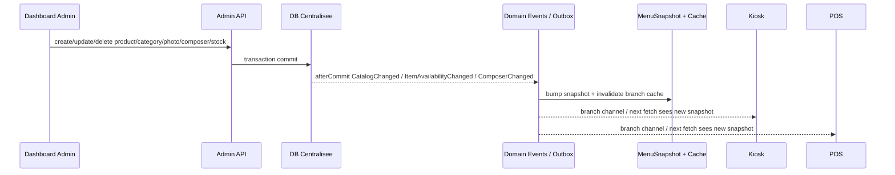
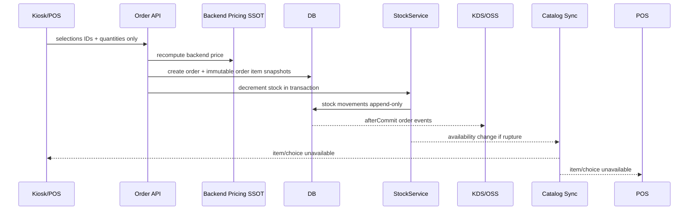

# Codex Ultra Audit + Plan — Centralisation Data / Synchronisation / Composer Wizard — 2026-04-28

Date: 2026-04-28
Auteur: Codex
Mode: audit raisonne + critique adversariale sub-agent
Sub-agent adversarial: `019dd4b2-cd39-75c1-8fec-9f3677cf638c`

## 1. Verdict Central

`CORE_ORDER_RUNTIME_VERDICT: PASS_STRONG_LOCAL`

Les flux commande deja valides localement restent solides:
- kiosk/POS order creation;
- queue number;
- stock decrement/release;
- fiscal cash-at-counter;
- KDS/OSS runtime local;
- C0/C1/C2/C3;
- D1/D2/D3 design;
- corrections P2 Claude deja fermees.

`CENTRAL_CATALOG_COMPOSER_SYNC_VERDICT: REWORK_REQUIRED_BEFORE_CLAIMING_TOTAL_CENTRALIZATION`

Le nouveau perimetre demande par l'utilisateur est plus large: gestion centrale produit/categorie/photo/stock/composer, propagation multi-surfaces, wizard restaurateur vraiment generique, POS + Kiosk coherents, et synchronisation prouvee entre toutes les machines. Sur ce perimetre, il reste des angles morts reels.

Decision: ne pas declarer "zero faute" sur la centralisation catalogue/composer tant que les missions S0-S8 ci-dessous ne sont pas fermees.

## 2. Demande Utilisateur Reformulee

Le systeme attendu doit permettre:

1. Un dashboard central qui gere produits, categories, photos, stock, disponibilite, options, supplements, addons et profils composer.
2. Une propagation fiable vers toutes les surfaces: borne kiosk, caisse POS, KDS, OSS, backend, historique, outbox/events.
3. Une logique wizard par produit:
   - produit simple pret a vendre, sans wizard;
   - produit avec options simples;
   - produit avec wizard complet et configurable depuis dashboard;
   - produit avec upsell/menu/addons optionnels;
   - differenciation POS/kiosk/web selon `visible_on`.
4. Une prise de commande kiosk avec experience client guidee, claire, tactile, sans calcul prix frontend autoritaire.
5. Une prise de commande POS plus compacte, dans une page, mais basee sur les memes donnees composer.
6. Une synchro stock dynamique: commande, annulation, remboursement, rupture, restock, choix stockables.
7. Une preuve testee en boucle, pas seulement des assertions statiques.
8. Une decision claire sur API vs MCP.

## 3. Architecture Centrale Visee

### 3.1 Sources de verite

| Domaine | Source de verite | Consommateurs |
| --- | --- | --- |
| Produit | `items` + relations variations/extras/addons/media | POS, kiosk, web, KDS via order snapshot |
| Categorie | `item_categories` | menus POS/kiosk/web |
| Photo | media collection `item` | kiosk/POS cards, detail, wizard |
| Composer wizard | `item_wizard_profiles` + `item_wizard_steps` | kiosk wizard, POS composer compact |
| Stock | `stock_levels`, `stock_movements` | availability, dashboard stock, order decrement/release |
| Availability | `item_branch_availability` + `items.is_available` | POS/kiosk menu filtering |
| Order | `orders`, `order_items`, composition snapshots | POS, kiosk, KDS, fiscal, history |
| Realtime | domain events/outbox + branch channels | POS/KDS/OSS/kiosk refresh |

### 3.2 Flux cible catalogue



### 3.3 Flux cible commande



## 4. Ce Qui Est Deja Fortement Valide

| Zone | Statut | Preuve actuelle |
| --- | --- | --- |
| Kiosk post-payment auto-return | PASS local | C0/C1 E2E |
| Process kiosk isole | PASS local | C1 full process |
| Process POS isole | PASS local | C2 full process |
| Runtime order Kiosk/POS/KDS/OSS | PASS local | C3 runtime local |
| Queue number | PASS strong local | prod-like MySQL/Redis + locks |
| Stock parent item | PASS strong local | Stock tests + prod-like concurrency |
| Fiscal cash-at-counter | PASS local | payment/fiscal lifecycle |
| Backend pricing SSOT | PASS local | tests parity/forge |
| Design kiosk/POS/KDS/OSS | PASS local | D1/D2/D3 |

Ces PASS ne doivent pas etre effaces. Le probleme est que la demande actuelle ajoute un niveau: dashboard central + composer generique + mutation catalogue complete + propagation multi-device prouvee.

## 5. Findings Adversariaux Verifies

### P0-A — Branch Admin peut creer un composer profile global

Fichiers:
- `app/Http/Controllers/Admin/AdminController.php`
- `app/Http/Controllers/Admin/ComposerProfileController.php`

Constat:
- `authorizeBranchScope($request, ?int $branchId)` retourne immediatement si `$branchId === null`.
- `ComposerProfileController::store()` appelle cette methode avec `branch_id_scope` du payload.
- Donc un Branch Admin peut envoyer un payload sans `branch_id_scope` et creer un profil global.

Risque:
- Un utilisateur branche A peut publier un wizard global visible par plusieurs branches.
- Cela viole l'invariant `branch_id` isolation.

Correction cible:
- Ajouter une garde speciale pour les ressources qui supportent le scope global:
  - Admin/Tenant Admin peuvent creer/modifier global.
  - Branch Admin doit avoir `branch_id_scope == user.branch_id`.
  - Branch Admin ne peut jamais creer `branch_id_scope = null`.

Tests requis:
- Branch Admin create global composer profile -> 403.
- Tenant Admin create global -> 2xx.
- Branch Admin create own branch -> 2xx.
- Branch Admin create foreign branch -> 403.

### P0-B — Update composer profile peut verifier le nouveau scope au lieu du scope existant

Fichier:
- `app/Http/Controllers/Admin/ComposerProfileController.php`

Constat:
- `update()` appelle `authorizeBranchScope()` sur le `branch_id_scope` du payload.
- Il ne verifie pas d'abord le scope existant du profil cible.

Risque:
- Un Branch Admin A peut potentiellement cibler un profil B et envoyer `branch_id_scope=A`; la garde valide le payload, pas la propriete deja en base.

Correction cible:
- Sur update:
  1. autoriser d'abord le scope actuel `$profile->branch_id_scope`;
  2. autoriser ensuite le nouveau scope demande;
  3. interdire le passage vers global pour Branch Admin.

Tests requis:
- Branch Admin A update profile B avec payload scope A -> 403.
- Branch Admin A update profile global -> 403.
- Tenant Admin update global -> 2xx.
- Branch Admin A update profile A -> 2xx.

### P1-A — Publish/unpublish composer ne prouve pas la synchronisation catalogue

Fichiers:
- `app/Services/Composer/ComposerProfileService.php`
- `app/Events/ComposerProfilePublished.php`
- `app/Providers/EventServiceProvider.php`
- listeners catalogue/cache/outbox

Constat:
- `publish()` dispatch `ComposerProfilePublished`.
- `EventServiceProvider` n'a pas de listener enregistre pour `ComposerProfilePublished`.
- `unpublish()` ne dispatch aucun evenement visible.

Risque:
- Une borne ou une caisse peut garder un ancien wizard jusqu'a TTL/cache refresh.
- Le dashboard croit que le wizard est publie/non publie, mais les surfaces ne sont pas forcees a refresh.

Correction cible:
- Creer un evenement catalogue explicite `ComposerProfileChanged` ou convertir publish/unpublish en `CatalogChanged(entity_type=composer_profile)`.
- Listener:
  - determiner branches impactees: global -> toutes branches actives; branch scope -> branche cible;
  - bump `MenuSnapshot`;
  - invalider `kiosk.menu.branch.{id}`;
  - persister outbox;
  - broadcast `CatalogChanged`.

Tests requis:
- publish branch-scoped -> snapshot branch cible bump + cache forgotten + outbox branch cible.
- publish global -> outbox par branche active.
- unpublish -> meme comportement.
- update steps sur profil publie -> meme comportement ou exige workflow "draft puis publish" strict.

### P1-B — Wizard kiosk encore depend de mots-cles legacy

Fichier:
- `resources/js/components/frontend/kiosk/KioskWizardComponent.vue`

Constat:
- `composerStepType()` mappe les steps via `step_key`, `label`, `source_type`, `source_ref`, `addon_role` en cherchant des mots: viande, sauce, supplement, menu, boisson, etc.
- Un administrateur peut creer "Choix cuisson", "Base", "Fromage", "Accompagnement", mais le runtime peut retourner `null` et ignorer l'etape.

Risque:
- Le dashboard donne l'impression d'un composer libre, mais le kiosk n'accepte que des categories legacy.

Correction cible:
- Ajouter un champ explicite `step_kind` ou `ui_component` cote schema/request/service/projection.
- Valeurs controlees: `single_choice`, `multi_choice`, `quantity_choice`, `menu_bundle`, `text_note`, `recap`, plus adapters legacy.
- Le composant kiosk doit rendre selon `step_kind`, pas selon les mots du libelle.

Tests requis:
- Step "Choix cuisson" source `fixed` / kind `single_choice` s'affiche.
- Step "Base" / "Fromage" / "Accompagnement" s'affiche sans mot legacy.
- Step invisible sur kiosk si `visible_on=['pos']`.
- Step required bloque suivant si `min_select` non atteint.

### P1-C — Contraintes composer non appliquees generiquement

Fichier:
- `resources/js/components/frontend/kiosk/KioskWizardComponent.vue`

Constat:
- Les contraintes `min_select`, `max_select`, `allow_repeat` sont projetees mais l'avancement reste centre sur les types legacy.

Risque:
- Un wizard admin peut etre publie avec contraintes correctes, mais le kiosk laisse passer ou bloque mal.

Correction cible:
- Validateur generic step:
  - `countSelected(step)` par step id;
  - `min_select/max_select`;
  - `allow_repeat`;
  - choix stockables;
  - erreurs UI par step.
- Le backend doit aussi valider la composition avant de creer l'ordre.

Tests requis:
- min=1 max=2 multi-choice: 0 bloque, 1/2 passe, 3 refuse.
- allow_repeat=false refuse doublon.
- stockable_choices=true refuse choix rupture.
- Backend forge attack: selection step invalid -> 422.

### P1-D — Projection POS/Kiosk pas encore totalement canonique

Fichiers:
- `app/Services/Menu/MenuProjectionService.php`
- `app/Services/Kiosk/KioskMenuService.php`
- `app/Http/Resources/ItemResource.php`
- `app/Http/Resources/NormalItemResource.php`

Constat:
- `MenuProjectionService` est la projection canonique cible, mais son commentaire signale encore une migration progressive.
- `KioskMenuService` construit un payload kiosk riche separe.
- `ItemResource` / `NormalItemResource` ont encore un `composerProfilePayload()` propre et mettent `choices => []`.

Risque:
- POS voit un wizard different du kiosk.
- Branch-scoped profile, choices, availability, image ou visible_on divergent selon endpoint.

Correction cible:
- Soit brancher toutes les surfaces sur `MenuProjectionService`;
- soit maintenir une suite sentinelle stricte qui compare les payloads surface par surface.

Tests requis:
- POS/kiosk/web same item:
  - meme profile choisi;
  - meme version;
  - choices coherents par surface;
  - image update visible;
  - branch profile gagne sur global;
  - unpublish branch revient au global ou null selon regle.

## 6. Findings Complementaires Codex

### P1-E — Item update utilise `ItemAvailabilityChanged` comme event catalogue general

Fichier:
- `app/Services/ItemService.php`

Constat:
- `store()` dispatch `ItemCreated`;
- `destroy()` dispatch `ItemDeleted`;
- `update()` dispatch `ItemAvailabilityChanged::fromItem(..., type)`, meme pour price/variations/extras/photo.

Risque:
- Le nom de l'event masque une mutation catalogue generale.
- Les listeners actuels semblent couvrir cache/outbox, mais la semantique est fragile.

Decision:
- Pour le court terme, garder si tests prouvent la propagation.
- Pour finition propre, introduire un event explicite `ItemCatalogChanged` ou utiliser `CatalogChanged` directement.

### P1-F — Photo upload prouve partiellement cache invalidation, pas toute la chaine runtime

Constat:
- `changeImage()` dispatch `ItemAvailabilityChanged::fromItem(..., 'full')`.
- Tests backend existent.
- Il faut encore un E2E dashboard -> image visible kiosk/POS sans reload manuel.

### P2-A — Validation request composer insuffisante

Fichier:
- `app/Http/Requests/ComposerProfileRequest.php`

Constat:
- `steps.*.visible_on` est array, mais les valeurs ne sont pas contraintes a `pos|kiosk|web`.
- `source_ref` est string libre et pas valide contre la source.

Correction:
- `steps.*.visible_on.*` in `pos,kiosk,web`.
- Valider `source_ref` selon `source_type`:
  - `item_attribute` -> id existant appartenant au produit ou autorise;
  - `extra_group` -> groupe existant;
  - `addon` -> role ou addon existant;
  - `fixed` -> liste choices explicite a ajouter si besoin.

### P2-B — Dashboard composer encore trop technique

Fichier:
- `resources/js/components/admin/items/composer/ProductComposerEditorComponent.vue`

Risque:
- Un restaurateur ne doit pas saisir des champs techniques bruts sans preview ni validation metier.

Objectif:
- Builder guide:
  - type de produit: simple/options/wizard/menu;
  - type d'etape;
  - source de choix;
  - min/max;
  - surfaces visibles;
  - preview POS/kiosk;
  - erreurs avant publication.

## 7. Modele Produit / Wizard Cible

### 7.1 Les 4 modes produit

| Mode | Exemple | Runtime kiosk | Runtime POS |
| --- | --- | --- | --- |
| `SIMPLE_READY` | canette, dessert pret | ajout direct panier | ajout direct panier |
| `SIMPLE_OPTIONS` | burger avec supplement optionnel | detail + options rapides | options sur ligne |
| `COMPOSER_REQUIRED` | tacos/sandwich/assiette a composer | wizard guide obligatoire | composer compact en page POS |
| `MENU_UPSELL` | formule avec boisson/frites/dessert | etape menu/upsell claire | bundle compact |

### 7.2 Regles centrales

1. Le frontend ne calcule pas le prix final; il affiche uniquement des indices serveur.
2. Le frontend envoie des IDs de choix + quantites.
3. Le backend valide:
   - step existe;
   - choix appartient a la step;
   - visible_on autorise surface;
   - min/max respecte;
   - stock disponible si `stockable_choices`;
   - choix pas cross-item;
   - branch scope autorise.
4. `order_items` garde un snapshot immutable de la composition.
5. La suppression/modification produit ne casse jamais une commande deja passee.

### 7.3 Champs a formaliser

Champs existants utiles:
- `template`
- `step_key`
- `label`
- `source_type`
- `source_ref`
- `min_select`
- `max_select`
- `allow_repeat`
- `visible_on`
- `stockable_choices`
- `addon_role`

Champs recommandes:
- `step_kind` ou `ui_component`
- `is_required` derive de `min_select > 0`
- `choice_sort_mode`
- `help_text`
- `draft_status` si on veut separer edition et publish.

## 8. API vs MCP

Decision: ne pas remplacer les API runtime par MCP.

Raisons:
- POS/kiosk/KDS ont besoin de latence faible, auth stable, offline/reconnect, retry, idempotence, monitoring.
- MCP est une couche de contexte et d'outillage pour agents, pas un bus critique de production entre caisse, borne et cuisine.
- Les API REST/HTTP + WebSocket/outbox sont le bon choix pour les machines runtime.

Usage MCP acceptable plus tard:
- assistant admin pour importer un menu;
- audit automatique de stock/catalogue;
- operations internes;
- generation de rapports;
- synchronisation avec outils externes non critiques.

Regle:
- Runtime FoodKing: API + events + outbox.
- Agent/dev/admin externe: MCP optionnel, jamais SSOT runtime.

## 9. Missions De Finition

### S0 — Authz Composer Hardening

Priorite: P0

Objectif:
- Fermer les deux failles scope composer profile.

Fichiers probables:
- `app/Http/Controllers/Admin/AdminController.php`
- `app/Http/Controllers/Admin/ComposerProfileController.php`
- `tests/Feature/Composer/ComposerAuthzMinimalTest.php`

Tests:
- `php artisan test tests/Feature/Composer/ComposerAuthzMinimalTest.php --stop-on-failure`
- Run-many: 5 fois.

PASS:
- Branch Admin ne peut jamais creer/modifier global.
- Branch Admin ne peut pas update un profil hors branche meme si payload change le scope.
- Tenant Admin garde droit global.

### S1 — Composer Publish/Unpublish Sync

Priorite: P1 haut

Objectif:
- Tout changement de publication composer doit synchroniser POS/kiosk via cache/snapshot/outbox.

Fichiers probables:
- `app/Events/ComposerProfilePublished.php`
- nouveau event `ComposerProfileChanged.php` ou extension de `CatalogChanged`
- `app/Services/Composer/ComposerProfileService.php`
- `app/Providers/EventServiceProvider.php`
- listeners catalogue/cache/outbox
- tests Feature sync composer

Tests:
- publish branch profile -> outbox + cache invalidation branch.
- unpublish branch profile -> outbox + cache invalidation branch.
- publish global -> outbox par branche active.
- step update sur profile publie -> decision explicite:
  - soit re-publish obligatoire;
  - soit auto CatalogChanged.

PASS:
- Kiosk/POS ne gardent pas l'ancien wizard apres publish/unpublish.

### S2 — Projection Canonique / Drift Guard

Priorite: P1

Objectif:
- Eviter que POS, kiosk et web aient trois versions du catalogue/composer.

Fichiers probables:
- `app/Services/Menu/MenuProjectionService.php`
- `app/Services/Kiosk/KioskMenuService.php`
- `app/Http/Resources/ItemResource.php`
- `app/Http/Resources/NormalItemResource.php`
- `tests/Feature/Services/Menu/*`

Tests:
- profile global vs branch profile;
- choices item_attribute/extra/addon;
- visible_on par surface;
- image propagation;
- availability item parent;
- unpublish branch fallback global/null;
- price keys absentes du composer payload.

PASS:
- Aucun endpoint runtime ne renvoie un composer profile divergent pour le meme item/surface/branch.

### S3 — Wizard Engine Generique

Priorite: P1

Objectif:
- Remplacer la logique par mots-cles par un moteur de steps generique.

Fichiers probables:
- migrations seulement si gate approuve pour `step_kind`;
- `app/Http/Requests/ComposerProfileRequest.php`
- `app/Services/Composer/ComposerStepService.php`
- `app/Services/Menu/MenuProjectionService.php`
- `app/Services/Kiosk/KioskMenuService.php`
- `resources/js/components/frontend/kiosk/KioskWizardComponent.vue`
- nouveaux composants generiques si necessaire.

Tests:
- Vitest wizard generic min/max/allow_repeat.
- Playwright kiosk: produit avec "Choix cuisson" sans mot legacy.
- Backend forge invalid composition -> 422.
- POS composer compact consomme meme step model.

PASS:
- Un admin peut creer un wizard non-tacos avec labels libres et il fonctionne.

### S4 — Stock Choices / Rupture Fine

Priorite: P1

Objectif:
- Si une step est `stockable_choices=true`, les choix variations/extras/addons doivent etre filtres/refuses selon stock, pas seulement l'item parent.

Fichiers probables:
- `app/Services/Stock/StockService.php`
- projection menu
- validation composition backend
- tests stock.

Tests:
- variation en rupture invisible/refusee kiosk.
- extra en rupture invisible/refusee POS.
- addon menu en rupture refuse.
- commande stale apres rupture -> 409/422 clair.
- restock -> choix revient.

PASS:
- Pas de survente sur choix stockable.

### S5 — Dashboard Restaurateur Builder

Priorite: P1/P2 selon UAT cible

Objectif:
- Rendre le composer utilisable par un restaurateur, pas seulement par un dev.

Fichiers probables:
- `resources/js/components/admin/items/composer/ProductComposerEditorComponent.vue`
- store composer
- routes/admin item UI

Fonctions attendues:
- selection mode produit;
- ajout/suppression/reorder steps;
- choix source;
- min/max;
- visible surfaces;
- preview POS/kiosk;
- bouton publish avec impact branches.

Tests:
- Vitest UI state.
- Playwright admin: creer produit + composer + publish.

PASS:
- Un restaurateur peut creer un produit simple, un produit options, un produit wizard complet sans toucher a des champs techniques dangereux.

### S6 — E2E Multi-Device Catalog Mutation

Priorite: P1 final

Objectif:
- Preuve runtime complete: dashboard mutation -> POS/kiosk refresh -> commande -> KDS -> stock.

Scenario:
1. Dashboard cree categorie.
2. Dashboard cree produit avec photo.
3. Dashboard cree composer wizard.
4. Publish.
5. Kiosk voit produit + photo + wizard sans reload manuel.
6. POS voit meme produit.
7. Kiosk commande.
8. KDS recoit order.
9. Stock diminue.
10. Dashboard modifie stock a 0.
11. Kiosk/POS refusent nouvelle commande.
12. Dashboard restock.
13. Kiosk/POS reacceptent.

Tests:
- Playwright multi-context.
- Run-many 3x local, 5x staging.

PASS:
- Propagation < 5s ou snapshot refresh documente.
- Aucun reload manuel obligatoire.
- Pas de prix frontend autoritaire.

### S7 — Authz Matrix Central Management

Priorite: P1 production

Objectif:
- Verifier roles x branches x routes pour products/categories/photos/stock/composer.

Roles:
- Admin
- Tenant Admin
- Branch Admin
- POS Operator
- Delivery Boy
- autres roles existants.

Tests:
- 2 scopes: own branch / foreign branch.
- routes create/update/delete/publish/unpublish/stock/photo.

PASS:
- Aucune fuite cross-branch.

### S8 — Documentation + Runbook Data Sync

Priorite: P2 mais obligatoire avant exploitation multi-site

Documents:
- `docs/sync/CATALOG_COMPOSER_DATA_FLOW.md`
- `docs/sync/WIZARD_PRODUCT_MODEL.md`
- `docs/sync/STOCK_SYNC_AND_AVAILABILITY.md`
- `docs/sync/API_VS_MCP_DECISION.md`
- `docs/sync/CENTRAL_MANAGEMENT_RUNBOOK.md`

Contenu:
- tables SSOT;
- events;
- cache keys;
- branch channels;
- failure modes;
- replay/outbox;
- comment diagnostiquer "produit pas visible borne";
- comment diagnostiquer "stock pas synchronise";
- comment diagnostiquer "wizard pas visible POS".

## 10. Tests De Validation Globale

| Niveau | Commande cible | Critere |
| --- | --- | --- |
| PHPUnit authz composer | `php artisan test tests/Feature/Composer/ComposerAuthzMinimalTest.php` | 5/5 |
| PHPUnit menu projection | `php artisan test tests/Feature/Services/Menu` | 5/5 |
| PHPUnit stock | `php artisan test tests/Feature/Stock` | 5/5 |
| PHPUnit prod-like | `php artisan test tests/Feature/ProdLike/ProdLikeConcurrencyTest.php` | MySQL/Redis, 3/3 |
| Vitest wizard generic | nouveaux tests `tests/js/*Wizard*` | 5/5 |
| Playwright admin catalog | nouveau `tests/e2e/admin-catalog-composer-sync.spec.js` | 3/3 local |
| Playwright multi-device | nouveau `tests/e2e/central-sync-multi-device.spec.js` | 3/3 local, 5/5 staging |

## 11. Regles De Non-Regression

1. Ne pas casser les PASS existants C0/C1/C2/C3/D1/D2/D3.
2. Ne pas deplacer le pricing dans le frontend.
3. Ne pas toucher OrderService/FrontendOrderService sans note de symetrie et tests.
4. Ne pas introduire MCP dans le runtime POS/Kiosk/KDS.
5. Ne pas accepter un wizard qui marche uniquement par mots-cles de label.
6. Ne pas accepter publish/unpublish sans outbox/cache/snapshot.
7. Ne pas accepter Branch Admin global composer.
8. Ne pas accepter update cross-branch base sur payload seulement.

## 12. Ordre D'Execution Recommande

```text
S0 Authz Composer Hardening
  -> S1 Composer Publish/Unpublish Sync
     -> S2 Projection Canonique / Drift Guard
        -> S3 Wizard Engine Generique
           -> S4 Stock Choices / Rupture Fine
              -> S5 Dashboard Builder
                 -> S6 E2E Multi-Device Catalog Mutation
                    -> S7 Authz Matrix
                       -> S8 Docs + Runbook
```

Parallelisable:
- S7 peut commencer apres S0.
- S8 peut commencer apres S1/S2.
- S4 peut commencer en parallele de S3 si le contrat choice IDs est stabilise.

Non parallelisable:
- S3 avant S6.
- S1 avant S6.
- S0 avant toute declaration PASS centrale.

## 13. Prompt D'Execution Pour Codex

```text
Tu es FoodKing Complex Implementer.
Lis AGENTS.md, .cursor/ACTIVE_CYCLE.md et ce rapport:
reports/audit/CODEX_CENTRAL_SYNC_COMPOSER_DATA_ULTRA_PLAN_2026-04-28.md

Objectif: executer S0 puis S1 uniquement, avec diffs minimaux.

Contraintes:
- Backend pricing SSOT.
- branch_id isolation stricte.
- Dispatch apres commit DB.
- Pas de MCP runtime.
- Ne pas toucher OrderService / FrontendOrderService.
- Ne pas modifier migrations sans gate explicite.

S0:
- Fermer Branch Admin global composer create.
- Fermer update cross-branch par payload.
- Ajouter tests ComposerAuthzMinimalTest.

S1:
- Assurer publish/unpublish composer -> Catalog sync/outbox/cache/snapshot pour branches impactees.
- Ajouter tests publish/unpublish branch/global.

Validation:
- php artisan test tests/Feature/Composer/ComposerAuthzMinimalTest.php --stop-on-failure
- php artisan test tests/Feature/Services/Menu --stop-on-failure
- php artisan test tests/Feature/SyncComprehensiveTest.php --stop-on-failure si impact
- relancer tests C1/C2/C3 si payload menu change.

Rapport:
- ecrire reports/audit/CODEX_CENTRAL_SYNC_S0_S1_EXECUTION_REPORT_2026-04-28.md
- verdict PASS/REWORK par mission.
```

## 14. Conclusion

Le coeur commande FoodKing est localement robuste. Mais la promesse utilisateur actuelle est plus ambitieuse: "toute la gestion centrale produit/categorie/photo/stock/composer synchronisee partout, avec wizard intelligent".

Sur cette promesse, les risques principaux sont confirmes:
- authz composer global/cross-branch;
- publish/unpublish composer non branche a la synchro catalogue;
- wizard kiosk encore trop legacy;
- projections POS/kiosk pas encore totalement unifiees;
- choix stockables a prouver.

Verdict final de ce rapport:

`ORDER_CORE: PASS_STRONG_LOCAL`

`CENTRAL_CATALOG_COMPOSER_SYNC: REWORK_PLAN_READY`

`NEXT_ACTION: EXECUTE_S0_S1_FIRST`
