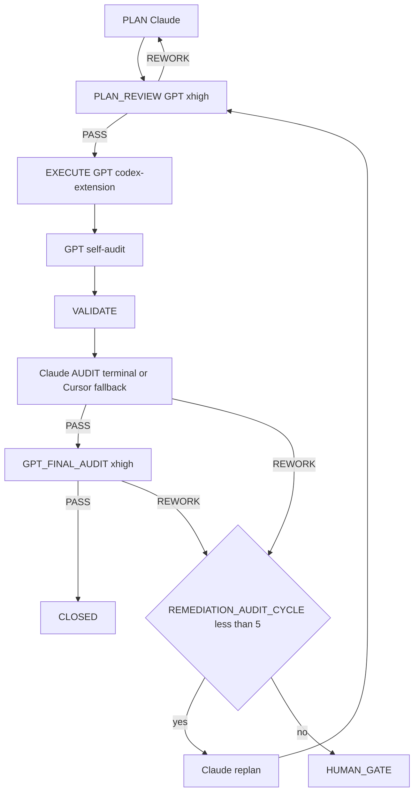

=== Auto-audit GPT (2e passe) ===
OpenAI Codex v0.124.0 (research preview)
--------
workdir: /Users/1millnonstop/Downloads/projet/foodking-web/web/testttt
model: gpt-5.5
provider: openai
approval: never
sandbox: workspace-write [workdir, /tmp, $TMPDIR, /Users/1millnonstop/.codex/memories]
reasoning effort: xhigh
reasoning summaries: none
session id: 019de7d3-ab73-7963-be9f-54e37b5f33f8
--------
user
Tu effectues l’**auto-audit GPT** (2e passe) d’un cycle FoodKing — **pas** l’audit Claude terminal.

**Contexte** : le JSON ci-dessous est la proposition d’implémentation (format agents/codex.prompt.txt) pour la mission `CV1-CATALOG-CONVERGENCE-001-task-1.1`.


**JSON d’implémentation (à recouper)** :
```json
{
  "files_to_modify": [
    "app/Http/Controllers/Admin/PosCategoryController.php",
    "tests/Feature/Menu/PosCategoryBranchScopeTest.php"
  ],
  "implementation_steps": [
    "Resolved active POS branch through DefaultAccessService for POS-only users: can('pos') && !can('items_show').",
    "Bypassed the branch whereHas filter for Branch Manager and users with items_show, preserving Admin/Tenant Admin global view.",
    "Preserved the existing category channels filter: channels IS NULL OR contains 'pos'.",
    "Added POS-only whereHas('items') filtering on item channels and item_branch_availability default-true semantics.",
    "Replaced the skipped sentinel with 3 passing feature cases covering branch A, branch B, and Tenant Admin/Branch Manager global view.",
    "Recorded EXECUTE_DELEGATION trace and released the existing activity-log reservation."
  ],
  "code_blocks": [
    {
      "path": "app/Http/Controllers/Admin/PosCategoryController.php",
      "op": "replace",
      "excerpt": "In index(), compute $posRuntimeBranchId only for POS-only non-Branch-Manager users using app(\\App\\Services\\DefaultAccessService::class)->show()['branch_id']; fail closed with 403 when missing. Keep the root ItemCategory channels NULL/pos filter. When $posRuntimeBranchId is set, add whereHas('items') requiring item channels NULL/pos and item_branch_availability row absent for that branch OR is_available=true."
    },
    {
      "path": "tests/Feature/Menu/PosCategoryBranchScopeTest.php",
      "op": "replace",
      "excerpt": "Replaced skipped scaffold with RefreshDatabase tests: POS operator on branch A sees only branch A eligible category; POS operator on branch B sees only branch B eligible category; Tenant Admin and Branch Manager keep global POS-category view. Tests assert virtual id 0 remains first and kiosk-only category channels stay hidden."
    }
  ],
  "risks": [
    "ESCALATION: commit was requested but could not be created because git staging failed with Operation not permitted while creating .git/index.lock in this sandbox.",
    "npm run verify:boucle exited 1 after printing only its banner; no diagnostic was emitted."
  ],
  "notes": [
    "Validated AvailabilityService absent-row default as available.",
    "Verified production Spatie role name is Branch Manager.",
    "php -l passed for both touched PHP files.",
    "php artisan test --filter=PosCategoryBranchScopeTest: PASS, 3 passed.",
    "php artisan test --filter=Menu: PASS, 88 passed, 24 skipped.",
    "reports/post_execute_latest.log was appended with the EXECUTE_DELEGATION trace; reports/AGENT_ACTIVITY_LOG.md was appended with the reservation release.",
    "No off-limits services, frozen zones, migrations, or Vue files were touched."
  ],
  "execution_trace": {
    "delegation": "codex-extension",
    "invariants_considered": [
      "pricing_ssot",
      "order_status",
      "branch_id",
      "commit_before_dispatch"
    ]
  }
}
```

**Livrable** (Markdown uniquement, en français) :
# AUTO_AUDIT_GPT — CV1-CATALOG-CONVERGENCE-001-task-1.1

## 1. Conformité au plan / scope
(Énumérer manques ou dérives ; si scope élargi sans escale → **ESCALATE**)

## 2. Invariants FoodKing
Pour chacun : OK / RISQUE / N/A
- pricing_ssot (backend seul)
- order_status (enum, pas de strings)
- branch_id
- commit_before_dispatch
- frozen_zones
- order_service_symmetry (si un des deux services touché)

## 3. Verdict
Une ligne : `VERDICT: PASS` | `VERDICT: NEEDS_FIX` | `VERDICT: ESCALATE` + 1–3 phrases.

codex
Je vais recouper la proposition avec le plan, la mission et le code réel, puis rendre seulement le Markdown d’auto-audit demandé. Je commence par les fichiers de contexte obligatoires du cycle CV1 et la mémoire partagée.
mcp: graphiti/search_memory_facts started
mcp: graphiti/search_memory_facts (failed)
user cancelled MCP tool call
exec
/bin/zsh -lc "sed -n '1,220p' .cursor/ACTIVE_CYCLE.md" in /Users/1millnonstop/Downloads/projet/foodking-web/web/testttt
exec
/bin/zsh -lc "sed -n '1,220p' plans/masterplay/MASTERPLAY_DISCIPLINE.md" in /Users/1millnonstop/Downloads/projet/foodking-web/web/testttt
exec
/bin/zsh -lc "sed -n '1,220p' plans/masterplay/MASTERPLAY_QUEUE.md" in /Users/1millnonstop/Downloads/projet/foodking-web/web/testttt
exec
/bin/zsh -lc "sed -n '1,220p' .cursor/rules/global.mdc" in /Users/1millnonstop/Downloads/projet/foodking-web/web/testttt
 succeeded in 0ms:
# MASTERPLAY DISCIPLINE — Caisse V1 (loop master)

> **But** : règles strictes que le runner et chaque mission GPT respectent en boucle, pendant des heures, jusqu'à finition de toutes les missions de `MASTERPLAY_QUEUE.md`. Lecture obligatoire avant de lancer `bash scripts/run-masterplay.sh`.

## 1. Autorité

| Source | Rôle |
|--------|------|
| `AGENTS.md` | Parcours obligatoire, cycle FoodKing |
| `plans/PLAN_CAISSE_V1_SUPER_MASTER_2026-04-25.md` | DAG autoritaire (ordre, gates) |
| `plans/PLAN_CAISSE_V1_GPT_MASTERPLAY_2026-04-25.md` | Catalogue 22 missions M-XX (objectifs, allowlist) |
| `plans/masterplay/MASTERPLAY_QUEUE.md` | File d'exécution courante |
| `plans/masterplay/MASTERPLAY_DISCIPLINE.md` | (ce fichier) règles d'exécution |
| `.cursor/rules/*.mdc` | Toujours appliquées |
| `docs/gates/GATE_LOG.md` | État des gates humains |

## 2. Boucle d'exécution (run-masterplay.sh)

```
LOOP {
  1. tail activity log (~500 tokens)
  2. find next PENDING task in MASTERPLAY_QUEUE with all DEPENDS_ON == CLOSED
  3. if none → break (all done or all blocked)
  4. verify missions/<TASK_ID>/input.json + execute_brief.md exist
  5. activity-log start codex-extension <TASK_ID> execute "<allowlist CSV>" "<note>"
     if exit 2 (collision) → MARK BLOCKED note=collision, continue loop
  6. update status: RUNNING
  7. npm run codex:complex -- <TASK_ID>     (génère output_codex.json + GPT_SELF_AUDIT)
  8. update status: EXECUTED
  9. activity-log done codex-extension <TASK_ID> done "<résumé court>"
 10. (option --with-audit) bash scripts/foodking-claude-orchestrate.sh audit-brief <TASK_ID>
       if PASS → status: AUDIT_PASS
       if REWORK → status: REWORK ; increment REWORK_COUNT ; if >=5 → BLOCKED note=human_gate
 11. (option --with-final) npm run codex:final-audit -- <TASK_ID>
       if PASS → status: FINAL_PASS
 12. if FINAL_PASS:
       bash scripts/after-execute-memory.sh
       update status: CLOSED
 13. sleep INTER_TASK_PAUSE_SECONDS (default 5s)
 14. continue LOOP
}
```

## 3. Garde-fous (non négociables)

### 3.1 Allowlist stricte par mission
Codex modifie **uniquement** les fichiers listés dans `missions/<TASK_ID>/input.json.allowlist`. Si modification hors liste détectée à l'audit → `REWORK`.

### 3.2 Frozen zones
Aucune édition d'un fichier frozen sans gate signé dans `docs/gates/GATE_LOG.md`. Le runner **refuse** de lancer une mission marquée `BLOCKED` jusqu'à ce que le statut soit changé manuellement après signature.

### 3.3 Invariants FoodKing — `REWORK` automatique
- Pricing client-authoritative
- Status littéral numérique (`status: 16`)
- `branch_id` LIKE
- Dispatch dans transaction
- OS ou FOS modifié sans `SYMMETRY_NOTE`
- Frozen modifié sans gate

### 3.4 Pas de gate auto-approuvée
Codex peut **rédiger** options ; aucune mission ne coche `[x] Approved`. Si une mission le tente → `REWORK` + `risks: ["ESCALATION: gate self-approved"]`.

### 3.5 Tests obligatoires
Chaque `mandatory_tests` listé doit être lancé et reporté dans le rapport. Échec → `REWORK`.

### 3.6 Diff minimal
Aucun renommage opportuniste, aucun refactor non demandé, aucune optimisation collatérale. Si ajout justifié → `notes` du JSON.

### 3.7 Activity log
`start` avant chaque mission ; `done` après. Sans cela → réservation fantôme = autres agents bloqués. Le runner enforce.

### 3.8 Mémoire
À CLOSE : compléter `memory/episodes/caisse_v1_<topic>_*.jsonl` (squelettes créés par M-19) puis `bash scripts/after-execute-memory.sh`. Si Graphiti UP : `bash bin/graphiti-ingest.sh` + `python3 memory/verify.py`.

## 4. Boucles de rework

- Max **5 cycles `REWORK`** consécutifs sur la même mission. Au 5e → `BLOCKED note=human_gate_required`.
- Max **3 cycles healing** consécutifs (cf. CLAUDE.md §8) avant escalade.
- Toute escalation → écrite dans `reports/masterplay/ESCALATIONS_<date>.md`.

## 5. Pause / arrêt

- `Ctrl-C` arrête la boucle proprement (mission en cours finit, runner s'arrête après).
- `touch reports/masterplay/STOP` → le runner s'arrête à la fin de la mission courante.
- `touch reports/masterplay/PAUSE` → le runner pause entre les missions tant que le fichier existe.

## 6. Logs

- `reports/masterplay/run_<ISO>.log` : log de la boucle.
- `reports/masterplay/status.json` : état temps réel (mission courante, compteurs).
- `missions/<TASK_ID>/output_codex.raw.log` : raw codex.
- `missions/<TASK_ID>/output_codex.json` : json structuré.
- `reports/audit/GPT_SELF_AUDIT_<TASK_ID>.md` : self-audit GPT.
- `reports/post_execute_latest.log` : trace `EXECUTE_DELEGATION`.
- `reports/AGENT_ACTIVITY_LOG.md` : start/done.

## 7. Audit Claude (en fin de boucle, manuel)

Quand toutes les missions sont `CLOSED` (ou `BLOCKED` documentés) :

```
bash scripts/foodking-claude-orchestrate.sh context
bash scripts/foodking-claude-orchestrate.sh audit
```

Sortie attendue : verdict transversal Caisse V1 (chaîne sync borne→centrale→POS→KDS→fiscal). Le verdict détermine `GO/HOLD/NO-GO` pour `GATE_GO_NO_GO_CAISSE_V1`.

## 8. Critères d'arrêt anormal

- 3 missions consécutives en `REWORK` → halt + alerte humaine.
- Activity-log refuse 3 fois → halt (collision permanente).
- `npm run codex:complex` échoue 3 fois sur la même mission (binaire codex KO) → halt.
- `claude` terminal indisponible 3 fois consécutives → continue avec fallback subagent + `AUDIT_FALLBACK_REASON: terminal-unavailable`.

## 9. Token discipline

- Le prompt envoyé à codex contient : template `agents/codex.prompt.txt` + `input.json` + `execute_brief.md` + (optionnel) `graphiti_context.md`, `plan_excerpt.md`, `cycle_snapshot.md`.
- Pas de duplication : pas de re-coller AGENTS.md ou super master plan dans chaque mission.
- Cap typique d'un prompt : ≤ 30 KB. Au-delà → splitter la mission.

## 10. Anti-pattern interdits

- ❌ Lancer 2 missions en parallèle sur les mêmes fichiers (collision activity-log).
- ❌ Modifier `MASTERPLAY_QUEUE.md` pendant que le runner tourne (sauf marquer BLOCKED → PENDING après gate).
- ❌ Skipper l'audit Claude pour aller plus vite.
- ❌ Marquer CLOSED manuellement sans double PASS (PASS Claude + PASS Codex final).
- ❌ Ignorer un `risks: ["ESCALATION: ..."]` dans output_codex.json.

---

`MASTERPLAY_DISCIPLINE_VERSION: 1.0` · `STRICT_MODE: ON`

 succeeded in 0ms:
# Active Cycle – FoodKing

**Méta (SSOT `run-cycle.md` Step 0 + `AGENTS.md` § *Authoritative … cycle state*)** — requis pour que l’orchestrateur ne s’arrête pas sur *« RUNNER_MODE not set »*.

| Champ | Valeur actuelle |
| --- | --- |
| **RUNNER_MODE** | `single-session` |
| **PHASE** | `EXECUTE` |
| **TASK_ID** | `CV1-CATALOG-CONVERGENCE-001` (Sprint 1 / Task 1.4 — Warning `channels=null`) |
| **PLAN_FILE** | `plans/PLAN_CV1-CATALOG-CONVERGENCE-001_2026-05-02.md` |
| **EXECUTION_TIER** | `routine` (S effort, hors invariants critiques — voir `docs/orchestration/MULTI_AGENT_LOOP_2026-05-02.md` §2) |
| **EXECUTE_DELEGATION** | `foodking-routine-implementer` (Composer Max+thinking) |
| **REPORT_FILE** | `reports/post_execute_latest.log` (append — preuve `EXECUTE_DELEGATION` / `AUDIT_*`) |
| **MULTI_AGENT_LOOP** | `docs/orchestration/MULTI_AGENT_LOOP_2026-05-02.md` (SSOT du pivot 2026-05-02) |

> **ACTIVE_PRIMARY** : `CAISSE_V1_MASTERPLAY` (un seul cycle peut être actif à la fois — voir B03 méga-checklist).
> Cycles plus anciens en lecture seule = **archive** déplacée dans **`.cursor/ACTIVE_CYCLE_ARCHIVE.md`** (lecture humaine / forensique uniquement, **non requise** par le parcours obligatoire).

## CYCLE_W10_EXECUTION_CLOSEOUT (READ_ONLY_SECONDARY — mémoire 180 + MCP global + commit + CI + prod)

**TASK_ID** : `P_EXEC_CLOSEOUT_GRAPHITI_CI_PROD_2026-04-22`  
**Plan SSOT** : `plans/PLAN_EXECUTION_CLOSEOUT_GRAPHITI_CI_PROD_2026-04-22.md`  
**Ordre** : Piste A (POS+Centrale : PLAN-MEM-1) ∥ Piste B (humain : PLAN-MEM-3) → C (smoke) → D (commit sur « go commit ») → E (CI) → F (prod J-7→J+7).  
**Gate mémoire** : `python3 memory/verify.py` → count **≥ 175** (180 idéal) avant de considérer PLAN-MEM-1 **CLOSED**.

- **Vérif locale (2026-04-22)** : `python3 memory/verify.py` → **count = 182**, smoke `search_memory_facts` OK — gate **satisfaite** pour clôturer l'ingestion côté seuil d'épisodes (suite : commit / CI / prod selon plan `PLAN_EXECUTION_CLOSEOUT_*`).

**Gouvernance globale (2e passe 2026-04-22)** : primer multi-agents + Graphiti vivant + tokens « zéro effet négatif » → **`docs/orchestration/GLOBAL_SYSTEM_PRIMER.md`** + rapport **`reports/audit/AUDIT_SECOND_PASS_GLOBAL_GOVERNANCE_REPORT_2026-04-22.md`**.

**Statut Train A 2026-04-26** : W10 n'est plus primaire pendant la préparation release Caisse V1. Toute reprise W10 doit créer un cycle dédié ou repasser par une décision humaine.

---

## CAISSE_V1_MASTERPLAY (ACTIVE_PRIMARY — 2026-04-25 → Train A 2026-04-27)

**Phase** : finition Caisse V1 (POS + Kiosk + KDS + Centrale + Fiscal + Ops).
**Plan parent** : `plans/PLAN_CAISSE_V1_GPT_MASTERPLAY_2026-04-25.md`
**Plan DAG autoritaire** : `plans/PLAN_CAISSE_V1_SUPER_MASTER_2026-04-25.md`
**Boucle d'exécution** : `plans/masterplay/MASTERPLAY_DISCIPLINE.md` + `plans/masterplay/MASTERPLAY_QUEUE.md` + `scripts/run-masterplay.sh`
**Statut temps réel** : `reports/masterplay/status.json`
**Train A V1** : `reports/audit/PHASE2_PLAN_TRAINS_REWORKED_2026-04-27.md`
**Gates humaines Train A** : `docs/gates/GATE_PHASE2_TRAIN_A_HUMAN_DECISIONS_2026-04-26.md`
**Manifeste Phase A ciblée** : `docs/PHASE_A_CLOSED.md`

**Règle** : tout `TASK_ID` au format `CV1-MXX-…` passe par la masterplay (cf. `AGENTS.md` § "Caisse V1 — Masterplay loop", `.cursor/rules/global.mdc` § "Caisse V1 — Masterplay loop", `.cursor/commands/run-cycle.md` Step 0 item 0). **NE PAS** ouvrir un `run-cycle` standard sur un `CV1-MXX-…`.

**Règle Train A** : A.1/A.2/A.3 sont de la persistance/gouvernance release. D-M13 reste bloqué tant que la migration unique `(branch_id, queue_number)` n'a pas reçu son signoff humain final.

---

## Archive

Tous les cycles **CLOSED / COMPLETED PASSED** (W4 → W9, NF525, etc.) ont été déplacés dans **`.cursor/ACTIVE_CYCLE_ARCHIVE.md`** pour réduire le coût de lecture du parcours obligatoire (audit 2026-04-24, mission `T-PARCOURS-OPTIMIZE-001`).

- **Lecture humaine** : ouvrir `.cursor/ACTIVE_CYCLE_ARCHIVE.md`.
- **Lecture agent** : **non requise** sauf instruction explicite du plan ou du chat (ex. "reprend le rationale du cycle W9").
- **Recherche** : `rg "CYCLE_W9_" .cursor/ACTIVE_CYCLE_ARCHIVE.md` ou `git log --follow .cursor/ACTIVE_CYCLE.md`.

 succeeded in 0ms:
# MASTERPLAY_QUEUE — Caisse V1

**Source de vérité de l'orchestration en boucle** : `bash scripts/run-masterplay.sh` lit cette file et exécute en série.

**Discipline** : `plans/masterplay/MASTERPLAY_DISCIPLINE.md`.  
**Plan parent** : `plans/PLAN_CAISSE_V1_GPT_MASTERPLAY_2026-04-25.md`.

## Légende statut

- `PENDING` — pas encore lancé
- `RUNNING` — codex exec en cours (ne pas relancer)
- `EXECUTED` — codex exec terminé, attend audit
- `AUDIT_PASS` — `AUDIT_VERDICT: PASS` Claude
- `FINAL_PASS` — `GPT_FINAL_AUDIT_VERDICT: PASS`
- `CLOSED` — mémoire ingestée + activity-log done
- `REWORK` — audit a demandé rework
- `BLOCKED` — gate humain ou dépendance manquante

## Légende vague

- `WAVE_A` — NO-GATE, parallélisable, démarre immédiatement
- `WAVE_B` — POST-GATE, séquencé selon DAG

## File d'exécution


| ORDER | TASK_ID                           | MISSION | WAVE   | DEPENDS_ON                 | STATUS  | NOTE                                                                               |
| ----- | --------------------------------- | ------- | ------ | -------------------------- | ------- | ---------------------------------------------------------------------------------- |
| 01    | CV1-M19-MEMORY-DISCIPLINE         | M-19    | WAVE_A | —                          | CLOSED  | Crée squelettes JSONL pour les 22 missions                                         |
| 02    | CV1-M01-TRACEABILITY-MATRIX       | M-01    | WAVE_A | —                          | CLOSED  | Matrice findings → tasks → tests → gates (REWORK resolved GPT PASS)                |
| 03    | CV1-M02-SENTINEL-BASELINE         | M-02    | WAVE_A | CV1-M01                    | CLOSED  | 18 sentinels fail-first + 4 lints                                                  |
| 04    | CV1-M12-LEGACY-GUARDS-CI          | M-12    | WAVE_A | —                          | CLOSED  | Lint imports + bundle scan + workflow (recovered: extractor JSON fix)              |
| 05    | CV1-M16-HARDWARE-LAB              | M-16    | WAVE_A | —                          | CLOSED  | Checklist hardware signable (recovered: JSON valid, files materialized)            |
| 06    | CV1-M18-TEST-ARCHITECTURE         | M-18    | WAVE_A | CV1-M02                    | CLOSED  | Grille couverture + plan campagne                                                  |
| 07    | CV1-M20-RUNBOOKS-SKELETON         | M-20    | WAVE_A | —                          | CLOSED  | 8 runbooks ops (REWORK Horizon resolved GPT PASS)                                  |
| 08    | CV1-M21A-QUICKWINS-LOT0           | M-21a   | WAVE_A | —                          | CLOSED  | POS: discount v-model + Swiper RTL + focustrap dead                                |
| 09    | CV1-M03-GATES-DRAFT               | M-03    | WAVE_A | CV1-M01                    | CLOSED  | 8 briefs gates Caisse V1 créés; Wave B reste bloquée par signatures humaines       |
| 10    | CV1-M09-BRANCH-ISOLATION          | M-09    | WAVE_B | CV1-M03(gates), CV1-M02    | CLOSED  | GPT audit PASS; M-08/M-06/schema sentinels remain gated                            |
| 11    | CV1-M06-POS-REVENUE-GUARDS        | M-06    | WAVE_B | CV1-M09, CV1-M03           | CLOSED  | GPT rework audit PASS; gates frozen C + payment_prop A approved                    |
| 12    | CV1-M05-ORDER-QUOTE               | M-05    | WAVE_B | CV1-M03                    | CLOSED  | GPT final PASS; quote sealed/consumed at POS+kiosk commit                          |
| 13    | CV1-M04A-PAYMENT-LEDGER-FULL      | M-04A   | WAVE_B | CV1-M03 (ledger=A)         | BLOCKED | Ledger gate chose Option B; M-04A not selected                                     |
| 14    | CV1-M04B-PAYMENT-PILOT-RESTRICT   | M-04B   | WAVE_B | CV1-M03 (ledger=B)         | CLOSED  | GPT audit PASS; Option B restricted pilot implemented                              |
| 15    | CV1-M08-FISCAL-Z-NF525            | M-08    | WAVE_B | CV1-M03 (fiscal+schema)    | CLOSED  | GPT final PASS; fiscal Option B Z policy sealed                                    |
| 16    | CV1-M07-KDS-RELEASE               | M-07    | WAVE_B | CV1-M03 (kds_bump)         | CLOSED  | GPT final PASS; KDS server authority with expected_status sealed                   |
| 17    | CV1-M10-OS-FOS-SYMMETRY           | M-10    | WAVE_B | CV1-M06, CV1-M09           | CLOSED  | Unlocked after M-06 GPT audit PASS and M-09 CLOSED                                 |
| 18    | CV1-M11-KIOSK-RUNTIME             | M-11    | WAVE_B | CV1-M03 (offline+fiscal)   | CLOSED  | GPT final PASS; offline Option A CB/TR refused and enum cancel sealed              |
| 19    | CV1-M17-WEB-STRIPE-SCOPE          | M-17    | WAVE_B | CV1-M03 (web+stripe)       | CLOSED  | GPT final PASS; web payment off + Stripe inactive guard sealed                     |
| 20    | CV1-M13-MIGRATIONS-SAFETY         | M-13    | WAVE_B | CV1-M03 (schema)           | CLOSED  | GPT final PASS; migration safety tooling sealed; staging rehearsal deferred to M14 |
| 21    | CV1-M14-OPS-PREFLIGHT             | M-14    | WAVE_B | CV1-M13                    | CLOSED  | GPT final PASS; ops preflight fail-closed tooling sealed                           |
| 22    | CV1-M15-ROLLOUT-CANARY            | M-15    | WAVE_B | CV1-M04*, CV1-M08, CV1-M14 | CLOSED  | GPT final PASS; rollout canary drill fail-closed tooling sealed                    |
| 23    | CV1-M21B-PAYMENT-REFACTOR         | M-21b   | WAVE_B | CV1-M03 (prop_mutation)    | CLOSED  | GPT final PASS; prop mutation refactor + one-shot 401 retry sealed                 |
| 24    | CV1-M22-POST-LAUNCH-OBSERVABILITY | M-22    | WAVE_B | CV1-M14, CV1-M15           | CLOSED  | GPT final PASS; post-launch observability fail-closed readiness sealed             |


## Ce que le runner exécute

À chaque tour de boucle, le runner :

1. Lit cette table.
2. Prend la **première** ligne au statut `PENDING`.
3. Vérifie que toutes ses `DEPENDS_ON` sont au statut `CLOSED`. Sinon → skip.
4. Vérifie que `missions/<TASK_ID>/input.json` et `execute_brief.md` existent. Sinon → marque `BLOCKED note=missing-mission-files`.
5. `start` activity-log → `npm run codex:complex -- <TASK_ID>` → `done` activity-log.
6. Mise à jour statut : `EXECUTED`.
7. Audit Claude terminal automatique (si activé `--with-audit`) → `AUDIT_PASS` ou `REWORK`.
8. Si `AUDIT_PASS` : `npm run codex:final-audit -- <TASK_ID>` → `FINAL_PASS`.
9. Si `FINAL_PASS` : ingestion mémoire + `done` → `CLOSED`.
10. Loop.

## Statut initial (à la création)

Les 6 missions Vague A préparées par M-19/M-01/M-02/M-12/M-16/M-18 sont au statut `PENDING`. Les autres `TODO_NEXT` (à créer après le premier round) ou `BLOCKED` (gates).

## Mise à jour manuelle

Le runner met à jour la colonne `STATUS` automatiquement (sed sur cette table). Tu peux aussi éditer manuellement entre 2 runs (ex: marquer `BLOCKED → PENDING` après gate signé).

## Addendum final-readiness 2026-04-26

- Toutes les missions Caisse V1 Wave A / Wave B restent `CLOSED`, sauf `CV1-M04A-PAYMENT-LEDGER-FULL` qui reste `BLOCKED` par décision humaine Payment Ledger Option B.
- Les vagues final-readiness GPT-only sont documentées dans `reports/release/CAISSE_V1_FINAL_READINESS_WAVES_2026-04-26.md`.
- Verdict local code: `PASS_WITH_SCOPED_REWORK` après remplacement du hardcoded `16` par `OrderStatus::CANCELED` dans `app/Http/Requests/OrderStatusRequest.php`.
- Verdict release: `HOLD`. Les preuves locales critiques passent, mais staging/runtime/hardware/UAT/runbook/fiscal evidence/final human gate restent requis.
- FR-03: garde bundle reworkée. `scripts/scan-bundle-legacy.sh` et `scripts/lint-fk-bundle-legacy.sh` scannent maintenant `public/build` et `public/js`. Le mode strict release `FK_LEGACY_STRICT_POS_WIZARD=1` bloque encore sur `public/js/kiosk.js` et `public/js/kiosk-wizard.js`.
- Prochaine décision non automatique: `HG-W2_CUTOVER_DECISION_OR_POS_WIZARD_SHIM_ACCEPTANCE`.

## Addendum correction-freeze 2026-04-26

- `MASTERPLAY_FROZEN=1` jusqu'a persistance git explicite des artefacts Wave 1 / Wave 2, correction K09B outbox contract, et resolution du contrat Playwright SSOT.
- Ne pas lancer `bash scripts/run-masterplay.sh` ni `npm run codex:complex -- CV1-LOT-*` pour reprendre W2 tant que `reports/audit/UNTRACKED_AUDIT_2026-04-26.txt` et `reports/audit/MISSIONS_CLOSED_VS_GIT_2026-04-26.md` ne sont pas revus.
- Les lots frozen `CV1-LOT-K05-PAYMENT-CONFIRM-WS`, `CV1-LOT-P06-PARK-TTL`, `CV1-LOT-P10-REFUND-LEDGER`, `CV1-LOT-P13-ZREPORT-HARDEN` restent bloques sans gate humain explicite dans `docs/gates/GATE_LOG.md`.

 succeeded in 0ms:
---
description: Always-on rules for the FoodKing Cursor local agent. Applied to every cycle, every model, every task.
globs: ["**/*"]
alwaysApply: true
---

# Global Rules – FoodKing

## Caisse V1 — Masterplay loop (active phase)

Pendant la phase de finition Caisse V1, **toute mission `CV1-MXX-…` est gouvernée par** :
- `plans/masterplay/MASTERPLAY_DISCIPLINE.md` — règles d'or (allowlist, frozen, REWORK max 5, activity-log, mémoire)
- `plans/masterplay/MASTERPLAY_QUEUE.md` — file d'exécution (statut, dépendances DAG)
- `plans/masterplay/GO.md` — comment lancer / suivre / pause / stop
- `scripts/run-masterplay.sh` — runner officiel (boucle codex + audit Claude + audit final + ingest mémoire)

**Lecture obligatoire** avant tout EXECUTE sur un `TASK_ID` `CV1-MXX-…`. Hors Caisse V1 : `run-cycle <TASK_ID>` standard.

## New or continued session — **mandatory path** (applies to **every** conversation and **every** model)

- **The chat log is not the SSOT.** **This repo** (`AGENTS.md`, `.mdc` rules, `docs/orchestration/`, `run-cycle.md`) is.
- On **any** new thread **or** long continuation: (1) Read **`AGENTS.md` § *Parcours obligatoire*** first, then **`docs/orchestration/GLOBAL_SYSTEM_PRIMER.md`** (§1 table). (2) If resuming work, read **`.cursor/ACTIVE_CYCLE.md`** *before* starting a duplicate cycle — follow the same `TASK_ID` / `PHASE` until `CLOSE` or an explicit new task. (3) For bounded work: run **`run-cycle` / `run-cycle.md`** (Steps 0–5) — do not skip `AUDIT` before `CLOSE`. (4) Run `npm run verify:boucle` (and `verify:boucle:full` when an API proof is needed) per `AGENTS.md`. (5) Ensure **`claude` on `PATH` (AUDIT terminal) et binaire `codex` (CLI OpenAI) pour l’EXÉCUTE complexe (compte ChatGPT Pro)**, pas de clé proxy obligatoire — voir `agents/codex-extension-instructions.md`. (6) Obey **`MEMORY_MATRIX.md`**, `EXECUTE_DELEGATION`, `AUDIT_CHANNEL` + `TERMINAL_AUDIT_OK` when using terminal audit, and **`agent-activity-log.sh`** (tail / start / done).
- Full checklist and French wording: **`AGENTS.md` → section *Parcours obligatoire*.

## Cycle Structure (multi-agents — pivot 2026-05-02)
PLAN **Claude** → PLAN_REVIEW **GPT/Codex** → EXECUTE **{routine: Composer | complex: GPT/Codex}** → VALIDATE → AUDIT **Claude (terminal)** → GPT_FINAL_AUDIT **GPT/Codex** → [HUMAN GATE | CLOSE]

Phases are sequential and non-skippable.
Dual audit (`AUDIT_VERDICT: PASS` + `GPT_FINAL_AUDIT_VERDICT: PASS`) precedes close on every cycle without exception.

**Tier-routing déterministe en EXECUTE** : routine (Composer via `foodking-routine-implementer`) ssi tier S **ET** hors invariants critiques **ET** pas de nouveau service ni refactor cross-module. Sinon complex (Codex `codex-extension` PRIMARY ; sub-agent `foodking-complex-implementer` FALLBACK). Doute → complex. Voir `.cursor/routing.md` § Tier-Routing et `docs/orchestration/MULTI_AGENT_LOOP_2026-05-02.md`.

## Model Discipline
- Auto/Premium routing is disabled
- PRIMARY_EXECUTION_MODEL is declared in the plan file before execution begins
- One PRIMARY_EXECUTION_MODEL per cycle; review checkpoints are explicit and mandatory
- Mid-cycle model switch requires Claude confirmation logged under `ESCALATION` in the plan file
- Full routing policy: `.cursor/routing.md`

## EXECUTE Delegation (tier-routing 2026-05-02)
- **Tier routine** (S effort, hors invariants critiques, ≤5 fichiers) → **Composer** via Task **`foodking-routine-implementer`**. Trace : `EXECUTE_DELEGATION: foodking-routine-implementer`. Sur contact avec invariant (pricing / `OrderStatus` / `branch_id` / dispatch / `OrderService` symmetry / frozen / schema / auth) → halt + escalade vers tier complex.
- **Tier complex (PRIMARY)** : **`codex-extension`** — FoodKing Codex Complex Implementer (CLI `codex` + ChatGPT Pro, `gpt-5.5-pro`, `xhigh`). Procédure : `npm run codex:plan-review -- {TASK_ID}` ; préparer `missions/{TASK_ID}/input.json` (+ `graphiti_context.md` / `plan_excerpt.md` / `execute_brief.md`) ; `npm run codex:complex -- {TASK_ID}` (`gpt-5.5-pro`, `xhigh`) ; appliquer `output_codex.json` + lire `reports/audit/GPT_SELF_AUDIT_{TASK_ID}.md` ; après PASS Claude → `npm run codex:final-audit -- {TASK_ID}`. Trace : `EXECUTE_DELEGATION: codex-extension`.
- **Tier complex (FALLBACK)** : Task Cursor **`foodking-complex-implementer`** — uniquement si `codex` / Pro indispo après ≥2 reprises documentées. Trace : `EXECUTE_DELEGATION: foodking-complex-implementer (codex-extension-fallback)` + `FALLBACK_REASON:`.
- **Claude orchestrator** (chat session par défaut) : déclare le tier dans le plan (`EXECUTION_TIER: routine | complex`), délègue, audite. **Ne fait pas** d'édition produit elle-même (sauf doctrine/config orchestration : `.cursor/`, `AGENTS.md`, `docs/orchestration/`, `plans/`, `reports/`, `memory/episodes/*.jsonl`).
- Reference : `.cursor/routing.md` § Routing Table + Tier-Routing ; `docs/orchestration/MULTI_AGENT_LOOP_2026-05-02.md` (procédure pas-à-pas) ; `docs/orchestration/CODEX_API_DELEGATION.md` (Codex CLI) ; `AGENTS.md` § Workflow + "EXECUTE delegation".

## Autonomy Contract
The agent operates autonomously within declared scope.
It halts and escalates — never self-approves — on any gate trigger, scope expansion,
invariant violation, two consecutive validation failures, or unresolvable ambiguity.
Full policies: `human-gates.mdc`, `scope.mdc`, `project-invariants.mdc`.

## Graphiti (mémoire inter-sessions)
- When the Graphiti MCP server is loaded for this workspace, **query it first** on any non-trivial task (see `.cursor/rules/graphiti-memory.mdc` and `AGENTS.md` § MCP).
- If Graphiti is not loaded, continue without blocking; one-line note to enable `~/.cursor/mcp.json` is enough.

## Quality channels — terminal first where defined (multi-agents 2026-05-02)
- **Composer route (`foodking-routine-implementer`)** = EXECUTE **routine** (tier S, hors invariants). Trace `EXECUTE_DELEGATION: foodking-routine-implementer`. Halt + escalade vers complex sur contact avec invariant.
- **GPT route (`codex-extension` — CLI `codex` Pro)** = PLAN_REVIEW + EXECUTE **complex** + GPT_FINAL_AUDIT. Cursor sub-agent `foodking-complex-implementer` = fallback EXECUTE complex uniquement si `codex exec` échoue (≥2 reprises ou binaire indispo) — `EXECUTE_DELEGATION: …` + `FALLBACK_REASON:`. See `AGENTS.md`, `docs/orchestration/MULTI_AGENT_LOOP_2026-05-02.md`, `docs/orchestration/CODEX_API_DELEGATION.md`.
- **Claude AUDIT after implementation** is **by default the terminal** (`bash scripts/foodking-claude-orchestrate.sh context` then `audit` or `audit-brief` — **Anthropic subscription** via `claude` CLI). If the terminal fails after **1 retry** (**quota / rate limit / session saturated**, missing binary, auth, network), **do not stop the cycle**: use the **FALLBACK** — same `audit-context.md` checklist via Cursor Task **`foodking-planner-orchestrator`** (recommended) or in-session **Claude** — with `AUDIT_CHANNEL: cursor-session` **plus** mandatory `AUDIT_FALLBACK_REASON:` and optional `AUDIT_SUBAGENT_FALLBACK: foodking-planner-orchestrator`. See `docs/orchestration/AUDIT_TERMINAL_QUOTA_FALLBACK.md` and `run-cycle.md` Step 5; verify env with `bash scripts/verify-orchestration-boucle.sh`.
- Never invert primary/fallback for billing convenience without that trace — that would be indistinguishable from a mistake in production evidence.

## Token Discipline (quality-first — zero negative optimization)
- **Goal**: maximum correct intelligence per cycle — not shortest answers. Removing detail, skipping invariants, or omitting Graphiti queries to "save tokens" is **forbidden** when it reduces correctness or auditability.
- **Allowed savings only**: do not re-read files already in full context; do not paste verbatim large blobs already in the plan; use **Graphiti** + `## PRIOR_CONTEXT` to avoid re-opening dozens of historical reports; use phase summaries per `context-hygiene.mdc` §4 **after** a phase completes (handoff), not to shrink the plan itself.
- Do not re-explain decisions already recorded in the plan file (link/summarize in one line if needed).
- Structured output in reports — narrative allowed in plans/gates when it carries decisions, risks, or test strategy.
- Flag real risks only — no speculative commentary on out-of-scope subsystems

## Reports Discipline
- Bounded-cycle **plans** live under `plans/`; **gate briefs** under `docs/gates/`; validation logs, execution summaries, and other run evidence under `reports/` per `run-cycle.md` and `ACTIVE_CYCLE.md`
- Composer generates run evidence in `reports/` where applicable — Claude audits
- No new reporting structure without a plan-phase decision

## Absolute Prohibitions
The agent must never: self-approve a gate, expand scope without human instruction,
edit a frozen zone without cleared gate, modify `.cursor/routing.md` mid-cycle.
All invariant prohibitions enforced per `project-invariants.mdc`.

codex
Graphiti n’a pas répondu dans cette session, donc je continue avec le secours disque. Point notable déjà repéré : le cycle actif du dépôt mentionne `CV1-CATALOG-CONVERGENCE-001` mais avec une sous-tâche active 1.4, tandis que ton audit vise `task-1.1`; je vais vérifier si la mission/plan contient bien cette sous-tâche et si le patch reste dans son périmètre.
exec
/bin/zsh -lc "sed -n '1,260p' docs/orchestration/GLOBAL_SYSTEM_PRIMER.md" in /Users/1millnonstop/Downloads/projet/foodking-web/web/testttt
 succeeded in 0ms:
# FoodKing — Primer système global (agents, sous-agents, Graphiti, tokens)

> **Passation + index complet des chemins (SSOT, un seul fichier)** : **`../DOC_EXPO_HER_ANCIEN_AGENT_ALIMENTATION_WORKFLOW_2026-04-22.md`** (table §2 = utilité de chaque path pour une nouvelle session).

> **Fichier d’entrée** pour toute nouvelle conversation, tout nouvel outil d’agent (Cursor, terminal, futur bot), ou tout humain qui reprend le projet.  
> Objectif : **robustesse** = même avec 100 cycles et des exécuteurs différents, le comportement reste **prévisible**, **traçable**, et la **mémoire** reste **alignée** sur le code.

**Obligatoire avant ce Primer (SSOT d’onboarding)** : lire `**AGENTS.md`**, section **Parcours obligatoire** (nouvelle session **et** continuation), puis enchaîner ici.  
**En continuation d’un cycle** : lire d’**abord** `**.cursor/ACTIVE_CYCLE.md`** (éviter un second `TASK_ID` fantôme) ; si `PHASE` = vide ou `CLOSED`, revenir à la table ci-dessous.

---

## 1. Ordre de lecture obligatoire (minimum viable)

Lire **dans cet ordre** avant d’écrire du code ou un plan non trivial (voir aussi `**AGENTS.md` § *Parcours obligatoire* — tableau** pour la même doctrine) :


| #   | Fichier                                                    | Pourquoi                                                                                                                  |
| --- | ---------------------------------------------------------- | ------------------------------------------------------------------------------------------------------------------------- |
| 0   | `**.cursor/ACTIVE_CYCLE.md`** (si reprise)                 | Cycle déjà en cours : même `TASK_ID` / mêmes Steps **jusqu’à** `CLOSE` — **ne pas** forker un plan parallèle sans le dire |
| 1   | `**AGENTS.md`** (dont § *Parcours obligatoire*)            | Contrat global : phases, routing, MCP, terminal, parcours production, non-négociables                                     |
| 1b  | `**docs/orchestration/SESSION_OPENING_ENFORCEMENT.md**`  | **Bloc unique** (tail log + `verify:boucle` + rappel phases) — réduit la répétition « refais la boucle » en session ; **modèle Cursor = Claude pour PLAN** (Auto/Composer ne remplacent pas `routing.md`) |
| 1c  | `**reports/audit/SIMULATION_PARCOURS_PROD_CHECKPOINTS_2026-04-25.md**` | **Simulation production** : checkpoints par phase, fichiers SSOT, limite IDE (qui orchestre quoi) — avant de promettre « zéro dérive » |
| 2   | `**.cursor/routing.md*`*                                   | Qui fait quoi (Claude plan/audit, GPT-5.5-pro xhigh plan review / execute / final audit, Composer validation only)         |
| 3   | `**.cursor/commands/run-cycle.md**`                        | Déroulé exact d’un cycle `TASK_ID` (incl. Graphiti Step 0.5)                                                              |
| 4   | `**.cursor/rules/graphiti-memory.mdc**`                    | Mémoire Graphiti : quand lire / quand écrire                                                                              |
| 5   | `**.cursor/rules/global.mdc**` + `**context-hygiene.mdc**` | Gates, discipline tokens **sans** réduire l’intelligence                                                                  |
| 6   | `**docs/orchestration/MEMORY_MATRIX.md`**                  | **Quel store écrit quoi, lit quoi, quand** (4 stores autorisés A/B/C/D) — antidote unique à la complexité mémoire         |
| 6b  | `**docs/orchestration/MULTI_AGENT_ORCHESTRATION.md`**      | Même tâches, plusieurs onglets Cursor : **activité** + **Graphiti** (lecture) + `AUDIT_VERDICT` — sans empiéter           |
| 7   | `**memory/INDEX.md`**                                      | Carte des domaines mémoire Graphiti (store B) — secours si MCP absent                                                     |
| 8   | `**tasks/[TASK_ID].md**`                                   | Quand un cycle borné est lancé — périmètre de la tâche                                                                    |


Ensuite, **selon le domaine** : `docs/ORDER_FLOW.md`, `docs/DEVICE_FLOW.md`, `docs/ARCHITECTURE.md`, `project-invariants.mdc`, etc.

Référence roster court : `**docs/orchestration/AGENT_ROLES.md`**.

### 1.1 Décision : Claude orchestre ; GPT challenge et exécute en xhigh

- **Cerveau** (priorité, plan, re-plan, gates) : **Claude** (session + terminal `foodking-claude-orchestrate.sh`) — il écrit le plan et tranche la stratégie de remédiation.
- **Challenge plan obligatoire** : **GPT-5.5-pro / xhigh** relit le plan avant EXECUTE (`npm run codex:plan-review -- {TASK_ID}` → `PLAN_REVIEW_VERDICT`). Si `REWORK`, Claude révise avant tout code.
- **Bras + premier contrôle qualité** : **EXECUTE = Codex (PRIMARY)** pour toutes les implémentations produit, même les petites corrections : `npm run codex:complex -- {TASK_ID}` → `reports/audit/GPT_SELF_AUDIT_{TASK_ID}.md`.
- **Pas de routine product implementation** : Composer / `foodking-routine-implementer` ne fait plus d’édition produit en cycle de finition ; il peut aider au reporting/validation seulement.
- **Double audit final** : Claude audit d’abord (`AUDIT_VERDICT`) avec terminal primary + fallback Cursor si quota/rate-limit/terminal HS, puis GPT final audit (`npm run codex:final-audit -- {TASK_ID}` → `GPT_FINAL_AUDIT_VERDICT`). Close seulement si les deux sont `PASS`.

---

## 2. Sous-agents Cursor (Task tool) — intégration dans le flux

Ce ne sont **pas** des fichiers dans le repo ; ce sont des **profils** invoqués par Cursor selon `.cursor/routing.md` et `**run-cycle.md` Step 2**.


| Sub-agent / Canal                                                               | Modèle cible                                                                  | Quand                                                                                                                                                                                                                                          |
| ------------------------------------------------------------------------------- | ----------------------------------------------------------------------------- | ---------------------------------------------------------------------------------------------------------------------------------------------------------------------------------------------------------------------------------------------- |
| `**foodking-routine-implementer`** (sub-agent Cursor)                           | Composer                                                                      | **Validation/report only** en cycles de finition. Pas d’implémentation produit.                                                                                                                                             |
| `**codex-extension` — FoodKing Codex Complex Implementer (PRIMARY)**            | **GPT-5.5-pro / xhigh** via CLI `codex` (compte **ChatGPT Pro**) + `codex exec` | **PLAN_REVIEW + toute implémentation produit + auto-audit + GPT_FINAL_AUDIT**. `npm run codex:complex -- {TASK_ID}`. Voir `scripts/codex-extension-execute.sh`, `agents/codex-extension-instructions.md`. |
| `**foodking-complex-implementer`** (sub-agent Cursor — **FALLBACK uniquement**) | Aligné exécution **GPT-5.5** (emplacement sub-agent)                          | Uniquement si `codex` / `codex exec` est indisponible après reprises sur la même tâche                                                                                                                                                         |


**Règles d'or**

1. **Délégation obligatoire** pour toute modification produit en EXECUTE, avec trace `EXECUTE_DELEGATION:` dans le log de validation. Valeurs autorisées : `codex-extension` | `foodking-complex-implementer (codex-extension-fallback)` | `explicit-prompt-bind`.
2. **EXECUTE = `codex-extension` PRIMAIRE** (CLI `codex` + Pro, `npm run codex:complex -- {TASK_ID}` ; contexte Graphiti/plan dans `missions/…/graphiti_context.md` etc. ; voir `**docs/orchestration/CODEX_API_DELEGATION.md`**). Le sub-agent `foodking-complex-implementer` est le **fallback** (usage Cursor) — indispo `codex exec`. Aucun **connecteur HTTP** / proxy n’est maintenu dans le dépôt.
3. Le sous-agent **ne voit pas toujours** le MCP Graphiti du parent : le plan **doit** contenir `**## PRIOR_CONTEXT`** (faits Graphiti + invariants) — copier ou résumer dans le message de délégation **ou** dans `missions/{TASK_ID}/graphiti_context.md` pour l’appel API.
4. Aucun sub-agent ne **contourne** un gate humain ni n’édite une frozen zone sans `docs/gates/` approuvé.

---

## 3. Terminal allies (hors Task tool) — intégration

Documentés dans `**AGENTS.md` § Terminal allies** :


| Outil                                                                  | Rôle                                                                     | Position + **canal d’abonnement** (SSOT)                                                                                                                                                                                         |
| ---------------------------------------------------------------------- | ------------------------------------------------------------------------ | -------------------------------------------------------------------------------------------------------------------------------------------------------------------------------------------------------------------------------- |
| `**claude` +** `foodking-claude-orchestrate.sh`                        | **AUDIT cycle — PRIMARY (Step 5)** : `context` → `audit` / `audit-brief` | Abonnement **Anthropic (CLI sur terminal)** ; n’**emprunte** pas l’orchestrateur de modèles de Cursor. **FALLBACK actif** (quota / limite / panne après 1 retry) : Task **`foodking-planner-orchestrator`** + même checklist + `AUDIT_CHANNEL: cursor-session` + `AUDIT_FALLBACK_REASON:` — `docs/orchestration/AUDIT_TERMINAL_QUOTA_FALLBACK.md`. |
| **CLI** `codex` + `npm run codex:complex` (`**codex-extension`**, Pro) | **PLAN_REVIEW + EXECUTE + GPT_FINAL_AUDIT — PRIMARY** (GPT-5.5-pro/xhigh) | Compte **ChatGPT Pro** sur le terminal ; ne passe **pas** par l’orchestrateur de modèles **Cursor** ; facturation côté OpenAI ; **FALLBACK** = sub-agent.     |
| `codex` / REPL interactif (OpenAI)                                     | Tâches ad hoc **hors** cycle, ou côté humain                             | N’enlèvent **pas** VALIDATE + AUDIT du `run-cycle`.                                                                                                                                                                              |
| `verify-orchestration-boucle.sh`                                       | Preuve binaire + optionnel smoke (API)                                   | `bash scripts/verify-orchestration-boucle.sh` — `VERIFY_BILLING_FULL=1` lance 1× smoke `claude` + 1× `npm run codex:smoke`.                                                                                                      |


**Clôture :** l’audit Claude écrit `AUDIT_VERDICT: PASS` ou `REWORK`, puis GPT écrit `GPT_FINAL_AUDIT_VERDICT: PASS|REWORK|ESCALATE` (voir `run-cycle.md` Step 5). Pas de `CLOSED` sans double `PASS`. En `REWORK` : re-orchestration + re-EXECUTE GPT jusqu’à double `PASS` ou 5e tour → humain. Schéma :




Le terminal **n’enregistre** pas **Graphiti** seul : après AUDIT/CLOSE, décisions → JSONL + `after-execute-memory.sh` (voir §5) comme avant.

---

## 4. Graphiti — vivre avec l’avancement du projet (N agents, N cycles)

### 4.1 Rôles


| Rôle                                    | Responsable                                                          |
| --------------------------------------- | -------------------------------------------------------------------- |
| **Lecture** avant plan / audit complexe | Tout agent avec MCP `graphiti` chargé                                |
| **Écriture** après décision durable     | Phase AUDIT + CLOSED (`audit-context.md`) ou humain via `add_memory` |
| **Alimentation batch** (JSONL → Neo4j)  | Humain ou pipeline : `bash bin/graphiti-ingest.sh`                   |


### 4.2 Quand mettre à jour la mémoire (checklist — « ne pas oublier »)

Cocher mentalement à **chaque** fin de sujet significatif :

- **Invariant** clarifié ou renforcé → nouvelle ligne dans `memory/episodes/02_architecture_invariants.jsonl` (ou fichier le plus proche) + `ingest` ciblé.
- **Sync / event / canal** modifié → `03_domain_events_sync.jsonl` + ingest.
- **Décision produit / ADR** → `12_decisions_log.jsonl` + ingest.
- **Nouvelle tâche V14+** ou finding cross-vagues → `09_tasks_history.jsonl` + ingest.
- **Changement prod / rollout** → `11_production_plan.jsonl` + ingest.
- **Nouveau rôle agent ou règle d’orchestration** → `13_agents_roles.jsonl` + ingest + **mettre à jour ce Primer** si le modèle change.
- **Audit long (ops + agentique + mémoire)** → suivre `docs/orchestration/MEGA_CHECKLIST_AUTONOMY_AND_MEMORY.md` (180 tâches) ; narratif `reports/audit/MEGA_AUDIT_SYSTEM_OPERATION_AGENTIC_2026-04-23.md`.
- **Après toute écriture JSONL** → `bash scripts/after-execute-memory.sh` (rafraîchit `reports/memory/jsonl_manifest.json`, cohérent avec CI) puis `bin/graphiti-ingest.sh` sur les domaines touchés.

**Règle d’or** : si le code ou la doc **canonical** a changé et que la mémoire dit encore l’ancienne vérité → **mise à jour sous 48 h** (sinon dérive silencieuse).

### 4.3 Outils

- Pipeline post-écriture (manifeste + rappel ingest) : `bash scripts/after-execute-memory.sh`.
- Ingestion : `bin/graphiti-ingest.sh [filtre]` — voir `memory/README.md`.
- Vérification : `python3 memory/verify.py`.
- Terminal (bref + audit option) : `bash scripts/foodking-claude-orchestrate.sh post-execute` ou `context` puis `audit-brief` — `docs/orchestration/TERMINAL_CLAUDE_GRAPHITI_ORCHESTRATION.md`.
- Reset rare : `@graphiti clear_graph` puis full ingest (politique humaine).

---

## 5. Tokens, contexte, cache — politique « intelligence max, gaspillage min »

**But** : réponses **détaillées et stables**, pas des réponses courtes pour économiser des tokens au détriment de la qualité.


| On optimise (effet ≥ 0)                                                              | On n’optimise pas (effet négatif interdit)                               |
| ------------------------------------------------------------------------------------ | ------------------------------------------------------------------------ |
| Re-lire un fichier **déjà** dans la fenêtre contexte                                 | Tronquer un plan, une analyse de risque, ou un gate pour « faire court » |
| Résumer une phase **terminée** pour handoff (voir `context-hygiene.mdc` §4)          | Supprimer `## PRIOR_CONTEXT` ou les invariants du plan                   |
| Utiliser **Graphiti** pour récupérer faits structurés au lieu de rouvrir 50 rapports | Désactiver Graphiti pour « aller plus vite » sur du sync / fiscal        |
| Écrire les preuves dans `reports/` structuré                                         | Remplacer des tests par de la prose vague                                |


**Cache applicatif** (Redis, etc.) : régie par le code Laravel et `**app:preflight-production`** — hors scope de ce Primer, mais **ne jamais** confondre « cache métier » et « mémoire Graphiti » : ce sont deux systèmes.

---

## 6. Révision de ce document

- **À chaque** changement majeur d’orchestration (nouveau sub-agent, nouveau MCP, nouveau cycle obligatoire) : mettre à jour **ce fichier** + une ligne dans `13_agents_roles.jsonl` + ingest.
- **Trimestriel** : relire §4.2 avec un lead dev.

---

## 7. Pointers rapides


| Besoin                                                        | Aller à                                                           |
| ------------------------------------------------------------- | ----------------------------------------------------------------- |
| Cycle complet                                                 | `.cursor/commands/run-cycle.md`                                   |
| Gates                                                         | `.cursor/rules/human-gates.mdc`                                   |
| Invariants code                                               | `.cursor/rules/project-invariants.mdc`                            |
| Mémoire locale                                                | `memory/INDEX.md`                                                 |
| Pannes Graphiti                                               | `.cursor/mcp/GRAPHITI_TROUBLESHOOTING.md`                         |
| Closeout prod + mémoire                                       | `plans/PLAN_EXECUTION_CLOSEOUT_GRAPHITI_CI_PROD_2026-04-22.md`    |
| Méga-checklist autonomie / Graphiti                           | `docs/orchestration/MEGA_CHECKLIST_AUTONOMY_AND_MEMORY.md`        |
| Méga-audit narratif (compagnon)                               | `reports/audit/MEGA_AUDIT_SYSTEM_OPERATION_AGENTIC_2026-04-23.md` |
| Audit graphique workflow                                      | `docs/orchestration/WORKFLOW_AUDIT_GRAPHIQUE_2026-04-23.md`       |
| Terminal Claude + Graphiti (rôles, `context` / `audit-brief`) | `docs/orchestration/TERMINAL_CLAUDE_GRAPHITI_ORCHESTRATION.md`    |
| Matrice routine / complexe (sub-agents)                       | `docs/orchestration/ROUTING_MATRIX.md`                            |

exec
/bin/zsh -lc "sed -n '1,220p' docs/orchestration/MEMORY_MATRIX.md" in /Users/1millnonstop/Downloads/projet/foodking-web/web/testttt
 succeeded in 0ms:
# Matrice mémoire FoodKing — qui écrit quoi, qui lit quoi, quand

> **But** : une seule page, lue par **tout agent / humain / nouvelle session** avant d'écrire ou de lire de la "mémoire". Évite la double source, le doc-mort, l'oubli d'ingestion.
>
> **Règle d'or** : *un type de fait → un seul propriétaire de store*. Si le fait existe ailleurs, c'est un **miroir** (lecture), pas une vérité.

---

## 1. Les 4 stores autorisés (et **rien d'autre**)

| # | Store | Format / lieu | Propriétaire | Vérité pour… |
|---|-------|---------------|--------------|--------------|
| **A** | **Code + tests** | git (`app/`, `resources/`, `tests/`) | Le dépôt | **Comportement réel** (la seule vérité absolue). Si Graphiti dit X et le code fait Y → le code gagne, Graphiti a un drift. |
| **B** | **Graphiti** (Neo4j via MCP) + miroir local **`memory/episodes/*.jsonl`** | `.cursor/mcp/graphiti.json` + `bin/graphiti-ingest.sh` | Phase **AUDIT** (humain ou Claude) | **Décisions durables, invariants, ADR, gates, liens entités** *cross-cycle* |
| **C** | **Mission de tâche** | `missions/<TASK_ID>/{input.json, graphiti_context.md, plan_excerpt.md, execute_brief.md, output_codex.json}` | Phase **PLAN + EXECUTE** | **Contexte d'une tâche unique** : ce qui entre dans `codex-terminal`, ce qui en sort. Éphémère par cycle. |
| **D** | **Rapports & cycle** | `plans/PLAN_*.md`, `reports/execution/RUN_*.md`, `reports/post_execute_latest.log`, `.cursor/ACTIVE_CYCLE.md`, `docs/gates/`, **`reports/AGENT_ACTIVITY_LOG.md`** (cross-agent sync) | Phases **PLAN, EXECUTE, VALIDATE, AUDIT** | **Trace procédurale et preuve d'audit** : qui a fait quoi, quand, avec quel résultat (`EXECUTE_DELEGATION`, `AUDIT_VERDICT`), **+ qui réserve quels fichiers en parallèle** (voir `.cursor/rules/cross-agent-sync.mdc`) |

**Aucun autre store** n'est autorisé sans gate. Pas d'OpenSpace, pas de claude-mem, pas de Notion sauvage. Si un besoin nouveau apparaît, il doit s'inscrire dans **A, B, C ou D** ou ouvrir un gate dans `docs/gates/` avec justification.

---

## 2. Écriture et lecture — une seule table + ordre session (compact)

### 2.1 Écriture par phase du cycle

| Phase | Store A (code) | Store B (Graphiti / JSONL) | Store C (missions) | Store D (rapports / cycle) |
|------|----------------|----------------------------|---------------------|----------------------------|
| **PLAN** | — | *Lecture seule* (`search_memory_facts`) | crée `missions/<TASK>/graphiti_context.md` + `plan_excerpt.md` | crée `plans/PLAN_*.md`, met à jour `ACTIVE_CYCLE.md` PHASE→EXECUTE |
| **PLAN_REVIEW (`codex-extension`)** | — | — | lit `plan_excerpt.md` si présent | `GPT_PLAN_REVIEW_<TASK>.md` + `PLAN_REVIEW_VERDICT` |
| **EXECUTE (`codex-extension`)** | écrit (`output_codex.json`) | — | `output_codex.json` | `EXECUTE_DELEGATION:` dans `post_execute_latest.log` / `REPORT_FILE` |
| **EXECUTE fallback** | écrit | — | — | `EXECUTE_DELEGATION: … (codex-extension-fallback)` + `FALLBACK_REASON:` |
| **VALIDATE** | — | — | — | résultats tests dans `REPORT_FILE` + `post_execute_latest.log` |
| **AUDIT Claude** | — | JSONL si décision durable | — | `AUDIT_VERDICT`, `REMEDIATION_AUDIT_CYCLE`, `AUDIT_CHANNEL` |
| **GPT_FINAL_AUDIT** | — | — | lit mission + rapports | `GPT_FINAL_AUDIT_<TASK>.md` + verdict |
| **CLOSE** | — | `after-execute-memory.sh` si JSONL touché | — | `## Final report` dans `REPORT_FILE` |
| **GATE** | — | — | — | `docs/gates/GATE_<TASK>_<DATE>.md` |

> **Anti-doublon** : décision durable AUDIT → **B** (JSONL + ingest) ; **D** résume en une ligne avec référence épisode.

### 2.2 Lecture selon la question (pas de parcours « tout ouvrir »)

| Question | Lire d'abord | Puis si besoin |
|----------|--------------|----------------|
| Règle métier X | **A** puis **B** (`search_memory_facts`) | docs canoniques |
| Pourquoi cette décision | **B** (`12_decisions_log.jsonl` ou Graphiti) | `docs/gates/` |
| Cycle précédent | **D** (`ACTIVE_CYCLE.md`, dernier `RUN_*.md`) | **C** |
| Livrable tâche | **D** (`plans/PLAN_<TASK>_*.md`) | **C** `input.json` |
| Sortie Codex | **C** `output_codex.json` | **D** logs + `GPT_SELF_AUDIT_*` |
| Invariant qui bloque | **B** `02_architecture_invariants.jsonl` + `project-invariants.mdc` | **A** |
| Dernier audit | **D** `AUDIT_VERDICT` + `AUDIT_CHANNEL` | — |

**Ordre minimal nouvelle session** : `AGENTS.md` → `GLOBAL_SYSTEM_PRIMER.md` → ce fichier → `ACTIVE_CYCLE.md` → `PLAN_FILE` → Graphiti **si MCP** sinon `memory/INDEX.md` + ≤3 JSONL du domaine.

---

## 3. Décisions sur les outils tiers évalués (2026-04-23)

| Outil | Verdict | Pourquoi |
|-------|---------|----------|
| **Graphiti** (Zep) | **GARDÉ** = store B officiel | Déjà intégré, MCP, group `foodking`, `add_memory`/`search_memory_facts`, fallback JSONL. Aucun remplaçant équivalent pour la mémoire métier *graphée*. |
| [HKUDS/OpenSpace](https://github.com/HKUDS/OpenSpace) | **NON intégré** (réévaluer si besoin réel apparaît) | Cible *skills auto-évolutives*, pas la mémoire métier. Empile Python + DB + cloud. **N'écrit dans aucun de nos 4 stores**. À reconsidérer seulement si on identifie une famille de tâches répétitives sur lesquelles les *patterns d'exécution* (≠ décisions) coûtent vraiment. |
| [thedotmack/claude-mem](https://github.com/thedotmack/claude-mem) | **NON intégré** | Cible la continuité *intra-session Claude Code* ; nous, on travaille majoritairement dans Cursor + `codex-terminal` + `claude` terminal **non interactif** (audit). Aussi **AGPL-3.0** : redéploiement ou exposition réseau impose ouverture de la source. Si un jour l'usage devient majoritairement Claude Code interactif, à réévaluer alors. |

**Comment ces décisions sont enforced ?** En présence de l'une de ces stacks dans le repo, l'auditeur (humain ou Claude terminal) doit ouvrir un `docs/gates/` car ça change la matrice.

---

## 4. Anti-patterns (à refuser en review)

- ❌ Coller un résumé de chat dans `reports/` "pour mémoire" → c'est un **pseudo-store**. Si c'est important : 1 ligne JSONL dans **B** + référence dans **D**.
- ❌ Stocker une décision dans un commit message uniquement → invisible à `search_memory_facts`.
- ❌ Mettre la sortie `codex-extension` ailleurs que dans `missions/<TASK>/output_codex.json` (ou hors dépôt) sans traçage **D**.
- ❌ Ajouter un nouveau dossier "doc/" parallèle à `docs/orchestration/` → consolider ici.
- ❌ Écrire dans Graphiti **pendant** PLAN ou EXECUTE (ça pollue les faits avec des hypothèses non auditées) — Graphiti = phase AUDIT/CLOSE.
- ❌ Lire `reports/` antérieurs à 30 jours sans passer par Graphiti d'abord (token waste, et Graphiti **est** le résumé canonique).

---

## 5. Comment cette matrice s'auto-applique

- **Référencée depuis** : `AGENTS.md` (§ MCP/store discipline), `.cursor/commands/run-cycle.md` (Step 0 et Step 5), `docs/orchestration/GLOBAL_SYSTEM_PRIMER.md` (§ ordre de lecture).
- **Maintenue par** : la phase AUDIT. Toute proposition d'ajouter un store passe par un **gate** (`docs/gates/GATE_MEMORY_*`).
- **Vérifiable** : `bash scripts/after-execute-memory.sh` confirme la cohérence JSONL ↔ manifeste ; un nouveau store apparaîtrait comme un fichier non listé ici.

---

**TL;DR pour une nouvelle session** :
*Code = vérité. Graphiti = pourquoi. Missions = ce que la tâche fait. Rapports = preuve. Rien d'autre.*

Date : 2026-05-02 (§2 fusion lecture/écriture ; numérotation ajustée)

exec
/bin/zsh -lc "rg --files plans missions reports | rg 'CV1-CATALOG-CONVERGENCE-001|CATALOG-CONVERGENCE'" in /Users/1millnonstop/Downloads/projet/foodking-web/web/testttt
 succeeded in 0ms:
plans/PLAN_CV1-CATALOG-CONVERGENCE-001_2026-05-02.md
missions/CV1-CATALOG-CONVERGENCE-001-task-1.1/plan_excerpt.md
missions/CV1-CATALOG-CONVERGENCE-001-task-1.1/cycle_snapshot.md
missions/CV1-CATALOG-CONVERGENCE-001-task-1.1/README.md
missions/CV1-CATALOG-CONVERGENCE-001-task-1.1/execute_brief.md
missions/CV1-CATALOG-CONVERGENCE-001-task-1.1/input.json
missions/CV1-CATALOG-CONVERGENCE-001-task-1.1/graphiti_context.md
missions/CV1-CATALOG-CONVERGENCE-001-task-1.1/output_codex.json

exec
/bin/zsh -lc "find missions -maxdepth 3 -path '*CV1-CATALOG-CONVERGENCE-001*' -type f | sort" in /Users/1millnonstop/Downloads/projet/foodking-web/web/testttt
 succeeded in 0ms:
missions/CV1-CATALOG-CONVERGENCE-001-task-1.1/README.md
missions/CV1-CATALOG-CONVERGENCE-001-task-1.1/cycle_snapshot.md
missions/CV1-CATALOG-CONVERGENCE-001-task-1.1/execute_brief.md
missions/CV1-CATALOG-CONVERGENCE-001-task-1.1/graphiti_context.md
missions/CV1-CATALOG-CONVERGENCE-001-task-1.1/input.json
missions/CV1-CATALOG-CONVERGENCE-001-task-1.1/output_codex.json
missions/CV1-CATALOG-CONVERGENCE-001-task-1.1/output_codex.raw.log
missions/CV1-CATALOG-CONVERGENCE-001-task-1.1/plan_excerpt.md

exec
/bin/zsh -lc "sed -n '1,260p' missions/CV1-CATALOG-CONVERGENCE-001-task-1.1/input.json" in /Users/1millnonstop/Downloads/projet/foodking-web/web/testttt
exec
/bin/zsh -lc "sed -n '1,260p' missions/CV1-CATALOG-CONVERGENCE-001-task-1.1/execute_brief.md" in /Users/1millnonstop/Downloads/projet/foodking-web/web/testttt
exec
/bin/zsh -lc "sed -n '1,240p' .cursor/rules/project-invariants.mdc" in /Users/1millnonstop/Downloads/projet/foodking-web/web/testttt
exec
/bin/zsh -lc "sed -n '1,280p' plans/PLAN_CV1-CATALOG-CONVERGENCE-001_2026-05-02.md" in /Users/1millnonstop/Downloads/projet/foodking-web/web/testttt
 succeeded in 0ms:
{
  "task_id": "CV1-CATALOG-CONVERGENCE-001-task-1.1",
  "parent_cycle": "CV1-CATALOG-CONVERGENCE-001",
  "execution_tier": "complex",
  "primary_execution_model": "gpt-5.5-pro",
  "reasoning_effort": "xhigh",
  "plan_file": "plans/PLAN_CV1-CATALOG-CONVERGENCE-001_2026-05-02.md",
  "plan_section": "§ 1.1 (lines 67-96)",
  "audit_source": "reports/audit/CLAUDE_ULTRA_REVIEW_REQUEST_MISSION_1_CATALOG_SYNC_2026-05-02.md §A.1 #1",
  "delegated_by": "Claude (in-session orchestrator) — terminal Claude in Anthropic Pro quota until 12:00 Europe/Paris",
  "delegation_reason": "M effort + FoodKing invariant #3 (branch_id data isolation) directly in scope + role-aware filter (BRANCH_MANAGER carve-out) + JSON contains preservation. Per MULTI_AGENT_LOOP_2026-05-02 §2: this is the canonical complex task.",

  "instruction": "Implement plan task 1.1 strictly: branch-scope the PosCategoryController::index query so POS users see only categories that contain at least one item available on their active branch, while preserving the existing channels filter (JSON contains 'pos' OR NULL) and the virtual id:0 'all_items' header injection. Read app/Services/DefaultAccessService.php to retrieve active_branch_id for the authenticated user. The Spatie heuristic for 'POS-only runtime' is `can('pos') && !can('items_show')` — same gate as ItemController::forcePosRuntimeBranchScope and the new applyDefaultPosSurfaceForPosRuntimeUser landed in task 1.2 (see commit e88911275). Tenant Admin / Admin (with `items_show` permission) keep the legacy global view (no breaking change for their workflow). Branch Manager role MUST keep seeing all categories for planning — implement the carve-out per plan §1.1 risks: when user has `branch_manager` role (or equivalent — verify in app/Services/DefaultAccessService.php and the role table), bypass the whereHas filter. The whereHas('items', ...) closure must constrain on (a) branch availability (item_branch_availability row exists with is_available=true OR row absent — verify default-true semantics in AvailabilityService) AND (b) channels JSON contains 'pos' OR channels IS NULL. Then create/un-skip the sentinel tests/Feature/Menu/PosCategoryBranchScopeTest.php with the 3 cases listed in plan §1.1: branch A user sees only A's category set, branch B user sees only B's category set, tenant admin sees all. Use the existing skipped sentinel as starting scaffold (foundations already created it). Run `php artisan test --filter=PosCategoryBranchScopeTest` until all cases pass, then `php artisan test --filter=Menu` to confirm zero regression. Keep diffstat tight: only PosCategoryController.php and the sentinel test — DO NOT touch ItemService, MenuProjectionService, KioskMenuService, frozen zones, or any Vue file. Append the standard EXECUTE_DELEGATION trace and commit once.",

  "subsystems": [
    "app/Http/Controllers/Admin/PosCategoryController.php (write — index method only, lines 35-99)",
    "tests/Feature/Menu/PosCategoryBranchScopeTest.php (write — un-skip + implement 3 cases)"
  ],

  "subsystems_off_limits": [
    "app/Services/ItemService.php (frozen-by-task-shim per plan)",
    "app/Services/MenuProjectionService.php (V2 convergence)",
    "app/Services/KioskMenuService.php (V2 migration)",
    "app/Services/Pricing/PricingService.php (frozen NF525)",
    "app/Services/Orders/OrderService.php (frozen)",
    "app/Services/FrontendOrderService.php (frozen)",
    "any Vue component"
  ],

  "invariants_at_risk": [
    "branch_id data isolation (FoodKing invariant #3) — DIRECTLY in scope. Every query must filter by branch_id and never leak data across branches. The whereHas closure must use the user's active_branch_id, not request-supplied without authz check.",
    "Channels filter (JSON contains 'pos' OR NULL) — must be preserved exactly as today (lines 60-67 of current controller).",
    "Virtual id:0 'all_items' header (lines 74-80) — must remain in the response in all cases.",
    "Branch Manager role view — must NOT be broken (carve-out required per plan risks)."
  ],

  "acceptance": [
    "POS-only user (can('pos') && !can('items_show')) on branch A: index returns only categories with at least one available item on branch A (plus the virtual id:0).",
    "Same user switched to branch B: returns only B's eligible categories.",
    "Admin / Tenant Admin (has items_show): returns full legacy list (back-compat).",
    "Branch Manager role: returns full list (per carve-out).",
    "Channels filter (`pos` OR NULL) still applied in every code path.",
    "Virtual id:0 always injected at the head of the array.",
    "tests/Feature/Menu/PosCategoryBranchScopeTest.php all 3 cases pass locally.",
    "--filter=Menu: no regression (current baseline 85 passed, 28 skipped from task 1.2 audit).",
    "Single commit, conventional message: [CV1-CATALOG-CONVERGENCE-001 task 1.1] Branch-scope PosCategoryController::index."
  ],

  "halt_conditions": [
    "DefaultAccessService does not expose active_branch_id with a clean read API — write reports/handoff/blocks/NEEDS_CLAUDE_M1_1_1.md and HALT.",
    "Branch Manager role / permission name is ambiguous in the codebase (multiple candidates with different scopes) — HALT and document.",
    "ItemBranchAvailability default semantics (default-true vs default-false when row missing) cannot be confirmed by reading AvailabilityService — HALT.",
    "Any frozen zone modification appears necessary — HALT.",
    "More than 2 attempts to make the sentinel pass without a clear hypothesis."
  ],

  "trace_template": "=== CV1-CATALOG-CONVERGENCE-001 / task 1.1 ===\nEXECUTE_DELEGATION: codex-extension\nEXECUTION_TIER: complex\nTASK_ID: CV1-CATALOG-CONVERGENCE-001-task-1.1\nDATE: 2026-05-02\nFILES_TOUCHED:\n  - app/Http/Controllers/Admin/PosCategoryController.php\n  - tests/Feature/Menu/PosCategoryBranchScopeTest.php\nSENTINEL_UNSKIPPED: PosCategoryBranchScopeTest (3 cases)\nLOCAL_VALIDATE: php artisan test --filter=PosCategoryBranchScopeTest -> <verdict> ; --filter=Menu -> <verdict, count>\nLINT: <verdict>\nHALT: <none | reason>\n",

  "commit_message_template": "[CV1-CATALOG-CONVERGENCE-001 task 1.1] Branch-scope PosCategoryController::index for POS-only runtime users\n\n- whereHas('items') filter on active_branch_id + channels(pos|null) for POS-only users (can('pos') && !can('items_show')).\n- Branch Manager role bypasses the whereHas (carve-out per plan risks).\n- Tenant Admin / Admin keep the legacy global view (back-compat).\n- Virtual id:0 'all_items' header preserved in all paths.\n- Sentinel: PosCategoryBranchScopeTest (skipped -> passing, 3 cases).\n- Audit: reports/audit/CLAUDE_ULTRA_REVIEW_REQUEST_MISSION_1_CATALOG_SYNC_2026-05-02.md §A.1 #1\n"
}

 succeeded in 0ms:
Optionnel : contraintes EXECUTE courtes (références à execute-context) si utile au modèle API.

 succeeded in 0ms:
---
description: FoodKing domain invariants. Non-negotiable. Violation triggers an immediate gate at any phase.
globs: ["**/*"]
alwaysApply: true
---

# FoodKing Domain Invariants

Violation of any invariant at any phase triggers an immediate gate.
Claude checks at plan and Claude audit. GPT-5.5 (delivered via **`codex-extension`** (CLI `codex`, compte ChatGPT Pro) primarily, sub-agent `foodking-complex-implementer` only as fallback) checks at plan review, execution, self-audit, and final GPT audit. Composer is validation/report only and halts/logs on contact.

---

## 1. Backend Pricing is SSOT
The Laravel backend is the sole source of truth for all pricing.
No Vue component, Pinia store, computed property, or JS utility may calculate, derive, adjust, or override a price.
The frontend displays values returned by the backend — nothing more.

Violation trigger: any pricing logic outside the Laravel backend.

---

## 2. OrderStatus Enum is Authoritative
`OrderStatus` values are defined in one authoritative enum in the codebase.
No hardcoded string values for order status on backend or frontend.
New statuses are added to the enum first, then referenced everywhere else.
GPT-5.5 must locate and cite the enum file in the plan before implementing any order-status logic.

Violation trigger: string literal used where an `OrderStatus` enum value is required.

---

## 3. branch_id is Business Data Isolation
`branch_id` is a business-level data boundary. It is not a git concept.
Every query and mutation that returns or modifies tenant or branch-scoped data must be filtered by `branch_id`.
No query may return data across `branch_id` boundaries.
No mutation may affect records outside the authorized `branch_id` scope.
If a cycle touches data access logic, the plan must explicitly declare whether `branch_id` isolation is affected and how it is maintained.

Violation trigger: query or mutation that crosses `branch_id` boundaries without explicit plan authorization.

---

## 4. Dispatch After DB Commit
Event and job dispatch occurs strictly after the DB transaction commits.
No dispatch inside a transaction block before commit.
No dispatch in a `finally` clause that could execute before commit confirmation.
GPT-5.5 must verify commit-before-dispatch for every cycle that touches the event or job layer.

Violation trigger: dispatch call that can execute before DB commit completes.

---

## 5. OrderService / FrontendOrderService Symmetry
If either `OrderService` or `FrontendOrderService` is modified in a cycle, the other must be reviewed.
Symmetry review is not optional.
GPT-5.5 logs any asymmetry risk under `SYMMETRY_NOTE` in the plan file before completing execution.
Claude confirms symmetry status during audit. An unresolved `SYMMETRY_NOTE` blocks cycle close.

Violation trigger: one service modified without a completed symmetry review of the other.

---

## 6. Frozen Zones
Frozen zone files must not be edited without explicit human gate clearance in `docs/gates/`.
Reading a frozen zone file for context is permitted.
A plan that requires a frozen zone edit must include a gate brief before implementation begins — not after.
Claude confirms the current frozen zone list at plan phase whenever a potentially frozen file is in scope.

Violation trigger: edit to a frozen zone file without a cleared and logged gate.

---

## Enforcement by Phase
| Phase | Model | Responsibility |
|---|---|---|
| PLAN | Claude | Identify which invariants are at risk; list under `INVARIANTS_AT_RISK` in plan file |
| PLAN_REVIEW | GPT-5.5 | Challenge plan completeness, gates, test strategy, and invariant coverage before implementation |
| EXECUTE | GPT-5.5 | Respect all invariants; stop and log `ESCALATION` on any conflict |
| VALIDATE | Composer / local tooling | Run declared checks, summarize results, and route any product correction back to GPT |
| AUDIT | Claude | Confirm every declared invariant was respected; gate on any violation found |
| GPT_FINAL_AUDIT | GPT-5.5 | Provide second final opinion after Claude audit; close requires `PASS` from both audits |

 succeeded in 0ms:
# PLAN — CV1-CATALOG-CONVERGENCE-001

| Champ | Valeur |
|---|---|
| Cycle ID | `CV1-CATALOG-CONVERGENCE-001` |
| Date plan | 2026-05-02 |
| Auteur plan | Claude (Anthropic, terminal `claude`, modèle `claude-opus-4-7`, effort `xhigh`) |
| Périmètre | Mission #1 — Catalog Sync POS ↔ Kiosk ↔ KDS (V1.5 convergence) |
| Audit source | `reports/audit/CLAUDE_ULTRA_REVIEW_MISSION_1_CATALOG_SYNC_2026-05-02.md` |
| Mission liée | #2 (`plans/PLAN_CV1-LIFECYCLE-UX-001_2026-05-02.md`) |
| Frozen zones touchées | **Aucune.** PaymentService / OrderService / PricingService / FrontendOrderService / PaymentComponent.vue / ItemComponent.vue restent intacts. |
| Gates humains | Aucun pour Vague 1 et 2. Vague 3 = `GATE_CATALOG_CHANNELS_REQUIRED` (V2). |
| Estimation | Vague 1 ≈ 1 sprint (3-5 jours-dev) ; Vague 2 ≈ 1-2 sprints. |
| Effort cumulé | XL |

---

## 0. Lecture rapide pour Codex / Cursor

**But :** rendre la projection POS et la projection Kiosk indissociables structurellement, en gardant la chaîne fiscale NF525 intacte.

**Trois clés du plan :**

1. **Vague 1 = quick wins** (branch-scope, sentinels, warnings, fallback polling). Aucun changement de schéma, aucun frozen.
2. **Vague 2 = convergence** derrière feature flag `catalog_v15.unified_projection.enabled`. Activé d'abord en `shadow_compare` puis flippé en `unified` une fois la parité prouvée par 14 jours de logs sans diff.
3. **Vague 3 = refactor** (channels=required, suppression NULL=ALL). Repoussé à V2 derrière gate humain.

**Fondations déjà posées (à reprendre, NE PAS recréer) :**
- `config/catalog_v15.php` — feature flags ; lire `unified_projection`, `pos_fallback_polling`, `channels_filter`.
- `app/Services/Menu/PosMenuProjection.php` — service shim 3-modes (legacy / shadow_compare / unified) avec kill-switch.
- `resources/js/services/PosSyncService.js` — squelette fallback polling POS.
- 5 sentinels PHPUnit `markTestSkipped` à dé-skipper progressivement (cf. §5).
- Composants Vue squelettes : `ItemPreviewComponent`, `CatalogChangeToastComponent` (M2 mais réutilisé ici pour parité Kiosk).

**Règles d'or de ce cycle :**
- Aucune modification dans frozen zones.
- Toute migration POS/Kiosk vers `MenuProjectionService` passe par le shim `PosMenuProjection` ; jamais de saut direct.
- Tests de parité **avant** de flipper le flag.
- Documentation runbook **avant** d'activer en prod.

---

## 1. Tableau de bord exécutif

| Vague | Tâche | Cible | Effort | Risque | Sentinels |
|---|---|---|---|---|---|
| V1 | 1.1 Branch-scoper PosCategoryController | `app/Http/Controllers/Admin/PosCategoryController.php:35-99` | M | Modéré | `tests/Feature/Menu/PosCategoryBranchScopeTest.php` (déjà skipped) |
| V1 | 1.2 Filtre surface POS par défaut côté serveur | `app/Services/ItemService.php:115-154` | S | Faible | `tests/Feature/Menu/FrontendSurfaceFilteringTest.php` étendu |
| V1 | 1.3 Sentinel JS parité menu POS↔Kiosk | nouveau `tests/js/posComponentMenuFiltering.spec.js` | M | Faible | le test lui-même |
| V1 | 1.4 Warning `[catalog.channels-null]` | `app/Services/ItemService.php` (store/update) | S | Nul | `tests/Feature/Catalog/ChannelsNullWarningTest.php` (déjà skipped) |
| V1 | 1.5 Doc runbook divergence catalogue | `docs/sync/CENTRAL_MANAGEMENT_RUNBOOK.md` | XS | Nul | n/a |
| V1 | 1.6 Harmoniser DispatchableAfterCommit | 5 events `app/Events/Item*` + `Category*` | S | Faible | `tests/Feature/Outbox/CatalogEventDispatchAfterCommitTest.php` (déjà skipped) |
| V1 | 1.7 Implémenter PosSyncService fallback polling | `resources/js/services/PosSyncService.js` (squelette) + `resources/js/components/admin/pos/PosComponent.vue` mounted | M | Modéré | `tests/js/posSyncFallback.spec.js` |
| V2 | 2.1 Activer le shadow_compare | flag `FK_CATALOG_UNIFIED_PROJECTION_SHADOW_COMPARE` | XS | Nul | log analysis |
| V2 | 2.2 Migrer PosCategoryController vers PosMenuProjection | `app/Http/Controllers/Admin/PosCategoryController.php` + `app/Services/Menu/PosMenuProjection.php::adaptUnifiedToLegacyShape` | L | Élevé | `tests/Feature/Menu/PosCategoryProjectionParityTest.php` |
| V2 | 2.3 Migrer ItemController index vers PosMenuProjection | `app/Http/Controllers/Admin/ItemController.php:43-57` | L | Élevé | `tests/Feature/Menu/PosItemListProjectionParityTest.php` |
| V2 | 2.4 Migrer KioskMenuService::build au-dessus de MenuProjectionService | `app/Services/Kiosk/KioskMenuService.php:71,100` | XL | Élevé | `tests/Feature/Menu/CatalogStockCentralSyncEndToEndTest.php` étendu |
| V2 | 2.5 Sentinel parité backend POS↔Kiosk | `tests/Feature/Menu/PosKioskProjectionParityTest.php` (déjà skipped) | M | Faible | le test lui-même |
| V2 | 2.6 Activer flag staging puis prod | runbook ops | XS | Faible | runbook |
| V2 | 2.7 Cleanup legacy | `PosCategoryController` array literal + `KioskMenuService::projectItems` réécriture | M | Faible | n/a |
| V3 | 3.x | Channels=required + modèle stock unifié | n/a | Très élevé | `GATE_CATALOG_CHANNELS_REQUIRED` |

---

## 2. Vague 1 — Quick wins (détail tâche par tâche)

### 1.1 — Branch-scoper PosCategoryController::index

**Fichier(s) cible(s) :**
- `app/Http/Controllers/Admin/PosCategoryController.php:35-99`

**Contrat :**
- L'utilisateur authentifié sur POS DOIT voir uniquement les catégories qui contiennent au moins un item disponible sur sa branche active.
- Un Admin/Tenant Admin sans branche active spécifique conserve la vue globale (pas de breaking change pour leur usage actuel).

**Étapes Codex :**
1. Lire la convention d'authz dans `app/Services/DefaultAccessService.php` pour récupérer `active_branch_id` du user authentifié.
2. Modifier la query racine `ItemCategory::with('media')` (ligne 44) :
   - Ajouter `whereHas('items', function($q) use ($branchId) { ... })` qui exige au moins un item visible sur la branche.
   - Conserver le filtre `channels JSON contains 'pos' OR null` (lignes 60-67) pour ne pas casser back-compat.
3. Conserver l'injection virtuelle `id:0` "all_items" (lignes 74-80) en tête de liste.
4. Ne PAS toucher à la sérialisation (`SimpleItemResource` n'est pas appelé ici, c'est uniquement la liste catégories).

**Critères d'acceptation :**
- Branch A voit uniquement ses catégories avec items disponibles.
- Branch B voit uniquement ses catégories avec items disponibles.
- Tenant Admin sans branche voit toutes les catégories.
- La virtual `id:0` reste présente dans tous les cas.
- 422/500 si `branch_id` est invalide ; 200 propre sinon.

**Sentinel à dé-skipper :** `tests/Feature/Menu/PosCategoryBranchScopeTest.php` — implémenter les 3 cas (branch A, branch B, tenant admin).

**Risques :**
- Un Branch Manager qui s'attendait à voir toutes les catégories pour planning va voir une vue restreinte. **Mitigation :** rôle `BRANCH_MANAGER` continue de voir tout via `whereHas` désactivé pour ce rôle.
- Les catégories avec uniquement des items en rupture stockable seront masquées — **vérifier** si c'est le comportement souhaité (le brief dit oui).

---

### 1.2 — Filtre surface POS par défaut côté serveur

**Fichier(s) cible(s) :**
- `app/Services/ItemService.php:115` (`simpleList`) → `applyChannelsFilter` lignes 137-154
- `app/Http/Controllers/Admin/ItemController.php:43-57`

**Contrat :**
- Si l'utilisateur authentifié n'a QUE le scope `pos` (pas Admin/Tenant Admin), `simpleList` doit appliquer `?surface=pos` même si le client ne l'envoie pas.
- Pour Admin/Tenant Admin, comportement actuel inchangé (legacy back-compat).

**Étapes Codex :**
1. Dans `ItemController::index`, après authentification, déterminer si l'utilisateur a uniquement le scope POS (cf. `app/Services/DefaultAccessService.php` + `app/Http/Resources/DefaultAccessResource.php`).
2. Si oui, injecter `$request->merge(['surface' => 'pos'])` AVANT l'appel à `ItemService::simpleList`.
3. Documenter dans le commentaire pourquoi (référence à l'audit §A.1 #3).

**Critères d'acceptation :**
- POS user sans `?surface` → liste filtrée comme si `?surface=pos`.
- Admin user sans `?surface` → liste complète (legacy).
- Aucun changement pour POS user qui envoie déjà `?surface=pos` explicitement.

**Sentinel :** étendre `tests/Feature/Menu/FrontendSurfaceFilteringTest.php` avec un cas POS user sans paramètre.

---

### 1.3 — Sentinel JS parité menu POS↔Kiosk

**Fichier(s) cible(s) :**
- Nouveau `tests/js/posComponentMenuFiltering.spec.js`

**Contrat :**
- Pour un set de fixtures partagé (10 items, branch=1, mix de channels), le composant POS et le composant Kiosk affichent **le même set** d'items.
- Exception attendue : items avec `channels=['pos']` uniquement présents sur POS, items avec `channels=['kiosk']` uniquement sur Kiosk.

**Étapes Codex :**
1. Créer fixtures `tests/js/__fixtures__/menu-parity.json` avec 10 items couvrant tous les cas channels.
2. Mock store POS + store Kiosk avec les mêmes fixtures hydratées.
3. Asserter que `posStore.getters['item/visible']` ∩ `kioskStore.getters['kioskMenu/visibleItems']` = items channels NULL ou `['pos','kiosk']`.
4. Asserter que la diff symétrique = items channels exclusifs.

**Critères d'acceptation :**
- Test passe ✅ même si le code POS/Kiosk filtre actuel diverge (le test révèle la divergence).
- Documentation inline du test décrit chaque cas.

**Risques :**
- Le test échouera initialement vu la divergence actuelle — c'est le but, marquer comme `expectFail` n'est pas acceptable. **Solution :** ce test est créé dans le même PR que la tâche 1.1 ou 1.2 qui élimine la divergence pour les fixtures couvertes.

---

### 1.4 — Warning serveur `[catalog.channels-null]`

**Fichier(s) cible(s) :**
- `app/Services/ItemService.php` (méthodes `store` et `update`)
- `app/Services/Catalog/CatalogWarningService.php` (déjà créé — voir TODO Codex tasks 1.4)

**Contrat :**
- Pas de changement comportemental.
- À chaque création/modification d'item ou de catégorie où `channels === null` :
  - Émettre un log `Log::warning('[catalog.channels-null]', ['item_id' => ..., 'user_id' => ..., 'tenant_id' => ...])`.
  - Conditionné par `config('catalog_v15.channels_filter.warn_on_null', true)`.
- Exposer le warning dans `ItemController::show` via `CatalogWarningService::forItem` quand `config('catalog_v15.warnings.expose_to_admin_show')` est true.

**Étapes Codex :**
1. Dans `ItemService::store` et `update`, après save, check si `channels === null`. Si oui, log.
2. Implémenter `CatalogWarningService::forItem` détection `channels_null` (TODO marqué dans le squelette).
3. Modifier `ItemController::show` pour appeler `CatalogWarningService::exposeFor($item)` et merger le résultat dans la réponse JSON sous la clé `warnings`.
4. Utiliser le composant `ComposerProfileWarningBadge.vue` côté admin pour afficher le badge.

**Critères d'acceptation :**
- Item créé sans channels → 1 entrée log `[catalog.channels-null]`.
- Item créé avec `channels=['pos']` → aucun log.
- `GET /api/admin/items/{id}` inclut `{ "warnings": [{ "code": "channels_null", ... }] }` quand applicable.

**Sentinel à dé-skipper :** `tests/Feature/Catalog/ChannelsNullWarningTest.php`.

---

### 1.5 — Documentation runbook divergence catalogue

**Fichier(s) cible(s) :**
- `docs/sync/CENTRAL_MANAGEMENT_RUNBOOK.md` (existant — section à ajouter)

**Contrat :**
- Section "Symptom : POS et Kiosk affichent des catégories différentes" avec :
  1. Vérification : `php artisan tinker` → comparer `MenuProjectionService::forChannel('pos', $branchId)` et `KioskMenuService::build($branchId)`.
  2. Cause possible n°1 : item `channels=NULL` côté admin.
  3. Cause possible n°2 : `item_branch_availability` row manquante ou avec `is_available=false`.
  4. Cause possible n°3 : feature flag `unified_projection.kill_switch=true`.
  5. Procédure de recovery : ré-émettre `CatalogChanged::dispatch($branchId)` pour invalider le cache.

**Étapes Codex :**
1. Lire le runbook existant pour la convention de présentation.
2. Ajouter la section sous l'ordre alphabétique ou chronologique du runbook.

---

### 1.6 — Harmoniser DispatchableAfterCommit sur events catalog

**Fichier(s) cible(s) :**
- `app/Events/ItemCreated.php:7-16`
- `app/Events/ItemDeleted.php:7-16`
- `app/Events/CategoryCreated.php:7-16`
- `app/Events/CategoryUpdated.php:7-16`
- `app/Events/CategoryDeleted.php` (vérifier l'existence)

**Contrat :**
- Tous ces events utilisent `Illuminate\Foundation\Events\Dispatchable` simple aujourd'hui.
- Référence : `CatalogChanged.php:5,9`, `ItemAvailabilityChanged.php:5,23`, `StockLevelChanged.php:5,9`, `ComposerProfileChanged.php:12-14` qui utilisent déjà le trait `DispatchableAfterCommit`.

**Étapes Codex :**
1. Pour chaque event ci-dessus, remplacer `use Dispatchable;` par `use App\Events\Concerns\DispatchableAfterCommit;` (vérifier le namespace exact).
2. Vérifier qu'aucun listener ne casse (test suite complète).

**Critères d'acceptation :**
- Aucun event catalog n'est dispatché si la transaction qui l'engendre rollback.

**Sentinel à dé-skipper :** `tests/Feature/Outbox/CatalogEventDispatchAfterCommitTest.php`.

---

### 1.7 — Implémenter PosSyncService fallback polling

**Fichier(s) cible(s) :**
- `resources/js/services/PosSyncService.js` (squelette posé)
- `resources/js/components/admin/pos/PosComponent.vue` (méthode `mounted` + `beforeUnmount`)

**Contrat :**
- Quand l'état Echo passe à `DISCONNECTED`, lancer un poll `/api/admin/item?surface=pos&branch_id={id}` toutes les 30s avec jitter 0-500ms.
- Quand l'état Echo repasse à `CONNECTED`, arrêter le poll immédiatement.
- Backoff doubling sur 5xx, capped à 30s.
- Ne pas dupliquer les fetch (abort previous via AbortController).

**Étapes Codex :**
1. Reprendre les 7 sub-tâches détaillées dans le squelette `PosSyncService.js` (lignes 69-92 du fichier).
2. Wirer dans `PosComponent.vue::mounted` : `PosSyncService.start({ branchId, store, axios, webSocketService })`.
3. Wirer dans `PosComponent.vue::beforeUnmount` : `PosSyncService.stop()`.
4. Lire le flag `window.fkConfig.posFallbackPolling.enabled` injecté côté Blade depuis `config('catalog_v15.pos_fallback_polling.enabled')`.

**Critères d'acceptation :**
- Flag off → aucun poll.
- WS disconnected + flag on → polling démarre.
- WS reconnects → polling stoppe.
- 5xx pendant 3 polls → backoff 5s → 10s → 20s → cap 30s.

**Sentinel :** `tests/js/posSyncFallback.spec.js`.

---

## 3. Vague 2 — Convergence (détail tâche par tâche)

### 2.1 — Activer shadow_compare en staging

**Étapes Codex :**
1. Sur staging, poser `FK_CATALOG_UNIFIED_PROJECTION_SHADOW_COMPARE=true`.
2. Surveiller `storage/logs/catalog-shadow-diff.log` pendant 7 jours.
3. Si zéro diff structurel → procéder à 2.2.
4. Si diff → analyser, corriger `adaptUnifiedToLegacyShape` (tâche 2.2 en avance), revenir au shadow_compare jusqu'à zéro diff.

---

### 2.2 — Migrer PosCategoryController vers PosMenuProjection

**Fichier(s) cible(s) :**
- `app/Http/Controllers/Admin/PosCategoryController.php` (méthode `index`)
- `app/Services/Menu/PosMenuProjection.php` (méthode `adaptUnifiedToLegacyShape`, TODO marqué ligne 95-105)

**Contrat :**
- Le shape JSON renvoyé par `PosCategoryController::index` après migration DOIT être structurellement IDENTIQUE à celui d'aujourd'hui :
  - `[{ "id": 0, "name": "Tous les produits", "slug": "all-items", "image_full_path": "...", "sort": 0 }, { "id": 42, "name": "Tacos", ... }, ...]`
- Aucun champ ajouté, aucun champ retiré.

**Étapes Codex :**
1. Lire `MenuProjectionService::forChannel` pour comprendre son shape de retour.
2. Implémenter `PosMenuProjection::adaptUnifiedToLegacyShape` :
   - Conserver la signature actuelle.
   - Mapper `unified.categories[i].id` → `legacy.id` ; `unified.categories[i].name` → `legacy.name` (ne PAS appliquer `kiosk_label` côté POS) ; etc.
   - Injecter la virtual `id:0` "all_items" en tête.
3. Modifier `PosCategoryController::index` pour appeler `$this->posMenuProjection->forBranch($branchId, fn() => $this->buildLegacy(...))` au lieu d'appeler directement la query.
4. La closure `fn() => $this->buildLegacy(...)` encapsule l'ancien code, qui devient privé.
5. Gardez `unified=false` (default) jusqu'à parité prouvée.

**Critères d'acceptation :**
- En mode `legacy` : zéro changement comportemental.

codex
Le plan et `input.json` confirment que `task-1.1` est bien une sous-mission complexe, limitée à deux fichiers, avec `branch_id` directement en scope. Je vérifie maintenant le diff/code réel, la sortie Codex enregistrée et les preuves de validation pour décider entre PASS, NEEDS_FIX ou ESCALATE.
exec
/bin/zsh -lc "sed -n '1,240p' app/Http/Controllers/Admin/PosCategoryController.php" in /Users/1millnonstop/Downloads/projet/foodking-web/web/testttt
exec
/bin/zsh -lc "sed -n '1,260p' missions/CV1-CATALOG-CONVERGENCE-001-task-1.1/output_codex.json" in /Users/1millnonstop/Downloads/projet/foodking-web/web/testttt
 succeeded in 0ms:
<?php

namespace App\Http\Controllers\Admin;

use Exception;
use App\Models\ItemCategory;
use App\Http\Requests\PaginateRequest;
use Illuminate\Support\Facades\DB;

class PosCategoryController extends AdminController
{
    public function __construct()
    {
        parent::__construct();

        $this->middleware(function ($request, $next) {
            $user = $request->user();
            abort_unless($user && $user->canAny(['items_show', 'pos']), 403);

            return $next($request);
        })->only('index');
    }

    protected $itemCateFilter = [
        'name',
        'slug',
        'description',
        'status'
    ];

    protected $exceptFilter = [
        'excepts'
    ];

    public function index(PaginateRequest $request): \Illuminate\Http\Response|array|\Illuminate\Contracts\Foundation\Application|\Illuminate\Contracts\Routing\ResponseFactory
    {
        try {
            $requests    = $request->all();
            $method      = $request->get('paginate', 0) == 1 ? 'paginate' : 'get';
            $methodValue = $request->get('paginate', 0) == 1 ? $request->get('per_page', 10) : '*';
            $orderColumn = $request->get('order_column') ?? 'id';
            $orderType   = $request->get('order_type') ?? 'desc';

            $user = $request->user();
            $posRuntimeBranchId = null;
            if ($user && $user->can('pos') && ! $user->can('items_show') && ! $user->hasRole('Branch Manager')) {
                $defaultAccess = app(\App\Services\DefaultAccessService::class)->show();
                $posRuntimeBranchId = (int) ($defaultAccess['branch_id'] ?? 0);
                if ($posRuntimeBranchId < 1) {
                    return response(['status' => false, 'message' => 'Active branch is required for POS catalog access.'], 403);
                }
            }

            $itemCategories =  ItemCategory::with('media')->where(function ($query) use ($requests) {
                foreach ($requests as $key => $request) {
                    if (in_array($key, $this->itemCateFilter)) {
                        $query->where($key, 'like', '%' . $request . '%');
                    }

                    if (in_array($key, $this->exceptFilter)) {
                        $explodes = explode('|', $request);
                        if (is_array($explodes)) {
                            foreach ($explodes as $explode) {
                                $query->where('id', '!=', $explode);
                            }
                        }
                    }
                }
            })
                ->where(function ($query) {
                    $query->whereNull('channels');
                    if (DB::connection()->getDriverName() === 'sqlite') {
                        $query->orWhere('channels', 'like', '%"pos"%');
                        return;
                    }
                    $query->orWhereJsonContains('channels', 'pos');
                });

            if ($posRuntimeBranchId !== null) {
                $itemCategories->whereHas('items', function ($query) use ($posRuntimeBranchId) {
                    $query->where(function ($channelQuery) {
                        $channelQuery->whereNull('channels');
                        if (DB::connection()->getDriverName() === 'sqlite') {
                            $channelQuery->orWhere('channels', 'like', '%"pos"%');
                            return;
                        }
                        $channelQuery->orWhereJsonContains('channels', 'pos');
                    })->where(function ($availabilityQuery) use ($posRuntimeBranchId) {
                        $availabilityQuery
                            ->whereNotExists(function ($subQuery) use ($posRuntimeBranchId) {
                                $subQuery->select(DB::raw(1))
                                    ->from('item_branch_availability')
                                    ->whereColumn('item_branch_availability.item_id', 'items.id')
                                    ->where('item_branch_availability.branch_id', $posRuntimeBranchId);
                            })
                            ->orWhereExists(function ($subQuery) use ($posRuntimeBranchId) {
                                $subQuery->select(DB::raw(1))
                                    ->from('item_branch_availability')
                                    ->whereColumn('item_branch_availability.item_id', 'items.id')
                                    ->where('item_branch_availability.branch_id', $posRuntimeBranchId)
                                    ->where('item_branch_availability.is_available', true);
                            });
                    });
                });
            }

            $itemCategories = $itemCategories->orderBy($orderColumn, $orderType)->$method(
                $methodValue
            );

            $itemCategoryArray = [];

            $addArray[] = [
                'id'          => 0,
                'name'        =>  trans('all.label.all_items'),
                'slug'        => 'all-items',
                'thumb'       => asset("images/default/all-category.png"),
                'cover'       => asset("images/default/all-category.png")
            ];
            foreach ($itemCategories as $itemCategory) {
                $itemCategoryArray[] = [
                    'id'          => $itemCategory->id,
                    'name'        => $itemCategory->name,
                    'slug'        => $itemCategory->slug,
                    'description' => $itemCategory->description === null ? '' : $itemCategory->description,
                    'status'      => $itemCategory->status,
                    'thumb'       => $itemCategory->thumb,
                    'cover'       => $itemCategory->cover
                ];
            }

            $newObj = array_merge($addArray, $itemCategoryArray);

            return ['data'  => $newObj];
        } catch (Exception $exception) {
            return response(['status' => false, 'message' => $exception->getMessage()], 422);
        }
    }
}

 succeeded in 0ms:
{
  "files_to_modify": [
    "app/Http/Controllers/Admin/PosCategoryController.php",
    "tests/Feature/Menu/PosCategoryBranchScopeTest.php"
  ],
  "implementation_steps": [
    "Resolved active POS branch through DefaultAccessService for POS-only users: can('pos') && !can('items_show').",
    "Bypassed the branch whereHas filter for Branch Manager and users with items_show, preserving Admin/Tenant Admin global view.",
    "Preserved the existing category channels filter: channels IS NULL OR contains 'pos'.",
    "Added POS-only whereHas('items') filtering on item channels and item_branch_availability default-true semantics.",
    "Replaced the skipped sentinel with 3 passing feature cases covering branch A, branch B, and Tenant Admin/Branch Manager global view.",
    "Recorded EXECUTE_DELEGATION trace and released the existing activity-log reservation."
  ],
  "code_blocks": [
    {
      "path": "app/Http/Controllers/Admin/PosCategoryController.php",
      "op": "replace",
      "excerpt": "In index(), compute $posRuntimeBranchId only for POS-only non-Branch-Manager users using app(\\App\\Services\\DefaultAccessService::class)->show()['branch_id']; fail closed with 403 when missing. Keep the root ItemCategory channels NULL/pos filter. When $posRuntimeBranchId is set, add whereHas('items') requiring item channels NULL/pos and item_branch_availability row absent for that branch OR is_available=true."
    },
    {
      "path": "tests/Feature/Menu/PosCategoryBranchScopeTest.php",
      "op": "replace",
      "excerpt": "Replaced skipped scaffold with RefreshDatabase tests: POS operator on branch A sees only branch A eligible category; POS operator on branch B sees only branch B eligible category; Tenant Admin and Branch Manager keep global POS-category view. Tests assert virtual id 0 remains first and kiosk-only category channels stay hidden."
    }
  ],
  "risks": [
    "ESCALATION: commit was requested but could not be created because git staging failed with Operation not permitted while creating .git/index.lock in this sandbox.",
    "npm run verify:boucle exited 1 after printing only its banner; no diagnostic was emitted."
  ],
  "notes": [
    "Validated AvailabilityService absent-row default as available.",
    "Verified production Spatie role name is Branch Manager.",
    "php -l passed for both touched PHP files.",
    "php artisan test --filter=PosCategoryBranchScopeTest: PASS, 3 passed.",
    "php artisan test --filter=Menu: PASS, 88 passed, 24 skipped.",
    "reports/post_execute_latest.log was appended with the EXECUTE_DELEGATION trace; reports/AGENT_ACTIVITY_LOG.md was appended with the reservation release.",
    "No off-limits services, frozen zones, migrations, or Vue files were touched."
  ],
  "execution_trace": {
    "delegation": "codex-extension",
    "invariants_considered": [
      "pricing_ssot",
      "order_status",
      "branch_id",
      "commit_before_dispatch"
    ]
  }
}
exec
/bin/zsh -lc "sed -n '1,320p' tests/Feature/Menu/PosCategoryBranchScopeTest.php" in /Users/1millnonstop/Downloads/projet/foodking-web/web/testttt
 succeeded in 0ms:
<?php

namespace Tests\Feature\Menu;

use App\Enums\Status;
use App\Models\Branch;
use App\Models\Item;
use App\Models\ItemBranchAvailability;
use App\Models\ItemCategory;
use App\Models\Tax;
use App\Models\User;
use Illuminate\Foundation\Testing\RefreshDatabase;
use Spatie\Permission\Models\Role;
use Tests\TestCase;

/**
 * Sentinel — Mission #1 Vague 1 action 1.1.
 *
 * GET /api/admin/pos-category must respect active POS branch scope for POS-only
 * runtime users while keeping Admin / Tenant Admin and Branch Manager planning
 * views global.
 */
class PosCategoryBranchScopeTest extends TestCase
{
    use RefreshDatabase;

    private Tax $tax;

    protected function setUp(): void
    {
        parent::setUp();

        $this->seedMinimalSettings();
        $this->seedSpatieRoles();

        $this->tax = Tax::factory()->create(['status' => Status::ACTIVE]);
    }

    public function test_pos_operator_on_branch_a_sees_only_branch_a_categories(): void
    {
        [$branchA, , $categories] = $this->seedBranchScopedCatalog();
        $operator = $this->posOperatorForBranch($branchA);

        $payload = $this->posCategoryPayloadFor($operator);
        $names = collect($payload)->pluck('name')->all();

        $this->assertSame(0, $payload[0]['id']);
        $this->assertContains($categories['branch_a']->name, $names);
        $this->assertNotContains($categories['branch_b']->name, $names);
        $this->assertNotContains($categories['unavailable']->name, $names);
        $this->assertNotContains($categories['item_kiosk_only']->name, $names);
        $this->assertNotContains($categories['category_kiosk_only']->name, $names);
    }

    public function test_pos_operator_on_branch_b_sees_only_branch_b_categories(): void
    {
        [, $branchB, $categories] = $this->seedBranchScopedCatalog();
        $operator = $this->posOperatorForBranch($branchB);

        $payload = $this->posCategoryPayloadFor($operator);
        $names = collect($payload)->pluck('name')->all();

        $this->assertSame(0, $payload[0]['id']);
        $this->assertNotContains($categories['branch_a']->name, $names);
        $this->assertContains($categories['branch_b']->name, $names);
        $this->assertNotContains($categories['unavailable']->name, $names);
        $this->assertNotContains($categories['item_kiosk_only']->name, $names);
        $this->assertNotContains($categories['category_kiosk_only']->name, $names);
    }

    public function test_tenant_admin_and_branch_manager_keep_global_pos_category_view(): void
    {
        [$branchA, , $categories] = $this->seedBranchScopedCatalog();

        $tenantAdminRole = Role::firstOrCreate(['name' => 'Tenant Admin', 'guard_name' => 'sanctum']);
        $tenantAdminRole->givePermissionTo('items_show');

        $tenantAdmin = User::factory()->create(['branch_id' => 0]);
        $tenantAdmin->assignRole($tenantAdminRole);
        $this->assertTrue($tenantAdmin->can('items_show'));

        $branchManager = User::factory()->create(['branch_id' => $branchA->id]);
        $branchManager->assignRole('Branch Manager');
        $this->assertTrue($branchManager->can('pos'));
        $this->assertFalse($branchManager->can('items_show'));

        foreach ([$tenantAdmin, $branchManager] as $user) {
            $payload = $this->posCategoryPayloadFor($user);
            $names = collect($payload)->pluck('name')->all();

            $this->assertSame(0, $payload[0]['id']);
            $this->assertContains($categories['branch_a']->name, $names);
            $this->assertContains($categories['branch_b']->name, $names);
            $this->assertContains($categories['unavailable']->name, $names);
            $this->assertContains($categories['item_kiosk_only']->name, $names);
            $this->assertNotContains($categories['category_kiosk_only']->name, $names);
        }
    }

    /**
     * @return array{0: Branch, 1: Branch, 2: array<string, ItemCategory>}
     */
    private function seedBranchScopedCatalog(): array
    {
        $branchA = Branch::factory()->create(['status' => Status::ACTIVE]);
        $branchB = Branch::factory()->create(['status' => Status::ACTIVE]);

        $branchACategory = $this->category('CV1 Branch A Pos', ['pos']);
        $branchBCategory = $this->category('CV1 Branch B Legacy', null);
        $unavailableCategory = $this->category('CV1 Branch Unavailable', ['pos']);
        $itemKioskOnlyCategory = $this->category('CV1 Item Kiosk Only', null);
        $categoryKioskOnly = $this->category('CV1 Category Kiosk Only', ['kiosk']);

        $branchAItem = $this->item('CV1 Item A', $branchACategory, ['pos']);
        $branchBItem = $this->item('CV1 Item B', $branchBCategory, null);
        $unavailableItem = $this->item('CV1 Item Unavailable', $unavailableCategory, ['pos']);
        $itemKioskOnly = $this->item('CV1 Item Kiosk Surface', $itemKioskOnlyCategory, ['kiosk']);
        $this->item('CV1 Item Category Kiosk Surface', $categoryKioskOnly, ['pos']);

        $this->availability($branchAItem, $branchB, false);
        $this->availability($branchBItem, $branchA, false);
        $this->availability($unavailableItem, $branchA, false);
        $this->availability($unavailableItem, $branchB, false);
        $this->availability($itemKioskOnly, $branchA, true);
        $this->availability($itemKioskOnly, $branchB, true);

        return [
            $branchA,
            $branchB,
            [
                'branch_a' => $branchACategory,
                'branch_b' => $branchBCategory,
                'unavailable' => $unavailableCategory,
                'item_kiosk_only' => $itemKioskOnlyCategory,
                'category_kiosk_only' => $categoryKioskOnly,
            ],
        ];
    }

    private function category(string $name, ?array $channels): ItemCategory
    {
        return ItemCategory::factory()->create([
            'name' => $name,
            'status' => Status::ACTIVE,
            'channels' => $channels,
        ]);
    }

    private function item(string $name, ItemCategory $category, ?array $channels): Item
    {
        return Item::factory()->create([
            'name' => $name,
            'item_category_id' => $category->id,
            'tax_id' => $this->tax->id,
            'status' => Status::ACTIVE,
            'channels' => $channels,
        ]);
    }

    private function availability(Item $item, Branch $branch, bool $isAvailable): void
    {
        ItemBranchAvailability::create([
            'item_id' => $item->id,
            'branch_id' => $branch->id,
            'is_available' => $isAvailable,
            'unavailable_reason' => $isAvailable ? null : 'sentinel',
            'unavailable_since' => $isAvailable ? null : now(),
            'daily_consumed_qty' => 0,
            'daily_reset_at' => now()->toDateString(),
        ]);
    }

    private function posOperatorForBranch(Branch $branch): User
    {
        $operator = User::factory()->create(['branch_id' => $branch->id]);
        $operator->assignRole('POS Operator');
        $this->assertTrue($operator->can('pos'));
        $this->assertFalse($operator->can('items_show'));

        return $operator;
    }

    /**
     * @return array<int, array<string, mixed>>
     */
    private function posCategoryPayloadFor(User $user): array
    {
        return $this->actingAs($user, 'sanctum')
            ->getJson('/api/admin/pos-category?paginate=0&status=' . Status::ACTIVE)
            ->assertOk()
            ->json('data');
    }
}

exec
/bin/zsh -lc 'git status --short' in /Users/1millnonstop/Downloads/projet/foodking-web/web/testttt
 succeeded in 0ms:
 M .cursor/ACTIVE_CYCLE.md
 M .cursor/commands/run-cycle.md
 M .cursor/routing.md
 M .cursor/rules/global.mdc
 M .cursor/rules/project-continuity.mdc
 M AGENTS.md
 M README.md
 M app/Http/Controllers/Admin/PosCategoryController.php
 M app/Http/Resources/DefaultAccessResource.php
 M app/Providers/RouteServiceProvider.php
 M app/Services/DefaultAccessService.php
 M database/seeders/UserTableSeeder.php
 M docs/orchestration/MEMORY_MATRIX.md
 M lang/ar/all.php
 M lang/bn/all.php
 M lang/de/all.php
 M lang/en/all.php
 M lang/fr/all.php
 M memory/INDEX.md
 M memory/episodes/09_tasks_history.jsonl
 M memory/episodes/12_decisions_log.jsonl
 M package.json
 M public/css/app.css
 M public/js/admin-shell.js
 M public/js/kiosk-shell.js
 M public/js/kiosk-wizard-step.js
 M public/js/kiosk-wizard.js
 M public/js/pos-app.js
 M public/js/pos-shell.js
 M public/js/pos-wizard.js
 M public/mix-manifest.json
 M reports/AGENT_ACTIVITY_LOG.md
 M reports/antigravity/global-pos-kiosk-order-trace.json
 M reports/antigravity/playwright-latest.json
 M reports/audit/CLAUDE_TERMINAL_CODEX_401_SANITIZE_2026-04-25.md
 M reports/audit/_TERMINAL_CONTEXT_BRIEF.md
 M reports/compact_snapshot.md
 M reports/post_execute_latest.log
 M resources/css/app.css
 M resources/js/app.js
 M resources/js/bootstrap.js
 M resources/js/components/admin/pos/ItemComponent.vue
 M resources/js/components/admin/pos/ParkedOrdersComponent.vue
 M resources/js/components/admin/pos/PosComponent.vue
 M resources/js/components/admin/pos/ReceiptComponent.vue
 M resources/js/components/admin/posOrders/PosOrderReceiptComponent.vue
 M resources/js/components/frontend/kiosk/KioskCategoriesComponent.vue
 M resources/js/components/frontend/kiosk/KioskWizardComponent.vue
 M resources/js/components/frontend/kiosk/steps/KioskStepViandeComponent.vue
 M resources/js/helpers/posReceiptBuilder.js
 M resources/js/pos-app.js
 M resources/js/router/index.js
 M resources/js/router/modules/posOrderRoutes.js
 M resources/js/shared/axios-setup.js
 M resources/js/store/modules/item.js
 M scripts/verify-orchestration-boucle.sh
 M tests/Feature/Menu/CatalogStockCentralSyncEndToEndTest.php
 M tests/e2e/c3-runtime-multi-surface.spec.js
 M tests/e2e/composer-mega-flow.spec.js
 M tests/e2e/pos-full-process/c2-pos-process-audit.spec.js
 M tests/e2e/pos/tacos-4-viandes-cash-flow.spec.ts
 M tests/js/KioskCategoriesRestyle.spec.js
 M tests/js/KioskWizard.spec.js
 M tests/js/PosComponent.spec.js
 M tests/js/posAvailabilityLiveGuard.spec.js
 M tests/js/posComponentA11y.spec.js
 M tests/js/posReceiptBuilder.spec.js
 M tests/js/posReceiptPrintFlow.spec.js
 M tests/js/posRuptureUx.spec.js
 M tests/js/posWizardComposerProfile.spec.js
?? BOUCLE.md
?? app/Console/Commands/CleanupTestFixturesCommand.php
?? app/Console/Commands/StockScanRupture.php
?? app/Services/Menu/PosMenuProjection.php
?? config/catalog_v15.php
?? docs/a11y/
?? docs/design/DESIGN_SYSTEM_FOUNDATIONS_CV1.md
?? docs/gates/GATE_POS_V4_VAT_HT_TTC_2026-05-02.md
?? docs/orchestration/MULTI_AGENT_LOOP_2026-05-02.md
?? missions/CV1-CATALOG-CONVERGENCE-001-task-1.1/
?? missions/CV1-LIFECYCLE-UX-001-task-1.9/
?? plans/PLAN_CV1-CATALOG-CONVERGENCE-001_2026-05-02.md
?? plans/PLAN_CV1-LIFECYCLE-UX-001_2026-05-02.md
?? plans/PLAN_POS_RECEIPT_CLIENT_KITCHEN_2026-05-01.md
?? plans/PLAN_POS_V4_CASHIER_OPS_2026-05-02.md
?? plans/PLAN_POS_V4_UNIFIED_CATEGORY_VIEW_2026-05-02.md
?? plans/PLAN_POS_V4_VIEWPORT_UI_2026-05-02.md
?? plans/PLAN_POS_V4_WIZARD_DRINKS_SYNC_2026-05-02.md
?? plans/PLAN_POS_V4_WIZARD_VIEWPORT_FIT_2026-05-02.md
?? reports/audit/CLAUDE_FINAL_HANDOFF_FULL_TRAJECTORY_AND_AUDIT_REQUEST_2026-05-01.md
?? reports/audit/CLAUDE_PLAN_FINAL_REMEDIATION_OUTPUT_20260501_160345.txt
?? reports/audit/CLAUDE_SYSTEME_GLOBAL_AUDIT_OUTPUT_AGENT_RUN_20260501_155238.txt
?? reports/audit/CLAUDE_TERMINAL_AUDIT_INTELLIGENCE_REALITE_ET_OPERABILITE_2026-05-02.txt
?? reports/audit/CLAUDE_TERMINAL_AUDIT_SYSTEME_GLOBAL_2026-05-02.txt
?? reports/audit/CLAUDE_TERMINAL_PLAN_FINAL_REMEDIATION_STACK_2026-05-02.txt
?? reports/audit/CLAUDE_ULTRA_REVIEW_MISSION_1_CATALOG_SYNC_2026-05-02.md
?? reports/audit/CLAUDE_ULTRA_REVIEW_MISSION_2_STOCK_COMPOSITION_2026-05-02.md
?? reports/audit/CLAUDE_ULTRA_REVIEW_REQUEST_MISSION_1_CATALOG_SYNC_2026-05-02.md
?? reports/audit/CLAUDE_ULTRA_REVIEW_REQUEST_MISSION_2_STOCK_COMPOSITION_2026-05-02.md
?? reports/audit/GPT_SELF_AUDIT_CV1-LIFECYCLE-UX-001-task-1.9.md
?? reports/audit/KIOSK_CATEGORY_DUPLICATION_ROOT_CAUSE_AND_FIX_PLAN_2026-05-01.md
?? reports/audit/KIOSK_WIZARD_BACKEND_RISK_AUDIT_2026-05-01.md
?? reports/audit/KIOSK_WIZARD_LIVE_COMPOSITION_UX_FIX_2026-05-01.md
?? reports/audit/POS_DEFAULT_ACCESS_BOOTSTRAP_REWORK_2026-05-01.md
?? reports/audit/POS_MENU_WIZARD_REGRESSION_FIX_2026-05-01.md
?? reports/audit/POS_RECEIPT_KITCHEN_KDS_BACKEND_SYNC_2026-05-01.md
?? reports/data-repair/MULTI_VARIATION_AUDIT_2026-05-02.md
?? reports/execution/CYCLE_POS_RECEIPT_CLIENT_KITCHEN_2026-05-01.md
?? reports/handoff/
?? reports/screenshots/
?? resources/css/foundations/
?? resources/js/components/admin/items/ItemPreviewComponent.vue
?? resources/js/components/admin/items/wizard/
?? resources/js/components/admin/pos/PosOrdersTrackerComponent.vue
?? resources/js/components/admin/stock/
?? resources/js/components/frontend/kiosk/CatalogChangeToastComponent.vue
?? resources/js/composables/useCatalogChangeNotifier.js
?? resources/js/services/PosSyncService.js
?? scripts/audit-guard.sh
?? scripts/validate-active-cycle.sh
?? tasks/POS-RECEIPT-CLIENT-KITCHEN-2026-05-01.md
?? tests/Feature/Menu/MaxDailyQtyChangeReEvaluationTest.php
?? tests/Feature/Menu/PosCategoryBranchScopeTest.php
?? tests/Feature/Menu/PosKioskProjectionParityTest.php
?? tests/Feature/Menu/PosMenuProjectionFeatureFlagTest.php
?? tests/Feature/Pos/PosMenuRuntimeAccessTest.php
?? tests/Feature/Sentinels/PlaywrightFixtureCleanupCommandTest.php
?? tests/Feature/Stock/StockMovementIdempotencyKeyUniqueTest.php
?? tests/Feature/Stock/StockScanRuptureCommandTest.php
?? tests/e2e/pos-receipt-kds-instruction-sync.spec.js
?? tests/js/ParkedOrdersComponentSearch.spec.js
?? tests/js/PosOrdersTrackerComponent.spec.js
?? tests/js/authLogoutInterceptor.spec.js
?? tests/js/axiosSurfaceTokenSelection.spec.js
?? tests/js/staffOnlyLandingRedirect.spec.js

exec
/bin/zsh -lc "sed -n '1,240p' app/Services/DefaultAccessService.php" in /Users/1millnonstop/Downloads/projet/foodking-web/web/testttt
 succeeded in 0ms:
<?php

namespace App\Services;

use Exception;
use App\Models\DefaultAccess;
use Illuminate\Support\Facades\Log;
use Illuminate\Support\Facades\Auth;
use App\Libraries\QueryExceptionLibrary;
use Smartisan\Settings\Facades\Settings;

class DefaultAccessService
{
    /**
     * @throws Exception
     */
    public function show(): array
    {
        try {
            $array         = [];
            $defaultAccess = DefaultAccess::where(['user_id' => Auth::id()])->get();
            if ($defaultAccess) {
                foreach ($defaultAccess as $default) {
                    $array[$default->name] = $default->default_id;
                }
            }

            if (!array_key_exists('branch_id', $array)) {
                $array['branch_id'] = $this->fallbackBranchId();
            }

            return $array;
        } catch (Exception $exception) {
            Log::info($exception->getMessage());
            throw new Exception(QueryExceptionLibrary::message($exception), 422);
        }
    }

    /**
     * @throws Exception
     */
    public function storeOrUpdate($request = []): array
    {
        try {
            if (!blank($request)) {
                foreach ($request as $key => $item) {
                    if ($key == 'branch_id') {
                        if (Auth::user()->branch_id != '0') {
                            $item = Auth::user()->branch_id;
                        }
                    }
                    $defaultAccess             = DefaultAccess::firstOrNew(['user_id' => Auth::id(), 'name' => $key]);
                    $defaultAccess->default_id = $item;
                    $defaultAccess->save();
                }
            }
            return $this->show();
        } catch (Exception $exception) {
            Log::info($exception->getMessage());
            throw new Exception(QueryExceptionLibrary::message($exception), 422);
        }
    }

    private function fallbackBranchId(): ?int
    {
        $user = Auth::user();
        if (!$user) {
            return null;
        }

        $branchId = (int) $user->branch_id;
        if ($branchId > 0) {
            return $branchId;
        }

        $defaultBranch = Settings::group('site')->get('site_default_branch');
        if ($defaultBranch === null || $defaultBranch === '') {
            return null;
        }

        $defaultBranchId = (int) $defaultBranch;

        return $defaultBranchId > 0 ? $defaultBranchId : null;
    }
}

exec
/bin/zsh -lc 'git diff -- app/Http/Controllers/Admin/PosCategoryController.php tests/Feature/Menu/PosCategoryBranchScopeTest.php' in /Users/1millnonstop/Downloads/projet/foodking-web/web/testttt
 succeeded in 0ms:
diff --git a/app/Http/Controllers/Admin/PosCategoryController.php b/app/Http/Controllers/Admin/PosCategoryController.php
index 17a067ca6..11e8e12d1 100755
--- a/app/Http/Controllers/Admin/PosCategoryController.php
+++ b/app/Http/Controllers/Admin/PosCategoryController.php
@@ -5,9 +5,21 @@ namespace App\Http\Controllers\Admin;
 use Exception;
 use App\Models\ItemCategory;
 use App\Http\Requests\PaginateRequest;
+use Illuminate\Support\Facades\DB;
 
 class PosCategoryController extends AdminController
 {
+    public function __construct()
+    {
+        parent::__construct();
+
+        $this->middleware(function ($request, $next) {
+            $user = $request->user();
+            abort_unless($user && $user->canAny(['items_show', 'pos']), 403);
+
+            return $next($request);
+        })->only('index');
+    }
 
     protected $itemCateFilter = [
         'name',
@@ -29,6 +41,16 @@ class PosCategoryController extends AdminController
             $orderColumn = $request->get('order_column') ?? 'id';
             $orderType   = $request->get('order_type') ?? 'desc';
 
+            $user = $request->user();
+            $posRuntimeBranchId = null;
+            if ($user && $user->can('pos') && ! $user->can('items_show') && ! $user->hasRole('Branch Manager')) {
+                $defaultAccess = app(\App\Services\DefaultAccessService::class)->show();
+                $posRuntimeBranchId = (int) ($defaultAccess['branch_id'] ?? 0);
+                if ($posRuntimeBranchId < 1) {
+                    return response(['status' => false, 'message' => 'Active branch is required for POS catalog access.'], 403);
+                }
+            }
+
             $itemCategories =  ItemCategory::with('media')->where(function ($query) use ($requests) {
                 foreach ($requests as $key => $request) {
                     if (in_array($key, $this->itemCateFilter)) {
@@ -46,10 +68,43 @@ class PosCategoryController extends AdminController
                 }
             })
                 ->where(function ($query) {
-                    $query->whereNull('channels')
-                        ->orWhereJsonContains('channels', 'pos');
-                })
-                ->orderBy($orderColumn, $orderType)->$method(
+                    $query->whereNull('channels');
+                    if (DB::connection()->getDriverName() === 'sqlite') {
+                        $query->orWhere('channels', 'like', '%"pos"%');
+                        return;
+                    }
+                    $query->orWhereJsonContains('channels', 'pos');
+                });
+
+            if ($posRuntimeBranchId !== null) {
+                $itemCategories->whereHas('items', function ($query) use ($posRuntimeBranchId) {
+                    $query->where(function ($channelQuery) {
+                        $channelQuery->whereNull('channels');
+                        if (DB::connection()->getDriverName() === 'sqlite') {
+                            $channelQuery->orWhere('channels', 'like', '%"pos"%');
+                            return;
+                        }
+                        $channelQuery->orWhereJsonContains('channels', 'pos');
+                    })->where(function ($availabilityQuery) use ($posRuntimeBranchId) {
+                        $availabilityQuery
+                            ->whereNotExists(function ($subQuery) use ($posRuntimeBranchId) {
+                                $subQuery->select(DB::raw(1))
+                                    ->from('item_branch_availability')
+                                    ->whereColumn('item_branch_availability.item_id', 'items.id')
+                                    ->where('item_branch_availability.branch_id', $posRuntimeBranchId);
+                            })
+                            ->orWhereExists(function ($subQuery) use ($posRuntimeBranchId) {
+                                $subQuery->select(DB::raw(1))
+                                    ->from('item_branch_availability')
+                                    ->whereColumn('item_branch_availability.item_id', 'items.id')
+                                    ->where('item_branch_availability.branch_id', $posRuntimeBranchId)
+                                    ->where('item_branch_availability.is_available', true);
+                            });
+                    });
+                });
+            }
+
+            $itemCategories = $itemCategories->orderBy($orderColumn, $orderType)->$method(
                 $methodValue
             );
 

exec
/bin/zsh -lc "rg -n \"class AvailabilityService|AvailabilityService|item_branch_availability|whereNotExists|is_available\" app database -g'*.php'" in /Users/1millnonstop/Downloads/projet/foodking-web/web/testttt
exec
/bin/zsh -lc "rg -n \"Branch Manager|POS Operator|items_show|can\\('pos'\\)|can\\(\\\"pos\\\"\\)|item_branch_availability|is_available\" app database tests -g'*.php'" in /Users/1millnonstop/Downloads/projet/foodking-web/web/testttt
 succeeded in 0ms:
app/Listeners/ReleaseAvailabilityOnRefundCreated.php:6:use App\Services\Menu\AvailabilityService;
app/Listeners/ReleaseAvailabilityOnRefundCreated.php:14: * Idempotent via {@see AvailabilityService::releaseForOrderItems}.
app/Listeners/ReleaseAvailabilityOnRefundCreated.php:19:        private readonly AvailabilityService $availabilityService,
app/Console/Commands/CleanupTestFixturesCommand.php:98:            'item_branch_availability' => $this->countWhereIn('item_branch_availability', 'item_id', $ids['item_ids']),
app/Console/Commands/CleanupTestFixturesCommand.php:121:            $deleted['item_branch_availability'] = $this->deleteWhereIn('item_branch_availability', 'item_id', $ids['item_ids']);
app/Console/Commands/StockScanRupture.php:11: * item_branch_availability.is_available=false for items whose stockable
app/Console/Commands/StockScanRupture.php:15: * consumes the last unit (cf. AvailabilityService::decrementForOrder
app/Console/Commands/StockScanRupture.php:42:    protected $description = 'Preventive auto-86: flip is_available=false for items whose stockable variations are all out of stock.';
app/Console/Commands/StockScanRupture.php:77:        //         - If yes: locate the matching item_branch_availability
app/Console/Commands/StockScanRupture.php:79:        //           AvailabilityService::toggle($item->id, $branch->id,
app/Console/Commands/StockScanRupture.php:83:        //         tests/Feature/Menu/AvailabilityServiceTest.php),
app/Console/Commands/StockScanRupture.php:92:        //      AvailabilityService::toggle.
app/Listeners/PersistItemAvailabilityChangedToOutbox.php:20:        // contract keys so frontend handlers can rely on `is_available`, `branch_id`
app/Listeners/PersistItemAvailabilityChangedToOutbox.php:22:        // fix, global events omitted `is_available`, which made POS/KDS/Kiosk
app/Listeners/PersistItemAvailabilityChangedToOutbox.php:24:        // handler reads `payload.is_available === true` ⇒ false when undefined).
app/Listeners/PersistItemAvailabilityChangedToOutbox.php:30:            'is_available' => $event->isAvailable,
app/Providers/EventServiceProvider.php:127:        // Idempotent via order_items.released_qty ledger inside AvailabilityService.
app/Listeners/ReleaseAvailabilityOnOrderCanceled.php:6:use App\Services\Menu\AvailabilityService;
app/Listeners/ReleaseAvailabilityOnOrderCanceled.php:10: * is canceled. Idempotent via the {@see AvailabilityService::releaseForOrderItems}
app/Listeners/ReleaseAvailabilityOnOrderCanceled.php:16:        private readonly AvailabilityService $availabilityService,
app/Models/ItemBranchAvailability.php:10:    protected $table = 'item_branch_availability';
app/Models/ItemBranchAvailability.php:15:        'is_available',
app/Models/ItemBranchAvailability.php:24:        'is_available' => 'boolean',
app/Listeners/DecrementItemAvailabilityOnOrder.php:6:use App\Services\Menu\AvailabilityService;
app/Listeners/DecrementItemAvailabilityOnOrder.php:11:        private readonly AvailabilityService $availabilityService,
app/Services/FrontendOrderService.php:48:use App\Services\Menu\AvailabilityService;
app/Services/FrontendOrderService.php:284:                    app(AvailabilityService::class)->assertItemsOrderableForBranch(
app/Services/Pricing/PricingService.php:17:use App\Services\Menu\AvailabilityService;
app/Services/Pricing/PricingService.php:26:        private readonly ?AvailabilityService $availabilityService = null,
app/Services/Pricing/PricingService.php:48:            $availability = $this->availabilityService ?? app(AvailabilityService::class);
app/Services/Pricing/PricingService.php:101:            $availability = $this->availabilityService ?? app(AvailabilityService::class);
app/Services/Pricing/PricingService.php:498:            if (! (bool) ($addonItem->is_available ?? true)) {
app/Services/Pricing/PricingService.php:613:                    if (is_array($choice) && array_key_exists('is_available', $choice) && ! (bool) $choice['is_available']) {
app/Events/CatalogChanged.php:36:                    'is_available' => $event->isAvailable,
app/Events/ItemAvailabilityChanged.php:19: * additionally includes `branch_id`, `is_available`, `reason`.
app/Models/Item.php:32:        'is_available',
app/Models/Item.php:62:        'is_available'     => 'boolean',
app/Services/Stock/ChoiceAvailabilityResolver.php:18:     *   variations: array<int, array{is_available: bool, unavailable_reason: ?string}>,
app/Services/Stock/ChoiceAvailabilityResolver.php:19:     *   extras: array<int, array{is_available: bool, unavailable_reason: ?string}>,
app/Services/Stock/ChoiceAvailabilityResolver.php:20:     *   addons: array<int, array{is_available: bool, unavailable_reason: ?string}>
app/Services/Stock/ChoiceAvailabilityResolver.php:103:     *   variations: array<int, array{is_available: bool, unavailable_reason: ?string}>,
app/Services/Stock/ChoiceAvailabilityResolver.php:104:     *   extras: array<int, array{is_available: bool, unavailable_reason: ?string}>,
app/Services/Stock/ChoiceAvailabilityResolver.php:105:     *   addons: array<int, array{is_available: bool, unavailable_reason: ?string}>
app/Services/Stock/ChoiceAvailabilityResolver.php:145:            if (! $state['is_available']) {
app/Services/Stock/ChoiceAvailabilityResolver.php:164:            if (! $state['is_available']) {
app/Services/Stock/ChoiceAvailabilityResolver.php:190:            if (! $state['is_available']) {
app/Services/Stock/ChoiceAvailabilityResolver.php:264:     * @return array{is_available: bool, unavailable_reason: ?string}
app/Services/Stock/ChoiceAvailabilityResolver.php:269:            return ['is_available' => true, 'unavailable_reason' => null];
app/Services/Stock/ChoiceAvailabilityResolver.php:273:            ? ['is_available' => true, 'unavailable_reason' => null]
app/Services/Stock/ChoiceAvailabilityResolver.php:274:            : ['is_available' => false, 'unavailable_reason' => 'stock_rupture'];
app/Services/Stock/ChoiceAvailabilityResolver.php:278:     * @return array{is_available: bool, unavailable_reason: ?string}
app/Services/Stock/ChoiceAvailabilityResolver.php:287:            return ['is_available' => false, 'unavailable_reason' => 'addon_target_missing'];
app/Services/Stock/ChoiceAvailabilityResolver.php:291:            return ['is_available' => false, 'unavailable_reason' => 'catalog_inactive'];
app/Services/Stock/ChoiceAvailabilityResolver.php:294:        if ($addonItem->is_available !== null && ! (bool) $addonItem->is_available) {
app/Services/Stock/ChoiceAvailabilityResolver.php:295:            return ['is_available' => false, 'unavailable_reason' => 'catalog_unavailable'];
app/Services/Stock/ChoiceAvailabilityResolver.php:299:            return ['is_available' => false, 'unavailable_reason' => 'surface_hidden'];
app/Services/Stock/ChoiceAvailabilityResolver.php:302:        if ($branchAvailability && ! (bool) $branchAvailability->is_available) {
app/Services/Stock/ChoiceAvailabilityResolver.php:304:                'is_available' => false,
app/Services/Stock/StockService.php:180:            if ($row && ! (bool) $row->is_available && ! $this->isAutoStockRuptureReason($row->unavailable_reason)) {
app/Services/Stock/StockService.php:193:            if (! (bool) $row->is_available && $this->isAutoStockRuptureReason($row->unavailable_reason)) {
app/Services/Stock/StockService.php:197:            $row->is_available = false;
app/Services/Stock/StockService.php:205:        if ($row && ! (bool) $row->is_available && $this->isAutoStockRuptureReason($row->unavailable_reason)) {
app/Services/Stock/StockService.php:206:            $row->is_available = true;
app/Http/Controllers/Admin/PosCategoryController.php:90:                            ->whereNotExists(function ($subQuery) use ($posRuntimeBranchId) {
app/Http/Controllers/Admin/PosCategoryController.php:92:                                    ->from('item_branch_availability')
app/Http/Controllers/Admin/PosCategoryController.php:93:                                    ->whereColumn('item_branch_availability.item_id', 'items.id')
app/Http/Controllers/Admin/PosCategoryController.php:94:                                    ->where('item_branch_availability.branch_id', $posRuntimeBranchId);
app/Http/Controllers/Admin/PosCategoryController.php:98:                                    ->from('item_branch_availability')
app/Http/Controllers/Admin/PosCategoryController.php:99:                                    ->whereColumn('item_branch_availability.item_id', 'items.id')
app/Http/Controllers/Admin/PosCategoryController.php:100:                                    ->where('item_branch_availability.branch_id', $posRuntimeBranchId)
app/Http/Controllers/Admin/PosCategoryController.php:101:                                    ->where('item_branch_availability.is_available', true);
app/Services/Kiosk/KioskMenuService.php:83:                    'addons.addonItem:id,name,status,is_available,channels',
app/Services/Kiosk/KioskMenuService.php:290:            $isAvailable = $avail ? (bool) $avail->is_available : true;
app/Services/Kiosk/KioskMenuService.php:326:                'is_available'       => $isAvailable && (bool) ($item->is_available ?? true),
app/Services/Kiosk/KioskMenuService.php:340:                        $availability = $itemChoiceAvailability['variations'][(int) $v->id] ?? ['is_available' => true, 'unavailable_reason' => null];
app/Services/Kiosk/KioskMenuService.php:353:                            'is_available' => $availability['is_available'],
app/Services/Kiosk/KioskMenuService.php:362:                        $availability = $itemChoiceAvailability['extras'][(int) $e->id] ?? ['is_available' => true, 'unavailable_reason' => null];
app/Services/Kiosk/KioskMenuService.php:374:                            'is_available' => $availability['is_available'],
app/Services/Kiosk/KioskMenuService.php:384:                            && (bool) ($addonItem->is_available ?? true)
app/Services/Kiosk/KioskMenuService.php:388:                        $availability = $itemChoiceAvailability['addons'][(int) $addon->id] ?? ['is_available' => true, 'unavailable_reason' => null];
app/Services/Kiosk/KioskMenuService.php:396:                            'is_available' => $availability['is_available'],
app/Http/Controllers/Admin/ItemController.php:205:                ->where('is_available', true)
app/Services/ItemService.php:184:            $branchAvailable = $row ? (bool) $row->is_available : true;
app/Services/ItemService.php:185:            $globalAvailable = $item->is_available === null ? true : (bool) $item->is_available;
app/Services/ItemService.php:187:            $item->setAttribute('branch_is_available', $branchAvailable);
app/Services/ItemService.php:189:            $item->setAttribute('effective_is_available', $branchAvailable && $globalAvailable);
app/Services/OrderService.php:60:use App\Services\Menu\AvailabilityService;
app/Services/OrderService.php:375:                    app(AvailabilityService::class)->assertItemsOrderableForBranch(
app/Services/OrderService.php:674:                    app(AvailabilityService::class)->assertItemsOrderableForBranch(
app/Services/OrderService.php:1085:                    app(AvailabilityService::class)->assertItemsOrderableForBranch(
app/Http/Controllers/Admin/AvailabilityController.php:27:        $isAvailable = (bool) $validated['is_available'];
app/Http/Controllers/Admin/AvailabilityController.php:79:            'is_available' => $isAvailable,
app/Http/Controllers/Admin/AvailabilityController.php:120:                'is_available' => $isAvailable,
app/Http/Controllers/Admin/AvailabilityController.php:131:        if ((bool) $row->is_available === $isAvailable && $row->unavailable_reason === $normalizedReason) {
app/Http/Controllers/Admin/AvailabilityController.php:136:            'is_available' => $isAvailable,
app/Services/Menu/MenuProjectionService.php:24: *   - Availability resolved via `item_branch_availability` (MENU_86 table).
app/Services/Menu/MenuProjectionService.php:88:                'addons.addonItem:id,name,status,is_available,channels',
app/Services/Menu/MenuProjectionService.php:134:            $branchAvailable = $row ? (bool) $row->is_available : true;
app/Services/Menu/MenuProjectionService.php:135:            $globalAvailable = $item->is_available === null ? true : (bool) $item->is_available;
app/Services/Menu/MenuProjectionService.php:154:                'is_available'     => $available,
app/Services/Menu/MenuProjectionService.php:182:     * @param  array<int, array{is_available: bool, unavailable_reason: ?string}>  $choiceAvailability
app/Services/Menu/MenuProjectionService.php:189:                $availability = $choiceAvailability[(int) $variation->id] ?? ['is_available' => true, 'unavailable_reason' => null];
app/Services/Menu/MenuProjectionService.php:200:                    'is_available' => $availability['is_available'],
app/Services/Menu/MenuProjectionService.php:228:     * @param  array<int, array{is_available: bool, unavailable_reason: ?string}>  $choiceAvailability
app/Services/Menu/MenuProjectionService.php:235:                $availability = $choiceAvailability[(int) $extra->id] ?? ['is_available' => true, 'unavailable_reason' => null];
app/Services/Menu/MenuProjectionService.php:244:                    'is_available' => $availability['is_available'],
app/Services/Menu/MenuProjectionService.php:253:     * @param  array<int, array{is_available: bool, unavailable_reason: ?string}>  $choiceAvailability
app/Services/Menu/MenuProjectionService.php:263:                    && (bool) ($addonItem->is_available ?? true)
app/Services/Menu/MenuProjectionService.php:267:                $availability = $choiceAvailability[(int) $addon->id] ?? ['is_available' => true, 'unavailable_reason' => null];
app/Services/Menu/MenuProjectionService.php:275:                    'is_available' => $availability['is_available'],
app/Services/Catalog/CatalogWarningService.php:23: *   - branch_availability_unset : item has zero item_branch_availability
app/Services/Menu/AvailabilityService.php:26:final class AvailabilityService
app/Services/Menu/AvailabilityService.php:51:                    'is_available' => $available,
app/Services/Menu/AvailabilityService.php:63:            if ((bool) $row->is_available === $available && $row->unavailable_reason === ($available ? null : $reason)) {
app/Services/Menu/AvailabilityService.php:67:            $row->is_available = $available;
app/Services/Menu/AvailabilityService.php:94:            if (! $before || (bool) $before->is_available !== $available) {
app/Services/Menu/AvailabilityService.php:113:        return $row ? (bool) $row->is_available : true;
app/Services/Menu/AvailabilityService.php:118:     * With `$useRowLock=true`, locks existing `item_branch_availability` rows (same DB transaction)
app/Services/Menu/AvailabilityService.php:134:            ->select('id', 'status', 'is_available')
app/Services/Menu/AvailabilityService.php:155:            if ($item->is_available !== null && ! (bool) $item->is_available) {
app/Services/Menu/AvailabilityService.php:174:            $available = $row ? (bool) $row->is_available : true;
app/Services/Menu/AvailabilityService.php:211:            $wasAvailable = (bool) $row->is_available;
app/Services/Menu/AvailabilityService.php:219:                $row->is_available = false;
app/Services/Menu/AvailabilityService.php:227:            if ($wasAvailable && ! (bool) $row->is_available) {
app/Services/Menu/AvailabilityService.php:326:                $availability = DB::table('item_branch_availability')
app/Services/Menu/AvailabilityService.php:333:                        'is_available',
app/Services/Menu/AvailabilityService.php:342:                    $wasUnavailable  = ! (bool) $availability->is_available;
app/Services/Menu/AvailabilityService.php:350:                        $update['is_available']       = true;
app/Services/Menu/AvailabilityService.php:357:                            'is_available' => true,
app/Services/Menu/AvailabilityService.php:362:                    DB::table('item_branch_availability')
app/Services/Menu/AvailabilityService.php:382:                            isAvailable: $payload['is_available'],
app/Services/Composer/ComposerProfileProjection.php:70:     *   variations: array<int, array{is_available: bool, unavailable_reason: ?string}>,
app/Services/Composer/ComposerProfileProjection.php:71:     *   extras: array<int, array{is_available: bool, unavailable_reason: ?string}>,
app/Services/Composer/ComposerProfileProjection.php:72:     *   addons: array<int, array{is_available: bool, unavailable_reason: ?string}>
app/Services/Composer/ComposerProfileProjection.php:88:                        ? ($choiceAvailability['variations'][(int) $variation->id] ?? ['is_available' => true, 'unavailable_reason' => null])
app/Services/Composer/ComposerProfileProjection.php:89:                        : ['is_available' => true, 'unavailable_reason' => null];
app/Services/Composer/ComposerProfileProjection.php:97:                        'is_available' => $availability['is_available'],
app/Services/Composer/ComposerProfileProjection.php:112:                        ? ($choiceAvailability['extras'][(int) $extra->id] ?? ['is_available' => true, 'unavailable_reason' => null])
app/Services/Composer/ComposerProfileProjection.php:113:                        : ['is_available' => true, 'unavailable_reason' => null];
app/Services/Composer/ComposerProfileProjection.php:121:                        'is_available' => $availability['is_available'],
app/Services/Composer/ComposerProfileProjection.php:147:                        && (bool) ($addonItem->is_available ?? true)
app/Services/Composer/ComposerProfileProjection.php:152:                        ? ($choiceAvailability['addons'][(int) $addon->id] ?? ['is_available' => true, 'unavailable_reason' => null])
app/Services/Composer/ComposerProfileProjection.php:153:                        : ['is_available' => true, 'unavailable_reason' => null];
app/Services/Composer/ComposerProfileProjection.php:161:                        'is_available' => $availability['is_available'],
database/migrations/2026_04_18_140001_add_fks_to_item_branch_availability.php:12:        if (!Schema::hasTable('item_branch_availability')) {
database/migrations/2026_04_18_140001_add_fks_to_item_branch_availability.php:16:        DB::table('item_branch_availability')
database/migrations/2026_04_18_140001_add_fks_to_item_branch_availability.php:20:        DB::table('item_branch_availability')
database/migrations/2026_04_18_140001_add_fks_to_item_branch_availability.php:28:        Schema::table('item_branch_availability', function (Blueprint $table) {
database/migrations/2026_04_18_140001_add_fks_to_item_branch_availability.php:43:        if (!Schema::hasTable('item_branch_availability') || DB::getDriverName() === 'sqlite') {
database/migrations/2026_04_18_140001_add_fks_to_item_branch_availability.php:47:        Schema::table('item_branch_availability', function (Blueprint $table) {
database/migrations/2026_04_18_130001_add_diet_flags_to_items_table.php:18: *   - is_available      : toggle 86 rapide (inverse de "en rupture")
database/migrations/2026_04_18_130001_add_diet_flags_to_items_table.php:37:            if (!Schema::hasColumn('items', 'is_available')) {
database/migrations/2026_04_18_130001_add_diet_flags_to_items_table.php:38:                $table->boolean('is_available')->default(true)->after('is_new');
database/migrations/2026_04_18_130001_add_diet_flags_to_items_table.php:41:                $table->boolean('is_spicy')->default(false)->after('is_available');
database/migrations/2026_04_18_130001_add_diet_flags_to_items_table.php:64:                $table->index(['is_available', 'is_halal', 'is_vegetarian'], 'items_kiosk_filters_idx');
database/migrations/2026_04_18_130001_add_diet_flags_to_items_table.php:81:            foreach (['chef_pick_order', 'is_gluten_free', 'is_halal', 'is_pork_free', 'is_vegetarian', 'is_spicy', 'is_available', 'is_new'] as $col) {
database/migrations/2026_04_15_230100_create_item_branch_availability_table.php:11:        if (Schema::hasTable('item_branch_availability')) {
database/migrations/2026_04_15_230100_create_item_branch_availability_table.php:15:        Schema::create('item_branch_availability', function (Blueprint $table) {
database/migrations/2026_04_15_230100_create_item_branch_availability_table.php:19:            $table->boolean('is_available')->default(true);
database/migrations/2026_04_15_230100_create_item_branch_availability_table.php:27:            $table->index(['branch_id', 'is_available']);
database/migrations/2026_04_15_230100_create_item_branch_availability_table.php:33:        Schema::dropIfExists('item_branch_availability');
app/Http/Requests/Admin/AvailabilityToggleRequest.php:19:            'is_available' => ['required', 'boolean'],
app/Http/Requests/ItemRequest.php:48:            'is_available'     => ['nullable', 'boolean'],
app/Http/Resources/SimpleItemResource.php:22:        $effectiveAvailability = $this->effective_is_available;
app/Http/Resources/SimpleItemResource.php:24:            ? ($this->is_available === null ? true : (bool) $this->is_available)
app/Http/Resources/SimpleItemResource.php:41:            "is_available"   => $isAvailable,
app/Http/Resources/ItemResource.php:53:            $availability = $choiceAvailability['variations'][(int) $variation->id] ?? ['is_available' => true, 'unavailable_reason' => null];
app/Http/Resources/ItemResource.php:54:            $variation->setAttribute('is_available', $availability['is_available']);
app/Http/Resources/ItemResource.php:58:            $availability = $choiceAvailability['extras'][(int) $extra->id] ?? ['is_available' => true, 'unavailable_reason' => null];
app/Http/Resources/ItemResource.php:59:            $extra->setAttribute('is_available', $availability['is_available']);
app/Http/Resources/ItemResource.php:63:            $availability = $choiceAvailability['addons'][(int) $addon->id] ?? ['is_available' => true, 'unavailable_reason' => null];
app/Http/Resources/ItemResource.php:64:            $addon->setAttribute('is_available', $availability['is_available']);
app/Http/Resources/NormalItemResource.php:43:            $availability = $choiceAvailability['variations'][(int) $variation->id] ?? ['is_available' => true, 'unavailable_reason' => null];
app/Http/Resources/NormalItemResource.php:44:            $variation->setAttribute('is_available', $availability['is_available']);
app/Http/Resources/NormalItemResource.php:48:            $availability = $choiceAvailability['extras'][(int) $extra->id] ?? ['is_available' => true, 'unavailable_reason' => null];
app/Http/Resources/NormalItemResource.php:49:            $extra->setAttribute('is_available', $availability['is_available']);
app/Http/Resources/NormalItemResource.php:53:            $availability = $choiceAvailability['addons'][(int) $addon->id] ?? ['is_available' => true, 'unavailable_reason' => null];
app/Http/Resources/NormalItemResource.php:54:            $addon->setAttribute('is_available', $availability['is_available']);
app/Http/Resources/NormalItemResource.php:76:        // Kiosk Phase 9.1.1 — is_available exposé pour détection mid-wizard.
app/Http/Resources/NormalItemResource.php:77:        // Source de vérité : flag global `Item.is_available` (scope POS/kiosk/web).
app/Http/Resources/NormalItemResource.php:80:        $isAvailable = $this->is_available === null ? true : (bool) $this->is_available;
app/Http/Resources/NormalItemResource.php:98:            "is_available" => $isAvailable,
app/Http/Resources/ItemAddonResource.php:60:            'is_available' => $this->is_available === null ? true : (bool) $this->is_available,
app/Http/Resources/ItemExtraResource.php:31:            'is_available'  => $this->is_available === null ? true : (bool) $this->is_available,

 succeeded in 0ms:
tests/TestCase.php:87:        $branchManagerRoleModel = Role::firstOrCreate(['name' => 'Branch Manager', 'guard_name' => 'sanctum']);
tests/TestCase.php:88:        $posRoleModel = Role::firstOrCreate(['name' => 'POS Operator', 'guard_name' => 'sanctum']);
tests/TestCase.php:117:            'items_show',
tests/TestCase.php:153:        $posRole = Role::where('name', 'POS Operator')->where('guard_name', 'sanctum')->first();
tests/TestCase.php:166:        // [POS-9.1.1] Branch Manager = 10%-50% discount
tests/TestCase.php:167:        $branchManagerRole = Role::where('name', 'Branch Manager')->where('guard_name', 'sanctum')->first();
app/Console/Commands/CleanupTestFixturesCommand.php:98:            'item_branch_availability' => $this->countWhereIn('item_branch_availability', 'item_id', $ids['item_ids']),
app/Console/Commands/CleanupTestFixturesCommand.php:121:            $deleted['item_branch_availability'] = $this->deleteWhereIn('item_branch_availability', 'item_id', $ids['item_ids']);
app/Listeners/PersistItemAvailabilityChangedToOutbox.php:20:        // contract keys so frontend handlers can rely on `is_available`, `branch_id`
app/Listeners/PersistItemAvailabilityChangedToOutbox.php:22:        // fix, global events omitted `is_available`, which made POS/KDS/Kiosk
app/Listeners/PersistItemAvailabilityChangedToOutbox.php:24:        // handler reads `payload.is_available === true` ⇒ false when undefined).
app/Listeners/PersistItemAvailabilityChangedToOutbox.php:30:            'is_available' => $event->isAvailable,
app/Console/Commands/StockScanRupture.php:11: * item_branch_availability.is_available=false for items whose stockable
app/Console/Commands/StockScanRupture.php:42:    protected $description = 'Preventive auto-86: flip is_available=false for items whose stockable variations are all out of stock.';
app/Console/Commands/StockScanRupture.php:77:        //         - If yes: locate the matching item_branch_availability
app/Http/Controllers/Admin/ItemExtraController.php:21:        $this->middleware(['permission:items_show'])->only('index', 'show');
database/seeders/PermissionTableSeeder.php:61:                        'name'       => 'items_show',
database/seeders/PermissionTableSeeder.php:161:            // [POS-9.4.12] Fiscal management (NF525 Z/X reports) — Admin + Branch Manager only.
database/seeders/SpatieRoleLookup.php:25:            EnumRole::BRANCH_MANAGER => 'Branch Manager',
database/seeders/SpatieRoleLookup.php:26:            EnumRole::POS_OPERATOR => 'POS Operator',
app/Http/Controllers/Admin/KioskSetupController.php:19:        // any authenticated user (e.g. POS Operator, Chef) from reading admin kiosk config.
app/Services/Pricing/PricingService.php:498:            if (! (bool) ($addonItem->is_available ?? true)) {
app/Services/Pricing/PricingService.php:613:                    if (is_array($choice) && array_key_exists('is_available', $choice) && ! (bool) $choice['is_available']) {
app/Events/CatalogChanged.php:36:                    'is_available' => $event->isAvailable,
app/Http/Controllers/Admin/ItemVariationController.php:22:        $this->middleware(['permission:items_show'])->only('index', 'listGroupByAttribute', 'show');
app/Http/Controllers/Admin/MenuProjectionController.php:61:            ! $user->can('catalog.compose') && ! $user->can('catalog.publish') && ! $user->can('items_show'),
app/Events/ItemAvailabilityChanged.php:19: * additionally includes `branch_id`, `is_available`, `reason`.
tests/Feature/QuoteReplayIdempotencyTest.php:128:        $operator->assignRole('POS Operator');
tests/Feature/PosOrderDestroyTest.php:48:        $this->cashierA->assignRole('POS Operator');
tests/Feature/PosOrderDestroyTest.php:54:        $this->cashierB->assignRole('POS Operator');
database/seeders/ComposerPermissionsMinimalSeeder.php:12:    public const ROLE_NAMES = ['Admin', 'Branch Manager', 'Tenant Admin', 'Branch Admin'];
app/Models/Item.php:32:        'is_available',
app/Models/Item.php:62:        'is_available'     => 'boolean',
database/seeders/RolePermissionTableSeeder.php:22:        // The previous `['name' => 'x']` shape matched 0 rows silently — Branch Manager,
database/seeders/RolePermissionTableSeeder.php:23:        // POS Operator, Chef were effectively left with zero permissions by this seeder
database/seeders/RolePermissionTableSeeder.php:107:        // [GAP-19-5] POS Operator also needs KDS + OSS visibility.
app/Models/ItemBranchAvailability.php:10:    protected $table = 'item_branch_availability';
app/Models/ItemBranchAvailability.php:15:        'is_available',
app/Models/ItemBranchAvailability.php:24:        'is_available' => 'boolean',
app/Services/Stock/ChoiceAvailabilityResolver.php:18:     *   variations: array<int, array{is_available: bool, unavailable_reason: ?string}>,
app/Services/Stock/ChoiceAvailabilityResolver.php:19:     *   extras: array<int, array{is_available: bool, unavailable_reason: ?string}>,
app/Services/Stock/ChoiceAvailabilityResolver.php:20:     *   addons: array<int, array{is_available: bool, unavailable_reason: ?string}>
app/Services/Stock/ChoiceAvailabilityResolver.php:103:     *   variations: array<int, array{is_available: bool, unavailable_reason: ?string}>,
app/Services/Stock/ChoiceAvailabilityResolver.php:104:     *   extras: array<int, array{is_available: bool, unavailable_reason: ?string}>,
app/Services/Stock/ChoiceAvailabilityResolver.php:105:     *   addons: array<int, array{is_available: bool, unavailable_reason: ?string}>
app/Services/Stock/ChoiceAvailabilityResolver.php:145:            if (! $state['is_available']) {
app/Services/Stock/ChoiceAvailabilityResolver.php:164:            if (! $state['is_available']) {
app/Services/Stock/ChoiceAvailabilityResolver.php:190:            if (! $state['is_available']) {
app/Services/Stock/ChoiceAvailabilityResolver.php:264:     * @return array{is_available: bool, unavailable_reason: ?string}
app/Services/Stock/ChoiceAvailabilityResolver.php:269:            return ['is_available' => true, 'unavailable_reason' => null];
app/Services/Stock/ChoiceAvailabilityResolver.php:273:            ? ['is_available' => true, 'unavailable_reason' => null]
app/Services/Stock/ChoiceAvailabilityResolver.php:274:            : ['is_available' => false, 'unavailable_reason' => 'stock_rupture'];
app/Services/Stock/ChoiceAvailabilityResolver.php:278:     * @return array{is_available: bool, unavailable_reason: ?string}
app/Services/Stock/ChoiceAvailabilityResolver.php:287:            return ['is_available' => false, 'unavailable_reason' => 'addon_target_missing'];
app/Services/Stock/ChoiceAvailabilityResolver.php:291:            return ['is_available' => false, 'unavailable_reason' => 'catalog_inactive'];
app/Services/Stock/ChoiceAvailabilityResolver.php:294:        if ($addonItem->is_available !== null && ! (bool) $addonItem->is_available) {
app/Services/Stock/ChoiceAvailabilityResolver.php:295:            return ['is_available' => false, 'unavailable_reason' => 'catalog_unavailable'];
app/Services/Stock/ChoiceAvailabilityResolver.php:299:            return ['is_available' => false, 'unavailable_reason' => 'surface_hidden'];
app/Services/Stock/ChoiceAvailabilityResolver.php:302:        if ($branchAvailability && ! (bool) $branchAvailability->is_available) {
app/Services/Stock/ChoiceAvailabilityResolver.php:304:                'is_available' => false,
tests/Feature/PosOrderRequestNullableTotalTest.php:55:        $this->operator->assignRole('POS Operator');
app/Services/Stock/StockService.php:180:            if ($row && ! (bool) $row->is_available && ! $this->isAutoStockRuptureReason($row->unavailable_reason)) {
app/Services/Stock/StockService.php:193:            if (! (bool) $row->is_available && $this->isAutoStockRuptureReason($row->unavailable_reason)) {
app/Services/Stock/StockService.php:197:            $row->is_available = false;
app/Services/Stock/StockService.php:205:        if ($row && ! (bool) $row->is_available && $this->isAutoStockRuptureReason($row->unavailable_reason)) {
app/Services/Stock/StockService.php:206:            $row->is_available = true;
app/Http/Controllers/Admin/PosCategoryController.php:18:            abort_unless($user && $user->canAny(['items_show', 'pos']), 403);
app/Http/Controllers/Admin/PosCategoryController.php:46:            if ($user && $user->can('pos') && ! $user->can('items_show') && ! $user->hasRole('Branch Manager')) {
app/Http/Controllers/Admin/PosCategoryController.php:92:                                    ->from('item_branch_availability')
app/Http/Controllers/Admin/PosCategoryController.php:93:                                    ->whereColumn('item_branch_availability.item_id', 'items.id')
app/Http/Controllers/Admin/PosCategoryController.php:94:                                    ->where('item_branch_availability.branch_id', $posRuntimeBranchId);
app/Http/Controllers/Admin/PosCategoryController.php:98:                                    ->from('item_branch_availability')
app/Http/Controllers/Admin/PosCategoryController.php:99:                                    ->whereColumn('item_branch_availability.item_id', 'items.id')
app/Http/Controllers/Admin/PosCategoryController.php:100:                                    ->where('item_branch_availability.branch_id', $posRuntimeBranchId)
app/Http/Controllers/Admin/PosCategoryController.php:101:                                    ->where('item_branch_availability.is_available', true);
database/seeders/RoleTableSeeder.php:50:                'name'       => 'Branch Manager',
database/seeders/RoleTableSeeder.php:56:                'name'       => 'POS Operator',
tests/Feature/QuoteCurrencyOriginTest.php:103:        $operator->assignRole('POS Operator');
tests/Feature/AuthComprehensiveTest.php:36:        Role::where('name', 'POS Operator')->where('guard_name', 'sanctum')->update(['landing_url' => 'pos']);
tests/Feature/AuthComprehensiveTest.php:58:        // POS Operator
tests/Feature/AuthComprehensiveTest.php:65:        $this->posOperator->assignRole('POS Operator');
tests/Feature/AuthComprehensiveTest.php:121:     * AUTH-03: POS Operator receives correct defaultPermission
tests/Feature/AuthComprehensiveTest.php:244:     * AUTH-11: POS Operator can access POS routes
tests/Feature/PosParkedRecallVariationAvailabilityTest.php:40:        $this->operator->assignRole('POS Operator');
tests/Feature/PosParkedRecallVariationAvailabilityTest.php:61:            'is_available' => true,
tests/Feature/PosParkedOrderTest.php:29:        $this->operator->assignRole('POS Operator');
tests/Feature/PosParkedOrderTest.php:55:        $otherOperator->assignRole('POS Operator');
tests/Feature/PosParkedOrderTest.php:164:        $otherOperator->assignRole('POS Operator');
tests/Feature/PosParkedOrderTest.php:196:        $otherOperator->assignRole('POS Operator');
tests/Feature/PosDiscountPermissionTest.php:80:        // [Gate POS-9.1] Do NOT assign the "POS Operator" role here: per
database/seeders/LeCayenneRoleLandingUrlSeeder.php:10: * POS Operator → pos
database/seeders/LeCayenneRoleLandingUrlSeeder.php:27:            'POS Operator'   => 'pos',
database/seeders/LeCayenneRoleLandingUrlSeeder.php:30:            'Branch Manager' => 'dashboard',
database/seeders/NotificationAlertTableSeeder.php:28:            'Admin And Branch Manager New Order Message',
tests/Feature/KDS/KdsSnapshotImmutableTest.php:108:        $this->assertDatabaseHas('item_branch_availability', [
tests/Feature/KDS/KdsSnapshotImmutableTest.php:111:            'is_available' => 0,
tests/Feature/KDS/KdsSnapshotImmutableTest.php:156:            'is_available' => false,
tests/Feature/ItemExtraManagementTest.php:30:        $permissions = ['items', 'items_create', 'items_edit', 'items_delete', 'items_show'];
tests/Feature/ItemExtraManagementTest.php:46:        $admin->givePermissionTo(['items', 'items_create', 'items_edit', 'items_show']);
tests/Feature/ItemExtraManagementTest.php:77:        $admin->givePermissionTo(['items', 'items_create', 'items_edit', 'items_show']);
tests/Feature/ItemExtraManagementTest.php:114:        $admin->givePermissionTo(['items', 'items_create', 'items_edit', 'items_show']);
tests/Feature/ItemExtraManagementTest.php:158:        $admin->givePermissionTo(['items', 'items_create', 'items_edit', 'items_show']);
tests/Feature/ItemAttributeComposerResourceTest.php:247:            $this->assertFalse($attributeStep['choices'][0]['is_available']);
tests/Feature/ItemAttributeComposerResourceTest.php:249:            $this->assertFalse($extraStep['choices'][0]['is_available']);
tests/Feature/ItemAttributeComposerResourceTest.php:253:            $this->assertFalse((bool) collect($payload['variations'])->flatten(1)->firstWhere('id', $variation->id)['is_available']);
tests/Feature/ItemAttributeComposerResourceTest.php:254:            $this->assertFalse((bool) collect($payload['extras'])->firstWhere('id', $extra->id)['is_available']);
app/Http/Controllers/Admin/ItemAddonController.php:21:        $this->middleware(['permission:items_show'])->only('index');
tests/Feature/Database/ItemBranchAvailabilityFkTest.php:33:            'is_available'       => false,
tests/Feature/Database/ItemBranchAvailabilityFkTest.php:38:        $this->assertDatabaseHas('item_branch_availability', [
tests/Feature/Database/ItemBranchAvailabilityFkTest.php:45:        $this->assertDatabaseMissing('item_branch_availability', [
app/Services/Kiosk/KioskMenuService.php:83:                    'addons.addonItem:id,name,status,is_available,channels',
app/Services/Kiosk/KioskMenuService.php:290:            $isAvailable = $avail ? (bool) $avail->is_available : true;
app/Services/Kiosk/KioskMenuService.php:326:                'is_available'       => $isAvailable && (bool) ($item->is_available ?? true),
app/Services/Kiosk/KioskMenuService.php:340:                        $availability = $itemChoiceAvailability['variations'][(int) $v->id] ?? ['is_available' => true, 'unavailable_reason' => null];
app/Services/Kiosk/KioskMenuService.php:353:                            'is_available' => $availability['is_available'],
app/Services/Kiosk/KioskMenuService.php:362:                        $availability = $itemChoiceAvailability['extras'][(int) $e->id] ?? ['is_available' => true, 'unavailable_reason' => null];
app/Services/Kiosk/KioskMenuService.php:374:                            'is_available' => $availability['is_available'],
app/Services/Kiosk/KioskMenuService.php:384:                            && (bool) ($addonItem->is_available ?? true)
app/Services/Kiosk/KioskMenuService.php:388:                        $availability = $itemChoiceAvailability['addons'][(int) $addon->id] ?? ['is_available' => true, 'unavailable_reason' => null];
app/Services/Kiosk/KioskMenuService.php:396:                            'is_available' => $availability['is_available'],
tests/Feature/PrinterServiceTest.php:74:        $userA->assignRole('POS Operator');
tests/Feature/PosDineInServerGateTest.php:56:        $this->operator->assignRole('POS Operator');
tests/Feature/AntiGravityLoginRedirectionTest.php:24:     * Test AG-LOGIN-A: POS Operator
tests/Feature/AntiGravityLoginRedirectionTest.php:35:        $user->assignRole('POS Operator');
tests/Feature/AntiGravityLoginRedirectionTest.php:46:        $this->assertEquals('pos', $data['defaultPermission']['url'], "POS Operator should be redirected to /admin/pos");
tests/Feature/PosDiscountTest.php:45:        // Create POS Operator
tests/Feature/PosDiscountTest.php:51:        $this->posOperator->assignRole('POS Operator');
app/Http/Controllers/Frontend/LoyaltyController.php:189:        if (!$caller || !$caller->hasAnyRole(['Admin', 'Branch Manager', 'POS Operator', 'Stuff'])) {
app/Http/Controllers/Frontend/LoyaltyController.php:259:        $isStaff = $caller && $caller->hasAnyRole(['Admin', 'Branch Manager', 'POS Operator', 'Stuff']);
app/Http/Controllers/Admin/AvailabilityController.php:27:        $isAvailable = (bool) $validated['is_available'];
app/Http/Controllers/Admin/AvailabilityController.php:79:            'is_available' => $isAvailable,
app/Http/Controllers/Admin/AvailabilityController.php:120:                'is_available' => $isAvailable,
app/Http/Controllers/Admin/AvailabilityController.php:131:        if ((bool) $row->is_available === $isAvailable && $row->unavailable_reason === $normalizedReason) {
app/Http/Controllers/Admin/AvailabilityController.php:136:            'is_available' => $isAvailable,
tests/Feature/PosCollectKioskCashRouteTest.php:38:        $operator->assignRole('POS Operator');
tests/Feature/Services/Menu/MenuProjectionParitySentinelTest.php:60:        $this->assertFalse($posItem['is_available']);
tests/Feature/Services/Menu/MenuProjectionParitySentinelTest.php:61:        $this->assertFalse($kioskItem['is_available']);
tests/Feature/Services/Menu/MenuProjectionParitySentinelTest.php:118:            'is_available' => false,
tests/Feature/Services/Menu/MenuProjectionParitySentinelTest.php:174:        foreach (['id', 'category_id', 'item_category_id', 'name', 'slug', 'price', 'is_available', 'unavailable_reason'] as $key) {
tests/Feature/Services/Menu/MenuProjectionParitySentinelTest.php:247:            'is_available' => true,
tests/Feature/Services/Menu/MenuProjectionParitySentinelTest.php:285:                'is_available' => false,
app/Services/OrderGotPushNotificationBuilder.php:38:                    $q->role('Branch Manager')->where('branch_id', $this->order->branch_id);
app/Services/OrderGotPushNotificationBuilder.php:40:                    $q->role('POS Operator')->where('branch_id', $this->order->branch_id);
tests/Feature/Services/Menu/MenuProjectionComposerProfileTest.php:182:        $this->assertFalse($viandeChoice['is_available']);
tests/Feature/Services/Menu/MenuProjectionComposerProfileTest.php:184:        $this->assertFalse($extraChoice['is_available']);
tests/Feature/Services/Menu/MenuProjectionComposerProfileTest.php:186:        $this->assertFalse($addonChoice['is_available']);
tests/Feature/Services/Menu/MenuProjectionComposerProfileTest.php:272:            'is_available' => false,
app/Http/Controllers/Admin/ItemController.php:35:        $this->middleware(['permission:items_show'])->only('show', 'downloadSample');
app/Http/Controllers/Admin/ItemController.php:38:            abort_unless($user && $user->canAny(['items_show', 'pos']), 403);
app/Http/Controllers/Admin/ItemController.php:54:        // POS-only runtime callers (permission `pos` without catalog `items_show`) must get
app/Http/Controllers/Admin/ItemController.php:205:                ->where('is_available', true)
app/Http/Controllers/Admin/ItemController.php:239:        if (! $user || $user->can('items_show') || ! $user->can('pos')) {
app/Http/Controllers/Admin/ItemController.php:255:     * `items_show` means menu-only callers that must not see kiosk-scoped SKUs unless they pass ?surface=kiosk.
app/Http/Controllers/Admin/ItemController.php:260:        if (! $user || $user->can('items_show') || ! $user->can('pos')) {
tests/Feature/Seeders/RolePermissionSeederTest.php:16: * which matched zero rows. Branch Manager / POS Operator / Chef ended up with no
tests/Feature/Seeders/RolePermissionSeederTest.php:41:        $role = Role::query()->where('name', 'Branch Manager')->where('guard_name', 'sanctum')->first();
tests/Feature/Seeders/RolePermissionSeederTest.php:42:        $this->assertNotNull($role, 'Branch Manager role must be seeded.');
tests/Feature/Seeders/RolePermissionSeederTest.php:58:            'Branch Manager must receive its full permission list, got '.count($names));
tests/Feature/Seeders/RolePermissionSeederTest.php:63:        $role = Role::query()->where('name', 'POS Operator')->where('guard_name', 'sanctum')->first();
tests/Feature/Seeders/RolePermissionSeederTest.php:76:        // POS Operator MUST NOT receive fiscal or over-10% discount permissions.
tests/Feature/Seeders/RolePermissionSeederTest.php:78:            'POS Operator must not be able to manage fiscal reports.');
tests/Feature/Seeders/RolePermissionSeederTest.php:80:            'POS Operator must not be able to reopen a Z report.');
tests/Feature/Seeders/RolePermissionSeederTest.php:82:            'POS Operator must not bypass the manager-approval threshold.');
app/Services/Menu/MenuProjectionService.php:24: *   - Availability resolved via `item_branch_availability` (MENU_86 table).
app/Services/Menu/MenuProjectionService.php:88:                'addons.addonItem:id,name,status,is_available,channels',
app/Services/Menu/MenuProjectionService.php:134:            $branchAvailable = $row ? (bool) $row->is_available : true;
app/Services/Menu/MenuProjectionService.php:135:            $globalAvailable = $item->is_available === null ? true : (bool) $item->is_available;
app/Services/Menu/MenuProjectionService.php:154:                'is_available'     => $available,
app/Services/Menu/MenuProjectionService.php:182:     * @param  array<int, array{is_available: bool, unavailable_reason: ?string}>  $choiceAvailability
app/Services/Menu/MenuProjectionService.php:189:                $availability = $choiceAvailability[(int) $variation->id] ?? ['is_available' => true, 'unavailable_reason' => null];
app/Services/Menu/MenuProjectionService.php:200:                    'is_available' => $availability['is_available'],
app/Services/Menu/MenuProjectionService.php:228:     * @param  array<int, array{is_available: bool, unavailable_reason: ?string}>  $choiceAvailability
app/Services/Menu/MenuProjectionService.php:235:                $availability = $choiceAvailability[(int) $extra->id] ?? ['is_available' => true, 'unavailable_reason' => null];
app/Services/Menu/MenuProjectionService.php:244:                    'is_available' => $availability['is_available'],
app/Services/Menu/MenuProjectionService.php:253:     * @param  array<int, array{is_available: bool, unavailable_reason: ?string}>  $choiceAvailability
app/Services/Menu/MenuProjectionService.php:263:                    && (bool) ($addonItem->is_available ?? true)
app/Services/Menu/MenuProjectionService.php:267:                $availability = $choiceAvailability[(int) $addon->id] ?? ['is_available' => true, 'unavailable_reason' => null];
app/Services/Menu/MenuProjectionService.php:275:                    'is_available' => $availability['is_available'],
tests/Feature/Services/Menu/MenuProjectionServiceTest.php:166:            'is_available' => false,
tests/Feature/Services/Menu/MenuProjectionServiceTest.php:198:            'is_available' => false,
app/Services/Menu/AvailabilityService.php:51:                    'is_available' => $available,
app/Services/Menu/AvailabilityService.php:63:            if ((bool) $row->is_available === $available && $row->unavailable_reason === ($available ? null : $reason)) {
app/Services/Menu/AvailabilityService.php:67:            $row->is_available = $available;
app/Services/Menu/AvailabilityService.php:94:            if (! $before || (bool) $before->is_available !== $available) {
app/Services/Menu/AvailabilityService.php:113:        return $row ? (bool) $row->is_available : true;
app/Services/Menu/AvailabilityService.php:118:     * With `$useRowLock=true`, locks existing `item_branch_availability` rows (same DB transaction)
app/Services/Menu/AvailabilityService.php:134:            ->select('id', 'status', 'is_available')
app/Services/Menu/AvailabilityService.php:155:            if ($item->is_available !== null && ! (bool) $item->is_available) {
app/Services/Menu/AvailabilityService.php:174:            $available = $row ? (bool) $row->is_available : true;
app/Services/Menu/AvailabilityService.php:211:            $wasAvailable = (bool) $row->is_available;
app/Services/Menu/AvailabilityService.php:219:                $row->is_available = false;
app/Services/Menu/AvailabilityService.php:227:            if ($wasAvailable && ! (bool) $row->is_available) {
app/Services/Menu/AvailabilityService.php:326:                $availability = DB::table('item_branch_availability')
app/Services/Menu/AvailabilityService.php:333:                        'is_available',
app/Services/Menu/AvailabilityService.php:342:                    $wasUnavailable  = ! (bool) $availability->is_available;
app/Services/Menu/AvailabilityService.php:350:                        $update['is_available']       = true;
app/Services/Menu/AvailabilityService.php:357:                            'is_available' => true,
app/Services/Menu/AvailabilityService.php:362:                    DB::table('item_branch_availability')
app/Services/Menu/AvailabilityService.php:382:                            isAvailable: $payload['is_available'],
app/Http/Controllers/Admin/Observability/SyncOverviewController.php:38:        // actions. Symmetric gating prevents a Branch Manager (no KDS perm) from
app/Http/Controllers/Admin/Observability/SyncOverviewController.php:183:            // a misconfigured branch-scoped user (Chef/POS Operator created
tests/Feature/Fiscal/ZReportControllerTest.php:52:        $this->operator->assignRole('POS Operator');
tests/Feature/Catalog/ChannelsNullWarningTest.php:37:        foreach (['items', 'items_create', 'items_edit', 'items_show'] as $perm) {
tests/Feature/Catalog/ChannelsNullWarningTest.php:46:        $admin->givePermissionTo(['items', 'items_create', 'items_edit', 'items_show']);
tests/Feature/Http/Admin/MenuProjectionControllerTest.php:163:        $admin->syncRoles(['POS Operator']);
tests/Feature/QuoteTamperTest.php:110:        $operator->assignRole('POS Operator');
tests/Feature/KioskPhase1/KioskEndpointsTest.php:170:            'is_available' => false,
tests/Feature/KioskPhase1/KioskEndpointsTest.php:183:        $this->assertFalse($item['is_available']);
tests/Feature/Catalog/PhotoEndToEndKioskInvalidationTest.php:110:            'is_available' => true,
app/Services/OrderGotMailNotificationBuilder.php:37:                    $q->role('Branch Manager')->where('branch_id', $this->order->branch_id);
app/Services/Catalog/CatalogWarningService.php:23: *   - branch_availability_unset : item has zero item_branch_availability
app/Services/Composer/ComposerProfileProjection.php:70:     *   variations: array<int, array{is_available: bool, unavailable_reason: ?string}>,
app/Services/Composer/ComposerProfileProjection.php:71:     *   extras: array<int, array{is_available: bool, unavailable_reason: ?string}>,
app/Services/Composer/ComposerProfileProjection.php:72:     *   addons: array<int, array{is_available: bool, unavailable_reason: ?string}>
app/Services/Composer/ComposerProfileProjection.php:88:                        ? ($choiceAvailability['variations'][(int) $variation->id] ?? ['is_available' => true, 'unavailable_reason' => null])
app/Services/Composer/ComposerProfileProjection.php:89:                        : ['is_available' => true, 'unavailable_reason' => null];
app/Services/Composer/ComposerProfileProjection.php:97:                        'is_available' => $availability['is_available'],
app/Services/Composer/ComposerProfileProjection.php:112:                        ? ($choiceAvailability['extras'][(int) $extra->id] ?? ['is_available' => true, 'unavailable_reason' => null])
app/Services/Composer/ComposerProfileProjection.php:113:                        : ['is_available' => true, 'unavailable_reason' => null];
app/Services/Composer/ComposerProfileProjection.php:121:                        'is_available' => $availability['is_available'],
app/Services/Composer/ComposerProfileProjection.php:147:                        && (bool) ($addonItem->is_available ?? true)
app/Services/Composer/ComposerProfileProjection.php:152:                        ? ($choiceAvailability['addons'][(int) $addon->id] ?? ['is_available' => true, 'unavailable_reason' => null])
app/Services/Composer/ComposerProfileProjection.php:153:                        : ['is_available' => true, 'unavailable_reason' => null];
app/Services/Composer/ComposerProfileProjection.php:161:                        'is_available' => $availability['is_available'],
tests/Feature/Catalog/CatalogChangedDispatchTest.php:84:        $this->assertFalse($row->payload['payload_diff']['is_available']);
tests/Feature/Catalog/CentralManagementAuthzMatrixTest.php:28:        foreach (['items_show', 'items_edit', 'settings'] as $permission) {
tests/Feature/Catalog/CentralManagementAuthzMatrixTest.php:33:    public function test_items_show_can_read_modifiers_but_cannot_mutate_them(): void
tests/Feature/Catalog/CentralManagementAuthzMatrixTest.php:35:        $reader = $this->userWithPermissions(['items_show']);
tests/Feature/Catalog/CentralManagementAuthzMatrixTest.php:106:        $reader = $this->userWithPermissions(['items_show']);
tests/Feature/Catalog/CentralManagementAuthzMatrixTest.php:126:    public function test_catalog_item_reads_require_items_show_and_branch_overlay_is_scoped(): void
tests/Feature/Catalog/CentralManagementAuthzMatrixTest.php:132:        $reader = $this->userWithPermissions(['items_show'], ['branch_id' => $branchA->id]);
tests/Feature/KioskPhase1/NormalItemResourceAllergensTest.php:15: * Kiosk Phase 9.1.1 — NormalItemResource expose `is_available` + `allergens[]`.
tests/Feature/KioskPhase1/NormalItemResourceAllergensTest.php:41:    public function test_resource_includes_is_available_boolean(): void
tests/Feature/KioskPhase1/NormalItemResourceAllergensTest.php:43:        $item = $this->makeItem(['is_available' => true]);
tests/Feature/KioskPhase1/NormalItemResourceAllergensTest.php:48:        $this->assertArrayHasKey('is_available', $payload);
tests/Feature/KioskPhase1/NormalItemResourceAllergensTest.php:49:        $this->assertIsBool($payload['is_available']);
tests/Feature/KioskPhase1/NormalItemResourceAllergensTest.php:50:        $this->assertTrue($payload['is_available']);
tests/Feature/KioskPhase1/NormalItemResourceAllergensTest.php:53:    public function test_is_available_defaults_to_true_when_null(): void
tests/Feature/KioskPhase1/NormalItemResourceAllergensTest.php:58:        $item->is_available = null;
tests/Feature/KioskPhase1/NormalItemResourceAllergensTest.php:64:            $payload['is_available'],
tests/Feature/KioskPhase1/NormalItemResourceAllergensTest.php:65:            'Legacy items (is_available null) doivent être traités comme disponibles par défaut.'
tests/Feature/KioskPhase1/NormalItemResourceAllergensTest.php:69:    public function test_is_available_false_when_flag_is_false(): void
tests/Feature/KioskPhase1/NormalItemResourceAllergensTest.php:71:        $item = $this->makeItem(['is_available' => false]);
tests/Feature/KioskPhase1/NormalItemResourceAllergensTest.php:76:        $this->assertFalse($payload['is_available']);
tests/Feature/Fiscal/FiscalPermissionTest.php:19: *    be granted to Branch Manager + Admin only.
tests/Feature/Fiscal/FiscalPermissionTest.php:20: *  - POS Operator must NOT carry either fiscal permission by default.
tests/Feature/Fiscal/FiscalPermissionTest.php:52:        $u = $this->makeUser('POS Operator');
tests/Feature/Fiscal/FiscalPermissionTest.php:54:            'POS Operator must NOT carry pos-manage-fiscal.');
tests/Feature/Fiscal/FiscalPermissionTest.php:56:            'POS Operator must NOT carry pos-reopen-z.');
tests/Feature/Fiscal/FiscalPermissionTest.php:66:        $u = $this->makeUser('Branch Manager');
tests/Feature/Fiscal/FiscalPermissionTest.php:68:            'Branch Manager must carry pos-manage-fiscal (NF525 daily close is a manager duty).');
tests/Feature/Fiscal/FiscalPermissionTest.php:70:            'Branch Manager must carry pos-reopen-z (with audit log on use).');
tests/Feature/Fiscal/FiscalCashAtCounterLifecycleTest.php:43:        $this->operator->assignRole('POS Operator');
tests/Feature/Pos/FloorplanControllerTest.php:32:        $this->operator->assignRole('POS Operator');
tests/Feature/PosUITest.php:46:        // Create POS Operator
tests/Feature/PosUITest.php:52:        $this->posOperator->assignRole('POS Operator');
tests/Feature/Composer/ComposerAuthzMinimalTest.php:185:        $pos->assignRole('POS Operator');
app/Services/OrderGotSmsNotificationBuilder.php:35:                    $q->role('Branch Manager')->where('branch_id', $this->order->branch_id);
tests/Feature/BranchScopeTest.php:51:        $this->userBranchA->assignRole('POS Operator');
tests/Feature/BranchScopeTest.php:58:        $this->userBranchB->assignRole('POS Operator');
tests/Feature/Pos/PosMenuRuntimeAccessTest.php:28:        $operator->assignRole('POS Operator');
tests/Feature/Pos/PosMenuRuntimeAccessTest.php:30:        $this->assertTrue($operator->can('pos'));
tests/Feature/Pos/PosMenuRuntimeAccessTest.php:31:        $this->assertFalse($operator->can('items_show'));
tests/Feature/Pos/PosMenuRuntimeAccessTest.php:81:        $operator->assignRole('POS Operator');
tests/Feature/Pos/PosMenuRuntimeAccessTest.php:89:            'is_available' => true,
tests/Feature/Pos/PosMenuRuntimeAccessTest.php:105:        $operator->assignRole('POS Operator');
tests/Feature/Pos/PosMenuRuntimeAccessTest.php:111:            'is_available' => false,
tests/Feature/Pos/PosMenuRuntimeAccessTest.php:118:            'is_available' => true,
tests/Feature/Pos/PosMenuRuntimeAccessTest.php:129:        $this->assertFalse($item['is_available'], 'Forged branch_id must be ignored; POS must use the cashier branch availability.');
tests/Feature/Pos/PosMenuRuntimeAccessTest.php:140:        $operator->assignRole('POS Operator');
tests/Feature/Pos/PosMenuRuntimeAccessTest.php:173:        $operator->assignRole('POS Operator');
tests/Feature/Pos/PosMenuRuntimeAccessTest.php:234:            'is_available' => true,
tests/Feature/Pos/PosMenuRuntimeAccessTest.php:243:            'is_available' => true,
tests/Feature/PosWalkInAndDeliveryFeeTest.php:33:        $operator->assignRole('POS Operator');
tests/Feature/ActionLogBranchIsolationTest.php:40:        $this->userA->assignRole('POS Operator');
tests/Feature/ActionLogBranchIsolationTest.php:43:        $this->userB->assignRole('POS Operator');
tests/Feature/Pos/QuoteBindingTest.php:85:        $otherOperator->assignRole('POS Operator');
tests/Feature/Pos/QuoteBindingTest.php:147:        $operator->assignRole('POS Operator');
app/Services/Order/OrderQuoteService.php:167:        if (! $actor->can('pos')) {
tests/Feature/DeliveryBoyOrderStatusOrderingTest.php:47:        // roles seeded above, so we grant the delivery boy the "POS Operator"
tests/Feature/DeliveryBoyOrderStatusOrderingTest.php:50:        $boy->assignRole('POS Operator');
tests/Feature/Requests/ItemRequestTest.php:33:            'is_available' => true,
tests/Feature/BranchIsolationTest.php:52:        $this->cashierA->assignRole('POS Operator');
tests/Feature/BranchIsolationTest.php:58:        $this->cashierB->assignRole('POS Operator');
app/Services/ItemService.php:184:            $branchAvailable = $row ? (bool) $row->is_available : true;
app/Services/ItemService.php:185:            $globalAvailable = $item->is_available === null ? true : (bool) $item->is_available;
app/Services/ItemService.php:187:            $item->setAttribute('branch_is_available', $branchAvailable);
app/Services/ItemService.php:189:            $item->setAttribute('effective_is_available', $branchAvailable && $globalAvailable);
tests/Feature/Payment/CounterDeferredPaymentLifecycleTest.php:147:        $operator->assignRole('POS Operator');
tests/Feature/CancelAuditTrailTest.php:126:        $cashier->assignRole('POS Operator');
tests/Feature/Pos/DiningTableReleaseAfterPosOrderTest.php:26:        $operator->assignRole('POS Operator');
tests/Feature/Pos/DiningTableReleaseAfterPosOrderTest.php:63:        $operator->assignRole('POS Operator');
tests/Feature/KioskQuoteForgesBranchIdSilentlyOverriddenTest.php:134:        $operator->assignRole('POS Operator');
tests/Feature/Symmetry/OrderServicesContractTest.php:122:        $cashier->assignRole('POS Operator');
database/migrations/2026_04_15_230100_create_item_branch_availability_table.php:11:        if (Schema::hasTable('item_branch_availability')) {
database/migrations/2026_04_15_230100_create_item_branch_availability_table.php:15:        Schema::create('item_branch_availability', function (Blueprint $table) {
database/migrations/2026_04_15_230100_create_item_branch_availability_table.php:19:            $table->boolean('is_available')->default(true);
database/migrations/2026_04_15_230100_create_item_branch_availability_table.php:27:            $table->index(['branch_id', 'is_available']);
database/migrations/2026_04_15_230100_create_item_branch_availability_table.php:33:        Schema::dropIfExists('item_branch_availability');
tests/Feature/CustomerNfcLookupTest.php:29:        $this->operator->assignRole('POS Operator');
tests/Feature/Dashboard/DashboardBranchScopeMatrixTest.php:39:        $manager->assignRole('Branch Manager');
tests/Feature/Availability/StockReleaseTest.php:89:        DB::table('item_branch_availability')->insert([
tests/Feature/Availability/StockReleaseTest.php:92:            'is_available'       => $isAvailable,
tests/Feature/Availability/StockReleaseTest.php:111:        $this->assertDatabaseHas('item_branch_availability', [
tests/Feature/Availability/StockReleaseTest.php:115:            'is_available'       => 1,
tests/Feature/Availability/StockReleaseTest.php:132:        $this->assertDatabaseHas('item_branch_availability', [
tests/Feature/Availability/StockReleaseTest.php:136:            'is_available'       => 1,
tests/Feature/Availability/StockReleaseTest.php:161:        $this->assertDatabaseHas('item_branch_availability', [
tests/Feature/Availability/StockReleaseTest.php:182:        $this->assertDatabaseHas('item_branch_availability', [
tests/Feature/Availability/StockReleaseTest.php:186:            'is_available'       => 1,
tests/Feature/Availability/StockReleaseTest.php:203:        $this->assertDatabaseHas('item_branch_availability', [
tests/Feature/Sentinels/OrderStatusNoopSideEffectsSentinelTest.php:38:        $cashier->assignRole('POS Operator');
tests/Feature/Menu/AvailabilityServiceTest.php:32:        $this->assertFalse((bool) $row->is_available);
tests/Feature/Menu/AvailabilityServiceTest.php:36:        $this->assertDatabaseHas('item_branch_availability', [
tests/Feature/Menu/AvailabilityServiceTest.php:39:            'is_available'       => 0,
tests/Feature/Menu/AvailabilityServiceTest.php:61:        $this->assertTrue((bool) $row->is_available);
tests/Feature/Menu/AvailabilityServiceTest.php:80:    public function test_is_available_defaults_to_true_when_no_row(): void
tests/Feature/Menu/AvailabilityServiceTest.php:90:    public function test_is_available_returns_stored_value(): void
tests/Feature/Menu/AvailabilityServiceTest.php:119:                ->where('is_available', false)
tests/Feature/Menu/AvailabilityServiceTest.php:156:        $this->assertFalse((bool) $payload['is_available']);
tests/Feature/QuoteExpirationTest.php:78:        $operator->assignRole('POS Operator');
app/Http/Requests/PaymentStatusRequest.php:19:        return auth()->user()->hasAnyRole(['Admin', 'Branch Manager', 'POS Operator']);
tests/Feature/Delivery/DeliveryFeeForgePosTest.php:33:        $operator->assignRole('POS Operator');
tests/Feature/Menu/AvailabilityToggleAuthzMatrixTest.php:47:        $this->assertDatabaseHas('item_branch_availability', [
tests/Feature/Menu/AvailabilityToggleAuthzMatrixTest.php:50:            'is_available' => false,
tests/Feature/Menu/AvailabilityToggleAuthzMatrixTest.php:72:        $this->assertDatabaseHas('item_branch_availability', [
tests/Feature/Menu/AvailabilityToggleAuthzMatrixTest.php:75:            'is_available' => false,
tests/Feature/Menu/AvailabilityToggleAuthzMatrixTest.php:77:        $this->assertDatabaseMissing('item_branch_availability', [
tests/Feature/Menu/AvailabilityToggleAuthzMatrixTest.php:88:        $this->assertDatabaseHas('item_branch_availability', [
tests/Feature/Menu/AvailabilityToggleAuthzMatrixTest.php:91:            'is_available' => false,
tests/Feature/Menu/AvailabilityToggleAuthzMatrixTest.php:93:        $this->assertDatabaseHas('item_branch_availability', [
tests/Feature/Menu/AvailabilityToggleAuthzMatrixTest.php:96:            'is_available' => false,
tests/Feature/Menu/AvailabilityToggleAuthzMatrixTest.php:105:            'is_available' => false,
tests/Feature/Observability/SyncOverviewControllerTest.php:179:     * A branch-scoped operator (POS Operator or Chef) MUST NOT be able to
tests/Feature/Observability/SyncOverviewControllerTest.php:255:     * T-CLA-1 (P0) — Branch Manager has NO 'kitchen-display-system' permission
tests/Feature/Observability/SyncOverviewControllerTest.php:265:        $bm->assignRole('Branch Manager');
tests/Feature/Observability/SyncOverviewControllerTest.php:274:     * gate: Branch Manager also cannot POST /client-metrics. Without this,
tests/Feature/Observability/SyncOverviewControllerTest.php:282:        $bm->assignRole('Branch Manager');
tests/Feature/Observability/SyncOverviewControllerTest.php:295:     * T-CLA-2 (P1) — POS Operator has 'kitchen-display-system' permission
tests/Feature/Observability/SyncOverviewControllerTest.php:306:        $cashier->assignRole('POS Operator');
tests/Feature/Observability/SyncOverviewControllerTest.php:316:     * POS Operator (factory forgot branch_id) silently sees ALL branches'
tests/Feature/Menu/AdminItemBranchAvailabilityProjectionTest.php:57:            'is_available' => true,
tests/Feature/Menu/AdminItemBranchAvailabilityProjectionTest.php:65:            'is_available' => false,
tests/Feature/Menu/AdminItemBranchAvailabilityProjectionTest.php:80:        $this->assertFalse($row['is_available']);
tests/Feature/Sentinels/TransactionBranchExactnessSentinelTest.php:35:        $staff->assignRole('POS Operator');
tests/Feature/Menu/PosKioskProjectionParityTest.php:21: *      is_available=true, both POS and Kiosk projections list it.
tests/Feature/Menu/PosKioskProjectionParityTest.php:29: *   4. For an item available globally but with item_branch_availability(branch=X)
tests/Feature/Menu/PosKioskProjectionParityTest.php:30: *      is_available=false, neither POS nor Kiosk list it as orderable
app/Http/Requests/ItemRequest.php:48:            'is_available'     => ['nullable', 'boolean'],
tests/Feature/Menu/MaxDailyQtyChangeReEvaluationTest.php:22: *       is_available=true.
tests/Feature/Menu/MaxDailyQtyChangeReEvaluationTest.php:26: *        re-evaluates: 40 >= 30 → flip is_available=false, reason='out_of_stock'.
tests/Feature/Menu/MaxDailyQtyChangeReEvaluationTest.php:30: *      - re-evaluates: 40 < 60 → flip is_available=true, reason=null.
tests/Feature/Menu/MaxDailyQtyChangeReEvaluationTest.php:31: *      - emits ItemAvailabilityChanged::forBranch with is_available=true.
tests/Feature/Menu/MaxDailyQtyChangeReEvaluationTest.php:34: *      - re-evaluates: always available, flip is_available=true if
tests/Feature/Menu/FrontendSurfaceFilteringTest.php:199:    /** @see ItemController::index — default ?surface=pos for POS-runtime users without items_show */
tests/Feature/Menu/FrontendSurfaceFilteringTest.php:213:        $operator->assignRole('POS Operator');
tests/Feature/Menu/FrontendSurfaceFilteringTest.php:214:        $this->assertTrue($operator->can('pos'));
tests/Feature/Menu/FrontendSurfaceFilteringTest.php:215:        $this->assertFalse($operator->can('items_show'));
tests/Feature/Menu/FrontendSurfaceFilteringTest.php:247:        $this->assertTrue($admin->can('items_show'));
tests/Feature/Menu/FrontendSurfaceFilteringTest.php:278:        $operator->assignRole('POS Operator');
tests/Feature/Menu/FrontendSurfaceFilteringTest.php:312:        $operator->assignRole('POS Operator');
tests/Feature/Sentinels/PosSubtotalForgerySentinelTest.php:41:        $cashier->assignRole('POS Operator');
tests/Feature/Menu/OrderRejectsUnavailableBranchItemTest.php:24: * [P1] Commande kiosk / frontend rejetée si article en rupture branche (item_branch_availability).
tests/Feature/Menu/OrderRejectsUnavailableBranchItemTest.php:114:            'is_available' => false,
tests/Feature/Menu/OrderRejectsUnavailableBranchItemTest.php:136:            'is_available' => false,
tests/Feature/Menu/OrderRejectsUnavailableBranchItemTest.php:217:            'is_available' => true,
tests/Feature/PosPricingSsotProofTest.php:44:        $posUser->assignRole('POS Operator');
app/Http/Requests/Kds/KdsOrderStatusRequest.php:20:            && $user->hasAnyRole(['Admin', 'Branch Manager', 'Chef', 'POS Operator', 'Cashier']);
tests/Feature/Sentinels/OrderShowBranchGuardSentinelTest.php:33:        $staff->assignRole('POS Operator');
tests/Feature/Menu/CatalogStockCentralSyncEndToEndTest.php:61:            'is_available' => true,
tests/Feature/Menu/CatalogStockCentralSyncEndToEndTest.php:75:        $posOperator->assignRole('POS Operator');
tests/Feature/Menu/CatalogStockCentralSyncEndToEndTest.php:97:                'is_available' => false,
tests/Feature/Menu/CatalogStockCentralSyncEndToEndTest.php:101:            ->assertJsonPath('is_available', false);
tests/Feature/Menu/CatalogStockCentralSyncEndToEndTest.php:103:        $this->assertDatabaseHas('item_branch_availability', [
tests/Feature/Menu/CatalogStockCentralSyncEndToEndTest.php:106:            'is_available' => 0,
tests/Feature/Menu/CatalogStockCentralSyncEndToEndTest.php:118:        $this->assertFalse($kioskRow['is_available']);
tests/Feature/Menu/CatalogStockCentralSyncEndToEndTest.php:131:        $this->assertFalse($posRow['is_available']);
tests/Feature/Menu/PosCategoryBranchScopeTest.php:20: * runtime users while keeping Admin / Tenant Admin and Branch Manager planning
tests/Feature/Menu/PosCategoryBranchScopeTest.php:76:        $tenantAdminRole->givePermissionTo('items_show');
tests/Feature/Menu/PosCategoryBranchScopeTest.php:80:        $this->assertTrue($tenantAdmin->can('items_show'));
tests/Feature/Menu/PosCategoryBranchScopeTest.php:83:        $branchManager->assignRole('Branch Manager');
tests/Feature/Menu/PosCategoryBranchScopeTest.php:84:        $this->assertTrue($branchManager->can('pos'));
tests/Feature/Menu/PosCategoryBranchScopeTest.php:85:        $this->assertFalse($branchManager->can('items_show'));
tests/Feature/Menu/PosCategoryBranchScopeTest.php:165:            'is_available' => $isAvailable,
tests/Feature/Menu/PosCategoryBranchScopeTest.php:176:        $operator->assignRole('POS Operator');
tests/Feature/Menu/PosCategoryBranchScopeTest.php:177:        $this->assertTrue($operator->can('pos'));
tests/Feature/Menu/PosCategoryBranchScopeTest.php:178:        $this->assertFalse($operator->can('items_show'));
tests/Feature/PosKioskPricingParityTest.php:55:        $this->posOperator->assignRole('POS Operator');
tests/Feature/PosKioskPricingParityTest.php:253:            'is_available' => true,
tests/Feature/Admin/AvailabilityControllerTest.php:61:                'is_available' => false,
tests/Feature/Admin/AvailabilityControllerTest.php:70:                'is_available' => false,
tests/Feature/Admin/AvailabilityControllerTest.php:74:        $this->assertDatabaseHas('item_branch_availability', [
tests/Feature/Admin/AvailabilityControllerTest.php:77:            'is_available' => 0,
tests/Feature/Admin/AvailabilityControllerTest.php:110:            'is_available' => false,
tests/Feature/Admin/AvailabilityControllerTest.php:121:                'is_available' => true,
tests/Feature/Admin/AvailabilityControllerTest.php:129:                'is_available' => true,
tests/Feature/Admin/AvailabilityControllerTest.php:133:        $this->assertDatabaseHas('item_branch_availability', [
tests/Feature/Admin/AvailabilityControllerTest.php:136:            'is_available' => 1,
tests/Feature/Admin/AvailabilityControllerTest.php:169:            'is_available' => false,
tests/Feature/Admin/AvailabilityControllerTest.php:180:                'is_available' => false,
tests/Feature/Admin/AvailabilityControllerTest.php:186:        $this->assertDatabaseHas('item_branch_availability', [
tests/Feature/Admin/AvailabilityControllerTest.php:189:            'is_available' => 0,
tests/Feature/Admin/AvailabilityControllerTest.php:220:                'is_available' => false,
tests/Feature/Admin/AvailabilityControllerTest.php:229:                'is_available' => false,
tests/Feature/Admin/AvailabilityControllerTest.php:234:            $this->assertDatabaseHas('item_branch_availability', [
tests/Feature/Admin/AvailabilityControllerTest.php:237:                'is_available' => 0,
tests/Feature/Admin/AvailabilityControllerTest.php:280:                'is_available' => false,
tests/Feature/Admin/AvailabilityControllerTest.php:287:        $this->assertDatabaseMissing('item_branch_availability', [
tests/Feature/Admin/AvailabilityControllerTest.php:317:                'is_available' => false,
tests/Feature/Admin/AvailabilityControllerTest.php:343:        $this->assertFalse((bool) $payload['is_available']);
tests/Feature/Admin/AvailabilityControllerTest.php:352:     * INCLUDES `is_available`, `branch_id` and `reason` keys (with null values for
tests/Feature/Admin/AvailabilityControllerTest.php:355:     * `payload.is_available === true` to false → cart pruned on plain price edits.
tests/Feature/Admin/AvailabilityControllerTest.php:393:        $this->assertArrayHasKey('is_available', $payload, '[F-04bis] is_available MUST be present in global payload.');
tests/Feature/Admin/AvailabilityControllerTest.php:397:        $this->assertNull($payload['is_available'], '[F-04bis] is_available is null in global emission (no flip semantics).');
tests/Feature/OrderStatusNoopSideEffectsTest.php:47:        $cashier->assignRole('POS Operator');
tests/Feature/Admin/POS/ReceiptPrintControllerTest.php:39:        $this->operator->assignRole('POS Operator');
app/Http/Requests/OrderStatusRequest.php:25:        if ($user->hasAnyRole(['Admin', 'Branch Manager', 'Chef', 'POS Operator', 'Cashier'])) {
tests/Feature/Sentinels/PaymentConfirmAbilitySentinelTest.php:33:        $cashier->assignRole('POS Operator');
database/migrations/2026_04_18_140001_add_fks_to_item_branch_availability.php:12:        if (!Schema::hasTable('item_branch_availability')) {
database/migrations/2026_04_18_140001_add_fks_to_item_branch_availability.php:16:        DB::table('item_branch_availability')
database/migrations/2026_04_18_140001_add_fks_to_item_branch_availability.php:20:        DB::table('item_branch_availability')
database/migrations/2026_04_18_140001_add_fks_to_item_branch_availability.php:28:        Schema::table('item_branch_availability', function (Blueprint $table) {
database/migrations/2026_04_18_140001_add_fks_to_item_branch_availability.php:43:        if (!Schema::hasTable('item_branch_availability') || DB::getDriverName() === 'sqlite') {
database/migrations/2026_04_18_140001_add_fks_to_item_branch_availability.php:47:        Schema::table('item_branch_availability', function (Blueprint $table) {
tests/Feature/Admin/KdsSyncControllerTest.php:41:    private function makeUserForBranch(?Branch $branch, string $role = 'POS Operator'): User
database/migrations/2026_04_18_130001_add_diet_flags_to_items_table.php:18: *   - is_available      : toggle 86 rapide (inverse de "en rupture")
database/migrations/2026_04_18_130001_add_diet_flags_to_items_table.php:37:            if (!Schema::hasColumn('items', 'is_available')) {
database/migrations/2026_04_18_130001_add_diet_flags_to_items_table.php:38:                $table->boolean('is_available')->default(true)->after('is_new');
database/migrations/2026_04_18_130001_add_diet_flags_to_items_table.php:41:                $table->boolean('is_spicy')->default(false)->after('is_available');
database/migrations/2026_04_18_130001_add_diet_flags_to_items_table.php:64:                $table->index(['is_available', 'is_halal', 'is_vegetarian'], 'items_kiosk_filters_idx');
database/migrations/2026_04_18_130001_add_diet_flags_to_items_table.php:81:            foreach (['chef_pick_order', 'is_gluten_free', 'is_halal', 'is_pork_free', 'is_vegetarian', 'is_spicy', 'is_available', 'is_new'] as $col) {
tests/Feature/Stock/StockScanRuptureCommandTest.php:21: *      - no item_branch_availability mutation
app/Http/Resources/NormalItemResource.php:43:            $availability = $choiceAvailability['variations'][(int) $variation->id] ?? ['is_available' => true, 'unavailable_reason' => null];
app/Http/Resources/NormalItemResource.php:44:            $variation->setAttribute('is_available', $availability['is_available']);
app/Http/Resources/NormalItemResource.php:48:            $availability = $choiceAvailability['extras'][(int) $extra->id] ?? ['is_available' => true, 'unavailable_reason' => null];
app/Http/Resources/NormalItemResource.php:49:            $extra->setAttribute('is_available', $availability['is_available']);
app/Http/Resources/NormalItemResource.php:53:            $availability = $choiceAvailability['addons'][(int) $addon->id] ?? ['is_available' => true, 'unavailable_reason' => null];
app/Http/Resources/NormalItemResource.php:54:            $addon->setAttribute('is_available', $availability['is_available']);
app/Http/Resources/NormalItemResource.php:76:        // Kiosk Phase 9.1.1 — is_available exposé pour détection mid-wizard.
app/Http/Resources/NormalItemResource.php:77:        // Source de vérité : flag global `Item.is_available` (scope POS/kiosk/web).
app/Http/Resources/NormalItemResource.php:80:        $isAvailable = $this->is_available === null ? true : (bool) $this->is_available;
app/Http/Resources/NormalItemResource.php:98:            "is_available" => $isAvailable,
app/Http/Resources/ItemAddonResource.php:60:            'is_available' => $this->is_available === null ? true : (bool) $this->is_available,
tests/Feature/Stock/StockAvailabilityAfterCommitTest.php:38:        $this->assertDatabaseHas('item_branch_availability', [
tests/Feature/Stock/StockAvailabilityAfterCommitTest.php:41:            'is_available' => false,
tests/Feature/Stock/StockAvailabilityAfterCommitTest.php:82:        $this->assertDatabaseMissing('item_branch_availability', [
tests/Feature/Stock/StockAvailabilityAfterCommitTest.php:85:            'is_available' => false,
tests/Feature/Stock/StockAvailabilityAfterCommitTest.php:123:            'is_available' => true,
app/Http/Requests/Admin/Pos/FloorplanTransferRequest.php:13:        return $user !== null && $user->can('pos');
app/Http/Resources/ItemResource.php:53:            $availability = $choiceAvailability['variations'][(int) $variation->id] ?? ['is_available' => true, 'unavailable_reason' => null];
app/Http/Resources/ItemResource.php:54:            $variation->setAttribute('is_available', $availability['is_available']);
app/Http/Resources/ItemResource.php:58:            $availability = $choiceAvailability['extras'][(int) $extra->id] ?? ['is_available' => true, 'unavailable_reason' => null];
app/Http/Resources/ItemResource.php:59:            $extra->setAttribute('is_available', $availability['is_available']);
app/Http/Resources/ItemResource.php:63:            $availability = $choiceAvailability['addons'][(int) $addon->id] ?? ['is_available' => true, 'unavailable_reason' => null];
app/Http/Resources/ItemResource.php:64:            $addon->setAttribute('is_available', $availability['is_available']);
tests/Feature/Sentinels/PosReorderHistoricalPricingSentinelTest.php:38:        $operator->assignRole('POS Operator');
tests/Feature/Stock/StockDecrementOrderServiceTest.php:80:        $operator->assignRole('POS Operator');
app/Http/Requests/Admin/AvailabilityToggleRequest.php:19:            'is_available' => ['required', 'boolean'],
app/Http/Resources/SimpleItemResource.php:22:        $effectiveAvailability = $this->effective_is_available;
app/Http/Resources/SimpleItemResource.php:24:            ? ($this->is_available === null ? true : (bool) $this->is_available)
app/Http/Resources/SimpleItemResource.php:41:            "is_available"   => $isAvailable,
tests/Feature/Stock/StockRuptureAvailabilitySyncTest.php:34:        $this->assertDatabaseHas('item_branch_availability', [
tests/Feature/Stock/StockRuptureAvailabilitySyncTest.php:37:            'is_available' => false,
tests/Feature/Stock/StockRuptureAvailabilitySyncTest.php:49:        $this->assertFalse($projected['is_available']);
tests/Feature/Stock/StockRuptureAvailabilitySyncTest.php:63:        $this->assertDatabaseHas('item_branch_availability', [
tests/Feature/Stock/StockRuptureAvailabilitySyncTest.php:66:            'is_available' => true,
tests/Feature/Stock/StockRuptureAvailabilitySyncTest.php:84:            'is_available' => false,
tests/Feature/Stock/StockRuptureAvailabilitySyncTest.php:96:        $this->assertDatabaseHas('item_branch_availability', [
tests/Feature/Stock/StockRuptureAvailabilitySyncTest.php:99:            'is_available' => false,
tests/Feature/Stock/StockRuptureAvailabilitySyncTest.php:121:            'is_available' => true,
app/Http/Resources/ItemExtraResource.php:31:            'is_available'  => $this->is_available === null ? true : (bool) $this->is_available,
tests/Feature/QuoteDiscountAuthoritativeTest.php:51:        $operator->assignRole('POS Operator');

exec
/bin/zsh -lc "sed -n '1,240p' app/Models/Item.php" in /Users/1millnonstop/Downloads/projet/foodking-web/web/testttt
exec
/bin/zsh -lc "sed -n '1,220p' app/Models/ItemCategory.php" in /Users/1millnonstop/Downloads/projet/foodking-web/web/testttt
 succeeded in 0ms:
<?php

namespace App\Models;

use Carbon\Carbon;
use App\Enums\Status;
use Illuminate\Support\Facades\Config;
use Spatie\MediaLibrary\HasMedia;
use Illuminate\Database\Eloquent\Model;
use Spatie\MediaLibrary\InteractsWithMedia;
use Illuminate\Database\Eloquent\SoftDeletes;
use Illuminate\Database\Eloquent\Factories\HasFactory;
use Spatie\MediaLibrary\MediaCollections\Models\Media;

class Item extends Model implements HasMedia
{
    use HasFactory, InteractsWithMedia, SoftDeletes;

    protected $table = "items";
    protected $fillable = [
        'name',
        'item_category_id',
        'slug',
        'barcode',
        'tax_id',
        'item_type',
        'price',
        'is_featured',
        'is_upsell',
        'is_chef_pick',
        'is_new',
        'is_available',
        'is_spicy',
        'is_vegetarian',
        'is_pork_free',
        'is_halal',
        'is_gluten_free',
        'chef_pick_order',
        'description',
        'caution',
        'status',
        'order',
        'channels',
        'allergen_flags',
        'kiosk_emoji',
        'kds_station',
    ];
    protected $dates = ['deleted_at'];
    protected $casts = [
        'id'               => 'integer',
        'name'             => 'string',
        'item_category_id' => 'integer',
        'slug'             => 'string',
        'barcode'          => 'string',
        'tax_id'           => 'integer',
        'item_type'        => 'integer',
        'price'            => 'decimal:6',
        'is_featured'      => 'integer',
        'is_upsell'        => 'integer',
        'is_chef_pick'     => 'boolean',
        'is_new'           => 'boolean',
        'is_available'     => 'boolean',
        'is_spicy'         => 'boolean',
        'is_vegetarian'    => 'boolean',
        'is_pork_free'     => 'boolean',
        'is_halal'         => 'boolean',
        'is_gluten_free'   => 'boolean',
        'chef_pick_order'  => 'integer',
        'description'      => 'string',
        'caution'          => 'string',
        'status'           => 'integer',
        'order'            => 'integer',
        'channels'         => 'array', // null = all surfaces (back-compat V1)
        'allergen_flags'   => 'array',
        'kiosk_emoji'      => 'string',
        'kds_station'      => 'string',
    ];

    /**
     * Dual-channel projection helper — section 5 MENU SSOT.
     * NULL `channels` = visible on every surface (legacy default).
     */
    public function isVisibleOn(string $channel): bool
    {
        return $this->channels === null || in_array($channel, (array) $this->channels, true);
    }

    public function getThumbAttribute(): string
    {
        if (!empty($this->getFirstMediaUrl('item'))) {
            $item = $this->getMedia('item')->last();
            return $item->getUrl('thumb');
        }
        // Fallback: images depuis config/menu_images.php (améliore visuel POS)
        $images = Config::get('menu_images.items', []) + Config::get('menu_images.addons', []);
        $basePath = Config::get('menu_images.base_path', 'images/menu');
        $defaultFile = Config::get('menu_images.default', 'item-default.svg');
        $filename = $images[$this->slug] ?? $defaultFile;
        $fullPath = public_path("{$basePath}/{$filename}");
        if (file_exists($fullPath)) {
            return asset("{$basePath}/{$filename}");
        }
        return asset('images/item/thumb.png');
    }

    public function getCoverAttribute(): string
    {
        if (!empty($this->getFirstMediaUrl('item'))) {
            $item = $this->getMedia('item')->last();
            return $item->getUrl('cover');
        }
        return asset('images/item/cover.png');
    }

    public function getPreviewAttribute(): string
    {
        if (!empty($this->getFirstMediaUrl('item'))) {
            $item = $this->getMedia('item')->last();
            return $item->getUrl('preview');
        }
        return asset('images/item/cover.png');
    }

    public function registerMediaConversions(Media $media = null): void
    {
        $this->addMediaConversion('thumb')->crop('crop-center', 168, 180)->keepOriginalImageFormat()->sharpen(10);
        $this->addMediaConversion('cover')->crop('crop-center', 390, 270)->keepOriginalImageFormat()->sharpen(10);
        $this->addMediaConversion('preview')->width(600)->keepOriginalImageFormat()->sharpen(10);
    }

    public function variations(): \Illuminate\Database\Eloquent\Relations\HasMany
    {
        return $this->hasMany(ItemVariation::class)->with('itemAttribute')->where(['status' => Status::ACTIVE]);
    }

    public function extras(): \Illuminate\Database\Eloquent\Relations\HasMany
    {
        return $this->hasMany(ItemExtra::class)->where(['status' => Status::ACTIVE]);
    }

    public function addons(): \Illuminate\Database\Eloquent\Relations\HasMany
    {
        return $this->hasMany(ItemAddon::class);
    }

    public function category(): \Illuminate\Database\Eloquent\Relations\BelongsTo
    {
        return $this->belongsTo(ItemCategory::class, 'item_category_id', 'id');
    }

    public function tax(): \Illuminate\Database\Eloquent\Relations\BelongsTo
    {
        return $this->belongsTo(Tax::class);
    }

    public function orders(): \Illuminate\Database\Eloquent\Relations\HasMany
    {
        return $this->hasMany(OrderItem::class, 'item_id', 'id');
    }

    public function offer(): \Illuminate\Database\Eloquent\Relations\BelongsToMany
    {
        return $this->belongsToMany(Offer::class, 'offer_items');
    }

    /**
     * Kiosk Design V1 — Phase 1.2.
     * Relation normalisée item ↔ allergen via pivot `item_allergen`.
     * Source de vérité pour l'affichage kiosk ; `allergen_flags` JSON reste
     * un cache projeté (synchronisation : `AllergenService::projectFlags`).
     */
    public function allergens(): \Illuminate\Database\Eloquent\Relations\BelongsToMany
    {
        return $this->belongsToMany(Allergen::class, 'item_allergen')
            ->withPivot('is_trace')
            ->withTimestamps();
    }
}
 succeeded in 0ms:
<?php

namespace App\Models;

use App\Enums\Status;
use Illuminate\Database\Eloquent\Factories\HasFactory;
use Illuminate\Database\Eloquent\Model;
use Illuminate\Database\Eloquent\SoftDeletes;
use Illuminate\Support\Facades\Config;
use Spatie\MediaLibrary\HasMedia;
use Spatie\MediaLibrary\InteractsWithMedia;
use Spatie\MediaLibrary\MediaCollections\Models\Media;

class ItemCategory extends Model implements HasMedia
{
    use HasFactory;
    use InteractsWithMedia;
    use SoftDeletes;

    protected $table = "item_categories";
    protected $fillable = [
        'parent_id',
        'name', 'slug', 'description', 'status', 'sort',
        // [PLAN_11 ARCH-01] Config wizard
        'wizard_template', 'has_menu', 'default_menu_kiosk', 'sauce_included_menu',
        'kiosk_upsell_include', 'kiosk_upsell_skip_after_cart',
        // [V1 SECTION 5] Dual-channel projections
        'channels', 'kiosk_sort', 'pos_sort', 'kiosk_label',
    ];
    protected $casts = [
        'id'                  => 'integer',
        'parent_id'           => 'integer',
        'name'                => 'string',
        'slug'                => 'string',
        'description'         => 'string',
        'status'              => 'integer',
        // [PLAN_11 ARCH-01] Config wizard
        'has_menu'            => 'boolean',
        'default_menu_kiosk'  => 'boolean',
        'sauce_included_menu' => 'boolean',
        'kiosk_upsell_include'         => 'boolean',
        'kiosk_upsell_skip_after_cart' => 'boolean',
        // [V1 SECTION 5] Dual-channel projections
        'channels'            => 'array',
        'kiosk_sort'          => 'integer',
        'pos_sort'            => 'integer',
        'kiosk_label'         => 'string',
    ];

    /**
     * Dual-channel projection helpers — section 5 MENU SSOT.
     * NULL `channels` = visible on every surface (legacy default).
     */
    public function isVisibleOn(string $channel): bool
    {
        return $this->channels === null || in_array($channel, (array) $this->channels, true);
    }

    /**
     * Channel-aware display name. Falls back to `name` when no override exists.
     */
    public function displayNameFor(string $channel): string
    {
        if ($channel === 'kiosk' && !empty($this->kiosk_label)) {
            return (string) $this->kiosk_label;
        }

        return (string) $this->name;
    }

    /**
     * Channel-aware sort key. Falls back to `sort` when no override exists.
     */
    public function sortFor(string $channel): int
    {
        if ($channel === 'kiosk' && $this->kiosk_sort !== null) {
            return (int) $this->kiosk_sort;
        }
        if ($channel === 'pos' && $this->pos_sort !== null) {
            return (int) $this->pos_sort;
        }

        return (int) ($this->sort ?? 0);
    }

    public function getThumbAttribute(): string
    {
        if (!empty($this->getFirstMediaUrl('item-category'))) {
            $category = $this->getMedia('item-category')->last();
            return $category->getUrl('thumb');
        }
        // Fallback: images depuis config/menu_images.php (améliore visuel POS)
        $images = Config::get('menu_images.categories', []);
        $basePath = Config::get('menu_images.base_path', 'images/menu');
        $defaultFile = Config::get('menu_images.default', 'item-default.svg');
        $filename = $images[$this->slug] ?? $defaultFile;
        $fullPath = public_path("{$basePath}/{$filename}");
        if (file_exists($fullPath)) {
            return asset("{$basePath}/{$filename}");
        }
        return asset('images/category/thumb.png');
    }

    public function getCoverAttribute(): string
    {
        if (!empty($this->getFirstMediaUrl('item-category'))) {
            $category = $this->getMedia('item-category')->last();
            return $category->getUrl('cover');
        }
        return asset('images/category/cover.png');
    }

    public function registerMediaConversions(Media $media = null): void
    {
        $this->addMediaConversion('thumb')->crop('crop-center', 112, 72)->keepOriginalImageFormat()->sharpen(10);
        $this->addMediaConversion('cover')->width(400)->keepOriginalImageFormat()->sharpen(10);
    }

    public function items(): \Illuminate\Database\Eloquent\Relations\HasMany
    {
        return $this->hasMany(Item::class)->where(['status' => Status::ACTIVE]);
    }

    /**
     * Kiosk Design V1 — Phase 1.2 : hiérarchie à 2 niveaux max.
     * La profondeur est enforced côté service (`ItemCategoryHierarchyService`),
     * pas via trigger SQL.
     */
    public function parent(): \Illuminate\Database\Eloquent\Relations\BelongsTo
    {
        return $this->belongsTo(self::class, 'parent_id');
    }

    public function children(): \Illuminate\Database\Eloquent\Relations\HasMany
    {
        return $this->hasMany(self::class, 'parent_id');
    }

    /**
     * Retourne 0 (racine), 1 (enfant) ou 2 (petit-enfant).
     * Utilisé par les services pour prévenir les hiérarchies profondes.
     */
    public function depth(): int
    {
        if ($this->parent_id === null) {
            return 0;
        }
        if ($this->parent && $this->parent->parent_id === null) {
            return 1;
        }
        return 2;
    }

    /**
     * True si l'ajout/déplacement sous `$potentialParent` maintient la
     * profondeur ≤ 2 (cf. master prompt §1.1 phase 1.1).
     */
    public static function canAttachUnder(?self $potentialParent): bool
    {
        if ($potentialParent === null) {
            return true;
        }
        return $potentialParent->parent_id === null;
    }
}
exec
/bin/zsh -lc "sed -n '70,130p' app/Services/Menu/AvailabilityService.php" in /Users/1millnonstop/Downloads/projet/foodking-web/web/testttt
exec
/bin/zsh -lc "sed -n '120,155p' app/Services/Menu/MenuProjectionService.php" in /Users/1millnonstop/Downloads/projet/foodking-web/web/testttt
 succeeded in 0ms:
            $row->save();

            $this->dispatchEvent($itemId, $branchId, $available, $reason);

            return $row;
        });
    }

    /**
     * Toggle the item across every active branch. Returns the count of rows
     * actually touched (excluding idempotent no-ops).
     */
    public function toggleForAllBranches(
        int $itemId,
        bool $available,
        ?string $reason = null
    ): int {
        $count = 0;
        Branch::query()->pluck('id')->each(function (int $branchId) use ($itemId, $available, $reason, &$count): void {
            $before = ItemBranchAvailability::query()
                ->where('item_id', $itemId)
                ->where('branch_id', $branchId)
                ->first();
            $this->toggle($itemId, $branchId, $available, $reason);
            if (! $before || (bool) $before->is_available !== $available) {
                $count++;
            }
        });

        return $count;
    }

    /**
     * Read helper for POS / Kiosk snapshot consumers.
     * Absent row = available by default (V1 rule).
     */
    public function isAvailable(int $itemId, int $branchId): bool
    {
        $row = ItemBranchAvailability::query()
            ->where('item_id', $itemId)
            ->where('branch_id', $branchId)
            ->first();

        return $row ? (bool) $row->is_available : true;
    }

    /**
     * Reject checkout when any line references an item marked unavailable for this branch.
     * With `$useRowLock=true`, locks existing `item_branch_availability` rows (same DB transaction)
     * so concurrent rupture toggles serialize with order commit. Absence of a row = available (V1).
     * With `$useRowLock=false` (e.g. pricing preview), performs a read-only check without locks.
     *
     * @param  array<int|mixed>  $itemIds
     *
     * @throws \InvalidArgumentException
     */
    public function assertItemsOrderableForBranch(int $branchId, array $itemIds, bool $useRowLock = true): void
    {
        $itemIds = array_values(array_unique(array_filter(array_map(static fn ($id) => (int) $id, $itemIds))));
        if ($branchId < 1 || $itemIds === []) {
            return;

 succeeded in 0ms:
    }

    /**
     * @param  Collection<int, Item>  $items
     * @param  Collection<int, ItemBranchAvailability>  $availability  keyed by item_id
     * @return array<int, array<string, mixed>>
     */
    private function projectItems(Collection $items, string $channel, Collection $availability, int $branchId): array
    {
        $composerProfiles = $this->publishedComposerProfiles($items, $branchId);
        $choiceAvailability = $this->choiceAvailabilityResolver()->snapshotForItems($items, $branchId, $channel);

        return $items->map(function (Item $item) use ($channel, $availability, $composerProfiles, $choiceAvailability, $branchId): array {
            $row = $availability->get($item->id);
            $branchAvailable = $row ? (bool) $row->is_available : true;
            $globalAvailable = $item->is_available === null ? true : (bool) $item->is_available;
            $available = $branchAvailable && $globalAvailable;
            $itemChoiceAvailability = $choiceAvailability[(int) $item->id] ?? [
                'variations' => [],
                'extras' => [],
                'addons' => [],
            ];

            $projected = [
                'id'               => (int) $item->id,
                'category_id'      => (int) $item->item_category_id,
                'item_category_id' => (int) $item->item_category_id,
                'name'             => (string) $item->name,
                'slug'             => (string) $item->slug,
                'price'            => (float) $item->price,
                'tax_id'           => $item->tax_id !== null ? (int) $item->tax_id : null,
                'item_type'        => (int) $item->item_type,
                'status'           => (int) $item->status,
                'available'        => $available,
                'is_available'     => $available,
                'is_upsell'        => (bool) $item->is_upsell,

codex
Le code respecte globalement le contrat fonctionnel visible : branche active via `DefaultAccessService`, carve-out Branch Manager, filtre racine `channels null/pos`, et `whereHas(items)` borné à disponibilité de branche. Je lance les validations ciblées pour ne pas dépendre uniquement des notes du JSON.
exec
/bin/zsh -lc 'php -l app/Http/Controllers/Admin/PosCategoryController.php' in /Users/1millnonstop/Downloads/projet/foodking-web/web/testttt
exec
/bin/zsh -lc 'php -l tests/Feature/Menu/PosCategoryBranchScopeTest.php' in /Users/1millnonstop/Downloads/projet/foodking-web/web/testttt
 succeeded in 0ms:
No syntax errors detected in tests/Feature/Menu/PosCategoryBranchScopeTest.php

 succeeded in 146ms:
No syntax errors detected in app/Http/Controllers/Admin/PosCategoryController.php

exec
/bin/zsh -lc 'php artisan test --filter=PosCategoryBranchScopeTest' in /Users/1millnonstop/Downloads/projet/foodking-web/web/testttt
 succeeded in 1268ms:
Warning: TTY mode requires /dev/tty to be read/writable.

   PASS  Tests\Feature\Menu\PosCategoryBranchScopeTest
  ✓ pos operator on branch a sees only branch a categories
  ✓ pos operator on branch b sees only branch b categories
  ✓ tenant admin and branch manager keep global pos category view

  Tests:  3 passed
  Time:   0.62s


codex
Le sentinel ciblé repasse localement avec les 3 cas. Je fais encore le filtre `Menu` annoncé par l’exécution, puis je vérifierai les traces `EXECUTE_DELEGATION` et les risques procéduraux restants.
exec
/bin/zsh -lc 'php artisan test --filter=Menu' in /Users/1millnonstop/Downloads/projet/foodking-web/web/testttt
 succeeded in 69584ms:
Warning: TTY mode requires /dev/tty to be read/writable.

   PASS  Tests\Unit\Services\Menu\MenuSnapshotTest
  ✓ current returns one when key absent
  ✓ current is idempotent
  ✓ bump increments and returns new value
  ✓ bump initializes when absent
  ✓ branches are isolated
  ✓ bump returns strictly monotonic sequence

   PASS  Tests\Feature\AntiGravityLoginRedirectionTest
  ✓ pos menu items are visible

   PASS  Tests\Feature\Cache\CacheInvalidationTest
  ✓ create purges menu cache

   PASS  Tests\Feature\Catalog\PhotoEndToEndKioskInvalidationTest
  ✓ admin product photo upload invalidates kiosk menu and returns new snapshot

   PASS  Tests\Feature\Http\Admin\MenuProjectionControllerTest
  ✓ endpoint requires authentication
  ✓ endpoint rejects missing channel
  ✓ endpoint rejects unsupported channel
  ✓ kiosk projection returns label override and emoji
  ✓ pos projection returns legacy name and no emoji
  ✓ branch user cannot read foreign branch projection
  ✓ branch user can read own branch projection
  ✓ branch user without catalog permission cannot read own projection
  ✓ pos operator cannot read menu projection

   PASS  Tests\Feature\KioskPhase1\InvalidateKioskMenuCacheListenerTest
  ✓ branch scoped event invalidates only that branch key
  ✓ global event invalidates all active branches
  ✓ listener is registered for item availability changed event

   PASS  Tests\Feature\KioskPhase1\KioskEndpointsTest
  ✓ menu requires auth
  ✓ menu returns unified structure
  ✓ menu projects branch availability and ui price fields
  ✓ menu returns 503 when no kiosk machine
  ✓ menu includes chef pick flag

   PASS  Tests\Feature\KioskPhase1\SsotInjectionHardeningTest
  ✓ menu ignores injected branch id query string

   PASS  Tests\Feature\Menu\AdminItemBranchAvailabilityProjectionTest
  ✓ admin item list projects effective branch availability for pos

   PASS  Tests\Feature\Menu\AvailabilityServiceTest
  ✓ toggle creates row when missing and dispatches event
  ✓ toggle back to available clears reason and since
  ✓ toggle is idempotent when state unchanged
  ✓ is available defaults to true when no row
  ✓ is available returns stored value
  ✓ toggle for all branches touches every branch
  ✓ listener persists branch scoped event to outbox

   PASS  Tests\Feature\Menu\AvailabilityToggleAuthzMatrixTest
  ✓ toggle requires items edit permission
  ✓ branch user can toggle own branch but not foreign branch
  ✓ null branch fanout is scoped for branch user and global for admin

   PASS  Tests\Feature\Menu\BumpMenuSnapshotListenerTest
  ✓ branch scoped event bumps only that branch
  ✓ global event bumps every active branch
  ✓ item created catalog event bumps snapshot and invalidates kiosk cache
  ✓ category updated catalog event bumps snapshot and invalidates kiosk cache

   PASS  Tests\Feature\Menu\CatalogMutationSnapshotCoverageTest
  ✓ variation mutations emit full item refresh
  ✓ extra mutations emit full item refresh
  ✓ addon mutations emit full item refresh

   PASS  Tests\Feature\Menu\CatalogStockCentralSyncEndToEndTest
  ✓ central stock toggle syncs to kiosk pos and order guard

   WARN  Tests\Feature\Menu\FrontendSurfaceFilteringTest
  - item list without surface returns every item → Surface filtering contract relies on MySQL JSON_CONTAINS. Current driver: sqlite. This test runs in the phpunit.yml CI job against MySQL 8.0. See docs/TESTING.md §surface-filtering.
  - item list with surface kiosk hides pos only items → Surface filtering contract relies on MySQL JSON_CONTAINS. Current driver: sqlite. This test runs in the phpunit.yml CI job against MySQL 8.0. See docs/TESTING.md §surface-filtering.
  - item list with surface pos hides kiosk only items → Surface filtering contract relies on MySQL JSON_CONTAINS. Current driver: sqlite. This test runs in the phpunit.yml CI job against MySQL 8.0. See docs/TESTING.md §surface-filtering.
  - item list with unknown surface falls back to all → Surface filtering contract relies on MySQL JSON_CONTAINS. Current driver: sqlite. This test runs in the phpunit.yml CI job against MySQL 8.0. See docs/TESTING.md §surface-filtering.
  - category list with surface kiosk hides pos only categories → Surface filtering contract relies on MySQL JSON_CONTAINS. Current driver: sqlite. This test runs in the phpunit.yml CI job against MySQL 8.0. See docs/TESTING.md §surface-filtering.
  - category list without surface returns every category → Surface filtering contract relies on MySQL JSON_CONTAINS. Current driver: sqlite. This test runs in the phpunit.yml CI job against MySQL 8.0. See docs/TESTING.md §surface-filtering.
  - admin item list pos operator without surface defaults like surface pos → Surface filtering contract relies on MySQL JSON_CONTAINS. Current driver: sqlite. This test runs in the phpunit.yml CI job against MySQL 8.0. See docs/TESTING.md §surface-filtering.
  - admin item list admin without surface keeps legacy all channels visible → Surface filtering contract relies on MySQL JSON_CONTAINS. Current driver: sqlite. This test runs in the phpunit.yml CI job against MySQL 8.0. See docs/TESTING.md §surface-filtering.
  - admin item list pos operator implicit surface matches explicit surface pos → Surface filtering contract relies on MySQL JSON_CONTAINS. Current driver: sqlite. This test runs in the phpunit.yml CI job against MySQL 8.0. See docs/TESTING.md §surface-filtering.
  - admin item list pos operator with surface kiosk is not overridden to pos → Surface filtering contract relies on MySQL JSON_CONTAINS. Current driver: sqlite. This test runs in the phpunit.yml CI job against MySQL 8.0. See docs/TESTING.md §surface-filtering.

   PASS  Tests\Feature\Menu\ItemImageCatalogRefreshTest
  ✓ product image change dispatches full catalog refresh event

   WARN  Tests\Feature\Menu\MaxDailyQtyChangeReEvaluationTest
  - lowering max daily below consumed triggers auto 86 → Pending plan task 2.5 (PLAN_CV1-LIFECYCLE-UX-001).
  - raising max daily restores availability → Pending plan task 2.5 (PLAN_CV1-LIFECYCLE-UX-001).
  - setting max daily null unlimited restores availability → Pending plan task 2.5 (PLAN_CV1-LIFECYCLE-UX-001).
  - idempotent no duplicate event → Pending plan task 2.5 (PLAN_CV1-LIFECYCLE-UX-001).

   PASS  Tests\Feature\Menu\OrderRejectsUnavailableBranchItemTest
  ✓ frontend order rejects item marked unavailable for branch
  ✓ frontend quote rejects item globally marked unavailable
  ✓ frontend quote rejects inactive supplement id

   PASS  Tests\Feature\Menu\PosCategoryBranchScopeTest
  ✓ pos operator on branch a sees only branch a categories
  ✓ pos operator on branch b sees only branch b categories
  ✓ tenant admin and branch manager keep global pos category view

   WARN  Tests\Feature\Menu\PosKioskProjectionParityTest
  - item visible on both when channels null → Pending plan tasks 2.4 and 2.5 (PLAN_CV1-CATALOG-CONVERGENCE-001).
  - kiosk only item not on pos → Pending plan tasks 2.4 and 2.5 (PLAN_CV1-CATALOG-CONVERGENCE-001).
  - pos only item not on kiosk → Pending plan tasks 2.4 and 2.5 (PLAN_CV1-CATALOG-CONVERGENCE-001).
  - branch unavailable item disabled on both → Pending plan tasks 2.4 and 2.5 (PLAN_CV1-CATALOG-CONVERGENCE-001).
  - pos categories subset of kiosk → Pending plan tasks 2.4 and 2.5 (PLAN_CV1-CATALOG-CONVERGENCE-001).

   WARN  Tests\Feature\Menu\PosMenuProjectionFeatureFlagTest
  - default mode is legacy → Pending plan task 2.1 (PLAN_CV1-CATALOG-CONVERGENCE-001).
  - shadow compare returns legacy and logs diff → Pending plan task 2.5 (PLAN_CV1-CATALOG-CONVERGENCE-001).
  - unified mode returns adapted payload → Pending plan task 2.2 (PLAN_CV1-CATALOG-CONVERGENCE-001).
  - kill switch forces legacy → Pending plan task 2.6 (PLAN_CV1-CATALOG-CONVERGENCE-001).
  - unified failure does not break legacy → Pending plan task 2.5 (PLAN_CV1-CATALOG-CONVERGENCE-001).
=== MENU SEEDER - Le Grill House ===
Restaurant: Le Cayenne
Locale: fr | Currency: EUR
====================================

Running pre-flight checks...
✓ Pre-flight checks passed

Checking existing menu data...
  - Existing categories: 0
  - Existing items: 0

Purging existing menu data...
  ✓ Purged legacy media from database
  ✓ Purged item_addons
  ✓ Purged item_extras
  ✓ Purged item_variations
  ✓ Purged item_attributes
  ✓ Purged items
  ✓ Purged item_categories
✓ All menu data purged

Creating categories...
  ✓ Created: Nos Tacos (template: tacos)
  ✓ Created: Nos Sandwichs (template: sandwich)
  ✓ Created: Nos Burgers (template: burger)
  ✓ Created: Nos Assiettes (template: assiette)
  ✓ Created: Ojja (template: simple)
  ✓ Created: Omelettes (template: omelette)
  ✓ Created: Nos Salades (template: salade)
  ✓ Created: Poulet croustillant (template: snacking)
  ✓ Created: Nos Menus Enfants (template: simple)
  ✓ Created: Frites & Accompagnements (template: simple)
  ✓ Created: Nos Desserts (template: simple)
  ✓ Created: Nos Boissons (template: simple)
  ✓ Created: Suppléments (template: simple)
✓ Created 13 categories

Creating item attributes...
  ✓ Created: Viande 1, Viande 2, Viande 3, Viande 4
  ✓ Created: Sauce (1ère Gratuite)
  ✓ Created: Type de Pain
✓ Attributes created

Creating addon items (upsell)...
  ✓ Created addon: Menu (Frites + Boisson) (3€)
  ✓ Created addon: Frites Seules (2€)
  ✓ Created addon: Boisson Seule (2€)
✓ Created 3 addon items

Creating menu items...
  ✓ Tacos M (1 Viande) (6.5€)
  ✓ Tacos L (2 Viandes) (8.5€)
  ✓ Tacos XL (3 Viandes) (10.5€)
  ✓ Tacos XXL (4 Viandes) (12.5€)
  ✓ Le Méga (8€)
  ✓ Le Terminator (9€)
  ✓ Le Suprême (7€)
  ✓ Le Cayenne (7€)
  ✓ Sandwich Froid (4.5€)
  ✓ Panini (5€)
  ✓ Sandwich Classique (Pain) (6.5€)
  ✓ Sandwich Classique (Galette) (6.5€)
  ✓ Burger Poulet (6€)
  ✓ Cheese Burger (6€)
  ✓ Fish Burger (6€)
  ✓ Double Cheese (7€)
  ✓ Big Burger (9€)
  ✓ Grill Burger (8€)
  ✓ Assiette Poulet (12.5€)
  ✓ Assiette Kefta (12.5€)
  ✓ Assiette Merguez (12.5€)
  ✓ Assiette Mixte (14.5€)
  ✓ Ojja Bœuf (13.5€)
  ✓ Ojja Poulet (13.5€)
  ✓ Ojja Viande Hachée (13.5€)
  ✓ Ojja Merguez (13.5€)
  ✓ Omelette Nature (7.5€)
  ✓ Omelette Fromage (8.5€)
  ✓ Omelette Champignons Fromage (9.5€)
  ✓ Salade Chèvre (7.5€)
  ✓ Salade Royale (7.5€)
  ✓ Salade Saumon (7.5€)
  ✓ Salade Tunisienne (7.5€)
  ✓ Ailes de poulet (6 pièces) (6€)
  ✓ Ailes de poulet (12 pièces) (10.5€)
  ✓ Filets de poulet croustillants (6 pièces) (7.5€)
  ✓ Filets de poulet croustillants (12 pièces) (13.5€)
  ✓ Menu Cheese Burger (Enfant) (6€)
  ✓ Menu Nuggets (Enfant) (6€)
  ✓ Frites Moyenne (2.5€)
  ✓ Frites Grande (4€)
  ✓ Glace (3.8€)
  ✓ Tarte Daim (3.8€)
  ✓ Tiramisu (3.8€)
  ✓ Coca-Cola 33cl (1.5€)
  ✓ Coca-Cola Zero 33cl (1.5€)
  ✓ Fanta Orange 33cl (1.5€)
  ✓ Sprite 33cl (1.5€)
  ✓ Oasis Tropical 33cl (1.5€)
  ✓ Orangina 33cl (1.5€)
  ✓ Eau Plate 50cl (1€)
  ✓ Capri-Sun (1.5€)
  ✓ Sauce supplémentaire (0.5€)
  ✓ Fromage supplémentaire (1€)
  ✓ Jambon de dinde (1€)
  ✓ Boursin (1€)
  ✓ Fromage à raclette (1€)
  ✓ Œuf (1€)
  ✓ Galette pommes de terre (1€)
  ✓ Salade verte (2€)
✓ Created 60 menu items


Verifying French integrity...
  - Categories: 13
  - Items: 63
  - Item Attributes: 6
  - Item Variations: 772
  - Item Extras: 530
  - Item Addons: 180

⚠️  INTEGRITY WARNINGS:
  - Category 'Nos Sandwichs' contains English word: Sandwich
  - Category 'Nos Burgers' contains English word: Burger
  - Category 'Nos Salades' contains English word: Salad

✅ Menu seeding completed successfully!
====================================
=== MENU SEEDER - Le Grill House ===
Restaurant: Le Cayenne
Locale: fr | Currency: EUR
====================================

Running pre-flight checks...
✓ Pre-flight checks passed

Checking existing menu data...
  - Existing categories: 0
  - Existing items: 0

Purging existing menu data...
  ✓ Purged legacy media from database
  ✓ Purged item_addons
  ✓ Purged item_extras
  ✓ Purged item_variations
  ✓ Purged item_attributes
  ✓ Purged items
  ✓ Purged item_categories
✓ All menu data purged

Creating categories...
  ✓ Created: Nos Tacos (template: tacos)
  ✓ Created: Nos Sandwichs (template: sandwich)
  ✓ Created: Nos Burgers (template: burger)
  ✓ Created: Nos Assiettes (template: assiette)
  ✓ Created: Ojja (template: simple)
  ✓ Created: Omelettes (template: omelette)
  ✓ Created: Nos Salades (template: salade)
  ✓ Created: Poulet croustillant (template: snacking)
  ✓ Created: Nos Menus Enfants (template: simple)
  ✓ Created: Frites & Accompagnements (template: simple)
  ✓ Created: Nos Desserts (template: simple)
  ✓ Created: Nos Boissons (template: simple)
  ✓ Created: Suppléments (template: simple)
✓ Created 13 categories

Creating item attributes...
  ✓ Created: Viande 1, Viande 2, Viande 3, Viande 4
  ✓ Created: Sauce (1ère Gratuite)
  ✓ Created: Type de Pain
✓ Attributes created

Creating addon items (upsell)...
  ✓ Created addon: Menu (Frites + Boisson) (3€)
  ✓ Created addon: Frites Seules (2€)
  ✓ Created addon: Boisson Seule (2€)
✓ Created 3 addon items

Creating menu items...
  ✓ Tacos M (1 Viande) (6.5€)
  ✓ Tacos L (2 Viandes) (8.5€)
  ✓ Tacos XL (3 Viandes) (10.5€)
  ✓ Tacos XXL (4 Viandes) (12.5€)
  ✓ Le Méga (8€)
  ✓ Le Terminator (9€)
  ✓ Le Suprême (7€)
  ✓ Le Cayenne (7€)
  ✓ Sandwich Froid (4.5€)
  ✓ Panini (5€)
  ✓ Sandwich Classique (Pain) (6.5€)
  ✓ Sandwich Classique (Galette) (6.5€)
  ✓ Burger Poulet (6€)
  ✓ Cheese Burger (6€)
  ✓ Fish Burger (6€)
  ✓ Double Cheese (7€)
  ✓ Big Burger (9€)
  ✓ Grill Burger (8€)
  ✓ Assiette Poulet (12.5€)
  ✓ Assiette Kefta (12.5€)
  ✓ Assiette Merguez (12.5€)
  ✓ Assiette Mixte (14.5€)
  ✓ Ojja Bœuf (13.5€)
  ✓ Ojja Poulet (13.5€)
  ✓ Ojja Viande Hachée (13.5€)
  ✓ Ojja Merguez (13.5€)
  ✓ Omelette Nature (7.5€)
  ✓ Omelette Fromage (8.5€)
  ✓ Omelette Champignons Fromage (9.5€)
  ✓ Salade Chèvre (7.5€)
  ✓ Salade Royale (7.5€)
  ✓ Salade Saumon (7.5€)
  ✓ Salade Tunisienne (7.5€)
  ✓ Ailes de poulet (6 pièces) (6€)
  ✓ Ailes de poulet (12 pièces) (10.5€)
  ✓ Filets de poulet croustillants (6 pièces) (7.5€)
  ✓ Filets de poulet croustillants (12 pièces) (13.5€)
  ✓ Menu Cheese Burger (Enfant) (6€)
  ✓ Menu Nuggets (Enfant) (6€)
  ✓ Frites Moyenne (2.5€)
  ✓ Frites Grande (4€)
  ✓ Glace (3.8€)
  ✓ Tarte Daim (3.8€)
  ✓ Tiramisu (3.8€)
  ✓ Coca-Cola 33cl (1.5€)
  ✓ Coca-Cola Zero 33cl (1.5€)
  ✓ Fanta Orange 33cl (1.5€)
  ✓ Sprite 33cl (1.5€)
  ✓ Oasis Tropical 33cl (1.5€)
  ✓ Orangina 33cl (1.5€)
  ✓ Eau Plate 50cl (1€)
  ✓ Capri-Sun (1.5€)
  ✓ Sauce supplémentaire (0.5€)
  ✓ Fromage supplémentaire (1€)
  ✓ Jambon de dinde (1€)
  ✓ Boursin (1€)
  ✓ Fromage à raclette (1€)
  ✓ Œuf (1€)
  ✓ Galette pommes de terre (1€)
  ✓ Salade verte (2€)
✓ Created 60 menu items


Verifying French integrity...
  - Categories: 13
  - Items: 63
  - Item Attributes: 6
  - Item Variations: 772
  - Item Extras: 530
  - Item Addons: 180

⚠️  INTEGRITY WARNINGS:
  - Category 'Nos Sandwichs' contains English word: Sandwich
  - Category 'Nos Burgers' contains English word: Burger
  - Category 'Nos Salades' contains English word: Salad

✅ Menu seeding completed successfully!
====================================
=== MENU SEEDER - Le Grill House ===
Restaurant: Le Cayenne
Locale: fr | Currency: EUR
====================================

Running pre-flight checks...
✓ Pre-flight checks passed

Checking existing menu data...
  - Existing categories: 0
  - Existing items: 0

Purging existing menu data...
  ✓ Purged legacy media from database
  ✓ Purged item_addons
  ✓ Purged item_extras
  ✓ Purged item_variations
  ✓ Purged item_attributes
  ✓ Purged items
  ✓ Purged item_categories
✓ All menu data purged

Creating categories...
  ✓ Created: Nos Tacos (template: tacos)
  ✓ Created: Nos Sandwichs (template: sandwich)
  ✓ Created: Nos Burgers (template: burger)
  ✓ Created: Nos Assiettes (template: assiette)
  ✓ Created: Ojja (template: simple)
  ✓ Created: Omelettes (template: omelette)
  ✓ Created: Nos Salades (template: salade)
  ✓ Created: Poulet croustillant (template: snacking)
  ✓ Created: Nos Menus Enfants (template: simple)
  ✓ Created: Frites & Accompagnements (template: simple)
  ✓ Created: Nos Desserts (template: simple)
  ✓ Created: Nos Boissons (template: simple)
  ✓ Created: Suppléments (template: simple)
✓ Created 13 categories

Creating item attributes...
  ✓ Created: Viande 1, Viande 2, Viande 3, Viande 4
  ✓ Created: Sauce (1ère Gratuite)
  ✓ Created: Type de Pain
✓ Attributes created

Creating addon items (upsell)...
  ✓ Created addon: Menu (Frites + Boisson) (3€)
  ✓ Created addon: Frites Seules (2€)
  ✓ Created addon: Boisson Seule (2€)
✓ Created 3 addon items

Creating menu items...
  ✓ Tacos M (1 Viande) (6.5€)
  ✓ Tacos L (2 Viandes) (8.5€)
  ✓ Tacos XL (3 Viandes) (10.5€)
  ✓ Tacos XXL (4 Viandes) (12.5€)
  ✓ Le Méga (8€)
  ✓ Le Terminator (9€)
  ✓ Le Suprême (7€)
  ✓ Le Cayenne (7€)
  ✓ Sandwich Froid (4.5€)
  ✓ Panini (5€)
  ✓ Sandwich Classique (Pain) (6.5€)
  ✓ Sandwich Classique (Galette) (6.5€)
  ✓ Burger Poulet (6€)
  ✓ Cheese Burger (6€)
  ✓ Fish Burger (6€)
  ✓ Double Cheese (7€)
  ✓ Big Burger (9€)
  ✓ Grill Burger (8€)
  ✓ Assiette Poulet (12.5€)
  ✓ Assiette Kefta (12.5€)
  ✓ Assiette Merguez (12.5€)
  ✓ Assiette Mixte (14.5€)
  ✓ Ojja Bœuf (13.5€)
  ✓ Ojja Poulet (13.5€)
  ✓ Ojja Viande Hachée (13.5€)
  ✓ Ojja Merguez (13.5€)
  ✓ Omelette Nature (7.5€)
  ✓ Omelette Fromage (8.5€)
  ✓ Omelette Champignons Fromage (9.5€)
  ✓ Salade Chèvre (7.5€)
  ✓ Salade Royale (7.5€)
  ✓ Salade Saumon (7.5€)
  ✓ Salade Tunisienne (7.5€)
  ✓ Ailes de poulet (6 pièces) (6€)
  ✓ Ailes de poulet (12 pièces) (10.5€)
  ✓ Filets de poulet croustillants (6 pièces) (7.5€)
  ✓ Filets de poulet croustillants (12 pièces) (13.5€)
  ✓ Menu Cheese Burger (Enfant) (6€)
  ✓ Menu Nuggets (Enfant) (6€)
  ✓ Frites Moyenne (2.5€)
  ✓ Frites Grande (4€)
  ✓ Glace (3.8€)
  ✓ Tarte Daim (3.8€)
  ✓ Tiramisu (3.8€)
  ✓ Coca-Cola 33cl (1.5€)
  ✓ Coca-Cola Zero 33cl (1.5€)
  ✓ Fanta Orange 33cl (1.5€)
  ✓ Sprite 33cl (1.5€)
  ✓ Oasis Tropical 33cl (1.5€)
  ✓ Orangina 33cl (1.5€)
  ✓ Eau Plate 50cl (1€)
  ✓ Capri-Sun (1.5€)
  ✓ Sauce supplémentaire (0.5€)
  ✓ Fromage supplémentaire (1€)
  ✓ Jambon de dinde (1€)
  ✓ Boursin (1€)
  ✓ Fromage à raclette (1€)
  ✓ Œuf (1€)
  ✓ Galette pommes de terre (1€)
  ✓ Salade verte (2€)
✓ Created 60 menu items


Verifying French integrity...
  - Categories: 13
  - Items: 63
  - Item Attributes: 6
  - Item Variations: 772
  - Item Extras: 530
  - Item Addons: 180

⚠️  INTEGRITY WARNINGS:
  - Category 'Nos Sandwichs' contains English word: Sandwich
  - Category 'Nos Burgers' contains English word: Burger
  - Category 'Nos Salades' contains English word: Salad

✅ Menu seeding completed successfully!
====================================
=== MENU SEEDER - Le Grill House ===
Restaurant: Le Cayenne
Locale: fr | Currency: EUR
====================================

Running pre-flight checks...
✓ Pre-flight checks passed

Checking existing menu data...
  - Existing categories: 13
  - Existing items: 63
  - Found French categories: 3
  ⚠️ Found English category: 'Nos Sandwichs'
🚨 ENGLISH MENU DETECTED! Force purging...

Purging existing menu data...
  ✓ Purged legacy media from database
  ✓ Purged item_addons
  ✓ Purged item_extras
  ✓ Purged item_variations
  ✓ Purged item_attributes
  ✓ Purged items
  ✓ Purged item_categories
✓ All menu data purged

Creating categories...
  ✓ Created: Nos Tacos (template: tacos)
  ✓ Created: Nos Sandwichs (template: sandwich)
  ✓ Created: Nos Burgers (template: burger)
  ✓ Created: Nos Assiettes (template: assiette)
  ✓ Created: Ojja (template: simple)
  ✓ Created: Omelettes (template: omelette)
  ✓ Created: Nos Salades (template: salade)
  ✓ Created: Poulet croustillant (template: snacking)
  ✓ Created: Nos Menus Enfants (template: simple)
  ✓ Created: Frites & Accompagnements (template: simple)
  ✓ Created: Nos Desserts (template: simple)
  ✓ Created: Nos Boissons (template: simple)
  ✓ Created: Suppléments (template: simple)
✓ Created 13 categories

Creating item attributes...
  ✓ Created: Viande 1, Viande 2, Viande 3, Viande 4
  ✓ Created: Sauce (1ère Gratuite)
  ✓ Created: Type de Pain
✓ Attributes created

Creating addon items (upsell)...
  ✓ Created addon: Menu (Frites + Boisson) (3€)
  ✓ Created addon: Frites Seules (2€)
  ✓ Created addon: Boisson Seule (2€)
✓ Created 3 addon items

Creating menu items...
  ✓ Tacos M (1 Viande) (6.5€)
  ✓ Tacos L (2 Viandes) (8.5€)
  ✓ Tacos XL (3 Viandes) (10.5€)
  ✓ Tacos XXL (4 Viandes) (12.5€)
  ✓ Le Méga (8€)
  ✓ Le Terminator (9€)
  ✓ Le Suprême (7€)
  ✓ Le Cayenne (7€)
  ✓ Sandwich Froid (4.5€)
  ✓ Panini (5€)
  ✓ Sandwich Classique (Pain) (6.5€)
  ✓ Sandwich Classique (Galette) (6.5€)
  ✓ Burger Poulet (6€)
  ✓ Cheese Burger (6€)
  ✓ Fish Burger (6€)
  ✓ Double Cheese (7€)
  ✓ Big Burger (9€)
  ✓ Grill Burger (8€)
  ✓ Assiette Poulet (12.5€)
  ✓ Assiette Kefta (12.5€)
  ✓ Assiette Merguez (12.5€)
  ✓ Assiette Mixte (14.5€)
  ✓ Ojja Bœuf (13.5€)
  ✓ Ojja Poulet (13.5€)
  ✓ Ojja Viande Hachée (13.5€)
  ✓ Ojja Merguez (13.5€)
  ✓ Omelette Nature (7.5€)
  ✓ Omelette Fromage (8.5€)
  ✓ Omelette Champignons Fromage (9.5€)
  ✓ Salade Chèvre (7.5€)
  ✓ Salade Royale (7.5€)
  ✓ Salade Saumon (7.5€)
  ✓ Salade Tunisienne (7.5€)
  ✓ Ailes de poulet (6 pièces) (6€)
  ✓ Ailes de poulet (12 pièces) (10.5€)
  ✓ Filets de poulet croustillants (6 pièces) (7.5€)
  ✓ Filets de poulet croustillants (12 pièces) (13.5€)
  ✓ Menu Cheese Burger (Enfant) (6€)
  ✓ Menu Nuggets (Enfant) (6€)
  ✓ Frites Moyenne (2.5€)
  ✓ Frites Grande (4€)
  ✓ Glace (3.8€)
  ✓ Tarte Daim (3.8€)
  ✓ Tiramisu (3.8€)
  ✓ Coca-Cola 33cl (1.5€)
  ✓ Coca-Cola Zero 33cl (1.5€)
  ✓ Fanta Orange 33cl (1.5€)
  ✓ Sprite 33cl (1.5€)
  ✓ Oasis Tropical 33cl (1.5€)
  ✓ Orangina 33cl (1.5€)
  ✓ Eau Plate 50cl (1€)
  ✓ Capri-Sun (1.5€)
  ✓ Sauce supplémentaire (0.5€)
  ✓ Fromage supplémentaire (1€)
  ✓ Jambon de dinde (1€)
  ✓ Boursin (1€)
  ✓ Fromage à raclette (1€)
  ✓ Œuf (1€)
  ✓ Galette pommes de terre (1€)
  ✓ Salade verte (2€)
✓ Created 60 menu items


Verifying French integrity...
  - Categories: 13
  - Items: 63
  - Item Attributes: 6
  - Item Variations: 772
  - Item Extras: 530
  - Item Addons: 180

⚠️  INTEGRITY WARNINGS:
  - Category 'Nos Sandwichs' contains English word: Sandwich
  - Category 'Nos Burgers' contains English word: Burger
  - Category 'Nos Salades' contains English word: Salad

✅ Menu seeding completed successfully!
====================================

   PASS  Tests\Feature\MenuSeederTest
  ✓ menu seeder runs with sqlite
  ✓ menu seeder creates french menu
  ✓ menu seeder is idempotent

   PASS  Tests\Feature\Pos\PosMenuRuntimeAccessTest
  ✓ pos operator can read runtime menu without catalog management permission
  ✓ pos runtime details reject items hidden from pos surface
  ✓ pos runtime menu reads force cashier branch scope even if forged
  ✓ pos runtime menu reads do not trip mutation throttle
  ✓ non pos user cannot read pos runtime categories
  ✓ pos operator bootstrap survives missing default access row

   PASS  Tests\Feature\Routes\MenuControllerRateLimitTest
  ✓ menu uses kiosk menu rate limit
  ✓ limit exceeded returns 429

   PASS  Tests\Feature\Services\Menu\MenuProjectionComposerProfileTest
  ✓ pos and kiosk projection consume published composer profile without price duplication
  ✓ kiosk legacy menu and canonical projection share composer profile steps
  ✓ branch scoped profile wins over global profile
  ✓ composer projection filters inactive variation and extra choices
  ✓ stockable composer choices expose branch stock rupture for variations extras and addons

   PASS  Tests\Feature\Services\Menu\MenuProjectionParitySentinelTest
  ✓ pos and kiosk projection keep shared item identity price and availability
  ✓ pos and kiosk projection filter channel specific composition without price drift
  ✓ pos and kiosk projection filter inactive unavailable and hidden addons
  ✓ pos and kiosk projection include composer selection constraints
  ✓ kiosk legacy menu shared fields match canonical projection
  ✓ pos and kiosk consume published composer profile for shared steps

   PASS  Tests\Feature\Services\Menu\MenuProjectionServiceTest
  ✓ unsupported channel is rejected
  ✓ envelope shape is contract stable
  ✓ null channels means item visible everywhere
  ✓ kiosk only item is hidden on pos
  ✓ pos only category is hidden on kiosk
  ✓ kiosk label overrides name only on kiosk
  ✓ channel specific sort is applied
  ✓ availability row marks item unavailable
  ✓ absent availability row defaults to available
  ✓ availability is scoped to the requested branch
  ✓ kiosk emoji is exposed only on kiosk
  ✓ allergen flags are passed through
  ✓ snapshot version is returned and monotonic

  Tests:  24 skipped, 88 passed
  Time:   69.01s


exec
/bin/zsh -lc 'tail -80 reports/AGENT_ACTIVITY_LOG.md' in /Users/1millnonstop/Downloads/projet/foodking-web/web/testttt
exec
/bin/zsh -lc 'tail -80 reports/post_execute_latest.log' in /Users/1millnonstop/Downloads/projet/foodking-web/web/testttt
 succeeded in 0ms:
   PASS  Tests\Feature\SyncComprehensiveTest
  ✓ kiosk order appears in kds
  ✓ pos order appears in kds
  ✓ kds status change reflected in oss
  ✓ table order appears in kds
  ✓ pos order updates dashboard counters
  ✓ end to end order consistency

   PASS  Tests\Feature\TableOrderNegativeTotalTest
  ✓ table dining order rejects negative total
  ✓ table dining order rejects negative subtotal
  ✓ table dining order rejects negative discount

   PASS  Tests\Feature\TableOrderSecurityTest
  ✓ fake price in table order is ignored

   PASS  Tests\Feature\UpsellApiTest
  ✓ item upsell returns data

  Tests:  46 skipped, 1263 passed
  Time:   202.24s


[post-execute] tests: PASSED
[post-execute] lint: SKIPPED — no lint script in package.json
[post-execute] playwright: SKIPPED — aucune stratégie playwright déclarée dans le plan
[post-execute] done — invoke Composer validate phase next

=== CV1-LIFECYCLE-UX-001 / task 1.4 ===
EXECUTE_DELEGATION: foodking-routine-implementer
EXECUTION_TIER: routine (TEST-ONLY)
TASK_ID: CV1-LIFECYCLE-UX-001-task-1.4
DATE: 2026-05-02
FILES_TOUCHED: tests/Feature/Composer/ProfilePublishMidCartRejectionTest.php
PRODUCT_FILES_TOUCHED: 0 (per task contract)
SENTINELS_UNSKIPPED: 2 of 4 (Vague 1 cases) ; remaining 2 stay skipped behind GATE_FROZEN_PRICING_COMPOSER_VERSION_CHECK
LOCAL_VALIDATE: php artisan test --filter=ProfilePublishMidCartRejectionTest -> PASS (2 passed, 2 skipped) ; --filter=Composer -> PASS (58 passed, 2 skipped)
LINT: php -l test file OK
HALT: none
NOTE: Kiosk 422 rejection uses JSON {status:false, message} from PricingService French string; plan keys errors.composer / composer_removed_options not in OrderController yet (docblock discovery).

=== AUDIT — CV1-LIFECYCLE-UX-001 / task 1.4 ===
DATE: 2026-05-02T10:23+02:00
AUDIT_CHANNEL: cursor-session
AUDIT_FALLBACK_REASON: claude-terminal Anthropic Pro quota
AUDIT_VERDICT: PASS_WITH_DISCOVERY_NOTE
ROUND: 1 / 5
SCOPE_COMPLIANCE: PASS — TEST-ONLY contract honoured (1 sentinel + trace, 0 product files touched)
SENTINEL_RESULTS: ProfilePublishMidCartRejectionTest -> 2 passed (Vague 1: option_removed + option_renamed_same_id) / 2 skipped (Vague 2 behind GATE_FROZEN_PRICING_COMPOSER_VERSION_CHECK + plan §2.2)
SUITE_REGRESSION: --filter=Composer -> 58 passed, 2 skipped (no regression)

DISCOVERY (highly valuable orchestration signal):
  Plan §1.4 contract specified an aspirational response shape for the rejection (HTTP 422 with body errors.composer / composer_removed_options / i18n key composer.choice_no_longer_available). Composer correctly investigated the actual rejection path (PricingService::assertComposerSelectionsBelongToPublishedProfile -> InvalidArgumentException -> 422) and discovered the REAL shape is {status: false, message: "Composition : le choix #X n'appartient pas au profil publié."}.
  Composer did NOT modify production code to fit the plan, did NOT skip the test, and instead asserted the real behaviour (422 + status:false + message + variation id + French fragment + DB rollback). This is exactly the discipline the brief asked for ("ne pas adapter le test à un comportement faux ; signaler honnêtement").
  Implication: the kiosk frontend currently handles a flat {status, message} response. The aspirational structured shape from plan §1.4 (composer_removed_options array, structured i18n) would be a UX upgrade. NOT a correctness fix — current behaviour is correct, just less rich.

FOLLOW_UP_TICKET_RECOMMENDED (out of scope for 1.4):
  "Harden composer rejection response shape: emit structured composer_removed_options + i18n key composer.choice_no_longer_available so kiosk can show modal '<Le menu a été mis à jour>'". This would touch PricingService or a new error-formatter wrapper -> tier=complex (frozen zone proximity). Park for plan amendment / future sprint.

INVARIANT_CHECKS:
  - Pricing logic: untouched (read-only investigation only) (PASS)
  - Frozen zones: respected (PASS)
  - Schema / Auth / Dispatch / branch_id / OrderStatus: untouched (PASS)
COMMIT: d8d30b59c (single, test-only)
NEXT_TASK: Sprint 1 #8 = M1 1.1 Branch-scope PosCategoryController -> EXECUTION_TIER=complex (M effort, branch_id data isolation + JSON_CONTAINS query path) -> Codex

=== CV1-CATALOG-CONVERGENCE-001 / task 1.1 ===
EXECUTE_DELEGATION: codex-extension
EXECUTION_TIER: complex
TASK_ID: CV1-CATALOG-CONVERGENCE-001-task-1.1
DATE: 2026-05-02
FILES_TOUCHED:
  - app/Http/Controllers/Admin/PosCategoryController.php
  - tests/Feature/Menu/PosCategoryBranchScopeTest.php
SENTINEL_UNSKIPPED: PosCategoryBranchScopeTest (3 cases)
LOCAL_VALIDATE: php artisan test --filter=PosCategoryBranchScopeTest -> PASS (3 passed); php artisan test --filter=Menu -> PASS (88 passed, 24 skipped)
LINT: php -l app/Http/Controllers/Admin/PosCategoryController.php -> PASS; php -l tests/Feature/Menu/PosCategoryBranchScopeTest.php -> PASS
VERIFY_BOUCLE: npm run verify:boucle -> EXIT 1 after banner only (no diagnostic emitted)
RESERVATION: preflight accepted existing cursor-claude reservation for this task/scope; second codex-extension start attempt collided with same handoff reservation
HALT: none

 succeeded in 0ms:
2026-04-27T12:31:38Z | AGENT=codex-extension | CONV=pid72358 | TASK=CV1-LOT-P06-PARK-TTL | PHASE=- | EVENT=abandoned | SCOPE=- | NOTE=stale 2026-04-26 migration reservation released before approved B2 schema ADR mission
2026-04-27T12:31:44Z | AGENT=codex-extension | CONV=pid73832 | TASK=PRODUCT-COMPOSER-SYNC-B2-SCHEMA-ADR | PHASE=execute | EVENT=start | SCOPE=database/migrations,app/Models/ItemWizardProfile.php,app/Models/ItemWizardStep.php,app/Models/StockLevel.php,app/Models/StockMovement.php,database/factories/ItemWizardProfileFactory.php,database/factories/ItemWizardStepFactory.php,database/factories/StockLevelFactory.php,database/factories/StockMovementFactory.php,tests/Feature/Catalog/ComposerSchemaTest.php,tests/Feature/Catalog/AddonRolePersistenceTest.php,tests/Feature/Stock/StockLevelSchemaTest.php,tests/Feature/Stock/StockBranchIsolationTest.php,tests/Feature/Stock/StockMovementsAppendOnlyTest.php,docs/architecture/ADR-COMPOSER-STOCK-2026-04-27.md,missions/PRODUCT-COMPOSER-SYNC-B2-SCHEMA-ADR,reports/audit/GPT_SELF_AUDIT_PRODUCT-COMPOSER-SYNC-B2-SCHEMA-ADR.md,reports/post_execute_latest.log | NOTE=B2 schema ADR after B0/B8 pass and gates approved by user/Claude plan
2026-04-27T12:32:32Z | AGENT=codex-extension | CONV=pid85572 | TASK=PRODUCT-COMPOSER-SYNC-B2-SCHEMA-ADR | PHASE=execute | EVENT=start | SCOPE=database/migrations,app/Models/ItemWizardProfile.php,app/Models/ItemWizardStep.php,app/Models/StockLevel.php,app/Models/StockMovement.php,app/Models/ItemAddon.php,database/factories/ItemWizardProfileFactory.php,database/factories/ItemWizardStepFactory.php,database/factories/StockLevelFactory.php,database/seeders/ComposerSeeder.php,tests/Feature/Catalog/ComposerSchemaTest.php,tests/Feature/Catalog/AddonRolePersistenceTest.php,tests/Feature/Stock/StockLevelSchemaTest.php,tests/Feature/Stock/StockBranchIsolationTest.php,tests/Feature/Stock/StockMovementsAppendOnlyTest.php,docs/architecture/ADR-COMPOSER-STOCK-2026-04-27.md,missions/PRODUCT-COMPOSER-SYNC-B2-SCHEMA-ADR,reports/audit/GPT_SELF_AUDIT_PRODUCT-COMPOSER-SYNC-B2-SCHEMA-ADR.md,reports/post_execute_latest.log | NOTE=B2 expanded to exact Claude allowlist including ItemAddon role cast and ComposerSeeder
2026-04-27T12:35:58Z | AGENT=codex-extension | CONV=pid33475 | TASK=PRODUCT-COMPOSER-SYNC-B2-SCHEMA-ADR | PHASE=- | EVENT=done | SCOPE=- | NOTE=B2 schema ADR delivered and validations pass
2026-04-27T12:36:59Z | AGENT=codex-extension | CONV=pid46129 | TASK=PRODUCT-COMPOSER-SYNC-B3-DASHBOARD-COMPOSER-WRITE | PHASE=execute | EVENT=start | SCOPE=resources/js/components/admin/items/composer/ProductComposerEditorComponent.vue,resources/js/components/admin/items/composer/StepEditorComponent.vue,resources/js/components/admin/items/composer/StepPreviewComponent.vue,resources/js/store/modules/composer.js,resources/js/router/modules/adminRoutes.js,app/Http/Controllers/Admin/ComposerProfileController.php,app/Http/Controllers/Admin/ComposerStepController.php,app/Http/Requests/ComposerProfileRequest.php,app/Http/Requests/ComposerStepRequest.php,app/Http/Resources/ComposerProfileResource.php,app/Http/Resources/ComposerStepResource.php,app/Services/Composer/ComposerProfileService.php,app/Services/Composer/ComposerStepService.php,app/Events/ComposerProfilePublished.php,routes/api.php,database/seeders/ComposerPermissionsMinimalSeeder.php,tests/Feature/Composer/ComposerProfileApiTest.php,tests/Feature/Composer/ComposerAuthzMinimalTest.php,tests/js/productComposerEditor.spec.js,missions/PRODUCT-COMPOSER-SYNC-B3-DASHBOARD-COMPOSER-WRITE,reports/audit/GPT_SELF_AUDIT_PRODUCT-COMPOSER-SYNC-B3-DASHBOARD-COMPOSER-WRITE.md,reports/post_execute_latest.log | NOTE=B3 dashboard composer write/API/authz minimal after B2 pass
2026-04-27T12:44:24Z | AGENT=PRODUCT-COMPOSER-SYNC-B3-DASHBOARD-COMPOSER-WRITE | CONV=pid63758 | TASK=execute | PHASE=resources/js/router/index.js,resources/js/components/admin/items/ProductComposerSummaryComponent.vue,tests/js/productComposerEditor.spec.js | EVENT=start | SCOPE=B3expandedafterself-auditfoundcomposerroutemodulewasnotregistered/exposed | NOTE=
2026-04-27T12:46:36Z | AGENT=PRODUCT-COMPOSER-SYNC-B3-DASHBOARD-COMPOSER-WRITE | CONV=pid28364 | TASK=B3 dashboard composer write delivered; API/authz/UI route exposure validated | PHASE=- | EVENT=done | SCOPE=- | NOTE=
2026-04-27T12:46:48Z | AGENT=codex-extension | CONV=pid37346 | TASK=PRODUCT-COMPOSER-SYNC-B3-DASHBOARD-COMPOSER-WRITE | PHASE=- | EVENT=done | SCOPE=- | NOTE=B3 dashboard composer write delivered; API/authz/UI route exposure validated
2026-04-27T12:46:48Z | AGENT=PRODUCT-COMPOSER-SYNC-B3-DASHBOARD-COMPOSER-WRITE | CONV=pid37347 | TASK=execute | PHASE=- | EVENT=abandoned | SCOPE=- | NOTE=malformed expansion reservation released; covered by codex-extension B3 done entry
2026-04-27T12:48:19Z | AGENT=codex-extension | CONV=pid75139 | TASK=PRODUCT-COMPOSER-SYNC-B4-RUNTIME-WIZARD-MIGRATION | PHASE=execute | EVENT=start | SCOPE=app/Services/Menu/MenuProjectionService.php,app/Services/Kiosk/KioskMenuService.php,app/Http/Resources/ItemResource.php,app/Http/Resources/NormalItemResource.php,resources/js/components/frontend/kiosk/KioskWizardComponent.vue,resources/js/components/frontend/kiosk/KioskPosWizardComponent.vue,resources/js/components/admin/pos/PosComponent.vue,resources/js/helpers/kioskAnalytics.js,tests/Feature/Services/Menu/MenuProjectionComposerProfileTest.php,tests/Feature/Services/Menu/MenuProjectionParitySentinelTest.php,tests/js/kioskWizardComposerProfile.spec.js,tests/js/posWizardComposerProfile.spec.js,missions/PRODUCT-COMPOSER-SYNC-B4-RUNTIME-WIZARD-MIGRATION,reports/audit/GPT_SELF_AUDIT_PRODUCT-COMPOSER-SYNC-B4-RUNTIME-WIZARD-MIGRATION.md,reports/post_execute_latest.log | NOTE=B4 runtime wizard migration after B3 pass
2026-04-27T12:53:29Z | AGENT=codex-extension | CONV=pid9033 | TASK=PRODUCT-COMPOSER-SYNC-B4-RUNTIME-WIZARD-MIGRATION | PHASE=execute | EVENT=start | SCOPE=app/Http/Controllers/Frontend/KioskEventController.php | NOTE=B4 expanded to keep kiosk analytics frontend/backend whitelist aligned for composer fallback event
2026-04-27T12:56:23Z | AGENT=codex-extension | CONV=pid2496 | TASK=PRODUCT-COMPOSER-SYNC-B4-RUNTIME-WIZARD-MIGRATION | PHASE=- | EVENT=done | SCOPE=- | NOTE=B4 runtime wizard migration delivered and validations pass
2026-04-27T12:57:23Z | AGENT=codex-extension | CONV=pid21926 | TASK=PRODUCT-COMPOSER-SYNC-B5A-STOCK-V2-CORE | PHASE=execute | EVENT=start | SCOPE=app/Services/Stock/StockService.php,app/Exceptions/Stock/StockUnavailableException.php,app/Events/StockLevelChanged.php,app/Listeners/DecrementStockOnOrderCreated.php,app/Listeners/ReleaseStockOnOrderCanceled.php,app/Listeners/ReleaseStockOnRefundCreated.php,app/Providers/EventServiceProvider.php,app/Services/OrderService.php,app/Services/FrontendOrderService.php,tests/Feature/Stock/StockDecrementOrderServiceTest.php,tests/Feature/Stock/StockDecrementFrontendOrderServiceTest.php,tests/Feature/Stock/StockReleaseOnCancelTest.php,tests/Feature/Stock/StockReleaseOnRefundTest.php,tests/Feature/Stock/StockConcurrentDecrementTest.php,tools/audit/order-service-symmetry.mjs,tests/Feature/Stock/StockSymmetryDiffTest.php,missions/PRODUCT-COMPOSER-SYNC-B5A-STOCK-V2-CORE,reports/audit/GPT_SELF_AUDIT_PRODUCT-COMPOSER-SYNC-B5A-STOCK-V2-CORE.md,reports/post_execute_latest.log | NOTE=B5a stock V2 core after B4 pass and HG-FROZEN-ORDERSERVICE-UNLOCK approved strict
2026-04-27T13:10:42Z | AGENT=codex-extension | CONV=pid28590 | TASK=PRODUCT-COMPOSER-SYNC-B5A-STOCK-V2-CORE | PHASE=- | EVENT=done | SCOPE=- | NOTE=B5a PASS: StockService V2 core, rupture projection, symmetric POS/frontend decrement, tests/build/scans green
2026-04-27T13:12:29Z | AGENT=codex-extension | CONV=pid77818 | TASK=PRODUCT-COMPOSER-SYNC-B5B-CASH-AT-COUNTER-LIFECYCLE | PHASE=execute | EVENT=start | SCOPE=app/Enums/PaymentStatus.php,app/Enums/PosPaymentMethod.php,app/Domain/Order/PaymentStateMachine.php,app/Events/OrderPaidAtCounter.php,app/Services/PaymentService.php,app/Services/OrderService.php,app/Services/FrontendOrderService.php,app/Models/FrontendOrder.php,app/Services/KitchenDisplaySystemOrderService.php,app/Http/Resources/KDSOrderDetailsResource.php,routes/api.php,resources/js/components/frontend/kiosk/KioskPaymentComponent.vue,resources/js/components/frontend/kiosk/KioskConfirmationComponent.vue,resources/js/components/admin/pos/PosComponent.vue,resources/js/components/admin/kitchenDisplaySystem/KitchenDisplaySystemComponent.vue,resources/js/enums/modules/paymentStatusEnum.js,resources/js/enums/modules/posPaymentMethodEnum.js,tests/Feature/Payment,tests/js,missions/PRODUCT-COMPOSER-SYNC-B5B-CASH-AT-COUNTER-LIFECYCLE,reports/audit/GPT_SELF_AUDIT_PRODUCT-COMPOSER-SYNC-B5B-CASH-AT-COUNTER-LIFECYCLE.md,reports/post_execute_latest.log | NOTE=B5b after B5a PASS; HG-FROZEN-ORDERSERVICE-UNLOCK strict; cash-at-counter lifecycle NF525 guard
2026-04-27T13:32:02Z | AGENT=codex-extension | CONV=pid30551 | TASK=PRODUCT-COMPOSER-SYNC-B5B-CASH-AT-COUNTER-LIFECYCLE | PHASE=- | EVENT=done | SCOPE=- | NOTE=B5b PASS: cash-at-counter lifecycle implemented; backend/frontend/tests/build/scans green
2026-04-27T13:32:51Z | AGENT=codex-extension | CONV=pid54357 | TASK=PRODUCT-COMPOSER-SYNC-B6-CATALOG-EVENTING-PHOTO-E2E | PHASE=execute | EVENT=start | SCOPE=app/Events,app/Listeners,app/Services/ItemService.php,app/Services/ItemCategoryService.php,app/Services/ItemVariationService.php,app/Services/ItemExtraService.php,app/Services/ItemAddonService.php,app/Services/Menu,app/Http/Controllers/Admin/ItemController.php,resources/js/services/eventContract.js,tests/Feature/Menu,tests/Feature/Catalog,tests/js,missions/PRODUCT-COMPOSER-SYNC-B6-CATALOG-EVENTING-PHOTO-E2E,reports/audit/GPT_SELF_AUDIT_PRODUCT-COMPOSER-SYNC-B6-CATALOG-EVENTING-PHOTO-E2E.md,reports/post_execute_latest.log | NOTE=B6 catalog eventing/photo E2E
2026-04-27T13:42:55Z | AGENT=codex-extension | CONV=pid73112 | TASK=PRODUCT-COMPOSER-SYNC-B6-CATALOG-EVENTING-PHOTO-E2E | PHASE=- | EVENT=done | SCOPE=- | NOTE=PASS catalog eventing photo e2e
2026-04-28T12:15:44Z | AGENT=SUPER-AUDIT-M0-P0-DISPATCH-AFTER-COMMIT | CONV=pid31883 | TASK=execute | PHASE=app/Services/Stock/StockService.php,tests/Feature/Stock/StockAvailabilityAfterCommitTest.php,reports/audit/CODEX_M0_P0_DISPATCH_AFTER_COMMIT_2026-04-28.md | EVENT=start | SCOPE=P0dispatch-after-commitstockavailabilityfix | NOTE=
2026-04-28T12:18:29Z | AGENT=SUPER-AUDIT-M0-P0-DISPATCH-AFTER-COMMIT | CONV=pid41935 | TASK=PASS dispatch after commit fixed; tests green; report written | PHASE=- | EVENT=done | SCOPE=- | NOTE=
2026-04-28T12:18:34Z | AGENT=SUPER-AUDIT-M1-C3-RUNTIME-MULTI-SURFACE | CONV=pid42278 | TASK=execute | PHASE=tests/e2e/c3-runtime-multi-surface.spec.js,tests/e2e/helpers | EVENT=start | SCOPE=C3runtimemulti-surfacevalidation | NOTE=
2026-04-28T12:55:20Z | AGENT=SUPER-AUDIT-M1-C3-RUNTIME-MULTI-SURFACE | CONV=pid18076 | TASK=C3 runtime multi-surface PASS_RUNTIME_LOCAL; report written reports/audit/CODEX_M1_C3_RUNTIME_MULTI_SURFACE_2026-04-28.md | PHASE=- | EVENT=done | SCOPE=- | NOTE=
2026-04-28T12:58:38Z | AGENT=SUPER-AUDIT-M3-QUEUE-STOCK-STRESS | CONV=pid39553 | TASK=execute | PHASE=app/Services/OrderService.php,app/Services/FrontendOrderService.php,tests/Feature/QueueNumberConcurrencyTest.php,tests/Feature/Stock/StockConcurrentDecrementTest.php,reports/audit | EVENT=start | SCOPE=Queue/stockstresshardeningfromClaudesuperaudit | NOTE=
2026-04-28T13:01:05Z | AGENT=SUPER-AUDIT-M3-QUEUE-STOCK-STRESS | CONV=pid58976 | TASK=PASS local stock/queue stress; fiscal lifecycle/outbox evidence; consolidated report reports/audit/CODEX_SUPER_AUDIT_EXECUTION_STATUS_2026-04-28.md | PHASE=- | EVENT=done | SCOPE=- | NOTE=
2026-04-28T13:25:20Z | AGENT=codex-extension | CONV=pid36777 | TASK=SUPER-AUDIT-M4-PRODLIKE-MYSQL-REDIS | PHASE=execute | EVENT=start | SCOPE=tests/Feature/ProdLike/ProdLikeConcurrencyTest.php,scripts/prodlike-concurrency-worker.php,database/migrations/2026_03_12_130000_add_performance_indexes.php,app/Services/OrderService.php,app/Services/FrontendOrderService.php,reports/audit | NOTE=Prod-like MySQL/Redis concurrency hardening and final global validation
2026-04-28T13:40:35Z | AGENT=codex-extension | CONV=pid95681 | TASK=SUPER-AUDIT-M4-PRODLIKE-MYSQL-REDIS | PHASE=- | EVENT=done | SCOPE=- | NOTE=PASS prod-like MySQL/Redis concurrency 3x, C0-C3 runtime, D1-D3 design, fiscal/payment/outbox/catalog/composer/delivery validations; final report written
2026-04-28T15:13:18Z | AGENT=codex-extension | CONV=pid40664 | TASK=SUPER-AUDIT-P2-CLEANUP-2026-04-28 | PHASE=execute | EVENT=start | SCOPE=app/Services/OrderService.php,app/Services/FrontendOrderService.php,reports/audit | NOTE=Close Claude P2 cleanup: legacy tax rounding and legacy kiosk item timestamps
2026-04-28T15:16:35Z | AGENT=codex-extension | CONV=pid53501 | TASK=SUPER-AUDIT-P2-CLEANUP-2026-04-28 | PHASE=- | EVENT=done | SCOPE=- | NOTE=PASS Claude P2 cleanup applied; targeted pricing/symmetry/table/kiosk/POS E2E tests green; fallback audit report written
2026-04-28T16:14:23Z | AGENT=codex-extension | CONV=pid2656 | TASK=CENTRAL-SYNC-S0-S1-2026-04-28 | PHASE=execute | EVENT=start | SCOPE=app/Http/Controllers/Admin/AdminController.php,app/Http/Controllers/Admin/ComposerProfileController.php,app/Services/Composer/ComposerProfileService.php,app/Providers/EventServiceProvider.php,app/Events,app/Listeners,tests/Feature/Composer,tests/Feature/Services/Menu,reports/audit | NOTE=S0/S1 central composer authz and publish sync loop
2026-04-28T17:37:33Z | AGENT=CENTRAL-SYNC-S0-S1-2026-04-28 | CONV=pid23110 | TASK=S0-S8 central sync/software validation closed: addons priced, branch availability enforced, offline quote replay fixed, Playwright/PHP/JS/build pass; final report reports/audit/CODEX_CENTRAL_SYNC_S0_S8_FINAL_REPORT_2026-04-28.md | PHASE=- | EVENT=done | SCOPE=- | NOTE=
2026-04-28T21:19:43Z | AGENT=codex-extension | CONV=pid96267 | TASK=CENTRAL-SYNC-S0-S1-2026-04-28 | PHASE=- | EVENT=done | SCOPE=- | NOTE=closed stale reservation; final S0-S8 report is PASS
2026-04-28T21:19:49Z | AGENT=codex | CONV=pid96551 | TASK=CENTRAL-SYNC-VA-SYS-FINISHING | PHASE=execute | EVENT=start | SCOPE=plans/PLAN_VERSION_A_SYSTEM_FINISHING_2026-04-28.md,missions/VERSION-A-SYSTEM-FINISHING,reports/audit,app/Http/Requests,app/Services/Composer,app/Services/Menu,app/Services/Pricing,app/Services/Stock,resources/js/components/frontend/kiosk,resources/js/components/admin/items,tests/Feature,tests/js,tests/e2e | NOTE=Version A system finishing software loop
2026-04-29T23:30:34Z | AGENT=CENTRAL-SYNC-VA-SYS-07B-AUTHZ-MATRIX | CONV=pid84996 | TASK=execute | PHASE=app/Http/Controllers/Admin,tests/Feature/Catalog,tests/Feature/Dashboard,tests/Feature/Menu,tests/Feature/Composer,tests/Feature/Seeders,reports/audit,missions/VERSION-A-SYSTEM-FINISHING | EVENT=start | SCOPE=VA-SYS-07Bcentralmanagementauthzextendedmatrix | NOTE=
2026-04-29T23:42:39Z | AGENT=CENTRAL-SYNC-VA-SYS-08-REALTIME-OUTBOX | CONV=pid21492 | TASK=execute | PHASE=app/Events,app/Listeners,app/Services/Menu,app/Services/Kds,resources/js/services,resources/js/store,tests/Feature,tests/js,tests/e2e,reports/audit,missions/VERSION-A-SYSTEM-FINISHING | EVENT=start | SCOPE=VA-SYS-08realtime/outboxproduction-likesimulation | NOTE=
2026-04-29T23:52:22Z | AGENT=CENTRAL-SYNC-VA-SYS-08-REALTIME-OUTBOX | CONV=pid32504 | TASK=VA-SYS-08 PASS_RUNTIME_LOCAL_STRONG report/tests/tasklist updated | PHASE=- | EVENT=done | SCOPE=- | NOTE=
2026-04-30T17:39:04Z | AGENT=codex | CONV=pid45352 | TASK=CENTRAL-SYNC-VA-SYS-FINISHING | PHASE=- | EVENT=done | SCOPE=- | NOTE=stale reservation closed after final Version A reports; no process pid96551
2026-04-30T17:39:04Z | AGENT=codex-extension | CONV=pid45351 | TASK=DASHBOARD-CRUD-P2-P3 | PHASE=execute | EVENT=start | SCOPE=app/Services/Menu/MenuProjectionService.php,tests/e2e/central-management-dashboard-crud.spec.js,reports/audit/CODEX_P2_P3_DASHBOARD_CRUD_CLOSE_2026-04-30.md,reports/post_execute_latest.log | NOTE=P2 dashboard CRUD UI e2e plus P3 docblock polish
2026-04-30T19:57:45Z | AGENT=codex-extension | CONV=pid88517 | TASK=DASHBOARD-CRUD-P2-P3 | PHASE=- | EVENT=done | SCOPE=- | NOTE=P3 MenuProjection comment fixed; P2 dashboard CRUD browser E2E added; Playwright 1x + repeat2 PASS; PHP/Vitest targeted PASS
2026-04-30T20:12:56Z | AGENT=codex-extension | CONV=pid2430 | TASK=FINAL-SYNC-SECURITY-AUDIT-2026-04-30 | PHASE=app/Services/ItemService.php,app/Services/Menu/MenuProjectionService.php,app/Services/Kiosk/KioskMenuService.php,app/Services/ItemVariationService.php,app/Services/ItemExtraService.php,app/Services/ItemAddonService.php,resources/js/components/admin/kitchenDisplaySystem/KitchenDisplaySystemComponent.vue,tests/Feature,tests/js,tests/e2e,reports/audit | EVENT=start | SCOPE=Finalsync/securityreworkaftermulti-agentaudit | NOTE=
2026-04-30T21:34:29Z | AGENT=codex-extension | CONV=pid59243 | TASK=FINAL-SYNC-SECURITY-AUDIT-2026-04-30 | PHASE=- | EVENT=done | SCOPE=- | NOTE=PASS software ready for hardware UAT; final report written
2026-04-30T21:43:50Z | AGENT=codex-extension | CONV=pid63525 | TASK=GLOBAL-POS-KIOSK-ORDER-TRACE-AUDIT-2026-04-30 | PHASE=execute | EVENT=start | SCOPE=tests/e2e/global-pos-kiosk-order-trace.spec.js,reports/audit/CODEX_GLOBAL_POS_KIOSK_ORDER_TRACE_AUDIT_2026-04-30.md,reports/antigravity/global-pos-kiosk-order-trace.json,reports/post_execute_latest.log | NOTE=Global POS+kiosk order trace audit
2026-04-30T23:22:57Z | AGENT=codex-extension | CONV=pid1422 | TASK=GLOBAL-POS-KIOSK-ORDER-TRACE-AUDIT-2026-04-30 | PHASE=- | EVENT=done | SCOPE=- | NOTE=Global POS+kiosk trace repeat-each=3 PASS; dashboard CRUD/C3/PHP/Vitest targeted PASS; report written
2026-04-30T23:31:06Z | AGENT=codex-extension | CONV=pid14031 | TASK=GLOBAL-POS-KIOSK-SECOND-REVIEW-2026-05-01 | PHASE=audit | EVENT=start | SCOPE=tests/e2e/global-pos-kiosk-order-trace.spec.js,reports/audit/CODEX_GLOBAL_POS_KIOSK_SECOND_REVIEW_2026-05-01.md,reports/antigravity/global-pos-kiosk-order-trace.json | NOTE=Second audit/review global POS+kiosk sync/data/UI before manual hardware check
2026-04-30T23:40:44Z | AGENT=codex-extension | CONV=pid21546 | TASK=GLOBAL-POS-KIOSK-SECOND-REVIEW-2026-05-01 | PHASE=- | EVENT=done | SCOPE=- | NOTE=Second review PASS; report written; manual check can start
2026-04-30T23:44:17Z | AGENT=codex-extension | CONV=pid25293 | TASK=FINAL-ULTRA-ORDER-SECURITY-REVIEW-2026-05-01 | PHASE=audit | EVENT=start | SCOPE=reports/audit/CODEX_FINAL_ULTRA_ORDER_SECURITY_AND_SYNC_REVIEW_2026-05-01.md,reports/audit/_CLAUDE_FINAL_ULTRA_REVIEW_PROMPT_2026-05-01.txt,tests/e2e/global-pos-kiosk-order-trace.spec.js | NOTE=Final adversarial security/sync review POS+kiosk order lifecycle
2026-04-30T23:53:42Z | AGENT=codex-extension | CONV=pid32359 | TASK=FINAL-ULTRA-ORDER-SECURITY-REVIEW-2026-05-01 | PHASE=- | EVENT=done | SCOPE=- | NOTE=final ultra order/security/sync review PASS; report and Claude prompt created
2026-05-01T17:53:55Z | AGENT=POS-MENU-WIZARD-REGRESSION-2026-05-01 | CONV=pid23411 | TASK=execute | PHASE=resources/js/components/admin/pos/PosComponent.vue,resources/js/components/admin/pos/ItemComponent.vue,resources/js/store/modules/item.js,resources/js/store/modules/posCategory.js,app/Http/Controllers/Admin/ItemController.php,app/Services/ItemService.php,app/Http/Controllers/Admin/PosCategoryController.php,tests | EVENT=start | SCOPE=InvestigateandfixPOSemptymenu/categoryfiltering/productmodalregression | NOTE=
2026-05-01T18:25:41Z | AGENT=POS-MENU-WIZARD-REGRESSION-2026-05-01 | CONV=pid77365 | TASK=execute | PHASE=- | EVENT=done | SCOPE=- | NOTE=POS menu/wizard regression fixed: runtime permissions, branch scope, GET throttle, 401 logout, landing redirect, tests+Playwright PASS
2026-05-01T20:02:58Z | AGENT=POS-DEFAULT-ACCESS-BOOTSTRAP-REWORK-2026-05-01 | CONV=pid96062 | TASK=execute | PHASE=app/Services/DefaultAccessService.php,app/Http/Resources/DefaultAccessResource.php,database/seeders/UserTableSeeder.php,resources/js/components/admin/pos/PosComponent.vue,app/Http/Controllers/Admin/ItemController.php,app/Http/Controllers/Admin/PosCategoryController.php,tests | EVENT=start | SCOPE=FixPOSdefault_accessbootstrapcascadeandprovecashiermenurendering | NOTE=
2026-05-01T20:18:23Z | AGENT=POS-DEFAULT-ACCESS-BOOTSTRAP-REWORK-2026-05-01 | CONV=pid78417 | TASK=PASS default-access fallback, POS branch force scope, runtime browser proof, tests/build green | PHASE=- | EVENT=done | SCOPE=- | NOTE=
2026-05-01T22:53:32Z | AGENT=cursor-claude | CONV=pid91684 | TASK=POS-V4-WIZARD-DRINKS-SYNC-2026-05-02 | PHASE=execute | EVENT=start | SCOPE=public/js/pos-wizard.js,resources/js/components/admin/pos/PosComponent.vue,resources/js/components/admin/pos/ItemComponent.vue,plans/PLAN_POS_V4_WIZARD_DRINKS_SYNC_2026-05-02.md | NOTE=Option A: catalog+role drink filter, Vue→wizard via data-pos-drinks-catalog
2026-05-01T23:00:52Z | AGENT=cursor-claude | CONV=pid30108 | TASK=POS-V4-WIZARD-DRINKS-SYNC-2026-05-02 | PHASE=- | EVENT=done | SCOPE=- | NOTE=stale reservation cleared, new session resumes
2026-05-01T23:00:52Z | AGENT=cursor-claude | CONV=pid30117 | TASK=POS-V4-WIZARD-DRINKS-SYNC-2026-05-02 | PHASE=execute | EVENT=start | SCOPE=resources/js/components/admin/pos/PosComponent.vue,resources/js/components/admin/pos/ItemComponent.vue,public/js/pos-wizard.js | NOTE=Catalog-driven boisson detection, autonomous execute
2026-05-01T23:05:59Z | AGENT=cursor-claude | CONV=pid44442 | TASK=POS-V4-WIZARD-DRINKS-SYNC-2026-05-02 | PHASE=- | EVENT=done | SCOPE=- | NOTE=Catalog-driven boisson detection: PosComponent.drinksCatalog -> ItemComponent data-pos-drinks-catalog -> pos-wizard.js multi-priority filter. Build OK, 24/24 vitest pass.
2026-05-01T23:09:26Z | AGENT=cursor-claude | CONV=pid53240 | TASK=POS-V4-ORDERS-TRACKER-2026-05-02 | PHASE=execute | EVENT=start | SCOPE=resources/js/components/admin/pos/PosComponent.vue,resources/js/components/admin/pos/PosOrdersTrackerComponent.vue,resources/js/router/modules/posOrderRoutes.js,resources/js/languages/fr.json,resources/js/languages/en.json | NOTE=Tracker commandes caisse: bouton vert si pret + ecran kanban + lien OSS client
2026-05-01T23:19:24Z | AGENT=cursor-claude | CONV=pid80993 | TASK=POS-V4-ORDERS-TRACKER-2026-05-02 | PHASE=- | EVENT=done | SCOPE=- | NOTE=Tracker caisse livre: bouton vert subtle (pas de popup) + ecran kanban PosOrdersTrackerComponent + lien OSS client. Echo+polling discret, build OK, 24/24 vitest pass
2026-05-01T23:20:46Z | AGENT=cursor-claude | CONV=pid84469 | TASK=POS-V4-ORDERS-ACCESS-2026-05-02 | PHASE=execute | EVENT=start | SCOPE=resources/js/components/admin/pos/PosOrdersTrackerComponent.vue,resources/js/components/admin/pos/PosComponent.vue,resources/js/languages/fr.json,resources/js/languages/en.json | NOTE=Acces direct historique pos-orders + detail commande depuis kiosk-cash panel
2026-05-01T23:22:40Z | AGENT=cursor-claude | CONV=pid90221 | TASK=POS-V4-ORDERS-ACCESS-2026-05-02 | PHASE=- | EVENT=done | SCOPE=- | NOTE=Acces direct: Historique dans tracker header + Toutes commandes dans kiosk-cash header + Detail link sur chaque carte borne. Build+lint+vitest OK.
2026-05-01T23:26:15Z | AGENT=cursor-claude | CONV=pid99783 | TASK=POS-V4-CASHIER-OPS-2026-05-02 | PHASE=execute | EVENT=start | SCOPE=resources/js/components/admin/pos/PosComponent.vue,resources/js/components/admin/pos/PosOrdersTrackerComponent.vue,resources/js/components/admin/pos/ParkedOrdersComponent.vue,resources/js/components/admin/pos/ReceiptComponent.vue,resources/js/languages/fr.json,resources/js/languages/en.json,tests/js/PosComponent.spec.js,tests/js/ParkedOrdersComponentSearch.spec.js,tests/js/PosOrdersTrackerComponent.spec.js | NOTE=Wave 1+2 cashier ops: reprint, no-sale, cancel-line, parked search, cancel-reason, discount-reason
2026-05-01T23:38:48Z | AGENT=cursor-claude | CONV=pid35525 | TASK=POS-V4-CASHIER-OPS-2026-05-02 | PHASE=- | EVENT=done | SCOPE=- | NOTE=Wave1 + W2.A/B livres : reprint, no-sale, cancel-line, parked search, cancel-with-reason, discount-reason guard. Build OK, 958/958 vitests OK, 0 lints. Schema migration items deferes (W1.E, payment split, modif-cmd, tip).
2026-05-01T23:55:02Z | AGENT=cursor-claude | CONV=pid88241 | TASK=POS-V4-DENSITY-VAT-2026-05-02 | PHASE=execute | EVENT=start | SCOPE=lang/fr/all.php,lang/en/all.php,lang/de/all.php,lang/ar/all.php,lang/bn/all.php,resources/css/app.css,resources/js/components/admin/pos/PosComponent.vue,docs/gates/GATE_POS_V4_VAT_HT_TTC_2026-05-02.md | NOTE=Density optimization (header/search/strip/offset/cart) + i18n rename + cart HT label clarif + VAT gate brief
2026-05-02T00:00:21Z | AGENT=cursor-claude | CONV=pid8336 | TASK=POS-V4-DENSITY-VAT-2026-05-02 | PHASE=- | EVENT=done | SCOPE=- | NOTE=Density: header py-2, search 38px, strip compacte, top-[64px], cart-panel slimmer + i18n all_items->Toutes les categories + cart HT label removed + GATE TVA HT/TTC. 958/958 tests OK
2026-05-02T07:21:18Z | AGENT=cursor-claude | CONV=pid85327 | TASK=CV1-FOUNDATIONS-2026-05-02 | PHASE=audit | EVENT=start | SCOPE=memory/episodes/12_decisions_log.jsonl,memory/episodes/09_tasks_history.jsonl,memory/INDEX.md | NOTE=Relay batch 7: ingestion des 7 episodes JSONL + INDEX update suite handoff Claude foundations interrupted
2026-05-02T07:21:18Z | AGENT=cursor-claude | CONV=pid85380 | TASK=CV1-FOUNDATIONS-2026-05-02 | PHASE=- | EVENT=done | SCOPE=- | NOTE=JSONL valides 51/51 OK, INDEX mis a jour avec ligne 2026-05-02 pointant vers handoff + audits + plans, foundations Claude validees prod-grade par Cursor
2026-05-02T07:38:54Z | AGENT=cursor-claude | CONV=pid28599 | TASK=CV1-CATALOG-CONVERGENCE-001-task-1.4 | PHASE=execute | EVENT=start | SCOPE=app/Services/ItemService.php,app/Services/Catalog/CatalogWarningService.php,app/Http/Controllers/Admin/ItemController.php,tests/Feature/Catalog/ChannelsNullWarningTest.php | NOTE=M1 1.4 channels-null warning — TIER=routine, delegated to foodking-routine-implementer (Composer)
2026-05-02T07:44:38Z | AGENT=cursor-claude | CONV=pid49889 | TASK=CV1-CATALOG-CONVERGENCE-001-task-1.4 | PHASE=- | EVENT=done | SCOPE=- | NOTE=M1 1.4 channels-null PASS in-session audit (terminal quota fallback); 7 sentinels green; commit f281d7eb1
2026-05-02T07:45:29Z | AGENT=cursor-claude | CONV=pid52012 | TASK=CV1-CATALOG-CONVERGENCE-001-task-1.6 | PHASE=execute | EVENT=start | SCOPE=app/Events/ItemCreated.php,app/Events/ItemDeleted.php,app/Events/CategoryCreated.php,app/Events/CategoryUpdated.php,app/Events/CategoryDeleted.php,tests/Feature/Outbox/CatalogEventDispatchAfterCommitTest.php | NOTE=M1 1.6 DispatchableAfterCommit trait swap — TIER=routine (S effort, mechanical trait swap reinforcing existing invariant)
2026-05-02T07:47:40Z | AGENT=cursor-claude | CONV=pid64534 | TASK=CV1-CATALOG-CONVERGENCE-001-task-1.6 | PHASE=- | EVENT=done | SCOPE=- | NOTE=M1 1.6 DispatchableAfterCommit PASS in-session audit; 2 sentinels green; no regression on Catalog suite (39/45); commit db06c18ee
2026-05-02T07:47:54Z | AGENT=cursor-claude | CONV=pid65105 | TASK=CV1-CATALOG-CONVERGENCE-001-task-M2-1.8 | PHASE=execute | EVENT=start | SCOPE=app/Http/Controllers/Admin/ItemController.php,app/Services/ItemService.php,tests/Feature/Catalog/ItemDeletionWithOrderHistoryTest.php | NOTE=M2 1.8 Hard-delete protection — TIER=routine (S, defensive guard with feature flag, no invariant weakened)
2026-05-02T07:54:16Z | AGENT=cursor-claude | CONV=pid94015 | TASK=CV1-CATALOG-CONVERGENCE-001-task-M2-1.8 | PHASE=- | EVENT=done | SCOPE=- | NOTE=M2 1.8 PASS R2 in-session audit; FK disable gated to testing env; 4 sentinels green; Catalog 43/44; commit 47324fa33
2026-05-02T07:55:37Z | AGENT=cursor-claude | CONV=pid97621 | TASK=CV1-LIFECYCLE-UX-001-task-1.9 | PHASE=execute | EVENT=start | SCOPE=app/Services/Menu/AvailabilityService.php,tests/Feature/Stock/AvailabilityServiceConcurrentTest.php | NOTE=M2 1.9 lockForUpdate AvailabilityService — TIER=complex, delegated to codex-extension (gpt-5.5-pro xhigh)
2026-05-02T07:59:36Z | AGENT=cursor-claude | CONV=pid11183 | TASK=CV1-LIFECYCLE-UX-001-task-1.9 | PHASE=- | EVENT=blocked | SCOPE=- | NOTE=Codex-extension halted before product edit: caller not in transaction; block report written
2026-05-02T08:06:02Z | AGENT=cursor-claude | CONV=pid27962 | TASK=CV1-CATALOG-CONVERGENCE-001-task-1.2 | PHASE=execute | EVENT=start | SCOPE=app/Http/Controllers/Admin/ItemController.php,tests/Feature/Menu/FrontendSurfaceFilteringTest.php | NOTE=M1 1.2 Surface filter default POS — TIER=routine (S, request normalization based on resolved scope, no auth change)
2026-05-02T08:10:58Z | AGENT=cursor-claude | CONV=pid52464 | TASK=CV1-CATALOG-CONVERGENCE-001-task-1.2 | PHASE=- | EVENT=done | SCOPE=- | NOTE=M1 1.2 PASS in-session audit; sentinel 6->10 (skipped on SQLite per existing JSON_CONTAINS pattern, runs in MySQL CI); Menu suite 85/113 no regression; commit e88911275
2026-05-02T08:11:20Z | AGENT=cursor-claude | CONV=pid53491 | TASK=CV1-LIFECYCLE-UX-001-task-1.1 | PHASE=execute | EVENT=start | SCOPE=app/Services/Catalog/CatalogWarningService.php,resources/js/components/admin/items/ComposerProfileWarningBadge.vue,resources/js/components/admin/items/ItemShowComponent.vue,resources/js/languages/fr.json,resources/js/languages/en.json,resources/js/languages/de.json,resources/js/languages/ar.json,resources/js/languages/bn.json,tests/js/itemShowComposerWarning.spec.js | NOTE=M2 1.1 composer warning badge — TIER=routine (S, fill TODOs in existing skeleton + integrate, no invariants)
2026-05-02T08:19:59Z | AGENT=cursor-claude | CONV=pid88988 | TASK=CV1-LIFECYCLE-UX-001-task-1.1 | PHASE=- | EVENT=done | SCOPE=- | NOTE=M2 1.1 PASS in-session audit; backend detection composer_unpublished + composer_missing_for_complex_kind; Vue badge + 5-lang i18n + Vitest 4 cases; integration via shallow read (Vitest mount limit) acknowledged; commit 3d444c246
2026-05-02T08:20:01Z | AGENT=cursor-claude | CONV=pid89235 | TASK=CV1-LIFECYCLE-UX-001-task-1.4 | PHASE=execute | EVENT=start | SCOPE=tests/Feature/Composer/ProfilePublishMidCartRejectionTest.php | NOTE=M2 1.4 sentinel profil v1->v2 mid-cart — TIER=routine TEST-ONLY (unskip Vague 1 cases, probes existing PricingService rejection path; Vague 2 cases stay skipped behind GATE_FROZEN)
2026-05-02T08:23:36Z | AGENT=cursor-claude | CONV=pid6014 | TASK=CV1-LIFECYCLE-UX-001-task-1.4 | PHASE=- | EVENT=done | SCOPE=- | NOTE=M2 1.4 PASS_WITH_DISCOVERY in-session audit; 2/4 sentinels green (Vague 1) probing real PricingService rejection path; 2/4 stay skipped behind gate; reality shape != plan aspirational shape (follow-up ticket noted); commit d8d30b59c
2026-05-02T08:23:47Z | AGENT=cursor-claude | CONV=pid6645 | TASK=CV1-CATALOG-CONVERGENCE-001-task-1.1 | PHASE=execute | EVENT=start | SCOPE=app/Http/Controllers/Admin/PosCategoryController.php,tests/Feature/Menu/PosCategoryBranchScopeTest.php | NOTE=M1 1.1 Branch-scope PosCategoryController — TIER=complex (M effort, branch_id data isolation invariant + role-aware filter)
2026-05-02T08:33:11Z | AGENT=cursor-claude | CONV=pid34542 | TASK=CV1-CATALOG-CONVERGENCE-001-task-1.1 | PHASE=- | EVENT=done | SCOPE=- | NOTE=M1 1.1 branch-scoped PosCategoryController PASS; PosCategoryBranchScopeTest 3/3; Menu 88/24

exec
/bin/zsh -lc "sed -n '1,220p' missions/CV1-CATALOG-CONVERGENCE-001-task-1.1/graphiti_context.md" in /Users/1millnonstop/Downloads/projet/foodking-web/web/testttt
exec
/bin/zsh -lc "sed -n '1,220p' missions/CV1-CATALOG-CONVERGENCE-001-task-1.1/plan_excerpt.md" in /Users/1millnonstop/Downloads/projet/foodking-web/web/testttt
 succeeded in 0ms:
Coller ici (session Cursor) le résumé des `search_memory_facts` / invariants (group `foodking`).
2–5 lignes suffisent en général, ou le plan ## PRIOR_CONTEXT recopié.

 succeeded in 0ms:
Coller ici l’extrait autorisant cette implé (SUBSYSTEMS_TOUCHED, objectifs, gates résolus le cas échéant).

codex
Les validations annoncées sont reproduites : lint ciblé OK, sentinel 3/3, `--filter=Menu` 88 pass / 24 skipped. Il reste un point de gouvernance à trancher : la sortie Codex contient une `ESCALATION` sur le commit non créé et `verify:boucle` annoncé en échec ; je vérifie ce dernier pour décider si c’est un blocage de clôture ou seulement un risque d’environnement.
exec
/bin/zsh -lc 'npm run verify:boucle' in /Users/1millnonstop/Downloads/projet/foodking-web/web/testttt
 exited 1 in 1327ms:

> verify:boucle
> bash scripts/verify-orchestration-boucle.sh

=== verify-orchestration-boucle (VERIFY_BILLING_FULL=0) ===


exec
/bin/zsh -lc "sed -n '1,260p' scripts/verify-orchestration-boucle.sh" in /Users/1millnonstop/Downloads/projet/foodking-web/web/testttt
 succeeded in 0ms:
#!/usr/bin/env bash
# FoodKing — Vérification opérationnelle de la « boucle » terminal-first
# (EXECUTE : codex-extension / CLI codex + Pro PRIMARY ; AUDIT : claude terminal PRIMARY)
# -----------------------------------------------------------------------------
# Par défaut : zéro appel API / zéro quota (sauf check --version de claude si présent).
#   bash scripts/verify-orchestration-boucle.sh
#
# Avec preuves d'extremité (consomme un minimum de crédits) :
#   VERIFY_BILLING_FULL=1 bash scripts/verify-orchestration-boucle.sh
#   → 1x claude -p "TERMINAL_OK" (abonnement Anthropic)
#   → 1x npm run codex:smoke (CLI `codex` + compte ChatGPT Pro, pas de clé dans le dépôt)
#
# Exit 0 = environnement prêt à exécuter le plan (au moins : claude + smoke codex en mode FULL)
# Exit 1 = binaire claude manquant (bloquant pour AUDIT PRIMARY)
# Exit 2 = claude OK mais smoke codex échoué (en mode FULL)
# Exit 3 = claude smoketest a échoué (en mode FULL)
# -----------------------------------------------------------------------------
set -euo pipefail
REPO_ROOT="$(cd "$(dirname "${BASH_SOURCE[0]}")/.." && pwd)"
cd "$REPO_ROOT" || exit 1

FULL="${VERIFY_BILLING_FULL:-0}"
echo "=== verify-orchestration-boucle (VERIFY_BILLING_FULL=${FULL}) ==="
echo

ok_claude=0
ok_codex=0
ok_claude_api=0

# 1) Claude CLI (obligatoire pour AUDIT PRIMARY en terminal)
if command -v claude >/dev/null 2>&1; then
  ver=$(claude --version 2>&1 | head -1)
  path_line=$(command -v claude)
  echo "[OK] claude on PATH: $path_line"
  echo "     $ver"
  ok_claude=1
else
  echo "[FAIL] binaire 'claude' (Claude Code) introuvable sur PATH — AUDIT PRIMARY (terminal) impossible."
  echo "       Install / PATH : voir AGENTS.md § Terminal allies, ou : bash scripts/foodking-claude-orchestrate.sh check"
  echo
  echo "=== RÉSULTAT: BLOCKING (exit 1) — utiliser AUDIT fallback cursor-session + AUDIT_FALLBACK_REASON: ==="
  exit 1
fi

# 2) Vérif. API terminal (optionnel) — 1 requête minimale
if [[ "$FULL" == "1" ]]; then
  echo
  echo "[--] VERIFY_BILLING_FULL=1 : smoketest claude (1 requête API) …"
  if bash "$REPO_ROOT/scripts/foodking-claude-orchestrate.sh" smoketest; then
    ok_claude_api=1
    echo "[OK] claude terminal API / abonnement — réponse contient TERMINAL_OK"
  else
    echo "[FAIL] claude smoketest — auth / réseau / quota, ou sortie inattendue. Debug: FOODKING_CLAUDE_SMOKE_DEBUG=1 bash $REPO_ROOT/scripts/foodking-claude-orchestrate.sh smoketest"
    echo
    echo "=== RÉSULTAT: claude API FAIL (exit 3) — boucle opérationnelle en mode dégradé (audit session) ==="
    exit 3
  fi
else
  echo
  echo "[--] claude API non testé (défaut). Pour 1x test API : VERIFY_BILLING_FULL=1 $0"
fi

# 3) codex extension / CLI (optionnel) — 1 requête smoke (compte ChatGPT Pro, pas de clé API requise)
# shellcheck source=./codex-resolve-bin.sh
# shellcheck disable=SC1091
if [[ "$FULL" == "1" ]]; then
  echo
  echo "[--] VERIFY_BILLING_FULL=1 : npm run codex:smoke (CLI codex, compte Pro) …"
  source "$REPO_ROOT/scripts/codex-resolve-bin.sh"
  if B="$(codex_resolved_bin)"; then
    echo "[--] binaire codex: $B"
  else
    echo "[FAIL] binaire 'codex' introuvable. Dans le dépôt: npm install (@openai/codex)  OU  global: npm i -g @openai/codex"
    exit 2
  fi
  if npm run codex:smoke --prefix "$REPO_ROOT" 2>&1; then
    ok_codex=1
    echo "[OK] codex-extension (npm run codex:smoke) — codex exec repond"
  else
    echo "[FAIL] codex:smoke — auth: lancer le binaire codex (voir ci-dessus) puis Sign in with ChatGPT (Pro) ; évent. codex auth logout + reconnect."
    echo
    echo "=== RÉSULTAT: codex CLI FAIL (exit 2) — EXÉCUTE : fallback foodking-complex-implementer + FALLBACK_REASON: ==="
    exit 2
  fi
else
  echo
  echo "[--] codex (extension Pro) non teste (defaut). FULL: npm run codex:smoke avec VERIFY_BILLING_FULL=1"
fi

# 4) PHASE canonique (ACTIVE_CYCLE — warn par défaut, strict via VERIFY_ACTIVE_CYCLE_STRICT=1)
echo
if [[ -x "$REPO_ROOT/scripts/validate-active-cycle.sh" ]]; then
  bash "$REPO_ROOT/scripts/validate-active-cycle.sh" || true
fi

# 5) Fichiers procéduraux
echo
if [[ -f "$REPO_ROOT/.cursor/commands/run-cycle.md" ]]; then
  if grep -q "AUDIT_CHANNEL: claude-terminal" "$REPO_ROOT/.cursor/commands/run-cycle.md" 2>/dev/null; then
    echo "[OK] run-cycle.md : AUDIT terminal PRIMARY documenté (grep AUDIT_CHANNEL: claude-terminal)"
  else
    echo "[WARN] run-cycle.md : attente d'une section AUDIT claude-terminal PRIMARY"
  fi
fi
if [[ -f "$REPO_ROOT/docs/orchestration/CODEX_API_DELEGATION.md" ]]; then
  if grep -q "terminal" "$REPO_ROOT/docs/orchestration/CODEX_API_DELEGATION.md" 2>/dev/null; then
    echo "[OK] CODEX_API_DELEGATION.md : section terminal-first présente"
  fi
fi

echo
echo "=== RÉSULTAT: boucle gouvernée (terminal-first) — binaire claude=$ok_claude, claude API smoke=$ok_claude_api, codex smoke=$ok_codex ==="
if [[ "$FULL" == "1" ]] && [[ $ok_claude_api -eq 1 ]] && [[ $ok_codex -eq 1 ]]; then
  echo "ALL GREEN: prêt production procédurale (extremities OK)."
elif [[ $ok_claude -eq 1 ]]; then
  echo "CONDITIONAL: binaire OK ; lancer VERIFY_BILLING_FULL=1 pour prouver les deux canaux API."
else
  echo "UNEXPECTED"
  exit 1
fi
exit 0

exec
/bin/zsh -lc 'bash -x scripts/verify-orchestration-boucle.sh' in /Users/1millnonstop/Downloads/projet/foodking-web/web/testttt
exec
/bin/zsh -lc 'command -v claude; claude --version; echo exit:$?' in /Users/1millnonstop/Downloads/projet/foodking-web/web/testttt
 exited 1 in 860ms:
+ ver=node:fs:596

 succeeded in 860ms:
node:fs:596
  handleErrorFromBinding(ctx);
  ^

Error: EPERM: operation not permitted, open '/Users/1millnonstop/.claude.json'
    at Module.openSync (node:fs:596:3)
    at Object.writeFileSync (file:///Users/1millnonstop/node_modules/@anthropic-ai/claude-code/cli.js:719:16981)
    at fM (file:///Users/1millnonstop/node_modules/@anthropic-ai/claude-code/cli.js:3614:1189)
    at IPB (file:///Users/1millnonstop/node_modules/@anthropic-ai/claude-code/cli.js:3591:2392)
    at S8 (file:///Users/1millnonstop/node_modules/@anthropic-ai/claude-code/cli.js:3605:530)
    at A6A (file:///Users/1millnonstop/node_modules/@anthropic-ai/claude-code/cli.js:767:1321)
    at xe5 (file:///Users/1millnonstop/node_modules/@anthropic-ai/claude-code/cli.js:3736:2772)
    at ce5 (file:///Users/1millnonstop/node_modules/@anthropic-ai/claude-code/cli.js:3741:34)
    at ue5 (file:///Users/1millnonstop/node_modules/@anthropic-ai/claude-code/cli.js:3740:1516)
    at file:///Users/1millnonstop/node_modules/@anthropic-ai/claude-code/cli.js:3781:1447 {
  errno: -1,
  syscall: 'open',
  code: 'EPERM',
  path: '/Users/1millnonstop/.claude.json'
}

Node.js v18.20.7
exit:1

exec
/bin/zsh -lc 'ls -ld .git .git/index .git/index.lock 2>&1 || true' in /Users/1millnonstop/Downloads/projet/foodking-web/web/testttt
 succeeded in 0ms:
ls: .git/index.lock: No such file or directory
drwxr-xr-x  21 1millnonstop  staff     672 May  2 10:22 .git
-rw-r--r--@  1 1millnonstop  staff  695176 May  2 10:22 .git/index

exec
/bin/zsh -lc 'git ls-files -- tests/Feature/Menu/PosCategoryBranchScopeTest.php app/Http/Controllers/Admin/PosCategoryController.php' in /Users/1millnonstop/Downloads/projet/foodking-web/web/testttt
 succeeded in 0ms:
app/Http/Controllers/Admin/PosCategoryController.php

exec
/bin/zsh -lc 'git diff --check -- app/Http/Controllers/Admin/PosCategoryController.php tests/Feature/Menu/PosCategoryBranchScopeTest.php' in /Users/1millnonstop/Downloads/projet/foodking-web/web/testttt
 succeeded in 0ms:
codex
# AUTO_AUDIT_GPT — CV1-CATALOG-CONVERGENCE-001-task-1.1

## 1. Conformité au plan / scope

- **Scope code : OK.** Les changements recoupés sont cohérents avec l’allowlist : `PosCategoryController.php` et `PosCategoryBranchScopeTest.php`.
- **Contrat fonctionnel : OK.** POS-only est scoper via `DefaultAccessService`, Branch Manager / `items_show` gardent la vue globale, `channels NULL|pos` est préservé, `id:0` reste en tête.
- **Validation recoupée : OK.** `php -l` OK ; `PosCategoryBranchScopeTest` = 3 passed ; `php artisan test --filter=Menu` = 88 passed / 24 skipped.
- **Manque procédural bloquant :** le commit demandé n’a pas été créé (`.git/index.lock` / staging impossible dans sandbox). Critère “single commit” non satisfait.
- **Risque procédure boucle :** `npm run verify:boucle` échoue encore. Recoup local : `claude --version` tente d’ouvrir `/Users/1millnonstop/.claude.json` et reçoit `EPERM`; audit terminal primary non prouvable dans cet environnement.
- **Trace mineure incomplète :** `execution_trace.invariants_considered` omet `frozen_zones` et `order_service_symmetry`, même si les notes déclarent correctement qu’ils sont non touchés.

## 2. Invariants FoodKing

- **pricing_ssot : N/A** — aucun calcul/prix frontend ou backend pricing touché.
- **order_status : N/A** — aucun statut de commande touché.
- **branch_id : OK** — filtrage POS-only basé sur branche active autorisée, pas sur paramètre request forgé ; global view conservée uniquement pour rôles explicitement prévus.
- **commit_before_dispatch : N/A** — aucun event/job/transaction touché.
- **frozen_zones : OK** — aucune zone frozen modifiée selon l’allowlist et le diff recoupé.
- **order_service_symmetry : N/A** — ni `OrderService` ni `FrontendOrderService` modifié.

## 3. Verdict

`VERDICT: ESCALATE` — Le code livré passe l’audit fonctionnel ciblé, mais le cycle ne peut pas être considéré clos : le commit requis est absent et `verify:boucle` échoue sur un blocage d’environnement Claude CLI (`EPERM`). Pas de rework produit identifié ; il faut une résolution procédurale/humaine ou une trace fallback avant clôture.
tokens used
122 825
# AUTO_AUDIT_GPT — CV1-CATALOG-CONVERGENCE-001-task-1.1

## 1. Conformité au plan / scope

- **Scope code : OK.** Les changements recoupés sont cohérents avec l’allowlist : `PosCategoryController.php` et `PosCategoryBranchScopeTest.php`.
- **Contrat fonctionnel : OK.** POS-only est scoper via `DefaultAccessService`, Branch Manager / `items_show` gardent la vue globale, `channels NULL|pos` est préservé, `id:0` reste en tête.
- **Validation recoupée : OK.** `php -l` OK ; `PosCategoryBranchScopeTest` = 3 passed ; `php artisan test --filter=Menu` = 88 passed / 24 skipped.
- **Manque procédural bloquant :** le commit demandé n’a pas été créé (`.git/index.lock` / staging impossible dans sandbox). Critère “single commit” non satisfait.
- **Risque procédure boucle :** `npm run verify:boucle` échoue encore. Recoup local : `claude --version` tente d’ouvrir `/Users/1millnonstop/.claude.json` et reçoit `EPERM`; audit terminal primary non prouvable dans cet environnement.
- **Trace mineure incomplète :** `execution_trace.invariants_considered` omet `frozen_zones` et `order_service_symmetry`, même si les notes déclarent correctement qu’ils sont non touchés.

## 2. Invariants FoodKing

- **pricing_ssot : N/A** — aucun calcul/prix frontend ou backend pricing touché.
- **order_status : N/A** — aucun statut de commande touché.
- **branch_id : OK** — filtrage POS-only basé sur branche active autorisée, pas sur paramètre request forgé ; global view conservée uniquement pour rôles explicitement prévus.
- **commit_before_dispatch : N/A** — aucun event/job/transaction touché.
- **frozen_zones : OK** — aucune zone frozen modifiée selon l’allowlist et le diff recoupé.
- **order_service_symmetry : N/A** — ni `OrderService` ni `FrontendOrderService` modifié.

## 3. Verdict

`VERDICT: ESCALATE` — Le code livré passe l’audit fonctionnel ciblé, mais le cycle ne peut pas être considéré clos : le commit requis est absent et `verify:boucle` échoue sur un blocage d’environnement Claude CLI (`EPERM`). Pas de rework produit identifié ; il faut une résolution procédurale/humaine ou une trace fallback avant clôture.
