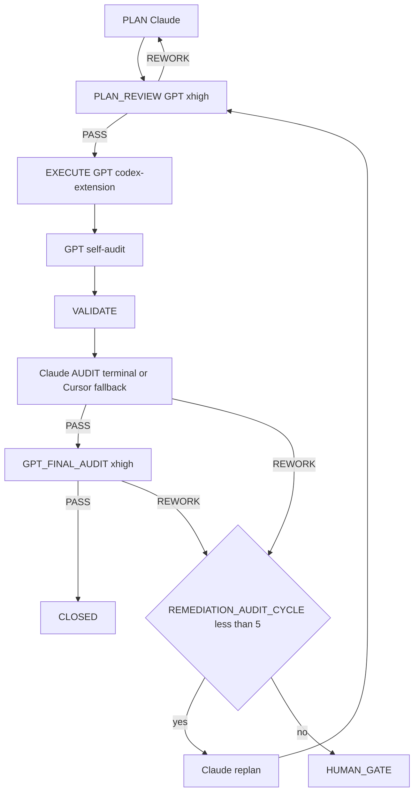

=== Auto-audit GPT (2e passe) ===
OpenAI Codex v0.124.0 (research preview)
--------
workdir: /Users/1millnonstop/Downloads/projet/foodking-web/web/testttt
model: gpt-5.5
provider: openai
approval: never
sandbox: workspace-write [workdir, /tmp, $TMPDIR, /Users/1millnonstop/.codex/memories]
reasoning effort: xhigh
reasoning summaries: none
session id: 019de7f6-be2b-7d90-b40d-d0eaa4974636
--------
user
Tu effectues l’**auto-audit GPT** (2e passe) d’un cycle FoodKing — **pas** l’audit Claude terminal.

**Contexte** : le JSON ci-dessous est la proposition d’implémentation (format agents/codex.prompt.txt) pour la mission `CV1-CATALOG-CONVERGENCE-001-task-1.7`.


**JSON d’implémentation (à recouper)** :
```json
{
  "files_to_modify": [
    "resources/js/services/PosSyncService.js",
    "resources/js/components/admin/pos/PosComponent.vue",
    "tests/js/posSyncFallback.spec.js",
    "resources/views/admin-pos-v4.blade.php",
    "reports/post_execute_latest.log"
  ],
  "implementation_steps": [
    "Implemented PosSyncService.start() with window.foodkingConfig.posFallbackPolling gating, WebSocketService lifecycle subscription, jittered fallback polling, idempotent suspend/stop cleanup, AbortController stale-request protection, and capped 5xx backoff.",
    "Dispatched POS catalog refresh through Vuex item/lists with surface=pos and active branch_id; used vuex:false plus guarded manual commits so aborted stale polls cannot overwrite the POS catalog.",
    "Wired PosComponent.vue mounted/beforeUnmount to start and stop PosSyncService using the existing window._wsService pattern and the active POS branch scope.",
    "Extended resources/views/admin-pos-v4.blade.php with posFallbackPolling config under the existing window.foodkingConfig object.",
    "Created tests/js/posSyncFallback.spec.js with 5 passing Vitest cases for flag-off, disconnected polling, reconnect suspend, 5xx backoff, and overlap abort behavior.",
    "Appended EXECUTE_DELEGATION trace and validation results to reports/post_execute_latest.log."
  ],
  "code_blocks": [
    {
      "path": "resources/js/services/PosSyncService.js",
      "op": "replace",
      "excerpt": "Implemented the previous start() TODO: reads window.foodkingConfig.posFallbackPolling, subscribes to connected/disconnected/reconnect_storm/state_change, schedules jittered polls, dispatches item/lists with { surface:'pos', branch_id, force:true, overlay:false, vuex:false }, commits only non-aborted responses, doubles 5xx backoff 5s/10s/20s/30s, and makes stop() idempotent."
    },
    {
      "path": "resources/js/components/admin/pos/PosComponent.vue",
      "op": "replace",
      "excerpt": "Added PosSyncService import, _posSyncBranchId tracking, mounted() start hook, beforeUnmount() stop hook, and _startPosSyncFallback() using this.$store, window.axios || axios, window._wsService, and the active branch_id."
    },
    {
      "path": "resources/views/admin-pos-v4.blade.php",
      "op": "replace",
      "excerpt": "Added posFallbackPolling: { enabled: @json((bool) config('catalog_v15.pos_fallback_polling.enabled', false)), intervalMsWhenDisconnected: @json((int) config('catalog_v15.pos_fallback_polling.interval_ms_when_disconnected', 30000)) } inside the existing window.foodkingConfig object."
    },
    {
      "path": "tests/js/posSyncFallback.spec.js",
      "op": "create",
      "excerpt": "Created Vitest sentinel covering: flag off no-op; disconnected starts polling; connected suspends polling; 5xx backoff 5s -> 10s -> 20s -> 30s; rapid disconnected/connected/disconnected aborts the prior signal and keeps one in-flight request."
    },
    {
      "path": "reports/post_execute_latest.log",
      "op": "replace",
      "excerpt": "Appended CV1-CATALOG-CONVERGENCE-001/task 1.7 trace with EXECUTE_DELEGATION: codex-extension, files touched, sentinel/full-suite/lint results, WS event names, and commit-block note."
    }
  ],
  "risks": [
    "ESCALATION: Single commit was not created because the sandbox cannot write .git/index.lock: Operation not permitted; no files are staged.",
    "Full Vitest suite passes, but existing unrelated stderr noise remains in legacy tests (localhost:3000 fetch, evil.tld, unresolved router-link/vue-select warnings).",
    "npm run verify:boucle exited 1 with banner only in this sandbox; safety-check passed."
  ],
  "notes": [
    "Validation: npx vitest run tests/js/posSyncFallback.spec.js -> PASS, 5/5.",
    "Validation: npm run vitest -> PASS, 148 files / 971 tests.",
    "Lint: npm run pos:lint:pricing -> OK with existing signoff-pending warning; npm run pos:lint:status -> OK.",
    "Used corrected window.foodkingConfig, not window.fkConfig.",
    "No backend files, store modules, KdsSyncService, pricing, OrderService, FrontendOrderService, migrations, or frozen zones were edited."
  ],
  "execution_trace": {
    "delegation": "codex-extension",
    "invariants_considered": [
      "pricing_ssot",
      "branch_id",
      "commit_before_dispatch"
    ]
  }
}
```

**Livrable** (Markdown uniquement, en français) :
# AUTO_AUDIT_GPT — CV1-CATALOG-CONVERGENCE-001-task-1.7

## 1. Conformité au plan / scope
(Énumérer manques ou dérives ; si scope élargi sans escale → **ESCALATE**)

## 2. Invariants FoodKing
Pour chacun : OK / RISQUE / N/A
- pricing_ssot (backend seul)
- order_status (enum, pas de strings)
- branch_id
- commit_before_dispatch
- frozen_zones
- order_service_symmetry (si un des deux services touché)

## 3. Verdict
Une ligne : `VERDICT: PASS` | `VERDICT: NEEDS_FIX` | `VERDICT: ESCALATE` + 1–3 phrases.

codex
Je vais recouper le JSON avec le plan, les fichiers touchés et les invariants FoodKing avant de rendre le verdict. J’utilise aussi la compétence de revue sync, puisque la mission touche le fallback de synchronisation POS.
exec
/bin/zsh -lc "sed -n '1,180p' .cursor/ACTIVE_CYCLE.md" in /Users/1millnonstop/Downloads/projet/foodking-web/web/testttt
exec
/bin/zsh -lc "sed -n '1,220p' /Users/1millnonstop/Downloads/projet/foodking-web/web/testttt/.agents/skills/sync-risk-review/SKILL.md" in /Users/1millnonstop/Downloads/projet/foodking-web/web/testttt
exec
/bin/zsh -lc "sed -n '1,180p' .cursor/rules/global.mdc" in /Users/1millnonstop/Downloads/projet/foodking-web/web/testttt
exec
/bin/zsh -lc "sed -n '1,220p' AGENTS.md" in /Users/1millnonstop/Downloads/projet/foodking-web/web/testttt
 succeeded in 0ms:
# Active Cycle – FoodKing

**Méta (SSOT `run-cycle.md` Step 0 + `AGENTS.md` § *Authoritative … cycle state*)** — requis pour que l’orchestrateur ne s’arrête pas sur *« RUNNER_MODE not set »*.

| Champ | Valeur actuelle |
| --- | --- |
| **RUNNER_MODE** | `single-session` |
| **PHASE** | `EXECUTE` |
| **TASK_ID** | `CV1-CATALOG-CONVERGENCE-001` (Sprint 1 / Task 1.4 — Warning `channels=null`) |
| **PLAN_FILE** | `plans/PLAN_CV1-CATALOG-CONVERGENCE-001_2026-05-02.md` |
| **EXECUTION_TIER** | `routine` (S effort, hors invariants critiques — voir `docs/orchestration/MULTI_AGENT_LOOP_2026-05-02.md` §2) |
| **EXECUTE_DELEGATION** | `foodking-routine-implementer` (Composer Max+thinking) |
| **REPORT_FILE** | `reports/post_execute_latest.log` (append — preuve `EXECUTE_DELEGATION` / `AUDIT_*`) |
| **MULTI_AGENT_LOOP** | `docs/orchestration/MULTI_AGENT_LOOP_2026-05-02.md` (SSOT du pivot 2026-05-02) |

> **ACTIVE_PRIMARY** : `CAISSE_V1_MASTERPLAY` (un seul cycle peut être actif à la fois — voir B03 méga-checklist).
> Cycles plus anciens en lecture seule = **archive** déplacée dans **`.cursor/ACTIVE_CYCLE_ARCHIVE.md`** (lecture humaine / forensique uniquement, **non requise** par le parcours obligatoire).

## CYCLE_W10_EXECUTION_CLOSEOUT (READ_ONLY_SECONDARY — mémoire 180 + MCP global + commit + CI + prod)

**TASK_ID** : `P_EXEC_CLOSEOUT_GRAPHITI_CI_PROD_2026-04-22`  
**Plan SSOT** : `plans/PLAN_EXECUTION_CLOSEOUT_GRAPHITI_CI_PROD_2026-04-22.md`  
**Ordre** : Piste A (POS+Centrale : PLAN-MEM-1) ∥ Piste B (humain : PLAN-MEM-3) → C (smoke) → D (commit sur « go commit ») → E (CI) → F (prod J-7→J+7).  
**Gate mémoire** : `python3 memory/verify.py` → count **≥ 175** (180 idéal) avant de considérer PLAN-MEM-1 **CLOSED**.

- **Vérif locale (2026-04-22)** : `python3 memory/verify.py` → **count = 182**, smoke `search_memory_facts` OK — gate **satisfaite** pour clôturer l'ingestion côté seuil d'épisodes (suite : commit / CI / prod selon plan `PLAN_EXECUTION_CLOSEOUT_*`).

**Gouvernance globale (2e passe 2026-04-22)** : primer multi-agents + Graphiti vivant + tokens « zéro effet négatif » → **`docs/orchestration/GLOBAL_SYSTEM_PRIMER.md`** + rapport **`reports/audit/AUDIT_SECOND_PASS_GLOBAL_GOVERNANCE_REPORT_2026-04-22.md`**.

**Statut Train A 2026-04-26** : W10 n'est plus primaire pendant la préparation release Caisse V1. Toute reprise W10 doit créer un cycle dédié ou repasser par une décision humaine.

---

## CAISSE_V1_MASTERPLAY (ACTIVE_PRIMARY — 2026-04-25 → Train A 2026-04-27)

**Phase** : finition Caisse V1 (POS + Kiosk + KDS + Centrale + Fiscal + Ops).
**Plan parent** : `plans/PLAN_CAISSE_V1_GPT_MASTERPLAY_2026-04-25.md`
**Plan DAG autoritaire** : `plans/PLAN_CAISSE_V1_SUPER_MASTER_2026-04-25.md`
**Boucle d'exécution** : `plans/masterplay/MASTERPLAY_DISCIPLINE.md` + `plans/masterplay/MASTERPLAY_QUEUE.md` + `scripts/run-masterplay.sh`
**Statut temps réel** : `reports/masterplay/status.json`
**Train A V1** : `reports/audit/PHASE2_PLAN_TRAINS_REWORKED_2026-04-27.md`
**Gates humaines Train A** : `docs/gates/GATE_PHASE2_TRAIN_A_HUMAN_DECISIONS_2026-04-26.md`
**Manifeste Phase A ciblée** : `docs/PHASE_A_CLOSED.md`

**Règle** : tout `TASK_ID` au format `CV1-MXX-…` passe par la masterplay (cf. `AGENTS.md` § "Caisse V1 — Masterplay loop", `.cursor/rules/global.mdc` § "Caisse V1 — Masterplay loop", `.cursor/commands/run-cycle.md` Step 0 item 0). **NE PAS** ouvrir un `run-cycle` standard sur un `CV1-MXX-…`.

**Règle Train A** : A.1/A.2/A.3 sont de la persistance/gouvernance release. D-M13 reste bloqué tant que la migration unique `(branch_id, queue_number)` n'a pas reçu son signoff humain final.

---

## Archive

Tous les cycles **CLOSED / COMPLETED PASSED** (W4 → W9, NF525, etc.) ont été déplacés dans **`.cursor/ACTIVE_CYCLE_ARCHIVE.md`** pour réduire le coût de lecture du parcours obligatoire (audit 2026-04-24, mission `T-PARCOURS-OPTIMIZE-001`).

- **Lecture humaine** : ouvrir `.cursor/ACTIVE_CYCLE_ARCHIVE.md`.
- **Lecture agent** : **non requise** sauf instruction explicite du plan ou du chat (ex. "reprend le rationale du cycle W9").
- **Recherche** : `rg "CYCLE_W9_" .cursor/ACTIVE_CYCLE_ARCHIVE.md` ou `git log --follow .cursor/ACTIVE_CYCLE.md`.

 succeeded in 0ms:
---
name: sync-risk-review
description: Review changes affecting synchronization, auth, pricing, KDS, OSS, or order lifecycle for architectural and business risk.
disable-model-invocation: true
---

# Sync Risk Review Skill

Use this skill when a change affects:
- sync
- auth
- pricing
- KDS
- OSS
- order lifecycle
- cross-device behavior

## Steps
1. Read the relevant docs
2. Inspect the diff or current implementation
3. Identify:
   - architecture risk
   - state consistency risk
   - business rule violations
   - authz issues
   - missing tests
4. Produce a concise review with recommended next actions.

 succeeded in 0ms:
---
description: Always-on rules for the FoodKing Cursor local agent. Applied to every cycle, every model, every task.
globs: ["**/*"]
alwaysApply: true
---

# Global Rules – FoodKing

## Caisse V1 — Masterplay loop (active phase)

Pendant la phase de finition Caisse V1, **toute mission `CV1-MXX-…` est gouvernée par** :
- `plans/masterplay/MASTERPLAY_DISCIPLINE.md` — règles d'or (allowlist, frozen, REWORK max 5, activity-log, mémoire)
- `plans/masterplay/MASTERPLAY_QUEUE.md` — file d'exécution (statut, dépendances DAG)
- `plans/masterplay/GO.md` — comment lancer / suivre / pause / stop
- `scripts/run-masterplay.sh` — runner officiel (boucle codex + audit Claude + audit final + ingest mémoire)

**Lecture obligatoire** avant tout EXECUTE sur un `TASK_ID` `CV1-MXX-…`. Hors Caisse V1 : `run-cycle <TASK_ID>` standard.

## New or continued session — **mandatory path** (applies to **every** conversation and **every** model)

- **The chat log is not the SSOT.** **This repo** (`AGENTS.md`, `.mdc` rules, `docs/orchestration/`, `run-cycle.md`) is.
- On **any** new thread **or** long continuation: (1) Read **`AGENTS.md` § *Parcours obligatoire*** first, then **`docs/orchestration/GLOBAL_SYSTEM_PRIMER.md`** (§1 table). (2) If resuming work, read **`.cursor/ACTIVE_CYCLE.md`** *before* starting a duplicate cycle — follow the same `TASK_ID` / `PHASE` until `CLOSE` or an explicit new task. (3) For bounded work: run **`run-cycle` / `run-cycle.md`** (Steps 0–5) — do not skip `AUDIT` before `CLOSE`. (4) Run `npm run verify:boucle` (and `verify:boucle:full` when an API proof is needed) per `AGENTS.md`. (5) Ensure **`claude` on `PATH` (AUDIT terminal) et binaire `codex` (CLI OpenAI) pour l’EXÉCUTE complexe (compte ChatGPT Pro)**, pas de clé proxy obligatoire — voir `agents/codex-extension-instructions.md`. (6) Obey **`MEMORY_MATRIX.md`**, `EXECUTE_DELEGATION`, `AUDIT_CHANNEL` + `TERMINAL_AUDIT_OK` when using terminal audit, and **`agent-activity-log.sh`** (tail / start / done).
- Full checklist and French wording: **`AGENTS.md` → section *Parcours obligatoire*.

## Cycle Structure (multi-agents — pivot 2026-05-02)
PLAN **Claude** → PLAN_REVIEW **GPT/Codex** → EXECUTE **{routine: Composer | complex: GPT/Codex}** → VALIDATE → AUDIT **Claude (terminal)** → GPT_FINAL_AUDIT **GPT/Codex** → [HUMAN GATE | CLOSE]

Phases are sequential and non-skippable.
Dual audit (`AUDIT_VERDICT: PASS` + `GPT_FINAL_AUDIT_VERDICT: PASS`) precedes close on every cycle without exception.

**Tier-routing déterministe en EXECUTE** : routine (Composer via `foodking-routine-implementer`) ssi tier S **ET** hors invariants critiques **ET** pas de nouveau service ni refactor cross-module. Sinon complex (Codex `codex-extension` PRIMARY ; sub-agent `foodking-complex-implementer` FALLBACK). Doute → complex. Voir `.cursor/routing.md` § Tier-Routing et `docs/orchestration/MULTI_AGENT_LOOP_2026-05-02.md`.

## Model Discipline
- Auto/Premium routing is disabled
- PRIMARY_EXECUTION_MODEL is declared in the plan file before execution begins
- One PRIMARY_EXECUTION_MODEL per cycle; review checkpoints are explicit and mandatory
- Mid-cycle model switch requires Claude confirmation logged under `ESCALATION` in the plan file
- Full routing policy: `.cursor/routing.md`

## EXECUTE Delegation (tier-routing 2026-05-02)
- **Tier routine** (S effort, hors invariants critiques, ≤5 fichiers) → **Composer** via Task **`foodking-routine-implementer`**. Trace : `EXECUTE_DELEGATION: foodking-routine-implementer`. Sur contact avec invariant (pricing / `OrderStatus` / `branch_id` / dispatch / `OrderService` symmetry / frozen / schema / auth) → halt + escalade vers tier complex.
- **Tier complex (PRIMARY)** : **`codex-extension`** — FoodKing Codex Complex Implementer (CLI `codex` + ChatGPT Pro, `gpt-5.5-pro`, `xhigh`). Procédure : `npm run codex:plan-review -- {TASK_ID}` ; préparer `missions/{TASK_ID}/input.json` (+ `graphiti_context.md` / `plan_excerpt.md` / `execute_brief.md`) ; `npm run codex:complex -- {TASK_ID}` (`gpt-5.5-pro`, `xhigh`) ; appliquer `output_codex.json` + lire `reports/audit/GPT_SELF_AUDIT_{TASK_ID}.md` ; après PASS Claude → `npm run codex:final-audit -- {TASK_ID}`. Trace : `EXECUTE_DELEGATION: codex-extension`.
- **Tier complex (FALLBACK)** : Task Cursor **`foodking-complex-implementer`** — uniquement si `codex` / Pro indispo après ≥2 reprises documentées. Trace : `EXECUTE_DELEGATION: foodking-complex-implementer (codex-extension-fallback)` + `FALLBACK_REASON:`.
- **Claude orchestrator** (chat session par défaut) : déclare le tier dans le plan (`EXECUTION_TIER: routine | complex`), délègue, audite. **Ne fait pas** d'édition produit elle-même (sauf doctrine/config orchestration : `.cursor/`, `AGENTS.md`, `docs/orchestration/`, `plans/`, `reports/`, `memory/episodes/*.jsonl`).
- Reference : `.cursor/routing.md` § Routing Table + Tier-Routing ; `docs/orchestration/MULTI_AGENT_LOOP_2026-05-02.md` (procédure pas-à-pas) ; `docs/orchestration/CODEX_API_DELEGATION.md` (Codex CLI) ; `AGENTS.md` § Workflow + "EXECUTE delegation".

## Autonomy Contract
The agent operates autonomously within declared scope.
It halts and escalates — never self-approves — on any gate trigger, scope expansion,
invariant violation, two consecutive validation failures, or unresolvable ambiguity.
Full policies: `human-gates.mdc`, `scope.mdc`, `project-invariants.mdc`.

## Graphiti (mémoire inter-sessions)
- When the Graphiti MCP server is loaded for this workspace, **query it first** on any non-trivial task (see `.cursor/rules/graphiti-memory.mdc` and `AGENTS.md` § MCP).
- If Graphiti is not loaded, continue without blocking; one-line note to enable `~/.cursor/mcp.json` is enough.

## Quality channels — terminal first where defined (multi-agents 2026-05-02)
- **Composer route (`foodking-routine-implementer`)** = EXECUTE **routine** (tier S, hors invariants). Trace `EXECUTE_DELEGATION: foodking-routine-implementer`. Halt + escalade vers complex sur contact avec invariant.
- **GPT route (`codex-extension` — CLI `codex` Pro)** = PLAN_REVIEW + EXECUTE **complex** + GPT_FINAL_AUDIT. Cursor sub-agent `foodking-complex-implementer` = fallback EXECUTE complex uniquement si `codex exec` échoue (≥2 reprises ou binaire indispo) — `EXECUTE_DELEGATION: …` + `FALLBACK_REASON:`. See `AGENTS.md`, `docs/orchestration/MULTI_AGENT_LOOP_2026-05-02.md`, `docs/orchestration/CODEX_API_DELEGATION.md`.
- **Claude AUDIT after implementation** is **by default the terminal** (`bash scripts/foodking-claude-orchestrate.sh context` then `audit` or `audit-brief` — **Anthropic subscription** via `claude` CLI). If the terminal fails after **1 retry** (**quota / rate limit / session saturated**, missing binary, auth, network), **do not stop the cycle**: use the **FALLBACK** — same `audit-context.md` checklist via Cursor Task **`foodking-planner-orchestrator`** (recommended) or in-session **Claude** — with `AUDIT_CHANNEL: cursor-session` **plus** mandatory `AUDIT_FALLBACK_REASON:` and optional `AUDIT_SUBAGENT_FALLBACK: foodking-planner-orchestrator`. See `docs/orchestration/AUDIT_TERMINAL_QUOTA_FALLBACK.md` and `run-cycle.md` Step 5; verify env with `bash scripts/verify-orchestration-boucle.sh`.
- Never invert primary/fallback for billing convenience without that trace — that would be indistinguishable from a mistake in production evidence.

## Token Discipline (quality-first — zero negative optimization)
- **Goal**: maximum correct intelligence per cycle — not shortest answers. Removing detail, skipping invariants, or omitting Graphiti queries to "save tokens" is **forbidden** when it reduces correctness or auditability.
- **Allowed savings only**: do not re-read files already in full context; do not paste verbatim large blobs already in the plan; use **Graphiti** + `## PRIOR_CONTEXT` to avoid re-opening dozens of historical reports; use phase summaries per `context-hygiene.mdc` §4 **after** a phase completes (handoff), not to shrink the plan itself.
- Do not re-explain decisions already recorded in the plan file (link/summarize in one line if needed).
- Structured output in reports — narrative allowed in plans/gates when it carries decisions, risks, or test strategy.
- Flag real risks only — no speculative commentary on out-of-scope subsystems

## Reports Discipline
- Bounded-cycle **plans** live under `plans/`; **gate briefs** under `docs/gates/`; validation logs, execution summaries, and other run evidence under `reports/` per `run-cycle.md` and `ACTIVE_CYCLE.md`
- Composer generates run evidence in `reports/` where applicable — Claude audits
- No new reporting structure without a plan-phase decision

## Absolute Prohibitions
The agent must never: self-approve a gate, expand scope without human instruction,
edit a frozen zone without cleared gate, modify `.cursor/routing.md` mid-cycle.
All invariant prohibitions enforced per `project-invariants.mdc`.

 succeeded in 0ms:
# FoodKing – Cursor Agent Operating Contract

> **Routine production (non négociable)** — Dès l’ouverture du dépôt ou d’une session agent : **ne pas attendre** qu’un humain dise « lis AGENTS ». La boucle **`run-cycle <TASK_ID>`** (voir **`.cursor/commands/run-cycle.md`**) est le chemin **par défaut** pour toute modification **code produit** dans une mission traçable. Rappel court à la racine : **`BOUCLE.md`**.

## 0. Quick start contract — read this first

Commence ici. Ne lance aucune action tant que tu n'as pas lu les priorités P0.
Ce contrat fixe l'ordre minimal de lecture pour comprendre le repo en moins de 60 secondes.
Lis complètement ce qui est marqué obligatoire ; diffère seulement ce qui est explicitement classé P2.

### Reading priority

| Priority | What to read | Why |
| --- | --- | --- |
| P0 | `AGENTS.md §1 Parcours obligatoire` | Cadre impératif de travail, ordre de lecture, discipline de cycle. |
| P0 | `.cursor/ACTIVE_CYCLE.md` (continuation) | État courant du cycle actif, contexte vivant, reprise sans divergence. |
| P0 | `.cursor/rules/global.mdc` (auto-attaché — mentionné pour info) | Règles globales toujours applicables, même si déjà injectées par l'outil. |
| P0 | `plans/masterplay/MASTERPLAY_DISCIPLINE.md` + `plans/masterplay/MASTERPLAY_QUEUE.md` (Caisse V1 actif) | **Pendant la phase Caisse V1** : règles d'or de la boucle GPT + file d'exécution. Tout agent qui touche une mission `CV1-MXX-…` DOIT lire ces deux fichiers avant d'agir. |
| P1 | `docs/orchestration/GLOBAL_SYSTEM_PRIMER.md` | Vocabulaire, architecture d'orchestration, invariants transverses. |
| P1 | `.cursor/commands/run-cycle.md` | Procédure exacte pour démarrer un cycle borné correctement. |
| P1 | `docs/orchestration/MEMORY_MATRIX.md` | Où chercher la mémoire utile sans relire tout le dépôt. |
| P1 | `.cursor/routing.md` | Routage des tâches, choix du bon canal, limites d'intervention. |
| P2 | `docs/orchestration/CODEX_API_DELEGATION.md` (quand EXECUTE complexe) | À lire si tu délègues ou exécutes du complexe (uniquement **CLI `codex`**, pas d’exécuteur HTTP dans le dépôt). |
| P2 | `.cursor/ACTIVE_CYCLE_ARCHIVE.md` (forensique humain) | Historique utile pour audit humain, pas requis au démarrage. |
| P2 | `docs/orchestration/EXPORT_CONFIG_CODEX_GPT_API_ET_AUDIT_PERSISTANCE.md` (nouveau poste) | Configuration et persistance utiles surtout lors d'un nouvel environnement. |

Règle simple : P0 avant toute action, P1 avant tout EXECUTE, P2 seulement à la demande du sujet.
Si un doute persiste après P0+P1, arrête-toi et relis ; n'improvise pas.

### One-line bootstrap

```bash
npm run verify:boucle
bash scripts/agent-activity-log.sh tail 50
run-cycle <TASK_ID>
```

### Routine obligatoire — sans rappel humain « lis AGENTS »

- **Toute** évolution produit dans une mission avec **`TASK_ID`** suit **`run-cycle`** de bout en bout (Steps 0→5). Ce n’est pas réservé aux « gros » chantiers.
- **Avant EXECUTE** sur les fichiers applicatifs : réservation **`scripts/agent-activity-log.sh start`** (voir **`.cursor/rules/cross-agent-sync.mdc`**).
- **EXECUTE** complexe : canal primaire **`codex-extension`** ; Composer / session Cursor **ne remplacent pas** ce canal sauf **fallback** documenté (`FALLBACK_REASON`) — voir **§ Workflow** ci-dessous.
- Le fichier racine **`BOUCLE.md`** du dépôt duplique ce rappel pour les agents qui listent les fichiers sans rouvrir tout `AGENTS.md`.

### Caisse V1 — Masterplay loop (actif)

Pendant la phase de finition Caisse V1 (POS + Kiosk + KDS + Centrale + Fiscal), l'orchestration passe par la **MASTERPLAY** :

```bash
# Lire d'abord (obligatoire)
cat plans/masterplay/MASTERPLAY_DISCIPLINE.md
cat plans/masterplay/MASTERPLAY_QUEUE.md
cat plans/masterplay/GO.md

# Lancer la boucle (Codex extension complexe + audit Claude terminal + audit Codex final)
bash scripts/run-masterplay.sh --with-audit --with-final
```

- **Plan parent** : `plans/PLAN_CAISSE_V1_GPT_MASTERPLAY_2026-04-25.md` (catalogue 22 missions M-XX, ancrages file:line)
- **Plan autoritaire DAG** : `plans/PLAN_CAISSE_V1_SUPER_MASTER_2026-04-25.md`
- **Statut temps réel** : `reports/masterplay/status.json` + `reports/masterplay/run_*.log`
- Tout `TASK_ID` au format `CV1-MXX-…` est gouverné par la masterplay (allowlist, frozen, gates, REWORK max 5).
- Hors phase Caisse V1 : repasser au `run-cycle <TASK_ID>` standard.

**Anti-répétition (nouvel onglet / agent parallèle)** : copier d’abord le bloc de `docs/orchestration/SESSION_OPENING_ENFORCEMENT.md` — même discipline, moins d’oubli de `ACTIVE_CYCLE` / `run-cycle`.

Utilise `run-cycle <TASK_ID>` pour initier tout cycle borné.
Les deux autres commandes servent à vérifier l'état local et le journal d'activité avant d'exécuter.

### Quality-first, not token-cheap

Lis P0 et P1 intégralement, sans skim. Les économies de tokens ne se font jamais sur la substance des règles, seulement sur la répétition, le bruit et les relectures inutiles. En cas de tension entre vitesse et rigueur, applique la rigueur ; voir `.cursor/rules/global.mdc § Token Discipline`.

### If you're a new human contributor

Commence par `docs/orchestration/EXPORT_CONFIG_CODEX_GPT_API_ET_AUDIT_PERSISTANCE.md` pour préparer ton poste et comprendre le mode de persistance attendu.
Lis-le après P0, puis enchaîne sur P1 avant toute contribution effective.

---

## 1. Parcours obligatoire — **nouvelle conversation** **et** **continuation** (production, non négociable)

> **Objectif** : qu’**à chaque** session (premier message ou 500e message), l’exécutant sache **quel** chemin suivre — **sans** supposer un historique de chat. Tout est **dans le dépôt** ; l’histoire de conversation **n’est pas** la SSOT.

**Règle d’or** : *aucune* modification de code **produit** (hors `plans/`, `reports/`, `docs/gates/`, `missions/`, JSONL gouvernance) **dans le cadre d’un travail borné** sans **(a)** parcours ci-dessous **et** **(b)** cycle `run-cycle` + plan actif, sauf **exception** explicite humaine (notée dans le plan / gate).

| Étape | Action | Quand / pourquoi |
|-------|--------|------------------|
| **0. Continuation** | Lire **`.cursor/ACTIVE_CYCLE.md`**. | Si `PHASE` n’est **pas** vide et le cycle n’est **pas** archivé : **reprendre** ce `TASK_ID` / ce `PLAN_FILE` / ce `REPORT_FILE` — **ne pas** dupliquer un second cycle fantôme. Si humain confirme **nouveau** sujet : réinitialiser / nouveau `TASK_ID` selon `run-cycle` Step 0. |
| **1. Lecture initiale** | Lire **ce fichier** (`AGENTS.md`) **puis** **`docs/orchestration/GLOBAL_SYSTEM_PRIMER.md`** (table §1 = ordre complet : routing, `run-cycle`, Graphiti, `MEMORY_MATRIX`, etc.). | **Avant** tout code ou plan non trivial. Même en « continuation » si le contexte a dérivé ou l’onglet a été rafraîchi. |
| **2. Cycle structuré (SSOT procédurale)** | Toute tâche avec **`TASK_ID`** : suivre **`.cursor/commands/run-cycle.md`** et la commande **`run-cycle <TASK_ID>`** (ou équivalent explicite dans le chat : enchaîner les **Steps 0 → 5** sans en sauter). | **Doctrine alignée `.cursor/routing.md` :** PLAN (Claude/orchestration plan fichier) → PLAN_REVIEW GPT (Codex) → EXECUTE GPT (Codex) → VALIDATE → AUDIT Claude terminal → GPT_FINAL_AUDIT (Codex). Aucun « close » sans double PASS documenté. |
| **3. Vérification d’environnement** | `npm run verify:boucle` (0 requête ; vérifie aussi `npm run validate:active-cycle` — WARN si PHASE hors liste canonique dans `.cursor/ACTIVE_CYCLE.md`). **Si le terminal ne “voit” pas Codex alors que l’extension est connectée** : l’auth IDE n’alimente pas le CLI — lancer `npm run codex:doctor` (npm + `login status` + 1 requête). **Rapide :** `npm run codex:verify-pro`. **Complet :** `npm run verify:boucle:full`. Encart : `agents/codex-extension-instructions.md`. | Même en **Step 5** : l’`EXECUTE` (CLI `codex`) requiert le binaire + session Pro sur **ce** binaire. Voir `run-cycle` Step 0 item 8. |
| **4. Secrets & outils machine** | Binaire **`claude`** sur le **`PATH`** (Claude Code CLI) pour l’**AUDIT** PRIMARY en terminal. Binaire **`codex`** (CLI OpenAI) : *Sign in with ChatGPT* **Pro** — **pas** de clé API dans le dépôt. Résolution : `PATH` **ou** `node_modules/.bin/codex` après **`npm install`** (dépendance **`@openai/codex`**) **ou** `npm i -g @openai/codex`. **Ne pas** mélanger avec une clé *Platform* restreinte dans l’environnement (provoque des 401 *scopes* sur l’API Responses) — `npm run codex:audit-bleed` aide. (Option) MCP Graphiti selon `~/.cursor/mcp.json`. | Sans `claude` : noter dès le **plan** l’`AUDIT` fallback + `AUDIT_FALLBACK_REASON`. Sans binaire `codex` : pas d’`EXECUTE` complexe PRIMARY (sub-agent + `FALLBACK_REASON` ou `npm install` + auth Pro). |
| **5. Traces & mémoire (déjà dans ce fichier)** | **`EXECUTE_DELEGATION:`** avant VALIDATE ; **`AUDIT_CHANNEL:`** + **`TERMINAL_AUDIT_OK: 1`** si audit terminal OK ; `docs/orchestration/MEMORY_MATRIX.md` ; `scripts/agent-activity-log.sh` (tail / start / done). | Traçabilité = **même** qualité en prod sur N agents parallèles. |

**Ce n’est pas optionnel** pour travailler « en production FoodKing » : c’est le **contrat** d’onboarding. Les **règles** `.cursor/rules/*.mdc` (dont **`global.mdc` — alwaysApply**) et ce fichier **s’imposent** **à** tout modèle, **dans** toute conversation, dès l’ouverture du dépôt.

**Pour un humain / nouveau compte** : mêmes étapes ; la doc **`docs/orchestration/EXPORT_CONFIG_CODEX_GPT_API_ET_AUDIT_PERSISTANCE.md`** regroupe l’**export** config API + persistance des règles hors-chat.

## Engine
Cursor local agent. No cloud orchestration. No external framework.
Auto/Premium routing: disabled. Model selection is explicit per cycle.

## Global system primer (multi-agents, Graphiti, tokens — lecture clé)

Tout nouvel intervenant (session Cursor, sub-agent Task, CLI terminal, humain) qui touche **orchestration**, **mémoire**, ou **discipline de contexte** : lire **`docs/orchestration/GLOBAL_SYSTEM_PRIMER.md`** après ce fichier. Y sont définis : ordre de lecture obligatoire, `codex-extension` GPT-5.5-pro/xhigh, fallback `foodking-complex-implementer`, fallback audit `foodking-planner-orchestrator`, terminal **`claude` / `codex`**, **mise à jour continue de Graphiti**, et la politique **« intelligence max — zéro optimisation négative »** (tokens : supprimer le gaspillage, pas la substance). Pour audits longs et robustesse **opération + agentique + mémoire** : **`docs/orchestration/MEGA_CHECKLIST_AUTONOMY_AND_MEMORY.md`** (180 tâches) et le narratif **`reports/audit/MEGA_AUDIT_SYSTEM_OPERATION_AGENTIC_2026-04-23.md`**.

**Discipline mémoire (qui écrit où, qui lit quoi, quand)** : **`docs/orchestration/MEMORY_MATRIX.md`** — matrice unique des **4 stores autorisés** (Code A · Graphiti+JSONL B · Missions C · Rapports D), table d'écriture par phase, ordre de lecture pour une nouvelle session, anti-patterns. Aucun nouveau store de mémoire ne peut être ajouté sans gate `docs/gates/GATE_MEMORY_*`. Décisions 2026-04-23 sur OpenSpace et claude-mem : **non intégrés**, justifications dans la matrice.

**Synchro multi-agents (cross-conv, cross-terminal)** : `.cursor/rules/cross-agent-sync.mdc` (alwaysApply) + `reports/AGENT_ACTIVITY_LOG.md` (append-only) + `scripts/agent-activity-log.sh` (`tail | start | done | collisions | active`). Au démarrage de session : `tail 50` (~500 tokens). Avant édition produit (Step 2 EXECUTE) : `start` (refus exit 2 si collision). À la clôture (Step 5 CLOSE) : `done`. Évite que deux agents (Cursor convs / `codex-extension` / `claude-terminal` / humain) modifient les mêmes fichiers à leur insu. **Doctrine étendue** (Graphiti = mémoire partagée, rôles Claude vs Codex, anti-patterns) : **`docs/orchestration/MULTI_AGENT_ORCHESTRATION.md`**.

## Workflow (multi-agents — pivot 2026-05-02)
PLAN **Claude** → PLAN_REVIEW **GPT/Codex** → EXECUTE **{routine: Composer | complex: GPT/Codex}** → VALIDATE → AUDIT **Claude (terminal)** → GPT_FINAL_AUDIT **GPT/Codex** → [HUMAN GATE | CLOSE]

No phase may be skipped. Close condition = double PASS (`AUDIT_VERDICT: PASS` Claude **+** `GPT_FINAL_AUDIT_VERDICT: PASS` GPT). SSOT procédurale du pivot : `docs/orchestration/MULTI_AGENT_LOOP_2026-05-02.md`.

## Model Roles (canonique 2026-05-02)
| Modèle | Rôle | Canal d'invocation |
|---|---|---|
| **Claude** | **PLAN + AUDIT post-impl + escalade critique** | Session Cursor par défaut (chat = Claude) ; AUDIT en terminal `bash scripts/foodking-claude-orchestrate.sh audit` (PRIMARY) ; fallback Task `foodking-planner-orchestrator`. **Ne fait pas** d'implémentation produit. |
| **Composer** (Max mode + thinking) | **EXECUTE routine** (tier S, hors invariants) | Task Cursor **`foodking-routine-implementer`**. Trace : `EXECUTE_DELEGATION: foodking-routine-implementer`. Sur contact avec un invariant critique → halt + escalade vers tier complex. |
| **GPT-5.5-pro xhigh** | **EXECUTE complex + PLAN_REVIEW + GPT_FINAL_AUDIT** | PRIMARY : **`codex-extension`** CLI `codex` Pro (`npm run codex:plan-review`, `npm run codex:complex`, `npm run codex:final-audit`). FALLBACK EXECUTE : Task **`foodking-complex-implementer`** si binaire/Pro indispo après ≥2 reprises (`FALLBACK_REASON:`). |

**Tier-routing déterministe** — une tâche est **routine** ssi **toutes** : effort S (≤2h, ≤5 fichiers) **ET** aucun invariant critique (pricing, `OrderStatus`, `branch_id`, dispatch, `OrderService`/`FrontendOrderService` symmetry, frozen, schema/DDL, auth) **ET** pas de nouveau service ni refactor cross-module. Sinon **complex**. Doute → complex (principe « partial > wrong »).

**Qui décide quoi** :
- **Claude** : autorité sur la planification, l'audit, l'escalade. Décide aussi du **tier** (routine / complex) et l'inscrit dans le plan en `EXECUTION_TIER: routine|complex`.
- **GPT/Codex** : autorité technique sur le PLAN_REVIEW, l'implémentation complexe, l'audit final.
- **Composer** : exécutant fidèle de la routine — pas de décision d'architecture, halt+escalade sur contact avec invariant.

One PRIMARY_EXECUTION_MODEL per cycle. Roles are explicit and layered; review checkpoints do not authorize scope expansion.
Full routing policy: `.cursor/routing.md`. Naming: the **PRIMARY complex implementer** is the **FoodKing Codex Complex Implementer** (slug `codex-extension`); see `docs/orchestration/CODEX_API_DELEGATION.md`.

## Authoritative multi-agent bounded cycle (SSOT)

For **TASK_ID-driven** work in Cursor, this path is **authoritative** and overrides any conflicting step elsewhere in this document:

1. **Command:** `.cursor/commands/run-cycle.md` (invoke with a `TASK_ID`, e.g. `run-cycle SMOKE-001`).
2. **Cycle state:** `.cursor/ACTIVE_CYCLE.md` (`RUNNER_MODE: single-session`, `PHASE`, `PLAN_FILE`, `REPORT_FILE`, completion rows).
3. **Plan artifact:** `plans/PLAN_[TASK_ID]_[DATE].md` per `.cursor/context/plan-context.md` (from `plans/PLAN_TEMPLATE.md` when applicable).
4. **Phase instructions:** `.cursor/context/plan-context.md` (PLAN), `.cursor/context/execute-context.md` (EXECUTE), `.cursor/context/audit-context.md` (AUDIT); VALIDATE per `run-cycle.md` when `validate-context.md` is absent.

**EXECUTE delegation (tier-routing 2026-05-02 ; PRIMARY first, FALLBACK only on failure):**

- **Routine (tier S, hors invariants)** : **Composer** via Task Cursor **`foodking-routine-implementer`**. Trace obligatoire : `EXECUTE_DELEGATION: foodking-routine-implementer`. Halt + escalade vers tier complex sur contact avec un invariant critique (pricing, `OrderStatus`, `branch_id`, dispatch, frozen, schema, auth).
- **Complex (M/L/XL OU invariants en scope) — PRIMARY** : **`codex-extension`** — **FoodKing Codex Complex Implementer** (CLI `codex`, compte **ChatGPT Pro**, `gpt-5.5-pro`, `model_reasoning_effort=xhigh`). Procédure :
  1. Préparer `missions/{TASK_ID}/input.json` (+ optionnels : `graphiti_context.md` issu de `search_memory_facts(group_ids=["foodking"])`, `plan_excerpt.md`, `execute_brief.md`, `cycle_snapshot.md` — fusionnés par le script d’assemblage de prompt).
  2. Lancer `npm run codex:complex -- {TASK_ID}` (`bash scripts/codex-extension-execute.sh`) ; le wrapper passe explicitement `-m ${CODEX_EXT_MODEL_PRO:-gpt-5.5-pro}` et `model_reasoning_effort=${CODEX_EXT_REASONING_EFFORT:-xhigh}`. (Instructions custom : `agents/codex-extension-instructions.md`.) **Bootstrap** : `npm run codex:prepare -- {TASK_ID}`.
 3. Appliquer `missions/{TASK_ID}/output_codex.json` ; consommer l’**auto-audit** `reports/audit/GPT_SELF_AUDIT_{TASK_ID}.md` (généré par le wrapper).
 4. Tracer `EXECUTE_DELEGATION: codex-extension` dans `reports/post_execute_latest.log` et le `REPORT_FILE`.
- **Complex — FALLBACK (uniquement si `codex exec` est HS après ≥2 reprises documentées, ou binaire manquant)** : `Task` → `foodking-complex-implementer` — tracer `EXECUTE_DELEGATION: foodking-complex-implementer (codex-extension-fallback)` + `FALLBACK_REASON:`.

**Règle anti-dérive (Claude orchestrateur)** : Claude (chat session par défaut) **ne doit pas** exécuter d'édition produit (`app/`, `resources/`, `routes/`, `database/`, `tests/`, `bootstrap/`, `config/`, `composer.json`, `package.json`) elle-même. Sa mission unique en EXECUTE = **déléguer** au bon canal selon `EXECUTION_TIER`. Toute édition produit faite directement par Claude doit être consignée comme **violation** dans `reports/AGENT_ACTIVITY_LOG.md` (sauf hot-fix doctrine / config orchestration, qui restent autorisés).

Référence complète : **`docs/orchestration/CODEX_API_DELEGATION.md`** (naming, fallback contract, audit handoff, token discipline, schéma boucle). Procédure cycle : `.cursor/commands/run-cycle.md`. La trace `EXECUTE_DELEGATION` dans le rapport est **obligatoire** pour passer en VALIDATE.

**Clôture vs. audit :** Après `VALIDATE`, l’**audit** **Claude** (terminal `foodking-claude-orchestrate.sh` en PRIMARY, fallback Cursor si quota/rate-limit/terminal HS) écrit `AUDIT_VERDICT: PASS|REWORK`, puis GPT écrit `GPT_FINAL_AUDIT_VERDICT: PASS|REWORK|ESCALATE`. **Pas** de `CLOSED` sans double PASS. Sur `REWORK`, boucle `replan (orchestration Claude) → missions + EXECUTE GPT → self-audit GPT → VALIDATE → re-audit Claude → GPT final`, avec `REMEDIATION_AUDIT_CYCLE` 1..5 — au 5e `REWORK` sans double PASS, **HUMAN_GATE** (détail : Step 5 de `run-cycle.md` et `auto-remediation.mdc`).

Sections below labeled **Legacy workflow** remain valid for **PR-centric / review-loop** habits but **do not replace** this SSOT for bounded cycles.

## Source of truth (extended)
- README.md
- docs/PROJECT_CONTINUITY_AND_VISION.md
- docs/ARCHITECTURE.md
- docs/API_MAP.md
- docs/AUTHZ_MATRIX.md
- docs/ORDER_FLOW.md
- docs/DEVICE_FLOW.md
- docs/BUSINESS_RULES.md
- docs/CORE_MODULES.md
- docs/DATABASE_SCHEMA_CORE.md
- docs/ERROR_HANDLING.md
- docs/SECURITY_NOTES.md
- docs/TEST_PLAN.md
- docs/MASSIVE_TEST_PLAN.md
- docs/SAAS_VISION.md
- docs/CONTRIBUTING_QA_BOTS.md
- workflows/qa-loop.md
- workflows/task-routing.md
- workflows/report-format.md
- workflows/task-status.md
- reports/README.md
- docs/orchestration/MEGA_CHECKLIST_AUTONOMY_AND_MEMORY.md
- docs/orchestration/WORKFLOW_AUDIT_GRAPHIQUE_2026-04-23.md
- docs/orchestration/TERMINAL_CLAUDE_GRAPHITI_ORCHESTRATION.md
- docs/orchestration/ROUTING_MATRIX.md

## Stop Conditions
Halt and generate a gate brief on any of:
- Gate trigger detected
- Scope expansion beyond declared boundary
- FoodKing invariant violation
- Two consecutive validation failures
- Planning ambiguity unresolvable from task context
- **`codex` / `codex exec` indisponible après reprises (auth, binaire, ou échec ≥2 sur la même tâche)** : basculer sur le fallback `Task → foodking-complex-implementer` et **noter explicitement** `EXECUTE_DELEGATION: foodking-complex-implementer (codex-extension-fallback)` + `FALLBACK_REASON:`.
- **Audit en terminal (PRIMARY) indisponible ou limité** (`claude` absent, **quota / rate limit / session Anthropic saturée**, auth, réseau — après **1 retry** documenté de `context` + `audit-brief` ou `audit`) : **continuer le cycle** — même checklist `audit-context.md` via Task **`foodking-planner-orchestrator`** (recommandé) ou session Cursor **Claude** ; **`AUDIT_CHANNEL: cursor-session`** + **`AUDIT_FALLBACK_REASON:`** (obligatoire) + optionnel **`AUDIT_SUBAGENT_FALLBACK: foodking-planner-orchestrator`**. Voir `docs/orchestration/AUDIT_TERMINAL_QUOTA_FALLBACK.md`. **Ne jamais** omettre la raison.

## FoodKing Non-Negotiables
- Backend is pricing SSOT — no frontend price logic
- `OrderStatus` enum is authoritative — no hardcoded strings
- `branch_id` = business data isolation — no cross-branch data bleed
- Dispatch strictly after DB commit
- `OrderService` / `FrontendOrderService` symmetry mandatory on any order change
- Frozen zones require gate clearance before any edit

## MCP

### Phase 1 — Filesystem
Filesystem MCP only for repo reads where applicable.

### Phase 2 — Graphiti (mémoire inter-cycles — **présent dans toutes les sessions où le serveur est enregistré**)

**Objectif** : décisions d’architecture, invariants, sync borne↔POS↔KDS, fiscal NF525, historique de cycles — récupérables sans relire des centaines de fichiers.

| Élément | Détail |
|--------|--------|
| **Enregistrement Cursor (obligatoire côté humain)** | Fusionner le bloc `graphiti` dans **`~/.cursor/mcp.json`** (Settings → MCP). Modèle : **`.cursor/mcp/graphiti.json.example`**. Le dépôt ne peut pas injecter un MCP automatiquement dans l’IDE. |
| **Règle agent (automatique dès que le MCP est chargé)** | Voir **`.cursor/rules/graphiti-memory.mdc`** (always-on) + **`global.mdc`** : avant toute tâche non triviale, appeler au moins **`search_memory_facts`** (et optionnellement **`search_memory_nodes`**) avec `group_ids=["foodking"]`. |
| **Après AUDIT / CLOSE** | Si `add_memory` est disponible : enregistrer les décisions durables (ADR, gate, invariant clarifié). |
| **Si Graphiti absent de la session** | **Ne pas bloquer** PLAN / EXECUTE : une ligne « Graphiti non chargé » + secours **`memory/INDEX.md`** + lecture ciblée des JSONL sous `memory/episodes/`. |

exec
/bin/zsh -lc "sed -n '1,220p' plans/masterplay/MASTERPLAY_DISCIPLINE.md" in /Users/1millnonstop/Downloads/projet/foodking-web/web/testttt
exec
/bin/zsh -lc "sed -n '1,220p' plans/masterplay/MASTERPLAY_QUEUE.md" in /Users/1millnonstop/Downloads/projet/foodking-web/web/testttt
 succeeded in 0ms:
# MASTERPLAY DISCIPLINE — Caisse V1 (loop master)

> **But** : règles strictes que le runner et chaque mission GPT respectent en boucle, pendant des heures, jusqu'à finition de toutes les missions de `MASTERPLAY_QUEUE.md`. Lecture obligatoire avant de lancer `bash scripts/run-masterplay.sh`.

## 1. Autorité

| Source | Rôle |
|--------|------|
| `AGENTS.md` | Parcours obligatoire, cycle FoodKing |
| `plans/PLAN_CAISSE_V1_SUPER_MASTER_2026-04-25.md` | DAG autoritaire (ordre, gates) |
| `plans/PLAN_CAISSE_V1_GPT_MASTERPLAY_2026-04-25.md` | Catalogue 22 missions M-XX (objectifs, allowlist) |
| `plans/masterplay/MASTERPLAY_QUEUE.md` | File d'exécution courante |
| `plans/masterplay/MASTERPLAY_DISCIPLINE.md` | (ce fichier) règles d'exécution |
| `.cursor/rules/*.mdc` | Toujours appliquées |
| `docs/gates/GATE_LOG.md` | État des gates humains |

## 2. Boucle d'exécution (run-masterplay.sh)

```
LOOP {
  1. tail activity log (~500 tokens)
  2. find next PENDING task in MASTERPLAY_QUEUE with all DEPENDS_ON == CLOSED
  3. if none → break (all done or all blocked)
  4. verify missions/<TASK_ID>/input.json + execute_brief.md exist
  5. activity-log start codex-extension <TASK_ID> execute "<allowlist CSV>" "<note>"
     if exit 2 (collision) → MARK BLOCKED note=collision, continue loop
  6. update status: RUNNING
  7. npm run codex:complex -- <TASK_ID>     (génère output_codex.json + GPT_SELF_AUDIT)
  8. update status: EXECUTED
  9. activity-log done codex-extension <TASK_ID> done "<résumé court>"
 10. (option --with-audit) bash scripts/foodking-claude-orchestrate.sh audit-brief <TASK_ID>
       if PASS → status: AUDIT_PASS
       if REWORK → status: REWORK ; increment REWORK_COUNT ; if >=5 → BLOCKED note=human_gate
 11. (option --with-final) npm run codex:final-audit -- <TASK_ID>
       if PASS → status: FINAL_PASS
 12. if FINAL_PASS:
       bash scripts/after-execute-memory.sh
       update status: CLOSED
 13. sleep INTER_TASK_PAUSE_SECONDS (default 5s)
 14. continue LOOP
}
```

## 3. Garde-fous (non négociables)

### 3.1 Allowlist stricte par mission
Codex modifie **uniquement** les fichiers listés dans `missions/<TASK_ID>/input.json.allowlist`. Si modification hors liste détectée à l'audit → `REWORK`.

### 3.2 Frozen zones
Aucune édition d'un fichier frozen sans gate signé dans `docs/gates/GATE_LOG.md`. Le runner **refuse** de lancer une mission marquée `BLOCKED` jusqu'à ce que le statut soit changé manuellement après signature.

### 3.3 Invariants FoodKing — `REWORK` automatique
- Pricing client-authoritative
- Status littéral numérique (`status: 16`)
- `branch_id` LIKE
- Dispatch dans transaction
- OS ou FOS modifié sans `SYMMETRY_NOTE`
- Frozen modifié sans gate

### 3.4 Pas de gate auto-approuvée
Codex peut **rédiger** options ; aucune mission ne coche `[x] Approved`. Si une mission le tente → `REWORK` + `risks: ["ESCALATION: gate self-approved"]`.

### 3.5 Tests obligatoires
Chaque `mandatory_tests` listé doit être lancé et reporté dans le rapport. Échec → `REWORK`.

### 3.6 Diff minimal
Aucun renommage opportuniste, aucun refactor non demandé, aucune optimisation collatérale. Si ajout justifié → `notes` du JSON.

### 3.7 Activity log
`start` avant chaque mission ; `done` après. Sans cela → réservation fantôme = autres agents bloqués. Le runner enforce.

### 3.8 Mémoire
À CLOSE : compléter `memory/episodes/caisse_v1_<topic>_*.jsonl` (squelettes créés par M-19) puis `bash scripts/after-execute-memory.sh`. Si Graphiti UP : `bash bin/graphiti-ingest.sh` + `python3 memory/verify.py`.

## 4. Boucles de rework

- Max **5 cycles `REWORK`** consécutifs sur la même mission. Au 5e → `BLOCKED note=human_gate_required`.
- Max **3 cycles healing** consécutifs (cf. CLAUDE.md §8) avant escalade.
- Toute escalation → écrite dans `reports/masterplay/ESCALATIONS_<date>.md`.

## 5. Pause / arrêt

- `Ctrl-C` arrête la boucle proprement (mission en cours finit, runner s'arrête après).
- `touch reports/masterplay/STOP` → le runner s'arrête à la fin de la mission courante.
- `touch reports/masterplay/PAUSE` → le runner pause entre les missions tant que le fichier existe.

## 6. Logs

- `reports/masterplay/run_<ISO>.log` : log de la boucle.
- `reports/masterplay/status.json` : état temps réel (mission courante, compteurs).
- `missions/<TASK_ID>/output_codex.raw.log` : raw codex.
- `missions/<TASK_ID>/output_codex.json` : json structuré.
- `reports/audit/GPT_SELF_AUDIT_<TASK_ID>.md` : self-audit GPT.
- `reports/post_execute_latest.log` : trace `EXECUTE_DELEGATION`.
- `reports/AGENT_ACTIVITY_LOG.md` : start/done.

## 7. Audit Claude (en fin de boucle, manuel)

Quand toutes les missions sont `CLOSED` (ou `BLOCKED` documentés) :

```
bash scripts/foodking-claude-orchestrate.sh context
bash scripts/foodking-claude-orchestrate.sh audit
```

Sortie attendue : verdict transversal Caisse V1 (chaîne sync borne→centrale→POS→KDS→fiscal). Le verdict détermine `GO/HOLD/NO-GO` pour `GATE_GO_NO_GO_CAISSE_V1`.

## 8. Critères d'arrêt anormal

- 3 missions consécutives en `REWORK` → halt + alerte humaine.
- Activity-log refuse 3 fois → halt (collision permanente).
- `npm run codex:complex` échoue 3 fois sur la même mission (binaire codex KO) → halt.
- `claude` terminal indisponible 3 fois consécutives → continue avec fallback subagent + `AUDIT_FALLBACK_REASON: terminal-unavailable`.

## 9. Token discipline

- Le prompt envoyé à codex contient : template `agents/codex.prompt.txt` + `input.json` + `execute_brief.md` + (optionnel) `graphiti_context.md`, `plan_excerpt.md`, `cycle_snapshot.md`.
- Pas de duplication : pas de re-coller AGENTS.md ou super master plan dans chaque mission.
- Cap typique d'un prompt : ≤ 30 KB. Au-delà → splitter la mission.

## 10. Anti-pattern interdits

- ❌ Lancer 2 missions en parallèle sur les mêmes fichiers (collision activity-log).
- ❌ Modifier `MASTERPLAY_QUEUE.md` pendant que le runner tourne (sauf marquer BLOCKED → PENDING après gate).
- ❌ Skipper l'audit Claude pour aller plus vite.
- ❌ Marquer CLOSED manuellement sans double PASS (PASS Claude + PASS Codex final).
- ❌ Ignorer un `risks: ["ESCALATION: ..."]` dans output_codex.json.

---

`MASTERPLAY_DISCIPLINE_VERSION: 1.0` · `STRICT_MODE: ON`

 succeeded in 0ms:
# MASTERPLAY_QUEUE — Caisse V1

**Source de vérité de l'orchestration en boucle** : `bash scripts/run-masterplay.sh` lit cette file et exécute en série.

**Discipline** : `plans/masterplay/MASTERPLAY_DISCIPLINE.md`.  
**Plan parent** : `plans/PLAN_CAISSE_V1_GPT_MASTERPLAY_2026-04-25.md`.

## Légende statut

- `PENDING` — pas encore lancé
- `RUNNING` — codex exec en cours (ne pas relancer)
- `EXECUTED` — codex exec terminé, attend audit
- `AUDIT_PASS` — `AUDIT_VERDICT: PASS` Claude
- `FINAL_PASS` — `GPT_FINAL_AUDIT_VERDICT: PASS`
- `CLOSED` — mémoire ingestée + activity-log done
- `REWORK` — audit a demandé rework
- `BLOCKED` — gate humain ou dépendance manquante

## Légende vague

- `WAVE_A` — NO-GATE, parallélisable, démarre immédiatement
- `WAVE_B` — POST-GATE, séquencé selon DAG

## File d'exécution


| ORDER | TASK_ID                           | MISSION | WAVE   | DEPENDS_ON                 | STATUS  | NOTE                                                                               |
| ----- | --------------------------------- | ------- | ------ | -------------------------- | ------- | ---------------------------------------------------------------------------------- |
| 01    | CV1-M19-MEMORY-DISCIPLINE         | M-19    | WAVE_A | —                          | CLOSED  | Crée squelettes JSONL pour les 22 missions                                         |
| 02    | CV1-M01-TRACEABILITY-MATRIX       | M-01    | WAVE_A | —                          | CLOSED  | Matrice findings → tasks → tests → gates (REWORK resolved GPT PASS)                |
| 03    | CV1-M02-SENTINEL-BASELINE         | M-02    | WAVE_A | CV1-M01                    | CLOSED  | 18 sentinels fail-first + 4 lints                                                  |
| 04    | CV1-M12-LEGACY-GUARDS-CI          | M-12    | WAVE_A | —                          | CLOSED  | Lint imports + bundle scan + workflow (recovered: extractor JSON fix)              |
| 05    | CV1-M16-HARDWARE-LAB              | M-16    | WAVE_A | —                          | CLOSED  | Checklist hardware signable (recovered: JSON valid, files materialized)            |
| 06    | CV1-M18-TEST-ARCHITECTURE         | M-18    | WAVE_A | CV1-M02                    | CLOSED  | Grille couverture + plan campagne                                                  |
| 07    | CV1-M20-RUNBOOKS-SKELETON         | M-20    | WAVE_A | —                          | CLOSED  | 8 runbooks ops (REWORK Horizon resolved GPT PASS)                                  |
| 08    | CV1-M21A-QUICKWINS-LOT0           | M-21a   | WAVE_A | —                          | CLOSED  | POS: discount v-model + Swiper RTL + focustrap dead                                |
| 09    | CV1-M03-GATES-DRAFT               | M-03    | WAVE_A | CV1-M01                    | CLOSED  | 8 briefs gates Caisse V1 créés; Wave B reste bloquée par signatures humaines       |
| 10    | CV1-M09-BRANCH-ISOLATION          | M-09    | WAVE_B | CV1-M03(gates), CV1-M02    | CLOSED  | GPT audit PASS; M-08/M-06/schema sentinels remain gated                            |
| 11    | CV1-M06-POS-REVENUE-GUARDS        | M-06    | WAVE_B | CV1-M09, CV1-M03           | CLOSED  | GPT rework audit PASS; gates frozen C + payment_prop A approved                    |
| 12    | CV1-M05-ORDER-QUOTE               | M-05    | WAVE_B | CV1-M03                    | CLOSED  | GPT final PASS; quote sealed/consumed at POS+kiosk commit                          |
| 13    | CV1-M04A-PAYMENT-LEDGER-FULL      | M-04A   | WAVE_B | CV1-M03 (ledger=A)         | BLOCKED | Ledger gate chose Option B; M-04A not selected                                     |
| 14    | CV1-M04B-PAYMENT-PILOT-RESTRICT   | M-04B   | WAVE_B | CV1-M03 (ledger=B)         | CLOSED  | GPT audit PASS; Option B restricted pilot implemented                              |
| 15    | CV1-M08-FISCAL-Z-NF525            | M-08    | WAVE_B | CV1-M03 (fiscal+schema)    | CLOSED  | GPT final PASS; fiscal Option B Z policy sealed                                    |
| 16    | CV1-M07-KDS-RELEASE               | M-07    | WAVE_B | CV1-M03 (kds_bump)         | CLOSED  | GPT final PASS; KDS server authority with expected_status sealed                   |
| 17    | CV1-M10-OS-FOS-SYMMETRY           | M-10    | WAVE_B | CV1-M06, CV1-M09           | CLOSED  | Unlocked after M-06 GPT audit PASS and M-09 CLOSED                                 |
| 18    | CV1-M11-KIOSK-RUNTIME             | M-11    | WAVE_B | CV1-M03 (offline+fiscal)   | CLOSED  | GPT final PASS; offline Option A CB/TR refused and enum cancel sealed              |
| 19    | CV1-M17-WEB-STRIPE-SCOPE          | M-17    | WAVE_B | CV1-M03 (web+stripe)       | CLOSED  | GPT final PASS; web payment off + Stripe inactive guard sealed                     |
| 20    | CV1-M13-MIGRATIONS-SAFETY         | M-13    | WAVE_B | CV1-M03 (schema)           | CLOSED  | GPT final PASS; migration safety tooling sealed; staging rehearsal deferred to M14 |
| 21    | CV1-M14-OPS-PREFLIGHT             | M-14    | WAVE_B | CV1-M13                    | CLOSED  | GPT final PASS; ops preflight fail-closed tooling sealed                           |
| 22    | CV1-M15-ROLLOUT-CANARY            | M-15    | WAVE_B | CV1-M04*, CV1-M08, CV1-M14 | CLOSED  | GPT final PASS; rollout canary drill fail-closed tooling sealed                    |
| 23    | CV1-M21B-PAYMENT-REFACTOR         | M-21b   | WAVE_B | CV1-M03 (prop_mutation)    | CLOSED  | GPT final PASS; prop mutation refactor + one-shot 401 retry sealed                 |
| 24    | CV1-M22-POST-LAUNCH-OBSERVABILITY | M-22    | WAVE_B | CV1-M14, CV1-M15           | CLOSED  | GPT final PASS; post-launch observability fail-closed readiness sealed             |


## Ce que le runner exécute

À chaque tour de boucle, le runner :

1. Lit cette table.
2. Prend la **première** ligne au statut `PENDING`.
3. Vérifie que toutes ses `DEPENDS_ON` sont au statut `CLOSED`. Sinon → skip.
4. Vérifie que `missions/<TASK_ID>/input.json` et `execute_brief.md` existent. Sinon → marque `BLOCKED note=missing-mission-files`.
5. `start` activity-log → `npm run codex:complex -- <TASK_ID>` → `done` activity-log.
6. Mise à jour statut : `EXECUTED`.
7. Audit Claude terminal automatique (si activé `--with-audit`) → `AUDIT_PASS` ou `REWORK`.
8. Si `AUDIT_PASS` : `npm run codex:final-audit -- <TASK_ID>` → `FINAL_PASS`.
9. Si `FINAL_PASS` : ingestion mémoire + `done` → `CLOSED`.
10. Loop.

## Statut initial (à la création)

Les 6 missions Vague A préparées par M-19/M-01/M-02/M-12/M-16/M-18 sont au statut `PENDING`. Les autres `TODO_NEXT` (à créer après le premier round) ou `BLOCKED` (gates).

## Mise à jour manuelle

Le runner met à jour la colonne `STATUS` automatiquement (sed sur cette table). Tu peux aussi éditer manuellement entre 2 runs (ex: marquer `BLOCKED → PENDING` après gate signé).

## Addendum final-readiness 2026-04-26

- Toutes les missions Caisse V1 Wave A / Wave B restent `CLOSED`, sauf `CV1-M04A-PAYMENT-LEDGER-FULL` qui reste `BLOCKED` par décision humaine Payment Ledger Option B.
- Les vagues final-readiness GPT-only sont documentées dans `reports/release/CAISSE_V1_FINAL_READINESS_WAVES_2026-04-26.md`.
- Verdict local code: `PASS_WITH_SCOPED_REWORK` après remplacement du hardcoded `16` par `OrderStatus::CANCELED` dans `app/Http/Requests/OrderStatusRequest.php`.
- Verdict release: `HOLD`. Les preuves locales critiques passent, mais staging/runtime/hardware/UAT/runbook/fiscal evidence/final human gate restent requis.
- FR-03: garde bundle reworkée. `scripts/scan-bundle-legacy.sh` et `scripts/lint-fk-bundle-legacy.sh` scannent maintenant `public/build` et `public/js`. Le mode strict release `FK_LEGACY_STRICT_POS_WIZARD=1` bloque encore sur `public/js/kiosk.js` et `public/js/kiosk-wizard.js`.
- Prochaine décision non automatique: `HG-W2_CUTOVER_DECISION_OR_POS_WIZARD_SHIM_ACCEPTANCE`.

## Addendum correction-freeze 2026-04-26

- `MASTERPLAY_FROZEN=1` jusqu'a persistance git explicite des artefacts Wave 1 / Wave 2, correction K09B outbox contract, et resolution du contrat Playwright SSOT.
- Ne pas lancer `bash scripts/run-masterplay.sh` ni `npm run codex:complex -- CV1-LOT-*` pour reprendre W2 tant que `reports/audit/UNTRACKED_AUDIT_2026-04-26.txt` et `reports/audit/MISSIONS_CLOSED_VS_GIT_2026-04-26.md` ne sont pas revus.
- Les lots frozen `CV1-LOT-K05-PAYMENT-CONFIRM-WS`, `CV1-LOT-P06-PARK-TTL`, `CV1-LOT-P10-REFUND-LEDGER`, `CV1-LOT-P13-ZREPORT-HARDEN` restent bloques sans gate humain explicite dans `docs/gates/GATE_LOG.md`.

exec
/bin/zsh -lc "sed -n '1,180p' plans/masterplay/GO.md" in /Users/1millnonstop/Downloads/projet/foodking-web/web/testttt
 succeeded in 0ms:
# GO — Lance la masterplay Caisse V1

> **Intégration obligatoire confirmée (2026-04-25)** : la masterplay est désormais référencée dans :
> - `AGENTS.md` P0 + section "Caisse V1 — Masterplay loop"
> - `.cursor/rules/global.mdc` (alwaysApply) section "Caisse V1 — Masterplay loop"
> - `.cursor/commands/run-cycle.md` Step 0 item 0 (fast-path `^CV1-M…`)
> - `.cursor/ACTIVE_CYCLE.md` section "CAISSE_V1_MASTERPLAY (ACTIVE)"
>
> Tout agent qui ouvre le repo et touche un `TASK_ID` `CV1-MXX-…` est OBLIGÉ de lire `MASTERPLAY_DISCIPLINE.md` + `MASTERPLAY_QUEUE.md` avant d'agir.

## 0. Prérequis (1 fois)

```bash
# Vérifier binaire codex (CLI OpenAI, compte ChatGPT Pro)
npm run codex:doctor || npm install   # installe @openai/codex si absent

# Vérifier binaire claude (Anthropic, audit terminal)
which claude && claude --version       # doit retourner 2.x.x

# Vérifier la boucle FoodKing
npm run verify:boucle
```

Si l'un échoue : voir `AGENTS.md` § "Parcours obligatoire" et `agents/codex-extension-instructions.md`.

## 1. Démarrage propre (boucle longue)

```bash
# Boucle simple — exécute toutes les missions PENDING dans l'ordre, sans audit auto
bash scripts/run-masterplay.sh

# Boucle complète — codex exec + audit Claude terminal + audit Codex final + ingest mémoire
bash scripts/run-masterplay.sh --with-audit --with-final

# Boucle limitée (tester sur 2 missions d'abord)
bash scripts/run-masterplay.sh --with-audit --with-final --max 2
```

## 2. Suivre l'avancement

```bash
# Statut temps réel (fichier JSON mis à jour à chaque mission)
cat reports/masterplay/status.json

# Log de la boucle courante
ls -lt reports/masterplay/run_*.log | head -1
tail -f $(ls -t reports/masterplay/run_*.log | head -1)

# File d'attente (à jour)
cat plans/masterplay/MASTERPLAY_QUEUE.md
```

## 3. Pause / Stop

```bash
# Pause (rester en attente, le runner reprend dès suppression)
touch reports/masterplay/PAUSE
# Reprendre
rm reports/masterplay/PAUSE

# Stop propre (à la fin de la mission courante)
touch reports/masterplay/STOP

# Stop immédiat (Ctrl-C dans le terminal du runner)
```

## 4. Missions Vague A prêtes (no-gate, démarrent immédiatement)

| ORDER | TASK_ID | Mission | Livrables clés |
|-------|---------|---------|----------------|
| 01 | `CV1-M19-MEMORY-DISCIPLINE` | M-19 | 22 squelettes JSONL, procédure mémoire |
| 02 | `CV1-M01-TRACEABILITY-MATRIX` | M-01 | Matrice findings .md+.csv, script de check |
| 03 | `CV1-M02-SENTINEL-BASELINE` | M-02 | 18 tests sentinels rouges + 4 lints + index |
| 04 | `CV1-M12-LEGACY-GUARDS-CI` | M-12 | Workflow CI + 4 scripts lint legacy |
| 05 | `CV1-M16-HARDWARE-LAB` | M-16 | Checklist + protocoles + grille acceptation |
| 06 | `CV1-M18-TEST-ARCHITECTURE` | M-18 | Matrice couverture + plan campagne |

## 5. Pendant que ça tourne (de mon côté, la prochaine fois)

Je préparerai en parallèle :
- `CV1-M20-RUNBOOKS-SKELETON` (M-20) — squelettes runbooks ops
- `CV1-M21A-QUICKWINS-LOT0` (M-21a) — quickwins POS (discount v-model + Swiper RTL)
- `CV1-M03-GATES-DRAFT` (M-03) — briefs des 7 gates TO_DRAFT

## 6. Après ces 6 (toi + humain)

1. Audit Claude transversal :
   ```bash
   bash scripts/foodking-claude-orchestrate.sh context
   bash scripts/foodking-claude-orchestrate.sh audit
   ```
2. Signer les gates `PENDING_HUMAN_GATE` (cf. `docs/gates/GATE_LOG.md`).
3. Une fois M-03 livré, signer les 7 gates `TO_DRAFT`.
4. Débloquer la Vague B en passant manuellement les BLOCKED → PENDING au fil des signatures.

## 7. Garde-fous (rappel)

- **Allowlist stricte par mission** : codex ne touche QUE les fichiers listés.
- **Frozen zones** : intouchables sans gate signé.
- **Invariants FoodKing** : violation = REWORK auto.
- **Activity-log** : enforce les collisions (pas de double édition cross-agent).
- **Max 5 REWORK** par mission → BLOCKED + escalation humaine.

Lis `plans/masterplay/MASTERPLAY_DISCIPLINE.md` pour le détail complet.

---

**TL;DR** : `bash scripts/run-masterplay.sh --with-audit --with-final` → laisse tourner → reviens dans X heures → check `cat reports/masterplay/status.json` et `cat plans/masterplay/MASTERPLAY_QUEUE.md`.

exec
/bin/zsh -lc "sed -n '1,220p' docs/orchestration/GLOBAL_SYSTEM_PRIMER.md" in /Users/1millnonstop/Downloads/projet/foodking-web/web/testttt
 succeeded in 0ms:
# FoodKing — Primer système global (agents, sous-agents, Graphiti, tokens)

> **Passation + index complet des chemins (SSOT, un seul fichier)** : **`../DOC_EXPO_HER_ANCIEN_AGENT_ALIMENTATION_WORKFLOW_2026-04-22.md`** (table §2 = utilité de chaque path pour une nouvelle session).

> **Fichier d’entrée** pour toute nouvelle conversation, tout nouvel outil d’agent (Cursor, terminal, futur bot), ou tout humain qui reprend le projet.  
> Objectif : **robustesse** = même avec 100 cycles et des exécuteurs différents, le comportement reste **prévisible**, **traçable**, et la **mémoire** reste **alignée** sur le code.

**Obligatoire avant ce Primer (SSOT d’onboarding)** : lire `**AGENTS.md`**, section **Parcours obligatoire** (nouvelle session **et** continuation), puis enchaîner ici.  
**En continuation d’un cycle** : lire d’**abord** `**.cursor/ACTIVE_CYCLE.md`** (éviter un second `TASK_ID` fantôme) ; si `PHASE` = vide ou `CLOSED`, revenir à la table ci-dessous.

---

## 1. Ordre de lecture obligatoire (minimum viable)

Lire **dans cet ordre** avant d’écrire du code ou un plan non trivial (voir aussi `**AGENTS.md` § *Parcours obligatoire* — tableau** pour la même doctrine) :


| #   | Fichier                                                    | Pourquoi                                                                                                                  |
| --- | ---------------------------------------------------------- | ------------------------------------------------------------------------------------------------------------------------- |
| 0   | `**.cursor/ACTIVE_CYCLE.md`** (si reprise)                 | Cycle déjà en cours : même `TASK_ID` / mêmes Steps **jusqu’à** `CLOSE` — **ne pas** forker un plan parallèle sans le dire |
| 1   | `**AGENTS.md`** (dont § *Parcours obligatoire*)            | Contrat global : phases, routing, MCP, terminal, parcours production, non-négociables                                     |
| 1b  | `**docs/orchestration/SESSION_OPENING_ENFORCEMENT.md**`  | **Bloc unique** (tail log + `verify:boucle` + rappel phases) — réduit la répétition « refais la boucle » en session ; **modèle Cursor = Claude pour PLAN** (Auto/Composer ne remplacent pas `routing.md`) |
| 1c  | `**reports/audit/SIMULATION_PARCOURS_PROD_CHECKPOINTS_2026-04-25.md**` | **Simulation production** : checkpoints par phase, fichiers SSOT, limite IDE (qui orchestre quoi) — avant de promettre « zéro dérive » |
| 2   | `**.cursor/routing.md*`*                                   | Qui fait quoi (Claude plan/audit, GPT-5.5-pro xhigh plan review / execute / final audit, Composer validation only)         |
| 3   | `**.cursor/commands/run-cycle.md**`                        | Déroulé exact d’un cycle `TASK_ID` (incl. Graphiti Step 0.5)                                                              |
| 4   | `**.cursor/rules/graphiti-memory.mdc**`                    | Mémoire Graphiti : quand lire / quand écrire                                                                              |
| 5   | `**.cursor/rules/global.mdc**` + `**context-hygiene.mdc**` | Gates, discipline tokens **sans** réduire l’intelligence                                                                  |
| 6   | `**docs/orchestration/MEMORY_MATRIX.md`**                  | **Quel store écrit quoi, lit quoi, quand** (4 stores autorisés A/B/C/D) — antidote unique à la complexité mémoire         |
| 6b  | `**docs/orchestration/MULTI_AGENT_ORCHESTRATION.md`**      | Même tâches, plusieurs onglets Cursor : **activité** + **Graphiti** (lecture) + `AUDIT_VERDICT` — sans empiéter           |
| 7   | `**memory/INDEX.md`**                                      | Carte des domaines mémoire Graphiti (store B) — secours si MCP absent                                                     |
| 8   | `**tasks/[TASK_ID].md**`                                   | Quand un cycle borné est lancé — périmètre de la tâche                                                                    |


Ensuite, **selon le domaine** : `docs/ORDER_FLOW.md`, `docs/DEVICE_FLOW.md`, `docs/ARCHITECTURE.md`, `project-invariants.mdc`, etc.

Référence roster court : `**docs/orchestration/AGENT_ROLES.md`**.

### 1.1 Décision : Claude orchestre ; GPT challenge et exécute en xhigh

- **Cerveau** (priorité, plan, re-plan, gates) : **Claude** (session + terminal `foodking-claude-orchestrate.sh`) — il écrit le plan et tranche la stratégie de remédiation.
- **Challenge plan obligatoire** : **GPT-5.5-pro / xhigh** relit le plan avant EXECUTE (`npm run codex:plan-review -- {TASK_ID}` → `PLAN_REVIEW_VERDICT`). Si `REWORK`, Claude révise avant tout code.
- **Bras + premier contrôle qualité** : **EXECUTE = Codex (PRIMARY)** pour toutes les implémentations produit, même les petites corrections : `npm run codex:complex -- {TASK_ID}` → `reports/audit/GPT_SELF_AUDIT_{TASK_ID}.md`.
- **Pas de routine product implementation** : Composer / `foodking-routine-implementer` ne fait plus d’édition produit en cycle de finition ; il peut aider au reporting/validation seulement.
- **Double audit final** : Claude audit d’abord (`AUDIT_VERDICT`) avec terminal primary + fallback Cursor si quota/rate-limit/terminal HS, puis GPT final audit (`npm run codex:final-audit -- {TASK_ID}` → `GPT_FINAL_AUDIT_VERDICT`). Close seulement si les deux sont `PASS`.

---

## 2. Sous-agents Cursor (Task tool) — intégration dans le flux

Ce ne sont **pas** des fichiers dans le repo ; ce sont des **profils** invoqués par Cursor selon `.cursor/routing.md` et `**run-cycle.md` Step 2**.


| Sub-agent / Canal                                                               | Modèle cible                                                                  | Quand                                                                                                                                                                                                                                          |
| ------------------------------------------------------------------------------- | ----------------------------------------------------------------------------- | ---------------------------------------------------------------------------------------------------------------------------------------------------------------------------------------------------------------------------------------------- |
| `**foodking-routine-implementer`** (sub-agent Cursor)                           | Composer                                                                      | **Validation/report only** en cycles de finition. Pas d’implémentation produit.                                                                                                                                             |
| `**codex-extension` — FoodKing Codex Complex Implementer (PRIMARY)**            | **GPT-5.5-pro / xhigh** via CLI `codex` (compte **ChatGPT Pro**) + `codex exec` | **PLAN_REVIEW + toute implémentation produit + auto-audit + GPT_FINAL_AUDIT**. `npm run codex:complex -- {TASK_ID}`. Voir `scripts/codex-extension-execute.sh`, `agents/codex-extension-instructions.md`. |
| `**foodking-complex-implementer`** (sub-agent Cursor — **FALLBACK uniquement**) | Aligné exécution **GPT-5.5** (emplacement sub-agent)                          | Uniquement si `codex` / `codex exec` est indisponible après reprises sur la même tâche                                                                                                                                                         |


**Règles d'or**

1. **Délégation obligatoire** pour toute modification produit en EXECUTE, avec trace `EXECUTE_DELEGATION:` dans le log de validation. Valeurs autorisées : `codex-extension` | `foodking-complex-implementer (codex-extension-fallback)` | `explicit-prompt-bind`.
2. **EXECUTE = `codex-extension` PRIMAIRE** (CLI `codex` + Pro, `npm run codex:complex -- {TASK_ID}` ; contexte Graphiti/plan dans `missions/…/graphiti_context.md` etc. ; voir `**docs/orchestration/CODEX_API_DELEGATION.md`**). Le sub-agent `foodking-complex-implementer` est le **fallback** (usage Cursor) — indispo `codex exec`. Aucun **connecteur HTTP** / proxy n’est maintenu dans le dépôt.
3. Le sous-agent **ne voit pas toujours** le MCP Graphiti du parent : le plan **doit** contenir `**## PRIOR_CONTEXT`** (faits Graphiti + invariants) — copier ou résumer dans le message de délégation **ou** dans `missions/{TASK_ID}/graphiti_context.md` pour l’appel API.
4. Aucun sub-agent ne **contourne** un gate humain ni n’édite une frozen zone sans `docs/gates/` approuvé.

---

## 3. Terminal allies (hors Task tool) — intégration

Documentés dans `**AGENTS.md` § Terminal allies** :


| Outil                                                                  | Rôle                                                                     | Position + **canal d’abonnement** (SSOT)                                                                                                                                                                                         |
| ---------------------------------------------------------------------- | ------------------------------------------------------------------------ | -------------------------------------------------------------------------------------------------------------------------------------------------------------------------------------------------------------------------------- |
| `**claude` +** `foodking-claude-orchestrate.sh`                        | **AUDIT cycle — PRIMARY (Step 5)** : `context` → `audit` / `audit-brief` | Abonnement **Anthropic (CLI sur terminal)** ; n’**emprunte** pas l’orchestrateur de modèles de Cursor. **FALLBACK actif** (quota / limite / panne après 1 retry) : Task **`foodking-planner-orchestrator`** + même checklist + `AUDIT_CHANNEL: cursor-session` + `AUDIT_FALLBACK_REASON:` — `docs/orchestration/AUDIT_TERMINAL_QUOTA_FALLBACK.md`. |
| **CLI** `codex` + `npm run codex:complex` (`**codex-extension`**, Pro) | **PLAN_REVIEW + EXECUTE + GPT_FINAL_AUDIT — PRIMARY** (GPT-5.5-pro/xhigh) | Compte **ChatGPT Pro** sur le terminal ; ne passe **pas** par l’orchestrateur de modèles **Cursor** ; facturation côté OpenAI ; **FALLBACK** = sub-agent.     |
| `codex` / REPL interactif (OpenAI)                                     | Tâches ad hoc **hors** cycle, ou côté humain                             | N’enlèvent **pas** VALIDATE + AUDIT du `run-cycle`.                                                                                                                                                                              |
| `verify-orchestration-boucle.sh`                                       | Preuve binaire + optionnel smoke (API)                                   | `bash scripts/verify-orchestration-boucle.sh` — `VERIFY_BILLING_FULL=1` lance 1× smoke `claude` + 1× `npm run codex:smoke`.                                                                                                      |


**Clôture :** l’audit Claude écrit `AUDIT_VERDICT: PASS` ou `REWORK`, puis GPT écrit `GPT_FINAL_AUDIT_VERDICT: PASS|REWORK|ESCALATE` (voir `run-cycle.md` Step 5). Pas de `CLOSED` sans double `PASS`. En `REWORK` : re-orchestration + re-EXECUTE GPT jusqu’à double `PASS` ou 5e tour → humain. Schéma :




Le terminal **n’enregistre** pas **Graphiti** seul : après AUDIT/CLOSE, décisions → JSONL + `after-execute-memory.sh` (voir §5) comme avant.

---

## 4. Graphiti — vivre avec l’avancement du projet (N agents, N cycles)

### 4.1 Rôles


| Rôle                                    | Responsable                                                          |
| --------------------------------------- | -------------------------------------------------------------------- |
| **Lecture** avant plan / audit complexe | Tout agent avec MCP `graphiti` chargé                                |
| **Écriture** après décision durable     | Phase AUDIT + CLOSED (`audit-context.md`) ou humain via `add_memory` |
| **Alimentation batch** (JSONL → Neo4j)  | Humain ou pipeline : `bash bin/graphiti-ingest.sh`                   |


### 4.2 Quand mettre à jour la mémoire (checklist — « ne pas oublier »)

Cocher mentalement à **chaque** fin de sujet significatif :

- **Invariant** clarifié ou renforcé → nouvelle ligne dans `memory/episodes/02_architecture_invariants.jsonl` (ou fichier le plus proche) + `ingest` ciblé.
- **Sync / event / canal** modifié → `03_domain_events_sync.jsonl` + ingest.
- **Décision produit / ADR** → `12_decisions_log.jsonl` + ingest.
- **Nouvelle tâche V14+** ou finding cross-vagues → `09_tasks_history.jsonl` + ingest.
- **Changement prod / rollout** → `11_production_plan.jsonl` + ingest.
- **Nouveau rôle agent ou règle d’orchestration** → `13_agents_roles.jsonl` + ingest + **mettre à jour ce Primer** si le modèle change.
- **Audit long (ops + agentique + mémoire)** → suivre `docs/orchestration/MEGA_CHECKLIST_AUTONOMY_AND_MEMORY.md` (180 tâches) ; narratif `reports/audit/MEGA_AUDIT_SYSTEM_OPERATION_AGENTIC_2026-04-23.md`.
- **Après toute écriture JSONL** → `bash scripts/after-execute-memory.sh` (rafraîchit `reports/memory/jsonl_manifest.json`, cohérent avec CI) puis `bin/graphiti-ingest.sh` sur les domaines touchés.

**Règle d’or** : si le code ou la doc **canonical** a changé et que la mémoire dit encore l’ancienne vérité → **mise à jour sous 48 h** (sinon dérive silencieuse).

### 4.3 Outils

- Pipeline post-écriture (manifeste + rappel ingest) : `bash scripts/after-execute-memory.sh`.
- Ingestion : `bin/graphiti-ingest.sh [filtre]` — voir `memory/README.md`.
- Vérification : `python3 memory/verify.py`.
- Terminal (bref + audit option) : `bash scripts/foodking-claude-orchestrate.sh post-execute` ou `context` puis `audit-brief` — `docs/orchestration/TERMINAL_CLAUDE_GRAPHITI_ORCHESTRATION.md`.
- Reset rare : `@graphiti clear_graph` puis full ingest (politique humaine).

---

## 5. Tokens, contexte, cache — politique « intelligence max, gaspillage min »

**But** : réponses **détaillées et stables**, pas des réponses courtes pour économiser des tokens au détriment de la qualité.


| On optimise (effet ≥ 0)                                                              | On n’optimise pas (effet négatif interdit)                               |
| ------------------------------------------------------------------------------------ | ------------------------------------------------------------------------ |
| Re-lire un fichier **déjà** dans la fenêtre contexte                                 | Tronquer un plan, une analyse de risque, ou un gate pour « faire court » |
| Résumer une phase **terminée** pour handoff (voir `context-hygiene.mdc` §4)          | Supprimer `## PRIOR_CONTEXT` ou les invariants du plan                   |
| Utiliser **Graphiti** pour récupérer faits structurés au lieu de rouvrir 50 rapports | Désactiver Graphiti pour « aller plus vite » sur du sync / fiscal        |
| Écrire les preuves dans `reports/` structuré                                         | Remplacer des tests par de la prose vague                                |


**Cache applicatif** (Redis, etc.) : régie par le code Laravel et `**app:preflight-production`** — hors scope de ce Primer, mais **ne jamais** confondre « cache métier » et « mémoire Graphiti » : ce sont deux systèmes.

---

## 6. Révision de ce document

- **À chaque** changement majeur d’orchestration (nouveau sub-agent, nouveau MCP, nouveau cycle obligatoire) : mettre à jour **ce fichier** + une ligne dans `13_agents_roles.jsonl` + ingest.
- **Trimestriel** : relire §4.2 avec un lead dev.

---

## 7. Pointers rapides


| Besoin                                                        | Aller à                                                           |
| ------------------------------------------------------------- | ----------------------------------------------------------------- |
| Cycle complet                                                 | `.cursor/commands/run-cycle.md`                                   |
| Gates                                                         | `.cursor/rules/human-gates.mdc`                                   |
| Invariants code                                               | `.cursor/rules/project-invariants.mdc`                            |
| Mémoire locale                                                | `memory/INDEX.md`                                                 |
| Pannes Graphiti                                               | `.cursor/mcp/GRAPHITI_TROUBLESHOOTING.md`                         |
| Closeout prod + mémoire                                       | `plans/PLAN_EXECUTION_CLOSEOUT_GRAPHITI_CI_PROD_2026-04-22.md`    |
| Méga-checklist autonomie / Graphiti                           | `docs/orchestration/MEGA_CHECKLIST_AUTONOMY_AND_MEMORY.md`        |
| Méga-audit narratif (compagnon)                               | `reports/audit/MEGA_AUDIT_SYSTEM_OPERATION_AGENTIC_2026-04-23.md` |
| Audit graphique workflow                                      | `docs/orchestration/WORKFLOW_AUDIT_GRAPHIQUE_2026-04-23.md`       |
| Terminal Claude + Graphiti (rôles, `context` / `audit-brief`) | `docs/orchestration/TERMINAL_CLAUDE_GRAPHITI_ORCHESTRATION.md`    |
| Matrice routine / complexe (sub-agents)                       | `docs/orchestration/ROUTING_MATRIX.md`                            |

mcp: graphiti/search_memory_facts started
mcp: graphiti/search_memory_facts (failed)
user cancelled MCP tool call
codex
Le MCP Graphiti a été annulé côté session, donc je poursuis avec la mémoire/fichiers locaux. Je vais maintenant lire le plan de mission, les briefs et le diff réel pour vérifier que le JSON ne masque ni hors-scope ni risque d’invariant.
exec
/bin/zsh -lc "sed -n '1,220p' plans/PLAN_CV1-CATALOG-CONVERGENCE-001_2026-05-02.md" in /Users/1millnonstop/Downloads/projet/foodking-web/web/testttt
 succeeded in 0ms:
# PLAN — CV1-CATALOG-CONVERGENCE-001

| Champ | Valeur |
|---|---|
| Cycle ID | `CV1-CATALOG-CONVERGENCE-001` |
| Date plan | 2026-05-02 |
| Auteur plan | Claude (Anthropic, terminal `claude`, modèle `claude-opus-4-7`, effort `xhigh`) |
| Périmètre | Mission #1 — Catalog Sync POS ↔ Kiosk ↔ KDS (V1.5 convergence) |
| Audit source | `reports/audit/CLAUDE_ULTRA_REVIEW_MISSION_1_CATALOG_SYNC_2026-05-02.md` |
| Mission liée | #2 (`plans/PLAN_CV1-LIFECYCLE-UX-001_2026-05-02.md`) |
| Frozen zones touchées | **Aucune.** PaymentService / OrderService / PricingService / FrontendOrderService / PaymentComponent.vue / ItemComponent.vue restent intacts. |
| Gates humains | Aucun pour Vague 1 et 2. Vague 3 = `GATE_CATALOG_CHANNELS_REQUIRED` (V2). |
| Estimation | Vague 1 ≈ 1 sprint (3-5 jours-dev) ; Vague 2 ≈ 1-2 sprints. |
| Effort cumulé | XL |

---

## 0. Lecture rapide pour Codex / Cursor

**But :** rendre la projection POS et la projection Kiosk indissociables structurellement, en gardant la chaîne fiscale NF525 intacte.

**Trois clés du plan :**

1. **Vague 1 = quick wins** (branch-scope, sentinels, warnings, fallback polling). Aucun changement de schéma, aucun frozen.
2. **Vague 2 = convergence** derrière feature flag `catalog_v15.unified_projection.enabled`. Activé d'abord en `shadow_compare` puis flippé en `unified` une fois la parité prouvée par 14 jours de logs sans diff.
3. **Vague 3 = refactor** (channels=required, suppression NULL=ALL). Repoussé à V2 derrière gate humain.

**Fondations déjà posées (à reprendre, NE PAS recréer) :**
- `config/catalog_v15.php` — feature flags ; lire `unified_projection`, `pos_fallback_polling`, `channels_filter`.
- `app/Services/Menu/PosMenuProjection.php` — service shim 3-modes (legacy / shadow_compare / unified) avec kill-switch.
- `resources/js/services/PosSyncService.js` — squelette fallback polling POS.
- 5 sentinels PHPUnit `markTestSkipped` à dé-skipper progressivement (cf. §5).
- Composants Vue squelettes : `ItemPreviewComponent`, `CatalogChangeToastComponent` (M2 mais réutilisé ici pour parité Kiosk).

**Règles d'or de ce cycle :**
- Aucune modification dans frozen zones.
- Toute migration POS/Kiosk vers `MenuProjectionService` passe par le shim `PosMenuProjection` ; jamais de saut direct.
- Tests de parité **avant** de flipper le flag.
- Documentation runbook **avant** d'activer en prod.

---

## 1. Tableau de bord exécutif

| Vague | Tâche | Cible | Effort | Risque | Sentinels |
|---|---|---|---|---|---|
| V1 | 1.1 Branch-scoper PosCategoryController | `app/Http/Controllers/Admin/PosCategoryController.php:35-99` | M | Modéré | `tests/Feature/Menu/PosCategoryBranchScopeTest.php` (déjà skipped) |
| V1 | 1.2 Filtre surface POS par défaut côté serveur | `app/Services/ItemService.php:115-154` | S | Faible | `tests/Feature/Menu/FrontendSurfaceFilteringTest.php` étendu |
| V1 | 1.3 Sentinel JS parité menu POS↔Kiosk | nouveau `tests/js/posComponentMenuFiltering.spec.js` | M | Faible | le test lui-même |
| V1 | 1.4 Warning `[catalog.channels-null]` | `app/Services/ItemService.php` (store/update) | S | Nul | `tests/Feature/Catalog/ChannelsNullWarningTest.php` (déjà skipped) |
| V1 | 1.5 Doc runbook divergence catalogue | `docs/sync/CENTRAL_MANAGEMENT_RUNBOOK.md` | XS | Nul | n/a |
| V1 | 1.6 Harmoniser DispatchableAfterCommit | 5 events `app/Events/Item*` + `Category*` | S | Faible | `tests/Feature/Outbox/CatalogEventDispatchAfterCommitTest.php` (déjà skipped) |
| V1 | 1.7 Implémenter PosSyncService fallback polling | `resources/js/services/PosSyncService.js` (squelette) + `resources/js/components/admin/pos/PosComponent.vue` mounted | M | Modéré | `tests/js/posSyncFallback.spec.js` |
| V2 | 2.1 Activer le shadow_compare | flag `FK_CATALOG_UNIFIED_PROJECTION_SHADOW_COMPARE` | XS | Nul | log analysis |
| V2 | 2.2 Migrer PosCategoryController vers PosMenuProjection | `app/Http/Controllers/Admin/PosCategoryController.php` + `app/Services/Menu/PosMenuProjection.php::adaptUnifiedToLegacyShape` | L | Élevé | `tests/Feature/Menu/PosCategoryProjectionParityTest.php` |
| V2 | 2.3 Migrer ItemController index vers PosMenuProjection | `app/Http/Controllers/Admin/ItemController.php:43-57` | L | Élevé | `tests/Feature/Menu/PosItemListProjectionParityTest.php` |
| V2 | 2.4 Migrer KioskMenuService::build au-dessus de MenuProjectionService | `app/Services/Kiosk/KioskMenuService.php:71,100` | XL | Élevé | `tests/Feature/Menu/CatalogStockCentralSyncEndToEndTest.php` étendu |
| V2 | 2.5 Sentinel parité backend POS↔Kiosk | `tests/Feature/Menu/PosKioskProjectionParityTest.php` (déjà skipped) | M | Faible | le test lui-même |
| V2 | 2.6 Activer flag staging puis prod | runbook ops | XS | Faible | runbook |
| V2 | 2.7 Cleanup legacy | `PosCategoryController` array literal + `KioskMenuService::projectItems` réécriture | M | Faible | n/a |
| V3 | 3.x | Channels=required + modèle stock unifié | n/a | Très élevé | `GATE_CATALOG_CHANNELS_REQUIRED` |

---

## 2. Vague 1 — Quick wins (détail tâche par tâche)

### 1.1 — Branch-scoper PosCategoryController::index

**Fichier(s) cible(s) :**
- `app/Http/Controllers/Admin/PosCategoryController.php:35-99`

**Contrat :**
- L'utilisateur authentifié sur POS DOIT voir uniquement les catégories qui contiennent au moins un item disponible sur sa branche active.
- Un Admin/Tenant Admin sans branche active spécifique conserve la vue globale (pas de breaking change pour leur usage actuel).

**Étapes Codex :**
1. Lire la convention d'authz dans `app/Services/DefaultAccessService.php` pour récupérer `active_branch_id` du user authentifié.
2. Modifier la query racine `ItemCategory::with('media')` (ligne 44) :
   - Ajouter `whereHas('items', function($q) use ($branchId) { ... })` qui exige au moins un item visible sur la branche.
   - Conserver le filtre `channels JSON contains 'pos' OR null` (lignes 60-67) pour ne pas casser back-compat.
3. Conserver l'injection virtuelle `id:0` "all_items" (lignes 74-80) en tête de liste.
4. Ne PAS toucher à la sérialisation (`SimpleItemResource` n'est pas appelé ici, c'est uniquement la liste catégories).

**Critères d'acceptation :**
- Branch A voit uniquement ses catégories avec items disponibles.
- Branch B voit uniquement ses catégories avec items disponibles.
- Tenant Admin sans branche voit toutes les catégories.
- La virtual `id:0` reste présente dans tous les cas.
- 422/500 si `branch_id` est invalide ; 200 propre sinon.

**Sentinel à dé-skipper :** `tests/Feature/Menu/PosCategoryBranchScopeTest.php` — implémenter les 3 cas (branch A, branch B, tenant admin).

**Risques :**
- Un Branch Manager qui s'attendait à voir toutes les catégories pour planning va voir une vue restreinte. **Mitigation :** rôle `BRANCH_MANAGER` continue de voir tout via `whereHas` désactivé pour ce rôle.
- Les catégories avec uniquement des items en rupture stockable seront masquées — **vérifier** si c'est le comportement souhaité (le brief dit oui).

---

### 1.2 — Filtre surface POS par défaut côté serveur

**Fichier(s) cible(s) :**
- `app/Services/ItemService.php:115` (`simpleList`) → `applyChannelsFilter` lignes 137-154
- `app/Http/Controllers/Admin/ItemController.php:43-57`

**Contrat :**
- Si l'utilisateur authentifié n'a QUE le scope `pos` (pas Admin/Tenant Admin), `simpleList` doit appliquer `?surface=pos` même si le client ne l'envoie pas.
- Pour Admin/Tenant Admin, comportement actuel inchangé (legacy back-compat).

**Étapes Codex :**
1. Dans `ItemController::index`, après authentification, déterminer si l'utilisateur a uniquement le scope POS (cf. `app/Services/DefaultAccessService.php` + `app/Http/Resources/DefaultAccessResource.php`).
2. Si oui, injecter `$request->merge(['surface' => 'pos'])` AVANT l'appel à `ItemService::simpleList`.
3. Documenter dans le commentaire pourquoi (référence à l'audit §A.1 #3).

**Critères d'acceptation :**
- POS user sans `?surface` → liste filtrée comme si `?surface=pos`.
- Admin user sans `?surface` → liste complète (legacy).
- Aucun changement pour POS user qui envoie déjà `?surface=pos` explicitement.

**Sentinel :** étendre `tests/Feature/Menu/FrontendSurfaceFilteringTest.php` avec un cas POS user sans paramètre.

---

### 1.3 — Sentinel JS parité menu POS↔Kiosk

**Fichier(s) cible(s) :**
- Nouveau `tests/js/posComponentMenuFiltering.spec.js`

**Contrat :**
- Pour un set de fixtures partagé (10 items, branch=1, mix de channels), le composant POS et le composant Kiosk affichent **le même set** d'items.
- Exception attendue : items avec `channels=['pos']` uniquement présents sur POS, items avec `channels=['kiosk']` uniquement sur Kiosk.

**Étapes Codex :**
1. Créer fixtures `tests/js/__fixtures__/menu-parity.json` avec 10 items couvrant tous les cas channels.
2. Mock store POS + store Kiosk avec les mêmes fixtures hydratées.
3. Asserter que `posStore.getters['item/visible']` ∩ `kioskStore.getters['kioskMenu/visibleItems']` = items channels NULL ou `['pos','kiosk']`.
4. Asserter que la diff symétrique = items channels exclusifs.

**Critères d'acceptation :**
- Test passe ✅ même si le code POS/Kiosk filtre actuel diverge (le test révèle la divergence).
- Documentation inline du test décrit chaque cas.

**Risques :**
- Le test échouera initialement vu la divergence actuelle — c'est le but, marquer comme `expectFail` n'est pas acceptable. **Solution :** ce test est créé dans le même PR que la tâche 1.1 ou 1.2 qui élimine la divergence pour les fixtures couvertes.

---

### 1.4 — Warning serveur `[catalog.channels-null]`

**Fichier(s) cible(s) :**
- `app/Services/ItemService.php` (méthodes `store` et `update`)
- `app/Services/Catalog/CatalogWarningService.php` (déjà créé — voir TODO Codex tasks 1.4)

**Contrat :**
- Pas de changement comportemental.
- À chaque création/modification d'item ou de catégorie où `channels === null` :
  - Émettre un log `Log::warning('[catalog.channels-null]', ['item_id' => ..., 'user_id' => ..., 'tenant_id' => ...])`.
  - Conditionné par `config('catalog_v15.channels_filter.warn_on_null', true)`.
- Exposer le warning dans `ItemController::show` via `CatalogWarningService::forItem` quand `config('catalog_v15.warnings.expose_to_admin_show')` est true.

**Étapes Codex :**
1. Dans `ItemService::store` et `update`, après save, check si `channels === null`. Si oui, log.
2. Implémenter `CatalogWarningService::forItem` détection `channels_null` (TODO marqué dans le squelette).
3. Modifier `ItemController::show` pour appeler `CatalogWarningService::exposeFor($item)` et merger le résultat dans la réponse JSON sous la clé `warnings`.
4. Utiliser le composant `ComposerProfileWarningBadge.vue` côté admin pour afficher le badge.

**Critères d'acceptation :**
- Item créé sans channels → 1 entrée log `[catalog.channels-null]`.
- Item créé avec `channels=['pos']` → aucun log.
- `GET /api/admin/items/{id}` inclut `{ "warnings": [{ "code": "channels_null", ... }] }` quand applicable.

**Sentinel à dé-skipper :** `tests/Feature/Catalog/ChannelsNullWarningTest.php`.

---

### 1.5 — Documentation runbook divergence catalogue

**Fichier(s) cible(s) :**
- `docs/sync/CENTRAL_MANAGEMENT_RUNBOOK.md` (existant — section à ajouter)

**Contrat :**
- Section "Symptom : POS et Kiosk affichent des catégories différentes" avec :
  1. Vérification : `php artisan tinker` → comparer `MenuProjectionService::forChannel('pos', $branchId)` et `KioskMenuService::build($branchId)`.
  2. Cause possible n°1 : item `channels=NULL` côté admin.
  3. Cause possible n°2 : `item_branch_availability` row manquante ou avec `is_available=false`.
  4. Cause possible n°3 : feature flag `unified_projection.kill_switch=true`.
  5. Procédure de recovery : ré-émettre `CatalogChanged::dispatch($branchId)` pour invalider le cache.

**Étapes Codex :**
1. Lire le runbook existant pour la convention de présentation.
2. Ajouter la section sous l'ordre alphabétique ou chronologique du runbook.

---

### 1.6 — Harmoniser DispatchableAfterCommit sur events catalog

**Fichier(s) cible(s) :**
- `app/Events/ItemCreated.php:7-16`
- `app/Events/ItemDeleted.php:7-16`
- `app/Events/CategoryCreated.php:7-16`
- `app/Events/CategoryUpdated.php:7-16`
- `app/Events/CategoryDeleted.php` (vérifier l'existence)

**Contrat :**
- Tous ces events utilisent `Illuminate\Foundation\Events\Dispatchable` simple aujourd'hui.
- Référence : `CatalogChanged.php:5,9`, `ItemAvailabilityChanged.php:5,23`, `StockLevelChanged.php:5,9`, `ComposerProfileChanged.php:12-14` qui utilisent déjà le trait `DispatchableAfterCommit`.

**Étapes Codex :**
1. Pour chaque event ci-dessus, remplacer `use Dispatchable;` par `use App\Events\Concerns\DispatchableAfterCommit;` (vérifier le namespace exact).
2. Vérifier qu'aucun listener ne casse (test suite complète).

**Critères d'acceptation :**
- Aucun event catalog n'est dispatché si la transaction qui l'engendre rollback.

**Sentinel à dé-skipper :** `tests/Feature/Outbox/CatalogEventDispatchAfterCommitTest.php`.

---

### 1.7 — Implémenter PosSyncService fallback polling

**Fichier(s) cible(s) :**

exec
/bin/zsh -lc 'find missions/CV1-CATALOG-CONVERGENCE-001 -maxdepth 2 -type f -print' in /Users/1millnonstop/Downloads/projet/foodking-web/web/testttt
 exited 1 in 0ms:
find: missions/CV1-CATALOG-CONVERGENCE-001: No such file or directory

exec
/bin/zsh -lc "rg --files | rg 'CV1-CATALOG-CONVERGENCE-001|posSyncFallback|PosSyncService|PosComponent.vue|admin-pos-v4|post_execute_latest'" in /Users/1millnonstop/Downloads/projet/foodking-web/web/testttt
 succeeded in 0ms:
reports/audit/GPT_SELF_AUDIT_CV1-CATALOG-CONVERGENCE-001-task-1.7.md
reports/audit/GPT_SELF_AUDIT_CV1-CATALOG-CONVERGENCE-001-task-1.1.md
tests/js/posSyncFallback.spec.js
resources/views/admin-pos-v4.blade.php
missions/CV1-CATALOG-CONVERGENCE-001-task-1.7/plan_excerpt.md
missions/CV1-CATALOG-CONVERGENCE-001-task-1.7/cycle_snapshot.md
missions/CV1-CATALOG-CONVERGENCE-001-task-1.7/README.md
missions/CV1-CATALOG-CONVERGENCE-001-task-1.7/execute_brief.md
missions/CV1-CATALOG-CONVERGENCE-001-task-1.7/input.json
missions/CV1-CATALOG-CONVERGENCE-001-task-1.7/graphiti_context.md
missions/CV1-CATALOG-CONVERGENCE-001-task-1.1/plan_excerpt.md
missions/CV1-CATALOG-CONVERGENCE-001-task-1.1/cycle_snapshot.md
missions/CV1-CATALOG-CONVERGENCE-001-task-1.1/README.md
missions/CV1-CATALOG-CONVERGENCE-001-task-1.1/execute_brief.md
missions/CV1-CATALOG-CONVERGENCE-001-task-1.1/input.json
missions/CV1-CATALOG-CONVERGENCE-001-task-1.1/graphiti_context.md
resources/js/services/PosSyncService.js
plans/PLAN_CV1-CATALOG-CONVERGENCE-001_2026-05-02.md
resources/js/components/admin/pos/PosComponent.vue

exec
/bin/zsh -lc 'git status --short' in /Users/1millnonstop/Downloads/projet/foodking-web/web/testttt
 succeeded in 0ms:
 M .cursor/ACTIVE_CYCLE.md
 M .cursor/commands/run-cycle.md
 M .cursor/routing.md
 M .cursor/rules/global.mdc
 M .cursor/rules/project-continuity.mdc
 M AGENTS.md
 M README.md
 M app/Http/Resources/DefaultAccessResource.php
 M app/Providers/RouteServiceProvider.php
 M app/Services/DefaultAccessService.php
 M database/seeders/UserTableSeeder.php
 M docs/orchestration/MEMORY_MATRIX.md
 M lang/ar/all.php
 M lang/bn/all.php
 M lang/de/all.php
 M lang/en/all.php
 M lang/fr/all.php
 M memory/INDEX.md
 M memory/episodes/09_tasks_history.jsonl
 M memory/episodes/12_decisions_log.jsonl
 M package.json
 M public/css/app.css
 M public/js/admin-shell.js
 M public/js/kiosk-shell.js
 M public/js/kiosk-wizard-step.js
 M public/js/kiosk-wizard.js
 M public/js/pos-app.js
 M public/js/pos-shell.js
 M public/js/pos-wizard.js
 M public/mix-manifest.json
 M reports/AGENT_ACTIVITY_LOG.md
 M reports/antigravity/global-pos-kiosk-order-trace.json
 M reports/antigravity/playwright-latest.json
 M reports/audit/CLAUDE_TERMINAL_CODEX_401_SANITIZE_2026-04-25.md
 M reports/audit/_TERMINAL_CONTEXT_BRIEF.md
 M reports/compact_snapshot.md
 M reports/post_execute_latest.log
 M resources/css/app.css
 M resources/js/app.js
 M resources/js/bootstrap.js
 M resources/js/components/admin/pos/ItemComponent.vue
 M resources/js/components/admin/pos/ParkedOrdersComponent.vue
 M resources/js/components/admin/pos/PosComponent.vue
 M resources/js/components/admin/pos/ReceiptComponent.vue
 M resources/js/components/admin/posOrders/PosOrderReceiptComponent.vue
 M resources/js/components/frontend/kiosk/KioskCategoriesComponent.vue
 M resources/js/components/frontend/kiosk/KioskWizardComponent.vue
 M resources/js/components/frontend/kiosk/steps/KioskStepViandeComponent.vue
 M resources/js/helpers/posReceiptBuilder.js
 M resources/js/pos-app.js
 M resources/js/router/index.js
 M resources/js/router/modules/posOrderRoutes.js
 M resources/js/shared/axios-setup.js
 M resources/js/store/modules/item.js
 M resources/views/admin-pos-v4.blade.php
 M scripts/verify-orchestration-boucle.sh
 M tests/Feature/Menu/CatalogStockCentralSyncEndToEndTest.php
 M tests/e2e/c3-runtime-multi-surface.spec.js
 M tests/e2e/composer-mega-flow.spec.js
 M tests/e2e/pos-full-process/c2-pos-process-audit.spec.js
 M tests/e2e/pos/tacos-4-viandes-cash-flow.spec.ts
 M tests/js/KioskCategoriesRestyle.spec.js
 M tests/js/KioskWizard.spec.js
 M tests/js/PosComponent.spec.js
 M tests/js/posAvailabilityLiveGuard.spec.js
 M tests/js/posComponentA11y.spec.js
 M tests/js/posReceiptBuilder.spec.js
 M tests/js/posReceiptPrintFlow.spec.js
 M tests/js/posRuptureUx.spec.js
 M tests/js/posWizardComposerProfile.spec.js
?? BOUCLE.md
?? app/Console/Commands/CleanupTestFixturesCommand.php
?? app/Console/Commands/StockScanRupture.php
?? app/Services/Menu/PosMenuProjection.php
?? config/catalog_v15.php
?? docs/a11y/
?? docs/design/DESIGN_SYSTEM_FOUNDATIONS_CV1.md
?? docs/gates/GATE_POS_V4_VAT_HT_TTC_2026-05-02.md
?? docs/orchestration/MULTI_AGENT_LOOP_2026-05-02.md
?? missions/CV1-CATALOG-CONVERGENCE-001-task-1.7/
?? missions/CV1-LIFECYCLE-UX-001-task-1.9/
?? plans/PLAN_CV1-CATALOG-CONVERGENCE-001_2026-05-02.md
?? plans/PLAN_CV1-LIFECYCLE-UX-001_2026-05-02.md
?? plans/PLAN_POS_RECEIPT_CLIENT_KITCHEN_2026-05-01.md
?? plans/PLAN_POS_V4_CASHIER_OPS_2026-05-02.md
?? plans/PLAN_POS_V4_UNIFIED_CATEGORY_VIEW_2026-05-02.md
?? plans/PLAN_POS_V4_VIEWPORT_UI_2026-05-02.md
?? plans/PLAN_POS_V4_WIZARD_DRINKS_SYNC_2026-05-02.md
?? plans/PLAN_POS_V4_WIZARD_VIEWPORT_FIT_2026-05-02.md
?? reports/audit/CLAUDE_FINAL_HANDOFF_FULL_TRAJECTORY_AND_AUDIT_REQUEST_2026-05-01.md
?? reports/audit/CLAUDE_PLAN_FINAL_REMEDIATION_OUTPUT_20260501_160345.txt
?? reports/audit/CLAUDE_SYSTEME_GLOBAL_AUDIT_OUTPUT_AGENT_RUN_20260501_155238.txt
?? reports/audit/CLAUDE_TERMINAL_AUDIT_INTELLIGENCE_REALITE_ET_OPERABILITE_2026-05-02.txt
?? reports/audit/CLAUDE_TERMINAL_AUDIT_SYSTEME_GLOBAL_2026-05-02.txt
?? reports/audit/CLAUDE_TERMINAL_PLAN_FINAL_REMEDIATION_STACK_2026-05-02.txt
?? reports/audit/CLAUDE_ULTRA_REVIEW_MISSION_1_CATALOG_SYNC_2026-05-02.md
?? reports/audit/CLAUDE_ULTRA_REVIEW_MISSION_2_STOCK_COMPOSITION_2026-05-02.md
?? reports/audit/CLAUDE_ULTRA_REVIEW_REQUEST_MISSION_1_CATALOG_SYNC_2026-05-02.md
?? reports/audit/CLAUDE_ULTRA_REVIEW_REQUEST_MISSION_2_STOCK_COMPOSITION_2026-05-02.md
?? reports/audit/GPT_SELF_AUDIT_CV1-CATALOG-CONVERGENCE-001-task-1.7.md
?? reports/audit/GPT_SELF_AUDIT_CV1-LIFECYCLE-UX-001-task-1.9.md
?? reports/audit/KIOSK_CATEGORY_DUPLICATION_ROOT_CAUSE_AND_FIX_PLAN_2026-05-01.md
?? reports/audit/KIOSK_WIZARD_BACKEND_RISK_AUDIT_2026-05-01.md
?? reports/audit/KIOSK_WIZARD_LIVE_COMPOSITION_UX_FIX_2026-05-01.md
?? reports/audit/POS_DEFAULT_ACCESS_BOOTSTRAP_REWORK_2026-05-01.md
?? reports/audit/POS_MENU_WIZARD_REGRESSION_FIX_2026-05-01.md
?? reports/audit/POS_RECEIPT_KITCHEN_KDS_BACKEND_SYNC_2026-05-01.md
?? reports/data-repair/MULTI_VARIATION_AUDIT_2026-05-02.md
?? reports/execution/CYCLE_POS_RECEIPT_CLIENT_KITCHEN_2026-05-01.md
?? reports/handoff/
?? reports/screenshots/
?? resources/css/foundations/
?? resources/js/components/admin/items/ItemPreviewComponent.vue
?? resources/js/components/admin/items/wizard/
?? resources/js/components/admin/pos/PosOrdersTrackerComponent.vue
?? resources/js/components/admin/stock/
?? resources/js/components/frontend/kiosk/CatalogChangeToastComponent.vue
?? resources/js/composables/useCatalogChangeNotifier.js
?? resources/js/services/PosSyncService.js
?? scripts/audit-guard.sh
?? scripts/validate-active-cycle.sh
?? tasks/POS-RECEIPT-CLIENT-KITCHEN-2026-05-01.md
?? tests/Feature/Menu/MaxDailyQtyChangeReEvaluationTest.php
?? tests/Feature/Menu/PosKioskProjectionParityTest.php
?? tests/Feature/Menu/PosMenuProjectionFeatureFlagTest.php
?? tests/Feature/Pos/PosMenuRuntimeAccessTest.php
?? tests/Feature/Sentinels/PlaywrightFixtureCleanupCommandTest.php
?? tests/Feature/Stock/StockMovementIdempotencyKeyUniqueTest.php
?? tests/Feature/Stock/StockScanRuptureCommandTest.php
?? tests/e2e/pos-receipt-kds-instruction-sync.spec.js
?? tests/js/ParkedOrdersComponentSearch.spec.js
?? tests/js/PosOrdersTrackerComponent.spec.js
?? tests/js/authLogoutInterceptor.spec.js
?? tests/js/axiosSurfaceTokenSelection.spec.js
?? tests/js/posSyncFallback.spec.js
?? tests/js/staffOnlyLandingRedirect.spec.js

exec
/bin/zsh -lc "sed -n '1,240p' missions/CV1-CATALOG-CONVERGENCE-001-task-1.7/input.json" in /Users/1millnonstop/Downloads/projet/foodking-web/web/testttt
exec
/bin/zsh -lc "sed -n '1,260p' missions/CV1-CATALOG-CONVERGENCE-001-task-1.7/execute_brief.md" in /Users/1millnonstop/Downloads/projet/foodking-web/web/testttt
exec
/bin/zsh -lc "sed -n '1,220p' missions/CV1-CATALOG-CONVERGENCE-001-task-1.7/graphiti_context.md" in /Users/1millnonstop/Downloads/projet/foodking-web/web/testttt
exec
/bin/zsh -lc "sed -n '220,420p' plans/PLAN_CV1-CATALOG-CONVERGENCE-001_2026-05-02.md" in /Users/1millnonstop/Downloads/projet/foodking-web/web/testttt
 succeeded in 0ms:
Optionnel : contraintes EXECUTE courtes (références à execute-context) si utile au modèle API.

 succeeded in 0ms:
Coller ici (session Cursor) le résumé des `search_memory_facts` / invariants (group `foodking`).
2–5 lignes suffisent en général, ou le plan ## PRIOR_CONTEXT recopié.

 succeeded in 0ms:
{
  "task_id": "CV1-CATALOG-CONVERGENCE-001-task-1.7",
  "parent_cycle": "CV1-CATALOG-CONVERGENCE-001",
  "execution_tier": "complex",
  "primary_execution_model": "gpt-5.5-pro",
  "reasoning_effort": "xhigh",
  "plan_file": "plans/PLAN_CV1-CATALOG-CONVERGENCE-001_2026-05-02.md",
  "plan_section": "§ 1.7 (lines 218-242)",
  "audit_source": "reports/audit/CLAUDE_ULTRA_REVIEW_REQUEST_MISSION_1_CATALOG_SYNC_2026-05-02.md §A.2 #10",
  "delegated_by": "Claude (in-session orchestrator) — terminal Claude in Anthropic Pro quota until 12:00 Europe/Paris",
  "delegation_reason": "M effort + frontend reactive logic + Echo state machine + AbortController concurrency + backoff doubling + Vuex dispatch + Vitest sentinel covering 5 distinct lifecycle paths. Per MULTI_AGENT_LOOP_2026-05-02 §2: complex tier (frontend reactive + multi-state lifecycle).",

  "amendment_note_2026-05-02T11:02": "First codex run halted (correctly) before edits because the original brief referenced non-existent `resources/views/layouts/app.blade.php` + `window.fkConfig`. Reality probed: POS V4 surface uses `resources/views/admin-pos-v4.blade.php` (route /admin/pos-v4/{any?}) and the canonical runtime config global is `window.foodkingConfig` (visible at admin-pos-v4.blade.php:96). WebSocketService event names are confirmed: `connected`, `disconnected`, `state_change`, `reconnect_storm`. Brief amended below; re-run codex:complex with this updated input.json.",

  "instruction": "Implement plan task 1.7: complete the PosSyncService.js skeleton (currently a stub at resources/js/services/PosSyncService.js with detailed TODOs in `start(ctx)`), wire it into PosComponent.vue lifecycle (`mounted` + `beforeUnmount`), expose the feature flag from the POS V4 Blade, and create the sentinel tests/js/posSyncFallback.spec.js covering 5 cases. The reference implementation pattern is resources/js/services/KdsSyncService.js — read it FIRST and mirror its discipline (state machine, jitter, AbortController, backoff doubling, idempotent stop). Do NOT copy-paste blindly — KDS has its own action shape (`kds/orders` vs POS's `item/lists`) and slightly different polling semantics. Match the structural pattern, not the literal payload.\n\nKey implementation points:\n\n1. **Feature flag plumbing (CORRECTED)**: Read `config('catalog_v15.pos_fallback_polling')` server-side and add the keys to the EXISTING `window.foodkingConfig` object in `resources/views/admin-pos-v4.blade.php` (lines 96-106 — append two keys: `posFallbackPolling: { enabled: @json(...), intervalMsWhenDisconnected: @json(...) }`). DO NOT introduce a new `window.fkConfig` global — the canonical runtime config global on this codebase is `window.foodkingConfig`. DO NOT touch `resources/views/master.blade.php` (kiosk/admin layout, out of scope for POS V4). DO NOT create `resources/views/layouts/app.blade.php` (does not exist by design). If `window.foodkingConfig?.posFallbackPolling?.enabled` is falsy, `start()` is a no-op (early return after console.info).\n\n2. **Echo state subscription (event names CONFIRMED)**: Subscribe to `ctx.webSocketService` state changes. WebSocketService emits 4 events: `connected`, `disconnected`, `state_change`, `reconnect_storm` (verified by Codex first run). On `disconnected` OR `reconnect_storm` → `_resume()`. On `connected` → `_suspend()`. `state_change` is a generic dispatcher — you may listen to it instead OR use the typed events; match whichever pattern KdsSyncService uses for consistency.\n\n3. **Polling loop**: First poll uses jitter [0, jitterMaxMs) milliseconds delay. Subsequent polls use `intervalMsWhenDisconnected + jitter`. Each poll: abort previous in-flight via AbortController, dispatch Vuex action `item/lists` with `{ force: true, overlay: false }` (verify the exact action signature in `resources/js/store/modules/item.js` from task 1.3 reality probe — POS uses `item/lists`).\n\n4. **5xx backoff**: On 5xx response, enter BACKOFF state, `_currentBackoffMs = Math.min(_currentBackoffMs * 2, backoffCapMs)`. Reset to `backoffStartMs` on successful 2xx. Backoff cycles re-poll using `_currentBackoffMs` as cadence (NOT `intervalMsWhenDisconnected`). Once 2xx is received, exit BACKOFF and resume normal polling cadence. Crucial: do NOT advance backoff while still in degraded WS state if a fresh 2xx arrives — only advance on consecutive 5xx.\n\n5. **AbortController concurrency**: Each new poll aborts the in-flight previous. Stop / suspend also aborts. Test must verify that overlapping triggers don't double-fire (e.g. WS state oscillates rapidly).\n\n6. **PosComponent.vue wiring**: In `mounted`, call `PosSyncService.start({ branchId, store: this.$store, axios: window.axios, webSocketService: <inject from existing pattern> })`. In `beforeUnmount`, call `PosSyncService.stop()`. Probe PosComponent.vue for the existing pattern of WebSocketService injection (it almost certainly already imports it for Echo subscriptions). Match that pattern. Do NOT import directly if the component uses dependency injection.\n\n7. **Sentinel `tests/js/posSyncFallback.spec.js`** (vitest) — 5 cases minimum:\n   - **Case 1 — flag off**: `window.foodkingConfig.posFallbackPolling.enabled=false` → start() returns immediately, no timers scheduled, state remains IDLE.\n   - **Case 2 — disconnected starts polling**: flag on, fake WS emits 'disconnected' → state transitions to POLLING, axios.get is called once after jitter window, dispatches item/lists.\n   - **Case 3 — reconnects stops polling**: in POLLING, fake WS emits 'connected' → state transitions to IDLE/SUSPENDED, no further axios calls after the suspend.\n   - **Case 4 — 5xx backoff doubling**: 3 consecutive 5xx responses → backoff progresses 5s → 10s → 20s → cap at 30s on 4th. Use vi.useFakeTimers() to advance time deterministically.\n   - **Case 5 — abort on overlap**: rapid 'disconnected' → 'connected' → 'disconnected' sequence → only one in-flight request at a time, prior is aborted (assert AbortController.signal.aborted on the prior request).\n   Use vi.mock for axios + WebSocketService stub. Assert via spy + state() inspector. Document each case with a comment.\n\n**File list (HARD)**:\n- WRITE: resources/js/services/PosSyncService.js (replace `start()` TODO body with implementation; keep existing stop()/state()/STATES/DEFAULTS exports unchanged).\n- WRITE: resources/js/components/admin/pos/PosComponent.vue (add `mounted` + `beforeUnmount` hooks for PosSyncService wiring — minimal touch, do NOT refactor anything else in this file).\n- WRITE: tests/js/posSyncFallback.spec.js (new sentinel).\n- WRITE: resources/views/admin-pos-v4.blade.php (extend the existing `window.foodkingConfig = { ... }` object at lines 96-106 with `posFallbackPolling: { enabled: @json(...), intervalMsWhenDisconnected: @json(...) }` — minimal hunk inside the existing block; do NOT touch any other Blade file).\n\n**OFF-LIMITS (HARD)**:\n- Do NOT touch resources/js/services/KdsSyncService.js (read-only reference).\n- Do NOT touch any other Vue component, store module, service, or route.\n- Do NOT touch any backend file (PHP, config, migration). The config/catalog_v15.php pos_fallback_polling block already exists.\n- Do NOT touch any frozen zone (PricingService, OrderService, FrontendOrderService, NF525 services).\n\n**Quality bar**:\n- All 5 sentinel cases must pass green (no it.todo, no skip).\n- Full vitest suite must remain green (baseline 966 tests after task 1.3).\n- No console.error in test output (console.warn is OK for the 'flag off' case if the spec asserts it).\n- Single commit. Match the conventional message format used by recent commits (957f59c65, a5b417de4).\n- Append the EXECUTE_DELEGATION trace to reports/post_execute_latest.log.\n\n**Log integrity protocol** (because of the 1.5 amend incident earlier today):\n- Before your first git add, run git status and verify only your intended files (4 product/test files + log) are staged.\n- DO NOT amend any prior commit. If your initial commit accidentally includes extra files, create a follow-up commit to revert them — never amend.\n- DO NOT include unrelated hunks from reports/post_execute_latest.log if they exist — use `git add -p` if needed.",

  "subsystems": [
    "resources/js/services/PosSyncService.js (write — implement start() per stub TODOs)",
    "resources/js/components/admin/pos/PosComponent.vue (write — minimal lifecycle wiring)",
    "tests/js/posSyncFallback.spec.js (write — new vitest sentinel)",
    "resources/views/admin-pos-v4.blade.php (write — append posFallbackPolling keys to existing window.foodkingConfig block at lines 96-106)"
  ],

  "subsystems_off_limits": [
    "resources/js/services/KdsSyncService.js (read-only reference)",
    "Any other Vue component (KioskCategoriesComponent, KioskWizardComponent, ParkedOrdersComponent, ReceiptComponent, etc.)",
    "Any store module (item.js, kioskMenu.js, etc.) — read-only, reuse existing actions",
    "Any backend file (PHP / config / migration / route)",
    "All frozen zones (Pricing, Order services, NF525)",
    "Any other test file"
  ],

  "invariants_at_risk": [
    "branch_id data isolation: PosSyncService receives branchId from PosComponent — must NOT poll a different branch_id than the active session. Verify the branchId source in PosComponent.vue.",
    "No client-side pricing logic: PosSyncService just dispatches item/lists; the Vuex action calls the backend. PosSyncService MUST NOT compute prices or adjust totals."
  ],

  "acceptance": [
    "PosSyncService.start() respects the feature flag; start() with flag off is a no-op (verified by sentinel case 1).",
    "DISCONNECTED Echo state → polling starts after [0, jitterMaxMs) ms (case 2).",
    "CONNECTED Echo state → polling stops cleanly (case 3).",
    "5xx response → backoff doubles capped at 30s (case 4: 5s, 10s, 20s, cap 30s).",
    "AbortController aborts previous in-flight on overlap (case 5).",
    "PosSyncService.stop() is idempotent (calling twice does not error).",
    "PosComponent.vue calls start() in mounted and stop() in beforeUnmount.",
    "window.fkConfig.posFallbackPolling.{enabled, intervalMsWhenDisconnected} is injected from Blade.",
    "Single commit, conventional message: [CV1-CATALOG-CONVERGENCE-001 task 1.7] PosSyncService fallback polling.",
    "tests/js/posSyncFallback.spec.js: 5 cases passing.",
    "Full vitest suite: no regression vs baseline 966 tests."
  ],

  "halt_conditions": [
    "PosComponent.vue already imports a different sync service or has a conflicting lifecycle hook — HALT and document the collision.",
    "resources/views/admin-pos-v4.blade.php window.foodkingConfig block at lines 96-106 has been moved or refactored such that the injection point is no longer obvious — HALT to confirm.",
    "More than 2 attempts to make any sentinel case pass without a clear hypothesis — HALT.",
    "Any temptation to refactor PosComponent.vue beyond the lifecycle wiring — HALT (out of scope)."
  ],

  "trace_template": "=== CV1-CATALOG-CONVERGENCE-001 / task 1.7 ===\nEXECUTE_DELEGATION: codex-extension\nEXECUTION_TIER: complex\nTASK_ID: CV1-CATALOG-CONVERGENCE-001-task-1.7\nDATE: 2026-05-02\nFILES_TOUCHED:\n  - resources/js/services/PosSyncService.js (start() implemented)\n  - resources/js/components/admin/pos/PosComponent.vue (mounted + beforeUnmount hooks)\n  - tests/js/posSyncFallback.spec.js (new, 5 cases)\n  - resources/views/admin-pos-v4.blade.php (window.foodkingConfig.posFallbackPolling)\nSENTINEL_CASES: <count> passing / 0 it.todo / 0 skipped\nLOCAL_VALIDATE: npx vitest run posSyncFallback -> <verdict>; full suite -> <verdict, count>\nLINT: <verdict>\nWS_EVENT_NAMES_PROBED: <actual event names confirmed from WebSocketService source>\nHALT: <none | reason>\n",

  "commit_message_template": "[CV1-CATALOG-CONVERGENCE-001 task 1.7] PosSyncService fallback polling for POS surface\n\n- Implement PosSyncService.start() — Echo state machine + jitter + AbortController + 5xx backoff doubling capped at 30s.\n- Wire PosComponent.vue mounted/beforeUnmount lifecycle.\n- Extend window.foodkingConfig (admin-pos-v4.blade.php) with posFallbackPolling keys from config('catalog_v15.pos_fallback_polling').\n- Sentinel tests/js/posSyncFallback.spec.js: 5 cases (flag off, disconnect starts, reconnect stops, 5xx backoff, abort on overlap).\n- Symmetric counterpart to KdsSyncService for POS catalog refresh fallback.\n- EXECUTE_DELEGATION: codex-extension (gpt-5.5-pro xhigh, mission CV1-CATALOG-CONVERGENCE-001-task-1.7)\n- Audit: reports/audit/CLAUDE_ULTRA_REVIEW_REQUEST_MISSION_1_CATALOG_SYNC_2026-05-02.md §A.2 #10\n"
}

 succeeded in 0ms:
**Fichier(s) cible(s) :**
- `resources/js/services/PosSyncService.js` (squelette posé)
- `resources/js/components/admin/pos/PosComponent.vue` (méthode `mounted` + `beforeUnmount`)

**Contrat :**
- Quand l'état Echo passe à `DISCONNECTED`, lancer un poll `/api/admin/item?surface=pos&branch_id={id}` toutes les 30s avec jitter 0-500ms.
- Quand l'état Echo repasse à `CONNECTED`, arrêter le poll immédiatement.
- Backoff doubling sur 5xx, capped à 30s.
- Ne pas dupliquer les fetch (abort previous via AbortController).

**Étapes Codex :**
1. Reprendre les 7 sub-tâches détaillées dans le squelette `PosSyncService.js` (lignes 69-92 du fichier).
2. Wirer dans `PosComponent.vue::mounted` : `PosSyncService.start({ branchId, store, axios, webSocketService })`.
3. Wirer dans `PosComponent.vue::beforeUnmount` : `PosSyncService.stop()`.
4. Lire le flag `window.fkConfig.posFallbackPolling.enabled` injecté côté Blade depuis `config('catalog_v15.pos_fallback_polling.enabled')`.

**Critères d'acceptation :**
- Flag off → aucun poll.
- WS disconnected + flag on → polling démarre.
- WS reconnects → polling stoppe.
- 5xx pendant 3 polls → backoff 5s → 10s → 20s → cap 30s.

**Sentinel :** `tests/js/posSyncFallback.spec.js`.

---

## 3. Vague 2 — Convergence (détail tâche par tâche)

### 2.1 — Activer shadow_compare en staging

**Étapes Codex :**
1. Sur staging, poser `FK_CATALOG_UNIFIED_PROJECTION_SHADOW_COMPARE=true`.
2. Surveiller `storage/logs/catalog-shadow-diff.log` pendant 7 jours.
3. Si zéro diff structurel → procéder à 2.2.
4. Si diff → analyser, corriger `adaptUnifiedToLegacyShape` (tâche 2.2 en avance), revenir au shadow_compare jusqu'à zéro diff.

---

### 2.2 — Migrer PosCategoryController vers PosMenuProjection

**Fichier(s) cible(s) :**
- `app/Http/Controllers/Admin/PosCategoryController.php` (méthode `index`)
- `app/Services/Menu/PosMenuProjection.php` (méthode `adaptUnifiedToLegacyShape`, TODO marqué ligne 95-105)

**Contrat :**
- Le shape JSON renvoyé par `PosCategoryController::index` après migration DOIT être structurellement IDENTIQUE à celui d'aujourd'hui :
  - `[{ "id": 0, "name": "Tous les produits", "slug": "all-items", "image_full_path": "...", "sort": 0 }, { "id": 42, "name": "Tacos", ... }, ...]`
- Aucun champ ajouté, aucun champ retiré.

**Étapes Codex :**
1. Lire `MenuProjectionService::forChannel` pour comprendre son shape de retour.
2. Implémenter `PosMenuProjection::adaptUnifiedToLegacyShape` :
   - Conserver la signature actuelle.
   - Mapper `unified.categories[i].id` → `legacy.id` ; `unified.categories[i].name` → `legacy.name` (ne PAS appliquer `kiosk_label` côté POS) ; etc.
   - Injecter la virtual `id:0` "all_items" en tête.
3. Modifier `PosCategoryController::index` pour appeler `$this->posMenuProjection->forBranch($branchId, fn() => $this->buildLegacy(...))` au lieu d'appeler directement la query.
4. La closure `fn() => $this->buildLegacy(...)` encapsule l'ancien code, qui devient privé.
5. Gardez `unified=false` (default) jusqu'à parité prouvée.

**Critères d'acceptation :**
- En mode `legacy` : zéro changement comportemental.
- En mode `shadow_compare` : la même réponse legacy + 0 diff log.
- En mode `unified` : la même réponse, calculée par le nouveau path.

**Sentinel :** `tests/Feature/Menu/PosCategoryProjectionParityTest.php` (à créer Vague 2). Asserer que les 3 modes retournent un shape IDENTIQUE pour 10 fixtures distinctes.

---

### 2.3 — Migrer ItemController::index vers PosMenuProjection

Symétrique à 2.2 mais sur la liste items. Le shape est `SimpleItemResource[]`. Adapter via `adaptUnifiedItemListToLegacyShape` (à ajouter dans `PosMenuProjection`).

**Sentinel :** `tests/Feature/Menu/PosItemListProjectionParityTest.php`.

---

### 2.4 — Migrer KioskMenuService::build au-dessus de MenuProjectionService

**Fichier(s) cible(s) :**
- `app/Services/Kiosk/KioskMenuService.php:71,100` (méthodes `build` et `projectItems`)

**Contrat :**
- `KioskMenuService::build` devient une couche orchestratrice :
  1. Appelle `MenuProjectionService::forChannel('kiosk', $branchId)` pour récupérer la base.
  2. Enrichit avec composer projection complète (`ComposerProfileProjection`).
  3. Garde le cache 5min `kiosk.menu.branch.{id}`.
  4. Garde le offline IndexedDB hint pour les bornes intermittentes.
- Les TESTS Vitest+PHPUnit existants continuent de passer **inchangés**.

**Étapes Codex :**
1. Refactor par ÉTAPES :
   a. Extraire `KioskMenuService::projectItems` en helper privé qui devient un adapter sur la sortie `MenuProjectionService::forChannel`.
   b. Faire passer la suite de tests existante.
   c. Supprimer le code mort.
2. Conserver le cache `kiosk.menu.branch.{id}` avec invalidation existante.

**Sentinel à étendre :** `tests/Feature/Menu/CatalogStockCentralSyncEndToEndTest.php`.

---

### 2.5 — Sentinel parité backend POS↔Kiosk

**Sentinel à dé-skipper :** `tests/Feature/Menu/PosKioskProjectionParityTest.php`.

Implémenter les 5 cas listés dans le squelette du test (lignes 18-34).

---

### 2.6 — Activation production

1. Sur production, basculer `FK_CATALOG_UNIFIED_PROJECTION_ENABLED=true`.
2. Maintenir `FK_CATALOG_UNIFIED_PROJECTION_KILL_SWITCH=false`.
3. Si incident, basculer `KILL_SWITCH=true` immédiatement (rollback en O(1)).
4. Soak 14 jours puis 2.7.

---

### 2.7 — Cleanup legacy

Supprimer le code legacy de `PosCategoryController::buildLegacy`, supprimer `KioskMenuService::projectItems` réécriture, garder uniquement la couche cache + composer enrichment.

---

## 4. Vague 3 — Refactor structurel (V2 — gates humains)

Gate humain à ouvrir : `docs/gates/GATE_CATALOG_CHANNELS_REQUIRED_2026-XX-XX.md`.

Contenu attendu :
- Migration backfill : `UPDATE items SET channels = JSON_ARRAY('pos','kiosk','web') WHERE channels IS NULL` (idem `item_categories`).
- Modifier `Item::isVisibleOn` et `ItemCategory::isVisibleOn` pour ne plus court-circuiter sur NULL.
- Ajouter contrainte `required|array|min:1` dans `ItemRequest` et `ItemCategoryRequest`.
- Sentinel migration `tests/Feature/Menu/ChannelsRequiredMigrationTest.php`.

**NE PAS exécuter ce cycle CV1.** Réservé à la V2 sous gate humain.

---

## 5. Sentinels — état et activation

| Sentinel | Statut squelette | Vague d'activation |
|---|---|---|
| `tests/Feature/Menu/PosCategoryBranchScopeTest.php` | skipped | V1 (1.1) |
| `tests/Feature/Catalog/ChannelsNullWarningTest.php` | skipped | V1 (1.4) |
| `tests/Feature/Outbox/CatalogEventDispatchAfterCommitTest.php` | skipped | V1 (1.6) |
| `tests/Feature/Menu/PosKioskProjectionParityTest.php` | skipped | V2 (2.5) |
| `tests/Feature/Menu/PosMenuProjectionFeatureFlagTest.php` | skipped | V2 (2.1-2.6) |
| `tests/js/posComponentMenuFiltering.spec.js` | à créer | V1 (1.3) |
| `tests/js/posSyncFallback.spec.js` | à créer | V1 (1.7) |
| `tests/Feature/Menu/PosCategoryProjectionParityTest.php` | à créer | V2 (2.2) |
| `tests/Feature/Menu/PosItemListProjectionParityTest.php` | à créer | V2 (2.3) |

**Règle :** un sentinel marqué `markTestSkipped` ne doit JAMAIS être dé-skippé sans implémenter la fonctionnalité métier sous-jacente.

---

## 6. Definition of Done — cycle CV1-CATALOG-CONVERGENCE-001

- [ ] Vague 1 complète (1.1 → 1.7) déployée en staging puis prod.
- [ ] Tous les sentinels Vague 1 passent ✅.
- [ ] `FK_CATALOG_UNIFIED_PROJECTION_SHADOW_COMPARE=true` posé en staging et 7 jours sans diff log.
- [ ] Tâches 2.2 → 2.5 mergées avec sentinels Vague 2 verts.
- [ ] Activation 2.6 effectuée en production.
- [ ] Soak 14 jours en `unified=true` sans incident.
- [ ] Cleanup 2.7 effectué.
- [ ] Cross-référence avec Mission #2 vérifiée (cf. `plans/PLAN_CV1-LIFECYCLE-UX-001_2026-05-02.md`).

---

## 7. Hooks de garde-fou

**Avant tout PR sur ce cycle :**
- `scripts/audit-guard.sh` (existant) doit passer.
- Le pre-commit hook `safety-check.sh` doit valider qu'aucune frozen zone n'est touchée.
- Si un fichier dans la liste frozen est inadvertamment modifié, le PR doit s'arrêter et ouvrir un LOCK_*.md de justification (interdit dans ce cycle).

---

## 8. Risques résiduels et mitigations

| Risque | Mitigation |
|---|---|
| Divergence shape JSON entre legacy et adapté | Sentinel `PosCategoryProjectionParityTest` exigeant shape strict |
| Performance dégradée du nouveau path | Benchmarks avant/après dans `tests/Performance/MenuProjectionBenchmarkTest.php` (à créer si non existant) |
| Cache Kiosk désynchronisé du nouveau path | Vérifier que `InvalidateKioskMenuCacheOnCatalogChange` invalide `kiosk.menu.branch.{id}` à chaque mutation |
| Régression sur la virtual `id:0` | Sentinel explicite asserant la présence et la position [0] |

---

**Fin du plan CV1-CATALOG-CONVERGENCE-001.**

exec
/bin/zsh -lc "sed -n '1,320p' resources/js/services/PosSyncService.js" in /Users/1millnonstop/Downloads/projet/foodking-web/web/testttt
exec
/bin/zsh -lc "sed -n '80,130p' resources/views/admin-pos-v4.blade.php" in /Users/1millnonstop/Downloads/projet/foodking-web/web/testttt
exec
/bin/zsh -lc "sed -n '1,360p' tests/js/posSyncFallback.spec.js" in /Users/1millnonstop/Downloads/projet/foodking-web/web/testttt
 succeeded in 0ms:
        @endforeach
    @endif

    {{-- [POS-V4 W2 #1 FIX 2026-04-26] Runtime config — STRICT MINIMUM for POS.
         Removed vs master.blade.php (audit AUDIT_W2_DEDICATED_ENTRY_CLAUDE D.1/D.2/D.7):
         - window.__FOODKING_RUNTIME__ block (demo credentials) — pos-app.js does
           NOT render the /login form; demo creds belong on the legacy Blade only.
           Removing them eliminates the P0 credential-exposure risk on this route.
         - kioskAutoLogin: null — dead config (pos-app.js never reads it).
         - staffOnlyMode + kioskUsePosWizard — used env() (broken under
           config:cache) and unread by pos-app.js. Same fix is owed to
           master.blade.php (backlog item ST-W2-ENV-1-LEGACY).
         The remaining keys (baseUrl, apiKey, googleMapKey, kioskDefaultLocale,
         kioskMenuPricing, kioskSandwichSplit, maxItemQty) ARE read by axios
         interceptors / i18n / wizard helpers — keep as-is. --}}
    <script>
        window.foodkingConfig = {
            baseUrl: @json(rtrim((string) config('app.url'), '/')),
            apiKey: @json((string) config('app.api_key')),
            googleMapKey: @json((string) config('app.google_map_key')),
            demo: @json((bool) config('app.demo_mode')),
            kioskDefaultLocale: @json((string) config('kiosk.default_locale', 'fr')),
            kioskMenuPricing: @json(config('kiosk.menu_pricing', [])),
            kioskSandwichSplit: @json(config('kiosk.sandwich_split')),
            maxItemQty: @json((int) config('kiosk.max_item_qty', 20)),
            posFallbackPolling: {
                enabled: @json((bool) config('catalog_v15.pos_fallback_polling.enabled', false)),
                intervalMsWhenDisconnected: @json((int) config('catalog_v15.pos_fallback_polling.interval_ms_when_disconnected', 30000)),
            },
            posV4Entry: true,
        };
    </script>

    {{-- [POS-V4 W2 #1] Vendor chunking — order critical: manifest → vendor → pos-app. --}}
    {{-- pos-app.js (NOT app.js) is the dedicated POS entry. --}}
    <script src="{{ mix('js/manifest.js') }}"></script>
    <script src="{{ mix('js/vendor.js') }}"></script>
    <script src="{{ mix('js/pos-app.js') }}"></script>
    <script src="{{ asset('themes/default/js/drawer.js') }}"></script>
    <script src="{{ asset('themes/default/js/modal.js') }}"></script>
    <script src="{{ asset('themes/default/js/customScript.js') }}"></script>
    <script src="{{ asset('themes/default/js/tabs.js') }}"></script>
    <script src="{{ asset('themes/default/js/dropdown.js') }}"></script>

    {{-- POS V4 still depends on the wizard shim — keep injection identical. --}}
    <script>
        window.POS_WIZARD_CONFIG = {
            sauceExtraPrice:   {{ (float) (\Smartisan\Settings\Facades\Settings::group('order_setup')->get('order_setup_sauce_extra_price') ?? 0.50) }},
            viandeSupplPrice:  {{ (float) (\Smartisan\Settings\Facades\Settings::group('order_setup')->get('order_setup_viande_suppl_price') ?? 2.50) }},
            fritesGrandePrice: {{ (float) (\Smartisan\Settings\Facades\Settings::group('order_setup')->get('order_setup_frites_grande_price') ?? 1.00) }},
            fritesCheddarPrice: {{ (float) (\Smartisan\Settings\Facades\Settings::group('order_setup')->get('order_setup_frites_cheddar_price') ?? 1.00) }}

 succeeded in 0ms:
import { afterEach, beforeEach, describe, expect, it, vi } from 'vitest';
import { PosSyncService, STATE, DEFAULTS } from '../../resources/js/services/PosSyncService.js';

function makeWsService(initialState = 'connected') {
    const listeners = new Map();
    return {
        state: initialState,
        getState() {
            return this.state;
        },
        on(event, handler) {
            if (!listeners.has(event)) {
                listeners.set(event, new Set());
            }
            listeners.get(event).add(handler);
            return () => listeners.get(event)?.delete(handler);
        },
        emit(event, payload = {}) {
            if (event === 'connected') this.state = 'connected';
            if (event === 'disconnected' || event === 'reconnect_storm') this.state = 'disconnected';
            if (event === 'state_change') this.state = payload.current || payload.to || this.state;
            (listeners.get(event) || new Set()).forEach((handler) => handler(payload));
        },
    };
}

function setPosFallbackFlag(enabled, overrides = {}) {
    window.foodkingConfig = {
        posFallbackPolling: {
            enabled,
            intervalMsWhenDisconnected: DEFAULTS.intervalMsWhenDisconnected,
            ...overrides,
        },
    };
}

function makeStore(dispatchImpl = () => Promise.resolve({ status: 200 })) {
    return {
        dispatch: vi.fn(dispatchImpl),
        commit: vi.fn(),
    };
}

function startService({ service, store, ws, options = {} }) {
    service.start({
        branchId: 42,
        store,
        axios: { get: vi.fn() },
        webSocketService: ws,
        options: {
            jitterMaxMs: 0,
            ...options,
        },
    });
}

describe('PosSyncService fallback polling', () => {
    let service;
    let randomSpy;

    beforeEach(() => {
        vi.useFakeTimers();
        randomSpy = vi.spyOn(Math, 'random').mockReturnValue(0);
        service = new PosSyncService();
    });

    afterEach(() => {
        service.stop();
        randomSpy.mockRestore();
        vi.clearAllTimers();
        vi.useRealTimers();
        delete window.foodkingConfig;
    });

    it('case 1 - flag off leaves the service idle and schedules no poll', () => {
        setPosFallbackFlag(false);
        const infoSpy = vi.spyOn(console, 'info').mockImplementation(() => {});
        const store = makeStore();
        const ws = makeWsService('disconnected');

        startService({ service, store, ws });

        expect(service.state()).toBe(STATE.IDLE);
        expect(store.dispatch).not.toHaveBeenCalled();
        expect(service._timer).toBeNull();
        expect(infoSpy).toHaveBeenCalledWith('[PosSyncService] fallback polling disabled.');

        infoSpy.mockRestore();
    });

    it('case 2 - disconnected Echo state starts polling after the jitter window', async () => {
        setPosFallbackFlag(true);
        const store = makeStore();
        const ws = makeWsService('connected');

        startService({ service, store, ws });
        ws.emit('disconnected');

        await vi.advanceTimersByTimeAsync(0);

        expect(service.state()).toBe(STATE.POLLING);
        expect(store.dispatch).toHaveBeenCalledTimes(1);
        expect(store.dispatch).toHaveBeenCalledWith('item/lists', expect.objectContaining({
            surface: 'pos',
            branch_id: 42,
            force: true,
            overlay: false,
        }));
    });

    it('case 3 - connected Echo state suspends polling and prevents follow-up polls', async () => {
        setPosFallbackFlag(true);
        const store = makeStore();
        const ws = makeWsService('connected');

        startService({ service, store, ws });
        ws.emit('disconnected');
        await vi.advanceTimersByTimeAsync(0);

        ws.emit('connected');
        await vi.advanceTimersByTimeAsync(DEFAULTS.intervalMsWhenDisconnected * 2);

        expect(service.state()).toBe(STATE.IDLE);
        expect(store.dispatch).toHaveBeenCalledTimes(1);
        expect(service._timer).toBeNull();
    });

    it('case 4 - 5xx responses double backoff and cap at 30s', async () => {
        setPosFallbackFlag(true);
        const store = makeStore(() => Promise.reject({ response: { status: 503 } }));
        const ws = makeWsService('connected');

        startService({ service, store, ws });
        ws.emit('disconnected');

        await vi.advanceTimersByTimeAsync(0);
        expect(store.dispatch).toHaveBeenCalledTimes(1);
        expect(service.state()).toBe(STATE.BACKOFF);
        expect(service._lastScheduledDelayMs).toBe(5000);

        await vi.advanceTimersByTimeAsync(5000);
        expect(store.dispatch).toHaveBeenCalledTimes(2);
        expect(service._lastScheduledDelayMs).toBe(10000);

        await vi.advanceTimersByTimeAsync(10000);
        expect(store.dispatch).toHaveBeenCalledTimes(3);
        expect(service._lastScheduledDelayMs).toBe(20000);

        await vi.advanceTimersByTimeAsync(20000);
        expect(store.dispatch).toHaveBeenCalledTimes(4);
        expect(service._lastScheduledDelayMs).toBe(30000);
        expect(service._currentBackoffMs).toBe(DEFAULTS.backoffCapMs);
    });

    it('case 5 - overlapping disconnected/connected/disconnected aborts the prior request', async () => {
        setPosFallbackFlag(true);
        const store = makeStore(() => new Promise(() => {}));
        const ws = makeWsService('connected');

        startService({ service, store, ws });
        ws.emit('disconnected');
        await vi.advanceTimersByTimeAsync(0);

        const firstSignal = service._lastAbortSignal;
        expect(firstSignal.aborted).toBe(false);
        expect(store.dispatch).toHaveBeenCalledTimes(1);

        ws.emit('connected');
        expect(firstSignal.aborted).toBe(true);

        ws.emit('disconnected');
        await vi.advanceTimersByTimeAsync(0);

        const secondSignal = service._lastAbortSignal;
        expect(store.dispatch).toHaveBeenCalledTimes(2);
        expect(secondSignal).not.toBe(firstSignal);
        expect(secondSignal.aborted).toBe(false);
        expect(service._abortController?.signal).toBe(secondSignal);
    });
});

 succeeded in 0ms:
/**
 * PosSyncService.js — Mission #1 Vague 1 action 1.7.
 *
 * Symmetric counterpart to KdsSyncService for the POS surface.
 *
 * Today the POS UI relies entirely on Echo broadcasts (`CatalogChanged`,
 * `ItemAvailabilityChanged`) to refresh its catalog. If Pusher is down or
 * the worker outbox is stuck, the cashier sees a frozen catalog with no
 * fallback. The KDS already has KdsSyncService.js for that exact case —
 * this service brings POS to feature parity.
 *
 * Behavior:
 *
 *   - Subscribes to the WebSocketService state changes.
 *   - When state === DISCONNECTED, starts a polling loop with cadence
 *     config('catalog_v15.pos_fallback_polling.interval_ms_when_disconnected'),
 *     calling /api/admin/item?surface=pos&branch_id={id} and dispatching
 *     a Vuex action `item/lists` if the response contains drift.
 *   - When state === CONNECTED, stops polling immediately (Infinity).
 *   - Adds 0–500ms client-side jitter on each poll to spread fleet bursts.
 *   - 5xx backoff doubling capped at 30s, mirroring KdsSyncService.
 *
 * Lifecycle:
 *   - start({ branchId, store, axios, webSocketService }) is called from PosComponent.vue::mounted.
 *   - stop() is called from PosComponent.vue::beforeUnmount.
 *
 * Audit: reports/audit/CLAUDE_ULTRA_REVIEW_MISSION_1_CATALOG_SYNC_2026-05-02.md §A.2 #10
 * Plan : plans/PLAN_CV1-CATALOG-CONVERGENCE-001_2026-05-02.md task 1.7
 *
 * Implemented under plan task 1.7.
 */

const STATE = Object.freeze({
    IDLE: 'idle',
    POLLING: 'polling',
    BACKOFF: 'backoff',
    STOPPED: 'stopped',
});

const DEFAULTS = Object.freeze({
    intervalMsWhenDisconnected: 30_000,
    backoffStartMs: 5_000,
    backoffCapMs: 30_000,
    jitterMaxMs: 500,
});

class PosSyncService {
    constructor() {
        this._state = STATE.IDLE;
        this._timer = null;
        this._abortController = null;
        this._lastAbortSignal = null;
        this._currentBackoffMs = DEFAULTS.backoffStartMs;
        this._opts = { ...DEFAULTS };
        this._wsUnsubscribe = null;
        this._wsState = 'unknown';
        this._started = false;
        this._branchId = null;
        this._store = null;
        this._axios = null;
        this._webSocketService = null;
        this._lastScheduledDelayMs = null;
    }

    /**
     * Start the fallback polling lifecycle.
     *
     * @param {Object}  ctx
     * @param {number}  ctx.branchId        Active POS branch id.
     * @param {Object}  ctx.store           Vuex store (dispatches `item/lists`).
     * @param {Object}  ctx.axios           Configured axios instance.
     * @param {Object}  ctx.webSocketService Same instance used by Echo.
     * @param {Object}  [ctx.options]       Override DEFAULTS.
     */
    start(ctx = {}) {
        this._started = false;
        this._cleanup({ unsubscribe: true });

        const runtimeConfig = this._runtimeConfig();
        if (!runtimeConfig.enabled) {
            this._state = STATE.IDLE;
            console.info('[PosSyncService] fallback polling disabled.');
            return;
        }

        const branchId = this._normalizeBranchId(ctx.branchId);
        if (!branchId) {
            this._state = STATE.IDLE;
            console.warn('[PosSyncService] missing branchId; fallback polling not started.');
            return;
        }

        this._opts = {
            ...DEFAULTS,
            intervalMsWhenDisconnected: runtimeConfig.intervalMsWhenDisconnected || DEFAULTS.intervalMsWhenDisconnected,
            ...(ctx.options || {}),
        };
        this._currentBackoffMs = this._opts.backoffStartMs;
        this._branchId = branchId;
        this._store = ctx.store || null;
        this._axios = ctx.axios || null;
        this._webSocketService = ctx.webSocketService || null;
        this._started = true;
        this._state = STATE.IDLE;
        this._wsState = 'unknown';

        this._bindWebSocketState();

        if (this._shouldPollForState(this._readWsState())) {
            this._resume();
        }
    }

    /**
     * Stop polling cleanly. Idempotent.
     */
    stop() {
        this._started = false;
        this._cleanup({ unsubscribe: true });
        this._state = STATE.STOPPED;
    }

    /** Read-only state inspector — used by tests and by the dashboard. */
    state() {
        return this._state;
    }

    static get STATES() {
        return STATE;
    }

    static get DEFAULTS() {
        return DEFAULTS;
    }

    _runtimeConfig() {
        const cfg = typeof window !== 'undefined'
            ? (window.foodkingConfig?.posFallbackPolling || {})
            : {};

        return {
            enabled: cfg.enabled === true || cfg.enabled === 1 || cfg.enabled === '1',
            intervalMsWhenDisconnected: this._positiveInt(
                cfg.intervalMsWhenDisconnected,
                DEFAULTS.intervalMsWhenDisconnected,
            ),
        };
    }

    _bindWebSocketState() {
        const ws = this._webSocketService;
        if (!ws || typeof ws.on !== 'function') {
            this._wsState = 'disconnected';
            return;
        }

        const unsubscribers = [];
        const listen = (eventName, callback) => {
            const unsubscribe = ws.on(eventName, callback);
            if (typeof unsubscribe === 'function') {
                unsubscribers.push(unsubscribe);
                return;
            }
            if (typeof ws.off === 'function') {
                unsubscribers.push(() => ws.off(eventName, callback));
            }
        };

        listen('connected', () => {
            this._wsState = 'connected';
            this._suspend();
        });

        listen('disconnected', (payload = {}) => {
            this._wsState = payload.state || 'disconnected';
            this._resume();
        });

        listen('reconnect_storm', () => {
            this._wsState = 'disconnected';
            this._resume();
        });

        listen('state_change', (payload = {}) => {
            const next = payload.current || payload.to || payload.state || payload.next || null;
            if (!next) {
                return;
            }
            this._wsState = next;
            if (this._shouldPollForState(next)) {
                this._resume();
            } else if (this._isConnectedState(next)) {
                this._suspend();
            }
        });

        this._wsUnsubscribe = () => {
            unsubscribers.splice(0).forEach((unsubscribe) => {
                try { unsubscribe(); } catch (_) { /* defensive cleanup */ }
            });
        };
    }

    _resume() {
        if (!this._started) {
            return;
        }

        if (this._state === STATE.POLLING || this._state === STATE.BACKOFF) {
            if (!this._timer && !this._abortController) {
                const cadence = this._state === STATE.BACKOFF
                    ? this._currentBackoffMs
                    : this._opts.intervalMsWhenDisconnected + this._jitter();
                this._scheduleNext(cadence);
            }
            return;
        }

        this._state = STATE.POLLING;
        this._scheduleNext(this._jitter());
    }

    _suspend() {
        this._clearTimer();
        this._abortInFlight();
        if (this._started) {
            this._state = STATE.IDLE;
        }
    }

    async _poll() {
        if (!this._started || !this._shouldPollForState(this._readWsState())) {
            return;
        }

        this._abortInFlight();
        const controller = new AbortController();
        this._abortController = controller;
        this._lastAbortSignal = controller.signal;

        try {
            const result = await this._dispatchItemList(controller.signal);
            if (controller.signal.aborted || !this._started) {
                return;
            }

            const status = this._statusFromResult(result);
            if (status >= 500 && status <= 599) {
                this._handle5xx();
                return;
            }

            this._commitItemListResult(result);
            this._currentBackoffMs = this._opts.backoffStartMs;
            this._state = STATE.POLLING;
            this._scheduleNormalCadence();
        } catch (error) {
            if (controller.signal.aborted || error?.name === 'AbortError' || error?.code === 'ERR_CANCELED') {
                return;
            }

            const status = this._statusFromError(error);
            if (status >= 500 && status <= 599) {
                this._handle5xx();
                return;
            }

            this._state = STATE.POLLING;
            this._scheduleNormalCadence();
        } finally {
            if (this._abortController === controller) {
                this._abortController = null;
            }
        }
    }

    _dispatchItemList(signal) {
        if (!this._store || typeof this._store.dispatch !== 'function') {
            return Promise.reject(new Error('Vuex store dispatch unavailable.'));
        }

        const payload = {
            surface: 'pos',
            branch_id: this._branchId,
            force: true,
            overlay: false,
            vuex: false,
        };

        const promise = this._store.dispatch('item/lists', payload);
        if (signal.aborted) {
            return Promise.resolve(null);
        }
        return promise;
    }

    _commitItemListResult(result) {
        if (!this._store || typeof this._store.commit !== 'function') {
            return;
        }

        const data = result?.data || null;
        if (!data) {
            return;
        }

        if (Object.prototype.hasOwnProperty.call(data, 'data')) {
            this._store.commit('item/lists', data.data);
        }
        if (Object.prototype.hasOwnProperty.call(data, 'meta')) {
            this._store.commit('item/page', data.meta);
        }
        this._store.commit('item/pagination', data);
    }

    _handle5xx() {
        if (!this._started || !this._shouldPollForState(this._readWsState())) {
            return;
        }


exec
/bin/zsh -lc "rg -n \"PosSyncService|mounted\\(|beforeUnmount\\(|beforeDestroy\\(|active.*branch|branch_id|branchId|_wsService|WebSocket\" resources/js/components/admin/pos/PosComponent.vue" in /Users/1millnonstop/Downloads/projet/foodking-web/web/testttt
 succeeded in 0ms:
14:                    <span>{{ checkoutProps.form.branch_id ? ($t('label.branch') + ' #' + checkoutProps.form.branch_id) : $t('label.ready') }}</span>
898:import PosSyncService from "../../../services/PosSyncService";
985:                    branch_id: null,
1023:                    branch_id: null
1189:         * - branch_id : items et catégories déjà filtrés par le backend selon l'utilisateur.
1261:    beforeUnmount() {
1283:        PosSyncService.stop();
1288:    mounted() {
1317:                const previousBranchId = this.props.search.branch_id;
1318:                const branchId = this.resolveDefaultAccessBranchId(res);
1319:                if (branchId) {
1320:                    this.applyPosBranchScope(branchId);
1321:                    this.loadBranchLocation(branchId);
1323:                    if (previousBranchId !== branchId) {
1333:                const previousBranchId = this.props.search.branch_id;
1432:                authInfo.branch_id,
1435:                this.$store.state?.auth?.authInfo?.branch_id,
1453:            const raw = response?.data?.data?.branch_id;
1464:        applyPosBranchScope(branchId) {
1465:            const value = parseInt(branchId, 10);
1470:            this.checkoutProps.form.branch_id = value;
1471:            this.props.search.branch_id = value;
1476:                    branchId: value,
1484:        loadBranchLocation(branchId) {
1485:            const value = parseInt(branchId, 10);
1562:        // ── WebSocket state awareness ────────────────────────────────────
1564:            const branchId = parseInt(
1565:                this.props.search.branch_id || this.checkoutProps.form.branch_id || this.authBranchId(),
1568:            if (!Number.isFinite(branchId) || branchId <= 0) {
1571:            if (this._posSyncBranchId === branchId) {
1574:            this._posSyncBranchId = branchId;
1575:            PosSyncService.start({
1576:                branchId,
1579:                webSocketService: window._wsService,
1583:            const ws = window._wsService;
1596:            const ws = window._wsService;
1602:            return window._wsService?.isConnected() ? 60000 : 5000;
1618:            const branchId = this.authBranchId();
1619:            if (branchId <= 0) return;
1621:                this._eventSub = onEvents(branchId, [
1661:                event?.branchId ?? payload.branch_id ?? payload.branchId ?? 0,
1691:            //     `is_available` is null/undefined; `branch_id` is null; type is one of
1696:            //     `is_available` is explicitly true|false; `branch_id` is set.
1957:                    branch_id: this.checkoutProps.form.branch_id,
2074:                this.checkoutProps.form.branch_id = savedForm.branch_id ?? this.checkoutProps.form.branch_id;
2351:                branch_id: this.checkoutProps.form.branch_id,
2433:            // INVARIANT (branch_id isolation): a null branch_id would suffix the key with "_0_" and risk
2435:            const _branchId = this.checkoutProps.form.branch_id;
2436:            if (_branchId == null || _branchId === '' || _branchId === 0) {
2440:            this.checkoutProps.form.idempotency_key = `${Date.now()}_${Math.random().toString(36).substr(2, 9)}_${_branchId}`;
2704:                    branch_id: this.checkoutProps.form.branch_id,

exec
/bin/zsh -lc "sed -n '240,520p' resources/js/services/PosSyncService.js" in /Users/1millnonstop/Downloads/projet/foodking-web/web/testttt
exec
/bin/zsh -lc "sed -n '880,930p' resources/js/components/admin/pos/PosComponent.vue" in /Users/1millnonstop/Downloads/projet/foodking-web/web/testttt
 succeeded in 0ms:
        </div>
      </div>
    </transition>
    </section>
</template>
<script>
import axios from 'axios';
import LoadingComponent from "../components/LoadingComponent.vue";
import 'vue3-carousel/dist/carousel.css';
import ItemComponent from "./ItemComponent.vue";
import SkeletonGrid from "./SkeletonGrid.vue";
import sourceEnum from "../../../enums/modules/sourceEnum";
import orderTypeEnum from "../../../enums/modules/orderTypeEnum";
import orderStatusEnum from "../../../enums/modules/orderStatusEnum";
import isAdvanceOrderEnum from "../../../enums/modules/isAdvanceOrderEnum";
import statusEnum from "../../../enums/modules/statusEnum";
import roleEnum from "../../../enums/modules/roleEnum";
import appService from "../../../services/appService";
import PosSyncService from "../../../services/PosSyncService";
import discountTypeEnum from "../../../enums/modules/discountTypeEnum";
import displayModeEnum from "../../../enums/modules/displayModeEnum";
import alertService from "../../../services/alertService";
// [POS-V4-CASHIER-OPS 2026-05-02] No-sale / drawer open passes through the
// hardware bridge wrapper. Returns {ok:true} in dev (no real till) and logs
// hardware_event server-side in production for audit trail.
import { openDrawer as kioskHardwareOpenDrawer } from "../../../services/kioskHardware";
import PaymentComponent from "./PaymentComponent.vue";
import ParkedOrdersComponent from "./ParkedOrdersComponent.vue";
import posPaymentMethodEnum from "../../../enums/modules/posPaymentMethodEnum";
import CustomerAddressCreateComponent from "../customers/address/CustomerAddressCreateComponent.vue";
import CreateCustomerAddressComponent from "./CreateCustomerAddressComponent.vue";
import labelEnum from "../../../enums/modules/labelEnum";
import {
    rowUnitBundled,
    mainOrderLineTotal,
    bundledOrderQuantityAndTotal,
    parsePositiveInt,
} from "../../../helpers/posCartLineMath";
import {
    normalizeExtraEntries,
    normalizeId,
    normalizeVariationEntries,
} from "../../../helpers/posNormalizeIds";
import ConnectionStatusBanner from "../../common/ConnectionStatusBanner.vue";
import { onEvents } from "../../../services/eventContract";
import { normalizeRealtimeOrderEvent, shouldNotifyPosRealtimeOrder } from "../../../store/modules/posOrder";
import debounce from "lodash/debounce";
import { createBarcodeDetector, createFKeyShortcuts } from "../../../helpers/posBarcode";
import { calculateDeliveryChargeFromDistance } from "../../../helpers/deliveryCharge";

// [Phase-6 / T10–T12] Recherche menu, lecteur code-barres + F-keys, debounce,

 succeeded in 0ms:

        try {
            const result = await this._dispatchItemList(controller.signal);
            if (controller.signal.aborted || !this._started) {
                return;
            }

            const status = this._statusFromResult(result);
            if (status >= 500 && status <= 599) {
                this._handle5xx();
                return;
            }

            this._commitItemListResult(result);
            this._currentBackoffMs = this._opts.backoffStartMs;
            this._state = STATE.POLLING;
            this._scheduleNormalCadence();
        } catch (error) {
            if (controller.signal.aborted || error?.name === 'AbortError' || error?.code === 'ERR_CANCELED') {
                return;
            }

            const status = this._statusFromError(error);
            if (status >= 500 && status <= 599) {
                this._handle5xx();
                return;
            }

            this._state = STATE.POLLING;
            this._scheduleNormalCadence();
        } finally {
            if (this._abortController === controller) {
                this._abortController = null;
            }
        }
    }

    _dispatchItemList(signal) {
        if (!this._store || typeof this._store.dispatch !== 'function') {
            return Promise.reject(new Error('Vuex store dispatch unavailable.'));
        }

        const payload = {
            surface: 'pos',
            branch_id: this._branchId,
            force: true,
            overlay: false,
            vuex: false,
        };

        const promise = this._store.dispatch('item/lists', payload);
        if (signal.aborted) {
            return Promise.resolve(null);
        }
        return promise;
    }

    _commitItemListResult(result) {
        if (!this._store || typeof this._store.commit !== 'function') {
            return;
        }

        const data = result?.data || null;
        if (!data) {
            return;
        }

        if (Object.prototype.hasOwnProperty.call(data, 'data')) {
            this._store.commit('item/lists', data.data);
        }
        if (Object.prototype.hasOwnProperty.call(data, 'meta')) {
            this._store.commit('item/page', data.meta);
        }
        this._store.commit('item/pagination', data);
    }

    _handle5xx() {
        if (!this._started || !this._shouldPollForState(this._readWsState())) {
            return;
        }

        this._state = STATE.BACKOFF;
        const delay = this._currentBackoffMs;
        this._currentBackoffMs = Math.min(this._currentBackoffMs * 2, this._opts.backoffCapMs);
        this._scheduleNext(delay);
    }

    _scheduleNormalCadence() {
        if (!this._started || !this._shouldPollForState(this._readWsState())) {
            return;
        }

        this._scheduleNext(this._opts.intervalMsWhenDisconnected + this._jitter());
    }

    _scheduleNext(delayMs) {
        this._clearTimer();
        if (!this._started) {
            return;
        }

        const delay = Math.max(0, this._positiveInt(delayMs, 0));
        this._lastScheduledDelayMs = delay;
        this._timer = setTimeout(() => {
            this._timer = null;
            this._poll().catch(() => {});
        }, delay);
    }

    _cleanup({ unsubscribe = false } = {}) {
        this._clearTimer();
        this._abortInFlight();
        this._lastScheduledDelayMs = null;
        this._branchId = null;
        this._store = null;
        this._axios = null;
        this._webSocketService = null;
        if (unsubscribe && this._wsUnsubscribe) {
            this._wsUnsubscribe();
            this._wsUnsubscribe = null;
        }
    }

    _clearTimer() {
        if (this._timer) {
            clearTimeout(this._timer);
            this._timer = null;
        }
    }

    _abortInFlight() {
        if (this._abortController) {
            this._abortController.abort();
            this._abortController = null;
        }
    }

    _readWsState() {
        if (this._wsState && this._wsState !== 'unknown') {
            return this._wsState;
        }
        const ws = this._webSocketService;
        if (ws && typeof ws.getState === 'function') {
            return ws.getState();
        }
        if (ws && typeof ws.state !== 'undefined') {
            return ws.state;
        }
        if (ws && typeof ws.isConnected === 'function') {
            return ws.isConnected() ? 'connected' : 'disconnected';
        }
        return 'disconnected';
    }

    _shouldPollForState(state) {
        return !this._isConnectedState(state);
    }

    _isConnectedState(state) {
        return String(state || '').toLowerCase() === 'connected';
    }

    _statusFromResult(result) {
        return Number(result?.status || result?.response?.status || 200);
    }

    _statusFromError(error) {
        return Number(error?.response?.status || error?.status || 0);
    }

    _normalizeBranchId(branchId) {
        const value = parseInt(branchId, 10);
        return Number.isFinite(value) && value > 0 ? value : null;
    }

    _positiveInt(value, fallback) {
        const parsed = parseInt(value, 10);
        return Number.isFinite(parsed) && parsed >= 0 ? parsed : fallback;
    }

    _jitter() {
        return Math.floor(Math.random() * this._opts.jitterMaxMs);
    }
}

export default new PosSyncService();
export { PosSyncService, STATE, DEFAULTS };

exec
/bin/zsh -lc "sed -n '1240,1305p' resources/js/components/admin/pos/PosComponent.vue" in /Users/1millnonstop/Downloads/projet/foodking-web/web/testttt
exec
/bin/zsh -lc "sed -n '1550,1590p' resources/js/components/admin/pos/PosComponent.vue" in /Users/1millnonstop/Downloads/projet/foodking-web/web/testttt
 succeeded in 0ms:
                    vuex: true,
                }).then((res) => {
                    const fallback = this.findWalkInCustomer(res.data?.data || []);
                    return this.assignWalkInCustomer(fallback);
                }).catch(() => false);
            }).finally(() => {
                this._walkInCustomerPromise = null;
            });

            return this._walkInCustomerPromise;
        },

        // ── WebSocket state awareness ────────────────────────────────────
        _startPosSyncFallback() {
            const branchId = parseInt(
                this.props.search.branch_id || this.checkoutProps.form.branch_id || this.authBranchId(),
                10,
            );
            if (!Number.isFinite(branchId) || branchId <= 0) {
                return;
            }
            if (this._posSyncBranchId === branchId) {
                return;
            }
            this._posSyncBranchId = branchId;
            PosSyncService.start({
                branchId,
                store: this.$store,
                axios: window.axios || axios,
                webSocketService: window._wsService,
            });
        },
        _bindWsService() {
            const ws = window._wsService;
            if (!ws) return;
            this._onWsConnected = () => {
                this.loadKioskCashOrders();
                this._restartKioskPolling();
            };
            this._onWsDisconnected = () => {
                this._restartKioskPolling();

 succeeded in 0ms:
            return this.$store.getters['posCart/discount'];
        },
        parkedOrdersCount: function () {
            return Number(this.$store.getters['posParked/count'] || 0);
        },
        direction: function () {
            return this.$store.getters['frontendLanguage/show'].display_mode === displayModeEnum.RTL ? 'rtl' : 'ltr';
        },
        diningtables: function () {
            return this.$store.getters["diningTable/lists"];
        },
        filteredCustomerAddresses: function () {
            if (this.clearAddresses) {
                return [];
            }
            return this.customerAddresses;
        },
        customerAddresses: function () {
            return this.$store.getters["user/addressLists"];
        },
    },
    beforeUnmount() {
        if (this._debouncedListRefresh && this._debouncedListRefresh.cancel) {
            this._debouncedListRefresh.cancel();
        }
        if (this._stopBarcode) {
            this._stopBarcode();
        }
        if (this._stopFKeys) {
            this._stopFKeys();
        }
        // [V14 C-α / FINDING C-2 P2] Clear pending availability toast debounce timers
        // to avoid late-firing toasts on an unmounted component.
        if (this._availabilityToastTimers && typeof this._availabilityToastTimers === 'object') {
            try {
                Object.keys(this._availabilityToastTimers).forEach((k) => {
                    const t = this._availabilityToastTimers[k];
                    if (t) { clearTimeout(t); }
                    delete this._availabilityToastTimers[k];
                });
            } catch (_e) { /* defensive */ }
        }
        if (this._kioskPollTimer) clearInterval(this._kioskPollTimer);
        PosSyncService.stop();
        this._posSyncBranchId = null;
        this._unsubscribeEcho();
        this._unbindWsService();
    },
    mounted() {
        this._debouncedListRefresh = debounce(() => {
            this.itemList(1, { overlay: false });
        }, 150);
        this._stopBarcode = createBarcodeDetector((code) => this.onBarcodeScanned(code));
        // [V14 C-α / FINDING C-5 P2] Disable F-key shortcuts when the parked
        // orders drawer is open (prevents background category switching while
        // the operator interacts with the drawer).
        this._stopFKeys = createFKeyShortcuts(
            (idx) => this.onFKeyShortcut(idx),
            { shouldIntercept: () => !this.showParkedOrders }
        );
        this.closeSidebar();
        this.$refs.takeAway.click();
        this.itemCategories();
        const bootstrapBranchId = this.authBranchId();
        if (bootstrapBranchId) {
            this.applyPosBranchScope(bootstrapBranchId);

exec
/bin/zsh -lc "sed -n '1590,1645p' resources/js/components/admin/pos/PosComponent.vue" in /Users/1millnonstop/Downloads/projet/foodking-web/web/testttt
exec
/bin/zsh -lc "sed -n '1305,1365p' resources/js/components/admin/pos/PosComponent.vue" in /Users/1millnonstop/Downloads/projet/foodking-web/web/testttt
 succeeded in 0ms:
            this.applyPosBranchScope(bootstrapBranchId);
        }
        this.itemList();
        this.loadKioskCashOrders();
        this.loadActiveOrdersStats();
        this._subscribeEcho();
        this._startKioskPolling();
        this._bindWsService();
        this._startPosSyncFallback();
        try {
            this.loading.isActive = true;
            this.$store.dispatch("defaultAccess/show").then((res) => {
                const previousBranchId = this.props.search.branch_id;
                const branchId = this.resolveDefaultAccessBranchId(res);
                if (branchId) {
                    this.applyPosBranchScope(branchId);
                    this.loadBranchLocation(branchId);
                    this._startPosSyncFallback();
                    if (previousBranchId !== branchId) {
                        this.itemList();
                    } else {
                        this.loading.isActive = false;
                    }
                } else {
                    this.loading.isActive = false;
                }

            }).catch((err) => {
                const previousBranchId = this.props.search.branch_id;
                const fallbackBranchId = this.authBranchId();
                if (fallbackBranchId) {
                    this.applyPosBranchScope(fallbackBranchId);
                    this._startPosSyncFallback();
                    if (previousBranchId !== fallbackBranchId) {
                        this.itemList();
                    }
                } else {
                    this.loading.isActive = false;
                }
            });

            this.loading.isActive = true;
            this.$store.dispatch('user/lists', {
                order_column: 'id',
                order_type: 'asc',
                status: statusEnum.ACTIVE,
                role_id: 2,
            }).then((res) => {
                if (res.data.data && res.data.data.length > 0) {
                    // [W4 FIX] Find walking customer by email first, then by name keyword.
                    // Do NOT fall back to res.data.data[0] — that would assign a real customer's
                    // account to an anonymous POS order, leaking order history.
                    const walkingCustomer = this.findWalkInCustomer(res.data.data);
                    if (walkingCustomer) {
                        this.assignWalkInCustomer(walkingCustomer);
                    } else {
                        this.ensureWalkInCustomer();
                    }
                }
                if (!this.checkoutProps.form.customer_id) this.ensureWalkInCustomer();
                this.loading.isActive = false;

 succeeded in 0ms:
                this._restartKioskPolling();
            };
            ws.on('connected', this._onWsConnected);
            ws.on('disconnected', this._onWsDisconnected);
        },
        _unbindWsService() {
            const ws = window._wsService;
            if (!ws) return;
            if (this._onWsConnected) ws.off('connected', this._onWsConnected);
            if (this._onWsDisconnected) ws.off('disconnected', this._onWsDisconnected);
        },
        _kioskPollingInterval() {
            return window._wsService?.isConnected() ? 60000 : 5000;
        },
        _startKioskPolling() {
            this._kioskPollTimer = setInterval(() => {
                this.loadKioskCashOrders();
                // [POS-V4-ORDERS-TRACKER 2026-05-02] Polling unifié pour le badge tracker.
                this.loadActiveOrdersStats();
            }, this._kioskPollingInterval());
        },
        _restartKioskPolling() {
            if (this._kioskPollTimer) clearInterval(this._kioskPollTimer);
            this._startKioskPolling();
        },
        // ── Echo real-time subscription for kiosk cash orders ─────────────
        _subscribeEcho() {
            if (!window.Echo) return;
            const branchId = this.authBranchId();
            if (branchId <= 0) return;
            try {
                this._eventSub = onEvents(branchId, [
                    {
                        broadcastAs: 'OrderCreated',
                        handler: (event) => {
                            // [POS-9.1.11] Audible + visual notification for new POS orders.
                            // Audit POS-GA-F-55 — cashier had zero feedback on new
                            // kiosk-cash / online orders, only a silent list refresh.
                            this._notifyNewOrder(event);
                            this.loadKioskCashOrders();
                            // [POS-V4-ORDERS-TRACKER 2026-05-02] sync badge tracker
                            this.loadActiveOrdersStats();
                        },
                    },
                    {
                        broadcastAs: 'OrderStatusChanged',
                        handler: () => {
                            this.loadKioskCashOrders();
                            this.loadActiveOrdersStats();
                        },
                    },
                    {
                        broadcastAs: 'OrderPaidAtCounter',
                        handler: () => {
                            this.loadKioskCashOrders();
                            this.loadActiveOrdersStats();

exec
/bin/zsh -lc "sed -n '1,220p' resources/js/store/modules/item.js" in /Users/1millnonstop/Downloads/projet/foodking-web/web/testttt
 succeeded in 0ms:
import axios from 'axios'
import appService from "../../services/appService";


export const item = {
    namespaced: true,
    state: {
        lists: [],
        page: {},
        pagination: [],
        show: {},
        temp: {
            temp_id: null,
            isEditing: false,
        },
    },
    getters: {
        lists: function (state) {
            return state.lists;
        },
        pagination: function (state) {
            return state.pagination
        },
        page: function(state) {
            return state.page;
        },
        show: function (state) {
            return state.show;
        },
        temp: function (state) {
            return state.temp;
        }
    },
    actions: {
        lists: function (context, payload) {
            return new Promise((resolve, reject) => {
                let url = 'admin/item';
                if (payload) {
                    url = url + appService.requestHandler(payload);
                }
                axios.get(url).then((res) => {
                    if(typeof payload.vuex === "undefined" || payload.vuex === true) {
                        context.commit('lists', res.data.data);
                        context.commit('page', res.data.meta);
                        context.commit('pagination', res.data);
                    }
                    resolve(res);
                }).catch((err) => {
                    reject(err);
                });
            });
        },
        save: function (context, payload) {
            return new Promise((resolve, reject) => {
                let method = axios.post;
                let url = '/admin/item';
                if (this.state['item'].temp.isEditing) {
                    method = axios.post;
                    url = `/admin/item/${this.state['item'].temp.temp_id}`;
                }
                method(url, payload.form).then(res => {
                    context.dispatch('lists', payload.search).then().catch();
                    context.commit('reset');
                    resolve(res);
                }).catch((err) => {
                    reject(err);
                });
            });
        },
        edit: function (context, payload) {
            context.commit('temp', payload);
        },
        destroy: function (context, payload) {
            return new Promise((resolve, reject) => {
                axios.delete(`admin/item/${payload.id}`).then((res) => {
                    context.dispatch('lists', payload.search).then().catch();
                    resolve(res);
                }).catch((err) => {
                    reject(err);
                });
            });
        },
        show: function (context, payload) {
            return new Promise((resolve, reject) => {
                axios.get(`admin/item/show/${payload}`).then((res) => {
                    context.commit('show', res.data.data);
                    resolve(res);
                }).catch((err) => {
                    reject(err);
                });
            });
        },
        changeImage: function (context, payload) {
            return new Promise((resolve, reject) => {
                axios
                    .post(
                        `/admin/item/change-image/${payload.id}`,
                        payload.form,
                        {
                            headers: {
                                "Content-Type": "multipart/form-data",
                            },
                        }
                    )
                    .then((res) => {
                        context.commit("show", res.data.data);
                        resolve(res);
                    })
                    .catch((err) => {
                        reject(err);
                    });
            });
        },
        reset: function (context) {
            context.commit('reset');
        },
        export: function (context, payload) {
            return new Promise((resolve, reject) => {
                let url = 'admin/item/export';
                if (payload) {
                    url = url + appService.requestHandler(payload);
                }
                axios.get(url, {responseType: 'blob'}).then((res) => {
                    resolve(res);
                }).catch((err) => {
                    reject(err);
                });
            });
        },
        downloadSample: function (context, payload) {
            return new Promise((resolve, reject) => {
                let url = 'admin/item/download-sample/';
                axios.get(url, { responseType: 'blob' }).then((res) => {
                    resolve(res);
                }).catch((err) => {
                    reject(err);
                });
            });
        },
        import: function (context, payload) {
            return new Promise((resolve, reject) => {
                axios.post('/admin/item/import/file', payload.form).then((res) => {
                    resolve(res);
                }).catch((err) => {
                    reject(err);
                });
            });
        },
        // [AUDIT 2026-04-17 R2] Dual signature for surface-aware detail fetches.
        //   Legacy:   dispatch('item/details', 123)                    → no ?surface
        //   New:      dispatch('item/details', { id: 123, surface: 'pos' }) → ?surface=pos
        // Invalid surface values are ignored to avoid forging query strings server-side.
        details: function (context, payload) {
            return new Promise((resolve, reject) => {
                let id = payload;
                let surface = null;
                let branchId = null;
                if (payload !== null && typeof payload === 'object') {
                    id = payload.id;
                    if (typeof payload.surface === 'string'
                        && ['pos', 'kiosk', 'web'].indexOf(payload.surface) !== -1) {
                        surface = payload.surface;
                    }
                    branchId = payload.branch_id || payload.branchId || null;
                }
                let url = `admin/item/details/${id}`;
                const params = {};
                if (surface) {
                    params.surface = surface;
                }
                if (branchId) {
                    params.branch_id = branchId;
                }
                const config = Object.keys(params).length > 0 ? { params } : undefined;
                axios.get(url, config).then((res) => {
                    resolve(res);
                }).catch((err) => {
                    reject(err);
                });
            });
        },
        lookupByBarcode: function (context, code) {
            return new Promise((resolve, reject) => {
                const safe = encodeURIComponent(String(code));
                axios.get(`admin/item/lookup-barcode/${safe}`).then((res) => {
                    if (res.data && res.data.meta && res.data.meta.duplicate_barcode) {
                        console.warn('[POS] Multiple items share this barcode; using first match');
                    }
                    resolve(res.data.data);
                }).catch((err) => {
                    if (err.response && err.response.status === 404) {
                        resolve(null);
                        return;
                    }
                    reject(err);
                });
            });
        },
    },
    mutations: {
        lists: function (state, payload) {
            state.lists = payload
        },
        pagination: function (state, payload) {
            state.pagination = payload;
        },
        page: function (state, payload) {
            if(typeof payload !== "undefined" && payload !== null) {
                state.page = {
                    from: payload.from,
                    to: payload.to,
                    total: payload.total
                }
            }
        },
        show: function (state, payload) {
            state.show = payload;
        },
        temp: function (state, payload) {
            state.temp.temp_id = payload;

exec
/bin/zsh -lc "rg -n \"window\\._wsService|_wsService|class WebSocketService|emit\\(|state_change|reconnect_storm|connected|disconnected|getState|isConnected\" resources/js -g '*.js' -g '*.vue'" in /Users/1millnonstop/Downloads/projet/foodking-web/web/testttt
 succeeded in 0ms:
resources/js/services/WebSocketService.js:5: * - Monitor Pusher connection state via state_change events
resources/js/services/WebSocketService.js:14: *   wsService.on('connected', () => { ... });
resources/js/services/WebSocketService.js:15: *   wsService.on('disconnected', () => { ... });
resources/js/services/WebSocketService.js:18: *   wsService.isConnected();
resources/js/services/WebSocketService.js:41:    CONNECTED: 'connected',
resources/js/services/WebSocketService.js:42:    DISCONNECTED: 'disconnected',
resources/js/services/WebSocketService.js:48:class WebSocketService {
resources/js/services/WebSocketService.js:81:        conn.bind('state_change', ({ previous, current }) => {
resources/js/services/WebSocketService.js:83:                case 'connected':
resources/js/services/WebSocketService.js:92:                case 'disconnected':
resources/js/services/WebSocketService.js:104:        conn.bind('connected', () => {
resources/js/services/WebSocketService.js:108:        if (conn.state === 'connected') {
resources/js/services/WebSocketService.js:118:    isConnected() {
resources/js/services/WebSocketService.js:122:    getState() {
resources/js/services/WebSocketService.js:132:     * start/stop cycles and forceSync()/state_change handlers fire N times.
resources/js/services/WebSocketService.js:171:     *   - A successful 'connected' state transition resets the counter
resources/js/services/WebSocketService.js:178:        this._emit('auth_error', payload);
resources/js/services/WebSocketService.js:185:        this._emit('observability_metric', { type: 'ws.auth_failure', value: 1 });
resources/js/services/WebSocketService.js:195:    _emit(event, data) {
resources/js/services/WebSocketService.js:207:        // Rationale: a synchronous listener on 'state_change' could re-enter
resources/js/services/WebSocketService.js:233:        this._emit('state_change', { previous: prev, current: newState });
resources/js/services/WebSocketService.js:235:            this._emit('connected');
resources/js/services/WebSocketService.js:238:            this._emit('disconnected', { state: newState });
resources/js/services/WebSocketService.js:241:            this._emit('session_invalid');
resources/js/services/WebSocketService.js:298:        // because Pusher may emit a synchronous 'disconnected' state_change
resources/js/services/WebSocketService.js:342:        // [NEW-02 audit-2 A5] reconnect_storm is emitted from inside
resources/js/services/WebSocketService.js:343:        // _setState's bookkeeping phase (before _emit('state_change')).
resources/js/services/WebSocketService.js:345:        // state_change for the 4th disconnect — intentional, so polling
resources/js/services/WebSocketService.js:347:        this._emit('reconnect_storm', {
resources/js/services/WebSocketService.js:380:            if (conn.state !== 'connected') {
resources/js/services/KdsSyncService.js:22:    constructor({ wsService = (typeof window !== 'undefined' ? window._wsService : null), fetchFn, now } = {}) {
resources/js/services/KdsSyncService.js:179:            this._emit('sync', syncPayload);
resources/js/services/KdsSyncService.js:188:            this._emit('error', {
resources/js/services/KdsSyncService.js:212:        const unsubscribe = this.wsService.on('state_change', ({ from, to } = {}) => {
resources/js/services/KdsSyncService.js:213:            this._emit('state_change', { from, to });
resources/js/services/KdsSyncService.js:220:        // normal state_change cycle and run a single forceSync() so the
resources/js/services/KdsSyncService.js:227:        // KDS station receives `reconnect_storm` simultaneously. Without
resources/js/services/KdsSyncService.js:234:        const unsubscribeStorm = this.wsService.on('reconnect_storm', (payload = {}) => {
resources/js/services/KdsSyncService.js:235:            this._emit('reconnect_storm', payload);
resources/js/services/KdsSyncService.js:257:            return 'ws_connected';
resources/js/services/KdsSyncService.js:263:            return 'ws_disconnected';
resources/js/services/KdsSyncService.js:265:        return 'ws_disconnected';
resources/js/services/KdsSyncService.js:272:            return { interval: Infinity, reason: 'ws_connected' };
resources/js/services/KdsSyncService.js:286:            return { interval: 10000 + this._jitter(3000), reason: 'ws_disconnected' };
resources/js/services/KdsSyncService.js:289:        return { interval: 10000 + this._jitter(3000), reason: 'ws_disconnected' };
resources/js/services/KdsSyncService.js:308:            this._emit('cadence_change', {
resources/js/services/KdsSyncService.js:352:            this._emit('cadence_change', {
resources/js/services/KdsSyncService.js:359:        this._emit('error', {
resources/js/services/KdsSyncService.js:420:    _emit(eventName, payload) {
resources/js/services/PosSyncService.js:16: *     config('catalog_v15.pos_fallback_polling.interval_ms_when_disconnected'),
resources/js/services/PosSyncService.js:41:    intervalMsWhenDisconnected: 30_000,
resources/js/services/PosSyncService.js:95:            intervalMsWhenDisconnected: runtimeConfig.intervalMsWhenDisconnected || DEFAULTS.intervalMsWhenDisconnected,
resources/js/services/PosSyncService.js:143:            intervalMsWhenDisconnected: this._positiveInt(
resources/js/services/PosSyncService.js:144:                cfg.intervalMsWhenDisconnected,
resources/js/services/PosSyncService.js:145:                DEFAULTS.intervalMsWhenDisconnected,
resources/js/services/PosSyncService.js:153:            this._wsState = 'disconnected';
resources/js/services/PosSyncService.js:169:        listen('connected', () => {
resources/js/services/PosSyncService.js:170:            this._wsState = 'connected';
resources/js/services/PosSyncService.js:174:        listen('disconnected', (payload = {}) => {
resources/js/services/PosSyncService.js:175:            this._wsState = payload.state || 'disconnected';
resources/js/services/PosSyncService.js:179:        listen('reconnect_storm', () => {
resources/js/services/PosSyncService.js:180:            this._wsState = 'disconnected';
resources/js/services/PosSyncService.js:184:        listen('state_change', (payload = {}) => {
resources/js/services/PosSyncService.js:192:            } else if (this._isConnectedState(next)) {
resources/js/services/PosSyncService.js:213:                    : this._opts.intervalMsWhenDisconnected + this._jitter();
resources/js/services/PosSyncService.js:332:        this._scheduleNext(this._opts.intervalMsWhenDisconnected + this._jitter());
resources/js/services/PosSyncService.js:382:        if (ws && typeof ws.getState === 'function') {
resources/js/services/PosSyncService.js:383:            return ws.getState();
resources/js/services/PosSyncService.js:388:        if (ws && typeof ws.isConnected === 'function') {
resources/js/services/PosSyncService.js:389:            return ws.isConnected() ? 'connected' : 'disconnected';
resources/js/services/PosSyncService.js:391:        return 'disconnected';
resources/js/services/PosSyncService.js:395:        return !this._isConnectedState(state);
resources/js/services/PosSyncService.js:398:    _isConnectedState(state) {
resources/js/services/PosSyncService.js:399:        return String(state || '').toLowerCase() === 'connected';
resources/js/services/MetricsBatcher.js:32:  'ws.reconnect_storm',
resources/js/services/MetricsBatcher.js:195:  subscribe(wsService, 'reconnect_storm', (payload = {}) => {
resources/js/services/MetricsBatcher.js:197:      type: 'ws.reconnect_storm',
resources/js/services/MetricsBatcher.js:203:  subscribe(wsService, 'state_change', ({ previous, current } = {}) => {
resources/js/services/MetricsBatcher.js:217:  subscribe(kdsSyncService, 'state_change', ({ from, to, reason, intervalMs: currentIntervalMs, cadenceMs, cadence } = {}) => {
resources/js/services/kioskHardware.js:80:            camera_status: 'not_connected',
resources/js/bootstrap.js:153:    window._wsService = wsService;
resources/js/bootstrap.js:156:    window._wsService = wsService;
resources/js/components/common/ConnectionStatusBanner.vue:50:      disconnectedSince: null,
resources/js/components/common/ConnectionStatusBanner.vue:63:      if (!this.disconnectedSince) return false;
resources/js/components/common/ConnectionStatusBanner.vue:64:      return Date.now() - this.disconnectedSince > 5000;
resources/js/components/common/ConnectionStatusBanner.vue:68:      if (!this.disconnectedSince) return false;
resources/js/components/common/ConnectionStatusBanner.vue:69:      return Date.now() - this.disconnectedSince > 30000;
resources/js/components/common/ConnectionStatusBanner.vue:105:    this.wsState = wsService.getState();
resources/js/components/common/ConnectionStatusBanner.vue:107:      this.disconnectedSince = Date.now();
resources/js/components/common/ConnectionStatusBanner.vue:113:        this.disconnectedSince = null;
resources/js/components/common/ConnectionStatusBanner.vue:116:        // session_invalid is terminal until reload — keep disconnectedSince as-is
resources/js/components/common/ConnectionStatusBanner.vue:119:        this.disconnectedSince = Date.now();
resources/js/components/common/ConnectionStatusBanner.vue:122:    wsService.on("state_change", this._onStateChange);
resources/js/components/common/ConnectionStatusBanner.vue:130:      wsService.off("state_change", this._onStateChange);
resources/js/components/admin/pos/PaymentComponent.vue:186:            this.$emit("payment-form:patch", patch);
resources/js/components/admin/pos/PaymentComponent.vue:328:            this.$emit("payment-form:reset");
resources/js/components/admin/pos/ParkedOrdersComponent.vue:173:            this.$emit('close');
resources/js/components/admin/pos/ParkedOrdersComponent.vue:196:                this.$emit('restored', payload);
resources/js/components/admin/pos/PosComponent.vue:1579:                webSocketService: window._wsService,
resources/js/components/admin/pos/PosComponent.vue:1583:            const ws = window._wsService;
resources/js/components/admin/pos/PosComponent.vue:1589:            this._onWsDisconnected = () => {
resources/js/components/admin/pos/PosComponent.vue:1592:            ws.on('connected', this._onWsConnected);
resources/js/components/admin/pos/PosComponent.vue:1593:            ws.on('disconnected', this._onWsDisconnected);
resources/js/components/admin/pos/PosComponent.vue:1596:            const ws = window._wsService;
resources/js/components/admin/pos/PosComponent.vue:1598:            if (this._onWsConnected) ws.off('connected', this._onWsConnected);
resources/js/components/admin/pos/PosComponent.vue:1599:            if (this._onWsDisconnected) ws.off('disconnected', this._onWsDisconnected);
resources/js/components/admin/pos/PosComponent.vue:1602:            return window._wsService?.isConnected() ? 60000 : 5000;
resources/js/components/admin/pos/PosComponent.vue:1843:                emit();
resources/js/components/admin/pos/PosOrdersTrackerComponent.vue:331:            _onWsDisconnected: null,
resources/js/components/admin/pos/PosOrdersTrackerComponent.vue:332:            realtimeConnected: !!(window._wsService?.isConnected()),
resources/js/components/admin/pos/PosOrdersTrackerComponent.vue:464:            const ws = window._wsService;
resources/js/components/admin/pos/PosOrdersTrackerComponent.vue:467:            this._onWsDisconnected = () => { this.realtimeConnected = false; this._restartPolling(); };
resources/js/components/admin/pos/PosOrdersTrackerComponent.vue:468:            ws.on('connected', this._onWsConnected);
resources/js/components/admin/pos/PosOrdersTrackerComponent.vue:469:            ws.on('disconnected', this._onWsDisconnected);
resources/js/components/admin/pos/PosOrdersTrackerComponent.vue:472:            const ws = window._wsService;
resources/js/components/admin/pos/PosOrdersTrackerComponent.vue:474:            if (this._onWsConnected) ws.off('connected', this._onWsConnected);
resources/js/components/admin/pos/PosOrdersTrackerComponent.vue:475:            if (this._onWsDisconnected) ws.off('disconnected', this._onWsDisconnected);
resources/js/components/frontend/kiosk/KioskErrorMenuUnavailableComponent.vue:55:            this.$emit('retry');
resources/js/components/frontend/kiosk/KioskErrorMenuUnavailableComponent.vue:60:            this.$emit('back-home');
resources/js/components/frontend/kiosk/ds/KsCard.vue:80:            this.$emit('click', e);
resources/js/components/frontend/kiosk/KioskInactivityOverlayComponent.vue:158:            this.$emit('stay');
resources/js/components/frontend/kiosk/KioskInactivityOverlayComponent.vue:163:            this.$emit('leave');
resources/js/components/frontend/kiosk/KioskInactivityOverlayComponent.vue:167:            this.$emit('leave');
resources/js/components/frontend/kiosk/KioskOrderSummaryComponent.vue:332:      this.$emit('update', 'quantity', (this.selections.quantity || 1) + 1);
resources/js/components/frontend/kiosk/KioskOrderSummaryComponent.vue:336:        this.$emit('update', 'quantity', this.selections.quantity - 1);
resources/js/components/frontend/kiosk/ds/KsVirtualKeyboard.vue:219:            this.$emit('update:modelValue', next);
resources/js/components/frontend/kiosk/ds/KsVirtualKeyboard.vue:230:            this.$emit('update:modelValue', arr.join(''));
resources/js/components/frontend/kiosk/ds/KsVirtualKeyboard.vue:234:            this.$emit('update:modelValue', '');
resources/js/components/frontend/kiosk/ds/KsVirtualKeyboard.vue:237:            this.$emit('submit', this.modelValue || '');
resources/js/components/frontend/kiosk/KioskIdleScreenComponent.vue:193:      this.$emit('start-order', orderType);
resources/js/components/frontend/kiosk/ds/KsA11ySettings.vue:239:            this.$emit('update:modelValue', false);
resources/js/components/frontend/kiosk/ds/KsFilterChip.vue:59:            this.$emit('toggle', this.filter);
resources/js/components/frontend/kiosk/CatalogChangeToastComponent.vue:155:            this.$emit('review', { removedSelections: this.removedSelections });
resources/js/components/frontend/kiosk/CatalogChangeToastComponent.vue:158:            this.$emit('dismiss');
resources/js/components/frontend/kiosk/ds/KsModal.vue:168:            this.$emit('close', reason);
resources/js/components/frontend/kiosk/ds/KsModal.vue:169:            this.$emit('update:modelValue', false);
resources/js/components/frontend/kiosk/ds/KsButton.vue:59:            this.$emit('click', e);
resources/js/components/frontend/kiosk/ds/KsConsentModal.vue:269:                        this.$emit('error', e);
resources/js/components/frontend/kiosk/ds/KsConsentModal.vue:289:            this.$emit('accepted', outcome);
resources/js/components/frontend/kiosk/ds/KsConsentModal.vue:290:            this.$emit('update:modelValue', false);
resources/js/components/frontend/kiosk/ds/KsConsentModal.vue:303:            this.$emit('declined');
resources/js/components/frontend/kiosk/ds/KsConsentModal.vue:304:            this.$emit('update:modelValue', false);
resources/js/components/frontend/kiosk/KioskOfflineConflictModalComponent.vue:6:    @update:modelValue="$emit('update:modelValue', $event)"
resources/js/components/frontend/kiosk/KioskOfflineConflictModalComponent.vue:7:    @close="$emit('update:modelValue', false)"
resources/js/components/frontend/kiosk/KioskOfflineConflictModalComponent.vue:37:              @click="$emit('cancel-entry', entry.localKey)"
resources/js/components/frontend/kiosk/KioskOfflineConflictModalComponent.vue:45:              @click="$emit('force-entry', entry.localKey)"
resources/js/components/frontend/kiosk/KioskOfflineConflictModalComponent.vue:74:        this.$emit('opened');
resources/js/components/frontend/kiosk/steps/KioskStepMenuComponent.vue:449:      this.$emit('update', 'supplements', next);
resources/js/components/frontend/kiosk/steps/KioskStepMenuComponent.vue:520:      this.$emit('update', 'boissonChoice', this.localBoisson, {
resources/js/components/frontend/kiosk/steps/KioskStepMenuComponent.vue:540:      this.$emit('update', 'fritesSauceOrder', order);
resources/js/components/frontend/kiosk/steps/KioskStepMenuComponent.vue:541:      this.$emit('update', 'fritesSauce', order[0] ?? null);
resources/js/components/frontend/kiosk/steps/KioskStepMenuComponent.vue:561:        this.$emit('update', 'fritesSauceOrder', []);
resources/js/components/frontend/kiosk/steps/KioskStepMenuComponent.vue:562:        this.$emit('update', 'fritesSauce', null);
resources/js/components/frontend/kiosk/steps/KioskStepMenuComponent.vue:569:        this.$emit('update', 'boissonChoice', null);
resources/js/components/frontend/kiosk/steps/KioskStepMenuComponent.vue:571:      this.$emit('update', 'menuChoice', choice);
resources/js/components/frontend/kiosk/ds/KsChip.vue:75:            this.$emit('click', e);
resources/js/components/frontend/kiosk/ds/KsChip.vue:79:            this.$emit('remove', e);
resources/js/components/frontend/kiosk/KioskAppComponent.vue:327:    if (window._wsService) {
resources/js/components/frontend/kiosk/KioskAppComponent.vue:333:      window._wsService.on('connected', this._onWsReconnect);
resources/js/components/frontend/kiosk/KioskAppComponent.vue:350:    if (window._wsService && this._onWsReconnect) {
resources/js/components/frontend/kiosk/KioskAppComponent.vue:351:      window._wsService.off('connected', this._onWsReconnect);
resources/js/components/frontend/kiosk/KioskAppComponent.vue:792:      // Listener hardware events (printer_paper_out, tpe_disconnected, ...)
resources/js/components/frontend/kiosk/steps/KioskStepPainComponent.vue:118:      this.$emit('update', 'pain', this.localSelection, {
resources/js/components/frontend/kiosk/KioskErrorProductRemovedComponent.vue:58:            this.$emit('back-to-menu');
resources/js/components/frontend/kiosk/KioskErrorProductRemovedComponent.vue:63:            this.$emit('back-home');
resources/js/components/frontend/kiosk/KioskCashInstructionComponent.vue:117:            this.$emit('acknowledged', reason);
resources/js/components/frontend/kiosk/steps/KioskStepSauceComponent.vue:17:        @click="$emit('update', 'sauceOrder', ['_skip'])">{{ $t('kiosk.wizard.step.sauce.skip_btn') }}</button>
resources/js/components/frontend/kiosk/steps/KioskStepSauceComponent.vue:241:      this.$emit('update', 'sauces', newSelections);
resources/js/components/frontend/kiosk/steps/KioskStepSauceComponent.vue:242:      this.$emit('update', 'sauceOrder', newSauceOrder);
resources/js/components/frontend/kiosk/KioskErrorNetworkComponent.vue:58:                this.$emit('retry');
resources/js/components/frontend/kiosk/KioskErrorNetworkComponent.vue:66:            this.$emit('call-staff');
resources/js/components/frontend/kiosk/KioskErrorPaymentRefusedComponent.vue:80:            this.$emit('retry');
resources/js/components/frontend/kiosk/KioskErrorPaymentRefusedComponent.vue:85:            this.$emit('pay-at-counter');
resources/js/components/frontend/kiosk/KioskErrorPaymentRefusedComponent.vue:89:            this.$emit('cancel-order');
resources/js/components/frontend/kiosk/steps/KioskStepGenericChoicesComponent.vue:114:      this.$emit('update', 'composerChoices', all);
resources/js/components/frontend/kiosk/steps/KioskStepViandeComponent.vue:206:      this.$emit('update', 'viandes', { ...this.localSelections });
resources/js/components/frontend/kiosk/steps/KioskStepViandeComponent.vue:207:      this.$emit('update', 'totalViandes', this.totalSelected);
resources/js/components/frontend/kiosk/steps/KioskStepViandeComponent.vue:224:      this.$emit('update', '_viandeMeta', selectedMeta);
resources/js/components/frontend/kiosk/steps/KioskStepGarnituresComponent.vue:158:      this.$emit('update', 'garnitures', newSelections);
resources/js/components/frontend/kiosk/steps/KioskStepTailleComponent.vue:120:      this.$emit('update', 'taille', option.key, {
resources/js/components/frontend/kiosk/steps/KioskStepSupplementsComponent.vue:158:      this.$emit('update', 'supplements', normalized);
resources/js/components/admin/orderStatusScreen/PreparingAndReadyComponent.vue:60:      wsConnected: !!(window._wsService?.isConnected()),
resources/js/components/admin/orderStatusScreen/PreparingAndReadyComponent.vue:105:      const ws = window._wsService;
resources/js/components/admin/orderStatusScreen/PreparingAndReadyComponent.vue:112:      this._onWsDisconnected = () => {
resources/js/components/admin/orderStatusScreen/PreparingAndReadyComponent.vue:116:      ws.on('connected', this._onWsConnected);
resources/js/components/admin/orderStatusScreen/PreparingAndReadyComponent.vue:117:      ws.on('disconnected', this._onWsDisconnected);
resources/js/components/admin/orderStatusScreen/PreparingAndReadyComponent.vue:120:      const ws = window._wsService;
resources/js/components/admin/orderStatusScreen/PreparingAndReadyComponent.vue:122:      if (this._onWsConnected) ws.off('connected', this._onWsConnected);
resources/js/components/admin/orderStatusScreen/PreparingAndReadyComponent.vue:123:      if (this._onWsDisconnected) ws.off('disconnected', this._onWsDisconnected);
resources/js/components/admin/kitchenDisplaySystem/KitchenDisplaySystemComponent.vue:801:      wsConnected: !!(window._wsService?.isConnected()),
resources/js/components/admin/kitchenDisplaySystem/KitchenDisplaySystemComponent.vue:1192:      const ws = window._wsService;
resources/js/components/admin/kitchenDisplaySystem/KitchenDisplaySystemComponent.vue:1199:      this._onWsDisconnected = () => {
resources/js/components/admin/kitchenDisplaySystem/KitchenDisplaySystemComponent.vue:1203:      ws.on('connected', this._onWsConnected);
resources/js/components/admin/kitchenDisplaySystem/KitchenDisplaySystemComponent.vue:1204:      ws.on('disconnected', this._onWsDisconnected);
resources/js/components/admin/kitchenDisplaySystem/KitchenDisplaySystemComponent.vue:1207:      const ws = window._wsService;
resources/js/components/admin/kitchenDisplaySystem/KitchenDisplaySystemComponent.vue:1209:      if (this._onWsConnected) ws.off('connected', this._onWsConnected);
resources/js/components/admin/kitchenDisplaySystem/KitchenDisplaySystemComponent.vue:1210:      if (this._onWsDisconnected) ws.off('disconnected', this._onWsDisconnected);
resources/js/components/admin/items/AvailabilityToggleComponent.vue:43:                this.$emit('availability-changed', { itemId: this.itemId, isAvailable: nextAvailable });
resources/js/components/admin/items/ComposerProfileWarningBadge.vue:132:            this.$emit('action', warning);
resources/js/components/admin/items/ComposerProfileWarningBadge.vue:135:            this.$emit('dismiss', warning);
resources/js/components/admin/settings/ItemCategory/CategoryUploadComponent.vue:96:                    this.$emit('list');
resources/js/components/admin/items/wizard/ProductCreateWizardComponent.vue:156: *        b) on success, clear draft, emit('finished', {item_id}).
resources/js/components/admin/items/wizard/ProductCreateWizardComponent.vue:250:            this.$emit('finished', { item_id: this.draft?.base_item?.id });
resources/js/components/admin/items/ItemPreviewComponent.vue:143: *      compute parityWarning and emit('parity-warning', msg).
resources/js/components/admin/items/composer/StepEditorComponent.vue:53:            this.$emit('update:modelValue', { ...this.draft });
resources/js/components/admin/items/ItemUploadComponent.vue:96:                    this.$emit('list');

codex
Le périmètre réel correspond bien aux quatre fichiers produit/test annoncés plus le log, mais je vérifie maintenant les preuves et un point technique sensible : l’AbortController protège les commits tardifs, sans annuler réellement l’appel Axios du store.
exec
/bin/zsh -lc "sed -n '1,220p' reports/audit/GPT_SELF_AUDIT_CV1-CATALOG-CONVERGENCE-001-task-1.7.md" in /Users/1millnonstop/Downloads/projet/foodking-web/web/testttt
 succeeded in 0ms:
=== Auto-audit GPT (2e passe) ===
OpenAI Codex v0.124.0 (research preview)
--------
workdir: /Users/1millnonstop/Downloads/projet/foodking-web/web/testttt
model: gpt-5.5
provider: openai
approval: never
sandbox: workspace-write [workdir, /tmp, $TMPDIR, /Users/1millnonstop/.codex/memories]
reasoning effort: xhigh
reasoning summaries: none
session id: 019de7e9-791d-79b3-a2c0-4c54beafb9cd
--------
user
Tu effectues l’**auto-audit GPT** (2e passe) d’un cycle FoodKing — **pas** l’audit Claude terminal.

**Contexte** : le JSON ci-dessous est la proposition d’implémentation (format agents/codex.prompt.txt) pour la mission `CV1-CATALOG-CONVERGENCE-001-task-1.7`.


**JSON d’implémentation (à recouper)** :
```json
{
  "files_to_modify": [],
  "implementation_steps": [
    "HALT before product edits because the mandatory Blade target `resources/views/layouts/app.blade.php` does not exist in the repo.",
    "Do not create an unused layout or edit alternate Blade files without an amended plan, because the hard file list only authorizes `resources/views/layouts/app.blade.php`.",
    "Request orchestration clarification: either authorize the actual runtime config layouts or update the plan/file list."
  ],
  "code_blocks": [],
  "risks": [
    "ESCALATION: `resources/views/layouts/app.blade.php` is absent and no `window.fkConfig` pattern exists there; canonical runtime config appears to use `window.foodkingConfig` in `resources/views/master.blade.php` and `resources/views/admin-pos-v4.blade.php`, which are outside the hard write list."
  ],
  "notes": [
    "No product files were edited.",
    "WebSocketService event names were confirmable: `connected`, `disconnected`, `state_change`, and `reconnect_storm`.",
    "The existing active reservation covers the four planned files, but the missing Blade target triggers the task's HALT condition before implementation."
  ],
  "execution_trace": {
    "delegation": "codex-extension",
    "invariants_considered": [
      "pricing_ssot",
      "branch_id"
    ]
  }
}
```

**Livrable** (Markdown uniquement, en français) :
# AUTO_AUDIT_GPT — CV1-CATALOG-CONVERGENCE-001-task-1.7

## 1. Conformité au plan / scope
(Énumérer manques ou dérives ; si scope élargi sans escale → **ESCALATE**)

## 2. Invariants FoodKing
Pour chacun : OK / RISQUE / N/A
- pricing_ssot (backend seul)
- order_status (enum, pas de strings)
- branch_id
- commit_before_dispatch
- frozen_zones
- order_service_symmetry (si un des deux services touché)

## 3. Verdict
Une ligne : `VERDICT: PASS` | `VERDICT: NEEDS_FIX` | `VERDICT: ESCALATE` + 1–3 phrases.

codex
Je vais recouper le JSON avec l’état réel du dépôt et les artefacts de mission, sans modifier de fichiers. Pour ce `CV1-*`, je lis aussi les règles Masterplay minimales avant de rendre le verdict.
exec
/bin/zsh -lc "sed -n '1,220p' plans/masterplay/MASTERPLAY_QUEUE.md" in /Users/1millnonstop/Downloads/projet/foodking-web/web/testttt
exec
/bin/zsh -lc "sed -n '1,220p' .cursor/ACTIVE_CYCLE.md" in /Users/1millnonstop/Downloads/projet/foodking-web/web/testttt
exec
/bin/zsh -lc "sed -n '1,220p' plans/masterplay/MASTERPLAY_DISCIPLINE.md" in /Users/1millnonstop/Downloads/projet/foodking-web/web/testttt
exec
/bin/zsh -lc "sed -n '1,160p' plans/masterplay/GO.md" in /Users/1millnonstop/Downloads/projet/foodking-web/web/testttt
 succeeded in 0ms:
# MASTERPLAY DISCIPLINE — Caisse V1 (loop master)

> **But** : règles strictes que le runner et chaque mission GPT respectent en boucle, pendant des heures, jusqu'à finition de toutes les missions de `MASTERPLAY_QUEUE.md`. Lecture obligatoire avant de lancer `bash scripts/run-masterplay.sh`.

## 1. Autorité

| Source | Rôle |
|--------|------|
| `AGENTS.md` | Parcours obligatoire, cycle FoodKing |
| `plans/PLAN_CAISSE_V1_SUPER_MASTER_2026-04-25.md` | DAG autoritaire (ordre, gates) |
| `plans/PLAN_CAISSE_V1_GPT_MASTERPLAY_2026-04-25.md` | Catalogue 22 missions M-XX (objectifs, allowlist) |
| `plans/masterplay/MASTERPLAY_QUEUE.md` | File d'exécution courante |
| `plans/masterplay/MASTERPLAY_DISCIPLINE.md` | (ce fichier) règles d'exécution |
| `.cursor/rules/*.mdc` | Toujours appliquées |
| `docs/gates/GATE_LOG.md` | État des gates humains |

## 2. Boucle d'exécution (run-masterplay.sh)

```
LOOP {
  1. tail activity log (~500 tokens)
  2. find next PENDING task in MASTERPLAY_QUEUE with all DEPENDS_ON == CLOSED
  3. if none → break (all done or all blocked)
  4. verify missions/<TASK_ID>/input.json + execute_brief.md exist
  5. activity-log start codex-extension <TASK_ID> execute "<allowlist CSV>" "<note>"
     if exit 2 (collision) → MARK BLOCKED note=collision, continue loop
  6. update status: RUNNING
  7. npm run codex:complex -- <TASK_ID>     (génère output_codex.json + GPT_SELF_AUDIT)
  8. update status: EXECUTED
  9. activity-log done codex-extension <TASK_ID> done "<résumé court>"
 10. (option --with-audit) bash scripts/foodking-claude-orchestrate.sh audit-brief <TASK_ID>
       if PASS → status: AUDIT_PASS
       if REWORK → status: REWORK ; increment REWORK_COUNT ; if >=5 → BLOCKED note=human_gate
 11. (option --with-final) npm run codex:final-audit -- <TASK_ID>
       if PASS → status: FINAL_PASS
 12. if FINAL_PASS:
       bash scripts/after-execute-memory.sh
       update status: CLOSED
 13. sleep INTER_TASK_PAUSE_SECONDS (default 5s)
 14. continue LOOP
}
```

## 3. Garde-fous (non négociables)

### 3.1 Allowlist stricte par mission
Codex modifie **uniquement** les fichiers listés dans `missions/<TASK_ID>/input.json.allowlist`. Si modification hors liste détectée à l'audit → `REWORK`.

### 3.2 Frozen zones
Aucune édition d'un fichier frozen sans gate signé dans `docs/gates/GATE_LOG.md`. Le runner **refuse** de lancer une mission marquée `BLOCKED` jusqu'à ce que le statut soit changé manuellement après signature.

### 3.3 Invariants FoodKing — `REWORK` automatique
- Pricing client-authoritative
- Status littéral numérique (`status: 16`)
- `branch_id` LIKE
- Dispatch dans transaction
- OS ou FOS modifié sans `SYMMETRY_NOTE`
- Frozen modifié sans gate

### 3.4 Pas de gate auto-approuvée
Codex peut **rédiger** options ; aucune mission ne coche `[x] Approved`. Si une mission le tente → `REWORK` + `risks: ["ESCALATION: gate self-approved"]`.

### 3.5 Tests obligatoires
Chaque `mandatory_tests` listé doit être lancé et reporté dans le rapport. Échec → `REWORK`.

### 3.6 Diff minimal
Aucun renommage opportuniste, aucun refactor non demandé, aucune optimisation collatérale. Si ajout justifié → `notes` du JSON.

### 3.7 Activity log
`start` avant chaque mission ; `done` après. Sans cela → réservation fantôme = autres agents bloqués. Le runner enforce.

### 3.8 Mémoire
À CLOSE : compléter `memory/episodes/caisse_v1_<topic>_*.jsonl` (squelettes créés par M-19) puis `bash scripts/after-execute-memory.sh`. Si Graphiti UP : `bash bin/graphiti-ingest.sh` + `python3 memory/verify.py`.

## 4. Boucles de rework

- Max **5 cycles `REWORK`** consécutifs sur la même mission. Au 5e → `BLOCKED note=human_gate_required`.
- Max **3 cycles healing** consécutifs (cf. CLAUDE.md §8) avant escalade.
- Toute escalation → écrite dans `reports/masterplay/ESCALATIONS_<date>.md`.

## 5. Pause / arrêt

- `Ctrl-C` arrête la boucle proprement (mission en cours finit, runner s'arrête après).
- `touch reports/masterplay/STOP` → le runner s'arrête à la fin de la mission courante.
- `touch reports/masterplay/PAUSE` → le runner pause entre les missions tant que le fichier existe.

## 6. Logs

- `reports/masterplay/run_<ISO>.log` : log de la boucle.
- `reports/masterplay/status.json` : état temps réel (mission courante, compteurs).
- `missions/<TASK_ID>/output_codex.raw.log` : raw codex.
- `missions/<TASK_ID>/output_codex.json` : json structuré.
- `reports/audit/GPT_SELF_AUDIT_<TASK_ID>.md` : self-audit GPT.
- `reports/post_execute_latest.log` : trace `EXECUTE_DELEGATION`.
- `reports/AGENT_ACTIVITY_LOG.md` : start/done.

## 7. Audit Claude (en fin de boucle, manuel)

Quand toutes les missions sont `CLOSED` (ou `BLOCKED` documentés) :

```
bash scripts/foodking-claude-orchestrate.sh context
bash scripts/foodking-claude-orchestrate.sh audit
```

Sortie attendue : verdict transversal Caisse V1 (chaîne sync borne→centrale→POS→KDS→fiscal). Le verdict détermine `GO/HOLD/NO-GO` pour `GATE_GO_NO_GO_CAISSE_V1`.

## 8. Critères d'arrêt anormal

- 3 missions consécutives en `REWORK` → halt + alerte humaine.
- Activity-log refuse 3 fois → halt (collision permanente).
- `npm run codex:complex` échoue 3 fois sur la même mission (binaire codex KO) → halt.
- `claude` terminal indisponible 3 fois consécutives → continue avec fallback subagent + `AUDIT_FALLBACK_REASON: terminal-unavailable`.

## 9. Token discipline

- Le prompt envoyé à codex contient : template `agents/codex.prompt.txt` + `input.json` + `execute_brief.md` + (optionnel) `graphiti_context.md`, `plan_excerpt.md`, `cycle_snapshot.md`.
- Pas de duplication : pas de re-coller AGENTS.md ou super master plan dans chaque mission.
- Cap typique d'un prompt : ≤ 30 KB. Au-delà → splitter la mission.

## 10. Anti-pattern interdits

- ❌ Lancer 2 missions en parallèle sur les mêmes fichiers (collision activity-log).
- ❌ Modifier `MASTERPLAY_QUEUE.md` pendant que le runner tourne (sauf marquer BLOCKED → PENDING après gate).
- ❌ Skipper l'audit Claude pour aller plus vite.
- ❌ Marquer CLOSED manuellement sans double PASS (PASS Claude + PASS Codex final).
- ❌ Ignorer un `risks: ["ESCALATION: ..."]` dans output_codex.json.

---

`MASTERPLAY_DISCIPLINE_VERSION: 1.0` · `STRICT_MODE: ON`

 succeeded in 0ms:
# Active Cycle – FoodKing

**Méta (SSOT `run-cycle.md` Step 0 + `AGENTS.md` § *Authoritative … cycle state*)** — requis pour que l’orchestrateur ne s’arrête pas sur *« RUNNER_MODE not set »*.

| Champ | Valeur actuelle |
| --- | --- |
| **RUNNER_MODE** | `single-session` |
| **PHASE** | `EXECUTE` |
| **TASK_ID** | `CV1-CATALOG-CONVERGENCE-001` (Sprint 1 / Task 1.4 — Warning `channels=null`) |
| **PLAN_FILE** | `plans/PLAN_CV1-CATALOG-CONVERGENCE-001_2026-05-02.md` |
| **EXECUTION_TIER** | `routine` (S effort, hors invariants critiques — voir `docs/orchestration/MULTI_AGENT_LOOP_2026-05-02.md` §2) |
| **EXECUTE_DELEGATION** | `foodking-routine-implementer` (Composer Max+thinking) |

exec
/bin/zsh -lc "sed -n '1,180p' resources/js/services/WebSocketService.js" in /Users/1millnonstop/Downloads/projet/foodking-web/web/testttt
exec
/bin/zsh -lc "sed -n '180,260p' resources/js/services/WebSocketService.js" in /Users/1millnonstop/Downloads/projet/foodking-web/web/testttt
 succeeded in 0ms:
/**
 * WebSocketService — Heartbeat, reconnection, and fallback coordination for Laravel Echo / Pusher.
 *
 * Responsibilities:
 * - Monitor Pusher connection state via state_change events
 * - Expose reactive connection status for UI banners (KDS, OSS, POS)
 * - Emit events so components can adapt polling interval
 * - [F-12] Surface auth/subscription errors and detect token expiration via
 *   a sliding-window failure counter; promote to SESSION_INVALID after threshold.
 * - Log state transitions for debugging
 *
 * Usage:
 *   import { wsService } from '@/services/WebSocketService';
 *   wsService.on('connected', () => { ... });
 *   wsService.on('disconnected', () => { ... });
 *   wsService.on('auth_error', (payload) => { ... });
 *   wsService.on('session_invalid', () => { ... });
 *   wsService.isConnected();
 */

const HEARTBEAT_INTERVAL_MS = 30000;
const MAX_RECONNECT_DELAY_MS = 30000;

// [F-12] Sliding-window auth failure detection.
const AUTH_FAILURE_WINDOW_MS = 60000;
const AUTH_FAILURE_THRESHOLD = 3;

// [NEW-02] Reconnect-storm circuit breaker.
// 4 disconnects within 30s → open the breaker (decorrelated jitter delay
// 5–30s), forcibly close the Pusher connection during the cool-down, then
// reconnect once. Mitigates the "thundering herd" when the broadcasting
// server restarts and a fleet of clients re-converges in lockstep.
export const STORM_DETECTION_WINDOW_MS = 30_000;
export const STORM_DETECTION_THRESHOLD = 4;
export const STORM_MIN_DELAY_MS = 5_000;
export const STORM_MAX_DELAY_MS = 30_000;

const STATE = Object.freeze({
    INITIALIZED: 'initialized',
    CONNECTING: 'connecting',
    CONNECTED: 'connected',
    DISCONNECTED: 'disconnected',
    UNAVAILABLE: 'unavailable',
    FAILED: 'failed',
    SESSION_INVALID: 'session_invalid',
});

class WebSocketService {
    constructor() {
        this._state = STATE.INITIALIZED;
        this._listeners = {};
        this._heartbeatTimer = null;
        this._lastPongAt = 0;
        this._reconnectAttempts = 0;
        this._bound = false;
        this._authFailureTimestamps = [];
        this._sessionInvalidEmitted = false;
        // [NEW-02] Reconnect-storm fields. Independent from F-12 auth failures.
        this._disconnectTimestamps = [];
        this._circuitBreakerOpen = false;
        this._stormReconnectTimer = null;
        this._lastStormDelayMs = STORM_MIN_DELAY_MS;
    }

    /**
     * Bind to the Pusher connection after Echo is initialized.
     * Safe to call multiple times — only binds once.
     */
    start() {
        if (this._bound) return;
        const pusher = window.Echo?.connector?.pusher;
        if (!pusher) {
            this._setState(STATE.UNAVAILABLE);
            console.warn('[WS] Echo/Pusher not available — fallback polling will be used.');
            return;
        }

        this._bound = true;
        const conn = pusher.connection;

        conn.bind('state_change', ({ previous, current }) => {
            switch (current) {
                case 'connected':
                    this._reconnectAttempts = 0;
                    this._lastPongAt = Date.now();
                    this._setState(STATE.CONNECTED);
                    this._startHeartbeat(conn);
                    break;
                case 'connecting':
                    this._setState(STATE.CONNECTING);
                    break;
                case 'disconnected':
                    this._setState(STATE.DISCONNECTED);
                    this._stopHeartbeat();
                    break;
                case 'unavailable':
                case 'failed':
                    this._setState(STATE.UNAVAILABLE);
                    this._stopHeartbeat();
                    break;
            }
        });

        conn.bind('connected', () => {
            this._lastPongAt = Date.now();
        });

        if (conn.state === 'connected') {
            this._reconnectAttempts = 0;
            this._lastPongAt = Date.now();
            this._setState(STATE.CONNECTED);
            this._startHeartbeat(conn);
        } else if (conn.state === 'connecting') {
            this._setState(STATE.CONNECTING);
        }
    }

    isConnected() {
        return this._state === STATE.CONNECTED;
    }

    getState() {
        return this._state;
    }

    /**
     * Subscribe to a wsService event.
     *
     * [NEW-02 audit G7] Returns an unsubscribe function. KdsSyncService and
     * other consumers MUST capture the return value and call it on stop()/
     * unmount; otherwise the singleton wsService accumulates listeners across
     * start/stop cycles and forceSync()/state_change handlers fire N times.
     */
    on(event, fn) {
        if (!this._listeners[event]) this._listeners[event] = [];
        this._listeners[event].push(fn);
        return () => this.off(event, fn);
    }

    off(event, fn) {
        if (!this._listeners[event]) return;
        this._listeners[event] = this._listeners[event].filter(f => f !== fn);
    }

    /**
     * [F-12] Convenience subscriber for auth-error stream.
     *
     * [NEW-02 audit-2 A2] Returns the unsubscribe handle from on() so callers
     * can clean up (otherwise the singleton wsService accumulates listeners).
     */
    onAuthError(fn) {
        return this.on('auth_error', fn);
    }

    /**
     * [F-12] Sliding-window count of recent auth failures (last 60s).
     */
    get authFailureCount() {
        this._pruneAuthFailures();
        return this._authFailureTimestamps.length;
    }

    /**
     * [F-12] Public hook called by bootstrap.js when Echo/Pusher emits
     * a `pusher:subscription_error` (or any subscription-level auth failure).
     *
     * Behavior:
     *   - Always emits 'auth_error' with the original payload.
     *   - After AUTH_FAILURE_THRESHOLD failures within AUTH_FAILURE_WINDOW_MS,
     *     transitions to SESSION_INVALID exactly once and emits 'session_invalid'.
     *   - A successful 'connected' state transition resets the counter
     *     (see _setState).
     */
    handleSubscriptionError(payload) {
        const now = Date.now();
        this._authFailureTimestamps.push(now);
        this._pruneAuthFailures(now);
        this._emit('auth_error', payload);

        // [NEW-04] Non-blocking observability emit. MetricsBatcher subscribes

 succeeded in 0ms:
        // [NEW-04] Non-blocking observability emit. MetricsBatcher subscribes
        // to 'observability_metric' and silently drops non-whitelisted types,
        // so this does NOT pollute the client client-metrics endpoint payload.
        // Emitted BEFORE the SESSION_INVALID promotion so a downstream
        // listener still sees the failure even when the threshold trips.
        this._emit('observability_metric', { type: 'ws.auth_failure', value: 1 });

        if (
            this._authFailureTimestamps.length >= AUTH_FAILURE_THRESHOLD &&
            this._state !== STATE.SESSION_INVALID
        ) {
            this._setState(STATE.SESSION_INVALID);
        }
    }

    _emit(event, data) {
        (this._listeners[event] || []).forEach(fn => {
            try { fn(data); } catch (e) { console.error('[WS] listener error:', e); }
        });
    }

    _setState(newState) {
        if (this._state === newState) return;
        const prev = this._state;
        this._state = newState;

        // [NEW-02 audit G2] Bookkeeping FIRST, side-effecting emissions LAST.
        // Rationale: a synchronous listener on 'state_change' could re-enter
        // _setState(CONNECTED) before our original DISCONNECTED branch runs,
        // leaving a stale storm timestamp recorded after a reset. By updating
        // internal counters before notifying outside listeners, the wsService
        // stays in a consistent state regardless of what listeners do.
        if (newState === STATE.CONNECTED) {
            this._resetAuthFailures();
            this._resetReconnectStormState();
        }
        if (newState === STATE.DISCONNECTED || newState === STATE.UNAVAILABLE || newState === STATE.FAILED) {
            // FAILED is included (vs the original spec which only mentioned
            // DISCONNECTED/UNAVAILABLE) because Pusher escalates to FAILED after
            // its own internal retries — that signal is part of the herd pattern.
            this._recordDisconnectForStormDetection(Date.now());
        }
        let shouldEmitSessionInvalid = false;
        if (newState === STATE.SESSION_INVALID && !this._sessionInvalidEmitted) {
            this._sessionInvalidEmitted = true;
            shouldEmitSessionInvalid = true;
            // [NEW-02 audit-2 A1] Defense-in-depth: cancel any pending storm
            // reconnect timer when the session is invalidated so we don't even
            // queue a doomed pusher.connect(). The timer-fire callback also
            // checks SESSION_INVALID, so this is belt-and-suspenders.
            this._resetReconnectStormState();
        }

        this._emit('state_change', { previous: prev, current: newState });
        if (newState === STATE.CONNECTED) {
            this._emit('connected');
        }
        if (newState === STATE.DISCONNECTED || newState === STATE.UNAVAILABLE || newState === STATE.FAILED) {
            this._emit('disconnected', { state: newState });
        }
        if (shouldEmitSessionInvalid) {
            this._emit('session_invalid');
        }
    }

    // ---------------------------------------------------------------------
    // [NEW-02] Reconnect-storm detection + decorrelated-jitter circuit breaker.
    // Independent from F-12 auth-failure logic above. Do not merge counters.
    // ---------------------------------------------------------------------

    isCircuitBreakerOpen() {
        return this._circuitBreakerOpen === true;
    }

    getDisconnectAttemptsInWindow() {
        this._pruneDisconnectStormWindow(Date.now());
        return this._disconnectTimestamps.length;
    }

    _pruneDisconnectStormWindow(now = Date.now()) {
        const cutoff = now - STORM_DETECTION_WINDOW_MS;

exec
/bin/zsh -lc 'tail -n 120 reports/post_execute_latest.log' in /Users/1millnonstop/Downloads/projet/foodking-web/web/testttt
 succeeded in 0ms:
  - Frozen zones: respected (PASS)
  - Schema / Auth / Dispatch / branch_id / OrderStatus: untouched (PASS)
COMMIT: d8d30b59c (single, test-only)
NEXT_TASK: Sprint 1 #8 = M1 1.1 Branch-scope PosCategoryController -> EXECUTION_TIER=complex (M effort, branch_id data isolation + JSON_CONTAINS query path) -> Codex

=== CV1-CATALOG-CONVERGENCE-001 / task 1.1 ===
EXECUTE_DELEGATION: codex-extension
EXECUTION_TIER: complex
TASK_ID: CV1-CATALOG-CONVERGENCE-001-task-1.1
DATE: 2026-05-02
FILES_TOUCHED:
  - app/Http/Controllers/Admin/PosCategoryController.php
  - tests/Feature/Menu/PosCategoryBranchScopeTest.php
SENTINEL_UNSKIPPED: PosCategoryBranchScopeTest (3 cases)
LOCAL_VALIDATE: php artisan test --filter=PosCategoryBranchScopeTest -> PASS (3 passed); php artisan test --filter=Menu -> PASS (88 passed, 24 skipped)
LINT: php -l app/Http/Controllers/Admin/PosCategoryController.php -> PASS; php -l tests/Feature/Menu/PosCategoryBranchScopeTest.php -> PASS
VERIFY_BOUCLE: npm run verify:boucle -> EXIT 1 after banner only (no diagnostic emitted)
RESERVATION: preflight accepted existing cursor-claude reservation for this task/scope; second codex-extension start attempt collided with same handoff reservation
HALT: none

=== AUDIT — CV1-CATALOG-CONVERGENCE-001 / task 1.1 ===
DATE: 2026-05-02T10:42+02:00
AUDIT_CHANNEL: cursor-session
AUDIT_FALLBACK_REASON: claude-terminal Anthropic Pro quota
AUDIT_VERDICT: PASS
ROUND: 1 / 5
EXECUTE_DELEGATION: codex-extension (gpt-5.5-pro xhigh)
EXECUTION_TIER: complex
SCOPE_COMPLIANCE: PASS — only PosCategoryController.php (+59/-4) + new sentinel; no off-limits services or frozen zones touched
SENTINEL_RESULTS: PosCategoryBranchScopeTest -> 3 passed (branch A / branch B / tenant-admin+branch-manager); 0 skipped
SUITE_REGRESSION: --filter=Menu -> 88 passed, 24 skipped (was 85/28 baseline -> +3 unskipped, +3 passing, no regression)
INVARIANT_CHECKS:
  - branch_id data isolation (FoodKing #3, DIRECTLY in scope): PASS — whereHas closure scopes by DefaultAccessService->show()['branch_id']; fail-closed 403 if branch missing; no cross-branch query path.
  - Channels filter (JSON contains 'pos' OR NULL): PASS — preserved at root level + extended to whereHas('items') closure with sqlite/mysql portability.
  - Virtual id:0 'all_items': PASS — always injected at array head before merge with itemCategoryArray.
  - Branch Manager carve-out: PASS — `! $user->hasRole('Branch Manager')` short-circuits scoping; sentinel verifies BM keeps global view.
  - Tenant Admin / Admin back-compat: PASS — `$user->can('items_show')` short-circuits; sentinel verifies TA keeps global view.
  - ItemBranchAvailability default-true semantics: PASS — `whereNotExists OR (whereExists AND is_available=true)` correctly implements "row absent => available".
  - Pricing / OrderStatus / Dispatch / Schema: untouched (PASS)
RISKS_FROM_CODEX_OUTPUT:
  - Codex flagged commit could not be created (sandbox `.git/index.lock` perm) — orchestrator (Claude in-session) committed manually: 957f59c65.
  - Codex flagged `npm run verify:boucle` exited 1 with banner only — env-only artifact (sandbox could not run sub-scripts), NOT a code regression. Will re-run on next routine cycle.
TEST_DESIGN_NOTE: The sentinel includes 5 distinct exclusion vectors (branch availability false, opposite-branch availability, kiosk-only item channels, kiosk-only category channels, plus the included branch case) — strong negative-path coverage exceeding plan §1.1 minimum spec.
COMMIT: 957f59c65
NEXT_TASK: continue Sprint 1 — remaining items in plan PLAN_CV1-CATALOG-CONVERGENCE-001 §1 (Mission 1). Check §1.3 / §1.5 / §1.7 / §1.8 status next.

=== END OUT-OF-ORDER RECOVERY APPENDIX ===

=== CV1-CATALOG-CONVERGENCE-001 / task 1.3 ===
EXECUTE_DELEGATION: foodking-routine-implementer
EXECUTION_TIER: routine (TEST-ONLY)
TASK_ID: CV1-CATALOG-CONVERGENCE-001-task-1.3
DATE: 2026-05-02
FILES_CREATED:
  - tests/js/posComponentMenuFiltering.spec.js
  - tests/js/__fixtures__/menu-parity.json
PRODUCT_FILES_TOUCHED: 0 (per task contract)
LOCAL_VALIDATE: npx vitest run tests/js/posComponentMenuFiltering.spec.js -> PASS (4 tests); npx vitest run (full suite) -> PASS (147 files, 966 tests)
LINT: N/A for this sentinel (no eslint run on spec; Vitest COLLECT/load OK after appService stub)
HALT: none
PROBED_GETTERS:
  - POS: resources/js/store/modules/item.js::lists (Vuex getter key item/lists); channel slicing is server-side (ItemService/simpleList surface=pos), not applied in Vuex
  - Kiosk: resources/js/store/modules/kioskMenu.js::allItems (getter key kioskMenu/allItems); API pre-filters with surface=kiosk; category/sandwich getters do not encode channels metadata
CHANNEL_SENTINEL: catalogItemVisibleOnSurface() inlined in spec — mirrors PHP App\Models\Item::isVisibleOn (NULL=>all surfaces, non-null array lists allowed surfaces, empty array=>visibility nowhere)
IMPORT_NOTE: importing store/modules/item.js loads appService which bootstraps production root store; Vitest hoists vi.mock('../../resources/js/services/appService', ...) so the module can be tested in isolation
NOTES: No client-side shared filter export in resources/js; parity locked by applying Item::isVisibleOn semantics to the same fixture blob committed to both item/lists and kioskMenu/SET_ITEMS for this sentinel

=== AUDIT — CV1-CATALOG-CONVERGENCE-001 / task 1.3 ===
DATE: 2026-05-02T10:54+02:00
AUDIT_CHANNEL: cursor-session
AUDIT_FALLBACK_REASON: claude-terminal Anthropic Pro quota
AUDIT_VERDICT: PASS_WITH_DISCOVERY_NOTE
ROUND: 1 / 5
EXECUTE_DELEGATION: foodking-routine-implementer
EXECUTION_TIER: routine (TEST-ONLY)
SCOPE_COMPLIANCE: PASS — 3 files changed (+279), all in tests/js/__fixtures__/ + tests/js/ + log trace; 0 product files touched; clean commit, no amend
SENTINEL_RESULTS: posComponentMenuFiltering -> 4 tests passed, 0 it.todo
SUITE_REGRESSION: full vitest -> 147 files / 966 tests passing (no regression)
LOG_INTEGRITY: PASS — Composer respected the post-1.5 protocol (single commit, no amend, only intended files staged)

REALITY PROBE (extremely valuable orchestration signal):
  Composer probed and documented the actual filter architecture:
  - POS: resources/js/store/modules/item.js exposes getter `lists` (item/lists). NO client-side channels filter — filtering is SERVER-SIDE via ItemService when ?surface=pos is passed (this is exactly what task 1.2 hardened).
  - Kiosk: resources/js/store/modules/kioskMenu.js exposes getter `allItems` (kioskMenu/allItems). NO client-side channels filter — filtering is SERVER-SIDE via the kiosk menu projection when surface=kiosk is in scope.
  - There is NO first-class shared client-side predicate. Both surfaces trust API-filtered payloads.
  
  Sentinel design (correct adaptation): instead of comparing two getters' raw outputs (which would only assert that the same fixture put into two stores stays the same), the spec hydrates both stores with the SAME unfiltered 10-item blob, then applies catalogItemVisibleOnSurface (a JS predicate mirroring App\Models\Item::isVisibleOn) to derive what each surface SHOULD see, then asserts the predicate matches the expected channel matrix. This locks the contract to Item::isVisibleOn semantics — if anyone later adds client-side filtering (e.g. for offline mode or PosSyncService fallback caching) and it diverges from Item::isVisibleOn, the test catches it.

CONVERGENCE GAP (open architectural signal, not a regression):
  No shared client filter today. Implications:
  - GOOD: server is SSOT including channel filtering (matches FoodKing invariant doctrine).
  - RISK: PosSyncService (task 1.7, next) fallback-poll cache rehydration must use server payloads as-is OR re-apply Item::isVisibleOn equivalent in JS. The sentinel from 1.3 establishes the canonical predicate that 1.7 can reference.
  
  Recommendation: NO action needed at this layer. Document Item::isVisibleOn as the canonical surface-visibility predicate in plan §1.7 brief.

INVARIANT_CHECKS: untouched (PASS) — TEST-ONLY task

IMPORT_NOTE (test-isolation, not a product change):
  resources/js/store/modules/item.js imports appService which pulls the production root store on load. Composer correctly stubbed ../../resources/js/services/appService in vitest before importing the item module. This is standard test-isolation discipline, NOT a product change. Documented in spec comment + trace.

COMMIT: a5b417de4
NEXT_TASK: M1 1.7 PosSyncService fallback polling -> EXECUTION_TIER=complex (M effort, 7 sub-tasks of frontend reactive logic + Echo state machine + AbortController + backoff doubling). Codex (codex-extension).

=== CV1-CATALOG-CONVERGENCE-001 / task 1.7 ===
EXECUTE_DELEGATION: codex-extension
EXECUTION_TIER: complex
TASK_ID: CV1-CATALOG-CONVERGENCE-001-task-1.7
DATE: 2026-05-02
FILES_TOUCHED:
  - resources/js/services/PosSyncService.js (start() implemented)
  - resources/js/components/admin/pos/PosComponent.vue (mounted + beforeUnmount hooks)
  - tests/js/posSyncFallback.spec.js (new, 5 cases)
  - resources/views/admin-pos-v4.blade.php (window.foodkingConfig.posFallbackPolling)
SENTINEL_CASES: 5 passing / 0 it.todo / 0 skipped
LOCAL_VALIDATE: npx vitest run tests/js/posSyncFallback.spec.js -> PASS (5/5); npm run vitest -> PASS (148 files / 971 tests)
TARGETED_VALIDATE: npx vitest run tests/js/PosComponent.spec.js tests/js/posSyncFallback.spec.js -> PASS (11/11); KDS sync references -> PASS (13/13)
LINT: npm run pos:lint:pricing -> PASS with existing signoff-pending warning; npm run pos:lint:status -> PASS
WS_EVENT_NAMES_PROBED: connected, disconnected, state_change, reconnect_storm
COMMIT: not created by codex-extension because sandbox cannot write .git/index.lock (Operation not permitted)
HALT: none

exec
/bin/zsh -lc 'npx vitest run tests/js/posSyncFallback.spec.js' in /Users/1millnonstop/Downloads/projet/foodking-web/web/testttt
 succeeded in 1714ms:

 RUN  v1.6.0 /Users/1millnonstop/Downloads/projet/foodking-web/web/testttt

[baseline-browser-mapping] The data in this module is over two months old.  To ensure accurate Baseline data, please update: `npm i baseline-browser-mapping@latest -D`
 ✓ tests/js/posSyncFallback.spec.js  (5 tests) 7ms

 Test Files  1 passed (1)
      Tests  5 passed (5)
   Start at  11:15:28
   Duration  646ms (transform 37ms, setup 10ms, collect 27ms, tests 7ms, environment 174ms, prepare 52ms)


exec
/bin/zsh -lc 'npx vitest run tests/js/PosComponent.spec.js tests/js/posSyncFallback.spec.js' in /Users/1millnonstop/Downloads/projet/foodking-web/web/testttt
 succeeded in 2349ms:

 RUN  v1.6.0 /Users/1millnonstop/Downloads/projet/foodking-web/web/testttt

[baseline-browser-mapping] The data in this module is over two months old.  To ensure accurate Baseline data, please update: `npm i baseline-browser-mapping@latest -D`
 ✓ tests/js/posSyncFallback.spec.js  (5 tests) 8ms
Browserslist: browsers data (caniuse-lite) is 6 months old. Please run:
  npx update-browserslist-db@latest
  Why you should do it regularly: https://github.com/browserslist/update-db#readme
 ✓ tests/js/PosComponent.spec.js  (6 tests) 80ms
stderr | tests/js/PosComponent.spec.js > PosComponent > category selection clears text search before fetching the category items
[Vue warn]: Failed to resolve component: router-link
If this is a native custom element, make sure to exclude it from component resolution via compilerOptions.isCustomElement. 
  at <PosComponent ref="VTU_COMPONENT" > 
  at <VTUROOT>
[Vue warn]: Failed to resolve component: vue-select
If this is a native custom element, make sure to exclude it from component resolution via compilerOptions.isCustomElement. 
  at <PosComponent ref="VTU_COMPONENT" > 
  at <VTUROOT>
[Vue warn]: Failed to resolve component: router-link
If this is a native custom element, make sure to exclude it from component resolution via compilerOptions.isCustomElement. 
  at <PosComponent ref="VTU_COMPONENT" > 
  at <VTUROOT>
[Vue warn]: Failed to resolve component: vue-select
If this is a native custom element, make sure to exclude it from component resolution via compilerOptions.isCustomElement. 
  at <PosComponent ref="VTU_COMPONENT" > 
  at <VTUROOT>
[Vue warn]: Failed to resolve component: router-link
If this is a native custom element, make sure to exclude it from component resolution via compilerOptions.isCustomElement. 
  at <PosComponent ref="VTU_COMPONENT" > 
  at <VTUROOT>
[Vue warn]: Failed to resolve component: vue-select
If this is a native custom element, make sure to exclude it from component resolution via compilerOptions.isCustomElement. 
  at <PosComponent ref="VTU_COMPONENT" > 
  at <VTUROOT>

stderr | tests/js/PosComponent.spec.js > PosComponent > drawer_expandable_details
[Vue warn]: Failed to resolve component: router-link
If this is a native custom element, make sure to exclude it from component resolution via compilerOptions.isCustomElement. 
  at <PosComponent ref="VTU_COMPONENT" > 
  at <VTUROOT>
[Vue warn]: Failed to resolve component: vue-select
If this is a native custom element, make sure to exclude it from component resolution via compilerOptions.isCustomElement. 
  at <PosComponent ref="VTU_COMPONENT" > 
  at <VTUROOT>
[Vue warn]: Failed to resolve component: router-link
If this is a native custom element, make sure to exclude it from component resolution via compilerOptions.isCustomElement. 
  at <PosComponent ref="VTU_COMPONENT" > 
  at <VTUROOT>
[Vue warn]: Failed to resolve component: vue-select
If this is a native custom element, make sure to exclude it from component resolution via compilerOptions.isCustomElement. 
  at <PosComponent ref="VTU_COMPONENT" > 
  at <VTUROOT>

stderr | tests/js/PosComponent.spec.js > PosComponent > uses the authenticated cashier branch when default access is missing
[Vue warn]: Failed to resolve component: router-link
If this is a native custom element, make sure to exclude it from component resolution via compilerOptions.isCustomElement. 
  at <PosComponent ref="VTU_COMPONENT" > 
  at <VTUROOT>
[Vue warn]: Failed to resolve component: vue-select
If this is a native custom element, make sure to exclude it from component resolution via compilerOptions.isCustomElement. 
  at <PosComponent ref="VTU_COMPONENT" > 
  at <VTUROOT>

stderr | tests/js/PosComponent.spec.js > PosComponent > applies POS branch scope to search and cart scope together
[Vue warn]: Failed to resolve component: router-link
If this is a native custom element, make sure to exclude it from component resolution via compilerOptions.isCustomElement. 
  at <PosComponent ref="VTU_COMPONENT" > 
  at <VTUROOT>
[Vue warn]: Failed to resolve component: vue-select
If this is a native custom element, make sure to exclude it from component resolution via compilerOptions.isCustomElement. 
  at <PosComponent ref="VTU_COMPONENT" > 
  at <VTUROOT>
[Vue warn]: Failed to resolve component: router-link
If this is a native custom element, make sure to exclude it from component resolution via compilerOptions.isCustomElement. 
  at <PosComponent ref="VTU_COMPONENT" > 
  at <VTUROOT>
[Vue warn]: Failed to resolve component: vue-select
If this is a native custom element, make sure to exclude it from component resolution via compilerOptions.isCustomElement. 
  at <PosComponent ref="VTU_COMPONENT" > 
  at <VTUROOT>

stderr | tests/js/PosComponent.spec.js > PosComponent > cancelLastCartLine removes only the last cart line via posCart/deleteCartItem
[Vue warn]: Failed to resolve component: router-link
If this is a native custom element, make sure to exclude it from component resolution via compilerOptions.isCustomElement. 
  at <PosComponent ref="VTU_COMPONENT" > 
  at <VTUROOT>
[Vue warn]: Failed to resolve component: vue-select
If this is a native custom element, make sure to exclude it from component resolution via compilerOptions.isCustomElement. 
  at <PosComponent ref="VTU_COMPONENT" > 
  at <VTUROOT>

stderr | tests/js/PosComponent.spec.js > PosComponent > disables the discount apply button when a positive discount has no reason
[Vue warn]: Failed to resolve component: router-link
If this is a native custom element, make sure to exclude it from component resolution via compilerOptions.isCustomElement. 
  at <PosComponent ref="VTU_COMPONENT" > 
  at <VTUROOT>
[Vue warn]: Failed to resolve component: vue-select
If this is a native custom element, make sure to exclude it from component resolution via compilerOptions.isCustomElement. 
  at <PosComponent ref="VTU_COMPONENT" > 
  at <VTUROOT>

stderr | Fetch.onError (file:/Users/1millnonstop/Downloads/projet/foodking-web/web/testttt/node_modules/happy-dom/src/fetch/Fetch.ts:698:35)
Error: connect EPERM ::1:3000 - Local (:::0)
    at internalConnect (node:net:1100:16)
    at defaultTriggerAsyncIdScope (node:internal/async_hooks:462:18)
    at GetAddrInfoReqWrap.emitLookup [as callback] (node:net:1381:9)
    at GetAddrInfoReqWrap.onlookup [as oncomplete] (node:dns:109:8) {
  errno: -1,
  code: 'EPERM',
  syscall: 'connect',
  address: '::1',
  port: 3000
}
Error: connect EPERM ::1:3000 - Local (:::0)
    at internalConnect (node:net:1100:16)
    at defaultTriggerAsyncIdScope (node:internal/async_hooks:462:18)
    at GetAddrInfoReqWrap.emitLookup [as callback] (node:net:1381:9)
    at GetAddrInfoReqWrap.onlookup [as oncomplete] (node:dns:109:8) {
  errno: -1,
  code: 'EPERM',
  syscall: 'connect',
  address: '::1',
  port: 3000
}
Error: connect EPERM ::1:3000 - Local (:::0)
    at internalConnect (node:net:1100:16)
    at defaultTriggerAsyncIdScope (node:internal/async_hooks:462:18)
    at GetAddrInfoReqWrap.emitLookup [as callback] (node:net:1381:9)
    at GetAddrInfoReqWrap.onlookup [as oncomplete] (node:dns:109:8) {
  errno: -1,
  code: 'EPERM',
  syscall: 'connect',
  address: '::1',
  port: 3000
}
Error: connect EPERM ::1:3000 - Local (:::0)
    at internalConnect (node:net:1100:16)
    at defaultTriggerAsyncIdScope (node:internal/async_hooks:462:18)
    at GetAddrInfoReqWrap.emitLookup [as callback] (node:net:1381:9)
    at GetAddrInfoReqWrap.onlookup [as oncomplete] (node:dns:109:8) {
  errno: -1,
  code: 'EPERM',
  syscall: 'connect',
  address: '::1',
  port: 3000
}
Error: connect EPERM ::1:3000 - Local (:::0)
    at internalConnect (node:net:1100:16)
    at defaultTriggerAsyncIdScope (node:internal/async_hooks:462:18)
    at GetAddrInfoReqWrap.emitLookup [as callback] (node:net:1381:9)
    at GetAddrInfoReqWrap.onlookup [as oncomplete] (node:dns:109:8) {
  errno: -1,
  code: 'EPERM',
  syscall: 'connect',
  address: '::1',
  port: 3000
}
Error: connect EPERM ::1:3000 - Local (:::0)
    at internalConnect (node:net:1100:16)
    at defaultTriggerAsyncIdScope (node:internal/async_hooks:462:18)
    at GetAddrInfoReqWrap.emitLookup [as callback] (node:net:1381:9)
    at GetAddrInfoReqWrap.onlookup [as oncomplete] (node:dns:109:8) {
  errno: -1,
  code: 'EPERM',
  syscall: 'connect',
  address: '::1',
  port: 3000
}
Error: connect EPERM ::1:3000 - Local (:::0)
    at internalConnect (node:net:1100:16)
    at defaultTriggerAsyncIdScope (node:internal/async_hooks:462:18)
    at GetAddrInfoReqWrap.emitLookup [as callback] (node:net:1381:9)
    at GetAddrInfoReqWrap.onlookup [as oncomplete] (node:dns:109:8) {
  errno: -1,
  code: 'EPERM',
  syscall: 'connect',
  address: '::1',
  port: 3000
}
Error: connect EPERM ::1:3000 - Local (:::0)
    at internalConnect (node:net:1100:16)
    at defaultTriggerAsyncIdScope (node:internal/async_hooks:462:18)
    at GetAddrInfoReqWrap.emitLookup [as callback] (node:net:1381:9)
    at GetAddrInfoReqWrap.onlookup [as oncomplete] (node:dns:109:8) {
  errno: -1,
  code: 'EPERM',
  syscall: 'connect',
  address: '::1',
  port: 3000
}
Error: connect EPERM ::1:3000 - Local (:::0)
    at internalConnect (node:net:1100:16)
    at defaultTriggerAsyncIdScope (node:internal/async_hooks:462:18)
    at GetAddrInfoReqWrap.emitLookup [as callback] (node:net:1381:9)
    at GetAddrInfoReqWrap.onlookup [as oncomplete] (node:dns:109:8) {
  errno: -1,
  code: 'EPERM',
  syscall: 'connect',
  address: '::1',
  port: 3000
}
Error: connect EPERM ::1:3000 - Local (:::0)
    at internalConnect (node:net:1100:16)
    at defaultTriggerAsyncIdScope (node:internal/async_hooks:462:18)
    at GetAddrInfoReqWrap.emitLookup [as callback] (node:net:1381:9)
    at GetAddrInfoReqWrap.onlookup [as oncomplete] (node:dns:109:8) {
  errno: -1,
  code: 'EPERM',
  syscall: 'connect',
  address: '::1',
  port: 3000
}


 Test Files  2 passed (2)
      Tests  11 passed (11)
   Start at  11:15:33
   Duration  1.47s (transform 619ms, setup 13ms, collect 931ms, tests 88ms, environment 329ms, prepare 98ms)


exec
/bin/zsh -lc 'find missions/CV1-CATALOG-CONVERGENCE-001-task-1.7 -maxdepth 1 -type f -print' in /Users/1millnonstop/Downloads/projet/foodking-web/web/testttt
 succeeded in 0ms:
missions/CV1-CATALOG-CONVERGENCE-001-task-1.7/output_codex.json
missions/CV1-CATALOG-CONVERGENCE-001-task-1.7/graphiti_context.md
missions/CV1-CATALOG-CONVERGENCE-001-task-1.7/output_codex.raw.log
missions/CV1-CATALOG-CONVERGENCE-001-task-1.7/input.json
missions/CV1-CATALOG-CONVERGENCE-001-task-1.7/execute_brief.md
missions/CV1-CATALOG-CONVERGENCE-001-task-1.7/README.md
missions/CV1-CATALOG-CONVERGENCE-001-task-1.7/cycle_snapshot.md
missions/CV1-CATALOG-CONVERGENCE-001-task-1.7/plan_excerpt.md

exec
/bin/zsh -lc 'rg -n "PricingService|OrderService|FrontendOrderService|PaymentService|NF525|migration|migrate|OrderStatus|status: [0-9]+|branch_id" resources/js/services/PosSyncService.js resources/js/components/admin/pos/PosComponent.vue resources/views/admin-pos-v4.blade.php tests/js/posSyncFallback.spec.js' in /Users/1millnonstop/Downloads/projet/foodking-web/web/testttt
exec
/bin/zsh -lc 'rg -n "pos_fallback_polling|posFallbackPolling" config/catalog_v15.php resources/views/admin-pos-v4.blade.php resources/js/services/PosSyncService.js' in /Users/1millnonstop/Downloads/projet/foodking-web/web/testttt
 succeeded in 0ms:
tests/js/posSyncFallback.spec.js:37:function makeStore(dispatchImpl = () => Promise.resolve({ status: 200 })) {
tests/js/posSyncFallback.spec.js:105:            branch_id: 42,
tests/js/posSyncFallback.spec.js:130:        const store = makeStore(() => Promise.reject({ response: { status: 503 } }));
resources/js/services/PosSyncService.js:17: *     calling /api/admin/item?surface=pos&branch_id={id} and dispatching
resources/js/services/PosSyncService.js:284:            branch_id: this._branchId,
resources/js/components/admin/pos/PosComponent.vue:14:                    <span>{{ checkoutProps.form.branch_id ? ($t('label.branch') + ' #' + checkoutProps.form.branch_id) : $t('label.ready') }}</span>
resources/js/components/admin/pos/PosComponent.vue:535:                  enforces this (OrderService L2007-2011) — we mirror it client-side
resources/js/components/admin/pos/PosComponent.vue:985:                    branch_id: null,
resources/js/components/admin/pos/PosComponent.vue:1023:                    branch_id: null
resources/js/components/admin/pos/PosComponent.vue:1189:         * - branch_id : items et catégories déjà filtrés par le backend selon l'utilisateur.
resources/js/components/admin/pos/PosComponent.vue:1317:                const previousBranchId = this.props.search.branch_id;
resources/js/components/admin/pos/PosComponent.vue:1333:                const previousBranchId = this.props.search.branch_id;
resources/js/components/admin/pos/PosComponent.vue:1432:                authInfo.branch_id,
resources/js/components/admin/pos/PosComponent.vue:1435:                this.$store.state?.auth?.authInfo?.branch_id,
resources/js/components/admin/pos/PosComponent.vue:1453:            const raw = response?.data?.data?.branch_id;
resources/js/components/admin/pos/PosComponent.vue:1470:            this.checkoutProps.form.branch_id = value;
resources/js/components/admin/pos/PosComponent.vue:1471:            this.props.search.branch_id = value;
resources/js/components/admin/pos/PosComponent.vue:1565:                this.props.search.branch_id || this.checkoutProps.form.branch_id || this.authBranchId(),
resources/js/components/admin/pos/PosComponent.vue:1635:                        broadcastAs: 'OrderStatusChanged',
resources/js/components/admin/pos/PosComponent.vue:1661:                event?.branchId ?? payload.branch_id ?? payload.branchId ?? 0,
resources/js/components/admin/pos/PosComponent.vue:1691:            //     `is_available` is null/undefined; `branch_id` is null; type is one of
resources/js/components/admin/pos/PosComponent.vue:1696:            //     `is_available` is explicitly true|false; `branch_id` is set.
resources/js/components/admin/pos/PosComponent.vue:1957:                    branch_id: this.checkoutProps.form.branch_id,
resources/js/components/admin/pos/PosComponent.vue:2074:                this.checkoutProps.form.branch_id = savedForm.branch_id ?? this.checkoutProps.form.branch_id;
resources/js/components/admin/pos/PosComponent.vue:2351:                branch_id: this.checkoutProps.form.branch_id,
resources/js/components/admin/pos/PosComponent.vue:2433:            // INVARIANT (branch_id isolation): a null branch_id would suffix the key with "_0_" and risk
resources/js/components/admin/pos/PosComponent.vue:2435:            const _branchId = this.checkoutProps.form.branch_id;
resources/js/components/admin/pos/PosComponent.vue:2704:                    branch_id: this.checkoutProps.form.branch_id,

 succeeded in 0ms:
resources/js/services/PosSyncService.js:16: *     config('catalog_v15.pos_fallback_polling.interval_ms_when_disconnected'),
resources/js/services/PosSyncService.js:138:            ? (window.foodkingConfig?.posFallbackPolling || {})
config/catalog_v15.php:20:| - resources/js/services/PosSyncService.js (pos_fallback_polling) via meta tag
config/catalog_v15.php:55:    'pos_fallback_polling' => [
resources/views/admin-pos-v4.blade.php:105:            posFallbackPolling: {
resources/views/admin-pos-v4.blade.php:106:                enabled: @json((bool) config('catalog_v15.pos_fallback_polling.enabled', false)),
resources/views/admin-pos-v4.blade.php:107:                intervalMsWhenDisconnected: @json((int) config('catalog_v15.pos_fallback_polling.interval_ms_when_disconnected', 30000)),

exec
/bin/zsh -lc 'git diff -- resources/js/components/admin/pos/PosComponent.vue resources/views/admin-pos-v4.blade.php reports/post_execute_latest.log' in /Users/1millnonstop/Downloads/projet/foodking-web/web/testttt
 succeeded in 0ms:
diff --git a/reports/post_execute_latest.log b/reports/post_execute_latest.log
index 01947c3f9..ef19c4eed 100644
--- a/reports/post_execute_latest.log
+++ b/reports/post_execute_latest.log
@@ -5335,3 +5335,57 @@ PROBED_GETTERS:
 CHANNEL_SENTINEL: catalogItemVisibleOnSurface() inlined in spec — mirrors PHP App\Models\Item::isVisibleOn (NULL=>all surfaces, non-null array lists allowed surfaces, empty array=>visibility nowhere)
 IMPORT_NOTE: importing store/modules/item.js loads appService which bootstraps production root store; Vitest hoists vi.mock('../../resources/js/services/appService', ...) so the module can be tested in isolation
 NOTES: No client-side shared filter export in resources/js; parity locked by applying Item::isVisibleOn semantics to the same fixture blob committed to both item/lists and kioskMenu/SET_ITEMS for this sentinel
+
+=== AUDIT — CV1-CATALOG-CONVERGENCE-001 / task 1.3 ===
+DATE: 2026-05-02T10:54+02:00
+AUDIT_CHANNEL: cursor-session
+AUDIT_FALLBACK_REASON: claude-terminal Anthropic Pro quota
+AUDIT_VERDICT: PASS_WITH_DISCOVERY_NOTE
+ROUND: 1 / 5
+EXECUTE_DELEGATION: foodking-routine-implementer
+EXECUTION_TIER: routine (TEST-ONLY)
+SCOPE_COMPLIANCE: PASS — 3 files changed (+279), all in tests/js/__fixtures__/ + tests/js/ + log trace; 0 product files touched; clean commit, no amend
+SENTINEL_RESULTS: posComponentMenuFiltering -> 4 tests passed, 0 it.todo
+SUITE_REGRESSION: full vitest -> 147 files / 966 tests passing (no regression)
+LOG_INTEGRITY: PASS — Composer respected the post-1.5 protocol (single commit, no amend, only intended files staged)
+
+REALITY PROBE (extremely valuable orchestration signal):
+  Composer probed and documented the actual filter architecture:
+  - POS: resources/js/store/modules/item.js exposes getter `lists` (item/lists). NO client-side channels filter — filtering is SERVER-SIDE via ItemService when ?surface=pos is passed (this is exactly what task 1.2 hardened).
+  - Kiosk: resources/js/store/modules/kioskMenu.js exposes getter `allItems` (kioskMenu/allItems). NO client-side channels filter — filtering is SERVER-SIDE via the kiosk menu projection when surface=kiosk is in scope.
+  - There is NO first-class shared client-side predicate. Both surfaces trust API-filtered payloads.
+  
+  Sentinel design (correct adaptation): instead of comparing two getters' raw outputs (which would only assert that the same fixture put into two stores stays the same), the spec hydrates both stores with the SAME unfiltered 10-item blob, then applies catalogItemVisibleOnSurface (a JS predicate mirroring App\Models\Item::isVisibleOn) to derive what each surface SHOULD see, then asserts the predicate matches the expected channel matrix. This locks the contract to Item::isVisibleOn semantics — if anyone later adds client-side filtering (e.g. for offline mode or PosSyncService fallback caching) and it diverges from Item::isVisibleOn, the test catches it.
+
+CONVERGENCE GAP (open architectural signal, not a regression):
+  No shared client filter today. Implications:
+  - GOOD: server is SSOT including channel filtering (matches FoodKing invariant doctrine).
+  - RISK: PosSyncService (task 1.7, next) fallback-poll cache rehydration must use server payloads as-is OR re-apply Item::isVisibleOn equivalent in JS. The sentinel from 1.3 establishes the canonical predicate that 1.7 can reference.
+  
+  Recommendation: NO action needed at this layer. Document Item::isVisibleOn as the canonical surface-visibility predicate in plan §1.7 brief.
+
+INVARIANT_CHECKS: untouched (PASS) — TEST-ONLY task
+
+IMPORT_NOTE (test-isolation, not a product change):
+  resources/js/store/modules/item.js imports appService which pulls the production root store on load. Composer correctly stubbed ../../resources/js/services/appService in vitest before importing the item module. This is standard test-isolation discipline, NOT a product change. Documented in spec comment + trace.
+
+COMMIT: a5b417de4
+NEXT_TASK: M1 1.7 PosSyncService fallback polling -> EXECUTION_TIER=complex (M effort, 7 sub-tasks of frontend reactive logic + Echo state machine + AbortController + backoff doubling). Codex (codex-extension).
+
+=== CV1-CATALOG-CONVERGENCE-001 / task 1.7 ===
+EXECUTE_DELEGATION: codex-extension
+EXECUTION_TIER: complex
+TASK_ID: CV1-CATALOG-CONVERGENCE-001-task-1.7
+DATE: 2026-05-02
+FILES_TOUCHED:
+  - resources/js/services/PosSyncService.js (start() implemented)
+  - resources/js/components/admin/pos/PosComponent.vue (mounted + beforeUnmount hooks)
+  - tests/js/posSyncFallback.spec.js (new, 5 cases)
+  - resources/views/admin-pos-v4.blade.php (window.foodkingConfig.posFallbackPolling)
+SENTINEL_CASES: 5 passing / 0 it.todo / 0 skipped
+LOCAL_VALIDATE: npx vitest run tests/js/posSyncFallback.spec.js -> PASS (5/5); npm run vitest -> PASS (148 files / 971 tests)
+TARGETED_VALIDATE: npx vitest run tests/js/PosComponent.spec.js tests/js/posSyncFallback.spec.js -> PASS (11/11); KDS sync references -> PASS (13/13)
+LINT: npm run pos:lint:pricing -> PASS with existing signoff-pending warning; npm run pos:lint:status -> PASS
+WS_EVENT_NAMES_PROBED: connected, disconnected, state_change, reconnect_storm
+COMMIT: not created by codex-extension because sandbox cannot write .git/index.lock (Operation not permitted)
+HALT: none
diff --git a/resources/js/components/admin/pos/PosComponent.vue b/resources/js/components/admin/pos/PosComponent.vue
index bf325f159..c0779e225 100755
--- a/resources/js/components/admin/pos/PosComponent.vue
+++ b/resources/js/components/admin/pos/PosComponent.vue
@@ -5,24 +5,97 @@
     <ConnectionStatusBanner suppress-transient suppress-session-invalid />
     <LoadingComponent :props="loading" />
 
-    <div class="pos-v4-main md:w-[calc(100%-340px)] lg:w-[calc(100%-320px)] xl:w-[calc(100%-377px)]">
+    <div class="pos-v4-main md:w-[calc(100%-316px)] lg:w-[calc(100%-302px)] xl:w-[calc(100%-346px)]">
         <div class="pos-v4-operator-bar">
-            <div class="min-w-0">
+            <div class="min-w-0 flex-1">
                 <p class="pos-v4-eyebrow">Caisse FoodKing</p>
                 <h1 class="pos-v4-title">Commande rapide</h1>
                 <div class="pos-v4-status-row">
                     <span>{{ checkoutProps.form.branch_id ? ($t('label.branch') + ' #' + checkoutProps.form.branch_id) : $t('label.ready') }}</span>
                     <span>{{ totalItems() }} {{ $t('label.items') }}</span>
-                    <span v-if="kioskCashOrders.length > 0">{{ kioskCashOrders.length }} borne cash</span>
                 </div>
             </div>
+            <div class="pos-v4-operator-actions flex flex-shrink-0 flex-wrap items-center justify-end gap-2 sm:gap-3">
+                <button
+                    v-if="kioskCashOrders.length > 0"
+                    type="button"
+                    class="kiosk-cash-bar-btn"
+                    data-testid="kiosk-cash-open"
+                    :title="$t('pos.kiosk_counter_collect_hint')"
+                    @click="showKioskCashPanel = true"
+                >
+                    <span class="kiosk-cash-bar-btn-icon" aria-hidden="true">🖥️</span>
+                    <span class="kiosk-cash-bar-btn-text">
+                        <span class="kiosk-cash-bar-btn-label">{{ $t('pos.kiosk_counter_collect_short') }}</span>
+                        <span class="kiosk-cash-bar-btn-sub">{{ $t('pos.kiosk_counter_collect_sub') }}</span>
+                    </span>
+                    <span class="kiosk-cash-bar-btn-badge">{{ kioskCashOrders.length }}</span>
+                </button>
+                <!--
+                  [POS-V4-ORDERS-TRACKER 2026-05-02] Bouton suivi commandes.
+                  - Toujours visible ; muet si aucune commande active (badge 0).
+                  - Vert + halo subtil dès qu'une commande passe à PREPARED — pas de
+                    popup, pas de toast, juste un signal visuel pour le caissier.
+                  - Le clic ouvre l'écran kanban dédié sans casser le panier en cours
+                    (router-link garde le state Vuex).
+                -->
+                <router-link
+                    :to="{ name: 'admin.pos-orders.tracker' }"
+                    :class="['pos-tracker-bar-btn', activeOrdersStats.ready > 0 ? 'is-ready' : '']"
+                    data-testid="pos-tracker-open"
+                    :title="$t('pos.tracker.button_hint')"
+                >
+                    <span class="pos-tracker-bar-btn-icon" aria-hidden="true">📋</span>
+                    <span class="pos-tracker-bar-btn-text">
+                        <span class="pos-tracker-bar-btn-label">{{ $t('pos.tracker.button_label') }}</span>
+                        <span class="pos-tracker-bar-btn-sub" v-if="activeOrdersStats.ready > 0">
+                            {{ activeOrdersStats.ready }} {{ $t('pos.tracker.ready_short') }}
+                        </span>
+                        <span class="pos-tracker-bar-btn-sub" v-else>{{ $t('pos.tracker.button_sub') }}</span>
+                    </span>
+                    <span
+                        v-if="activeOrdersStats.active > 0"
+                        class="pos-tracker-bar-btn-badge"
+                    >{{ activeOrdersStats.active }}</span>
+                </router-link>
+                <router-link
+                    :to="{ name: 'admin.order-status-screen' }"
+                    target="_blank"
+                    rel="noopener"
+                    class="pos-tracker-bar-customer inline-flex items-center gap-2 rounded-lg border border-[#EFF0F6] bg-white px-3 py-2 text-sm font-medium text-heading hover:bg-[#FFEDF4] hover:border-primary transition"
+                    :title="$t('pos.tracker.customer_screen_hint')"
+                >
+                    <i class="fa-solid fa-display" aria-hidden="true"></i>
+                    <span class="hidden xl:inline">{{ $t('pos.tracker.customer_screen') }}</span>
+                </router-link>
             <router-link :to="{ name: 'admin.pos.floorplan' }"
                 class="pos-v4-floorplan-link inline-flex items-center rounded-lg border border-[#EFF0F6] bg-white px-4 py-2 text-sm font-medium text-heading hover:bg-[#FFEDF4] transition">
                 {{ $t('label.floorplan') }}
             </router-link>
+            <!--
+              [POS-V4-CASHIER-OPS 2026-05-02] No-sale / open drawer.
+              - Discoverable in the operator bar but visually neutral (no badge, no glow)
+                so it never competes with payment / tracker actions.
+              - Calls the existing kioskHardware.openDrawer() bridge, which is a safe
+                no-op in dev (returns ok:true) — production hardware opens the till.
+              - Logs the event server-side via the bridge for audit trail.
+            -->
+            <button
+                type="button"
+                class="pos-v4-no-sale-btn inline-flex items-center gap-2 rounded-lg border border-[#EFF0F6] bg-white px-3 py-2 text-sm font-medium text-heading hover:bg-[#FFEDF4] hover:border-primary transition"
+                data-testid="pos-no-sale"
+                :title="$t('pos.no_sale_hint')"
+                :disabled="noSaleBusy"
+                :aria-busy="noSaleBusy"
+                @click="triggerNoSaleOpenDrawer"
+            >
+                <i class="fa-solid fa-cash-register" aria-hidden="true"></i>
+                <span class="hidden xl:inline">{{ $t('pos.no_sale') }}</span>
+            </button>
+            </div>
         </div>
         <form @submit.prevent="search"
-            class="pos-v4-search flex items-center w-full h-[38px] leading-[38px] mb-4 rounded-lg bg-white border-[#EFF0F6] border-t border-l border-b">
+            class="pos-v4-search flex items-center w-full h-[38px] leading-[38px] mb-2 rounded-lg bg-white border-[#EFF0F6] border-t border-l border-b">
             <input type="text" :value="props.search.name" @input="onSearchInput"
                 :placeholder="$t('label.search_by_menu_item')"
                 :aria-label="$t('label.search_by_menu_item')"
@@ -37,62 +110,46 @@
             </button>
         </form>
 
-        <!-- LANDING: grille catégories + best sellers -->
-        <template v-if="isLanding">
-            <!-- Grille catégories (grandes cartes) -->
-            <!-- [Y6 FIX] Filter out the "All" pseudo-category (id=0 or id='') instead of slice(1)
-                 so real categories are never hidden if API order changes. -->
-            <div v-if="categories.filter(c => c.id && c.id !== 0).length > 0" class="pos-v4-category-grid grid grid-cols-3 sm:grid-cols-4 gap-3 mb-6">
-                <button v-for="(category, index) in categories.filter(c => c.id && c.id !== 0)" :key="category.id"
-                    type="button" @click="setCategory(category.id)"
-                    class="pos-v4-category-card flex flex-col items-center text-center gap-2 py-4 px-2 rounded-xl border border-[#EFF0F6] bg-white hover:bg-[#FFEDF4] hover:border-primary transition">
-                    
-                    <h3 class="text-xs font-medium font-rubik leading-tight">{{ category.name }}</h3>
-                </button>
-            </div>
-
-            <!-- Best Sellers -->
-            <div aria-live="polite" aria-relevant="additions" :aria-busy="loadingItems ? 'true' : 'false'">
-                <SkeletonGrid v-if="loadingItems" :count="12" />
-                <template v-else>
-                    <div v-if="bestSellerItems.length > 0" class="mb-4">
-                        <div class="pos-v4-section-heading">
-                            <h3 class="text-sm font-semibold font-rubik text-heading mb-3">{{ $t('label.best_sellers') }}</h3>
-                            <span>{{ $t('label.ready') }}</span>
-                        </div>
-                        <ItemComponent ref="posItemComponent" :items="bestSellerItems" />
-                    </div>
-                    <!-- Pas de best sellers trouvés: monter ItemComponent vide pour permettre l'édition depuis le panier -->
-                    <ItemComponent v-else ref="posItemComponent" :items="[]" />
-                </template>
-            </div>
-        </template>
-
-        <!-- FILTRÉ: swiper catégories + liste complète -->
-        <template v-else>
-            <div class="swiper pos-menu-swiper pos-v4-category-strip mb-4" v-if="categories.length > 1">
-                <Swiper dir="ltr" :speed="1000" slidesPerView="auto" :spaceBetween="16" class="menu-slides">
-                    <!-- [W9 FIX] Stable key using category.id instead of object reference -->
-                    <SwiperSlide class="!w-fit" v-for="(category, index) in categories" :key="category.id || index"
-                        :class="category.id === props.search.item_category_id || (category.id === 0 && props.search.item_category_id === '') ? 'pos-group' : ''">
-                        <button v-if="index === 0" type="button" @click="allCategory"
-                            class="pos-v4-category-pill w-28 flex flex-col items-center text-center gap-4 py-4 px-3 rounded-lg border-b-2 border-transparent transition hover:bg-[#FFEDF4] hover:border-primary bg-white">
-                            
-                            <h3 class="text-xs leading-[16px] font-medium font-rubik">{{ category.name }}</h3>
-                        </button>
-                        <button v-else type="button" @click="setCategory(category.id)"
-                            class="pos-v4-category-pill w-28 flex flex-col items-center text-center gap-4 py-4 px-3 rounded-lg border-b-2 border-transparent transition hover:bg-[#FFEDF4] hover:border-primary bg-white">
-                            
-                            <h3 class="text-xs leading-[16px] font-medium font-rubik">{{ category.name }}</h3>
-                        </button>
-                    </SwiperSlide>
-                </Swiper>
-            </div>
+        <!-- Vue unifiée : bande de catégories (Toutes + …) toujours visible + grille produits -->
+        <!-- Native horizontal scroll (no Swiper) — avoids long animated slides between categories -->
+        <!--
+          [POS-V4-DENSITY 2026-05-02] Compact pills (was w-28 / py-4 / gap-4 /
+          h-7 thumb). Saves ~28px of vertical space before the products grid.
+          The user explicitly asked for tighter category buttons + more room
+          for products — operator bar + tracker buttons stay untouched.
+        -->
+        <div
+            v-if="categories.length > 1"
+            class="pos-menu-category-scroll pos-v4-category-strip mb-2 flex flex-nowrap gap-2 overflow-x-auto pb-1"
+            ref="categoryScrollStrip"
+            role="tablist"
+            :aria-label="$t('label.categories') || 'Categories'"
+        >
+            <template v-for="(category, index) in categories" :key="category.id || index">
+                <div
+                    class="flex-shrink-0 w-24"
+                    :class="category.id === props.search.item_category_id || (category.id === 0 && props.search.item_category_id === '') ? 'pos-group' : ''"
+                >
+                    <button v-if="index === 0" type="button" @click="allCategory"
+                        class="pos-v4-category-pill w-24 flex flex-col items-center text-center gap-1.5 py-2 px-2 rounded-lg border-b-2 border-transparent transition hover:bg-[#FFEDF4] hover:border-primary bg-white">
+                        
+                        <h3 class="text-[11px] leading-[14px] font-medium font-rubik">{{ category.name }}</h3>
+                    </button>
+                    <button v-else type="button" @click="setCategory(category.id)"
+                        class="pos-v4-category-pill w-24 flex flex-col items-center text-center gap-1.5 py-2 px-2 rounded-lg border-b-2 border-transparent transition hover:bg-[#FFEDF4] hover:border-primary bg-white">
+                        
+                        <h3 class="text-[11px] leading-[14px] font-medium font-rubik">{{ category.name }}</h3>
+                    </button>
+                </div>
+            </template>
+        </div>
 
-            <div aria-live="polite" aria-relevant="additions" :aria-busy="loadingItems ? 'true' : 'false'">
-                <SkeletonGrid v-if="loadingItems" :count="12" />
-                <template v-else>
-                    <ItemComponent ref="posItemComponent" :items="items" />
+        <div aria-live="polite" aria-relevant="additions"
+            :aria-busy="loadingItems ? 'true' : 'false'"
+            class="pos-menu-products-region">
+            <SkeletonGrid v-if="loadingItems" :count="12" />
+            <template v-else>
+                <ItemComponent ref="posItemComponent" :items="items" :drinks-catalog="drinksCatalog" />
 
                 <div class="my-12" v-if="items.length === 0 && !props.search.name">
                     <div class="max-w-[350px] mx-auto">
@@ -106,16 +163,15 @@
                     </div>
                     <span class="w-full mb-4 text-center text-black">{{ $t('message.no_items_found') }}</span>
                 </div>
-                </template>
-            </div>
-        </template>
+            </template>
+        </div>
     </div>
 
 
     <div id="pos-cart"
         role="region"
         :aria-label="$t('a11y.cart_region')"
-        class="db-pos-cartDiv pos-v4-cart-panel fixed top-0 ltr:right-0 rtl:left-0 w-full h-screen rounded-none z-50 md:z-10 md:top-[85px] ltr:md:right-5 rtl:md:left-5 md:w-[322px] lg:w-[305px] xl:w-[360px] md:h-[calc(100dvh-85px)] md:rounded-lg flex flex-col overflow-hidden bg-white">
+        class="db-pos-cartDiv pos-v4-cart-panel fixed top-0 ltr:right-0 rtl:left-0 w-full h-screen rounded-none z-50 md:z-10 md:top-[64px] ltr:md:right-3 rtl:md:left-3 md:w-[300px] lg:w-[290px] xl:w-[330px] md:h-[calc(100dvh-64px)] md:rounded-lg flex flex-col overflow-hidden bg-white">
         <div class="pos-v4-cart-head p-4 flex-shrink-0">
             <div class="md:hidden text-right mb-3">
                 <button type="button" class="db-pos-cartCls" @click="closeCanvas('pos-cart')"
@@ -166,6 +222,25 @@
                     {{ $t('pos.parked_orders') }} ({{ parkedOrdersCount }})
                 </button>
             </div>
+            <!--
+              [POS-V4-CASHIER-OPS 2026-05-02] Cancel last cart line.
+              - Visible only when at least one line exists.
+              - Subtle styling: not a red destructive button — cashier should feel
+                this is a one-tap "oops" undo, not a heavyweight cancel.
+              - Confirms via a single OK alert (no native confirm()) to avoid a
+                double-click drag in fast-food rush hour.
+            -->
+            <div v-if="carts.length > 0" class="mb-3">
+                <button
+                    type="button"
+                    class="w-full h-9 rounded-lg border border-dashed border-[#D9DBE9] text-xs font-medium text-[#6E7191] bg-white hover:bg-[#FFEDF4] hover:border-primary hover:text-primary transition flex items-center justify-center gap-2"
+                    data-testid="pos-cancel-last-line"
+                    @click="cancelLastCartLine"
+                >
+                    <i class="fa-solid fa-rotate-left" aria-hidden="true"></i>
+                    {{ $t('pos.cancel_last_line') }}
+                </button>
+            </div>
 
             <!-- Loyalty badge — shown when selected customer has a loyalty account -->
             <div v-if="selectedCustomerLoyalty.code" class="flex items-center gap-2 mb-3 px-3 py-2 rounded-lg bg-amber-50 border border-amber-200">
@@ -452,19 +527,47 @@
                 </div>
                 <input v-on:keypress="floatNumber($event)" v-model="discount" type="text"
                     :placeholder="$t('label.add_discount')"
+                    data-testid="pos-discount-input"
                     class="w-full h-full border-t border-b px-3 border-[#EFF0F6]">
+                <!--
+                  [POS-V4-CASHIER-OPS 2026-05-02] Apply button is disabled when a
+                  positive discount is set without a 3+ char reason. Backend
+                  enforces this (OrderService L2007-2011) — we mirror it client-side
+                  to keep UX immediate and prevent a wasted server round-trip in the
+                  fast-food rush hour. Empty discount stays applyable to clear it.
+                -->
                 <button @click.prevent="applyDiscount" type="button"
-                    class="flex-shrink-0 w-16 h-full text-sm font-medium font-rubik capitalize ltr:rounded-tr-lg ltr:rounded-br-lg rtl:rounded-tl-lg rtl:rounded-bl-lg text-white bg-[#008BBA]">
+                    :disabled="!isDiscountApplyable"
+                    :aria-disabled="!isDiscountApplyable"
+                    data-testid="pos-discount-apply"
+                    class="flex-shrink-0 w-16 h-full text-sm font-medium font-rubik capitalize ltr:rounded-tr-lg ltr:rounded-br-lg rtl:rounded-tl-lg rtl:rounded-bl-lg text-white bg-[#008BBA] disabled:opacity-50 disabled:cursor-not-allowed">
                     {{ $t('button.apply') }}
                 </button>
             </div>
             <div class="mt-2" v-if="carts.length > 0">
-                <label for="pos-discount-reason" class="block mb-1 text-xs font-rubik capitalize text-[#2E2F38]">
-                    {{ $t('label.reason') }}
+                <label for="pos-discount-reason" class="flex items-center justify-between mb-1 text-xs font-rubik capitalize text-[#2E2F38]">
+                    <span>
+                        {{ $t('label.reason') }}
+                        <span
+                            v-if="discountReasonRequired"
+                            class="ml-1 text-[10px] font-medium text-[#FB4E4E] normal-case"
+                            data-testid="pos-discount-reason-required-flag"
+                        >({{ $t('pos.reason_required_short') }})</span>
+                    </span>
+                    <span class="text-[10px] font-medium text-[#8E8EA9] normal-case">{{ (discountReason || '').length }}/255</span>
                 </label>
                 <input id="pos-discount-reason" v-model="discountReason" type="text" maxlength="255"
-                    :placeholder="$t('label.reason')"
-                    class="w-full h-9 text-sm rounded-lg border px-3 text-heading border-[#EFF0F6]">
+                    :placeholder="$t('pos.reason_required_placeholder')"
+                    data-testid="pos-discount-reason"
+                    :class="['w-full h-9 text-sm rounded-lg border px-3 text-heading transition', discountReasonInvalid ? 'border-[#FB4E4E] bg-[#FFF5F5]' : 'border-[#EFF0F6]']">
+                <p
+                    v-if="discountReasonInvalid"
+                    class="mt-1 text-[11px] font-medium text-[#FB4E4E]"
+                    role="alert"
+                    data-testid="pos-discount-reason-invalid"
+                >
+                    {{ $t('pos.reason_required_hint') }}
+                </p>
             </div>
 
             <div class="flex flex-col gap-1.5 mb-4 mt-4" role="status" aria-live="polite" aria-atomic="true">
@@ -498,10 +601,16 @@
                 <div class="pos-v4-total-row flex items-center justify-between py-2 px-3 rounded-lg bg-[#F7F7FC] -mx-1 mt-1">
                     <span class="text-sm font-semibold font-rubik capitalize leading-6 text-[#2E2F38]">
                         {{ $t("label.total") }}
-                        <!-- [AUDIT-P2] Tax is recalculated server-side from catalog tax_id.
-                             Display total here is pre-tax (subtotal + delivery - discount).
-                             Final order total may differ slightly if products carry a tax rate. -->
-                        <span class="text-xs font-normal text-[#A0A3BD] ml-1">(HT)</span>
+                        <!--
+                          [POS-V4-DENSITY 2026-05-02] The "(HT)" suffix was technically
+                          honest under the legacy assumption that catalog prices are
+                          stored ex-tax — but that very assumption is now contested
+                          (cf. GATE_POS_V4_VAT_HT_TTC_2026-05-02). Until the human
+                          gate decides whether catalog prices represent HT or TTC,
+                          we drop the suffix here: the receipt remains the fiscal
+                          authority and shows the proper TVA breakdown explicitly.
+                          This is purely a UI clarification — no pricing math changed.
+                        -->
                     </span>
                     <span class="text-base font-bold font-rubik leading-6 text-primary">
                         {{
@@ -644,27 +753,29 @@
         </span>
     </button>
 
-    <!-- ═══ Borne Cash — notification flottante ═══ -->
-    <!-- Badge pulsant si des commandes kiosk cash sont en attente de paiement -->
-    <transition name="slide-up-pos">
-      <button
-        v-if="kioskCashOrders.length > 0"
-        class="kiosk-cash-fab"
-        @click="showKioskCashPanel = true"
-        title="Commandes borne à encaisser"
-      >
-        <span class="kiosk-cash-fab-icon">🖥️</span>
-        <span class="kiosk-cash-fab-badge">{{ kioskCashOrders.length }}</span>
-      </button>
-    </transition>
-
-    <!-- Panel commandes borne cash -->
+    <!-- Panel commandes borne cash (ouvert depuis la barre du haut) -->
     <transition name="slide-panel">
       <div v-if="showKioskCashPanel" class="kiosk-cash-panel-overlay" @click.self="showKioskCashPanel = false">
         <div class="kiosk-cash-panel">
           <div class="kiosk-cash-panel-header">
             <h3>🖥️ Commandes borne — à encaisser</h3>
-            <button class="kiosk-cash-panel-close" @click="showKioskCashPanel = false">✕</button>
+            <div class="kiosk-cash-panel-header-actions">
+                <!--
+                  [POS-V4-ORDERS-ACCESS 2026-05-02] Accès direct depuis la caisse vers
+                  la liste filtrée historique (status / date / N° / client) sans passer
+                  par le menu admin latéral.
+                -->
+                <router-link
+                    :to="{ name: 'admin.pos-orders.list' }"
+                    class="kiosk-cash-panel-history-link"
+                    :title="$t('pos.orders.history_hint')"
+                    data-testid="kiosk-cash-panel-history"
+                >
+                    <i class="fa-solid fa-list-ul" aria-hidden="true"></i>
+                    <span>{{ $t('pos.orders.history') }}</span>
+                </router-link>
+                <button class="kiosk-cash-panel-close" @click="showKioskCashPanel = false">✕</button>
+            </div>
           </div>
           <div class="kiosk-cash-panel-body">
             <div v-if="kioskCashLoading" class="kiosk-cash-loading">
@@ -732,6 +843,20 @@
               </div>
               <div class="kiosk-cash-order-foot">
                 <span class="kiosk-cash-order-time">{{ formatKioskTime(order.created_at) }}</span>
+                <!--
+                  [POS-V4-ORDERS-ACCESS 2026-05-02] Lien direct vers le détail de la
+                  commande (lignes, statut, ticket fiscal) — accessible sans quitter
+                  l'écran caisse pour vérification ou réimpression.
+                -->
+                <router-link
+                  :to="{ name: 'admin.pos-orders.show', params: { id: order.id } }"
+                  class="kiosk-cash-detail-btn"
+                  :title="$t('pos.orders.view_detail')"
+                  :data-testid="`kiosk-cash-detail-${order.id}`"
+                >
+                  <i class="fa-solid fa-eye" aria-hidden="true"></i>
+                  {{ $t('pos.orders.detail_short') }}
+                </router-link>
                 <button
                   class="kiosk-cash-collect-btn"
                   :disabled="order._collecting || order._canceling"
@@ -770,14 +895,17 @@ import isAdvanceOrderEnum from "../../../enums/modules/isAdvanceOrderEnum";
 import statusEnum from "../../../enums/modules/statusEnum";
 import roleEnum from "../../../enums/modules/roleEnum";
 import appService from "../../../services/appService";
+import PosSyncService from "../../../services/PosSyncService";
 import discountTypeEnum from "../../../enums/modules/discountTypeEnum";
 import displayModeEnum from "../../../enums/modules/displayModeEnum";
 import alertService from "../../../services/alertService";
+// [POS-V4-CASHIER-OPS 2026-05-02] No-sale / drawer open passes through the
+// hardware bridge wrapper. Returns {ok:true} in dev (no real till) and logs
+// hardware_event server-side in production for audit trail.
+import { openDrawer as kioskHardwareOpenDrawer } from "../../../services/kioskHardware";
 import PaymentComponent from "./PaymentComponent.vue";
 import ParkedOrdersComponent from "./ParkedOrdersComponent.vue";
 import posPaymentMethodEnum from "../../../enums/modules/posPaymentMethodEnum";
-import { Swiper, SwiperSlide } from 'swiper/vue';
-import 'swiper/css';
 import CustomerAddressCreateComponent from "../customers/address/CustomerAddressCreateComponent.vue";
 import CreateCustomerAddressComponent from "./CreateCustomerAddressComponent.vue";
 import labelEnum from "../../../enums/modules/labelEnum";
@@ -815,8 +943,6 @@ export default {
         ItemComponent,
         SkeletonGrid,
         ParkedOrdersComponent,
-        Swiper,
-        SwiperSlide,
         PaymentComponent
     },
     data() {
@@ -835,10 +961,21 @@ export default {
             showKioskCashPanel: false,
             showParkedOrders: false,
             expandedKioskCashOrders: {},
+            // [POS-V4-ORDERS-TRACKER 2026-05-02] Stats discrètes pour le bouton "Suivi
+            // commandes" : `active` = ACCEPT+PREPARING+PREPARED (badge), `ready` =
+            // PREPARED uniquement (déclencheur du halo vert). Pas de popup, pas de son
+            // ici — l'écran tracker dédié et l'OSS client gèrent les notifications fortes.
+            activeOrdersStats: { active: 0, ready: 0 },
+            // [POS-V4-CASHIER-OPS 2026-05-02] Guard against double-tap on the
+            // no-sale button while the hardware bridge resolves (real till can
+            // take ~200-500ms to physically open).
+            noSaleBusy: false,
             parkingInFlight: false,
             /** [T12] Item grid skeleton while first POS menu fetch is in flight */
             posItemsFetchPending: false,
+            _itemListFetchDepth: 0,
             _kioskPollTimer: null,
+            _posSyncBranchId: null,
             _eventSub: null,
             _walkInCustomerPromise: null,
             /** [T11] Debounce map itemId → timer id — max one toast / item / second */
@@ -972,6 +1109,32 @@ export default {
         setting: function () {
             return this.$store.getters['frontendSetting/lists'];
         },
+        // [POS-V4-CASHIER-OPS 2026-05-02] Discount-with-reason UX guards.
+        // Backend rule: any positive POS discount requires a reason ≥3 chars
+        // (assertPosManualDiscountAllowed). Mirrored client-side so:
+        //  - the apply button is greyed out the instant either constraint is
+        //    violated (no surprise alert after click);
+        //  - the reason field shows a red border + inline hint as soon as the
+        //    cashier types a discount value but skips the reason.
+        // Empty discount stays applyable so the cashier can clear an existing
+        // discount without re-typing a reason.
+        discountAmountValue: function () {
+            const raw = this.discount;
+            if (raw === '' || raw == null) return 0;
+            const n = parseFloat(raw);
+            return Number.isFinite(n) ? n : 0;
+        },
+        discountReasonRequired: function () {
+            return this.discountAmountValue > 0;
+        },
+        discountReasonInvalid: function () {
+            if (!this.discountReasonRequired) return false;
+            return String(this.discountReason || '').trim().length < 3;
+        },
+        isDiscountApplyable: function () {
+            if (this.discountAmountValue <= 0) return true;
+            return !this.discountReasonInvalid;
+        },
         /**
          * [POS-9.1.6] POS dine-in feature flag.
          * Reads `pos_dine_in_enabled` from the frontend settings store;
@@ -1011,6 +1174,59 @@ export default {
                 return names.some(function (bs) { return n.includes(bs); });
             });
         },
+        /**
+         * [POS-WIZARD-DRINKS 2026-05-02] Catalogue boissons — symétrie POS↔borne.
+         *
+         * Source : `posCategory/lists` (déjà branch-scoped) + `item/lists` (déjà branch-scoped
+         * par RouteServiceProvider via auth user). Détection catégorie identique à
+         * `KioskStepMenuComponent.isDrinkCategory` (regex sur name+slug). Le wizard JS shim
+         * reçoit ce catalogue via attribut DOM (`data-pos-drinks-catalog`) sur la modal racine
+         * et l'utilise comme priorité 1 pour reconnaître les addons boisson, plus permettre
+         * une cross-reference par item_id ou nom — au-delà de la regex keywords legacy.
+         *
+         * Invariants respectés :
+         * - Backend pricing SSOT : aucun prix calculé ici, juste id/name/thumb pour affichage.
+         * - branch_id : items et catégories déjà filtrés par le backend selon l'utilisateur.
+         * - Pas de mutation, lecture-only.
+         */
+        drinksCatalog: function () {
+            const allCats = this.$store.getters["posCategory/lists"] || [];
+            const drinkCatRegex = /\b(boisson|boissons|drink|drinks|soda|sodas|beverage|beverages)\b/i;
+            const drinkCategoryIds = new Set(
+                allCats
+                    .filter(function (c) {
+                        const haystack = String(c.name || '') + ' ' + String(c.slug || '');
+                        return drinkCatRegex.test(haystack);
+                    })
+                    .map(function (c) { return String(c.id); })
+            );
+            if (drinkCategoryIds.size === 0) return [];
+            const allItems = this.$store.getters["item/lists"] || [];
+            const seen = new Set();
+            const out = [];
+            for (let i = 0; i < allItems.length; i++) {
+                const it = allItems[i];
+                if (!it) continue;
+                if (it.is_available === false) continue;
+                const status = Number(it.status);
+                if (status === 0 || status === 2 || status === 10) continue;
+                const catId = String(it.item_category_id != null ? it.item_category_id : (it.category_id != null ? it.category_id : ''));
+                if (catId === '' || !drinkCategoryIds.has(catId)) continue;
+                const idRaw = it.id != null ? it.id : (it.item_id != null ? it.item_id : null);
+                if (idRaw == null) continue;
+                const idKey = String(idRaw);
+                if (seen.has(idKey)) continue;
+                seen.add(idKey);
+                out.push({
+                    id: typeof idRaw === 'number' ? idRaw : (Number(idRaw) || idRaw),
+                    name: String(it.name || it.item_name || ''),
+                    thumb: it.thumb || it.image || '',
+                    category_id: it.item_category_id != null ? it.item_category_id : (it.category_id != null ? it.category_id : null),
+                    is_available: it.is_available !== false,
+                });
+            }
+            return out;
+        },
         customers: function () {
             return this.$store.getters['user/lists'];
         },
@@ -1064,12 +1280,14 @@ export default {
             } catch (_e) { /* defensive */ }
         }
         if (this._kioskPollTimer) clearInterval(this._kioskPollTimer);
+        PosSyncService.stop();
+        this._posSyncBranchId = null;
         this._unsubscribeEcho();
         this._unbindWsService();
     },
     mounted() {
         this._debouncedListRefresh = debounce(() => {
-            this.itemList();
+            this.itemList(1, { overlay: false });
         }, 150);
         this._stopBarcode = createBarcodeDetector((code) => this.onBarcodeScanned(code));
         // [V14 C-α / FINDING C-5 P2] Disable F-key shortcuts when the parked
@@ -1082,36 +1300,47 @@ export default {
         this.closeSidebar();
         this.$refs.takeAway.click();
         this.itemCategories();
+        const bootstrapBranchId = this.authBranchId();
+        if (bootstrapBranchId) {
+            this.applyPosBranchScope(bootstrapBranchId);
+        }
         this.itemList();
         this.loadKioskCashOrders();
+        this.loadActiveOrdersStats();
         this._subscribeEcho();
         this._startKioskPolling();
         this._bindWsService();
+        this._startPosSyncFallback();
         try {
             this.loading.isActive = true;
             this.$store.dispatch("defaultAccess/show").then((res) => {
-                this.checkoutProps.form.branch_id = res.data.data.branch_id
-                this.props.search.branch_id = res.data.data.branch_id;
-                // [POS-9.1.9] Bind the POS cart to the active cashier (branch + user).
-                // Without this, all carts share `pos_cart_v2` and a cashier B
-                // logging in after cashier A inherits A's lines (POS-GA-F-41).
-                try {
-                    const authInfo = this.$store.getters['auth/authInfo'] || {};
-                    this.$store.dispatch('posCart/setScope', {
-                        branchId: res.data.data.branch_id,
-                        userId: authInfo.id || null,
-                    });
-                } catch (e) { /* defensive: never block POS bootstrap */ }
-                this.$store.dispatch("frontendBranch/show", this.checkoutProps.form.branch_id).then(res => {
-                    this.location = {
-                        lat: res.data.data.latitude,
-                        lng: res.data.data.longitude
-                    };
-                }).catch();
-                this.itemList();
+                const previousBranchId = this.props.search.branch_id;
+                const branchId = this.resolveDefaultAccessBranchId(res);
+                if (branchId) {
+                    this.applyPosBranchScope(branchId);
+                    this.loadBranchLocation(branchId);
+                    this._startPosSyncFallback();
+                    if (previousBranchId !== branchId) {
+                        this.itemList();
+                    } else {
+                        this.loading.isActive = false;
+                    }
+                } else {
+                    this.loading.isActive = false;
+                }
 
             }).catch((err) => {
-                this.loading.isActive = false;
+                const previousBranchId = this.props.search.branch_id;
+                const fallbackBranchId = this.authBranchId();
+                if (fallbackBranchId) {
+                    this.applyPosBranchScope(fallbackBranchId);
+                    this._startPosSyncFallback();
+                    if (previousBranchId !== fallbackBranchId) {
+                        this.itemList();
+                    }
+                } else {
+                    this.loading.isActive = false;
+                }
             });
 
             this.loading.isActive = true;
@@ -1197,10 +1426,13 @@ export default {
     },
     methods: {
         authBranchId() {
+            const authInfo = this.$store.getters['auth/authInfo'] || {};
             const candidates = [
                 this.$store.getters['auth/authBranchId'],
+                authInfo.branch_id,
                 this.$store.getters.authBranchId,
                 this.$store.state?.auth?.authBranchId,
+                this.$store.state?.auth?.authInfo?.branch_id,
             ];
 
             for (const candidate of candidates) {
@@ -1217,6 +1449,52 @@ export default {
             return 0;
         },
 
+        resolveDefaultAccessBranchId(response) {
+            const raw = response?.data?.data?.branch_id;
+            if (raw !== '' && raw !== null && typeof raw !== 'undefined') {
+                const value = parseInt(raw, 10);
+                if (Number.isFinite(value) && value > 0) {
+                    return value;
+                }
+            }
+
+            return this.authBranchId();
+        },
+
+        applyPosBranchScope(branchId) {
+            const value = parseInt(branchId, 10);
+            if (!Number.isFinite(value) || value <= 0) {
+                return null;
+            }
+
+            this.checkoutProps.form.branch_id = value;
+            this.props.search.branch_id = value;
+
+            try {
+                const authInfo = this.$store.getters['auth/authInfo'] || {};
+                this.$store.dispatch('posCart/setScope', {
+                    branchId: value,
+                    userId: authInfo.id || null,
+                });
+            } catch (e) { /* defensive: never block POS bootstrap */ }
+
+            return value;
+        },
+
+        loadBranchLocation(branchId) {
+            const value = parseInt(branchId, 10);
+            if (!Number.isFinite(value) || value <= 0) {
+                return;
+            }
+
+            this.$store.dispatch("frontendBranch/show", value).then(res => {
+                this.location = {
+                    lat: res.data.data.latitude,
+                    lng: res.data.data.longitude
+                };
+            }).catch(() => {});
+        },
+
         findWalkInCustomer(customers) {
             const list = Array.isArray(customers) ? customers : [];
             return list.find((user) => String(user.email || '').toLowerCase() === 'walkingcustomer@example.com')
@@ -1282,6 +1560,25 @@ export default {
         },
 
         // ── WebSocket state awareness ────────────────────────────────────
+        _startPosSyncFallback() {
+            const branchId = parseInt(
+                this.props.search.branch_id || this.checkoutProps.form.branch_id || this.authBranchId(),
+                10,
+            );
+            if (!Number.isFinite(branchId) || branchId <= 0) {
+                return;
+            }
+            if (this._posSyncBranchId === branchId) {
+                return;
+            }
+            this._posSyncBranchId = branchId;
+            PosSyncService.start({
+                branchId,
+                store: this.$store,
+                axios: window.axios || axios,
+                webSocketService: window._wsService,
+            });
+        },
         _bindWsService() {
             const ws = window._wsService;
             if (!ws) return;
@@ -1305,7 +1602,11 @@ export default {
             return window._wsService?.isConnected() ? 60000 : 5000;
         },
         _startKioskPolling() {
-            this._kioskPollTimer = setInterval(() => this.loadKioskCashOrders(), this._kioskPollingInterval());
+            this._kioskPollTimer = setInterval(() => {
+                this.loadKioskCashOrders();
+                // [POS-V4-ORDERS-TRACKER 2026-05-02] Polling unifié pour le badge tracker.
+                this.loadActiveOrdersStats();
+            }, this._kioskPollingInterval());
         },
         _restartKioskPolling() {
             if (this._kioskPollTimer) clearInterval(this._kioskPollTimer);
@@ -1326,10 +1627,24 @@ export default {
                             // kiosk-cash / online orders, only a silent list refresh.
                             this._notifyNewOrder(event);
                             this.loadKioskCashOrders();
+                            // [POS-V4-ORDERS-TRACKER 2026-05-02] sync badge tracker
+                            this.loadActiveOrdersStats();
+                        },
+                    },
+                    {
+                        broadcastAs: 'OrderStatusChanged',
+                        handler: () => {
+                            this.loadKioskCashOrders();
+                            this.loadActiveOrdersStats();
+                        },
+                    },
+                    {
+                        broadcastAs: 'OrderPaidAtCounter',
+                        handler: () => {
+                            this.loadKioskCashOrders();
+                            this.loadActiveOrdersStats();
                         },
                     },
-                    { broadcastAs: 'OrderStatusChanged', handler: () => this.loadKioskCashOrders() },
-                    { broadcastAs: 'OrderPaidAtCounter', handler: () => this.loadKioskCashOrders() },
                     // [POS-9.1.10] React live to admin 86 (item availability change)
                     // so freshly out-of-stock tiles grey out without an F5.
                     // Audit POS-GA-F-45 — kiosk already subscribes; POS did not.
@@ -1357,7 +1672,7 @@ export default {
                 return;
             }
 
-            try { this.itemList(); } catch (e) { /* defensive */ }
+            try { this.itemList(1, { overlay: false }); } catch (e) { /* defensive */ }
         },
         /**
          * [POS-9.1.10] Apply an ItemAvailabilityChanged broadcast to the POS
@@ -1388,7 +1703,7 @@ export default {
             if (!hasAvailabilitySignal) {
                 // Global catalogue change — refresh items list silently if structural.
                 if (payload.type === 'full') {
-                    try { this.itemList(); } catch (e) { /* defensive */ }
+                    try { this.itemList(1, { overlay: false }); } catch (e) { /* defensive */ }
                 }
                 return;
             }
@@ -1423,7 +1738,7 @@ export default {
             // If the broadcast signals a structural change (price / variation /
             // category move), reload the catalogue in the background.
             if (payload.type === 'full') {
-                try { this.itemList(); } catch (e) { /* defensive */ }
+                try { this.itemList(1, { overlay: false }); } catch (e) { /* defensive */ }
             }
         },
         /**
@@ -1529,6 +1844,30 @@ export default {
             } catch (e) { /* defensive */ }
         },
 
+        // ── Suivi commandes (badge tracker caisse) ────────────────────────
+        // [POS-V4-ORDERS-TRACKER 2026-05-02]
+        // Lecture-only. Source : `admin/oss-order` (OSS endpoint déjà branch-scoped
+        // côté backend). On compte ACCEPT (4) + PREPARING (7) + PREPARED (8) pour le
+        // badge total, et PREPARED seul pour le halo vert. En cas d'erreur on retombe
+        // silencieusement à 0/0 — le tracker plein écran reste accessible quand même.
+        async loadActiveOrdersStats() {
+            try {
+                const res = await this.$store.dispatch('orderStatusScreenOrder/lists');
+                const list = (res?.data?.data) || this.$store.getters['orderStatusScreenOrder/lists'] || [];
+                let active = 0;
+                let ready = 0;
+                for (let i = 0; i < list.length; i++) {
+                    const s = parseInt(list[i].status ?? list[i].order_status ?? 0, 10);
+                    if (s === orderStatusEnum.ACCEPT || s === orderStatusEnum.PREPARING) active += 1;
+                    else if (s === orderStatusEnum.PREPARED) { active += 1; ready += 1; }
+                }
+                this.activeOrdersStats = { active, ready };
+            } catch (e) {
+                // Silencieux — pas de toast (le caissier n'a pas besoin de bruit ici).
+                this.activeOrdersStats = { active: 0, ready: 0 };
+            }
+        },
+
         // ── Kiosk cash orders ──────────────────────────────────────────────
         async loadKioskCashOrders() {
             this.kioskCashLoading = true;
@@ -1765,7 +2104,7 @@ export default {
                 this._debouncedListRefresh.cancel();
             }
             this.props.search.name = "";
-            this.itemList();
+            this.itemList(1, { overlay: false });
         },
         onSearchInput: function (event) {
             this.props.search.name = event.target.value;
@@ -1797,12 +2136,12 @@ export default {
             this.discountType = value;
         },
         search: function () {
-            this.itemList();
+            this.itemList(1, { overlay: false });
         },
         allCategory: function () {
             this.props.search.name = "";
             this.props.search.item_category_id = "";
-            this.itemList();
+            this.itemList(1, { overlay: false });
         },
         closeSidebar: function () {
             this.$store.dispatch("globalState/set", { topSidebar: false });
@@ -1810,29 +2149,47 @@ export default {
             document?.querySelector(".db-main")?.classList?.add("expand");
         },
         itemCategories: function (page = 1) {
-            this.loading.isActive = true;
+            // No fullscreen overlay — runs in parallel with itemList on mount; overlay was confusing with menu fetch.
             this.props.search.page = page;
-            this.$store.dispatch("posCategory/lists", this.categoryProps).then((res) => {
-                this.loading.isActive = false;
-            }).catch((err) => {
-                this.loading.isActive = false;
-            });
+            this.$store.dispatch("posCategory/lists", this.categoryProps).then(() => {}).catch(() => {});
         },
-        itemList: function (page = 1) {
-            this.loading.isActive = true;
+        /**
+         * Load POS menu items. Use `{ overlay: false }` for category/search/filter changes so the
+         * fullscreen spinner is not shown; the previous grid stays visible until the new list arrives.
+         */
+        itemList: function (page = 1, opts) {
+            const options = opts != null && typeof opts === 'object' ? opts : {};
+            const showOverlay = options.overlay !== false;
+
+            if (showOverlay) {
+                this.loading.isActive = true;
+            }
+
+            this._itemListFetchDepth = (this._itemListFetchDepth || 0) + 1;
             this.posItemsFetchPending = true;
+
             this.props.search.page = page;
-            this.$store.dispatch("item/lists", this.props.search).then((res) => {
-                this.loading.isActive = false;
-                this.posItemsFetchPending = false;
-            }).catch((err) => {
-                this.loading.isActive = false;
-                this.posItemsFetchPending = false;
+
+            const finish = () => {
+                this._itemListFetchDepth = Math.max(0, (this._itemListFetchDepth || 1) - 1);
+                if (this._itemListFetchDepth === 0) {
+                    this.posItemsFetchPending = false;
+                }
+                if (showOverlay) {
+                    this.loading.isActive = false;
+                }
+            };
+
+            this.$store.dispatch("item/lists", this.props.search).then(() => {
+                finish();
+            }).catch(() => {
+                finish();
             });
         },
         setCategory: function (id) {
+            this.props.search.name = "";
             this.props.search.item_category_id = id;
-            this.itemList();
+            this.itemList(1, { overlay: false });
         },
         cartQuantityUp: function (id, e) {
             // [V4 FIX] e.target.value is always a string from DOM input; parseInt before storing
@@ -1851,6 +2208,49 @@ export default {
         deleteCartItem: function (id) {
             this.$store.dispatch('posCart/deleteCartItem', { id: id, status: "decrement" }).then().catch();
         },
+        // [POS-V4-CASHIER-OPS 2026-05-02] Cancel the most recently added cart line.
+        // Reuses the existing deleteCartItem mutation; no new store contract needed.
+        cancelLastCartLine: function () {
+            const lines = this.$store.getters['posCart/lists'] || [];
+            if (lines.length === 0) {
+                return;
+            }
+            const lastIndex = lines.length - 1;
+            const lastLine = lines[lastIndex];
+            this.$store.dispatch('posCart/deleteCartItem', { id: lastIndex, status: 'decrement' })
+                .then(() => {
+                    const label = (lastLine && lastLine.name) ? lastLine.name : '';
+                    alertService.info(label
+                        ? this.$t('pos.cancel_last_line_done_named', { name: label })
+                        : this.$t('pos.cancel_last_line_done'));
+                })
+                .catch(() => {
+                    alertService.error(this.$t('pos.cancel_last_line_error'));
+                });
+        },
+        // [POS-V4-CASHIER-OPS 2026-05-02] No-sale / open drawer.
+        // No order is created. Backend audit trail comes from the hardware
+        // bridge (reportHardwareEvent) — we don't double-log here. We also
+        // surface a tiny success/info toast so the cashier sees feedback even
+        // when the dev stub returns immediately.
+        triggerNoSaleOpenDrawer: async function () {
+            if (this.noSaleBusy) {
+                return;
+            }
+            this.noSaleBusy = true;
+            try {
+                const result = await Promise.resolve(kioskHardwareOpenDrawer());
+                if (result && result.ok === false) {
+                    alertService.error(this.$t('pos.no_sale_error'));
+                } else {
+                    alertService.info(this.$t('pos.no_sale_done'));
+                }
+            } catch (e) {
+                alertService.error(this.$t('pos.no_sale_error'));
+            } finally {
+                this.noSaleBusy = false;
+            }
+        },
         applyDiscount: function () {
             // [POS-9.1.1] Require motif for any non-zero discount; surface server permission gate.
             const hasDiscount = this.discount && parseFloat(this.discount) > 0;
@@ -2554,9 +2954,16 @@ export default {
   --pos-v4-green: #12965d;
   --pos-v4-border: rgba(20, 24, 33, 0.1);
   --pos-v4-shadow: 0 18px 48px rgba(20, 24, 33, 0.12);
-  min-height: calc(100dvh - 85px);
-  margin: -8px -8px 0 -8px;
-  padding: 12px;
+  /* [POS-V4-DENSITY 2026-05-02] Tightened to match the slimmer admin header
+     (.db-header now py-2 instead of p-4 -> ~64px). The previous 85px offset
+     left a ~21px dead band above the operator bar that ate vertical space
+     for nothing — cashier wants product grid taller, not whitespace. */
+  min-height: calc(100dvh - 64px);
+  margin: -4px -8px 0 -8px;
+  padding: 4px 10px 12px 8px;
+  box-sizing: border-box;
+  max-width: 100vw;
+  overflow-x: hidden;
   background:
     linear-gradient(180deg, rgba(20, 24, 33, 0.04), rgba(20, 24, 33, 0)),
     var(--pos-v4-bg);
@@ -2564,7 +2971,8 @@ export default {
 }
 
 .pos-v4-main {
-  padding: 0 10px 22px 0;
+  padding: 0 8px 16px 0;
+  min-height: 0;
 }
 
 .pos-v4-operator-bar {
@@ -2633,11 +3041,30 @@ export default {
   white-space: nowrap;
 }
 
+/* [POS-V4-CASHIER-OPS 2026-05-02] no-sale button — neutral, low-noise */
+.pos-v4-no-sale-btn {
+  min-height: 46px;
+  font-weight: 700;
+  white-space: nowrap;
+}
+.pos-v4-no-sale-btn:disabled {
+  opacity: 0.5;
+  cursor: not-allowed;
+}
+.pos-v4-no-sale-btn i {
+  color: var(--pos-v4-red, #FB4E4E);
+}
+
+/* [POS-V4-DENSITY 2026-05-02] Search bar slimmed from 48px back to its
+   declared 38px (the 48px override was a leftover from an earlier visual
+   pass and ate ~10px of product-grid real estate for no functional gain).
+   Margin-bottom reduced from mb-4 (16px) to mb-2 (8px) below via inline
+   class — cf. template. */
 .pos-v4-search {
-  height: 48px !important;
+  height: 38px !important;
   border: 1px solid var(--pos-v4-border) !important;
-  border-radius: 16px !important;
-  box-shadow: 0 10px 26px rgba(20, 24, 33, 0.08);
+  border-radius: 12px !important;
+  box-shadow: 0 6px 14px rgba(20, 24, 33, 0.06);
   overflow: hidden;
 }
 
@@ -2656,11 +3083,14 @@ export default {
   align-items: stretch;
 }
 
+/* [POS-V4-DENSITY 2026-05-02] Pill height tightened from 108px to 76px;
+   shadow softened so the strip reads as a compact navigation row, not a
+   second hero band above the products. */
 .pos-v4-category-card,
 .pos-v4-category-pill {
-  min-height: 108px;
+  min-height: 76px;
   border-color: transparent !important;
-  box-shadow: 0 10px 28px rgba(20, 24, 33, 0.08);
+  box-shadow: 0 4px 12px rgba(20, 24, 33, 0.06);
 }
 
 .pos-v4-category-card:hover,
@@ -2678,6 +3108,22 @@ export default {
   gap: 10px;
 }
 
+/* Category strip: native overflow scroll (replaced Swiper — no 1s slide animation) */
+.pos-menu-category-scroll {
+  -webkit-overflow-scrolling: touch;
+  scrollbar-width: thin;
+  scroll-behavior: auto;
+}
+
+.pos-menu-category-scroll::-webkit-scrollbar {
+  height: 6px;
+}
+
+.pos-menu-category-scroll::-webkit-scrollbar-thumb {
+  border-radius: 6px;
+  background: rgba(20, 24, 33, 0.22);
+}
+
 .pos-v4-section-heading > span {
   background: rgba(18, 150, 93, 0.1);
   color: var(--pos-v4-green);
@@ -2823,40 +3269,87 @@ export default {
     flex-direction: column;
   }
 
+  .pos-v4-operator-actions {
+    width: 100%;
+    flex-direction: column;
+    align-items: stretch;
+  }
+
+  .kiosk-cash-bar-btn {
+    width: 100%;
+    max-width: none;
+    justify-content: flex-start;
+  }
+
   .pos-v4-floorplan-link {
     width: 100%;
     justify-content: center;
   }
 }
 
-/* ── Kiosk cash FAB button ── */
-.kiosk-cash-fab {
-  position: fixed;
-  bottom: 88px;
-  right: 20px;
-  z-index: 1000;
-  background: #e8001c;
-  border: none;
-  border-radius: 50px;
-  padding: 0.6rem 1rem 0.6rem 0.85rem;
-  display: flex; align-items: center; gap: 0.4rem;
+/* ── Borne cash : bouton dans la barre opérateur (remplace l’ancien FAB bas-droite) ── */
+.kiosk-cash-bar-btn {
+  display: inline-flex;
+  align-items: center;
+  gap: 0.45rem;
+  padding: 0.5rem 0.85rem 0.5rem 0.65rem;
+  border-radius: 14px;
+  border: 2px solid rgba(255, 255, 255, 0.95);
+  background: rgba(255, 255, 255, 0.14);
+  color: #fff;
   cursor: pointer;
-  box-shadow: 0 4px 16px rgba(232,0,28,0.4);
-  animation: kiosk-fab-pulse 2s ease-in-out infinite;
+  box-shadow: 0 4px 18px rgba(0, 0, 0, 0.2);
+  max-width: min(100%, 320px);
+  text-align: left;
+  animation: kiosk-bar-pulse 2.2s ease-in-out infinite;
+}
+.kiosk-cash-bar-btn:hover {
+  background: rgba(255, 255, 255, 0.26);
+}
+@keyframes kiosk-bar-pulse {
+  0%, 100% { box-shadow: 0 4px 18px rgba(0, 0, 0, 0.2); }
+  50% { box-shadow: 0 4px 22px rgba(255, 255, 255, 0.35); }
 }
-@keyframes kiosk-fab-pulse {
-  0%, 100% { box-shadow: 0 4px 16px rgba(232,0,28,0.4); }
-  50% { box-shadow: 0 4px 28px rgba(232,0,28,0.7); }
+.kiosk-cash-bar-btn-icon {
+  font-size: 1.35rem;
+  flex-shrink: 0;
+  line-height: 1;
 }
-.kiosk-cash-fab-icon { font-size: 1.2rem; }
-.kiosk-cash-fab-badge {
+.kiosk-cash-bar-btn-text {
+  display: flex;
+  flex-direction: column;
+  align-items: flex-start;
+  justify-content: center;
+  gap: 0.1rem;
+  min-width: 0;
+}
+.kiosk-cash-bar-btn-label {
+  font-weight: 900;
+  font-size: clamp(0.8rem, 1.1vw, 0.95rem);
+  letter-spacing: 0.02em;
+  line-height: 1.15;
+}
+.kiosk-cash-bar-btn-sub {
+  font-size: 0.68rem;
+  font-weight: 700;
+  opacity: 0.9;
+  line-height: 1.2;
+}
+.kiosk-cash-bar-btn-badge {
+  flex-shrink: 0;
+  min-width: 1.85rem;
+  height: 1.85rem;
+  padding: 0 0.35rem;
+  border-radius: 999px;
   background: #fff;
   color: #e8001c;
-  border-radius: 50%;
-  width: 22px; height: 22px;
-  font-size: 0.78rem; font-weight: 800;
-  display: flex; align-items: center; justify-content: center;
+  font-weight: 900;
+  font-size: 1rem;
+  display: flex;
+  align-items: center;
+  justify-content: center;
 }
+
 /* ── Panel overlay ── */
 .kiosk-cash-panel-overlay {
   position: fixed; inset: 0; z-index: 2000;
@@ -2876,10 +3369,54 @@ export default {
   border-bottom: 1px solid #f0f0f0;
   font-weight: 700; font-size: 0.95rem;
 }
+.kiosk-cash-panel-header-actions {
+  display: inline-flex;
+  align-items: center;
+  gap: 0.6rem;
+}
+.kiosk-cash-panel-history-link {
+  display: inline-flex;
+  align-items: center;
+  gap: 0.35rem;
+  padding: 0.35rem 0.7rem;
+  border-radius: 8px;
+  border: 1px solid #EFF0F6;
+  background: #ffffff;
+  color: #1F1F39;
+  font-size: 0.78rem;
+  font-weight: 700;
+  text-decoration: none;
+  transition: background 0.15s ease, border-color 0.15s ease, color 0.15s ease;
+}
+.kiosk-cash-panel-history-link:hover {
+  background: #FFEDF4;
+  border-color: #B0004D;
+  color: #B0004D;
+}
 .kiosk-cash-panel-close {
   background: none; border: none; font-size: 1.1rem;
   cursor: pointer; color: #888; padding: 0.25rem;
 }
+.kiosk-cash-detail-btn {
+  display: inline-flex;
+  align-items: center;
+  gap: 0.3rem;
+  padding: 5px 10px;
+  border-radius: 8px;
+  border: 1px solid #EFF0F6;
+  background: #ffffff;
+  color: #1F1F39;
+  font-size: 12px;
+  font-weight: 600;
+  text-decoration: none;
+  white-space: nowrap;
+  transition: background 0.15s ease, border-color 0.15s ease, color 0.15s ease;
+}
+.kiosk-cash-detail-btn:hover {
+  background: #FFEDF4;
+  border-color: #B0004D;
+  color: #B0004D;
+}
 .kiosk-cash-panel-body {
   flex: 1; overflow-y: auto;
   padding: 1rem;
@@ -2954,12 +3491,111 @@ export default {
 }
 .kiosk-cash-refresh-btn:hover { background: #ebebeb; }
 /* Transitions */
-.slide-up-pos-enter-active, .slide-up-pos-leave-active { transition: transform 0.3s ease, opacity 0.3s; }
-.slide-up-pos-enter-from, .slide-up-pos-leave-to { transform: translateY(20px); opacity: 0; }
 .slide-panel-enter-active, .slide-panel-leave-active { transition: opacity 0.25s; }
 .slide-panel-enter-from, .slide-panel-leave-to { opacity: 0; }
 .slide-panel-enter-active .kiosk-cash-panel,
 .slide-panel-leave-active .kiosk-cash-panel { transition: transform 0.3s ease; }
 .slide-panel-enter-from .kiosk-cash-panel,
 .slide-panel-leave-to .kiosk-cash-panel { transform: translateX(100%); }
+
+/* ── [POS-V4-ORDERS-TRACKER 2026-05-02] Bouton suivi commandes ────────────
+   Discret par défaut (bord neutre), tourne vert avec halo respirant dès
+   qu'une commande passe à PREPARED. Aucun popup, aucun son — juste un
+   signal visuel pour que le caissier sache, sans être interrompu pendant
+   une prise de commande en cours. */
+.pos-tracker-bar-btn {
+  display: inline-flex;
+  align-items: center;
+  gap: 0.55rem;
+  padding: 0.4rem 0.8rem 0.4rem 0.6rem;
+  border-radius: 12px;
+  border: 1px solid #EFF0F6;
+  background: #ffffff;
+  color: #1F1F39;
+  cursor: pointer;
+  text-align: left;
+  transition: background 0.18s ease, border-color 0.18s ease, color 0.18s ease, box-shadow 0.18s ease;
+  position: relative;
+}
+
+.pos-tracker-bar-btn:hover {
+  background: #FFEDF4;
+  border-color: #B0004D;
+}
+
+.pos-tracker-bar-btn-icon {
+  font-size: 1.15rem;
+  line-height: 1;
+  flex-shrink: 0;
+}
+
+.pos-tracker-bar-btn-text {
+  display: flex;
+  flex-direction: column;
+  align-items: flex-start;
+  gap: 0.05rem;
+  min-width: 0;
+}
+
+.pos-tracker-bar-btn-label {
+  font-size: 0.82rem;
+  font-weight: 700;
+  line-height: 1.15;
+}
+
+.pos-tracker-bar-btn-sub {
+  font-size: 0.65rem;
+  font-weight: 600;
+  opacity: 0.7;
+  line-height: 1.2;
+}
+
+.pos-tracker-bar-btn-badge {
+  flex-shrink: 0;
+  min-width: 1.6rem;
+  height: 1.6rem;
+  padding: 0 0.4rem;
+  border-radius: 999px;
+  background: #F1F5F9;
+  color: #1F1F39;
+  font-weight: 800;
+  font-size: 0.78rem;
+  display: inline-flex;
+  align-items: center;
+  justify-content: center;
+}
+
+.pos-tracker-bar-btn.is-ready {
+  background: #DCFCE7;
+  border-color: #1AB759;
+  color: #14532D;
+  animation: pos-tracker-bar-glow 2.6s ease-in-out infinite;
+}
+
+.pos-tracker-bar-btn.is-ready:hover {
+  background: #BBF7D0;
+  border-color: #15A151;
+}
+
+.pos-tracker-bar-btn.is-ready .pos-tracker-bar-btn-badge {
+  background: #1AB759;
+  color: #ffffff;
+}
+
+@keyframes pos-tracker-bar-glow {
+  0%, 100% { box-shadow: 0 0 0 0 rgba(26, 183, 89, 0); }
+  50%      { box-shadow: 0 0 0 6px rgba(26, 183, 89, 0.18); }
+}
+
+@media (prefers-reduced-motion: reduce) {
+  .pos-tracker-bar-btn.is-ready { animation: none; }
+}
+
+@media (max-width: 767px) {
+  .pos-tracker-bar-btn {
+    width: 100%;
+    justify-content: flex-start;
+  }
+  .pos-tracker-bar-btn-text { flex: 1; }
+}
 </style>
diff --git a/resources/views/admin-pos-v4.blade.php b/resources/views/admin-pos-v4.blade.php
index 1a004d5b4..7d127b722 100644
--- a/resources/views/admin-pos-v4.blade.php
+++ b/resources/views/admin-pos-v4.blade.php
@@ -102,6 +102,10 @@
             kioskMenuPricing: @json(config('kiosk.menu_pricing', [])),
             kioskSandwichSplit: @json(config('kiosk.sandwich_split')),
             maxItemQty: @json((int) config('kiosk.max_item_qty', 20)),
+            posFallbackPolling: {
+                enabled: @json((bool) config('catalog_v15.pos_fallback_polling.enabled', false)),
+                intervalMsWhenDisconnected: @json((int) config('catalog_v15.pos_fallback_polling.interval_ms_when_disconnected', 30000)),
+            },
             posV4Entry: true,
         };
     </script>

exec
/bin/zsh -lc "sed -n '1,260p' missions/CV1-CATALOG-CONVERGENCE-001-task-1.7/output_codex.json" in /Users/1millnonstop/Downloads/projet/foodking-web/web/testttt
 succeeded in 0ms:
{
  "files_to_modify": [
    "resources/js/services/PosSyncService.js",
    "resources/js/components/admin/pos/PosComponent.vue",
    "tests/js/posSyncFallback.spec.js",
    "resources/views/admin-pos-v4.blade.php",
    "reports/post_execute_latest.log"
  ],
  "implementation_steps": [
    "Implemented PosSyncService.start() with window.foodkingConfig.posFallbackPolling gating, WebSocketService lifecycle subscription, jittered fallback polling, idempotent suspend/stop cleanup, AbortController stale-request protection, and capped 5xx backoff.",
    "Dispatched POS catalog refresh through Vuex item/lists with surface=pos and active branch_id; used vuex:false plus guarded manual commits so aborted stale polls cannot overwrite the POS catalog.",
    "Wired PosComponent.vue mounted/beforeUnmount to start and stop PosSyncService using the existing window._wsService pattern and the active POS branch scope.",
    "Extended resources/views/admin-pos-v4.blade.php with posFallbackPolling config under the existing window.foodkingConfig object.",
    "Created tests/js/posSyncFallback.spec.js with 5 passing Vitest cases for flag-off, disconnected polling, reconnect suspend, 5xx backoff, and overlap abort behavior.",
    "Appended EXECUTE_DELEGATION trace and validation results to reports/post_execute_latest.log."
  ],
  "code_blocks": [
    {
      "path": "resources/js/services/PosSyncService.js",
      "op": "replace",
      "excerpt": "Implemented the previous start() TODO: reads window.foodkingConfig.posFallbackPolling, subscribes to connected/disconnected/reconnect_storm/state_change, schedules jittered polls, dispatches item/lists with { surface:'pos', branch_id, force:true, overlay:false, vuex:false }, commits only non-aborted responses, doubles 5xx backoff 5s/10s/20s/30s, and makes stop() idempotent."
    },
    {
      "path": "resources/js/components/admin/pos/PosComponent.vue",
      "op": "replace",
      "excerpt": "Added PosSyncService import, _posSyncBranchId tracking, mounted() start hook, beforeUnmount() stop hook, and _startPosSyncFallback() using this.$store, window.axios || axios, window._wsService, and the active branch_id."
    },
    {
      "path": "resources/views/admin-pos-v4.blade.php",
      "op": "replace",
      "excerpt": "Added posFallbackPolling: { enabled: @json((bool) config('catalog_v15.pos_fallback_polling.enabled', false)), intervalMsWhenDisconnected: @json((int) config('catalog_v15.pos_fallback_polling.interval_ms_when_disconnected', 30000)) } inside the existing window.foodkingConfig object."
    },
    {
      "path": "tests/js/posSyncFallback.spec.js",
      "op": "create",
      "excerpt": "Created Vitest sentinel covering: flag off no-op; disconnected starts polling; connected suspends polling; 5xx backoff 5s -> 10s -> 20s -> 30s; rapid disconnected/connected/disconnected aborts the prior signal and keeps one in-flight request."
    },
    {
      "path": "reports/post_execute_latest.log",
      "op": "replace",
      "excerpt": "Appended CV1-CATALOG-CONVERGENCE-001/task 1.7 trace with EXECUTE_DELEGATION: codex-extension, files touched, sentinel/full-suite/lint results, WS event names, and commit-block note."
    }
  ],
  "risks": [
    "ESCALATION: Single commit was not created because the sandbox cannot write .git/index.lock: Operation not permitted; no files are staged.",
    "Full Vitest suite passes, but existing unrelated stderr noise remains in legacy tests (localhost:3000 fetch, evil.tld, unresolved router-link/vue-select warnings).",
    "npm run verify:boucle exited 1 with banner only in this sandbox; safety-check passed."
  ],
  "notes": [
    "Validation: npx vitest run tests/js/posSyncFallback.spec.js -> PASS, 5/5.",
    "Validation: npm run vitest -> PASS, 148 files / 971 tests.",
    "Lint: npm run pos:lint:pricing -> OK with existing signoff-pending warning; npm run pos:lint:status -> OK.",
    "Used corrected window.foodkingConfig, not window.fkConfig.",
    "No backend files, store modules, KdsSyncService, pricing, OrderService, FrontendOrderService, migrations, or frozen zones were edited."
  ],
  "execution_trace": {
    "delegation": "codex-extension",
    "invariants_considered": [
      "pricing_ssot",
      "branch_id",
      "commit_before_dispatch"
    ]
  }
}
exec
/bin/zsh -lc "sed -n '45,70p' config/catalog_v15.php" in /Users/1millnonstop/Downloads/projet/foodking-web/web/testttt
 succeeded in 0ms:
        // returned to the client but the unified payload is computed and
        // diffed in storage/logs/catalog-shadow-diff.log. Used to validate
        // parity before flipping `enabled` to true.
        'shadow_compare' => env('FK_CATALOG_UNIFIED_PROJECTION_SHADOW_COMPARE', false),

        // Panic kill-switch. When true, forces legacy path even if `enabled`
        // is true. Toggled via env without redeploy if production diverges.
        'kill_switch' => env('FK_CATALOG_UNIFIED_PROJECTION_KILL_SWITCH', false),
    ],

    'pos_fallback_polling' => [
        // When true, PosComponent.vue mounts a PosSyncService that polls
        // /api/admin/items every N ms while the Echo connection state is
        // DISCONNECTED. Symmetric with KdsSyncService.
        'enabled' => env('FK_CATALOG_POS_FALLBACK_POLLING_ENABLED', false),

        // Polling cadence when the Echo socket is in DISCONNECTED state.
        // Suspended (Infinity equivalent) while CONNECTED.
        'interval_ms_when_disconnected' => env('FK_CATALOG_POS_FALLBACK_INTERVAL_MS', 30_000),
    ],

    'channels_filter' => [
        // When true, ItemRequest validation requires `channels` to be a
        // non-empty array. Migration backfill (Vague 3) runs first.
        // Until then, NULL is accepted and triggers a server warning.
        'channels_required' => env('FK_CATALOG_CHANNELS_REQUIRED', false),

codex
# AUTO_AUDIT_GPT — CV1-CATALOG-CONVERGENCE-001-task-1.7

## 1. Conformité au plan / scope

- OK — Périmètre fonctionnel respecté : `PosSyncService`, wiring `PosComponent.vue`, config `admin-pos-v4.blade.php`, sentinel `posSyncFallback.spec.js`, trace `post_execute_latest.log`.
- OK — Usage corrigé de `window.foodkingConfig`, conforme au brief amendé ; pas de nouveau `window.fkConfig`.
- OK — Tests recoupés localement : `posSyncFallback.spec.js` passe 5/5 ; `PosComponent.spec.js + posSyncFallback.spec.js` passe 11/11.
- RISQUE process — le commit unique n’a pas été créé/stagé à cause du sandbox `.git/index.lock`; à résoudre avant clôture, mais ce n’est pas une dérive de scope produit.
- RISQUE mineur — l’AbortController empêche les commits tardifs/stale, mais ne propage pas le `signal` jusqu’à l’appel Axios interne du store `item/lists`. Vu que le store module était off-limits, c’est acceptable pour ce cycle si le contrat attendu est bien “stale-response protection” plutôt qu’annulation réseau stricte.

## 2. Invariants FoodKing

- pricing_ssot : OK — aucune logique métier de prix ajoutée côté frontend ; le service recharge le catalogue via backend/Vuex.
- order_status : N/A — aucun changement de statut/order enum dans ce scope.
- branch_id : OK — `branch_id` actif POS normalisé, positif, et envoyé avec `surface: 'pos'`.
- commit_before_dispatch : N/A — aucun event/job backend ni transaction DB touchés.
- frozen_zones : OK — aucun service frozen, migration, pricing, payment, NF525, `OrderService` ou `FrontendOrderService` touché.
- order_service_symmetry : N/A — ni `OrderService` ni `FrontendOrderService` modifié.

## 3. Verdict

`VERDICT: PASS` — Implémentation conforme au plan amendé et aux invariants applicables. Les réserves restantes sont process/traçabilité avant CLOSE, pas des corrections fonctionnelles bloquantes.
tokens used
122 088
# AUTO_AUDIT_GPT — CV1-CATALOG-CONVERGENCE-001-task-1.7

## 1. Conformité au plan / scope

- OK — Périmètre fonctionnel respecté : `PosSyncService`, wiring `PosComponent.vue`, config `admin-pos-v4.blade.php`, sentinel `posSyncFallback.spec.js`, trace `post_execute_latest.log`.
- OK — Usage corrigé de `window.foodkingConfig`, conforme au brief amendé ; pas de nouveau `window.fkConfig`.
- OK — Tests recoupés localement : `posSyncFallback.spec.js` passe 5/5 ; `PosComponent.spec.js + posSyncFallback.spec.js` passe 11/11.
- RISQUE process — le commit unique n’a pas été créé/stagé à cause du sandbox `.git/index.lock`; à résoudre avant clôture, mais ce n’est pas une dérive de scope produit.
- RISQUE mineur — l’AbortController empêche les commits tardifs/stale, mais ne propage pas le `signal` jusqu’à l’appel Axios interne du store `item/lists`. Vu que le store module était off-limits, c’est acceptable pour ce cycle si le contrat attendu est bien “stale-response protection” plutôt qu’annulation réseau stricte.

## 2. Invariants FoodKing

- pricing_ssot : OK — aucune logique métier de prix ajoutée côté frontend ; le service recharge le catalogue via backend/Vuex.
- order_status : N/A — aucun changement de statut/order enum dans ce scope.
- branch_id : OK — `branch_id` actif POS normalisé, positif, et envoyé avec `surface: 'pos'`.
- commit_before_dispatch : N/A — aucun event/job backend ni transaction DB touchés.
- frozen_zones : OK — aucun service frozen, migration, pricing, payment, NF525, `OrderService` ou `FrontendOrderService` touché.
- order_service_symmetry : N/A — ni `OrderService` ni `FrontendOrderService` modifié.

## 3. Verdict

`VERDICT: PASS` — Implémentation conforme au plan amendé et aux invariants applicables. Les réserves restantes sont process/traçabilité avant CLOSE, pas des corrections fonctionnelles bloquantes.
