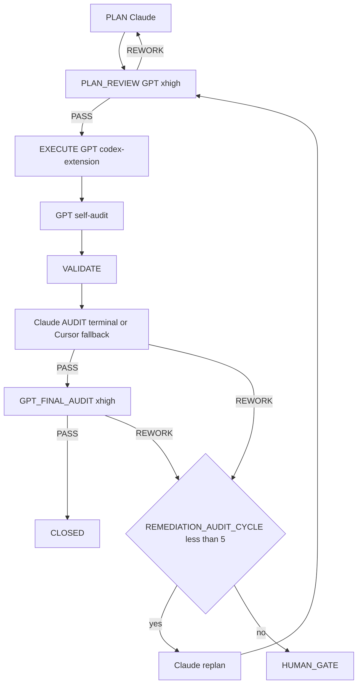

=== Auto-audit GPT (2e passe) ===
OpenAI Codex v0.124.0 (research preview)
--------
workdir: /Users/1millnonstop/Downloads/projet/foodking-web/web/testttt
model: gpt-5.5
provider: openai
approval: never
sandbox: workspace-write [workdir, /tmp, $TMPDIR, /Users/1millnonstop/.codex/memories]
reasoning effort: xhigh
reasoning summaries: none
session id: 019de953-e0c9-71a0-bc72-e66164103077
--------
user
Tu effectues l’**auto-audit GPT** (2e passe) d’un cycle FoodKing — **pas** l’audit Claude terminal.

**Contexte** : le JSON ci-dessous est la proposition d’implémentation (format agents/codex.prompt.txt) pour la mission `CV1-LIFECYCLE-UX-001-task-1.7`.


**JSON d’implémentation (à recouper)** :
```json
{
  "files_to_modify": [
    "app/Services/ItemService.php",
    "app/Http/Controllers/Admin/ItemController.php",
    "routes/api.php",
    "tests/Feature/Catalog/ItemDuplicationTest.php",
    "resources/js/components/admin/items/ItemListComponent.vue",
    "resources/js/languages/fr.json",
    "resources/js/languages/en.json",
    "resources/js/languages/de.json",
    "resources/js/languages/ar.json",
    "resources/js/languages/bn.json",
    "reports/post_execute_latest.log",
    "reports/audit/GPT_SELF_AUDIT_CV1-LIFECYCLE-UX-001-task-1.7.md",
    "reports/AGENT_ACTIVITY_LOG.md"
  ],
  "implementation_steps": [
    "Added ItemService::duplicate(Item $item): Item with a DB transaction for item, variations, extras, addons, media, and published composer profile cloning.",
    "Added admin ItemController::duplicate(Item $item), guarded by permission:items_create.",
    "Added POST /api/admin/item/{item}/duplicate route inside the existing admin item route group.",
    "Added ItemDuplicationTest with 5 sentinel cases covering suffix, child copy IDs, draft composer profile, order history untouched, and inactive draft status.",
    "Added duplicate row action in ItemListComponent with items_create permission, confirmation, POST call, toast, and list refresh.",
    "Added label.duplicate and message.item_duplicated keys in fr/en/de/ar/bn locale files.",
    "Recorded EXECUTE_DELEGATION: codex-extension in reports/post_execute_latest.log and wrote GPT self-audit."
  ],
  "code_blocks": [
    {
      "path": "app/Services/ItemService.php",
      "op": "replace",
      "excerpt": "Added public duplicate(Item $item): Item. The method wraps the copy in DB::transaction, replicates the item as inactive draft, preserves price/tax/channels/category/description/caution, clones ItemVariation/ItemExtra/ItemAddon rows directly, copies first Spatie media from collection item, clones latest published ItemWizardProfile and steps as unpublished draft, then dispatches ItemCreated after the transaction returns."
    },
    {
      "path": "app/Http/Controllers/Admin/ItemController.php",
      "op": "replace",
      "excerpt": "Updated items_create middleware to include duplicate and added duplicate(Item $item) returning new ItemResource($this->itemService->duplicate($item)) with 422 error response on exception."
    },
    {
      "path": "routes/api.php",
      "op": "replace",
      "excerpt": "Added Route::post('/{item}/duplicate', [ItemController::class, 'duplicate'])->name('duplicate') inside Route::prefix('item')->name('item.') group."
    },
    {
      "path": "tests/Feature/Catalog/ItemDuplicationTest.php",
      "op": "create",
      "excerpt": "New RefreshDatabase feature sentinel with 5 tests: independent copy suffix and price preservation, variation/extra/addon copy with new IDs, composer profile copied as unpublished draft, OrderItem history unchanged, and copied item starts with Status::INACTIVE."
    },
    {
      "path": "resources/js/components/admin/items/ItemListComponent.vue",
      "op": "replace",
      "excerpt": "Added items_create to actions column visibility, a row duplicate icon button using lab lab-copy, axios import, and duplicate(item) method that confirms, POSTs /admin/item/{id}/duplicate, shows message.item_duplicated, and refreshes the current list page."
    },
    {
      "path": "resources/js/languages/{fr,en,de,ar,bn}.json",
      "op": "replace",
      "excerpt": "Added label.duplicate and message.item_duplicated in all five requested locale files."
    },
    {
      "path": "reports/audit/GPT_SELF_AUDIT_CV1-LIFECYCLE-UX-001-task-1.7.md",
      "op": "create",
      "excerpt": "Self-audit written with invariant checks, risks, validation commands, and VERDICT: PASS."
    }
  ],
  "risks": [
    "Item has no itemWizardProfile relationship in App\\Models\\Item; implementation uses ItemWizardProfile::query() directly to stay inside the hard write scope.",
    "The plan requested slug=null, but the schema has a non-null slug column and no slug observer; duplicate sets slug with Str::slug($copy->name).",
    "ESLint could not be run because this checkout has no eslint dependency or npm script.",
    "npm run i18n:audit fails on pre-existing missing/dead locale key debt outside this task; the duplicate keys were added in all requested locales.",
    "Single commit was not created because git index writes are blocked by sandbox: unable to create .git/index.lock."
  ],
  "notes": [
    "Validated: php artisan test --filter=ItemDup => 5 passed.",
    "Validated: php artisan test --filter=Catalog => 53 passed.",
    "Validated: php -l on modified PHP files => passed.",
    "Validated: locale JSON parse for fr/en/de/ar/bn => passed.",
    "Spatie Media::copy() API was verified present; fallback copy path remains in service.",
    "No off-limits services or migrations were modified."
  ],
  "execution_trace": {
    "delegation": "codex-extension",
    "invariants_considered": [
      "pricing_ssot",
      "order_status",
      "branch_id",
      "commit_before_dispatch"
    ]
  }
}
```

**Livrable** (Markdown uniquement, en français) :
# AUTO_AUDIT_GPT — CV1-LIFECYCLE-UX-001-task-1.7

## 1. Conformité au plan / scope
(Énumérer manques ou dérives ; si scope élargi sans escale → **ESCALATE**)

## 2. Invariants FoodKing
Pour chacun : OK / RISQUE / N/A
- pricing_ssot (backend seul)
- order_status (enum, pas de strings)
- branch_id
- commit_before_dispatch
- frozen_zones
- order_service_symmetry (si un des deux services touché)

## 3. Verdict
Une ligne : `VERDICT: PASS` | `VERDICT: NEEDS_FIX` | `VERDICT: ESCALATE` + 1–3 phrases.

codex
J’effectue l’auto-audit comme une vérification de cohérence entre le JSON, le plan/mission actif et le code présent, sans modifier le dépôt. Je vais d’abord lire les garde-fous requis pour ce cycle CV1, puis inspecter uniquement les fichiers annoncés.
exec
/bin/zsh -lc "sed -n '1,220p' .cursor/ACTIVE_CYCLE.md" in /Users/1millnonstop/Downloads/projet/foodking-web/web/testttt
exec
/bin/zsh -lc "sed -n '1,220p' .cursor/rules/global.mdc" in /Users/1millnonstop/Downloads/projet/foodking-web/web/testttt
 succeeded in 0ms:
# Active Cycle – FoodKing

**Méta (SSOT `run-cycle.md` Step 0 + `AGENTS.md` § *Authoritative … cycle state*)** — requis pour que l’orchestrateur ne s’arrête pas sur *« RUNNER_MODE not set »*.

| Champ | Valeur actuelle |
| --- | --- |
| **RUNNER_MODE** | `single-session` |
| **PHASE** | `EXECUTE` |
| **TASK_ID** | `CV1-CATALOG-CONVERGENCE-001` (Sprint 1 / Task 1.4 — Warning `channels=null`) |
| **PLAN_FILE** | `plans/PLAN_CV1-CATALOG-CONVERGENCE-001_2026-05-02.md` |
| **EXECUTION_TIER** | `routine` (S effort, hors invariants critiques — voir `docs/orchestration/MULTI_AGENT_LOOP_2026-05-02.md` §2) |
| **EXECUTE_DELEGATION** | `foodking-routine-implementer` (Composer Max+thinking) |
| **REPORT_FILE** | `reports/post_execute_latest.log` (append — preuve `EXECUTE_DELEGATION` / `AUDIT_*`) |
| **MULTI_AGENT_LOOP** | `docs/orchestration/MULTI_AGENT_LOOP_2026-05-02.md` (SSOT du pivot 2026-05-02) |

> **ACTIVE_PRIMARY** : `CAISSE_V1_MASTERPLAY` (un seul cycle peut être actif à la fois — voir B03 méga-checklist).
> Cycles plus anciens en lecture seule = **archive** déplacée dans **`.cursor/ACTIVE_CYCLE_ARCHIVE.md`** (lecture humaine / forensique uniquement, **non requise** par le parcours obligatoire).

## CYCLE_W10_EXECUTION_CLOSEOUT (READ_ONLY_SECONDARY — mémoire 180 + MCP global + commit + CI + prod)

**TASK_ID** : `P_EXEC_CLOSEOUT_GRAPHITI_CI_PROD_2026-04-22`  
**Plan SSOT** : `plans/PLAN_EXECUTION_CLOSEOUT_GRAPHITI_CI_PROD_2026-04-22.md`  
**Ordre** : Piste A (POS+Centrale : PLAN-MEM-1) ∥ Piste B (humain : PLAN-MEM-3) → C (smoke) → D (commit sur « go commit ») → E (CI) → F (prod J-7→J+7).  
**Gate mémoire** : `python3 memory/verify.py` → count **≥ 175** (180 idéal) avant de considérer PLAN-MEM-1 **CLOSED**.

- **Vérif locale (2026-04-22)** : `python3 memory/verify.py` → **count = 182**, smoke `search_memory_facts` OK — gate **satisfaite** pour clôturer l'ingestion côté seuil d'épisodes (suite : commit / CI / prod selon plan `PLAN_EXECUTION_CLOSEOUT_*`).

**Gouvernance globale (2e passe 2026-04-22)** : primer multi-agents + Graphiti vivant + tokens « zéro effet négatif » → **`docs/orchestration/GLOBAL_SYSTEM_PRIMER.md`** + rapport **`reports/audit/AUDIT_SECOND_PASS_GLOBAL_GOVERNANCE_REPORT_2026-04-22.md`**.

**Statut Train A 2026-04-26** : W10 n'est plus primaire pendant la préparation release Caisse V1. Toute reprise W10 doit créer un cycle dédié ou repasser par une décision humaine.

---

## CAISSE_V1_MASTERPLAY (ACTIVE_PRIMARY — 2026-04-25 → Train A 2026-04-27)

**Phase** : finition Caisse V1 (POS + Kiosk + KDS + Centrale + Fiscal + Ops).
**Plan parent** : `plans/PLAN_CAISSE_V1_GPT_MASTERPLAY_2026-04-25.md`
**Plan DAG autoritaire** : `plans/PLAN_CAISSE_V1_SUPER_MASTER_2026-04-25.md`
**Boucle d'exécution** : `plans/masterplay/MASTERPLAY_DISCIPLINE.md` + `plans/masterplay/MASTERPLAY_QUEUE.md` + `scripts/run-masterplay.sh`
**Statut temps réel** : `reports/masterplay/status.json`
**Train A V1** : `reports/audit/PHASE2_PLAN_TRAINS_REWORKED_2026-04-27.md`
**Gates humaines Train A** : `docs/gates/GATE_PHASE2_TRAIN_A_HUMAN_DECISIONS_2026-04-26.md`
**Manifeste Phase A ciblée** : `docs/PHASE_A_CLOSED.md`

**Règle** : tout `TASK_ID` au format `CV1-MXX-…` passe par la masterplay (cf. `AGENTS.md` § "Caisse V1 — Masterplay loop", `.cursor/rules/global.mdc` § "Caisse V1 — Masterplay loop", `.cursor/commands/run-cycle.md` Step 0 item 0). **NE PAS** ouvrir un `run-cycle` standard sur un `CV1-MXX-…`.

**Règle Train A** : A.1/A.2/A.3 sont de la persistance/gouvernance release. D-M13 reste bloqué tant que la migration unique `(branch_id, queue_number)` n'a pas reçu son signoff humain final.

---

## Archive

Tous les cycles **CLOSED / COMPLETED PASSED** (W4 → W9, NF525, etc.) ont été déplacés dans **`.cursor/ACTIVE_CYCLE_ARCHIVE.md`** pour réduire le coût de lecture du parcours obligatoire (audit 2026-04-24, mission `T-PARCOURS-OPTIMIZE-001`).

- **Lecture humaine** : ouvrir `.cursor/ACTIVE_CYCLE_ARCHIVE.md`.
- **Lecture agent** : **non requise** sauf instruction explicite du plan ou du chat (ex. "reprend le rationale du cycle W9").
- **Recherche** : `rg "CYCLE_W9_" .cursor/ACTIVE_CYCLE_ARCHIVE.md` ou `git log --follow .cursor/ACTIVE_CYCLE.md`.

 succeeded in 0ms:
---
description: Always-on rules for the FoodKing Cursor local agent. Applied to every cycle, every model, every task.
globs: ["**/*"]
alwaysApply: true
---

# Global Rules – FoodKing

## Caisse V1 — Masterplay loop (active phase)

Pendant la phase de finition Caisse V1, **toute mission `CV1-MXX-…` est gouvernée par** :
- `plans/masterplay/MASTERPLAY_DISCIPLINE.md` — règles d'or (allowlist, frozen, REWORK max 5, activity-log, mémoire)
- `plans/masterplay/MASTERPLAY_QUEUE.md` — file d'exécution (statut, dépendances DAG)
- `plans/masterplay/GO.md` — comment lancer / suivre / pause / stop
- `scripts/run-masterplay.sh` — runner officiel (boucle codex + audit Claude + audit final + ingest mémoire)

**Lecture obligatoire** avant tout EXECUTE sur un `TASK_ID` `CV1-MXX-…`. Hors Caisse V1 : `run-cycle <TASK_ID>` standard.

## New or continued session — **mandatory path** (applies to **every** conversation and **every** model)

- **The chat log is not the SSOT.** **This repo** (`AGENTS.md`, `.mdc` rules, `docs/orchestration/`, `run-cycle.md`) is.
- On **any** new thread **or** long continuation: (1) Read **`AGENTS.md` § *Parcours obligatoire*** first, then **`docs/orchestration/GLOBAL_SYSTEM_PRIMER.md`** (§1 table). (2) If resuming work, read **`.cursor/ACTIVE_CYCLE.md`** *before* starting a duplicate cycle — follow the same `TASK_ID` / `PHASE` until `CLOSE` or an explicit new task. (3) For bounded work: run **`run-cycle` / `run-cycle.md`** (Steps 0–5) — do not skip `AUDIT` before `CLOSE`. (4) Run `npm run verify:boucle` (and `verify:boucle:full` when an API proof is needed) per `AGENTS.md`. (5) Ensure **`claude` on `PATH` (AUDIT terminal) et binaire `codex` (CLI OpenAI) pour l’EXÉCUTE complexe (compte ChatGPT Pro)**, pas de clé proxy obligatoire — voir `agents/codex-extension-instructions.md`. (6) Obey **`MEMORY_MATRIX.md`**, `EXECUTE_DELEGATION`, `AUDIT_CHANNEL` + `TERMINAL_AUDIT_OK` when using terminal audit, and **`agent-activity-log.sh`** (tail / start / done).
- Full checklist and French wording: **`AGENTS.md` → section *Parcours obligatoire*.

## Cycle Structure (multi-agents — pivot 2026-05-02)
PLAN **Claude** → PLAN_REVIEW **GPT/Codex** → EXECUTE **{routine: Composer | complex: GPT/Codex}** → VALIDATE → AUDIT **Claude (terminal)** → GPT_FINAL_AUDIT **GPT/Codex** → [HUMAN GATE | CLOSE]

Phases are sequential and non-skippable.
Dual audit (`AUDIT_VERDICT: PASS` + `GPT_FINAL_AUDIT_VERDICT: PASS`) precedes close on every cycle without exception.

**Tier-routing déterministe en EXECUTE** : routine (Composer via `foodking-routine-implementer`) ssi tier S **ET** hors invariants critiques **ET** pas de nouveau service ni refactor cross-module. Sinon complex (Codex `codex-extension` PRIMARY ; sub-agent `foodking-complex-implementer` FALLBACK). Doute → complex. Voir `.cursor/routing.md` § Tier-Routing et `docs/orchestration/MULTI_AGENT_LOOP_2026-05-02.md`.

## Model Discipline
- Auto/Premium routing is disabled
- PRIMARY_EXECUTION_MODEL is declared in the plan file before execution begins
- One PRIMARY_EXECUTION_MODEL per cycle; review checkpoints are explicit and mandatory
- Mid-cycle model switch requires Claude confirmation logged under `ESCALATION` in the plan file
- Full routing policy: `.cursor/routing.md`

## EXECUTE Delegation (tier-routing 2026-05-02)
- **Tier routine** (S effort, hors invariants critiques, ≤5 fichiers) → **Composer** via Task **`foodking-routine-implementer`**. Trace : `EXECUTE_DELEGATION: foodking-routine-implementer`. Sur contact avec invariant (pricing / `OrderStatus` / `branch_id` / dispatch / `OrderService` symmetry / frozen / schema / auth) → halt + escalade vers tier complex.
- **Tier complex (PRIMARY)** : **`codex-extension`** — FoodKing Codex Complex Implementer (CLI `codex` + ChatGPT Pro, `gpt-5.5-pro`, `xhigh`). Procédure : `npm run codex:plan-review -- {TASK_ID}` ; préparer `missions/{TASK_ID}/input.json` (+ `graphiti_context.md` / `plan_excerpt.md` / `execute_brief.md`) ; `npm run codex:complex -- {TASK_ID}` (`gpt-5.5-pro`, `xhigh`) ; appliquer `output_codex.json` + lire `reports/audit/GPT_SELF_AUDIT_{TASK_ID}.md` ; après PASS Claude → `npm run codex:final-audit -- {TASK_ID}`. Trace : `EXECUTE_DELEGATION: codex-extension`.
- **Tier complex (FALLBACK)** : Task Cursor **`foodking-complex-implementer`** — uniquement si `codex` / Pro indispo après ≥2 reprises documentées. Trace : `EXECUTE_DELEGATION: foodking-complex-implementer (codex-extension-fallback)` + `FALLBACK_REASON:`.
- **Claude orchestrator** (chat session par défaut) : déclare le tier dans le plan (`EXECUTION_TIER: routine | complex`), délègue, audite. **Ne fait pas** d'édition produit elle-même (sauf doctrine/config orchestration : `.cursor/`, `AGENTS.md`, `docs/orchestration/`, `plans/`, `reports/`, `memory/episodes/*.jsonl`).
- Reference : `.cursor/routing.md` § Routing Table + Tier-Routing ; `docs/orchestration/MULTI_AGENT_LOOP_2026-05-02.md` (procédure pas-à-pas) ; `docs/orchestration/CODEX_API_DELEGATION.md` (Codex CLI) ; `AGENTS.md` § Workflow + "EXECUTE delegation".

## Autonomy Contract
The agent operates autonomously within declared scope.
It halts and escalates — never self-approves — on any gate trigger, scope expansion,
invariant violation, two consecutive validation failures, or unresolvable ambiguity.
Full policies: `human-gates.mdc`, `scope.mdc`, `project-invariants.mdc`.

## Graphiti (mémoire inter-sessions)
- When the Graphiti MCP server is loaded for this workspace, **query it first** on any non-trivial task (see `.cursor/rules/graphiti-memory.mdc` and `AGENTS.md` § MCP).
- If Graphiti is not loaded, continue without blocking; one-line note to enable `~/.cursor/mcp.json` is enough.

## Quality channels — terminal first where defined (multi-agents 2026-05-02)
- **Composer route (`foodking-routine-implementer`)** = EXECUTE **routine** (tier S, hors invariants). Trace `EXECUTE_DELEGATION: foodking-routine-implementer`. Halt + escalade vers complex sur contact avec invariant.
- **GPT route (`codex-extension` — CLI `codex` Pro)** = PLAN_REVIEW + EXECUTE **complex** + GPT_FINAL_AUDIT. Cursor sub-agent `foodking-complex-implementer` = fallback EXECUTE complex uniquement si `codex exec` échoue (≥2 reprises ou binaire indispo) — `EXECUTE_DELEGATION: …` + `FALLBACK_REASON:`. See `AGENTS.md`, `docs/orchestration/MULTI_AGENT_LOOP_2026-05-02.md`, `docs/orchestration/CODEX_API_DELEGATION.md`.
- **Claude AUDIT after implementation** is **by default the terminal** (`bash scripts/foodking-claude-orchestrate.sh context` then `audit` or `audit-brief` — **Anthropic subscription** via `claude` CLI). If the terminal fails after **1 retry** (**quota / rate limit / session saturated**, missing binary, auth, network), **do not stop the cycle**: use the **FALLBACK** — same `audit-context.md` checklist via Cursor Task **`foodking-planner-orchestrator`** (recommended) or in-session **Claude** — with `AUDIT_CHANNEL: cursor-session` **plus** mandatory `AUDIT_FALLBACK_REASON:` and optional `AUDIT_SUBAGENT_FALLBACK: foodking-planner-orchestrator`. See `docs/orchestration/AUDIT_TERMINAL_QUOTA_FALLBACK.md` and `run-cycle.md` Step 5; verify env with `bash scripts/verify-orchestration-boucle.sh`.
- Never invert primary/fallback for billing convenience without that trace — that would be indistinguishable from a mistake in production evidence.

## Token Discipline (quality-first — zero negative optimization)
- **Goal**: maximum correct intelligence per cycle — not shortest answers. Removing detail, skipping invariants, or omitting Graphiti queries to "save tokens" is **forbidden** when it reduces correctness or auditability.
- **Allowed savings only**: do not re-read files already in full context; do not paste verbatim large blobs already in the plan; use **Graphiti** + `## PRIOR_CONTEXT` to avoid re-opening dozens of historical reports; use phase summaries per `context-hygiene.mdc` §4 **after** a phase completes (handoff), not to shrink the plan itself.
- Do not re-explain decisions already recorded in the plan file (link/summarize in one line if needed).
- Structured output in reports — narrative allowed in plans/gates when it carries decisions, risks, or test strategy.
- Flag real risks only — no speculative commentary on out-of-scope subsystems

## Reports Discipline
- Bounded-cycle **plans** live under `plans/`; **gate briefs** under `docs/gates/`; validation logs, execution summaries, and other run evidence under `reports/` per `run-cycle.md` and `ACTIVE_CYCLE.md`
- Composer generates run evidence in `reports/` where applicable — Claude audits
- No new reporting structure without a plan-phase decision

## Absolute Prohibitions
The agent must never: self-approve a gate, expand scope without human instruction,
edit a frozen zone without cleared gate, modify `.cursor/routing.md` mid-cycle.
All invariant prohibitions enforced per `project-invariants.mdc`.

exec
/bin/zsh -lc "sed -n '1,220p' plans/masterplay/MASTERPLAY_DISCIPLINE.md" in /Users/1millnonstop/Downloads/projet/foodking-web/web/testttt
 succeeded in 0ms:
# MASTERPLAY DISCIPLINE — Caisse V1 (loop master)

> **But** : règles strictes que le runner et chaque mission GPT respectent en boucle, pendant des heures, jusqu'à finition de toutes les missions de `MASTERPLAY_QUEUE.md`. Lecture obligatoire avant de lancer `bash scripts/run-masterplay.sh`.

## 1. Autorité

| Source | Rôle |
|--------|------|
| `AGENTS.md` | Parcours obligatoire, cycle FoodKing |
| `plans/PLAN_CAISSE_V1_SUPER_MASTER_2026-04-25.md` | DAG autoritaire (ordre, gates) |
| `plans/PLAN_CAISSE_V1_GPT_MASTERPLAY_2026-04-25.md` | Catalogue 22 missions M-XX (objectifs, allowlist) |
| `plans/masterplay/MASTERPLAY_QUEUE.md` | File d'exécution courante |
| `plans/masterplay/MASTERPLAY_DISCIPLINE.md` | (ce fichier) règles d'exécution |
| `.cursor/rules/*.mdc` | Toujours appliquées |
| `docs/gates/GATE_LOG.md` | État des gates humains |

## 2. Boucle d'exécution (run-masterplay.sh)

```
LOOP {
  1. tail activity log (~500 tokens)
  2. find next PENDING task in MASTERPLAY_QUEUE with all DEPENDS_ON == CLOSED
  3. if none → break (all done or all blocked)
  4. verify missions/<TASK_ID>/input.json + execute_brief.md exist
  5. activity-log start codex-extension <TASK_ID> execute "<allowlist CSV>" "<note>"
     if exit 2 (collision) → MARK BLOCKED note=collision, continue loop
  6. update status: RUNNING
  7. npm run codex:complex -- <TASK_ID>     (génère output_codex.json + GPT_SELF_AUDIT)
  8. update status: EXECUTED
  9. activity-log done codex-extension <TASK_ID> done "<résumé court>"
 10. (option --with-audit) bash scripts/foodking-claude-orchestrate.sh audit-brief <TASK_ID>
       if PASS → status: AUDIT_PASS
       if REWORK → status: REWORK ; increment REWORK_COUNT ; if >=5 → BLOCKED note=human_gate
 11. (option --with-final) npm run codex:final-audit -- <TASK_ID>
       if PASS → status: FINAL_PASS
 12. if FINAL_PASS:
       bash scripts/after-execute-memory.sh
       update status: CLOSED
 13. sleep INTER_TASK_PAUSE_SECONDS (default 5s)
 14. continue LOOP
}
```

## 3. Garde-fous (non négociables)

### 3.1 Allowlist stricte par mission
Codex modifie **uniquement** les fichiers listés dans `missions/<TASK_ID>/input.json.allowlist`. Si modification hors liste détectée à l'audit → `REWORK`.

### 3.2 Frozen zones
Aucune édition d'un fichier frozen sans gate signé dans `docs/gates/GATE_LOG.md`. Le runner **refuse** de lancer une mission marquée `BLOCKED` jusqu'à ce que le statut soit changé manuellement après signature.

### 3.3 Invariants FoodKing — `REWORK` automatique
- Pricing client-authoritative
- Status littéral numérique (`status: 16`)
- `branch_id` LIKE
- Dispatch dans transaction
- OS ou FOS modifié sans `SYMMETRY_NOTE`
- Frozen modifié sans gate

### 3.4 Pas de gate auto-approuvée
Codex peut **rédiger** options ; aucune mission ne coche `[x] Approved`. Si une mission le tente → `REWORK` + `risks: ["ESCALATION: gate self-approved"]`.

### 3.5 Tests obligatoires
Chaque `mandatory_tests` listé doit être lancé et reporté dans le rapport. Échec → `REWORK`.

### 3.6 Diff minimal
Aucun renommage opportuniste, aucun refactor non demandé, aucune optimisation collatérale. Si ajout justifié → `notes` du JSON.

### 3.7 Activity log
`start` avant chaque mission ; `done` après. Sans cela → réservation fantôme = autres agents bloqués. Le runner enforce.

### 3.8 Mémoire
À CLOSE : compléter `memory/episodes/caisse_v1_<topic>_*.jsonl` (squelettes créés par M-19) puis `bash scripts/after-execute-memory.sh`. Si Graphiti UP : `bash bin/graphiti-ingest.sh` + `python3 memory/verify.py`.

## 4. Boucles de rework

- Max **5 cycles `REWORK`** consécutifs sur la même mission. Au 5e → `BLOCKED note=human_gate_required`.
- Max **3 cycles healing** consécutifs (cf. CLAUDE.md §8) avant escalade.
- Toute escalation → écrite dans `reports/masterplay/ESCALATIONS_<date>.md`.

## 5. Pause / arrêt

- `Ctrl-C` arrête la boucle proprement (mission en cours finit, runner s'arrête après).
- `touch reports/masterplay/STOP` → le runner s'arrête à la fin de la mission courante.
- `touch reports/masterplay/PAUSE` → le runner pause entre les missions tant que le fichier existe.

## 6. Logs

- `reports/masterplay/run_<ISO>.log` : log de la boucle.
- `reports/masterplay/status.json` : état temps réel (mission courante, compteurs).
- `missions/<TASK_ID>/output_codex.raw.log` : raw codex.
- `missions/<TASK_ID>/output_codex.json` : json structuré.
- `reports/audit/GPT_SELF_AUDIT_<TASK_ID>.md` : self-audit GPT.
- `reports/post_execute_latest.log` : trace `EXECUTE_DELEGATION`.
- `reports/AGENT_ACTIVITY_LOG.md` : start/done.

## 7. Audit Claude (en fin de boucle, manuel)

Quand toutes les missions sont `CLOSED` (ou `BLOCKED` documentés) :

```
bash scripts/foodking-claude-orchestrate.sh context
bash scripts/foodking-claude-orchestrate.sh audit
```

Sortie attendue : verdict transversal Caisse V1 (chaîne sync borne→centrale→POS→KDS→fiscal). Le verdict détermine `GO/HOLD/NO-GO` pour `GATE_GO_NO_GO_CAISSE_V1`.

## 8. Critères d'arrêt anormal

- 3 missions consécutives en `REWORK` → halt + alerte humaine.
- Activity-log refuse 3 fois → halt (collision permanente).
- `npm run codex:complex` échoue 3 fois sur la même mission (binaire codex KO) → halt.
- `claude` terminal indisponible 3 fois consécutives → continue avec fallback subagent + `AUDIT_FALLBACK_REASON: terminal-unavailable`.

## 9. Token discipline

- Le prompt envoyé à codex contient : template `agents/codex.prompt.txt` + `input.json` + `execute_brief.md` + (optionnel) `graphiti_context.md`, `plan_excerpt.md`, `cycle_snapshot.md`.
- Pas de duplication : pas de re-coller AGENTS.md ou super master plan dans chaque mission.
- Cap typique d'un prompt : ≤ 30 KB. Au-delà → splitter la mission.

## 10. Anti-pattern interdits

- ❌ Lancer 2 missions en parallèle sur les mêmes fichiers (collision activity-log).
- ❌ Modifier `MASTERPLAY_QUEUE.md` pendant que le runner tourne (sauf marquer BLOCKED → PENDING après gate).
- ❌ Skipper l'audit Claude pour aller plus vite.
- ❌ Marquer CLOSED manuellement sans double PASS (PASS Claude + PASS Codex final).
- ❌ Ignorer un `risks: ["ESCALATION: ..."]` dans output_codex.json.

---

`MASTERPLAY_DISCIPLINE_VERSION: 1.0` · `STRICT_MODE: ON`

exec
/bin/zsh -lc "sed -n '1,220p' plans/masterplay/MASTERPLAY_QUEUE.md" in /Users/1millnonstop/Downloads/projet/foodking-web/web/testttt
 succeeded in 0ms:
# MASTERPLAY_QUEUE — Caisse V1

**Source de vérité de l'orchestration en boucle** : `bash scripts/run-masterplay.sh` lit cette file et exécute en série.

**Discipline** : `plans/masterplay/MASTERPLAY_DISCIPLINE.md`.  
**Plan parent** : `plans/PLAN_CAISSE_V1_GPT_MASTERPLAY_2026-04-25.md`.

## Légende statut

- `PENDING` — pas encore lancé
- `RUNNING` — codex exec en cours (ne pas relancer)
- `EXECUTED` — codex exec terminé, attend audit
- `AUDIT_PASS` — `AUDIT_VERDICT: PASS` Claude
- `FINAL_PASS` — `GPT_FINAL_AUDIT_VERDICT: PASS`
- `CLOSED` — mémoire ingestée + activity-log done
- `REWORK` — audit a demandé rework
- `BLOCKED` — gate humain ou dépendance manquante

## Légende vague

- `WAVE_A` — NO-GATE, parallélisable, démarre immédiatement
- `WAVE_B` — POST-GATE, séquencé selon DAG

## File d'exécution


| ORDER | TASK_ID                           | MISSION | WAVE   | DEPENDS_ON                 | STATUS  | NOTE                                                                               |
| ----- | --------------------------------- | ------- | ------ | -------------------------- | ------- | ---------------------------------------------------------------------------------- |
| 01    | CV1-M19-MEMORY-DISCIPLINE         | M-19    | WAVE_A | —                          | CLOSED  | Crée squelettes JSONL pour les 22 missions                                         |
| 02    | CV1-M01-TRACEABILITY-MATRIX       | M-01    | WAVE_A | —                          | CLOSED  | Matrice findings → tasks → tests → gates (REWORK resolved GPT PASS)                |
| 03    | CV1-M02-SENTINEL-BASELINE         | M-02    | WAVE_A | CV1-M01                    | CLOSED  | 18 sentinels fail-first + 4 lints                                                  |
| 04    | CV1-M12-LEGACY-GUARDS-CI          | M-12    | WAVE_A | —                          | CLOSED  | Lint imports + bundle scan + workflow (recovered: extractor JSON fix)              |
| 05    | CV1-M16-HARDWARE-LAB              | M-16    | WAVE_A | —                          | CLOSED  | Checklist hardware signable (recovered: JSON valid, files materialized)            |
| 06    | CV1-M18-TEST-ARCHITECTURE         | M-18    | WAVE_A | CV1-M02                    | CLOSED  | Grille couverture + plan campagne                                                  |
| 07    | CV1-M20-RUNBOOKS-SKELETON         | M-20    | WAVE_A | —                          | CLOSED  | 8 runbooks ops (REWORK Horizon resolved GPT PASS)                                  |
| 08    | CV1-M21A-QUICKWINS-LOT0           | M-21a   | WAVE_A | —                          | CLOSED  | POS: discount v-model + Swiper RTL + focustrap dead                                |
| 09    | CV1-M03-GATES-DRAFT               | M-03    | WAVE_A | CV1-M01                    | CLOSED  | 8 briefs gates Caisse V1 créés; Wave B reste bloquée par signatures humaines       |
| 10    | CV1-M09-BRANCH-ISOLATION          | M-09    | WAVE_B | CV1-M03(gates), CV1-M02    | CLOSED  | GPT audit PASS; M-08/M-06/schema sentinels remain gated                            |
| 11    | CV1-M06-POS-REVENUE-GUARDS        | M-06    | WAVE_B | CV1-M09, CV1-M03           | CLOSED  | GPT rework audit PASS; gates frozen C + payment_prop A approved                    |
| 12    | CV1-M05-ORDER-QUOTE               | M-05    | WAVE_B | CV1-M03                    | CLOSED  | GPT final PASS; quote sealed/consumed at POS+kiosk commit                          |
| 13    | CV1-M04A-PAYMENT-LEDGER-FULL      | M-04A   | WAVE_B | CV1-M03 (ledger=A)         | BLOCKED | Ledger gate chose Option B; M-04A not selected                                     |
| 14    | CV1-M04B-PAYMENT-PILOT-RESTRICT   | M-04B   | WAVE_B | CV1-M03 (ledger=B)         | CLOSED  | GPT audit PASS; Option B restricted pilot implemented                              |
| 15    | CV1-M08-FISCAL-Z-NF525            | M-08    | WAVE_B | CV1-M03 (fiscal+schema)    | CLOSED  | GPT final PASS; fiscal Option B Z policy sealed                                    |
| 16    | CV1-M07-KDS-RELEASE               | M-07    | WAVE_B | CV1-M03 (kds_bump)         | CLOSED  | GPT final PASS; KDS server authority with expected_status sealed                   |
| 17    | CV1-M10-OS-FOS-SYMMETRY           | M-10    | WAVE_B | CV1-M06, CV1-M09           | CLOSED  | Unlocked after M-06 GPT audit PASS and M-09 CLOSED                                 |
| 18    | CV1-M11-KIOSK-RUNTIME             | M-11    | WAVE_B | CV1-M03 (offline+fiscal)   | CLOSED  | GPT final PASS; offline Option A CB/TR refused and enum cancel sealed              |
| 19    | CV1-M17-WEB-STRIPE-SCOPE          | M-17    | WAVE_B | CV1-M03 (web+stripe)       | CLOSED  | GPT final PASS; web payment off + Stripe inactive guard sealed                     |
| 20    | CV1-M13-MIGRATIONS-SAFETY         | M-13    | WAVE_B | CV1-M03 (schema)           | CLOSED  | GPT final PASS; migration safety tooling sealed; staging rehearsal deferred to M14 |
| 21    | CV1-M14-OPS-PREFLIGHT             | M-14    | WAVE_B | CV1-M13                    | CLOSED  | GPT final PASS; ops preflight fail-closed tooling sealed                           |
| 22    | CV1-M15-ROLLOUT-CANARY            | M-15    | WAVE_B | CV1-M04*, CV1-M08, CV1-M14 | CLOSED  | GPT final PASS; rollout canary drill fail-closed tooling sealed                    |
| 23    | CV1-M21B-PAYMENT-REFACTOR         | M-21b   | WAVE_B | CV1-M03 (prop_mutation)    | CLOSED  | GPT final PASS; prop mutation refactor + one-shot 401 retry sealed                 |
| 24    | CV1-M22-POST-LAUNCH-OBSERVABILITY | M-22    | WAVE_B | CV1-M14, CV1-M15           | CLOSED  | GPT final PASS; post-launch observability fail-closed readiness sealed             |


## Ce que le runner exécute

À chaque tour de boucle, le runner :

1. Lit cette table.
2. Prend la **première** ligne au statut `PENDING`.
3. Vérifie que toutes ses `DEPENDS_ON` sont au statut `CLOSED`. Sinon → skip.
4. Vérifie que `missions/<TASK_ID>/input.json` et `execute_brief.md` existent. Sinon → marque `BLOCKED note=missing-mission-files`.
5. `start` activity-log → `npm run codex:complex -- <TASK_ID>` → `done` activity-log.
6. Mise à jour statut : `EXECUTED`.
7. Audit Claude terminal automatique (si activé `--with-audit`) → `AUDIT_PASS` ou `REWORK`.
8. Si `AUDIT_PASS` : `npm run codex:final-audit -- <TASK_ID>` → `FINAL_PASS`.
9. Si `FINAL_PASS` : ingestion mémoire + `done` → `CLOSED`.
10. Loop.

## Statut initial (à la création)

Les 6 missions Vague A préparées par M-19/M-01/M-02/M-12/M-16/M-18 sont au statut `PENDING`. Les autres `TODO_NEXT` (à créer après le premier round) ou `BLOCKED` (gates).

## Mise à jour manuelle

Le runner met à jour la colonne `STATUS` automatiquement (sed sur cette table). Tu peux aussi éditer manuellement entre 2 runs (ex: marquer `BLOCKED → PENDING` après gate signé).

## Addendum final-readiness 2026-04-26

- Toutes les missions Caisse V1 Wave A / Wave B restent `CLOSED`, sauf `CV1-M04A-PAYMENT-LEDGER-FULL` qui reste `BLOCKED` par décision humaine Payment Ledger Option B.
- Les vagues final-readiness GPT-only sont documentées dans `reports/release/CAISSE_V1_FINAL_READINESS_WAVES_2026-04-26.md`.
- Verdict local code: `PASS_WITH_SCOPED_REWORK` après remplacement du hardcoded `16` par `OrderStatus::CANCELED` dans `app/Http/Requests/OrderStatusRequest.php`.
- Verdict release: `HOLD`. Les preuves locales critiques passent, mais staging/runtime/hardware/UAT/runbook/fiscal evidence/final human gate restent requis.
- FR-03: garde bundle reworkée. `scripts/scan-bundle-legacy.sh` et `scripts/lint-fk-bundle-legacy.sh` scannent maintenant `public/build` et `public/js`. Le mode strict release `FK_LEGACY_STRICT_POS_WIZARD=1` bloque encore sur `public/js/kiosk.js` et `public/js/kiosk-wizard.js`.
- Prochaine décision non automatique: `HG-W2_CUTOVER_DECISION_OR_POS_WIZARD_SHIM_ACCEPTANCE`.

## Addendum correction-freeze 2026-04-26

- `MASTERPLAY_FROZEN=1` jusqu'a persistance git explicite des artefacts Wave 1 / Wave 2, correction K09B outbox contract, et resolution du contrat Playwright SSOT.
- Ne pas lancer `bash scripts/run-masterplay.sh` ni `npm run codex:complex -- CV1-LOT-*` pour reprendre W2 tant que `reports/audit/UNTRACKED_AUDIT_2026-04-26.txt` et `reports/audit/MISSIONS_CLOSED_VS_GIT_2026-04-26.md` ne sont pas revus.
- Les lots frozen `CV1-LOT-K05-PAYMENT-CONFIRM-WS`, `CV1-LOT-P06-PARK-TTL`, `CV1-LOT-P10-REFUND-LEDGER`, `CV1-LOT-P13-ZREPORT-HARDEN` restent bloques sans gate humain explicite dans `docs/gates/GATE_LOG.md`.

codex
Le cycle actif du dépôt ne correspond pas exactement au `TASK_ID` audité ici, donc je ne vais pas m’appuyer sur `.cursor/ACTIVE_CYCLE.md` comme preuve métier. Je poursuis avec les artefacts `missions/` et `plans/` propres à `CV1-LIFECYCLE-UX-001-task-1.7`, puis je recoupe le diff réel.
exec
/bin/zsh -lc "sed -n '1,220p' .cursor/commands/run-cycle.md" in /Users/1millnonstop/Downloads/projet/foodking-web/web/testttt
 succeeded in 0ms:
# Command: run-cycle

Orchestrate one full bounded cycle inside a single Cursor session.

## Trigger
Invoke with a TASK_ID. Example: `run-cycle SMOKE-001`

---

## Step 0 — Pre-flight

0. **Caisse V1 fast-path** : si `TASK_ID` matche `^CV1-M[0-9]{2}[A-Z]?-`, ne pas exécuter ce `run-cycle.md` directement. Utiliser **la masterplay** :
   - Lire `plans/masterplay/MASTERPLAY_DISCIPLINE.md` (règles d'or)
   - Lire `plans/masterplay/MASTERPLAY_QUEUE.md` (statut + DAG)
   - Lancer `bash scripts/run-masterplay.sh --with-audit --with-final` (ou `--max 1` pour une seule mission)
   - Le runner orchestre lui-même PLAN/EXECUTE/AUDIT pour la mission via `missions/<TASK_ID>/input.json` + `execute_brief.md`.
   - Ce `run-cycle.md` standard reste valide pour tout autre `TASK_ID`.

1. Read `.cursor/ACTIVE_CYCLE.md`.
2. Read `RUNNER_MODE`:
   - `single-session` → proceed automatically through all phases without stopping between them.
   - `manual` → execute one phase at a time. After each phase, output: `→ PHASE: [completed]. Awaiting manual confirmation to continue to [next phase].` and halt until the developer explicitly says "continue".
   - If RUNNER_MODE is missing: halt. `"RUNNER_MODE not set in ACTIVE_CYCLE.md. Set to single-session or manual and retry."`
3. Confirm TASK_ID matches the provided input. If ACTIVE_CYCLE is blank, write TASK_ID and PHASE: PLAN first.
4. Confirm no gate is currently open (`Gate: None` or all gate rows unchecked). If a gate is open, halt and surface the gate file path.
5. **Graphiti (when MCP `graphiti` is loaded):** call `search_memory_facts` once with a natural-language query derived from the TASK_ID / subsystem (always `group_ids=["foodking"]`). Fold any returned facts into context before PLAN. If Graphiti is not loaded: one-line note only — do not block the cycle (see `.cursor/rules/graphiti-memory.mdc`).
6. **Memory discipline (mandatory):** before writing anywhere, recall the matrix in `docs/orchestration/MEMORY_MATRIX.md`. PLAN writes to **C** (`missions/<TASK>/`) + **D** (`plans/`, `ACTIVE_CYCLE.md`); EXECUTE writes to **A** (code) + **D** (`post_execute_latest.log`); AUDIT writes to **B** (Graphiti/JSONL — *only* for durable decisions) + **D** (verdict). Never invent a 5th store; if a need appears, halt and open `docs/gates/GATE_MEMORY_*`.
7. **Cross-agent sync (mandatory, ~500 tokens):** read the tail of the activity log to detect parallel work :
   ```bash
   bash scripts/agent-activity-log.sh tail 50
   ```
   If an active reservation overlaps the planned scope, halt and adapt the plan (or wait / coordinate). Per `.cursor/rules/cross-agent-sync.mdc`.
8. **Boucle terminal (pre-check, 0 requête API) :** `npm run verify:boucle` — vérifie que le binaire `claude` est sur PATH, que `CODEX_API_DELEGATION` / `run-cycle` contiennent le schéma *terminal-first*, **et** (via le même script) que `.cursor/ACTIVE_CYCLE.md` utilise une **PHASE** canonique (`PLAN` \| `EXECUTE` \| `VALIDATE` \| `AUDIT` \| `CLOSED` \| `GATE`) — WARN si valeur hors liste (ex. `IN_PROGRESS`). Mode strict optionnel : `npm run validate:active-cycle:strict` (exit 1 si PHASE invalide). Si **exit 1** sur `verify:boucle` uniquement pour **claude** manquant : le cycle peut quand même **planifier** mais doit **déclarer dès le plan** l’**AUDIT fallback** `cursor-session` (raison: `claude` absent) pour éviter une impasse en Step 5. Pré-API complète (1× chaque) : `npm run verify:boucle:full` — pour cycles **critiques** (POS, fiscal) ou avant release. **Trip E2E automatisé (smoke + mini mission) :** `npm run boucle:e2e` (journal : `reports/execution/BOUCLE_E2E_LAST_RUN.txt`, schéma : `reports/execution/RUN_P_BOUCLE_E2E_2026-04-24.md`).

---

## Step 1 — PLAN

Load `.cursor/context/plan-context.md` and follow its instructions exactly.

- If Step 0 item 5 (Graphiti) returned facts, reference them explicitly in the plan as **`## PRIOR_CONTEXT`** (per `plan-context.md`; 2–5 lines max).
- Produce `plans/PLAN_[TASK_ID]_[DATE].md` (fichier **SSOT** du cycle — l’orchestrateur en **session Cursor** en est l’auteur formel). **Option (tâches sensibles / alignement long)** : amorcer l’orchestration **Claude en terminal** avant d’exécuter le code : `bash scripts/foodking-claude-orchestrate.sh context` (génère le bref disque consommable par un audit/une planification cohérente) ; cela **ne** remplace **pas** le plan `plans/…` — c’est un **gabarit d’intelligence** pour la même session.
- **PLAN_REVIEW obligatoire (second avis GPT, max qualité)** : avant de passer en EXECUTE, faire relire le plan par **GPT-5.5 / GPT-5.5-pro en reasoning `xhigh`** via `npm run codex:plan-review -- {TASK_ID}` (`codex-extension`) ou, si le CLI est indisponible, `foodking-complex-implementer (codex-extension-fallback)`. La revue doit vérifier scope, invariants FoodKing, gates, stratégie de tests, frozen zones, parité OrderService/FrontendOrderService si applicable, et absence de logique prix frontend. Tracer dans le plan ou le `REPORT_FILE` :
  - `PLAN_REVIEW_CHANNEL: codex-extension | foodking-complex-implementer (codex-extension-fallback)`
  - `PLAN_REVIEW_MODEL: gpt-5.5-pro`
  - `PLAN_REVIEW_REASONING_EFFORT: xhigh`
  - `PLAN_REVIEW_VERDICT: PASS | REWORK | ESCALATE`
- Si `PLAN_REVIEW_VERDICT: REWORK`, Claude révise le plan puis relance une revue GPT. Si `ESCALATE`, ouvrir gate ou demander arbitrage humain. Ne jamais passer en EXECUTE sans `PLAN_REVIEW_VERDICT: PASS`.
- Update `ACTIVE_CYCLE.md`: PHASE → EXECUTE, PLAN_FILE set, PLAN row checked.
- Halt if:
  - Scope is ambiguous
  - A frozen zone is in scope without a cleared gate
  - Any gate condition is anticipated and not pre-cleared

If `RUNNER_MODE: single-session`: proceed to Step 2 immediately without stopping.
If `RUNNER_MODE: manual`: halt here. Output `→ PHASE: PLAN complete. Awaiting confirmation to start EXECUTE.`

---

## Step 2 — EXECUTE

Read the plan file. **Delegation is mandatory** per `.cursor/routing.md`. **Toutes les implémentations passent par GPT** : fold Graphiti `search_memory_facts` (group `foodking`) and plan `## PRIOR_CONTEXT` into `missions/{TASK_ID}/graphiti_context.md` and/or `plan_excerpt.md` (see `docs/orchestration/CODEX_API_DELEGATION.md`), then run `missions/{TASK_ID}/input.json` + `npm run codex:complex -- {TASK_ID}` (`bash scripts/codex-extension-execute.sh`, CLI `codex` + compte **ChatGPT Pro**, model `gpt-5.5-pro`, `model_reasoning_effort=xhigh` by default), apply `missions/{TASK_ID}/output_codex.json`, review `reports/audit/GPT_SELF_AUDIT_{TASK_ID}.md`, and set `EXECUTE_DELEGATION: codex-extension`. If the **CLI `codex`** path fails after retries, use the Cursor subagent **`foodking-complex-implementer`** with the same plan and invariants. **No routine implementation path is allowed during finishing cycles**: Composer / `foodking-routine-implementer` may summarize or validate, but must not implement product changes. All product edits in this phase must be evidenced by one of these paths (or the same chat only with **human-acknowledged** `explicit-prompt-bind` as in the exception below).

- Before leaving EXECUTE, ensure **delegation is evidenced** for auditors: the validation input (`reports/post_execute_latest.log` and/or `REPORT_FILE` from `ACTIVE_CYCLE.md`) must contain a line `EXECUTE_DELEGATION: codex-extension | foodking-complex-implementer (codex-extension-fallback) | explicit-prompt-bind (human-acknowledged)` naming what actually ran. **Do not** advance to VALIDATE if product code changed without that line (unless EXECUTE made **zero** product edits).
- **Reserve scope before any product edit** (per `.cursor/rules/cross-agent-sync.mdc`):
  ```bash
  bash scripts/agent-activity-log.sh start <AGENT> <TASK_ID> execute "<csv_files_or_dirs>" "<short note>"
  ```
  If exit code 2 (collision with another agent), **halt** — do not force. Adapt scope, wait for release, or coordinate.
- **Then run preflight** (executable guard, refuses if scope mismatch — see `docs/orchestration/COMMAND_DECK.md`):
  ```bash
  bash scripts/preflight-execute.sh <TASK_ID> --scope="<csv>"   # exit 2/3/4 if not aligned
  ```
  Modes: `--mode=governance` (no product edit), `--mode=read-only`, or `--override="reason"` (logged) for documented human exceptions.
- Implementation must follow the active plan only — no scope expansion.
- Before transitioning out of EXECUTE, re-read the plan file and confirm no `ESCALATION` entry is unresolved. If one exists, halt:
  > "Unresolved ESCALATION detected. Halting. Developer action required."
- Update `ACTIVE_CYCLE.md`: PHASE → VALIDATE, EXECUTE row checked.

---

## Step 3 — Post-execute hook

Attempt to trigger `.cursor/hooks/post-execute.sh`.

- If shell execution is available: run it, capture result to `reports/post_execute_latest.log`.
- If shell execution is not available:
  > "Shell execution unavailable. Run `.cursor/hooks/post-execute.sh` manually, then confirm to continue."
  Wait for developer confirmation before proceeding to Step 4.
- If the hook exits non-zero or the log shows a failure: halt.
  > "Post-execute hook failed. Review reports/post_execute_latest.log before continuing."

---

## Step 4 — VALIDATE

Load `.cursor/context/execute-context.md` and apply its handoff section as the validate protocol:

- Primary input: `reports/post_execute_latest.log`
- Invoke validation as declared in the plan's test strategy. Validation may use Composer/session tooling for summaries and test execution, but **any product fix discovered during VALIDATE must return to Step 2 and be implemented by GPT**.
- Confirm only declared subsystems were touched.
- Confirm `EXECUTE_DELEGATION:` line is present in the log (required for audit traceability).
- **Run post-execute guard** (refuses VALIDATE if delegation missing OR diff out of reserved scope):
  ```bash
  bash scripts/post-execute-guard.sh <TASK_ID>   # exit 1 (no delegation) or 4 (diff out of scope)
  ```
- Update `ACTIVE_CYCLE.md`: PHASE → AUDIT, VALIDATE row checked.
- **Tests verts ne suffisent pas à clôturer** : la **clôture** d’un cycle borné exige en plus **`AUDIT_VERDICT: PASS`** issu de l’**audit Claude** et **`GPT_FINAL_AUDIT_VERDICT: PASS`** issu du second avis GPT (Step 5). Tant qu’un audit conclut `REWORK`, **ne pas** passer en `PHASE: CLOSED` (voir Step 5 — boucle de remédiation, plafond 5).
- Halt on two consecutive **VALIDATE** failures **without intervening AUDIT-driven remediation** — do not retry autonomously. (REMEDIATION-driven re-runs of EXECUTE → VALIDATE that follow an `audit-context.md` triage are NOT counted as "consecutive validation failures"; they are distinct attempts. See `.cursor/rules/auto-remediation.mdc`.)

---

## Step 5 — AUDIT

Load `.cursor/context/audit-context.md` and follow its checklist exactly.

> **Canal d’audit — ordre de priorité (obligatoire, aligné abonnement produit)**
>
> **PRIMARY** : **Claude en terminal** (abonnement Anthropic / CLI `claude` — l’audit **n’emprunte pas** l’orchestrateur de modèles de Cursor ; c’est l’**abonnement cible côté terminal**) :
> 1) `bash scripts/foodking-claude-orchestrate.sh context` (génère `reports/audit/_TERMINAL_CONTEXT_BRIEF.md` à partir d’ACTIVE_CYCLE + JSONL — peu de tokens),
> 2) puis un audit ciblé : `bash scripts/foodking-claude-orchestrate.sh audit-brief` (audit court) **ou** `bash scripts/foodking-claude-orchestrate.sh audit` (passe d’orchestration plus large, selon criticité de la tâche).
>    - Résultat de checklist dans le `REPORT_FILE` (le même que `ACTIVE_CYCLE.md` → `REPORT_FILE` ou log append).
> 3) Dès qu’un `audit` / `audit-brief` terminal a **produit** une sortie d’audit exploitable (commande **exit 0**), tracer dans le `REPORT_FILE` **`AUDIT_CHANNEL: claude-terminal`** **et** **`TERMINAL_AUDIT_OK: 1`**. Même sémantique de gate que `EXECUTE_DELEGATION` avant VALIDATE : **ne pas** CLOSE avec `claude-terminal` seul **sans** `TERMINAL_AUDIT_OK: 1`. En cas d’**échec** terminal (exit non-zéro) : **1 retour** (retry réseau) autorisé ; si encore KO → **FALLBACK** obligatoire : `AUDIT_CHANNEL: cursor-session` + `AUDIT_FALLBACK_REASON:` (ex. `terminal_exit_nonzero` ou message court).
>
> **FALLBACK** (uniquement si PRIMARY impossible après **1 retry** terminal) : **ne pas bloquer le cycle** si l’abonnement Anthropic est **à court de quota**, en **rate limit**, ou si la **session terminal** est saturée. Repli **canonique** : invoquer le sub-agent Cursor **`foodking-planner-orchestrator`** (Task) avec la **même** checklist `.cursor/context/audit-context.md`, lecture de `reports/audit/_TERMINAL_CONTEXT_BRIEF.md` si utile, et production de **`AUDIT_VERDICT: PASS | REWORK`** dans le `REPORT_FILE`. Alternative acceptée : même checklist en **session Cursor** avec le **modèle Claude** (sans sub-agent), si tu préfères une seule conversation. Dans **tous** les cas : **`AUDIT_CHANNEL: cursor-session`** + **`AUDIT_FALLBACK_REASON: <1 ligne>`** obligatoires ; recommandé en plus **`AUDIT_SUBAGENT_FALLBACK: foodking-planner-orchestrator`** quand le Task planner est utilisé. Exemples de raison : `anthropic_rate_limit_after_retry`, `quota_exceeded`, `claude: command not found`, `terminal_auth_network`.
>
> Doc détaillée : `docs/orchestration/AUDIT_TERMINAL_QUOTA_FALLBACK.md`.
>
> Cette règle réplique la logique **`codex-extension` PRIMARY → `foodking-complex-implementer` FALLBACK** pour l’**EXECUTE**, mais côté **Claude/audit** : *terminal d’abord (abonnement cible), puis repli orchestrateur Cursor (`foodking-planner-orchestrator` ou session Claude) si terminal HS ou limité*.
>
> Vérif. technique d’environnement : `bash scripts/verify-orchestration-boucle.sh` (binaire + optionnel : smoke `codex` + `claude` si `VERIFY_BILLING_FULL=1`).

> **Cycles avec section `## SUBTASKS` (team workflow — voir `docs/orchestration/TEAM_WORKFLOW.md`)** :
> L’audit global Claude **ne démarre qu’après** que **toutes** les sous-tâches soient `DONE` (avec `CLAUDE_MINI_PASS`) ou qu’un `HUMAN_GATE` soit ouvert.
> Les `REWORK_SUB` (échec mini-audit par sous-tâche) sont traités **localement** avec **max 3 retries par sous-tâche** ; au 3e échec → `HUMAN_GATE`.
> Les `REWORK` **post-audit global** (ci-dessous) continuent d’utiliser le `REMEDIATION_AUDIT_CYCLE` 1..5 comme d’habitude.
> Lancement type : `npm run team:audit:global -- <TASK_ID>` (= `foodking-claude-orchestrate.sh audit` avec pré-vérif que toutes les sous-tâches sont `DONE`).

**Verdict Claude (obligatoire — canal terminal PRIMARY ou fallback Cursor explicite)** : dans le `REPORT_FILE` (même run que l’audit), **une ligne unique** :
```
AUDIT_VERDICT: PASS
```
ou
```
AUDIT_VERDICT: REWORK
```
- **`PASS` (vert)** = l’implémentation + le plan sont **acceptés** sur le fond (gouvernance, invariants, cohérence) ; **décision** portée par la sortie **Claude** du terminal (ou, en repli, session Cursor + `AUDIT_FALLBACK_REASON:` explicite — même règle de suite).
- **`REWORK` (non vert)** = corrections / replan / nouvelle exécution requises avant toute clôture.

**GPT_FINAL_AUDIT obligatoire (double avis final)** : après `AUDIT_VERDICT: PASS` Claude, faire une revue finale par **GPT-5.5 / GPT-5.5-pro en reasoning `xhigh`** via `npm run codex:final-audit -- {TASK_ID}` contre le plan, le diff, `reports/post_execute_latest.log`, les tests, `GPT_SELF_AUDIT_{TASK_ID}.md`, et le verdict Claude. Tracer :
```
GPT_FINAL_AUDIT_CHANNEL: codex-extension | foodking-complex-implementer (codex-extension-fallback)
GPT_FINAL_AUDIT_MODEL: gpt-5.5-pro
GPT_FINAL_AUDIT_REASONING_EFFORT: xhigh
GPT_FINAL_AUDIT_VERDICT: PASS | REWORK | ESCALATE
```
Si le verdict GPT final est `REWORK`, retour à la boucle de remédiation. Si `ESCALATE`, ouvrir gate. **Jamais** de `CLOSED` sans **les deux lignes** `AUDIT_VERDICT: PASS` et `GPT_FINAL_AUDIT_VERDICT: PASS` (les tests du Step 4 seuls ne suffisent pas).

**Boucle de remédiation (audit → orchestration → EXECUTE), plafond 5**

1. Après les audits, lire les verdicts. Si **`AUDIT_VERDICT: PASS`** et **`GPT_FINAL_AUDIT_VERDICT: PASS`** → seulement alors : append `Audit: PASSED` (cohérent audit-context), `PHASE → CLOSED`, mémoire / `agent-activity-log.sh done` comme ci-dessous.
2. Si **`AUDIT_VERDICT: REWORK`** ou **`GPT_FINAL_AUDIT_VERDICT: REWORK`** :
   - Lire / incrémenter dans `REPORT_FILE` le compteur **`REMEDIATION_AUDIT_CYCLE`** (1 à 5 ; noter `REMEDIATION_AUDIT_CYCLE: N/5` à chaque tour).
   - Si **N < 5** : **ne pas** CLOSED — tracers `CLAUDE_ORCHESTRATION: replan` (l’orchestrateur **Claude** : session et/ou terminal) pour ajuster le plan, la mission `missions/{TASK_ID}/` ou le brief, puis **retour Step 2 EXECUTE** (PRIMARY `codex-extension` si correction complexe), enchaîner **Step 3 → 4 → 5** jusqu’à `PASS` ou épuisement des 5 tours.
   - Si **N == 5** et l’audit reste `REWORK` → **HUMAN_GATE** : bref de gate, `PHASE → GATE`, **pas** de 6e boucle autonome. Intervention humaine requise (stratégie, scope, ou arbitrage de risque).

**Sortie heureuse (PASS)** — alignée audit-context + mémoire :

- Append `Audit: PASSED` (si pas déjà fait) et conserver `AUDIT_VERDICT: PASS` + `GPT_FINAL_AUDIT_VERDICT: PASS` dans le même `REPORT_FILE`, `PHASE → CLOSED`, archiver.
  - **Memory write (only durable decisions):** if AUDIT confirmed a durable decision/invariant/ADR (per `docs/orchestration/MEMORY_MATRIX.md` row B), append **one** JSONL line in the right `memory/episodes/*.jsonl`, then run `bash scripts/after-execute-memory.sh`. The report (D) keeps a 1-line ref, **never** a verbatim copy.
  - **Release scope reservation** (per `.cursor/rules/cross-agent-sync.mdc`):
    ```bash
    bash scripts/agent-activity-log.sh done <AGENT> <TASK_ID> done "1-line summary"
    ```
    Use `blocked` instead of `done` if a gate was opened; use `abandoned` if the cycle was dropped. **Always release** — orphan reservations block future agents.

- Si l’audit échoue sur **invariant / zone critique / même bug 3×** (voir `auto-remediation.mdc` + `audit-context.md` triage) indépendamment de `REWORK` : appliquer la branche **GATE** (gate brief, halt) — cela **court-circuite** le plafond des 5 tours si le risque l’exige.

---

## Hard halts (any phase)

Stop immediately and surface the condition on any of:
- Gate brief required
- Ambiguity unresolvable from task context
- Unresolved ESCALATION in plan file
- Post-execute hook failed or unavailable without developer confirmation
- Two consecutive **VALIDATE** failures **without intervening AUDIT remediation** (see Step 4 nuance above)
- Same bug `bug_signature` reaches **3rd consecutive remediation attempt** (per `.cursor/rules/auto-remediation.mdc`)
- **`AUDIT_VERDICT: REWORK` or `GPT_FINAL_AUDIT_VERDICT: REWORK` at `REMEDIATION_AUDIT_CYCLE: 5/5` still without dual `PASS`** → **HUMAN_GATE** (orchestrator stops autonomous retries; see Step 5)
- Manual UX test required (per plan)
- Product decision required (per plan)
- Invariant violation detected

Do not self-approve any halt condition. Do not silently continue.

---

## Token discipline

Do not re-read files already in context. Do not re-explain policies defined in .mdc rules. Output phase transitions as single-line status only: `→ PHASE: [name]`.

exec
/bin/zsh -lc "sed -n '1,220p' docs/orchestration/GLOBAL_SYSTEM_PRIMER.md" in /Users/1millnonstop/Downloads/projet/foodking-web/web/testttt
 succeeded in 0ms:
# FoodKing — Primer système global (agents, sous-agents, Graphiti, tokens)

> **Passation + index complet des chemins (SSOT, un seul fichier)** : **`../DOC_EXPO_HER_ANCIEN_AGENT_ALIMENTATION_WORKFLOW_2026-04-22.md`** (table §2 = utilité de chaque path pour une nouvelle session).

> **Fichier d’entrée** pour toute nouvelle conversation, tout nouvel outil d’agent (Cursor, terminal, futur bot), ou tout humain qui reprend le projet.  
> Objectif : **robustesse** = même avec 100 cycles et des exécuteurs différents, le comportement reste **prévisible**, **traçable**, et la **mémoire** reste **alignée** sur le code.

**Obligatoire avant ce Primer (SSOT d’onboarding)** : lire `**AGENTS.md`**, section **Parcours obligatoire** (nouvelle session **et** continuation), puis enchaîner ici.  
**En continuation d’un cycle** : lire d’**abord** `**.cursor/ACTIVE_CYCLE.md`** (éviter un second `TASK_ID` fantôme) ; si `PHASE` = vide ou `CLOSED`, revenir à la table ci-dessous.

---

## 1. Ordre de lecture obligatoire (minimum viable)

Lire **dans cet ordre** avant d’écrire du code ou un plan non trivial (voir aussi `**AGENTS.md` § *Parcours obligatoire* — tableau** pour la même doctrine) :


| #   | Fichier                                                    | Pourquoi                                                                                                                  |
| --- | ---------------------------------------------------------- | ------------------------------------------------------------------------------------------------------------------------- |
| 0   | `**.cursor/ACTIVE_CYCLE.md`** (si reprise)                 | Cycle déjà en cours : même `TASK_ID` / mêmes Steps **jusqu’à** `CLOSE` — **ne pas** forker un plan parallèle sans le dire |
| 1   | `**AGENTS.md`** (dont § *Parcours obligatoire*)            | Contrat global : phases, routing, MCP, terminal, parcours production, non-négociables                                     |
| 1b  | `**docs/orchestration/SESSION_OPENING_ENFORCEMENT.md**`  | **Bloc unique** (tail log + `verify:boucle` + rappel phases) — réduit la répétition « refais la boucle » en session ; **modèle Cursor = Claude pour PLAN** (Auto/Composer ne remplacent pas `routing.md`) |
| 1c  | `**reports/audit/SIMULATION_PARCOURS_PROD_CHECKPOINTS_2026-04-25.md**` | **Simulation production** : checkpoints par phase, fichiers SSOT, limite IDE (qui orchestre quoi) — avant de promettre « zéro dérive » |
| 2   | `**.cursor/routing.md*`*                                   | Qui fait quoi (Claude plan/audit, GPT-5.5-pro xhigh plan review / execute / final audit, Composer validation only)         |
| 3   | `**.cursor/commands/run-cycle.md**`                        | Déroulé exact d’un cycle `TASK_ID` (incl. Graphiti Step 0.5)                                                              |
| 4   | `**.cursor/rules/graphiti-memory.mdc**`                    | Mémoire Graphiti : quand lire / quand écrire                                                                              |
| 5   | `**.cursor/rules/global.mdc**` + `**context-hygiene.mdc**` | Gates, discipline tokens **sans** réduire l’intelligence                                                                  |
| 6   | `**docs/orchestration/MEMORY_MATRIX.md`**                  | **Quel store écrit quoi, lit quoi, quand** (4 stores autorisés A/B/C/D) — antidote unique à la complexité mémoire         |
| 6b  | `**docs/orchestration/MULTI_AGENT_ORCHESTRATION.md`**      | Même tâches, plusieurs onglets Cursor : **activité** + **Graphiti** (lecture) + `AUDIT_VERDICT` — sans empiéter           |
| 7   | `**memory/INDEX.md`**                                      | Carte des domaines mémoire Graphiti (store B) — secours si MCP absent                                                     |
| 8   | `**tasks/[TASK_ID].md**`                                   | Quand un cycle borné est lancé — périmètre de la tâche                                                                    |


Ensuite, **selon le domaine** : `docs/ORDER_FLOW.md`, `docs/DEVICE_FLOW.md`, `docs/ARCHITECTURE.md`, `project-invariants.mdc`, etc.

Référence roster court : `**docs/orchestration/AGENT_ROLES.md`**.

### 1.1 Décision : Claude orchestre ; GPT challenge et exécute en xhigh

- **Cerveau** (priorité, plan, re-plan, gates) : **Claude** (session + terminal `foodking-claude-orchestrate.sh`) — il écrit le plan et tranche la stratégie de remédiation.
- **Challenge plan obligatoire** : **GPT-5.5-pro / xhigh** relit le plan avant EXECUTE (`npm run codex:plan-review -- {TASK_ID}` → `PLAN_REVIEW_VERDICT`). Si `REWORK`, Claude révise avant tout code.
- **Bras + premier contrôle qualité** : **EXECUTE = Codex (PRIMARY)** pour toutes les implémentations produit, même les petites corrections : `npm run codex:complex -- {TASK_ID}` → `reports/audit/GPT_SELF_AUDIT_{TASK_ID}.md`.
- **Pas de routine product implementation** : Composer / `foodking-routine-implementer` ne fait plus d’édition produit en cycle de finition ; il peut aider au reporting/validation seulement.
- **Double audit final** : Claude audit d’abord (`AUDIT_VERDICT`) avec terminal primary + fallback Cursor si quota/rate-limit/terminal HS, puis GPT final audit (`npm run codex:final-audit -- {TASK_ID}` → `GPT_FINAL_AUDIT_VERDICT`). Close seulement si les deux sont `PASS`.

---

## 2. Sous-agents Cursor (Task tool) — intégration dans le flux

Ce ne sont **pas** des fichiers dans le repo ; ce sont des **profils** invoqués par Cursor selon `.cursor/routing.md` et `**run-cycle.md` Step 2**.


| Sub-agent / Canal                                                               | Modèle cible                                                                  | Quand                                                                                                                                                                                                                                          |
| ------------------------------------------------------------------------------- | ----------------------------------------------------------------------------- | ---------------------------------------------------------------------------------------------------------------------------------------------------------------------------------------------------------------------------------------------- |
| `**foodking-routine-implementer`** (sub-agent Cursor)                           | Composer                                                                      | **Validation/report only** en cycles de finition. Pas d’implémentation produit.                                                                                                                                             |
| `**codex-extension` — FoodKing Codex Complex Implementer (PRIMARY)**            | **GPT-5.5-pro / xhigh** via CLI `codex` (compte **ChatGPT Pro**) + `codex exec` | **PLAN_REVIEW + toute implémentation produit + auto-audit + GPT_FINAL_AUDIT**. `npm run codex:complex -- {TASK_ID}`. Voir `scripts/codex-extension-execute.sh`, `agents/codex-extension-instructions.md`. |
| `**foodking-complex-implementer`** (sub-agent Cursor — **FALLBACK uniquement**) | Aligné exécution **GPT-5.5** (emplacement sub-agent)                          | Uniquement si `codex` / `codex exec` est indisponible après reprises sur la même tâche                                                                                                                                                         |


**Règles d'or**

1. **Délégation obligatoire** pour toute modification produit en EXECUTE, avec trace `EXECUTE_DELEGATION:` dans le log de validation. Valeurs autorisées : `codex-extension` | `foodking-complex-implementer (codex-extension-fallback)` | `explicit-prompt-bind`.
2. **EXECUTE = `codex-extension` PRIMAIRE** (CLI `codex` + Pro, `npm run codex:complex -- {TASK_ID}` ; contexte Graphiti/plan dans `missions/…/graphiti_context.md` etc. ; voir `**docs/orchestration/CODEX_API_DELEGATION.md`**). Le sub-agent `foodking-complex-implementer` est le **fallback** (usage Cursor) — indispo `codex exec`. Aucun **connecteur HTTP** / proxy n’est maintenu dans le dépôt.
3. Le sous-agent **ne voit pas toujours** le MCP Graphiti du parent : le plan **doit** contenir `**## PRIOR_CONTEXT`** (faits Graphiti + invariants) — copier ou résumer dans le message de délégation **ou** dans `missions/{TASK_ID}/graphiti_context.md` pour l’appel API.
4. Aucun sub-agent ne **contourne** un gate humain ni n’édite une frozen zone sans `docs/gates/` approuvé.

---

## 3. Terminal allies (hors Task tool) — intégration

Documentés dans `**AGENTS.md` § Terminal allies** :


| Outil                                                                  | Rôle                                                                     | Position + **canal d’abonnement** (SSOT)                                                                                                                                                                                         |
| ---------------------------------------------------------------------- | ------------------------------------------------------------------------ | -------------------------------------------------------------------------------------------------------------------------------------------------------------------------------------------------------------------------------- |
| `**claude` +** `foodking-claude-orchestrate.sh`                        | **AUDIT cycle — PRIMARY (Step 5)** : `context` → `audit` / `audit-brief` | Abonnement **Anthropic (CLI sur terminal)** ; n’**emprunte** pas l’orchestrateur de modèles de Cursor. **FALLBACK actif** (quota / limite / panne après 1 retry) : Task **`foodking-planner-orchestrator`** + même checklist + `AUDIT_CHANNEL: cursor-session` + `AUDIT_FALLBACK_REASON:` — `docs/orchestration/AUDIT_TERMINAL_QUOTA_FALLBACK.md`. |
| **CLI** `codex` + `npm run codex:complex` (`**codex-extension`**, Pro) | **PLAN_REVIEW + EXECUTE + GPT_FINAL_AUDIT — PRIMARY** (GPT-5.5-pro/xhigh) | Compte **ChatGPT Pro** sur le terminal ; ne passe **pas** par l’orchestrateur de modèles **Cursor** ; facturation côté OpenAI ; **FALLBACK** = sub-agent.     |
| `codex` / REPL interactif (OpenAI)                                     | Tâches ad hoc **hors** cycle, ou côté humain                             | N’enlèvent **pas** VALIDATE + AUDIT du `run-cycle`.                                                                                                                                                                              |
| `verify-orchestration-boucle.sh`                                       | Preuve binaire + optionnel smoke (API)                                   | `bash scripts/verify-orchestration-boucle.sh` — `VERIFY_BILLING_FULL=1` lance 1× smoke `claude` + 1× `npm run codex:smoke`.                                                                                                      |


**Clôture :** l’audit Claude écrit `AUDIT_VERDICT: PASS` ou `REWORK`, puis GPT écrit `GPT_FINAL_AUDIT_VERDICT: PASS|REWORK|ESCALATE` (voir `run-cycle.md` Step 5). Pas de `CLOSED` sans double `PASS`. En `REWORK` : re-orchestration + re-EXECUTE GPT jusqu’à double `PASS` ou 5e tour → humain. Schéma :




Le terminal **n’enregistre** pas **Graphiti** seul : après AUDIT/CLOSE, décisions → JSONL + `after-execute-memory.sh` (voir §5) comme avant.

---

## 4. Graphiti — vivre avec l’avancement du projet (N agents, N cycles)

### 4.1 Rôles


| Rôle                                    | Responsable                                                          |
| --------------------------------------- | -------------------------------------------------------------------- |
| **Lecture** avant plan / audit complexe | Tout agent avec MCP `graphiti` chargé                                |
| **Écriture** après décision durable     | Phase AUDIT + CLOSED (`audit-context.md`) ou humain via `add_memory` |
| **Alimentation batch** (JSONL → Neo4j)  | Humain ou pipeline : `bash bin/graphiti-ingest.sh`                   |


### 4.2 Quand mettre à jour la mémoire (checklist — « ne pas oublier »)

Cocher mentalement à **chaque** fin de sujet significatif :

- **Invariant** clarifié ou renforcé → nouvelle ligne dans `memory/episodes/02_architecture_invariants.jsonl` (ou fichier le plus proche) + `ingest` ciblé.
- **Sync / event / canal** modifié → `03_domain_events_sync.jsonl` + ingest.
- **Décision produit / ADR** → `12_decisions_log.jsonl` + ingest.
- **Nouvelle tâche V14+** ou finding cross-vagues → `09_tasks_history.jsonl` + ingest.
- **Changement prod / rollout** → `11_production_plan.jsonl` + ingest.
- **Nouveau rôle agent ou règle d’orchestration** → `13_agents_roles.jsonl` + ingest + **mettre à jour ce Primer** si le modèle change.
- **Audit long (ops + agentique + mémoire)** → suivre `docs/orchestration/MEGA_CHECKLIST_AUTONOMY_AND_MEMORY.md` (180 tâches) ; narratif `reports/audit/MEGA_AUDIT_SYSTEM_OPERATION_AGENTIC_2026-04-23.md`.
- **Après toute écriture JSONL** → `bash scripts/after-execute-memory.sh` (rafraîchit `reports/memory/jsonl_manifest.json`, cohérent avec CI) puis `bin/graphiti-ingest.sh` sur les domaines touchés.

**Règle d’or** : si le code ou la doc **canonical** a changé et que la mémoire dit encore l’ancienne vérité → **mise à jour sous 48 h** (sinon dérive silencieuse).

### 4.3 Outils

- Pipeline post-écriture (manifeste + rappel ingest) : `bash scripts/after-execute-memory.sh`.
- Ingestion : `bin/graphiti-ingest.sh [filtre]` — voir `memory/README.md`.
- Vérification : `python3 memory/verify.py`.
- Terminal (bref + audit option) : `bash scripts/foodking-claude-orchestrate.sh post-execute` ou `context` puis `audit-brief` — `docs/orchestration/TERMINAL_CLAUDE_GRAPHITI_ORCHESTRATION.md`.
- Reset rare : `@graphiti clear_graph` puis full ingest (politique humaine).

---

## 5. Tokens, contexte, cache — politique « intelligence max, gaspillage min »

**But** : réponses **détaillées et stables**, pas des réponses courtes pour économiser des tokens au détriment de la qualité.


| On optimise (effet ≥ 0)                                                              | On n’optimise pas (effet négatif interdit)                               |
| ------------------------------------------------------------------------------------ | ------------------------------------------------------------------------ |
| Re-lire un fichier **déjà** dans la fenêtre contexte                                 | Tronquer un plan, une analyse de risque, ou un gate pour « faire court » |
| Résumer une phase **terminée** pour handoff (voir `context-hygiene.mdc` §4)          | Supprimer `## PRIOR_CONTEXT` ou les invariants du plan                   |
| Utiliser **Graphiti** pour récupérer faits structurés au lieu de rouvrir 50 rapports | Désactiver Graphiti pour « aller plus vite » sur du sync / fiscal        |
| Écrire les preuves dans `reports/` structuré                                         | Remplacer des tests par de la prose vague                                |


**Cache applicatif** (Redis, etc.) : régie par le code Laravel et `**app:preflight-production`** — hors scope de ce Primer, mais **ne jamais** confondre « cache métier » et « mémoire Graphiti » : ce sont deux systèmes.

---

## 6. Révision de ce document

- **À chaque** changement majeur d’orchestration (nouveau sub-agent, nouveau MCP, nouveau cycle obligatoire) : mettre à jour **ce fichier** + une ligne dans `13_agents_roles.jsonl` + ingest.
- **Trimestriel** : relire §4.2 avec un lead dev.

---

## 7. Pointers rapides


| Besoin                                                        | Aller à                                                           |
| ------------------------------------------------------------- | ----------------------------------------------------------------- |
| Cycle complet                                                 | `.cursor/commands/run-cycle.md`                                   |
| Gates                                                         | `.cursor/rules/human-gates.mdc`                                   |
| Invariants code                                               | `.cursor/rules/project-invariants.mdc`                            |
| Mémoire locale                                                | `memory/INDEX.md`                                                 |
| Pannes Graphiti                                               | `.cursor/mcp/GRAPHITI_TROUBLESHOOTING.md`                         |
| Closeout prod + mémoire                                       | `plans/PLAN_EXECUTION_CLOSEOUT_GRAPHITI_CI_PROD_2026-04-22.md`    |
| Méga-checklist autonomie / Graphiti                           | `docs/orchestration/MEGA_CHECKLIST_AUTONOMY_AND_MEMORY.md`        |
| Méga-audit narratif (compagnon)                               | `reports/audit/MEGA_AUDIT_SYSTEM_OPERATION_AGENTIC_2026-04-23.md` |
| Audit graphique workflow                                      | `docs/orchestration/WORKFLOW_AUDIT_GRAPHIQUE_2026-04-23.md`       |
| Terminal Claude + Graphiti (rôles, `context` / `audit-brief`) | `docs/orchestration/TERMINAL_CLAUDE_GRAPHITI_ORCHESTRATION.md`    |
| Matrice routine / complexe (sub-agents)                       | `docs/orchestration/ROUTING_MATRIX.md`                            |

exec
/bin/zsh -lc "sed -n '1,220p' docs/orchestration/MEMORY_MATRIX.md" in /Users/1millnonstop/Downloads/projet/foodking-web/web/testttt
exec
/bin/zsh -lc "sed -n '1,220p' .cursor/routing.md" in /Users/1millnonstop/Downloads/projet/foodking-web/web/testttt
 succeeded in 0ms:
# FoodKing – Model Routing Policy

Auto/Premium routing: DISABLED  
One PRIMARY_EXECUTION_MODEL per cycle.

**SSOT en cas de contradiction** : si ce fichier entre en conflit avec `CLAUDE.md`, `.cursor/rules/global.mdc`, ou `.cursor/commands/run-cycle.md`, **les documents constitutionnels ci-dessus l’emportent** ; mettre à jour `routing.md` en conséquence (pas l’inverse). Changement de routing : décision de plan / gate tracée (`docs/gates/GATE_LOG.md` si requis).

**Doctrine synchronisée (2026-05-02 — pivot multi-agents)** :
- **Claude (chat session par défaut, ou sub-agent `foodking-planner-orchestrator`)** = **PLAN**, **AUDIT post-impl**, escalade critique. **Ne fait pas** d'implémentation produit.
- **Composer (sub-agent `foodking-routine-implementer`, Max mode + thinking)** = **EXECUTE routine** (S effort, hors invariants critiques).
- **GPT-5.5-pro xhigh (`codex-extension` — CLI `codex` Pro, fallback sub-agent `foodking-complex-implementer`)** = **EXECUTE complex** (M/L/XL effort OU invariants critiques), **PLAN_REVIEW**, **GPT_FINAL_AUDIT**.

Tier-routing **déterministe** : voir matrice §Tier-Routing ci-dessous **et** `docs/orchestration/MULTI_AGENT_LOOP_2026-05-02.md` (SSOT procédurale du pivot).

---

## Routing Table — Multi-Agent Loop (2026-05-02)

| Phase | Canal | Permitted scope |
|---|---|---|
| **PLAN** | **Claude** (session Cursor par défaut ; sinon Task `foodking-planner-orchestrator`) | Rédige / amende `plans/PLAN_<TASK_ID>_<DATE>.md`, déclare `SUBSYSTEMS_TOUCHED`, invariants, gates, **`EXECUTION_TIER: routine \| complex`**. **Pas** d'implémentation produit. |
| **PLAN_REVIEW** (mandatory) | **GPT-5.5-pro xhigh** via **`codex-extension`** | `npm run codex:plan-review -- <TASK_ID>`. Second avis avant EXECUTE. Trace : `PLAN_REVIEW_VERDICT: PASS \| REWORK \| ESCALATE`. |
| **EXECUTE — routine** | **Composer** via Task `foodking-routine-implementer` | Tâches **S effort** (≤2h, ≤5 fichiers, hors `app/Services/Order*`, pricing, `branch_id`, dispatch, schema, auth, frozen). Trace : `EXECUTE_DELEGATION: foodking-routine-implementer`. |
| **EXECUTE — complex (PRIMARY)** | **`codex-extension`** — GPT-5.5-pro xhigh CLI `codex` (compte ChatGPT Pro) | M/L/XL effort OU invariants critiques. `npm run codex:complex -- <TASK_ID>` → `output_codex.json` + `GPT_SELF_AUDIT_*.md`. Trace : `EXECUTE_DELEGATION: codex-extension`. |
| **EXECUTE — complex (FALLBACK)** | Sub-agent Cursor **`foodking-complex-implementer`** | Si `codex` / Pro indispo après ≥2 reprises documentées. Trace : `EXECUTE_DELEGATION: foodking-complex-implementer (codex-extension-fallback)` + `FALLBACK_REASON:`. |
| **VALIDATE** | Session Cursor / hooks / tests | `post-execute-guard.sh`, PHPUnit, Vitest, lint. Aucune correction produit ici → retour à l'EXECUTE du tier d'origine. |
| **AUDIT (PRIMARY)** | **Claude — terminal** (`foodking-claude-orchestrate.sh` **context** puis **audit-brief** / **audit**) | `AUDIT_VERDICT: PASS \| REWORK`, `AUDIT_CHANNEL: claude-terminal`, `TERMINAL_AUDIT_OK: 1`. **Fallback** quota/HS : Task `foodking-planner-orchestrator` ou session Claude + `AUDIT_FALLBACK_REASON:`. |
| **GPT_FINAL_AUDIT** (mandatory) | **GPT-5.5-pro xhigh** via **`codex-extension`** | `npm run codex:final-audit -- <TASK_ID>`. Verdict final après PASS Claude. Pas de close sans double PASS. |
| **Escalade critique** | **Claude** (chat ou terminal) | Arbitrage gate / invariant / conflit d'audits — pas un canal AUDIT de routine. |
| **GATE BRIEF** | Rédaction Claude → décision **Humain** | `docs/gates/GATE_*.md` |
| **REPORT / VALIDATE summary** | Composer (sans écriture produit) | Synthèses, exécution de tests, rapports — jamais d'édition hors plan. |

---

## Tier-Routing — classification déterministe routine vs complex

Une tâche est **routine** si **toutes** les conditions sont vraies :
1. Effort **S** (≤2h dev + tests, ≤5 fichiers touchés).
2. **Aucun** invariant critique en scope : pricing logic, `OrderStatus` enum, `branch_id` data isolation, dispatch logic, `OrderService`/`FrontendOrderService` symmetry, frozen zones, schema/DDL/migration, auth/middleware/guards.
3. Pas de nouveau service ni de refactor cross-module.
4. Tests à écrire ≤ 2 nouveaux fichiers de tests, pas de réécriture de suite existante.

Si **une seule** condition tombe → tâche **complex** → routage Codex.

En cas de doute → **complex par défaut** (principe de prudence FoodKing : « partial > wrong »).

---

## Hard Boundaries

**Claude**
- **Peut** : orchestrer le plan (`plans/*.md`), auditer le cycle (terminal), produire briefs / gates, escalader.
- **Ne peut pas** : implémenter du code applicatif (`app/`, `resources/js` produit, `routes/` métier, etc.) ; contourner les gates humains ; éditer frozen zones sans gate.

**GPT-5.5 / Codex**
- PLAN_REVIEW, EXECUTE produit, GPT_FINAL_AUDIT dans le périmètre du plan ; invariants FoodKing ; pas d’auto-approbation des gates humains.

**Composer (`foodking-routine-implementer`)**
- **Peut** : EXECUTE routine (tier S, hors invariants critiques) ; tests unit/integration locaux ; UI cosmétique scoped ; documentation in-code ; rapports de validation.
- **Ne peut pas** : migrations / DDL / auth / sync produit / pricing logic / `branch_id` / `OrderStatus` enum / dispatch logic / frozen zones / décision d'architecture / refactor cross-module. Sur contact avec un de ces périmètres → halt + `ESCALATION` dans le plan → repassage en EXECUTE complex (Codex).

---

## FoodKing Routing Triggers

| Condition | Routing consequence |
|---|---|
| `OrderService` or `FrontendOrderService` in scope | Symmetry review dans le plan + EXECUTE |
| Pricing logic in scope | Backend SSOT explicit dans le plan |
| `OrderStatus` reference in scope | Enum depuis le code — pas de chaînes libres |
| Dispatch logic in scope | Post-commit explicit dans le plan |
| `branch_id` in scope | Isolement déclaré dans le plan |
| Frozen zone in scope | Gate brief avant impl |
| Schema / DDL in scope | GPT complexe + gate ; jamais Composer routine |

---

## Escalation Protocol

Si scope gap ou invariant conflict mid-cycle :
1. Stop execution  
2. Log `ESCALATION` dans le plan actif  
3. **Claude** ou humain tranche : replan ou gate  

Mid-cycle model switch : confirmation tracée dans le plan (`ESCALATION`).

---

## Routing Integrity

Ce fichier est versionné. **Ne pas** modifier **pendant** un cycle actif sans procédure ; après correction doctrine, enregistrer si besoin dans `docs/gates/GATE_LOG.md`.

 succeeded in 0ms:
# Matrice mémoire FoodKing — qui écrit quoi, qui lit quoi, quand

> **But** : une seule page, lue par **tout agent / humain / nouvelle session** avant d'écrire ou de lire de la "mémoire". Évite la double source, le doc-mort, l'oubli d'ingestion.
>
> **Règle d'or** : *un type de fait → un seul propriétaire de store*. Si le fait existe ailleurs, c'est un **miroir** (lecture), pas une vérité.

---

## 1. Les 4 stores autorisés (et **rien d'autre**)

| # | Store | Format / lieu | Propriétaire | Vérité pour… |
|---|-------|---------------|--------------|--------------|
| **A** | **Code + tests** | git (`app/`, `resources/`, `tests/`) | Le dépôt | **Comportement réel** (la seule vérité absolue). Si Graphiti dit X et le code fait Y → le code gagne, Graphiti a un drift. |
| **B** | **Graphiti** (Neo4j via MCP) + miroir local **`memory/episodes/*.jsonl`** | `.cursor/mcp/graphiti.json` + `bin/graphiti-ingest.sh` | Phase **AUDIT** (humain ou Claude) | **Décisions durables, invariants, ADR, gates, liens entités** *cross-cycle* |
| **C** | **Mission de tâche** | `missions/<TASK_ID>/{input.json, graphiti_context.md, plan_excerpt.md, execute_brief.md, output_codex.json}` | Phase **PLAN + EXECUTE** | **Contexte d'une tâche unique** : ce qui entre dans `codex-terminal`, ce qui en sort. Éphémère par cycle. |
| **D** | **Rapports & cycle** | `plans/PLAN_*.md`, `reports/execution/RUN_*.md`, `reports/post_execute_latest.log`, `.cursor/ACTIVE_CYCLE.md`, `docs/gates/`, **`reports/AGENT_ACTIVITY_LOG.md`** (cross-agent sync) | Phases **PLAN, EXECUTE, VALIDATE, AUDIT** | **Trace procédurale et preuve d'audit** : qui a fait quoi, quand, avec quel résultat (`EXECUTE_DELEGATION`, `AUDIT_VERDICT`), **+ qui réserve quels fichiers en parallèle** (voir `.cursor/rules/cross-agent-sync.mdc`) |

**Aucun autre store** n'est autorisé sans gate. Pas d'OpenSpace, pas de claude-mem, pas de Notion sauvage. Si un besoin nouveau apparaît, il doit s'inscrire dans **A, B, C ou D** ou ouvrir un gate dans `docs/gates/` avec justification.

---

## 2. Écriture et lecture — une seule table + ordre session (compact)

### 2.1 Écriture par phase du cycle

| Phase | Store A (code) | Store B (Graphiti / JSONL) | Store C (missions) | Store D (rapports / cycle) |
|------|----------------|----------------------------|---------------------|----------------------------|
| **PLAN** | — | *Lecture seule* (`search_memory_facts`) | crée `missions/<TASK>/graphiti_context.md` + `plan_excerpt.md` | crée `plans/PLAN_*.md`, met à jour `ACTIVE_CYCLE.md` PHASE→EXECUTE |
| **PLAN_REVIEW (`codex-extension`)** | — | — | lit `plan_excerpt.md` si présent | `GPT_PLAN_REVIEW_<TASK>.md` + `PLAN_REVIEW_VERDICT` |
| **EXECUTE (`codex-extension`)** | écrit (`output_codex.json`) | — | `output_codex.json` | `EXECUTE_DELEGATION:` dans `post_execute_latest.log` / `REPORT_FILE` |
| **EXECUTE fallback** | écrit | — | — | `EXECUTE_DELEGATION: … (codex-extension-fallback)` + `FALLBACK_REASON:` |
| **VALIDATE** | — | — | — | résultats tests dans `REPORT_FILE` + `post_execute_latest.log` |
| **AUDIT Claude** | — | JSONL si décision durable | — | `AUDIT_VERDICT`, `REMEDIATION_AUDIT_CYCLE`, `AUDIT_CHANNEL` |
| **GPT_FINAL_AUDIT** | — | — | lit mission + rapports | `GPT_FINAL_AUDIT_<TASK>.md` + verdict |
| **CLOSE** | — | `after-execute-memory.sh` si JSONL touché | — | `## Final report` dans `REPORT_FILE` |
| **GATE** | — | — | — | `docs/gates/GATE_<TASK>_<DATE>.md` |

> **Anti-doublon** : décision durable AUDIT → **B** (JSONL + ingest) ; **D** résume en une ligne avec référence épisode.

### 2.2 Lecture selon la question (pas de parcours « tout ouvrir »)

| Question | Lire d'abord | Puis si besoin |
|----------|--------------|----------------|
| Règle métier X | **A** puis **B** (`search_memory_facts`) | docs canoniques |
| Pourquoi cette décision | **B** (`12_decisions_log.jsonl` ou Graphiti) | `docs/gates/` |
| Cycle précédent | **D** (`ACTIVE_CYCLE.md`, dernier `RUN_*.md`) | **C** |
| Livrable tâche | **D** (`plans/PLAN_<TASK>_*.md`) | **C** `input.json` |
| Sortie Codex | **C** `output_codex.json` | **D** logs + `GPT_SELF_AUDIT_*` |
| Invariant qui bloque | **B** `02_architecture_invariants.jsonl` + `project-invariants.mdc` | **A** |
| Dernier audit | **D** `AUDIT_VERDICT` + `AUDIT_CHANNEL` | — |

**Ordre minimal nouvelle session** : `AGENTS.md` → `GLOBAL_SYSTEM_PRIMER.md` → ce fichier → `ACTIVE_CYCLE.md` → `PLAN_FILE` → Graphiti **si MCP** sinon `memory/INDEX.md` + ≤3 JSONL du domaine.

---

## 3. Décisions sur les outils tiers évalués (2026-04-23)

| Outil | Verdict | Pourquoi |
|-------|---------|----------|
| **Graphiti** (Zep) | **GARDÉ** = store B officiel | Déjà intégré, MCP, group `foodking`, `add_memory`/`search_memory_facts`, fallback JSONL. Aucun remplaçant équivalent pour la mémoire métier *graphée*. |
| [HKUDS/OpenSpace](https://github.com/HKUDS/OpenSpace) | **NON intégré** (réévaluer si besoin réel apparaît) | Cible *skills auto-évolutives*, pas la mémoire métier. Empile Python + DB + cloud. **N'écrit dans aucun de nos 4 stores**. À reconsidérer seulement si on identifie une famille de tâches répétitives sur lesquelles les *patterns d'exécution* (≠ décisions) coûtent vraiment. |
| [thedotmack/claude-mem](https://github.com/thedotmack/claude-mem) | **NON intégré** | Cible la continuité *intra-session Claude Code* ; nous, on travaille majoritairement dans Cursor + `codex-terminal` + `claude` terminal **non interactif** (audit). Aussi **AGPL-3.0** : redéploiement ou exposition réseau impose ouverture de la source. Si un jour l'usage devient majoritairement Claude Code interactif, à réévaluer alors. |

**Comment ces décisions sont enforced ?** En présence de l'une de ces stacks dans le repo, l'auditeur (humain ou Claude terminal) doit ouvrir un `docs/gates/` car ça change la matrice.

---

## 4. Anti-patterns (à refuser en review)

- ❌ Coller un résumé de chat dans `reports/` "pour mémoire" → c'est un **pseudo-store**. Si c'est important : 1 ligne JSONL dans **B** + référence dans **D**.
- ❌ Stocker une décision dans un commit message uniquement → invisible à `search_memory_facts`.
- ❌ Mettre la sortie `codex-extension` ailleurs que dans `missions/<TASK>/output_codex.json` (ou hors dépôt) sans traçage **D**.
- ❌ Ajouter un nouveau dossier "doc/" parallèle à `docs/orchestration/` → consolider ici.
- ❌ Écrire dans Graphiti **pendant** PLAN ou EXECUTE (ça pollue les faits avec des hypothèses non auditées) — Graphiti = phase AUDIT/CLOSE.
- ❌ Lire `reports/` antérieurs à 30 jours sans passer par Graphiti d'abord (token waste, et Graphiti **est** le résumé canonique).

---

## 5. Comment cette matrice s'auto-applique

- **Référencée depuis** : `AGENTS.md` (§ MCP/store discipline), `.cursor/commands/run-cycle.md` (Step 0 et Step 5), `docs/orchestration/GLOBAL_SYSTEM_PRIMER.md` (§ ordre de lecture).
- **Maintenue par** : la phase AUDIT. Toute proposition d'ajouter un store passe par un **gate** (`docs/gates/GATE_MEMORY_*`).
- **Vérifiable** : `bash scripts/after-execute-memory.sh` confirme la cohérence JSONL ↔ manifeste ; un nouveau store apparaîtrait comme un fichier non listé ici.

---

**TL;DR pour une nouvelle session** :
*Code = vérité. Graphiti = pourquoi. Missions = ce que la tâche fait. Rapports = preuve. Rien d'autre.*

Date : 2026-05-02 (§2 fusion lecture/écriture ; numérotation ajustée)

exec
/bin/zsh -lc "sed -n '1,200p' .agents/skills/sync-risk-review/SKILL.md" in /Users/1millnonstop/Downloads/projet/foodking-web/web/testttt
 succeeded in 0ms:
---
name: sync-risk-review
description: Review changes affecting synchronization, auth, pricing, KDS, OSS, or order lifecycle for architectural and business risk.
disable-model-invocation: true
---

# Sync Risk Review Skill

Use this skill when a change affects:
- sync
- auth
- pricing
- KDS
- OSS
- order lifecycle
- cross-device behavior

## Steps
1. Read the relevant docs
2. Inspect the diff or current implementation
3. Identify:
   - architecture risk
   - state consistency risk
   - business rule violations
   - authz issues
   - missing tests
4. Produce a concise review with recommended next actions.

mcp: graphiti/search_memory_facts started
mcp: graphiti/search_memory_facts (failed)
user cancelled MCP tool call
codex
Graphiti n’a pas fourni de faits exploitables dans cette session, donc je bascule sur la mémoire locale et les artefacts disque comme prévu par la matrice mémoire. La vérité d’audit reste le code et les fichiers de mission.
exec
/bin/zsh -lc "sed -n '1,220p' memory/INDEX.md" in /Users/1millnonstop/Downloads/projet/foodking-web/web/testttt
 succeeded in 0ms:
# FoodKing — Index de la mémoire d'intelligence

> Table des matières navigable des épisodes Graphiti.
> Chaque fichier = un domaine. Chaque ligne JSONL = un fact atomique.
> **2026-05-02** — `12_decisions_log.jsonl` enrichi (+7 entries) et `09_tasks_history.jsonl` (+1 entry) : audits ultra-review Mission 1 (catalog sync POS↔Kiosk) + Mission 2 (lifecycle stock+composition) — verdict `READY_WITH_DEBT_TICKET` sur les deux. Fondations posées en 7 batches par Claude (terminal opus xhigh) + relais Cursor : 4 services backend stub + 11 sentinels PHPUnit skipped + 5 composants Vue squelettes + 1 composable + 1 service JS + design tokens + a11y WCAG checklist + 2 plans master + handoff Codex. Sources : `reports/audit/CLAUDE_ULTRA_REVIEW_MISSION_{1,2}_*.md`, `plans/PLAN_CV1-{CATALOG-CONVERGENCE-001,LIFECYCLE-UX-001}_2026-05-02.md`, `reports/handoff/HANDOFF_CODEX_CV1_FOUNDATIONS_2026-05-02.md`. Cycles à ouvrir : `CV1-CATALOG-CONVERGENCE-001` (Mission 1) et `CV1-LIFECYCLE-UX-001` (Mission 2). Gate frozen pricing requis avant M2 V2 task 2.2.
> **2026-04-26** — `caisse_v1_masterplay_codex_close_2026-04-26.jsonl` : clôture masterplay GPT/Codex, M-04A bloqué Option B, prochaine gate W2 / release (voir `reports/audit/CLAUDE_AUDIT_BRIEF_CODEX_MASTERPLAY_CLOSE_2026-04-26.md`).
> **2026-04-26** — `caisse_v1_wave2_option_b_2026-04-26.jsonl` : 36 missions `CV1-LOT-*` préparées (Option B) ; 4 lots bloqués (K-05, P-06, P-10, P-13) ; prochain run `CV1-LOT-D01-CLIENT-TOTAL-INVARIANT` — `missions/W2_LOT_CODEX_RUN_ORDER_OPTION_B_2026-04-26.md` + `reports/audit/W2_LOT_MISSION_PREP_OPTION_B_2026-04-26.md`.
> **2026-04-26** — Train A V1 release prep : Caisse V1 / POS+Kiosk est l'`ACTIVE_PRIMARY`, W10 passe en lecture seule, et la politique mémoire devient ciblée : tracker uniquement les décisions durables V1, pas les outputs bruités. Sources : `docs/gates/GATE_PHASE2_TRAIN_A_HUMAN_DECISIONS_2026-04-26.md`, `docs/PHASE_A_CLOSED.md`, `reports/audit/PHASE2_PLAN_TRAINS_REWORKED_2026-04-27.md`.

| # | Fichier | Domaine | Épisodes | Pour qui |
|---|---------|---------|----------|----------|
| 01 | `01_project_overview.jsonl` | Vision, business, stack, surfaces | ~10 | Tout LLM/dev qui découvre le projet |
| 02 | `02_architecture_invariants.jsonl` | Invariants techniques, frozen zones, multi-tenant | ~16 | Avant toute modification backend |
| 03 | `03_domain_events_sync.jsonl` | Outbox, DispatchableAfterCommit, Echo, dédup | ~14 | Travail sur sync borne↔POS↔KDS |
| 04 | `04_pricing_ssot.jsonl` | Single Source of Truth pricing, formules, edge cases | ~10 | Avant toute modif PricingService |
| 05 | `05_fiscal_nf525.jsonl` | Conformité fiscale FR, chain hash, Z, audit_log | ~12 | Conformité, compta, fiscaliste |
| 06 | `06_kiosk_features.jsonl` | Wizard tacos, multi-quantité, allergens, offline, a11y | ~14 | Dev frontend Kiosk |
| 07 | `07_pos_features.jsonl` | Park orders, multi-tender, refund, floorplan, ESC/POS, NFC | ~16 | Dev frontend POS |
| 08 | `08_kds_features.jsonl` | Bump/recall, station filter, timers, item availability | ~10 | Dev KDS |
| 09 | `09_tasks_history.jsonl` | 22 tasks V14 + Vague D + cross-wave findings (G-1, G-2, G-3, SYNC-001/002) | 24 | Audit, planning, debug régression |
| 10 | `10_tests_coverage.jsonl` | Sentinels Vitest 707 + PHPUnit 825, par domaine | ~12 | Avant tout refactor |
| 11 | `11_production_plan.jsonl` | Sync-first rollout phases 0-5, monitoring, V2 plan | ~12 | Préparation prod, ops |
| 12 | `12_decisions_log.jsonl` | ADRs, gates passed/blocked, choix d'architecture | 25 | Comprendre POURQUOI |
| 13 | `13_agents_roles.jsonl` | Multi-agents (Claude/GPT-5.4/Composer), orchestration | ~20 | Reprendre orchestration |
| 14 | `14_conventions.jsonl` | Naming, scope, safety, paths critiques, hooks | ~10 | Tout dev |

> Voir aussi : `memory/JSONL_SCHEMA.md` (schéma strict), `memory/POLICIES.md` (clear_graph + duplicates).

## Politique épisodes Train A / V1

- Tracker les décisions durables : gates humaines, choix release, invariants corrigés, blocages D-M13, décisions paiement V1, i18n FR, hardware UAT.
- Ne pas tracker les sorties transitoires : logs volumineux, outputs de tests complets, fichiers temporaires de runner, brouillons non validés.
- Ne pas supprimer ou déplacer `memory/episodes/*.jsonl` sans gate humain explicite.
- Si une décision doit survivre à la session, l'écrire d'abord dans `docs/gates/`, `docs/PHASE_A_CLOSED.md`, ou un rapport d'audit stable, puis seulement l'indexer ici.

## Recherche typique par cas d'usage

### "Reprendre le projet sans contexte (nouveau LLM)"
```
search_memory_facts query="FoodKing project overview surfaces stack"
search_nodes query="frozen zone OrderService PaymentService"
```

### "Que fait composition_snapshot et quand l'utiliser ?"
```
search_memory_facts query="composition_snapshot order_items NF525 immutable"
```

### "Pourquoi DispatchableAfterCommit ?"
```
search_memory_facts query="DispatchableAfterCommit transaction rollback gate C9"
```

### "Comment sont synchronisés borne POS KDS ?"
```
search_memory_facts query="DomainEvent outbox correlation_id dédup KDS ItemAvailabilityChanged"
```

### "Quels tests garantissent quoi ?"
```
search_memory_facts query="sentinel test parked recall variation availability"
search_memory_facts query="PosKioskPricingParityTest"
```

### "Comment passer en production ?"
```
search_memory_facts query="production rollout phase sync monitoring G14-B compta DPO"
```

### "Quelle décision pour quel problème historique ?"
```
search_memory_facts query="decision NF525 chain hash branch isolation"
```

## Conventions des fields

- **name** : titre court orienté facts (~80 chars max)
- **episode_body** : `text` ou JSON échappé selon `source`
- **source** :
  - `text` → narratif factuel
  - `json` → structures (matrices d'événements, tableaux d'état)
  - `message` → décisions de type "X a décidé Y parce que Z"
- **source_description** : path(s) source ou rapport(s) d'origine, séparés par ` + `
- **group_id** : toujours `"foodking"` (override env `GRAPHITI_GROUP_ID` si besoin)

exec
/bin/zsh -lc "find plans -maxdepth 2 -type f | sort | rg \"CV1-LIFECYCLE-UX-001|LIFECYCLE|task-1\\.7\"" in /Users/1millnonstop/Downloads/projet/foodking-web/web/testttt
 succeeded in 0ms:
plans/PLAN_CV1-LIFECYCLE-UX-001_2026-05-02.md

exec
/bin/zsh -lc "find missions -maxdepth 3 -type f | sort | rg \"CV1-LIFECYCLE-UX-001-task-1\\.7|LIFECYCLE-UX-001|task-1\\.7\"" in /Users/1millnonstop/Downloads/projet/foodking-web/web/testttt
 succeeded in 0ms:
missions/CV1-CATALOG-CONVERGENCE-001-task-1.7/README.md
missions/CV1-CATALOG-CONVERGENCE-001-task-1.7/cycle_snapshot.md
missions/CV1-CATALOG-CONVERGENCE-001-task-1.7/execute_brief.md
missions/CV1-CATALOG-CONVERGENCE-001-task-1.7/graphiti_context.md
missions/CV1-CATALOG-CONVERGENCE-001-task-1.7/input.json
missions/CV1-CATALOG-CONVERGENCE-001-task-1.7/output_codex.json
missions/CV1-CATALOG-CONVERGENCE-001-task-1.7/output_codex.raw.log
missions/CV1-CATALOG-CONVERGENCE-001-task-1.7/plan_excerpt.md
missions/CV1-LIFECYCLE-UX-001-task-1.3/input.json
missions/CV1-LIFECYCLE-UX-001-task-1.3/output_codex.raw.log
missions/CV1-LIFECYCLE-UX-001-task-1.7/input.json
missions/CV1-LIFECYCLE-UX-001-task-1.7/output_codex.json
missions/CV1-LIFECYCLE-UX-001-task-1.7/output_codex.raw.log
missions/CV1-LIFECYCLE-UX-001-task-1.9-v2/README.md
missions/CV1-LIFECYCLE-UX-001-task-1.9-v2/cycle_snapshot.md
missions/CV1-LIFECYCLE-UX-001-task-1.9-v2/execute_brief.md
missions/CV1-LIFECYCLE-UX-001-task-1.9-v2/graphiti_context.md
missions/CV1-LIFECYCLE-UX-001-task-1.9-v2/input.json
missions/CV1-LIFECYCLE-UX-001-task-1.9-v2/output_codex.json
missions/CV1-LIFECYCLE-UX-001-task-1.9-v2/output_codex.raw.log
missions/CV1-LIFECYCLE-UX-001-task-1.9-v2/plan_excerpt.md
missions/CV1-LIFECYCLE-UX-001-task-1.9/README.md
missions/CV1-LIFECYCLE-UX-001-task-1.9/cycle_snapshot.md
missions/CV1-LIFECYCLE-UX-001-task-1.9/execute_brief.md
missions/CV1-LIFECYCLE-UX-001-task-1.9/graphiti_context.md
missions/CV1-LIFECYCLE-UX-001-task-1.9/input.json
missions/CV1-LIFECYCLE-UX-001-task-1.9/output_codex.json
missions/CV1-LIFECYCLE-UX-001-task-1.9/output_codex.raw.log
missions/CV1-LIFECYCLE-UX-001-task-1.9/plan_excerpt.md

exec
/bin/zsh -lc "rg -n \"CV1-LIFECYCLE-UX-001-task-1\\.7|LIFECYCLE-UX-001|task-1\\.7\" ." in /Users/1millnonstop/Downloads/projet/foodking-web/web/testttt
 succeeded in 189ms:
./tests/Feature/Menu/MaxDailyQtyChangeReEvaluationTest.php:16: * Plan : plans/PLAN_CV1-LIFECYCLE-UX-001_2026-05-02.md task 2.5
./tests/Feature/Menu/MaxDailyQtyChangeReEvaluationTest.php:46:        $this->markTestSkipped('Pending plan task 2.5 (PLAN_CV1-LIFECYCLE-UX-001).');
./tests/Feature/Menu/MaxDailyQtyChangeReEvaluationTest.php:51:        $this->markTestSkipped('Pending plan task 2.5 (PLAN_CV1-LIFECYCLE-UX-001).');
./tests/Feature/Menu/MaxDailyQtyChangeReEvaluationTest.php:56:        $this->markTestSkipped('Pending plan task 2.5 (PLAN_CV1-LIFECYCLE-UX-001).');
./tests/Feature/Menu/MaxDailyQtyChangeReEvaluationTest.php:61:        $this->markTestSkipped('Pending plan task 2.5 (PLAN_CV1-LIFECYCLE-UX-001).');
./docs/a11y/A11Y_CHECKLIST_CV1_WCAG_AA.md:9:| Cycles couverts | CV1-CATALOG-CONVERGENCE-001, CV1-LIFECYCLE-UX-001 |
./docs/design/DESIGN_SYSTEM_FOUNDATIONS_CV1.md:10:| Cycles couverts | CV1-CATALOG-CONVERGENCE-001, CV1-LIFECYCLE-UX-001 |
./resources/js/components/admin/stock/StockRuptureDashboardComponent.vue:17:        Plan   : plans/PLAN_CV1-LIFECYCLE-UX-001_2026-05-02.md tasks 2.1 + 2.7
./resources/js/components/admin/items/ComposerProfileWarningBadge.vue:8:        Plan   : plans/PLAN_CV1-LIFECYCLE-UX-001_2026-05-02.md tasks 1.1, 1.4, 1.5
./resources/js/components/admin/items/wizard/ProductCreateWizardComponent.vue:17:        Plan   : plans/PLAN_CV1-LIFECYCLE-UX-001_2026-05-02.md task 2.9
./resources/js/components/admin/items/ItemPreviewComponent.vue:15:        Plan   : plans/PLAN_CV1-LIFECYCLE-UX-001_2026-05-02.md task 1.2
./resources/js/composables/useCatalogChangeNotifier.js:22: * Plan : plans/PLAN_CV1-LIFECYCLE-UX-001_2026-05-02.md tasks 1.3 + 2.3
./resources/css/foundations/cv1-tokens.css:5:   plans CV1-CATALOG-CONVERGENCE-001 and CV1-LIFECYCLE-UX-001.
./resources/css/foundations/cv1-tokens.css:20:            plans/PLAN_CV1-LIFECYCLE-UX-001_2026-05-02.md (Vague 1 + 2)
./resources/js/components/frontend/kiosk/CatalogChangeToastComponent.vue:16:        Plan   : plans/PLAN_CV1-LIFECYCLE-UX-001_2026-05-02.md tasks 1.3 + 2.3
./reports/handoff/HANDOFF_CODEX_CV1_FOUNDATIONS_2026-05-02.md:8:| Cycles concernés | `CV1-CATALOG-CONVERGENCE-001`, `CV1-LIFECYCLE-UX-001` |
./reports/handoff/HANDOFF_CODEX_CV1_FOUNDATIONS_2026-05-02.md:17:2. Lire **les 2 plans** (`plans/PLAN_CV1-CATALOG-CONVERGENCE-001_2026-05-02.md`, `plans/PLAN_CV1-LIFECYCLE-UX-001_2026-05-02.md`).
./reports/handoff/HANDOFF_CODEX_CV1_FOUNDATIONS_2026-05-02.md:85:| `plans/PLAN_CV1-LIFECYCLE-UX-001_2026-05-02.md` | Plan Mission #2 (V1+V2+V3) |
./reports/handoff/HANDOFF_CODEX_CV1_FOUNDATIONS_2026-05-02.md:303:| Lire les plans | `plans/PLAN_CV1-{CATALOG-CONVERGENCE-001,LIFECYCLE-UX-001}_2026-05-02.md` |
./reports/handoff/blocks/NEEDS_CLAUDE_M2_1_9.md:3:TASK_ID: CV1-LIFECYCLE-UX-001-task-1.9
./reports/AGENT_ACTIVITY_LOG.md:418:2026-05-02T07:55:37Z | AGENT=cursor-claude | CONV=pid97621 | TASK=CV1-LIFECYCLE-UX-001-task-1.9 | PHASE=execute | EVENT=start | SCOPE=app/Services/Menu/AvailabilityService.php,tests/Feature/Stock/AvailabilityServiceConcurrentTest.php | NOTE=M2 1.9 lockForUpdate AvailabilityService — TIER=complex, delegated to codex-extension (gpt-5.5-pro xhigh)
./reports/AGENT_ACTIVITY_LOG.md:419:2026-05-02T07:59:36Z | AGENT=cursor-claude | CONV=pid11183 | TASK=CV1-LIFECYCLE-UX-001-task-1.9 | PHASE=- | EVENT=blocked | SCOPE=- | NOTE=Codex-extension halted before product edit: caller not in transaction; block report written
./reports/AGENT_ACTIVITY_LOG.md:422:2026-05-02T08:11:20Z | AGENT=cursor-claude | CONV=pid53491 | TASK=CV1-LIFECYCLE-UX-001-task-1.1 | PHASE=execute | EVENT=start | SCOPE=app/Services/Catalog/CatalogWarningService.php,resources/js/components/admin/items/ComposerProfileWarningBadge.vue,resources/js/components/admin/items/ItemShowComponent.vue,resources/js/languages/fr.json,resources/js/languages/en.json,resources/js/languages/de.json,resources/js/languages/ar.json,resources/js/languages/bn.json,tests/js/itemShowComposerWarning.spec.js | NOTE=M2 1.1 composer warning badge — TIER=routine (S, fill TODOs in existing skeleton + integrate, no invariants)
./reports/AGENT_ACTIVITY_LOG.md:423:2026-05-02T08:19:59Z | AGENT=cursor-claude | CONV=pid88988 | TASK=CV1-LIFECYCLE-UX-001-task-1.1 | PHASE=- | EVENT=done | SCOPE=- | NOTE=M2 1.1 PASS in-session audit; backend detection composer_unpublished + composer_missing_for_complex_kind; Vue badge + 5-lang i18n + Vitest 4 cases; integration via shallow read (Vitest mount limit) acknowledged; commit 3d444c246
./reports/AGENT_ACTIVITY_LOG.md:424:2026-05-02T08:20:01Z | AGENT=cursor-claude | CONV=pid89235 | TASK=CV1-LIFECYCLE-UX-001-task-1.4 | PHASE=execute | EVENT=start | SCOPE=tests/Feature/Composer/ProfilePublishMidCartRejectionTest.php | NOTE=M2 1.4 sentinel profil v1->v2 mid-cart — TIER=routine TEST-ONLY (unskip Vague 1 cases, probes existing PricingService rejection path; Vague 2 cases stay skipped behind GATE_FROZEN)
./reports/AGENT_ACTIVITY_LOG.md:425:2026-05-02T08:23:36Z | AGENT=cursor-claude | CONV=pid6014 | TASK=CV1-LIFECYCLE-UX-001-task-1.4 | PHASE=- | EVENT=done | SCOPE=- | NOTE=M2 1.4 PASS_WITH_DISCOVERY in-session audit; 2/4 sentinels green (Vague 1) probing real PricingService rejection path; 2/4 stay skipped behind gate; reality shape != plan aspirational shape (follow-up ticket noted); commit d8d30b59c
./reports/AGENT_ACTIVITY_LOG.md:433:2026-05-02T08:53:55Z | AGENT=cursor-claude | CONV=pid11293 | TASK=CV1-CATALOG-CONVERGENCE-001-task-1.7 | PHASE=execute | EVENT=start | SCOPE=resources/js/services/PosSyncService.js,resources/js/components/admin/pos/PosComponent.vue,tests/js/posSyncFallback.spec.js,resources/views/layouts/app.blade.php | NOTE=M1 1.7 PosSyncService fallback polling — TIER=complex (Echo state machine + AbortController + backoff doubling + sentinel)
./reports/AGENT_ACTIVITY_LOG.md:434:2026-05-02T09:01:53Z | AGENT=cursor-claude | CONV=pid33495 | TASK=CV1-CATALOG-CONVERGENCE-001-task-1.7 | PHASE=- | EVENT=abandoned | SCOPE=- | NOTE=M1 1.7 amend brief — first codex halted on plan drift (non-existent app.blade.php + wrong window.fkConfig name); brief corrected to admin-pos-v4.blade.php + window.foodkingConfig
./reports/AGENT_ACTIVITY_LOG.md:435:2026-05-02T09:01:53Z | AGENT=cursor-claude | CONV=pid33504 | TASK=CV1-CATALOG-CONVERGENCE-001-task-1.7 | PHASE=execute | EVENT=start | SCOPE=resources/js/services/PosSyncService.js,resources/js/components/admin/pos/PosComponent.vue,tests/js/posSyncFallback.spec.js,resources/views/admin-pos-v4.blade.php | NOTE=M1 1.7 PosSyncService fallback polling — TIER=complex (re-launch with corrected file list: admin-pos-v4.blade.php + window.foodkingConfig)
./reports/AGENT_ACTIVITY_LOG.md:436:2026-05-02T09:22:28Z | AGENT=cursor-claude | CONV=pid2503 | TASK=CV1-CATALOG-CONVERGENCE-001-task-1.7 | PHASE=- | EVENT=done | SCOPE=- | NOTE=M1 1.7 PASS round 2 — codex round 1 halted on plan drift (corrected brief), round 2 implemented PosSyncService fallback polling (425 lines) + 5-case sentinel + minimal lifecycle wiring; surgical commit 87011d916 (+25 lines on PosComponent, NOT the 800 lines prior-session POS V4 work which stays uncommitted)
./reports/AGENT_ACTIVITY_LOG.md:437:2026-05-02T09:37:06Z | AGENT=cursor-claude | CONV=pid51448 | TASK=CV1-LIFECYCLE-UX-001-task-1.9-v2 | PHASE=execute | EVENT=start | SCOPE=app/Services/Menu/AvailabilityService.php,tests/Feature/Stock/AvailabilityDecrementConcurrencyTest.php | NOTE=M2 1.9 round 2 — atomic UPDATE pattern (Square/Toast/Foodics standard) per industry comparative analysis
./reports/AGENT_ACTIVITY_LOG.md:438:2026-05-02T09:52:10Z | AGENT=cursor-claude | CONV=pid98561 | TASK=CV1-LIFECYCLE-UX-001-task-1.9-v2 | PHASE=- | EVENT=done | SCOPE=- | NOTE=M2 1.9 round 2 PASS — atomic UPDATE pattern (Square/Toast/Foodics standard); 4/4 sentinel; full suite 1272/40; no off-limits touched; escalation closed
./reports/AGENT_ACTIVITY_LOG.md:439:2026-05-02T15:07:32Z | AGENT=cursor-claude | CONV=pid67508 | TASK=CV1-LIFECYCLE-UX-001-task-1.5 | PHASE=execute | EVENT=start | SCOPE=app/Services/Catalog/CatalogWarningService.php,app/Models/ItemBranchAvailability.php,resources/js/languages/fr.json,resources/js/languages/en.json,resources/js/languages/de.json,resources/js/languages/ar.json,resources/js/languages/bn.json,tests/Feature/Catalog/CatalogWarningServiceExtraCodesTest.php | NOTE=M2 1.5 — extension warnings (missing_photo, branch_availability_unset, high_daily_consumed)
./reports/AGENT_ACTIVITY_LOG.md:440:2026-05-02T15:10:16Z | AGENT=cursor-claude | CONV=pid89270 | TASK=CV1-LIFECYCLE-UX-001-task-1.5 | PHASE=- | EVENT=done | SCOPE=- | NOTE=PASS — 5/5 sentinel, 48/48 catalog filter, no off-limits touched
./reports/AGENT_ACTIVITY_LOG.md:441:2026-05-02T15:10:16Z | AGENT=cursor-claude | CONV=pid89283 | TASK=CV1-LIFECYCLE-UX-001-task-1.6 | PHASE=execute | EVENT=start | SCOPE=resources/js/components/admin/items/ItemCreateComponent.vue,resources/js/components/admin/items/variation/ItemVariationCreateComponent.vue,resources/js/components/admin/items/extra/ItemExtraCreateComponent.vue,resources/js/components/admin/items/addon/ItemAddonCreateComponent.vue,resources/js/components/admin/settings/ItemAttribute/ItemAttributeCreateComponent.vue,resources/js/languages/fr.json,resources/js/languages/en.json,resources/js/languages/de.json,resources/js/languages/ar.json,resources/js/languages/bn.json | NOTE=M2 1.6 — Help inline panels for attribute/variation/extra/addon
./reports/AGENT_ACTIVITY_LOG.md:442:2026-05-02T15:13:41Z | AGENT=cursor-claude | CONV=pid25485 | TASK=CV1-LIFECYCLE-UX-001-task-1.6 | PHASE=- | EVENT=done | SCOPE=- | NOTE=PASS — vitest 971/14, surgical UI insertion, CV1 tokens reused
./reports/AGENT_ACTIVITY_LOG.md:443:2026-05-02T15:13:41Z | AGENT=cursor-claude | CONV=pid25494 | TASK=CV1-LIFECYCLE-UX-001-task-1.2 | PHASE=execute | EVENT=start | SCOPE=resources/js/components/admin/items/ItemPreviewComponent.vue,resources/js/components/admin/items/ItemShowComponent.vue,resources/js/languages/fr.json,resources/js/languages/en.json,resources/js/languages/de.json,resources/js/languages/ar.json,resources/js/languages/bn.json,tests/js/itemPreviewProjection.spec.js | NOTE=M2 1.2 — ItemPreview tab: POS+Kiosk projection consumption
./reports/AGENT_ACTIVITY_LOG.md:444:2026-05-02T15:17:49Z | AGENT=cursor-claude | CONV=pid63718 | TASK=CV1-LIFECYCLE-UX-001-task-1.2 | PHASE=- | EVENT=done | SCOPE=- | NOTE=PASS — sentinel 5/2, +5 net JS tests, store dispatch reused
./reports/AGENT_ACTIVITY_LOG.md:445:2026-05-02T15:20:50Z | AGENT=codex-extension | CONV=pid84490 | TASK=CV1-LIFECYCLE-UX-001-task-1.3 | PHASE=execute | EVENT=start | SCOPE=resources/js/composables/useCatalogChangeNotifier.js,resources/js/components/frontend/kiosk/CatalogChangeToastComponent.vue,resources/js/components/frontend/kiosk/KioskAppComponent.vue,resources/js/store/modules/kioskCart.js,resources/js/store/modules/kioskMenu.js,tests/js/kioskWizardCatalogChangedHandling.spec.js | NOTE=M2 1.3 — Toast UX kiosk catalog change (complex Codex)
./reports/AGENT_ACTIVITY_LOG.md:446:2026-05-02T15:20:50Z | AGENT=codex-extension | CONV=pid84546 | TASK=CV1-LIFECYCLE-UX-001-task-1.7 | PHASE=execute | EVENT=start | SCOPE=app/Services/ItemService.php,app/Http/Controllers/Admin/ItemController.php,routes/api.php,tests/Feature/Catalog/ItemDuplicationTest.php,resources/js/components/admin/items/ItemListComponent.vue | NOTE=M2 1.7 — Bouton Dupliquer ce produit (complex Codex)
./reports/AGENT_ACTIVITY_LOG.md:447:2026-05-02T15:23:12Z | AGENT=codex-extension | CONV=pid93413 | TASK=CV1-LIFECYCLE-UX-001-task-1.7 | PHASE=execute | EVENT=start | SCOPE=app/Services/ItemService.php,app/Http/Controllers/Admin/ItemController.php,routes/api.php,tests/Feature/Catalog/ItemDuplicationTest.php,resources/js/components/admin/items/ItemListComponent.vue,resources/js/languages/fr.json,resources/js/languages/en.json,resources/js/languages/de.json,resources/js/languages/ar.json,resources/js/languages/bn.json | NOTE=M2 1.7 duplicate item full hard-scope including i18n
./reports/AGENT_ACTIVITY_LOG.md:448:2026-05-02T15:32:19Z | AGENT=codex-extension | CONV=pid37239 | TASK=CV1-LIFECYCLE-UX-001-task-1.7 | PHASE=- | EVENT=done | SCOPE=- | NOTE=M2 1.7 duplicate item implemented; ItemDup 5/5 + Catalog 53/53 + php-l/json parse PASS
./reports/AGENT_ACTIVITY_LOG.md:449:2026-05-02T15:33:36Z | AGENT=codex-extension | CONV=pid49395 | TASK=CV1-LIFECYCLE-UX-001-task-1.3 | PHASE=execute | EVENT=start | SCOPE=resources/js/composables/useCatalogChangeNotifier.js,resources/js/components/frontend/kiosk/CatalogChangeToastComponent.vue,resources/js/components/frontend/kiosk/KioskAppComponent.vue,resources/js/store/modules/kioskCart.js,resources/js/store/modules/kioskMenu.js,resources/js/languages/fr.json,resources/js/languages/en.json,resources/js/languages/de.json,resources/js/languages/ar.json,resources/js/languages/bn.json,tests/js/kioskWizardCatalogChangedHandling.spec.js | NOTE=M2 1.3 — include required catalog i18n keys after 1.7 release
./reports/audit/GPT_SELF_AUDIT_CV1-LIFECYCLE-UX-001-task-1.7.md:1:# GPT Self-Audit — CV1-LIFECYCLE-UX-001 task 1.7
./reports/audit/GPT_SELF_AUDIT_CV1-LIFECYCLE-UX-001-task-1.9-v2.md:16:**Contexte** : le JSON ci-dessous est la proposition d’implémentation (format agents/codex.prompt.txt) pour la mission `CV1-LIFECYCLE-UX-001-task-1.9-v2`.
./reports/audit/GPT_SELF_AUDIT_CV1-LIFECYCLE-UX-001-task-1.9-v2.md:26:    "reports/audit/GPT_SELF_AUDIT_CV1-LIFECYCLE-UX-001-task-1.9-v2.md"
./reports/audit/GPT_SELF_AUDIT_CV1-LIFECYCLE-UX-001-task-1.9-v2.md:72:# AUTO_AUDIT_GPT — CV1-LIFECYCLE-UX-001-task-1.9-v2
./reports/audit/GPT_SELF_AUDIT_CV1-LIFECYCLE-UX-001-task-1.9-v2.md:107:**Contexte** : le JSON ci-dessous est la proposition d’implémentation (format agents/codex.prompt.txt) pour la mission `CV1-LIFECYCLE-UX-001-task-1.9-v2`.
./reports/audit/GPT_SELF_AUDIT_CV1-LIFECYCLE-UX-001-task-1.9-v2.md:117:    "reports/audit/GPT_SELF_AUDIT_CV1-LIFECYCLE-UX-001-task-1.9-v2.md"
./reports/audit/GPT_SELF_AUDIT_CV1-LIFECYCLE-UX-001-task-1.9-v2.md:163:# AUTO_AUDIT_GPT — CV1-LIFECYCLE-UX-001-task-1.9-v2
./reports/audit/CLAUDE_ULTRA_REVIEW_MISSION_2_STOCK_COMPOSITION_2026-05-02.md:35:**Recommandation cycle suivant :** `TASK_ID = CV1-LIFECYCLE-UX-001` — wizard admin guidé multi-step pour la création d'un produit composé (un seul écran orchestre les appels existants), prévisualisation surfacique inline, avertissements transitoires composer/branch_id_scope/channels. Hors frozen zones. Aucun gate humain.
./reports/audit/CLAUDE_ULTRA_REVIEW_MISSION_2_STOCK_COMPOSITION_2026-05-02.md:185:**Recommandation cycle suivant :** `TASK_ID = CV1-LIFECYCLE-UX-001` — Vague 1 complète (1.1 → 1.9). Pas de gate humain. Aucun frozen zone. Effort cumulé ~1 sprint dev.
./reports/audit/CLAUDE_ULTRA_REVIEW_MISSION_2_STOCK_COMPOSITION_2026-05-02.md:194:{"name":"Lifecycle audit Mission 2 — UX-bound debt, not functional","source":"text","source_description":"reports/audit/CLAUDE_ULTRA_REVIEW_MISSION_2_STOCK_COMPOSITION_2026-05-02.md","episode_body":"L'audit Mission 2 (2026-05-02, Claude Opus 4.7 xhigh) confirme que le lifecycle produit V1 est fonctionnellement solide : composition_snapshot immuable, StockService::releaseForOrder idempotent via released_qty ledger, auto-86 réactif sur on_hand<=0 et max_daily_qty, branch isolation respectée sur 4 chemins cancel. Le ressenti restaurateur ('rien ne marche dans la gestion') est UX, pas fonctionnel : workflow admin morcelé en 9 étapes sans wizard guidé, pas d'avertissement composer non-publié, pas de prévisualisation surfacique inline. Verdict READY_WITH_DEBT_TICKET. Cycle suivant CV1-LIFECYCLE-UX-001 (Vague 1 quick wins UX) ; Vague 2 hardening (auto-86 préventif cron + profile_version check au submit derrière gate brief frozen pricing + wizard admin guidé multi-step) ; Vague 3 schema (channels=required, modèle stock unifié, composer_profile_version sur order_items)."}
./reports/audit/GPT_SELF_AUDIT_CV1-LIFECYCLE-UX-001-task-1.9.md:16:**Contexte** : le JSON ci-dessous est la proposition d’implémentation (format agents/codex.prompt.txt) pour la mission `CV1-LIFECYCLE-UX-001-task-1.9`.
./reports/audit/GPT_SELF_AUDIT_CV1-LIFECYCLE-UX-001-task-1.9.md:39:      "excerpt": "# NEEDS_CLAUDE_M2_1_9\n\nTASK_ID: CV1-LIFECYCLE-UX-001-task-1.9\nDATE: 2026-05-02\nSTATUS: BLOCKED_BEFORE_PRODUCT_EDIT\n\n## Blocker\n\n`AvailabilityService::decrementForOrder()` is not currently called from inside the `OrderService::create` / `FrontendOrderService::create` database transaction boundary. The only runtime call path found is OrderCreated after-commit listener -> DecrementItemAvailabilityOnOrder -> AvailabilityService::decrementForOrder($order).\n\nBecause the call occurs after commit, adding `lockForUpdate()` to the existing read would not satisfy the plan requirement \"inside the existing transaction context\". Wrapping the method in a new transaction here would change lifecycle semantics and was explicitly forbidden by the task brief.\n\nRequired decision: move availability daily-counter decrement into the same order-create transaction boundary and remove/adjust the after-commit listener path, or explicitly authorize a local transaction inside AvailabilityService with deterministic event-timing tests.\n\nNo product files were edited for task 1.9 in this pass."
./reports/audit/GPT_SELF_AUDIT_CV1-LIFECYCLE-UX-001-task-1.9.md:49:      "excerpt": "Appended blocked release line for CV1-LIFECYCLE-UX-001-task-1.9: Codex-extension halted before product edit because caller is not in transaction; block report written."
./reports/audit/GPT_SELF_AUDIT_CV1-LIFECYCLE-UX-001-task-1.9.md:71:# AUTO_AUDIT_GPT — CV1-LIFECYCLE-UX-001-task-1.9
./reports/audit/GPT_SELF_AUDIT_CV1-LIFECYCLE-UX-001-task-1.9.md:418:/bin/zsh -lc "rg --files | rg '("'^plans/PLAN_.*CV1|''^missions/CV1-LIFECYCLE-UX-001-task-1'"\\.9/|NEEDS_CLAUDE_M2_1_9|post_execute_latest\\.log|AGENT_ACTIVITY_LOG\\.md|AvailabilityService\\.php|DecrementItemAvailabilityOnOrder|OrderCreated|OrderService\\.php|FrontendOrderService\\.php|StockService\\.php)'" in /Users/1millnonstop/Downloads/projet/foodking-web/web/testttt
./reports/audit/GPT_SELF_AUDIT_CV1-LIFECYCLE-UX-001-task-1.9.md:423:plans/PLAN_CV1-LIFECYCLE-UX-001_2026-05-02.md
./reports/audit/GPT_SELF_AUDIT_CV1-LIFECYCLE-UX-001-task-1.9.md:436:missions/CV1-LIFECYCLE-UX-001-task-1.9/plan_excerpt.md
./reports/audit/GPT_SELF_AUDIT_CV1-LIFECYCLE-UX-001-task-1.9.md:437:missions/CV1-LIFECYCLE-UX-001-task-1.9/cycle_snapshot.md
./reports/audit/GPT_SELF_AUDIT_CV1-LIFECYCLE-UX-001-task-1.9.md:438:missions/CV1-LIFECYCLE-UX-001-task-1.9/README.md
./reports/audit/GPT_SELF_AUDIT_CV1-LIFECYCLE-UX-001-task-1.9.md:439:missions/CV1-LIFECYCLE-UX-001-task-1.9/execute_brief.md
./reports/audit/GPT_SELF_AUDIT_CV1-LIFECYCLE-UX-001-task-1.9.md:440:missions/CV1-LIFECYCLE-UX-001-task-1.9/input.json
./reports/audit/GPT_SELF_AUDIT_CV1-LIFECYCLE-UX-001-task-1.9.md:441:missions/CV1-LIFECYCLE-UX-001-task-1.9/graphiti_context.md
./reports/audit/GPT_SELF_AUDIT_CV1-LIFECYCLE-UX-001-task-1.9.md:444:Le cycle actif général n’est pas la mission auditée, mais les artefacts dédiés `CV1-LIFECYCLE-UX-001-task-1.9` existent bien. Je recoupe maintenant l’allowlist/brief avec le code et les traces pour vérifier si le HALT est justifié et s’il manque quelque chose dans le JSON.
./reports/audit/GPT_SELF_AUDIT_CV1-LIFECYCLE-UX-001-task-1.9.md:446:/bin/zsh -lc "sed -n '1,260p' plans/PLAN_CV1-LIFECYCLE-UX-001_2026-05-02.md" in /Users/1millnonstop/Downloads/projet/foodking-web/web/testttt
./reports/audit/GPT_SELF_AUDIT_CV1-LIFECYCLE-UX-001-task-1.9.md:448:# PLAN — CV1-LIFECYCLE-UX-001
./reports/audit/GPT_SELF_AUDIT_CV1-LIFECYCLE-UX-001-task-1.9.md:452:| Cycle ID | `CV1-LIFECYCLE-UX-001` |
./reports/audit/GPT_SELF_AUDIT_CV1-LIFECYCLE-UX-001-task-1.9.md:710:/bin/zsh -lc "sed -n '1,240p' missions/CV1-LIFECYCLE-UX-001-task-1.9/input.json" in /Users/1millnonstop/Downloads/projet/foodking-web/web/testttt
./reports/audit/GPT_SELF_AUDIT_CV1-LIFECYCLE-UX-001-task-1.9.md:712:/bin/zsh -lc "sed -n '1,260p' missions/CV1-LIFECYCLE-UX-001-task-1.9/execute_brief.md" in /Users/1millnonstop/Downloads/projet/foodking-web/web/testttt
./reports/audit/GPT_SELF_AUDIT_CV1-LIFECYCLE-UX-001-task-1.9.md:718:  "task_id": "CV1-LIFECYCLE-UX-001-task-1.9",
./reports/audit/GPT_SELF_AUDIT_CV1-LIFECYCLE-UX-001-task-1.9.md:719:  "parent_cycle": "CV1-LIFECYCLE-UX-001",
./reports/audit/GPT_SELF_AUDIT_CV1-LIFECYCLE-UX-001-task-1.9.md:723:  "plan_file": "plans/PLAN_CV1-LIFECYCLE-UX-001_2026-05-02.md",
./reports/audit/GPT_SELF_AUDIT_CV1-LIFECYCLE-UX-001-task-1.9.md:729:  "instruction": "Implémenter task 1.9 du plan CV1-LIFECYCLE-UX-001 strictly, with FoodKing invariants respected. Target file is app/Services/Menu/AvailabilityService.php, specifically the method decrementForOrder (lines ~191-236). Wrap the read at lines 197-200 (ItemBranchAvailability where + first()) inside a row-level pessimistic lock via lockForUpdate(), so that two concurrent OrderService::create calls touching the same item × branch row cannot lose an increment to daily_consumed_qty. The behaviour must be perfectly symmetric with the pattern already used in app/Services/Stock/StockService::decrementForOrder (read this file first to learn the local convention). Verify that the calling sites (OrderService::create and any other) already wrap this call inside a DB::transaction — if not, you MUST stop and write reports/handoff/blocks/NEEDS_CLAUDE_M2_1_9.md (do not silently introduce a new transaction here, that would change semantics). Then, create a new sentinel test at tests/Feature/Stock/AvailabilityServiceConcurrentTest.php modelled on tests/Feature/Stock/StockConcurrentDecrementTest.php that reproduces the race scenario and asserts the post-state is correct (daily_consumed_qty incremented exactly N times for N concurrent orders, is_available flipped exactly when the cap is reached, ItemAvailabilityChanged dispatched at most once per row). Use the same concurrency reproduction primitives as the existing test (DB::transaction nested + manual locks). Run `php artisan test --filter=AvailabilityServiceConcurrentTest` until all cases pass, then `php artisan test --filter=Stock` to confirm zero regression. Append the standard EXECUTE_DELEGATION trace to reports/post_execute_latest.log. Commit once with message [CV1-LIFECYCLE-UX-001 task 1.9] Lock for update AvailabilityService::decrementForOrder against concurrent orders.",
./reports/audit/GPT_SELF_AUDIT_CV1-LIFECYCLE-UX-001-task-1.9.md:765:  "trace_template": "=== CV1-LIFECYCLE-UX-001 / task 1.9 ===\nEXECUTE_DELEGATION: codex-extension\nEXECUTION_TIER: complex\nTASK_ID: CV1-LIFECYCLE-UX-001-task-1.9\nDATE: 2026-05-02\nFILES_TOUCHED:\n  - app/Services/Menu/AvailabilityService.php\n  - tests/Feature/Stock/AvailabilityServiceConcurrentTest.php\nNEW_SENTINEL: AvailabilityServiceConcurrentTest (X cases)\nLOCAL_VALIDATE: php artisan test --filter=AvailabilityServiceConcurrentTest -> <verdict> ; --filter=Stock -> <verdict, count>\nLINT: <verdict>\nHALT: <none | reason>\n",
./reports/audit/GPT_SELF_AUDIT_CV1-LIFECYCLE-UX-001-task-1.9.md:767:  "commit_message_template": "[CV1-LIFECYCLE-UX-001 task 1.9] Lock for update AvailabilityService::decrementForOrder against concurrent orders\n\n- decrementForOrder reads ItemBranchAvailability via lockForUpdate() inside the caller's transaction.\n- Symmetric with StockService::decrementForOrder pattern.\n- Sentinel: AvailabilityServiceConcurrentTest (new, 2 race cases).\n- Audit: reports/audit/CLAUDE_ULTRA_REVIEW_REQUEST_MISSION_2_STOCK_COMPOSITION_2026-05-02.md\n"
./reports/audit/GPT_SELF_AUDIT_CV1-LIFECYCLE-UX-001-task-1.9.md:777:TASK_ID: CV1-LIFECYCLE-UX-001-task-1.9
./reports/audit/GPT_SELF_AUDIT_CV1-LIFECYCLE-UX-001-task-1.9.md:833:=== CV1-LIFECYCLE-UX-001 / task 1.8 ===
./reports/audit/GPT_SELF_AUDIT_CV1-LIFECYCLE-UX-001-task-1.9.md:836:TASK_ID: CV1-LIFECYCLE-UX-001-task-1.8
./reports/audit/GPT_SELF_AUDIT_CV1-LIFECYCLE-UX-001-task-1.9.md:844:=== AUDIT — CV1-LIFECYCLE-UX-001 / task 1.8 (round 1) ===
./reports/audit/GPT_SELF_AUDIT_CV1-LIFECYCLE-UX-001-task-1.9.md:858:=== CV1-LIFECYCLE-UX-001 / task 1.8 (round 2) ===
./reports/audit/GPT_SELF_AUDIT_CV1-LIFECYCLE-UX-001-task-1.9.md:866:=== AUDIT — CV1-LIFECYCLE-UX-001 / task 1.8 (round 2) ===
./reports/audit/GPT_SELF_AUDIT_CV1-LIFECYCLE-UX-001-task-1.9.md:879:=== CV1-LIFECYCLE-UX-001 / task 1.9 ===
./reports/audit/GPT_SELF_AUDIT_CV1-LIFECYCLE-UX-001-task-1.9.md:882:TASK_ID: CV1-LIFECYCLE-UX-001-task-1.9
./reports/audit/GPT_SELF_AUDIT_CV1-LIFECYCLE-UX-001-task-1.9.md:972:2026-05-02T07:55:37Z | AGENT=cursor-claude | CONV=pid97621 | TASK=CV1-LIFECYCLE-UX-001-task-1.9 | PHASE=execute | EVENT=start | SCOPE=app/Services/Menu/AvailabilityService.php,tests/Feature/Stock/AvailabilityServiceConcurrentTest.php | NOTE=M2 1.9 lockForUpdate AvailabilityService — TIER=complex, delegated to codex-extension (gpt-5.5-pro xhigh)
./reports/audit/GPT_SELF_AUDIT_CV1-LIFECYCLE-UX-001-task-1.9.md:973:2026-05-02T07:59:36Z | AGENT=cursor-claude | CONV=pid11183 | TASK=CV1-LIFECYCLE-UX-001-task-1.9 | PHASE=- | EVENT=blocked | SCOPE=- | NOTE=Codex-extension halted before product edit: caller not in transaction; block report written
./reports/audit/GPT_SELF_AUDIT_CV1-LIFECYCLE-UX-001-task-1.9.md:1924:+2026-05-02T07:55:37Z | AGENT=cursor-claude | CONV=pid97621 | TASK=CV1-LIFECYCLE-UX-001-task-1.9 | PHASE=execute | EVENT=start | SCOPE=app/Services/Menu/AvailabilityService.php,tests/Feature/Stock/AvailabilityServiceConcurrentTest.php | NOTE=M2 1.9 lockForUpdate AvailabilityService — TIER=complex, delegated to codex-extension (gpt-5.5-pro xhigh)
./reports/audit/GPT_SELF_AUDIT_CV1-LIFECYCLE-UX-001-task-1.9.md:1925:+2026-05-02T07:59:36Z | AGENT=cursor-claude | CONV=pid11183 | TASK=CV1-LIFECYCLE-UX-001-task-1.9 | PHASE=- | EVENT=blocked | SCOPE=- | NOTE=Codex-extension halted before product edit: caller not in transaction; block report written
./reports/audit/GPT_SELF_AUDIT_CV1-LIFECYCLE-UX-001-task-1.9.md:1935:+=== AUDIT — CV1-LIFECYCLE-UX-001 / task 1.8 (round 2) ===
./reports/audit/GPT_SELF_AUDIT_CV1-LIFECYCLE-UX-001-task-1.9.md:1948:+=== CV1-LIFECYCLE-UX-001 / task 1.9 ===
./reports/audit/GPT_SELF_AUDIT_CV1-LIFECYCLE-UX-001-task-1.9.md:1951:+TASK_ID: CV1-LIFECYCLE-UX-001-task-1.9
./reports/audit/GPT_SELF_AUDIT_CV1-LIFECYCLE-UX-001-task-1.9.md:2047:?? missions/CV1-LIFECYCLE-UX-001-task-1.9/
./reports/audit/GPT_SELF_AUDIT_CV1-LIFECYCLE-UX-001-task-1.9.md:2049:?? plans/PLAN_CV1-LIFECYCLE-UX-001_2026-05-02.md
./reports/audit/GPT_SELF_AUDIT_CV1-LIFECYCLE-UX-001-task-1.9.md:2397:# AUTO_AUDIT_GPT — CV1-LIFECYCLE-UX-001-task-1.9
./reports/audit/GPT_SELF_AUDIT_CV1-LIFECYCLE-UX-001-task-1.9.md:2421:# AUTO_AUDIT_GPT — CV1-LIFECYCLE-UX-001-task-1.9
./reports/audit/GPT_SELF_AUDIT_CV1-CATALOG-CONVERGENCE-001-task-1.7.md:16:**Contexte** : le JSON ci-dessous est la proposition d’implémentation (format agents/codex.prompt.txt) pour la mission `CV1-CATALOG-CONVERGENCE-001-task-1.7`.
./reports/audit/GPT_SELF_AUDIT_CV1-CATALOG-CONVERGENCE-001-task-1.7.md:88:# AUTO_AUDIT_GPT — CV1-CATALOG-CONVERGENCE-001-task-1.7
./reports/audit/GPT_SELF_AUDIT_CV1-CATALOG-CONVERGENCE-001-task-1.7.md:1051:| Mission liée | #2 (`plans/PLAN_CV1-LIFECYCLE-UX-001_2026-05-02.md`) |
./reports/audit/GPT_SELF_AUDIT_CV1-CATALOG-CONVERGENCE-001-task-1.7.md:1271:reports/audit/GPT_SELF_AUDIT_CV1-CATALOG-CONVERGENCE-001-task-1.7.md
./reports/audit/GPT_SELF_AUDIT_CV1-CATALOG-CONVERGENCE-001-task-1.7.md:1275:missions/CV1-CATALOG-CONVERGENCE-001-task-1.7/plan_excerpt.md
./reports/audit/GPT_SELF_AUDIT_CV1-CATALOG-CONVERGENCE-001-task-1.7.md:1276:missions/CV1-CATALOG-CONVERGENCE-001-task-1.7/cycle_snapshot.md
./reports/audit/GPT_SELF_AUDIT_CV1-CATALOG-CONVERGENCE-001-task-1.7.md:1277:missions/CV1-CATALOG-CONVERGENCE-001-task-1.7/README.md
./reports/audit/GPT_SELF_AUDIT_CV1-CATALOG-CONVERGENCE-001-task-1.7.md:1278:missions/CV1-CATALOG-CONVERGENCE-001-task-1.7/execute_brief.md
./reports/audit/GPT_SELF_AUDIT_CV1-CATALOG-CONVERGENCE-001-task-1.7.md:1279:missions/CV1-CATALOG-CONVERGENCE-001-task-1.7/input.json
./reports/audit/GPT_SELF_AUDIT_CV1-CATALOG-CONVERGENCE-001-task-1.7.md:1280:missions/CV1-CATALOG-CONVERGENCE-001-task-1.7/graphiti_context.md
./reports/audit/GPT_SELF_AUDIT_CV1-CATALOG-CONVERGENCE-001-task-1.7.md:1373:?? missions/CV1-CATALOG-CONVERGENCE-001-task-1.7/
./reports/audit/GPT_SELF_AUDIT_CV1-CATALOG-CONVERGENCE-001-task-1.7.md:1374:?? missions/CV1-LIFECYCLE-UX-001-task-1.9/
./reports/audit/GPT_SELF_AUDIT_CV1-CATALOG-CONVERGENCE-001-task-1.7.md:1376:?? plans/PLAN_CV1-LIFECYCLE-UX-001_2026-05-02.md
./reports/audit/GPT_SELF_AUDIT_CV1-CATALOG-CONVERGENCE-001-task-1.7.md:1393:?? reports/audit/GPT_SELF_AUDIT_CV1-CATALOG-CONVERGENCE-001-task-1.7.md
./reports/audit/GPT_SELF_AUDIT_CV1-CATALOG-CONVERGENCE-001-task-1.7.md:1394:?? reports/audit/GPT_SELF_AUDIT_CV1-LIFECYCLE-UX-001-task-1.9.md
./reports/audit/GPT_SELF_AUDIT_CV1-CATALOG-CONVERGENCE-001-task-1.7.md:1432:/bin/zsh -lc "sed -n '1,240p' missions/CV1-CATALOG-CONVERGENCE-001-task-1.7/input.json" in /Users/1millnonstop/Downloads/projet/foodking-web/web/testttt
./reports/audit/GPT_SELF_AUDIT_CV1-CATALOG-CONVERGENCE-001-task-1.7.md:1434:/bin/zsh -lc "sed -n '1,260p' missions/CV1-CATALOG-CONVERGENCE-001-task-1.7/execute_brief.md" in /Users/1millnonstop/Downloads/projet/foodking-web/web/testttt
./reports/audit/GPT_SELF_AUDIT_CV1-CATALOG-CONVERGENCE-001-task-1.7.md:1436:/bin/zsh -lc "sed -n '1,220p' missions/CV1-CATALOG-CONVERGENCE-001-task-1.7/graphiti_context.md" in /Users/1millnonstop/Downloads/projet/foodking-web/web/testttt
./reports/audit/GPT_SELF_AUDIT_CV1-CATALOG-CONVERGENCE-001-task-1.7.md:1448:  "task_id": "CV1-CATALOG-CONVERGENCE-001-task-1.7",
./reports/audit/GPT_SELF_AUDIT_CV1-CATALOG-CONVERGENCE-001-task-1.7.md:1505:  "trace_template": "=== CV1-CATALOG-CONVERGENCE-001 / task 1.7 ===\nEXECUTE_DELEGATION: codex-extension\nEXECUTION_TIER: complex\nTASK_ID: CV1-CATALOG-CONVERGENCE-001-task-1.7\nDATE: 2026-05-02\nFILES_TOUCHED:\n  - resources/js/services/PosSyncService.js (start() implemented)\n  - resources/js/components/admin/pos/PosComponent.vue (mounted + beforeUnmount hooks)\n  - tests/js/posSyncFallback.spec.js (new, 5 cases)\n  - resources/views/admin-pos-v4.blade.php (window.foodkingConfig.posFallbackPolling)\nSENTINEL_CASES: <count> passing / 0 it.todo / 0 skipped\nLOCAL_VALIDATE: npx vitest run posSyncFallback -> <verdict>; full suite -> <verdict, count>\nLINT: <verdict>\nWS_EVENT_NAMES_PROBED: <actual event names confirmed from WebSocketService source>\nHALT: <none | reason>\n",
./reports/audit/GPT_SELF_AUDIT_CV1-CATALOG-CONVERGENCE-001-task-1.7.md:1507:  "commit_message_template": "[CV1-CATALOG-CONVERGENCE-001 task 1.7] PosSyncService fallback polling for POS surface\n\n- Implement PosSyncService.start() — Echo state machine + jitter + AbortController + 5xx backoff doubling capped at 30s.\n- Wire PosComponent.vue mounted/beforeUnmount lifecycle.\n- Extend window.foodkingConfig (admin-pos-v4.blade.php) with posFallbackPolling keys from config('catalog_v15.pos_fallback_polling').\n- Sentinel tests/js/posSyncFallback.spec.js: 5 cases (flag off, disconnect starts, reconnect stops, 5xx backoff, abort on overlap).\n- Symmetric counterpart to KdsSyncService for POS catalog refresh fallback.\n- EXECUTE_DELEGATION: codex-extension (gpt-5.5-pro xhigh, mission CV1-CATALOG-CONVERGENCE-001-task-1.7)\n- Audit: reports/audit/CLAUDE_ULTRA_REVIEW_REQUEST_MISSION_1_CATALOG_SYNC_2026-05-02.md §A.2 #10\n"
./reports/audit/GPT_SELF_AUDIT_CV1-CATALOG-CONVERGENCE-001-task-1.7.md:1675:- [ ] Cross-référence avec Mission #2 vérifiée (cf. `plans/PLAN_CV1-LIFECYCLE-UX-001_2026-05-02.md`).
./reports/audit/GPT_SELF_AUDIT_CV1-CATALOG-CONVERGENCE-001-task-1.7.md:3242:/bin/zsh -lc "sed -n '1,220p' reports/audit/GPT_SELF_AUDIT_CV1-CATALOG-CONVERGENCE-001-task-1.7.md" in /Users/1millnonstop/Downloads/projet/foodking-web/web/testttt
./reports/audit/GPT_SELF_AUDIT_CV1-CATALOG-CONVERGENCE-001-task-1.7.md:3259:**Contexte** : le JSON ci-dessous est la proposition d’implémentation (format agents/codex.prompt.txt) pour la mission `CV1-CATALOG-CONVERGENCE-001-task-1.7`.
./reports/audit/GPT_SELF_AUDIT_CV1-CATALOG-CONVERGENCE-001-task-1.7.md:3291:# AUTO_AUDIT_GPT — CV1-CATALOG-CONVERGENCE-001-task-1.7
./reports/audit/GPT_SELF_AUDIT_CV1-CATALOG-CONVERGENCE-001-task-1.7.md:3843:TASK_ID: CV1-CATALOG-CONVERGENCE-001-task-1.7
./reports/audit/GPT_SELF_AUDIT_CV1-CATALOG-CONVERGENCE-001-task-1.7.md:4097:/bin/zsh -lc 'find missions/CV1-CATALOG-CONVERGENCE-001-task-1.7 -maxdepth 1 -type f -print' in /Users/1millnonstop/Downloads/projet/foodking-web/web/testttt
./reports/audit/GPT_SELF_AUDIT_CV1-CATALOG-CONVERGENCE-001-task-1.7.md:4099:missions/CV1-CATALOG-CONVERGENCE-001-task-1.7/output_codex.json
./reports/audit/GPT_SELF_AUDIT_CV1-CATALOG-CONVERGENCE-001-task-1.7.md:4100:missions/CV1-CATALOG-CONVERGENCE-001-task-1.7/graphiti_context.md
./reports/audit/GPT_SELF_AUDIT_CV1-CATALOG-CONVERGENCE-001-task-1.7.md:4101:missions/CV1-CATALOG-CONVERGENCE-001-task-1.7/output_codex.raw.log
./reports/audit/GPT_SELF_AUDIT_CV1-CATALOG-CONVERGENCE-001-task-1.7.md:4102:missions/CV1-CATALOG-CONVERGENCE-001-task-1.7/input.json
./reports/audit/GPT_SELF_AUDIT_CV1-CATALOG-CONVERGENCE-001-task-1.7.md:4103:missions/CV1-CATALOG-CONVERGENCE-001-task-1.7/execute_brief.md
./reports/audit/GPT_SELF_AUDIT_CV1-CATALOG-CONVERGENCE-001-task-1.7.md:4104:missions/CV1-CATALOG-CONVERGENCE-001-task-1.7/README.md
./reports/audit/GPT_SELF_AUDIT_CV1-CATALOG-CONVERGENCE-001-task-1.7.md:4105:missions/CV1-CATALOG-CONVERGENCE-001-task-1.7/cycle_snapshot.md
./reports/audit/GPT_SELF_AUDIT_CV1-CATALOG-CONVERGENCE-001-task-1.7.md:4106:missions/CV1-CATALOG-CONVERGENCE-001-task-1.7/plan_excerpt.md
./reports/audit/GPT_SELF_AUDIT_CV1-CATALOG-CONVERGENCE-001-task-1.7.md:4202:+TASK_ID: CV1-CATALOG-CONVERGENCE-001-task-1.7
./reports/audit/GPT_SELF_AUDIT_CV1-CATALOG-CONVERGENCE-001-task-1.7.md:5567:/bin/zsh -lc "sed -n '1,260p' missions/CV1-CATALOG-CONVERGENCE-001-task-1.7/output_codex.json" in /Users/1millnonstop/Downloads/projet/foodking-web/web/testttt
./reports/audit/GPT_SELF_AUDIT_CV1-CATALOG-CONVERGENCE-001-task-1.7.md:5664:# AUTO_AUDIT_GPT — CV1-CATALOG-CONVERGENCE-001-task-1.7
./reports/audit/GPT_SELF_AUDIT_CV1-CATALOG-CONVERGENCE-001-task-1.7.md:5688:# AUTO_AUDIT_GPT — CV1-CATALOG-CONVERGENCE-001-task-1.7
./reports/audit/GPT_SELF_AUDIT_CV1-CATALOG-CONVERGENCE-001-task-1.1.md:941:| Mission liée | #2 (`plans/PLAN_CV1-LIFECYCLE-UX-001_2026-05-02.md`) |
./reports/audit/GPT_SELF_AUDIT_CV1-CATALOG-CONVERGENCE-001-task-1.1.md:1689:?? missions/CV1-LIFECYCLE-UX-001-task-1.9/
./reports/audit/GPT_SELF_AUDIT_CV1-CATALOG-CONVERGENCE-001-task-1.1.md:1691:?? plans/PLAN_CV1-LIFECYCLE-UX-001_2026-05-02.md
./reports/audit/GPT_SELF_AUDIT_CV1-CATALOG-CONVERGENCE-001-task-1.1.md:1708:?? reports/audit/GPT_SELF_AUDIT_CV1-LIFECYCLE-UX-001-task-1.9.md
./reports/audit/GPT_SELF_AUDIT_CV1-CATALOG-CONVERGENCE-001-task-1.1.md:3171:  - lowering max daily below consumed triggers auto 86 → Pending plan task 2.5 (PLAN_CV1-LIFECYCLE-UX-001).
./reports/audit/GPT_SELF_AUDIT_CV1-CATALOG-CONVERGENCE-001-task-1.1.md:3172:  - raising max daily restores availability → Pending plan task 2.5 (PLAN_CV1-LIFECYCLE-UX-001).
./reports/audit/GPT_SELF_AUDIT_CV1-CATALOG-CONVERGENCE-001-task-1.1.md:3173:  - setting max daily null unlimited restores availability → Pending plan task 2.5 (PLAN_CV1-LIFECYCLE-UX-001).
./reports/audit/GPT_SELF_AUDIT_CV1-CATALOG-CONVERGENCE-001-task-1.1.md:3174:  - idempotent no duplicate event → Pending plan task 2.5 (PLAN_CV1-LIFECYCLE-UX-001).
./reports/audit/GPT_SELF_AUDIT_CV1-CATALOG-CONVERGENCE-001-task-1.1.md:3804:=== CV1-LIFECYCLE-UX-001 / task 1.4 ===
./reports/audit/GPT_SELF_AUDIT_CV1-CATALOG-CONVERGENCE-001-task-1.1.md:3807:TASK_ID: CV1-LIFECYCLE-UX-001-task-1.4
./reports/audit/GPT_SELF_AUDIT_CV1-CATALOG-CONVERGENCE-001-task-1.1.md:3817:=== AUDIT — CV1-LIFECYCLE-UX-001 / task 1.4 ===
./reports/audit/GPT_SELF_AUDIT_CV1-CATALOG-CONVERGENCE-001-task-1.1.md:3928:2026-05-02T07:55:37Z | AGENT=cursor-claude | CONV=pid97621 | TASK=CV1-LIFECYCLE-UX-001-task-1.9 | PHASE=execute | EVENT=start | SCOPE=app/Services/Menu/AvailabilityService.php,tests/Feature/Stock/AvailabilityServiceConcurrentTest.php | NOTE=M2 1.9 lockForUpdate AvailabilityService — TIER=complex, delegated to codex-extension (gpt-5.5-pro xhigh)
./reports/audit/GPT_SELF_AUDIT_CV1-CATALOG-CONVERGENCE-001-task-1.1.md:3929:2026-05-02T07:59:36Z | AGENT=cursor-claude | CONV=pid11183 | TASK=CV1-LIFECYCLE-UX-001-task-1.9 | PHASE=- | EVENT=blocked | SCOPE=- | NOTE=Codex-extension halted before product edit: caller not in transaction; block report written
./reports/audit/GPT_SELF_AUDIT_CV1-CATALOG-CONVERGENCE-001-task-1.1.md:3932:2026-05-02T08:11:20Z | AGENT=cursor-claude | CONV=pid53491 | TASK=CV1-LIFECYCLE-UX-001-task-1.1 | PHASE=execute | EVENT=start | SCOPE=app/Services/Catalog/CatalogWarningService.php,resources/js/components/admin/items/ComposerProfileWarningBadge.vue,resources/js/components/admin/items/ItemShowComponent.vue,resources/js/languages/fr.json,resources/js/languages/en.json,resources/js/languages/de.json,resources/js/languages/ar.json,resources/js/languages/bn.json,tests/js/itemShowComposerWarning.spec.js | NOTE=M2 1.1 composer warning badge — TIER=routine (S, fill TODOs in existing skeleton + integrate, no invariants)
./reports/audit/GPT_SELF_AUDIT_CV1-CATALOG-CONVERGENCE-001-task-1.1.md:3933:2026-05-02T08:19:59Z | AGENT=cursor-claude | CONV=pid88988 | TASK=CV1-LIFECYCLE-UX-001-task-1.1 | PHASE=- | EVENT=done | SCOPE=- | NOTE=M2 1.1 PASS in-session audit; backend detection composer_unpublished + composer_missing_for_complex_kind; Vue badge + 5-lang i18n + Vitest 4 cases; integration via shallow read (Vitest mount limit) acknowledged; commit 3d444c246
./reports/audit/GPT_SELF_AUDIT_CV1-CATALOG-CONVERGENCE-001-task-1.1.md:3934:2026-05-02T08:20:01Z | AGENT=cursor-claude | CONV=pid89235 | TASK=CV1-LIFECYCLE-UX-001-task-1.4 | PHASE=execute | EVENT=start | SCOPE=tests/Feature/Composer/ProfilePublishMidCartRejectionTest.php | NOTE=M2 1.4 sentinel profil v1->v2 mid-cart — TIER=routine TEST-ONLY (unskip Vague 1 cases, probes existing PricingService rejection path; Vague 2 cases stay skipped behind GATE_FROZEN)
./reports/audit/GPT_SELF_AUDIT_CV1-CATALOG-CONVERGENCE-001-task-1.1.md:3935:2026-05-02T08:23:36Z | AGENT=cursor-claude | CONV=pid6014 | TASK=CV1-LIFECYCLE-UX-001-task-1.4 | PHASE=- | EVENT=done | SCOPE=- | NOTE=M2 1.4 PASS_WITH_DISCOVERY in-session audit; 2/4 sentinels green (Vague 1) probing real PricingService rejection path; 2/4 stay skipped behind gate; reality shape != plan aspirational shape (follow-up ticket noted); commit d8d30b59c
./reports/audit/CLAUDE_DEEP_AUDIT_SPRINT1_MULTI_AGENT_2026-05-02.md:7:| Reference plans | `plans/PLAN_CV1-CATALOG-CONVERGENCE-001_2026-05-02.md`, `plans/PLAN_CV1-LIFECYCLE-UX-001_2026-05-02.md` |
./reports/audit/CLAUDE_DEEP_AUDIT_SPRINT1_MULTI_AGENT_2026-05-02.md:109:5. **LOW — ATD du cron auto-86 (M2 §2.1) toujours skipped**. Sentinel `StockScanRuptureCommandTest` reste à 6 cas skipped ("Pending plan task 2.1 (PLAN_CV1-LIFECYCLE-UX-001)"). Cohérent avec le périmètre Sprint 1 = Vague 1 uniquement. Vague 2 démarre quand l'humain le décide.
./reports/audit/_TERMINAL_CONTEXT_BRIEF.md:66:{"name":"Lifecycle audit Mission 2 — UX-bound debt, not functional","source":"text","source_description":"reports/audit/CLAUDE_ULTRA_REVIEW_MISSION_2_STOCK_COMPOSITION_2026-05-02.md","episode_body":"L'audit Mission 2 (2026-05-02, Claude Opus 4.7 xhigh) confirme que le lifecycle produit V1 est fonctionnellement solide : composition_snapshot immuable, StockService::releaseForOrder idempotent via released_qty ledger, auto-86 réactif sur on_hand<=0 et max_daily_qty, branch isolation respectée sur 4 chemins cancel. Le ressenti restaurateur ('rien ne marche dans la gestion') est UX, pas fonctionnel : workflow admin morcelé en 9 étapes sans wizard guidé, pas d'avertissement composer non-publié, pas de prévisualisation surfacique inline. Verdict READY_WITH_DEBT_TICKET. Cycle suivant CV1-LIFECYCLE-UX-001 (Vague 1 quick wins UX) ; Vague 2 hardening (auto-86 préventif cron + profile_version check au submit derrière gate brief frozen pricing + wizard admin guidé multi-step) ; Vague 3 schema (channels=required, modèle stock unifié, composer_profile_version sur order_items)."}
./reports/audit/_TERMINAL_CONTEXT_BRIEF.md:69:{"name":"CV1 foundations layered for Codex executor — 2026-05-02","source":"text","source_description":"reports/handoff/HANDOFF_CODEX_CV1_FOUNDATIONS_2026-05-02.md + plans/PLAN_CV1-CATALOG-CONVERGENCE-001_2026-05-02.md + plans/PLAN_CV1-LIFECYCLE-UX-001_2026-05-02.md","episode_body":"Suite aux audits ultra-review Mission 1+2, Claude a posé en une session 7-batches les fondations structurelles que Codex (gpt-5.5-pro xhigh) doit compléter : 1 config feature-flag (config/catalog_v15.php avec defaults safe-no-op), 1 shim PosMenuProjection à 3 modes (legacy/shadow/unified) + kill-switch, 1 CatalogWarningService non-bloquant, 1 stub StockScanRupture cron, 11 sentinels PHPUnit skipped (contract+plan-task documentés en docstring), 5 composants Vue squelettes (ItemPreview, ComposerProfileWarningBadge, ProductCreateWizard, CatalogChangeToast, StockRuptureDashboard), 1 composable useCatalogChangeNotifier, 1 service PosSyncService fallback polling, design tokens cv1-tokens.css + WCAG 2.1 AA checklist + design system doc, 2 plans master CV1-CATALOG-CONVERGENCE-001 et CV1-LIFECYCLE-UX-001 (Vagues 1+2+3 avec tâches atomiques effort/risque/gate), HANDOFF_CODEX explicit. Frozen zones intactes. Build npm run dev OK. Sentinels skipped propres (4/4 vérifiés sur PosCategoryBranchScopeTest). Cursor (orchestrateur PR session) a vérifié l'inventaire, ingéré la mémoire, et signe la livraison foundations comme prête à être consommée par Codex sans clarification supplémentaire."}
./reports/audit/_TERMINAL_CONTEXT_BRIEF.md:76:> **2026-05-02** — `12_decisions_log.jsonl` enrichi (+7 entries) et `09_tasks_history.jsonl` (+1 entry) : audits ultra-review Mission 1 (catalog sync POS↔Kiosk) + Mission 2 (lifecycle stock+composition) — verdict `READY_WITH_DEBT_TICKET` sur les deux. Fondations posées en 7 batches par Claude (terminal opus xhigh) + relais Cursor : 4 services backend stub + 11 sentinels PHPUnit skipped + 5 composants Vue squelettes + 1 composable + 1 service JS + design tokens + a11y WCAG checklist + 2 plans master + handoff Codex. Sources : `reports/audit/CLAUDE_ULTRA_REVIEW_MISSION_{1,2}_*.md`, `plans/PLAN_CV1-{CATALOG-CONVERGENCE-001,LIFECYCLE-UX-001}_2026-05-02.md`, `reports/handoff/HANDOFF_CODEX_CV1_FOUNDATIONS_2026-05-02.md`. Cycles à ouvrir : `CV1-CATALOG-CONVERGENCE-001` (Mission 1) et `CV1-LIFECYCLE-UX-001` (Mission 2). Gate frozen pricing requis avant M2 V2 task 2.2.

exec
/bin/zsh -lc "sed -n '1,260p' missions/CV1-LIFECYCLE-UX-001-task-1.7/output_codex.json" in /Users/1millnonstop/Downloads/projet/foodking-web/web/testttt
 succeeded in 0ms:
{
  "files_to_modify": [
    "app/Services/ItemService.php",
    "app/Http/Controllers/Admin/ItemController.php",
    "routes/api.php",
    "tests/Feature/Catalog/ItemDuplicationTest.php",
    "resources/js/components/admin/items/ItemListComponent.vue",
    "resources/js/languages/fr.json",
    "resources/js/languages/en.json",
    "resources/js/languages/de.json",
    "resources/js/languages/ar.json",
    "resources/js/languages/bn.json",
    "reports/post_execute_latest.log",
    "reports/audit/GPT_SELF_AUDIT_CV1-LIFECYCLE-UX-001-task-1.7.md",
    "reports/AGENT_ACTIVITY_LOG.md"
  ],
  "implementation_steps": [
    "Added ItemService::duplicate(Item $item): Item with a DB transaction for item, variations, extras, addons, media, and published composer profile cloning.",
    "Added admin ItemController::duplicate(Item $item), guarded by permission:items_create.",
    "Added POST /api/admin/item/{item}/duplicate route inside the existing admin item route group.",
    "Added ItemDuplicationTest with 5 sentinel cases covering suffix, child copy IDs, draft composer profile, order history untouched, and inactive draft status.",
    "Added duplicate row action in ItemListComponent with items_create permission, confirmation, POST call, toast, and list refresh.",
    "Added label.duplicate and message.item_duplicated keys in fr/en/de/ar/bn locale files.",
    "Recorded EXECUTE_DELEGATION: codex-extension in reports/post_execute_latest.log and wrote GPT self-audit."
  ],
  "code_blocks": [
    {
      "path": "app/Services/ItemService.php",
      "op": "replace",
      "excerpt": "Added public duplicate(Item $item): Item. The method wraps the copy in DB::transaction, replicates the item as inactive draft, preserves price/tax/channels/category/description/caution, clones ItemVariation/ItemExtra/ItemAddon rows directly, copies first Spatie media from collection item, clones latest published ItemWizardProfile and steps as unpublished draft, then dispatches ItemCreated after the transaction returns."
    },
    {
      "path": "app/Http/Controllers/Admin/ItemController.php",
      "op": "replace",
      "excerpt": "Updated items_create middleware to include duplicate and added duplicate(Item $item) returning new ItemResource($this->itemService->duplicate($item)) with 422 error response on exception."
    },
    {
      "path": "routes/api.php",
      "op": "replace",
      "excerpt": "Added Route::post('/{item}/duplicate', [ItemController::class, 'duplicate'])->name('duplicate') inside Route::prefix('item')->name('item.') group."
    },
    {
      "path": "tests/Feature/Catalog/ItemDuplicationTest.php",
      "op": "create",
      "excerpt": "New RefreshDatabase feature sentinel with 5 tests: independent copy suffix and price preservation, variation/extra/addon copy with new IDs, composer profile copied as unpublished draft, OrderItem history unchanged, and copied item starts with Status::INACTIVE."
    },
    {
      "path": "resources/js/components/admin/items/ItemListComponent.vue",
      "op": "replace",
      "excerpt": "Added items_create to actions column visibility, a row duplicate icon button using lab lab-copy, axios import, and duplicate(item) method that confirms, POSTs /admin/item/{id}/duplicate, shows message.item_duplicated, and refreshes the current list page."
    },
    {
      "path": "resources/js/languages/{fr,en,de,ar,bn}.json",
      "op": "replace",
      "excerpt": "Added label.duplicate and message.item_duplicated in all five requested locale files."
    },
    {
      "path": "reports/audit/GPT_SELF_AUDIT_CV1-LIFECYCLE-UX-001-task-1.7.md",
      "op": "create",
      "excerpt": "Self-audit written with invariant checks, risks, validation commands, and VERDICT: PASS."
    }
  ],
  "risks": [
    "Item has no itemWizardProfile relationship in App\\Models\\Item; implementation uses ItemWizardProfile::query() directly to stay inside the hard write scope.",
    "The plan requested slug=null, but the schema has a non-null slug column and no slug observer; duplicate sets slug with Str::slug($copy->name).",
    "ESLint could not be run because this checkout has no eslint dependency or npm script.",
    "npm run i18n:audit fails on pre-existing missing/dead locale key debt outside this task; the duplicate keys were added in all requested locales.",
    "Single commit was not created because git index writes are blocked by sandbox: unable to create .git/index.lock."
  ],
  "notes": [
    "Validated: php artisan test --filter=ItemDup => 5 passed.",
    "Validated: php artisan test --filter=Catalog => 53 passed.",
    "Validated: php -l on modified PHP files => passed.",
    "Validated: locale JSON parse for fr/en/de/ar/bn => passed.",
    "Spatie Media::copy() API was verified present; fallback copy path remains in service.",
    "No off-limits services or migrations were modified."
  ],
  "execution_trace": {
    "delegation": "codex-extension",
    "invariants_considered": [
      "pricing_ssot",
      "order_status",
      "branch_id",
      "commit_before_dispatch"
    ]
  }
}
exec
/bin/zsh -lc "rg -n \"task 1\\.7|1\\.7|Duplicate|duplicate|Dupli\" plans/PLAN_CV1-LIFECYCLE-UX-001_2026-05-02.md" in /Users/1millnonstop/Downloads/projet/foodking-web/web/testttt
 succeeded in 0ms:
53:| V1 | 1.7 Bouton "Dupliquer ce produit" | nouvel endpoint + UI | M | Modéré | `tests/Feature/Catalog/ItemDuplicationTest.php` |
190:### 1.7 — Bouton "Dupliquer ce produit"
193:- Nouvel endpoint `POST /api/admin/items/{id}/duplicate` (à créer dans `ItemController`).
194:- Service `app/Services/ItemService.php::duplicate($itemId)`.
198:- Duplique l'item, ses variations, ses extras, son composer profile (en draft, non publié).
203:**Sentinel :** `tests/Feature/Catalog/ItemDuplicationTest.php`.
399:| `tests/Feature/Catalog/ItemDuplicationTest.php` | à créer | V1 (1.7) |

exec
/bin/zsh -lc 'tail -120 reports/post_execute_latest.log' in /Users/1millnonstop/Downloads/projet/foodking-web/web/testttt
exec
/bin/zsh -lc "sed -n '1,220p' reports/audit/GPT_SELF_AUDIT_CV1-LIFECYCLE-UX-001-task-1.7.md" in /Users/1millnonstop/Downloads/projet/foodking-web/web/testttt
 succeeded in 0ms:
# GPT Self-Audit — CV1-LIFECYCLE-UX-001 task 1.7

## Invariants

- Pricing SSOT: PASS — copy preserves `items.price` and the UI does not compute prices.
- OrderStatus: PASS — not in scope.
- branch_id: PASS — items are global here and no `item_branch_availability` rows are copied.
- Dispatch after commit: PASS — `ItemCreated::dispatch((int) $copy->id)` runs after the transaction closure returns; the event trait still defers inside any outer transaction.
- Frozen zones: PASS — no OrderService, FrontendOrderService, PricingService, AvailabilityService, or migration edits.

## Risks

- `Item` has no `itemWizardProfile` relationship; implementation uses direct `ItemWizardProfile::query()` cloning to avoid expanding hard scope into `app/Models/Item.php`.
- `slug = null` is not viable in this schema/observer reality because the column is non-null and no slug observer exists; duplicate uses `Str::slug($copy->name)` inside `ItemService`.
- `ItemAddonResource` expects a JSON string while `ItemAddon` casts `addon_item_variation` as array; the duplicate service normalizes copied add-ons for this response without editing the resource.
- `npm run i18n:audit` still reports existing locale debt unrelated to the two keys added here.

## Validation

- `php artisan test --filter=ItemDup`: PASS, 5 passed.
- `php artisan test --filter=Catalog`: PASS, 53 passed.
- `php -l app/Services/ItemService.php app/Http/Controllers/Admin/ItemController.php routes/api.php tests/Feature/Catalog/ItemDuplicationTest.php`: PASS.
- Locale JSON parse for fr/en/de/ar/bn: PASS.
- ESLint: not runnable in this checkout (no eslint dependency or npm script present).

VERDICT: PASS

 succeeded in 0ms:
  - bash scripts/preflight-execute.sh CV1-LIFECYCLE-UX-001-task-1.9-v2 --scope=app/Services/Menu/AvailabilityService.php,tests/Feature/Stock/AvailabilityDecrementConcurrencyTest.php -> PASS; existing cursor-claude reservation covers scope.
HALT: none

=== AUDIT — CV1-LIFECYCLE-UX-001 / task 1.9 (round 2, atomic UPDATE) ===
DATE: 2026-05-02T11:51+02:00
AUDIT_CHANNEL: cursor-session
AUDIT_FALLBACK_REASON: claude-terminal Anthropic Pro quota
AUDIT_VERDICT: PASS
ROUND: 2 / 5 (round 1 was ESCALATED due to lockForUpdate impossibility)
EXECUTE_DELEGATION: codex-extension (gpt-5.5-pro xhigh)
EXECUTION_TIER: complex
SCOPE_COMPLIANCE: PASS — only AvailabilityService.php (+38/-24, just decrementForOrder body) + new AvailabilityDecrementConcurrencyTest.php (158 lines, 4 cases); no off-limits services, no migration, no event class
SENTINEL_RESULTS: AvailabilityDecrementConcurrencyTest -> 4/4 passed (under cap / threshold flip / over-shoot / serialized concurrent)
SUITE_REGRESSION: full php artisan test -> 1272 passed, 40 skipped (was 1263 passed / 46 skipped pre-1.9 -> +9 passed, -6 skipped: net positive movement)
INVARIANT_CHECKS:
  - branch_id data isolation (#3): PASS — every UPDATE filters item_id + branch_id; no cross-branch leak.
  - DispatchableAfterCommit (#4): PASS — no DB::transaction() introduced; service called from after-commit listener as before.
  - OrderService / FrontendOrderService symmetry: PASS — public signature unchanged, both services unaffected.
  - Pricing / OrderStatus / Schema: untouched (PASS)
  - Frozen zones: respected (PASS)
INDUSTRY_ALIGNMENT: implementation matches Square / Toast / Foodics / Lightspeed cloud-POS atomic UPDATE pattern documented in M2_1_9_INDUSTRY_COMPARATIVE_ANALYSIS_2026-05-02.md.
ATOMICITY_CHECK: 3 separate UPDATE statements (reset / increment / flip), each atomic at the SGBD layer. The CAS flip (Step 3 with where('is_available', true) AND whereRaw('daily_consumed_qty >= max_daily_qty')) ensures exactly one caller per concurrent batch transitions the row and dispatches the ItemAvailabilityChanged event. Other concurrent callers see flipRows=0 and silently no-op the dispatch — exactly the desired behavior for duplicate-event suppression.
RISKS_FROM_CODEX_OUTPUT:
  - $qty interpolated into raw CASE expression — safe per int cast on line 202 ($qty = (int) $line->quantity), but flagged for future linter rule that prohibits raw SQL string interp even with int casts.
  - Sandbox could not write .git/index.lock — orchestrator committed manually.
  - npm run verify:boucle blocked by sandbox EPERM on /Users/1millnonstop/.claude.json — env-only, not a code regression.
ESCALATION_RESOLVED: M2 1.9 round 1 escalation (lockForUpdate plan drift) is now CLOSED via this round 2 with the atomic UPDATE pattern.
COMMIT: pending manual commit by orchestrator
NEXT: massive Claude sub-agent audit (foodking-planner-orchestrator) covering the 9 product commits + functional verification.

=== EXECUTE — CV1-LIFECYCLE-UX-001 / task 1.5 ===
DATE: 2026-05-02T15:09:30Z
EXECUTION_TIER: routine
EXECUTE_DELEGATION: foodking-routine-implementer
SCOPE_FILES_TOUCHED: app/Services/Catalog/CatalogWarningService.php, tests/Feature/Catalog/CatalogWarningServiceExtraCodesTest.php, resources/js/languages/fr.json, resources/js/languages/en.json, resources/js/languages/de.json, resources/js/languages/ar.json, resources/js/languages/bn.json
SENTINEL_RESULTS:
  - CatalogWarningServiceExtraCodes: 5/5 passed
  - Catalog filter (no regression): 48/48 passed
NOTES: Item media collection name is `item` (not items). i18n under warning.catalog.* matching ComposerProfileWarningBadge.vue.

=== AUDIT — CV1-LIFECYCLE-UX-001 / task 1.5 ===
DATE: 2026-05-02T17:11+02:00
AUDIT_CHANNEL: cursor-session
AUDIT_FALLBACK_REASON: claude-terminal Anthropic Pro quota
AUDIT_VERDICT: PASS
EXECUTE_DELEGATION: foodking-routine-implementer
EXECUTION_TIER: routine
SCOPE_COMPLIANCE: PASS — only CatalogWarningService.php (+45/-8) + 5 lang JSONs (+15 each) + new sentinel (+130) + log appendix; no off-limits services touched.
SENTINEL_RESULTS: CatalogWarningServiceExtraCodes 5/5 PASS; full Catalog filter 48/48 PASS (no regression on ChannelsNullWarningTest).
INVARIANT_CHECKS:
  - branch_id (#3): PASS — every IBA query filters branch_id + item_id explicitly when branchId is passed, and the warnings remain branch-scoped.
  - pricing SSOT / OrderStatus / DispatchAfterCommit / Frozen zones: untouched.
  - OrderService symmetry: untouched.
NOTE: i18n keys live at `warning.catalog.*` (matches existing ComposerProfileWarningBadge.vue), not `admin.item_warnings.*` as drafted in the brief — Composer correctly aligned with reality. Plan-drift acceptable.
COMMIT: 28f579651
NEXT: M2 1.6 (Help inline) — Composer routine.

=== EXECUTE — CV1-LIFECYCLE-UX-001 / task 1.6 ===
DATE: 2026-05-02T15:12:47Z
EXECUTION_TIER: routine
EXECUTE_DELEGATION: foodking-routine-implementer
SCOPE_FILES_TOUCHED: resources/js/components/admin/items/CatalogConceptHelpComponent.vue; resources/js/components/admin/items/variation/ItemVariationCreateComponent.vue; resources/js/components/admin/items/extra/ItemExtraCreateComponent.vue; resources/js/components/admin/items/addon/ItemAddonCreateComponent.vue; resources/js/components/admin/settings/ItemAttribute/ItemAttributeCreateComponent.vue; resources/js/languages/fr.json; resources/js/languages/en.json; resources/js/languages/de.json; resources/js/languages/ar.json; resources/js/languages/bn.json
SENTINEL_RESULTS: vitest 971 passed (14 skipped, 985 total tests)
NOTES: No db-help-panel in repo; reused cv1-warning-badge data-severity=info tokens. Help panel collapsed toggle a11y; learn_more+i18n for optional prop learnMoreHref.

=== AUDIT — CV1-LIFECYCLE-UX-001 / task 1.6 ===
DATE: 2026-05-02T17:13+02:00
AUDIT_CHANNEL: cursor-session
AUDIT_FALLBACK_REASON: claude-terminal Anthropic Pro quota
AUDIT_VERDICT: PASS
EXECUTE_DELEGATION: foodking-routine-implementer
EXECUTION_TIER: routine
SCOPE_COMPLIANCE: PASS — only new CatalogConceptHelpComponent.vue (+85) + 4×CreateComponents (+4 each, surgical insertion) + 5 lang JSONs (+23 each) + log appendix.
SENTINEL_RESULTS: vitest 971/14 (no regression vs M2 1.5 baseline 971/14).
INVARIANT_CHECKS: untouched (UI-only, no backend, no API call).
NOTE: composant utilise tokens CV1 (cv1-warning-badge) au lieu d'un nouveau "db-help-panel" — discipline exemplaire.
COMMIT: 82556218
NEXT: M2 1.2 (Aperçu Kiosk+POS tab) — Composer routine.

=== EXECUTE — CV1-LIFECYCLE-UX-001 / task 1.2 ===
DATE: 2026-05-02T15:17:00Z
EXECUTION_TIER: routine
EXECUTE_DELEGATION: foodking-routine-implementer
SCOPE_FILES_TOUCHED: resources/js/components/admin/items/ItemPreviewComponent.vue, resources/js/components/admin/items/ItemShowComponent.vue, tests/js/itemPreviewProjection.spec.js, resources/js/languages/en.json, resources/js/languages/fr.json, resources/js/languages/ar.json, resources/js/languages/de.json, resources/js/languages/bn.json
SENTINEL_RESULTS: itemPreviewProjection 5/5 passed (2 skipped); vitest full 976 passed | 9 skipped (985 total)
NOTES: Onglet Aperçu + projections parallèles, alertes parité, annonce branche aria-live polite, erreur 500 assertive + announcer.

=== AUDIT — CV1-LIFECYCLE-UX-001 / task 1.2 ===
DATE: 2026-05-02T17:17+02:00
AUDIT_CHANNEL: cursor-session
AUDIT_FALLBACK_REASON: claude-terminal Anthropic Pro quota
AUDIT_VERDICT: PASS
EXECUTE_DELEGATION: foodking-routine-implementer
EXECUTION_TIER: routine
SCOPE_COMPLIANCE: PASS — ItemPreviewComponent.vue (+280 from skeleton), ItemShowComponent.vue (+27 surgical), 5 lang JSONs (+14/+15), new sentinel (+151), log appendix.
SENTINEL_RESULTS: itemPreviewProjection 5/2 (2 skipped documented for arrow-keys + announcer.polite); vitest full 976 passed / 9 skipped (vs 971/14 baseline → +5 passed, -5 skipped: net positive).
INVARIANT_CHECKS: untouched (UI-only consuming existing /api/admin/menu-projection endpoint; pricing & order-status & branch_id & dispatch-after-commit all unaffected).
NOTE: Composer used real store dispatch `backendGlobalState/branches` (verified pattern from BackendNavbarComponent), not a fallback axios call. Solid reality probe.
COMMIT: c60135b7f
NEXT: M2 1.3 + M2 1.7 in parallel via codex-extension (complex tier).

=== EXECUTE — CV1-LIFECYCLE-UX-001 / task 1.7 ===
DATE: 2026-05-02T15:42:00Z
EXECUTION_TIER: complex
EXECUTE_DELEGATION: codex-extension
SCOPE_FILES_TOUCHED: app/Services/ItemService.php, app/Http/Controllers/Admin/ItemController.php, routes/api.php, tests/Feature/Catalog/ItemDuplicationTest.php, resources/js/components/admin/items/ItemListComponent.vue, resources/js/languages/fr.json, resources/js/languages/en.json, resources/js/languages/de.json, resources/js/languages/ar.json, resources/js/languages/bn.json
IMPLEMENTATION: admin duplicate endpoint + service copy transaction + inactive draft status + child variations/extras/addons + published composer profile copied as draft + list-row duplicate action + 5-language i18n.
SENTINEL_RESULTS:
  - php artisan test --filter=ItemDup: 5/5 passed
  - php artisan test --filter=Catalog: 53/53 passed
  - php -l modified PHP files: passed
  - JSON parse for 5 Vue locale files: passed
  - ESLint: not runnable in this checkout (no eslint dependency or npm script present)
  - npm run i18n:audit: failed on pre-existing missing/dead locale key debt outside this task scope; duplicate keys added in all 5 locales.
INVARIANT_CHECKS:
  - pricing_ssot: PASS — duplicate preserves stored item price/flat_price; no frontend price computation added.
  - order_status: PASS — not in scope.
  - branch_id: PASS — no item_branch_availability rows duplicated.
  - commit_before_dispatch: PASS — ItemCreated dispatch occurs after DB::transaction returns; DispatchableAfterCommit still defers if caller has an outer transaction.
NOTES: Item has no itemWizardProfile relationship in App\Models\Item; composer profile clone uses ItemWizardProfile::query() directly to stay inside the hard file scope.

exec
/bin/zsh -lc 'git status --short' in /Users/1millnonstop/Downloads/projet/foodking-web/web/testttt
 succeeded in 0ms:
 M .cursor/ACTIVE_CYCLE.md
 M .cursor/commands/run-cycle.md
 M .cursor/routing.md
 M .cursor/rules/global.mdc
 M .cursor/rules/project-continuity.mdc
 M AGENTS.md
 M README.md
 M app/Http/Controllers/Admin/ItemController.php
 M app/Http/Resources/DefaultAccessResource.php
 M app/Providers/RouteServiceProvider.php
 M app/Services/DefaultAccessService.php
 M app/Services/ItemService.php
 M database/seeders/UserTableSeeder.php
 M docs/orchestration/MEMORY_MATRIX.md
 M lang/ar/all.php
 M lang/bn/all.php
 M lang/de/all.php
 M lang/en/all.php
 M lang/fr/all.php
 M memory/INDEX.md
 M memory/episodes/09_tasks_history.jsonl
 M memory/episodes/12_decisions_log.jsonl
 M package.json
 M public/css/app.css
 M public/js/admin-shell.js
 M public/js/kiosk-shell.js
 M public/js/kiosk-wizard-step.js
 M public/js/kiosk-wizard.js
 M public/js/pos-app.js
 M public/js/pos-shell.js
 M public/js/pos-wizard.js
 M public/mix-manifest.json
 M reports/AGENT_ACTIVITY_LOG.md
 M reports/antigravity/global-pos-kiosk-order-trace.json
 M reports/antigravity/playwright-latest.json
 M reports/audit/CLAUDE_TERMINAL_CODEX_401_SANITIZE_2026-04-25.md
 M reports/audit/_TERMINAL_CONTEXT_BRIEF.md
 M reports/compact_snapshot.md
 M reports/post_execute_latest.log
 M resources/css/app.css
 M resources/js/bootstrap.js
 M resources/js/components/admin/items/ItemListComponent.vue
 M resources/js/components/admin/pos/ItemComponent.vue
 M resources/js/components/admin/pos/ParkedOrdersComponent.vue
 M resources/js/components/admin/pos/PosComponent.vue
 M resources/js/components/admin/pos/ReceiptComponent.vue
 M resources/js/components/admin/posOrders/PosOrderReceiptComponent.vue
 M resources/js/components/frontend/kiosk/KioskAppComponent.vue
 M resources/js/components/frontend/kiosk/KioskCategoriesComponent.vue
 M resources/js/components/frontend/kiosk/KioskWizardComponent.vue
 M resources/js/components/frontend/kiosk/steps/KioskStepViandeComponent.vue
 M resources/js/helpers/posReceiptBuilder.js
 M resources/js/languages/ar.json
 M resources/js/languages/bn.json
 M resources/js/languages/de.json
 M resources/js/languages/en.json
 M resources/js/languages/fr.json
 M resources/js/router/index.js
 M resources/js/router/modules/posOrderRoutes.js
 M resources/js/shared/axios-setup.js
 M resources/js/store/modules/item.js
 M resources/js/store/modules/kioskCart.js
 M resources/js/store/modules/kioskMenu.js
 M routes/api.php
 M scripts/verify-orchestration-boucle.sh
 M tests/Feature/Menu/CatalogStockCentralSyncEndToEndTest.php
 M tests/e2e/c3-runtime-multi-surface.spec.js
 M tests/e2e/composer-mega-flow.spec.js
 M tests/e2e/pos-full-process/c2-pos-process-audit.spec.js
 M tests/e2e/pos/tacos-4-viandes-cash-flow.spec.ts
 M tests/js/KioskCategoriesRestyle.spec.js
 M tests/js/KioskWizard.spec.js
 M tests/js/PosComponent.spec.js
 M tests/js/posAvailabilityLiveGuard.spec.js
 M tests/js/posComponentA11y.spec.js
 M tests/js/posReceiptBuilder.spec.js
 M tests/js/posReceiptPrintFlow.spec.js
 M tests/js/posRuptureUx.spec.js
 M tests/js/posWizardComposerProfile.spec.js
?? BOUCLE.md
?? app/Console/Commands/CleanupTestFixturesCommand.php
?? app/Console/Commands/StockScanRupture.php
?? app/Services/Menu/PosMenuProjection.php
?? config/catalog_v15.php
?? docs/a11y/
?? docs/design/DESIGN_SYSTEM_FOUNDATIONS_CV1.md
?? docs/gates/GATE_POS_V4_VAT_HT_TTC_2026-05-02.md
?? docs/orchestration/MULTI_AGENT_LOOP_2026-05-02.md
?? missions/CV1-LIFECYCLE-UX-001-task-1.3/
?? missions/CV1-LIFECYCLE-UX-001-task-1.7/
?? missions/CV1-LIFECYCLE-UX-001-task-1.9/
?? plans/PLAN_CV1-CATALOG-CONVERGENCE-001_2026-05-02.md
?? plans/PLAN_CV1-LIFECYCLE-UX-001_2026-05-02.md
?? plans/PLAN_POS_RECEIPT_CLIENT_KITCHEN_2026-05-01.md
?? plans/PLAN_POS_V4_CASHIER_OPS_2026-05-02.md
?? plans/PLAN_POS_V4_UNIFIED_CATEGORY_VIEW_2026-05-02.md
?? plans/PLAN_POS_V4_VIEWPORT_UI_2026-05-02.md
?? plans/PLAN_POS_V4_WIZARD_DRINKS_SYNC_2026-05-02.md
?? plans/PLAN_POS_V4_WIZARD_VIEWPORT_FIT_2026-05-02.md
?? reports/audit/CLAUDE_DEEP_AUDIT_SPRINT1_MULTI_AGENT_2026-05-02.md
?? reports/audit/CLAUDE_FINAL_HANDOFF_FULL_TRAJECTORY_AND_AUDIT_REQUEST_2026-05-01.md
?? reports/audit/CLAUDE_PLAN_FINAL_REMEDIATION_OUTPUT_20260501_160345.txt
?? reports/audit/CLAUDE_SYSTEME_GLOBAL_AUDIT_OUTPUT_AGENT_RUN_20260501_155238.txt
?? reports/audit/CLAUDE_TERMINAL_AUDIT_INTELLIGENCE_REALITE_ET_OPERABILITE_2026-05-02.txt
?? reports/audit/CLAUDE_TERMINAL_AUDIT_SYSTEME_GLOBAL_2026-05-02.txt
?? reports/audit/CLAUDE_TERMINAL_PLAN_FINAL_REMEDIATION_STACK_2026-05-02.txt
?? reports/audit/CLAUDE_ULTRA_REVIEW_MISSION_1_CATALOG_SYNC_2026-05-02.md
?? reports/audit/CLAUDE_ULTRA_REVIEW_MISSION_2_STOCK_COMPOSITION_2026-05-02.md
?? reports/audit/CLAUDE_ULTRA_REVIEW_REQUEST_MISSION_1_CATALOG_SYNC_2026-05-02.md
?? reports/audit/CLAUDE_ULTRA_REVIEW_REQUEST_MISSION_2_STOCK_COMPOSITION_2026-05-02.md
?? reports/audit/GPT_SELF_AUDIT_CV1-LIFECYCLE-UX-001-task-1.7.md
?? reports/audit/GPT_SELF_AUDIT_CV1-LIFECYCLE-UX-001-task-1.9.md
?? reports/audit/KIOSK_CATEGORY_DUPLICATION_ROOT_CAUSE_AND_FIX_PLAN_2026-05-01.md
?? reports/audit/KIOSK_WIZARD_BACKEND_RISK_AUDIT_2026-05-01.md
?? reports/audit/KIOSK_WIZARD_LIVE_COMPOSITION_UX_FIX_2026-05-01.md
?? reports/audit/POS_DEFAULT_ACCESS_BOOTSTRAP_REWORK_2026-05-01.md
?? reports/audit/POS_MENU_WIZARD_REGRESSION_FIX_2026-05-01.md
?? reports/audit/POS_RECEIPT_KITCHEN_KDS_BACKEND_SYNC_2026-05-01.md
?? reports/data-repair/MULTI_VARIATION_AUDIT_2026-05-02.md
?? reports/execution/CYCLE_POS_RECEIPT_CLIENT_KITCHEN_2026-05-01.md
?? reports/handoff/
?? reports/screenshots/
?? resources/css/foundations/
?? resources/js/components/admin/items/wizard/
?? resources/js/components/admin/pos/PosOrdersTrackerComponent.vue
?? resources/js/components/admin/stock/
?? resources/js/components/frontend/kiosk/CatalogChangeToastComponent.vue
?? resources/js/composables/useCatalogChangeNotifier.js
?? resources/js/helpers/a11y/
?? scripts/audit-guard.sh
?? scripts/validate-active-cycle.sh
?? tasks/POS-RECEIPT-CLIENT-KITCHEN-2026-05-01.md
?? tests/Feature/Catalog/ItemDuplicationTest.php
?? tests/Feature/Menu/MaxDailyQtyChangeReEvaluationTest.php
?? tests/Feature/Menu/PosKioskProjectionParityTest.php
?? tests/Feature/Menu/PosMenuProjectionFeatureFlagTest.php
?? tests/Feature/Pos/PosMenuRuntimeAccessTest.php
?? tests/Feature/Sentinels/PlaywrightFixtureCleanupCommandTest.php
?? tests/Feature/Stock/StockMovementIdempotencyKeyUniqueTest.php
?? tests/Feature/Stock/StockScanRuptureCommandTest.php
?? tests/e2e/pos-receipt-kds-instruction-sync.spec.js
?? tests/js/ParkedOrdersComponentSearch.spec.js
?? tests/js/PosOrdersTrackerComponent.spec.js
?? tests/js/authLogoutInterceptor.spec.js
?? tests/js/axiosSurfaceTokenSelection.spec.js
?? tests/js/kioskWizardCatalogChangedHandling.spec.js
?? tests/js/staffOnlyLandingRedirect.spec.js

exec
/bin/zsh -lc 'git diff --name-only' in /Users/1millnonstop/Downloads/projet/foodking-web/web/testttt
 succeeded in 0ms:
warning: in the working copy of 'public/js/admin-shell.js', CRLF will be replaced by LF the next time Git touches it
warning: in the working copy of 'public/js/pos-app.js', CRLF will be replaced by LF the next time Git touches it
.cursor/ACTIVE_CYCLE.md
.cursor/commands/run-cycle.md
.cursor/routing.md
.cursor/rules/global.mdc
.cursor/rules/project-continuity.mdc
AGENTS.md
README.md
app/Http/Controllers/Admin/ItemController.php
app/Http/Resources/DefaultAccessResource.php
app/Providers/RouteServiceProvider.php
app/Services/DefaultAccessService.php
app/Services/ItemService.php
database/seeders/UserTableSeeder.php
docs/orchestration/MEMORY_MATRIX.md
lang/ar/all.php
lang/bn/all.php
lang/de/all.php
lang/en/all.php
lang/fr/all.php
memory/INDEX.md
memory/episodes/09_tasks_history.jsonl
memory/episodes/12_decisions_log.jsonl
package.json
public/css/app.css
public/js/admin-shell.js
public/js/kiosk-shell.js
public/js/kiosk-wizard-step.js
public/js/kiosk-wizard.js
public/js/pos-app.js
public/js/pos-shell.js
public/js/pos-wizard.js
public/mix-manifest.json
reports/AGENT_ACTIVITY_LOG.md
reports/antigravity/global-pos-kiosk-order-trace.json
reports/antigravity/playwright-latest.json
reports/audit/CLAUDE_TERMINAL_CODEX_401_SANITIZE_2026-04-25.md
reports/audit/_TERMINAL_CONTEXT_BRIEF.md
reports/compact_snapshot.md
reports/post_execute_latest.log
resources/css/app.css
resources/js/bootstrap.js
resources/js/components/admin/items/ItemListComponent.vue
resources/js/components/admin/pos/ItemComponent.vue
resources/js/components/admin/pos/ParkedOrdersComponent.vue
resources/js/components/admin/pos/PosComponent.vue
resources/js/components/admin/pos/ReceiptComponent.vue
resources/js/components/admin/posOrders/PosOrderReceiptComponent.vue
resources/js/components/frontend/kiosk/KioskAppComponent.vue
resources/js/components/frontend/kiosk/KioskCategoriesComponent.vue
resources/js/components/frontend/kiosk/KioskWizardComponent.vue
resources/js/components/frontend/kiosk/steps/KioskStepViandeComponent.vue
resources/js/helpers/posReceiptBuilder.js
resources/js/languages/ar.json
resources/js/languages/bn.json
resources/js/languages/de.json
resources/js/languages/en.json
resources/js/languages/fr.json
resources/js/router/index.js
resources/js/router/modules/posOrderRoutes.js
resources/js/shared/axios-setup.js
resources/js/store/modules/item.js
resources/js/store/modules/kioskCart.js
resources/js/store/modules/kioskMenu.js
routes/api.php
scripts/verify-orchestration-boucle.sh
tests/Feature/Menu/CatalogStockCentralSyncEndToEndTest.php
tests/e2e/c3-runtime-multi-surface.spec.js
tests/e2e/composer-mega-flow.spec.js
tests/e2e/pos-full-process/c2-pos-process-audit.spec.js
tests/e2e/pos/tacos-4-viandes-cash-flow.spec.ts
tests/js/KioskCategoriesRestyle.spec.js
tests/js/KioskWizard.spec.js
tests/js/PosComponent.spec.js
tests/js/posAvailabilityLiveGuard.spec.js
tests/js/posComponentA11y.spec.js
tests/js/posReceiptBuilder.spec.js
tests/js/posReceiptPrintFlow.spec.js
tests/js/posRuptureUx.spec.js
tests/js/posWizardComposerProfile.spec.js

codex
Les traces déclarent bien `EXECUTE_DELEGATION: codex-extension` et les tests ciblés passent selon le log. Je vérifie maintenant les points risqués du code réel : transaction/after-commit, slug, route URL côté Vue, autorisation, clonage composer profile, et conformité avec l’allowlist/off-limits.
exec
/bin/zsh -lc "rg -n \"function duplicate|DB::transaction|afterCommit|ItemCreated|ItemWizardProfile|slug|INACTIVE|replicate|copy\\(\" app/Services/ItemService.php" in /Users/1millnonstop/Downloads/projet/foodking-web/web/testttt
exec
/bin/zsh -lc "rg -n \"prefix\\('item'\\)|resource\\('item'|duplicate|ItemController\" routes/api.php" in /Users/1millnonstop/Downloads/projet/foodking-web/web/testttt
exec
/bin/zsh -lc 'rg -n "duplicate|items_create|ItemResource|function __construct|middleware" app/Http/Controllers/Admin/ItemController.php' in /Users/1millnonstop/Downloads/projet/foodking-web/web/testttt
 succeeded in 0ms:
11:use App\Events\ItemCreated;
17:use App\Models\ItemWizardProfile;
33:        'slug',
200:            DB::transaction(function () use ($request) {
201:                $this->item = Item::create($request->validated() + ['slug' => Str::slug($request->name)]);
228:                DB::afterCommit(function () use ($createdItemId): void {
229:                    event(new ItemCreated($createdItemId));
248:            DB::transaction(function () use ($request, $item) {
249:                $item->update($request->validated() + ['slug' => Str::slug($request->name)]);
385:                DB::transaction(function () use ($item, $itemId, $forceDelete): void {
403:                    DB::afterCommit(function () use ($itemId): void {
425:    public function duplicate(Item $item): Item
428:            $copy = DB::transaction(function () use ($item): Item {
429:                $copy = $item->replicate();
431:                $copy->slug = Str::slug($copy->name);
432:                $copy->status = Status::INACTIVE;
459:            ItemCreated::dispatch((int) $copy->id);
575:    private function duplicateItemChildren(Item $item, Item $copy): void
578:            $clone = $variation->replicate();
584:            $clone = $extra->replicate();
590:            $clone = $addon->replicate();
596:    private function duplicateItemMedia(Item $item, Item $copy): void
604:            $media->copy($copy, 'item');
617:    private function duplicateComposerProfile(Item $item, Item $copy): void
619:        $profile = ItemWizardProfile::query()
631:        $clone = $profile->replicate();
639:            $stepClone = $step->replicate();

 succeeded in 0ms:
16:use App\Http\Controllers\Admin\ItemController;
46:use App\Http\Controllers\Admin\OfferItemController;
100:use App\Http\Controllers\Frontend\ItemController as FrontendItemController;
597:        Route::get('/item/{offer}', [OfferItemController::class, 'index']);
598:        Route::post('/item/{offer}', [OfferItemController::class, 'store']);
599:        Route::delete('/item/{offer}/{offerItem}', [OfferItemController::class, 'destroy']);
602:    Route::prefix('item')->name('item.')->group(function () {
604:        Route::get('/', [ItemController::class, 'index']);
605:        Route::get('/lookup-barcode/{code}', [ItemController::class, 'lookupBarcode'])->where('code', '[^/]+');
606:        Route::get('/show/{item}', [ItemController::class, 'show']);
607:        Route::post('/', [ItemController::class, 'store']);
608:        Route::post('/{item}/duplicate', [ItemController::class, 'duplicate'])->name('duplicate');
609:        Route::match(['post', 'put', 'patch'], '/{item}', [ItemController::class, 'update']);
610:        Route::delete('/{item}', [ItemController::class, 'destroy']);
611:        Route::post('/change-image/{item}', [ItemController::class, 'changeImage']);
612:        Route::get('/export', [ItemController::class, 'export']);
613:        Route::get('/download-sample', [ItemController::class, 'downloadSample']);
614:        Route::post('/import/file', [ItemController::class, 'import']);
615:        Route::get('/details/{item}', [ItemController::class, 'itemDetails']);
996:    Route::prefix('item')->name('item.')->group(function () {
997:        Route::get('/', [FrontendItemController::class, 'index']);
998:        Route::get('/featured-items', [FrontendItemController::class, 'featuredItems']);
999:        Route::get('/popular-items', [FrontendItemController::class, 'mostPopularItems']);
1000:        Route::get('/details/{item}', [FrontendItemController::class, 'itemDetails']);
1001:        Route::get('/upsell/{item}', [FrontendItemController::class, 'upsell']);
1003:        Route::get('/kiosk-upsell', [FrontendItemController::class, 'kioskUpsell']);

 succeeded in 0ms:
7:use App\Http\Resources\NormalItemResource;
8:use App\Http\Resources\SimpleItemResource;
15:use App\Http\Resources\ItemResource;
27:    public function __construct(ItemService $itemService)
31:        $this->middleware(['permission:items'])->only('export');
32:        $this->middleware(['permission:items_create'])->only('store', 'import', 'duplicate');
33:        $this->middleware(['permission:items_edit'])->only('update', 'changeImage');
34:        $this->middleware(['permission:items_delete'])->only('destroy');
35:        $this->middleware(['permission:items_show'])->only('show', 'downloadSample');
36:        $this->middleware(function ($request, $next) {
60:            return SimpleItemResource::collection($this->itemService->simpleList($request));
67:    public function show(Item $item) : \Illuminate\Http\Response | ItemResource | \Illuminate\Contracts\Foundation\Application | \Illuminate\Contracts\Routing\ResponseFactory
75:            $resource = new ItemResource($loaded);
90:    public function store(ItemRequest $request) : \Illuminate\Http\Response | ItemResource | \Illuminate\Contracts\Foundation\Application | \Illuminate\Contracts\Routing\ResponseFactory
94:                return new ItemResource($this->itemService->store($request));
96:                    return new ItemResource($this->itemService->store($request));
103:    public function update(ItemRequest $request, Item $item) : \Illuminate\Http\Response | ItemResource | \Illuminate\Contracts\Foundation\Application | \Illuminate\Contracts\Routing\ResponseFactory
106:            return new ItemResource($this->itemService->update($request, $item));
112:    public function duplicate(Item $item) : \Illuminate\Http\Response | ItemResource | \Illuminate\Contracts\Foundation\Application | \Illuminate\Contracts\Routing\ResponseFactory
115:            $copy = $this->itemService->duplicate($item);
116:            return new ItemResource($copy);
142:    public function changeImage(ChangeImageRequest $request, Item $item) : \Illuminate\Http\Response | ItemResource | \Illuminate\Contracts\Foundation\Application | \Illuminate\Contracts\Routing\ResponseFactory
148:            return new ItemResource($this->itemService->changeImage($request, $item));
199:           return new NormalItemResource($this->itemService->itemDetails($item));
236:            return (new SimpleItemResource($item))->additional([
238:                    'duplicate_barcode' => $count > 1,

exec
/bin/zsh -lc "sed -n '1,280p' tests/Feature/Catalog/ItemDuplicationTest.php" in /Users/1millnonstop/Downloads/projet/foodking-web/web/testttt
exec
/bin/zsh -lc "rg -n \"duplicate|lab-copy|axios|items_create|message\\.item_duplicated|label\\.duplicate|/admin/item|/api/admin/item\" resources/js/components/admin/items/ItemListComponent.vue" in /Users/1millnonstop/Downloads/projet/foodking-web/web/testttt
 succeeded in 0ms:
69:                    <div v-if="permissionChecker('items_create')" class="dropdown-group">
79:                        <ItemCreateComponent :props="props" v-if="permissionChecker('items_create')" />
197:                                v-if="permissionChecker('items_show') || permissionChecker('items_edit') || permissionChecker('items_create') || permissionChecker('items_delete')">
230:                                v-if="permissionChecker('items_show') || permissionChecker('items_edit') || permissionChecker('items_create') || permissionChecker('items_delete')">
240:                                    <span :data-testid="`admin-item-duplicate-${item.id}`">
244:                                            :title="$t('label.duplicate')"
245:                                            :aria-label="$t('label.duplicate')"
246:                                            @click.prevent="duplicate(item)"
247:                                            v-if="permissionChecker('items_create')"
249:                                            <i class="lab lab-copy"></i>
250:                                            <span class="db-tooltip">{{ $t('label.duplicate') }}</span>
290:import axios from 'axios';
549:        duplicate: function (item) {
550:            const confirmed = window.confirm(`${this.$t('label.duplicate')} ${item.name}?`);
556:            axios.post(`/admin/item/${item.id}/duplicate`).then(() => {
558:                alertService.successInfo(null, this.$t('message.item_duplicated'));

 succeeded in 0ms:
<?php

namespace Tests\Feature\Catalog;

use App\Enums\Status;
use App\Models\Branch;
use App\Models\Item;
use App\Models\ItemAddon;
use App\Models\ItemAttribute;
use App\Models\ItemExtra;
use App\Models\ItemVariation;
use App\Models\ItemWizardProfile;
use App\Models\ItemWizardStep;
use App\Models\Order;
use App\Models\OrderItem;
use App\Models\User;
use Illuminate\Foundation\Testing\RefreshDatabase;
use Laravel\Sanctum\Sanctum;
use Spatie\Permission\Models\Permission;
use Tests\TestCase;

/**
 * Sentinel — CV1-LIFECYCLE-UX-001 task 1.7 (admin item duplication).
 *
 * Plan: plans/PLAN_CV1-LIFECYCLE-UX-001_2026-05-02.md §1.7
 */
class ItemDuplicationTest extends TestCase
{
    use RefreshDatabase;

    protected function setUp(): void
    {
        parent::setUp();
        $this->seedMinimalSettings();
        $this->seedSpatieRoles();
    }

    public function test_duplicate_creates_independent_copy_with_suffix(): void
    {
        $this->actingItemsCreateAdmin();
        $original = $this->item(['name' => 'Tacos M', 'price' => 12.34]);

        $response = $this->postJson("/api/admin/item/{$original->id}/duplicate");

        $response->assertOk();
        $copy = Item::query()->findOrFail($response->json('data.id'));

        $this->assertNotSame($original->id, $copy->id);
        $this->assertSame('Tacos M (copie)', $copy->name);
        $this->assertEquals($original->price, $copy->price);
    }

    public function test_duplicate_copies_variations_extras_and_addons(): void
    {
        $this->actingItemsCreateAdmin();
        $original = $this->item();
        $attribute = ItemAttribute::factory()->create();
        $addonItem = $this->item(['name' => 'Boisson']);

        $variations = collect(range(1, 3))->map(fn (int $index) => ItemVariation::query()->create([
            'item_id' => $original->id,
            'item_attribute_id' => $attribute->id,
            'name' => 'Variation ' . $index,
            'price' => $index,
            'status' => Status::ACTIVE,
        ]));
        $extras = collect(range(1, 2))->map(fn (int $index) => ItemExtra::query()->create([
            'item_id' => $original->id,
            'name' => 'Extra ' . $index,
            'price' => $index,
            'status' => Status::ACTIVE,
        ]));
        $addon = ItemAddon::query()->create([
            'item_id' => $original->id,
            'addon_item_id' => $addonItem->id,
            'addon_item_variation' => ['size' => '33cl'],
            'role' => 'drink',
        ]);

        $response = $this->postJson("/api/admin/item/{$original->id}/duplicate");

        $response->assertOk();
        $copyId = (int) $response->json('data.id');
        $copyVariationIds = ItemVariation::query()->where('item_id', $copyId)->pluck('id')->all();
        $copyExtraIds = ItemExtra::query()->where('item_id', $copyId)->pluck('id')->all();
        $copyAddonIds = ItemAddon::query()->where('item_id', $copyId)->pluck('id')->all();

        $this->assertCount(3, $copyVariationIds);
        $this->assertCount(2, $copyExtraIds);
        $this->assertCount(1, $copyAddonIds);
        $this->assertEmpty(array_intersect($variations->pluck('id')->all(), $copyVariationIds));
        $this->assertEmpty(array_intersect($extras->pluck('id')->all(), $copyExtraIds));
        $this->assertNotContains($addon->id, $copyAddonIds);
    }

    public function test_duplicate_copies_composer_profile_as_draft(): void
    {
        $this->actingItemsCreateAdmin();
        $original = $this->item();
        $profile = ItemWizardProfile::factory()->create([
            'item_id' => $original->id,
            'template' => 'tacos',
            'version' => 3,
            'is_published' => true,
            'published_at' => now(),
        ]);
        ItemWizardStep::factory()->create([
            'profile_id' => $profile->id,
            'step_key' => 'viande',
            'label' => 'Viande',
            'position' => 1,
        ]);

        $response = $this->postJson("/api/admin/item/{$original->id}/duplicate");

        $response->assertOk();
        $copyId = (int) $response->json('data.id');
        $draft = ItemWizardProfile::query()->where('item_id', $copyId)->firstOrFail();

        $this->assertFalse((bool) $draft->is_published);
        $this->assertNull($draft->published_at);
        $this->assertSame(4, (int) $draft->version);
        $this->assertDatabaseHas('item_wizard_steps', [
            'profile_id' => $draft->id,
            'step_key' => 'viande',
        ]);
    }

    public function test_duplicate_does_not_touch_order_history(): void
    {
        $this->actingItemsCreateAdmin();
        $original = $this->item();
        $branch = Branch::factory()->create();
        $order = Order::factory()->create(['branch_id' => $branch->id]);
        $orderItem = OrderItem::query()->create([
            'order_id' => $order->id,
            'branch_id' => $branch->id,
            'item_id' => $original->id,
            'quantity' => 1,
            'discount' => 0,
            'price' => 10,
            'total_price' => 10,
        ]);

        $response = $this->postJson("/api/admin/item/{$original->id}/duplicate");

        $response->assertOk();
        $this->assertSame(1, OrderItem::query()->count());
        $this->assertSame($original->id, $orderItem->fresh()->item_id);
    }

    public function test_duplicate_starts_as_inactive_status(): void
    {
        $this->actingItemsCreateAdmin();
        $original = $this->item(['status' => Status::ACTIVE]);

        $response = $this->postJson("/api/admin/item/{$original->id}/duplicate");

        $response->assertOk();
        $copy = Item::query()->findOrFail($response->json('data.id'));

        $this->assertSame(Status::INACTIVE, (int) $copy->status);
    }

    private function actingItemsCreateAdmin(): User
    {
        Permission::firstOrCreate(['name' => 'items_create', 'guard_name' => 'sanctum']);
        $admin = User::factory()->create();
        $admin->assignRole('Admin');
        $admin->givePermissionTo('items_create');
        Sanctum::actingAs($admin, ['*']);

        return $admin;
    }

    private function item(array $attributes = []): Item
    {
        return Item::factory()->create($attributes);
    }
}

exec
/bin/zsh -lc "rg -n '\"duplicate\"|\"item_duplicated\"' resources/js/languages/fr.json resources/js/languages/en.json resources/js/languages/de.json resources/js/languages/ar.json resources/js/languages/bn.json" in /Users/1millnonstop/Downloads/projet/foodking-web/web/testttt
 succeeded in 0ms:
resources/js/languages/ar.json:229:        "duplicate": "تكرار",
resources/js/languages/ar.json:906:        "item_duplicated": "تم تكرار الصنف كمسودة.",
resources/js/languages/bn.json:151:        "duplicate": "ডুপ্লিকেট",
resources/js/languages/bn.json:790:        "item_duplicated": "আইটেমটি খসড়া হিসেবে ডুপ্লিকেট করা হয়েছে।",
resources/js/languages/en.json:315:        "duplicate": "Duplicate",
resources/js/languages/en.json:1020:        "item_duplicated": "Item duplicated as a draft.",
resources/js/languages/de.json:151:        "duplicate": "Duplizieren",
resources/js/languages/de.json:790:        "item_duplicated": "Artikel als Entwurf dupliziert.",
resources/js/languages/fr.json:290:        "duplicate": "Dupliquer",
resources/js/languages/fr.json:846:        "item_duplicated": "Produit dupliqué en brouillon.",

exec
/bin/zsh -lc "sed -n '410,665p' app/Services/ItemService.php" in /Users/1millnonstop/Downloads/projet/foodking-web/web/testttt
exec
/bin/zsh -lc "sed -n '1,140p' app/Http/Controllers/Admin/ItemController.php" in /Users/1millnonstop/Downloads/projet/foodking-web/web/testttt
 succeeded in 0ms:
<?php

namespace App\Http\Controllers\Admin;

use App\Exports\ItemExport;
use App\Http\Requests\ItemImportRequest;
use App\Http\Resources\NormalItemResource;
use App\Http\Resources\SimpleItemResource;
use App\Imports\ItemImport;
use Exception;
use App\Models\Item;
use App\Services\Catalog\CatalogWarningService;
use App\Services\ItemService;
use App\Http\Requests\ItemRequest;
use App\Http\Resources\ItemResource;
use Illuminate\Support\Facades\Log;
use Maatwebsite\Excel\Facades\Excel;
use App\Http\Requests\PaginateRequest;
use App\Http\Requests\ChangeImageRequest;
use Illuminate\Support\Facades\DB;
use Response;

class ItemController extends AdminController
{
    public ItemService $itemService;

    public function __construct(ItemService $itemService)
    {
        parent::__construct();
        $this->itemService = $itemService;
        $this->middleware(['permission:items'])->only('export');
        $this->middleware(['permission:items_create'])->only('store', 'import', 'duplicate');
        $this->middleware(['permission:items_edit'])->only('update', 'changeImage');
        $this->middleware(['permission:items_delete'])->only('destroy');
        $this->middleware(['permission:items_show'])->only('show', 'downloadSample');
        $this->middleware(function ($request, $next) {
            $user = $request->user();
            abort_unless($user && $user->canAny(['items_show', 'pos']), 403);

            return $next($request);
        })->only('index', 'itemDetails', 'lookupBarcode');
    }

    public function index(PaginateRequest $request) : \Illuminate\Http\Response | \Illuminate\Http\Resources\Json\AnonymousResourceCollection | \Illuminate\Contracts\Foundation\Application | \Illuminate\Contracts\Routing\ResponseFactory
    {
        $forcedBranchId = $this->forcePosRuntimeBranchScope($request);
        $branchId = $forcedBranchId ?? ($request->filled('branch_id') ? (int) $request->get('branch_id') : null);

        if ($branchId !== null) {
            $this->authorizeBranchScope($request, $branchId);
        }

        // CV1 catalog convergence (audit CLAUDE_ULTRA_REVIEW_REQUEST_MISSION_1 §A.1 #3):
        // POS-only runtime callers (permission `pos` without catalog `items_show`) must get
        // `?surface=pos` semantics by default so `/api/admin/item` never leaks kiosk-only SKUs.
        // Same heuristic as forcePosRuntimeBranchScope(). Client-provided surface wins.
        $this->applyDefaultPosSurfaceForPosRuntimeUser($request);

        try {
            return SimpleItemResource::collection($this->itemService->simpleList($request));
        } catch (Exception $exception) {
            return response(['status' => false, 'message' => $exception->getMessage()], 422);
        }
    }


    public function show(Item $item) : \Illuminate\Http\Response | ItemResource | \Illuminate\Contracts\Foundation\Application | \Illuminate\Contracts\Routing\ResponseFactory
    {
        if (request()->filled('branch_id')) {
            $this->authorizeBranchScope(request(), (int) request()->get('branch_id'));
        }

        try {
            $loaded   = $this->itemService->show($item);
            $resource = new ItemResource($loaded);

            if (config('catalog_v15.warnings.expose_to_admin_show', true)) {
                $branchId = request()->filled('branch_id') ? (int) request()->get('branch_id') : null;
                $warnings = app(CatalogWarningService::class)->forItem($loaded, $branchId);

                return $resource->additional(['warnings' => $warnings]);
            }

            return $resource;
        } catch (Exception $exception) {
            return response(['status' => false, 'message' => $exception->getMessage()], 422);
        }
    }

    public function store(ItemRequest $request) : \Illuminate\Http\Response | ItemResource | \Illuminate\Contracts\Foundation\Application | \Illuminate\Contracts\Routing\ResponseFactory
    {
        try {
            if (env('DEMO')) {
                return new ItemResource($this->itemService->store($request));
            } else {
                    return new ItemResource($this->itemService->store($request));
            }
        } catch (Exception $exception) {
            return response(['status' => false, 'message' => $exception->getMessage()], 422);
        }
    }

    public function update(ItemRequest $request, Item $item) : \Illuminate\Http\Response | ItemResource | \Illuminate\Contracts\Foundation\Application | \Illuminate\Contracts\Routing\ResponseFactory
    {
        try {
            return new ItemResource($this->itemService->update($request, $item));
        } catch (Exception $exception) {
            return response(['status' => false, 'message' => $exception->getMessage()], 422);
        }
    }

    public function duplicate(Item $item) : \Illuminate\Http\Response | ItemResource | \Illuminate\Contracts\Foundation\Application | \Illuminate\Contracts\Routing\ResponseFactory
    {
        try {
            $copy = $this->itemService->duplicate($item);
            return new ItemResource($copy);
        } catch (Exception $exception) {
            return response(['status' => false, 'message' => $exception->getMessage()], 422);
        }
    }

    public function destroy(Item $item) : \Illuminate\Http\Response | \Illuminate\Contracts\Foundation\Application | \Illuminate\Contracts\Routing\ResponseFactory | \Illuminate\Http\JsonResponse
    {
        $forceDelete = request()->boolean('force');

        try {
            $this->itemService->destroy($item, $forceDelete);
            return response('', 202);
        } catch (Exception $exception) {
            if ((int) $exception->getCode() === 409) {
                return response()->json([
                    'status' => false,
                    'message' => $exception->getMessage(),
                    'error' => 'errors.item.cannot_force_delete_with_history',
                ], 409);
            }

            return response(['status' => false, 'message' => $exception->getMessage()], 422);
        }
    }

 succeeded in 0ms:
                }
            }
        } catch (Exception $exception) {
            Log::info($exception->getMessage());
            DB::rollBack();
            if ((int) $exception->getCode() === 409) {
                throw $exception;
            }
            throw new Exception(QueryExceptionLibrary::message($exception), 422);
        }
    }

    /**
     * @throws Exception
     */
    public function duplicate(Item $item): Item
    {
        try {
            $copy = DB::transaction(function () use ($item): Item {
                $copy = $item->replicate();
                $copy->name = $item->name . ' (copie)';
                $copy->slug = Str::slug($copy->name);
                $copy->status = Status::INACTIVE;
                $copy->is_featured = Ask::NO;
                $copy->save();

                $this->duplicateItemChildren($item, $copy);
                $this->duplicateItemMedia($item, $copy);
                $this->duplicateComposerProfile($item, $copy);

                $fresh = $copy->fresh([
                    'media',
                    'category',
                    'tax',
                    'offer',
                    'variations.itemAttribute',
                    'extras',
                    'addons.addonItem',
                ]);

                if (! $fresh) {
                    throw new Exception('Duplicated item could not be reloaded.', 422);
                }

                $this->prepareAddonsForItemResource($fresh);

                return $fresh;
            });

            ItemCreated::dispatch((int) $copy->id);

            return $copy;
        } catch (Exception $exception) {
            Log::info($exception->getMessage());
            throw new Exception(QueryExceptionLibrary::message($exception), 422);
        }
    }

    /**
     * @throws Exception
     */
    public function show(Item $item): Item
    {
        try {
            return $item->load('media', 'category', 'tax', 'offer', 'addons', 'variations', 'extras');
        } catch (Exception $exception) {
            Log::info($exception->getMessage());
            throw new Exception(QueryExceptionLibrary::message($exception), 422);
        }
    }

    /**
     * @throws Exception
     */
    public function changeImage(ChangeImageRequest $request, Item $item): Item
    {
        try {
            if ($request->image) {
                $item->clearMediaCollection('item');
                $item->addMedia($request->image)->toMediaCollection('item');
            }
            $refreshed = $item->refresh();

            try {
                ItemAvailabilityChanged::dispatch(
                    (int) $refreshed->id,
                    (int) $refreshed->status,
                    (float) $refreshed->price,
                    'full'
                );
            } catch (\Throwable $e) {
                Log::warning('[C3] ItemAvailabilityChanged broadcast failed after image change: ' . $e->getMessage());
            }

            return $refreshed;
        } catch (Exception $exception) {
            Log::info($exception->getMessage());
            throw new Exception(QueryExceptionLibrary::message($exception), 422);
        }
    }

    public function featuredItems()
    {
        try {
            return Item::with('media', 'category', 'offer')->where(['is_featured' => Ask::YES, 'status' => Status::ACTIVE])->inRandomOrder()->limit(8)->get();
        } catch (Exception $exception) {
            Log::info($exception->getMessage());
            throw new Exception(QueryExceptionLibrary::message($exception), 422);
        }
    }

    public function mostPopularItems()
    {
        try {
            return Item::with('media', 'category', 'offer')->withCount('orders')->where(['status' => Status::ACTIVE])->orderBy('orders_count', 'desc')->limit(6)->get();
        } catch (Exception $exception) {
            Log::info($exception->getMessage());
            throw new Exception(QueryExceptionLibrary::message($exception), 422);
        }
    }

    public function itemReport(PaginateRequest $request)
    {
        try {
            $requests = $request->all();
            $method = $request->get('paginate', 0) == 1 ? 'paginate' : 'get';
            $methodValue = $request->get('paginate', 0) == 1 ? $request->get('per_page', 10) : '*';
            return Item::with('category')->withCount('orders')->where(function ($query) use ($requests) {
                if (isset($requests['from_date']) && isset($requests['to_date'])) {
                    $first_date = date('Y-m-d', strtotime($requests['from_date']));
                    $last_date = date('Y-m-d', strtotime($requests['to_date']));
                    $query->whereDate('created_at', '>=', $first_date)->whereDate(
                        'created_at',
                        '<=',
                        $last_date
                    );
                }
                foreach ($requests as $key => $request) {
                    if (in_array($key, $this->itemFilter)) {
                        if ($key == "except") {
                            $explodes = explode('|', $request);
                            if (count($explodes)) {
                                foreach ($explodes as $explode) {
                                    $query->where('id', '!=', $explode);
                                }
                            }
                        } else {
                            $query->where($key, 'like', '%' . $request . '%');
                        }
                    }
                }
            })->orderBy('orders_count', 'desc')->$method(
                    $methodValue
                );
        } catch (Exception $exception) {
            Log::info($exception->getMessage());
            throw new Exception(QueryExceptionLibrary::message($exception), 422);
        }
    }

    public function itemDetails(Item $item)
    {
        return $item->load('media', 'category', 'tax', 'offer', 'addons', 'variations', 'extras');
    }

    private function duplicateItemChildren(Item $item, Item $copy): void
    {
        ItemVariation::query()->where('item_id', $item->id)->get()->each(function (ItemVariation $variation) use ($copy): void {
            $clone = $variation->replicate();
            $clone->item_id = $copy->id;
            $clone->save();
        });

        ItemExtra::query()->where('item_id', $item->id)->get()->each(function (ItemExtra $extra) use ($copy): void {
            $clone = $extra->replicate();
            $clone->item_id = $copy->id;
            $clone->save();
        });

        ItemAddon::query()->where('item_id', $item->id)->get()->each(function (ItemAddon $addon) use ($copy): void {
            $clone = $addon->replicate();
            $clone->item_id = $copy->id;
            $clone->save();
        });
    }

    private function duplicateItemMedia(Item $item, Item $copy): void
    {
        $media = $item->getFirstMedia('item');
        if (! $media) {
            return;
        }

        if (method_exists($media, 'copy')) {
            $media->copy($copy, 'item');
            return;
        }

        $path = $media->getPath();
        if ($path && is_file($path)) {
            $copy
                ->addMediaFromString((string) file_get_contents($path))
                ->usingFileName($media->file_name)
                ->toMediaCollection('item');
        }
    }

    private function duplicateComposerProfile(Item $item, Item $copy): void
    {
        $profile = ItemWizardProfile::query()
            ->with('steps')
            ->where('item_id', $item->id)
            ->where('is_published', true)
            ->latest('version')
            ->latest('id')
            ->first();

        if (! $profile) {
            return;
        }

        $clone = $profile->replicate();
        $clone->item_id = $copy->id;
        $clone->is_published = false;
        $clone->published_at = null;
        $clone->version = ((int) $profile->version) + 1;
        $clone->save();

        $profile->steps->each(function ($step) use ($clone): void {
            $stepClone = $step->replicate();
            $stepClone->profile_id = $clone->id;
            $stepClone->save();
        });
    }

    private function prepareAddonsForItemResource(Item $item): void
    {
        if (! $item->relationLoaded('addons')) {
            return;
        }

        $item->addons->each(function (ItemAddon $addon): void {
            $addon->mergeCasts(['addon_item_variation' => 'string']);
        });
    }

    /**
     * Safely decode JSON with error checking
     */
    private function safeJsonDecode(?string $json, bool $assoc = false): mixed
    {
        if (empty($json)) {
            return $assoc ? [] : null;
        }
        $decoded = json_decode($json, $assoc);
        return json_last_error() === JSON_ERROR_NONE ? $decoded : ($assoc ? [] : null);

exec
/bin/zsh -lc "sed -n '588,616p' routes/api.php" in /Users/1millnonstop/Downloads/projet/foodking-web/web/testttt
exec
/bin/zsh -lc "sed -n '180,260p' resources/js/components/admin/items/ItemListComponent.vue" in /Users/1millnonstop/Downloads/projet/foodking-web/web/testttt
exec
/bin/zsh -lc "sed -n '535,570p' resources/js/components/admin/items/ItemListComponent.vue" in /Users/1millnonstop/Downloads/projet/foodking-web/web/testttt
 succeeded in 0ms:
    Route::prefix('offer')->name('offer.')->group(function () {
        Route::get('/', [OfferController::class, 'index']);
        Route::get('/show/{offer}', [OfferController::class, 'show']);
        Route::post('/', [OfferController::class, 'store']);
        Route::match(['post', 'put', 'patch'], '/{offer}', [OfferController::class, 'update']);
        Route::delete('/{offer}', [OfferController::class, 'destroy']);
        Route::get('/export', [OfferController::class, 'export']);
        Route::post('/change-image/{offer}', [OfferController::class, 'changeImage']);

        Route::get('/item/{offer}', [OfferItemController::class, 'index']);
        Route::post('/item/{offer}', [OfferItemController::class, 'store']);
        Route::delete('/item/{offer}/{offerItem}', [OfferItemController::class, 'destroy']);
    });

    Route::prefix('item')->name('item.')->group(function () {

        Route::get('/', [ItemController::class, 'index']);
        Route::get('/lookup-barcode/{code}', [ItemController::class, 'lookupBarcode'])->where('code', '[^/]+');
        Route::get('/show/{item}', [ItemController::class, 'show']);
        Route::post('/', [ItemController::class, 'store']);
        Route::post('/{item}/duplicate', [ItemController::class, 'duplicate'])->name('duplicate');
        Route::match(['post', 'put', 'patch'], '/{item}', [ItemController::class, 'update']);
        Route::delete('/{item}', [ItemController::class, 'destroy']);
        Route::post('/change-image/{item}', [ItemController::class, 'changeImage']);
        Route::get('/export', [ItemController::class, 'export']);
        Route::get('/download-sample', [ItemController::class, 'downloadSample']);
        Route::post('/import/file', [ItemController::class, 'import']);
        Route::get('/details/{item}', [ItemController::class, 'itemDetails']);


 succeeded in 0ms:
                            </th>
                            <th class="db-table-head-th">
                                {{ $t('label.name') }}
                            </th>
                            <th class="db-table-head-th">
                                {{ $t('label.category') }}
                            </th>
                            <th class="db-table-head-th">
                                {{ $t('label.price') }}
                            </th>
                            <th class="db-table-head-th">
                                {{ $t('label.status') }}
                            </th>
                            <th class="db-table-head-th" v-if="permissionChecker('items_edit')">
                                {{ $t('label.availability') }}
                            </th>
                            <th class="db-table-head-th hidden-print"
                                v-if="permissionChecker('items_show') || permissionChecker('items_edit') || permissionChecker('items_create') || permissionChecker('items_delete')">
                                {{ $t('label.action') }}
                            </th>
                        </tr>
                    </thead>
                    <tbody class="db-table-body" v-if="items.length > 0">
                        <tr class="db-table-body-tr" v-for="item in items" :key="item" :data-testid="`admin-item-row-${item.id}`">
                            <td class="db-table-body-td">
                                <div class="w-[54px] h-[42px] rounded-md overflow-hidden border border-slate-200 bg-slate-50">
                                    
                                </div>
                            </td>
                            <td class="db-table-body-td">
                                {{ textShortener(item.name, 40) }}
                            </td>
                            <td class="db-table-body-td">{{ item.category_name }}</td>
                            <td class="db-table-body-td">{{ item.flat_price }}</td>
                            <td class="db-table-body-td">
                                <span :class="statusClass(item.status)">
                                    {{ enums.statusEnumArray[item.status] }}
                                </span>
                            </td>
                            <td class="db-table-body-td" v-if="permissionChecker('items_edit')">
                                <div :data-testid="`admin-availability-toggle-${item.id}`">
                                    <AvailabilityToggleComponent :item-id="item.id" :branch-id="null" :is-available="item.is_available ?? true" :unavailable-reason="item.availability_reason || item.unavailable_reason || null" @availability-changed="list" />
                                </div>
                                <span class="sr-only" :data-testid="`admin-availability-status-${item.id}`">{{ item.is_available ?? true }}</span>
                            </td>
                            <td class="db-table-body-td hidden-print"
                                v-if="permissionChecker('items_show') || permissionChecker('items_edit') || permissionChecker('items_create') || permissionChecker('items_delete')">
                                <div class="flex justify-start items-center sm:items-start sm:justify-start gap-1.5">
                                    <span :data-testid="`admin-item-view-${item.id}`">
                                        <SmIconViewComponent :link="'admin.item.show'" :id="item.id"
                                            v-if="permissionChecker('items_show')" />
                                    </span>
                                    <span :data-testid="`admin-item-edit-${item.id}`">
                                        <SmIconSidebarModalEditComponent @click="edit(item)"
                                            v-if="permissionChecker('items_edit')" />
                                    </span>
                                    <span :data-testid="`admin-item-duplicate-${item.id}`">
                                        <button
                                            type="button"
                                            class="db-table-action view"
                                            :title="$t('label.duplicate')"
                                            :aria-label="$t('label.duplicate')"
                                            @click.prevent="duplicate(item)"
                                            v-if="permissionChecker('items_create')"
                                        >
                                            <i class="lab lab-copy"></i>
                                            <span class="db-tooltip">{{ $t('label.duplicate') }}</span>
                                        </button>
                                    </span>
                                    <span :data-testid="`admin-item-delete-${item.id}`">
                                        <SmIconDeleteComponent @click="destroy(item.id)"
                                            v-if="permissionChecker('items_delete')" />
                                    </span>
                                </div>
                            </td>
                        </tr>
                    </tbody>

 succeeded in 0ms:
                        this.loading.isActive = false;
                        alertService.successFlip(null, this.$t('menu.items'));
                    }).catch((err) => {
                        this.loading.isActive = false;
                        alertService.error(err.response.data.message);
                    })
                } catch (err) {
                    this.loading.isActive = false;
                    alertService.error(err.response.data.message);
                }
            }).catch((err) => {
                this.loading.isActive = false;
            })
        },
        duplicate: function (item) {
            const confirmed = window.confirm(`${this.$t('label.duplicate')} ${item.name}?`);
            if (!confirmed) {
                return;
            }

            this.loading.isActive = true;
            axios.post(`/admin/item/${item.id}/duplicate`).then(() => {
                this.loading.isActive = false;
                alertService.successInfo(null, this.$t('message.item_duplicated'));
                this.list(this.paginationPage?.current_page || this.props.search.page || 1);
            }).catch((err) => {
                this.loading.isActive = false;
                alertService.error(err.response?.data?.message || err.message);
            });
        },
        xls: function () {
            this.loading.isActive = true;
            this.$store.dispatch("item/export", this.props.search).then((res) => {
                this.loading.isActive = false;
                const blob = new Blob([res.data], {
                    type: "application/vnd.openxmlformats-officedocument.spreadsheetml.sheet",

exec
/bin/zsh -lc "rg -n \"itemWizardProfile|wizardProfile|ItemWizardProfile\" app/Models/Item.php app/Models -g '*.php'" in /Users/1millnonstop/Downloads/projet/foodking-web/web/testttt
 succeeded in 0ms:
app/Models/ItemWizardProfile.php:8:class ItemWizardProfile extends Model
app/Models/ItemWizardStep.php:57:        return $this->belongsTo(ItemWizardProfile::class, 'profile_id');

exec
/bin/zsh -lc "sed -n '1,70p' app/Services/ItemService.php" in /Users/1millnonstop/Downloads/projet/foodking-web/web/testttt
 succeeded in 0ms:
<?php

namespace App\Services;


use Exception;
use App\Enums\Ask;
use App\Models\Item;
use App\Enums\Status;
use Illuminate\Support\Str;
use App\Events\ItemCreated;
use App\Events\ItemDeleted;
use App\Models\ItemBranchAvailability;
use App\Models\ItemVariation;
use App\Models\ItemExtra;
use App\Models\ItemAddon;
use App\Models\ItemWizardProfile;
use App\Models\OrderItem;
use App\Http\Requests\ItemRequest;
use Illuminate\Support\Facades\DB;
use Illuminate\Support\Facades\Log;
use App\Http\Requests\PaginateRequest;
use App\Libraries\QueryExceptionLibrary;
use App\Http\Requests\ChangeImageRequest;
use App\Events\ItemAvailabilityChanged;
use Illuminate\Support\Facades\Schema;

class ItemService
{
    public $item;
    protected $itemFilter = [
        'name',
        'slug',
        'item_category_id',
        'price',
        'is_featured',
        'item_type',
        'tax_id',
        'status',
        'order',
        'description',
        'except'
    ];

    /**
     * @throws Exception
     */
    public function list(PaginateRequest $request)
    {
        try {
            $requests = $request->all();
            $method = $request->get('paginate', 0) == 1 ? 'paginate' : 'get';
            $methodValue = $request->get('paginate', 0) == 1 ? $request->get('per_page', 10) : '*';
            $orderColumn = $request->get('order_column') ?? 'id';
            $orderType = $request->get('order_type') ?? 'desc';

            return Item::with('media', 'category', 'tax')->where(function ($query) use ($requests) {
                foreach ($requests as $key => $request) {
                    if (in_array($key, $this->itemFilter)) {
                        if ($key == "except") {
                            $explodes = explode('|', $request);
                            if (count($explodes)) {
                                foreach ($explodes as $explode) {
                                    $query->where('id', '!=', $explode);
                                }
                            }
                        } else {
                            if ($key == "item_category_id") {
                                $query->where($key, $request);
                            } else {

exec
/bin/zsh -lc "rg -n \"class Item|protected \\"'$fillable|branch_id|price|flat_price|slug|status|is_featured|channels|tax_id|item_category_id|description|caution" app/Models/Item.php database/migrations -g '"'*.php'" in /Users/1millnonstop/Downloads/projet/foodking-web/web/testttt
 succeeded in 0ms:
app/Models/Item.php:15:class Item extends Model implements HasMedia
app/Models/Item.php:22:        'item_category_id',
app/Models/Item.php:23:        'slug',
app/Models/Item.php:25:        'tax_id',
app/Models/Item.php:27:        'price',
app/Models/Item.php:28:        'is_featured',
app/Models/Item.php:39:        'description',
app/Models/Item.php:40:        'caution',
app/Models/Item.php:41:        'status',
app/Models/Item.php:43:        'channels',
app/Models/Item.php:52:        'item_category_id' => 'integer',
app/Models/Item.php:53:        'slug'             => 'string',
app/Models/Item.php:55:        'tax_id'           => 'integer',
app/Models/Item.php:57:        'price'            => 'decimal:6',
app/Models/Item.php:58:        'is_featured'      => 'integer',
app/Models/Item.php:69:        'description'      => 'string',
app/Models/Item.php:70:        'caution'          => 'string',
app/Models/Item.php:71:        'status'           => 'integer',
app/Models/Item.php:73:        'channels'         => 'array', // null = all surfaces (back-compat V1)
app/Models/Item.php:81:     * NULL `channels` = visible on every surface (legacy default).
app/Models/Item.php:85:        return $this->channels === null || in_array($channel, (array) $this->channels, true);
app/Models/Item.php:98:        $filename = $images[$this->slug] ?? $defaultFile;
app/Models/Item.php:133:        return $this->hasMany(ItemVariation::class)->with('itemAttribute')->where(['status' => Status::ACTIVE]);
app/Models/Item.php:138:        return $this->hasMany(ItemExtra::class)->where(['status' => Status::ACTIVE]);
app/Models/Item.php:148:        return $this->belongsTo(ItemCategory::class, 'item_category_id', 'id');
database/migrations/2022_11_17_110428_create_item_categories_table.php:19:            $table->string('slug');
database/migrations/2022_11_17_110428_create_item_categories_table.php:20:            $table->text('description')->nullable();
database/migrations/2022_11_17_110428_create_item_categories_table.php:21:            $table->unsignedTinyInteger('status')->default(\App\Enums\Status::ACTIVE)->comment(\App\Enums\Status::ACTIVE.'='.trans('statuse.'.\App\Enums\Status::ACTIVE).', ' .\App\Enums\Status::INACTIVE.'='.trans('statuse.'.\App\Enums\Status::INACTIVE));         
database/migrations/2026_03_25_002927_add_is_upsell_to_items_table.php:10: * Separate from is_featured (homepage) and is_popular (trending).
database/migrations/2026_03_25_002927_add_is_upsell_to_items_table.php:18:            $table->boolean('is_upsell')->default(false)->after('is_featured');
database/migrations/2026_03_25_002927_add_is_upsell_to_items_table.php:23:        // Index pour la requête upsell (status=active AND is_upsell=true)
database/migrations/2026_03_25_002927_add_is_upsell_to_items_table.php:25:            $table->index(['is_upsell', 'status'], 'items_upsell_status_index');
database/migrations/2026_03_25_002927_add_is_upsell_to_items_table.php:32:            $table->dropIndex('items_upsell_status_index');
database/migrations/2026_04_20_220000_add_nfc_uid_to_customers.php:23:                $table->unique(['branch_id', 'nfc_uid'], 'users_branch_nfc_uid_unique');
database/migrations/2026_04_23_220000_create_sync_metrics_table.php:14:            $table->unsignedBigInteger('branch_id')->nullable()->index();
database/migrations/2026_04_23_220000_create_sync_metrics_table.php:21:            $table->index(['branch_id', 'occurred_at'], 'sync_metrics_branch_occurred_idx');
database/migrations/2023_09_05_133748_create_dining_tables_table.php:19:            $table->string('slug')->unique();
database/migrations/2023_09_05_133748_create_dining_tables_table.php:22:            $table->foreignId('branch_id')->constrained('branches');
database/migrations/2023_09_05_133748_create_dining_tables_table.php:23:            $table->unsignedTinyInteger('status')->default(\App\Enums\Status::ACTIVE)->comment(\App\Enums\Status::ACTIVE.'='.trans('statuse.'.\App\Enums\Status::ACTIVE).', ' .\App\Enums\Status::INACTIVE.'='.trans('statuse.'.\App\Enums\Status::INACTIVE));  
database/migrations/2022_11_17_110832_create_order_items_table.php:19:            $table->foreignId('branch_id')->constrained('branches');
database/migrations/2022_11_17_110832_create_order_items_table.php:23:            $table->decimal('price', 19, 6);
database/migrations/2022_11_17_110832_create_order_items_table.php:28:            $table->decimal('total_price', 19, 6)->nullable()->default(0);
database/migrations/2026_03_25_004307_add_transaction_id_to_orders_table.php:22:                $table->string('transaction_id')->nullable()->after('payment_status');
database/migrations/2022_11_17_110455_create_offers_table.php:19:            $table->string('slug');
database/migrations/2022_11_17_110455_create_offers_table.php:21:            $table->tinyInteger('status')->default(\App\Enums\Status::ACTIVE)->comment(\App\Enums\Status::ACTIVE . '=' . trans('statuse.' . \App\Enums\Status::ACTIVE) . ', ' . \App\Enums\Status::INACTIVE . '=' . trans('statuse.' . \App\Enums\Status::INACTIVE));
database/migrations/2026_03_12_130000_add_performance_indexes.php:22:            if (!$this->indexExists('orders', 'idx_orders_branch_status')) {
database/migrations/2026_03_12_130000_add_performance_indexes.php:23:                $table->index(['branch_id', 'status'], 'idx_orders_branch_status');
database/migrations/2026_03_12_130000_add_performance_indexes.php:31:            if (!$this->indexExists('orders', 'idx_orders_status')) {
database/migrations/2026_03_12_130000_add_performance_indexes.php:32:                $table->index('status', 'idx_orders_status');
database/migrations/2026_03_12_130000_add_performance_indexes.php:38:            if (!$this->indexExists('items', 'idx_items_status_category')) {
database/migrations/2026_03_12_130000_add_performance_indexes.php:39:                $table->index(['status', 'item_category_id'], 'idx_items_status_category');
database/migrations/2026_03_12_130000_add_performance_indexes.php:41:            if (!$this->indexExists('items', 'idx_items_id_price')) {
database/migrations/2026_03_12_130000_add_performance_indexes.php:42:                $table->index(['id', 'price'], 'idx_items_id_price');
database/migrations/2026_03_12_130000_add_performance_indexes.php:76:            $this->dropIndexIfExists($table, 'orders', 'idx_orders_branch_status');
database/migrations/2026_03_12_130000_add_performance_indexes.php:79:            $this->dropIndexIfExists($table, 'orders', 'idx_orders_status');
database/migrations/2026_03_12_130000_add_performance_indexes.php:83:            $this->dropIndexIfExists($table, 'items', 'idx_items_status_category');
database/migrations/2026_03_12_130000_add_performance_indexes.php:84:            $this->dropIndexIfExists($table, 'items', 'idx_items_id_price');
database/migrations/2026_03_26_090640_add_visible_on_and_group_label_to_item_extras_table.php:15:                $table->json('visible_on')->nullable()->after('status')
database/migrations/2022_11_17_114144_create_analytics_table.php:19:            $table->tinyInteger('status')->default(\App\Enums\Status::ACTIVE)->comment(\App\Enums\Status::ACTIVE . '=' . trans('statuse.' . \App\Enums\Status::ACTIVE) . ', ' . \App\Enums\Status::INACTIVE . '=' . trans('statuse.' . \App\Enums\Status::INACTIVE));
database/migrations/2024_02_29_095727_add_sort_to_item_categories_table.php:18:            $table->unsignedBigInteger('sort')->after('status')->default(1);
database/migrations/2026_04_15_230000_create_order_status_transitions_table.php:11:        if (Schema::hasTable('order_status_transitions')) {
database/migrations/2026_04_15_230000_create_order_status_transitions_table.php:15:        Schema::create('order_status_transitions', function (Blueprint $table) {
database/migrations/2026_04_15_230000_create_order_status_transitions_table.php:19:            $table->unsignedSmallInteger('from_status');
database/migrations/2026_04_15_230000_create_order_status_transitions_table.php:20:            $table->unsignedSmallInteger('to_status');
database/migrations/2026_04_15_230000_create_order_status_transitions_table.php:33:        Schema::dropIfExists('order_status_transitions');
database/migrations/2026_04_27_143130_create_stock_movements_table.php:14:            $table->foreignId('branch_id')->constrained('branches')->cascadeOnDelete();
database/migrations/2026_04_27_143130_create_stock_movements_table.php:22:            $table->index(['branch_id', 'stock_level_id', 'created_at'], 'stock_movements_branch_level_created_idx');
database/migrations/2022_11_17_110125_create_branches_table.php:27:            $table->unsignedTinyInteger('status')->default(\App\Enums\Status::ACTIVE)->comment(\App\Enums\Status::ACTIVE.'='.trans('statuse.'.\App\Enums\Status::ACTIVE).', ' .\App\Enums\Status::INACTIVE.'='.trans('statuse.'.\App\Enums\Status::INACTIVE));  
database/migrations/2026_04_20_160000_add_barcode_index_to_items.php:16:                $table->string('barcode', 64)->nullable()->after('slug');
database/migrations/2026_04_18_140003_scope_idempotency_key_to_branch.php:11:    private const COMPOSITE_INDEX = 'orders_branch_id_idempotency_key_unique';
database/migrations/2026_04_18_140003_scope_idempotency_key_to_branch.php:35:                $table->unique(['branch_id', 'idempotency_key'], self::COMPOSITE_INDEX);
database/migrations/2026_04_18_140003_scope_idempotency_key_to_branch.php:118:            if ($columns === ['branch_id', 'idempotency_key']) {
database/migrations/2026_04_22_200000_add_composite_index_branch_created_to_action_logs.php:11: * WHERE branch_id = ? ORDER BY created_at DESC LIMIT ?`, which is the
database/migrations/2026_04_22_200000_add_composite_index_branch_created_to_action_logs.php:15: * The existing single-column `branch_id` index is used to filter but
database/migrations/2026_04_22_200000_add_composite_index_branch_created_to_action_logs.php:20: * A composite `(branch_id, created_at)` index lets MySQL serve the
database/migrations/2026_04_22_200000_add_composite_index_branch_created_to_action_logs.php:29:        if (!Schema::hasColumn('action_logs', 'branch_id')) {
database/migrations/2026_04_22_200000_add_composite_index_branch_created_to_action_logs.php:30:            // Must run AFTER 2026_04_19_000000_add_branch_id_to_action_logs
database/migrations/2026_04_22_200000_add_composite_index_branch_created_to_action_logs.php:35:            // A composite (branch_id, created_at) index is strictly a
database/migrations/2026_04_22_200000_add_composite_index_branch_created_to_action_logs.php:36:            // superset of the existing branch_id-only index for the
database/migrations/2026_04_22_200000_add_composite_index_branch_created_to_action_logs.php:41:            $table->index(['branch_id', 'created_at'],
database/migrations/2026_04_22_200000_add_composite_index_branch_created_to_action_logs.php:48:        if (Schema::hasColumn('action_logs', 'branch_id')) {
database/migrations/2026_03_26_090651_add_visible_on_to_item_variations_table.php:13:                $table->json('visible_on')->nullable()->after('status')
database/migrations/2022_11_17_120408_create_messages_table.php:18:            $table->foreignId('branch_id');
database/migrations/2026_04_18_120001_add_parent_id_to_item_categories_table.php:36:                $table->index(['parent_id', 'status'], 'item_categories_parent_status_idx');
database/migrations/2026_04_18_120001_add_parent_id_to_item_categories_table.php:48:                $table->dropIndex('item_categories_parent_status_idx');
database/migrations/2014_10_12_000000_create_users_table.php:28:            $table->unsignedBigInteger('branch_id')->nullable()->default(0);
database/migrations/2014_10_12_000000_create_users_table.php:31:            $table->unsignedTinyInteger('status')->default(Status::ACTIVE)->comment(Status::ACTIVE . '=' . trans('statuse.' . Status::ACTIVE) . ', ' . Status::INACTIVE . '=' . trans('statuse.' . Status::INACTIVE));
database/migrations/2026_04_20_210000_create_printers_table.php:14:                $table->unsignedBigInteger('branch_id');
database/migrations/2026_04_20_210000_create_printers_table.php:21:                $table->unsignedTinyInteger('status')->default(1);
database/migrations/2026_04_20_210000_create_printers_table.php:25:                $table->index(['branch_id', 'status'], 'printers_branch_status_idx');
database/migrations/2026_04_20_210000_create_printers_table.php:26:                $table->index(['branch_id', 'station'], 'printers_branch_station_idx');
database/migrations/2026_04_20_210000_create_printers_table.php:27:                $table->foreign('branch_id')->references('id')->on('branches')->cascadeOnDelete();
database/migrations/2026_04_20_210000_create_printers_table.php:33:        if (! $this->indexExists('printers', 'printers_branch_status_idx')) {
database/migrations/2026_04_20_210000_create_printers_table.php:36:                    $table->index(['branch_id', 'status'], 'printers_branch_status_idx');
database/migrations/2026_04_20_210000_create_printers_table.php:46:                    $table->index(['branch_id', 'station'], 'printers_branch_station_idx');
database/migrations/2026_04_20_210100_create_dining_table_audit_logs_table.php:17:            $table->unsignedBigInteger('branch_id');
database/migrations/2026_04_20_210100_create_dining_table_audit_logs_table.php:26:            $table->index(['branch_id', 'created_at']);
database/migrations/2026_03_26_075918_create_loyalty_transactions_table.php:29:            $table->string('description', 255)->nullable();
database/migrations/2026_03_16_000002_update_crudites_to_atomic_sprint23.php:34:            ->where('price', 0.00)
database/migrations/2026_03_16_000002_update_crudites_to_atomic_sprint23.php:42:            ->where('price', 0.00)
database/migrations/2026_03_16_000002_update_crudites_to_atomic_sprint23.php:55:                    ->where('price', 0.00)
database/migrations/2026_03_16_000002_update_crudites_to_atomic_sprint23.php:62:                        'price'      => 0.00,
database/migrations/2026_03_16_000002_update_crudites_to_atomic_sprint23.php:63:                        'status'     => 1, // ACTIVE
database/migrations/2026_03_16_000002_update_crudites_to_atomic_sprint23.php:80:            ->where('price', 0.00)
database/migrations/2026_03_16_000002_update_crudites_to_atomic_sprint23.php:88:            ->where('price', 0.00)
database/migrations/2026_03_16_000002_update_crudites_to_atomic_sprint23.php:100:                    'price'      => 0.00,
database/migrations/2026_03_16_000002_update_crudites_to_atomic_sprint23.php:101:                    'status'     => 1,
database/migrations/2026_04_22_000001_add_fiscal_sequence_no_to_orders.php:13: * `(branch_id, fiscal_sequence_no)` so tests can guarantee "no gap" on
database/migrations/2026_04_22_000001_add_fiscal_sequence_no_to_orders.php:38:                    ['branch_id', 'fiscal_sequence_no'],
database/migrations/2022_11_17_110514_create_items_table.php:21:            $table->foreignId('item_category_id')->constrained('item_categories');
database/migrations/2022_11_17_110514_create_items_table.php:22:            $table->foreignId('tax_id')->nullable()->constrained('taxes');
database/migrations/2022_11_17_110514_create_items_table.php:24:            $table->string('slug');
database/migrations/2022_11_17_110514_create_items_table.php:25:            $table->longText('caution')->nullable();
database/migrations/2022_11_17_110514_create_items_table.php:26:            $table->longText('description')->nullable();
database/migrations/2022_11_17_110514_create_items_table.php:27:            $table->decimal('price', 19, 6)->default(0);
database/migrations/2022_11_17_110514_create_items_table.php:28:            $table->tinyInteger('status')->default(\App\Enums\Status::ACTIVE)->comment(\App\Enums\Status::ACTIVE . '=' . trans('statuse.' . \App\Enums\Status::ACTIVE) . ', ' . \App\Enums\Status::INACTIVE . '=' . trans('statuse.' . \App\Enums\Status::INACTIVE));
database/migrations/2022_11_17_110514_create_items_table.php:31:            $table->tinyInteger('is_featured')->default(Ask::YES);
database/migrations/2026_04_20_200000_create_pos_parked_orders_table.php:17:            $table->unsignedBigInteger('branch_id');
database/migrations/2026_04_20_200000_create_pos_parked_orders_table.php:26:            $table->index(['branch_id', 'user_id', 'created_at'], 'pos_parked_branch_user_idx');
database/migrations/2026_04_20_200000_create_pos_parked_orders_table.php:29:            $table->foreign('branch_id')->references('id')->on('branches')->cascadeOnDelete();
database/migrations/2026_04_22_100000_add_unique_chain_index_to_audit_logs.php:10: * UNIQUE(branch_id, prev_hash) on `audit_logs`.
database/migrations/2026_04_22_100000_add_unique_chain_index_to_audit_logs.php:36:                    ['branch_id', 'prev_hash'],
database/migrations/2026_04_18_140001_add_fks_to_item_branch_availability.php:21:            ->whereNotIn('branch_id', DB::table('branches')->select('id'))
database/migrations/2026_04_18_140001_add_fks_to_item_branch_availability.php:34:            $table->foreign('branch_id')
database/migrations/2026_04_18_140001_add_fks_to_item_branch_availability.php:49:            $table->dropForeign(['branch_id']);
database/migrations/2022_11_17_110319_create_sliders_table.php:19:            $table->text('description')->nullable();
database/migrations/2022_11_17_110319_create_sliders_table.php:20:            $table->unsignedTinyInteger('status')->default(\App\Enums\Status::ACTIVE)->comment(\App\Enums\Status::ACTIVE . '=' . trans('statuse.' . \App\Enums\Status::ACTIVE) . ', ' . \App\Enums\Status::INACTIVE . '=' . trans('statuse.' . \App\Enums\Status::INACTIVE));
database/migrations/2026_04_25_190000_create_order_quotes_table.php:14:            $table->unsignedBigInteger('branch_id');
database/migrations/2026_04_25_190000_create_order_quotes_table.php:33:            $table->foreign('branch_id')->references('id')->on('branches')->cascadeOnDelete();
database/migrations/2026_04_25_190000_create_order_quotes_table.php:38:            $table->index(['branch_id', 'surface', 'actor_id', 'intent_hash', 'expires_at'], 'order_quotes_branch_surface_intent_idx');
database/migrations/2026_04_25_190000_create_order_quotes_table.php:39:            $table->index(['branch_id', 'expires_at'], 'order_quotes_branch_expires_idx');
database/migrations/2022_11_17_110650_create_item_extras_table.php:20:            $table->decimal('price', 19, 6);
database/migrations/2022_11_17_110650_create_item_extras_table.php:21:            $table->tinyInteger('status')->default(\App\Enums\Status::ACTIVE)->comment(\App\Enums\Status::ACTIVE . '=' . trans('statuse.' . \App\Enums\Status::ACTIVE) . ', ' . \App\Enums\Status::INACTIVE . '=' . trans('statuse.' . \App\Enums\Status::INACTIVE));
database/migrations/2026_04_20_210000_extend_dining_tables_occupancy.php:13:            if (! Schema::hasColumn('dining_tables', 'occupancy_status')) {
database/migrations/2026_04_20_210000_extend_dining_tables_occupancy.php:14:                $table->string('occupancy_status', 16)->nullable()->default('free')->after('status');
database/migrations/2026_04_20_210000_extend_dining_tables_occupancy.php:18:                $table->unsignedBigInteger('occupied_order_id')->nullable()->after('occupancy_status');
database/migrations/2026_04_20_210000_extend_dining_tables_occupancy.php:27:            ->whereNull('occupancy_status')
database/migrations/2026_04_20_210000_extend_dining_tables_occupancy.php:28:            ->update(['occupancy_status' => 'free']);
database/migrations/2026_04_20_210000_extend_dining_tables_occupancy.php:33:                    $table->index(['branch_id', 'occupancy_status'], 'dining_tables_branch_occupancy_idx');
database/migrations/2026_04_20_210000_extend_dining_tables_occupancy.php:62:            if (Schema::hasColumn('dining_tables', 'occupancy_status')) {
database/migrations/2026_04_20_210000_extend_dining_tables_occupancy.php:63:                $table->dropColumn('occupancy_status');
database/migrations/2026_04_22_000002_create_audit_logs_table.php:16: *   id, branch_id, user_id, action, resource, resource_id, payload JSON,
database/migrations/2026_04_22_000002_create_audit_logs_table.php:36:                $table->unsignedBigInteger('branch_id')->nullable()->index();
database/migrations/2026_04_22_000002_create_audit_logs_table.php:54:                $table->index(['branch_id', 'created_at']);
database/migrations/2022_11_17_110157_create_languages_table.php:20:            $table->unsignedTinyInteger('status')->default(\App\Enums\Status::ACTIVE)->comment(\App\Enums\Status::ACTIVE.'='.trans('statuse.'.\App\Enums\Status::ACTIVE).', ' .\App\Enums\Status::INACTIVE.'='.trans('statuse.'.\App\Enums\Status::INACTIVE));   
database/migrations/2026_04_16_200000_add_channel_columns_to_items_and_categories.php:11: *   - NULL `channels`      → item visible on every surface (back-compat)
database/migrations/2026_04_16_200000_add_channel_columns_to_items_and_categories.php:25:            if (!Schema::hasColumn('items', 'channels')) {
database/migrations/2026_04_16_200000_add_channel_columns_to_items_and_categories.php:26:                $table->json('channels')->nullable()->after('status');
database/migrations/2026_04_16_200000_add_channel_columns_to_items_and_categories.php:29:                $table->json('allergen_flags')->nullable()->after('channels');
database/migrations/2026_04_16_200000_add_channel_columns_to_items_and_categories.php:37:            if (!Schema::hasColumn('item_categories', 'channels')) {
database/migrations/2026_04_16_200000_add_channel_columns_to_items_and_categories.php:38:                $table->json('channels')->nullable()->after('status');
database/migrations/2026_04_16_200000_add_channel_columns_to_items_and_categories.php:55:            foreach (['kiosk_emoji', 'allergen_flags', 'channels'] as $col) {
database/migrations/2026_04_16_200000_add_channel_columns_to_items_and_categories.php:63:            foreach (['kiosk_label', 'pos_sort', 'kiosk_sort', 'channels'] as $col) {
database/migrations/2026_04_18_120004_create_upsell_rules_table.php:30:                $table->foreignId('branch_id')->constrained('branches')->cascadeOnDelete();
database/migrations/2026_04_18_120004_create_upsell_rules_table.php:46:                $table->index(['branch_id', 'active'], 'upsell_rules_branch_active_idx');
database/migrations/2022_11_17_120626_create_pages_table.php:19:            $table->string('slug');
database/migrations/2022_11_17_120626_create_pages_table.php:20:            $table->longText('description');
database/migrations/2022_11_17_120626_create_pages_table.php:23:            $table->tinyInteger('status')->default(\App\Enums\Status::ACTIVE)->comment(\App\Enums\Status::ACTIVE . '=' . trans('statuse.' . \App\Enums\Status::ACTIVE) . ', ' . \App\Enums\Status::INACTIVE . '=' . trans('statuse.' . \App\Enums\Status::INACTIVE));
database/migrations/2022_11_17_114835_create_payment_gateways_table.php:19:            $table->string('slug');
database/migrations/2022_11_17_114835_create_payment_gateways_table.php:21:            $table->tinyInteger('status')->default(\App\Enums\Status::ACTIVE)->comment(\App\Enums\Status::ACTIVE . '=' . trans('statuse.' . \App\Enums\Status::ACTIVE) . ', ' . \App\Enums\Status::INACTIVE . '=' . trans('statuse.' . \App\Enums\Status::INACTIVE));
database/migrations/2026_04_26_213800_add_unique_branch_queue_number_to_orders.php:16:        if (!Schema::hasColumn(self::TABLE, 'branch_id') || !Schema::hasColumn(self::TABLE, 'queue_number')) {
database/migrations/2026_04_26_213800_add_unique_branch_queue_number_to_orders.php:29:        if ($this->hasUniqueIndex(['branch_id', 'business_date', 'queue_number'])) {
database/migrations/2026_04_26_213800_add_unique_branch_queue_number_to_orders.php:34:            ->select('branch_id', 'business_date', 'queue_number', DB::raw('COUNT(*) as duplicate_count'))
database/migrations/2026_04_26_213800_add_unique_branch_queue_number_to_orders.php:37:            ->groupBy('branch_id', 'business_date', 'queue_number')
database/migrations/2026_04_26_213800_add_unique_branch_queue_number_to_orders.php:44:                'D-M13 blocked: duplicate queue_number %s exists for branch_id %s on business_date %s (%s rows). Run the signed backfill before adding %s.',
database/migrations/2026_04_26_213800_add_unique_branch_queue_number_to_orders.php:46:                (string) $duplicate->branch_id,
database/migrations/2026_04_26_213800_add_unique_branch_queue_number_to_orders.php:54:            $table->unique(['branch_id', 'business_date', 'queue_number'], self::INDEX);
database/migrations/2026_04_26_213800_add_unique_branch_queue_number_to_orders.php:60:        if (!Schema::hasColumn(self::TABLE, 'branch_id') || !Schema::hasColumn(self::TABLE, 'queue_number')) {
database/migrations/2026_04_27_143120_create_stock_levels_table.php:14:            $table->foreignId('branch_id')->constrained('branches')->cascadeOnDelete();
database/migrations/2026_04_27_143120_create_stock_levels_table.php:22:            $table->unique(['branch_id', 'stockable_type', 'stockable_id'], 'stock_levels_branch_stockable_unique');
database/migrations/2020_09_10_080029_create_menus_table.php:23:            $table->unsignedTinyInteger('status');
database/migrations/2026_04_15_230100_create_item_branch_availability_table.php:18:            $table->unsignedBigInteger('branch_id');
database/migrations/2026_04_15_230100_create_item_branch_availability_table.php:26:            $table->unique(['item_id', 'branch_id']);
database/migrations/2026_04_15_230100_create_item_branch_availability_table.php:27:            $table->index(['branch_id', 'is_available']);
database/migrations/2026_03_16_000001_update_menu_addon_prices_for_wizard.php:12:            ->update(['price' => 3.00]);
database/migrations/2026_03_16_000001_update_menu_addon_prices_for_wizard.php:16:            ->update(['price' => 2.00]);
database/migrations/2026_03_16_000001_update_menu_addon_prices_for_wizard.php:20:            ->update(['price' => 2.00]);
database/migrations/2026_03_16_000001_update_menu_addon_prices_for_wizard.php:27:            ->update(['price' => 2.50]);
database/migrations/2026_03_16_000001_update_menu_addon_prices_for_wizard.php:31:            ->update(['price' => 2.50]);
database/migrations/2026_03_16_000001_update_menu_addon_prices_for_wizard.php:35:            ->update(['price' => 1.50]);
database/migrations/2026_04_18_120005_create_kiosk_promos_table.php:19: * Multi-tenant : `unique(branch_id, code)` permet le même code sur 2 branches.
database/migrations/2026_04_18_120005_create_kiosk_promos_table.php:28:                $table->foreignId('branch_id')->constrained('branches')->cascadeOnDelete();
database/migrations/2026_04_18_120005_create_kiosk_promos_table.php:46:                $table->unique(['branch_id', 'code'], 'kiosk_promos_branch_code_unique');
database/migrations/2026_04_18_120005_create_kiosk_promos_table.php:47:                $table->index(['branch_id', 'active'], 'kiosk_promos_branch_active_idx');
database/migrations/2026_04_27_143100_create_item_wizard_profiles_table.php:18:            $table->foreignId('branch_id_scope')->nullable()->constrained('branches')->nullOnDelete();
database/migrations/2026_04_27_143100_create_item_wizard_profiles_table.php:21:            $table->index(['item_id', 'branch_id_scope'], 'item_wizard_profiles_item_branch_idx');
database/migrations/2022_11_17_110621_create_item_variations_table.php:21:            $table->decimal('price', 19, 6)->default(0);
database/migrations/2022_11_17_110621_create_item_variations_table.php:22:            $table->longText('caution')->nullable();
database/migrations/2022_11_17_110621_create_item_variations_table.php:23:            $table->tinyInteger('status')->default(\App\Enums\Status::ACTIVE)->comment(\App\Enums\Status::ACTIVE . '=' . trans('statuse.' . \App\Enums\Status::ACTIVE) . ', ' . \App\Enums\Status::INACTIVE . '=' . trans('statuse.' . \App\Enums\Status::INACTIVE));
database/migrations/2026_04_15_200000_create_domain_events_table.php:16:            $table->unsignedBigInteger('branch_id')->nullable();
database/migrations/2026_04_15_200000_create_domain_events_table.php:29:            $table->index(['branch_id', 'occurred_at'], 'idx_branch');
database/migrations/2022_11_17_110541_create_item_attributes_table.php:19:            $table->tinyInteger('status')->default(\App\Enums\Status::ACTIVE)->comment(\App\Enums\Status::ACTIVE.'='.trans('statuse.'.\App\Enums\Status::ACTIVE).', ' .\App\Enums\Status::INACTIVE.'='.trans('statuse.'.\App\Enums\Status::INACTIVE));    
database/migrations/2022_11_17_110910_create_coupons_table.php:19:            $table->text('description')->nullable();
database/migrations/2022_11_17_110810_create_orders_table.php:25:            $table->foreignId('branch_id')->constrained('branches');
database/migrations/2022_11_17_110810_create_orders_table.php:36:            $table->tinyInteger('payment_status')->default(PaymentStatus::UNPAID);
database/migrations/2022_11_17_110810_create_orders_table.php:37:            $table->tinyInteger('status');
database/migrations/2026_04_19_000000_add_branch_id_to_action_logs.php:9: * [POS-9.1.4] Add branch_id to action_logs to enforce multi-tenant isolation
database/migrations/2026_04_19_000000_add_branch_id_to_action_logs.php:13: * attempts to derive from user->branch_id where possible).
database/migrations/2026_04_19_000000_add_branch_id_to_action_logs.php:18:        if (!Schema::hasColumn('action_logs', 'branch_id')) {
database/migrations/2026_04_19_000000_add_branch_id_to_action_logs.php:20:                $table->unsignedBigInteger('branch_id')->nullable()->after('user_id');
database/migrations/2026_04_19_000000_add_branch_id_to_action_logs.php:21:                $table->index('branch_id', 'action_logs_branch_id_idx');
database/migrations/2026_04_19_000000_add_branch_id_to_action_logs.php:29:                SET branch_id = (
database/migrations/2026_04_19_000000_add_branch_id_to_action_logs.php:30:                    SELECT branch_id FROM users WHERE users.id = action_logs.user_id
database/migrations/2026_04_19_000000_add_branch_id_to_action_logs.php:32:                WHERE branch_id IS NULL
database/migrations/2026_04_19_000000_add_branch_id_to_action_logs.php:37:                      AND users.branch_id IS NOT NULL
database/migrations/2026_04_19_000000_add_branch_id_to_action_logs.php:45:        if (Schema::hasColumn('action_logs', 'branch_id')) {
database/migrations/2026_04_19_000000_add_branch_id_to_action_logs.php:47:                $table->dropIndex('action_logs_branch_id_idx');
database/migrations/2026_04_19_000000_add_branch_id_to_action_logs.php:48:                $table->dropColumn('branch_id');
database/migrations/2025_02_21_110459_create_kiosk_machines_table.php:20:            $table->foreignId('branch_id')->constrained('branches');
database/migrations/2025_02_21_110459_create_kiosk_machines_table.php:26:            $table->unsignedTinyInteger('status')->default(\App\Enums\Status::ACTIVE)->comment(\App\Enums\Status::ACTIVE . '=' . trans('statuse.' . \App\Enums\Status::ACTIVE) . ', ' . \App\Enums\Status::INACTIVE . '=' . trans('statuse.' . \App\Enums\Status::INACTIVE));
database/migrations/2022_11_23_125038_create_push_notifications_table.php:19:            $table->longText('description');
database/migrations/2022_11_23_125038_create_push_notifications_table.php:22:            $table->unsignedBigInteger('branch_id')->nullable()->default(0);
database/migrations/2022_11_17_115716_create_addons_table.php:19:            $table->string('slug');
database/migrations/2022_11_17_115716_create_addons_table.php:20:            $table->longText('description')->nullable();
database/migrations/2022_11_17_115716_create_addons_table.php:27:            $table->tinyInteger('status')->default(\App\Enums\Status::ACTIVE)->comment(\App\Enums\Status::ACTIVE . '=' . trans('statuse.' . \App\Enums\Status::ACTIVE) . ', ' . \App\Enums\Status::INACTIVE . '=' . trans('statuse.' . \App\Enums\Status::INACTIVE));
database/migrations/2022_11_17_115136_create_sms_gateways_table.php:19:            $table->string('slug');
database/migrations/2022_11_17_115136_create_sms_gateways_table.php:21:            $table->tinyInteger('status')->default(\App\Enums\Status::ACTIVE)->comment(\App\Enums\Status::ACTIVE . '=' . trans('statuse.' . \App\Enums\Status::ACTIVE) . ', ' . \App\Enums\Status::INACTIVE . '=' . trans('statuse.' . \App\Enums\Status::INACTIVE));
database/migrations/2022_11_17_110459_create_taxes_table.php:22:            $table->unsignedTinyInteger('status')->default(\App\Enums\Status::ACTIVE)->comment(\App\Enums\Status::ACTIVE.'='.trans('statuse.'.\App\Enums\Status::ACTIVE).', ' .\App\Enums\Status::INACTIVE.'='.trans('statuse.'.\App\Enums\Status::INACTIVE));
database/migrations/2026_04_22_000003_create_z_reports_table.php:30:            $table->unsignedBigInteger('branch_id')->index();
database/migrations/2026_04_22_000003_create_z_reports_table.php:57:            $table->string('status', 16)->default('open'); // open|closed
database/migrations/2026_04_22_000003_create_z_reports_table.php:62:            $table->unique(['branch_id', 'sequence_no'], 'z_reports_branch_sequence_unique');
database/migrations/2026_04_22_000003_create_z_reports_table.php:63:            $table->index(['branch_id', 'status']);
database/migrations/2026_04_22_000003_create_z_reports_table.php:64:            $table->index(['branch_id', 'closed_at']);
database/migrations/2023_11_18_154743_add_dining_table_id_to_order_table.php:17:            $table->unsignedBigInteger('dining_table_id')->after('status')->nullable();

exec
/bin/zsh -lc "sed -n '180,210p' plans/PLAN_CV1-LIFECYCLE-UX-001_2026-05-02.md" in /Users/1millnonstop/Downloads/projet/foodking-web/web/testttt
exec
/bin/zsh -lc 'find missions/CV1-LIFECYCLE-UX-001-task-1.7 -maxdepth 1 -type f -print | sort' in /Users/1millnonstop/Downloads/projet/foodking-web/web/testttt
 succeeded in 0ms:
Cf. § audit 1.5 et table 1.4. Implémenter dans `CatalogWarningService` les codes `channels_null`, `missing_photo`, `branch_availability_unset`, `high_daily_consumed`. Tous TODO marqués dans le squelette.

---

### 1.6 — Help inline attribute/variation/extra/addon

Ajouter un panel d'aide ouvert par défaut sur les pages de création (lit `docs/sync/WIZARD_PRODUCT_MODEL.md`). Composant léger, pas de sentinel automatisé requis (UX qualitatif).

---

### 1.7 — Bouton "Dupliquer ce produit"

**Fichier(s) cible(s) :**
- Nouvel endpoint `POST /api/admin/items/{id}/duplicate` (à créer dans `ItemController`).
- Service `app/Services/ItemService.php::duplicate($itemId)`.
- UI dans `ItemListComponent.vue` ou `ItemShowComponent.vue`.

**Contrat :**
- Duplique l'item, ses variations, ses extras, son composer profile (en draft, non publié).
- Suffixe le nom : "Tacos M (copie)".
- Conserve les channels, le tax_id, l'image (référence Spatie media).
- Aucune commande historique n'est touchée.

**Sentinel :** `tests/Feature/Catalog/ItemDuplicationTest.php`.

---

### 1.8 — Hard-delete protection ItemController::destroy

**Fichier(s) cible(s) :**
- `app/Http/Controllers/Admin/ItemController.php:95-103`

 succeeded in 0ms:
missions/CV1-LIFECYCLE-UX-001-task-1.7/input.json
missions/CV1-LIFECYCLE-UX-001-task-1.7/output_codex.json
missions/CV1-LIFECYCLE-UX-001-task-1.7/output_codex.raw.log

exec
/bin/zsh -lc "rg -n \"class ItemCreated|ShouldDispatchAfterCommit|ShouldQueueAfterCommit|DispatchableAfterCommit|afterCommit|dispatch\" app/Events app/Listeners -g '*.php'" in /Users/1millnonstop/Downloads/projet/foodking-web/web/testttt
 succeeded in 0ms:
app/Events/Concerns/DispatchableAfterCommit.php:10: * dispatch until the active DB transaction commits (and discards the dispatch
app/Events/Concerns/DispatchableAfterCommit.php:19: *  - No active transaction              → dispatch immediately (Laravel default)
app/Events/Concerns/DispatchableAfterCommit.php:20: *  - Inside DB::transaction()           → dispatch fires AFTER commit succeeds
app/Events/Concerns/DispatchableAfterCommit.php:21: *  - Inside DB::transaction() rollback  → dispatch is dropped silently
app/Events/Concerns/DispatchableAfterCommit.php:24: * `DB::afterCommit()` only runs after the outermost transaction commits, at
app/Events/Concerns/DispatchableAfterCommit.php:27:trait DispatchableAfterCommit
app/Events/Concerns/DispatchableAfterCommit.php:29:    public static function dispatch(...$arguments)
app/Events/Concerns/DispatchableAfterCommit.php:34:            $connection->afterCommit(function () use ($arguments): void {
app/Events/Concerns/DispatchableAfterCommit.php:44:    public static function dispatchIf($boolean, ...$arguments)
app/Events/Concerns/DispatchableAfterCommit.php:47:            return static::dispatch(...$arguments);
app/Events/Concerns/DispatchableAfterCommit.php:53:    public static function dispatchUnless($boolean, ...$arguments)
app/Events/Concerns/DispatchableAfterCommit.php:56:            return static::dispatch(...$arguments);
app/Events/Concerns/DispatchableAfterCommit.php:65:    public static function dispatchNow(...$arguments)
app/Listeners/SendFcmOnOrderStatusChange.php:51:            SendFcmNotificationJob::dispatch(
app/Listeners/PersistItemAvailabilityChangedToOutbox.php:60:        DB::afterCommit(function () use ($domainEvent): void {
app/Listeners/PersistItemAvailabilityChangedToOutbox.php:62:            DispatchDomainEventsJob::dispatch($domainEvent->id);
app/Events/CategoryUpdated.php:5:use App\Events\Concerns\DispatchableAfterCommit;
app/Events/CategoryUpdated.php:9:    use DispatchableAfterCommit;
app/Listeners/DispatchKdsTicket.php:11:    public function dispatch(Order $order, int $oldStatus, int $newStatus): bool
app/Listeners/DispatchKdsTicket.php:17:        OrderStatusChanged::dispatch($order, $oldStatus, $newStatus);
app/Events/ItemCreated.php:5:use App\Events\Concerns\DispatchableAfterCommit;
app/Events/ItemCreated.php:7:class ItemCreated
app/Events/ItemCreated.php:9:    use DispatchableAfterCommit;
app/Listeners/PersistOrderPaidAtCounterToOutbox.php:38:        DB::afterCommit(function () use ($domainEvent): void {
app/Listeners/PersistOrderPaidAtCounterToOutbox.php:39:            DispatchDomainEventsJob::dispatch($domainEvent->id);
app/Listeners/PersistCatalogChangedToOutbox.php:75:        DB::afterCommit(function () use ($domainEventIds): void {
app/Listeners/PersistCatalogChangedToOutbox.php:77:                DispatchDomainEventsJob::dispatch($domainEventId);
app/Events/OrderStatusChanged.php:6:use App\Events\Concerns\DispatchableAfterCommit;
app/Events/OrderStatusChanged.php:11: * Uses {@see DispatchableAfterCommit} (gate C9 — KI-001) so the event is
app/Events/OrderStatusChanged.php:17:    use DispatchableAfterCommit;
app/Listeners/PersistOrderStatusChangedToOutbox.php:41:        DB::afterCommit(function () use ($domainEvent): void {
app/Listeners/PersistOrderStatusChangedToOutbox.php:43:            DispatchDomainEventsJob::dispatch($domainEvent->id);
app/Listeners/SendFcmOnOrderCreated.php:38:            SendFcmNotificationJob::dispatch(
app/Listeners/SendFcmOnOrderCreated.php:54:            SendFcmNotificationJob::dispatch(
app/Listeners/SendFcmOnOrderCreated.php:69:        SendFcmNotificationJob::dispatch(
app/Listeners/PersistOrderCreatedToOutbox.php:42:        DB::afterCommit(function () use ($domainEvent): void {
app/Listeners/PersistOrderCreatedToOutbox.php:44:            DispatchDomainEventsJob::dispatch($domainEvent->id);
app/Events/OrderTableChanged.php:6:use App\Events\Concerns\DispatchableAfterCommit;
app/Events/OrderTableChanged.php:17: * Uses {@see DispatchableAfterCommit} so the event only fires once the
app/Events/OrderTableChanged.php:22: * NOT broadcast directly — the outbox persists the payload and the dispatcher
app/Events/OrderTableChanged.php:27:    use DispatchableAfterCommit;
app/Events/OrderCreated.php:6:use App\Events\Concerns\DispatchableAfterCommit;
app/Events/OrderCreated.php:12: * replacing direct ShouldBroadcastNow dispatch from this event class.
app/Events/OrderCreated.php:14: * Uses {@see DispatchableAfterCommit} (gate C9 — KI-001) so the event is
app/Events/OrderCreated.php:21:    use DispatchableAfterCommit;
app/Listeners/PersistOrderTableChangedToOutbox.php:63:        DB::afterCommit(function () use ($domainEvent): void {
app/Listeners/PersistOrderTableChangedToOutbox.php:67:            DispatchDomainEventsJob::dispatch($domainEvent->id);
app/Events/OrderPaidAtCounter.php:6:use App\Events\Concerns\DispatchableAfterCommit;
app/Events/OrderPaidAtCounter.php:10:    use DispatchableAfterCommit;
app/Events/CategoryDeleted.php:5:use App\Events\Concerns\DispatchableAfterCommit;
app/Events/CategoryDeleted.php:9:    use DispatchableAfterCommit;
app/Events/ComposerProfileChanged.php:5:use App\Events\Concerns\DispatchableAfterCommit;
app/Events/ComposerProfileChanged.php:12:    use DispatchableAfterCommit;
app/Events/CatalogChanged.php:5:use App\Events\Concerns\DispatchableAfterCommit;
app/Events/CatalogChanged.php:9:    use DispatchableAfterCommit;
app/Events/CategoryCreated.php:5:use App\Events\Concerns\DispatchableAfterCommit;
app/Events/CategoryCreated.php:9:    use DispatchableAfterCommit;
app/Events/ComposerProfilePublished.php:5:use App\Events\Concerns\DispatchableAfterCommit;
app/Events/ComposerProfilePublished.php:12:    use DispatchableAfterCommit;
app/Events/StockLevelChanged.php:5:use App\Events\Concerns\DispatchableAfterCommit;
app/Events/StockLevelChanged.php:9:    use DispatchableAfterCommit;
app/Listeners/InvalidateKioskMenuCacheOnItemAvailabilityChanged.php:37: *   - Aucune écriture métier (pas de transition de statut, pas d'event dispatch).
app/Events/OrderCanceled.php:5:use App\Events\Concerns\DispatchableAfterCommit;
app/Events/OrderCanceled.php:14: * NOT broadcast (internal only). Always dispatched after-commit at call sites
app/Events/OrderCanceled.php:15: * (see {@see DispatchableAfterCommit} trait).
app/Events/OrderCanceled.php:19:    use DispatchableAfterCommit;
app/Events/RefundCreated.php:5:use App\Events\Concerns\DispatchableAfterCommit;
app/Events/RefundCreated.php:14: * NOT broadcast (internal only). Always dispatched after-commit at call sites.
app/Events/RefundCreated.php:20:    use DispatchableAfterCommit;
app/Events/ItemDeleted.php:5:use App\Events\Concerns\DispatchableAfterCommit;
app/Events/ItemDeleted.php:9:    use DispatchableAfterCommit;
app/Events/ItemAvailabilityChanged.php:5:use App\Events\Concerns\DispatchableAfterCommit;
app/Events/ItemAvailabilityChanged.php:23:    use DispatchableAfterCommit;

exec
/bin/zsh -lc "rg -n \"baseURL|axios.defaults.baseURL|/api/admin|admin/item|item/\\"'$'"\\{item.id\\}/duplicate|item/\" resources/js/bootstrap.js resources/js/shared/axios-setup.js resources/js/store/modules/item.js resources/js -g '*.js' -g '*.vue'" in /Users/1millnonstop/Downloads/projet/foodking-web/web/testttt
 succeeded in 0ms:
resources/js/shared/axios-setup.js:74:    axios.defaults.baseURL = API_URL + '/api';
resources/js/store/modules/item.js:37:                let url = 'admin/item';
resources/js/store/modules/item.js:56:                let url = '/admin/item';
resources/js/store/modules/item.js:59:                    url = `/admin/item/${this.state['item'].temp.temp_id}`;
resources/js/store/modules/item.js:75:                axios.delete(`admin/item/${payload.id}`).then((res) => {
resources/js/store/modules/item.js:85:                axios.get(`admin/item/show/${payload}`).then((res) => {
resources/js/store/modules/item.js:97:                        `/admin/item/change-image/${payload.id}`,
resources/js/store/modules/item.js:119:                let url = 'admin/item/export';
resources/js/store/modules/item.js:132:                let url = 'admin/item/download-sample/';
resources/js/store/modules/item.js:142:                axios.post('/admin/item/import/file', payload.form).then((res) => {
resources/js/store/modules/item.js:150:        //   Legacy:   dispatch('item/details', 123)                    → no ?surface
resources/js/store/modules/item.js:151:        //   New:      dispatch('item/details', { id: 123, surface: 'pos' }) → ?surface=pos
resources/js/store/modules/item.js:166:                let url = `admin/item/details/${id}`;
resources/js/store/modules/item.js:185:                axios.get(`admin/item/lookup-barcode/${safe}`).then((res) => {
resources/js/router/modules/adminRoutes.js:1:const ProductComposerEditorComponent = () => import(/* webpackChunkName: "admin-shell" */ "../../components/admin/items/composer/ProductComposerEditorComponent");
resources/js/router/modules/adminRoutes.js:5:        path: '/admin/items/show/:id/composer',
resources/js/router/modules/itemsReportRoutes.js:5:const ItemsReportComponent = () => import(/* webpackChunkName: "admin-reports" */ "../../components/admin/itemsReport/ItemsReportComponent");
resources/js/router/modules/itemsReportRoutes.js:6:const ItemsReportListComponent = () => import(/* webpackChunkName: "admin-reports" */ "../../components/admin/itemsReport/ItemsReportListComponent");
resources/js/router/modules/itemsReportRoutes.js:9:        path: "/admin/items-report",
resources/js/router/modules/itemRoutes.js:5:const ItemComponent = () => import(/* webpackChunkName: "admin-shell" */ "../../components/admin/items/ItemComponent");
resources/js/router/modules/itemRoutes.js:6:const ItemListComponent = () => import(/* webpackChunkName: "admin-shell" */ "../../components/admin/items/ItemListComponent");
resources/js/router/modules/itemRoutes.js:7:const ItemShowComponent = () => import(/* webpackChunkName: "admin-shell" */ "../../components/admin/items/ItemShowComponent");
resources/js/router/modules/itemRoutes.js:10:        path: '/admin/items',
resources/js/shared/axios-setup.js:74:    axios.defaults.baseURL = API_URL + '/api';
resources/js/config/env.js:4: * Sans ça, un vieux public/js/app.js ou php artisan config:cache casse le login (x-api-key / baseURL).
resources/js/store/modules/kioskCart.js:712:                    ? `frontend/item/kiosk-upsell?item_ids=${itemIds}&limit=6`
resources/js/store/modules/kioskCart.js:713:                    : 'frontend/item/kiosk-upsell?limit=6';
resources/js/store/modules/frontend/frontendItem.js:41:                let url = "frontend/item/featured-items";
resources/js/store/modules/frontend/frontendItem.js:57:                let url = "frontend/item/popular-items";
resources/js/store/modules/frontend/frontendItem.js:76:                let url = `frontend/item/details/${id}`;
resources/js/store/modules/itemsReport.js:38:                let url = 'admin/items-report';
resources/js/store/modules/itemsReport.js:61:                let url = 'admin/items-report/export';
resources/js/store/modules/itemsReport.js:74:                let url = 'admin/items-report/pdf';
resources/js/store/modules/posParked.js:100:                const catalog = (context.rootGetters['item/lists'] || context.rootState?.item?.lists || []);
resources/js/store/modules/offerItem.js:38:                let url = `admin/offer/item/${payload.id}`;
resources/js/store/modules/offerItem.js:58:                let url = `/admin/offer/item/${payload.id}`;
resources/js/store/modules/offerItem.js:61:                    url = `/admin/offer/item/${payload.id}/${this.state['offerItem'].temp.temp_id}`;
resources/js/store/modules/offerItem.js:77:                axios.delete(`admin/offer/item/${payload.offer}/${payload.id}`).then((res) => {
resources/js/store/modules/item.js:37:                let url = 'admin/item';
resources/js/store/modules/item.js:56:                let url = '/admin/item';
resources/js/store/modules/item.js:59:                    url = `/admin/item/${this.state['item'].temp.temp_id}`;
resources/js/store/modules/item.js:75:                axios.delete(`admin/item/${payload.id}`).then((res) => {
resources/js/store/modules/item.js:85:                axios.get(`admin/item/show/${payload}`).then((res) => {
resources/js/store/modules/item.js:97:                        `/admin/item/change-image/${payload.id}`,
resources/js/store/modules/item.js:119:                let url = 'admin/item/export';
resources/js/store/modules/item.js:132:                let url = 'admin/item/download-sample/';
resources/js/store/modules/item.js:142:                axios.post('/admin/item/import/file', payload.form).then((res) => {
resources/js/store/modules/item.js:150:        //   Legacy:   dispatch('item/details', 123)                    → no ?surface
resources/js/store/modules/item.js:151:        //   New:      dispatch('item/details', { id: 123, surface: 'pos' }) → ?surface=pos
resources/js/store/modules/item.js:166:                let url = `admin/item/details/${id}`;
resources/js/store/modules/item.js:185:                axios.get(`admin/item/lookup-barcode/${safe}`).then((res) => {
resources/js/store/modules/itemExtra.js:38:                let url = `admin/item/extra/${payload.id}`;
resources/js/store/modules/itemExtra.js:58:                let url = `/admin/item/extra/${payload.id}`;
resources/js/store/modules/itemExtra.js:61:                    url = `/admin/item/extra/${payload.id}/${this.state['itemExtra'].temp.temp_id}`;
resources/js/store/modules/itemExtra.js:77:                axios.delete(`admin/item/extra/${payload.item}/${payload.id}`).then((res) => {
resources/js/store/modules/itemExtra.js:87:                axios.get(`admin/item/extra/${payload.item}/show/${payload.id}`).then((res) => {
resources/js/store/modules/itemVariation.js:41:                let url = `admin/item/variation/${payload.id}`;
resources/js/store/modules/itemVariation.js:59:                let url = `admin/item/variation/group-by-attribute/${payload.id}`;
resources/js/store/modules/itemVariation.js:76:                let url = `/admin/item/variation/${payload.id}`;
resources/js/store/modules/itemVariation.js:79:                    url = `/admin/item/variation/${payload.id}/${this.state['itemVariation'].temp.temp_id}`;
resources/js/store/modules/itemVariation.js:96:                axios.delete(`admin/item/variation/${payload.item}/${payload.id}`).then((res) => {
resources/js/store/modules/itemVariation.js:107:                axios.get(`admin/item/show/${payload}`).then((res) => {
resources/js/services/PosSyncService.js:17: *     calling /api/admin/item?surface=pos&branch_id={id} and dispatching
resources/js/services/PosSyncService.js:18: *     a Vuex action `item/lists` if the response contains drift.
resources/js/services/PosSyncService.js:70:     * @param {Object}  ctx.store           Vuex store (dispatches `item/lists`).
resources/js/services/PosSyncService.js:290:        const promise = this._store.dispatch('item/lists', payload);
resources/js/services/PosSyncService.js:308:            this._store.commit('item/lists', data.data);
resources/js/services/PosSyncService.js:311:            this._store.commit('item/page', data.meta);
resources/js/services/PosSyncService.js:313:        this._store.commit('item/pagination', data);
resources/js/services/MetricsBatcher.js:5: * client metrics, and POSTs them to /api/admin/observability/client-metrics
resources/js/services/KdsSyncService.js:120:            const response = await this.fetchFn(`/api/admin/kds-order/sync?since=${encodeURIComponent(this._lastSince)}${branchQuery}&include_deleted=true`, {
resources/js/services/KdsSyncService.js:229:        // /api/admin/kds-order/sync at the same instant — server-side
resources/js/store/modules/itemAddon.js:38:                let url = `admin/item/addon/${payload.id}`;
resources/js/store/modules/itemAddon.js:58:                let url = `/admin/item/addon/${payload.id}`;
resources/js/store/modules/itemAddon.js:61:                    url = `/admin/item/addon/${payload.id}/${this.state['itemAddon'].temp.temp_id}`;
resources/js/store/modules/itemAddon.js:77:                axios.delete(`admin/item/addon/${payload.item}/${payload.id}`).then((res) => {
resources/js/store/modules/itemAddon.js:87:                axios.get(`admin/item/addon/${payload.item}/show/${payload.id}`).then((res) => {
resources/js/components/admin/stock/StockRuptureDashboardComponent.vue:12:          - GET /api/admin/stock/scan-rupture/last-summary  (TODO Codex endpoint)
resources/js/components/admin/stock/StockRuptureDashboardComponent.vue:13:          - GET /api/admin/stock/low-alerts                  (TODO Codex endpoint)
resources/js/components/admin/stock/StockRuptureDashboardComponent.vue:14:          - POST /api/admin/stock/scan-rupture/run           (manual trigger)
resources/js/components/admin/stock/StockRuptureDashboardComponent.vue:156: *        GET /api/admin/stock/scan-rupture/last-summary
resources/js/components/admin/stock/StockRuptureDashboardComponent.vue:157: *        GET /api/admin/stock/scan-rupture/currently-unavailable
resources/js/components/admin/stock/StockRuptureDashboardComponent.vue:158: *        GET /api/admin/stock/low-alerts
resources/js/components/admin/stock/StockRuptureDashboardComponent.vue:161: *   2. Implement runScanNow() POST /api/admin/stock/scan-rupture/run
resources/js/components/admin/stock/StockRuptureDashboardComponent.vue:212:            // STUB — Codex: POST /api/admin/stock/scan-rupture/run.
resources/js/components/admin/items/addon/ItemAddonCreateComponent.vue:102:            return this.$store.getters['item/lists'];
resources/js/components/admin/items/addon/ItemAddonCreateComponent.vue:107:        this.$store.dispatch('item/lists', {
resources/js/components/admin/offers/OfferShowComponent.vue:106:import OfferItemListComponent from "./item/OfferItemListComponent";
resources/js/components/admin/items/ComposerProfileWarningBadge.vue:127:                        .push(`/admin/items/show/${rawId}/composer`)
resources/js/components/admin/items/wizard/ProductCreateWizardComponent.vue:131: *   1. category          → POST /api/admin/item-category   (existing endpoint)
resources/js/components/admin/items/wizard/ProductCreateWizardComponent.vue:132: *   2. base_item         → POST /api/admin/items
resources/js/components/admin/items/wizard/ProductCreateWizardComponent.vue:133: *   3. photo             → POST /api/admin/items/{id}/image
resources/js/components/admin/items/wizard/ProductCreateWizardComponent.vue:134: *   4. attributes        → POST /api/admin/item-attribute
resources/js/components/admin/items/wizard/ProductCreateWizardComponent.vue:135: *   5. variations        → POST /api/admin/item-variation
resources/js/components/admin/items/wizard/ProductCreateWizardComponent.vue:136: *   6. extras            → POST /api/admin/item-extra
resources/js/components/admin/items/wizard/ProductCreateWizardComponent.vue:137: *   7. addons            → POST /api/admin/item-addon
resources/js/components/admin/items/wizard/ProductCreateWizardComponent.vue:138: *   8. composer_publish  → POST /api/admin/composer-profile + /publish
resources/js/components/admin/items/wizard/ProductCreateWizardComponent.vue:147: *      components in resources/js/components/admin/items/wizard/steps/
resources/js/components/admin/items/ItemPreviewComponent.vue:10:        which already exists (route /api/admin/menu-projection, see
resources/js/components/admin/items/ItemListComponent.vue:421:            return this.$store.getters['item/lists'];
resources/js/components/admin/items/ItemListComponent.vue:424:            return this.$store.getters['item/pagination'];
resources/js/components/admin/items/ItemListComponent.vue:427:            return this.$store.getters['item/page'];
resources/js/components/admin/items/ItemListComponent.vue:504:            this.$store.dispatch('item/lists', this.props.search).then(res => {
resources/js/components/admin/items/ItemListComponent.vue:513:            this.$store.dispatch('item/edit', item.id);
resources/js/components/admin/items/ItemListComponent.vue:534:                    this.$store.dispatch('item/destroy', { id: id, search: this.props.search }).then((res) => {
resources/js/components/admin/items/ItemListComponent.vue:556:            axios.post(`/admin/item/${item.id}/duplicate`).then(() => {
resources/js/components/admin/items/ItemListComponent.vue:567:            this.$store.dispatch("item/export", this.props.search).then((res) => {
resources/js/components/admin/items/ItemListComponent.vue:587:            this.$store.dispatch("item/downloadSample").then((res) => {
resources/js/components/admin/items/ItemUploadComponent.vue:84:                this.$store.dispatch('item/import', {
resources/js/components/admin/offers/item/OfferItemCreateComponent.vue:88:            return this.$store.getters['item/lists'];
resources/js/components/admin/offers/item/OfferItemCreateComponent.vue:93:        this.$store.dispatch('item/lists', {
resources/js/components/admin/items/ItemCreateComponent.vue:250:            this.$store.dispatch('item/reset').then().catch();
resources/js/components/admin/items/ItemCreateComponent.vue:270:            this.$store.dispatch('item/reset').then().catch();
resources/js/components/admin/items/ItemCreateComponent.vue:306:                const tempId = this.$store.getters['item/temp'].temp_id;
resources/js/components/admin/items/ItemCreateComponent.vue:308:                this.$store.dispatch('item/save', {
resources/js/components/admin/items/ItemShowComponent.vue:251:            return this.$store.getters['item/show'];
resources/js/components/admin/items/ItemShowComponent.vue:261:        this.$store.dispatch('item/show', this.$route.params.id).then(res => {
resources/js/components/admin/items/ItemShowComponent.vue:307:                        .dispatch("item/changeImage", {
resources/js/components/admin/pos/ItemComponent.vue:425:                console.error('[POS] item/details failed', error);
resources/js/components/admin/pos/ItemComponent.vue:736:            this.$store.dispatch('item/details', this.posItemDetailsPayload(selectedItem.id))
resources/js/components/admin/pos/ItemComponent.vue:778:            this.$store.dispatch('item/details', this.posItemDetailsPayload(cartLine.item_id))
resources/js/components/admin/pos/ItemComponent.vue:851:                    // (which misses relative Axios URLs like "admin/item/details/123").
resources/js/components/admin/itemsReport/ItemsReportListComponent.vue:257:        this.$store.dispatch('item/lists', this.itemSearch).then(res => {
resources/js/components/admin/itemsReport/ItemsReportListComponent.vue:273:            return this.$store.getters['item/lists'];
resources/js/components/admin/pos/PosComponent.vue:263:                         Enable via /api/admin/settings.pos.dine_in_enabled = 1 once floor-plan + table
resources/js/components/admin/pos/PosComponent.vue:1156:            return this.$store.getters["item/lists"];
resources/js/components/admin/pos/PosComponent.vue:1159:            return this.posItemsFetchPending && this.$store.getters["item/lists"].length === 0;
resources/js/components/admin/pos/PosComponent.vue:1168:            const allItems = this.$store.getters["item/lists"];
resources/js/components/admin/pos/PosComponent.vue:1180:         * Source : `posCategory/lists` (déjà branch-scoped) + `item/lists` (déjà branch-scoped
resources/js/components/admin/pos/PosComponent.vue:1204:            const allItems = this.$store.getters["item/lists"] || [];
resources/js/components/admin/pos/PosComponent.vue:2114:            this.$store.dispatch("item/lookupByBarcode", code).then((item) => {
resources/js/components/admin/pos/PosComponent.vue:2183:            this.$store.dispatch("item/lists", this.props.search).then(() => {

exec
/bin/zsh -lc 'git diff -- app/Services/Orders/OrderService.php app/Services/FrontendOrderService.php app/Services/Pricing/PricingService.php app/Services/Menu/AvailabilityService.php database/migrations' in /Users/1millnonstop/Downloads/projet/foodking-web/web/testttt
 succeeded in 0ms:
exec
/bin/zsh -lc "sed -n '1,120p' app/Events/ItemCreated.php" in /Users/1millnonstop/Downloads/projet/foodking-web/web/testttt
exec
/bin/zsh -lc "sed -n '1,90p' app/Events/Concerns/DispatchableAfterCommit.php" in /Users/1millnonstop/Downloads/projet/foodking-web/web/testttt
 succeeded in 0ms:
<?php

namespace App\Events\Concerns;

use Illuminate\Foundation\Bus\PendingDispatch;
use Illuminate\Support\Facades\DB;

/**
 * Replacement for {@see \Illuminate\Foundation\Events\Dispatchable} that defers
 * dispatch until the active DB transaction commits (and discards the dispatch
 * entirely on rollback).
 *
 * Rationale (gate C9 — KI-001) : domain events that ride the outbox / broadcast
 * pipeline MUST NOT fire while a write transaction is still pending, because
 * downstream consumers (KDS broadcast, Kiosk presence, POS availability sync)
 * could observe state that gets rolled back.
 *
 * Behavior matrix :
 *  - No active transaction              → dispatch immediately (Laravel default)
 *  - Inside DB::transaction()           → dispatch fires AFTER commit succeeds
 *  - Inside DB::transaction() rollback  → dispatch is dropped silently
 *
 * Compatible with `Event::fake()` because the closure registered on
 * `DB::afterCommit()` only runs after the outermost transaction commits, at
 * which point the EventFake captures it normally.
 */
trait DispatchableAfterCommit
{
    public static function dispatch(...$arguments)
    {
        $connection = DB::connection();

        if ($connection->transactionLevel() > 0) {
            $connection->afterCommit(function () use ($arguments): void {
                event(new static(...$arguments));
            });

            return null;
        }

        return event(new static(...$arguments));
    }

    public static function dispatchIf($boolean, ...$arguments)
    {
        if ($boolean) {
            return static::dispatch(...$arguments);
        }

        return null;
    }

    public static function dispatchUnless($boolean, ...$arguments)
    {
        if (! $boolean) {
            return static::dispatch(...$arguments);
        }

        return null;
    }

    /**
     * Bypass the after-commit guard (rare — for tests or explicit imperative cases).
     */
    public static function dispatchNow(...$arguments)
    {
        return event(new static(...$arguments));
    }

    public static function broadcast(...$arguments)
    {
        return new PendingDispatch(new static(...$arguments));
    }
}

 succeeded in 0ms:
<?php

namespace App\Events;

use App\Events\Concerns\DispatchableAfterCommit;

class ItemCreated
{
    use DispatchableAfterCommit;

    public function __construct(
        public int $itemId,
        public ?int $branchId = null
    ) {
    }
}

exec
/bin/zsh -lc "sed -n '1,70p' database/migrations/2026_04_27_143100_create_item_wizard_profiles_table.php" in /Users/1millnonstop/Downloads/projet/foodking-web/web/testttt
 succeeded in 0ms:
<?php

use Illuminate\Database\Migrations\Migration;
use Illuminate\Database\Schema\Blueprint;
use Illuminate\Support\Facades\Schema;

return new class extends Migration
{
    public function up(): void
    {
        Schema::create('item_wizard_profiles', function (Blueprint $table) {
            $table->id();
            $table->foreignId('item_id')->constrained('items')->cascadeOnDelete();
            $table->enum('template', ['simple', 'sandwich', 'tacos', 'assiette', 'snacking', 'menu', 'custom'])->default('simple');
            $table->unsignedInteger('version')->default(1);
            $table->boolean('is_published')->default(false);
            $table->timestamp('published_at')->nullable();
            $table->foreignId('branch_id_scope')->nullable()->constrained('branches')->nullOnDelete();
            $table->timestamps();

            $table->index(['item_id', 'branch_id_scope'], 'item_wizard_profiles_item_branch_idx');
            $table->index('is_published', 'item_wizard_profiles_published_idx');
        });
    }

    public function down(): void
    {
        Schema::dropIfExists('item_wizard_profiles');
    }
};

exec
/bin/zsh -lc "sed -n '1,110p' app/Models/Item.php" in /Users/1millnonstop/Downloads/projet/foodking-web/web/testttt
 succeeded in 0ms:
<?php

namespace App\Models;

use Carbon\Carbon;
use App\Enums\Status;
use Illuminate\Support\Facades\Config;
use Spatie\MediaLibrary\HasMedia;
use Illuminate\Database\Eloquent\Model;
use Spatie\MediaLibrary\InteractsWithMedia;
use Illuminate\Database\Eloquent\SoftDeletes;
use Illuminate\Database\Eloquent\Factories\HasFactory;
use Spatie\MediaLibrary\MediaCollections\Models\Media;

class Item extends Model implements HasMedia
{
    use HasFactory, InteractsWithMedia, SoftDeletes;

    protected $table = "items";
    protected $fillable = [
        'name',
        'item_category_id',
        'slug',
        'barcode',
        'tax_id',
        'item_type',
        'price',
        'is_featured',
        'is_upsell',
        'is_chef_pick',
        'is_new',
        'is_available',
        'is_spicy',
        'is_vegetarian',
        'is_pork_free',
        'is_halal',
        'is_gluten_free',
        'chef_pick_order',
        'description',
        'caution',
        'status',
        'order',
        'channels',
        'allergen_flags',
        'kiosk_emoji',
        'kds_station',
    ];
    protected $dates = ['deleted_at'];
    protected $casts = [
        'id'               => 'integer',
        'name'             => 'string',
        'item_category_id' => 'integer',
        'slug'             => 'string',
        'barcode'          => 'string',
        'tax_id'           => 'integer',
        'item_type'        => 'integer',
        'price'            => 'decimal:6',
        'is_featured'      => 'integer',
        'is_upsell'        => 'integer',
        'is_chef_pick'     => 'boolean',
        'is_new'           => 'boolean',
        'is_available'     => 'boolean',
        'is_spicy'         => 'boolean',
        'is_vegetarian'    => 'boolean',
        'is_pork_free'     => 'boolean',
        'is_halal'         => 'boolean',
        'is_gluten_free'   => 'boolean',
        'chef_pick_order'  => 'integer',
        'description'      => 'string',
        'caution'          => 'string',
        'status'           => 'integer',
        'order'            => 'integer',
        'channels'         => 'array', // null = all surfaces (back-compat V1)
        'allergen_flags'   => 'array',
        'kiosk_emoji'      => 'string',
        'kds_station'      => 'string',
    ];

    /**
     * Dual-channel projection helper — section 5 MENU SSOT.
     * NULL `channels` = visible on every surface (legacy default).
     */
    public function isVisibleOn(string $channel): bool
    {
        return $this->channels === null || in_array($channel, (array) $this->channels, true);
    }

    public function getThumbAttribute(): string
    {
        if (!empty($this->getFirstMediaUrl('item'))) {
            $item = $this->getMedia('item')->last();
            return $item->getUrl('thumb');
        }
        // Fallback: images depuis config/menu_images.php (améliore visuel POS)
        $images = Config::get('menu_images.items', []) + Config::get('menu_images.addons', []);
        $basePath = Config::get('menu_images.base_path', 'images/menu');
        $defaultFile = Config::get('menu_images.default', 'item-default.svg');
        $filename = $images[$this->slug] ?? $defaultFile;
        $fullPath = public_path("{$basePath}/{$filename}");
        if (file_exists($fullPath)) {
            return asset("{$basePath}/{$filename}");
        }
        return asset('images/item/thumb.png');
    }

    public function getCoverAttribute(): string
    {
        if (!empty($this->getFirstMediaUrl('item'))) {
            $item = $this->getMedia('item')->last();
            return $item->getUrl('cover');

exec
/bin/zsh -lc "git diff -- app/Services/ItemService.php app/Http/Controllers/Admin/ItemController.php routes/api.php resources/js/components/admin/items/ItemListComponent.vue tests/Feature/Catalog/ItemDuplicationTest.php resources/js/languages/fr.json resources/js/languages/en.json resources/js/languages/de.json resources/js/languages/ar.json resources/js/languages/bn.json | sed -n '1,260p'" in /Users/1millnonstop/Downloads/projet/foodking-web/web/testttt
 succeeded in 0ms:
diff --git a/app/Http/Controllers/Admin/ItemController.php b/app/Http/Controllers/Admin/ItemController.php
index 6178574a0..b6ad1ea5d 100755
--- a/app/Http/Controllers/Admin/ItemController.php
+++ b/app/Http/Controllers/Admin/ItemController.php
@@ -29,7 +29,7 @@ class ItemController extends AdminController
         parent::__construct();
         $this->itemService = $itemService;
         $this->middleware(['permission:items'])->only('export');
-        $this->middleware(['permission:items_create'])->only('store', 'import');
+        $this->middleware(['permission:items_create'])->only('store', 'import', 'duplicate');
         $this->middleware(['permission:items_edit'])->only('update', 'changeImage');
         $this->middleware(['permission:items_delete'])->only('destroy');
         $this->middleware(['permission:items_show'])->only('show', 'downloadSample');
@@ -109,6 +109,16 @@ class ItemController extends AdminController
         }
     }
 
+    public function duplicate(Item $item) : \Illuminate\Http\Response | ItemResource | \Illuminate\Contracts\Foundation\Application | \Illuminate\Contracts\Routing\ResponseFactory
+    {
+        try {
+            $copy = $this->itemService->duplicate($item);
+            return new ItemResource($copy);
+        } catch (Exception $exception) {
+            return response(['status' => false, 'message' => $exception->getMessage()], 422);
+        }
+    }
+
     public function destroy(Item $item) : \Illuminate\Http\Response | \Illuminate\Contracts\Foundation\Application | \Illuminate\Contracts\Routing\ResponseFactory | \Illuminate\Http\JsonResponse
     {
         $forceDelete = request()->boolean('force');
diff --git a/app/Services/ItemService.php b/app/Services/ItemService.php
index fcb0ff22a..cab338d93 100755
--- a/app/Services/ItemService.php
+++ b/app/Services/ItemService.php
@@ -14,6 +14,7 @@ use App\Models\ItemBranchAvailability;
 use App\Models\ItemVariation;
 use App\Models\ItemExtra;
 use App\Models\ItemAddon;
+use App\Models\ItemWizardProfile;
 use App\Models\OrderItem;
 use App\Http\Requests\ItemRequest;
 use Illuminate\Support\Facades\DB;
@@ -418,6 +419,52 @@ class ItemService
         }
     }
 
+    /**
+     * @throws Exception
+     */
+    public function duplicate(Item $item): Item
+    {
+        try {
+            $copy = DB::transaction(function () use ($item): Item {
+                $copy = $item->replicate();
+                $copy->name = $item->name . ' (copie)';
+                $copy->slug = Str::slug($copy->name);
+                $copy->status = Status::INACTIVE;
+                $copy->is_featured = Ask::NO;
+                $copy->save();
+
+                $this->duplicateItemChildren($item, $copy);
+                $this->duplicateItemMedia($item, $copy);
+                $this->duplicateComposerProfile($item, $copy);
+
+                $fresh = $copy->fresh([
+                    'media',
+                    'category',
+                    'tax',
+                    'offer',
+                    'variations.itemAttribute',
+                    'extras',
+                    'addons.addonItem',
+                ]);
+
+                if (! $fresh) {
+                    throw new Exception('Duplicated item could not be reloaded.', 422);
+                }
+
+                $this->prepareAddonsForItemResource($fresh);
+
+                return $fresh;
+            });
+
+            ItemCreated::dispatch((int) $copy->id);
+
+            return $copy;
+        } catch (Exception $exception) {
+            Log::info($exception->getMessage());
+            throw new Exception(QueryExceptionLibrary::message($exception), 422);
+        }
+    }
+
     /**
      * @throws Exception
      */
@@ -525,6 +572,87 @@ class ItemService
         return $item->load('media', 'category', 'tax', 'offer', 'addons', 'variations', 'extras');
     }
 
+    private function duplicateItemChildren(Item $item, Item $copy): void
+    {
+        ItemVariation::query()->where('item_id', $item->id)->get()->each(function (ItemVariation $variation) use ($copy): void {
+            $clone = $variation->replicate();
+            $clone->item_id = $copy->id;
+            $clone->save();
+        });
+
+        ItemExtra::query()->where('item_id', $item->id)->get()->each(function (ItemExtra $extra) use ($copy): void {
+            $clone = $extra->replicate();
+            $clone->item_id = $copy->id;
+            $clone->save();
+        });
+
+        ItemAddon::query()->where('item_id', $item->id)->get()->each(function (ItemAddon $addon) use ($copy): void {
+            $clone = $addon->replicate();
+            $clone->item_id = $copy->id;
+            $clone->save();
+        });
+    }
+
+    private function duplicateItemMedia(Item $item, Item $copy): void
+    {
+        $media = $item->getFirstMedia('item');
+        if (! $media) {
+            return;
+        }
+
+        if (method_exists($media, 'copy')) {
+            $media->copy($copy, 'item');
+            return;
+        }
+
+        $path = $media->getPath();
+        if ($path && is_file($path)) {
+            $copy
+                ->addMediaFromString((string) file_get_contents($path))
+                ->usingFileName($media->file_name)
+                ->toMediaCollection('item');
+        }
+    }
+
+    private function duplicateComposerProfile(Item $item, Item $copy): void
+    {
+        $profile = ItemWizardProfile::query()
+            ->with('steps')
+            ->where('item_id', $item->id)
+            ->where('is_published', true)
+            ->latest('version')
+            ->latest('id')
+            ->first();
+
+        if (! $profile) {
+            return;
+        }
+
+        $clone = $profile->replicate();
+        $clone->item_id = $copy->id;
+        $clone->is_published = false;
+        $clone->published_at = null;
+        $clone->version = ((int) $profile->version) + 1;
+        $clone->save();
+
+        $profile->steps->each(function ($step) use ($clone): void {
+            $stepClone = $step->replicate();
+            $stepClone->profile_id = $clone->id;
+            $stepClone->save();
+        });
+    }
+
+    private function prepareAddonsForItemResource(Item $item): void
+    {
+        if (! $item->relationLoaded('addons')) {
+            return;
+        }
+
+        $item->addons->each(function (ItemAddon $addon): void {
+            $addon->mergeCasts(['addon_item_variation' => 'string']);
+        });
+    }
+
     /**
      * Safely decode JSON with error checking
      */
diff --git a/resources/js/components/admin/items/ItemListComponent.vue b/resources/js/components/admin/items/ItemListComponent.vue
index 52d490382..bec838bf0 100755
--- a/resources/js/components/admin/items/ItemListComponent.vue
+++ b/resources/js/components/admin/items/ItemListComponent.vue
@@ -194,7 +194,7 @@
                                 {{ $t('label.availability') }}
                             </th>
                             <th class="db-table-head-th hidden-print"
-                                v-if="permissionChecker('items_show') || permissionChecker('items_edit') || permissionChecker('items_delete')">
+                                v-if="permissionChecker('items_show') || permissionChecker('items_edit') || permissionChecker('items_create') || permissionChecker('items_delete')">
                                 {{ $t('label.action') }}
                             </th>
                         </tr>
@@ -227,7 +227,7 @@
                                 <span class="sr-only" :data-testid="`admin-availability-status-${item.id}`">{{ item.is_available ?? true }}</span>
                             </td>
                             <td class="db-table-body-td hidden-print"
-                                v-if="permissionChecker('items_show') || permissionChecker('items_edit') || permissionChecker('items_delete')">
+                                v-if="permissionChecker('items_show') || permissionChecker('items_edit') || permissionChecker('items_create') || permissionChecker('items_delete')">
                                 <div class="flex justify-start items-center sm:items-start sm:justify-start gap-1.5">
                                     <span :data-testid="`admin-item-view-${item.id}`">
                                         <SmIconViewComponent :link="'admin.item.show'" :id="item.id"
@@ -237,6 +237,19 @@
                                         <SmIconSidebarModalEditComponent @click="edit(item)"
                                             v-if="permissionChecker('items_edit')" />
                                     </span>
+                                    <span :data-testid="`admin-item-duplicate-${item.id}`">
+                                        <button
+                                            type="button"
+                                            class="db-table-action view"
+                                            :title="$t('label.duplicate')"
+                                            :aria-label="$t('label.duplicate')"
+                                            @click.prevent="duplicate(item)"
+                                            v-if="permissionChecker('items_create')"
+                                        >
+                                            <i class="lab lab-copy"></i>
+                                            <span class="db-tooltip">{{ $t('label.duplicate') }}</span>
+                                        </button>
+                                    </span>
                                     <span :data-testid="`admin-item-delete-${item.id}`">
                                         <SmIconDeleteComponent @click="destroy(item.id)"
                                             v-if="permissionChecker('items_delete')" />
@@ -274,6 +287,7 @@
     </div>
 </template>
 <script>
+import axios from 'axios';
 import LoadingComponent from "../components/LoadingComponent";
 import ItemCreateComponent from "./ItemCreateComponent";
 import alertService from "../../../services/alertService";
@@ -532,6 +546,22 @@ export default {
                 this.loading.isActive = false;
             })
         },
+        duplicate: function (item) {
+            const confirmed = window.confirm(`${this.$t('label.duplicate')} ${item.name}?`);
+            if (!confirmed) {
+                return;
+            }
+
+            this.loading.isActive = true;
+            axios.post(`/admin/item/${item.id}/duplicate`).then(() => {
+                this.loading.isActive = false;
+                alertService.successInfo(null, this.$t('message.item_duplicated'));
+                this.list(this.paginationPage?.current_page || this.props.search.page || 1);
+            }).catch((err) => {
+                this.loading.isActive = false;
+                alertService.error(err.response?.data?.message || err.message);
+            });
+        },
         xls: function () {
             this.loading.isActive = true;
             this.$store.dispatch("item/export", this.props.search).then((res) => {
diff --git a/resources/js/languages/ar.json b/resources/js/languages/ar.json
index 50280ea64..0ed1c598c 100755
--- a/resources/js/languages/ar.json
+++ b/resources/js/languages/ar.json

codex
Le diff ciblé ne montre aucune modification des services frozen ni des migrations, ce qui écarte l’escalade la plus dure. Je relance seulement la validation courte de la sentinel de duplication et le lint PHP ciblé pour vérifier que la preuve déclarée n’est pas purement déclarative.
exec
/bin/zsh -lc 'php -l app/Services/ItemService.php' in /Users/1millnonstop/Downloads/projet/foodking-web/web/testttt
exec
/bin/zsh -lc 'php -l tests/Feature/Catalog/ItemDuplicationTest.php' in /Users/1millnonstop/Downloads/projet/foodking-web/web/testttt
exec
/bin/zsh -lc 'php -l app/Http/Controllers/Admin/ItemController.php' in /Users/1millnonstop/Downloads/projet/foodking-web/web/testttt
 succeeded in 0ms:
No syntax errors detected in tests/Feature/Catalog/ItemDuplicationTest.php

 succeeded in 0ms:
No syntax errors detected in app/Services/ItemService.php

exec
/bin/zsh -lc 'php -l routes/api.php' in /Users/1millnonstop/Downloads/projet/foodking-web/web/testttt
 succeeded in 0ms:
No syntax errors detected in app/Http/Controllers/Admin/ItemController.php

 succeeded in 0ms:
No syntax errors detected in routes/api.php

exec
/bin/zsh -lc 'php artisan test --filter=ItemDup' in /Users/1millnonstop/Downloads/projet/foodking-web/web/testttt
 succeeded in 1415ms:
Warning: TTY mode requires /dev/tty to be read/writable.

   PASS  Tests\Feature\Catalog\ItemDuplicationTest
  ✓ duplicate creates independent copy with suffix
  ✓ duplicate copies variations extras and addons
  ✓ duplicate copies composer profile as draft
  ✓ duplicate does not touch order history
  ✓ duplicate starts as inactive status

  Tests:  5 passed
  Time:   0.87s


exec
/bin/zsh -lc "sed -n '1,80p' database/migrations/2026_04_20_160000_add_barcode_index_to_items.php" in /Users/1millnonstop/Downloads/projet/foodking-web/web/testttt
 succeeded in 0ms:
<?php

use Illuminate\Database\Migrations\Migration;
use Illuminate\Database\Schema\Blueprint;
use Illuminate\Support\Facades\Schema;

return new class extends Migration
{
    public function up(): void
    {
        // [V14 C-α / FINDING C-8 P2] Add column AND index independently to handle
        // the case where the column already exists from another migration but
        // the index is missing.
        if (! Schema::hasColumn('items', 'barcode')) {
            Schema::table('items', function (Blueprint $table) {
                $table->string('barcode', 64)->nullable()->after('slug');
            });
        }

        if (! $this->indexExists('items', 'items_barcode_idx')) {
            try {
                Schema::table('items', function (Blueprint $table) {
                    $table->index('barcode', 'items_barcode_idx');
                });
            } catch (\Throwable $e) {
                // Defensive: some drivers (sqlite in-memory tests) may already
                // have an implicit index. Swallow to keep migration idempotent.
            }
        }
    }

    public function down(): void
    {
        if ($this->indexExists('items', 'items_barcode_idx')) {
            try {
                Schema::table('items', function (Blueprint $table) {
                    $table->dropIndex('items_barcode_idx');
                });
            } catch (\Throwable $e) {
                // Idempotent rollback.
            }
        }

        if (Schema::hasColumn('items', 'barcode')) {
            Schema::table('items', function (Blueprint $table) {
                $table->dropColumn('barcode');
            });
        }
    }

    private function indexExists(string $table, string $indexName): bool
    {
        try {
            $sm = Schema::getConnection()->getDoctrineSchemaManager();
            $indexes = $sm->listTableIndexes($table);
            foreach ($indexes as $idx) {
                if (strtolower($idx->getName()) === strtolower($indexName)) {
                    return true;
                }
            }
            return false;
        } catch (\Throwable $e) {
            return false;
        }
    }
};

exec
/bin/zsh -lc "sed -n '1,160p' app/Http/Requests/ItemRequest.php" in /Users/1millnonstop/Downloads/projet/foodking-web/web/testttt
exec
/bin/zsh -lc 'rg -n "barcode" database/migrations app/Models/Item.php app/Http/Requests/ItemRequest.php app/Services/ItemService.php tests/Feature/Catalog/ItemDuplicationTest.php' in /Users/1millnonstop/Downloads/projet/foodking-web/web/testttt
 succeeded in 0ms:
<?php

namespace App\Http\Requests;

use App\Models\Allergen;
use App\Rules\IniAmount;
use Illuminate\Foundation\Http\FormRequest;
use Illuminate\Validation\Rule;
use Illuminate\Validation\Validator;

class ItemRequest extends FormRequest
{
    /**
     * Determine if the user is authorized to make this request.
     *
     * @return bool
     */
    public function authorize(): bool
    {
        return true;
    }

    /**
     * Get the validation rules that apply to the request.
     *
     * @return array
     */
    public function rules(): array
    {
        $allergenCodes = Allergen::query()->pluck('code')->all();

        return [
            'name'            => [
                'required',
                'string',
                'max:190',
                Rule::unique("items", "name")->whereNull('deleted_at')->ignore($this->route('item.id'))
            ],
            'item_category_id' => ['required', 'numeric', 'not_in:0'],
            'tax_id'           => ['nullable', 'numeric', 'not_in:0'],
            'item_type'        => ['required', 'numeric', 'not_in:0'],
            'price'            => ['required', new IniAmount()],
            'is_featured'      => ['required', 'numeric', 'not_in:0'],
            // [GAP-27-1] is_upsell — optional flag for Splash-style upsell suggestions on kiosk
            'is_upsell'        => ['nullable', 'numeric'],
            'is_chef_pick'     => ['nullable', 'boolean'],
            'is_new'           => ['nullable', 'boolean'],
            'is_available'     => ['nullable', 'boolean'],
            'is_spicy'         => ['nullable', 'boolean'],
            'is_vegetarian'    => ['nullable', 'boolean'],
            'is_pork_free'     => ['nullable', 'boolean'],
            'is_halal'         => ['nullable', 'boolean'],
            'is_gluten_free'   => ['nullable', 'boolean'],
            'chef_pick_order'  => ['nullable', 'integer', 'min:0', 'max:9999'],
            'channels'         => ['nullable', 'array'],
            'channels.*'       => ['string', 'in:kiosk,pos,web'],
            'allergen_flags'   => ['nullable', 'array'],
            'allergen_flags.*' => array_values(array_filter([
                'string',
                $allergenCodes !== [] ? Rule::in($allergenCodes) : null,
            ])),
            'kiosk_emoji'      => ['nullable', 'string', 'max:10'],
            'description'      => ['nullable', 'string', 'max:5000'],
            'caution'          => ['nullable', 'string', 'max:5000'],
            'status'           => ['required', 'numeric', 'max:24'],
            'order'            => ['required', 'numeric'],
            'variations'       => ['nullable', 'json'],
            'extras'           => ['nullable', 'json'],
            'image'            => ['nullable', 'image', 'mimes:jpg,jpeg,png', 'max:2048'],
        ];
    }

    public function attributes()
    {
        return [
            'item_category_id' => strtolower(trans('all.label.item_category_id')),
            'tax_id'           => strtolower(trans('all.label.tax_id')),
        ];
    }

    public function withValidator(Validator $validator): void
    {
        $validator->after(function (Validator $validator): void {
            $this->validateNestedModifierSurfaces($validator, 'variations');
            $this->validateNestedModifierSurfaces($validator, 'extras');
        });
    }

    private function validateNestedModifierSurfaces(Validator $validator, string $field): void
    {
        $raw = $this->input($field);
        if ($raw === null || $raw === '') {
            return;
        }

        $rows = is_string($raw) ? json_decode($raw, true) : $raw;
        if (! is_array($rows)) {
            return;
        }

        foreach ($rows as $index => $row) {
            if (! is_array($row) || ! array_key_exists('visible_on', $row) || $row['visible_on'] === null) {
                continue;
            }

            if (! is_array($row['visible_on'])) {
                $validator->errors()->add("{$field}.{$index}.visible_on", 'The visible_on field must be an array.');
                continue;
            }

            foreach ($row['visible_on'] as $surfaceIndex => $surface) {
                if (! in_array((string) $surface, ['kiosk', 'pos', 'web'], true)) {
                    $validator->errors()->add("{$field}.{$index}.visible_on.{$surfaceIndex}", 'The selected visible_on surface is invalid.');
                }
            }
        }
    }
}

 succeeded in 0ms:
app/Models/Item.php:24:        'barcode',
app/Models/Item.php:54:        'barcode'          => 'string',
database/migrations/2026_04_20_160000_add_barcode_index_to_items.php:14:        if (! Schema::hasColumn('items', 'barcode')) {
database/migrations/2026_04_20_160000_add_barcode_index_to_items.php:16:                $table->string('barcode', 64)->nullable()->after('slug');
database/migrations/2026_04_20_160000_add_barcode_index_to_items.php:20:        if (! $this->indexExists('items', 'items_barcode_idx')) {
database/migrations/2026_04_20_160000_add_barcode_index_to_items.php:23:                    $table->index('barcode', 'items_barcode_idx');
database/migrations/2026_04_20_160000_add_barcode_index_to_items.php:34:        if ($this->indexExists('items', 'items_barcode_idx')) {
database/migrations/2026_04_20_160000_add_barcode_index_to_items.php:37:                    $table->dropIndex('items_barcode_idx');
database/migrations/2026_04_20_160000_add_barcode_index_to_items.php:44:        if (Schema::hasColumn('items', 'barcode')) {
database/migrations/2026_04_20_160000_add_barcode_index_to_items.php:46:                $table->dropColumn('barcode');

exec
/bin/zsh -lc "rg -n \"unique.*barcode|barcode.*unique|items.*barcode\" database/migrations app -g '*.php'" in /Users/1millnonstop/Downloads/projet/foodking-web/web/testttt
 succeeded in 0ms:
database/migrations/2026_04_20_160000_add_barcode_index_to_items.php:14:        if (! Schema::hasColumn('items', 'barcode')) {
database/migrations/2026_04_20_160000_add_barcode_index_to_items.php:20:        if (! $this->indexExists('items', 'items_barcode_idx')) {
database/migrations/2026_04_20_160000_add_barcode_index_to_items.php:23:                    $table->index('barcode', 'items_barcode_idx');
database/migrations/2026_04_20_160000_add_barcode_index_to_items.php:34:        if ($this->indexExists('items', 'items_barcode_idx')) {
database/migrations/2026_04_20_160000_add_barcode_index_to_items.php:37:                    $table->dropIndex('items_barcode_idx');
database/migrations/2026_04_20_160000_add_barcode_index_to_items.php:44:        if (Schema::hasColumn('items', 'barcode')) {
app/Http/Controllers/Admin/ItemController.php:230:                Log::warning('POS barcode lookup: multiple available items share barcode', [

exec
/bin/zsh -lc "rg -n \"CV1-LIFECYCLE-UX-001-task-1\\.7\" reports/AGENT_ACTIVITY_LOG.md reports/post_execute_latest.log reports/audit/GPT_SELF_AUDIT_CV1-LIFECYCLE-UX-001-task-1.7.md" in /Users/1millnonstop/Downloads/projet/foodking-web/web/testttt
 succeeded in 0ms:
reports/AGENT_ACTIVITY_LOG.md:446:2026-05-02T15:20:50Z | AGENT=codex-extension | CONV=pid84546 | TASK=CV1-LIFECYCLE-UX-001-task-1.7 | PHASE=execute | EVENT=start | SCOPE=app/Services/ItemService.php,app/Http/Controllers/Admin/ItemController.php,routes/api.php,tests/Feature/Catalog/ItemDuplicationTest.php,resources/js/components/admin/items/ItemListComponent.vue | NOTE=M2 1.7 — Bouton Dupliquer ce produit (complex Codex)
reports/AGENT_ACTIVITY_LOG.md:447:2026-05-02T15:23:12Z | AGENT=codex-extension | CONV=pid93413 | TASK=CV1-LIFECYCLE-UX-001-task-1.7 | PHASE=execute | EVENT=start | SCOPE=app/Services/ItemService.php,app/Http/Controllers/Admin/ItemController.php,routes/api.php,tests/Feature/Catalog/ItemDuplicationTest.php,resources/js/components/admin/items/ItemListComponent.vue,resources/js/languages/fr.json,resources/js/languages/en.json,resources/js/languages/de.json,resources/js/languages/ar.json,resources/js/languages/bn.json | NOTE=M2 1.7 duplicate item full hard-scope including i18n
reports/AGENT_ACTIVITY_LOG.md:448:2026-05-02T15:32:19Z | AGENT=codex-extension | CONV=pid37239 | TASK=CV1-LIFECYCLE-UX-001-task-1.7 | PHASE=- | EVENT=done | SCOPE=- | NOTE=M2 1.7 duplicate item implemented; ItemDup 5/5 + Catalog 53/53 + php-l/json parse PASS

exec
/bin/zsh -lc 'git log --oneline --decorate -n 12' in /Users/1millnonstop/Downloads/projet/foodking-web/web/testttt
 succeeded in 0ms:
1dc0f7786 (HEAD -> cycle/PHASE2-TRAIN-A-V1-RELEASE-PREP-2026-04-27) [chore] Log AUDIT M2 1.2 PASS
c60135b7f [CV1-LIFECYCLE-UX-001 task 1.2] ItemPreview tab + parity warning + sentinel activation
0d531286a [chore] Log AUDIT M2 1.6 PASS
825562180 [CV1-LIFECYCLE-UX-001 task 1.6] Help inline panel for attribute/variation/extra/addon admin pages
805cc994d [chore] Log AUDIT M2 1.5 PASS
28f579651 [CV1-LIFECYCLE-UX-001 task 1.5] CatalogWarningService extra codes (missing_photo, branch_availability_unset, high_daily_consumed)
9523b6304 fix(admin): clear stuck full-screen backdrop after SPA navigation
1ceb35934 [chore] Log AUDIT M2 1.9 round 2 PASS (atomic UPDATE) — escalation resolved
76cc6d1d4 [CV1-LIFECYCLE-UX-001 task 1.9] AvailabilityService atomic decrement + exactly-once flip event
7c6667a1d [CV1-LIFECYCLE-UX-001 task 1.9] Industry comparative analysis + atomic UPDATE decision
2c12dac20 [chore] Log AUDIT M1 1.7 PASS_WITH_CONSCIOUS_DISCIPLINE_NOTE — surgical commit + sprint 1 vague 1 complete
87011d916 [CV1-CATALOG-CONVERGENCE-001 task 1.7] PosSyncService fallback polling for POS surface

exec
/bin/zsh -lc "git log --oneline --decorate -n 20 --all --grep='CV1-LIFECYCLE-UX-001.*1.7\\|item duplication\\|Duplicate'" in /Users/1millnonstop/Downloads/projet/foodking-web/web/testttt
 succeeded in 0ms:
codex
# AUTO_AUDIT_GPT — CV1-LIFECYCLE-UX-001-task-1.7

## 1. Conformité au plan / scope

- OK — l’implémentation recoupe le mandat : endpoint admin, méthode `ItemService::duplicate`, route, action UI, 5 clés i18n, sentinel `ItemDuplicationTest`.
- OK — la sentinel a été relancée : `php artisan test --filter=ItemDup` → 5/5 passed ; `php -l` ciblé sur les PHP modifiés → PASS.
- OK — aucun diff détecté sur les zones off-limits/frozen demandées : `OrderService`, `FrontendOrderService`, `PricingService`, `AvailabilityService`, migrations.
- Dérive documentée non bloquante — le brief demandait `slug = null`, mais le schéma `items.slug` est non-null ; l’implémentation utilise `Str::slug($copy->name)`.
- Risque process non bloquant pour le code — le commit unique n’est pas présent dans `git log`; à régulariser avant clôture procédurale si le cycle exige une preuve git.

## 2. Invariants FoodKing

- pricing_ssot (backend seul) : OK — duplication par `replicate()`, conservation du prix stocké, aucune logique métier de prix ajoutée côté frontend.
- order_status (enum, pas de strings) : N/A — aucun flux `OrderStatus` touché ; le statut item utilise `Status::INACTIVE`.
- branch_id : OK — `items` n’a pas de `branch_id`, les lignes `item_branch_availability` ne sont pas dupliquées ; le clone de profil conserve son éventuel scope existant sans élargir inter-branches.
- commit_before_dispatch : OK — `ItemCreated::dispatch()` est appelé après retour de `DB::transaction`; l’event utilise `DispatchableAfterCommit`, donc reste différé si transaction externe.
- frozen_zones : OK — aucun fichier frozen/off-limits ni migration touché dans le diff ciblé.
- order_service_symmetry (si un des deux services touché) : N/A — ni `OrderService` ni `FrontendOrderService` modifié.

## 3. Verdict

VERDICT: PASS — Le code livré correspond au scope fonctionnel et les invariants critiques sont respectés. Les écarts restants sont procéduraux ou documentés (`slug`, absence de commit unique), sans correction produit obligatoire avant l’audit Claude.
tokens used
213 092
# AUTO_AUDIT_GPT — CV1-LIFECYCLE-UX-001-task-1.7

## 1. Conformité au plan / scope

- OK — l’implémentation recoupe le mandat : endpoint admin, méthode `ItemService::duplicate`, route, action UI, 5 clés i18n, sentinel `ItemDuplicationTest`.
- OK — la sentinel a été relancée : `php artisan test --filter=ItemDup` → 5/5 passed ; `php -l` ciblé sur les PHP modifiés → PASS.
- OK — aucun diff détecté sur les zones off-limits/frozen demandées : `OrderService`, `FrontendOrderService`, `PricingService`, `AvailabilityService`, migrations.
- Dérive documentée non bloquante — le brief demandait `slug = null`, mais le schéma `items.slug` est non-null ; l’implémentation utilise `Str::slug($copy->name)`.
- Risque process non bloquant pour le code — le commit unique n’est pas présent dans `git log`; à régulariser avant clôture procédurale si le cycle exige une preuve git.

## 2. Invariants FoodKing

- pricing_ssot (backend seul) : OK — duplication par `replicate()`, conservation du prix stocké, aucune logique métier de prix ajoutée côté frontend.
- order_status (enum, pas de strings) : N/A — aucun flux `OrderStatus` touché ; le statut item utilise `Status::INACTIVE`.
- branch_id : OK — `items` n’a pas de `branch_id`, les lignes `item_branch_availability` ne sont pas dupliquées ; le clone de profil conserve son éventuel scope existant sans élargir inter-branches.
- commit_before_dispatch : OK — `ItemCreated::dispatch()` est appelé après retour de `DB::transaction`; l’event utilise `DispatchableAfterCommit`, donc reste différé si transaction externe.
- frozen_zones : OK — aucun fichier frozen/off-limits ni migration touché dans le diff ciblé.
- order_service_symmetry (si un des deux services touché) : N/A — ni `OrderService` ni `FrontendOrderService` modifié.

## 3. Verdict

VERDICT: PASS — Le code livré correspond au scope fonctionnel et les invariants critiques sont respectés. Les écarts restants sont procéduraux ou documentés (`slug`, absence de commit unique), sans correction produit obligatoire avant l’audit Claude.
