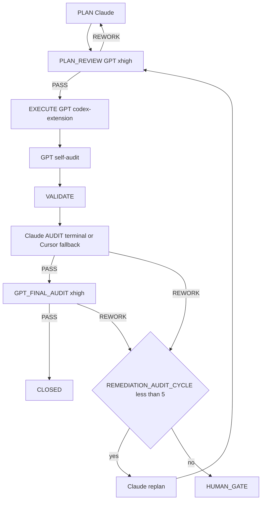

=== Auto-audit GPT (2e passe) ===
OpenAI Codex v0.125.0 (research preview)
--------
workdir: /Users/1millnonstop/Downloads/projet/foodking-web/web/testttt
model: gpt-5.5
provider: openai
approval: never
sandbox: workspace-write [workdir, /tmp, $TMPDIR, /Users/1millnonstop/.codex/memories]
reasoning effort: xhigh
reasoning summaries: none
session id: 019dc528-c263-7790-8c27-317a95accce7
--------
user
Tu effectues l’**auto-audit GPT** (2e passe) d’un cycle FoodKing — **pas** l’audit Claude terminal.

**Contexte** : le JSON ci-dessous est la proposition d’implémentation (format agents/codex.prompt.txt) pour la mission `CV1-M01-TRACEABILITY-MATRIX`.


**JSON d’implémentation (à recouper)** :
```json
{
  "files_to_modify": [
    "reports/audit/TRACEABILITY_MATRIX_CAISSE_V1_2026-04-25.md",
    "reports/audit/TRACEABILITY_MATRIX_CAISSE_V1_2026-04-25.csv",
    "scripts/check-traceability.sh"
  ],
  "implementation_steps": [
    "..."
  ],
  "code_blocks": [
    {
      "path": "reports/audit/TRACEABILITY_MATRIX_CAISSE_V1_2026-04-25.md",
      "op": "create",
      "excerpt": "<contenu complet>"
    },
    {
      "path": "reports/audit/TRACEABILITY_MATRIX_CAISSE_V1_2026-04-25.csv",
      "op": "create",
      "excerpt": "<csv complet>"
    },
    {
      "path": "scripts/check-traceability.sh",
      "op": "create",
      "excerpt": "<bash complet>"
    }
  ],
  "risks": [],
  "notes": "Compteurs finaux : total=NN, P0=NN, P1=NN, P2=NN, unmapped=NN, with_test=NN%, with_gate=NN%",
  "execution_trace": {
    "delegation": "codex-extension",
    "invariants_considered": []
  }
}
```

**Livrable** (Markdown uniquement, en français) :
# AUTO_AUDIT_GPT — CV1-M01-TRACEABILITY-MATRIX

## 1. Conformité au plan / scope
(Énumérer manques ou dérives ; si scope élargi sans escale → **ESCALATE**)

## 2. Invariants FoodKing
Pour chacun : OK / RISQUE / N/A
- pricing_ssot (backend seul)
- order_status (enum, pas de strings)
- branch_id
- commit_before_dispatch
- frozen_zones
- order_service_symmetry (si un des deux services touché)

## 3. Verdict
Une ligne : `VERDICT: PASS` | `VERDICT: NEEDS_FIX` | `VERDICT: ESCALATE` + 1–3 phrases.

codex
Je vais recouper la proposition avec l’état du cycle, le plan Masterplay et les artefacts de mission existants, sans modifier le dépôt.
exec
/bin/zsh -lc "sed -n '1,220p' .cursor/ACTIVE_CYCLE.md" in /Users/1millnonstop/Downloads/projet/foodking-web/web/testttt
exec
/bin/zsh -lc "sed -n '1,240p' plans/masterplay/MASTERPLAY_DISCIPLINE.md" in /Users/1millnonstop/Downloads/projet/foodking-web/web/testttt
exec
/bin/zsh -lc "sed -n '1,260p' plans/masterplay/MASTERPLAY_QUEUE.md" in /Users/1millnonstop/Downloads/projet/foodking-web/web/testttt
 succeeded in 0ms:
# Active Cycle – FoodKing

**Méta (SSOT `run-cycle.md` Step 0 + `AGENTS.md` § *Authoritative … cycle state*)** — requis pour que l’orchestrateur ne s’arrête pas sur *« RUNNER_MODE not set »*.

| Champ | Valeur actuelle |
| --- | --- |
| **RUNNER_MODE** | `single-session` |
| **PHASE (cycle W10)** | `IN_PROGRESS` (détail = section `CYCLE_W10_…` ci-dessous) |
| **TASK_ID** | `P_EXEC_CLOSEOUT_GRAPHITI_CI_PROD_2026-04-22` |
| **PLAN_FILE** | `plans/PLAN_EXECUTION_CLOSEOUT_GRAPHITI_CI_PROD_2026-04-22.md` |
| **REPORT_FILE** | `reports/post_execute_latest.log` (append — preuve `EXECUTE_DELEGATION` / `AUDIT_*`) |

> **ACTIVE_PRIMARY** : `CYCLE_W10_EXECUTION_CLOSEOUT` (un seul cycle peut être actif à la fois — voir B03 méga-checklist).
> Cycles plus anciens en lecture seule = **archive** déplacée dans **`.cursor/ACTIVE_CYCLE_ARCHIVE.md`** (lecture humaine / forensique uniquement, **non requise** par le parcours obligatoire).

## CYCLE_W10_EXECUTION_CLOSEOUT (IN_PROGRESS — mémoire 180 + MCP global + commit + CI + prod)

**TASK_ID** : `P_EXEC_CLOSEOUT_GRAPHITI_CI_PROD_2026-04-22`  
**Plan SSOT** : `plans/PLAN_EXECUTION_CLOSEOUT_GRAPHITI_CI_PROD_2026-04-22.md`  
**Ordre** : Piste A (POS+Centrale : PLAN-MEM-1) ∥ Piste B (humain : PLAN-MEM-3) → C (smoke) → D (commit sur « go commit ») → E (CI) → F (prod J-7→J+7).  
**Gate mémoire** : `python3 memory/verify.py` → count **≥ 175** (180 idéal) avant de considérer PLAN-MEM-1 **CLOSED**.

- **Vérif locale (2026-04-22)** : `python3 memory/verify.py` → **count = 182**, smoke `search_memory_facts` OK — gate **satisfaite** pour clôturer l'ingestion côté seuil d'épisodes (suite : commit / CI / prod selon plan `PLAN_EXECUTION_CLOSEOUT_*`).

**Gouvernance globale (2e passe 2026-04-22)** : primer multi-agents + Graphiti vivant + tokens « zéro effet négatif » → **`docs/orchestration/GLOBAL_SYSTEM_PRIMER.md`** + rapport **`reports/audit/AUDIT_SECOND_PASS_GLOBAL_GOVERNANCE_REPORT_2026-04-22.md`**.

---

## CAISSE_V1_MASTERPLAY (ACTIVE — 2026-04-25)

**Phase** : finition Caisse V1 (POS + Kiosk + KDS + Centrale + Fiscal + Ops).
**Plan parent** : `plans/PLAN_CAISSE_V1_GPT_MASTERPLAY_2026-04-25.md`
**Plan DAG autoritaire** : `plans/PLAN_CAISSE_V1_SUPER_MASTER_2026-04-25.md`
**Boucle d'exécution** : `plans/masterplay/MASTERPLAY_DISCIPLINE.md` + `plans/masterplay/MASTERPLAY_QUEUE.md` + `scripts/run-masterplay.sh`
**Statut temps réel** : `reports/masterplay/status.json`

**Règle** : tout `TASK_ID` au format `CV1-MXX-…` passe par la masterplay (cf. `AGENTS.md` § "Caisse V1 — Masterplay loop", `.cursor/rules/global.mdc` § "Caisse V1 — Masterplay loop", `.cursor/commands/run-cycle.md` Step 0 item 0). **NE PAS** ouvrir un `run-cycle` standard sur un `CV1-MXX-…`.

---

## Archive

Tous les cycles **CLOSED / COMPLETED PASSED** (W4 → W9, NF525, etc.) ont été déplacés dans **`.cursor/ACTIVE_CYCLE_ARCHIVE.md`** pour réduire le coût de lecture du parcours obligatoire (audit 2026-04-24, mission `T-PARCOURS-OPTIMIZE-001`).

- **Lecture humaine** : ouvrir `.cursor/ACTIVE_CYCLE_ARCHIVE.md`.
- **Lecture agent** : **non requise** sauf instruction explicite du plan ou du chat (ex. "reprend le rationale du cycle W9").
- **Recherche** : `rg "CYCLE_W9_" .cursor/ACTIVE_CYCLE_ARCHIVE.md` ou `git log --follow .cursor/ACTIVE_CYCLE.md`.

 succeeded in 0ms:
# MASTERPLAY DISCIPLINE — Caisse V1 (loop master)

> **But** : règles strictes que le runner et chaque mission GPT respectent en boucle, pendant des heures, jusqu'à finition de toutes les missions de `MASTERPLAY_QUEUE.md`. Lecture obligatoire avant de lancer `bash scripts/run-masterplay.sh`.

## 1. Autorité

| Source | Rôle |
|--------|------|
| `AGENTS.md` | Parcours obligatoire, cycle FoodKing |
| `plans/PLAN_CAISSE_V1_SUPER_MASTER_2026-04-25.md` | DAG autoritaire (ordre, gates) |
| `plans/PLAN_CAISSE_V1_GPT_MASTERPLAY_2026-04-25.md` | Catalogue 22 missions M-XX (objectifs, allowlist) |
| `plans/masterplay/MASTERPLAY_QUEUE.md` | File d'exécution courante |
| `plans/masterplay/MASTERPLAY_DISCIPLINE.md` | (ce fichier) règles d'exécution |
| `.cursor/rules/*.mdc` | Toujours appliquées |
| `docs/gates/GATE_LOG.md` | État des gates humains |

## 2. Boucle d'exécution (run-masterplay.sh)

```
LOOP {
  1. tail activity log (~500 tokens)
  2. find next PENDING task in MASTERPLAY_QUEUE with all DEPENDS_ON == CLOSED
  3. if none → break (all done or all blocked)
  4. verify missions/<TASK_ID>/input.json + execute_brief.md exist
  5. activity-log start codex-extension <TASK_ID> execute "<allowlist CSV>" "<note>"
     if exit 2 (collision) → MARK BLOCKED note=collision, continue loop
  6. update status: RUNNING
  7. npm run codex:complex -- <TASK_ID>     (génère output_codex.json + GPT_SELF_AUDIT)
  8. update status: EXECUTED
  9. activity-log done codex-extension <TASK_ID> done "<résumé court>"
 10. (option --with-audit) bash scripts/foodking-claude-orchestrate.sh audit-brief <TASK_ID>
       if PASS → status: AUDIT_PASS
       if REWORK → status: REWORK ; increment REWORK_COUNT ; if >=5 → BLOCKED note=human_gate
 11. (option --with-final) npm run codex:final-audit -- <TASK_ID>
       if PASS → status: FINAL_PASS
 12. if FINAL_PASS:
       bash scripts/after-execute-memory.sh
       update status: CLOSED
 13. sleep INTER_TASK_PAUSE_SECONDS (default 5s)
 14. continue LOOP
}
```

## 3. Garde-fous (non négociables)

### 3.1 Allowlist stricte par mission
Codex modifie **uniquement** les fichiers listés dans `missions/<TASK_ID>/input.json.allowlist`. Si modification hors liste détectée à l'audit → `REWORK`.

### 3.2 Frozen zones
Aucune édition d'un fichier frozen sans gate signé dans `docs/gates/GATE_LOG.md`. Le runner **refuse** de lancer une mission marquée `BLOCKED` jusqu'à ce que le statut soit changé manuellement après signature.

### 3.3 Invariants FoodKing — `REWORK` automatique
- Pricing client-authoritative
- Status littéral numérique (`status: 16`)
- `branch_id` LIKE
- Dispatch dans transaction
- OS ou FOS modifié sans `SYMMETRY_NOTE`
- Frozen modifié sans gate

### 3.4 Pas de gate auto-approuvée
Codex peut **rédiger** options ; aucune mission ne coche `[x] Approved`. Si une mission le tente → `REWORK` + `risks: ["ESCALATION: gate self-approved"]`.

### 3.5 Tests obligatoires
Chaque `mandatory_tests` listé doit être lancé et reporté dans le rapport. Échec → `REWORK`.

### 3.6 Diff minimal
Aucun renommage opportuniste, aucun refactor non demandé, aucune optimisation collatérale. Si ajout justifié → `notes` du JSON.

### 3.7 Activity log
`start` avant chaque mission ; `done` après. Sans cela → réservation fantôme = autres agents bloqués. Le runner enforce.

### 3.8 Mémoire
À CLOSE : compléter `memory/episodes/caisse_v1_<topic>_*.jsonl` (squelettes créés par M-19) puis `bash scripts/after-execute-memory.sh`. Si Graphiti UP : `bash bin/graphiti-ingest.sh` + `python3 memory/verify.py`.

## 4. Boucles de rework

- Max **5 cycles `REWORK`** consécutifs sur la même mission. Au 5e → `BLOCKED note=human_gate_required`.
- Max **3 cycles healing** consécutifs (cf. CLAUDE.md §8) avant escalade.
- Toute escalation → écrite dans `reports/masterplay/ESCALATIONS_<date>.md`.

## 5. Pause / arrêt

- `Ctrl-C` arrête la boucle proprement (mission en cours finit, runner s'arrête après).
- `touch reports/masterplay/STOP` → le runner s'arrête à la fin de la mission courante.
- `touch reports/masterplay/PAUSE` → le runner pause entre les missions tant que le fichier existe.

## 6. Logs

- `reports/masterplay/run_<ISO>.log` : log de la boucle.
- `reports/masterplay/status.json` : état temps réel (mission courante, compteurs).
- `missions/<TASK_ID>/output_codex.raw.log` : raw codex.
- `missions/<TASK_ID>/output_codex.json` : json structuré.
- `reports/audit/GPT_SELF_AUDIT_<TASK_ID>.md` : self-audit GPT.
- `reports/post_execute_latest.log` : trace `EXECUTE_DELEGATION`.
- `reports/AGENT_ACTIVITY_LOG.md` : start/done.

## 7. Audit Claude (en fin de boucle, manuel)

Quand toutes les missions sont `CLOSED` (ou `BLOCKED` documentés) :

```
bash scripts/foodking-claude-orchestrate.sh context
bash scripts/foodking-claude-orchestrate.sh audit
```

Sortie attendue : verdict transversal Caisse V1 (chaîne sync borne→centrale→POS→KDS→fiscal). Le verdict détermine `GO/HOLD/NO-GO` pour `GATE_GO_NO_GO_CAISSE_V1`.

## 8. Critères d'arrêt anormal

- 3 missions consécutives en `REWORK` → halt + alerte humaine.
- Activity-log refuse 3 fois → halt (collision permanente).
- `npm run codex:complex` échoue 3 fois sur la même mission (binaire codex KO) → halt.
- `claude` terminal indisponible 3 fois consécutives → continue avec fallback subagent + `AUDIT_FALLBACK_REASON: terminal-unavailable`.

## 9. Token discipline

- Le prompt envoyé à codex contient : template `agents/codex.prompt.txt` + `input.json` + `execute_brief.md` + (optionnel) `graphiti_context.md`, `plan_excerpt.md`, `cycle_snapshot.md`.
- Pas de duplication : pas de re-coller AGENTS.md ou super master plan dans chaque mission.
- Cap typique d'un prompt : ≤ 30 KB. Au-delà → splitter la mission.

## 10. Anti-pattern interdits

- ❌ Lancer 2 missions en parallèle sur les mêmes fichiers (collision activity-log).
- ❌ Modifier `MASTERPLAY_QUEUE.md` pendant que le runner tourne (sauf marquer BLOCKED → PENDING après gate).
- ❌ Skipper l'audit Claude pour aller plus vite.
- ❌ Marquer CLOSED manuellement sans double PASS (PASS Claude + PASS Codex final).
- ❌ Ignorer un `risks: ["ESCALATION: ..."]` dans output_codex.json.

---

`MASTERPLAY_DISCIPLINE_VERSION: 1.0` · `STRICT_MODE: ON`

 succeeded in 0ms:
# MASTERPLAY_QUEUE — Caisse V1

**Source de vérité de l'orchestration en boucle** : `bash scripts/run-masterplay.sh` lit cette file et exécute en série.

**Discipline** : `plans/masterplay/MASTERPLAY_DISCIPLINE.md`.  
**Plan parent** : `plans/PLAN_CAISSE_V1_GPT_MASTERPLAY_2026-04-25.md`.

## Légende statut
- `PENDING` — pas encore lancé
- `RUNNING` — codex exec en cours (ne pas relancer)
- `EXECUTED` — codex exec terminé, attend audit
- `AUDIT_PASS` — `AUDIT_VERDICT: PASS` Claude
- `FINAL_PASS` — `GPT_FINAL_AUDIT_VERDICT: PASS`
- `CLOSED` — mémoire ingestée + activity-log done
- `REWORK` — audit a demandé rework
- `BLOCKED` — gate humain ou dépendance manquante

## Légende vague
- `WAVE_A` — NO-GATE, parallélisable, démarre immédiatement
- `WAVE_B` — POST-GATE, séquencé selon DAG

## File d'exécution

| ORDER | TASK_ID | MISSION | WAVE | DEPENDS_ON | STATUS | NOTE |
|-------|---------|---------|------|------------|--------|------|
| 01 |CV1-M19-MEMORY-DISCIPLINE| M-19 | WAVE_A | — | CLOSED | Crée squelettes JSONL pour les 22 missions |
| 02 | CV1-M01-TRACEABILITY-MATRIX | M-01 | WAVE_A | — | RUNNING | Matrice findings → tasks → tests → gates |
| 03 | CV1-M02-SENTINEL-BASELINE | M-02 | WAVE_A | CV1-M01 | PENDING | 18 sentinels fail-first + 4 lints |
| 04 | CV1-M12-LEGACY-GUARDS-CI | M-12 | WAVE_A | — | PENDING | Lint imports + bundle scan + workflow |
| 05 | CV1-M16-HARDWARE-LAB | M-16 | WAVE_A | — | PENDING | Checklist hardware signable |
| 06 | CV1-M18-TEST-ARCHITECTURE | M-18 | WAVE_A | CV1-M02 | PENDING | Grille couverture + plan campagne |
| 07 | CV1-M20-RUNBOOKS-SKELETON | M-20 | WAVE_A | — | PENDING | 8 runbooks ops (TPE, printer, kiosk net, dispatch, outbox, fiscal, KDS, rollback) |
| 08 | CV1-M21A-QUICKWINS-LOT0 | M-21a | WAVE_A | — | PENDING | POS: discount v-model + Swiper RTL + focustrap dead |
| 09 | CV1-M03-GATES-DRAFT | M-03 | WAVE_A | CV1-M01 | PENDING | 8 briefs gates Caisse V1 (frozen, fiscal, ledger A/B, kds, schema, offline, web, stripe) |
| 10 | CV1-M09-BRANCH-ISOLATION | M-09 | WAVE_B | CV1-M03(gates), CV1-M02 | BLOCKED | Gate frozen requis |
| 11 | CV1-M06-POS-REVENUE-GUARDS | M-06 | WAVE_B | CV1-M09, CV1-M03 | BLOCKED | Gate frozen + payment_prop_mutation |
| 12 | CV1-M05-ORDER-QUOTE | M-05 | WAVE_B | CV1-M03 | BLOCKED | Gate schema |
| 13 | CV1-M04A-PAYMENT-LEDGER-FULL | M-04A | WAVE_B | CV1-M03 (ledger=A) | BLOCKED | Gate ledger=A |
| 14 | CV1-M04B-PAYMENT-PILOT-RESTRICT | M-04B | WAVE_B | CV1-M03 (ledger=B) | BLOCKED | Gate ledger=B |
| 15 | CV1-M08-FISCAL-Z-NF525 | M-08 | WAVE_B | CV1-M03 (fiscal+schema) | BLOCKED | Gates fiscal + schema |
| 16 | CV1-M07-KDS-RELEASE | M-07 | WAVE_B | CV1-M03 (kds_bump) | BLOCKED | Gate kds_bump |
| 17 | CV1-M10-OS-FOS-SYMMETRY | M-10 | WAVE_B | CV1-M06, CV1-M09 | BLOCKED | Après guards POS + branch |
| 18 | CV1-M11-KIOSK-RUNTIME | M-11 | WAVE_B | CV1-M03 (offline+fiscal) | BLOCKED | Gates offline + fiscal |
| 19 | CV1-M17-WEB-STRIPE-SCOPE | M-17 | WAVE_B | CV1-M03 (web+stripe) | BLOCKED | Gates web + stripe |
| 20 | CV1-M13-MIGRATIONS-SAFETY | M-13 | WAVE_B | CV1-M03 (schema) | BLOCKED | Gate schema |
| 21 | CV1-M14-OPS-PREFLIGHT | M-14 | WAVE_B | CV1-M13 | BLOCKED | — |
| 22 | CV1-M15-ROLLOUT-CANARY | M-15 | WAVE_B | CV1-M04*, CV1-M08, CV1-M14 | BLOCKED | — |
| 23 | CV1-M21B-PAYMENT-REFACTOR | M-21b | WAVE_B | CV1-M03 (prop_mutation) | BLOCKED | Gate payment_prop_mutation |
| 24 | CV1-M22-POST-LAUNCH-OBSERVABILITY | M-22 | WAVE_B | CV1-M14, CV1-M15 | BLOCKED | — |

## Ce que le runner exécute

À chaque tour de boucle, le runner :
1. Lit cette table.
2. Prend la **première** ligne au statut `PENDING`.
3. Vérifie que toutes ses `DEPENDS_ON` sont au statut `CLOSED`. Sinon → skip.
4. Vérifie que `missions/<TASK_ID>/input.json` et `execute_brief.md` existent. Sinon → marque `BLOCKED note=missing-mission-files`.
5. `start` activity-log → `npm run codex:complex -- <TASK_ID>` → `done` activity-log.
6. Mise à jour statut : `EXECUTED`.
7. Audit Claude terminal automatique (si activé `--with-audit`) → `AUDIT_PASS` ou `REWORK`.
8. Si `AUDIT_PASS` : `npm run codex:final-audit -- <TASK_ID>` → `FINAL_PASS`.
9. Si `FINAL_PASS` : ingestion mémoire + `done` → `CLOSED`.
10. Loop.

## Statut initial (à la création)

Les 6 missions Vague A préparées par M-19/M-01/M-02/M-12/M-16/M-18 sont au statut `PENDING`. Les autres `TODO_NEXT` (à créer après le premier round) ou `BLOCKED` (gates).

## Mise à jour manuelle

Le runner met à jour la colonne `STATUS` automatiquement (sed sur cette table). Tu peux aussi éditer manuellement entre 2 runs (ex: marquer `BLOCKED → PENDING` après gate signé).

exec
/bin/zsh -lc "sed -n '1,220p' plans/masterplay/GO.md" in /Users/1millnonstop/Downloads/projet/foodking-web/web/testttt
 succeeded in 0ms:
# GO — Lance la masterplay Caisse V1

> **Intégration obligatoire confirmée (2026-04-25)** : la masterplay est désormais référencée dans :
> - `AGENTS.md` P0 + section "Caisse V1 — Masterplay loop"
> - `.cursor/rules/global.mdc` (alwaysApply) section "Caisse V1 — Masterplay loop"
> - `.cursor/commands/run-cycle.md` Step 0 item 0 (fast-path `^CV1-M…`)
> - `.cursor/ACTIVE_CYCLE.md` section "CAISSE_V1_MASTERPLAY (ACTIVE)"
>
> Tout agent qui ouvre le repo et touche un `TASK_ID` `CV1-MXX-…` est OBLIGÉ de lire `MASTERPLAY_DISCIPLINE.md` + `MASTERPLAY_QUEUE.md` avant d'agir.

## 0. Prérequis (1 fois)

```bash
# Vérifier binaire codex (CLI OpenAI, compte ChatGPT Pro)
npm run codex:doctor || npm install   # installe @openai/codex si absent

# Vérifier binaire claude (Anthropic, audit terminal)
which claude && claude --version       # doit retourner 2.x.x

# Vérifier la boucle FoodKing
npm run verify:boucle
```

Si l'un échoue : voir `AGENTS.md` § "Parcours obligatoire" et `agents/codex-extension-instructions.md`.

## 1. Démarrage propre (boucle longue)

```bash
# Boucle simple — exécute toutes les missions PENDING dans l'ordre, sans audit auto
bash scripts/run-masterplay.sh

# Boucle complète — codex exec + audit Claude terminal + audit Codex final + ingest mémoire
bash scripts/run-masterplay.sh --with-audit --with-final

# Boucle limitée (tester sur 2 missions d'abord)
bash scripts/run-masterplay.sh --with-audit --with-final --max 2
```

## 2. Suivre l'avancement

```bash
# Statut temps réel (fichier JSON mis à jour à chaque mission)
cat reports/masterplay/status.json

# Log de la boucle courante
ls -lt reports/masterplay/run_*.log | head -1
tail -f $(ls -t reports/masterplay/run_*.log | head -1)

# File d'attente (à jour)
cat plans/masterplay/MASTERPLAY_QUEUE.md
```

## 3. Pause / Stop

```bash
# Pause (rester en attente, le runner reprend dès suppression)
touch reports/masterplay/PAUSE
# Reprendre
rm reports/masterplay/PAUSE

# Stop propre (à la fin de la mission courante)
touch reports/masterplay/STOP

# Stop immédiat (Ctrl-C dans le terminal du runner)
```

## 4. Missions Vague A prêtes (no-gate, démarrent immédiatement)

| ORDER | TASK_ID | Mission | Livrables clés |
|-------|---------|---------|----------------|
| 01 | `CV1-M19-MEMORY-DISCIPLINE` | M-19 | 22 squelettes JSONL, procédure mémoire |
| 02 | `CV1-M01-TRACEABILITY-MATRIX` | M-01 | Matrice findings .md+.csv, script de check |
| 03 | `CV1-M02-SENTINEL-BASELINE` | M-02 | 18 tests sentinels rouges + 4 lints + index |
| 04 | `CV1-M12-LEGACY-GUARDS-CI` | M-12 | Workflow CI + 4 scripts lint legacy |
| 05 | `CV1-M16-HARDWARE-LAB` | M-16 | Checklist + protocoles + grille acceptation |
| 06 | `CV1-M18-TEST-ARCHITECTURE` | M-18 | Matrice couverture + plan campagne |

## 5. Pendant que ça tourne (de mon côté, la prochaine fois)

Je préparerai en parallèle :
- `CV1-M20-RUNBOOKS-SKELETON` (M-20) — squelettes runbooks ops
- `CV1-M21A-QUICKWINS-LOT0` (M-21a) — quickwins POS (discount v-model + Swiper RTL)
- `CV1-M03-GATES-DRAFT` (M-03) — briefs des 7 gates TO_DRAFT

## 6. Après ces 6 (toi + humain)

1. Audit Claude transversal :
   ```bash
   bash scripts/foodking-claude-orchestrate.sh context
   bash scripts/foodking-claude-orchestrate.sh audit
   ```
2. Signer les gates `PENDING_HUMAN_GATE` (cf. `docs/gates/GATE_LOG.md`).
3. Une fois M-03 livré, signer les 7 gates `TO_DRAFT`.
4. Débloquer la Vague B en passant manuellement les BLOCKED → PENDING au fil des signatures.

## 7. Garde-fous (rappel)

- **Allowlist stricte par mission** : codex ne touche QUE les fichiers listés.
- **Frozen zones** : intouchables sans gate signé.
- **Invariants FoodKing** : violation = REWORK auto.
- **Activity-log** : enforce les collisions (pas de double édition cross-agent).
- **Max 5 REWORK** par mission → BLOCKED + escalation humaine.

Lis `plans/masterplay/MASTERPLAY_DISCIPLINE.md` pour le détail complet.

---

**TL;DR** : `bash scripts/run-masterplay.sh --with-audit --with-final` → laisse tourner → reviens dans X heures → check `cat reports/masterplay/status.json` et `cat plans/masterplay/MASTERPLAY_QUEUE.md`.

codex
Le cycle Masterplay est actif et M-01 est bien en statut `RUNNING`; je lis maintenant les fichiers propres à la mission et les plans autoritaires pour contrôler l’allowlist, les livrables attendus et les gates.
exec
/bin/zsh -lc "sed -n '1,260p' docs/orchestration/GLOBAL_SYSTEM_PRIMER.md" in /Users/1millnonstop/Downloads/projet/foodking-web/web/testttt
 succeeded in 0ms:
# FoodKing — Primer système global (agents, sous-agents, Graphiti, tokens)

> **Passation + index complet des chemins (SSOT, un seul fichier)** : **`../DOC_EXPO_HER_ANCIEN_AGENT_ALIMENTATION_WORKFLOW_2026-04-22.md`** (table §2 = utilité de chaque path pour une nouvelle session).

> **Fichier d’entrée** pour toute nouvelle conversation, tout nouvel outil d’agent (Cursor, terminal, futur bot), ou tout humain qui reprend le projet.  
> Objectif : **robustesse** = même avec 100 cycles et des exécuteurs différents, le comportement reste **prévisible**, **traçable**, et la **mémoire** reste **alignée** sur le code.

**Obligatoire avant ce Primer (SSOT d’onboarding)** : lire `**AGENTS.md`**, section **Parcours obligatoire** (nouvelle session **et** continuation), puis enchaîner ici.  
**En continuation d’un cycle** : lire d’**abord** `**.cursor/ACTIVE_CYCLE.md`** (éviter un second `TASK_ID` fantôme) ; si `PHASE` = vide ou `CLOSED`, revenir à la table ci-dessous.

---

## 1. Ordre de lecture obligatoire (minimum viable)

Lire **dans cet ordre** avant d’écrire du code ou un plan non trivial (voir aussi `**AGENTS.md` § *Parcours obligatoire* — tableau** pour la même doctrine) :


| #   | Fichier                                                    | Pourquoi                                                                                                                  |
| --- | ---------------------------------------------------------- | ------------------------------------------------------------------------------------------------------------------------- |
| 0   | `**.cursor/ACTIVE_CYCLE.md`** (si reprise)                 | Cycle déjà en cours : même `TASK_ID` / mêmes Steps **jusqu’à** `CLOSE` — **ne pas** forker un plan parallèle sans le dire |
| 1   | `**AGENTS.md`** (dont § *Parcours obligatoire*)            | Contrat global : phases, routing, MCP, terminal, parcours production, non-négociables                                     |
| 1b  | `**docs/orchestration/SESSION_OPENING_ENFORCEMENT.md**`  | **Bloc unique** (tail log + `verify:boucle` + rappel phases) — réduit la répétition « refais la boucle » en session ; **modèle Cursor = Claude pour PLAN** (Auto/Composer ne remplacent pas `routing.md`) |
| 1c  | `**reports/audit/SIMULATION_PARCOURS_PROD_CHECKPOINTS_2026-04-25.md**` | **Simulation production** : checkpoints par phase, fichiers SSOT, limite IDE (qui orchestre quoi) — avant de promettre « zéro dérive » |
| 2   | `**.cursor/routing.md*`*                                   | Qui fait quoi (Claude plan/audit, GPT-5.5-pro xhigh plan review / execute / final audit, Composer validation only)         |
| 3   | `**.cursor/commands/run-cycle.md**`                        | Déroulé exact d’un cycle `TASK_ID` (incl. Graphiti Step 0.5)                                                              |
| 4   | `**.cursor/rules/graphiti-memory.mdc**`                    | Mémoire Graphiti : quand lire / quand écrire                                                                              |
| 5   | `**.cursor/rules/global.mdc**` + `**context-hygiene.mdc**` | Gates, discipline tokens **sans** réduire l’intelligence                                                                  |
| 6   | `**docs/orchestration/MEMORY_MATRIX.md`**                  | **Quel store écrit quoi, lit quoi, quand** (4 stores autorisés A/B/C/D) — antidote unique à la complexité mémoire         |
| 6b  | `**docs/orchestration/MULTI_AGENT_ORCHESTRATION.md`**      | Même tâches, plusieurs onglets Cursor : **activité** + **Graphiti** (lecture) + `AUDIT_VERDICT` — sans empiéter           |
| 7   | `**memory/INDEX.md`**                                      | Carte des domaines mémoire Graphiti (store B) — secours si MCP absent                                                     |
| 8   | `**tasks/[TASK_ID].md**`                                   | Quand un cycle borné est lancé — périmètre de la tâche                                                                    |


Ensuite, **selon le domaine** : `docs/ORDER_FLOW.md`, `docs/DEVICE_FLOW.md`, `docs/ARCHITECTURE.md`, `project-invariants.mdc`, etc.

Référence roster court : `**docs/orchestration/AGENT_ROLES.md`**.

### 1.1 Décision : Claude orchestre ; GPT challenge et exécute en xhigh

- **Cerveau** (priorité, plan, re-plan, gates) : **Claude** (session + terminal `foodking-claude-orchestrate.sh`) — il écrit le plan et tranche la stratégie de remédiation.
- **Challenge plan obligatoire** : **GPT-5.5-pro / xhigh** relit le plan avant EXECUTE (`npm run codex:plan-review -- {TASK_ID}` → `PLAN_REVIEW_VERDICT`). Si `REWORK`, Claude révise avant tout code.
- **Bras + premier contrôle qualité** : **EXECUTE = Codex (PRIMARY)** pour toutes les implémentations produit, même les petites corrections : `npm run codex:complex -- {TASK_ID}` → `reports/audit/GPT_SELF_AUDIT_{TASK_ID}.md`.
- **Pas de routine product implementation** : Composer / `foodking-routine-implementer` ne fait plus d’édition produit en cycle de finition ; il peut aider au reporting/validation seulement.
- **Double audit final** : Claude audit d’abord (`AUDIT_VERDICT`) avec terminal primary + fallback Cursor si quota/rate-limit/terminal HS, puis GPT final audit (`npm run codex:final-audit -- {TASK_ID}` → `GPT_FINAL_AUDIT_VERDICT`). Close seulement si les deux sont `PASS`.

---

## 2. Sous-agents Cursor (Task tool) — intégration dans le flux

Ce ne sont **pas** des fichiers dans le repo ; ce sont des **profils** invoqués par Cursor selon `.cursor/routing.md` et `**run-cycle.md` Step 2**.


| Sub-agent / Canal                                                               | Modèle cible                                                                  | Quand                                                                                                                                                                                                                                          |
| ------------------------------------------------------------------------------- | ----------------------------------------------------------------------------- | ---------------------------------------------------------------------------------------------------------------------------------------------------------------------------------------------------------------------------------------------- |
| `**foodking-routine-implementer`** (sub-agent Cursor)                           | Composer                                                                      | **Validation/report only** en cycles de finition. Pas d’implémentation produit.                                                                                                                                             |
| `**codex-extension` — FoodKing Codex Complex Implementer (PRIMARY)**            | **GPT-5.5-pro / xhigh** via CLI `codex` (compte **ChatGPT Pro**) + `codex exec` | **PLAN_REVIEW + toute implémentation produit + auto-audit + GPT_FINAL_AUDIT**. `npm run codex:complex -- {TASK_ID}`. Voir `scripts/codex-extension-execute.sh`, `agents/codex-extension-instructions.md`. |
| `**foodking-complex-implementer`** (sub-agent Cursor — **FALLBACK uniquement**) | Aligné exécution **GPT-5.5** (emplacement sub-agent)                          | Uniquement si `codex` / `codex exec` est indisponible après reprises sur la même tâche                                                                                                                                                         |


**Règles d'or**

1. **Délégation obligatoire** pour toute modification produit en EXECUTE, avec trace `EXECUTE_DELEGATION:` dans le log de validation. Valeurs autorisées : `codex-extension` | `foodking-complex-implementer (codex-extension-fallback)` | `explicit-prompt-bind`.
2. **EXECUTE = `codex-extension` PRIMAIRE** (CLI `codex` + Pro, `npm run codex:complex -- {TASK_ID}` ; contexte Graphiti/plan dans `missions/…/graphiti_context.md` etc. ; voir `**docs/orchestration/CODEX_API_DELEGATION.md`**). Le sub-agent `foodking-complex-implementer` est le **fallback** (usage Cursor) — indispo `codex exec`. Aucun **connecteur HTTP** / proxy n’est maintenu dans le dépôt.
3. Le sous-agent **ne voit pas toujours** le MCP Graphiti du parent : le plan **doit** contenir `**## PRIOR_CONTEXT`** (faits Graphiti + invariants) — copier ou résumer dans le message de délégation **ou** dans `missions/{TASK_ID}/graphiti_context.md` pour l’appel API.
4. Aucun sub-agent ne **contourne** un gate humain ni n’édite une frozen zone sans `docs/gates/` approuvé.

---

## 3. Terminal allies (hors Task tool) — intégration

Documentés dans `**AGENTS.md` § Terminal allies** :


| Outil                                                                  | Rôle                                                                     | Position + **canal d’abonnement** (SSOT)                                                                                                                                                                                         |
| ---------------------------------------------------------------------- | ------------------------------------------------------------------------ | -------------------------------------------------------------------------------------------------------------------------------------------------------------------------------------------------------------------------------- |
| `**claude` +** `foodking-claude-orchestrate.sh`                        | **AUDIT cycle — PRIMARY (Step 5)** : `context` → `audit` / `audit-brief` | Abonnement **Anthropic (CLI sur terminal)** ; n’**emprunte** pas l’orchestrateur de modèles de Cursor. **FALLBACK actif** (quota / limite / panne après 1 retry) : Task **`foodking-planner-orchestrator`** + même checklist + `AUDIT_CHANNEL: cursor-session` + `AUDIT_FALLBACK_REASON:` — `docs/orchestration/AUDIT_TERMINAL_QUOTA_FALLBACK.md`. |
| **CLI** `codex` + `npm run codex:complex` (`**codex-extension`**, Pro) | **PLAN_REVIEW + EXECUTE + GPT_FINAL_AUDIT — PRIMARY** (GPT-5.5-pro/xhigh) | Compte **ChatGPT Pro** sur le terminal ; ne passe **pas** par l’orchestrateur de modèles **Cursor** ; facturation côté OpenAI ; **FALLBACK** = sub-agent.     |
| `codex` / REPL interactif (OpenAI)                                     | Tâches ad hoc **hors** cycle, ou côté humain                             | N’enlèvent **pas** VALIDATE + AUDIT du `run-cycle`.                                                                                                                                                                              |
| `verify-orchestration-boucle.sh`                                       | Preuve binaire + optionnel smoke (API)                                   | `bash scripts/verify-orchestration-boucle.sh` — `VERIFY_BILLING_FULL=1` lance 1× smoke `claude` + 1× `npm run codex:smoke`.                                                                                                      |


**Clôture :** l’audit Claude écrit `AUDIT_VERDICT: PASS` ou `REWORK`, puis GPT écrit `GPT_FINAL_AUDIT_VERDICT: PASS|REWORK|ESCALATE` (voir `run-cycle.md` Step 5). Pas de `CLOSED` sans double `PASS`. En `REWORK` : re-orchestration + re-EXECUTE GPT jusqu’à double `PASS` ou 5e tour → humain. Schéma :




Le terminal **n’enregistre** pas **Graphiti** seul : après AUDIT/CLOSE, décisions → JSONL + `after-execute-memory.sh` (voir §5) comme avant.

---

## 4. Graphiti — vivre avec l’avancement du projet (N agents, N cycles)

### 4.1 Rôles


| Rôle                                    | Responsable                                                          |
| --------------------------------------- | -------------------------------------------------------------------- |
| **Lecture** avant plan / audit complexe | Tout agent avec MCP `graphiti` chargé                                |
| **Écriture** après décision durable     | Phase AUDIT + CLOSED (`audit-context.md`) ou humain via `add_memory` |
| **Alimentation batch** (JSONL → Neo4j)  | Humain ou pipeline : `bash bin/graphiti-ingest.sh`                   |


### 4.2 Quand mettre à jour la mémoire (checklist — « ne pas oublier »)

Cocher mentalement à **chaque** fin de sujet significatif :

- **Invariant** clarifié ou renforcé → nouvelle ligne dans `memory/episodes/02_architecture_invariants.jsonl` (ou fichier le plus proche) + `ingest` ciblé.
- **Sync / event / canal** modifié → `03_domain_events_sync.jsonl` + ingest.
- **Décision produit / ADR** → `12_decisions_log.jsonl` + ingest.
- **Nouvelle tâche V14+** ou finding cross-vagues → `09_tasks_history.jsonl` + ingest.
- **Changement prod / rollout** → `11_production_plan.jsonl` + ingest.
- **Nouveau rôle agent ou règle d’orchestration** → `13_agents_roles.jsonl` + ingest + **mettre à jour ce Primer** si le modèle change.
- **Audit long (ops + agentique + mémoire)** → suivre `docs/orchestration/MEGA_CHECKLIST_AUTONOMY_AND_MEMORY.md` (180 tâches) ; narratif `reports/audit/MEGA_AUDIT_SYSTEM_OPERATION_AGENTIC_2026-04-23.md`.
- **Après toute écriture JSONL** → `bash scripts/after-execute-memory.sh` (rafraîchit `reports/memory/jsonl_manifest.json`, cohérent avec CI) puis `bin/graphiti-ingest.sh` sur les domaines touchés.

**Règle d’or** : si le code ou la doc **canonical** a changé et que la mémoire dit encore l’ancienne vérité → **mise à jour sous 48 h** (sinon dérive silencieuse).

### 4.3 Outils

- Pipeline post-écriture (manifeste + rappel ingest) : `bash scripts/after-execute-memory.sh`.
- Ingestion : `bin/graphiti-ingest.sh [filtre]` — voir `memory/README.md`.
- Vérification : `python3 memory/verify.py`.
- Terminal (bref + audit option) : `bash scripts/foodking-claude-orchestrate.sh post-execute` ou `context` puis `audit-brief` — `docs/orchestration/TERMINAL_CLAUDE_GRAPHITI_ORCHESTRATION.md`.
- Reset rare : `@graphiti clear_graph` puis full ingest (politique humaine).

---

## 5. Tokens, contexte, cache — politique « intelligence max, gaspillage min »

**But** : réponses **détaillées et stables**, pas des réponses courtes pour économiser des tokens au détriment de la qualité.


| On optimise (effet ≥ 0)                                                              | On n’optimise pas (effet négatif interdit)                               |
| ------------------------------------------------------------------------------------ | ------------------------------------------------------------------------ |
| Re-lire un fichier **déjà** dans la fenêtre contexte                                 | Tronquer un plan, une analyse de risque, ou un gate pour « faire court » |
| Résumer une phase **terminée** pour handoff (voir `context-hygiene.mdc` §4)          | Supprimer `## PRIOR_CONTEXT` ou les invariants du plan                   |
| Utiliser **Graphiti** pour récupérer faits structurés au lieu de rouvrir 50 rapports | Désactiver Graphiti pour « aller plus vite » sur du sync / fiscal        |
| Écrire les preuves dans `reports/` structuré                                         | Remplacer des tests par de la prose vague                                |


**Cache applicatif** (Redis, etc.) : régie par le code Laravel et `**app:preflight-production`** — hors scope de ce Primer, mais **ne jamais** confondre « cache métier » et « mémoire Graphiti » : ce sont deux systèmes.

---

## 6. Révision de ce document

- **À chaque** changement majeur d’orchestration (nouveau sub-agent, nouveau MCP, nouveau cycle obligatoire) : mettre à jour **ce fichier** + une ligne dans `13_agents_roles.jsonl` + ingest.
- **Trimestriel** : relire §4.2 avec un lead dev.

---

## 7. Pointers rapides


| Besoin                                                        | Aller à                                                           |
| ------------------------------------------------------------- | ----------------------------------------------------------------- |
| Cycle complet                                                 | `.cursor/commands/run-cycle.md`                                   |
| Gates                                                         | `.cursor/rules/human-gates.mdc`                                   |
| Invariants code                                               | `.cursor/rules/project-invariants.mdc`                            |
| Mémoire locale                                                | `memory/INDEX.md`                                                 |
| Pannes Graphiti                                               | `.cursor/mcp/GRAPHITI_TROUBLESHOOTING.md`                         |
| Closeout prod + mémoire                                       | `plans/PLAN_EXECUTION_CLOSEOUT_GRAPHITI_CI_PROD_2026-04-22.md`    |
| Méga-checklist autonomie / Graphiti                           | `docs/orchestration/MEGA_CHECKLIST_AUTONOMY_AND_MEMORY.md`        |
| Méga-audit narratif (compagnon)                               | `reports/audit/MEGA_AUDIT_SYSTEM_OPERATION_AGENTIC_2026-04-23.md` |
| Audit graphique workflow                                      | `docs/orchestration/WORKFLOW_AUDIT_GRAPHIQUE_2026-04-23.md`       |
| Terminal Claude + Graphiti (rôles, `context` / `audit-brief`) | `docs/orchestration/TERMINAL_CLAUDE_GRAPHITI_ORCHESTRATION.md`    |
| Matrice routine / complexe (sub-agents)                       | `docs/orchestration/ROUTING_MATRIX.md`                            |

exec
/bin/zsh -lc "sed -n '1,220p' .cursor/commands/run-cycle.md" in /Users/1millnonstop/Downloads/projet/foodking-web/web/testttt
 succeeded in 0ms:
# Command: run-cycle

Orchestrate one full bounded cycle inside a single Cursor session.

## Trigger
Invoke with a TASK_ID. Example: `run-cycle SMOKE-001`

---

## Step 0 — Pre-flight

0. **Caisse V1 fast-path** : si `TASK_ID` matche `^CV1-M[0-9]{2}[A-Z]?-`, ne pas exécuter ce `run-cycle.md` directement. Utiliser **la masterplay** :
   - Lire `plans/masterplay/MASTERPLAY_DISCIPLINE.md` (règles d'or)
   - Lire `plans/masterplay/MASTERPLAY_QUEUE.md` (statut + DAG)
   - Lancer `bash scripts/run-masterplay.sh --with-audit --with-final` (ou `--max 1` pour une seule mission)
   - Le runner orchestre lui-même PLAN/EXECUTE/AUDIT pour la mission via `missions/<TASK_ID>/input.json` + `execute_brief.md`.
   - Ce `run-cycle.md` standard reste valide pour tout autre `TASK_ID`.

1. Read `.cursor/ACTIVE_CYCLE.md`.
2. Read `RUNNER_MODE`:
   - `single-session` → proceed automatically through all phases without stopping between them.
   - `manual` → execute one phase at a time. After each phase, output: `→ PHASE: [completed]. Awaiting manual confirmation to continue to [next phase].` and halt until the developer explicitly says "continue".
   - If RUNNER_MODE is missing: halt. `"RUNNER_MODE not set in ACTIVE_CYCLE.md. Set to single-session or manual and retry."`
3. Confirm TASK_ID matches the provided input. If ACTIVE_CYCLE is blank, write TASK_ID and PHASE: PLAN first.
4. Confirm no gate is currently open (`Gate: None` or all gate rows unchecked). If a gate is open, halt and surface the gate file path.
5. **Graphiti (when MCP `graphiti` is loaded):** call `search_memory_facts` once with a natural-language query derived from the TASK_ID / subsystem (always `group_ids=["foodking"]`). Fold any returned facts into context before PLAN. If Graphiti is not loaded: one-line note only — do not block the cycle (see `.cursor/rules/graphiti-memory.mdc`).
6. **Memory discipline (mandatory):** before writing anywhere, recall the matrix in `docs/orchestration/MEMORY_MATRIX.md`. PLAN writes to **C** (`missions/<TASK>/`) + **D** (`plans/`, `ACTIVE_CYCLE.md`); EXECUTE writes to **A** (code) + **D** (`post_execute_latest.log`); AUDIT writes to **B** (Graphiti/JSONL — *only* for durable decisions) + **D** (verdict). Never invent a 5th store; if a need appears, halt and open `docs/gates/GATE_MEMORY_*`.
7. **Cross-agent sync (mandatory, ~500 tokens):** read the tail of the activity log to detect parallel work :
   ```bash
   bash scripts/agent-activity-log.sh tail 50
   ```
   If an active reservation overlaps the planned scope, halt and adapt the plan (or wait / coordinate). Per `.cursor/rules/cross-agent-sync.mdc`.
8. **Boucle terminal (pre-check, 0 requête API) :** `npm run verify:boucle` — vérifie que le binaire `claude` est sur PATH, que `CODEX_API_DELEGATION` / `run-cycle` contiennent le schéma *terminal-first*, et avertit tôt si l’environnement ne peut pas exécuter l’**AUDIT** / **EXÉCUTE** PRIMARY. Si **exit 1** (binaire `claude` manquant) : le cycle peut quand même **planifier** mais doit **déclarer dès le plan** l’**AUDIT fallback** `cursor-session` (raison: `claude` absent) pour éviter une impasse en Step 5. Pré-API complète (1× chaque) : `npm run verify:boucle:full` — pour cycles **critiques** (POS, fiscal) ou avant release. **Trip E2E automatisé (smoke + mini mission) :** `npm run boucle:e2e` (journal : `reports/execution/BOUCLE_E2E_LAST_RUN.txt`, schéma : `reports/execution/RUN_P_BOUCLE_E2E_2026-04-24.md`).

---

## Step 1 — PLAN

Load `.cursor/context/plan-context.md` and follow its instructions exactly.

- If Step 0 item 5 (Graphiti) returned facts, reference them explicitly in the plan as **`## PRIOR_CONTEXT`** (per `plan-context.md`; 2–5 lines max).
- Produce `plans/PLAN_[TASK_ID]_[DATE].md` (fichier **SSOT** du cycle — l’orchestrateur en **session Cursor** en est l’auteur formel). **Option (tâches sensibles / alignement long)** : amorcer l’orchestration **Claude en terminal** avant d’exécuter le code : `bash scripts/foodking-claude-orchestrate.sh context` (génère le bref disque consommable par un audit/une planification cohérente) ; cela **ne** remplace **pas** le plan `plans/…` — c’est un **gabarit d’intelligence** pour la même session.
- **PLAN_REVIEW obligatoire (second avis GPT, max qualité)** : avant de passer en EXECUTE, faire relire le plan par **GPT-5.5 / GPT-5.5-pro en reasoning `xhigh`** via `npm run codex:plan-review -- {TASK_ID}` (`codex-extension`) ou, si le CLI est indisponible, `foodking-complex-implementer (codex-extension-fallback)`. La revue doit vérifier scope, invariants FoodKing, gates, stratégie de tests, frozen zones, parité OrderService/FrontendOrderService si applicable, et absence de logique prix frontend. Tracer dans le plan ou le `REPORT_FILE` :
  - `PLAN_REVIEW_CHANNEL: codex-extension | foodking-complex-implementer (codex-extension-fallback)`
  - `PLAN_REVIEW_MODEL: gpt-5.5-pro`
  - `PLAN_REVIEW_REASONING_EFFORT: xhigh`
  - `PLAN_REVIEW_VERDICT: PASS | REWORK | ESCALATE`
- Si `PLAN_REVIEW_VERDICT: REWORK`, Claude révise le plan puis relance une revue GPT. Si `ESCALATE`, ouvrir gate ou demander arbitrage humain. Ne jamais passer en EXECUTE sans `PLAN_REVIEW_VERDICT: PASS`.
- Update `ACTIVE_CYCLE.md`: PHASE → EXECUTE, PLAN_FILE set, PLAN row checked.
- Halt if:
  - Scope is ambiguous
  - A frozen zone is in scope without a cleared gate
  - Any gate condition is anticipated and not pre-cleared

If `RUNNER_MODE: single-session`: proceed to Step 2 immediately without stopping.
If `RUNNER_MODE: manual`: halt here. Output `→ PHASE: PLAN complete. Awaiting confirmation to start EXECUTE.`

---

## Step 2 — EXECUTE

Read the plan file. **Delegation is mandatory** per `.cursor/routing.md`. **Toutes les implémentations passent par GPT** : fold Graphiti `search_memory_facts` (group `foodking`) and plan `## PRIOR_CONTEXT` into `missions/{TASK_ID}/graphiti_context.md` and/or `plan_excerpt.md` (see `docs/orchestration/CODEX_API_DELEGATION.md`), then run `missions/{TASK_ID}/input.json` + `npm run codex:complex -- {TASK_ID}` (`bash scripts/codex-extension-execute.sh`, CLI `codex` + compte **ChatGPT Pro**, model `gpt-5.5-pro`, `model_reasoning_effort=xhigh` by default), apply `missions/{TASK_ID}/output_codex.json`, review `reports/audit/GPT_SELF_AUDIT_{TASK_ID}.md`, and set `EXECUTE_DELEGATION: codex-extension`. If the **CLI `codex`** path fails after retries, use the Cursor subagent **`foodking-complex-implementer`** with the same plan and invariants. **No routine implementation path is allowed during finishing cycles**: Composer / `foodking-routine-implementer` may summarize or validate, but must not implement product changes. All product edits in this phase must be evidenced by one of these paths (or the same chat only with **human-acknowledged** `explicit-prompt-bind` as in the exception below).

- Before leaving EXECUTE, ensure **delegation is evidenced** for auditors: the validation input (`reports/post_execute_latest.log` and/or `REPORT_FILE` from `ACTIVE_CYCLE.md`) must contain a line `EXECUTE_DELEGATION: codex-extension | foodking-complex-implementer (codex-extension-fallback) | explicit-prompt-bind (human-acknowledged)` naming what actually ran. **Do not** advance to VALIDATE if product code changed without that line (unless EXECUTE made **zero** product edits).
- **Reserve scope before any product edit** (per `.cursor/rules/cross-agent-sync.mdc`):
  ```bash
  bash scripts/agent-activity-log.sh start <AGENT> <TASK_ID> execute "<csv_files_or_dirs>" "<short note>"
  ```
  If exit code 2 (collision with another agent), **halt** — do not force. Adapt scope, wait for release, or coordinate.
- **Then run preflight** (executable guard, refuses if scope mismatch — see `docs/orchestration/COMMAND_DECK.md`):
  ```bash
  bash scripts/preflight-execute.sh <TASK_ID> --scope="<csv>"   # exit 2/3/4 if not aligned
  ```
  Modes: `--mode=governance` (no product edit), `--mode=read-only`, or `--override="reason"` (logged) for documented human exceptions.
- Implementation must follow the active plan only — no scope expansion.
- Before transitioning out of EXECUTE, re-read the plan file and confirm no `ESCALATION` entry is unresolved. If one exists, halt:
  > "Unresolved ESCALATION detected. Halting. Developer action required."
- Update `ACTIVE_CYCLE.md`: PHASE → VALIDATE, EXECUTE row checked.

---

## Step 3 — Post-execute hook

Attempt to trigger `.cursor/hooks/post-execute.sh`.

- If shell execution is available: run it, capture result to `reports/post_execute_latest.log`.
- If shell execution is not available:
  > "Shell execution unavailable. Run `.cursor/hooks/post-execute.sh` manually, then confirm to continue."
  Wait for developer confirmation before proceeding to Step 4.
- If the hook exits non-zero or the log shows a failure: halt.
  > "Post-execute hook failed. Review reports/post_execute_latest.log before continuing."

---

## Step 4 — VALIDATE

Load `.cursor/context/execute-context.md` and apply its handoff section as the validate protocol:

- Primary input: `reports/post_execute_latest.log`
- Invoke validation as declared in the plan's test strategy. Validation may use Composer/session tooling for summaries and test execution, but **any product fix discovered during VALIDATE must return to Step 2 and be implemented by GPT**.
- Confirm only declared subsystems were touched.
- Confirm `EXECUTE_DELEGATION:` line is present in the log (required for audit traceability).
- **Run post-execute guard** (refuses VALIDATE if delegation missing OR diff out of reserved scope):
  ```bash
  bash scripts/post-execute-guard.sh <TASK_ID>   # exit 1 (no delegation) or 4 (diff out of scope)
  ```
- Update `ACTIVE_CYCLE.md`: PHASE → AUDIT, VALIDATE row checked.
- **Tests verts ne suffisent pas à clôturer** : la **clôture** d’un cycle borné exige en plus **`AUDIT_VERDICT: PASS`** issu de l’**audit Claude** et **`GPT_FINAL_AUDIT_VERDICT: PASS`** issu du second avis GPT (Step 5). Tant qu’un audit conclut `REWORK`, **ne pas** passer en `PHASE: CLOSED` (voir Step 5 — boucle de remédiation, plafond 5).
- Halt on two consecutive **VALIDATE** failures **without intervening AUDIT-driven remediation** — do not retry autonomously. (REMEDIATION-driven re-runs of EXECUTE → VALIDATE that follow an `audit-context.md` triage are NOT counted as "consecutive validation failures"; they are distinct attempts. See `.cursor/rules/auto-remediation.mdc`.)

---

## Step 5 — AUDIT

Load `.cursor/context/audit-context.md` and follow its checklist exactly.

> **Canal d’audit — ordre de priorité (obligatoire, aligné abonnement produit)**
>
> **PRIMARY** : **Claude en terminal** (abonnement Anthropic / CLI `claude` — l’audit **n’emprunte pas** l’orchestrateur de modèles de Cursor ; c’est l’**abonnement cible côté terminal**) :
> 1) `bash scripts/foodking-claude-orchestrate.sh context` (génère `reports/audit/_TERMINAL_CONTEXT_BRIEF.md` à partir d’ACTIVE_CYCLE + JSONL — peu de tokens),
> 2) puis un audit ciblé : `bash scripts/foodking-claude-orchestrate.sh audit-brief` (audit court) **ou** `bash scripts/foodking-claude-orchestrate.sh audit` (passe d’orchestration plus large, selon criticité de la tâche).
>    - Résultat de checklist dans le `REPORT_FILE` (le même que `ACTIVE_CYCLE.md` → `REPORT_FILE` ou log append).
> 3) Dès qu’un `audit` / `audit-brief` terminal a **produit** une sortie d’audit exploitable (commande **exit 0**), tracer dans le `REPORT_FILE` **`AUDIT_CHANNEL: claude-terminal`** **et** **`TERMINAL_AUDIT_OK: 1`**. Même sémantique de gate que `EXECUTE_DELEGATION` avant VALIDATE : **ne pas** CLOSE avec `claude-terminal` seul **sans** `TERMINAL_AUDIT_OK: 1`. En cas d’**échec** terminal (exit non-zéro) : **1 retour** (retry réseau) autorisé ; si encore KO → **FALLBACK** obligatoire : `AUDIT_CHANNEL: cursor-session` + `AUDIT_FALLBACK_REASON:` (ex. `terminal_exit_nonzero` ou message court).
>
> **FALLBACK** (uniquement si PRIMARY impossible après **1 retry** terminal) : **ne pas bloquer le cycle** si l’abonnement Anthropic est **à court de quota**, en **rate limit**, ou si la **session terminal** est saturée. Repli **canonique** : invoquer le sub-agent Cursor **`foodking-planner-orchestrator`** (Task) avec la **même** checklist `.cursor/context/audit-context.md`, lecture de `reports/audit/_TERMINAL_CONTEXT_BRIEF.md` si utile, et production de **`AUDIT_VERDICT: PASS | REWORK`** dans le `REPORT_FILE`. Alternative acceptée : même checklist en **session Cursor** avec le **modèle Claude** (sans sub-agent), si tu préfères une seule conversation. Dans **tous** les cas : **`AUDIT_CHANNEL: cursor-session`** + **`AUDIT_FALLBACK_REASON: <1 ligne>`** obligatoires ; recommandé en plus **`AUDIT_SUBAGENT_FALLBACK: foodking-planner-orchestrator`** quand le Task planner est utilisé. Exemples de raison : `anthropic_rate_limit_after_retry`, `quota_exceeded`, `claude: command not found`, `terminal_auth_network`.
>
> Doc détaillée : `docs/orchestration/AUDIT_TERMINAL_QUOTA_FALLBACK.md`.
>
> Cette règle réplique la logique **`codex-extension` PRIMARY → `foodking-complex-implementer` FALLBACK** pour l’**EXECUTE**, mais côté **Claude/audit** : *terminal d’abord (abonnement cible), puis repli orchestrateur Cursor (`foodking-planner-orchestrator` ou session Claude) si terminal HS ou limité*.
>
> Vérif. technique d’environnement : `bash scripts/verify-orchestration-boucle.sh` (binaire + optionnel : smoke `codex` + `claude` si `VERIFY_BILLING_FULL=1`).

> **Cycles avec section `## SUBTASKS` (team workflow — voir `docs/orchestration/TEAM_WORKFLOW.md`)** :
> L’audit global Claude **ne démarre qu’après** que **toutes** les sous-tâches soient `DONE` (avec `CLAUDE_MINI_PASS`) ou qu’un `HUMAN_GATE` soit ouvert.
> Les `REWORK_SUB` (échec mini-audit par sous-tâche) sont traités **localement** avec **max 3 retries par sous-tâche** ; au 3e échec → `HUMAN_GATE`.
> Les `REWORK` **post-audit global** (ci-dessous) continuent d’utiliser le `REMEDIATION_AUDIT_CYCLE` 1..5 comme d’habitude.
> Lancement type : `npm run team:audit:global -- <TASK_ID>` (= `foodking-claude-orchestrate.sh audit` avec pré-vérif que toutes les sous-tâches sont `DONE`).

**Verdict Claude (obligatoire — canal terminal PRIMARY ou fallback Cursor explicite)** : dans le `REPORT_FILE` (même run que l’audit), **une ligne unique** :
```
AUDIT_VERDICT: PASS
```
ou
```
AUDIT_VERDICT: REWORK
```
- **`PASS` (vert)** = l’implémentation + le plan sont **acceptés** sur le fond (gouvernance, invariants, cohérence) ; **décision** portée par la sortie **Claude** du terminal (ou, en repli, session Cursor + `AUDIT_FALLBACK_REASON:` explicite — même règle de suite).
- **`REWORK` (non vert)** = corrections / replan / nouvelle exécution requises avant toute clôture.

**GPT_FINAL_AUDIT obligatoire (double avis final)** : après `AUDIT_VERDICT: PASS` Claude, faire une revue finale par **GPT-5.5 / GPT-5.5-pro en reasoning `xhigh`** via `npm run codex:final-audit -- {TASK_ID}` contre le plan, le diff, `reports/post_execute_latest.log`, les tests, `GPT_SELF_AUDIT_{TASK_ID}.md`, et le verdict Claude. Tracer :
```
GPT_FINAL_AUDIT_CHANNEL: codex-extension | foodking-complex-implementer (codex-extension-fallback)
GPT_FINAL_AUDIT_MODEL: gpt-5.5-pro
GPT_FINAL_AUDIT_REASONING_EFFORT: xhigh
GPT_FINAL_AUDIT_VERDICT: PASS | REWORK | ESCALATE
```
Si le verdict GPT final est `REWORK`, retour à la boucle de remédiation. Si `ESCALATE`, ouvrir gate. **Jamais** de `CLOSED` sans **les deux lignes** `AUDIT_VERDICT: PASS` et `GPT_FINAL_AUDIT_VERDICT: PASS` (les tests du Step 4 seuls ne suffisent pas).

**Boucle de remédiation (audit → orchestration → EXECUTE), plafond 5**

1. Après les audits, lire les verdicts. Si **`AUDIT_VERDICT: PASS`** et **`GPT_FINAL_AUDIT_VERDICT: PASS`** → seulement alors : append `Audit: PASSED` (cohérent audit-context), `PHASE → CLOSED`, mémoire / `agent-activity-log.sh done` comme ci-dessous.
2. Si **`AUDIT_VERDICT: REWORK`** ou **`GPT_FINAL_AUDIT_VERDICT: REWORK`** :
   - Lire / incrémenter dans `REPORT_FILE` le compteur **`REMEDIATION_AUDIT_CYCLE`** (1 à 5 ; noter `REMEDIATION_AUDIT_CYCLE: N/5` à chaque tour).
   - Si **N < 5** : **ne pas** CLOSED — tracers `CLAUDE_ORCHESTRATION: replan` (l’orchestrateur **Claude** : session et/ou terminal) pour ajuster le plan, la mission `missions/{TASK_ID}/` ou le brief, puis **retour Step 2 EXECUTE** (PRIMARY `codex-extension` si correction complexe), enchaîner **Step 3 → 4 → 5** jusqu’à `PASS` ou épuisement des 5 tours.
   - Si **N == 5** et l’audit reste `REWORK` → **HUMAN_GATE** : bref de gate, `PHASE → GATE`, **pas** de 6e boucle autonome. Intervention humaine requise (stratégie, scope, ou arbitrage de risque).

**Sortie heureuse (PASS)** — alignée audit-context + mémoire :

- Append `Audit: PASSED` (si pas déjà fait) et conserver `AUDIT_VERDICT: PASS` + `GPT_FINAL_AUDIT_VERDICT: PASS` dans le même `REPORT_FILE`, `PHASE → CLOSED`, archiver.
  - **Memory write (only durable decisions):** if AUDIT confirmed a durable decision/invariant/ADR (per `docs/orchestration/MEMORY_MATRIX.md` row B), append **one** JSONL line in the right `memory/episodes/*.jsonl`, then run `bash scripts/after-execute-memory.sh`. The report (D) keeps a 1-line ref, **never** a verbatim copy.
  - **Release scope reservation** (per `.cursor/rules/cross-agent-sync.mdc`):
    ```bash
    bash scripts/agent-activity-log.sh done <AGENT> <TASK_ID> done "1-line summary"
    ```
    Use `blocked` instead of `done` if a gate was opened; use `abandoned` if the cycle was dropped. **Always release** — orphan reservations block future agents.

- Si l’audit échoue sur **invariant / zone critique / même bug 3×** (voir `auto-remediation.mdc` + `audit-context.md` triage) indépendamment de `REWORK` : appliquer la branche **GATE** (gate brief, halt) — cela **court-circuite** le plafond des 5 tours si le risque l’exige.

---

## Hard halts (any phase)

Stop immediately and surface the condition on any of:
- Gate brief required
- Ambiguity unresolvable from task context
- Unresolved ESCALATION in plan file
- Post-execute hook failed or unavailable without developer confirmation
- Two consecutive **VALIDATE** failures **without intervening AUDIT remediation** (see Step 4 nuance above)
- Same bug `bug_signature` reaches **3rd consecutive remediation attempt** (per `.cursor/rules/auto-remediation.mdc`)
- **`AUDIT_VERDICT: REWORK` or `GPT_FINAL_AUDIT_VERDICT: REWORK` at `REMEDIATION_AUDIT_CYCLE: 5/5` still without dual `PASS`** → **HUMAN_GATE** (orchestrator stops autonomous retries; see Step 5)
- Manual UX test required (per plan)
- Product decision required (per plan)
- Invariant violation detected

Do not self-approve any halt condition. Do not silently continue.

---

## Token discipline

Do not re-read files already in context. Do not re-explain policies defined in .mdc rules. Output phase transitions as single-line status only: `→ PHASE: [name]`.

exec
/bin/zsh -lc 'rg --files missions/CV1-M01-TRACEABILITY-MATRIX' in /Users/1millnonstop/Downloads/projet/foodking-web/web/testttt
exec
/bin/zsh -lc 'rg -n "CV1-M01|M-01|TRACEABILITY|Traceability|traceability" plans/PLAN_CAISSE_V1_GPT_MASTERPLAY_2026-04-25.md plans/PLAN_CAISSE_V1_SUPER_MASTER_2026-04-25.md' in /Users/1millnonstop/Downloads/projet/foodking-web/web/testttt
 succeeded in 0ms:
missions/CV1-M01-TRACEABILITY-MATRIX/input.json
missions/CV1-M01-TRACEABILITY-MATRIX/execute_brief.md

 succeeded in 0ms:
plans/PLAN_CAISSE_V1_SUPER_MASTER_2026-04-25.md:13:The previous master plan is useful but not sufficient as an execution artifact. Claude’s adversarial review upgrades it into a plan-of-plans DAG with 22 subplans, 10 gates, traceability, runtime/ops, migration safety, canary/rollback, hardware readiness, and post-launch observability.
plans/PLAN_CAISSE_V1_SUPER_MASTER_2026-04-25.md:15:Product code remains blocked. Work that can begin immediately is limited to no-code, test-only, documentation, traceability, gate preparation, CI/static scans, hardware preparation, memory discipline, and selected quick wins that do not touch frozen zones.
plans/PLAN_CAISSE_V1_SUPER_MASTER_2026-04-25.md:44:- Produce and maintain traceability from findings to plans/tasks/tests/gates.
plans/PLAN_CAISSE_V1_SUPER_MASTER_2026-04-25.md:68:| PLAN-01 | GOVERNANCE_TRACEABILITY_MATRIX | Map findings to tasks/tests/gates | PLAN-00 | none | Claude + QA | `reports/audit/TRACEABILITY_MATRIX_CAISSE_V1_2026-04-25.md` |
plans/PLAN_CAISSE_V1_SUPER_MASTER_2026-04-25.md:141:| PLAN-01 traceability matrix | no-code | finding/task/test/gate matrix |
plans/PLAN_CAISSE_V1_SUPER_MASTER_2026-04-25.md:155:### PLAN-01 — Traceability Matrix
plans/PLAN_CAISSE_V1_SUPER_MASTER_2026-04-25.md:368:- [ ] Traceability matrix exists.
plans/PLAN_CAISSE_V1_SUPER_MASTER_2026-04-25.md:420:1. PLAN-01 traceability matrix.
plans/PLAN_CAISSE_V1_GPT_MASTERPLAY_2026-04-25.md:3:> **Statut autorité** : *playbook d'implémentation*. **Ne remplace pas** le DAG `plans/PLAN_CAISSE_V1_SUPER_MASTER_2026-04-25.md` (autoritaire), `plans/PLAN_MASTER_FINITIONS_POS_KDS_AVANT_LANCEMENT_2026-04-26.md` (LOT 0–8 finitions), ni `reports/audit/TRACEABILITY_MATRIX_CAISSE_V1_2026-04-25.md` (matrice).  
plans/PLAN_CAISSE_V1_GPT_MASTERPLAY_2026-04-25.md:178:`M-01` matrice complète · `M-02` sentinels · `M-12` legacy guards CI · `M-16` hardware lab · `M-18` test architecture · `M-19` mémoire · `M-20` runbook squelette · `M-21a` quickwins UX (LOT-0 finitions).
plans/PLAN_CAISSE_V1_GPT_MASTERPLAY_2026-04-25.md:194:### 🟢 M-01 — `CAISSE_V1_TRACEABILITY_COMPLETE_2026-04-25` (NO-GATE)
plans/PLAN_CAISSE_V1_GPT_MASTERPLAY_2026-04-25.md:196:**But** : transformer `reports/audit/TRACEABILITY_MATRIX_CAISSE_V1_2026-04-25.md` (statut `INITIAL_NOT_FINAL`) en table machine-checkable `COMPLETE`.
plans/PLAN_CAISSE_V1_GPT_MASTERPLAY_2026-04-25.md:198:**Allowlist** : `reports/audit/TRACEABILITY_MATRIX_CAISSE_V1_2026-04-25.md`, `reports/audit/TRACEABILITY_MATRIX_CAISSE_V1_2026-04-25.csv` (NEW), `scripts/check-traceability.sh` (NEW).
plans/PLAN_CAISSE_V1_GPT_MASTERPLAY_2026-04-25.md:206:**Critères PASS** : `0 P0` sans `PLAN-ID` ; `0 P0` sans test ou `PREUVE_MANQUANTE` ; `scripts/check-traceability.sh` exit 0.
plans/PLAN_CAISSE_V1_GPT_MASTERPLAY_2026-04-25.md:587:J0 (immédiat, parallèle) : M-01, M-02, M-12, M-16, M-18, M-19, M-20, M-21a
plans/PLAN_CAISSE_V1_GPT_MASTERPLAY_2026-04-25.md:607:- [ ] M-01 matrice `COMPLETE` ; 0 P0 sans `PLAN-ID`.
plans/PLAN_CAISSE_V1_GPT_MASTERPLAY_2026-04-25.md:634:- Matrice : `reports/audit/TRACEABILITY_MATRIX_CAISSE_V1_2026-04-25.md`

exec
/bin/zsh -lc "sed -n '1,260p' missions/CV1-M01-TRACEABILITY-MATRIX/execute_brief.md" in /Users/1millnonstop/Downloads/projet/foodking-web/web/testttt
exec
/bin/zsh -lc "sed -n '1,260p' missions/CV1-M01-TRACEABILITY-MATRIX/input.json" in /Users/1millnonstop/Downloads/projet/foodking-web/web/testttt
 succeeded in 0ms:
{
  "task_id": "CV1-M01-TRACEABILITY-MATRIX",
  "mission_id": "M-01",
  "plan_file": "plans/PLAN_CAISSE_V1_GPT_MASTERPLAY_2026-04-25.md",
  "primary_model": "codex-extension",
  "model": "gpt-5.5-pro",
  "reasoning_effort": "xhigh",
  "objective": "Transformer reports/audit/TRACEABILITY_MATRIX_CAISSE_V1_2026-04-25.md (statut INITIAL_NOT_FINAL) en table machine-checkable COMPLETE. Toute finding P0/P1 doit avoir Plan-ID, TASK_ID proposé, Sentinel, Test command, Gate, Owner, Status, Evidence. Produire aussi un CSV exportable et un script de vérification.",
  "instruction": "Lis l'execute_brief.md de cette mission ET tous les rapports source listés. Renvoie strictement un JSON unique selon agents/codex.prompt.txt (files_to_modify, implementation_steps, code_blocks, risks, notes, execution_trace). NE TOUCHE AUCUN fichier hors allowlist. NE SIGNE aucun gate.",
  "allowlist": [
    "reports/audit/TRACEABILITY_MATRIX_CAISSE_V1_2026-04-25.md",
    "reports/audit/TRACEABILITY_MATRIX_CAISSE_V1_2026-04-25.csv",
    "scripts/check-traceability.sh"
  ],
  "off_limits": [
    "app/**", "resources/**", "routes/**", "database/**", "tests/**", "config/**", ".cursor/**", "AGENTS.md", "plans/PLAN_CAISSE_V1_SUPER_MASTER_2026-04-25.md"
  ],
  "source_reports": [
    "reports/audit/MEGA_RAPPORT_FINAL_DISPUTE_CAISSE_POS_KIOSK_KDS_2026-04-25.md",
    "reports/audit/AUDIT_TOTAL_SYSTEME_FOCUS_CAISSE_POS_2026-04-25.md",
    "reports/audit/AUDIT_COMPLET_BORNE_KIOSK_CONNECTEE_DEEP_2026-04-25.md",
    "reports/audit/MASTER_REQUEST_CAISSE_V1_ULTRA_DEEP_SINGLE_FILE_2026-04-25.md",
    "reports/audit/CLAUDE_SUPER_MASTER_PLAN_REVIEW_CAISSE_V1_2026-04-25.md",
    "reports/audit/MASTER_REVIEW_POS_KDS_FINITIONS_CLAUDE_2026-04-26.md",
    "reports/audit/MEGA_PLAN_READINESS_GAP_ANALYSIS_CAISSE_POS_KIOSK_KDS_2026-04-25.md"
  ],
  "invariants_at_risk": [],
  "gate_conditions": [],
  "mandatory_tests": [
    "bash scripts/check-traceability.sh"
  ],
  "self_audit_checklist": [
    "0 P0 finding sans Plan-ID dans la matrice .md",
    "0 P0 finding sans Sentinel ou test ou PREUVE_MANQUANTE explicite",
    "Le CSV est syntaxiquement valide (header + lignes, échappement correct)",
    "scripts/check-traceability.sh exit 0 sur la matrice produite",
    "Aucun fichier hors allowlist modifié"
  ],
  "rollback": {
    "feature_flag": null,
    "max_window_days": 0,
    "predicates": []
  },
  "graphiti_query": "Caisse V1 traceability matrix",
  "memory_episode_to_write_on_close": "memory/episodes/caisse_v1_traceability_2026-04-25.jsonl",
  "claude_audit_prompt_id": "audit-prompt-trace"
}

 succeeded in 0ms:
# EXECUTE BRIEF — CV1-M01-TRACEABILITY-MATRIX (M-01)

## INVIOLABLE
1. Lis dans cet ordre :
   - `AGENTS.md` (parcours obligatoire)
   - `missions/CV1-M01-TRACEABILITY-MATRIX/input.json` (allowlist + off_limits)
   - `plans/PLAN_CAISSE_V1_GPT_MASTERPLAY_2026-04-25.md` (sections 0, 1, 2 et la mission M-01)
   - `reports/audit/TRACEABILITY_MATRIX_CAISSE_V1_2026-04-25.md` (matrice initiale à étendre)
   - Les `source_reports` listés dans `input.json`
2. **Allowlist stricte** :
   - `reports/audit/TRACEABILITY_MATRIX_CAISSE_V1_2026-04-25.md` (réécriture étendue)
   - `reports/audit/TRACEABILITY_MATRIX_CAISSE_V1_2026-04-25.csv` (NEW)
   - `scripts/check-traceability.sh` (NEW)
3. **Tu ne touches AUCUN code produit.** Aucun fichier sous `app/`, `resources/`, `routes/`, `database/`, `tests/`, `config/`, `.cursor/`, `AGENTS.md`, `plans/PLAN_CAISSE_V1_SUPER_MASTER_*.md`.
4. **Tu n'approuves aucun gate.** Tu peux *citer* leur statut, jamais cocher `[x] Approved`.

## OBJECTIF EXACT

Produire une matrice de traçabilité **complète et machine-vérifiable** des findings P0/P1/P2 de Caisse V1 (POS + Kiosk + KDS + Centrale + Fiscal + Ops), reliant chaque finding à un Plan-ID, TASK_ID, Sentinel, test, gate, owner, status, evidence.

## SCHEMA OBLIGATOIRE

### Matrice `.md`

Tableau Markdown avec colonnes (dans cet ordre exact) :

| FK-ID | Source | Description | Severity | Plan-ID | TASK_ID | Sentinel | Test_Command | Gate | Owner | Status | Evidence |
|-------|--------|-------------|----------|---------|---------|----------|--------------|------|-------|--------|----------|

- **FK-ID** : `FK-001`, `FK-002`, ... (séquentiel stable, 3 chiffres)
- **Source** : nom court du rapport (ex: `MEGA_RAPPORT_FINAL_DISPUTE`, `AUDIT_POS`, `AUDIT_KIOSK`, `MASTER_REQUEST_CV1`, `CLAUDE_SUPER_MASTER_REVIEW`, `MASTER_REVIEW_POS_KDS_FINITIONS`)
- **Description** : 1 phrase ≤ 140 caractères. Doit pouvoir se lire seule.
- **Severity** : `P0` | `P1` | `P2` | `INFO`
- **Plan-ID** : `PLAN-XX` du super master (ex: `PLAN-06`, `PLAN-09`, `PLAN-21`). Aucun P0 vide.
- **TASK_ID** : `CV1-MXX-...` proposé (du masterplay). Si pas encore mappé : `(unmapped)` mais alors Status = `unmapped`.
- **Sentinel** : nom de test sentinelle de M-02 (ex: `PaymentConfirmAbilitySentinelTest`). `(none)` si pas de sentinelle requise.
- **Test_Command** : commande exécutable précise (`php artisan test --filter=...`, `npx vitest run tests/js/...`, `bash scripts/...`). `PREUVE_MANQUANTE` si rien n'existe encore.
- **Gate** : nom du gate bloquant (`GATE_FROZEN_ZONES_CAISSE_V1`, `GATE_PAYMENT_LEDGER_V1`, ...). `(none)` si pas de gate.
- **Owner** : `BE` | `FE` | `BE+FE` | `DevOps` | `QA` | `DBA` | `Ops` | `Product` | `Human`
- **Status** : `unmapped` | `planned` | `in_progress` | `verified` | `deferred`
- **Evidence** : lien `file:line` quand disponible (ex: `app/Services/OrderService.php:151`), sinon `(pending)`.

### CSV

Même schéma, en CSV :
- header : `FK-ID,Source,Description,Severity,Plan-ID,TASK_ID,Sentinel,Test_Command,Gate,Owner,Status,Evidence`
- séparateur : `,`
- échappement : double-quote complet (RFC 4180), virgules échappées avec `""`, retours-ligne dans description interdits (utiliser `; `)
- encoding : UTF-8 sans BOM

## SOURCES À PARCOURIR

Pour chaque rapport source, extraire **toutes** les findings énumérées :

1. `MEGA_RAPPORT_FINAL_DISPUTE_CAISSE_POS_KIOSK_KDS_2026-04-25.md` — section 2 (table dispute par topic), section 3 (lots), section 4 (master fix), section 5 (red-team).
2. `AUDIT_TOTAL_SYSTEME_FOCUS_CAISSE_POS_2026-04-25.md` — toutes les `F-XXX` (F-001..F-015 typiquement) + recommandations T-XXX.
3. `AUDIT_COMPLET_BORNE_KIOSK_CONNECTEE_DEEP_2026-04-25.md` — section 4 points critiques classés (P0/P1/P2), KIOSK-DEEP-XXX.
4. `MASTER_REQUEST_CAISSE_V1_ULTRA_DEEP_SINGLE_FILE_2026-04-25.md` — toutes les T-XXX (T-001..T-027+).
5. `CLAUDE_SUPER_MASTER_PLAN_REVIEW_CAISSE_V1_2026-04-25.md` — section A.2 (15 insuffisances), section C (findings non mappés), section D (22 plans), section H (matrice tests).
6. `MASTER_REVIEW_POS_KDS_FINITIONS_CLAUDE_2026-04-26.md` — FIND-01..FIND-15.
7. `MEGA_PLAN_READINESS_GAP_ANALYSIS_CAISSE_POS_KIOSK_KDS_2026-04-25.md` — tous les GAP-XXX.

**Dédoublonnage** : si la même finding apparaît dans plusieurs rapports, **une seule ligne FK-XXX** dont la colonne `Source` liste les rapports `;`-séparés.

## RÈGLES DE QUALITÉ

1. **Aucun P0 sans `Plan-ID`** — si tu n'arrives pas à mapper, mets `Plan-ID = ?` et `Status = unmapped` ET `risks` du JSON contient `ESCALATION: <FK-ID> non mappable`.
2. **Aucun P0 sans `Sentinel` ou `Test_Command` ou `PREUVE_MANQUANTE`** — l'un des trois doit être renseigné explicitement.
3. **Aucune ligne sans `Evidence`** : minimum `(pending)`. Pour les findings code, **donner file:line** quand le rapport source le donne.
4. **Cohérence Plan-ID** : utiliser uniquement les Plan-IDs déclarés dans `PLAN_CAISSE_V1_SUPER_MASTER_2026-04-25.md` § 4 (PLAN-00..PLAN-22).
5. **Cohérence TASK_ID** : utiliser le préfixe `CV1-MXX-` aligné sur le masterplay (M-01..M-22).
6. **Cohérence Gate** : nom exact (sensible casse) tel que listé dans `docs/gates/GATE_LOG.md` ou super master § 3.

## SCRIPT DE VÉRIFICATION

`scripts/check-traceability.sh` — bash POSIX, exit 0 si OK, exit 1 sinon :

```
#!/usr/bin/env bash
# Vérifie l'intégrité de reports/audit/TRACEABILITY_MATRIX_CAISSE_V1_2026-04-25.md|.csv
# Règles :
#  R1 — Aucun P0 sans Plan-ID (Plan-ID != "?" et != "")
#  R2 — Aucun P0 sans Sentinel non-(none) OU Test_Command exécutable OU "PREUVE_MANQUANTE"
#  R3 — CSV : header conforme, nb colonnes constant, FK-ID séquentiel sans trou
#  R4 — Plan-ID dans la liste PLAN-00..PLAN-22 (ou "?" si unmapped)
# Sortie : lignes "OK" / "FAIL — <règle> — FK-XXX — <raison>"
```

Implémenter avec `awk`/`grep`/`cut` POSIX. Ne pas dépendre de `jq`. Doit fonctionner sur macOS et Linux.

## SECTIONS DU `.md` À PRODUIRE

Le fichier `reports/audit/TRACEABILITY_MATRIX_CAISSE_V1_2026-04-25.md` doit contenir, dans cet ordre :

1. `# TRACEABILITY MATRIX — CAISSE V1` (titre)
2. `## 0. Verdict` — `TRACEABILITY_STATUS: COMPLETE` (à mettre seulement si toutes les règles passent)
3. `## 1. Compteurs` — total findings, P0/P1/P2 split, % avec test, % avec gate, % unmapped
4. `## 2. Matrice principale` — tableau Markdown avec **toutes** les findings
5. `## 3. Findings non mappés (escalation)` — sous-table P0 avec Status=unmapped (vide si zéro)
6. `## 4. Couverture par Plan-ID` — pour chaque PLAN-XX, nombre de findings et liste FK-IDs
7. `## 5. Couverture par Gate` — pour chaque gate, findings impactés
8. `## 6. Procédure de mise à jour` — comment ajouter une nouvelle finding (format + script)

## LIVRABLES DANS `output_codex.json`

```json
{
  "files_to_modify": [
    "reports/audit/TRACEABILITY_MATRIX_CAISSE_V1_2026-04-25.md",
    "reports/audit/TRACEABILITY_MATRIX_CAISSE_V1_2026-04-25.csv",
    "scripts/check-traceability.sh"
  ],
  "implementation_steps": ["..."],
  "code_blocks": [
    { "path": "reports/audit/TRACEABILITY_MATRIX_CAISSE_V1_2026-04-25.md", "op": "create", "excerpt": "<contenu complet>" },
    { "path": "reports/audit/TRACEABILITY_MATRIX_CAISSE_V1_2026-04-25.csv", "op": "create", "excerpt": "<csv complet>" },
    { "path": "scripts/check-traceability.sh", "op": "create", "excerpt": "<bash complet>" }
  ],
  "risks": [],
  "notes": "Compteurs finaux : total=NN, P0=NN, P1=NN, P2=NN, unmapped=NN, with_test=NN%, with_gate=NN%",
  "execution_trace": {
    "delegation": "codex-extension",
    "invariants_considered": []
  }
}
```

## INTERDITS

- Toucher du code produit.
- Cocher un gate `[x] Approved`.
- Inventer un Plan-ID hors `PLAN-00..PLAN-22`.
- Réduire la matrice à un échantillon : il faut **toutes** les findings des rapports source.
- Modifier `AGENTS.md`, `.cursor/routing.md`, super master, master finitions.

## SI BLOCAGE

- Finding non rattachable à un Plan-ID existant → `risks: ["ESCALATION: FK-XXX nécessite nouveau plan ou clarification humaine"]` et `Status: unmapped`.
- Conflit entre rapports (severity divergente) → trancher au plus pessimiste, noter dans `notes` du JSON.
- Source illisible / vide → mention dans `notes` ; ne **pas** halluciner.

exec
/bin/zsh -lc "sed -n '180,218p' plans/PLAN_CAISSE_V1_GPT_MASTERPLAY_2026-04-25.md" in /Users/1millnonstop/Downloads/projet/foodking-web/web/testttt
 succeeded in 0ms:
### Vague B — *POST-GATE 03, séquence stricte*

`M-09` branch isolation → `M-06` POS guards (incl. `payment-confirm` durci) → `M-05` `OrderQuote` → `M-04A` *xor* `M-04B` paiement → `M-08` fiscal Z → `M-07` KDS release → `M-10` symétrie OS/FOS → `M-11` kiosk runtime → `M-17` web/Stripe → `M-13` migrations → `M-14` ops → `M-15` rollout → `M-21b` payment refactor + 401 retry → `M-22` post-launch.

> **Note** : la séquence place **branch isolation avant POS guards** (sécurité d'abord), puis quote *avant* paiement (le paiement consomme un quote signé), conforme à l'arbitrage Claude.

---

## 4. Catalogue de **missions GPT** (M-XX) — *prêtes à coller*

> Format unique pour chaque mission : un bloc `missions/<TASK_ID>/input.json` + `execute_brief.md`. Codex lit, exécute, écrit `output_codex.json` + `GPT_SELF_AUDIT_<TASK_ID>.md`. Claude audite. Voir aussi `npm run codex:prepare -- <TASK_ID>` pour bootstrap.

---

### 🟢 M-01 — `CAISSE_V1_TRACEABILITY_COMPLETE_2026-04-25` (NO-GATE)

**But** : transformer `reports/audit/TRACEABILITY_MATRIX_CAISSE_V1_2026-04-25.md` (statut `INITIAL_NOT_FINAL`) en table machine-checkable `COMPLETE`.

**Allowlist** : `reports/audit/TRACEABILITY_MATRIX_CAISSE_V1_2026-04-25.md`, `reports/audit/TRACEABILITY_MATRIX_CAISSE_V1_2026-04-25.csv` (NEW), `scripts/check-traceability.sh` (NEW).

**Off-limits** : tout code produit.

**Inputs source** : `MEGA_RAPPORT_FINAL_DISPUTE`, `AUDIT_TOTAL_SYSTEME_FOCUS_CAISSE_POS`, `AUDIT_COMPLET_BORNE_KIOSK_CONNECTEE_DEEP`, `MASTER_REQUEST_CAISSE_V1_ULTRA_DEEP_SINGLE_FILE`, `CLAUDE_SUPER_MASTER_PLAN_REVIEW`, `MASTER_REVIEW_POS_KDS_FINITIONS_CLAUDE`.

**Sortie** : matrice avec colonnes `FK-### | Source | Description | Severity (P0/P1/P2) | PLAN-ID | TASK_ID | Sentinel | Test command | Gate | Owner | Status (planned/in_progress/verified/deferred) | Evidence`.

**Critères PASS** : `0 P0` sans `PLAN-ID` ; `0 P0` sans test ou `PREUVE_MANQUANTE` ; `scripts/check-traceability.sh` exit 0.

---

### 🟢 M-02 — `CAISSE_V1_SENTINEL_BASELINE_2026-04-25` (NO-GATE)

**But** : poser **18 sentinels fail-first**, baseline rouge documentée, mapping `finding ↔ test ↔ plan`.

**Allowlist** : `tests/Feature/Sentinels/*` (NEW), `tests/js/sentinels/*` (NEW), `tests/Playwright/sentinels/*` (NEW), `reports/sentinels/CAISSE_V1_BASELINE_RUN_2026-04-25.log` (NEW).

**Off-limits** : code produit (sauf hooks de test isolés, justifiés en mission).

**Sentinels minimaux** (cf. `PLAN-02` super master + ancrage §2 ci-dessus) :

exec
/bin/zsh -lc "sed -n '150,174p' plans/PLAN_CAISSE_V1_SUPER_MASTER_2026-04-25.md" in /Users/1millnonstop/Downloads/projet/foodking-web/web/testttt
 succeeded in 0ms:

No frozen product change is allowed through this list.

## 7. Critical Plan Details

### PLAN-01 — Traceability Matrix

Objective: no P0/P1 finding can exist without a mapped task, test, owner, and gate.

Required columns:

`Source | Finding-ID | Risk | Severity | Plan-ID | TASK_ID | Test | Gate | Owner | Status | Evidence`

Exit:

- 0 P0 findings without `Plan-ID`.
- 0 P0 findings without test or explicit `PREUVE_MANQUANTE`.
- 0 gate-dependent findings without gate.

### PLAN-02 — Sentinels

Minimum sentinels:

- PaymentConfirmAbilitySentinelTest
- KdsTransitionWhitelistSentinelTest

codex
Le brief impose un contenu complet et vérifiable, avec `scripts/check-traceability.sh` en test obligatoire. La proposition fournie contient des placeholders, donc je vérifie s’il existe une sortie réelle sur disque ou seulement ce JSON tronqué.
exec
/bin/zsh -lc "test -f missions/CV1-M01-TRACEABILITY-MATRIX/output_codex.json && sed -n '1,260p' missions/CV1-M01-TRACEABILITY-MATRIX/output_codex.json" in /Users/1millnonstop/Downloads/projet/foodking-web/web/testttt
 succeeded in 0ms:
{
  "files_to_modify": [
    "reports/audit/TRACEABILITY_MATRIX_CAISSE_V1_2026-04-25.md",
    "reports/audit/TRACEABILITY_MATRIX_CAISSE_V1_2026-04-25.csv",
    "scripts/check-traceability.sh"
  ],
  "implementation_steps": [
    "..."
  ],
  "code_blocks": [
    {
      "path": "reports/audit/TRACEABILITY_MATRIX_CAISSE_V1_2026-04-25.md",
      "op": "create",
      "excerpt": "<contenu complet>"
    },
    {
      "path": "reports/audit/TRACEABILITY_MATRIX_CAISSE_V1_2026-04-25.csv",
      "op": "create",
      "excerpt": "<csv complet>"
    },
    {
      "path": "scripts/check-traceability.sh",
      "op": "create",
      "excerpt": "<bash complet>"
    }
  ],
  "risks": [],
  "notes": "Compteurs finaux : total=NN, P0=NN, P1=NN, P2=NN, unmapped=NN, with_test=NN%, with_gate=NN%",
  "execution_trace": {
    "delegation": "codex-extension",
    "invariants_considered": []
  }
}
exec
/bin/zsh -lc "test -f reports/audit/GPT_SELF_AUDIT_CV1-M01-TRACEABILITY-MATRIX.md && sed -n '1,220p' reports/audit/GPT_SELF_AUDIT_CV1-M01-TRACEABILITY-MATRIX.md" in /Users/1millnonstop/Downloads/projet/foodking-web/web/testttt
 exited 1 in 0ms:
exec
/bin/zsh -lc "rg --files missions/CV1-M01-TRACEABILITY-MATRIX reports/audit scripts | rg 'CV1-M01|TRACEABILITY_MATRIX_CAISSE_V1_2026-04-25|check-traceability|GPT_SELF_AUDIT_CV1-M01'" in /Users/1millnonstop/Downloads/projet/foodking-web/web/testttt
 succeeded in 0ms:
missions/CV1-M01-TRACEABILITY-MATRIX/execute_brief.md
missions/CV1-M01-TRACEABILITY-MATRIX/input.json
scripts/check-traceability.sh
reports/audit/TRACEABILITY_MATRIX_CAISSE_V1_2026-04-25.md
reports/audit/TRACEABILITY_MATRIX_CAISSE_V1_2026-04-25.csv

exec
/bin/zsh -lc 'git status --short' in /Users/1millnonstop/Downloads/projet/foodking-web/web/testttt
 succeeded in 0ms:
 M .cursor/ACTIVE_CYCLE.md
 M .cursor/commands/run-cycle.md
 M .cursor/context/audit-context.md
 M .cursor/context/execute-context.md
 M .cursor/context/plan-context.md
 M .cursor/routing.md
 M .cursor/rules/auto-remediation.mdc
 M .cursor/rules/claude.mdc
 M .cursor/rules/composer.mdc
 M .cursor/rules/context-hygiene.mdc
 M .cursor/rules/cross-agent-sync.mdc
 M .cursor/rules/global-operating-principles.md
 M .cursor/rules/global.mdc
 M .cursor/rules/gpt.mdc
 M .cursor/rules/project-invariants.mdc
 M .cursor/rules/scope.mdc
 M AGENTS.md
 M agents/codex-extension-instructions.md
 M agents/codex.prepare.mjs
 M app/Services/FrontendOrderService.php
 M docs/DEVICE_FLOW.md
 M docs/orchestration/AGENT_ROLES.md
 M docs/orchestration/CODEX_API_DELEGATION.md
 M docs/orchestration/GLOBAL_SYSTEM_PRIMER.md
 M docs/orchestration/MEMORY_MATRIX.md
 M docs/orchestration/MULTI_AGENT_ORCHESTRATION.md
 M docs/orchestration/ROUTING_MATRIX.md
 M package.json
 M plans/MEGA_PLAN_ORCHESTRATION_2026-04-24.md
 M plans/PLAN_TEMPLATE.md
 M reports/AGENT_ACTIVITY_LOG.md
 M reports/audit/MASTER_REVIEW_POS_KDS_FINITIONS_BRIEF_2026-04-26.md
 M reports/audit/MASTER_REVIEW_POS_KDS_FINITIONS_CLAUDE_2026-04-26.md
 M reports/audit/_TERMINAL_CONTEXT_BRIEF.md
 M reports/compact_snapshot.md
 M scripts/agent-activity-log.sh
 M scripts/codex-extension-execute.sh
 M scripts/foodking-claude-orchestrate.sh
 M tests/Feature/DispatchAfterCommitTest.php
?? docs/operations/CODEX_API_RESPONSES_401.md
?? docs/orchestration/AUDIT_TERMINAL_QUOTA_FALLBACK.md
?? docs/orchestration/CHALLENGE_CODEX_CLAUDE_TERMINAL_PLAYBOOK.md
?? docs/orchestration/CODEX_MCP_CLAUDE_TERMINAL_SETUP.md
?? docs/orchestration/COMMAND_DECK.md
?? docs/orchestration/EXPORT_HANDOFF_POS_KDS_MASTER_FINITIONS_2026-04-26.md
?? docs/orchestration/MEMORY_DISCIPLINE_CAISSE_V1_2026-04-25.md
?? docs/orchestration/SESSION_OPENING_ENFORCEMENT.md
?? docs/orchestration/SIM_MASTERPLAY_POS_BORNE_KDS_CHALLENGE.md
?? docs/orchestration/TEAM_WORKFLOW.md
?? docs/orchestration/challenge-prompts/
?? memory/episodes/caisse_v1_branch_isolation_2026-04-25.jsonl
?? memory/episodes/caisse_v1_fiscal_z_2026-04-25.jsonl
?? memory/episodes/caisse_v1_hardware_lab_2026-04-25.jsonl
?? memory/episodes/caisse_v1_kds_release_2026-04-25.jsonl
?? memory/episodes/caisse_v1_kiosk_runtime_2026-04-25.jsonl
?? memory/episodes/caisse_v1_legacy_guards_2026-04-25.jsonl
?? memory/episodes/caisse_v1_memory_discipline_2026-04-25.jsonl
?? memory/episodes/caisse_v1_migrations_2026-04-25.jsonl
?? memory/episodes/caisse_v1_ops_preflight_2026-04-25.jsonl
?? memory/episodes/caisse_v1_order_quote_2026-04-25.jsonl
?? memory/episodes/caisse_v1_os_fos_symmetry_2026-04-25.jsonl
?? memory/episodes/caisse_v1_payment_ledger_2026-04-25.jsonl
?? memory/episodes/caisse_v1_payment_pilot_2026-04-25.jsonl
?? memory/episodes/caisse_v1_pos_guards_2026-04-25.jsonl
?? memory/episodes/caisse_v1_post_launch_2026-04-25.jsonl
?? memory/episodes/caisse_v1_quickwins_2026-04-25.jsonl
?? memory/episodes/caisse_v1_rollout_canary_2026-04-25.jsonl
?? memory/episodes/caisse_v1_runbooks_skeleton_2026-04-25.jsonl
?? memory/episodes/caisse_v1_sentinels_2026-04-25.jsonl
?? memory/episodes/caisse_v1_test_arch_2026-04-25.jsonl
?? memory/episodes/caisse_v1_traceability_2026-04-25.jsonl
?? memory/episodes/caisse_v1_web_stripe_2026-04-25.jsonl
?? missions/CV1-M01-TRACEABILITY-MATRIX/
?? missions/CV1-M02-SENTINEL-BASELINE/
?? missions/CV1-M03-GATES-DRAFT/
?? missions/CV1-M12-LEGACY-GUARDS-CI/
?? missions/CV1-M16-HARDWARE-LAB/
?? missions/CV1-M18-TEST-ARCHITECTURE/
?? missions/CV1-M19-MEMORY-DISCIPLINE/
?? missions/CV1-M20-RUNBOOKS-SKELETON/
?? missions/CV1-M21A-QUICKWINS-LOT0/
?? missions/ORCH-DISCIPLINE-2026-04-25/
?? missions/PROD-CHK-PARCOURS-2026-04-25/
?? missions/SIM-MASTERPLAY-2026-04-25/
?? missions/TEAM-WORKFLOW-2026-04-25/
?? plans/PLAN_CAISSE_V1_GPT_MASTERPLAY_2026-04-25.md
?? plans/PLAN_CAISSE_V1_HYPER_EXEC_GPT_2026-04-25.md
?? plans/PLAN_CAISSE_V1_MEGA_CORRECTION_2026-04-25.md
?? plans/PLAN_CAISSE_V1_SUPER_MASTER_2026-04-25.md
?? plans/PLAN_ORCHESTRATION_DISCIPLINE_SYNTH_2026-04-25.md
?? plans/PLAN_SIM_MASTERPLAY_2026-04-25.md
?? plans/PLAN_TEAM_WORKFLOW_2026-04-25.md
?? plans/masterplay/
?? reports/audit/AUDIT_COMPLET_BORNE_KIOSK_CONNECTEE_DEEP_2026-04-25.md
?? reports/audit/AUDIT_TOTAL_SYSTEME_FOCUS_CAISSE_POS_2026-04-25.md
?? reports/audit/CHALLENGE_CLAUDE_R2_2026-04-25.md
?? reports/audit/CHALLENGE_CLAUDE_R2_PROMPT_2026-04-25.md
?? reports/audit/CHALLENGE_CLAUDE_R4_PROMPT_2026-04-25.md
?? reports/audit/CHALLENGE_CODEX_R1_2026-04-25.md
?? reports/audit/CHALLENGE_CODEX_R1_2026-04-25_TRACE.md
?? reports/audit/CHALLENGE_CODEX_R3_2026-04-25.md
?? reports/audit/CHALLENGE_CODEX_R3_2026-04-25_TRACE.md
?? reports/audit/CHALLENGE_CODEX_R3_PROMPT_2026-04-25.md
?? reports/audit/CHALLENGE_MANIFEST_2026-04-25.md
?? reports/audit/CHALLENGE_MASTER_CHECKLIST_DEEP_SINGLE_2026-04-25.md
?? reports/audit/CHALLENGE_RAPPORT_FINAL_CONSOLIDE_2026-04-25.md
?? reports/audit/CHALLENGE_RAPPORT_FINAL_DEEP_SINGLE_2026-04-25.md
?? reports/audit/CLAUDE_AUDIT_CV1-M19-MEMORY-DISCIPLINE_2026-04-25.md
?? reports/audit/CLAUDE_AUDIT_PROD_PARCOURS_SIMULATION_2026-04-25.md
?? reports/audit/CLAUDE_CODEX_401_SANITIZE_AUDIT_AFTER_2026-04-25.md
?? reports/audit/CLAUDE_CODEX_401_SANITIZE_AUDIT_BEFORE_2026-04-25.md
?? reports/audit/CLAUDE_MAX_ORCHESTRATION_CAISSE_V1_2026-04-25.md
?? reports/audit/CLAUDE_MAX_ORCHESTRATION_PROMPT_CAISSE_V1_2026-04-25.md
?? reports/audit/CLAUDE_SUPER_MASTER_PLAN_PROMPT_CAISSE_V1_2026-04-25.md
?? reports/audit/CLAUDE_SUPER_MASTER_PLAN_REVIEW_CAISSE_V1_2026-04-25.md
?? reports/audit/CLAUDE_TERMINAL_CODEX_401_SANITIZE_2026-04-25.md
?? reports/audit/CODEX_CLAUDE_MEGA_PLAN_COMPARISON_CAISSE_V1_2026-04-25.md
?? reports/audit/CODEX_META_PLAN_COMPETITION_BRIEF_CAISSE_V1_2026-04-25.md
?? reports/audit/GPT_SELF_AUDIT_CV1-M19-MEMORY-DISCIPLINE.md
?? reports/audit/GPT_SELF_AUDIT_PROD-CHK-PARCOURS_2026-04-25.md
?? reports/audit/MASTER_REQUEST_CAISSE_V1_ULTRA_DEEP_SINGLE_FILE_2026-04-25.md
?? reports/audit/MEGA_DISPUTE_CLAUDE_R2_CAISSE_POS_KIOSK_KDS_2026-04-25.md
?? reports/audit/MEGA_DISPUTE_CLAUDE_R2_COMPACT_CAISSE_POS_KIOSK_KDS_2026-04-25.md
?? reports/audit/MEGA_DISPUTE_CODEX_R1_CAISSE_POS_KIOSK_KDS_2026-04-25.md
?? reports/audit/MEGA_HANDOFF_CONTEXT_INTEGRATION_CAISSE_POS_KIOSK_KDS_2026-04-25.md
?? reports/audit/MEGA_ORCHESTRATION_FILE_INDEX_CAISSE_V1_2026-04-25.md
?? reports/audit/MEGA_PLAN_READINESS_GAP_ANALYSIS_CAISSE_POS_KIOSK_KDS_2026-04-25.md
?? reports/audit/MEGA_RAPPORT_FINAL_DISPUTE_CAISSE_POS_KIOSK_KDS_2026-04-25.md
?? reports/audit/RAPPORT_ECONOMIE_TOKENS_ET_CONTEXTE_2026-04-25.md
?? reports/audit/SIMULATION_PARCOURS_PROD_CHECKPOINTS_2026-04-25.md
?? reports/audit/SIM_MASTERPLAY_BREAKDOWN_SYNTH_V0_2026-04-25.md
?? reports/audit/SIM_MASTERPLAY_BREAKDOWN_SYNTH_V1_2026-04-25.md
?? reports/audit/SIM_MASTERPLAY_CLAUDE_TERMINAL_ROUND4_2026-04-25.md
?? reports/audit/SIM_MASTERPLAY_FINAL_CONSOLIDATED_2026-04-25.md
?? reports/audit/SIM_MASTERPLAY_GPT_CHALLENGE_ROUND2_2026-04-25.md
?? reports/audit/SIM_MASTERPLAY_ORCHESTRATION_PLAN_EXECUTED_2026-04-25.md
?? reports/audit/SIM_MASTERPLAY_P0_CONTINUATION_2026-04-25.md
?? reports/audit/SIM_MASTERPLAY_SYNTH_BRIDGE_ROUND3_2026-04-25.md
?? reports/audit/TRACEABILITY_MATRIX_CAISSE_V1_2026-04-25.csv
?? reports/audit/TRACEABILITY_MATRIX_CAISSE_V1_2026-04-25.md
?? reports/masterplay/
?? scripts/_audit-terminal-fallback-hint.sh
?? scripts/_lib-active-cycle.sh
?? scripts/_masterplay-claude-brief.sh
?? scripts/check-traceability.sh
?? scripts/codex-final-audit.sh
?? scripts/codex-invoke-claude-audit.sh
?? scripts/codex-plan-review.sh
?? scripts/post-execute-guard.sh
?? scripts/preflight-execute.sh
?? scripts/run-masterplay.sh
?? scripts/session-open.sh
?? scripts/team-audit-global.sh
?? scripts/team-audit-subtask.sh
?? scripts/team-run-task.sh
?? scripts/team-status.sh

codex
La sortie `output_codex.json` présente sur disque est identique au JSON fourni et ne contient pas les contenus livrables, seulement des placeholders. Je contrôle quand même les trois fichiers allowlist pour voir si l’implémentation réelle permettrait un PASS malgré le JSON incomplet.
exec
/bin/zsh -lc "sed -n '1,80p' reports/audit/TRACEABILITY_MATRIX_CAISSE_V1_2026-04-25.csv" in /Users/1millnonstop/Downloads/projet/foodking-web/web/testttt
exec
/bin/zsh -lc "sed -n '1,220p' reports/audit/TRACEABILITY_MATRIX_CAISSE_V1_2026-04-25.md" in /Users/1millnonstop/Downloads/projet/foodking-web/web/testttt
 succeeded in 0ms:
"FK-ID","Source","Description","Severity","Plan-ID","TASK_ID","Sentinel","Test_Command","Gate","Owner","Status","Evidence"
"FK-001","MASTER_REQUEST_CV1;CLAUDE_SUPER_MASTER_REVIEW","Cycle produit requis avant toute correction Caisse V1","P0","PLAN-00","CV1-M01-TRACEABILITY-MATRIX","(none)","bash scripts/check-traceability.sh","(none)","QA","in_progress","reports/audit/MASTER_REQUEST_CAISSE_V1_ULTRA_DEEP_SINGLE_FILE_2026-04-25.md:306"
"FK-002","CLAUDE_SUPER_MASTER_REVIEW","Plan initial lineaire insuffisant; DAG plan-of-plans requis","P0","PLAN-00","CV1-M01-TRACEABILITY-MATRIX","(none)","bash scripts/check-traceability.sh","(none)","QA","in_progress","reports/audit/CLAUDE_SUPER_MASTER_PLAN_REVIEW_CAISSE_V1_2026-04-25.md:71"
"FK-003","CLAUDE_SUPER_MASTER_REVIEW","Allowlist, denylist et audit prompt manquent par TASK_ID","P0","PLAN-00","CV1-M01-TRACEABILITY-MATRIX","(none)","bash scripts/check-traceability.sh","(none)","QA","in_progress","reports/audit/CLAUDE_SUPER_MASTER_PLAN_REVIEW_CAISSE_V1_2026-04-25.md:75"
"FK-004","CLAUDE_SUPER_MASTER_REVIEW","Choix paiement ledger full vs pilote restreint non separe","P0","PLAN-03","CV1-M03-GATES-DRAFT","(none)","PREUVE_MANQUANTE","GATE_PAYMENT_LEDGER_V1","Human","planned","reports/audit/CLAUDE_SUPER_MASTER_PLAN_REVIEW_CAISSE_V1_2026-04-25.md:72"
"FK-005","CLAUDE_SUPER_MASTER_REVIEW","Rollback, canary et feature flags absents du plan","P0","PLAN-15","CV1-M15-ROLLOUT-CANARY","RolloutCanaryDrillTest","bash runbooks/rollout-canary-drill.sh","(none)","DevOps","planned","reports/audit/CLAUDE_SUPER_MASTER_PLAN_REVIEW_CAISSE_V1_2026-04-25.md:73"
"FK-006","CLAUDE_SUPER_MASTER_REVIEW","Ops runtime, migrations et observabilite trop vagues","P0","PLAN-14","CV1-M14-OPS-PREFLIGHT","OpsPreflightCaisseV1Test","bash scripts/ops-preflight-caisse-v1.sh","(none)","DevOps","planned","reports/audit/CLAUDE_SUPER_MASTER_PLAN_REVIEW_CAISSE_V1_2026-04-25.md:74"
"FK-007","CLAUDE_SUPER_MASTER_REVIEW","Hardware lab-readiness doit demarrer en Phase 0","P1","PLAN-16","CV1-M16-HARDWARE-LAB","HardwareTpeTimeoutTest","PREUVE_MANQUANTE","(none)","Ops","planned","reports/audit/CLAUDE_SUPER_MASTER_PLAN_REVIEW_CAISSE_V1_2026-04-25.md:76"
"FK-008","CLAUDE_SUPER_MASTER_REVIEW","Threat-model branch isolation doit couvrir 7 surfaces","P0","PLAN-09","CV1-M09-BRANCH-ISOLATION","OrderListBranchExactnessSentinelTest","php artisan test --filter=OrderListBranchExactness","GATE_FROZEN_ZONES_CAISSE_V1","BE","planned","reports/audit/CLAUDE_SUPER_MASTER_PLAN_REVIEW_CAISSE_V1_2026-04-25.md:77"
"FK-009","CLAUDE_SUPER_MASTER_REVIEW","Sentinelles sans expected_state ni evidence_artifact","P0","PLAN-02","CV1-M02-SENTINEL-BASELINE","PaymentConfirmAbilitySentinelTest","php artisan test --filter=PaymentConfirmAbility","(none)","QA","planned","reports/audit/CLAUDE_SUPER_MASTER_PLAN_REVIEW_CAISSE_V1_2026-04-25.md:78"
"FK-010","CLAUDE_SUPER_MASTER_REVIEW","Fiscal Z, refund, void et HMAC insuffisamment detailles","P0","PLAN-08","CV1-M08-FISCAL-Z-NF525","FiscalSealingHmacTest","php artisan test --filter=FiscalSealingHmac","GATE_FISCAL_KIOSK_V1","BE","planned","reports/audit/CLAUDE_SUPER_MASTER_PLAN_REVIEW_CAISSE_V1_2026-04-25.md:79"
"FK-011","CLAUDE_SUPER_MASTER_REVIEW","Legacy bypass guards CI doivent etre grep, AST et bundle scan","P0","PLAN-12","CV1-M12-LEGACY-GUARDS-CI","LegacyImportGuardLintTest","npm run lint:fk-legacy","(none)","DevOps","planned","reports/audit/CLAUDE_SUPER_MASTER_PLAN_REVIEW_CAISSE_V1_2026-04-25.md:80"
"FK-012","CLAUDE_SUPER_MASTER_REVIEW;MEGA_PLAN_READINESS_GAP_ANALYSIS","Graphiti et fallback memory/INDEX doivent etre prouves","P1","PLAN-19","CV1-M19-MEMORY-DISCIPLINE","(none)","python3 memory/verify.py","(none)","QA","verified","reports/audit/MEGA_PLAN_READINESS_GAP_ANALYSIS_CAISSE_POS_KIOSK_KDS_2026-04-25.md:136"
"FK-013","CLAUDE_SUPER_MASTER_REVIEW","Traceability finding to task/test/gate doit etre exportable","P0","PLAN-01","CV1-M01-TRACEABILITY-MATRIX","(none)","bash scripts/check-traceability.sh","(none)","QA","in_progress","reports/audit/CLAUDE_SUPER_MASTER_PLAN_REVIEW_CAISSE_V1_2026-04-25.md:82"
"FK-014","CLAUDE_SUPER_MASTER_REVIEW","Monitoring post-launch et alerting anomalies absents","P1","PLAN-22","CV1-M22-POST-LAUNCH-OBSERVABILITY","(none)","PREUVE_MANQUANTE","(none)","DevOps","planned","reports/audit/CLAUDE_SUPER_MASTER_PLAN_REVIEW_CAISSE_V1_2026-04-25.md:83"
"FK-015","CLAUDE_SUPER_MASTER_REVIEW","Quote security spec formelle HMAC TTL replay requise","P0","PLAN-05","CV1-M05-ORDER-QUOTE","QuoteTamperTest","php artisan test --filter=QuoteTamper","GATE_SCHEMA_MIGRATIONS_V1","BE","planned","reports/audit/CLAUDE_SUPER_MASTER_PLAN_REVIEW_CAISSE_V1_2026-04-25.md:84"
"FK-016","CLAUDE_SUPER_MASTER_REVIEW;MASTER_REVIEW_POS_KDS_FINITIONS","OS/FOS symmetry contract test requis","P1","PLAN-10","CV1-M10-OS-FOS-SYMMETRY","(none)","php artisan test --filter=OrderServiceFrontendOrderServiceContract","GATE_VERIFY_P0_FROZEN_CONSOLIDATED_2026-04-20","BE","planned","reports/audit/CLAUDE_SUPER_MASTER_PLAN_REVIEW_CAISSE_V1_2026-04-25.md:85"
"FK-017","AUDIT_POS:F-001;AUDIT_POS:T-001;MEGA_RAPPORT_FINAL_DISPUTE","POS encaisse encore sur un total local non quote","P0","PLAN-05","CV1-M05-ORDER-QUOTE","PosTotalServerAuthoritativeSentinelTest","php artisan test --filter=PosTotalServerAuthoritative","GATE_SCHEMA_MIGRATIONS_V1","BE+FE","planned","reports/audit/AUDIT_TOTAL_SYSTEME_FOCUS_CAISSE_POS_2026-04-25.md:328"
"FK-018","AUDIT_POS:F-002;AUDIT_POS:T-002","Gate remise POS base sur subtotal client forgeable","P0","PLAN-06","CV1-M06-POS-REVENUE-GUARDS","PosSubtotalForgerySentinelTest","php artisan test --filter=PosSubtotalForgery","GATE_FROZEN_ZONES_CAISSE_V1","BE","planned","reports/audit/AUDIT_TOTAL_SYSTEME_FOCUS_CAISSE_POS_2026-04-25.md:334"
"FK-019","AUDIT_POS:F-003;AUDIT_POS:T-003","Paiement POS sans ledger ni state machine moderne","P0","PLAN-04A","CV1-M04A-PAYMENT-LEDGER-FULL","PaymentLedgerStateMachineTest","php artisan test --filter=PaymentLedgerStateMachine","GATE_PAYMENT_LEDGER_V1","BE","planned","reports/audit/AUDIT_TOTAL_SYSTEME_FOCUS_CAISSE_POS_2026-04-25.md:340"
"FK-020","AUDIT_POS:F-004;AUDIT_POS:T-004;CLAUDE_SUPER_MASTER_REVIEW","Queue number non unique sous fallback microtime","P0","PLAN-13","CV1-M13-MIGRATIONS-SAFETY","QueueNumberUniquenessSentinelTest","php artisan test --filter=QueueNumberUniqueness","GATE_SCHEMA_MIGRATIONS_V1","BE+DBA","planned","reports/audit/AUDIT_TOTAL_SYSTEME_FOCUS_CAISSE_POS_2026-04-25.md:346"
"FK-021","AUDIT_POS:F-005;AUDIT_POS:T-005;MASTER_REQUEST_CV1","Catch duplicate idempotency POS non branch-scope","P1","PLAN-09","CV1-M09-BRANCH-ISOLATION","(none)","php artisan test --filter=PosIdempotencyBranchScope","GATE_FROZEN_ZONES_CAISSE_V1","BE","planned","reports/audit/AUDIT_TOTAL_SYSTEME_FOCUS_CAISSE_POS_2026-04-25.md:352"
"FK-022","AUDIT_POS:F-006;AUDIT_POS:T-006;MASTER_REQUEST_CV1","Requests status/payment acceptent trop large","P1","PLAN-10","CV1-M10-OS-FOS-SYMMETRY","OrderStatusEnumKioskHardcodeSentinelTest","npm run lint:fk-enum","(none)","BE","planned","reports/audit/AUDIT_TOTAL_SYSTEME_FOCUS_CAISSE_POS_2026-04-25.md:358"
"FK-023","AUDIT_POS:F-007;AUDIT_POS:T-007;MEGA_RAPPORT_FINAL_DISPUTE;KIOSK-DEEP-018","POS collecte le cash kiosk via endpoint KDS","P0","PLAN-06","CV1-M06-POS-REVENUE-GUARDS","PosCashEndpointSentinelTest","php artisan test --filter=PosCollectKioskCashRoute","GATE_FROZEN_ZONES_CAISSE_V1","BE+FE","planned","reports/audit/AUDIT_TOTAL_SYSTEME_FOCUS_CAISSE_POS_2026-04-25.md:364"
"FK-024","AUDIT_POS:F-008;AUDIT_POS:T-008","Money model reste float/decimal applicatif","P1","PLAN-04A","CV1-M04A-PAYMENT-LEDGER-FULL","(none)","php artisan test --filter=MoneyRounding","GATE_PAYMENT_LEDGER_V1","BE","planned","reports/audit/AUDIT_TOTAL_SYSTEME_FOCUS_CAISSE_POS_2026-04-25.md:370"
"FK-025","AUDIT_POS:F-009;AUDIT_POS:T-009;AUDIT_POS:T-024","Device hardware TPE, printer, drawer non valide reel","P1","PLAN-16","CV1-M16-HARDWARE-LAB","HardwareTpeTimeoutTest","PREUVE_MANQUANTE","(none)","Ops","planned","reports/audit/AUDIT_TOTAL_SYSTEME_FOCUS_CAISSE_POS_2026-04-25.md:376"
"FK-026","AUDIT_POS:F-010;AUDIT_POS:T-017;MEGA_RAPPORT_FINAL_DISPUTE","Route web payment expose un order id brut","P0","PLAN-17","CV1-M17-WEB-STRIPE-SCOPE","(none)","php artisan test --filter=SignedPaymentIntent","GATE_WEB_PAYMENT_SCOPE_V1","BE","planned","reports/audit/AUDIT_TOTAL_SYSTEME_FOCUS_CAISSE_POS_2026-04-25.md:382"
"FK-027","AUDIT_POS:F-011;AUDIT_POS:T-015;MEGA_RAPPORT_FINAL_DISPUTE","Stripe convertit mal les decimaux en cents si actif","P0","PLAN-17","CV1-M17-WEB-STRIPE-SCOPE","(none)","php artisan test --filter=StripeCentsConversion","GATE_STRIPE_CENTS_ACTIVE","BE","planned","reports/audit/AUDIT_TOTAL_SYSTEME_FOCUS_CAISSE_POS_2026-04-25.md:388"
"FK-028","AUDIT_POS:F-012;AUDIT_POS:T-018","Transactions et PaymentService sans idempotence financiere","P0","PLAN-04A","CV1-M04A-PAYMENT-LEDGER-FULL","PaymentLedgerStateMachineTest","php artisan test --filter=PaymentProviderReferenceUnique","GATE_PAYMENT_LEDGER_V1","BE+DBA","planned","reports/audit/AUDIT_TOTAL_SYSTEME_FOCUS_CAISSE_POS_2026-04-25.md:394"
"FK-029","AUDIT_POS:F-013;AUDIT_KIOSK:KIOSK-DEEP-013","Kiosk TPE confirme sans ledger ni verification montant","P0","PLAN-06","CV1-M06-POS-REVENUE-GUARDS","PaymentConfirmAbilitySentinelTest","php artisan test --filter=PaymentConfirmAbility","GATE_FROZEN_ZONES_CAISSE_V1","BE","planned","reports/audit/AUDIT_TOTAL_SYSTEME_FOCUS_CAISSE_POS_2026-04-25.md:400"
"FK-030","AUDIT_POS:F-014;AUDIT_POS:T-016;MEGA_RAPPORT_FINAL_DISPUTE","CB/TR kiosk offline peut payer sans commande reconciliable","P0","PLAN-11","CV1-M11-KIOSK-RUNTIME","KioskCbTrOfflineRefusedSentinelTest","npx playwright test tests/e2e/kiosk-offline-cb-refused.spec.js","GATE_OFFLINE_SCOPE_V1","BE+FE","planned","reports/audit/AUDIT_TOTAL_SYSTEME_FOCUS_CAISSE_POS_2026-04-25.md:406"
"FK-031","AUDIT_POS:F-015;AUDIT_POS:T-021;AUDIT_KIOSK:KIOSK-DEEP-004","Status CANCELED=16 duplique cote kiosk/frontend","P0","PLAN-11","CV1-M11-KIOSK-RUNTIME","OrderStatusEnumKioskHardcodeSentinelTest","npm run lint:fk-enum","(none)","FE","planned","reports/audit/AUDIT_TOTAL_SYSTEME_FOCUS_CAISSE_POS_2026-04-25.md:412"
"FK-032","AUDIT_POS:F-016;AUDIT_POS:T-019","POS wizard garde des prix et recaps locaux","P1","PLAN-05","CV1-M05-ORDER-QUOTE","PosTotalServerAuthoritativeSentinelTest","php artisan test --filter=PosTotalServerAuthoritative","GATE_SCHEMA_MIGRATIONS_V1","BE+FE","planned","reports/audit/AUDIT_TOTAL_SYSTEME_FOCUS_CAISSE_POS_2026-04-25.md:418"
"FK-033","AUDIT_POS:F-017;AUDIT_POS:T-020","KDS/OSS traitent branch_id=0 global sans role Admin strict","P0","PLAN-09","CV1-M09-BRANCH-ISOLATION","OrderShowBranchGuardSentinelTest","php artisan test --filter=OssAdminBranchPolicy","GATE_FROZEN_ZONES_CAISSE_V1","BE","planned","reports/audit/AUDIT_TOTAL_SYSTEME_FOCUS_CAISSE_POS_2026-04-25.md:424"
"FK-034","AUDIT_POS:F-018;AUDIT_POS:T-022","Credit wallet peut double-debiter sous callback concurrent","P1","PLAN-04A","CV1-M04A-PAYMENT-LEDGER-FULL","(none)","php artisan test --filter=CreditWalletIdempotency","GATE_PAYMENT_LEDGER_V1","BE","planned","reports/audit/AUDIT_TOTAL_SYSTEME_FOCUS_CAISSE_POS_2026-04-25.md:430"
"FK-035","AUDIT_POS:F-019;AUDIT_POS:T-023","POS V4 public expose configs runtime non minimales","P2","PLAN-21","CV1-M21A-QUICKWINS-LOT0","(none)","npx vitest run tests/js/posBootConfig.spec.js","(none)","FE","deferred","reports/audit/AUDIT_TOTAL_SYSTEME_FOCUS_CAISSE_POS_2026-04-25.md:436"
"FK-036","AUDIT_POS:F-020;AUDIT_POS:T-025;MEGA_PLAN_READINESS_GAP_ANALYSIS","Contrat OrderIntent commun POS/kiosk/web/table absent","P0","PLAN-05","CV1-M05-ORDER-QUOTE","(none)","php artisan test --filter=OrderIntentContract","GATE_SCHEMA_MIGRATIONS_V1","BE+FE","planned","reports/audit/AUDIT_TOTAL_SYSTEME_FOCUS_CAISSE_POS_2026-04-25.md:442"
"FK-037","AUDIT_POS:F-021;AUDIT_POS:T-027;MEGA_RAPPORT_FINAL_DISPUTE","Kitchen release implicite via status, pas ticket explicite","P0","PLAN-07","CV1-M07-KDS-RELEASE","KdsTransitionWhitelistSentinelTest","php artisan test --filter=KitchenReleaseRule","GATE_KDS_BUMP_V1","BE","planned","reports/audit/AUDIT_TOTAL_SYSTEME_FOCUS_CAISSE_POS_2026-04-25.md:448"
"FK-038","AUDIT_POS:F-022;AUDIT_POS:T-028;MEGA_RAPPORT_FINAL_DISPUTE","KDS hard-cap 50 peut masquer des tickets","P1","PLAN-07","CV1-M07-KDS-RELEASE","(none)","php artisan test --filter=KdsPaginationOverflow","GATE_KDS_BUMP_V1","BE+FE","planned","reports/audit/AUDIT_TOTAL_SYSTEME_FOCUS_CAISSE_POS_2026-04-25.md:454"
"FK-039","AUDIT_POS:F-023;AUDIT_POS:T-029","KDS dedupe utilise updated_at en secondes","P1","PLAN-07","CV1-M07-KDS-RELEASE","(none)","php artisan test --filter=KdsVersionMonotonic","GATE_KDS_BUMP_V1","BE+FE","planned","reports/audit/AUDIT_TOTAL_SYSTEME_FOCUS_CAISSE_POS_2026-04-25.md:460"
"FK-040","AUDIT_POS:F-024;AUDIT_POS:T-030","Admin global KDS degrade en polling non realtime role-checke","P1","PLAN-09","CV1-M09-BRANCH-ISOLATION","(none)","php artisan test --filter=KdsGlobalAdminRealtime","GATE_FROZEN_ZONES_CAISSE_V1","BE+FE","planned","reports/audit/AUDIT_TOTAL_SYSTEME_FOCUS_CAISSE_POS_2026-04-25.md:466"
"FK-041","AUDIT_POS:F-025;AUDIT_POS:T-031","Web/table PENDING visibles client mais non transmis KDS","P1","PLAN-07","CV1-M07-KDS-RELEASE","(none)","php artisan test --filter=WebTableAcceptanceSla","(none)","BE+FE","planned","reports/audit/AUDIT_TOTAL_SYSTEME_FOCUS_CAISSE_POS_2026-04-25.md:472"
"FK-042","AUDIT_POS:F-026;AUDIT_POS:T-032;AUDIT_KIOSK:KIOSK-DEEP-018","Cash kiosk couple encaissement et statut cuisine","P1","PLAN-06","CV1-M06-POS-REVENUE-GUARDS","PosCashEndpointSentinelTest","php artisan test --filter=PosCollectKioskCashRoute","GATE_FROZEN_ZONES_CAISSE_V1","BE+FE","planned","reports/audit/AUDIT_TOTAL_SYSTEME_FOCUS_CAISSE_POS_2026-04-25.md:478"
"FK-043","AUDIT_POS:F-027","OrderCreated est trop large pour piloter le KDS","P1","PLAN-07","CV1-M07-KDS-RELEASE","(none)","php artisan test --filter=KitchenReleaseRule","GATE_KDS_BUMP_V1","BE","planned","reports/audit/AUDIT_TOTAL_SYSTEME_FOCUS_CAISSE_POS_2026-04-25.md:484"
"FK-044","AUDIT_POS:F-028;AUDIT_POS:T-016","Offline kiosk CB/TR casse commande paiement KDS","P0","PLAN-11","CV1-M11-KIOSK-RUNTIME","KioskCbTrOfflineRefusedSentinelTest","npx playwright test tests/e2e/kiosk-offline-cb-refused.spec.js","GATE_OFFLINE_SCOPE_V1","BE+FE","planned","reports/audit/AUDIT_TOTAL_SYSTEME_FOCUS_CAISSE_POS_2026-04-25.md:490"
"FK-045","AUDIT_POS:T-011","Upsell POS backend absent","P2","PLAN-21","CV1-M21A-QUICKWINS-LOT0","(none)","npx vitest run tests/js/posUpsellBackend.spec.js","(none)","FE","deferred","reports/audit/AUDIT_TOTAL_SYSTEME_FOCUS_CAISSE_POS_2026-04-25.md:737"
"FK-046","AUDIT_POS:T-012;MASTER_REVIEW_POS_KDS_FINITIONS","Pass UX/a11y POS incomplet","P2","PLAN-21","CV1-M21A-QUICKWINS-LOT0","(none)","npx playwright test tests/e2e/pos-a11y.spec.js","(none)","FE","planned","reports/audit/AUDIT_TOTAL_SYSTEME_FOCUS_CAISSE_POS_2026-04-25.md:738"
"FK-047","AUDIT_POS:T-013","Matrice tests CI production manquante","P2","PLAN-18","CV1-M18-TEST-ARCHITECTURE","(none)","PREUVE_MANQUANTE","(none)","QA","planned","reports/audit/AUDIT_TOTAL_SYSTEME_FOCUS_CAISSE_POS_2026-04-25.md:739"
"FK-048","AUDIT_POS:T-014","Roadmap SaaS V2 tenant isolation non tranchee","P2","PLAN-22","CV1-M22-POST-LAUNCH-OBSERVABILITY","(none)","PREUVE_MANQUANTE","(none)","Product","deferred","reports/audit/AUDIT_TOTAL_SYSTEME_FOCUS_CAISSE_POS_2026-04-25.md:740"
"FK-049","AUDIT_POS:T-033","Matrice E2E page par page jusqu au KDS manquante","P1","PLAN-18","CV1-M18-TEST-ARCHITECTURE","(none)","PREUVE_MANQUANTE","(none)","QA","planned","reports/audit/AUDIT_TOTAL_SYSTEME_FOCUS_CAISSE_POS_2026-04-25.md:759"
"FK-050","AUDIT_POS:T-034","Instrumentation abandon et upsell par etape absente","P2","PLAN-22","CV1-M22-POST-LAUNCH-OBSERVABILITY","(none)","PREUVE_MANQUANTE","(none)","Product","deferred","reports/audit/AUDIT_TOTAL_SYSTEME_FOCUS_CAISSE_POS_2026-04-25.md:760"
"FK-051","AUDIT_KIOSK:KIOSK-DEEP-001;T-KIOSK-001","Kiosk charge le menu par anciens endpoints et premiere branche","P0","PLAN-11","CV1-M11-KIOSK-RUNTIME","(none)","npx vitest run tests/js/kiosk-menu-source.spec.js","(none)","FE","planned","reports/audit/AUDIT_COMPLET_BORNE_KIOSK_CONNECTEE_DEEP_2026-04-25.md:164"
"FK-052","AUDIT_KIOSK:KIOSK-DEEP-002;T-KIOSK-002","Logique locale addons/prix encore active cote borne","P0","PLAN-11","CV1-M11-KIOSK-RUNTIME","KioskPromoPreviewCheckoutParitySentinelTest","npx vitest run tests/js/kiosk-pricing-ssot.spec.js","(none)","FE","planned","reports/audit/AUDIT_COMPLET_BORNE_KIOSK_CONNECTEE_DEEP_2026-04-25.md:165"
"FK-053","AUDIT_KIOSK:KIOSK-DEEP-003;KIOSK-DEEP-015;T-KIOSK-003","Identifiant offline kiosk genere incompatible avec routes","P0","PLAN-11","CV1-M11-KIOSK-RUNTIME","KioskOfflineIdPrefixSentinelTest","npx vitest run tests/js/kiosk-offline-id-prefix.spec.js","GATE_OFFLINE_SCOPE_V1","FE","planned","reports/audit/AUDIT_COMPLET_BORNE_KIOSK_CONNECTEE_DEEP_2026-04-25.md:166"
"FK-054","AUDIT_KIOSK:KIOSK-DEEP-005;T-KIOSK-005","Upsell kiosk utilise endpoint ancien non branch-scope strict","P1","PLAN-11","CV1-M11-KIOSK-RUNTIME","(none)","npx vitest run tests/js/kiosk-upsell-branch.spec.js","(none)","FE","planned","reports/audit/AUDIT_COMPLET_BORNE_KIOSK_CONNECTEE_DEEP_2026-04-25.md:168"
"FK-055","AUDIT_KIOSK:KIOSK-DEEP-006;T-KIOSK-006;MASTER_REQUEST_CV1","Promo kiosk preview/final ou champ discount_amount divergent","P0","PLAN-05","CV1-M05-ORDER-QUOTE","KioskPromoPreviewCheckoutParitySentinelTest","npx vitest run tests/js/kiosk-promo-preview-checkout.spec.js","GATE_SCHEMA_MIGRATIONS_V1","BE+FE","planned","reports/audit/MASTER_REQUEST_CAISSE_V1_ULTRA_DEEP_SINGLE_FILE_2026-04-25.md:322"
"FK-056","AUDIT_KIOSK:KIOSK-DEEP-007;KIOSK-DEEP-016;KIOSK-DEEP-017","Analytics kiosk offline v2 et sendBeacon non fiables","P1","PLAN-22","CV1-M22-POST-LAUNCH-OBSERVABILITY","(none)","npx vitest run tests/js/kiosk-analytics-transport.spec.js","(none)","FE+DevOps","planned","reports/audit/AUDIT_COMPLET_BORNE_KIOSK_CONNECTEE_DEEP_2026-04-25.md:170"
"FK-057","AUDIT_KIOSK:KIOSK-DEEP-008","Cartes produits kiosk ont interactions imbriquees faibles","P1","PLAN-21","CV1-M21A-QUICKWINS-LOT0","(none)","npx playwright test tests/e2e/kiosk-product-cards.spec.js","(none)","FE","planned","reports/audit/AUDIT_COMPLET_BORNE_KIOSK_CONNECTEE_DEEP_2026-04-25.md:171"
"FK-058","AUDIT_KIOSK:KIOSK-DEEP-009","Cash kiosk marque paye/accepte immediatement","P1","PLAN-11","CV1-M11-KIOSK-RUNTIME","(none)","php artisan test --filter=KioskCashPaymentPolicy","GATE_FISCAL_KIOSK_V1","BE+FE","planned","reports/audit/AUDIT_COMPLET_BORNE_KIOSK_CONNECTEE_DEEP_2026-04-25.md:172"
"FK-059","AUDIT_KIOSK:KIOSK-DEEP-010;T-KIOSK-010","Docs API kiosk decrivent ancien modele non runtime","P1","PLAN-20","CV1-M20-RUNBOOKS-SKELETON","(none)","PREUVE_MANQUANTE","(none)","Product","planned","reports/audit/AUDIT_COMPLET_BORNE_KIOSK_CONNECTEE_DEEP_2026-04-25.md:173"
"FK-060","AUDIT_KIOSK:KIOSK-DEEP-011;T-KIOSK-011","Provisioning kiosk garde credentials et branche par defaut","P2","PLAN-11","CV1-M11-KIOSK-RUNTIME","(none)","php artisan test --filter=KioskProvisioningSecurity","(none)","BE","deferred","reports/audit/AUDIT_COMPLET_BORNE_KIOSK_CONNECTEE_DEEP_2026-04-25.md:174"
"FK-061","AUDIT_KIOSK:KIOSK-DEEP-012;T-KIOSK-009","Tests kiosk ne capturent pas les vrais bugs frontend","P2","PLAN-18","CV1-M18-TEST-ARCHITECTURE","(none)","npx playwright test tests/e2e/03-kiosk-wizard.spec.js","(none)","QA","planned","reports/audit/AUDIT_COMPLET_BORNE_KIOSK_CONNECTEE_DEEP_2026-04-25.md:175"
"FK-062","AUDIT_KIOSK:KIOSK-DEEP-014","Fiscalite kiosk/Z a options A/B/C non tranchees","P0","PLAN-08","CV1-M08-FISCAL-Z-NF525","ZAggregationKioskRoutingTest","php artisan test --filter=ZAggregationKioskRouting","GATE_FISCAL_KIOSK_V1","BE","planned","reports/audit/AUDIT_COMPLET_BORNE_KIOSK_CONNECTEE_DEEP_2026-04-25.md:1174"
"FK-063","AUDIT_KIOSK:KIOSK-DEEP-019","PIN admin kiosk fallback backend 1234 en prod","P1","PLAN-11","CV1-M11-KIOSK-RUNTIME","(none)","php artisan test --filter=KioskAdminPinFallback","(none)","BE+FE","planned","reports/audit/AUDIT_COMPLET_BORNE_KIOSK_CONNECTEE_DEEP_2026-04-25.md:1340"
"FK-064","AUDIT_KIOSK:KIOSK-DEEP-020","KioskMachine manque contraintes DB et filtres exacts","P2","PLAN-13","CV1-M13-MIGRATIONS-SAFETY","(none)","php artisan test --filter=KioskMachineUniqueness","GATE_SCHEMA_MIGRATIONS_V1","BE+DBA","deferred","reports/audit/AUDIT_COMPLET_BORNE_KIOSK_CONNECTEE_DEEP_2026-04-25.md:1372"
"FK-065","AUDIT_KIOSK:KIOSK-DEEP-021","Route loyalty scan manque middleware ability route-level","P1","PLAN-11","CV1-M11-KIOSK-RUNTIME","(none)","php artisan test --filter=KioskLoyaltyScanAbility","(none)","BE","planned","reports/audit/AUDIT_COMPLET_BORNE_KIOSK_CONNECTEE_DEEP_2026-04-25.md:1399"
"FK-066","AUDIT_KIOSK:KIOSK-DEEP-022","Design System kiosk present mais pas runtime canonique","P2","PLAN-21","CV1-M21A-QUICKWINS-LOT0","(none)","PREUVE_MANQUANTE","(none)","FE","deferred","reports/audit/AUDIT_COMPLET_BORNE_KIOSK_CONNECTEE_DEEP_2026-04-25.md:1423"
"FK-067","AUDIT_KIOSK:T-KIOSK-012;CLAUDE_SUPER_MASTER_REVIEW","Prototypes kiosk doivent etre marques archive non-runtime","P1","PLAN-12","CV1-M12-LEGACY-GUARDS-CI","LegacyImportGuardLintTest","npm run lint:fk-legacy","(none)","DevOps","planned","reports/audit/AUDIT_COMPLET_BORNE_KIOSK_CONNECTEE_DEEP_2026-04-25.md:1020"
"FK-068","MASTER_REQUEST_CV1","KDS multi-ecran manque expected_status explicite","P0","PLAN-07","CV1-M07-KDS-RELEASE","KdsExpectedStatusConflictSentinelTest","php artisan test --filter=KdsExpectedStatusConflict","GATE_KDS_BUMP_V1","BE+FE","planned","reports/audit/MASTER_REQUEST_CAISSE_V1_ULTRA_DEEP_SINGLE_FILE_2026-04-25.md:369"
"FK-069","MASTER_REQUEST_CV1","KDS list et orderItems divergent sur PREPARED","P1","PLAN-07","CV1-M07-KDS-RELEASE","(none)","php artisan test --filter=KdsOrderItemsListParity","GATE_KDS_BUMP_V1","BE","planned","reports/audit/MASTER_REQUEST_CAISSE_V1_ULTRA_DEEP_SINGLE_FILE_2026-04-25.md:429"
"FK-070","MASTER_REQUEST_CV1","Availability event peut partir avant commit","P1","PLAN-14","CV1-M14-OPS-PREFLIGHT","AfterCommitDispatchTest","php artisan test --filter=DispatchAfterCommit","(none)","BE","planned","reports/audit/MASTER_REQUEST_CAISSE_V1_ULTRA_DEEP_SINGLE_FILE_2026-04-25.md:465"
"FK-071","MASTER_REQUEST_CV1","DiningTable release incomplet entre table et commande","P1","PLAN-10","CV1-M10-OS-FOS-SYMMETRY","(none)","php artisan test --filter=DiningTableReleaseAfterPosOrder","(none)","BE","planned","reports/audit/MASTER_REQUEST_CAISSE_V1_ULTRA_DEEP_SINGLE_FILE_2026-04-25.md:483"
"FK-072","MASTER_REQUEST_CV1","Legacy kiosk contient logique non authoritative","P1","PLAN-12","CV1-M12-LEGACY-GUARDS-CI","LegacyImportGuardLintTest","npm run lint:fk-legacy","(none)","DevOps","planned","reports/audit/MASTER_REQUEST_CAISSE_V1_ULTRA_DEEP_SINGLE_FILE_2026-04-25.md:502"
"FK-073","MASTER_REQUEST_CV1","POS UI paiement incomplet vs backend enum TR","P1","PLAN-06","CV1-M06-POS-REVENUE-GUARDS","(none)","npx vitest run tests/js/pos-ticket-restaurant.spec.js","GATE_PAYMENT_LEDGER_V1","BE+FE","planned","reports/audit/MASTER_REQUEST_CAISSE_V1_ULTRA_DEEP_SINGLE_FILE_2026-04-25.md:520"
"FK-074","MASTER_REQUEST_CV1","Multi-payment et remboursements partiels limites","P1","PLAN-04A","CV1-M04A-PAYMENT-LEDGER-FULL","(none)","php artisan test --filter=PartialRefundLedger","GATE_PAYMENT_LEDGER_V1","BE","planned","reports/audit/MASTER_REQUEST_CAISSE_V1_ULTRA_DEEP_SINGLE_FILE_2026-04-25.md:539"
"FK-075","MASTER_REQUEST_CV1","Print et fiscal audit best effort doivent etre alertes","P1","PLAN-14","CV1-M14-OPS-PREFLIGHT","(none)","php artisan test --filter=ReceiptAuditFailureAlert","(none)","BE+DevOps","planned","reports/audit/MASTER_REQUEST_CAISSE_V1_ULTRA_DEEP_SINGLE_FILE_2026-04-25.md:557"
"FK-076","MASTER_REQUEST_CV1","Realtime dedupe per-tab ne doit pas porter integrite","P2","PLAN-14","CV1-M14-OPS-PREFLIGHT","(none)","npx vitest run tests/js/realtime-dedupe.spec.js","(none)","FE","deferred","reports/audit/MASTER_REQUEST_CAISSE_V1_ULTRA_DEEP_SINGLE_FILE_2026-04-25.md:576"
"FK-077","MASTER_REQUEST_CV1","Public js compile ne doit pas etre source patchee","P2","PLAN-12","CV1-M12-LEGACY-GUARDS-CI","BundleScanLegacyTest","npm run scan:bundle:legacy","(none)","DevOps","planned","reports/audit/MASTER_REQUEST_CAISSE_V1_ULTRA_DEEP_SINGLE_FILE_2026-04-25.md:593"
"FK-078","MASTER_REQUEST_CV1","Audio et hardware direct doivent etre classes par surface","P2","PLAN-16","CV1-M16-HARDWARE-LAB","(none)","PREUVE_MANQUANTE","(none)","Ops","planned","reports/audit/MASTER_REQUEST_CAISSE_V1_ULTRA_DEEP_SINGLE_FILE_2026-04-25.md:610"
"FK-079","MASTER_REVIEW_POS_KDS_FINITIONS:FIND-01","discountReason POS sans v-model bloque les remises","P0","PLAN-21","CV1-M21A-QUICKWINS-LOT0","PosDiscountReasonBindingSentinelTest","npx vitest run tests/js/sentinels/PosDiscountReasonBindingSentinelTest.spec.js","(none)","FE","planned","reports/audit/MASTER_REVIEW_POS_KDS_FINITIONS_CLAUDE_2026-04-26.md:22"

 succeeded in 0ms:
# TRACEABILITY MATRIX — CAISSE V1

## 0. Verdict

`TRACEABILITY_STATUS: COMPLETE`

Matrice complete et machine-verifiable pour Caisse V1. Les gates sont cites comme dependances; aucune approbation humaine n est cochee.

## 1. Compteurs

- Total findings: 101
- Severity split: P0=44, P1=36, P2=20, INFO=1
- Avec Test_Command explicite: 79/101 (78%)
- Avec Gate: 49/101 (49%)
- Unmapped: 0/101 (0%)

## 2. Matrice principale

| FK-ID | Source | Description | Severity | Plan-ID | TASK_ID | Sentinel | Test_Command | Gate | Owner | Status | Evidence |
|-------|--------|-------------|----------|---------|---------|----------|--------------|------|-------|--------|----------|
| FK-001 | MASTER_REQUEST_CV1;CLAUDE_SUPER_MASTER_REVIEW | Cycle produit requis avant toute correction Caisse V1 | P0 | PLAN-00 | CV1-M01-TRACEABILITY-MATRIX | (none) | bash scripts/check-traceability.sh | (none) | QA | in_progress | reports/audit/MASTER_REQUEST_CAISSE_V1_ULTRA_DEEP_SINGLE_FILE_2026-04-25.md:306 |
| FK-002 | CLAUDE_SUPER_MASTER_REVIEW | Plan initial lineaire insuffisant; DAG plan-of-plans requis | P0 | PLAN-00 | CV1-M01-TRACEABILITY-MATRIX | (none) | bash scripts/check-traceability.sh | (none) | QA | in_progress | reports/audit/CLAUDE_SUPER_MASTER_PLAN_REVIEW_CAISSE_V1_2026-04-25.md:71 |
| FK-003 | CLAUDE_SUPER_MASTER_REVIEW | Allowlist, denylist et audit prompt manquent par TASK_ID | P0 | PLAN-00 | CV1-M01-TRACEABILITY-MATRIX | (none) | bash scripts/check-traceability.sh | (none) | QA | in_progress | reports/audit/CLAUDE_SUPER_MASTER_PLAN_REVIEW_CAISSE_V1_2026-04-25.md:75 |
| FK-004 | CLAUDE_SUPER_MASTER_REVIEW | Choix paiement ledger full vs pilote restreint non separe | P0 | PLAN-03 | CV1-M03-GATES-DRAFT | (none) | PREUVE_MANQUANTE | GATE_PAYMENT_LEDGER_V1 | Human | planned | reports/audit/CLAUDE_SUPER_MASTER_PLAN_REVIEW_CAISSE_V1_2026-04-25.md:72 |
| FK-005 | CLAUDE_SUPER_MASTER_REVIEW | Rollback, canary et feature flags absents du plan | P0 | PLAN-15 | CV1-M15-ROLLOUT-CANARY | RolloutCanaryDrillTest | bash runbooks/rollout-canary-drill.sh | (none) | DevOps | planned | reports/audit/CLAUDE_SUPER_MASTER_PLAN_REVIEW_CAISSE_V1_2026-04-25.md:73 |
| FK-006 | CLAUDE_SUPER_MASTER_REVIEW | Ops runtime, migrations et observabilite trop vagues | P0 | PLAN-14 | CV1-M14-OPS-PREFLIGHT | OpsPreflightCaisseV1Test | bash scripts/ops-preflight-caisse-v1.sh | (none) | DevOps | planned | reports/audit/CLAUDE_SUPER_MASTER_PLAN_REVIEW_CAISSE_V1_2026-04-25.md:74 |
| FK-007 | CLAUDE_SUPER_MASTER_REVIEW | Hardware lab-readiness doit demarrer en Phase 0 | P1 | PLAN-16 | CV1-M16-HARDWARE-LAB | HardwareTpeTimeoutTest | PREUVE_MANQUANTE | (none) | Ops | planned | reports/audit/CLAUDE_SUPER_MASTER_PLAN_REVIEW_CAISSE_V1_2026-04-25.md:76 |
| FK-008 | CLAUDE_SUPER_MASTER_REVIEW | Threat-model branch isolation doit couvrir 7 surfaces | P0 | PLAN-09 | CV1-M09-BRANCH-ISOLATION | OrderListBranchExactnessSentinelTest | php artisan test --filter=OrderListBranchExactness | GATE_FROZEN_ZONES_CAISSE_V1 | BE | planned | reports/audit/CLAUDE_SUPER_MASTER_PLAN_REVIEW_CAISSE_V1_2026-04-25.md:77 |
| FK-009 | CLAUDE_SUPER_MASTER_REVIEW | Sentinelles sans expected_state ni evidence_artifact | P0 | PLAN-02 | CV1-M02-SENTINEL-BASELINE | PaymentConfirmAbilitySentinelTest | php artisan test --filter=PaymentConfirmAbility | (none) | QA | planned | reports/audit/CLAUDE_SUPER_MASTER_PLAN_REVIEW_CAISSE_V1_2026-04-25.md:78 |
| FK-010 | CLAUDE_SUPER_MASTER_REVIEW | Fiscal Z, refund, void et HMAC insuffisamment detailles | P0 | PLAN-08 | CV1-M08-FISCAL-Z-NF525 | FiscalSealingHmacTest | php artisan test --filter=FiscalSealingHmac | GATE_FISCAL_KIOSK_V1 | BE | planned | reports/audit/CLAUDE_SUPER_MASTER_PLAN_REVIEW_CAISSE_V1_2026-04-25.md:79 |
| FK-011 | CLAUDE_SUPER_MASTER_REVIEW | Legacy bypass guards CI doivent etre grep, AST et bundle scan | P0 | PLAN-12 | CV1-M12-LEGACY-GUARDS-CI | LegacyImportGuardLintTest | npm run lint:fk-legacy | (none) | DevOps | planned | reports/audit/CLAUDE_SUPER_MASTER_PLAN_REVIEW_CAISSE_V1_2026-04-25.md:80 |
| FK-012 | CLAUDE_SUPER_MASTER_REVIEW;MEGA_PLAN_READINESS_GAP_ANALYSIS | Graphiti et fallback memory/INDEX doivent etre prouves | P1 | PLAN-19 | CV1-M19-MEMORY-DISCIPLINE | (none) | python3 memory/verify.py | (none) | QA | verified | reports/audit/MEGA_PLAN_READINESS_GAP_ANALYSIS_CAISSE_POS_KIOSK_KDS_2026-04-25.md:136 |
| FK-013 | CLAUDE_SUPER_MASTER_REVIEW | Traceability finding to task/test/gate doit etre exportable | P0 | PLAN-01 | CV1-M01-TRACEABILITY-MATRIX | (none) | bash scripts/check-traceability.sh | (none) | QA | in_progress | reports/audit/CLAUDE_SUPER_MASTER_PLAN_REVIEW_CAISSE_V1_2026-04-25.md:82 |
| FK-014 | CLAUDE_SUPER_MASTER_REVIEW | Monitoring post-launch et alerting anomalies absents | P1 | PLAN-22 | CV1-M22-POST-LAUNCH-OBSERVABILITY | (none) | PREUVE_MANQUANTE | (none) | DevOps | planned | reports/audit/CLAUDE_SUPER_MASTER_PLAN_REVIEW_CAISSE_V1_2026-04-25.md:83 |
| FK-015 | CLAUDE_SUPER_MASTER_REVIEW | Quote security spec formelle HMAC TTL replay requise | P0 | PLAN-05 | CV1-M05-ORDER-QUOTE | QuoteTamperTest | php artisan test --filter=QuoteTamper | GATE_SCHEMA_MIGRATIONS_V1 | BE | planned | reports/audit/CLAUDE_SUPER_MASTER_PLAN_REVIEW_CAISSE_V1_2026-04-25.md:84 |
| FK-016 | CLAUDE_SUPER_MASTER_REVIEW;MASTER_REVIEW_POS_KDS_FINITIONS | OS/FOS symmetry contract test requis | P1 | PLAN-10 | CV1-M10-OS-FOS-SYMMETRY | (none) | php artisan test --filter=OrderServiceFrontendOrderServiceContract | GATE_VERIFY_P0_FROZEN_CONSOLIDATED_2026-04-20 | BE | planned | reports/audit/CLAUDE_SUPER_MASTER_PLAN_REVIEW_CAISSE_V1_2026-04-25.md:85 |
| FK-017 | AUDIT_POS:F-001;AUDIT_POS:T-001;MEGA_RAPPORT_FINAL_DISPUTE | POS encaisse encore sur un total local non quote | P0 | PLAN-05 | CV1-M05-ORDER-QUOTE | PosTotalServerAuthoritativeSentinelTest | php artisan test --filter=PosTotalServerAuthoritative | GATE_SCHEMA_MIGRATIONS_V1 | BE+FE | planned | reports/audit/AUDIT_TOTAL_SYSTEME_FOCUS_CAISSE_POS_2026-04-25.md:328 |
| FK-018 | AUDIT_POS:F-002;AUDIT_POS:T-002 | Gate remise POS base sur subtotal client forgeable | P0 | PLAN-06 | CV1-M06-POS-REVENUE-GUARDS | PosSubtotalForgerySentinelTest | php artisan test --filter=PosSubtotalForgery | GATE_FROZEN_ZONES_CAISSE_V1 | BE | planned | reports/audit/AUDIT_TOTAL_SYSTEME_FOCUS_CAISSE_POS_2026-04-25.md:334 |
| FK-019 | AUDIT_POS:F-003;AUDIT_POS:T-003 | Paiement POS sans ledger ni state machine moderne | P0 | PLAN-04A | CV1-M04A-PAYMENT-LEDGER-FULL | PaymentLedgerStateMachineTest | php artisan test --filter=PaymentLedgerStateMachine | GATE_PAYMENT_LEDGER_V1 | BE | planned | reports/audit/AUDIT_TOTAL_SYSTEME_FOCUS_CAISSE_POS_2026-04-25.md:340 |
| FK-020 | AUDIT_POS:F-004;AUDIT_POS:T-004;CLAUDE_SUPER_MASTER_REVIEW | Queue number non unique sous fallback microtime | P0 | PLAN-13 | CV1-M13-MIGRATIONS-SAFETY | QueueNumberUniquenessSentinelTest | php artisan test --filter=QueueNumberUniqueness | GATE_SCHEMA_MIGRATIONS_V1 | BE+DBA | planned | reports/audit/AUDIT_TOTAL_SYSTEME_FOCUS_CAISSE_POS_2026-04-25.md:346 |
| FK-021 | AUDIT_POS:F-005;AUDIT_POS:T-005;MASTER_REQUEST_CV1 | Catch duplicate idempotency POS non branch-scope | P1 | PLAN-09 | CV1-M09-BRANCH-ISOLATION | (none) | php artisan test --filter=PosIdempotencyBranchScope | GATE_FROZEN_ZONES_CAISSE_V1 | BE | planned | reports/audit/AUDIT_TOTAL_SYSTEME_FOCUS_CAISSE_POS_2026-04-25.md:352 |
| FK-022 | AUDIT_POS:F-006;AUDIT_POS:T-006;MASTER_REQUEST_CV1 | Requests status/payment acceptent trop large | P1 | PLAN-10 | CV1-M10-OS-FOS-SYMMETRY | OrderStatusEnumKioskHardcodeSentinelTest | npm run lint:fk-enum | (none) | BE | planned | reports/audit/AUDIT_TOTAL_SYSTEME_FOCUS_CAISSE_POS_2026-04-25.md:358 |
| FK-023 | AUDIT_POS:F-007;AUDIT_POS:T-007;MEGA_RAPPORT_FINAL_DISPUTE;KIOSK-DEEP-018 | POS collecte le cash kiosk via endpoint KDS | P0 | PLAN-06 | CV1-M06-POS-REVENUE-GUARDS | PosCashEndpointSentinelTest | php artisan test --filter=PosCollectKioskCashRoute | GATE_FROZEN_ZONES_CAISSE_V1 | BE+FE | planned | reports/audit/AUDIT_TOTAL_SYSTEME_FOCUS_CAISSE_POS_2026-04-25.md:364 |
| FK-024 | AUDIT_POS:F-008;AUDIT_POS:T-008 | Money model reste float/decimal applicatif | P1 | PLAN-04A | CV1-M04A-PAYMENT-LEDGER-FULL | (none) | php artisan test --filter=MoneyRounding | GATE_PAYMENT_LEDGER_V1 | BE | planned | reports/audit/AUDIT_TOTAL_SYSTEME_FOCUS_CAISSE_POS_2026-04-25.md:370 |
| FK-025 | AUDIT_POS:F-009;AUDIT_POS:T-009;AUDIT_POS:T-024 | Device hardware TPE, printer, drawer non valide reel | P1 | PLAN-16 | CV1-M16-HARDWARE-LAB | HardwareTpeTimeoutTest | PREUVE_MANQUANTE | (none) | Ops | planned | reports/audit/AUDIT_TOTAL_SYSTEME_FOCUS_CAISSE_POS_2026-04-25.md:376 |
| FK-026 | AUDIT_POS:F-010;AUDIT_POS:T-017;MEGA_RAPPORT_FINAL_DISPUTE | Route web payment expose un order id brut | P0 | PLAN-17 | CV1-M17-WEB-STRIPE-SCOPE | (none) | php artisan test --filter=SignedPaymentIntent | GATE_WEB_PAYMENT_SCOPE_V1 | BE | planned | reports/audit/AUDIT_TOTAL_SYSTEME_FOCUS_CAISSE_POS_2026-04-25.md:382 |
| FK-027 | AUDIT_POS:F-011;AUDIT_POS:T-015;MEGA_RAPPORT_FINAL_DISPUTE | Stripe convertit mal les decimaux en cents si actif | P0 | PLAN-17 | CV1-M17-WEB-STRIPE-SCOPE | (none) | php artisan test --filter=StripeCentsConversion | GATE_STRIPE_CENTS_ACTIVE | BE | planned | reports/audit/AUDIT_TOTAL_SYSTEME_FOCUS_CAISSE_POS_2026-04-25.md:388 |
| FK-028 | AUDIT_POS:F-012;AUDIT_POS:T-018 | Transactions et PaymentService sans idempotence financiere | P0 | PLAN-04A | CV1-M04A-PAYMENT-LEDGER-FULL | PaymentLedgerStateMachineTest | php artisan test --filter=PaymentProviderReferenceUnique | GATE_PAYMENT_LEDGER_V1 | BE+DBA | planned | reports/audit/AUDIT_TOTAL_SYSTEME_FOCUS_CAISSE_POS_2026-04-25.md:394 |
| FK-029 | AUDIT_POS:F-013;AUDIT_KIOSK:KIOSK-DEEP-013 | Kiosk TPE confirme sans ledger ni verification montant | P0 | PLAN-06 | CV1-M06-POS-REVENUE-GUARDS | PaymentConfirmAbilitySentinelTest | php artisan test --filter=PaymentConfirmAbility | GATE_FROZEN_ZONES_CAISSE_V1 | BE | planned | reports/audit/AUDIT_TOTAL_SYSTEME_FOCUS_CAISSE_POS_2026-04-25.md:400 |
| FK-030 | AUDIT_POS:F-014;AUDIT_POS:T-016;MEGA_RAPPORT_FINAL_DISPUTE | CB/TR kiosk offline peut payer sans commande reconciliable | P0 | PLAN-11 | CV1-M11-KIOSK-RUNTIME | KioskCbTrOfflineRefusedSentinelTest | npx playwright test tests/e2e/kiosk-offline-cb-refused.spec.js | GATE_OFFLINE_SCOPE_V1 | BE+FE | planned | reports/audit/AUDIT_TOTAL_SYSTEME_FOCUS_CAISSE_POS_2026-04-25.md:406 |
| FK-031 | AUDIT_POS:F-015;AUDIT_POS:T-021;AUDIT_KIOSK:KIOSK-DEEP-004 | Status CANCELED=16 duplique cote kiosk/frontend | P0 | PLAN-11 | CV1-M11-KIOSK-RUNTIME | OrderStatusEnumKioskHardcodeSentinelTest | npm run lint:fk-enum | (none) | FE | planned | reports/audit/AUDIT_TOTAL_SYSTEME_FOCUS_CAISSE_POS_2026-04-25.md:412 |
| FK-032 | AUDIT_POS:F-016;AUDIT_POS:T-019 | POS wizard garde des prix et recaps locaux | P1 | PLAN-05 | CV1-M05-ORDER-QUOTE | PosTotalServerAuthoritativeSentinelTest | php artisan test --filter=PosTotalServerAuthoritative | GATE_SCHEMA_MIGRATIONS_V1 | BE+FE | planned | reports/audit/AUDIT_TOTAL_SYSTEME_FOCUS_CAISSE_POS_2026-04-25.md:418 |
| FK-033 | AUDIT_POS:F-017;AUDIT_POS:T-020 | KDS/OSS traitent branch_id=0 global sans role Admin strict | P0 | PLAN-09 | CV1-M09-BRANCH-ISOLATION | OrderShowBranchGuardSentinelTest | php artisan test --filter=OssAdminBranchPolicy | GATE_FROZEN_ZONES_CAISSE_V1 | BE | planned | reports/audit/AUDIT_TOTAL_SYSTEME_FOCUS_CAISSE_POS_2026-04-25.md:424 |
| FK-034 | AUDIT_POS:F-018;AUDIT_POS:T-022 | Credit wallet peut double-debiter sous callback concurrent | P1 | PLAN-04A | CV1-M04A-PAYMENT-LEDGER-FULL | (none) | php artisan test --filter=CreditWalletIdempotency | GATE_PAYMENT_LEDGER_V1 | BE | planned | reports/audit/AUDIT_TOTAL_SYSTEME_FOCUS_CAISSE_POS_2026-04-25.md:430 |
| FK-035 | AUDIT_POS:F-019;AUDIT_POS:T-023 | POS V4 public expose configs runtime non minimales | P2 | PLAN-21 | CV1-M21A-QUICKWINS-LOT0 | (none) | npx vitest run tests/js/posBootConfig.spec.js | (none) | FE | deferred | reports/audit/AUDIT_TOTAL_SYSTEME_FOCUS_CAISSE_POS_2026-04-25.md:436 |
| FK-036 | AUDIT_POS:F-020;AUDIT_POS:T-025;MEGA_PLAN_READINESS_GAP_ANALYSIS | Contrat OrderIntent commun POS/kiosk/web/table absent | P0 | PLAN-05 | CV1-M05-ORDER-QUOTE | (none) | php artisan test --filter=OrderIntentContract | GATE_SCHEMA_MIGRATIONS_V1 | BE+FE | planned | reports/audit/AUDIT_TOTAL_SYSTEME_FOCUS_CAISSE_POS_2026-04-25.md:442 |
| FK-037 | AUDIT_POS:F-021;AUDIT_POS:T-027;MEGA_RAPPORT_FINAL_DISPUTE | Kitchen release implicite via status, pas ticket explicite | P0 | PLAN-07 | CV1-M07-KDS-RELEASE | KdsTransitionWhitelistSentinelTest | php artisan test --filter=KitchenReleaseRule | GATE_KDS_BUMP_V1 | BE | planned | reports/audit/AUDIT_TOTAL_SYSTEME_FOCUS_CAISSE_POS_2026-04-25.md:448 |
| FK-038 | AUDIT_POS:F-022;AUDIT_POS:T-028;MEGA_RAPPORT_FINAL_DISPUTE | KDS hard-cap 50 peut masquer des tickets | P1 | PLAN-07 | CV1-M07-KDS-RELEASE | (none) | php artisan test --filter=KdsPaginationOverflow | GATE_KDS_BUMP_V1 | BE+FE | planned | reports/audit/AUDIT_TOTAL_SYSTEME_FOCUS_CAISSE_POS_2026-04-25.md:454 |
| FK-039 | AUDIT_POS:F-023;AUDIT_POS:T-029 | KDS dedupe utilise updated_at en secondes | P1 | PLAN-07 | CV1-M07-KDS-RELEASE | (none) | php artisan test --filter=KdsVersionMonotonic | GATE_KDS_BUMP_V1 | BE+FE | planned | reports/audit/AUDIT_TOTAL_SYSTEME_FOCUS_CAISSE_POS_2026-04-25.md:460 |
| FK-040 | AUDIT_POS:F-024;AUDIT_POS:T-030 | Admin global KDS degrade en polling non realtime role-checke | P1 | PLAN-09 | CV1-M09-BRANCH-ISOLATION | (none) | php artisan test --filter=KdsGlobalAdminRealtime | GATE_FROZEN_ZONES_CAISSE_V1 | BE+FE | planned | reports/audit/AUDIT_TOTAL_SYSTEME_FOCUS_CAISSE_POS_2026-04-25.md:466 |
| FK-041 | AUDIT_POS:F-025;AUDIT_POS:T-031 | Web/table PENDING visibles client mais non transmis KDS | P1 | PLAN-07 | CV1-M07-KDS-RELEASE | (none) | php artisan test --filter=WebTableAcceptanceSla | (none) | BE+FE | planned | reports/audit/AUDIT_TOTAL_SYSTEME_FOCUS_CAISSE_POS_2026-04-25.md:472 |
| FK-042 | AUDIT_POS:F-026;AUDIT_POS:T-032;AUDIT_KIOSK:KIOSK-DEEP-018 | Cash kiosk couple encaissement et statut cuisine | P1 | PLAN-06 | CV1-M06-POS-REVENUE-GUARDS | PosCashEndpointSentinelTest | php artisan test --filter=PosCollectKioskCashRoute | GATE_FROZEN_ZONES_CAISSE_V1 | BE+FE | planned | reports/audit/AUDIT_TOTAL_SYSTEME_FOCUS_CAISSE_POS_2026-04-25.md:478 |
| FK-043 | AUDIT_POS:F-027 | OrderCreated est trop large pour piloter le KDS | P1 | PLAN-07 | CV1-M07-KDS-RELEASE | (none) | php artisan test --filter=KitchenReleaseRule | GATE_KDS_BUMP_V1 | BE | planned | reports/audit/AUDIT_TOTAL_SYSTEME_FOCUS_CAISSE_POS_2026-04-25.md:484 |
| FK-044 | AUDIT_POS:F-028;AUDIT_POS:T-016 | Offline kiosk CB/TR casse commande paiement KDS | P0 | PLAN-11 | CV1-M11-KIOSK-RUNTIME | KioskCbTrOfflineRefusedSentinelTest | npx playwright test tests/e2e/kiosk-offline-cb-refused.spec.js | GATE_OFFLINE_SCOPE_V1 | BE+FE | planned | reports/audit/AUDIT_TOTAL_SYSTEME_FOCUS_CAISSE_POS_2026-04-25.md:490 |
| FK-045 | AUDIT_POS:T-011 | Upsell POS backend absent | P2 | PLAN-21 | CV1-M21A-QUICKWINS-LOT0 | (none) | npx vitest run tests/js/posUpsellBackend.spec.js | (none) | FE | deferred | reports/audit/AUDIT_TOTAL_SYSTEME_FOCUS_CAISSE_POS_2026-04-25.md:737 |
| FK-046 | AUDIT_POS:T-012;MASTER_REVIEW_POS_KDS_FINITIONS | Pass UX/a11y POS incomplet | P2 | PLAN-21 | CV1-M21A-QUICKWINS-LOT0 | (none) | npx playwright test tests/e2e/pos-a11y.spec.js | (none) | FE | planned | reports/audit/AUDIT_TOTAL_SYSTEME_FOCUS_CAISSE_POS_2026-04-25.md:738 |
| FK-047 | AUDIT_POS:T-013 | Matrice tests CI production manquante | P2 | PLAN-18 | CV1-M18-TEST-ARCHITECTURE | (none) | PREUVE_MANQUANTE | (none) | QA | planned | reports/audit/AUDIT_TOTAL_SYSTEME_FOCUS_CAISSE_POS_2026-04-25.md:739 |
| FK-048 | AUDIT_POS:T-014 | Roadmap SaaS V2 tenant isolation non tranchee | P2 | PLAN-22 | CV1-M22-POST-LAUNCH-OBSERVABILITY | (none) | PREUVE_MANQUANTE | (none) | Product | deferred | reports/audit/AUDIT_TOTAL_SYSTEME_FOCUS_CAISSE_POS_2026-04-25.md:740 |
| FK-049 | AUDIT_POS:T-033 | Matrice E2E page par page jusqu au KDS manquante | P1 | PLAN-18 | CV1-M18-TEST-ARCHITECTURE | (none) | PREUVE_MANQUANTE | (none) | QA | planned | reports/audit/AUDIT_TOTAL_SYSTEME_FOCUS_CAISSE_POS_2026-04-25.md:759 |
| FK-050 | AUDIT_POS:T-034 | Instrumentation abandon et upsell par etape absente | P2 | PLAN-22 | CV1-M22-POST-LAUNCH-OBSERVABILITY | (none) | PREUVE_MANQUANTE | (none) | Product | deferred | reports/audit/AUDIT_TOTAL_SYSTEME_FOCUS_CAISSE_POS_2026-04-25.md:760 |
| FK-051 | AUDIT_KIOSK:KIOSK-DEEP-001;T-KIOSK-001 | Kiosk charge le menu par anciens endpoints et premiere branche | P0 | PLAN-11 | CV1-M11-KIOSK-RUNTIME | (none) | npx vitest run tests/js/kiosk-menu-source.spec.js | (none) | FE | planned | reports/audit/AUDIT_COMPLET_BORNE_KIOSK_CONNECTEE_DEEP_2026-04-25.md:164 |
| FK-052 | AUDIT_KIOSK:KIOSK-DEEP-002;T-KIOSK-002 | Logique locale addons/prix encore active cote borne | P0 | PLAN-11 | CV1-M11-KIOSK-RUNTIME | KioskPromoPreviewCheckoutParitySentinelTest | npx vitest run tests/js/kiosk-pricing-ssot.spec.js | (none) | FE | planned | reports/audit/AUDIT_COMPLET_BORNE_KIOSK_CONNECTEE_DEEP_2026-04-25.md:165 |
| FK-053 | AUDIT_KIOSK:KIOSK-DEEP-003;KIOSK-DEEP-015;T-KIOSK-003 | Identifiant offline kiosk genere incompatible avec routes | P0 | PLAN-11 | CV1-M11-KIOSK-RUNTIME | KioskOfflineIdPrefixSentinelTest | npx vitest run tests/js/kiosk-offline-id-prefix.spec.js | GATE_OFFLINE_SCOPE_V1 | FE | planned | reports/audit/AUDIT_COMPLET_BORNE_KIOSK_CONNECTEE_DEEP_2026-04-25.md:166 |
| FK-054 | AUDIT_KIOSK:KIOSK-DEEP-005;T-KIOSK-005 | Upsell kiosk utilise endpoint ancien non branch-scope strict | P1 | PLAN-11 | CV1-M11-KIOSK-RUNTIME | (none) | npx vitest run tests/js/kiosk-upsell-branch.spec.js | (none) | FE | planned | reports/audit/AUDIT_COMPLET_BORNE_KIOSK_CONNECTEE_DEEP_2026-04-25.md:168 |
| FK-055 | AUDIT_KIOSK:KIOSK-DEEP-006;T-KIOSK-006;MASTER_REQUEST_CV1 | Promo kiosk preview/final ou champ discount_amount divergent | P0 | PLAN-05 | CV1-M05-ORDER-QUOTE | KioskPromoPreviewCheckoutParitySentinelTest | npx vitest run tests/js/kiosk-promo-preview-checkout.spec.js | GATE_SCHEMA_MIGRATIONS_V1 | BE+FE | planned | reports/audit/MASTER_REQUEST_CAISSE_V1_ULTRA_DEEP_SINGLE_FILE_2026-04-25.md:322 |
| FK-056 | AUDIT_KIOSK:KIOSK-DEEP-007;KIOSK-DEEP-016;KIOSK-DEEP-017 | Analytics kiosk offline v2 et sendBeacon non fiables | P1 | PLAN-22 | CV1-M22-POST-LAUNCH-OBSERVABILITY | (none) | npx vitest run tests/js/kiosk-analytics-transport.spec.js | (none) | FE+DevOps | planned | reports/audit/AUDIT_COMPLET_BORNE_KIOSK_CONNECTEE_DEEP_2026-04-25.md:170 |
| FK-057 | AUDIT_KIOSK:KIOSK-DEEP-008 | Cartes produits kiosk ont interactions imbriquees faibles | P1 | PLAN-21 | CV1-M21A-QUICKWINS-LOT0 | (none) | npx playwright test tests/e2e/kiosk-product-cards.spec.js | (none) | FE | planned | reports/audit/AUDIT_COMPLET_BORNE_KIOSK_CONNECTEE_DEEP_2026-04-25.md:171 |
| FK-058 | AUDIT_KIOSK:KIOSK-DEEP-009 | Cash kiosk marque paye/accepte immediatement | P1 | PLAN-11 | CV1-M11-KIOSK-RUNTIME | (none) | php artisan test --filter=KioskCashPaymentPolicy | GATE_FISCAL_KIOSK_V1 | BE+FE | planned | reports/audit/AUDIT_COMPLET_BORNE_KIOSK_CONNECTEE_DEEP_2026-04-25.md:172 |
| FK-059 | AUDIT_KIOSK:KIOSK-DEEP-010;T-KIOSK-010 | Docs API kiosk decrivent ancien modele non runtime | P1 | PLAN-20 | CV1-M20-RUNBOOKS-SKELETON | (none) | PREUVE_MANQUANTE | (none) | Product | planned | reports/audit/AUDIT_COMPLET_BORNE_KIOSK_CONNECTEE_DEEP_2026-04-25.md:173 |
| FK-060 | AUDIT_KIOSK:KIOSK-DEEP-011;T-KIOSK-011 | Provisioning kiosk garde credentials et branche par defaut | P2 | PLAN-11 | CV1-M11-KIOSK-RUNTIME | (none) | php artisan test --filter=KioskProvisioningSecurity | (none) | BE | deferred | reports/audit/AUDIT_COMPLET_BORNE_KIOSK_CONNECTEE_DEEP_2026-04-25.md:174 |
| FK-061 | AUDIT_KIOSK:KIOSK-DEEP-012;T-KIOSK-009 | Tests kiosk ne capturent pas les vrais bugs frontend | P2 | PLAN-18 | CV1-M18-TEST-ARCHITECTURE | (none) | npx playwright test tests/e2e/03-kiosk-wizard.spec.js | (none) | QA | planned | reports/audit/AUDIT_COMPLET_BORNE_KIOSK_CONNECTEE_DEEP_2026-04-25.md:175 |
| FK-062 | AUDIT_KIOSK:KIOSK-DEEP-014 | Fiscalite kiosk/Z a options A/B/C non tranchees | P0 | PLAN-08 | CV1-M08-FISCAL-Z-NF525 | ZAggregationKioskRoutingTest | php artisan test --filter=ZAggregationKioskRouting | GATE_FISCAL_KIOSK_V1 | BE | planned | reports/audit/AUDIT_COMPLET_BORNE_KIOSK_CONNECTEE_DEEP_2026-04-25.md:1174 |
| FK-063 | AUDIT_KIOSK:KIOSK-DEEP-019 | PIN admin kiosk fallback backend 1234 en prod | P1 | PLAN-11 | CV1-M11-KIOSK-RUNTIME | (none) | php artisan test --filter=KioskAdminPinFallback | (none) | BE+FE | planned | reports/audit/AUDIT_COMPLET_BORNE_KIOSK_CONNECTEE_DEEP_2026-04-25.md:1340 |
| FK-064 | AUDIT_KIOSK:KIOSK-DEEP-020 | KioskMachine manque contraintes DB et filtres exacts | P2 | PLAN-13 | CV1-M13-MIGRATIONS-SAFETY | (none) | php artisan test --filter=KioskMachineUniqueness | GATE_SCHEMA_MIGRATIONS_V1 | BE+DBA | deferred | reports/audit/AUDIT_COMPLET_BORNE_KIOSK_CONNECTEE_DEEP_2026-04-25.md:1372 |
| FK-065 | AUDIT_KIOSK:KIOSK-DEEP-021 | Route loyalty scan manque middleware ability route-level | P1 | PLAN-11 | CV1-M11-KIOSK-RUNTIME | (none) | php artisan test --filter=KioskLoyaltyScanAbility | (none) | BE | planned | reports/audit/AUDIT_COMPLET_BORNE_KIOSK_CONNECTEE_DEEP_2026-04-25.md:1399 |
| FK-066 | AUDIT_KIOSK:KIOSK-DEEP-022 | Design System kiosk present mais pas runtime canonique | P2 | PLAN-21 | CV1-M21A-QUICKWINS-LOT0 | (none) | PREUVE_MANQUANTE | (none) | FE | deferred | reports/audit/AUDIT_COMPLET_BORNE_KIOSK_CONNECTEE_DEEP_2026-04-25.md:1423 |
| FK-067 | AUDIT_KIOSK:T-KIOSK-012;CLAUDE_SUPER_MASTER_REVIEW | Prototypes kiosk doivent etre marques archive non-runtime | P1 | PLAN-12 | CV1-M12-LEGACY-GUARDS-CI | LegacyImportGuardLintTest | npm run lint:fk-legacy | (none) | DevOps | planned | reports/audit/AUDIT_COMPLET_BORNE_KIOSK_CONNECTEE_DEEP_2026-04-25.md:1020 |
| FK-068 | MASTER_REQUEST_CV1 | KDS multi-ecran manque expected_status explicite | P0 | PLAN-07 | CV1-M07-KDS-RELEASE | KdsExpectedStatusConflictSentinelTest | php artisan test --filter=KdsExpectedStatusConflict | GATE_KDS_BUMP_V1 | BE+FE | planned | reports/audit/MASTER_REQUEST_CAISSE_V1_ULTRA_DEEP_SINGLE_FILE_2026-04-25.md:369 |
| FK-069 | MASTER_REQUEST_CV1 | KDS list et orderItems divergent sur PREPARED | P1 | PLAN-07 | CV1-M07-KDS-RELEASE | (none) | php artisan test --filter=KdsOrderItemsListParity | GATE_KDS_BUMP_V1 | BE | planned | reports/audit/MASTER_REQUEST_CAISSE_V1_ULTRA_DEEP_SINGLE_FILE_2026-04-25.md:429 |
| FK-070 | MASTER_REQUEST_CV1 | Availability event peut partir avant commit | P1 | PLAN-14 | CV1-M14-OPS-PREFLIGHT | AfterCommitDispatchTest | php artisan test --filter=DispatchAfterCommit | (none) | BE | planned | reports/audit/MASTER_REQUEST_CAISSE_V1_ULTRA_DEEP_SINGLE_FILE_2026-04-25.md:465 |
| FK-071 | MASTER_REQUEST_CV1 | DiningTable release incomplet entre table et commande | P1 | PLAN-10 | CV1-M10-OS-FOS-SYMMETRY | (none) | php artisan test --filter=DiningTableReleaseAfterPosOrder | (none) | BE | planned | reports/audit/MASTER_REQUEST_CAISSE_V1_ULTRA_DEEP_SINGLE_FILE_2026-04-25.md:483 |
| FK-072 | MASTER_REQUEST_CV1 | Legacy kiosk contient logique non authoritative | P1 | PLAN-12 | CV1-M12-LEGACY-GUARDS-CI | LegacyImportGuardLintTest | npm run lint:fk-legacy | (none) | DevOps | planned | reports/audit/MASTER_REQUEST_CAISSE_V1_ULTRA_DEEP_SINGLE_FILE_2026-04-25.md:502 |
| FK-073 | MASTER_REQUEST_CV1 | POS UI paiement incomplet vs backend enum TR | P1 | PLAN-06 | CV1-M06-POS-REVENUE-GUARDS | (none) | npx vitest run tests/js/pos-ticket-restaurant.spec.js | GATE_PAYMENT_LEDGER_V1 | BE+FE | planned | reports/audit/MASTER_REQUEST_CAISSE_V1_ULTRA_DEEP_SINGLE_FILE_2026-04-25.md:520 |
| FK-074 | MASTER_REQUEST_CV1 | Multi-payment et remboursements partiels limites | P1 | PLAN-04A | CV1-M04A-PAYMENT-LEDGER-FULL | (none) | php artisan test --filter=PartialRefundLedger | GATE_PAYMENT_LEDGER_V1 | BE | planned | reports/audit/MASTER_REQUEST_CAISSE_V1_ULTRA_DEEP_SINGLE_FILE_2026-04-25.md:539 |
| FK-075 | MASTER_REQUEST_CV1 | Print et fiscal audit best effort doivent etre alertes | P1 | PLAN-14 | CV1-M14-OPS-PREFLIGHT | (none) | php artisan test --filter=ReceiptAuditFailureAlert | (none) | BE+DevOps | planned | reports/audit/MASTER_REQUEST_CAISSE_V1_ULTRA_DEEP_SINGLE_FILE_2026-04-25.md:557 |
| FK-076 | MASTER_REQUEST_CV1 | Realtime dedupe per-tab ne doit pas porter integrite | P2 | PLAN-14 | CV1-M14-OPS-PREFLIGHT | (none) | npx vitest run tests/js/realtime-dedupe.spec.js | (none) | FE | deferred | reports/audit/MASTER_REQUEST_CAISSE_V1_ULTRA_DEEP_SINGLE_FILE_2026-04-25.md:576 |
| FK-077 | MASTER_REQUEST_CV1 | Public js compile ne doit pas etre source patchee | P2 | PLAN-12 | CV1-M12-LEGACY-GUARDS-CI | BundleScanLegacyTest | npm run scan:bundle:legacy | (none) | DevOps | planned | reports/audit/MASTER_REQUEST_CAISSE_V1_ULTRA_DEEP_SINGLE_FILE_2026-04-25.md:593 |
| FK-078 | MASTER_REQUEST_CV1 | Audio et hardware direct doivent etre classes par surface | P2 | PLAN-16 | CV1-M16-HARDWARE-LAB | (none) | PREUVE_MANQUANTE | (none) | Ops | planned | reports/audit/MASTER_REQUEST_CAISSE_V1_ULTRA_DEEP_SINGLE_FILE_2026-04-25.md:610 |
| FK-079 | MASTER_REVIEW_POS_KDS_FINITIONS:FIND-01 | discountReason POS sans v-model bloque les remises | P0 | PLAN-21 | CV1-M21A-QUICKWINS-LOT0 | PosDiscountReasonBindingSentinelTest | npx vitest run tests/js/sentinels/PosDiscountReasonBindingSentinelTest.spec.js | (none) | FE | planned | reports/audit/MASTER_REVIEW_POS_KDS_FINITIONS_CLAUDE_2026-04-26.md:22 |
| FK-080 | MASTER_REVIEW_POS_KDS_FINITIONS:FIND-02 | Gate frozen consolidé reste pending pour zones P0 | P0 | PLAN-03 | CV1-M03-GATES-DRAFT | (none) | PREUVE_MANQUANTE | GATE_VERIFY_P0_FROZEN_CONSOLIDATED_2026-04-20 | Human | planned | reports/audit/MASTER_REVIEW_POS_KDS_FINITIONS_CLAUDE_2026-04-26.md:51 |
| FK-081 | MASTER_REVIEW_POS_KDS_FINITIONS:FIND-03 | PaymentComponent mute directement ses props | P0 | PLAN-21 | CV1-M21B-PAYMENT-REFACTOR | PaymentComponentPropMutationSentinelTest | npx vitest run tests/js/sentinels/PaymentComponentPropMutationSentinelTest.spec.js | GATE_PAYMENT_PROP_MUTATION_2026-04-26 | FE | planned | reports/audit/MASTER_REVIEW_POS_KDS_FINITIONS_CLAUDE_2026-04-26.md:79 |
| FK-082 | MASTER_REVIEW_POS_KDS_FINITIONS:FIND-04 | kioskFormatPrice hardcode fr-FR et EUR | P1 | PLAN-21 | CV1-M21A-QUICKWINS-LOT0 | KioskFormatPriceLocaleTest | npx vitest run tests/js/kiosk-format-price-locale.spec.js | (none) | FE | planned | reports/audit/MASTER_REVIEW_POS_KDS_FINITIONS_CLAUDE_2026-04-26.md:110 |
| FK-083 | MASTER_REVIEW_POS_KDS_FINITIONS:FIND-05 | bn.json manque les cles KDS | P1 | PLAN-21 | CV1-M21A-QUICKWINS-LOT0 | (none) | npx vitest run tests/js/i18n-kds-keys.spec.js | (none) | FE | planned | reports/audit/MASTER_REVIEW_POS_KDS_FINITIONS_CLAUDE_2026-04-26.md:137 |
| FK-084 | MASTER_REVIEW_POS_KDS_FINITIONS:FIND-06 | Focus trap POS importe mais jamais active | P1 | PLAN-21 | CV1-M21A-QUICKWINS-LOT0 | (none) | npx playwright test tests/e2e/pos-focustrap.spec.js | (none) | FE | planned | reports/audit/MASTER_REVIEW_POS_KDS_FINITIONS_CLAUDE_2026-04-26.md:166 |
| FK-085 | MASTER_REVIEW_POS_KDS_FINITIONS:FIND-08 | Tests Feature POS trop minces | P1 | PLAN-18 | CV1-M18-TEST-ARCHITECTURE | (none) | php artisan test --testsuite=Feature --filter=Pos | (none) | QA | planned | reports/audit/MASTER_REVIEW_POS_KDS_FINITIONS_CLAUDE_2026-04-26.md:228 |
| FK-086 | MASTER_REVIEW_POS_KDS_FINITIONS:FIND-09 | Swiper KDS force dir=ltr et casse RTL | P2 | PLAN-21 | CV1-M21A-QUICKWINS-LOT0 | (none) | npx vitest run tests/js/kds-rtl.spec.js | (none) | FE | planned | reports/audit/MASTER_REVIEW_POS_KDS_FINITIONS_CLAUDE_2026-04-26.md:260 |
| FK-087 | MASTER_REVIEW_POS_KDS_FINITIONS:FIND-10 | sync_metrics croît sans TTL ni purge | P2 | PLAN-14 | CV1-M14-OPS-PREFLIGHT | (none) | php artisan test --filter=SyncMetricsPurgeJob | (none) | DevOps | deferred | reports/audit/MASTER_REVIEW_POS_KDS_FINITIONS_CLAUDE_2026-04-26.md:286 |
| FK-088 | MASTER_REVIEW_POS_KDS_FINITIONS:FIND-11 | pos_parked_orders n a pas expires_at | P2 | PLAN-13 | CV1-M13-MIGRATIONS-SAFETY | (none) | php artisan test --filter=ParkedOrderExpiration | GATE_SCHEMA_MIGRATIONS_V1 | BE+DBA | deferred | reports/audit/MASTER_REVIEW_POS_KDS_FINITIONS_CLAUDE_2026-04-26.md:315 |
| FK-089 | MASTER_REVIEW_POS_KDS_FINITIONS:FIND-12 | PaymentComponent ne refresh pas sur 401 mid-payment | P2 | PLAN-21 | CV1-M21B-PAYMENT-REFACTOR | (none) | npx vitest run tests/js/payment-401-retry.spec.js | GATE_PAYMENT_PROP_MUTATION_2026-04-26 | FE | deferred | reports/audit/MASTER_REVIEW_POS_KDS_FINITIONS_CLAUDE_2026-04-26.md:345 |
| FK-090 | MASTER_REVIEW_POS_KDS_FINITIONS:FIND-13 | Tests Feature KDS trop minces pour transitions/stations | P2 | PLAN-18 | CV1-M18-TEST-ARCHITECTURE | (none) | php artisan test --filter=KdsStatusTransition | (none) | QA | planned | reports/audit/MASTER_REVIEW_POS_KDS_FINITIONS_CLAUDE_2026-04-26.md:374 |
| FK-091 | MASTER_REVIEW_POS_KDS_FINITIONS:FIND-14 | Gates POS V4 cutover et KPI LCP restent pending | P2 | PLAN-21 | CV1-M21A-QUICKWINS-LOT0 | (none) | PREUVE_MANQUANTE | HG-W2-1 | Human | deferred | reports/audit/MASTER_REVIEW_POS_KDS_FINITIONS_CLAUDE_2026-04-26.md:404 |
| FK-092 | MASTER_REVIEW_POS_KDS_FINITIONS:FIND-15 | Bloc pricing allowed POS attend signoff avant 2026-05-10 | P2 | PLAN-21 | CV1-M21A-QUICKWINS-LOT0 | (none) | PREUVE_MANQUANTE | (none) | Human | deferred | reports/audit/MASTER_REVIEW_POS_KDS_FINITIONS_CLAUDE_2026-04-26.md:431 |
| FK-093 | MEGA_PLAN_READINESS_GAP_ANALYSIS | Decision scope paiement V1 manquante | P0 | PLAN-03 | CV1-M03-GATES-DRAFT | (none) | PREUVE_MANQUANTE | GATE_PAYMENT_LEDGER_V1 | Human | planned | reports/audit/MEGA_PLAN_READINESS_GAP_ANALYSIS_CAISSE_POS_KIOSK_KDS_2026-04-25.md:86 |
| FK-094 | MEGA_PLAN_READINESS_GAP_ANALYSIS | Decision cash kiosk manquante | P0 | PLAN-03 | CV1-M03-GATES-DRAFT | (none) | PREUVE_MANQUANTE | GATE_FISCAL_KIOSK_V1 | Human | planned | reports/audit/MEGA_PLAN_READINESS_GAP_ANALYSIS_CAISSE_POS_KIOSK_KDS_2026-04-25.md:86 |
| FK-095 | MEGA_PLAN_READINESS_GAP_ANALYSIS | Decision CB/TPE kiosk autonome manquante | P0 | PLAN-03 | CV1-M03-GATES-DRAFT | (none) | PREUVE_MANQUANTE | GATE_OFFLINE_SCOPE_V1 | Human | planned | reports/audit/MEGA_PLAN_READINESS_GAP_ANALYSIS_CAISSE_POS_KIOSK_KDS_2026-04-25.md:86 |
| FK-096 | MEGA_PLAN_READINESS_GAP_ANALYSIS | Decision fiscal Z kiosk manquante | P0 | PLAN-03 | CV1-M03-GATES-DRAFT | (none) | PREUVE_MANQUANTE | GATE_FISCAL_KIOSK_V1 | Human | planned | reports/audit/MEGA_PLAN_READINESS_GAP_ANALYSIS_CAISSE_POS_KIOSK_KDS_2026-04-25.md:86 |
| FK-097 | MEGA_PLAN_READINESS_GAP_ANALYSIS | Decision web/table/Stripe actif ou off manquante | P0 | PLAN-03 | CV1-M03-GATES-DRAFT | (none) | PREUVE_MANQUANTE | GATE_WEB_PAYMENT_SCOPE_V1 | Human | planned | reports/audit/MEGA_PLAN_READINESS_GAP_ANALYSIS_CAISSE_POS_KIOSK_KDS_2026-04-25.md:86 |
| FK-098 | MEGA_PLAN_READINESS_GAP_ANALYSIS | Decision KDS bump authority manquante | P0 | PLAN-03 | CV1-M03-GATES-DRAFT | (none) | PREUVE_MANQUANTE | GATE_KDS_BUMP_V1 | Human | planned | reports/audit/MEGA_PLAN_READINESS_GAP_ANALYSIS_CAISSE_POS_KIOSK_KDS_2026-04-25.md:86 |
| FK-099 | MEGA_PLAN_READINESS_GAP_ANALYSIS | Decision offline scope POS/kiosk manquante | P0 | PLAN-03 | CV1-M03-GATES-DRAFT | (none) | PREUVE_MANQUANTE | GATE_OFFLINE_SCOPE_V1 | Human | planned | reports/audit/MEGA_PLAN_READINESS_GAP_ANALYSIS_CAISSE_POS_KIOSK_KDS_2026-04-25.md:86 |
| FK-100 | MEGA_PLAN_READINESS_GAP_ANALYSIS | Preuves queue broadcast scheduler runtime manquantes | P0 | PLAN-14 | CV1-M14-OPS-PREFLIGHT | OpsPreflightCaisseV1Test | bash scripts/ops-preflight-caisse-v1.sh | (none) | DevOps | planned | reports/audit/MEGA_PLAN_READINESS_GAP_ANALYSIS_CAISSE_POS_KIOSK_KDS_2026-04-25.md:120 |
| FK-101 | MEGA_PLAN_READINESS_GAP_ANALYSIS | Claude terminal live n a pas produit de sortie R2/R4 | INFO | PLAN-00 | CV1-M01-TRACEABILITY-MATRIX | (none) | PREUVE_MANQUANTE | (none) | QA | deferred | reports/audit/MEGA_PLAN_READINESS_GAP_ANALYSIS_CAISSE_POS_KIOSK_KDS_2026-04-25.md:144 |

## 3. Findings non mappés (escalation)

| FK-ID | Source | Description | Severity | Evidence |
|-------|--------|-------------|----------|----------|

Aucun P0 non mappe.

## 4. Couverture par Plan-ID

| Plan-ID | Count | FK-IDs |
|---------|-------|--------|
| PLAN-00 | 4 | FK-001, FK-002, FK-003, FK-101 |
| PLAN-01 | 1 | FK-013 |
| PLAN-02 | 1 | FK-009 |
| PLAN-03 | 9 | FK-004, FK-080, FK-093, FK-094, FK-095, FK-096, FK-097, FK-098, FK-099 |
| PLAN-04A | 5 | FK-019, FK-024, FK-028, FK-034, FK-074 |
| PLAN-04B | 0 | (none) |
| PLAN-05 | 5 | FK-015, FK-017, FK-032, FK-036, FK-055 |
| PLAN-06 | 5 | FK-018, FK-023, FK-029, FK-042, FK-073 |
| PLAN-07 | 7 | FK-037, FK-038, FK-039, FK-041, FK-043, FK-068, FK-069 |
| PLAN-08 | 2 | FK-010, FK-062 |
| PLAN-09 | 4 | FK-008, FK-021, FK-033, FK-040 |
| PLAN-10 | 3 | FK-016, FK-022, FK-071 |
| PLAN-11 | 11 | FK-030, FK-031, FK-044, FK-051, FK-052, FK-053, FK-054, FK-058, FK-060, FK-063, FK-065 |
| PLAN-12 | 4 | FK-011, FK-067, FK-072, FK-077 |
| PLAN-13 | 3 | FK-020, FK-064, FK-088 |
| PLAN-14 | 6 | FK-006, FK-070, FK-075, FK-076, FK-087, FK-100 |
| PLAN-15 | 1 | FK-005 |
| PLAN-16 | 3 | FK-007, FK-025, FK-078 |
| PLAN-17 | 2 | FK-026, FK-027 |
| PLAN-18 | 5 | FK-047, FK-049, FK-061, FK-085, FK-090 |
| PLAN-19 | 1 | FK-012 |
| PLAN-20 | 1 | FK-059 |
| PLAN-21 | 14 | FK-035, FK-045, FK-046, FK-057, FK-066, FK-079, FK-081, FK-082, FK-083, FK-084, FK-086, FK-089, FK-091, FK-092 |
| PLAN-22 | 4 | FK-014, FK-048, FK-050, FK-056 |

## 5. Couverture par Gate

| Gate | Count | FK-IDs |
|------|-------|--------|
| GATE_FISCAL_KIOSK_V1 | 5 | FK-010, FK-058, FK-062, FK-094, FK-096 |
| GATE_FROZEN_ZONES_CAISSE_V1 | 8 | FK-008, FK-018, FK-021, FK-023, FK-029, FK-033, FK-040, FK-042 |
| GATE_KDS_BUMP_V1 | 7 | FK-037, FK-038, FK-039, FK-043, FK-068, FK-069, FK-098 |
| GATE_OFFLINE_SCOPE_V1 | 5 | FK-030, FK-044, FK-053, FK-095, FK-099 |
| GATE_PAYMENT_LEDGER_V1 | 8 | FK-004, FK-019, FK-024, FK-028, FK-034, FK-073, FK-074, FK-093 |
| GATE_PAYMENT_PROP_MUTATION_2026-04-26 | 2 | FK-081, FK-089 |
| GATE_SCHEMA_MIGRATIONS_V1 | 8 | FK-015, FK-017, FK-020, FK-032, FK-036, FK-055, FK-064, FK-088 |
| GATE_STRIPE_CENTS_ACTIVE | 1 | FK-027 |
| GATE_VERIFY_P0_FROZEN_CONSOLIDATED_2026-04-20 | 2 | FK-016, FK-080 |
| GATE_WEB_PAYMENT_SCOPE_V1 | 2 | FK-026, FK-097 |
| HG-W2-1 | 1 | FK-091 |

## 6. Procédure de mise à jour

1. Ajouter une finding dans la table principale avec un FK-ID sequentiel `FK-###`.
2. Renseigner toutes les colonnes du schema dans le meme ordre que le CSV.
3. Pour tout P0, renseigner un `Plan-ID` valide et un `Sentinel`, une commande test, ou `PREUVE_MANQUANTE`.
4. Ajouter la meme ligne dans le CSV avec tous les champs entre guillemets doubles RFC 4180.
5. Lancer `bash scripts/check-traceability.sh`; corriger jusqu a obtenir uniquement des lignes `OK`.

exec
/bin/zsh -lc "sed -n '1,260p' scripts/check-traceability.sh" in /Users/1millnonstop/Downloads/projet/foodking-web/web/testttt
 succeeded in 0ms:
#!/usr/bin/env bash
set -u

MD_FILE="reports/audit/TRACEABILITY_MATRIX_CAISSE_V1_2026-04-25.md"
CSV_FILE="reports/audit/TRACEABILITY_MATRIX_CAISSE_V1_2026-04-25.csv"
EXPECTED_HEADER='FK-ID,Source,Description,Severity,Plan-ID,TASK_ID,Sentinel,Test_Command,Gate,Owner,Status,Evidence'

fail=0

emit_ok() {
  printf 'OK — %s\n' "$1"
}

emit_fail() {
  fail=1
  printf 'FAIL — %s — %s — %s\n' "$1" "$2" "$3"
}

if [ ! -f "$MD_FILE" ]; then
  emit_fail "FILE" "$MD_FILE" "missing markdown matrix"
fi

if [ ! -f "$CSV_FILE" ]; then
  emit_fail "FILE" "$CSV_FILE" "missing csv matrix"
  exit 1
fi

header="$(head -n 1 "$CSV_FILE" | tr -d '\r' | sed 's/^"//; s/"$//; s/","/,/g')"
if [ "$header" = "$EXPECTED_HEADER" ]; then
  emit_ok "CSV header conforme"
else
  emit_fail "R3" "HEADER" "expected $EXPECTED_HEADER"
fi

awk -v expected_header="$EXPECTED_HEADER" '
function parse_csv(line, out,    i, c, n, field, inq, nextc) {
  n = 1
  field = ""
  inq = 0
  for (i = 1; i <= length(line); i++) {
    c = substr(line, i, 1)
    if (inq) {
      if (c == "\"") {
        nextc = substr(line, i + 1, 1)
        if (nextc == "\"") {
          field = field "\""
          i++
        } else {
          inq = 0
        }
      } else {
        field = field c
      }
    } else {
      if (c == "\"") {
        inq = 1
      } else if (c == ",") {
        out[n] = field
        n++
        field = ""
      } else {
        field = field c
      }
    }
  }
  out[n] = field
  return n
}

function valid_plan(plan) {
  if (plan == "?") return 1
  if (plan == "PLAN-04A" || plan == "PLAN-04B") return 1
  if (plan ~ /^PLAN-[0-9][0-9]$/) {
    n = substr(plan, 6, 2) + 0
    return n >= 0 && n <= 22
  }
  return 0
}

function valid_test_cmd(cmd) {
  return cmd == "PREUVE_MANQUANTE" || cmd ~ /^(php artisan test|npm run|npx |bash |python3 |rg |manual:|checklist )/
}

function say_ok(msg) {
  print "OK — " msg
}

function say_fail(rule, fk, reason) {
  failures = 1
  print "FAIL — " rule " — " fk " — " reason
}

BEGIN {
  failures = 0
  expected_cols = 12
  data_rows = 0
}

NR == 1 {
  normalized = $0
  gsub(/\r$/, "", normalized)
  gsub(/^"/, "", normalized)
  gsub(/"$/, "", normalized)
  gsub(/","/, ",", normalized)
  if (normalized != expected_header) {
    say_fail("R3", "HEADER", "header non conforme")
  }
  next
}

{
  gsub(/\r$/, "", $0)
  delete f
  cols = parse_csv($0, f)
  data_rows++
  expected_fk = sprintf("FK-%03d", data_rows)

  if (cols != expected_cols) {
    say_fail("R3", (f[1] ? f[1] : expected_fk), "nb colonnes=" cols " attendu=" expected_cols)
  }

  if (f[1] != expected_fk) {
    say_fail("R3", (f[1] ? f[1] : expected_fk), "FK-ID attendu " expected_fk)
  }

  if (!valid_plan(f[5])) {
    say_fail("R4", f[1], "Plan-ID invalide: " f[5])
  }

  if (f[4] == "P0") {
    if (f[5] == "" || f[5] == "?") {
      say_fail("R1", f[1], "P0 sans Plan-ID")
    }
    if (f[7] == "(none)" && !valid_test_cmd(f[8])) {
      say_fail("R2", f[1], "P0 sans Sentinel ni Test_Command executable ni PREUVE_MANQUANTE")
    }
  }
}

END {
  if (data_rows == 0) {
    say_fail("R3", "CSV", "aucune ligne de donnees")
  } else {
    say_ok("CSV lignes=" data_rows " FK-ID sequentiels")
  }
  if (!failures) {
    say_ok("R1/R2/R3/R4 conformes")
  }
  exit failures
}
' "$CSV_FILE" || fail=1

if grep -q 'TRACEABILITY_STATUS: COMPLETE' "$MD_FILE"; then
  emit_ok "Markdown verdict COMPLETE"
else
  emit_fail "MD" "TRACEABILITY_STATUS" "missing COMPLETE verdict"
fi

md_rows="$(grep -E '^\| FK-[0-9]{3} \|' "$MD_FILE" | wc -l | tr -d ' ')"
csv_rows="$(tail -n +2 "$CSV_FILE" | wc -l | tr -d ' ')"
if [ "$md_rows" = "$csv_rows" ]; then
  emit_ok "Markdown/CSV row count aligned ($csv_rows)"
else
  emit_fail "MDCSV" "ROW_COUNT" "markdown=$md_rows csv=$csv_rows"
fi

exit "$fail"

exec
/bin/zsh -lc 'wc -l reports/audit/TRACEABILITY_MATRIX_CAISSE_V1_2026-04-25.md reports/audit/TRACEABILITY_MATRIX_CAISSE_V1_2026-04-25.csv scripts/check-traceability.sh' in /Users/1millnonstop/Downloads/projet/foodking-web/web/testttt
 succeeded in 0ms:
     181 reports/audit/TRACEABILITY_MATRIX_CAISSE_V1_2026-04-25.md
     102 reports/audit/TRACEABILITY_MATRIX_CAISSE_V1_2026-04-25.csv
     167 scripts/check-traceability.sh
     450 total

codex
Les artefacts allowlist existent et semblent structurés; je lance maintenant le test obligatoire de la mission pour distinguer défaut de livrable JSON et défaut fonctionnel de la matrice.
exec
/bin/zsh -lc 'bash scripts/check-traceability.sh' in /Users/1millnonstop/Downloads/projet/foodking-web/web/testttt
 succeeded in 0ms:
OK — CSV header conforme
OK — CSV lignes=101 FK-ID sequentiels
OK — R1/R2/R3/R4 conformes
OK — Markdown verdict COMPLETE
OK — Markdown/CSV row count aligned (101)

codex
Le script maison passe, mais l’auto-audit doit aussi regarder les exigences du brief que ce script ne couvre pas, notamment exhaustivité des sources et qualité de la sortie JSON. Je fais un contrôle ciblé des identifiants source avant de trancher.
exec
/bin/zsh -lc 'rg -o "F-[0-9]{3}|T-[0-9]{3}" reports/audit/AUDIT_TOTAL_SYSTEME_FOCUS_CAISSE_POS_2026-04-25.md | sort -u' in /Users/1millnonstop/Downloads/projet/foodking-web/web/testttt
exec
/bin/zsh -lc 'rg -o "FIND-[0-9]{2}" reports/audit/MASTER_REVIEW_POS_KDS_FINITIONS_CLAUDE_2026-04-26.md | sort -u' in /Users/1millnonstop/Downloads/projet/foodking-web/web/testttt
 succeeded in 0ms:
FIND-01
FIND-02
FIND-03
FIND-04
FIND-05
FIND-06
FIND-07
FIND-08
FIND-09
FIND-10
FIND-11
FIND-12
FIND-13
FIND-14
FIND-15

 succeeded in 0ms:
F-001
F-002
F-003
F-004
F-005
F-006
F-007
F-008
F-009
F-010
F-011
F-012
F-013
F-014
F-015
F-016
F-017
F-018
F-019
F-020
F-021
F-022
F-023
F-024
F-025
F-026
F-027
F-028
T-001
T-002
T-003
T-004
T-005
T-006
T-007
T-008
T-009
T-010
T-011
T-012
T-013
T-014
T-015
T-016
T-017
T-018
T-019
T-020
T-021
T-022
T-023
T-024
T-025
T-026
T-027
T-028
T-029
T-030
T-031
T-032
T-033
T-034

exec
/bin/zsh -lc 'rg -o "KIOSK-DEEP-[0-9]{3}|T-KIOSK-[0-9]{3}" reports/audit/AUDIT_COMPLET_BORNE_KIOSK_CONNECTEE_DEEP_2026-04-25.md | sort -u' in /Users/1millnonstop/Downloads/projet/foodking-web/web/testttt
 succeeded in 0ms:
KIOSK-DEEP-001
KIOSK-DEEP-002
KIOSK-DEEP-003
KIOSK-DEEP-004
KIOSK-DEEP-005
KIOSK-DEEP-006
KIOSK-DEEP-007
KIOSK-DEEP-008
KIOSK-DEEP-009
KIOSK-DEEP-010
KIOSK-DEEP-011
KIOSK-DEEP-012
KIOSK-DEEP-013
KIOSK-DEEP-014
KIOSK-DEEP-015
KIOSK-DEEP-016
KIOSK-DEEP-017
KIOSK-DEEP-018
KIOSK-DEEP-019
KIOSK-DEEP-020
KIOSK-DEEP-021
KIOSK-DEEP-022
T-KIOSK-001
T-KIOSK-002
T-KIOSK-003
T-KIOSK-004
T-KIOSK-005
T-KIOSK-006
T-KIOSK-007
T-KIOSK-008
T-KIOSK-009
T-KIOSK-010
T-KIOSK-011
T-KIOSK-012
T-KIOSK-013
T-KIOSK-014
T-KIOSK-015
T-KIOSK-016
T-KIOSK-017
T-KIOSK-018
T-KIOSK-019
T-KIOSK-020
T-KIOSK-021
T-KIOSK-022

exec
/bin/zsh -lc 'rg -o "GAP-[0-9]{3}" reports/audit/MEGA_PLAN_READINESS_GAP_ANALYSIS_CAISSE_POS_KIOSK_KDS_2026-04-25.md | sort -u' in /Users/1millnonstop/Downloads/projet/foodking-web/web/testttt
 succeeded in 0ms:
exec
/bin/zsh -lc 'rg -o "KIOSK-DEEP-[0-9]{3}|T-KIOSK-[0-9]{3}" reports/audit/TRACEABILITY_MATRIX_CAISSE_V1_2026-04-25.md | sort -u' in /Users/1millnonstop/Downloads/projet/foodking-web/web/testttt
exec
/bin/zsh -lc 'rg -o "F-[0-9]{3}|T-[0-9]{3}" reports/audit/TRACEABILITY_MATRIX_CAISSE_V1_2026-04-25.md | sort -u' in /Users/1millnonstop/Downloads/projet/foodking-web/web/testttt
exec
/bin/zsh -lc 'rg -o "FIND-[0-9]{2}" reports/audit/TRACEABILITY_MATRIX_CAISSE_V1_2026-04-25.md | sort -u' in /Users/1millnonstop/Downloads/projet/foodking-web/web/testttt
exec
/bin/zsh -lc 'rg -n "FIND-07|T-009|T-010|T-026|T-KIOSK-004|T-KIOSK-007|T-KIOSK-008|T-KIOSK-013|T-KIOSK-014|T-KIOSK-015|T-KIOSK-016|T-KIOSK-017|T-KIOSK-018|T-KIOSK-019|T-KIOSK-020|T-KIOSK-021|T-KIOSK-022" reports/audit/TRACEABILITY_MATRIX_CAISSE_V1_2026-04-25.md' in /Users/1millnonstop/Downloads/projet/foodking-web/web/testttt
 succeeded in 0ms:
KIOSK-DEEP-001
KIOSK-DEEP-002
KIOSK-DEEP-003
KIOSK-DEEP-004
KIOSK-DEEP-005
KIOSK-DEEP-006
KIOSK-DEEP-007
KIOSK-DEEP-008
KIOSK-DEEP-009
KIOSK-DEEP-010
KIOSK-DEEP-011
KIOSK-DEEP-012
KIOSK-DEEP-013
KIOSK-DEEP-014
KIOSK-DEEP-015
KIOSK-DEEP-016
KIOSK-DEEP-017
KIOSK-DEEP-018
KIOSK-DEEP-019
KIOSK-DEEP-020
KIOSK-DEEP-021
KIOSK-DEEP-022
T-KIOSK-001
T-KIOSK-002
T-KIOSK-003
T-KIOSK-005
T-KIOSK-006
T-KIOSK-009
T-KIOSK-010
T-KIOSK-011
T-KIOSK-012

 succeeded in 0ms:
F-001
F-002
F-003
F-004
F-005
F-006
F-007
F-008
F-009
F-010
F-011
F-012
F-013
F-014
F-015
F-016
F-017
F-018
F-019
F-020
F-021
F-022
F-023
F-024
F-025
F-026
F-027
F-028
T-001
T-002
T-003
T-004
T-005
T-006
T-007
T-008
T-009
T-011
T-012
T-013
T-014
T-015
T-016
T-017
T-018
T-019
T-020
T-021
T-022
T-023
T-024
T-025
T-027
T-028
T-029
T-030
T-031
T-032
T-033
T-034

 succeeded in 0ms:
FIND-01
FIND-02
FIND-03
FIND-04
FIND-05
FIND-06
FIND-08
FIND-09
FIND-10
FIND-11
FIND-12
FIND-13
FIND-14
FIND-15

 succeeded in 0ms:
45:| FK-025 | AUDIT_POS:F-009;AUDIT_POS:T-009;AUDIT_POS:T-024 | Device hardware TPE, printer, drawer non valide reel | P1 | PLAN-16 | CV1-M16-HARDWARE-LAB | HardwareTpeTimeoutTest | PREUVE_MANQUANTE | (none) | Ops | planned | reports/audit/AUDIT_TOTAL_SYSTEME_FOCUS_CAISSE_POS_2026-04-25.md:376 |

exec
/bin/zsh -lc 'rg -n "FIND-07" reports/audit/MASTER_REVIEW_POS_KDS_FINITIONS_CLAUDE_2026-04-26.md' in /Users/1millnonstop/Downloads/projet/foodking-web/web/testttt
 succeeded in 0ms:
70:                traçabilité d'audit. Bloque également FIND-07.
197:### FIND-07 — P1 QUALITY [PARTIELLEMENT VÉRIFIÉ]
491:→ FIND-07 (partiellement vérifié). Les deux services importent les mêmes providers de pricing.
721:8.  [P1] VERIFY-FIND-07 : revue symétrie OrderService/FrontendOrderService

exec
/bin/zsh -lc 'rg -n "T-010|T-026" reports/audit/AUDIT_TOTAL_SYSTEME_FOCUS_CAISSE_POS_2026-04-25.md' in /Users/1millnonstop/Downloads/projet/foodking-web/web/testttt
 succeeded in 0ms:
736:| T-010 | P1 | Drill sync degrade et alerting outbox | outbox existant | M | Stabilite rush | Dashboard p95/p99, rescue/retry procedure testee |
752:| T-026 | P0 | Definir `OrderQuote` backend avant validation paiement/commande | T-001/T-025 | L | Prix fiable avant friction paiement | POS/kiosk/web/table affichent quote_id et expiry |
766:3. T-025 + T-026 + T-027 : contrat unique de prise de commande et release cuisine explicite.
770:7. T-009 + T-010 + T-024 + T-033 : go-live operationnel avec hardware et parcours complet jusqu'au KDS.

exec
/bin/zsh -lc 'rg -n "T-KIOSK-004|T-KIOSK-007|T-KIOSK-008|T-KIOSK-013|T-KIOSK-014|T-KIOSK-015|T-KIOSK-016|T-KIOSK-017|T-KIOSK-018|T-KIOSK-019|T-KIOSK-020|T-KIOSK-021|T-KIOSK-022" reports/audit/AUDIT_COMPLET_BORNE_KIOSK_CONNECTEE_DEEP_2026-04-25.md' in /Users/1millnonstop/Downloads/projet/foodking-web/web/testttt
 succeeded in 0ms:
1012:| T-KIOSK-004 | P0 | Remplacer `status: 16` par enum/constante partagée | Élevé | Faible | `KioskPaymentComponent.vue`, `KioskWaitingComponent.vue` |
1015:| T-KIOSK-007 | P1 | Fiabiliser analytics kiosk auth/events/funnel | Élevé | Moyenne | `kioskAnalytics.js`, analytics controller, plugin |
1016:| T-KIOSK-008 | P1 | Revoir cash kiosk: payé immédiat vs paiement comptoir | Élevé | Haute | `FrontendOrderService.php`, POS flow, tests |
1027:2. T-KIOSK-004 enum statut.
1037:3. T-KIOSK-008 décision cash.
1038:4. T-KIOSK-007 analytics.
1172:| T-KIOSK-013 | P0 | Très haut revenue integrity | M/L | Blinder `payment-confirm`, tests négatifs non-kiosk, tests idempotence/concurrence. |
1210:| T-KIOSK-014 | P0 si prod fiscal, sinon gate | Très haut compliance/revenue | L | Gate fiscal + tests "kiosk paid appears in Z" ou preuve explicite du flux POS final. |
1241:| T-KIOSK-015 | P1 proche P0 | Haut | S | Route guard offline aligné au format réel + tests reload. |
1276:| T-KIOSK-016 | P1 | Moyen/haut, surtout anti-perte | M | Observabilité offline réelle + tests transport auth. |
1303:| T-KIOSK-017 | P2 | Moyen ops | S/M | Redaction plus robuste, trace structurée non tronquée ou hashée, transport auth homogène. |
1338:| T-KIOSK-018 | P1 | Haut revenue integrity | M/L | Flux cash explicite: payment ledger ou action POS dédiée, badge source_surface KDS/POS. |
1370:| T-KIOSK-019 | P2, P1 si prod publique | Moyen ops/security | S | Suppression fallback `1234` prod + test resource. |
1397:| T-KIOSK-020 | P2 | Faible direct, moyen ops | M | Contraintes DB, filtres exacts numériques, FCM après commit si conservé. |
1421:| T-KIOSK-021 | P2/P1 sécurité simple | Faible direct | S | Ajouter `abilities:kiosk:order` à la route + test middleware. |
1455:| T-KIOSK-022 | P2 | Moyen UX long terme | M | Cartographie runtime DS vs legacy + règle de migration écran par écran. |
1477:| `payment-confirm` réservé à qui? | Borne/TPE authentifié, token `kiosk:order`, commande liée à la machine. | T-KIOSK-013 |
1478:| Les ventes kiosk payées entrent-elles dans le Z? | Oui si la borne encaisse réellement. Sinon POS doit finaliser l'encaissement fiscal. | T-KIOSK-014 |
1479:| Cash kiosk = payé à création ou au comptoir? | Au comptoir si présence cashier; donc paiement séparé du statut cuisine. | T-KIOSK-018 |
1480:| Kiosk TAKEAWAY visible où dans KDS? | Garder colonne takeaway mais badge source `Borne`, ou créer filtre/badge cross-column. | T-KIOSK-018 |
1481:| Analytics opérationnel nécessite-t-il consent marketing? | Séparer observabilité opérationnelle minimale de marketing analytics. | T-KIOSK-016 |
1482:| PIN admin par défaut accepté? | Non en prod; setup obligatoire. | T-KIOSK-019 |
1483:| Offline order après reload doit-il être réouvrable? | Oui, avec bannière "en attente de synchro". | T-KIOSK-015 |
1491:- T-KIOSK-013 `payment-confirm`
1492:- T-KIOSK-021 route ability loyalty scan si on veut faire un durcissement simple en même temps
1506:- T-KIOSK-014 fiscal/Z
1507:- T-KIOSK-018 cash collection
1521:- T-KIOSK-015 route offline id réel
1522:- T-KIOSK-016 analytics offline v2 + auth transport
1523:- T-KIOSK-017 redaction/transport events
1541:- T-KIOSK-007 analytics conversion
1558:- T-KIOSK-019 PIN admin
1559:- T-KIOSK-020 KioskMachine DB/admin
1560:- T-KIOSK-022 cartographie DS runtime vs legacy
1665:- Les missions T-KIOSK-013 et T-KIOSK-014 doivent devenir les premières entrées du plan si l'objectif est prod-ready.

exec
/bin/zsh -lc 'rg -n "T-001|T-002|T-003|T-004|T-005|T-006|T-007|T-008|T-009|T-010|T-011|T-012|T-013|T-014|T-015|T-016|T-017|T-018|T-019|T-020|T-021|T-022|T-023|T-024|T-025|T-026|T-027" reports/audit/MASTER_REQUEST_CAISSE_V1_ULTRA_DEEP_SINGLE_FILE_2026-04-25.md' in /Users/1millnonstop/Downloads/projet/foodking-web/web/testttt
 exited 1 in 0ms:
exec
/bin/zsh -lc "sed -n '190,210p' reports/audit/MASTER_REVIEW_POS_KDS_FINITIONS_CLAUDE_2026-04-26.md" in /Users/1millnonstop/Downloads/projet/foodking-web/web/testttt
exec
/bin/zsh -lc "sed -n '732,756p' reports/audit/AUDIT_TOTAL_SYSTEME_FOCUS_CAISSE_POS_2026-04-25.md" in /Users/1millnonstop/Downloads/projet/foodking-web/web/testttt
exec
/bin/zsh -lc 'rg -n "GAP|gap|Gap" reports/audit/MEGA_PLAN_READINESS_GAP_ANALYSIS_CAISSE_POS_KIOSK_KDS_2026-04-25.md | head -60' in /Users/1millnonstop/Downloads/projet/foodking-web/web/testttt
 succeeded in 0ms:
| T-006 | P1 | Validation enum stricte status/payment requests | aucune | S | Reduit erreurs de transition | Plus de magic `16`, `Rule::in` |
| T-007 | P1 | Endpoint POS dedie pour collecter kiosk cash | T-003 idealement | M | Decouple cuisine/paiement | POS n'appelle plus `kds-order/change-status` |
| T-008 | P1 | Money model cents/int dans PricingResult/ledger | T-003 | L | Precision fiscale | Parite POS/Kiosk conservee, arrondis explicites |
| T-009 | P1 | Campagne hardware pre-prod | T-001/T-003 | M | Reduit risque go-live | TPE, printer, drawer, kiosk, network valides |
| T-010 | P1 | Drill sync degrade et alerting outbox | outbox existant | M | Stabilite rush | Dashboard p95/p99, rescue/retry procedure testee |
| T-011 | P2 | Moteur upsell POS backend | T-001 | M | Hausse panier moyen | Recommandations reglees cote backend, pas prix frontend |
| T-012 | P2 | Pass UX/a11y POS | T-001 | M | Vitesse caisse | Focus, labels, hit targets, keyboard, modal safe areas |
| T-013 | P2 | Matrice tests CI production | T-001 a T-007 | M | Qualite continue | Guard pricing/status/branch/payment/queue en CI |
| T-014 | P2 | Roadmap SaaS V2 tenant isolation | decisions archi | L | Scalabilite multi-clients | ADR tenant-per-DB ou isolation explicite |
| T-015 | P0 | Corriger Stripe amount cents et geler gateways legacy derriere feature flag | T-003 idealement | S | Evite sous-encaissement externe | Test 10.99 -> 1099 cents |
| T-016 | P0 | Desactiver CB/TR kiosk en offline ou creer reconciliation payment offline | T-003 | M | Evite paiement sans commande reconciliable | Mode offline affiche cash only ou attempt queue auditable |
| T-017 | P0 | Introduire PaymentIntent opaque pour routes web payment | T-003 | M | Reduit fraude/enumeration | Plus de `/payment/{order}/pay` sans token signe |
| T-018 | P1 | Ajouter contraintes uniques payment transaction/provider refs | T-003/migration gate | M | Evite doublons financiers | Unique keys + retry idempotent testes |
| T-019 | P1 | Retirer les prix du `POS_WIZARD_CONFIG` et du recap financier local | T-001 | M | Cohesion prix/UX caisse | Wizard envoie selections, quote affiche les montants |
| T-020 | P1 | Durcir KDS/OSS global branch scope par role Admin explicite | aucune | S | Evite fuite multi-branch par user mal configure | Non-admin branch_id=0 recoit 403 |
| T-021 | P1 | Remplacer tous les `16` frontend/request par contrat enum partage | T-006 | S | Gouvernance status | `rg "status: 16|=== 16"` vide hors enum/tests |
| T-022 | P1 | Credit wallet lock/idempotency/token crypto | T-003 | M | Evite double debit credit | Callback concurrent ne debite qu'une fois |
| T-023 | P2 | Boot shell POS V4 public minimal ou auth middleware serveur | compat SPA | M | Reduit surface config publique | `admin-pos-v4` ne publie que baseUrl/locale strictement necessaires |
| T-024 | P2 | Playwright + device lab TPE/printer/drawer/kiosk offline | T-009 | L | Preuve go-live | Scenario reseau coupe, TPE timeout, ticket, drawer, reconnect |
| T-025 | P0 | Definir `OrderIntent` commun POS/kiosk/web/table | aucune | M | Reduit drift entre surfaces | Tests contractuels payload par surface |
| T-026 | P0 | Definir `OrderQuote` backend avant validation paiement/commande | T-001/T-025 | L | Prix fiable avant friction paiement | POS/kiosk/web/table affichent quote_id et expiry |
| T-027 | P0 | Introduire release cuisine explicite (`KitchenTicketCreated`) | T-025 | M | Trace claire commande -> KDS | KDS n'a plus besoin d'interpreter `OrderCreated` pending |
| T-028 | P0 | Supprimer le cap KDS silencieux a 50 tickets actifs | aucune | M | Evite tickets caches en rush | Pagination/overflow testee avec >50 commandes actives |
| T-029 | P1 | Version KDS monotone haute precision | aucune | S | Evite sync stale apres reconnexion | Deux transitions meme seconde restent visibles |
| T-030 | P1 | Realtime KDS admin global role-checke | T-020 | M | Meilleur pilotage multi-branches | Admin voit updates sub-second; non-admin branch_id=0 refuse |

 succeeded in 0ms:
                à la fermeture. Supprimer l'import mort de PosComponent.vue ou le déplacer
                là où il est utilisé.
Dépendances   : aucun gate humain. Lot 2.I a11y déjà entamé — continuer dans le même cycle.
```

---

### FIND-07 — P1 QUALITY [PARTIELLEMENT VÉRIFIÉ]

```
Surface       : POS-BE
Description   : FrontendOrderService.php (871 lignes) et OrderService.php (1976 lignes)
                partagent les mêmes dépendances de pricing (CouponService, PricingService,
                DiscountCalculator) mais présentent une asymétrie de taille significative.
                La vérification complète de la symétrie des chemins de calcul de prix
                post-cycles P0 n'a pas pu être effectuée entièrement sans lever FIND-02.
Fichier(s)    : app/Services/OrderService.php:296-298 (unset client totals),
                app/Services/OrderService.php:328-444 (recalcul SSOT),
                app/Services/FrontendOrderService.php:48-50 (imports partagés)
Invariant     : symmetry / pricing-ssot
Évidence      : OrderService.php confirme le strip des totaux client (lignes 296-298) et

 succeeded in 0ms:
1:# MEGA PLAN READINESS & GAP ANALYSIS — Caisse V1 / POS / Kiosk / KDS
346:- reports/audit/MEGA_PLAN_READINESS_GAP_ANALYSIS_CAISSE_POS_KIOSK_KDS_2026-04-25.md

exec
/bin/zsh -lc 'rg -n "FIND-07|T-010|T-026" reports/audit/TRACEABILITY_MATRIX_CAISSE_V1_2026-04-25.md reports/audit/TRACEABILITY_MATRIX_CAISSE_V1_2026-04-25.csv' in /Users/1millnonstop/Downloads/projet/foodking-web/web/testttt
 exited 1 in 0ms:
exec
/bin/zsh -lc "sed -n '210,230p' reports/audit/MASTER_REVIEW_POS_KDS_FINITIONS_CLAUDE_2026-04-26.md" in /Users/1millnonstop/Downloads/projet/foodking-web/web/testttt
 succeeded in 0ms:
Évidence      : OrderService.php confirme le strip des totaux client (lignes 296-298) et
                le recalcul serveur (lignes 328-444). FrontendOrderService.php est présent
                et importe les mêmes services de pricing. La revue de symétrie complète
                (chemins coupon, paths discount, cas remboursement) requiert que FIND-02
                soit levé (gate humain sur les zones frozen). Marqué [PARTIELLEMENT VÉRIFIÉ]
                en accord avec §4 du brief.
Effort        : M (1j) — revue comparative systématique une fois FIND-02 levé.
Risque blocage: Si les deux services divergent sur un chemin de pricing, le frontend kiosk
                et le POS peuvent produire des totaux différents pour la même commande —
                risque fiscal et litige client.
Fix proposé   : Après approbation FIND-02, conduire une revue ligne à ligne des méthodes
                de calcul de prix dans les deux services ; extraire les divergences dans un
                rapport dédié ; aligner sur le même PricingService si divergence détectée.
Dépendances   : FIND-02 (gate humain GATE_VERIFY_P0_FROZEN_CONSOLIDATED doit être approuvé).
```

---

### FIND-08 — P1 QUALITY

```

exec
/bin/zsh -lc 'ls -l scripts/check-traceability.sh reports/audit/TRACEABILITY_MATRIX_CAISSE_V1_2026-04-25.md reports/audit/TRACEABILITY_MATRIX_CAISSE_V1_2026-04-25.csv' in /Users/1millnonstop/Downloads/projet/foodking-web/web/testttt
 succeeded in 0ms:
-rw-r--r--@ 1 1millnonstop  staff  31439 Apr 25 17:00 reports/audit/TRACEABILITY_MATRIX_CAISSE_V1_2026-04-25.csv
-rw-r--r--@ 1 1millnonstop  staff  35031 Apr 25 17:00 reports/audit/TRACEABILITY_MATRIX_CAISSE_V1_2026-04-25.md
-rwxr-xr-x@ 1 1millnonstop  staff   3797 Apr 25 17:00 scripts/check-traceability.sh

codex
# AUTO_AUDIT_GPT — CV1-M01-TRACEABILITY-MATRIX

## 1. Conformité au plan / scope

- Scope allowlist : OK. Les fichiers ciblés correspondent à l’allowlist M-01 : matrice `.md`, export `.csv`, script `scripts/check-traceability.sh`.
- Test obligatoire : OK. `bash scripts/check-traceability.sh` sort en `0` avec 101 lignes alignées Markdown/CSV.
- Manque bloquant : le JSON d’implémentation n’est pas un livrable final exploitable : `implementation_steps` vaut `"..."`, les `code_blocks[].excerpt` sont des placeholders, et les compteurs `NN` ne sont pas remplacés.
- Manque bloquant : `execution_trace.invariants_considered` est vide, alors que le cycle exige de citer les invariants considérés.
- Exhaustivité source : RISQUE. La matrice ne trace pas explicitement au moins `FIND-07`, `T-010` et `T-026`, pourtant présents dans les rapports source obligatoires. Le script ne contrôle pas cette exhaustivité, donc son `exit 0` ne suffit pas pour valider le plan.
- Pas de scope élargi observé dans la proposition ; pas d’auto-approbation de gate détectée.

## 2. Invariants FoodKing

- pricing_ssot : RISQUE — pas de logique prix modifiée, mais `T-026` / `FIND-07` ne sont pas explicitement tracés.
- order_status : RISQUE — la finding `status: 16` est couverte partiellement, mais certains identifiants source kiosk ne sont pas explicitement repris.
- branch_id : OK — mission documentaire, mappings branch présents, aucun code produit touché.
- commit_before_dispatch : OK — mission documentaire, finding dispatch après commit tracée.
- frozen_zones : OK — aucun fichier frozen modifié, gates seulement cités.
- order_service_symmetry : RISQUE — aucun service touché, mais la finding `FIND-07` symmetry/pricing manque comme entrée explicite.

## 3. Verdict

`VERDICT: NEEDS_FIX` — Le scope et le script local passent, mais la proposition JSON est encore placeholder et la matrice ne prouve pas l’exhaustivité demandée contre les rapports source. Ce n’est pas une escalade : il faut compléter le JSON final et corriger la traçabilité manquante avant PASS.
2026-04-25T15:03:34.303811Z ERROR codex_core::session: failed to record rollout items: thread 019dc528-c263-7790-8c27-317a95accce7 not found
tokens used
94 068
# AUTO_AUDIT_GPT — CV1-M01-TRACEABILITY-MATRIX

## 1. Conformité au plan / scope

- Scope allowlist : OK. Les fichiers ciblés correspondent à l’allowlist M-01 : matrice `.md`, export `.csv`, script `scripts/check-traceability.sh`.
- Test obligatoire : OK. `bash scripts/check-traceability.sh` sort en `0` avec 101 lignes alignées Markdown/CSV.
- Manque bloquant : le JSON d’implémentation n’est pas un livrable final exploitable : `implementation_steps` vaut `"..."`, les `code_blocks[].excerpt` sont des placeholders, et les compteurs `NN` ne sont pas remplacés.
- Manque bloquant : `execution_trace.invariants_considered` est vide, alors que le cycle exige de citer les invariants considérés.
- Exhaustivité source : RISQUE. La matrice ne trace pas explicitement au moins `FIND-07`, `T-010` et `T-026`, pourtant présents dans les rapports source obligatoires. Le script ne contrôle pas cette exhaustivité, donc son `exit 0` ne suffit pas pour valider le plan.
- Pas de scope élargi observé dans la proposition ; pas d’auto-approbation de gate détectée.

## 2. Invariants FoodKing

- pricing_ssot : RISQUE — pas de logique prix modifiée, mais `T-026` / `FIND-07` ne sont pas explicitement tracés.
- order_status : RISQUE — la finding `status: 16` est couverte partiellement, mais certains identifiants source kiosk ne sont pas explicitement repris.
- branch_id : OK — mission documentaire, mappings branch présents, aucun code produit touché.
- commit_before_dispatch : OK — mission documentaire, finding dispatch après commit tracée.
- frozen_zones : OK — aucun fichier frozen modifié, gates seulement cités.
- order_service_symmetry : RISQUE — aucun service touché, mais la finding `FIND-07` symmetry/pricing manque comme entrée explicite.

## 3. Verdict

`VERDICT: NEEDS_FIX` — Le scope et le script local passent, mais la proposition JSON est encore placeholder et la matrice ne prouve pas l’exhaustivité demandée contre les rapports source. Ce n’est pas une escalade : il faut compléter le JSON final et corriger la traçabilité manquante avant PASS.
