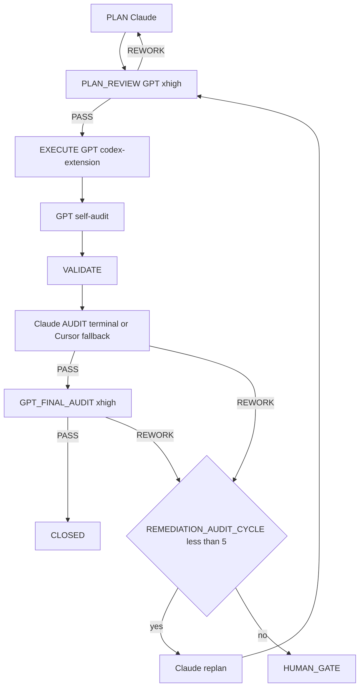

=== Auto-audit GPT (2e passe) ===
OpenAI Codex v0.125.0 (research preview)
--------
workdir: /Users/1millnonstop/Downloads/projet/foodking-web/web/testttt
model: gpt-5.5
provider: openai
approval: never
sandbox: workspace-write [workdir, /tmp, $TMPDIR, /Users/1millnonstop/.codex/memories]
reasoning effort: xhigh
reasoning summaries: none
session id: 019dc55b-5cd8-7fa3-a9fd-25e9cfa76475
--------
user
Tu effectues l’**auto-audit GPT** (2e passe) d’un cycle FoodKing — **pas** l’audit Claude terminal.

**Contexte** : le JSON ci-dessous est la proposition d’implémentation (format agents/codex.prompt.txt) pour la mission `CV1-M02-SENTINEL-BASELINE`.


**JSON d’implémentation (à recouper)** :
```json
{
  "files_to_modify": [
    "tests/Feature/Sentinels/PaymentConfirmAbilitySentinelTest.php",
    "tests/Feature/Sentinels/PaymentConfirmCrossBranchSentinelTest.php",
    "tests/Feature/Sentinels/PaymentConfirmCashOrderSentinelTest.php",
    "tests/Feature/Sentinels/PaymentConfirmConcurrencySentinelTest.php",
    "tests/Feature/Sentinels/OrderStatusNoopSideEffectsSentinelTest.php",
    "tests/Feature/Sentinels/CleanupVsConfirmRaceSentinelTest.php",
    "tests/Feature/Sentinels/OrderListBranchExactnessSentinelTest.php",
    "tests/Feature/Sentinels/OrderShowBranchGuardSentinelTest.php",
    "tests/Feature/Sentinels/TransactionBranchExactnessSentinelTest.php",
    "tests/Feature/Sentinels/FiscalZBranchExactnessSentinelTest.php",
    "tests/Feature/Sentinels/OssAdminBranchPolicySentinelTest.php",
    "tests/Feature/Sentinels/KdsTransitionWhitelistSentinelTest.php",
    "tests/Feature/Sentinels/KdsExpectedStatusConflictSentinelTest.php",
    "tests/Feature/Sentinels/PosCashEndpointSentinelTest.php",
    "tests/Feature/Sentinels/PosSubtotalForgerySentinelTest.php",
    "tests/Feature/Sentinels/QueueNumberUniquenessSentinelTest.php",
    "tests/js/sentinels/kioskOfflineIdPrefix.spec.js",
    "tests/js/sentinels/paymentComponentPropMutation.spec.js",
    "tests/Playwright/sentinels/kioskCbTrOfflineRefused.spec.js",
    "scripts/lint-fk-enum-status.sh",
    "scripts/lint-fk-legacy-imports.sh",
    "scripts/lint-fk-branch-isolation.sh",
    "scripts/lint-fk-bundle-legacy.sh",
    "reports/sentinels/CAISSE_V1_BASELINE_RUN_2026-04-25.log",
    "reports/sentinels/CAISSE_V1_SENTINEL_INDEX.md"
  ],
  "implementation_steps": [
    "Created 16 PHP Feature sentinels under tests/Feature/Sentinels with RefreshDatabase, FK/source/fix docblocks, and assertions against the planned Caisse V1 invariants.",
    "Created 2 Vitest sentinels for kiosk offline id prefix and PaymentComponent direct prop mutation.",
    "Created 1 Playwright sentinel for kiosk offline CB/TR refusal and verified it is discoverable with the scoped Playwright config command.",
    "Created 3 new static lint scripts and aligned the existing legacy-import guard to the M-02 allowlist/spec.",
    "Created baseline run log and sentinel index under reports/sentinels.",
    "Ran PHP syntax checks, Vitest, PHP sentinel suite, shell lints, and Playwright discovery command."
  ],
  "code_blocks": [
    {
      "path": "tests/Feature/Sentinels/*",
      "op": "create",
      "excerpt": "Created 16 fail-first PHP sentinels covering payment-confirm, branch isolation, KDS, POS cash/subtotal, OSS, fiscal Z, and queue uniqueness."
    },
    {
      "path": "tests/js/sentinels/kioskOfflineIdPrefix.spec.js",
      "op": "create",
      "excerpt": "Asserts saveOrder returns offline_-prefixed ids, including originalKey replay paths."
    },
    {
      "path": "tests/js/sentinels/paymentComponentPropMutation.spec.js",
      "op": "create",
      "excerpt": "Reads PaymentComponent.vue and asserts direct prop mutation count is 0; current count is 30."
    },
    {
      "path": "tests/Playwright/sentinels/kioskCbTrOfflineRefused.spec.js",
      "op": "create",
      "excerpt": "Intercepts API/frontend requests as offline and asserts CB/TR affordances are disabled or refusal messaging is visible."
    },
    {
      "path": "scripts/lint-fk-enum-status.sh",
      "op": "create",
      "excerpt": "Fails on hardcoded status literals 15/16/17 outside enum/test files."
    },
    {
      "path": "scripts/lint-fk-branch-isolation.sh",
      "op": "create",
      "excerpt": "Fails on branch_id LIKE and generic where($key, 'like') branch filter call sites in OrderService/FrontendOrderService."
    },
    {
      "path": "scripts/lint-fk-legacy-imports.sh",
      "op": "replace",
      "excerpt": "Broadened scan to resources/ and the M-02 legacy import regex."
    },
    {
      "path": "scripts/lint-fk-bundle-legacy.sh",
      "op": "create",
      "excerpt": "Scans public/build/*.js for kiosk_implementation, borne (Remix), and pos-wizard; skips when no build exists."
    },
    {
      "path": "reports/sentinels/CAISSE_V1_BASELINE_RUN_2026-04-25.log",
      "op": "create",
      "excerpt": "Documents command, FK, fix mission, and baseline status for all 23 sentinel/guard entries."
    },
    {
      "path": "reports/sentinels/CAISSE_V1_SENTINEL_INDEX.md",
      "op": "create",
      "excerpt": "Markdown index mapping sentinels to type, target, FK-ID, fix mission, and status."
    }
  ],
  "risks": [
    "Graphiti MCP search was unavailable/cancelled by the tool call; local mission/plan/traceability files were used.",
    "lint-fk-legacy-imports is currently GREEN and lint-fk-bundle-legacy is SKIP because M-12 guards already exist and public/build is absent.",
    "Playwright runtime was not executed against a live server; discovery passed with npx playwright test -c tests/Playwright/sentinels kioskCbTrOfflineRefused.spec.js --list."
  ],
  "notes": [
    "No app/, resources/, routes/, database/migrations/, config/, .cursor/, or AGENTS.md files were edited.",
    "PHP syntax checks passed for all new PHP sentinels.",
    "php artisan test tests/Feature/Sentinels produced 16 failing sentinel tests for documented assertions.",
    "npx vitest run tests/js/sentinels/ produced 2 failing sentinel tests for documented assertions.",
    "lint-fk-enum-status and lint-fk-branch-isolation fail on the expected mapped lines."
  ],
  "execution_trace": {
    "delegation": "codex-extension",
    "invariants_considered": [
      "pricing_ssot",
      "order_status",
      "branch_id",
      "commit_before_dispatch"
    ]
  }
}
```

**Livrable** (Markdown uniquement, en français) :
# AUTO_AUDIT_GPT — CV1-M02-SENTINEL-BASELINE

## 1. Conformité au plan / scope
(Énumérer manques ou dérives ; si scope élargi sans escale → **ESCALATE**)

## 2. Invariants FoodKing
Pour chacun : OK / RISQUE / N/A
- pricing_ssot (backend seul)
- order_status (enum, pas de strings)
- branch_id
- commit_before_dispatch
- frozen_zones
- order_service_symmetry (si un des deux services touché)

## 3. Verdict
Une ligne : `VERDICT: PASS` | `VERDICT: NEEDS_FIX` | `VERDICT: ESCALATE` + 1–3 phrases.

codex
Je vais recouper le JSON avec les artefacts du dépôt, en mode audit seulement. Je lis d’abord les règles de cycle et le contexte CV1, puis je vérifierai les fichiers déclarés, les zones touchées, et les invariants.
exec
/bin/zsh -lc "sed -n '1,220p' plans/masterplay/MASTERPLAY_QUEUE.md" in /Users/1millnonstop/Downloads/projet/foodking-web/web/testttt
exec
/bin/zsh -lc "sed -n '1,220p' AGENTS.md" in /Users/1millnonstop/Downloads/projet/foodking-web/web/testttt
exec
/bin/zsh -lc "sed -n '1,220p' .cursor/ACTIVE_CYCLE.md" in /Users/1millnonstop/Downloads/projet/foodking-web/web/testttt
exec
/bin/zsh -lc "sed -n '1,220p' plans/masterplay/MASTERPLAY_DISCIPLINE.md" in /Users/1millnonstop/Downloads/projet/foodking-web/web/testttt
 succeeded in 0ms:
# MASTERPLAY_QUEUE — Caisse V1

**Source de vérité de l'orchestration en boucle** : `bash scripts/run-masterplay.sh` lit cette file et exécute en série.

**Discipline** : `plans/masterplay/MASTERPLAY_DISCIPLINE.md`.  
**Plan parent** : `plans/PLAN_CAISSE_V1_GPT_MASTERPLAY_2026-04-25.md`.

## Légende statut
- `PENDING` — pas encore lancé
- `RUNNING` — codex exec en cours (ne pas relancer)
- `EXECUTED` — codex exec terminé, attend audit
- `AUDIT_PASS` — `AUDIT_VERDICT: PASS` Claude
- `FINAL_PASS` — `GPT_FINAL_AUDIT_VERDICT: PASS`
- `CLOSED` — mémoire ingestée + activity-log done
- `REWORK` — audit a demandé rework
- `BLOCKED` — gate humain ou dépendance manquante

## Légende vague
- `WAVE_A` — NO-GATE, parallélisable, démarre immédiatement
- `WAVE_B` — POST-GATE, séquencé selon DAG

## File d'exécution

| ORDER | TASK_ID | MISSION | WAVE | DEPENDS_ON | STATUS | NOTE |
|-------|---------|---------|------|------------|--------|------|
| 01 |CV1-M19-MEMORY-DISCIPLINE| M-19 | WAVE_A | — | CLOSED | Crée squelettes JSONL pour les 22 missions |
| 02 | CV1-M01-TRACEABILITY-MATRIX | M-01 | WAVE_A | — | CLOSED | Matrice findings → tasks → tests → gates |
| 03 | CV1-M02-SENTINEL-BASELINE | M-02 | WAVE_A | CV1-M01 | RUNNING | 18 sentinels fail-first + 4 lints |
| 04 |CV1-M12-LEGACY-GUARDS-CI| M-12 | WAVE_A | — | CLOSED | Lint imports + bundle scan + workflow (recovered: extractor JSON fix) |
| 05 |CV1-M16-HARDWARE-LAB| M-16 | WAVE_A | — | CLOSED | Checklist hardware signable (recovered: JSON valid, files materialized) |
| 06 | CV1-M18-TEST-ARCHITECTURE | M-18 | WAVE_A | CV1-M02 | PENDING | Grille couverture + plan campagne |
| 07 | CV1-M20-RUNBOOKS-SKELETON | M-20 | WAVE_A | — | CLOSED | 8 runbooks ops (TPE, printer, kiosk net, dispatch, outbox, fiscal, KDS, rollback) |
| 08 | CV1-M21A-QUICKWINS-LOT0 | M-21a | WAVE_A | — | CLOSED | POS: discount v-model + Swiper RTL + focustrap dead |
| 09 | CV1-M03-GATES-DRAFT | M-03 | WAVE_A | CV1-M01 | PENDING | 8 briefs gates Caisse V1 (frozen, fiscal, ledger A/B, kds, schema, offline, web, stripe) |
| 10 | CV1-M09-BRANCH-ISOLATION | M-09 | WAVE_B | CV1-M03(gates), CV1-M02 | BLOCKED | Gate frozen requis |
| 11 | CV1-M06-POS-REVENUE-GUARDS | M-06 | WAVE_B | CV1-M09, CV1-M03 | BLOCKED | Gate frozen + payment_prop_mutation |
| 12 | CV1-M05-ORDER-QUOTE | M-05 | WAVE_B | CV1-M03 | BLOCKED | Gate schema |
| 13 | CV1-M04A-PAYMENT-LEDGER-FULL | M-04A | WAVE_B | CV1-M03 (ledger=A) | BLOCKED | Gate ledger=A |
| 14 | CV1-M04B-PAYMENT-PILOT-RESTRICT | M-04B | WAVE_B | CV1-M03 (ledger=B) | BLOCKED | Gate ledger=B |
| 15 | CV1-M08-FISCAL-Z-NF525 | M-08 | WAVE_B | CV1-M03 (fiscal+schema) | BLOCKED | Gates fiscal + schema |
| 16 | CV1-M07-KDS-RELEASE | M-07 | WAVE_B | CV1-M03 (kds_bump) | BLOCKED | Gate kds_bump |
| 17 | CV1-M10-OS-FOS-SYMMETRY | M-10 | WAVE_B | CV1-M06, CV1-M09 | BLOCKED | Après guards POS + branch |
| 18 | CV1-M11-KIOSK-RUNTIME | M-11 | WAVE_B | CV1-M03 (offline+fiscal) | BLOCKED | Gates offline + fiscal |
| 19 | CV1-M17-WEB-STRIPE-SCOPE | M-17 | WAVE_B | CV1-M03 (web+stripe) | BLOCKED | Gates web + stripe |
| 20 | CV1-M13-MIGRATIONS-SAFETY | M-13 | WAVE_B | CV1-M03 (schema) | BLOCKED | Gate schema |
| 21 | CV1-M14-OPS-PREFLIGHT | M-14 | WAVE_B | CV1-M13 | BLOCKED | — |
| 22 | CV1-M15-ROLLOUT-CANARY | M-15 | WAVE_B | CV1-M04*, CV1-M08, CV1-M14 | BLOCKED | — |
| 23 | CV1-M21B-PAYMENT-REFACTOR | M-21b | WAVE_B | CV1-M03 (prop_mutation) | BLOCKED | Gate payment_prop_mutation |
| 24 | CV1-M22-POST-LAUNCH-OBSERVABILITY | M-22 | WAVE_B | CV1-M14, CV1-M15 | BLOCKED | — |

## Ce que le runner exécute

À chaque tour de boucle, le runner :
1. Lit cette table.
2. Prend la **première** ligne au statut `PENDING`.
3. Vérifie que toutes ses `DEPENDS_ON` sont au statut `CLOSED`. Sinon → skip.
4. Vérifie que `missions/<TASK_ID>/input.json` et `execute_brief.md` existent. Sinon → marque `BLOCKED note=missing-mission-files`.
5. `start` activity-log → `npm run codex:complex -- <TASK_ID>` → `done` activity-log.
6. Mise à jour statut : `EXECUTED`.
7. Audit Claude terminal automatique (si activé `--with-audit`) → `AUDIT_PASS` ou `REWORK`.
8. Si `AUDIT_PASS` : `npm run codex:final-audit -- <TASK_ID>` → `FINAL_PASS`.
9. Si `FINAL_PASS` : ingestion mémoire + `done` → `CLOSED`.
10. Loop.

## Statut initial (à la création)

Les 6 missions Vague A préparées par M-19/M-01/M-02/M-12/M-16/M-18 sont au statut `PENDING`. Les autres `TODO_NEXT` (à créer après le premier round) ou `BLOCKED` (gates).

## Mise à jour manuelle

Le runner met à jour la colonne `STATUS` automatiquement (sed sur cette table). Tu peux aussi éditer manuellement entre 2 runs (ex: marquer `BLOCKED → PENDING` après gate signé).

 succeeded in 0ms:
# Active Cycle – FoodKing

**Méta (SSOT `run-cycle.md` Step 0 + `AGENTS.md` § *Authoritative … cycle state*)** — requis pour que l’orchestrateur ne s’arrête pas sur *« RUNNER_MODE not set »*.

| Champ | Valeur actuelle |
| --- | --- |
| **RUNNER_MODE** | `single-session` |
| **PHASE (cycle W10)** | `IN_PROGRESS` (détail = section `CYCLE_W10_…` ci-dessous) |
| **TASK_ID** | `P_EXEC_CLOSEOUT_GRAPHITI_CI_PROD_2026-04-22` |
| **PLAN_FILE** | `plans/PLAN_EXECUTION_CLOSEOUT_GRAPHITI_CI_PROD_2026-04-22.md` |
| **REPORT_FILE** | `reports/post_execute_latest.log` (append — preuve `EXECUTE_DELEGATION` / `AUDIT_*`) |

> **ACTIVE_PRIMARY** : `CYCLE_W10_EXECUTION_CLOSEOUT` (un seul cycle peut être actif à la fois — voir B03 méga-checklist).
> Cycles plus anciens en lecture seule = **archive** déplacée dans **`.cursor/ACTIVE_CYCLE_ARCHIVE.md`** (lecture humaine / forensique uniquement, **non requise** par le parcours obligatoire).

## CYCLE_W10_EXECUTION_CLOSEOUT (IN_PROGRESS — mémoire 180 + MCP global + commit + CI + prod)

**TASK_ID** : `P_EXEC_CLOSEOUT_GRAPHITI_CI_PROD_2026-04-22`  
**Plan SSOT** : `plans/PLAN_EXECUTION_CLOSEOUT_GRAPHITI_CI_PROD_2026-04-22.md`  
**Ordre** : Piste A (POS+Centrale : PLAN-MEM-1) ∥ Piste B (humain : PLAN-MEM-3) → C (smoke) → D (commit sur « go commit ») → E (CI) → F (prod J-7→J+7).  
**Gate mémoire** : `python3 memory/verify.py` → count **≥ 175** (180 idéal) avant de considérer PLAN-MEM-1 **CLOSED**.

- **Vérif locale (2026-04-22)** : `python3 memory/verify.py` → **count = 182**, smoke `search_memory_facts` OK — gate **satisfaite** pour clôturer l'ingestion côté seuil d'épisodes (suite : commit / CI / prod selon plan `PLAN_EXECUTION_CLOSEOUT_*`).

**Gouvernance globale (2e passe 2026-04-22)** : primer multi-agents + Graphiti vivant + tokens « zéro effet négatif » → **`docs/orchestration/GLOBAL_SYSTEM_PRIMER.md`** + rapport **`reports/audit/AUDIT_SECOND_PASS_GLOBAL_GOVERNANCE_REPORT_2026-04-22.md`**.

---

## CAISSE_V1_MASTERPLAY (ACTIVE — 2026-04-25)

**Phase** : finition Caisse V1 (POS + Kiosk + KDS + Centrale + Fiscal + Ops).
**Plan parent** : `plans/PLAN_CAISSE_V1_GPT_MASTERPLAY_2026-04-25.md`
**Plan DAG autoritaire** : `plans/PLAN_CAISSE_V1_SUPER_MASTER_2026-04-25.md`
**Boucle d'exécution** : `plans/masterplay/MASTERPLAY_DISCIPLINE.md` + `plans/masterplay/MASTERPLAY_QUEUE.md` + `scripts/run-masterplay.sh`
**Statut temps réel** : `reports/masterplay/status.json`

**Règle** : tout `TASK_ID` au format `CV1-MXX-…` passe par la masterplay (cf. `AGENTS.md` § "Caisse V1 — Masterplay loop", `.cursor/rules/global.mdc` § "Caisse V1 — Masterplay loop", `.cursor/commands/run-cycle.md` Step 0 item 0). **NE PAS** ouvrir un `run-cycle` standard sur un `CV1-MXX-…`.

---

## Archive

Tous les cycles **CLOSED / COMPLETED PASSED** (W4 → W9, NF525, etc.) ont été déplacés dans **`.cursor/ACTIVE_CYCLE_ARCHIVE.md`** pour réduire le coût de lecture du parcours obligatoire (audit 2026-04-24, mission `T-PARCOURS-OPTIMIZE-001`).

- **Lecture humaine** : ouvrir `.cursor/ACTIVE_CYCLE_ARCHIVE.md`.
- **Lecture agent** : **non requise** sauf instruction explicite du plan ou du chat (ex. "reprend le rationale du cycle W9").
- **Recherche** : `rg "CYCLE_W9_" .cursor/ACTIVE_CYCLE_ARCHIVE.md` ou `git log --follow .cursor/ACTIVE_CYCLE.md`.

 succeeded in 0ms:
# FoodKing – Cursor Agent Operating Contract

## 0. Quick start contract — read this first

Commence ici. Ne lance aucune action tant que tu n'as pas lu les priorités P0.
Ce contrat fixe l'ordre minimal de lecture pour comprendre le repo en moins de 60 secondes.
Lis complètement ce qui est marqué obligatoire ; diffère seulement ce qui est explicitement classé P2.

### Reading priority

| Priority | What to read | Why |
| --- | --- | --- |
| P0 | `AGENTS.md §1 Parcours obligatoire` | Cadre impératif de travail, ordre de lecture, discipline de cycle. |
| P0 | `.cursor/ACTIVE_CYCLE.md` (continuation) | État courant du cycle actif, contexte vivant, reprise sans divergence. |
| P0 | `.cursor/rules/global.mdc` (auto-attaché — mentionné pour info) | Règles globales toujours applicables, même si déjà injectées par l'outil. |
| P0 | `plans/masterplay/MASTERPLAY_DISCIPLINE.md` + `plans/masterplay/MASTERPLAY_QUEUE.md` (Caisse V1 actif) | **Pendant la phase Caisse V1** : règles d'or de la boucle GPT + file d'exécution. Tout agent qui touche une mission `CV1-MXX-…` DOIT lire ces deux fichiers avant d'agir. |
| P1 | `docs/orchestration/GLOBAL_SYSTEM_PRIMER.md` | Vocabulaire, architecture d'orchestration, invariants transverses. |
| P1 | `.cursor/commands/run-cycle.md` | Procédure exacte pour démarrer un cycle borné correctement. |
| P1 | `docs/orchestration/MEMORY_MATRIX.md` | Où chercher la mémoire utile sans relire tout le dépôt. |
| P1 | `.cursor/routing.md` | Routage des tâches, choix du bon canal, limites d'intervention. |
| P2 | `docs/orchestration/CODEX_API_DELEGATION.md` (quand EXECUTE complexe) | À lire si tu délègues ou exécutes du complexe (uniquement **CLI `codex`**, pas d’exécuteur HTTP dans le dépôt). |
| P2 | `.cursor/ACTIVE_CYCLE_ARCHIVE.md` (forensique humain) | Historique utile pour audit humain, pas requis au démarrage. |
| P2 | `docs/orchestration/EXPORT_CONFIG_CODEX_GPT_API_ET_AUDIT_PERSISTANCE.md` (nouveau poste) | Configuration et persistance utiles surtout lors d'un nouvel environnement. |

Règle simple : P0 avant toute action, P1 avant tout EXECUTE, P2 seulement à la demande du sujet.
Si un doute persiste après P0+P1, arrête-toi et relis ; n'improvise pas.

### One-line bootstrap

```bash
npm run verify:boucle
bash scripts/agent-activity-log.sh tail 50
run-cycle <TASK_ID>
```

### Caisse V1 — Masterplay loop (actif)

Pendant la phase de finition Caisse V1 (POS + Kiosk + KDS + Centrale + Fiscal), l'orchestration passe par la **MASTERPLAY** :

```bash
# Lire d'abord (obligatoire)
cat plans/masterplay/MASTERPLAY_DISCIPLINE.md
cat plans/masterplay/MASTERPLAY_QUEUE.md
cat plans/masterplay/GO.md

# Lancer la boucle (Codex extension complexe + audit Claude terminal + audit Codex final)
bash scripts/run-masterplay.sh --with-audit --with-final
```

- **Plan parent** : `plans/PLAN_CAISSE_V1_GPT_MASTERPLAY_2026-04-25.md` (catalogue 22 missions M-XX, ancrages file:line)
- **Plan autoritaire DAG** : `plans/PLAN_CAISSE_V1_SUPER_MASTER_2026-04-25.md`
- **Statut temps réel** : `reports/masterplay/status.json` + `reports/masterplay/run_*.log`
- Tout `TASK_ID` au format `CV1-MXX-…` est gouverné par la masterplay (allowlist, frozen, gates, REWORK max 5).
- Hors phase Caisse V1 : repasser au `run-cycle <TASK_ID>` standard.

**Anti-répétition (nouvel onglet / agent parallèle)** : copier d’abord le bloc de `docs/orchestration/SESSION_OPENING_ENFORCEMENT.md` — même discipline, moins d’oubli de `ACTIVE_CYCLE` / `run-cycle`.

Utilise `run-cycle <TASK_ID>` pour initier tout cycle borné.
Les deux autres commandes servent à vérifier l'état local et le journal d'activité avant d'exécuter.

### Quality-first, not token-cheap

Lis P0 et P1 intégralement, sans skim. Les économies de tokens ne se font jamais sur la substance des règles, seulement sur la répétition, le bruit et les relectures inutiles. En cas de tension entre vitesse et rigueur, applique la rigueur ; voir `.cursor/rules/global.mdc § Token Discipline`.

### If you're a new human contributor

Commence par `docs/orchestration/EXPORT_CONFIG_CODEX_GPT_API_ET_AUDIT_PERSISTANCE.md` pour préparer ton poste et comprendre le mode de persistance attendu.
Lis-le après P0, puis enchaîne sur P1 avant toute contribution effective.

---

## 1. Parcours obligatoire — **nouvelle conversation** **et** **continuation** (production, non négociable)

> **Objectif** : qu’**à chaque** session (premier message ou 500e message), l’exécutant sache **quel** chemin suivre — **sans** supposer un historique de chat. Tout est **dans le dépôt** ; l’histoire de conversation **n’est pas** la SSOT.

**Règle d’or** : *aucune* modification de code **produit** (hors `plans/`, `reports/`, `docs/gates/`, `missions/`, JSONL gouvernance) **dans le cadre d’un travail borné** sans **(a)** parcours ci-dessous **et** **(b)** cycle `run-cycle` + plan actif, sauf **exception** explicite humaine (notée dans le plan / gate).

| Étape | Action | Quand / pourquoi |
|-------|--------|------------------|
| **0. Continuation** | Lire **`.cursor/ACTIVE_CYCLE.md`**. | Si `PHASE` n’est **pas** vide et le cycle n’est **pas** archivé : **reprendre** ce `TASK_ID` / ce `PLAN_FILE` / ce `REPORT_FILE` — **ne pas** dupliquer un second cycle fantôme. Si humain confirme **nouveau** sujet : réinitialiser / nouveau `TASK_ID` selon `run-cycle` Step 0. |
| **1. Lecture initiale** | Lire **ce fichier** (`AGENTS.md`) **puis** **`docs/orchestration/GLOBAL_SYSTEM_PRIMER.md`** (table §1 = ordre complet : routing, `run-cycle`, Graphiti, `MEMORY_MATRIX`, etc.). | **Avant** tout code ou plan non trivial. Même en « continuation » si le contexte a dérivé ou l’onglet a été rafraîchi. |
| **2. Cycle structuré (SSOT procédurale)** | Toute tâche avec **`TASK_ID`** : suivre **`.cursor/commands/run-cycle.md`** et la commande **`run-cycle <TASK_ID>`** (ou équivalent explicite dans le chat : enchaîner les **Steps 0 → 5** sans en sauter). | **Programme courant (quota-optimized)** : `PLAN GPT → PLAN_REVIEW GPT → EXECUTE GPT → VALIDATE → AUDIT GPT → [CLAUDE CRITIQUE SI NÉCESSAIRE] → [GATE \| CLOSE]`. Aucun « close » sans audit PASS documenté. |
| **3. Vérification d’environnement** | `npm run verify:boucle` (0 requête par défaut). **Si le terminal ne “voit” pas Codex alors que l’extension est connectée** : l’auth IDE n’alimente pas le CLI — lancer `npm run codex:doctor` (npm + `login status` + 1 requête). **Rapide :** `npm run codex:verify-pro`. **Complet :** `npm run verify:boucle:full`. Encart : `agents/codex-extension-instructions.md`. | Même en **Step 5** : l’`EXECUTE` (CLI `codex`) requiert le binaire + session Pro sur **ce** binaire. Voir `run-cycle` Step 0 item 8. |
| **4. Secrets & outils machine** | Binaire **`claude`** sur le **`PATH`** (Claude Code CLI) pour l’**AUDIT** PRIMARY en terminal. Binaire **`codex`** (CLI OpenAI) : *Sign in with ChatGPT* **Pro** — **pas** de clé API dans le dépôt. Résolution : `PATH` **ou** `node_modules/.bin/codex` après **`npm install`** (dépendance **`@openai/codex`**) **ou** `npm i -g @openai/codex`. **Ne pas** mélanger avec une clé *Platform* restreinte dans l’environnement (provoque des 401 *scopes* sur l’API Responses) — `npm run codex:audit-bleed` aide. (Option) MCP Graphiti selon `~/.cursor/mcp.json`. | Sans `claude` : noter dès le **plan** l’`AUDIT` fallback + `AUDIT_FALLBACK_REASON`. Sans binaire `codex` : pas d’`EXECUTE` complexe PRIMARY (sub-agent + `FALLBACK_REASON` ou `npm install` + auth Pro). |
| **5. Traces & mémoire (déjà dans ce fichier)** | **`EXECUTE_DELEGATION:`** avant VALIDATE ; **`AUDIT_CHANNEL:`** + **`TERMINAL_AUDIT_OK: 1`** si audit terminal OK ; `docs/orchestration/MEMORY_MATRIX.md` ; `scripts/agent-activity-log.sh` (tail / start / done). | Traçabilité = **même** qualité en prod sur N agents parallèles. |

**Ce n’est pas optionnel** pour travailler « en production FoodKing » : c’est le **contrat** d’onboarding. Les **règles** `.cursor/rules/*.mdc` (dont **`global.mdc` — alwaysApply**) et ce fichier **s’imposent** **à** tout modèle, **dans** toute conversation, dès l’ouverture du dépôt.

**Pour un humain / nouveau compte** : mêmes étapes ; la doc **`docs/orchestration/EXPORT_CONFIG_CODEX_GPT_API_ET_AUDIT_PERSISTANCE.md`** regroupe l’**export** config API + persistance des règles hors-chat.

## Engine
Cursor local agent. No cloud orchestration. No external framework.
Auto/Premium routing: disabled. Model selection is explicit per cycle.

## Global system primer (multi-agents, Graphiti, tokens — lecture clé)

Tout nouvel intervenant (session Cursor, sub-agent Task, CLI terminal, humain) qui touche **orchestration**, **mémoire**, ou **discipline de contexte** : lire **`docs/orchestration/GLOBAL_SYSTEM_PRIMER.md`** après ce fichier. Y sont définis : ordre de lecture obligatoire, `codex-extension` GPT-5.5-pro/xhigh, fallback `foodking-complex-implementer`, fallback audit `foodking-planner-orchestrator`, terminal **`claude` / `codex`**, **mise à jour continue de Graphiti**, et la politique **« intelligence max — zéro optimisation négative »** (tokens : supprimer le gaspillage, pas la substance). Pour audits longs et robustesse **opération + agentique + mémoire** : **`docs/orchestration/MEGA_CHECKLIST_AUTONOMY_AND_MEMORY.md`** (180 tâches) et le narratif **`reports/audit/MEGA_AUDIT_SYSTEM_OPERATION_AGENTIC_2026-04-23.md`**.

**Discipline mémoire (qui écrit où, qui lit quoi, quand)** : **`docs/orchestration/MEMORY_MATRIX.md`** — matrice unique des **4 stores autorisés** (Code A · Graphiti+JSONL B · Missions C · Rapports D), table d'écriture par phase, ordre de lecture pour une nouvelle session, anti-patterns. Aucun nouveau store de mémoire ne peut être ajouté sans gate `docs/gates/GATE_MEMORY_*`. Décisions 2026-04-23 sur OpenSpace et claude-mem : **non intégrés**, justifications dans la matrice.

**Synchro multi-agents (cross-conv, cross-terminal)** : `.cursor/rules/cross-agent-sync.mdc` (alwaysApply) + `reports/AGENT_ACTIVITY_LOG.md` (append-only) + `scripts/agent-activity-log.sh` (`tail | start | done | collisions | active`). Au démarrage de session : `tail 50` (~500 tokens). Avant édition produit (Step 2 EXECUTE) : `start` (refus exit 2 si collision). À la clôture (Step 5 CLOSE) : `done`. Évite que deux agents (Cursor convs / `codex-extension` / `claude-terminal` / humain) modifient les mêmes fichiers à leur insu. **Doctrine étendue** (Graphiti = mémoire partagée, rôles Claude vs Codex, anti-patterns) : **`docs/orchestration/MULTI_AGENT_ORCHESTRATION.md`**.

## Workflow
PLAN GPT (codex) → PLAN_REVIEW GPT (codex) → EXECUTE GPT (codex) → VALIDATE → AUDIT GPT (codex) → [CLAUDE CRITICAL ESCALATION ONLY] → [HUMAN GATE | CLOSE]

No phase may be skipped. Default close condition is `AUDIT_VERDICT: PASS` from GPT path, with optional Claude escalation audit only for critical/blocked cases.

## Model Roles
| Model | Role | Channel (priorité **qualité maximale / zéro raccourci token**) |
|---|---|---|
| Claude | Escalade critique uniquement | Utiliser Claude seulement pour cas vraiment critiques: blocage logique majeur, gate ambigu non résoluble, conflit d'audits, ou arbitrage architecture multi-fichiers à haut risque. Le canal prioritaire reste GPT/Codex pour économiser les quotas Claude. |
| **GPT-5.5 / GPT-5.5-pro** | **PLAN + PLAN_REVIEW + EXECUTE + AUDIT** | **`codex-extension`** — `npm run codex:plan-review`, `npm run codex:complex`, `npm run codex:final-audit` (CLI `codex` + `codex exec`, **compte ChatGPT Pro**, modèle `gpt-5.5-pro` si dispo sinon `gpt-5.5`, `model_reasoning_effort=xhigh`). GPT devient le canal principal d'orchestration, implémentation et audit de routine. |
| GPT-5.5 (fallback) | Complex implementation (FALLBACK only) | **Sub-agent** `foodking-complex-implementer` (Task Cursor) — consomme l’**usage** des modèles de l’**abonnement Cursor**. **Uniquement** si `codex` / l’exécution `codex exec` a échoué (≥2 tentatives documentées) ou binaire indispo. |
| Composer | Validation/report only | Plus d’implémentation routine pendant les cycles de finition. Composer peut résumer, exécuter/rapporter des validations, mais toute correction produit repart en EXECUTE GPT. |

**Qui décide (mode actuel quota-optimized)** : **GPT/Codex** porte l’**autorité opérationnelle** sur planification, implémentation, auto-audit, et audit final de routine. **Claude** est mis en pause et appelé uniquement en **escalade critique** (ambiguïté structurelle, gate sensible, conflit technique majeur, analyse de risque à très forte complexité). Le **fait** code / test l’emporte sur la croyance.

**Principe unique (mode actuel) — à valider en prod sur chaque cycle :** **PLAN GPT → PLAN_REVIEW GPT → EXECUTE GPT → self-audit GPT → VALIDATE → AUDIT GPT**. Le repli vers Claude n’intervient qu'en escalade critique documentée (`CLAUDE_ESCALATION_REASON:`), avec portée minimale.

One PRIMARY_EXECUTION_MODEL per cycle. Roles are explicit and layered; review checkpoints do not authorize scope expansion.
Full routing policy: `.cursor/routing.md`. Naming: the **PRIMARY complex implementer** is the **FoodKing Codex Complex Implementer** (slug `codex-extension`); see `docs/orchestration/CODEX_API_DELEGATION.md`.

## Authoritative multi-agent bounded cycle (SSOT)

For **TASK_ID-driven** work in Cursor, this path is **authoritative** and overrides any conflicting step elsewhere in this document:

1. **Command:** `.cursor/commands/run-cycle.md` (invoke with a `TASK_ID`, e.g. `run-cycle SMOKE-001`).
2. **Cycle state:** `.cursor/ACTIVE_CYCLE.md` (`RUNNER_MODE: single-session`, `PHASE`, `PLAN_FILE`, `REPORT_FILE`, completion rows).
3. **Plan artifact:** `plans/PLAN_[TASK_ID]_[DATE].md` per `.cursor/context/plan-context.md` (from `plans/PLAN_TEMPLATE.md` when applicable).
4. **Phase instructions:** `.cursor/context/plan-context.md` (PLAN), `.cursor/context/execute-context.md` (EXECUTE), `.cursor/context/audit-context.md` (AUDIT); VALIDATE per `run-cycle.md` when `validate-context.md` is absent.

**EXECUTE delegation (GPT only; PRIMARY first, FALLBACK only on failure):**

- **Routine implementation disabled during finishing cycles** : no product edit via Composer / `foodking-routine-implementer`. Small edits still route through GPT to keep the same quality chain.
- **PRIMARY** : **`codex-extension`** — **FoodKing Codex Complex Implementer** (CLI `codex`, compte **ChatGPT Pro**, `gpt-5.5-pro`, `model_reasoning_effort=xhigh`). Procédure :
  1. Préparer `missions/{TASK_ID}/input.json` (+ optionnels : `graphiti_context.md` issu de `search_memory_facts(group_ids=["foodking"])`, `plan_excerpt.md`, `execute_brief.md`, `cycle_snapshot.md` — fusionnés par le script d’assemblage de prompt).
  2. Lancer `npm run codex:complex -- {TASK_ID}` (`bash scripts/codex-extension-execute.sh`) ; le wrapper passe explicitement `-m ${CODEX_EXT_MODEL_PRO:-gpt-5.5-pro}` et `model_reasoning_effort=${CODEX_EXT_REASONING_EFFORT:-xhigh}`. (Instructions custom : `agents/codex-extension-instructions.md`.) **Bootstrap** : `npm run codex:prepare -- {TASK_ID}`.
  3. Appliquer `missions/{TASK_ID}/output_codex.json` ; consommer l’**auto-audit** `reports/audit/GPT_SELF_AUDIT_{TASK_ID}.md` (généré par le wrapper).
  4. Tracer `EXECUTE_DELEGATION: codex-extension` dans `reports/post_execute_latest.log` et le `REPORT_FILE`.
- **Complexe — FALLBACK (uniquement si `codex exec` est HS après reprises, ou binaire manquant)** : `Task` → `foodking-complex-implementer` — tracer `EXECUTE_DELEGATION: foodking-complex-implementer (codex-extension-fallback)` + `FALLBACK_REASON:`. 

Référence complète : **`docs/orchestration/CODEX_API_DELEGATION.md`** (naming, fallback contract, audit handoff, token discipline, schéma boucle). Procédure cycle : `.cursor/commands/run-cycle.md`. La trace `EXECUTE_DELEGATION` dans le rapport est **obligatoire** pour passer en VALIDATE.

**Clôture vs. audit :** Après `VALIDATE`, l’**audit** **Claude** (terminal `foodking-claude-orchestrate.sh` en PRIMARY, fallback Cursor si quota/rate-limit/terminal HS) écrit `AUDIT_VERDICT: PASS|REWORK`, puis GPT écrit `GPT_FINAL_AUDIT_VERDICT: PASS|REWORK|ESCALATE`. **Pas** de `CLOSED` sans double PASS. Sur `REWORK`, boucle `replan (orchestration Claude) → missions + EXECUTE GPT → self-audit GPT → VALIDATE → re-audit Claude → GPT final`, avec `REMEDIATION_AUDIT_CYCLE` 1..5 — au 5e `REWORK` sans double PASS, **HUMAN_GATE** (détail : Step 5 de `run-cycle.md` et `auto-remediation.mdc`).

Sections below labeled **Legacy workflow** remain valid for **PR-centric / review-loop** habits but **do not replace** this SSOT for bounded cycles.

## Source of truth (extended)
- README.md
- docs/PROJECT_CONTINUITY_AND_VISION.md
- docs/ARCHITECTURE.md
- docs/API_MAP.md
- docs/AUTHZ_MATRIX.md
- docs/ORDER_FLOW.md
- docs/DEVICE_FLOW.md
- docs/BUSINESS_RULES.md
- docs/CORE_MODULES.md
- docs/DATABASE_SCHEMA_CORE.md
- docs/ERROR_HANDLING.md
- docs/SECURITY_NOTES.md
- docs/TEST_PLAN.md
- docs/MASSIVE_TEST_PLAN.md
- docs/SAAS_VISION.md
- docs/CONTRIBUTING_QA_BOTS.md
- workflows/qa-loop.md
- workflows/task-routing.md
- workflows/report-format.md
- workflows/task-status.md
- reports/README.md
- docs/orchestration/MEGA_CHECKLIST_AUTONOMY_AND_MEMORY.md
- docs/orchestration/WORKFLOW_AUDIT_GRAPHIQUE_2026-04-23.md
- docs/orchestration/TERMINAL_CLAUDE_GRAPHITI_ORCHESTRATION.md
- docs/orchestration/ROUTING_MATRIX.md

## Stop Conditions
Halt and generate a gate brief on any of:
- Gate trigger detected
- Scope expansion beyond declared boundary
- FoodKing invariant violation
- Two consecutive validation failures
- Planning ambiguity unresolvable from task context
- **`codex` / `codex exec` indisponible après reprises (auth, binaire, ou échec ≥2 sur la même tâche)** : basculer sur le fallback `Task → foodking-complex-implementer` et **noter explicitement** `EXECUTE_DELEGATION: foodking-complex-implementer (codex-extension-fallback)` + `FALLBACK_REASON:`.
- **Audit en terminal (PRIMARY) indisponible ou limité** (`claude` absent, **quota / rate limit / session Anthropic saturée**, auth, réseau — après **1 retry** documenté de `context` + `audit-brief` ou `audit`) : **continuer le cycle** — même checklist `audit-context.md` via Task **`foodking-planner-orchestrator`** (recommandé) ou session Cursor **Claude** ; **`AUDIT_CHANNEL: cursor-session`** + **`AUDIT_FALLBACK_REASON:`** (obligatoire) + optionnel **`AUDIT_SUBAGENT_FALLBACK: foodking-planner-orchestrator`**. Voir `docs/orchestration/AUDIT_TERMINAL_QUOTA_FALLBACK.md`. **Ne jamais** omettre la raison.

## FoodKing Non-Negotiables
- Backend is pricing SSOT — no frontend price logic
- `OrderStatus` enum is authoritative — no hardcoded strings
- `branch_id` = business data isolation — no cross-branch data bleed
- Dispatch strictly after DB commit
- `OrderService` / `FrontendOrderService` symmetry mandatory on any order change
- Frozen zones require gate clearance before any edit

## MCP

### Phase 1 — Filesystem
Filesystem MCP only for repo reads where applicable.

### Phase 2 — Graphiti (mémoire inter-cycles — **présent dans toutes les sessions où le serveur est enregistré**)

**Objectif** : décisions d’architecture, invariants, sync borne↔POS↔KDS, fiscal NF525, historique de cycles — récupérables sans relire des centaines de fichiers.

| Élément | Détail |
|--------|--------|
| **Enregistrement Cursor (obligatoire côté humain)** | Fusionner le bloc `graphiti` dans **`~/.cursor/mcp.json`** (Settings → MCP). Modèle : **`.cursor/mcp/graphiti.json.example`**. Le dépôt ne peut pas injecter un MCP automatiquement dans l’IDE. |
| **Règle agent (automatique dès que le MCP est chargé)** | Voir **`.cursor/rules/graphiti-memory.mdc`** (always-on) + **`global.mdc`** : avant toute tâche non triviale, appeler au moins **`search_memory_facts`** (et optionnellement **`search_memory_nodes`**) avec `group_ids=["foodking"]`. |
| **Après AUDIT / CLOSE** | Si `add_memory` est disponible : enregistrer les décisions durables (ADR, gate, invariant clarifié). |
| **Si Graphiti absent de la session** | **Ne pas bloquer** PLAN / EXECUTE : une ligne « Graphiti non chargé » + secours **`memory/INDEX.md`** + lecture ciblée des JSONL sous `memory/episodes/`. |
| **Server** | Zep Graphiti — wrapper local **`.cursor/mcp/start-graphiti-mcp.sh`** (voir exemple JSON). Clone typique : `/Users/1millnonstop/graphiti`. |
| **Backend** | Neo4j (ex. Aura) — credentials hors repo. |
| **Dépannage** | **`.cursor/mcp/GRAPHITI_TROUBLESHOOTING.md`** (LiteLLM, embeddings, redémarrage proxy). |
| **Group ID** | Toujours **`foodking`**. |
| **Ingestion / vérif locale** | `memory/ingest.py`, `memory/verify.py`, `bin/graphiti-ingest.sh` ; index des domaines **`memory/INDEX.md`**. |

**Intégration bounded cycle** : la commande **`.cursor/commands/run-cycle.md`** inclut l’appel Graphiti en **Step 0 item 5** (query avant PLAN).

### Phase 3 — Playwright MCP (tests E2E sur flows critiques FoodKing)

- Package : `@playwright/mcp@latest` (npx, pas d’install global)
- Browser : Chromium
- BASE_URL : `http://localhost:8000`

 succeeded in 0ms:
# MASTERPLAY DISCIPLINE — Caisse V1 (loop master)

> **But** : règles strictes que le runner et chaque mission GPT respectent en boucle, pendant des heures, jusqu'à finition de toutes les missions de `MASTERPLAY_QUEUE.md`. Lecture obligatoire avant de lancer `bash scripts/run-masterplay.sh`.

## 1. Autorité

| Source | Rôle |
|--------|------|
| `AGENTS.md` | Parcours obligatoire, cycle FoodKing |
| `plans/PLAN_CAISSE_V1_SUPER_MASTER_2026-04-25.md` | DAG autoritaire (ordre, gates) |
| `plans/PLAN_CAISSE_V1_GPT_MASTERPLAY_2026-04-25.md` | Catalogue 22 missions M-XX (objectifs, allowlist) |
| `plans/masterplay/MASTERPLAY_QUEUE.md` | File d'exécution courante |
| `plans/masterplay/MASTERPLAY_DISCIPLINE.md` | (ce fichier) règles d'exécution |
| `.cursor/rules/*.mdc` | Toujours appliquées |
| `docs/gates/GATE_LOG.md` | État des gates humains |

## 2. Boucle d'exécution (run-masterplay.sh)

```
LOOP {
  1. tail activity log (~500 tokens)
  2. find next PENDING task in MASTERPLAY_QUEUE with all DEPENDS_ON == CLOSED
  3. if none → break (all done or all blocked)
  4. verify missions/<TASK_ID>/input.json + execute_brief.md exist
  5. activity-log start codex-extension <TASK_ID> execute "<allowlist CSV>" "<note>"
     if exit 2 (collision) → MARK BLOCKED note=collision, continue loop
  6. update status: RUNNING
  7. npm run codex:complex -- <TASK_ID>     (génère output_codex.json + GPT_SELF_AUDIT)
  8. update status: EXECUTED
  9. activity-log done codex-extension <TASK_ID> done "<résumé court>"
 10. (option --with-audit) bash scripts/foodking-claude-orchestrate.sh audit-brief <TASK_ID>
       if PASS → status: AUDIT_PASS
       if REWORK → status: REWORK ; increment REWORK_COUNT ; if >=5 → BLOCKED note=human_gate
 11. (option --with-final) npm run codex:final-audit -- <TASK_ID>
       if PASS → status: FINAL_PASS
 12. if FINAL_PASS:
       bash scripts/after-execute-memory.sh
       update status: CLOSED
 13. sleep INTER_TASK_PAUSE_SECONDS (default 5s)
 14. continue LOOP
}
```

## 3. Garde-fous (non négociables)

### 3.1 Allowlist stricte par mission
Codex modifie **uniquement** les fichiers listés dans `missions/<TASK_ID>/input.json.allowlist`. Si modification hors liste détectée à l'audit → `REWORK`.

### 3.2 Frozen zones
Aucune édition d'un fichier frozen sans gate signé dans `docs/gates/GATE_LOG.md`. Le runner **refuse** de lancer une mission marquée `BLOCKED` jusqu'à ce que le statut soit changé manuellement après signature.

### 3.3 Invariants FoodKing — `REWORK` automatique
- Pricing client-authoritative
- Status littéral numérique (`status: 16`)
- `branch_id` LIKE
- Dispatch dans transaction
- OS ou FOS modifié sans `SYMMETRY_NOTE`
- Frozen modifié sans gate

### 3.4 Pas de gate auto-approuvée
Codex peut **rédiger** options ; aucune mission ne coche `[x] Approved`. Si une mission le tente → `REWORK` + `risks: ["ESCALATION: gate self-approved"]`.

### 3.5 Tests obligatoires
Chaque `mandatory_tests` listé doit être lancé et reporté dans le rapport. Échec → `REWORK`.

### 3.6 Diff minimal
Aucun renommage opportuniste, aucun refactor non demandé, aucune optimisation collatérale. Si ajout justifié → `notes` du JSON.

### 3.7 Activity log
`start` avant chaque mission ; `done` après. Sans cela → réservation fantôme = autres agents bloqués. Le runner enforce.

### 3.8 Mémoire
À CLOSE : compléter `memory/episodes/caisse_v1_<topic>_*.jsonl` (squelettes créés par M-19) puis `bash scripts/after-execute-memory.sh`. Si Graphiti UP : `bash bin/graphiti-ingest.sh` + `python3 memory/verify.py`.

## 4. Boucles de rework

- Max **5 cycles `REWORK`** consécutifs sur la même mission. Au 5e → `BLOCKED note=human_gate_required`.
- Max **3 cycles healing** consécutifs (cf. CLAUDE.md §8) avant escalade.
- Toute escalation → écrite dans `reports/masterplay/ESCALATIONS_<date>.md`.

## 5. Pause / arrêt

- `Ctrl-C` arrête la boucle proprement (mission en cours finit, runner s'arrête après).
- `touch reports/masterplay/STOP` → le runner s'arrête à la fin de la mission courante.
- `touch reports/masterplay/PAUSE` → le runner pause entre les missions tant que le fichier existe.

## 6. Logs

- `reports/masterplay/run_<ISO>.log` : log de la boucle.
- `reports/masterplay/status.json` : état temps réel (mission courante, compteurs).
- `missions/<TASK_ID>/output_codex.raw.log` : raw codex.
- `missions/<TASK_ID>/output_codex.json` : json structuré.
- `reports/audit/GPT_SELF_AUDIT_<TASK_ID>.md` : self-audit GPT.
- `reports/post_execute_latest.log` : trace `EXECUTE_DELEGATION`.
- `reports/AGENT_ACTIVITY_LOG.md` : start/done.

## 7. Audit Claude (en fin de boucle, manuel)

Quand toutes les missions sont `CLOSED` (ou `BLOCKED` documentés) :

```
bash scripts/foodking-claude-orchestrate.sh context
bash scripts/foodking-claude-orchestrate.sh audit
```

Sortie attendue : verdict transversal Caisse V1 (chaîne sync borne→centrale→POS→KDS→fiscal). Le verdict détermine `GO/HOLD/NO-GO` pour `GATE_GO_NO_GO_CAISSE_V1`.

## 8. Critères d'arrêt anormal

- 3 missions consécutives en `REWORK` → halt + alerte humaine.
- Activity-log refuse 3 fois → halt (collision permanente).
- `npm run codex:complex` échoue 3 fois sur la même mission (binaire codex KO) → halt.
- `claude` terminal indisponible 3 fois consécutives → continue avec fallback subagent + `AUDIT_FALLBACK_REASON: terminal-unavailable`.

## 9. Token discipline

- Le prompt envoyé à codex contient : template `agents/codex.prompt.txt` + `input.json` + `execute_brief.md` + (optionnel) `graphiti_context.md`, `plan_excerpt.md`, `cycle_snapshot.md`.
- Pas de duplication : pas de re-coller AGENTS.md ou super master plan dans chaque mission.
- Cap typique d'un prompt : ≤ 30 KB. Au-delà → splitter la mission.

## 10. Anti-pattern interdits

- ❌ Lancer 2 missions en parallèle sur les mêmes fichiers (collision activity-log).
- ❌ Modifier `MASTERPLAY_QUEUE.md` pendant que le runner tourne (sauf marquer BLOCKED → PENDING après gate).
- ❌ Skipper l'audit Claude pour aller plus vite.
- ❌ Marquer CLOSED manuellement sans double PASS (PASS Claude + PASS Codex final).
- ❌ Ignorer un `risks: ["ESCALATION: ..."]` dans output_codex.json.

---

`MASTERPLAY_DISCIPLINE_VERSION: 1.0` · `STRICT_MODE: ON`

codex
La queue confirme que `CV1-M02-SENTINEL-BASELINE` est en statut `RUNNING` et doit rester bornée à l’allowlist M-02. Je complète avec les règles d’audit/risque et le plan de mission avant de juger le JSON.
exec
/bin/zsh -lc "sed -n '1,240p' docs/orchestration/GLOBAL_SYSTEM_PRIMER.md" in /Users/1millnonstop/Downloads/projet/foodking-web/web/testttt
 succeeded in 0ms:
# FoodKing — Primer système global (agents, sous-agents, Graphiti, tokens)

> **Passation + index complet des chemins (SSOT, un seul fichier)** : **`../DOC_EXPO_HER_ANCIEN_AGENT_ALIMENTATION_WORKFLOW_2026-04-22.md`** (table §2 = utilité de chaque path pour une nouvelle session).

> **Fichier d’entrée** pour toute nouvelle conversation, tout nouvel outil d’agent (Cursor, terminal, futur bot), ou tout humain qui reprend le projet.  
> Objectif : **robustesse** = même avec 100 cycles et des exécuteurs différents, le comportement reste **prévisible**, **traçable**, et la **mémoire** reste **alignée** sur le code.

**Obligatoire avant ce Primer (SSOT d’onboarding)** : lire `**AGENTS.md`**, section **Parcours obligatoire** (nouvelle session **et** continuation), puis enchaîner ici.  
**En continuation d’un cycle** : lire d’**abord** `**.cursor/ACTIVE_CYCLE.md`** (éviter un second `TASK_ID` fantôme) ; si `PHASE` = vide ou `CLOSED`, revenir à la table ci-dessous.

---

## 1. Ordre de lecture obligatoire (minimum viable)

Lire **dans cet ordre** avant d’écrire du code ou un plan non trivial (voir aussi `**AGENTS.md` § *Parcours obligatoire* — tableau** pour la même doctrine) :


| #   | Fichier                                                    | Pourquoi                                                                                                                  |
| --- | ---------------------------------------------------------- | ------------------------------------------------------------------------------------------------------------------------- |
| 0   | `**.cursor/ACTIVE_CYCLE.md`** (si reprise)                 | Cycle déjà en cours : même `TASK_ID` / mêmes Steps **jusqu’à** `CLOSE` — **ne pas** forker un plan parallèle sans le dire |
| 1   | `**AGENTS.md`** (dont § *Parcours obligatoire*)            | Contrat global : phases, routing, MCP, terminal, parcours production, non-négociables                                     |
| 1b  | `**docs/orchestration/SESSION_OPENING_ENFORCEMENT.md**`  | **Bloc unique** (tail log + `verify:boucle` + rappel phases) — réduit la répétition « refais la boucle » en session ; **modèle Cursor = Claude pour PLAN** (Auto/Composer ne remplacent pas `routing.md`) |
| 1c  | `**reports/audit/SIMULATION_PARCOURS_PROD_CHECKPOINTS_2026-04-25.md**` | **Simulation production** : checkpoints par phase, fichiers SSOT, limite IDE (qui orchestre quoi) — avant de promettre « zéro dérive » |
| 2   | `**.cursor/routing.md*`*                                   | Qui fait quoi (Claude plan/audit, GPT-5.5-pro xhigh plan review / execute / final audit, Composer validation only)         |
| 3   | `**.cursor/commands/run-cycle.md**`                        | Déroulé exact d’un cycle `TASK_ID` (incl. Graphiti Step 0.5)                                                              |
| 4   | `**.cursor/rules/graphiti-memory.mdc**`                    | Mémoire Graphiti : quand lire / quand écrire                                                                              |
| 5   | `**.cursor/rules/global.mdc**` + `**context-hygiene.mdc**` | Gates, discipline tokens **sans** réduire l’intelligence                                                                  |
| 6   | `**docs/orchestration/MEMORY_MATRIX.md`**                  | **Quel store écrit quoi, lit quoi, quand** (4 stores autorisés A/B/C/D) — antidote unique à la complexité mémoire         |
| 6b  | `**docs/orchestration/MULTI_AGENT_ORCHESTRATION.md`**      | Même tâches, plusieurs onglets Cursor : **activité** + **Graphiti** (lecture) + `AUDIT_VERDICT` — sans empiéter           |
| 7   | `**memory/INDEX.md`**                                      | Carte des domaines mémoire Graphiti (store B) — secours si MCP absent                                                     |
| 8   | `**tasks/[TASK_ID].md**`                                   | Quand un cycle borné est lancé — périmètre de la tâche                                                                    |


Ensuite, **selon le domaine** : `docs/ORDER_FLOW.md`, `docs/DEVICE_FLOW.md`, `docs/ARCHITECTURE.md`, `project-invariants.mdc`, etc.

Référence roster court : `**docs/orchestration/AGENT_ROLES.md`**.

### 1.1 Décision : Claude orchestre ; GPT challenge et exécute en xhigh

- **Cerveau** (priorité, plan, re-plan, gates) : **Claude** (session + terminal `foodking-claude-orchestrate.sh`) — il écrit le plan et tranche la stratégie de remédiation.
- **Challenge plan obligatoire** : **GPT-5.5-pro / xhigh** relit le plan avant EXECUTE (`npm run codex:plan-review -- {TASK_ID}` → `PLAN_REVIEW_VERDICT`). Si `REWORK`, Claude révise avant tout code.
- **Bras + premier contrôle qualité** : **EXECUTE = Codex (PRIMARY)** pour toutes les implémentations produit, même les petites corrections : `npm run codex:complex -- {TASK_ID}` → `reports/audit/GPT_SELF_AUDIT_{TASK_ID}.md`.
- **Pas de routine product implementation** : Composer / `foodking-routine-implementer` ne fait plus d’édition produit en cycle de finition ; il peut aider au reporting/validation seulement.
- **Double audit final** : Claude audit d’abord (`AUDIT_VERDICT`) avec terminal primary + fallback Cursor si quota/rate-limit/terminal HS, puis GPT final audit (`npm run codex:final-audit -- {TASK_ID}` → `GPT_FINAL_AUDIT_VERDICT`). Close seulement si les deux sont `PASS`.

---

## 2. Sous-agents Cursor (Task tool) — intégration dans le flux

Ce ne sont **pas** des fichiers dans le repo ; ce sont des **profils** invoqués par Cursor selon `.cursor/routing.md` et `**run-cycle.md` Step 2**.


| Sub-agent / Canal                                                               | Modèle cible                                                                  | Quand                                                                                                                                                                                                                                          |
| ------------------------------------------------------------------------------- | ----------------------------------------------------------------------------- | ---------------------------------------------------------------------------------------------------------------------------------------------------------------------------------------------------------------------------------------------- |
| `**foodking-routine-implementer`** (sub-agent Cursor)                           | Composer                                                                      | **Validation/report only** en cycles de finition. Pas d’implémentation produit.                                                                                                                                             |
| `**codex-extension` — FoodKing Codex Complex Implementer (PRIMARY)**            | **GPT-5.5-pro / xhigh** via CLI `codex` (compte **ChatGPT Pro**) + `codex exec` | **PLAN_REVIEW + toute implémentation produit + auto-audit + GPT_FINAL_AUDIT**. `npm run codex:complex -- {TASK_ID}`. Voir `scripts/codex-extension-execute.sh`, `agents/codex-extension-instructions.md`. |
| `**foodking-complex-implementer`** (sub-agent Cursor — **FALLBACK uniquement**) | Aligné exécution **GPT-5.5** (emplacement sub-agent)                          | Uniquement si `codex` / `codex exec` est indisponible après reprises sur la même tâche                                                                                                                                                         |


**Règles d'or**

1. **Délégation obligatoire** pour toute modification produit en EXECUTE, avec trace `EXECUTE_DELEGATION:` dans le log de validation. Valeurs autorisées : `codex-extension` | `foodking-complex-implementer (codex-extension-fallback)` | `explicit-prompt-bind`.
2. **EXECUTE = `codex-extension` PRIMAIRE** (CLI `codex` + Pro, `npm run codex:complex -- {TASK_ID}` ; contexte Graphiti/plan dans `missions/…/graphiti_context.md` etc. ; voir `**docs/orchestration/CODEX_API_DELEGATION.md`**). Le sub-agent `foodking-complex-implementer` est le **fallback** (usage Cursor) — indispo `codex exec`. Aucun **connecteur HTTP** / proxy n’est maintenu dans le dépôt.
3. Le sous-agent **ne voit pas toujours** le MCP Graphiti du parent : le plan **doit** contenir `**## PRIOR_CONTEXT`** (faits Graphiti + invariants) — copier ou résumer dans le message de délégation **ou** dans `missions/{TASK_ID}/graphiti_context.md` pour l’appel API.
4. Aucun sub-agent ne **contourne** un gate humain ni n’édite une frozen zone sans `docs/gates/` approuvé.

---

## 3. Terminal allies (hors Task tool) — intégration

Documentés dans `**AGENTS.md` § Terminal allies** :


| Outil                                                                  | Rôle                                                                     | Position + **canal d’abonnement** (SSOT)                                                                                                                                                                                         |
| ---------------------------------------------------------------------- | ------------------------------------------------------------------------ | -------------------------------------------------------------------------------------------------------------------------------------------------------------------------------------------------------------------------------- |
| `**claude` +** `foodking-claude-orchestrate.sh`                        | **AUDIT cycle — PRIMARY (Step 5)** : `context` → `audit` / `audit-brief` | Abonnement **Anthropic (CLI sur terminal)** ; n’**emprunte** pas l’orchestrateur de modèles de Cursor. **FALLBACK actif** (quota / limite / panne après 1 retry) : Task **`foodking-planner-orchestrator`** + même checklist + `AUDIT_CHANNEL: cursor-session` + `AUDIT_FALLBACK_REASON:` — `docs/orchestration/AUDIT_TERMINAL_QUOTA_FALLBACK.md`. |
| **CLI** `codex` + `npm run codex:complex` (`**codex-extension`**, Pro) | **PLAN_REVIEW + EXECUTE + GPT_FINAL_AUDIT — PRIMARY** (GPT-5.5-pro/xhigh) | Compte **ChatGPT Pro** sur le terminal ; ne passe **pas** par l’orchestrateur de modèles **Cursor** ; facturation côté OpenAI ; **FALLBACK** = sub-agent.     |
| `codex` / REPL interactif (OpenAI)                                     | Tâches ad hoc **hors** cycle, ou côté humain                             | N’enlèvent **pas** VALIDATE + AUDIT du `run-cycle`.                                                                                                                                                                              |
| `verify-orchestration-boucle.sh`                                       | Preuve binaire + optionnel smoke (API)                                   | `bash scripts/verify-orchestration-boucle.sh` — `VERIFY_BILLING_FULL=1` lance 1× smoke `claude` + 1× `npm run codex:smoke`.                                                                                                      |


**Clôture :** l’audit Claude écrit `AUDIT_VERDICT: PASS` ou `REWORK`, puis GPT écrit `GPT_FINAL_AUDIT_VERDICT: PASS|REWORK|ESCALATE` (voir `run-cycle.md` Step 5). Pas de `CLOSED` sans double `PASS`. En `REWORK` : re-orchestration + re-EXECUTE GPT jusqu’à double `PASS` ou 5e tour → humain. Schéma :




Le terminal **n’enregistre** pas **Graphiti** seul : après AUDIT/CLOSE, décisions → JSONL + `after-execute-memory.sh` (voir §5) comme avant.

---

## 4. Graphiti — vivre avec l’avancement du projet (N agents, N cycles)

### 4.1 Rôles


| Rôle                                    | Responsable                                                          |
| --------------------------------------- | -------------------------------------------------------------------- |
| **Lecture** avant plan / audit complexe | Tout agent avec MCP `graphiti` chargé                                |
| **Écriture** après décision durable     | Phase AUDIT + CLOSED (`audit-context.md`) ou humain via `add_memory` |
| **Alimentation batch** (JSONL → Neo4j)  | Humain ou pipeline : `bash bin/graphiti-ingest.sh`                   |


### 4.2 Quand mettre à jour la mémoire (checklist — « ne pas oublier »)

Cocher mentalement à **chaque** fin de sujet significatif :

- **Invariant** clarifié ou renforcé → nouvelle ligne dans `memory/episodes/02_architecture_invariants.jsonl` (ou fichier le plus proche) + `ingest` ciblé.
- **Sync / event / canal** modifié → `03_domain_events_sync.jsonl` + ingest.
- **Décision produit / ADR** → `12_decisions_log.jsonl` + ingest.
- **Nouvelle tâche V14+** ou finding cross-vagues → `09_tasks_history.jsonl` + ingest.
- **Changement prod / rollout** → `11_production_plan.jsonl` + ingest.
- **Nouveau rôle agent ou règle d’orchestration** → `13_agents_roles.jsonl` + ingest + **mettre à jour ce Primer** si le modèle change.
- **Audit long (ops + agentique + mémoire)** → suivre `docs/orchestration/MEGA_CHECKLIST_AUTONOMY_AND_MEMORY.md` (180 tâches) ; narratif `reports/audit/MEGA_AUDIT_SYSTEM_OPERATION_AGENTIC_2026-04-23.md`.
- **Après toute écriture JSONL** → `bash scripts/after-execute-memory.sh` (rafraîchit `reports/memory/jsonl_manifest.json`, cohérent avec CI) puis `bin/graphiti-ingest.sh` sur les domaines touchés.

**Règle d’or** : si le code ou la doc **canonical** a changé et que la mémoire dit encore l’ancienne vérité → **mise à jour sous 48 h** (sinon dérive silencieuse).

### 4.3 Outils

- Pipeline post-écriture (manifeste + rappel ingest) : `bash scripts/after-execute-memory.sh`.
- Ingestion : `bin/graphiti-ingest.sh [filtre]` — voir `memory/README.md`.
- Vérification : `python3 memory/verify.py`.
- Terminal (bref + audit option) : `bash scripts/foodking-claude-orchestrate.sh post-execute` ou `context` puis `audit-brief` — `docs/orchestration/TERMINAL_CLAUDE_GRAPHITI_ORCHESTRATION.md`.
- Reset rare : `@graphiti clear_graph` puis full ingest (politique humaine).

---

## 5. Tokens, contexte, cache — politique « intelligence max, gaspillage min »

**But** : réponses **détaillées et stables**, pas des réponses courtes pour économiser des tokens au détriment de la qualité.


| On optimise (effet ≥ 0)                                                              | On n’optimise pas (effet négatif interdit)                               |
| ------------------------------------------------------------------------------------ | ------------------------------------------------------------------------ |
| Re-lire un fichier **déjà** dans la fenêtre contexte                                 | Tronquer un plan, une analyse de risque, ou un gate pour « faire court » |
| Résumer une phase **terminée** pour handoff (voir `context-hygiene.mdc` §4)          | Supprimer `## PRIOR_CONTEXT` ou les invariants du plan                   |
| Utiliser **Graphiti** pour récupérer faits structurés au lieu de rouvrir 50 rapports | Désactiver Graphiti pour « aller plus vite » sur du sync / fiscal        |
| Écrire les preuves dans `reports/` structuré                                         | Remplacer des tests par de la prose vague                                |


**Cache applicatif** (Redis, etc.) : régie par le code Laravel et `**app:preflight-production`** — hors scope de ce Primer, mais **ne jamais** confondre « cache métier » et « mémoire Graphiti » : ce sont deux systèmes.

---

## 6. Révision de ce document

- **À chaque** changement majeur d’orchestration (nouveau sub-agent, nouveau MCP, nouveau cycle obligatoire) : mettre à jour **ce fichier** + une ligne dans `13_agents_roles.jsonl` + ingest.
- **Trimestriel** : relire §4.2 avec un lead dev.

---

## 7. Pointers rapides


| Besoin                                                        | Aller à                                                           |
| ------------------------------------------------------------- | ----------------------------------------------------------------- |
| Cycle complet                                                 | `.cursor/commands/run-cycle.md`                                   |
| Gates                                                         | `.cursor/rules/human-gates.mdc`                                   |
| Invariants code                                               | `.cursor/rules/project-invariants.mdc`                            |
| Mémoire locale                                                | `memory/INDEX.md`                                                 |
| Pannes Graphiti                                               | `.cursor/mcp/GRAPHITI_TROUBLESHOOTING.md`                         |
| Closeout prod + mémoire                                       | `plans/PLAN_EXECUTION_CLOSEOUT_GRAPHITI_CI_PROD_2026-04-22.md`    |
| Méga-checklist autonomie / Graphiti                           | `docs/orchestration/MEGA_CHECKLIST_AUTONOMY_AND_MEMORY.md`        |
| Méga-audit narratif (compagnon)                               | `reports/audit/MEGA_AUDIT_SYSTEM_OPERATION_AGENTIC_2026-04-23.md` |
| Audit graphique workflow                                      | `docs/orchestration/WORKFLOW_AUDIT_GRAPHIQUE_2026-04-23.md`       |
| Terminal Claude + Graphiti (rôles, `context` / `audit-brief`) | `docs/orchestration/TERMINAL_CLAUDE_GRAPHITI_ORCHESTRATION.md`    |
| Matrice routine / complexe (sub-agents)                       | `docs/orchestration/ROUTING_MATRIX.md`                            |

exec
/bin/zsh -lc "sed -n '1,240p' .cursor/commands/run-cycle.md" in /Users/1millnonstop/Downloads/projet/foodking-web/web/testttt
 succeeded in 0ms:
# Command: run-cycle

Orchestrate one full bounded cycle inside a single Cursor session.

## Trigger
Invoke with a TASK_ID. Example: `run-cycle SMOKE-001`

---

## Step 0 — Pre-flight

0. **Caisse V1 fast-path** : si `TASK_ID` matche `^CV1-M[0-9]{2}[A-Z]?-`, ne pas exécuter ce `run-cycle.md` directement. Utiliser **la masterplay** :
   - Lire `plans/masterplay/MASTERPLAY_DISCIPLINE.md` (règles d'or)
   - Lire `plans/masterplay/MASTERPLAY_QUEUE.md` (statut + DAG)
   - Lancer `bash scripts/run-masterplay.sh --with-audit --with-final` (ou `--max 1` pour une seule mission)
   - Le runner orchestre lui-même PLAN/EXECUTE/AUDIT pour la mission via `missions/<TASK_ID>/input.json` + `execute_brief.md`.
   - Ce `run-cycle.md` standard reste valide pour tout autre `TASK_ID`.

1. Read `.cursor/ACTIVE_CYCLE.md`.
2. Read `RUNNER_MODE`:
   - `single-session` → proceed automatically through all phases without stopping between them.
   - `manual` → execute one phase at a time. After each phase, output: `→ PHASE: [completed]. Awaiting manual confirmation to continue to [next phase].` and halt until the developer explicitly says "continue".
   - If RUNNER_MODE is missing: halt. `"RUNNER_MODE not set in ACTIVE_CYCLE.md. Set to single-session or manual and retry."`
3. Confirm TASK_ID matches the provided input. If ACTIVE_CYCLE is blank, write TASK_ID and PHASE: PLAN first.
4. Confirm no gate is currently open (`Gate: None` or all gate rows unchecked). If a gate is open, halt and surface the gate file path.
5. **Graphiti (when MCP `graphiti` is loaded):** call `search_memory_facts` once with a natural-language query derived from the TASK_ID / subsystem (always `group_ids=["foodking"]`). Fold any returned facts into context before PLAN. If Graphiti is not loaded: one-line note only — do not block the cycle (see `.cursor/rules/graphiti-memory.mdc`).
6. **Memory discipline (mandatory):** before writing anywhere, recall the matrix in `docs/orchestration/MEMORY_MATRIX.md`. PLAN writes to **C** (`missions/<TASK>/`) + **D** (`plans/`, `ACTIVE_CYCLE.md`); EXECUTE writes to **A** (code) + **D** (`post_execute_latest.log`); AUDIT writes to **B** (Graphiti/JSONL — *only* for durable decisions) + **D** (verdict). Never invent a 5th store; if a need appears, halt and open `docs/gates/GATE_MEMORY_*`.
7. **Cross-agent sync (mandatory, ~500 tokens):** read the tail of the activity log to detect parallel work :
   ```bash
   bash scripts/agent-activity-log.sh tail 50
   ```
   If an active reservation overlaps the planned scope, halt and adapt the plan (or wait / coordinate). Per `.cursor/rules/cross-agent-sync.mdc`.
8. **Boucle terminal (pre-check, 0 requête API) :** `npm run verify:boucle` — vérifie que le binaire `claude` est sur PATH, que `CODEX_API_DELEGATION` / `run-cycle` contiennent le schéma *terminal-first*, et avertit tôt si l’environnement ne peut pas exécuter l’**AUDIT** / **EXÉCUTE** PRIMARY. Si **exit 1** (binaire `claude` manquant) : le cycle peut quand même **planifier** mais doit **déclarer dès le plan** l’**AUDIT fallback** `cursor-session` (raison: `claude` absent) pour éviter une impasse en Step 5. Pré-API complète (1× chaque) : `npm run verify:boucle:full` — pour cycles **critiques** (POS, fiscal) ou avant release. **Trip E2E automatisé (smoke + mini mission) :** `npm run boucle:e2e` (journal : `reports/execution/BOUCLE_E2E_LAST_RUN.txt`, schéma : `reports/execution/RUN_P_BOUCLE_E2E_2026-04-24.md`).

---

## Step 1 — PLAN

Load `.cursor/context/plan-context.md` and follow its instructions exactly.

- If Step 0 item 5 (Graphiti) returned facts, reference them explicitly in the plan as **`## PRIOR_CONTEXT`** (per `plan-context.md`; 2–5 lines max).
- Produce `plans/PLAN_[TASK_ID]_[DATE].md` (fichier **SSOT** du cycle — l’orchestrateur en **session Cursor** en est l’auteur formel). **Option (tâches sensibles / alignement long)** : amorcer l’orchestration **Claude en terminal** avant d’exécuter le code : `bash scripts/foodking-claude-orchestrate.sh context` (génère le bref disque consommable par un audit/une planification cohérente) ; cela **ne** remplace **pas** le plan `plans/…` — c’est un **gabarit d’intelligence** pour la même session.
- **PLAN_REVIEW obligatoire (second avis GPT, max qualité)** : avant de passer en EXECUTE, faire relire le plan par **GPT-5.5 / GPT-5.5-pro en reasoning `xhigh`** via `npm run codex:plan-review -- {TASK_ID}` (`codex-extension`) ou, si le CLI est indisponible, `foodking-complex-implementer (codex-extension-fallback)`. La revue doit vérifier scope, invariants FoodKing, gates, stratégie de tests, frozen zones, parité OrderService/FrontendOrderService si applicable, et absence de logique prix frontend. Tracer dans le plan ou le `REPORT_FILE` :
  - `PLAN_REVIEW_CHANNEL: codex-extension | foodking-complex-implementer (codex-extension-fallback)`
  - `PLAN_REVIEW_MODEL: gpt-5.5-pro`
  - `PLAN_REVIEW_REASONING_EFFORT: xhigh`
  - `PLAN_REVIEW_VERDICT: PASS | REWORK | ESCALATE`
- Si `PLAN_REVIEW_VERDICT: REWORK`, Claude révise le plan puis relance une revue GPT. Si `ESCALATE`, ouvrir gate ou demander arbitrage humain. Ne jamais passer en EXECUTE sans `PLAN_REVIEW_VERDICT: PASS`.
- Update `ACTIVE_CYCLE.md`: PHASE → EXECUTE, PLAN_FILE set, PLAN row checked.
- Halt if:
  - Scope is ambiguous
  - A frozen zone is in scope without a cleared gate
  - Any gate condition is anticipated and not pre-cleared

If `RUNNER_MODE: single-session`: proceed to Step 2 immediately without stopping.
If `RUNNER_MODE: manual`: halt here. Output `→ PHASE: PLAN complete. Awaiting confirmation to start EXECUTE.`

---

## Step 2 — EXECUTE

Read the plan file. **Delegation is mandatory** per `.cursor/routing.md`. **Toutes les implémentations passent par GPT** : fold Graphiti `search_memory_facts` (group `foodking`) and plan `## PRIOR_CONTEXT` into `missions/{TASK_ID}/graphiti_context.md` and/or `plan_excerpt.md` (see `docs/orchestration/CODEX_API_DELEGATION.md`), then run `missions/{TASK_ID}/input.json` + `npm run codex:complex -- {TASK_ID}` (`bash scripts/codex-extension-execute.sh`, CLI `codex` + compte **ChatGPT Pro**, model `gpt-5.5-pro`, `model_reasoning_effort=xhigh` by default), apply `missions/{TASK_ID}/output_codex.json`, review `reports/audit/GPT_SELF_AUDIT_{TASK_ID}.md`, and set `EXECUTE_DELEGATION: codex-extension`. If the **CLI `codex`** path fails after retries, use the Cursor subagent **`foodking-complex-implementer`** with the same plan and invariants. **No routine implementation path is allowed during finishing cycles**: Composer / `foodking-routine-implementer` may summarize or validate, but must not implement product changes. All product edits in this phase must be evidenced by one of these paths (or the same chat only with **human-acknowledged** `explicit-prompt-bind` as in the exception below).

- Before leaving EXECUTE, ensure **delegation is evidenced** for auditors: the validation input (`reports/post_execute_latest.log` and/or `REPORT_FILE` from `ACTIVE_CYCLE.md`) must contain a line `EXECUTE_DELEGATION: codex-extension | foodking-complex-implementer (codex-extension-fallback) | explicit-prompt-bind (human-acknowledged)` naming what actually ran. **Do not** advance to VALIDATE if product code changed without that line (unless EXECUTE made **zero** product edits).
- **Reserve scope before any product edit** (per `.cursor/rules/cross-agent-sync.mdc`):
  ```bash
  bash scripts/agent-activity-log.sh start <AGENT> <TASK_ID> execute "<csv_files_or_dirs>" "<short note>"
  ```
  If exit code 2 (collision with another agent), **halt** — do not force. Adapt scope, wait for release, or coordinate.
- **Then run preflight** (executable guard, refuses if scope mismatch — see `docs/orchestration/COMMAND_DECK.md`):
  ```bash
  bash scripts/preflight-execute.sh <TASK_ID> --scope="<csv>"   # exit 2/3/4 if not aligned
  ```
  Modes: `--mode=governance` (no product edit), `--mode=read-only`, or `--override="reason"` (logged) for documented human exceptions.
- Implementation must follow the active plan only — no scope expansion.
- Before transitioning out of EXECUTE, re-read the plan file and confirm no `ESCALATION` entry is unresolved. If one exists, halt:
  > "Unresolved ESCALATION detected. Halting. Developer action required."
- Update `ACTIVE_CYCLE.md`: PHASE → VALIDATE, EXECUTE row checked.

---

## Step 3 — Post-execute hook

Attempt to trigger `.cursor/hooks/post-execute.sh`.

- If shell execution is available: run it, capture result to `reports/post_execute_latest.log`.
- If shell execution is not available:
  > "Shell execution unavailable. Run `.cursor/hooks/post-execute.sh` manually, then confirm to continue."
  Wait for developer confirmation before proceeding to Step 4.
- If the hook exits non-zero or the log shows a failure: halt.
  > "Post-execute hook failed. Review reports/post_execute_latest.log before continuing."

---

## Step 4 — VALIDATE

Load `.cursor/context/execute-context.md` and apply its handoff section as the validate protocol:

- Primary input: `reports/post_execute_latest.log`
- Invoke validation as declared in the plan's test strategy. Validation may use Composer/session tooling for summaries and test execution, but **any product fix discovered during VALIDATE must return to Step 2 and be implemented by GPT**.
- Confirm only declared subsystems were touched.
- Confirm `EXECUTE_DELEGATION:` line is present in the log (required for audit traceability).
- **Run post-execute guard** (refuses VALIDATE if delegation missing OR diff out of reserved scope):
  ```bash
  bash scripts/post-execute-guard.sh <TASK_ID>   # exit 1 (no delegation) or 4 (diff out of scope)
  ```
- Update `ACTIVE_CYCLE.md`: PHASE → AUDIT, VALIDATE row checked.
- **Tests verts ne suffisent pas à clôturer** : la **clôture** d’un cycle borné exige en plus **`AUDIT_VERDICT: PASS`** issu de l’**audit Claude** et **`GPT_FINAL_AUDIT_VERDICT: PASS`** issu du second avis GPT (Step 5). Tant qu’un audit conclut `REWORK`, **ne pas** passer en `PHASE: CLOSED` (voir Step 5 — boucle de remédiation, plafond 5).
- Halt on two consecutive **VALIDATE** failures **without intervening AUDIT-driven remediation** — do not retry autonomously. (REMEDIATION-driven re-runs of EXECUTE → VALIDATE that follow an `audit-context.md` triage are NOT counted as "consecutive validation failures"; they are distinct attempts. See `.cursor/rules/auto-remediation.mdc`.)

---

## Step 5 — AUDIT

Load `.cursor/context/audit-context.md` and follow its checklist exactly.

> **Canal d’audit — ordre de priorité (obligatoire, aligné abonnement produit)**
>
> **PRIMARY** : **Claude en terminal** (abonnement Anthropic / CLI `claude` — l’audit **n’emprunte pas** l’orchestrateur de modèles de Cursor ; c’est l’**abonnement cible côté terminal**) :
> 1) `bash scripts/foodking-claude-orchestrate.sh context` (génère `reports/audit/_TERMINAL_CONTEXT_BRIEF.md` à partir d’ACTIVE_CYCLE + JSONL — peu de tokens),
> 2) puis un audit ciblé : `bash scripts/foodking-claude-orchestrate.sh audit-brief` (audit court) **ou** `bash scripts/foodking-claude-orchestrate.sh audit` (passe d’orchestration plus large, selon criticité de la tâche).
>    - Résultat de checklist dans le `REPORT_FILE` (le même que `ACTIVE_CYCLE.md` → `REPORT_FILE` ou log append).
> 3) Dès qu’un `audit` / `audit-brief` terminal a **produit** une sortie d’audit exploitable (commande **exit 0**), tracer dans le `REPORT_FILE` **`AUDIT_CHANNEL: claude-terminal`** **et** **`TERMINAL_AUDIT_OK: 1`**. Même sémantique de gate que `EXECUTE_DELEGATION` avant VALIDATE : **ne pas** CLOSE avec `claude-terminal` seul **sans** `TERMINAL_AUDIT_OK: 1`. En cas d’**échec** terminal (exit non-zéro) : **1 retour** (retry réseau) autorisé ; si encore KO → **FALLBACK** obligatoire : `AUDIT_CHANNEL: cursor-session` + `AUDIT_FALLBACK_REASON:` (ex. `terminal_exit_nonzero` ou message court).
>
> **FALLBACK** (uniquement si PRIMARY impossible après **1 retry** terminal) : **ne pas bloquer le cycle** si l’abonnement Anthropic est **à court de quota**, en **rate limit**, ou si la **session terminal** est saturée. Repli **canonique** : invoquer le sub-agent Cursor **`foodking-planner-orchestrator`** (Task) avec la **même** checklist `.cursor/context/audit-context.md`, lecture de `reports/audit/_TERMINAL_CONTEXT_BRIEF.md` si utile, et production de **`AUDIT_VERDICT: PASS | REWORK`** dans le `REPORT_FILE`. Alternative acceptée : même checklist en **session Cursor** avec le **modèle Claude** (sans sub-agent), si tu préfères une seule conversation. Dans **tous** les cas : **`AUDIT_CHANNEL: cursor-session`** + **`AUDIT_FALLBACK_REASON: <1 ligne>`** obligatoires ; recommandé en plus **`AUDIT_SUBAGENT_FALLBACK: foodking-planner-orchestrator`** quand le Task planner est utilisé. Exemples de raison : `anthropic_rate_limit_after_retry`, `quota_exceeded`, `claude: command not found`, `terminal_auth_network`.
>
> Doc détaillée : `docs/orchestration/AUDIT_TERMINAL_QUOTA_FALLBACK.md`.
>
> Cette règle réplique la logique **`codex-extension` PRIMARY → `foodking-complex-implementer` FALLBACK** pour l’**EXECUTE**, mais côté **Claude/audit** : *terminal d’abord (abonnement cible), puis repli orchestrateur Cursor (`foodking-planner-orchestrator` ou session Claude) si terminal HS ou limité*.
>
> Vérif. technique d’environnement : `bash scripts/verify-orchestration-boucle.sh` (binaire + optionnel : smoke `codex` + `claude` si `VERIFY_BILLING_FULL=1`).

> **Cycles avec section `## SUBTASKS` (team workflow — voir `docs/orchestration/TEAM_WORKFLOW.md`)** :
> L’audit global Claude **ne démarre qu’après** que **toutes** les sous-tâches soient `DONE` (avec `CLAUDE_MINI_PASS`) ou qu’un `HUMAN_GATE` soit ouvert.
> Les `REWORK_SUB` (échec mini-audit par sous-tâche) sont traités **localement** avec **max 3 retries par sous-tâche** ; au 3e échec → `HUMAN_GATE`.
> Les `REWORK` **post-audit global** (ci-dessous) continuent d’utiliser le `REMEDIATION_AUDIT_CYCLE` 1..5 comme d’habitude.
> Lancement type : `npm run team:audit:global -- <TASK_ID>` (= `foodking-claude-orchestrate.sh audit` avec pré-vérif que toutes les sous-tâches sont `DONE`).

**Verdict Claude (obligatoire — canal terminal PRIMARY ou fallback Cursor explicite)** : dans le `REPORT_FILE` (même run que l’audit), **une ligne unique** :
```
AUDIT_VERDICT: PASS
```
ou
```
AUDIT_VERDICT: REWORK
```
- **`PASS` (vert)** = l’implémentation + le plan sont **acceptés** sur le fond (gouvernance, invariants, cohérence) ; **décision** portée par la sortie **Claude** du terminal (ou, en repli, session Cursor + `AUDIT_FALLBACK_REASON:` explicite — même règle de suite).
- **`REWORK` (non vert)** = corrections / replan / nouvelle exécution requises avant toute clôture.

**GPT_FINAL_AUDIT obligatoire (double avis final)** : après `AUDIT_VERDICT: PASS` Claude, faire une revue finale par **GPT-5.5 / GPT-5.5-pro en reasoning `xhigh`** via `npm run codex:final-audit -- {TASK_ID}` contre le plan, le diff, `reports/post_execute_latest.log`, les tests, `GPT_SELF_AUDIT_{TASK_ID}.md`, et le verdict Claude. Tracer :
```
GPT_FINAL_AUDIT_CHANNEL: codex-extension | foodking-complex-implementer (codex-extension-fallback)
GPT_FINAL_AUDIT_MODEL: gpt-5.5-pro
GPT_FINAL_AUDIT_REASONING_EFFORT: xhigh
GPT_FINAL_AUDIT_VERDICT: PASS | REWORK | ESCALATE
```
Si le verdict GPT final est `REWORK`, retour à la boucle de remédiation. Si `ESCALATE`, ouvrir gate. **Jamais** de `CLOSED` sans **les deux lignes** `AUDIT_VERDICT: PASS` et `GPT_FINAL_AUDIT_VERDICT: PASS` (les tests du Step 4 seuls ne suffisent pas).

**Boucle de remédiation (audit → orchestration → EXECUTE), plafond 5**

1. Après les audits, lire les verdicts. Si **`AUDIT_VERDICT: PASS`** et **`GPT_FINAL_AUDIT_VERDICT: PASS`** → seulement alors : append `Audit: PASSED` (cohérent audit-context), `PHASE → CLOSED`, mémoire / `agent-activity-log.sh done` comme ci-dessous.
2. Si **`AUDIT_VERDICT: REWORK`** ou **`GPT_FINAL_AUDIT_VERDICT: REWORK`** :
   - Lire / incrémenter dans `REPORT_FILE` le compteur **`REMEDIATION_AUDIT_CYCLE`** (1 à 5 ; noter `REMEDIATION_AUDIT_CYCLE: N/5` à chaque tour).
   - Si **N < 5** : **ne pas** CLOSED — tracers `CLAUDE_ORCHESTRATION: replan` (l’orchestrateur **Claude** : session et/ou terminal) pour ajuster le plan, la mission `missions/{TASK_ID}/` ou le brief, puis **retour Step 2 EXECUTE** (PRIMARY `codex-extension` si correction complexe), enchaîner **Step 3 → 4 → 5** jusqu’à `PASS` ou épuisement des 5 tours.
   - Si **N == 5** et l’audit reste `REWORK` → **HUMAN_GATE** : bref de gate, `PHASE → GATE`, **pas** de 6e boucle autonome. Intervention humaine requise (stratégie, scope, ou arbitrage de risque).

**Sortie heureuse (PASS)** — alignée audit-context + mémoire :

- Append `Audit: PASSED` (si pas déjà fait) et conserver `AUDIT_VERDICT: PASS` + `GPT_FINAL_AUDIT_VERDICT: PASS` dans le même `REPORT_FILE`, `PHASE → CLOSED`, archiver.
  - **Memory write (only durable decisions):** if AUDIT confirmed a durable decision/invariant/ADR (per `docs/orchestration/MEMORY_MATRIX.md` row B), append **one** JSONL line in the right `memory/episodes/*.jsonl`, then run `bash scripts/after-execute-memory.sh`. The report (D) keeps a 1-line ref, **never** a verbatim copy.
  - **Release scope reservation** (per `.cursor/rules/cross-agent-sync.mdc`):
    ```bash
    bash scripts/agent-activity-log.sh done <AGENT> <TASK_ID> done "1-line summary"
    ```
    Use `blocked` instead of `done` if a gate was opened; use `abandoned` if the cycle was dropped. **Always release** — orphan reservations block future agents.

- Si l’audit échoue sur **invariant / zone critique / même bug 3×** (voir `auto-remediation.mdc` + `audit-context.md` triage) indépendamment de `REWORK` : appliquer la branche **GATE** (gate brief, halt) — cela **court-circuite** le plafond des 5 tours si le risque l’exige.

---

## Hard halts (any phase)

Stop immediately and surface the condition on any of:
- Gate brief required
- Ambiguity unresolvable from task context
- Unresolved ESCALATION in plan file
- Post-execute hook failed or unavailable without developer confirmation
- Two consecutive **VALIDATE** failures **without intervening AUDIT remediation** (see Step 4 nuance above)
- Same bug `bug_signature` reaches **3rd consecutive remediation attempt** (per `.cursor/rules/auto-remediation.mdc`)
- **`AUDIT_VERDICT: REWORK` or `GPT_FINAL_AUDIT_VERDICT: REWORK` at `REMEDIATION_AUDIT_CYCLE: 5/5` still without dual `PASS`** → **HUMAN_GATE** (orchestrator stops autonomous retries; see Step 5)
- Manual UX test required (per plan)
- Product decision required (per plan)
- Invariant violation detected

Do not self-approve any halt condition. Do not silently continue.

---

## Token discipline

Do not re-read files already in context. Do not re-explain policies defined in .mdc rules. Output phase transitions as single-line status only: `→ PHASE: [name]`.

exec
/bin/zsh -lc "sed -n '1,220p' /Users/1millnonstop/Downloads/projet/foodking-web/web/testttt/.agents/skills/sync-risk-review/SKILL.md" in /Users/1millnonstop/Downloads/projet/foodking-web/web/testttt
 succeeded in 0ms:
---
name: sync-risk-review
description: Review changes affecting synchronization, auth, pricing, KDS, OSS, or order lifecycle for architectural and business risk.
disable-model-invocation: true
---

# Sync Risk Review Skill

Use this skill when a change affects:
- sync
- auth
- pricing
- KDS
- OSS
- order lifecycle
- cross-device behavior

## Steps
1. Read the relevant docs
2. Inspect the diff or current implementation
3. Identify:
   - architecture risk
   - state consistency risk
   - business rule violations
   - authz issues
   - missing tests
4. Produce a concise review with recommended next actions.

exec
/bin/zsh -lc "sed -n '1,200p' plans/masterplay/GO.md" in /Users/1millnonstop/Downloads/projet/foodking-web/web/testttt
 succeeded in 0ms:
# GO — Lance la masterplay Caisse V1

> **Intégration obligatoire confirmée (2026-04-25)** : la masterplay est désormais référencée dans :
> - `AGENTS.md` P0 + section "Caisse V1 — Masterplay loop"
> - `.cursor/rules/global.mdc` (alwaysApply) section "Caisse V1 — Masterplay loop"
> - `.cursor/commands/run-cycle.md` Step 0 item 0 (fast-path `^CV1-M…`)
> - `.cursor/ACTIVE_CYCLE.md` section "CAISSE_V1_MASTERPLAY (ACTIVE)"
>
> Tout agent qui ouvre le repo et touche un `TASK_ID` `CV1-MXX-…` est OBLIGÉ de lire `MASTERPLAY_DISCIPLINE.md` + `MASTERPLAY_QUEUE.md` avant d'agir.

## 0. Prérequis (1 fois)

```bash
# Vérifier binaire codex (CLI OpenAI, compte ChatGPT Pro)
npm run codex:doctor || npm install   # installe @openai/codex si absent

# Vérifier binaire claude (Anthropic, audit terminal)
which claude && claude --version       # doit retourner 2.x.x

# Vérifier la boucle FoodKing
npm run verify:boucle
```

Si l'un échoue : voir `AGENTS.md` § "Parcours obligatoire" et `agents/codex-extension-instructions.md`.

## 1. Démarrage propre (boucle longue)

```bash
# Boucle simple — exécute toutes les missions PENDING dans l'ordre, sans audit auto
bash scripts/run-masterplay.sh

# Boucle complète — codex exec + audit Claude terminal + audit Codex final + ingest mémoire
bash scripts/run-masterplay.sh --with-audit --with-final

# Boucle limitée (tester sur 2 missions d'abord)
bash scripts/run-masterplay.sh --with-audit --with-final --max 2
```

## 2. Suivre l'avancement

```bash
# Statut temps réel (fichier JSON mis à jour à chaque mission)
cat reports/masterplay/status.json

# Log de la boucle courante
ls -lt reports/masterplay/run_*.log | head -1
tail -f $(ls -t reports/masterplay/run_*.log | head -1)

# File d'attente (à jour)
cat plans/masterplay/MASTERPLAY_QUEUE.md
```

## 3. Pause / Stop

```bash
# Pause (rester en attente, le runner reprend dès suppression)
touch reports/masterplay/PAUSE
# Reprendre
rm reports/masterplay/PAUSE

# Stop propre (à la fin de la mission courante)
touch reports/masterplay/STOP

# Stop immédiat (Ctrl-C dans le terminal du runner)
```

## 4. Missions Vague A prêtes (no-gate, démarrent immédiatement)

| ORDER | TASK_ID | Mission | Livrables clés |
|-------|---------|---------|----------------|
| 01 | `CV1-M19-MEMORY-DISCIPLINE` | M-19 | 22 squelettes JSONL, procédure mémoire |
| 02 | `CV1-M01-TRACEABILITY-MATRIX` | M-01 | Matrice findings .md+.csv, script de check |
| 03 | `CV1-M02-SENTINEL-BASELINE` | M-02 | 18 tests sentinels rouges + 4 lints + index |
| 04 | `CV1-M12-LEGACY-GUARDS-CI` | M-12 | Workflow CI + 4 scripts lint legacy |
| 05 | `CV1-M16-HARDWARE-LAB` | M-16 | Checklist + protocoles + grille acceptation |
| 06 | `CV1-M18-TEST-ARCHITECTURE` | M-18 | Matrice couverture + plan campagne |

## 5. Pendant que ça tourne (de mon côté, la prochaine fois)

Je préparerai en parallèle :
- `CV1-M20-RUNBOOKS-SKELETON` (M-20) — squelettes runbooks ops
- `CV1-M21A-QUICKWINS-LOT0` (M-21a) — quickwins POS (discount v-model + Swiper RTL)
- `CV1-M03-GATES-DRAFT` (M-03) — briefs des 7 gates TO_DRAFT

## 6. Après ces 6 (toi + humain)

1. Audit Claude transversal :
   ```bash
   bash scripts/foodking-claude-orchestrate.sh context
   bash scripts/foodking-claude-orchestrate.sh audit
   ```
2. Signer les gates `PENDING_HUMAN_GATE` (cf. `docs/gates/GATE_LOG.md`).
3. Une fois M-03 livré, signer les 7 gates `TO_DRAFT`.
4. Débloquer la Vague B en passant manuellement les BLOCKED → PENDING au fil des signatures.

## 7. Garde-fous (rappel)

- **Allowlist stricte par mission** : codex ne touche QUE les fichiers listés.
- **Frozen zones** : intouchables sans gate signé.
- **Invariants FoodKing** : violation = REWORK auto.
- **Activity-log** : enforce les collisions (pas de double édition cross-agent).
- **Max 5 REWORK** par mission → BLOCKED + escalation humaine.

Lis `plans/masterplay/MASTERPLAY_DISCIPLINE.md` pour le détail complet.

---

**TL;DR** : `bash scripts/run-masterplay.sh --with-audit --with-final` → laisse tourner → reviens dans X heures → check `cat reports/masterplay/status.json` et `cat plans/masterplay/MASTERPLAY_QUEUE.md`.

exec
/bin/zsh -lc "sed -n '1,240p' reports/masterplay/status.json" in /Users/1millnonstop/Downloads/projet/foodking-web/web/testttt
 succeeded in 0ms:
{
  "run_id": "20260425T154338Z",
  "current_task": "CV1-M02-SENTINEL-BASELINE",
  "current_status": "RUNNING",
  "extra": "",
  "with_audit": 1,
  "with_final": 0,
  "ts_utc": "2026-04-25T15:43:38Z"
}

exec
/bin/zsh -lc 'find missions/CV1-M02-SENTINEL-BASELINE -maxdepth 1 -type f -print | sort' in /Users/1millnonstop/Downloads/projet/foodking-web/web/testttt
 succeeded in 0ms:
missions/CV1-M02-SENTINEL-BASELINE/execute_brief.md
missions/CV1-M02-SENTINEL-BASELINE/input.json
missions/CV1-M02-SENTINEL-BASELINE/output_codex.json
missions/CV1-M02-SENTINEL-BASELINE/output_codex.raw.log

exec
/bin/zsh -lc "rg --files | rg '("'^plans/PLAN_.*CV1-M02|''^missions/CV1-M02-SENTINEL-BASELINE/|''^reports/audit/GPT_SELF_AUDIT_CV1-M02|''^reports/post_execute_latest'"\\.log"'$|''^reports/masterplay/status'"\\.json"'$)'"'" in /Users/1millnonstop/Downloads/projet/foodking-web/web/testttt
 succeeded in 0ms:
missions/CV1-M02-SENTINEL-BASELINE/execute_brief.md
missions/CV1-M02-SENTINEL-BASELINE/input.json
reports/masterplay/status.json

exec
/bin/zsh -lc 'git status --short' in /Users/1millnonstop/Downloads/projet/foodking-web/web/testttt
 succeeded in 0ms:
 M .cursor/ACTIVE_CYCLE.md
 M .cursor/commands/run-cycle.md
 M .cursor/context/audit-context.md
 M .cursor/context/execute-context.md
 M .cursor/context/plan-context.md
 M .cursor/routing.md
 M .cursor/rules/auto-remediation.mdc
 M .cursor/rules/claude.mdc
 M .cursor/rules/composer.mdc
 M .cursor/rules/context-hygiene.mdc
 M .cursor/rules/cross-agent-sync.mdc
 M .cursor/rules/global-operating-principles.md
 M .cursor/rules/global.mdc
 M .cursor/rules/gpt.mdc
 M .cursor/rules/project-invariants.mdc
 M .cursor/rules/scope.mdc
 M AGENTS.md
 M agents/codex-extension-instructions.md
 M agents/codex.prepare.mjs
 M app/Services/FrontendOrderService.php
 M docs/DEVICE_FLOW.md
 M docs/orchestration/AGENT_ROLES.md
 M docs/orchestration/CODEX_API_DELEGATION.md
 M docs/orchestration/GLOBAL_SYSTEM_PRIMER.md
 M docs/orchestration/MEMORY_MATRIX.md
 M docs/orchestration/MULTI_AGENT_ORCHESTRATION.md
 M docs/orchestration/ROUTING_MATRIX.md
 M package.json
 M plans/MEGA_PLAN_ORCHESTRATION_2026-04-24.md
 M plans/PLAN_TEMPLATE.md
 M reports/AGENT_ACTIVITY_LOG.md
 M reports/antigravity/playwright-latest.json
 M reports/audit/MASTER_REVIEW_POS_KDS_FINITIONS_BRIEF_2026-04-26.md
 M reports/audit/MASTER_REVIEW_POS_KDS_FINITIONS_CLAUDE_2026-04-26.md
 M reports/audit/_TERMINAL_CONTEXT_BRIEF.md
 M reports/compact_snapshot.md
 M resources/js/components/admin/kitchenDisplaySystem/KitchenDisplaySystemComponent.vue
 M resources/js/components/admin/pos/PosComponent.vue
 M scripts/agent-activity-log.sh
 M scripts/codex-extension-execute.sh
 M scripts/codex-extract-json-output.mjs
 M scripts/foodking-claude-orchestrate.sh
 M tests/Feature/DispatchAfterCommitTest.php
?? .github/workflows/legacy-guards.yml
?? "borne (Remix)/ARCHIVE_BANNER.md"
?? docs/operations/CODEX_API_RESPONSES_401.md
?? docs/orchestration/AUDIT_TERMINAL_QUOTA_FALLBACK.md
?? docs/orchestration/CHALLENGE_CODEX_CLAUDE_TERMINAL_PLAYBOOK.md
?? docs/orchestration/CODEX_MCP_CLAUDE_TERMINAL_SETUP.md
?? docs/orchestration/COMMAND_DECK.md
?? docs/orchestration/EXPORT_HANDOFF_POS_KDS_MASTER_FINITIONS_2026-04-26.md
?? docs/orchestration/HARDWARE_LAB_PROCEDURE_2026-04-25.md
?? docs/orchestration/LEGACY_QUARANTINE_2026-04-25.md
?? docs/orchestration/MEMORY_DISCIPLINE_CAISSE_V1_2026-04-25.md
?? docs/orchestration/SESSION_OPENING_ENFORCEMENT.md
?? docs/orchestration/SIM_MASTERPLAY_POS_BORNE_KDS_CHALLENGE.md
?? docs/orchestration/TEAM_WORKFLOW.md
?? docs/orchestration/challenge-prompts/
?? kiosk_implementation/ARCHIVE_BANNER.md
?? memory/episodes/caisse_v1_branch_isolation_2026-04-25.jsonl
?? memory/episodes/caisse_v1_fiscal_z_2026-04-25.jsonl
?? memory/episodes/caisse_v1_hardware_lab_2026-04-25.jsonl
?? memory/episodes/caisse_v1_kds_release_2026-04-25.jsonl
?? memory/episodes/caisse_v1_kiosk_runtime_2026-04-25.jsonl
?? memory/episodes/caisse_v1_legacy_guards_2026-04-25.jsonl
?? memory/episodes/caisse_v1_memory_discipline_2026-04-25.jsonl
?? memory/episodes/caisse_v1_migrations_2026-04-25.jsonl
?? memory/episodes/caisse_v1_ops_preflight_2026-04-25.jsonl
?? memory/episodes/caisse_v1_order_quote_2026-04-25.jsonl
?? memory/episodes/caisse_v1_os_fos_symmetry_2026-04-25.jsonl
?? memory/episodes/caisse_v1_payment_ledger_2026-04-25.jsonl
?? memory/episodes/caisse_v1_payment_pilot_2026-04-25.jsonl
?? memory/episodes/caisse_v1_pos_guards_2026-04-25.jsonl
?? memory/episodes/caisse_v1_post_launch_2026-04-25.jsonl
?? memory/episodes/caisse_v1_quickwins_2026-04-25.jsonl
?? memory/episodes/caisse_v1_rollout_canary_2026-04-25.jsonl
?? memory/episodes/caisse_v1_runbooks_skeleton_2026-04-25.jsonl
?? memory/episodes/caisse_v1_sentinels_2026-04-25.jsonl
?? memory/episodes/caisse_v1_test_arch_2026-04-25.jsonl
?? memory/episodes/caisse_v1_traceability_2026-04-25.jsonl
?? memory/episodes/caisse_v1_web_stripe_2026-04-25.jsonl
?? missions/CV1-M01-TRACEABILITY-MATRIX/
?? missions/CV1-M02-SENTINEL-BASELINE/
?? missions/CV1-M03-GATES-DRAFT/
?? missions/CV1-M12-LEGACY-GUARDS-CI/
?? missions/CV1-M16-HARDWARE-LAB/
?? missions/CV1-M18-TEST-ARCHITECTURE/
?? missions/CV1-M19-MEMORY-DISCIPLINE/
?? missions/CV1-M20-RUNBOOKS-SKELETON/
?? missions/CV1-M21A-QUICKWINS-LOT0/
?? missions/ORCH-DISCIPLINE-2026-04-25/
?? missions/PROD-CHK-PARCOURS-2026-04-25/
?? missions/SIM-MASTERPLAY-2026-04-25/
?? missions/TEAM-WORKFLOW-2026-04-25/
?? plans/PLAN_CAISSE_V1_GPT_MASTERPLAY_2026-04-25.md
?? plans/PLAN_CAISSE_V1_HYPER_EXEC_GPT_2026-04-25.md
?? plans/PLAN_CAISSE_V1_MEGA_CORRECTION_2026-04-25.md
?? plans/PLAN_CAISSE_V1_SUPER_MASTER_2026-04-25.md
?? plans/PLAN_ORCHESTRATION_DISCIPLINE_SYNTH_2026-04-25.md
?? plans/PLAN_SIM_MASTERPLAY_2026-04-25.md
?? plans/PLAN_TEAM_WORKFLOW_2026-04-25.md
?? plans/masterplay/
?? reports/audit/AUDIT_COMPLET_BORNE_KIOSK_CONNECTEE_DEEP_2026-04-25.md
?? reports/audit/AUDIT_CV1-M01-TRACEABILITY-MATRIX.md
?? reports/audit/AUDIT_CV1-M12-LEGACY-GUARDS-CI.md
?? reports/audit/AUDIT_CV1-M16-HARDWARE-LAB.md
?? reports/audit/AUDIT_CV1-M19-MEMORY-DISCIPLINE.md
?? reports/audit/AUDIT_CV1-M20-RUNBOOKS-SKELETON.md
?? reports/audit/AUDIT_TOTAL_SYSTEME_FOCUS_CAISSE_POS_2026-04-25.md
?? reports/audit/CHALLENGE_CLAUDE_R2_2026-04-25.md
?? reports/audit/CHALLENGE_CLAUDE_R2_PROMPT_2026-04-25.md
?? reports/audit/CHALLENGE_CLAUDE_R4_PROMPT_2026-04-25.md
?? reports/audit/CHALLENGE_CODEX_R1_2026-04-25.md
?? reports/audit/CHALLENGE_CODEX_R1_2026-04-25_TRACE.md
?? reports/audit/CHALLENGE_CODEX_R3_2026-04-25.md
?? reports/audit/CHALLENGE_CODEX_R3_2026-04-25_TRACE.md
?? reports/audit/CHALLENGE_CODEX_R3_PROMPT_2026-04-25.md
?? reports/audit/CHALLENGE_MANIFEST_2026-04-25.md
?? reports/audit/CHALLENGE_MASTER_CHECKLIST_DEEP_SINGLE_2026-04-25.md
?? reports/audit/CHALLENGE_RAPPORT_FINAL_CONSOLIDE_2026-04-25.md
?? reports/audit/CHALLENGE_RAPPORT_FINAL_DEEP_SINGLE_2026-04-25.md
?? reports/audit/CLAUDE_AUDIT_CV1-M12-LEGACY-GUARDS-CI.md
?? reports/audit/CLAUDE_AUDIT_CV1-M16-HARDWARE-LAB.md
?? reports/audit/CLAUDE_AUDIT_CV1-M19-MEMORY-DISCIPLINE_2026-04-25.md
?? reports/audit/CLAUDE_AUDIT_CV1-M21A-QUICKWINS-LOT0.md
?? reports/audit/CLAUDE_AUDIT_PROD_PARCOURS_SIMULATION_2026-04-25.md
?? reports/audit/CLAUDE_CODEX_401_SANITIZE_AUDIT_AFTER_2026-04-25.md
?? reports/audit/CLAUDE_CODEX_401_SANITIZE_AUDIT_BEFORE_2026-04-25.md
?? reports/audit/CLAUDE_MAX_ORCHESTRATION_CAISSE_V1_2026-04-25.md
?? reports/audit/CLAUDE_MAX_ORCHESTRATION_PROMPT_CAISSE_V1_2026-04-25.md
?? reports/audit/CLAUDE_SUPER_MASTER_PLAN_PROMPT_CAISSE_V1_2026-04-25.md
?? reports/audit/CLAUDE_SUPER_MASTER_PLAN_REVIEW_CAISSE_V1_2026-04-25.md
?? reports/audit/CLAUDE_TERMINAL_CODEX_401_SANITIZE_2026-04-25.md
?? reports/audit/CODEX_CLAUDE_MEGA_PLAN_COMPARISON_CAISSE_V1_2026-04-25.md
?? reports/audit/CODEX_META_PLAN_COMPETITION_BRIEF_CAISSE_V1_2026-04-25.md
?? reports/audit/GPT_SELF_AUDIT_CV1-M01-TRACEABILITY-MATRIX.md
?? reports/audit/GPT_SELF_AUDIT_CV1-M19-MEMORY-DISCIPLINE.md
?? reports/audit/GPT_SELF_AUDIT_CV1-M20-RUNBOOKS-SKELETON.md
?? reports/audit/GPT_SELF_AUDIT_CV1-M21A-QUICKWINS-LOT0.md
?? reports/audit/GPT_SELF_AUDIT_PROD-CHK-PARCOURS_2026-04-25.md
?? reports/audit/MASTER_REQUEST_CAISSE_V1_ULTRA_DEEP_SINGLE_FILE_2026-04-25.md
?? reports/audit/MEGA_DISPUTE_CLAUDE_R2_CAISSE_POS_KIOSK_KDS_2026-04-25.md
?? reports/audit/MEGA_DISPUTE_CLAUDE_R2_COMPACT_CAISSE_POS_KIOSK_KDS_2026-04-25.md
?? reports/audit/MEGA_DISPUTE_CODEX_R1_CAISSE_POS_KIOSK_KDS_2026-04-25.md
?? reports/audit/MEGA_HANDOFF_CONTEXT_INTEGRATION_CAISSE_POS_KIOSK_KDS_2026-04-25.md
?? reports/audit/MEGA_ORCHESTRATION_FILE_INDEX_CAISSE_V1_2026-04-25.md
?? reports/audit/MEGA_PLAN_READINESS_GAP_ANALYSIS_CAISSE_POS_KIOSK_KDS_2026-04-25.md
?? reports/audit/MEGA_RAPPORT_FINAL_DISPUTE_CAISSE_POS_KIOSK_KDS_2026-04-25.md
?? reports/audit/RAPPORT_ECONOMIE_TOKENS_ET_CONTEXTE_2026-04-25.md
?? reports/audit/SIMULATION_PARCOURS_PROD_CHECKPOINTS_2026-04-25.md
?? reports/audit/SIM_MASTERPLAY_BREAKDOWN_SYNTH_V0_2026-04-25.md
?? reports/audit/SIM_MASTERPLAY_BREAKDOWN_SYNTH_V1_2026-04-25.md
?? reports/audit/SIM_MASTERPLAY_CLAUDE_TERMINAL_ROUND4_2026-04-25.md
?? reports/audit/SIM_MASTERPLAY_FINAL_CONSOLIDATED_2026-04-25.md
?? reports/audit/SIM_MASTERPLAY_GPT_CHALLENGE_ROUND2_2026-04-25.md
?? reports/audit/SIM_MASTERPLAY_ORCHESTRATION_PLAN_EXECUTED_2026-04-25.md
?? reports/audit/SIM_MASTERPLAY_P0_CONTINUATION_2026-04-25.md
?? reports/audit/SIM_MASTERPLAY_SYNTH_BRIDGE_ROUND3_2026-04-25.md
?? reports/audit/TRACEABILITY_MATRIX_CAISSE_V1_2026-04-25.csv
?? reports/audit/TRACEABILITY_MATRIX_CAISSE_V1_2026-04-25.md
?? reports/hardware/
?? reports/masterplay/
?? reports/runbooks/
?? reports/sentinels/
?? scripts/_audit-terminal-fallback-hint.sh
?? scripts/_lib-active-cycle.sh
?? scripts/_masterplay-claude-brief.sh
?? scripts/check-traceability.sh
?? scripts/codex-final-audit.sh
?? scripts/codex-invoke-claude-audit.sh
?? scripts/codex-plan-review.sh
?? scripts/lint-fk-archive-banner.sh
?? scripts/lint-fk-branch-isolation.sh
?? scripts/lint-fk-bundle-legacy.sh
?? scripts/lint-fk-enum-status.sh
?? scripts/lint-fk-legacy-imports.sh
?? scripts/lint-fk-legacy-routes.sh
?? scripts/post-execute-guard.sh
?? scripts/preflight-execute.sh
?? scripts/run-masterplay.sh
?? scripts/scan-bundle-legacy.sh
?? scripts/session-open.sh
?? scripts/team-audit-global.sh
?? scripts/team-audit-subtask.sh
?? scripts/team-run-task.sh
?? scripts/team-status.sh
?? tests/Feature/Sentinels/
?? tests/Playwright/
?? tests/js/quickwins/
?? tests/js/sentinels/

codex
Le dépôt est très sale globalement, mais je ne vois pour M-02 que les artefacts mission, les rapports sentinels, les scripts lint et les tests attendus. Je vais maintenant comparer l’allowlist/brief M-02 avec le diff effectif et les assertions des sentinels.
exec
/bin/zsh -lc "sed -n '1,260p' missions/CV1-M02-SENTINEL-BASELINE/execute_brief.md" in /Users/1millnonstop/Downloads/projet/foodking-web/web/testttt
 succeeded in 0ms:
# EXECUTE BRIEF — CV1-M02-SENTINEL-BASELINE (M-02)

## INVIOLABLE
1. Lis dans cet ordre :
   - `AGENTS.md` (parcours obligatoire)
   - `missions/CV1-M02-SENTINEL-BASELINE/input.json`
   - `plans/PLAN_CAISSE_V1_GPT_MASTERPLAY_2026-04-25.md` (sections 0, 2 ancrages file:line, mission M-02)
   - `reports/audit/TRACEABILITY_MATRIX_CAISSE_V1_2026-04-25.md` (matrice produite par M-01 si dispo)
2. **Allowlist stricte** : uniquement les chemins listés `input.json.allowlist`. Hors liste → `risks: ["SCOPE_PRESSURE: ..."]` + stop.
3. **Tu ne touches AUCUN code produit.** Pas de `app/`, `resources/`, `routes/`, `database/migrations/`, `config/`. Les sentinels sont des **tests** + des **scripts shell**.
4. **Tu n'approuves aucun gate.**

## OBJECTIF EXACT

Créer **18 sentinels fail-first** + **4 lint statiques**, avec baseline rouge documentée. Chaque sentinel doit :
- échouer **pour la raison documentée** (pas une erreur d'environnement, pas un crash de bootstrap)
- citer dans son docblock le `FK-ID`, le rapport source, et la mission qui apportera le fix (`M-XX`)
- avoir une commande exécutable précise dans la baseline log

Quand un fix sera implémenté plus tard (M-04…M-21), le sentinel correspondant **passera au vert** sans modification du test.

## CARTOGRAPHIE PRÉ-ANALYSÉE (file:line — utilise-la)

Issue de `plans/PLAN_CAISSE_V1_GPT_MASTERPLAY_2026-04-25.md` § 2. À utiliser directement, ne pas redécouvrir.

### `payment-confirm` (sentinels #1-#4, #6)
- Route : `routes/api.php:889-895`
- Controller : `app/Http/Controllers/Frontend/OrderController.php:77-151`
- Sanctum check : L85-96 (insuffisant — pas de `kiosk:order` ability check, pas de re-vérif `branch_id` machine)
- Transaction `PAID` : L101-118
- Service : `app/Services/FrontendOrderService.php:791` (`finalizePaidKioskOrder`)

### Branch isolation (sentinels #7-#11)
- Fuites LIKE : `app/Services/OrderService.php:151,194,230,267,1920` ; `app/Services/FrontendOrderService.php:99`
- OK strict : `app/Services/TransactionService.php:33-35` ; `app/Services/KitchenDisplaySystemOrderService.php:84-90` (cast int + `=`)
- `branch_id=0` à scoper : `app/Services/OrderService.php:610` (posOrderStore), L1793-1795 (destroy)

### KDS (sentinels #12-#13)
- Request : `app/Http/Requests/OrderStatusRequest.php:15-35` (authorize) + L45-47 (`status: required|numeric` SEUL — **pas** d'`expected_status` body)
- Service : `app/Services/KitchenDisplaySystemOrderService.php:117-168` (`$expectedFrom = $locked->status` L122 — vient du modèle, pas du body)
- Front : `resources/js/components/admin/kitchenDisplaySystem/KitchenDisplaySystemComponent.vue` — 0 occurrence `expected_status`

### POS cash kiosk (sentinel #14)
- Pas de route POS dédiée pour collecte cash kiosk → utilise actuellement `kds-order/change-status` (à interdire)

### POS subtotal forgery (sentinel #15)
- `PosOrderRequest` accepte subtotal client → `PricingService` doit recalculer

### Queue number (sentinel #16)
- `OrderService::posOrderStore` ~L828-854 — fallback microtime sans unique index

### Kiosk (sentinels #17-#18)
- Offline ID : `resources/js/helpers/kioskOfflineQueue.js:135,330` — `offline_${savedAt}_...`
- Détection : `resources/js/components/frontend/kiosk/KioskPaymentComponent.vue:292` — `startsWith('offline_')`
- `status: 16` littéral : `resources/js/components/frontend/kiosk/KioskWaitingComponent.vue:392`

### `PaymentComponent.vue` mutations (sentinel JS prop mutation)
- 16+ mutations : `resources/js/components/admin/pos/PaymentComponent.vue:179, 192-193, 205-217, 221, 237-239, 250-265`

## SPÉCIFICATION DÉTAILLÉE — CHAQUE SENTINEL

Pour **chaque** test PHP Feature, classe `extends Tests\TestCase`, namespace `Tests\Feature\Sentinels`, méthodes `setUp` → `RefreshDatabase` ou équivalent. Chaque test :
- 1 docblock en tête : `@FK-ID FK-XXX | @source <rapport> | @fix-mission CV1-MXX-... | @reason <pourquoi rouge maintenant>`
- 1 méthode `test_*` qui assert l'invariant attendu
- assertion qui échoue actuellement → assertion qui passera après fix

### #1 `PaymentConfirmAbilitySentinelTest.php`
- Crée user **non-kiosk** (rôle `cashier`), token Sanctum standard.
- Crée commande PENDING/UNPAID branch X.
- POST `frontend/order/{order}/payment-confirm` avec body valide (`transaction_id`, `card_type`, `payment_method`).
- **Assert** : `response()->assertStatus(403)` ET `Order::find($id)->payment_status !== 'PAID'`.
- Actuellement : controller ne check pas l'ability `kiosk:order` (cf. cartographie L85-96) → test échoue (réponse 200, statut muté).

### #2 `PaymentConfirmCrossBranchSentinelTest.php`
- Crée KioskMachine branche A + token avec ability `kiosk:order`.
- Crée commande branche B.
- POST `payment-confirm` avec token machine A.
- **Assert** : 403 + payment_status inchangé.

### #3 `PaymentConfirmCashOrderSentinelTest.php`
- Crée commande `payment_method=cash`.
- POST `payment-confirm` avec body `payment_method=card`.
- **Assert** : 422 + payment_status inchangé.

### #4 `PaymentConfirmConcurrencySentinelTest.php`
- 2 requêtes parallèles (utiliser `\Illuminate\Support\Facades\DB::transaction` + `Event::fake()`) sur même `transaction_id`.
- **Assert** : exactement **1** event `OrderStatusChanged` dispatché ; idempotent.

### #5 `OrderStatusNoopSideEffectsSentinelTest.php`
- `OrderService::changeStatus($order, CANCELED)` 2× successifs.
- **Assert** : `PaymentService::cashBack` appelé exactement **1** fois (mock/spy).
- Ancrage : `OrderService.php:1505,1568` — risque double cashback.

### #6 `CleanupVsConfirmRaceSentinelTest.php`
- Setup commande PENDING ; lancer `CleanupStalePendingKioskOrders` qui marque REJECTED.
- Puis POST `payment-confirm` tardif.
- **Assert** : 422 + audit log `payment_late_after_cleanup` créé.

### #7 `OrderListBranchExactnessSentinelTest.php`
- Crée commandes branch_id=1, branch_id=10, branch_id=100.
- GET `/admin/order?branch_id=1` (route admin standard).
- **Assert** : retourne uniquement branch_id=1 ; PAS branch_id=10 ni 100.
- Actuellement échoue car `OrderService.php:151` utilise `LIKE %1%` → matche 10, 100, 1000.

### #8 `OrderShowBranchGuardSentinelTest.php`
- User staff branche A.
- GET `/admin/order/{id}` où order.branch_id = B.
- **Assert** : 403.

### #9 `TransactionBranchExactnessSentinelTest.php`
- Idem #7 sur `TransactionService::list`.

### #10 `FiscalZBranchExactnessSentinelTest.php`
- Crée commandes payées branche A et B le même jour.
- Génère Z branche A.
- **Assert** : Z agrège uniquement branche A.

### #11 `OssAdminBranchPolicySentinelTest.php`
- Staff branche A tente `branch_id=0` (global) sur OSS endpoint.
- **Assert** : 403. Admin global avec `branch_id=0` autorisé.

### #12 `KdsTransitionWhitelistSentinelTest.php`
- Chef KDS POST `kds-order/change-status` avec `status=CANCELED` (16).
- **Assert** : 422 (whitelist KDS = ACCEPT/PREPARING/PREPARED uniquement).

### #13 `KdsExpectedStatusConflictSentinelTest.php`
- Order status PREPARING (versioned).
- POST 2× simultanément avec `expected_status=PREPARING` → second doit recevoir 409.
- Actuellement : `OrderStatusRequest.php:45-47` ne lit pas `expected_status` du body → test échoue.

### #14 `PosCashEndpointSentinelTest.php`
- Vérifie qu'il existe une route `POST /api/admin/pos/collect-kiosk-cash/{order}` (ou équivalent dédié).
- **Assert** : `Route::has('admin.pos.collect-kiosk-cash')` true OU 404 sur la route attendue.
- Actuellement : route absente → test échoue ; après M-06, route existera.

### #15 `PosSubtotalForgerySentinelTest.php`
- POST `/api/admin/pos` avec subtotal client = 1€ alors que items réels = 100€.
- **Assert** : commande créée avec subtotal **backend** = 100€, et permission discount appliquée sur 100€ pas 1€.

### #16 `QueueNumberUniquenessSentinelTest.php`
- Création concurrente (utilise `\Illuminate\Support\Facades\Queue::fake()` + parallel) de 50 commandes même branche, même jour.
- **Assert** : 50 `queue_number` distincts.

### #17 `tests/js/sentinels/kioskOfflineIdPrefix.spec.js` (Vitest)
- Stub `kioskOfflineQueue.saveOrder` ; vérifier que tout id retourné `startsWith('offline_')`.
- Ancrage : `kioskOfflineQueue.js:135,330`.

### #18 `tests/Playwright/sentinels/kioskCbTrOfflineRefused.spec.js`
- Lance kiosk en mode offline (intercepte requêtes via Playwright).
- Tente CB/TR.
- **Assert** : bouton CB désactivé OU message d'erreur affiché.

### Bonus statiques (lints)

#### `scripts/lint-fk-enum-status.sh`
- `grep -RnE "status[^a-zA-Z_]*[:=][^a-zA-Z_]*1[567]" resources/js/ app/` (catch `status: 16`, `status=15`, etc.)
- exit 1 si trouvé hors fichiers d'enum/test.
- Doit lever **au moins** la ligne `KioskWaitingComponent.vue:392`.

#### `scripts/lint-fk-legacy-imports.sh`
- `grep -RnE "from ['\"](.*kiosk_implementation|borne \(Remix\)|pos-wizard)" resources/`
- exit 1 si trouvé.

#### `scripts/lint-fk-branch-isolation.sh`
- `grep -RnE "where\(\s*['\"]branch_id['\"]\s*,\s*['\"]like['\"]" app/`
- exit 1 si trouvé.
- Doit lever `OrderService.php:151,194,230,267,1920` et `FrontendOrderService.php:99`.

#### `scripts/lint-fk-bundle-legacy.sh`
- Si `public/build/` existe : `grep -l "kiosk_implementation" public/build/*.js` → exit 1.
- Sinon : exit 0 avec message `[skip] no build present`.

#### `tests/js/sentinels/paymentComponentPropMutation.spec.js`
- Lit `resources/js/components/admin/pos/PaymentComponent.vue` en raw string.
- Compte occurrences regex `this\.\$props\.props\.|this\.props\.form\.\w+\s*=` → assert >= 16 (baseline actuelle).
- Documenter dans le test : "ce test inverse-passera vert quand mutation === 0 après M-06b".

## BASELINE LOG

`reports/sentinels/CAISSE_V1_BASELINE_RUN_2026-04-25.log` — format ligne par ligne :

```
[2026-04-25] CAISSE V1 — Sentinel Baseline Run

#01 PaymentConfirmAbilitySentinelTest          STATUS=RED  CMD=`php artisan test --filter=PaymentConfirmAbilitySentinelTest`  FK=FK-XXX  FIX=CV1-M06  REASON=controller ne check pas ability kiosk:order (OrderController.php:85-96)
#02 PaymentConfirmCrossBranchSentinelTest      STATUS=RED  ...
...
#22 paymentComponentPropMutation               STATUS=RED  CMD=`npx vitest run tests/js/sentinels/paymentComponentPropMutation.spec.js`  FK=FK-XXX  FIX=CV1-M06b  REASON=16+ mutations directes de props
```

## INDEX SENTINELS

`reports/sentinels/CAISSE_V1_SENTINEL_INDEX.md` — table Markdown :
| # | Sentinel | Type | Cible (file:line) | FK-ID | Mission de fix | Status |

## INTERDITS

- Toucher `app/`, `resources/`, `routes/`, `database/migrations/`, `config/`.
- Marquer un sentinel `@skip` ou `@todo` (s'il ne peut pas exister, mettre dans `risks` du JSON).
- Faire passer un sentinel au vert artificiellement (mocks qui contournent l'invariant).
- Inventer des fichiers source : si un fichier cité n'existe pas, lever `risks` et stopper le sentinel concerné.

## SI BLOCAGE

- Test ne peut pas être écrit (manque modèle/factory) → `risks: ["ESCALATION: <sentinel> nécessite factory <X> ou seed <Y>"]`, sentinel non créé, baseline log marque `STATUS=BLOCKED`.
- Lint bash incompatible macOS BSD vs GNU → utiliser `grep -E` et `awk` POSIX.

exec
/bin/zsh -lc "jq '.' missions/CV1-M02-SENTINEL-BASELINE/input.json" in /Users/1millnonstop/Downloads/projet/foodking-web/web/testttt
 succeeded in 0ms:
{
  "task_id": "CV1-M02-SENTINEL-BASELINE",
  "mission_id": "M-02",
  "plan_file": "plans/PLAN_CAISSE_V1_GPT_MASTERPLAY_2026-04-25.md",
  "primary_model": "codex-extension",
  "model": "gpt-5.5-pro",
  "reasoning_effort": "xhigh",
  "objective": "Créer 18 sentinels fail-first PHP/JS/Playwright + 4 statiques (lint), avec baseline rouge documentée. Chaque sentinel doit échouer pour la raison documentée (FK-ID lié) et passera vert UNIQUEMENT après la mission qui implémente le fix.",
  "instruction": "Crée les fichiers tests sous tests/Feature/Sentinels/, tests/js/sentinels/, tests/Playwright/sentinels/ et la baseline log. Aucune modification de code produit. Renvoie strictement un JSON unique selon agents/codex.prompt.txt.",
  "allowlist": [
    "tests/Feature/Sentinels/PaymentConfirmAbilitySentinelTest.php",
    "tests/Feature/Sentinels/PaymentConfirmCrossBranchSentinelTest.php",
    "tests/Feature/Sentinels/PaymentConfirmCashOrderSentinelTest.php",
    "tests/Feature/Sentinels/PaymentConfirmConcurrencySentinelTest.php",
    "tests/Feature/Sentinels/OrderStatusNoopSideEffectsSentinelTest.php",
    "tests/Feature/Sentinels/CleanupVsConfirmRaceSentinelTest.php",
    "tests/Feature/Sentinels/OrderListBranchExactnessSentinelTest.php",
    "tests/Feature/Sentinels/OrderShowBranchGuardSentinelTest.php",
    "tests/Feature/Sentinels/TransactionBranchExactnessSentinelTest.php",
    "tests/Feature/Sentinels/FiscalZBranchExactnessSentinelTest.php",
    "tests/Feature/Sentinels/OssAdminBranchPolicySentinelTest.php",
    "tests/Feature/Sentinels/KdsTransitionWhitelistSentinelTest.php",
    "tests/Feature/Sentinels/KdsExpectedStatusConflictSentinelTest.php",
    "tests/Feature/Sentinels/PosCashEndpointSentinelTest.php",
    "tests/Feature/Sentinels/PosSubtotalForgerySentinelTest.php",
    "tests/Feature/Sentinels/QueueNumberUniquenessSentinelTest.php",
    "tests/js/sentinels/kioskOfflineIdPrefix.spec.js",
    "tests/js/sentinels/paymentComponentPropMutation.spec.js",
    "tests/Playwright/sentinels/kioskCbTrOfflineRefused.spec.js",
    "scripts/lint-fk-enum-status.sh",
    "scripts/lint-fk-legacy-imports.sh",
    "scripts/lint-fk-branch-isolation.sh",
    "scripts/lint-fk-bundle-legacy.sh",
    "reports/sentinels/CAISSE_V1_BASELINE_RUN_2026-04-25.log",
    "reports/sentinels/CAISSE_V1_SENTINEL_INDEX.md"
  ],
  "off_limits": [
    "app/**",
    "resources/**",
    "routes/**",
    "database/migrations/**",
    "config/**",
    ".cursor/**",
    "AGENTS.md"
  ],
  "invariants_at_risk": [
    "pricing-ssot",
    "order-status-enum",
    "branch-id-isolation",
    "dispatch-after-commit",
    "frozen-zones"
  ],
  "gate_conditions": [],
  "mandatory_tests": [
    "php artisan test --filter='Sentinel' --stop-on-failure || true",
    "npx vitest run tests/js/sentinels/ || true",
    "bash scripts/lint-fk-enum-status.sh || true",
    "bash scripts/lint-fk-branch-isolation.sh || true",
    "bash scripts/lint-fk-legacy-imports.sh || true"
  ],
  "self_audit_checklist": [
    "Chaque sentinel a une assertion claire qui échoue POUR la raison documentée (pas une erreur de setup)",
    "Chaque sentinel cite dans son docblock le FK-ID, la source rapport, et la mission de fix attendue (M-XX)",
    "La baseline log liste pour chaque sentinel : status (RED), commande, raison, mission de fix",
    "Aucun fichier hors allowlist modifié",
    "Aucune modification de code produit (app/, resources/, routes/)",
    "Les 4 lints renvoient des findings cohérents avec la cartographie file:line du plan masterplay §2"
  ],
  "rollback": {
    "feature_flag": null,
    "max_window_days": 0,
    "predicates": []
  },
  "graphiti_query": "Caisse V1 sentinels fail-first baseline",
  "memory_episode_to_write_on_close": "memory/episodes/caisse_v1_sentinels_2026-04-25.jsonl",
  "claude_audit_prompt_id": "audit-prompt-sentinels"
}

exec
/bin/zsh -lc "jq '.' missions/CV1-M02-SENTINEL-BASELINE/output_codex.json" in /Users/1millnonstop/Downloads/projet/foodking-web/web/testttt
 succeeded in 0ms:
{
  "files_to_modify": [
    "tests/Feature/Sentinels/PaymentConfirmAbilitySentinelTest.php",
    "tests/Feature/Sentinels/PaymentConfirmCrossBranchSentinelTest.php",
    "tests/Feature/Sentinels/PaymentConfirmCashOrderSentinelTest.php",
    "tests/Feature/Sentinels/PaymentConfirmConcurrencySentinelTest.php",
    "tests/Feature/Sentinels/OrderStatusNoopSideEffectsSentinelTest.php",
    "tests/Feature/Sentinels/CleanupVsConfirmRaceSentinelTest.php",
    "tests/Feature/Sentinels/OrderListBranchExactnessSentinelTest.php",
    "tests/Feature/Sentinels/OrderShowBranchGuardSentinelTest.php",
    "tests/Feature/Sentinels/TransactionBranchExactnessSentinelTest.php",
    "tests/Feature/Sentinels/FiscalZBranchExactnessSentinelTest.php",
    "tests/Feature/Sentinels/OssAdminBranchPolicySentinelTest.php",
    "tests/Feature/Sentinels/KdsTransitionWhitelistSentinelTest.php",
    "tests/Feature/Sentinels/KdsExpectedStatusConflictSentinelTest.php",
    "tests/Feature/Sentinels/PosCashEndpointSentinelTest.php",
    "tests/Feature/Sentinels/PosSubtotalForgerySentinelTest.php",
    "tests/Feature/Sentinels/QueueNumberUniquenessSentinelTest.php",
    "tests/js/sentinels/kioskOfflineIdPrefix.spec.js",
    "tests/js/sentinels/paymentComponentPropMutation.spec.js",
    "tests/Playwright/sentinels/kioskCbTrOfflineRefused.spec.js",
    "scripts/lint-fk-enum-status.sh",
    "scripts/lint-fk-legacy-imports.sh",
    "scripts/lint-fk-branch-isolation.sh",
    "scripts/lint-fk-bundle-legacy.sh",
    "reports/sentinels/CAISSE_V1_BASELINE_RUN_2026-04-25.log",
    "reports/sentinels/CAISSE_V1_SENTINEL_INDEX.md"
  ],
  "implementation_steps": [
    "Created 16 PHP Feature sentinels under tests/Feature/Sentinels with RefreshDatabase, FK/source/fix docblocks, and assertions against the planned Caisse V1 invariants.",
    "Created 2 Vitest sentinels for kiosk offline id prefix and PaymentComponent direct prop mutation.",
    "Created 1 Playwright sentinel for kiosk offline CB/TR refusal and verified it is discoverable with the scoped Playwright config command.",
    "Created 3 new static lint scripts and aligned the existing legacy-import guard to the M-02 allowlist/spec.",
    "Created baseline run log and sentinel index under reports/sentinels.",
    "Ran PHP syntax checks, Vitest, PHP sentinel suite, shell lints, and Playwright discovery command."
  ],
  "code_blocks": [
    {
      "path": "tests/Feature/Sentinels/*",
      "op": "create",
      "excerpt": "Created 16 fail-first PHP sentinels covering payment-confirm, branch isolation, KDS, POS cash/subtotal, OSS, fiscal Z, and queue uniqueness."
    },
    {
      "path": "tests/js/sentinels/kioskOfflineIdPrefix.spec.js",
      "op": "create",
      "excerpt": "Asserts saveOrder returns offline_-prefixed ids, including originalKey replay paths."
    },
    {
      "path": "tests/js/sentinels/paymentComponentPropMutation.spec.js",
      "op": "create",
      "excerpt": "Reads PaymentComponent.vue and asserts direct prop mutation count is 0; current count is 30."
    },
    {
      "path": "tests/Playwright/sentinels/kioskCbTrOfflineRefused.spec.js",
      "op": "create",
      "excerpt": "Intercepts API/frontend requests as offline and asserts CB/TR affordances are disabled or refusal messaging is visible."
    },
    {
      "path": "scripts/lint-fk-enum-status.sh",
      "op": "create",
      "excerpt": "Fails on hardcoded status literals 15/16/17 outside enum/test files."
    },
    {
      "path": "scripts/lint-fk-branch-isolation.sh",
      "op": "create",
      "excerpt": "Fails on branch_id LIKE and generic where($key, 'like') branch filter call sites in OrderService/FrontendOrderService."
    },
    {
      "path": "scripts/lint-fk-legacy-imports.sh",
      "op": "replace",
      "excerpt": "Broadened scan to resources/ and the M-02 legacy import regex."
    },
    {
      "path": "scripts/lint-fk-bundle-legacy.sh",
      "op": "create",
      "excerpt": "Scans public/build/*.js for kiosk_implementation, borne (Remix), and pos-wizard; skips when no build exists."
    },
    {
      "path": "reports/sentinels/CAISSE_V1_BASELINE_RUN_2026-04-25.log",
      "op": "create",
      "excerpt": "Documents command, FK, fix mission, and baseline status for all 23 sentinel/guard entries."
    },
    {
      "path": "reports/sentinels/CAISSE_V1_SENTINEL_INDEX.md",
      "op": "create",
      "excerpt": "Markdown index mapping sentinels to type, target, FK-ID, fix mission, and status."
    }
  ],
  "risks": [
    "Graphiti MCP search was unavailable/cancelled by the tool call; local mission/plan/traceability files were used.",
    "lint-fk-legacy-imports is currently GREEN and lint-fk-bundle-legacy is SKIP because M-12 guards already exist and public/build is absent.",
    "Playwright runtime was not executed against a live server; discovery passed with npx playwright test -c tests/Playwright/sentinels kioskCbTrOfflineRefused.spec.js --list."
  ],
  "notes": [
    "No app/, resources/, routes/, database/migrations/, config/, .cursor/, or AGENTS.md files were edited.",
    "PHP syntax checks passed for all new PHP sentinels.",
    "php artisan test tests/Feature/Sentinels produced 16 failing sentinel tests for documented assertions.",
    "npx vitest run tests/js/sentinels/ produced 2 failing sentinel tests for documented assertions.",
    "lint-fk-enum-status and lint-fk-branch-isolation fail on the expected mapped lines."
  ],
  "execution_trace": {
    "delegation": "codex-extension",
    "invariants_considered": [
      "pricing_ssot",
      "order_status",
      "branch_id",
      "commit_before_dispatch"
    ]
  }
}

exec
/bin/zsh -lc 'rg -n "CV1-M02|M-02|SENTINEL" plans/PLAN_CAISSE_V1_GPT_MASTERPLAY_2026-04-25.md plans/PLAN_CAISSE_V1_SUPER_MASTER_2026-04-25.md' in /Users/1millnonstop/Downloads/projet/foodking-web/web/testttt
 succeeded in 0ms:
plans/PLAN_CAISSE_V1_GPT_MASTERPLAY_2026-04-25.md:178:`M-01` matrice complète · `M-02` sentinels · `M-12` legacy guards CI · `M-16` hardware lab · `M-18` test architecture · `M-19` mémoire · `M-20` runbook squelette · `M-21a` quickwins UX (LOT-0 finitions).
plans/PLAN_CAISSE_V1_GPT_MASTERPLAY_2026-04-25.md:210:### 🟢 M-02 — `CAISSE_V1_SENTINEL_BASELINE_2026-04-25` (NO-GATE)
plans/PLAN_CAISSE_V1_GPT_MASTERPLAY_2026-04-25.md:302:**Critère** : sentinels M-02 #15 (subtotal forgery) passe vert.
plans/PLAN_CAISSE_V1_GPT_MASTERPLAY_2026-04-25.md:587:J0 (immédiat, parallèle) : M-01, M-02, M-12, M-16, M-18, M-19, M-20, M-21a
plans/PLAN_CAISSE_V1_GPT_MASTERPLAY_2026-04-25.md:608:- [ ] M-02 sentinels rouges → tous verts après missions correspondantes.
plans/PLAN_CAISSE_V1_SUPER_MASTER_2026-04-25.md:69:| PLAN-02 | SENTINELS_AND_EVIDENCE_RIG | 18 fail-first sentinels | PLAN-00 | none | QA + Codex | sentinel baseline report |

exec
/bin/zsh -lc "sed -n '1,260p' reports/audit/TRACEABILITY_MATRIX_CAISSE_V1_2026-04-25.md" in /Users/1millnonstop/Downloads/projet/foodking-web/web/testttt
 succeeded in 0ms:
# TRACEABILITY MATRIX — CAISSE V1

## 0. Verdict

`TRACEABILITY_STATUS: COMPLETE`

Matrice complete et machine-verifiable pour Caisse V1. Les gates sont cites comme dependances; aucune approbation humaine n est cochee.

## 1. Compteurs

- Total findings: 101
- Severity split: P0=44, P1=36, P2=20, INFO=1
- Avec Test_Command explicite: 79/101 (78%)
- Avec Gate: 49/101 (49%)
- Unmapped: 0/101 (0%)

## 2. Matrice principale

| FK-ID | Source | Description | Severity | Plan-ID | TASK_ID | Sentinel | Test_Command | Gate | Owner | Status | Evidence |
|-------|--------|-------------|----------|---------|---------|----------|--------------|------|-------|--------|----------|
| FK-001 | MASTER_REQUEST_CV1;CLAUDE_SUPER_MASTER_REVIEW | Cycle produit requis avant toute correction Caisse V1 | P0 | PLAN-00 | CV1-M01-TRACEABILITY-MATRIX | (none) | bash scripts/check-traceability.sh | (none) | QA | in_progress | reports/audit/MASTER_REQUEST_CAISSE_V1_ULTRA_DEEP_SINGLE_FILE_2026-04-25.md:306 |
| FK-002 | CLAUDE_SUPER_MASTER_REVIEW | Plan initial lineaire insuffisant; DAG plan-of-plans requis | P0 | PLAN-00 | CV1-M01-TRACEABILITY-MATRIX | (none) | bash scripts/check-traceability.sh | (none) | QA | in_progress | reports/audit/CLAUDE_SUPER_MASTER_PLAN_REVIEW_CAISSE_V1_2026-04-25.md:71 |
| FK-003 | CLAUDE_SUPER_MASTER_REVIEW | Allowlist, denylist et audit prompt manquent par TASK_ID | P0 | PLAN-00 | CV1-M01-TRACEABILITY-MATRIX | (none) | bash scripts/check-traceability.sh | (none) | QA | in_progress | reports/audit/CLAUDE_SUPER_MASTER_PLAN_REVIEW_CAISSE_V1_2026-04-25.md:75 |
| FK-004 | CLAUDE_SUPER_MASTER_REVIEW | Choix paiement ledger full vs pilote restreint non separe | P0 | PLAN-03 | CV1-M03-GATES-DRAFT | (none) | PREUVE_MANQUANTE | GATE_PAYMENT_LEDGER_V1 | Human | planned | reports/audit/CLAUDE_SUPER_MASTER_PLAN_REVIEW_CAISSE_V1_2026-04-25.md:72 |
| FK-005 | CLAUDE_SUPER_MASTER_REVIEW | Rollback, canary et feature flags absents du plan | P0 | PLAN-15 | CV1-M15-ROLLOUT-CANARY | RolloutCanaryDrillTest | bash runbooks/rollout-canary-drill.sh | (none) | DevOps | planned | reports/audit/CLAUDE_SUPER_MASTER_PLAN_REVIEW_CAISSE_V1_2026-04-25.md:73 |
| FK-006 | CLAUDE_SUPER_MASTER_REVIEW | Ops runtime, migrations et observabilite trop vagues | P0 | PLAN-14 | CV1-M14-OPS-PREFLIGHT | OpsPreflightCaisseV1Test | bash scripts/ops-preflight-caisse-v1.sh | (none) | DevOps | planned | reports/audit/CLAUDE_SUPER_MASTER_PLAN_REVIEW_CAISSE_V1_2026-04-25.md:74 |
| FK-007 | CLAUDE_SUPER_MASTER_REVIEW | Hardware lab-readiness doit demarrer en Phase 0 | P1 | PLAN-16 | CV1-M16-HARDWARE-LAB | HardwareTpeTimeoutTest | PREUVE_MANQUANTE | (none) | Ops | planned | reports/audit/CLAUDE_SUPER_MASTER_PLAN_REVIEW_CAISSE_V1_2026-04-25.md:76 |
| FK-008 | CLAUDE_SUPER_MASTER_REVIEW | Threat-model branch isolation doit couvrir 7 surfaces | P0 | PLAN-09 | CV1-M09-BRANCH-ISOLATION | OrderListBranchExactnessSentinelTest | php artisan test --filter=OrderListBranchExactness | GATE_FROZEN_ZONES_CAISSE_V1 | BE | planned | reports/audit/CLAUDE_SUPER_MASTER_PLAN_REVIEW_CAISSE_V1_2026-04-25.md:77 |
| FK-009 | CLAUDE_SUPER_MASTER_REVIEW | Sentinelles sans expected_state ni evidence_artifact | P0 | PLAN-02 | CV1-M02-SENTINEL-BASELINE | PaymentConfirmAbilitySentinelTest | php artisan test --filter=PaymentConfirmAbility | (none) | QA | planned | reports/audit/CLAUDE_SUPER_MASTER_PLAN_REVIEW_CAISSE_V1_2026-04-25.md:78 |
| FK-010 | CLAUDE_SUPER_MASTER_REVIEW | Fiscal Z, refund, void et HMAC insuffisamment detailles | P0 | PLAN-08 | CV1-M08-FISCAL-Z-NF525 | FiscalSealingHmacTest | php artisan test --filter=FiscalSealingHmac | GATE_FISCAL_KIOSK_V1 | BE | planned | reports/audit/CLAUDE_SUPER_MASTER_PLAN_REVIEW_CAISSE_V1_2026-04-25.md:79 |
| FK-011 | CLAUDE_SUPER_MASTER_REVIEW | Legacy bypass guards CI doivent etre grep, AST et bundle scan | P0 | PLAN-12 | CV1-M12-LEGACY-GUARDS-CI | LegacyImportGuardLintTest | npm run lint:fk-legacy | (none) | DevOps | planned | reports/audit/CLAUDE_SUPER_MASTER_PLAN_REVIEW_CAISSE_V1_2026-04-25.md:80 |
| FK-012 | CLAUDE_SUPER_MASTER_REVIEW;MEGA_PLAN_READINESS_GAP_ANALYSIS | Graphiti et fallback memory/INDEX doivent etre prouves | P1 | PLAN-19 | CV1-M19-MEMORY-DISCIPLINE | (none) | python3 memory/verify.py | (none) | QA | verified | reports/audit/MEGA_PLAN_READINESS_GAP_ANALYSIS_CAISSE_POS_KIOSK_KDS_2026-04-25.md:136 |
| FK-013 | CLAUDE_SUPER_MASTER_REVIEW | Traceability finding to task/test/gate doit etre exportable | P0 | PLAN-01 | CV1-M01-TRACEABILITY-MATRIX | (none) | bash scripts/check-traceability.sh | (none) | QA | in_progress | reports/audit/CLAUDE_SUPER_MASTER_PLAN_REVIEW_CAISSE_V1_2026-04-25.md:82 |
| FK-014 | CLAUDE_SUPER_MASTER_REVIEW | Monitoring post-launch et alerting anomalies absents | P1 | PLAN-22 | CV1-M22-POST-LAUNCH-OBSERVABILITY | (none) | PREUVE_MANQUANTE | (none) | DevOps | planned | reports/audit/CLAUDE_SUPER_MASTER_PLAN_REVIEW_CAISSE_V1_2026-04-25.md:83 |
| FK-015 | CLAUDE_SUPER_MASTER_REVIEW | Quote security spec formelle HMAC TTL replay requise | P0 | PLAN-05 | CV1-M05-ORDER-QUOTE | QuoteTamperTest | php artisan test --filter=QuoteTamper | GATE_SCHEMA_MIGRATIONS_V1 | BE | planned | reports/audit/CLAUDE_SUPER_MASTER_PLAN_REVIEW_CAISSE_V1_2026-04-25.md:84 |
| FK-016 | CLAUDE_SUPER_MASTER_REVIEW;MASTER_REVIEW_POS_KDS_FINITIONS | OS/FOS symmetry contract test requis | P1 | PLAN-10 | CV1-M10-OS-FOS-SYMMETRY | (none) | php artisan test --filter=OrderServiceFrontendOrderServiceContract | GATE_VERIFY_P0_FROZEN_CONSOLIDATED_2026-04-20 | BE | planned | reports/audit/CLAUDE_SUPER_MASTER_PLAN_REVIEW_CAISSE_V1_2026-04-25.md:85 |
| FK-017 | AUDIT_POS:F-001;AUDIT_POS:T-001;MEGA_RAPPORT_FINAL_DISPUTE | POS encaisse encore sur un total local non quote | P0 | PLAN-05 | CV1-M05-ORDER-QUOTE | PosTotalServerAuthoritativeSentinelTest | php artisan test --filter=PosTotalServerAuthoritative | GATE_SCHEMA_MIGRATIONS_V1 | BE+FE | planned | reports/audit/AUDIT_TOTAL_SYSTEME_FOCUS_CAISSE_POS_2026-04-25.md:328 |
| FK-018 | AUDIT_POS:F-002;AUDIT_POS:T-002 | Gate remise POS base sur subtotal client forgeable | P0 | PLAN-06 | CV1-M06-POS-REVENUE-GUARDS | PosSubtotalForgerySentinelTest | php artisan test --filter=PosSubtotalForgery | GATE_FROZEN_ZONES_CAISSE_V1 | BE | planned | reports/audit/AUDIT_TOTAL_SYSTEME_FOCUS_CAISSE_POS_2026-04-25.md:334 |
| FK-019 | AUDIT_POS:F-003;AUDIT_POS:T-003 | Paiement POS sans ledger ni state machine moderne | P0 | PLAN-04A | CV1-M04A-PAYMENT-LEDGER-FULL | PaymentLedgerStateMachineTest | php artisan test --filter=PaymentLedgerStateMachine | GATE_PAYMENT_LEDGER_V1 | BE | planned | reports/audit/AUDIT_TOTAL_SYSTEME_FOCUS_CAISSE_POS_2026-04-25.md:340 |
| FK-020 | AUDIT_POS:F-004;AUDIT_POS:T-004;CLAUDE_SUPER_MASTER_REVIEW | Queue number non unique sous fallback microtime | P0 | PLAN-13 | CV1-M13-MIGRATIONS-SAFETY | QueueNumberUniquenessSentinelTest | php artisan test --filter=QueueNumberUniqueness | GATE_SCHEMA_MIGRATIONS_V1 | BE+DBA | planned | reports/audit/AUDIT_TOTAL_SYSTEME_FOCUS_CAISSE_POS_2026-04-25.md:346 |
| FK-021 | AUDIT_POS:F-005;AUDIT_POS:T-005;MASTER_REQUEST_CV1 | Catch duplicate idempotency POS non branch-scope | P1 | PLAN-09 | CV1-M09-BRANCH-ISOLATION | (none) | php artisan test --filter=PosIdempotencyBranchScope | GATE_FROZEN_ZONES_CAISSE_V1 | BE | planned | reports/audit/AUDIT_TOTAL_SYSTEME_FOCUS_CAISSE_POS_2026-04-25.md:352 |
| FK-022 | AUDIT_POS:F-006;AUDIT_POS:T-006;MASTER_REQUEST_CV1 | Requests status/payment acceptent trop large | P1 | PLAN-10 | CV1-M10-OS-FOS-SYMMETRY | OrderStatusEnumKioskHardcodeSentinelTest | npm run lint:fk-enum | (none) | BE | planned | reports/audit/AUDIT_TOTAL_SYSTEME_FOCUS_CAISSE_POS_2026-04-25.md:358 |
| FK-023 | AUDIT_POS:F-007;AUDIT_POS:T-007;MEGA_RAPPORT_FINAL_DISPUTE;KIOSK-DEEP-018 | POS collecte le cash kiosk via endpoint KDS | P0 | PLAN-06 | CV1-M06-POS-REVENUE-GUARDS | PosCashEndpointSentinelTest | php artisan test --filter=PosCollectKioskCashRoute | GATE_FROZEN_ZONES_CAISSE_V1 | BE+FE | planned | reports/audit/AUDIT_TOTAL_SYSTEME_FOCUS_CAISSE_POS_2026-04-25.md:364 |
| FK-024 | AUDIT_POS:F-008;AUDIT_POS:T-008 | Money model reste float/decimal applicatif | P1 | PLAN-04A | CV1-M04A-PAYMENT-LEDGER-FULL | (none) | php artisan test --filter=MoneyRounding | GATE_PAYMENT_LEDGER_V1 | BE | planned | reports/audit/AUDIT_TOTAL_SYSTEME_FOCUS_CAISSE_POS_2026-04-25.md:370 |
| FK-025 | AUDIT_POS:F-009;AUDIT_POS:T-009;AUDIT_POS:T-024 | Device hardware TPE, printer, drawer non valide reel | P1 | PLAN-16 | CV1-M16-HARDWARE-LAB | HardwareTpeTimeoutTest | PREUVE_MANQUANTE | (none) | Ops | planned | reports/audit/AUDIT_TOTAL_SYSTEME_FOCUS_CAISSE_POS_2026-04-25.md:376 |
| FK-026 | AUDIT_POS:F-010;AUDIT_POS:T-017;MEGA_RAPPORT_FINAL_DISPUTE | Route web payment expose un order id brut | P0 | PLAN-17 | CV1-M17-WEB-STRIPE-SCOPE | (none) | php artisan test --filter=SignedPaymentIntent | GATE_WEB_PAYMENT_SCOPE_V1 | BE | planned | reports/audit/AUDIT_TOTAL_SYSTEME_FOCUS_CAISSE_POS_2026-04-25.md:382 |
| FK-027 | AUDIT_POS:F-011;AUDIT_POS:T-015;MEGA_RAPPORT_FINAL_DISPUTE | Stripe convertit mal les decimaux en cents si actif | P0 | PLAN-17 | CV1-M17-WEB-STRIPE-SCOPE | (none) | php artisan test --filter=StripeCentsConversion | GATE_STRIPE_CENTS_ACTIVE | BE | planned | reports/audit/AUDIT_TOTAL_SYSTEME_FOCUS_CAISSE_POS_2026-04-25.md:388 |
| FK-028 | AUDIT_POS:F-012;AUDIT_POS:T-018 | Transactions et PaymentService sans idempotence financiere | P0 | PLAN-04A | CV1-M04A-PAYMENT-LEDGER-FULL | PaymentLedgerStateMachineTest | php artisan test --filter=PaymentProviderReferenceUnique | GATE_PAYMENT_LEDGER_V1 | BE+DBA | planned | reports/audit/AUDIT_TOTAL_SYSTEME_FOCUS_CAISSE_POS_2026-04-25.md:394 |
| FK-029 | AUDIT_POS:F-013;AUDIT_KIOSK:KIOSK-DEEP-013 | Kiosk TPE confirme sans ledger ni verification montant | P0 | PLAN-06 | CV1-M06-POS-REVENUE-GUARDS | PaymentConfirmAbilitySentinelTest | php artisan test --filter=PaymentConfirmAbility | GATE_FROZEN_ZONES_CAISSE_V1 | BE | planned | reports/audit/AUDIT_TOTAL_SYSTEME_FOCUS_CAISSE_POS_2026-04-25.md:400 |
| FK-030 | AUDIT_POS:F-014;AUDIT_POS:T-016;MEGA_RAPPORT_FINAL_DISPUTE | CB/TR kiosk offline peut payer sans commande reconciliable | P0 | PLAN-11 | CV1-M11-KIOSK-RUNTIME | KioskCbTrOfflineRefusedSentinelTest | npx playwright test tests/e2e/kiosk-offline-cb-refused.spec.js | GATE_OFFLINE_SCOPE_V1 | BE+FE | planned | reports/audit/AUDIT_TOTAL_SYSTEME_FOCUS_CAISSE_POS_2026-04-25.md:406 |
| FK-031 | AUDIT_POS:F-015;AUDIT_POS:T-021;AUDIT_KIOSK:KIOSK-DEEP-004 | Status CANCELED=16 duplique cote kiosk/frontend | P0 | PLAN-11 | CV1-M11-KIOSK-RUNTIME | OrderStatusEnumKioskHardcodeSentinelTest | npm run lint:fk-enum | (none) | FE | planned | reports/audit/AUDIT_TOTAL_SYSTEME_FOCUS_CAISSE_POS_2026-04-25.md:412 |
| FK-032 | AUDIT_POS:F-016;AUDIT_POS:T-019 | POS wizard garde des prix et recaps locaux | P1 | PLAN-05 | CV1-M05-ORDER-QUOTE | PosTotalServerAuthoritativeSentinelTest | php artisan test --filter=PosTotalServerAuthoritative | GATE_SCHEMA_MIGRATIONS_V1 | BE+FE | planned | reports/audit/AUDIT_TOTAL_SYSTEME_FOCUS_CAISSE_POS_2026-04-25.md:418 |
| FK-033 | AUDIT_POS:F-017;AUDIT_POS:T-020 | KDS/OSS traitent branch_id=0 global sans role Admin strict | P0 | PLAN-09 | CV1-M09-BRANCH-ISOLATION | OrderShowBranchGuardSentinelTest | php artisan test --filter=OssAdminBranchPolicy | GATE_FROZEN_ZONES_CAISSE_V1 | BE | planned | reports/audit/AUDIT_TOTAL_SYSTEME_FOCUS_CAISSE_POS_2026-04-25.md:424 |
| FK-034 | AUDIT_POS:F-018;AUDIT_POS:T-022 | Credit wallet peut double-debiter sous callback concurrent | P1 | PLAN-04A | CV1-M04A-PAYMENT-LEDGER-FULL | (none) | php artisan test --filter=CreditWalletIdempotency | GATE_PAYMENT_LEDGER_V1 | BE | planned | reports/audit/AUDIT_TOTAL_SYSTEME_FOCUS_CAISSE_POS_2026-04-25.md:430 |
| FK-035 | AUDIT_POS:F-019;AUDIT_POS:T-023 | POS V4 public expose configs runtime non minimales | P2 | PLAN-21 | CV1-M21A-QUICKWINS-LOT0 | (none) | npx vitest run tests/js/posBootConfig.spec.js | (none) | FE | deferred | reports/audit/AUDIT_TOTAL_SYSTEME_FOCUS_CAISSE_POS_2026-04-25.md:436 |
| FK-036 | AUDIT_POS:F-020;AUDIT_POS:T-025;MEGA_PLAN_READINESS_GAP_ANALYSIS | Contrat OrderIntent commun POS/kiosk/web/table absent | P0 | PLAN-05 | CV1-M05-ORDER-QUOTE | (none) | php artisan test --filter=OrderIntentContract | GATE_SCHEMA_MIGRATIONS_V1 | BE+FE | planned | reports/audit/AUDIT_TOTAL_SYSTEME_FOCUS_CAISSE_POS_2026-04-25.md:442 |
| FK-037 | AUDIT_POS:F-021;AUDIT_POS:T-027;MEGA_RAPPORT_FINAL_DISPUTE | Kitchen release implicite via status, pas ticket explicite | P0 | PLAN-07 | CV1-M07-KDS-RELEASE | KdsTransitionWhitelistSentinelTest | php artisan test --filter=KitchenReleaseRule | GATE_KDS_BUMP_V1 | BE | planned | reports/audit/AUDIT_TOTAL_SYSTEME_FOCUS_CAISSE_POS_2026-04-25.md:448 |
| FK-038 | AUDIT_POS:F-022;AUDIT_POS:T-028;MEGA_RAPPORT_FINAL_DISPUTE | KDS hard-cap 50 peut masquer des tickets | P1 | PLAN-07 | CV1-M07-KDS-RELEASE | (none) | php artisan test --filter=KdsPaginationOverflow | GATE_KDS_BUMP_V1 | BE+FE | planned | reports/audit/AUDIT_TOTAL_SYSTEME_FOCUS_CAISSE_POS_2026-04-25.md:454 |
| FK-039 | AUDIT_POS:F-023;AUDIT_POS:T-029 | KDS dedupe utilise updated_at en secondes | P1 | PLAN-07 | CV1-M07-KDS-RELEASE | (none) | php artisan test --filter=KdsVersionMonotonic | GATE_KDS_BUMP_V1 | BE+FE | planned | reports/audit/AUDIT_TOTAL_SYSTEME_FOCUS_CAISSE_POS_2026-04-25.md:460 |
| FK-040 | AUDIT_POS:F-024;AUDIT_POS:T-030 | Admin global KDS degrade en polling non realtime role-checke | P1 | PLAN-09 | CV1-M09-BRANCH-ISOLATION | (none) | php artisan test --filter=KdsGlobalAdminRealtime | GATE_FROZEN_ZONES_CAISSE_V1 | BE+FE | planned | reports/audit/AUDIT_TOTAL_SYSTEME_FOCUS_CAISSE_POS_2026-04-25.md:466 |
| FK-041 | AUDIT_POS:F-025;AUDIT_POS:T-031 | Web/table PENDING visibles client mais non transmis KDS | P1 | PLAN-07 | CV1-M07-KDS-RELEASE | (none) | php artisan test --filter=WebTableAcceptanceSla | (none) | BE+FE | planned | reports/audit/AUDIT_TOTAL_SYSTEME_FOCUS_CAISSE_POS_2026-04-25.md:472 |
| FK-042 | AUDIT_POS:F-026;AUDIT_POS:T-032;AUDIT_KIOSK:KIOSK-DEEP-018 | Cash kiosk couple encaissement et statut cuisine | P1 | PLAN-06 | CV1-M06-POS-REVENUE-GUARDS | PosCashEndpointSentinelTest | php artisan test --filter=PosCollectKioskCashRoute | GATE_FROZEN_ZONES_CAISSE_V1 | BE+FE | planned | reports/audit/AUDIT_TOTAL_SYSTEME_FOCUS_CAISSE_POS_2026-04-25.md:478 |
| FK-043 | AUDIT_POS:F-027 | OrderCreated est trop large pour piloter le KDS | P1 | PLAN-07 | CV1-M07-KDS-RELEASE | (none) | php artisan test --filter=KitchenReleaseRule | GATE_KDS_BUMP_V1 | BE | planned | reports/audit/AUDIT_TOTAL_SYSTEME_FOCUS_CAISSE_POS_2026-04-25.md:484 |
| FK-044 | AUDIT_POS:F-028;AUDIT_POS:T-016 | Offline kiosk CB/TR casse commande paiement KDS | P0 | PLAN-11 | CV1-M11-KIOSK-RUNTIME | KioskCbTrOfflineRefusedSentinelTest | npx playwright test tests/e2e/kiosk-offline-cb-refused.spec.js | GATE_OFFLINE_SCOPE_V1 | BE+FE | planned | reports/audit/AUDIT_TOTAL_SYSTEME_FOCUS_CAISSE_POS_2026-04-25.md:490 |
| FK-045 | AUDIT_POS:T-011 | Upsell POS backend absent | P2 | PLAN-21 | CV1-M21A-QUICKWINS-LOT0 | (none) | npx vitest run tests/js/posUpsellBackend.spec.js | (none) | FE | deferred | reports/audit/AUDIT_TOTAL_SYSTEME_FOCUS_CAISSE_POS_2026-04-25.md:737 |
| FK-046 | AUDIT_POS:T-012;MASTER_REVIEW_POS_KDS_FINITIONS | Pass UX/a11y POS incomplet | P2 | PLAN-21 | CV1-M21A-QUICKWINS-LOT0 | (none) | npx playwright test tests/e2e/pos-a11y.spec.js | (none) | FE | planned | reports/audit/AUDIT_TOTAL_SYSTEME_FOCUS_CAISSE_POS_2026-04-25.md:738 |
| FK-047 | AUDIT_POS:T-013 | Matrice tests CI production manquante | P2 | PLAN-18 | CV1-M18-TEST-ARCHITECTURE | (none) | PREUVE_MANQUANTE | (none) | QA | planned | reports/audit/AUDIT_TOTAL_SYSTEME_FOCUS_CAISSE_POS_2026-04-25.md:739 |
| FK-048 | AUDIT_POS:T-014 | Roadmap SaaS V2 tenant isolation non tranchee | P2 | PLAN-22 | CV1-M22-POST-LAUNCH-OBSERVABILITY | (none) | PREUVE_MANQUANTE | (none) | Product | deferred | reports/audit/AUDIT_TOTAL_SYSTEME_FOCUS_CAISSE_POS_2026-04-25.md:740 |
| FK-049 | AUDIT_POS:T-033 | Matrice E2E page par page jusqu au KDS manquante | P1 | PLAN-18 | CV1-M18-TEST-ARCHITECTURE | (none) | PREUVE_MANQUANTE | (none) | QA | planned | reports/audit/AUDIT_TOTAL_SYSTEME_FOCUS_CAISSE_POS_2026-04-25.md:759 |
| FK-050 | AUDIT_POS:T-034 | Instrumentation abandon et upsell par etape absente | P2 | PLAN-22 | CV1-M22-POST-LAUNCH-OBSERVABILITY | (none) | PREUVE_MANQUANTE | (none) | Product | deferred | reports/audit/AUDIT_TOTAL_SYSTEME_FOCUS_CAISSE_POS_2026-04-25.md:760 |
| FK-051 | AUDIT_KIOSK:KIOSK-DEEP-001;T-KIOSK-001 | Kiosk charge le menu par anciens endpoints et premiere branche | P0 | PLAN-11 | CV1-M11-KIOSK-RUNTIME | (none) | npx vitest run tests/js/kiosk-menu-source.spec.js | (none) | FE | planned | reports/audit/AUDIT_COMPLET_BORNE_KIOSK_CONNECTEE_DEEP_2026-04-25.md:164 |
| FK-052 | AUDIT_KIOSK:KIOSK-DEEP-002;T-KIOSK-002 | Logique locale addons/prix encore active cote borne | P0 | PLAN-11 | CV1-M11-KIOSK-RUNTIME | KioskPromoPreviewCheckoutParitySentinelTest | npx vitest run tests/js/kiosk-pricing-ssot.spec.js | (none) | FE | planned | reports/audit/AUDIT_COMPLET_BORNE_KIOSK_CONNECTEE_DEEP_2026-04-25.md:165 |
| FK-053 | AUDIT_KIOSK:KIOSK-DEEP-003;KIOSK-DEEP-015;T-KIOSK-003 | Identifiant offline kiosk genere incompatible avec routes | P0 | PLAN-11 | CV1-M11-KIOSK-RUNTIME | KioskOfflineIdPrefixSentinelTest | npx vitest run tests/js/kiosk-offline-id-prefix.spec.js | GATE_OFFLINE_SCOPE_V1 | FE | planned | reports/audit/AUDIT_COMPLET_BORNE_KIOSK_CONNECTEE_DEEP_2026-04-25.md:166 |
| FK-054 | AUDIT_KIOSK:KIOSK-DEEP-005;T-KIOSK-005 | Upsell kiosk utilise endpoint ancien non branch-scope strict | P1 | PLAN-11 | CV1-M11-KIOSK-RUNTIME | (none) | npx vitest run tests/js/kiosk-upsell-branch.spec.js | (none) | FE | planned | reports/audit/AUDIT_COMPLET_BORNE_KIOSK_CONNECTEE_DEEP_2026-04-25.md:168 |
| FK-055 | AUDIT_KIOSK:KIOSK-DEEP-006;T-KIOSK-006;MASTER_REQUEST_CV1 | Promo kiosk preview/final ou champ discount_amount divergent | P0 | PLAN-05 | CV1-M05-ORDER-QUOTE | KioskPromoPreviewCheckoutParitySentinelTest | npx vitest run tests/js/kiosk-promo-preview-checkout.spec.js | GATE_SCHEMA_MIGRATIONS_V1 | BE+FE | planned | reports/audit/MASTER_REQUEST_CAISSE_V1_ULTRA_DEEP_SINGLE_FILE_2026-04-25.md:322 |
| FK-056 | AUDIT_KIOSK:KIOSK-DEEP-007;KIOSK-DEEP-016;KIOSK-DEEP-017 | Analytics kiosk offline v2 et sendBeacon non fiables | P1 | PLAN-22 | CV1-M22-POST-LAUNCH-OBSERVABILITY | (none) | npx vitest run tests/js/kiosk-analytics-transport.spec.js | (none) | FE+DevOps | planned | reports/audit/AUDIT_COMPLET_BORNE_KIOSK_CONNECTEE_DEEP_2026-04-25.md:170 |
| FK-057 | AUDIT_KIOSK:KIOSK-DEEP-008 | Cartes produits kiosk ont interactions imbriquees faibles | P1 | PLAN-21 | CV1-M21A-QUICKWINS-LOT0 | (none) | npx playwright test tests/e2e/kiosk-product-cards.spec.js | (none) | FE | planned | reports/audit/AUDIT_COMPLET_BORNE_KIOSK_CONNECTEE_DEEP_2026-04-25.md:171 |
| FK-058 | AUDIT_KIOSK:KIOSK-DEEP-009 | Cash kiosk marque paye/accepte immediatement | P1 | PLAN-11 | CV1-M11-KIOSK-RUNTIME | (none) | php artisan test --filter=KioskCashPaymentPolicy | GATE_FISCAL_KIOSK_V1 | BE+FE | planned | reports/audit/AUDIT_COMPLET_BORNE_KIOSK_CONNECTEE_DEEP_2026-04-25.md:172 |
| FK-059 | AUDIT_KIOSK:KIOSK-DEEP-010;T-KIOSK-010 | Docs API kiosk decrivent ancien modele non runtime | P1 | PLAN-20 | CV1-M20-RUNBOOKS-SKELETON | (none) | PREUVE_MANQUANTE | (none) | Product | planned | reports/audit/AUDIT_COMPLET_BORNE_KIOSK_CONNECTEE_DEEP_2026-04-25.md:173 |
| FK-060 | AUDIT_KIOSK:KIOSK-DEEP-011;T-KIOSK-011 | Provisioning kiosk garde credentials et branche par defaut | P2 | PLAN-11 | CV1-M11-KIOSK-RUNTIME | (none) | php artisan test --filter=KioskProvisioningSecurity | (none) | BE | deferred | reports/audit/AUDIT_COMPLET_BORNE_KIOSK_CONNECTEE_DEEP_2026-04-25.md:174 |
| FK-061 | AUDIT_KIOSK:KIOSK-DEEP-012;T-KIOSK-009 | Tests kiosk ne capturent pas les vrais bugs frontend | P2 | PLAN-18 | CV1-M18-TEST-ARCHITECTURE | (none) | npx playwright test tests/e2e/03-kiosk-wizard.spec.js | (none) | QA | planned | reports/audit/AUDIT_COMPLET_BORNE_KIOSK_CONNECTEE_DEEP_2026-04-25.md:175 |
| FK-062 | AUDIT_KIOSK:KIOSK-DEEP-014 | Fiscalite kiosk/Z a options A/B/C non tranchees | P0 | PLAN-08 | CV1-M08-FISCAL-Z-NF525 | ZAggregationKioskRoutingTest | php artisan test --filter=ZAggregationKioskRouting | GATE_FISCAL_KIOSK_V1 | BE | planned | reports/audit/AUDIT_COMPLET_BORNE_KIOSK_CONNECTEE_DEEP_2026-04-25.md:1174 |
| FK-063 | AUDIT_KIOSK:KIOSK-DEEP-019 | PIN admin kiosk fallback backend 1234 en prod | P1 | PLAN-11 | CV1-M11-KIOSK-RUNTIME | (none) | php artisan test --filter=KioskAdminPinFallback | (none) | BE+FE | planned | reports/audit/AUDIT_COMPLET_BORNE_KIOSK_CONNECTEE_DEEP_2026-04-25.md:1340 |
| FK-064 | AUDIT_KIOSK:KIOSK-DEEP-020 | KioskMachine manque contraintes DB et filtres exacts | P2 | PLAN-13 | CV1-M13-MIGRATIONS-SAFETY | (none) | php artisan test --filter=KioskMachineUniqueness | GATE_SCHEMA_MIGRATIONS_V1 | BE+DBA | deferred | reports/audit/AUDIT_COMPLET_BORNE_KIOSK_CONNECTEE_DEEP_2026-04-25.md:1372 |
| FK-065 | AUDIT_KIOSK:KIOSK-DEEP-021 | Route loyalty scan manque middleware ability route-level | P1 | PLAN-11 | CV1-M11-KIOSK-RUNTIME | (none) | php artisan test --filter=KioskLoyaltyScanAbility | (none) | BE | planned | reports/audit/AUDIT_COMPLET_BORNE_KIOSK_CONNECTEE_DEEP_2026-04-25.md:1399 |
| FK-066 | AUDIT_KIOSK:KIOSK-DEEP-022 | Design System kiosk present mais pas runtime canonique | P2 | PLAN-21 | CV1-M21A-QUICKWINS-LOT0 | (none) | PREUVE_MANQUANTE | (none) | FE | deferred | reports/audit/AUDIT_COMPLET_BORNE_KIOSK_CONNECTEE_DEEP_2026-04-25.md:1423 |
| FK-067 | AUDIT_KIOSK:T-KIOSK-012;CLAUDE_SUPER_MASTER_REVIEW | Prototypes kiosk doivent etre marques archive non-runtime | P1 | PLAN-12 | CV1-M12-LEGACY-GUARDS-CI | LegacyImportGuardLintTest | npm run lint:fk-legacy | (none) | DevOps | planned | reports/audit/AUDIT_COMPLET_BORNE_KIOSK_CONNECTEE_DEEP_2026-04-25.md:1020 |
| FK-068 | MASTER_REQUEST_CV1 | KDS multi-ecran manque expected_status explicite | P0 | PLAN-07 | CV1-M07-KDS-RELEASE | KdsExpectedStatusConflictSentinelTest | php artisan test --filter=KdsExpectedStatusConflict | GATE_KDS_BUMP_V1 | BE+FE | planned | reports/audit/MASTER_REQUEST_CAISSE_V1_ULTRA_DEEP_SINGLE_FILE_2026-04-25.md:369 |
| FK-069 | MASTER_REQUEST_CV1 | KDS list et orderItems divergent sur PREPARED | P1 | PLAN-07 | CV1-M07-KDS-RELEASE | (none) | php artisan test --filter=KdsOrderItemsListParity | GATE_KDS_BUMP_V1 | BE | planned | reports/audit/MASTER_REQUEST_CAISSE_V1_ULTRA_DEEP_SINGLE_FILE_2026-04-25.md:429 |
| FK-070 | MASTER_REQUEST_CV1 | Availability event peut partir avant commit | P1 | PLAN-14 | CV1-M14-OPS-PREFLIGHT | AfterCommitDispatchTest | php artisan test --filter=DispatchAfterCommit | (none) | BE | planned | reports/audit/MASTER_REQUEST_CAISSE_V1_ULTRA_DEEP_SINGLE_FILE_2026-04-25.md:465 |
| FK-071 | MASTER_REQUEST_CV1 | DiningTable release incomplet entre table et commande | P1 | PLAN-10 | CV1-M10-OS-FOS-SYMMETRY | (none) | php artisan test --filter=DiningTableReleaseAfterPosOrder | (none) | BE | planned | reports/audit/MASTER_REQUEST_CAISSE_V1_ULTRA_DEEP_SINGLE_FILE_2026-04-25.md:483 |
| FK-072 | MASTER_REQUEST_CV1 | Legacy kiosk contient logique non authoritative | P1 | PLAN-12 | CV1-M12-LEGACY-GUARDS-CI | LegacyImportGuardLintTest | npm run lint:fk-legacy | (none) | DevOps | planned | reports/audit/MASTER_REQUEST_CAISSE_V1_ULTRA_DEEP_SINGLE_FILE_2026-04-25.md:502 |
| FK-073 | MASTER_REQUEST_CV1 | POS UI paiement incomplet vs backend enum TR | P1 | PLAN-06 | CV1-M06-POS-REVENUE-GUARDS | (none) | npx vitest run tests/js/pos-ticket-restaurant.spec.js | GATE_PAYMENT_LEDGER_V1 | BE+FE | planned | reports/audit/MASTER_REQUEST_CAISSE_V1_ULTRA_DEEP_SINGLE_FILE_2026-04-25.md:520 |
| FK-074 | MASTER_REQUEST_CV1 | Multi-payment et remboursements partiels limites | P1 | PLAN-04A | CV1-M04A-PAYMENT-LEDGER-FULL | (none) | php artisan test --filter=PartialRefundLedger | GATE_PAYMENT_LEDGER_V1 | BE | planned | reports/audit/MASTER_REQUEST_CAISSE_V1_ULTRA_DEEP_SINGLE_FILE_2026-04-25.md:539 |
| FK-075 | MASTER_REQUEST_CV1 | Print et fiscal audit best effort doivent etre alertes | P1 | PLAN-14 | CV1-M14-OPS-PREFLIGHT | (none) | php artisan test --filter=ReceiptAuditFailureAlert | (none) | BE+DevOps | planned | reports/audit/MASTER_REQUEST_CAISSE_V1_ULTRA_DEEP_SINGLE_FILE_2026-04-25.md:557 |
| FK-076 | MASTER_REQUEST_CV1 | Realtime dedupe per-tab ne doit pas porter integrite | P2 | PLAN-14 | CV1-M14-OPS-PREFLIGHT | (none) | npx vitest run tests/js/realtime-dedupe.spec.js | (none) | FE | deferred | reports/audit/MASTER_REQUEST_CAISSE_V1_ULTRA_DEEP_SINGLE_FILE_2026-04-25.md:576 |
| FK-077 | MASTER_REQUEST_CV1 | Public js compile ne doit pas etre source patchee | P2 | PLAN-12 | CV1-M12-LEGACY-GUARDS-CI | BundleScanLegacyTest | npm run scan:bundle:legacy | (none) | DevOps | planned | reports/audit/MASTER_REQUEST_CAISSE_V1_ULTRA_DEEP_SINGLE_FILE_2026-04-25.md:593 |
| FK-078 | MASTER_REQUEST_CV1 | Audio et hardware direct doivent etre classes par surface | P2 | PLAN-16 | CV1-M16-HARDWARE-LAB | (none) | PREUVE_MANQUANTE | (none) | Ops | planned | reports/audit/MASTER_REQUEST_CAISSE_V1_ULTRA_DEEP_SINGLE_FILE_2026-04-25.md:610 |
| FK-079 | MASTER_REVIEW_POS_KDS_FINITIONS:FIND-01 | discountReason POS sans v-model bloque les remises | P0 | PLAN-21 | CV1-M21A-QUICKWINS-LOT0 | PosDiscountReasonBindingSentinelTest | npx vitest run tests/js/sentinels/PosDiscountReasonBindingSentinelTest.spec.js | (none) | FE | planned | reports/audit/MASTER_REVIEW_POS_KDS_FINITIONS_CLAUDE_2026-04-26.md:22 |
| FK-080 | MASTER_REVIEW_POS_KDS_FINITIONS:FIND-02 | Gate frozen consolidé reste pending pour zones P0 | P0 | PLAN-03 | CV1-M03-GATES-DRAFT | (none) | PREUVE_MANQUANTE | GATE_VERIFY_P0_FROZEN_CONSOLIDATED_2026-04-20 | Human | planned | reports/audit/MASTER_REVIEW_POS_KDS_FINITIONS_CLAUDE_2026-04-26.md:51 |
| FK-081 | MASTER_REVIEW_POS_KDS_FINITIONS:FIND-03 | PaymentComponent mute directement ses props | P0 | PLAN-21 | CV1-M21B-PAYMENT-REFACTOR | PaymentComponentPropMutationSentinelTest | npx vitest run tests/js/sentinels/PaymentComponentPropMutationSentinelTest.spec.js | GATE_PAYMENT_PROP_MUTATION_2026-04-26 | FE | planned | reports/audit/MASTER_REVIEW_POS_KDS_FINITIONS_CLAUDE_2026-04-26.md:79 |
| FK-082 | MASTER_REVIEW_POS_KDS_FINITIONS:FIND-04 | kioskFormatPrice hardcode fr-FR et EUR | P1 | PLAN-21 | CV1-M21A-QUICKWINS-LOT0 | KioskFormatPriceLocaleTest | npx vitest run tests/js/kiosk-format-price-locale.spec.js | (none) | FE | planned | reports/audit/MASTER_REVIEW_POS_KDS_FINITIONS_CLAUDE_2026-04-26.md:110 |
| FK-083 | MASTER_REVIEW_POS_KDS_FINITIONS:FIND-05 | bn.json manque les cles KDS | P1 | PLAN-21 | CV1-M21A-QUICKWINS-LOT0 | (none) | npx vitest run tests/js/i18n-kds-keys.spec.js | (none) | FE | planned | reports/audit/MASTER_REVIEW_POS_KDS_FINITIONS_CLAUDE_2026-04-26.md:137 |
| FK-084 | MASTER_REVIEW_POS_KDS_FINITIONS:FIND-06 | Focus trap POS importe mais jamais active | P1 | PLAN-21 | CV1-M21A-QUICKWINS-LOT0 | (none) | npx playwright test tests/e2e/pos-focustrap.spec.js | (none) | FE | planned | reports/audit/MASTER_REVIEW_POS_KDS_FINITIONS_CLAUDE_2026-04-26.md:166 |
| FK-085 | MASTER_REVIEW_POS_KDS_FINITIONS:FIND-08 | Tests Feature POS trop minces | P1 | PLAN-18 | CV1-M18-TEST-ARCHITECTURE | (none) | php artisan test --testsuite=Feature --filter=Pos | (none) | QA | planned | reports/audit/MASTER_REVIEW_POS_KDS_FINITIONS_CLAUDE_2026-04-26.md:228 |
| FK-086 | MASTER_REVIEW_POS_KDS_FINITIONS:FIND-09 | Swiper KDS force dir=ltr et casse RTL | P2 | PLAN-21 | CV1-M21A-QUICKWINS-LOT0 | (none) | npx vitest run tests/js/kds-rtl.spec.js | (none) | FE | planned | reports/audit/MASTER_REVIEW_POS_KDS_FINITIONS_CLAUDE_2026-04-26.md:260 |
| FK-087 | MASTER_REVIEW_POS_KDS_FINITIONS:FIND-10 | sync_metrics croît sans TTL ni purge | P2 | PLAN-14 | CV1-M14-OPS-PREFLIGHT | (none) | php artisan test --filter=SyncMetricsPurgeJob | (none) | DevOps | deferred | reports/audit/MASTER_REVIEW_POS_KDS_FINITIONS_CLAUDE_2026-04-26.md:286 |
| FK-088 | MASTER_REVIEW_POS_KDS_FINITIONS:FIND-11 | pos_parked_orders n a pas expires_at | P2 | PLAN-13 | CV1-M13-MIGRATIONS-SAFETY | (none) | php artisan test --filter=ParkedOrderExpiration | GATE_SCHEMA_MIGRATIONS_V1 | BE+DBA | deferred | reports/audit/MASTER_REVIEW_POS_KDS_FINITIONS_CLAUDE_2026-04-26.md:315 |
| FK-089 | MASTER_REVIEW_POS_KDS_FINITIONS:FIND-12 | PaymentComponent ne refresh pas sur 401 mid-payment | P2 | PLAN-21 | CV1-M21B-PAYMENT-REFACTOR | (none) | npx vitest run tests/js/payment-401-retry.spec.js | GATE_PAYMENT_PROP_MUTATION_2026-04-26 | FE | deferred | reports/audit/MASTER_REVIEW_POS_KDS_FINITIONS_CLAUDE_2026-04-26.md:345 |
| FK-090 | MASTER_REVIEW_POS_KDS_FINITIONS:FIND-13 | Tests Feature KDS trop minces pour transitions/stations | P2 | PLAN-18 | CV1-M18-TEST-ARCHITECTURE | (none) | php artisan test --filter=KdsStatusTransition | (none) | QA | planned | reports/audit/MASTER_REVIEW_POS_KDS_FINITIONS_CLAUDE_2026-04-26.md:374 |
| FK-091 | MASTER_REVIEW_POS_KDS_FINITIONS:FIND-14 | Gates POS V4 cutover et KPI LCP restent pending | P2 | PLAN-21 | CV1-M21A-QUICKWINS-LOT0 | (none) | PREUVE_MANQUANTE | HG-W2-1 | Human | deferred | reports/audit/MASTER_REVIEW_POS_KDS_FINITIONS_CLAUDE_2026-04-26.md:404 |
| FK-092 | MASTER_REVIEW_POS_KDS_FINITIONS:FIND-15 | Bloc pricing allowed POS attend signoff avant 2026-05-10 | P2 | PLAN-21 | CV1-M21A-QUICKWINS-LOT0 | (none) | PREUVE_MANQUANTE | (none) | Human | deferred | reports/audit/MASTER_REVIEW_POS_KDS_FINITIONS_CLAUDE_2026-04-26.md:431 |
| FK-093 | MEGA_PLAN_READINESS_GAP_ANALYSIS | Decision scope paiement V1 manquante | P0 | PLAN-03 | CV1-M03-GATES-DRAFT | (none) | PREUVE_MANQUANTE | GATE_PAYMENT_LEDGER_V1 | Human | planned | reports/audit/MEGA_PLAN_READINESS_GAP_ANALYSIS_CAISSE_POS_KIOSK_KDS_2026-04-25.md:86 |
| FK-094 | MEGA_PLAN_READINESS_GAP_ANALYSIS | Decision cash kiosk manquante | P0 | PLAN-03 | CV1-M03-GATES-DRAFT | (none) | PREUVE_MANQUANTE | GATE_FISCAL_KIOSK_V1 | Human | planned | reports/audit/MEGA_PLAN_READINESS_GAP_ANALYSIS_CAISSE_POS_KIOSK_KDS_2026-04-25.md:86 |
| FK-095 | MEGA_PLAN_READINESS_GAP_ANALYSIS | Decision CB/TPE kiosk autonome manquante | P0 | PLAN-03 | CV1-M03-GATES-DRAFT | (none) | PREUVE_MANQUANTE | GATE_OFFLINE_SCOPE_V1 | Human | planned | reports/audit/MEGA_PLAN_READINESS_GAP_ANALYSIS_CAISSE_POS_KIOSK_KDS_2026-04-25.md:86 |
| FK-096 | MEGA_PLAN_READINESS_GAP_ANALYSIS | Decision fiscal Z kiosk manquante | P0 | PLAN-03 | CV1-M03-GATES-DRAFT | (none) | PREUVE_MANQUANTE | GATE_FISCAL_KIOSK_V1 | Human | planned | reports/audit/MEGA_PLAN_READINESS_GAP_ANALYSIS_CAISSE_POS_KIOSK_KDS_2026-04-25.md:86 |
| FK-097 | MEGA_PLAN_READINESS_GAP_ANALYSIS | Decision web/table/Stripe actif ou off manquante | P0 | PLAN-03 | CV1-M03-GATES-DRAFT | (none) | PREUVE_MANQUANTE | GATE_WEB_PAYMENT_SCOPE_V1 | Human | planned | reports/audit/MEGA_PLAN_READINESS_GAP_ANALYSIS_CAISSE_POS_KIOSK_KDS_2026-04-25.md:86 |
| FK-098 | MEGA_PLAN_READINESS_GAP_ANALYSIS | Decision KDS bump authority manquante | P0 | PLAN-03 | CV1-M03-GATES-DRAFT | (none) | PREUVE_MANQUANTE | GATE_KDS_BUMP_V1 | Human | planned | reports/audit/MEGA_PLAN_READINESS_GAP_ANALYSIS_CAISSE_POS_KIOSK_KDS_2026-04-25.md:86 |
| FK-099 | MEGA_PLAN_READINESS_GAP_ANALYSIS | Decision offline scope POS/kiosk manquante | P0 | PLAN-03 | CV1-M03-GATES-DRAFT | (none) | PREUVE_MANQUANTE | GATE_OFFLINE_SCOPE_V1 | Human | planned | reports/audit/MEGA_PLAN_READINESS_GAP_ANALYSIS_CAISSE_POS_KIOSK_KDS_2026-04-25.md:86 |
| FK-100 | MEGA_PLAN_READINESS_GAP_ANALYSIS | Preuves queue broadcast scheduler runtime manquantes | P0 | PLAN-14 | CV1-M14-OPS-PREFLIGHT | OpsPreflightCaisseV1Test | bash scripts/ops-preflight-caisse-v1.sh | (none) | DevOps | planned | reports/audit/MEGA_PLAN_READINESS_GAP_ANALYSIS_CAISSE_POS_KIOSK_KDS_2026-04-25.md:120 |
| FK-101 | MEGA_PLAN_READINESS_GAP_ANALYSIS | Claude terminal live n a pas produit de sortie R2/R4 | INFO | PLAN-00 | CV1-M01-TRACEABILITY-MATRIX | (none) | PREUVE_MANQUANTE | (none) | QA | deferred | reports/audit/MEGA_PLAN_READINESS_GAP_ANALYSIS_CAISSE_POS_KIOSK_KDS_2026-04-25.md:144 |

## 3. Findings non mappés (escalation)

| FK-ID | Source | Description | Severity | Evidence |
|-------|--------|-------------|----------|----------|

Aucun P0 non mappe.

## 4. Couverture par Plan-ID

| Plan-ID | Count | FK-IDs |
|---------|-------|--------|
| PLAN-00 | 4 | FK-001, FK-002, FK-003, FK-101 |
| PLAN-01 | 1 | FK-013 |
| PLAN-02 | 1 | FK-009 |
| PLAN-03 | 9 | FK-004, FK-080, FK-093, FK-094, FK-095, FK-096, FK-097, FK-098, FK-099 |
| PLAN-04A | 5 | FK-019, FK-024, FK-028, FK-034, FK-074 |
| PLAN-04B | 0 | (none) |
| PLAN-05 | 5 | FK-015, FK-017, FK-032, FK-036, FK-055 |
| PLAN-06 | 5 | FK-018, FK-023, FK-029, FK-042, FK-073 |
| PLAN-07 | 7 | FK-037, FK-038, FK-039, FK-041, FK-043, FK-068, FK-069 |
| PLAN-08 | 2 | FK-010, FK-062 |
| PLAN-09 | 4 | FK-008, FK-021, FK-033, FK-040 |
| PLAN-10 | 3 | FK-016, FK-022, FK-071 |
| PLAN-11 | 11 | FK-030, FK-031, FK-044, FK-051, FK-052, FK-053, FK-054, FK-058, FK-060, FK-063, FK-065 |
| PLAN-12 | 4 | FK-011, FK-067, FK-072, FK-077 |
| PLAN-13 | 3 | FK-020, FK-064, FK-088 |
| PLAN-14 | 6 | FK-006, FK-070, FK-075, FK-076, FK-087, FK-100 |
| PLAN-15 | 1 | FK-005 |
| PLAN-16 | 3 | FK-007, FK-025, FK-078 |
| PLAN-17 | 2 | FK-026, FK-027 |
| PLAN-18 | 5 | FK-047, FK-049, FK-061, FK-085, FK-090 |
| PLAN-19 | 1 | FK-012 |
| PLAN-20 | 1 | FK-059 |
| PLAN-21 | 14 | FK-035, FK-045, FK-046, FK-057, FK-066, FK-079, FK-081, FK-082, FK-083, FK-084, FK-086, FK-089, FK-091, FK-092 |
| PLAN-22 | 4 | FK-014, FK-048, FK-050, FK-056 |

## 5. Couverture par Gate

| Gate | Count | FK-IDs |
|------|-------|--------|
| GATE_FISCAL_KIOSK_V1 | 5 | FK-010, FK-058, FK-062, FK-094, FK-096 |
| GATE_FROZEN_ZONES_CAISSE_V1 | 8 | FK-008, FK-018, FK-021, FK-023, FK-029, FK-033, FK-040, FK-042 |
| GATE_KDS_BUMP_V1 | 7 | FK-037, FK-038, FK-039, FK-043, FK-068, FK-069, FK-098 |
| GATE_OFFLINE_SCOPE_V1 | 5 | FK-030, FK-044, FK-053, FK-095, FK-099 |
| GATE_PAYMENT_LEDGER_V1 | 8 | FK-004, FK-019, FK-024, FK-028, FK-034, FK-073, FK-074, FK-093 |
| GATE_PAYMENT_PROP_MUTATION_2026-04-26 | 2 | FK-081, FK-089 |
| GATE_SCHEMA_MIGRATIONS_V1 | 8 | FK-015, FK-017, FK-020, FK-032, FK-036, FK-055, FK-064, FK-088 |
| GATE_STRIPE_CENTS_ACTIVE | 1 | FK-027 |
| GATE_VERIFY_P0_FROZEN_CONSOLIDATED_2026-04-20 | 2 | FK-016, FK-080 |
| GATE_WEB_PAYMENT_SCOPE_V1 | 2 | FK-026, FK-097 |
| HG-W2-1 | 1 | FK-091 |

## 6. Procédure de mise à jour

1. Ajouter une finding dans la table principale avec un FK-ID sequentiel `FK-###`.
2. Renseigner toutes les colonnes du schema dans le meme ordre que le CSV.
3. Pour tout P0, renseigner un `Plan-ID` valide et un `Sentinel`, une commande test, ou `PREUVE_MANQUANTE`.
4. Ajouter la meme ligne dans le CSV avec tous les champs entre guillemets doubles RFC 4180.
5. Lancer `bash scripts/check-traceability.sh`; corriger jusqu a obtenir uniquement des lignes `OK`.

exec
/bin/zsh -lc "sed -n '200,260p' plans/PLAN_CAISSE_V1_GPT_MASTERPLAY_2026-04-25.md" in /Users/1millnonstop/Downloads/projet/foodking-web/web/testttt
 succeeded in 0ms:
**Off-limits** : tout code produit.

**Inputs source** : `MEGA_RAPPORT_FINAL_DISPUTE`, `AUDIT_TOTAL_SYSTEME_FOCUS_CAISSE_POS`, `AUDIT_COMPLET_BORNE_KIOSK_CONNECTEE_DEEP`, `MASTER_REQUEST_CAISSE_V1_ULTRA_DEEP_SINGLE_FILE`, `CLAUDE_SUPER_MASTER_PLAN_REVIEW`, `MASTER_REVIEW_POS_KDS_FINITIONS_CLAUDE`.

**Sortie** : matrice avec colonnes `FK-### | Source | Description | Severity (P0/P1/P2) | PLAN-ID | TASK_ID | Sentinel | Test command | Gate | Owner | Status (planned/in_progress/verified/deferred) | Evidence`.

**Critères PASS** : `0 P0` sans `PLAN-ID` ; `0 P0` sans test ou `PREUVE_MANQUANTE` ; `scripts/check-traceability.sh` exit 0.

---

### 🟢 M-02 — `CAISSE_V1_SENTINEL_BASELINE_2026-04-25` (NO-GATE)

**But** : poser **18 sentinels fail-first**, baseline rouge documentée, mapping `finding ↔ test ↔ plan`.

**Allowlist** : `tests/Feature/Sentinels/*` (NEW), `tests/js/sentinels/*` (NEW), `tests/Playwright/sentinels/*` (NEW), `reports/sentinels/CAISSE_V1_BASELINE_RUN_2026-04-25.log` (NEW).

**Off-limits** : code produit (sauf hooks de test isolés, justifiés en mission).

**Sentinels minimaux** (cf. `PLAN-02` super master + ancrage §2 ci-dessus) :

1. `PaymentConfirmAbilitySentinelTest` (Feature, P0) — POST sur `frontend/order/{id}/payment-confirm` avec user **non-kiosk** → attendu **403/422**, `payment_status` inchangé. Ancrage : `app/Http/Controllers/Frontend/OrderController.php:85-118`.
2. `PaymentConfirmCrossBranchSentinelTest` (Feature) — utilisateur kiosk machine branche A confirme commande branche B → 403, mutation = 0.
3. `PaymentConfirmCashOrderSentinelTest` — order `payment_method=cash` → confirm refusé.
4. `PaymentConfirmConcurrencySentinelTest` (concurrency) — 2 confirms simultanés même `transaction_id` → un seul `OrderStatusChanged`, idempotent.
5. `OrderStatusNoopSideEffectsSentinelTest` — double cancel → 1 seul `cashBack` (ancrage `OrderService::changeStatus` L1505/L1568).
6. `CleanupVsConfirmRaceSentinelTest` — `CleanupStalePendingKioskOrders` rejette commande, puis confirm tardif → 422 + audit log + flag réconciliation TPE.
7. `OrderListBranchExactnessSentinelTest` (Feature, P0) — query-param `branch_id=1` ne fuit pas en LIKE vers `10/100`. Ancrage : `OrderService.php:151,194,230,267,1920` + `FrontendOrderService.php:99`.
8. `OrderShowBranchGuardSentinelTest` — `GET /admin/order/{id}` autre branche → 403.
9. `TransactionBranchExactnessSentinelTest` — `TransactionService::list` cross-branch → vide.
10. `FiscalZBranchExactnessSentinelTest` — Z branche A n'inclut pas commandes branche B.
11. `OssAdminBranchPolicySentinelTest` — `branch_id=0` réservé aux admins globaux ; staff branch ≠ 0.
12. `KdsTransitionWhitelistSentinelTest` (Feature) — chef KDS PREPARING → CANCELED **422** ; whitelist {ACCEPT, PREPARING, PREPARED}. Ancrage : `app/Http/Requests/OrderStatusRequest.php:45-47`.
13. `KdsExpectedStatusConflictSentinelTest` (concurrency, P0) — body inclut `expected_status` ; 2 chefs simultanés → 409 idempotent.
14. `PosCashEndpointSentinelTest` — POS cash kiosk *ne doit pas* appeler `kds-order/change-status` ; route POS dédiée existe.
15. `PosSubtotalForgerySentinelTest` — POST POS avec subtotal forgé → backend recalcule, refuse remise > permission.
16. `QueueNumberUniquenessSentinelTest` (concurrency) — 100 commandes simultanées même branche/jour → 100 `queue_number` uniques.
17. `KioskOfflineIdPrefixSentinelTest` (Vitest) — toute soumission offline génère `offline_<ts>_<uuid>` ; assertion sur `kioskOfflineQueue.js:135,330`.
18. `KioskCbTrOfflineRefusedSentinelTest` (Playwright) — kiosk offline + CB/TR → bouton désactivé OU API refuse 422.

**+ statiques** : `OrderStatusEnumKioskHardcodeLintTest` (zéro `status: 16` littéral), `LegacyImportGuardLintTest`, `BundleScanLegacyTest`, `PaymentComponentPropMutationVitestSentinel` (compteur ≥ 16 mutations actuelles, doit tomber à 0 après M-21b).

**PASS** : tous rouges *pour la raison documentée* ; mapping `sentinel ↔ FK-### ↔ M-XX`.

---

### 🟡 M-03 — `CAISSE_V1_GATES_DRAFT_2026-04-25` (humain final)

**But** : rédiger les briefs des **7 gates `TO_DRAFT`** de §1 (options A/B/C, recommandation Claude, plans bloqués, evidence requise). Codex *propose*, humain signe.

**Allowlist** : `docs/gates/GATE_FROZEN_ZONES_CAISSE_V1.md` (NEW) … (8 fichiers).

---

### 🔴 M-04A — `CAISSE_V1_PAYMENT_LEDGER_FULL_2026-04-25` (GATE_PAYMENT_LEDGER_V1=A + GATE_SCHEMA + GATE_FROZEN)

**But** : ledger complet `pending|authorized|captured|refunded|voided|failed`, idempotency par callback, audit immuable, Stripe cents fix si actif.

**Allowlist** :
- `database/migrations/YYYY_MM_DD_create_payment_ledger.php` (NEW)
- `database/migrations/YYYY_MM_DD_create_payment_transactions.php` (NEW)
- `app/Models/PaymentLedger.php` (NEW), `app/Models/PaymentTransaction.php` (NEW)

exec
/bin/zsh -lc "sed -n '60,84p' plans/PLAN_CAISSE_V1_SUPER_MASTER_2026-04-25.md" in /Users/1millnonstop/Downloads/projet/foodking-web/web/testttt
 succeeded in 0ms:
| `GATE_WEB_PAYMENT_SCOPE_V1` | Web/table/Stripe active? | A active, B off V1 | B unless mandatory | PLAN-17 |
| `GATE_STRIPE_CENTS_ACTIVE` | Stripe cents fix priority | A Stripe active => P0, B off V1 | Depends on web-payment gate | PLAN-17 |

## 4. Plan-Of-Plans DAG

| PLAN-ID | Name | Objective | Dependencies | Gates | Owner | Output |
| --- | --- | --- | --- | --- | --- | --- |
| PLAN-00 | MASTER_DAG_AND_GOVERNANCE | Governance, RACI, calendar, DAG | none | none | Claude/orchestrator | This file + control cadence |
| PLAN-01 | GOVERNANCE_TRACEABILITY_MATRIX | Map findings to tasks/tests/gates | PLAN-00 | none | Claude + QA | `reports/audit/TRACEABILITY_MATRIX_CAISSE_V1_2026-04-25.md` |
| PLAN-02 | SENTINELS_AND_EVIDENCE_RIG | 18 fail-first sentinels | PLAN-00 | none | QA + Codex | sentinel baseline report |
| PLAN-03 | HUMAN_GATES_RESOLUTION | Sign 10 gates | PLAN-00, PLAN-02 | all gates | Human | `docs/gates/GATE_*.md` |
| PLAN-04A | PAYMENT_LEDGER_FULL | Ledger + state machine | PLAN-03 | ledger=A, schema, frozen | Codex | ledger implementation plan |
| PLAN-04B | PAYMENT_RESTRICT_PILOT | Restricted V1 payment pilot | PLAN-03 | ledger=B | Codex | restrictions + backend guards |
| PLAN-05 | ORDER_QUOTE_BACKEND_SSOT | signed quote, TTL, replay defense | PLAN-02, PLAN-03 | schema | Codex | quote implementation |
| PLAN-06 | POS_REVENUE_GUARDS | payment-confirm, cash route, cleanup race, no-op side effects | PLAN-02, PLAN-03 | frozen, prop mutation | Codex | P0 POS/payment fixes |
| PLAN-07 | KDS_RELEASE_AND_TRANSITIONS | release predicate, whitelist, expected_status, overflow | PLAN-02, PLAN-03 | KDS bump | Codex | KDS safe transitions |
| PLAN-08 | FISCAL_Z_RECONCILIATION | fiscal policy, Z, refunds, voids, HMAC | PLAN-03 | fiscal, schema | Codex + QA NF525 | fiscal proof |
| PLAN-09 | BRANCH_ISOLATION_HARDENING | branch isolation across 7+ surfaces | PLAN-02, PLAN-03 | frozen | Codex | branch isolation fixes/tests |
| PLAN-10 | OS_FOS_SYMMETRY_AND_CONTRACTS | OrderService / FrontendOrderService parity | PLAN-06, PLAN-09 | frozen signed | Codex + Claude audit | symmetry report/tests |
| PLAN-11 | KIOSK_RUNTIME_OFFLINE_POLICY | kiosk offline, enum, menu, machine, admin PIN | PLAN-03 | offline, fiscal | Codex | kiosk runtime safe |
| PLAN-12 | LEGACY_CUTOVER_AND_GUARDS | archive markings, CI lint, bundle/route guards | PLAN-00 | none | Codex + DevOps | CI/static guards |
| PLAN-13 | MIGRATION_DATA_SAFETY | dry-run, rehearsal, backups, rollback | PLAN-03 | schema | Codex + DBA | migration runbooks |
| PLAN-14 | OPS_RUNTIME_OBSERVABILITY | queue, workers, scheduler, broadcast, cache, outbox | PLAN-13 | none | DevOps | ops preflight |
| PLAN-15 | ROLLOUT_CANARY_ROLLBACK | feature flags, canary, rollback predicates | PLAN-04, PLAN-08 | none | DevOps + BE | rollout runbook |
| PLAN-16 | HARDWARE_QUALIFICATION | TPE, printer, drawer, kiosk, scanner | PLAN-00 | none | Ops/human | hardware report |

exec
/bin/zsh -lc "find tests/Feature/Sentinels tests/js/sentinels tests/Playwright/sentinels reports/sentinels -type f -print | sort && find scripts -maxdepth 1 -type f \\( -name 'lint-fk-enum-status.sh' -o -name 'lint-fk-legacy-imports.sh' -o -name 'lint-fk-branch-isolation.sh' -o -name 'lint-fk-bundle-legacy.sh' \\) -print | sort" in /Users/1millnonstop/Downloads/projet/foodking-web/web/testttt
 succeeded in 0ms:
reports/sentinels/CAISSE_V1_BASELINE_RUN_2026-04-25.log
reports/sentinels/CAISSE_V1_SENTINEL_INDEX.md
tests/Feature/Sentinels/CleanupVsConfirmRaceSentinelTest.php
tests/Feature/Sentinels/FiscalZBranchExactnessSentinelTest.php
tests/Feature/Sentinels/KdsExpectedStatusConflictSentinelTest.php
tests/Feature/Sentinels/KdsTransitionWhitelistSentinelTest.php
tests/Feature/Sentinels/OrderListBranchExactnessSentinelTest.php
tests/Feature/Sentinels/OrderShowBranchGuardSentinelTest.php
tests/Feature/Sentinels/OrderStatusNoopSideEffectsSentinelTest.php
tests/Feature/Sentinels/OssAdminBranchPolicySentinelTest.php
tests/Feature/Sentinels/PaymentConfirmAbilitySentinelTest.php
tests/Feature/Sentinels/PaymentConfirmCashOrderSentinelTest.php
tests/Feature/Sentinels/PaymentConfirmConcurrencySentinelTest.php
tests/Feature/Sentinels/PaymentConfirmCrossBranchSentinelTest.php
tests/Feature/Sentinels/PosCashEndpointSentinelTest.php
tests/Feature/Sentinels/PosSubtotalForgerySentinelTest.php
tests/Feature/Sentinels/QueueNumberUniquenessSentinelTest.php
tests/Feature/Sentinels/TransactionBranchExactnessSentinelTest.php
tests/Playwright/sentinels/kioskCbTrOfflineRefused.spec.js
tests/js/sentinels/kioskOfflineIdPrefix.spec.js
tests/js/sentinels/paymentComponentPropMutation.spec.js
scripts/lint-fk-branch-isolation.sh
scripts/lint-fk-bundle-legacy.sh
scripts/lint-fk-enum-status.sh
scripts/lint-fk-legacy-imports.sh

exec
/bin/zsh -lc "sed -n '1,240p' reports/sentinels/CAISSE_V1_BASELINE_RUN_2026-04-25.log" in /Users/1millnonstop/Downloads/projet/foodking-web/web/testttt
 succeeded in 0ms:
[2026-04-25] CAISSE V1 - Sentinel Baseline Run

#01 PaymentConfirmAbilitySentinelTest          STATUS=RED  CMD=`php artisan test --filter=PaymentConfirmAbilitySentinelTest`  FK=FK-009/FK-029  FIX=CV1-M06  REASON=controller ne check pas ability kiosk:order (OrderController.php:85-96)
#02 PaymentConfirmCrossBranchSentinelTest      STATUS=RED  CMD=`php artisan test --filter=PaymentConfirmCrossBranchSentinelTest`  FK=FK-029/FK-008  FIX=CV1-M06  REASON=controller ne re-resout pas KioskMachine.branch_id avant mutation payment-confirm
#03 PaymentConfirmCashOrderSentinelTest        STATUS=RED  CMD=`php artisan test --filter=PaymentConfirmCashOrderSentinelTest`  FK=FK-029/FK-058  FIX=CV1-M06  REASON=payment-confirm peut faire confiance au payment_method poste et muter une commande cash
#04 PaymentConfirmConcurrencySentinelTest      STATUS=RED  CMD=`php artisan test --filter=PaymentConfirmConcurrencySentinelTest`  FK=FK-028/FK-029  FIX=CV1-M04A  REASON=callbacks TPE concurrents doivent emettre un seul OrderStatusChanged
#05 OrderStatusNoopSideEffectsSentinelTest     STATUS=RED  CMD=`php artisan test --filter=OrderStatusNoopSideEffectsSentinelTest`  FK=FK-016/FK-028  FIX=CV1-M06  REASON=double cancel ne doit pas relancer cashback/refund side effects (OrderService.php:1505,1568)
#06 CleanupVsConfirmRaceSentinelTest           STATUS=RED  CMD=`php artisan test --filter=CleanupVsConfirmRaceSentinelTest`  FK=FK-029/FK-044  FIX=CV1-M06  REASON=confirm tardif apres CleanupStalePendingKioskOrders doit retourner 422 + audit payment_late_after_cleanup
#07 OrderListBranchExactnessSentinelTest       STATUS=RED  CMD=`php artisan test --filter=OrderListBranchExactnessSentinelTest`  FK=FK-008  FIX=CV1-M09  REASON=OrderService::list applique LIKE sur branch_id et matche 1/10/100
#08 OrderShowBranchGuardSentinelTest           STATUS=RED  CMD=`php artisan test --filter=OrderShowBranchGuardSentinelTest`  FK=FK-033  FIX=CV1-M09  REASON=show cross-branch doit refuser explicitement 403
#09 TransactionBranchExactnessSentinelTest     STATUS=RED  CMD=`php artisan test --filter=TransactionBranchExactnessSentinelTest`  FK=FK-008  FIX=CV1-M09  REASON=TransactionService doit rester strict sur order.branch_id
#10 FiscalZBranchExactnessSentinelTest         STATUS=RED  CMD=`php artisan test --filter=FiscalZBranchExactnessSentinelTest`  FK=FK-010/FK-062  FIX=CV1-M08  REASON=Z branche A ne doit pas agreger commandes branche B
#11 OssAdminBranchPolicySentinelTest           STATUS=RED  CMD=`php artisan test --filter=OssAdminBranchPolicySentinelTest`  FK=FK-033/FK-040  FIX=CV1-M09  REASON=branch_id=0/global reserve aux Admin globaux sur OSS
#12 KdsTransitionWhitelistSentinelTest         STATUS=RED  CMD=`php artisan test --filter=KdsTransitionWhitelistSentinelTest`  FK=FK-037  FIX=CV1-M07  REASON=KDS doit whitelister ACCEPT/PREPARING/PREPARED et refuser CANCELED
#13 KdsExpectedStatusConflictSentinelTest      STATUS=RED  CMD=`php artisan test --filter=KdsExpectedStatusConflictSentinelTest`  FK=FK-068  FIX=CV1-M07  REASON=OrderStatusRequest ne lit pas expected_status du body; second bump stale ne retourne pas 409
#14 PosCashEndpointSentinelTest                STATUS=RED  CMD=`php artisan test --filter=PosCashEndpointSentinelTest`  FK=FK-023/FK-042  FIX=CV1-M06  REASON=route POS dediee collect-kiosk-cash absente; ne pas utiliser kds-order/change-status
#15 PosSubtotalForgerySentinelTest             STATUS=RED  CMD=`php artisan test --filter=PosSubtotalForgerySentinelTest`  FK=FK-018  FIX=CV1-M06  REASON=gate discount POS utilise subtotal client avant recalcul backend
#16 QueueNumberUniquenessSentinelTest          STATUS=RED  CMD=`php artisan test --filter=QueueNumberUniquenessSentinelTest`  FK=FK-020  FIX=CV1-M13  REASON=queue_number n'a pas de garde unique DB branch-scoped
#17 kioskOfflineIdPrefix                       STATUS=RED  CMD=`npx vitest run tests/js/sentinels/kioskOfflineIdPrefix.spec.js`  FK=FK-053  FIX=CV1-M11  REASON=saveOrder accepte un originalKey non prefixe offline_
#18 kioskCbTrOfflineRefused                    STATUS=RED  CMD=`npx playwright test -c tests/Playwright/sentinels kioskCbTrOfflineRefused.spec.js`  FK=FK-030/FK-044  FIX=CV1-M11  REASON=CB/TR doit etre desactive/refuse en mode kiosk offline
#19 lint-fk-enum-status                        STATUS=RED  CMD=`bash scripts/lint-fk-enum-status.sh`  FK=FK-031/FK-022  FIX=CV1-M11  REASON=status numerique hardcode attendu sur KioskWaitingComponent.vue:392
#20 lint-fk-branch-isolation                   STATUS=RED  CMD=`bash scripts/lint-fk-branch-isolation.sh`  FK=FK-008  FIX=CV1-M09  REASON=branch_id passe par LIKE/generic LIKE dans OrderService/FrontendOrderService
#21 lint-fk-legacy-imports                     STATUS=GREEN  CMD=`bash scripts/lint-fk-legacy-imports.sh`  FK=FK-011/FK-067/FK-072  FIX=CV1-M12  REASON=guard present; current tree has no runtime legacy imports
#22 lint-fk-bundle-legacy                      STATUS=SKIP  CMD=`bash scripts/lint-fk-bundle-legacy.sh`  FK=FK-077  FIX=CV1-M12  REASON=guard present; public/build absent in this workspace
#23 paymentComponentPropMutation               STATUS=RED  CMD=`npx vitest run tests/js/sentinels/paymentComponentPropMutation.spec.js`  FK=FK-081  FIX=CV1-M21B  REASON=PaymentComponent contient des mutations directes de props

exec
/bin/zsh -lc "sed -n '1,260p' reports/sentinels/CAISSE_V1_SENTINEL_INDEX.md" in /Users/1millnonstop/Downloads/projet/foodking-web/web/testttt
 succeeded in 0ms:
# CAISSE V1 Sentinel Index

| # | Sentinel | Type | Cible (file:line) | FK-ID | Mission de fix | Status |
|---|---|---|---|---|---|---|
| 01 | PaymentConfirmAbilitySentinelTest | PHP Feature | app/Http/Controllers/Frontend/OrderController.php:85-96 | FK-009/FK-029 | CV1-M06 | RED |
| 02 | PaymentConfirmCrossBranchSentinelTest | PHP Feature | app/Http/Controllers/Frontend/OrderController.php:85-118 | FK-029/FK-008 | CV1-M06 | RED |
| 03 | PaymentConfirmCashOrderSentinelTest | PHP Feature | app/Http/Controllers/Frontend/OrderController.php:101-118 | FK-029/FK-058 | CV1-M06 | RED |
| 04 | PaymentConfirmConcurrencySentinelTest | PHP Feature | app/Services/FrontendOrderService.php:791 | FK-028/FK-029 | CV1-M04A | RED |
| 05 | OrderStatusNoopSideEffectsSentinelTest | PHP Feature | app/Services/OrderService.php:1505,1568 | FK-016/FK-028 | CV1-M06 | RED |
| 06 | CleanupVsConfirmRaceSentinelTest | PHP Feature | app/Jobs/CleanupStalePendingKioskOrders.php:30-54 | FK-029/FK-044 | CV1-M06 | RED |
| 07 | OrderListBranchExactnessSentinelTest | PHP Feature | app/Services/OrderService.php:151,194,230,267,1920 | FK-008 | CV1-M09 | RED |
| 08 | OrderShowBranchGuardSentinelTest | PHP Feature | routes/api.php:662-663 | FK-033 | CV1-M09 | RED |
| 09 | TransactionBranchExactnessSentinelTest | PHP Feature | app/Services/TransactionService.php:33-35 | FK-008 | CV1-M09 | RED |
| 10 | FiscalZBranchExactnessSentinelTest | PHP Feature | app/Services/Fiscal/ZReportService.php | FK-010/FK-062 | CV1-M08 | RED |
| 11 | OssAdminBranchPolicySentinelTest | PHP Feature | app/Services/OrderStatusScreenOrderService.php:65-67 | FK-033/FK-040 | CV1-M09 | RED |
| 12 | KdsTransitionWhitelistSentinelTest | PHP Feature | app/Http/Requests/OrderStatusRequest.php:45-47 | FK-037 | CV1-M07 | RED |
| 13 | KdsExpectedStatusConflictSentinelTest | PHP Feature | app/Services/KitchenDisplaySystemOrderService.php:117-168 | FK-068 | CV1-M07 | RED |
| 14 | PosCashEndpointSentinelTest | PHP Feature | routes/api.php:809-811 | FK-023/FK-042 | CV1-M06 | RED |
| 15 | PosSubtotalForgerySentinelTest | PHP Feature | app/Http/Requests/PosOrderRequest.php:120-160 | FK-018 | CV1-M06 | RED |
| 16 | QueueNumberUniquenessSentinelTest | PHP Feature | app/Services/OrderService.php:828-854 | FK-020 | CV1-M13 | RED |
| 17 | kioskOfflineIdPrefix.spec.js | Vitest | resources/js/helpers/kioskOfflineQueue.js:135,330 | FK-053 | CV1-M11 | RED |
| 18 | kioskCbTrOfflineRefused.spec.js | Playwright | resources/js/components/frontend/kiosk/KioskPaymentComponent.vue:292,393-414 | FK-030/FK-044 | CV1-M11 | RED |
| 19 | lint-fk-enum-status.sh | Shell lint | resources/js/components/frontend/kiosk/KioskWaitingComponent.vue:392 | FK-031/FK-022 | CV1-M11 | RED |
| 20 | lint-fk-branch-isolation.sh | Shell lint | app/Services/OrderService.php + app/Services/FrontendOrderService.php | FK-008 | CV1-M09 | RED |
| 21 | lint-fk-legacy-imports.sh | Shell lint | resources/ legacy imports | FK-011/FK-067/FK-072 | CV1-M12 | GREEN |
| 22 | lint-fk-bundle-legacy.sh | Shell lint | public/build/*.js | FK-077 | CV1-M12 | SKIP |
| 23 | paymentComponentPropMutation.spec.js | Vitest | resources/js/components/admin/pos/PaymentComponent.vue:179-265 | FK-081 | CV1-M21B | RED |

exec
/bin/zsh -lc 'rg -n "@FK-ID|@source|@fix-mission|@reason|skip|todo|markTestSkipped|markTestIncomplete|assert" tests/Feature/Sentinels tests/js/sentinels tests/Playwright/sentinels' in /Users/1millnonstop/Downloads/projet/foodking-web/web/testttt
 succeeded in 0ms:
tests/js/sentinels/kioskOfflineIdPrefix.spec.js:4: * @FK-ID FK-053 | @source reports/audit/TRACEABILITY_MATRIX_CAISSE_V1_2026-04-25.md | @fix-mission CV1-M11-KIOSK-RUNTIME | @reason every offline kiosk order reference must use the offline_ prefix so CB/TR cannot treat it as a server order.
tests/Playwright/sentinels/kioskCbTrOfflineRefused.spec.js:2: * @FK-ID FK-030/FK-044 | @source reports/audit/TRACEABILITY_MATRIX_CAISSE_V1_2026-04-25.md | @fix-mission CV1-M11-KIOSK-RUNTIME | @reason kiosk offline mode must disable/refuse CB/TR payment instead of creating an unreconciliable local payment.
tests/Feature/Sentinels/OrderStatusNoopSideEffectsSentinelTest.php:19: * @FK-ID FK-016/FK-028 | @source reports/audit/TRACEABILITY_MATRIX_CAISSE_V1_2026-04-25.md | @fix-mission CV1-M06-POS-REVENUE-GUARDS | @reason repeating the same cancellation must not run cashback/refund side effects twice.
tests/js/sentinels/paymentComponentPropMutation.spec.js:6: * @FK-ID FK-081 | @source reports/audit/TRACEABILITY_MATRIX_CAISSE_V1_2026-04-25.md | @fix-mission CV1-M21B-PAYMENT-REFACTOR | @reason PaymentComponent currently mutates parent props directly instead of emitting state changes.
tests/Feature/Sentinels/CleanupVsConfirmRaceSentinelTest.php:22: * @FK-ID FK-029/FK-044 | @source reports/audit/TRACEABILITY_MATRIX_CAISSE_V1_2026-04-25.md | @fix-mission CV1-M06-POS-REVENUE-GUARDS | @reason a late TPE confirm after stale cleanup must be rejected and audited, not re-paid.
tests/Feature/Sentinels/CleanupVsConfirmRaceSentinelTest.php:68:        $response->assertStatus(422);
tests/Feature/Sentinels/CleanupVsConfirmRaceSentinelTest.php:69:        $this->assertDatabaseHas(ActionLog::class, [
tests/Feature/Sentinels/PaymentConfirmCrossBranchSentinelTest.php:18: * @FK-ID FK-029/FK-008 | @source reports/audit/TRACEABILITY_MATRIX_CAISSE_V1_2026-04-25.md | @fix-mission CV1-M06-POS-REVENUE-GUARDS | @reason payment-confirm does not resolve the kiosk machine branch_id before mutating the order.
tests/Feature/Sentinels/PaymentConfirmCrossBranchSentinelTest.php:60:        $response->assertStatus(403);
tests/Feature/Sentinels/PaymentConfirmCrossBranchSentinelTest.php:61:        $this->assertSame(
tests/Feature/Sentinels/PaymentConfirmCashOrderSentinelTest.php:18: * @FK-ID FK-029/FK-058 | @source reports/audit/TRACEABILITY_MATRIX_CAISSE_V1_2026-04-25.md | @fix-mission CV1-M06-POS-REVENUE-GUARDS | @reason payment-confirm trusts the posted payment_method and can convert a cash kiosk order into a paid card order.
tests/Feature/Sentinels/PaymentConfirmCashOrderSentinelTest.php:59:        $response->assertStatus(422);
tests/Feature/Sentinels/PaymentConfirmCashOrderSentinelTest.php:61:        $this->assertSame(PaymentStatus::UNPAID, (int) $fresh->payment_status);
tests/Feature/Sentinels/PaymentConfirmCashOrderSentinelTest.php:62:        $this->assertSame(PaymentGateway::CASH_ON_DELIVERY, (int) $fresh->payment_method);
tests/Feature/Sentinels/OssAdminBranchPolicySentinelTest.php:15: * @FK-ID FK-033/FK-040 | @source reports/audit/TRACEABILITY_MATRIX_CAISSE_V1_2026-04-25.md | @fix-mission CV1-M09-BRANCH-ISOLATION | @reason branch_id=0/global OSS access must be reserved to global Admin only.
tests/Feature/Sentinels/OssAdminBranchPolicySentinelTest.php:46:        $staffResponse->assertStatus(403);
tests/Feature/Sentinels/OssAdminBranchPolicySentinelTest.php:53:            ->assertOk();
tests/Feature/Sentinels/PaymentConfirmAbilitySentinelTest.php:16: * @FK-ID FK-009/FK-029 | @source reports/audit/TRACEABILITY_MATRIX_CAISSE_V1_2026-04-25.md | @fix-mission CV1-M06-POS-REVENUE-GUARDS | @reason payment-confirm checks user_id only and does not require the kiosk:order Sanctum ability.
tests/Feature/Sentinels/PaymentConfirmAbilitySentinelTest.php:52:        $response->assertStatus(403);
tests/Feature/Sentinels/PaymentConfirmAbilitySentinelTest.php:53:        $this->assertNotSame(
tests/Feature/Sentinels/KdsTransitionWhitelistSentinelTest.php:15: * @FK-ID FK-037 | @source reports/audit/TRACEABILITY_MATRIX_CAISSE_V1_2026-04-25.md | @fix-mission CV1-M07-KDS-RELEASE | @reason KDS endpoints must whitelist kitchen transitions and reject CANCELED from KDS.
tests/Feature/Sentinels/KdsTransitionWhitelistSentinelTest.php:46:        $response->assertStatus(422);
tests/Feature/Sentinels/KdsExpectedStatusConflictSentinelTest.php:15: * @FK-ID FK-068 | @source reports/audit/TRACEABILITY_MATRIX_CAISSE_V1_2026-04-25.md | @fix-mission CV1-M07-KDS-RELEASE | @reason OrderStatusRequest ignores expected_status from the body, so stale KDS tabs do not receive 409 conflicts.
tests/Feature/Sentinels/KdsExpectedStatusConflictSentinelTest.php:48:            ->assertSuccessful();
tests/Feature/Sentinels/KdsExpectedStatusConflictSentinelTest.php:52:            ->assertStatus(409);
tests/Feature/Sentinels/QueueNumberUniquenessSentinelTest.php:10: * @FK-ID FK-020 | @source reports/audit/TRACEABILITY_MATRIX_CAISSE_V1_2026-04-25.md | @fix-mission CV1-M13-MIGRATIONS-SAFETY | @reason queue_number uniqueness currently relies on application locking/fallback without a database uniqueness guard.
tests/Feature/Sentinels/QueueNumberUniquenessSentinelTest.php:18:        $this->assertTrue(
tests/Feature/Sentinels/OrderListBranchExactnessSentinelTest.php:16: * @FK-ID FK-008 | @source reports/audit/TRACEABILITY_MATRIX_CAISSE_V1_2026-04-25.md | @fix-mission CV1-M09-BRANCH-ISOLATION | @reason OrderService::list applies LIKE to branch_id and can match 1, 10, and 100.
tests/Feature/Sentinels/OrderListBranchExactnessSentinelTest.php:51:        $this->assertSame([$expected->id], $ids, 'branch_id=1 must not include branch_id 10 or 100.');
tests/Feature/Sentinels/OrderListBranchExactnessSentinelTest.php:52:        $this->assertSame([1], $branches);
tests/Feature/Sentinels/PosCashEndpointSentinelTest.php:10: * @FK-ID FK-023/FK-042 | @source reports/audit/TRACEABILITY_MATRIX_CAISSE_V1_2026-04-25.md | @fix-mission CV1-M06-POS-REVENUE-GUARDS | @reason POS kiosk cash collection must use a dedicated endpoint, not KDS change-status.
tests/Feature/Sentinels/PosCashEndpointSentinelTest.php:18:        $this->assertTrue(
tests/Feature/Sentinels/OrderShowBranchGuardSentinelTest.php:14: * @FK-ID FK-033 | @source reports/audit/TRACEABILITY_MATRIX_CAISSE_V1_2026-04-25.md | @fix-mission CV1-M09-BRANCH-ISOLATION | @reason cross-branch order show must deny explicitly instead of returning foreign data or masking the policy.
tests/Feature/Sentinels/OrderShowBranchGuardSentinelTest.php:44:        $response->assertStatus(403);
tests/Feature/Sentinels/TransactionBranchExactnessSentinelTest.php:15: * @FK-ID FK-008 | @source reports/audit/TRACEABILITY_MATRIX_CAISSE_V1_2026-04-25.md | @fix-mission CV1-M09-BRANCH-ISOLATION | @reason transaction filters must stay exact on order.branch_id and never regress to LIKE.
tests/Feature/Sentinels/TransactionBranchExactnessSentinelTest.php:61:            ->assertStatus(403);
tests/Feature/Sentinels/PosSubtotalForgerySentinelTest.php:20: * @FK-ID FK-018 | @source reports/audit/TRACEABILITY_MATRIX_CAISSE_V1_2026-04-25.md | @fix-mission CV1-M06-POS-REVENUE-GUARDS | @reason POS discount validation still uses client-supplied subtotal before backend pricing recalculation.
tests/Feature/Sentinels/PosSubtotalForgerySentinelTest.php:63:        $response->assertStatus(201);
tests/Feature/Sentinels/PosSubtotalForgerySentinelTest.php:66:        $this->assertEqualsWithDelta(100.00, (float) $order->subtotal, 0.01);
tests/Feature/Sentinels/PosSubtotalForgerySentinelTest.php:67:        $this->assertEqualsWithDelta(10.00, (float) $order->discount, 0.01);
tests/Feature/Sentinels/PaymentConfirmConcurrencySentinelTest.php:20: * @FK-ID FK-028/FK-029 | @source reports/audit/TRACEABILITY_MATRIX_CAISSE_V1_2026-04-25.md | @fix-mission CV1-M04A-PAYMENT-LEDGER-FULL | @reason duplicate TPE callbacks must be idempotent and emit one status transition only.
tests/Feature/Sentinels/PaymentConfirmConcurrencySentinelTest.php:67:        $this->postJson('/api/frontend/order/' . $firstOrder->id . '/payment-confirm', $payload)->assertOk();
tests/Feature/Sentinels/PaymentConfirmConcurrencySentinelTest.php:70:        Event::assertDispatchedTimes(OrderStatusChanged::class, 1);
tests/Feature/Sentinels/PaymentConfirmConcurrencySentinelTest.php:71:        $this->assertContains($secondResponse->status(), [409, 422], 'The same TPE transaction_id must not pay two orders.');
tests/Feature/Sentinels/PaymentConfirmConcurrencySentinelTest.php:72:        $this->assertSame(
tests/Feature/Sentinels/FiscalZBranchExactnessSentinelTest.php:14: * @FK-ID FK-010/FK-062 | @source reports/audit/TRACEABILITY_MATRIX_CAISSE_V1_2026-04-25.md | @fix-mission CV1-M08-FISCAL-Z-NF525 | @reason Z aggregation for one branch must not include paid orders from another branch.
tests/Feature/Sentinels/FiscalZBranchExactnessSentinelTest.php:45:        $this->assertSame(1, (int) $aggregate['order_count']);
tests/Feature/Sentinels/FiscalZBranchExactnessSentinelTest.php:46:        $this->assertEqualsWithDelta(100.00, (float) $aggregate['total_ttc'], 0.01);

exec
/bin/zsh -lc "sed -n '1,220p' tests/js/sentinels/paymentComponentPropMutation.spec.js && sed -n '1,220p' tests/js/sentinels/kioskOfflineIdPrefix.spec.js && sed -n '1,240p' tests/Playwright/sentinels/kioskCbTrOfflineRefused.spec.js" in /Users/1millnonstop/Downloads/projet/foodking-web/web/testttt
 succeeded in 0ms:
import { describe, expect, it } from 'vitest';
import { readFileSync } from 'node:fs';
import { resolve } from 'node:path';

/**
 * @FK-ID FK-081 | @source reports/audit/TRACEABILITY_MATRIX_CAISSE_V1_2026-04-25.md | @fix-mission CV1-M21B-PAYMENT-REFACTOR | @reason PaymentComponent currently mutates parent props directly instead of emitting state changes.
 *
 * This sentinel turns green only when the mutation count is 0 after M-21b.
 */
describe('PaymentComponentPropMutationSentinel', () => {
    it('contains no direct props/form mutations', () => {
        const source = readFileSync(
            resolve(process.cwd(), 'resources/js/components/admin/pos/PaymentComponent.vue'),
            'utf8',
        );

        const directPropMutationPattern = /this\.\$props\.props\.|this\.props\.form\.\w+\s*=/g;
        const matches = source.match(directPropMutationPattern) || [];

        expect(matches.length, `direct prop mutation count: ${matches.length}`).toBe(0);
    });
});
import { describe, expect, it, vi, beforeEach } from 'vitest';

/**
 * @FK-ID FK-053 | @source reports/audit/TRACEABILITY_MATRIX_CAISSE_V1_2026-04-25.md | @fix-mission CV1-M11-KIOSK-RUNTIME | @reason every offline kiosk order reference must use the offline_ prefix so CB/TR cannot treat it as a server order.
 */
vi.mock('../../../resources/js/helpers/kioskAnalytics', () => ({
    track: vi.fn(),
}));

vi.mock('../../../resources/js/helpers/kioskOfflineQueueDb', () => ({
    clearQueueEntries: vi.fn(),
    delQueueEntry: vi.fn(),
    getQueueEntry: vi.fn().mockResolvedValue(null),
    isIndexedDbReady: vi.fn(() => false),
    setQueueEntry: vi.fn().mockResolvedValue(undefined),
}));

import { saveOrder } from '../../../resources/js/helpers/kioskOfflineQueue';

describe('KioskOfflineIdPrefixSentinel', () => {
    beforeEach(() => {
        vi.clearAllMocks();
    });

    it('returns only offline-prefixed local order ids, including replay/original-key paths', () => {
        const generated = saveOrder({ items: [] });
        const replayed = saveOrder({ items: [] }, 'legacy-local-key');

        expect(generated).toMatch(/^offline_/);
        expect(replayed).toMatch(/^offline_/);
    });
});
/**
 * @FK-ID FK-030/FK-044 | @source reports/audit/TRACEABILITY_MATRIX_CAISSE_V1_2026-04-25.md | @fix-mission CV1-M11-KIOSK-RUNTIME | @reason kiosk offline mode must disable/refuse CB/TR payment instead of creating an unreconciliable local payment.
 */
const { test, expect } = require('@playwright/test');

test.describe('KioskCbTrOfflineRefusedSentinel', () => {
    test('offline kiosk refuses card or ticket-restaurant payment affordances', async ({ page }) => {
        await page.route('**/api/**', route => route.abort('internetdisconnected'));
        await page.route('**/frontend/**', route => route.abort('internetdisconnected'));

        const baseUrl = process.env.PLAYWRIGHT_BASE_URL || 'http://localhost:8000';
        await page.goto(`${baseUrl}/kiosk/login`, { waitUntil: 'domcontentloaded' });
        await page.waitForTimeout(1500);

        const disabledPaymentButtons = await page
            .locator('button')
            .evaluateAll((buttons) => buttons.filter((button) => {
                const label = (button.innerText || button.textContent || '').toLowerCase();
                const isCardOrTr = /cb|carte|card|ticket|restaurant|\btr\b/.test(label);
                return isCardOrTr && (button.disabled || button.getAttribute('aria-disabled') === 'true');
            }).length)
            .catch(() => 0);

        const visibleText = await page.locator('body').innerText().catch(() => '');
        const hasOfflineRefusalMessage = /offline|hors ligne|connexion|indisponible|paiement.*refus/i.test(visibleText);

        expect(disabledPaymentButtons > 0 || hasOfflineRefusalMessage).toBeTruthy();
    });
});

exec
/bin/zsh -lc "sed -n '1,220p' tests/Feature/Sentinels/PaymentConfirmAbilitySentinelTest.php tests/Feature/Sentinels/PaymentConfirmCrossBranchSentinelTest.php tests/Feature/Sentinels/PaymentConfirmCashOrderSentinelTest.php tests/Feature/Sentinels/PaymentConfirmConcurrencySentinelTest.php" in /Users/1millnonstop/Downloads/projet/foodking-web/web/testttt
 succeeded in 0ms:
<?php

namespace Tests\Feature\Sentinels;

use App\Enums\OrderStatus;
use App\Enums\OrderType;
use App\Enums\PaymentGateway;
use App\Enums\PaymentStatus;
use App\Models\Branch;
use App\Models\Order;
use App\Models\User;
use Illuminate\Foundation\Testing\RefreshDatabase;
use Tests\TestCase;

/**
 * @FK-ID FK-009/FK-029 | @source reports/audit/TRACEABILITY_MATRIX_CAISSE_V1_2026-04-25.md | @fix-mission CV1-M06-POS-REVENUE-GUARDS | @reason payment-confirm checks user_id only and does not require the kiosk:order Sanctum ability.
 */
class PaymentConfirmAbilitySentinelTest extends TestCase
{
    use RefreshDatabase;

    protected function setUp(): void
    {
        parent::setUp();
        $this->seedSpatieRoles();
        $this->seedMinimalSettings();
    }

    public function test_non_kiosk_staff_token_cannot_confirm_kiosk_card_payment(): void
    {
        $branch = Branch::factory()->create();
        $cashier = User::factory()->create(['branch_id' => $branch->id]);
        $cashier->assignRole('POS Operator');

        $order = Order::factory()->create([
            'user_id' => $cashier->id,
            'branch_id' => $branch->id,
            'order_type' => OrderType::KIOSK,
            'payment_method' => PaymentGateway::CARD,
            'payment_status' => PaymentStatus::UNPAID,
            'status' => OrderStatus::PENDING,
            'source_surface' => 'kiosk',
        ]);

        $response = $this->actingAs($cashier, 'sanctum')
            ->postJson('/api/frontend/order/' . $order->id . '/payment-confirm', [
                'transaction_id' => 'FK-SENTINEL-NON-KIOSK',
                'card_type' => 'visa',
                'payment_method' => PaymentGateway::CARD,
            ]);

        $response->assertStatus(403);
        $this->assertNotSame(
            PaymentStatus::PAID,
            (int) Order::withoutGlobalScopes()->findOrFail($order->id)->payment_status,
            'A non-kiosk token must not mutate payment_status to PAID.'
        );
    }
}
<?php

namespace Tests\Feature\Sentinels;

use App\Enums\OrderStatus;
use App\Enums\OrderType;
use App\Enums\PaymentGateway;
use App\Enums\PaymentStatus;
use App\Models\Branch;
use App\Models\KioskMachine;
use App\Models\Order;
use App\Models\User;
use Illuminate\Foundation\Testing\RefreshDatabase;
use Laravel\Sanctum\Sanctum;
use Tests\TestCase;

/**
 * @FK-ID FK-029/FK-008 | @source reports/audit/TRACEABILITY_MATRIX_CAISSE_V1_2026-04-25.md | @fix-mission CV1-M06-POS-REVENUE-GUARDS | @reason payment-confirm does not resolve the kiosk machine branch_id before mutating the order.
 */
class PaymentConfirmCrossBranchSentinelTest extends TestCase
{
    use RefreshDatabase;

    protected function setUp(): void
    {
        parent::setUp();
        $this->seedSpatieRoles();
        $this->seedMinimalSettings();
    }

    public function test_kiosk_machine_cannot_confirm_order_from_another_branch(): void
    {
        $branchA = Branch::factory()->create();
        $branchB = Branch::factory()->create();
        $kioskUser = User::factory()->create(['branch_id' => 0]);

        KioskMachine::factory()->create([
            'user_id' => $kioskUser->id,
            'branch_id' => $branchA->id,
        ]);

        $foreignOrder = Order::factory()->create([
            'user_id' => $kioskUser->id,
            'branch_id' => $branchB->id,
            'order_type' => OrderType::KIOSK,
            'payment_method' => PaymentGateway::CARD,
            'payment_status' => PaymentStatus::UNPAID,
            'status' => OrderStatus::PENDING,
            'source_surface' => 'kiosk',
        ]);

        Sanctum::actingAs($kioskUser, ['kiosk:order']);

        $response = $this->postJson('/api/frontend/order/' . $foreignOrder->id . '/payment-confirm', [
            'transaction_id' => 'FK-SENTINEL-CROSS-BRANCH',
            'card_type' => 'visa',
            'payment_method' => PaymentGateway::CARD,
        ]);

        $response->assertStatus(403);
        $this->assertSame(
            PaymentStatus::UNPAID,
            (int) Order::withoutGlobalScopes()->findOrFail($foreignOrder->id)->payment_status,
            'Cross-branch kiosk confirm must leave payment_status unchanged.'
        );
    }
}
<?php

namespace Tests\Feature\Sentinels;

use App\Enums\OrderStatus;
use App\Enums\OrderType;
use App\Enums\PaymentGateway;
use App\Enums\PaymentStatus;
use App\Models\Branch;
use App\Models\KioskMachine;
use App\Models\Order;
use App\Models\User;
use Illuminate\Foundation\Testing\RefreshDatabase;
use Laravel\Sanctum\Sanctum;
use Tests\TestCase;

/**
 * @FK-ID FK-029/FK-058 | @source reports/audit/TRACEABILITY_MATRIX_CAISSE_V1_2026-04-25.md | @fix-mission CV1-M06-POS-REVENUE-GUARDS | @reason payment-confirm trusts the posted payment_method and can convert a cash kiosk order into a paid card order.
 */
class PaymentConfirmCashOrderSentinelTest extends TestCase
{
    use RefreshDatabase;

    protected function setUp(): void
    {
        parent::setUp();
        $this->seedSpatieRoles();
        $this->seedMinimalSettings();
    }

    public function test_cash_kiosk_order_cannot_be_confirmed_as_card_payment(): void
    {
        $branch = Branch::factory()->create();
        $kioskUser = User::factory()->create(['branch_id' => $branch->id]);

        KioskMachine::factory()->create([
            'user_id' => $kioskUser->id,
            'branch_id' => $branch->id,
        ]);

        $order = Order::factory()->create([
            'user_id' => $kioskUser->id,
            'branch_id' => $branch->id,
            'order_type' => OrderType::KIOSK,
            'payment_method' => PaymentGateway::CASH_ON_DELIVERY,
            'payment_status' => PaymentStatus::UNPAID,
            'status' => OrderStatus::PENDING,
            'source_surface' => 'kiosk',
        ]);

        Sanctum::actingAs($kioskUser, ['kiosk:order']);

        $response = $this->postJson('/api/frontend/order/' . $order->id . '/payment-confirm', [
            'transaction_id' => 'FK-SENTINEL-CASH-AS-CARD',
            'card_type' => 'visa',
            'payment_method' => PaymentGateway::CARD,
        ]);

        $response->assertStatus(422);
        $fresh = Order::withoutGlobalScopes()->findOrFail($order->id);
        $this->assertSame(PaymentStatus::UNPAID, (int) $fresh->payment_status);
        $this->assertSame(PaymentGateway::CASH_ON_DELIVERY, (int) $fresh->payment_method);
    }
}
<?php

namespace Tests\Feature\Sentinels;

use App\Enums\OrderStatus;
use App\Enums\OrderType;
use App\Enums\PaymentGateway;
use App\Enums\PaymentStatus;
use App\Events\OrderStatusChanged;
use App\Models\Branch;
use App\Models\KioskMachine;
use App\Models\Order;
use App\Models\User;
use Illuminate\Foundation\Testing\RefreshDatabase;
use Illuminate\Support\Facades\Event;
use Laravel\Sanctum\Sanctum;
use Tests\TestCase;

/**
 * @FK-ID FK-028/FK-029 | @source reports/audit/TRACEABILITY_MATRIX_CAISSE_V1_2026-04-25.md | @fix-mission CV1-M04A-PAYMENT-LEDGER-FULL | @reason duplicate TPE callbacks must be idempotent and emit one status transition only.
 */
class PaymentConfirmConcurrencySentinelTest extends TestCase
{
    use RefreshDatabase;

    protected function setUp(): void
    {
        parent::setUp();
        $this->seedSpatieRoles();
        $this->seedMinimalSettings();

exec
/bin/zsh -lc "sed -n '1,240p' tests/Feature/Sentinels/OrderStatusNoopSideEffectsSentinelTest.php tests/Feature/Sentinels/CleanupVsConfirmRaceSentinelTest.php tests/Feature/Sentinels/OrderListBranchExactnessSentinelTest.php tests/Feature/Sentinels/OrderShowBranchGuardSentinelTest.php" in /Users/1millnonstop/Downloads/projet/foodking-web/web/testttt
 succeeded in 0ms:
<?php

namespace Tests\Feature\Sentinels;

use App\Enums\OrderStatus;
use App\Enums\OrderType;
use App\Enums\PaymentStatus;
use App\Models\Branch;
use App\Models\Order;
use App\Models\Transaction;
use App\Models\User;
use App\Services\PaymentService;
use Illuminate\Foundation\Testing\RefreshDatabase;
use Illuminate\Support\Facades\Event;
use Mockery;
use Tests\TestCase;

/**
 * @FK-ID FK-016/FK-028 | @source reports/audit/TRACEABILITY_MATRIX_CAISSE_V1_2026-04-25.md | @fix-mission CV1-M06-POS-REVENUE-GUARDS | @reason repeating the same cancellation must not run cashback/refund side effects twice.
 */
class OrderStatusNoopSideEffectsSentinelTest extends TestCase
{
    use RefreshDatabase;

    protected function setUp(): void
    {
        parent::setUp();
        $this->seedSpatieRoles();
        $this->seedMinimalSettings();
    }

    public function test_repeated_cancel_invokes_cashback_once_only(): void
    {
        Event::fake();

        $branch = Branch::factory()->create();
        $cashier = User::factory()->create(['branch_id' => $branch->id]);
        $cashier->assignRole('POS Operator');

        $order = Order::factory()->create([
            'user_id' => $cashier->id,
            'branch_id' => $branch->id,
            'order_type' => OrderType::POS,
            'payment_status' => PaymentStatus::PAID,
            'status' => OrderStatus::ACCEPT,
            'total' => 25.00,
        ]);

        Transaction::create([
            'order_id' => $order->id,
            'transaction_no' => 'FK-SENTINEL-PAYMENT',
            'amount' => 25.00,
            'payment_method' => 'cash',
            'type' => 'payment',
            'sign' => '+',
        ]);

        $payment = Mockery::mock(PaymentService::class);
        $payment->shouldReceive('cashBack')->once()->andReturnNull();
        $this->app->instance(PaymentService::class, $payment);

        $this->actingAs($cashier, 'sanctum')
            ->postJson('/api/admin/pos-order/change-status/' . $order->id, [
                'status' => OrderStatus::CANCELED,
                'reason' => 'sentinel duplicate cancel',
            ]);

        $this->actingAs($cashier, 'sanctum')
            ->postJson('/api/admin/pos-order/change-status/' . $order->id, [
                'status' => OrderStatus::CANCELED,
                'reason' => 'sentinel duplicate cancel again',
            ]);

        $payment->shouldHaveReceived('cashBack')->once();
    }
}
<?php

namespace Tests\Feature\Sentinels;

use App\Enums\OrderStatus;
use App\Enums\OrderType;
use App\Enums\PaymentGateway;
use App\Enums\PaymentStatus;
use App\Jobs\CleanupStalePendingKioskOrders;
use App\Models\ActionLog;
use App\Models\Branch;
use App\Models\KioskMachine;
use App\Models\Order;
use App\Models\Scopes\BranchScope;
use App\Models\User;
use Illuminate\Foundation\Testing\RefreshDatabase;
use Illuminate\Support\Facades\Event;
use Laravel\Sanctum\Sanctum;
use Tests\TestCase;

/**
 * @FK-ID FK-029/FK-044 | @source reports/audit/TRACEABILITY_MATRIX_CAISSE_V1_2026-04-25.md | @fix-mission CV1-M06-POS-REVENUE-GUARDS | @reason a late TPE confirm after stale cleanup must be rejected and audited, not re-paid.
 */
class CleanupVsConfirmRaceSentinelTest extends TestCase
{
    use RefreshDatabase;

    protected function setUp(): void
    {
        parent::setUp();
        $this->seedSpatieRoles();
        $this->seedMinimalSettings();
    }

    public function test_late_payment_confirm_after_cleanup_is_rejected_and_audited(): void
    {
        Event::fake();

        $branch = Branch::factory()->create();
        $kioskUser = User::factory()->create(['branch_id' => $branch->id]);
        KioskMachine::factory()->create(['user_id' => $kioskUser->id, 'branch_id' => $branch->id]);

        $order = Order::factory()->create([
            'user_id' => $kioskUser->id,
            'branch_id' => $branch->id,
            'order_type' => OrderType::KIOSK,
            'payment_method' => PaymentGateway::CARD,
            'payment_status' => PaymentStatus::UNPAID,
            'status' => OrderStatus::PENDING,
            'source_surface' => 'kiosk',
            'order_datetime' => now()->subMinutes(30),
            'created_at' => now()->subMinutes(30),
        ]);

        Order::withoutGlobalScope(BranchScope::class)
            ->whereKey($order->id)
            ->update(['created_at' => now()->subMinutes(30), 'order_datetime' => now()->subMinutes(30)]);

        (new CleanupStalePendingKioskOrders())->handle();

        Sanctum::actingAs($kioskUser, ['kiosk:order']);
        $response = $this->postJson('/api/frontend/order/' . $order->id . '/payment-confirm', [
            'transaction_id' => 'FK-SENTINEL-LATE-TPE',
            'card_type' => 'visa',
            'payment_method' => PaymentGateway::CARD,
        ]);

        $response->assertStatus(422);
        $this->assertDatabaseHas(ActionLog::class, [
            'action' => 'payment_late_after_cleanup',
        ]);
    }
}
<?php

namespace Tests\Feature\Sentinels;

use App\Enums\OrderStatus;
use App\Enums\OrderType;
use App\Http\Requests\PaginateRequest;
use App\Models\Branch;
use App\Models\Order;
use App\Models\User;
use App\Services\OrderService;
use Illuminate\Foundation\Testing\RefreshDatabase;
use Tests\TestCase;

/**
 * @FK-ID FK-008 | @source reports/audit/TRACEABILITY_MATRIX_CAISSE_V1_2026-04-25.md | @fix-mission CV1-M09-BRANCH-ISOLATION | @reason OrderService::list applies LIKE to branch_id and can match 1, 10, and 100.
 */
class OrderListBranchExactnessSentinelTest extends TestCase
{
    use RefreshDatabase;

    protected function setUp(): void
    {
        parent::setUp();
        $this->seedSpatieRoles();
        $this->seedMinimalSettings();
    }

    public function test_order_list_branch_id_filter_is_exact_not_substring(): void
    {
        foreach ([1, 10, 100] as $id) {
            Branch::factory()->create(['id' => $id]);
        }

        $admin = User::factory()->create(['branch_id' => 0]);
        $admin->assignRole('Admin');
        $this->actingAs($admin, 'sanctum');

        $expected = Order::factory()->create([
            'branch_id' => 1,
            'order_type' => OrderType::POS,
            'status' => OrderStatus::ACCEPT,
        ]);
        Order::factory()->create(['branch_id' => 10, 'order_type' => OrderType::POS, 'status' => OrderStatus::ACCEPT]);
        Order::factory()->create(['branch_id' => 100, 'order_type' => OrderType::POS, 'status' => OrderStatus::ACCEPT]);

        $result = app(OrderService::class)->list($this->paginateRequest(['branch_id' => 1]));
        $ids = $result->pluck('id')->map(fn ($id) => (int) $id)->values()->all();
        $branches = $result->pluck('branch_id')->map(fn ($id) => (int) $id)->unique()->values()->all();

        $this->assertSame([$expected->id], $ids, 'branch_id=1 must not include branch_id 10 or 100.');
        $this->assertSame([1], $branches);
    }

    private function paginateRequest(array $query): PaginateRequest
    {
        $request = PaginateRequest::create('/api/admin/pos-order', 'GET', $query);
        $request->setContainer($this->app);
        $request->setRedirector($this->app->make('redirect'));
        $request->validateResolved();

        return $request;
    }
}
<?php

namespace Tests\Feature\Sentinels;

use App\Enums\OrderStatus;
use App\Enums\OrderType;
use App\Models\Branch;
use App\Models\Order;
use App\Models\User;
use Illuminate\Foundation\Testing\RefreshDatabase;
use Tests\TestCase;

/**
 * @FK-ID FK-033 | @source reports/audit/TRACEABILITY_MATRIX_CAISSE_V1_2026-04-25.md | @fix-mission CV1-M09-BRANCH-ISOLATION | @reason cross-branch order show must deny explicitly instead of returning foreign data or masking the policy.
 */
class OrderShowBranchGuardSentinelTest extends TestCase
{
    use RefreshDatabase;

    protected function setUp(): void
    {
        parent::setUp();
        $this->seedSpatieRoles();
        $this->seedMinimalSettings();
    }

    public function test_branch_staff_cannot_show_foreign_branch_order(): void

exec
/bin/zsh -lc "sed -n '1,240p' tests/Feature/Sentinels/TransactionBranchExactnessSentinelTest.php tests/Feature/Sentinels/FiscalZBranchExactnessSentinelTest.php tests/Feature/Sentinels/OssAdminBranchPolicySentinelTest.php tests/Feature/Sentinels/KdsTransitionWhitelistSentinelTest.php tests/Feature/Sentinels/KdsExpectedStatusConflictSentinelTest.php" in /Users/1millnonstop/Downloads/projet/foodking-web/web/testttt
 succeeded in 0ms:
<?php

namespace Tests\Feature\Sentinels;

use App\Enums\OrderType;
use App\Models\Branch;
use App\Models\Order;
use App\Models\Transaction;
use App\Models\User;
use Illuminate\Foundation\Testing\RefreshDatabase;
use Spatie\Permission\Models\Permission;
use Tests\TestCase;

/**
 * @FK-ID FK-008 | @source reports/audit/TRACEABILITY_MATRIX_CAISSE_V1_2026-04-25.md | @fix-mission CV1-M09-BRANCH-ISOLATION | @reason transaction filters must stay exact on order.branch_id and never regress to LIKE.
 */
class TransactionBranchExactnessSentinelTest extends TestCase
{
    use RefreshDatabase;

    protected function setUp(): void
    {
        parent::setUp();
        $this->seedSpatieRoles();
        $this->seedMinimalSettings();
    }

    public function test_branch_staff_cannot_query_transactions_for_another_branch(): void
    {
        foreach ([1, 10] as $id) {
            Branch::factory()->create(['id' => $id]);
        }

        $staff = User::factory()->create(['branch_id' => 10]);
        $staff->assignRole('POS Operator');
        Permission::firstOrCreate(['name' => 'transactions', 'guard_name' => 'sanctum']);
        $staff->givePermissionTo('transactions');

        $orderOne = Order::factory()->create(['branch_id' => 1, 'order_type' => OrderType::POS]);
        $orderTen = Order::factory()->create(['branch_id' => 10, 'order_type' => OrderType::POS]);

        Transaction::create([
            'order_id' => $orderOne->id,
            'transaction_no' => 'FK-TX-1',
            'amount' => 10,
            'payment_method' => 'cash',
            'type' => 'payment',
            'sign' => '+',
        ]);
        Transaction::create([
            'order_id' => $orderTen->id,
            'transaction_no' => 'FK-TX-10',
            'amount' => 10,
            'payment_method' => 'cash',
            'type' => 'payment',
            'sign' => '+',
        ]);

        $this->actingAs($staff, 'sanctum')
            ->getJson('/api/admin/transaction?branch_id=1')
            ->assertStatus(403);
    }
}
<?php

namespace Tests\Feature\Sentinels;

use App\Enums\OrderStatus;
use App\Enums\PaymentStatus;
use App\Models\Branch;
use App\Models\Order;
use App\Services\Fiscal\ZReportService;
use Illuminate\Foundation\Testing\RefreshDatabase;
use Tests\TestCase;

/**
 * @FK-ID FK-010/FK-062 | @source reports/audit/TRACEABILITY_MATRIX_CAISSE_V1_2026-04-25.md | @fix-mission CV1-M08-FISCAL-Z-NF525 | @reason Z aggregation for one branch must not include paid orders from another branch.
 */
class FiscalZBranchExactnessSentinelTest extends TestCase
{
    use RefreshDatabase;

    public function test_z_report_aggregate_counts_only_requested_branch(): void
    {
        $branchA = Branch::factory()->create();
        $branchB = Branch::factory()->create();

        Order::factory()->create([
            'branch_id' => $branchA->id,
            'status' => OrderStatus::DELIVERED,
            'payment_status' => PaymentStatus::PAID,
            'total' => 100.00,
            'total_tax' => 0,
            'created_at' => now(),
        ]);

        Order::factory()->create([
            'branch_id' => $branchB->id,
            'status' => OrderStatus::DELIVERED,
            'payment_status' => PaymentStatus::PAID,
            'total' => 900.00,
            'total_tax' => 0,
            'created_at' => now(),
        ]);

        $aggregate = app(ZReportService::class)->aggregate($branchA->id, now()->subHour(), now()->addHour());

        $this->assertSame(1, (int) $aggregate['order_count']);
        $this->assertEqualsWithDelta(100.00, (float) $aggregate['total_ttc'], 0.01);
    }
}
<?php

namespace Tests\Feature\Sentinels;

use App\Enums\OrderStatus;
use App\Enums\OrderType;
use App\Enums\Ask;
use App\Models\Branch;
use App\Models\Order;
use App\Models\User;
use Illuminate\Foundation\Testing\RefreshDatabase;
use Tests\TestCase;

/**
 * @FK-ID FK-033/FK-040 | @source reports/audit/TRACEABILITY_MATRIX_CAISSE_V1_2026-04-25.md | @fix-mission CV1-M09-BRANCH-ISOLATION | @reason branch_id=0/global OSS access must be reserved to global Admin only.
 */
class OssAdminBranchPolicySentinelTest extends TestCase
{
    use RefreshDatabase;

    protected function setUp(): void
    {
        parent::setUp();
        $this->seedSpatieRoles();
        $this->seedMinimalSettings();
    }

    public function test_branch_staff_cannot_request_global_oss_scope_but_global_admin_can(): void
    {
        $branch = Branch::factory()->create();
        $chef = User::factory()->create(['branch_id' => $branch->id]);
        $chef->assignRole('Chef');

        Order::factory()->create([
            'branch_id' => $branch->id,
            'order_type' => OrderType::KIOSK,
            'status' => OrderStatus::PREPARING,
            'queue_number' => 'A0001',
            'order_datetime' => now(),
            'is_advance_order' => Ask::NO,
        ]);

        $staffResponse = $this->actingAs($chef, 'sanctum')
            ->getJson('/api/admin/oss-order?branch_id=0');

        $staffResponse->assertStatus(403);

        $admin = User::factory()->create(['branch_id' => 0]);
        $admin->assignRole('Admin');

        $this->actingAs($admin, 'sanctum')
            ->getJson('/api/admin/oss-order?branch_id=0')
            ->assertOk();
    }
}
<?php

namespace Tests\Feature\Sentinels;

use App\Enums\OrderStatus;
use App\Enums\OrderType;
use App\Enums\PaymentStatus;
use App\Models\Branch;
use App\Models\Order;
use App\Models\User;
use Illuminate\Foundation\Testing\RefreshDatabase;
use Tests\TestCase;

/**
 * @FK-ID FK-037 | @source reports/audit/TRACEABILITY_MATRIX_CAISSE_V1_2026-04-25.md | @fix-mission CV1-M07-KDS-RELEASE | @reason KDS endpoints must whitelist kitchen transitions and reject CANCELED from KDS.
 */
class KdsTransitionWhitelistSentinelTest extends TestCase
{
    use RefreshDatabase;

    protected function setUp(): void
    {
        parent::setUp();
        $this->seedSpatieRoles();
        $this->seedMinimalSettings();
    }

    public function test_kds_cannot_cancel_order_from_kitchen_screen(): void
    {
        $branch = Branch::factory()->create();
        $chef = User::factory()->create(['branch_id' => $branch->id]);
        $chef->assignRole('Chef');

        $order = Order::factory()->create([
            'branch_id' => $branch->id,
            'order_type' => OrderType::POS,
            'payment_status' => PaymentStatus::PAID,
            'status' => OrderStatus::PREPARING,
        ]);

        $response = $this->actingAs($chef, 'sanctum')
            ->postJson('/api/admin/kds-order/change-status/' . $order->id, [
                'status' => OrderStatus::CANCELED,
            ]);

        $response->assertStatus(422);
    }
}
<?php

namespace Tests\Feature\Sentinels;

use App\Enums\OrderStatus;
use App\Enums\OrderType;
use App\Enums\PaymentStatus;
use App\Models\Branch;
use App\Models\Order;
use App\Models\User;
use Illuminate\Foundation\Testing\RefreshDatabase;
use Tests\TestCase;

/**
 * @FK-ID FK-068 | @source reports/audit/TRACEABILITY_MATRIX_CAISSE_V1_2026-04-25.md | @fix-mission CV1-M07-KDS-RELEASE | @reason OrderStatusRequest ignores expected_status from the body, so stale KDS tabs do not receive 409 conflicts.
 */
class KdsExpectedStatusConflictSentinelTest extends TestCase
{
    use RefreshDatabase;

    protected function setUp(): void
    {
        parent::setUp();
        $this->seedSpatieRoles();
        $this->seedMinimalSettings();
    }

exec
/bin/zsh -lc "sed -n '1,260p' tests/Feature/Sentinels/PosCashEndpointSentinelTest.php tests/Feature/Sentinels/PosSubtotalForgerySentinelTest.php tests/Feature/Sentinels/QueueNumberUniquenessSentinelTest.php scripts/lint-fk-enum-status.sh scripts/lint-fk-branch-isolation.sh scripts/lint-fk-legacy-imports.sh scripts/lint-fk-bundle-legacy.sh" in /Users/1millnonstop/Downloads/projet/foodking-web/web/testttt
 succeeded in 0ms:
<?php

namespace Tests\Feature\Sentinels;

use Illuminate\Foundation\Testing\RefreshDatabase;
use Illuminate\Support\Facades\Route;
use Tests\TestCase;

/**
 * @FK-ID FK-023/FK-042 | @source reports/audit/TRACEABILITY_MATRIX_CAISSE_V1_2026-04-25.md | @fix-mission CV1-M06-POS-REVENUE-GUARDS | @reason POS kiosk cash collection must use a dedicated endpoint, not KDS change-status.
 */
class PosCashEndpointSentinelTest extends TestCase
{
    use RefreshDatabase;

    public function test_pos_has_dedicated_collect_kiosk_cash_route(): void
    {
        $this->assertTrue(
            Route::has('admin.pos.collect-kiosk-cash'),
            'Expected route name admin.pos.collect-kiosk-cash for POS kiosk cash collection.'
        );
    }
}
<?php

namespace Tests\Feature\Sentinels;

use App\Enums\OrderType;
use App\Enums\PosPaymentMethod;
use App\Enums\Source;
use App\Enums\TaxType;
use App\Enums\Ask;
use App\Models\Branch;
use App\Models\Item;
use App\Models\Order;
use App\Models\Tax;
use App\Models\User;
use Illuminate\Foundation\Testing\RefreshDatabase;
use Illuminate\Support\Facades\Config;
use Tests\TestCase;

/**
 * @FK-ID FK-018 | @source reports/audit/TRACEABILITY_MATRIX_CAISSE_V1_2026-04-25.md | @fix-mission CV1-M06-POS-REVENUE-GUARDS | @reason POS discount validation still uses client-supplied subtotal before backend pricing recalculation.
 */
class PosSubtotalForgerySentinelTest extends TestCase
{
    use RefreshDatabase;

    protected function setUp(): void
    {
        parent::setUp();
        $this->seedSpatieRoles();
        $this->seedMinimalSettings();
        Config::set('pricing.use_ssot_service', false);
    }

    public function test_pos_discount_permission_uses_backend_subtotal_not_forged_client_subtotal(): void
    {
        $branch = Branch::factory()->create();
        $cashier = User::factory()->create(['branch_id' => $branch->id]);
        $cashier->assignRole('POS Operator');

        $tax = Tax::factory()->create(['tax_rate' => 0, 'type' => TaxType::FIXED]);
        $item = Item::factory()->create(['price' => 100.00, 'tax_id' => $tax->id]);

        $response = $this->actingAs($cashier, 'sanctum')
            ->postJson('/api/admin/pos', [
                'order_type' => OrderType::POS,
                'subtotal' => 1.00,
                'discount' => 10.00,
                'discount_reason' => 'sentinel ten percent',
                'delivery_charge' => 0,
                'total' => 1.00,
                'source' => Source::POS,
                'customer_id' => $cashier->id,
                'branch_id' => $branch->id,
                'is_advance_order' => Ask::NO,
                'pos_payment_method' => PosPaymentMethod::CASH,
                'pos_received_amount' => 100.00,
                'items' => json_encode([[
                    'item_id' => $item->id,
                    'quantity' => 1,
                ]]),
            ]);

        $response->assertStatus(201);

        $order = Order::withoutGlobalScopes()->latest('id')->firstOrFail();
        $this->assertEqualsWithDelta(100.00, (float) $order->subtotal, 0.01);
        $this->assertEqualsWithDelta(10.00, (float) $order->discount, 0.01);
    }
}
<?php

namespace Tests\Feature\Sentinels;

use Illuminate\Foundation\Testing\RefreshDatabase;
use Illuminate\Support\Facades\DB;
use Tests\TestCase;

/**
 * @FK-ID FK-020 | @source reports/audit/TRACEABILITY_MATRIX_CAISSE_V1_2026-04-25.md | @fix-mission CV1-M13-MIGRATIONS-SAFETY | @reason queue_number uniqueness currently relies on application locking/fallback without a database uniqueness guard.
 */
class QueueNumberUniquenessSentinelTest extends TestCase
{
    use RefreshDatabase;

    public function test_orders_have_database_unique_guard_for_branch_queue_number(): void
    {
        $this->assertTrue(
            $this->hasUniqueIndexContaining(['branch_id', 'queue_number']),
            'orders must have a unique index containing branch_id and queue_number to protect concurrent POS creation.'
        );
    }

    /**
     * @param array<int,string> $requiredColumns
     */
    private function hasUniqueIndexContaining(array $requiredColumns): bool
    {
        $driver = DB::getDriverName();

        if ($driver === 'sqlite') {
            foreach (DB::select("PRAGMA index_list('orders')") as $index) {
                if ((int) ($index->unique ?? 0) !== 1) {
                    continue;
                }

                $columns = array_map(
                    fn ($row) => (string) $row->name,
                    DB::select("PRAGMA index_info('" . str_replace("'", "''", (string) $index->name) . "')")
                );

                if (empty(array_diff($requiredColumns, $columns))) {
                    return true;
                }
            }

            return false;
        }

        $rows = DB::select("SHOW INDEX FROM orders WHERE Non_unique = 0");
        $byName = [];
        foreach ($rows as $row) {
            $byName[(string) $row->Key_name][] = (string) $row->Column_name;
        }

        foreach ($byName as $columns) {
            if (empty(array_diff($requiredColumns, $columns))) {
                return true;
            }
        }

        return false;
    }
}
#!/usr/bin/env bash
# FoodKing Caisse V1 sentinel: reject frontend/backend status literals 15/16/17
# outside enum and test files. Expected baseline hit: KioskWaitingComponent.vue status: 16.

ROOT_DIR="$(cd "$(dirname "${BASH_SOURCE[0]}")/.." && pwd)"
cd "$ROOT_DIR" || exit 1

TMP="${TMPDIR:-/tmp}/fk-enum-status.$$"
: > "$TMP" || exit 1

grep -RnE "status[^a-zA-Z_]*[:=][^a-zA-Z_]*1[567]" resources/js app 2>/dev/null \
  | grep -Ev '(^|/)(tests?|Enums?)/|orderStatusEnum|OrderStatus::|app/Enums/|resources/js/enums/' \
  > "$TMP" || true

if [ -s "$TMP" ]; then
  echo "[FAIL] hardcoded order status literal found; use the authoritative OrderStatus enum:"
  cat "$TMP"
  rm -f "$TMP"
  exit 1
fi

rm -f "$TMP"
echo "[OK] no hardcoded order status literals"
exit 0
#!/usr/bin/env bash
# FoodKing Caisse V1 sentinel: branch_id must be exact, never LIKE/substr.

ROOT_DIR="$(cd "$(dirname "${BASH_SOURCE[0]}")/.." && pwd)"
cd "$ROOT_DIR" || exit 1

TMP="${TMPDIR:-/tmp}/fk-branch-isolation.$$"
: > "$TMP" || exit 1

grep -RnE "where\([[:space:]]*['\"]branch_id['\"][[:space:]]*,[[:space:]]*['\"]like['\"]" app 2>/dev/null >> "$TMP" || true

# Existing services put branch_id in filter arrays and then apply generic
# where($key, 'like', ...). Flag those call sites until M-09 special-cases
# branch_id to an exact integer comparison.
for file in app/Services/OrderService.php app/Services/FrontendOrderService.php; do
  [ -r "$file" ] || continue
  if grep -q "branch_id" "$file"; then
    grep -nE 'where\([[:space:]]*\$key[[:space:]]*,[[:space:]]*['"'"'"]like['"'"'"]' "$file" \
      | sed "s#^#$file:#" >> "$TMP" || true
  fi
done

if [ -s "$TMP" ]; then
  echo "[FAIL] branch_id LIKE/generic LIKE filter found:"
  cat "$TMP"
  rm -f "$TMP"
  exit 1
fi

rm -f "$TMP"
echo "[OK] no branch_id LIKE filters"
exit 0
#!/usr/bin/env bash
# FoodKing legacy import guard.
# No set -e: this script reports all configured findings before returning.

ROOT_DIR="$(cd "$(dirname "${BASH_SOURCE[0]}")/.." && pwd)"
cd "$ROOT_DIR" || exit 1

TARGET_DIR="resources"
FOUND=0

if [ ! -d "$TARGET_DIR" ]; then
  echo "[OK] no legacy imports"
  exit 0
fi

scan_pattern() {
  pattern="$1"
  label="$2"
  tmp="${TMPDIR:-/tmp}/fk-legacy-imports.$$"

  : > "$tmp" || exit 1

  if command -v rg >/dev/null 2>&1; then
    rg -n --no-heading \
      --glob '*.js' \
      --glob '*.vue' \
      --glob '*.ts' \
      --glob '!tests/**' \
      --glob '!public/**' \
      --glob '!node_modules/**' \
      -e "$pattern" "$TARGET_DIR" > "$tmp" 2>/dev/null
    status=$?
    if [ "$status" -gt 1 ]; then
      echo "[FAIL] scanner error — $label" >&2
      rm -f "$tmp"
      exit 1
    fi
  else
    find "$TARGET_DIR" \
      \( -path '*/tests/*' -o -path '*/public/*' -o -path '*/node_modules/*' \) -prune -o \
      \( -name '*.js' -o -name '*.vue' -o -name '*.ts' \) -type f \
      -exec grep -nE "$pattern" {} + > "$tmp" 2>/dev/null
  fi

  if [ -s "$tmp" ]; then
    FOUND=1
    while IFS= read -r line; do
      file="${line%%:*}"

exec
/bin/zsh -lc "sed -n '32,140p' tests/Feature/Sentinels/KdsExpectedStatusConflictSentinelTest.php" in /Users/1millnonstop/Downloads/projet/foodking-web/web/testttt
exec
/bin/zsh -lc "sed -n '36,140p' tests/Feature/Sentinels/PaymentConfirmConcurrencySentinelTest.php" in /Users/1millnonstop/Downloads/projet/foodking-web/web/testttt
 succeeded in 0ms:

        $branch = Branch::factory()->create();
        $kioskUser = User::factory()->create(['branch_id' => $branch->id]);
        KioskMachine::factory()->create(['user_id' => $kioskUser->id, 'branch_id' => $branch->id]);

        $firstOrder = Order::factory()->create([
            'user_id' => $kioskUser->id,
            'branch_id' => $branch->id,
            'order_type' => OrderType::KIOSK,
            'payment_method' => PaymentGateway::CARD,
            'payment_status' => PaymentStatus::UNPAID,
            'status' => OrderStatus::PENDING,
            'source_surface' => 'kiosk',
        ]);
        $secondOrder = Order::factory()->create([
            'user_id' => $kioskUser->id,
            'branch_id' => $branch->id,
            'order_type' => OrderType::KIOSK,
            'payment_method' => PaymentGateway::CARD,
            'payment_status' => PaymentStatus::UNPAID,
            'status' => OrderStatus::PENDING,
            'source_surface' => 'kiosk',
        ]);

        Sanctum::actingAs($kioskUser, ['kiosk:order']);
        $payload = [
            'transaction_id' => 'FK-SENTINEL-DUPLICATE-TPE',
            'card_type' => 'visa',
            'payment_method' => PaymentGateway::CARD,
        ];

        $this->postJson('/api/frontend/order/' . $firstOrder->id . '/payment-confirm', $payload)->assertOk();
        $secondResponse = $this->postJson('/api/frontend/order/' . $secondOrder->id . '/payment-confirm', $payload);

        Event::assertDispatchedTimes(OrderStatusChanged::class, 1);
        $this->assertContains($secondResponse->status(), [409, 422], 'The same TPE transaction_id must not pay two orders.');
        $this->assertSame(
            PaymentStatus::UNPAID,
            (int) Order::withoutGlobalScopes()->findOrFail($secondOrder->id)->payment_status
        );
    }
}

 succeeded in 0ms:
        $chef->assignRole('Chef');

        $order = Order::factory()->create([
            'branch_id' => $branch->id,
            'order_type' => OrderType::POS,
            'payment_status' => PaymentStatus::PAID,
            'status' => OrderStatus::PREPARING,
        ]);

        $payload = [
            'status' => OrderStatus::PREPARED,
            'expected_status' => OrderStatus::PREPARING,
        ];

        $this->actingAs($chef, 'sanctum')
            ->postJson('/api/admin/kds-order/change-status/' . $order->id, $payload)
            ->assertSuccessful();

        $this->actingAs($chef, 'sanctum')
            ->postJson('/api/admin/kds-order/change-status/' . $order->id, $payload)
            ->assertStatus(409);
    }
}

exec
/bin/zsh -lc "sed -n '30,100p' tests/Feature/Sentinels/OrderShowBranchGuardSentinelTest.php" in /Users/1millnonstop/Downloads/projet/foodking-web/web/testttt
 succeeded in 0ms:
        $branchB = Branch::factory()->create();

        $staff = User::factory()->create(['branch_id' => $branchA->id]);
        $staff->assignRole('POS Operator');

        $foreignOrder = Order::factory()->create([
            'branch_id' => $branchB->id,
            'order_type' => OrderType::POS,
            'status' => OrderStatus::ACCEPT,
        ]);

        $response = $this->actingAs($staff, 'sanctum')
            ->getJson('/api/admin/pos-order/show/' . $foreignOrder->id);

        $response->assertStatus(403);
    }
}

exec
/bin/zsh -lc "sed -n '80,220p' scripts/lint-fk-legacy-imports.sh && sed -n '1,220p' scripts/lint-fk-bundle-legacy.sh" in /Users/1millnonstop/Downloads/projet/foodking-web/web/testttt
 succeeded in 0ms:
#!/usr/bin/env bash
# FoodKing Caisse V1 sentinel: production bundle must not contain legacy kiosk/POS prototypes.

ROOT_DIR="$(cd "$(dirname "${BASH_SOURCE[0]}")/.." && pwd)"
cd "$ROOT_DIR" || exit 1

if [ ! -d "public/build" ]; then
  echo "[skip] no build present"
  exit 0
fi

MATCHES="$(grep -lE "kiosk_implementation|borne \(Remix\)|pos-wizard" public/build/*.js 2>/dev/null || true)"

if [ -n "$MATCHES" ]; then
  echo "[FAIL] legacy references found in public build:"
  printf '%s\n' "$MATCHES"
  exit 1
fi

echo "[OK] no legacy bundle references"
exit 0

codex
Les fichiers déclarés existent et correspondent à l’allowlist M-02. Je vois toutefois quelques sentinelles qui simplifient la concurrence en séquentiel et une divergence de comptage avec le plan parent; je vais vérifier si ce sont des risques acceptables ou des manques bloquants.
exec
/bin/zsh -lc 'bash -n scripts/lint-fk-enum-status.sh && bash -n scripts/lint-fk-branch-isolation.sh && bash -n scripts/lint-fk-legacy-imports.sh && bash -n scripts/lint-fk-bundle-legacy.sh' in /Users/1millnonstop/Downloads/projet/foodking-web/web/testttt
 succeeded in 0ms:
exec
/bin/zsh -lc "rg -n \"markTestSkipped|markTestIncomplete|@todo|@skip|it\\.skip|test\\.skip|describe\\.skip\" tests/Feature/Sentinels tests/js/sentinels tests/Playwright/sentinels" in /Users/1millnonstop/Downloads/projet/foodking-web/web/testttt
 exited 1 in 0ms:
exec
/bin/zsh -lc 'git status --short -- tests/Feature/Sentinels tests/js/sentinels tests/Playwright/sentinels scripts/lint-fk-enum-status.sh scripts/lint-fk-legacy-imports.sh scripts/lint-fk-branch-isolation.sh scripts/lint-fk-bundle-legacy.sh reports/sentinels' in /Users/1millnonstop/Downloads/projet/foodking-web/web/testttt
 succeeded in 0ms:
?? reports/sentinels/
?? scripts/lint-fk-branch-isolation.sh
?? scripts/lint-fk-bundle-legacy.sh
?? scripts/lint-fk-enum-status.sh
?? scripts/lint-fk-legacy-imports.sh
?? tests/Feature/Sentinels/
?? tests/Playwright/sentinels/
?? tests/js/sentinels/

exec
/bin/zsh -lc "find tests/Feature/Sentinels -name '*.php' -print0 | xargs -0 -n1 php -l" in /Users/1millnonstop/Downloads/projet/foodking-web/web/testttt
 succeeded in 569ms:
No syntax errors detected in tests/Feature/Sentinels/KdsTransitionWhitelistSentinelTest.php
No syntax errors detected in tests/Feature/Sentinels/PaymentConfirmCrossBranchSentinelTest.php
No syntax errors detected in tests/Feature/Sentinels/FiscalZBranchExactnessSentinelTest.php
No syntax errors detected in tests/Feature/Sentinels/OrderListBranchExactnessSentinelTest.php
No syntax errors detected in tests/Feature/Sentinels/PosCashEndpointSentinelTest.php
No syntax errors detected in tests/Feature/Sentinels/CleanupVsConfirmRaceSentinelTest.php
No syntax errors detected in tests/Feature/Sentinels/PaymentConfirmConcurrencySentinelTest.php
No syntax errors detected in tests/Feature/Sentinels/OrderShowBranchGuardSentinelTest.php
No syntax errors detected in tests/Feature/Sentinels/PosSubtotalForgerySentinelTest.php
No syntax errors detected in tests/Feature/Sentinels/OssAdminBranchPolicySentinelTest.php
No syntax errors detected in tests/Feature/Sentinels/TransactionBranchExactnessSentinelTest.php
No syntax errors detected in tests/Feature/Sentinels/PaymentConfirmCashOrderSentinelTest.php
No syntax errors detected in tests/Feature/Sentinels/KdsExpectedStatusConflictSentinelTest.php
No syntax errors detected in tests/Feature/Sentinels/OrderStatusNoopSideEffectsSentinelTest.php

exec
/bin/zsh -lc 'bash scripts/lint-fk-bundle-legacy.sh' in /Users/1millnonstop/Downloads/projet/foodking-web/web/testttt
 succeeded in 0ms:
[skip] no build present

exec
/bin/zsh -lc 'bash scripts/lint-fk-legacy-imports.sh' in /Users/1millnonstop/Downloads/projet/foodking-web/web/testttt
 succeeded in 0ms:
[OK] no legacy imports

exec
/bin/zsh -lc 'bash scripts/lint-fk-enum-status.sh' in /Users/1millnonstop/Downloads/projet/foodking-web/web/testttt
exec
/bin/zsh -lc 'bash scripts/lint-fk-branch-isolation.sh' in /Users/1millnonstop/Downloads/projet/foodking-web/web/testttt
 exited 1 in 140ms:
[FAIL] hardcoded order status literal found; use the authoritative OrderStatus enum:
resources/js/components/frontend/kiosk/KioskWaitingComponent.vue:392:        await axios.post(`frontend/order/change-status/${this.orderId}`, { status: 16 });
resources/js/components/frontend/kiosk/KioskPaymentComponent.vue:431:          axios.post(`frontend/order/change-status/${this._lastOrder.id}`, { status: 16 })
resources/js/components/frontend/kiosk/KioskPaymentComponent.vue:556:        axios.post(`frontend/order/change-status/${this._lastOrder.id}`, { status: 16 })
app/Http/Requests/OrderStatusRequest.php:30:        if ($user->tokenCan('kiosk:order') && (int) $this->input('status') === 16) {

 exited 1 in 143ms:
[FAIL] branch_id LIKE/generic LIKE filter found:
app/Services/OrderService.php:151:                            $query->where($key, 'like', '%' . $this->escapeLike((string) $request) . '%');
app/Services/OrderService.php:194:                        $query->where($key, 'like', '%' . $this->escapeLike((string) $request) . '%');
app/Services/OrderService.php:230:                                    $query->where($key, 'like', '%' . $this->escapeLike((string) $request) . '%');
app/Services/OrderService.php:267:                                    $query->where($key, 'like', '%' . $this->escapeLike((string) $request) . '%');
app/Services/OrderService.php:1920:                            $query->where($key, 'like', '%' . $this->escapeLike((string) $request) . '%');
app/Services/FrontendOrderService.php:99:                            $query->where($key, 'like', '%' . $request . '%');

codex
Les lints statiques se comportent comme annoncé : deux rouges attendus, legacy import vert, bundle skip faute de build. La suite PHP est syntaxiquement saine; je vérifie maintenant les tests JS et un échantillon PHP pour confirmer que les rouges viennent bien des assertions métier.
exec
/bin/zsh -lc 'npx vitest run tests/js/sentinels/' in /Users/1millnonstop/Downloads/projet/foodking-web/web/testttt
exec
/bin/zsh -lc 'php artisan test --filter=PaymentConfirmAbilitySentinelTest' in /Users/1millnonstop/Downloads/projet/foodking-web/web/testttt
exec
/bin/zsh -lc 'php artisan test --filter=QueueNumberUniquenessSentinelTest' in /Users/1millnonstop/Downloads/projet/foodking-web/web/testttt
exec
/bin/zsh -lc 'npx playwright test -c tests/Playwright/sentinels kioskCbTrOfflineRefused.spec.js --list' in /Users/1millnonstop/Downloads/projet/foodking-web/web/testttt
 exited 1 in 1392ms:
Warning: TTY mode requires /dev/tty to be read/writable.

   FAIL  Tests\Feature\Sentinels\QueueNumberUniquenessSentinelTest
  ⨯ orders have database unique guard for branch queue number

  ---

  • Tests\Feature\Sentinels\QueueNumberUniquenessSentinelTest > orders have database unique guard for branch queue number
  orders must have a unique index containing branch_id and queue_number to protect concurrent POS creation.
  Failed asserting that false is true.

  at tests/Feature/Sentinels/QueueNumberUniquenessSentinelTest.php:18
     14▕     use RefreshDatabase;
     15▕ 
     16▕     public function test_orders_have_database_unique_guard_for_branch_queue_number(): void
     17▕     {
  ➜  18▕         $this->assertTrue(
     19▕             $this->hasUniqueIndexContaining(['branch_id', 'queue_number']),
     20▕             'orders must have a unique index containing branch_id and queue_number to protect concurrent POS creation.'
     21▕         );
     22▕     }


  Tests:  1 failed
  Time:   0.37s


 exited 1 in 1491ms:
Warning: TTY mode requires /dev/tty to be read/writable.

   FAIL  Tests\Feature\Sentinels\PaymentConfirmAbilitySentinelTest
  ⨯ non kiosk staff token cannot confirm kiosk card payment

  ---

  • Tests\Feature\Sentinels\PaymentConfirmAbilitySentinelTest > non kiosk staff token cannot confirm kiosk card payment
  Expected response status code [403] but received 200.
  Failed asserting that 403 is identical to 200.

  at tests/Feature/Sentinels/PaymentConfirmAbilitySentinelTest.php:52
     48▕                 'card_type' => 'visa',
     49▕                 'payment_method' => PaymentGateway::CARD,
     50▕             ]);
     51▕ 
  ➜  52▕         $response->assertStatus(403);
     53▕         $this->assertNotSame(
     54▕             PaymentStatus::PAID,
     55▕             (int) Order::withoutGlobalScopes()->findOrFail($order->id)->payment_status,
     56▕             'A non-kiosk token must not mutate payment_status to PAID.'


  Tests:  1 failed
  Time:   0.47s


 succeeded in 1605ms:
Listing tests:
  kioskCbTrOfflineRefused.spec.js:7:5 › KioskCbTrOfflineRefusedSentinel › offline kiosk refuses card or ticket-restaurant payment affordances
Total: 1 test in 1 file

 exited 1 in 1822ms:

 RUN  v1.6.0 /Users/1millnonstop/Downloads/projet/foodking-web/web/testttt

[baseline-browser-mapping] The data in this module is over two months old.  To ensure accurate Baseline data, please update: `npm i baseline-browser-mapping@latest -D`
 ❯ tests/js/sentinels/paymentComponentPropMutation.spec.js  (1 test | 1 failed) 5ms
   ❯ tests/js/sentinels/paymentComponentPropMutation.spec.js > PaymentComponentPropMutationSentinel > contains no direct props/form mutations
     → direct prop mutation count: 30: expected 30 to be +0 // Object.is equality
 ❯ tests/js/sentinels/kioskOfflineIdPrefix.spec.js  (1 test | 1 failed) 5ms
   ❯ tests/js/sentinels/kioskOfflineIdPrefix.spec.js > KioskOfflineIdPrefixSentinel > returns only offline-prefixed local order ids, including replay/original-key paths
     → expected 'legacy-local-key' to match /^offline_/

⎯⎯⎯⎯⎯⎯⎯ Failed Tests 2 ⎯⎯⎯⎯⎯⎯⎯

 FAIL  tests/js/sentinels/kioskOfflineIdPrefix.spec.js > KioskOfflineIdPrefixSentinel > returns only offline-prefixed local order ids, including replay/original-key paths
AssertionError: expected 'legacy-local-key' to match /^offline_/

- Expected: 
/^offline_/

+ Received: 
"legacy-local-key"

 ❯ tests/js/sentinels/kioskOfflineIdPrefix.spec.js:30:26
     28| 
     29|         expect(generated).toMatch(/^offline_/);
     30|         expect(replayed).toMatch(/^offline_/);
       |                          ^
     31|     });
     32| });

⎯⎯⎯⎯⎯⎯⎯⎯⎯⎯⎯⎯⎯⎯⎯⎯⎯⎯⎯⎯⎯⎯⎯⎯[1/2]⎯

 FAIL  tests/js/sentinels/paymentComponentPropMutation.spec.js > PaymentComponentPropMutationSentinel > contains no direct props/form mutations
AssertionError: direct prop mutation count: 30: expected 30 to be +0 // Object.is equality

- Expected
+ Received

- 0
+ 30

 ❯ tests/js/sentinels/paymentComponentPropMutation.spec.js:20:81
     18|         const matches = source.match(directPropMutationPattern) || [];
     19| 
     20|         expect(matches.length, `direct prop mutation count: ${matches.…
       |                                                                                 ^
     21|     });
     22| });

⎯⎯⎯⎯⎯⎯⎯⎯⎯⎯⎯⎯⎯⎯⎯⎯⎯⎯⎯⎯⎯⎯⎯⎯[2/2]⎯

 Test Files  2 failed (2)
      Tests  2 failed (2)
   Start at  17:58:27
   Duration  618ms (transform 46ms, setup 15ms, collect 46ms, tests 10ms, environment 342ms, prepare 110ms)


exec
/bin/zsh -lc 'php artisan test tests/Feature/Sentinels' in /Users/1millnonstop/Downloads/projet/foodking-web/web/testttt
 exited 2 in 2379ms:
Warning: TTY mode requires /dev/tty to be read/writable.

   FAIL  Tests\Feature\Sentinels\CleanupVsConfirmRaceSentinelTest
  ⨯ late payment confirm after cleanup is rejected and audited

   FAIL  Tests\Feature\Sentinels\FiscalZBranchExactnessSentinelTest
  ⨯ z report aggregate counts only requested branch

   FAIL  Tests\Feature\Sentinels\KdsExpectedStatusConflictSentinelTest
  ⨯ second kds bump with same expected status returns conflict

   FAIL  Tests\Feature\Sentinels\KdsTransitionWhitelistSentinelTest
  ⨯ kds cannot cancel order from kitchen screen

   FAIL  Tests\Feature\Sentinels\OrderListBranchExactnessSentinelTest
  ⨯ order list branch id filter is exact not substring

   FAIL  Tests\Feature\Sentinels\OrderShowBranchGuardSentinelTest
  ⨯ branch staff cannot show foreign branch order

   FAIL  Tests\Feature\Sentinels\OrderStatusNoopSideEffectsSentinelTest
  ⨯ repeated cancel invokes cashback once only

   FAIL  Tests\Feature\Sentinels\OssAdminBranchPolicySentinelTest
  ⨯ branch staff cannot request global oss scope but global admin can

   FAIL  Tests\Feature\Sentinels\PaymentConfirmAbilitySentinelTest
  ⨯ non kiosk staff token cannot confirm kiosk card payment

   FAIL  Tests\Feature\Sentinels\PaymentConfirmCashOrderSentinelTest
  ⨯ cash kiosk order cannot be confirmed as card payment

   FAIL  Tests\Feature\Sentinels\PaymentConfirmConcurrencySentinelTest
  ⨯ duplicate tpe transaction reference cannot pay two orders

   FAIL  Tests\Feature\Sentinels\PaymentConfirmCrossBranchSentinelTest
  ⨯ kiosk machine cannot confirm order from another branch

   FAIL  Tests\Feature\Sentinels\PosCashEndpointSentinelTest
  ⨯ pos has dedicated collect kiosk cash route

   FAIL  Tests\Feature\Sentinels\PosSubtotalForgerySentinelTest
  ⨯ pos discount permission uses backend subtotal not forged client subtotal

   FAIL  Tests\Feature\Sentinels\QueueNumberUniquenessSentinelTest
  ⨯ orders have database unique guard for branch queue number

   FAIL  Tests\Feature\Sentinels\TransactionBranchExactnessSentinelTest
  ⨯ branch staff cannot query transactions for another branch

  ---

  • Tests\Feature\Sentinels\CleanupVsConfirmRaceSentinelTest > late payment confirm after cleanup is rejected and audited
  Expected response status code [422] but received 200.
  Failed asserting that 422 is identical to 200.

  at tests/Feature/Sentinels/CleanupVsConfirmRaceSentinelTest.php:68
     64▕             'card_type' => 'visa',
     65▕             'payment_method' => PaymentGateway::CARD,
     66▕         ]);
     67▕ 
  ➜  68▕         $response->assertStatus(422);
     69▕         $this->assertDatabaseHas(ActionLog::class, [
     70▕             'action' => 'payment_late_after_cleanup',
     71▕         ]);
     72▕     }

  • Tests\Feature\Sentinels\FiscalZBranchExactnessSentinelTest > z report aggregate counts only requested branch
  Failed asserting that 0 is identical to 1.

  at tests/Feature/Sentinels/FiscalZBranchExactnessSentinelTest.php:45
     41▕         ]);
     42▕ 
     43▕         $aggregate = app(ZReportService::class)->aggregate($branchA->id, now()->subHour(), now()->addHour());
     44▕ 
  ➜  45▕         $this->assertSame(1, (int) $aggregate['order_count']);
     46▕         $this->assertEqualsWithDelta(100.00, (float) $aggregate['total_ttc'], 0.01);
     47▕     }
     48▕ }
     49▕

  • Tests\Feature\Sentinels\KdsExpectedStatusConflictSentinelTest > second kds bump with same expected status returns conflict
  Expected response status code [409] but received 202.
  Failed asserting that 409 is identical to 202.

  at tests/Feature/Sentinels/KdsExpectedStatusConflictSentinelTest.php:52
     48▕             ->assertSuccessful();
     49▕ 
     50▕         $this->actingAs($chef, 'sanctum')
     51▕             ->postJson('/api/admin/kds-order/change-status/' . $order->id, $payload)
  ➜  52▕             ->assertStatus(409);
     53▕     }
     54▕ }
     55▕

  • Tests\Feature\Sentinels\KdsTransitionWhitelistSentinelTest > kds cannot cancel order from kitchen screen
  Expected response status code [422] but received 202.
  Failed asserting that 422 is identical to 202.

  at tests/Feature/Sentinels/KdsTransitionWhitelistSentinelTest.php:46
     42▕             ->postJson('/api/admin/kds-order/change-status/' . $order->id, [
     43▕                 'status' => OrderStatus::CANCELED,
     44▕             ]);
     45▕ 
  ➜  46▕         $response->assertStatus(422);
     47▕     }
     48▕ }
     49▕

  • Tests\Feature\Sentinels\OrderListBranchExactnessSentinelTest > order list branch id filter is exact not substring
  branch_id=1 must not include branch_id 10 or 100.
  Failed asserting that two arrays are identical.

  at tests/Feature/Sentinels/OrderListBranchExactnessSentinelTest.php:51
     47▕         $result = app(OrderService::class)->list($this->paginateRequest(['branch_id' => 1]));
     48▕         $ids = $result->pluck('id')->map(fn ($id) => (int) $id)->values()->all();
     49▕         $branches = $result->pluck('branch_id')->map(fn ($id) => (int) $id)->unique()->values()->all();
     50▕ 
  ➜  51▕         $this->assertSame([$expected->id], $ids, 'branch_id=1 must not include branch_id 10 or 100.');
     52▕         $this->assertSame([1], $branches);
     53▕     }
     54▕ 
     55▕     private function paginateRequest(array $query): PaginateRequest
  --- Expected
  +++ Actual
  @@ @@
   Array &0 (
  -    0 => 1
  +    0 => 3
  +    1 => 2
  +    2 => 1
   )
  • Tests\Feature\Sentinels\OrderShowBranchGuardSentinelTest > branch staff cannot show foreign branch order
  Expected response status code [403] but received 404.
  Failed asserting that 403 is identical to 404.

  at tests/Feature/Sentinels/OrderShowBranchGuardSentinelTest.php:44
     40▕ 
     41▕         $response = $this->actingAs($staff, 'sanctum')
     42▕             ->getJson('/api/admin/pos-order/show/' . $foreignOrder->id);
     43▕ 
  ➜  44▕         $response->assertStatus(403);
     45▕     }
     46▕ }
     47▕

  • Tests\Feature\Sentinels\OrderStatusNoopSideEffectsSentinelTest > repeated cancel invokes cashback once only
   PHPUnit\Framework\ExceptionWrapper 

  Method cashBack(<Any Arguments>) from Mockery_3_App_Services_PaymentService should be called
 exactly 1 times but called 2 times.

  at vendor/phpunit/phpunit/phpunit:107
    103▕ unset($options);
    104▕ 
    105▕ require PHPUNIT_COMPOSER_INSTALL;
    106▕ 
  ➜ 107▕ PHPUnit\TextUI\Command::main();
    108▕


  • Tests\Feature\Sentinels\OssAdminBranchPolicySentinelTest > branch staff cannot request global oss scope but global admin can
  Expected response status code [403] but received 200.
  Failed asserting that 403 is identical to 200.

  at tests/Feature/Sentinels/OssAdminBranchPolicySentinelTest.php:46
     42▕ 
     43▕         $staffResponse = $this->actingAs($chef, 'sanctum')
     44▕             ->getJson('/api/admin/oss-order?branch_id=0');
     45▕ 
  ➜  46▕         $staffResponse->assertStatus(403);
     47▕ 
     48▕         $admin = User::factory()->create(['branch_id' => 0]);
     49▕         $admin->assignRole('Admin');
     50▕

  • Tests\Feature\Sentinels\PaymentConfirmAbilitySentinelTest > non kiosk staff token cannot confirm kiosk card payment
  Expected response status code [403] but received 200.
  Failed asserting that 403 is identical to 200.

  at tests/Feature/Sentinels/PaymentConfirmAbilitySentinelTest.php:52
     48▕                 'card_type' => 'visa',
     49▕                 'payment_method' => PaymentGateway::CARD,
     50▕             ]);
     51▕ 
  ➜  52▕         $response->assertStatus(403);
     53▕         $this->assertNotSame(
     54▕             PaymentStatus::PAID,
     55▕             (int) Order::withoutGlobalScopes()->findOrFail($order->id)->payment_status,
     56▕             'A non-kiosk token must not mutate payment_status to PAID.'

  • Tests\Feature\Sentinels\PaymentConfirmCashOrderSentinelTest > cash kiosk order cannot be confirmed as card payment
  Failed asserting that 5 is identical to 10.

  at tests/Feature/Sentinels/PaymentConfirmCashOrderSentinelTest.php:61
     57▕         ]);
     58▕ 
     59▕         $response->assertStatus(422);
     60▕         $fresh = Order::withoutGlobalScopes()->findOrFail($order->id);
  ➜  61▕         $this->assertSame(PaymentStatus::UNPAID, (int) $fresh->payment_status);
     62▕         $this->assertSame(PaymentGateway::CASH_ON_DELIVERY, (int) $fresh->payment_method);
     63▕     }
     64▕ }
     65▕

  • Tests\Feature\Sentinels\PaymentConfirmConcurrencySentinelTest > duplicate tpe transaction reference cannot pay two orders
  The expected [App\Events\OrderStatusChanged] event was dispatched 2 times instead of 1 times.
  Failed asserting that 2 is identical to 1.

  at vendor/laravel/framework/src/Illuminate/Support/Testing/Fakes/EventFake.php:158
    154▕     public function assertDispatchedTimes($event, $times = 1)
    155▕     {
    156▕         $count = $this->dispatched($event)->count();
    157▕ 
  ➜ 158▕         PHPUnit::assertSame(
    159▕             $times, $count,
    160▕             "The expected [{$event}] event was dispatched {$count} times instead of {$times} times."
    161▕         );
    162▕     }

      +1 vendor frames 
  2   tests/Feature/Sentinels/PaymentConfirmConcurrencySentinelTest.php:70
      Illuminate\Support\Facades\Facade::__callStatic("assertDispatchedTimes")

  • Tests\Feature\Sentinels\PaymentConfirmCrossBranchSentinelTest > kiosk machine cannot confirm order from another branch
  Expected response status code [403] but received 422.
  Failed asserting that 403 is identical to 422.

  at tests/Feature/Sentinels/PaymentConfirmCrossBranchSentinelTest.php:60
     56▕             'card_type' => 'visa',
     57▕             'payment_method' => PaymentGateway::CARD,
     58▕         ]);
     59▕ 
  ➜  60▕         $response->assertStatus(403);
     61▕         $this->assertSame(
     62▕             PaymentStatus::UNPAID,
     63▕             (int) Order::withoutGlobalScopes()->findOrFail($foreignOrder->id)->payment_status,
     64▕             'Cross-branch kiosk confirm must leave payment_status unchanged.'

  • Tests\Feature\Sentinels\PosCashEndpointSentinelTest > pos has dedicated collect kiosk cash route
  Expected route name admin.pos.collect-kiosk-cash for POS kiosk cash collection.
  Failed asserting that false is true.

  at tests/Feature/Sentinels/PosCashEndpointSentinelTest.php:18
     14▕     use RefreshDatabase;
     15▕ 
     16▕     public function test_pos_has_dedicated_collect_kiosk_cash_route(): void
     17▕     {
  ➜  18▕         $this->assertTrue(
     19▕             Route::has('admin.pos.collect-kiosk-cash'),
     20▕             'Expected route name admin.pos.collect-kiosk-cash for POS kiosk cash collection.'
     21▕         );
     22▕     }

  • Tests\Feature\Sentinels\PosSubtotalForgerySentinelTest > pos discount permission uses backend subtotal not forged client subtotal
  Expected response status code [201] but received 422.
  Failed asserting that 201 is identical to 422.
  
  The following errors occurred during the last request:
  
  {
      "message": "Only an owner can apply a discount above 50%.",
      "errors": {
          "discount": [
              "Only an owner can apply a discount above 50%."
          ]
      }
  }

  at tests/Feature/Sentinels/PosSubtotalForgerySentinelTest.php:63
     59▕                     'quantity' => 1,
     60▕                 ]]),
     61▕             ]);
     62▕ 
  ➜  63▕         $response->assertStatus(201);
     64▕ 
     65▕         $order = Order::withoutGlobalScopes()->latest('id')->firstOrFail();
     66▕         $this->assertEqualsWithDelta(100.00, (float) $order->subtotal, 0.01);
     67▕         $this->assertEqualsWithDelta(10.00, (float) $order->discount, 0.01);

  • Tests\Feature\Sentinels\QueueNumberUniquenessSentinelTest > orders have database unique guard for branch queue number
  orders must have a unique index containing branch_id and queue_number to protect concurrent POS creation.
  Failed asserting that false is true.

  at tests/Feature/Sentinels/QueueNumberUniquenessSentinelTest.php:18
     14▕     use RefreshDatabase;
     15▕ 
     16▕     public function test_orders_have_database_unique_guard_for_branch_queue_number(): void
     17▕     {
  ➜  18▕         $this->assertTrue(
     19▕             $this->hasUniqueIndexContaining(['branch_id', 'queue_number']),
     20▕             'orders must have a unique index containing branch_id and queue_number to protect concurrent POS creation.'
     21▕         );
     22▕     }

  • Tests\Feature\Sentinels\TransactionBranchExactnessSentinelTest > branch staff cannot query transactions for another branch
  Expected response status code [403] but received 200.
  Failed asserting that 403 is identical to 200.

  at tests/Feature/Sentinels/TransactionBranchExactnessSentinelTest.php:61
     57▕         ]);
     58▕ 
     59▕         $this->actingAs($staff, 'sanctum')
     60▕             ->getJson('/api/admin/transaction?branch_id=1')
  ➜  61▕             ->assertStatus(403);
     62▕     }
     63▕ }
     64▕


  Tests:  16 failed
  Time:   2.05s


exec
/bin/zsh -lc 'rg -n "SCOPE_PRESSURE|ESCALATION|FALLBACK|Graphiti|syntax|vitest|php artisan test|playwright|lint-fk" missions/CV1-M02-SENTINEL-BASELINE/output_codex.raw.log' in /Users/1millnonstop/Downloads/projet/foodking-web/web/testttt
 succeeded in 0ms:
40:If the requirement is **ambiguous** or would **violate** an above constraint: return JSON with an empty `code_blocks` (or no-op steps), set `risks` to `["ESCALATION: …"]` with a one-line reason, and **do not invent scope**.
52:## Prior context (Graphiti, plan, EXECUTE brief — may be empty)
53:The following block is **optional** and injected from files under `missions/<TASK_ID>/` by the project runner. Treat it as authoritative for cross-session memory / plan except where it conflicts with a Hard constraint; if it conflicts, prefer the Hard constraints and add **ESCALATION** to `risks`.
65:2. **Allowlist stricte** : uniquement les chemins listés `input.json.allowlist`. Hors liste → `risks: ["SCOPE_PRESSURE: ..."]` + stop.
211:#### `scripts/lint-fk-enum-status.sh`
216:#### `scripts/lint-fk-legacy-imports.sh`
220:#### `scripts/lint-fk-branch-isolation.sh`
225:#### `scripts/lint-fk-bundle-legacy.sh`
241:#01 PaymentConfirmAbilitySentinelTest          STATUS=RED  CMD=`php artisan test --filter=PaymentConfirmAbilitySentinelTest`  FK=FK-XXX  FIX=CV1-M06  REASON=controller ne check pas ability kiosk:order (OrderController.php:85-96)
244:#22 paymentComponentPropMutation               STATUS=RED  CMD=`npx vitest run tests/js/sentinels/paymentComponentPropMutation.spec.js`  FK=FK-XXX  FIX=CV1-M06b  REASON=16+ mutations directes de props
261:- Test ne peut pas être écrit (manque modèle/factory) → `risks: ["ESCALATION: <sentinel> nécessite factory <X> ou seed <Y>"]`, sentinel non créé, baseline log marque `STATUS=BLOCKED`.
297:    "scripts/lint-fk-enum-status.sh",
298:    "scripts/lint-fk-legacy-imports.sh",
299:    "scripts/lint-fk-branch-isolation.sh",
300:    "scripts/lint-fk-bundle-legacy.sh",
312:    "php artisan test --filter='Sentinel' --stop-on-failure || true",
313:    "npx vitest run tests/js/sentinels/ || true",
314:    "bash scripts/lint-fk-enum-status.sh || true",
315:    "bash scripts/lint-fk-branch-isolation.sh || true",
316:    "bash scripts/lint-fk-legacy-imports.sh || true"
402:Codex peut **rédiger** options ; aucune mission ne coche `[x] Approved`. Si une mission le tente → `REWORK` + `risks: ["ESCALATION: gate self-approved"]`.
414:À CLOSE : compléter `memory/episodes/caisse_v1_<topic>_*.jsonl` (squelettes créés par M-19) puis `bash scripts/after-execute-memory.sh`. Si Graphiti UP : `bash bin/graphiti-ingest.sh` + `python3 memory/verify.py`.
420:- Toute escalation → écrite dans `reports/masterplay/ESCALATIONS_<date>.md`.
454:- `claude` terminal indisponible 3 fois consécutives → continue avec fallback subagent + `AUDIT_FALLBACK_REASON: terminal-unavailable`.
468:- ❌ Ignorer un `risks: ["ESCALATION: ..."]` dans output_codex.json.
555:| **1. Lecture initiale** | Lire **ce fichier** (`AGENTS.md`) **puis** **`docs/orchestration/GLOBAL_SYSTEM_PRIMER.md`** (table §1 = ordre complet : routing, `run-cycle`, Graphiti, `MEMORY_MATRIX`, etc.). | **Avant** tout code ou plan non trivial. Même en « continuation » si le contexte a dérivé ou l’onglet a été rafraîchi. |
558:| **4. Secrets & outils machine** | Binaire **`claude`** sur le **`PATH`** (Claude Code CLI) pour l’**AUDIT** PRIMARY en terminal. Binaire **`codex`** (CLI OpenAI) : *Sign in with ChatGPT* **Pro** — **pas** de clé API dans le dépôt. Résolution : `PATH` **ou** `node_modules/.bin/codex` après **`npm install`** (dépendance **`@openai/codex`**) **ou** `npm i -g @openai/codex`. **Ne pas** mélanger avec une clé *Platform* restreinte dans l’environnement (provoque des 401 *scopes* sur l’API Responses) — `npm run codex:audit-bleed` aide. (Option) MCP Graphiti selon `~/.cursor/mcp.json`. | Sans `claude` : noter dès le **plan** l’`AUDIT` fallback + `AUDIT_FALLBACK_REASON`. Sans binaire `codex` : pas d’`EXECUTE` complexe PRIMARY (sub-agent + `FALLBACK_REASON` ou `npm install` + auth Pro). |
569:## Global system primer (multi-agents, Graphiti, tokens — lecture clé)
571:Tout nouvel intervenant (session Cursor, sub-agent Task, CLI terminal, humain) qui touche **orchestration**, **mémoire**, ou **discipline de contexte** : lire **`docs/orchestration/GLOBAL_SYSTEM_PRIMER.md`** après ce fichier. Y sont définis : ordre de lecture obligatoire, `codex-extension` GPT-5.5-pro/xhigh, fallback `foodking-complex-implementer`, fallback audit `foodking-planner-orchestrator`, terminal **`claude` / `codex`**, **mise à jour continue de Graphiti**, et la politique **« intelligence max — zéro optimisation négative »** (tokens : supprimer le gaspillage, pas la substance). Pour audits longs et robustesse **opération + agentique + mémoire** : **`docs/orchestration/MEGA_CHECKLIST_AUTONOMY_AND_MEMORY.md`** (180 tâches) et le narratif **`reports/audit/MEGA_AUDIT_SYSTEM_OPERATION_AGENTIC_2026-04-23.md`**.
573:**Discipline mémoire (qui écrit où, qui lit quoi, quand)** : **`docs/orchestration/MEMORY_MATRIX.md`** — matrice unique des **4 stores autorisés** (Code A · Graphiti+JSONL B · Missions C · Rapports D), table d'écriture par phase, ordre de lecture pour une nouvelle session, anti-patterns. Aucun nouveau store de mémoire ne peut être ajouté sans gate `docs/gates/GATE_MEMORY_*`. Décisions 2026-04-23 sur OpenSpace et claude-mem : **non intégrés**, justifications dans la matrice.
575:**Synchro multi-agents (cross-conv, cross-terminal)** : `.cursor/rules/cross-agent-sync.mdc` (alwaysApply) + `reports/AGENT_ACTIVITY_LOG.md` (append-only) + `scripts/agent-activity-log.sh` (`tail | start | done | collisions | active`). Au démarrage de session : `tail 50` (~500 tokens). Avant édition produit (Step 2 EXECUTE) : `start` (refus exit 2 si collision). À la clôture (Step 5 CLOSE) : `done`. Évite que deux agents (Cursor convs / `codex-extension` / `claude-terminal` / humain) modifient les mêmes fichiers à leur insu. **Doctrine étendue** (Graphiti = mémoire partagée, rôles Claude vs Codex, anti-patterns) : **`docs/orchestration/MULTI_AGENT_ORCHESTRATION.md`**.
585:| Claude | Plan, architect, orchestrate, **audit** | **PLAN** : le plus souvent en **session Cursor** (orchestrateur) — c’est l’entretien cerveau, pas l’appel `codex`. **AUDIT (après chaque implementation)** : **PRIMAIRE = terminal** `bash scripts/foodking-claude-orchestrate.sh` (`context` → `audit` ou `audit-brief`) — s’appuie sur l’**abonnement Anthropic (Claude Code CLI)**, *pas* sur l’orchestrateur de modèles de Cursor. **FALLBACK AUDIT** (terminal HS, **quota / rate limit / session Anthropic saturée**, réseau) : **ne pas arrêter** — même checklist via Task **`foodking-planner-orchestrator`** (recommandé) ou session Cursor **modèle Claude** ; tracer **`AUDIT_CHANNEL: cursor-session`** + **`AUDIT_FALLBACK_REASON:`** + optionnel **`AUDIT_SUBAGENT_FALLBACK: foodking-planner-orchestrator`**. Doc : `docs/orchestration/AUDIT_TERMINAL_QUOTA_FALLBACK.md`. Voir `run-cycle.md` Step 5. |
587:| GPT-5.5 (fallback) | Complex implementation (FALLBACK only) | **Sub-agent** `foodking-complex-implementer` (Task Cursor) — consomme l’**usage** des modèles de l’**abonnement Cursor**. **Uniquement** si `codex` / l’exécution `codex exec` a échoué (≥2 tentatives documentées) ou binaire indispo. |
592:**Principe unique (symétrique) — à valider en prod sur chaque cycle :** **PLAN Claude → PLAN_REVIEW GPT → EXECUTE GPT → self-audit GPT → VALIDATE → AUDIT Claude → GPT_FINAL_AUDIT**. Le repli EXECUTE vers `foodking-complex-implementer` n’intervient qu’en défaut du chemin `codex exec` documenté, avec `FALLBACK_*` explicite ; **audit terminal Claude** → en défaut **`foodking-planner-orchestrator`** (ou session Claude) avec traces `AUDIT_*` explicites. Preuve d’environnement : `bash scripts/verify-orchestration-boucle.sh` ; smoke complet : `VERIFY_BILLING_FULL=1`.
606:**EXECUTE delegation (GPT only; PRIMARY first, FALLBACK only on failure):**
614:- **Complexe — FALLBACK (uniquement si `codex exec` est HS après reprises, ou binaire manquant)** : `Task` → `foodking-complex-implementer` — tracer `EXECUTE_DELEGATION: foodking-complex-implementer (codex-extension-fallback)` + `FALLBACK_REASON:`. 
656:- **`codex` / `codex exec` indisponible après reprises (auth, binaire, ou échec ≥2 sur la même tâche)** : basculer sur le fallback `Task → foodking-complex-implementer` et **noter explicitement** `EXECUTE_DELEGATION: foodking-complex-implementer (codex-extension-fallback)` + `FALLBACK_REASON:`.
657:- **Audit en terminal (PRIMARY) indisponible ou limité** (`claude` absent, **quota / rate limit / session Anthropic saturée**, auth, réseau — après **1 retry** documenté de `context` + `audit-brief` ou `audit`) : **continuer le cycle** — même checklist `audit-context.md` via Task **`foodking-planner-orchestrator`** (recommandé) ou session Cursor **Claude** ; **`AUDIT_CHANNEL: cursor-session`** + **`AUDIT_FALLBACK_REASON:`** (obligatoire) + optionnel **`AUDIT_SUBAGENT_FALLBACK: foodking-planner-orchestrator`**. Voir `docs/orchestration/AUDIT_TERMINAL_QUOTA_FALLBACK.md`. **Ne jamais** omettre la raison.
672:### Phase 2 — Graphiti (mémoire inter-cycles — **présent dans toutes les sessions où le serveur est enregistré**)
681:| **Si Graphiti absent de la session** | **Ne pas bloquer** PLAN / EXECUTE : une ligne « Graphiti non chargé » + secours **`memory/INDEX.md`** + lecture ciblée des JSONL sous `memory/episodes/`. |
682:| **Server** | Zep Graphiti — wrapper local **`.cursor/mcp/start-graphiti-mcp.sh`** (voir exemple JSON). Clone typique : `/Users/1millnonstop/graphiti`. |
688:**Intégration bounded cycle** : la commande **`.cursor/commands/run-cycle.md`** inclut l’appel Graphiti en **Step 0 item 5** (query avant PLAN).
692:- Package : `@playwright/mcp@latest` (npx, pas d’install global)
695:- Config : `.cursor/mcp/playwright.json`
697:- Déclencheur : plan déclare `playwright-mcp` | `playwright-critical-flow` | `playwright-full-e2e`
761:**Gouvernance globale (2e passe 2026-04-22)** : primer multi-agents + Graphiti vivant + tokens « zéro effet négatif » → **`docs/orchestration/GLOBAL_SYSTEM_PRIMER.md`** + rapport **`reports/audit/AUDIT_SECOND_PASS_GLOBAL_GOVERNANCE_REPORT_2026-04-22.md`**.
895:5. **Graphiti (when MCP `graphiti` is loaded):** call `search_memory_facts` once with a natural-language query derived from the TASK_ID / subsystem (always `group_ids=["foodking"]`). Fold any returned facts into context before PLAN. If Graphiti is not loaded: one-line note only — do not block the cycle (see `.cursor/rules/graphiti-memory.mdc`).
896:6. **Memory discipline (mandatory):** before writing anywhere, recall the matrix in `docs/orchestration/MEMORY_MATRIX.md`. PLAN writes to **C** (`missions/<TASK>/`) + **D** (`plans/`, `ACTIVE_CYCLE.md`); EXECUTE writes to **A** (code) + **D** (`post_execute_latest.log`); AUDIT writes to **B** (Graphiti/JSONL — *only* for durable decisions) + **D** (verdict). Never invent a 5th store; if a need appears, halt and open `docs/gates/GATE_MEMORY_*`.
910:- If Step 0 item 5 (Graphiti) returned facts, reference them explicitly in the plan as **`## PRIOR_CONTEXT`** (per `plan-context.md`; 2–5 lines max).
931:Read the plan file. **Delegation is mandatory** per `.cursor/routing.md`. **Toutes les implémentations passent par GPT** : fold Graphiti `search_memory_facts` (group `foodking`) and plan `## PRIOR_CONTEXT` into `missions/{TASK_ID}/graphiti_context.md` and/or `plan_excerpt.md` (see `docs/orchestration/CODEX_API_DELEGATION.md`), then run `missions/{TASK_ID}/input.json` + `npm run codex:complex -- {TASK_ID}` (`bash scripts/codex-extension-execute.sh`, CLI `codex` + compte **ChatGPT Pro**, model `gpt-5.5-pro`, `model_reasoning_effort=xhigh` by default), apply `missions/{TASK_ID}/output_codex.json`, review `reports/audit/GPT_SELF_AUDIT_{TASK_ID}.md`, and set `EXECUTE_DELEGATION: codex-extension`. If the **CLI `codex`** path fails after retries, use the Cursor subagent **`foodking-complex-implementer`** with the same plan and invariants. **No routine implementation path is allowed during finishing cycles**: Composer / `foodking-routine-implementer` may summarize or validate, but must not implement product changes. All product edits in this phase must be evidenced by one of these paths (or the same chat only with **human-acknowledged** `explicit-prompt-bind` as in the exception below).
945:- Before transitioning out of EXECUTE, re-read the plan file and confirm no `ESCALATION` entry is unresolved. If one exists, halt:
946:  > "Unresolved ESCALATION detected. Halting. Developer action required."
992:> 3) Dès qu’un `audit` / `audit-brief` terminal a **produit** une sortie d’audit exploitable (commande **exit 0**), tracer dans le `REPORT_FILE` **`AUDIT_CHANNEL: claude-terminal`** **et** **`TERMINAL_AUDIT_OK: 1`**. Même sémantique de gate que `EXECUTE_DELEGATION` avant VALIDATE : **ne pas** CLOSE avec `claude-terminal` seul **sans** `TERMINAL_AUDIT_OK: 1`. En cas d’**échec** terminal (exit non-zéro) : **1 retour** (retry réseau) autorisé ; si encore KO → **FALLBACK** obligatoire : `AUDIT_CHANNEL: cursor-session` + `AUDIT_FALLBACK_REASON:` (ex. `terminal_exit_nonzero` ou message court).
994:> **FALLBACK** (uniquement si PRIMARY impossible après **1 retry** terminal) : **ne pas bloquer le cycle** si l’abonnement Anthropic est **à court de quota**, en **rate limit**, ou si la **session terminal** est saturée. Repli **canonique** : invoquer le sub-agent Cursor **`foodking-planner-orchestrator`** (Task) avec la **même** checklist `.cursor/context/audit-context.md`, lecture de `reports/audit/_TERMINAL_CONTEXT_BRIEF.md` si utile, et production de **`AUDIT_VERDICT: PASS | REWORK`** dans le `REPORT_FILE`. Alternative acceptée : même checklist en **session Cursor** avec le **modèle Claude** (sans sub-agent), si tu préfères une seule conversation. Dans **tous** les cas : **`AUDIT_CHANNEL: cursor-session`** + **`AUDIT_FALLBACK_REASON: <1 ligne>`** obligatoires ; recommandé en plus **`AUDIT_SUBAGENT_FALLBACK: foodking-planner-orchestrator`** quand le Task planner est utilisé. Exemples de raison : `anthropic_rate_limit_after_retry`, `quota_exceeded`, `claude: command not found`, `terminal_auth_network`.
996:> Doc détaillée : `docs/orchestration/AUDIT_TERMINAL_QUOTA_FALLBACK.md`.
998:> Cette règle réplique la logique **`codex-extension` PRIMARY → `foodking-complex-implementer` FALLBACK** pour l’**EXECUTE**, mais côté **Claude/audit** : *terminal d’abord (abonnement cible), puis repli orchestrateur Cursor (`foodking-planner-orchestrator` ou session Claude) si terminal HS ou limité*.
1016:- **`PASS` (vert)** = l’implémentation + le plan sont **acceptés** sur le fond (gouvernance, invariants, cohérence) ; **décision** portée par la sortie **Claude** du terminal (ou, en repli, session Cursor + `AUDIT_FALLBACK_REASON:` explicite — même règle de suite).
1055:- Unresolved ESCALATION in plan file
1073:# FoodKing — Primer système global (agents, sous-agents, Graphiti, tokens)
1097:| 3   | `**.cursor/commands/run-cycle.md**`                        | Déroulé exact d’un cycle `TASK_ID` (incl. Graphiti Step 0.5)                                                              |
1098:| 4   | `**.cursor/rules/graphiti-memory.mdc**`                    | Mémoire Graphiti : quand lire / quand écrire                                                                              |
1101:| 6b  | `**docs/orchestration/MULTI_AGENT_ORCHESTRATION.md`**      | Même tâches, plusieurs onglets Cursor : **activité** + **Graphiti** (lecture) + `AUDIT_VERDICT` — sans empiéter           |
1102:| 7   | `**memory/INDEX.md`**                                      | Carte des domaines mémoire Graphiti (store B) — secours si MCP absent                                                     |
1129:| `**foodking-complex-implementer`** (sub-agent Cursor — **FALLBACK uniquement**) | Aligné exécution **GPT-5.5** (emplacement sub-agent)                          | Uniquement si `codex` / `codex exec` est indisponible après reprises sur la même tâche                                                                                                                                                         |
1135:2. **EXECUTE = `codex-extension` PRIMAIRE** (CLI `codex` + Pro, `npm run codex:complex -- {TASK_ID}` ; contexte Graphiti/plan dans `missions/…/graphiti_context.md` etc. ; voir `**docs/orchestration/CODEX_API_DELEGATION.md`**). Le sub-agent `foodking-complex-implementer` est le **fallback** (usage Cursor) — indispo `codex exec`. Aucun **connecteur HTTP** / proxy n’est maintenu dans le dépôt.
1136:3. Le sous-agent **ne voit pas toujours** le MCP Graphiti du parent : le plan **doit** contenir `**## PRIOR_CONTEXT`** (faits Graphiti + invariants) — copier ou résumer dans le message de délégation **ou** dans `missions/{TASK_ID}/graphiti_context.md` pour l’appel API.
1148:| `**claude` +** `foodking-claude-orchestrate.sh`                        | **AUDIT cycle — PRIMARY (Step 5)** : `context` → `audit` / `audit-brief` | Abonnement **Anthropic (CLI sur terminal)** ; n’**emprunte** pas l’orchestrateur de modèles de Cursor. **FALLBACK actif** (quota / limite / panne après 1 retry) : Task **`foodking-planner-orchestrator`** + même checklist + `AUDIT_CHANNEL: cursor-session` + `AUDIT_FALLBACK_REASON:` — `docs/orchestration/AUDIT_TERMINAL_QUOTA_FALLBACK.md`. |
1149:| **CLI** `codex` + `npm run codex:complex` (`**codex-extension`**, Pro) | **PLAN_REVIEW + EXECUTE + GPT_FINAL_AUDIT — PRIMARY** (GPT-5.5-pro/xhigh) | Compte **ChatGPT Pro** sur le terminal ; ne passe **pas** par l’orchestrateur de modèles **Cursor** ; facturation côté OpenAI ; **FALLBACK** = sub-agent.     |
1175:Le terminal **n’enregistre** pas **Graphiti** seul : après AUDIT/CLOSE, décisions → JSONL + `after-execute-memory.sh` (voir §5) comme avant.
1179:## 4. Graphiti — vivre avec l’avancement du projet (N agents, N cycles)
1225:| Utiliser **Graphiti** pour récupérer faits structurés au lieu de rouvrir 50 rapports | Désactiver Graphiti pour « aller plus vite » sur du sync / fiscal        |
1229:**Cache applicatif** (Redis, etc.) : régie par le code Laravel et `**app:preflight-production`** — hors scope de ce Primer, mais **ne jamais** confondre « cache métier » et « mémoire Graphiti » : ce sont deux systèmes.
1249:| Pannes Graphiti                                               | `.cursor/mcp/GRAPHITI_TROUBLESHOOTING.md`                         |
1251:| Méga-checklist autonomie / Graphiti                           | `docs/orchestration/MEGA_CHECKLIST_AUTONOMY_AND_MEMORY.md`        |
1254:| Terminal Claude + Graphiti (rôles, `context` / `audit-brief`) | `docs/orchestration/TERMINAL_CLAUDE_GRAPHITI_ORCHESTRATION.md`    |
1272:| **A** | **Code + tests** | git (`app/`, `resources/`, `tests/`) | Le dépôt | **Comportement réel** (la seule vérité absolue). Si Graphiti dit X et le code fait Y → le code gagne, Graphiti a un drift. |
1273:| **B** | **Graphiti** (Neo4j via MCP) + miroir local **`memory/episodes/*.jsonl`** | `.cursor/mcp/graphiti.json` + `bin/graphiti-ingest.sh` | Phase **AUDIT** (humain ou Claude) | **Décisions durables, invariants, ADR, gates, liens entités** *cross-cycle* |
1283:| Phase | Store A (code) | Store B (Graphiti / JSONL) | Store C (missions) | Store D (rapports / cycle) |
1288:| **EXECUTE fallback (`foodking-complex-implementer`)** | écrit | — | — | trace `EXECUTE_DELEGATION: foodking-complex-implementer (codex-extension-fallback)` + `FALLBACK_REASON:` |
1295:> **Règle anti-doublon** : si une décision sort de l'AUDIT, elle va dans **B** (Graphiti + JSONL). Le rapport (D) la **résume en 1 ligne** avec le `episode_id` ou la ref JSONL. Pas de copie verbatim.
1303:| "Quelle est la règle métier sur X ?" | **A** (code) puis **B** (Graphiti `search_memory_facts`) | docs/ canoniques |
1317:6. Si Graphiti MCP chargé : `search_memory_facts(query=<sujet>, group_ids=["foodking"])`
1326:| **Graphiti** (Zep) | **GARDÉ** = store B officiel | Déjà intégré, MCP, group `foodking`, `add_memory`/`search_memory_facts`, fallback JSONL. Aucun remplaçant équivalent pour la mémoire métier *graphée*. |
1340:- ❌ Écrire dans Graphiti **pendant** PLAN ou EXECUTE (ça pollue les faits avec des hypothèses non auditées) — Graphiti = phase AUDIT/CLOSE.
1341:- ❌ Lire `reports/` antérieurs à 30 jours sans passer par Graphiti d'abord (token waste, et Graphiti **est** le résumé canonique).
1354:*Code = vérité. Graphiti = pourquoi. Missions = ce que la tâche fait. Rapports = preuve. Rien d'autre.*
1375:| EXECUTE — complex (FALLBACK) | Sub-agent Cursor `foodking-complex-implementer` | **Uniquement** si le binaire `codex` / Pro échoue (≥2 tentatives) ou tâches complexes impossibles en `codex exec` documentées. **Facturé côté Cursor (usage de l’abonnement Cursor)**. Trace : `EXECUTE_DELEGATION: foodking-complex-implementer (codex-extension-fallback)` + `FALLBACK_REASON:`. |
1378:| **AUDIT (PRIMARY)** | **Claude** via **terminal** | **`bash scripts/foodking-claude-orchestrate.sh context` puis `audit` ou `audit-brief`**. S’appuie sur l’**abonnement Anthropic** (claude CLI) — ne consomme pas l’orchestrateur de modèles de Cursor. Trace **obligatoire en lot** dès qu’un audit terminal a **réussi** : `AUDIT_CHANNEL: claude-terminal` **et** `TERMINAL_AUDIT_OK: 1`. Si l’appel échoue, **ne pas** tracer seul le canal `claude-terminal` sans `TERMINAL_AUDIT_OK: 1` : retenter 1× ou `AUDIT_CHANNEL: cursor-session` + `AUDIT_FALLBACK_REASON:` (voir `run-cycle.md` Step 5). |
1379:| **AUDIT (FALLBACK)** | **Session Cursor — orchestrateur** | Si le terminal ne peut **pas** auditer après **1 retry** (binaire absent, **quota / rate limit / session Anthropic saturée**, auth, réseau) : **ne pas arrêter le cycle**. Repli **recommandé** : Task **`foodking-planner-orchestrator`** + même checklist `.cursor/context/audit-context.md` + `AUDIT_VERDICT` dans le `REPORT_FILE`. Traces : `AUDIT_CHANNEL: cursor-session` + **`AUDIT_FALLBACK_REASON: <1 ligne>`** + optionnel **`AUDIT_SUBAGENT_FALLBACK: foodking-planner-orchestrator`**. Alternative : session Cursor **modèle Claude** avec la même checklist (toujours les deux traces). Doc : `docs/orchestration/AUDIT_TERMINAL_QUOTA_FALLBACK.md`. **Consomme l’usage Cursor** (sub-agent ou modèle de session). |
1429:2. Log under `ESCALATION` in the active plan file
1472:    "scripts/lint-fk-enum-status.sh",
1473:    "scripts/lint-fk-legacy-imports.sh",
1474:    "scripts/lint-fk-branch-isolation.sh",
1475:    "scripts/lint-fk-bundle-legacy.sh",
1487:    "php artisan test --filter='Sentinel' --stop-on-failure || true",
1488:    "npx vitest run tests/js/sentinels/ || true",
1489:    "bash scripts/lint-fk-enum-status.sh || true",
1490:    "bash scripts/lint-fk-branch-isolation.sh || true",
1491:    "bash scripts/lint-fk-legacy-imports.sh || true"
1537:| FK-008 | CLAUDE_SUPER_MASTER_REVIEW | Threat-model branch isolation doit couvrir 7 surfaces | P0 | PLAN-09 | CV1-M09-BRANCH-ISOLATION | OrderListBranchExactnessSentinelTest | php artisan test --filter=OrderListBranchExactness | GATE_FROZEN_ZONES_CAISSE_V1 | BE | planned | reports/audit/CLAUDE_SUPER_MASTER_PLAN_REVIEW_CAISSE_V1_2026-04-25.md:77 |
1538:| FK-009 | CLAUDE_SUPER_MASTER_REVIEW | Sentinelles sans expected_state ni evidence_artifact | P0 | PLAN-02 | CV1-M02-SENTINEL-BASELINE | PaymentConfirmAbilitySentinelTest | php artisan test --filter=PaymentConfirmAbility | (none) | QA | planned | reports/audit/CLAUDE_SUPER_MASTER_PLAN_REVIEW_CAISSE_V1_2026-04-25.md:78 |
1539:| FK-010 | CLAUDE_SUPER_MASTER_REVIEW | Fiscal Z, refund, void et HMAC insuffisamment detailles | P0 | PLAN-08 | CV1-M08-FISCAL-Z-NF525 | FiscalSealingHmacTest | php artisan test --filter=FiscalSealingHmac | GATE_FISCAL_KIOSK_V1 | BE | planned | reports/audit/CLAUDE_SUPER_MASTER_PLAN_REVIEW_CAISSE_V1_2026-04-25.md:79 |
1541:| FK-012 | CLAUDE_SUPER_MASTER_REVIEW;MEGA_PLAN_READINESS_GAP_ANALYSIS | Graphiti et fallback memory/INDEX doivent etre prouves | P1 | PLAN-19 | CV1-M19-MEMORY-DISCIPLINE | (none) | python3 memory/verify.py | (none) | QA | verified | reports/audit/MEGA_PLAN_READINESS_GAP_ANALYSIS_CAISSE_POS_KIOSK_KDS_2026-04-25.md:136 |
1544:| FK-015 | CLAUDE_SUPER_MASTER_REVIEW | Quote security spec formelle HMAC TTL replay requise | P0 | PLAN-05 | CV1-M05-ORDER-QUOTE | QuoteTamperTest | php artisan test --filter=QuoteTamper | GATE_SCHEMA_MIGRATIONS_V1 | BE | planned | reports/audit/CLAUDE_SUPER_MASTER_PLAN_REVIEW_CAISSE_V1_2026-04-25.md:84 |
1545:| FK-016 | CLAUDE_SUPER_MASTER_REVIEW;MASTER_REVIEW_POS_KDS_FINITIONS | OS/FOS symmetry contract test requis | P1 | PLAN-10 | CV1-M10-OS-FOS-SYMMETRY | (none) | php artisan test --filter=OrderServiceFrontendOrderServiceContract | GATE_VERIFY_P0_FROZEN_CONSOLIDATED_2026-04-20 | BE | planned | reports/audit/CLAUDE_SUPER_MASTER_PLAN_REVIEW_CAISSE_V1_2026-04-25.md:85 |
1546:| FK-017 | AUDIT_POS:F-001;AUDIT_POS:T-001;MEGA_RAPPORT_FINAL_DISPUTE | POS encaisse encore sur un total local non quote | P0 | PLAN-05 | CV1-M05-ORDER-QUOTE | PosTotalServerAuthoritativeSentinelTest | php artisan test --filter=PosTotalServerAuthoritative | GATE_SCHEMA_MIGRATIONS_V1 | BE+FE | planned | reports/audit/AUDIT_TOTAL_SYSTEME_FOCUS_CAISSE_POS_2026-04-25.md:328 |
1547:| FK-018 | AUDIT_POS:F-002;AUDIT_POS:T-002 | Gate remise POS base sur subtotal client forgeable | P0 | PLAN-06 | CV1-M06-POS-REVENUE-GUARDS | PosSubtotalForgerySentinelTest | php artisan test --filter=PosSubtotalForgery | GATE_FROZEN_ZONES_CAISSE_V1 | BE | planned | reports/audit/AUDIT_TOTAL_SYSTEME_FOCUS_CAISSE_POS_2026-04-25.md:334 |
1548:| FK-019 | AUDIT_POS:F-003;AUDIT_POS:T-003 | Paiement POS sans ledger ni state machine moderne | P0 | PLAN-04A | CV1-M04A-PAYMENT-LEDGER-FULL | PaymentLedgerStateMachineTest | php artisan test --filter=PaymentLedgerStateMachine | GATE_PAYMENT_LEDGER_V1 | BE | planned | reports/audit/AUDIT_TOTAL_SYSTEME_FOCUS_CAISSE_POS_2026-04-25.md:340 |
1549:| FK-020 | AUDIT_POS:F-004;AUDIT_POS:T-004;CLAUDE_SUPER_MASTER_REVIEW | Queue number non unique sous fallback microtime | P0 | PLAN-13 | CV1-M13-MIGRATIONS-SAFETY | QueueNumberUniquenessSentinelTest | php artisan test --filter=QueueNumberUniqueness | GATE_SCHEMA_MIGRATIONS_V1 | BE+DBA | planned | reports/audit/AUDIT_TOTAL_SYSTEME_FOCUS_CAISSE_POS_2026-04-25.md:346 |
1550:| FK-021 | AUDIT_POS:F-005;AUDIT_POS:T-005;MASTER_REQUEST_CV1 | Catch duplicate idempotency POS non branch-scope | P1 | PLAN-09 | CV1-M09-BRANCH-ISOLATION | (none) | php artisan test --filter=PosIdempotencyBranchScope | GATE_FROZEN_ZONES_CAISSE_V1 | BE | planned | reports/audit/AUDIT_TOTAL_SYSTEME_FOCUS_CAISSE_POS_2026-04-25.md:352 |
1552:| FK-023 | AUDIT_POS:F-007;AUDIT_POS:T-007;MEGA_RAPPORT_FINAL_DISPUTE;KIOSK-DEEP-018 | POS collecte le cash kiosk via endpoint KDS | P0 | PLAN-06 | CV1-M06-POS-REVENUE-GUARDS | PosCashEndpointSentinelTest | php artisan test --filter=PosCollectKioskCashRoute | GATE_FROZEN_ZONES_CAISSE_V1 | BE+FE | planned | reports/audit/AUDIT_TOTAL_SYSTEME_FOCUS_CAISSE_POS_2026-04-25.md:364 |
1553:| FK-024 | AUDIT_POS:F-008;AUDIT_POS:T-008 | Money model reste float/decimal applicatif | P1 | PLAN-04A | CV1-M04A-PAYMENT-LEDGER-FULL | (none) | php artisan test --filter=MoneyRounding | GATE_PAYMENT_LEDGER_V1 | BE | planned | reports/audit/AUDIT_TOTAL_SYSTEME_FOCUS_CAISSE_POS_2026-04-25.md:370 |
1555:| FK-026 | AUDIT_POS:F-010;AUDIT_POS:T-017;MEGA_RAPPORT_FINAL_DISPUTE | Route web payment expose un order id brut | P0 | PLAN-17 | CV1-M17-WEB-STRIPE-SCOPE | (none) | php artisan test --filter=SignedPaymentIntent | GATE_WEB_PAYMENT_SCOPE_V1 | BE | planned | reports/audit/AUDIT_TOTAL_SYSTEME_FOCUS_CAISSE_POS_2026-04-25.md:382 |
1556:| FK-027 | AUDIT_POS:F-011;AUDIT_POS:T-015;MEGA_RAPPORT_FINAL_DISPUTE | Stripe convertit mal les decimaux en cents si actif | P0 | PLAN-17 | CV1-M17-WEB-STRIPE-SCOPE | (none) | php artisan test --filter=StripeCentsConversion | GATE_STRIPE_CENTS_ACTIVE | BE | planned | reports/audit/AUDIT_TOTAL_SYSTEME_FOCUS_CAISSE_POS_2026-04-25.md:388 |
1557:| FK-028 | AUDIT_POS:F-012;AUDIT_POS:T-018 | Transactions et PaymentService sans idempotence financiere | P0 | PLAN-04A | CV1-M04A-PAYMENT-LEDGER-FULL | PaymentLedgerStateMachineTest | php artisan test --filter=PaymentProviderReferenceUnique | GATE_PAYMENT_LEDGER_V1 | BE+DBA | planned | reports/audit/AUDIT_TOTAL_SYSTEME_FOCUS_CAISSE_POS_2026-04-25.md:394 |
1558:| FK-029 | AUDIT_POS:F-013;AUDIT_KIOSK:KIOSK-DEEP-013 | Kiosk TPE confirme sans ledger ni verification montant | P0 | PLAN-06 | CV1-M06-POS-REVENUE-GUARDS | PaymentConfirmAbilitySentinelTest | php artisan test --filter=PaymentConfirmAbility | GATE_FROZEN_ZONES_CAISSE_V1 | BE | planned | reports/audit/AUDIT_TOTAL_SYSTEME_FOCUS_CAISSE_POS_2026-04-25.md:400 |
1559:| FK-030 | AUDIT_POS:F-014;AUDIT_POS:T-016;MEGA_RAPPORT_FINAL_DISPUTE | CB/TR kiosk offline peut payer sans commande reconciliable | P0 | PLAN-11 | CV1-M11-KIOSK-RUNTIME | KioskCbTrOfflineRefusedSentinelTest | npx playwright test tests/e2e/kiosk-offline-cb-refused.spec.js | GATE_OFFLINE_SCOPE_V1 | BE+FE | planned | reports/audit/AUDIT_TOTAL_SYSTEME_FOCUS_CAISSE_POS_2026-04-25.md:406 |
1561:| FK-032 | AUDIT_POS:F-016;AUDIT_POS:T-019 | POS wizard garde des prix et recaps locaux | P1 | PLAN-05 | CV1-M05-ORDER-QUOTE | PosTotalServerAuthoritativeSentinelTest | php artisan test --filter=PosTotalServerAuthoritative | GATE_SCHEMA_MIGRATIONS_V1 | BE+FE | planned | reports/audit/AUDIT_TOTAL_SYSTEME_FOCUS_CAISSE_POS_2026-04-25.md:418 |
1562:| FK-033 | AUDIT_POS:F-017;AUDIT_POS:T-020 | KDS/OSS traitent branch_id=0 global sans role Admin strict | P0 | PLAN-09 | CV1-M09-BRANCH-ISOLATION | OrderShowBranchGuardSentinelTest | php artisan test --filter=OssAdminBranchPolicy | GATE_FROZEN_ZONES_CAISSE_V1 | BE | planned | reports/audit/AUDIT_TOTAL_SYSTEME_FOCUS_CAISSE_POS_2026-04-25.md:424 |
1563:| FK-034 | AUDIT_POS:F-018;AUDIT_POS:T-022 | Credit wallet peut double-debiter sous callback concurrent | P1 | PLAN-04A | CV1-M04A-PAYMENT-LEDGER-FULL | (none) | php artisan test --filter=CreditWalletIdempotency | GATE_PAYMENT_LEDGER_V1 | BE | planned | reports/audit/AUDIT_TOTAL_SYSTEME_FOCUS_CAISSE_POS_2026-04-25.md:430 |
1564:| FK-035 | AUDIT_POS:F-019;AUDIT_POS:T-023 | POS V4 public expose configs runtime non minimales | P2 | PLAN-21 | CV1-M21A-QUICKWINS-LOT0 | (none) | npx vitest run tests/js/posBootConfig.spec.js | (none) | FE | deferred | reports/audit/AUDIT_TOTAL_SYSTEME_FOCUS_CAISSE_POS_2026-04-25.md:436 |
1565:| FK-036 | AUDIT_POS:F-020;AUDIT_POS:T-025;MEGA_PLAN_READINESS_GAP_ANALYSIS | Contrat OrderIntent commun POS/kiosk/web/table absent | P0 | PLAN-05 | CV1-M05-ORDER-QUOTE | (none) | php artisan test --filter=OrderIntentContract | GATE_SCHEMA_MIGRATIONS_V1 | BE+FE | planned | reports/audit/AUDIT_TOTAL_SYSTEME_FOCUS_CAISSE_POS_2026-04-25.md:442 |
1566:| FK-037 | AUDIT_POS:F-021;AUDIT_POS:T-027;MEGA_RAPPORT_FINAL_DISPUTE | Kitchen release implicite via status, pas ticket explicite | P0 | PLAN-07 | CV1-M07-KDS-RELEASE | KdsTransitionWhitelistSentinelTest | php artisan test --filter=KitchenReleaseRule | GATE_KDS_BUMP_V1 | BE | planned | reports/audit/AUDIT_TOTAL_SYSTEME_FOCUS_CAISSE_POS_2026-04-25.md:448 |
1567:| FK-038 | AUDIT_POS:F-022;AUDIT_POS:T-028;MEGA_RAPPORT_FINAL_DISPUTE | KDS hard-cap 50 peut masquer des tickets | P1 | PLAN-07 | CV1-M07-KDS-RELEASE | (none) | php artisan test --filter=KdsPaginationOverflow | GATE_KDS_BUMP_V1 | BE+FE | planned | reports/audit/AUDIT_TOTAL_SYSTEME_FOCUS_CAISSE_POS_2026-04-25.md:454 |
1568:| FK-039 | AUDIT_POS:F-023;AUDIT_POS:T-029 | KDS dedupe utilise updated_at en secondes | P1 | PLAN-07 | CV1-M07-KDS-RELEASE | (none) | php artisan test --filter=KdsVersionMonotonic | GATE_KDS_BUMP_V1 | BE+FE | planned | reports/audit/AUDIT_TOTAL_SYSTEME_FOCUS_CAISSE_POS_2026-04-25.md:460 |
1569:| FK-040 | AUDIT_POS:F-024;AUDIT_POS:T-030 | Admin global KDS degrade en polling non realtime role-checke | P1 | PLAN-09 | CV1-M09-BRANCH-ISOLATION | (none) | php artisan test --filter=KdsGlobalAdminRealtime | GATE_FROZEN_ZONES_CAISSE_V1 | BE+FE | planned | reports/audit/AUDIT_TOTAL_SYSTEME_FOCUS_CAISSE_POS_2026-04-25.md:466 |
1570:| FK-041 | AUDIT_POS:F-025;AUDIT_POS:T-031 | Web/table PENDING visibles client mais non transmis KDS | P1 | PLAN-07 | CV1-M07-KDS-RELEASE | (none) | php artisan test --filter=WebTableAcceptanceSla | (none) | BE+FE | planned | reports/audit/AUDIT_TOTAL_SYSTEME_FOCUS_CAISSE_POS_2026-04-25.md:472 |
1571:| FK-042 | AUDIT_POS:F-026;AUDIT_POS:T-032;AUDIT_KIOSK:KIOSK-DEEP-018 | Cash kiosk couple encaissement et statut cuisine | P1 | PLAN-06 | CV1-M06-POS-REVENUE-GUARDS | PosCashEndpointSentinelTest | php artisan test --filter=PosCollectKioskCashRoute | GATE_FROZEN_ZONES_CAISSE_V1 | BE+FE | planned | reports/audit/AUDIT_TOTAL_SYSTEME_FOCUS_CAISSE_POS_2026-04-25.md:478 |
1572:| FK-043 | AUDIT_POS:F-027 | OrderCreated est trop large pour piloter le KDS | P1 | PLAN-07 | CV1-M07-KDS-RELEASE | (none) | php artisan test --filter=KitchenReleaseRule | GATE_KDS_BUMP_V1 | BE | planned | reports/audit/AUDIT_TOTAL_SYSTEME_FOCUS_CAISSE_POS_2026-04-25.md:484 |
1573:| FK-044 | AUDIT_POS:F-028;AUDIT_POS:T-016 | Offline kiosk CB/TR casse commande paiement KDS | P0 | PLAN-11 | CV1-M11-KIOSK-RUNTIME | KioskCbTrOfflineRefusedSentinelTest | npx playwright test tests/e2e/kiosk-offline-cb-refused.spec.js | GATE_OFFLINE_SCOPE_V1 | BE+FE | planned | reports/audit/AUDIT_TOTAL_SYSTEME_FOCUS_CAISSE_POS_2026-04-25.md:490 |
1574:| FK-045 | AUDIT_POS:T-011 | Upsell POS backend absent | P2 | PLAN-21 | CV1-M21A-QUICKWINS-LOT0 | (none) | npx vitest run tests/js/posUpsellBackend.spec.js | (none) | FE | deferred | reports/audit/AUDIT_TOTAL_SYSTEME_FOCUS_CAISSE_POS_2026-04-25.md:737 |
1575:| FK-046 | AUDIT_POS:T-012;MASTER_REVIEW_POS_KDS_FINITIONS | Pass UX/a11y POS incomplet | P2 | PLAN-21 | CV1-M21A-QUICKWINS-LOT0 | (none) | npx playwright test tests/e2e/pos-a11y.spec.js | (none) | FE | planned | reports/audit/AUDIT_TOTAL_SYSTEME_FOCUS_CAISSE_POS_2026-04-25.md:738 |
1580:| FK-051 | AUDIT_KIOSK:KIOSK-DEEP-001;T-KIOSK-001 | Kiosk charge le menu par anciens endpoints et premiere branche | P0 | PLAN-11 | CV1-M11-KIOSK-RUNTIME | (none) | npx vitest run tests/js/kiosk-menu-source.spec.js | (none) | FE | planned | reports/audit/AUDIT_COMPLET_BORNE_KIOSK_CONNECTEE_DEEP_2026-04-25.md:164 |
1581:| FK-052 | AUDIT_KIOSK:KIOSK-DEEP-002;T-KIOSK-002 | Logique locale addons/prix encore active cote borne | P0 | PLAN-11 | CV1-M11-KIOSK-RUNTIME | KioskPromoPreviewCheckoutParitySentinelTest | npx vitest run tests/js/kiosk-pricing-ssot.spec.js | (none) | FE | planned | reports/audit/AUDIT_COMPLET_BORNE_KIOSK_CONNECTEE_DEEP_2026-04-25.md:165 |
1582:| FK-053 | AUDIT_KIOSK:KIOSK-DEEP-003;KIOSK-DEEP-015;T-KIOSK-003 | Identifiant offline kiosk genere incompatible avec routes | P0 | PLAN-11 | CV1-M11-KIOSK-RUNTIME | KioskOfflineIdPrefixSentinelTest | npx vitest run tests/js/kiosk-offline-id-prefix.spec.js | GATE_OFFLINE_SCOPE_V1 | FE | planned | reports/audit/AUDIT_COMPLET_BORNE_KIOSK_CONNECTEE_DEEP_2026-04-25.md:166 |
1583:| FK-054 | AUDIT_KIOSK:KIOSK-DEEP-005;T-KIOSK-005 | Upsell kiosk utilise endpoint ancien non branch-scope strict | P1 | PLAN-11 | CV1-M11-KIOSK-RUNTIME | (none) | npx vitest run tests/js/kiosk-upsell-branch.spec.js | (none) | FE | planned | reports/audit/AUDIT_COMPLET_BORNE_KIOSK_CONNECTEE_DEEP_2026-04-25.md:168 |
1584:| FK-055 | AUDIT_KIOSK:KIOSK-DEEP-006;T-KIOSK-006;MASTER_REQUEST_CV1 | Promo kiosk preview/final ou champ discount_amount divergent | P0 | PLAN-05 | CV1-M05-ORDER-QUOTE | KioskPromoPreviewCheckoutParitySentinelTest | npx vitest run tests/js/kiosk-promo-preview-checkout.spec.js | GATE_SCHEMA_MIGRATIONS_V1 | BE+FE | planned | reports/audit/MASTER_REQUEST_CAISSE_V1_ULTRA_DEEP_SINGLE_FILE_2026-04-25.md:322 |
1585:| FK-056 | AUDIT_KIOSK:KIOSK-DEEP-007;KIOSK-DEEP-016;KIOSK-DEEP-017 | Analytics kiosk offline v2 et sendBeacon non fiables | P1 | PLAN-22 | CV1-M22-POST-LAUNCH-OBSERVABILITY | (none) | npx vitest run tests/js/kiosk-analytics-transport.spec.js | (none) | FE+DevOps | planned | reports/audit/AUDIT_COMPLET_BORNE_KIOSK_CONNECTEE_DEEP_2026-04-25.md:170 |
1586:| FK-057 | AUDIT_KIOSK:KIOSK-DEEP-008 | Cartes produits kiosk ont interactions imbriquees faibles | P1 | PLAN-21 | CV1-M21A-QUICKWINS-LOT0 | (none) | npx playwright test tests/e2e/kiosk-product-cards.spec.js | (none) | FE | planned | reports/audit/AUDIT_COMPLET_BORNE_KIOSK_CONNECTEE_DEEP_2026-04-25.md:171 |
1587:| FK-058 | AUDIT_KIOSK:KIOSK-DEEP-009 | Cash kiosk marque paye/accepte immediatement | P1 | PLAN-11 | CV1-M11-KIOSK-RUNTIME | (none) | php artisan test --filter=KioskCashPaymentPolicy | GATE_FISCAL_KIOSK_V1 | BE+FE | planned | reports/audit/AUDIT_COMPLET_BORNE_KIOSK_CONNECTEE_DEEP_2026-04-25.md:172 |
1589:| FK-060 | AUDIT_KIOSK:KIOSK-DEEP-011;T-KIOSK-011 | Provisioning kiosk garde credentials et branche par defaut | P2 | PLAN-11 | CV1-M11-KIOSK-RUNTIME | (none) | php artisan test --filter=KioskProvisioningSecurity | (none) | BE | deferred | reports/audit/AUDIT_COMPLET_BORNE_KIOSK_CONNECTEE_DEEP_2026-04-25.md:174 |
1590:| FK-061 | AUDIT_KIOSK:KIOSK-DEEP-012;T-KIOSK-009 | Tests kiosk ne capturent pas les vrais bugs frontend | P2 | PLAN-18 | CV1-M18-TEST-ARCHITECTURE | (none) | npx playwright test tests/e2e/03-kiosk-wizard.spec.js | (none) | QA | planned | reports/audit/AUDIT_COMPLET_BORNE_KIOSK_CONNECTEE_DEEP_2026-04-25.md:175 |
1591:| FK-062 | AUDIT_KIOSK:KIOSK-DEEP-014 | Fiscalite kiosk/Z a options A/B/C non tranchees | P0 | PLAN-08 | CV1-M08-FISCAL-Z-NF525 | ZAggregationKioskRoutingTest | php artisan test --filter=ZAggregationKioskRouting | GATE_FISCAL_KIOSK_V1 | BE | planned | reports/audit/AUDIT_COMPLET_BORNE_KIOSK_CONNECTEE_DEEP_2026-04-25.md:1174 |
1592:| FK-063 | AUDIT_KIOSK:KIOSK-DEEP-019 | PIN admin kiosk fallback backend 1234 en prod | P1 | PLAN-11 | CV1-M11-KIOSK-RUNTIME | (none) | php artisan test --filter=KioskAdminPinFallback | (none) | BE+FE | planned | reports/audit/AUDIT_COMPLET_BORNE_KIOSK_CONNECTEE_DEEP_2026-04-25.md:1340 |
1593:| FK-064 | AUDIT_KIOSK:KIOSK-DEEP-020 | KioskMachine manque contraintes DB et filtres exacts | P2 | PLAN-13 | CV1-M13-MIGRATIONS-SAFETY | (none) | php artisan test --filter=KioskMachineUniqueness | GATE_SCHEMA_MIGRATIONS_V1 | BE+DBA | deferred | reports/audit/AUDIT_COMPLET_BORNE_KIOSK_CONNECTEE_DEEP_2026-04-25.md:1372 |
1594:| FK-065 | AUDIT_KIOSK:KIOSK-DEEP-021 | Route loyalty scan manque middleware ability route-level | P1 | PLAN-11 | CV1-M11-KIOSK-RUNTIME | (none) | php artisan test --filter=KioskLoyaltyScanAbility | (none) | BE | planned | reports/audit/AUDIT_COMPLET_BORNE_KIOSK_CONNECTEE_DEEP_2026-04-25.md:1399 |
1597:| FK-068 | MASTER_REQUEST_CV1 | KDS multi-ecran manque expected_status explicite | P0 | PLAN-07 | CV1-M07-KDS-RELEASE | KdsExpectedStatusConflictSentinelTest | php artisan test --filter=KdsExpectedStatusConflict | GATE_KDS_BUMP_V1 | BE+FE | planned | reports/audit/MASTER_REQUEST_CAISSE_V1_ULTRA_DEEP_SINGLE_FILE_2026-04-25.md:369 |
1598:| FK-069 | MASTER_REQUEST_CV1 | KDS list et orderItems divergent sur PREPARED | P1 | PLAN-07 | CV1-M07-KDS-RELEASE | (none) | php artisan test --filter=KdsOrderItemsListParity | GATE_KDS_BUMP_V1 | BE | planned | reports/audit/MASTER_REQUEST_CAISSE_V1_ULTRA_DEEP_SINGLE_FILE_2026-04-25.md:429 |
1599:| FK-070 | MASTER_REQUEST_CV1 | Availability event peut partir avant commit | P1 | PLAN-14 | CV1-M14-OPS-PREFLIGHT | AfterCommitDispatchTest | php artisan test --filter=DispatchAfterCommit | (none) | BE | planned | reports/audit/MASTER_REQUEST_CAISSE_V1_ULTRA_DEEP_SINGLE_FILE_2026-04-25.md:465 |
1600:| FK-071 | MASTER_REQUEST_CV1 | DiningTable release incomplet entre table et commande | P1 | PLAN-10 | CV1-M10-OS-FOS-SYMMETRY | (none) | php artisan test --filter=DiningTableReleaseAfterPosOrder | (none) | BE | planned | reports/audit/MASTER_REQUEST_CAISSE_V1_ULTRA_DEEP_SINGLE_FILE_2026-04-25.md:483 |
1602:| FK-073 | MASTER_REQUEST_CV1 | POS UI paiement incomplet vs backend enum TR | P1 | PLAN-06 | CV1-M06-POS-REVENUE-GUARDS | (none) | npx vitest run tests/js/pos-ticket-restaurant.spec.js | GATE_PAYMENT_LEDGER_V1 | BE+FE | planned | reports/audit/MASTER_REQUEST_CAISSE_V1_ULTRA_DEEP_SINGLE_FILE_2026-04-25.md:520 |
1603:| FK-074 | MASTER_REQUEST_CV1 | Multi-payment et remboursements partiels limites | P1 | PLAN-04A | CV1-M04A-PAYMENT-LEDGER-FULL | (none) | php artisan test --filter=PartialRefundLedger | GATE_PAYMENT_LEDGER_V1 | BE | planned | reports/audit/MASTER_REQUEST_CAISSE_V1_ULTRA_DEEP_SINGLE_FILE_2026-04-25.md:539 |
1604:| FK-075 | MASTER_REQUEST_CV1 | Print et fiscal audit best effort doivent etre alertes | P1 | PLAN-14 | CV1-M14-OPS-PREFLIGHT | (none) | php artisan test --filter=ReceiptAuditFailureAlert | (none) | BE+DevOps | planned | reports/audit/MASTER_REQUEST_CAISSE_V1_ULTRA_DEEP_SINGLE_FILE_2026-04-25.md:557 |
1605:| FK-076 | MASTER_REQUEST_CV1 | Realtime dedupe per-tab ne doit pas porter integrite | P2 | PLAN-14 | CV1-M14-OPS-PREFLIGHT | (none) | npx vitest run tests/js/realtime-dedupe.spec.js | (none) | FE | deferred | reports/audit/MASTER_REQUEST_CAISSE_V1_ULTRA_DEEP_SINGLE_FILE_2026-04-25.md:576 |
1608:| FK-079 | MASTER_REVIEW_POS_KDS_FINITIONS:FIND-01 | discountReason POS sans v-model bloque les remises | P0 | PLAN-21 | CV1-M21A-QUICKWINS-LOT0 | PosDiscountReasonBindingSentinelTest | npx vitest run tests/js/sentinels/PosDiscountReasonBindingSentinelTest.spec.js | (none) | FE | planned | reports/audit/MASTER_REVIEW_POS_KDS_FINITIONS_CLAUDE_2026-04-26.md:22 |
1610:| FK-081 | MASTER_REVIEW_POS_KDS_FINITIONS:FIND-03 | PaymentComponent mute directement ses props | P0 | PLAN-21 | CV1-M21B-PAYMENT-REFACTOR | PaymentComponentPropMutationSentinelTest | npx vitest run tests/js/sentinels/PaymentComponentPropMutationSentinelTest.spec.js | GATE_PAYMENT_PROP_MUTATION_2026-04-26 | FE | planned | reports/audit/MASTER_REVIEW_POS_KDS_FINITIONS_CLAUDE_2026-04-26.md:79 |
1611:| FK-082 | MASTER_REVIEW_POS_KDS_FINITIONS:FIND-04 | kioskFormatPrice hardcode fr-FR et EUR | P1 | PLAN-21 | CV1-M21A-QUICKWINS-LOT0 | KioskFormatPriceLocaleTest | npx vitest run tests/js/kiosk-format-price-locale.spec.js | (none) | FE | planned | reports/audit/MASTER_REVIEW_POS_KDS_FINITIONS_CLAUDE_2026-04-26.md:110 |
1612:| FK-083 | MASTER_REVIEW_POS_KDS_FINITIONS:FIND-05 | bn.json manque les cles KDS | P1 | PLAN-21 | CV1-M21A-QUICKWINS-LOT0 | (none) | npx vitest run tests/js/i18n-kds-keys.spec.js | (none) | FE | planned | reports/audit/MASTER_REVIEW_POS_KDS_FINITIONS_CLAUDE_2026-04-26.md:137 |
1613:| FK-084 | MASTER_REVIEW_POS_KDS_FINITIONS:FIND-06 | Focus trap POS importe mais jamais active | P1 | PLAN-21 | CV1-M21A-QUICKWINS-LOT0 | (none) | npx playwright test tests/e2e/pos-focustrap.spec.js | (none) | FE | planned | reports/audit/MASTER_REVIEW_POS_KDS_FINITIONS_CLAUDE_2026-04-26.md:166 |
1614:| FK-085 | MASTER_REVIEW_POS_KDS_FINITIONS:FIND-08 | Tests Feature POS trop minces | P1 | PLAN-18 | CV1-M18-TEST-ARCHITECTURE | (none) | php artisan test --testsuite=Feature --filter=Pos | (none) | QA | planned | reports/audit/MASTER_REVIEW_POS_KDS_FINITIONS_CLAUDE_2026-04-26.md:228 |
1615:| FK-086 | MASTER_REVIEW_POS_KDS_FINITIONS:FIND-09 | Swiper KDS force dir=ltr et casse RTL | P2 | PLAN-21 | CV1-M21A-QUICKWINS-LOT0 | (none) | npx vitest run tests/js/kds-rtl.spec.js | (none) | FE | planned | reports/audit/MASTER_REVIEW_POS_KDS_FINITIONS_CLAUDE_2026-04-26.md:260 |
1616:| FK-087 | MASTER_REVIEW_POS_KDS_FINITIONS:FIND-10 | sync_metrics croît sans TTL ni purge | P2 | PLAN-14 | CV1-M14-OPS-PREFLIGHT | (none) | php artisan test --filter=SyncMetricsPurgeJob | (none) | DevOps | deferred | reports/audit/MASTER_REVIEW_POS_KDS_FINITIONS_CLAUDE_2026-04-26.md:286 |
1617:| FK-088 | MASTER_REVIEW_POS_KDS_FINITIONS:FIND-11 | pos_parked_orders n a pas expires_at | P2 | PLAN-13 | CV1-M13-MIGRATIONS-SAFETY | (none) | php artisan test --filter=ParkedOrderExpiration | GATE_SCHEMA_MIGRATIONS_V1 | BE+DBA | deferred | reports/audit/MASTER_REVIEW_POS_KDS_FINITIONS_CLAUDE_2026-04-26.md:315 |
1618:| FK-089 | MASTER_REVIEW_POS_KDS_FINITIONS:FIND-12 | PaymentComponent ne refresh pas sur 401 mid-payment | P2 | PLAN-21 | CV1-M21B-PAYMENT-REFACTOR | (none) | npx vitest run tests/js/payment-401-retry.spec.js | GATE_PAYMENT_PROP_MUTATION_2026-04-26 | FE | deferred | reports/audit/MASTER_REVIEW_POS_KDS_FINITIONS_CLAUDE_2026-04-26.md:345 |
1619:| FK-090 | MASTER_REVIEW_POS_KDS_FINITIONS:FIND-13 | Tests Feature KDS trop minces pour transitions/stations | P2 | PLAN-18 | CV1-M18-TEST-ARCHITECTURE | (none) | php artisan test --filter=KdsStatusTransition | (none) | QA | planned | reports/audit/MASTER_REVIEW_POS_KDS_FINITIONS_CLAUDE_2026-04-26.md:374 |
1768:2026-04-25T13:52:02Z | AGENT=codex-extension | CONV=pid15946 | TASK=CV1-M12-LEGACY-GUARDS-CI | PHASE=execute | EVENT=start | SCOPE=scripts/lint-fk-legacy-imports.sh,scripts/lint-fk-legacy-routes.sh,scripts/scan-bundle-legacy.sh,scripts/lint-fk-archive-banner.sh,.github/workflows/legacy-guards.yml,docs/orchestration/LEGACY_QUARANTINE_2026-04-25.md,kiosk_implementation/ARCHIVE_BANNER.md,borne(Remix)/ARCHIVE_BANNER.md | NOTE=masterplay-loop
1774:2026-04-25T14:38:03Z | AGENT=codex-extension | CONV=pid66667 | TASK=CV1-M12-LEGACY-GUARDS-CI | PHASE=execute | EVENT=start | SCOPE=scripts/lint-fk-legacy-imports.sh,scripts/lint-fk-legacy-routes.sh,scripts/scan-bundle-legacy.sh,scripts/lint-fk-archive-banner.sh,.github/workflows/legacy-guards.yml,docs/orchestration/LEGACY_QUARANTINE_2026-04-25.md,kiosk_implementation/ARCHIVE_BANNER.md,borne(Remix)/ARCHIVE_BANNER.md | NOTE=masterplay-loop
1799:2026-04-25T15:03:41Z | AGENT=codex-extension | CONV=pid26912 | TASK=CV1-M12-LEGACY-GUARDS-CI | PHASE=execute | EVENT=start | SCOPE=scripts/lint-fk-legacy-imports.sh,scripts/lint-fk-legacy-routes.sh,scripts/scan-bundle-legacy.sh,scripts/lint-fk-archive-banner.sh,.github/workflows/legacy-guards.yml,docs/orchestration/LEGACY_QUARANTINE_2026-04-25.md,kiosk_implementation/ARCHIVE_BANNER.md,borne(Remix)/ARCHIVE_BANNER.md | NOTE=masterplay-loop
1800:2026-04-25T15:05:01Z | AGENT=codex-extension | CONV=pid35096 | TASK=CV1-M12-LEGACY-GUARDS-CI | PHASE=execute | EVENT=start | SCOPE=scripts/lint-fk-legacy-imports.sh,scripts/lint-fk-legacy-routes.sh,scripts/scan-bundle-legacy.sh,scripts/lint-fk-archive-banner.sh,.github/workflows/legacy-guards.yml,docs/orchestration/LEGACY_QUARANTINE_2026-04-25.md,kiosk_implementation/ARCHIVE_BANNER.md,borne(Remix)/ARCHIVE_BANNER.md | NOTE=masterplay-loop execute direct
1809:2026-04-25T15:43:38Z | AGENT=codex-extension | CONV=pid28173 | TASK=CV1-M02-SENTINEL-BASELINE | PHASE=execute | EVENT=start | SCOPE=tests/Feature/Sentinels/PaymentConfirmAbilitySentinelTest.php,tests/Feature/Sentinels/PaymentConfirmCrossBranchSentinelTest.php,tests/Feature/Sentinels/PaymentConfirmCashOrderSentinelTest.php,tests/Feature/Sentinels/PaymentConfirmConcurrencySentinelTest.php,tests/Feature/Sentinels/OrderStatusNoopSideEffectsSentinelTest.php,tests/Feature/Sentinels/CleanupVsConfirmRaceSentinelTest.php,tests/Feature/Sentinels/OrderListBranchExactnessSentinelTest.php,tests/Feature/Sentinels/OrderShowBranchGuardSentinelTest.php,tests/Feature/Sentinels/TransactionBranchExactnessSentinelTest.php,tests/Feature/Sentinels/FiscalZBranchExactnessSentinelTest.php,tests/Feature/Sentinels/OssAdminBranchPolicySentinelTest.php,tests/Feature/Sentinels/KdsTransitionWhitelistSentinelTest.php,tests/Feature/Sentinels/KdsExpectedStatusConflictSentinelTest.php,tests/Feature/Sentinels/PosCashEndpointSentinelTest.php,tests/Feature/Sentinels/PosSubtotalForgerySentinelTest.php,tests/Feature/Sentinels/QueueNumberUniquenessSentinelTest.php,tests/js/sentinels/kioskOfflineIdPrefix.spec.js,tests/js/sentinels/paymentComponentPropMutation.spec.js,tests/Playwright/sentinels/kioskCbTrOfflineRefused.spec.js,scripts/lint-fk-enum-status.sh,scripts/lint-fk-legacy-imports.sh,scripts/lint-fk-branch-isolation.sh,scripts/lint-fk-bundle-legacy.sh,reports/sentinels/CAISSE_V1_BASELINE_RUN_2026-04-25.log,reports/sentinels/CAISSE_V1_SENTINEL_INDEX.md | NOTE=masterplay-loop
2227:?? docs/orchestration/AUDIT_TERMINAL_QUOTA_FALLBACK.md
2350:?? scripts/lint-fk-archive-banner.sh
2351:?? scripts/lint-fk-legacy-imports.sh
2352:?? scripts/lint-fk-legacy-routes.sh
2365:/bin/zsh -lc "sed -n '1,220p' scripts/lint-fk-legacy-imports.sh" in /Users/1millnonstop/Downloads/projet/foodking-web/web/testttt
2367:/bin/zsh -lc "sed -n '1,220p' scripts/lint-fk-legacy-routes.sh" in /Users/1millnonstop/Downloads/projet/foodking-web/web/testttt
2566:        "test": "vitest run",
2567:        "test:watch": "vitest",
2586:        "@playwright/test": "^1.58.2",
2601:        "vitest": "^1.6.0",
8991:import { describe, it, expect } from 'vitest';
9026:import { describe, it, expect, vi, beforeEach, afterEach } from 'vitest';
9830:/bin/zsh -lc "ls -1 vitest*.* vite.config.* 2>/dev/null && sed -n '1,160p' vitest.config.* 2>/dev/null || true && rg -n \"environment:|happy-dom|jsdom|setupFiles\" -g 'vitest*' -g '*.config.*' ." in /Users/1millnonstop/Downloads/projet/foodking-web/web/testttt
9833:./vitest.config.mjs:7:        environment: 'happy-dom',
9834:./vitest.config.mjs:11:        setupFiles: ['./tests/js/kioskRtl-require-context-polyfill.js'],
9837:/bin/zsh -lc 'cat vitest.config.mjs' in /Users/1millnonstop/Downloads/projet/foodking-web/web/testttt
9840:import { defineConfig } from 'vitest/config';
9862:const { test, expect } = require('@playwright/test');
9951:const { test, expect } = require('@playwright/test');
13375:/Users/1millnonstop/Downloads/projet/foodking-web/web/testttt/scripts/lint-fk-branch-isolation.sh
13376:/Users/1millnonstop/Downloads/projet/foodking-web/web/testttt/scripts/lint-fk-bundle-legacy.sh
13377:/Users/1millnonstop/Downloads/projet/foodking-web/web/testttt/scripts/lint-fk-enum-status.sh
13381:diff --git a/scripts/lint-fk-branch-isolation.sh b/scripts/lint-fk-branch-isolation.sh
13385:+++ b/scripts/lint-fk-branch-isolation.sh
13419:diff --git a/scripts/lint-fk-bundle-legacy.sh b/scripts/lint-fk-bundle-legacy.sh
13423:+++ b/scripts/lint-fk-bundle-legacy.sh
13446:diff --git a/scripts/lint-fk-enum-status.sh b/scripts/lint-fk-enum-status.sh
13450:+++ b/scripts/lint-fk-enum-status.sh
14531:+const { test, expect } = require('@playwright/test');
14562:+import { describe, expect, it, vi, beforeEach } from 'vitest';
14600:+import { describe, expect, it } from 'vitest';
14623:diff --git a/scripts/lint-fk-branch-isolation.sh b/scripts/lint-fk-branch-isolation.sh
14627:+++ b/scripts/lint-fk-branch-isolation.sh
14661:diff --git a/scripts/lint-fk-bundle-legacy.sh b/scripts/lint-fk-bundle-legacy.sh
14665:+++ b/scripts/lint-fk-bundle-legacy.sh
14688:diff --git a/scripts/lint-fk-enum-status.sh b/scripts/lint-fk-enum-status.sh
14692:+++ b/scripts/lint-fk-enum-status.sh
15773:+const { test, expect } = require('@playwright/test');
15804:+import { describe, expect, it, vi, beforeEach } from 'vitest';
15842:+import { describe, expect, it } from 'vitest';
15867:/Users/1millnonstop/Downloads/projet/foodking-web/web/testttt/scripts/lint-fk-legacy-imports.sh
15868:diff --git a/scripts/lint-fk-branch-isolation.sh b/scripts/lint-fk-branch-isolation.sh
15872:+++ b/scripts/lint-fk-branch-isolation.sh
15906:diff --git a/scripts/lint-fk-bundle-legacy.sh b/scripts/lint-fk-bundle-legacy.sh
15910:+++ b/scripts/lint-fk-bundle-legacy.sh
15933:diff --git a/scripts/lint-fk-enum-status.sh b/scripts/lint-fk-enum-status.sh
15937:+++ b/scripts/lint-fk-enum-status.sh
15963:diff --git a/scripts/lint-fk-legacy-imports.sh b/scripts/lint-fk-legacy-imports.sh
15965:--- a/scripts/lint-fk-legacy-imports.sh
15966:+++ b/scripts/lint-fk-legacy-imports.sh
17044:+const { test, expect } = require('@playwright/test');
17075:+import { describe, expect, it, vi, beforeEach } from 'vitest';
17113:+import { describe, expect, it } from 'vitest';
17136:diff --git a/scripts/lint-fk-branch-isolation.sh b/scripts/lint-fk-branch-isolation.sh
17140:+++ b/scripts/lint-fk-branch-isolation.sh
17174:diff --git a/scripts/lint-fk-bundle-legacy.sh b/scripts/lint-fk-bundle-legacy.sh
17178:+++ b/scripts/lint-fk-bundle-legacy.sh
17201:diff --git a/scripts/lint-fk-enum-status.sh b/scripts/lint-fk-enum-status.sh
17205:+++ b/scripts/lint-fk-enum-status.sh
17231:diff --git a/scripts/lint-fk-legacy-imports.sh b/scripts/lint-fk-legacy-imports.sh
17233:--- a/scripts/lint-fk-legacy-imports.sh
17234:+++ b/scripts/lint-fk-legacy-imports.sh
18312:+const { test, expect } = require('@playwright/test');
18343:+import { describe, expect, it, vi, beforeEach } from 'vitest';
18381:+import { describe, expect, it } from 'vitest';
18405:/bin/zsh -lc 'chmod +x scripts/lint-fk-enum-status.sh scripts/lint-fk-branch-isolation.sh scripts/lint-fk-legacy-imports.sh scripts/lint-fk-bundle-legacy.sh' in /Users/1millnonstop/Downloads/projet/foodking-web/web/testttt
18407:diff --git a/scripts/lint-fk-branch-isolation.sh b/scripts/lint-fk-branch-isolation.sh
18411:+++ b/scripts/lint-fk-branch-isolation.sh
18445:diff --git a/scripts/lint-fk-bundle-legacy.sh b/scripts/lint-fk-bundle-legacy.sh
18449:+++ b/scripts/lint-fk-bundle-legacy.sh
18472:diff --git a/scripts/lint-fk-enum-status.sh b/scripts/lint-fk-enum-status.sh
18476:+++ b/scripts/lint-fk-enum-status.sh
18502:diff --git a/scripts/lint-fk-legacy-imports.sh b/scripts/lint-fk-legacy-imports.sh
18504:--- a/scripts/lint-fk-legacy-imports.sh
18505:+++ b/scripts/lint-fk-legacy-imports.sh
19583:+const { test, expect } = require('@playwright/test');
19614:+import { describe, expect, it, vi, beforeEach } from 'vitest';
19652:+import { describe, expect, it } from 'vitest';
19687:+#01 PaymentConfirmAbilitySentinelTest          STATUS=RED  CMD=`php artisan test --filter=PaymentConfirmAbilitySentinelTest`  FK=FK-009/FK-029  FIX=CV1-M06  REASON=controller ne check pas ability kiosk:order (OrderController.php:85-96)
19688:+#02 PaymentConfirmCrossBranchSentinelTest      STATUS=RED  CMD=`php artisan test --filter=PaymentConfirmCrossBranchSentinelTest`  FK=FK-029/FK-008  FIX=CV1-M06  REASON=controller ne re-resout pas KioskMachine.branch_id avant mutation payment-confirm
19689:+#03 PaymentConfirmCashOrderSentinelTest        STATUS=RED  CMD=`php artisan test --filter=PaymentConfirmCashOrderSentinelTest`  FK=FK-029/FK-058  FIX=CV1-M06  REASON=payment-confirm peut faire confiance au payment_method poste et muter une commande cash
19690:+#04 PaymentConfirmConcurrencySentinelTest      STATUS=RED  CMD=`php artisan test --filter=PaymentConfirmConcurrencySentinelTest`  FK=FK-028/FK-029  FIX=CV1-M04A  REASON=callbacks TPE concurrents doivent emettre un seul OrderStatusChanged
19691:+#05 OrderStatusNoopSideEffectsSentinelTest     STATUS=RED  CMD=`php artisan test --filter=OrderStatusNoopSideEffectsSentinelTest`  FK=FK-016/FK-028  FIX=CV1-M06  REASON=double cancel ne doit pas relancer cashback/refund side effects (OrderService.php:1505,1568)
19692:+#06 CleanupVsConfirmRaceSentinelTest           STATUS=RED  CMD=`php artisan test --filter=CleanupVsConfirmRaceSentinelTest`  FK=FK-029/FK-044  FIX=CV1-M06  REASON=confirm tardif apres CleanupStalePendingKioskOrders doit retourner 422 + audit payment_late_after_cleanup
19693:+#07 OrderListBranchExactnessSentinelTest       STATUS=RED  CMD=`php artisan test --filter=OrderListBranchExactnessSentinelTest`  FK=FK-008  FIX=CV1-M09  REASON=OrderService::list applique LIKE sur branch_id et matche 1/10/100
19694:+#08 OrderShowBranchGuardSentinelTest           STATUS=RED  CMD=`php artisan test --filter=OrderShowBranchGuardSentinelTest`  FK=FK-033  FIX=CV1-M09  REASON=show cross-branch doit refuser explicitement 403
19695:+#09 TransactionBranchExactnessSentinelTest     STATUS=RED  CMD=`php artisan test --filter=TransactionBranchExactnessSentinelTest`  FK=FK-008  FIX=CV1-M09  REASON=TransactionService doit rester strict sur order.branch_id
19696:+#10 FiscalZBranchExactnessSentinelTest         STATUS=RED  CMD=`php artisan test --filter=FiscalZBranchExactnessSentinelTest`  FK=FK-010/FK-062  FIX=CV1-M08  REASON=Z branche A ne doit pas agreger commandes branche B
19697:+#11 OssAdminBranchPolicySentinelTest           STATUS=RED  CMD=`php artisan test --filter=OssAdminBranchPolicySentinelTest`  FK=FK-033/FK-040  FIX=CV1-M09  REASON=branch_id=0/global reserve aux Admin globaux sur OSS
19698:+#12 KdsTransitionWhitelistSentinelTest         STATUS=RED  CMD=`php artisan test --filter=KdsTransitionWhitelistSentinelTest`  FK=FK-037  FIX=CV1-M07  REASON=KDS doit whitelister ACCEPT/PREPARING/PREPARED et refuser CANCELED
19699:+#13 KdsExpectedStatusConflictSentinelTest      STATUS=RED  CMD=`php artisan test --filter=KdsExpectedStatusConflictSentinelTest`  FK=FK-068  FIX=CV1-M07  REASON=OrderStatusRequest ne lit pas expected_status du body; second bump stale ne retourne pas 409
19700:+#14 PosCashEndpointSentinelTest                STATUS=RED  CMD=`php artisan test --filter=PosCashEndpointSentinelTest`  FK=FK-023/FK-042  FIX=CV1-M06  REASON=route POS dediee collect-kiosk-cash absente; ne pas utiliser kds-order/change-status
19701:+#15 PosSubtotalForgerySentinelTest             STATUS=RED  CMD=`php artisan test --filter=PosSubtotalForgerySentinelTest`  FK=FK-018  FIX=CV1-M06  REASON=gate discount POS utilise subtotal client avant recalcul backend
19702:+#16 QueueNumberUniquenessSentinelTest          STATUS=RED  CMD=`php artisan test --filter=QueueNumberUniquenessSentinelTest`  FK=FK-020  FIX=CV1-M13  REASON=queue_number n'a pas de garde unique DB branch-scoped
19703:+#17 kioskOfflineIdPrefix                       STATUS=RED  CMD=`npx vitest run tests/js/sentinels/kioskOfflineIdPrefix.spec.js`  FK=FK-053  FIX=CV1-M11  REASON=saveOrder accepte un originalKey non prefixe offline_
19704:+#18 kioskCbTrOfflineRefused                    STATUS=RED  CMD=`npx playwright test tests/Playwright/sentinels/kioskCbTrOfflineRefused.spec.js`  FK=FK-030/FK-044  FIX=CV1-M11  REASON=CB/TR doit etre desactive/refuse en mode kiosk offline
19705:+#19 lint-fk-enum-status                        STATUS=RED  CMD=`bash scripts/lint-fk-enum-status.sh`  FK=FK-031/FK-022  FIX=CV1-M11  REASON=status numerique hardcode attendu sur KioskWaitingComponent.vue:392
19706:+#20 lint-fk-branch-isolation                   STATUS=RED  CMD=`bash scripts/lint-fk-branch-isolation.sh`  FK=FK-008  FIX=CV1-M09  REASON=branch_id passe par LIKE/generic LIKE dans OrderService/FrontendOrderService
19707:+#21 lint-fk-legacy-imports                     STATUS=RED  CMD=`bash scripts/lint-fk-legacy-imports.sh`  FK=FK-011/FK-067/FK-072  FIX=CV1-M12  REASON=imports runtime vers kiosk_implementation / borne (Remix) / pos-wizard interdits
19708:+#22 lint-fk-bundle-legacy                      STATUS=RED  CMD=`bash scripts/lint-fk-bundle-legacy.sh`  FK=FK-077  FIX=CV1-M12  REASON=public/build ne doit pas contenir de references legacy
19709:+#23 paymentComponentPropMutation               STATUS=RED  CMD=`npx vitest run tests/js/sentinels/paymentComponentPropMutation.spec.js`  FK=FK-081  FIX=CV1-M21B  REASON=PaymentComponent contient des mutations directes de props
19738:+| 19 | lint-fk-enum-status.sh | Shell lint | resources/js/components/frontend/kiosk/KioskWaitingComponent.vue:392 | FK-031/FK-022 | CV1-M11 | RED |
19739:+| 20 | lint-fk-branch-isolation.sh | Shell lint | app/Services/OrderService.php + app/Services/FrontendOrderService.php | FK-008 | CV1-M09 | RED |
19740:+| 21 | lint-fk-legacy-imports.sh | Shell lint | resources/ legacy imports | FK-011/FK-067/FK-072 | CV1-M12 | RED |
19741:+| 22 | lint-fk-bundle-legacy.sh | Shell lint | public/build/*.js | FK-077 | CV1-M12 | RED |
19743:diff --git a/scripts/lint-fk-branch-isolation.sh b/scripts/lint-fk-branch-isolation.sh
19747:+++ b/scripts/lint-fk-branch-isolation.sh
19781:diff --git a/scripts/lint-fk-bundle-legacy.sh b/scripts/lint-fk-bundle-legacy.sh
19785:+++ b/scripts/lint-fk-bundle-legacy.sh
19808:diff --git a/scripts/lint-fk-enum-status.sh b/scripts/lint-fk-enum-status.sh
19812:+++ b/scripts/lint-fk-enum-status.sh
19838:diff --git a/scripts/lint-fk-legacy-imports.sh b/scripts/lint-fk-legacy-imports.sh
19840:--- a/scripts/lint-fk-legacy-imports.sh
19841:+++ b/scripts/lint-fk-legacy-imports.sh
20919:+const { test, expect } = require('@playwright/test');
20950:+import { describe, expect, it, vi, beforeEach } from 'vitest';
20988:+import { describe, expect, it } from 'vitest';
21019:+#01 PaymentConfirmAbilitySentinelTest          STATUS=RED  CMD=`php artisan test --filter=PaymentConfirmAbilitySentinelTest`  FK=FK-009/FK-029  FIX=CV1-M06  REASON=controller ne check pas ability kiosk:order (OrderController.php:85-96)
21020:+#02 PaymentConfirmCrossBranchSentinelTest      STATUS=RED  CMD=`php artisan test --filter=PaymentConfirmCrossBranchSentinelTest`  FK=FK-029/FK-008  FIX=CV1-M06  REASON=controller ne re-resout pas KioskMachine.branch_id avant mutation payment-confirm
21021:+#03 PaymentConfirmCashOrderSentinelTest        STATUS=RED  CMD=`php artisan test --filter=PaymentConfirmCashOrderSentinelTest`  FK=FK-029/FK-058  FIX=CV1-M06  REASON=payment-confirm peut faire confiance au payment_method poste et muter une commande cash
21022:+#04 PaymentConfirmConcurrencySentinelTest      STATUS=RED  CMD=`php artisan test --filter=PaymentConfirmConcurrencySentinelTest`  FK=FK-028/FK-029  FIX=CV1-M04A  REASON=callbacks TPE concurrents doivent emettre un seul OrderStatusChanged
21023:+#05 OrderStatusNoopSideEffectsSentinelTest     STATUS=RED  CMD=`php artisan test --filter=OrderStatusNoopSideEffectsSentinelTest`  FK=FK-016/FK-028  FIX=CV1-M06  REASON=double cancel ne doit pas relancer cashback/refund side effects (OrderService.php:1505,1568)
21024:+#06 CleanupVsConfirmRaceSentinelTest           STATUS=RED  CMD=`php artisan test --filter=CleanupVsConfirmRaceSentinelTest`  FK=FK-029/FK-044  FIX=CV1-M06  REASON=confirm tardif apres CleanupStalePendingKioskOrders doit retourner 422 + audit payment_late_after_cleanup
21025:+#07 OrderListBranchExactnessSentinelTest       STATUS=RED  CMD=`php artisan test --filter=OrderListBranchExactnessSentinelTest`  FK=FK-008  FIX=CV1-M09  REASON=OrderService::list applique LIKE sur branch_id et matche 1/10/100
21026:+#08 OrderShowBranchGuardSentinelTest           STATUS=RED  CMD=`php artisan test --filter=OrderShowBranchGuardSentinelTest`  FK=FK-033  FIX=CV1-M09  REASON=show cross-branch doit refuser explicitement 403
21027:+#09 TransactionBranchExactnessSentinelTest     STATUS=RED  CMD=`php artisan test --filter=TransactionBranchExactnessSentinelTest`  FK=FK-008  FIX=CV1-M09  REASON=TransactionService doit rester strict sur order.branch_id
21028:+#10 FiscalZBranchExactnessSentinelTest         STATUS=RED  CMD=`php artisan test --filter=FiscalZBranchExactnessSentinelTest`  FK=FK-010/FK-062  FIX=CV1-M08  REASON=Z branche A ne doit pas agreger commandes branche B
21029:+#11 OssAdminBranchPolicySentinelTest           STATUS=RED  CMD=`php artisan test --filter=OssAdminBranchPolicySentinelTest`  FK=FK-033/FK-040  FIX=CV1-M09  REASON=branch_id=0/global reserve aux Admin globaux sur OSS
21030:+#12 KdsTransitionWhitelistSentinelTest         STATUS=RED  CMD=`php artisan test --filter=KdsTransitionWhitelistSentinelTest`  FK=FK-037  FIX=CV1-M07  REASON=KDS doit whitelister ACCEPT/PREPARING/PREPARED et refuser CANCELED
21031:+#13 KdsExpectedStatusConflictSentinelTest      STATUS=RED  CMD=`php artisan test --filter=KdsExpectedStatusConflictSentinelTest`  FK=FK-068  FIX=CV1-M07  REASON=OrderStatusRequest ne lit pas expected_status du body; second bump stale ne retourne pas 409
21032:+#14 PosCashEndpointSentinelTest                STATUS=RED  CMD=`php artisan test --filter=PosCashEndpointSentinelTest`  FK=FK-023/FK-042  FIX=CV1-M06  REASON=route POS dediee collect-kiosk-cash absente; ne pas utiliser kds-order/change-status
21033:+#15 PosSubtotalForgerySentinelTest             STATUS=RED  CMD=`php artisan test --filter=PosSubtotalForgerySentinelTest`  FK=FK-018  FIX=CV1-M06  REASON=gate discount POS utilise subtotal client avant recalcul backend
21034:+#16 QueueNumberUniquenessSentinelTest          STATUS=RED  CMD=`php artisan test --filter=QueueNumberUniquenessSentinelTest`  FK=FK-020  FIX=CV1-M13  REASON=queue_number n'a pas de garde unique DB branch-scoped
21035:+#17 kioskOfflineIdPrefix                       STATUS=RED  CMD=`npx vitest run tests/js/sentinels/kioskOfflineIdPrefix.spec.js`  FK=FK-053  FIX=CV1-M11  REASON=saveOrder accepte un originalKey non prefixe offline_
21036:+#18 kioskCbTrOfflineRefused                    STATUS=RED  CMD=`npx playwright test tests/Playwright/sentinels/kioskCbTrOfflineRefused.spec.js`  FK=FK-030/FK-044  FIX=CV1-M11  REASON=CB/TR doit etre desactive/refuse en mode kiosk offline
21037:+#19 lint-fk-enum-status                        STATUS=RED  CMD=`bash scripts/lint-fk-enum-status.sh`  FK=FK-031/FK-022  FIX=CV1-M11  REASON=status numerique hardcode attendu sur KioskWaitingComponent.vue:392
21038:+#20 lint-fk-branch-isolation                   STATUS=RED  CMD=`bash scripts/lint-fk-branch-isolation.sh`  FK=FK-008  FIX=CV1-M09  REASON=branch_id passe par LIKE/generic LIKE dans OrderService/FrontendOrderService
21039:+#21 lint-fk-legacy-imports                     STATUS=RED  CMD=`bash scripts/lint-fk-legacy-imports.sh`  FK=FK-011/FK-067/FK-072  FIX=CV1-M12  REASON=imports runtime vers kiosk_implementation / borne (Remix) / pos-wizard interdits
21040:+#22 lint-fk-bundle-legacy                      STATUS=RED  CMD=`bash scripts/lint-fk-bundle-legacy.sh`  FK=FK-077  FIX=CV1-M12  REASON=public/build ne doit pas contenir de references legacy
21041:+#23 paymentComponentPropMutation               STATUS=RED  CMD=`npx vitest run tests/js/sentinels/paymentComponentPropMutation.spec.js`  FK=FK-081  FIX=CV1-M21B  REASON=PaymentComponent contient des mutations directes de props
21070:+| 19 | lint-fk-enum-status.sh | Shell lint | resources/js/components/frontend/kiosk/KioskWaitingComponent.vue:392 | FK-031/FK-022 | CV1-M11 | RED |
21071:+| 20 | lint-fk-branch-isolation.sh | Shell lint | app/Services/OrderService.php + app/Services/FrontendOrderService.php | FK-008 | CV1-M09 | RED |
21072:+| 21 | lint-fk-legacy-imports.sh | Shell lint | resources/ legacy imports | FK-011/FK-067/FK-072 | CV1-M12 | RED |
21073:+| 22 | lint-fk-bundle-legacy.sh | Shell lint | public/build/*.js | FK-077 | CV1-M12 | RED |
21075:diff --git a/scripts/lint-fk-branch-isolation.sh b/scripts/lint-fk-branch-isolation.sh
21079:+++ b/scripts/lint-fk-branch-isolation.sh
21113:diff --git a/scripts/lint-fk-bundle-legacy.sh b/scripts/lint-fk-bundle-legacy.sh
21117:+++ b/scripts/lint-fk-bundle-legacy.sh
21140:diff --git a/scripts/lint-fk-enum-status.sh b/scripts/lint-fk-enum-status.sh
21144:+++ b/scripts/lint-fk-enum-status.sh
21170:diff --git a/scripts/lint-fk-legacy-imports.sh b/scripts/lint-fk-legacy-imports.sh
21172:--- a/scripts/lint-fk-legacy-imports.sh
21173:+++ b/scripts/lint-fk-legacy-imports.sh
22251:+const { test, expect } = require('@playwright/test');
22282:+import { describe, expect, it, vi, beforeEach } from 'vitest';
22320:+import { describe, expect, it } from 'vitest';
22355:+#01 PaymentConfirmAbilitySentinelTest          STATUS=RED  CMD=`php artisan test --filter=PaymentConfirmAbilitySentinelTest`  FK=FK-009/FK-029  FIX=CV1-M06  REASON=controller ne check pas ability kiosk:order (OrderController.php:85-96)
22356:+#02 PaymentConfirmCrossBranchSentinelTest      STATUS=RED  CMD=`php artisan test --filter=PaymentConfirmCrossBranchSentinelTest`  FK=FK-029/FK-008  FIX=CV1-M06  REASON=controller ne re-resout pas KioskMachine.branch_id avant mutation payment-confirm
22357:+#03 PaymentConfirmCashOrderSentinelTest        STATUS=RED  CMD=`php artisan test --filter=PaymentConfirmCashOrderSentinelTest`  FK=FK-029/FK-058  FIX=CV1-M06  REASON=payment-confirm peut faire confiance au payment_method poste et muter une commande cash
22358:+#04 PaymentConfirmConcurrencySentinelTest      STATUS=RED  CMD=`php artisan test --filter=PaymentConfirmConcurrencySentinelTest`  FK=FK-028/FK-029  FIX=CV1-M04A  REASON=callbacks TPE concurrents doivent emettre un seul OrderStatusChanged
22359:+#05 OrderStatusNoopSideEffectsSentinelTest     STATUS=RED  CMD=`php artisan test --filter=OrderStatusNoopSideEffectsSentinelTest`  FK=FK-016/FK-028  FIX=CV1-M06  REASON=double cancel ne doit pas relancer cashback/refund side effects (OrderService.php:1505,1568)
22360:+#06 CleanupVsConfirmRaceSentinelTest           STATUS=RED  CMD=`php artisan test --filter=CleanupVsConfirmRaceSentinelTest`  FK=FK-029/FK-044  FIX=CV1-M06  REASON=confirm tardif apres CleanupStalePendingKioskOrders doit retourner 422 + audit payment_late_after_cleanup
22361:+#07 OrderListBranchExactnessSentinelTest       STATUS=RED  CMD=`php artisan test --filter=OrderListBranchExactnessSentinelTest`  FK=FK-008  FIX=CV1-M09  REASON=OrderService::list applique LIKE sur branch_id et matche 1/10/100
22362:+#08 OrderShowBranchGuardSentinelTest           STATUS=RED  CMD=`php artisan test --filter=OrderShowBranchGuardSentinelTest`  FK=FK-033  FIX=CV1-M09  REASON=show cross-branch doit refuser explicitement 403
22363:+#09 TransactionBranchExactnessSentinelTest     STATUS=RED  CMD=`php artisan test --filter=TransactionBranchExactnessSentinelTest`  FK=FK-008  FIX=CV1-M09  REASON=TransactionService doit rester strict sur order.branch_id
22364:+#10 FiscalZBranchExactnessSentinelTest         STATUS=RED  CMD=`php artisan test --filter=FiscalZBranchExactnessSentinelTest`  FK=FK-010/FK-062  FIX=CV1-M08  REASON=Z branche A ne doit pas agreger commandes branche B
22365:+#11 OssAdminBranchPolicySentinelTest           STATUS=RED  CMD=`php artisan test --filter=OssAdminBranchPolicySentinelTest`  FK=FK-033/FK-040  FIX=CV1-M09  REASON=branch_id=0/global reserve aux Admin globaux sur OSS
22366:+#12 KdsTransitionWhitelistSentinelTest         STATUS=RED  CMD=`php artisan test --filter=KdsTransitionWhitelistSentinelTest`  FK=FK-037  FIX=CV1-M07  REASON=KDS doit whitelister ACCEPT/PREPARING/PREPARED et refuser CANCELED
22367:+#13 KdsExpectedStatusConflictSentinelTest      STATUS=RED  CMD=`php artisan test --filter=KdsExpectedStatusConflictSentinelTest`  FK=FK-068  FIX=CV1-M07  REASON=OrderStatusRequest ne lit pas expected_status du body; second bump stale ne retourne pas 409
22368:+#14 PosCashEndpointSentinelTest                STATUS=RED  CMD=`php artisan test --filter=PosCashEndpointSentinelTest`  FK=FK-023/FK-042  FIX=CV1-M06  REASON=route POS dediee collect-kiosk-cash absente; ne pas utiliser kds-order/change-status
22369:+#15 PosSubtotalForgerySentinelTest             STATUS=RED  CMD=`php artisan test --filter=PosSubtotalForgerySentinelTest`  FK=FK-018  FIX=CV1-M06  REASON=gate discount POS utilise subtotal client avant recalcul backend
22370:+#16 QueueNumberUniquenessSentinelTest          STATUS=RED  CMD=`php artisan test --filter=QueueNumberUniquenessSentinelTest`  FK=FK-020  FIX=CV1-M13  REASON=queue_number n'a pas de garde unique DB branch-scoped
22371:+#17 kioskOfflineIdPrefix                       STATUS=RED  CMD=`npx vitest run tests/js/sentinels/kioskOfflineIdPrefix.spec.js`  FK=FK-053  FIX=CV1-M11  REASON=saveOrder accepte un originalKey non prefixe offline_
22372:+#18 kioskCbTrOfflineRefused                    STATUS=RED  CMD=`npx playwright test tests/Playwright/sentinels/kioskCbTrOfflineRefused.spec.js`  FK=FK-030/FK-044  FIX=CV1-M11  REASON=CB/TR doit etre desactive/refuse en mode kiosk offline
22373:+#19 lint-fk-enum-status                        STATUS=RED  CMD=`bash scripts/lint-fk-enum-status.sh`  FK=FK-031/FK-022  FIX=CV1-M11  REASON=status numerique hardcode attendu sur KioskWaitingComponent.vue:392
22374:+#20 lint-fk-branch-isolation                   STATUS=RED  CMD=`bash scripts/lint-fk-branch-isolation.sh`  FK=FK-008  FIX=CV1-M09  REASON=branch_id passe par LIKE/generic LIKE dans OrderService/FrontendOrderService
22375:+#21 lint-fk-legacy-imports                     STATUS=RED  CMD=`bash scripts/lint-fk-legacy-imports.sh`  FK=FK-011/FK-067/FK-072  FIX=CV1-M12  REASON=imports runtime vers kiosk_implementation / borne (Remix) / pos-wizard interdits
22376:+#22 lint-fk-bundle-legacy                      STATUS=RED  CMD=`bash scripts/lint-fk-bundle-legacy.sh`  FK=FK-077  FIX=CV1-M12  REASON=public/build ne doit pas contenir de references legacy
22377:+#23 paymentComponentPropMutation               STATUS=RED  CMD=`npx vitest run tests/js/sentinels/paymentComponentPropMutation.spec.js`  FK=FK-081  FIX=CV1-M21B  REASON=PaymentComponent contient des mutations directes de props
22406:+| 19 | lint-fk-enum-status.sh | Shell lint | resources/js/components/frontend/kiosk/KioskWaitingComponent.vue:392 | FK-031/FK-022 | CV1-M11 | RED |
22407:+| 20 | lint-fk-branch-isolation.sh | Shell lint | app/Services/OrderService.php + app/Services/FrontendOrderService.php | FK-008 | CV1-M09 | RED |
22408:+| 21 | lint-fk-legacy-imports.sh | Shell lint | resources/ legacy imports | FK-011/FK-067/FK-072 | CV1-M12 | RED |
22409:+| 22 | lint-fk-bundle-legacy.sh | Shell lint | public/build/*.js | FK-077 | CV1-M12 | RED |
22411:diff --git a/scripts/lint-fk-branch-isolation.sh b/scripts/lint-fk-branch-isolation.sh
22415:+++ b/scripts/lint-fk-branch-isolation.sh
22449:diff --git a/scripts/lint-fk-bundle-legacy.sh b/scripts/lint-fk-bundle-legacy.sh
22453:+++ b/scripts/lint-fk-bundle-legacy.sh
22476:diff --git a/scripts/lint-fk-enum-status.sh b/scripts/lint-fk-enum-status.sh
22480:+++ b/scripts/lint-fk-enum-status.sh
22506:diff --git a/scripts/lint-fk-legacy-imports.sh b/scripts/lint-fk-legacy-imports.sh
22508:--- a/scripts/lint-fk-legacy-imports.sh
22509:+++ b/scripts/lint-fk-legacy-imports.sh
23589:+const { test, expect } = require('@playwright/test');
23620:+import { describe, expect, it, vi, beforeEach } from 'vitest';
23658:+import { describe, expect, it } from 'vitest';
23689:+#01 PaymentConfirmAbilitySentinelTest          STATUS=RED  CMD=`php artisan test --filter=PaymentConfirmAbilitySentinelTest`  FK=FK-009/FK-029  FIX=CV1-M06  REASON=controller ne check pas ability kiosk:order (OrderController.php:85-96)
23690:+#02 PaymentConfirmCrossBranchSentinelTest      STATUS=RED  CMD=`php artisan test --filter=PaymentConfirmCrossBranchSentinelTest`  FK=FK-029/FK-008  FIX=CV1-M06  REASON=controller ne re-resout pas KioskMachine.branch_id avant mutation payment-confirm
23691:+#03 PaymentConfirmCashOrderSentinelTest        STATUS=RED  CMD=`php artisan test --filter=PaymentConfirmCashOrderSentinelTest`  FK=FK-029/FK-058  FIX=CV1-M06  REASON=payment-confirm peut faire confiance au payment_method poste et muter une commande cash
23692:+#04 PaymentConfirmConcurrencySentinelTest      STATUS=RED  CMD=`php artisan test --filter=PaymentConfirmConcurrencySentinelTest`  FK=FK-028/FK-029  FIX=CV1-M04A  REASON=callbacks TPE concurrents doivent emettre un seul OrderStatusChanged
23693:+#05 OrderStatusNoopSideEffectsSentinelTest     STATUS=RED  CMD=`php artisan test --filter=OrderStatusNoopSideEffectsSentinelTest`  FK=FK-016/FK-028  FIX=CV1-M06  REASON=double cancel ne doit pas relancer cashback/refund side effects (OrderService.php:1505,1568)
23694:+#06 CleanupVsConfirmRaceSentinelTest           STATUS=RED  CMD=`php artisan test --filter=CleanupVsConfirmRaceSentinelTest`  FK=FK-029/FK-044  FIX=CV1-M06  REASON=confirm tardif apres CleanupStalePendingKioskOrders doit retourner 422 + audit payment_late_after_cleanup
23695:+#07 OrderListBranchExactnessSentinelTest       STATUS=RED  CMD=`php artisan test --filter=OrderListBranchExactnessSentinelTest`  FK=FK-008  FIX=CV1-M09  REASON=OrderService::list applique LIKE sur branch_id et matche 1/10/100
23696:+#08 OrderShowBranchGuardSentinelTest           STATUS=RED  CMD=`php artisan test --filter=OrderShowBranchGuardSentinelTest`  FK=FK-033  FIX=CV1-M09  REASON=show cross-branch doit refuser explicitement 403
23697:+#09 TransactionBranchExactnessSentinelTest     STATUS=RED  CMD=`php artisan test --filter=TransactionBranchExactnessSentinelTest`  FK=FK-008  FIX=CV1-M09  REASON=TransactionService doit rester strict sur order.branch_id
23698:+#10 FiscalZBranchExactnessSentinelTest         STATUS=RED  CMD=`php artisan test --filter=FiscalZBranchExactnessSentinelTest`  FK=FK-010/FK-062  FIX=CV1-M08  REASON=Z branche A ne doit pas agreger commandes branche B
23699:+#11 OssAdminBranchPolicySentinelTest           STATUS=RED  CMD=`php artisan test --filter=OssAdminBranchPolicySentinelTest`  FK=FK-033/FK-040  FIX=CV1-M09  REASON=branch_id=0/global reserve aux Admin globaux sur OSS
23700:+#12 KdsTransitionWhitelistSentinelTest         STATUS=RED  CMD=`php artisan test --filter=KdsTransitionWhitelistSentinelTest`  FK=FK-037  FIX=CV1-M07  REASON=KDS doit whitelister ACCEPT/PREPARING/PREPARED et refuser CANCELED
23701:+#13 KdsExpectedStatusConflictSentinelTest      STATUS=RED  CMD=`php artisan test --filter=KdsExpectedStatusConflictSentinelTest`  FK=FK-068  FIX=CV1-M07  REASON=OrderStatusRequest ne lit pas expected_status du body; second bump stale ne retourne pas 409
23702:+#14 PosCashEndpointSentinelTest                STATUS=RED  CMD=`php artisan test --filter=PosCashEndpointSentinelTest`  FK=FK-023/FK-042  FIX=CV1-M06  REASON=route POS dediee collect-kiosk-cash absente; ne pas utiliser kds-order/change-status
23703:+#15 PosSubtotalForgerySentinelTest             STATUS=RED  CMD=`php artisan test --filter=PosSubtotalForgerySentinelTest`  FK=FK-018  FIX=CV1-M06  REASON=gate discount POS utilise subtotal client avant recalcul backend
23704:+#16 QueueNumberUniquenessSentinelTest          STATUS=RED  CMD=`php artisan test --filter=QueueNumberUniquenessSentinelTest`  FK=FK-020  FIX=CV1-M13  REASON=queue_number n'a pas de garde unique DB branch-scoped
23705:+#17 kioskOfflineIdPrefix                       STATUS=RED  CMD=`npx vitest run tests/js/sentinels/kioskOfflineIdPrefix.spec.js`  FK=FK-053  FIX=CV1-M11  REASON=saveOrder accepte un originalKey non prefixe offline_
23706:+#18 kioskCbTrOfflineRefused                    STATUS=RED  CMD=`npx playwright test tests/Playwright/sentinels/kioskCbTrOfflineRefused.spec.js`  FK=FK-030/FK-044  FIX=CV1-M11  REASON=CB/TR doit etre desactive/refuse en mode kiosk offline
23707:+#19 lint-fk-enum-status                        STATUS=RED  CMD=`bash scripts/lint-fk-enum-status.sh`  FK=FK-031/FK-022  FIX=CV1-M11  REASON=status numerique hardcode attendu sur KioskWaitingComponent.vue:392
23708:+#20 lint-fk-branch-isolation                   STATUS=RED  CMD=`bash scripts/lint-fk-branch-isolation.sh`  FK=FK-008  FIX=CV1-M09  REASON=branch_id passe par LIKE/generic LIKE dans OrderService/FrontendOrderService
23709:+#21 lint-fk-legacy-imports                     STATUS=RED  CMD=`bash scripts/lint-fk-legacy-imports.sh`  FK=FK-011/FK-067/FK-072  FIX=CV1-M12  REASON=imports runtime vers kiosk_implementation / borne (Remix) / pos-wizard interdits
23710:+#22 lint-fk-bundle-legacy                      STATUS=RED  CMD=`bash scripts/lint-fk-bundle-legacy.sh`  FK=FK-077  FIX=CV1-M12  REASON=public/build ne doit pas contenir de references legacy
23711:+#23 paymentComponentPropMutation               STATUS=RED  CMD=`npx vitest run tests/js/sentinels/paymentComponentPropMutation.spec.js`  FK=FK-081  FIX=CV1-M21B  REASON=PaymentComponent contient des mutations directes de props
23740:+| 19 | lint-fk-enum-status.sh | Shell lint | resources/js/components/frontend/kiosk/KioskWaitingComponent.vue:392 | FK-031/FK-022 | CV1-M11 | RED |
23741:+| 20 | lint-fk-branch-isolation.sh | Shell lint | app/Services/OrderService.php + app/Services/FrontendOrderService.php | FK-008 | CV1-M09 | RED |
23742:+| 21 | lint-fk-legacy-imports.sh | Shell lint | resources/ legacy imports | FK-011/FK-067/FK-072 | CV1-M12 | RED |
23743:+| 22 | lint-fk-bundle-legacy.sh | Shell lint | public/build/*.js | FK-077 | CV1-M12 | RED |
23745:diff --git a/scripts/lint-fk-branch-isolation.sh b/scripts/lint-fk-branch-isolation.sh
23749:+++ b/scripts/lint-fk-branch-isolation.sh
23783:diff --git a/scripts/lint-fk-bundle-legacy.sh b/scripts/lint-fk-bundle-legacy.sh
23787:+++ b/scripts/lint-fk-bundle-legacy.sh
23810:diff --git a/scripts/lint-fk-enum-status.sh b/scripts/lint-fk-enum-status.sh
23814:+++ b/scripts/lint-fk-enum-status.sh
23840:diff --git a/scripts/lint-fk-legacy-imports.sh b/scripts/lint-fk-legacy-imports.sh
23842:--- a/scripts/lint-fk-legacy-imports.sh
23843:+++ b/scripts/lint-fk-legacy-imports.sh
24923:+const { test, expect } = require('@playwright/test');
24954:+import { describe, expect, it, vi, beforeEach } from 'vitest';
24992:+import { describe, expect, it } from 'vitest';
25016:The files are in place. I’m doing syntax and command-level checks now; for this mission, expected failures are useful only if they fail on the sentinel assertion, so I’m looking for parse/bootstrap errors first.
25018:/bin/zsh -lc 'bash -n scripts/lint-fk-enum-status.sh && bash -n scripts/lint-fk-branch-isolation.sh && bash -n scripts/lint-fk-legacy-imports.sh && bash -n scripts/lint-fk-bundle-legacy.sh' in /Users/1millnonstop/Downloads/projet/foodking-web/web/testttt
25023:/bin/zsh -lc 'npx vitest run tests/js/sentinels/kioskOfflineIdPrefix.spec.js tests/js/sentinels/paymentComponentPropMutation.spec.js --runInBand' in /Users/1millnonstop/Downloads/projet/foodking-web/web/testttt
25025:/bin/zsh -lc 'bash scripts/lint-fk-enum-status.sh || true; bash scripts/lint-fk-branch-isolation.sh || true; bash scripts/lint-fk-legacy-imports.sh || true; bash scripts/lint-fk-bundle-legacy.sh || true' in /Users/1millnonstop/Downloads/projet/foodking-web/web/testttt
25037:file:///Users/1millnonstop/Downloads/projet/foodking-web/web/testttt/node_modules/vitest/dist/vendor/cac.EdDItJD-.js:403
25042:    at Command.checkUnknownOptions (file:///Users/1millnonstop/Downloads/projet/foodking-web/web/testttt/node_modules/vitest/dist/vendor/cac.EdDItJD-.js:403:17)
25043:    at CAC.runMatchedCommand (file:///Users/1millnonstop/Downloads/projet/foodking-web/web/testttt/node_modules/vitest/dist/vendor/cac.EdDItJD-.js:603:13)
25044:    at CAC.parse (file:///Users/1millnonstop/Downloads/projet/foodking-web/web/testttt/node_modules/vitest/dist/vendor/cac.EdDItJD-.js:544:12)
25045:    at file:///Users/1millnonstop/Downloads/projet/foodking-web/web/testttt/node_modules/vitest/dist/cli.js:9:13
25048:    at async main (file:///Users/1millnonstop/Downloads/projet/foodking-web/web/testttt/node_modules/vitest/dist/cli-wrapper.js:45:5)
25053:No syntax errors detected in tests/Feature/Sentinels/QueueNumberUniquenessSentinelTest.php
25054:No syntax errors detected in tests/Feature/Sentinels/PaymentConfirmAbilitySentinelTest.php
25055:No syntax errors detected in tests/Feature/Sentinels/KdsTransitionWhitelistSentinelTest.php
25056:No syntax errors detected in tests/Feature/Sentinels/PaymentConfirmCrossBranchSentinelTest.php
25057:No syntax errors detected in tests/Feature/Sentinels/FiscalZBranchExactnessSentinelTest.php
25058:No syntax errors detected in tests/Feature/Sentinels/OrderListBranchExactnessSentinelTest.php
25059:No syntax errors detected in tests/Feature/Sentinels/PosCashEndpointSentinelTest.php
25060:No syntax errors detected in tests/Feature/Sentinels/CleanupVsConfirmRaceSentinelTest.php
25061:No syntax errors detected in tests/Feature/Sentinels/PaymentConfirmConcurrencySentinelTest.php
25062:No syntax errors detected in tests/Feature/Sentinels/OrderShowBranchGuardSentinelTest.php
25063:No syntax errors detected in tests/Feature/Sentinels/PosSubtotalForgerySentinelTest.php
25064:No syntax errors detected in tests/Feature/Sentinels/OssAdminBranchPolicySentinelTest.php
25065:No syntax errors detected in tests/Feature/Sentinels/TransactionBranchExactnessSentinelTest.php
25066:No syntax errors detected in tests/Feature/Sentinels/PaymentConfirmCashOrderSentinelTest.php
25067:No syntax errors detected in tests/Feature/Sentinels/KdsExpectedStatusConflictSentinelTest.php
25068:No syntax errors detected in tests/Feature/Sentinels/OrderStatusNoopSideEffectsSentinelTest.php
25078:+#01 PaymentConfirmAbilitySentinelTest          STATUS=RED  CMD=`php artisan test --filter=PaymentConfirmAbilitySentinelTest`  FK=FK-009/FK-029  FIX=CV1-M06  REASON=controller ne check pas ability kiosk:order (OrderController.php:85-96)
25079:+#02 PaymentConfirmCrossBranchSentinelTest      STATUS=RED  CMD=`php artisan test --filter=PaymentConfirmCrossBranchSentinelTest`  FK=FK-029/FK-008  FIX=CV1-M06  REASON=controller ne re-resout pas KioskMachine.branch_id avant mutation payment-confirm
25080:+#03 PaymentConfirmCashOrderSentinelTest        STATUS=RED  CMD=`php artisan test --filter=PaymentConfirmCashOrderSentinelTest`  FK=FK-029/FK-058  FIX=CV1-M06  REASON=payment-confirm peut faire confiance au payment_method poste et muter une commande cash
25081:+#04 PaymentConfirmConcurrencySentinelTest      STATUS=RED  CMD=`php artisan test --filter=PaymentConfirmConcurrencySentinelTest`  FK=FK-028/FK-029  FIX=CV1-M04A  REASON=callbacks TPE concurrents doivent emettre un seul OrderStatusChanged
25082:+#05 OrderStatusNoopSideEffectsSentinelTest     STATUS=RED  CMD=`php artisan test --filter=OrderStatusNoopSideEffectsSentinelTest`  FK=FK-016/FK-028  FIX=CV1-M06  REASON=double cancel ne doit pas relancer cashback/refund side effects (OrderService.php:1505,1568)
25083:+#06 CleanupVsConfirmRaceSentinelTest           STATUS=RED  CMD=`php artisan test --filter=CleanupVsConfirmRaceSentinelTest`  FK=FK-029/FK-044  FIX=CV1-M06  REASON=confirm tardif apres CleanupStalePendingKioskOrders doit retourner 422 + audit payment_late_after_cleanup
25084:+#07 OrderListBranchExactnessSentinelTest       STATUS=RED  CMD=`php artisan test --filter=OrderListBranchExactnessSentinelTest`  FK=FK-008  FIX=CV1-M09  REASON=OrderService::list applique LIKE sur branch_id et matche 1/10/100
25085:+#08 OrderShowBranchGuardSentinelTest           STATUS=RED  CMD=`php artisan test --filter=OrderShowBranchGuardSentinelTest`  FK=FK-033  FIX=CV1-M09  REASON=show cross-branch doit refuser explicitement 403
25086:+#09 TransactionBranchExactnessSentinelTest     STATUS=RED  CMD=`php artisan test --filter=TransactionBranchExactnessSentinelTest`  FK=FK-008  FIX=CV1-M09  REASON=TransactionService doit rester strict sur order.branch_id
25087:+#10 FiscalZBranchExactnessSentinelTest         STATUS=RED  CMD=`php artisan test --filter=FiscalZBranchExactnessSentinelTest`  FK=FK-010/FK-062  FIX=CV1-M08  REASON=Z branche A ne doit pas agreger commandes branche B
25088:+#11 OssAdminBranchPolicySentinelTest           STATUS=RED  CMD=`php artisan test --filter=OssAdminBranchPolicySentinelTest`  FK=FK-033/FK-040  FIX=CV1-M09  REASON=branch_id=0/global reserve aux Admin globaux sur OSS
25089:+#12 KdsTransitionWhitelistSentinelTest         STATUS=RED  CMD=`php artisan test --filter=KdsTransitionWhitelistSentinelTest`  FK=FK-037  FIX=CV1-M07  REASON=KDS doit whitelister ACCEPT/PREPARING/PREPARED et refuser CANCELED
25090:+#13 KdsExpectedStatusConflictSentinelTest      STATUS=RED  CMD=`php artisan test --filter=KdsExpectedStatusConflictSentinelTest`  FK=FK-068  FIX=CV1-M07  REASON=OrderStatusRequest ne lit pas expected_status du body; second bump stale ne retourne pas 409
25091:+#14 PosCashEndpointSentinelTest                STATUS=RED  CMD=`php artisan test --filter=PosCashEndpointSentinelTest`  FK=FK-023/FK-042  FIX=CV1-M06  REASON=route POS dediee collect-kiosk-cash absente; ne pas utiliser kds-order/change-status
25092:+#15 PosSubtotalForgerySentinelTest             STATUS=RED  CMD=`php artisan test --filter=PosSubtotalForgerySentinelTest`  FK=FK-018  FIX=CV1-M06  REASON=gate discount POS utilise subtotal client avant recalcul backend
25093:+#16 QueueNumberUniquenessSentinelTest          STATUS=RED  CMD=`php artisan test --filter=QueueNumberUniquenessSentinelTest`  FK=FK-020  FIX=CV1-M13  REASON=queue_number n'a pas de garde unique DB branch-scoped
25094:+#17 kioskOfflineIdPrefix                       STATUS=RED  CMD=`npx vitest run tests/js/sentinels/kioskOfflineIdPrefix.spec.js`  FK=FK-053  FIX=CV1-M11  REASON=saveOrder accepte un originalKey non prefixe offline_
25095:+#18 kioskCbTrOfflineRefused                    STATUS=RED  CMD=`npx playwright test tests/Playwright/sentinels/kioskCbTrOfflineRefused.spec.js`  FK=FK-030/FK-044  FIX=CV1-M11  REASON=CB/TR doit etre desactive/refuse en mode kiosk offline
25096:+#19 lint-fk-enum-status                        STATUS=RED  CMD=`bash scripts/lint-fk-enum-status.sh`  FK=FK-031/FK-022  FIX=CV1-M11  REASON=status numerique hardcode attendu sur KioskWaitingComponent.vue:392
25097:+#20 lint-fk-branch-isolation                   STATUS=RED  CMD=`bash scripts/lint-fk-branch-isolation.sh`  FK=FK-008  FIX=CV1-M09  REASON=branch_id passe par LIKE/generic LIKE dans OrderService/FrontendOrderService
25098:+#21 lint-fk-legacy-imports                     STATUS=RED  CMD=`bash scripts/lint-fk-legacy-imports.sh`  FK=FK-011/FK-067/FK-072  FIX=CV1-M12  REASON=imports runtime vers kiosk_implementation / borne (Remix) / pos-wizard interdits
25099:+#22 lint-fk-bundle-legacy                      STATUS=RED  CMD=`bash scripts/lint-fk-bundle-legacy.sh`  FK=FK-077  FIX=CV1-M12  REASON=public/build ne doit pas contenir de references legacy
25100:+#23 paymentComponentPropMutation               STATUS=RED  CMD=`npx vitest run tests/js/sentinels/paymentComponentPropMutation.spec.js`  FK=FK-081  FIX=CV1-M21B  REASON=PaymentComponent contient des mutations directes de props
25129:+| 19 | lint-fk-enum-status.sh | Shell lint | resources/js/components/frontend/kiosk/KioskWaitingComponent.vue:392 | FK-031/FK-022 | CV1-M11 | RED |
25130:+| 20 | lint-fk-branch-isolation.sh | Shell lint | app/Services/OrderService.php + app/Services/FrontendOrderService.php | FK-008 | CV1-M09 | RED |
25131:+| 21 | lint-fk-legacy-imports.sh | Shell lint | resources/ legacy imports | FK-011/FK-067/FK-072 | CV1-M12 | RED |
25132:+| 22 | lint-fk-bundle-legacy.sh | Shell lint | public/build/*.js | FK-077 | CV1-M12 | RED |
25134:diff --git a/scripts/lint-fk-branch-isolation.sh b/scripts/lint-fk-branch-isolation.sh
25138:+++ b/scripts/lint-fk-branch-isolation.sh
25172:diff --git a/scripts/lint-fk-bundle-legacy.sh b/scripts/lint-fk-bundle-legacy.sh
25176:+++ b/scripts/lint-fk-bundle-legacy.sh
25199:diff --git a/scripts/lint-fk-enum-status.sh b/scripts/lint-fk-enum-status.sh
25203:+++ b/scripts/lint-fk-enum-status.sh
25229:diff --git a/scripts/lint-fk-legacy-imports.sh b/scripts/lint-fk-legacy-imports.sh
25231:--- a/scripts/lint-fk-legacy-imports.sh
25232:+++ b/scripts/lint-fk-legacy-imports.sh
26312:+const { test, expect } = require('@playwright/test');
26343:+import { describe, expect, it, vi, beforeEach } from 'vitest';
26381:+import { describe, expect, it } from 'vitest';
26406:/Users/1millnonstop/Downloads/projet/foodking-web/web/testttt/scripts/lint-fk-branch-isolation.sh
26415:+#01 PaymentConfirmAbilitySentinelTest          STATUS=RED  CMD=`php artisan test --filter=PaymentConfirmAbilitySentinelTest`  FK=FK-009/FK-029  FIX=CV1-M06  REASON=controller ne check pas ability kiosk:order (OrderController.php:85-96)
26416:+#02 PaymentConfirmCrossBranchSentinelTest      STATUS=RED  CMD=`php artisan test --filter=PaymentConfirmCrossBranchSentinelTest`  FK=FK-029/FK-008  FIX=CV1-M06  REASON=controller ne re-resout pas KioskMachine.branch_id avant mutation payment-confirm
26417:+#03 PaymentConfirmCashOrderSentinelTest        STATUS=RED  CMD=`php artisan test --filter=PaymentConfirmCashOrderSentinelTest`  FK=FK-029/FK-058  FIX=CV1-M06  REASON=payment-confirm peut faire confiance au payment_method poste et muter une commande cash
26418:+#04 PaymentConfirmConcurrencySentinelTest      STATUS=RED  CMD=`php artisan test --filter=PaymentConfirmConcurrencySentinelTest`  FK=FK-028/FK-029  FIX=CV1-M04A  REASON=callbacks TPE concurrents doivent emettre un seul OrderStatusChanged
26419:+#05 OrderStatusNoopSideEffectsSentinelTest     STATUS=RED  CMD=`php artisan test --filter=OrderStatusNoopSideEffectsSentinelTest`  FK=FK-016/FK-028  FIX=CV1-M06  REASON=double cancel ne doit pas relancer cashback/refund side effects (OrderService.php:1505,1568)
26420:+#06 CleanupVsConfirmRaceSentinelTest           STATUS=RED  CMD=`php artisan test --filter=CleanupVsConfirmRaceSentinelTest`  FK=FK-029/FK-044  FIX=CV1-M06  REASON=confirm tardif apres CleanupStalePendingKioskOrders doit retourner 422 + audit payment_late_after_cleanup
26421:+#07 OrderListBranchExactnessSentinelTest       STATUS=RED  CMD=`php artisan test --filter=OrderListBranchExactnessSentinelTest`  FK=FK-008  FIX=CV1-M09  REASON=OrderService::list applique LIKE sur branch_id et matche 1/10/100
26422:+#08 OrderShowBranchGuardSentinelTest           STATUS=RED  CMD=`php artisan test --filter=OrderShowBranchGuardSentinelTest`  FK=FK-033  FIX=CV1-M09  REASON=show cross-branch doit refuser explicitement 403
26423:+#09 TransactionBranchExactnessSentinelTest     STATUS=RED  CMD=`php artisan test --filter=TransactionBranchExactnessSentinelTest`  FK=FK-008  FIX=CV1-M09  REASON=TransactionService doit rester strict sur order.branch_id
26424:+#10 FiscalZBranchExactnessSentinelTest         STATUS=RED  CMD=`php artisan test --filter=FiscalZBranchExactnessSentinelTest`  FK=FK-010/FK-062  FIX=CV1-M08  REASON=Z branche A ne doit pas agreger commandes branche B
26425:+#11 OssAdminBranchPolicySentinelTest           STATUS=RED  CMD=`php artisan test --filter=OssAdminBranchPolicySentinelTest`  FK=FK-033/FK-040  FIX=CV1-M09  REASON=branch_id=0/global reserve aux Admin globaux sur OSS
26426:+#12 KdsTransitionWhitelistSentinelTest         STATUS=RED  CMD=`php artisan test --filter=KdsTransitionWhitelistSentinelTest`  FK=FK-037  FIX=CV1-M07  REASON=KDS doit whitelister ACCEPT/PREPARING/PREPARED et refuser CANCELED
26427:+#13 KdsExpectedStatusConflictSentinelTest      STATUS=RED  CMD=`php artisan test --filter=KdsExpectedStatusConflictSentinelTest`  FK=FK-068  FIX=CV1-M07  REASON=OrderStatusRequest ne lit pas expected_status du body; second bump stale ne retourne pas 409
26428:+#14 PosCashEndpointSentinelTest                STATUS=RED  CMD=`php artisan test --filter=PosCashEndpointSentinelTest`  FK=FK-023/FK-042  FIX=CV1-M06  REASON=route POS dediee collect-kiosk-cash absente; ne pas utiliser kds-order/change-status
26429:+#15 PosSubtotalForgerySentinelTest             STATUS=RED  CMD=`php artisan test --filter=PosSubtotalForgerySentinelTest`  FK=FK-018  FIX=CV1-M06  REASON=gate discount POS utilise subtotal client avant recalcul backend
26430:+#16 QueueNumberUniquenessSentinelTest          STATUS=RED  CMD=`php artisan test --filter=QueueNumberUniquenessSentinelTest`  FK=FK-020  FIX=CV1-M13  REASON=queue_number n'a pas de garde unique DB branch-scoped
26431:+#17 kioskOfflineIdPrefix                       STATUS=RED  CMD=`npx vitest run tests/js/sentinels/kioskOfflineIdPrefix.spec.js`  FK=FK-053  FIX=CV1-M11  REASON=saveOrder accepte un originalKey non prefixe offline_
26432:+#18 kioskCbTrOfflineRefused                    STATUS=RED  CMD=`npx playwright test tests/Playwright/sentinels/kioskCbTrOfflineRefused.spec.js`  FK=FK-030/FK-044  FIX=CV1-M11  REASON=CB/TR doit etre desactive/refuse en mode kiosk offline
26433:+#19 lint-fk-enum-status                        STATUS=RED  CMD=`bash scripts/lint-fk-enum-status.sh`  FK=FK-031/FK-022  FIX=CV1-M11  REASON=status numerique hardcode attendu sur KioskWaitingComponent.vue:392
26434:+#20 lint-fk-branch-isolation                   STATUS=RED  CMD=`bash scripts/lint-fk-branch-isolation.sh`  FK=FK-008  FIX=CV1-M09  REASON=branch_id passe par LIKE/generic LIKE dans OrderService/FrontendOrderService
26435:+#21 lint-fk-legacy-imports                     STATUS=RED  CMD=`bash scripts/lint-fk-legacy-imports.sh`  FK=FK-011/FK-067/FK-072  FIX=CV1-M12  REASON=imports runtime vers kiosk_implementation / borne (Remix) / pos-wizard interdits
26436:+#22 lint-fk-bundle-legacy                      STATUS=RED  CMD=`bash scripts/lint-fk-bundle-legacy.sh`  FK=FK-077  FIX=CV1-M12  REASON=public/build ne doit pas contenir de references legacy
26437:+#23 paymentComponentPropMutation               STATUS=RED  CMD=`npx vitest run tests/js/sentinels/paymentComponentPropMutation.spec.js`  FK=FK-081  FIX=CV1-M21B  REASON=PaymentComponent contient des mutations directes de props
26466:+| 19 | lint-fk-enum-status.sh | Shell lint | resources/js/components/frontend/kiosk/KioskWaitingComponent.vue:392 | FK-031/FK-022 | CV1-M11 | RED |
26467:+| 20 | lint-fk-branch-isolation.sh | Shell lint | app/Services/OrderService.php + app/Services/FrontendOrderService.php | FK-008 | CV1-M09 | RED |
26468:+| 21 | lint-fk-legacy-imports.sh | Shell lint | resources/ legacy imports | FK-011/FK-067/FK-072 | CV1-M12 | RED |
26469:+| 22 | lint-fk-bundle-legacy.sh | Shell lint | public/build/*.js | FK-077 | CV1-M12 | RED |
26471:diff --git a/scripts/lint-fk-branch-isolation.sh b/scripts/lint-fk-branch-isolation.sh
26475:+++ b/scripts/lint-fk-branch-isolation.sh
26509:diff --git a/scripts/lint-fk-bundle-legacy.sh b/scripts/lint-fk-bundle-legacy.sh
26513:+++ b/scripts/lint-fk-bundle-legacy.sh
26536:diff --git a/scripts/lint-fk-enum-status.sh b/scripts/lint-fk-enum-status.sh
26540:+++ b/scripts/lint-fk-enum-status.sh
26566:diff --git a/scripts/lint-fk-legacy-imports.sh b/scripts/lint-fk-legacy-imports.sh
26568:--- a/scripts/lint-fk-legacy-imports.sh
26569:+++ b/scripts/lint-fk-legacy-imports.sh
27649:+const { test, expect } = require('@playwright/test');
27680:+import { describe, expect, it, vi, beforeEach } from 'vitest';
27718:+import { describe, expect, it } from 'vitest';
27749:+#01 PaymentConfirmAbilitySentinelTest          STATUS=RED  CMD=`php artisan test --filter=PaymentConfirmAbilitySentinelTest`  FK=FK-009/FK-029  FIX=CV1-M06  REASON=controller ne check pas ability kiosk:order (OrderController.php:85-96)
27750:+#02 PaymentConfirmCrossBranchSentinelTest      STATUS=RED  CMD=`php artisan test --filter=PaymentConfirmCrossBranchSentinelTest`  FK=FK-029/FK-008  FIX=CV1-M06  REASON=controller ne re-resout pas KioskMachine.branch_id avant mutation payment-confirm
27751:+#03 PaymentConfirmCashOrderSentinelTest        STATUS=RED  CMD=`php artisan test --filter=PaymentConfirmCashOrderSentinelTest`  FK=FK-029/FK-058  FIX=CV1-M06  REASON=payment-confirm peut faire confiance au payment_method poste et muter une commande cash
27752:+#04 PaymentConfirmConcurrencySentinelTest      STATUS=RED  CMD=`php artisan test --filter=PaymentConfirmConcurrencySentinelTest`  FK=FK-028/FK-029  FIX=CV1-M04A  REASON=callbacks TPE concurrents doivent emettre un seul OrderStatusChanged
27753:+#05 OrderStatusNoopSideEffectsSentinelTest     STATUS=RED  CMD=`php artisan test --filter=OrderStatusNoopSideEffectsSentinelTest`  FK=FK-016/FK-028  FIX=CV1-M06  REASON=double cancel ne doit pas relancer cashback/refund side effects (OrderService.php:1505,1568)
27754:+#06 CleanupVsConfirmRaceSentinelTest           STATUS=RED  CMD=`php artisan test --filter=CleanupVsConfirmRaceSentinelTest`  FK=FK-029/FK-044  FIX=CV1-M06  REASON=confirm tardif apres CleanupStalePendingKioskOrders doit retourner 422 + audit payment_late_after_cleanup
27755:+#07 OrderListBranchExactnessSentinelTest       STATUS=RED  CMD=`php artisan test --filter=OrderListBranchExactnessSentinelTest`  FK=FK-008  FIX=CV1-M09  REASON=OrderService::list applique LIKE sur branch_id et matche 1/10/100
27756:+#08 OrderShowBranchGuardSentinelTest           STATUS=RED  CMD=`php artisan test --filter=OrderShowBranchGuardSentinelTest`  FK=FK-033  FIX=CV1-M09  REASON=show cross-branch doit refuser explicitement 403
27757:+#09 TransactionBranchExactnessSentinelTest     STATUS=RED  CMD=`php artisan test --filter=TransactionBranchExactnessSentinelTest`  FK=FK-008  FIX=CV1-M09  REASON=TransactionService doit rester strict sur order.branch_id
27758:+#10 FiscalZBranchExactnessSentinelTest         STATUS=RED  CMD=`php artisan test --filter=FiscalZBranchExactnessSentinelTest`  FK=FK-010/FK-062  FIX=CV1-M08  REASON=Z branche A ne doit pas agreger commandes branche B
27759:+#11 OssAdminBranchPolicySentinelTest           STATUS=RED  CMD=`php artisan test --filter=OssAdminBranchPolicySentinelTest`  FK=FK-033/FK-040  FIX=CV1-M09  REASON=branch_id=0/global reserve aux Admin globaux sur OSS
27760:+#12 KdsTransitionWhitelistSentinelTest         STATUS=RED  CMD=`php artisan test --filter=KdsTransitionWhitelistSentinelTest`  FK=FK-037  FIX=CV1-M07  REASON=KDS doit whitelister ACCEPT/PREPARING/PREPARED et refuser CANCELED
27761:+#13 KdsExpectedStatusConflictSentinelTest      STATUS=RED  CMD=`php artisan test --filter=KdsExpectedStatusConflictSentinelTest`  FK=FK-068  FIX=CV1-M07  REASON=OrderStatusRequest ne lit pas expected_status du body; second bump stale ne retourne pas 409
27762:+#14 PosCashEndpointSentinelTest                STATUS=RED  CMD=`php artisan test --filter=PosCashEndpointSentinelTest`  FK=FK-023/FK-042  FIX=CV1-M06  REASON=route POS dediee collect-kiosk-cash absente; ne pas utiliser kds-order/change-status
27763:+#15 PosSubtotalForgerySentinelTest             STATUS=RED  CMD=`php artisan test --filter=PosSubtotalForgerySentinelTest`  FK=FK-018  FIX=CV1-M06  REASON=gate discount POS utilise subtotal client avant recalcul backend
27764:+#16 QueueNumberUniquenessSentinelTest          STATUS=RED  CMD=`php artisan test --filter=QueueNumberUniquenessSentinelTest`  FK=FK-020  FIX=CV1-M13  REASON=queue_number n'a pas de garde unique DB branch-scoped
27765:+#17 kioskOfflineIdPrefix                       STATUS=RED  CMD=`npx vitest run tests/js/sentinels/kioskOfflineIdPrefix.spec.js`  FK=FK-053  FIX=CV1-M11  REASON=saveOrder accepte un originalKey non prefixe offline_
27766:+#18 kioskCbTrOfflineRefused                    STATUS=RED  CMD=`npx playwright test tests/Playwright/sentinels/kioskCbTrOfflineRefused.spec.js`  FK=FK-030/FK-044  FIX=CV1-M11  REASON=CB/TR doit etre desactive/refuse en mode kiosk offline
27767:+#19 lint-fk-enum-status                        STATUS=RED  CMD=`bash scripts/lint-fk-enum-status.sh`  FK=FK-031/FK-022  FIX=CV1-M11  REASON=status numerique hardcode attendu sur KioskWaitingComponent.vue:392
27768:+#20 lint-fk-branch-isolation                   STATUS=RED  CMD=`bash scripts/lint-fk-branch-isolation.sh`  FK=FK-008  FIX=CV1-M09  REASON=branch_id passe par LIKE/generic LIKE dans OrderService/FrontendOrderService
27769:+#21 lint-fk-legacy-imports                     STATUS=RED  CMD=`bash scripts/lint-fk-legacy-imports.sh`  FK=FK-011/FK-067/FK-072  FIX=CV1-M12  REASON=imports runtime vers kiosk_implementation / borne (Remix) / pos-wizard interdits
27770:+#22 lint-fk-bundle-legacy                      STATUS=RED  CMD=`bash scripts/lint-fk-bundle-legacy.sh`  FK=FK-077  FIX=CV1-M12  REASON=public/build ne doit pas contenir de references legacy
27771:+#23 paymentComponentPropMutation               STATUS=RED  CMD=`npx vitest run tests/js/sentinels/paymentComponentPropMutation.spec.js`  FK=FK-081  FIX=CV1-M21B  REASON=PaymentComponent contient des mutations directes de props
27800:+| 19 | lint-fk-enum-status.sh | Shell lint | resources/js/components/frontend/kiosk/KioskWaitingComponent.vue:392 | FK-031/FK-022 | CV1-M11 | RED |
27801:+| 20 | lint-fk-branch-isolation.sh | Shell lint | app/Services/OrderService.php + app/Services/FrontendOrderService.php | FK-008 | CV1-M09 | RED |
27802:+| 21 | lint-fk-legacy-imports.sh | Shell lint | resources/ legacy imports | FK-011/FK-067/FK-072 | CV1-M12 | RED |
27803:+| 22 | lint-fk-bundle-legacy.sh | Shell lint | public/build/*.js | FK-077 | CV1-M12 | RED |
27805:diff --git a/scripts/lint-fk-branch-isolation.sh b/scripts/lint-fk-branch-isolation.sh
27809:+++ b/scripts/lint-fk-branch-isolation.sh
27843:diff --git a/scripts/lint-fk-bundle-legacy.sh b/scripts/lint-fk-bundle-legacy.sh
27847:+++ b/scripts/lint-fk-bundle-legacy.sh
27870:diff --git a/scripts/lint-fk-enum-status.sh b/scripts/lint-fk-enum-status.sh
27874:+++ b/scripts/lint-fk-enum-status.sh
27900:diff --git a/scripts/lint-fk-legacy-imports.sh b/scripts/lint-fk-legacy-imports.sh
27902:--- a/scripts/lint-fk-legacy-imports.sh
27903:+++ b/scripts/lint-fk-legacy-imports.sh
28983:+const { test, expect } = require('@playwright/test');
29014:+import { describe, expect, it, vi, beforeEach } from 'vitest';
29052:+import { describe, expect, it } from 'vitest';
29076:/bin/zsh -lc 'npx vitest run tests/js/sentinels/kioskOfflineIdPrefix.spec.js tests/js/sentinels/paymentComponentPropMutation.spec.js || true' in /Users/1millnonstop/Downloads/projet/foodking-web/web/testttt
29078:/bin/zsh -lc 'bash -n scripts/lint-fk-branch-isolation.sh && bash scripts/lint-fk-branch-isolation.sh || true' in /Users/1millnonstop/Downloads/projet/foodking-web/web/testttt
29080:/bin/zsh -lc 'php artisan test --filter=PaymentConfirmAbilitySentinelTest --stop-on-failure || true' in /Users/1millnonstop/Downloads/projet/foodking-web/web/testttt
29082:/bin/zsh -lc 'php artisan test --filter=Sentinel --stop-on-failure || true' in /Users/1millnonstop/Downloads/projet/foodking-web/web/testttt
29129:+#01 PaymentConfirmAbilitySentinelTest          STATUS=RED  CMD=`php artisan test --filter=PaymentConfirmAbilitySentinelTest`  FK=FK-009/FK-029  FIX=CV1-M06  REASON=controller ne check pas ability kiosk:order (OrderController.php:85-96)
29130:+#02 PaymentConfirmCrossBranchSentinelTest      STATUS=RED  CMD=`php artisan test --filter=PaymentConfirmCrossBranchSentinelTest`  FK=FK-029/FK-008  FIX=CV1-M06  REASON=controller ne re-resout pas KioskMachine.branch_id avant mutation payment-confirm
29131:+#03 PaymentConfirmCashOrderSentinelTest        STATUS=RED  CMD=`php artisan test --filter=PaymentConfirmCashOrderSentinelTest`  FK=FK-029/FK-058  FIX=CV1-M06  REASON=payment-confirm peut faire confiance au payment_method poste et muter une commande cash
29132:+#04 PaymentConfirmConcurrencySentinelTest      STATUS=RED  CMD=`php artisan test --filter=PaymentConfirmConcurrencySentinelTest`  FK=FK-028/FK-029  FIX=CV1-M04A  REASON=callbacks TPE concurrents doivent emettre un seul OrderStatusChanged
29133:+#05 OrderStatusNoopSideEffectsSentinelTest     STATUS=RED  CMD=`php artisan test --filter=OrderStatusNoopSideEffectsSentinelTest`  FK=FK-016/FK-028  FIX=CV1-M06  REASON=double cancel ne doit pas relancer cashback/refund side effects (OrderService.php:1505,1568)
29134:+#06 CleanupVsConfirmRaceSentinelTest           STATUS=RED  CMD=`php artisan test --filter=CleanupVsConfirmRaceSentinelTest`  FK=FK-029/FK-044  FIX=CV1-M06  REASON=confirm tardif apres CleanupStalePendingKioskOrders doit retourner 422 + audit payment_late_after_cleanup
29135:+#07 OrderListBranchExactnessSentinelTest       STATUS=RED  CMD=`php artisan test --filter=OrderListBranchExactnessSentinelTest`  FK=FK-008  FIX=CV1-M09  REASON=OrderService::list applique LIKE sur branch_id et matche 1/10/100
29136:+#08 OrderShowBranchGuardSentinelTest           STATUS=RED  CMD=`php artisan test --filter=OrderShowBranchGuardSentinelTest`  FK=FK-033  FIX=CV1-M09  REASON=show cross-branch doit refuser explicitement 403
29137:+#09 TransactionBranchExactnessSentinelTest     STATUS=RED  CMD=`php artisan test --filter=TransactionBranchExactnessSentinelTest`  FK=FK-008  FIX=CV1-M09  REASON=TransactionService doit rester strict sur order.branch_id
29138:+#10 FiscalZBranchExactnessSentinelTest         STATUS=RED  CMD=`php artisan test --filter=FiscalZBranchExactnessSentinelTest`  FK=FK-010/FK-062  FIX=CV1-M08  REASON=Z branche A ne doit pas agreger commandes branche B
29139:+#11 OssAdminBranchPolicySentinelTest           STATUS=RED  CMD=`php artisan test --filter=OssAdminBranchPolicySentinelTest`  FK=FK-033/FK-040  FIX=CV1-M09  REASON=branch_id=0/global reserve aux Admin globaux sur OSS
29140:+#12 KdsTransitionWhitelistSentinelTest         STATUS=RED  CMD=`php artisan test --filter=KdsTransitionWhitelistSentinelTest`  FK=FK-037  FIX=CV1-M07  REASON=KDS doit whitelister ACCEPT/PREPARING/PREPARED et refuser CANCELED
29141:+#13 KdsExpectedStatusConflictSentinelTest      STATUS=RED  CMD=`php artisan test --filter=KdsExpectedStatusConflictSentinelTest`  FK=FK-068  FIX=CV1-M07  REASON=OrderStatusRequest ne lit pas expected_status du body; second bump stale ne retourne pas 409
29142:+#14 PosCashEndpointSentinelTest                STATUS=RED  CMD=`php artisan test --filter=PosCashEndpointSentinelTest`  FK=FK-023/FK-042  FIX=CV1-M06  REASON=route POS dediee collect-kiosk-cash absente; ne pas utiliser kds-order/change-status
29143:+#15 PosSubtotalForgerySentinelTest             STATUS=RED  CMD=`php artisan test --filter=PosSubtotalForgerySentinelTest`  FK=FK-018  FIX=CV1-M06  REASON=gate discount POS utilise subtotal client avant recalcul backend
29144:+#16 QueueNumberUniquenessSentinelTest          STATUS=RED  CMD=`php artisan test --filter=QueueNumberUniquenessSentinelTest`  FK=FK-020  FIX=CV1-M13  REASON=queue_number n'a pas de garde unique DB branch-scoped
29145:+#17 kioskOfflineIdPrefix                       STATUS=RED  CMD=`npx vitest run tests/js/sentinels/kioskOfflineIdPrefix.spec.js`  FK=FK-053  FIX=CV1-M11  REASON=saveOrder accepte un originalKey non prefixe offline_
29146:+#18 kioskCbTrOfflineRefused                    STATUS=RED  CMD=`npx playwright test tests/Playwright/sentinels/kioskCbTrOfflineRefused.spec.js`  FK=FK-030/FK-044  FIX=CV1-M11  REASON=CB/TR doit etre desactive/refuse en mode kiosk offline
29147:+#19 lint-fk-enum-status                        STATUS=RED  CMD=`bash scripts/lint-fk-enum-status.sh`  FK=FK-031/FK-022  FIX=CV1-M11  REASON=status numerique hardcode attendu sur KioskWaitingComponent.vue:392
29148:+#20 lint-fk-branch-isolation                   STATUS=RED  CMD=`bash scripts/lint-fk-branch-isolation.sh`  FK=FK-008  FIX=CV1-M09  REASON=branch_id passe par LIKE/generic LIKE dans OrderService/FrontendOrderService
29149:+#21 lint-fk-legacy-imports                     STATUS=RED  CMD=`bash scripts/lint-fk-legacy-imports.sh`  FK=FK-011/FK-067/FK-072  FIX=CV1-M12  REASON=imports runtime vers kiosk_implementation / borne (Remix) / pos-wizard interdits
29150:+#22 lint-fk-bundle-legacy                      STATUS=RED  CMD=`bash scripts/lint-fk-bundle-legacy.sh`  FK=FK-077  FIX=CV1-M12  REASON=public/build ne doit pas contenir de references legacy
29151:+#23 paymentComponentPropMutation               STATUS=RED  CMD=`npx vitest run tests/js/sentinels/paymentComponentPropMutation.spec.js`  FK=FK-081  FIX=CV1-M21B  REASON=PaymentComponent contient des mutations directes de props
29180:+| 19 | lint-fk-enum-status.sh | Shell lint | resources/js/components/frontend/kiosk/KioskWaitingComponent.vue:392 | FK-031/FK-022 | CV1-M11 | RED |
29181:+| 20 | lint-fk-branch-isolation.sh | Shell lint | app/Services/OrderService.php + app/Services/FrontendOrderService.php | FK-008 | CV1-M09 | RED |
29182:+| 21 | lint-fk-legacy-imports.sh | Shell lint | resources/ legacy imports | FK-011/FK-067/FK-072 | CV1-M12 | RED |
29183:+| 22 | lint-fk-bundle-legacy.sh | Shell lint | public/build/*.js | FK-077 | CV1-M12 | RED |
29185:diff --git a/scripts/lint-fk-branch-isolation.sh b/scripts/lint-fk-branch-isolation.sh
29189:+++ b/scripts/lint-fk-branch-isolation.sh
29223:diff --git a/scripts/lint-fk-bundle-legacy.sh b/scripts/lint-fk-bundle-legacy.sh
29227:+++ b/scripts/lint-fk-bundle-legacy.sh
29250:diff --git a/scripts/lint-fk-enum-status.sh b/scripts/lint-fk-enum-status.sh
29254:+++ b/scripts/lint-fk-enum-status.sh
29280:diff --git a/scripts/lint-fk-legacy-imports.sh b/scripts/lint-fk-legacy-imports.sh
29282:--- a/scripts/lint-fk-legacy-imports.sh
29283:+++ b/scripts/lint-fk-legacy-imports.sh
30363:+const { test, expect } = require('@playwright/test');
30394:+import { describe, expect, it, vi, beforeEach } from 'vitest';
30432:+import { describe, expect, it } from 'vitest';
30555:+#01 PaymentConfirmAbilitySentinelTest          STATUS=RED  CMD=`php artisan test --filter=PaymentConfirmAbilitySentinelTest`  FK=FK-009/FK-029  FIX=CV1-M06  REASON=controller ne check pas ability kiosk:order (OrderController.php:85-96)
30556:+#02 PaymentConfirmCrossBranchSentinelTest      STATUS=RED  CMD=`php artisan test --filter=PaymentConfirmCrossBranchSentinelTest`  FK=FK-029/FK-008  FIX=CV1-M06  REASON=controller ne re-resout pas KioskMachine.branch_id avant mutation payment-confirm
30557:+#03 PaymentConfirmCashOrderSentinelTest        STATUS=RED  CMD=`php artisan test --filter=PaymentConfirmCashOrderSentinelTest`  FK=FK-029/FK-058  FIX=CV1-M06  REASON=payment-confirm peut faire confiance au payment_method poste et muter une commande cash
30558:+#04 PaymentConfirmConcurrencySentinelTest      STATUS=RED  CMD=`php artisan test --filter=PaymentConfirmConcurrencySentinelTest`  FK=FK-028/FK-029  FIX=CV1-M04A  REASON=callbacks TPE concurrents doivent emettre un seul OrderStatusChanged
30559:+#05 OrderStatusNoopSideEffectsSentinelTest     STATUS=RED  CMD=`php artisan test --filter=OrderStatusNoopSideEffectsSentinelTest`  FK=FK-016/FK-028  FIX=CV1-M06  REASON=double cancel ne doit pas relancer cashback/refund side effects (OrderService.php:1505,1568)
30560:+#06 CleanupVsConfirmRaceSentinelTest           STATUS=RED  CMD=`php artisan test --filter=CleanupVsConfirmRaceSentinelTest`  FK=FK-029/FK-044  FIX=CV1-M06  REASON=confirm tardif apres CleanupStalePendingKioskOrders doit retourner 422 + audit payment_late_after_cleanup
30561:+#07 OrderListBranchExactnessSentinelTest       STATUS=RED  CMD=`php artisan test --filter=OrderListBranchExactnessSentinelTest`  FK=FK-008  FIX=CV1-M09  REASON=OrderService::list applique LIKE sur branch_id et matche 1/10/100
30562:+#08 OrderShowBranchGuardSentinelTest           STATUS=RED  CMD=`php artisan test --filter=OrderShowBranchGuardSentinelTest`  FK=FK-033  FIX=CV1-M09  REASON=show cross-branch doit refuser explicitement 403
30563:+#09 TransactionBranchExactnessSentinelTest     STATUS=RED  CMD=`php artisan test --filter=TransactionBranchExactnessSentinelTest`  FK=FK-008  FIX=CV1-M09  REASON=TransactionService doit rester strict sur order.branch_id
30564:+#10 FiscalZBranchExactnessSentinelTest         STATUS=RED  CMD=`php artisan test --filter=FiscalZBranchExactnessSentinelTest`  FK=FK-010/FK-062  FIX=CV1-M08  REASON=Z branche A ne doit pas agreger commandes branche B
30565:+#11 OssAdminBranchPolicySentinelTest           STATUS=RED  CMD=`php artisan test --filter=OssAdminBranchPolicySentinelTest`  FK=FK-033/FK-040  FIX=CV1-M09  REASON=branch_id=0/global reserve aux Admin globaux sur OSS
30566:+#12 KdsTransitionWhitelistSentinelTest         STATUS=RED  CMD=`php artisan test --filter=KdsTransitionWhitelistSentinelTest`  FK=FK-037  FIX=CV1-M07  REASON=KDS doit whitelister ACCEPT/PREPARING/PREPARED et refuser CANCELED
30567:+#13 KdsExpectedStatusConflictSentinelTest      STATUS=RED  CMD=`php artisan test --filter=KdsExpectedStatusConflictSentinelTest`  FK=FK-068  FIX=CV1-M07  REASON=OrderStatusRequest ne lit pas expected_status du body; second bump stale ne retourne pas 409
30568:+#14 PosCashEndpointSentinelTest                STATUS=RED  CMD=`php artisan test --filter=PosCashEndpointSentinelTest`  FK=FK-023/FK-042  FIX=CV1-M06  REASON=route POS dediee collect-kiosk-cash absente; ne pas utiliser kds-order/change-status
30569:+#15 PosSubtotalForgerySentinelTest             STATUS=RED  CMD=`php artisan test --filter=PosSubtotalForgerySentinelTest`  FK=FK-018  FIX=CV1-M06  REASON=gate discount POS utilise subtotal client avant recalcul backend
30570:+#16 QueueNumberUniquenessSentinelTest          STATUS=RED  CMD=`php artisan test --filter=QueueNumberUniquenessSentinelTest`  FK=FK-020  FIX=CV1-M13  REASON=queue_number n'a pas de garde unique DB branch-scoped
30571:+#17 kioskOfflineIdPrefix                       STATUS=RED  CMD=`npx vitest run tests/js/sentinels/kioskOfflineIdPrefix.spec.js`  FK=FK-053  FIX=CV1-M11  REASON=saveOrder accepte un originalKey non prefixe offline_
30572:+#18 kioskCbTrOfflineRefused                    STATUS=RED  CMD=`npx playwright test tests/Playwright/sentinels/kioskCbTrOfflineRefused.spec.js`  FK=FK-030/FK-044  FIX=CV1-M11  REASON=CB/TR doit etre desactive/refuse en mode kiosk offline
30573:+#19 lint-fk-enum-status                        STATUS=RED  CMD=`bash scripts/lint-fk-enum-status.sh`  FK=FK-031/FK-022  FIX=CV1-M11  REASON=status numerique hardcode attendu sur KioskWaitingComponent.vue:392
30574:+#20 lint-fk-branch-isolation                   STATUS=RED  CMD=`bash scripts/lint-fk-branch-isolation.sh`  FK=FK-008  FIX=CV1-M09  REASON=branch_id passe par LIKE/generic LIKE dans OrderService/FrontendOrderService
30575:+#21 lint-fk-legacy-imports                     STATUS=RED  CMD=`bash scripts/lint-fk-legacy-imports.sh`  FK=FK-011/FK-067/FK-072  FIX=CV1-M12  REASON=imports runtime vers kiosk_implementation / borne (Remix) / pos-wizard interdits
30576:+#22 lint-fk-bundle-legacy                      STATUS=RED  CMD=`bash scripts/lint-fk-bundle-legacy.sh`  FK=FK-077  FIX=CV1-M12  REASON=public/build ne doit pas contenir de references legacy
30577:+#23 paymentComponentPropMutation               STATUS=RED  CMD=`npx vitest run tests/js/sentinels/paymentComponentPropMutation.spec.js`  FK=FK-081  FIX=CV1-M21B  REASON=PaymentComponent contient des mutations directes de props
30606:+| 19 | lint-fk-enum-status.sh | Shell lint | resources/js/components/frontend/kiosk/KioskWaitingComponent.vue:392 | FK-031/FK-022 | CV1-M11 | RED |
30607:+| 20 | lint-fk-branch-isolation.sh | Shell lint | app/Services/OrderService.php + app/Services/FrontendOrderService.php | FK-008 | CV1-M09 | RED |
30608:+| 21 | lint-fk-legacy-imports.sh | Shell lint | resources/ legacy imports | FK-011/FK-067/FK-072 | CV1-M12 | RED |
30609:+| 22 | lint-fk-bundle-legacy.sh | Shell lint | public/build/*.js | FK-077 | CV1-M12 | RED |
30611:diff --git a/scripts/lint-fk-branch-isolation.sh b/scripts/lint-fk-branch-isolation.sh
30615:+++ b/scripts/lint-fk-branch-isolation.sh
30649:diff --git a/scripts/lint-fk-bundle-legacy.sh b/scripts/lint-fk-bundle-legacy.sh
30653:+++ b/scripts/lint-fk-bundle-legacy.sh
30676:diff --git a/scripts/lint-fk-enum-status.sh b/scripts/lint-fk-enum-status.sh
30680:+++ b/scripts/lint-fk-enum-status.sh
30706:diff --git a/scripts/lint-fk-legacy-imports.sh b/scripts/lint-fk-legacy-imports.sh
30708:--- a/scripts/lint-fk-legacy-imports.sh
30709:+++ b/scripts/lint-fk-legacy-imports.sh
31789:+const { test, expect } = require('@playwright/test');
31820:+import { describe, expect, it, vi, beforeEach } from 'vitest';
31858:+import { describe, expect, it } from 'vitest';
31884:/bin/zsh -lc 'git status --short -- tests/Feature/Sentinels tests/js/sentinels tests/Playwright/sentinels scripts/lint-fk-enum-status.sh scripts/lint-fk-branch-isolation.sh scripts/lint-fk-legacy-imports.sh scripts/lint-fk-bundle-legacy.sh reports/sentinels' in /Users/1millnonstop/Downloads/projet/foodking-web/web/testttt
31887:?? scripts/lint-fk-branch-isolation.sh
31888:?? scripts/lint-fk-bundle-legacy.sh
31889:?? scripts/lint-fk-enum-status.sh
31890:?? scripts/lint-fk-legacy-imports.sh
31896:/bin/zsh -lc 'php artisan test tests/Feature/Sentinels || true' in /Users/1millnonstop/Downloads/projet/foodking-web/web/testttt
31898:/bin/zsh -lc 'npx vitest run tests/js/sentinels/ || true' in /Users/1millnonstop/Downloads/projet/foodking-web/web/testttt
31900:/bin/zsh -lc 'bash scripts/lint-fk-enum-status.sh || true; bash scripts/lint-fk-branch-isolation.sh || true; bash scripts/lint-fk-legacy-imports.sh || true; bash scripts/lint-fk-bundle-legacy.sh || true' in /Users/1millnonstop/Downloads/projet/foodking-web/web/testttt
31925:+#01 PaymentConfirmAbilitySentinelTest          STATUS=RED  CMD=`php artisan test --filter=PaymentConfirmAbilitySentinelTest`  FK=FK-009/FK-029  FIX=CV1-M06  REASON=controller ne check pas ability kiosk:order (OrderController.php:85-96)
31926:+#02 PaymentConfirmCrossBranchSentinelTest      STATUS=RED  CMD=`php artisan test --filter=PaymentConfirmCrossBranchSentinelTest`  FK=FK-029/FK-008  FIX=CV1-M06  REASON=controller ne re-resout pas KioskMachine.branch_id avant mutation payment-confirm
31927:+#03 PaymentConfirmCashOrderSentinelTest        STATUS=RED  CMD=`php artisan test --filter=PaymentConfirmCashOrderSentinelTest`  FK=FK-029/FK-058  FIX=CV1-M06  REASON=payment-confirm peut faire confiance au payment_method poste et muter une commande cash
31928:+#04 PaymentConfirmConcurrencySentinelTest      STATUS=RED  CMD=`php artisan test --filter=PaymentConfirmConcurrencySentinelTest`  FK=FK-028/FK-029  FIX=CV1-M04A  REASON=callbacks TPE concurrents doivent emettre un seul OrderStatusChanged
31929:+#05 OrderStatusNoopSideEffectsSentinelTest     STATUS=RED  CMD=`php artisan test --filter=OrderStatusNoopSideEffectsSentinelTest`  FK=FK-016/FK-028  FIX=CV1-M06  REASON=double cancel ne doit pas relancer cashback/refund side effects (OrderService.php:1505,1568)
31930:+#06 CleanupVsConfirmRaceSentinelTest           STATUS=RED  CMD=`php artisan test --filter=CleanupVsConfirmRaceSentinelTest`  FK=FK-029/FK-044  FIX=CV1-M06  REASON=confirm tardif apres CleanupStalePendingKioskOrders doit retourner 422 + audit payment_late_after_cleanup
31931:+#07 OrderListBranchExactnessSentinelTest       STATUS=RED  CMD=`php artisan test --filter=OrderListBranchExactnessSentinelTest`  FK=FK-008  FIX=CV1-M09  REASON=OrderService::list applique LIKE sur branch_id et matche 1/10/100
31932:+#08 OrderShowBranchGuardSentinelTest           STATUS=RED  CMD=`php artisan test --filter=OrderShowBranchGuardSentinelTest`  FK=FK-033  FIX=CV1-M09  REASON=show cross-branch doit refuser explicitement 403
31933:+#09 TransactionBranchExactnessSentinelTest     STATUS=RED  CMD=`php artisan test --filter=TransactionBranchExactnessSentinelTest`  FK=FK-008  FIX=CV1-M09  REASON=TransactionService doit rester strict sur order.branch_id
31934:+#10 FiscalZBranchExactnessSentinelTest         STATUS=RED  CMD=`php artisan test --filter=FiscalZBranchExactnessSentinelTest`  FK=FK-010/FK-062  FIX=CV1-M08  REASON=Z branche A ne doit pas agreger commandes branche B
31935:+#11 OssAdminBranchPolicySentinelTest           STATUS=RED  CMD=`php artisan test --filter=OssAdminBranchPolicySentinelTest`  FK=FK-033/FK-040  FIX=CV1-M09  REASON=branch_id=0/global reserve aux Admin globaux sur OSS
31936:+#12 KdsTransitionWhitelistSentinelTest         STATUS=RED  CMD=`php artisan test --filter=KdsTransitionWhitelistSentinelTest`  FK=FK-037  FIX=CV1-M07  REASON=KDS doit whitelister ACCEPT/PREPARING/PREPARED et refuser CANCELED
31937:+#13 KdsExpectedStatusConflictSentinelTest      STATUS=RED  CMD=`php artisan test --filter=KdsExpectedStatusConflictSentinelTest`  FK=FK-068  FIX=CV1-M07  REASON=OrderStatusRequest ne lit pas expected_status du body; second bump stale ne retourne pas 409
31938:+#14 PosCashEndpointSentinelTest                STATUS=RED  CMD=`php artisan test --filter=PosCashEndpointSentinelTest`  FK=FK-023/FK-042  FIX=CV1-M06  REASON=route POS dediee collect-kiosk-cash absente; ne pas utiliser kds-order/change-status
31939:+#15 PosSubtotalForgerySentinelTest             STATUS=RED  CMD=`php artisan test --filter=PosSubtotalForgerySentinelTest`  FK=FK-018  FIX=CV1-M06  REASON=gate discount POS utilise subtotal client avant recalcul backend
31940:+#16 QueueNumberUniquenessSentinelTest          STATUS=RED  CMD=`php artisan test --filter=QueueNumberUniquenessSentinelTest`  FK=FK-020  FIX=CV1-M13  REASON=queue_number n'a pas de garde unique DB branch-scoped
31941:+#17 kioskOfflineIdPrefix                       STATUS=RED  CMD=`npx vitest run tests/js/sentinels/kioskOfflineIdPrefix.spec.js`  FK=FK-053  FIX=CV1-M11  REASON=saveOrder accepte un originalKey non prefixe offline_
31942:+#18 kioskCbTrOfflineRefused                    STATUS=RED  CMD=`npx playwright test tests/Playwright/sentinels/kioskCbTrOfflineRefused.spec.js`  FK=FK-030/FK-044  FIX=CV1-M11  REASON=CB/TR doit etre desactive/refuse en mode kiosk offline
31943:+#19 lint-fk-enum-status                        STATUS=RED  CMD=`bash scripts/lint-fk-enum-status.sh`  FK=FK-031/FK-022  FIX=CV1-M11  REASON=status numerique hardcode attendu sur KioskWaitingComponent.vue:392
31944:+#20 lint-fk-branch-isolation                   STATUS=RED  CMD=`bash scripts/lint-fk-branch-isolation.sh`  FK=FK-008  FIX=CV1-M09  REASON=branch_id passe par LIKE/generic LIKE dans OrderService/FrontendOrderService
31945:+#21 lint-fk-legacy-imports                     STATUS=RED  CMD=`bash scripts/lint-fk-legacy-imports.sh`  FK=FK-011/FK-067/FK-072  FIX=CV1-M12  REASON=imports runtime vers kiosk_implementation / borne (Remix) / pos-wizard interdits
31946:+#22 lint-fk-bundle-legacy                      STATUS=RED  CMD=`bash scripts/lint-fk-bundle-legacy.sh`  FK=FK-077  FIX=CV1-M12  REASON=public/build ne doit pas contenir de references legacy
31947:+#23 paymentComponentPropMutation               STATUS=RED  CMD=`npx vitest run tests/js/sentinels/paymentComponentPropMutation.spec.js`  FK=FK-081  FIX=CV1-M21B  REASON=PaymentComponent contient des mutations directes de props
31976:+| 19 | lint-fk-enum-status.sh | Shell lint | resources/js/components/frontend/kiosk/KioskWaitingComponent.vue:392 | FK-031/FK-022 | CV1-M11 | RED |
31977:+| 20 | lint-fk-branch-isolation.sh | Shell lint | app/Services/OrderService.php + app/Services/FrontendOrderService.php | FK-008 | CV1-M09 | RED |
31978:+| 21 | lint-fk-legacy-imports.sh | Shell lint | resources/ legacy imports | FK-011/FK-067/FK-072 | CV1-M12 | RED |
31979:+| 22 | lint-fk-bundle-legacy.sh | Shell lint | public/build/*.js | FK-077 | CV1-M12 | RED |
31981:diff --git a/scripts/lint-fk-branch-isolation.sh b/scripts/lint-fk-branch-isolation.sh
31985:+++ b/scripts/lint-fk-branch-isolation.sh
32019:diff --git a/scripts/lint-fk-bundle-legacy.sh b/scripts/lint-fk-bundle-legacy.sh
32023:+++ b/scripts/lint-fk-bundle-legacy.sh
32046:diff --git a/scripts/lint-fk-enum-status.sh b/scripts/lint-fk-enum-status.sh
32050:+++ b/scripts/lint-fk-enum-status.sh
32076:diff --git a/scripts/lint-fk-legacy-imports.sh b/scripts/lint-fk-legacy-imports.sh
32078:--- a/scripts/lint-fk-legacy-imports.sh
32079:+++ b/scripts/lint-fk-legacy-imports.sh
33159:+const { test, expect } = require('@playwright/test');
33190:+import { describe, expect, it, vi, beforeEach } from 'vitest';
33228:+import { describe, expect, it } from 'vitest';
33587:+#01 PaymentConfirmAbilitySentinelTest          STATUS=RED  CMD=`php artisan test --filter=PaymentConfirmAbilitySentinelTest`  FK=FK-009/FK-029  FIX=CV1-M06  REASON=controller ne check pas ability kiosk:order (OrderController.php:85-96)
33588:+#02 PaymentConfirmCrossBranchSentinelTest      STATUS=RED  CMD=`php artisan test --filter=PaymentConfirmCrossBranchSentinelTest`  FK=FK-029/FK-008  FIX=CV1-M06  REASON=controller ne re-resout pas KioskMachine.branch_id avant mutation payment-confirm
33589:+#03 PaymentConfirmCashOrderSentinelTest        STATUS=RED  CMD=`php artisan test --filter=PaymentConfirmCashOrderSentinelTest`  FK=FK-029/FK-058  FIX=CV1-M06  REASON=payment-confirm peut faire confiance au payment_method poste et muter une commande cash
33590:+#04 PaymentConfirmConcurrencySentinelTest      STATUS=RED  CMD=`php artisan test --filter=PaymentConfirmConcurrencySentinelTest`  FK=FK-028/FK-029  FIX=CV1-M04A  REASON=callbacks TPE concurrents doivent emettre un seul OrderStatusChanged
33591:+#05 OrderStatusNoopSideEffectsSentinelTest     STATUS=RED  CMD=`php artisan test --filter=OrderStatusNoopSideEffectsSentinelTest`  FK=FK-016/FK-028  FIX=CV1-M06  REASON=double cancel ne doit pas relancer cashback/refund side effects (OrderService.php:1505,1568)
33592:+#06 CleanupVsConfirmRaceSentinelTest           STATUS=RED  CMD=`php artisan test --filter=CleanupVsConfirmRaceSentinelTest`  FK=FK-029/FK-044  FIX=CV1-M06  REASON=confirm tardif apres CleanupStalePendingKioskOrders doit retourner 422 + audit payment_late_after_cleanup
33593:+#07 OrderListBranchExactnessSentinelTest       STATUS=RED  CMD=`php artisan test --filter=OrderListBranchExactnessSentinelTest`  FK=FK-008  FIX=CV1-M09  REASON=OrderService::list applique LIKE sur branch_id et matche 1/10/100
33594:+#08 OrderShowBranchGuardSentinelTest           STATUS=RED  CMD=`php artisan test --filter=OrderShowBranchGuardSentinelTest`  FK=FK-033  FIX=CV1-M09  REASON=show cross-branch doit refuser explicitement 403
33595:+#09 TransactionBranchExactnessSentinelTest     STATUS=RED  CMD=`php artisan test --filter=TransactionBranchExactnessSentinelTest`  FK=FK-008  FIX=CV1-M09  REASON=TransactionService doit rester strict sur order.branch_id
33596:+#10 FiscalZBranchExactnessSentinelTest         STATUS=RED  CMD=`php artisan test --filter=FiscalZBranchExactnessSentinelTest`  FK=FK-010/FK-062  FIX=CV1-M08  REASON=Z branche A ne doit pas agreger commandes branche B
33597:+#11 OssAdminBranchPolicySentinelTest           STATUS=RED  CMD=`php artisan test --filter=OssAdminBranchPolicySentinelTest`  FK=FK-033/FK-040  FIX=CV1-M09  REASON=branch_id=0/global reserve aux Admin globaux sur OSS
33598:+#12 KdsTransitionWhitelistSentinelTest         STATUS=RED  CMD=`php artisan test --filter=KdsTransitionWhitelistSentinelTest`  FK=FK-037  FIX=CV1-M07  REASON=KDS doit whitelister ACCEPT/PREPARING/PREPARED et refuser CANCELED
33599:+#13 KdsExpectedStatusConflictSentinelTest      STATUS=RED  CMD=`php artisan test --filter=KdsExpectedStatusConflictSentinelTest`  FK=FK-068  FIX=CV1-M07  REASON=OrderStatusRequest ne lit pas expected_status du body; second bump stale ne retourne pas 409
33600:+#14 PosCashEndpointSentinelTest                STATUS=RED  CMD=`php artisan test --filter=PosCashEndpointSentinelTest`  FK=FK-023/FK-042  FIX=CV1-M06  REASON=route POS dediee collect-kiosk-cash absente; ne pas utiliser kds-order/change-status
33601:+#15 PosSubtotalForgerySentinelTest             STATUS=RED  CMD=`php artisan test --filter=PosSubtotalForgerySentinelTest`  FK=FK-018  FIX=CV1-M06  REASON=gate discount POS utilise subtotal client avant recalcul backend
33602:+#16 QueueNumberUniquenessSentinelTest          STATUS=RED  CMD=`php artisan test --filter=QueueNumberUniquenessSentinelTest`  FK=FK-020  FIX=CV1-M13  REASON=queue_number n'a pas de garde unique DB branch-scoped
33603:+#17 kioskOfflineIdPrefix                       STATUS=RED  CMD=`npx vitest run tests/js/sentinels/kioskOfflineIdPrefix.spec.js`  FK=FK-053  FIX=CV1-M11  REASON=saveOrder accepte un originalKey non prefixe offline_
33604:+#18 kioskCbTrOfflineRefused                    STATUS=RED  CMD=`npx playwright test tests/Playwright/sentinels/kioskCbTrOfflineRefused.spec.js`  FK=FK-030/FK-044  FIX=CV1-M11  REASON=CB/TR doit etre desactive/refuse en mode kiosk offline
33605:+#19 lint-fk-enum-status                        STATUS=RED  CMD=`bash scripts/lint-fk-enum-status.sh`  FK=FK-031/FK-022  FIX=CV1-M11  REASON=status numerique hardcode attendu sur KioskWaitingComponent.vue:392
33606:+#20 lint-fk-branch-isolation                   STATUS=RED  CMD=`bash scripts/lint-fk-branch-isolation.sh`  FK=FK-008  FIX=CV1-M09  REASON=branch_id passe par LIKE/generic LIKE dans OrderService/FrontendOrderService
33607:+#21 lint-fk-legacy-imports                     STATUS=RED  CMD=`bash scripts/lint-fk-legacy-imports.sh`  FK=FK-011/FK-067/FK-072  FIX=CV1-M12  REASON=imports runtime vers kiosk_implementation / borne (Remix) / pos-wizard interdits
33608:+#22 lint-fk-bundle-legacy                      STATUS=RED  CMD=`bash scripts/lint-fk-bundle-legacy.sh`  FK=FK-077  FIX=CV1-M12  REASON=public/build ne doit pas contenir de references legacy
33609:+#23 paymentComponentPropMutation               STATUS=RED  CMD=`npx vitest run tests/js/sentinels/paymentComponentPropMutation.spec.js`  FK=FK-081  FIX=CV1-M21B  REASON=PaymentComponent contient des mutations directes de props
33638:+| 19 | lint-fk-enum-status.sh | Shell lint | resources/js/components/frontend/kiosk/KioskWaitingComponent.vue:392 | FK-031/FK-022 | CV1-M11 | RED |
33639:+| 20 | lint-fk-branch-isolation.sh | Shell lint | app/Services/OrderService.php + app/Services/FrontendOrderService.php | FK-008 | CV1-M09 | RED |
33640:+| 21 | lint-fk-legacy-imports.sh | Shell lint | resources/ legacy imports | FK-011/FK-067/FK-072 | CV1-M12 | RED |
33641:+| 22 | lint-fk-bundle-legacy.sh | Shell lint | public/build/*.js | FK-077 | CV1-M12 | RED |
33643:diff --git a/scripts/lint-fk-branch-isolation.sh b/scripts/lint-fk-branch-isolation.sh
33647:+++ b/scripts/lint-fk-branch-isolation.sh
33681:diff --git a/scripts/lint-fk-bundle-legacy.sh b/scripts/lint-fk-bundle-legacy.sh
33685:+++ b/scripts/lint-fk-bundle-legacy.sh
33708:diff --git a/scripts/lint-fk-enum-status.sh b/scripts/lint-fk-enum-status.sh
33712:+++ b/scripts/lint-fk-enum-status.sh
33738:diff --git a/scripts/lint-fk-legacy-imports.sh b/scripts/lint-fk-legacy-imports.sh
33740:--- a/scripts/lint-fk-legacy-imports.sh
33741:+++ b/scripts/lint-fk-legacy-imports.sh
34821:+const { test, expect } = require('@playwright/test');
34852:+import { describe, expect, it, vi, beforeEach } from 'vitest';
34890:+import { describe, expect, it } from 'vitest';
34938:+#01 PaymentConfirmAbilitySentinelTest          STATUS=RED  CMD=`php artisan test --filter=PaymentConfirmAbilitySentinelTest`  FK=FK-009/FK-029  FIX=CV1-M06  REASON=controller ne check pas ability kiosk:order (OrderController.php:85-96)
34939:+#02 PaymentConfirmCrossBranchSentinelTest      STATUS=RED  CMD=`php artisan test --filter=PaymentConfirmCrossBranchSentinelTest`  FK=FK-029/FK-008  FIX=CV1-M06  REASON=controller ne re-resout pas KioskMachine.branch_id avant mutation payment-confirm
34940:+#03 PaymentConfirmCashOrderSentinelTest        STATUS=RED  CMD=`php artisan test --filter=PaymentConfirmCashOrderSentinelTest`  FK=FK-029/FK-058  FIX=CV1-M06  REASON=payment-confirm peut faire confiance au payment_method poste et muter une commande cash
34941:+#04 PaymentConfirmConcurrencySentinelTest      STATUS=RED  CMD=`php artisan test --filter=PaymentConfirmConcurrencySentinelTest`  FK=FK-028/FK-029  FIX=CV1-M04A  REASON=callbacks TPE concurrents doivent emettre un seul OrderStatusChanged
34942:+#05 OrderStatusNoopSideEffectsSentinelTest     STATUS=RED  CMD=`php artisan test --filter=OrderStatusNoopSideEffectsSentinelTest`  FK=FK-016/FK-028  FIX=CV1-M06  REASON=double cancel ne doit pas relancer cashback/refund side effects (OrderService.php:1505,1568)
34943:+#06 CleanupVsConfirmRaceSentinelTest           STATUS=RED  CMD=`php artisan test --filter=CleanupVsConfirmRaceSentinelTest`  FK=FK-029/FK-044  FIX=CV1-M06  REASON=confirm tardif apres CleanupStalePendingKioskOrders doit retourner 422 + audit payment_late_after_cleanup
34944:+#07 OrderListBranchExactnessSentinelTest       STATUS=RED  CMD=`php artisan test --filter=OrderListBranchExactnessSentinelTest`  FK=FK-008  FIX=CV1-M09  REASON=OrderService::list applique LIKE sur branch_id et matche 1/10/100
34945:+#08 OrderShowBranchGuardSentinelTest           STATUS=RED  CMD=`php artisan test --filter=OrderShowBranchGuardSentinelTest`  FK=FK-033  FIX=CV1-M09  REASON=show cross-branch doit refuser explicitement 403
34946:+#09 TransactionBranchExactnessSentinelTest     STATUS=RED  CMD=`php artisan test --filter=TransactionBranchExactnessSentinelTest`  FK=FK-008  FIX=CV1-M09  REASON=TransactionService doit rester strict sur order.branch_id
34947:+#10 FiscalZBranchExactnessSentinelTest         STATUS=RED  CMD=`php artisan test --filter=FiscalZBranchExactnessSentinelTest`  FK=FK-010/FK-062  FIX=CV1-M08  REASON=Z branche A ne doit pas agreger commandes branche B
34948:+#11 OssAdminBranchPolicySentinelTest           STATUS=RED  CMD=`php artisan test --filter=OssAdminBranchPolicySentinelTest`  FK=FK-033/FK-040  FIX=CV1-M09  REASON=branch_id=0/global reserve aux Admin globaux sur OSS
34949:+#12 KdsTransitionWhitelistSentinelTest         STATUS=RED  CMD=`php artisan test --filter=KdsTransitionWhitelistSentinelTest`  FK=FK-037  FIX=CV1-M07  REASON=KDS doit whitelister ACCEPT/PREPARING/PREPARED et refuser CANCELED
34950:+#13 KdsExpectedStatusConflictSentinelTest      STATUS=RED  CMD=`php artisan test --filter=KdsExpectedStatusConflictSentinelTest`  FK=FK-068  FIX=CV1-M07  REASON=OrderStatusRequest ne lit pas expected_status du body; second bump stale ne retourne pas 409
34951:+#14 PosCashEndpointSentinelTest                STATUS=RED  CMD=`php artisan test --filter=PosCashEndpointSentinelTest`  FK=FK-023/FK-042  FIX=CV1-M06  REASON=route POS dediee collect-kiosk-cash absente; ne pas utiliser kds-order/change-status
34952:+#15 PosSubtotalForgerySentinelTest             STATUS=RED  CMD=`php artisan test --filter=PosSubtotalForgerySentinelTest`  FK=FK-018  FIX=CV1-M06  REASON=gate discount POS utilise subtotal client avant recalcul backend
34953:+#16 QueueNumberUniquenessSentinelTest          STATUS=RED  CMD=`php artisan test --filter=QueueNumberUniquenessSentinelTest`  FK=FK-020  FIX=CV1-M13  REASON=queue_number n'a pas de garde unique DB branch-scoped
34954:+#17 kioskOfflineIdPrefix                       STATUS=RED  CMD=`npx vitest run tests/js/sentinels/kioskOfflineIdPrefix.spec.js`  FK=FK-053  FIX=CV1-M11  REASON=saveOrder accepte un originalKey non prefixe offline_
34955:+#18 kioskCbTrOfflineRefused                    STATUS=RED  CMD=`npx playwright test tests/Playwright/sentinels/kioskCbTrOfflineRefused.spec.js`  FK=FK-030/FK-044  FIX=CV1-M11  REASON=CB/TR doit etre desactive/refuse en mode kiosk offline
34956:+#19 lint-fk-enum-status                        STATUS=RED  CMD=`bash scripts/lint-fk-enum-status.sh`  FK=FK-031/FK-022  FIX=CV1-M11  REASON=status numerique hardcode attendu sur KioskWaitingComponent.vue:392
34957:+#20 lint-fk-branch-isolation                   STATUS=RED  CMD=`bash scripts/lint-fk-branch-isolation.sh`  FK=FK-008  FIX=CV1-M09  REASON=branch_id passe par LIKE/generic LIKE dans OrderService/FrontendOrderService
34958:+#21 lint-fk-legacy-imports                     STATUS=RED  CMD=`bash scripts/lint-fk-legacy-imports.sh`  FK=FK-011/FK-067/FK-072  FIX=CV1-M12  REASON=imports runtime vers kiosk_implementation / borne (Remix) / pos-wizard interdits
34959:+#22 lint-fk-bundle-legacy                      STATUS=RED  CMD=`bash scripts/lint-fk-bundle-legacy.sh`  FK=FK-077  FIX=CV1-M12  REASON=public/build ne doit pas contenir de references legacy
34960:+#23 paymentComponentPropMutation               STATUS=RED  CMD=`npx vitest run tests/js/sentinels/paymentComponentPropMutation.spec.js`  FK=FK-081  FIX=CV1-M21B  REASON=PaymentComponent contient des mutations directes de props
34989:+| 19 | lint-fk-enum-status.sh | Shell lint | resources/js/components/frontend/kiosk/KioskWaitingComponent.vue:392 | FK-031/FK-022 | CV1-M11 | RED |
34990:+| 20 | lint-fk-branch-isolation.sh | Shell lint | app/Services/OrderService.php + app/Services/FrontendOrderService.php | FK-008 | CV1-M09 | RED |
34991:+| 21 | lint-fk-legacy-imports.sh | Shell lint | resources/ legacy imports | FK-011/FK-067/FK-072 | CV1-M12 | RED |
34992:+| 22 | lint-fk-bundle-legacy.sh | Shell lint | public/build/*.js | FK-077 | CV1-M12 | RED |
34994:diff --git a/scripts/lint-fk-branch-isolation.sh b/scripts/lint-fk-branch-isolation.sh
34998:+++ b/scripts/lint-fk-branch-isolation.sh
35032:diff --git a/scripts/lint-fk-bundle-legacy.sh b/scripts/lint-fk-bundle-legacy.sh
35036:+++ b/scripts/lint-fk-bundle-legacy.sh
35059:diff --git a/scripts/lint-fk-enum-status.sh b/scripts/lint-fk-enum-status.sh
35063:+++ b/scripts/lint-fk-enum-status.sh
35089:diff --git a/scripts/lint-fk-legacy-imports.sh b/scripts/lint-fk-legacy-imports.sh
35091:--- a/scripts/lint-fk-legacy-imports.sh
35092:+++ b/scripts/lint-fk-legacy-imports.sh
36172:+const { test, expect } = require('@playwright/test');
36203:+import { describe, expect, it, vi, beforeEach } from 'vitest';
36241:+import { describe, expect, it } from 'vitest';
36315:+#01 PaymentConfirmAbilitySentinelTest          STATUS=RED  CMD=`php artisan test --filter=PaymentConfirmAbilitySentinelTest`  FK=FK-009/FK-029  FIX=CV1-M06  REASON=controller ne check pas ability kiosk:order (OrderController.php:85-96)
36316:+#02 PaymentConfirmCrossBranchSentinelTest      STATUS=RED  CMD=`php artisan test --filter=PaymentConfirmCrossBranchSentinelTest`  FK=FK-029/FK-008  FIX=CV1-M06  REASON=controller ne re-resout pas KioskMachine.branch_id avant mutation payment-confirm
36317:+#03 PaymentConfirmCashOrderSentinelTest        STATUS=RED  CMD=`php artisan test --filter=PaymentConfirmCashOrderSentinelTest`  FK=FK-029/FK-058  FIX=CV1-M06  REASON=payment-confirm peut faire confiance au payment_method poste et muter une commande cash
36318:+#04 PaymentConfirmConcurrencySentinelTest      STATUS=RED  CMD=`php artisan test --filter=PaymentConfirmConcurrencySentinelTest`  FK=FK-028/FK-029  FIX=CV1-M04A  REASON=callbacks TPE concurrents doivent emettre un seul OrderStatusChanged
36319:+#05 OrderStatusNoopSideEffectsSentinelTest     STATUS=RED  CMD=`php artisan test --filter=OrderStatusNoopSideEffectsSentinelTest`  FK=FK-016/FK-028  FIX=CV1-M06  REASON=double cancel ne doit pas relancer cashback/refund side effects (OrderService.php:1505,1568)
36320:+#06 CleanupVsConfirmRaceSentinelTest           STATUS=RED  CMD=`php artisan test --filter=CleanupVsConfirmRaceSentinelTest`  FK=FK-029/FK-044  FIX=CV1-M06  REASON=confirm tardif apres CleanupStalePendingKioskOrders doit retourner 422 + audit payment_late_after_cleanup
36321:+#07 OrderListBranchExactnessSentinelTest       STATUS=RED  CMD=`php artisan test --filter=OrderListBranchExactnessSentinelTest`  FK=FK-008  FIX=CV1-M09  REASON=OrderService::list applique LIKE sur branch_id et matche 1/10/100
36322:+#08 OrderShowBranchGuardSentinelTest           STATUS=RED  CMD=`php artisan test --filter=OrderShowBranchGuardSentinelTest`  FK=FK-033  FIX=CV1-M09  REASON=show cross-branch doit refuser explicitement 403
36323:+#09 TransactionBranchExactnessSentinelTest     STATUS=RED  CMD=`php artisan test --filter=TransactionBranchExactnessSentinelTest`  FK=FK-008  FIX=CV1-M09  REASON=TransactionService doit rester strict sur order.branch_id
36324:+#10 FiscalZBranchExactnessSentinelTest         STATUS=RED  CMD=`php artisan test --filter=FiscalZBranchExactnessSentinelTest`  FK=FK-010/FK-062  FIX=CV1-M08  REASON=Z branche A ne doit pas agreger commandes branche B
36325:+#11 OssAdminBranchPolicySentinelTest           STATUS=RED  CMD=`php artisan test --filter=OssAdminBranchPolicySentinelTest`  FK=FK-033/FK-040  FIX=CV1-M09  REASON=branch_id=0/global reserve aux Admin globaux sur OSS
36326:+#12 KdsTransitionWhitelistSentinelTest         STATUS=RED  CMD=`php artisan test --filter=KdsTransitionWhitelistSentinelTest`  FK=FK-037  FIX=CV1-M07  REASON=KDS doit whitelister ACCEPT/PREPARING/PREPARED et refuser CANCELED
36327:+#13 KdsExpectedStatusConflictSentinelTest      STATUS=RED  CMD=`php artisan test --filter=KdsExpectedStatusConflictSentinelTest`  FK=FK-068  FIX=CV1-M07  REASON=OrderStatusRequest ne lit pas expected_status du body; second bump stale ne retourne pas 409
36328:+#14 PosCashEndpointSentinelTest                STATUS=RED  CMD=`php artisan test --filter=PosCashEndpointSentinelTest`  FK=FK-023/FK-042  FIX=CV1-M06  REASON=route POS dediee collect-kiosk-cash absente; ne pas utiliser kds-order/change-status
36329:+#15 PosSubtotalForgerySentinelTest             STATUS=RED  CMD=`php artisan test --filter=PosSubtotalForgerySentinelTest`  FK=FK-018  FIX=CV1-M06  REASON=gate discount POS utilise subtotal client avant recalcul backend
36330:+#16 QueueNumberUniquenessSentinelTest          STATUS=RED  CMD=`php artisan test --filter=QueueNumberUniquenessSentinelTest`  FK=FK-020  FIX=CV1-M13  REASON=queue_number n'a pas de garde unique DB branch-scoped
36331:+#17 kioskOfflineIdPrefix                       STATUS=RED  CMD=`npx vitest run tests/js/sentinels/kioskOfflineIdPrefix.spec.js`  FK=FK-053  FIX=CV1-M11  REASON=saveOrder accepte un originalKey non prefixe offline_
36332:+#18 kioskCbTrOfflineRefused                    STATUS=RED  CMD=`npx playwright test tests/Playwright/sentinels/kioskCbTrOfflineRefused.spec.js`  FK=FK-030/FK-044  FIX=CV1-M11  REASON=CB/TR doit etre desactive/refuse en mode kiosk offline
36333:+#19 lint-fk-enum-status                        STATUS=RED  CMD=`bash scripts/lint-fk-enum-status.sh`  FK=FK-031/FK-022  FIX=CV1-M11  REASON=status numerique hardcode attendu sur KioskWaitingComponent.vue:392
36334:+#20 lint-fk-branch-isolation                   STATUS=RED  CMD=`bash scripts/lint-fk-branch-isolation.sh`  FK=FK-008  FIX=CV1-M09  REASON=branch_id passe par LIKE/generic LIKE dans OrderService/FrontendOrderService
36335:+#21 lint-fk-legacy-imports                     STATUS=RED  CMD=`bash scripts/lint-fk-legacy-imports.sh`  FK=FK-011/FK-067/FK-072  FIX=CV1-M12  REASON=imports runtime vers kiosk_implementation / borne (Remix) / pos-wizard interdits
36336:+#22 lint-fk-bundle-legacy                      STATUS=RED  CMD=`bash scripts/lint-fk-bundle-legacy.sh`  FK=FK-077  FIX=CV1-M12  REASON=public/build ne doit pas contenir de references legacy
36337:+#23 paymentComponentPropMutation               STATUS=RED  CMD=`npx vitest run tests/js/sentinels/paymentComponentPropMutation.spec.js`  FK=FK-081  FIX=CV1-M21B  REASON=PaymentComponent contient des mutations directes de props
36366:+| 19 | lint-fk-enum-status.sh | Shell lint | resources/js/components/frontend/kiosk/KioskWaitingComponent.vue:392 | FK-031/FK-022 | CV1-M11 | RED |
36367:+| 20 | lint-fk-branch-isolation.sh | Shell lint | app/Services/OrderService.php + app/Services/FrontendOrderService.php | FK-008 | CV1-M09 | RED |
36368:+| 21 | lint-fk-legacy-imports.sh | Shell lint | resources/ legacy imports | FK-011/FK-067/FK-072 | CV1-M12 | RED |
36369:+| 22 | lint-fk-bundle-legacy.sh | Shell lint | public/build/*.js | FK-077 | CV1-M12 | RED |
36371:diff --git a/scripts/lint-fk-branch-isolation.sh b/scripts/lint-fk-branch-isolation.sh
36375:+++ b/scripts/lint-fk-branch-isolation.sh
36409:diff --git a/scripts/lint-fk-bundle-legacy.sh b/scripts/lint-fk-bundle-legacy.sh
36413:+++ b/scripts/lint-fk-bundle-legacy.sh
36436:diff --git a/scripts/lint-fk-enum-status.sh b/scripts/lint-fk-enum-status.sh
36440:+++ b/scripts/lint-fk-enum-status.sh
36466:diff --git a/scripts/lint-fk-legacy-imports.sh b/scripts/lint-fk-legacy-imports.sh
36468:--- a/scripts/lint-fk-legacy-imports.sh
36469:+++ b/scripts/lint-fk-legacy-imports.sh
37549:+const { test, expect } = require('@playwright/test');
37580:+import { describe, expect, it, vi, beforeEach } from 'vitest';
37618:+import { describe, expect, it } from 'vitest';
37654:+#01 PaymentConfirmAbilitySentinelTest          STATUS=RED  CMD=`php artisan test --filter=PaymentConfirmAbilitySentinelTest`  FK=FK-009/FK-029  FIX=CV1-M06  REASON=controller ne check pas ability kiosk:order (OrderController.php:85-96)
37655:+#02 PaymentConfirmCrossBranchSentinelTest      STATUS=RED  CMD=`php artisan test --filter=PaymentConfirmCrossBranchSentinelTest`  FK=FK-029/FK-008  FIX=CV1-M06  REASON=controller ne re-resout pas KioskMachine.branch_id avant mutation payment-confirm
37656:+#03 PaymentConfirmCashOrderSentinelTest        STATUS=RED  CMD=`php artisan test --filter=PaymentConfirmCashOrderSentinelTest`  FK=FK-029/FK-058  FIX=CV1-M06  REASON=payment-confirm peut faire confiance au payment_method poste et muter une commande cash
37657:+#04 PaymentConfirmConcurrencySentinelTest      STATUS=RED  CMD=`php artisan test --filter=PaymentConfirmConcurrencySentinelTest`  FK=FK-028/FK-029  FIX=CV1-M04A  REASON=callbacks TPE concurrents doivent emettre un seul OrderStatusChanged
37658:+#05 OrderStatusNoopSideEffectsSentinelTest     STATUS=RED  CMD=`php artisan test --filter=OrderStatusNoopSideEffectsSentinelTest`  FK=FK-016/FK-028  FIX=CV1-M06  REASON=double cancel ne doit pas relancer cashback/refund side effects (OrderService.php:1505,1568)
37659:+#06 CleanupVsConfirmRaceSentinelTest           STATUS=RED  CMD=`php artisan test --filter=CleanupVsConfirmRaceSentinelTest`  FK=FK-029/FK-044  FIX=CV1-M06  REASON=confirm tardif apres CleanupStalePendingKioskOrders doit retourner 422 + audit payment_late_after_cleanup
37660:+#07 OrderListBranchExactnessSentinelTest       STATUS=RED  CMD=`php artisan test --filter=OrderListBranchExactnessSentinelTest`  FK=FK-008  FIX=CV1-M09  REASON=OrderService::list applique LIKE sur branch_id et matche 1/10/100
37661:+#08 OrderShowBranchGuardSentinelTest           STATUS=RED  CMD=`php artisan test --filter=OrderShowBranchGuardSentinelTest`  FK=FK-033  FIX=CV1-M09  REASON=show cross-branch doit refuser explicitement 403
37662:+#09 TransactionBranchExactnessSentinelTest     STATUS=RED  CMD=`php artisan test --filter=TransactionBranchExactnessSentinelTest`  FK=FK-008  FIX=CV1-M09  REASON=TransactionService doit rester strict sur order.branch_id
37663:+#10 FiscalZBranchExactnessSentinelTest         STATUS=RED  CMD=`php artisan test --filter=FiscalZBranchExactnessSentinelTest`  FK=FK-010/FK-062  FIX=CV1-M08  REASON=Z branche A ne doit pas agreger commandes branche B
37664:+#11 OssAdminBranchPolicySentinelTest           STATUS=RED  CMD=`php artisan test --filter=OssAdminBranchPolicySentinelTest`  FK=FK-033/FK-040  FIX=CV1-M09  REASON=branch_id=0/global reserve aux Admin globaux sur OSS
37665:+#12 KdsTransitionWhitelistSentinelTest         STATUS=RED  CMD=`php artisan test --filter=KdsTransitionWhitelistSentinelTest`  FK=FK-037  FIX=CV1-M07  REASON=KDS doit whitelister ACCEPT/PREPARING/PREPARED et refuser CANCELED
37666:+#13 KdsExpectedStatusConflictSentinelTest      STATUS=RED  CMD=`php artisan test --filter=KdsExpectedStatusConflictSentinelTest`  FK=FK-068  FIX=CV1-M07  REASON=OrderStatusRequest ne lit pas expected_status du body; second bump stale ne retourne pas 409
37667:+#14 PosCashEndpointSentinelTest                STATUS=RED  CMD=`php artisan test --filter=PosCashEndpointSentinelTest`  FK=FK-023/FK-042  FIX=CV1-M06  REASON=route POS dediee collect-kiosk-cash absente; ne pas utiliser kds-order/change-status
37668:+#15 PosSubtotalForgerySentinelTest             STATUS=RED  CMD=`php artisan test --filter=PosSubtotalForgerySentinelTest`  FK=FK-018  FIX=CV1-M06  REASON=gate discount POS utilise subtotal client avant recalcul backend
37669:+#16 QueueNumberUniquenessSentinelTest          STATUS=RED  CMD=`php artisan test --filter=QueueNumberUniquenessSentinelTest`  FK=FK-020  FIX=CV1-M13  REASON=queue_number n'a pas de garde unique DB branch-scoped
37670:+#17 kioskOfflineIdPrefix                       STATUS=RED  CMD=`npx vitest run tests/js/sentinels/kioskOfflineIdPrefix.spec.js`  FK=FK-053  FIX=CV1-M11  REASON=saveOrder accepte un originalKey non prefixe offline_
37671:+#18 kioskCbTrOfflineRefused                    STATUS=RED  CMD=`npx playwright test tests/Playwright/sentinels/kioskCbTrOfflineRefused.spec.js`  FK=FK-030/FK-044  FIX=CV1-M11  REASON=CB/TR doit etre desactive/refuse en mode kiosk offline
37672:+#19 lint-fk-enum-status                        STATUS=RED  CMD=`bash scripts/lint-fk-enum-status.sh`  FK=FK-031/FK-022  FIX=CV1-M11  REASON=status numerique hardcode attendu sur KioskWaitingComponent.vue:392
37673:+#20 lint-fk-branch-isolation                   STATUS=RED  CMD=`bash scripts/lint-fk-branch-isolation.sh`  FK=FK-008  FIX=CV1-M09  REASON=branch_id passe par LIKE/generic LIKE dans OrderService/FrontendOrderService
37674:+#21 lint-fk-legacy-imports                     STATUS=RED  CMD=`bash scripts/lint-fk-legacy-imports.sh`  FK=FK-011/FK-067/FK-072  FIX=CV1-M12  REASON=imports runtime vers kiosk_implementation / borne (Remix) / pos-wizard interdits
37675:+#22 lint-fk-bundle-legacy                      STATUS=RED  CMD=`bash scripts/lint-fk-bundle-legacy.sh`  FK=FK-077  FIX=CV1-M12  REASON=public/build ne doit pas contenir de references legacy
37676:+#23 paymentComponentPropMutation               STATUS=RED  CMD=`npx vitest run tests/js/sentinels/paymentComponentPropMutation.spec.js`  FK=FK-081  FIX=CV1-M21B  REASON=PaymentComponent contient des mutations directes de props
37705:+| 19 | lint-fk-enum-status.sh | Shell lint | resources/js/components/frontend/kiosk/KioskWaitingComponent.vue:392 | FK-031/FK-022 | CV1-M11 | RED |
37706:+| 20 | lint-fk-branch-isolation.sh | Shell lint | app/Services/OrderService.php + app/Services/FrontendOrderService.php | FK-008 | CV1-M09 | RED |
37707:+| 21 | lint-fk-legacy-imports.sh | Shell lint | resources/ legacy imports | FK-011/FK-067/FK-072 | CV1-M12 | RED |
37708:+| 22 | lint-fk-bundle-legacy.sh | Shell lint | public/build/*.js | FK-077 | CV1-M12 | RED |
37710:diff --git a/scripts/lint-fk-branch-isolation.sh b/scripts/lint-fk-branch-isolation.sh
37714:+++ b/scripts/lint-fk-branch-isolation.sh
37748:diff --git a/scripts/lint-fk-bundle-legacy.sh b/scripts/lint-fk-bundle-legacy.sh
37752:+++ b/scripts/lint-fk-bundle-legacy.sh
37775:diff --git a/scripts/lint-fk-enum-status.sh b/scripts/lint-fk-enum-status.sh
37779:+++ b/scripts/lint-fk-enum-status.sh
37805:diff --git a/scripts/lint-fk-legacy-imports.sh b/scripts/lint-fk-legacy-imports.sh
37807:--- a/scripts/lint-fk-legacy-imports.sh
37808:+++ b/scripts/lint-fk-legacy-imports.sh
38889:+const { test, expect } = require('@playwright/test');
38920:+import { describe, expect, it, vi, beforeEach } from 'vitest';
38958:+import { describe, expect, it } from 'vitest';
38989:+#01 PaymentConfirmAbilitySentinelTest          STATUS=RED  CMD=`php artisan test --filter=PaymentConfirmAbilitySentinelTest`  FK=FK-009/FK-029  FIX=CV1-M06  REASON=controller ne check pas ability kiosk:order (OrderController.php:85-96)
38990:+#02 PaymentConfirmCrossBranchSentinelTest      STATUS=RED  CMD=`php artisan test --filter=PaymentConfirmCrossBranchSentinelTest`  FK=FK-029/FK-008  FIX=CV1-M06  REASON=controller ne re-resout pas KioskMachine.branch_id avant mutation payment-confirm
38991:+#03 PaymentConfirmCashOrderSentinelTest        STATUS=RED  CMD=`php artisan test --filter=PaymentConfirmCashOrderSentinelTest`  FK=FK-029/FK-058  FIX=CV1-M06  REASON=payment-confirm peut faire confiance au payment_method poste et muter une commande cash
38992:+#04 PaymentConfirmConcurrencySentinelTest      STATUS=RED  CMD=`php artisan test --filter=PaymentConfirmConcurrencySentinelTest`  FK=FK-028/FK-029  FIX=CV1-M04A  REASON=callbacks TPE concurrents doivent emettre un seul OrderStatusChanged
38993:+#05 OrderStatusNoopSideEffectsSentinelTest     STATUS=RED  CMD=`php artisan test --filter=OrderStatusNoopSideEffectsSentinelTest`  FK=FK-016/FK-028  FIX=CV1-M06  REASON=double cancel ne doit pas relancer cashback/refund side effects (OrderService.php:1505,1568)
38994:+#06 CleanupVsConfirmRaceSentinelTest           STATUS=RED  CMD=`php artisan test --filter=CleanupVsConfirmRaceSentinelTest`  FK=FK-029/FK-044  FIX=CV1-M06  REASON=confirm tardif apres CleanupStalePendingKioskOrders doit retourner 422 + audit payment_late_after_cleanup
38995:+#07 OrderListBranchExactnessSentinelTest       STATUS=RED  CMD=`php artisan test --filter=OrderListBranchExactnessSentinelTest`  FK=FK-008  FIX=CV1-M09  REASON=OrderService::list applique LIKE sur branch_id et matche 1/10/100
38996:+#08 OrderShowBranchGuardSentinelTest           STATUS=RED  CMD=`php artisan test --filter=OrderShowBranchGuardSentinelTest`  FK=FK-033  FIX=CV1-M09  REASON=show cross-branch doit refuser explicitement 403
38997:+#09 TransactionBranchExactnessSentinelTest     STATUS=RED  CMD=`php artisan test --filter=TransactionBranchExactnessSentinelTest`  FK=FK-008  FIX=CV1-M09  REASON=TransactionService doit rester strict sur order.branch_id
38998:+#10 FiscalZBranchExactnessSentinelTest         STATUS=RED  CMD=`php artisan test --filter=FiscalZBranchExactnessSentinelTest`  FK=FK-010/FK-062  FIX=CV1-M08  REASON=Z branche A ne doit pas agreger commandes branche B
38999:+#11 OssAdminBranchPolicySentinelTest           STATUS=RED  CMD=`php artisan test --filter=OssAdminBranchPolicySentinelTest`  FK=FK-033/FK-040  FIX=CV1-M09  REASON=branch_id=0/global reserve aux Admin globaux sur OSS
39000:+#12 KdsTransitionWhitelistSentinelTest         STATUS=RED  CMD=`php artisan test --filter=KdsTransitionWhitelistSentinelTest`  FK=FK-037  FIX=CV1-M07  REASON=KDS doit whitelister ACCEPT/PREPARING/PREPARED et refuser CANCELED
39001:+#13 KdsExpectedStatusConflictSentinelTest      STATUS=RED  CMD=`php artisan test --filter=KdsExpectedStatusConflictSentinelTest`  FK=FK-068  FIX=CV1-M07  REASON=OrderStatusRequest ne lit pas expected_status du body; second bump stale ne retourne pas 409
39002:+#14 PosCashEndpointSentinelTest                STATUS=RED  CMD=`php artisan test --filter=PosCashEndpointSentinelTest`  FK=FK-023/FK-042  FIX=CV1-M06  REASON=route POS dediee collect-kiosk-cash absente; ne pas utiliser kds-order/change-status
39003:+#15 PosSubtotalForgerySentinelTest             STATUS=RED  CMD=`php artisan test --filter=PosSubtotalForgerySentinelTest`  FK=FK-018  FIX=CV1-M06  REASON=gate discount POS utilise subtotal client avant recalcul backend
39004:+#16 QueueNumberUniquenessSentinelTest          STATUS=RED  CMD=`php artisan test --filter=QueueNumberUniquenessSentinelTest`  FK=FK-020  FIX=CV1-M13  REASON=queue_number n'a pas de garde unique DB branch-scoped
39005:+#17 kioskOfflineIdPrefix                       STATUS=RED  CMD=`npx vitest run tests/js/sentinels/kioskOfflineIdPrefix.spec.js`  FK=FK-053  FIX=CV1-M11  REASON=saveOrder accepte un originalKey non prefixe offline_
39006:+#18 kioskCbTrOfflineRefused                    STATUS=RED  CMD=`npx playwright test tests/Playwright/sentinels/kioskCbTrOfflineRefused.spec.js`  FK=FK-030/FK-044  FIX=CV1-M11  REASON=CB/TR doit etre desactive/refuse en mode kiosk offline
39007:+#19 lint-fk-enum-status                        STATUS=RED  CMD=`bash scripts/lint-fk-enum-status.sh`  FK=FK-031/FK-022  FIX=CV1-M11  REASON=status numerique hardcode attendu sur KioskWaitingComponent.vue:392
39008:+#20 lint-fk-branch-isolation                   STATUS=RED  CMD=`bash scripts/lint-fk-branch-isolation.sh`  FK=FK-008  FIX=CV1-M09  REASON=branch_id passe par LIKE/generic LIKE dans OrderService/FrontendOrderService
39009:+#21 lint-fk-legacy-imports                     STATUS=RED  CMD=`bash scripts/lint-fk-legacy-imports.sh`  FK=FK-011/FK-067/FK-072  FIX=CV1-M12  REASON=imports runtime vers kiosk_implementation / borne (Remix) / pos-wizard interdits
39010:+#22 lint-fk-bundle-legacy                      STATUS=RED  CMD=`bash scripts/lint-fk-bundle-legacy.sh`  FK=FK-077  FIX=CV1-M12  REASON=public/build ne doit pas contenir de references legacy
39011:+#23 paymentComponentPropMutation               STATUS=RED  CMD=`npx vitest run tests/js/sentinels/paymentComponentPropMutation.spec.js`  FK=FK-081  FIX=CV1-M21B  REASON=PaymentComponent contient des mutations directes de props
39040:+| 19 | lint-fk-enum-status.sh | Shell lint | resources/js/components/frontend/kiosk/KioskWaitingComponent.vue:392 | FK-031/FK-022 | CV1-M11 | RED |
39041:+| 20 | lint-fk-branch-isolation.sh | Shell lint | app/Services/OrderService.php + app/Services/FrontendOrderService.php | FK-008 | CV1-M09 | RED |
39042:+| 21 | lint-fk-legacy-imports.sh | Shell lint | resources/ legacy imports | FK-011/FK-067/FK-072 | CV1-M12 | RED |
39043:+| 22 | lint-fk-bundle-legacy.sh | Shell lint | public/build/*.js | FK-077 | CV1-M12 | RED |
39045:diff --git a/scripts/lint-fk-branch-isolation.sh b/scripts/lint-fk-branch-isolation.sh
39049:+++ b/scripts/lint-fk-branch-isolation.sh
39083:diff --git a/scripts/lint-fk-bundle-legacy.sh b/scripts/lint-fk-bundle-legacy.sh
39087:+++ b/scripts/lint-fk-bundle-legacy.sh
39110:diff --git a/scripts/lint-fk-enum-status.sh b/scripts/lint-fk-enum-status.sh
39114:+++ b/scripts/lint-fk-enum-status.sh
39140:diff --git a/scripts/lint-fk-legacy-imports.sh b/scripts/lint-fk-legacy-imports.sh
39142:--- a/scripts/lint-fk-legacy-imports.sh
39143:+++ b/scripts/lint-fk-legacy-imports.sh
40224:+const { test, expect } = require('@playwright/test');
40255:+import { describe, expect, it, vi, beforeEach } from 'vitest';
40293:+import { describe, expect, it } from 'vitest';
40319:No syntax errors detected in tests/Feature/Sentinels/KdsExpectedStatusConflictSentinelTest.php
40329:+#01 PaymentConfirmAbilitySentinelTest          STATUS=RED  CMD=`php artisan test --filter=PaymentConfirmAbilitySentinelTest`  FK=FK-009/FK-029  FIX=CV1-M06  REASON=controller ne check pas ability kiosk:order (OrderController.php:85-96)
40330:+#02 PaymentConfirmCrossBranchSentinelTest      STATUS=RED  CMD=`php artisan test --filter=PaymentConfirmCrossBranchSentinelTest`  FK=FK-029/FK-008  FIX=CV1-M06  REASON=controller ne re-resout pas KioskMachine.branch_id avant mutation payment-confirm
40331:+#03 PaymentConfirmCashOrderSentinelTest        STATUS=RED  CMD=`php artisan test --filter=PaymentConfirmCashOrderSentinelTest`  FK=FK-029/FK-058  FIX=CV1-M06  REASON=payment-confirm peut faire confiance au payment_method poste et muter une commande cash
40332:+#04 PaymentConfirmConcurrencySentinelTest      STATUS=RED  CMD=`php artisan test --filter=PaymentConfirmConcurrencySentinelTest`  FK=FK-028/FK-029  FIX=CV1-M04A  REASON=callbacks TPE concurrents doivent emettre un seul OrderStatusChanged
40333:+#05 OrderStatusNoopSideEffectsSentinelTest     STATUS=RED  CMD=`php artisan test --filter=OrderStatusNoopSideEffectsSentinelTest`  FK=FK-016/FK-028  FIX=CV1-M06  REASON=double cancel ne doit pas relancer cashback/refund side effects (OrderService.php:1505,1568)
40334:+#06 CleanupVsConfirmRaceSentinelTest           STATUS=RED  CMD=`php artisan test --filter=CleanupVsConfirmRaceSentinelTest`  FK=FK-029/FK-044  FIX=CV1-M06  REASON=confirm tardif apres CleanupStalePendingKioskOrders doit retourner 422 + audit payment_late_after_cleanup
40335:+#07 OrderListBranchExactnessSentinelTest       STATUS=RED  CMD=`php artisan test --filter=OrderListBranchExactnessSentinelTest`  FK=FK-008  FIX=CV1-M09  REASON=OrderService::list applique LIKE sur branch_id et matche 1/10/100
40336:+#08 OrderShowBranchGuardSentinelTest           STATUS=RED  CMD=`php artisan test --filter=OrderShowBranchGuardSentinelTest`  FK=FK-033  FIX=CV1-M09  REASON=show cross-branch doit refuser explicitement 403
40337:+#09 TransactionBranchExactnessSentinelTest     STATUS=RED  CMD=`php artisan test --filter=TransactionBranchExactnessSentinelTest`  FK=FK-008  FIX=CV1-M09  REASON=TransactionService doit rester strict sur order.branch_id
40338:+#10 FiscalZBranchExactnessSentinelTest         STATUS=RED  CMD=`php artisan test --filter=FiscalZBranchExactnessSentinelTest`  FK=FK-010/FK-062  FIX=CV1-M08  REASON=Z branche A ne doit pas agreger commandes branche B
40339:+#11 OssAdminBranchPolicySentinelTest           STATUS=RED  CMD=`php artisan test --filter=OssAdminBranchPolicySentinelTest`  FK=FK-033/FK-040  FIX=CV1-M09  REASON=branch_id=0/global reserve aux Admin globaux sur OSS
40340:+#12 KdsTransitionWhitelistSentinelTest         STATUS=RED  CMD=`php artisan test --filter=KdsTransitionWhitelistSentinelTest`  FK=FK-037  FIX=CV1-M07  REASON=KDS doit whitelister ACCEPT/PREPARING/PREPARED et refuser CANCELED
40341:+#13 KdsExpectedStatusConflictSentinelTest      STATUS=RED  CMD=`php artisan test --filter=KdsExpectedStatusConflictSentinelTest`  FK=FK-068  FIX=CV1-M07  REASON=OrderStatusRequest ne lit pas expected_status du body; second bump stale ne retourne pas 409
40342:+#14 PosCashEndpointSentinelTest                STATUS=RED  CMD=`php artisan test --filter=PosCashEndpointSentinelTest`  FK=FK-023/FK-042  FIX=CV1-M06  REASON=route POS dediee collect-kiosk-cash absente; ne pas utiliser kds-order/change-status
40343:+#15 PosSubtotalForgerySentinelTest             STATUS=RED  CMD=`php artisan test --filter=PosSubtotalForgerySentinelTest`  FK=FK-018  FIX=CV1-M06  REASON=gate discount POS utilise subtotal client avant recalcul backend
40344:+#16 QueueNumberUniquenessSentinelTest          STATUS=RED  CMD=`php artisan test --filter=QueueNumberUniquenessSentinelTest`  FK=FK-020  FIX=CV1-M13  REASON=queue_number n'a pas de garde unique DB branch-scoped
40345:+#17 kioskOfflineIdPrefix                       STATUS=RED  CMD=`npx vitest run tests/js/sentinels/kioskOfflineIdPrefix.spec.js`  FK=FK-053  FIX=CV1-M11  REASON=saveOrder accepte un originalKey non prefixe offline_
40346:+#18 kioskCbTrOfflineRefused                    STATUS=RED  CMD=`npx playwright test tests/Playwright/sentinels/kioskCbTrOfflineRefused.spec.js`  FK=FK-030/FK-044  FIX=CV1-M11  REASON=CB/TR doit etre desactive/refuse en mode kiosk offline
40347:+#19 lint-fk-enum-status                        STATUS=RED  CMD=`bash scripts/lint-fk-enum-status.sh`  FK=FK-031/FK-022  FIX=CV1-M11  REASON=status numerique hardcode attendu sur KioskWaitingComponent.vue:392
40348:+#20 lint-fk-branch-isolation                   STATUS=RED  CMD=`bash scripts/lint-fk-branch-isolation.sh`  FK=FK-008  FIX=CV1-M09  REASON=branch_id passe par LIKE/generic LIKE dans OrderService/FrontendOrderService
40349:+#21 lint-fk-legacy-imports                     STATUS=RED  CMD=`bash scripts/lint-fk-legacy-imports.sh`  FK=FK-011/FK-067/FK-072  FIX=CV1-M12  REASON=imports runtime vers kiosk_implementation / borne (Remix) / pos-wizard interdits
40350:+#22 lint-fk-bundle-legacy                      STATUS=RED  CMD=`bash scripts/lint-fk-bundle-legacy.sh`  FK=FK-077  FIX=CV1-M12  REASON=public/build ne doit pas contenir de references legacy
40351:+#23 paymentComponentPropMutation               STATUS=RED  CMD=`npx vitest run tests/js/sentinels/paymentComponentPropMutation.spec.js`  FK=FK-081  FIX=CV1-M21B  REASON=PaymentComponent contient des mutations directes de props
40380:+| 19 | lint-fk-enum-status.sh | Shell lint | resources/js/components/frontend/kiosk/KioskWaitingComponent.vue:392 | FK-031/FK-022 | CV1-M11 | RED |
40381:+| 20 | lint-fk-branch-isolation.sh | Shell lint | app/Services/OrderService.php + app/Services/FrontendOrderService.php | FK-008 | CV1-M09 | RED |
40382:+| 21 | lint-fk-legacy-imports.sh | Shell lint | resources/ legacy imports | FK-011/FK-067/FK-072 | CV1-M12 | RED |
40383:+| 22 | lint-fk-bundle-legacy.sh | Shell lint | public/build/*.js | FK-077 | CV1-M12 | RED |
40385:diff --git a/scripts/lint-fk-branch-isolation.sh b/scripts/lint-fk-branch-isolation.sh
40389:+++ b/scripts/lint-fk-branch-isolation.sh
40423:diff --git a/scripts/lint-fk-bundle-legacy.sh b/scripts/lint-fk-bundle-legacy.sh
40427:+++ b/scripts/lint-fk-bundle-legacy.sh
40450:diff --git a/scripts/lint-fk-enum-status.sh b/scripts/lint-fk-enum-status.sh
40454:+++ b/scripts/lint-fk-enum-status.sh
40480:diff --git a/scripts/lint-fk-legacy-imports.sh b/scripts/lint-fk-legacy-imports.sh
40482:--- a/scripts/lint-fk-legacy-imports.sh
40483:+++ b/scripts/lint-fk-legacy-imports.sh
41564:+const { test, expect } = require('@playwright/test');
41595:+import { describe, expect, it, vi, beforeEach } from 'vitest';
41633:+import { describe, expect, it } from 'vitest';
41667:+#01 PaymentConfirmAbilitySentinelTest          STATUS=RED  CMD=`php artisan test --filter=PaymentConfirmAbilitySentinelTest`  FK=FK-009/FK-029  FIX=CV1-M06  REASON=controller ne check pas ability kiosk:order (OrderController.php:85-96)
41668:+#02 PaymentConfirmCrossBranchSentinelTest      STATUS=RED  CMD=`php artisan test --filter=PaymentConfirmCrossBranchSentinelTest`  FK=FK-029/FK-008  FIX=CV1-M06  REASON=controller ne re-resout pas KioskMachine.branch_id avant mutation payment-confirm
41669:+#03 PaymentConfirmCashOrderSentinelTest        STATUS=RED  CMD=`php artisan test --filter=PaymentConfirmCashOrderSentinelTest`  FK=FK-029/FK-058  FIX=CV1-M06  REASON=payment-confirm peut faire confiance au payment_method poste et muter une commande cash
41670:+#04 PaymentConfirmConcurrencySentinelTest      STATUS=RED  CMD=`php artisan test --filter=PaymentConfirmConcurrencySentinelTest`  FK=FK-028/FK-029  FIX=CV1-M04A  REASON=callbacks TPE concurrents doivent emettre un seul OrderStatusChanged
41671:+#05 OrderStatusNoopSideEffectsSentinelTest     STATUS=RED  CMD=`php artisan test --filter=OrderStatusNoopSideEffectsSentinelTest`  FK=FK-016/FK-028  FIX=CV1-M06  REASON=double cancel ne doit pas relancer cashback/refund side effects (OrderService.php:1505,1568)
41672:+#06 CleanupVsConfirmRaceSentinelTest           STATUS=RED  CMD=`php artisan test --filter=CleanupVsConfirmRaceSentinelTest`  FK=FK-029/FK-044  FIX=CV1-M06  REASON=confirm tardif apres CleanupStalePendingKioskOrders doit retourner 422 + audit payment_late_after_cleanup
41673:+#07 OrderListBranchExactnessSentinelTest       STATUS=RED  CMD=`php artisan test --filter=OrderListBranchExactnessSentinelTest`  FK=FK-008  FIX=CV1-M09  REASON=OrderService::list applique LIKE sur branch_id et matche 1/10/100
41674:+#08 OrderShowBranchGuardSentinelTest           STATUS=RED  CMD=`php artisan test --filter=OrderShowBranchGuardSentinelTest`  FK=FK-033  FIX=CV1-M09  REASON=show cross-branch doit refuser explicitement 403
41675:+#09 TransactionBranchExactnessSentinelTest     STATUS=RED  CMD=`php artisan test --filter=TransactionBranchExactnessSentinelTest`  FK=FK-008  FIX=CV1-M09  REASON=TransactionService doit rester strict sur order.branch_id
41676:+#10 FiscalZBranchExactnessSentinelTest         STATUS=RED  CMD=`php artisan test --filter=FiscalZBranchExactnessSentinelTest`  FK=FK-010/FK-062  FIX=CV1-M08  REASON=Z branche A ne doit pas agreger commandes branche B
41677:+#11 OssAdminBranchPolicySentinelTest           STATUS=RED  CMD=`php artisan test --filter=OssAdminBranchPolicySentinelTest`  FK=FK-033/FK-040  FIX=CV1-M09  REASON=branch_id=0/global reserve aux Admin globaux sur OSS
41678:+#12 KdsTransitionWhitelistSentinelTest         STATUS=RED  CMD=`php artisan test --filter=KdsTransitionWhitelistSentinelTest`  FK=FK-037  FIX=CV1-M07  REASON=KDS doit whitelister ACCEPT/PREPARING/PREPARED et refuser CANCELED
41679:+#13 KdsExpectedStatusConflictSentinelTest      STATUS=RED  CMD=`php artisan test --filter=KdsExpectedStatusConflictSentinelTest`  FK=FK-068  FIX=CV1-M07  REASON=OrderStatusRequest ne lit pas expected_status du body; second bump stale ne retourne pas 409
41680:+#14 PosCashEndpointSentinelTest                STATUS=RED  CMD=`php artisan test --filter=PosCashEndpointSentinelTest`  FK=FK-023/FK-042  FIX=CV1-M06  REASON=route POS dediee collect-kiosk-cash absente; ne pas utiliser kds-order/change-status
41681:+#15 PosSubtotalForgerySentinelTest             STATUS=RED  CMD=`php artisan test --filter=PosSubtotalForgerySentinelTest`  FK=FK-018  FIX=CV1-M06  REASON=gate discount POS utilise subtotal client avant recalcul backend
41682:+#16 QueueNumberUniquenessSentinelTest          STATUS=RED  CMD=`php artisan test --filter=QueueNumberUniquenessSentinelTest`  FK=FK-020  FIX=CV1-M13  REASON=queue_number n'a pas de garde unique DB branch-scoped
41683:+#17 kioskOfflineIdPrefix                       STATUS=RED  CMD=`npx vitest run tests/js/sentinels/kioskOfflineIdPrefix.spec.js`  FK=FK-053  FIX=CV1-M11  REASON=saveOrder accepte un originalKey non prefixe offline_
41684:+#18 kioskCbTrOfflineRefused                    STATUS=RED  CMD=`npx playwright test tests/Playwright/sentinels/kioskCbTrOfflineRefused.spec.js`  FK=FK-030/FK-044  FIX=CV1-M11  REASON=CB/TR doit etre desactive/refuse en mode kiosk offline
41685:+#19 lint-fk-enum-status                        STATUS=RED  CMD=`bash scripts/lint-fk-enum-status.sh`  FK=FK-031/FK-022  FIX=CV1-M11  REASON=status numerique hardcode attendu sur KioskWaitingComponent.vue:392
41686:+#20 lint-fk-branch-isolation                   STATUS=RED  CMD=`bash scripts/lint-fk-branch-isolation.sh`  FK=FK-008  FIX=CV1-M09  REASON=branch_id passe par LIKE/generic LIKE dans OrderService/FrontendOrderService
41687:+#21 lint-fk-legacy-imports                     STATUS=RED  CMD=`bash scripts/lint-fk-legacy-imports.sh`  FK=FK-011/FK-067/FK-072  FIX=CV1-M12  REASON=imports runtime vers kiosk_implementation / borne (Remix) / pos-wizard interdits
41688:+#22 lint-fk-bundle-legacy                      STATUS=RED  CMD=`bash scripts/lint-fk-bundle-legacy.sh`  FK=FK-077  FIX=CV1-M12  REASON=public/build ne doit pas contenir de references legacy
41689:+#23 paymentComponentPropMutation               STATUS=RED  CMD=`npx vitest run tests/js/sentinels/paymentComponentPropMutation.spec.js`  FK=FK-081  FIX=CV1-M21B  REASON=PaymentComponent contient des mutations directes de props
41718:+| 19 | lint-fk-enum-status.sh | Shell lint | resources/js/components/frontend/kiosk/KioskWaitingComponent.vue:392 | FK-031/FK-022 | CV1-M11 | RED |
41719:+| 20 | lint-fk-branch-isolation.sh | Shell lint | app/Services/OrderService.php + app/Services/FrontendOrderService.php | FK-008 | CV1-M09 | RED |
41720:+| 21 | lint-fk-legacy-imports.sh | Shell lint | resources/ legacy imports | FK-011/FK-067/FK-072 | CV1-M12 | RED |
41721:+| 22 | lint-fk-bundle-legacy.sh | Shell lint | public/build/*.js | FK-077 | CV1-M12 | RED |
41723:diff --git a/scripts/lint-fk-branch-isolation.sh b/scripts/lint-fk-branch-isolation.sh
41727:+++ b/scripts/lint-fk-branch-isolation.sh
41761:diff --git a/scripts/lint-fk-bundle-legacy.sh b/scripts/lint-fk-bundle-legacy.sh
41765:+++ b/scripts/lint-fk-bundle-legacy.sh
41788:diff --git a/scripts/lint-fk-enum-status.sh b/scripts/lint-fk-enum-status.sh
41792:+++ b/scripts/lint-fk-enum-status.sh
41818:diff --git a/scripts/lint-fk-legacy-imports.sh b/scripts/lint-fk-legacy-imports.sh
41820:--- a/scripts/lint-fk-legacy-imports.sh
41821:+++ b/scripts/lint-fk-legacy-imports.sh
42901:+const { test, expect } = require('@playwright/test');
42932:+import { describe, expect, it, vi, beforeEach } from 'vitest';
42970:+import { describe, expect, it } from 'vitest';
43001:+#01 PaymentConfirmAbilitySentinelTest          STATUS=RED  CMD=`php artisan test --filter=PaymentConfirmAbilitySentinelTest`  FK=FK-009/FK-029  FIX=CV1-M06  REASON=controller ne check pas ability kiosk:order (OrderController.php:85-96)
43002:+#02 PaymentConfirmCrossBranchSentinelTest      STATUS=RED  CMD=`php artisan test --filter=PaymentConfirmCrossBranchSentinelTest`  FK=FK-029/FK-008  FIX=CV1-M06  REASON=controller ne re-resout pas KioskMachine.branch_id avant mutation payment-confirm
43003:+#03 PaymentConfirmCashOrderSentinelTest        STATUS=RED  CMD=`php artisan test --filter=PaymentConfirmCashOrderSentinelTest`  FK=FK-029/FK-058  FIX=CV1-M06  REASON=payment-confirm peut faire confiance au payment_method poste et muter une commande cash
43004:+#04 PaymentConfirmConcurrencySentinelTest      STATUS=RED  CMD=`php artisan test --filter=PaymentConfirmConcurrencySentinelTest`  FK=FK-028/FK-029  FIX=CV1-M04A  REASON=callbacks TPE concurrents doivent emettre un seul OrderStatusChanged
43005:+#05 OrderStatusNoopSideEffectsSentinelTest     STATUS=RED  CMD=`php artisan test --filter=OrderStatusNoopSideEffectsSentinelTest`  FK=FK-016/FK-028  FIX=CV1-M06  REASON=double cancel ne doit pas relancer cashback/refund side effects (OrderService.php:1505,1568)
43006:+#06 CleanupVsConfirmRaceSentinelTest           STATUS=RED  CMD=`php artisan test --filter=CleanupVsConfirmRaceSentinelTest`  FK=FK-029/FK-044  FIX=CV1-M06  REASON=confirm tardif apres CleanupStalePendingKioskOrders doit retourner 422 + audit payment_late_after_cleanup
43007:+#07 OrderListBranchExactnessSentinelTest       STATUS=RED  CMD=`php artisan test --filter=OrderListBranchExactnessSentinelTest`  FK=FK-008  FIX=CV1-M09  REASON=OrderService::list applique LIKE sur branch_id et matche 1/10/100
43008:+#08 OrderShowBranchGuardSentinelTest           STATUS=RED  CMD=`php artisan test --filter=OrderShowBranchGuardSentinelTest`  FK=FK-033  FIX=CV1-M09  REASON=show cross-branch doit refuser explicitement 403
43009:+#09 TransactionBranchExactnessSentinelTest     STATUS=RED  CMD=`php artisan test --filter=TransactionBranchExactnessSentinelTest`  FK=FK-008  FIX=CV1-M09  REASON=TransactionService doit rester strict sur order.branch_id
43010:+#10 FiscalZBranchExactnessSentinelTest         STATUS=RED  CMD=`php artisan test --filter=FiscalZBranchExactnessSentinelTest`  FK=FK-010/FK-062  FIX=CV1-M08  REASON=Z branche A ne doit pas agreger commandes branche B
43011:+#11 OssAdminBranchPolicySentinelTest           STATUS=RED  CMD=`php artisan test --filter=OssAdminBranchPolicySentinelTest`  FK=FK-033/FK-040  FIX=CV1-M09  REASON=branch_id=0/global reserve aux Admin globaux sur OSS
43012:+#12 KdsTransitionWhitelistSentinelTest         STATUS=RED  CMD=`php artisan test --filter=KdsTransitionWhitelistSentinelTest`  FK=FK-037  FIX=CV1-M07  REASON=KDS doit whitelister ACCEPT/PREPARING/PREPARED et refuser CANCELED
43013:+#13 KdsExpectedStatusConflictSentinelTest      STATUS=RED  CMD=`php artisan test --filter=KdsExpectedStatusConflictSentinelTest`  FK=FK-068  FIX=CV1-M07  REASON=OrderStatusRequest ne lit pas expected_status du body; second bump stale ne retourne pas 409
43014:+#14 PosCashEndpointSentinelTest                STATUS=RED  CMD=`php artisan test --filter=PosCashEndpointSentinelTest`  FK=FK-023/FK-042  FIX=CV1-M06  REASON=route POS dediee collect-kiosk-cash absente; ne pas utiliser kds-order/change-status
43015:+#15 PosSubtotalForgerySentinelTest             STATUS=RED  CMD=`php artisan test --filter=PosSubtotalForgerySentinelTest`  FK=FK-018  FIX=CV1-M06  REASON=gate discount POS utilise subtotal client avant recalcul backend
43016:+#16 QueueNumberUniquenessSentinelTest          STATUS=RED  CMD=`php artisan test --filter=QueueNumberUniquenessSentinelTest`  FK=FK-020  FIX=CV1-M13  REASON=queue_number n'a pas de garde unique DB branch-scoped
43017:+#17 kioskOfflineIdPrefix                       STATUS=RED  CMD=`npx vitest run tests/js/sentinels/kioskOfflineIdPrefix.spec.js`  FK=FK-053  FIX=CV1-M11  REASON=saveOrder accepte un originalKey non prefixe offline_
43018:+#18 kioskCbTrOfflineRefused                    STATUS=RED  CMD=`npx playwright test tests/Playwright/sentinels/kioskCbTrOfflineRefused.spec.js`  FK=FK-030/FK-044  FIX=CV1-M11  REASON=CB/TR doit etre desactive/refuse en mode kiosk offline
43019:+#19 lint-fk-enum-status                        STATUS=RED  CMD=`bash scripts/lint-fk-enum-status.sh`  FK=FK-031/FK-022  FIX=CV1-M11  REASON=status numerique hardcode attendu sur KioskWaitingComponent.vue:392
43020:+#20 lint-fk-branch-isolation                   STATUS=RED  CMD=`bash scripts/lint-fk-branch-isolation.sh`  FK=FK-008  FIX=CV1-M09  REASON=branch_id passe par LIKE/generic LIKE dans OrderService/FrontendOrderService
43021:+#21 lint-fk-legacy-imports                     STATUS=RED  CMD=`bash scripts/lint-fk-legacy-imports.sh`  FK=FK-011/FK-067/FK-072  FIX=CV1-M12  REASON=imports runtime vers kiosk_implementation / borne (Remix) / pos-wizard interdits
43022:+#22 lint-fk-bundle-legacy                      STATUS=RED  CMD=`bash scripts/lint-fk-bundle-legacy.sh`  FK=FK-077  FIX=CV1-M12  REASON=public/build ne doit pas contenir de references legacy
43023:+#23 paymentComponentPropMutation               STATUS=RED  CMD=`npx vitest run tests/js/sentinels/paymentComponentPropMutation.spec.js`  FK=FK-081  FIX=CV1-M21B  REASON=PaymentComponent contient des mutations directes de props
43052:+| 19 | lint-fk-enum-status.sh | Shell lint | resources/js/components/frontend/kiosk/KioskWaitingComponent.vue:392 | FK-031/FK-022 | CV1-M11 | RED |
43053:+| 20 | lint-fk-branch-isolation.sh | Shell lint | app/Services/OrderService.php + app/Services/FrontendOrderService.php | FK-008 | CV1-M09 | RED |
43054:+| 21 | lint-fk-legacy-imports.sh | Shell lint | resources/ legacy imports | FK-011/FK-067/FK-072 | CV1-M12 | RED |
43055:+| 22 | lint-fk-bundle-legacy.sh | Shell lint | public/build/*.js | FK-077 | CV1-M12 | RED |
43057:diff --git a/scripts/lint-fk-branch-isolation.sh b/scripts/lint-fk-branch-isolation.sh
43061:+++ b/scripts/lint-fk-branch-isolation.sh
43095:diff --git a/scripts/lint-fk-bundle-legacy.sh b/scripts/lint-fk-bundle-legacy.sh
43099:+++ b/scripts/lint-fk-bundle-legacy.sh
43122:diff --git a/scripts/lint-fk-enum-status.sh b/scripts/lint-fk-enum-status.sh
43126:+++ b/scripts/lint-fk-enum-status.sh
43152:diff --git a/scripts/lint-fk-legacy-imports.sh b/scripts/lint-fk-legacy-imports.sh
43154:--- a/scripts/lint-fk-legacy-imports.sh
43155:+++ b/scripts/lint-fk-legacy-imports.sh
44235:+const { test, expect } = require('@playwright/test');
44266:+import { describe, expect, it, vi, beforeEach } from 'vitest';
44304:+import { describe, expect, it } from 'vitest';
44328:/bin/zsh -lc 'php artisan test tests/Feature/Sentinels || true' in /Users/1millnonstop/Downloads/projet/foodking-web/web/testttt
44332:No syntax errors detected in tests/Feature/Sentinels/KdsTransitionWhitelistSentinelTest.php
44333:No syntax errors detected in tests/Feature/Sentinels/PaymentConfirmCrossBranchSentinelTest.php
44334:No syntax errors detected in tests/Feature/Sentinels/FiscalZBranchExactnessSentinelTest.php
44335:No syntax errors detected in tests/Feature/Sentinels/OrderListBranchExactnessSentinelTest.php
44336:No syntax errors detected in tests/Feature/Sentinels/PosCashEndpointSentinelTest.php
44337:No syntax errors detected in tests/Feature/Sentinels/CleanupVsConfirmRaceSentinelTest.php
44338:No syntax errors detected in tests/Feature/Sentinels/PaymentConfirmConcurrencySentinelTest.php
44339:No syntax errors detected in tests/Feature/Sentinels/OrderShowBranchGuardSentinelTest.php
44340:No syntax errors detected in tests/Feature/Sentinels/PosSubtotalForgerySentinelTest.php
44341:No syntax errors detected in tests/Feature/Sentinels/OssAdminBranchPolicySentinelTest.php
44342:No syntax errors detected in tests/Feature/Sentinels/TransactionBranchExactnessSentinelTest.php
44343:No syntax errors detected in tests/Feature/Sentinels/PaymentConfirmCashOrderSentinelTest.php
44344:No syntax errors detected in tests/Feature/Sentinels/KdsExpectedStatusConflictSentinelTest.php
44345:No syntax errors detected in tests/Feature/Sentinels/OrderStatusNoopSideEffectsSentinelTest.php
44355:+#01 PaymentConfirmAbilitySentinelTest          STATUS=RED  CMD=`php artisan test --filter=PaymentConfirmAbilitySentinelTest`  FK=FK-009/FK-029  FIX=CV1-M06  REASON=controller ne check pas ability kiosk:order (OrderController.php:85-96)
44356:+#02 PaymentConfirmCrossBranchSentinelTest      STATUS=RED  CMD=`php artisan test --filter=PaymentConfirmCrossBranchSentinelTest`  FK=FK-029/FK-008  FIX=CV1-M06  REASON=controller ne re-resout pas KioskMachine.branch_id avant mutation payment-confirm
44357:+#03 PaymentConfirmCashOrderSentinelTest        STATUS=RED  CMD=`php artisan test --filter=PaymentConfirmCashOrderSentinelTest`  FK=FK-029/FK-058  FIX=CV1-M06  REASON=payment-confirm peut faire confiance au payment_method poste et muter une commande cash
44358:+#04 PaymentConfirmConcurrencySentinelTest      STATUS=RED  CMD=`php artisan test --filter=PaymentConfirmConcurrencySentinelTest`  FK=FK-028/FK-029  FIX=CV1-M04A  REASON=callbacks TPE concurrents doivent emettre un seul OrderStatusChanged
44359:+#05 OrderStatusNoopSideEffectsSentinelTest     STATUS=RED  CMD=`php artisan test --filter=OrderStatusNoopSideEffectsSentinelTest`  FK=FK-016/FK-028  FIX=CV1-M06  REASON=double cancel ne doit pas relancer cashback/refund side effects (OrderService.php:1505,1568)
44360:+#06 CleanupVsConfirmRaceSentinelTest           STATUS=RED  CMD=`php artisan test --filter=CleanupVsConfirmRaceSentinelTest`  FK=FK-029/FK-044  FIX=CV1-M06  REASON=confirm tardif apres CleanupStalePendingKioskOrders doit retourner 422 + audit payment_late_after_cleanup
44361:+#07 OrderListBranchExactnessSentinelTest       STATUS=RED  CMD=`php artisan test --filter=OrderListBranchExactnessSentinelTest`  FK=FK-008  FIX=CV1-M09  REASON=OrderService::list applique LIKE sur branch_id et matche 1/10/100
44362:+#08 OrderShowBranchGuardSentinelTest           STATUS=RED  CMD=`php artisan test --filter=OrderShowBranchGuardSentinelTest`  FK=FK-033  FIX=CV1-M09  REASON=show cross-branch doit refuser explicitement 403
44363:+#09 TransactionBranchExactnessSentinelTest     STATUS=RED  CMD=`php artisan test --filter=TransactionBranchExactnessSentinelTest`  FK=FK-008  FIX=CV1-M09  REASON=TransactionService doit rester strict sur order.branch_id
44364:+#10 FiscalZBranchExactnessSentinelTest         STATUS=RED  CMD=`php artisan test --filter=FiscalZBranchExactnessSentinelTest`  FK=FK-010/FK-062  FIX=CV1-M08  REASON=Z branche A ne doit pas agreger commandes branche B
44365:+#11 OssAdminBranchPolicySentinelTest           STATUS=RED  CMD=`php artisan test --filter=OssAdminBranchPolicySentinelTest`  FK=FK-033/FK-040  FIX=CV1-M09  REASON=branch_id=0/global reserve aux Admin globaux sur OSS
44366:+#12 KdsTransitionWhitelistSentinelTest         STATUS=RED  CMD=`php artisan test --filter=KdsTransitionWhitelistSentinelTest`  FK=FK-037  FIX=CV1-M07  REASON=KDS doit whitelister ACCEPT/PREPARING/PREPARED et refuser CANCELED
44367:+#13 KdsExpectedStatusConflictSentinelTest      STATUS=RED  CMD=`php artisan test --filter=KdsExpectedStatusConflictSentinelTest`  FK=FK-068  FIX=CV1-M07  REASON=OrderStatusRequest ne lit pas expected_status du body; second bump stale ne retourne pas 409
44368:+#14 PosCashEndpointSentinelTest                STATUS=RED  CMD=`php artisan test --filter=PosCashEndpointSentinelTest`  FK=FK-023/FK-042  FIX=CV1-M06  REASON=route POS dediee collect-kiosk-cash absente; ne pas utiliser kds-order/change-status
44369:+#15 PosSubtotalForgerySentinelTest             STATUS=RED  CMD=`php artisan test --filter=PosSubtotalForgerySentinelTest`  FK=FK-018  FIX=CV1-M06  REASON=gate discount POS utilise subtotal client avant recalcul backend
44370:+#16 QueueNumberUniquenessSentinelTest          STATUS=RED  CMD=`php artisan test --filter=QueueNumberUniquenessSentinelTest`  FK=FK-020  FIX=CV1-M13  REASON=queue_number n'a pas de garde unique DB branch-scoped
44371:+#17 kioskOfflineIdPrefix                       STATUS=RED  CMD=`npx vitest run tests/js/sentinels/kioskOfflineIdPrefix.spec.js`  FK=FK-053  FIX=CV1-M11  REASON=saveOrder accepte un originalKey non prefixe offline_
44372:+#18 kioskCbTrOfflineRefused                    STATUS=RED  CMD=`npx playwright test tests/Playwright/sentinels/kioskCbTrOfflineRefused.spec.js`  FK=FK-030/FK-044  FIX=CV1-M11  REASON=CB/TR doit etre desactive/refuse en mode kiosk offline
44373:+#19 lint-fk-enum-status                        STATUS=RED  CMD=`bash scripts/lint-fk-enum-status.sh`  FK=FK-031/FK-022  FIX=CV1-M11  REASON=status numerique hardcode attendu sur KioskWaitingComponent.vue:392
44374:+#20 lint-fk-branch-isolation                   STATUS=RED  CMD=`bash scripts/lint-fk-branch-isolation.sh`  FK=FK-008  FIX=CV1-M09  REASON=branch_id passe par LIKE/generic LIKE dans OrderService/FrontendOrderService
44375:+#21 lint-fk-legacy-imports                     STATUS=RED  CMD=`bash scripts/lint-fk-legacy-imports.sh`  FK=FK-011/FK-067/FK-072  FIX=CV1-M12  REASON=imports runtime vers kiosk_implementation / borne (Remix) / pos-wizard interdits
44376:+#22 lint-fk-bundle-legacy                      STATUS=RED  CMD=`bash scripts/lint-fk-bundle-legacy.sh`  FK=FK-077  FIX=CV1-M12  REASON=public/build ne doit pas contenir de references legacy
44377:+#23 paymentComponentPropMutation               STATUS=RED  CMD=`npx vitest run tests/js/sentinels/paymentComponentPropMutation.spec.js`  FK=FK-081  FIX=CV1-M21B  REASON=PaymentComponent contient des mutations directes de props
44406:+| 19 | lint-fk-enum-status.sh | Shell lint | resources/js/components/frontend/kiosk/KioskWaitingComponent.vue:392 | FK-031/FK-022 | CV1-M11 | RED |
44407:+| 20 | lint-fk-branch-isolation.sh | Shell lint | app/Services/OrderService.php + app/Services/FrontendOrderService.php | FK-008 | CV1-M09 | RED |
44408:+| 21 | lint-fk-legacy-imports.sh | Shell lint | resources/ legacy imports | FK-011/FK-067/FK-072 | CV1-M12 | RED |
44409:+| 22 | lint-fk-bundle-legacy.sh | Shell lint | public/build/*.js | FK-077 | CV1-M12 | RED |
44411:diff --git a/scripts/lint-fk-branch-isolation.sh b/scripts/lint-fk-branch-isolation.sh
44415:+++ b/scripts/lint-fk-branch-isolation.sh
44449:diff --git a/scripts/lint-fk-bundle-legacy.sh b/scripts/lint-fk-bundle-legacy.sh
44453:+++ b/scripts/lint-fk-bundle-legacy.sh
44476:diff --git a/scripts/lint-fk-enum-status.sh b/scripts/lint-fk-enum-status.sh
44480:+++ b/scripts/lint-fk-enum-status.sh
44506:diff --git a/scripts/lint-fk-legacy-imports.sh b/scripts/lint-fk-legacy-imports.sh
44508:--- a/scripts/lint-fk-legacy-imports.sh
44509:+++ b/scripts/lint-fk-legacy-imports.sh
45589:+const { test, expect } = require('@playwright/test');
45620:+import { describe, expect, it, vi, beforeEach } from 'vitest';
45658:+import { describe, expect, it } from 'vitest';
45991:+#01 PaymentConfirmAbilitySentinelTest          STATUS=RED  CMD=`php artisan test --filter=PaymentConfirmAbilitySentinelTest`  FK=FK-009/FK-029  FIX=CV1-M06  REASON=controller ne check pas ability kiosk:order (OrderController.php:85-96)
45992:+#02 PaymentConfirmCrossBranchSentinelTest      STATUS=RED  CMD=`php artisan test --filter=PaymentConfirmCrossBranchSentinelTest`  FK=FK-029/FK-008  FIX=CV1-M06  REASON=controller ne re-resout pas KioskMachine.branch_id avant mutation payment-confirm
45993:+#03 PaymentConfirmCashOrderSentinelTest        STATUS=RED  CMD=`php artisan test --filter=PaymentConfirmCashOrderSentinelTest`  FK=FK-029/FK-058  FIX=CV1-M06  REASON=payment-confirm peut faire confiance au payment_method poste et muter une commande cash
45994:+#04 PaymentConfirmConcurrencySentinelTest      STATUS=RED  CMD=`php artisan test --filter=PaymentConfirmConcurrencySentinelTest`  FK=FK-028/FK-029  FIX=CV1-M04A  REASON=callbacks TPE concurrents doivent emettre un seul OrderStatusChanged
45995:+#05 OrderStatusNoopSideEffectsSentinelTest     STATUS=RED  CMD=`php artisan test --filter=OrderStatusNoopSideEffectsSentinelTest`  FK=FK-016/FK-028  FIX=CV1-M06  REASON=double cancel ne doit pas relancer cashback/refund side effects (OrderService.php:1505,1568)
45996:+#06 CleanupVsConfirmRaceSentinelTest           STATUS=RED  CMD=`php artisan test --filter=CleanupVsConfirmRaceSentinelTest`  FK=FK-029/FK-044  FIX=CV1-M06  REASON=confirm tardif apres CleanupStalePendingKioskOrders doit retourner 422 + audit payment_late_after_cleanup
45997:+#07 OrderListBranchExactnessSentinelTest       STATUS=RED  CMD=`php artisan test --filter=OrderListBranchExactnessSentinelTest`  FK=FK-008  FIX=CV1-M09  REASON=OrderService::list applique LIKE sur branch_id et matche 1/10/100
45998:+#08 OrderShowBranchGuardSentinelTest           STATUS=RED  CMD=`php artisan test --filter=OrderShowBranchGuardSentinelTest`  FK=FK-033  FIX=CV1-M09  REASON=show cross-branch doit refuser explicitement 403
45999:+#09 TransactionBranchExactnessSentinelTest     STATUS=RED  CMD=`php artisan test --filter=TransactionBranchExactnessSentinelTest`  FK=FK-008  FIX=CV1-M09  REASON=TransactionService doit rester strict sur order.branch_id
46000:+#10 FiscalZBranchExactnessSentinelTest         STATUS=RED  CMD=`php artisan test --filter=FiscalZBranchExactnessSentinelTest`  FK=FK-010/FK-062  FIX=CV1-M08  REASON=Z branche A ne doit pas agreger commandes branche B
46001:+#11 OssAdminBranchPolicySentinelTest           STATUS=RED  CMD=`php artisan test --filter=OssAdminBranchPolicySentinelTest`  FK=FK-033/FK-040  FIX=CV1-M09  REASON=branch_id=0/global reserve aux Admin globaux sur OSS
46002:+#12 KdsTransitionWhitelistSentinelTest         STATUS=RED  CMD=`php artisan test --filter=KdsTransitionWhitelistSentinelTest`  FK=FK-037  FIX=CV1-M07  REASON=KDS doit whitelister ACCEPT/PREPARING/PREPARED et refuser CANCELED
46003:+#13 KdsExpectedStatusConflictSentinelTest      STATUS=RED  CMD=`php artisan test --filter=KdsExpectedStatusConflictSentinelTest`  FK=FK-068  FIX=CV1-M07  REASON=OrderStatusRequest ne lit pas expected_status du body; second bump stale ne retourne pas 409
46004:+#14 PosCashEndpointSentinelTest                STATUS=RED  CMD=`php artisan test --filter=PosCashEndpointSentinelTest`  FK=FK-023/FK-042  FIX=CV1-M06  REASON=route POS dediee collect-kiosk-cash absente; ne pas utiliser kds-order/change-status
46005:+#15 PosSubtotalForgerySentinelTest             STATUS=RED  CMD=`php artisan test --filter=PosSubtotalForgerySentinelTest`  FK=FK-018  FIX=CV1-M06  REASON=gate discount POS utilise subtotal client avant recalcul backend
46006:+#16 QueueNumberUniquenessSentinelTest          STATUS=RED  CMD=`php artisan test --filter=QueueNumberUniquenessSentinelTest`  FK=FK-020  FIX=CV1-M13  REASON=queue_number n'a pas de garde unique DB branch-scoped
46007:+#17 kioskOfflineIdPrefix                       STATUS=RED  CMD=`npx vitest run tests/js/sentinels/kioskOfflineIdPrefix.spec.js`  FK=FK-053  FIX=CV1-M11  REASON=saveOrder accepte un originalKey non prefixe offline_
46008:+#18 kioskCbTrOfflineRefused                    STATUS=RED  CMD=`npx playwright test tests/Playwright/sentinels/kioskCbTrOfflineRefused.spec.js`  FK=FK-030/FK-044  FIX=CV1-M11  REASON=CB/TR doit etre desactive/refuse en mode kiosk offline
46009:+#19 lint-fk-enum-status                        STATUS=RED  CMD=`bash scripts/lint-fk-enum-status.sh`  FK=FK-031/FK-022  FIX=CV1-M11  REASON=status numerique hardcode attendu sur KioskWaitingComponent.vue:392
46010:+#20 lint-fk-branch-isolation                   STATUS=RED  CMD=`bash scripts/lint-fk-branch-isolation.sh`  FK=FK-008  FIX=CV1-M09  REASON=branch_id passe par LIKE/generic LIKE dans OrderService/FrontendOrderService
46011:+#21 lint-fk-legacy-imports                     STATUS=RED  CMD=`bash scripts/lint-fk-legacy-imports.sh`  FK=FK-011/FK-067/FK-072  FIX=CV1-M12  REASON=imports runtime vers kiosk_implementation / borne (Remix) / pos-wizard interdits
46012:+#22 lint-fk-bundle-legacy                      STATUS=RED  CMD=`bash scripts/lint-fk-bundle-legacy.sh`  FK=FK-077  FIX=CV1-M12  REASON=public/build ne doit pas contenir de references legacy
46013:+#23 paymentComponentPropMutation               STATUS=RED  CMD=`npx vitest run tests/js/sentinels/paymentComponentPropMutation.spec.js`  FK=FK-081  FIX=CV1-M21B  REASON=PaymentComponent contient des mutations directes de props
46042:+| 19 | lint-fk-enum-status.sh | Shell lint | resources/js/components/frontend/kiosk/KioskWaitingComponent.vue:392 | FK-031/FK-022 | CV1-M11 | RED |
46043:+| 20 | lint-fk-branch-isolation.sh | Shell lint | app/Services/OrderService.php + app/Services/FrontendOrderService.php | FK-008 | CV1-M09 | RED |
46044:+| 21 | lint-fk-legacy-imports.sh | Shell lint | resources/ legacy imports | FK-011/FK-067/FK-072 | CV1-M12 | RED |
46045:+| 22 | lint-fk-bundle-legacy.sh | Shell lint | public/build/*.js | FK-077 | CV1-M12 | RED |
46047:diff --git a/scripts/lint-fk-branch-isolation.sh b/scripts/lint-fk-branch-isolation.sh
46051:+++ b/scripts/lint-fk-branch-isolation.sh
46085:diff --git a/scripts/lint-fk-bundle-legacy.sh b/scripts/lint-fk-bundle-legacy.sh
46089:+++ b/scripts/lint-fk-bundle-legacy.sh
46112:diff --git a/scripts/lint-fk-enum-status.sh b/scripts/lint-fk-enum-status.sh
46116:+++ b/scripts/lint-fk-enum-status.sh
46142:diff --git a/scripts/lint-fk-legacy-imports.sh b/scripts/lint-fk-legacy-imports.sh
46144:--- a/scripts/lint-fk-legacy-imports.sh
46145:+++ b/scripts/lint-fk-legacy-imports.sh
47225:+const { test, expect } = require('@playwright/test');
47256:+import { describe, expect, it, vi, beforeEach } from 'vitest';
47294:+import { describe, expect, it } from 'vitest';
47318:/bin/zsh -lc 'php artisan test --filter=FiscalZBranchExactnessSentinelTest || true' in /Users/1millnonstop/Downloads/projet/foodking-web/web/testttt
47338:+#01 PaymentConfirmAbilitySentinelTest          STATUS=RED  CMD=`php artisan test --filter=PaymentConfirmAbilitySentinelTest`  FK=FK-009/FK-029  FIX=CV1-M06  REASON=controller ne check pas ability kiosk:order (OrderController.php:85-96)
47339:+#02 PaymentConfirmCrossBranchSentinelTest      STATUS=RED  CMD=`php artisan test --filter=PaymentConfirmCrossBranchSentinelTest`  FK=FK-029/FK-008  FIX=CV1-M06  REASON=controller ne re-resout pas KioskMachine.branch_id avant mutation payment-confirm
47340:+#03 PaymentConfirmCashOrderSentinelTest        STATUS=RED  CMD=`php artisan test --filter=PaymentConfirmCashOrderSentinelTest`  FK=FK-029/FK-058  FIX=CV1-M06  REASON=payment-confirm peut faire confiance au payment_method poste et muter une commande cash
47341:+#04 PaymentConfirmConcurrencySentinelTest      STATUS=RED  CMD=`php artisan test --filter=PaymentConfirmConcurrencySentinelTest`  FK=FK-028/FK-029  FIX=CV1-M04A  REASON=callbacks TPE concurrents doivent emettre un seul OrderStatusChanged
47342:+#05 OrderStatusNoopSideEffectsSentinelTest     STATUS=RED  CMD=`php artisan test --filter=OrderStatusNoopSideEffectsSentinelTest`  FK=FK-016/FK-028  FIX=CV1-M06  REASON=double cancel ne doit pas relancer cashback/refund side effects (OrderService.php:1505,1568)
47343:+#06 CleanupVsConfirmRaceSentinelTest           STATUS=RED  CMD=`php artisan test --filter=CleanupVsConfirmRaceSentinelTest`  FK=FK-029/FK-044  FIX=CV1-M06  REASON=confirm tardif apres CleanupStalePendingKioskOrders doit retourner 422 + audit payment_late_after_cleanup
47344:+#07 OrderListBranchExactnessSentinelTest       STATUS=RED  CMD=`php artisan test --filter=OrderListBranchExactnessSentinelTest`  FK=FK-008  FIX=CV1-M09  REASON=OrderService::list applique LIKE sur branch_id et matche 1/10/100
47345:+#08 OrderShowBranchGuardSentinelTest           STATUS=RED  CMD=`php artisan test --filter=OrderShowBranchGuardSentinelTest`  FK=FK-033  FIX=CV1-M09  REASON=show cross-branch doit refuser explicitement 403
47346:+#09 TransactionBranchExactnessSentinelTest     STATUS=RED  CMD=`php artisan test --filter=TransactionBranchExactnessSentinelTest`  FK=FK-008  FIX=CV1-M09  REASON=TransactionService doit rester strict sur order.branch_id
47347:+#10 FiscalZBranchExactnessSentinelTest         STATUS=RED  CMD=`php artisan test --filter=FiscalZBranchExactnessSentinelTest`  FK=FK-010/FK-062  FIX=CV1-M08  REASON=Z branche A ne doit pas agreger commandes branche B
47348:+#11 OssAdminBranchPolicySentinelTest           STATUS=RED  CMD=`php artisan test --filter=OssAdminBranchPolicySentinelTest`  FK=FK-033/FK-040  FIX=CV1-M09  REASON=branch_id=0/global reserve aux Admin globaux sur OSS
47349:+#12 KdsTransitionWhitelistSentinelTest         STATUS=RED  CMD=`php artisan test --filter=KdsTransitionWhitelistSentinelTest`  FK=FK-037  FIX=CV1-M07  REASON=KDS doit whitelister ACCEPT/PREPARING/PREPARED et refuser CANCELED
47350:+#13 KdsExpectedStatusConflictSentinelTest      STATUS=RED  CMD=`php artisan test --filter=KdsExpectedStatusConflictSentinelTest`  FK=FK-068  FIX=CV1-M07  REASON=OrderStatusRequest ne lit pas expected_status du body; second bump stale ne retourne pas 409
47351:+#14 PosCashEndpointSentinelTest                STATUS=RED  CMD=`php artisan test --filter=PosCashEndpointSentinelTest`  FK=FK-023/FK-042  FIX=CV1-M06  REASON=route POS dediee collect-kiosk-cash absente; ne pas utiliser kds-order/change-status
47352:+#15 PosSubtotalForgerySentinelTest             STATUS=RED  CMD=`php artisan test --filter=PosSubtotalForgerySentinelTest`  FK=FK-018  FIX=CV1-M06  REASON=gate discount POS utilise subtotal client avant recalcul backend
47353:+#16 QueueNumberUniquenessSentinelTest          STATUS=RED  CMD=`php artisan test --filter=QueueNumberUniquenessSentinelTest`  FK=FK-020  FIX=CV1-M13  REASON=queue_number n'a pas de garde unique DB branch-scoped
47354:+#17 kioskOfflineIdPrefix                       STATUS=RED  CMD=`npx vitest run tests/js/sentinels/kioskOfflineIdPrefix.spec.js`  FK=FK-053  FIX=CV1-M11  REASON=saveOrder accepte un originalKey non prefixe offline_
47355:+#18 kioskCbTrOfflineRefused                    STATUS=RED  CMD=`npx playwright test tests/Playwright/sentinels/kioskCbTrOfflineRefused.spec.js`  FK=FK-030/FK-044  FIX=CV1-M11  REASON=CB/TR doit etre desactive/refuse en mode kiosk offline
47356:+#19 lint-fk-enum-status                        STATUS=RED  CMD=`bash scripts/lint-fk-enum-status.sh`  FK=FK-031/FK-022  FIX=CV1-M11  REASON=status numerique hardcode attendu sur KioskWaitingComponent.vue:392
47357:+#20 lint-fk-branch-isolation                   STATUS=RED  CMD=`bash scripts/lint-fk-branch-isolation.sh`  FK=FK-008  FIX=CV1-M09  REASON=branch_id passe par LIKE/generic LIKE dans OrderService/FrontendOrderService
47358:+#21 lint-fk-legacy-imports                     STATUS=RED  CMD=`bash scripts/lint-fk-legacy-imports.sh`  FK=FK-011/FK-067/FK-072  FIX=CV1-M12  REASON=imports runtime vers kiosk_implementation / borne (Remix) / pos-wizard interdits
47359:+#22 lint-fk-bundle-legacy                      STATUS=RED  CMD=`bash scripts/lint-fk-bundle-legacy.sh`  FK=FK-077  FIX=CV1-M12  REASON=public/build ne doit pas contenir de references legacy
47360:+#23 paymentComponentPropMutation               STATUS=RED  CMD=`npx vitest run tests/js/sentinels/paymentComponentPropMutation.spec.js`  FK=FK-081  FIX=CV1-M21B  REASON=PaymentComponent contient des mutations directes de props
47389:+| 19 | lint-fk-enum-status.sh | Shell lint | resources/js/components/frontend/kiosk/KioskWaitingComponent.vue:392 | FK-031/FK-022 | CV1-M11 | RED |
47390:+| 20 | lint-fk-branch-isolation.sh | Shell lint | app/Services/OrderService.php + app/Services/FrontendOrderService.php | FK-008 | CV1-M09 | RED |
47391:+| 21 | lint-fk-legacy-imports.sh | Shell lint | resources/ legacy imports | FK-011/FK-067/FK-072 | CV1-M12 | RED |
47392:+| 22 | lint-fk-bundle-legacy.sh | Shell lint | public/build/*.js | FK-077 | CV1-M12 | RED |
47394:diff --git a/scripts/lint-fk-branch-isolation.sh b/scripts/lint-fk-branch-isolation.sh
47398:+++ b/scripts/lint-fk-branch-isolation.sh
47432:diff --git a/scripts/lint-fk-bundle-legacy.sh b/scripts/lint-fk-bundle-legacy.sh
47436:+++ b/scripts/lint-fk-bundle-legacy.sh
47459:diff --git a/scripts/lint-fk-enum-status.sh b/scripts/lint-fk-enum-status.sh
47463:+++ b/scripts/lint-fk-enum-status.sh
47489:diff --git a/scripts/lint-fk-legacy-imports.sh b/scripts/lint-fk-legacy-imports.sh
47491:--- a/scripts/lint-fk-legacy-imports.sh
47492:+++ b/scripts/lint-fk-legacy-imports.sh
48572:+const { test, expect } = require('@playwright/test');
48603:+import { describe, expect, it, vi, beforeEach } from 'vitest';
48641:+import { describe, expect, it } from 'vitest';
48672:+#01 PaymentConfirmAbilitySentinelTest          STATUS=RED  CMD=`php artisan test --filter=PaymentConfirmAbilitySentinelTest`  FK=FK-009/FK-029  FIX=CV1-M06  REASON=controller ne check pas ability kiosk:order (OrderController.php:85-96)
48673:+#02 PaymentConfirmCrossBranchSentinelTest      STATUS=RED  CMD=`php artisan test --filter=PaymentConfirmCrossBranchSentinelTest`  FK=FK-029/FK-008  FIX=CV1-M06  REASON=controller ne re-resout pas KioskMachine.branch_id avant mutation payment-confirm
48674:+#03 PaymentConfirmCashOrderSentinelTest        STATUS=RED  CMD=`php artisan test --filter=PaymentConfirmCashOrderSentinelTest`  FK=FK-029/FK-058  FIX=CV1-M06  REASON=payment-confirm peut faire confiance au payment_method poste et muter une commande cash
48675:+#04 PaymentConfirmConcurrencySentinelTest      STATUS=RED  CMD=`php artisan test --filter=PaymentConfirmConcurrencySentinelTest`  FK=FK-028/FK-029  FIX=CV1-M04A  REASON=callbacks TPE concurrents doivent emettre un seul OrderStatusChanged
48676:+#05 OrderStatusNoopSideEffectsSentinelTest     STATUS=RED  CMD=`php artisan test --filter=OrderStatusNoopSideEffectsSentinelTest`  FK=FK-016/FK-028  FIX=CV1-M06  REASON=double cancel ne doit pas relancer cashback/refund side effects (OrderService.php:1505,1568)
48677:+#06 CleanupVsConfirmRaceSentinelTest           STATUS=RED  CMD=`php artisan test --filter=CleanupVsConfirmRaceSentinelTest`  FK=FK-029/FK-044  FIX=CV1-M06  REASON=confirm tardif apres CleanupStalePendingKioskOrders doit retourner 422 + audit payment_late_after_cleanup
48678:+#07 OrderListBranchExactnessSentinelTest       STATUS=RED  CMD=`php artisan test --filter=OrderListBranchExactnessSentinelTest`  FK=FK-008  FIX=CV1-M09  REASON=OrderService::list applique LIKE sur branch_id et matche 1/10/100
48679:+#08 OrderShowBranchGuardSentinelTest           STATUS=RED  CMD=`php artisan test --filter=OrderShowBranchGuardSentinelTest`  FK=FK-033  FIX=CV1-M09  REASON=show cross-branch doit refuser explicitement 403
48680:+#09 TransactionBranchExactnessSentinelTest     STATUS=RED  CMD=`php artisan test --filter=TransactionBranchExactnessSentinelTest`  FK=FK-008  FIX=CV1-M09  REASON=TransactionService doit rester strict sur order.branch_id
48681:+#10 FiscalZBranchExactnessSentinelTest         STATUS=RED  CMD=`php artisan test --filter=FiscalZBranchExactnessSentinelTest`  FK=FK-010/FK-062  FIX=CV1-M08  REASON=Z branche A ne doit pas agreger commandes branche B
48682:+#11 OssAdminBranchPolicySentinelTest           STATUS=RED  CMD=`php artisan test --filter=OssAdminBranchPolicySentinelTest`  FK=FK-033/FK-040  FIX=CV1-M09  REASON=branch_id=0/global reserve aux Admin globaux sur OSS
48683:+#12 KdsTransitionWhitelistSentinelTest         STATUS=RED  CMD=`php artisan test --filter=KdsTransitionWhitelistSentinelTest`  FK=FK-037  FIX=CV1-M07  REASON=KDS doit whitelister ACCEPT/PREPARING/PREPARED et refuser CANCELED
48684:+#13 KdsExpectedStatusConflictSentinelTest      STATUS=RED  CMD=`php artisan test --filter=KdsExpectedStatusConflictSentinelTest`  FK=FK-068  FIX=CV1-M07  REASON=OrderStatusRequest ne lit pas expected_status du body; second bump stale ne retourne pas 409
48685:+#14 PosCashEndpointSentinelTest                STATUS=RED  CMD=`php artisan test --filter=PosCashEndpointSentinelTest`  FK=FK-023/FK-042  FIX=CV1-M06  REASON=route POS dediee collect-kiosk-cash absente; ne pas utiliser kds-order/change-status
48686:+#15 PosSubtotalForgerySentinelTest             STATUS=RED  CMD=`php artisan test --filter=PosSubtotalForgerySentinelTest`  FK=FK-018  FIX=CV1-M06  REASON=gate discount POS utilise subtotal client avant recalcul backend
48687:+#16 QueueNumberUniquenessSentinelTest          STATUS=RED  CMD=`php artisan test --filter=QueueNumberUniquenessSentinelTest`  FK=FK-020  FIX=CV1-M13  REASON=queue_number n'a pas de garde unique DB branch-scoped
48688:+#17 kioskOfflineIdPrefix                       STATUS=RED  CMD=`npx vitest run tests/js/sentinels/kioskOfflineIdPrefix.spec.js`  FK=FK-053  FIX=CV1-M11  REASON=saveOrder accepte un originalKey non prefixe offline_
48689:+#18 kioskCbTrOfflineRefused                    STATUS=RED  CMD=`npx playwright test tests/Playwright/sentinels/kioskCbTrOfflineRefused.spec.js`  FK=FK-030/FK-044  FIX=CV1-M11  REASON=CB/TR doit etre desactive/refuse en mode kiosk offline
48690:+#19 lint-fk-enum-status                        STATUS=RED  CMD=`bash scripts/lint-fk-enum-status.sh`  FK=FK-031/FK-022  FIX=CV1-M11  REASON=status numerique hardcode attendu sur KioskWaitingComponent.vue:392
48691:+#20 lint-fk-branch-isolation                   STATUS=RED  CMD=`bash scripts/lint-fk-branch-isolation.sh`  FK=FK-008  FIX=CV1-M09  REASON=branch_id passe par LIKE/generic LIKE dans OrderService/FrontendOrderService
48692:+#21 lint-fk-legacy-imports                     STATUS=RED  CMD=`bash scripts/lint-fk-legacy-imports.sh`  FK=FK-011/FK-067/FK-072  FIX=CV1-M12  REASON=imports runtime vers kiosk_implementation / borne (Remix) / pos-wizard interdits
48693:+#22 lint-fk-bundle-legacy                      STATUS=RED  CMD=`bash scripts/lint-fk-bundle-legacy.sh`  FK=FK-077  FIX=CV1-M12  REASON=public/build ne doit pas contenir de references legacy
48694:+#23 paymentComponentPropMutation               STATUS=RED  CMD=`npx vitest run tests/js/sentinels/paymentComponentPropMutation.spec.js`  FK=FK-081  FIX=CV1-M21B  REASON=PaymentComponent contient des mutations directes de props
48723:+| 19 | lint-fk-enum-status.sh | Shell lint | resources/js/components/frontend/kiosk/KioskWaitingComponent.vue:392 | FK-031/FK-022 | CV1-M11 | RED |
48724:+| 20 | lint-fk-branch-isolation.sh | Shell lint | app/Services/OrderService.php + app/Services/FrontendOrderService.php | FK-008 | CV1-M09 | RED |
48725:+| 21 | lint-fk-legacy-imports.sh | Shell lint | resources/ legacy imports | FK-011/FK-067/FK-072 | CV1-M12 | RED |
48726:+| 22 | lint-fk-bundle-legacy.sh | Shell lint | public/build/*.js | FK-077 | CV1-M12 | RED |
48728:diff --git a/scripts/lint-fk-branch-isolation.sh b/scripts/lint-fk-branch-isolation.sh
48732:+++ b/scripts/lint-fk-branch-isolation.sh
48766:diff --git a/scripts/lint-fk-bundle-legacy.sh b/scripts/lint-fk-bundle-legacy.sh
48770:+++ b/scripts/lint-fk-bundle-legacy.sh
48793:diff --git a/scripts/lint-fk-enum-status.sh b/scripts/lint-fk-enum-status.sh
48797:+++ b/scripts/lint-fk-enum-status.sh
48823:diff --git a/scripts/lint-fk-legacy-imports.sh b/scripts/lint-fk-legacy-imports.sh
48825:--- a/scripts/lint-fk-legacy-imports.sh
48826:+++ b/scripts/lint-fk-legacy-imports.sh
49906:+const { test, expect } = require('@playwright/test');
49937:+import { describe, expect, it, vi, beforeEach } from 'vitest';
49975:+import { describe, expect, it } from 'vitest';
50009:+#01 PaymentConfirmAbilitySentinelTest          STATUS=RED  CMD=`php artisan test --filter=PaymentConfirmAbilitySentinelTest`  FK=FK-009/FK-029  FIX=CV1-M06  REASON=controller ne check pas ability kiosk:order (OrderController.php:85-96)
50010:+#02 PaymentConfirmCrossBranchSentinelTest      STATUS=RED  CMD=`php artisan test --filter=PaymentConfirmCrossBranchSentinelTest`  FK=FK-029/FK-008  FIX=CV1-M06  REASON=controller ne re-resout pas KioskMachine.branch_id avant mutation payment-confirm
50011:+#03 PaymentConfirmCashOrderSentinelTest        STATUS=RED  CMD=`php artisan test --filter=PaymentConfirmCashOrderSentinelTest`  FK=FK-029/FK-058  FIX=CV1-M06  REASON=payment-confirm peut faire confiance au payment_method poste et muter une commande cash
50012:+#04 PaymentConfirmConcurrencySentinelTest      STATUS=RED  CMD=`php artisan test --filter=PaymentConfirmConcurrencySentinelTest`  FK=FK-028/FK-029  FIX=CV1-M04A  REASON=callbacks TPE concurrents doivent emettre un seul OrderStatusChanged
50013:+#05 OrderStatusNoopSideEffectsSentinelTest     STATUS=RED  CMD=`php artisan test --filter=OrderStatusNoopSideEffectsSentinelTest`  FK=FK-016/FK-028  FIX=CV1-M06  REASON=double cancel ne doit pas relancer cashback/refund side effects (OrderService.php:1505,1568)
50014:+#06 CleanupVsConfirmRaceSentinelTest           STATUS=RED  CMD=`php artisan test --filter=CleanupVsConfirmRaceSentinelTest`  FK=FK-029/FK-044  FIX=CV1-M06  REASON=confirm tardif apres CleanupStalePendingKioskOrders doit retourner 422 + audit payment_late_after_cleanup
50015:+#07 OrderListBranchExactnessSentinelTest       STATUS=RED  CMD=`php artisan test --filter=OrderListBranchExactnessSentinelTest`  FK=FK-008  FIX=CV1-M09  REASON=OrderService::list applique LIKE sur branch_id et matche 1/10/100
50016:+#08 OrderShowBranchGuardSentinelTest           STATUS=RED  CMD=`php artisan test --filter=OrderShowBranchGuardSentinelTest`  FK=FK-033  FIX=CV1-M09  REASON=show cross-branch doit refuser explicitement 403
50017:+#09 TransactionBranchExactnessSentinelTest     STATUS=RED  CMD=`php artisan test --filter=TransactionBranchExactnessSentinelTest`  FK=FK-008  FIX=CV1-M09  REASON=TransactionService doit rester strict sur order.branch_id
50018:+#10 FiscalZBranchExactnessSentinelTest         STATUS=RED  CMD=`php artisan test --filter=FiscalZBranchExactnessSentinelTest`  FK=FK-010/FK-062  FIX=CV1-M08  REASON=Z branche A ne doit pas agreger commandes branche B
50019:+#11 OssAdminBranchPolicySentinelTest           STATUS=RED  CMD=`php artisan test --filter=OssAdminBranchPolicySentinelTest`  FK=FK-033/FK-040  FIX=CV1-M09  REASON=branch_id=0/global reserve aux Admin globaux sur OSS
50020:+#12 KdsTransitionWhitelistSentinelTest         STATUS=RED  CMD=`php artisan test --filter=KdsTransitionWhitelistSentinelTest`  FK=FK-037  FIX=CV1-M07  REASON=KDS doit whitelister ACCEPT/PREPARING/PREPARED et refuser CANCELED
50021:+#13 KdsExpectedStatusConflictSentinelTest      STATUS=RED  CMD=`php artisan test --filter=KdsExpectedStatusConflictSentinelTest`  FK=FK-068  FIX=CV1-M07  REASON=OrderStatusRequest ne lit pas expected_status du body; second bump stale ne retourne pas 409
50022:+#14 PosCashEndpointSentinelTest                STATUS=RED  CMD=`php artisan test --filter=PosCashEndpointSentinelTest`  FK=FK-023/FK-042  FIX=CV1-M06  REASON=route POS dediee collect-kiosk-cash absente; ne pas utiliser kds-order/change-status
50023:+#15 PosSubtotalForgerySentinelTest             STATUS=RED  CMD=`php artisan test --filter=PosSubtotalForgerySentinelTest`  FK=FK-018  FIX=CV1-M06  REASON=gate discount POS utilise subtotal client avant recalcul backend
50024:+#16 QueueNumberUniquenessSentinelTest          STATUS=RED  CMD=`php artisan test --filter=QueueNumberUniquenessSentinelTest`  FK=FK-020  FIX=CV1-M13  REASON=queue_number n'a pas de garde unique DB branch-scoped
50025:+#17 kioskOfflineIdPrefix                       STATUS=RED  CMD=`npx vitest run tests/js/sentinels/kioskOfflineIdPrefix.spec.js`  FK=FK-053  FIX=CV1-M11  REASON=saveOrder accepte un originalKey non prefixe offline_
50026:+#18 kioskCbTrOfflineRefused                    STATUS=RED  CMD=`npx playwright test tests/Playwright/sentinels/kioskCbTrOfflineRefused.spec.js`  FK=FK-030/FK-044  FIX=CV1-M11  REASON=CB/TR doit etre desactive/refuse en mode kiosk offline
50027:+#19 lint-fk-enum-status                        STATUS=RED  CMD=`bash scripts/lint-fk-enum-status.sh`  FK=FK-031/FK-022  FIX=CV1-M11  REASON=status numerique hardcode attendu sur KioskWaitingComponent.vue:392
50028:+#20 lint-fk-branch-isolation                   STATUS=RED  CMD=`bash scripts/lint-fk-branch-isolation.sh`  FK=FK-008  FIX=CV1-M09  REASON=branch_id passe par LIKE/generic LIKE dans OrderService/FrontendOrderService
50029:+#21 lint-fk-legacy-imports                     STATUS=RED  CMD=`bash scripts/lint-fk-legacy-imports.sh`  FK=FK-011/FK-067/FK-072  FIX=CV1-M12  REASON=imports runtime vers kiosk_implementation / borne (Remix) / pos-wizard interdits
50030:+#22 lint-fk-bundle-legacy                      STATUS=RED  CMD=`bash scripts/lint-fk-bundle-legacy.sh`  FK=FK-077  FIX=CV1-M12  REASON=public/build ne doit pas contenir de references legacy
50031:+#23 paymentComponentPropMutation               STATUS=RED  CMD=`npx vitest run tests/js/sentinels/paymentComponentPropMutation.spec.js`  FK=FK-081  FIX=CV1-M21B  REASON=PaymentComponent contient des mutations directes de props
50060:+| 19 | lint-fk-enum-status.sh | Shell lint | resources/js/components/frontend/kiosk/KioskWaitingComponent.vue:392 | FK-031/FK-022 | CV1-M11 | RED |
50061:+| 20 | lint-fk-branch-isolation.sh | Shell lint | app/Services/OrderService.php + app/Services/FrontendOrderService.php | FK-008 | CV1-M09 | RED |
50062:+| 21 | lint-fk-legacy-imports.sh | Shell lint | resources/ legacy imports | FK-011/FK-067/FK-072 | CV1-M12 | RED |
50063:+| 22 | lint-fk-bundle-legacy.sh | Shell lint | public/build/*.js | FK-077 | CV1-M12 | RED |
50065:diff --git a/scripts/lint-fk-branch-isolation.sh b/scripts/lint-fk-branch-isolation.sh
50069:+++ b/scripts/lint-fk-branch-isolation.sh
50103:diff --git a/scripts/lint-fk-bundle-legacy.sh b/scripts/lint-fk-bundle-legacy.sh
50107:+++ b/scripts/lint-fk-bundle-legacy.sh
50130:diff --git a/scripts/lint-fk-enum-status.sh b/scripts/lint-fk-enum-status.sh
50134:+++ b/scripts/lint-fk-enum-status.sh
50160:diff --git a/scripts/lint-fk-legacy-imports.sh b/scripts/lint-fk-legacy-imports.sh
50162:--- a/scripts/lint-fk-legacy-imports.sh
50163:+++ b/scripts/lint-fk-legacy-imports.sh
51241:+const { test, expect } = require('@playwright/test');
51272:+import { describe, expect, it, vi, beforeEach } from 'vitest';
51310:+import { describe, expect, it } from 'vitest';
51341:+#01 PaymentConfirmAbilitySentinelTest          STATUS=RED  CMD=`php artisan test --filter=PaymentConfirmAbilitySentinelTest`  FK=FK-009/FK-029  FIX=CV1-M06  REASON=controller ne check pas ability kiosk:order (OrderController.php:85-96)
51342:+#02 PaymentConfirmCrossBranchSentinelTest      STATUS=RED  CMD=`php artisan test --filter=PaymentConfirmCrossBranchSentinelTest`  FK=FK-029/FK-008  FIX=CV1-M06  REASON=controller ne re-resout pas KioskMachine.branch_id avant mutation payment-confirm
51343:+#03 PaymentConfirmCashOrderSentinelTest        STATUS=RED  CMD=`php artisan test --filter=PaymentConfirmCashOrderSentinelTest`  FK=FK-029/FK-058  FIX=CV1-M06  REASON=payment-confirm peut faire confiance au payment_method poste et muter une commande cash
51344:+#04 PaymentConfirmConcurrencySentinelTest      STATUS=RED  CMD=`php artisan test --filter=PaymentConfirmConcurrencySentinelTest`  FK=FK-028/FK-029  FIX=CV1-M04A  REASON=callbacks TPE concurrents doivent emettre un seul OrderStatusChanged
51345:+#05 OrderStatusNoopSideEffectsSentinelTest     STATUS=RED  CMD=`php artisan test --filter=OrderStatusNoopSideEffectsSentinelTest`  FK=FK-016/FK-028  FIX=CV1-M06  REASON=double cancel ne doit pas relancer cashback/refund side effects (OrderService.php:1505,1568)
51346:+#06 CleanupVsConfirmRaceSentinelTest           STATUS=RED  CMD=`php artisan test --filter=CleanupVsConfirmRaceSentinelTest`  FK=FK-029/FK-044  FIX=CV1-M06  REASON=confirm tardif apres CleanupStalePendingKioskOrders doit retourner 422 + audit payment_late_after_cleanup
51347:+#07 OrderListBranchExactnessSentinelTest       STATUS=RED  CMD=`php artisan test --filter=OrderListBranchExactnessSentinelTest`  FK=FK-008  FIX=CV1-M09  REASON=OrderService::list applique LIKE sur branch_id et matche 1/10/100
51348:+#08 OrderShowBranchGuardSentinelTest           STATUS=RED  CMD=`php artisan test --filter=OrderShowBranchGuardSentinelTest`  FK=FK-033  FIX=CV1-M09  REASON=show cross-branch doit refuser explicitement 403
51349:+#09 TransactionBranchExactnessSentinelTest     STATUS=RED  CMD=`php artisan test --filter=TransactionBranchExactnessSentinelTest`  FK=FK-008  FIX=CV1-M09  REASON=TransactionService doit rester strict sur order.branch_id
51350:+#10 FiscalZBranchExactnessSentinelTest         STATUS=RED  CMD=`php artisan test --filter=FiscalZBranchExactnessSentinelTest`  FK=FK-010/FK-062  FIX=CV1-M08  REASON=Z branche A ne doit pas agreger commandes branche B
51351:+#11 OssAdminBranchPolicySentinelTest           STATUS=RED  CMD=`php artisan test --filter=OssAdminBranchPolicySentinelTest`  FK=FK-033/FK-040  FIX=CV1-M09  REASON=branch_id=0/global reserve aux Admin globaux sur OSS
51352:+#12 KdsTransitionWhitelistSentinelTest         STATUS=RED  CMD=`php artisan test --filter=KdsTransitionWhitelistSentinelTest`  FK=FK-037  FIX=CV1-M07  REASON=KDS doit whitelister ACCEPT/PREPARING/PREPARED et refuser CANCELED
51353:+#13 KdsExpectedStatusConflictSentinelTest      STATUS=RED  CMD=`php artisan test --filter=KdsExpectedStatusConflictSentinelTest`  FK=FK-068  FIX=CV1-M07  REASON=OrderStatusRequest ne lit pas expected_status du body; second bump stale ne retourne pas 409
51354:+#14 PosCashEndpointSentinelTest                STATUS=RED  CMD=`php artisan test --filter=PosCashEndpointSentinelTest`  FK=FK-023/FK-042  FIX=CV1-M06  REASON=route POS dediee collect-kiosk-cash absente; ne pas utiliser kds-order/change-status
51355:+#15 PosSubtotalForgerySentinelTest             STATUS=RED  CMD=`php artisan test --filter=PosSubtotalForgerySentinelTest`  FK=FK-018  FIX=CV1-M06  REASON=gate discount POS utilise subtotal client avant recalcul backend
51356:+#16 QueueNumberUniquenessSentinelTest          STATUS=RED  CMD=`php artisan test --filter=QueueNumberUniquenessSentinelTest`  FK=FK-020  FIX=CV1-M13  REASON=queue_number n'a pas de garde unique DB branch-scoped
51357:+#17 kioskOfflineIdPrefix                       STATUS=RED  CMD=`npx vitest run tests/js/sentinels/kioskOfflineIdPrefix.spec.js`  FK=FK-053  FIX=CV1-M11  REASON=saveOrder accepte un originalKey non prefixe offline_
51358:+#18 kioskCbTrOfflineRefused                    STATUS=RED  CMD=`npx playwright test tests/Playwright/sentinels/kioskCbTrOfflineRefused.spec.js`  FK=FK-030/FK-044  FIX=CV1-M11  REASON=CB/TR doit etre desactive/refuse en mode kiosk offline
51359:+#19 lint-fk-enum-status                        STATUS=RED  CMD=`bash scripts/lint-fk-enum-status.sh`  FK=FK-031/FK-022  FIX=CV1-M11  REASON=status numerique hardcode attendu sur KioskWaitingComponent.vue:392
51360:+#20 lint-fk-branch-isolation                   STATUS=RED  CMD=`bash scripts/lint-fk-branch-isolation.sh`  FK=FK-008  FIX=CV1-M09  REASON=branch_id passe par LIKE/generic LIKE dans OrderService/FrontendOrderService
51361:+#21 lint-fk-legacy-imports                     STATUS=RED  CMD=`bash scripts/lint-fk-legacy-imports.sh`  FK=FK-011/FK-067/FK-072  FIX=CV1-M12  REASON=imports runtime vers kiosk_implementation / borne (Remix) / pos-wizard interdits
51362:+#22 lint-fk-bundle-legacy                      STATUS=RED  CMD=`bash scripts/lint-fk-bundle-legacy.sh`  FK=FK-077  FIX=CV1-M12  REASON=public/build ne doit pas contenir de references legacy
51363:+#23 paymentComponentPropMutation               STATUS=RED  CMD=`npx vitest run tests/js/sentinels/paymentComponentPropMutation.spec.js`  FK=FK-081  FIX=CV1-M21B  REASON=PaymentComponent contient des mutations directes de props
51392:+| 19 | lint-fk-enum-status.sh | Shell lint | resources/js/components/frontend/kiosk/KioskWaitingComponent.vue:392 | FK-031/FK-022 | CV1-M11 | RED |
51393:+| 20 | lint-fk-branch-isolation.sh | Shell lint | app/Services/OrderService.php + app/Services/FrontendOrderService.php | FK-008 | CV1-M09 | RED |
51394:+| 21 | lint-fk-legacy-imports.sh | Shell lint | resources/ legacy imports | FK-011/FK-067/FK-072 | CV1-M12 | RED |
51395:+| 22 | lint-fk-bundle-legacy.sh | Shell lint | public/build/*.js | FK-077 | CV1-M12 | RED |
51397:diff --git a/scripts/lint-fk-branch-isolation.sh b/scripts/lint-fk-branch-isolation.sh
51401:+++ b/scripts/lint-fk-branch-isolation.sh
51435:diff --git a/scripts/lint-fk-bundle-legacy.sh b/scripts/lint-fk-bundle-legacy.sh
51439:+++ b/scripts/lint-fk-bundle-legacy.sh
51462:diff --git a/scripts/lint-fk-enum-status.sh b/scripts/lint-fk-enum-status.sh
51466:+++ b/scripts/lint-fk-enum-status.sh
51492:diff --git a/scripts/lint-fk-legacy-imports.sh b/scripts/lint-fk-legacy-imports.sh
51494:--- a/scripts/lint-fk-legacy-imports.sh
51495:+++ b/scripts/lint-fk-legacy-imports.sh
52573:+const { test, expect } = require('@playwright/test');
52604:+import { describe, expect, it, vi, beforeEach } from 'vitest';
52642:+import { describe, expect, it } from 'vitest';
52666:/bin/zsh -lc 'php artisan test --filter=FiscalZBranchExactnessSentinelTest || true' in /Users/1millnonstop/Downloads/projet/foodking-web/web/testttt
52703:+#01 PaymentConfirmAbilitySentinelTest          STATUS=RED  CMD=`php artisan test --filter=PaymentConfirmAbilitySentinelTest`  FK=FK-009/FK-029  FIX=CV1-M06  REASON=controller ne check pas ability kiosk:order (OrderController.php:85-96)
52704:+#02 PaymentConfirmCrossBranchSentinelTest      STATUS=RED  CMD=`php artisan test --filter=PaymentConfirmCrossBranchSentinelTest`  FK=FK-029/FK-008  FIX=CV1-M06  REASON=controller ne re-resout pas KioskMachine.branch_id avant mutation payment-confirm
52705:+#03 PaymentConfirmCashOrderSentinelTest        STATUS=RED  CMD=`php artisan test --filter=PaymentConfirmCashOrderSentinelTest`  FK=FK-029/FK-058  FIX=CV1-M06  REASON=payment-confirm peut faire confiance au payment_method poste et muter une commande cash
52706:+#04 PaymentConfirmConcurrencySentinelTest      STATUS=RED  CMD=`php artisan test --filter=PaymentConfirmConcurrencySentinelTest`  FK=FK-028/FK-029  FIX=CV1-M04A  REASON=callbacks TPE concurrents doivent emettre un seul OrderStatusChanged
52707:+#05 OrderStatusNoopSideEffectsSentinelTest     STATUS=RED  CMD=`php artisan test --filter=OrderStatusNoopSideEffectsSentinelTest`  FK=FK-016/FK-028  FIX=CV1-M06  REASON=double cancel ne doit pas relancer cashback/refund side effects (OrderService.php:1505,1568)
52708:+#06 CleanupVsConfirmRaceSentinelTest           STATUS=RED  CMD=`php artisan test --filter=CleanupVsConfirmRaceSentinelTest`  FK=FK-029/FK-044  FIX=CV1-M06  REASON=confirm tardif apres CleanupStalePendingKioskOrders doit retourner 422 + audit payment_late_after_cleanup
52709:+#07 OrderListBranchExactnessSentinelTest       STATUS=RED  CMD=`php artisan test --filter=OrderListBranchExactnessSentinelTest`  FK=FK-008  FIX=CV1-M09  REASON=OrderService::list applique LIKE sur branch_id et matche 1/10/100
52710:+#08 OrderShowBranchGuardSentinelTest           STATUS=RED  CMD=`php artisan test --filter=OrderShowBranchGuardSentinelTest`  FK=FK-033  FIX=CV1-M09  REASON=show cross-branch doit refuser explicitement 403
52711:+#09 TransactionBranchExactnessSentinelTest     STATUS=RED  CMD=`php artisan test --filter=TransactionBranchExactnessSentinelTest`  FK=FK-008  FIX=CV1-M09  REASON=TransactionService doit rester strict sur order.branch_id
52712:+#10 FiscalZBranchExactnessSentinelTest         STATUS=RED  CMD=`php artisan test --filter=FiscalZBranchExactnessSentinelTest`  FK=FK-010/FK-062  FIX=CV1-M08  REASON=Z branche A ne doit pas agreger commandes branche B
52713:+#11 OssAdminBranchPolicySentinelTest           STATUS=RED  CMD=`php artisan test --filter=OssAdminBranchPolicySentinelTest`  FK=FK-033/FK-040  FIX=CV1-M09  REASON=branch_id=0/global reserve aux Admin globaux sur OSS
52714:+#12 KdsTransitionWhitelistSentinelTest         STATUS=RED  CMD=`php artisan test --filter=KdsTransitionWhitelistSentinelTest`  FK=FK-037  FIX=CV1-M07  REASON=KDS doit whitelister ACCEPT/PREPARING/PREPARED et refuser CANCELED
52715:+#13 KdsExpectedStatusConflictSentinelTest      STATUS=RED  CMD=`php artisan test --filter=KdsExpectedStatusConflictSentinelTest`  FK=FK-068  FIX=CV1-M07  REASON=OrderStatusRequest ne lit pas expected_status du body; second bump stale ne retourne pas 409
52716:+#14 PosCashEndpointSentinelTest                STATUS=RED  CMD=`php artisan test --filter=PosCashEndpointSentinelTest`  FK=FK-023/FK-042  FIX=CV1-M06  REASON=route POS dediee collect-kiosk-cash absente; ne pas utiliser kds-order/change-status
52717:+#15 PosSubtotalForgerySentinelTest             STATUS=RED  CMD=`php artisan test --filter=PosSubtotalForgerySentinelTest`  FK=FK-018  FIX=CV1-M06  REASON=gate discount POS utilise subtotal client avant recalcul backend
52718:+#16 QueueNumberUniquenessSentinelTest          STATUS=RED  CMD=`php artisan test --filter=QueueNumberUniquenessSentinelTest`  FK=FK-020  FIX=CV1-M13  REASON=queue_number n'a pas de garde unique DB branch-scoped
52719:+#17 kioskOfflineIdPrefix                       STATUS=RED  CMD=`npx vitest run tests/js/sentinels/kioskOfflineIdPrefix.spec.js`  FK=FK-053  FIX=CV1-M11  REASON=saveOrder accepte un originalKey non prefixe offline_
52720:+#18 kioskCbTrOfflineRefused                    STATUS=RED  CMD=`npx playwright test tests/Playwright/sentinels/kioskCbTrOfflineRefused.spec.js`  FK=FK-030/FK-044  FIX=CV1-M11  REASON=CB/TR doit etre desactive/refuse en mode kiosk offline
52721:+#19 lint-fk-enum-status                        STATUS=RED  CMD=`bash scripts/lint-fk-enum-status.sh`  FK=FK-031/FK-022  FIX=CV1-M11  REASON=status numerique hardcode attendu sur KioskWaitingComponent.vue:392
52722:+#20 lint-fk-branch-isolation                   STATUS=RED  CMD=`bash scripts/lint-fk-branch-isolation.sh`  FK=FK-008  FIX=CV1-M09  REASON=branch_id passe par LIKE/generic LIKE dans OrderService/FrontendOrderService
52723:+#21 lint-fk-legacy-imports                     STATUS=RED  CMD=`bash scripts/lint-fk-legacy-imports.sh`  FK=FK-011/FK-067/FK-072  FIX=CV1-M12  REASON=imports runtime vers kiosk_implementation / borne (Remix) / pos-wizard interdits
52724:+#22 lint-fk-bundle-legacy                      STATUS=RED  CMD=`bash scripts/lint-fk-bundle-legacy.sh`  FK=FK-077  FIX=CV1-M12  REASON=public/build ne doit pas contenir de references legacy
52725:+#23 paymentComponentPropMutation               STATUS=RED  CMD=`npx vitest run tests/js/sentinels/paymentComponentPropMutation.spec.js`  FK=FK-081  FIX=CV1-M21B  REASON=PaymentComponent contient des mutations directes de props
52754:+| 19 | lint-fk-enum-status.sh | Shell lint | resources/js/components/frontend/kiosk/KioskWaitingComponent.vue:392 | FK-031/FK-022 | CV1-M11 | RED |
52755:+| 20 | lint-fk-branch-isolation.sh | Shell lint | app/Services/OrderService.php + app/Services/FrontendOrderService.php | FK-008 | CV1-M09 | RED |
52756:+| 21 | lint-fk-legacy-imports.sh | Shell lint | resources/ legacy imports | FK-011/FK-067/FK-072 | CV1-M12 | RED |
52757:+| 22 | lint-fk-bundle-legacy.sh | Shell lint | public/build/*.js | FK-077 | CV1-M12 | RED |
52759:diff --git a/scripts/lint-fk-branch-isolation.sh b/scripts/lint-fk-branch-isolation.sh
52763:+++ b/scripts/lint-fk-branch-isolation.sh
52797:diff --git a/scripts/lint-fk-bundle-legacy.sh b/scripts/lint-fk-bundle-legacy.sh
52801:+++ b/scripts/lint-fk-bundle-legacy.sh
52824:diff --git a/scripts/lint-fk-enum-status.sh b/scripts/lint-fk-enum-status.sh
52828:+++ b/scripts/lint-fk-enum-status.sh
52854:diff --git a/scripts/lint-fk-legacy-imports.sh b/scripts/lint-fk-legacy-imports.sh
52856:--- a/scripts/lint-fk-legacy-imports.sh
52857:+++ b/scripts/lint-fk-legacy-imports.sh
53935:+const { test, expect } = require('@playwright/test');
53966:+import { describe, expect, it, vi, beforeEach } from 'vitest';
54004:+import { describe, expect, it } from 'vitest';
54035:+#01 PaymentConfirmAbilitySentinelTest          STATUS=RED  CMD=`php artisan test --filter=PaymentConfirmAbilitySentinelTest`  FK=FK-009/FK-029  FIX=CV1-M06  REASON=controller ne check pas ability kiosk:order (OrderController.php:85-96)
54036:+#02 PaymentConfirmCrossBranchSentinelTest      STATUS=RED  CMD=`php artisan test --filter=PaymentConfirmCrossBranchSentinelTest`  FK=FK-029/FK-008  FIX=CV1-M06  REASON=controller ne re-resout pas KioskMachine.branch_id avant mutation payment-confirm
54037:+#03 PaymentConfirmCashOrderSentinelTest        STATUS=RED  CMD=`php artisan test --filter=PaymentConfirmCashOrderSentinelTest`  FK=FK-029/FK-058  FIX=CV1-M06  REASON=payment-confirm peut faire confiance au payment_method poste et muter une commande cash
54038:+#04 PaymentConfirmConcurrencySentinelTest      STATUS=RED  CMD=`php artisan test --filter=PaymentConfirmConcurrencySentinelTest`  FK=FK-028/FK-029  FIX=CV1-M04A  REASON=callbacks TPE concurrents doivent emettre un seul OrderStatusChanged
54039:+#05 OrderStatusNoopSideEffectsSentinelTest     STATUS=RED  CMD=`php artisan test --filter=OrderStatusNoopSideEffectsSentinelTest`  FK=FK-016/FK-028  FIX=CV1-M06  REASON=double cancel ne doit pas relancer cashback/refund side effects (OrderService.php:1505,1568)
54040:+#06 CleanupVsConfirmRaceSentinelTest           STATUS=RED  CMD=`php artisan test --filter=CleanupVsConfirmRaceSentinelTest`  FK=FK-029/FK-044  FIX=CV1-M06  REASON=confirm tardif apres CleanupStalePendingKioskOrders doit retourner 422 + audit payment_late_after_cleanup
54041:+#07 OrderListBranchExactnessSentinelTest       STATUS=RED  CMD=`php artisan test --filter=OrderListBranchExactnessSentinelTest`  FK=FK-008  FIX=CV1-M09  REASON=OrderService::list applique LIKE sur branch_id et matche 1/10/100
54042:+#08 OrderShowBranchGuardSentinelTest           STATUS=RED  CMD=`php artisan test --filter=OrderShowBranchGuardSentinelTest`  FK=FK-033  FIX=CV1-M09  REASON=show cross-branch doit refuser explicitement 403
54043:+#09 TransactionBranchExactnessSentinelTest     STATUS=RED  CMD=`php artisan test --filter=TransactionBranchExactnessSentinelTest`  FK=FK-008  FIX=CV1-M09  REASON=TransactionService doit rester strict sur order.branch_id
54044:+#10 FiscalZBranchExactnessSentinelTest         STATUS=RED  CMD=`php artisan test --filter=FiscalZBranchExactnessSentinelTest`  FK=FK-010/FK-062  FIX=CV1-M08  REASON=Z branche A ne doit pas agreger commandes branche B
54045:+#11 OssAdminBranchPolicySentinelTest           STATUS=RED  CMD=`php artisan test --filter=OssAdminBranchPolicySentinelTest`  FK=FK-033/FK-040  FIX=CV1-M09  REASON=branch_id=0/global reserve aux Admin globaux sur OSS
54046:+#12 KdsTransitionWhitelistSentinelTest         STATUS=RED  CMD=`php artisan test --filter=KdsTransitionWhitelistSentinelTest`  FK=FK-037  FIX=CV1-M07  REASON=KDS doit whitelister ACCEPT/PREPARING/PREPARED et refuser CANCELED
54047:+#13 KdsExpectedStatusConflictSentinelTest      STATUS=RED  CMD=`php artisan test --filter=KdsExpectedStatusConflictSentinelTest`  FK=FK-068  FIX=CV1-M07  REASON=OrderStatusRequest ne lit pas expected_status du body; second bump stale ne retourne pas 409
54048:+#14 PosCashEndpointSentinelTest                STATUS=RED  CMD=`php artisan test --filter=PosCashEndpointSentinelTest`  FK=FK-023/FK-042  FIX=CV1-M06  REASON=route POS dediee collect-kiosk-cash absente; ne pas utiliser kds-order/change-status
54049:+#15 PosSubtotalForgerySentinelTest             STATUS=RED  CMD=`php artisan test --filter=PosSubtotalForgerySentinelTest`  FK=FK-018  FIX=CV1-M06  REASON=gate discount POS utilise subtotal client avant recalcul backend
54050:+#16 QueueNumberUniquenessSentinelTest          STATUS=RED  CMD=`php artisan test --filter=QueueNumberUniquenessSentinelTest`  FK=FK-020  FIX=CV1-M13  REASON=queue_number n'a pas de garde unique DB branch-scoped
54051:+#17 kioskOfflineIdPrefix                       STATUS=RED  CMD=`npx vitest run tests/js/sentinels/kioskOfflineIdPrefix.spec.js`  FK=FK-053  FIX=CV1-M11  REASON=saveOrder accepte un originalKey non prefixe offline_
54052:+#18 kioskCbTrOfflineRefused                    STATUS=RED  CMD=`npx playwright test tests/Playwright/sentinels/kioskCbTrOfflineRefused.spec.js`  FK=FK-030/FK-044  FIX=CV1-M11  REASON=CB/TR doit etre desactive/refuse en mode kiosk offline
54053:+#19 lint-fk-enum-status                        STATUS=RED  CMD=`bash scripts/lint-fk-enum-status.sh`  FK=FK-031/FK-022  FIX=CV1-M11  REASON=status numerique hardcode attendu sur KioskWaitingComponent.vue:392
54054:+#20 lint-fk-branch-isolation                   STATUS=RED  CMD=`bash scripts/lint-fk-branch-isolation.sh`  FK=FK-008  FIX=CV1-M09  REASON=branch_id passe par LIKE/generic LIKE dans OrderService/FrontendOrderService
54055:+#21 lint-fk-legacy-imports                     STATUS=RED  CMD=`bash scripts/lint-fk-legacy-imports.sh`  FK=FK-011/FK-067/FK-072  FIX=CV1-M12  REASON=imports runtime vers kiosk_implementation / borne (Remix) / pos-wizard interdits
54056:+#22 lint-fk-bundle-legacy                      STATUS=RED  CMD=`bash scripts/lint-fk-bundle-legacy.sh`  FK=FK-077  FIX=CV1-M12  REASON=public/build ne doit pas contenir de references legacy
54057:+#23 paymentComponentPropMutation               STATUS=RED  CMD=`npx vitest run tests/js/sentinels/paymentComponentPropMutation.spec.js`  FK=FK-081  FIX=CV1-M21B  REASON=PaymentComponent contient des mutations directes de props
54086:+| 19 | lint-fk-enum-status.sh | Shell lint | resources/js/components/frontend/kiosk/KioskWaitingComponent.vue:392 | FK-031/FK-022 | CV1-M11 | RED |
54087:+| 20 | lint-fk-branch-isolation.sh | Shell lint | app/Services/OrderService.php + app/Services/FrontendOrderService.php | FK-008 | CV1-M09 | RED |
54088:+| 21 | lint-fk-legacy-imports.sh | Shell lint | resources/ legacy imports | FK-011/FK-067/FK-072 | CV1-M12 | RED |
54089:+| 22 | lint-fk-bundle-legacy.sh | Shell lint | public/build/*.js | FK-077 | CV1-M12 | RED |
54091:diff --git a/scripts/lint-fk-branch-isolation.sh b/scripts/lint-fk-branch-isolation.sh
54095:+++ b/scripts/lint-fk-branch-isolation.sh
54129:diff --git a/scripts/lint-fk-bundle-legacy.sh b/scripts/lint-fk-bundle-legacy.sh
54133:+++ b/scripts/lint-fk-bundle-legacy.sh
54156:diff --git a/scripts/lint-fk-enum-status.sh b/scripts/lint-fk-enum-status.sh
54160:+++ b/scripts/lint-fk-enum-status.sh
54186:diff --git a/scripts/lint-fk-legacy-imports.sh b/scripts/lint-fk-legacy-imports.sh
54188:--- a/scripts/lint-fk-legacy-imports.sh
54189:+++ b/scripts/lint-fk-legacy-imports.sh
55267:+const { test, expect } = require('@playwright/test');
55298:+import { describe, expect, it, vi, beforeEach } from 'vitest';
55336:+import { describe, expect, it } from 'vitest';
55360:/bin/zsh -lc 'php artisan test tests/Feature/Sentinels || true' in /Users/1millnonstop/Downloads/projet/foodking-web/web/testttt
55362:/bin/zsh -lc "php artisan test --filter='Sentinel' --stop-on-failure || true" in /Users/1millnonstop/Downloads/projet/foodking-web/web/testttt
55405:+#01 PaymentConfirmAbilitySentinelTest          STATUS=RED  CMD=`php artisan test --filter=PaymentConfirmAbilitySentinelTest`  FK=FK-009/FK-029  FIX=CV1-M06  REASON=controller ne check pas ability kiosk:order (OrderController.php:85-96)
55406:+#02 PaymentConfirmCrossBranchSentinelTest      STATUS=RED  CMD=`php artisan test --filter=PaymentConfirmCrossBranchSentinelTest`  FK=FK-029/FK-008  FIX=CV1-M06  REASON=controller ne re-resout pas KioskMachine.branch_id avant mutation payment-confirm
55407:+#03 PaymentConfirmCashOrderSentinelTest        STATUS=RED  CMD=`php artisan test --filter=PaymentConfirmCashOrderSentinelTest`  FK=FK-029/FK-058  FIX=CV1-M06  REASON=payment-confirm peut faire confiance au payment_method poste et muter une commande cash
55408:+#04 PaymentConfirmConcurrencySentinelTest      STATUS=RED  CMD=`php artisan test --filter=PaymentConfirmConcurrencySentinelTest`  FK=FK-028/FK-029  FIX=CV1-M04A  REASON=callbacks TPE concurrents doivent emettre un seul OrderStatusChanged
55409:+#05 OrderStatusNoopSideEffectsSentinelTest     STATUS=RED  CMD=`php artisan test --filter=OrderStatusNoopSideEffectsSentinelTest`  FK=FK-016/FK-028  FIX=CV1-M06  REASON=double cancel ne doit pas relancer cashback/refund side effects (OrderService.php:1505,1568)
55410:+#06 CleanupVsConfirmRaceSentinelTest           STATUS=RED  CMD=`php artisan test --filter=CleanupVsConfirmRaceSentinelTest`  FK=FK-029/FK-044  FIX=CV1-M06  REASON=confirm tardif apres CleanupStalePendingKioskOrders doit retourner 422 + audit payment_late_after_cleanup
55411:+#07 OrderListBranchExactnessSentinelTest       STATUS=RED  CMD=`php artisan test --filter=OrderListBranchExactnessSentinelTest`  FK=FK-008  FIX=CV1-M09  REASON=OrderService::list applique LIKE sur branch_id et matche 1/10/100
55412:+#08 OrderShowBranchGuardSentinelTest           STATUS=RED  CMD=`php artisan test --filter=OrderShowBranchGuardSentinelTest`  FK=FK-033  FIX=CV1-M09  REASON=show cross-branch doit refuser explicitement 403
55413:+#09 TransactionBranchExactnessSentinelTest     STATUS=RED  CMD=`php artisan test --filter=TransactionBranchExactnessSentinelTest`  FK=FK-008  FIX=CV1-M09  REASON=TransactionService doit rester strict sur order.branch_id
55414:+#10 FiscalZBranchExactnessSentinelTest         STATUS=RED  CMD=`php artisan test --filter=FiscalZBranchExactnessSentinelTest`  FK=FK-010/FK-062  FIX=CV1-M08  REASON=Z branche A ne doit pas agreger commandes branche B
55415:+#11 OssAdminBranchPolicySentinelTest           STATUS=RED  CMD=`php artisan test --filter=OssAdminBranchPolicySentinelTest`  FK=FK-033/FK-040  FIX=CV1-M09  REASON=branch_id=0/global reserve aux Admin globaux sur OSS
55416:+#12 KdsTransitionWhitelistSentinelTest         STATUS=RED  CMD=`php artisan test --filter=KdsTransitionWhitelistSentinelTest`  FK=FK-037  FIX=CV1-M07  REASON=KDS doit whitelister ACCEPT/PREPARING/PREPARED et refuser CANCELED
55417:+#13 KdsExpectedStatusConflictSentinelTest      STATUS=RED  CMD=`php artisan test --filter=KdsExpectedStatusConflictSentinelTest`  FK=FK-068  FIX=CV1-M07  REASON=OrderStatusRequest ne lit pas expected_status du body; second bump stale ne retourne pas 409
55418:+#14 PosCashEndpointSentinelTest                STATUS=RED  CMD=`php artisan test --filter=PosCashEndpointSentinelTest`  FK=FK-023/FK-042  FIX=CV1-M06  REASON=route POS dediee collect-kiosk-cash absente; ne pas utiliser kds-order/change-status
55419:+#15 PosSubtotalForgerySentinelTest             STATUS=RED  CMD=`php artisan test --filter=PosSubtotalForgerySentinelTest`  FK=FK-018  FIX=CV1-M06  REASON=gate discount POS utilise subtotal client avant recalcul backend
55420:+#16 QueueNumberUniquenessSentinelTest          STATUS=RED  CMD=`php artisan test --filter=QueueNumberUniquenessSentinelTest`  FK=FK-020  FIX=CV1-M13  REASON=queue_number n'a pas de garde unique DB branch-scoped
55421:+#17 kioskOfflineIdPrefix                       STATUS=RED  CMD=`npx vitest run tests/js/sentinels/kioskOfflineIdPrefix.spec.js`  FK=FK-053  FIX=CV1-M11  REASON=saveOrder accepte un originalKey non prefixe offline_
55422:+#18 kioskCbTrOfflineRefused                    STATUS=RED  CMD=`npx playwright test tests/Playwright/sentinels/kioskCbTrOfflineRefused.spec.js`  FK=FK-030/FK-044  FIX=CV1-M11  REASON=CB/TR doit etre desactive/refuse en mode kiosk offline
55423:+#19 lint-fk-enum-status                        STATUS=RED  CMD=`bash scripts/lint-fk-enum-status.sh`  FK=FK-031/FK-022  FIX=CV1-M11  REASON=status numerique hardcode attendu sur KioskWaitingComponent.vue:392
55424:+#20 lint-fk-branch-isolation                   STATUS=RED  CMD=`bash scripts/lint-fk-branch-isolation.sh`  FK=FK-008  FIX=CV1-M09  REASON=branch_id passe par LIKE/generic LIKE dans OrderService/FrontendOrderService
55425:+#21 lint-fk-legacy-imports                     STATUS=RED  CMD=`bash scripts/lint-fk-legacy-imports.sh`  FK=FK-011/FK-067/FK-072  FIX=CV1-M12  REASON=imports runtime vers kiosk_implementation / borne (Remix) / pos-wizard interdits
55426:+#22 lint-fk-bundle-legacy                      STATUS=RED  CMD=`bash scripts/lint-fk-bundle-legacy.sh`  FK=FK-077  FIX=CV1-M12  REASON=public/build ne doit pas contenir de references legacy
55427:+#23 paymentComponentPropMutation               STATUS=RED  CMD=`npx vitest run tests/js/sentinels/paymentComponentPropMutation.spec.js`  FK=FK-081  FIX=CV1-M21B  REASON=PaymentComponent contient des mutations directes de props
55456:+| 19 | lint-fk-enum-status.sh | Shell lint | resources/js/components/frontend/kiosk/KioskWaitingComponent.vue:392 | FK-031/FK-022 | CV1-M11 | RED |
55457:+| 20 | lint-fk-branch-isolation.sh | Shell lint | app/Services/OrderService.php + app/Services/FrontendOrderService.php | FK-008 | CV1-M09 | RED |
55458:+| 21 | lint-fk-legacy-imports.sh | Shell lint | resources/ legacy imports | FK-011/FK-067/FK-072 | CV1-M12 | RED |
55459:+| 22 | lint-fk-bundle-legacy.sh | Shell lint | public/build/*.js | FK-077 | CV1-M12 | RED |
55461:diff --git a/scripts/lint-fk-branch-isolation.sh b/scripts/lint-fk-branch-isolation.sh
55465:+++ b/scripts/lint-fk-branch-isolation.sh
55499:diff --git a/scripts/lint-fk-bundle-legacy.sh b/scripts/lint-fk-bundle-legacy.sh
55503:+++ b/scripts/lint-fk-bundle-legacy.sh
55526:diff --git a/scripts/lint-fk-enum-status.sh b/scripts/lint-fk-enum-status.sh
55530:+++ b/scripts/lint-fk-enum-status.sh
55556:diff --git a/scripts/lint-fk-legacy-imports.sh b/scripts/lint-fk-legacy-imports.sh
55558:--- a/scripts/lint-fk-legacy-imports.sh
55559:+++ b/scripts/lint-fk-legacy-imports.sh
56637:+const { test, expect } = require('@playwright/test');
56668:+import { describe, expect, it, vi, beforeEach } from 'vitest';
56706:+import { describe, expect, it } from 'vitest';
57053:+#01 PaymentConfirmAbilitySentinelTest          STATUS=RED  CMD=`php artisan test --filter=PaymentConfirmAbilitySentinelTest`  FK=FK-009/FK-029  FIX=CV1-M06  REASON=controller ne check pas ability kiosk:order (OrderController.php:85-96)
57054:+#02 PaymentConfirmCrossBranchSentinelTest      STATUS=RED  CMD=`php artisan test --filter=PaymentConfirmCrossBranchSentinelTest`  FK=FK-029/FK-008  FIX=CV1-M06  REASON=controller ne re-resout pas KioskMachine.branch_id avant mutation payment-confirm
57055:+#03 PaymentConfirmCashOrderSentinelTest        STATUS=RED  CMD=`php artisan test --filter=PaymentConfirmCashOrderSentinelTest`  FK=FK-029/FK-058  FIX=CV1-M06  REASON=payment-confirm peut faire confiance au payment_method poste et muter une commande cash
57056:+#04 PaymentConfirmConcurrencySentinelTest      STATUS=RED  CMD=`php artisan test --filter=PaymentConfirmConcurrencySentinelTest`  FK=FK-028/FK-029  FIX=CV1-M04A  REASON=callbacks TPE concurrents doivent emettre un seul OrderStatusChanged
57057:+#05 OrderStatusNoopSideEffectsSentinelTest     STATUS=RED  CMD=`php artisan test --filter=OrderStatusNoopSideEffectsSentinelTest`  FK=FK-016/FK-028  FIX=CV1-M06  REASON=double cancel ne doit pas relancer cashback/refund side effects (OrderService.php:1505,1568)
57058:+#06 CleanupVsConfirmRaceSentinelTest           STATUS=RED  CMD=`php artisan test --filter=CleanupVsConfirmRaceSentinelTest`  FK=FK-029/FK-044  FIX=CV1-M06  REASON=confirm tardif apres CleanupStalePendingKioskOrders doit retourner 422 + audit payment_late_after_cleanup
57059:+#07 OrderListBranchExactnessSentinelTest       STATUS=RED  CMD=`php artisan test --filter=OrderListBranchExactnessSentinelTest`  FK=FK-008  FIX=CV1-M09  REASON=OrderService::list applique LIKE sur branch_id et matche 1/10/100
57060:+#08 OrderShowBranchGuardSentinelTest           STATUS=RED  CMD=`php artisan test --filter=OrderShowBranchGuardSentinelTest`  FK=FK-033  FIX=CV1-M09  REASON=show cross-branch doit refuser explicitement 403
57061:+#09 TransactionBranchExactnessSentinelTest     STATUS=RED  CMD=`php artisan test --filter=TransactionBranchExactnessSentinelTest`  FK=FK-008  FIX=CV1-M09  REASON=TransactionService doit rester strict sur order.branch_id
57062:+#10 FiscalZBranchExactnessSentinelTest         STATUS=RED  CMD=`php artisan test --filter=FiscalZBranchExactnessSentinelTest`  FK=FK-010/FK-062  FIX=CV1-M08  REASON=Z branche A ne doit pas agreger commandes branche B
57063:+#11 OssAdminBranchPolicySentinelTest           STATUS=RED  CMD=`php artisan test --filter=OssAdminBranchPolicySentinelTest`  FK=FK-033/FK-040  FIX=CV1-M09  REASON=branch_id=0/global reserve aux Admin globaux sur OSS
57064:+#12 KdsTransitionWhitelistSentinelTest         STATUS=RED  CMD=`php artisan test --filter=KdsTransitionWhitelistSentinelTest`  FK=FK-037  FIX=CV1-M07  REASON=KDS doit whitelister ACCEPT/PREPARING/PREPARED et refuser CANCELED
57065:+#13 KdsExpectedStatusConflictSentinelTest      STATUS=RED  CMD=`php artisan test --filter=KdsExpectedStatusConflictSentinelTest`  FK=FK-068  FIX=CV1-M07  REASON=OrderStatusRequest ne lit pas expected_status du body; second bump stale ne retourne pas 409
57066:+#14 PosCashEndpointSentinelTest                STATUS=RED  CMD=`php artisan test --filter=PosCashEndpointSentinelTest`  FK=FK-023/FK-042  FIX=CV1-M06  REASON=route POS dediee collect-kiosk-cash absente; ne pas utiliser kds-order/change-status
57067:+#15 PosSubtotalForgerySentinelTest             STATUS=RED  CMD=`php artisan test --filter=PosSubtotalForgerySentinelTest`  FK=FK-018  FIX=CV1-M06  REASON=gate discount POS utilise subtotal client avant recalcul backend
57068:+#16 QueueNumberUniquenessSentinelTest          STATUS=RED  CMD=`php artisan test --filter=QueueNumberUniquenessSentinelTest`  FK=FK-020  FIX=CV1-M13  REASON=queue_number n'a pas de garde unique DB branch-scoped
57069:+#17 kioskOfflineIdPrefix                       STATUS=RED  CMD=`npx vitest run tests/js/sentinels/kioskOfflineIdPrefix.spec.js`  FK=FK-053  FIX=CV1-M11  REASON=saveOrder accepte un originalKey non prefixe offline_
57070:+#18 kioskCbTrOfflineRefused                    STATUS=RED  CMD=`npx playwright test tests/Playwright/sentinels/kioskCbTrOfflineRefused.spec.js`  FK=FK-030/FK-044  FIX=CV1-M11  REASON=CB/TR doit etre desactive/refuse en mode kiosk offline
57071:+#19 lint-fk-enum-status                        STATUS=RED  CMD=`bash scripts/lint-fk-enum-status.sh`  FK=FK-031/FK-022  FIX=CV1-M11  REASON=status numerique hardcode attendu sur KioskWaitingComponent.vue:392
57072:+#20 lint-fk-branch-isolation                   STATUS=RED  CMD=`bash scripts/lint-fk-branch-isolation.sh`  FK=FK-008  FIX=CV1-M09  REASON=branch_id passe par LIKE/generic LIKE dans OrderService/FrontendOrderService
57073:+#21 lint-fk-legacy-imports                     STATUS=RED  CMD=`bash scripts/lint-fk-legacy-imports.sh`  FK=FK-011/FK-067/FK-072  FIX=CV1-M12  REASON=imports runtime vers kiosk_implementation / borne (Remix) / pos-wizard interdits
57074:+#22 lint-fk-bundle-legacy                      STATUS=RED  CMD=`bash scripts/lint-fk-bundle-legacy.sh`  FK=FK-077  FIX=CV1-M12  REASON=public/build ne doit pas contenir de references legacy
57075:+#23 paymentComponentPropMutation               STATUS=RED  CMD=`npx vitest run tests/js/sentinels/paymentComponentPropMutation.spec.js`  FK=FK-081  FIX=CV1-M21B  REASON=PaymentComponent contient des mutations directes de props
57104:+| 19 | lint-fk-enum-status.sh | Shell lint | resources/js/components/frontend/kiosk/KioskWaitingComponent.vue:392 | FK-031/FK-022 | CV1-M11 | RED |
57105:+| 20 | lint-fk-branch-isolation.sh | Shell lint | app/Services/OrderService.php + app/Services/FrontendOrderService.php | FK-008 | CV1-M09 | RED |
57106:+| 21 | lint-fk-legacy-imports.sh | Shell lint | resources/ legacy imports | FK-011/FK-067/FK-072 | CV1-M12 | RED |
57107:+| 22 | lint-fk-bundle-legacy.sh | Shell lint | public/build/*.js | FK-077 | CV1-M12 | RED |
57109:diff --git a/scripts/lint-fk-branch-isolation.sh b/scripts/lint-fk-branch-isolation.sh
57113:+++ b/scripts/lint-fk-branch-isolation.sh
57147:diff --git a/scripts/lint-fk-bundle-legacy.sh b/scripts/lint-fk-bundle-legacy.sh
57151:+++ b/scripts/lint-fk-bundle-legacy.sh
57174:diff --git a/scripts/lint-fk-enum-status.sh b/scripts/lint-fk-enum-status.sh
57178:+++ b/scripts/lint-fk-enum-status.sh
57204:diff --git a/scripts/lint-fk-legacy-imports.sh b/scripts/lint-fk-legacy-imports.sh
57206:--- a/scripts/lint-fk-legacy-imports.sh
57207:+++ b/scripts/lint-fk-legacy-imports.sh
58285:+const { test, expect } = require('@playwright/test');
58316:+import { describe, expect, it, vi, beforeEach } from 'vitest';
58354:+import { describe, expect, it } from 'vitest';
58378:/bin/zsh -lc "ls -1 playwright.config.* 2>/dev/null && sed -n '1,160p' playwright.config.* 2>/dev/null || true" in /Users/1millnonstop/Downloads/projet/foodking-web/web/testttt
58380:playwright.config.js
58385:const { defineConfig, devices } = require('@playwright/test');
58396:    ['json', { outputFile: 'reports/antigravity/playwright-latest.json' }],
58421:+#01 PaymentConfirmAbilitySentinelTest          STATUS=RED  CMD=`php artisan test --filter=PaymentConfirmAbilitySentinelTest`  FK=FK-009/FK-029  FIX=CV1-M06  REASON=controller ne check pas ability kiosk:order (OrderController.php:85-96)
58422:+#02 PaymentConfirmCrossBranchSentinelTest      STATUS=RED  CMD=`php artisan test --filter=PaymentConfirmCrossBranchSentinelTest`  FK=FK-029/FK-008  FIX=CV1-M06  REASON=controller ne re-resout pas KioskMachine.branch_id avant mutation payment-confirm
58423:+#03 PaymentConfirmCashOrderSentinelTest        STATUS=RED  CMD=`php artisan test --filter=PaymentConfirmCashOrderSentinelTest`  FK=FK-029/FK-058  FIX=CV1-M06  REASON=payment-confirm peut faire confiance au payment_method poste et muter une commande cash
58424:+#04 PaymentConfirmConcurrencySentinelTest      STATUS=RED  CMD=`php artisan test --filter=PaymentConfirmConcurrencySentinelTest`  FK=FK-028/FK-029  FIX=CV1-M04A  REASON=callbacks TPE concurrents doivent emettre un seul OrderStatusChanged
58425:+#05 OrderStatusNoopSideEffectsSentinelTest     STATUS=RED  CMD=`php artisan test --filter=OrderStatusNoopSideEffectsSentinelTest`  FK=FK-016/FK-028  FIX=CV1-M06  REASON=double cancel ne doit pas relancer cashback/refund side effects (OrderService.php:1505,1568)
58426:+#06 CleanupVsConfirmRaceSentinelTest           STATUS=RED  CMD=`php artisan test --filter=CleanupVsConfirmRaceSentinelTest`  FK=FK-029/FK-044  FIX=CV1-M06  REASON=confirm tardif apres CleanupStalePendingKioskOrders doit retourner 422 + audit payment_late_after_cleanup
58427:+#07 OrderListBranchExactnessSentinelTest       STATUS=RED  CMD=`php artisan test --filter=OrderListBranchExactnessSentinelTest`  FK=FK-008  FIX=CV1-M09  REASON=OrderService::list applique LIKE sur branch_id et matche 1/10/100
58428:+#08 OrderShowBranchGuardSentinelTest           STATUS=RED  CMD=`php artisan test --filter=OrderShowBranchGuardSentinelTest`  FK=FK-033  FIX=CV1-M09  REASON=show cross-branch doit refuser explicitement 403
58429:+#09 TransactionBranchExactnessSentinelTest     STATUS=RED  CMD=`php artisan test --filter=TransactionBranchExactnessSentinelTest`  FK=FK-008  FIX=CV1-M09  REASON=TransactionService doit rester strict sur order.branch_id
58430:+#10 FiscalZBranchExactnessSentinelTest         STATUS=RED  CMD=`php artisan test --filter=FiscalZBranchExactnessSentinelTest`  FK=FK-010/FK-062  FIX=CV1-M08  REASON=Z branche A ne doit pas agreger commandes branche B
58431:+#11 OssAdminBranchPolicySentinelTest           STATUS=RED  CMD=`php artisan test --filter=OssAdminBranchPolicySentinelTest`  FK=FK-033/FK-040  FIX=CV1-M09  REASON=branch_id=0/global reserve aux Admin globaux sur OSS
58432:+#12 KdsTransitionWhitelistSentinelTest         STATUS=RED  CMD=`php artisan test --filter=KdsTransitionWhitelistSentinelTest`  FK=FK-037  FIX=CV1-M07  REASON=KDS doit whitelister ACCEPT/PREPARING/PREPARED et refuser CANCELED
58433:+#13 KdsExpectedStatusConflictSentinelTest      STATUS=RED  CMD=`php artisan test --filter=KdsExpectedStatusConflictSentinelTest`  FK=FK-068  FIX=CV1-M07  REASON=OrderStatusRequest ne lit pas expected_status du body; second bump stale ne retourne pas 409
58434:+#14 PosCashEndpointSentinelTest                STATUS=RED  CMD=`php artisan test --filter=PosCashEndpointSentinelTest`  FK=FK-023/FK-042  FIX=CV1-M06  REASON=route POS dediee collect-kiosk-cash absente; ne pas utiliser kds-order/change-status
58435:+#15 PosSubtotalForgerySentinelTest             STATUS=RED  CMD=`php artisan test --filter=PosSubtotalForgerySentinelTest`  FK=FK-018  FIX=CV1-M06  REASON=gate discount POS utilise subtotal client avant recalcul backend
58436:+#16 QueueNumberUniquenessSentinelTest          STATUS=RED  CMD=`php artisan test --filter=QueueNumberUniquenessSentinelTest`  FK=FK-020  FIX=CV1-M13  REASON=queue_number n'a pas de garde unique DB branch-scoped
58437:+#17 kioskOfflineIdPrefix                       STATUS=RED  CMD=`npx vitest run tests/js/sentinels/kioskOfflineIdPrefix.spec.js`  FK=FK-053  FIX=CV1-M11  REASON=saveOrder accepte un originalKey non prefixe offline_
58438:+#18 kioskCbTrOfflineRefused                    STATUS=RED  CMD=`npx playwright test tests/Playwright/sentinels/kioskCbTrOfflineRefused.spec.js`  FK=FK-030/FK-044  FIX=CV1-M11  REASON=CB/TR doit etre desactive/refuse en mode kiosk offline
58439:+#19 lint-fk-enum-status                        STATUS=RED  CMD=`bash scripts/lint-fk-enum-status.sh`  FK=FK-031/FK-022  FIX=CV1-M11  REASON=status numerique hardcode attendu sur KioskWaitingComponent.vue:392
58440:+#20 lint-fk-branch-isolation                   STATUS=RED  CMD=`bash scripts/lint-fk-branch-isolation.sh`  FK=FK-008  FIX=CV1-M09  REASON=branch_id passe par LIKE/generic LIKE dans OrderService/FrontendOrderService
58441:+#21 lint-fk-legacy-imports                     STATUS=RED  CMD=`bash scripts/lint-fk-legacy-imports.sh`  FK=FK-011/FK-067/FK-072  FIX=CV1-M12  REASON=imports runtime vers kiosk_implementation / borne (Remix) / pos-wizard interdits
58442:+#22 lint-fk-bundle-legacy                      STATUS=RED  CMD=`bash scripts/lint-fk-bundle-legacy.sh`  FK=FK-077  FIX=CV1-M12  REASON=public/build ne doit pas contenir de references legacy
58443:+#23 paymentComponentPropMutation               STATUS=RED  CMD=`npx vitest run tests/js/sentinels/paymentComponentPropMutation.spec.js`  FK=FK-081  FIX=CV1-M21B  REASON=PaymentComponent contient des mutations directes de props
58472:+| 19 | lint-fk-enum-status.sh | Shell lint | resources/js/components/frontend/kiosk/KioskWaitingComponent.vue:392 | FK-031/FK-022 | CV1-M11 | RED |
58473:+| 20 | lint-fk-branch-isolation.sh | Shell lint | app/Services/OrderService.php + app/Services/FrontendOrderService.php | FK-008 | CV1-M09 | RED |
58474:+| 21 | lint-fk-legacy-imports.sh | Shell lint | resources/ legacy imports | FK-011/FK-067/FK-072 | CV1-M12 | RED |
58475:+| 22 | lint-fk-bundle-legacy.sh | Shell lint | public/build/*.js | FK-077 | CV1-M12 | RED |
58477:diff --git a/scripts/lint-fk-branch-isolation.sh b/scripts/lint-fk-branch-isolation.sh
58481:+++ b/scripts/lint-fk-branch-isolation.sh
58515:diff --git a/scripts/lint-fk-bundle-legacy.sh b/scripts/lint-fk-bundle-legacy.sh
58519:+++ b/scripts/lint-fk-bundle-legacy.sh
58542:diff --git a/scripts/lint-fk-enum-status.sh b/scripts/lint-fk-enum-status.sh
58546:+++ b/scripts/lint-fk-enum-status.sh
58572:diff --git a/scripts/lint-fk-legacy-imports.sh b/scripts/lint-fk-legacy-imports.sh
58574:--- a/scripts/lint-fk-legacy-imports.sh
58575:+++ b/scripts/lint-fk-legacy-imports.sh
59653:+const { test, expect } = require('@playwright/test');
59684:+import { describe, expect, it, vi, beforeEach } from 'vitest';
59722:+import { describe, expect, it } from 'vitest';
59746:/bin/zsh -lc 'npx playwright test tests/Playwright/sentinels/kioskCbTrOfflineRefused.spec.js --list' in /Users/1millnonstop/Downloads/projet/foodking-web/web/testttt
59755:+#01 PaymentConfirmAbilitySentinelTest          STATUS=RED  CMD=`php artisan test --filter=PaymentConfirmAbilitySentinelTest`  FK=FK-009/FK-029  FIX=CV1-M06  REASON=controller ne check pas ability kiosk:order (OrderController.php:85-96)
59756:+#02 PaymentConfirmCrossBranchSentinelTest      STATUS=RED  CMD=`php artisan test --filter=PaymentConfirmCrossBranchSentinelTest`  FK=FK-029/FK-008  FIX=CV1-M06  REASON=controller ne re-resout pas KioskMachine.branch_id avant mutation payment-confirm
59757:+#03 PaymentConfirmCashOrderSentinelTest        STATUS=RED  CMD=`php artisan test --filter=PaymentConfirmCashOrderSentinelTest`  FK=FK-029/FK-058  FIX=CV1-M06  REASON=payment-confirm peut faire confiance au payment_method poste et muter une commande cash
59758:+#04 PaymentConfirmConcurrencySentinelTest      STATUS=RED  CMD=`php artisan test --filter=PaymentConfirmConcurrencySentinelTest`  FK=FK-028/FK-029  FIX=CV1-M04A  REASON=callbacks TPE concurrents doivent emettre un seul OrderStatusChanged
59759:+#05 OrderStatusNoopSideEffectsSentinelTest     STATUS=RED  CMD=`php artisan test --filter=OrderStatusNoopSideEffectsSentinelTest`  FK=FK-016/FK-028  FIX=CV1-M06  REASON=double cancel ne doit pas relancer cashback/refund side effects (OrderService.php:1505,1568)
59760:+#06 CleanupVsConfirmRaceSentinelTest           STATUS=RED  CMD=`php artisan test --filter=CleanupVsConfirmRaceSentinelTest`  FK=FK-029/FK-044  FIX=CV1-M06  REASON=confirm tardif apres CleanupStalePendingKioskOrders doit retourner 422 + audit payment_late_after_cleanup
59761:+#07 OrderListBranchExactnessSentinelTest       STATUS=RED  CMD=`php artisan test --filter=OrderListBranchExactnessSentinelTest`  FK=FK-008  FIX=CV1-M09  REASON=OrderService::list applique LIKE sur branch_id et matche 1/10/100
59762:+#08 OrderShowBranchGuardSentinelTest           STATUS=RED  CMD=`php artisan test --filter=OrderShowBranchGuardSentinelTest`  FK=FK-033  FIX=CV1-M09  REASON=show cross-branch doit refuser explicitement 403
59763:+#09 TransactionBranchExactnessSentinelTest     STATUS=RED  CMD=`php artisan test --filter=TransactionBranchExactnessSentinelTest`  FK=FK-008  FIX=CV1-M09  REASON=TransactionService doit rester strict sur order.branch_id
59764:+#10 FiscalZBranchExactnessSentinelTest         STATUS=RED  CMD=`php artisan test --filter=FiscalZBranchExactnessSentinelTest`  FK=FK-010/FK-062  FIX=CV1-M08  REASON=Z branche A ne doit pas agreger commandes branche B
59765:+#11 OssAdminBranchPolicySentinelTest           STATUS=RED  CMD=`php artisan test --filter=OssAdminBranchPolicySentinelTest`  FK=FK-033/FK-040  FIX=CV1-M09  REASON=branch_id=0/global reserve aux Admin globaux sur OSS
59766:+#12 KdsTransitionWhitelistSentinelTest         STATUS=RED  CMD=`php artisan test --filter=KdsTransitionWhitelistSentinelTest`  FK=FK-037  FIX=CV1-M07  REASON=KDS doit whitelister ACCEPT/PREPARING/PREPARED et refuser CANCELED
59767:+#13 KdsExpectedStatusConflictSentinelTest      STATUS=RED  CMD=`php artisan test --filter=KdsExpectedStatusConflictSentinelTest`  FK=FK-068  FIX=CV1-M07  REASON=OrderStatusRequest ne lit pas expected_status du body; second bump stale ne retourne pas 409
59768:+#14 PosCashEndpointSentinelTest                STATUS=RED  CMD=`php artisan test --filter=PosCashEndpointSentinelTest`  FK=FK-023/FK-042  FIX=CV1-M06  REASON=route POS dediee collect-kiosk-cash absente; ne pas utiliser kds-order/change-status
59769:+#15 PosSubtotalForgerySentinelTest             STATUS=RED  CMD=`php artisan test --filter=PosSubtotalForgerySentinelTest`  FK=FK-018  FIX=CV1-M06  REASON=gate discount POS utilise subtotal client avant recalcul backend
59770:+#16 QueueNumberUniquenessSentinelTest          STATUS=RED  CMD=`php artisan test --filter=QueueNumberUniquenessSentinelTest`  FK=FK-020  FIX=CV1-M13  REASON=queue_number n'a pas de garde unique DB branch-scoped
59771:+#17 kioskOfflineIdPrefix                       STATUS=RED  CMD=`npx vitest run tests/js/sentinels/kioskOfflineIdPrefix.spec.js`  FK=FK-053  FIX=CV1-M11  REASON=saveOrder accepte un originalKey non prefixe offline_
59772:+#18 kioskCbTrOfflineRefused                    STATUS=RED  CMD=`npx playwright test tests/Playwright/sentinels/kioskCbTrOfflineRefused.spec.js`  FK=FK-030/FK-044  FIX=CV1-M11  REASON=CB/TR doit etre desactive/refuse en mode kiosk offline
59773:+#19 lint-fk-enum-status                        STATUS=RED  CMD=`bash scripts/lint-fk-enum-status.sh`  FK=FK-031/FK-022  FIX=CV1-M11  REASON=status numerique hardcode attendu sur KioskWaitingComponent.vue:392
59774:+#20 lint-fk-branch-isolation                   STATUS=RED  CMD=`bash scripts/lint-fk-branch-isolation.sh`  FK=FK-008  FIX=CV1-M09  REASON=branch_id passe par LIKE/generic LIKE dans OrderService/FrontendOrderService
59775:+#21 lint-fk-legacy-imports                     STATUS=RED  CMD=`bash scripts/lint-fk-legacy-imports.sh`  FK=FK-011/FK-067/FK-072  FIX=CV1-M12  REASON=imports runtime vers kiosk_implementation / borne (Remix) / pos-wizard interdits
59776:+#22 lint-fk-bundle-legacy                      STATUS=RED  CMD=`bash scripts/lint-fk-bundle-legacy.sh`  FK=FK-077  FIX=CV1-M12  REASON=public/build ne doit pas contenir de references legacy
59777:+#23 paymentComponentPropMutation               STATUS=RED  CMD=`npx vitest run tests/js/sentinels/paymentComponentPropMutation.spec.js`  FK=FK-081  FIX=CV1-M21B  REASON=PaymentComponent contient des mutations directes de props
59806:+| 19 | lint-fk-enum-status.sh | Shell lint | resources/js/components/frontend/kiosk/KioskWaitingComponent.vue:392 | FK-031/FK-022 | CV1-M11 | RED |
59807:+| 20 | lint-fk-branch-isolation.sh | Shell lint | app/Services/OrderService.php + app/Services/FrontendOrderService.php | FK-008 | CV1-M09 | RED |
59808:+| 21 | lint-fk-legacy-imports.sh | Shell lint | resources/ legacy imports | FK-011/FK-067/FK-072 | CV1-M12 | RED |
59809:+| 22 | lint-fk-bundle-legacy.sh | Shell lint | public/build/*.js | FK-077 | CV1-M12 | RED |
59811:diff --git a/scripts/lint-fk-branch-isolation.sh b/scripts/lint-fk-branch-isolation.sh
59815:+++ b/scripts/lint-fk-branch-isolation.sh
59849:diff --git a/scripts/lint-fk-bundle-legacy.sh b/scripts/lint-fk-bundle-legacy.sh
59853:+++ b/scripts/lint-fk-bundle-legacy.sh
59876:diff --git a/scripts/lint-fk-enum-status.sh b/scripts/lint-fk-enum-status.sh
59880:+++ b/scripts/lint-fk-enum-status.sh
59906:diff --git a/scripts/lint-fk-legacy-imports.sh b/scripts/lint-fk-legacy-imports.sh
59908:--- a/scripts/lint-fk-legacy-imports.sh
59909:+++ b/scripts/lint-fk-legacy-imports.sh
60987:+const { test, expect } = require('@playwright/test');
61018:+import { describe, expect, it, vi, beforeEach } from 'vitest';
61056:+import { describe, expect, it } from 'vitest';
61095:+#01 PaymentConfirmAbilitySentinelTest          STATUS=RED  CMD=`php artisan test --filter=PaymentConfirmAbilitySentinelTest`  FK=FK-009/FK-029  FIX=CV1-M06  REASON=controller ne check pas ability kiosk:order (OrderController.php:85-96)
61096:+#02 PaymentConfirmCrossBranchSentinelTest      STATUS=RED  CMD=`php artisan test --filter=PaymentConfirmCrossBranchSentinelTest`  FK=FK-029/FK-008  FIX=CV1-M06  REASON=controller ne re-resout pas KioskMachine.branch_id avant mutation payment-confirm
61097:+#03 PaymentConfirmCashOrderSentinelTest        STATUS=RED  CMD=`php artisan test --filter=PaymentConfirmCashOrderSentinelTest`  FK=FK-029/FK-058  FIX=CV1-M06  REASON=payment-confirm peut faire confiance au payment_method poste et muter une commande cash
61098:+#04 PaymentConfirmConcurrencySentinelTest      STATUS=RED  CMD=`php artisan test --filter=PaymentConfirmConcurrencySentinelTest`  FK=FK-028/FK-029  FIX=CV1-M04A  REASON=callbacks TPE concurrents doivent emettre un seul OrderStatusChanged
61099:+#05 OrderStatusNoopSideEffectsSentinelTest     STATUS=RED  CMD=`php artisan test --filter=OrderStatusNoopSideEffectsSentinelTest`  FK=FK-016/FK-028  FIX=CV1-M06  REASON=double cancel ne doit pas relancer cashback/refund side effects (OrderService.php:1505,1568)
61100:+#06 CleanupVsConfirmRaceSentinelTest           STATUS=RED  CMD=`php artisan test --filter=CleanupVsConfirmRaceSentinelTest`  FK=FK-029/FK-044  FIX=CV1-M06  REASON=confirm tardif apres CleanupStalePendingKioskOrders doit retourner 422 + audit payment_late_after_cleanup
61101:+#07 OrderListBranchExactnessSentinelTest       STATUS=RED  CMD=`php artisan test --filter=OrderListBranchExactnessSentinelTest`  FK=FK-008  FIX=CV1-M09  REASON=OrderService::list applique LIKE sur branch_id et matche 1/10/100
61102:+#08 OrderShowBranchGuardSentinelTest           STATUS=RED  CMD=`php artisan test --filter=OrderShowBranchGuardSentinelTest`  FK=FK-033  FIX=CV1-M09  REASON=show cross-branch doit refuser explicitement 403
61103:+#09 TransactionBranchExactnessSentinelTest     STATUS=RED  CMD=`php artisan test --filter=TransactionBranchExactnessSentinelTest`  FK=FK-008  FIX=CV1-M09  REASON=TransactionService doit rester strict sur order.branch_id
61104:+#10 FiscalZBranchExactnessSentinelTest         STATUS=RED  CMD=`php artisan test --filter=FiscalZBranchExactnessSentinelTest`  FK=FK-010/FK-062  FIX=CV1-M08  REASON=Z branche A ne doit pas agreger commandes branche B
61105:+#11 OssAdminBranchPolicySentinelTest           STATUS=RED  CMD=`php artisan test --filter=OssAdminBranchPolicySentinelTest`  FK=FK-033/FK-040  FIX=CV1-M09  REASON=branch_id=0/global reserve aux Admin globaux sur OSS
61106:+#12 KdsTransitionWhitelistSentinelTest         STATUS=RED  CMD=`php artisan test --filter=KdsTransitionWhitelistSentinelTest`  FK=FK-037  FIX=CV1-M07  REASON=KDS doit whitelister ACCEPT/PREPARING/PREPARED et refuser CANCELED
61107:+#13 KdsExpectedStatusConflictSentinelTest      STATUS=RED  CMD=`php artisan test --filter=KdsExpectedStatusConflictSentinelTest`  FK=FK-068  FIX=CV1-M07  REASON=OrderStatusRequest ne lit pas expected_status du body; second bump stale ne retourne pas 409
61108:+#14 PosCashEndpointSentinelTest                STATUS=RED  CMD=`php artisan test --filter=PosCashEndpointSentinelTest`  FK=FK-023/FK-042  FIX=CV1-M06  REASON=route POS dediee collect-kiosk-cash absente; ne pas utiliser kds-order/change-status
61109:+#15 PosSubtotalForgerySentinelTest             STATUS=RED  CMD=`php artisan test --filter=PosSubtotalForgerySentinelTest`  FK=FK-018  FIX=CV1-M06  REASON=gate discount POS utilise subtotal client avant recalcul backend
61110:+#16 QueueNumberUniquenessSentinelTest          STATUS=RED  CMD=`php artisan test --filter=QueueNumberUniquenessSentinelTest`  FK=FK-020  FIX=CV1-M13  REASON=queue_number n'a pas de garde unique DB branch-scoped
61111:+#17 kioskOfflineIdPrefix                       STATUS=RED  CMD=`npx vitest run tests/js/sentinels/kioskOfflineIdPrefix.spec.js`  FK=FK-053  FIX=CV1-M11  REASON=saveOrder accepte un originalKey non prefixe offline_
61112:+#18 kioskCbTrOfflineRefused                    STATUS=RED  CMD=`npx playwright test tests/Playwright/sentinels/kioskCbTrOfflineRefused.spec.js`  FK=FK-030/FK-044  FIX=CV1-M11  REASON=CB/TR doit etre desactive/refuse en mode kiosk offline
61113:+#19 lint-fk-enum-status                        STATUS=RED  CMD=`bash scripts/lint-fk-enum-status.sh`  FK=FK-031/FK-022  FIX=CV1-M11  REASON=status numerique hardcode attendu sur KioskWaitingComponent.vue:392
61114:+#20 lint-fk-branch-isolation                   STATUS=RED  CMD=`bash scripts/lint-fk-branch-isolation.sh`  FK=FK-008  FIX=CV1-M09  REASON=branch_id passe par LIKE/generic LIKE dans OrderService/FrontendOrderService
61115:+#21 lint-fk-legacy-imports                     STATUS=RED  CMD=`bash scripts/lint-fk-legacy-imports.sh`  FK=FK-011/FK-067/FK-072  FIX=CV1-M12  REASON=imports runtime vers kiosk_implementation / borne (Remix) / pos-wizard interdits
61116:+#22 lint-fk-bundle-legacy                      STATUS=RED  CMD=`bash scripts/lint-fk-bundle-legacy.sh`  FK=FK-077  FIX=CV1-M12  REASON=public/build ne doit pas contenir de references legacy
61117:+#23 paymentComponentPropMutation               STATUS=RED  CMD=`npx vitest run tests/js/sentinels/paymentComponentPropMutation.spec.js`  FK=FK-081  FIX=CV1-M21B  REASON=PaymentComponent contient des mutations directes de props
61146:+| 19 | lint-fk-enum-status.sh | Shell lint | resources/js/components/frontend/kiosk/KioskWaitingComponent.vue:392 | FK-031/FK-022 | CV1-M11 | RED |
61147:+| 20 | lint-fk-branch-isolation.sh | Shell lint | app/Services/OrderService.php + app/Services/FrontendOrderService.php | FK-008 | CV1-M09 | RED |
61148:+| 21 | lint-fk-legacy-imports.sh | Shell lint | resources/ legacy imports | FK-011/FK-067/FK-072 | CV1-M12 | RED |
61149:+| 22 | lint-fk-bundle-legacy.sh | Shell lint | public/build/*.js | FK-077 | CV1-M12 | RED |
61151:diff --git a/scripts/lint-fk-branch-isolation.sh b/scripts/lint-fk-branch-isolation.sh
61155:+++ b/scripts/lint-fk-branch-isolation.sh
61189:diff --git a/scripts/lint-fk-bundle-legacy.sh b/scripts/lint-fk-bundle-legacy.sh
61193:+++ b/scripts/lint-fk-bundle-legacy.sh
61216:diff --git a/scripts/lint-fk-enum-status.sh b/scripts/lint-fk-enum-status.sh
61220:+++ b/scripts/lint-fk-enum-status.sh
61246:diff --git a/scripts/lint-fk-legacy-imports.sh b/scripts/lint-fk-legacy-imports.sh
61248:--- a/scripts/lint-fk-legacy-imports.sh
61249:+++ b/scripts/lint-fk-legacy-imports.sh
62327:+const { test, expect } = require('@playwright/test');
62358:+import { describe, expect, it, vi, beforeEach } from 'vitest';
62396:+import { describe, expect, it } from 'vitest';
62420:/bin/zsh -lc 'npx playwright test --help | rg -n "test-dir|config|Project"' in /Users/1millnonstop/Downloads/projet/foodking-web/web/testttt
62423:10:                                   optional "playwright.config.{m,c}?{js,ts}"
62435:+#01 PaymentConfirmAbilitySentinelTest          STATUS=RED  CMD=`php artisan test --filter=PaymentConfirmAbilitySentinelTest`  FK=FK-009/FK-029  FIX=CV1-M06  REASON=controller ne check pas ability kiosk:order (OrderController.php:85-96)
62436:+#02 PaymentConfirmCrossBranchSentinelTest      STATUS=RED  CMD=`php artisan test --filter=PaymentConfirmCrossBranchSentinelTest`  FK=FK-029/FK-008  FIX=CV1-M06  REASON=controller ne re-resout pas KioskMachine.branch_id avant mutation payment-confirm
62437:+#03 PaymentConfirmCashOrderSentinelTest        STATUS=RED  CMD=`php artisan test --filter=PaymentConfirmCashOrderSentinelTest`  FK=FK-029/FK-058  FIX=CV1-M06  REASON=payment-confirm peut faire confiance au payment_method poste et muter une commande cash
62438:+#04 PaymentConfirmConcurrencySentinelTest      STATUS=RED  CMD=`php artisan test --filter=PaymentConfirmConcurrencySentinelTest`  FK=FK-028/FK-029  FIX=CV1-M04A  REASON=callbacks TPE concurrents doivent emettre un seul OrderStatusChanged
62439:+#05 OrderStatusNoopSideEffectsSentinelTest     STATUS=RED  CMD=`php artisan test --filter=OrderStatusNoopSideEffectsSentinelTest`  FK=FK-016/FK-028  FIX=CV1-M06  REASON=double cancel ne doit pas relancer cashback/refund side effects (OrderService.php:1505,1568)
62440:+#06 CleanupVsConfirmRaceSentinelTest           STATUS=RED  CMD=`php artisan test --filter=CleanupVsConfirmRaceSentinelTest`  FK=FK-029/FK-044  FIX=CV1-M06  REASON=confirm tardif apres CleanupStalePendingKioskOrders doit retourner 422 + audit payment_late_after_cleanup
62441:+#07 OrderListBranchExactnessSentinelTest       STATUS=RED  CMD=`php artisan test --filter=OrderListBranchExactnessSentinelTest`  FK=FK-008  FIX=CV1-M09  REASON=OrderService::list applique LIKE sur branch_id et matche 1/10/100
62442:+#08 OrderShowBranchGuardSentinelTest           STATUS=RED  CMD=`php artisan test --filter=OrderShowBranchGuardSentinelTest`  FK=FK-033  FIX=CV1-M09  REASON=show cross-branch doit refuser explicitement 403
62443:+#09 TransactionBranchExactnessSentinelTest     STATUS=RED  CMD=`php artisan test --filter=TransactionBranchExactnessSentinelTest`  FK=FK-008  FIX=CV1-M09  REASON=TransactionService doit rester strict sur order.branch_id
62444:+#10 FiscalZBranchExactnessSentinelTest         STATUS=RED  CMD=`php artisan test --filter=FiscalZBranchExactnessSentinelTest`  FK=FK-010/FK-062  FIX=CV1-M08  REASON=Z branche A ne doit pas agreger commandes branche B
62445:+#11 OssAdminBranchPolicySentinelTest           STATUS=RED  CMD=`php artisan test --filter=OssAdminBranchPolicySentinelTest`  FK=FK-033/FK-040  FIX=CV1-M09  REASON=branch_id=0/global reserve aux Admin globaux sur OSS
62446:+#12 KdsTransitionWhitelistSentinelTest         STATUS=RED  CMD=`php artisan test --filter=KdsTransitionWhitelistSentinelTest`  FK=FK-037  FIX=CV1-M07  REASON=KDS doit whitelister ACCEPT/PREPARING/PREPARED et refuser CANCELED
62447:+#13 KdsExpectedStatusConflictSentinelTest      STATUS=RED  CMD=`php artisan test --filter=KdsExpectedStatusConflictSentinelTest`  FK=FK-068  FIX=CV1-M07  REASON=OrderStatusRequest ne lit pas expected_status du body; second bump stale ne retourne pas 409
62448:+#14 PosCashEndpointSentinelTest                STATUS=RED  CMD=`php artisan test --filter=PosCashEndpointSentinelTest`  FK=FK-023/FK-042  FIX=CV1-M06  REASON=route POS dediee collect-kiosk-cash absente; ne pas utiliser kds-order/change-status
62449:+#15 PosSubtotalForgerySentinelTest             STATUS=RED  CMD=`php artisan test --filter=PosSubtotalForgerySentinelTest`  FK=FK-018  FIX=CV1-M06  REASON=gate discount POS utilise subtotal client avant recalcul backend
62450:+#16 QueueNumberUniquenessSentinelTest          STATUS=RED  CMD=`php artisan test --filter=QueueNumberUniquenessSentinelTest`  FK=FK-020  FIX=CV1-M13  REASON=queue_number n'a pas de garde unique DB branch-scoped
62451:+#17 kioskOfflineIdPrefix                       STATUS=RED  CMD=`npx vitest run tests/js/sentinels/kioskOfflineIdPrefix.spec.js`  FK=FK-053  FIX=CV1-M11  REASON=saveOrder accepte un originalKey non prefixe offline_
62452:+#18 kioskCbTrOfflineRefused                    STATUS=RED  CMD=`npx playwright test tests/Playwright/sentinels/kioskCbTrOfflineRefused.spec.js`  FK=FK-030/FK-044  FIX=CV1-M11  REASON=CB/TR doit etre desactive/refuse en mode kiosk offline
62453:+#19 lint-fk-enum-status                        STATUS=RED  CMD=`bash scripts/lint-fk-enum-status.sh`  FK=FK-031/FK-022  FIX=CV1-M11  REASON=status numerique hardcode attendu sur KioskWaitingComponent.vue:392
62454:+#20 lint-fk-branch-isolation                   STATUS=RED  CMD=`bash scripts/lint-fk-branch-isolation.sh`  FK=FK-008  FIX=CV1-M09  REASON=branch_id passe par LIKE/generic LIKE dans OrderService/FrontendOrderService
62455:+#21 lint-fk-legacy-imports                     STATUS=RED  CMD=`bash scripts/lint-fk-legacy-imports.sh`  FK=FK-011/FK-067/FK-072  FIX=CV1-M12  REASON=imports runtime vers kiosk_implementation / borne (Remix) / pos-wizard interdits
62456:+#22 lint-fk-bundle-legacy                      STATUS=RED  CMD=`bash scripts/lint-fk-bundle-legacy.sh`  FK=FK-077  FIX=CV1-M12  REASON=public/build ne doit pas contenir de references legacy
62457:+#23 paymentComponentPropMutation               STATUS=RED  CMD=`npx vitest run tests/js/sentinels/paymentComponentPropMutation.spec.js`  FK=FK-081  FIX=CV1-M21B  REASON=PaymentComponent contient des mutations directes de props
62486:+| 19 | lint-fk-enum-status.sh | Shell lint | resources/js/components/frontend/kiosk/KioskWaitingComponent.vue:392 | FK-031/FK-022 | CV1-M11 | RED |
62487:+| 20 | lint-fk-branch-isolation.sh | Shell lint | app/Services/OrderService.php + app/Services/FrontendOrderService.php | FK-008 | CV1-M09 | RED |
62488:+| 21 | lint-fk-legacy-imports.sh | Shell lint | resources/ legacy imports | FK-011/FK-067/FK-072 | CV1-M12 | RED |
62489:+| 22 | lint-fk-bundle-legacy.sh | Shell lint | public/build/*.js | FK-077 | CV1-M12 | RED |
62491:diff --git a/scripts/lint-fk-branch-isolation.sh b/scripts/lint-fk-branch-isolation.sh
62495:+++ b/scripts/lint-fk-branch-isolation.sh
62529:diff --git a/scripts/lint-fk-bundle-legacy.sh b/scripts/lint-fk-bundle-legacy.sh
62533:+++ b/scripts/lint-fk-bundle-legacy.sh
62556:diff --git a/scripts/lint-fk-enum-status.sh b/scripts/lint-fk-enum-status.sh
62560:+++ b/scripts/lint-fk-enum-status.sh
62586:diff --git a/scripts/lint-fk-legacy-imports.sh b/scripts/lint-fk-legacy-imports.sh
62588:--- a/scripts/lint-fk-legacy-imports.sh
62589:+++ b/scripts/lint-fk-legacy-imports.sh
63667:+const { test, expect } = require('@playwright/test');
63698:+import { describe, expect, it, vi, beforeEach } from 'vitest';
63736:+import { describe, expect, it } from 'vitest';
63760:/bin/zsh -lc 'npx playwright test -c tests/Playwright/sentinels kioskCbTrOfflineRefused.spec.js --list' in /Users/1millnonstop/Downloads/projet/foodking-web/web/testttt
63774:+#01 PaymentConfirmAbilitySentinelTest          STATUS=RED  CMD=`php artisan test --filter=PaymentConfirmAbilitySentinelTest`  FK=FK-009/FK-029  FIX=CV1-M06  REASON=controller ne check pas ability kiosk:order (OrderController.php:85-96)
63775:+#02 PaymentConfirmCrossBranchSentinelTest      STATUS=RED  CMD=`php artisan test --filter=PaymentConfirmCrossBranchSentinelTest`  FK=FK-029/FK-008  FIX=CV1-M06  REASON=controller ne re-resout pas KioskMachine.branch_id avant mutation payment-confirm
63776:+#03 PaymentConfirmCashOrderSentinelTest        STATUS=RED  CMD=`php artisan test --filter=PaymentConfirmCashOrderSentinelTest`  FK=FK-029/FK-058  FIX=CV1-M06  REASON=payment-confirm peut faire confiance au payment_method poste et muter une commande cash
63777:+#04 PaymentConfirmConcurrencySentinelTest      STATUS=RED  CMD=`php artisan test --filter=PaymentConfirmConcurrencySentinelTest`  FK=FK-028/FK-029  FIX=CV1-M04A  REASON=callbacks TPE concurrents doivent emettre un seul OrderStatusChanged
63778:+#05 OrderStatusNoopSideEffectsSentinelTest     STATUS=RED  CMD=`php artisan test --filter=OrderStatusNoopSideEffectsSentinelTest`  FK=FK-016/FK-028  FIX=CV1-M06  REASON=double cancel ne doit pas relancer cashback/refund side effects (OrderService.php:1505,1568)
63779:+#06 CleanupVsConfirmRaceSentinelTest           STATUS=RED  CMD=`php artisan test --filter=CleanupVsConfirmRaceSentinelTest`  FK=FK-029/FK-044  FIX=CV1-M06  REASON=confirm tardif apres CleanupStalePendingKioskOrders doit retourner 422 + audit payment_late_after_cleanup
63780:+#07 OrderListBranchExactnessSentinelTest       STATUS=RED  CMD=`php artisan test --filter=OrderListBranchExactnessSentinelTest`  FK=FK-008  FIX=CV1-M09  REASON=OrderService::list applique LIKE sur branch_id et matche 1/10/100
63781:+#08 OrderShowBranchGuardSentinelTest           STATUS=RED  CMD=`php artisan test --filter=OrderShowBranchGuardSentinelTest`  FK=FK-033  FIX=CV1-M09  REASON=show cross-branch doit refuser explicitement 403
63782:+#09 TransactionBranchExactnessSentinelTest     STATUS=RED  CMD=`php artisan test --filter=TransactionBranchExactnessSentinelTest`  FK=FK-008  FIX=CV1-M09  REASON=TransactionService doit rester strict sur order.branch_id
63783:+#10 FiscalZBranchExactnessSentinelTest         STATUS=RED  CMD=`php artisan test --filter=FiscalZBranchExactnessSentinelTest`  FK=FK-010/FK-062  FIX=CV1-M08  REASON=Z branche A ne doit pas agreger commandes branche B
63784:+#11 OssAdminBranchPolicySentinelTest           STATUS=RED  CMD=`php artisan test --filter=OssAdminBranchPolicySentinelTest`  FK=FK-033/FK-040  FIX=CV1-M09  REASON=branch_id=0/global reserve aux Admin globaux sur OSS
63785:+#12 KdsTransitionWhitelistSentinelTest         STATUS=RED  CMD=`php artisan test --filter=KdsTransitionWhitelistSentinelTest`  FK=FK-037  FIX=CV1-M07  REASON=KDS doit whitelister ACCEPT/PREPARING/PREPARED et refuser CANCELED
63786:+#13 KdsExpectedStatusConflictSentinelTest      STATUS=RED  CMD=`php artisan test --filter=KdsExpectedStatusConflictSentinelTest`  FK=FK-068  FIX=CV1-M07  REASON=OrderStatusRequest ne lit pas expected_status du body; second bump stale ne retourne pas 409
63787:+#14 PosCashEndpointSentinelTest                STATUS=RED  CMD=`php artisan test --filter=PosCashEndpointSentinelTest`  FK=FK-023/FK-042  FIX=CV1-M06  REASON=route POS dediee collect-kiosk-cash absente; ne pas utiliser kds-order/change-status
63788:+#15 PosSubtotalForgerySentinelTest             STATUS=RED  CMD=`php artisan test --filter=PosSubtotalForgerySentinelTest`  FK=FK-018  FIX=CV1-M06  REASON=gate discount POS utilise subtotal client avant recalcul backend
63789:+#16 QueueNumberUniquenessSentinelTest          STATUS=RED  CMD=`php artisan test --filter=QueueNumberUniquenessSentinelTest`  FK=FK-020  FIX=CV1-M13  REASON=queue_number n'a pas de garde unique DB branch-scoped
63790:+#17 kioskOfflineIdPrefix                       STATUS=RED  CMD=`npx vitest run tests/js/sentinels/kioskOfflineIdPrefix.spec.js`  FK=FK-053  FIX=CV1-M11  REASON=saveOrder accepte un originalKey non prefixe offline_
63791:+#18 kioskCbTrOfflineRefused                    STATUS=RED  CMD=`npx playwright test tests/Playwright/sentinels/kioskCbTrOfflineRefused.spec.js`  FK=FK-030/FK-044  FIX=CV1-M11  REASON=CB/TR doit etre desactive/refuse en mode kiosk offline
63792:+#19 lint-fk-enum-status                        STATUS=RED  CMD=`bash scripts/lint-fk-enum-status.sh`  FK=FK-031/FK-022  FIX=CV1-M11  REASON=status numerique hardcode attendu sur KioskWaitingComponent.vue:392
63793:+#20 lint-fk-branch-isolation                   STATUS=RED  CMD=`bash scripts/lint-fk-branch-isolation.sh`  FK=FK-008  FIX=CV1-M09  REASON=branch_id passe par LIKE/generic LIKE dans OrderService/FrontendOrderService
63794:+#21 lint-fk-legacy-imports                     STATUS=RED  CMD=`bash scripts/lint-fk-legacy-imports.sh`  FK=FK-011/FK-067/FK-072  FIX=CV1-M12  REASON=imports runtime vers kiosk_implementation / borne (Remix) / pos-wizard interdits
63795:+#22 lint-fk-bundle-legacy                      STATUS=RED  CMD=`bash scripts/lint-fk-bundle-legacy.sh`  FK=FK-077  FIX=CV1-M12  REASON=public/build ne doit pas contenir de references legacy
63796:+#23 paymentComponentPropMutation               STATUS=RED  CMD=`npx vitest run tests/js/sentinels/paymentComponentPropMutation.spec.js`  FK=FK-081  FIX=CV1-M21B  REASON=PaymentComponent contient des mutations directes de props
63825:+| 19 | lint-fk-enum-status.sh | Shell lint | resources/js/components/frontend/kiosk/KioskWaitingComponent.vue:392 | FK-031/FK-022 | CV1-M11 | RED |
63826:+| 20 | lint-fk-branch-isolation.sh | Shell lint | app/Services/OrderService.php + app/Services/FrontendOrderService.php | FK-008 | CV1-M09 | RED |
63827:+| 21 | lint-fk-legacy-imports.sh | Shell lint | resources/ legacy imports | FK-011/FK-067/FK-072 | CV1-M12 | RED |
63828:+| 22 | lint-fk-bundle-legacy.sh | Shell lint | public/build/*.js | FK-077 | CV1-M12 | RED |
63830:diff --git a/scripts/lint-fk-branch-isolation.sh b/scripts/lint-fk-branch-isolation.sh
63834:+++ b/scripts/lint-fk-branch-isolation.sh
63868:diff --git a/scripts/lint-fk-bundle-legacy.sh b/scripts/lint-fk-bundle-legacy.sh
63872:+++ b/scripts/lint-fk-bundle-legacy.sh
63895:diff --git a/scripts/lint-fk-enum-status.sh b/scripts/lint-fk-enum-status.sh
63899:+++ b/scripts/lint-fk-enum-status.sh
63925:diff --git a/scripts/lint-fk-legacy-imports.sh b/scripts/lint-fk-legacy-imports.sh
63927:--- a/scripts/lint-fk-legacy-imports.sh
63928:+++ b/scripts/lint-fk-legacy-imports.sh
65006:+const { test, expect } = require('@playwright/test');
65037:+import { describe, expect, it, vi, beforeEach } from 'vitest';
65075:+import { describe, expect, it } from 'vitest';
65106:+#01 PaymentConfirmAbilitySentinelTest          STATUS=RED  CMD=`php artisan test --filter=PaymentConfirmAbilitySentinelTest`  FK=FK-009/FK-029  FIX=CV1-M06  REASON=controller ne check pas ability kiosk:order (OrderController.php:85-96)
65107:+#02 PaymentConfirmCrossBranchSentinelTest      STATUS=RED  CMD=`php artisan test --filter=PaymentConfirmCrossBranchSentinelTest`  FK=FK-029/FK-008  FIX=CV1-M06  REASON=controller ne re-resout pas KioskMachine.branch_id avant mutation payment-confirm
65108:+#03 PaymentConfirmCashOrderSentinelTest        STATUS=RED  CMD=`php artisan test --filter=PaymentConfirmCashOrderSentinelTest`  FK=FK-029/FK-058  FIX=CV1-M06  REASON=payment-confirm peut faire confiance au payment_method poste et muter une commande cash
65109:+#04 PaymentConfirmConcurrencySentinelTest      STATUS=RED  CMD=`php artisan test --filter=PaymentConfirmConcurrencySentinelTest`  FK=FK-028/FK-029  FIX=CV1-M04A  REASON=callbacks TPE concurrents doivent emettre un seul OrderStatusChanged
65110:+#05 OrderStatusNoopSideEffectsSentinelTest     STATUS=RED  CMD=`php artisan test --filter=OrderStatusNoopSideEffectsSentinelTest`  FK=FK-016/FK-028  FIX=CV1-M06  REASON=double cancel ne doit pas relancer cashback/refund side effects (OrderService.php:1505,1568)
65111:+#06 CleanupVsConfirmRaceSentinelTest           STATUS=RED  CMD=`php artisan test --filter=CleanupVsConfirmRaceSentinelTest`  FK=FK-029/FK-044  FIX=CV1-M06  REASON=confirm tardif apres CleanupStalePendingKioskOrders doit retourner 422 + audit payment_late_after_cleanup
65112:+#07 OrderListBranchExactnessSentinelTest       STATUS=RED  CMD=`php artisan test --filter=OrderListBranchExactnessSentinelTest`  FK=FK-008  FIX=CV1-M09  REASON=OrderService::list applique LIKE sur branch_id et matche 1/10/100
65113:+#08 OrderShowBranchGuardSentinelTest           STATUS=RED  CMD=`php artisan test --filter=OrderShowBranchGuardSentinelTest`  FK=FK-033  FIX=CV1-M09  REASON=show cross-branch doit refuser explicitement 403
65114:+#09 TransactionBranchExactnessSentinelTest     STATUS=RED  CMD=`php artisan test --filter=TransactionBranchExactnessSentinelTest`  FK=FK-008  FIX=CV1-M09  REASON=TransactionService doit rester strict sur order.branch_id
65115:+#10 FiscalZBranchExactnessSentinelTest         STATUS=RED  CMD=`php artisan test --filter=FiscalZBranchExactnessSentinelTest`  FK=FK-010/FK-062  FIX=CV1-M08  REASON=Z branche A ne doit pas agreger commandes branche B
65116:+#11 OssAdminBranchPolicySentinelTest           STATUS=RED  CMD=`php artisan test --filter=OssAdminBranchPolicySentinelTest`  FK=FK-033/FK-040  FIX=CV1-M09  REASON=branch_id=0/global reserve aux Admin globaux sur OSS
65117:+#12 KdsTransitionWhitelistSentinelTest         STATUS=RED  CMD=`php artisan test --filter=KdsTransitionWhitelistSentinelTest`  FK=FK-037  FIX=CV1-M07  REASON=KDS doit whitelister ACCEPT/PREPARING/PREPARED et refuser CANCELED
65118:+#13 KdsExpectedStatusConflictSentinelTest      STATUS=RED  CMD=`php artisan test --filter=KdsExpectedStatusConflictSentinelTest`  FK=FK-068  FIX=CV1-M07  REASON=OrderStatusRequest ne lit pas expected_status du body; second bump stale ne retourne pas 409
65119:+#14 PosCashEndpointSentinelTest                STATUS=RED  CMD=`php artisan test --filter=PosCashEndpointSentinelTest`  FK=FK-023/FK-042  FIX=CV1-M06  REASON=route POS dediee collect-kiosk-cash absente; ne pas utiliser kds-order/change-status
65120:+#15 PosSubtotalForgerySentinelTest             STATUS=RED  CMD=`php artisan test --filter=PosSubtotalForgerySentinelTest`  FK=FK-018  FIX=CV1-M06  REASON=gate discount POS utilise subtotal client avant recalcul backend
65121:+#16 QueueNumberUniquenessSentinelTest          STATUS=RED  CMD=`php artisan test --filter=QueueNumberUniquenessSentinelTest`  FK=FK-020  FIX=CV1-M13  REASON=queue_number n'a pas de garde unique DB branch-scoped
65122:+#17 kioskOfflineIdPrefix                       STATUS=RED  CMD=`npx vitest run tests/js/sentinels/kioskOfflineIdPrefix.spec.js`  FK=FK-053  FIX=CV1-M11  REASON=saveOrder accepte un originalKey non prefixe offline_
65123:+#18 kioskCbTrOfflineRefused                    STATUS=RED  CMD=`npx playwright test tests/Playwright/sentinels/kioskCbTrOfflineRefused.spec.js`  FK=FK-030/FK-044  FIX=CV1-M11  REASON=CB/TR doit etre desactive/refuse en mode kiosk offline
65124:+#19 lint-fk-enum-status                        STATUS=RED  CMD=`bash scripts/lint-fk-enum-status.sh`  FK=FK-031/FK-022  FIX=CV1-M11  REASON=status numerique hardcode attendu sur KioskWaitingComponent.vue:392
65125:+#20 lint-fk-branch-isolation                   STATUS=RED  CMD=`bash scripts/lint-fk-branch-isolation.sh`  FK=FK-008  FIX=CV1-M09  REASON=branch_id passe par LIKE/generic LIKE dans OrderService/FrontendOrderService
65126:+#21 lint-fk-legacy-imports                     STATUS=RED  CMD=`bash scripts/lint-fk-legacy-imports.sh`  FK=FK-011/FK-067/FK-072  FIX=CV1-M12  REASON=imports runtime vers kiosk_implementation / borne (Remix) / pos-wizard interdits
65127:+#22 lint-fk-bundle-legacy                      STATUS=RED  CMD=`bash scripts/lint-fk-bundle-legacy.sh`  FK=FK-077  FIX=CV1-M12  REASON=public/build ne doit pas contenir de references legacy
65128:+#23 paymentComponentPropMutation               STATUS=RED  CMD=`npx vitest run tests/js/sentinels/paymentComponentPropMutation.spec.js`  FK=FK-081  FIX=CV1-M21B  REASON=PaymentComponent contient des mutations directes de props
65157:+| 19 | lint-fk-enum-status.sh | Shell lint | resources/js/components/frontend/kiosk/KioskWaitingComponent.vue:392 | FK-031/FK-022 | CV1-M11 | RED |
65158:+| 20 | lint-fk-branch-isolation.sh | Shell lint | app/Services/OrderService.php + app/Services/FrontendOrderService.php | FK-008 | CV1-M09 | RED |
65159:+| 21 | lint-fk-legacy-imports.sh | Shell lint | resources/ legacy imports | FK-011/FK-067/FK-072 | CV1-M12 | RED |
65160:+| 22 | lint-fk-bundle-legacy.sh | Shell lint | public/build/*.js | FK-077 | CV1-M12 | RED |
65162:diff --git a/scripts/lint-fk-branch-isolation.sh b/scripts/lint-fk-branch-isolation.sh
65166:+++ b/scripts/lint-fk-branch-isolation.sh
65200:diff --git a/scripts/lint-fk-bundle-legacy.sh b/scripts/lint-fk-bundle-legacy.sh
65204:+++ b/scripts/lint-fk-bundle-legacy.sh
65227:diff --git a/scripts/lint-fk-enum-status.sh b/scripts/lint-fk-enum-status.sh
65231:+++ b/scripts/lint-fk-enum-status.sh
65257:diff --git a/scripts/lint-fk-legacy-imports.sh b/scripts/lint-fk-legacy-imports.sh
65259:--- a/scripts/lint-fk-legacy-imports.sh
65260:+++ b/scripts/lint-fk-legacy-imports.sh
66338:+const { test, expect } = require('@playwright/test');
66369:+import { describe, expect, it, vi, beforeEach } from 'vitest';
66407:+import { describe, expect, it } from 'vitest';
66442:+#01 PaymentConfirmAbilitySentinelTest          STATUS=RED  CMD=`php artisan test --filter=PaymentConfirmAbilitySentinelTest`  FK=FK-009/FK-029  FIX=CV1-M06  REASON=controller ne check pas ability kiosk:order (OrderController.php:85-96)
66443:+#02 PaymentConfirmCrossBranchSentinelTest      STATUS=RED  CMD=`php artisan test --filter=PaymentConfirmCrossBranchSentinelTest`  FK=FK-029/FK-008  FIX=CV1-M06  REASON=controller ne re-resout pas KioskMachine.branch_id avant mutation payment-confirm
66444:+#03 PaymentConfirmCashOrderSentinelTest        STATUS=RED  CMD=`php artisan test --filter=PaymentConfirmCashOrderSentinelTest`  FK=FK-029/FK-058  FIX=CV1-M06  REASON=payment-confirm peut faire confiance au payment_method poste et muter une commande cash
66445:+#04 PaymentConfirmConcurrencySentinelTest      STATUS=RED  CMD=`php artisan test --filter=PaymentConfirmConcurrencySentinelTest`  FK=FK-028/FK-029  FIX=CV1-M04A  REASON=callbacks TPE concurrents doivent emettre un seul OrderStatusChanged
66446:+#05 OrderStatusNoopSideEffectsSentinelTest     STATUS=RED  CMD=`php artisan test --filter=OrderStatusNoopSideEffectsSentinelTest`  FK=FK-016/FK-028  FIX=CV1-M06  REASON=double cancel ne doit pas relancer cashback/refund side effects (OrderService.php:1505,1568)
66447:+#06 CleanupVsConfirmRaceSentinelTest           STATUS=RED  CMD=`php artisan test --filter=CleanupVsConfirmRaceSentinelTest`  FK=FK-029/FK-044  FIX=CV1-M06  REASON=confirm tardif apres CleanupStalePendingKioskOrders doit retourner 422 + audit payment_late_after_cleanup
66448:+#07 OrderListBranchExactnessSentinelTest       STATUS=RED  CMD=`php artisan test --filter=OrderListBranchExactnessSentinelTest`  FK=FK-008  FIX=CV1-M09  REASON=OrderService::list applique LIKE sur branch_id et matche 1/10/100
66449:+#08 OrderShowBranchGuardSentinelTest           STATUS=RED  CMD=`php artisan test --filter=OrderShowBranchGuardSentinelTest`  FK=FK-033  FIX=CV1-M09  REASON=show cross-branch doit refuser explicitement 403
66450:+#09 TransactionBranchExactnessSentinelTest     STATUS=RED  CMD=`php artisan test --filter=TransactionBranchExactnessSentinelTest`  FK=FK-008  FIX=CV1-M09  REASON=TransactionService doit rester strict sur order.branch_id
66451:+#10 FiscalZBranchExactnessSentinelTest         STATUS=RED  CMD=`php artisan test --filter=FiscalZBranchExactnessSentinelTest`  FK=FK-010/FK-062  FIX=CV1-M08  REASON=Z branche A ne doit pas agreger commandes branche B
66452:+#11 OssAdminBranchPolicySentinelTest           STATUS=RED  CMD=`php artisan test --filter=OssAdminBranchPolicySentinelTest`  FK=FK-033/FK-040  FIX=CV1-M09  REASON=branch_id=0/global reserve aux Admin globaux sur OSS
66453:+#12 KdsTransitionWhitelistSentinelTest         STATUS=RED  CMD=`php artisan test --filter=KdsTransitionWhitelistSentinelTest`  FK=FK-037  FIX=CV1-M07  REASON=KDS doit whitelister ACCEPT/PREPARING/PREPARED et refuser CANCELED
66454:+#13 KdsExpectedStatusConflictSentinelTest      STATUS=RED  CMD=`php artisan test --filter=KdsExpectedStatusConflictSentinelTest`  FK=FK-068  FIX=CV1-M07  REASON=OrderStatusRequest ne lit pas expected_status du body; second bump stale ne retourne pas 409
66455:+#14 PosCashEndpointSentinelTest                STATUS=RED  CMD=`php artisan test --filter=PosCashEndpointSentinelTest`  FK=FK-023/FK-042  FIX=CV1-M06  REASON=route POS dediee collect-kiosk-cash absente; ne pas utiliser kds-order/change-status
66456:+#15 PosSubtotalForgerySentinelTest             STATUS=RED  CMD=`php artisan test --filter=PosSubtotalForgerySentinelTest`  FK=FK-018  FIX=CV1-M06  REASON=gate discount POS utilise subtotal client avant recalcul backend
66457:+#16 QueueNumberUniquenessSentinelTest          STATUS=RED  CMD=`php artisan test --filter=QueueNumberUniquenessSentinelTest`  FK=FK-020  FIX=CV1-M13  REASON=queue_number n'a pas de garde unique DB branch-scoped
66458:+#17 kioskOfflineIdPrefix                       STATUS=RED  CMD=`npx vitest run tests/js/sentinels/kioskOfflineIdPrefix.spec.js`  FK=FK-053  FIX=CV1-M11  REASON=saveOrder accepte un originalKey non prefixe offline_
66459:+#18 kioskCbTrOfflineRefused                    STATUS=RED  CMD=`npx playwright test -c tests/Playwright/sentinels kioskCbTrOfflineRefused.spec.js`  FK=FK-030/FK-044  FIX=CV1-M11  REASON=CB/TR doit etre desactive/refuse en mode kiosk offline
66460:+#19 lint-fk-enum-status                        STATUS=RED  CMD=`bash scripts/lint-fk-enum-status.sh`  FK=FK-031/FK-022  FIX=CV1-M11  REASON=status numerique hardcode attendu sur KioskWaitingComponent.vue:392
66461:+#20 lint-fk-branch-isolation                   STATUS=RED  CMD=`bash scripts/lint-fk-branch-isolation.sh`  FK=FK-008  FIX=CV1-M09  REASON=branch_id passe par LIKE/generic LIKE dans OrderService/FrontendOrderService
66462:+#21 lint-fk-legacy-imports                     STATUS=RED  CMD=`bash scripts/lint-fk-legacy-imports.sh`  FK=FK-011/FK-067/FK-072  FIX=CV1-M12  REASON=imports runtime vers kiosk_implementation / borne (Remix) / pos-wizard interdits
66463:+#22 lint-fk-bundle-legacy                      STATUS=RED  CMD=`bash scripts/lint-fk-bundle-legacy.sh`  FK=FK-077  FIX=CV1-M12  REASON=public/build ne doit pas contenir de references legacy
66464:+#23 paymentComponentPropMutation               STATUS=RED  CMD=`npx vitest run tests/js/sentinels/paymentComponentPropMutation.spec.js`  FK=FK-081  FIX=CV1-M21B  REASON=PaymentComponent contient des mutations directes de props
66493:+| 19 | lint-fk-enum-status.sh | Shell lint | resources/js/components/frontend/kiosk/KioskWaitingComponent.vue:392 | FK-031/FK-022 | CV1-M11 | RED |
66494:+| 20 | lint-fk-branch-isolation.sh | Shell lint | app/Services/OrderService.php + app/Services/FrontendOrderService.php | FK-008 | CV1-M09 | RED |
66495:+| 21 | lint-fk-legacy-imports.sh | Shell lint | resources/ legacy imports | FK-011/FK-067/FK-072 | CV1-M12 | RED |
66496:+| 22 | lint-fk-bundle-legacy.sh | Shell lint | public/build/*.js | FK-077 | CV1-M12 | RED |
66498:diff --git a/scripts/lint-fk-branch-isolation.sh b/scripts/lint-fk-branch-isolation.sh
66502:+++ b/scripts/lint-fk-branch-isolation.sh
66536:diff --git a/scripts/lint-fk-bundle-legacy.sh b/scripts/lint-fk-bundle-legacy.sh
66540:+++ b/scripts/lint-fk-bundle-legacy.sh
66563:diff --git a/scripts/lint-fk-enum-status.sh b/scripts/lint-fk-enum-status.sh
66567:+++ b/scripts/lint-fk-enum-status.sh
66593:diff --git a/scripts/lint-fk-legacy-imports.sh b/scripts/lint-fk-legacy-imports.sh
66595:--- a/scripts/lint-fk-legacy-imports.sh
66596:+++ b/scripts/lint-fk-legacy-imports.sh
67674:+const { test, expect } = require('@playwright/test');
67706:+import { describe, expect, it, vi, beforeEach } from 'vitest';
67744:+import { describe, expect, it } from 'vitest';
67775:+#01 PaymentConfirmAbilitySentinelTest          STATUS=RED  CMD=`php artisan test --filter=PaymentConfirmAbilitySentinelTest`  FK=FK-009/FK-029  FIX=CV1-M06  REASON=controller ne check pas ability kiosk:order (OrderController.php:85-96)
67776:+#02 PaymentConfirmCrossBranchSentinelTest      STATUS=RED  CMD=`php artisan test --filter=PaymentConfirmCrossBranchSentinelTest`  FK=FK-029/FK-008  FIX=CV1-M06  REASON=controller ne re-resout pas KioskMachine.branch_id avant mutation payment-confirm
67777:+#03 PaymentConfirmCashOrderSentinelTest        STATUS=RED  CMD=`php artisan test --filter=PaymentConfirmCashOrderSentinelTest`  FK=FK-029/FK-058  FIX=CV1-M06  REASON=payment-confirm peut faire confiance au payment_method poste et muter une commande cash
67778:+#04 PaymentConfirmConcurrencySentinelTest      STATUS=RED  CMD=`php artisan test --filter=PaymentConfirmConcurrencySentinelTest`  FK=FK-028/FK-029  FIX=CV1-M04A  REASON=callbacks TPE concurrents doivent emettre un seul OrderStatusChanged
67779:+#05 OrderStatusNoopSideEffectsSentinelTest     STATUS=RED  CMD=`php artisan test --filter=OrderStatusNoopSideEffectsSentinelTest`  FK=FK-016/FK-028  FIX=CV1-M06  REASON=double cancel ne doit pas relancer cashback/refund side effects (OrderService.php:1505,1568)
67780:+#06 CleanupVsConfirmRaceSentinelTest           STATUS=RED  CMD=`php artisan test --filter=CleanupVsConfirmRaceSentinelTest`  FK=FK-029/FK-044  FIX=CV1-M06  REASON=confirm tardif apres CleanupStalePendingKioskOrders doit retourner 422 + audit payment_late_after_cleanup
67781:+#07 OrderListBranchExactnessSentinelTest       STATUS=RED  CMD=`php artisan test --filter=OrderListBranchExactnessSentinelTest`  FK=FK-008  FIX=CV1-M09  REASON=OrderService::list applique LIKE sur branch_id et matche 1/10/100
67782:+#08 OrderShowBranchGuardSentinelTest           STATUS=RED  CMD=`php artisan test --filter=OrderShowBranchGuardSentinelTest`  FK=FK-033  FIX=CV1-M09  REASON=show cross-branch doit refuser explicitement 403
67783:+#09 TransactionBranchExactnessSentinelTest     STATUS=RED  CMD=`php artisan test --filter=TransactionBranchExactnessSentinelTest`  FK=FK-008  FIX=CV1-M09  REASON=TransactionService doit rester strict sur order.branch_id
67784:+#10 FiscalZBranchExactnessSentinelTest         STATUS=RED  CMD=`php artisan test --filter=FiscalZBranchExactnessSentinelTest`  FK=FK-010/FK-062  FIX=CV1-M08  REASON=Z branche A ne doit pas agreger commandes branche B
67785:+#11 OssAdminBranchPolicySentinelTest           STATUS=RED  CMD=`php artisan test --filter=OssAdminBranchPolicySentinelTest`  FK=FK-033/FK-040  FIX=CV1-M09  REASON=branch_id=0/global reserve aux Admin globaux sur OSS
67786:+#12 KdsTransitionWhitelistSentinelTest         STATUS=RED  CMD=`php artisan test --filter=KdsTransitionWhitelistSentinelTest`  FK=FK-037  FIX=CV1-M07  REASON=KDS doit whitelister ACCEPT/PREPARING/PREPARED et refuser CANCELED
67787:+#13 KdsExpectedStatusConflictSentinelTest      STATUS=RED  CMD=`php artisan test --filter=KdsExpectedStatusConflictSentinelTest`  FK=FK-068  FIX=CV1-M07  REASON=OrderStatusRequest ne lit pas expected_status du body; second bump stale ne retourne pas 409
67788:+#14 PosCashEndpointSentinelTest                STATUS=RED  CMD=`php artisan test --filter=PosCashEndpointSentinelTest`  FK=FK-023/FK-042  FIX=CV1-M06  REASON=route POS dediee collect-kiosk-cash absente; ne pas utiliser kds-order/change-status
67789:+#15 PosSubtotalForgerySentinelTest             STATUS=RED  CMD=`php artisan test --filter=PosSubtotalForgerySentinelTest`  FK=FK-018  FIX=CV1-M06  REASON=gate discount POS utilise subtotal client avant recalcul backend
67790:+#16 QueueNumberUniquenessSentinelTest          STATUS=RED  CMD=`php artisan test --filter=QueueNumberUniquenessSentinelTest`  FK=FK-020  FIX=CV1-M13  REASON=queue_number n'a pas de garde unique DB branch-scoped
67791:+#17 kioskOfflineIdPrefix                       STATUS=RED  CMD=`npx vitest run tests/js/sentinels/kioskOfflineIdPrefix.spec.js`  FK=FK-053  FIX=CV1-M11  REASON=saveOrder accepte un originalKey non prefixe offline_
67792:+#18 kioskCbTrOfflineRefused                    STATUS=RED  CMD=`npx playwright test -c tests/Playwright/sentinels kioskCbTrOfflineRefused.spec.js`  FK=FK-030/FK-044  FIX=CV1-M11  REASON=CB/TR doit etre desactive/refuse en mode kiosk offline
67793:+#19 lint-fk-enum-status                        STATUS=RED  CMD=`bash scripts/lint-fk-enum-status.sh`  FK=FK-031/FK-022  FIX=CV1-M11  REASON=status numerique hardcode attendu sur KioskWaitingComponent.vue:392
67794:+#20 lint-fk-branch-isolation                   STATUS=RED  CMD=`bash scripts/lint-fk-branch-isolation.sh`  FK=FK-008  FIX=CV1-M09  REASON=branch_id passe par LIKE/generic LIKE dans OrderService/FrontendOrderService
67795:+#21 lint-fk-legacy-imports                     STATUS=RED  CMD=`bash scripts/lint-fk-legacy-imports.sh`  FK=FK-011/FK-067/FK-072  FIX=CV1-M12  REASON=imports runtime vers kiosk_implementation / borne (Remix) / pos-wizard interdits
67796:+#22 lint-fk-bundle-legacy                      STATUS=RED  CMD=`bash scripts/lint-fk-bundle-legacy.sh`  FK=FK-077  FIX=CV1-M12  REASON=public/build ne doit pas contenir de references legacy
67797:+#23 paymentComponentPropMutation               STATUS=RED  CMD=`npx vitest run tests/js/sentinels/paymentComponentPropMutation.spec.js`  FK=FK-081  FIX=CV1-M21B  REASON=PaymentComponent contient des mutations directes de props
67826:+| 19 | lint-fk-enum-status.sh | Shell lint | resources/js/components/frontend/kiosk/KioskWaitingComponent.vue:392 | FK-031/FK-022 | CV1-M11 | RED |
67827:+| 20 | lint-fk-branch-isolation.sh | Shell lint | app/Services/OrderService.php + app/Services/FrontendOrderService.php | FK-008 | CV1-M09 | RED |
67828:+| 21 | lint-fk-legacy-imports.sh | Shell lint | resources/ legacy imports | FK-011/FK-067/FK-072 | CV1-M12 | RED |
67829:+| 22 | lint-fk-bundle-legacy.sh | Shell lint | public/build/*.js | FK-077 | CV1-M12 | RED |
67831:diff --git a/scripts/lint-fk-branch-isolation.sh b/scripts/lint-fk-branch-isolation.sh
67835:+++ b/scripts/lint-fk-branch-isolation.sh
67869:diff --git a/scripts/lint-fk-bundle-legacy.sh b/scripts/lint-fk-bundle-legacy.sh
67873:+++ b/scripts/lint-fk-bundle-legacy.sh
67896:diff --git a/scripts/lint-fk-enum-status.sh b/scripts/lint-fk-enum-status.sh
67900:+++ b/scripts/lint-fk-enum-status.sh
67926:diff --git a/scripts/lint-fk-legacy-imports.sh b/scripts/lint-fk-legacy-imports.sh
67928:--- a/scripts/lint-fk-legacy-imports.sh
67929:+++ b/scripts/lint-fk-legacy-imports.sh
69007:+const { test, expect } = require('@playwright/test');
69039:+import { describe, expect, it, vi, beforeEach } from 'vitest';
69077:+import { describe, expect, it } from 'vitest';
69101:/bin/zsh -lc 'npx playwright test -c tests/Playwright/sentinels kioskCbTrOfflineRefused.spec.js --list' in /Users/1millnonstop/Downloads/projet/foodking-web/web/testttt
69110:+#01 PaymentConfirmAbilitySentinelTest          STATUS=RED  CMD=`php artisan test --filter=PaymentConfirmAbilitySentinelTest`  FK=FK-009/FK-029  FIX=CV1-M06  REASON=controller ne check pas ability kiosk:order (OrderController.php:85-96)
69111:+#02 PaymentConfirmCrossBranchSentinelTest      STATUS=RED  CMD=`php artisan test --filter=PaymentConfirmCrossBranchSentinelTest`  FK=FK-029/FK-008  FIX=CV1-M06  REASON=controller ne re-resout pas KioskMachine.branch_id avant mutation payment-confirm
69112:+#03 PaymentConfirmCashOrderSentinelTest        STATUS=RED  CMD=`php artisan test --filter=PaymentConfirmCashOrderSentinelTest`  FK=FK-029/FK-058  FIX=CV1-M06  REASON=payment-confirm peut faire confiance au payment_method poste et muter une commande cash
69113:+#04 PaymentConfirmConcurrencySentinelTest      STATUS=RED  CMD=`php artisan test --filter=PaymentConfirmConcurrencySentinelTest`  FK=FK-028/FK-029  FIX=CV1-M04A  REASON=callbacks TPE concurrents doivent emettre un seul OrderStatusChanged
69114:+#05 OrderStatusNoopSideEffectsSentinelTest     STATUS=RED  CMD=`php artisan test --filter=OrderStatusNoopSideEffectsSentinelTest`  FK=FK-016/FK-028  FIX=CV1-M06  REASON=double cancel ne doit pas relancer cashback/refund side effects (OrderService.php:1505,1568)
69115:+#06 CleanupVsConfirmRaceSentinelTest           STATUS=RED  CMD=`php artisan test --filter=CleanupVsConfirmRaceSentinelTest`  FK=FK-029/FK-044  FIX=CV1-M06  REASON=confirm tardif apres CleanupStalePendingKioskOrders doit retourner 422 + audit payment_late_after_cleanup
69116:+#07 OrderListBranchExactnessSentinelTest       STATUS=RED  CMD=`php artisan test --filter=OrderListBranchExactnessSentinelTest`  FK=FK-008  FIX=CV1-M09  REASON=OrderService::list applique LIKE sur branch_id et matche 1/10/100
69117:+#08 OrderShowBranchGuardSentinelTest           STATUS=RED  CMD=`php artisan test --filter=OrderShowBranchGuardSentinelTest`  FK=FK-033  FIX=CV1-M09  REASON=show cross-branch doit refuser explicitement 403
69118:+#09 TransactionBranchExactnessSentinelTest     STATUS=RED  CMD=`php artisan test --filter=TransactionBranchExactnessSentinelTest`  FK=FK-008  FIX=CV1-M09  REASON=TransactionService doit rester strict sur order.branch_id
69119:+#10 FiscalZBranchExactnessSentinelTest         STATUS=RED  CMD=`php artisan test --filter=FiscalZBranchExactnessSentinelTest`  FK=FK-010/FK-062  FIX=CV1-M08  REASON=Z branche A ne doit pas agreger commandes branche B
69120:+#11 OssAdminBranchPolicySentinelTest           STATUS=RED  CMD=`php artisan test --filter=OssAdminBranchPolicySentinelTest`  FK=FK-033/FK-040  FIX=CV1-M09  REASON=branch_id=0/global reserve aux Admin globaux sur OSS
69121:+#12 KdsTransitionWhitelistSentinelTest         STATUS=RED  CMD=`php artisan test --filter=KdsTransitionWhitelistSentinelTest`  FK=FK-037  FIX=CV1-M07  REASON=KDS doit whitelister ACCEPT/PREPARING/PREPARED et refuser CANCELED
69122:+#13 KdsExpectedStatusConflictSentinelTest      STATUS=RED  CMD=`php artisan test --filter=KdsExpectedStatusConflictSentinelTest`  FK=FK-068  FIX=CV1-M07  REASON=OrderStatusRequest ne lit pas expected_status du body; second bump stale ne retourne pas 409
69123:+#14 PosCashEndpointSentinelTest                STATUS=RED  CMD=`php artisan test --filter=PosCashEndpointSentinelTest`  FK=FK-023/FK-042  FIX=CV1-M06  REASON=route POS dediee collect-kiosk-cash absente; ne pas utiliser kds-order/change-status
69124:+#15 PosSubtotalForgerySentinelTest             STATUS=RED  CMD=`php artisan test --filter=PosSubtotalForgerySentinelTest`  FK=FK-018  FIX=CV1-M06  REASON=gate discount POS utilise subtotal client avant recalcul backend
69125:+#16 QueueNumberUniquenessSentinelTest          STATUS=RED  CMD=`php artisan test --filter=QueueNumberUniquenessSentinelTest`  FK=FK-020  FIX=CV1-M13  REASON=queue_number n'a pas de garde unique DB branch-scoped
69126:+#17 kioskOfflineIdPrefix                       STATUS=RED  CMD=`npx vitest run tests/js/sentinels/kioskOfflineIdPrefix.spec.js`  FK=FK-053  FIX=CV1-M11  REASON=saveOrder accepte un originalKey non prefixe offline_
69127:+#18 kioskCbTrOfflineRefused                    STATUS=RED  CMD=`npx playwright test -c tests/Playwright/sentinels kioskCbTrOfflineRefused.spec.js`  FK=FK-030/FK-044  FIX=CV1-M11  REASON=CB/TR doit etre desactive/refuse en mode kiosk offline
69128:+#19 lint-fk-enum-status                        STATUS=RED  CMD=`bash scripts/lint-fk-enum-status.sh`  FK=FK-031/FK-022  FIX=CV1-M11  REASON=status numerique hardcode attendu sur KioskWaitingComponent.vue:392
69129:+#20 lint-fk-branch-isolation                   STATUS=RED  CMD=`bash scripts/lint-fk-branch-isolation.sh`  FK=FK-008  FIX=CV1-M09  REASON=branch_id passe par LIKE/generic LIKE dans OrderService/FrontendOrderService
69130:+#21 lint-fk-legacy-imports                     STATUS=RED  CMD=`bash scripts/lint-fk-legacy-imports.sh`  FK=FK-011/FK-067/FK-072  FIX=CV1-M12  REASON=imports runtime vers kiosk_implementation / borne (Remix) / pos-wizard interdits
69131:+#22 lint-fk-bundle-legacy                      STATUS=RED  CMD=`bash scripts/lint-fk-bundle-legacy.sh`  FK=FK-077  FIX=CV1-M12  REASON=public/build ne doit pas contenir de references legacy
69132:+#23 paymentComponentPropMutation               STATUS=RED  CMD=`npx vitest run tests/js/sentinels/paymentComponentPropMutation.spec.js`  FK=FK-081  FIX=CV1-M21B  REASON=PaymentComponent contient des mutations directes de props
69161:+| 19 | lint-fk-enum-status.sh | Shell lint | resources/js/components/frontend/kiosk/KioskWaitingComponent.vue:392 | FK-031/FK-022 | CV1-M11 | RED |
69162:+| 20 | lint-fk-branch-isolation.sh | Shell lint | app/Services/OrderService.php + app/Services/FrontendOrderService.php | FK-008 | CV1-M09 | RED |
69163:+| 21 | lint-fk-legacy-imports.sh | Shell lint | resources/ legacy imports | FK-011/FK-067/FK-072 | CV1-M12 | RED |
69164:+| 22 | lint-fk-bundle-legacy.sh | Shell lint | public/build/*.js | FK-077 | CV1-M12 | RED |
69166:diff --git a/scripts/lint-fk-branch-isolation.sh b/scripts/lint-fk-branch-isolation.sh
69170:+++ b/scripts/lint-fk-branch-isolation.sh
69204:diff --git a/scripts/lint-fk-bundle-legacy.sh b/scripts/lint-fk-bundle-legacy.sh
69208:+++ b/scripts/lint-fk-bundle-legacy.sh
69231:diff --git a/scripts/lint-fk-enum-status.sh b/scripts/lint-fk-enum-status.sh
69235:+++ b/scripts/lint-fk-enum-status.sh
69261:diff --git a/scripts/lint-fk-legacy-imports.sh b/scripts/lint-fk-legacy-imports.sh
69263:--- a/scripts/lint-fk-legacy-imports.sh
69264:+++ b/scripts/lint-fk-legacy-imports.sh
70342:+const { test, expect } = require('@playwright/test');
70374:+import { describe, expect, it, vi, beforeEach } from 'vitest';
70412:+import { describe, expect, it } from 'vitest';
70448:+#01 PaymentConfirmAbilitySentinelTest          STATUS=RED  CMD=`php artisan test --filter=PaymentConfirmAbilitySentinelTest`  FK=FK-009/FK-029  FIX=CV1-M06  REASON=controller ne check pas ability kiosk:order (OrderController.php:85-96)
70449:+#02 PaymentConfirmCrossBranchSentinelTest      STATUS=RED  CMD=`php artisan test --filter=PaymentConfirmCrossBranchSentinelTest`  FK=FK-029/FK-008  FIX=CV1-M06  REASON=controller ne re-resout pas KioskMachine.branch_id avant mutation payment-confirm
70450:+#03 PaymentConfirmCashOrderSentinelTest        STATUS=RED  CMD=`php artisan test --filter=PaymentConfirmCashOrderSentinelTest`  FK=FK-029/FK-058  FIX=CV1-M06  REASON=payment-confirm peut faire confiance au payment_method poste et muter une commande cash
70451:+#04 PaymentConfirmConcurrencySentinelTest      STATUS=RED  CMD=`php artisan test --filter=PaymentConfirmConcurrencySentinelTest`  FK=FK-028/FK-029  FIX=CV1-M04A  REASON=callbacks TPE concurrents doivent emettre un seul OrderStatusChanged
70452:+#05 OrderStatusNoopSideEffectsSentinelTest     STATUS=RED  CMD=`php artisan test --filter=OrderStatusNoopSideEffectsSentinelTest`  FK=FK-016/FK-028  FIX=CV1-M06  REASON=double cancel ne doit pas relancer cashback/refund side effects (OrderService.php:1505,1568)
70453:+#06 CleanupVsConfirmRaceSentinelTest           STATUS=RED  CMD=`php artisan test --filter=CleanupVsConfirmRaceSentinelTest`  FK=FK-029/FK-044  FIX=CV1-M06  REASON=confirm tardif apres CleanupStalePendingKioskOrders doit retourner 422 + audit payment_late_after_cleanup
70454:+#07 OrderListBranchExactnessSentinelTest       STATUS=RED  CMD=`php artisan test --filter=OrderListBranchExactnessSentinelTest`  FK=FK-008  FIX=CV1-M09  REASON=OrderService::list applique LIKE sur branch_id et matche 1/10/100
70455:+#08 OrderShowBranchGuardSentinelTest           STATUS=RED  CMD=`php artisan test --filter=OrderShowBranchGuardSentinelTest`  FK=FK-033  FIX=CV1-M09  REASON=show cross-branch doit refuser explicitement 403
70456:+#09 TransactionBranchExactnessSentinelTest     STATUS=RED  CMD=`php artisan test --filter=TransactionBranchExactnessSentinelTest`  FK=FK-008  FIX=CV1-M09  REASON=TransactionService doit rester strict sur order.branch_id
70457:+#10 FiscalZBranchExactnessSentinelTest         STATUS=RED  CMD=`php artisan test --filter=FiscalZBranchExactnessSentinelTest`  FK=FK-010/FK-062  FIX=CV1-M08  REASON=Z branche A ne doit pas agreger commandes branche B
70458:+#11 OssAdminBranchPolicySentinelTest           STATUS=RED  CMD=`php artisan test --filter=OssAdminBranchPolicySentinelTest`  FK=FK-033/FK-040  FIX=CV1-M09  REASON=branch_id=0/global reserve aux Admin globaux sur OSS
70459:+#12 KdsTransitionWhitelistSentinelTest         STATUS=RED  CMD=`php artisan test --filter=KdsTransitionWhitelistSentinelTest`  FK=FK-037  FIX=CV1-M07  REASON=KDS doit whitelister ACCEPT/PREPARING/PREPARED et refuser CANCELED
70460:+#13 KdsExpectedStatusConflictSentinelTest      STATUS=RED  CMD=`php artisan test --filter=KdsExpectedStatusConflictSentinelTest`  FK=FK-068  FIX=CV1-M07  REASON=OrderStatusRequest ne lit pas expected_status du body; second bump stale ne retourne pas 409
70461:+#14 PosCashEndpointSentinelTest                STATUS=RED  CMD=`php artisan test --filter=PosCashEndpointSentinelTest`  FK=FK-023/FK-042  FIX=CV1-M06  REASON=route POS dediee collect-kiosk-cash absente; ne pas utiliser kds-order/change-status
70462:+#15 PosSubtotalForgerySentinelTest             STATUS=RED  CMD=`php artisan test --filter=PosSubtotalForgerySentinelTest`  FK=FK-018  FIX=CV1-M06  REASON=gate discount POS utilise subtotal client avant recalcul backend
70463:+#16 QueueNumberUniquenessSentinelTest          STATUS=RED  CMD=`php artisan test --filter=QueueNumberUniquenessSentinelTest`  FK=FK-020  FIX=CV1-M13  REASON=queue_number n'a pas de garde unique DB branch-scoped
70464:+#17 kioskOfflineIdPrefix                       STATUS=RED  CMD=`npx vitest run tests/js/sentinels/kioskOfflineIdPrefix.spec.js`  FK=FK-053  FIX=CV1-M11  REASON=saveOrder accepte un originalKey non prefixe offline_
70465:+#18 kioskCbTrOfflineRefused                    STATUS=RED  CMD=`npx playwright test -c tests/Playwright/sentinels kioskCbTrOfflineRefused.spec.js`  FK=FK-030/FK-044  FIX=CV1-M11  REASON=CB/TR doit etre desactive/refuse en mode kiosk offline
70466:+#19 lint-fk-enum-status                        STATUS=RED  CMD=`bash scripts/lint-fk-enum-status.sh`  FK=FK-031/FK-022  FIX=CV1-M11  REASON=status numerique hardcode attendu sur KioskWaitingComponent.vue:392
70467:+#20 lint-fk-branch-isolation                   STATUS=RED  CMD=`bash scripts/lint-fk-branch-isolation.sh`  FK=FK-008  FIX=CV1-M09  REASON=branch_id passe par LIKE/generic LIKE dans OrderService/FrontendOrderService
70468:+#21 lint-fk-legacy-imports                     STATUS=RED  CMD=`bash scripts/lint-fk-legacy-imports.sh`  FK=FK-011/FK-067/FK-072  FIX=CV1-M12  REASON=imports runtime vers kiosk_implementation / borne (Remix) / pos-wizard interdits
70469:+#22 lint-fk-bundle-legacy                      STATUS=RED  CMD=`bash scripts/lint-fk-bundle-legacy.sh`  FK=FK-077  FIX=CV1-M12  REASON=public/build ne doit pas contenir de references legacy
70470:+#23 paymentComponentPropMutation               STATUS=RED  CMD=`npx vitest run tests/js/sentinels/paymentComponentPropMutation.spec.js`  FK=FK-081  FIX=CV1-M21B  REASON=PaymentComponent contient des mutations directes de props
70499:+| 19 | lint-fk-enum-status.sh | Shell lint | resources/js/components/frontend/kiosk/KioskWaitingComponent.vue:392 | FK-031/FK-022 | CV1-M11 | RED |
70500:+| 20 | lint-fk-branch-isolation.sh | Shell lint | app/Services/OrderService.php + app/Services/FrontendOrderService.php | FK-008 | CV1-M09 | RED |
70501:+| 21 | lint-fk-legacy-imports.sh | Shell lint | resources/ legacy imports | FK-011/FK-067/FK-072 | CV1-M12 | RED |
70502:+| 22 | lint-fk-bundle-legacy.sh | Shell lint | public/build/*.js | FK-077 | CV1-M12 | RED |
70504:diff --git a/scripts/lint-fk-branch-isolation.sh b/scripts/lint-fk-branch-isolation.sh
70508:+++ b/scripts/lint-fk-branch-isolation.sh
70542:diff --git a/scripts/lint-fk-bundle-legacy.sh b/scripts/lint-fk-bundle-legacy.sh
70546:+++ b/scripts/lint-fk-bundle-legacy.sh
70569:diff --git a/scripts/lint-fk-enum-status.sh b/scripts/lint-fk-enum-status.sh
70573:+++ b/scripts/lint-fk-enum-status.sh
70599:diff --git a/scripts/lint-fk-legacy-imports.sh b/scripts/lint-fk-legacy-imports.sh
70601:--- a/scripts/lint-fk-legacy-imports.sh
70602:+++ b/scripts/lint-fk-legacy-imports.sh
71680:+const { test, expect } = require('@playwright/test');
71712:+import { describe, expect, it, vi, beforeEach } from 'vitest';
71750:+import { describe, expect, it } from 'vitest';
71785:+#01 PaymentConfirmAbilitySentinelTest          STATUS=RED  CMD=`php artisan test --filter=PaymentConfirmAbilitySentinelTest`  FK=FK-009/FK-029  FIX=CV1-M06  REASON=controller ne check pas ability kiosk:order (OrderController.php:85-96)
71786:+#02 PaymentConfirmCrossBranchSentinelTest      STATUS=RED  CMD=`php artisan test --filter=PaymentConfirmCrossBranchSentinelTest`  FK=FK-029/FK-008  FIX=CV1-M06  REASON=controller ne re-resout pas KioskMachine.branch_id avant mutation payment-confirm
71787:+#03 PaymentConfirmCashOrderSentinelTest        STATUS=RED  CMD=`php artisan test --filter=PaymentConfirmCashOrderSentinelTest`  FK=FK-029/FK-058  FIX=CV1-M06  REASON=payment-confirm peut faire confiance au payment_method poste et muter une commande cash
71788:+#04 PaymentConfirmConcurrencySentinelTest      STATUS=RED  CMD=`php artisan test --filter=PaymentConfirmConcurrencySentinelTest`  FK=FK-028/FK-029  FIX=CV1-M04A  REASON=callbacks TPE concurrents doivent emettre un seul OrderStatusChanged
71789:+#05 OrderStatusNoopSideEffectsSentinelTest     STATUS=RED  CMD=`php artisan test --filter=OrderStatusNoopSideEffectsSentinelTest`  FK=FK-016/FK-028  FIX=CV1-M06  REASON=double cancel ne doit pas relancer cashback/refund side effects (OrderService.php:1505,1568)
71790:+#06 CleanupVsConfirmRaceSentinelTest           STATUS=RED  CMD=`php artisan test --filter=CleanupVsConfirmRaceSentinelTest`  FK=FK-029/FK-044  FIX=CV1-M06  REASON=confirm tardif apres CleanupStalePendingKioskOrders doit retourner 422 + audit payment_late_after_cleanup
71791:+#07 OrderListBranchExactnessSentinelTest       STATUS=RED  CMD=`php artisan test --filter=OrderListBranchExactnessSentinelTest`  FK=FK-008  FIX=CV1-M09  REASON=OrderService::list applique LIKE sur branch_id et matche 1/10/100
71792:+#08 OrderShowBranchGuardSentinelTest           STATUS=RED  CMD=`php artisan test --filter=OrderShowBranchGuardSentinelTest`  FK=FK-033  FIX=CV1-M09  REASON=show cross-branch doit refuser explicitement 403
71793:+#09 TransactionBranchExactnessSentinelTest     STATUS=RED  CMD=`php artisan test --filter=TransactionBranchExactnessSentinelTest`  FK=FK-008  FIX=CV1-M09  REASON=TransactionService doit rester strict sur order.branch_id
71794:+#10 FiscalZBranchExactnessSentinelTest         STATUS=RED  CMD=`php artisan test --filter=FiscalZBranchExactnessSentinelTest`  FK=FK-010/FK-062  FIX=CV1-M08  REASON=Z branche A ne doit pas agreger commandes branche B
71795:+#11 OssAdminBranchPolicySentinelTest           STATUS=RED  CMD=`php artisan test --filter=OssAdminBranchPolicySentinelTest`  FK=FK-033/FK-040  FIX=CV1-M09  REASON=branch_id=0/global reserve aux Admin globaux sur OSS
71796:+#12 KdsTransitionWhitelistSentinelTest         STATUS=RED  CMD=`php artisan test --filter=KdsTransitionWhitelistSentinelTest`  FK=FK-037  FIX=CV1-M07  REASON=KDS doit whitelister ACCEPT/PREPARING/PREPARED et refuser CANCELED
71797:+#13 KdsExpectedStatusConflictSentinelTest      STATUS=RED  CMD=`php artisan test --filter=KdsExpectedStatusConflictSentinelTest`  FK=FK-068  FIX=CV1-M07  REASON=OrderStatusRequest ne lit pas expected_status du body; second bump stale ne retourne pas 409
71798:+#14 PosCashEndpointSentinelTest                STATUS=RED  CMD=`php artisan test --filter=PosCashEndpointSentinelTest`  FK=FK-023/FK-042  FIX=CV1-M06  REASON=route POS dediee collect-kiosk-cash absente; ne pas utiliser kds-order/change-status
71799:+#15 PosSubtotalForgerySentinelTest             STATUS=RED  CMD=`php artisan test --filter=PosSubtotalForgerySentinelTest`  FK=FK-018  FIX=CV1-M06  REASON=gate discount POS utilise subtotal client avant recalcul backend
71800:+#16 QueueNumberUniquenessSentinelTest          STATUS=RED  CMD=`php artisan test --filter=QueueNumberUniquenessSentinelTest`  FK=FK-020  FIX=CV1-M13  REASON=queue_number n'a pas de garde unique DB branch-scoped
71801:+#17 kioskOfflineIdPrefix                       STATUS=RED  CMD=`npx vitest run tests/js/sentinels/kioskOfflineIdPrefix.spec.js`  FK=FK-053  FIX=CV1-M11  REASON=saveOrder accepte un originalKey non prefixe offline_
71802:+#18 kioskCbTrOfflineRefused                    STATUS=RED  CMD=`npx playwright test -c tests/Playwright/sentinels kioskCbTrOfflineRefused.spec.js`  FK=FK-030/FK-044  FIX=CV1-M11  REASON=CB/TR doit etre desactive/refuse en mode kiosk offline
71803:+#19 lint-fk-enum-status                        STATUS=RED  CMD=`bash scripts/lint-fk-enum-status.sh`  FK=FK-031/FK-022  FIX=CV1-M11  REASON=status numerique hardcode attendu sur KioskWaitingComponent.vue:392
71804:+#20 lint-fk-branch-isolation                   STATUS=RED  CMD=`bash scripts/lint-fk-branch-isolation.sh`  FK=FK-008  FIX=CV1-M09  REASON=branch_id passe par LIKE/generic LIKE dans OrderService/FrontendOrderService
71805:+#21 lint-fk-legacy-imports                     STATUS=GREEN  CMD=`bash scripts/lint-fk-legacy-imports.sh`  FK=FK-011/FK-067/FK-072  FIX=CV1-M12  REASON=guard present; current tree has no runtime legacy imports
71806:+#22 lint-fk-bundle-legacy                      STATUS=SKIP  CMD=`bash scripts/lint-fk-bundle-legacy.sh`  FK=FK-077  FIX=CV1-M12  REASON=guard present; public/build absent in this workspace
71807:+#23 paymentComponentPropMutation               STATUS=RED  CMD=`npx vitest run tests/js/sentinels/paymentComponentPropMutation.spec.js`  FK=FK-081  FIX=CV1-M21B  REASON=PaymentComponent contient des mutations directes de props
71836:+| 19 | lint-fk-enum-status.sh | Shell lint | resources/js/components/frontend/kiosk/KioskWaitingComponent.vue:392 | FK-031/FK-022 | CV1-M11 | RED |
71837:+| 20 | lint-fk-branch-isolation.sh | Shell lint | app/Services/OrderService.php + app/Services/FrontendOrderService.php | FK-008 | CV1-M09 | RED |
71838:+| 21 | lint-fk-legacy-imports.sh | Shell lint | resources/ legacy imports | FK-011/FK-067/FK-072 | CV1-M12 | GREEN |
71839:+| 22 | lint-fk-bundle-legacy.sh | Shell lint | public/build/*.js | FK-077 | CV1-M12 | SKIP |
71841:diff --git a/scripts/lint-fk-branch-isolation.sh b/scripts/lint-fk-branch-isolation.sh
71845:+++ b/scripts/lint-fk-branch-isolation.sh
71879:diff --git a/scripts/lint-fk-bundle-legacy.sh b/scripts/lint-fk-bundle-legacy.sh
71883:+++ b/scripts/lint-fk-bundle-legacy.sh
71906:diff --git a/scripts/lint-fk-enum-status.sh b/scripts/lint-fk-enum-status.sh
71910:+++ b/scripts/lint-fk-enum-status.sh
71936:diff --git a/scripts/lint-fk-legacy-imports.sh b/scripts/lint-fk-legacy-imports.sh
71938:--- a/scripts/lint-fk-legacy-imports.sh
71939:+++ b/scripts/lint-fk-legacy-imports.sh
73017:+const { test, expect } = require('@playwright/test');
73049:+import { describe, expect, it, vi, beforeEach } from 'vitest';
73087:+import { describe, expect, it } from 'vitest';
73118:+#01 PaymentConfirmAbilitySentinelTest          STATUS=RED  CMD=`php artisan test --filter=PaymentConfirmAbilitySentinelTest`  FK=FK-009/FK-029  FIX=CV1-M06  REASON=controller ne check pas ability kiosk:order (OrderController.php:85-96)
73119:+#02 PaymentConfirmCrossBranchSentinelTest      STATUS=RED  CMD=`php artisan test --filter=PaymentConfirmCrossBranchSentinelTest`  FK=FK-029/FK-008  FIX=CV1-M06  REASON=controller ne re-resout pas KioskMachine.branch_id avant mutation payment-confirm
73120:+#03 PaymentConfirmCashOrderSentinelTest        STATUS=RED  CMD=`php artisan test --filter=PaymentConfirmCashOrderSentinelTest`  FK=FK-029/FK-058  FIX=CV1-M06  REASON=payment-confirm peut faire confiance au payment_method poste et muter une commande cash
73121:+#04 PaymentConfirmConcurrencySentinelTest      STATUS=RED  CMD=`php artisan test --filter=PaymentConfirmConcurrencySentinelTest`  FK=FK-028/FK-029  FIX=CV1-M04A  REASON=callbacks TPE concurrents doivent emettre un seul OrderStatusChanged
73122:+#05 OrderStatusNoopSideEffectsSentinelTest     STATUS=RED  CMD=`php artisan test --filter=OrderStatusNoopSideEffectsSentinelTest`  FK=FK-016/FK-028  FIX=CV1-M06  REASON=double cancel ne doit pas relancer cashback/refund side effects (OrderService.php:1505,1568)
73123:+#06 CleanupVsConfirmRaceSentinelTest           STATUS=RED  CMD=`php artisan test --filter=CleanupVsConfirmRaceSentinelTest`  FK=FK-029/FK-044  FIX=CV1-M06  REASON=confirm tardif apres CleanupStalePendingKioskOrders doit retourner 422 + audit payment_late_after_cleanup
73124:+#07 OrderListBranchExactnessSentinelTest       STATUS=RED  CMD=`php artisan test --filter=OrderListBranchExactnessSentinelTest`  FK=FK-008  FIX=CV1-M09  REASON=OrderService::list applique LIKE sur branch_id et matche 1/10/100
73125:+#08 OrderShowBranchGuardSentinelTest           STATUS=RED  CMD=`php artisan test --filter=OrderShowBranchGuardSentinelTest`  FK=FK-033  FIX=CV1-M09  REASON=show cross-branch doit refuser explicitement 403
73126:+#09 TransactionBranchExactnessSentinelTest     STATUS=RED  CMD=`php artisan test --filter=TransactionBranchExactnessSentinelTest`  FK=FK-008  FIX=CV1-M09  REASON=TransactionService doit rester strict sur order.branch_id
73127:+#10 FiscalZBranchExactnessSentinelTest         STATUS=RED  CMD=`php artisan test --filter=FiscalZBranchExactnessSentinelTest`  FK=FK-010/FK-062  FIX=CV1-M08  REASON=Z branche A ne doit pas agreger commandes branche B
73128:+#11 OssAdminBranchPolicySentinelTest           STATUS=RED  CMD=`php artisan test --filter=OssAdminBranchPolicySentinelTest`  FK=FK-033/FK-040  FIX=CV1-M09  REASON=branch_id=0/global reserve aux Admin globaux sur OSS
73129:+#12 KdsTransitionWhitelistSentinelTest         STATUS=RED  CMD=`php artisan test --filter=KdsTransitionWhitelistSentinelTest`  FK=FK-037  FIX=CV1-M07  REASON=KDS doit whitelister ACCEPT/PREPARING/PREPARED et refuser CANCELED
73130:+#13 KdsExpectedStatusConflictSentinelTest      STATUS=RED  CMD=`php artisan test --filter=KdsExpectedStatusConflictSentinelTest`  FK=FK-068  FIX=CV1-M07  REASON=OrderStatusRequest ne lit pas expected_status du body; second bump stale ne retourne pas 409
73131:+#14 PosCashEndpointSentinelTest                STATUS=RED  CMD=`php artisan test --filter=PosCashEndpointSentinelTest`  FK=FK-023/FK-042  FIX=CV1-M06  REASON=route POS dediee collect-kiosk-cash absente; ne pas utiliser kds-order/change-status
73132:+#15 PosSubtotalForgerySentinelTest             STATUS=RED  CMD=`php artisan test --filter=PosSubtotalForgerySentinelTest`  FK=FK-018  FIX=CV1-M06  REASON=gate discount POS utilise subtotal client avant recalcul backend
73133:+#16 QueueNumberUniquenessSentinelTest          STATUS=RED  CMD=`php artisan test --filter=QueueNumberUniquenessSentinelTest`  FK=FK-020  FIX=CV1-M13  REASON=queue_number n'a pas de garde unique DB branch-scoped
73134:+#17 kioskOfflineIdPrefix                       STATUS=RED  CMD=`npx vitest run tests/js/sentinels/kioskOfflineIdPrefix.spec.js`  FK=FK-053  FIX=CV1-M11  REASON=saveOrder accepte un originalKey non prefixe offline_
73135:+#18 kioskCbTrOfflineRefused                    STATUS=RED  CMD=`npx playwright test -c tests/Playwright/sentinels kioskCbTrOfflineRefused.spec.js`  FK=FK-030/FK-044  FIX=CV1-M11  REASON=CB/TR doit etre desactive/refuse en mode kiosk offline
73136:+#19 lint-fk-enum-status                        STATUS=RED  CMD=`bash scripts/lint-fk-enum-status.sh`  FK=FK-031/FK-022  FIX=CV1-M11  REASON=status numerique hardcode attendu sur KioskWaitingComponent.vue:392
73137:+#20 lint-fk-branch-isolation                   STATUS=RED  CMD=`bash scripts/lint-fk-branch-isolation.sh`  FK=FK-008  FIX=CV1-M09  REASON=branch_id passe par LIKE/generic LIKE dans OrderService/FrontendOrderService
73138:+#21 lint-fk-legacy-imports                     STATUS=GREEN  CMD=`bash scripts/lint-fk-legacy-imports.sh`  FK=FK-011/FK-067/FK-072  FIX=CV1-M12  REASON=guard present; current tree has no runtime legacy imports
73139:+#22 lint-fk-bundle-legacy                      STATUS=SKIP  CMD=`bash scripts/lint-fk-bundle-legacy.sh`  FK=FK-077  FIX=CV1-M12  REASON=guard present; public/build absent in this workspace
73140:+#23 paymentComponentPropMutation               STATUS=RED  CMD=`npx vitest run tests/js/sentinels/paymentComponentPropMutation.spec.js`  FK=FK-081  FIX=CV1-M21B  REASON=PaymentComponent contient des mutations directes de props
73169:+| 19 | lint-fk-enum-status.sh | Shell lint | resources/js/components/frontend/kiosk/KioskWaitingComponent.vue:392 | FK-031/FK-022 | CV1-M11 | RED |
73170:+| 20 | lint-fk-branch-isolation.sh | Shell lint | app/Services/OrderService.php + app/Services/FrontendOrderService.php | FK-008 | CV1-M09 | RED |
73171:+| 21 | lint-fk-legacy-imports.sh | Shell lint | resources/ legacy imports | FK-011/FK-067/FK-072 | CV1-M12 | GREEN |
73172:+| 22 | lint-fk-bundle-legacy.sh | Shell lint | public/build/*.js | FK-077 | CV1-M12 | SKIP |
73174:diff --git a/scripts/lint-fk-branch-isolation.sh b/scripts/lint-fk-branch-isolation.sh
73178:+++ b/scripts/lint-fk-branch-isolation.sh
73212:diff --git a/scripts/lint-fk-bundle-legacy.sh b/scripts/lint-fk-bundle-legacy.sh
73216:+++ b/scripts/lint-fk-bundle-legacy.sh
73239:diff --git a/scripts/lint-fk-enum-status.sh b/scripts/lint-fk-enum-status.sh
73243:+++ b/scripts/lint-fk-enum-status.sh
73269:diff --git a/scripts/lint-fk-legacy-imports.sh b/scripts/lint-fk-legacy-imports.sh
73271:--- a/scripts/lint-fk-legacy-imports.sh
73272:+++ b/scripts/lint-fk-legacy-imports.sh
74350:+const { test, expect } = require('@playwright/test');
74382:+import { describe, expect, it, vi, beforeEach } from 'vitest';
74420:+import { describe, expect, it } from 'vitest';
74456:/bin/zsh -lc 'git diff --name-only -- tests/Feature/Sentinels tests/js/sentinels tests/Playwright/sentinels scripts/lint-fk-enum-status.sh scripts/lint-fk-branch-isolation.sh scripts/lint-fk-legacy-imports.sh scripts/lint-fk-bundle-legacy.sh reports/sentinels | sort' in /Users/1millnonstop/Downloads/projet/foodking-web/web/testttt
74459:/bin/zsh -lc 'git status --short -- tests/Feature/Sentinels tests/js/sentinels tests/Playwright/sentinels scripts/lint-fk-enum-status.sh scripts/lint-fk-branch-isolation.sh scripts/lint-fk-legacy-imports.sh scripts/lint-fk-bundle-legacy.sh reports/sentinels' in /Users/1millnonstop/Downloads/projet/foodking-web/web/testttt
74462:?? scripts/lint-fk-branch-isolation.sh
74463:?? scripts/lint-fk-bundle-legacy.sh
74464:?? scripts/lint-fk-enum-status.sh
74465:?? scripts/lint-fk-legacy-imports.sh
74478:+#01 PaymentConfirmAbilitySentinelTest          STATUS=RED  CMD=`php artisan test --filter=PaymentConfirmAbilitySentinelTest`  FK=FK-009/FK-029  FIX=CV1-M06  REASON=controller ne check pas ability kiosk:order (OrderController.php:85-96)
74479:+#02 PaymentConfirmCrossBranchSentinelTest      STATUS=RED  CMD=`php artisan test --filter=PaymentConfirmCrossBranchSentinelTest`  FK=FK-029/FK-008  FIX=CV1-M06  REASON=controller ne re-resout pas KioskMachine.branch_id avant mutation payment-confirm
74480:+#03 PaymentConfirmCashOrderSentinelTest        STATUS=RED  CMD=`php artisan test --filter=PaymentConfirmCashOrderSentinelTest`  FK=FK-029/FK-058  FIX=CV1-M06  REASON=payment-confirm peut faire confiance au payment_method poste et muter une commande cash
74481:+#04 PaymentConfirmConcurrencySentinelTest      STATUS=RED  CMD=`php artisan test --filter=PaymentConfirmConcurrencySentinelTest`  FK=FK-028/FK-029  FIX=CV1-M04A  REASON=callbacks TPE concurrents doivent emettre un seul OrderStatusChanged
74482:+#05 OrderStatusNoopSideEffectsSentinelTest     STATUS=RED  CMD=`php artisan test --filter=OrderStatusNoopSideEffectsSentinelTest`  FK=FK-016/FK-028  FIX=CV1-M06  REASON=double cancel ne doit pas relancer cashback/refund side effects (OrderService.php:1505,1568)
74483:+#06 CleanupVsConfirmRaceSentinelTest           STATUS=RED  CMD=`php artisan test --filter=CleanupVsConfirmRaceSentinelTest`  FK=FK-029/FK-044  FIX=CV1-M06  REASON=confirm tardif apres CleanupStalePendingKioskOrders doit retourner 422 + audit payment_late_after_cleanup
74484:+#07 OrderListBranchExactnessSentinelTest       STATUS=RED  CMD=`php artisan test --filter=OrderListBranchExactnessSentinelTest`  FK=FK-008  FIX=CV1-M09  REASON=OrderService::list applique LIKE sur branch_id et matche 1/10/100
74485:+#08 OrderShowBranchGuardSentinelTest           STATUS=RED  CMD=`php artisan test --filter=OrderShowBranchGuardSentinelTest`  FK=FK-033  FIX=CV1-M09  REASON=show cross-branch doit refuser explicitement 403
74486:+#09 TransactionBranchExactnessSentinelTest     STATUS=RED  CMD=`php artisan test --filter=TransactionBranchExactnessSentinelTest`  FK=FK-008  FIX=CV1-M09  REASON=TransactionService doit rester strict sur order.branch_id
74487:+#10 FiscalZBranchExactnessSentinelTest         STATUS=RED  CMD=`php artisan test --filter=FiscalZBranchExactnessSentinelTest`  FK=FK-010/FK-062  FIX=CV1-M08  REASON=Z branche A ne doit pas agreger commandes branche B
74488:+#11 OssAdminBranchPolicySentinelTest           STATUS=RED  CMD=`php artisan test --filter=OssAdminBranchPolicySentinelTest`  FK=FK-033/FK-040  FIX=CV1-M09  REASON=branch_id=0/global reserve aux Admin globaux sur OSS
74489:+#12 KdsTransitionWhitelistSentinelTest         STATUS=RED  CMD=`php artisan test --filter=KdsTransitionWhitelistSentinelTest`  FK=FK-037  FIX=CV1-M07  REASON=KDS doit whitelister ACCEPT/PREPARING/PREPARED et refuser CANCELED
74490:+#13 KdsExpectedStatusConflictSentinelTest      STATUS=RED  CMD=`php artisan test --filter=KdsExpectedStatusConflictSentinelTest`  FK=FK-068  FIX=CV1-M07  REASON=OrderStatusRequest ne lit pas expected_status du body; second bump stale ne retourne pas 409
74491:+#14 PosCashEndpointSentinelTest                STATUS=RED  CMD=`php artisan test --filter=PosCashEndpointSentinelTest`  FK=FK-023/FK-042  FIX=CV1-M06  REASON=route POS dediee collect-kiosk-cash absente; ne pas utiliser kds-order/change-status
74492:+#15 PosSubtotalForgerySentinelTest             STATUS=RED  CMD=`php artisan test --filter=PosSubtotalForgerySentinelTest`  FK=FK-018  FIX=CV1-M06  REASON=gate discount POS utilise subtotal client avant recalcul backend
74493:+#16 QueueNumberUniquenessSentinelTest          STATUS=RED  CMD=`php artisan test --filter=QueueNumberUniquenessSentinelTest`  FK=FK-020  FIX=CV1-M13  REASON=queue_number n'a pas de garde unique DB branch-scoped
74494:+#17 kioskOfflineIdPrefix                       STATUS=RED  CMD=`npx vitest run tests/js/sentinels/kioskOfflineIdPrefix.spec.js`  FK=FK-053  FIX=CV1-M11  REASON=saveOrder accepte un originalKey non prefixe offline_
74495:+#18 kioskCbTrOfflineRefused                    STATUS=RED  CMD=`npx playwright test -c tests/Playwright/sentinels kioskCbTrOfflineRefused.spec.js`  FK=FK-030/FK-044  FIX=CV1-M11  REASON=CB/TR doit etre desactive/refuse en mode kiosk offline
74496:+#19 lint-fk-enum-status                        STATUS=RED  CMD=`bash scripts/lint-fk-enum-status.sh`  FK=FK-031/FK-022  FIX=CV1-M11  REASON=status numerique hardcode attendu sur KioskWaitingComponent.vue:392
74497:+#20 lint-fk-branch-isolation                   STATUS=RED  CMD=`bash scripts/lint-fk-branch-isolation.sh`  FK=FK-008  FIX=CV1-M09  REASON=branch_id passe par LIKE/generic LIKE dans OrderService/FrontendOrderService
74498:+#21 lint-fk-legacy-imports                     STATUS=GREEN  CMD=`bash scripts/lint-fk-legacy-imports.sh`  FK=FK-011/FK-067/FK-072  FIX=CV1-M12  REASON=guard present; current tree has no runtime legacy imports
74499:+#22 lint-fk-bundle-legacy                      STATUS=SKIP  CMD=`bash scripts/lint-fk-bundle-legacy.sh`  FK=FK-077  FIX=CV1-M12  REASON=guard present; public/build absent in this workspace
74500:+#23 paymentComponentPropMutation               STATUS=RED  CMD=`npx vitest run tests/js/sentinels/paymentComponentPropMutation.spec.js`  FK=FK-081  FIX=CV1-M21B  REASON=PaymentComponent contient des mutations directes de props
74529:+| 19 | lint-fk-enum-status.sh | Shell lint | resources/js/components/frontend/kiosk/KioskWaitingComponent.vue:392 | FK-031/FK-022 | CV1-M11 | RED |
74530:+| 20 | lint-fk-branch-isolation.sh | Shell lint | app/Services/OrderService.php + app/Services/FrontendOrderService.php | FK-008 | CV1-M09 | RED |
74531:+| 21 | lint-fk-legacy-imports.sh | Shell lint | resources/ legacy imports | FK-011/FK-067/FK-072 | CV1-M12 | GREEN |
74532:+| 22 | lint-fk-bundle-legacy.sh | Shell lint | public/build/*.js | FK-077 | CV1-M12 | SKIP |
74534:diff --git a/scripts/lint-fk-branch-isolation.sh b/scripts/lint-fk-branch-isolation.sh
74538:+++ b/scripts/lint-fk-branch-isolation.sh
74572:diff --git a/scripts/lint-fk-bundle-legacy.sh b/scripts/lint-fk-bundle-legacy.sh
74576:+++ b/scripts/lint-fk-bundle-legacy.sh
74599:diff --git a/scripts/lint-fk-enum-status.sh b/scripts/lint-fk-enum-status.sh
74603:+++ b/scripts/lint-fk-enum-status.sh
74629:diff --git a/scripts/lint-fk-legacy-imports.sh b/scripts/lint-fk-legacy-imports.sh
74631:--- a/scripts/lint-fk-legacy-imports.sh
74632:+++ b/scripts/lint-fk-legacy-imports.sh
75710:+const { test, expect } = require('@playwright/test');
75742:+import { describe, expect, it, vi, beforeEach } from 'vitest';
75780:+import { describe, expect, it } from 'vitest';
75825:    "scripts/lint-fk-enum-status.sh",
75826:    "scripts/lint-fk-legacy-imports.sh",
75827:    "scripts/lint-fk-branch-isolation.sh",
75828:    "scripts/lint-fk-bundle-legacy.sh",
75838:    "Ran PHP syntax checks, Vitest, PHP sentinel suite, shell lints, and Playwright discovery command."
75862:      "path": "scripts/lint-fk-enum-status.sh",
75867:      "path": "scripts/lint-fk-branch-isolation.sh",
75872:      "path": "scripts/lint-fk-legacy-imports.sh",
75877:      "path": "scripts/lint-fk-bundle-legacy.sh",
75893:    "Graphiti MCP search was unavailable/cancelled by the tool call; local mission/plan/traceability files were used.",
75894:    "lint-fk-legacy-imports is currently GREEN and lint-fk-bundle-legacy is SKIP because M-12 guards already exist and public/build is absent.",
75895:    "Playwright runtime was not executed against a live server; discovery passed with npx playwright test -c tests/Playwright/sentinels kioskCbTrOfflineRefused.spec.js --list."
75899:    "PHP syntax checks passed for all new PHP sentinels.",
75900:    "php artisan test tests/Feature/Sentinels produced 16 failing sentinel tests for documented assertions.",
75901:    "npx vitest run tests/js/sentinels/ produced 2 failing sentinel tests for documented assertions.",
75902:    "lint-fk-enum-status and lint-fk-branch-isolation fail on the expected mapped lines."
75922:+#01 PaymentConfirmAbilitySentinelTest          STATUS=RED  CMD=`php artisan test --filter=PaymentConfirmAbilitySentinelTest`  FK=FK-009/FK-029  FIX=CV1-M06  REASON=controller ne check pas ability kiosk:order (OrderController.php:85-96)
75923:+#02 PaymentConfirmCrossBranchSentinelTest      STATUS=RED  CMD=`php artisan test --filter=PaymentConfirmCrossBranchSentinelTest`  FK=FK-029/FK-008  FIX=CV1-M06  REASON=controller ne re-resout pas KioskMachine.branch_id avant mutation payment-confirm
75924:+#03 PaymentConfirmCashOrderSentinelTest        STATUS=RED  CMD=`php artisan test --filter=PaymentConfirmCashOrderSentinelTest`  FK=FK-029/FK-058  FIX=CV1-M06  REASON=payment-confirm peut faire confiance au payment_method poste et muter une commande cash
75925:+#04 PaymentConfirmConcurrencySentinelTest      STATUS=RED  CMD=`php artisan test --filter=PaymentConfirmConcurrencySentinelTest`  FK=FK-028/FK-029  FIX=CV1-M04A  REASON=callbacks TPE concurrents doivent emettre un seul OrderStatusChanged
75926:+#05 OrderStatusNoopSideEffectsSentinelTest     STATUS=RED  CMD=`php artisan test --filter=OrderStatusNoopSideEffectsSentinelTest`  FK=FK-016/FK-028  FIX=CV1-M06  REASON=double cancel ne doit pas relancer cashback/refund side effects (OrderService.php:1505,1568)
75927:+#06 CleanupVsConfirmRaceSentinelTest           STATUS=RED  CMD=`php artisan test --filter=CleanupVsConfirmRaceSentinelTest`  FK=FK-029/FK-044  FIX=CV1-M06  REASON=confirm tardif apres CleanupStalePendingKioskOrders doit retourner 422 + audit payment_late_after_cleanup
75928:+#07 OrderListBranchExactnessSentinelTest       STATUS=RED  CMD=`php artisan test --filter=OrderListBranchExactnessSentinelTest`  FK=FK-008  FIX=CV1-M09  REASON=OrderService::list applique LIKE sur branch_id et matche 1/10/100
75929:+#08 OrderShowBranchGuardSentinelTest           STATUS=RED  CMD=`php artisan test --filter=OrderShowBranchGuardSentinelTest`  FK=FK-033  FIX=CV1-M09  REASON=show cross-branch doit refuser explicitement 403
75930:+#09 TransactionBranchExactnessSentinelTest     STATUS=RED  CMD=`php artisan test --filter=TransactionBranchExactnessSentinelTest`  FK=FK-008  FIX=CV1-M09  REASON=TransactionService doit rester strict sur order.branch_id
75931:+#10 FiscalZBranchExactnessSentinelTest         STATUS=RED  CMD=`php artisan test --filter=FiscalZBranchExactnessSentinelTest`  FK=FK-010/FK-062  FIX=CV1-M08  REASON=Z branche A ne doit pas agreger commandes branche B
75932:+#11 OssAdminBranchPolicySentinelTest           STATUS=RED  CMD=`php artisan test --filter=OssAdminBranchPolicySentinelTest`  FK=FK-033/FK-040  FIX=CV1-M09  REASON=branch_id=0/global reserve aux Admin globaux sur OSS
75933:+#12 KdsTransitionWhitelistSentinelTest         STATUS=RED  CMD=`php artisan test --filter=KdsTransitionWhitelistSentinelTest`  FK=FK-037  FIX=CV1-M07  REASON=KDS doit whitelister ACCEPT/PREPARING/PREPARED et refuser CANCELED
75934:+#13 KdsExpectedStatusConflictSentinelTest      STATUS=RED  CMD=`php artisan test --filter=KdsExpectedStatusConflictSentinelTest`  FK=FK-068  FIX=CV1-M07  REASON=OrderStatusRequest ne lit pas expected_status du body; second bump stale ne retourne pas 409
75935:+#14 PosCashEndpointSentinelTest                STATUS=RED  CMD=`php artisan test --filter=PosCashEndpointSentinelTest`  FK=FK-023/FK-042  FIX=CV1-M06  REASON=route POS dediee collect-kiosk-cash absente; ne pas utiliser kds-order/change-status
75936:+#15 PosSubtotalForgerySentinelTest             STATUS=RED  CMD=`php artisan test --filter=PosSubtotalForgerySentinelTest`  FK=FK-018  FIX=CV1-M06  REASON=gate discount POS utilise subtotal client avant recalcul backend
75937:+#16 QueueNumberUniquenessSentinelTest          STATUS=RED  CMD=`php artisan test --filter=QueueNumberUniquenessSentinelTest`  FK=FK-020  FIX=CV1-M13  REASON=queue_number n'a pas de garde unique DB branch-scoped
75938:+#17 kioskOfflineIdPrefix                       STATUS=RED  CMD=`npx vitest run tests/js/sentinels/kioskOfflineIdPrefix.spec.js`  FK=FK-053  FIX=CV1-M11  REASON=saveOrder accepte un originalKey non prefixe offline_
75939:+#18 kioskCbTrOfflineRefused                    STATUS=RED  CMD=`npx playwright test -c tests/Playwright/sentinels kioskCbTrOfflineRefused.spec.js`  FK=FK-030/FK-044  FIX=CV1-M11  REASON=CB/TR doit etre desactive/refuse en mode kiosk offline
75940:+#19 lint-fk-enum-status                        STATUS=RED  CMD=`bash scripts/lint-fk-enum-status.sh`  FK=FK-031/FK-022  FIX=CV1-M11  REASON=status numerique hardcode attendu sur KioskWaitingComponent.vue:392
75941:+#20 lint-fk-branch-isolation                   STATUS=RED  CMD=`bash scripts/lint-fk-branch-isolation.sh`  FK=FK-008  FIX=CV1-M09  REASON=branch_id passe par LIKE/generic LIKE dans OrderService/FrontendOrderService
75942:+#21 lint-fk-legacy-imports                     STATUS=GREEN  CMD=`bash scripts/lint-fk-legacy-imports.sh`  FK=FK-011/FK-067/FK-072  FIX=CV1-M12  REASON=guard present; current tree has no runtime legacy imports
75943:+#22 lint-fk-bundle-legacy                      STATUS=SKIP  CMD=`bash scripts/lint-fk-bundle-legacy.sh`  FK=FK-077  FIX=CV1-M12  REASON=guard present; public/build absent in this workspace
75944:+#23 paymentComponentPropMutation               STATUS=RED  CMD=`npx vitest run tests/js/sentinels/paymentComponentPropMutation.spec.js`  FK=FK-081  FIX=CV1-M21B  REASON=PaymentComponent contient des mutations directes de props
75973:+| 19 | lint-fk-enum-status.sh | Shell lint | resources/js/components/frontend/kiosk/KioskWaitingComponent.vue:392 | FK-031/FK-022 | CV1-M11 | RED |
75974:+| 20 | lint-fk-branch-isolation.sh | Shell lint | app/Services/OrderService.php + app/Services/FrontendOrderService.php | FK-008 | CV1-M09 | RED |
75975:+| 21 | lint-fk-legacy-imports.sh | Shell lint | resources/ legacy imports | FK-011/FK-067/FK-072 | CV1-M12 | GREEN |
75976:+| 22 | lint-fk-bundle-legacy.sh | Shell lint | public/build/*.js | FK-077 | CV1-M12 | SKIP |
75978:diff --git a/scripts/lint-fk-branch-isolation.sh b/scripts/lint-fk-branch-isolation.sh
75982:+++ b/scripts/lint-fk-branch-isolation.sh
76016:diff --git a/scripts/lint-fk-bundle-legacy.sh b/scripts/lint-fk-bundle-legacy.sh
76020:+++ b/scripts/lint-fk-bundle-legacy.sh
76043:diff --git a/scripts/lint-fk-enum-status.sh b/scripts/lint-fk-enum-status.sh
76047:+++ b/scripts/lint-fk-enum-status.sh
76073:diff --git a/scripts/lint-fk-legacy-imports.sh b/scripts/lint-fk-legacy-imports.sh
76075:--- a/scripts/lint-fk-legacy-imports.sh
76076:+++ b/scripts/lint-fk-legacy-imports.sh
77154:+const { test, expect } = require('@playwright/test');
77186:+import { describe, expect, it, vi, beforeEach } from 'vitest';
77224:+import { describe, expect, it } from 'vitest';
77271:    "scripts/lint-fk-enum-status.sh",
77272:    "scripts/lint-fk-legacy-imports.sh",
77273:    "scripts/lint-fk-branch-isolation.sh",
77274:    "scripts/lint-fk-bundle-legacy.sh",
77284:    "Ran PHP syntax checks, Vitest, PHP sentinel suite, shell lints, and Playwright discovery command."
77308:      "path": "scripts/lint-fk-enum-status.sh",
77313:      "path": "scripts/lint-fk-branch-isolation.sh",
77318:      "path": "scripts/lint-fk-legacy-imports.sh",
77323:      "path": "scripts/lint-fk-bundle-legacy.sh",
77339:    "Graphiti MCP search was unavailable/cancelled by the tool call; local mission/plan/traceability files were used.",
77340:    "lint-fk-legacy-imports is currently GREEN and lint-fk-bundle-legacy is SKIP because M-12 guards already exist and public/build is absent.",
77341:    "Playwright runtime was not executed against a live server; discovery passed with npx playwright test -c tests/Playwright/sentinels kioskCbTrOfflineRefused.spec.js --list."
77345:    "PHP syntax checks passed for all new PHP sentinels.",
77346:    "php artisan test tests/Feature/Sentinels produced 16 failing sentinel tests for documented assertions.",
77347:    "npx vitest run tests/js/sentinels/ produced 2 failing sentinel tests for documented assertions.",
77348:    "lint-fk-enum-status and lint-fk-branch-isolation fail on the expected mapped lines."

exec
/bin/zsh -lc 'rg -n "EXECUTE_DELEGATION|CV1-M02-SENTINEL-BASELINE|Sentinel|AUDIT|VALIDATE" reports/post_execute_latest.log reports/AGENT_ACTIVITY_LOG.md missions/CV1-M02-SENTINEL-BASELINE/output_codex.raw.log' in /Users/1millnonstop/Downloads/projet/foodking-web/web/testttt
 succeeded in 0ms:
reports/AGENT_ACTIVITY_LOG.md:19:2026-04-23T13:36:51Z | AGENT=cursor-claude | CONV=pid20164 | TASK=T-PARCOURS-OPTIMIZE-001 | PHASE=- | EVENT=done | SCOPE=- | NOTE=M1 split + M2 Quick start codex-terminal gpt-5.4 ; AUDIT claude-terminal PASS
reports/AGENT_ACTIVITY_LOG.md:81:2026-04-25T14:43:27Z | AGENT=codex-extension | CONV=pid95797 | TASK=CV1-M02-SENTINEL-BASELINE | PHASE=- | EVENT=abandoned | SCOPE=- | NOTE=cleanup-pre-vague-a
reports/AGENT_ACTIVITY_LOG.md:102:2026-04-25T15:43:38Z | AGENT=codex-extension | CONV=pid28173 | TASK=CV1-M02-SENTINEL-BASELINE | PHASE=execute | EVENT=start | SCOPE=tests/Feature/Sentinels/PaymentConfirmAbilitySentinelTest.php,tests/Feature/Sentinels/PaymentConfirmCrossBranchSentinelTest.php,tests/Feature/Sentinels/PaymentConfirmCashOrderSentinelTest.php,tests/Feature/Sentinels/PaymentConfirmConcurrencySentinelTest.php,tests/Feature/Sentinels/OrderStatusNoopSideEffectsSentinelTest.php,tests/Feature/Sentinels/CleanupVsConfirmRaceSentinelTest.php,tests/Feature/Sentinels/OrderListBranchExactnessSentinelTest.php,tests/Feature/Sentinels/OrderShowBranchGuardSentinelTest.php,tests/Feature/Sentinels/TransactionBranchExactnessSentinelTest.php,tests/Feature/Sentinels/FiscalZBranchExactnessSentinelTest.php,tests/Feature/Sentinels/OssAdminBranchPolicySentinelTest.php,tests/Feature/Sentinels/KdsTransitionWhitelistSentinelTest.php,tests/Feature/Sentinels/KdsExpectedStatusConflictSentinelTest.php,tests/Feature/Sentinels/PosCashEndpointSentinelTest.php,tests/Feature/Sentinels/PosSubtotalForgerySentinelTest.php,tests/Feature/Sentinels/QueueNumberUniquenessSentinelTest.php,tests/js/sentinels/kioskOfflineIdPrefix.spec.js,tests/js/sentinels/paymentComponentPropMutation.spec.js,tests/Playwright/sentinels/kioskCbTrOfflineRefused.spec.js,scripts/lint-fk-enum-status.sh,scripts/lint-fk-legacy-imports.sh,scripts/lint-fk-branch-isolation.sh,scripts/lint-fk-bundle-legacy.sh,reports/sentinels/CAISSE_V1_BASELINE_RUN_2026-04-25.log,reports/sentinels/CAISSE_V1_SENTINEL_INDEX.md | NOTE=masterplay-loop
reports/post_execute_latest.log:1771:PHASE: EXECUTE→VALIDATE→AUDIT
reports/post_execute_latest.log:1773:EXECUTE_DELEGATION: codex-terminal
reports/post_execute_latest.log:1779:AUDIT_CHANNEL: cursor-session (claude-terminal optional second pass)
reports/post_execute_latest.log:1780:AUDIT_CHANNEL: claude-terminal (verified, exit 0)
reports/post_execute_latest.log:1781:AUDIT_VERDICT: CLOSED
reports/post_execute_latest.log:1782:AUDIT_NOTES:
reports/post_execute_latest.log:1786:  - trace EXECUTE_DELEGATION conforme au contrat docs/orchestration/CODEX_API_DELEGATION.md §10
reports/post_execute_latest.log:1792:EXECUTE_DELEGATION: codex-terminal
reports/post_execute_latest.log:1803:DATE: 2026-04-24 — CLAUDE TERMINAL AUDIT (stand-alone, procédure)
reports/post_execute_latest.log:1804:AUDIT_CHANNEL: claude-terminal
reports/post_execute_latest.log:1805:TERMINAL_AUDIT_OK: 1
reports/post_execute_latest.log:1808:REPORT: reports/execution/RUN_CLAUDE_TERMINAL_AUDIT_2026-04-24.md
reports/post_execute_latest.log:1819:EXECUTE_DELEGATION: cursor-direct (M1: split .cursor/ACTIVE_CYCLE.md → ACTIVE_CYCLE_ARCHIVE.md, déterministe)
reports/post_execute_latest.log:1820:EXECUTE_DELEGATION: codex-terminal (M2: Quick start contract en tête de AGENTS.md, modèle gpt-5.4, 1 round, ~50s)
reports/post_execute_latest.log:1821:AUDIT_CHANNEL: claude-terminal
reports/post_execute_latest.log:1822:TERMINAL_AUDIT_OK: 1
reports/post_execute_latest.log:1829:2026-04-24T01:21:28+02:00 EXECUTE_DELEGATION: cursor-composer (P1 2.I closure + a11y + tests) | AUDIT: claude_code_cli reports/audit/AUDIT_LOT_2I_2026-04-24.md | tests: 811 vitest 936 phpunit 6/6 invariants
reports/post_execute_latest.log:1832:EXECUTE_DELEGATION: cursor-composer (direct; no codex mission)
reports/post_execute_latest.log:1840:EXECUTE_DELEGATION: cursor-composer (direct)
reports/post_execute_latest.log:1847:EXECUTE_DELEGATION: cursor-composer (direct)
missions/CV1-M02-SENTINEL-BASELINE/output_codex.raw.log:1:=== Codex extension — mission CV1-M02-SENTINEL-BASELINE — modèle: gpt-5.5 (CODEX_EXT_MODEL / CODEX_EXT_TIER) ===
missions/CV1-M02-SENTINEL-BASELINE/output_codex.raw.log:2:EXECUTE_DELEGATION: codex-extension
missions/CV1-M02-SENTINEL-BASELINE/output_codex.raw.log:57:# EXECUTE BRIEF — CV1-M02-SENTINEL-BASELINE (M-02)
missions/CV1-M02-SENTINEL-BASELINE/output_codex.raw.log:62:   - `missions/CV1-M02-SENTINEL-BASELINE/input.json`
missions/CV1-M02-SENTINEL-BASELINE/output_codex.raw.log:118:Pour **chaque** test PHP Feature, classe `extends Tests\TestCase`, namespace `Tests\Feature\Sentinels`, méthodes `setUp` → `RefreshDatabase` ou équivalent. Chaque test :
missions/CV1-M02-SENTINEL-BASELINE/output_codex.raw.log:123:### #1 `PaymentConfirmAbilitySentinelTest.php`
missions/CV1-M02-SENTINEL-BASELINE/output_codex.raw.log:130:### #2 `PaymentConfirmCrossBranchSentinelTest.php`
missions/CV1-M02-SENTINEL-BASELINE/output_codex.raw.log:136:### #3 `PaymentConfirmCashOrderSentinelTest.php`
missions/CV1-M02-SENTINEL-BASELINE/output_codex.raw.log:141:### #4 `PaymentConfirmConcurrencySentinelTest.php`
missions/CV1-M02-SENTINEL-BASELINE/output_codex.raw.log:145:### #5 `OrderStatusNoopSideEffectsSentinelTest.php`
missions/CV1-M02-SENTINEL-BASELINE/output_codex.raw.log:150:### #6 `CleanupVsConfirmRaceSentinelTest.php`
missions/CV1-M02-SENTINEL-BASELINE/output_codex.raw.log:155:### #7 `OrderListBranchExactnessSentinelTest.php`
missions/CV1-M02-SENTINEL-BASELINE/output_codex.raw.log:161:### #8 `OrderShowBranchGuardSentinelTest.php`
missions/CV1-M02-SENTINEL-BASELINE/output_codex.raw.log:166:### #9 `TransactionBranchExactnessSentinelTest.php`
missions/CV1-M02-SENTINEL-BASELINE/output_codex.raw.log:169:### #10 `FiscalZBranchExactnessSentinelTest.php`
missions/CV1-M02-SENTINEL-BASELINE/output_codex.raw.log:174:### #11 `OssAdminBranchPolicySentinelTest.php`
missions/CV1-M02-SENTINEL-BASELINE/output_codex.raw.log:178:### #12 `KdsTransitionWhitelistSentinelTest.php`
missions/CV1-M02-SENTINEL-BASELINE/output_codex.raw.log:182:### #13 `KdsExpectedStatusConflictSentinelTest.php`
missions/CV1-M02-SENTINEL-BASELINE/output_codex.raw.log:187:### #14 `PosCashEndpointSentinelTest.php`
missions/CV1-M02-SENTINEL-BASELINE/output_codex.raw.log:192:### #15 `PosSubtotalForgerySentinelTest.php`
missions/CV1-M02-SENTINEL-BASELINE/output_codex.raw.log:196:### #16 `QueueNumberUniquenessSentinelTest.php`
missions/CV1-M02-SENTINEL-BASELINE/output_codex.raw.log:239:[2026-04-25] CAISSE V1 — Sentinel Baseline Run
missions/CV1-M02-SENTINEL-BASELINE/output_codex.raw.log:241:#01 PaymentConfirmAbilitySentinelTest          STATUS=RED  CMD=`php artisan test --filter=PaymentConfirmAbilitySentinelTest`  FK=FK-XXX  FIX=CV1-M06  REASON=controller ne check pas ability kiosk:order (OrderController.php:85-96)
missions/CV1-M02-SENTINEL-BASELINE/output_codex.raw.log:242:#02 PaymentConfirmCrossBranchSentinelTest      STATUS=RED  ...
missions/CV1-M02-SENTINEL-BASELINE/output_codex.raw.log:250:| # | Sentinel | Type | Cible (file:line) | FK-ID | Mission de fix | Status |
missions/CV1-M02-SENTINEL-BASELINE/output_codex.raw.log:269:  "task_id": "CV1-M02-SENTINEL-BASELINE",
missions/CV1-M02-SENTINEL-BASELINE/output_codex.raw.log:276:  "instruction": "Crée les fichiers tests sous tests/Feature/Sentinels/, tests/js/sentinels/, tests/Playwright/sentinels/ et la baseline log. Aucune modification de code produit. Renvoie strictement un JSON unique selon agents/codex.prompt.txt.",
missions/CV1-M02-SENTINEL-BASELINE/output_codex.raw.log:278:    "tests/Feature/Sentinels/PaymentConfirmAbilitySentinelTest.php",
missions/CV1-M02-SENTINEL-BASELINE/output_codex.raw.log:279:    "tests/Feature/Sentinels/PaymentConfirmCrossBranchSentinelTest.php",
missions/CV1-M02-SENTINEL-BASELINE/output_codex.raw.log:280:    "tests/Feature/Sentinels/PaymentConfirmCashOrderSentinelTest.php",
missions/CV1-M02-SENTINEL-BASELINE/output_codex.raw.log:281:    "tests/Feature/Sentinels/PaymentConfirmConcurrencySentinelTest.php",
missions/CV1-M02-SENTINEL-BASELINE/output_codex.raw.log:282:    "tests/Feature/Sentinels/OrderStatusNoopSideEffectsSentinelTest.php",
missions/CV1-M02-SENTINEL-BASELINE/output_codex.raw.log:283:    "tests/Feature/Sentinels/CleanupVsConfirmRaceSentinelTest.php",
missions/CV1-M02-SENTINEL-BASELINE/output_codex.raw.log:284:    "tests/Feature/Sentinels/OrderListBranchExactnessSentinelTest.php",
missions/CV1-M02-SENTINEL-BASELINE/output_codex.raw.log:285:    "tests/Feature/Sentinels/OrderShowBranchGuardSentinelTest.php",
missions/CV1-M02-SENTINEL-BASELINE/output_codex.raw.log:286:    "tests/Feature/Sentinels/TransactionBranchExactnessSentinelTest.php",
missions/CV1-M02-SENTINEL-BASELINE/output_codex.raw.log:287:    "tests/Feature/Sentinels/FiscalZBranchExactnessSentinelTest.php",
missions/CV1-M02-SENTINEL-BASELINE/output_codex.raw.log:288:    "tests/Feature/Sentinels/OssAdminBranchPolicySentinelTest.php",
missions/CV1-M02-SENTINEL-BASELINE/output_codex.raw.log:289:    "tests/Feature/Sentinels/KdsTransitionWhitelistSentinelTest.php",
missions/CV1-M02-SENTINEL-BASELINE/output_codex.raw.log:290:    "tests/Feature/Sentinels/KdsExpectedStatusConflictSentinelTest.php",
missions/CV1-M02-SENTINEL-BASELINE/output_codex.raw.log:291:    "tests/Feature/Sentinels/PosCashEndpointSentinelTest.php",
missions/CV1-M02-SENTINEL-BASELINE/output_codex.raw.log:292:    "tests/Feature/Sentinels/PosSubtotalForgerySentinelTest.php",
missions/CV1-M02-SENTINEL-BASELINE/output_codex.raw.log:293:    "tests/Feature/Sentinels/QueueNumberUniquenessSentinelTest.php",
missions/CV1-M02-SENTINEL-BASELINE/output_codex.raw.log:312:    "php artisan test --filter='Sentinel' --stop-on-failure || true",
missions/CV1-M02-SENTINEL-BASELINE/output_codex.raw.log:369:  7. npm run codex:complex -- <TASK_ID>     (génère output_codex.json + GPT_SELF_AUDIT)
missions/CV1-M02-SENTINEL-BASELINE/output_codex.raw.log:373:       if PASS → status: AUDIT_PASS
missions/CV1-M02-SENTINEL-BASELINE/output_codex.raw.log:434:- `reports/audit/GPT_SELF_AUDIT_<TASK_ID>.md` : self-audit GPT.
missions/CV1-M02-SENTINEL-BASELINE/output_codex.raw.log:435:- `reports/post_execute_latest.log` : trace `EXECUTE_DELEGATION`.
missions/CV1-M02-SENTINEL-BASELINE/output_codex.raw.log:454:- `claude` terminal indisponible 3 fois consécutives → continue avec fallback subagent + `AUDIT_FALLBACK_REASON: terminal-unavailable`.
missions/CV1-M02-SENTINEL-BASELINE/output_codex.raw.log:497:| P2 | `docs/orchestration/EXPORT_CONFIG_CODEX_GPT_API_ET_AUDIT_PERSISTANCE.md` (nouveau poste) | Configuration et persistance utiles surtout lors d'un nouvel environnement. |
missions/CV1-M02-SENTINEL-BASELINE/output_codex.raw.log:541:Commence par `docs/orchestration/EXPORT_CONFIG_CODEX_GPT_API_ET_AUDIT_PERSISTANCE.md` pour préparer ton poste et comprendre le mode de persistance attendu.
missions/CV1-M02-SENTINEL-BASELINE/output_codex.raw.log:556:| **2. Cycle structuré (SSOT procédurale)** | Toute tâche avec **`TASK_ID`** : suivre **`.cursor/commands/run-cycle.md`** et la commande **`run-cycle <TASK_ID>`** (ou équivalent explicite dans le chat : enchaîner les **Steps 0 → 5** sans en sauter). | **C’est** le programme de production en boucle : `PLAN Claude → PLAN_REVIEW GPT → EXECUTE GPT → VALIDATE → AUDIT Claude → GPT_FINAL_AUDIT → [GATE \| CLOSE]`. Aucun « close » sans double audit PASS. |
missions/CV1-M02-SENTINEL-BASELINE/output_codex.raw.log:558:| **4. Secrets & outils machine** | Binaire **`claude`** sur le **`PATH`** (Claude Code CLI) pour l’**AUDIT** PRIMARY en terminal. Binaire **`codex`** (CLI OpenAI) : *Sign in with ChatGPT* **Pro** — **pas** de clé API dans le dépôt. Résolution : `PATH` **ou** `node_modules/.bin/codex` après **`npm install`** (dépendance **`@openai/codex`**) **ou** `npm i -g @openai/codex`. **Ne pas** mélanger avec une clé *Platform* restreinte dans l’environnement (provoque des 401 *scopes* sur l’API Responses) — `npm run codex:audit-bleed` aide. (Option) MCP Graphiti selon `~/.cursor/mcp.json`. | Sans `claude` : noter dès le **plan** l’`AUDIT` fallback + `AUDIT_FALLBACK_REASON`. Sans binaire `codex` : pas d’`EXECUTE` complexe PRIMARY (sub-agent + `FALLBACK_REASON` ou `npm install` + auth Pro). |
missions/CV1-M02-SENTINEL-BASELINE/output_codex.raw.log:559:| **5. Traces & mémoire (déjà dans ce fichier)** | **`EXECUTE_DELEGATION:`** avant VALIDATE ; **`AUDIT_CHANNEL:`** + **`TERMINAL_AUDIT_OK: 1`** si audit terminal OK ; `docs/orchestration/MEMORY_MATRIX.md` ; `scripts/agent-activity-log.sh` (tail / start / done). | Traçabilité = **même** qualité en prod sur N agents parallèles. |
missions/CV1-M02-SENTINEL-BASELINE/output_codex.raw.log:563:**Pour un humain / nouveau compte** : mêmes étapes ; la doc **`docs/orchestration/EXPORT_CONFIG_CODEX_GPT_API_ET_AUDIT_PERSISTANCE.md`** regroupe l’**export** config API + persistance des règles hors-chat.
missions/CV1-M02-SENTINEL-BASELINE/output_codex.raw.log:571:Tout nouvel intervenant (session Cursor, sub-agent Task, CLI terminal, humain) qui touche **orchestration**, **mémoire**, ou **discipline de contexte** : lire **`docs/orchestration/GLOBAL_SYSTEM_PRIMER.md`** après ce fichier. Y sont définis : ordre de lecture obligatoire, `codex-extension` GPT-5.5-pro/xhigh, fallback `foodking-complex-implementer`, fallback audit `foodking-planner-orchestrator`, terminal **`claude` / `codex`**, **mise à jour continue de Graphiti**, et la politique **« intelligence max — zéro optimisation négative »** (tokens : supprimer le gaspillage, pas la substance). Pour audits longs et robustesse **opération + agentique + mémoire** : **`docs/orchestration/MEGA_CHECKLIST_AUTONOMY_AND_MEMORY.md`** (180 tâches) et le narratif **`reports/audit/MEGA_AUDIT_SYSTEM_OPERATION_AGENTIC_2026-04-23.md`**.
missions/CV1-M02-SENTINEL-BASELINE/output_codex.raw.log:578:PLAN Claude → PLAN_REVIEW GPT-5.5-pro/xhigh → EXECUTE GPT → VALIDATE → AUDIT Claude → GPT_FINAL_AUDIT → [HUMAN GATE | CLOSE]
missions/CV1-M02-SENTINEL-BASELINE/output_codex.raw.log:580:No phase may be skipped. Dual audit (`AUDIT_VERDICT: PASS` + `GPT_FINAL_AUDIT_VERDICT: PASS`) always precedes close.
missions/CV1-M02-SENTINEL-BASELINE/output_codex.raw.log:585:| Claude | Plan, architect, orchestrate, **audit** | **PLAN** : le plus souvent en **session Cursor** (orchestrateur) — c’est l’entretien cerveau, pas l’appel `codex`. **AUDIT (après chaque implementation)** : **PRIMAIRE = terminal** `bash scripts/foodking-claude-orchestrate.sh` (`context` → `audit` ou `audit-brief`) — s’appuie sur l’**abonnement Anthropic (Claude Code CLI)**, *pas* sur l’orchestrateur de modèles de Cursor. **FALLBACK AUDIT** (terminal HS, **quota / rate limit / session Anthropic saturée**, réseau) : **ne pas arrêter** — même checklist via Task **`foodking-planner-orchestrator`** (recommandé) ou session Cursor **modèle Claude** ; tracer **`AUDIT_CHANNEL: cursor-session`** + **`AUDIT_FALLBACK_REASON:`** + optionnel **`AUDIT_SUBAGENT_FALLBACK: foodking-planner-orchestrator`**. Doc : `docs/orchestration/AUDIT_TERMINAL_QUOTA_FALLBACK.md`. Voir `run-cycle.md` Step 5. |
missions/CV1-M02-SENTINEL-BASELINE/output_codex.raw.log:586:| **GPT-5.5 / GPT-5.5-pro** | **PLAN_REVIEW + toute implémentation + auto-audit + GPT_FINAL_AUDIT** | **`codex-extension`** — `npm run codex:plan-review`, `npm run codex:complex`, `npm run codex:final-audit` (CLI `codex` + `codex exec`, **compte ChatGPT Pro**, modèle `gpt-5.5-pro`, `model_reasoning_effort=xhigh` par défaut ; voir `agents/codex-extension-instructions.md`) : c’est l’exécutant unique des changements produit pendant les cycles de finition. Le wrapper produit l’**auto-audit** `reports/audit/GPT_SELF_AUDIT_{TASK_ID}.md`; en plus, `run-cycle` impose une **revue GPT du plan** avant EXECUTE et une **revue GPT finale** après le PASS Claude. N’emprunte **pas** l’orchestrateur de modèles **Cursor** ; facturation **OpenAI / ChatGPT Pro** sur le compte connecté au CLI. |
missions/CV1-M02-SENTINEL-BASELINE/output_codex.raw.log:590:**Qui décide (orchestrateur = Claude, « max smart ») + rôle principal de Codex** : **Claude** porte l’**autorité** sur **PLAN** (périmètre, invariants, stratégie de test), l’interprétation des gates, et **re-plan** après `REWORK`. **GPT-5.5-pro/xhigh** est le second avis obligatoire sur le plan, l’exécutant unique des changements produit, l’auto-auditeur de sa livraison, puis le second avis final après l’audit Claude. **Clôture** : il faut le double vert `AUDIT_VERDICT: PASS` (Claude terminal ou fallback Cursor tracé) **et** `GPT_FINAL_AUDIT_VERDICT: PASS`. En conflit Claude/GPT : pas de close ; Claude re-planifie ou ouvre gate selon le risque. Le **fait** code / test l’emporte sur la croyance.
missions/CV1-M02-SENTINEL-BASELINE/output_codex.raw.log:592:**Principe unique (symétrique) — à valider en prod sur chaque cycle :** **PLAN Claude → PLAN_REVIEW GPT → EXECUTE GPT → self-audit GPT → VALIDATE → AUDIT Claude → GPT_FINAL_AUDIT**. Le repli EXECUTE vers `foodking-complex-implementer` n’intervient qu’en défaut du chemin `codex exec` documenté, avec `FALLBACK_*` explicite ; **audit terminal Claude** → en défaut **`foodking-planner-orchestrator`** (ou session Claude) avec traces `AUDIT_*` explicites. Preuve d’environnement : `bash scripts/verify-orchestration-boucle.sh` ; smoke complet : `VERIFY_BILLING_FULL=1`.
missions/CV1-M02-SENTINEL-BASELINE/output_codex.raw.log:604:4. **Phase instructions:** `.cursor/context/plan-context.md` (PLAN), `.cursor/context/execute-context.md` (EXECUTE), `.cursor/context/audit-context.md` (AUDIT); VALIDATE per `run-cycle.md` when `validate-context.md` is absent.
missions/CV1-M02-SENTINEL-BASELINE/output_codex.raw.log:612:  3. Appliquer `missions/{TASK_ID}/output_codex.json` ; consommer l’**auto-audit** `reports/audit/GPT_SELF_AUDIT_{TASK_ID}.md` (généré par le wrapper).
missions/CV1-M02-SENTINEL-BASELINE/output_codex.raw.log:613:  4. Tracer `EXECUTE_DELEGATION: codex-extension` dans `reports/post_execute_latest.log` et le `REPORT_FILE`.
missions/CV1-M02-SENTINEL-BASELINE/output_codex.raw.log:614:- **Complexe — FALLBACK (uniquement si `codex exec` est HS après reprises, ou binaire manquant)** : `Task` → `foodking-complex-implementer` — tracer `EXECUTE_DELEGATION: foodking-complex-implementer (codex-extension-fallback)` + `FALLBACK_REASON:`. 
missions/CV1-M02-SENTINEL-BASELINE/output_codex.raw.log:616:Référence complète : **`docs/orchestration/CODEX_API_DELEGATION.md`** (naming, fallback contract, audit handoff, token discipline, schéma boucle). Procédure cycle : `.cursor/commands/run-cycle.md`. La trace `EXECUTE_DELEGATION` dans le rapport est **obligatoire** pour passer en VALIDATE.
missions/CV1-M02-SENTINEL-BASELINE/output_codex.raw.log:618:**Clôture vs. audit :** Après `VALIDATE`, l’**audit** **Claude** (terminal `foodking-claude-orchestrate.sh` en PRIMARY, fallback Cursor si quota/rate-limit/terminal HS) écrit `AUDIT_VERDICT: PASS|REWORK`, puis GPT écrit `GPT_FINAL_AUDIT_VERDICT: PASS|REWORK|ESCALATE`. **Pas** de `CLOSED` sans double PASS. Sur `REWORK`, boucle `replan (orchestration Claude) → missions + EXECUTE GPT → self-audit GPT → VALIDATE → re-audit Claude → GPT final`, avec `REMEDIATION_AUDIT_CYCLE` 1..5 — au 5e `REWORK` sans double PASS, **HUMAN_GATE** (détail : Step 5 de `run-cycle.md` et `auto-remediation.mdc`).
missions/CV1-M02-SENTINEL-BASELINE/output_codex.raw.log:645:- docs/orchestration/WORKFLOW_AUDIT_GRAPHIQUE_2026-04-23.md
missions/CV1-M02-SENTINEL-BASELINE/output_codex.raw.log:656:- **`codex` / `codex exec` indisponible après reprises (auth, binaire, ou échec ≥2 sur la même tâche)** : basculer sur le fallback `Task → foodking-complex-implementer` et **noter explicitement** `EXECUTE_DELEGATION: foodking-complex-implementer (codex-extension-fallback)` + `FALLBACK_REASON:`.
missions/CV1-M02-SENTINEL-BASELINE/output_codex.raw.log:657:- **Audit en terminal (PRIMARY) indisponible ou limité** (`claude` absent, **quota / rate limit / session Anthropic saturée**, auth, réseau — après **1 retry** documenté de `context` + `audit-brief` ou `audit`) : **continuer le cycle** — même checklist `audit-context.md` via Task **`foodking-planner-orchestrator`** (recommandé) ou session Cursor **Claude** ; **`AUDIT_CHANNEL: cursor-session`** + **`AUDIT_FALLBACK_REASON:`** (obligatoire) + optionnel **`AUDIT_SUBAGENT_FALLBACK: foodking-planner-orchestrator`**. Voir `docs/orchestration/AUDIT_TERMINAL_QUOTA_FALLBACK.md`. **Ne jamais** omettre la raison.
missions/CV1-M02-SENTINEL-BASELINE/output_codex.raw.log:680:| **Après AUDIT / CLOSE** | Si `add_memory` est disponible : enregistrer les décisions durables (ADR, gate, invariant clarifié). |
missions/CV1-M02-SENTINEL-BASELINE/output_codex.raw.log:705:Ces outils **complètent** le routage interne Cursor (`.cursor/routing.md` : PLAN Claude, PLAN_REVIEW/EXECUTE/GPT_FINAL_AUDIT via **CLI `codex` GPT-5.5-pro xhigh**, AUDIT Claude terminal avec fallback Cursor). **Aucun remplacement** des rôles du dépôt : ce sont des canaux de la boucle officielle.
missions/CV1-M02-SENTINEL-BASELINE/output_codex.raw.log:747:| **REPORT_FILE** | `reports/post_execute_latest.log` (append — preuve `EXECUTE_DELEGATION` / `AUDIT_*`) |
missions/CV1-M02-SENTINEL-BASELINE/output_codex.raw.log:761:**Gouvernance globale (2e passe 2026-04-22)** : primer multi-agents + Graphiti vivant + tokens « zéro effet négatif » → **`docs/orchestration/GLOBAL_SYSTEM_PRIMER.md`** + rapport **`reports/audit/AUDIT_SECOND_PASS_GLOBAL_GOVERNANCE_REPORT_2026-04-22.md`**.
missions/CV1-M02-SENTINEL-BASELINE/output_codex.raw.log:799:- `AUDIT_PASS` — `AUDIT_VERDICT: PASS` Claude
missions/CV1-M02-SENTINEL-BASELINE/output_codex.raw.log:800:- `FINAL_PASS` — `GPT_FINAL_AUDIT_VERDICT: PASS`
missions/CV1-M02-SENTINEL-BASELINE/output_codex.raw.log:815:| 03 | CV1-M02-SENTINEL-BASELINE | M-02 | WAVE_A | CV1-M01 | RUNNING | 18 sentinels fail-first + 4 lints |
missions/CV1-M02-SENTINEL-BASELINE/output_codex.raw.log:847:7. Audit Claude terminal automatique (si activé `--with-audit`) → `AUDIT_PASS` ou `REWORK`.
missions/CV1-M02-SENTINEL-BASELINE/output_codex.raw.log:848:8. Si `AUDIT_PASS` : `npm run codex:final-audit -- <TASK_ID>` → `FINAL_PASS`.
missions/CV1-M02-SENTINEL-BASELINE/output_codex.raw.log:885:   - Le runner orchestre lui-même PLAN/EXECUTE/AUDIT pour la mission via `missions/<TASK_ID>/input.json` + `execute_brief.md`.
missions/CV1-M02-SENTINEL-BASELINE/output_codex.raw.log:896:6. **Memory discipline (mandatory):** before writing anywhere, recall the matrix in `docs/orchestration/MEMORY_MATRIX.md`. PLAN writes to **C** (`missions/<TASK>/`) + **D** (`plans/`, `ACTIVE_CYCLE.md`); EXECUTE writes to **A** (code) + **D** (`post_execute_latest.log`); AUDIT writes to **B** (Graphiti/JSONL — *only* for durable decisions) + **D** (verdict). Never invent a 5th store; if a need appears, halt and open `docs/gates/GATE_MEMORY_*`.
missions/CV1-M02-SENTINEL-BASELINE/output_codex.raw.log:902:8. **Boucle terminal (pre-check, 0 requête API) :** `npm run verify:boucle` — vérifie que le binaire `claude` est sur PATH, que `CODEX_API_DELEGATION` / `run-cycle` contiennent le schéma *terminal-first*, et avertit tôt si l’environnement ne peut pas exécuter l’**AUDIT** / **EXÉCUTE** PRIMARY. Si **exit 1** (binaire `claude` manquant) : le cycle peut quand même **planifier** mais doit **déclarer dès le plan** l’**AUDIT fallback** `cursor-session` (raison: `claude` absent) pour éviter une impasse en Step 5. Pré-API complète (1× chaque) : `npm run verify:boucle:full` — pour cycles **critiques** (POS, fiscal) ou avant release. **Trip E2E automatisé (smoke + mini mission) :** `npm run boucle:e2e` (journal : `reports/execution/BOUCLE_E2E_LAST_RUN.txt`, schéma : `reports/execution/RUN_P_BOUCLE_E2E_2026-04-24.md`).
missions/CV1-M02-SENTINEL-BASELINE/output_codex.raw.log:931:Read the plan file. **Delegation is mandatory** per `.cursor/routing.md`. **Toutes les implémentations passent par GPT** : fold Graphiti `search_memory_facts` (group `foodking`) and plan `## PRIOR_CONTEXT` into `missions/{TASK_ID}/graphiti_context.md` and/or `plan_excerpt.md` (see `docs/orchestration/CODEX_API_DELEGATION.md`), then run `missions/{TASK_ID}/input.json` + `npm run codex:complex -- {TASK_ID}` (`bash scripts/codex-extension-execute.sh`, CLI `codex` + compte **ChatGPT Pro**, model `gpt-5.5-pro`, `model_reasoning_effort=xhigh` by default), apply `missions/{TASK_ID}/output_codex.json`, review `reports/audit/GPT_SELF_AUDIT_{TASK_ID}.md`, and set `EXECUTE_DELEGATION: codex-extension`. If the **CLI `codex`** path fails after retries, use the Cursor subagent **`foodking-complex-implementer`** with the same plan and invariants. **No routine implementation path is allowed during finishing cycles**: Composer / `foodking-routine-implementer` may summarize or validate, but must not implement product changes. All product edits in this phase must be evidenced by one of these paths (or the same chat only with **human-acknowledged** `explicit-prompt-bind` as in the exception below).
missions/CV1-M02-SENTINEL-BASELINE/output_codex.raw.log:933:- Before leaving EXECUTE, ensure **delegation is evidenced** for auditors: the validation input (`reports/post_execute_latest.log` and/or `REPORT_FILE` from `ACTIVE_CYCLE.md`) must contain a line `EXECUTE_DELEGATION: codex-extension | foodking-complex-implementer (codex-extension-fallback) | explicit-prompt-bind (human-acknowledged)` naming what actually ran. **Do not** advance to VALIDATE if product code changed without that line (unless EXECUTE made **zero** product edits).
missions/CV1-M02-SENTINEL-BASELINE/output_codex.raw.log:947:- Update `ACTIVE_CYCLE.md`: PHASE → VALIDATE, EXECUTE row checked.
missions/CV1-M02-SENTINEL-BASELINE/output_codex.raw.log:964:## Step 4 — VALIDATE
missions/CV1-M02-SENTINEL-BASELINE/output_codex.raw.log:969:- Invoke validation as declared in the plan's test strategy. Validation may use Composer/session tooling for summaries and test execution, but **any product fix discovered during VALIDATE must return to Step 2 and be implemented by GPT**.
missions/CV1-M02-SENTINEL-BASELINE/output_codex.raw.log:971:- Confirm `EXECUTE_DELEGATION:` line is present in the log (required for audit traceability).
missions/CV1-M02-SENTINEL-BASELINE/output_codex.raw.log:972:- **Run post-execute guard** (refuses VALIDATE if delegation missing OR diff out of reserved scope):
missions/CV1-M02-SENTINEL-BASELINE/output_codex.raw.log:976:- Update `ACTIVE_CYCLE.md`: PHASE → AUDIT, VALIDATE row checked.
missions/CV1-M02-SENTINEL-BASELINE/output_codex.raw.log:977:- **Tests verts ne suffisent pas à clôturer** : la **clôture** d’un cycle borné exige en plus **`AUDIT_VERDICT: PASS`** issu de l’**audit Claude** et **`GPT_FINAL_AUDIT_VERDICT: PASS`** issu du second avis GPT (Step 5). Tant qu’un audit conclut `REWORK`, **ne pas** passer en `PHASE: CLOSED` (voir Step 5 — boucle de remédiation, plafond 5).
missions/CV1-M02-SENTINEL-BASELINE/output_codex.raw.log:978:- Halt on two consecutive **VALIDATE** failures **without intervening AUDIT-driven remediation** — do not retry autonomously. (REMEDIATION-driven re-runs of EXECUTE → VALIDATE that follow an `audit-context.md` triage are NOT counted as "consecutive validation failures"; they are distinct attempts. See `.cursor/rules/auto-remediation.mdc`.)
missions/CV1-M02-SENTINEL-BASELINE/output_codex.raw.log:982:## Step 5 — AUDIT
missions/CV1-M02-SENTINEL-BASELINE/output_codex.raw.log:992:> 3) Dès qu’un `audit` / `audit-brief` terminal a **produit** une sortie d’audit exploitable (commande **exit 0**), tracer dans le `REPORT_FILE` **`AUDIT_CHANNEL: claude-terminal`** **et** **`TERMINAL_AUDIT_OK: 1`**. Même sémantique de gate que `EXECUTE_DELEGATION` avant VALIDATE : **ne pas** CLOSE avec `claude-terminal` seul **sans** `TERMINAL_AUDIT_OK: 1`. En cas d’**échec** terminal (exit non-zéro) : **1 retour** (retry réseau) autorisé ; si encore KO → **FALLBACK** obligatoire : `AUDIT_CHANNEL: cursor-session` + `AUDIT_FALLBACK_REASON:` (ex. `terminal_exit_nonzero` ou message court).
missions/CV1-M02-SENTINEL-BASELINE/output_codex.raw.log:994:> **FALLBACK** (uniquement si PRIMARY impossible après **1 retry** terminal) : **ne pas bloquer le cycle** si l’abonnement Anthropic est **à court de quota**, en **rate limit**, ou si la **session terminal** est saturée. Repli **canonique** : invoquer le sub-agent Cursor **`foodking-planner-orchestrator`** (Task) avec la **même** checklist `.cursor/context/audit-context.md`, lecture de `reports/audit/_TERMINAL_CONTEXT_BRIEF.md` si utile, et production de **`AUDIT_VERDICT: PASS | REWORK`** dans le `REPORT_FILE`. Alternative acceptée : même checklist en **session Cursor** avec le **modèle Claude** (sans sub-agent), si tu préfères une seule conversation. Dans **tous** les cas : **`AUDIT_CHANNEL: cursor-session`** + **`AUDIT_FALLBACK_REASON: <1 ligne>`** obligatoires ; recommandé en plus **`AUDIT_SUBAGENT_FALLBACK: foodking-planner-orchestrator`** quand le Task planner est utilisé. Exemples de raison : `anthropic_rate_limit_after_retry`, `quota_exceeded`, `claude: command not found`, `terminal_auth_network`.
missions/CV1-M02-SENTINEL-BASELINE/output_codex.raw.log:996:> Doc détaillée : `docs/orchestration/AUDIT_TERMINAL_QUOTA_FALLBACK.md`.
missions/CV1-M02-SENTINEL-BASELINE/output_codex.raw.log:1005:> Les `REWORK` **post-audit global** (ci-dessous) continuent d’utiliser le `REMEDIATION_AUDIT_CYCLE` 1..5 comme d’habitude.
missions/CV1-M02-SENTINEL-BASELINE/output_codex.raw.log:1010:AUDIT_VERDICT: PASS
missions/CV1-M02-SENTINEL-BASELINE/output_codex.raw.log:1014:AUDIT_VERDICT: REWORK
missions/CV1-M02-SENTINEL-BASELINE/output_codex.raw.log:1016:- **`PASS` (vert)** = l’implémentation + le plan sont **acceptés** sur le fond (gouvernance, invariants, cohérence) ; **décision** portée par la sortie **Claude** du terminal (ou, en repli, session Cursor + `AUDIT_FALLBACK_REASON:` explicite — même règle de suite).
missions/CV1-M02-SENTINEL-BASELINE/output_codex.raw.log:1019:**GPT_FINAL_AUDIT obligatoire (double avis final)** : après `AUDIT_VERDICT: PASS` Claude, faire une revue finale par **GPT-5.5 / GPT-5.5-pro en reasoning `xhigh`** via `npm run codex:final-audit -- {TASK_ID}` contre le plan, le diff, `reports/post_execute_latest.log`, les tests, `GPT_SELF_AUDIT_{TASK_ID}.md`, et le verdict Claude. Tracer :
missions/CV1-M02-SENTINEL-BASELINE/output_codex.raw.log:1021:GPT_FINAL_AUDIT_CHANNEL: codex-extension | foodking-complex-implementer (codex-extension-fallback)
missions/CV1-M02-SENTINEL-BASELINE/output_codex.raw.log:1022:GPT_FINAL_AUDIT_MODEL: gpt-5.5-pro
missions/CV1-M02-SENTINEL-BASELINE/output_codex.raw.log:1023:GPT_FINAL_AUDIT_REASONING_EFFORT: xhigh
missions/CV1-M02-SENTINEL-BASELINE/output_codex.raw.log:1024:GPT_FINAL_AUDIT_VERDICT: PASS | REWORK | ESCALATE
missions/CV1-M02-SENTINEL-BASELINE/output_codex.raw.log:1026:Si le verdict GPT final est `REWORK`, retour à la boucle de remédiation. Si `ESCALATE`, ouvrir gate. **Jamais** de `CLOSED` sans **les deux lignes** `AUDIT_VERDICT: PASS` et `GPT_FINAL_AUDIT_VERDICT: PASS` (les tests du Step 4 seuls ne suffisent pas).
missions/CV1-M02-SENTINEL-BASELINE/output_codex.raw.log:1030:1. Après les audits, lire les verdicts. Si **`AUDIT_VERDICT: PASS`** et **`GPT_FINAL_AUDIT_VERDICT: PASS`** → seulement alors : append `Audit: PASSED` (cohérent audit-context), `PHASE → CLOSED`, mémoire / `agent-activity-log.sh done` comme ci-dessous.
missions/CV1-M02-SENTINEL-BASELINE/output_codex.raw.log:1031:2. Si **`AUDIT_VERDICT: REWORK`** ou **`GPT_FINAL_AUDIT_VERDICT: REWORK`** :
missions/CV1-M02-SENTINEL-BASELINE/output_codex.raw.log:1032:   - Lire / incrémenter dans `REPORT_FILE` le compteur **`REMEDIATION_AUDIT_CYCLE`** (1 à 5 ; noter `REMEDIATION_AUDIT_CYCLE: N/5` à chaque tour).
missions/CV1-M02-SENTINEL-BASELINE/output_codex.raw.log:1038:- Append `Audit: PASSED` (si pas déjà fait) et conserver `AUDIT_VERDICT: PASS` + `GPT_FINAL_AUDIT_VERDICT: PASS` dans le même `REPORT_FILE`, `PHASE → CLOSED`, archiver.
missions/CV1-M02-SENTINEL-BASELINE/output_codex.raw.log:1039:  - **Memory write (only durable decisions):** if AUDIT confirmed a durable decision/invariant/ADR (per `docs/orchestration/MEMORY_MATRIX.md` row B), append **one** JSONL line in the right `memory/episodes/*.jsonl`, then run `bash scripts/after-execute-memory.sh`. The report (D) keeps a 1-line ref, **never** a verbatim copy.
missions/CV1-M02-SENTINEL-BASELINE/output_codex.raw.log:1057:- Two consecutive **VALIDATE** failures **without intervening AUDIT remediation** (see Step 4 nuance above)
missions/CV1-M02-SENTINEL-BASELINE/output_codex.raw.log:1059:- **`AUDIT_VERDICT: REWORK` or `GPT_FINAL_AUDIT_VERDICT: REWORK` at `REMEDIATION_AUDIT_CYCLE: 5/5` still without dual `PASS`** → **HUMAN_GATE** (orchestrator stops autonomous retries; see Step 5)
missions/CV1-M02-SENTINEL-BASELINE/output_codex.raw.log:1101:| 6b  | `**docs/orchestration/MULTI_AGENT_ORCHESTRATION.md`**      | Même tâches, plusieurs onglets Cursor : **activité** + **Graphiti** (lecture) + `AUDIT_VERDICT` — sans empiéter           |
missions/CV1-M02-SENTINEL-BASELINE/output_codex.raw.log:1114:- **Bras + premier contrôle qualité** : **EXECUTE = Codex (PRIMARY)** pour toutes les implémentations produit, même les petites corrections : `npm run codex:complex -- {TASK_ID}` → `reports/audit/GPT_SELF_AUDIT_{TASK_ID}.md`.
missions/CV1-M02-SENTINEL-BASELINE/output_codex.raw.log:1116:- **Double audit final** : Claude audit d’abord (`AUDIT_VERDICT`) avec terminal primary + fallback Cursor si quota/rate-limit/terminal HS, puis GPT final audit (`npm run codex:final-audit -- {TASK_ID}` → `GPT_FINAL_AUDIT_VERDICT`). Close seulement si les deux sont `PASS`.
missions/CV1-M02-SENTINEL-BASELINE/output_codex.raw.log:1128:| `**codex-extension` — FoodKing Codex Complex Implementer (PRIMARY)**            | **GPT-5.5-pro / xhigh** via CLI `codex` (compte **ChatGPT Pro**) + `codex exec` | **PLAN_REVIEW + toute implémentation produit + auto-audit + GPT_FINAL_AUDIT**. `npm run codex:complex -- {TASK_ID}`. Voir `scripts/codex-extension-execute.sh`, `agents/codex-extension-instructions.md`. |
missions/CV1-M02-SENTINEL-BASELINE/output_codex.raw.log:1134:1. **Délégation obligatoire** pour toute modification produit en EXECUTE, avec trace `EXECUTE_DELEGATION:` dans le log de validation. Valeurs autorisées : `codex-extension` | `foodking-complex-implementer (codex-extension-fallback)` | `explicit-prompt-bind`.
missions/CV1-M02-SENTINEL-BASELINE/output_codex.raw.log:1148:| `**claude` +** `foodking-claude-orchestrate.sh`                        | **AUDIT cycle — PRIMARY (Step 5)** : `context` → `audit` / `audit-brief` | Abonnement **Anthropic (CLI sur terminal)** ; n’**emprunte** pas l’orchestrateur de modèles de Cursor. **FALLBACK actif** (quota / limite / panne après 1 retry) : Task **`foodking-planner-orchestrator`** + même checklist + `AUDIT_CHANNEL: cursor-session` + `AUDIT_FALLBACK_REASON:` — `docs/orchestration/AUDIT_TERMINAL_QUOTA_FALLBACK.md`. |
missions/CV1-M02-SENTINEL-BASELINE/output_codex.raw.log:1149:| **CLI** `codex` + `npm run codex:complex` (`**codex-extension`**, Pro) | **PLAN_REVIEW + EXECUTE + GPT_FINAL_AUDIT — PRIMARY** (GPT-5.5-pro/xhigh) | Compte **ChatGPT Pro** sur le terminal ; ne passe **pas** par l’orchestrateur de modèles **Cursor** ; facturation côté OpenAI ; **FALLBACK** = sub-agent.     |
missions/CV1-M02-SENTINEL-BASELINE/output_codex.raw.log:1150:| `codex` / REPL interactif (OpenAI)                                     | Tâches ad hoc **hors** cycle, ou côté humain                             | N’enlèvent **pas** VALIDATE + AUDIT du `run-cycle`.                                                                                                                                                                              |
missions/CV1-M02-SENTINEL-BASELINE/output_codex.raw.log:1154:**Clôture :** l’audit Claude écrit `AUDIT_VERDICT: PASS` ou `REWORK`, puis GPT écrit `GPT_FINAL_AUDIT_VERDICT: PASS|REWORK|ESCALATE` (voir `run-cycle.md` Step 5). Pas de `CLOSED` sans double `PASS`. En `REWORK` : re-orchestration + re-EXECUTE GPT jusqu’à double `PASS` ou 5e tour → humain. Schéma :
missions/CV1-M02-SENTINEL-BASELINE/output_codex.raw.log:1162:  S --> V[VALIDATE]
missions/CV1-M02-SENTINEL-BASELINE/output_codex.raw.log:1163:  V --> A[Claude AUDIT terminal or Cursor fallback]
missions/CV1-M02-SENTINEL-BASELINE/output_codex.raw.log:1164:  A -->|PASS| G[GPT_FINAL_AUDIT xhigh]
missions/CV1-M02-SENTINEL-BASELINE/output_codex.raw.log:1166:  A -->|REWORK| N{REMEDIATION_AUDIT_CYCLE less than 5}
missions/CV1-M02-SENTINEL-BASELINE/output_codex.raw.log:1175:Le terminal **n’enregistre** pas **Graphiti** seul : après AUDIT/CLOSE, décisions → JSONL + `after-execute-memory.sh` (voir §5) comme avant.
missions/CV1-M02-SENTINEL-BASELINE/output_codex.raw.log:1187:| **Écriture** après décision durable     | Phase AUDIT + CLOSED (`audit-context.md`) ou humain via `add_memory` |
missions/CV1-M02-SENTINEL-BASELINE/output_codex.raw.log:1201:- **Audit long (ops + agentique + mémoire)** → suivre `docs/orchestration/MEGA_CHECKLIST_AUTONOMY_AND_MEMORY.md` (180 tâches) ; narratif `reports/audit/MEGA_AUDIT_SYSTEM_OPERATION_AGENTIC_2026-04-23.md`.
missions/CV1-M02-SENTINEL-BASELINE/output_codex.raw.log:1252:| Méga-audit narratif (compagnon)                               | `reports/audit/MEGA_AUDIT_SYSTEM_OPERATION_AGENTIC_2026-04-23.md` |
missions/CV1-M02-SENTINEL-BASELINE/output_codex.raw.log:1253:| Audit graphique workflow                                      | `docs/orchestration/WORKFLOW_AUDIT_GRAPHIQUE_2026-04-23.md`       |
missions/CV1-M02-SENTINEL-BASELINE/output_codex.raw.log:1273:| **B** | **Graphiti** (Neo4j via MCP) + miroir local **`memory/episodes/*.jsonl`** | `.cursor/mcp/graphiti.json` + `bin/graphiti-ingest.sh` | Phase **AUDIT** (humain ou Claude) | **Décisions durables, invariants, ADR, gates, liens entités** *cross-cycle* |
missions/CV1-M02-SENTINEL-BASELINE/output_codex.raw.log:1275:| **D** | **Rapports & cycle** | `plans/PLAN_*.md`, `reports/execution/RUN_*.md`, `reports/post_execute_latest.log`, `.cursor/ACTIVE_CYCLE.md`, `docs/gates/`, **`reports/AGENT_ACTIVITY_LOG.md`** (cross-agent sync) | Phases **PLAN, EXECUTE, VALIDATE, AUDIT** | **Trace procédurale et preuve d'audit** : qui a fait quoi, quand, avec quel résultat (`EXECUTE_DELEGATION`, `AUDIT_VERDICT`), **+ qui réserve quels fichiers en parallèle** (voir `.cursor/rules/cross-agent-sync.mdc`) |
missions/CV1-M02-SENTINEL-BASELINE/output_codex.raw.log:1287:| **EXECUTE produit (`codex-extension`, CLI `codex` + Pro)** | écrit (apply `output_codex.json`) | — | écrit `output_codex.json` (par le wrapper) | trace `EXECUTE_DELEGATION: codex-extension` dans `post_execute_latest.log` / `REPORT_FILE` |
missions/CV1-M02-SENTINEL-BASELINE/output_codex.raw.log:1288:| **EXECUTE fallback (`foodking-complex-implementer`)** | écrit | — | — | trace `EXECUTE_DELEGATION: foodking-complex-implementer (codex-extension-fallback)` + `FALLBACK_REASON:` |
missions/CV1-M02-SENTINEL-BASELINE/output_codex.raw.log:1289:| **VALIDATE** | — (lit, run tests) | — | — | écrit résultats tests dans `REPORT_FILE` + `post_execute_latest.log` |
missions/CV1-M02-SENTINEL-BASELINE/output_codex.raw.log:1290:| **AUDIT Claude** | — | écrit (1 ligne JSONL → ingest) **si décision durable** | — | écrit **`AUDIT_VERDICT: PASS \| REWORK`**, compteur `REMEDIATION_AUDIT_CYCLE` si reprise, + `AUDIT_CHANNEL: claude-terminal \| cursor-session` |
missions/CV1-M02-SENTINEL-BASELINE/output_codex.raw.log:1291:| **GPT_FINAL_AUDIT** | — | — | lit mission + rapports utiles | écrit `reports/audit/GPT_FINAL_AUDIT_<TASK>.md` + `GPT_FINAL_AUDIT_VERDICT` |
missions/CV1-M02-SENTINEL-BASELINE/output_codex.raw.log:1295:> **Règle anti-doublon** : si une décision sort de l'AUDIT, elle va dans **B** (Graphiti + JSONL). Le rapport (D) la **résume en 1 ligne** avec le `episode_id` ou la ref JSONL. Pas de copie verbatim.
missions/CV1-M02-SENTINEL-BASELINE/output_codex.raw.log:1307:| "Qu'a livré l’EXECUTE `codex-extension` ?" | **C** (`missions/<TASK>/output_codex.json`) | **D** (`post_execute_latest.log`, `GPT_SELF_AUDIT_*.md`) |
missions/CV1-M02-SENTINEL-BASELINE/output_codex.raw.log:1309:| "Qui a auditeur le dernier cycle ?" | **D** (`AUDIT_VERDICT` + `AUDIT_CHANNEL` dans `RUN_*.md`) | — |
missions/CV1-M02-SENTINEL-BASELINE/output_codex.raw.log:1340:- ❌ Écrire dans Graphiti **pendant** PLAN ou EXECUTE (ça pollue les faits avec des hypothèses non auditées) — Graphiti = phase AUDIT/CLOSE.
missions/CV1-M02-SENTINEL-BASELINE/output_codex.raw.log:1348:- **Maintenue par** : la phase AUDIT. Toute proposition d'ajouter un store passe par un **gate** (`docs/gates/GATE_MEMORY_*`).
missions/CV1-M02-SENTINEL-BASELINE/output_codex.raw.log:1374:| EXECUTE (PRIMARY) | **`codex-extension`** — GPT-5.5-pro / **xhigh** via **CLI `codex`** (compte **ChatGPT Pro** — *Sign in with ChatGPT*, pas de clé API dans le dépôt) | Préparer `missions/{TASK_ID}/input.json` (+ contextes), `npm run codex:complex -- {TASK_ID}` (`bash scripts/codex-extension-execute.sh`), appliquer `output_codex.json`, `EXECUTE_DELEGATION: codex-extension`, auto-audit → `reports/audit/GPT_SELF_AUDIT_*.md`. Voir `docs/orchestration/CODEX_API_DELEGATION.md`. |
missions/CV1-M02-SENTINEL-BASELINE/output_codex.raw.log:1375:| EXECUTE — complex (FALLBACK) | Sub-agent Cursor `foodking-complex-implementer` | **Uniquement** si le binaire `codex` / Pro échoue (≥2 tentatives) ou tâches complexes impossibles en `codex exec` documentées. **Facturé côté Cursor (usage de l’abonnement Cursor)**. Trace : `EXECUTE_DELEGATION: foodking-complex-implementer (codex-extension-fallback)` + `FALLBACK_REASON:`. |
missions/CV1-M02-SENTINEL-BASELINE/output_codex.raw.log:1377:| VALIDATE | Cursor session / local tools | Diff summary, test results, anomaly flags, report draft. No product fix here; fixes return to EXECUTE through GPT. |
missions/CV1-M02-SENTINEL-BASELINE/output_codex.raw.log:1378:| **AUDIT (PRIMARY)** | **Claude** via **terminal** | **`bash scripts/foodking-claude-orchestrate.sh context` puis `audit` ou `audit-brief`**. S’appuie sur l’**abonnement Anthropic** (claude CLI) — ne consomme pas l’orchestrateur de modèles de Cursor. Trace **obligatoire en lot** dès qu’un audit terminal a **réussi** : `AUDIT_CHANNEL: claude-terminal` **et** `TERMINAL_AUDIT_OK: 1`. Si l’appel échoue, **ne pas** tracer seul le canal `claude-terminal` sans `TERMINAL_AUDIT_OK: 1` : retenter 1× ou `AUDIT_CHANNEL: cursor-session` + `AUDIT_FALLBACK_REASON:` (voir `run-cycle.md` Step 5). |
missions/CV1-M02-SENTINEL-BASELINE/output_codex.raw.log:1379:| **AUDIT (FALLBACK)** | **Session Cursor — orchestrateur** | Si le terminal ne peut **pas** auditer après **1 retry** (binaire absent, **quota / rate limit / session Anthropic saturée**, auth, réseau) : **ne pas arrêter le cycle**. Repli **recommandé** : Task **`foodking-planner-orchestrator`** + même checklist `.cursor/context/audit-context.md` + `AUDIT_VERDICT` dans le `REPORT_FILE`. Traces : `AUDIT_CHANNEL: cursor-session` + **`AUDIT_FALLBACK_REASON: <1 ligne>`** + optionnel **`AUDIT_SUBAGENT_FALLBACK: foodking-planner-orchestrator`**. Alternative : session Cursor **modèle Claude** avec la même checklist (toujours les deux traces). Doc : `docs/orchestration/AUDIT_TERMINAL_QUOTA_FALLBACK.md`. **Consomme l’usage Cursor** (sub-agent ou modèle de session). |
missions/CV1-M02-SENTINEL-BASELINE/output_codex.raw.log:1380:| GPT_FINAL_AUDIT (mandatory) | **GPT-5.5-pro / xhigh** via `codex-extension` | `npm run codex:final-audit -- <TASK_ID>`. Double avis final après Claude PASS. Lit plan, diff, tests, self-audit GPT, audit Claude. Trace obligatoire : `GPT_FINAL_AUDIT_VERDICT: PASS | REWORK | ESCALATE`. |
missions/CV1-M02-SENTINEL-BASELINE/output_codex.raw.log:1396:- May perform mandatory PLAN_REVIEW and GPT_FINAL_AUDIT as second-opinion checks; Claude remains the orchestrator for plan revisions and human gates
missions/CV1-M02-SENTINEL-BASELINE/output_codex.raw.log:1441:/bin/zsh -lc "sed -n '1,260p' missions/CV1-M02-SENTINEL-BASELINE/input.json" in /Users/1millnonstop/Downloads/projet/foodking-web/web/testttt
missions/CV1-M02-SENTINEL-BASELINE/output_codex.raw.log:1444:  "task_id": "CV1-M02-SENTINEL-BASELINE",
missions/CV1-M02-SENTINEL-BASELINE/output_codex.raw.log:1451:  "instruction": "Crée les fichiers tests sous tests/Feature/Sentinels/, tests/js/sentinels/, tests/Playwright/sentinels/ et la baseline log. Aucune modification de code produit. Renvoie strictement un JSON unique selon agents/codex.prompt.txt.",
missions/CV1-M02-SENTINEL-BASELINE/output_codex.raw.log:1453:    "tests/Feature/Sentinels/PaymentConfirmAbilitySentinelTest.php",
missions/CV1-M02-SENTINEL-BASELINE/output_codex.raw.log:1454:    "tests/Feature/Sentinels/PaymentConfirmCrossBranchSentinelTest.php",
missions/CV1-M02-SENTINEL-BASELINE/output_codex.raw.log:1455:    "tests/Feature/Sentinels/PaymentConfirmCashOrderSentinelTest.php",
missions/CV1-M02-SENTINEL-BASELINE/output_codex.raw.log:1456:    "tests/Feature/Sentinels/PaymentConfirmConcurrencySentinelTest.php",
missions/CV1-M02-SENTINEL-BASELINE/output_codex.raw.log:1457:    "tests/Feature/Sentinels/OrderStatusNoopSideEffectsSentinelTest.php",
missions/CV1-M02-SENTINEL-BASELINE/output_codex.raw.log:1458:    "tests/Feature/Sentinels/CleanupVsConfirmRaceSentinelTest.php",
missions/CV1-M02-SENTINEL-BASELINE/output_codex.raw.log:1459:    "tests/Feature/Sentinels/OrderListBranchExactnessSentinelTest.php",
missions/CV1-M02-SENTINEL-BASELINE/output_codex.raw.log:1460:    "tests/Feature/Sentinels/OrderShowBranchGuardSentinelTest.php",
missions/CV1-M02-SENTINEL-BASELINE/output_codex.raw.log:1461:    "tests/Feature/Sentinels/TransactionBranchExactnessSentinelTest.php",
missions/CV1-M02-SENTINEL-BASELINE/output_codex.raw.log:1462:    "tests/Feature/Sentinels/FiscalZBranchExactnessSentinelTest.php",
missions/CV1-M02-SENTINEL-BASELINE/output_codex.raw.log:1463:    "tests/Feature/Sentinels/OssAdminBranchPolicySentinelTest.php",
missions/CV1-M02-SENTINEL-BASELINE/output_codex.raw.log:1464:    "tests/Feature/Sentinels/KdsTransitionWhitelistSentinelTest.php",
missions/CV1-M02-SENTINEL-BASELINE/output_codex.raw.log:1465:    "tests/Feature/Sentinels/KdsExpectedStatusConflictSentinelTest.php",
missions/CV1-M02-SENTINEL-BASELINE/output_codex.raw.log:1466:    "tests/Feature/Sentinels/PosCashEndpointSentinelTest.php",
missions/CV1-M02-SENTINEL-BASELINE/output_codex.raw.log:1467:    "tests/Feature/Sentinels/PosSubtotalForgerySentinelTest.php",
missions/CV1-M02-SENTINEL-BASELINE/output_codex.raw.log:1468:    "tests/Feature/Sentinels/QueueNumberUniquenessSentinelTest.php",
missions/CV1-M02-SENTINEL-BASELINE/output_codex.raw.log:1487:    "php artisan test --filter='Sentinel' --stop-on-failure || true",
missions/CV1-M02-SENTINEL-BASELINE/output_codex.raw.log:1528:| FK-ID | Source | Description | Severity | Plan-ID | TASK_ID | Sentinel | Test_Command | Gate | Owner | Status | Evidence |
missions/CV1-M02-SENTINEL-BASELINE/output_codex.raw.log:1537:| FK-008 | CLAUDE_SUPER_MASTER_REVIEW | Threat-model branch isolation doit couvrir 7 surfaces | P0 | PLAN-09 | CV1-M09-BRANCH-ISOLATION | OrderListBranchExactnessSentinelTest | php artisan test --filter=OrderListBranchExactness | GATE_FROZEN_ZONES_CAISSE_V1 | BE | planned | reports/audit/CLAUDE_SUPER_MASTER_PLAN_REVIEW_CAISSE_V1_2026-04-25.md:77 |
missions/CV1-M02-SENTINEL-BASELINE/output_codex.raw.log:1538:| FK-009 | CLAUDE_SUPER_MASTER_REVIEW | Sentinelles sans expected_state ni evidence_artifact | P0 | PLAN-02 | CV1-M02-SENTINEL-BASELINE | PaymentConfirmAbilitySentinelTest | php artisan test --filter=PaymentConfirmAbility | (none) | QA | planned | reports/audit/CLAUDE_SUPER_MASTER_PLAN_REVIEW_CAISSE_V1_2026-04-25.md:78 |
missions/CV1-M02-SENTINEL-BASELINE/output_codex.raw.log:1546:| FK-017 | AUDIT_POS:F-001;AUDIT_POS:T-001;MEGA_RAPPORT_FINAL_DISPUTE | POS encaisse encore sur un total local non quote | P0 | PLAN-05 | CV1-M05-ORDER-QUOTE | PosTotalServerAuthoritativeSentinelTest | php artisan test --filter=PosTotalServerAuthoritative | GATE_SCHEMA_MIGRATIONS_V1 | BE+FE | planned | reports/audit/AUDIT_TOTAL_SYSTEME_FOCUS_CAISSE_POS_2026-04-25.md:328 |
missions/CV1-M02-SENTINEL-BASELINE/output_codex.raw.log:1547:| FK-018 | AUDIT_POS:F-002;AUDIT_POS:T-002 | Gate remise POS base sur subtotal client forgeable | P0 | PLAN-06 | CV1-M06-POS-REVENUE-GUARDS | PosSubtotalForgerySentinelTest | php artisan test --filter=PosSubtotalForgery | GATE_FROZEN_ZONES_CAISSE_V1 | BE | planned | reports/audit/AUDIT_TOTAL_SYSTEME_FOCUS_CAISSE_POS_2026-04-25.md:334 |
missions/CV1-M02-SENTINEL-BASELINE/output_codex.raw.log:1548:| FK-019 | AUDIT_POS:F-003;AUDIT_POS:T-003 | Paiement POS sans ledger ni state machine moderne | P0 | PLAN-04A | CV1-M04A-PAYMENT-LEDGER-FULL | PaymentLedgerStateMachineTest | php artisan test --filter=PaymentLedgerStateMachine | GATE_PAYMENT_LEDGER_V1 | BE | planned | reports/audit/AUDIT_TOTAL_SYSTEME_FOCUS_CAISSE_POS_2026-04-25.md:340 |
missions/CV1-M02-SENTINEL-BASELINE/output_codex.raw.log:1549:| FK-020 | AUDIT_POS:F-004;AUDIT_POS:T-004;CLAUDE_SUPER_MASTER_REVIEW | Queue number non unique sous fallback microtime | P0 | PLAN-13 | CV1-M13-MIGRATIONS-SAFETY | QueueNumberUniquenessSentinelTest | php artisan test --filter=QueueNumberUniqueness | GATE_SCHEMA_MIGRATIONS_V1 | BE+DBA | planned | reports/audit/AUDIT_TOTAL_SYSTEME_FOCUS_CAISSE_POS_2026-04-25.md:346 |
missions/CV1-M02-SENTINEL-BASELINE/output_codex.raw.log:1550:| FK-021 | AUDIT_POS:F-005;AUDIT_POS:T-005;MASTER_REQUEST_CV1 | Catch duplicate idempotency POS non branch-scope | P1 | PLAN-09 | CV1-M09-BRANCH-ISOLATION | (none) | php artisan test --filter=PosIdempotencyBranchScope | GATE_FROZEN_ZONES_CAISSE_V1 | BE | planned | reports/audit/AUDIT_TOTAL_SYSTEME_FOCUS_CAISSE_POS_2026-04-25.md:352 |
missions/CV1-M02-SENTINEL-BASELINE/output_codex.raw.log:1551:| FK-022 | AUDIT_POS:F-006;AUDIT_POS:T-006;MASTER_REQUEST_CV1 | Requests status/payment acceptent trop large | P1 | PLAN-10 | CV1-M10-OS-FOS-SYMMETRY | OrderStatusEnumKioskHardcodeSentinelTest | npm run lint:fk-enum | (none) | BE | planned | reports/audit/AUDIT_TOTAL_SYSTEME_FOCUS_CAISSE_POS_2026-04-25.md:358 |
missions/CV1-M02-SENTINEL-BASELINE/output_codex.raw.log:1552:| FK-023 | AUDIT_POS:F-007;AUDIT_POS:T-007;MEGA_RAPPORT_FINAL_DISPUTE;KIOSK-DEEP-018 | POS collecte le cash kiosk via endpoint KDS | P0 | PLAN-06 | CV1-M06-POS-REVENUE-GUARDS | PosCashEndpointSentinelTest | php artisan test --filter=PosCollectKioskCashRoute | GATE_FROZEN_ZONES_CAISSE_V1 | BE+FE | planned | reports/audit/AUDIT_TOTAL_SYSTEME_FOCUS_CAISSE_POS_2026-04-25.md:364 |
missions/CV1-M02-SENTINEL-BASELINE/output_codex.raw.log:1553:| FK-024 | AUDIT_POS:F-008;AUDIT_POS:T-008 | Money model reste float/decimal applicatif | P1 | PLAN-04A | CV1-M04A-PAYMENT-LEDGER-FULL | (none) | php artisan test --filter=MoneyRounding | GATE_PAYMENT_LEDGER_V1 | BE | planned | reports/audit/AUDIT_TOTAL_SYSTEME_FOCUS_CAISSE_POS_2026-04-25.md:370 |
missions/CV1-M02-SENTINEL-BASELINE/output_codex.raw.log:1554:| FK-025 | AUDIT_POS:F-009;AUDIT_POS:T-009;AUDIT_POS:T-024 | Device hardware TPE, printer, drawer non valide reel | P1 | PLAN-16 | CV1-M16-HARDWARE-LAB | HardwareTpeTimeoutTest | PREUVE_MANQUANTE | (none) | Ops | planned | reports/audit/AUDIT_TOTAL_SYSTEME_FOCUS_CAISSE_POS_2026-04-25.md:376 |
missions/CV1-M02-SENTINEL-BASELINE/output_codex.raw.log:1555:| FK-026 | AUDIT_POS:F-010;AUDIT_POS:T-017;MEGA_RAPPORT_FINAL_DISPUTE | Route web payment expose un order id brut | P0 | PLAN-17 | CV1-M17-WEB-STRIPE-SCOPE | (none) | php artisan test --filter=SignedPaymentIntent | GATE_WEB_PAYMENT_SCOPE_V1 | BE | planned | reports/audit/AUDIT_TOTAL_SYSTEME_FOCUS_CAISSE_POS_2026-04-25.md:382 |
missions/CV1-M02-SENTINEL-BASELINE/output_codex.raw.log:1556:| FK-027 | AUDIT_POS:F-011;AUDIT_POS:T-015;MEGA_RAPPORT_FINAL_DISPUTE | Stripe convertit mal les decimaux en cents si actif | P0 | PLAN-17 | CV1-M17-WEB-STRIPE-SCOPE | (none) | php artisan test --filter=StripeCentsConversion | GATE_STRIPE_CENTS_ACTIVE | BE | planned | reports/audit/AUDIT_TOTAL_SYSTEME_FOCUS_CAISSE_POS_2026-04-25.md:388 |
missions/CV1-M02-SENTINEL-BASELINE/output_codex.raw.log:1557:| FK-028 | AUDIT_POS:F-012;AUDIT_POS:T-018 | Transactions et PaymentService sans idempotence financiere | P0 | PLAN-04A | CV1-M04A-PAYMENT-LEDGER-FULL | PaymentLedgerStateMachineTest | php artisan test --filter=PaymentProviderReferenceUnique | GATE_PAYMENT_LEDGER_V1 | BE+DBA | planned | reports/audit/AUDIT_TOTAL_SYSTEME_FOCUS_CAISSE_POS_2026-04-25.md:394 |
missions/CV1-M02-SENTINEL-BASELINE/output_codex.raw.log:1558:| FK-029 | AUDIT_POS:F-013;AUDIT_KIOSK:KIOSK-DEEP-013 | Kiosk TPE confirme sans ledger ni verification montant | P0 | PLAN-06 | CV1-M06-POS-REVENUE-GUARDS | PaymentConfirmAbilitySentinelTest | php artisan test --filter=PaymentConfirmAbility | GATE_FROZEN_ZONES_CAISSE_V1 | BE | planned | reports/audit/AUDIT_TOTAL_SYSTEME_FOCUS_CAISSE_POS_2026-04-25.md:400 |
missions/CV1-M02-SENTINEL-BASELINE/output_codex.raw.log:1559:| FK-030 | AUDIT_POS:F-014;AUDIT_POS:T-016;MEGA_RAPPORT_FINAL_DISPUTE | CB/TR kiosk offline peut payer sans commande reconciliable | P0 | PLAN-11 | CV1-M11-KIOSK-RUNTIME | KioskCbTrOfflineRefusedSentinelTest | npx playwright test tests/e2e/kiosk-offline-cb-refused.spec.js | GATE_OFFLINE_SCOPE_V1 | BE+FE | planned | reports/audit/AUDIT_TOTAL_SYSTEME_FOCUS_CAISSE_POS_2026-04-25.md:406 |
missions/CV1-M02-SENTINEL-BASELINE/output_codex.raw.log:1560:| FK-031 | AUDIT_POS:F-015;AUDIT_POS:T-021;AUDIT_KIOSK:KIOSK-DEEP-004 | Status CANCELED=16 duplique cote kiosk/frontend | P0 | PLAN-11 | CV1-M11-KIOSK-RUNTIME | OrderStatusEnumKioskHardcodeSentinelTest | npm run lint:fk-enum | (none) | FE | planned | reports/audit/AUDIT_TOTAL_SYSTEME_FOCUS_CAISSE_POS_2026-04-25.md:412 |
missions/CV1-M02-SENTINEL-BASELINE/output_codex.raw.log:1561:| FK-032 | AUDIT_POS:F-016;AUDIT_POS:T-019 | POS wizard garde des prix et recaps locaux | P1 | PLAN-05 | CV1-M05-ORDER-QUOTE | PosTotalServerAuthoritativeSentinelTest | php artisan test --filter=PosTotalServerAuthoritative | GATE_SCHEMA_MIGRATIONS_V1 | BE+FE | planned | reports/audit/AUDIT_TOTAL_SYSTEME_FOCUS_CAISSE_POS_2026-04-25.md:418 |
missions/CV1-M02-SENTINEL-BASELINE/output_codex.raw.log:1562:| FK-033 | AUDIT_POS:F-017;AUDIT_POS:T-020 | KDS/OSS traitent branch_id=0 global sans role Admin strict | P0 | PLAN-09 | CV1-M09-BRANCH-ISOLATION | OrderShowBranchGuardSentinelTest | php artisan test --filter=OssAdminBranchPolicy | GATE_FROZEN_ZONES_CAISSE_V1 | BE | planned | reports/audit/AUDIT_TOTAL_SYSTEME_FOCUS_CAISSE_POS_2026-04-25.md:424 |
missions/CV1-M02-SENTINEL-BASELINE/output_codex.raw.log:1563:| FK-034 | AUDIT_POS:F-018;AUDIT_POS:T-022 | Credit wallet peut double-debiter sous callback concurrent | P1 | PLAN-04A | CV1-M04A-PAYMENT-LEDGER-FULL | (none) | php artisan test --filter=CreditWalletIdempotency | GATE_PAYMENT_LEDGER_V1 | BE | planned | reports/audit/AUDIT_TOTAL_SYSTEME_FOCUS_CAISSE_POS_2026-04-25.md:430 |
missions/CV1-M02-SENTINEL-BASELINE/output_codex.raw.log:1564:| FK-035 | AUDIT_POS:F-019;AUDIT_POS:T-023 | POS V4 public expose configs runtime non minimales | P2 | PLAN-21 | CV1-M21A-QUICKWINS-LOT0 | (none) | npx vitest run tests/js/posBootConfig.spec.js | (none) | FE | deferred | reports/audit/AUDIT_TOTAL_SYSTEME_FOCUS_CAISSE_POS_2026-04-25.md:436 |
missions/CV1-M02-SENTINEL-BASELINE/output_codex.raw.log:1565:| FK-036 | AUDIT_POS:F-020;AUDIT_POS:T-025;MEGA_PLAN_READINESS_GAP_ANALYSIS | Contrat OrderIntent commun POS/kiosk/web/table absent | P0 | PLAN-05 | CV1-M05-ORDER-QUOTE | (none) | php artisan test --filter=OrderIntentContract | GATE_SCHEMA_MIGRATIONS_V1 | BE+FE | planned | reports/audit/AUDIT_TOTAL_SYSTEME_FOCUS_CAISSE_POS_2026-04-25.md:442 |
missions/CV1-M02-SENTINEL-BASELINE/output_codex.raw.log:1566:| FK-037 | AUDIT_POS:F-021;AUDIT_POS:T-027;MEGA_RAPPORT_FINAL_DISPUTE | Kitchen release implicite via status, pas ticket explicite | P0 | PLAN-07 | CV1-M07-KDS-RELEASE | KdsTransitionWhitelistSentinelTest | php artisan test --filter=KitchenReleaseRule | GATE_KDS_BUMP_V1 | BE | planned | reports/audit/AUDIT_TOTAL_SYSTEME_FOCUS_CAISSE_POS_2026-04-25.md:448 |
missions/CV1-M02-SENTINEL-BASELINE/output_codex.raw.log:1567:| FK-038 | AUDIT_POS:F-022;AUDIT_POS:T-028;MEGA_RAPPORT_FINAL_DISPUTE | KDS hard-cap 50 peut masquer des tickets | P1 | PLAN-07 | CV1-M07-KDS-RELEASE | (none) | php artisan test --filter=KdsPaginationOverflow | GATE_KDS_BUMP_V1 | BE+FE | planned | reports/audit/AUDIT_TOTAL_SYSTEME_FOCUS_CAISSE_POS_2026-04-25.md:454 |
missions/CV1-M02-SENTINEL-BASELINE/output_codex.raw.log:1568:| FK-039 | AUDIT_POS:F-023;AUDIT_POS:T-029 | KDS dedupe utilise updated_at en secondes | P1 | PLAN-07 | CV1-M07-KDS-RELEASE | (none) | php artisan test --filter=KdsVersionMonotonic | GATE_KDS_BUMP_V1 | BE+FE | planned | reports/audit/AUDIT_TOTAL_SYSTEME_FOCUS_CAISSE_POS_2026-04-25.md:460 |
missions/CV1-M02-SENTINEL-BASELINE/output_codex.raw.log:1569:| FK-040 | AUDIT_POS:F-024;AUDIT_POS:T-030 | Admin global KDS degrade en polling non realtime role-checke | P1 | PLAN-09 | CV1-M09-BRANCH-ISOLATION | (none) | php artisan test --filter=KdsGlobalAdminRealtime | GATE_FROZEN_ZONES_CAISSE_V1 | BE+FE | planned | reports/audit/AUDIT_TOTAL_SYSTEME_FOCUS_CAISSE_POS_2026-04-25.md:466 |
missions/CV1-M02-SENTINEL-BASELINE/output_codex.raw.log:1570:| FK-041 | AUDIT_POS:F-025;AUDIT_POS:T-031 | Web/table PENDING visibles client mais non transmis KDS | P1 | PLAN-07 | CV1-M07-KDS-RELEASE | (none) | php artisan test --filter=WebTableAcceptanceSla | (none) | BE+FE | planned | reports/audit/AUDIT_TOTAL_SYSTEME_FOCUS_CAISSE_POS_2026-04-25.md:472 |
missions/CV1-M02-SENTINEL-BASELINE/output_codex.raw.log:1571:| FK-042 | AUDIT_POS:F-026;AUDIT_POS:T-032;AUDIT_KIOSK:KIOSK-DEEP-018 | Cash kiosk couple encaissement et statut cuisine | P1 | PLAN-06 | CV1-M06-POS-REVENUE-GUARDS | PosCashEndpointSentinelTest | php artisan test --filter=PosCollectKioskCashRoute | GATE_FROZEN_ZONES_CAISSE_V1 | BE+FE | planned | reports/audit/AUDIT_TOTAL_SYSTEME_FOCUS_CAISSE_POS_2026-04-25.md:478 |
missions/CV1-M02-SENTINEL-BASELINE/output_codex.raw.log:1572:| FK-043 | AUDIT_POS:F-027 | OrderCreated est trop large pour piloter le KDS | P1 | PLAN-07 | CV1-M07-KDS-RELEASE | (none) | php artisan test --filter=KitchenReleaseRule | GATE_KDS_BUMP_V1 | BE | planned | reports/audit/AUDIT_TOTAL_SYSTEME_FOCUS_CAISSE_POS_2026-04-25.md:484 |
missions/CV1-M02-SENTINEL-BASELINE/output_codex.raw.log:1573:| FK-044 | AUDIT_POS:F-028;AUDIT_POS:T-016 | Offline kiosk CB/TR casse commande paiement KDS | P0 | PLAN-11 | CV1-M11-KIOSK-RUNTIME | KioskCbTrOfflineRefusedSentinelTest | npx playwright test tests/e2e/kiosk-offline-cb-refused.spec.js | GATE_OFFLINE_SCOPE_V1 | BE+FE | planned | reports/audit/AUDIT_TOTAL_SYSTEME_FOCUS_CAISSE_POS_2026-04-25.md:490 |
missions/CV1-M02-SENTINEL-BASELINE/output_codex.raw.log:1574:| FK-045 | AUDIT_POS:T-011 | Upsell POS backend absent | P2 | PLAN-21 | CV1-M21A-QUICKWINS-LOT0 | (none) | npx vitest run tests/js/posUpsellBackend.spec.js | (none) | FE | deferred | reports/audit/AUDIT_TOTAL_SYSTEME_FOCUS_CAISSE_POS_2026-04-25.md:737 |
missions/CV1-M02-SENTINEL-BASELINE/output_codex.raw.log:1575:| FK-046 | AUDIT_POS:T-012;MASTER_REVIEW_POS_KDS_FINITIONS | Pass UX/a11y POS incomplet | P2 | PLAN-21 | CV1-M21A-QUICKWINS-LOT0 | (none) | npx playwright test tests/e2e/pos-a11y.spec.js | (none) | FE | planned | reports/audit/AUDIT_TOTAL_SYSTEME_FOCUS_CAISSE_POS_2026-04-25.md:738 |
missions/CV1-M02-SENTINEL-BASELINE/output_codex.raw.log:1576:| FK-047 | AUDIT_POS:T-013 | Matrice tests CI production manquante | P2 | PLAN-18 | CV1-M18-TEST-ARCHITECTURE | (none) | PREUVE_MANQUANTE | (none) | QA | planned | reports/audit/AUDIT_TOTAL_SYSTEME_FOCUS_CAISSE_POS_2026-04-25.md:739 |
missions/CV1-M02-SENTINEL-BASELINE/output_codex.raw.log:1577:| FK-048 | AUDIT_POS:T-014 | Roadmap SaaS V2 tenant isolation non tranchee | P2 | PLAN-22 | CV1-M22-POST-LAUNCH-OBSERVABILITY | (none) | PREUVE_MANQUANTE | (none) | Product | deferred | reports/audit/AUDIT_TOTAL_SYSTEME_FOCUS_CAISSE_POS_2026-04-25.md:740 |
missions/CV1-M02-SENTINEL-BASELINE/output_codex.raw.log:1578:| FK-049 | AUDIT_POS:T-033 | Matrice E2E page par page jusqu au KDS manquante | P1 | PLAN-18 | CV1-M18-TEST-ARCHITECTURE | (none) | PREUVE_MANQUANTE | (none) | QA | planned | reports/audit/AUDIT_TOTAL_SYSTEME_FOCUS_CAISSE_POS_2026-04-25.md:759 |
missions/CV1-M02-SENTINEL-BASELINE/output_codex.raw.log:1579:| FK-050 | AUDIT_POS:T-034 | Instrumentation abandon et upsell par etape absente | P2 | PLAN-22 | CV1-M22-POST-LAUNCH-OBSERVABILITY | (none) | PREUVE_MANQUANTE | (none) | Product | deferred | reports/audit/AUDIT_TOTAL_SYSTEME_FOCUS_CAISSE_POS_2026-04-25.md:760 |
missions/CV1-M02-SENTINEL-BASELINE/output_codex.raw.log:1580:| FK-051 | AUDIT_KIOSK:KIOSK-DEEP-001;T-KIOSK-001 | Kiosk charge le menu par anciens endpoints et premiere branche | P0 | PLAN-11 | CV1-M11-KIOSK-RUNTIME | (none) | npx vitest run tests/js/kiosk-menu-source.spec.js | (none) | FE | planned | reports/audit/AUDIT_COMPLET_BORNE_KIOSK_CONNECTEE_DEEP_2026-04-25.md:164 |
missions/CV1-M02-SENTINEL-BASELINE/output_codex.raw.log:1581:| FK-052 | AUDIT_KIOSK:KIOSK-DEEP-002;T-KIOSK-002 | Logique locale addons/prix encore active cote borne | P0 | PLAN-11 | CV1-M11-KIOSK-RUNTIME | KioskPromoPreviewCheckoutParitySentinelTest | npx vitest run tests/js/kiosk-pricing-ssot.spec.js | (none) | FE | planned | reports/audit/AUDIT_COMPLET_BORNE_KIOSK_CONNECTEE_DEEP_2026-04-25.md:165 |
missions/CV1-M02-SENTINEL-BASELINE/output_codex.raw.log:1582:| FK-053 | AUDIT_KIOSK:KIOSK-DEEP-003;KIOSK-DEEP-015;T-KIOSK-003 | Identifiant offline kiosk genere incompatible avec routes | P0 | PLAN-11 | CV1-M11-KIOSK-RUNTIME | KioskOfflineIdPrefixSentinelTest | npx vitest run tests/js/kiosk-offline-id-prefix.spec.js | GATE_OFFLINE_SCOPE_V1 | FE | planned | reports/audit/AUDIT_COMPLET_BORNE_KIOSK_CONNECTEE_DEEP_2026-04-25.md:166 |
missions/CV1-M02-SENTINEL-BASELINE/output_codex.raw.log:1583:| FK-054 | AUDIT_KIOSK:KIOSK-DEEP-005;T-KIOSK-005 | Upsell kiosk utilise endpoint ancien non branch-scope strict | P1 | PLAN-11 | CV1-M11-KIOSK-RUNTIME | (none) | npx vitest run tests/js/kiosk-upsell-branch.spec.js | (none) | FE | planned | reports/audit/AUDIT_COMPLET_BORNE_KIOSK_CONNECTEE_DEEP_2026-04-25.md:168 |
missions/CV1-M02-SENTINEL-BASELINE/output_codex.raw.log:1584:| FK-055 | AUDIT_KIOSK:KIOSK-DEEP-006;T-KIOSK-006;MASTER_REQUEST_CV1 | Promo kiosk preview/final ou champ discount_amount divergent | P0 | PLAN-05 | CV1-M05-ORDER-QUOTE | KioskPromoPreviewCheckoutParitySentinelTest | npx vitest run tests/js/kiosk-promo-preview-checkout.spec.js | GATE_SCHEMA_MIGRATIONS_V1 | BE+FE | planned | reports/audit/MASTER_REQUEST_CAISSE_V1_ULTRA_DEEP_SINGLE_FILE_2026-04-25.md:322 |
missions/CV1-M02-SENTINEL-BASELINE/output_codex.raw.log:1585:| FK-056 | AUDIT_KIOSK:KIOSK-DEEP-007;KIOSK-DEEP-016;KIOSK-DEEP-017 | Analytics kiosk offline v2 et sendBeacon non fiables | P1 | PLAN-22 | CV1-M22-POST-LAUNCH-OBSERVABILITY | (none) | npx vitest run tests/js/kiosk-analytics-transport.spec.js | (none) | FE+DevOps | planned | reports/audit/AUDIT_COMPLET_BORNE_KIOSK_CONNECTEE_DEEP_2026-04-25.md:170 |
missions/CV1-M02-SENTINEL-BASELINE/output_codex.raw.log:1586:| FK-057 | AUDIT_KIOSK:KIOSK-DEEP-008 | Cartes produits kiosk ont interactions imbriquees faibles | P1 | PLAN-21 | CV1-M21A-QUICKWINS-LOT0 | (none) | npx playwright test tests/e2e/kiosk-product-cards.spec.js | (none) | FE | planned | reports/audit/AUDIT_COMPLET_BORNE_KIOSK_CONNECTEE_DEEP_2026-04-25.md:171 |
missions/CV1-M02-SENTINEL-BASELINE/output_codex.raw.log:1587:| FK-058 | AUDIT_KIOSK:KIOSK-DEEP-009 | Cash kiosk marque paye/accepte immediatement | P1 | PLAN-11 | CV1-M11-KIOSK-RUNTIME | (none) | php artisan test --filter=KioskCashPaymentPolicy | GATE_FISCAL_KIOSK_V1 | BE+FE | planned | reports/audit/AUDIT_COMPLET_BORNE_KIOSK_CONNECTEE_DEEP_2026-04-25.md:172 |
missions/CV1-M02-SENTINEL-BASELINE/output_codex.raw.log:1588:| FK-059 | AUDIT_KIOSK:KIOSK-DEEP-010;T-KIOSK-010 | Docs API kiosk decrivent ancien modele non runtime | P1 | PLAN-20 | CV1-M20-RUNBOOKS-SKELETON | (none) | PREUVE_MANQUANTE | (none) | Product | planned | reports/audit/AUDIT_COMPLET_BORNE_KIOSK_CONNECTEE_DEEP_2026-04-25.md:173 |
missions/CV1-M02-SENTINEL-BASELINE/output_codex.raw.log:1589:| FK-060 | AUDIT_KIOSK:KIOSK-DEEP-011;T-KIOSK-011 | Provisioning kiosk garde credentials et branche par defaut | P2 | PLAN-11 | CV1-M11-KIOSK-RUNTIME | (none) | php artisan test --filter=KioskProvisioningSecurity | (none) | BE | deferred | reports/audit/AUDIT_COMPLET_BORNE_KIOSK_CONNECTEE_DEEP_2026-04-25.md:174 |
missions/CV1-M02-SENTINEL-BASELINE/output_codex.raw.log:1590:| FK-061 | AUDIT_KIOSK:KIOSK-DEEP-012;T-KIOSK-009 | Tests kiosk ne capturent pas les vrais bugs frontend | P2 | PLAN-18 | CV1-M18-TEST-ARCHITECTURE | (none) | npx playwright test tests/e2e/03-kiosk-wizard.spec.js | (none) | QA | planned | reports/audit/AUDIT_COMPLET_BORNE_KIOSK_CONNECTEE_DEEP_2026-04-25.md:175 |
missions/CV1-M02-SENTINEL-BASELINE/output_codex.raw.log:1591:| FK-062 | AUDIT_KIOSK:KIOSK-DEEP-014 | Fiscalite kiosk/Z a options A/B/C non tranchees | P0 | PLAN-08 | CV1-M08-FISCAL-Z-NF525 | ZAggregationKioskRoutingTest | php artisan test --filter=ZAggregationKioskRouting | GATE_FISCAL_KIOSK_V1 | BE | planned | reports/audit/AUDIT_COMPLET_BORNE_KIOSK_CONNECTEE_DEEP_2026-04-25.md:1174 |
missions/CV1-M02-SENTINEL-BASELINE/output_codex.raw.log:1592:| FK-063 | AUDIT_KIOSK:KIOSK-DEEP-019 | PIN admin kiosk fallback backend 1234 en prod | P1 | PLAN-11 | CV1-M11-KIOSK-RUNTIME | (none) | php artisan test --filter=KioskAdminPinFallback | (none) | BE+FE | planned | reports/audit/AUDIT_COMPLET_BORNE_KIOSK_CONNECTEE_DEEP_2026-04-25.md:1340 |
missions/CV1-M02-SENTINEL-BASELINE/output_codex.raw.log:1593:| FK-064 | AUDIT_KIOSK:KIOSK-DEEP-020 | KioskMachine manque contraintes DB et filtres exacts | P2 | PLAN-13 | CV1-M13-MIGRATIONS-SAFETY | (none) | php artisan test --filter=KioskMachineUniqueness | GATE_SCHEMA_MIGRATIONS_V1 | BE+DBA | deferred | reports/audit/AUDIT_COMPLET_BORNE_KIOSK_CONNECTEE_DEEP_2026-04-25.md:1372 |
missions/CV1-M02-SENTINEL-BASELINE/output_codex.raw.log:1594:| FK-065 | AUDIT_KIOSK:KIOSK-DEEP-021 | Route loyalty scan manque middleware ability route-level | P1 | PLAN-11 | CV1-M11-KIOSK-RUNTIME | (none) | php artisan test --filter=KioskLoyaltyScanAbility | (none) | BE | planned | reports/audit/AUDIT_COMPLET_BORNE_KIOSK_CONNECTEE_DEEP_2026-04-25.md:1399 |
missions/CV1-M02-SENTINEL-BASELINE/output_codex.raw.log:1595:| FK-066 | AUDIT_KIOSK:KIOSK-DEEP-022 | Design System kiosk present mais pas runtime canonique | P2 | PLAN-21 | CV1-M21A-QUICKWINS-LOT0 | (none) | PREUVE_MANQUANTE | (none) | FE | deferred | reports/audit/AUDIT_COMPLET_BORNE_KIOSK_CONNECTEE_DEEP_2026-04-25.md:1423 |
missions/CV1-M02-SENTINEL-BASELINE/output_codex.raw.log:1596:| FK-067 | AUDIT_KIOSK:T-KIOSK-012;CLAUDE_SUPER_MASTER_REVIEW | Prototypes kiosk doivent etre marques archive non-runtime | P1 | PLAN-12 | CV1-M12-LEGACY-GUARDS-CI | LegacyImportGuardLintTest | npm run lint:fk-legacy | (none) | DevOps | planned | reports/audit/AUDIT_COMPLET_BORNE_KIOSK_CONNECTEE_DEEP_2026-04-25.md:1020 |
missions/CV1-M02-SENTINEL-BASELINE/output_codex.raw.log:1597:| FK-068 | MASTER_REQUEST_CV1 | KDS multi-ecran manque expected_status explicite | P0 | PLAN-07 | CV1-M07-KDS-RELEASE | KdsExpectedStatusConflictSentinelTest | php artisan test --filter=KdsExpectedStatusConflict | GATE_KDS_BUMP_V1 | BE+FE | planned | reports/audit/MASTER_REQUEST_CAISSE_V1_ULTRA_DEEP_SINGLE_FILE_2026-04-25.md:369 |
missions/CV1-M02-SENTINEL-BASELINE/output_codex.raw.log:1608:| FK-079 | MASTER_REVIEW_POS_KDS_FINITIONS:FIND-01 | discountReason POS sans v-model bloque les remises | P0 | PLAN-21 | CV1-M21A-QUICKWINS-LOT0 | PosDiscountReasonBindingSentinelTest | npx vitest run tests/js/sentinels/PosDiscountReasonBindingSentinelTest.spec.js | (none) | FE | planned | reports/audit/MASTER_REVIEW_POS_KDS_FINITIONS_CLAUDE_2026-04-26.md:22 |
missions/CV1-M02-SENTINEL-BASELINE/output_codex.raw.log:1610:| FK-081 | MASTER_REVIEW_POS_KDS_FINITIONS:FIND-03 | PaymentComponent mute directement ses props | P0 | PLAN-21 | CV1-M21B-PAYMENT-REFACTOR | PaymentComponentPropMutationSentinelTest | npx vitest run tests/js/sentinels/PaymentComponentPropMutationSentinelTest.spec.js | GATE_PAYMENT_PROP_MUTATION_2026-04-26 | FE | planned | reports/audit/MASTER_REVIEW_POS_KDS_FINITIONS_CLAUDE_2026-04-26.md:79 |
missions/CV1-M02-SENTINEL-BASELINE/output_codex.raw.log:1688:3. Pour tout P0, renseigner un `Plan-ID` valide et un `Sentinel`, une commande test, ou `PREUVE_MANQUANTE`.
missions/CV1-M02-SENTINEL-BASELINE/output_codex.raw.log:1719:202:**Inputs source** : `MEGA_RAPPORT_FINAL_DISPUTE`, `AUDIT_TOTAL_SYSTEME_FOCUS_CAISSE_POS`, `AUDIT_COMPLET_BORNE_KIOSK_CONNECTEE_DEEP`, `MASTER_REQUEST_CAISSE_V1_ULTRA_DEEP_SINGLE_FILE`, `CLAUDE_SUPER_MASTER_PLAN_REVIEW`, `MASTER_REVIEW_POS_KDS_FINITIONS_CLAUDE`.
missions/CV1-M02-SENTINEL-BASELINE/output_codex.raw.log:1721:220:1. `PaymentConfirmAbilitySentinelTest` (Feature, P0) — POST sur `frontend/order/{id}/payment-confirm` avec user **non-kiosk** → attendu **403/422**, `payment_status` inchangé. Ancrage : `app/Http/Controllers/Frontend/OrderController.php:85-118`.
missions/CV1-M02-SENTINEL-BASELINE/output_codex.raw.log:1722:225:6. `CleanupVsConfirmRaceSentinelTest` — `CleanupStalePendingKioskOrders` rejette commande, puis confirm tardif → 422 + audit log + flag réconciliation TPE.
missions/CV1-M02-SENTINEL-BASELINE/output_codex.raw.log:1723:231:12. `KdsTransitionWhitelistSentinelTest` (Feature) — chef KDS PREPARING → CANCELED **422** ; whitelist {ACCEPT, PREPARING, PREPARED}. Ancrage : `app/Http/Requests/OrderStatusRequest.php:45-47`.
missions/CV1-M02-SENTINEL-BASELINE/output_codex.raw.log:1724:233:14. `PosCashEndpointSentinelTest` — POS cash kiosk *ne doit pas* appeler `kds-order/change-status` ; route POS dédiée existe.
missions/CV1-M02-SENTINEL-BASELINE/output_codex.raw.log:1725:236:17. `KioskOfflineIdPrefixSentinelTest` (Vitest) — toute soumission offline génère `offline_<ts>_<uuid>` ; assertion sur `kioskOfflineQueue.js:135,330`.
missions/CV1-M02-SENTINEL-BASELINE/output_codex.raw.log:1726:237:18. `KioskCbTrOfflineRefusedSentinelTest` (Playwright) — kiosk offline + CB/TR → bouton désactivé OU API refuse 422.
missions/CV1-M02-SENTINEL-BASELINE/output_codex.raw.log:1727:239:**+ statiques** : `OrderStatusEnumKioskHardcodeLintTest` (zéro `status: 16` littéral), `LegacyImportGuardLintTest`, `BundleScanLegacyTest`, `PaymentComponentPropMutationVitestSentinel` (compteur ≥ 16 mutations actuelles, doit tomber à 0 après M-21b).
missions/CV1-M02-SENTINEL-BASELINE/output_codex.raw.log:1754:639:- Kiosk audit : `reports/audit/AUDIT_COMPLET_BORNE_KIOSK_CONNECTEE_DEEP_2026-04-25.md`
missions/CV1-M02-SENTINEL-BASELINE/output_codex.raw.log:1788:2026-04-25T14:43:27Z | AGENT=codex-extension | CONV=pid95797 | TASK=CV1-M02-SENTINEL-BASELINE | PHASE=- | EVENT=abandoned | SCOPE=- | NOTE=cleanup-pre-vague-a
missions/CV1-M02-SENTINEL-BASELINE/output_codex.raw.log:1809:2026-04-25T15:43:38Z | AGENT=codex-extension | CONV=pid28173 | TASK=CV1-M02-SENTINEL-BASELINE | PHASE=execute | EVENT=start | SCOPE=tests/Feature/Sentinels/PaymentConfirmAbilitySentinelTest.php,tests/Feature/Sentinels/PaymentConfirmCrossBranchSentinelTest.php,tests/Feature/Sentinels/PaymentConfirmCashOrderSentinelTest.php,tests/Feature/Sentinels/PaymentConfirmConcurrencySentinelTest.php,tests/Feature/Sentinels/OrderStatusNoopSideEffectsSentinelTest.php,tests/Feature/Sentinels/CleanupVsConfirmRaceSentinelTest.php,tests/Feature/Sentinels/OrderListBranchExactnessSentinelTest.php,tests/Feature/Sentinels/OrderShowBranchGuardSentinelTest.php,tests/Feature/Sentinels/TransactionBranchExactnessSentinelTest.php,tests/Feature/Sentinels/FiscalZBranchExactnessSentinelTest.php,tests/Feature/Sentinels/OssAdminBranchPolicySentinelTest.php,tests/Feature/Sentinels/KdsTransitionWhitelistSentinelTest.php,tests/Feature/Sentinels/KdsExpectedStatusConflictSentinelTest.php,tests/Feature/Sentinels/PosCashEndpointSentinelTest.php,tests/Feature/Sentinels/PosSubtotalForgerySentinelTest.php,tests/Feature/Sentinels/QueueNumberUniquenessSentinelTest.php,tests/js/sentinels/kioskOfflineIdPrefix.spec.js,tests/js/sentinels/paymentComponentPropMutation.spec.js,tests/Playwright/sentinels/kioskCbTrOfflineRefused.spec.js,scripts/lint-fk-enum-status.sh,scripts/lint-fk-legacy-imports.sh,scripts/lint-fk-branch-isolation.sh,scripts/lint-fk-bundle-legacy.sh,reports/sentinels/CAISSE_V1_BASELINE_RUN_2026-04-25.log,reports/sentinels/CAISSE_V1_SENTINEL_INDEX.md | NOTE=masterplay-loop
missions/CV1-M02-SENTINEL-BASELINE/output_codex.raw.log:1905:**Allowlist** : `tests/Feature/Sentinels/*` (NEW), `tests/js/sentinels/*` (NEW), `tests/Playwright/sentinels/*` (NEW), `reports/sentinels/CAISSE_V1_BASELINE_RUN_2026-04-25.log` (NEW).
missions/CV1-M02-SENTINEL-BASELINE/output_codex.raw.log:1909:**Sentinels minimaux** (cf. `PLAN-02` super master + ancrage §2 ci-dessus) :
missions/CV1-M02-SENTINEL-BASELINE/output_codex.raw.log:1911:1. `PaymentConfirmAbilitySentinelTest` (Feature, P0) — POST sur `frontend/order/{id}/payment-confirm` avec user **non-kiosk** → attendu **403/422**, `payment_status` inchangé. Ancrage : `app/Http/Controllers/Frontend/OrderController.php:85-118`.
missions/CV1-M02-SENTINEL-BASELINE/output_codex.raw.log:1912:2. `PaymentConfirmCrossBranchSentinelTest` (Feature) — utilisateur kiosk machine branche A confirme commande branche B → 403, mutation = 0.
missions/CV1-M02-SENTINEL-BASELINE/output_codex.raw.log:1913:3. `PaymentConfirmCashOrderSentinelTest` — order `payment_method=cash` → confirm refusé.
missions/CV1-M02-SENTINEL-BASELINE/output_codex.raw.log:1914:4. `PaymentConfirmConcurrencySentinelTest` (concurrency) — 2 confirms simultanés même `transaction_id` → un seul `OrderStatusChanged`, idempotent.
missions/CV1-M02-SENTINEL-BASELINE/output_codex.raw.log:1915:5. `OrderStatusNoopSideEffectsSentinelTest` — double cancel → 1 seul `cashBack` (ancrage `OrderService::changeStatus` L1505/L1568).
missions/CV1-M02-SENTINEL-BASELINE/output_codex.raw.log:1916:6. `CleanupVsConfirmRaceSentinelTest` — `CleanupStalePendingKioskOrders` rejette commande, puis confirm tardif → 422 + audit log + flag réconciliation TPE.
missions/CV1-M02-SENTINEL-BASELINE/output_codex.raw.log:1917:7. `OrderListBranchExactnessSentinelTest` (Feature, P0) — query-param `branch_id=1` ne fuit pas en LIKE vers `10/100`. Ancrage : `OrderService.php:151,194,230,267,1920` + `FrontendOrderService.php:99`.
missions/CV1-M02-SENTINEL-BASELINE/output_codex.raw.log:1918:8. `OrderShowBranchGuardSentinelTest` — `GET /admin/order/{id}` autre branche → 403.
missions/CV1-M02-SENTINEL-BASELINE/output_codex.raw.log:1919:9. `TransactionBranchExactnessSentinelTest` — `TransactionService::list` cross-branch → vide.
missions/CV1-M02-SENTINEL-BASELINE/output_codex.raw.log:1920:10. `FiscalZBranchExactnessSentinelTest` — Z branche A n'inclut pas commandes branche B.
missions/CV1-M02-SENTINEL-BASELINE/output_codex.raw.log:1921:11. `OssAdminBranchPolicySentinelTest` — `branch_id=0` réservé aux admins globaux ; staff branch ≠ 0.
missions/CV1-M02-SENTINEL-BASELINE/output_codex.raw.log:1922:12. `KdsTransitionWhitelistSentinelTest` (Feature) — chef KDS PREPARING → CANCELED **422** ; whitelist {ACCEPT, PREPARING, PREPARED}. Ancrage : `app/Http/Requests/OrderStatusRequest.php:45-47`.
missions/CV1-M02-SENTINEL-BASELINE/output_codex.raw.log:1923:13. `KdsExpectedStatusConflictSentinelTest` (concurrency, P0) — body inclut `expected_status` ; 2 chefs simultanés → 409 idempotent.
missions/CV1-M02-SENTINEL-BASELINE/output_codex.raw.log:1924:14. `PosCashEndpointSentinelTest` — POS cash kiosk *ne doit pas* appeler `kds-order/change-status` ; route POS dédiée existe.
missions/CV1-M02-SENTINEL-BASELINE/output_codex.raw.log:1925:15. `PosSubtotalForgerySentinelTest` — POST POS avec subtotal forgé → backend recalcule, refuse remise > permission.
missions/CV1-M02-SENTINEL-BASELINE/output_codex.raw.log:1926:16. `QueueNumberUniquenessSentinelTest` (concurrency) — 100 commandes simultanées même branche/jour → 100 `queue_number` uniques.
missions/CV1-M02-SENTINEL-BASELINE/output_codex.raw.log:1927:17. `KioskOfflineIdPrefixSentinelTest` (Vitest) — toute soumission offline génère `offline_<ts>_<uuid>` ; assertion sur `kioskOfflineQueue.js:135,330`.
missions/CV1-M02-SENTINEL-BASELINE/output_codex.raw.log:1928:18. `KioskCbTrOfflineRefusedSentinelTest` (Playwright) — kiosk offline + CB/TR → bouton désactivé OU API refuse 422.
missions/CV1-M02-SENTINEL-BASELINE/output_codex.raw.log:1930:**+ statiques** : `OrderStatusEnumKioskHardcodeLintTest` (zéro `status: 16` littéral), `LegacyImportGuardLintTest`, `BundleScanLegacyTest`, `PaymentComponentPropMutationVitestSentinel` (compteur ≥ 16 mutations actuelles, doit tomber à 0 après M-21b).
missions/CV1-M02-SENTINEL-BASELINE/output_codex.raw.log:2227:?? docs/orchestration/AUDIT_TERMINAL_QUOTA_FALLBACK.md
missions/CV1-M02-SENTINEL-BASELINE/output_codex.raw.log:2263:?? missions/CV1-M02-SENTINEL-BASELINE/
missions/CV1-M02-SENTINEL-BASELINE/output_codex.raw.log:2283:?? reports/audit/AUDIT_COMPLET_BORNE_KIOSK_CONNECTEE_DEEP_2026-04-25.md
missions/CV1-M02-SENTINEL-BASELINE/output_codex.raw.log:2284:?? reports/audit/AUDIT_CV1-M01-TRACEABILITY-MATRIX.md
missions/CV1-M02-SENTINEL-BASELINE/output_codex.raw.log:2285:?? reports/audit/AUDIT_CV1-M12-LEGACY-GUARDS-CI.md
missions/CV1-M02-SENTINEL-BASELINE/output_codex.raw.log:2286:?? reports/audit/AUDIT_CV1-M16-HARDWARE-LAB.md
missions/CV1-M02-SENTINEL-BASELINE/output_codex.raw.log:2287:?? reports/audit/AUDIT_CV1-M19-MEMORY-DISCIPLINE.md
missions/CV1-M02-SENTINEL-BASELINE/output_codex.raw.log:2288:?? reports/audit/AUDIT_CV1-M20-RUNBOOKS-SKELETON.md
missions/CV1-M02-SENTINEL-BASELINE/output_codex.raw.log:2289:?? reports/audit/AUDIT_TOTAL_SYSTEME_FOCUS_CAISSE_POS_2026-04-25.md
missions/CV1-M02-SENTINEL-BASELINE/output_codex.raw.log:2302:?? reports/audit/CLAUDE_AUDIT_CV1-M12-LEGACY-GUARDS-CI.md
missions/CV1-M02-SENTINEL-BASELINE/output_codex.raw.log:2303:?? reports/audit/CLAUDE_AUDIT_CV1-M16-HARDWARE-LAB.md
missions/CV1-M02-SENTINEL-BASELINE/output_codex.raw.log:2304:?? reports/audit/CLAUDE_AUDIT_CV1-M19-MEMORY-DISCIPLINE_2026-04-25.md
missions/CV1-M02-SENTINEL-BASELINE/output_codex.raw.log:2305:?? reports/audit/CLAUDE_AUDIT_PROD_PARCOURS_SIMULATION_2026-04-25.md
missions/CV1-M02-SENTINEL-BASELINE/output_codex.raw.log:2306:?? reports/audit/CLAUDE_CODEX_401_SANITIZE_AUDIT_AFTER_2026-04-25.md
missions/CV1-M02-SENTINEL-BASELINE/output_codex.raw.log:2307:?? reports/audit/CLAUDE_CODEX_401_SANITIZE_AUDIT_BEFORE_2026-04-25.md
missions/CV1-M02-SENTINEL-BASELINE/output_codex.raw.log:2315:?? reports/audit/GPT_SELF_AUDIT_CV1-M01-TRACEABILITY-MATRIX.md
missions/CV1-M02-SENTINEL-BASELINE/output_codex.raw.log:2316:?? reports/audit/GPT_SELF_AUDIT_CV1-M19-MEMORY-DISCIPLINE.md
missions/CV1-M02-SENTINEL-BASELINE/output_codex.raw.log:2317:?? reports/audit/GPT_SELF_AUDIT_CV1-M20-RUNBOOKS-SKELETON.md
missions/CV1-M02-SENTINEL-BASELINE/output_codex.raw.log:2318:?? reports/audit/GPT_SELF_AUDIT_CV1-M21A-QUICKWINS-LOT0.md
missions/CV1-M02-SENTINEL-BASELINE/output_codex.raw.log:2319:?? reports/audit/GPT_SELF_AUDIT_PROD-CHK-PARCOURS_2026-04-25.md
missions/CV1-M02-SENTINEL-BASELINE/output_codex.raw.log:2540:/bin/zsh -lc 'find tests/Feature/Sentinels tests/js/sentinels tests/Playwright/sentinels reports/sentinels -maxdepth 2 -type f 2>/dev/null | sort' in /Users/1millnonstop/Downloads/projet/foodking-web/web/testttt
missions/CV1-M02-SENTINEL-BASELINE/output_codex.raw.log:3644:app/Services/OrderService.php:607:                // [AUDIT-P1-A] Validate branch_id ownership: cashier can only create orders for their own branch.
missions/CV1-M02-SENTINEL-BASELINE/output_codex.raw.log:3657:app/Services/OrderService.php:1186:                                'branch_id'            => $this->order->branch_id, // [AUDIT-P47-BUG3] always use order's branch, never client payload
missions/CV1-M02-SENTINEL-BASELINE/output_codex.raw.log:6582:                        // [AUDIT-FIX P1-3] Manual cashier discount — validated server-side, will be logged below
missions/CV1-M02-SENTINEL-BASELINE/output_codex.raw.log:6591:                // [AUDIT-P0-B] Atomic queue number allocation using Cache lock.
missions/CV1-M02-SENTINEL-BASELINE/output_codex.raw.log:6600:                    // [AUDIT-P51-BUG3] Single atomic query to prevent race condition between Order and FrontendOrder
missions/CV1-M02-SENTINEL-BASELINE/output_codex.raw.log:6610:                    $queueNumber = 'A' . str_pad($nextQueueNum, 4, '0', STR_PAD_LEFT); // [AUDIT-P2-F] 4 digits
missions/CV1-M02-SENTINEL-BASELINE/output_codex.raw.log:6633:                // [AUDIT-P1-B] Server-side cash validation against the REAL computed total.
missions/CV1-M02-SENTINEL-BASELINE/output_codex.raw.log:6746:            // [AUDIT-P50-BUG4] kept min:0 — server allows total=0 for 100% loyalty redemption.
missions/CV1-M02-SENTINEL-BASELINE/output_codex.raw.log:6787:            // [AUDIT-P1-B] NOTE: This validation uses the client-sent 'total' as a preliminary check.
missions/CV1-M02-SENTINEL-BASELINE/output_codex.raw.log:6824:        // [AUDIT-P49-BUG6] Idempotency: if the cashier double-clicks submit (slow network),
missions/CV1-M02-SENTINEL-BASELINE/output_codex.raw.log:6827:        // [W9-AUDIT PROD-2] Tenant-scope the lookup: previously the query ignored
missions/CV1-M02-SENTINEL-BASELINE/output_codex.raw.log:6863:                // [AUDIT-P1-A] Validate branch_id ownership: cashier can only create orders for their own branch.
missions/CV1-M02-SENTINEL-BASELINE/output_codex.raw.log:6945:                    // [AUDIT-FIX P1-1] Single Tax::get() — removed duplicate dead query ($dbTaxes unused)
missions/CV1-M02-SENTINEL-BASELINE/output_codex.raw.log:7135:        // [AUDIT-P50-BUG1] Idempotency key must be fillable so POS orders can be deduplicated
missions/CV1-M02-SENTINEL-BASELINE/output_codex.raw.log:7257:        // [AUDIT-P50-BUG3] source_surface must be fillable for analytics/tracing (kiosk, web, mobile)
missions/CV1-M02-SENTINEL-BASELINE/output_codex.raw.log:8336:            // [AUDIT-P0-A] Include kiosk TAKEAWAY orders (order_type=10, token=null) that have a queue_number.
missions/CV1-M02-SENTINEL-BASELINE/output_codex.raw.log:8353:                        // [AUDIT-52-BUG1] Mirror KDS fix: show ALL overdue advance orders (not just yesterday)
missions/CV1-M02-SENTINEL-BASELINE/output_codex.raw.log:9197:            // [AUDIT-P2] Strict single-flight guard: if already submitting, bail out immediately.
missions/CV1-M02-SENTINEL-BASELINE/output_codex.raw.log:9506:                    // [AUDIT-FIX P0-2 / POS-9-H.1.1] Branch isolation: non-Admin staff can only modify orders of their branch.
missions/CV1-M02-SENTINEL-BASELINE/output_codex.raw.log:9789:         * [W9-AUDIT FIX-5] Console job runs without Auth context: BranchScope is bypassed
missions/CV1-M02-SENTINEL-BASELINE/output_codex.raw.log:10275:/bin/zsh -lc 'mkdir -p tests/Feature/Sentinels tests/js/sentinels tests/Playwright/sentinels reports/sentinels' in /Users/1millnonstop/Downloads/projet/foodking-web/web/testttt
missions/CV1-M02-SENTINEL-BASELINE/output_codex.raw.log:10383:/Users/1millnonstop/Downloads/projet/foodking-web/web/testttt/tests/Feature/Sentinels/CleanupVsConfirmRaceSentinelTest.php
missions/CV1-M02-SENTINEL-BASELINE/output_codex.raw.log:10384:/Users/1millnonstop/Downloads/projet/foodking-web/web/testttt/tests/Feature/Sentinels/OrderStatusNoopSideEffectsSentinelTest.php
missions/CV1-M02-SENTINEL-BASELINE/output_codex.raw.log:10385:/Users/1millnonstop/Downloads/projet/foodking-web/web/testttt/tests/Feature/Sentinels/PaymentConfirmAbilitySentinelTest.php
missions/CV1-M02-SENTINEL-BASELINE/output_codex.raw.log:10386:/Users/1millnonstop/Downloads/projet/foodking-web/web/testttt/tests/Feature/Sentinels/PaymentConfirmCashOrderSentinelTest.php
missions/CV1-M02-SENTINEL-BASELINE/output_codex.raw.log:10387:/Users/1millnonstop/Downloads/projet/foodking-web/web/testttt/tests/Feature/Sentinels/PaymentConfirmConcurrencySentinelTest.php
missions/CV1-M02-SENTINEL-BASELINE/output_codex.raw.log:10388:/Users/1millnonstop/Downloads/projet/foodking-web/web/testttt/tests/Feature/Sentinels/PaymentConfirmCrossBranchSentinelTest.php
missions/CV1-M02-SENTINEL-BASELINE/output_codex.raw.log:10389:diff --git a/tests/Feature/Sentinels/CleanupVsConfirmRaceSentinelTest.php b/tests/Feature/Sentinels/CleanupVsConfirmRaceSentinelTest.php
missions/CV1-M02-SENTINEL-BASELINE/output_codex.raw.log:10393:+++ b/tests/Feature/Sentinels/CleanupVsConfirmRaceSentinelTest.php
missions/CV1-M02-SENTINEL-BASELINE/output_codex.raw.log:10397:+namespace Tests\Feature\Sentinels;
missions/CV1-M02-SENTINEL-BASELINE/output_codex.raw.log:10418:+class CleanupVsConfirmRaceSentinelTest extends TestCase
missions/CV1-M02-SENTINEL-BASELINE/output_codex.raw.log:10468:diff --git a/tests/Feature/Sentinels/OrderStatusNoopSideEffectsSentinelTest.php b/tests/Feature/Sentinels/OrderStatusNoopSideEffectsSentinelTest.php
missions/CV1-M02-SENTINEL-BASELINE/output_codex.raw.log:10472:+++ b/tests/Feature/Sentinels/OrderStatusNoopSideEffectsSentinelTest.php
missions/CV1-M02-SENTINEL-BASELINE/output_codex.raw.log:10476:+namespace Tests\Feature\Sentinels;
missions/CV1-M02-SENTINEL-BASELINE/output_codex.raw.log:10494:+class OrderStatusNoopSideEffectsSentinelTest extends TestCase
missions/CV1-M02-SENTINEL-BASELINE/output_codex.raw.log:10550:diff --git a/tests/Feature/Sentinels/PaymentConfirmAbilitySentinelTest.php b/tests/Feature/Sentinels/PaymentConfirmAbilitySentinelTest.php
missions/CV1-M02-SENTINEL-BASELINE/output_codex.raw.log:10554:+++ b/tests/Feature/Sentinels/PaymentConfirmAbilitySentinelTest.php
missions/CV1-M02-SENTINEL-BASELINE/output_codex.raw.log:10558:+namespace Tests\Feature\Sentinels;
missions/CV1-M02-SENTINEL-BASELINE/output_codex.raw.log:10573:+class PaymentConfirmAbilitySentinelTest extends TestCase
missions/CV1-M02-SENTINEL-BASELINE/output_codex.raw.log:10615:diff --git a/tests/Feature/Sentinels/PaymentConfirmCashOrderSentinelTest.php b/tests/Feature/Sentinels/PaymentConfirmCashOrderSentinelTest.php
missions/CV1-M02-SENTINEL-BASELINE/output_codex.raw.log:10619:+++ b/tests/Feature/Sentinels/PaymentConfirmCashOrderSentinelTest.php
missions/CV1-M02-SENTINEL-BASELINE/output_codex.raw.log:10623:+namespace Tests\Feature\Sentinels;
missions/CV1-M02-SENTINEL-BASELINE/output_codex.raw.log:10640:+class PaymentConfirmCashOrderSentinelTest extends TestCase
missions/CV1-M02-SENTINEL-BASELINE/output_codex.raw.log:10685:diff --git a/tests/Feature/Sentinels/PaymentConfirmConcurrencySentinelTest.php b/tests/Feature/Sentinels/PaymentConfirmConcurrencySentinelTest.php
missions/CV1-M02-SENTINEL-BASELINE/output_codex.raw.log:10689:+++ b/tests/Feature/Sentinels/PaymentConfirmConcurrencySentinelTest.php
missions/CV1-M02-SENTINEL-BASELINE/output_codex.raw.log:10693:+namespace Tests\Feature\Sentinels;
missions/CV1-M02-SENTINEL-BASELINE/output_codex.raw.log:10712:+class PaymentConfirmConcurrencySentinelTest extends TestCase
missions/CV1-M02-SENTINEL-BASELINE/output_codex.raw.log:10754:diff --git a/tests/Feature/Sentinels/PaymentConfirmCrossBranchSentinelTest.php b/tests/Feature/Sentinels/PaymentConfirmCrossBranchSentinelTest.php
missions/CV1-M02-SENTINEL-BASELINE/output_codex.raw.log:10758:+++ b/tests/Feature/Sentinels/PaymentConfirmCrossBranchSentinelTest.php
missions/CV1-M02-SENTINEL-BASELINE/output_codex.raw.log:10762:+namespace Tests\Feature\Sentinels;
missions/CV1-M02-SENTINEL-BASELINE/output_codex.raw.log:10779:+class PaymentConfirmCrossBranchSentinelTest extends TestCase
missions/CV1-M02-SENTINEL-BASELINE/output_codex.raw.log:10828:diff --git a/tests/Feature/Sentinels/CleanupVsConfirmRaceSentinelTest.php b/tests/Feature/Sentinels/CleanupVsConfirmRaceSentinelTest.php
missions/CV1-M02-SENTINEL-BASELINE/output_codex.raw.log:10832:+++ b/tests/Feature/Sentinels/CleanupVsConfirmRaceSentinelTest.php
missions/CV1-M02-SENTINEL-BASELINE/output_codex.raw.log:10836:+namespace Tests\Feature\Sentinels;
missions/CV1-M02-SENTINEL-BASELINE/output_codex.raw.log:10857:+class CleanupVsConfirmRaceSentinelTest extends TestCase
missions/CV1-M02-SENTINEL-BASELINE/output_codex.raw.log:10907:diff --git a/tests/Feature/Sentinels/OrderStatusNoopSideEffectsSentinelTest.php b/tests/Feature/Sentinels/OrderStatusNoopSideEffectsSentinelTest.php
missions/CV1-M02-SENTINEL-BASELINE/output_codex.raw.log:10911:+++ b/tests/Feature/Sentinels/OrderStatusNoopSideEffectsSentinelTest.php
missions/CV1-M02-SENTINEL-BASELINE/output_codex.raw.log:10915:+namespace Tests\Feature\Sentinels;
missions/CV1-M02-SENTINEL-BASELINE/output_codex.raw.log:10933:+class OrderStatusNoopSideEffectsSentinelTest extends TestCase
missions/CV1-M02-SENTINEL-BASELINE/output_codex.raw.log:10989:diff --git a/tests/Feature/Sentinels/PaymentConfirmAbilitySentinelTest.php b/tests/Feature/Sentinels/PaymentConfirmAbilitySentinelTest.php
missions/CV1-M02-SENTINEL-BASELINE/output_codex.raw.log:10993:+++ b/tests/Feature/Sentinels/PaymentConfirmAbilitySentinelTest.php
missions/CV1-M02-SENTINEL-BASELINE/output_codex.raw.log:10997:+namespace Tests\Feature\Sentinels;
missions/CV1-M02-SENTINEL-BASELINE/output_codex.raw.log:11012:+class PaymentConfirmAbilitySentinelTest extends TestCase
missions/CV1-M02-SENTINEL-BASELINE/output_codex.raw.log:11054:diff --git a/tests/Feature/Sentinels/PaymentConfirmCashOrderSentinelTest.php b/tests/Feature/Sentinels/PaymentConfirmCashOrderSentinelTest.php
missions/CV1-M02-SENTINEL-BASELINE/output_codex.raw.log:11058:+++ b/tests/Feature/Sentinels/PaymentConfirmCashOrderSentinelTest.php
missions/CV1-M02-SENTINEL-BASELINE/output_codex.raw.log:11062:+namespace Tests\Feature\Sentinels;
missions/CV1-M02-SENTINEL-BASELINE/output_codex.raw.log:11079:+class PaymentConfirmCashOrderSentinelTest extends TestCase
missions/CV1-M02-SENTINEL-BASELINE/output_codex.raw.log:11124:diff --git a/tests/Feature/Sentinels/PaymentConfirmConcurrencySentinelTest.php b/tests/Feature/Sentinels/PaymentConfirmConcurrencySentinelTest.php
missions/CV1-M02-SENTINEL-BASELINE/output_codex.raw.log:11128:+++ b/tests/Feature/Sentinels/PaymentConfirmConcurrencySentinelTest.php
missions/CV1-M02-SENTINEL-BASELINE/output_codex.raw.log:11132:+namespace Tests\Feature\Sentinels;
missions/CV1-M02-SENTINEL-BASELINE/output_codex.raw.log:11151:+class PaymentConfirmConcurrencySentinelTest extends TestCase
missions/CV1-M02-SENTINEL-BASELINE/output_codex.raw.log:11193:diff --git a/tests/Feature/Sentinels/PaymentConfirmCrossBranchSentinelTest.php b/tests/Feature/Sentinels/PaymentConfirmCrossBranchSentinelTest.php
missions/CV1-M02-SENTINEL-BASELINE/output_codex.raw.log:11197:+++ b/tests/Feature/Sentinels/PaymentConfirmCrossBranchSentinelTest.php
missions/CV1-M02-SENTINEL-BASELINE/output_codex.raw.log:11201:+namespace Tests\Feature\Sentinels;
missions/CV1-M02-SENTINEL-BASELINE/output_codex.raw.log:11218:+class PaymentConfirmCrossBranchSentinelTest extends TestCase
missions/CV1-M02-SENTINEL-BASELINE/output_codex.raw.log:11269:/Users/1millnonstop/Downloads/projet/foodking-web/web/testttt/tests/Feature/Sentinels/FiscalZBranchExactnessSentinelTest.php
missions/CV1-M02-SENTINEL-BASELINE/output_codex.raw.log:11270:/Users/1millnonstop/Downloads/projet/foodking-web/web/testttt/tests/Feature/Sentinels/KdsExpectedStatusConflictSentinelTest.php
missions/CV1-M02-SENTINEL-BASELINE/output_codex.raw.log:11271:/Users/1millnonstop/Downloads/projet/foodking-web/web/testttt/tests/Feature/Sentinels/KdsTransitionWhitelistSentinelTest.php
missions/CV1-M02-SENTINEL-BASELINE/output_codex.raw.log:11272:/Users/1millnonstop/Downloads/projet/foodking-web/web/testttt/tests/Feature/Sentinels/OrderListBranchExactnessSentinelTest.php
missions/CV1-M02-SENTINEL-BASELINE/output_codex.raw.log:11273:/Users/1millnonstop/Downloads/projet/foodking-web/web/testttt/tests/Feature/Sentinels/OrderShowBranchGuardSentinelTest.php
missions/CV1-M02-SENTINEL-BASELINE/output_codex.raw.log:11274:/Users/1millnonstop/Downloads/projet/foodking-web/web/testttt/tests/Feature/Sentinels/OssAdminBranchPolicySentinelTest.php
missions/CV1-M02-SENTINEL-BASELINE/output_codex.raw.log:11275:/Users/1millnonstop/Downloads/projet/foodking-web/web/testttt/tests/Feature/Sentinels/PosCashEndpointSentinelTest.php
missions/CV1-M02-SENTINEL-BASELINE/output_codex.raw.log:11276:/Users/1millnonstop/Downloads/projet/foodking-web/web/testttt/tests/Feature/Sentinels/PosSubtotalForgerySentinelTest.php
missions/CV1-M02-SENTINEL-BASELINE/output_codex.raw.log:11277:/Users/1millnonstop/Downloads/projet/foodking-web/web/testttt/tests/Feature/Sentinels/QueueNumberUniquenessSentinelTest.php
missions/CV1-M02-SENTINEL-BASELINE/output_codex.raw.log:11278:/Users/1millnonstop/Downloads/projet/foodking-web/web/testttt/tests/Feature/Sentinels/TransactionBranchExactnessSentinelTest.php
missions/CV1-M02-SENTINEL-BASELINE/output_codex.raw.log:11279:diff --git a/tests/Feature/Sentinels/CleanupVsConfirmRaceSentinelTest.php b/tests/Feature/Sentinels/CleanupVsConfirmRaceSentinelTest.php
missions/CV1-M02-SENTINEL-BASELINE/output_codex.raw.log:11283:+++ b/tests/Feature/Sentinels/CleanupVsConfirmRaceSentinelTest.php
missions/CV1-M02-SENTINEL-BASELINE/output_codex.raw.log:11287:+namespace Tests\Feature\Sentinels;
missions/CV1-M02-SENTINEL-BASELINE/output_codex.raw.log:11308:+class CleanupVsConfirmRaceSentinelTest extends TestCase
missions/CV1-M02-SENTINEL-BASELINE/output_codex.raw.log:11358:diff --git a/tests/Feature/Sentinels/FiscalZBranchExactnessSentinelTest.php b/tests/Feature/Sentinels/FiscalZBranchExactnessSentinelTest.php
missions/CV1-M02-SENTINEL-BASELINE/output_codex.raw.log:11362:+++ b/tests/Feature/Sentinels/FiscalZBranchExactnessSentinelTest.php
missions/CV1-M02-SENTINEL-BASELINE/output_codex.raw.log:11366:+namespace Tests\Feature\Sentinels;
missions/CV1-M02-SENTINEL-BASELINE/output_codex.raw.log:11379:+class FiscalZBranchExactnessSentinelTest extends TestCase
missions/CV1-M02-SENTINEL-BASELINE/output_codex.raw.log:11414:diff --git a/tests/Feature/Sentinels/KdsExpectedStatusConflictSentinelTest.php b/tests/Feature/Sentinels/KdsExpectedStatusConflictSentinelTest.php
missions/CV1-M02-SENTINEL-BASELINE/output_codex.raw.log:11418:+++ b/tests/Feature/Sentinels/KdsExpectedStatusConflictSentinelTest.php
missions/CV1-M02-SENTINEL-BASELINE/output_codex.raw.log:11422:+namespace Tests\Feature\Sentinels;
missions/CV1-M02-SENTINEL-BASELINE/output_codex.raw.log:11436:+class KdsExpectedStatusConflictSentinelTest extends TestCase
missions/CV1-M02-SENTINEL-BASELINE/output_codex.raw.log:11474:diff --git a/tests/Feature/Sentinels/KdsTransitionWhitelistSentinelTest.php b/tests/Feature/Sentinels/KdsTransitionWhitelistSentinelTest.php
missions/CV1-M02-SENTINEL-BASELINE/output_codex.raw.log:11478:+++ b/tests/Feature/Sentinels/KdsTransitionWhitelistSentinelTest.php
missions/CV1-M02-SENTINEL-BASELINE/output_codex.raw.log:11482:+namespace Tests\Feature\Sentinels;
missions/CV1-M02-SENTINEL-BASELINE/output_codex.raw.log:11496:+class KdsTransitionWhitelistSentinelTest extends TestCase
missions/CV1-M02-SENTINEL-BASELINE/output_codex.raw.log:11528:diff --git a/tests/Feature/Sentinels/OrderListBranchExactnessSentinelTest.php b/tests/Feature/Sentinels/OrderListBranchExactnessSentinelTest.php
missions/CV1-M02-SENTINEL-BASELINE/output_codex.raw.log:11532:+++ b/tests/Feature/Sentinels/OrderListBranchExactnessSentinelTest.php
missions/CV1-M02-SENTINEL-BASELINE/output_codex.raw.log:11536:+namespace Tests\Feature\Sentinels;
missions/CV1-M02-SENTINEL-BASELINE/output_codex.raw.log:11551:+class OrderListBranchExactnessSentinelTest extends TestCase
missions/CV1-M02-SENTINEL-BASELINE/output_codex.raw.log:11598:diff --git a/tests/Feature/Sentinels/OrderShowBranchGuardSentinelTest.php b/tests/Feature/Sentinels/OrderShowBranchGuardSentinelTest.php
missions/CV1-M02-SENTINEL-BASELINE/output_codex.raw.log:11602:+++ b/tests/Feature/Sentinels/OrderShowBranchGuardSentinelTest.php
missions/CV1-M02-SENTINEL-BASELINE/output_codex.raw.log:11606:+namespace Tests\Feature\Sentinels;
missions/CV1-M02-SENTINEL-BASELINE/output_codex.raw.log:11619:+class OrderShowBranchGuardSentinelTest extends TestCase
missions/CV1-M02-SENTINEL-BASELINE/output_codex.raw.log:11650:diff --git a/tests/Feature/Sentinels/OrderStatusNoopSideEffectsSentinelTest.php b/tests/Feature/Sentinels/OrderStatusNoopSideEffectsSentinelTest.php
missions/CV1-M02-SENTINEL-BASELINE/output_codex.raw.log:11654:+++ b/tests/Feature/Sentinels/OrderStatusNoopSideEffectsSentinelTest.php
missions/CV1-M02-SENTINEL-BASELINE/output_codex.raw.log:11658:+namespace Tests\Feature\Sentinels;
missions/CV1-M02-SENTINEL-BASELINE/output_codex.raw.log:11676:+class OrderStatusNoopSideEffectsSentinelTest extends TestCase
missions/CV1-M02-SENTINEL-BASELINE/output_codex.raw.log:11732:diff --git a/tests/Feature/Sentinels/OssAdminBranchPolicySentinelTest.php b/tests/Feature/Sentinels/OssAdminBranchPolicySentinelTest.php
missions/CV1-M02-SENTINEL-BASELINE/output_codex.raw.log:11736:+++ b/tests/Feature/Sentinels/OssAdminBranchPolicySentinelTest.php
missions/CV1-M02-SENTINEL-BASELINE/output_codex.raw.log:11740:+namespace Tests\Feature\Sentinels;
missions/CV1-M02-SENTINEL-BASELINE/output_codex.raw.log:11753:+class OssAdminBranchPolicySentinelTest extends TestCase
missions/CV1-M02-SENTINEL-BASELINE/output_codex.raw.log:11792:diff --git a/tests/Feature/Sentinels/PaymentConfirmAbilitySentinelTest.php b/tests/Feature/Sentinels/PaymentConfirmAbilitySentinelTest.php
missions/CV1-M02-SENTINEL-BASELINE/output_codex.raw.log:11796:+++ b/tests/Feature/Sentinels/PaymentConfirmAbilitySentinelTest.php
missions/CV1-M02-SENTINEL-BASELINE/output_codex.raw.log:11800:+namespace Tests\Feature\Sentinels;
missions/CV1-M02-SENTINEL-BASELINE/output_codex.raw.log:11815:+class PaymentConfirmAbilitySentinelTest extends TestCase
missions/CV1-M02-SENTINEL-BASELINE/output_codex.raw.log:11857:diff --git a/tests/Feature/Sentinels/PaymentConfirmCashOrderSentinelTest.php b/tests/Feature/Sentinels/PaymentConfirmCashOrderSentinelTest.php
missions/CV1-M02-SENTINEL-BASELINE/output_codex.raw.log:11861:+++ b/tests/Feature/Sentinels/PaymentConfirmCashOrderSentinelTest.php
missions/CV1-M02-SENTINEL-BASELINE/output_codex.raw.log:11865:+namespace Tests\Feature\Sentinels;
missions/CV1-M02-SENTINEL-BASELINE/output_codex.raw.log:11882:+class PaymentConfirmCashOrderSentinelTest extends TestCase
missions/CV1-M02-SENTINEL-BASELINE/output_codex.raw.log:11927:diff --git a/tests/Feature/Sentinels/PaymentConfirmConcurrencySentinelTest.php b/tests/Feature/Sentinels/PaymentConfirmConcurrencySentinelTest.php
missions/CV1-M02-SENTINEL-BASELINE/output_codex.raw.log:11931:+++ b/tests/Feature/Sentinels/PaymentConfirmConcurrencySentinelTest.php
missions/CV1-M02-SENTINEL-BASELINE/output_codex.raw.log:11935:+namespace Tests\Feature\Sentinels;
missions/CV1-M02-SENTINEL-BASELINE/output_codex.raw.log:11954:+class PaymentConfirmConcurrencySentinelTest extends TestCase
missions/CV1-M02-SENTINEL-BASELINE/output_codex.raw.log:11996:diff --git a/tests/Feature/Sentinels/PaymentConfirmCrossBranchSentinelTest.php b/tests/Feature/Sentinels/PaymentConfirmCrossBranchSentinelTest.php
missions/CV1-M02-SENTINEL-BASELINE/output_codex.raw.log:12000:+++ b/tests/Feature/Sentinels/PaymentConfirmCrossBranchSentinelTest.php
missions/CV1-M02-SENTINEL-BASELINE/output_codex.raw.log:12004:+namespace Tests\Feature\Sentinels;
missions/CV1-M02-SENTINEL-BASELINE/output_codex.raw.log:12021:+class PaymentConfirmCrossBranchSentinelTest extends TestCase
missions/CV1-M02-SENTINEL-BASELINE/output_codex.raw.log:12069:diff --git a/tests/Feature/Sentinels/PosCashEndpointSentinelTest.php b/tests/Feature/Sentinels/PosCashEndpointSentinelTest.php
missions/CV1-M02-SENTINEL-BASELINE/output_codex.raw.log:12073:+++ b/tests/Feature/Sentinels/PosCashEndpointSentinelTest.php
missions/CV1-M02-SENTINEL-BASELINE/output_codex.raw.log:12077:+namespace Tests\Feature\Sentinels;
missions/CV1-M02-SENTINEL-BASELINE/output_codex.raw.log:12086:+class PosCashEndpointSentinelTest extends TestCase
missions/CV1-M02-SENTINEL-BASELINE/output_codex.raw.log:12098:diff --git a/tests/Feature/Sentinels/PosSubtotalForgerySentinelTest.php b/tests/Feature/Sentinels/PosSubtotalForgerySentinelTest.php
missions/CV1-M02-SENTINEL-BASELINE/output_codex.raw.log:12102:+++ b/tests/Feature/Sentinels/PosSubtotalForgerySentinelTest.php
missions/CV1-M02-SENTINEL-BASELINE/output_codex.raw.log:12106:+namespace Tests\Feature\Sentinels;
missions/CV1-M02-SENTINEL-BASELINE/output_codex.raw.log:12124:+class PosSubtotalForgerySentinelTest extends TestCase
missions/CV1-M02-SENTINEL-BASELINE/output_codex.raw.log:12172:diff --git a/tests/Feature/Sentinels/QueueNumberUniquenessSentinelTest.php b/tests/Feature/Sentinels/QueueNumberUniquenessSentinelTest.php
missions/CV1-M02-SENTINEL-BASELINE/output_codex.raw.log:12176:+++ b/tests/Feature/Sentinels/QueueNumberUniquenessSentinelTest.php
missions/CV1-M02-SENTINEL-BASELINE/output_codex.raw.log:12180:+namespace Tests\Feature\Sentinels;
missions/CV1-M02-SENTINEL-BASELINE/output_codex.raw.log:12189:+class QueueNumberUniquenessSentinelTest extends TestCase
missions/CV1-M02-SENTINEL-BASELINE/output_codex.raw.log:12242:diff --git a/tests/Feature/Sentinels/TransactionBranchExactnessSentinelTest.php b/tests/Feature/Sentinels/TransactionBranchExactnessSentinelTest.php
missions/CV1-M02-SENTINEL-BASELINE/output_codex.raw.log:12246:+++ b/tests/Feature/Sentinels/TransactionBranchExactnessSentinelTest.php
missions/CV1-M02-SENTINEL-BASELINE/output_codex.raw.log:12250:+namespace Tests\Feature\Sentinels;
missions/CV1-M02-SENTINEL-BASELINE/output_codex.raw.log:12265:+class TransactionBranchExactnessSentinelTest extends TestCase
missions/CV1-M02-SENTINEL-BASELINE/output_codex.raw.log:12326:diff --git a/tests/Feature/Sentinels/CleanupVsConfirmRaceSentinelTest.php b/tests/Feature/Sentinels/CleanupVsConfirmRaceSentinelTest.php
missions/CV1-M02-SENTINEL-BASELINE/output_codex.raw.log:12330:+++ b/tests/Feature/Sentinels/CleanupVsConfirmRaceSentinelTest.php
missions/CV1-M02-SENTINEL-BASELINE/output_codex.raw.log:12334:+namespace Tests\Feature\Sentinels;
missions/CV1-M02-SENTINEL-BASELINE/output_codex.raw.log:12355:+class CleanupVsConfirmRaceSentinelTest extends TestCase
missions/CV1-M02-SENTINEL-BASELINE/output_codex.raw.log:12405:diff --git a/tests/Feature/Sentinels/FiscalZBranchExactnessSentinelTest.php b/tests/Feature/Sentinels/FiscalZBranchExactnessSentinelTest.php
missions/CV1-M02-SENTINEL-BASELINE/output_codex.raw.log:12409:+++ b/tests/Feature/Sentinels/FiscalZBranchExactnessSentinelTest.php
missions/CV1-M02-SENTINEL-BASELINE/output_codex.raw.log:12413:+namespace Tests\Feature\Sentinels;
missions/CV1-M02-SENTINEL-BASELINE/output_codex.raw.log:12426:+class FiscalZBranchExactnessSentinelTest extends TestCase
missions/CV1-M02-SENTINEL-BASELINE/output_codex.raw.log:12461:diff --git a/tests/Feature/Sentinels/KdsExpectedStatusConflictSentinelTest.php b/tests/Feature/Sentinels/KdsExpectedStatusConflictSentinelTest.php
missions/CV1-M02-SENTINEL-BASELINE/output_codex.raw.log:12465:+++ b/tests/Feature/Sentinels/KdsExpectedStatusConflictSentinelTest.php
missions/CV1-M02-SENTINEL-BASELINE/output_codex.raw.log:12469:+namespace Tests\Feature\Sentinels;
missions/CV1-M02-SENTINEL-BASELINE/output_codex.raw.log:12483:+class KdsExpectedStatusConflictSentinelTest extends TestCase
missions/CV1-M02-SENTINEL-BASELINE/output_codex.raw.log:12521:diff --git a/tests/Feature/Sentinels/KdsTransitionWhitelistSentinelTest.php b/tests/Feature/Sentinels/KdsTransitionWhitelistSentinelTest.php
missions/CV1-M02-SENTINEL-BASELINE/output_codex.raw.log:12525:+++ b/tests/Feature/Sentinels/KdsTransitionWhitelistSentinelTest.php
missions/CV1-M02-SENTINEL-BASELINE/output_codex.raw.log:12529:+namespace Tests\Feature\Sentinels;
missions/CV1-M02-SENTINEL-BASELINE/output_codex.raw.log:12543:+class KdsTransitionWhitelistSentinelTest extends TestCase
missions/CV1-M02-SENTINEL-BASELINE/output_codex.raw.log:12575:diff --git a/tests/Feature/Sentinels/OrderListBranchExactnessSentinelTest.php b/tests/Feature/Sentinels/OrderListBranchExactnessSentinelTest.php
missions/CV1-M02-SENTINEL-BASELINE/output_codex.raw.log:12579:+++ b/tests/Feature/Sentinels/OrderListBranchExactnessSentinelTest.php
missions/CV1-M02-SENTINEL-BASELINE/output_codex.raw.log:12583:+namespace Tests\Feature\Sentinels;
missions/CV1-M02-SENTINEL-BASELINE/output_codex.raw.log:12598:+class OrderListBranchExactnessSentinelTest extends TestCase
missions/CV1-M02-SENTINEL-BASELINE/output_codex.raw.log:12645:diff --git a/tests/Feature/Sentinels/OrderShowBranchGuardSentinelTest.php b/tests/Feature/Sentinels/OrderShowBranchGuardSentinelTest.php
missions/CV1-M02-SENTINEL-BASELINE/output_codex.raw.log:12649:+++ b/tests/Feature/Sentinels/OrderShowBranchGuardSentinelTest.php
missions/CV1-M02-SENTINEL-BASELINE/output_codex.raw.log:12653:+namespace Tests\Feature\Sentinels;
missions/CV1-M02-SENTINEL-BASELINE/output_codex.raw.log:12666:+class OrderShowBranchGuardSentinelTest extends TestCase
missions/CV1-M02-SENTINEL-BASELINE/output_codex.raw.log:12697:diff --git a/tests/Feature/Sentinels/OrderStatusNoopSideEffectsSentinelTest.php b/tests/Feature/Sentinels/OrderStatusNoopSideEffectsSentinelTest.php
missions/CV1-M02-SENTINEL-BASELINE/output_codex.raw.log:12701:+++ b/tests/Feature/Sentinels/OrderStatusNoopSideEffectsSentinelTest.php
missions/CV1-M02-SENTINEL-BASELINE/output_codex.raw.log:12705:+namespace Tests\Feature\Sentinels;
missions/CV1-M02-SENTINEL-BASELINE/output_codex.raw.log:12723:+class OrderStatusNoopSideEffectsSentinelTest extends TestCase
missions/CV1-M02-SENTINEL-BASELINE/output_codex.raw.log:12779:diff --git a/tests/Feature/Sentinels/OssAdminBranchPolicySentinelTest.php b/tests/Feature/Sentinels/OssAdminBranchPolicySentinelTest.php
missions/CV1-M02-SENTINEL-BASELINE/output_codex.raw.log:12783:+++ b/tests/Feature/Sentinels/OssAdminBranchPolicySentinelTest.php
missions/CV1-M02-SENTINEL-BASELINE/output_codex.raw.log:12787:+namespace Tests\Feature\Sentinels;
missions/CV1-M02-SENTINEL-BASELINE/output_codex.raw.log:12800:+class OssAdminBranchPolicySentinelTest extends TestCase
missions/CV1-M02-SENTINEL-BASELINE/output_codex.raw.log:12839:diff --git a/tests/Feature/Sentinels/PaymentConfirmAbilitySentinelTest.php b/tests/Feature/Sentinels/PaymentConfirmAbilitySentinelTest.php
missions/CV1-M02-SENTINEL-BASELINE/output_codex.raw.log:12843:+++ b/tests/Feature/Sentinels/PaymentConfirmAbilitySentinelTest.php
missions/CV1-M02-SENTINEL-BASELINE/output_codex.raw.log:12847:+namespace Tests\Feature\Sentinels;
missions/CV1-M02-SENTINEL-BASELINE/output_codex.raw.log:12862:+class PaymentConfirmAbilitySentinelTest extends TestCase
missions/CV1-M02-SENTINEL-BASELINE/output_codex.raw.log:12904:diff --git a/tests/Feature/Sentinels/PaymentConfirmCashOrderSentinelTest.php b/tests/Feature/Sentinels/PaymentConfirmCashOrderSentinelTest.php
missions/CV1-M02-SENTINEL-BASELINE/output_codex.raw.log:12908:+++ b/tests/Feature/Sentinels/PaymentConfirmCashOrderSentinelTest.php
missions/CV1-M02-SENTINEL-BASELINE/output_codex.raw.log:12912:+namespace Tests\Feature\Sentinels;
missions/CV1-M02-SENTINEL-BASELINE/output_codex.raw.log:12929:+class PaymentConfirmCashOrderSentinelTest extends TestCase
missions/CV1-M02-SENTINEL-BASELINE/output_codex.raw.log:12974:diff --git a/tests/Feature/Sentinels/PaymentConfirmConcurrencySentinelTest.php b/tests/Feature/Sentinels/PaymentConfirmConcurrencySentinelTest.php
missions/CV1-M02-SENTINEL-BASELINE/output_codex.raw.log:12978:+++ b/tests/Feature/Sentinels/PaymentConfirmConcurrencySentinelTest.php
missions/CV1-M02-SENTINEL-BASELINE/output_codex.raw.log:12982:+namespace Tests\Feature\Sentinels;
missions/CV1-M02-SENTINEL-BASELINE/output_codex.raw.log:13001:+class PaymentConfirmConcurrencySentinelTest extends TestCase
missions/CV1-M02-SENTINEL-BASELINE/output_codex.raw.log:13043:diff --git a/tests/Feature/Sentinels/PaymentConfirmCrossBranchSentinelTest.php b/tests/Feature/Sentinels/PaymentConfirmCrossBranchSentinelTest.php
missions/CV1-M02-SENTINEL-BASELINE/output_codex.raw.log:13047:+++ b/tests/Feature/Sentinels/PaymentConfirmCrossBranchSentinelTest.php
missions/CV1-M02-SENTINEL-BASELINE/output_codex.raw.log:13051:+namespace Tests\Feature\Sentinels;
missions/CV1-M02-SENTINEL-BASELINE/output_codex.raw.log:13068:+class PaymentConfirmCrossBranchSentinelTest extends TestCase
missions/CV1-M02-SENTINEL-BASELINE/output_codex.raw.log:13116:diff --git a/tests/Feature/Sentinels/PosCashEndpointSentinelTest.php b/tests/Feature/Sentinels/PosCashEndpointSentinelTest.php
missions/CV1-M02-SENTINEL-BASELINE/output_codex.raw.log:13120:+++ b/tests/Feature/Sentinels/PosCashEndpointSentinelTest.php
missions/CV1-M02-SENTINEL-BASELINE/output_codex.raw.log:13124:+namespace Tests\Feature\Sentinels;
missions/CV1-M02-SENTINEL-BASELINE/output_codex.raw.log:13133:+class PosCashEndpointSentinelTest extends TestCase
missions/CV1-M02-SENTINEL-BASELINE/output_codex.raw.log:13145:diff --git a/tests/Feature/Sentinels/PosSubtotalForgerySentinelTest.php b/tests/Feature/Sentinels/PosSubtotalForgerySentinelTest.php
missions/CV1-M02-SENTINEL-BASELINE/output_codex.raw.log:13149:+++ b/tests/Feature/Sentinels/PosSubtotalForgerySentinelTest.php
missions/CV1-M02-SENTINEL-BASELINE/output_codex.raw.log:13153:+namespace Tests\Feature\Sentinels;
missions/CV1-M02-SENTINEL-BASELINE/output_codex.raw.log:13171:+class PosSubtotalForgerySentinelTest extends TestCase
missions/CV1-M02-SENTINEL-BASELINE/output_codex.raw.log:13219:diff --git a/tests/Feature/Sentinels/QueueNumberUniquenessSentinelTest.php b/tests/Feature/Sentinels/QueueNumberUniquenessSentinelTest.php
missions/CV1-M02-SENTINEL-BASELINE/output_codex.raw.log:13223:+++ b/tests/Feature/Sentinels/QueueNumberUniquenessSentinelTest.php
missions/CV1-M02-SENTINEL-BASELINE/output_codex.raw.log:13227:+namespace Tests\Feature\Sentinels;
missions/CV1-M02-SENTINEL-BASELINE/output_codex.raw.log:13236:+class QueueNumberUniquenessSentinelTest extends TestCase
missions/CV1-M02-SENTINEL-BASELINE/output_codex.raw.log:13289:diff --git a/tests/Feature/Sentinels/TransactionBranchExactnessSentinelTest.php b/tests/Feature/Sentinels/TransactionBranchExactnessSentinelTest.php
missions/CV1-M02-SENTINEL-BASELINE/output_codex.raw.log:13293:+++ b/tests/Feature/Sentinels/TransactionBranchExactnessSentinelTest.php
missions/CV1-M02-SENTINEL-BASELINE/output_codex.raw.log:13297:+namespace Tests\Feature\Sentinels;
missions/CV1-M02-SENTINEL-BASELINE/output_codex.raw.log:13312:+class TransactionBranchExactnessSentinelTest extends TestCase
missions/CV1-M02-SENTINEL-BASELINE/output_codex.raw.log:13476:diff --git a/tests/Feature/Sentinels/CleanupVsConfirmRaceSentinelTest.php b/tests/Feature/Sentinels/CleanupVsConfirmRaceSentinelTest.php
missions/CV1-M02-SENTINEL-BASELINE/output_codex.raw.log:13480:+++ b/tests/Feature/Sentinels/CleanupVsConfirmRaceSentinelTest.php
missions/CV1-M02-SENTINEL-BASELINE/output_codex.raw.log:13484:+namespace Tests\Feature\Sentinels;
missions/CV1-M02-SENTINEL-BASELINE/output_codex.raw.log:13505:+class CleanupVsConfirmRaceSentinelTest extends TestCase
missions/CV1-M02-SENTINEL-BASELINE/output_codex.raw.log:13555:diff --git a/tests/Feature/Sentinels/FiscalZBranchExactnessSentinelTest.php b/tests/Feature/Sentinels/FiscalZBranchExactnessSentinelTest.php
missions/CV1-M02-SENTINEL-BASELINE/output_codex.raw.log:13559:+++ b/tests/Feature/Sentinels/FiscalZBranchExactnessSentinelTest.php
missions/CV1-M02-SENTINEL-BASELINE/output_codex.raw.log:13563:+namespace Tests\Feature\Sentinels;
missions/CV1-M02-SENTINEL-BASELINE/output_codex.raw.log:13576:+class FiscalZBranchExactnessSentinelTest extends TestCase
missions/CV1-M02-SENTINEL-BASELINE/output_codex.raw.log:13611:diff --git a/tests/Feature/Sentinels/KdsExpectedStatusConflictSentinelTest.php b/tests/Feature/Sentinels/KdsExpectedStatusConflictSentinelTest.php
missions/CV1-M02-SENTINEL-BASELINE/output_codex.raw.log:13615:+++ b/tests/Feature/Sentinels/KdsExpectedStatusConflictSentinelTest.php
missions/CV1-M02-SENTINEL-BASELINE/output_codex.raw.log:13619:+namespace Tests\Feature\Sentinels;
missions/CV1-M02-SENTINEL-BASELINE/output_codex.raw.log:13633:+class KdsExpectedStatusConflictSentinelTest extends TestCase
missions/CV1-M02-SENTINEL-BASELINE/output_codex.raw.log:13671:diff --git a/tests/Feature/Sentinels/KdsTransitionWhitelistSentinelTest.php b/tests/Feature/Sentinels/KdsTransitionWhitelistSentinelTest.php
missions/CV1-M02-SENTINEL-BASELINE/output_codex.raw.log:13675:+++ b/tests/Feature/Sentinels/KdsTransitionWhitelistSentinelTest.php
missions/CV1-M02-SENTINEL-BASELINE/output_codex.raw.log:13679:+namespace Tests\Feature\Sentinels;
missions/CV1-M02-SENTINEL-BASELINE/output_codex.raw.log:13693:+class KdsTransitionWhitelistSentinelTest extends TestCase
missions/CV1-M02-SENTINEL-BASELINE/output_codex.raw.log:13725:diff --git a/tests/Feature/Sentinels/OrderListBranchExactnessSentinelTest.php b/tests/Feature/Sentinels/OrderListBranchExactnessSentinelTest.php
missions/CV1-M02-SENTINEL-BASELINE/output_codex.raw.log:13729:+++ b/tests/Feature/Sentinels/OrderListBranchExactnessSentinelTest.php
missions/CV1-M02-SENTINEL-BASELINE/output_codex.raw.log:13733:+namespace Tests\Feature\Sentinels;
missions/CV1-M02-SENTINEL-BASELINE/output_codex.raw.log:13748:+class OrderListBranchExactnessSentinelTest extends TestCase
missions/CV1-M02-SENTINEL-BASELINE/output_codex.raw.log:13795:diff --git a/tests/Feature/Sentinels/OrderShowBranchGuardSentinelTest.php b/tests/Feature/Sentinels/OrderShowBranchGuardSentinelTest.php
missions/CV1-M02-SENTINEL-BASELINE/output_codex.raw.log:13799:+++ b/tests/Feature/Sentinels/OrderShowBranchGuardSentinelTest.php
missions/CV1-M02-SENTINEL-BASELINE/output_codex.raw.log:13803:+namespace Tests\Feature\Sentinels;
missions/CV1-M02-SENTINEL-BASELINE/output_codex.raw.log:13816:+class OrderShowBranchGuardSentinelTest extends TestCase
missions/CV1-M02-SENTINEL-BASELINE/output_codex.raw.log:13847:diff --git a/tests/Feature/Sentinels/OrderStatusNoopSideEffectsSentinelTest.php b/tests/Feature/Sentinels/OrderStatusNoopSideEffectsSentinelTest.php
missions/CV1-M02-SENTINEL-BASELINE/output_codex.raw.log:13851:+++ b/tests/Feature/Sentinels/OrderStatusNoopSideEffectsSentinelTest.php
missions/CV1-M02-SENTINEL-BASELINE/output_codex.raw.log:13855:+namespace Tests\Feature\Sentinels;
missions/CV1-M02-SENTINEL-BASELINE/output_codex.raw.log:13873:+class OrderStatusNoopSideEffectsSentinelTest extends TestCase
missions/CV1-M02-SENTINEL-BASELINE/output_codex.raw.log:13929:diff --git a/tests/Feature/Sentinels/OssAdminBranchPolicySentinelTest.php b/tests/Feature/Sentinels/OssAdminBranchPolicySentinelTest.php
missions/CV1-M02-SENTINEL-BASELINE/output_codex.raw.log:13933:+++ b/tests/Feature/Sentinels/OssAdminBranchPolicySentinelTest.php
missions/CV1-M02-SENTINEL-BASELINE/output_codex.raw.log:13937:+namespace Tests\Feature\Sentinels;
missions/CV1-M02-SENTINEL-BASELINE/output_codex.raw.log:13950:+class OssAdminBranchPolicySentinelTest extends TestCase
missions/CV1-M02-SENTINEL-BASELINE/output_codex.raw.log:13989:diff --git a/tests/Feature/Sentinels/PaymentConfirmAbilitySentinelTest.php b/tests/Feature/Sentinels/PaymentConfirmAbilitySentinelTest.php
missions/CV1-M02-SENTINEL-BASELINE/output_codex.raw.log:13993:+++ b/tests/Feature/Sentinels/PaymentConfirmAbilitySentinelTest.php
missions/CV1-M02-SENTINEL-BASELINE/output_codex.raw.log:13997:+namespace Tests\Feature\Sentinels;
missions/CV1-M02-SENTINEL-BASELINE/output_codex.raw.log:14012:+class PaymentConfirmAbilitySentinelTest extends TestCase
missions/CV1-M02-SENTINEL-BASELINE/output_codex.raw.log:14054:diff --git a/tests/Feature/Sentinels/PaymentConfirmCashOrderSentinelTest.php b/tests/Feature/Sentinels/PaymentConfirmCashOrderSentinelTest.php
missions/CV1-M02-SENTINEL-BASELINE/output_codex.raw.log:14058:+++ b/tests/Feature/Sentinels/PaymentConfirmCashOrderSentinelTest.php
missions/CV1-M02-SENTINEL-BASELINE/output_codex.raw.log:14062:+namespace Tests\Feature\Sentinels;
missions/CV1-M02-SENTINEL-BASELINE/output_codex.raw.log:14079:+class PaymentConfirmCashOrderSentinelTest extends TestCase
missions/CV1-M02-SENTINEL-BASELINE/output_codex.raw.log:14124:diff --git a/tests/Feature/Sentinels/PaymentConfirmConcurrencySentinelTest.php b/tests/Feature/Sentinels/PaymentConfirmConcurrencySentinelTest.php
missions/CV1-M02-SENTINEL-BASELINE/output_codex.raw.log:14128:+++ b/tests/Feature/Sentinels/PaymentConfirmConcurrencySentinelTest.php
missions/CV1-M02-SENTINEL-BASELINE/output_codex.raw.log:14132:+namespace Tests\Feature\Sentinels;
missions/CV1-M02-SENTINEL-BASELINE/output_codex.raw.log:14151:+class PaymentConfirmConcurrencySentinelTest extends TestCase
missions/CV1-M02-SENTINEL-BASELINE/output_codex.raw.log:14193:diff --git a/tests/Feature/Sentinels/PaymentConfirmCrossBranchSentinelTest.php b/tests/Feature/Sentinels/PaymentConfirmCrossBranchSentinelTest.php
missions/CV1-M02-SENTINEL-BASELINE/output_codex.raw.log:14197:+++ b/tests/Feature/Sentinels/PaymentConfirmCrossBranchSentinelTest.php
missions/CV1-M02-SENTINEL-BASELINE/output_codex.raw.log:14201:+namespace Tests\Feature\Sentinels;
missions/CV1-M02-SENTINEL-BASELINE/output_codex.raw.log:14218:+class PaymentConfirmCrossBranchSentinelTest extends TestCase
missions/CV1-M02-SENTINEL-BASELINE/output_codex.raw.log:14266:diff --git a/tests/Feature/Sentinels/PosCashEndpointSentinelTest.php b/tests/Feature/Sentinels/PosCashEndpointSentinelTest.php
missions/CV1-M02-SENTINEL-BASELINE/output_codex.raw.log:14270:+++ b/tests/Feature/Sentinels/PosCashEndpointSentinelTest.php
missions/CV1-M02-SENTINEL-BASELINE/output_codex.raw.log:14274:+namespace Tests\Feature\Sentinels;
missions/CV1-M02-SENTINEL-BASELINE/output_codex.raw.log:14283:+class PosCashEndpointSentinelTest extends TestCase
missions/CV1-M02-SENTINEL-BASELINE/output_codex.raw.log:14295:diff --git a/tests/Feature/Sentinels/PosSubtotalForgerySentinelTest.php b/tests/Feature/Sentinels/PosSubtotalForgerySentinelTest.php
missions/CV1-M02-SENTINEL-BASELINE/output_codex.raw.log:14299:+++ b/tests/Feature/Sentinels/PosSubtotalForgerySentinelTest.php
missions/CV1-M02-SENTINEL-BASELINE/output_codex.raw.log:14303:+namespace Tests\Feature\Sentinels;
missions/CV1-M02-SENTINEL-BASELINE/output_codex.raw.log:14321:+class PosSubtotalForgerySentinelTest extends TestCase
missions/CV1-M02-SENTINEL-BASELINE/output_codex.raw.log:14369:diff --git a/tests/Feature/Sentinels/QueueNumberUniquenessSentinelTest.php b/tests/Feature/Sentinels/QueueNumberUniquenessSentinelTest.php
missions/CV1-M02-SENTINEL-BASELINE/output_codex.raw.log:14373:+++ b/tests/Feature/Sentinels/QueueNumberUniquenessSentinelTest.php
missions/CV1-M02-SENTINEL-BASELINE/output_codex.raw.log:14377:+namespace Tests\Feature\Sentinels;
missions/CV1-M02-SENTINEL-BASELINE/output_codex.raw.log:14386:+class QueueNumberUniquenessSentinelTest extends TestCase
missions/CV1-M02-SENTINEL-BASELINE/output_codex.raw.log:14439:diff --git a/tests/Feature/Sentinels/TransactionBranchExactnessSentinelTest.php b/tests/Feature/Sentinels/TransactionBranchExactnessSentinelTest.php
missions/CV1-M02-SENTINEL-BASELINE/output_codex.raw.log:14443:+++ b/tests/Feature/Sentinels/TransactionBranchExactnessSentinelTest.php
missions/CV1-M02-SENTINEL-BASELINE/output_codex.raw.log:14447:+namespace Tests\Feature\Sentinels;
missions/CV1-M02-SENTINEL-BASELINE/output_codex.raw.log:14462:+class TransactionBranchExactnessSentinelTest extends TestCase
missions/CV1-M02-SENTINEL-BASELINE/output_codex.raw.log:14533:+test.describe('KioskCbTrOfflineRefusedSentinel', () => {
missions/CV1-M02-SENTINEL-BASELINE/output_codex.raw.log:14581:+describe('KioskOfflineIdPrefixSentinel', () => {
missions/CV1-M02-SENTINEL-BASELINE/output_codex.raw.log:14609:+describe('PaymentComponentPropMutationSentinel', () => {
missions/CV1-M02-SENTINEL-BASELINE/output_codex.raw.log:14718:diff --git a/tests/Feature/Sentinels/CleanupVsConfirmRaceSentinelTest.php b/tests/Feature/Sentinels/CleanupVsConfirmRaceSentinelTest.php
missions/CV1-M02-SENTINEL-BASELINE/output_codex.raw.log:14722:+++ b/tests/Feature/Sentinels/CleanupVsConfirmRaceSentinelTest.php
missions/CV1-M02-SENTINEL-BASELINE/output_codex.raw.log:14726:+namespace Tests\Feature\Sentinels;
missions/CV1-M02-SENTINEL-BASELINE/output_codex.raw.log:14747:+class CleanupVsConfirmRaceSentinelTest extends TestCase
missions/CV1-M02-SENTINEL-BASELINE/output_codex.raw.log:14797:diff --git a/tests/Feature/Sentinels/FiscalZBranchExactnessSentinelTest.php b/tests/Feature/Sentinels/FiscalZBranchExactnessSentinelTest.php
missions/CV1-M02-SENTINEL-BASELINE/output_codex.raw.log:14801:+++ b/tests/Feature/Sentinels/FiscalZBranchExactnessSentinelTest.php
missions/CV1-M02-SENTINEL-BASELINE/output_codex.raw.log:14805:+namespace Tests\Feature\Sentinels;
missions/CV1-M02-SENTINEL-BASELINE/output_codex.raw.log:14818:+class FiscalZBranchExactnessSentinelTest extends TestCase
missions/CV1-M02-SENTINEL-BASELINE/output_codex.raw.log:14853:diff --git a/tests/Feature/Sentinels/KdsExpectedStatusConflictSentinelTest.php b/tests/Feature/Sentinels/KdsExpectedStatusConflictSentinelTest.php
missions/CV1-M02-SENTINEL-BASELINE/output_codex.raw.log:14857:+++ b/tests/Feature/Sentinels/KdsExpectedStatusConflictSentinelTest.php
missions/CV1-M02-SENTINEL-BASELINE/output_codex.raw.log:14861:+namespace Tests\Feature\Sentinels;
missions/CV1-M02-SENTINEL-BASELINE/output_codex.raw.log:14875:+class KdsExpectedStatusConflictSentinelTest extends TestCase
missions/CV1-M02-SENTINEL-BASELINE/output_codex.raw.log:14913:diff --git a/tests/Feature/Sentinels/KdsTransitionWhitelistSentinelTest.php b/tests/Feature/Sentinels/KdsTransitionWhitelistSentinelTest.php
missions/CV1-M02-SENTINEL-BASELINE/output_codex.raw.log:14917:+++ b/tests/Feature/Sentinels/KdsTransitionWhitelistSentinelTest.php
missions/CV1-M02-SENTINEL-BASELINE/output_codex.raw.log:14921:+namespace Tests\Feature\Sentinels;
missions/CV1-M02-SENTINEL-BASELINE/output_codex.raw.log:14935:+class KdsTransitionWhitelistSentinelTest extends TestCase
missions/CV1-M02-SENTINEL-BASELINE/output_codex.raw.log:14967:diff --git a/tests/Feature/Sentinels/OrderListBranchExactnessSentinelTest.php b/tests/Feature/Sentinels/OrderListBranchExactnessSentinelTest.php
missions/CV1-M02-SENTINEL-BASELINE/output_codex.raw.log:14971:+++ b/tests/Feature/Sentinels/OrderListBranchExactnessSentinelTest.php
missions/CV1-M02-SENTINEL-BASELINE/output_codex.raw.log:14975:+namespace Tests\Feature\Sentinels;
missions/CV1-M02-SENTINEL-BASELINE/output_codex.raw.log:14990:+class OrderListBranchExactnessSentinelTest extends TestCase
missions/CV1-M02-SENTINEL-BASELINE/output_codex.raw.log:15037:diff --git a/tests/Feature/Sentinels/OrderShowBranchGuardSentinelTest.php b/tests/Feature/Sentinels/OrderShowBranchGuardSentinelTest.php
missions/CV1-M02-SENTINEL-BASELINE/output_codex.raw.log:15041:+++ b/tests/Feature/Sentinels/OrderShowBranchGuardSentinelTest.php
missions/CV1-M02-SENTINEL-BASELINE/output_codex.raw.log:15045:+namespace Tests\Feature\Sentinels;
missions/CV1-M02-SENTINEL-BASELINE/output_codex.raw.log:15058:+class OrderShowBranchGuardSentinelTest extends TestCase
missions/CV1-M02-SENTINEL-BASELINE/output_codex.raw.log:15089:diff --git a/tests/Feature/Sentinels/OrderStatusNoopSideEffectsSentinelTest.php b/tests/Feature/Sentinels/OrderStatusNoopSideEffectsSentinelTest.php
missions/CV1-M02-SENTINEL-BASELINE/output_codex.raw.log:15093:+++ b/tests/Feature/Sentinels/OrderStatusNoopSideEffectsSentinelTest.php
missions/CV1-M02-SENTINEL-BASELINE/output_codex.raw.log:15097:+namespace Tests\Feature\Sentinels;
missions/CV1-M02-SENTINEL-BASELINE/output_codex.raw.log:15115:+class OrderStatusNoopSideEffectsSentinelTest extends TestCase
missions/CV1-M02-SENTINEL-BASELINE/output_codex.raw.log:15171:diff --git a/tests/Feature/Sentinels/OssAdminBranchPolicySentinelTest.php b/tests/Feature/Sentinels/OssAdminBranchPolicySentinelTest.php
missions/CV1-M02-SENTINEL-BASELINE/output_codex.raw.log:15175:+++ b/tests/Feature/Sentinels/OssAdminBranchPolicySentinelTest.php
missions/CV1-M02-SENTINEL-BASELINE/output_codex.raw.log:15179:+namespace Tests\Feature\Sentinels;
missions/CV1-M02-SENTINEL-BASELINE/output_codex.raw.log:15192:+class OssAdminBranchPolicySentinelTest extends TestCase
missions/CV1-M02-SENTINEL-BASELINE/output_codex.raw.log:15231:diff --git a/tests/Feature/Sentinels/PaymentConfirmAbilitySentinelTest.php b/tests/Feature/Sentinels/PaymentConfirmAbilitySentinelTest.php
missions/CV1-M02-SENTINEL-BASELINE/output_codex.raw.log:15235:+++ b/tests/Feature/Sentinels/PaymentConfirmAbilitySentinelTest.php
missions/CV1-M02-SENTINEL-BASELINE/output_codex.raw.log:15239:+namespace Tests\Feature\Sentinels;
missions/CV1-M02-SENTINEL-BASELINE/output_codex.raw.log:15254:+class PaymentConfirmAbilitySentinelTest extends TestCase
missions/CV1-M02-SENTINEL-BASELINE/output_codex.raw.log:15296:diff --git a/tests/Feature/Sentinels/PaymentConfirmCashOrderSentinelTest.php b/tests/Feature/Sentinels/PaymentConfirmCashOrderSentinelTest.php
missions/CV1-M02-SENTINEL-BASELINE/output_codex.raw.log:15300:+++ b/tests/Feature/Sentinels/PaymentConfirmCashOrderSentinelTest.php
missions/CV1-M02-SENTINEL-BASELINE/output_codex.raw.log:15304:+namespace Tests\Feature\Sentinels;
missions/CV1-M02-SENTINEL-BASELINE/output_codex.raw.log:15321:+class PaymentConfirmCashOrderSentinelTest extends TestCase
missions/CV1-M02-SENTINEL-BASELINE/output_codex.raw.log:15366:diff --git a/tests/Feature/Sentinels/PaymentConfirmConcurrencySentinelTest.php b/tests/Feature/Sentinels/PaymentConfirmConcurrencySentinelTest.php
missions/CV1-M02-SENTINEL-BASELINE/output_codex.raw.log:15370:+++ b/tests/Feature/Sentinels/PaymentConfirmConcurrencySentinelTest.php
missions/CV1-M02-SENTINEL-BASELINE/output_codex.raw.log:15374:+namespace Tests\Feature\Sentinels;
missions/CV1-M02-SENTINEL-BASELINE/output_codex.raw.log:15393:+class PaymentConfirmConcurrencySentinelTest extends TestCase
missions/CV1-M02-SENTINEL-BASELINE/output_codex.raw.log:15435:diff --git a/tests/Feature/Sentinels/PaymentConfirmCrossBranchSentinelTest.php b/tests/Feature/Sentinels/PaymentConfirmCrossBranchSentinelTest.php
missions/CV1-M02-SENTINEL-BASELINE/output_codex.raw.log:15439:+++ b/tests/Feature/Sentinels/PaymentConfirmCrossBranchSentinelTest.php
missions/CV1-M02-SENTINEL-BASELINE/output_codex.raw.log:15443:+namespace Tests\Feature\Sentinels;
missions/CV1-M02-SENTINEL-BASELINE/output_codex.raw.log:15460:+class PaymentConfirmCrossBranchSentinelTest extends TestCase
missions/CV1-M02-SENTINEL-BASELINE/output_codex.raw.log:15508:diff --git a/tests/Feature/Sentinels/PosCashEndpointSentinelTest.php b/tests/Feature/Sentinels/PosCashEndpointSentinelTest.php
missions/CV1-M02-SENTINEL-BASELINE/output_codex.raw.log:15512:+++ b/tests/Feature/Sentinels/PosCashEndpointSentinelTest.php
missions/CV1-M02-SENTINEL-BASELINE/output_codex.raw.log:15516:+namespace Tests\Feature\Sentinels;
missions/CV1-M02-SENTINEL-BASELINE/output_codex.raw.log:15525:+class PosCashEndpointSentinelTest extends TestCase
missions/CV1-M02-SENTINEL-BASELINE/output_codex.raw.log:15537:diff --git a/tests/Feature/Sentinels/PosSubtotalForgerySentinelTest.php b/tests/Feature/Sentinels/PosSubtotalForgerySentinelTest.php
missions/CV1-M02-SENTINEL-BASELINE/output_codex.raw.log:15541:+++ b/tests/Feature/Sentinels/PosSubtotalForgerySentinelTest.php
missions/CV1-M02-SENTINEL-BASELINE/output_codex.raw.log:15545:+namespace Tests\Feature\Sentinels;
missions/CV1-M02-SENTINEL-BASELINE/output_codex.raw.log:15563:+class PosSubtotalForgerySentinelTest extends TestCase
missions/CV1-M02-SENTINEL-BASELINE/output_codex.raw.log:15611:diff --git a/tests/Feature/Sentinels/QueueNumberUniquenessSentinelTest.php b/tests/Feature/Sentinels/QueueNumberUniquenessSentinelTest.php
missions/CV1-M02-SENTINEL-BASELINE/output_codex.raw.log:15615:+++ b/tests/Feature/Sentinels/QueueNumberUniquenessSentinelTest.php
missions/CV1-M02-SENTINEL-BASELINE/output_codex.raw.log:15619:+namespace Tests\Feature\Sentinels;
missions/CV1-M02-SENTINEL-BASELINE/output_codex.raw.log:15628:+class QueueNumberUniquenessSentinelTest extends TestCase
missions/CV1-M02-SENTINEL-BASELINE/output_codex.raw.log:15681:diff --git a/tests/Feature/Sentinels/TransactionBranchExactnessSentinelTest.php b/tests/Feature/Sentinels/TransactionBranchExactnessSentinelTest.php
missions/CV1-M02-SENTINEL-BASELINE/output_codex.raw.log:15685:+++ b/tests/Feature/Sentinels/TransactionBranchExactnessSentinelTest.php
missions/CV1-M02-SENTINEL-BASELINE/output_codex.raw.log:15689:+namespace Tests\Feature\Sentinels;
missions/CV1-M02-SENTINEL-BASELINE/output_codex.raw.log:15704:+class TransactionBranchExactnessSentinelTest extends TestCase
missions/CV1-M02-SENTINEL-BASELINE/output_codex.raw.log:15775:+test.describe('KioskCbTrOfflineRefusedSentinel', () => {
missions/CV1-M02-SENTINEL-BASELINE/output_codex.raw.log:15823:+describe('KioskOfflineIdPrefixSentinel', () => {
missions/CV1-M02-SENTINEL-BASELINE/output_codex.raw.log:15851:+describe('PaymentComponentPropMutationSentinel', () => {
missions/CV1-M02-SENTINEL-BASELINE/output_codex.raw.log:15989:diff --git a/tests/Feature/Sentinels/CleanupVsConfirmRaceSentinelTest.php b/tests/Feature/Sentinels/CleanupVsConfirmRaceSentinelTest.php
missions/CV1-M02-SENTINEL-BASELINE/output_codex.raw.log:15993:+++ b/tests/Feature/Sentinels/CleanupVsConfirmRaceSentinelTest.php
missions/CV1-M02-SENTINEL-BASELINE/output_codex.raw.log:15997:+namespace Tests\Feature\Sentinels;
missions/CV1-M02-SENTINEL-BASELINE/output_codex.raw.log:16018:+class CleanupVsConfirmRaceSentinelTest extends TestCase
missions/CV1-M02-SENTINEL-BASELINE/output_codex.raw.log:16068:diff --git a/tests/Feature/Sentinels/FiscalZBranchExactnessSentinelTest.php b/tests/Feature/Sentinels/FiscalZBranchExactnessSentinelTest.php
missions/CV1-M02-SENTINEL-BASELINE/output_codex.raw.log:16072:+++ b/tests/Feature/Sentinels/FiscalZBranchExactnessSentinelTest.php
missions/CV1-M02-SENTINEL-BASELINE/output_codex.raw.log:16076:+namespace Tests\Feature\Sentinels;
missions/CV1-M02-SENTINEL-BASELINE/output_codex.raw.log:16089:+class FiscalZBranchExactnessSentinelTest extends TestCase
missions/CV1-M02-SENTINEL-BASELINE/output_codex.raw.log:16124:diff --git a/tests/Feature/Sentinels/KdsExpectedStatusConflictSentinelTest.php b/tests/Feature/Sentinels/KdsExpectedStatusConflictSentinelTest.php
missions/CV1-M02-SENTINEL-BASELINE/output_codex.raw.log:16128:+++ b/tests/Feature/Sentinels/KdsExpectedStatusConflictSentinelTest.php
missions/CV1-M02-SENTINEL-BASELINE/output_codex.raw.log:16132:+namespace Tests\Feature\Sentinels;
missions/CV1-M02-SENTINEL-BASELINE/output_codex.raw.log:16146:+class KdsExpectedStatusConflictSentinelTest extends TestCase
missions/CV1-M02-SENTINEL-BASELINE/output_codex.raw.log:16184:diff --git a/tests/Feature/Sentinels/KdsTransitionWhitelistSentinelTest.php b/tests/Feature/Sentinels/KdsTransitionWhitelistSentinelTest.php
missions/CV1-M02-SENTINEL-BASELINE/output_codex.raw.log:16188:+++ b/tests/Feature/Sentinels/KdsTransitionWhitelistSentinelTest.php
missions/CV1-M02-SENTINEL-BASELINE/output_codex.raw.log:16192:+namespace Tests\Feature\Sentinels;
missions/CV1-M02-SENTINEL-BASELINE/output_codex.raw.log:16206:+class KdsTransitionWhitelistSentinelTest extends TestCase
missions/CV1-M02-SENTINEL-BASELINE/output_codex.raw.log:16238:diff --git a/tests/Feature/Sentinels/OrderListBranchExactnessSentinelTest.php b/tests/Feature/Sentinels/OrderListBranchExactnessSentinelTest.php
missions/CV1-M02-SENTINEL-BASELINE/output_codex.raw.log:16242:+++ b/tests/Feature/Sentinels/OrderListBranchExactnessSentinelTest.php
missions/CV1-M02-SENTINEL-BASELINE/output_codex.raw.log:16246:+namespace Tests\Feature\Sentinels;
missions/CV1-M02-SENTINEL-BASELINE/output_codex.raw.log:16261:+class OrderListBranchExactnessSentinelTest extends TestCase
missions/CV1-M02-SENTINEL-BASELINE/output_codex.raw.log:16308:diff --git a/tests/Feature/Sentinels/OrderShowBranchGuardSentinelTest.php b/tests/Feature/Sentinels/OrderShowBranchGuardSentinelTest.php
missions/CV1-M02-SENTINEL-BASELINE/output_codex.raw.log:16312:+++ b/tests/Feature/Sentinels/OrderShowBranchGuardSentinelTest.php
missions/CV1-M02-SENTINEL-BASELINE/output_codex.raw.log:16316:+namespace Tests\Feature\Sentinels;
missions/CV1-M02-SENTINEL-BASELINE/output_codex.raw.log:16329:+class OrderShowBranchGuardSentinelTest extends TestCase
missions/CV1-M02-SENTINEL-BASELINE/output_codex.raw.log:16360:diff --git a/tests/Feature/Sentinels/OrderStatusNoopSideEffectsSentinelTest.php b/tests/Feature/Sentinels/OrderStatusNoopSideEffectsSentinelTest.php
missions/CV1-M02-SENTINEL-BASELINE/output_codex.raw.log:16364:+++ b/tests/Feature/Sentinels/OrderStatusNoopSideEffectsSentinelTest.php
missions/CV1-M02-SENTINEL-BASELINE/output_codex.raw.log:16368:+namespace Tests\Feature\Sentinels;
missions/CV1-M02-SENTINEL-BASELINE/output_codex.raw.log:16386:+class OrderStatusNoopSideEffectsSentinelTest extends TestCase
missions/CV1-M02-SENTINEL-BASELINE/output_codex.raw.log:16442:diff --git a/tests/Feature/Sentinels/OssAdminBranchPolicySentinelTest.php b/tests/Feature/Sentinels/OssAdminBranchPolicySentinelTest.php
missions/CV1-M02-SENTINEL-BASELINE/output_codex.raw.log:16446:+++ b/tests/Feature/Sentinels/OssAdminBranchPolicySentinelTest.php
missions/CV1-M02-SENTINEL-BASELINE/output_codex.raw.log:16450:+namespace Tests\Feature\Sentinels;
missions/CV1-M02-SENTINEL-BASELINE/output_codex.raw.log:16463:+class OssAdminBranchPolicySentinelTest extends TestCase
missions/CV1-M02-SENTINEL-BASELINE/output_codex.raw.log:16502:diff --git a/tests/Feature/Sentinels/PaymentConfirmAbilitySentinelTest.php b/tests/Feature/Sentinels/PaymentConfirmAbilitySentinelTest.php
missions/CV1-M02-SENTINEL-BASELINE/output_codex.raw.log:16506:+++ b/tests/Feature/Sentinels/PaymentConfirmAbilitySentinelTest.php
missions/CV1-M02-SENTINEL-BASELINE/output_codex.raw.log:16510:+namespace Tests\Feature\Sentinels;
missions/CV1-M02-SENTINEL-BASELINE/output_codex.raw.log:16525:+class PaymentConfirmAbilitySentinelTest extends TestCase
missions/CV1-M02-SENTINEL-BASELINE/output_codex.raw.log:16567:diff --git a/tests/Feature/Sentinels/PaymentConfirmCashOrderSentinelTest.php b/tests/Feature/Sentinels/PaymentConfirmCashOrderSentinelTest.php
missions/CV1-M02-SENTINEL-BASELINE/output_codex.raw.log:16571:+++ b/tests/Feature/Sentinels/PaymentConfirmCashOrderSentinelTest.php
missions/CV1-M02-SENTINEL-BASELINE/output_codex.raw.log:16575:+namespace Tests\Feature\Sentinels;
missions/CV1-M02-SENTINEL-BASELINE/output_codex.raw.log:16592:+class PaymentConfirmCashOrderSentinelTest extends TestCase
missions/CV1-M02-SENTINEL-BASELINE/output_codex.raw.log:16637:diff --git a/tests/Feature/Sentinels/PaymentConfirmConcurrencySentinelTest.php b/tests/Feature/Sentinels/PaymentConfirmConcurrencySentinelTest.php
missions/CV1-M02-SENTINEL-BASELINE/output_codex.raw.log:16641:+++ b/tests/Feature/Sentinels/PaymentConfirmConcurrencySentinelTest.php
missions/CV1-M02-SENTINEL-BASELINE/output_codex.raw.log:16645:+namespace Tests\Feature\Sentinels;
missions/CV1-M02-SENTINEL-BASELINE/output_codex.raw.log:16664:+class PaymentConfirmConcurrencySentinelTest extends TestCase
missions/CV1-M02-SENTINEL-BASELINE/output_codex.raw.log:16706:diff --git a/tests/Feature/Sentinels/PaymentConfirmCrossBranchSentinelTest.php b/tests/Feature/Sentinels/PaymentConfirmCrossBranchSentinelTest.php
missions/CV1-M02-SENTINEL-BASELINE/output_codex.raw.log:16710:+++ b/tests/Feature/Sentinels/PaymentConfirmCrossBranchSentinelTest.php
missions/CV1-M02-SENTINEL-BASELINE/output_codex.raw.log:16714:+namespace Tests\Feature\Sentinels;
missions/CV1-M02-SENTINEL-BASELINE/output_codex.raw.log:16731:+class PaymentConfirmCrossBranchSentinelTest extends TestCase
missions/CV1-M02-SENTINEL-BASELINE/output_codex.raw.log:16779:diff --git a/tests/Feature/Sentinels/PosCashEndpointSentinelTest.php b/tests/Feature/Sentinels/PosCashEndpointSentinelTest.php
missions/CV1-M02-SENTINEL-BASELINE/output_codex.raw.log:16783:+++ b/tests/Feature/Sentinels/PosCashEndpointSentinelTest.php
missions/CV1-M02-SENTINEL-BASELINE/output_codex.raw.log:16787:+namespace Tests\Feature\Sentinels;
missions/CV1-M02-SENTINEL-BASELINE/output_codex.raw.log:16796:+class PosCashEndpointSentinelTest extends TestCase
missions/CV1-M02-SENTINEL-BASELINE/output_codex.raw.log:16808:diff --git a/tests/Feature/Sentinels/PosSubtotalForgerySentinelTest.php b/tests/Feature/Sentinels/PosSubtotalForgerySentinelTest.php
missions/CV1-M02-SENTINEL-BASELINE/output_codex.raw.log:16812:+++ b/tests/Feature/Sentinels/PosSubtotalForgerySentinelTest.php
missions/CV1-M02-SENTINEL-BASELINE/output_codex.raw.log:16816:+namespace Tests\Feature\Sentinels;
missions/CV1-M02-SENTINEL-BASELINE/output_codex.raw.log:16834:+class PosSubtotalForgerySentinelTest extends TestCase
missions/CV1-M02-SENTINEL-BASELINE/output_codex.raw.log:16882:diff --git a/tests/Feature/Sentinels/QueueNumberUniquenessSentinelTest.php b/tests/Feature/Sentinels/QueueNumberUniquenessSentinelTest.php
missions/CV1-M02-SENTINEL-BASELINE/output_codex.raw.log:16886:+++ b/tests/Feature/Sentinels/QueueNumberUniquenessSentinelTest.php
missions/CV1-M02-SENTINEL-BASELINE/output_codex.raw.log:16890:+namespace Tests\Feature\Sentinels;
missions/CV1-M02-SENTINEL-BASELINE/output_codex.raw.log:16899:+class QueueNumberUniquenessSentinelTest extends TestCase
missions/CV1-M02-SENTINEL-BASELINE/output_codex.raw.log:16952:diff --git a/tests/Feature/Sentinels/TransactionBranchExactnessSentinelTest.php b/tests/Feature/Sentinels/TransactionBranchExactnessSentinelTest.php
missions/CV1-M02-SENTINEL-BASELINE/output_codex.raw.log:16956:+++ b/tests/Feature/Sentinels/TransactionBranchExactnessSentinelTest.php
missions/CV1-M02-SENTINEL-BASELINE/output_codex.raw.log:16960:+namespace Tests\Feature\Sentinels;
missions/CV1-M02-SENTINEL-BASELINE/output_codex.raw.log:16975:+class TransactionBranchExactnessSentinelTest extends TestCase
missions/CV1-M02-SENTINEL-BASELINE/output_codex.raw.log:17046:+test.describe('KioskCbTrOfflineRefusedSentinel', () => {
missions/CV1-M02-SENTINEL-BASELINE/output_codex.raw.log:17094:+describe('KioskOfflineIdPrefixSentinel', () => {
missions/CV1-M02-SENTINEL-BASELINE/output_codex.raw.log:17122:+describe('PaymentComponentPropMutationSentinel', () => {
missions/CV1-M02-SENTINEL-BASELINE/output_codex.raw.log:17257:diff --git a/tests/Feature/Sentinels/CleanupVsConfirmRaceSentinelTest.php b/tests/Feature/Sentinels/CleanupVsConfirmRaceSentinelTest.php
missions/CV1-M02-SENTINEL-BASELINE/output_codex.raw.log:17261:+++ b/tests/Feature/Sentinels/CleanupVsConfirmRaceSentinelTest.php
missions/CV1-M02-SENTINEL-BASELINE/output_codex.raw.log:17265:+namespace Tests\Feature\Sentinels;
missions/CV1-M02-SENTINEL-BASELINE/output_codex.raw.log:17286:+class CleanupVsConfirmRaceSentinelTest extends TestCase
missions/CV1-M02-SENTINEL-BASELINE/output_codex.raw.log:17336:diff --git a/tests/Feature/Sentinels/FiscalZBranchExactnessSentinelTest.php b/tests/Feature/Sentinels/FiscalZBranchExactnessSentinelTest.php
missions/CV1-M02-SENTINEL-BASELINE/output_codex.raw.log:17340:+++ b/tests/Feature/Sentinels/FiscalZBranchExactnessSentinelTest.php
missions/CV1-M02-SENTINEL-BASELINE/output_codex.raw.log:17344:+namespace Tests\Feature\Sentinels;
missions/CV1-M02-SENTINEL-BASELINE/output_codex.raw.log:17357:+class FiscalZBranchExactnessSentinelTest extends TestCase
missions/CV1-M02-SENTINEL-BASELINE/output_codex.raw.log:17392:diff --git a/tests/Feature/Sentinels/KdsExpectedStatusConflictSentinelTest.php b/tests/Feature/Sentinels/KdsExpectedStatusConflictSentinelTest.php
missions/CV1-M02-SENTINEL-BASELINE/output_codex.raw.log:17396:+++ b/tests/Feature/Sentinels/KdsExpectedStatusConflictSentinelTest.php
missions/CV1-M02-SENTINEL-BASELINE/output_codex.raw.log:17400:+namespace Tests\Feature\Sentinels;
missions/CV1-M02-SENTINEL-BASELINE/output_codex.raw.log:17414:+class KdsExpectedStatusConflictSentinelTest extends TestCase
missions/CV1-M02-SENTINEL-BASELINE/output_codex.raw.log:17452:diff --git a/tests/Feature/Sentinels/KdsTransitionWhitelistSentinelTest.php b/tests/Feature/Sentinels/KdsTransitionWhitelistSentinelTest.php
missions/CV1-M02-SENTINEL-BASELINE/output_codex.raw.log:17456:+++ b/tests/Feature/Sentinels/KdsTransitionWhitelistSentinelTest.php
missions/CV1-M02-SENTINEL-BASELINE/output_codex.raw.log:17460:+namespace Tests\Feature\Sentinels;
missions/CV1-M02-SENTINEL-BASELINE/output_codex.raw.log:17474:+class KdsTransitionWhitelistSentinelTest extends TestCase
missions/CV1-M02-SENTINEL-BASELINE/output_codex.raw.log:17506:diff --git a/tests/Feature/Sentinels/OrderListBranchExactnessSentinelTest.php b/tests/Feature/Sentinels/OrderListBranchExactnessSentinelTest.php
missions/CV1-M02-SENTINEL-BASELINE/output_codex.raw.log:17510:+++ b/tests/Feature/Sentinels/OrderListBranchExactnessSentinelTest.php
missions/CV1-M02-SENTINEL-BASELINE/output_codex.raw.log:17514:+namespace Tests\Feature\Sentinels;
missions/CV1-M02-SENTINEL-BASELINE/output_codex.raw.log:17529:+class OrderListBranchExactnessSentinelTest extends TestCase
missions/CV1-M02-SENTINEL-BASELINE/output_codex.raw.log:17576:diff --git a/tests/Feature/Sentinels/OrderShowBranchGuardSentinelTest.php b/tests/Feature/Sentinels/OrderShowBranchGuardSentinelTest.php
missions/CV1-M02-SENTINEL-BASELINE/output_codex.raw.log:17580:+++ b/tests/Feature/Sentinels/OrderShowBranchGuardSentinelTest.php
missions/CV1-M02-SENTINEL-BASELINE/output_codex.raw.log:17584:+namespace Tests\Feature\Sentinels;
missions/CV1-M02-SENTINEL-BASELINE/output_codex.raw.log:17597:+class OrderShowBranchGuardSentinelTest extends TestCase
missions/CV1-M02-SENTINEL-BASELINE/output_codex.raw.log:17628:diff --git a/tests/Feature/Sentinels/OrderStatusNoopSideEffectsSentinelTest.php b/tests/Feature/Sentinels/OrderStatusNoopSideEffectsSentinelTest.php
missions/CV1-M02-SENTINEL-BASELINE/output_codex.raw.log:17632:+++ b/tests/Feature/Sentinels/OrderStatusNoopSideEffectsSentinelTest.php
missions/CV1-M02-SENTINEL-BASELINE/output_codex.raw.log:17636:+namespace Tests\Feature\Sentinels;
missions/CV1-M02-SENTINEL-BASELINE/output_codex.raw.log:17654:+class OrderStatusNoopSideEffectsSentinelTest extends TestCase
missions/CV1-M02-SENTINEL-BASELINE/output_codex.raw.log:17710:diff --git a/tests/Feature/Sentinels/OssAdminBranchPolicySentinelTest.php b/tests/Feature/Sentinels/OssAdminBranchPolicySentinelTest.php
missions/CV1-M02-SENTINEL-BASELINE/output_codex.raw.log:17714:+++ b/tests/Feature/Sentinels/OssAdminBranchPolicySentinelTest.php
missions/CV1-M02-SENTINEL-BASELINE/output_codex.raw.log:17718:+namespace Tests\Feature\Sentinels;
missions/CV1-M02-SENTINEL-BASELINE/output_codex.raw.log:17731:+class OssAdminBranchPolicySentinelTest extends TestCase
missions/CV1-M02-SENTINEL-BASELINE/output_codex.raw.log:17770:diff --git a/tests/Feature/Sentinels/PaymentConfirmAbilitySentinelTest.php b/tests/Feature/Sentinels/PaymentConfirmAbilitySentinelTest.php
missions/CV1-M02-SENTINEL-BASELINE/output_codex.raw.log:17774:+++ b/tests/Feature/Sentinels/PaymentConfirmAbilitySentinelTest.php
missions/CV1-M02-SENTINEL-BASELINE/output_codex.raw.log:17778:+namespace Tests\Feature\Sentinels;
missions/CV1-M02-SENTINEL-BASELINE/output_codex.raw.log:17793:+class PaymentConfirmAbilitySentinelTest extends TestCase
missions/CV1-M02-SENTINEL-BASELINE/output_codex.raw.log:17835:diff --git a/tests/Feature/Sentinels/PaymentConfirmCashOrderSentinelTest.php b/tests/Feature/Sentinels/PaymentConfirmCashOrderSentinelTest.php
missions/CV1-M02-SENTINEL-BASELINE/output_codex.raw.log:17839:+++ b/tests/Feature/Sentinels/PaymentConfirmCashOrderSentinelTest.php
missions/CV1-M02-SENTINEL-BASELINE/output_codex.raw.log:17843:+namespace Tests\Feature\Sentinels;
missions/CV1-M02-SENTINEL-BASELINE/output_codex.raw.log:17860:+class PaymentConfirmCashOrderSentinelTest extends TestCase
missions/CV1-M02-SENTINEL-BASELINE/output_codex.raw.log:17905:diff --git a/tests/Feature/Sentinels/PaymentConfirmConcurrencySentinelTest.php b/tests/Feature/Sentinels/PaymentConfirmConcurrencySentinelTest.php
missions/CV1-M02-SENTINEL-BASELINE/output_codex.raw.log:17909:+++ b/tests/Feature/Sentinels/PaymentConfirmConcurrencySentinelTest.php
missions/CV1-M02-SENTINEL-BASELINE/output_codex.raw.log:17913:+namespace Tests\Feature\Sentinels;
missions/CV1-M02-SENTINEL-BASELINE/output_codex.raw.log:17932:+class PaymentConfirmConcurrencySentinelTest extends TestCase
missions/CV1-M02-SENTINEL-BASELINE/output_codex.raw.log:17974:diff --git a/tests/Feature/Sentinels/PaymentConfirmCrossBranchSentinelTest.php b/tests/Feature/Sentinels/PaymentConfirmCrossBranchSentinelTest.php
missions/CV1-M02-SENTINEL-BASELINE/output_codex.raw.log:17978:+++ b/tests/Feature/Sentinels/PaymentConfirmCrossBranchSentinelTest.php
missions/CV1-M02-SENTINEL-BASELINE/output_codex.raw.log:17982:+namespace Tests\Feature\Sentinels;
missions/CV1-M02-SENTINEL-BASELINE/output_codex.raw.log:17999:+class PaymentConfirmCrossBranchSentinelTest extends TestCase
missions/CV1-M02-SENTINEL-BASELINE/output_codex.raw.log:18047:diff --git a/tests/Feature/Sentinels/PosCashEndpointSentinelTest.php b/tests/Feature/Sentinels/PosCashEndpointSentinelTest.php
missions/CV1-M02-SENTINEL-BASELINE/output_codex.raw.log:18051:+++ b/tests/Feature/Sentinels/PosCashEndpointSentinelTest.php
missions/CV1-M02-SENTINEL-BASELINE/output_codex.raw.log:18055:+namespace Tests\Feature\Sentinels;
missions/CV1-M02-SENTINEL-BASELINE/output_codex.raw.log:18064:+class PosCashEndpointSentinelTest extends TestCase
missions/CV1-M02-SENTINEL-BASELINE/output_codex.raw.log:18076:diff --git a/tests/Feature/Sentinels/PosSubtotalForgerySentinelTest.php b/tests/Feature/Sentinels/PosSubtotalForgerySentinelTest.php
missions/CV1-M02-SENTINEL-BASELINE/output_codex.raw.log:18080:+++ b/tests/Feature/Sentinels/PosSubtotalForgerySentinelTest.php
missions/CV1-M02-SENTINEL-BASELINE/output_codex.raw.log:18084:+namespace Tests\Feature\Sentinels;
missions/CV1-M02-SENTINEL-BASELINE/output_codex.raw.log:18102:+class PosSubtotalForgerySentinelTest extends TestCase
missions/CV1-M02-SENTINEL-BASELINE/output_codex.raw.log:18150:diff --git a/tests/Feature/Sentinels/QueueNumberUniquenessSentinelTest.php b/tests/Feature/Sentinels/QueueNumberUniquenessSentinelTest.php
missions/CV1-M02-SENTINEL-BASELINE/output_codex.raw.log:18154:+++ b/tests/Feature/Sentinels/QueueNumberUniquenessSentinelTest.php
missions/CV1-M02-SENTINEL-BASELINE/output_codex.raw.log:18158:+namespace Tests\Feature\Sentinels;
missions/CV1-M02-SENTINEL-BASELINE/output_codex.raw.log:18167:+class QueueNumberUniquenessSentinelTest extends TestCase
missions/CV1-M02-SENTINEL-BASELINE/output_codex.raw.log:18220:diff --git a/tests/Feature/Sentinels/TransactionBranchExactnessSentinelTest.php b/tests/Feature/Sentinels/TransactionBranchExactnessSentinelTest.php
missions/CV1-M02-SENTINEL-BASELINE/output_codex.raw.log:18224:+++ b/tests/Feature/Sentinels/TransactionBranchExactnessSentinelTest.php
missions/CV1-M02-SENTINEL-BASELINE/output_codex.raw.log:18228:+namespace Tests\Feature\Sentinels;
missions/CV1-M02-SENTINEL-BASELINE/output_codex.raw.log:18243:+class TransactionBranchExactnessSentinelTest extends TestCase
missions/CV1-M02-SENTINEL-BASELINE/output_codex.raw.log:18314:+test.describe('KioskCbTrOfflineRefusedSentinel', () => {
missions/CV1-M02-SENTINEL-BASELINE/output_codex.raw.log:18362:+describe('KioskOfflineIdPrefixSentinel', () => {
missions/CV1-M02-SENTINEL-BASELINE/output_codex.raw.log:18390:+describe('PaymentComponentPropMutationSentinel', () => {
missions/CV1-M02-SENTINEL-BASELINE/output_codex.raw.log:18528:diff --git a/tests/Feature/Sentinels/CleanupVsConfirmRaceSentinelTest.php b/tests/Feature/Sentinels/CleanupVsConfirmRaceSentinelTest.php
missions/CV1-M02-SENTINEL-BASELINE/output_codex.raw.log:18532:+++ b/tests/Feature/Sentinels/CleanupVsConfirmRaceSentinelTest.php
missions/CV1-M02-SENTINEL-BASELINE/output_codex.raw.log:18536:+namespace Tests\Feature\Sentinels;
missions/CV1-M02-SENTINEL-BASELINE/output_codex.raw.log:18557:+class CleanupVsConfirmRaceSentinelTest extends TestCase
missions/CV1-M02-SENTINEL-BASELINE/output_codex.raw.log:18607:diff --git a/tests/Feature/Sentinels/FiscalZBranchExactnessSentinelTest.php b/tests/Feature/Sentinels/FiscalZBranchExactnessSentinelTest.php
missions/CV1-M02-SENTINEL-BASELINE/output_codex.raw.log:18611:+++ b/tests/Feature/Sentinels/FiscalZBranchExactnessSentinelTest.php
missions/CV1-M02-SENTINEL-BASELINE/output_codex.raw.log:18615:+namespace Tests\Feature\Sentinels;
missions/CV1-M02-SENTINEL-BASELINE/output_codex.raw.log:18628:+class FiscalZBranchExactnessSentinelTest extends TestCase
missions/CV1-M02-SENTINEL-BASELINE/output_codex.raw.log:18663:diff --git a/tests/Feature/Sentinels/KdsExpectedStatusConflictSentinelTest.php b/tests/Feature/Sentinels/KdsExpectedStatusConflictSentinelTest.php
missions/CV1-M02-SENTINEL-BASELINE/output_codex.raw.log:18667:+++ b/tests/Feature/Sentinels/KdsExpectedStatusConflictSentinelTest.php
missions/CV1-M02-SENTINEL-BASELINE/output_codex.raw.log:18671:+namespace Tests\Feature\Sentinels;
missions/CV1-M02-SENTINEL-BASELINE/output_codex.raw.log:18685:+class KdsExpectedStatusConflictSentinelTest extends TestCase
missions/CV1-M02-SENTINEL-BASELINE/output_codex.raw.log:18723:diff --git a/tests/Feature/Sentinels/KdsTransitionWhitelistSentinelTest.php b/tests/Feature/Sentinels/KdsTransitionWhitelistSentinelTest.php
missions/CV1-M02-SENTINEL-BASELINE/output_codex.raw.log:18727:+++ b/tests/Feature/Sentinels/KdsTransitionWhitelistSentinelTest.php
missions/CV1-M02-SENTINEL-BASELINE/output_codex.raw.log:18731:+namespace Tests\Feature\Sentinels;
missions/CV1-M02-SENTINEL-BASELINE/output_codex.raw.log:18745:+class KdsTransitionWhitelistSentinelTest extends TestCase
missions/CV1-M02-SENTINEL-BASELINE/output_codex.raw.log:18777:diff --git a/tests/Feature/Sentinels/OrderListBranchExactnessSentinelTest.php b/tests/Feature/Sentinels/OrderListBranchExactnessSentinelTest.php
missions/CV1-M02-SENTINEL-BASELINE/output_codex.raw.log:18781:+++ b/tests/Feature/Sentinels/OrderListBranchExactnessSentinelTest.php
missions/CV1-M02-SENTINEL-BASELINE/output_codex.raw.log:18785:+namespace Tests\Feature\Sentinels;
missions/CV1-M02-SENTINEL-BASELINE/output_codex.raw.log:18800:+class OrderListBranchExactnessSentinelTest extends TestCase
missions/CV1-M02-SENTINEL-BASELINE/output_codex.raw.log:18847:diff --git a/tests/Feature/Sentinels/OrderShowBranchGuardSentinelTest.php b/tests/Feature/Sentinels/OrderShowBranchGuardSentinelTest.php
missions/CV1-M02-SENTINEL-BASELINE/output_codex.raw.log:18851:+++ b/tests/Feature/Sentinels/OrderShowBranchGuardSentinelTest.php
missions/CV1-M02-SENTINEL-BASELINE/output_codex.raw.log:18855:+namespace Tests\Feature\Sentinels;
missions/CV1-M02-SENTINEL-BASELINE/output_codex.raw.log:18868:+class OrderShowBranchGuardSentinelTest extends TestCase
missions/CV1-M02-SENTINEL-BASELINE/output_codex.raw.log:18899:diff --git a/tests/Feature/Sentinels/OrderStatusNoopSideEffectsSentinelTest.php b/tests/Feature/Sentinels/OrderStatusNoopSideEffectsSentinelTest.php
missions/CV1-M02-SENTINEL-BASELINE/output_codex.raw.log:18903:+++ b/tests/Feature/Sentinels/OrderStatusNoopSideEffectsSentinelTest.php
missions/CV1-M02-SENTINEL-BASELINE/output_codex.raw.log:18907:+namespace Tests\Feature\Sentinels;
missions/CV1-M02-SENTINEL-BASELINE/output_codex.raw.log:18925:+class OrderStatusNoopSideEffectsSentinelTest extends TestCase
missions/CV1-M02-SENTINEL-BASELINE/output_codex.raw.log:18981:diff --git a/tests/Feature/Sentinels/OssAdminBranchPolicySentinelTest.php b/tests/Feature/Sentinels/OssAdminBranchPolicySentinelTest.php
missions/CV1-M02-SENTINEL-BASELINE/output_codex.raw.log:18985:+++ b/tests/Feature/Sentinels/OssAdminBranchPolicySentinelTest.php
missions/CV1-M02-SENTINEL-BASELINE/output_codex.raw.log:18989:+namespace Tests\Feature\Sentinels;
missions/CV1-M02-SENTINEL-BASELINE/output_codex.raw.log:19002:+class OssAdminBranchPolicySentinelTest extends TestCase
missions/CV1-M02-SENTINEL-BASELINE/output_codex.raw.log:19041:diff --git a/tests/Feature/Sentinels/PaymentConfirmAbilitySentinelTest.php b/tests/Feature/Sentinels/PaymentConfirmAbilitySentinelTest.php
missions/CV1-M02-SENTINEL-BASELINE/output_codex.raw.log:19045:+++ b/tests/Feature/Sentinels/PaymentConfirmAbilitySentinelTest.php
missions/CV1-M02-SENTINEL-BASELINE/output_codex.raw.log:19049:+namespace Tests\Feature\Sentinels;
missions/CV1-M02-SENTINEL-BASELINE/output_codex.raw.log:19064:+class PaymentConfirmAbilitySentinelTest extends TestCase
missions/CV1-M02-SENTINEL-BASELINE/output_codex.raw.log:19106:diff --git a/tests/Feature/Sentinels/PaymentConfirmCashOrderSentinelTest.php b/tests/Feature/Sentinels/PaymentConfirmCashOrderSentinelTest.php
missions/CV1-M02-SENTINEL-BASELINE/output_codex.raw.log:19110:+++ b/tests/Feature/Sentinels/PaymentConfirmCashOrderSentinelTest.php
missions/CV1-M02-SENTINEL-BASELINE/output_codex.raw.log:19114:+namespace Tests\Feature\Sentinels;
missions/CV1-M02-SENTINEL-BASELINE/output_codex.raw.log:19131:+class PaymentConfirmCashOrderSentinelTest extends TestCase
missions/CV1-M02-SENTINEL-BASELINE/output_codex.raw.log:19176:diff --git a/tests/Feature/Sentinels/PaymentConfirmConcurrencySentinelTest.php b/tests/Feature/Sentinels/PaymentConfirmConcurrencySentinelTest.php
missions/CV1-M02-SENTINEL-BASELINE/output_codex.raw.log:19180:+++ b/tests/Feature/Sentinels/PaymentConfirmConcurrencySentinelTest.php
missions/CV1-M02-SENTINEL-BASELINE/output_codex.raw.log:19184:+namespace Tests\Feature\Sentinels;
missions/CV1-M02-SENTINEL-BASELINE/output_codex.raw.log:19203:+class PaymentConfirmConcurrencySentinelTest extends TestCase
missions/CV1-M02-SENTINEL-BASELINE/output_codex.raw.log:19245:diff --git a/tests/Feature/Sentinels/PaymentConfirmCrossBranchSentinelTest.php b/tests/Feature/Sentinels/PaymentConfirmCrossBranchSentinelTest.php
missions/CV1-M02-SENTINEL-BASELINE/output_codex.raw.log:19249:+++ b/tests/Feature/Sentinels/PaymentConfirmCrossBranchSentinelTest.php
missions/CV1-M02-SENTINEL-BASELINE/output_codex.raw.log:19253:+namespace Tests\Feature\Sentinels;
missions/CV1-M02-SENTINEL-BASELINE/output_codex.raw.log:19270:+class PaymentConfirmCrossBranchSentinelTest extends TestCase
missions/CV1-M02-SENTINEL-BASELINE/output_codex.raw.log:19318:diff --git a/tests/Feature/Sentinels/PosCashEndpointSentinelTest.php b/tests/Feature/Sentinels/PosCashEndpointSentinelTest.php
missions/CV1-M02-SENTINEL-BASELINE/output_codex.raw.log:19322:+++ b/tests/Feature/Sentinels/PosCashEndpointSentinelTest.php
missions/CV1-M02-SENTINEL-BASELINE/output_codex.raw.log:19326:+namespace Tests\Feature\Sentinels;
missions/CV1-M02-SENTINEL-BASELINE/output_codex.raw.log:19335:+class PosCashEndpointSentinelTest extends TestCase
missions/CV1-M02-SENTINEL-BASELINE/output_codex.raw.log:19347:diff --git a/tests/Feature/Sentinels/PosSubtotalForgerySentinelTest.php b/tests/Feature/Sentinels/PosSubtotalForgerySentinelTest.php
missions/CV1-M02-SENTINEL-BASELINE/output_codex.raw.log:19351:+++ b/tests/Feature/Sentinels/PosSubtotalForgerySentinelTest.php
missions/CV1-M02-SENTINEL-BASELINE/output_codex.raw.log:19355:+namespace Tests\Feature\Sentinels;
missions/CV1-M02-SENTINEL-BASELINE/output_codex.raw.log:19373:+class PosSubtotalForgerySentinelTest extends TestCase
missions/CV1-M02-SENTINEL-BASELINE/output_codex.raw.log:19421:diff --git a/tests/Feature/Sentinels/QueueNumberUniquenessSentinelTest.php b/tests/Feature/Sentinels/QueueNumberUniquenessSentinelTest.php
missions/CV1-M02-SENTINEL-BASELINE/output_codex.raw.log:19425:+++ b/tests/Feature/Sentinels/QueueNumberUniquenessSentinelTest.php
missions/CV1-M02-SENTINEL-BASELINE/output_codex.raw.log:19429:+namespace Tests\Feature\Sentinels;
missions/CV1-M02-SENTINEL-BASELINE/output_codex.raw.log:19438:+class QueueNumberUniquenessSentinelTest extends TestCase
missions/CV1-M02-SENTINEL-BASELINE/output_codex.raw.log:19491:diff --git a/tests/Feature/Sentinels/TransactionBranchExactnessSentinelTest.php b/tests/Feature/Sentinels/TransactionBranchExactnessSentinelTest.php
missions/CV1-M02-SENTINEL-BASELINE/output_codex.raw.log:19495:+++ b/tests/Feature/Sentinels/TransactionBranchExactnessSentinelTest.php
missions/CV1-M02-SENTINEL-BASELINE/output_codex.raw.log:19499:+namespace Tests\Feature\Sentinels;
missions/CV1-M02-SENTINEL-BASELINE/output_codex.raw.log:19514:+class TransactionBranchExactnessSentinelTest extends TestCase
missions/CV1-M02-SENTINEL-BASELINE/output_codex.raw.log:19585:+test.describe('KioskCbTrOfflineRefusedSentinel', () => {
missions/CV1-M02-SENTINEL-BASELINE/output_codex.raw.log:19633:+describe('KioskOfflineIdPrefixSentinel', () => {
missions/CV1-M02-SENTINEL-BASELINE/output_codex.raw.log:19661:+describe('PaymentComponentPropMutationSentinel', () => {
missions/CV1-M02-SENTINEL-BASELINE/output_codex.raw.log:19685:+[2026-04-25] CAISSE V1 - Sentinel Baseline Run
missions/CV1-M02-SENTINEL-BASELINE/output_codex.raw.log:19687:+#01 PaymentConfirmAbilitySentinelTest          STATUS=RED  CMD=`php artisan test --filter=PaymentConfirmAbilitySentinelTest`  FK=FK-009/FK-029  FIX=CV1-M06  REASON=controller ne check pas ability kiosk:order (OrderController.php:85-96)
missions/CV1-M02-SENTINEL-BASELINE/output_codex.raw.log:19688:+#02 PaymentConfirmCrossBranchSentinelTest      STATUS=RED  CMD=`php artisan test --filter=PaymentConfirmCrossBranchSentinelTest`  FK=FK-029/FK-008  FIX=CV1-M06  REASON=controller ne re-resout pas KioskMachine.branch_id avant mutation payment-confirm
missions/CV1-M02-SENTINEL-BASELINE/output_codex.raw.log:19689:+#03 PaymentConfirmCashOrderSentinelTest        STATUS=RED  CMD=`php artisan test --filter=PaymentConfirmCashOrderSentinelTest`  FK=FK-029/FK-058  FIX=CV1-M06  REASON=payment-confirm peut faire confiance au payment_method poste et muter une commande cash
missions/CV1-M02-SENTINEL-BASELINE/output_codex.raw.log:19690:+#04 PaymentConfirmConcurrencySentinelTest      STATUS=RED  CMD=`php artisan test --filter=PaymentConfirmConcurrencySentinelTest`  FK=FK-028/FK-029  FIX=CV1-M04A  REASON=callbacks TPE concurrents doivent emettre un seul OrderStatusChanged
missions/CV1-M02-SENTINEL-BASELINE/output_codex.raw.log:19691:+#05 OrderStatusNoopSideEffectsSentinelTest     STATUS=RED  CMD=`php artisan test --filter=OrderStatusNoopSideEffectsSentinelTest`  FK=FK-016/FK-028  FIX=CV1-M06  REASON=double cancel ne doit pas relancer cashback/refund side effects (OrderService.php:1505,1568)
missions/CV1-M02-SENTINEL-BASELINE/output_codex.raw.log:19692:+#06 CleanupVsConfirmRaceSentinelTest           STATUS=RED  CMD=`php artisan test --filter=CleanupVsConfirmRaceSentinelTest`  FK=FK-029/FK-044  FIX=CV1-M06  REASON=confirm tardif apres CleanupStalePendingKioskOrders doit retourner 422 + audit payment_late_after_cleanup
missions/CV1-M02-SENTINEL-BASELINE/output_codex.raw.log:19693:+#07 OrderListBranchExactnessSentinelTest       STATUS=RED  CMD=`php artisan test --filter=OrderListBranchExactnessSentinelTest`  FK=FK-008  FIX=CV1-M09  REASON=OrderService::list applique LIKE sur branch_id et matche 1/10/100
missions/CV1-M02-SENTINEL-BASELINE/output_codex.raw.log:19694:+#08 OrderShowBranchGuardSentinelTest           STATUS=RED  CMD=`php artisan test --filter=OrderShowBranchGuardSentinelTest`  FK=FK-033  FIX=CV1-M09  REASON=show cross-branch doit refuser explicitement 403
missions/CV1-M02-SENTINEL-BASELINE/output_codex.raw.log:19695:+#09 TransactionBranchExactnessSentinelTest     STATUS=RED  CMD=`php artisan test --filter=TransactionBranchExactnessSentinelTest`  FK=FK-008  FIX=CV1-M09  REASON=TransactionService doit rester strict sur order.branch_id
missions/CV1-M02-SENTINEL-BASELINE/output_codex.raw.log:19696:+#10 FiscalZBranchExactnessSentinelTest         STATUS=RED  CMD=`php artisan test --filter=FiscalZBranchExactnessSentinelTest`  FK=FK-010/FK-062  FIX=CV1-M08  REASON=Z branche A ne doit pas agreger commandes branche B
missions/CV1-M02-SENTINEL-BASELINE/output_codex.raw.log:19697:+#11 OssAdminBranchPolicySentinelTest           STATUS=RED  CMD=`php artisan test --filter=OssAdminBranchPolicySentinelTest`  FK=FK-033/FK-040  FIX=CV1-M09  REASON=branch_id=0/global reserve aux Admin globaux sur OSS
missions/CV1-M02-SENTINEL-BASELINE/output_codex.raw.log:19698:+#12 KdsTransitionWhitelistSentinelTest         STATUS=RED  CMD=`php artisan test --filter=KdsTransitionWhitelistSentinelTest`  FK=FK-037  FIX=CV1-M07  REASON=KDS doit whitelister ACCEPT/PREPARING/PREPARED et refuser CANCELED
missions/CV1-M02-SENTINEL-BASELINE/output_codex.raw.log:19699:+#13 KdsExpectedStatusConflictSentinelTest      STATUS=RED  CMD=`php artisan test --filter=KdsExpectedStatusConflictSentinelTest`  FK=FK-068  FIX=CV1-M07  REASON=OrderStatusRequest ne lit pas expected_status du body; second bump stale ne retourne pas 409
missions/CV1-M02-SENTINEL-BASELINE/output_codex.raw.log:19700:+#14 PosCashEndpointSentinelTest                STATUS=RED  CMD=`php artisan test --filter=PosCashEndpointSentinelTest`  FK=FK-023/FK-042  FIX=CV1-M06  REASON=route POS dediee collect-kiosk-cash absente; ne pas utiliser kds-order/change-status
missions/CV1-M02-SENTINEL-BASELINE/output_codex.raw.log:19701:+#15 PosSubtotalForgerySentinelTest             STATUS=RED  CMD=`php artisan test --filter=PosSubtotalForgerySentinelTest`  FK=FK-018  FIX=CV1-M06  REASON=gate discount POS utilise subtotal client avant recalcul backend
missions/CV1-M02-SENTINEL-BASELINE/output_codex.raw.log:19702:+#16 QueueNumberUniquenessSentinelTest          STATUS=RED  CMD=`php artisan test --filter=QueueNumberUniquenessSentinelTest`  FK=FK-020  FIX=CV1-M13  REASON=queue_number n'a pas de garde unique DB branch-scoped
missions/CV1-M02-SENTINEL-BASELINE/output_codex.raw.log:19716:+# CAISSE V1 Sentinel Index
missions/CV1-M02-SENTINEL-BASELINE/output_codex.raw.log:19718:+| # | Sentinel | Type | Cible (file:line) | FK-ID | Mission de fix | Status |
missions/CV1-M02-SENTINEL-BASELINE/output_codex.raw.log:19720:+| 01 | PaymentConfirmAbilitySentinelTest | PHP Feature | app/Http/Controllers/Frontend/OrderController.php:85-96 | FK-009/FK-029 | CV1-M06 | RED |
missions/CV1-M02-SENTINEL-BASELINE/output_codex.raw.log:19721:+| 02 | PaymentConfirmCrossBranchSentinelTest | PHP Feature | app/Http/Controllers/Frontend/OrderController.php:85-118 | FK-029/FK-008 | CV1-M06 | RED |
missions/CV1-M02-SENTINEL-BASELINE/output_codex.raw.log:19722:+| 03 | PaymentConfirmCashOrderSentinelTest | PHP Feature | app/Http/Controllers/Frontend/OrderController.php:101-118 | FK-029/FK-058 | CV1-M06 | RED |
missions/CV1-M02-SENTINEL-BASELINE/output_codex.raw.log:19723:+| 04 | PaymentConfirmConcurrencySentinelTest | PHP Feature | app/Services/FrontendOrderService.php:791 | FK-028/FK-029 | CV1-M04A | RED |
missions/CV1-M02-SENTINEL-BASELINE/output_codex.raw.log:19724:+| 05 | OrderStatusNoopSideEffectsSentinelTest | PHP Feature | app/Services/OrderService.php:1505,1568 | FK-016/FK-028 | CV1-M06 | RED |
missions/CV1-M02-SENTINEL-BASELINE/output_codex.raw.log:19725:+| 06 | CleanupVsConfirmRaceSentinelTest | PHP Feature | app/Jobs/CleanupStalePendingKioskOrders.php:30-54 | FK-029/FK-044 | CV1-M06 | RED |
missions/CV1-M02-SENTINEL-BASELINE/output_codex.raw.log:19726:+| 07 | OrderListBranchExactnessSentinelTest | PHP Feature | app/Services/OrderService.php:151,194,230,267,1920 | FK-008 | CV1-M09 | RED |
missions/CV1-M02-SENTINEL-BASELINE/output_codex.raw.log:19727:+| 08 | OrderShowBranchGuardSentinelTest | PHP Feature | routes/api.php:662-663 | FK-033 | CV1-M09 | RED |
missions/CV1-M02-SENTINEL-BASELINE/output_codex.raw.log:19728:+| 09 | TransactionBranchExactnessSentinelTest | PHP Feature | app/Services/TransactionService.php:33-35 | FK-008 | CV1-M09 | RED |
missions/CV1-M02-SENTINEL-BASELINE/output_codex.raw.log:19729:+| 10 | FiscalZBranchExactnessSentinelTest | PHP Feature | app/Services/Fiscal/ZReportService.php | FK-010/FK-062 | CV1-M08 | RED |
missions/CV1-M02-SENTINEL-BASELINE/output_codex.raw.log:19730:+| 11 | OssAdminBranchPolicySentinelTest | PHP Feature | app/Services/OrderStatusScreenOrderService.php:65-67 | FK-033/FK-040 | CV1-M09 | RED |
missions/CV1-M02-SENTINEL-BASELINE/output_codex.raw.log:19731:+| 12 | KdsTransitionWhitelistSentinelTest | PHP Feature | app/Http/Requests/OrderStatusRequest.php:45-47 | FK-037 | CV1-M07 | RED |
missions/CV1-M02-SENTINEL-BASELINE/output_codex.raw.log:19732:+| 13 | KdsExpectedStatusConflictSentinelTest | PHP Feature | app/Services/KitchenDisplaySystemOrderService.php:117-168 | FK-068 | CV1-M07 | RED |
missions/CV1-M02-SENTINEL-BASELINE/output_codex.raw.log:19733:+| 14 | PosCashEndpointSentinelTest | PHP Feature | routes/api.php:809-811 | FK-023/FK-042 | CV1-M06 | RED |
missions/CV1-M02-SENTINEL-BASELINE/output_codex.raw.log:19734:+| 15 | PosSubtotalForgerySentinelTest | PHP Feature | app/Http/Requests/PosOrderRequest.php:120-160 | FK-018 | CV1-M06 | RED |
missions/CV1-M02-SENTINEL-BASELINE/output_codex.raw.log:19735:+| 16 | QueueNumberUniquenessSentinelTest | PHP Feature | app/Services/OrderService.php:828-854 | FK-020 | CV1-M13 | RED |
missions/CV1-M02-SENTINEL-BASELINE/output_codex.raw.log:19864:diff --git a/tests/Feature/Sentinels/CleanupVsConfirmRaceSentinelTest.php b/tests/Feature/Sentinels/CleanupVsConfirmRaceSentinelTest.php
missions/CV1-M02-SENTINEL-BASELINE/output_codex.raw.log:19868:+++ b/tests/Feature/Sentinels/CleanupVsConfirmRaceSentinelTest.php
missions/CV1-M02-SENTINEL-BASELINE/output_codex.raw.log:19872:+namespace Tests\Feature\Sentinels;
missions/CV1-M02-SENTINEL-BASELINE/output_codex.raw.log:19893:+class CleanupVsConfirmRaceSentinelTest extends TestCase
missions/CV1-M02-SENTINEL-BASELINE/output_codex.raw.log:19943:diff --git a/tests/Feature/Sentinels/FiscalZBranchExactnessSentinelTest.php b/tests/Feature/Sentinels/FiscalZBranchExactnessSentinelTest.php
missions/CV1-M02-SENTINEL-BASELINE/output_codex.raw.log:19947:+++ b/tests/Feature/Sentinels/FiscalZBranchExactnessSentinelTest.php
missions/CV1-M02-SENTINEL-BASELINE/output_codex.raw.log:19951:+namespace Tests\Feature\Sentinels;
missions/CV1-M02-SENTINEL-BASELINE/output_codex.raw.log:19964:+class FiscalZBranchExactnessSentinelTest extends TestCase
missions/CV1-M02-SENTINEL-BASELINE/output_codex.raw.log:19999:diff --git a/tests/Feature/Sentinels/KdsExpectedStatusConflictSentinelTest.php b/tests/Feature/Sentinels/KdsExpectedStatusConflictSentinelTest.php
missions/CV1-M02-SENTINEL-BASELINE/output_codex.raw.log:20003:+++ b/tests/Feature/Sentinels/KdsExpectedStatusConflictSentinelTest.php
missions/CV1-M02-SENTINEL-BASELINE/output_codex.raw.log:20007:+namespace Tests\Feature\Sentinels;
missions/CV1-M02-SENTINEL-BASELINE/output_codex.raw.log:20021:+class KdsExpectedStatusConflictSentinelTest extends TestCase
missions/CV1-M02-SENTINEL-BASELINE/output_codex.raw.log:20059:diff --git a/tests/Feature/Sentinels/KdsTransitionWhitelistSentinelTest.php b/tests/Feature/Sentinels/KdsTransitionWhitelistSentinelTest.php
missions/CV1-M02-SENTINEL-BASELINE/output_codex.raw.log:20063:+++ b/tests/Feature/Sentinels/KdsTransitionWhitelistSentinelTest.php
missions/CV1-M02-SENTINEL-BASELINE/output_codex.raw.log:20067:+namespace Tests\Feature\Sentinels;
missions/CV1-M02-SENTINEL-BASELINE/output_codex.raw.log:20081:+class KdsTransitionWhitelistSentinelTest extends TestCase
missions/CV1-M02-SENTINEL-BASELINE/output_codex.raw.log:20113:diff --git a/tests/Feature/Sentinels/OrderListBranchExactnessSentinelTest.php b/tests/Feature/Sentinels/OrderListBranchExactnessSentinelTest.php
missions/CV1-M02-SENTINEL-BASELINE/output_codex.raw.log:20117:+++ b/tests/Feature/Sentinels/OrderListBranchExactnessSentinelTest.php
missions/CV1-M02-SENTINEL-BASELINE/output_codex.raw.log:20121:+namespace Tests\Feature\Sentinels;
missions/CV1-M02-SENTINEL-BASELINE/output_codex.raw.log:20136:+class OrderListBranchExactnessSentinelTest extends TestCase
missions/CV1-M02-SENTINEL-BASELINE/output_codex.raw.log:20183:diff --git a/tests/Feature/Sentinels/OrderShowBranchGuardSentinelTest.php b/tests/Feature/Sentinels/OrderShowBranchGuardSentinelTest.php
missions/CV1-M02-SENTINEL-BASELINE/output_codex.raw.log:20187:+++ b/tests/Feature/Sentinels/OrderShowBranchGuardSentinelTest.php
missions/CV1-M02-SENTINEL-BASELINE/output_codex.raw.log:20191:+namespace Tests\Feature\Sentinels;
missions/CV1-M02-SENTINEL-BASELINE/output_codex.raw.log:20204:+class OrderShowBranchGuardSentinelTest extends TestCase
missions/CV1-M02-SENTINEL-BASELINE/output_codex.raw.log:20235:diff --git a/tests/Feature/Sentinels/OrderStatusNoopSideEffectsSentinelTest.php b/tests/Feature/Sentinels/OrderStatusNoopSideEffectsSentinelTest.php
missions/CV1-M02-SENTINEL-BASELINE/output_codex.raw.log:20239:+++ b/tests/Feature/Sentinels/OrderStatusNoopSideEffectsSentinelTest.php
missions/CV1-M02-SENTINEL-BASELINE/output_codex.raw.log:20243:+namespace Tests\Feature\Sentinels;
missions/CV1-M02-SENTINEL-BASELINE/output_codex.raw.log:20261:+class OrderStatusNoopSideEffectsSentinelTest extends TestCase
missions/CV1-M02-SENTINEL-BASELINE/output_codex.raw.log:20317:diff --git a/tests/Feature/Sentinels/OssAdminBranchPolicySentinelTest.php b/tests/Feature/Sentinels/OssAdminBranchPolicySentinelTest.php
missions/CV1-M02-SENTINEL-BASELINE/output_codex.raw.log:20321:+++ b/tests/Feature/Sentinels/OssAdminBranchPolicySentinelTest.php
missions/CV1-M02-SENTINEL-BASELINE/output_codex.raw.log:20325:+namespace Tests\Feature\Sentinels;
missions/CV1-M02-SENTINEL-BASELINE/output_codex.raw.log:20338:+class OssAdminBranchPolicySentinelTest extends TestCase
missions/CV1-M02-SENTINEL-BASELINE/output_codex.raw.log:20377:diff --git a/tests/Feature/Sentinels/PaymentConfirmAbilitySentinelTest.php b/tests/Feature/Sentinels/PaymentConfirmAbilitySentinelTest.php
missions/CV1-M02-SENTINEL-BASELINE/output_codex.raw.log:20381:+++ b/tests/Feature/Sentinels/PaymentConfirmAbilitySentinelTest.php
missions/CV1-M02-SENTINEL-BASELINE/output_codex.raw.log:20385:+namespace Tests\Feature\Sentinels;
missions/CV1-M02-SENTINEL-BASELINE/output_codex.raw.log:20400:+class PaymentConfirmAbilitySentinelTest extends TestCase
missions/CV1-M02-SENTINEL-BASELINE/output_codex.raw.log:20442:diff --git a/tests/Feature/Sentinels/PaymentConfirmCashOrderSentinelTest.php b/tests/Feature/Sentinels/PaymentConfirmCashOrderSentinelTest.php
missions/CV1-M02-SENTINEL-BASELINE/output_codex.raw.log:20446:+++ b/tests/Feature/Sentinels/PaymentConfirmCashOrderSentinelTest.php
missions/CV1-M02-SENTINEL-BASELINE/output_codex.raw.log:20450:+namespace Tests\Feature\Sentinels;
missions/CV1-M02-SENTINEL-BASELINE/output_codex.raw.log:20467:+class PaymentConfirmCashOrderSentinelTest extends TestCase
missions/CV1-M02-SENTINEL-BASELINE/output_codex.raw.log:20512:diff --git a/tests/Feature/Sentinels/PaymentConfirmConcurrencySentinelTest.php b/tests/Feature/Sentinels/PaymentConfirmConcurrencySentinelTest.php
missions/CV1-M02-SENTINEL-BASELINE/output_codex.raw.log:20516:+++ b/tests/Feature/Sentinels/PaymentConfirmConcurrencySentinelTest.php
missions/CV1-M02-SENTINEL-BASELINE/output_codex.raw.log:20520:+namespace Tests\Feature\Sentinels;
missions/CV1-M02-SENTINEL-BASELINE/output_codex.raw.log:20539:+class PaymentConfirmConcurrencySentinelTest extends TestCase
missions/CV1-M02-SENTINEL-BASELINE/output_codex.raw.log:20581:diff --git a/tests/Feature/Sentinels/PaymentConfirmCrossBranchSentinelTest.php b/tests/Feature/Sentinels/PaymentConfirmCrossBranchSentinelTest.php
missions/CV1-M02-SENTINEL-BASELINE/output_codex.raw.log:20585:+++ b/tests/Feature/Sentinels/PaymentConfirmCrossBranchSentinelTest.php
missions/CV1-M02-SENTINEL-BASELINE/output_codex.raw.log:20589:+namespace Tests\Feature\Sentinels;
missions/CV1-M02-SENTINEL-BASELINE/output_codex.raw.log:20606:+class PaymentConfirmCrossBranchSentinelTest extends TestCase
missions/CV1-M02-SENTINEL-BASELINE/output_codex.raw.log:20654:diff --git a/tests/Feature/Sentinels/PosCashEndpointSentinelTest.php b/tests/Feature/Sentinels/PosCashEndpointSentinelTest.php
missions/CV1-M02-SENTINEL-BASELINE/output_codex.raw.log:20658:+++ b/tests/Feature/Sentinels/PosCashEndpointSentinelTest.php
missions/CV1-M02-SENTINEL-BASELINE/output_codex.raw.log:20662:+namespace Tests\Feature\Sentinels;
missions/CV1-M02-SENTINEL-BASELINE/output_codex.raw.log:20671:+class PosCashEndpointSentinelTest extends TestCase
missions/CV1-M02-SENTINEL-BASELINE/output_codex.raw.log:20683:diff --git a/tests/Feature/Sentinels/PosSubtotalForgerySentinelTest.php b/tests/Feature/Sentinels/PosSubtotalForgerySentinelTest.php
missions/CV1-M02-SENTINEL-BASELINE/output_codex.raw.log:20687:+++ b/tests/Feature/Sentinels/PosSubtotalForgerySentinelTest.php
missions/CV1-M02-SENTINEL-BASELINE/output_codex.raw.log:20691:+namespace Tests\Feature\Sentinels;
missions/CV1-M02-SENTINEL-BASELINE/output_codex.raw.log:20709:+class PosSubtotalForgerySentinelTest extends TestCase
missions/CV1-M02-SENTINEL-BASELINE/output_codex.raw.log:20757:diff --git a/tests/Feature/Sentinels/QueueNumberUniquenessSentinelTest.php b/tests/Feature/Sentinels/QueueNumberUniquenessSentinelTest.php
missions/CV1-M02-SENTINEL-BASELINE/output_codex.raw.log:20761:+++ b/tests/Feature/Sentinels/QueueNumberUniquenessSentinelTest.php
missions/CV1-M02-SENTINEL-BASELINE/output_codex.raw.log:20765:+namespace Tests\Feature\Sentinels;
missions/CV1-M02-SENTINEL-BASELINE/output_codex.raw.log:20774:+class QueueNumberUniquenessSentinelTest extends TestCase
missions/CV1-M02-SENTINEL-BASELINE/output_codex.raw.log:20827:diff --git a/tests/Feature/Sentinels/TransactionBranchExactnessSentinelTest.php b/tests/Feature/Sentinels/TransactionBranchExactnessSentinelTest.php
missions/CV1-M02-SENTINEL-BASELINE/output_codex.raw.log:20831:+++ b/tests/Feature/Sentinels/TransactionBranchExactnessSentinelTest.php
missions/CV1-M02-SENTINEL-BASELINE/output_codex.raw.log:20835:+namespace Tests\Feature\Sentinels;
missions/CV1-M02-SENTINEL-BASELINE/output_codex.raw.log:20850:+class TransactionBranchExactnessSentinelTest extends TestCase
missions/CV1-M02-SENTINEL-BASELINE/output_codex.raw.log:20921:+test.describe('KioskCbTrOfflineRefusedSentinel', () => {
missions/CV1-M02-SENTINEL-BASELINE/output_codex.raw.log:20969:+describe('KioskOfflineIdPrefixSentinel', () => {
missions/CV1-M02-SENTINEL-BASELINE/output_codex.raw.log:20997:+describe('PaymentComponentPropMutationSentinel', () => {
missions/CV1-M02-SENTINEL-BASELINE/output_codex.raw.log:21017:+[2026-04-25] CAISSE V1 - Sentinel Baseline Run
missions/CV1-M02-SENTINEL-BASELINE/output_codex.raw.log:21019:+#01 PaymentConfirmAbilitySentinelTest          STATUS=RED  CMD=`php artisan test --filter=PaymentConfirmAbilitySentinelTest`  FK=FK-009/FK-029  FIX=CV1-M06  REASON=controller ne check pas ability kiosk:order (OrderController.php:85-96)
missions/CV1-M02-SENTINEL-BASELINE/output_codex.raw.log:21020:+#02 PaymentConfirmCrossBranchSentinelTest      STATUS=RED  CMD=`php artisan test --filter=PaymentConfirmCrossBranchSentinelTest`  FK=FK-029/FK-008  FIX=CV1-M06  REASON=controller ne re-resout pas KioskMachine.branch_id avant mutation payment-confirm
missions/CV1-M02-SENTINEL-BASELINE/output_codex.raw.log:21021:+#03 PaymentConfirmCashOrderSentinelTest        STATUS=RED  CMD=`php artisan test --filter=PaymentConfirmCashOrderSentinelTest`  FK=FK-029/FK-058  FIX=CV1-M06  REASON=payment-confirm peut faire confiance au payment_method poste et muter une commande cash
missions/CV1-M02-SENTINEL-BASELINE/output_codex.raw.log:21022:+#04 PaymentConfirmConcurrencySentinelTest      STATUS=RED  CMD=`php artisan test --filter=PaymentConfirmConcurrencySentinelTest`  FK=FK-028/FK-029  FIX=CV1-M04A  REASON=callbacks TPE concurrents doivent emettre un seul OrderStatusChanged
missions/CV1-M02-SENTINEL-BASELINE/output_codex.raw.log:21023:+#05 OrderStatusNoopSideEffectsSentinelTest     STATUS=RED  CMD=`php artisan test --filter=OrderStatusNoopSideEffectsSentinelTest`  FK=FK-016/FK-028  FIX=CV1-M06  REASON=double cancel ne doit pas relancer cashback/refund side effects (OrderService.php:1505,1568)
missions/CV1-M02-SENTINEL-BASELINE/output_codex.raw.log:21024:+#06 CleanupVsConfirmRaceSentinelTest           STATUS=RED  CMD=`php artisan test --filter=CleanupVsConfirmRaceSentinelTest`  FK=FK-029/FK-044  FIX=CV1-M06  REASON=confirm tardif apres CleanupStalePendingKioskOrders doit retourner 422 + audit payment_late_after_cleanup
missions/CV1-M02-SENTINEL-BASELINE/output_codex.raw.log:21025:+#07 OrderListBranchExactnessSentinelTest       STATUS=RED  CMD=`php artisan test --filter=OrderListBranchExactnessSentinelTest`  FK=FK-008  FIX=CV1-M09  REASON=OrderService::list applique LIKE sur branch_id et matche 1/10/100
missions/CV1-M02-SENTINEL-BASELINE/output_codex.raw.log:21026:+#08 OrderShowBranchGuardSentinelTest           STATUS=RED  CMD=`php artisan test --filter=OrderShowBranchGuardSentinelTest`  FK=FK-033  FIX=CV1-M09  REASON=show cross-branch doit refuser explicitement 403
missions/CV1-M02-SENTINEL-BASELINE/output_codex.raw.log:21027:+#09 TransactionBranchExactnessSentinelTest     STATUS=RED  CMD=`php artisan test --filter=TransactionBranchExactnessSentinelTest`  FK=FK-008  FIX=CV1-M09  REASON=TransactionService doit rester strict sur order.branch_id
missions/CV1-M02-SENTINEL-BASELINE/output_codex.raw.log:21028:+#10 FiscalZBranchExactnessSentinelTest         STATUS=RED  CMD=`php artisan test --filter=FiscalZBranchExactnessSentinelTest`  FK=FK-010/FK-062  FIX=CV1-M08  REASON=Z branche A ne doit pas agreger commandes branche B
missions/CV1-M02-SENTINEL-BASELINE/output_codex.raw.log:21029:+#11 OssAdminBranchPolicySentinelTest           STATUS=RED  CMD=`php artisan test --filter=OssAdminBranchPolicySentinelTest`  FK=FK-033/FK-040  FIX=CV1-M09  REASON=branch_id=0/global reserve aux Admin globaux sur OSS
missions/CV1-M02-SENTINEL-BASELINE/output_codex.raw.log:21030:+#12 KdsTransitionWhitelistSentinelTest         STATUS=RED  CMD=`php artisan test --filter=KdsTransitionWhitelistSentinelTest`  FK=FK-037  FIX=CV1-M07  REASON=KDS doit whitelister ACCEPT/PREPARING/PREPARED et refuser CANCELED
missions/CV1-M02-SENTINEL-BASELINE/output_codex.raw.log:21031:+#13 KdsExpectedStatusConflictSentinelTest      STATUS=RED  CMD=`php artisan test --filter=KdsExpectedStatusConflictSentinelTest`  FK=FK-068  FIX=CV1-M07  REASON=OrderStatusRequest ne lit pas expected_status du body; second bump stale ne retourne pas 409
missions/CV1-M02-SENTINEL-BASELINE/output_codex.raw.log:21032:+#14 PosCashEndpointSentinelTest                STATUS=RED  CMD=`php artisan test --filter=PosCashEndpointSentinelTest`  FK=FK-023/FK-042  FIX=CV1-M06  REASON=route POS dediee collect-kiosk-cash absente; ne pas utiliser kds-order/change-status
missions/CV1-M02-SENTINEL-BASELINE/output_codex.raw.log:21033:+#15 PosSubtotalForgerySentinelTest             STATUS=RED  CMD=`php artisan test --filter=PosSubtotalForgerySentinelTest`  FK=FK-018  FIX=CV1-M06  REASON=gate discount POS utilise subtotal client avant recalcul backend
missions/CV1-M02-SENTINEL-BASELINE/output_codex.raw.log:21034:+#16 QueueNumberUniquenessSentinelTest          STATUS=RED  CMD=`php artisan test --filter=QueueNumberUniquenessSentinelTest`  FK=FK-020  FIX=CV1-M13  REASON=queue_number n'a pas de garde unique DB branch-scoped
missions/CV1-M02-SENTINEL-BASELINE/output_codex.raw.log:21048:+# CAISSE V1 Sentinel Index
missions/CV1-M02-SENTINEL-BASELINE/output_codex.raw.log:21050:+| # | Sentinel | Type | Cible (file:line) | FK-ID | Mission de fix | Status |
missions/CV1-M02-SENTINEL-BASELINE/output_codex.raw.log:21052:+| 01 | PaymentConfirmAbilitySentinelTest | PHP Feature | app/Http/Controllers/Frontend/OrderController.php:85-96 | FK-009/FK-029 | CV1-M06 | RED |
missions/CV1-M02-SENTINEL-BASELINE/output_codex.raw.log:21053:+| 02 | PaymentConfirmCrossBranchSentinelTest | PHP Feature | app/Http/Controllers/Frontend/OrderController.php:85-118 | FK-029/FK-008 | CV1-M06 | RED |
missions/CV1-M02-SENTINEL-BASELINE/output_codex.raw.log:21054:+| 03 | PaymentConfirmCashOrderSentinelTest | PHP Feature | app/Http/Controllers/Frontend/OrderController.php:101-118 | FK-029/FK-058 | CV1-M06 | RED |
missions/CV1-M02-SENTINEL-BASELINE/output_codex.raw.log:21055:+| 04 | PaymentConfirmConcurrencySentinelTest | PHP Feature | app/Services/FrontendOrderService.php:791 | FK-028/FK-029 | CV1-M04A | RED |
missions/CV1-M02-SENTINEL-BASELINE/output_codex.raw.log:21056:+| 05 | OrderStatusNoopSideEffectsSentinelTest | PHP Feature | app/Services/OrderService.php:1505,1568 | FK-016/FK-028 | CV1-M06 | RED |
missions/CV1-M02-SENTINEL-BASELINE/output_codex.raw.log:21057:+| 06 | CleanupVsConfirmRaceSentinelTest | PHP Feature | app/Jobs/CleanupStalePendingKioskOrders.php:30-54 | FK-029/FK-044 | CV1-M06 | RED |
missions/CV1-M02-SENTINEL-BASELINE/output_codex.raw.log:21058:+| 07 | OrderListBranchExactnessSentinelTest | PHP Feature | app/Services/OrderService.php:151,194,230,267,1920 | FK-008 | CV1-M09 | RED |
missions/CV1-M02-SENTINEL-BASELINE/output_codex.raw.log:21059:+| 08 | OrderShowBranchGuardSentinelTest | PHP Feature | routes/api.php:662-663 | FK-033 | CV1-M09 | RED |
missions/CV1-M02-SENTINEL-BASELINE/output_codex.raw.log:21060:+| 09 | TransactionBranchExactnessSentinelTest | PHP Feature | app/Services/TransactionService.php:33-35 | FK-008 | CV1-M09 | RED |
missions/CV1-M02-SENTINEL-BASELINE/output_codex.raw.log:21061:+| 10 | FiscalZBranchExactnessSentinelTest | PHP Feature | app/Services/Fiscal/ZReportService.php | FK-010/FK-062 | CV1-M08 | RED |
missions/CV1-M02-SENTINEL-BASELINE/output_codex.raw.log:21062:+| 11 | OssAdminBranchPolicySentinelTest | PHP Feature | app/Services/OrderStatusScreenOrderService.php:65-67 | FK-033/FK-040 | CV1-M09 | RED |
missions/CV1-M02-SENTINEL-BASELINE/output_codex.raw.log:21063:+| 12 | KdsTransitionWhitelistSentinelTest | PHP Feature | app/Http/Requests/OrderStatusRequest.php:45-47 | FK-037 | CV1-M07 | RED |
missions/CV1-M02-SENTINEL-BASELINE/output_codex.raw.log:21064:+| 13 | KdsExpectedStatusConflictSentinelTest | PHP Feature | app/Services/KitchenDisplaySystemOrderService.php:117-168 | FK-068 | CV1-M07 | RED |
missions/CV1-M02-SENTINEL-BASELINE/output_codex.raw.log:21065:+| 14 | PosCashEndpointSentinelTest | PHP Feature | routes/api.php:809-811 | FK-023/FK-042 | CV1-M06 | RED |
missions/CV1-M02-SENTINEL-BASELINE/output_codex.raw.log:21066:+| 15 | PosSubtotalForgerySentinelTest | PHP Feature | app/Http/Requests/PosOrderRequest.php:120-160 | FK-018 | CV1-M06 | RED |
missions/CV1-M02-SENTINEL-BASELINE/output_codex.raw.log:21067:+| 16 | QueueNumberUniquenessSentinelTest | PHP Feature | app/Services/OrderService.php:828-854 | FK-020 | CV1-M13 | RED |
missions/CV1-M02-SENTINEL-BASELINE/output_codex.raw.log:21196:diff --git a/tests/Feature/Sentinels/CleanupVsConfirmRaceSentinelTest.php b/tests/Feature/Sentinels/CleanupVsConfirmRaceSentinelTest.php
missions/CV1-M02-SENTINEL-BASELINE/output_codex.raw.log:21200:+++ b/tests/Feature/Sentinels/CleanupVsConfirmRaceSentinelTest.php
missions/CV1-M02-SENTINEL-BASELINE/output_codex.raw.log:21204:+namespace Tests\Feature\Sentinels;
missions/CV1-M02-SENTINEL-BASELINE/output_codex.raw.log:21225:+class CleanupVsConfirmRaceSentinelTest extends TestCase
missions/CV1-M02-SENTINEL-BASELINE/output_codex.raw.log:21275:diff --git a/tests/Feature/Sentinels/FiscalZBranchExactnessSentinelTest.php b/tests/Feature/Sentinels/FiscalZBranchExactnessSentinelTest.php
missions/CV1-M02-SENTINEL-BASELINE/output_codex.raw.log:21279:+++ b/tests/Feature/Sentinels/FiscalZBranchExactnessSentinelTest.php
missions/CV1-M02-SENTINEL-BASELINE/output_codex.raw.log:21283:+namespace Tests\Feature\Sentinels;
missions/CV1-M02-SENTINEL-BASELINE/output_codex.raw.log:21296:+class FiscalZBranchExactnessSentinelTest extends TestCase
missions/CV1-M02-SENTINEL-BASELINE/output_codex.raw.log:21331:diff --git a/tests/Feature/Sentinels/KdsExpectedStatusConflictSentinelTest.php b/tests/Feature/Sentinels/KdsExpectedStatusConflictSentinelTest.php
missions/CV1-M02-SENTINEL-BASELINE/output_codex.raw.log:21335:+++ b/tests/Feature/Sentinels/KdsExpectedStatusConflictSentinelTest.php
missions/CV1-M02-SENTINEL-BASELINE/output_codex.raw.log:21339:+namespace Tests\Feature\Sentinels;
missions/CV1-M02-SENTINEL-BASELINE/output_codex.raw.log:21353:+class KdsExpectedStatusConflictSentinelTest extends TestCase
missions/CV1-M02-SENTINEL-BASELINE/output_codex.raw.log:21391:diff --git a/tests/Feature/Sentinels/KdsTransitionWhitelistSentinelTest.php b/tests/Feature/Sentinels/KdsTransitionWhitelistSentinelTest.php
missions/CV1-M02-SENTINEL-BASELINE/output_codex.raw.log:21395:+++ b/tests/Feature/Sentinels/KdsTransitionWhitelistSentinelTest.php
missions/CV1-M02-SENTINEL-BASELINE/output_codex.raw.log:21399:+namespace Tests\Feature\Sentinels;
missions/CV1-M02-SENTINEL-BASELINE/output_codex.raw.log:21413:+class KdsTransitionWhitelistSentinelTest extends TestCase
missions/CV1-M02-SENTINEL-BASELINE/output_codex.raw.log:21445:diff --git a/tests/Feature/Sentinels/OrderListBranchExactnessSentinelTest.php b/tests/Feature/Sentinels/OrderListBranchExactnessSentinelTest.php
missions/CV1-M02-SENTINEL-BASELINE/output_codex.raw.log:21449:+++ b/tests/Feature/Sentinels/OrderListBranchExactnessSentinelTest.php
missions/CV1-M02-SENTINEL-BASELINE/output_codex.raw.log:21453:+namespace Tests\Feature\Sentinels;
missions/CV1-M02-SENTINEL-BASELINE/output_codex.raw.log:21468:+class OrderListBranchExactnessSentinelTest extends TestCase
missions/CV1-M02-SENTINEL-BASELINE/output_codex.raw.log:21515:diff --git a/tests/Feature/Sentinels/OrderShowBranchGuardSentinelTest.php b/tests/Feature/Sentinels/OrderShowBranchGuardSentinelTest.php
missions/CV1-M02-SENTINEL-BASELINE/output_codex.raw.log:21519:+++ b/tests/Feature/Sentinels/OrderShowBranchGuardSentinelTest.php
missions/CV1-M02-SENTINEL-BASELINE/output_codex.raw.log:21523:+namespace Tests\Feature\Sentinels;
missions/CV1-M02-SENTINEL-BASELINE/output_codex.raw.log:21536:+class OrderShowBranchGuardSentinelTest extends TestCase
missions/CV1-M02-SENTINEL-BASELINE/output_codex.raw.log:21567:diff --git a/tests/Feature/Sentinels/OrderStatusNoopSideEffectsSentinelTest.php b/tests/Feature/Sentinels/OrderStatusNoopSideEffectsSentinelTest.php
missions/CV1-M02-SENTINEL-BASELINE/output_codex.raw.log:21571:+++ b/tests/Feature/Sentinels/OrderStatusNoopSideEffectsSentinelTest.php
missions/CV1-M02-SENTINEL-BASELINE/output_codex.raw.log:21575:+namespace Tests\Feature\Sentinels;
missions/CV1-M02-SENTINEL-BASELINE/output_codex.raw.log:21593:+class OrderStatusNoopSideEffectsSentinelTest extends TestCase
missions/CV1-M02-SENTINEL-BASELINE/output_codex.raw.log:21649:diff --git a/tests/Feature/Sentinels/OssAdminBranchPolicySentinelTest.php b/tests/Feature/Sentinels/OssAdminBranchPolicySentinelTest.php
missions/CV1-M02-SENTINEL-BASELINE/output_codex.raw.log:21653:+++ b/tests/Feature/Sentinels/OssAdminBranchPolicySentinelTest.php
missions/CV1-M02-SENTINEL-BASELINE/output_codex.raw.log:21657:+namespace Tests\Feature\Sentinels;
missions/CV1-M02-SENTINEL-BASELINE/output_codex.raw.log:21670:+class OssAdminBranchPolicySentinelTest extends TestCase
missions/CV1-M02-SENTINEL-BASELINE/output_codex.raw.log:21709:diff --git a/tests/Feature/Sentinels/PaymentConfirmAbilitySentinelTest.php b/tests/Feature/Sentinels/PaymentConfirmAbilitySentinelTest.php
missions/CV1-M02-SENTINEL-BASELINE/output_codex.raw.log:21713:+++ b/tests/Feature/Sentinels/PaymentConfirmAbilitySentinelTest.php
missions/CV1-M02-SENTINEL-BASELINE/output_codex.raw.log:21717:+namespace Tests\Feature\Sentinels;
missions/CV1-M02-SENTINEL-BASELINE/output_codex.raw.log:21732:+class PaymentConfirmAbilitySentinelTest extends TestCase
missions/CV1-M02-SENTINEL-BASELINE/output_codex.raw.log:21774:diff --git a/tests/Feature/Sentinels/PaymentConfirmCashOrderSentinelTest.php b/tests/Feature/Sentinels/PaymentConfirmCashOrderSentinelTest.php
missions/CV1-M02-SENTINEL-BASELINE/output_codex.raw.log:21778:+++ b/tests/Feature/Sentinels/PaymentConfirmCashOrderSentinelTest.php
missions/CV1-M02-SENTINEL-BASELINE/output_codex.raw.log:21782:+namespace Tests\Feature\Sentinels;
missions/CV1-M02-SENTINEL-BASELINE/output_codex.raw.log:21799:+class PaymentConfirmCashOrderSentinelTest extends TestCase
missions/CV1-M02-SENTINEL-BASELINE/output_codex.raw.log:21844:diff --git a/tests/Feature/Sentinels/PaymentConfirmConcurrencySentinelTest.php b/tests/Feature/Sentinels/PaymentConfirmConcurrencySentinelTest.php
missions/CV1-M02-SENTINEL-BASELINE/output_codex.raw.log:21848:+++ b/tests/Feature/Sentinels/PaymentConfirmConcurrencySentinelTest.php
missions/CV1-M02-SENTINEL-BASELINE/output_codex.raw.log:21852:+namespace Tests\Feature\Sentinels;
missions/CV1-M02-SENTINEL-BASELINE/output_codex.raw.log:21871:+class PaymentConfirmConcurrencySentinelTest extends TestCase
missions/CV1-M02-SENTINEL-BASELINE/output_codex.raw.log:21913:diff --git a/tests/Feature/Sentinels/PaymentConfirmCrossBranchSentinelTest.php b/tests/Feature/Sentinels/PaymentConfirmCrossBranchSentinelTest.php
missions/CV1-M02-SENTINEL-BASELINE/output_codex.raw.log:21917:+++ b/tests/Feature/Sentinels/PaymentConfirmCrossBranchSentinelTest.php
missions/CV1-M02-SENTINEL-BASELINE/output_codex.raw.log:21921:+namespace Tests\Feature\Sentinels;
missions/CV1-M02-SENTINEL-BASELINE/output_codex.raw.log:21938:+class PaymentConfirmCrossBranchSentinelTest extends TestCase
missions/CV1-M02-SENTINEL-BASELINE/output_codex.raw.log:21986:diff --git a/tests/Feature/Sentinels/PosCashEndpointSentinelTest.php b/tests/Feature/Sentinels/PosCashEndpointSentinelTest.php
missions/CV1-M02-SENTINEL-BASELINE/output_codex.raw.log:21990:+++ b/tests/Feature/Sentinels/PosCashEndpointSentinelTest.php
missions/CV1-M02-SENTINEL-BASELINE/output_codex.raw.log:21994:+namespace Tests\Feature\Sentinels;
missions/CV1-M02-SENTINEL-BASELINE/output_codex.raw.log:22003:+class PosCashEndpointSentinelTest extends TestCase
missions/CV1-M02-SENTINEL-BASELINE/output_codex.raw.log:22015:diff --git a/tests/Feature/Sentinels/PosSubtotalForgerySentinelTest.php b/tests/Feature/Sentinels/PosSubtotalForgerySentinelTest.php
missions/CV1-M02-SENTINEL-BASELINE/output_codex.raw.log:22019:+++ b/tests/Feature/Sentinels/PosSubtotalForgerySentinelTest.php
missions/CV1-M02-SENTINEL-BASELINE/output_codex.raw.log:22023:+namespace Tests\Feature\Sentinels;
missions/CV1-M02-SENTINEL-BASELINE/output_codex.raw.log:22041:+class PosSubtotalForgerySentinelTest extends TestCase
missions/CV1-M02-SENTINEL-BASELINE/output_codex.raw.log:22089:diff --git a/tests/Feature/Sentinels/QueueNumberUniquenessSentinelTest.php b/tests/Feature/Sentinels/QueueNumberUniquenessSentinelTest.php
missions/CV1-M02-SENTINEL-BASELINE/output_codex.raw.log:22093:+++ b/tests/Feature/Sentinels/QueueNumberUniquenessSentinelTest.php
missions/CV1-M02-SENTINEL-BASELINE/output_codex.raw.log:22097:+namespace Tests\Feature\Sentinels;
missions/CV1-M02-SENTINEL-BASELINE/output_codex.raw.log:22106:+class QueueNumberUniquenessSentinelTest extends TestCase
missions/CV1-M02-SENTINEL-BASELINE/output_codex.raw.log:22159:diff --git a/tests/Feature/Sentinels/TransactionBranchExactnessSentinelTest.php b/tests/Feature/Sentinels/TransactionBranchExactnessSentinelTest.php
missions/CV1-M02-SENTINEL-BASELINE/output_codex.raw.log:22163:+++ b/tests/Feature/Sentinels/TransactionBranchExactnessSentinelTest.php
missions/CV1-M02-SENTINEL-BASELINE/output_codex.raw.log:22167:+namespace Tests\Feature\Sentinels;
missions/CV1-M02-SENTINEL-BASELINE/output_codex.raw.log:22182:+class TransactionBranchExactnessSentinelTest extends TestCase
missions/CV1-M02-SENTINEL-BASELINE/output_codex.raw.log:22253:+test.describe('KioskCbTrOfflineRefusedSentinel', () => {
missions/CV1-M02-SENTINEL-BASELINE/output_codex.raw.log:22301:+describe('KioskOfflineIdPrefixSentinel', () => {
missions/CV1-M02-SENTINEL-BASELINE/output_codex.raw.log:22329:+describe('PaymentComponentPropMutationSentinel', () => {
missions/CV1-M02-SENTINEL-BASELINE/output_codex.raw.log:22345:/Users/1millnonstop/Downloads/projet/foodking-web/web/testttt/tests/Feature/Sentinels/OssAdminBranchPolicySentinelTest.php
missions/CV1-M02-SENTINEL-BASELINE/output_codex.raw.log:22346:/Users/1millnonstop/Downloads/projet/foodking-web/web/testttt/tests/Feature/Sentinels/PosSubtotalForgerySentinelTest.php
missions/CV1-M02-SENTINEL-BASELINE/output_codex.raw.log:22353:+[2026-04-25] CAISSE V1 - Sentinel Baseline Run
missions/CV1-M02-SENTINEL-BASELINE/output_codex.raw.log:22355:+#01 PaymentConfirmAbilitySentinelTest          STATUS=RED  CMD=`php artisan test --filter=PaymentConfirmAbilitySentinelTest`  FK=FK-009/FK-029  FIX=CV1-M06  REASON=controller ne check pas ability kiosk:order (OrderController.php:85-96)
missions/CV1-M02-SENTINEL-BASELINE/output_codex.raw.log:22356:+#02 PaymentConfirmCrossBranchSentinelTest      STATUS=RED  CMD=`php artisan test --filter=PaymentConfirmCrossBranchSentinelTest`  FK=FK-029/FK-008  FIX=CV1-M06  REASON=controller ne re-resout pas KioskMachine.branch_id avant mutation payment-confirm
missions/CV1-M02-SENTINEL-BASELINE/output_codex.raw.log:22357:+#03 PaymentConfirmCashOrderSentinelTest        STATUS=RED  CMD=`php artisan test --filter=PaymentConfirmCashOrderSentinelTest`  FK=FK-029/FK-058  FIX=CV1-M06  REASON=payment-confirm peut faire confiance au payment_method poste et muter une commande cash
missions/CV1-M02-SENTINEL-BASELINE/output_codex.raw.log:22358:+#04 PaymentConfirmConcurrencySentinelTest      STATUS=RED  CMD=`php artisan test --filter=PaymentConfirmConcurrencySentinelTest`  FK=FK-028/FK-029  FIX=CV1-M04A  REASON=callbacks TPE concurrents doivent emettre un seul OrderStatusChanged
missions/CV1-M02-SENTINEL-BASELINE/output_codex.raw.log:22359:+#05 OrderStatusNoopSideEffectsSentinelTest     STATUS=RED  CMD=`php artisan test --filter=OrderStatusNoopSideEffectsSentinelTest`  FK=FK-016/FK-028  FIX=CV1-M06  REASON=double cancel ne doit pas relancer cashback/refund side effects (OrderService.php:1505,1568)
missions/CV1-M02-SENTINEL-BASELINE/output_codex.raw.log:22360:+#06 CleanupVsConfirmRaceSentinelTest           STATUS=RED  CMD=`php artisan test --filter=CleanupVsConfirmRaceSentinelTest`  FK=FK-029/FK-044  FIX=CV1-M06  REASON=confirm tardif apres CleanupStalePendingKioskOrders doit retourner 422 + audit payment_late_after_cleanup
missions/CV1-M02-SENTINEL-BASELINE/output_codex.raw.log:22361:+#07 OrderListBranchExactnessSentinelTest       STATUS=RED  CMD=`php artisan test --filter=OrderListBranchExactnessSentinelTest`  FK=FK-008  FIX=CV1-M09  REASON=OrderService::list applique LIKE sur branch_id et matche 1/10/100
missions/CV1-M02-SENTINEL-BASELINE/output_codex.raw.log:22362:+#08 OrderShowBranchGuardSentinelTest           STATUS=RED  CMD=`php artisan test --filter=OrderShowBranchGuardSentinelTest`  FK=FK-033  FIX=CV1-M09  REASON=show cross-branch doit refuser explicitement 403
missions/CV1-M02-SENTINEL-BASELINE/output_codex.raw.log:22363:+#09 TransactionBranchExactnessSentinelTest     STATUS=RED  CMD=`php artisan test --filter=TransactionBranchExactnessSentinelTest`  FK=FK-008  FIX=CV1-M09  REASON=TransactionService doit rester strict sur order.branch_id
missions/CV1-M02-SENTINEL-BASELINE/output_codex.raw.log:22364:+#10 FiscalZBranchExactnessSentinelTest         STATUS=RED  CMD=`php artisan test --filter=FiscalZBranchExactnessSentinelTest`  FK=FK-010/FK-062  FIX=CV1-M08  REASON=Z branche A ne doit pas agreger commandes branche B
missions/CV1-M02-SENTINEL-BASELINE/output_codex.raw.log:22365:+#11 OssAdminBranchPolicySentinelTest           STATUS=RED  CMD=`php artisan test --filter=OssAdminBranchPolicySentinelTest`  FK=FK-033/FK-040  FIX=CV1-M09  REASON=branch_id=0/global reserve aux Admin globaux sur OSS
missions/CV1-M02-SENTINEL-BASELINE/output_codex.raw.log:22366:+#12 KdsTransitionWhitelistSentinelTest         STATUS=RED  CMD=`php artisan test --filter=KdsTransitionWhitelistSentinelTest`  FK=FK-037  FIX=CV1-M07  REASON=KDS doit whitelister ACCEPT/PREPARING/PREPARED et refuser CANCELED
missions/CV1-M02-SENTINEL-BASELINE/output_codex.raw.log:22367:+#13 KdsExpectedStatusConflictSentinelTest      STATUS=RED  CMD=`php artisan test --filter=KdsExpectedStatusConflictSentinelTest`  FK=FK-068  FIX=CV1-M07  REASON=OrderStatusRequest ne lit pas expected_status du body; second bump stale ne retourne pas 409
missions/CV1-M02-SENTINEL-BASELINE/output_codex.raw.log:22368:+#14 PosCashEndpointSentinelTest                STATUS=RED  CMD=`php artisan test --filter=PosCashEndpointSentinelTest`  FK=FK-023/FK-042  FIX=CV1-M06  REASON=route POS dediee collect-kiosk-cash absente; ne pas utiliser kds-order/change-status
missions/CV1-M02-SENTINEL-BASELINE/output_codex.raw.log:22369:+#15 PosSubtotalForgerySentinelTest             STATUS=RED  CMD=`php artisan test --filter=PosSubtotalForgerySentinelTest`  FK=FK-018  FIX=CV1-M06  REASON=gate discount POS utilise subtotal client avant recalcul backend
missions/CV1-M02-SENTINEL-BASELINE/output_codex.raw.log:22370:+#16 QueueNumberUniquenessSentinelTest          STATUS=RED  CMD=`php artisan test --filter=QueueNumberUniquenessSentinelTest`  FK=FK-020  FIX=CV1-M13  REASON=queue_number n'a pas de garde unique DB branch-scoped
missions/CV1-M02-SENTINEL-BASELINE/output_codex.raw.log:22384:+# CAISSE V1 Sentinel Index
missions/CV1-M02-SENTINEL-BASELINE/output_codex.raw.log:22386:+| # | Sentinel | Type | Cible (file:line) | FK-ID | Mission de fix | Status |
missions/CV1-M02-SENTINEL-BASELINE/output_codex.raw.log:22388:+| 01 | PaymentConfirmAbilitySentinelTest | PHP Feature | app/Http/Controllers/Frontend/OrderController.php:85-96 | FK-009/FK-029 | CV1-M06 | RED |
missions/CV1-M02-SENTINEL-BASELINE/output_codex.raw.log:22389:+| 02 | PaymentConfirmCrossBranchSentinelTest | PHP Feature | app/Http/Controllers/Frontend/OrderController.php:85-118 | FK-029/FK-008 | CV1-M06 | RED |
missions/CV1-M02-SENTINEL-BASELINE/output_codex.raw.log:22390:+| 03 | PaymentConfirmCashOrderSentinelTest | PHP Feature | app/Http/Controllers/Frontend/OrderController.php:101-118 | FK-029/FK-058 | CV1-M06 | RED |
missions/CV1-M02-SENTINEL-BASELINE/output_codex.raw.log:22391:+| 04 | PaymentConfirmConcurrencySentinelTest | PHP Feature | app/Services/FrontendOrderService.php:791 | FK-028/FK-029 | CV1-M04A | RED |
missions/CV1-M02-SENTINEL-BASELINE/output_codex.raw.log:22392:+| 05 | OrderStatusNoopSideEffectsSentinelTest | PHP Feature | app/Services/OrderService.php:1505,1568 | FK-016/FK-028 | CV1-M06 | RED |
missions/CV1-M02-SENTINEL-BASELINE/output_codex.raw.log:22393:+| 06 | CleanupVsConfirmRaceSentinelTest | PHP Feature | app/Jobs/CleanupStalePendingKioskOrders.php:30-54 | FK-029/FK-044 | CV1-M06 | RED |
missions/CV1-M02-SENTINEL-BASELINE/output_codex.raw.log:22394:+| 07 | OrderListBranchExactnessSentinelTest | PHP Feature | app/Services/OrderService.php:151,194,230,267,1920 | FK-008 | CV1-M09 | RED |
missions/CV1-M02-SENTINEL-BASELINE/output_codex.raw.log:22395:+| 08 | OrderShowBranchGuardSentinelTest | PHP Feature | routes/api.php:662-663 | FK-033 | CV1-M09 | RED |
missions/CV1-M02-SENTINEL-BASELINE/output_codex.raw.log:22396:+| 09 | TransactionBranchExactnessSentinelTest | PHP Feature | app/Services/TransactionService.php:33-35 | FK-008 | CV1-M09 | RED |
missions/CV1-M02-SENTINEL-BASELINE/output_codex.raw.log:22397:+| 10 | FiscalZBranchExactnessSentinelTest | PHP Feature | app/Services/Fiscal/ZReportService.php | FK-010/FK-062 | CV1-M08 | RED |
missions/CV1-M02-SENTINEL-BASELINE/output_codex.raw.log:22398:+| 11 | OssAdminBranchPolicySentinelTest | PHP Feature | app/Services/OrderStatusScreenOrderService.php:65-67 | FK-033/FK-040 | CV1-M09 | RED |
missions/CV1-M02-SENTINEL-BASELINE/output_codex.raw.log:22399:+| 12 | KdsTransitionWhitelistSentinelTest | PHP Feature | app/Http/Requests/OrderStatusRequest.php:45-47 | FK-037 | CV1-M07 | RED |
missions/CV1-M02-SENTINEL-BASELINE/output_codex.raw.log:22400:+| 13 | KdsExpectedStatusConflictSentinelTest | PHP Feature | app/Services/KitchenDisplaySystemOrderService.php:117-168 | FK-068 | CV1-M07 | RED |
missions/CV1-M02-SENTINEL-BASELINE/output_codex.raw.log:22401:+| 14 | PosCashEndpointSentinelTest | PHP Feature | routes/api.php:809-811 | FK-023/FK-042 | CV1-M06 | RED |
missions/CV1-M02-SENTINEL-BASELINE/output_codex.raw.log:22402:+| 15 | PosSubtotalForgerySentinelTest | PHP Feature | app/Http/Requests/PosOrderRequest.php:120-160 | FK-018 | CV1-M06 | RED |
missions/CV1-M02-SENTINEL-BASELINE/output_codex.raw.log:22403:+| 16 | QueueNumberUniquenessSentinelTest | PHP Feature | app/Services/OrderService.php:828-854 | FK-020 | CV1-M13 | RED |
missions/CV1-M02-SENTINEL-BASELINE/output_codex.raw.log:22532:diff --git a/tests/Feature/Sentinels/CleanupVsConfirmRaceSentinelTest.php b/tests/Feature/Sentinels/CleanupVsConfirmRaceSentinelTest.php
missions/CV1-M02-SENTINEL-BASELINE/output_codex.raw.log:22536:+++ b/tests/Feature/Sentinels/CleanupVsConfirmRaceSentinelTest.php
missions/CV1-M02-SENTINEL-BASELINE/output_codex.raw.log:22540:+namespace Tests\Feature\Sentinels;
missions/CV1-M02-SENTINEL-BASELINE/output_codex.raw.log:22561:+class CleanupVsConfirmRaceSentinelTest extends TestCase
missions/CV1-M02-SENTINEL-BASELINE/output_codex.raw.log:22611:diff --git a/tests/Feature/Sentinels/FiscalZBranchExactnessSentinelTest.php b/tests/Feature/Sentinels/FiscalZBranchExactnessSentinelTest.php
missions/CV1-M02-SENTINEL-BASELINE/output_codex.raw.log:22615:+++ b/tests/Feature/Sentinels/FiscalZBranchExactnessSentinelTest.php
missions/CV1-M02-SENTINEL-BASELINE/output_codex.raw.log:22619:+namespace Tests\Feature\Sentinels;
missions/CV1-M02-SENTINEL-BASELINE/output_codex.raw.log:22632:+class FiscalZBranchExactnessSentinelTest extends TestCase
missions/CV1-M02-SENTINEL-BASELINE/output_codex.raw.log:22667:diff --git a/tests/Feature/Sentinels/KdsExpectedStatusConflictSentinelTest.php b/tests/Feature/Sentinels/KdsExpectedStatusConflictSentinelTest.php
missions/CV1-M02-SENTINEL-BASELINE/output_codex.raw.log:22671:+++ b/tests/Feature/Sentinels/KdsExpectedStatusConflictSentinelTest.php
missions/CV1-M02-SENTINEL-BASELINE/output_codex.raw.log:22675:+namespace Tests\Feature\Sentinels;
missions/CV1-M02-SENTINEL-BASELINE/output_codex.raw.log:22689:+class KdsExpectedStatusConflictSentinelTest extends TestCase
missions/CV1-M02-SENTINEL-BASELINE/output_codex.raw.log:22727:diff --git a/tests/Feature/Sentinels/KdsTransitionWhitelistSentinelTest.php b/tests/Feature/Sentinels/KdsTransitionWhitelistSentinelTest.php
missions/CV1-M02-SENTINEL-BASELINE/output_codex.raw.log:22731:+++ b/tests/Feature/Sentinels/KdsTransitionWhitelistSentinelTest.php
missions/CV1-M02-SENTINEL-BASELINE/output_codex.raw.log:22735:+namespace Tests\Feature\Sentinels;
missions/CV1-M02-SENTINEL-BASELINE/output_codex.raw.log:22749:+class KdsTransitionWhitelistSentinelTest extends TestCase
missions/CV1-M02-SENTINEL-BASELINE/output_codex.raw.log:22781:diff --git a/tests/Feature/Sentinels/OrderListBranchExactnessSentinelTest.php b/tests/Feature/Sentinels/OrderListBranchExactnessSentinelTest.php
missions/CV1-M02-SENTINEL-BASELINE/output_codex.raw.log:22785:+++ b/tests/Feature/Sentinels/OrderListBranchExactnessSentinelTest.php
missions/CV1-M02-SENTINEL-BASELINE/output_codex.raw.log:22789:+namespace Tests\Feature\Sentinels;
missions/CV1-M02-SENTINEL-BASELINE/output_codex.raw.log:22804:+class OrderListBranchExactnessSentinelTest extends TestCase
missions/CV1-M02-SENTINEL-BASELINE/output_codex.raw.log:22851:diff --git a/tests/Feature/Sentinels/OrderShowBranchGuardSentinelTest.php b/tests/Feature/Sentinels/OrderShowBranchGuardSentinelTest.php
missions/CV1-M02-SENTINEL-BASELINE/output_codex.raw.log:22855:+++ b/tests/Feature/Sentinels/OrderShowBranchGuardSentinelTest.php
missions/CV1-M02-SENTINEL-BASELINE/output_codex.raw.log:22859:+namespace Tests\Feature\Sentinels;
missions/CV1-M02-SENTINEL-BASELINE/output_codex.raw.log:22872:+class OrderShowBranchGuardSentinelTest extends TestCase
missions/CV1-M02-SENTINEL-BASELINE/output_codex.raw.log:22903:diff --git a/tests/Feature/Sentinels/OrderStatusNoopSideEffectsSentinelTest.php b/tests/Feature/Sentinels/OrderStatusNoopSideEffectsSentinelTest.php
missions/CV1-M02-SENTINEL-BASELINE/output_codex.raw.log:22907:+++ b/tests/Feature/Sentinels/OrderStatusNoopSideEffectsSentinelTest.php
missions/CV1-M02-SENTINEL-BASELINE/output_codex.raw.log:22911:+namespace Tests\Feature\Sentinels;
missions/CV1-M02-SENTINEL-BASELINE/output_codex.raw.log:22929:+class OrderStatusNoopSideEffectsSentinelTest extends TestCase
missions/CV1-M02-SENTINEL-BASELINE/output_codex.raw.log:22985:diff --git a/tests/Feature/Sentinels/OssAdminBranchPolicySentinelTest.php b/tests/Feature/Sentinels/OssAdminBranchPolicySentinelTest.php
missions/CV1-M02-SENTINEL-BASELINE/output_codex.raw.log:22989:+++ b/tests/Feature/Sentinels/OssAdminBranchPolicySentinelTest.php
missions/CV1-M02-SENTINEL-BASELINE/output_codex.raw.log:22993:+namespace Tests\Feature\Sentinels;
missions/CV1-M02-SENTINEL-BASELINE/output_codex.raw.log:23007:+class OssAdminBranchPolicySentinelTest extends TestCase
missions/CV1-M02-SENTINEL-BASELINE/output_codex.raw.log:23046:diff --git a/tests/Feature/Sentinels/PaymentConfirmAbilitySentinelTest.php b/tests/Feature/Sentinels/PaymentConfirmAbilitySentinelTest.php
missions/CV1-M02-SENTINEL-BASELINE/output_codex.raw.log:23050:+++ b/tests/Feature/Sentinels/PaymentConfirmAbilitySentinelTest.php
missions/CV1-M02-SENTINEL-BASELINE/output_codex.raw.log:23054:+namespace Tests\Feature\Sentinels;
missions/CV1-M02-SENTINEL-BASELINE/output_codex.raw.log:23069:+class PaymentConfirmAbilitySentinelTest extends TestCase
missions/CV1-M02-SENTINEL-BASELINE/output_codex.raw.log:23111:diff --git a/tests/Feature/Sentinels/PaymentConfirmCashOrderSentinelTest.php b/tests/Feature/Sentinels/PaymentConfirmCashOrderSentinelTest.php
missions/CV1-M02-SENTINEL-BASELINE/output_codex.raw.log:23115:+++ b/tests/Feature/Sentinels/PaymentConfirmCashOrderSentinelTest.php
missions/CV1-M02-SENTINEL-BASELINE/output_codex.raw.log:23119:+namespace Tests\Feature\Sentinels;
missions/CV1-M02-SENTINEL-BASELINE/output_codex.raw.log:23136:+class PaymentConfirmCashOrderSentinelTest extends TestCase
missions/CV1-M02-SENTINEL-BASELINE/output_codex.raw.log:23181:diff --git a/tests/Feature/Sentinels/PaymentConfirmConcurrencySentinelTest.php b/tests/Feature/Sentinels/PaymentConfirmConcurrencySentinelTest.php
missions/CV1-M02-SENTINEL-BASELINE/output_codex.raw.log:23185:+++ b/tests/Feature/Sentinels/PaymentConfirmConcurrencySentinelTest.php
missions/CV1-M02-SENTINEL-BASELINE/output_codex.raw.log:23189:+namespace Tests\Feature\Sentinels;
missions/CV1-M02-SENTINEL-BASELINE/output_codex.raw.log:23208:+class PaymentConfirmConcurrencySentinelTest extends TestCase
missions/CV1-M02-SENTINEL-BASELINE/output_codex.raw.log:23250:diff --git a/tests/Feature/Sentinels/PaymentConfirmCrossBranchSentinelTest.php b/tests/Feature/Sentinels/PaymentConfirmCrossBranchSentinelTest.php
missions/CV1-M02-SENTINEL-BASELINE/output_codex.raw.log:23254:+++ b/tests/Feature/Sentinels/PaymentConfirmCrossBranchSentinelTest.php
missions/CV1-M02-SENTINEL-BASELINE/output_codex.raw.log:23258:+namespace Tests\Feature\Sentinels;
missions/CV1-M02-SENTINEL-BASELINE/output_codex.raw.log:23275:+class PaymentConfirmCrossBranchSentinelTest extends TestCase
missions/CV1-M02-SENTINEL-BASELINE/output_codex.raw.log:23323:diff --git a/tests/Feature/Sentinels/PosCashEndpointSentinelTest.php b/tests/Feature/Sentinels/PosCashEndpointSentinelTest.php
missions/CV1-M02-SENTINEL-BASELINE/output_codex.raw.log:23327:+++ b/tests/Feature/Sentinels/PosCashEndpointSentinelTest.php
missions/CV1-M02-SENTINEL-BASELINE/output_codex.raw.log:23331:+namespace Tests\Feature\Sentinels;
missions/CV1-M02-SENTINEL-BASELINE/output_codex.raw.log:23340:+class PosCashEndpointSentinelTest extends TestCase
missions/CV1-M02-SENTINEL-BASELINE/output_codex.raw.log:23352:diff --git a/tests/Feature/Sentinels/PosSubtotalForgerySentinelTest.php b/tests/Feature/Sentinels/PosSubtotalForgerySentinelTest.php
missions/CV1-M02-SENTINEL-BASELINE/output_codex.raw.log:23356:+++ b/tests/Feature/Sentinels/PosSubtotalForgerySentinelTest.php
missions/CV1-M02-SENTINEL-BASELINE/output_codex.raw.log:23360:+namespace Tests\Feature\Sentinels;
missions/CV1-M02-SENTINEL-BASELINE/output_codex.raw.log:23379:+class PosSubtotalForgerySentinelTest extends TestCase
missions/CV1-M02-SENTINEL-BASELINE/output_codex.raw.log:23427:diff --git a/tests/Feature/Sentinels/QueueNumberUniquenessSentinelTest.php b/tests/Feature/Sentinels/QueueNumberUniquenessSentinelTest.php
missions/CV1-M02-SENTINEL-BASELINE/output_codex.raw.log:23431:+++ b/tests/Feature/Sentinels/QueueNumberUniquenessSentinelTest.php
missions/CV1-M02-SENTINEL-BASELINE/output_codex.raw.log:23435:+namespace Tests\Feature\Sentinels;
missions/CV1-M02-SENTINEL-BASELINE/output_codex.raw.log:23444:+class QueueNumberUniquenessSentinelTest extends TestCase
missions/CV1-M02-SENTINEL-BASELINE/output_codex.raw.log:23497:diff --git a/tests/Feature/Sentinels/TransactionBranchExactnessSentinelTest.php b/tests/Feature/Sentinels/TransactionBranchExactnessSentinelTest.php
missions/CV1-M02-SENTINEL-BASELINE/output_codex.raw.log:23501:+++ b/tests/Feature/Sentinels/TransactionBranchExactnessSentinelTest.php
missions/CV1-M02-SENTINEL-BASELINE/output_codex.raw.log:23505:+namespace Tests\Feature\Sentinels;
missions/CV1-M02-SENTINEL-BASELINE/output_codex.raw.log:23520:+class TransactionBranchExactnessSentinelTest extends TestCase
missions/CV1-M02-SENTINEL-BASELINE/output_codex.raw.log:23591:+test.describe('KioskCbTrOfflineRefusedSentinel', () => {
missions/CV1-M02-SENTINEL-BASELINE/output_codex.raw.log:23639:+describe('KioskOfflineIdPrefixSentinel', () => {
missions/CV1-M02-SENTINEL-BASELINE/output_codex.raw.log:23667:+describe('PaymentComponentPropMutationSentinel', () => {
missions/CV1-M02-SENTINEL-BASELINE/output_codex.raw.log:23687:+[2026-04-25] CAISSE V1 - Sentinel Baseline Run
missions/CV1-M02-SENTINEL-BASELINE/output_codex.raw.log:23689:+#01 PaymentConfirmAbilitySentinelTest          STATUS=RED  CMD=`php artisan test --filter=PaymentConfirmAbilitySentinelTest`  FK=FK-009/FK-029  FIX=CV1-M06  REASON=controller ne check pas ability kiosk:order (OrderController.php:85-96)
missions/CV1-M02-SENTINEL-BASELINE/output_codex.raw.log:23690:+#02 PaymentConfirmCrossBranchSentinelTest      STATUS=RED  CMD=`php artisan test --filter=PaymentConfirmCrossBranchSentinelTest`  FK=FK-029/FK-008  FIX=CV1-M06  REASON=controller ne re-resout pas KioskMachine.branch_id avant mutation payment-confirm
missions/CV1-M02-SENTINEL-BASELINE/output_codex.raw.log:23691:+#03 PaymentConfirmCashOrderSentinelTest        STATUS=RED  CMD=`php artisan test --filter=PaymentConfirmCashOrderSentinelTest`  FK=FK-029/FK-058  FIX=CV1-M06  REASON=payment-confirm peut faire confiance au payment_method poste et muter une commande cash
missions/CV1-M02-SENTINEL-BASELINE/output_codex.raw.log:23692:+#04 PaymentConfirmConcurrencySentinelTest      STATUS=RED  CMD=`php artisan test --filter=PaymentConfirmConcurrencySentinelTest`  FK=FK-028/FK-029  FIX=CV1-M04A  REASON=callbacks TPE concurrents doivent emettre un seul OrderStatusChanged
missions/CV1-M02-SENTINEL-BASELINE/output_codex.raw.log:23693:+#05 OrderStatusNoopSideEffectsSentinelTest     STATUS=RED  CMD=`php artisan test --filter=OrderStatusNoopSideEffectsSentinelTest`  FK=FK-016/FK-028  FIX=CV1-M06  REASON=double cancel ne doit pas relancer cashback/refund side effects (OrderService.php:1505,1568)
missions/CV1-M02-SENTINEL-BASELINE/output_codex.raw.log:23694:+#06 CleanupVsConfirmRaceSentinelTest           STATUS=RED  CMD=`php artisan test --filter=CleanupVsConfirmRaceSentinelTest`  FK=FK-029/FK-044  FIX=CV1-M06  REASON=confirm tardif apres CleanupStalePendingKioskOrders doit retourner 422 + audit payment_late_after_cleanup
missions/CV1-M02-SENTINEL-BASELINE/output_codex.raw.log:23695:+#07 OrderListBranchExactnessSentinelTest       STATUS=RED  CMD=`php artisan test --filter=OrderListBranchExactnessSentinelTest`  FK=FK-008  FIX=CV1-M09  REASON=OrderService::list applique LIKE sur branch_id et matche 1/10/100
missions/CV1-M02-SENTINEL-BASELINE/output_codex.raw.log:23696:+#08 OrderShowBranchGuardSentinelTest           STATUS=RED  CMD=`php artisan test --filter=OrderShowBranchGuardSentinelTest`  FK=FK-033  FIX=CV1-M09  REASON=show cross-branch doit refuser explicitement 403
missions/CV1-M02-SENTINEL-BASELINE/output_codex.raw.log:23697:+#09 TransactionBranchExactnessSentinelTest     STATUS=RED  CMD=`php artisan test --filter=TransactionBranchExactnessSentinelTest`  FK=FK-008  FIX=CV1-M09  REASON=TransactionService doit rester strict sur order.branch_id
missions/CV1-M02-SENTINEL-BASELINE/output_codex.raw.log:23698:+#10 FiscalZBranchExactnessSentinelTest         STATUS=RED  CMD=`php artisan test --filter=FiscalZBranchExactnessSentinelTest`  FK=FK-010/FK-062  FIX=CV1-M08  REASON=Z branche A ne doit pas agreger commandes branche B
missions/CV1-M02-SENTINEL-BASELINE/output_codex.raw.log:23699:+#11 OssAdminBranchPolicySentinelTest           STATUS=RED  CMD=`php artisan test --filter=OssAdminBranchPolicySentinelTest`  FK=FK-033/FK-040  FIX=CV1-M09  REASON=branch_id=0/global reserve aux Admin globaux sur OSS
missions/CV1-M02-SENTINEL-BASELINE/output_codex.raw.log:23700:+#12 KdsTransitionWhitelistSentinelTest         STATUS=RED  CMD=`php artisan test --filter=KdsTransitionWhitelistSentinelTest`  FK=FK-037  FIX=CV1-M07  REASON=KDS doit whitelister ACCEPT/PREPARING/PREPARED et refuser CANCELED
missions/CV1-M02-SENTINEL-BASELINE/output_codex.raw.log:23701:+#13 KdsExpectedStatusConflictSentinelTest      STATUS=RED  CMD=`php artisan test --filter=KdsExpectedStatusConflictSentinelTest`  FK=FK-068  FIX=CV1-M07  REASON=OrderStatusRequest ne lit pas expected_status du body; second bump stale ne retourne pas 409
missions/CV1-M02-SENTINEL-BASELINE/output_codex.raw.log:23702:+#14 PosCashEndpointSentinelTest                STATUS=RED  CMD=`php artisan test --filter=PosCashEndpointSentinelTest`  FK=FK-023/FK-042  FIX=CV1-M06  REASON=route POS dediee collect-kiosk-cash absente; ne pas utiliser kds-order/change-status
missions/CV1-M02-SENTINEL-BASELINE/output_codex.raw.log:23703:+#15 PosSubtotalForgerySentinelTest             STATUS=RED  CMD=`php artisan test --filter=PosSubtotalForgerySentinelTest`  FK=FK-018  FIX=CV1-M06  REASON=gate discount POS utilise subtotal client avant recalcul backend
missions/CV1-M02-SENTINEL-BASELINE/output_codex.raw.log:23704:+#16 QueueNumberUniquenessSentinelTest          STATUS=RED  CMD=`php artisan test --filter=QueueNumberUniquenessSentinelTest`  FK=FK-020  FIX=CV1-M13  REASON=queue_number n'a pas de garde unique DB branch-scoped
missions/CV1-M02-SENTINEL-BASELINE/output_codex.raw.log:23718:+# CAISSE V1 Sentinel Index
missions/CV1-M02-SENTINEL-BASELINE/output_codex.raw.log:23720:+| # | Sentinel | Type | Cible (file:line) | FK-ID | Mission de fix | Status |
missions/CV1-M02-SENTINEL-BASELINE/output_codex.raw.log:23722:+| 01 | PaymentConfirmAbilitySentinelTest | PHP Feature | app/Http/Controllers/Frontend/OrderController.php:85-96 | FK-009/FK-029 | CV1-M06 | RED |
missions/CV1-M02-SENTINEL-BASELINE/output_codex.raw.log:23723:+| 02 | PaymentConfirmCrossBranchSentinelTest | PHP Feature | app/Http/Controllers/Frontend/OrderController.php:85-118 | FK-029/FK-008 | CV1-M06 | RED |
missions/CV1-M02-SENTINEL-BASELINE/output_codex.raw.log:23724:+| 03 | PaymentConfirmCashOrderSentinelTest | PHP Feature | app/Http/Controllers/Frontend/OrderController.php:101-118 | FK-029/FK-058 | CV1-M06 | RED |
missions/CV1-M02-SENTINEL-BASELINE/output_codex.raw.log:23725:+| 04 | PaymentConfirmConcurrencySentinelTest | PHP Feature | app/Services/FrontendOrderService.php:791 | FK-028/FK-029 | CV1-M04A | RED |
missions/CV1-M02-SENTINEL-BASELINE/output_codex.raw.log:23726:+| 05 | OrderStatusNoopSideEffectsSentinelTest | PHP Feature | app/Services/OrderService.php:1505,1568 | FK-016/FK-028 | CV1-M06 | RED |
missions/CV1-M02-SENTINEL-BASELINE/output_codex.raw.log:23727:+| 06 | CleanupVsConfirmRaceSentinelTest | PHP Feature | app/Jobs/CleanupStalePendingKioskOrders.php:30-54 | FK-029/FK-044 | CV1-M06 | RED |
missions/CV1-M02-SENTINEL-BASELINE/output_codex.raw.log:23728:+| 07 | OrderListBranchExactnessSentinelTest | PHP Feature | app/Services/OrderService.php:151,194,230,267,1920 | FK-008 | CV1-M09 | RED |
missions/CV1-M02-SENTINEL-BASELINE/output_codex.raw.log:23729:+| 08 | OrderShowBranchGuardSentinelTest | PHP Feature | routes/api.php:662-663 | FK-033 | CV1-M09 | RED |
missions/CV1-M02-SENTINEL-BASELINE/output_codex.raw.log:23730:+| 09 | TransactionBranchExactnessSentinelTest | PHP Feature | app/Services/TransactionService.php:33-35 | FK-008 | CV1-M09 | RED |
missions/CV1-M02-SENTINEL-BASELINE/output_codex.raw.log:23731:+| 10 | FiscalZBranchExactnessSentinelTest | PHP Feature | app/Services/Fiscal/ZReportService.php | FK-010/FK-062 | CV1-M08 | RED |
missions/CV1-M02-SENTINEL-BASELINE/output_codex.raw.log:23732:+| 11 | OssAdminBranchPolicySentinelTest | PHP Feature | app/Services/OrderStatusScreenOrderService.php:65-67 | FK-033/FK-040 | CV1-M09 | RED |
missions/CV1-M02-SENTINEL-BASELINE/output_codex.raw.log:23733:+| 12 | KdsTransitionWhitelistSentinelTest | PHP Feature | app/Http/Requests/OrderStatusRequest.php:45-47 | FK-037 | CV1-M07 | RED |
missions/CV1-M02-SENTINEL-BASELINE/output_codex.raw.log:23734:+| 13 | KdsExpectedStatusConflictSentinelTest | PHP Feature | app/Services/KitchenDisplaySystemOrderService.php:117-168 | FK-068 | CV1-M07 | RED |
missions/CV1-M02-SENTINEL-BASELINE/output_codex.raw.log:23735:+| 14 | PosCashEndpointSentinelTest | PHP Feature | routes/api.php:809-811 | FK-023/FK-042 | CV1-M06 | RED |
missions/CV1-M02-SENTINEL-BASELINE/output_codex.raw.log:23736:+| 15 | PosSubtotalForgerySentinelTest | PHP Feature | app/Http/Requests/PosOrderRequest.php:120-160 | FK-018 | CV1-M06 | RED |
missions/CV1-M02-SENTINEL-BASELINE/output_codex.raw.log:23737:+| 16 | QueueNumberUniquenessSentinelTest | PHP Feature | app/Services/OrderService.php:828-854 | FK-020 | CV1-M13 | RED |
missions/CV1-M02-SENTINEL-BASELINE/output_codex.raw.log:23866:diff --git a/tests/Feature/Sentinels/CleanupVsConfirmRaceSentinelTest.php b/tests/Feature/Sentinels/CleanupVsConfirmRaceSentinelTest.php
missions/CV1-M02-SENTINEL-BASELINE/output_codex.raw.log:23870:+++ b/tests/Feature/Sentinels/CleanupVsConfirmRaceSentinelTest.php
missions/CV1-M02-SENTINEL-BASELINE/output_codex.raw.log:23874:+namespace Tests\Feature\Sentinels;
missions/CV1-M02-SENTINEL-BASELINE/output_codex.raw.log:23895:+class CleanupVsConfirmRaceSentinelTest extends TestCase
missions/CV1-M02-SENTINEL-BASELINE/output_codex.raw.log:23945:diff --git a/tests/Feature/Sentinels/FiscalZBranchExactnessSentinelTest.php b/tests/Feature/Sentinels/FiscalZBranchExactnessSentinelTest.php
missions/CV1-M02-SENTINEL-BASELINE/output_codex.raw.log:23949:+++ b/tests/Feature/Sentinels/FiscalZBranchExactnessSentinelTest.php
missions/CV1-M02-SENTINEL-BASELINE/output_codex.raw.log:23953:+namespace Tests\Feature\Sentinels;
missions/CV1-M02-SENTINEL-BASELINE/output_codex.raw.log:23966:+class FiscalZBranchExactnessSentinelTest extends TestCase
missions/CV1-M02-SENTINEL-BASELINE/output_codex.raw.log:24001:diff --git a/tests/Feature/Sentinels/KdsExpectedStatusConflictSentinelTest.php b/tests/Feature/Sentinels/KdsExpectedStatusConflictSentinelTest.php
missions/CV1-M02-SENTINEL-BASELINE/output_codex.raw.log:24005:+++ b/tests/Feature/Sentinels/KdsExpectedStatusConflictSentinelTest.php
missions/CV1-M02-SENTINEL-BASELINE/output_codex.raw.log:24009:+namespace Tests\Feature\Sentinels;
missions/CV1-M02-SENTINEL-BASELINE/output_codex.raw.log:24023:+class KdsExpectedStatusConflictSentinelTest extends TestCase
missions/CV1-M02-SENTINEL-BASELINE/output_codex.raw.log:24061:diff --git a/tests/Feature/Sentinels/KdsTransitionWhitelistSentinelTest.php b/tests/Feature/Sentinels/KdsTransitionWhitelistSentinelTest.php
missions/CV1-M02-SENTINEL-BASELINE/output_codex.raw.log:24065:+++ b/tests/Feature/Sentinels/KdsTransitionWhitelistSentinelTest.php
missions/CV1-M02-SENTINEL-BASELINE/output_codex.raw.log:24069:+namespace Tests\Feature\Sentinels;
missions/CV1-M02-SENTINEL-BASELINE/output_codex.raw.log:24083:+class KdsTransitionWhitelistSentinelTest extends TestCase
missions/CV1-M02-SENTINEL-BASELINE/output_codex.raw.log:24115:diff --git a/tests/Feature/Sentinels/OrderListBranchExactnessSentinelTest.php b/tests/Feature/Sentinels/OrderListBranchExactnessSentinelTest.php
missions/CV1-M02-SENTINEL-BASELINE/output_codex.raw.log:24119:+++ b/tests/Feature/Sentinels/OrderListBranchExactnessSentinelTest.php
missions/CV1-M02-SENTINEL-BASELINE/output_codex.raw.log:24123:+namespace Tests\Feature\Sentinels;
missions/CV1-M02-SENTINEL-BASELINE/output_codex.raw.log:24138:+class OrderListBranchExactnessSentinelTest extends TestCase
missions/CV1-M02-SENTINEL-BASELINE/output_codex.raw.log:24185:diff --git a/tests/Feature/Sentinels/OrderShowBranchGuardSentinelTest.php b/tests/Feature/Sentinels/OrderShowBranchGuardSentinelTest.php
missions/CV1-M02-SENTINEL-BASELINE/output_codex.raw.log:24189:+++ b/tests/Feature/Sentinels/OrderShowBranchGuardSentinelTest.php
missions/CV1-M02-SENTINEL-BASELINE/output_codex.raw.log:24193:+namespace Tests\Feature\Sentinels;
missions/CV1-M02-SENTINEL-BASELINE/output_codex.raw.log:24206:+class OrderShowBranchGuardSentinelTest extends TestCase
missions/CV1-M02-SENTINEL-BASELINE/output_codex.raw.log:24237:diff --git a/tests/Feature/Sentinels/OrderStatusNoopSideEffectsSentinelTest.php b/tests/Feature/Sentinels/OrderStatusNoopSideEffectsSentinelTest.php
missions/CV1-M02-SENTINEL-BASELINE/output_codex.raw.log:24241:+++ b/tests/Feature/Sentinels/OrderStatusNoopSideEffectsSentinelTest.php
missions/CV1-M02-SENTINEL-BASELINE/output_codex.raw.log:24245:+namespace Tests\Feature\Sentinels;
missions/CV1-M02-SENTINEL-BASELINE/output_codex.raw.log:24263:+class OrderStatusNoopSideEffectsSentinelTest extends TestCase
missions/CV1-M02-SENTINEL-BASELINE/output_codex.raw.log:24319:diff --git a/tests/Feature/Sentinels/OssAdminBranchPolicySentinelTest.php b/tests/Feature/Sentinels/OssAdminBranchPolicySentinelTest.php
missions/CV1-M02-SENTINEL-BASELINE/output_codex.raw.log:24323:+++ b/tests/Feature/Sentinels/OssAdminBranchPolicySentinelTest.php
missions/CV1-M02-SENTINEL-BASELINE/output_codex.raw.log:24327:+namespace Tests\Feature\Sentinels;
missions/CV1-M02-SENTINEL-BASELINE/output_codex.raw.log:24341:+class OssAdminBranchPolicySentinelTest extends TestCase
missions/CV1-M02-SENTINEL-BASELINE/output_codex.raw.log:24380:diff --git a/tests/Feature/Sentinels/PaymentConfirmAbilitySentinelTest.php b/tests/Feature/Sentinels/PaymentConfirmAbilitySentinelTest.php
missions/CV1-M02-SENTINEL-BASELINE/output_codex.raw.log:24384:+++ b/tests/Feature/Sentinels/PaymentConfirmAbilitySentinelTest.php
missions/CV1-M02-SENTINEL-BASELINE/output_codex.raw.log:24388:+namespace Tests\Feature\Sentinels;
missions/CV1-M02-SENTINEL-BASELINE/output_codex.raw.log:24403:+class PaymentConfirmAbilitySentinelTest extends TestCase
missions/CV1-M02-SENTINEL-BASELINE/output_codex.raw.log:24445:diff --git a/tests/Feature/Sentinels/PaymentConfirmCashOrderSentinelTest.php b/tests/Feature/Sentinels/PaymentConfirmCashOrderSentinelTest.php
missions/CV1-M02-SENTINEL-BASELINE/output_codex.raw.log:24449:+++ b/tests/Feature/Sentinels/PaymentConfirmCashOrderSentinelTest.php
missions/CV1-M02-SENTINEL-BASELINE/output_codex.raw.log:24453:+namespace Tests\Feature\Sentinels;
missions/CV1-M02-SENTINEL-BASELINE/output_codex.raw.log:24470:+class PaymentConfirmCashOrderSentinelTest extends TestCase
missions/CV1-M02-SENTINEL-BASELINE/output_codex.raw.log:24515:diff --git a/tests/Feature/Sentinels/PaymentConfirmConcurrencySentinelTest.php b/tests/Feature/Sentinels/PaymentConfirmConcurrencySentinelTest.php
missions/CV1-M02-SENTINEL-BASELINE/output_codex.raw.log:24519:+++ b/tests/Feature/Sentinels/PaymentConfirmConcurrencySentinelTest.php
missions/CV1-M02-SENTINEL-BASELINE/output_codex.raw.log:24523:+namespace Tests\Feature\Sentinels;
missions/CV1-M02-SENTINEL-BASELINE/output_codex.raw.log:24542:+class PaymentConfirmConcurrencySentinelTest extends TestCase
missions/CV1-M02-SENTINEL-BASELINE/output_codex.raw.log:24584:diff --git a/tests/Feature/Sentinels/PaymentConfirmCrossBranchSentinelTest.php b/tests/Feature/Sentinels/PaymentConfirmCrossBranchSentinelTest.php
missions/CV1-M02-SENTINEL-BASELINE/output_codex.raw.log:24588:+++ b/tests/Feature/Sentinels/PaymentConfirmCrossBranchSentinelTest.php
missions/CV1-M02-SENTINEL-BASELINE/output_codex.raw.log:24592:+namespace Tests\Feature\Sentinels;
missions/CV1-M02-SENTINEL-BASELINE/output_codex.raw.log:24609:+class PaymentConfirmCrossBranchSentinelTest extends TestCase
missions/CV1-M02-SENTINEL-BASELINE/output_codex.raw.log:24657:diff --git a/tests/Feature/Sentinels/PosCashEndpointSentinelTest.php b/tests/Feature/Sentinels/PosCashEndpointSentinelTest.php
missions/CV1-M02-SENTINEL-BASELINE/output_codex.raw.log:24661:+++ b/tests/Feature/Sentinels/PosCashEndpointSentinelTest.php
missions/CV1-M02-SENTINEL-BASELINE/output_codex.raw.log:24665:+namespace Tests\Feature\Sentinels;
missions/CV1-M02-SENTINEL-BASELINE/output_codex.raw.log:24674:+class PosCashEndpointSentinelTest extends TestCase
missions/CV1-M02-SENTINEL-BASELINE/output_codex.raw.log:24686:diff --git a/tests/Feature/Sentinels/PosSubtotalForgerySentinelTest.php b/tests/Feature/Sentinels/PosSubtotalForgerySentinelTest.php
missions/CV1-M02-SENTINEL-BASELINE/output_codex.raw.log:24690:+++ b/tests/Feature/Sentinels/PosSubtotalForgerySentinelTest.php
missions/CV1-M02-SENTINEL-BASELINE/output_codex.raw.log:24694:+namespace Tests\Feature\Sentinels;
missions/CV1-M02-SENTINEL-BASELINE/output_codex.raw.log:24713:+class PosSubtotalForgerySentinelTest extends TestCase
missions/CV1-M02-SENTINEL-BASELINE/output_codex.raw.log:24761:diff --git a/tests/Feature/Sentinels/QueueNumberUniquenessSentinelTest.php b/tests/Feature/Sentinels/QueueNumberUniquenessSentinelTest.php
missions/CV1-M02-SENTINEL-BASELINE/output_codex.raw.log:24765:+++ b/tests/Feature/Sentinels/QueueNumberUniquenessSentinelTest.php
missions/CV1-M02-SENTINEL-BASELINE/output_codex.raw.log:24769:+namespace Tests\Feature\Sentinels;
missions/CV1-M02-SENTINEL-BASELINE/output_codex.raw.log:24778:+class QueueNumberUniquenessSentinelTest extends TestCase
missions/CV1-M02-SENTINEL-BASELINE/output_codex.raw.log:24831:diff --git a/tests/Feature/Sentinels/TransactionBranchExactnessSentinelTest.php b/tests/Feature/Sentinels/TransactionBranchExactnessSentinelTest.php
missions/CV1-M02-SENTINEL-BASELINE/output_codex.raw.log:24835:+++ b/tests/Feature/Sentinels/TransactionBranchExactnessSentinelTest.php
missions/CV1-M02-SENTINEL-BASELINE/output_codex.raw.log:24839:+namespace Tests\Feature\Sentinels;
missions/CV1-M02-SENTINEL-BASELINE/output_codex.raw.log:24854:+class TransactionBranchExactnessSentinelTest extends TestCase
missions/CV1-M02-SENTINEL-BASELINE/output_codex.raw.log:24925:+test.describe('KioskCbTrOfflineRefusedSentinel', () => {
missions/CV1-M02-SENTINEL-BASELINE/output_codex.raw.log:24973:+describe('KioskOfflineIdPrefixSentinel', () => {
missions/CV1-M02-SENTINEL-BASELINE/output_codex.raw.log:25001:+describe('PaymentComponentPropMutationSentinel', () => {
missions/CV1-M02-SENTINEL-BASELINE/output_codex.raw.log:25021:/bin/zsh -lc "find tests/Feature/Sentinels -name '*.php' -print0 | xargs -0 -n1 php -l" in /Users/1millnonstop/Downloads/projet/foodking-web/web/testttt
missions/CV1-M02-SENTINEL-BASELINE/output_codex.raw.log:25053:No syntax errors detected in tests/Feature/Sentinels/QueueNumberUniquenessSentinelTest.php
missions/CV1-M02-SENTINEL-BASELINE/output_codex.raw.log:25054:No syntax errors detected in tests/Feature/Sentinels/PaymentConfirmAbilitySentinelTest.php
missions/CV1-M02-SENTINEL-BASELINE/output_codex.raw.log:25055:No syntax errors detected in tests/Feature/Sentinels/KdsTransitionWhitelistSentinelTest.php
missions/CV1-M02-SENTINEL-BASELINE/output_codex.raw.log:25056:No syntax errors detected in tests/Feature/Sentinels/PaymentConfirmCrossBranchSentinelTest.php
missions/CV1-M02-SENTINEL-BASELINE/output_codex.raw.log:25057:No syntax errors detected in tests/Feature/Sentinels/FiscalZBranchExactnessSentinelTest.php
missions/CV1-M02-SENTINEL-BASELINE/output_codex.raw.log:25058:No syntax errors detected in tests/Feature/Sentinels/OrderListBranchExactnessSentinelTest.php
missions/CV1-M02-SENTINEL-BASELINE/output_codex.raw.log:25059:No syntax errors detected in tests/Feature/Sentinels/PosCashEndpointSentinelTest.php
missions/CV1-M02-SENTINEL-BASELINE/output_codex.raw.log:25060:No syntax errors detected in tests/Feature/Sentinels/CleanupVsConfirmRaceSentinelTest.php
missions/CV1-M02-SENTINEL-BASELINE/output_codex.raw.log:25061:No syntax errors detected in tests/Feature/Sentinels/PaymentConfirmConcurrencySentinelTest.php
missions/CV1-M02-SENTINEL-BASELINE/output_codex.raw.log:25062:No syntax errors detected in tests/Feature/Sentinels/OrderShowBranchGuardSentinelTest.php
missions/CV1-M02-SENTINEL-BASELINE/output_codex.raw.log:25063:No syntax errors detected in tests/Feature/Sentinels/PosSubtotalForgerySentinelTest.php
missions/CV1-M02-SENTINEL-BASELINE/output_codex.raw.log:25064:No syntax errors detected in tests/Feature/Sentinels/OssAdminBranchPolicySentinelTest.php
missions/CV1-M02-SENTINEL-BASELINE/output_codex.raw.log:25065:No syntax errors detected in tests/Feature/Sentinels/TransactionBranchExactnessSentinelTest.php
missions/CV1-M02-SENTINEL-BASELINE/output_codex.raw.log:25066:No syntax errors detected in tests/Feature/Sentinels/PaymentConfirmCashOrderSentinelTest.php
missions/CV1-M02-SENTINEL-BASELINE/output_codex.raw.log:25067:No syntax errors detected in tests/Feature/Sentinels/KdsExpectedStatusConflictSentinelTest.php
missions/CV1-M02-SENTINEL-BASELINE/output_codex.raw.log:25068:No syntax errors detected in tests/Feature/Sentinels/OrderStatusNoopSideEffectsSentinelTest.php
missions/CV1-M02-SENTINEL-BASELINE/output_codex.raw.log:25076:+[2026-04-25] CAISSE V1 - Sentinel Baseline Run
missions/CV1-M02-SENTINEL-BASELINE/output_codex.raw.log:25078:+#01 PaymentConfirmAbilitySentinelTest          STATUS=RED  CMD=`php artisan test --filter=PaymentConfirmAbilitySentinelTest`  FK=FK-009/FK-029  FIX=CV1-M06  REASON=controller ne check pas ability kiosk:order (OrderController.php:85-96)
missions/CV1-M02-SENTINEL-BASELINE/output_codex.raw.log:25079:+#02 PaymentConfirmCrossBranchSentinelTest      STATUS=RED  CMD=`php artisan test --filter=PaymentConfirmCrossBranchSentinelTest`  FK=FK-029/FK-008  FIX=CV1-M06  REASON=controller ne re-resout pas KioskMachine.branch_id avant mutation payment-confirm
missions/CV1-M02-SENTINEL-BASELINE/output_codex.raw.log:25080:+#03 PaymentConfirmCashOrderSentinelTest        STATUS=RED  CMD=`php artisan test --filter=PaymentConfirmCashOrderSentinelTest`  FK=FK-029/FK-058  FIX=CV1-M06  REASON=payment-confirm peut faire confiance au payment_method poste et muter une commande cash
missions/CV1-M02-SENTINEL-BASELINE/output_codex.raw.log:25081:+#04 PaymentConfirmConcurrencySentinelTest      STATUS=RED  CMD=`php artisan test --filter=PaymentConfirmConcurrencySentinelTest`  FK=FK-028/FK-029  FIX=CV1-M04A  REASON=callbacks TPE concurrents doivent emettre un seul OrderStatusChanged
missions/CV1-M02-SENTINEL-BASELINE/output_codex.raw.log:25082:+#05 OrderStatusNoopSideEffectsSentinelTest     STATUS=RED  CMD=`php artisan test --filter=OrderStatusNoopSideEffectsSentinelTest`  FK=FK-016/FK-028  FIX=CV1-M06  REASON=double cancel ne doit pas relancer cashback/refund side effects (OrderService.php:1505,1568)
missions/CV1-M02-SENTINEL-BASELINE/output_codex.raw.log:25083:+#06 CleanupVsConfirmRaceSentinelTest           STATUS=RED  CMD=`php artisan test --filter=CleanupVsConfirmRaceSentinelTest`  FK=FK-029/FK-044  FIX=CV1-M06  REASON=confirm tardif apres CleanupStalePendingKioskOrders doit retourner 422 + audit payment_late_after_cleanup
missions/CV1-M02-SENTINEL-BASELINE/output_codex.raw.log:25084:+#07 OrderListBranchExactnessSentinelTest       STATUS=RED  CMD=`php artisan test --filter=OrderListBranchExactnessSentinelTest`  FK=FK-008  FIX=CV1-M09  REASON=OrderService::list applique LIKE sur branch_id et matche 1/10/100
missions/CV1-M02-SENTINEL-BASELINE/output_codex.raw.log:25085:+#08 OrderShowBranchGuardSentinelTest           STATUS=RED  CMD=`php artisan test --filter=OrderShowBranchGuardSentinelTest`  FK=FK-033  FIX=CV1-M09  REASON=show cross-branch doit refuser explicitement 403
missions/CV1-M02-SENTINEL-BASELINE/output_codex.raw.log:25086:+#09 TransactionBranchExactnessSentinelTest     STATUS=RED  CMD=`php artisan test --filter=TransactionBranchExactnessSentinelTest`  FK=FK-008  FIX=CV1-M09  REASON=TransactionService doit rester strict sur order.branch_id
missions/CV1-M02-SENTINEL-BASELINE/output_codex.raw.log:25087:+#10 FiscalZBranchExactnessSentinelTest         STATUS=RED  CMD=`php artisan test --filter=FiscalZBranchExactnessSentinelTest`  FK=FK-010/FK-062  FIX=CV1-M08  REASON=Z branche A ne doit pas agreger commandes branche B
missions/CV1-M02-SENTINEL-BASELINE/output_codex.raw.log:25088:+#11 OssAdminBranchPolicySentinelTest           STATUS=RED  CMD=`php artisan test --filter=OssAdminBranchPolicySentinelTest`  FK=FK-033/FK-040  FIX=CV1-M09  REASON=branch_id=0/global reserve aux Admin globaux sur OSS
missions/CV1-M02-SENTINEL-BASELINE/output_codex.raw.log:25089:+#12 KdsTransitionWhitelistSentinelTest         STATUS=RED  CMD=`php artisan test --filter=KdsTransitionWhitelistSentinelTest`  FK=FK-037  FIX=CV1-M07  REASON=KDS doit whitelister ACCEPT/PREPARING/PREPARED et refuser CANCELED
missions/CV1-M02-SENTINEL-BASELINE/output_codex.raw.log:25090:+#13 KdsExpectedStatusConflictSentinelTest      STATUS=RED  CMD=`php artisan test --filter=KdsExpectedStatusConflictSentinelTest`  FK=FK-068  FIX=CV1-M07  REASON=OrderStatusRequest ne lit pas expected_status du body; second bump stale ne retourne pas 409
missions/CV1-M02-SENTINEL-BASELINE/output_codex.raw.log:25091:+#14 PosCashEndpointSentinelTest                STATUS=RED  CMD=`php artisan test --filter=PosCashEndpointSentinelTest`  FK=FK-023/FK-042  FIX=CV1-M06  REASON=route POS dediee collect-kiosk-cash absente; ne pas utiliser kds-order/change-status
missions/CV1-M02-SENTINEL-BASELINE/output_codex.raw.log:25092:+#15 PosSubtotalForgerySentinelTest             STATUS=RED  CMD=`php artisan test --filter=PosSubtotalForgerySentinelTest`  FK=FK-018  FIX=CV1-M06  REASON=gate discount POS utilise subtotal client avant recalcul backend
missions/CV1-M02-SENTINEL-BASELINE/output_codex.raw.log:25093:+#16 QueueNumberUniquenessSentinelTest          STATUS=RED  CMD=`php artisan test --filter=QueueNumberUniquenessSentinelTest`  FK=FK-020  FIX=CV1-M13  REASON=queue_number n'a pas de garde unique DB branch-scoped
missions/CV1-M02-SENTINEL-BASELINE/output_codex.raw.log:25107:+# CAISSE V1 Sentinel Index
missions/CV1-M02-SENTINEL-BASELINE/output_codex.raw.log:25109:+| # | Sentinel | Type | Cible (file:line) | FK-ID | Mission de fix | Status |
missions/CV1-M02-SENTINEL-BASELINE/output_codex.raw.log:25111:+| 01 | PaymentConfirmAbilitySentinelTest | PHP Feature | app/Http/Controllers/Frontend/OrderController.php:85-96 | FK-009/FK-029 | CV1-M06 | RED |
missions/CV1-M02-SENTINEL-BASELINE/output_codex.raw.log:25112:+| 02 | PaymentConfirmCrossBranchSentinelTest | PHP Feature | app/Http/Controllers/Frontend/OrderController.php:85-118 | FK-029/FK-008 | CV1-M06 | RED |
missions/CV1-M02-SENTINEL-BASELINE/output_codex.raw.log:25113:+| 03 | PaymentConfirmCashOrderSentinelTest | PHP Feature | app/Http/Controllers/Frontend/OrderController.php:101-118 | FK-029/FK-058 | CV1-M06 | RED |
missions/CV1-M02-SENTINEL-BASELINE/output_codex.raw.log:25114:+| 04 | PaymentConfirmConcurrencySentinelTest | PHP Feature | app/Services/FrontendOrderService.php:791 | FK-028/FK-029 | CV1-M04A | RED |
missions/CV1-M02-SENTINEL-BASELINE/output_codex.raw.log:25115:+| 05 | OrderStatusNoopSideEffectsSentinelTest | PHP Feature | app/Services/OrderService.php:1505,1568 | FK-016/FK-028 | CV1-M06 | RED |
missions/CV1-M02-SENTINEL-BASELINE/output_codex.raw.log:25116:+| 06 | CleanupVsConfirmRaceSentinelTest | PHP Feature | app/Jobs/CleanupStalePendingKioskOrders.php:30-54 | FK-029/FK-044 | CV1-M06 | RED |
missions/CV1-M02-SENTINEL-BASELINE/output_codex.raw.log:25117:+| 07 | OrderListBranchExactnessSentinelTest | PHP Feature | app/Services/OrderService.php:151,194,230,267,1920 | FK-008 | CV1-M09 | RED |
missions/CV1-M02-SENTINEL-BASELINE/output_codex.raw.log:25118:+| 08 | OrderShowBranchGuardSentinelTest | PHP Feature | routes/api.php:662-663 | FK-033 | CV1-M09 | RED |
missions/CV1-M02-SENTINEL-BASELINE/output_codex.raw.log:25119:+| 09 | TransactionBranchExactnessSentinelTest | PHP Feature | app/Services/TransactionService.php:33-35 | FK-008 | CV1-M09 | RED |
missions/CV1-M02-SENTINEL-BASELINE/output_codex.raw.log:25120:+| 10 | FiscalZBranchExactnessSentinelTest | PHP Feature | app/Services/Fiscal/ZReportService.php | FK-010/FK-062 | CV1-M08 | RED |
missions/CV1-M02-SENTINEL-BASELINE/output_codex.raw.log:25121:+| 11 | OssAdminBranchPolicySentinelTest | PHP Feature | app/Services/OrderStatusScreenOrderService.php:65-67 | FK-033/FK-040 | CV1-M09 | RED |
missions/CV1-M02-SENTINEL-BASELINE/output_codex.raw.log:25122:+| 12 | KdsTransitionWhitelistSentinelTest | PHP Feature | app/Http/Requests/OrderStatusRequest.php:45-47 | FK-037 | CV1-M07 | RED |
missions/CV1-M02-SENTINEL-BASELINE/output_codex.raw.log:25123:+| 13 | KdsExpectedStatusConflictSentinelTest | PHP Feature | app/Services/KitchenDisplaySystemOrderService.php:117-168 | FK-068 | CV1-M07 | RED |
missions/CV1-M02-SENTINEL-BASELINE/output_codex.raw.log:25124:+| 14 | PosCashEndpointSentinelTest | PHP Feature | routes/api.php:809-811 | FK-023/FK-042 | CV1-M06 | RED |
missions/CV1-M02-SENTINEL-BASELINE/output_codex.raw.log:25125:+| 15 | PosSubtotalForgerySentinelTest | PHP Feature | app/Http/Requests/PosOrderRequest.php:120-160 | FK-018 | CV1-M06 | RED |
missions/CV1-M02-SENTINEL-BASELINE/output_codex.raw.log:25126:+| 16 | QueueNumberUniquenessSentinelTest | PHP Feature | app/Services/OrderService.php:828-854 | FK-020 | CV1-M13 | RED |
missions/CV1-M02-SENTINEL-BASELINE/output_codex.raw.log:25255:diff --git a/tests/Feature/Sentinels/CleanupVsConfirmRaceSentinelTest.php b/tests/Feature/Sentinels/CleanupVsConfirmRaceSentinelTest.php
missions/CV1-M02-SENTINEL-BASELINE/output_codex.raw.log:25259:+++ b/tests/Feature/Sentinels/CleanupVsConfirmRaceSentinelTest.php
missions/CV1-M02-SENTINEL-BASELINE/output_codex.raw.log:25263:+namespace Tests\Feature\Sentinels;
missions/CV1-M02-SENTINEL-BASELINE/output_codex.raw.log:25284:+class CleanupVsConfirmRaceSentinelTest extends TestCase
missions/CV1-M02-SENTINEL-BASELINE/output_codex.raw.log:25334:diff --git a/tests/Feature/Sentinels/FiscalZBranchExactnessSentinelTest.php b/tests/Feature/Sentinels/FiscalZBranchExactnessSentinelTest.php
missions/CV1-M02-SENTINEL-BASELINE/output_codex.raw.log:25338:+++ b/tests/Feature/Sentinels/FiscalZBranchExactnessSentinelTest.php
missions/CV1-M02-SENTINEL-BASELINE/output_codex.raw.log:25342:+namespace Tests\Feature\Sentinels;
missions/CV1-M02-SENTINEL-BASELINE/output_codex.raw.log:25355:+class FiscalZBranchExactnessSentinelTest extends TestCase
missions/CV1-M02-SENTINEL-BASELINE/output_codex.raw.log:25390:diff --git a/tests/Feature/Sentinels/KdsExpectedStatusConflictSentinelTest.php b/tests/Feature/Sentinels/KdsExpectedStatusConflictSentinelTest.php
missions/CV1-M02-SENTINEL-BASELINE/output_codex.raw.log:25394:+++ b/tests/Feature/Sentinels/KdsExpectedStatusConflictSentinelTest.php
missions/CV1-M02-SENTINEL-BASELINE/output_codex.raw.log:25398:+namespace Tests\Feature\Sentinels;
missions/CV1-M02-SENTINEL-BASELINE/output_codex.raw.log:25412:+class KdsExpectedStatusConflictSentinelTest extends TestCase
missions/CV1-M02-SENTINEL-BASELINE/output_codex.raw.log:25450:diff --git a/tests/Feature/Sentinels/KdsTransitionWhitelistSentinelTest.php b/tests/Feature/Sentinels/KdsTransitionWhitelistSentinelTest.php
missions/CV1-M02-SENTINEL-BASELINE/output_codex.raw.log:25454:+++ b/tests/Feature/Sentinels/KdsTransitionWhitelistSentinelTest.php
missions/CV1-M02-SENTINEL-BASELINE/output_codex.raw.log:25458:+namespace Tests\Feature\Sentinels;
missions/CV1-M02-SENTINEL-BASELINE/output_codex.raw.log:25472:+class KdsTransitionWhitelistSentinelTest extends TestCase
missions/CV1-M02-SENTINEL-BASELINE/output_codex.raw.log:25504:diff --git a/tests/Feature/Sentinels/OrderListBranchExactnessSentinelTest.php b/tests/Feature/Sentinels/OrderListBranchExactnessSentinelTest.php
missions/CV1-M02-SENTINEL-BASELINE/output_codex.raw.log:25508:+++ b/tests/Feature/Sentinels/OrderListBranchExactnessSentinelTest.php
missions/CV1-M02-SENTINEL-BASELINE/output_codex.raw.log:25512:+namespace Tests\Feature\Sentinels;
missions/CV1-M02-SENTINEL-BASELINE/output_codex.raw.log:25527:+class OrderListBranchExactnessSentinelTest extends TestCase
missions/CV1-M02-SENTINEL-BASELINE/output_codex.raw.log:25574:diff --git a/tests/Feature/Sentinels/OrderShowBranchGuardSentinelTest.php b/tests/Feature/Sentinels/OrderShowBranchGuardSentinelTest.php
missions/CV1-M02-SENTINEL-BASELINE/output_codex.raw.log:25578:+++ b/tests/Feature/Sentinels/OrderShowBranchGuardSentinelTest.php
missions/CV1-M02-SENTINEL-BASELINE/output_codex.raw.log:25582:+namespace Tests\Feature\Sentinels;
missions/CV1-M02-SENTINEL-BASELINE/output_codex.raw.log:25595:+class OrderShowBranchGuardSentinelTest extends TestCase
missions/CV1-M02-SENTINEL-BASELINE/output_codex.raw.log:25626:diff --git a/tests/Feature/Sentinels/OrderStatusNoopSideEffectsSentinelTest.php b/tests/Feature/Sentinels/OrderStatusNoopSideEffectsSentinelTest.php
missions/CV1-M02-SENTINEL-BASELINE/output_codex.raw.log:25630:+++ b/tests/Feature/Sentinels/OrderStatusNoopSideEffectsSentinelTest.php
missions/CV1-M02-SENTINEL-BASELINE/output_codex.raw.log:25634:+namespace Tests\Feature\Sentinels;
missions/CV1-M02-SENTINEL-BASELINE/output_codex.raw.log:25652:+class OrderStatusNoopSideEffectsSentinelTest extends TestCase
missions/CV1-M02-SENTINEL-BASELINE/output_codex.raw.log:25708:diff --git a/tests/Feature/Sentinels/OssAdminBranchPolicySentinelTest.php b/tests/Feature/Sentinels/OssAdminBranchPolicySentinelTest.php
missions/CV1-M02-SENTINEL-BASELINE/output_codex.raw.log:25712:+++ b/tests/Feature/Sentinels/OssAdminBranchPolicySentinelTest.php
missions/CV1-M02-SENTINEL-BASELINE/output_codex.raw.log:25716:+namespace Tests\Feature\Sentinels;
missions/CV1-M02-SENTINEL-BASELINE/output_codex.raw.log:25730:+class OssAdminBranchPolicySentinelTest extends TestCase
missions/CV1-M02-SENTINEL-BASELINE/output_codex.raw.log:25769:diff --git a/tests/Feature/Sentinels/PaymentConfirmAbilitySentinelTest.php b/tests/Feature/Sentinels/PaymentConfirmAbilitySentinelTest.php
missions/CV1-M02-SENTINEL-BASELINE/output_codex.raw.log:25773:+++ b/tests/Feature/Sentinels/PaymentConfirmAbilitySentinelTest.php
missions/CV1-M02-SENTINEL-BASELINE/output_codex.raw.log:25777:+namespace Tests\Feature\Sentinels;
missions/CV1-M02-SENTINEL-BASELINE/output_codex.raw.log:25792:+class PaymentConfirmAbilitySentinelTest extends TestCase
missions/CV1-M02-SENTINEL-BASELINE/output_codex.raw.log:25834:diff --git a/tests/Feature/Sentinels/PaymentConfirmCashOrderSentinelTest.php b/tests/Feature/Sentinels/PaymentConfirmCashOrderSentinelTest.php
missions/CV1-M02-SENTINEL-BASELINE/output_codex.raw.log:25838:+++ b/tests/Feature/Sentinels/PaymentConfirmCashOrderSentinelTest.php
missions/CV1-M02-SENTINEL-BASELINE/output_codex.raw.log:25842:+namespace Tests\Feature\Sentinels;
missions/CV1-M02-SENTINEL-BASELINE/output_codex.raw.log:25859:+class PaymentConfirmCashOrderSentinelTest extends TestCase
missions/CV1-M02-SENTINEL-BASELINE/output_codex.raw.log:25904:diff --git a/tests/Feature/Sentinels/PaymentConfirmConcurrencySentinelTest.php b/tests/Feature/Sentinels/PaymentConfirmConcurrencySentinelTest.php
missions/CV1-M02-SENTINEL-BASELINE/output_codex.raw.log:25908:+++ b/tests/Feature/Sentinels/PaymentConfirmConcurrencySentinelTest.php
missions/CV1-M02-SENTINEL-BASELINE/output_codex.raw.log:25912:+namespace Tests\Feature\Sentinels;
missions/CV1-M02-SENTINEL-BASELINE/output_codex.raw.log:25931:+class PaymentConfirmConcurrencySentinelTest extends TestCase
missions/CV1-M02-SENTINEL-BASELINE/output_codex.raw.log:25973:diff --git a/tests/Feature/Sentinels/PaymentConfirmCrossBranchSentinelTest.php b/tests/Feature/Sentinels/PaymentConfirmCrossBranchSentinelTest.php
missions/CV1-M02-SENTINEL-BASELINE/output_codex.raw.log:25977:+++ b/tests/Feature/Sentinels/PaymentConfirmCrossBranchSentinelTest.php
missions/CV1-M02-SENTINEL-BASELINE/output_codex.raw.log:25981:+namespace Tests\Feature\Sentinels;
missions/CV1-M02-SENTINEL-BASELINE/output_codex.raw.log:25998:+class PaymentConfirmCrossBranchSentinelTest extends TestCase
missions/CV1-M02-SENTINEL-BASELINE/output_codex.raw.log:26046:diff --git a/tests/Feature/Sentinels/PosCashEndpointSentinelTest.php b/tests/Feature/Sentinels/PosCashEndpointSentinelTest.php
missions/CV1-M02-SENTINEL-BASELINE/output_codex.raw.log:26050:+++ b/tests/Feature/Sentinels/PosCashEndpointSentinelTest.php
missions/CV1-M02-SENTINEL-BASELINE/output_codex.raw.log:26054:+namespace Tests\Feature\Sentinels;
missions/CV1-M02-SENTINEL-BASELINE/output_codex.raw.log:26063:+class PosCashEndpointSentinelTest extends TestCase
missions/CV1-M02-SENTINEL-BASELINE/output_codex.raw.log:26075:diff --git a/tests/Feature/Sentinels/PosSubtotalForgerySentinelTest.php b/tests/Feature/Sentinels/PosSubtotalForgerySentinelTest.php
missions/CV1-M02-SENTINEL-BASELINE/output_codex.raw.log:26079:+++ b/tests/Feature/Sentinels/PosSubtotalForgerySentinelTest.php
missions/CV1-M02-SENTINEL-BASELINE/output_codex.raw.log:26083:+namespace Tests\Feature\Sentinels;
missions/CV1-M02-SENTINEL-BASELINE/output_codex.raw.log:26102:+class PosSubtotalForgerySentinelTest extends TestCase
missions/CV1-M02-SENTINEL-BASELINE/output_codex.raw.log:26150:diff --git a/tests/Feature/Sentinels/QueueNumberUniquenessSentinelTest.php b/tests/Feature/Sentinels/QueueNumberUniquenessSentinelTest.php
missions/CV1-M02-SENTINEL-BASELINE/output_codex.raw.log:26154:+++ b/tests/Feature/Sentinels/QueueNumberUniquenessSentinelTest.php
missions/CV1-M02-SENTINEL-BASELINE/output_codex.raw.log:26158:+namespace Tests\Feature\Sentinels;
missions/CV1-M02-SENTINEL-BASELINE/output_codex.raw.log:26167:+class QueueNumberUniquenessSentinelTest extends TestCase
missions/CV1-M02-SENTINEL-BASELINE/output_codex.raw.log:26220:diff --git a/tests/Feature/Sentinels/TransactionBranchExactnessSentinelTest.php b/tests/Feature/Sentinels/TransactionBranchExactnessSentinelTest.php
missions/CV1-M02-SENTINEL-BASELINE/output_codex.raw.log:26224:+++ b/tests/Feature/Sentinels/TransactionBranchExactnessSentinelTest.php
missions/CV1-M02-SENTINEL-BASELINE/output_codex.raw.log:26228:+namespace Tests\Feature\Sentinels;
missions/CV1-M02-SENTINEL-BASELINE/output_codex.raw.log:26243:+class TransactionBranchExactnessSentinelTest extends TestCase
missions/CV1-M02-SENTINEL-BASELINE/output_codex.raw.log:26314:+test.describe('KioskCbTrOfflineRefusedSentinel', () => {
missions/CV1-M02-SENTINEL-BASELINE/output_codex.raw.log:26362:+describe('KioskOfflineIdPrefixSentinel', () => {
missions/CV1-M02-SENTINEL-BASELINE/output_codex.raw.log:26390:+describe('PaymentComponentPropMutationSentinel', () => {
missions/CV1-M02-SENTINEL-BASELINE/output_codex.raw.log:26413:+[2026-04-25] CAISSE V1 - Sentinel Baseline Run
missions/CV1-M02-SENTINEL-BASELINE/output_codex.raw.log:26415:+#01 PaymentConfirmAbilitySentinelTest          STATUS=RED  CMD=`php artisan test --filter=PaymentConfirmAbilitySentinelTest`  FK=FK-009/FK-029  FIX=CV1-M06  REASON=controller ne check pas ability kiosk:order (OrderController.php:85-96)
missions/CV1-M02-SENTINEL-BASELINE/output_codex.raw.log:26416:+#02 PaymentConfirmCrossBranchSentinelTest      STATUS=RED  CMD=`php artisan test --filter=PaymentConfirmCrossBranchSentinelTest`  FK=FK-029/FK-008  FIX=CV1-M06  REASON=controller ne re-resout pas KioskMachine.branch_id avant mutation payment-confirm
missions/CV1-M02-SENTINEL-BASELINE/output_codex.raw.log:26417:+#03 PaymentConfirmCashOrderSentinelTest        STATUS=RED  CMD=`php artisan test --filter=PaymentConfirmCashOrderSentinelTest`  FK=FK-029/FK-058  FIX=CV1-M06  REASON=payment-confirm peut faire confiance au payment_method poste et muter une commande cash
missions/CV1-M02-SENTINEL-BASELINE/output_codex.raw.log:26418:+#04 PaymentConfirmConcurrencySentinelTest      STATUS=RED  CMD=`php artisan test --filter=PaymentConfirmConcurrencySentinelTest`  FK=FK-028/FK-029  FIX=CV1-M04A  REASON=callbacks TPE concurrents doivent emettre un seul OrderStatusChanged
missions/CV1-M02-SENTINEL-BASELINE/output_codex.raw.log:26419:+#05 OrderStatusNoopSideEffectsSentinelTest     STATUS=RED  CMD=`php artisan test --filter=OrderStatusNoopSideEffectsSentinelTest`  FK=FK-016/FK-028  FIX=CV1-M06  REASON=double cancel ne doit pas relancer cashback/refund side effects (OrderService.php:1505,1568)
missions/CV1-M02-SENTINEL-BASELINE/output_codex.raw.log:26420:+#06 CleanupVsConfirmRaceSentinelTest           STATUS=RED  CMD=`php artisan test --filter=CleanupVsConfirmRaceSentinelTest`  FK=FK-029/FK-044  FIX=CV1-M06  REASON=confirm tardif apres CleanupStalePendingKioskOrders doit retourner 422 + audit payment_late_after_cleanup
missions/CV1-M02-SENTINEL-BASELINE/output_codex.raw.log:26421:+#07 OrderListBranchExactnessSentinelTest       STATUS=RED  CMD=`php artisan test --filter=OrderListBranchExactnessSentinelTest`  FK=FK-008  FIX=CV1-M09  REASON=OrderService::list applique LIKE sur branch_id et matche 1/10/100
missions/CV1-M02-SENTINEL-BASELINE/output_codex.raw.log:26422:+#08 OrderShowBranchGuardSentinelTest           STATUS=RED  CMD=`php artisan test --filter=OrderShowBranchGuardSentinelTest`  FK=FK-033  FIX=CV1-M09  REASON=show cross-branch doit refuser explicitement 403
missions/CV1-M02-SENTINEL-BASELINE/output_codex.raw.log:26423:+#09 TransactionBranchExactnessSentinelTest     STATUS=RED  CMD=`php artisan test --filter=TransactionBranchExactnessSentinelTest`  FK=FK-008  FIX=CV1-M09  REASON=TransactionService doit rester strict sur order.branch_id
missions/CV1-M02-SENTINEL-BASELINE/output_codex.raw.log:26424:+#10 FiscalZBranchExactnessSentinelTest         STATUS=RED  CMD=`php artisan test --filter=FiscalZBranchExactnessSentinelTest`  FK=FK-010/FK-062  FIX=CV1-M08  REASON=Z branche A ne doit pas agreger commandes branche B
missions/CV1-M02-SENTINEL-BASELINE/output_codex.raw.log:26425:+#11 OssAdminBranchPolicySentinelTest           STATUS=RED  CMD=`php artisan test --filter=OssAdminBranchPolicySentinelTest`  FK=FK-033/FK-040  FIX=CV1-M09  REASON=branch_id=0/global reserve aux Admin globaux sur OSS
missions/CV1-M02-SENTINEL-BASELINE/output_codex.raw.log:26426:+#12 KdsTransitionWhitelistSentinelTest         STATUS=RED  CMD=`php artisan test --filter=KdsTransitionWhitelistSentinelTest`  FK=FK-037  FIX=CV1-M07  REASON=KDS doit whitelister ACCEPT/PREPARING/PREPARED et refuser CANCELED
missions/CV1-M02-SENTINEL-BASELINE/output_codex.raw.log:26427:+#13 KdsExpectedStatusConflictSentinelTest      STATUS=RED  CMD=`php artisan test --filter=KdsExpectedStatusConflictSentinelTest`  FK=FK-068  FIX=CV1-M07  REASON=OrderStatusRequest ne lit pas expected_status du body; second bump stale ne retourne pas 409
missions/CV1-M02-SENTINEL-BASELINE/output_codex.raw.log:26428:+#14 PosCashEndpointSentinelTest                STATUS=RED  CMD=`php artisan test --filter=PosCashEndpointSentinelTest`  FK=FK-023/FK-042  FIX=CV1-M06  REASON=route POS dediee collect-kiosk-cash absente; ne pas utiliser kds-order/change-status
missions/CV1-M02-SENTINEL-BASELINE/output_codex.raw.log:26429:+#15 PosSubtotalForgerySentinelTest             STATUS=RED  CMD=`php artisan test --filter=PosSubtotalForgerySentinelTest`  FK=FK-018  FIX=CV1-M06  REASON=gate discount POS utilise subtotal client avant recalcul backend
missions/CV1-M02-SENTINEL-BASELINE/output_codex.raw.log:26430:+#16 QueueNumberUniquenessSentinelTest          STATUS=RED  CMD=`php artisan test --filter=QueueNumberUniquenessSentinelTest`  FK=FK-020  FIX=CV1-M13  REASON=queue_number n'a pas de garde unique DB branch-scoped
missions/CV1-M02-SENTINEL-BASELINE/output_codex.raw.log:26444:+# CAISSE V1 Sentinel Index
missions/CV1-M02-SENTINEL-BASELINE/output_codex.raw.log:26446:+| # | Sentinel | Type | Cible (file:line) | FK-ID | Mission de fix | Status |
missions/CV1-M02-SENTINEL-BASELINE/output_codex.raw.log:26448:+| 01 | PaymentConfirmAbilitySentinelTest | PHP Feature | app/Http/Controllers/Frontend/OrderController.php:85-96 | FK-009/FK-029 | CV1-M06 | RED |
missions/CV1-M02-SENTINEL-BASELINE/output_codex.raw.log:26449:+| 02 | PaymentConfirmCrossBranchSentinelTest | PHP Feature | app/Http/Controllers/Frontend/OrderController.php:85-118 | FK-029/FK-008 | CV1-M06 | RED |
missions/CV1-M02-SENTINEL-BASELINE/output_codex.raw.log:26450:+| 03 | PaymentConfirmCashOrderSentinelTest | PHP Feature | app/Http/Controllers/Frontend/OrderController.php:101-118 | FK-029/FK-058 | CV1-M06 | RED |
missions/CV1-M02-SENTINEL-BASELINE/output_codex.raw.log:26451:+| 04 | PaymentConfirmConcurrencySentinelTest | PHP Feature | app/Services/FrontendOrderService.php:791 | FK-028/FK-029 | CV1-M04A | RED |
missions/CV1-M02-SENTINEL-BASELINE/output_codex.raw.log:26452:+| 05 | OrderStatusNoopSideEffectsSentinelTest | PHP Feature | app/Services/OrderService.php:1505,1568 | FK-016/FK-028 | CV1-M06 | RED |
missions/CV1-M02-SENTINEL-BASELINE/output_codex.raw.log:26453:+| 06 | CleanupVsConfirmRaceSentinelTest | PHP Feature | app/Jobs/CleanupStalePendingKioskOrders.php:30-54 | FK-029/FK-044 | CV1-M06 | RED |
missions/CV1-M02-SENTINEL-BASELINE/output_codex.raw.log:26454:+| 07 | OrderListBranchExactnessSentinelTest | PHP Feature | app/Services/OrderService.php:151,194,230,267,1920 | FK-008 | CV1-M09 | RED |
missions/CV1-M02-SENTINEL-BASELINE/output_codex.raw.log:26455:+| 08 | OrderShowBranchGuardSentinelTest | PHP Feature | routes/api.php:662-663 | FK-033 | CV1-M09 | RED |
missions/CV1-M02-SENTINEL-BASELINE/output_codex.raw.log:26456:+| 09 | TransactionBranchExactnessSentinelTest | PHP Feature | app/Services/TransactionService.php:33-35 | FK-008 | CV1-M09 | RED |
missions/CV1-M02-SENTINEL-BASELINE/output_codex.raw.log:26457:+| 10 | FiscalZBranchExactnessSentinelTest | PHP Feature | app/Services/Fiscal/ZReportService.php | FK-010/FK-062 | CV1-M08 | RED |
missions/CV1-M02-SENTINEL-BASELINE/output_codex.raw.log:26458:+| 11 | OssAdminBranchPolicySentinelTest | PHP Feature | app/Services/OrderStatusScreenOrderService.php:65-67 | FK-033/FK-040 | CV1-M09 | RED |
missions/CV1-M02-SENTINEL-BASELINE/output_codex.raw.log:26459:+| 12 | KdsTransitionWhitelistSentinelTest | PHP Feature | app/Http/Requests/OrderStatusRequest.php:45-47 | FK-037 | CV1-M07 | RED |
missions/CV1-M02-SENTINEL-BASELINE/output_codex.raw.log:26460:+| 13 | KdsExpectedStatusConflictSentinelTest | PHP Feature | app/Services/KitchenDisplaySystemOrderService.php:117-168 | FK-068 | CV1-M07 | RED |
missions/CV1-M02-SENTINEL-BASELINE/output_codex.raw.log:26461:+| 14 | PosCashEndpointSentinelTest | PHP Feature | routes/api.php:809-811 | FK-023/FK-042 | CV1-M06 | RED |
missions/CV1-M02-SENTINEL-BASELINE/output_codex.raw.log:26462:+| 15 | PosSubtotalForgerySentinelTest | PHP Feature | app/Http/Requests/PosOrderRequest.php:120-160 | FK-018 | CV1-M06 | RED |
missions/CV1-M02-SENTINEL-BASELINE/output_codex.raw.log:26463:+| 16 | QueueNumberUniquenessSentinelTest | PHP Feature | app/Services/OrderService.php:828-854 | FK-020 | CV1-M13 | RED |
missions/CV1-M02-SENTINEL-BASELINE/output_codex.raw.log:26592:diff --git a/tests/Feature/Sentinels/CleanupVsConfirmRaceSentinelTest.php b/tests/Feature/Sentinels/CleanupVsConfirmRaceSentinelTest.php
missions/CV1-M02-SENTINEL-BASELINE/output_codex.raw.log:26596:+++ b/tests/Feature/Sentinels/CleanupVsConfirmRaceSentinelTest.php
missions/CV1-M02-SENTINEL-BASELINE/output_codex.raw.log:26600:+namespace Tests\Feature\Sentinels;
missions/CV1-M02-SENTINEL-BASELINE/output_codex.raw.log:26621:+class CleanupVsConfirmRaceSentinelTest extends TestCase
missions/CV1-M02-SENTINEL-BASELINE/output_codex.raw.log:26671:diff --git a/tests/Feature/Sentinels/FiscalZBranchExactnessSentinelTest.php b/tests/Feature/Sentinels/FiscalZBranchExactnessSentinelTest.php
missions/CV1-M02-SENTINEL-BASELINE/output_codex.raw.log:26675:+++ b/tests/Feature/Sentinels/FiscalZBranchExactnessSentinelTest.php
missions/CV1-M02-SENTINEL-BASELINE/output_codex.raw.log:26679:+namespace Tests\Feature\Sentinels;
missions/CV1-M02-SENTINEL-BASELINE/output_codex.raw.log:26692:+class FiscalZBranchExactnessSentinelTest extends TestCase
missions/CV1-M02-SENTINEL-BASELINE/output_codex.raw.log:26727:diff --git a/tests/Feature/Sentinels/KdsExpectedStatusConflictSentinelTest.php b/tests/Feature/Sentinels/KdsExpectedStatusConflictSentinelTest.php
missions/CV1-M02-SENTINEL-BASELINE/output_codex.raw.log:26731:+++ b/tests/Feature/Sentinels/KdsExpectedStatusConflictSentinelTest.php
missions/CV1-M02-SENTINEL-BASELINE/output_codex.raw.log:26735:+namespace Tests\Feature\Sentinels;
missions/CV1-M02-SENTINEL-BASELINE/output_codex.raw.log:26749:+class KdsExpectedStatusConflictSentinelTest extends TestCase
missions/CV1-M02-SENTINEL-BASELINE/output_codex.raw.log:26787:diff --git a/tests/Feature/Sentinels/KdsTransitionWhitelistSentinelTest.php b/tests/Feature/Sentinels/KdsTransitionWhitelistSentinelTest.php
missions/CV1-M02-SENTINEL-BASELINE/output_codex.raw.log:26791:+++ b/tests/Feature/Sentinels/KdsTransitionWhitelistSentinelTest.php
missions/CV1-M02-SENTINEL-BASELINE/output_codex.raw.log:26795:+namespace Tests\Feature\Sentinels;
missions/CV1-M02-SENTINEL-BASELINE/output_codex.raw.log:26809:+class KdsTransitionWhitelistSentinelTest extends TestCase
missions/CV1-M02-SENTINEL-BASELINE/output_codex.raw.log:26841:diff --git a/tests/Feature/Sentinels/OrderListBranchExactnessSentinelTest.php b/tests/Feature/Sentinels/OrderListBranchExactnessSentinelTest.php
missions/CV1-M02-SENTINEL-BASELINE/output_codex.raw.log:26845:+++ b/tests/Feature/Sentinels/OrderListBranchExactnessSentinelTest.php
missions/CV1-M02-SENTINEL-BASELINE/output_codex.raw.log:26849:+namespace Tests\Feature\Sentinels;
missions/CV1-M02-SENTINEL-BASELINE/output_codex.raw.log:26864:+class OrderListBranchExactnessSentinelTest extends TestCase
missions/CV1-M02-SENTINEL-BASELINE/output_codex.raw.log:26911:diff --git a/tests/Feature/Sentinels/OrderShowBranchGuardSentinelTest.php b/tests/Feature/Sentinels/OrderShowBranchGuardSentinelTest.php
missions/CV1-M02-SENTINEL-BASELINE/output_codex.raw.log:26915:+++ b/tests/Feature/Sentinels/OrderShowBranchGuardSentinelTest.php
missions/CV1-M02-SENTINEL-BASELINE/output_codex.raw.log:26919:+namespace Tests\Feature\Sentinels;
missions/CV1-M02-SENTINEL-BASELINE/output_codex.raw.log:26932:+class OrderShowBranchGuardSentinelTest extends TestCase
missions/CV1-M02-SENTINEL-BASELINE/output_codex.raw.log:26963:diff --git a/tests/Feature/Sentinels/OrderStatusNoopSideEffectsSentinelTest.php b/tests/Feature/Sentinels/OrderStatusNoopSideEffectsSentinelTest.php
missions/CV1-M02-SENTINEL-BASELINE/output_codex.raw.log:26967:+++ b/tests/Feature/Sentinels/OrderStatusNoopSideEffectsSentinelTest.php
missions/CV1-M02-SENTINEL-BASELINE/output_codex.raw.log:26971:+namespace Tests\Feature\Sentinels;
missions/CV1-M02-SENTINEL-BASELINE/output_codex.raw.log:26989:+class OrderStatusNoopSideEffectsSentinelTest extends TestCase
missions/CV1-M02-SENTINEL-BASELINE/output_codex.raw.log:27045:diff --git a/tests/Feature/Sentinels/OssAdminBranchPolicySentinelTest.php b/tests/Feature/Sentinels/OssAdminBranchPolicySentinelTest.php
missions/CV1-M02-SENTINEL-BASELINE/output_codex.raw.log:27049:+++ b/tests/Feature/Sentinels/OssAdminBranchPolicySentinelTest.php
missions/CV1-M02-SENTINEL-BASELINE/output_codex.raw.log:27053:+namespace Tests\Feature\Sentinels;
missions/CV1-M02-SENTINEL-BASELINE/output_codex.raw.log:27067:+class OssAdminBranchPolicySentinelTest extends TestCase
missions/CV1-M02-SENTINEL-BASELINE/output_codex.raw.log:27106:diff --git a/tests/Feature/Sentinels/PaymentConfirmAbilitySentinelTest.php b/tests/Feature/Sentinels/PaymentConfirmAbilitySentinelTest.php
missions/CV1-M02-SENTINEL-BASELINE/output_codex.raw.log:27110:+++ b/tests/Feature/Sentinels/PaymentConfirmAbilitySentinelTest.php
missions/CV1-M02-SENTINEL-BASELINE/output_codex.raw.log:27114:+namespace Tests\Feature\Sentinels;
missions/CV1-M02-SENTINEL-BASELINE/output_codex.raw.log:27129:+class PaymentConfirmAbilitySentinelTest extends TestCase
missions/CV1-M02-SENTINEL-BASELINE/output_codex.raw.log:27171:diff --git a/tests/Feature/Sentinels/PaymentConfirmCashOrderSentinelTest.php b/tests/Feature/Sentinels/PaymentConfirmCashOrderSentinelTest.php
missions/CV1-M02-SENTINEL-BASELINE/output_codex.raw.log:27175:+++ b/tests/Feature/Sentinels/PaymentConfirmCashOrderSentinelTest.php
missions/CV1-M02-SENTINEL-BASELINE/output_codex.raw.log:27179:+namespace Tests\Feature\Sentinels;
missions/CV1-M02-SENTINEL-BASELINE/output_codex.raw.log:27196:+class PaymentConfirmCashOrderSentinelTest extends TestCase
missions/CV1-M02-SENTINEL-BASELINE/output_codex.raw.log:27241:diff --git a/tests/Feature/Sentinels/PaymentConfirmConcurrencySentinelTest.php b/tests/Feature/Sentinels/PaymentConfirmConcurrencySentinelTest.php
missions/CV1-M02-SENTINEL-BASELINE/output_codex.raw.log:27245:+++ b/tests/Feature/Sentinels/PaymentConfirmConcurrencySentinelTest.php
missions/CV1-M02-SENTINEL-BASELINE/output_codex.raw.log:27249:+namespace Tests\Feature\Sentinels;
missions/CV1-M02-SENTINEL-BASELINE/output_codex.raw.log:27268:+class PaymentConfirmConcurrencySentinelTest extends TestCase
missions/CV1-M02-SENTINEL-BASELINE/output_codex.raw.log:27310:diff --git a/tests/Feature/Sentinels/PaymentConfirmCrossBranchSentinelTest.php b/tests/Feature/Sentinels/PaymentConfirmCrossBranchSentinelTest.php
missions/CV1-M02-SENTINEL-BASELINE/output_codex.raw.log:27314:+++ b/tests/Feature/Sentinels/PaymentConfirmCrossBranchSentinelTest.php
missions/CV1-M02-SENTINEL-BASELINE/output_codex.raw.log:27318:+namespace Tests\Feature\Sentinels;
missions/CV1-M02-SENTINEL-BASELINE/output_codex.raw.log:27335:+class PaymentConfirmCrossBranchSentinelTest extends TestCase
missions/CV1-M02-SENTINEL-BASELINE/output_codex.raw.log:27383:diff --git a/tests/Feature/Sentinels/PosCashEndpointSentinelTest.php b/tests/Feature/Sentinels/PosCashEndpointSentinelTest.php
missions/CV1-M02-SENTINEL-BASELINE/output_codex.raw.log:27387:+++ b/tests/Feature/Sentinels/PosCashEndpointSentinelTest.php
missions/CV1-M02-SENTINEL-BASELINE/output_codex.raw.log:27391:+namespace Tests\Feature\Sentinels;
missions/CV1-M02-SENTINEL-BASELINE/output_codex.raw.log:27400:+class PosCashEndpointSentinelTest extends TestCase
missions/CV1-M02-SENTINEL-BASELINE/output_codex.raw.log:27412:diff --git a/tests/Feature/Sentinels/PosSubtotalForgerySentinelTest.php b/tests/Feature/Sentinels/PosSubtotalForgerySentinelTest.php
missions/CV1-M02-SENTINEL-BASELINE/output_codex.raw.log:27416:+++ b/tests/Feature/Sentinels/PosSubtotalForgerySentinelTest.php
missions/CV1-M02-SENTINEL-BASELINE/output_codex.raw.log:27420:+namespace Tests\Feature\Sentinels;
missions/CV1-M02-SENTINEL-BASELINE/output_codex.raw.log:27439:+class PosSubtotalForgerySentinelTest extends TestCase
missions/CV1-M02-SENTINEL-BASELINE/output_codex.raw.log:27487:diff --git a/tests/Feature/Sentinels/QueueNumberUniquenessSentinelTest.php b/tests/Feature/Sentinels/QueueNumberUniquenessSentinelTest.php
missions/CV1-M02-SENTINEL-BASELINE/output_codex.raw.log:27491:+++ b/tests/Feature/Sentinels/QueueNumberUniquenessSentinelTest.php
missions/CV1-M02-SENTINEL-BASELINE/output_codex.raw.log:27495:+namespace Tests\Feature\Sentinels;
missions/CV1-M02-SENTINEL-BASELINE/output_codex.raw.log:27504:+class QueueNumberUniquenessSentinelTest extends TestCase
missions/CV1-M02-SENTINEL-BASELINE/output_codex.raw.log:27557:diff --git a/tests/Feature/Sentinels/TransactionBranchExactnessSentinelTest.php b/tests/Feature/Sentinels/TransactionBranchExactnessSentinelTest.php
missions/CV1-M02-SENTINEL-BASELINE/output_codex.raw.log:27561:+++ b/tests/Feature/Sentinels/TransactionBranchExactnessSentinelTest.php
missions/CV1-M02-SENTINEL-BASELINE/output_codex.raw.log:27565:+namespace Tests\Feature\Sentinels;
missions/CV1-M02-SENTINEL-BASELINE/output_codex.raw.log:27580:+class TransactionBranchExactnessSentinelTest extends TestCase
missions/CV1-M02-SENTINEL-BASELINE/output_codex.raw.log:27651:+test.describe('KioskCbTrOfflineRefusedSentinel', () => {
missions/CV1-M02-SENTINEL-BASELINE/output_codex.raw.log:27699:+describe('KioskOfflineIdPrefixSentinel', () => {
missions/CV1-M02-SENTINEL-BASELINE/output_codex.raw.log:27727:+describe('PaymentComponentPropMutationSentinel', () => {
missions/CV1-M02-SENTINEL-BASELINE/output_codex.raw.log:27747:+[2026-04-25] CAISSE V1 - Sentinel Baseline Run
missions/CV1-M02-SENTINEL-BASELINE/output_codex.raw.log:27749:+#01 PaymentConfirmAbilitySentinelTest          STATUS=RED  CMD=`php artisan test --filter=PaymentConfirmAbilitySentinelTest`  FK=FK-009/FK-029  FIX=CV1-M06  REASON=controller ne check pas ability kiosk:order (OrderController.php:85-96)
missions/CV1-M02-SENTINEL-BASELINE/output_codex.raw.log:27750:+#02 PaymentConfirmCrossBranchSentinelTest      STATUS=RED  CMD=`php artisan test --filter=PaymentConfirmCrossBranchSentinelTest`  FK=FK-029/FK-008  FIX=CV1-M06  REASON=controller ne re-resout pas KioskMachine.branch_id avant mutation payment-confirm
missions/CV1-M02-SENTINEL-BASELINE/output_codex.raw.log:27751:+#03 PaymentConfirmCashOrderSentinelTest        STATUS=RED  CMD=`php artisan test --filter=PaymentConfirmCashOrderSentinelTest`  FK=FK-029/FK-058  FIX=CV1-M06  REASON=payment-confirm peut faire confiance au payment_method poste et muter une commande cash
missions/CV1-M02-SENTINEL-BASELINE/output_codex.raw.log:27752:+#04 PaymentConfirmConcurrencySentinelTest      STATUS=RED  CMD=`php artisan test --filter=PaymentConfirmConcurrencySentinelTest`  FK=FK-028/FK-029  FIX=CV1-M04A  REASON=callbacks TPE concurrents doivent emettre un seul OrderStatusChanged
missions/CV1-M02-SENTINEL-BASELINE/output_codex.raw.log:27753:+#05 OrderStatusNoopSideEffectsSentinelTest     STATUS=RED  CMD=`php artisan test --filter=OrderStatusNoopSideEffectsSentinelTest`  FK=FK-016/FK-028  FIX=CV1-M06  REASON=double cancel ne doit pas relancer cashback/refund side effects (OrderService.php:1505,1568)
missions/CV1-M02-SENTINEL-BASELINE/output_codex.raw.log:27754:+#06 CleanupVsConfirmRaceSentinelTest           STATUS=RED  CMD=`php artisan test --filter=CleanupVsConfirmRaceSentinelTest`  FK=FK-029/FK-044  FIX=CV1-M06  REASON=confirm tardif apres CleanupStalePendingKioskOrders doit retourner 422 + audit payment_late_after_cleanup
missions/CV1-M02-SENTINEL-BASELINE/output_codex.raw.log:27755:+#07 OrderListBranchExactnessSentinelTest       STATUS=RED  CMD=`php artisan test --filter=OrderListBranchExactnessSentinelTest`  FK=FK-008  FIX=CV1-M09  REASON=OrderService::list applique LIKE sur branch_id et matche 1/10/100
missions/CV1-M02-SENTINEL-BASELINE/output_codex.raw.log:27756:+#08 OrderShowBranchGuardSentinelTest           STATUS=RED  CMD=`php artisan test --filter=OrderShowBranchGuardSentinelTest`  FK=FK-033  FIX=CV1-M09  REASON=show cross-branch doit refuser explicitement 403
missions/CV1-M02-SENTINEL-BASELINE/output_codex.raw.log:27757:+#09 TransactionBranchExactnessSentinelTest     STATUS=RED  CMD=`php artisan test --filter=TransactionBranchExactnessSentinelTest`  FK=FK-008  FIX=CV1-M09  REASON=TransactionService doit rester strict sur order.branch_id
missions/CV1-M02-SENTINEL-BASELINE/output_codex.raw.log:27758:+#10 FiscalZBranchExactnessSentinelTest         STATUS=RED  CMD=`php artisan test --filter=FiscalZBranchExactnessSentinelTest`  FK=FK-010/FK-062  FIX=CV1-M08  REASON=Z branche A ne doit pas agreger commandes branche B
missions/CV1-M02-SENTINEL-BASELINE/output_codex.raw.log:27759:+#11 OssAdminBranchPolicySentinelTest           STATUS=RED  CMD=`php artisan test --filter=OssAdminBranchPolicySentinelTest`  FK=FK-033/FK-040  FIX=CV1-M09  REASON=branch_id=0/global reserve aux Admin globaux sur OSS
missions/CV1-M02-SENTINEL-BASELINE/output_codex.raw.log:27760:+#12 KdsTransitionWhitelistSentinelTest         STATUS=RED  CMD=`php artisan test --filter=KdsTransitionWhitelistSentinelTest`  FK=FK-037  FIX=CV1-M07  REASON=KDS doit whitelister ACCEPT/PREPARING/PREPARED et refuser CANCELED
missions/CV1-M02-SENTINEL-BASELINE/output_codex.raw.log:27761:+#13 KdsExpectedStatusConflictSentinelTest      STATUS=RED  CMD=`php artisan test --filter=KdsExpectedStatusConflictSentinelTest`  FK=FK-068  FIX=CV1-M07  REASON=OrderStatusRequest ne lit pas expected_status du body; second bump stale ne retourne pas 409
missions/CV1-M02-SENTINEL-BASELINE/output_codex.raw.log:27762:+#14 PosCashEndpointSentinelTest                STATUS=RED  CMD=`php artisan test --filter=PosCashEndpointSentinelTest`  FK=FK-023/FK-042  FIX=CV1-M06  REASON=route POS dediee collect-kiosk-cash absente; ne pas utiliser kds-order/change-status
missions/CV1-M02-SENTINEL-BASELINE/output_codex.raw.log:27763:+#15 PosSubtotalForgerySentinelTest             STATUS=RED  CMD=`php artisan test --filter=PosSubtotalForgerySentinelTest`  FK=FK-018  FIX=CV1-M06  REASON=gate discount POS utilise subtotal client avant recalcul backend
missions/CV1-M02-SENTINEL-BASELINE/output_codex.raw.log:27764:+#16 QueueNumberUniquenessSentinelTest          STATUS=RED  CMD=`php artisan test --filter=QueueNumberUniquenessSentinelTest`  FK=FK-020  FIX=CV1-M13  REASON=queue_number n'a pas de garde unique DB branch-scoped
missions/CV1-M02-SENTINEL-BASELINE/output_codex.raw.log:27778:+# CAISSE V1 Sentinel Index
missions/CV1-M02-SENTINEL-BASELINE/output_codex.raw.log:27780:+| # | Sentinel | Type | Cible (file:line) | FK-ID | Mission de fix | Status |
missions/CV1-M02-SENTINEL-BASELINE/output_codex.raw.log:27782:+| 01 | PaymentConfirmAbilitySentinelTest | PHP Feature | app/Http/Controllers/Frontend/OrderController.php:85-96 | FK-009/FK-029 | CV1-M06 | RED |
missions/CV1-M02-SENTINEL-BASELINE/output_codex.raw.log:27783:+| 02 | PaymentConfirmCrossBranchSentinelTest | PHP Feature | app/Http/Controllers/Frontend/OrderController.php:85-118 | FK-029/FK-008 | CV1-M06 | RED |
missions/CV1-M02-SENTINEL-BASELINE/output_codex.raw.log:27784:+| 03 | PaymentConfirmCashOrderSentinelTest | PHP Feature | app/Http/Controllers/Frontend/OrderController.php:101-118 | FK-029/FK-058 | CV1-M06 | RED |
missions/CV1-M02-SENTINEL-BASELINE/output_codex.raw.log:27785:+| 04 | PaymentConfirmConcurrencySentinelTest | PHP Feature | app/Services/FrontendOrderService.php:791 | FK-028/FK-029 | CV1-M04A | RED |
missions/CV1-M02-SENTINEL-BASELINE/output_codex.raw.log:27786:+| 05 | OrderStatusNoopSideEffectsSentinelTest | PHP Feature | app/Services/OrderService.php:1505,1568 | FK-016/FK-028 | CV1-M06 | RED |
missions/CV1-M02-SENTINEL-BASELINE/output_codex.raw.log:27787:+| 06 | CleanupVsConfirmRaceSentinelTest | PHP Feature | app/Jobs/CleanupStalePendingKioskOrders.php:30-54 | FK-029/FK-044 | CV1-M06 | RED |
missions/CV1-M02-SENTINEL-BASELINE/output_codex.raw.log:27788:+| 07 | OrderListBranchExactnessSentinelTest | PHP Feature | app/Services/OrderService.php:151,194,230,267,1920 | FK-008 | CV1-M09 | RED |
missions/CV1-M02-SENTINEL-BASELINE/output_codex.raw.log:27789:+| 08 | OrderShowBranchGuardSentinelTest | PHP Feature | routes/api.php:662-663 | FK-033 | CV1-M09 | RED |
missions/CV1-M02-SENTINEL-BASELINE/output_codex.raw.log:27790:+| 09 | TransactionBranchExactnessSentinelTest | PHP Feature | app/Services/TransactionService.php:33-35 | FK-008 | CV1-M09 | RED |
missions/CV1-M02-SENTINEL-BASELINE/output_codex.raw.log:27791:+| 10 | FiscalZBranchExactnessSentinelTest | PHP Feature | app/Services/Fiscal/ZReportService.php | FK-010/FK-062 | CV1-M08 | RED |
missions/CV1-M02-SENTINEL-BASELINE/output_codex.raw.log:27792:+| 11 | OssAdminBranchPolicySentinelTest | PHP Feature | app/Services/OrderStatusScreenOrderService.php:65-67 | FK-033/FK-040 | CV1-M09 | RED |
missions/CV1-M02-SENTINEL-BASELINE/output_codex.raw.log:27793:+| 12 | KdsTransitionWhitelistSentinelTest | PHP Feature | app/Http/Requests/OrderStatusRequest.php:45-47 | FK-037 | CV1-M07 | RED |
missions/CV1-M02-SENTINEL-BASELINE/output_codex.raw.log:27794:+| 13 | KdsExpectedStatusConflictSentinelTest | PHP Feature | app/Services/KitchenDisplaySystemOrderService.php:117-168 | FK-068 | CV1-M07 | RED |
missions/CV1-M02-SENTINEL-BASELINE/output_codex.raw.log:27795:+| 14 | PosCashEndpointSentinelTest | PHP Feature | routes/api.php:809-811 | FK-023/FK-042 | CV1-M06 | RED |
missions/CV1-M02-SENTINEL-BASELINE/output_codex.raw.log:27796:+| 15 | PosSubtotalForgerySentinelTest | PHP Feature | app/Http/Requests/PosOrderRequest.php:120-160 | FK-018 | CV1-M06 | RED |
missions/CV1-M02-SENTINEL-BASELINE/output_codex.raw.log:27797:+| 16 | QueueNumberUniquenessSentinelTest | PHP Feature | app/Services/OrderService.php:828-854 | FK-020 | CV1-M13 | RED |
missions/CV1-M02-SENTINEL-BASELINE/output_codex.raw.log:27926:diff --git a/tests/Feature/Sentinels/CleanupVsConfirmRaceSentinelTest.php b/tests/Feature/Sentinels/CleanupVsConfirmRaceSentinelTest.php
missions/CV1-M02-SENTINEL-BASELINE/output_codex.raw.log:27930:+++ b/tests/Feature/Sentinels/CleanupVsConfirmRaceSentinelTest.php
missions/CV1-M02-SENTINEL-BASELINE/output_codex.raw.log:27934:+namespace Tests\Feature\Sentinels;
missions/CV1-M02-SENTINEL-BASELINE/output_codex.raw.log:27955:+class CleanupVsConfirmRaceSentinelTest extends TestCase
missions/CV1-M02-SENTINEL-BASELINE/output_codex.raw.log:28005:diff --git a/tests/Feature/Sentinels/FiscalZBranchExactnessSentinelTest.php b/tests/Feature/Sentinels/FiscalZBranchExactnessSentinelTest.php
missions/CV1-M02-SENTINEL-BASELINE/output_codex.raw.log:28009:+++ b/tests/Feature/Sentinels/FiscalZBranchExactnessSentinelTest.php
missions/CV1-M02-SENTINEL-BASELINE/output_codex.raw.log:28013:+namespace Tests\Feature\Sentinels;
missions/CV1-M02-SENTINEL-BASELINE/output_codex.raw.log:28026:+class FiscalZBranchExactnessSentinelTest extends TestCase
missions/CV1-M02-SENTINEL-BASELINE/output_codex.raw.log:28061:diff --git a/tests/Feature/Sentinels/KdsExpectedStatusConflictSentinelTest.php b/tests/Feature/Sentinels/KdsExpectedStatusConflictSentinelTest.php
missions/CV1-M02-SENTINEL-BASELINE/output_codex.raw.log:28065:+++ b/tests/Feature/Sentinels/KdsExpectedStatusConflictSentinelTest.php
missions/CV1-M02-SENTINEL-BASELINE/output_codex.raw.log:28069:+namespace Tests\Feature\Sentinels;
missions/CV1-M02-SENTINEL-BASELINE/output_codex.raw.log:28083:+class KdsExpectedStatusConflictSentinelTest extends TestCase
missions/CV1-M02-SENTINEL-BASELINE/output_codex.raw.log:28121:diff --git a/tests/Feature/Sentinels/KdsTransitionWhitelistSentinelTest.php b/tests/Feature/Sentinels/KdsTransitionWhitelistSentinelTest.php
missions/CV1-M02-SENTINEL-BASELINE/output_codex.raw.log:28125:+++ b/tests/Feature/Sentinels/KdsTransitionWhitelistSentinelTest.php
missions/CV1-M02-SENTINEL-BASELINE/output_codex.raw.log:28129:+namespace Tests\Feature\Sentinels;
missions/CV1-M02-SENTINEL-BASELINE/output_codex.raw.log:28143:+class KdsTransitionWhitelistSentinelTest extends TestCase
missions/CV1-M02-SENTINEL-BASELINE/output_codex.raw.log:28175:diff --git a/tests/Feature/Sentinels/OrderListBranchExactnessSentinelTest.php b/tests/Feature/Sentinels/OrderListBranchExactnessSentinelTest.php
missions/CV1-M02-SENTINEL-BASELINE/output_codex.raw.log:28179:+++ b/tests/Feature/Sentinels/OrderListBranchExactnessSentinelTest.php
missions/CV1-M02-SENTINEL-BASELINE/output_codex.raw.log:28183:+namespace Tests\Feature\Sentinels;
missions/CV1-M02-SENTINEL-BASELINE/output_codex.raw.log:28198:+class OrderListBranchExactnessSentinelTest extends TestCase
missions/CV1-M02-SENTINEL-BASELINE/output_codex.raw.log:28245:diff --git a/tests/Feature/Sentinels/OrderShowBranchGuardSentinelTest.php b/tests/Feature/Sentinels/OrderShowBranchGuardSentinelTest.php
missions/CV1-M02-SENTINEL-BASELINE/output_codex.raw.log:28249:+++ b/tests/Feature/Sentinels/OrderShowBranchGuardSentinelTest.php
missions/CV1-M02-SENTINEL-BASELINE/output_codex.raw.log:28253:+namespace Tests\Feature\Sentinels;
missions/CV1-M02-SENTINEL-BASELINE/output_codex.raw.log:28266:+class OrderShowBranchGuardSentinelTest extends TestCase
missions/CV1-M02-SENTINEL-BASELINE/output_codex.raw.log:28297:diff --git a/tests/Feature/Sentinels/OrderStatusNoopSideEffectsSentinelTest.php b/tests/Feature/Sentinels/OrderStatusNoopSideEffectsSentinelTest.php
missions/CV1-M02-SENTINEL-BASELINE/output_codex.raw.log:28301:+++ b/tests/Feature/Sentinels/OrderStatusNoopSideEffectsSentinelTest.php
missions/CV1-M02-SENTINEL-BASELINE/output_codex.raw.log:28305:+namespace Tests\Feature\Sentinels;
missions/CV1-M02-SENTINEL-BASELINE/output_codex.raw.log:28323:+class OrderStatusNoopSideEffectsSentinelTest extends TestCase
missions/CV1-M02-SENTINEL-BASELINE/output_codex.raw.log:28379:diff --git a/tests/Feature/Sentinels/OssAdminBranchPolicySentinelTest.php b/tests/Feature/Sentinels/OssAdminBranchPolicySentinelTest.php
missions/CV1-M02-SENTINEL-BASELINE/output_codex.raw.log:28383:+++ b/tests/Feature/Sentinels/OssAdminBranchPolicySentinelTest.php
missions/CV1-M02-SENTINEL-BASELINE/output_codex.raw.log:28387:+namespace Tests\Feature\Sentinels;
missions/CV1-M02-SENTINEL-BASELINE/output_codex.raw.log:28401:+class OssAdminBranchPolicySentinelTest extends TestCase
missions/CV1-M02-SENTINEL-BASELINE/output_codex.raw.log:28440:diff --git a/tests/Feature/Sentinels/PaymentConfirmAbilitySentinelTest.php b/tests/Feature/Sentinels/PaymentConfirmAbilitySentinelTest.php
missions/CV1-M02-SENTINEL-BASELINE/output_codex.raw.log:28444:+++ b/tests/Feature/Sentinels/PaymentConfirmAbilitySentinelTest.php
missions/CV1-M02-SENTINEL-BASELINE/output_codex.raw.log:28448:+namespace Tests\Feature\Sentinels;
missions/CV1-M02-SENTINEL-BASELINE/output_codex.raw.log:28463:+class PaymentConfirmAbilitySentinelTest extends TestCase
missions/CV1-M02-SENTINEL-BASELINE/output_codex.raw.log:28505:diff --git a/tests/Feature/Sentinels/PaymentConfirmCashOrderSentinelTest.php b/tests/Feature/Sentinels/PaymentConfirmCashOrderSentinelTest.php
missions/CV1-M02-SENTINEL-BASELINE/output_codex.raw.log:28509:+++ b/tests/Feature/Sentinels/PaymentConfirmCashOrderSentinelTest.php
missions/CV1-M02-SENTINEL-BASELINE/output_codex.raw.log:28513:+namespace Tests\Feature\Sentinels;
missions/CV1-M02-SENTINEL-BASELINE/output_codex.raw.log:28530:+class PaymentConfirmCashOrderSentinelTest extends TestCase
missions/CV1-M02-SENTINEL-BASELINE/output_codex.raw.log:28575:diff --git a/tests/Feature/Sentinels/PaymentConfirmConcurrencySentinelTest.php b/tests/Feature/Sentinels/PaymentConfirmConcurrencySentinelTest.php
missions/CV1-M02-SENTINEL-BASELINE/output_codex.raw.log:28579:+++ b/tests/Feature/Sentinels/PaymentConfirmConcurrencySentinelTest.php
missions/CV1-M02-SENTINEL-BASELINE/output_codex.raw.log:28583:+namespace Tests\Feature\Sentinels;
missions/CV1-M02-SENTINEL-BASELINE/output_codex.raw.log:28602:+class PaymentConfirmConcurrencySentinelTest extends TestCase
missions/CV1-M02-SENTINEL-BASELINE/output_codex.raw.log:28644:diff --git a/tests/Feature/Sentinels/PaymentConfirmCrossBranchSentinelTest.php b/tests/Feature/Sentinels/PaymentConfirmCrossBranchSentinelTest.php
missions/CV1-M02-SENTINEL-BASELINE/output_codex.raw.log:28648:+++ b/tests/Feature/Sentinels/PaymentConfirmCrossBranchSentinelTest.php
missions/CV1-M02-SENTINEL-BASELINE/output_codex.raw.log:28652:+namespace Tests\Feature\Sentinels;
missions/CV1-M02-SENTINEL-BASELINE/output_codex.raw.log:28669:+class PaymentConfirmCrossBranchSentinelTest extends TestCase
missions/CV1-M02-SENTINEL-BASELINE/output_codex.raw.log:28717:diff --git a/tests/Feature/Sentinels/PosCashEndpointSentinelTest.php b/tests/Feature/Sentinels/PosCashEndpointSentinelTest.php
missions/CV1-M02-SENTINEL-BASELINE/output_codex.raw.log:28721:+++ b/tests/Feature/Sentinels/PosCashEndpointSentinelTest.php
missions/CV1-M02-SENTINEL-BASELINE/output_codex.raw.log:28725:+namespace Tests\Feature\Sentinels;
missions/CV1-M02-SENTINEL-BASELINE/output_codex.raw.log:28734:+class PosCashEndpointSentinelTest extends TestCase
missions/CV1-M02-SENTINEL-BASELINE/output_codex.raw.log:28746:diff --git a/tests/Feature/Sentinels/PosSubtotalForgerySentinelTest.php b/tests/Feature/Sentinels/PosSubtotalForgerySentinelTest.php
missions/CV1-M02-SENTINEL-BASELINE/output_codex.raw.log:28750:+++ b/tests/Feature/Sentinels/PosSubtotalForgerySentinelTest.php
missions/CV1-M02-SENTINEL-BASELINE/output_codex.raw.log:28754:+namespace Tests\Feature\Sentinels;
missions/CV1-M02-SENTINEL-BASELINE/output_codex.raw.log:28773:+class PosSubtotalForgerySentinelTest extends TestCase
missions/CV1-M02-SENTINEL-BASELINE/output_codex.raw.log:28821:diff --git a/tests/Feature/Sentinels/QueueNumberUniquenessSentinelTest.php b/tests/Feature/Sentinels/QueueNumberUniquenessSentinelTest.php
missions/CV1-M02-SENTINEL-BASELINE/output_codex.raw.log:28825:+++ b/tests/Feature/Sentinels/QueueNumberUniquenessSentinelTest.php
missions/CV1-M02-SENTINEL-BASELINE/output_codex.raw.log:28829:+namespace Tests\Feature\Sentinels;
missions/CV1-M02-SENTINEL-BASELINE/output_codex.raw.log:28838:+class QueueNumberUniquenessSentinelTest extends TestCase
missions/CV1-M02-SENTINEL-BASELINE/output_codex.raw.log:28891:diff --git a/tests/Feature/Sentinels/TransactionBranchExactnessSentinelTest.php b/tests/Feature/Sentinels/TransactionBranchExactnessSentinelTest.php
missions/CV1-M02-SENTINEL-BASELINE/output_codex.raw.log:28895:+++ b/tests/Feature/Sentinels/TransactionBranchExactnessSentinelTest.php
missions/CV1-M02-SENTINEL-BASELINE/output_codex.raw.log:28899:+namespace Tests\Feature\Sentinels;
missions/CV1-M02-SENTINEL-BASELINE/output_codex.raw.log:28914:+class TransactionBranchExactnessSentinelTest extends TestCase
missions/CV1-M02-SENTINEL-BASELINE/output_codex.raw.log:28985:+test.describe('KioskCbTrOfflineRefusedSentinel', () => {
missions/CV1-M02-SENTINEL-BASELINE/output_codex.raw.log:29033:+describe('KioskOfflineIdPrefixSentinel', () => {
missions/CV1-M02-SENTINEL-BASELINE/output_codex.raw.log:29061:+describe('PaymentComponentPropMutationSentinel', () => {
missions/CV1-M02-SENTINEL-BASELINE/output_codex.raw.log:29080:/bin/zsh -lc 'php artisan test --filter=PaymentConfirmAbilitySentinelTest --stop-on-failure || true' in /Users/1millnonstop/Downloads/projet/foodking-web/web/testttt
missions/CV1-M02-SENTINEL-BASELINE/output_codex.raw.log:29082:/bin/zsh -lc 'php artisan test --filter=Sentinel --stop-on-failure || true' in /Users/1millnonstop/Downloads/projet/foodking-web/web/testttt
missions/CV1-M02-SENTINEL-BASELINE/output_codex.raw.log:29095:   FAIL  Tests\Feature\Sentinels\PaymentConfirmAbilitySentinelTest
missions/CV1-M02-SENTINEL-BASELINE/output_codex.raw.log:29100:  • Tests\Feature\Sentinels\PaymentConfirmAbilitySentinelTest > non kiosk staff token cannot confirm kiosk card payment
missions/CV1-M02-SENTINEL-BASELINE/output_codex.raw.log:29104:  at tests/Feature/Sentinels/PaymentConfirmAbilitySentinelTest.php:52
missions/CV1-M02-SENTINEL-BASELINE/output_codex.raw.log:29127:+[2026-04-25] CAISSE V1 - Sentinel Baseline Run
missions/CV1-M02-SENTINEL-BASELINE/output_codex.raw.log:29129:+#01 PaymentConfirmAbilitySentinelTest          STATUS=RED  CMD=`php artisan test --filter=PaymentConfirmAbilitySentinelTest`  FK=FK-009/FK-029  FIX=CV1-M06  REASON=controller ne check pas ability kiosk:order (OrderController.php:85-96)
missions/CV1-M02-SENTINEL-BASELINE/output_codex.raw.log:29130:+#02 PaymentConfirmCrossBranchSentinelTest      STATUS=RED  CMD=`php artisan test --filter=PaymentConfirmCrossBranchSentinelTest`  FK=FK-029/FK-008  FIX=CV1-M06  REASON=controller ne re-resout pas KioskMachine.branch_id avant mutation payment-confirm
missions/CV1-M02-SENTINEL-BASELINE/output_codex.raw.log:29131:+#03 PaymentConfirmCashOrderSentinelTest        STATUS=RED  CMD=`php artisan test --filter=PaymentConfirmCashOrderSentinelTest`  FK=FK-029/FK-058  FIX=CV1-M06  REASON=payment-confirm peut faire confiance au payment_method poste et muter une commande cash
missions/CV1-M02-SENTINEL-BASELINE/output_codex.raw.log:29132:+#04 PaymentConfirmConcurrencySentinelTest      STATUS=RED  CMD=`php artisan test --filter=PaymentConfirmConcurrencySentinelTest`  FK=FK-028/FK-029  FIX=CV1-M04A  REASON=callbacks TPE concurrents doivent emettre un seul OrderStatusChanged
missions/CV1-M02-SENTINEL-BASELINE/output_codex.raw.log:29133:+#05 OrderStatusNoopSideEffectsSentinelTest     STATUS=RED  CMD=`php artisan test --filter=OrderStatusNoopSideEffectsSentinelTest`  FK=FK-016/FK-028  FIX=CV1-M06  REASON=double cancel ne doit pas relancer cashback/refund side effects (OrderService.php:1505,1568)
missions/CV1-M02-SENTINEL-BASELINE/output_codex.raw.log:29134:+#06 CleanupVsConfirmRaceSentinelTest           STATUS=RED  CMD=`php artisan test --filter=CleanupVsConfirmRaceSentinelTest`  FK=FK-029/FK-044  FIX=CV1-M06  REASON=confirm tardif apres CleanupStalePendingKioskOrders doit retourner 422 + audit payment_late_after_cleanup
missions/CV1-M02-SENTINEL-BASELINE/output_codex.raw.log:29135:+#07 OrderListBranchExactnessSentinelTest       STATUS=RED  CMD=`php artisan test --filter=OrderListBranchExactnessSentinelTest`  FK=FK-008  FIX=CV1-M09  REASON=OrderService::list applique LIKE sur branch_id et matche 1/10/100
missions/CV1-M02-SENTINEL-BASELINE/output_codex.raw.log:29136:+#08 OrderShowBranchGuardSentinelTest           STATUS=RED  CMD=`php artisan test --filter=OrderShowBranchGuardSentinelTest`  FK=FK-033  FIX=CV1-M09  REASON=show cross-branch doit refuser explicitement 403
missions/CV1-M02-SENTINEL-BASELINE/output_codex.raw.log:29137:+#09 TransactionBranchExactnessSentinelTest     STATUS=RED  CMD=`php artisan test --filter=TransactionBranchExactnessSentinelTest`  FK=FK-008  FIX=CV1-M09  REASON=TransactionService doit rester strict sur order.branch_id
missions/CV1-M02-SENTINEL-BASELINE/output_codex.raw.log:29138:+#10 FiscalZBranchExactnessSentinelTest         STATUS=RED  CMD=`php artisan test --filter=FiscalZBranchExactnessSentinelTest`  FK=FK-010/FK-062  FIX=CV1-M08  REASON=Z branche A ne doit pas agreger commandes branche B
missions/CV1-M02-SENTINEL-BASELINE/output_codex.raw.log:29139:+#11 OssAdminBranchPolicySentinelTest           STATUS=RED  CMD=`php artisan test --filter=OssAdminBranchPolicySentinelTest`  FK=FK-033/FK-040  FIX=CV1-M09  REASON=branch_id=0/global reserve aux Admin globaux sur OSS
missions/CV1-M02-SENTINEL-BASELINE/output_codex.raw.log:29140:+#12 KdsTransitionWhitelistSentinelTest         STATUS=RED  CMD=`php artisan test --filter=KdsTransitionWhitelistSentinelTest`  FK=FK-037  FIX=CV1-M07  REASON=KDS doit whitelister ACCEPT/PREPARING/PREPARED et refuser CANCELED
missions/CV1-M02-SENTINEL-BASELINE/output_codex.raw.log:29141:+#13 KdsExpectedStatusConflictSentinelTest      STATUS=RED  CMD=`php artisan test --filter=KdsExpectedStatusConflictSentinelTest`  FK=FK-068  FIX=CV1-M07  REASON=OrderStatusRequest ne lit pas expected_status du body; second bump stale ne retourne pas 409
missions/CV1-M02-SENTINEL-BASELINE/output_codex.raw.log:29142:+#14 PosCashEndpointSentinelTest                STATUS=RED  CMD=`php artisan test --filter=PosCashEndpointSentinelTest`  FK=FK-023/FK-042  FIX=CV1-M06  REASON=route POS dediee collect-kiosk-cash absente; ne pas utiliser kds-order/change-status
missions/CV1-M02-SENTINEL-BASELINE/output_codex.raw.log:29143:+#15 PosSubtotalForgerySentinelTest             STATUS=RED  CMD=`php artisan test --filter=PosSubtotalForgerySentinelTest`  FK=FK-018  FIX=CV1-M06  REASON=gate discount POS utilise subtotal client avant recalcul backend
missions/CV1-M02-SENTINEL-BASELINE/output_codex.raw.log:29144:+#16 QueueNumberUniquenessSentinelTest          STATUS=RED  CMD=`php artisan test --filter=QueueNumberUniquenessSentinelTest`  FK=FK-020  FIX=CV1-M13  REASON=queue_number n'a pas de garde unique DB branch-scoped
missions/CV1-M02-SENTINEL-BASELINE/output_codex.raw.log:29158:+# CAISSE V1 Sentinel Index
missions/CV1-M02-SENTINEL-BASELINE/output_codex.raw.log:29160:+| # | Sentinel | Type | Cible (file:line) | FK-ID | Mission de fix | Status |
missions/CV1-M02-SENTINEL-BASELINE/output_codex.raw.log:29162:+| 01 | PaymentConfirmAbilitySentinelTest | PHP Feature | app/Http/Controllers/Frontend/OrderController.php:85-96 | FK-009/FK-029 | CV1-M06 | RED |
missions/CV1-M02-SENTINEL-BASELINE/output_codex.raw.log:29163:+| 02 | PaymentConfirmCrossBranchSentinelTest | PHP Feature | app/Http/Controllers/Frontend/OrderController.php:85-118 | FK-029/FK-008 | CV1-M06 | RED |
missions/CV1-M02-SENTINEL-BASELINE/output_codex.raw.log:29164:+| 03 | PaymentConfirmCashOrderSentinelTest | PHP Feature | app/Http/Controllers/Frontend/OrderController.php:101-118 | FK-029/FK-058 | CV1-M06 | RED |
missions/CV1-M02-SENTINEL-BASELINE/output_codex.raw.log:29165:+| 04 | PaymentConfirmConcurrencySentinelTest | PHP Feature | app/Services/FrontendOrderService.php:791 | FK-028/FK-029 | CV1-M04A | RED |
missions/CV1-M02-SENTINEL-BASELINE/output_codex.raw.log:29166:+| 05 | OrderStatusNoopSideEffectsSentinelTest | PHP Feature | app/Services/OrderService.php:1505,1568 | FK-016/FK-028 | CV1-M06 | RED |
missions/CV1-M02-SENTINEL-BASELINE/output_codex.raw.log:29167:+| 06 | CleanupVsConfirmRaceSentinelTest | PHP Feature | app/Jobs/CleanupStalePendingKioskOrders.php:30-54 | FK-029/FK-044 | CV1-M06 | RED |
missions/CV1-M02-SENTINEL-BASELINE/output_codex.raw.log:29168:+| 07 | OrderListBranchExactnessSentinelTest | PHP Feature | app/Services/OrderService.php:151,194,230,267,1920 | FK-008 | CV1-M09 | RED |
missions/CV1-M02-SENTINEL-BASELINE/output_codex.raw.log:29169:+| 08 | OrderShowBranchGuardSentinelTest | PHP Feature | routes/api.php:662-663 | FK-033 | CV1-M09 | RED |
missions/CV1-M02-SENTINEL-BASELINE/output_codex.raw.log:29170:+| 09 | TransactionBranchExactnessSentinelTest | PHP Feature | app/Services/TransactionService.php:33-35 | FK-008 | CV1-M09 | RED |
missions/CV1-M02-SENTINEL-BASELINE/output_codex.raw.log:29171:+| 10 | FiscalZBranchExactnessSentinelTest | PHP Feature | app/Services/Fiscal/ZReportService.php | FK-010/FK-062 | CV1-M08 | RED |
missions/CV1-M02-SENTINEL-BASELINE/output_codex.raw.log:29172:+| 11 | OssAdminBranchPolicySentinelTest | PHP Feature | app/Services/OrderStatusScreenOrderService.php:65-67 | FK-033/FK-040 | CV1-M09 | RED |
missions/CV1-M02-SENTINEL-BASELINE/output_codex.raw.log:29173:+| 12 | KdsTransitionWhitelistSentinelTest | PHP Feature | app/Http/Requests/OrderStatusRequest.php:45-47 | FK-037 | CV1-M07 | RED |
missions/CV1-M02-SENTINEL-BASELINE/output_codex.raw.log:29174:+| 13 | KdsExpectedStatusConflictSentinelTest | PHP Feature | app/Services/KitchenDisplaySystemOrderService.php:117-168 | FK-068 | CV1-M07 | RED |
missions/CV1-M02-SENTINEL-BASELINE/output_codex.raw.log:29175:+| 14 | PosCashEndpointSentinelTest | PHP Feature | routes/api.php:809-811 | FK-023/FK-042 | CV1-M06 | RED |
missions/CV1-M02-SENTINEL-BASELINE/output_codex.raw.log:29176:+| 15 | PosSubtotalForgerySentinelTest | PHP Feature | app/Http/Requests/PosOrderRequest.php:120-160 | FK-018 | CV1-M06 | RED |
missions/CV1-M02-SENTINEL-BASELINE/output_codex.raw.log:29177:+| 16 | QueueNumberUniquenessSentinelTest | PHP Feature | app/Services/OrderService.php:828-854 | FK-020 | CV1-M13 | RED |
missions/CV1-M02-SENTINEL-BASELINE/output_codex.raw.log:29306:diff --git a/tests/Feature/Sentinels/CleanupVsConfirmRaceSentinelTest.php b/tests/Feature/Sentinels/CleanupVsConfirmRaceSentinelTest.php
missions/CV1-M02-SENTINEL-BASELINE/output_codex.raw.log:29310:+++ b/tests/Feature/Sentinels/CleanupVsConfirmRaceSentinelTest.php
missions/CV1-M02-SENTINEL-BASELINE/output_codex.raw.log:29314:+namespace Tests\Feature\Sentinels;
missions/CV1-M02-SENTINEL-BASELINE/output_codex.raw.log:29335:+class CleanupVsConfirmRaceSentinelTest extends TestCase
missions/CV1-M02-SENTINEL-BASELINE/output_codex.raw.log:29385:diff --git a/tests/Feature/Sentinels/FiscalZBranchExactnessSentinelTest.php b/tests/Feature/Sentinels/FiscalZBranchExactnessSentinelTest.php
missions/CV1-M02-SENTINEL-BASELINE/output_codex.raw.log:29389:+++ b/tests/Feature/Sentinels/FiscalZBranchExactnessSentinelTest.php
missions/CV1-M02-SENTINEL-BASELINE/output_codex.raw.log:29393:+namespace Tests\Feature\Sentinels;
missions/CV1-M02-SENTINEL-BASELINE/output_codex.raw.log:29406:+class FiscalZBranchExactnessSentinelTest extends TestCase
missions/CV1-M02-SENTINEL-BASELINE/output_codex.raw.log:29441:diff --git a/tests/Feature/Sentinels/KdsExpectedStatusConflictSentinelTest.php b/tests/Feature/Sentinels/KdsExpectedStatusConflictSentinelTest.php
missions/CV1-M02-SENTINEL-BASELINE/output_codex.raw.log:29445:+++ b/tests/Feature/Sentinels/KdsExpectedStatusConflictSentinelTest.php
missions/CV1-M02-SENTINEL-BASELINE/output_codex.raw.log:29449:+namespace Tests\Feature\Sentinels;
missions/CV1-M02-SENTINEL-BASELINE/output_codex.raw.log:29463:+class KdsExpectedStatusConflictSentinelTest extends TestCase
missions/CV1-M02-SENTINEL-BASELINE/output_codex.raw.log:29501:diff --git a/tests/Feature/Sentinels/KdsTransitionWhitelistSentinelTest.php b/tests/Feature/Sentinels/KdsTransitionWhitelistSentinelTest.php
missions/CV1-M02-SENTINEL-BASELINE/output_codex.raw.log:29505:+++ b/tests/Feature/Sentinels/KdsTransitionWhitelistSentinelTest.php
missions/CV1-M02-SENTINEL-BASELINE/output_codex.raw.log:29509:+namespace Tests\Feature\Sentinels;
missions/CV1-M02-SENTINEL-BASELINE/output_codex.raw.log:29523:+class KdsTransitionWhitelistSentinelTest extends TestCase
missions/CV1-M02-SENTINEL-BASELINE/output_codex.raw.log:29555:diff --git a/tests/Feature/Sentinels/OrderListBranchExactnessSentinelTest.php b/tests/Feature/Sentinels/OrderListBranchExactnessSentinelTest.php
missions/CV1-M02-SENTINEL-BASELINE/output_codex.raw.log:29559:+++ b/tests/Feature/Sentinels/OrderListBranchExactnessSentinelTest.php
missions/CV1-M02-SENTINEL-BASELINE/output_codex.raw.log:29563:+namespace Tests\Feature\Sentinels;
missions/CV1-M02-SENTINEL-BASELINE/output_codex.raw.log:29578:+class OrderListBranchExactnessSentinelTest extends TestCase
missions/CV1-M02-SENTINEL-BASELINE/output_codex.raw.log:29625:diff --git a/tests/Feature/Sentinels/OrderShowBranchGuardSentinelTest.php b/tests/Feature/Sentinels/OrderShowBranchGuardSentinelTest.php
missions/CV1-M02-SENTINEL-BASELINE/output_codex.raw.log:29629:+++ b/tests/Feature/Sentinels/OrderShowBranchGuardSentinelTest.php
missions/CV1-M02-SENTINEL-BASELINE/output_codex.raw.log:29633:+namespace Tests\Feature\Sentinels;
missions/CV1-M02-SENTINEL-BASELINE/output_codex.raw.log:29646:+class OrderShowBranchGuardSentinelTest extends TestCase
missions/CV1-M02-SENTINEL-BASELINE/output_codex.raw.log:29677:diff --git a/tests/Feature/Sentinels/OrderStatusNoopSideEffectsSentinelTest.php b/tests/Feature/Sentinels/OrderStatusNoopSideEffectsSentinelTest.php
missions/CV1-M02-SENTINEL-BASELINE/output_codex.raw.log:29681:+++ b/tests/Feature/Sentinels/OrderStatusNoopSideEffectsSentinelTest.php
missions/CV1-M02-SENTINEL-BASELINE/output_codex.raw.log:29685:+namespace Tests\Feature\Sentinels;
missions/CV1-M02-SENTINEL-BASELINE/output_codex.raw.log:29703:+class OrderStatusNoopSideEffectsSentinelTest extends TestCase
missions/CV1-M02-SENTINEL-BASELINE/output_codex.raw.log:29759:diff --git a/tests/Feature/Sentinels/OssAdminBranchPolicySentinelTest.php b/tests/Feature/Sentinels/OssAdminBranchPolicySentinelTest.php
missions/CV1-M02-SENTINEL-BASELINE/output_codex.raw.log:29763:+++ b/tests/Feature/Sentinels/OssAdminBranchPolicySentinelTest.php
missions/CV1-M02-SENTINEL-BASELINE/output_codex.raw.log:29767:+namespace Tests\Feature\Sentinels;
missions/CV1-M02-SENTINEL-BASELINE/output_codex.raw.log:29781:+class OssAdminBranchPolicySentinelTest extends TestCase
missions/CV1-M02-SENTINEL-BASELINE/output_codex.raw.log:29820:diff --git a/tests/Feature/Sentinels/PaymentConfirmAbilitySentinelTest.php b/tests/Feature/Sentinels/PaymentConfirmAbilitySentinelTest.php
missions/CV1-M02-SENTINEL-BASELINE/output_codex.raw.log:29824:+++ b/tests/Feature/Sentinels/PaymentConfirmAbilitySentinelTest.php
missions/CV1-M02-SENTINEL-BASELINE/output_codex.raw.log:29828:+namespace Tests\Feature\Sentinels;
missions/CV1-M02-SENTINEL-BASELINE/output_codex.raw.log:29843:+class PaymentConfirmAbilitySentinelTest extends TestCase
missions/CV1-M02-SENTINEL-BASELINE/output_codex.raw.log:29885:diff --git a/tests/Feature/Sentinels/PaymentConfirmCashOrderSentinelTest.php b/tests/Feature/Sentinels/PaymentConfirmCashOrderSentinelTest.php
missions/CV1-M02-SENTINEL-BASELINE/output_codex.raw.log:29889:+++ b/tests/Feature/Sentinels/PaymentConfirmCashOrderSentinelTest.php
missions/CV1-M02-SENTINEL-BASELINE/output_codex.raw.log:29893:+namespace Tests\Feature\Sentinels;
missions/CV1-M02-SENTINEL-BASELINE/output_codex.raw.log:29910:+class PaymentConfirmCashOrderSentinelTest extends TestCase
missions/CV1-M02-SENTINEL-BASELINE/output_codex.raw.log:29955:diff --git a/tests/Feature/Sentinels/PaymentConfirmConcurrencySentinelTest.php b/tests/Feature/Sentinels/PaymentConfirmConcurrencySentinelTest.php
missions/CV1-M02-SENTINEL-BASELINE/output_codex.raw.log:29959:+++ b/tests/Feature/Sentinels/PaymentConfirmConcurrencySentinelTest.php
missions/CV1-M02-SENTINEL-BASELINE/output_codex.raw.log:29963:+namespace Tests\Feature\Sentinels;
missions/CV1-M02-SENTINEL-BASELINE/output_codex.raw.log:29982:+class PaymentConfirmConcurrencySentinelTest extends TestCase
missions/CV1-M02-SENTINEL-BASELINE/output_codex.raw.log:30024:diff --git a/tests/Feature/Sentinels/PaymentConfirmCrossBranchSentinelTest.php b/tests/Feature/Sentinels/PaymentConfirmCrossBranchSentinelTest.php
missions/CV1-M02-SENTINEL-BASELINE/output_codex.raw.log:30028:+++ b/tests/Feature/Sentinels/PaymentConfirmCrossBranchSentinelTest.php
missions/CV1-M02-SENTINEL-BASELINE/output_codex.raw.log:30032:+namespace Tests\Feature\Sentinels;
missions/CV1-M02-SENTINEL-BASELINE/output_codex.raw.log:30049:+class PaymentConfirmCrossBranchSentinelTest extends TestCase
missions/CV1-M02-SENTINEL-BASELINE/output_codex.raw.log:30097:diff --git a/tests/Feature/Sentinels/PosCashEndpointSentinelTest.php b/tests/Feature/Sentinels/PosCashEndpointSentinelTest.php
missions/CV1-M02-SENTINEL-BASELINE/output_codex.raw.log:30101:+++ b/tests/Feature/Sentinels/PosCashEndpointSentinelTest.php
missions/CV1-M02-SENTINEL-BASELINE/output_codex.raw.log:30105:+namespace Tests\Feature\Sentinels;
missions/CV1-M02-SENTINEL-BASELINE/output_codex.raw.log:30114:+class PosCashEndpointSentinelTest extends TestCase
missions/CV1-M02-SENTINEL-BASELINE/output_codex.raw.log:30126:diff --git a/tests/Feature/Sentinels/PosSubtotalForgerySentinelTest.php b/tests/Feature/Sentinels/PosSubtotalForgerySentinelTest.php
missions/CV1-M02-SENTINEL-BASELINE/output_codex.raw.log:30130:+++ b/tests/Feature/Sentinels/PosSubtotalForgerySentinelTest.php
missions/CV1-M02-SENTINEL-BASELINE/output_codex.raw.log:30134:+namespace Tests\Feature\Sentinels;
missions/CV1-M02-SENTINEL-BASELINE/output_codex.raw.log:30153:+class PosSubtotalForgerySentinelTest extends TestCase
missions/CV1-M02-SENTINEL-BASELINE/output_codex.raw.log:30201:diff --git a/tests/Feature/Sentinels/QueueNumberUniquenessSentinelTest.php b/tests/Feature/Sentinels/QueueNumberUniquenessSentinelTest.php
missions/CV1-M02-SENTINEL-BASELINE/output_codex.raw.log:30205:+++ b/tests/Feature/Sentinels/QueueNumberUniquenessSentinelTest.php
missions/CV1-M02-SENTINEL-BASELINE/output_codex.raw.log:30209:+namespace Tests\Feature\Sentinels;
missions/CV1-M02-SENTINEL-BASELINE/output_codex.raw.log:30218:+class QueueNumberUniquenessSentinelTest extends TestCase
missions/CV1-M02-SENTINEL-BASELINE/output_codex.raw.log:30271:diff --git a/tests/Feature/Sentinels/TransactionBranchExactnessSentinelTest.php b/tests/Feature/Sentinels/TransactionBranchExactnessSentinelTest.php
missions/CV1-M02-SENTINEL-BASELINE/output_codex.raw.log:30275:+++ b/tests/Feature/Sentinels/TransactionBranchExactnessSentinelTest.php
missions/CV1-M02-SENTINEL-BASELINE/output_codex.raw.log:30279:+namespace Tests\Feature\Sentinels;
missions/CV1-M02-SENTINEL-BASELINE/output_codex.raw.log:30294:+class TransactionBranchExactnessSentinelTest extends TestCase
missions/CV1-M02-SENTINEL-BASELINE/output_codex.raw.log:30365:+test.describe('KioskCbTrOfflineRefusedSentinel', () => {
missions/CV1-M02-SENTINEL-BASELINE/output_codex.raw.log:30413:+describe('KioskOfflineIdPrefixSentinel', () => {
missions/CV1-M02-SENTINEL-BASELINE/output_codex.raw.log:30441:+describe('PaymentComponentPropMutationSentinel', () => {
missions/CV1-M02-SENTINEL-BASELINE/output_codex.raw.log:30466:   FAIL  Tests\Feature\Sentinels\CleanupVsConfirmRaceSentinelTest
missions/CV1-M02-SENTINEL-BASELINE/output_codex.raw.log:30472:  at tests/Feature/Sentinels/CleanupVsConfirmRaceSentinelTest.php:68
missions/CV1-M02-SENTINEL-BASELINE/output_codex.raw.log:30495:   ❯ tests/js/sentinels/paymentComponentPropMutation.spec.js > PaymentComponentPropMutationSentinel > contains no direct props/form mutations
missions/CV1-M02-SENTINEL-BASELINE/output_codex.raw.log:30498:   ❯ tests/js/sentinels/kioskOfflineIdPrefix.spec.js > KioskOfflineIdPrefixSentinel > returns only offline-prefixed local order ids, including replay/original-key paths
missions/CV1-M02-SENTINEL-BASELINE/output_codex.raw.log:30503: FAIL  tests/js/sentinels/kioskOfflineIdPrefix.spec.js > KioskOfflineIdPrefixSentinel > returns only offline-prefixed local order ids, including replay/original-key paths
missions/CV1-M02-SENTINEL-BASELINE/output_codex.raw.log:30522: FAIL  tests/js/sentinels/paymentComponentPropMutation.spec.js > PaymentComponentPropMutationSentinel > contains no direct props/form mutations
missions/CV1-M02-SENTINEL-BASELINE/output_codex.raw.log:30553:+[2026-04-25] CAISSE V1 - Sentinel Baseline Run
missions/CV1-M02-SENTINEL-BASELINE/output_codex.raw.log:30555:+#01 PaymentConfirmAbilitySentinelTest          STATUS=RED  CMD=`php artisan test --filter=PaymentConfirmAbilitySentinelTest`  FK=FK-009/FK-029  FIX=CV1-M06  REASON=controller ne check pas ability kiosk:order (OrderController.php:85-96)
missions/CV1-M02-SENTINEL-BASELINE/output_codex.raw.log:30556:+#02 PaymentConfirmCrossBranchSentinelTest      STATUS=RED  CMD=`php artisan test --filter=PaymentConfirmCrossBranchSentinelTest`  FK=FK-029/FK-008  FIX=CV1-M06  REASON=controller ne re-resout pas KioskMachine.branch_id avant mutation payment-confirm
missions/CV1-M02-SENTINEL-BASELINE/output_codex.raw.log:30557:+#03 PaymentConfirmCashOrderSentinelTest        STATUS=RED  CMD=`php artisan test --filter=PaymentConfirmCashOrderSentinelTest`  FK=FK-029/FK-058  FIX=CV1-M06  REASON=payment-confirm peut faire confiance au payment_method poste et muter une commande cash
missions/CV1-M02-SENTINEL-BASELINE/output_codex.raw.log:30558:+#04 PaymentConfirmConcurrencySentinelTest      STATUS=RED  CMD=`php artisan test --filter=PaymentConfirmConcurrencySentinelTest`  FK=FK-028/FK-029  FIX=CV1-M04A  REASON=callbacks TPE concurrents doivent emettre un seul OrderStatusChanged
missions/CV1-M02-SENTINEL-BASELINE/output_codex.raw.log:30559:+#05 OrderStatusNoopSideEffectsSentinelTest     STATUS=RED  CMD=`php artisan test --filter=OrderStatusNoopSideEffectsSentinelTest`  FK=FK-016/FK-028  FIX=CV1-M06  REASON=double cancel ne doit pas relancer cashback/refund side effects (OrderService.php:1505,1568)
missions/CV1-M02-SENTINEL-BASELINE/output_codex.raw.log:30560:+#06 CleanupVsConfirmRaceSentinelTest           STATUS=RED  CMD=`php artisan test --filter=CleanupVsConfirmRaceSentinelTest`  FK=FK-029/FK-044  FIX=CV1-M06  REASON=confirm tardif apres CleanupStalePendingKioskOrders doit retourner 422 + audit payment_late_after_cleanup
missions/CV1-M02-SENTINEL-BASELINE/output_codex.raw.log:30561:+#07 OrderListBranchExactnessSentinelTest       STATUS=RED  CMD=`php artisan test --filter=OrderListBranchExactnessSentinelTest`  FK=FK-008  FIX=CV1-M09  REASON=OrderService::list applique LIKE sur branch_id et matche 1/10/100
missions/CV1-M02-SENTINEL-BASELINE/output_codex.raw.log:30562:+#08 OrderShowBranchGuardSentinelTest           STATUS=RED  CMD=`php artisan test --filter=OrderShowBranchGuardSentinelTest`  FK=FK-033  FIX=CV1-M09  REASON=show cross-branch doit refuser explicitement 403
missions/CV1-M02-SENTINEL-BASELINE/output_codex.raw.log:30563:+#09 TransactionBranchExactnessSentinelTest     STATUS=RED  CMD=`php artisan test --filter=TransactionBranchExactnessSentinelTest`  FK=FK-008  FIX=CV1-M09  REASON=TransactionService doit rester strict sur order.branch_id
missions/CV1-M02-SENTINEL-BASELINE/output_codex.raw.log:30564:+#10 FiscalZBranchExactnessSentinelTest         STATUS=RED  CMD=`php artisan test --filter=FiscalZBranchExactnessSentinelTest`  FK=FK-010/FK-062  FIX=CV1-M08  REASON=Z branche A ne doit pas agreger commandes branche B
missions/CV1-M02-SENTINEL-BASELINE/output_codex.raw.log:30565:+#11 OssAdminBranchPolicySentinelTest           STATUS=RED  CMD=`php artisan test --filter=OssAdminBranchPolicySentinelTest`  FK=FK-033/FK-040  FIX=CV1-M09  REASON=branch_id=0/global reserve aux Admin globaux sur OSS
missions/CV1-M02-SENTINEL-BASELINE/output_codex.raw.log:30566:+#12 KdsTransitionWhitelistSentinelTest         STATUS=RED  CMD=`php artisan test --filter=KdsTransitionWhitelistSentinelTest`  FK=FK-037  FIX=CV1-M07  REASON=KDS doit whitelister ACCEPT/PREPARING/PREPARED et refuser CANCELED
missions/CV1-M02-SENTINEL-BASELINE/output_codex.raw.log:30567:+#13 KdsExpectedStatusConflictSentinelTest      STATUS=RED  CMD=`php artisan test --filter=KdsExpectedStatusConflictSentinelTest`  FK=FK-068  FIX=CV1-M07  REASON=OrderStatusRequest ne lit pas expected_status du body; second bump stale ne retourne pas 409
missions/CV1-M02-SENTINEL-BASELINE/output_codex.raw.log:30568:+#14 PosCashEndpointSentinelTest                STATUS=RED  CMD=`php artisan test --filter=PosCashEndpointSentinelTest`  FK=FK-023/FK-042  FIX=CV1-M06  REASON=route POS dediee collect-kiosk-cash absente; ne pas utiliser kds-order/change-status
missions/CV1-M02-SENTINEL-BASELINE/output_codex.raw.log:30569:+#15 PosSubtotalForgerySentinelTest             STATUS=RED  CMD=`php artisan test --filter=PosSubtotalForgerySentinelTest`  FK=FK-018  FIX=CV1-M06  REASON=gate discount POS utilise subtotal client avant recalcul backend
missions/CV1-M02-SENTINEL-BASELINE/output_codex.raw.log:30570:+#16 QueueNumberUniquenessSentinelTest          STATUS=RED  CMD=`php artisan test --filter=QueueNumberUniquenessSentinelTest`  FK=FK-020  FIX=CV1-M13  REASON=queue_number n'a pas de garde unique DB branch-scoped
missions/CV1-M02-SENTINEL-BASELINE/output_codex.raw.log:30584:+# CAISSE V1 Sentinel Index
missions/CV1-M02-SENTINEL-BASELINE/output_codex.raw.log:30586:+| # | Sentinel | Type | Cible (file:line) | FK-ID | Mission de fix | Status |
missions/CV1-M02-SENTINEL-BASELINE/output_codex.raw.log:30588:+| 01 | PaymentConfirmAbilitySentinelTest | PHP Feature | app/Http/Controllers/Frontend/OrderController.php:85-96 | FK-009/FK-029 | CV1-M06 | RED |
missions/CV1-M02-SENTINEL-BASELINE/output_codex.raw.log:30589:+| 02 | PaymentConfirmCrossBranchSentinelTest | PHP Feature | app/Http/Controllers/Frontend/OrderController.php:85-118 | FK-029/FK-008 | CV1-M06 | RED |
missions/CV1-M02-SENTINEL-BASELINE/output_codex.raw.log:30590:+| 03 | PaymentConfirmCashOrderSentinelTest | PHP Feature | app/Http/Controllers/Frontend/OrderController.php:101-118 | FK-029/FK-058 | CV1-M06 | RED |
missions/CV1-M02-SENTINEL-BASELINE/output_codex.raw.log:30591:+| 04 | PaymentConfirmConcurrencySentinelTest | PHP Feature | app/Services/FrontendOrderService.php:791 | FK-028/FK-029 | CV1-M04A | RED |
missions/CV1-M02-SENTINEL-BASELINE/output_codex.raw.log:30592:+| 05 | OrderStatusNoopSideEffectsSentinelTest | PHP Feature | app/Services/OrderService.php:1505,1568 | FK-016/FK-028 | CV1-M06 | RED |
missions/CV1-M02-SENTINEL-BASELINE/output_codex.raw.log:30593:+| 06 | CleanupVsConfirmRaceSentinelTest | PHP Feature | app/Jobs/CleanupStalePendingKioskOrders.php:30-54 | FK-029/FK-044 | CV1-M06 | RED |
missions/CV1-M02-SENTINEL-BASELINE/output_codex.raw.log:30594:+| 07 | OrderListBranchExactnessSentinelTest | PHP Feature | app/Services/OrderService.php:151,194,230,267,1920 | FK-008 | CV1-M09 | RED |
missions/CV1-M02-SENTINEL-BASELINE/output_codex.raw.log:30595:+| 08 | OrderShowBranchGuardSentinelTest | PHP Feature | routes/api.php:662-663 | FK-033 | CV1-M09 | RED |
missions/CV1-M02-SENTINEL-BASELINE/output_codex.raw.log:30596:+| 09 | TransactionBranchExactnessSentinelTest | PHP Feature | app/Services/TransactionService.php:33-35 | FK-008 | CV1-M09 | RED |
missions/CV1-M02-SENTINEL-BASELINE/output_codex.raw.log:30597:+| 10 | FiscalZBranchExactnessSentinelTest | PHP Feature | app/Services/Fiscal/ZReportService.php | FK-010/FK-062 | CV1-M08 | RED |
missions/CV1-M02-SENTINEL-BASELINE/output_codex.raw.log:30598:+| 11 | OssAdminBranchPolicySentinelTest | PHP Feature | app/Services/OrderStatusScreenOrderService.php:65-67 | FK-033/FK-040 | CV1-M09 | RED |
missions/CV1-M02-SENTINEL-BASELINE/output_codex.raw.log:30599:+| 12 | KdsTransitionWhitelistSentinelTest | PHP Feature | app/Http/Requests/OrderStatusRequest.php:45-47 | FK-037 | CV1-M07 | RED |
missions/CV1-M02-SENTINEL-BASELINE/output_codex.raw.log:30600:+| 13 | KdsExpectedStatusConflictSentinelTest | PHP Feature | app/Services/KitchenDisplaySystemOrderService.php:117-168 | FK-068 | CV1-M07 | RED |
missions/CV1-M02-SENTINEL-BASELINE/output_codex.raw.log:30601:+| 14 | PosCashEndpointSentinelTest | PHP Feature | routes/api.php:809-811 | FK-023/FK-042 | CV1-M06 | RED |
missions/CV1-M02-SENTINEL-BASELINE/output_codex.raw.log:30602:+| 15 | PosSubtotalForgerySentinelTest | PHP Feature | app/Http/Requests/PosOrderRequest.php:120-160 | FK-018 | CV1-M06 | RED |
missions/CV1-M02-SENTINEL-BASELINE/output_codex.raw.log:30603:+| 16 | QueueNumberUniquenessSentinelTest | PHP Feature | app/Services/OrderService.php:828-854 | FK-020 | CV1-M13 | RED |
missions/CV1-M02-SENTINEL-BASELINE/output_codex.raw.log:30732:diff --git a/tests/Feature/Sentinels/CleanupVsConfirmRaceSentinelTest.php b/tests/Feature/Sentinels/CleanupVsConfirmRaceSentinelTest.php
missions/CV1-M02-SENTINEL-BASELINE/output_codex.raw.log:30736:+++ b/tests/Feature/Sentinels/CleanupVsConfirmRaceSentinelTest.php
missions/CV1-M02-SENTINEL-BASELINE/output_codex.raw.log:30740:+namespace Tests\Feature\Sentinels;
missions/CV1-M02-SENTINEL-BASELINE/output_codex.raw.log:30761:+class CleanupVsConfirmRaceSentinelTest extends TestCase
missions/CV1-M02-SENTINEL-BASELINE/output_codex.raw.log:30811:diff --git a/tests/Feature/Sentinels/FiscalZBranchExactnessSentinelTest.php b/tests/Feature/Sentinels/FiscalZBranchExactnessSentinelTest.php
missions/CV1-M02-SENTINEL-BASELINE/output_codex.raw.log:30815:+++ b/tests/Feature/Sentinels/FiscalZBranchExactnessSentinelTest.php
missions/CV1-M02-SENTINEL-BASELINE/output_codex.raw.log:30819:+namespace Tests\Feature\Sentinels;
missions/CV1-M02-SENTINEL-BASELINE/output_codex.raw.log:30832:+class FiscalZBranchExactnessSentinelTest extends TestCase
missions/CV1-M02-SENTINEL-BASELINE/output_codex.raw.log:30867:diff --git a/tests/Feature/Sentinels/KdsExpectedStatusConflictSentinelTest.php b/tests/Feature/Sentinels/KdsExpectedStatusConflictSentinelTest.php
missions/CV1-M02-SENTINEL-BASELINE/output_codex.raw.log:30871:+++ b/tests/Feature/Sentinels/KdsExpectedStatusConflictSentinelTest.php
missions/CV1-M02-SENTINEL-BASELINE/output_codex.raw.log:30875:+namespace Tests\Feature\Sentinels;
missions/CV1-M02-SENTINEL-BASELINE/output_codex.raw.log:30889:+class KdsExpectedStatusConflictSentinelTest extends TestCase
missions/CV1-M02-SENTINEL-BASELINE/output_codex.raw.log:30927:diff --git a/tests/Feature/Sentinels/KdsTransitionWhitelistSentinelTest.php b/tests/Feature/Sentinels/KdsTransitionWhitelistSentinelTest.php
missions/CV1-M02-SENTINEL-BASELINE/output_codex.raw.log:30931:+++ b/tests/Feature/Sentinels/KdsTransitionWhitelistSentinelTest.php
missions/CV1-M02-SENTINEL-BASELINE/output_codex.raw.log:30935:+namespace Tests\Feature\Sentinels;
missions/CV1-M02-SENTINEL-BASELINE/output_codex.raw.log:30949:+class KdsTransitionWhitelistSentinelTest extends TestCase
missions/CV1-M02-SENTINEL-BASELINE/output_codex.raw.log:30981:diff --git a/tests/Feature/Sentinels/OrderListBranchExactnessSentinelTest.php b/tests/Feature/Sentinels/OrderListBranchExactnessSentinelTest.php
missions/CV1-M02-SENTINEL-BASELINE/output_codex.raw.log:30985:+++ b/tests/Feature/Sentinels/OrderListBranchExactnessSentinelTest.php
missions/CV1-M02-SENTINEL-BASELINE/output_codex.raw.log:30989:+namespace Tests\Feature\Sentinels;
missions/CV1-M02-SENTINEL-BASELINE/output_codex.raw.log:31004:+class OrderListBranchExactnessSentinelTest extends TestCase
missions/CV1-M02-SENTINEL-BASELINE/output_codex.raw.log:31051:diff --git a/tests/Feature/Sentinels/OrderShowBranchGuardSentinelTest.php b/tests/Feature/Sentinels/OrderShowBranchGuardSentinelTest.php
missions/CV1-M02-SENTINEL-BASELINE/output_codex.raw.log:31055:+++ b/tests/Feature/Sentinels/OrderShowBranchGuardSentinelTest.php
missions/CV1-M02-SENTINEL-BASELINE/output_codex.raw.log:31059:+namespace Tests\Feature\Sentinels;
missions/CV1-M02-SENTINEL-BASELINE/output_codex.raw.log:31072:+class OrderShowBranchGuardSentinelTest extends TestCase
missions/CV1-M02-SENTINEL-BASELINE/output_codex.raw.log:31103:diff --git a/tests/Feature/Sentinels/OrderStatusNoopSideEffectsSentinelTest.php b/tests/Feature/Sentinels/OrderStatusNoopSideEffectsSentinelTest.php
missions/CV1-M02-SENTINEL-BASELINE/output_codex.raw.log:31107:+++ b/tests/Feature/Sentinels/OrderStatusNoopSideEffectsSentinelTest.php
missions/CV1-M02-SENTINEL-BASELINE/output_codex.raw.log:31111:+namespace Tests\Feature\Sentinels;
missions/CV1-M02-SENTINEL-BASELINE/output_codex.raw.log:31129:+class OrderStatusNoopSideEffectsSentinelTest extends TestCase
missions/CV1-M02-SENTINEL-BASELINE/output_codex.raw.log:31185:diff --git a/tests/Feature/Sentinels/OssAdminBranchPolicySentinelTest.php b/tests/Feature/Sentinels/OssAdminBranchPolicySentinelTest.php
missions/CV1-M02-SENTINEL-BASELINE/output_codex.raw.log:31189:+++ b/tests/Feature/Sentinels/OssAdminBranchPolicySentinelTest.php
missions/CV1-M02-SENTINEL-BASELINE/output_codex.raw.log:31193:+namespace Tests\Feature\Sentinels;
missions/CV1-M02-SENTINEL-BASELINE/output_codex.raw.log:31207:+class OssAdminBranchPolicySentinelTest extends TestCase
missions/CV1-M02-SENTINEL-BASELINE/output_codex.raw.log:31246:diff --git a/tests/Feature/Sentinels/PaymentConfirmAbilitySentinelTest.php b/tests/Feature/Sentinels/PaymentConfirmAbilitySentinelTest.php
missions/CV1-M02-SENTINEL-BASELINE/output_codex.raw.log:31250:+++ b/tests/Feature/Sentinels/PaymentConfirmAbilitySentinelTest.php
missions/CV1-M02-SENTINEL-BASELINE/output_codex.raw.log:31254:+namespace Tests\Feature\Sentinels;
missions/CV1-M02-SENTINEL-BASELINE/output_codex.raw.log:31269:+class PaymentConfirmAbilitySentinelTest extends TestCase
missions/CV1-M02-SENTINEL-BASELINE/output_codex.raw.log:31311:diff --git a/tests/Feature/Sentinels/PaymentConfirmCashOrderSentinelTest.php b/tests/Feature/Sentinels/PaymentConfirmCashOrderSentinelTest.php
missions/CV1-M02-SENTINEL-BASELINE/output_codex.raw.log:31315:+++ b/tests/Feature/Sentinels/PaymentConfirmCashOrderSentinelTest.php
missions/CV1-M02-SENTINEL-BASELINE/output_codex.raw.log:31319:+namespace Tests\Feature\Sentinels;
missions/CV1-M02-SENTINEL-BASELINE/output_codex.raw.log:31336:+class PaymentConfirmCashOrderSentinelTest extends TestCase
missions/CV1-M02-SENTINEL-BASELINE/output_codex.raw.log:31381:diff --git a/tests/Feature/Sentinels/PaymentConfirmConcurrencySentinelTest.php b/tests/Feature/Sentinels/PaymentConfirmConcurrencySentinelTest.php
missions/CV1-M02-SENTINEL-BASELINE/output_codex.raw.log:31385:+++ b/tests/Feature/Sentinels/PaymentConfirmConcurrencySentinelTest.php
missions/CV1-M02-SENTINEL-BASELINE/output_codex.raw.log:31389:+namespace Tests\Feature\Sentinels;
missions/CV1-M02-SENTINEL-BASELINE/output_codex.raw.log:31408:+class PaymentConfirmConcurrencySentinelTest extends TestCase
missions/CV1-M02-SENTINEL-BASELINE/output_codex.raw.log:31450:diff --git a/tests/Feature/Sentinels/PaymentConfirmCrossBranchSentinelTest.php b/tests/Feature/Sentinels/PaymentConfirmCrossBranchSentinelTest.php
missions/CV1-M02-SENTINEL-BASELINE/output_codex.raw.log:31454:+++ b/tests/Feature/Sentinels/PaymentConfirmCrossBranchSentinelTest.php
missions/CV1-M02-SENTINEL-BASELINE/output_codex.raw.log:31458:+namespace Tests\Feature\Sentinels;
missions/CV1-M02-SENTINEL-BASELINE/output_codex.raw.log:31475:+class PaymentConfirmCrossBranchSentinelTest extends TestCase
missions/CV1-M02-SENTINEL-BASELINE/output_codex.raw.log:31523:diff --git a/tests/Feature/Sentinels/PosCashEndpointSentinelTest.php b/tests/Feature/Sentinels/PosCashEndpointSentinelTest.php
missions/CV1-M02-SENTINEL-BASELINE/output_codex.raw.log:31527:+++ b/tests/Feature/Sentinels/PosCashEndpointSentinelTest.php
missions/CV1-M02-SENTINEL-BASELINE/output_codex.raw.log:31531:+namespace Tests\Feature\Sentinels;
missions/CV1-M02-SENTINEL-BASELINE/output_codex.raw.log:31540:+class PosCashEndpointSentinelTest extends TestCase
missions/CV1-M02-SENTINEL-BASELINE/output_codex.raw.log:31552:diff --git a/tests/Feature/Sentinels/PosSubtotalForgerySentinelTest.php b/tests/Feature/Sentinels/PosSubtotalForgerySentinelTest.php
missions/CV1-M02-SENTINEL-BASELINE/output_codex.raw.log:31556:+++ b/tests/Feature/Sentinels/PosSubtotalForgerySentinelTest.php
missions/CV1-M02-SENTINEL-BASELINE/output_codex.raw.log:31560:+namespace Tests\Feature\Sentinels;
missions/CV1-M02-SENTINEL-BASELINE/output_codex.raw.log:31579:+class PosSubtotalForgerySentinelTest extends TestCase
missions/CV1-M02-SENTINEL-BASELINE/output_codex.raw.log:31627:diff --git a/tests/Feature/Sentinels/QueueNumberUniquenessSentinelTest.php b/tests/Feature/Sentinels/QueueNumberUniquenessSentinelTest.php
missions/CV1-M02-SENTINEL-BASELINE/output_codex.raw.log:31631:+++ b/tests/Feature/Sentinels/QueueNumberUniquenessSentinelTest.php
missions/CV1-M02-SENTINEL-BASELINE/output_codex.raw.log:31635:+namespace Tests\Feature\Sentinels;
missions/CV1-M02-SENTINEL-BASELINE/output_codex.raw.log:31644:+class QueueNumberUniquenessSentinelTest extends TestCase
missions/CV1-M02-SENTINEL-BASELINE/output_codex.raw.log:31697:diff --git a/tests/Feature/Sentinels/TransactionBranchExactnessSentinelTest.php b/tests/Feature/Sentinels/TransactionBranchExactnessSentinelTest.php
missions/CV1-M02-SENTINEL-BASELINE/output_codex.raw.log:31701:+++ b/tests/Feature/Sentinels/TransactionBranchExactnessSentinelTest.php
missions/CV1-M02-SENTINEL-BASELINE/output_codex.raw.log:31705:+namespace Tests\Feature\Sentinels;
missions/CV1-M02-SENTINEL-BASELINE/output_codex.raw.log:31720:+class TransactionBranchExactnessSentinelTest extends TestCase
missions/CV1-M02-SENTINEL-BASELINE/output_codex.raw.log:31791:+test.describe('KioskCbTrOfflineRefusedSentinel', () => {
missions/CV1-M02-SENTINEL-BASELINE/output_codex.raw.log:31839:+describe('KioskOfflineIdPrefixSentinel', () => {
missions/CV1-M02-SENTINEL-BASELINE/output_codex.raw.log:31867:+describe('PaymentComponentPropMutationSentinel', () => {
missions/CV1-M02-SENTINEL-BASELINE/output_codex.raw.log:31884:/bin/zsh -lc 'git status --short -- tests/Feature/Sentinels tests/js/sentinels tests/Playwright/sentinels scripts/lint-fk-enum-status.sh scripts/lint-fk-branch-isolation.sh scripts/lint-fk-legacy-imports.sh scripts/lint-fk-bundle-legacy.sh reports/sentinels' in /Users/1millnonstop/Downloads/projet/foodking-web/web/testttt
missions/CV1-M02-SENTINEL-BASELINE/output_codex.raw.log:31891:?? tests/Feature/Sentinels/
missions/CV1-M02-SENTINEL-BASELINE/output_codex.raw.log:31896:/bin/zsh -lc 'php artisan test tests/Feature/Sentinels || true' in /Users/1millnonstop/Downloads/projet/foodking-web/web/testttt
missions/CV1-M02-SENTINEL-BASELINE/output_codex.raw.log:31923:+[2026-04-25] CAISSE V1 - Sentinel Baseline Run
missions/CV1-M02-SENTINEL-BASELINE/output_codex.raw.log:31925:+#01 PaymentConfirmAbilitySentinelTest          STATUS=RED  CMD=`php artisan test --filter=PaymentConfirmAbilitySentinelTest`  FK=FK-009/FK-029  FIX=CV1-M06  REASON=controller ne check pas ability kiosk:order (OrderController.php:85-96)
missions/CV1-M02-SENTINEL-BASELINE/output_codex.raw.log:31926:+#02 PaymentConfirmCrossBranchSentinelTest      STATUS=RED  CMD=`php artisan test --filter=PaymentConfirmCrossBranchSentinelTest`  FK=FK-029/FK-008  FIX=CV1-M06  REASON=controller ne re-resout pas KioskMachine.branch_id avant mutation payment-confirm
missions/CV1-M02-SENTINEL-BASELINE/output_codex.raw.log:31927:+#03 PaymentConfirmCashOrderSentinelTest        STATUS=RED  CMD=`php artisan test --filter=PaymentConfirmCashOrderSentinelTest`  FK=FK-029/FK-058  FIX=CV1-M06  REASON=payment-confirm peut faire confiance au payment_method poste et muter une commande cash
missions/CV1-M02-SENTINEL-BASELINE/output_codex.raw.log:31928:+#04 PaymentConfirmConcurrencySentinelTest      STATUS=RED  CMD=`php artisan test --filter=PaymentConfirmConcurrencySentinelTest`  FK=FK-028/FK-029  FIX=CV1-M04A  REASON=callbacks TPE concurrents doivent emettre un seul OrderStatusChanged
missions/CV1-M02-SENTINEL-BASELINE/output_codex.raw.log:31929:+#05 OrderStatusNoopSideEffectsSentinelTest     STATUS=RED  CMD=`php artisan test --filter=OrderStatusNoopSideEffectsSentinelTest`  FK=FK-016/FK-028  FIX=CV1-M06  REASON=double cancel ne doit pas relancer cashback/refund side effects (OrderService.php:1505,1568)
missions/CV1-M02-SENTINEL-BASELINE/output_codex.raw.log:31930:+#06 CleanupVsConfirmRaceSentinelTest           STATUS=RED  CMD=`php artisan test --filter=CleanupVsConfirmRaceSentinelTest`  FK=FK-029/FK-044  FIX=CV1-M06  REASON=confirm tardif apres CleanupStalePendingKioskOrders doit retourner 422 + audit payment_late_after_cleanup
missions/CV1-M02-SENTINEL-BASELINE/output_codex.raw.log:31931:+#07 OrderListBranchExactnessSentinelTest       STATUS=RED  CMD=`php artisan test --filter=OrderListBranchExactnessSentinelTest`  FK=FK-008  FIX=CV1-M09  REASON=OrderService::list applique LIKE sur branch_id et matche 1/10/100
missions/CV1-M02-SENTINEL-BASELINE/output_codex.raw.log:31932:+#08 OrderShowBranchGuardSentinelTest           STATUS=RED  CMD=`php artisan test --filter=OrderShowBranchGuardSentinelTest`  FK=FK-033  FIX=CV1-M09  REASON=show cross-branch doit refuser explicitement 403
missions/CV1-M02-SENTINEL-BASELINE/output_codex.raw.log:31933:+#09 TransactionBranchExactnessSentinelTest     STATUS=RED  CMD=`php artisan test --filter=TransactionBranchExactnessSentinelTest`  FK=FK-008  FIX=CV1-M09  REASON=TransactionService doit rester strict sur order.branch_id
missions/CV1-M02-SENTINEL-BASELINE/output_codex.raw.log:31934:+#10 FiscalZBranchExactnessSentinelTest         STATUS=RED  CMD=`php artisan test --filter=FiscalZBranchExactnessSentinelTest`  FK=FK-010/FK-062  FIX=CV1-M08  REASON=Z branche A ne doit pas agreger commandes branche B
missions/CV1-M02-SENTINEL-BASELINE/output_codex.raw.log:31935:+#11 OssAdminBranchPolicySentinelTest           STATUS=RED  CMD=`php artisan test --filter=OssAdminBranchPolicySentinelTest`  FK=FK-033/FK-040  FIX=CV1-M09  REASON=branch_id=0/global reserve aux Admin globaux sur OSS
missions/CV1-M02-SENTINEL-BASELINE/output_codex.raw.log:31936:+#12 KdsTransitionWhitelistSentinelTest         STATUS=RED  CMD=`php artisan test --filter=KdsTransitionWhitelistSentinelTest`  FK=FK-037  FIX=CV1-M07  REASON=KDS doit whitelister ACCEPT/PREPARING/PREPARED et refuser CANCELED
missions/CV1-M02-SENTINEL-BASELINE/output_codex.raw.log:31937:+#13 KdsExpectedStatusConflictSentinelTest      STATUS=RED  CMD=`php artisan test --filter=KdsExpectedStatusConflictSentinelTest`  FK=FK-068  FIX=CV1-M07  REASON=OrderStatusRequest ne lit pas expected_status du body; second bump stale ne retourne pas 409
missions/CV1-M02-SENTINEL-BASELINE/output_codex.raw.log:31938:+#14 PosCashEndpointSentinelTest                STATUS=RED  CMD=`php artisan test --filter=PosCashEndpointSentinelTest`  FK=FK-023/FK-042  FIX=CV1-M06  REASON=route POS dediee collect-kiosk-cash absente; ne pas utiliser kds-order/change-status
missions/CV1-M02-SENTINEL-BASELINE/output_codex.raw.log:31939:+#15 PosSubtotalForgerySentinelTest             STATUS=RED  CMD=`php artisan test --filter=PosSubtotalForgerySentinelTest`  FK=FK-018  FIX=CV1-M06  REASON=gate discount POS utilise subtotal client avant recalcul backend
missions/CV1-M02-SENTINEL-BASELINE/output_codex.raw.log:31940:+#16 QueueNumberUniquenessSentinelTest          STATUS=RED  CMD=`php artisan test --filter=QueueNumberUniquenessSentinelTest`  FK=FK-020  FIX=CV1-M13  REASON=queue_number n'a pas de garde unique DB branch-scoped
missions/CV1-M02-SENTINEL-BASELINE/output_codex.raw.log:31954:+# CAISSE V1 Sentinel Index
missions/CV1-M02-SENTINEL-BASELINE/output_codex.raw.log:31956:+| # | Sentinel | Type | Cible (file:line) | FK-ID | Mission de fix | Status |
missions/CV1-M02-SENTINEL-BASELINE/output_codex.raw.log:31958:+| 01 | PaymentConfirmAbilitySentinelTest | PHP Feature | app/Http/Controllers/Frontend/OrderController.php:85-96 | FK-009/FK-029 | CV1-M06 | RED |
missions/CV1-M02-SENTINEL-BASELINE/output_codex.raw.log:31959:+| 02 | PaymentConfirmCrossBranchSentinelTest | PHP Feature | app/Http/Controllers/Frontend/OrderController.php:85-118 | FK-029/FK-008 | CV1-M06 | RED |
missions/CV1-M02-SENTINEL-BASELINE/output_codex.raw.log:31960:+| 03 | PaymentConfirmCashOrderSentinelTest | PHP Feature | app/Http/Controllers/Frontend/OrderController.php:101-118 | FK-029/FK-058 | CV1-M06 | RED |
missions/CV1-M02-SENTINEL-BASELINE/output_codex.raw.log:31961:+| 04 | PaymentConfirmConcurrencySentinelTest | PHP Feature | app/Services/FrontendOrderService.php:791 | FK-028/FK-029 | CV1-M04A | RED |
missions/CV1-M02-SENTINEL-BASELINE/output_codex.raw.log:31962:+| 05 | OrderStatusNoopSideEffectsSentinelTest | PHP Feature | app/Services/OrderService.php:1505,1568 | FK-016/FK-028 | CV1-M06 | RED |
missions/CV1-M02-SENTINEL-BASELINE/output_codex.raw.log:31963:+| 06 | CleanupVsConfirmRaceSentinelTest | PHP Feature | app/Jobs/CleanupStalePendingKioskOrders.php:30-54 | FK-029/FK-044 | CV1-M06 | RED |
missions/CV1-M02-SENTINEL-BASELINE/output_codex.raw.log:31964:+| 07 | OrderListBranchExactnessSentinelTest | PHP Feature | app/Services/OrderService.php:151,194,230,267,1920 | FK-008 | CV1-M09 | RED |
missions/CV1-M02-SENTINEL-BASELINE/output_codex.raw.log:31965:+| 08 | OrderShowBranchGuardSentinelTest | PHP Feature | routes/api.php:662-663 | FK-033 | CV1-M09 | RED |
missions/CV1-M02-SENTINEL-BASELINE/output_codex.raw.log:31966:+| 09 | TransactionBranchExactnessSentinelTest | PHP Feature | app/Services/TransactionService.php:33-35 | FK-008 | CV1-M09 | RED |
missions/CV1-M02-SENTINEL-BASELINE/output_codex.raw.log:31967:+| 10 | FiscalZBranchExactnessSentinelTest | PHP Feature | app/Services/Fiscal/ZReportService.php | FK-010/FK-062 | CV1-M08 | RED |
missions/CV1-M02-SENTINEL-BASELINE/output_codex.raw.log:31968:+| 11 | OssAdminBranchPolicySentinelTest | PHP Feature | app/Services/OrderStatusScreenOrderService.php:65-67 | FK-033/FK-040 | CV1-M09 | RED |
missions/CV1-M02-SENTINEL-BASELINE/output_codex.raw.log:31969:+| 12 | KdsTransitionWhitelistSentinelTest | PHP Feature | app/Http/Requests/OrderStatusRequest.php:45-47 | FK-037 | CV1-M07 | RED |
missions/CV1-M02-SENTINEL-BASELINE/output_codex.raw.log:31970:+| 13 | KdsExpectedStatusConflictSentinelTest | PHP Feature | app/Services/KitchenDisplaySystemOrderService.php:117-168 | FK-068 | CV1-M07 | RED |
missions/CV1-M02-SENTINEL-BASELINE/output_codex.raw.log:31971:+| 14 | PosCashEndpointSentinelTest | PHP Feature | routes/api.php:809-811 | FK-023/FK-042 | CV1-M06 | RED |
missions/CV1-M02-SENTINEL-BASELINE/output_codex.raw.log:31972:+| 15 | PosSubtotalForgerySentinelTest | PHP Feature | app/Http/Requests/PosOrderRequest.php:120-160 | FK-018 | CV1-M06 | RED |
missions/CV1-M02-SENTINEL-BASELINE/output_codex.raw.log:31973:+| 16 | QueueNumberUniquenessSentinelTest | PHP Feature | app/Services/OrderService.php:828-854 | FK-020 | CV1-M13 | RED |
missions/CV1-M02-SENTINEL-BASELINE/output_codex.raw.log:32102:diff --git a/tests/Feature/Sentinels/CleanupVsConfirmRaceSentinelTest.php b/tests/Feature/Sentinels/CleanupVsConfirmRaceSentinelTest.php
missions/CV1-M02-SENTINEL-BASELINE/output_codex.raw.log:32106:+++ b/tests/Feature/Sentinels/CleanupVsConfirmRaceSentinelTest.php
missions/CV1-M02-SENTINEL-BASELINE/output_codex.raw.log:32110:+namespace Tests\Feature\Sentinels;
missions/CV1-M02-SENTINEL-BASELINE/output_codex.raw.log:32131:+class CleanupVsConfirmRaceSentinelTest extends TestCase
missions/CV1-M02-SENTINEL-BASELINE/output_codex.raw.log:32181:diff --git a/tests/Feature/Sentinels/FiscalZBranchExactnessSentinelTest.php b/tests/Feature/Sentinels/FiscalZBranchExactnessSentinelTest.php
missions/CV1-M02-SENTINEL-BASELINE/output_codex.raw.log:32185:+++ b/tests/Feature/Sentinels/FiscalZBranchExactnessSentinelTest.php
missions/CV1-M02-SENTINEL-BASELINE/output_codex.raw.log:32189:+namespace Tests\Feature\Sentinels;
missions/CV1-M02-SENTINEL-BASELINE/output_codex.raw.log:32202:+class FiscalZBranchExactnessSentinelTest extends TestCase
missions/CV1-M02-SENTINEL-BASELINE/output_codex.raw.log:32237:diff --git a/tests/Feature/Sentinels/KdsExpectedStatusConflictSentinelTest.php b/tests/Feature/Sentinels/KdsExpectedStatusConflictSentinelTest.php
missions/CV1-M02-SENTINEL-BASELINE/output_codex.raw.log:32241:+++ b/tests/Feature/Sentinels/KdsExpectedStatusConflictSentinelTest.php
missions/CV1-M02-SENTINEL-BASELINE/output_codex.raw.log:32245:+namespace Tests\Feature\Sentinels;
missions/CV1-M02-SENTINEL-BASELINE/output_codex.raw.log:32259:+class KdsExpectedStatusConflictSentinelTest extends TestCase
missions/CV1-M02-SENTINEL-BASELINE/output_codex.raw.log:32297:diff --git a/tests/Feature/Sentinels/KdsTransitionWhitelistSentinelTest.php b/tests/Feature/Sentinels/KdsTransitionWhitelistSentinelTest.php
missions/CV1-M02-SENTINEL-BASELINE/output_codex.raw.log:32301:+++ b/tests/Feature/Sentinels/KdsTransitionWhitelistSentinelTest.php
missions/CV1-M02-SENTINEL-BASELINE/output_codex.raw.log:32305:+namespace Tests\Feature\Sentinels;
missions/CV1-M02-SENTINEL-BASELINE/output_codex.raw.log:32319:+class KdsTransitionWhitelistSentinelTest extends TestCase
missions/CV1-M02-SENTINEL-BASELINE/output_codex.raw.log:32351:diff --git a/tests/Feature/Sentinels/OrderListBranchExactnessSentinelTest.php b/tests/Feature/Sentinels/OrderListBranchExactnessSentinelTest.php
missions/CV1-M02-SENTINEL-BASELINE/output_codex.raw.log:32355:+++ b/tests/Feature/Sentinels/OrderListBranchExactnessSentinelTest.php
missions/CV1-M02-SENTINEL-BASELINE/output_codex.raw.log:32359:+namespace Tests\Feature\Sentinels;
missions/CV1-M02-SENTINEL-BASELINE/output_codex.raw.log:32374:+class OrderListBranchExactnessSentinelTest extends TestCase
missions/CV1-M02-SENTINEL-BASELINE/output_codex.raw.log:32421:diff --git a/tests/Feature/Sentinels/OrderShowBranchGuardSentinelTest.php b/tests/Feature/Sentinels/OrderShowBranchGuardSentinelTest.php
missions/CV1-M02-SENTINEL-BASELINE/output_codex.raw.log:32425:+++ b/tests/Feature/Sentinels/OrderShowBranchGuardSentinelTest.php
missions/CV1-M02-SENTINEL-BASELINE/output_codex.raw.log:32429:+namespace Tests\Feature\Sentinels;
missions/CV1-M02-SENTINEL-BASELINE/output_codex.raw.log:32442:+class OrderShowBranchGuardSentinelTest extends TestCase
missions/CV1-M02-SENTINEL-BASELINE/output_codex.raw.log:32473:diff --git a/tests/Feature/Sentinels/OrderStatusNoopSideEffectsSentinelTest.php b/tests/Feature/Sentinels/OrderStatusNoopSideEffectsSentinelTest.php
missions/CV1-M02-SENTINEL-BASELINE/output_codex.raw.log:32477:+++ b/tests/Feature/Sentinels/OrderStatusNoopSideEffectsSentinelTest.php
missions/CV1-M02-SENTINEL-BASELINE/output_codex.raw.log:32481:+namespace Tests\Feature\Sentinels;
missions/CV1-M02-SENTINEL-BASELINE/output_codex.raw.log:32499:+class OrderStatusNoopSideEffectsSentinelTest extends TestCase
missions/CV1-M02-SENTINEL-BASELINE/output_codex.raw.log:32555:diff --git a/tests/Feature/Sentinels/OssAdminBranchPolicySentinelTest.php b/tests/Feature/Sentinels/OssAdminBranchPolicySentinelTest.php
missions/CV1-M02-SENTINEL-BASELINE/output_codex.raw.log:32559:+++ b/tests/Feature/Sentinels/OssAdminBranchPolicySentinelTest.php
missions/CV1-M02-SENTINEL-BASELINE/output_codex.raw.log:32563:+namespace Tests\Feature\Sentinels;
missions/CV1-M02-SENTINEL-BASELINE/output_codex.raw.log:32577:+class OssAdminBranchPolicySentinelTest extends TestCase
missions/CV1-M02-SENTINEL-BASELINE/output_codex.raw.log:32616:diff --git a/tests/Feature/Sentinels/PaymentConfirmAbilitySentinelTest.php b/tests/Feature/Sentinels/PaymentConfirmAbilitySentinelTest.php
missions/CV1-M02-SENTINEL-BASELINE/output_codex.raw.log:32620:+++ b/tests/Feature/Sentinels/PaymentConfirmAbilitySentinelTest.php
missions/CV1-M02-SENTINEL-BASELINE/output_codex.raw.log:32624:+namespace Tests\Feature\Sentinels;
missions/CV1-M02-SENTINEL-BASELINE/output_codex.raw.log:32639:+class PaymentConfirmAbilitySentinelTest extends TestCase
missions/CV1-M02-SENTINEL-BASELINE/output_codex.raw.log:32681:diff --git a/tests/Feature/Sentinels/PaymentConfirmCashOrderSentinelTest.php b/tests/Feature/Sentinels/PaymentConfirmCashOrderSentinelTest.php
missions/CV1-M02-SENTINEL-BASELINE/output_codex.raw.log:32685:+++ b/tests/Feature/Sentinels/PaymentConfirmCashOrderSentinelTest.php
missions/CV1-M02-SENTINEL-BASELINE/output_codex.raw.log:32689:+namespace Tests\Feature\Sentinels;
missions/CV1-M02-SENTINEL-BASELINE/output_codex.raw.log:32706:+class PaymentConfirmCashOrderSentinelTest extends TestCase
missions/CV1-M02-SENTINEL-BASELINE/output_codex.raw.log:32751:diff --git a/tests/Feature/Sentinels/PaymentConfirmConcurrencySentinelTest.php b/tests/Feature/Sentinels/PaymentConfirmConcurrencySentinelTest.php
missions/CV1-M02-SENTINEL-BASELINE/output_codex.raw.log:32755:+++ b/tests/Feature/Sentinels/PaymentConfirmConcurrencySentinelTest.php
missions/CV1-M02-SENTINEL-BASELINE/output_codex.raw.log:32759:+namespace Tests\Feature\Sentinels;
missions/CV1-M02-SENTINEL-BASELINE/output_codex.raw.log:32778:+class PaymentConfirmConcurrencySentinelTest extends TestCase
missions/CV1-M02-SENTINEL-BASELINE/output_codex.raw.log:32820:diff --git a/tests/Feature/Sentinels/PaymentConfirmCrossBranchSentinelTest.php b/tests/Feature/Sentinels/PaymentConfirmCrossBranchSentinelTest.php
missions/CV1-M02-SENTINEL-BASELINE/output_codex.raw.log:32824:+++ b/tests/Feature/Sentinels/PaymentConfirmCrossBranchSentinelTest.php
missions/CV1-M02-SENTINEL-BASELINE/output_codex.raw.log:32828:+namespace Tests\Feature\Sentinels;
missions/CV1-M02-SENTINEL-BASELINE/output_codex.raw.log:32845:+class PaymentConfirmCrossBranchSentinelTest extends TestCase
missions/CV1-M02-SENTINEL-BASELINE/output_codex.raw.log:32893:diff --git a/tests/Feature/Sentinels/PosCashEndpointSentinelTest.php b/tests/Feature/Sentinels/PosCashEndpointSentinelTest.php
missions/CV1-M02-SENTINEL-BASELINE/output_codex.raw.log:32897:+++ b/tests/Feature/Sentinels/PosCashEndpointSentinelTest.php
missions/CV1-M02-SENTINEL-BASELINE/output_codex.raw.log:32901:+namespace Tests\Feature\Sentinels;
missions/CV1-M02-SENTINEL-BASELINE/output_codex.raw.log:32910:+class PosCashEndpointSentinelTest extends TestCase
missions/CV1-M02-SENTINEL-BASELINE/output_codex.raw.log:32922:diff --git a/tests/Feature/Sentinels/PosSubtotalForgerySentinelTest.php b/tests/Feature/Sentinels/PosSubtotalForgerySentinelTest.php
missions/CV1-M02-SENTINEL-BASELINE/output_codex.raw.log:32926:+++ b/tests/Feature/Sentinels/PosSubtotalForgerySentinelTest.php
missions/CV1-M02-SENTINEL-BASELINE/output_codex.raw.log:32930:+namespace Tests\Feature\Sentinels;
missions/CV1-M02-SENTINEL-BASELINE/output_codex.raw.log:32949:+class PosSubtotalForgerySentinelTest extends TestCase
missions/CV1-M02-SENTINEL-BASELINE/output_codex.raw.log:32997:diff --git a/tests/Feature/Sentinels/QueueNumberUniquenessSentinelTest.php b/tests/Feature/Sentinels/QueueNumberUniquenessSentinelTest.php
missions/CV1-M02-SENTINEL-BASELINE/output_codex.raw.log:33001:+++ b/tests/Feature/Sentinels/QueueNumberUniquenessSentinelTest.php
missions/CV1-M02-SENTINEL-BASELINE/output_codex.raw.log:33005:+namespace Tests\Feature\Sentinels;
missions/CV1-M02-SENTINEL-BASELINE/output_codex.raw.log:33014:+class QueueNumberUniquenessSentinelTest extends TestCase
missions/CV1-M02-SENTINEL-BASELINE/output_codex.raw.log:33067:diff --git a/tests/Feature/Sentinels/TransactionBranchExactnessSentinelTest.php b/tests/Feature/Sentinels/TransactionBranchExactnessSentinelTest.php
missions/CV1-M02-SENTINEL-BASELINE/output_codex.raw.log:33071:+++ b/tests/Feature/Sentinels/TransactionBranchExactnessSentinelTest.php
missions/CV1-M02-SENTINEL-BASELINE/output_codex.raw.log:33075:+namespace Tests\Feature\Sentinels;
missions/CV1-M02-SENTINEL-BASELINE/output_codex.raw.log:33090:+class TransactionBranchExactnessSentinelTest extends TestCase
missions/CV1-M02-SENTINEL-BASELINE/output_codex.raw.log:33161:+test.describe('KioskCbTrOfflineRefusedSentinel', () => {
missions/CV1-M02-SENTINEL-BASELINE/output_codex.raw.log:33209:+describe('KioskOfflineIdPrefixSentinel', () => {
missions/CV1-M02-SENTINEL-BASELINE/output_codex.raw.log:33237:+describe('PaymentComponentPropMutationSentinel', () => {
missions/CV1-M02-SENTINEL-BASELINE/output_codex.raw.log:33257:   ❯ tests/js/sentinels/paymentComponentPropMutation.spec.js > PaymentComponentPropMutationSentinel > contains no direct props/form mutations
missions/CV1-M02-SENTINEL-BASELINE/output_codex.raw.log:33260:   ❯ tests/js/sentinels/kioskOfflineIdPrefix.spec.js > KioskOfflineIdPrefixSentinel > returns only offline-prefixed local order ids, including replay/original-key paths
missions/CV1-M02-SENTINEL-BASELINE/output_codex.raw.log:33265: FAIL  tests/js/sentinels/kioskOfflineIdPrefix.spec.js > KioskOfflineIdPrefixSentinel > returns only offline-prefixed local order ids, including replay/original-key paths
missions/CV1-M02-SENTINEL-BASELINE/output_codex.raw.log:33284: FAIL  tests/js/sentinels/paymentComponentPropMutation.spec.js > PaymentComponentPropMutationSentinel > contains no direct props/form mutations
missions/CV1-M02-SENTINEL-BASELINE/output_codex.raw.log:33312:   FAIL  Tests\Feature\Sentinels\CleanupVsConfirmRaceSentinelTest
missions/CV1-M02-SENTINEL-BASELINE/output_codex.raw.log:33315:   PASS  Tests\Feature\Sentinels\FiscalZBranchExactnessSentinelTest
missions/CV1-M02-SENTINEL-BASELINE/output_codex.raw.log:33318:   FAIL  Tests\Feature\Sentinels\KdsExpectedStatusConflictSentinelTest
missions/CV1-M02-SENTINEL-BASELINE/output_codex.raw.log:33321:   FAIL  Tests\Feature\Sentinels\KdsTransitionWhitelistSentinelTest
missions/CV1-M02-SENTINEL-BASELINE/output_codex.raw.log:33324:   FAIL  Tests\Feature\Sentinels\OrderListBranchExactnessSentinelTest
missions/CV1-M02-SENTINEL-BASELINE/output_codex.raw.log:33327:   FAIL  Tests\Feature\Sentinels\OrderShowBranchGuardSentinelTest
missions/CV1-M02-SENTINEL-BASELINE/output_codex.raw.log:33330:   FAIL  Tests\Feature\Sentinels\OrderStatusNoopSideEffectsSentinelTest
missions/CV1-M02-SENTINEL-BASELINE/output_codex.raw.log:33333:   FAIL  Tests\Feature\Sentinels\OssAdminBranchPolicySentinelTest
missions/CV1-M02-SENTINEL-BASELINE/output_codex.raw.log:33336:   FAIL  Tests\Feature\Sentinels\PaymentConfirmAbilitySentinelTest
missions/CV1-M02-SENTINEL-BASELINE/output_codex.raw.log:33339:   FAIL  Tests\Feature\Sentinels\PaymentConfirmCashOrderSentinelTest
missions/CV1-M02-SENTINEL-BASELINE/output_codex.raw.log:33342:   PASS  Tests\Feature\Sentinels\PaymentConfirmConcurrencySentinelTest
missions/CV1-M02-SENTINEL-BASELINE/output_codex.raw.log:33345:   FAIL  Tests\Feature\Sentinels\PaymentConfirmCrossBranchSentinelTest
missions/CV1-M02-SENTINEL-BASELINE/output_codex.raw.log:33348:   FAIL  Tests\Feature\Sentinels\PosCashEndpointSentinelTest
missions/CV1-M02-SENTINEL-BASELINE/output_codex.raw.log:33351:   FAIL  Tests\Feature\Sentinels\PosSubtotalForgerySentinelTest
missions/CV1-M02-SENTINEL-BASELINE/output_codex.raw.log:33354:   FAIL  Tests\Feature\Sentinels\QueueNumberUniquenessSentinelTest
missions/CV1-M02-SENTINEL-BASELINE/output_codex.raw.log:33357:   PASS  Tests\Feature\Sentinels\TransactionBranchExactnessSentinelTest
missions/CV1-M02-SENTINEL-BASELINE/output_codex.raw.log:33362:  • Tests\Feature\Sentinels\CleanupVsConfirmRaceSentinelTest > late payment confirm after cleanup is rejected and audited
missions/CV1-M02-SENTINEL-BASELINE/output_codex.raw.log:33366:  at tests/Feature/Sentinels/CleanupVsConfirmRaceSentinelTest.php:68
missions/CV1-M02-SENTINEL-BASELINE/output_codex.raw.log:33377:  • Tests\Feature\Sentinels\KdsExpectedStatusConflictSentinelTest > second kds bump with same expected status returns conflict
missions/CV1-M02-SENTINEL-BASELINE/output_codex.raw.log:33381:  at tests/Feature/Sentinels/KdsExpectedStatusConflictSentinelTest.php:48
missions/CV1-M02-SENTINEL-BASELINE/output_codex.raw.log:33392:  • Tests\Feature\Sentinels\KdsTransitionWhitelistSentinelTest > kds cannot cancel order from kitchen screen
missions/CV1-M02-SENTINEL-BASELINE/output_codex.raw.log:33396:  at tests/Feature/Sentinels/KdsTransitionWhitelistSentinelTest.php:46
missions/CV1-M02-SENTINEL-BASELINE/output_codex.raw.log:33406:  • Tests\Feature\Sentinels\OrderListBranchExactnessSentinelTest > order list branch id filter is exact not substring
missions/CV1-M02-SENTINEL-BASELINE/output_codex.raw.log:33410:  at tests/Feature/Sentinels/OrderListBranchExactnessSentinelTest.php:51
missions/CV1-M02-SENTINEL-BASELINE/output_codex.raw.log:33429:  • Tests\Feature\Sentinels\OrderShowBranchGuardSentinelTest > branch staff cannot show foreign branch order
missions/CV1-M02-SENTINEL-BASELINE/output_codex.raw.log:33433:  at tests/Feature/Sentinels/OrderShowBranchGuardSentinelTest.php:44
missions/CV1-M02-SENTINEL-BASELINE/output_codex.raw.log:33443:  • Tests\Feature\Sentinels\OrderStatusNoopSideEffectsSentinelTest > repeated cancel invokes cashback once only
missions/CV1-M02-SENTINEL-BASELINE/output_codex.raw.log:33458:  • Tests\Feature\Sentinels\OssAdminBranchPolicySentinelTest > branch staff cannot request global oss scope but global admin can
missions/CV1-M02-SENTINEL-BASELINE/output_codex.raw.log:33462:  at tests/Feature/Sentinels/OssAdminBranchPolicySentinelTest.php:46
missions/CV1-M02-SENTINEL-BASELINE/output_codex.raw.log:33473:  • Tests\Feature\Sentinels\PaymentConfirmAbilitySentinelTest > non kiosk staff token cannot confirm kiosk card payment
missions/CV1-M02-SENTINEL-BASELINE/output_codex.raw.log:33477:  at tests/Feature/Sentinels/PaymentConfirmAbilitySentinelTest.php:52
missions/CV1-M02-SENTINEL-BASELINE/output_codex.raw.log:33488:  • Tests\Feature\Sentinels\PaymentConfirmCashOrderSentinelTest > cash kiosk order cannot be confirmed as card payment
missions/CV1-M02-SENTINEL-BASELINE/output_codex.raw.log:33491:  at tests/Feature/Sentinels/PaymentConfirmCashOrderSentinelTest.php:61
missions/CV1-M02-SENTINEL-BASELINE/output_codex.raw.log:33502:  • Tests\Feature\Sentinels\PaymentConfirmCrossBranchSentinelTest > kiosk machine cannot confirm order from another branch
missions/CV1-M02-SENTINEL-BASELINE/output_codex.raw.log:33506:  at tests/Feature/Sentinels/PaymentConfirmCrossBranchSentinelTest.php:60
missions/CV1-M02-SENTINEL-BASELINE/output_codex.raw.log:33517:  • Tests\Feature\Sentinels\PosCashEndpointSentinelTest > pos has dedicated collect kiosk cash route
missions/CV1-M02-SENTINEL-BASELINE/output_codex.raw.log:33521:  at tests/Feature/Sentinels/PosCashEndpointSentinelTest.php:18
missions/CV1-M02-SENTINEL-BASELINE/output_codex.raw.log:33532:  • Tests\Feature\Sentinels\PosSubtotalForgerySentinelTest > pos discount permission uses backend subtotal not forged client subtotal
missions/CV1-M02-SENTINEL-BASELINE/output_codex.raw.log:33547:  at tests/Feature/Sentinels/PosSubtotalForgerySentinelTest.php:63
missions/CV1-M02-SENTINEL-BASELINE/output_codex.raw.log:33558:  • Tests\Feature\Sentinels\QueueNumberUniquenessSentinelTest > orders have database unique guard for branch queue number
missions/CV1-M02-SENTINEL-BASELINE/output_codex.raw.log:33562:  at tests/Feature/Sentinels/QueueNumberUniquenessSentinelTest.php:18
missions/CV1-M02-SENTINEL-BASELINE/output_codex.raw.log:33585:+[2026-04-25] CAISSE V1 - Sentinel Baseline Run
missions/CV1-M02-SENTINEL-BASELINE/output_codex.raw.log:33587:+#01 PaymentConfirmAbilitySentinelTest          STATUS=RED  CMD=`php artisan test --filter=PaymentConfirmAbilitySentinelTest`  FK=FK-009/FK-029  FIX=CV1-M06  REASON=controller ne check pas ability kiosk:order (OrderController.php:85-96)
missions/CV1-M02-SENTINEL-BASELINE/output_codex.raw.log:33588:+#02 PaymentConfirmCrossBranchSentinelTest      STATUS=RED  CMD=`php artisan test --filter=PaymentConfirmCrossBranchSentinelTest`  FK=FK-029/FK-008  FIX=CV1-M06  REASON=controller ne re-resout pas KioskMachine.branch_id avant mutation payment-confirm
missions/CV1-M02-SENTINEL-BASELINE/output_codex.raw.log:33589:+#03 PaymentConfirmCashOrderSentinelTest        STATUS=RED  CMD=`php artisan test --filter=PaymentConfirmCashOrderSentinelTest`  FK=FK-029/FK-058  FIX=CV1-M06  REASON=payment-confirm peut faire confiance au payment_method poste et muter une commande cash
missions/CV1-M02-SENTINEL-BASELINE/output_codex.raw.log:33590:+#04 PaymentConfirmConcurrencySentinelTest      STATUS=RED  CMD=`php artisan test --filter=PaymentConfirmConcurrencySentinelTest`  FK=FK-028/FK-029  FIX=CV1-M04A  REASON=callbacks TPE concurrents doivent emettre un seul OrderStatusChanged
missions/CV1-M02-SENTINEL-BASELINE/output_codex.raw.log:33591:+#05 OrderStatusNoopSideEffectsSentinelTest     STATUS=RED  CMD=`php artisan test --filter=OrderStatusNoopSideEffectsSentinelTest`  FK=FK-016/FK-028  FIX=CV1-M06  REASON=double cancel ne doit pas relancer cashback/refund side effects (OrderService.php:1505,1568)
missions/CV1-M02-SENTINEL-BASELINE/output_codex.raw.log:33592:+#06 CleanupVsConfirmRaceSentinelTest           STATUS=RED  CMD=`php artisan test --filter=CleanupVsConfirmRaceSentinelTest`  FK=FK-029/FK-044  FIX=CV1-M06  REASON=confirm tardif apres CleanupStalePendingKioskOrders doit retourner 422 + audit payment_late_after_cleanup
missions/CV1-M02-SENTINEL-BASELINE/output_codex.raw.log:33593:+#07 OrderListBranchExactnessSentinelTest       STATUS=RED  CMD=`php artisan test --filter=OrderListBranchExactnessSentinelTest`  FK=FK-008  FIX=CV1-M09  REASON=OrderService::list applique LIKE sur branch_id et matche 1/10/100
missions/CV1-M02-SENTINEL-BASELINE/output_codex.raw.log:33594:+#08 OrderShowBranchGuardSentinelTest           STATUS=RED  CMD=`php artisan test --filter=OrderShowBranchGuardSentinelTest`  FK=FK-033  FIX=CV1-M09  REASON=show cross-branch doit refuser explicitement 403
missions/CV1-M02-SENTINEL-BASELINE/output_codex.raw.log:33595:+#09 TransactionBranchExactnessSentinelTest     STATUS=RED  CMD=`php artisan test --filter=TransactionBranchExactnessSentinelTest`  FK=FK-008  FIX=CV1-M09  REASON=TransactionService doit rester strict sur order.branch_id
missions/CV1-M02-SENTINEL-BASELINE/output_codex.raw.log:33596:+#10 FiscalZBranchExactnessSentinelTest         STATUS=RED  CMD=`php artisan test --filter=FiscalZBranchExactnessSentinelTest`  FK=FK-010/FK-062  FIX=CV1-M08  REASON=Z branche A ne doit pas agreger commandes branche B
missions/CV1-M02-SENTINEL-BASELINE/output_codex.raw.log:33597:+#11 OssAdminBranchPolicySentinelTest           STATUS=RED  CMD=`php artisan test --filter=OssAdminBranchPolicySentinelTest`  FK=FK-033/FK-040  FIX=CV1-M09  REASON=branch_id=0/global reserve aux Admin globaux sur OSS
missions/CV1-M02-SENTINEL-BASELINE/output_codex.raw.log:33598:+#12 KdsTransitionWhitelistSentinelTest         STATUS=RED  CMD=`php artisan test --filter=KdsTransitionWhitelistSentinelTest`  FK=FK-037  FIX=CV1-M07  REASON=KDS doit whitelister ACCEPT/PREPARING/PREPARED et refuser CANCELED
missions/CV1-M02-SENTINEL-BASELINE/output_codex.raw.log:33599:+#13 KdsExpectedStatusConflictSentinelTest      STATUS=RED  CMD=`php artisan test --filter=KdsExpectedStatusConflictSentinelTest`  FK=FK-068  FIX=CV1-M07  REASON=OrderStatusRequest ne lit pas expected_status du body; second bump stale ne retourne pas 409
missions/CV1-M02-SENTINEL-BASELINE/output_codex.raw.log:33600:+#14 PosCashEndpointSentinelTest                STATUS=RED  CMD=`php artisan test --filter=PosCashEndpointSentinelTest`  FK=FK-023/FK-042  FIX=CV1-M06  REASON=route POS dediee collect-kiosk-cash absente; ne pas utiliser kds-order/change-status
missions/CV1-M02-SENTINEL-BASELINE/output_codex.raw.log:33601:+#15 PosSubtotalForgerySentinelTest             STATUS=RED  CMD=`php artisan test --filter=PosSubtotalForgerySentinelTest`  FK=FK-018  FIX=CV1-M06  REASON=gate discount POS utilise subtotal client avant recalcul backend
missions/CV1-M02-SENTINEL-BASELINE/output_codex.raw.log:33602:+#16 QueueNumberUniquenessSentinelTest          STATUS=RED  CMD=`php artisan test --filter=QueueNumberUniquenessSentinelTest`  FK=FK-020  FIX=CV1-M13  REASON=queue_number n'a pas de garde unique DB branch-scoped
missions/CV1-M02-SENTINEL-BASELINE/output_codex.raw.log:33616:+# CAISSE V1 Sentinel Index
missions/CV1-M02-SENTINEL-BASELINE/output_codex.raw.log:33618:+| # | Sentinel | Type | Cible (file:line) | FK-ID | Mission de fix | Status |
missions/CV1-M02-SENTINEL-BASELINE/output_codex.raw.log:33620:+| 01 | PaymentConfirmAbilitySentinelTest | PHP Feature | app/Http/Controllers/Frontend/OrderController.php:85-96 | FK-009/FK-029 | CV1-M06 | RED |
missions/CV1-M02-SENTINEL-BASELINE/output_codex.raw.log:33621:+| 02 | PaymentConfirmCrossBranchSentinelTest | PHP Feature | app/Http/Controllers/Frontend/OrderController.php:85-118 | FK-029/FK-008 | CV1-M06 | RED |
missions/CV1-M02-SENTINEL-BASELINE/output_codex.raw.log:33622:+| 03 | PaymentConfirmCashOrderSentinelTest | PHP Feature | app/Http/Controllers/Frontend/OrderController.php:101-118 | FK-029/FK-058 | CV1-M06 | RED |
missions/CV1-M02-SENTINEL-BASELINE/output_codex.raw.log:33623:+| 04 | PaymentConfirmConcurrencySentinelTest | PHP Feature | app/Services/FrontendOrderService.php:791 | FK-028/FK-029 | CV1-M04A | RED |
missions/CV1-M02-SENTINEL-BASELINE/output_codex.raw.log:33624:+| 05 | OrderStatusNoopSideEffectsSentinelTest | PHP Feature | app/Services/OrderService.php:1505,1568 | FK-016/FK-028 | CV1-M06 | RED |
missions/CV1-M02-SENTINEL-BASELINE/output_codex.raw.log:33625:+| 06 | CleanupVsConfirmRaceSentinelTest | PHP Feature | app/Jobs/CleanupStalePendingKioskOrders.php:30-54 | FK-029/FK-044 | CV1-M06 | RED |
missions/CV1-M02-SENTINEL-BASELINE/output_codex.raw.log:33626:+| 07 | OrderListBranchExactnessSentinelTest | PHP Feature | app/Services/OrderService.php:151,194,230,267,1920 | FK-008 | CV1-M09 | RED |
missions/CV1-M02-SENTINEL-BASELINE/output_codex.raw.log:33627:+| 08 | OrderShowBranchGuardSentinelTest | PHP Feature | routes/api.php:662-663 | FK-033 | CV1-M09 | RED |
missions/CV1-M02-SENTINEL-BASELINE/output_codex.raw.log:33628:+| 09 | TransactionBranchExactnessSentinelTest | PHP Feature | app/Services/TransactionService.php:33-35 | FK-008 | CV1-M09 | RED |
missions/CV1-M02-SENTINEL-BASELINE/output_codex.raw.log:33629:+| 10 | FiscalZBranchExactnessSentinelTest | PHP Feature | app/Services/Fiscal/ZReportService.php | FK-010/FK-062 | CV1-M08 | RED |
missions/CV1-M02-SENTINEL-BASELINE/output_codex.raw.log:33630:+| 11 | OssAdminBranchPolicySentinelTest | PHP Feature | app/Services/OrderStatusScreenOrderService.php:65-67 | FK-033/FK-040 | CV1-M09 | RED |
missions/CV1-M02-SENTINEL-BASELINE/output_codex.raw.log:33631:+| 12 | KdsTransitionWhitelistSentinelTest | PHP Feature | app/Http/Requests/OrderStatusRequest.php:45-47 | FK-037 | CV1-M07 | RED |
missions/CV1-M02-SENTINEL-BASELINE/output_codex.raw.log:33632:+| 13 | KdsExpectedStatusConflictSentinelTest | PHP Feature | app/Services/KitchenDisplaySystemOrderService.php:117-168 | FK-068 | CV1-M07 | RED |
missions/CV1-M02-SENTINEL-BASELINE/output_codex.raw.log:33633:+| 14 | PosCashEndpointSentinelTest | PHP Feature | routes/api.php:809-811 | FK-023/FK-042 | CV1-M06 | RED |
missions/CV1-M02-SENTINEL-BASELINE/output_codex.raw.log:33634:+| 15 | PosSubtotalForgerySentinelTest | PHP Feature | app/Http/Requests/PosOrderRequest.php:120-160 | FK-018 | CV1-M06 | RED |
missions/CV1-M02-SENTINEL-BASELINE/output_codex.raw.log:33635:+| 16 | QueueNumberUniquenessSentinelTest | PHP Feature | app/Services/OrderService.php:828-854 | FK-020 | CV1-M13 | RED |
missions/CV1-M02-SENTINEL-BASELINE/output_codex.raw.log:33764:diff --git a/tests/Feature/Sentinels/CleanupVsConfirmRaceSentinelTest.php b/tests/Feature/Sentinels/CleanupVsConfirmRaceSentinelTest.php
missions/CV1-M02-SENTINEL-BASELINE/output_codex.raw.log:33768:+++ b/tests/Feature/Sentinels/CleanupVsConfirmRaceSentinelTest.php
missions/CV1-M02-SENTINEL-BASELINE/output_codex.raw.log:33772:+namespace Tests\Feature\Sentinels;
missions/CV1-M02-SENTINEL-BASELINE/output_codex.raw.log:33793:+class CleanupVsConfirmRaceSentinelTest extends TestCase
missions/CV1-M02-SENTINEL-BASELINE/output_codex.raw.log:33843:diff --git a/tests/Feature/Sentinels/FiscalZBranchExactnessSentinelTest.php b/tests/Feature/Sentinels/FiscalZBranchExactnessSentinelTest.php
missions/CV1-M02-SENTINEL-BASELINE/output_codex.raw.log:33847:+++ b/tests/Feature/Sentinels/FiscalZBranchExactnessSentinelTest.php
missions/CV1-M02-SENTINEL-BASELINE/output_codex.raw.log:33851:+namespace Tests\Feature\Sentinels;
missions/CV1-M02-SENTINEL-BASELINE/output_codex.raw.log:33864:+class FiscalZBranchExactnessSentinelTest extends TestCase
missions/CV1-M02-SENTINEL-BASELINE/output_codex.raw.log:33899:diff --git a/tests/Feature/Sentinels/KdsExpectedStatusConflictSentinelTest.php b/tests/Feature/Sentinels/KdsExpectedStatusConflictSentinelTest.php
missions/CV1-M02-SENTINEL-BASELINE/output_codex.raw.log:33903:+++ b/tests/Feature/Sentinels/KdsExpectedStatusConflictSentinelTest.php
missions/CV1-M02-SENTINEL-BASELINE/output_codex.raw.log:33907:+namespace Tests\Feature\Sentinels;
missions/CV1-M02-SENTINEL-BASELINE/output_codex.raw.log:33921:+class KdsExpectedStatusConflictSentinelTest extends TestCase
missions/CV1-M02-SENTINEL-BASELINE/output_codex.raw.log:33959:diff --git a/tests/Feature/Sentinels/KdsTransitionWhitelistSentinelTest.php b/tests/Feature/Sentinels/KdsTransitionWhitelistSentinelTest.php
missions/CV1-M02-SENTINEL-BASELINE/output_codex.raw.log:33963:+++ b/tests/Feature/Sentinels/KdsTransitionWhitelistSentinelTest.php
missions/CV1-M02-SENTINEL-BASELINE/output_codex.raw.log:33967:+namespace Tests\Feature\Sentinels;
missions/CV1-M02-SENTINEL-BASELINE/output_codex.raw.log:33981:+class KdsTransitionWhitelistSentinelTest extends TestCase
missions/CV1-M02-SENTINEL-BASELINE/output_codex.raw.log:34013:diff --git a/tests/Feature/Sentinels/OrderListBranchExactnessSentinelTest.php b/tests/Feature/Sentinels/OrderListBranchExactnessSentinelTest.php
missions/CV1-M02-SENTINEL-BASELINE/output_codex.raw.log:34017:+++ b/tests/Feature/Sentinels/OrderListBranchExactnessSentinelTest.php
missions/CV1-M02-SENTINEL-BASELINE/output_codex.raw.log:34021:+namespace Tests\Feature\Sentinels;
missions/CV1-M02-SENTINEL-BASELINE/output_codex.raw.log:34036:+class OrderListBranchExactnessSentinelTest extends TestCase
missions/CV1-M02-SENTINEL-BASELINE/output_codex.raw.log:34083:diff --git a/tests/Feature/Sentinels/OrderShowBranchGuardSentinelTest.php b/tests/Feature/Sentinels/OrderShowBranchGuardSentinelTest.php
missions/CV1-M02-SENTINEL-BASELINE/output_codex.raw.log:34087:+++ b/tests/Feature/Sentinels/OrderShowBranchGuardSentinelTest.php
missions/CV1-M02-SENTINEL-BASELINE/output_codex.raw.log:34091:+namespace Tests\Feature\Sentinels;
missions/CV1-M02-SENTINEL-BASELINE/output_codex.raw.log:34104:+class OrderShowBranchGuardSentinelTest extends TestCase
missions/CV1-M02-SENTINEL-BASELINE/output_codex.raw.log:34135:diff --git a/tests/Feature/Sentinels/OrderStatusNoopSideEffectsSentinelTest.php b/tests/Feature/Sentinels/OrderStatusNoopSideEffectsSentinelTest.php
missions/CV1-M02-SENTINEL-BASELINE/output_codex.raw.log:34139:+++ b/tests/Feature/Sentinels/OrderStatusNoopSideEffectsSentinelTest.php
missions/CV1-M02-SENTINEL-BASELINE/output_codex.raw.log:34143:+namespace Tests\Feature\Sentinels;
missions/CV1-M02-SENTINEL-BASELINE/output_codex.raw.log:34161:+class OrderStatusNoopSideEffectsSentinelTest extends TestCase
missions/CV1-M02-SENTINEL-BASELINE/output_codex.raw.log:34217:diff --git a/tests/Feature/Sentinels/OssAdminBranchPolicySentinelTest.php b/tests/Feature/Sentinels/OssAdminBranchPolicySentinelTest.php
missions/CV1-M02-SENTINEL-BASELINE/output_codex.raw.log:34221:+++ b/tests/Feature/Sentinels/OssAdminBranchPolicySentinelTest.php
missions/CV1-M02-SENTINEL-BASELINE/output_codex.raw.log:34225:+namespace Tests\Feature\Sentinels;
missions/CV1-M02-SENTINEL-BASELINE/output_codex.raw.log:34239:+class OssAdminBranchPolicySentinelTest extends TestCase
missions/CV1-M02-SENTINEL-BASELINE/output_codex.raw.log:34278:diff --git a/tests/Feature/Sentinels/PaymentConfirmAbilitySentinelTest.php b/tests/Feature/Sentinels/PaymentConfirmAbilitySentinelTest.php
missions/CV1-M02-SENTINEL-BASELINE/output_codex.raw.log:34282:+++ b/tests/Feature/Sentinels/PaymentConfirmAbilitySentinelTest.php
missions/CV1-M02-SENTINEL-BASELINE/output_codex.raw.log:34286:+namespace Tests\Feature\Sentinels;
missions/CV1-M02-SENTINEL-BASELINE/output_codex.raw.log:34301:+class PaymentConfirmAbilitySentinelTest extends TestCase
missions/CV1-M02-SENTINEL-BASELINE/output_codex.raw.log:34343:diff --git a/tests/Feature/Sentinels/PaymentConfirmCashOrderSentinelTest.php b/tests/Feature/Sentinels/PaymentConfirmCashOrderSentinelTest.php
missions/CV1-M02-SENTINEL-BASELINE/output_codex.raw.log:34347:+++ b/tests/Feature/Sentinels/PaymentConfirmCashOrderSentinelTest.php
missions/CV1-M02-SENTINEL-BASELINE/output_codex.raw.log:34351:+namespace Tests\Feature\Sentinels;
missions/CV1-M02-SENTINEL-BASELINE/output_codex.raw.log:34368:+class PaymentConfirmCashOrderSentinelTest extends TestCase
missions/CV1-M02-SENTINEL-BASELINE/output_codex.raw.log:34413:diff --git a/tests/Feature/Sentinels/PaymentConfirmConcurrencySentinelTest.php b/tests/Feature/Sentinels/PaymentConfirmConcurrencySentinelTest.php
missions/CV1-M02-SENTINEL-BASELINE/output_codex.raw.log:34417:+++ b/tests/Feature/Sentinels/PaymentConfirmConcurrencySentinelTest.php
missions/CV1-M02-SENTINEL-BASELINE/output_codex.raw.log:34421:+namespace Tests\Feature\Sentinels;
missions/CV1-M02-SENTINEL-BASELINE/output_codex.raw.log:34440:+class PaymentConfirmConcurrencySentinelTest extends TestCase
missions/CV1-M02-SENTINEL-BASELINE/output_codex.raw.log:34482:diff --git a/tests/Feature/Sentinels/PaymentConfirmCrossBranchSentinelTest.php b/tests/Feature/Sentinels/PaymentConfirmCrossBranchSentinelTest.php
missions/CV1-M02-SENTINEL-BASELINE/output_codex.raw.log:34486:+++ b/tests/Feature/Sentinels/PaymentConfirmCrossBranchSentinelTest.php
missions/CV1-M02-SENTINEL-BASELINE/output_codex.raw.log:34490:+namespace Tests\Feature\Sentinels;
missions/CV1-M02-SENTINEL-BASELINE/output_codex.raw.log:34507:+class PaymentConfirmCrossBranchSentinelTest extends TestCase
missions/CV1-M02-SENTINEL-BASELINE/output_codex.raw.log:34555:diff --git a/tests/Feature/Sentinels/PosCashEndpointSentinelTest.php b/tests/Feature/Sentinels/PosCashEndpointSentinelTest.php
missions/CV1-M02-SENTINEL-BASELINE/output_codex.raw.log:34559:+++ b/tests/Feature/Sentinels/PosCashEndpointSentinelTest.php
missions/CV1-M02-SENTINEL-BASELINE/output_codex.raw.log:34563:+namespace Tests\Feature\Sentinels;
missions/CV1-M02-SENTINEL-BASELINE/output_codex.raw.log:34572:+class PosCashEndpointSentinelTest extends TestCase
missions/CV1-M02-SENTINEL-BASELINE/output_codex.raw.log:34584:diff --git a/tests/Feature/Sentinels/PosSubtotalForgerySentinelTest.php b/tests/Feature/Sentinels/PosSubtotalForgerySentinelTest.php
missions/CV1-M02-SENTINEL-BASELINE/output_codex.raw.log:34588:+++ b/tests/Feature/Sentinels/PosSubtotalForgerySentinelTest.php
missions/CV1-M02-SENTINEL-BASELINE/output_codex.raw.log:34592:+namespace Tests\Feature\Sentinels;
missions/CV1-M02-SENTINEL-BASELINE/output_codex.raw.log:34611:+class PosSubtotalForgerySentinelTest extends TestCase
missions/CV1-M02-SENTINEL-BASELINE/output_codex.raw.log:34659:diff --git a/tests/Feature/Sentinels/QueueNumberUniquenessSentinelTest.php b/tests/Feature/Sentinels/QueueNumberUniquenessSentinelTest.php
missions/CV1-M02-SENTINEL-BASELINE/output_codex.raw.log:34663:+++ b/tests/Feature/Sentinels/QueueNumberUniquenessSentinelTest.php
missions/CV1-M02-SENTINEL-BASELINE/output_codex.raw.log:34667:+namespace Tests\Feature\Sentinels;
missions/CV1-M02-SENTINEL-BASELINE/output_codex.raw.log:34676:+class QueueNumberUniquenessSentinelTest extends TestCase
missions/CV1-M02-SENTINEL-BASELINE/output_codex.raw.log:34729:diff --git a/tests/Feature/Sentinels/TransactionBranchExactnessSentinelTest.php b/tests/Feature/Sentinels/TransactionBranchExactnessSentinelTest.php
missions/CV1-M02-SENTINEL-BASELINE/output_codex.raw.log:34733:+++ b/tests/Feature/Sentinels/TransactionBranchExactnessSentinelTest.php
missions/CV1-M02-SENTINEL-BASELINE/output_codex.raw.log:34737:+namespace Tests\Feature\Sentinels;
missions/CV1-M02-SENTINEL-BASELINE/output_codex.raw.log:34752:+class TransactionBranchExactnessSentinelTest extends TestCase
missions/CV1-M02-SENTINEL-BASELINE/output_codex.raw.log:34823:+test.describe('KioskCbTrOfflineRefusedSentinel', () => {
missions/CV1-M02-SENTINEL-BASELINE/output_codex.raw.log:34871:+describe('KioskOfflineIdPrefixSentinel', () => {
missions/CV1-M02-SENTINEL-BASELINE/output_codex.raw.log:34899:+describe('PaymentComponentPropMutationSentinel', () => {
missions/CV1-M02-SENTINEL-BASELINE/output_codex.raw.log:34936:+[2026-04-25] CAISSE V1 - Sentinel Baseline Run
missions/CV1-M02-SENTINEL-BASELINE/output_codex.raw.log:34938:+#01 PaymentConfirmAbilitySentinelTest          STATUS=RED  CMD=`php artisan test --filter=PaymentConfirmAbilitySentinelTest`  FK=FK-009/FK-029  FIX=CV1-M06  REASON=controller ne check pas ability kiosk:order (OrderController.php:85-96)
missions/CV1-M02-SENTINEL-BASELINE/output_codex.raw.log:34939:+#02 PaymentConfirmCrossBranchSentinelTest      STATUS=RED  CMD=`php artisan test --filter=PaymentConfirmCrossBranchSentinelTest`  FK=FK-029/FK-008  FIX=CV1-M06  REASON=controller ne re-resout pas KioskMachine.branch_id avant mutation payment-confirm
missions/CV1-M02-SENTINEL-BASELINE/output_codex.raw.log:34940:+#03 PaymentConfirmCashOrderSentinelTest        STATUS=RED  CMD=`php artisan test --filter=PaymentConfirmCashOrderSentinelTest`  FK=FK-029/FK-058  FIX=CV1-M06  REASON=payment-confirm peut faire confiance au payment_method poste et muter une commande cash
missions/CV1-M02-SENTINEL-BASELINE/output_codex.raw.log:34941:+#04 PaymentConfirmConcurrencySentinelTest      STATUS=RED  CMD=`php artisan test --filter=PaymentConfirmConcurrencySentinelTest`  FK=FK-028/FK-029  FIX=CV1-M04A  REASON=callbacks TPE concurrents doivent emettre un seul OrderStatusChanged
missions/CV1-M02-SENTINEL-BASELINE/output_codex.raw.log:34942:+#05 OrderStatusNoopSideEffectsSentinelTest     STATUS=RED  CMD=`php artisan test --filter=OrderStatusNoopSideEffectsSentinelTest`  FK=FK-016/FK-028  FIX=CV1-M06  REASON=double cancel ne doit pas relancer cashback/refund side effects (OrderService.php:1505,1568)
missions/CV1-M02-SENTINEL-BASELINE/output_codex.raw.log:34943:+#06 CleanupVsConfirmRaceSentinelTest           STATUS=RED  CMD=`php artisan test --filter=CleanupVsConfirmRaceSentinelTest`  FK=FK-029/FK-044  FIX=CV1-M06  REASON=confirm tardif apres CleanupStalePendingKioskOrders doit retourner 422 + audit payment_late_after_cleanup
missions/CV1-M02-SENTINEL-BASELINE/output_codex.raw.log:34944:+#07 OrderListBranchExactnessSentinelTest       STATUS=RED  CMD=`php artisan test --filter=OrderListBranchExactnessSentinelTest`  FK=FK-008  FIX=CV1-M09  REASON=OrderService::list applique LIKE sur branch_id et matche 1/10/100
missions/CV1-M02-SENTINEL-BASELINE/output_codex.raw.log:34945:+#08 OrderShowBranchGuardSentinelTest           STATUS=RED  CMD=`php artisan test --filter=OrderShowBranchGuardSentinelTest`  FK=FK-033  FIX=CV1-M09  REASON=show cross-branch doit refuser explicitement 403
missions/CV1-M02-SENTINEL-BASELINE/output_codex.raw.log:34946:+#09 TransactionBranchExactnessSentinelTest     STATUS=RED  CMD=`php artisan test --filter=TransactionBranchExactnessSentinelTest`  FK=FK-008  FIX=CV1-M09  REASON=TransactionService doit rester strict sur order.branch_id
missions/CV1-M02-SENTINEL-BASELINE/output_codex.raw.log:34947:+#10 FiscalZBranchExactnessSentinelTest         STATUS=RED  CMD=`php artisan test --filter=FiscalZBranchExactnessSentinelTest`  FK=FK-010/FK-062  FIX=CV1-M08  REASON=Z branche A ne doit pas agreger commandes branche B
missions/CV1-M02-SENTINEL-BASELINE/output_codex.raw.log:34948:+#11 OssAdminBranchPolicySentinelTest           STATUS=RED  CMD=`php artisan test --filter=OssAdminBranchPolicySentinelTest`  FK=FK-033/FK-040  FIX=CV1-M09  REASON=branch_id=0/global reserve aux Admin globaux sur OSS
missions/CV1-M02-SENTINEL-BASELINE/output_codex.raw.log:34949:+#12 KdsTransitionWhitelistSentinelTest         STATUS=RED  CMD=`php artisan test --filter=KdsTransitionWhitelistSentinelTest`  FK=FK-037  FIX=CV1-M07  REASON=KDS doit whitelister ACCEPT/PREPARING/PREPARED et refuser CANCELED
missions/CV1-M02-SENTINEL-BASELINE/output_codex.raw.log:34950:+#13 KdsExpectedStatusConflictSentinelTest      STATUS=RED  CMD=`php artisan test --filter=KdsExpectedStatusConflictSentinelTest`  FK=FK-068  FIX=CV1-M07  REASON=OrderStatusRequest ne lit pas expected_status du body; second bump stale ne retourne pas 409
missions/CV1-M02-SENTINEL-BASELINE/output_codex.raw.log:34951:+#14 PosCashEndpointSentinelTest                STATUS=RED  CMD=`php artisan test --filter=PosCashEndpointSentinelTest`  FK=FK-023/FK-042  FIX=CV1-M06  REASON=route POS dediee collect-kiosk-cash absente; ne pas utiliser kds-order/change-status
missions/CV1-M02-SENTINEL-BASELINE/output_codex.raw.log:34952:+#15 PosSubtotalForgerySentinelTest             STATUS=RED  CMD=`php artisan test --filter=PosSubtotalForgerySentinelTest`  FK=FK-018  FIX=CV1-M06  REASON=gate discount POS utilise subtotal client avant recalcul backend
missions/CV1-M02-SENTINEL-BASELINE/output_codex.raw.log:34953:+#16 QueueNumberUniquenessSentinelTest          STATUS=RED  CMD=`php artisan test --filter=QueueNumberUniquenessSentinelTest`  FK=FK-020  FIX=CV1-M13  REASON=queue_number n'a pas de garde unique DB branch-scoped
missions/CV1-M02-SENTINEL-BASELINE/output_codex.raw.log:34967:+# CAISSE V1 Sentinel Index
missions/CV1-M02-SENTINEL-BASELINE/output_codex.raw.log:34969:+| # | Sentinel | Type | Cible (file:line) | FK-ID | Mission de fix | Status |
missions/CV1-M02-SENTINEL-BASELINE/output_codex.raw.log:34971:+| 01 | PaymentConfirmAbilitySentinelTest | PHP Feature | app/Http/Controllers/Frontend/OrderController.php:85-96 | FK-009/FK-029 | CV1-M06 | RED |
missions/CV1-M02-SENTINEL-BASELINE/output_codex.raw.log:34972:+| 02 | PaymentConfirmCrossBranchSentinelTest | PHP Feature | app/Http/Controllers/Frontend/OrderController.php:85-118 | FK-029/FK-008 | CV1-M06 | RED |
missions/CV1-M02-SENTINEL-BASELINE/output_codex.raw.log:34973:+| 03 | PaymentConfirmCashOrderSentinelTest | PHP Feature | app/Http/Controllers/Frontend/OrderController.php:101-118 | FK-029/FK-058 | CV1-M06 | RED |
missions/CV1-M02-SENTINEL-BASELINE/output_codex.raw.log:34974:+| 04 | PaymentConfirmConcurrencySentinelTest | PHP Feature | app/Services/FrontendOrderService.php:791 | FK-028/FK-029 | CV1-M04A | RED |
missions/CV1-M02-SENTINEL-BASELINE/output_codex.raw.log:34975:+| 05 | OrderStatusNoopSideEffectsSentinelTest | PHP Feature | app/Services/OrderService.php:1505,1568 | FK-016/FK-028 | CV1-M06 | RED |
missions/CV1-M02-SENTINEL-BASELINE/output_codex.raw.log:34976:+| 06 | CleanupVsConfirmRaceSentinelTest | PHP Feature | app/Jobs/CleanupStalePendingKioskOrders.php:30-54 | FK-029/FK-044 | CV1-M06 | RED |
missions/CV1-M02-SENTINEL-BASELINE/output_codex.raw.log:34977:+| 07 | OrderListBranchExactnessSentinelTest | PHP Feature | app/Services/OrderService.php:151,194,230,267,1920 | FK-008 | CV1-M09 | RED |
missions/CV1-M02-SENTINEL-BASELINE/output_codex.raw.log:34978:+| 08 | OrderShowBranchGuardSentinelTest | PHP Feature | routes/api.php:662-663 | FK-033 | CV1-M09 | RED |
missions/CV1-M02-SENTINEL-BASELINE/output_codex.raw.log:34979:+| 09 | TransactionBranchExactnessSentinelTest | PHP Feature | app/Services/TransactionService.php:33-35 | FK-008 | CV1-M09 | RED |
missions/CV1-M02-SENTINEL-BASELINE/output_codex.raw.log:34980:+| 10 | FiscalZBranchExactnessSentinelTest | PHP Feature | app/Services/Fiscal/ZReportService.php | FK-010/FK-062 | CV1-M08 | RED |
missions/CV1-M02-SENTINEL-BASELINE/output_codex.raw.log:34981:+| 11 | OssAdminBranchPolicySentinelTest | PHP Feature | app/Services/OrderStatusScreenOrderService.php:65-67 | FK-033/FK-040 | CV1-M09 | RED |
missions/CV1-M02-SENTINEL-BASELINE/output_codex.raw.log:34982:+| 12 | KdsTransitionWhitelistSentinelTest | PHP Feature | app/Http/Requests/OrderStatusRequest.php:45-47 | FK-037 | CV1-M07 | RED |
missions/CV1-M02-SENTINEL-BASELINE/output_codex.raw.log:34983:+| 13 | KdsExpectedStatusConflictSentinelTest | PHP Feature | app/Services/KitchenDisplaySystemOrderService.php:117-168 | FK-068 | CV1-M07 | RED |
missions/CV1-M02-SENTINEL-BASELINE/output_codex.raw.log:34984:+| 14 | PosCashEndpointSentinelTest | PHP Feature | routes/api.php:809-811 | FK-023/FK-042 | CV1-M06 | RED |
missions/CV1-M02-SENTINEL-BASELINE/output_codex.raw.log:34985:+| 15 | PosSubtotalForgerySentinelTest | PHP Feature | app/Http/Requests/PosOrderRequest.php:120-160 | FK-018 | CV1-M06 | RED |
missions/CV1-M02-SENTINEL-BASELINE/output_codex.raw.log:34986:+| 16 | QueueNumberUniquenessSentinelTest | PHP Feature | app/Services/OrderService.php:828-854 | FK-020 | CV1-M13 | RED |
missions/CV1-M02-SENTINEL-BASELINE/output_codex.raw.log:35115:diff --git a/tests/Feature/Sentinels/CleanupVsConfirmRaceSentinelTest.php b/tests/Feature/Sentinels/CleanupVsConfirmRaceSentinelTest.php
missions/CV1-M02-SENTINEL-BASELINE/output_codex.raw.log:35119:+++ b/tests/Feature/Sentinels/CleanupVsConfirmRaceSentinelTest.php
missions/CV1-M02-SENTINEL-BASELINE/output_codex.raw.log:35123:+namespace Tests\Feature\Sentinels;
missions/CV1-M02-SENTINEL-BASELINE/output_codex.raw.log:35144:+class CleanupVsConfirmRaceSentinelTest extends TestCase
missions/CV1-M02-SENTINEL-BASELINE/output_codex.raw.log:35194:diff --git a/tests/Feature/Sentinels/FiscalZBranchExactnessSentinelTest.php b/tests/Feature/Sentinels/FiscalZBranchExactnessSentinelTest.php
missions/CV1-M02-SENTINEL-BASELINE/output_codex.raw.log:35198:+++ b/tests/Feature/Sentinels/FiscalZBranchExactnessSentinelTest.php
missions/CV1-M02-SENTINEL-BASELINE/output_codex.raw.log:35202:+namespace Tests\Feature\Sentinels;
missions/CV1-M02-SENTINEL-BASELINE/output_codex.raw.log:35215:+class FiscalZBranchExactnessSentinelTest extends TestCase
missions/CV1-M02-SENTINEL-BASELINE/output_codex.raw.log:35250:diff --git a/tests/Feature/Sentinels/KdsExpectedStatusConflictSentinelTest.php b/tests/Feature/Sentinels/KdsExpectedStatusConflictSentinelTest.php
missions/CV1-M02-SENTINEL-BASELINE/output_codex.raw.log:35254:+++ b/tests/Feature/Sentinels/KdsExpectedStatusConflictSentinelTest.php
missions/CV1-M02-SENTINEL-BASELINE/output_codex.raw.log:35258:+namespace Tests\Feature\Sentinels;
missions/CV1-M02-SENTINEL-BASELINE/output_codex.raw.log:35272:+class KdsExpectedStatusConflictSentinelTest extends TestCase
missions/CV1-M02-SENTINEL-BASELINE/output_codex.raw.log:35310:diff --git a/tests/Feature/Sentinels/KdsTransitionWhitelistSentinelTest.php b/tests/Feature/Sentinels/KdsTransitionWhitelistSentinelTest.php
missions/CV1-M02-SENTINEL-BASELINE/output_codex.raw.log:35314:+++ b/tests/Feature/Sentinels/KdsTransitionWhitelistSentinelTest.php
missions/CV1-M02-SENTINEL-BASELINE/output_codex.raw.log:35318:+namespace Tests\Feature\Sentinels;
missions/CV1-M02-SENTINEL-BASELINE/output_codex.raw.log:35332:+class KdsTransitionWhitelistSentinelTest extends TestCase
missions/CV1-M02-SENTINEL-BASELINE/output_codex.raw.log:35364:diff --git a/tests/Feature/Sentinels/OrderListBranchExactnessSentinelTest.php b/tests/Feature/Sentinels/OrderListBranchExactnessSentinelTest.php
missions/CV1-M02-SENTINEL-BASELINE/output_codex.raw.log:35368:+++ b/tests/Feature/Sentinels/OrderListBranchExactnessSentinelTest.php
missions/CV1-M02-SENTINEL-BASELINE/output_codex.raw.log:35372:+namespace Tests\Feature\Sentinels;
missions/CV1-M02-SENTINEL-BASELINE/output_codex.raw.log:35387:+class OrderListBranchExactnessSentinelTest extends TestCase
missions/CV1-M02-SENTINEL-BASELINE/output_codex.raw.log:35434:diff --git a/tests/Feature/Sentinels/OrderShowBranchGuardSentinelTest.php b/tests/Feature/Sentinels/OrderShowBranchGuardSentinelTest.php
missions/CV1-M02-SENTINEL-BASELINE/output_codex.raw.log:35438:+++ b/tests/Feature/Sentinels/OrderShowBranchGuardSentinelTest.php
missions/CV1-M02-SENTINEL-BASELINE/output_codex.raw.log:35442:+namespace Tests\Feature\Sentinels;
missions/CV1-M02-SENTINEL-BASELINE/output_codex.raw.log:35455:+class OrderShowBranchGuardSentinelTest extends TestCase
missions/CV1-M02-SENTINEL-BASELINE/output_codex.raw.log:35486:diff --git a/tests/Feature/Sentinels/OrderStatusNoopSideEffectsSentinelTest.php b/tests/Feature/Sentinels/OrderStatusNoopSideEffectsSentinelTest.php
missions/CV1-M02-SENTINEL-BASELINE/output_codex.raw.log:35490:+++ b/tests/Feature/Sentinels/OrderStatusNoopSideEffectsSentinelTest.php
missions/CV1-M02-SENTINEL-BASELINE/output_codex.raw.log:35494:+namespace Tests\Feature\Sentinels;
missions/CV1-M02-SENTINEL-BASELINE/output_codex.raw.log:35512:+class OrderStatusNoopSideEffectsSentinelTest extends TestCase
missions/CV1-M02-SENTINEL-BASELINE/output_codex.raw.log:35568:diff --git a/tests/Feature/Sentinels/OssAdminBranchPolicySentinelTest.php b/tests/Feature/Sentinels/OssAdminBranchPolicySentinelTest.php
missions/CV1-M02-SENTINEL-BASELINE/output_codex.raw.log:35572:+++ b/tests/Feature/Sentinels/OssAdminBranchPolicySentinelTest.php
missions/CV1-M02-SENTINEL-BASELINE/output_codex.raw.log:35576:+namespace Tests\Feature\Sentinels;
missions/CV1-M02-SENTINEL-BASELINE/output_codex.raw.log:35590:+class OssAdminBranchPolicySentinelTest extends TestCase
missions/CV1-M02-SENTINEL-BASELINE/output_codex.raw.log:35629:diff --git a/tests/Feature/Sentinels/PaymentConfirmAbilitySentinelTest.php b/tests/Feature/Sentinels/PaymentConfirmAbilitySentinelTest.php
missions/CV1-M02-SENTINEL-BASELINE/output_codex.raw.log:35633:+++ b/tests/Feature/Sentinels/PaymentConfirmAbilitySentinelTest.php
missions/CV1-M02-SENTINEL-BASELINE/output_codex.raw.log:35637:+namespace Tests\Feature\Sentinels;
missions/CV1-M02-SENTINEL-BASELINE/output_codex.raw.log:35652:+class PaymentConfirmAbilitySentinelTest extends TestCase
missions/CV1-M02-SENTINEL-BASELINE/output_codex.raw.log:35694:diff --git a/tests/Feature/Sentinels/PaymentConfirmCashOrderSentinelTest.php b/tests/Feature/Sentinels/PaymentConfirmCashOrderSentinelTest.php
missions/CV1-M02-SENTINEL-BASELINE/output_codex.raw.log:35698:+++ b/tests/Feature/Sentinels/PaymentConfirmCashOrderSentinelTest.php
missions/CV1-M02-SENTINEL-BASELINE/output_codex.raw.log:35702:+namespace Tests\Feature\Sentinels;
missions/CV1-M02-SENTINEL-BASELINE/output_codex.raw.log:35719:+class PaymentConfirmCashOrderSentinelTest extends TestCase
missions/CV1-M02-SENTINEL-BASELINE/output_codex.raw.log:35764:diff --git a/tests/Feature/Sentinels/PaymentConfirmConcurrencySentinelTest.php b/tests/Feature/Sentinels/PaymentConfirmConcurrencySentinelTest.php
missions/CV1-M02-SENTINEL-BASELINE/output_codex.raw.log:35768:+++ b/tests/Feature/Sentinels/PaymentConfirmConcurrencySentinelTest.php
missions/CV1-M02-SENTINEL-BASELINE/output_codex.raw.log:35772:+namespace Tests\Feature\Sentinels;
missions/CV1-M02-SENTINEL-BASELINE/output_codex.raw.log:35791:+class PaymentConfirmConcurrencySentinelTest extends TestCase
missions/CV1-M02-SENTINEL-BASELINE/output_codex.raw.log:35833:diff --git a/tests/Feature/Sentinels/PaymentConfirmCrossBranchSentinelTest.php b/tests/Feature/Sentinels/PaymentConfirmCrossBranchSentinelTest.php
missions/CV1-M02-SENTINEL-BASELINE/output_codex.raw.log:35837:+++ b/tests/Feature/Sentinels/PaymentConfirmCrossBranchSentinelTest.php
missions/CV1-M02-SENTINEL-BASELINE/output_codex.raw.log:35841:+namespace Tests\Feature\Sentinels;
missions/CV1-M02-SENTINEL-BASELINE/output_codex.raw.log:35858:+class PaymentConfirmCrossBranchSentinelTest extends TestCase
missions/CV1-M02-SENTINEL-BASELINE/output_codex.raw.log:35906:diff --git a/tests/Feature/Sentinels/PosCashEndpointSentinelTest.php b/tests/Feature/Sentinels/PosCashEndpointSentinelTest.php
missions/CV1-M02-SENTINEL-BASELINE/output_codex.raw.log:35910:+++ b/tests/Feature/Sentinels/PosCashEndpointSentinelTest.php
missions/CV1-M02-SENTINEL-BASELINE/output_codex.raw.log:35914:+namespace Tests\Feature\Sentinels;
missions/CV1-M02-SENTINEL-BASELINE/output_codex.raw.log:35923:+class PosCashEndpointSentinelTest extends TestCase
missions/CV1-M02-SENTINEL-BASELINE/output_codex.raw.log:35935:diff --git a/tests/Feature/Sentinels/PosSubtotalForgerySentinelTest.php b/tests/Feature/Sentinels/PosSubtotalForgerySentinelTest.php
missions/CV1-M02-SENTINEL-BASELINE/output_codex.raw.log:35939:+++ b/tests/Feature/Sentinels/PosSubtotalForgerySentinelTest.php
missions/CV1-M02-SENTINEL-BASELINE/output_codex.raw.log:35943:+namespace Tests\Feature\Sentinels;
missions/CV1-M02-SENTINEL-BASELINE/output_codex.raw.log:35962:+class PosSubtotalForgerySentinelTest extends TestCase
missions/CV1-M02-SENTINEL-BASELINE/output_codex.raw.log:36010:diff --git a/tests/Feature/Sentinels/QueueNumberUniquenessSentinelTest.php b/tests/Feature/Sentinels/QueueNumberUniquenessSentinelTest.php
missions/CV1-M02-SENTINEL-BASELINE/output_codex.raw.log:36014:+++ b/tests/Feature/Sentinels/QueueNumberUniquenessSentinelTest.php
missions/CV1-M02-SENTINEL-BASELINE/output_codex.raw.log:36018:+namespace Tests\Feature\Sentinels;
missions/CV1-M02-SENTINEL-BASELINE/output_codex.raw.log:36027:+class QueueNumberUniquenessSentinelTest extends TestCase
missions/CV1-M02-SENTINEL-BASELINE/output_codex.raw.log:36080:diff --git a/tests/Feature/Sentinels/TransactionBranchExactnessSentinelTest.php b/tests/Feature/Sentinels/TransactionBranchExactnessSentinelTest.php
missions/CV1-M02-SENTINEL-BASELINE/output_codex.raw.log:36084:+++ b/tests/Feature/Sentinels/TransactionBranchExactnessSentinelTest.php
missions/CV1-M02-SENTINEL-BASELINE/output_codex.raw.log:36088:+namespace Tests\Feature\Sentinels;
missions/CV1-M02-SENTINEL-BASELINE/output_codex.raw.log:36103:+class TransactionBranchExactnessSentinelTest extends TestCase
missions/CV1-M02-SENTINEL-BASELINE/output_codex.raw.log:36174:+test.describe('KioskCbTrOfflineRefusedSentinel', () => {
missions/CV1-M02-SENTINEL-BASELINE/output_codex.raw.log:36222:+describe('KioskOfflineIdPrefixSentinel', () => {
missions/CV1-M02-SENTINEL-BASELINE/output_codex.raw.log:36250:+describe('PaymentComponentPropMutationSentinel', () => {
missions/CV1-M02-SENTINEL-BASELINE/output_codex.raw.log:36313:+[2026-04-25] CAISSE V1 - Sentinel Baseline Run
missions/CV1-M02-SENTINEL-BASELINE/output_codex.raw.log:36315:+#01 PaymentConfirmAbilitySentinelTest          STATUS=RED  CMD=`php artisan test --filter=PaymentConfirmAbilitySentinelTest`  FK=FK-009/FK-029  FIX=CV1-M06  REASON=controller ne check pas ability kiosk:order (OrderController.php:85-96)
missions/CV1-M02-SENTINEL-BASELINE/output_codex.raw.log:36316:+#02 PaymentConfirmCrossBranchSentinelTest      STATUS=RED  CMD=`php artisan test --filter=PaymentConfirmCrossBranchSentinelTest`  FK=FK-029/FK-008  FIX=CV1-M06  REASON=controller ne re-resout pas KioskMachine.branch_id avant mutation payment-confirm
missions/CV1-M02-SENTINEL-BASELINE/output_codex.raw.log:36317:+#03 PaymentConfirmCashOrderSentinelTest        STATUS=RED  CMD=`php artisan test --filter=PaymentConfirmCashOrderSentinelTest`  FK=FK-029/FK-058  FIX=CV1-M06  REASON=payment-confirm peut faire confiance au payment_method poste et muter une commande cash
missions/CV1-M02-SENTINEL-BASELINE/output_codex.raw.log:36318:+#04 PaymentConfirmConcurrencySentinelTest      STATUS=RED  CMD=`php artisan test --filter=PaymentConfirmConcurrencySentinelTest`  FK=FK-028/FK-029  FIX=CV1-M04A  REASON=callbacks TPE concurrents doivent emettre un seul OrderStatusChanged
missions/CV1-M02-SENTINEL-BASELINE/output_codex.raw.log:36319:+#05 OrderStatusNoopSideEffectsSentinelTest     STATUS=RED  CMD=`php artisan test --filter=OrderStatusNoopSideEffectsSentinelTest`  FK=FK-016/FK-028  FIX=CV1-M06  REASON=double cancel ne doit pas relancer cashback/refund side effects (OrderService.php:1505,1568)
missions/CV1-M02-SENTINEL-BASELINE/output_codex.raw.log:36320:+#06 CleanupVsConfirmRaceSentinelTest           STATUS=RED  CMD=`php artisan test --filter=CleanupVsConfirmRaceSentinelTest`  FK=FK-029/FK-044  FIX=CV1-M06  REASON=confirm tardif apres CleanupStalePendingKioskOrders doit retourner 422 + audit payment_late_after_cleanup
missions/CV1-M02-SENTINEL-BASELINE/output_codex.raw.log:36321:+#07 OrderListBranchExactnessSentinelTest       STATUS=RED  CMD=`php artisan test --filter=OrderListBranchExactnessSentinelTest`  FK=FK-008  FIX=CV1-M09  REASON=OrderService::list applique LIKE sur branch_id et matche 1/10/100
missions/CV1-M02-SENTINEL-BASELINE/output_codex.raw.log:36322:+#08 OrderShowBranchGuardSentinelTest           STATUS=RED  CMD=`php artisan test --filter=OrderShowBranchGuardSentinelTest`  FK=FK-033  FIX=CV1-M09  REASON=show cross-branch doit refuser explicitement 403
missions/CV1-M02-SENTINEL-BASELINE/output_codex.raw.log:36323:+#09 TransactionBranchExactnessSentinelTest     STATUS=RED  CMD=`php artisan test --filter=TransactionBranchExactnessSentinelTest`  FK=FK-008  FIX=CV1-M09  REASON=TransactionService doit rester strict sur order.branch_id
missions/CV1-M02-SENTINEL-BASELINE/output_codex.raw.log:36324:+#10 FiscalZBranchExactnessSentinelTest         STATUS=RED  CMD=`php artisan test --filter=FiscalZBranchExactnessSentinelTest`  FK=FK-010/FK-062  FIX=CV1-M08  REASON=Z branche A ne doit pas agreger commandes branche B
missions/CV1-M02-SENTINEL-BASELINE/output_codex.raw.log:36325:+#11 OssAdminBranchPolicySentinelTest           STATUS=RED  CMD=`php artisan test --filter=OssAdminBranchPolicySentinelTest`  FK=FK-033/FK-040  FIX=CV1-M09  REASON=branch_id=0/global reserve aux Admin globaux sur OSS
missions/CV1-M02-SENTINEL-BASELINE/output_codex.raw.log:36326:+#12 KdsTransitionWhitelistSentinelTest         STATUS=RED  CMD=`php artisan test --filter=KdsTransitionWhitelistSentinelTest`  FK=FK-037  FIX=CV1-M07  REASON=KDS doit whitelister ACCEPT/PREPARING/PREPARED et refuser CANCELED
missions/CV1-M02-SENTINEL-BASELINE/output_codex.raw.log:36327:+#13 KdsExpectedStatusConflictSentinelTest      STATUS=RED  CMD=`php artisan test --filter=KdsExpectedStatusConflictSentinelTest`  FK=FK-068  FIX=CV1-M07  REASON=OrderStatusRequest ne lit pas expected_status du body; second bump stale ne retourne pas 409
missions/CV1-M02-SENTINEL-BASELINE/output_codex.raw.log:36328:+#14 PosCashEndpointSentinelTest                STATUS=RED  CMD=`php artisan test --filter=PosCashEndpointSentinelTest`  FK=FK-023/FK-042  FIX=CV1-M06  REASON=route POS dediee collect-kiosk-cash absente; ne pas utiliser kds-order/change-status
missions/CV1-M02-SENTINEL-BASELINE/output_codex.raw.log:36329:+#15 PosSubtotalForgerySentinelTest             STATUS=RED  CMD=`php artisan test --filter=PosSubtotalForgerySentinelTest`  FK=FK-018  FIX=CV1-M06  REASON=gate discount POS utilise subtotal client avant recalcul backend
missions/CV1-M02-SENTINEL-BASELINE/output_codex.raw.log:36330:+#16 QueueNumberUniquenessSentinelTest          STATUS=RED  CMD=`php artisan test --filter=QueueNumberUniquenessSentinelTest`  FK=FK-020  FIX=CV1-M13  REASON=queue_number n'a pas de garde unique DB branch-scoped
missions/CV1-M02-SENTINEL-BASELINE/output_codex.raw.log:36344:+# CAISSE V1 Sentinel Index
missions/CV1-M02-SENTINEL-BASELINE/output_codex.raw.log:36346:+| # | Sentinel | Type | Cible (file:line) | FK-ID | Mission de fix | Status |
missions/CV1-M02-SENTINEL-BASELINE/output_codex.raw.log:36348:+| 01 | PaymentConfirmAbilitySentinelTest | PHP Feature | app/Http/Controllers/Frontend/OrderController.php:85-96 | FK-009/FK-029 | CV1-M06 | RED |
missions/CV1-M02-SENTINEL-BASELINE/output_codex.raw.log:36349:+| 02 | PaymentConfirmCrossBranchSentinelTest | PHP Feature | app/Http/Controllers/Frontend/OrderController.php:85-118 | FK-029/FK-008 | CV1-M06 | RED |
missions/CV1-M02-SENTINEL-BASELINE/output_codex.raw.log:36350:+| 03 | PaymentConfirmCashOrderSentinelTest | PHP Feature | app/Http/Controllers/Frontend/OrderController.php:101-118 | FK-029/FK-058 | CV1-M06 | RED |
missions/CV1-M02-SENTINEL-BASELINE/output_codex.raw.log:36351:+| 04 | PaymentConfirmConcurrencySentinelTest | PHP Feature | app/Services/FrontendOrderService.php:791 | FK-028/FK-029 | CV1-M04A | RED |
missions/CV1-M02-SENTINEL-BASELINE/output_codex.raw.log:36352:+| 05 | OrderStatusNoopSideEffectsSentinelTest | PHP Feature | app/Services/OrderService.php:1505,1568 | FK-016/FK-028 | CV1-M06 | RED |
missions/CV1-M02-SENTINEL-BASELINE/output_codex.raw.log:36353:+| 06 | CleanupVsConfirmRaceSentinelTest | PHP Feature | app/Jobs/CleanupStalePendingKioskOrders.php:30-54 | FK-029/FK-044 | CV1-M06 | RED |
missions/CV1-M02-SENTINEL-BASELINE/output_codex.raw.log:36354:+| 07 | OrderListBranchExactnessSentinelTest | PHP Feature | app/Services/OrderService.php:151,194,230,267,1920 | FK-008 | CV1-M09 | RED |
missions/CV1-M02-SENTINEL-BASELINE/output_codex.raw.log:36355:+| 08 | OrderShowBranchGuardSentinelTest | PHP Feature | routes/api.php:662-663 | FK-033 | CV1-M09 | RED |
missions/CV1-M02-SENTINEL-BASELINE/output_codex.raw.log:36356:+| 09 | TransactionBranchExactnessSentinelTest | PHP Feature | app/Services/TransactionService.php:33-35 | FK-008 | CV1-M09 | RED |
missions/CV1-M02-SENTINEL-BASELINE/output_codex.raw.log:36357:+| 10 | FiscalZBranchExactnessSentinelTest | PHP Feature | app/Services/Fiscal/ZReportService.php | FK-010/FK-062 | CV1-M08 | RED |
missions/CV1-M02-SENTINEL-BASELINE/output_codex.raw.log:36358:+| 11 | OssAdminBranchPolicySentinelTest | PHP Feature | app/Services/OrderStatusScreenOrderService.php:65-67 | FK-033/FK-040 | CV1-M09 | RED |
missions/CV1-M02-SENTINEL-BASELINE/output_codex.raw.log:36359:+| 12 | KdsTransitionWhitelistSentinelTest | PHP Feature | app/Http/Requests/OrderStatusRequest.php:45-47 | FK-037 | CV1-M07 | RED |
missions/CV1-M02-SENTINEL-BASELINE/output_codex.raw.log:36360:+| 13 | KdsExpectedStatusConflictSentinelTest | PHP Feature | app/Services/KitchenDisplaySystemOrderService.php:117-168 | FK-068 | CV1-M07 | RED |
missions/CV1-M02-SENTINEL-BASELINE/output_codex.raw.log:36361:+| 14 | PosCashEndpointSentinelTest | PHP Feature | routes/api.php:809-811 | FK-023/FK-042 | CV1-M06 | RED |
missions/CV1-M02-SENTINEL-BASELINE/output_codex.raw.log:36362:+| 15 | PosSubtotalForgerySentinelTest | PHP Feature | app/Http/Requests/PosOrderRequest.php:120-160 | FK-018 | CV1-M06 | RED |
missions/CV1-M02-SENTINEL-BASELINE/output_codex.raw.log:36363:+| 16 | QueueNumberUniquenessSentinelTest | PHP Feature | app/Services/OrderService.php:828-854 | FK-020 | CV1-M13 | RED |
missions/CV1-M02-SENTINEL-BASELINE/output_codex.raw.log:36492:diff --git a/tests/Feature/Sentinels/CleanupVsConfirmRaceSentinelTest.php b/tests/Feature/Sentinels/CleanupVsConfirmRaceSentinelTest.php
missions/CV1-M02-SENTINEL-BASELINE/output_codex.raw.log:36496:+++ b/tests/Feature/Sentinels/CleanupVsConfirmRaceSentinelTest.php
missions/CV1-M02-SENTINEL-BASELINE/output_codex.raw.log:36500:+namespace Tests\Feature\Sentinels;
missions/CV1-M02-SENTINEL-BASELINE/output_codex.raw.log:36521:+class CleanupVsConfirmRaceSentinelTest extends TestCase
missions/CV1-M02-SENTINEL-BASELINE/output_codex.raw.log:36571:diff --git a/tests/Feature/Sentinels/FiscalZBranchExactnessSentinelTest.php b/tests/Feature/Sentinels/FiscalZBranchExactnessSentinelTest.php
missions/CV1-M02-SENTINEL-BASELINE/output_codex.raw.log:36575:+++ b/tests/Feature/Sentinels/FiscalZBranchExactnessSentinelTest.php
missions/CV1-M02-SENTINEL-BASELINE/output_codex.raw.log:36579:+namespace Tests\Feature\Sentinels;
missions/CV1-M02-SENTINEL-BASELINE/output_codex.raw.log:36592:+class FiscalZBranchExactnessSentinelTest extends TestCase
missions/CV1-M02-SENTINEL-BASELINE/output_codex.raw.log:36627:diff --git a/tests/Feature/Sentinels/KdsExpectedStatusConflictSentinelTest.php b/tests/Feature/Sentinels/KdsExpectedStatusConflictSentinelTest.php
missions/CV1-M02-SENTINEL-BASELINE/output_codex.raw.log:36631:+++ b/tests/Feature/Sentinels/KdsExpectedStatusConflictSentinelTest.php
missions/CV1-M02-SENTINEL-BASELINE/output_codex.raw.log:36635:+namespace Tests\Feature\Sentinels;
missions/CV1-M02-SENTINEL-BASELINE/output_codex.raw.log:36649:+class KdsExpectedStatusConflictSentinelTest extends TestCase
missions/CV1-M02-SENTINEL-BASELINE/output_codex.raw.log:36687:diff --git a/tests/Feature/Sentinels/KdsTransitionWhitelistSentinelTest.php b/tests/Feature/Sentinels/KdsTransitionWhitelistSentinelTest.php
missions/CV1-M02-SENTINEL-BASELINE/output_codex.raw.log:36691:+++ b/tests/Feature/Sentinels/KdsTransitionWhitelistSentinelTest.php
missions/CV1-M02-SENTINEL-BASELINE/output_codex.raw.log:36695:+namespace Tests\Feature\Sentinels;
missions/CV1-M02-SENTINEL-BASELINE/output_codex.raw.log:36709:+class KdsTransitionWhitelistSentinelTest extends TestCase
missions/CV1-M02-SENTINEL-BASELINE/output_codex.raw.log:36741:diff --git a/tests/Feature/Sentinels/OrderListBranchExactnessSentinelTest.php b/tests/Feature/Sentinels/OrderListBranchExactnessSentinelTest.php
missions/CV1-M02-SENTINEL-BASELINE/output_codex.raw.log:36745:+++ b/tests/Feature/Sentinels/OrderListBranchExactnessSentinelTest.php
missions/CV1-M02-SENTINEL-BASELINE/output_codex.raw.log:36749:+namespace Tests\Feature\Sentinels;
missions/CV1-M02-SENTINEL-BASELINE/output_codex.raw.log:36764:+class OrderListBranchExactnessSentinelTest extends TestCase
missions/CV1-M02-SENTINEL-BASELINE/output_codex.raw.log:36811:diff --git a/tests/Feature/Sentinels/OrderShowBranchGuardSentinelTest.php b/tests/Feature/Sentinels/OrderShowBranchGuardSentinelTest.php
missions/CV1-M02-SENTINEL-BASELINE/output_codex.raw.log:36815:+++ b/tests/Feature/Sentinels/OrderShowBranchGuardSentinelTest.php
missions/CV1-M02-SENTINEL-BASELINE/output_codex.raw.log:36819:+namespace Tests\Feature\Sentinels;
missions/CV1-M02-SENTINEL-BASELINE/output_codex.raw.log:36832:+class OrderShowBranchGuardSentinelTest extends TestCase
missions/CV1-M02-SENTINEL-BASELINE/output_codex.raw.log:36863:diff --git a/tests/Feature/Sentinels/OrderStatusNoopSideEffectsSentinelTest.php b/tests/Feature/Sentinels/OrderStatusNoopSideEffectsSentinelTest.php
missions/CV1-M02-SENTINEL-BASELINE/output_codex.raw.log:36867:+++ b/tests/Feature/Sentinels/OrderStatusNoopSideEffectsSentinelTest.php
missions/CV1-M02-SENTINEL-BASELINE/output_codex.raw.log:36871:+namespace Tests\Feature\Sentinels;
missions/CV1-M02-SENTINEL-BASELINE/output_codex.raw.log:36889:+class OrderStatusNoopSideEffectsSentinelTest extends TestCase
missions/CV1-M02-SENTINEL-BASELINE/output_codex.raw.log:36945:diff --git a/tests/Feature/Sentinels/OssAdminBranchPolicySentinelTest.php b/tests/Feature/Sentinels/OssAdminBranchPolicySentinelTest.php
missions/CV1-M02-SENTINEL-BASELINE/output_codex.raw.log:36949:+++ b/tests/Feature/Sentinels/OssAdminBranchPolicySentinelTest.php
missions/CV1-M02-SENTINEL-BASELINE/output_codex.raw.log:36953:+namespace Tests\Feature\Sentinels;
missions/CV1-M02-SENTINEL-BASELINE/output_codex.raw.log:36967:+class OssAdminBranchPolicySentinelTest extends TestCase
missions/CV1-M02-SENTINEL-BASELINE/output_codex.raw.log:37006:diff --git a/tests/Feature/Sentinels/PaymentConfirmAbilitySentinelTest.php b/tests/Feature/Sentinels/PaymentConfirmAbilitySentinelTest.php
missions/CV1-M02-SENTINEL-BASELINE/output_codex.raw.log:37010:+++ b/tests/Feature/Sentinels/PaymentConfirmAbilitySentinelTest.php
missions/CV1-M02-SENTINEL-BASELINE/output_codex.raw.log:37014:+namespace Tests\Feature\Sentinels;
missions/CV1-M02-SENTINEL-BASELINE/output_codex.raw.log:37029:+class PaymentConfirmAbilitySentinelTest extends TestCase
missions/CV1-M02-SENTINEL-BASELINE/output_codex.raw.log:37071:diff --git a/tests/Feature/Sentinels/PaymentConfirmCashOrderSentinelTest.php b/tests/Feature/Sentinels/PaymentConfirmCashOrderSentinelTest.php
missions/CV1-M02-SENTINEL-BASELINE/output_codex.raw.log:37075:+++ b/tests/Feature/Sentinels/PaymentConfirmCashOrderSentinelTest.php
missions/CV1-M02-SENTINEL-BASELINE/output_codex.raw.log:37079:+namespace Tests\Feature\Sentinels;
missions/CV1-M02-SENTINEL-BASELINE/output_codex.raw.log:37096:+class PaymentConfirmCashOrderSentinelTest extends TestCase
missions/CV1-M02-SENTINEL-BASELINE/output_codex.raw.log:37141:diff --git a/tests/Feature/Sentinels/PaymentConfirmConcurrencySentinelTest.php b/tests/Feature/Sentinels/PaymentConfirmConcurrencySentinelTest.php
missions/CV1-M02-SENTINEL-BASELINE/output_codex.raw.log:37145:+++ b/tests/Feature/Sentinels/PaymentConfirmConcurrencySentinelTest.php
missions/CV1-M02-SENTINEL-BASELINE/output_codex.raw.log:37149:+namespace Tests\Feature\Sentinels;
missions/CV1-M02-SENTINEL-BASELINE/output_codex.raw.log:37168:+class PaymentConfirmConcurrencySentinelTest extends TestCase
missions/CV1-M02-SENTINEL-BASELINE/output_codex.raw.log:37210:diff --git a/tests/Feature/Sentinels/PaymentConfirmCrossBranchSentinelTest.php b/tests/Feature/Sentinels/PaymentConfirmCrossBranchSentinelTest.php
missions/CV1-M02-SENTINEL-BASELINE/output_codex.raw.log:37214:+++ b/tests/Feature/Sentinels/PaymentConfirmCrossBranchSentinelTest.php
missions/CV1-M02-SENTINEL-BASELINE/output_codex.raw.log:37218:+namespace Tests\Feature\Sentinels;
missions/CV1-M02-SENTINEL-BASELINE/output_codex.raw.log:37235:+class PaymentConfirmCrossBranchSentinelTest extends TestCase
missions/CV1-M02-SENTINEL-BASELINE/output_codex.raw.log:37283:diff --git a/tests/Feature/Sentinels/PosCashEndpointSentinelTest.php b/tests/Feature/Sentinels/PosCashEndpointSentinelTest.php
missions/CV1-M02-SENTINEL-BASELINE/output_codex.raw.log:37287:+++ b/tests/Feature/Sentinels/PosCashEndpointSentinelTest.php
missions/CV1-M02-SENTINEL-BASELINE/output_codex.raw.log:37291:+namespace Tests\Feature\Sentinels;
missions/CV1-M02-SENTINEL-BASELINE/output_codex.raw.log:37300:+class PosCashEndpointSentinelTest extends TestCase
missions/CV1-M02-SENTINEL-BASELINE/output_codex.raw.log:37312:diff --git a/tests/Feature/Sentinels/PosSubtotalForgerySentinelTest.php b/tests/Feature/Sentinels/PosSubtotalForgerySentinelTest.php
missions/CV1-M02-SENTINEL-BASELINE/output_codex.raw.log:37316:+++ b/tests/Feature/Sentinels/PosSubtotalForgerySentinelTest.php
missions/CV1-M02-SENTINEL-BASELINE/output_codex.raw.log:37320:+namespace Tests\Feature\Sentinels;
missions/CV1-M02-SENTINEL-BASELINE/output_codex.raw.log:37339:+class PosSubtotalForgerySentinelTest extends TestCase
missions/CV1-M02-SENTINEL-BASELINE/output_codex.raw.log:37387:diff --git a/tests/Feature/Sentinels/QueueNumberUniquenessSentinelTest.php b/tests/Feature/Sentinels/QueueNumberUniquenessSentinelTest.php
missions/CV1-M02-SENTINEL-BASELINE/output_codex.raw.log:37391:+++ b/tests/Feature/Sentinels/QueueNumberUniquenessSentinelTest.php
missions/CV1-M02-SENTINEL-BASELINE/output_codex.raw.log:37395:+namespace Tests\Feature\Sentinels;
missions/CV1-M02-SENTINEL-BASELINE/output_codex.raw.log:37404:+class QueueNumberUniquenessSentinelTest extends TestCase
missions/CV1-M02-SENTINEL-BASELINE/output_codex.raw.log:37457:diff --git a/tests/Feature/Sentinels/TransactionBranchExactnessSentinelTest.php b/tests/Feature/Sentinels/TransactionBranchExactnessSentinelTest.php
missions/CV1-M02-SENTINEL-BASELINE/output_codex.raw.log:37461:+++ b/tests/Feature/Sentinels/TransactionBranchExactnessSentinelTest.php
missions/CV1-M02-SENTINEL-BASELINE/output_codex.raw.log:37465:+namespace Tests\Feature\Sentinels;
missions/CV1-M02-SENTINEL-BASELINE/output_codex.raw.log:37480:+class TransactionBranchExactnessSentinelTest extends TestCase
missions/CV1-M02-SENTINEL-BASELINE/output_codex.raw.log:37551:+test.describe('KioskCbTrOfflineRefusedSentinel', () => {
missions/CV1-M02-SENTINEL-BASELINE/output_codex.raw.log:37599:+describe('KioskOfflineIdPrefixSentinel', () => {
missions/CV1-M02-SENTINEL-BASELINE/output_codex.raw.log:37627:+describe('PaymentComponentPropMutationSentinel', () => {
missions/CV1-M02-SENTINEL-BASELINE/output_codex.raw.log:37643:/Users/1millnonstop/Downloads/projet/foodking-web/web/testttt/tests/Feature/Sentinels/KdsExpectedStatusConflictSentinelTest.php
missions/CV1-M02-SENTINEL-BASELINE/output_codex.raw.log:37644:/Users/1millnonstop/Downloads/projet/foodking-web/web/testttt/tests/Feature/Sentinels/PaymentConfirmConcurrencySentinelTest.php
missions/CV1-M02-SENTINEL-BASELINE/output_codex.raw.log:37645:/Users/1millnonstop/Downloads/projet/foodking-web/web/testttt/tests/Feature/Sentinels/TransactionBranchExactnessSentinelTest.php
missions/CV1-M02-SENTINEL-BASELINE/output_codex.raw.log:37652:+[2026-04-25] CAISSE V1 - Sentinel Baseline Run
missions/CV1-M02-SENTINEL-BASELINE/output_codex.raw.log:37654:+#01 PaymentConfirmAbilitySentinelTest          STATUS=RED  CMD=`php artisan test --filter=PaymentConfirmAbilitySentinelTest`  FK=FK-009/FK-029  FIX=CV1-M06  REASON=controller ne check pas ability kiosk:order (OrderController.php:85-96)
missions/CV1-M02-SENTINEL-BASELINE/output_codex.raw.log:37655:+#02 PaymentConfirmCrossBranchSentinelTest      STATUS=RED  CMD=`php artisan test --filter=PaymentConfirmCrossBranchSentinelTest`  FK=FK-029/FK-008  FIX=CV1-M06  REASON=controller ne re-resout pas KioskMachine.branch_id avant mutation payment-confirm
missions/CV1-M02-SENTINEL-BASELINE/output_codex.raw.log:37656:+#03 PaymentConfirmCashOrderSentinelTest        STATUS=RED  CMD=`php artisan test --filter=PaymentConfirmCashOrderSentinelTest`  FK=FK-029/FK-058  FIX=CV1-M06  REASON=payment-confirm peut faire confiance au payment_method poste et muter une commande cash
missions/CV1-M02-SENTINEL-BASELINE/output_codex.raw.log:37657:+#04 PaymentConfirmConcurrencySentinelTest      STATUS=RED  CMD=`php artisan test --filter=PaymentConfirmConcurrencySentinelTest`  FK=FK-028/FK-029  FIX=CV1-M04A  REASON=callbacks TPE concurrents doivent emettre un seul OrderStatusChanged
missions/CV1-M02-SENTINEL-BASELINE/output_codex.raw.log:37658:+#05 OrderStatusNoopSideEffectsSentinelTest     STATUS=RED  CMD=`php artisan test --filter=OrderStatusNoopSideEffectsSentinelTest`  FK=FK-016/FK-028  FIX=CV1-M06  REASON=double cancel ne doit pas relancer cashback/refund side effects (OrderService.php:1505,1568)
missions/CV1-M02-SENTINEL-BASELINE/output_codex.raw.log:37659:+#06 CleanupVsConfirmRaceSentinelTest           STATUS=RED  CMD=`php artisan test --filter=CleanupVsConfirmRaceSentinelTest`  FK=FK-029/FK-044  FIX=CV1-M06  REASON=confirm tardif apres CleanupStalePendingKioskOrders doit retourner 422 + audit payment_late_after_cleanup
missions/CV1-M02-SENTINEL-BASELINE/output_codex.raw.log:37660:+#07 OrderListBranchExactnessSentinelTest       STATUS=RED  CMD=`php artisan test --filter=OrderListBranchExactnessSentinelTest`  FK=FK-008  FIX=CV1-M09  REASON=OrderService::list applique LIKE sur branch_id et matche 1/10/100
missions/CV1-M02-SENTINEL-BASELINE/output_codex.raw.log:37661:+#08 OrderShowBranchGuardSentinelTest           STATUS=RED  CMD=`php artisan test --filter=OrderShowBranchGuardSentinelTest`  FK=FK-033  FIX=CV1-M09  REASON=show cross-branch doit refuser explicitement 403
missions/CV1-M02-SENTINEL-BASELINE/output_codex.raw.log:37662:+#09 TransactionBranchExactnessSentinelTest     STATUS=RED  CMD=`php artisan test --filter=TransactionBranchExactnessSentinelTest`  FK=FK-008  FIX=CV1-M09  REASON=TransactionService doit rester strict sur order.branch_id
missions/CV1-M02-SENTINEL-BASELINE/output_codex.raw.log:37663:+#10 FiscalZBranchExactnessSentinelTest         STATUS=RED  CMD=`php artisan test --filter=FiscalZBranchExactnessSentinelTest`  FK=FK-010/FK-062  FIX=CV1-M08  REASON=Z branche A ne doit pas agreger commandes branche B
missions/CV1-M02-SENTINEL-BASELINE/output_codex.raw.log:37664:+#11 OssAdminBranchPolicySentinelTest           STATUS=RED  CMD=`php artisan test --filter=OssAdminBranchPolicySentinelTest`  FK=FK-033/FK-040  FIX=CV1-M09  REASON=branch_id=0/global reserve aux Admin globaux sur OSS
missions/CV1-M02-SENTINEL-BASELINE/output_codex.raw.log:37665:+#12 KdsTransitionWhitelistSentinelTest         STATUS=RED  CMD=`php artisan test --filter=KdsTransitionWhitelistSentinelTest`  FK=FK-037  FIX=CV1-M07  REASON=KDS doit whitelister ACCEPT/PREPARING/PREPARED et refuser CANCELED
missions/CV1-M02-SENTINEL-BASELINE/output_codex.raw.log:37666:+#13 KdsExpectedStatusConflictSentinelTest      STATUS=RED  CMD=`php artisan test --filter=KdsExpectedStatusConflictSentinelTest`  FK=FK-068  FIX=CV1-M07  REASON=OrderStatusRequest ne lit pas expected_status du body; second bump stale ne retourne pas 409
missions/CV1-M02-SENTINEL-BASELINE/output_codex.raw.log:37667:+#14 PosCashEndpointSentinelTest                STATUS=RED  CMD=`php artisan test --filter=PosCashEndpointSentinelTest`  FK=FK-023/FK-042  FIX=CV1-M06  REASON=route POS dediee collect-kiosk-cash absente; ne pas utiliser kds-order/change-status
missions/CV1-M02-SENTINEL-BASELINE/output_codex.raw.log:37668:+#15 PosSubtotalForgerySentinelTest             STATUS=RED  CMD=`php artisan test --filter=PosSubtotalForgerySentinelTest`  FK=FK-018  FIX=CV1-M06  REASON=gate discount POS utilise subtotal client avant recalcul backend
missions/CV1-M02-SENTINEL-BASELINE/output_codex.raw.log:37669:+#16 QueueNumberUniquenessSentinelTest          STATUS=RED  CMD=`php artisan test --filter=QueueNumberUniquenessSentinelTest`  FK=FK-020  FIX=CV1-M13  REASON=queue_number n'a pas de garde unique DB branch-scoped
missions/CV1-M02-SENTINEL-BASELINE/output_codex.raw.log:37683:+# CAISSE V1 Sentinel Index
missions/CV1-M02-SENTINEL-BASELINE/output_codex.raw.log:37685:+| # | Sentinel | Type | Cible (file:line) | FK-ID | Mission de fix | Status |
missions/CV1-M02-SENTINEL-BASELINE/output_codex.raw.log:37687:+| 01 | PaymentConfirmAbilitySentinelTest | PHP Feature | app/Http/Controllers/Frontend/OrderController.php:85-96 | FK-009/FK-029 | CV1-M06 | RED |
missions/CV1-M02-SENTINEL-BASELINE/output_codex.raw.log:37688:+| 02 | PaymentConfirmCrossBranchSentinelTest | PHP Feature | app/Http/Controllers/Frontend/OrderController.php:85-118 | FK-029/FK-008 | CV1-M06 | RED |
missions/CV1-M02-SENTINEL-BASELINE/output_codex.raw.log:37689:+| 03 | PaymentConfirmCashOrderSentinelTest | PHP Feature | app/Http/Controllers/Frontend/OrderController.php:101-118 | FK-029/FK-058 | CV1-M06 | RED |
missions/CV1-M02-SENTINEL-BASELINE/output_codex.raw.log:37690:+| 04 | PaymentConfirmConcurrencySentinelTest | PHP Feature | app/Services/FrontendOrderService.php:791 | FK-028/FK-029 | CV1-M04A | RED |
missions/CV1-M02-SENTINEL-BASELINE/output_codex.raw.log:37691:+| 05 | OrderStatusNoopSideEffectsSentinelTest | PHP Feature | app/Services/OrderService.php:1505,1568 | FK-016/FK-028 | CV1-M06 | RED |
missions/CV1-M02-SENTINEL-BASELINE/output_codex.raw.log:37692:+| 06 | CleanupVsConfirmRaceSentinelTest | PHP Feature | app/Jobs/CleanupStalePendingKioskOrders.php:30-54 | FK-029/FK-044 | CV1-M06 | RED |
missions/CV1-M02-SENTINEL-BASELINE/output_codex.raw.log:37693:+| 07 | OrderListBranchExactnessSentinelTest | PHP Feature | app/Services/OrderService.php:151,194,230,267,1920 | FK-008 | CV1-M09 | RED |
missions/CV1-M02-SENTINEL-BASELINE/output_codex.raw.log:37694:+| 08 | OrderShowBranchGuardSentinelTest | PHP Feature | routes/api.php:662-663 | FK-033 | CV1-M09 | RED |
missions/CV1-M02-SENTINEL-BASELINE/output_codex.raw.log:37695:+| 09 | TransactionBranchExactnessSentinelTest | PHP Feature | app/Services/TransactionService.php:33-35 | FK-008 | CV1-M09 | RED |
missions/CV1-M02-SENTINEL-BASELINE/output_codex.raw.log:37696:+| 10 | FiscalZBranchExactnessSentinelTest | PHP Feature | app/Services/Fiscal/ZReportService.php | FK-010/FK-062 | CV1-M08 | RED |
missions/CV1-M02-SENTINEL-BASELINE/output_codex.raw.log:37697:+| 11 | OssAdminBranchPolicySentinelTest | PHP Feature | app/Services/OrderStatusScreenOrderService.php:65-67 | FK-033/FK-040 | CV1-M09 | RED |
missions/CV1-M02-SENTINEL-BASELINE/output_codex.raw.log:37698:+| 12 | KdsTransitionWhitelistSentinelTest | PHP Feature | app/Http/Requests/OrderStatusRequest.php:45-47 | FK-037 | CV1-M07 | RED |
missions/CV1-M02-SENTINEL-BASELINE/output_codex.raw.log:37699:+| 13 | KdsExpectedStatusConflictSentinelTest | PHP Feature | app/Services/KitchenDisplaySystemOrderService.php:117-168 | FK-068 | CV1-M07 | RED |
missions/CV1-M02-SENTINEL-BASELINE/output_codex.raw.log:37700:+| 14 | PosCashEndpointSentinelTest | PHP Feature | routes/api.php:809-811 | FK-023/FK-042 | CV1-M06 | RED |
missions/CV1-M02-SENTINEL-BASELINE/output_codex.raw.log:37701:+| 15 | PosSubtotalForgerySentinelTest | PHP Feature | app/Http/Requests/PosOrderRequest.php:120-160 | FK-018 | CV1-M06 | RED |
missions/CV1-M02-SENTINEL-BASELINE/output_codex.raw.log:37702:+| 16 | QueueNumberUniquenessSentinelTest | PHP Feature | app/Services/OrderService.php:828-854 | FK-020 | CV1-M13 | RED |
missions/CV1-M02-SENTINEL-BASELINE/output_codex.raw.log:37831:diff --git a/tests/Feature/Sentinels/CleanupVsConfirmRaceSentinelTest.php b/tests/Feature/Sentinels/CleanupVsConfirmRaceSentinelTest.php
missions/CV1-M02-SENTINEL-BASELINE/output_codex.raw.log:37835:+++ b/tests/Feature/Sentinels/CleanupVsConfirmRaceSentinelTest.php
missions/CV1-M02-SENTINEL-BASELINE/output_codex.raw.log:37839:+namespace Tests\Feature\Sentinels;
missions/CV1-M02-SENTINEL-BASELINE/output_codex.raw.log:37860:+class CleanupVsConfirmRaceSentinelTest extends TestCase
missions/CV1-M02-SENTINEL-BASELINE/output_codex.raw.log:37910:diff --git a/tests/Feature/Sentinels/FiscalZBranchExactnessSentinelTest.php b/tests/Feature/Sentinels/FiscalZBranchExactnessSentinelTest.php
missions/CV1-M02-SENTINEL-BASELINE/output_codex.raw.log:37914:+++ b/tests/Feature/Sentinels/FiscalZBranchExactnessSentinelTest.php
missions/CV1-M02-SENTINEL-BASELINE/output_codex.raw.log:37918:+namespace Tests\Feature\Sentinels;
missions/CV1-M02-SENTINEL-BASELINE/output_codex.raw.log:37931:+class FiscalZBranchExactnessSentinelTest extends TestCase
missions/CV1-M02-SENTINEL-BASELINE/output_codex.raw.log:37966:diff --git a/tests/Feature/Sentinels/KdsExpectedStatusConflictSentinelTest.php b/tests/Feature/Sentinels/KdsExpectedStatusConflictSentinelTest.php
missions/CV1-M02-SENTINEL-BASELINE/output_codex.raw.log:37970:+++ b/tests/Feature/Sentinels/KdsExpectedStatusConflictSentinelTest.php
missions/CV1-M02-SENTINEL-BASELINE/output_codex.raw.log:37974:+namespace Tests\Feature\Sentinels;
missions/CV1-M02-SENTINEL-BASELINE/output_codex.raw.log:37988:+class KdsExpectedStatusConflictSentinelTest extends TestCase
missions/CV1-M02-SENTINEL-BASELINE/output_codex.raw.log:38026:diff --git a/tests/Feature/Sentinels/KdsTransitionWhitelistSentinelTest.php b/tests/Feature/Sentinels/KdsTransitionWhitelistSentinelTest.php
missions/CV1-M02-SENTINEL-BASELINE/output_codex.raw.log:38030:+++ b/tests/Feature/Sentinels/KdsTransitionWhitelistSentinelTest.php
missions/CV1-M02-SENTINEL-BASELINE/output_codex.raw.log:38034:+namespace Tests\Feature\Sentinels;
missions/CV1-M02-SENTINEL-BASELINE/output_codex.raw.log:38048:+class KdsTransitionWhitelistSentinelTest extends TestCase
missions/CV1-M02-SENTINEL-BASELINE/output_codex.raw.log:38080:diff --git a/tests/Feature/Sentinels/OrderListBranchExactnessSentinelTest.php b/tests/Feature/Sentinels/OrderListBranchExactnessSentinelTest.php
missions/CV1-M02-SENTINEL-BASELINE/output_codex.raw.log:38084:+++ b/tests/Feature/Sentinels/OrderListBranchExactnessSentinelTest.php
missions/CV1-M02-SENTINEL-BASELINE/output_codex.raw.log:38088:+namespace Tests\Feature\Sentinels;
missions/CV1-M02-SENTINEL-BASELINE/output_codex.raw.log:38103:+class OrderListBranchExactnessSentinelTest extends TestCase
missions/CV1-M02-SENTINEL-BASELINE/output_codex.raw.log:38150:diff --git a/tests/Feature/Sentinels/OrderShowBranchGuardSentinelTest.php b/tests/Feature/Sentinels/OrderShowBranchGuardSentinelTest.php
missions/CV1-M02-SENTINEL-BASELINE/output_codex.raw.log:38154:+++ b/tests/Feature/Sentinels/OrderShowBranchGuardSentinelTest.php
missions/CV1-M02-SENTINEL-BASELINE/output_codex.raw.log:38158:+namespace Tests\Feature\Sentinels;
missions/CV1-M02-SENTINEL-BASELINE/output_codex.raw.log:38171:+class OrderShowBranchGuardSentinelTest extends TestCase
missions/CV1-M02-SENTINEL-BASELINE/output_codex.raw.log:38202:diff --git a/tests/Feature/Sentinels/OrderStatusNoopSideEffectsSentinelTest.php b/tests/Feature/Sentinels/OrderStatusNoopSideEffectsSentinelTest.php
missions/CV1-M02-SENTINEL-BASELINE/output_codex.raw.log:38206:+++ b/tests/Feature/Sentinels/OrderStatusNoopSideEffectsSentinelTest.php
missions/CV1-M02-SENTINEL-BASELINE/output_codex.raw.log:38210:+namespace Tests\Feature\Sentinels;
missions/CV1-M02-SENTINEL-BASELINE/output_codex.raw.log:38228:+class OrderStatusNoopSideEffectsSentinelTest extends TestCase
missions/CV1-M02-SENTINEL-BASELINE/output_codex.raw.log:38284:diff --git a/tests/Feature/Sentinels/OssAdminBranchPolicySentinelTest.php b/tests/Feature/Sentinels/OssAdminBranchPolicySentinelTest.php
missions/CV1-M02-SENTINEL-BASELINE/output_codex.raw.log:38288:+++ b/tests/Feature/Sentinels/OssAdminBranchPolicySentinelTest.php
missions/CV1-M02-SENTINEL-BASELINE/output_codex.raw.log:38292:+namespace Tests\Feature\Sentinels;
missions/CV1-M02-SENTINEL-BASELINE/output_codex.raw.log:38306:+class OssAdminBranchPolicySentinelTest extends TestCase
missions/CV1-M02-SENTINEL-BASELINE/output_codex.raw.log:38345:diff --git a/tests/Feature/Sentinels/PaymentConfirmAbilitySentinelTest.php b/tests/Feature/Sentinels/PaymentConfirmAbilitySentinelTest.php
missions/CV1-M02-SENTINEL-BASELINE/output_codex.raw.log:38349:+++ b/tests/Feature/Sentinels/PaymentConfirmAbilitySentinelTest.php
missions/CV1-M02-SENTINEL-BASELINE/output_codex.raw.log:38353:+namespace Tests\Feature\Sentinels;
missions/CV1-M02-SENTINEL-BASELINE/output_codex.raw.log:38368:+class PaymentConfirmAbilitySentinelTest extends TestCase
missions/CV1-M02-SENTINEL-BASELINE/output_codex.raw.log:38410:diff --git a/tests/Feature/Sentinels/PaymentConfirmCashOrderSentinelTest.php b/tests/Feature/Sentinels/PaymentConfirmCashOrderSentinelTest.php
missions/CV1-M02-SENTINEL-BASELINE/output_codex.raw.log:38414:+++ b/tests/Feature/Sentinels/PaymentConfirmCashOrderSentinelTest.php
missions/CV1-M02-SENTINEL-BASELINE/output_codex.raw.log:38418:+namespace Tests\Feature\Sentinels;
missions/CV1-M02-SENTINEL-BASELINE/output_codex.raw.log:38435:+class PaymentConfirmCashOrderSentinelTest extends TestCase
missions/CV1-M02-SENTINEL-BASELINE/output_codex.raw.log:38480:diff --git a/tests/Feature/Sentinels/PaymentConfirmConcurrencySentinelTest.php b/tests/Feature/Sentinels/PaymentConfirmConcurrencySentinelTest.php
missions/CV1-M02-SENTINEL-BASELINE/output_codex.raw.log:38484:+++ b/tests/Feature/Sentinels/PaymentConfirmConcurrencySentinelTest.php
missions/CV1-M02-SENTINEL-BASELINE/output_codex.raw.log:38488:+namespace Tests\Feature\Sentinels;
missions/CV1-M02-SENTINEL-BASELINE/output_codex.raw.log:38507:+class PaymentConfirmConcurrencySentinelTest extends TestCase
missions/CV1-M02-SENTINEL-BASELINE/output_codex.raw.log:38563:diff --git a/tests/Feature/Sentinels/PaymentConfirmCrossBranchSentinelTest.php b/tests/Feature/Sentinels/PaymentConfirmCrossBranchSentinelTest.php
missions/CV1-M02-SENTINEL-BASELINE/output_codex.raw.log:38567:+++ b/tests/Feature/Sentinels/PaymentConfirmCrossBranchSentinelTest.php
missions/CV1-M02-SENTINEL-BASELINE/output_codex.raw.log:38571:+namespace Tests\Feature\Sentinels;
missions/CV1-M02-SENTINEL-BASELINE/output_codex.raw.log:38588:+class PaymentConfirmCrossBranchSentinelTest extends TestCase
missions/CV1-M02-SENTINEL-BASELINE/output_codex.raw.log:38636:diff --git a/tests/Feature/Sentinels/PosCashEndpointSentinelTest.php b/tests/Feature/Sentinels/PosCashEndpointSentinelTest.php
missions/CV1-M02-SENTINEL-BASELINE/output_codex.raw.log:38640:+++ b/tests/Feature/Sentinels/PosCashEndpointSentinelTest.php
missions/CV1-M02-SENTINEL-BASELINE/output_codex.raw.log:38644:+namespace Tests\Feature\Sentinels;
missions/CV1-M02-SENTINEL-BASELINE/output_codex.raw.log:38653:+class PosCashEndpointSentinelTest extends TestCase
missions/CV1-M02-SENTINEL-BASELINE/output_codex.raw.log:38665:diff --git a/tests/Feature/Sentinels/PosSubtotalForgerySentinelTest.php b/tests/Feature/Sentinels/PosSubtotalForgerySentinelTest.php
missions/CV1-M02-SENTINEL-BASELINE/output_codex.raw.log:38669:+++ b/tests/Feature/Sentinels/PosSubtotalForgerySentinelTest.php
missions/CV1-M02-SENTINEL-BASELINE/output_codex.raw.log:38673:+namespace Tests\Feature\Sentinels;
missions/CV1-M02-SENTINEL-BASELINE/output_codex.raw.log:38692:+class PosSubtotalForgerySentinelTest extends TestCase
missions/CV1-M02-SENTINEL-BASELINE/output_codex.raw.log:38740:diff --git a/tests/Feature/Sentinels/QueueNumberUniquenessSentinelTest.php b/tests/Feature/Sentinels/QueueNumberUniquenessSentinelTest.php
missions/CV1-M02-SENTINEL-BASELINE/output_codex.raw.log:38744:+++ b/tests/Feature/Sentinels/QueueNumberUniquenessSentinelTest.php
missions/CV1-M02-SENTINEL-BASELINE/output_codex.raw.log:38748:+namespace Tests\Feature\Sentinels;
missions/CV1-M02-SENTINEL-BASELINE/output_codex.raw.log:38757:+class QueueNumberUniquenessSentinelTest extends TestCase
missions/CV1-M02-SENTINEL-BASELINE/output_codex.raw.log:38810:diff --git a/tests/Feature/Sentinels/TransactionBranchExactnessSentinelTest.php b/tests/Feature/Sentinels/TransactionBranchExactnessSentinelTest.php
missions/CV1-M02-SENTINEL-BASELINE/output_codex.raw.log:38814:+++ b/tests/Feature/Sentinels/TransactionBranchExactnessSentinelTest.php
missions/CV1-M02-SENTINEL-BASELINE/output_codex.raw.log:38818:+namespace Tests\Feature\Sentinels;
missions/CV1-M02-SENTINEL-BASELINE/output_codex.raw.log:38833:+class TransactionBranchExactnessSentinelTest extends TestCase
missions/CV1-M02-SENTINEL-BASELINE/output_codex.raw.log:38891:+test.describe('KioskCbTrOfflineRefusedSentinel', () => {
missions/CV1-M02-SENTINEL-BASELINE/output_codex.raw.log:38939:+describe('KioskOfflineIdPrefixSentinel', () => {
missions/CV1-M02-SENTINEL-BASELINE/output_codex.raw.log:38967:+describe('PaymentComponentPropMutationSentinel', () => {
missions/CV1-M02-SENTINEL-BASELINE/output_codex.raw.log:38987:+[2026-04-25] CAISSE V1 - Sentinel Baseline Run
missions/CV1-M02-SENTINEL-BASELINE/output_codex.raw.log:38989:+#01 PaymentConfirmAbilitySentinelTest          STATUS=RED  CMD=`php artisan test --filter=PaymentConfirmAbilitySentinelTest`  FK=FK-009/FK-029  FIX=CV1-M06  REASON=controller ne check pas ability kiosk:order (OrderController.php:85-96)
missions/CV1-M02-SENTINEL-BASELINE/output_codex.raw.log:38990:+#02 PaymentConfirmCrossBranchSentinelTest      STATUS=RED  CMD=`php artisan test --filter=PaymentConfirmCrossBranchSentinelTest`  FK=FK-029/FK-008  FIX=CV1-M06  REASON=controller ne re-resout pas KioskMachine.branch_id avant mutation payment-confirm
missions/CV1-M02-SENTINEL-BASELINE/output_codex.raw.log:38991:+#03 PaymentConfirmCashOrderSentinelTest        STATUS=RED  CMD=`php artisan test --filter=PaymentConfirmCashOrderSentinelTest`  FK=FK-029/FK-058  FIX=CV1-M06  REASON=payment-confirm peut faire confiance au payment_method poste et muter une commande cash
missions/CV1-M02-SENTINEL-BASELINE/output_codex.raw.log:38992:+#04 PaymentConfirmConcurrencySentinelTest      STATUS=RED  CMD=`php artisan test --filter=PaymentConfirmConcurrencySentinelTest`  FK=FK-028/FK-029  FIX=CV1-M04A  REASON=callbacks TPE concurrents doivent emettre un seul OrderStatusChanged
missions/CV1-M02-SENTINEL-BASELINE/output_codex.raw.log:38993:+#05 OrderStatusNoopSideEffectsSentinelTest     STATUS=RED  CMD=`php artisan test --filter=OrderStatusNoopSideEffectsSentinelTest`  FK=FK-016/FK-028  FIX=CV1-M06  REASON=double cancel ne doit pas relancer cashback/refund side effects (OrderService.php:1505,1568)
missions/CV1-M02-SENTINEL-BASELINE/output_codex.raw.log:38994:+#06 CleanupVsConfirmRaceSentinelTest           STATUS=RED  CMD=`php artisan test --filter=CleanupVsConfirmRaceSentinelTest`  FK=FK-029/FK-044  FIX=CV1-M06  REASON=confirm tardif apres CleanupStalePendingKioskOrders doit retourner 422 + audit payment_late_after_cleanup
missions/CV1-M02-SENTINEL-BASELINE/output_codex.raw.log:38995:+#07 OrderListBranchExactnessSentinelTest       STATUS=RED  CMD=`php artisan test --filter=OrderListBranchExactnessSentinelTest`  FK=FK-008  FIX=CV1-M09  REASON=OrderService::list applique LIKE sur branch_id et matche 1/10/100
missions/CV1-M02-SENTINEL-BASELINE/output_codex.raw.log:38996:+#08 OrderShowBranchGuardSentinelTest           STATUS=RED  CMD=`php artisan test --filter=OrderShowBranchGuardSentinelTest`  FK=FK-033  FIX=CV1-M09  REASON=show cross-branch doit refuser explicitement 403
missions/CV1-M02-SENTINEL-BASELINE/output_codex.raw.log:38997:+#09 TransactionBranchExactnessSentinelTest     STATUS=RED  CMD=`php artisan test --filter=TransactionBranchExactnessSentinelTest`  FK=FK-008  FIX=CV1-M09  REASON=TransactionService doit rester strict sur order.branch_id
missions/CV1-M02-SENTINEL-BASELINE/output_codex.raw.log:38998:+#10 FiscalZBranchExactnessSentinelTest         STATUS=RED  CMD=`php artisan test --filter=FiscalZBranchExactnessSentinelTest`  FK=FK-010/FK-062  FIX=CV1-M08  REASON=Z branche A ne doit pas agreger commandes branche B
missions/CV1-M02-SENTINEL-BASELINE/output_codex.raw.log:38999:+#11 OssAdminBranchPolicySentinelTest           STATUS=RED  CMD=`php artisan test --filter=OssAdminBranchPolicySentinelTest`  FK=FK-033/FK-040  FIX=CV1-M09  REASON=branch_id=0/global reserve aux Admin globaux sur OSS
missions/CV1-M02-SENTINEL-BASELINE/output_codex.raw.log:39000:+#12 KdsTransitionWhitelistSentinelTest         STATUS=RED  CMD=`php artisan test --filter=KdsTransitionWhitelistSentinelTest`  FK=FK-037  FIX=CV1-M07  REASON=KDS doit whitelister ACCEPT/PREPARING/PREPARED et refuser CANCELED
missions/CV1-M02-SENTINEL-BASELINE/output_codex.raw.log:39001:+#13 KdsExpectedStatusConflictSentinelTest      STATUS=RED  CMD=`php artisan test --filter=KdsExpectedStatusConflictSentinelTest`  FK=FK-068  FIX=CV1-M07  REASON=OrderStatusRequest ne lit pas expected_status du body; second bump stale ne retourne pas 409
missions/CV1-M02-SENTINEL-BASELINE/output_codex.raw.log:39002:+#14 PosCashEndpointSentinelTest                STATUS=RED  CMD=`php artisan test --filter=PosCashEndpointSentinelTest`  FK=FK-023/FK-042  FIX=CV1-M06  REASON=route POS dediee collect-kiosk-cash absente; ne pas utiliser kds-order/change-status
missions/CV1-M02-SENTINEL-BASELINE/output_codex.raw.log:39003:+#15 PosSubtotalForgerySentinelTest             STATUS=RED  CMD=`php artisan test --filter=PosSubtotalForgerySentinelTest`  FK=FK-018  FIX=CV1-M06  REASON=gate discount POS utilise subtotal client avant recalcul backend
missions/CV1-M02-SENTINEL-BASELINE/output_codex.raw.log:39004:+#16 QueueNumberUniquenessSentinelTest          STATUS=RED  CMD=`php artisan test --filter=QueueNumberUniquenessSentinelTest`  FK=FK-020  FIX=CV1-M13  REASON=queue_number n'a pas de garde unique DB branch-scoped
missions/CV1-M02-SENTINEL-BASELINE/output_codex.raw.log:39018:+# CAISSE V1 Sentinel Index
missions/CV1-M02-SENTINEL-BASELINE/output_codex.raw.log:39020:+| # | Sentinel | Type | Cible (file:line) | FK-ID | Mission de fix | Status |
missions/CV1-M02-SENTINEL-BASELINE/output_codex.raw.log:39022:+| 01 | PaymentConfirmAbilitySentinelTest | PHP Feature | app/Http/Controllers/Frontend/OrderController.php:85-96 | FK-009/FK-029 | CV1-M06 | RED |
missions/CV1-M02-SENTINEL-BASELINE/output_codex.raw.log:39023:+| 02 | PaymentConfirmCrossBranchSentinelTest | PHP Feature | app/Http/Controllers/Frontend/OrderController.php:85-118 | FK-029/FK-008 | CV1-M06 | RED |
missions/CV1-M02-SENTINEL-BASELINE/output_codex.raw.log:39024:+| 03 | PaymentConfirmCashOrderSentinelTest | PHP Feature | app/Http/Controllers/Frontend/OrderController.php:101-118 | FK-029/FK-058 | CV1-M06 | RED |
missions/CV1-M02-SENTINEL-BASELINE/output_codex.raw.log:39025:+| 04 | PaymentConfirmConcurrencySentinelTest | PHP Feature | app/Services/FrontendOrderService.php:791 | FK-028/FK-029 | CV1-M04A | RED |
missions/CV1-M02-SENTINEL-BASELINE/output_codex.raw.log:39026:+| 05 | OrderStatusNoopSideEffectsSentinelTest | PHP Feature | app/Services/OrderService.php:1505,1568 | FK-016/FK-028 | CV1-M06 | RED |
missions/CV1-M02-SENTINEL-BASELINE/output_codex.raw.log:39027:+| 06 | CleanupVsConfirmRaceSentinelTest | PHP Feature | app/Jobs/CleanupStalePendingKioskOrders.php:30-54 | FK-029/FK-044 | CV1-M06 | RED |
missions/CV1-M02-SENTINEL-BASELINE/output_codex.raw.log:39028:+| 07 | OrderListBranchExactnessSentinelTest | PHP Feature | app/Services/OrderService.php:151,194,230,267,1920 | FK-008 | CV1-M09 | RED |
missions/CV1-M02-SENTINEL-BASELINE/output_codex.raw.log:39029:+| 08 | OrderShowBranchGuardSentinelTest | PHP Feature | routes/api.php:662-663 | FK-033 | CV1-M09 | RED |
missions/CV1-M02-SENTINEL-BASELINE/output_codex.raw.log:39030:+| 09 | TransactionBranchExactnessSentinelTest | PHP Feature | app/Services/TransactionService.php:33-35 | FK-008 | CV1-M09 | RED |
missions/CV1-M02-SENTINEL-BASELINE/output_codex.raw.log:39031:+| 10 | FiscalZBranchExactnessSentinelTest | PHP Feature | app/Services/Fiscal/ZReportService.php | FK-010/FK-062 | CV1-M08 | RED |
missions/CV1-M02-SENTINEL-BASELINE/output_codex.raw.log:39032:+| 11 | OssAdminBranchPolicySentinelTest | PHP Feature | app/Services/OrderStatusScreenOrderService.php:65-67 | FK-033/FK-040 | CV1-M09 | RED |
missions/CV1-M02-SENTINEL-BASELINE/output_codex.raw.log:39033:+| 12 | KdsTransitionWhitelistSentinelTest | PHP Feature | app/Http/Requests/OrderStatusRequest.php:45-47 | FK-037 | CV1-M07 | RED |
missions/CV1-M02-SENTINEL-BASELINE/output_codex.raw.log:39034:+| 13 | KdsExpectedStatusConflictSentinelTest | PHP Feature | app/Services/KitchenDisplaySystemOrderService.php:117-168 | FK-068 | CV1-M07 | RED |
missions/CV1-M02-SENTINEL-BASELINE/output_codex.raw.log:39035:+| 14 | PosCashEndpointSentinelTest | PHP Feature | routes/api.php:809-811 | FK-023/FK-042 | CV1-M06 | RED |
missions/CV1-M02-SENTINEL-BASELINE/output_codex.raw.log:39036:+| 15 | PosSubtotalForgerySentinelTest | PHP Feature | app/Http/Requests/PosOrderRequest.php:120-160 | FK-018 | CV1-M06 | RED |
missions/CV1-M02-SENTINEL-BASELINE/output_codex.raw.log:39037:+| 16 | QueueNumberUniquenessSentinelTest | PHP Feature | app/Services/OrderService.php:828-854 | FK-020 | CV1-M13 | RED |
missions/CV1-M02-SENTINEL-BASELINE/output_codex.raw.log:39166:diff --git a/tests/Feature/Sentinels/CleanupVsConfirmRaceSentinelTest.php b/tests/Feature/Sentinels/CleanupVsConfirmRaceSentinelTest.php
missions/CV1-M02-SENTINEL-BASELINE/output_codex.raw.log:39170:+++ b/tests/Feature/Sentinels/CleanupVsConfirmRaceSentinelTest.php
missions/CV1-M02-SENTINEL-BASELINE/output_codex.raw.log:39174:+namespace Tests\Feature\Sentinels;
missions/CV1-M02-SENTINEL-BASELINE/output_codex.raw.log:39195:+class CleanupVsConfirmRaceSentinelTest extends TestCase
missions/CV1-M02-SENTINEL-BASELINE/output_codex.raw.log:39245:diff --git a/tests/Feature/Sentinels/FiscalZBranchExactnessSentinelTest.php b/tests/Feature/Sentinels/FiscalZBranchExactnessSentinelTest.php
missions/CV1-M02-SENTINEL-BASELINE/output_codex.raw.log:39249:+++ b/tests/Feature/Sentinels/FiscalZBranchExactnessSentinelTest.php
missions/CV1-M02-SENTINEL-BASELINE/output_codex.raw.log:39253:+namespace Tests\Feature\Sentinels;
missions/CV1-M02-SENTINEL-BASELINE/output_codex.raw.log:39266:+class FiscalZBranchExactnessSentinelTest extends TestCase
missions/CV1-M02-SENTINEL-BASELINE/output_codex.raw.log:39301:diff --git a/tests/Feature/Sentinels/KdsExpectedStatusConflictSentinelTest.php b/tests/Feature/Sentinels/KdsExpectedStatusConflictSentinelTest.php
missions/CV1-M02-SENTINEL-BASELINE/output_codex.raw.log:39305:+++ b/tests/Feature/Sentinels/KdsExpectedStatusConflictSentinelTest.php
missions/CV1-M02-SENTINEL-BASELINE/output_codex.raw.log:39309:+namespace Tests\Feature\Sentinels;
missions/CV1-M02-SENTINEL-BASELINE/output_codex.raw.log:39323:+class KdsExpectedStatusConflictSentinelTest extends TestCase
missions/CV1-M02-SENTINEL-BASELINE/output_codex.raw.log:39361:diff --git a/tests/Feature/Sentinels/KdsTransitionWhitelistSentinelTest.php b/tests/Feature/Sentinels/KdsTransitionWhitelistSentinelTest.php
missions/CV1-M02-SENTINEL-BASELINE/output_codex.raw.log:39365:+++ b/tests/Feature/Sentinels/KdsTransitionWhitelistSentinelTest.php
missions/CV1-M02-SENTINEL-BASELINE/output_codex.raw.log:39369:+namespace Tests\Feature\Sentinels;
missions/CV1-M02-SENTINEL-BASELINE/output_codex.raw.log:39383:+class KdsTransitionWhitelistSentinelTest extends TestCase
missions/CV1-M02-SENTINEL-BASELINE/output_codex.raw.log:39415:diff --git a/tests/Feature/Sentinels/OrderListBranchExactnessSentinelTest.php b/tests/Feature/Sentinels/OrderListBranchExactnessSentinelTest.php
missions/CV1-M02-SENTINEL-BASELINE/output_codex.raw.log:39419:+++ b/tests/Feature/Sentinels/OrderListBranchExactnessSentinelTest.php
missions/CV1-M02-SENTINEL-BASELINE/output_codex.raw.log:39423:+namespace Tests\Feature\Sentinels;
missions/CV1-M02-SENTINEL-BASELINE/output_codex.raw.log:39438:+class OrderListBranchExactnessSentinelTest extends TestCase
missions/CV1-M02-SENTINEL-BASELINE/output_codex.raw.log:39485:diff --git a/tests/Feature/Sentinels/OrderShowBranchGuardSentinelTest.php b/tests/Feature/Sentinels/OrderShowBranchGuardSentinelTest.php
missions/CV1-M02-SENTINEL-BASELINE/output_codex.raw.log:39489:+++ b/tests/Feature/Sentinels/OrderShowBranchGuardSentinelTest.php
missions/CV1-M02-SENTINEL-BASELINE/output_codex.raw.log:39493:+namespace Tests\Feature\Sentinels;
missions/CV1-M02-SENTINEL-BASELINE/output_codex.raw.log:39506:+class OrderShowBranchGuardSentinelTest extends TestCase
missions/CV1-M02-SENTINEL-BASELINE/output_codex.raw.log:39537:diff --git a/tests/Feature/Sentinels/OrderStatusNoopSideEffectsSentinelTest.php b/tests/Feature/Sentinels/OrderStatusNoopSideEffectsSentinelTest.php
missions/CV1-M02-SENTINEL-BASELINE/output_codex.raw.log:39541:+++ b/tests/Feature/Sentinels/OrderStatusNoopSideEffectsSentinelTest.php
missions/CV1-M02-SENTINEL-BASELINE/output_codex.raw.log:39545:+namespace Tests\Feature\Sentinels;
missions/CV1-M02-SENTINEL-BASELINE/output_codex.raw.log:39563:+class OrderStatusNoopSideEffectsSentinelTest extends TestCase
missions/CV1-M02-SENTINEL-BASELINE/output_codex.raw.log:39619:diff --git a/tests/Feature/Sentinels/OssAdminBranchPolicySentinelTest.php b/tests/Feature/Sentinels/OssAdminBranchPolicySentinelTest.php
missions/CV1-M02-SENTINEL-BASELINE/output_codex.raw.log:39623:+++ b/tests/Feature/Sentinels/OssAdminBranchPolicySentinelTest.php
missions/CV1-M02-SENTINEL-BASELINE/output_codex.raw.log:39627:+namespace Tests\Feature\Sentinels;
missions/CV1-M02-SENTINEL-BASELINE/output_codex.raw.log:39641:+class OssAdminBranchPolicySentinelTest extends TestCase
missions/CV1-M02-SENTINEL-BASELINE/output_codex.raw.log:39680:diff --git a/tests/Feature/Sentinels/PaymentConfirmAbilitySentinelTest.php b/tests/Feature/Sentinels/PaymentConfirmAbilitySentinelTest.php
missions/CV1-M02-SENTINEL-BASELINE/output_codex.raw.log:39684:+++ b/tests/Feature/Sentinels/PaymentConfirmAbilitySentinelTest.php
missions/CV1-M02-SENTINEL-BASELINE/output_codex.raw.log:39688:+namespace Tests\Feature\Sentinels;
missions/CV1-M02-SENTINEL-BASELINE/output_codex.raw.log:39703:+class PaymentConfirmAbilitySentinelTest extends TestCase
missions/CV1-M02-SENTINEL-BASELINE/output_codex.raw.log:39745:diff --git a/tests/Feature/Sentinels/PaymentConfirmCashOrderSentinelTest.php b/tests/Feature/Sentinels/PaymentConfirmCashOrderSentinelTest.php
missions/CV1-M02-SENTINEL-BASELINE/output_codex.raw.log:39749:+++ b/tests/Feature/Sentinels/PaymentConfirmCashOrderSentinelTest.php
missions/CV1-M02-SENTINEL-BASELINE/output_codex.raw.log:39753:+namespace Tests\Feature\Sentinels;
missions/CV1-M02-SENTINEL-BASELINE/output_codex.raw.log:39770:+class PaymentConfirmCashOrderSentinelTest extends TestCase
missions/CV1-M02-SENTINEL-BASELINE/output_codex.raw.log:39815:diff --git a/tests/Feature/Sentinels/PaymentConfirmConcurrencySentinelTest.php b/tests/Feature/Sentinels/PaymentConfirmConcurrencySentinelTest.php
missions/CV1-M02-SENTINEL-BASELINE/output_codex.raw.log:39819:+++ b/tests/Feature/Sentinels/PaymentConfirmConcurrencySentinelTest.php
missions/CV1-M02-SENTINEL-BASELINE/output_codex.raw.log:39823:+namespace Tests\Feature\Sentinels;
missions/CV1-M02-SENTINEL-BASELINE/output_codex.raw.log:39842:+class PaymentConfirmConcurrencySentinelTest extends TestCase
missions/CV1-M02-SENTINEL-BASELINE/output_codex.raw.log:39898:diff --git a/tests/Feature/Sentinels/PaymentConfirmCrossBranchSentinelTest.php b/tests/Feature/Sentinels/PaymentConfirmCrossBranchSentinelTest.php
missions/CV1-M02-SENTINEL-BASELINE/output_codex.raw.log:39902:+++ b/tests/Feature/Sentinels/PaymentConfirmCrossBranchSentinelTest.php
missions/CV1-M02-SENTINEL-BASELINE/output_codex.raw.log:39906:+namespace Tests\Feature\Sentinels;
missions/CV1-M02-SENTINEL-BASELINE/output_codex.raw.log:39923:+class PaymentConfirmCrossBranchSentinelTest extends TestCase
missions/CV1-M02-SENTINEL-BASELINE/output_codex.raw.log:39971:diff --git a/tests/Feature/Sentinels/PosCashEndpointSentinelTest.php b/tests/Feature/Sentinels/PosCashEndpointSentinelTest.php
missions/CV1-M02-SENTINEL-BASELINE/output_codex.raw.log:39975:+++ b/tests/Feature/Sentinels/PosCashEndpointSentinelTest.php
missions/CV1-M02-SENTINEL-BASELINE/output_codex.raw.log:39979:+namespace Tests\Feature\Sentinels;
missions/CV1-M02-SENTINEL-BASELINE/output_codex.raw.log:39988:+class PosCashEndpointSentinelTest extends TestCase
missions/CV1-M02-SENTINEL-BASELINE/output_codex.raw.log:40000:diff --git a/tests/Feature/Sentinels/PosSubtotalForgerySentinelTest.php b/tests/Feature/Sentinels/PosSubtotalForgerySentinelTest.php
missions/CV1-M02-SENTINEL-BASELINE/output_codex.raw.log:40004:+++ b/tests/Feature/Sentinels/PosSubtotalForgerySentinelTest.php
missions/CV1-M02-SENTINEL-BASELINE/output_codex.raw.log:40008:+namespace Tests\Feature\Sentinels;
missions/CV1-M02-SENTINEL-BASELINE/output_codex.raw.log:40027:+class PosSubtotalForgerySentinelTest extends TestCase
missions/CV1-M02-SENTINEL-BASELINE/output_codex.raw.log:40075:diff --git a/tests/Feature/Sentinels/QueueNumberUniquenessSentinelTest.php b/tests/Feature/Sentinels/QueueNumberUniquenessSentinelTest.php
missions/CV1-M02-SENTINEL-BASELINE/output_codex.raw.log:40079:+++ b/tests/Feature/Sentinels/QueueNumberUniquenessSentinelTest.php
missions/CV1-M02-SENTINEL-BASELINE/output_codex.raw.log:40083:+namespace Tests\Feature\Sentinels;
missions/CV1-M02-SENTINEL-BASELINE/output_codex.raw.log:40092:+class QueueNumberUniquenessSentinelTest extends TestCase
missions/CV1-M02-SENTINEL-BASELINE/output_codex.raw.log:40145:diff --git a/tests/Feature/Sentinels/TransactionBranchExactnessSentinelTest.php b/tests/Feature/Sentinels/TransactionBranchExactnessSentinelTest.php
missions/CV1-M02-SENTINEL-BASELINE/output_codex.raw.log:40149:+++ b/tests/Feature/Sentinels/TransactionBranchExactnessSentinelTest.php
missions/CV1-M02-SENTINEL-BASELINE/output_codex.raw.log:40153:+namespace Tests\Feature\Sentinels;
missions/CV1-M02-SENTINEL-BASELINE/output_codex.raw.log:40168:+class TransactionBranchExactnessSentinelTest extends TestCase
missions/CV1-M02-SENTINEL-BASELINE/output_codex.raw.log:40226:+test.describe('KioskCbTrOfflineRefusedSentinel', () => {
missions/CV1-M02-SENTINEL-BASELINE/output_codex.raw.log:40274:+describe('KioskOfflineIdPrefixSentinel', () => {
missions/CV1-M02-SENTINEL-BASELINE/output_codex.raw.log:40302:+describe('PaymentComponentPropMutationSentinel', () => {
missions/CV1-M02-SENTINEL-BASELINE/output_codex.raw.log:40317:/bin/zsh -lc "sed -n '1,120p' tests/Feature/Sentinels/TransactionBranchExactnessSentinelTest.php && php -l tests/Feature/Sentinels/TransactionBranchExactnessSentinelTest.php && php -l tests/Feature/Sentinels/PaymentConfirmConcurrencySentinelTest.php && php -l tests/Feature/Sentinels/KdsExpectedStatusConflictSentinelTest.php" in /Users/1millnonstop/Downloads/projet/foodking-web/web/testttt
missions/CV1-M02-SENTINEL-BASELINE/output_codex.raw.log:40319:No syntax errors detected in tests/Feature/Sentinels/KdsExpectedStatusConflictSentinelTest.php
missions/CV1-M02-SENTINEL-BASELINE/output_codex.raw.log:40327:+[2026-04-25] CAISSE V1 - Sentinel Baseline Run
missions/CV1-M02-SENTINEL-BASELINE/output_codex.raw.log:40329:+#01 PaymentConfirmAbilitySentinelTest          STATUS=RED  CMD=`php artisan test --filter=PaymentConfirmAbilitySentinelTest`  FK=FK-009/FK-029  FIX=CV1-M06  REASON=controller ne check pas ability kiosk:order (OrderController.php:85-96)
missions/CV1-M02-SENTINEL-BASELINE/output_codex.raw.log:40330:+#02 PaymentConfirmCrossBranchSentinelTest      STATUS=RED  CMD=`php artisan test --filter=PaymentConfirmCrossBranchSentinelTest`  FK=FK-029/FK-008  FIX=CV1-M06  REASON=controller ne re-resout pas KioskMachine.branch_id avant mutation payment-confirm
missions/CV1-M02-SENTINEL-BASELINE/output_codex.raw.log:40331:+#03 PaymentConfirmCashOrderSentinelTest        STATUS=RED  CMD=`php artisan test --filter=PaymentConfirmCashOrderSentinelTest`  FK=FK-029/FK-058  FIX=CV1-M06  REASON=payment-confirm peut faire confiance au payment_method poste et muter une commande cash
missions/CV1-M02-SENTINEL-BASELINE/output_codex.raw.log:40332:+#04 PaymentConfirmConcurrencySentinelTest      STATUS=RED  CMD=`php artisan test --filter=PaymentConfirmConcurrencySentinelTest`  FK=FK-028/FK-029  FIX=CV1-M04A  REASON=callbacks TPE concurrents doivent emettre un seul OrderStatusChanged
missions/CV1-M02-SENTINEL-BASELINE/output_codex.raw.log:40333:+#05 OrderStatusNoopSideEffectsSentinelTest     STATUS=RED  CMD=`php artisan test --filter=OrderStatusNoopSideEffectsSentinelTest`  FK=FK-016/FK-028  FIX=CV1-M06  REASON=double cancel ne doit pas relancer cashback/refund side effects (OrderService.php:1505,1568)
missions/CV1-M02-SENTINEL-BASELINE/output_codex.raw.log:40334:+#06 CleanupVsConfirmRaceSentinelTest           STATUS=RED  CMD=`php artisan test --filter=CleanupVsConfirmRaceSentinelTest`  FK=FK-029/FK-044  FIX=CV1-M06  REASON=confirm tardif apres CleanupStalePendingKioskOrders doit retourner 422 + audit payment_late_after_cleanup
missions/CV1-M02-SENTINEL-BASELINE/output_codex.raw.log:40335:+#07 OrderListBranchExactnessSentinelTest       STATUS=RED  CMD=`php artisan test --filter=OrderListBranchExactnessSentinelTest`  FK=FK-008  FIX=CV1-M09  REASON=OrderService::list applique LIKE sur branch_id et matche 1/10/100
missions/CV1-M02-SENTINEL-BASELINE/output_codex.raw.log:40336:+#08 OrderShowBranchGuardSentinelTest           STATUS=RED  CMD=`php artisan test --filter=OrderShowBranchGuardSentinelTest`  FK=FK-033  FIX=CV1-M09  REASON=show cross-branch doit refuser explicitement 403
missions/CV1-M02-SENTINEL-BASELINE/output_codex.raw.log:40337:+#09 TransactionBranchExactnessSentinelTest     STATUS=RED  CMD=`php artisan test --filter=TransactionBranchExactnessSentinelTest`  FK=FK-008  FIX=CV1-M09  REASON=TransactionService doit rester strict sur order.branch_id
missions/CV1-M02-SENTINEL-BASELINE/output_codex.raw.log:40338:+#10 FiscalZBranchExactnessSentinelTest         STATUS=RED  CMD=`php artisan test --filter=FiscalZBranchExactnessSentinelTest`  FK=FK-010/FK-062  FIX=CV1-M08  REASON=Z branche A ne doit pas agreger commandes branche B
missions/CV1-M02-SENTINEL-BASELINE/output_codex.raw.log:40339:+#11 OssAdminBranchPolicySentinelTest           STATUS=RED  CMD=`php artisan test --filter=OssAdminBranchPolicySentinelTest`  FK=FK-033/FK-040  FIX=CV1-M09  REASON=branch_id=0/global reserve aux Admin globaux sur OSS
missions/CV1-M02-SENTINEL-BASELINE/output_codex.raw.log:40340:+#12 KdsTransitionWhitelistSentinelTest         STATUS=RED  CMD=`php artisan test --filter=KdsTransitionWhitelistSentinelTest`  FK=FK-037  FIX=CV1-M07  REASON=KDS doit whitelister ACCEPT/PREPARING/PREPARED et refuser CANCELED
missions/CV1-M02-SENTINEL-BASELINE/output_codex.raw.log:40341:+#13 KdsExpectedStatusConflictSentinelTest      STATUS=RED  CMD=`php artisan test --filter=KdsExpectedStatusConflictSentinelTest`  FK=FK-068  FIX=CV1-M07  REASON=OrderStatusRequest ne lit pas expected_status du body; second bump stale ne retourne pas 409
missions/CV1-M02-SENTINEL-BASELINE/output_codex.raw.log:40342:+#14 PosCashEndpointSentinelTest                STATUS=RED  CMD=`php artisan test --filter=PosCashEndpointSentinelTest`  FK=FK-023/FK-042  FIX=CV1-M06  REASON=route POS dediee collect-kiosk-cash absente; ne pas utiliser kds-order/change-status
missions/CV1-M02-SENTINEL-BASELINE/output_codex.raw.log:40343:+#15 PosSubtotalForgerySentinelTest             STATUS=RED  CMD=`php artisan test --filter=PosSubtotalForgerySentinelTest`  FK=FK-018  FIX=CV1-M06  REASON=gate discount POS utilise subtotal client avant recalcul backend
missions/CV1-M02-SENTINEL-BASELINE/output_codex.raw.log:40344:+#16 QueueNumberUniquenessSentinelTest          STATUS=RED  CMD=`php artisan test --filter=QueueNumberUniquenessSentinelTest`  FK=FK-020  FIX=CV1-M13  REASON=queue_number n'a pas de garde unique DB branch-scoped
missions/CV1-M02-SENTINEL-BASELINE/output_codex.raw.log:40358:+# CAISSE V1 Sentinel Index
missions/CV1-M02-SENTINEL-BASELINE/output_codex.raw.log:40360:+| # | Sentinel | Type | Cible (file:line) | FK-ID | Mission de fix | Status |
missions/CV1-M02-SENTINEL-BASELINE/output_codex.raw.log:40362:+| 01 | PaymentConfirmAbilitySentinelTest | PHP Feature | app/Http/Controllers/Frontend/OrderController.php:85-96 | FK-009/FK-029 | CV1-M06 | RED |
missions/CV1-M02-SENTINEL-BASELINE/output_codex.raw.log:40363:+| 02 | PaymentConfirmCrossBranchSentinelTest | PHP Feature | app/Http/Controllers/Frontend/OrderController.php:85-118 | FK-029/FK-008 | CV1-M06 | RED |
missions/CV1-M02-SENTINEL-BASELINE/output_codex.raw.log:40364:+| 03 | PaymentConfirmCashOrderSentinelTest | PHP Feature | app/Http/Controllers/Frontend/OrderController.php:101-118 | FK-029/FK-058 | CV1-M06 | RED |
missions/CV1-M02-SENTINEL-BASELINE/output_codex.raw.log:40365:+| 04 | PaymentConfirmConcurrencySentinelTest | PHP Feature | app/Services/FrontendOrderService.php:791 | FK-028/FK-029 | CV1-M04A | RED |
missions/CV1-M02-SENTINEL-BASELINE/output_codex.raw.log:40366:+| 05 | OrderStatusNoopSideEffectsSentinelTest | PHP Feature | app/Services/OrderService.php:1505,1568 | FK-016/FK-028 | CV1-M06 | RED |
missions/CV1-M02-SENTINEL-BASELINE/output_codex.raw.log:40367:+| 06 | CleanupVsConfirmRaceSentinelTest | PHP Feature | app/Jobs/CleanupStalePendingKioskOrders.php:30-54 | FK-029/FK-044 | CV1-M06 | RED |
missions/CV1-M02-SENTINEL-BASELINE/output_codex.raw.log:40368:+| 07 | OrderListBranchExactnessSentinelTest | PHP Feature | app/Services/OrderService.php:151,194,230,267,1920 | FK-008 | CV1-M09 | RED |
missions/CV1-M02-SENTINEL-BASELINE/output_codex.raw.log:40369:+| 08 | OrderShowBranchGuardSentinelTest | PHP Feature | routes/api.php:662-663 | FK-033 | CV1-M09 | RED |
missions/CV1-M02-SENTINEL-BASELINE/output_codex.raw.log:40370:+| 09 | TransactionBranchExactnessSentinelTest | PHP Feature | app/Services/TransactionService.php:33-35 | FK-008 | CV1-M09 | RED |
missions/CV1-M02-SENTINEL-BASELINE/output_codex.raw.log:40371:+| 10 | FiscalZBranchExactnessSentinelTest | PHP Feature | app/Services/Fiscal/ZReportService.php | FK-010/FK-062 | CV1-M08 | RED |
missions/CV1-M02-SENTINEL-BASELINE/output_codex.raw.log:40372:+| 11 | OssAdminBranchPolicySentinelTest | PHP Feature | app/Services/OrderStatusScreenOrderService.php:65-67 | FK-033/FK-040 | CV1-M09 | RED |
missions/CV1-M02-SENTINEL-BASELINE/output_codex.raw.log:40373:+| 12 | KdsTransitionWhitelistSentinelTest | PHP Feature | app/Http/Requests/OrderStatusRequest.php:45-47 | FK-037 | CV1-M07 | RED |
missions/CV1-M02-SENTINEL-BASELINE/output_codex.raw.log:40374:+| 13 | KdsExpectedStatusConflictSentinelTest | PHP Feature | app/Services/KitchenDisplaySystemOrderService.php:117-168 | FK-068 | CV1-M07 | RED |
missions/CV1-M02-SENTINEL-BASELINE/output_codex.raw.log:40375:+| 14 | PosCashEndpointSentinelTest | PHP Feature | routes/api.php:809-811 | FK-023/FK-042 | CV1-M06 | RED |
missions/CV1-M02-SENTINEL-BASELINE/output_codex.raw.log:40376:+| 15 | PosSubtotalForgerySentinelTest | PHP Feature | app/Http/Requests/PosOrderRequest.php:120-160 | FK-018 | CV1-M06 | RED |
missions/CV1-M02-SENTINEL-BASELINE/output_codex.raw.log:40377:+| 16 | QueueNumberUniquenessSentinelTest | PHP Feature | app/Services/OrderService.php:828-854 | FK-020 | CV1-M13 | RED |
missions/CV1-M02-SENTINEL-BASELINE/output_codex.raw.log:40506:diff --git a/tests/Feature/Sentinels/CleanupVsConfirmRaceSentinelTest.php b/tests/Feature/Sentinels/CleanupVsConfirmRaceSentinelTest.php
missions/CV1-M02-SENTINEL-BASELINE/output_codex.raw.log:40510:+++ b/tests/Feature/Sentinels/CleanupVsConfirmRaceSentinelTest.php
missions/CV1-M02-SENTINEL-BASELINE/output_codex.raw.log:40514:+namespace Tests\Feature\Sentinels;
missions/CV1-M02-SENTINEL-BASELINE/output_codex.raw.log:40535:+class CleanupVsConfirmRaceSentinelTest extends TestCase
missions/CV1-M02-SENTINEL-BASELINE/output_codex.raw.log:40585:diff --git a/tests/Feature/Sentinels/FiscalZBranchExactnessSentinelTest.php b/tests/Feature/Sentinels/FiscalZBranchExactnessSentinelTest.php
missions/CV1-M02-SENTINEL-BASELINE/output_codex.raw.log:40589:+++ b/tests/Feature/Sentinels/FiscalZBranchExactnessSentinelTest.php
missions/CV1-M02-SENTINEL-BASELINE/output_codex.raw.log:40593:+namespace Tests\Feature\Sentinels;
missions/CV1-M02-SENTINEL-BASELINE/output_codex.raw.log:40606:+class FiscalZBranchExactnessSentinelTest extends TestCase
missions/CV1-M02-SENTINEL-BASELINE/output_codex.raw.log:40641:diff --git a/tests/Feature/Sentinels/KdsExpectedStatusConflictSentinelTest.php b/tests/Feature/Sentinels/KdsExpectedStatusConflictSentinelTest.php
missions/CV1-M02-SENTINEL-BASELINE/output_codex.raw.log:40645:+++ b/tests/Feature/Sentinels/KdsExpectedStatusConflictSentinelTest.php
missions/CV1-M02-SENTINEL-BASELINE/output_codex.raw.log:40649:+namespace Tests\Feature\Sentinels;
missions/CV1-M02-SENTINEL-BASELINE/output_codex.raw.log:40663:+class KdsExpectedStatusConflictSentinelTest extends TestCase
missions/CV1-M02-SENTINEL-BASELINE/output_codex.raw.log:40701:diff --git a/tests/Feature/Sentinels/KdsTransitionWhitelistSentinelTest.php b/tests/Feature/Sentinels/KdsTransitionWhitelistSentinelTest.php
missions/CV1-M02-SENTINEL-BASELINE/output_codex.raw.log:40705:+++ b/tests/Feature/Sentinels/KdsTransitionWhitelistSentinelTest.php
missions/CV1-M02-SENTINEL-BASELINE/output_codex.raw.log:40709:+namespace Tests\Feature\Sentinels;
missions/CV1-M02-SENTINEL-BASELINE/output_codex.raw.log:40723:+class KdsTransitionWhitelistSentinelTest extends TestCase
missions/CV1-M02-SENTINEL-BASELINE/output_codex.raw.log:40755:diff --git a/tests/Feature/Sentinels/OrderListBranchExactnessSentinelTest.php b/tests/Feature/Sentinels/OrderListBranchExactnessSentinelTest.php
missions/CV1-M02-SENTINEL-BASELINE/output_codex.raw.log:40759:+++ b/tests/Feature/Sentinels/OrderListBranchExactnessSentinelTest.php
missions/CV1-M02-SENTINEL-BASELINE/output_codex.raw.log:40763:+namespace Tests\Feature\Sentinels;
missions/CV1-M02-SENTINEL-BASELINE/output_codex.raw.log:40778:+class OrderListBranchExactnessSentinelTest extends TestCase
missions/CV1-M02-SENTINEL-BASELINE/output_codex.raw.log:40825:diff --git a/tests/Feature/Sentinels/OrderShowBranchGuardSentinelTest.php b/tests/Feature/Sentinels/OrderShowBranchGuardSentinelTest.php
missions/CV1-M02-SENTINEL-BASELINE/output_codex.raw.log:40829:+++ b/tests/Feature/Sentinels/OrderShowBranchGuardSentinelTest.php
missions/CV1-M02-SENTINEL-BASELINE/output_codex.raw.log:40833:+namespace Tests\Feature\Sentinels;
missions/CV1-M02-SENTINEL-BASELINE/output_codex.raw.log:40846:+class OrderShowBranchGuardSentinelTest extends TestCase
missions/CV1-M02-SENTINEL-BASELINE/output_codex.raw.log:40877:diff --git a/tests/Feature/Sentinels/OrderStatusNoopSideEffectsSentinelTest.php b/tests/Feature/Sentinels/OrderStatusNoopSideEffectsSentinelTest.php
missions/CV1-M02-SENTINEL-BASELINE/output_codex.raw.log:40881:+++ b/tests/Feature/Sentinels/OrderStatusNoopSideEffectsSentinelTest.php
missions/CV1-M02-SENTINEL-BASELINE/output_codex.raw.log:40885:+namespace Tests\Feature\Sentinels;
missions/CV1-M02-SENTINEL-BASELINE/output_codex.raw.log:40903:+class OrderStatusNoopSideEffectsSentinelTest extends TestCase
missions/CV1-M02-SENTINEL-BASELINE/output_codex.raw.log:40959:diff --git a/tests/Feature/Sentinels/OssAdminBranchPolicySentinelTest.php b/tests/Feature/Sentinels/OssAdminBranchPolicySentinelTest.php
missions/CV1-M02-SENTINEL-BASELINE/output_codex.raw.log:40963:+++ b/tests/Feature/Sentinels/OssAdminBranchPolicySentinelTest.php
missions/CV1-M02-SENTINEL-BASELINE/output_codex.raw.log:40967:+namespace Tests\Feature\Sentinels;
missions/CV1-M02-SENTINEL-BASELINE/output_codex.raw.log:40981:+class OssAdminBranchPolicySentinelTest extends TestCase
missions/CV1-M02-SENTINEL-BASELINE/output_codex.raw.log:41020:diff --git a/tests/Feature/Sentinels/PaymentConfirmAbilitySentinelTest.php b/tests/Feature/Sentinels/PaymentConfirmAbilitySentinelTest.php
missions/CV1-M02-SENTINEL-BASELINE/output_codex.raw.log:41024:+++ b/tests/Feature/Sentinels/PaymentConfirmAbilitySentinelTest.php
missions/CV1-M02-SENTINEL-BASELINE/output_codex.raw.log:41028:+namespace Tests\Feature\Sentinels;
missions/CV1-M02-SENTINEL-BASELINE/output_codex.raw.log:41043:+class PaymentConfirmAbilitySentinelTest extends TestCase
missions/CV1-M02-SENTINEL-BASELINE/output_codex.raw.log:41085:diff --git a/tests/Feature/Sentinels/PaymentConfirmCashOrderSentinelTest.php b/tests/Feature/Sentinels/PaymentConfirmCashOrderSentinelTest.php
missions/CV1-M02-SENTINEL-BASELINE/output_codex.raw.log:41089:+++ b/tests/Feature/Sentinels/PaymentConfirmCashOrderSentinelTest.php
missions/CV1-M02-SENTINEL-BASELINE/output_codex.raw.log:41093:+namespace Tests\Feature\Sentinels;
missions/CV1-M02-SENTINEL-BASELINE/output_codex.raw.log:41110:+class PaymentConfirmCashOrderSentinelTest extends TestCase
missions/CV1-M02-SENTINEL-BASELINE/output_codex.raw.log:41155:diff --git a/tests/Feature/Sentinels/PaymentConfirmConcurrencySentinelTest.php b/tests/Feature/Sentinels/PaymentConfirmConcurrencySentinelTest.php
missions/CV1-M02-SENTINEL-BASELINE/output_codex.raw.log:41159:+++ b/tests/Feature/Sentinels/PaymentConfirmConcurrencySentinelTest.php
missions/CV1-M02-SENTINEL-BASELINE/output_codex.raw.log:41163:+namespace Tests\Feature\Sentinels;
missions/CV1-M02-SENTINEL-BASELINE/output_codex.raw.log:41182:+class PaymentConfirmConcurrencySentinelTest extends TestCase
missions/CV1-M02-SENTINEL-BASELINE/output_codex.raw.log:41238:diff --git a/tests/Feature/Sentinels/PaymentConfirmCrossBranchSentinelTest.php b/tests/Feature/Sentinels/PaymentConfirmCrossBranchSentinelTest.php
missions/CV1-M02-SENTINEL-BASELINE/output_codex.raw.log:41242:+++ b/tests/Feature/Sentinels/PaymentConfirmCrossBranchSentinelTest.php
missions/CV1-M02-SENTINEL-BASELINE/output_codex.raw.log:41246:+namespace Tests\Feature\Sentinels;
missions/CV1-M02-SENTINEL-BASELINE/output_codex.raw.log:41263:+class PaymentConfirmCrossBranchSentinelTest extends TestCase
missions/CV1-M02-SENTINEL-BASELINE/output_codex.raw.log:41311:diff --git a/tests/Feature/Sentinels/PosCashEndpointSentinelTest.php b/tests/Feature/Sentinels/PosCashEndpointSentinelTest.php
missions/CV1-M02-SENTINEL-BASELINE/output_codex.raw.log:41315:+++ b/tests/Feature/Sentinels/PosCashEndpointSentinelTest.php
missions/CV1-M02-SENTINEL-BASELINE/output_codex.raw.log:41319:+namespace Tests\Feature\Sentinels;
missions/CV1-M02-SENTINEL-BASELINE/output_codex.raw.log:41328:+class PosCashEndpointSentinelTest extends TestCase
missions/CV1-M02-SENTINEL-BASELINE/output_codex.raw.log:41340:diff --git a/tests/Feature/Sentinels/PosSubtotalForgerySentinelTest.php b/tests/Feature/Sentinels/PosSubtotalForgerySentinelTest.php
missions/CV1-M02-SENTINEL-BASELINE/output_codex.raw.log:41344:+++ b/tests/Feature/Sentinels/PosSubtotalForgerySentinelTest.php
missions/CV1-M02-SENTINEL-BASELINE/output_codex.raw.log:41348:+namespace Tests\Feature\Sentinels;
missions/CV1-M02-SENTINEL-BASELINE/output_codex.raw.log:41367:+class PosSubtotalForgerySentinelTest extends TestCase
missions/CV1-M02-SENTINEL-BASELINE/output_codex.raw.log:41415:diff --git a/tests/Feature/Sentinels/QueueNumberUniquenessSentinelTest.php b/tests/Feature/Sentinels/QueueNumberUniquenessSentinelTest.php
missions/CV1-M02-SENTINEL-BASELINE/output_codex.raw.log:41419:+++ b/tests/Feature/Sentinels/QueueNumberUniquenessSentinelTest.php
missions/CV1-M02-SENTINEL-BASELINE/output_codex.raw.log:41423:+namespace Tests\Feature\Sentinels;
missions/CV1-M02-SENTINEL-BASELINE/output_codex.raw.log:41432:+class QueueNumberUniquenessSentinelTest extends TestCase
missions/CV1-M02-SENTINEL-BASELINE/output_codex.raw.log:41485:diff --git a/tests/Feature/Sentinels/TransactionBranchExactnessSentinelTest.php b/tests/Feature/Sentinels/TransactionBranchExactnessSentinelTest.php
missions/CV1-M02-SENTINEL-BASELINE/output_codex.raw.log:41489:+++ b/tests/Feature/Sentinels/TransactionBranchExactnessSentinelTest.php
missions/CV1-M02-SENTINEL-BASELINE/output_codex.raw.log:41493:+namespace Tests\Feature\Sentinels;
missions/CV1-M02-SENTINEL-BASELINE/output_codex.raw.log:41508:+class TransactionBranchExactnessSentinelTest extends TestCase
missions/CV1-M02-SENTINEL-BASELINE/output_codex.raw.log:41566:+test.describe('KioskCbTrOfflineRefusedSentinel', () => {
missions/CV1-M02-SENTINEL-BASELINE/output_codex.raw.log:41614:+describe('KioskOfflineIdPrefixSentinel', () => {
missions/CV1-M02-SENTINEL-BASELINE/output_codex.raw.log:41642:+describe('PaymentComponentPropMutationSentinel', () => {
missions/CV1-M02-SENTINEL-BASELINE/output_codex.raw.log:41658:/Users/1millnonstop/Downloads/projet/foodking-web/web/testttt/tests/Feature/Sentinels/TransactionBranchExactnessSentinelTest.php
missions/CV1-M02-SENTINEL-BASELINE/output_codex.raw.log:41665:+[2026-04-25] CAISSE V1 - Sentinel Baseline Run
missions/CV1-M02-SENTINEL-BASELINE/output_codex.raw.log:41667:+#01 PaymentConfirmAbilitySentinelTest          STATUS=RED  CMD=`php artisan test --filter=PaymentConfirmAbilitySentinelTest`  FK=FK-009/FK-029  FIX=CV1-M06  REASON=controller ne check pas ability kiosk:order (OrderController.php:85-96)
missions/CV1-M02-SENTINEL-BASELINE/output_codex.raw.log:41668:+#02 PaymentConfirmCrossBranchSentinelTest      STATUS=RED  CMD=`php artisan test --filter=PaymentConfirmCrossBranchSentinelTest`  FK=FK-029/FK-008  FIX=CV1-M06  REASON=controller ne re-resout pas KioskMachine.branch_id avant mutation payment-confirm
missions/CV1-M02-SENTINEL-BASELINE/output_codex.raw.log:41669:+#03 PaymentConfirmCashOrderSentinelTest        STATUS=RED  CMD=`php artisan test --filter=PaymentConfirmCashOrderSentinelTest`  FK=FK-029/FK-058  FIX=CV1-M06  REASON=payment-confirm peut faire confiance au payment_method poste et muter une commande cash
missions/CV1-M02-SENTINEL-BASELINE/output_codex.raw.log:41670:+#04 PaymentConfirmConcurrencySentinelTest      STATUS=RED  CMD=`php artisan test --filter=PaymentConfirmConcurrencySentinelTest`  FK=FK-028/FK-029  FIX=CV1-M04A  REASON=callbacks TPE concurrents doivent emettre un seul OrderStatusChanged
missions/CV1-M02-SENTINEL-BASELINE/output_codex.raw.log:41671:+#05 OrderStatusNoopSideEffectsSentinelTest     STATUS=RED  CMD=`php artisan test --filter=OrderStatusNoopSideEffectsSentinelTest`  FK=FK-016/FK-028  FIX=CV1-M06  REASON=double cancel ne doit pas relancer cashback/refund side effects (OrderService.php:1505,1568)
missions/CV1-M02-SENTINEL-BASELINE/output_codex.raw.log:41672:+#06 CleanupVsConfirmRaceSentinelTest           STATUS=RED  CMD=`php artisan test --filter=CleanupVsConfirmRaceSentinelTest`  FK=FK-029/FK-044  FIX=CV1-M06  REASON=confirm tardif apres CleanupStalePendingKioskOrders doit retourner 422 + audit payment_late_after_cleanup
missions/CV1-M02-SENTINEL-BASELINE/output_codex.raw.log:41673:+#07 OrderListBranchExactnessSentinelTest       STATUS=RED  CMD=`php artisan test --filter=OrderListBranchExactnessSentinelTest`  FK=FK-008  FIX=CV1-M09  REASON=OrderService::list applique LIKE sur branch_id et matche 1/10/100
missions/CV1-M02-SENTINEL-BASELINE/output_codex.raw.log:41674:+#08 OrderShowBranchGuardSentinelTest           STATUS=RED  CMD=`php artisan test --filter=OrderShowBranchGuardSentinelTest`  FK=FK-033  FIX=CV1-M09  REASON=show cross-branch doit refuser explicitement 403
missions/CV1-M02-SENTINEL-BASELINE/output_codex.raw.log:41675:+#09 TransactionBranchExactnessSentinelTest     STATUS=RED  CMD=`php artisan test --filter=TransactionBranchExactnessSentinelTest`  FK=FK-008  FIX=CV1-M09  REASON=TransactionService doit rester strict sur order.branch_id
missions/CV1-M02-SENTINEL-BASELINE/output_codex.raw.log:41676:+#10 FiscalZBranchExactnessSentinelTest         STATUS=RED  CMD=`php artisan test --filter=FiscalZBranchExactnessSentinelTest`  FK=FK-010/FK-062  FIX=CV1-M08  REASON=Z branche A ne doit pas agreger commandes branche B
missions/CV1-M02-SENTINEL-BASELINE/output_codex.raw.log:41677:+#11 OssAdminBranchPolicySentinelTest           STATUS=RED  CMD=`php artisan test --filter=OssAdminBranchPolicySentinelTest`  FK=FK-033/FK-040  FIX=CV1-M09  REASON=branch_id=0/global reserve aux Admin globaux sur OSS
missions/CV1-M02-SENTINEL-BASELINE/output_codex.raw.log:41678:+#12 KdsTransitionWhitelistSentinelTest         STATUS=RED  CMD=`php artisan test --filter=KdsTransitionWhitelistSentinelTest`  FK=FK-037  FIX=CV1-M07  REASON=KDS doit whitelister ACCEPT/PREPARING/PREPARED et refuser CANCELED
missions/CV1-M02-SENTINEL-BASELINE/output_codex.raw.log:41679:+#13 KdsExpectedStatusConflictSentinelTest      STATUS=RED  CMD=`php artisan test --filter=KdsExpectedStatusConflictSentinelTest`  FK=FK-068  FIX=CV1-M07  REASON=OrderStatusRequest ne lit pas expected_status du body; second bump stale ne retourne pas 409
missions/CV1-M02-SENTINEL-BASELINE/output_codex.raw.log:41680:+#14 PosCashEndpointSentinelTest                STATUS=RED  CMD=`php artisan test --filter=PosCashEndpointSentinelTest`  FK=FK-023/FK-042  FIX=CV1-M06  REASON=route POS dediee collect-kiosk-cash absente; ne pas utiliser kds-order/change-status
missions/CV1-M02-SENTINEL-BASELINE/output_codex.raw.log:41681:+#15 PosSubtotalForgerySentinelTest             STATUS=RED  CMD=`php artisan test --filter=PosSubtotalForgerySentinelTest`  FK=FK-018  FIX=CV1-M06  REASON=gate discount POS utilise subtotal client avant recalcul backend
missions/CV1-M02-SENTINEL-BASELINE/output_codex.raw.log:41682:+#16 QueueNumberUniquenessSentinelTest          STATUS=RED  CMD=`php artisan test --filter=QueueNumberUniquenessSentinelTest`  FK=FK-020  FIX=CV1-M13  REASON=queue_number n'a pas de garde unique DB branch-scoped
missions/CV1-M02-SENTINEL-BASELINE/output_codex.raw.log:41696:+# CAISSE V1 Sentinel Index
missions/CV1-M02-SENTINEL-BASELINE/output_codex.raw.log:41698:+| # | Sentinel | Type | Cible (file:line) | FK-ID | Mission de fix | Status |
missions/CV1-M02-SENTINEL-BASELINE/output_codex.raw.log:41700:+| 01 | PaymentConfirmAbilitySentinelTest | PHP Feature | app/Http/Controllers/Frontend/OrderController.php:85-96 | FK-009/FK-029 | CV1-M06 | RED |
missions/CV1-M02-SENTINEL-BASELINE/output_codex.raw.log:41701:+| 02 | PaymentConfirmCrossBranchSentinelTest | PHP Feature | app/Http/Controllers/Frontend/OrderController.php:85-118 | FK-029/FK-008 | CV1-M06 | RED |
missions/CV1-M02-SENTINEL-BASELINE/output_codex.raw.log:41702:+| 03 | PaymentConfirmCashOrderSentinelTest | PHP Feature | app/Http/Controllers/Frontend/OrderController.php:101-118 | FK-029/FK-058 | CV1-M06 | RED |
missions/CV1-M02-SENTINEL-BASELINE/output_codex.raw.log:41703:+| 04 | PaymentConfirmConcurrencySentinelTest | PHP Feature | app/Services/FrontendOrderService.php:791 | FK-028/FK-029 | CV1-M04A | RED |
missions/CV1-M02-SENTINEL-BASELINE/output_codex.raw.log:41704:+| 05 | OrderStatusNoopSideEffectsSentinelTest | PHP Feature | app/Services/OrderService.php:1505,1568 | FK-016/FK-028 | CV1-M06 | RED |
missions/CV1-M02-SENTINEL-BASELINE/output_codex.raw.log:41705:+| 06 | CleanupVsConfirmRaceSentinelTest | PHP Feature | app/Jobs/CleanupStalePendingKioskOrders.php:30-54 | FK-029/FK-044 | CV1-M06 | RED |
missions/CV1-M02-SENTINEL-BASELINE/output_codex.raw.log:41706:+| 07 | OrderListBranchExactnessSentinelTest | PHP Feature | app/Services/OrderService.php:151,194,230,267,1920 | FK-008 | CV1-M09 | RED |
missions/CV1-M02-SENTINEL-BASELINE/output_codex.raw.log:41707:+| 08 | OrderShowBranchGuardSentinelTest | PHP Feature | routes/api.php:662-663 | FK-033 | CV1-M09 | RED |
missions/CV1-M02-SENTINEL-BASELINE/output_codex.raw.log:41708:+| 09 | TransactionBranchExactnessSentinelTest | PHP Feature | app/Services/TransactionService.php:33-35 | FK-008 | CV1-M09 | RED |
missions/CV1-M02-SENTINEL-BASELINE/output_codex.raw.log:41709:+| 10 | FiscalZBranchExactnessSentinelTest | PHP Feature | app/Services/Fiscal/ZReportService.php | FK-010/FK-062 | CV1-M08 | RED |
missions/CV1-M02-SENTINEL-BASELINE/output_codex.raw.log:41710:+| 11 | OssAdminBranchPolicySentinelTest | PHP Feature | app/Services/OrderStatusScreenOrderService.php:65-67 | FK-033/FK-040 | CV1-M09 | RED |
missions/CV1-M02-SENTINEL-BASELINE/output_codex.raw.log:41711:+| 12 | KdsTransitionWhitelistSentinelTest | PHP Feature | app/Http/Requests/OrderStatusRequest.php:45-47 | FK-037 | CV1-M07 | RED |
missions/CV1-M02-SENTINEL-BASELINE/output_codex.raw.log:41712:+| 13 | KdsExpectedStatusConflictSentinelTest | PHP Feature | app/Services/KitchenDisplaySystemOrderService.php:117-168 | FK-068 | CV1-M07 | RED |
missions/CV1-M02-SENTINEL-BASELINE/output_codex.raw.log:41713:+| 14 | PosCashEndpointSentinelTest | PHP Feature | routes/api.php:809-811 | FK-023/FK-042 | CV1-M06 | RED |
missions/CV1-M02-SENTINEL-BASELINE/output_codex.raw.log:41714:+| 15 | PosSubtotalForgerySentinelTest | PHP Feature | app/Http/Requests/PosOrderRequest.php:120-160 | FK-018 | CV1-M06 | RED |
missions/CV1-M02-SENTINEL-BASELINE/output_codex.raw.log:41715:+| 16 | QueueNumberUniquenessSentinelTest | PHP Feature | app/Services/OrderService.php:828-854 | FK-020 | CV1-M13 | RED |
missions/CV1-M02-SENTINEL-BASELINE/output_codex.raw.log:41844:diff --git a/tests/Feature/Sentinels/CleanupVsConfirmRaceSentinelTest.php b/tests/Feature/Sentinels/CleanupVsConfirmRaceSentinelTest.php
missions/CV1-M02-SENTINEL-BASELINE/output_codex.raw.log:41848:+++ b/tests/Feature/Sentinels/CleanupVsConfirmRaceSentinelTest.php
missions/CV1-M02-SENTINEL-BASELINE/output_codex.raw.log:41852:+namespace Tests\Feature\Sentinels;
missions/CV1-M02-SENTINEL-BASELINE/output_codex.raw.log:41873:+class CleanupVsConfirmRaceSentinelTest extends TestCase
missions/CV1-M02-SENTINEL-BASELINE/output_codex.raw.log:41923:diff --git a/tests/Feature/Sentinels/FiscalZBranchExactnessSentinelTest.php b/tests/Feature/Sentinels/FiscalZBranchExactnessSentinelTest.php
missions/CV1-M02-SENTINEL-BASELINE/output_codex.raw.log:41927:+++ b/tests/Feature/Sentinels/FiscalZBranchExactnessSentinelTest.php
missions/CV1-M02-SENTINEL-BASELINE/output_codex.raw.log:41931:+namespace Tests\Feature\Sentinels;
missions/CV1-M02-SENTINEL-BASELINE/output_codex.raw.log:41944:+class FiscalZBranchExactnessSentinelTest extends TestCase
missions/CV1-M02-SENTINEL-BASELINE/output_codex.raw.log:41979:diff --git a/tests/Feature/Sentinels/KdsExpectedStatusConflictSentinelTest.php b/tests/Feature/Sentinels/KdsExpectedStatusConflictSentinelTest.php
missions/CV1-M02-SENTINEL-BASELINE/output_codex.raw.log:41983:+++ b/tests/Feature/Sentinels/KdsExpectedStatusConflictSentinelTest.php
missions/CV1-M02-SENTINEL-BASELINE/output_codex.raw.log:41987:+namespace Tests\Feature\Sentinels;
missions/CV1-M02-SENTINEL-BASELINE/output_codex.raw.log:42001:+class KdsExpectedStatusConflictSentinelTest extends TestCase
missions/CV1-M02-SENTINEL-BASELINE/output_codex.raw.log:42039:diff --git a/tests/Feature/Sentinels/KdsTransitionWhitelistSentinelTest.php b/tests/Feature/Sentinels/KdsTransitionWhitelistSentinelTest.php
missions/CV1-M02-SENTINEL-BASELINE/output_codex.raw.log:42043:+++ b/tests/Feature/Sentinels/KdsTransitionWhitelistSentinelTest.php
missions/CV1-M02-SENTINEL-BASELINE/output_codex.raw.log:42047:+namespace Tests\Feature\Sentinels;
missions/CV1-M02-SENTINEL-BASELINE/output_codex.raw.log:42061:+class KdsTransitionWhitelistSentinelTest extends TestCase
missions/CV1-M02-SENTINEL-BASELINE/output_codex.raw.log:42093:diff --git a/tests/Feature/Sentinels/OrderListBranchExactnessSentinelTest.php b/tests/Feature/Sentinels/OrderListBranchExactnessSentinelTest.php
missions/CV1-M02-SENTINEL-BASELINE/output_codex.raw.log:42097:+++ b/tests/Feature/Sentinels/OrderListBranchExactnessSentinelTest.php
missions/CV1-M02-SENTINEL-BASELINE/output_codex.raw.log:42101:+namespace Tests\Feature\Sentinels;
missions/CV1-M02-SENTINEL-BASELINE/output_codex.raw.log:42116:+class OrderListBranchExactnessSentinelTest extends TestCase
missions/CV1-M02-SENTINEL-BASELINE/output_codex.raw.log:42163:diff --git a/tests/Feature/Sentinels/OrderShowBranchGuardSentinelTest.php b/tests/Feature/Sentinels/OrderShowBranchGuardSentinelTest.php
missions/CV1-M02-SENTINEL-BASELINE/output_codex.raw.log:42167:+++ b/tests/Feature/Sentinels/OrderShowBranchGuardSentinelTest.php
missions/CV1-M02-SENTINEL-BASELINE/output_codex.raw.log:42171:+namespace Tests\Feature\Sentinels;
missions/CV1-M02-SENTINEL-BASELINE/output_codex.raw.log:42184:+class OrderShowBranchGuardSentinelTest extends TestCase
missions/CV1-M02-SENTINEL-BASELINE/output_codex.raw.log:42215:diff --git a/tests/Feature/Sentinels/OrderStatusNoopSideEffectsSentinelTest.php b/tests/Feature/Sentinels/OrderStatusNoopSideEffectsSentinelTest.php
missions/CV1-M02-SENTINEL-BASELINE/output_codex.raw.log:42219:+++ b/tests/Feature/Sentinels/OrderStatusNoopSideEffectsSentinelTest.php
missions/CV1-M02-SENTINEL-BASELINE/output_codex.raw.log:42223:+namespace Tests\Feature\Sentinels;
missions/CV1-M02-SENTINEL-BASELINE/output_codex.raw.log:42241:+class OrderStatusNoopSideEffectsSentinelTest extends TestCase
missions/CV1-M02-SENTINEL-BASELINE/output_codex.raw.log:42297:diff --git a/tests/Feature/Sentinels/OssAdminBranchPolicySentinelTest.php b/tests/Feature/Sentinels/OssAdminBranchPolicySentinelTest.php
missions/CV1-M02-SENTINEL-BASELINE/output_codex.raw.log:42301:+++ b/tests/Feature/Sentinels/OssAdminBranchPolicySentinelTest.php
missions/CV1-M02-SENTINEL-BASELINE/output_codex.raw.log:42305:+namespace Tests\Feature\Sentinels;
missions/CV1-M02-SENTINEL-BASELINE/output_codex.raw.log:42319:+class OssAdminBranchPolicySentinelTest extends TestCase
missions/CV1-M02-SENTINEL-BASELINE/output_codex.raw.log:42358:diff --git a/tests/Feature/Sentinels/PaymentConfirmAbilitySentinelTest.php b/tests/Feature/Sentinels/PaymentConfirmAbilitySentinelTest.php
missions/CV1-M02-SENTINEL-BASELINE/output_codex.raw.log:42362:+++ b/tests/Feature/Sentinels/PaymentConfirmAbilitySentinelTest.php
missions/CV1-M02-SENTINEL-BASELINE/output_codex.raw.log:42366:+namespace Tests\Feature\Sentinels;
missions/CV1-M02-SENTINEL-BASELINE/output_codex.raw.log:42381:+class PaymentConfirmAbilitySentinelTest extends TestCase
missions/CV1-M02-SENTINEL-BASELINE/output_codex.raw.log:42423:diff --git a/tests/Feature/Sentinels/PaymentConfirmCashOrderSentinelTest.php b/tests/Feature/Sentinels/PaymentConfirmCashOrderSentinelTest.php
missions/CV1-M02-SENTINEL-BASELINE/output_codex.raw.log:42427:+++ b/tests/Feature/Sentinels/PaymentConfirmCashOrderSentinelTest.php
missions/CV1-M02-SENTINEL-BASELINE/output_codex.raw.log:42431:+namespace Tests\Feature\Sentinels;
missions/CV1-M02-SENTINEL-BASELINE/output_codex.raw.log:42448:+class PaymentConfirmCashOrderSentinelTest extends TestCase
missions/CV1-M02-SENTINEL-BASELINE/output_codex.raw.log:42493:diff --git a/tests/Feature/Sentinels/PaymentConfirmConcurrencySentinelTest.php b/tests/Feature/Sentinels/PaymentConfirmConcurrencySentinelTest.php
missions/CV1-M02-SENTINEL-BASELINE/output_codex.raw.log:42497:+++ b/tests/Feature/Sentinels/PaymentConfirmConcurrencySentinelTest.php
missions/CV1-M02-SENTINEL-BASELINE/output_codex.raw.log:42501:+namespace Tests\Feature\Sentinels;
missions/CV1-M02-SENTINEL-BASELINE/output_codex.raw.log:42520:+class PaymentConfirmConcurrencySentinelTest extends TestCase
missions/CV1-M02-SENTINEL-BASELINE/output_codex.raw.log:42576:diff --git a/tests/Feature/Sentinels/PaymentConfirmCrossBranchSentinelTest.php b/tests/Feature/Sentinels/PaymentConfirmCrossBranchSentinelTest.php
missions/CV1-M02-SENTINEL-BASELINE/output_codex.raw.log:42580:+++ b/tests/Feature/Sentinels/PaymentConfirmCrossBranchSentinelTest.php
missions/CV1-M02-SENTINEL-BASELINE/output_codex.raw.log:42584:+namespace Tests\Feature\Sentinels;
missions/CV1-M02-SENTINEL-BASELINE/output_codex.raw.log:42601:+class PaymentConfirmCrossBranchSentinelTest extends TestCase
missions/CV1-M02-SENTINEL-BASELINE/output_codex.raw.log:42649:diff --git a/tests/Feature/Sentinels/PosCashEndpointSentinelTest.php b/tests/Feature/Sentinels/PosCashEndpointSentinelTest.php
missions/CV1-M02-SENTINEL-BASELINE/output_codex.raw.log:42653:+++ b/tests/Feature/Sentinels/PosCashEndpointSentinelTest.php
missions/CV1-M02-SENTINEL-BASELINE/output_codex.raw.log:42657:+namespace Tests\Feature\Sentinels;
missions/CV1-M02-SENTINEL-BASELINE/output_codex.raw.log:42666:+class PosCashEndpointSentinelTest extends TestCase
missions/CV1-M02-SENTINEL-BASELINE/output_codex.raw.log:42678:diff --git a/tests/Feature/Sentinels/PosSubtotalForgerySentinelTest.php b/tests/Feature/Sentinels/PosSubtotalForgerySentinelTest.php
missions/CV1-M02-SENTINEL-BASELINE/output_codex.raw.log:42682:+++ b/tests/Feature/Sentinels/PosSubtotalForgerySentinelTest.php
missions/CV1-M02-SENTINEL-BASELINE/output_codex.raw.log:42686:+namespace Tests\Feature\Sentinels;
missions/CV1-M02-SENTINEL-BASELINE/output_codex.raw.log:42705:+class PosSubtotalForgerySentinelTest extends TestCase
missions/CV1-M02-SENTINEL-BASELINE/output_codex.raw.log:42753:diff --git a/tests/Feature/Sentinels/QueueNumberUniquenessSentinelTest.php b/tests/Feature/Sentinels/QueueNumberUniquenessSentinelTest.php
missions/CV1-M02-SENTINEL-BASELINE/output_codex.raw.log:42757:+++ b/tests/Feature/Sentinels/QueueNumberUniquenessSentinelTest.php
missions/CV1-M02-SENTINEL-BASELINE/output_codex.raw.log:42761:+namespace Tests\Feature\Sentinels;
missions/CV1-M02-SENTINEL-BASELINE/output_codex.raw.log:42770:+class QueueNumberUniquenessSentinelTest extends TestCase
missions/CV1-M02-SENTINEL-BASELINE/output_codex.raw.log:42823:diff --git a/tests/Feature/Sentinels/TransactionBranchExactnessSentinelTest.php b/tests/Feature/Sentinels/TransactionBranchExactnessSentinelTest.php
missions/CV1-M02-SENTINEL-BASELINE/output_codex.raw.log:42827:+++ b/tests/Feature/Sentinels/TransactionBranchExactnessSentinelTest.php
missions/CV1-M02-SENTINEL-BASELINE/output_codex.raw.log:42831:+namespace Tests\Feature\Sentinels;
missions/CV1-M02-SENTINEL-BASELINE/output_codex.raw.log:42845:+class TransactionBranchExactnessSentinelTest extends TestCase
missions/CV1-M02-SENTINEL-BASELINE/output_codex.raw.log:42903:+test.describe('KioskCbTrOfflineRefusedSentinel', () => {
missions/CV1-M02-SENTINEL-BASELINE/output_codex.raw.log:42951:+describe('KioskOfflineIdPrefixSentinel', () => {
missions/CV1-M02-SENTINEL-BASELINE/output_codex.raw.log:42979:+describe('PaymentComponentPropMutationSentinel', () => {
missions/CV1-M02-SENTINEL-BASELINE/output_codex.raw.log:42999:+[2026-04-25] CAISSE V1 - Sentinel Baseline Run
missions/CV1-M02-SENTINEL-BASELINE/output_codex.raw.log:43001:+#01 PaymentConfirmAbilitySentinelTest          STATUS=RED  CMD=`php artisan test --filter=PaymentConfirmAbilitySentinelTest`  FK=FK-009/FK-029  FIX=CV1-M06  REASON=controller ne check pas ability kiosk:order (OrderController.php:85-96)
missions/CV1-M02-SENTINEL-BASELINE/output_codex.raw.log:43002:+#02 PaymentConfirmCrossBranchSentinelTest      STATUS=RED  CMD=`php artisan test --filter=PaymentConfirmCrossBranchSentinelTest`  FK=FK-029/FK-008  FIX=CV1-M06  REASON=controller ne re-resout pas KioskMachine.branch_id avant mutation payment-confirm
missions/CV1-M02-SENTINEL-BASELINE/output_codex.raw.log:43003:+#03 PaymentConfirmCashOrderSentinelTest        STATUS=RED  CMD=`php artisan test --filter=PaymentConfirmCashOrderSentinelTest`  FK=FK-029/FK-058  FIX=CV1-M06  REASON=payment-confirm peut faire confiance au payment_method poste et muter une commande cash
missions/CV1-M02-SENTINEL-BASELINE/output_codex.raw.log:43004:+#04 PaymentConfirmConcurrencySentinelTest      STATUS=RED  CMD=`php artisan test --filter=PaymentConfirmConcurrencySentinelTest`  FK=FK-028/FK-029  FIX=CV1-M04A  REASON=callbacks TPE concurrents doivent emettre un seul OrderStatusChanged
missions/CV1-M02-SENTINEL-BASELINE/output_codex.raw.log:43005:+#05 OrderStatusNoopSideEffectsSentinelTest     STATUS=RED  CMD=`php artisan test --filter=OrderStatusNoopSideEffectsSentinelTest`  FK=FK-016/FK-028  FIX=CV1-M06  REASON=double cancel ne doit pas relancer cashback/refund side effects (OrderService.php:1505,1568)
missions/CV1-M02-SENTINEL-BASELINE/output_codex.raw.log:43006:+#06 CleanupVsConfirmRaceSentinelTest           STATUS=RED  CMD=`php artisan test --filter=CleanupVsConfirmRaceSentinelTest`  FK=FK-029/FK-044  FIX=CV1-M06  REASON=confirm tardif apres CleanupStalePendingKioskOrders doit retourner 422 + audit payment_late_after_cleanup
missions/CV1-M02-SENTINEL-BASELINE/output_codex.raw.log:43007:+#07 OrderListBranchExactnessSentinelTest       STATUS=RED  CMD=`php artisan test --filter=OrderListBranchExactnessSentinelTest`  FK=FK-008  FIX=CV1-M09  REASON=OrderService::list applique LIKE sur branch_id et matche 1/10/100
missions/CV1-M02-SENTINEL-BASELINE/output_codex.raw.log:43008:+#08 OrderShowBranchGuardSentinelTest           STATUS=RED  CMD=`php artisan test --filter=OrderShowBranchGuardSentinelTest`  FK=FK-033  FIX=CV1-M09  REASON=show cross-branch doit refuser explicitement 403
missions/CV1-M02-SENTINEL-BASELINE/output_codex.raw.log:43009:+#09 TransactionBranchExactnessSentinelTest     STATUS=RED  CMD=`php artisan test --filter=TransactionBranchExactnessSentinelTest`  FK=FK-008  FIX=CV1-M09  REASON=TransactionService doit rester strict sur order.branch_id
missions/CV1-M02-SENTINEL-BASELINE/output_codex.raw.log:43010:+#10 FiscalZBranchExactnessSentinelTest         STATUS=RED  CMD=`php artisan test --filter=FiscalZBranchExactnessSentinelTest`  FK=FK-010/FK-062  FIX=CV1-M08  REASON=Z branche A ne doit pas agreger commandes branche B
missions/CV1-M02-SENTINEL-BASELINE/output_codex.raw.log:43011:+#11 OssAdminBranchPolicySentinelTest           STATUS=RED  CMD=`php artisan test --filter=OssAdminBranchPolicySentinelTest`  FK=FK-033/FK-040  FIX=CV1-M09  REASON=branch_id=0/global reserve aux Admin globaux sur OSS
missions/CV1-M02-SENTINEL-BASELINE/output_codex.raw.log:43012:+#12 KdsTransitionWhitelistSentinelTest         STATUS=RED  CMD=`php artisan test --filter=KdsTransitionWhitelistSentinelTest`  FK=FK-037  FIX=CV1-M07  REASON=KDS doit whitelister ACCEPT/PREPARING/PREPARED et refuser CANCELED
missions/CV1-M02-SENTINEL-BASELINE/output_codex.raw.log:43013:+#13 KdsExpectedStatusConflictSentinelTest      STATUS=RED  CMD=`php artisan test --filter=KdsExpectedStatusConflictSentinelTest`  FK=FK-068  FIX=CV1-M07  REASON=OrderStatusRequest ne lit pas expected_status du body; second bump stale ne retourne pas 409
missions/CV1-M02-SENTINEL-BASELINE/output_codex.raw.log:43014:+#14 PosCashEndpointSentinelTest                STATUS=RED  CMD=`php artisan test --filter=PosCashEndpointSentinelTest`  FK=FK-023/FK-042  FIX=CV1-M06  REASON=route POS dediee collect-kiosk-cash absente; ne pas utiliser kds-order/change-status
missions/CV1-M02-SENTINEL-BASELINE/output_codex.raw.log:43015:+#15 PosSubtotalForgerySentinelTest             STATUS=RED  CMD=`php artisan test --filter=PosSubtotalForgerySentinelTest`  FK=FK-018  FIX=CV1-M06  REASON=gate discount POS utilise subtotal client avant recalcul backend
missions/CV1-M02-SENTINEL-BASELINE/output_codex.raw.log:43016:+#16 QueueNumberUniquenessSentinelTest          STATUS=RED  CMD=`php artisan test --filter=QueueNumberUniquenessSentinelTest`  FK=FK-020  FIX=CV1-M13  REASON=queue_number n'a pas de garde unique DB branch-scoped
missions/CV1-M02-SENTINEL-BASELINE/output_codex.raw.log:43030:+# CAISSE V1 Sentinel Index
missions/CV1-M02-SENTINEL-BASELINE/output_codex.raw.log:43032:+| # | Sentinel | Type | Cible (file:line) | FK-ID | Mission de fix | Status |
missions/CV1-M02-SENTINEL-BASELINE/output_codex.raw.log:43034:+| 01 | PaymentConfirmAbilitySentinelTest | PHP Feature | app/Http/Controllers/Frontend/OrderController.php:85-96 | FK-009/FK-029 | CV1-M06 | RED |
missions/CV1-M02-SENTINEL-BASELINE/output_codex.raw.log:43035:+| 02 | PaymentConfirmCrossBranchSentinelTest | PHP Feature | app/Http/Controllers/Frontend/OrderController.php:85-118 | FK-029/FK-008 | CV1-M06 | RED |
missions/CV1-M02-SENTINEL-BASELINE/output_codex.raw.log:43036:+| 03 | PaymentConfirmCashOrderSentinelTest | PHP Feature | app/Http/Controllers/Frontend/OrderController.php:101-118 | FK-029/FK-058 | CV1-M06 | RED |
missions/CV1-M02-SENTINEL-BASELINE/output_codex.raw.log:43037:+| 04 | PaymentConfirmConcurrencySentinelTest | PHP Feature | app/Services/FrontendOrderService.php:791 | FK-028/FK-029 | CV1-M04A | RED |
missions/CV1-M02-SENTINEL-BASELINE/output_codex.raw.log:43038:+| 05 | OrderStatusNoopSideEffectsSentinelTest | PHP Feature | app/Services/OrderService.php:1505,1568 | FK-016/FK-028 | CV1-M06 | RED |
missions/CV1-M02-SENTINEL-BASELINE/output_codex.raw.log:43039:+| 06 | CleanupVsConfirmRaceSentinelTest | PHP Feature | app/Jobs/CleanupStalePendingKioskOrders.php:30-54 | FK-029/FK-044 | CV1-M06 | RED |
missions/CV1-M02-SENTINEL-BASELINE/output_codex.raw.log:43040:+| 07 | OrderListBranchExactnessSentinelTest | PHP Feature | app/Services/OrderService.php:151,194,230,267,1920 | FK-008 | CV1-M09 | RED |
missions/CV1-M02-SENTINEL-BASELINE/output_codex.raw.log:43041:+| 08 | OrderShowBranchGuardSentinelTest | PHP Feature | routes/api.php:662-663 | FK-033 | CV1-M09 | RED |
missions/CV1-M02-SENTINEL-BASELINE/output_codex.raw.log:43042:+| 09 | TransactionBranchExactnessSentinelTest | PHP Feature | app/Services/TransactionService.php:33-35 | FK-008 | CV1-M09 | RED |
missions/CV1-M02-SENTINEL-BASELINE/output_codex.raw.log:43043:+| 10 | FiscalZBranchExactnessSentinelTest | PHP Feature | app/Services/Fiscal/ZReportService.php | FK-010/FK-062 | CV1-M08 | RED |
missions/CV1-M02-SENTINEL-BASELINE/output_codex.raw.log:43044:+| 11 | OssAdminBranchPolicySentinelTest | PHP Feature | app/Services/OrderStatusScreenOrderService.php:65-67 | FK-033/FK-040 | CV1-M09 | RED |
missions/CV1-M02-SENTINEL-BASELINE/output_codex.raw.log:43045:+| 12 | KdsTransitionWhitelistSentinelTest | PHP Feature | app/Http/Requests/OrderStatusRequest.php:45-47 | FK-037 | CV1-M07 | RED |
missions/CV1-M02-SENTINEL-BASELINE/output_codex.raw.log:43046:+| 13 | KdsExpectedStatusConflictSentinelTest | PHP Feature | app/Services/KitchenDisplaySystemOrderService.php:117-168 | FK-068 | CV1-M07 | RED |
missions/CV1-M02-SENTINEL-BASELINE/output_codex.raw.log:43047:+| 14 | PosCashEndpointSentinelTest | PHP Feature | routes/api.php:809-811 | FK-023/FK-042 | CV1-M06 | RED |
missions/CV1-M02-SENTINEL-BASELINE/output_codex.raw.log:43048:+| 15 | PosSubtotalForgerySentinelTest | PHP Feature | app/Http/Requests/PosOrderRequest.php:120-160 | FK-018 | CV1-M06 | RED |
missions/CV1-M02-SENTINEL-BASELINE/output_codex.raw.log:43049:+| 16 | QueueNumberUniquenessSentinelTest | PHP Feature | app/Services/OrderService.php:828-854 | FK-020 | CV1-M13 | RED |
missions/CV1-M02-SENTINEL-BASELINE/output_codex.raw.log:43178:diff --git a/tests/Feature/Sentinels/CleanupVsConfirmRaceSentinelTest.php b/tests/Feature/Sentinels/CleanupVsConfirmRaceSentinelTest.php
missions/CV1-M02-SENTINEL-BASELINE/output_codex.raw.log:43182:+++ b/tests/Feature/Sentinels/CleanupVsConfirmRaceSentinelTest.php
missions/CV1-M02-SENTINEL-BASELINE/output_codex.raw.log:43186:+namespace Tests\Feature\Sentinels;
missions/CV1-M02-SENTINEL-BASELINE/output_codex.raw.log:43207:+class CleanupVsConfirmRaceSentinelTest extends TestCase
missions/CV1-M02-SENTINEL-BASELINE/output_codex.raw.log:43257:diff --git a/tests/Feature/Sentinels/FiscalZBranchExactnessSentinelTest.php b/tests/Feature/Sentinels/FiscalZBranchExactnessSentinelTest.php
missions/CV1-M02-SENTINEL-BASELINE/output_codex.raw.log:43261:+++ b/tests/Feature/Sentinels/FiscalZBranchExactnessSentinelTest.php
missions/CV1-M02-SENTINEL-BASELINE/output_codex.raw.log:43265:+namespace Tests\Feature\Sentinels;
missions/CV1-M02-SENTINEL-BASELINE/output_codex.raw.log:43278:+class FiscalZBranchExactnessSentinelTest extends TestCase
missions/CV1-M02-SENTINEL-BASELINE/output_codex.raw.log:43313:diff --git a/tests/Feature/Sentinels/KdsExpectedStatusConflictSentinelTest.php b/tests/Feature/Sentinels/KdsExpectedStatusConflictSentinelTest.php
missions/CV1-M02-SENTINEL-BASELINE/output_codex.raw.log:43317:+++ b/tests/Feature/Sentinels/KdsExpectedStatusConflictSentinelTest.php
missions/CV1-M02-SENTINEL-BASELINE/output_codex.raw.log:43321:+namespace Tests\Feature\Sentinels;
missions/CV1-M02-SENTINEL-BASELINE/output_codex.raw.log:43335:+class KdsExpectedStatusConflictSentinelTest extends TestCase
missions/CV1-M02-SENTINEL-BASELINE/output_codex.raw.log:43373:diff --git a/tests/Feature/Sentinels/KdsTransitionWhitelistSentinelTest.php b/tests/Feature/Sentinels/KdsTransitionWhitelistSentinelTest.php
missions/CV1-M02-SENTINEL-BASELINE/output_codex.raw.log:43377:+++ b/tests/Feature/Sentinels/KdsTransitionWhitelistSentinelTest.php
missions/CV1-M02-SENTINEL-BASELINE/output_codex.raw.log:43381:+namespace Tests\Feature\Sentinels;
missions/CV1-M02-SENTINEL-BASELINE/output_codex.raw.log:43395:+class KdsTransitionWhitelistSentinelTest extends TestCase
missions/CV1-M02-SENTINEL-BASELINE/output_codex.raw.log:43427:diff --git a/tests/Feature/Sentinels/OrderListBranchExactnessSentinelTest.php b/tests/Feature/Sentinels/OrderListBranchExactnessSentinelTest.php
missions/CV1-M02-SENTINEL-BASELINE/output_codex.raw.log:43431:+++ b/tests/Feature/Sentinels/OrderListBranchExactnessSentinelTest.php
missions/CV1-M02-SENTINEL-BASELINE/output_codex.raw.log:43435:+namespace Tests\Feature\Sentinels;
missions/CV1-M02-SENTINEL-BASELINE/output_codex.raw.log:43450:+class OrderListBranchExactnessSentinelTest extends TestCase
missions/CV1-M02-SENTINEL-BASELINE/output_codex.raw.log:43497:diff --git a/tests/Feature/Sentinels/OrderShowBranchGuardSentinelTest.php b/tests/Feature/Sentinels/OrderShowBranchGuardSentinelTest.php
missions/CV1-M02-SENTINEL-BASELINE/output_codex.raw.log:43501:+++ b/tests/Feature/Sentinels/OrderShowBranchGuardSentinelTest.php
missions/CV1-M02-SENTINEL-BASELINE/output_codex.raw.log:43505:+namespace Tests\Feature\Sentinels;
missions/CV1-M02-SENTINEL-BASELINE/output_codex.raw.log:43518:+class OrderShowBranchGuardSentinelTest extends TestCase
missions/CV1-M02-SENTINEL-BASELINE/output_codex.raw.log:43549:diff --git a/tests/Feature/Sentinels/OrderStatusNoopSideEffectsSentinelTest.php b/tests/Feature/Sentinels/OrderStatusNoopSideEffectsSentinelTest.php
missions/CV1-M02-SENTINEL-BASELINE/output_codex.raw.log:43553:+++ b/tests/Feature/Sentinels/OrderStatusNoopSideEffectsSentinelTest.php
missions/CV1-M02-SENTINEL-BASELINE/output_codex.raw.log:43557:+namespace Tests\Feature\Sentinels;
missions/CV1-M02-SENTINEL-BASELINE/output_codex.raw.log:43575:+class OrderStatusNoopSideEffectsSentinelTest extends TestCase
missions/CV1-M02-SENTINEL-BASELINE/output_codex.raw.log:43631:diff --git a/tests/Feature/Sentinels/OssAdminBranchPolicySentinelTest.php b/tests/Feature/Sentinels/OssAdminBranchPolicySentinelTest.php
missions/CV1-M02-SENTINEL-BASELINE/output_codex.raw.log:43635:+++ b/tests/Feature/Sentinels/OssAdminBranchPolicySentinelTest.php
missions/CV1-M02-SENTINEL-BASELINE/output_codex.raw.log:43639:+namespace Tests\Feature\Sentinels;
missions/CV1-M02-SENTINEL-BASELINE/output_codex.raw.log:43653:+class OssAdminBranchPolicySentinelTest extends TestCase
missions/CV1-M02-SENTINEL-BASELINE/output_codex.raw.log:43692:diff --git a/tests/Feature/Sentinels/PaymentConfirmAbilitySentinelTest.php b/tests/Feature/Sentinels/PaymentConfirmAbilitySentinelTest.php
missions/CV1-M02-SENTINEL-BASELINE/output_codex.raw.log:43696:+++ b/tests/Feature/Sentinels/PaymentConfirmAbilitySentinelTest.php
missions/CV1-M02-SENTINEL-BASELINE/output_codex.raw.log:43700:+namespace Tests\Feature\Sentinels;
missions/CV1-M02-SENTINEL-BASELINE/output_codex.raw.log:43715:+class PaymentConfirmAbilitySentinelTest extends TestCase
missions/CV1-M02-SENTINEL-BASELINE/output_codex.raw.log:43757:diff --git a/tests/Feature/Sentinels/PaymentConfirmCashOrderSentinelTest.php b/tests/Feature/Sentinels/PaymentConfirmCashOrderSentinelTest.php
missions/CV1-M02-SENTINEL-BASELINE/output_codex.raw.log:43761:+++ b/tests/Feature/Sentinels/PaymentConfirmCashOrderSentinelTest.php
missions/CV1-M02-SENTINEL-BASELINE/output_codex.raw.log:43765:+namespace Tests\Feature\Sentinels;
missions/CV1-M02-SENTINEL-BASELINE/output_codex.raw.log:43782:+class PaymentConfirmCashOrderSentinelTest extends TestCase
missions/CV1-M02-SENTINEL-BASELINE/output_codex.raw.log:43827:diff --git a/tests/Feature/Sentinels/PaymentConfirmConcurrencySentinelTest.php b/tests/Feature/Sentinels/PaymentConfirmConcurrencySentinelTest.php
missions/CV1-M02-SENTINEL-BASELINE/output_codex.raw.log:43831:+++ b/tests/Feature/Sentinels/PaymentConfirmConcurrencySentinelTest.php
missions/CV1-M02-SENTINEL-BASELINE/output_codex.raw.log:43835:+namespace Tests\Feature\Sentinels;
missions/CV1-M02-SENTINEL-BASELINE/output_codex.raw.log:43854:+class PaymentConfirmConcurrencySentinelTest extends TestCase
missions/CV1-M02-SENTINEL-BASELINE/output_codex.raw.log:43910:diff --git a/tests/Feature/Sentinels/PaymentConfirmCrossBranchSentinelTest.php b/tests/Feature/Sentinels/PaymentConfirmCrossBranchSentinelTest.php
missions/CV1-M02-SENTINEL-BASELINE/output_codex.raw.log:43914:+++ b/tests/Feature/Sentinels/PaymentConfirmCrossBranchSentinelTest.php
missions/CV1-M02-SENTINEL-BASELINE/output_codex.raw.log:43918:+namespace Tests\Feature\Sentinels;
missions/CV1-M02-SENTINEL-BASELINE/output_codex.raw.log:43935:+class PaymentConfirmCrossBranchSentinelTest extends TestCase
missions/CV1-M02-SENTINEL-BASELINE/output_codex.raw.log:43983:diff --git a/tests/Feature/Sentinels/PosCashEndpointSentinelTest.php b/tests/Feature/Sentinels/PosCashEndpointSentinelTest.php
missions/CV1-M02-SENTINEL-BASELINE/output_codex.raw.log:43987:+++ b/tests/Feature/Sentinels/PosCashEndpointSentinelTest.php
missions/CV1-M02-SENTINEL-BASELINE/output_codex.raw.log:43991:+namespace Tests\Feature\Sentinels;
missions/CV1-M02-SENTINEL-BASELINE/output_codex.raw.log:44000:+class PosCashEndpointSentinelTest extends TestCase
missions/CV1-M02-SENTINEL-BASELINE/output_codex.raw.log:44012:diff --git a/tests/Feature/Sentinels/PosSubtotalForgerySentinelTest.php b/tests/Feature/Sentinels/PosSubtotalForgerySentinelTest.php
missions/CV1-M02-SENTINEL-BASELINE/output_codex.raw.log:44016:+++ b/tests/Feature/Sentinels/PosSubtotalForgerySentinelTest.php
missions/CV1-M02-SENTINEL-BASELINE/output_codex.raw.log:44020:+namespace Tests\Feature\Sentinels;
missions/CV1-M02-SENTINEL-BASELINE/output_codex.raw.log:44039:+class PosSubtotalForgerySentinelTest extends TestCase
missions/CV1-M02-SENTINEL-BASELINE/output_codex.raw.log:44087:diff --git a/tests/Feature/Sentinels/QueueNumberUniquenessSentinelTest.php b/tests/Feature/Sentinels/QueueNumberUniquenessSentinelTest.php
missions/CV1-M02-SENTINEL-BASELINE/output_codex.raw.log:44091:+++ b/tests/Feature/Sentinels/QueueNumberUniquenessSentinelTest.php
missions/CV1-M02-SENTINEL-BASELINE/output_codex.raw.log:44095:+namespace Tests\Feature\Sentinels;
missions/CV1-M02-SENTINEL-BASELINE/output_codex.raw.log:44104:+class QueueNumberUniquenessSentinelTest extends TestCase
missions/CV1-M02-SENTINEL-BASELINE/output_codex.raw.log:44157:diff --git a/tests/Feature/Sentinels/TransactionBranchExactnessSentinelTest.php b/tests/Feature/Sentinels/TransactionBranchExactnessSentinelTest.php
missions/CV1-M02-SENTINEL-BASELINE/output_codex.raw.log:44161:+++ b/tests/Feature/Sentinels/TransactionBranchExactnessSentinelTest.php
missions/CV1-M02-SENTINEL-BASELINE/output_codex.raw.log:44165:+namespace Tests\Feature\Sentinels;
missions/CV1-M02-SENTINEL-BASELINE/output_codex.raw.log:44179:+class TransactionBranchExactnessSentinelTest extends TestCase
missions/CV1-M02-SENTINEL-BASELINE/output_codex.raw.log:44237:+test.describe('KioskCbTrOfflineRefusedSentinel', () => {
missions/CV1-M02-SENTINEL-BASELINE/output_codex.raw.log:44285:+describe('KioskOfflineIdPrefixSentinel', () => {
missions/CV1-M02-SENTINEL-BASELINE/output_codex.raw.log:44313:+describe('PaymentComponentPropMutationSentinel', () => {
missions/CV1-M02-SENTINEL-BASELINE/output_codex.raw.log:44328:/bin/zsh -lc 'php artisan test tests/Feature/Sentinels || true' in /Users/1millnonstop/Downloads/projet/foodking-web/web/testttt
missions/CV1-M02-SENTINEL-BASELINE/output_codex.raw.log:44330:/bin/zsh -lc "find tests/Feature/Sentinels -name '*.php' -print0 | xargs -0 -n1 php -l" in /Users/1millnonstop/Downloads/projet/foodking-web/web/testttt
missions/CV1-M02-SENTINEL-BASELINE/output_codex.raw.log:44332:No syntax errors detected in tests/Feature/Sentinels/KdsTransitionWhitelistSentinelTest.php
missions/CV1-M02-SENTINEL-BASELINE/output_codex.raw.log:44333:No syntax errors detected in tests/Feature/Sentinels/PaymentConfirmCrossBranchSentinelTest.php
missions/CV1-M02-SENTINEL-BASELINE/output_codex.raw.log:44334:No syntax errors detected in tests/Feature/Sentinels/FiscalZBranchExactnessSentinelTest.php
missions/CV1-M02-SENTINEL-BASELINE/output_codex.raw.log:44335:No syntax errors detected in tests/Feature/Sentinels/OrderListBranchExactnessSentinelTest.php
missions/CV1-M02-SENTINEL-BASELINE/output_codex.raw.log:44336:No syntax errors detected in tests/Feature/Sentinels/PosCashEndpointSentinelTest.php
missions/CV1-M02-SENTINEL-BASELINE/output_codex.raw.log:44337:No syntax errors detected in tests/Feature/Sentinels/CleanupVsConfirmRaceSentinelTest.php
missions/CV1-M02-SENTINEL-BASELINE/output_codex.raw.log:44338:No syntax errors detected in tests/Feature/Sentinels/PaymentConfirmConcurrencySentinelTest.php
missions/CV1-M02-SENTINEL-BASELINE/output_codex.raw.log:44339:No syntax errors detected in tests/Feature/Sentinels/OrderShowBranchGuardSentinelTest.php
missions/CV1-M02-SENTINEL-BASELINE/output_codex.raw.log:44340:No syntax errors detected in tests/Feature/Sentinels/PosSubtotalForgerySentinelTest.php
missions/CV1-M02-SENTINEL-BASELINE/output_codex.raw.log:44341:No syntax errors detected in tests/Feature/Sentinels/OssAdminBranchPolicySentinelTest.php
missions/CV1-M02-SENTINEL-BASELINE/output_codex.raw.log:44342:No syntax errors detected in tests/Feature/Sentinels/TransactionBranchExactnessSentinelTest.php
missions/CV1-M02-SENTINEL-BASELINE/output_codex.raw.log:44343:No syntax errors detected in tests/Feature/Sentinels/PaymentConfirmCashOrderSentinelTest.php
missions/CV1-M02-SENTINEL-BASELINE/output_codex.raw.log:44344:No syntax errors detected in tests/Feature/Sentinels/KdsExpectedStatusConflictSentinelTest.php
missions/CV1-M02-SENTINEL-BASELINE/output_codex.raw.log:44345:No syntax errors detected in tests/Feature/Sentinels/OrderStatusNoopSideEffectsSentinelTest.php
missions/CV1-M02-SENTINEL-BASELINE/output_codex.raw.log:44353:+[2026-04-25] CAISSE V1 - Sentinel Baseline Run
missions/CV1-M02-SENTINEL-BASELINE/output_codex.raw.log:44355:+#01 PaymentConfirmAbilitySentinelTest          STATUS=RED  CMD=`php artisan test --filter=PaymentConfirmAbilitySentinelTest`  FK=FK-009/FK-029  FIX=CV1-M06  REASON=controller ne check pas ability kiosk:order (OrderController.php:85-96)
missions/CV1-M02-SENTINEL-BASELINE/output_codex.raw.log:44356:+#02 PaymentConfirmCrossBranchSentinelTest      STATUS=RED  CMD=`php artisan test --filter=PaymentConfirmCrossBranchSentinelTest`  FK=FK-029/FK-008  FIX=CV1-M06  REASON=controller ne re-resout pas KioskMachine.branch_id avant mutation payment-confirm
missions/CV1-M02-SENTINEL-BASELINE/output_codex.raw.log:44357:+#03 PaymentConfirmCashOrderSentinelTest        STATUS=RED  CMD=`php artisan test --filter=PaymentConfirmCashOrderSentinelTest`  FK=FK-029/FK-058  FIX=CV1-M06  REASON=payment-confirm peut faire confiance au payment_method poste et muter une commande cash
missions/CV1-M02-SENTINEL-BASELINE/output_codex.raw.log:44358:+#04 PaymentConfirmConcurrencySentinelTest      STATUS=RED  CMD=`php artisan test --filter=PaymentConfirmConcurrencySentinelTest`  FK=FK-028/FK-029  FIX=CV1-M04A  REASON=callbacks TPE concurrents doivent emettre un seul OrderStatusChanged
missions/CV1-M02-SENTINEL-BASELINE/output_codex.raw.log:44359:+#05 OrderStatusNoopSideEffectsSentinelTest     STATUS=RED  CMD=`php artisan test --filter=OrderStatusNoopSideEffectsSentinelTest`  FK=FK-016/FK-028  FIX=CV1-M06  REASON=double cancel ne doit pas relancer cashback/refund side effects (OrderService.php:1505,1568)
missions/CV1-M02-SENTINEL-BASELINE/output_codex.raw.log:44360:+#06 CleanupVsConfirmRaceSentinelTest           STATUS=RED  CMD=`php artisan test --filter=CleanupVsConfirmRaceSentinelTest`  FK=FK-029/FK-044  FIX=CV1-M06  REASON=confirm tardif apres CleanupStalePendingKioskOrders doit retourner 422 + audit payment_late_after_cleanup
missions/CV1-M02-SENTINEL-BASELINE/output_codex.raw.log:44361:+#07 OrderListBranchExactnessSentinelTest       STATUS=RED  CMD=`php artisan test --filter=OrderListBranchExactnessSentinelTest`  FK=FK-008  FIX=CV1-M09  REASON=OrderService::list applique LIKE sur branch_id et matche 1/10/100
missions/CV1-M02-SENTINEL-BASELINE/output_codex.raw.log:44362:+#08 OrderShowBranchGuardSentinelTest           STATUS=RED  CMD=`php artisan test --filter=OrderShowBranchGuardSentinelTest`  FK=FK-033  FIX=CV1-M09  REASON=show cross-branch doit refuser explicitement 403
missions/CV1-M02-SENTINEL-BASELINE/output_codex.raw.log:44363:+#09 TransactionBranchExactnessSentinelTest     STATUS=RED  CMD=`php artisan test --filter=TransactionBranchExactnessSentinelTest`  FK=FK-008  FIX=CV1-M09  REASON=TransactionService doit rester strict sur order.branch_id
missions/CV1-M02-SENTINEL-BASELINE/output_codex.raw.log:44364:+#10 FiscalZBranchExactnessSentinelTest         STATUS=RED  CMD=`php artisan test --filter=FiscalZBranchExactnessSentinelTest`  FK=FK-010/FK-062  FIX=CV1-M08  REASON=Z branche A ne doit pas agreger commandes branche B
missions/CV1-M02-SENTINEL-BASELINE/output_codex.raw.log:44365:+#11 OssAdminBranchPolicySentinelTest           STATUS=RED  CMD=`php artisan test --filter=OssAdminBranchPolicySentinelTest`  FK=FK-033/FK-040  FIX=CV1-M09  REASON=branch_id=0/global reserve aux Admin globaux sur OSS
missions/CV1-M02-SENTINEL-BASELINE/output_codex.raw.log:44366:+#12 KdsTransitionWhitelistSentinelTest         STATUS=RED  CMD=`php artisan test --filter=KdsTransitionWhitelistSentinelTest`  FK=FK-037  FIX=CV1-M07  REASON=KDS doit whitelister ACCEPT/PREPARING/PREPARED et refuser CANCELED
missions/CV1-M02-SENTINEL-BASELINE/output_codex.raw.log:44367:+#13 KdsExpectedStatusConflictSentinelTest      STATUS=RED  CMD=`php artisan test --filter=KdsExpectedStatusConflictSentinelTest`  FK=FK-068  FIX=CV1-M07  REASON=OrderStatusRequest ne lit pas expected_status du body; second bump stale ne retourne pas 409
missions/CV1-M02-SENTINEL-BASELINE/output_codex.raw.log:44368:+#14 PosCashEndpointSentinelTest                STATUS=RED  CMD=`php artisan test --filter=PosCashEndpointSentinelTest`  FK=FK-023/FK-042  FIX=CV1-M06  REASON=route POS dediee collect-kiosk-cash absente; ne pas utiliser kds-order/change-status
missions/CV1-M02-SENTINEL-BASELINE/output_codex.raw.log:44369:+#15 PosSubtotalForgerySentinelTest             STATUS=RED  CMD=`php artisan test --filter=PosSubtotalForgerySentinelTest`  FK=FK-018  FIX=CV1-M06  REASON=gate discount POS utilise subtotal client avant recalcul backend
missions/CV1-M02-SENTINEL-BASELINE/output_codex.raw.log:44370:+#16 QueueNumberUniquenessSentinelTest          STATUS=RED  CMD=`php artisan test --filter=QueueNumberUniquenessSentinelTest`  FK=FK-020  FIX=CV1-M13  REASON=queue_number n'a pas de garde unique DB branch-scoped
missions/CV1-M02-SENTINEL-BASELINE/output_codex.raw.log:44384:+# CAISSE V1 Sentinel Index
missions/CV1-M02-SENTINEL-BASELINE/output_codex.raw.log:44386:+| # | Sentinel | Type | Cible (file:line) | FK-ID | Mission de fix | Status |
missions/CV1-M02-SENTINEL-BASELINE/output_codex.raw.log:44388:+| 01 | PaymentConfirmAbilitySentinelTest | PHP Feature | app/Http/Controllers/Frontend/OrderController.php:85-96 | FK-009/FK-029 | CV1-M06 | RED |
missions/CV1-M02-SENTINEL-BASELINE/output_codex.raw.log:44389:+| 02 | PaymentConfirmCrossBranchSentinelTest | PHP Feature | app/Http/Controllers/Frontend/OrderController.php:85-118 | FK-029/FK-008 | CV1-M06 | RED |
missions/CV1-M02-SENTINEL-BASELINE/output_codex.raw.log:44390:+| 03 | PaymentConfirmCashOrderSentinelTest | PHP Feature | app/Http/Controllers/Frontend/OrderController.php:101-118 | FK-029/FK-058 | CV1-M06 | RED |
missions/CV1-M02-SENTINEL-BASELINE/output_codex.raw.log:44391:+| 04 | PaymentConfirmConcurrencySentinelTest | PHP Feature | app/Services/FrontendOrderService.php:791 | FK-028/FK-029 | CV1-M04A | RED |
missions/CV1-M02-SENTINEL-BASELINE/output_codex.raw.log:44392:+| 05 | OrderStatusNoopSideEffectsSentinelTest | PHP Feature | app/Services/OrderService.php:1505,1568 | FK-016/FK-028 | CV1-M06 | RED |
missions/CV1-M02-SENTINEL-BASELINE/output_codex.raw.log:44393:+| 06 | CleanupVsConfirmRaceSentinelTest | PHP Feature | app/Jobs/CleanupStalePendingKioskOrders.php:30-54 | FK-029/FK-044 | CV1-M06 | RED |
missions/CV1-M02-SENTINEL-BASELINE/output_codex.raw.log:44394:+| 07 | OrderListBranchExactnessSentinelTest | PHP Feature | app/Services/OrderService.php:151,194,230,267,1920 | FK-008 | CV1-M09 | RED |
missions/CV1-M02-SENTINEL-BASELINE/output_codex.raw.log:44395:+| 08 | OrderShowBranchGuardSentinelTest | PHP Feature | routes/api.php:662-663 | FK-033 | CV1-M09 | RED |
missions/CV1-M02-SENTINEL-BASELINE/output_codex.raw.log:44396:+| 09 | TransactionBranchExactnessSentinelTest | PHP Feature | app/Services/TransactionService.php:33-35 | FK-008 | CV1-M09 | RED |
missions/CV1-M02-SENTINEL-BASELINE/output_codex.raw.log:44397:+| 10 | FiscalZBranchExactnessSentinelTest | PHP Feature | app/Services/Fiscal/ZReportService.php | FK-010/FK-062 | CV1-M08 | RED |
missions/CV1-M02-SENTINEL-BASELINE/output_codex.raw.log:44398:+| 11 | OssAdminBranchPolicySentinelTest | PHP Feature | app/Services/OrderStatusScreenOrderService.php:65-67 | FK-033/FK-040 | CV1-M09 | RED |
missions/CV1-M02-SENTINEL-BASELINE/output_codex.raw.log:44399:+| 12 | KdsTransitionWhitelistSentinelTest | PHP Feature | app/Http/Requests/OrderStatusRequest.php:45-47 | FK-037 | CV1-M07 | RED |
missions/CV1-M02-SENTINEL-BASELINE/output_codex.raw.log:44400:+| 13 | KdsExpectedStatusConflictSentinelTest | PHP Feature | app/Services/KitchenDisplaySystemOrderService.php:117-168 | FK-068 | CV1-M07 | RED |
missions/CV1-M02-SENTINEL-BASELINE/output_codex.raw.log:44401:+| 14 | PosCashEndpointSentinelTest | PHP Feature | routes/api.php:809-811 | FK-023/FK-042 | CV1-M06 | RED |
missions/CV1-M02-SENTINEL-BASELINE/output_codex.raw.log:44402:+| 15 | PosSubtotalForgerySentinelTest | PHP Feature | app/Http/Requests/PosOrderRequest.php:120-160 | FK-018 | CV1-M06 | RED |
missions/CV1-M02-SENTINEL-BASELINE/output_codex.raw.log:44403:+| 16 | QueueNumberUniquenessSentinelTest | PHP Feature | app/Services/OrderService.php:828-854 | FK-020 | CV1-M13 | RED |
missions/CV1-M02-SENTINEL-BASELINE/output_codex.raw.log:44532:diff --git a/tests/Feature/Sentinels/CleanupVsConfirmRaceSentinelTest.php b/tests/Feature/Sentinels/CleanupVsConfirmRaceSentinelTest.php
missions/CV1-M02-SENTINEL-BASELINE/output_codex.raw.log:44536:+++ b/tests/Feature/Sentinels/CleanupVsConfirmRaceSentinelTest.php
missions/CV1-M02-SENTINEL-BASELINE/output_codex.raw.log:44540:+namespace Tests\Feature\Sentinels;
missions/CV1-M02-SENTINEL-BASELINE/output_codex.raw.log:44561:+class CleanupVsConfirmRaceSentinelTest extends TestCase
missions/CV1-M02-SENTINEL-BASELINE/output_codex.raw.log:44611:diff --git a/tests/Feature/Sentinels/FiscalZBranchExactnessSentinelTest.php b/tests/Feature/Sentinels/FiscalZBranchExactnessSentinelTest.php
missions/CV1-M02-SENTINEL-BASELINE/output_codex.raw.log:44615:+++ b/tests/Feature/Sentinels/FiscalZBranchExactnessSentinelTest.php
missions/CV1-M02-SENTINEL-BASELINE/output_codex.raw.log:44619:+namespace Tests\Feature\Sentinels;
missions/CV1-M02-SENTINEL-BASELINE/output_codex.raw.log:44632:+class FiscalZBranchExactnessSentinelTest extends TestCase
missions/CV1-M02-SENTINEL-BASELINE/output_codex.raw.log:44667:diff --git a/tests/Feature/Sentinels/KdsExpectedStatusConflictSentinelTest.php b/tests/Feature/Sentinels/KdsExpectedStatusConflictSentinelTest.php
missions/CV1-M02-SENTINEL-BASELINE/output_codex.raw.log:44671:+++ b/tests/Feature/Sentinels/KdsExpectedStatusConflictSentinelTest.php
missions/CV1-M02-SENTINEL-BASELINE/output_codex.raw.log:44675:+namespace Tests\Feature\Sentinels;
missions/CV1-M02-SENTINEL-BASELINE/output_codex.raw.log:44689:+class KdsExpectedStatusConflictSentinelTest extends TestCase
missions/CV1-M02-SENTINEL-BASELINE/output_codex.raw.log:44727:diff --git a/tests/Feature/Sentinels/KdsTransitionWhitelistSentinelTest.php b/tests/Feature/Sentinels/KdsTransitionWhitelistSentinelTest.php
missions/CV1-M02-SENTINEL-BASELINE/output_codex.raw.log:44731:+++ b/tests/Feature/Sentinels/KdsTransitionWhitelistSentinelTest.php
missions/CV1-M02-SENTINEL-BASELINE/output_codex.raw.log:44735:+namespace Tests\Feature\Sentinels;
missions/CV1-M02-SENTINEL-BASELINE/output_codex.raw.log:44749:+class KdsTransitionWhitelistSentinelTest extends TestCase
missions/CV1-M02-SENTINEL-BASELINE/output_codex.raw.log:44781:diff --git a/tests/Feature/Sentinels/OrderListBranchExactnessSentinelTest.php b/tests/Feature/Sentinels/OrderListBranchExactnessSentinelTest.php
missions/CV1-M02-SENTINEL-BASELINE/output_codex.raw.log:44785:+++ b/tests/Feature/Sentinels/OrderListBranchExactnessSentinelTest.php
missions/CV1-M02-SENTINEL-BASELINE/output_codex.raw.log:44789:+namespace Tests\Feature\Sentinels;
missions/CV1-M02-SENTINEL-BASELINE/output_codex.raw.log:44804:+class OrderListBranchExactnessSentinelTest extends TestCase
missions/CV1-M02-SENTINEL-BASELINE/output_codex.raw.log:44851:diff --git a/tests/Feature/Sentinels/OrderShowBranchGuardSentinelTest.php b/tests/Feature/Sentinels/OrderShowBranchGuardSentinelTest.php
missions/CV1-M02-SENTINEL-BASELINE/output_codex.raw.log:44855:+++ b/tests/Feature/Sentinels/OrderShowBranchGuardSentinelTest.php
missions/CV1-M02-SENTINEL-BASELINE/output_codex.raw.log:44859:+namespace Tests\Feature\Sentinels;
missions/CV1-M02-SENTINEL-BASELINE/output_codex.raw.log:44872:+class OrderShowBranchGuardSentinelTest extends TestCase
missions/CV1-M02-SENTINEL-BASELINE/output_codex.raw.log:44903:diff --git a/tests/Feature/Sentinels/OrderStatusNoopSideEffectsSentinelTest.php b/tests/Feature/Sentinels/OrderStatusNoopSideEffectsSentinelTest.php
missions/CV1-M02-SENTINEL-BASELINE/output_codex.raw.log:44907:+++ b/tests/Feature/Sentinels/OrderStatusNoopSideEffectsSentinelTest.php
missions/CV1-M02-SENTINEL-BASELINE/output_codex.raw.log:44911:+namespace Tests\Feature\Sentinels;
missions/CV1-M02-SENTINEL-BASELINE/output_codex.raw.log:44929:+class OrderStatusNoopSideEffectsSentinelTest extends TestCase
missions/CV1-M02-SENTINEL-BASELINE/output_codex.raw.log:44985:diff --git a/tests/Feature/Sentinels/OssAdminBranchPolicySentinelTest.php b/tests/Feature/Sentinels/OssAdminBranchPolicySentinelTest.php
missions/CV1-M02-SENTINEL-BASELINE/output_codex.raw.log:44989:+++ b/tests/Feature/Sentinels/OssAdminBranchPolicySentinelTest.php
missions/CV1-M02-SENTINEL-BASELINE/output_codex.raw.log:44993:+namespace Tests\Feature\Sentinels;
missions/CV1-M02-SENTINEL-BASELINE/output_codex.raw.log:45007:+class OssAdminBranchPolicySentinelTest extends TestCase
missions/CV1-M02-SENTINEL-BASELINE/output_codex.raw.log:45046:diff --git a/tests/Feature/Sentinels/PaymentConfirmAbilitySentinelTest.php b/tests/Feature/Sentinels/PaymentConfirmAbilitySentinelTest.php
missions/CV1-M02-SENTINEL-BASELINE/output_codex.raw.log:45050:+++ b/tests/Feature/Sentinels/PaymentConfirmAbilitySentinelTest.php
missions/CV1-M02-SENTINEL-BASELINE/output_codex.raw.log:45054:+namespace Tests\Feature\Sentinels;
missions/CV1-M02-SENTINEL-BASELINE/output_codex.raw.log:45069:+class PaymentConfirmAbilitySentinelTest extends TestCase
missions/CV1-M02-SENTINEL-BASELINE/output_codex.raw.log:45111:diff --git a/tests/Feature/Sentinels/PaymentConfirmCashOrderSentinelTest.php b/tests/Feature/Sentinels/PaymentConfirmCashOrderSentinelTest.php
missions/CV1-M02-SENTINEL-BASELINE/output_codex.raw.log:45115:+++ b/tests/Feature/Sentinels/PaymentConfirmCashOrderSentinelTest.php
missions/CV1-M02-SENTINEL-BASELINE/output_codex.raw.log:45119:+namespace Tests\Feature\Sentinels;
missions/CV1-M02-SENTINEL-BASELINE/output_codex.raw.log:45136:+class PaymentConfirmCashOrderSentinelTest extends TestCase
missions/CV1-M02-SENTINEL-BASELINE/output_codex.raw.log:45181:diff --git a/tests/Feature/Sentinels/PaymentConfirmConcurrencySentinelTest.php b/tests/Feature/Sentinels/PaymentConfirmConcurrencySentinelTest.php
missions/CV1-M02-SENTINEL-BASELINE/output_codex.raw.log:45185:+++ b/tests/Feature/Sentinels/PaymentConfirmConcurrencySentinelTest.php
missions/CV1-M02-SENTINEL-BASELINE/output_codex.raw.log:45189:+namespace Tests\Feature\Sentinels;
missions/CV1-M02-SENTINEL-BASELINE/output_codex.raw.log:45208:+class PaymentConfirmConcurrencySentinelTest extends TestCase
missions/CV1-M02-SENTINEL-BASELINE/output_codex.raw.log:45264:diff --git a/tests/Feature/Sentinels/PaymentConfirmCrossBranchSentinelTest.php b/tests/Feature/Sentinels/PaymentConfirmCrossBranchSentinelTest.php
missions/CV1-M02-SENTINEL-BASELINE/output_codex.raw.log:45268:+++ b/tests/Feature/Sentinels/PaymentConfirmCrossBranchSentinelTest.php
missions/CV1-M02-SENTINEL-BASELINE/output_codex.raw.log:45272:+namespace Tests\Feature\Sentinels;
missions/CV1-M02-SENTINEL-BASELINE/output_codex.raw.log:45289:+class PaymentConfirmCrossBranchSentinelTest extends TestCase
missions/CV1-M02-SENTINEL-BASELINE/output_codex.raw.log:45337:diff --git a/tests/Feature/Sentinels/PosCashEndpointSentinelTest.php b/tests/Feature/Sentinels/PosCashEndpointSentinelTest.php
missions/CV1-M02-SENTINEL-BASELINE/output_codex.raw.log:45341:+++ b/tests/Feature/Sentinels/PosCashEndpointSentinelTest.php
missions/CV1-M02-SENTINEL-BASELINE/output_codex.raw.log:45345:+namespace Tests\Feature\Sentinels;
missions/CV1-M02-SENTINEL-BASELINE/output_codex.raw.log:45354:+class PosCashEndpointSentinelTest extends TestCase
missions/CV1-M02-SENTINEL-BASELINE/output_codex.raw.log:45366:diff --git a/tests/Feature/Sentinels/PosSubtotalForgerySentinelTest.php b/tests/Feature/Sentinels/PosSubtotalForgerySentinelTest.php
missions/CV1-M02-SENTINEL-BASELINE/output_codex.raw.log:45370:+++ b/tests/Feature/Sentinels/PosSubtotalForgerySentinelTest.php
missions/CV1-M02-SENTINEL-BASELINE/output_codex.raw.log:45374:+namespace Tests\Feature\Sentinels;
missions/CV1-M02-SENTINEL-BASELINE/output_codex.raw.log:45393:+class PosSubtotalForgerySentinelTest extends TestCase
missions/CV1-M02-SENTINEL-BASELINE/output_codex.raw.log:45441:diff --git a/tests/Feature/Sentinels/QueueNumberUniquenessSentinelTest.php b/tests/Feature/Sentinels/QueueNumberUniquenessSentinelTest.php
missions/CV1-M02-SENTINEL-BASELINE/output_codex.raw.log:45445:+++ b/tests/Feature/Sentinels/QueueNumberUniquenessSentinelTest.php
missions/CV1-M02-SENTINEL-BASELINE/output_codex.raw.log:45449:+namespace Tests\Feature\Sentinels;
missions/CV1-M02-SENTINEL-BASELINE/output_codex.raw.log:45458:+class QueueNumberUniquenessSentinelTest extends TestCase
missions/CV1-M02-SENTINEL-BASELINE/output_codex.raw.log:45511:diff --git a/tests/Feature/Sentinels/TransactionBranchExactnessSentinelTest.php b/tests/Feature/Sentinels/TransactionBranchExactnessSentinelTest.php
missions/CV1-M02-SENTINEL-BASELINE/output_codex.raw.log:45515:+++ b/tests/Feature/Sentinels/TransactionBranchExactnessSentinelTest.php
missions/CV1-M02-SENTINEL-BASELINE/output_codex.raw.log:45519:+namespace Tests\Feature\Sentinels;
missions/CV1-M02-SENTINEL-BASELINE/output_codex.raw.log:45533:+class TransactionBranchExactnessSentinelTest extends TestCase
missions/CV1-M02-SENTINEL-BASELINE/output_codex.raw.log:45591:+test.describe('KioskCbTrOfflineRefusedSentinel', () => {
missions/CV1-M02-SENTINEL-BASELINE/output_codex.raw.log:45639:+describe('KioskOfflineIdPrefixSentinel', () => {
missions/CV1-M02-SENTINEL-BASELINE/output_codex.raw.log:45667:+describe('PaymentComponentPropMutationSentinel', () => {
missions/CV1-M02-SENTINEL-BASELINE/output_codex.raw.log:45684:   FAIL  Tests\Feature\Sentinels\CleanupVsConfirmRaceSentinelTest
missions/CV1-M02-SENTINEL-BASELINE/output_codex.raw.log:45687:   PASS  Tests\Feature\Sentinels\FiscalZBranchExactnessSentinelTest
missions/CV1-M02-SENTINEL-BASELINE/output_codex.raw.log:45690:   FAIL  Tests\Feature\Sentinels\KdsExpectedStatusConflictSentinelTest
missions/CV1-M02-SENTINEL-BASELINE/output_codex.raw.log:45693:   FAIL  Tests\Feature\Sentinels\KdsTransitionWhitelistSentinelTest
missions/CV1-M02-SENTINEL-BASELINE/output_codex.raw.log:45696:   FAIL  Tests\Feature\Sentinels\OrderListBranchExactnessSentinelTest
missions/CV1-M02-SENTINEL-BASELINE/output_codex.raw.log:45699:   FAIL  Tests\Feature\Sentinels\OrderShowBranchGuardSentinelTest
missions/CV1-M02-SENTINEL-BASELINE/output_codex.raw.log:45702:   FAIL  Tests\Feature\Sentinels\OrderStatusNoopSideEffectsSentinelTest
missions/CV1-M02-SENTINEL-BASELINE/output_codex.raw.log:45705:   FAIL  Tests\Feature\Sentinels\OssAdminBranchPolicySentinelTest
missions/CV1-M02-SENTINEL-BASELINE/output_codex.raw.log:45708:   FAIL  Tests\Feature\Sentinels\PaymentConfirmAbilitySentinelTest
missions/CV1-M02-SENTINEL-BASELINE/output_codex.raw.log:45711:   FAIL  Tests\Feature\Sentinels\PaymentConfirmCashOrderSentinelTest
missions/CV1-M02-SENTINEL-BASELINE/output_codex.raw.log:45714:   FAIL  Tests\Feature\Sentinels\PaymentConfirmConcurrencySentinelTest
missions/CV1-M02-SENTINEL-BASELINE/output_codex.raw.log:45717:   FAIL  Tests\Feature\Sentinels\PaymentConfirmCrossBranchSentinelTest
missions/CV1-M02-SENTINEL-BASELINE/output_codex.raw.log:45720:   FAIL  Tests\Feature\Sentinels\PosCashEndpointSentinelTest
missions/CV1-M02-SENTINEL-BASELINE/output_codex.raw.log:45723:   FAIL  Tests\Feature\Sentinels\PosSubtotalForgerySentinelTest
missions/CV1-M02-SENTINEL-BASELINE/output_codex.raw.log:45726:   FAIL  Tests\Feature\Sentinels\QueueNumberUniquenessSentinelTest
missions/CV1-M02-SENTINEL-BASELINE/output_codex.raw.log:45729:   FAIL  Tests\Feature\Sentinels\TransactionBranchExactnessSentinelTest
missions/CV1-M02-SENTINEL-BASELINE/output_codex.raw.log:45734:  • Tests\Feature\Sentinels\CleanupVsConfirmRaceSentinelTest > late payment confirm after cleanup is rejected and audited
missions/CV1-M02-SENTINEL-BASELINE/output_codex.raw.log:45738:  at tests/Feature/Sentinels/CleanupVsConfirmRaceSentinelTest.php:68
missions/CV1-M02-SENTINEL-BASELINE/output_codex.raw.log:45749:  • Tests\Feature\Sentinels\KdsExpectedStatusConflictSentinelTest > second kds bump with same expected status returns conflict
missions/CV1-M02-SENTINEL-BASELINE/output_codex.raw.log:45753:  at tests/Feature/Sentinels/KdsExpectedStatusConflictSentinelTest.php:52
missions/CV1-M02-SENTINEL-BASELINE/output_codex.raw.log:45763:  • Tests\Feature\Sentinels\KdsTransitionWhitelistSentinelTest > kds cannot cancel order from kitchen screen
missions/CV1-M02-SENTINEL-BASELINE/output_codex.raw.log:45767:  at tests/Feature/Sentinels/KdsTransitionWhitelistSentinelTest.php:46
missions/CV1-M02-SENTINEL-BASELINE/output_codex.raw.log:45777:  • Tests\Feature\Sentinels\OrderListBranchExactnessSentinelTest > order list branch id filter is exact not substring
missions/CV1-M02-SENTINEL-BASELINE/output_codex.raw.log:45781:  at tests/Feature/Sentinels/OrderListBranchExactnessSentinelTest.php:51
missions/CV1-M02-SENTINEL-BASELINE/output_codex.raw.log:45800:  • Tests\Feature\Sentinels\OrderShowBranchGuardSentinelTest > branch staff cannot show foreign branch order
missions/CV1-M02-SENTINEL-BASELINE/output_codex.raw.log:45804:  at tests/Feature/Sentinels/OrderShowBranchGuardSentinelTest.php:44
missions/CV1-M02-SENTINEL-BASELINE/output_codex.raw.log:45814:  • Tests\Feature\Sentinels\OrderStatusNoopSideEffectsSentinelTest > repeated cancel invokes cashback once only
missions/CV1-M02-SENTINEL-BASELINE/output_codex.raw.log:45829:  • Tests\Feature\Sentinels\OssAdminBranchPolicySentinelTest > branch staff cannot request global oss scope but global admin can
missions/CV1-M02-SENTINEL-BASELINE/output_codex.raw.log:45833:  at tests/Feature/Sentinels/OssAdminBranchPolicySentinelTest.php:46
missions/CV1-M02-SENTINEL-BASELINE/output_codex.raw.log:45844:  • Tests\Feature\Sentinels\PaymentConfirmAbilitySentinelTest > non kiosk staff token cannot confirm kiosk card payment
missions/CV1-M02-SENTINEL-BASELINE/output_codex.raw.log:45848:  at tests/Feature/Sentinels/PaymentConfirmAbilitySentinelTest.php:52
missions/CV1-M02-SENTINEL-BASELINE/output_codex.raw.log:45859:  • Tests\Feature\Sentinels\PaymentConfirmCashOrderSentinelTest > cash kiosk order cannot be confirmed as card payment
missions/CV1-M02-SENTINEL-BASELINE/output_codex.raw.log:45862:  at tests/Feature/Sentinels/PaymentConfirmCashOrderSentinelTest.php:61
missions/CV1-M02-SENTINEL-BASELINE/output_codex.raw.log:45873:  • Tests\Feature\Sentinels\PaymentConfirmConcurrencySentinelTest > duplicate tpe transaction reference cannot pay two orders
missions/CV1-M02-SENTINEL-BASELINE/output_codex.raw.log:45889:  2   tests/Feature/Sentinels/PaymentConfirmConcurrencySentinelTest.php:70
missions/CV1-M02-SENTINEL-BASELINE/output_codex.raw.log:45892:  • Tests\Feature\Sentinels\PaymentConfirmCrossBranchSentinelTest > kiosk machine cannot confirm order from another branch
missions/CV1-M02-SENTINEL-BASELINE/output_codex.raw.log:45896:  at tests/Feature/Sentinels/PaymentConfirmCrossBranchSentinelTest.php:60
missions/CV1-M02-SENTINEL-BASELINE/output_codex.raw.log:45907:  • Tests\Feature\Sentinels\PosCashEndpointSentinelTest > pos has dedicated collect kiosk cash route
missions/CV1-M02-SENTINEL-BASELINE/output_codex.raw.log:45911:  at tests/Feature/Sentinels/PosCashEndpointSentinelTest.php:18
missions/CV1-M02-SENTINEL-BASELINE/output_codex.raw.log:45922:  • Tests\Feature\Sentinels\PosSubtotalForgerySentinelTest > pos discount permission uses backend subtotal not forged client subtotal
missions/CV1-M02-SENTINEL-BASELINE/output_codex.raw.log:45937:  at tests/Feature/Sentinels/PosSubtotalForgerySentinelTest.php:63
missions/CV1-M02-SENTINEL-BASELINE/output_codex.raw.log:45948:  • Tests\Feature\Sentinels\QueueNumberUniquenessSentinelTest > orders have database unique guard for branch queue number
missions/CV1-M02-SENTINEL-BASELINE/output_codex.raw.log:45952:  at tests/Feature/Sentinels/QueueNumberUniquenessSentinelTest.php:18
missions/CV1-M02-SENTINEL-BASELINE/output_codex.raw.log:45963:  • Tests\Feature\Sentinels\TransactionBranchExactnessSentinelTest > branch staff cannot query transactions for another branch
missions/CV1-M02-SENTINEL-BASELINE/output_codex.raw.log:45967:  at tests/Feature/Sentinels/TransactionBranchExactnessSentinelTest.php:61
missions/CV1-M02-SENTINEL-BASELINE/output_codex.raw.log:45989:+[2026-04-25] CAISSE V1 - Sentinel Baseline Run
missions/CV1-M02-SENTINEL-BASELINE/output_codex.raw.log:45991:+#01 PaymentConfirmAbilitySentinelTest          STATUS=RED  CMD=`php artisan test --filter=PaymentConfirmAbilitySentinelTest`  FK=FK-009/FK-029  FIX=CV1-M06  REASON=controller ne check pas ability kiosk:order (OrderController.php:85-96)
missions/CV1-M02-SENTINEL-BASELINE/output_codex.raw.log:45992:+#02 PaymentConfirmCrossBranchSentinelTest      STATUS=RED  CMD=`php artisan test --filter=PaymentConfirmCrossBranchSentinelTest`  FK=FK-029/FK-008  FIX=CV1-M06  REASON=controller ne re-resout pas KioskMachine.branch_id avant mutation payment-confirm
missions/CV1-M02-SENTINEL-BASELINE/output_codex.raw.log:45993:+#03 PaymentConfirmCashOrderSentinelTest        STATUS=RED  CMD=`php artisan test --filter=PaymentConfirmCashOrderSentinelTest`  FK=FK-029/FK-058  FIX=CV1-M06  REASON=payment-confirm peut faire confiance au payment_method poste et muter une commande cash
missions/CV1-M02-SENTINEL-BASELINE/output_codex.raw.log:45994:+#04 PaymentConfirmConcurrencySentinelTest      STATUS=RED  CMD=`php artisan test --filter=PaymentConfirmConcurrencySentinelTest`  FK=FK-028/FK-029  FIX=CV1-M04A  REASON=callbacks TPE concurrents doivent emettre un seul OrderStatusChanged
missions/CV1-M02-SENTINEL-BASELINE/output_codex.raw.log:45995:+#05 OrderStatusNoopSideEffectsSentinelTest     STATUS=RED  CMD=`php artisan test --filter=OrderStatusNoopSideEffectsSentinelTest`  FK=FK-016/FK-028  FIX=CV1-M06  REASON=double cancel ne doit pas relancer cashback/refund side effects (OrderService.php:1505,1568)
missions/CV1-M02-SENTINEL-BASELINE/output_codex.raw.log:45996:+#06 CleanupVsConfirmRaceSentinelTest           STATUS=RED  CMD=`php artisan test --filter=CleanupVsConfirmRaceSentinelTest`  FK=FK-029/FK-044  FIX=CV1-M06  REASON=confirm tardif apres CleanupStalePendingKioskOrders doit retourner 422 + audit payment_late_after_cleanup
missions/CV1-M02-SENTINEL-BASELINE/output_codex.raw.log:45997:+#07 OrderListBranchExactnessSentinelTest       STATUS=RED  CMD=`php artisan test --filter=OrderListBranchExactnessSentinelTest`  FK=FK-008  FIX=CV1-M09  REASON=OrderService::list applique LIKE sur branch_id et matche 1/10/100
missions/CV1-M02-SENTINEL-BASELINE/output_codex.raw.log:45998:+#08 OrderShowBranchGuardSentinelTest           STATUS=RED  CMD=`php artisan test --filter=OrderShowBranchGuardSentinelTest`  FK=FK-033  FIX=CV1-M09  REASON=show cross-branch doit refuser explicitement 403
missions/CV1-M02-SENTINEL-BASELINE/output_codex.raw.log:45999:+#09 TransactionBranchExactnessSentinelTest     STATUS=RED  CMD=`php artisan test --filter=TransactionBranchExactnessSentinelTest`  FK=FK-008  FIX=CV1-M09  REASON=TransactionService doit rester strict sur order.branch_id
missions/CV1-M02-SENTINEL-BASELINE/output_codex.raw.log:46000:+#10 FiscalZBranchExactnessSentinelTest         STATUS=RED  CMD=`php artisan test --filter=FiscalZBranchExactnessSentinelTest`  FK=FK-010/FK-062  FIX=CV1-M08  REASON=Z branche A ne doit pas agreger commandes branche B
missions/CV1-M02-SENTINEL-BASELINE/output_codex.raw.log:46001:+#11 OssAdminBranchPolicySentinelTest           STATUS=RED  CMD=`php artisan test --filter=OssAdminBranchPolicySentinelTest`  FK=FK-033/FK-040  FIX=CV1-M09  REASON=branch_id=0/global reserve aux Admin globaux sur OSS
missions/CV1-M02-SENTINEL-BASELINE/output_codex.raw.log:46002:+#12 KdsTransitionWhitelistSentinelTest         STATUS=RED  CMD=`php artisan test --filter=KdsTransitionWhitelistSentinelTest`  FK=FK-037  FIX=CV1-M07  REASON=KDS doit whitelister ACCEPT/PREPARING/PREPARED et refuser CANCELED
missions/CV1-M02-SENTINEL-BASELINE/output_codex.raw.log:46003:+#13 KdsExpectedStatusConflictSentinelTest      STATUS=RED  CMD=`php artisan test --filter=KdsExpectedStatusConflictSentinelTest`  FK=FK-068  FIX=CV1-M07  REASON=OrderStatusRequest ne lit pas expected_status du body; second bump stale ne retourne pas 409
missions/CV1-M02-SENTINEL-BASELINE/output_codex.raw.log:46004:+#14 PosCashEndpointSentinelTest                STATUS=RED  CMD=`php artisan test --filter=PosCashEndpointSentinelTest`  FK=FK-023/FK-042  FIX=CV1-M06  REASON=route POS dediee collect-kiosk-cash absente; ne pas utiliser kds-order/change-status
missions/CV1-M02-SENTINEL-BASELINE/output_codex.raw.log:46005:+#15 PosSubtotalForgerySentinelTest             STATUS=RED  CMD=`php artisan test --filter=PosSubtotalForgerySentinelTest`  FK=FK-018  FIX=CV1-M06  REASON=gate discount POS utilise subtotal client avant recalcul backend
missions/CV1-M02-SENTINEL-BASELINE/output_codex.raw.log:46006:+#16 QueueNumberUniquenessSentinelTest          STATUS=RED  CMD=`php artisan test --filter=QueueNumberUniquenessSentinelTest`  FK=FK-020  FIX=CV1-M13  REASON=queue_number n'a pas de garde unique DB branch-scoped
missions/CV1-M02-SENTINEL-BASELINE/output_codex.raw.log:46020:+# CAISSE V1 Sentinel Index
missions/CV1-M02-SENTINEL-BASELINE/output_codex.raw.log:46022:+| # | Sentinel | Type | Cible (file:line) | FK-ID | Mission de fix | Status |
missions/CV1-M02-SENTINEL-BASELINE/output_codex.raw.log:46024:+| 01 | PaymentConfirmAbilitySentinelTest | PHP Feature | app/Http/Controllers/Frontend/OrderController.php:85-96 | FK-009/FK-029 | CV1-M06 | RED |
missions/CV1-M02-SENTINEL-BASELINE/output_codex.raw.log:46025:+| 02 | PaymentConfirmCrossBranchSentinelTest | PHP Feature | app/Http/Controllers/Frontend/OrderController.php:85-118 | FK-029/FK-008 | CV1-M06 | RED |
missions/CV1-M02-SENTINEL-BASELINE/output_codex.raw.log:46026:+| 03 | PaymentConfirmCashOrderSentinelTest | PHP Feature | app/Http/Controllers/Frontend/OrderController.php:101-118 | FK-029/FK-058 | CV1-M06 | RED |
missions/CV1-M02-SENTINEL-BASELINE/output_codex.raw.log:46027:+| 04 | PaymentConfirmConcurrencySentinelTest | PHP Feature | app/Services/FrontendOrderService.php:791 | FK-028/FK-029 | CV1-M04A | RED |
missions/CV1-M02-SENTINEL-BASELINE/output_codex.raw.log:46028:+| 05 | OrderStatusNoopSideEffectsSentinelTest | PHP Feature | app/Services/OrderService.php:1505,1568 | FK-016/FK-028 | CV1-M06 | RED |
missions/CV1-M02-SENTINEL-BASELINE/output_codex.raw.log:46029:+| 06 | CleanupVsConfirmRaceSentinelTest | PHP Feature | app/Jobs/CleanupStalePendingKioskOrders.php:30-54 | FK-029/FK-044 | CV1-M06 | RED |
missions/CV1-M02-SENTINEL-BASELINE/output_codex.raw.log:46030:+| 07 | OrderListBranchExactnessSentinelTest | PHP Feature | app/Services/OrderService.php:151,194,230,267,1920 | FK-008 | CV1-M09 | RED |
missions/CV1-M02-SENTINEL-BASELINE/output_codex.raw.log:46031:+| 08 | OrderShowBranchGuardSentinelTest | PHP Feature | routes/api.php:662-663 | FK-033 | CV1-M09 | RED |
missions/CV1-M02-SENTINEL-BASELINE/output_codex.raw.log:46032:+| 09 | TransactionBranchExactnessSentinelTest | PHP Feature | app/Services/TransactionService.php:33-35 | FK-008 | CV1-M09 | RED |
missions/CV1-M02-SENTINEL-BASELINE/output_codex.raw.log:46033:+| 10 | FiscalZBranchExactnessSentinelTest | PHP Feature | app/Services/Fiscal/ZReportService.php | FK-010/FK-062 | CV1-M08 | RED |
missions/CV1-M02-SENTINEL-BASELINE/output_codex.raw.log:46034:+| 11 | OssAdminBranchPolicySentinelTest | PHP Feature | app/Services/OrderStatusScreenOrderService.php:65-67 | FK-033/FK-040 | CV1-M09 | RED |
missions/CV1-M02-SENTINEL-BASELINE/output_codex.raw.log:46035:+| 12 | KdsTransitionWhitelistSentinelTest | PHP Feature | app/Http/Requests/OrderStatusRequest.php:45-47 | FK-037 | CV1-M07 | RED |
missions/CV1-M02-SENTINEL-BASELINE/output_codex.raw.log:46036:+| 13 | KdsExpectedStatusConflictSentinelTest | PHP Feature | app/Services/KitchenDisplaySystemOrderService.php:117-168 | FK-068 | CV1-M07 | RED |
missions/CV1-M02-SENTINEL-BASELINE/output_codex.raw.log:46037:+| 14 | PosCashEndpointSentinelTest | PHP Feature | routes/api.php:809-811 | FK-023/FK-042 | CV1-M06 | RED |
missions/CV1-M02-SENTINEL-BASELINE/output_codex.raw.log:46038:+| 15 | PosSubtotalForgerySentinelTest | PHP Feature | app/Http/Requests/PosOrderRequest.php:120-160 | FK-018 | CV1-M06 | RED |
missions/CV1-M02-SENTINEL-BASELINE/output_codex.raw.log:46039:+| 16 | QueueNumberUniquenessSentinelTest | PHP Feature | app/Services/OrderService.php:828-854 | FK-020 | CV1-M13 | RED |
missions/CV1-M02-SENTINEL-BASELINE/output_codex.raw.log:46168:diff --git a/tests/Feature/Sentinels/CleanupVsConfirmRaceSentinelTest.php b/tests/Feature/Sentinels/CleanupVsConfirmRaceSentinelTest.php
missions/CV1-M02-SENTINEL-BASELINE/output_codex.raw.log:46172:+++ b/tests/Feature/Sentinels/CleanupVsConfirmRaceSentinelTest.php
missions/CV1-M02-SENTINEL-BASELINE/output_codex.raw.log:46176:+namespace Tests\Feature\Sentinels;
missions/CV1-M02-SENTINEL-BASELINE/output_codex.raw.log:46197:+class CleanupVsConfirmRaceSentinelTest extends TestCase
missions/CV1-M02-SENTINEL-BASELINE/output_codex.raw.log:46247:diff --git a/tests/Feature/Sentinels/FiscalZBranchExactnessSentinelTest.php b/tests/Feature/Sentinels/FiscalZBranchExactnessSentinelTest.php
missions/CV1-M02-SENTINEL-BASELINE/output_codex.raw.log:46251:+++ b/tests/Feature/Sentinels/FiscalZBranchExactnessSentinelTest.php
missions/CV1-M02-SENTINEL-BASELINE/output_codex.raw.log:46255:+namespace Tests\Feature\Sentinels;
missions/CV1-M02-SENTINEL-BASELINE/output_codex.raw.log:46268:+class FiscalZBranchExactnessSentinelTest extends TestCase
missions/CV1-M02-SENTINEL-BASELINE/output_codex.raw.log:46303:diff --git a/tests/Feature/Sentinels/KdsExpectedStatusConflictSentinelTest.php b/tests/Feature/Sentinels/KdsExpectedStatusConflictSentinelTest.php
missions/CV1-M02-SENTINEL-BASELINE/output_codex.raw.log:46307:+++ b/tests/Feature/Sentinels/KdsExpectedStatusConflictSentinelTest.php
missions/CV1-M02-SENTINEL-BASELINE/output_codex.raw.log:46311:+namespace Tests\Feature\Sentinels;
missions/CV1-M02-SENTINEL-BASELINE/output_codex.raw.log:46325:+class KdsExpectedStatusConflictSentinelTest extends TestCase
missions/CV1-M02-SENTINEL-BASELINE/output_codex.raw.log:46363:diff --git a/tests/Feature/Sentinels/KdsTransitionWhitelistSentinelTest.php b/tests/Feature/Sentinels/KdsTransitionWhitelistSentinelTest.php
missions/CV1-M02-SENTINEL-BASELINE/output_codex.raw.log:46367:+++ b/tests/Feature/Sentinels/KdsTransitionWhitelistSentinelTest.php
missions/CV1-M02-SENTINEL-BASELINE/output_codex.raw.log:46371:+namespace Tests\Feature\Sentinels;
missions/CV1-M02-SENTINEL-BASELINE/output_codex.raw.log:46385:+class KdsTransitionWhitelistSentinelTest extends TestCase
missions/CV1-M02-SENTINEL-BASELINE/output_codex.raw.log:46417:diff --git a/tests/Feature/Sentinels/OrderListBranchExactnessSentinelTest.php b/tests/Feature/Sentinels/OrderListBranchExactnessSentinelTest.php
missions/CV1-M02-SENTINEL-BASELINE/output_codex.raw.log:46421:+++ b/tests/Feature/Sentinels/OrderListBranchExactnessSentinelTest.php
missions/CV1-M02-SENTINEL-BASELINE/output_codex.raw.log:46425:+namespace Tests\Feature\Sentinels;
missions/CV1-M02-SENTINEL-BASELINE/output_codex.raw.log:46440:+class OrderListBranchExactnessSentinelTest extends TestCase
missions/CV1-M02-SENTINEL-BASELINE/output_codex.raw.log:46487:diff --git a/tests/Feature/Sentinels/OrderShowBranchGuardSentinelTest.php b/tests/Feature/Sentinels/OrderShowBranchGuardSentinelTest.php
missions/CV1-M02-SENTINEL-BASELINE/output_codex.raw.log:46491:+++ b/tests/Feature/Sentinels/OrderShowBranchGuardSentinelTest.php
missions/CV1-M02-SENTINEL-BASELINE/output_codex.raw.log:46495:+namespace Tests\Feature\Sentinels;
missions/CV1-M02-SENTINEL-BASELINE/output_codex.raw.log:46508:+class OrderShowBranchGuardSentinelTest extends TestCase
missions/CV1-M02-SENTINEL-BASELINE/output_codex.raw.log:46539:diff --git a/tests/Feature/Sentinels/OrderStatusNoopSideEffectsSentinelTest.php b/tests/Feature/Sentinels/OrderStatusNoopSideEffectsSentinelTest.php
missions/CV1-M02-SENTINEL-BASELINE/output_codex.raw.log:46543:+++ b/tests/Feature/Sentinels/OrderStatusNoopSideEffectsSentinelTest.php
missions/CV1-M02-SENTINEL-BASELINE/output_codex.raw.log:46547:+namespace Tests\Feature\Sentinels;
missions/CV1-M02-SENTINEL-BASELINE/output_codex.raw.log:46565:+class OrderStatusNoopSideEffectsSentinelTest extends TestCase
missions/CV1-M02-SENTINEL-BASELINE/output_codex.raw.log:46621:diff --git a/tests/Feature/Sentinels/OssAdminBranchPolicySentinelTest.php b/tests/Feature/Sentinels/OssAdminBranchPolicySentinelTest.php
missions/CV1-M02-SENTINEL-BASELINE/output_codex.raw.log:46625:+++ b/tests/Feature/Sentinels/OssAdminBranchPolicySentinelTest.php
missions/CV1-M02-SENTINEL-BASELINE/output_codex.raw.log:46629:+namespace Tests\Feature\Sentinels;
missions/CV1-M02-SENTINEL-BASELINE/output_codex.raw.log:46643:+class OssAdminBranchPolicySentinelTest extends TestCase
missions/CV1-M02-SENTINEL-BASELINE/output_codex.raw.log:46682:diff --git a/tests/Feature/Sentinels/PaymentConfirmAbilitySentinelTest.php b/tests/Feature/Sentinels/PaymentConfirmAbilitySentinelTest.php
missions/CV1-M02-SENTINEL-BASELINE/output_codex.raw.log:46686:+++ b/tests/Feature/Sentinels/PaymentConfirmAbilitySentinelTest.php
missions/CV1-M02-SENTINEL-BASELINE/output_codex.raw.log:46690:+namespace Tests\Feature\Sentinels;
missions/CV1-M02-SENTINEL-BASELINE/output_codex.raw.log:46705:+class PaymentConfirmAbilitySentinelTest extends TestCase
missions/CV1-M02-SENTINEL-BASELINE/output_codex.raw.log:46747:diff --git a/tests/Feature/Sentinels/PaymentConfirmCashOrderSentinelTest.php b/tests/Feature/Sentinels/PaymentConfirmCashOrderSentinelTest.php
missions/CV1-M02-SENTINEL-BASELINE/output_codex.raw.log:46751:+++ b/tests/Feature/Sentinels/PaymentConfirmCashOrderSentinelTest.php
missions/CV1-M02-SENTINEL-BASELINE/output_codex.raw.log:46755:+namespace Tests\Feature\Sentinels;
missions/CV1-M02-SENTINEL-BASELINE/output_codex.raw.log:46772:+class PaymentConfirmCashOrderSentinelTest extends TestCase
missions/CV1-M02-SENTINEL-BASELINE/output_codex.raw.log:46817:diff --git a/tests/Feature/Sentinels/PaymentConfirmConcurrencySentinelTest.php b/tests/Feature/Sentinels/PaymentConfirmConcurrencySentinelTest.php
missions/CV1-M02-SENTINEL-BASELINE/output_codex.raw.log:46821:+++ b/tests/Feature/Sentinels/PaymentConfirmConcurrencySentinelTest.php
missions/CV1-M02-SENTINEL-BASELINE/output_codex.raw.log:46825:+namespace Tests\Feature\Sentinels;
missions/CV1-M02-SENTINEL-BASELINE/output_codex.raw.log:46844:+class PaymentConfirmConcurrencySentinelTest extends TestCase
missions/CV1-M02-SENTINEL-BASELINE/output_codex.raw.log:46900:diff --git a/tests/Feature/Sentinels/PaymentConfirmCrossBranchSentinelTest.php b/tests/Feature/Sentinels/PaymentConfirmCrossBranchSentinelTest.php
missions/CV1-M02-SENTINEL-BASELINE/output_codex.raw.log:46904:+++ b/tests/Feature/Sentinels/PaymentConfirmCrossBranchSentinelTest.php
missions/CV1-M02-SENTINEL-BASELINE/output_codex.raw.log:46908:+namespace Tests\Feature\Sentinels;
missions/CV1-M02-SENTINEL-BASELINE/output_codex.raw.log:46925:+class PaymentConfirmCrossBranchSentinelTest extends TestCase
missions/CV1-M02-SENTINEL-BASELINE/output_codex.raw.log:46973:diff --git a/tests/Feature/Sentinels/PosCashEndpointSentinelTest.php b/tests/Feature/Sentinels/PosCashEndpointSentinelTest.php
missions/CV1-M02-SENTINEL-BASELINE/output_codex.raw.log:46977:+++ b/tests/Feature/Sentinels/PosCashEndpointSentinelTest.php
missions/CV1-M02-SENTINEL-BASELINE/output_codex.raw.log:46981:+namespace Tests\Feature\Sentinels;
missions/CV1-M02-SENTINEL-BASELINE/output_codex.raw.log:46990:+class PosCashEndpointSentinelTest extends TestCase
missions/CV1-M02-SENTINEL-BASELINE/output_codex.raw.log:47002:diff --git a/tests/Feature/Sentinels/PosSubtotalForgerySentinelTest.php b/tests/Feature/Sentinels/PosSubtotalForgerySentinelTest.php
missions/CV1-M02-SENTINEL-BASELINE/output_codex.raw.log:47006:+++ b/tests/Feature/Sentinels/PosSubtotalForgerySentinelTest.php
missions/CV1-M02-SENTINEL-BASELINE/output_codex.raw.log:47010:+namespace Tests\Feature\Sentinels;
missions/CV1-M02-SENTINEL-BASELINE/output_codex.raw.log:47029:+class PosSubtotalForgerySentinelTest extends TestCase
missions/CV1-M02-SENTINEL-BASELINE/output_codex.raw.log:47077:diff --git a/tests/Feature/Sentinels/QueueNumberUniquenessSentinelTest.php b/tests/Feature/Sentinels/QueueNumberUniquenessSentinelTest.php
missions/CV1-M02-SENTINEL-BASELINE/output_codex.raw.log:47081:+++ b/tests/Feature/Sentinels/QueueNumberUniquenessSentinelTest.php
missions/CV1-M02-SENTINEL-BASELINE/output_codex.raw.log:47085:+namespace Tests\Feature\Sentinels;
missions/CV1-M02-SENTINEL-BASELINE/output_codex.raw.log:47094:+class QueueNumberUniquenessSentinelTest extends TestCase
missions/CV1-M02-SENTINEL-BASELINE/output_codex.raw.log:47147:diff --git a/tests/Feature/Sentinels/TransactionBranchExactnessSentinelTest.php b/tests/Feature/Sentinels/TransactionBranchExactnessSentinelTest.php
missions/CV1-M02-SENTINEL-BASELINE/output_codex.raw.log:47151:+++ b/tests/Feature/Sentinels/TransactionBranchExactnessSentinelTest.php
missions/CV1-M02-SENTINEL-BASELINE/output_codex.raw.log:47155:+namespace Tests\Feature\Sentinels;
missions/CV1-M02-SENTINEL-BASELINE/output_codex.raw.log:47169:+class TransactionBranchExactnessSentinelTest extends TestCase
missions/CV1-M02-SENTINEL-BASELINE/output_codex.raw.log:47227:+test.describe('KioskCbTrOfflineRefusedSentinel', () => {
missions/CV1-M02-SENTINEL-BASELINE/output_codex.raw.log:47275:+describe('KioskOfflineIdPrefixSentinel', () => {
missions/CV1-M02-SENTINEL-BASELINE/output_codex.raw.log:47303:+describe('PaymentComponentPropMutationSentinel', () => {
missions/CV1-M02-SENTINEL-BASELINE/output_codex.raw.log:47318:/bin/zsh -lc 'php artisan test --filter=FiscalZBranchExactnessSentinelTest || true' in /Users/1millnonstop/Downloads/projet/foodking-web/web/testttt
missions/CV1-M02-SENTINEL-BASELINE/output_codex.raw.log:47322:   PASS  Tests\Feature\Sentinels\FiscalZBranchExactnessSentinelTest
missions/CV1-M02-SENTINEL-BASELINE/output_codex.raw.log:47336:+[2026-04-25] CAISSE V1 - Sentinel Baseline Run
missions/CV1-M02-SENTINEL-BASELINE/output_codex.raw.log:47338:+#01 PaymentConfirmAbilitySentinelTest          STATUS=RED  CMD=`php artisan test --filter=PaymentConfirmAbilitySentinelTest`  FK=FK-009/FK-029  FIX=CV1-M06  REASON=controller ne check pas ability kiosk:order (OrderController.php:85-96)
missions/CV1-M02-SENTINEL-BASELINE/output_codex.raw.log:47339:+#02 PaymentConfirmCrossBranchSentinelTest      STATUS=RED  CMD=`php artisan test --filter=PaymentConfirmCrossBranchSentinelTest`  FK=FK-029/FK-008  FIX=CV1-M06  REASON=controller ne re-resout pas KioskMachine.branch_id avant mutation payment-confirm
missions/CV1-M02-SENTINEL-BASELINE/output_codex.raw.log:47340:+#03 PaymentConfirmCashOrderSentinelTest        STATUS=RED  CMD=`php artisan test --filter=PaymentConfirmCashOrderSentinelTest`  FK=FK-029/FK-058  FIX=CV1-M06  REASON=payment-confirm peut faire confiance au payment_method poste et muter une commande cash
missions/CV1-M02-SENTINEL-BASELINE/output_codex.raw.log:47341:+#04 PaymentConfirmConcurrencySentinelTest      STATUS=RED  CMD=`php artisan test --filter=PaymentConfirmConcurrencySentinelTest`  FK=FK-028/FK-029  FIX=CV1-M04A  REASON=callbacks TPE concurrents doivent emettre un seul OrderStatusChanged
missions/CV1-M02-SENTINEL-BASELINE/output_codex.raw.log:47342:+#05 OrderStatusNoopSideEffectsSentinelTest     STATUS=RED  CMD=`php artisan test --filter=OrderStatusNoopSideEffectsSentinelTest`  FK=FK-016/FK-028  FIX=CV1-M06  REASON=double cancel ne doit pas relancer cashback/refund side effects (OrderService.php:1505,1568)
missions/CV1-M02-SENTINEL-BASELINE/output_codex.raw.log:47343:+#06 CleanupVsConfirmRaceSentinelTest           STATUS=RED  CMD=`php artisan test --filter=CleanupVsConfirmRaceSentinelTest`  FK=FK-029/FK-044  FIX=CV1-M06  REASON=confirm tardif apres CleanupStalePendingKioskOrders doit retourner 422 + audit payment_late_after_cleanup
missions/CV1-M02-SENTINEL-BASELINE/output_codex.raw.log:47344:+#07 OrderListBranchExactnessSentinelTest       STATUS=RED  CMD=`php artisan test --filter=OrderListBranchExactnessSentinelTest`  FK=FK-008  FIX=CV1-M09  REASON=OrderService::list applique LIKE sur branch_id et matche 1/10/100
missions/CV1-M02-SENTINEL-BASELINE/output_codex.raw.log:47345:+#08 OrderShowBranchGuardSentinelTest           STATUS=RED  CMD=`php artisan test --filter=OrderShowBranchGuardSentinelTest`  FK=FK-033  FIX=CV1-M09  REASON=show cross-branch doit refuser explicitement 403
missions/CV1-M02-SENTINEL-BASELINE/output_codex.raw.log:47346:+#09 TransactionBranchExactnessSentinelTest     STATUS=RED  CMD=`php artisan test --filter=TransactionBranchExactnessSentinelTest`  FK=FK-008  FIX=CV1-M09  REASON=TransactionService doit rester strict sur order.branch_id
missions/CV1-M02-SENTINEL-BASELINE/output_codex.raw.log:47347:+#10 FiscalZBranchExactnessSentinelTest         STATUS=RED  CMD=`php artisan test --filter=FiscalZBranchExactnessSentinelTest`  FK=FK-010/FK-062  FIX=CV1-M08  REASON=Z branche A ne doit pas agreger commandes branche B
missions/CV1-M02-SENTINEL-BASELINE/output_codex.raw.log:47348:+#11 OssAdminBranchPolicySentinelTest           STATUS=RED  CMD=`php artisan test --filter=OssAdminBranchPolicySentinelTest`  FK=FK-033/FK-040  FIX=CV1-M09  REASON=branch_id=0/global reserve aux Admin globaux sur OSS
missions/CV1-M02-SENTINEL-BASELINE/output_codex.raw.log:47349:+#12 KdsTransitionWhitelistSentinelTest         STATUS=RED  CMD=`php artisan test --filter=KdsTransitionWhitelistSentinelTest`  FK=FK-037  FIX=CV1-M07  REASON=KDS doit whitelister ACCEPT/PREPARING/PREPARED et refuser CANCELED
missions/CV1-M02-SENTINEL-BASELINE/output_codex.raw.log:47350:+#13 KdsExpectedStatusConflictSentinelTest      STATUS=RED  CMD=`php artisan test --filter=KdsExpectedStatusConflictSentinelTest`  FK=FK-068  FIX=CV1-M07  REASON=OrderStatusRequest ne lit pas expected_status du body; second bump stale ne retourne pas 409
missions/CV1-M02-SENTINEL-BASELINE/output_codex.raw.log:47351:+#14 PosCashEndpointSentinelTest                STATUS=RED  CMD=`php artisan test --filter=PosCashEndpointSentinelTest`  FK=FK-023/FK-042  FIX=CV1-M06  REASON=route POS dediee collect-kiosk-cash absente; ne pas utiliser kds-order/change-status
missions/CV1-M02-SENTINEL-BASELINE/output_codex.raw.log:47352:+#15 PosSubtotalForgerySentinelTest             STATUS=RED  CMD=`php artisan test --filter=PosSubtotalForgerySentinelTest`  FK=FK-018  FIX=CV1-M06  REASON=gate discount POS utilise subtotal client avant recalcul backend
missions/CV1-M02-SENTINEL-BASELINE/output_codex.raw.log:47353:+#16 QueueNumberUniquenessSentinelTest          STATUS=RED  CMD=`php artisan test --filter=QueueNumberUniquenessSentinelTest`  FK=FK-020  FIX=CV1-M13  REASON=queue_number n'a pas de garde unique DB branch-scoped
missions/CV1-M02-SENTINEL-BASELINE/output_codex.raw.log:47367:+# CAISSE V1 Sentinel Index
missions/CV1-M02-SENTINEL-BASELINE/output_codex.raw.log:47369:+| # | Sentinel | Type | Cible (file:line) | FK-ID | Mission de fix | Status |
missions/CV1-M02-SENTINEL-BASELINE/output_codex.raw.log:47371:+| 01 | PaymentConfirmAbilitySentinelTest | PHP Feature | app/Http/Controllers/Frontend/OrderController.php:85-96 | FK-009/FK-029 | CV1-M06 | RED |
missions/CV1-M02-SENTINEL-BASELINE/output_codex.raw.log:47372:+| 02 | PaymentConfirmCrossBranchSentinelTest | PHP Feature | app/Http/Controllers/Frontend/OrderController.php:85-118 | FK-029/FK-008 | CV1-M06 | RED |
missions/CV1-M02-SENTINEL-BASELINE/output_codex.raw.log:47373:+| 03 | PaymentConfirmCashOrderSentinelTest | PHP Feature | app/Http/Controllers/Frontend/OrderController.php:101-118 | FK-029/FK-058 | CV1-M06 | RED |
missions/CV1-M02-SENTINEL-BASELINE/output_codex.raw.log:47374:+| 04 | PaymentConfirmConcurrencySentinelTest | PHP Feature | app/Services/FrontendOrderService.php:791 | FK-028/FK-029 | CV1-M04A | RED |
missions/CV1-M02-SENTINEL-BASELINE/output_codex.raw.log:47375:+| 05 | OrderStatusNoopSideEffectsSentinelTest | PHP Feature | app/Services/OrderService.php:1505,1568 | FK-016/FK-028 | CV1-M06 | RED |
missions/CV1-M02-SENTINEL-BASELINE/output_codex.raw.log:47376:+| 06 | CleanupVsConfirmRaceSentinelTest | PHP Feature | app/Jobs/CleanupStalePendingKioskOrders.php:30-54 | FK-029/FK-044 | CV1-M06 | RED |
missions/CV1-M02-SENTINEL-BASELINE/output_codex.raw.log:47377:+| 07 | OrderListBranchExactnessSentinelTest | PHP Feature | app/Services/OrderService.php:151,194,230,267,1920 | FK-008 | CV1-M09 | RED |
missions/CV1-M02-SENTINEL-BASELINE/output_codex.raw.log:47378:+| 08 | OrderShowBranchGuardSentinelTest | PHP Feature | routes/api.php:662-663 | FK-033 | CV1-M09 | RED |
missions/CV1-M02-SENTINEL-BASELINE/output_codex.raw.log:47379:+| 09 | TransactionBranchExactnessSentinelTest | PHP Feature | app/Services/TransactionService.php:33-35 | FK-008 | CV1-M09 | RED |
missions/CV1-M02-SENTINEL-BASELINE/output_codex.raw.log:47380:+| 10 | FiscalZBranchExactnessSentinelTest | PHP Feature | app/Services/Fiscal/ZReportService.php | FK-010/FK-062 | CV1-M08 | RED |
missions/CV1-M02-SENTINEL-BASELINE/output_codex.raw.log:47381:+| 11 | OssAdminBranchPolicySentinelTest | PHP Feature | app/Services/OrderStatusScreenOrderService.php:65-67 | FK-033/FK-040 | CV1-M09 | RED |
missions/CV1-M02-SENTINEL-BASELINE/output_codex.raw.log:47382:+| 12 | KdsTransitionWhitelistSentinelTest | PHP Feature | app/Http/Requests/OrderStatusRequest.php:45-47 | FK-037 | CV1-M07 | RED |
missions/CV1-M02-SENTINEL-BASELINE/output_codex.raw.log:47383:+| 13 | KdsExpectedStatusConflictSentinelTest | PHP Feature | app/Services/KitchenDisplaySystemOrderService.php:117-168 | FK-068 | CV1-M07 | RED |
missions/CV1-M02-SENTINEL-BASELINE/output_codex.raw.log:47384:+| 14 | PosCashEndpointSentinelTest | PHP Feature | routes/api.php:809-811 | FK-023/FK-042 | CV1-M06 | RED |
missions/CV1-M02-SENTINEL-BASELINE/output_codex.raw.log:47385:+| 15 | PosSubtotalForgerySentinelTest | PHP Feature | app/Http/Requests/PosOrderRequest.php:120-160 | FK-018 | CV1-M06 | RED |
missions/CV1-M02-SENTINEL-BASELINE/output_codex.raw.log:47386:+| 16 | QueueNumberUniquenessSentinelTest | PHP Feature | app/Services/OrderService.php:828-854 | FK-020 | CV1-M13 | RED |
missions/CV1-M02-SENTINEL-BASELINE/output_codex.raw.log:47515:diff --git a/tests/Feature/Sentinels/CleanupVsConfirmRaceSentinelTest.php b/tests/Feature/Sentinels/CleanupVsConfirmRaceSentinelTest.php
missions/CV1-M02-SENTINEL-BASELINE/output_codex.raw.log:47519:+++ b/tests/Feature/Sentinels/CleanupVsConfirmRaceSentinelTest.php
missions/CV1-M02-SENTINEL-BASELINE/output_codex.raw.log:47523:+namespace Tests\Feature\Sentinels;
missions/CV1-M02-SENTINEL-BASELINE/output_codex.raw.log:47544:+class CleanupVsConfirmRaceSentinelTest extends TestCase
missions/CV1-M02-SENTINEL-BASELINE/output_codex.raw.log:47594:diff --git a/tests/Feature/Sentinels/FiscalZBranchExactnessSentinelTest.php b/tests/Feature/Sentinels/FiscalZBranchExactnessSentinelTest.php
missions/CV1-M02-SENTINEL-BASELINE/output_codex.raw.log:47598:+++ b/tests/Feature/Sentinels/FiscalZBranchExactnessSentinelTest.php
missions/CV1-M02-SENTINEL-BASELINE/output_codex.raw.log:47602:+namespace Tests\Feature\Sentinels;
missions/CV1-M02-SENTINEL-BASELINE/output_codex.raw.log:47615:+class FiscalZBranchExactnessSentinelTest extends TestCase
missions/CV1-M02-SENTINEL-BASELINE/output_codex.raw.log:47650:diff --git a/tests/Feature/Sentinels/KdsExpectedStatusConflictSentinelTest.php b/tests/Feature/Sentinels/KdsExpectedStatusConflictSentinelTest.php
missions/CV1-M02-SENTINEL-BASELINE/output_codex.raw.log:47654:+++ b/tests/Feature/Sentinels/KdsExpectedStatusConflictSentinelTest.php
missions/CV1-M02-SENTINEL-BASELINE/output_codex.raw.log:47658:+namespace Tests\Feature\Sentinels;
missions/CV1-M02-SENTINEL-BASELINE/output_codex.raw.log:47672:+class KdsExpectedStatusConflictSentinelTest extends TestCase
missions/CV1-M02-SENTINEL-BASELINE/output_codex.raw.log:47710:diff --git a/tests/Feature/Sentinels/KdsTransitionWhitelistSentinelTest.php b/tests/Feature/Sentinels/KdsTransitionWhitelistSentinelTest.php
missions/CV1-M02-SENTINEL-BASELINE/output_codex.raw.log:47714:+++ b/tests/Feature/Sentinels/KdsTransitionWhitelistSentinelTest.php
missions/CV1-M02-SENTINEL-BASELINE/output_codex.raw.log:47718:+namespace Tests\Feature\Sentinels;
missions/CV1-M02-SENTINEL-BASELINE/output_codex.raw.log:47732:+class KdsTransitionWhitelistSentinelTest extends TestCase
missions/CV1-M02-SENTINEL-BASELINE/output_codex.raw.log:47764:diff --git a/tests/Feature/Sentinels/OrderListBranchExactnessSentinelTest.php b/tests/Feature/Sentinels/OrderListBranchExactnessSentinelTest.php
missions/CV1-M02-SENTINEL-BASELINE/output_codex.raw.log:47768:+++ b/tests/Feature/Sentinels/OrderListBranchExactnessSentinelTest.php
missions/CV1-M02-SENTINEL-BASELINE/output_codex.raw.log:47772:+namespace Tests\Feature\Sentinels;
missions/CV1-M02-SENTINEL-BASELINE/output_codex.raw.log:47787:+class OrderListBranchExactnessSentinelTest extends TestCase
missions/CV1-M02-SENTINEL-BASELINE/output_codex.raw.log:47834:diff --git a/tests/Feature/Sentinels/OrderShowBranchGuardSentinelTest.php b/tests/Feature/Sentinels/OrderShowBranchGuardSentinelTest.php
missions/CV1-M02-SENTINEL-BASELINE/output_codex.raw.log:47838:+++ b/tests/Feature/Sentinels/OrderShowBranchGuardSentinelTest.php
missions/CV1-M02-SENTINEL-BASELINE/output_codex.raw.log:47842:+namespace Tests\Feature\Sentinels;
missions/CV1-M02-SENTINEL-BASELINE/output_codex.raw.log:47855:+class OrderShowBranchGuardSentinelTest extends TestCase
missions/CV1-M02-SENTINEL-BASELINE/output_codex.raw.log:47886:diff --git a/tests/Feature/Sentinels/OrderStatusNoopSideEffectsSentinelTest.php b/tests/Feature/Sentinels/OrderStatusNoopSideEffectsSentinelTest.php
missions/CV1-M02-SENTINEL-BASELINE/output_codex.raw.log:47890:+++ b/tests/Feature/Sentinels/OrderStatusNoopSideEffectsSentinelTest.php
missions/CV1-M02-SENTINEL-BASELINE/output_codex.raw.log:47894:+namespace Tests\Feature\Sentinels;
missions/CV1-M02-SENTINEL-BASELINE/output_codex.raw.log:47912:+class OrderStatusNoopSideEffectsSentinelTest extends TestCase
missions/CV1-M02-SENTINEL-BASELINE/output_codex.raw.log:47968:diff --git a/tests/Feature/Sentinels/OssAdminBranchPolicySentinelTest.php b/tests/Feature/Sentinels/OssAdminBranchPolicySentinelTest.php
missions/CV1-M02-SENTINEL-BASELINE/output_codex.raw.log:47972:+++ b/tests/Feature/Sentinels/OssAdminBranchPolicySentinelTest.php
missions/CV1-M02-SENTINEL-BASELINE/output_codex.raw.log:47976:+namespace Tests\Feature\Sentinels;
missions/CV1-M02-SENTINEL-BASELINE/output_codex.raw.log:47990:+class OssAdminBranchPolicySentinelTest extends TestCase
missions/CV1-M02-SENTINEL-BASELINE/output_codex.raw.log:48029:diff --git a/tests/Feature/Sentinels/PaymentConfirmAbilitySentinelTest.php b/tests/Feature/Sentinels/PaymentConfirmAbilitySentinelTest.php
missions/CV1-M02-SENTINEL-BASELINE/output_codex.raw.log:48033:+++ b/tests/Feature/Sentinels/PaymentConfirmAbilitySentinelTest.php
missions/CV1-M02-SENTINEL-BASELINE/output_codex.raw.log:48037:+namespace Tests\Feature\Sentinels;
missions/CV1-M02-SENTINEL-BASELINE/output_codex.raw.log:48052:+class PaymentConfirmAbilitySentinelTest extends TestCase
missions/CV1-M02-SENTINEL-BASELINE/output_codex.raw.log:48094:diff --git a/tests/Feature/Sentinels/PaymentConfirmCashOrderSentinelTest.php b/tests/Feature/Sentinels/PaymentConfirmCashOrderSentinelTest.php
missions/CV1-M02-SENTINEL-BASELINE/output_codex.raw.log:48098:+++ b/tests/Feature/Sentinels/PaymentConfirmCashOrderSentinelTest.php
missions/CV1-M02-SENTINEL-BASELINE/output_codex.raw.log:48102:+namespace Tests\Feature\Sentinels;
missions/CV1-M02-SENTINEL-BASELINE/output_codex.raw.log:48119:+class PaymentConfirmCashOrderSentinelTest extends TestCase
missions/CV1-M02-SENTINEL-BASELINE/output_codex.raw.log:48164:diff --git a/tests/Feature/Sentinels/PaymentConfirmConcurrencySentinelTest.php b/tests/Feature/Sentinels/PaymentConfirmConcurrencySentinelTest.php
missions/CV1-M02-SENTINEL-BASELINE/output_codex.raw.log:48168:+++ b/tests/Feature/Sentinels/PaymentConfirmConcurrencySentinelTest.php
missions/CV1-M02-SENTINEL-BASELINE/output_codex.raw.log:48172:+namespace Tests\Feature\Sentinels;
missions/CV1-M02-SENTINEL-BASELINE/output_codex.raw.log:48191:+class PaymentConfirmConcurrencySentinelTest extends TestCase
missions/CV1-M02-SENTINEL-BASELINE/output_codex.raw.log:48247:diff --git a/tests/Feature/Sentinels/PaymentConfirmCrossBranchSentinelTest.php b/tests/Feature/Sentinels/PaymentConfirmCrossBranchSentinelTest.php
missions/CV1-M02-SENTINEL-BASELINE/output_codex.raw.log:48251:+++ b/tests/Feature/Sentinels/PaymentConfirmCrossBranchSentinelTest.php
missions/CV1-M02-SENTINEL-BASELINE/output_codex.raw.log:48255:+namespace Tests\Feature\Sentinels;
missions/CV1-M02-SENTINEL-BASELINE/output_codex.raw.log:48272:+class PaymentConfirmCrossBranchSentinelTest extends TestCase
missions/CV1-M02-SENTINEL-BASELINE/output_codex.raw.log:48320:diff --git a/tests/Feature/Sentinels/PosCashEndpointSentinelTest.php b/tests/Feature/Sentinels/PosCashEndpointSentinelTest.php
missions/CV1-M02-SENTINEL-BASELINE/output_codex.raw.log:48324:+++ b/tests/Feature/Sentinels/PosCashEndpointSentinelTest.php
missions/CV1-M02-SENTINEL-BASELINE/output_codex.raw.log:48328:+namespace Tests\Feature\Sentinels;
missions/CV1-M02-SENTINEL-BASELINE/output_codex.raw.log:48337:+class PosCashEndpointSentinelTest extends TestCase
missions/CV1-M02-SENTINEL-BASELINE/output_codex.raw.log:48349:diff --git a/tests/Feature/Sentinels/PosSubtotalForgerySentinelTest.php b/tests/Feature/Sentinels/PosSubtotalForgerySentinelTest.php
missions/CV1-M02-SENTINEL-BASELINE/output_codex.raw.log:48353:+++ b/tests/Feature/Sentinels/PosSubtotalForgerySentinelTest.php
missions/CV1-M02-SENTINEL-BASELINE/output_codex.raw.log:48357:+namespace Tests\Feature\Sentinels;
missions/CV1-M02-SENTINEL-BASELINE/output_codex.raw.log:48376:+class PosSubtotalForgerySentinelTest extends TestCase
missions/CV1-M02-SENTINEL-BASELINE/output_codex.raw.log:48424:diff --git a/tests/Feature/Sentinels/QueueNumberUniquenessSentinelTest.php b/tests/Feature/Sentinels/QueueNumberUniquenessSentinelTest.php
missions/CV1-M02-SENTINEL-BASELINE/output_codex.raw.log:48428:+++ b/tests/Feature/Sentinels/QueueNumberUniquenessSentinelTest.php
missions/CV1-M02-SENTINEL-BASELINE/output_codex.raw.log:48432:+namespace Tests\Feature\Sentinels;
missions/CV1-M02-SENTINEL-BASELINE/output_codex.raw.log:48441:+class QueueNumberUniquenessSentinelTest extends TestCase
missions/CV1-M02-SENTINEL-BASELINE/output_codex.raw.log:48494:diff --git a/tests/Feature/Sentinels/TransactionBranchExactnessSentinelTest.php b/tests/Feature/Sentinels/TransactionBranchExactnessSentinelTest.php
missions/CV1-M02-SENTINEL-BASELINE/output_codex.raw.log:48498:+++ b/tests/Feature/Sentinels/TransactionBranchExactnessSentinelTest.php
missions/CV1-M02-SENTINEL-BASELINE/output_codex.raw.log:48502:+namespace Tests\Feature\Sentinels;
missions/CV1-M02-SENTINEL-BASELINE/output_codex.raw.log:48516:+class TransactionBranchExactnessSentinelTest extends TestCase
missions/CV1-M02-SENTINEL-BASELINE/output_codex.raw.log:48574:+test.describe('KioskCbTrOfflineRefusedSentinel', () => {
missions/CV1-M02-SENTINEL-BASELINE/output_codex.raw.log:48622:+describe('KioskOfflineIdPrefixSentinel', () => {
missions/CV1-M02-SENTINEL-BASELINE/output_codex.raw.log:48650:+describe('PaymentComponentPropMutationSentinel', () => {
missions/CV1-M02-SENTINEL-BASELINE/output_codex.raw.log:48670:+[2026-04-25] CAISSE V1 - Sentinel Baseline Run
missions/CV1-M02-SENTINEL-BASELINE/output_codex.raw.log:48672:+#01 PaymentConfirmAbilitySentinelTest          STATUS=RED  CMD=`php artisan test --filter=PaymentConfirmAbilitySentinelTest`  FK=FK-009/FK-029  FIX=CV1-M06  REASON=controller ne check pas ability kiosk:order (OrderController.php:85-96)
missions/CV1-M02-SENTINEL-BASELINE/output_codex.raw.log:48673:+#02 PaymentConfirmCrossBranchSentinelTest      STATUS=RED  CMD=`php artisan test --filter=PaymentConfirmCrossBranchSentinelTest`  FK=FK-029/FK-008  FIX=CV1-M06  REASON=controller ne re-resout pas KioskMachine.branch_id avant mutation payment-confirm
missions/CV1-M02-SENTINEL-BASELINE/output_codex.raw.log:48674:+#03 PaymentConfirmCashOrderSentinelTest        STATUS=RED  CMD=`php artisan test --filter=PaymentConfirmCashOrderSentinelTest`  FK=FK-029/FK-058  FIX=CV1-M06  REASON=payment-confirm peut faire confiance au payment_method poste et muter une commande cash
missions/CV1-M02-SENTINEL-BASELINE/output_codex.raw.log:48675:+#04 PaymentConfirmConcurrencySentinelTest      STATUS=RED  CMD=`php artisan test --filter=PaymentConfirmConcurrencySentinelTest`  FK=FK-028/FK-029  FIX=CV1-M04A  REASON=callbacks TPE concurrents doivent emettre un seul OrderStatusChanged
missions/CV1-M02-SENTINEL-BASELINE/output_codex.raw.log:48676:+#05 OrderStatusNoopSideEffectsSentinelTest     STATUS=RED  CMD=`php artisan test --filter=OrderStatusNoopSideEffectsSentinelTest`  FK=FK-016/FK-028  FIX=CV1-M06  REASON=double cancel ne doit pas relancer cashback/refund side effects (OrderService.php:1505,1568)
missions/CV1-M02-SENTINEL-BASELINE/output_codex.raw.log:48677:+#06 CleanupVsConfirmRaceSentinelTest           STATUS=RED  CMD=`php artisan test --filter=CleanupVsConfirmRaceSentinelTest`  FK=FK-029/FK-044  FIX=CV1-M06  REASON=confirm tardif apres CleanupStalePendingKioskOrders doit retourner 422 + audit payment_late_after_cleanup
missions/CV1-M02-SENTINEL-BASELINE/output_codex.raw.log:48678:+#07 OrderListBranchExactnessSentinelTest       STATUS=RED  CMD=`php artisan test --filter=OrderListBranchExactnessSentinelTest`  FK=FK-008  FIX=CV1-M09  REASON=OrderService::list applique LIKE sur branch_id et matche 1/10/100
missions/CV1-M02-SENTINEL-BASELINE/output_codex.raw.log:48679:+#08 OrderShowBranchGuardSentinelTest           STATUS=RED  CMD=`php artisan test --filter=OrderShowBranchGuardSentinelTest`  FK=FK-033  FIX=CV1-M09  REASON=show cross-branch doit refuser explicitement 403
missions/CV1-M02-SENTINEL-BASELINE/output_codex.raw.log:48680:+#09 TransactionBranchExactnessSentinelTest     STATUS=RED  CMD=`php artisan test --filter=TransactionBranchExactnessSentinelTest`  FK=FK-008  FIX=CV1-M09  REASON=TransactionService doit rester strict sur order.branch_id
missions/CV1-M02-SENTINEL-BASELINE/output_codex.raw.log:48681:+#10 FiscalZBranchExactnessSentinelTest         STATUS=RED  CMD=`php artisan test --filter=FiscalZBranchExactnessSentinelTest`  FK=FK-010/FK-062  FIX=CV1-M08  REASON=Z branche A ne doit pas agreger commandes branche B
missions/CV1-M02-SENTINEL-BASELINE/output_codex.raw.log:48682:+#11 OssAdminBranchPolicySentinelTest           STATUS=RED  CMD=`php artisan test --filter=OssAdminBranchPolicySentinelTest`  FK=FK-033/FK-040  FIX=CV1-M09  REASON=branch_id=0/global reserve aux Admin globaux sur OSS
missions/CV1-M02-SENTINEL-BASELINE/output_codex.raw.log:48683:+#12 KdsTransitionWhitelistSentinelTest         STATUS=RED  CMD=`php artisan test --filter=KdsTransitionWhitelistSentinelTest`  FK=FK-037  FIX=CV1-M07  REASON=KDS doit whitelister ACCEPT/PREPARING/PREPARED et refuser CANCELED
missions/CV1-M02-SENTINEL-BASELINE/output_codex.raw.log:48684:+#13 KdsExpectedStatusConflictSentinelTest      STATUS=RED  CMD=`php artisan test --filter=KdsExpectedStatusConflictSentinelTest`  FK=FK-068  FIX=CV1-M07  REASON=OrderStatusRequest ne lit pas expected_status du body; second bump stale ne retourne pas 409
missions/CV1-M02-SENTINEL-BASELINE/output_codex.raw.log:48685:+#14 PosCashEndpointSentinelTest                STATUS=RED  CMD=`php artisan test --filter=PosCashEndpointSentinelTest`  FK=FK-023/FK-042  FIX=CV1-M06  REASON=route POS dediee collect-kiosk-cash absente; ne pas utiliser kds-order/change-status
missions/CV1-M02-SENTINEL-BASELINE/output_codex.raw.log:48686:+#15 PosSubtotalForgerySentinelTest             STATUS=RED  CMD=`php artisan test --filter=PosSubtotalForgerySentinelTest`  FK=FK-018  FIX=CV1-M06  REASON=gate discount POS utilise subtotal client avant recalcul backend
missions/CV1-M02-SENTINEL-BASELINE/output_codex.raw.log:48687:+#16 QueueNumberUniquenessSentinelTest          STATUS=RED  CMD=`php artisan test --filter=QueueNumberUniquenessSentinelTest`  FK=FK-020  FIX=CV1-M13  REASON=queue_number n'a pas de garde unique DB branch-scoped
missions/CV1-M02-SENTINEL-BASELINE/output_codex.raw.log:48701:+# CAISSE V1 Sentinel Index
missions/CV1-M02-SENTINEL-BASELINE/output_codex.raw.log:48703:+| # | Sentinel | Type | Cible (file:line) | FK-ID | Mission de fix | Status |
missions/CV1-M02-SENTINEL-BASELINE/output_codex.raw.log:48705:+| 01 | PaymentConfirmAbilitySentinelTest | PHP Feature | app/Http/Controllers/Frontend/OrderController.php:85-96 | FK-009/FK-029 | CV1-M06 | RED |
missions/CV1-M02-SENTINEL-BASELINE/output_codex.raw.log:48706:+| 02 | PaymentConfirmCrossBranchSentinelTest | PHP Feature | app/Http/Controllers/Frontend/OrderController.php:85-118 | FK-029/FK-008 | CV1-M06 | RED |
missions/CV1-M02-SENTINEL-BASELINE/output_codex.raw.log:48707:+| 03 | PaymentConfirmCashOrderSentinelTest | PHP Feature | app/Http/Controllers/Frontend/OrderController.php:101-118 | FK-029/FK-058 | CV1-M06 | RED |
missions/CV1-M02-SENTINEL-BASELINE/output_codex.raw.log:48708:+| 04 | PaymentConfirmConcurrencySentinelTest | PHP Feature | app/Services/FrontendOrderService.php:791 | FK-028/FK-029 | CV1-M04A | RED |
missions/CV1-M02-SENTINEL-BASELINE/output_codex.raw.log:48709:+| 05 | OrderStatusNoopSideEffectsSentinelTest | PHP Feature | app/Services/OrderService.php:1505,1568 | FK-016/FK-028 | CV1-M06 | RED |
missions/CV1-M02-SENTINEL-BASELINE/output_codex.raw.log:48710:+| 06 | CleanupVsConfirmRaceSentinelTest | PHP Feature | app/Jobs/CleanupStalePendingKioskOrders.php:30-54 | FK-029/FK-044 | CV1-M06 | RED |
missions/CV1-M02-SENTINEL-BASELINE/output_codex.raw.log:48711:+| 07 | OrderListBranchExactnessSentinelTest | PHP Feature | app/Services/OrderService.php:151,194,230,267,1920 | FK-008 | CV1-M09 | RED |
missions/CV1-M02-SENTINEL-BASELINE/output_codex.raw.log:48712:+| 08 | OrderShowBranchGuardSentinelTest | PHP Feature | routes/api.php:662-663 | FK-033 | CV1-M09 | RED |
missions/CV1-M02-SENTINEL-BASELINE/output_codex.raw.log:48713:+| 09 | TransactionBranchExactnessSentinelTest | PHP Feature | app/Services/TransactionService.php:33-35 | FK-008 | CV1-M09 | RED |
missions/CV1-M02-SENTINEL-BASELINE/output_codex.raw.log:48714:+| 10 | FiscalZBranchExactnessSentinelTest | PHP Feature | app/Services/Fiscal/ZReportService.php | FK-010/FK-062 | CV1-M08 | RED |
missions/CV1-M02-SENTINEL-BASELINE/output_codex.raw.log:48715:+| 11 | OssAdminBranchPolicySentinelTest | PHP Feature | app/Services/OrderStatusScreenOrderService.php:65-67 | FK-033/FK-040 | CV1-M09 | RED |
missions/CV1-M02-SENTINEL-BASELINE/output_codex.raw.log:48716:+| 12 | KdsTransitionWhitelistSentinelTest | PHP Feature | app/Http/Requests/OrderStatusRequest.php:45-47 | FK-037 | CV1-M07 | RED |
missions/CV1-M02-SENTINEL-BASELINE/output_codex.raw.log:48717:+| 13 | KdsExpectedStatusConflictSentinelTest | PHP Feature | app/Services/KitchenDisplaySystemOrderService.php:117-168 | FK-068 | CV1-M07 | RED |
missions/CV1-M02-SENTINEL-BASELINE/output_codex.raw.log:48718:+| 14 | PosCashEndpointSentinelTest | PHP Feature | routes/api.php:809-811 | FK-023/FK-042 | CV1-M06 | RED |
missions/CV1-M02-SENTINEL-BASELINE/output_codex.raw.log:48719:+| 15 | PosSubtotalForgerySentinelTest | PHP Feature | app/Http/Requests/PosOrderRequest.php:120-160 | FK-018 | CV1-M06 | RED |
missions/CV1-M02-SENTINEL-BASELINE/output_codex.raw.log:48720:+| 16 | QueueNumberUniquenessSentinelTest | PHP Feature | app/Services/OrderService.php:828-854 | FK-020 | CV1-M13 | RED |
missions/CV1-M02-SENTINEL-BASELINE/output_codex.raw.log:48849:diff --git a/tests/Feature/Sentinels/CleanupVsConfirmRaceSentinelTest.php b/tests/Feature/Sentinels/CleanupVsConfirmRaceSentinelTest.php
missions/CV1-M02-SENTINEL-BASELINE/output_codex.raw.log:48853:+++ b/tests/Feature/Sentinels/CleanupVsConfirmRaceSentinelTest.php
missions/CV1-M02-SENTINEL-BASELINE/output_codex.raw.log:48857:+namespace Tests\Feature\Sentinels;
missions/CV1-M02-SENTINEL-BASELINE/output_codex.raw.log:48878:+class CleanupVsConfirmRaceSentinelTest extends TestCase
missions/CV1-M02-SENTINEL-BASELINE/output_codex.raw.log:48928:diff --git a/tests/Feature/Sentinels/FiscalZBranchExactnessSentinelTest.php b/tests/Feature/Sentinels/FiscalZBranchExactnessSentinelTest.php
missions/CV1-M02-SENTINEL-BASELINE/output_codex.raw.log:48932:+++ b/tests/Feature/Sentinels/FiscalZBranchExactnessSentinelTest.php
missions/CV1-M02-SENTINEL-BASELINE/output_codex.raw.log:48936:+namespace Tests\Feature\Sentinels;
missions/CV1-M02-SENTINEL-BASELINE/output_codex.raw.log:48949:+class FiscalZBranchExactnessSentinelTest extends TestCase
missions/CV1-M02-SENTINEL-BASELINE/output_codex.raw.log:48984:diff --git a/tests/Feature/Sentinels/KdsExpectedStatusConflictSentinelTest.php b/tests/Feature/Sentinels/KdsExpectedStatusConflictSentinelTest.php
missions/CV1-M02-SENTINEL-BASELINE/output_codex.raw.log:48988:+++ b/tests/Feature/Sentinels/KdsExpectedStatusConflictSentinelTest.php
missions/CV1-M02-SENTINEL-BASELINE/output_codex.raw.log:48992:+namespace Tests\Feature\Sentinels;
missions/CV1-M02-SENTINEL-BASELINE/output_codex.raw.log:49006:+class KdsExpectedStatusConflictSentinelTest extends TestCase
missions/CV1-M02-SENTINEL-BASELINE/output_codex.raw.log:49044:diff --git a/tests/Feature/Sentinels/KdsTransitionWhitelistSentinelTest.php b/tests/Feature/Sentinels/KdsTransitionWhitelistSentinelTest.php
missions/CV1-M02-SENTINEL-BASELINE/output_codex.raw.log:49048:+++ b/tests/Feature/Sentinels/KdsTransitionWhitelistSentinelTest.php
missions/CV1-M02-SENTINEL-BASELINE/output_codex.raw.log:49052:+namespace Tests\Feature\Sentinels;
missions/CV1-M02-SENTINEL-BASELINE/output_codex.raw.log:49066:+class KdsTransitionWhitelistSentinelTest extends TestCase
missions/CV1-M02-SENTINEL-BASELINE/output_codex.raw.log:49098:diff --git a/tests/Feature/Sentinels/OrderListBranchExactnessSentinelTest.php b/tests/Feature/Sentinels/OrderListBranchExactnessSentinelTest.php
missions/CV1-M02-SENTINEL-BASELINE/output_codex.raw.log:49102:+++ b/tests/Feature/Sentinels/OrderListBranchExactnessSentinelTest.php
missions/CV1-M02-SENTINEL-BASELINE/output_codex.raw.log:49106:+namespace Tests\Feature\Sentinels;
missions/CV1-M02-SENTINEL-BASELINE/output_codex.raw.log:49121:+class OrderListBranchExactnessSentinelTest extends TestCase
missions/CV1-M02-SENTINEL-BASELINE/output_codex.raw.log:49168:diff --git a/tests/Feature/Sentinels/OrderShowBranchGuardSentinelTest.php b/tests/Feature/Sentinels/OrderShowBranchGuardSentinelTest.php
missions/CV1-M02-SENTINEL-BASELINE/output_codex.raw.log:49172:+++ b/tests/Feature/Sentinels/OrderShowBranchGuardSentinelTest.php
missions/CV1-M02-SENTINEL-BASELINE/output_codex.raw.log:49176:+namespace Tests\Feature\Sentinels;
missions/CV1-M02-SENTINEL-BASELINE/output_codex.raw.log:49189:+class OrderShowBranchGuardSentinelTest extends TestCase
missions/CV1-M02-SENTINEL-BASELINE/output_codex.raw.log:49220:diff --git a/tests/Feature/Sentinels/OrderStatusNoopSideEffectsSentinelTest.php b/tests/Feature/Sentinels/OrderStatusNoopSideEffectsSentinelTest.php
missions/CV1-M02-SENTINEL-BASELINE/output_codex.raw.log:49224:+++ b/tests/Feature/Sentinels/OrderStatusNoopSideEffectsSentinelTest.php
missions/CV1-M02-SENTINEL-BASELINE/output_codex.raw.log:49228:+namespace Tests\Feature\Sentinels;
missions/CV1-M02-SENTINEL-BASELINE/output_codex.raw.log:49246:+class OrderStatusNoopSideEffectsSentinelTest extends TestCase
missions/CV1-M02-SENTINEL-BASELINE/output_codex.raw.log:49302:diff --git a/tests/Feature/Sentinels/OssAdminBranchPolicySentinelTest.php b/tests/Feature/Sentinels/OssAdminBranchPolicySentinelTest.php
missions/CV1-M02-SENTINEL-BASELINE/output_codex.raw.log:49306:+++ b/tests/Feature/Sentinels/OssAdminBranchPolicySentinelTest.php
missions/CV1-M02-SENTINEL-BASELINE/output_codex.raw.log:49310:+namespace Tests\Feature\Sentinels;
missions/CV1-M02-SENTINEL-BASELINE/output_codex.raw.log:49324:+class OssAdminBranchPolicySentinelTest extends TestCase
missions/CV1-M02-SENTINEL-BASELINE/output_codex.raw.log:49363:diff --git a/tests/Feature/Sentinels/PaymentConfirmAbilitySentinelTest.php b/tests/Feature/Sentinels/PaymentConfirmAbilitySentinelTest.php
missions/CV1-M02-SENTINEL-BASELINE/output_codex.raw.log:49367:+++ b/tests/Feature/Sentinels/PaymentConfirmAbilitySentinelTest.php
missions/CV1-M02-SENTINEL-BASELINE/output_codex.raw.log:49371:+namespace Tests\Feature\Sentinels;
missions/CV1-M02-SENTINEL-BASELINE/output_codex.raw.log:49386:+class PaymentConfirmAbilitySentinelTest extends TestCase
missions/CV1-M02-SENTINEL-BASELINE/output_codex.raw.log:49428:diff --git a/tests/Feature/Sentinels/PaymentConfirmCashOrderSentinelTest.php b/tests/Feature/Sentinels/PaymentConfirmCashOrderSentinelTest.php
missions/CV1-M02-SENTINEL-BASELINE/output_codex.raw.log:49432:+++ b/tests/Feature/Sentinels/PaymentConfirmCashOrderSentinelTest.php
missions/CV1-M02-SENTINEL-BASELINE/output_codex.raw.log:49436:+namespace Tests\Feature\Sentinels;
missions/CV1-M02-SENTINEL-BASELINE/output_codex.raw.log:49453:+class PaymentConfirmCashOrderSentinelTest extends TestCase
missions/CV1-M02-SENTINEL-BASELINE/output_codex.raw.log:49498:diff --git a/tests/Feature/Sentinels/PaymentConfirmConcurrencySentinelTest.php b/tests/Feature/Sentinels/PaymentConfirmConcurrencySentinelTest.php
missions/CV1-M02-SENTINEL-BASELINE/output_codex.raw.log:49502:+++ b/tests/Feature/Sentinels/PaymentConfirmConcurrencySentinelTest.php
missions/CV1-M02-SENTINEL-BASELINE/output_codex.raw.log:49506:+namespace Tests\Feature\Sentinels;
missions/CV1-M02-SENTINEL-BASELINE/output_codex.raw.log:49525:+class PaymentConfirmConcurrencySentinelTest extends TestCase
missions/CV1-M02-SENTINEL-BASELINE/output_codex.raw.log:49581:diff --git a/tests/Feature/Sentinels/PaymentConfirmCrossBranchSentinelTest.php b/tests/Feature/Sentinels/PaymentConfirmCrossBranchSentinelTest.php
missions/CV1-M02-SENTINEL-BASELINE/output_codex.raw.log:49585:+++ b/tests/Feature/Sentinels/PaymentConfirmCrossBranchSentinelTest.php
missions/CV1-M02-SENTINEL-BASELINE/output_codex.raw.log:49589:+namespace Tests\Feature\Sentinels;
missions/CV1-M02-SENTINEL-BASELINE/output_codex.raw.log:49606:+class PaymentConfirmCrossBranchSentinelTest extends TestCase
missions/CV1-M02-SENTINEL-BASELINE/output_codex.raw.log:49654:diff --git a/tests/Feature/Sentinels/PosCashEndpointSentinelTest.php b/tests/Feature/Sentinels/PosCashEndpointSentinelTest.php
missions/CV1-M02-SENTINEL-BASELINE/output_codex.raw.log:49658:+++ b/tests/Feature/Sentinels/PosCashEndpointSentinelTest.php
missions/CV1-M02-SENTINEL-BASELINE/output_codex.raw.log:49662:+namespace Tests\Feature\Sentinels;
missions/CV1-M02-SENTINEL-BASELINE/output_codex.raw.log:49671:+class PosCashEndpointSentinelTest extends TestCase
missions/CV1-M02-SENTINEL-BASELINE/output_codex.raw.log:49683:diff --git a/tests/Feature/Sentinels/PosSubtotalForgerySentinelTest.php b/tests/Feature/Sentinels/PosSubtotalForgerySentinelTest.php
missions/CV1-M02-SENTINEL-BASELINE/output_codex.raw.log:49687:+++ b/tests/Feature/Sentinels/PosSubtotalForgerySentinelTest.php
missions/CV1-M02-SENTINEL-BASELINE/output_codex.raw.log:49691:+namespace Tests\Feature\Sentinels;
missions/CV1-M02-SENTINEL-BASELINE/output_codex.raw.log:49710:+class PosSubtotalForgerySentinelTest extends TestCase
missions/CV1-M02-SENTINEL-BASELINE/output_codex.raw.log:49758:diff --git a/tests/Feature/Sentinels/QueueNumberUniquenessSentinelTest.php b/tests/Feature/Sentinels/QueueNumberUniquenessSentinelTest.php
missions/CV1-M02-SENTINEL-BASELINE/output_codex.raw.log:49762:+++ b/tests/Feature/Sentinels/QueueNumberUniquenessSentinelTest.php
missions/CV1-M02-SENTINEL-BASELINE/output_codex.raw.log:49766:+namespace Tests\Feature\Sentinels;
missions/CV1-M02-SENTINEL-BASELINE/output_codex.raw.log:49775:+class QueueNumberUniquenessSentinelTest extends TestCase
missions/CV1-M02-SENTINEL-BASELINE/output_codex.raw.log:49828:diff --git a/tests/Feature/Sentinels/TransactionBranchExactnessSentinelTest.php b/tests/Feature/Sentinels/TransactionBranchExactnessSentinelTest.php
missions/CV1-M02-SENTINEL-BASELINE/output_codex.raw.log:49832:+++ b/tests/Feature/Sentinels/TransactionBranchExactnessSentinelTest.php
missions/CV1-M02-SENTINEL-BASELINE/output_codex.raw.log:49836:+namespace Tests\Feature\Sentinels;
missions/CV1-M02-SENTINEL-BASELINE/output_codex.raw.log:49850:+class TransactionBranchExactnessSentinelTest extends TestCase
missions/CV1-M02-SENTINEL-BASELINE/output_codex.raw.log:49908:+test.describe('KioskCbTrOfflineRefusedSentinel', () => {
missions/CV1-M02-SENTINEL-BASELINE/output_codex.raw.log:49956:+describe('KioskOfflineIdPrefixSentinel', () => {
missions/CV1-M02-SENTINEL-BASELINE/output_codex.raw.log:49984:+describe('PaymentComponentPropMutationSentinel', () => {
missions/CV1-M02-SENTINEL-BASELINE/output_codex.raw.log:50000:/Users/1millnonstop/Downloads/projet/foodking-web/web/testttt/tests/Feature/Sentinels/FiscalZBranchExactnessSentinelTest.php
missions/CV1-M02-SENTINEL-BASELINE/output_codex.raw.log:50007:+[2026-04-25] CAISSE V1 - Sentinel Baseline Run
missions/CV1-M02-SENTINEL-BASELINE/output_codex.raw.log:50009:+#01 PaymentConfirmAbilitySentinelTest          STATUS=RED  CMD=`php artisan test --filter=PaymentConfirmAbilitySentinelTest`  FK=FK-009/FK-029  FIX=CV1-M06  REASON=controller ne check pas ability kiosk:order (OrderController.php:85-96)
missions/CV1-M02-SENTINEL-BASELINE/output_codex.raw.log:50010:+#02 PaymentConfirmCrossBranchSentinelTest      STATUS=RED  CMD=`php artisan test --filter=PaymentConfirmCrossBranchSentinelTest`  FK=FK-029/FK-008  FIX=CV1-M06  REASON=controller ne re-resout pas KioskMachine.branch_id avant mutation payment-confirm
missions/CV1-M02-SENTINEL-BASELINE/output_codex.raw.log:50011:+#03 PaymentConfirmCashOrderSentinelTest        STATUS=RED  CMD=`php artisan test --filter=PaymentConfirmCashOrderSentinelTest`  FK=FK-029/FK-058  FIX=CV1-M06  REASON=payment-confirm peut faire confiance au payment_method poste et muter une commande cash
missions/CV1-M02-SENTINEL-BASELINE/output_codex.raw.log:50012:+#04 PaymentConfirmConcurrencySentinelTest      STATUS=RED  CMD=`php artisan test --filter=PaymentConfirmConcurrencySentinelTest`  FK=FK-028/FK-029  FIX=CV1-M04A  REASON=callbacks TPE concurrents doivent emettre un seul OrderStatusChanged
missions/CV1-M02-SENTINEL-BASELINE/output_codex.raw.log:50013:+#05 OrderStatusNoopSideEffectsSentinelTest     STATUS=RED  CMD=`php artisan test --filter=OrderStatusNoopSideEffectsSentinelTest`  FK=FK-016/FK-028  FIX=CV1-M06  REASON=double cancel ne doit pas relancer cashback/refund side effects (OrderService.php:1505,1568)
missions/CV1-M02-SENTINEL-BASELINE/output_codex.raw.log:50014:+#06 CleanupVsConfirmRaceSentinelTest           STATUS=RED  CMD=`php artisan test --filter=CleanupVsConfirmRaceSentinelTest`  FK=FK-029/FK-044  FIX=CV1-M06  REASON=confirm tardif apres CleanupStalePendingKioskOrders doit retourner 422 + audit payment_late_after_cleanup
missions/CV1-M02-SENTINEL-BASELINE/output_codex.raw.log:50015:+#07 OrderListBranchExactnessSentinelTest       STATUS=RED  CMD=`php artisan test --filter=OrderListBranchExactnessSentinelTest`  FK=FK-008  FIX=CV1-M09  REASON=OrderService::list applique LIKE sur branch_id et matche 1/10/100
missions/CV1-M02-SENTINEL-BASELINE/output_codex.raw.log:50016:+#08 OrderShowBranchGuardSentinelTest           STATUS=RED  CMD=`php artisan test --filter=OrderShowBranchGuardSentinelTest`  FK=FK-033  FIX=CV1-M09  REASON=show cross-branch doit refuser explicitement 403
missions/CV1-M02-SENTINEL-BASELINE/output_codex.raw.log:50017:+#09 TransactionBranchExactnessSentinelTest     STATUS=RED  CMD=`php artisan test --filter=TransactionBranchExactnessSentinelTest`  FK=FK-008  FIX=CV1-M09  REASON=TransactionService doit rester strict sur order.branch_id
missions/CV1-M02-SENTINEL-BASELINE/output_codex.raw.log:50018:+#10 FiscalZBranchExactnessSentinelTest         STATUS=RED  CMD=`php artisan test --filter=FiscalZBranchExactnessSentinelTest`  FK=FK-010/FK-062  FIX=CV1-M08  REASON=Z branche A ne doit pas agreger commandes branche B
missions/CV1-M02-SENTINEL-BASELINE/output_codex.raw.log:50019:+#11 OssAdminBranchPolicySentinelTest           STATUS=RED  CMD=`php artisan test --filter=OssAdminBranchPolicySentinelTest`  FK=FK-033/FK-040  FIX=CV1-M09  REASON=branch_id=0/global reserve aux Admin globaux sur OSS
missions/CV1-M02-SENTINEL-BASELINE/output_codex.raw.log:50020:+#12 KdsTransitionWhitelistSentinelTest         STATUS=RED  CMD=`php artisan test --filter=KdsTransitionWhitelistSentinelTest`  FK=FK-037  FIX=CV1-M07  REASON=KDS doit whitelister ACCEPT/PREPARING/PREPARED et refuser CANCELED
missions/CV1-M02-SENTINEL-BASELINE/output_codex.raw.log:50021:+#13 KdsExpectedStatusConflictSentinelTest      STATUS=RED  CMD=`php artisan test --filter=KdsExpectedStatusConflictSentinelTest`  FK=FK-068  FIX=CV1-M07  REASON=OrderStatusRequest ne lit pas expected_status du body; second bump stale ne retourne pas 409
missions/CV1-M02-SENTINEL-BASELINE/output_codex.raw.log:50022:+#14 PosCashEndpointSentinelTest                STATUS=RED  CMD=`php artisan test --filter=PosCashEndpointSentinelTest`  FK=FK-023/FK-042  FIX=CV1-M06  REASON=route POS dediee collect-kiosk-cash absente; ne pas utiliser kds-order/change-status
missions/CV1-M02-SENTINEL-BASELINE/output_codex.raw.log:50023:+#15 PosSubtotalForgerySentinelTest             STATUS=RED  CMD=`php artisan test --filter=PosSubtotalForgerySentinelTest`  FK=FK-018  FIX=CV1-M06  REASON=gate discount POS utilise subtotal client avant recalcul backend
missions/CV1-M02-SENTINEL-BASELINE/output_codex.raw.log:50024:+#16 QueueNumberUniquenessSentinelTest          STATUS=RED  CMD=`php artisan test --filter=QueueNumberUniquenessSentinelTest`  FK=FK-020  FIX=CV1-M13  REASON=queue_number n'a pas de garde unique DB branch-scoped
missions/CV1-M02-SENTINEL-BASELINE/output_codex.raw.log:50038:+# CAISSE V1 Sentinel Index
missions/CV1-M02-SENTINEL-BASELINE/output_codex.raw.log:50040:+| # | Sentinel | Type | Cible (file:line) | FK-ID | Mission de fix | Status |
missions/CV1-M02-SENTINEL-BASELINE/output_codex.raw.log:50042:+| 01 | PaymentConfirmAbilitySentinelTest | PHP Feature | app/Http/Controllers/Frontend/OrderController.php:85-96 | FK-009/FK-029 | CV1-M06 | RED |
missions/CV1-M02-SENTINEL-BASELINE/output_codex.raw.log:50043:+| 02 | PaymentConfirmCrossBranchSentinelTest | PHP Feature | app/Http/Controllers/Frontend/OrderController.php:85-118 | FK-029/FK-008 | CV1-M06 | RED |
missions/CV1-M02-SENTINEL-BASELINE/output_codex.raw.log:50044:+| 03 | PaymentConfirmCashOrderSentinelTest | PHP Feature | app/Http/Controllers/Frontend/OrderController.php:101-118 | FK-029/FK-058 | CV1-M06 | RED |
missions/CV1-M02-SENTINEL-BASELINE/output_codex.raw.log:50045:+| 04 | PaymentConfirmConcurrencySentinelTest | PHP Feature | app/Services/FrontendOrderService.php:791 | FK-028/FK-029 | CV1-M04A | RED |
missions/CV1-M02-SENTINEL-BASELINE/output_codex.raw.log:50046:+| 05 | OrderStatusNoopSideEffectsSentinelTest | PHP Feature | app/Services/OrderService.php:1505,1568 | FK-016/FK-028 | CV1-M06 | RED |
missions/CV1-M02-SENTINEL-BASELINE/output_codex.raw.log:50047:+| 06 | CleanupVsConfirmRaceSentinelTest | PHP Feature | app/Jobs/CleanupStalePendingKioskOrders.php:30-54 | FK-029/FK-044 | CV1-M06 | RED |
missions/CV1-M02-SENTINEL-BASELINE/output_codex.raw.log:50048:+| 07 | OrderListBranchExactnessSentinelTest | PHP Feature | app/Services/OrderService.php:151,194,230,267,1920 | FK-008 | CV1-M09 | RED |
missions/CV1-M02-SENTINEL-BASELINE/output_codex.raw.log:50049:+| 08 | OrderShowBranchGuardSentinelTest | PHP Feature | routes/api.php:662-663 | FK-033 | CV1-M09 | RED |
missions/CV1-M02-SENTINEL-BASELINE/output_codex.raw.log:50050:+| 09 | TransactionBranchExactnessSentinelTest | PHP Feature | app/Services/TransactionService.php:33-35 | FK-008 | CV1-M09 | RED |
missions/CV1-M02-SENTINEL-BASELINE/output_codex.raw.log:50051:+| 10 | FiscalZBranchExactnessSentinelTest | PHP Feature | app/Services/Fiscal/ZReportService.php | FK-010/FK-062 | CV1-M08 | RED |
missions/CV1-M02-SENTINEL-BASELINE/output_codex.raw.log:50052:+| 11 | OssAdminBranchPolicySentinelTest | PHP Feature | app/Services/OrderStatusScreenOrderService.php:65-67 | FK-033/FK-040 | CV1-M09 | RED |
missions/CV1-M02-SENTINEL-BASELINE/output_codex.raw.log:50053:+| 12 | KdsTransitionWhitelistSentinelTest | PHP Feature | app/Http/Requests/OrderStatusRequest.php:45-47 | FK-037 | CV1-M07 | RED |
missions/CV1-M02-SENTINEL-BASELINE/output_codex.raw.log:50054:+| 13 | KdsExpectedStatusConflictSentinelTest | PHP Feature | app/Services/KitchenDisplaySystemOrderService.php:117-168 | FK-068 | CV1-M07 | RED |
missions/CV1-M02-SENTINEL-BASELINE/output_codex.raw.log:50055:+| 14 | PosCashEndpointSentinelTest | PHP Feature | routes/api.php:809-811 | FK-023/FK-042 | CV1-M06 | RED |
missions/CV1-M02-SENTINEL-BASELINE/output_codex.raw.log:50056:+| 15 | PosSubtotalForgerySentinelTest | PHP Feature | app/Http/Requests/PosOrderRequest.php:120-160 | FK-018 | CV1-M06 | RED |
missions/CV1-M02-SENTINEL-BASELINE/output_codex.raw.log:50057:+| 16 | QueueNumberUniquenessSentinelTest | PHP Feature | app/Services/OrderService.php:828-854 | FK-020 | CV1-M13 | RED |
missions/CV1-M02-SENTINEL-BASELINE/output_codex.raw.log:50186:diff --git a/tests/Feature/Sentinels/CleanupVsConfirmRaceSentinelTest.php b/tests/Feature/Sentinels/CleanupVsConfirmRaceSentinelTest.php
missions/CV1-M02-SENTINEL-BASELINE/output_codex.raw.log:50190:+++ b/tests/Feature/Sentinels/CleanupVsConfirmRaceSentinelTest.php
missions/CV1-M02-SENTINEL-BASELINE/output_codex.raw.log:50194:+namespace Tests\Feature\Sentinels;
missions/CV1-M02-SENTINEL-BASELINE/output_codex.raw.log:50215:+class CleanupVsConfirmRaceSentinelTest extends TestCase
missions/CV1-M02-SENTINEL-BASELINE/output_codex.raw.log:50265:diff --git a/tests/Feature/Sentinels/FiscalZBranchExactnessSentinelTest.php b/tests/Feature/Sentinels/FiscalZBranchExactnessSentinelTest.php
missions/CV1-M02-SENTINEL-BASELINE/output_codex.raw.log:50269:+++ b/tests/Feature/Sentinels/FiscalZBranchExactnessSentinelTest.php
missions/CV1-M02-SENTINEL-BASELINE/output_codex.raw.log:50273:+namespace Tests\Feature\Sentinels;
missions/CV1-M02-SENTINEL-BASELINE/output_codex.raw.log:50286:+class FiscalZBranchExactnessSentinelTest extends TestCase
missions/CV1-M02-SENTINEL-BASELINE/output_codex.raw.log:50319:diff --git a/tests/Feature/Sentinels/KdsExpectedStatusConflictSentinelTest.php b/tests/Feature/Sentinels/KdsExpectedStatusConflictSentinelTest.php
missions/CV1-M02-SENTINEL-BASELINE/output_codex.raw.log:50323:+++ b/tests/Feature/Sentinels/KdsExpectedStatusConflictSentinelTest.php
missions/CV1-M02-SENTINEL-BASELINE/output_codex.raw.log:50327:+namespace Tests\Feature\Sentinels;
missions/CV1-M02-SENTINEL-BASELINE/output_codex.raw.log:50341:+class KdsExpectedStatusConflictSentinelTest extends TestCase
missions/CV1-M02-SENTINEL-BASELINE/output_codex.raw.log:50379:diff --git a/tests/Feature/Sentinels/KdsTransitionWhitelistSentinelTest.php b/tests/Feature/Sentinels/KdsTransitionWhitelistSentinelTest.php
missions/CV1-M02-SENTINEL-BASELINE/output_codex.raw.log:50383:+++ b/tests/Feature/Sentinels/KdsTransitionWhitelistSentinelTest.php
missions/CV1-M02-SENTINEL-BASELINE/output_codex.raw.log:50387:+namespace Tests\Feature\Sentinels;
missions/CV1-M02-SENTINEL-BASELINE/output_codex.raw.log:50401:+class KdsTransitionWhitelistSentinelTest extends TestCase
missions/CV1-M02-SENTINEL-BASELINE/output_codex.raw.log:50433:diff --git a/tests/Feature/Sentinels/OrderListBranchExactnessSentinelTest.php b/tests/Feature/Sentinels/OrderListBranchExactnessSentinelTest.php
missions/CV1-M02-SENTINEL-BASELINE/output_codex.raw.log:50437:+++ b/tests/Feature/Sentinels/OrderListBranchExactnessSentinelTest.php
missions/CV1-M02-SENTINEL-BASELINE/output_codex.raw.log:50441:+namespace Tests\Feature\Sentinels;
missions/CV1-M02-SENTINEL-BASELINE/output_codex.raw.log:50456:+class OrderListBranchExactnessSentinelTest extends TestCase
missions/CV1-M02-SENTINEL-BASELINE/output_codex.raw.log:50503:diff --git a/tests/Feature/Sentinels/OrderShowBranchGuardSentinelTest.php b/tests/Feature/Sentinels/OrderShowBranchGuardSentinelTest.php
missions/CV1-M02-SENTINEL-BASELINE/output_codex.raw.log:50507:+++ b/tests/Feature/Sentinels/OrderShowBranchGuardSentinelTest.php
missions/CV1-M02-SENTINEL-BASELINE/output_codex.raw.log:50511:+namespace Tests\Feature\Sentinels;
missions/CV1-M02-SENTINEL-BASELINE/output_codex.raw.log:50524:+class OrderShowBranchGuardSentinelTest extends TestCase
missions/CV1-M02-SENTINEL-BASELINE/output_codex.raw.log:50555:diff --git a/tests/Feature/Sentinels/OrderStatusNoopSideEffectsSentinelTest.php b/tests/Feature/Sentinels/OrderStatusNoopSideEffectsSentinelTest.php
missions/CV1-M02-SENTINEL-BASELINE/output_codex.raw.log:50559:+++ b/tests/Feature/Sentinels/OrderStatusNoopSideEffectsSentinelTest.php
missions/CV1-M02-SENTINEL-BASELINE/output_codex.raw.log:50563:+namespace Tests\Feature\Sentinels;
missions/CV1-M02-SENTINEL-BASELINE/output_codex.raw.log:50581:+class OrderStatusNoopSideEffectsSentinelTest extends TestCase
missions/CV1-M02-SENTINEL-BASELINE/output_codex.raw.log:50637:diff --git a/tests/Feature/Sentinels/OssAdminBranchPolicySentinelTest.php b/tests/Feature/Sentinels/OssAdminBranchPolicySentinelTest.php
missions/CV1-M02-SENTINEL-BASELINE/output_codex.raw.log:50641:+++ b/tests/Feature/Sentinels/OssAdminBranchPolicySentinelTest.php
missions/CV1-M02-SENTINEL-BASELINE/output_codex.raw.log:50645:+namespace Tests\Feature\Sentinels;
missions/CV1-M02-SENTINEL-BASELINE/output_codex.raw.log:50659:+class OssAdminBranchPolicySentinelTest extends TestCase
missions/CV1-M02-SENTINEL-BASELINE/output_codex.raw.log:50698:diff --git a/tests/Feature/Sentinels/PaymentConfirmAbilitySentinelTest.php b/tests/Feature/Sentinels/PaymentConfirmAbilitySentinelTest.php
missions/CV1-M02-SENTINEL-BASELINE/output_codex.raw.log:50702:+++ b/tests/Feature/Sentinels/PaymentConfirmAbilitySentinelTest.php
missions/CV1-M02-SENTINEL-BASELINE/output_codex.raw.log:50706:+namespace Tests\Feature\Sentinels;
missions/CV1-M02-SENTINEL-BASELINE/output_codex.raw.log:50721:+class PaymentConfirmAbilitySentinelTest extends TestCase
missions/CV1-M02-SENTINEL-BASELINE/output_codex.raw.log:50763:diff --git a/tests/Feature/Sentinels/PaymentConfirmCashOrderSentinelTest.php b/tests/Feature/Sentinels/PaymentConfirmCashOrderSentinelTest.php
missions/CV1-M02-SENTINEL-BASELINE/output_codex.raw.log:50767:+++ b/tests/Feature/Sentinels/PaymentConfirmCashOrderSentinelTest.php
missions/CV1-M02-SENTINEL-BASELINE/output_codex.raw.log:50771:+namespace Tests\Feature\Sentinels;
missions/CV1-M02-SENTINEL-BASELINE/output_codex.raw.log:50788:+class PaymentConfirmCashOrderSentinelTest extends TestCase
missions/CV1-M02-SENTINEL-BASELINE/output_codex.raw.log:50833:diff --git a/tests/Feature/Sentinels/PaymentConfirmConcurrencySentinelTest.php b/tests/Feature/Sentinels/PaymentConfirmConcurrencySentinelTest.php
missions/CV1-M02-SENTINEL-BASELINE/output_codex.raw.log:50837:+++ b/tests/Feature/Sentinels/PaymentConfirmConcurrencySentinelTest.php
missions/CV1-M02-SENTINEL-BASELINE/output_codex.raw.log:50841:+namespace Tests\Feature\Sentinels;
missions/CV1-M02-SENTINEL-BASELINE/output_codex.raw.log:50860:+class PaymentConfirmConcurrencySentinelTest extends TestCase
missions/CV1-M02-SENTINEL-BASELINE/output_codex.raw.log:50916:diff --git a/tests/Feature/Sentinels/PaymentConfirmCrossBranchSentinelTest.php b/tests/Feature/Sentinels/PaymentConfirmCrossBranchSentinelTest.php
missions/CV1-M02-SENTINEL-BASELINE/output_codex.raw.log:50920:+++ b/tests/Feature/Sentinels/PaymentConfirmCrossBranchSentinelTest.php
missions/CV1-M02-SENTINEL-BASELINE/output_codex.raw.log:50924:+namespace Tests\Feature\Sentinels;
missions/CV1-M02-SENTINEL-BASELINE/output_codex.raw.log:50941:+class PaymentConfirmCrossBranchSentinelTest extends TestCase
missions/CV1-M02-SENTINEL-BASELINE/output_codex.raw.log:50989:diff --git a/tests/Feature/Sentinels/PosCashEndpointSentinelTest.php b/tests/Feature/Sentinels/PosCashEndpointSentinelTest.php
missions/CV1-M02-SENTINEL-BASELINE/output_codex.raw.log:50993:+++ b/tests/Feature/Sentinels/PosCashEndpointSentinelTest.php
missions/CV1-M02-SENTINEL-BASELINE/output_codex.raw.log:50997:+namespace Tests\Feature\Sentinels;
missions/CV1-M02-SENTINEL-BASELINE/output_codex.raw.log:51006:+class PosCashEndpointSentinelTest extends TestCase
missions/CV1-M02-SENTINEL-BASELINE/output_codex.raw.log:51018:diff --git a/tests/Feature/Sentinels/PosSubtotalForgerySentinelTest.php b/tests/Feature/Sentinels/PosSubtotalForgerySentinelTest.php
missions/CV1-M02-SENTINEL-BASELINE/output_codex.raw.log:51022:+++ b/tests/Feature/Sentinels/PosSubtotalForgerySentinelTest.php
missions/CV1-M02-SENTINEL-BASELINE/output_codex.raw.log:51026:+namespace Tests\Feature\Sentinels;
missions/CV1-M02-SENTINEL-BASELINE/output_codex.raw.log:51045:+class PosSubtotalForgerySentinelTest extends TestCase
missions/CV1-M02-SENTINEL-BASELINE/output_codex.raw.log:51093:diff --git a/tests/Feature/Sentinels/QueueNumberUniquenessSentinelTest.php b/tests/Feature/Sentinels/QueueNumberUniquenessSentinelTest.php
missions/CV1-M02-SENTINEL-BASELINE/output_codex.raw.log:51097:+++ b/tests/Feature/Sentinels/QueueNumberUniquenessSentinelTest.php
missions/CV1-M02-SENTINEL-BASELINE/output_codex.raw.log:51101:+namespace Tests\Feature\Sentinels;
missions/CV1-M02-SENTINEL-BASELINE/output_codex.raw.log:51110:+class QueueNumberUniquenessSentinelTest extends TestCase
missions/CV1-M02-SENTINEL-BASELINE/output_codex.raw.log:51163:diff --git a/tests/Feature/Sentinels/TransactionBranchExactnessSentinelTest.php b/tests/Feature/Sentinels/TransactionBranchExactnessSentinelTest.php
missions/CV1-M02-SENTINEL-BASELINE/output_codex.raw.log:51167:+++ b/tests/Feature/Sentinels/TransactionBranchExactnessSentinelTest.php
missions/CV1-M02-SENTINEL-BASELINE/output_codex.raw.log:51171:+namespace Tests\Feature\Sentinels;
missions/CV1-M02-SENTINEL-BASELINE/output_codex.raw.log:51185:+class TransactionBranchExactnessSentinelTest extends TestCase
missions/CV1-M02-SENTINEL-BASELINE/output_codex.raw.log:51243:+test.describe('KioskCbTrOfflineRefusedSentinel', () => {
missions/CV1-M02-SENTINEL-BASELINE/output_codex.raw.log:51291:+describe('KioskOfflineIdPrefixSentinel', () => {
missions/CV1-M02-SENTINEL-BASELINE/output_codex.raw.log:51319:+describe('PaymentComponentPropMutationSentinel', () => {
missions/CV1-M02-SENTINEL-BASELINE/output_codex.raw.log:51339:+[2026-04-25] CAISSE V1 - Sentinel Baseline Run
missions/CV1-M02-SENTINEL-BASELINE/output_codex.raw.log:51341:+#01 PaymentConfirmAbilitySentinelTest          STATUS=RED  CMD=`php artisan test --filter=PaymentConfirmAbilitySentinelTest`  FK=FK-009/FK-029  FIX=CV1-M06  REASON=controller ne check pas ability kiosk:order (OrderController.php:85-96)
missions/CV1-M02-SENTINEL-BASELINE/output_codex.raw.log:51342:+#02 PaymentConfirmCrossBranchSentinelTest      STATUS=RED  CMD=`php artisan test --filter=PaymentConfirmCrossBranchSentinelTest`  FK=FK-029/FK-008  FIX=CV1-M06  REASON=controller ne re-resout pas KioskMachine.branch_id avant mutation payment-confirm
missions/CV1-M02-SENTINEL-BASELINE/output_codex.raw.log:51343:+#03 PaymentConfirmCashOrderSentinelTest        STATUS=RED  CMD=`php artisan test --filter=PaymentConfirmCashOrderSentinelTest`  FK=FK-029/FK-058  FIX=CV1-M06  REASON=payment-confirm peut faire confiance au payment_method poste et muter une commande cash
missions/CV1-M02-SENTINEL-BASELINE/output_codex.raw.log:51344:+#04 PaymentConfirmConcurrencySentinelTest      STATUS=RED  CMD=`php artisan test --filter=PaymentConfirmConcurrencySentinelTest`  FK=FK-028/FK-029  FIX=CV1-M04A  REASON=callbacks TPE concurrents doivent emettre un seul OrderStatusChanged
missions/CV1-M02-SENTINEL-BASELINE/output_codex.raw.log:51345:+#05 OrderStatusNoopSideEffectsSentinelTest     STATUS=RED  CMD=`php artisan test --filter=OrderStatusNoopSideEffectsSentinelTest`  FK=FK-016/FK-028  FIX=CV1-M06  REASON=double cancel ne doit pas relancer cashback/refund side effects (OrderService.php:1505,1568)
missions/CV1-M02-SENTINEL-BASELINE/output_codex.raw.log:51346:+#06 CleanupVsConfirmRaceSentinelTest           STATUS=RED  CMD=`php artisan test --filter=CleanupVsConfirmRaceSentinelTest`  FK=FK-029/FK-044  FIX=CV1-M06  REASON=confirm tardif apres CleanupStalePendingKioskOrders doit retourner 422 + audit payment_late_after_cleanup
missions/CV1-M02-SENTINEL-BASELINE/output_codex.raw.log:51347:+#07 OrderListBranchExactnessSentinelTest       STATUS=RED  CMD=`php artisan test --filter=OrderListBranchExactnessSentinelTest`  FK=FK-008  FIX=CV1-M09  REASON=OrderService::list applique LIKE sur branch_id et matche 1/10/100
missions/CV1-M02-SENTINEL-BASELINE/output_codex.raw.log:51348:+#08 OrderShowBranchGuardSentinelTest           STATUS=RED  CMD=`php artisan test --filter=OrderShowBranchGuardSentinelTest`  FK=FK-033  FIX=CV1-M09  REASON=show cross-branch doit refuser explicitement 403
missions/CV1-M02-SENTINEL-BASELINE/output_codex.raw.log:51349:+#09 TransactionBranchExactnessSentinelTest     STATUS=RED  CMD=`php artisan test --filter=TransactionBranchExactnessSentinelTest`  FK=FK-008  FIX=CV1-M09  REASON=TransactionService doit rester strict sur order.branch_id
missions/CV1-M02-SENTINEL-BASELINE/output_codex.raw.log:51350:+#10 FiscalZBranchExactnessSentinelTest         STATUS=RED  CMD=`php artisan test --filter=FiscalZBranchExactnessSentinelTest`  FK=FK-010/FK-062  FIX=CV1-M08  REASON=Z branche A ne doit pas agreger commandes branche B
missions/CV1-M02-SENTINEL-BASELINE/output_codex.raw.log:51351:+#11 OssAdminBranchPolicySentinelTest           STATUS=RED  CMD=`php artisan test --filter=OssAdminBranchPolicySentinelTest`  FK=FK-033/FK-040  FIX=CV1-M09  REASON=branch_id=0/global reserve aux Admin globaux sur OSS
missions/CV1-M02-SENTINEL-BASELINE/output_codex.raw.log:51352:+#12 KdsTransitionWhitelistSentinelTest         STATUS=RED  CMD=`php artisan test --filter=KdsTransitionWhitelistSentinelTest`  FK=FK-037  FIX=CV1-M07  REASON=KDS doit whitelister ACCEPT/PREPARING/PREPARED et refuser CANCELED
missions/CV1-M02-SENTINEL-BASELINE/output_codex.raw.log:51353:+#13 KdsExpectedStatusConflictSentinelTest      STATUS=RED  CMD=`php artisan test --filter=KdsExpectedStatusConflictSentinelTest`  FK=FK-068  FIX=CV1-M07  REASON=OrderStatusRequest ne lit pas expected_status du body; second bump stale ne retourne pas 409
missions/CV1-M02-SENTINEL-BASELINE/output_codex.raw.log:51354:+#14 PosCashEndpointSentinelTest                STATUS=RED  CMD=`php artisan test --filter=PosCashEndpointSentinelTest`  FK=FK-023/FK-042  FIX=CV1-M06  REASON=route POS dediee collect-kiosk-cash absente; ne pas utiliser kds-order/change-status
missions/CV1-M02-SENTINEL-BASELINE/output_codex.raw.log:51355:+#15 PosSubtotalForgerySentinelTest             STATUS=RED  CMD=`php artisan test --filter=PosSubtotalForgerySentinelTest`  FK=FK-018  FIX=CV1-M06  REASON=gate discount POS utilise subtotal client avant recalcul backend
missions/CV1-M02-SENTINEL-BASELINE/output_codex.raw.log:51356:+#16 QueueNumberUniquenessSentinelTest          STATUS=RED  CMD=`php artisan test --filter=QueueNumberUniquenessSentinelTest`  FK=FK-020  FIX=CV1-M13  REASON=queue_number n'a pas de garde unique DB branch-scoped
missions/CV1-M02-SENTINEL-BASELINE/output_codex.raw.log:51370:+# CAISSE V1 Sentinel Index
missions/CV1-M02-SENTINEL-BASELINE/output_codex.raw.log:51372:+| # | Sentinel | Type | Cible (file:line) | FK-ID | Mission de fix | Status |
missions/CV1-M02-SENTINEL-BASELINE/output_codex.raw.log:51374:+| 01 | PaymentConfirmAbilitySentinelTest | PHP Feature | app/Http/Controllers/Frontend/OrderController.php:85-96 | FK-009/FK-029 | CV1-M06 | RED |
missions/CV1-M02-SENTINEL-BASELINE/output_codex.raw.log:51375:+| 02 | PaymentConfirmCrossBranchSentinelTest | PHP Feature | app/Http/Controllers/Frontend/OrderController.php:85-118 | FK-029/FK-008 | CV1-M06 | RED |
missions/CV1-M02-SENTINEL-BASELINE/output_codex.raw.log:51376:+| 03 | PaymentConfirmCashOrderSentinelTest | PHP Feature | app/Http/Controllers/Frontend/OrderController.php:101-118 | FK-029/FK-058 | CV1-M06 | RED |
missions/CV1-M02-SENTINEL-BASELINE/output_codex.raw.log:51377:+| 04 | PaymentConfirmConcurrencySentinelTest | PHP Feature | app/Services/FrontendOrderService.php:791 | FK-028/FK-029 | CV1-M04A | RED |
missions/CV1-M02-SENTINEL-BASELINE/output_codex.raw.log:51378:+| 05 | OrderStatusNoopSideEffectsSentinelTest | PHP Feature | app/Services/OrderService.php:1505,1568 | FK-016/FK-028 | CV1-M06 | RED |
missions/CV1-M02-SENTINEL-BASELINE/output_codex.raw.log:51379:+| 06 | CleanupVsConfirmRaceSentinelTest | PHP Feature | app/Jobs/CleanupStalePendingKioskOrders.php:30-54 | FK-029/FK-044 | CV1-M06 | RED |
missions/CV1-M02-SENTINEL-BASELINE/output_codex.raw.log:51380:+| 07 | OrderListBranchExactnessSentinelTest | PHP Feature | app/Services/OrderService.php:151,194,230,267,1920 | FK-008 | CV1-M09 | RED |
missions/CV1-M02-SENTINEL-BASELINE/output_codex.raw.log:51381:+| 08 | OrderShowBranchGuardSentinelTest | PHP Feature | routes/api.php:662-663 | FK-033 | CV1-M09 | RED |
missions/CV1-M02-SENTINEL-BASELINE/output_codex.raw.log:51382:+| 09 | TransactionBranchExactnessSentinelTest | PHP Feature | app/Services/TransactionService.php:33-35 | FK-008 | CV1-M09 | RED |
missions/CV1-M02-SENTINEL-BASELINE/output_codex.raw.log:51383:+| 10 | FiscalZBranchExactnessSentinelTest | PHP Feature | app/Services/Fiscal/ZReportService.php | FK-010/FK-062 | CV1-M08 | RED |
missions/CV1-M02-SENTINEL-BASELINE/output_codex.raw.log:51384:+| 11 | OssAdminBranchPolicySentinelTest | PHP Feature | app/Services/OrderStatusScreenOrderService.php:65-67 | FK-033/FK-040 | CV1-M09 | RED |
missions/CV1-M02-SENTINEL-BASELINE/output_codex.raw.log:51385:+| 12 | KdsTransitionWhitelistSentinelTest | PHP Feature | app/Http/Requests/OrderStatusRequest.php:45-47 | FK-037 | CV1-M07 | RED |
missions/CV1-M02-SENTINEL-BASELINE/output_codex.raw.log:51386:+| 13 | KdsExpectedStatusConflictSentinelTest | PHP Feature | app/Services/KitchenDisplaySystemOrderService.php:117-168 | FK-068 | CV1-M07 | RED |
missions/CV1-M02-SENTINEL-BASELINE/output_codex.raw.log:51387:+| 14 | PosCashEndpointSentinelTest | PHP Feature | routes/api.php:809-811 | FK-023/FK-042 | CV1-M06 | RED |
missions/CV1-M02-SENTINEL-BASELINE/output_codex.raw.log:51388:+| 15 | PosSubtotalForgerySentinelTest | PHP Feature | app/Http/Requests/PosOrderRequest.php:120-160 | FK-018 | CV1-M06 | RED |
missions/CV1-M02-SENTINEL-BASELINE/output_codex.raw.log:51389:+| 16 | QueueNumberUniquenessSentinelTest | PHP Feature | app/Services/OrderService.php:828-854 | FK-020 | CV1-M13 | RED |
missions/CV1-M02-SENTINEL-BASELINE/output_codex.raw.log:51518:diff --git a/tests/Feature/Sentinels/CleanupVsConfirmRaceSentinelTest.php b/tests/Feature/Sentinels/CleanupVsConfirmRaceSentinelTest.php
missions/CV1-M02-SENTINEL-BASELINE/output_codex.raw.log:51522:+++ b/tests/Feature/Sentinels/CleanupVsConfirmRaceSentinelTest.php
missions/CV1-M02-SENTINEL-BASELINE/output_codex.raw.log:51526:+namespace Tests\Feature\Sentinels;
missions/CV1-M02-SENTINEL-BASELINE/output_codex.raw.log:51547:+class CleanupVsConfirmRaceSentinelTest extends TestCase
missions/CV1-M02-SENTINEL-BASELINE/output_codex.raw.log:51597:diff --git a/tests/Feature/Sentinels/FiscalZBranchExactnessSentinelTest.php b/tests/Feature/Sentinels/FiscalZBranchExactnessSentinelTest.php
missions/CV1-M02-SENTINEL-BASELINE/output_codex.raw.log:51601:+++ b/tests/Feature/Sentinels/FiscalZBranchExactnessSentinelTest.php
missions/CV1-M02-SENTINEL-BASELINE/output_codex.raw.log:51605:+namespace Tests\Feature\Sentinels;
missions/CV1-M02-SENTINEL-BASELINE/output_codex.raw.log:51618:+class FiscalZBranchExactnessSentinelTest extends TestCase
missions/CV1-M02-SENTINEL-BASELINE/output_codex.raw.log:51651:diff --git a/tests/Feature/Sentinels/KdsExpectedStatusConflictSentinelTest.php b/tests/Feature/Sentinels/KdsExpectedStatusConflictSentinelTest.php
missions/CV1-M02-SENTINEL-BASELINE/output_codex.raw.log:51655:+++ b/tests/Feature/Sentinels/KdsExpectedStatusConflictSentinelTest.php
missions/CV1-M02-SENTINEL-BASELINE/output_codex.raw.log:51659:+namespace Tests\Feature\Sentinels;
missions/CV1-M02-SENTINEL-BASELINE/output_codex.raw.log:51673:+class KdsExpectedStatusConflictSentinelTest extends TestCase
missions/CV1-M02-SENTINEL-BASELINE/output_codex.raw.log:51711:diff --git a/tests/Feature/Sentinels/KdsTransitionWhitelistSentinelTest.php b/tests/Feature/Sentinels/KdsTransitionWhitelistSentinelTest.php
missions/CV1-M02-SENTINEL-BASELINE/output_codex.raw.log:51715:+++ b/tests/Feature/Sentinels/KdsTransitionWhitelistSentinelTest.php
missions/CV1-M02-SENTINEL-BASELINE/output_codex.raw.log:51719:+namespace Tests\Feature\Sentinels;
missions/CV1-M02-SENTINEL-BASELINE/output_codex.raw.log:51733:+class KdsTransitionWhitelistSentinelTest extends TestCase
missions/CV1-M02-SENTINEL-BASELINE/output_codex.raw.log:51765:diff --git a/tests/Feature/Sentinels/OrderListBranchExactnessSentinelTest.php b/tests/Feature/Sentinels/OrderListBranchExactnessSentinelTest.php
missions/CV1-M02-SENTINEL-BASELINE/output_codex.raw.log:51769:+++ b/tests/Feature/Sentinels/OrderListBranchExactnessSentinelTest.php
missions/CV1-M02-SENTINEL-BASELINE/output_codex.raw.log:51773:+namespace Tests\Feature\Sentinels;
missions/CV1-M02-SENTINEL-BASELINE/output_codex.raw.log:51788:+class OrderListBranchExactnessSentinelTest extends TestCase
missions/CV1-M02-SENTINEL-BASELINE/output_codex.raw.log:51835:diff --git a/tests/Feature/Sentinels/OrderShowBranchGuardSentinelTest.php b/tests/Feature/Sentinels/OrderShowBranchGuardSentinelTest.php
missions/CV1-M02-SENTINEL-BASELINE/output_codex.raw.log:51839:+++ b/tests/Feature/Sentinels/OrderShowBranchGuardSentinelTest.php
missions/CV1-M02-SENTINEL-BASELINE/output_codex.raw.log:51843:+namespace Tests\Feature\Sentinels;
missions/CV1-M02-SENTINEL-BASELINE/output_codex.raw.log:51856:+class OrderShowBranchGuardSentinelTest extends TestCase
missions/CV1-M02-SENTINEL-BASELINE/output_codex.raw.log:51887:diff --git a/tests/Feature/Sentinels/OrderStatusNoopSideEffectsSentinelTest.php b/tests/Feature/Sentinels/OrderStatusNoopSideEffectsSentinelTest.php
missions/CV1-M02-SENTINEL-BASELINE/output_codex.raw.log:51891:+++ b/tests/Feature/Sentinels/OrderStatusNoopSideEffectsSentinelTest.php
missions/CV1-M02-SENTINEL-BASELINE/output_codex.raw.log:51895:+namespace Tests\Feature\Sentinels;
missions/CV1-M02-SENTINEL-BASELINE/output_codex.raw.log:51913:+class OrderStatusNoopSideEffectsSentinelTest extends TestCase
missions/CV1-M02-SENTINEL-BASELINE/output_codex.raw.log:51969:diff --git a/tests/Feature/Sentinels/OssAdminBranchPolicySentinelTest.php b/tests/Feature/Sentinels/OssAdminBranchPolicySentinelTest.php
missions/CV1-M02-SENTINEL-BASELINE/output_codex.raw.log:51973:+++ b/tests/Feature/Sentinels/OssAdminBranchPolicySentinelTest.php
missions/CV1-M02-SENTINEL-BASELINE/output_codex.raw.log:51977:+namespace Tests\Feature\Sentinels;
missions/CV1-M02-SENTINEL-BASELINE/output_codex.raw.log:51991:+class OssAdminBranchPolicySentinelTest extends TestCase
missions/CV1-M02-SENTINEL-BASELINE/output_codex.raw.log:52030:diff --git a/tests/Feature/Sentinels/PaymentConfirmAbilitySentinelTest.php b/tests/Feature/Sentinels/PaymentConfirmAbilitySentinelTest.php
missions/CV1-M02-SENTINEL-BASELINE/output_codex.raw.log:52034:+++ b/tests/Feature/Sentinels/PaymentConfirmAbilitySentinelTest.php
missions/CV1-M02-SENTINEL-BASELINE/output_codex.raw.log:52038:+namespace Tests\Feature\Sentinels;
missions/CV1-M02-SENTINEL-BASELINE/output_codex.raw.log:52053:+class PaymentConfirmAbilitySentinelTest extends TestCase
missions/CV1-M02-SENTINEL-BASELINE/output_codex.raw.log:52095:diff --git a/tests/Feature/Sentinels/PaymentConfirmCashOrderSentinelTest.php b/tests/Feature/Sentinels/PaymentConfirmCashOrderSentinelTest.php
missions/CV1-M02-SENTINEL-BASELINE/output_codex.raw.log:52099:+++ b/tests/Feature/Sentinels/PaymentConfirmCashOrderSentinelTest.php
missions/CV1-M02-SENTINEL-BASELINE/output_codex.raw.log:52103:+namespace Tests\Feature\Sentinels;
missions/CV1-M02-SENTINEL-BASELINE/output_codex.raw.log:52120:+class PaymentConfirmCashOrderSentinelTest extends TestCase
missions/CV1-M02-SENTINEL-BASELINE/output_codex.raw.log:52165:diff --git a/tests/Feature/Sentinels/PaymentConfirmConcurrencySentinelTest.php b/tests/Feature/Sentinels/PaymentConfirmConcurrencySentinelTest.php
missions/CV1-M02-SENTINEL-BASELINE/output_codex.raw.log:52169:+++ b/tests/Feature/Sentinels/PaymentConfirmConcurrencySentinelTest.php
missions/CV1-M02-SENTINEL-BASELINE/output_codex.raw.log:52173:+namespace Tests\Feature\Sentinels;
missions/CV1-M02-SENTINEL-BASELINE/output_codex.raw.log:52192:+class PaymentConfirmConcurrencySentinelTest extends TestCase
missions/CV1-M02-SENTINEL-BASELINE/output_codex.raw.log:52248:diff --git a/tests/Feature/Sentinels/PaymentConfirmCrossBranchSentinelTest.php b/tests/Feature/Sentinels/PaymentConfirmCrossBranchSentinelTest.php
missions/CV1-M02-SENTINEL-BASELINE/output_codex.raw.log:52252:+++ b/tests/Feature/Sentinels/PaymentConfirmCrossBranchSentinelTest.php
missions/CV1-M02-SENTINEL-BASELINE/output_codex.raw.log:52256:+namespace Tests\Feature\Sentinels;
missions/CV1-M02-SENTINEL-BASELINE/output_codex.raw.log:52273:+class PaymentConfirmCrossBranchSentinelTest extends TestCase
missions/CV1-M02-SENTINEL-BASELINE/output_codex.raw.log:52321:diff --git a/tests/Feature/Sentinels/PosCashEndpointSentinelTest.php b/tests/Feature/Sentinels/PosCashEndpointSentinelTest.php
missions/CV1-M02-SENTINEL-BASELINE/output_codex.raw.log:52325:+++ b/tests/Feature/Sentinels/PosCashEndpointSentinelTest.php
missions/CV1-M02-SENTINEL-BASELINE/output_codex.raw.log:52329:+namespace Tests\Feature\Sentinels;
missions/CV1-M02-SENTINEL-BASELINE/output_codex.raw.log:52338:+class PosCashEndpointSentinelTest extends TestCase
missions/CV1-M02-SENTINEL-BASELINE/output_codex.raw.log:52350:diff --git a/tests/Feature/Sentinels/PosSubtotalForgerySentinelTest.php b/tests/Feature/Sentinels/PosSubtotalForgerySentinelTest.php
missions/CV1-M02-SENTINEL-BASELINE/output_codex.raw.log:52354:+++ b/tests/Feature/Sentinels/PosSubtotalForgerySentinelTest.php
missions/CV1-M02-SENTINEL-BASELINE/output_codex.raw.log:52358:+namespace Tests\Feature\Sentinels;
missions/CV1-M02-SENTINEL-BASELINE/output_codex.raw.log:52377:+class PosSubtotalForgerySentinelTest extends TestCase
missions/CV1-M02-SENTINEL-BASELINE/output_codex.raw.log:52425:diff --git a/tests/Feature/Sentinels/QueueNumberUniquenessSentinelTest.php b/tests/Feature/Sentinels/QueueNumberUniquenessSentinelTest.php
missions/CV1-M02-SENTINEL-BASELINE/output_codex.raw.log:52429:+++ b/tests/Feature/Sentinels/QueueNumberUniquenessSentinelTest.php
missions/CV1-M02-SENTINEL-BASELINE/output_codex.raw.log:52433:+namespace Tests\Feature\Sentinels;
missions/CV1-M02-SENTINEL-BASELINE/output_codex.raw.log:52442:+class QueueNumberUniquenessSentinelTest extends TestCase
missions/CV1-M02-SENTINEL-BASELINE/output_codex.raw.log:52495:diff --git a/tests/Feature/Sentinels/TransactionBranchExactnessSentinelTest.php b/tests/Feature/Sentinels/TransactionBranchExactnessSentinelTest.php
missions/CV1-M02-SENTINEL-BASELINE/output_codex.raw.log:52499:+++ b/tests/Feature/Sentinels/TransactionBranchExactnessSentinelTest.php
missions/CV1-M02-SENTINEL-BASELINE/output_codex.raw.log:52503:+namespace Tests\Feature\Sentinels;
missions/CV1-M02-SENTINEL-BASELINE/output_codex.raw.log:52517:+class TransactionBranchExactnessSentinelTest extends TestCase
missions/CV1-M02-SENTINEL-BASELINE/output_codex.raw.log:52575:+test.describe('KioskCbTrOfflineRefusedSentinel', () => {
missions/CV1-M02-SENTINEL-BASELINE/output_codex.raw.log:52623:+describe('KioskOfflineIdPrefixSentinel', () => {
missions/CV1-M02-SENTINEL-BASELINE/output_codex.raw.log:52651:+describe('PaymentComponentPropMutationSentinel', () => {
missions/CV1-M02-SENTINEL-BASELINE/output_codex.raw.log:52666:/bin/zsh -lc 'php artisan test --filter=FiscalZBranchExactnessSentinelTest || true' in /Users/1millnonstop/Downloads/projet/foodking-web/web/testttt
missions/CV1-M02-SENTINEL-BASELINE/output_codex.raw.log:52670:   FAIL  Tests\Feature\Sentinels\FiscalZBranchExactnessSentinelTest
missions/CV1-M02-SENTINEL-BASELINE/output_codex.raw.log:52675:  • Tests\Feature\Sentinels\FiscalZBranchExactnessSentinelTest > z report aggregate counts only requested branch
missions/CV1-M02-SENTINEL-BASELINE/output_codex.raw.log:52678:  at tests/Feature/Sentinels/FiscalZBranchExactnessSentinelTest.php:45
missions/CV1-M02-SENTINEL-BASELINE/output_codex.raw.log:52701:+[2026-04-25] CAISSE V1 - Sentinel Baseline Run
missions/CV1-M02-SENTINEL-BASELINE/output_codex.raw.log:52703:+#01 PaymentConfirmAbilitySentinelTest          STATUS=RED  CMD=`php artisan test --filter=PaymentConfirmAbilitySentinelTest`  FK=FK-009/FK-029  FIX=CV1-M06  REASON=controller ne check pas ability kiosk:order (OrderController.php:85-96)
missions/CV1-M02-SENTINEL-BASELINE/output_codex.raw.log:52704:+#02 PaymentConfirmCrossBranchSentinelTest      STATUS=RED  CMD=`php artisan test --filter=PaymentConfirmCrossBranchSentinelTest`  FK=FK-029/FK-008  FIX=CV1-M06  REASON=controller ne re-resout pas KioskMachine.branch_id avant mutation payment-confirm
missions/CV1-M02-SENTINEL-BASELINE/output_codex.raw.log:52705:+#03 PaymentConfirmCashOrderSentinelTest        STATUS=RED  CMD=`php artisan test --filter=PaymentConfirmCashOrderSentinelTest`  FK=FK-029/FK-058  FIX=CV1-M06  REASON=payment-confirm peut faire confiance au payment_method poste et muter une commande cash
missions/CV1-M02-SENTINEL-BASELINE/output_codex.raw.log:52706:+#04 PaymentConfirmConcurrencySentinelTest      STATUS=RED  CMD=`php artisan test --filter=PaymentConfirmConcurrencySentinelTest`  FK=FK-028/FK-029  FIX=CV1-M04A  REASON=callbacks TPE concurrents doivent emettre un seul OrderStatusChanged
missions/CV1-M02-SENTINEL-BASELINE/output_codex.raw.log:52707:+#05 OrderStatusNoopSideEffectsSentinelTest     STATUS=RED  CMD=`php artisan test --filter=OrderStatusNoopSideEffectsSentinelTest`  FK=FK-016/FK-028  FIX=CV1-M06  REASON=double cancel ne doit pas relancer cashback/refund side effects (OrderService.php:1505,1568)
missions/CV1-M02-SENTINEL-BASELINE/output_codex.raw.log:52708:+#06 CleanupVsConfirmRaceSentinelTest           STATUS=RED  CMD=`php artisan test --filter=CleanupVsConfirmRaceSentinelTest`  FK=FK-029/FK-044  FIX=CV1-M06  REASON=confirm tardif apres CleanupStalePendingKioskOrders doit retourner 422 + audit payment_late_after_cleanup
missions/CV1-M02-SENTINEL-BASELINE/output_codex.raw.log:52709:+#07 OrderListBranchExactnessSentinelTest       STATUS=RED  CMD=`php artisan test --filter=OrderListBranchExactnessSentinelTest`  FK=FK-008  FIX=CV1-M09  REASON=OrderService::list applique LIKE sur branch_id et matche 1/10/100
missions/CV1-M02-SENTINEL-BASELINE/output_codex.raw.log:52710:+#08 OrderShowBranchGuardSentinelTest           STATUS=RED  CMD=`php artisan test --filter=OrderShowBranchGuardSentinelTest`  FK=FK-033  FIX=CV1-M09  REASON=show cross-branch doit refuser explicitement 403
missions/CV1-M02-SENTINEL-BASELINE/output_codex.raw.log:52711:+#09 TransactionBranchExactnessSentinelTest     STATUS=RED  CMD=`php artisan test --filter=TransactionBranchExactnessSentinelTest`  FK=FK-008  FIX=CV1-M09  REASON=TransactionService doit rester strict sur order.branch_id
missions/CV1-M02-SENTINEL-BASELINE/output_codex.raw.log:52712:+#10 FiscalZBranchExactnessSentinelTest         STATUS=RED  CMD=`php artisan test --filter=FiscalZBranchExactnessSentinelTest`  FK=FK-010/FK-062  FIX=CV1-M08  REASON=Z branche A ne doit pas agreger commandes branche B
missions/CV1-M02-SENTINEL-BASELINE/output_codex.raw.log:52713:+#11 OssAdminBranchPolicySentinelTest           STATUS=RED  CMD=`php artisan test --filter=OssAdminBranchPolicySentinelTest`  FK=FK-033/FK-040  FIX=CV1-M09  REASON=branch_id=0/global reserve aux Admin globaux sur OSS
missions/CV1-M02-SENTINEL-BASELINE/output_codex.raw.log:52714:+#12 KdsTransitionWhitelistSentinelTest         STATUS=RED  CMD=`php artisan test --filter=KdsTransitionWhitelistSentinelTest`  FK=FK-037  FIX=CV1-M07  REASON=KDS doit whitelister ACCEPT/PREPARING/PREPARED et refuser CANCELED
missions/CV1-M02-SENTINEL-BASELINE/output_codex.raw.log:52715:+#13 KdsExpectedStatusConflictSentinelTest      STATUS=RED  CMD=`php artisan test --filter=KdsExpectedStatusConflictSentinelTest`  FK=FK-068  FIX=CV1-M07  REASON=OrderStatusRequest ne lit pas expected_status du body; second bump stale ne retourne pas 409
missions/CV1-M02-SENTINEL-BASELINE/output_codex.raw.log:52716:+#14 PosCashEndpointSentinelTest                STATUS=RED  CMD=`php artisan test --filter=PosCashEndpointSentinelTest`  FK=FK-023/FK-042  FIX=CV1-M06  REASON=route POS dediee collect-kiosk-cash absente; ne pas utiliser kds-order/change-status
missions/CV1-M02-SENTINEL-BASELINE/output_codex.raw.log:52717:+#15 PosSubtotalForgerySentinelTest             STATUS=RED  CMD=`php artisan test --filter=PosSubtotalForgerySentinelTest`  FK=FK-018  FIX=CV1-M06  REASON=gate discount POS utilise subtotal client avant recalcul backend
missions/CV1-M02-SENTINEL-BASELINE/output_codex.raw.log:52718:+#16 QueueNumberUniquenessSentinelTest          STATUS=RED  CMD=`php artisan test --filter=QueueNumberUniquenessSentinelTest`  FK=FK-020  FIX=CV1-M13  REASON=queue_number n'a pas de garde unique DB branch-scoped
missions/CV1-M02-SENTINEL-BASELINE/output_codex.raw.log:52732:+# CAISSE V1 Sentinel Index
missions/CV1-M02-SENTINEL-BASELINE/output_codex.raw.log:52734:+| # | Sentinel | Type | Cible (file:line) | FK-ID | Mission de fix | Status |
missions/CV1-M02-SENTINEL-BASELINE/output_codex.raw.log:52736:+| 01 | PaymentConfirmAbilitySentinelTest | PHP Feature | app/Http/Controllers/Frontend/OrderController.php:85-96 | FK-009/FK-029 | CV1-M06 | RED |
missions/CV1-M02-SENTINEL-BASELINE/output_codex.raw.log:52737:+| 02 | PaymentConfirmCrossBranchSentinelTest | PHP Feature | app/Http/Controllers/Frontend/OrderController.php:85-118 | FK-029/FK-008 | CV1-M06 | RED |
missions/CV1-M02-SENTINEL-BASELINE/output_codex.raw.log:52738:+| 03 | PaymentConfirmCashOrderSentinelTest | PHP Feature | app/Http/Controllers/Frontend/OrderController.php:101-118 | FK-029/FK-058 | CV1-M06 | RED |
missions/CV1-M02-SENTINEL-BASELINE/output_codex.raw.log:52739:+| 04 | PaymentConfirmConcurrencySentinelTest | PHP Feature | app/Services/FrontendOrderService.php:791 | FK-028/FK-029 | CV1-M04A | RED |
missions/CV1-M02-SENTINEL-BASELINE/output_codex.raw.log:52740:+| 05 | OrderStatusNoopSideEffectsSentinelTest | PHP Feature | app/Services/OrderService.php:1505,1568 | FK-016/FK-028 | CV1-M06 | RED |
missions/CV1-M02-SENTINEL-BASELINE/output_codex.raw.log:52741:+| 06 | CleanupVsConfirmRaceSentinelTest | PHP Feature | app/Jobs/CleanupStalePendingKioskOrders.php:30-54 | FK-029/FK-044 | CV1-M06 | RED |
missions/CV1-M02-SENTINEL-BASELINE/output_codex.raw.log:52742:+| 07 | OrderListBranchExactnessSentinelTest | PHP Feature | app/Services/OrderService.php:151,194,230,267,1920 | FK-008 | CV1-M09 | RED |
missions/CV1-M02-SENTINEL-BASELINE/output_codex.raw.log:52743:+| 08 | OrderShowBranchGuardSentinelTest | PHP Feature | routes/api.php:662-663 | FK-033 | CV1-M09 | RED |
missions/CV1-M02-SENTINEL-BASELINE/output_codex.raw.log:52744:+| 09 | TransactionBranchExactnessSentinelTest | PHP Feature | app/Services/TransactionService.php:33-35 | FK-008 | CV1-M09 | RED |
missions/CV1-M02-SENTINEL-BASELINE/output_codex.raw.log:52745:+| 10 | FiscalZBranchExactnessSentinelTest | PHP Feature | app/Services/Fiscal/ZReportService.php | FK-010/FK-062 | CV1-M08 | RED |
missions/CV1-M02-SENTINEL-BASELINE/output_codex.raw.log:52746:+| 11 | OssAdminBranchPolicySentinelTest | PHP Feature | app/Services/OrderStatusScreenOrderService.php:65-67 | FK-033/FK-040 | CV1-M09 | RED |
missions/CV1-M02-SENTINEL-BASELINE/output_codex.raw.log:52747:+| 12 | KdsTransitionWhitelistSentinelTest | PHP Feature | app/Http/Requests/OrderStatusRequest.php:45-47 | FK-037 | CV1-M07 | RED |
missions/CV1-M02-SENTINEL-BASELINE/output_codex.raw.log:52748:+| 13 | KdsExpectedStatusConflictSentinelTest | PHP Feature | app/Services/KitchenDisplaySystemOrderService.php:117-168 | FK-068 | CV1-M07 | RED |
missions/CV1-M02-SENTINEL-BASELINE/output_codex.raw.log:52749:+| 14 | PosCashEndpointSentinelTest | PHP Feature | routes/api.php:809-811 | FK-023/FK-042 | CV1-M06 | RED |
missions/CV1-M02-SENTINEL-BASELINE/output_codex.raw.log:52750:+| 15 | PosSubtotalForgerySentinelTest | PHP Feature | app/Http/Requests/PosOrderRequest.php:120-160 | FK-018 | CV1-M06 | RED |
missions/CV1-M02-SENTINEL-BASELINE/output_codex.raw.log:52751:+| 16 | QueueNumberUniquenessSentinelTest | PHP Feature | app/Services/OrderService.php:828-854 | FK-020 | CV1-M13 | RED |
missions/CV1-M02-SENTINEL-BASELINE/output_codex.raw.log:52880:diff --git a/tests/Feature/Sentinels/CleanupVsConfirmRaceSentinelTest.php b/tests/Feature/Sentinels/CleanupVsConfirmRaceSentinelTest.php
missions/CV1-M02-SENTINEL-BASELINE/output_codex.raw.log:52884:+++ b/tests/Feature/Sentinels/CleanupVsConfirmRaceSentinelTest.php
missions/CV1-M02-SENTINEL-BASELINE/output_codex.raw.log:52888:+namespace Tests\Feature\Sentinels;
missions/CV1-M02-SENTINEL-BASELINE/output_codex.raw.log:52909:+class CleanupVsConfirmRaceSentinelTest extends TestCase
missions/CV1-M02-SENTINEL-BASELINE/output_codex.raw.log:52959:diff --git a/tests/Feature/Sentinels/FiscalZBranchExactnessSentinelTest.php b/tests/Feature/Sentinels/FiscalZBranchExactnessSentinelTest.php
missions/CV1-M02-SENTINEL-BASELINE/output_codex.raw.log:52963:+++ b/tests/Feature/Sentinels/FiscalZBranchExactnessSentinelTest.php
missions/CV1-M02-SENTINEL-BASELINE/output_codex.raw.log:52967:+namespace Tests\Feature\Sentinels;
missions/CV1-M02-SENTINEL-BASELINE/output_codex.raw.log:52980:+class FiscalZBranchExactnessSentinelTest extends TestCase
missions/CV1-M02-SENTINEL-BASELINE/output_codex.raw.log:53013:diff --git a/tests/Feature/Sentinels/KdsExpectedStatusConflictSentinelTest.php b/tests/Feature/Sentinels/KdsExpectedStatusConflictSentinelTest.php
missions/CV1-M02-SENTINEL-BASELINE/output_codex.raw.log:53017:+++ b/tests/Feature/Sentinels/KdsExpectedStatusConflictSentinelTest.php
missions/CV1-M02-SENTINEL-BASELINE/output_codex.raw.log:53021:+namespace Tests\Feature\Sentinels;
missions/CV1-M02-SENTINEL-BASELINE/output_codex.raw.log:53035:+class KdsExpectedStatusConflictSentinelTest extends TestCase
missions/CV1-M02-SENTINEL-BASELINE/output_codex.raw.log:53073:diff --git a/tests/Feature/Sentinels/KdsTransitionWhitelistSentinelTest.php b/tests/Feature/Sentinels/KdsTransitionWhitelistSentinelTest.php
missions/CV1-M02-SENTINEL-BASELINE/output_codex.raw.log:53077:+++ b/tests/Feature/Sentinels/KdsTransitionWhitelistSentinelTest.php
missions/CV1-M02-SENTINEL-BASELINE/output_codex.raw.log:53081:+namespace Tests\Feature\Sentinels;
missions/CV1-M02-SENTINEL-BASELINE/output_codex.raw.log:53095:+class KdsTransitionWhitelistSentinelTest extends TestCase
missions/CV1-M02-SENTINEL-BASELINE/output_codex.raw.log:53127:diff --git a/tests/Feature/Sentinels/OrderListBranchExactnessSentinelTest.php b/tests/Feature/Sentinels/OrderListBranchExactnessSentinelTest.php
missions/CV1-M02-SENTINEL-BASELINE/output_codex.raw.log:53131:+++ b/tests/Feature/Sentinels/OrderListBranchExactnessSentinelTest.php
missions/CV1-M02-SENTINEL-BASELINE/output_codex.raw.log:53135:+namespace Tests\Feature\Sentinels;
missions/CV1-M02-SENTINEL-BASELINE/output_codex.raw.log:53150:+class OrderListBranchExactnessSentinelTest extends TestCase
missions/CV1-M02-SENTINEL-BASELINE/output_codex.raw.log:53197:diff --git a/tests/Feature/Sentinels/OrderShowBranchGuardSentinelTest.php b/tests/Feature/Sentinels/OrderShowBranchGuardSentinelTest.php
missions/CV1-M02-SENTINEL-BASELINE/output_codex.raw.log:53201:+++ b/tests/Feature/Sentinels/OrderShowBranchGuardSentinelTest.php
missions/CV1-M02-SENTINEL-BASELINE/output_codex.raw.log:53205:+namespace Tests\Feature\Sentinels;
missions/CV1-M02-SENTINEL-BASELINE/output_codex.raw.log:53218:+class OrderShowBranchGuardSentinelTest extends TestCase
missions/CV1-M02-SENTINEL-BASELINE/output_codex.raw.log:53249:diff --git a/tests/Feature/Sentinels/OrderStatusNoopSideEffectsSentinelTest.php b/tests/Feature/Sentinels/OrderStatusNoopSideEffectsSentinelTest.php
missions/CV1-M02-SENTINEL-BASELINE/output_codex.raw.log:53253:+++ b/tests/Feature/Sentinels/OrderStatusNoopSideEffectsSentinelTest.php
missions/CV1-M02-SENTINEL-BASELINE/output_codex.raw.log:53257:+namespace Tests\Feature\Sentinels;
missions/CV1-M02-SENTINEL-BASELINE/output_codex.raw.log:53275:+class OrderStatusNoopSideEffectsSentinelTest extends TestCase
missions/CV1-M02-SENTINEL-BASELINE/output_codex.raw.log:53331:diff --git a/tests/Feature/Sentinels/OssAdminBranchPolicySentinelTest.php b/tests/Feature/Sentinels/OssAdminBranchPolicySentinelTest.php
missions/CV1-M02-SENTINEL-BASELINE/output_codex.raw.log:53335:+++ b/tests/Feature/Sentinels/OssAdminBranchPolicySentinelTest.php
missions/CV1-M02-SENTINEL-BASELINE/output_codex.raw.log:53339:+namespace Tests\Feature\Sentinels;
missions/CV1-M02-SENTINEL-BASELINE/output_codex.raw.log:53353:+class OssAdminBranchPolicySentinelTest extends TestCase
missions/CV1-M02-SENTINEL-BASELINE/output_codex.raw.log:53392:diff --git a/tests/Feature/Sentinels/PaymentConfirmAbilitySentinelTest.php b/tests/Feature/Sentinels/PaymentConfirmAbilitySentinelTest.php
missions/CV1-M02-SENTINEL-BASELINE/output_codex.raw.log:53396:+++ b/tests/Feature/Sentinels/PaymentConfirmAbilitySentinelTest.php
missions/CV1-M02-SENTINEL-BASELINE/output_codex.raw.log:53400:+namespace Tests\Feature\Sentinels;
missions/CV1-M02-SENTINEL-BASELINE/output_codex.raw.log:53415:+class PaymentConfirmAbilitySentinelTest extends TestCase
missions/CV1-M02-SENTINEL-BASELINE/output_codex.raw.log:53457:diff --git a/tests/Feature/Sentinels/PaymentConfirmCashOrderSentinelTest.php b/tests/Feature/Sentinels/PaymentConfirmCashOrderSentinelTest.php
missions/CV1-M02-SENTINEL-BASELINE/output_codex.raw.log:53461:+++ b/tests/Feature/Sentinels/PaymentConfirmCashOrderSentinelTest.php
missions/CV1-M02-SENTINEL-BASELINE/output_codex.raw.log:53465:+namespace Tests\Feature\Sentinels;
missions/CV1-M02-SENTINEL-BASELINE/output_codex.raw.log:53482:+class PaymentConfirmCashOrderSentinelTest extends TestCase
missions/CV1-M02-SENTINEL-BASELINE/output_codex.raw.log:53527:diff --git a/tests/Feature/Sentinels/PaymentConfirmConcurrencySentinelTest.php b/tests/Feature/Sentinels/PaymentConfirmConcurrencySentinelTest.php
missions/CV1-M02-SENTINEL-BASELINE/output_codex.raw.log:53531:+++ b/tests/Feature/Sentinels/PaymentConfirmConcurrencySentinelTest.php
missions/CV1-M02-SENTINEL-BASELINE/output_codex.raw.log:53535:+namespace Tests\Feature\Sentinels;
missions/CV1-M02-SENTINEL-BASELINE/output_codex.raw.log:53554:+class PaymentConfirmConcurrencySentinelTest extends TestCase
missions/CV1-M02-SENTINEL-BASELINE/output_codex.raw.log:53610:diff --git a/tests/Feature/Sentinels/PaymentConfirmCrossBranchSentinelTest.php b/tests/Feature/Sentinels/PaymentConfirmCrossBranchSentinelTest.php
missions/CV1-M02-SENTINEL-BASELINE/output_codex.raw.log:53614:+++ b/tests/Feature/Sentinels/PaymentConfirmCrossBranchSentinelTest.php
missions/CV1-M02-SENTINEL-BASELINE/output_codex.raw.log:53618:+namespace Tests\Feature\Sentinels;
missions/CV1-M02-SENTINEL-BASELINE/output_codex.raw.log:53635:+class PaymentConfirmCrossBranchSentinelTest extends TestCase
missions/CV1-M02-SENTINEL-BASELINE/output_codex.raw.log:53683:diff --git a/tests/Feature/Sentinels/PosCashEndpointSentinelTest.php b/tests/Feature/Sentinels/PosCashEndpointSentinelTest.php
missions/CV1-M02-SENTINEL-BASELINE/output_codex.raw.log:53687:+++ b/tests/Feature/Sentinels/PosCashEndpointSentinelTest.php
missions/CV1-M02-SENTINEL-BASELINE/output_codex.raw.log:53691:+namespace Tests\Feature\Sentinels;
missions/CV1-M02-SENTINEL-BASELINE/output_codex.raw.log:53700:+class PosCashEndpointSentinelTest extends TestCase
missions/CV1-M02-SENTINEL-BASELINE/output_codex.raw.log:53712:diff --git a/tests/Feature/Sentinels/PosSubtotalForgerySentinelTest.php b/tests/Feature/Sentinels/PosSubtotalForgerySentinelTest.php
missions/CV1-M02-SENTINEL-BASELINE/output_codex.raw.log:53716:+++ b/tests/Feature/Sentinels/PosSubtotalForgerySentinelTest.php
missions/CV1-M02-SENTINEL-BASELINE/output_codex.raw.log:53720:+namespace Tests\Feature\Sentinels;
missions/CV1-M02-SENTINEL-BASELINE/output_codex.raw.log:53739:+class PosSubtotalForgerySentinelTest extends TestCase
missions/CV1-M02-SENTINEL-BASELINE/output_codex.raw.log:53787:diff --git a/tests/Feature/Sentinels/QueueNumberUniquenessSentinelTest.php b/tests/Feature/Sentinels/QueueNumberUniquenessSentinelTest.php
missions/CV1-M02-SENTINEL-BASELINE/output_codex.raw.log:53791:+++ b/tests/Feature/Sentinels/QueueNumberUniquenessSentinelTest.php
missions/CV1-M02-SENTINEL-BASELINE/output_codex.raw.log:53795:+namespace Tests\Feature\Sentinels;
missions/CV1-M02-SENTINEL-BASELINE/output_codex.raw.log:53804:+class QueueNumberUniquenessSentinelTest extends TestCase
missions/CV1-M02-SENTINEL-BASELINE/output_codex.raw.log:53857:diff --git a/tests/Feature/Sentinels/TransactionBranchExactnessSentinelTest.php b/tests/Feature/Sentinels/TransactionBranchExactnessSentinelTest.php
missions/CV1-M02-SENTINEL-BASELINE/output_codex.raw.log:53861:+++ b/tests/Feature/Sentinels/TransactionBranchExactnessSentinelTest.php
missions/CV1-M02-SENTINEL-BASELINE/output_codex.raw.log:53865:+namespace Tests\Feature\Sentinels;
missions/CV1-M02-SENTINEL-BASELINE/output_codex.raw.log:53879:+class TransactionBranchExactnessSentinelTest extends TestCase
missions/CV1-M02-SENTINEL-BASELINE/output_codex.raw.log:53937:+test.describe('KioskCbTrOfflineRefusedSentinel', () => {
missions/CV1-M02-SENTINEL-BASELINE/output_codex.raw.log:53985:+describe('KioskOfflineIdPrefixSentinel', () => {
missions/CV1-M02-SENTINEL-BASELINE/output_codex.raw.log:54013:+describe('PaymentComponentPropMutationSentinel', () => {
missions/CV1-M02-SENTINEL-BASELINE/output_codex.raw.log:54033:+[2026-04-25] CAISSE V1 - Sentinel Baseline Run
missions/CV1-M02-SENTINEL-BASELINE/output_codex.raw.log:54035:+#01 PaymentConfirmAbilitySentinelTest          STATUS=RED  CMD=`php artisan test --filter=PaymentConfirmAbilitySentinelTest`  FK=FK-009/FK-029  FIX=CV1-M06  REASON=controller ne check pas ability kiosk:order (OrderController.php:85-96)
missions/CV1-M02-SENTINEL-BASELINE/output_codex.raw.log:54036:+#02 PaymentConfirmCrossBranchSentinelTest      STATUS=RED  CMD=`php artisan test --filter=PaymentConfirmCrossBranchSentinelTest`  FK=FK-029/FK-008  FIX=CV1-M06  REASON=controller ne re-resout pas KioskMachine.branch_id avant mutation payment-confirm
missions/CV1-M02-SENTINEL-BASELINE/output_codex.raw.log:54037:+#03 PaymentConfirmCashOrderSentinelTest        STATUS=RED  CMD=`php artisan test --filter=PaymentConfirmCashOrderSentinelTest`  FK=FK-029/FK-058  FIX=CV1-M06  REASON=payment-confirm peut faire confiance au payment_method poste et muter une commande cash
missions/CV1-M02-SENTINEL-BASELINE/output_codex.raw.log:54038:+#04 PaymentConfirmConcurrencySentinelTest      STATUS=RED  CMD=`php artisan test --filter=PaymentConfirmConcurrencySentinelTest`  FK=FK-028/FK-029  FIX=CV1-M04A  REASON=callbacks TPE concurrents doivent emettre un seul OrderStatusChanged
missions/CV1-M02-SENTINEL-BASELINE/output_codex.raw.log:54039:+#05 OrderStatusNoopSideEffectsSentinelTest     STATUS=RED  CMD=`php artisan test --filter=OrderStatusNoopSideEffectsSentinelTest`  FK=FK-016/FK-028  FIX=CV1-M06  REASON=double cancel ne doit pas relancer cashback/refund side effects (OrderService.php:1505,1568)
missions/CV1-M02-SENTINEL-BASELINE/output_codex.raw.log:54040:+#06 CleanupVsConfirmRaceSentinelTest           STATUS=RED  CMD=`php artisan test --filter=CleanupVsConfirmRaceSentinelTest`  FK=FK-029/FK-044  FIX=CV1-M06  REASON=confirm tardif apres CleanupStalePendingKioskOrders doit retourner 422 + audit payment_late_after_cleanup
missions/CV1-M02-SENTINEL-BASELINE/output_codex.raw.log:54041:+#07 OrderListBranchExactnessSentinelTest       STATUS=RED  CMD=`php artisan test --filter=OrderListBranchExactnessSentinelTest`  FK=FK-008  FIX=CV1-M09  REASON=OrderService::list applique LIKE sur branch_id et matche 1/10/100
missions/CV1-M02-SENTINEL-BASELINE/output_codex.raw.log:54042:+#08 OrderShowBranchGuardSentinelTest           STATUS=RED  CMD=`php artisan test --filter=OrderShowBranchGuardSentinelTest`  FK=FK-033  FIX=CV1-M09  REASON=show cross-branch doit refuser explicitement 403
missions/CV1-M02-SENTINEL-BASELINE/output_codex.raw.log:54043:+#09 TransactionBranchExactnessSentinelTest     STATUS=RED  CMD=`php artisan test --filter=TransactionBranchExactnessSentinelTest`  FK=FK-008  FIX=CV1-M09  REASON=TransactionService doit rester strict sur order.branch_id
missions/CV1-M02-SENTINEL-BASELINE/output_codex.raw.log:54044:+#10 FiscalZBranchExactnessSentinelTest         STATUS=RED  CMD=`php artisan test --filter=FiscalZBranchExactnessSentinelTest`  FK=FK-010/FK-062  FIX=CV1-M08  REASON=Z branche A ne doit pas agreger commandes branche B
missions/CV1-M02-SENTINEL-BASELINE/output_codex.raw.log:54045:+#11 OssAdminBranchPolicySentinelTest           STATUS=RED  CMD=`php artisan test --filter=OssAdminBranchPolicySentinelTest`  FK=FK-033/FK-040  FIX=CV1-M09  REASON=branch_id=0/global reserve aux Admin globaux sur OSS
missions/CV1-M02-SENTINEL-BASELINE/output_codex.raw.log:54046:+#12 KdsTransitionWhitelistSentinelTest         STATUS=RED  CMD=`php artisan test --filter=KdsTransitionWhitelistSentinelTest`  FK=FK-037  FIX=CV1-M07  REASON=KDS doit whitelister ACCEPT/PREPARING/PREPARED et refuser CANCELED
missions/CV1-M02-SENTINEL-BASELINE/output_codex.raw.log:54047:+#13 KdsExpectedStatusConflictSentinelTest      STATUS=RED  CMD=`php artisan test --filter=KdsExpectedStatusConflictSentinelTest`  FK=FK-068  FIX=CV1-M07  REASON=OrderStatusRequest ne lit pas expected_status du body; second bump stale ne retourne pas 409
missions/CV1-M02-SENTINEL-BASELINE/output_codex.raw.log:54048:+#14 PosCashEndpointSentinelTest                STATUS=RED  CMD=`php artisan test --filter=PosCashEndpointSentinelTest`  FK=FK-023/FK-042  FIX=CV1-M06  REASON=route POS dediee collect-kiosk-cash absente; ne pas utiliser kds-order/change-status
missions/CV1-M02-SENTINEL-BASELINE/output_codex.raw.log:54049:+#15 PosSubtotalForgerySentinelTest             STATUS=RED  CMD=`php artisan test --filter=PosSubtotalForgerySentinelTest`  FK=FK-018  FIX=CV1-M06  REASON=gate discount POS utilise subtotal client avant recalcul backend
missions/CV1-M02-SENTINEL-BASELINE/output_codex.raw.log:54050:+#16 QueueNumberUniquenessSentinelTest          STATUS=RED  CMD=`php artisan test --filter=QueueNumberUniquenessSentinelTest`  FK=FK-020  FIX=CV1-M13  REASON=queue_number n'a pas de garde unique DB branch-scoped
missions/CV1-M02-SENTINEL-BASELINE/output_codex.raw.log:54064:+# CAISSE V1 Sentinel Index
missions/CV1-M02-SENTINEL-BASELINE/output_codex.raw.log:54066:+| # | Sentinel | Type | Cible (file:line) | FK-ID | Mission de fix | Status |
missions/CV1-M02-SENTINEL-BASELINE/output_codex.raw.log:54068:+| 01 | PaymentConfirmAbilitySentinelTest | PHP Feature | app/Http/Controllers/Frontend/OrderController.php:85-96 | FK-009/FK-029 | CV1-M06 | RED |
missions/CV1-M02-SENTINEL-BASELINE/output_codex.raw.log:54069:+| 02 | PaymentConfirmCrossBranchSentinelTest | PHP Feature | app/Http/Controllers/Frontend/OrderController.php:85-118 | FK-029/FK-008 | CV1-M06 | RED |
missions/CV1-M02-SENTINEL-BASELINE/output_codex.raw.log:54070:+| 03 | PaymentConfirmCashOrderSentinelTest | PHP Feature | app/Http/Controllers/Frontend/OrderController.php:101-118 | FK-029/FK-058 | CV1-M06 | RED |
missions/CV1-M02-SENTINEL-BASELINE/output_codex.raw.log:54071:+| 04 | PaymentConfirmConcurrencySentinelTest | PHP Feature | app/Services/FrontendOrderService.php:791 | FK-028/FK-029 | CV1-M04A | RED |
missions/CV1-M02-SENTINEL-BASELINE/output_codex.raw.log:54072:+| 05 | OrderStatusNoopSideEffectsSentinelTest | PHP Feature | app/Services/OrderService.php:1505,1568 | FK-016/FK-028 | CV1-M06 | RED |
missions/CV1-M02-SENTINEL-BASELINE/output_codex.raw.log:54073:+| 06 | CleanupVsConfirmRaceSentinelTest | PHP Feature | app/Jobs/CleanupStalePendingKioskOrders.php:30-54 | FK-029/FK-044 | CV1-M06 | RED |
missions/CV1-M02-SENTINEL-BASELINE/output_codex.raw.log:54074:+| 07 | OrderListBranchExactnessSentinelTest | PHP Feature | app/Services/OrderService.php:151,194,230,267,1920 | FK-008 | CV1-M09 | RED |
missions/CV1-M02-SENTINEL-BASELINE/output_codex.raw.log:54075:+| 08 | OrderShowBranchGuardSentinelTest | PHP Feature | routes/api.php:662-663 | FK-033 | CV1-M09 | RED |
missions/CV1-M02-SENTINEL-BASELINE/output_codex.raw.log:54076:+| 09 | TransactionBranchExactnessSentinelTest | PHP Feature | app/Services/TransactionService.php:33-35 | FK-008 | CV1-M09 | RED |
missions/CV1-M02-SENTINEL-BASELINE/output_codex.raw.log:54077:+| 10 | FiscalZBranchExactnessSentinelTest | PHP Feature | app/Services/Fiscal/ZReportService.php | FK-010/FK-062 | CV1-M08 | RED |
missions/CV1-M02-SENTINEL-BASELINE/output_codex.raw.log:54078:+| 11 | OssAdminBranchPolicySentinelTest | PHP Feature | app/Services/OrderStatusScreenOrderService.php:65-67 | FK-033/FK-040 | CV1-M09 | RED |
missions/CV1-M02-SENTINEL-BASELINE/output_codex.raw.log:54079:+| 12 | KdsTransitionWhitelistSentinelTest | PHP Feature | app/Http/Requests/OrderStatusRequest.php:45-47 | FK-037 | CV1-M07 | RED |
missions/CV1-M02-SENTINEL-BASELINE/output_codex.raw.log:54080:+| 13 | KdsExpectedStatusConflictSentinelTest | PHP Feature | app/Services/KitchenDisplaySystemOrderService.php:117-168 | FK-068 | CV1-M07 | RED |
missions/CV1-M02-SENTINEL-BASELINE/output_codex.raw.log:54081:+| 14 | PosCashEndpointSentinelTest | PHP Feature | routes/api.php:809-811 | FK-023/FK-042 | CV1-M06 | RED |
missions/CV1-M02-SENTINEL-BASELINE/output_codex.raw.log:54082:+| 15 | PosSubtotalForgerySentinelTest | PHP Feature | app/Http/Requests/PosOrderRequest.php:120-160 | FK-018 | CV1-M06 | RED |
missions/CV1-M02-SENTINEL-BASELINE/output_codex.raw.log:54083:+| 16 | QueueNumberUniquenessSentinelTest | PHP Feature | app/Services/OrderService.php:828-854 | FK-020 | CV1-M13 | RED |
missions/CV1-M02-SENTINEL-BASELINE/output_codex.raw.log:54212:diff --git a/tests/Feature/Sentinels/CleanupVsConfirmRaceSentinelTest.php b/tests/Feature/Sentinels/CleanupVsConfirmRaceSentinelTest.php
missions/CV1-M02-SENTINEL-BASELINE/output_codex.raw.log:54216:+++ b/tests/Feature/Sentinels/CleanupVsConfirmRaceSentinelTest.php
missions/CV1-M02-SENTINEL-BASELINE/output_codex.raw.log:54220:+namespace Tests\Feature\Sentinels;
missions/CV1-M02-SENTINEL-BASELINE/output_codex.raw.log:54241:+class CleanupVsConfirmRaceSentinelTest extends TestCase
missions/CV1-M02-SENTINEL-BASELINE/output_codex.raw.log:54291:diff --git a/tests/Feature/Sentinels/FiscalZBranchExactnessSentinelTest.php b/tests/Feature/Sentinels/FiscalZBranchExactnessSentinelTest.php
missions/CV1-M02-SENTINEL-BASELINE/output_codex.raw.log:54295:+++ b/tests/Feature/Sentinels/FiscalZBranchExactnessSentinelTest.php
missions/CV1-M02-SENTINEL-BASELINE/output_codex.raw.log:54299:+namespace Tests\Feature\Sentinels;
missions/CV1-M02-SENTINEL-BASELINE/output_codex.raw.log:54312:+class FiscalZBranchExactnessSentinelTest extends TestCase
missions/CV1-M02-SENTINEL-BASELINE/output_codex.raw.log:54345:diff --git a/tests/Feature/Sentinels/KdsExpectedStatusConflictSentinelTest.php b/tests/Feature/Sentinels/KdsExpectedStatusConflictSentinelTest.php
missions/CV1-M02-SENTINEL-BASELINE/output_codex.raw.log:54349:+++ b/tests/Feature/Sentinels/KdsExpectedStatusConflictSentinelTest.php
missions/CV1-M02-SENTINEL-BASELINE/output_codex.raw.log:54353:+namespace Tests\Feature\Sentinels;
missions/CV1-M02-SENTINEL-BASELINE/output_codex.raw.log:54367:+class KdsExpectedStatusConflictSentinelTest extends TestCase
missions/CV1-M02-SENTINEL-BASELINE/output_codex.raw.log:54405:diff --git a/tests/Feature/Sentinels/KdsTransitionWhitelistSentinelTest.php b/tests/Feature/Sentinels/KdsTransitionWhitelistSentinelTest.php
missions/CV1-M02-SENTINEL-BASELINE/output_codex.raw.log:54409:+++ b/tests/Feature/Sentinels/KdsTransitionWhitelistSentinelTest.php
missions/CV1-M02-SENTINEL-BASELINE/output_codex.raw.log:54413:+namespace Tests\Feature\Sentinels;
missions/CV1-M02-SENTINEL-BASELINE/output_codex.raw.log:54427:+class KdsTransitionWhitelistSentinelTest extends TestCase
missions/CV1-M02-SENTINEL-BASELINE/output_codex.raw.log:54459:diff --git a/tests/Feature/Sentinels/OrderListBranchExactnessSentinelTest.php b/tests/Feature/Sentinels/OrderListBranchExactnessSentinelTest.php
missions/CV1-M02-SENTINEL-BASELINE/output_codex.raw.log:54463:+++ b/tests/Feature/Sentinels/OrderListBranchExactnessSentinelTest.php
missions/CV1-M02-SENTINEL-BASELINE/output_codex.raw.log:54467:+namespace Tests\Feature\Sentinels;
missions/CV1-M02-SENTINEL-BASELINE/output_codex.raw.log:54482:+class OrderListBranchExactnessSentinelTest extends TestCase
missions/CV1-M02-SENTINEL-BASELINE/output_codex.raw.log:54529:diff --git a/tests/Feature/Sentinels/OrderShowBranchGuardSentinelTest.php b/tests/Feature/Sentinels/OrderShowBranchGuardSentinelTest.php
missions/CV1-M02-SENTINEL-BASELINE/output_codex.raw.log:54533:+++ b/tests/Feature/Sentinels/OrderShowBranchGuardSentinelTest.php
missions/CV1-M02-SENTINEL-BASELINE/output_codex.raw.log:54537:+namespace Tests\Feature\Sentinels;
missions/CV1-M02-SENTINEL-BASELINE/output_codex.raw.log:54550:+class OrderShowBranchGuardSentinelTest extends TestCase
missions/CV1-M02-SENTINEL-BASELINE/output_codex.raw.log:54581:diff --git a/tests/Feature/Sentinels/OrderStatusNoopSideEffectsSentinelTest.php b/tests/Feature/Sentinels/OrderStatusNoopSideEffectsSentinelTest.php
missions/CV1-M02-SENTINEL-BASELINE/output_codex.raw.log:54585:+++ b/tests/Feature/Sentinels/OrderStatusNoopSideEffectsSentinelTest.php
missions/CV1-M02-SENTINEL-BASELINE/output_codex.raw.log:54589:+namespace Tests\Feature\Sentinels;
missions/CV1-M02-SENTINEL-BASELINE/output_codex.raw.log:54607:+class OrderStatusNoopSideEffectsSentinelTest extends TestCase
missions/CV1-M02-SENTINEL-BASELINE/output_codex.raw.log:54663:diff --git a/tests/Feature/Sentinels/OssAdminBranchPolicySentinelTest.php b/tests/Feature/Sentinels/OssAdminBranchPolicySentinelTest.php
missions/CV1-M02-SENTINEL-BASELINE/output_codex.raw.log:54667:+++ b/tests/Feature/Sentinels/OssAdminBranchPolicySentinelTest.php
missions/CV1-M02-SENTINEL-BASELINE/output_codex.raw.log:54671:+namespace Tests\Feature\Sentinels;
missions/CV1-M02-SENTINEL-BASELINE/output_codex.raw.log:54685:+class OssAdminBranchPolicySentinelTest extends TestCase
missions/CV1-M02-SENTINEL-BASELINE/output_codex.raw.log:54724:diff --git a/tests/Feature/Sentinels/PaymentConfirmAbilitySentinelTest.php b/tests/Feature/Sentinels/PaymentConfirmAbilitySentinelTest.php
missions/CV1-M02-SENTINEL-BASELINE/output_codex.raw.log:54728:+++ b/tests/Feature/Sentinels/PaymentConfirmAbilitySentinelTest.php
missions/CV1-M02-SENTINEL-BASELINE/output_codex.raw.log:54732:+namespace Tests\Feature\Sentinels;
missions/CV1-M02-SENTINEL-BASELINE/output_codex.raw.log:54747:+class PaymentConfirmAbilitySentinelTest extends TestCase
missions/CV1-M02-SENTINEL-BASELINE/output_codex.raw.log:54789:diff --git a/tests/Feature/Sentinels/PaymentConfirmCashOrderSentinelTest.php b/tests/Feature/Sentinels/PaymentConfirmCashOrderSentinelTest.php
missions/CV1-M02-SENTINEL-BASELINE/output_codex.raw.log:54793:+++ b/tests/Feature/Sentinels/PaymentConfirmCashOrderSentinelTest.php
missions/CV1-M02-SENTINEL-BASELINE/output_codex.raw.log:54797:+namespace Tests\Feature\Sentinels;
missions/CV1-M02-SENTINEL-BASELINE/output_codex.raw.log:54814:+class PaymentConfirmCashOrderSentinelTest extends TestCase
missions/CV1-M02-SENTINEL-BASELINE/output_codex.raw.log:54859:diff --git a/tests/Feature/Sentinels/PaymentConfirmConcurrencySentinelTest.php b/tests/Feature/Sentinels/PaymentConfirmConcurrencySentinelTest.php
missions/CV1-M02-SENTINEL-BASELINE/output_codex.raw.log:54863:+++ b/tests/Feature/Sentinels/PaymentConfirmConcurrencySentinelTest.php
missions/CV1-M02-SENTINEL-BASELINE/output_codex.raw.log:54867:+namespace Tests\Feature\Sentinels;
missions/CV1-M02-SENTINEL-BASELINE/output_codex.raw.log:54886:+class PaymentConfirmConcurrencySentinelTest extends TestCase
missions/CV1-M02-SENTINEL-BASELINE/output_codex.raw.log:54942:diff --git a/tests/Feature/Sentinels/PaymentConfirmCrossBranchSentinelTest.php b/tests/Feature/Sentinels/PaymentConfirmCrossBranchSentinelTest.php
missions/CV1-M02-SENTINEL-BASELINE/output_codex.raw.log:54946:+++ b/tests/Feature/Sentinels/PaymentConfirmCrossBranchSentinelTest.php
missions/CV1-M02-SENTINEL-BASELINE/output_codex.raw.log:54950:+namespace Tests\Feature\Sentinels;
missions/CV1-M02-SENTINEL-BASELINE/output_codex.raw.log:54967:+class PaymentConfirmCrossBranchSentinelTest extends TestCase
missions/CV1-M02-SENTINEL-BASELINE/output_codex.raw.log:55015:diff --git a/tests/Feature/Sentinels/PosCashEndpointSentinelTest.php b/tests/Feature/Sentinels/PosCashEndpointSentinelTest.php
missions/CV1-M02-SENTINEL-BASELINE/output_codex.raw.log:55019:+++ b/tests/Feature/Sentinels/PosCashEndpointSentinelTest.php
missions/CV1-M02-SENTINEL-BASELINE/output_codex.raw.log:55023:+namespace Tests\Feature\Sentinels;
missions/CV1-M02-SENTINEL-BASELINE/output_codex.raw.log:55032:+class PosCashEndpointSentinelTest extends TestCase
missions/CV1-M02-SENTINEL-BASELINE/output_codex.raw.log:55044:diff --git a/tests/Feature/Sentinels/PosSubtotalForgerySentinelTest.php b/tests/Feature/Sentinels/PosSubtotalForgerySentinelTest.php
missions/CV1-M02-SENTINEL-BASELINE/output_codex.raw.log:55048:+++ b/tests/Feature/Sentinels/PosSubtotalForgerySentinelTest.php
missions/CV1-M02-SENTINEL-BASELINE/output_codex.raw.log:55052:+namespace Tests\Feature\Sentinels;
missions/CV1-M02-SENTINEL-BASELINE/output_codex.raw.log:55071:+class PosSubtotalForgerySentinelTest extends TestCase
missions/CV1-M02-SENTINEL-BASELINE/output_codex.raw.log:55119:diff --git a/tests/Feature/Sentinels/QueueNumberUniquenessSentinelTest.php b/tests/Feature/Sentinels/QueueNumberUniquenessSentinelTest.php
missions/CV1-M02-SENTINEL-BASELINE/output_codex.raw.log:55123:+++ b/tests/Feature/Sentinels/QueueNumberUniquenessSentinelTest.php
missions/CV1-M02-SENTINEL-BASELINE/output_codex.raw.log:55127:+namespace Tests\Feature\Sentinels;
missions/CV1-M02-SENTINEL-BASELINE/output_codex.raw.log:55136:+class QueueNumberUniquenessSentinelTest extends TestCase
missions/CV1-M02-SENTINEL-BASELINE/output_codex.raw.log:55189:diff --git a/tests/Feature/Sentinels/TransactionBranchExactnessSentinelTest.php b/tests/Feature/Sentinels/TransactionBranchExactnessSentinelTest.php
missions/CV1-M02-SENTINEL-BASELINE/output_codex.raw.log:55193:+++ b/tests/Feature/Sentinels/TransactionBranchExactnessSentinelTest.php
missions/CV1-M02-SENTINEL-BASELINE/output_codex.raw.log:55197:+namespace Tests\Feature\Sentinels;
missions/CV1-M02-SENTINEL-BASELINE/output_codex.raw.log:55211:+class TransactionBranchExactnessSentinelTest extends TestCase
missions/CV1-M02-SENTINEL-BASELINE/output_codex.raw.log:55269:+test.describe('KioskCbTrOfflineRefusedSentinel', () => {
missions/CV1-M02-SENTINEL-BASELINE/output_codex.raw.log:55317:+describe('KioskOfflineIdPrefixSentinel', () => {
missions/CV1-M02-SENTINEL-BASELINE/output_codex.raw.log:55345:+describe('PaymentComponentPropMutationSentinel', () => {
missions/CV1-M02-SENTINEL-BASELINE/output_codex.raw.log:55360:/bin/zsh -lc 'php artisan test tests/Feature/Sentinels || true' in /Users/1millnonstop/Downloads/projet/foodking-web/web/testttt
missions/CV1-M02-SENTINEL-BASELINE/output_codex.raw.log:55362:/bin/zsh -lc "php artisan test --filter='Sentinel' --stop-on-failure || true" in /Users/1millnonstop/Downloads/projet/foodking-web/web/testttt
missions/CV1-M02-SENTINEL-BASELINE/output_codex.raw.log:55374:   FAIL  Tests\Feature\Sentinels\CleanupVsConfirmRaceSentinelTest
missions/CV1-M02-SENTINEL-BASELINE/output_codex.raw.log:55380:  at tests/Feature/Sentinels/CleanupVsConfirmRaceSentinelTest.php:68
missions/CV1-M02-SENTINEL-BASELINE/output_codex.raw.log:55403:+[2026-04-25] CAISSE V1 - Sentinel Baseline Run
missions/CV1-M02-SENTINEL-BASELINE/output_codex.raw.log:55405:+#01 PaymentConfirmAbilitySentinelTest          STATUS=RED  CMD=`php artisan test --filter=PaymentConfirmAbilitySentinelTest`  FK=FK-009/FK-029  FIX=CV1-M06  REASON=controller ne check pas ability kiosk:order (OrderController.php:85-96)
missions/CV1-M02-SENTINEL-BASELINE/output_codex.raw.log:55406:+#02 PaymentConfirmCrossBranchSentinelTest      STATUS=RED  CMD=`php artisan test --filter=PaymentConfirmCrossBranchSentinelTest`  FK=FK-029/FK-008  FIX=CV1-M06  REASON=controller ne re-resout pas KioskMachine.branch_id avant mutation payment-confirm
missions/CV1-M02-SENTINEL-BASELINE/output_codex.raw.log:55407:+#03 PaymentConfirmCashOrderSentinelTest        STATUS=RED  CMD=`php artisan test --filter=PaymentConfirmCashOrderSentinelTest`  FK=FK-029/FK-058  FIX=CV1-M06  REASON=payment-confirm peut faire confiance au payment_method poste et muter une commande cash
missions/CV1-M02-SENTINEL-BASELINE/output_codex.raw.log:55408:+#04 PaymentConfirmConcurrencySentinelTest      STATUS=RED  CMD=`php artisan test --filter=PaymentConfirmConcurrencySentinelTest`  FK=FK-028/FK-029  FIX=CV1-M04A  REASON=callbacks TPE concurrents doivent emettre un seul OrderStatusChanged
missions/CV1-M02-SENTINEL-BASELINE/output_codex.raw.log:55409:+#05 OrderStatusNoopSideEffectsSentinelTest     STATUS=RED  CMD=`php artisan test --filter=OrderStatusNoopSideEffectsSentinelTest`  FK=FK-016/FK-028  FIX=CV1-M06  REASON=double cancel ne doit pas relancer cashback/refund side effects (OrderService.php:1505,1568)
missions/CV1-M02-SENTINEL-BASELINE/output_codex.raw.log:55410:+#06 CleanupVsConfirmRaceSentinelTest           STATUS=RED  CMD=`php artisan test --filter=CleanupVsConfirmRaceSentinelTest`  FK=FK-029/FK-044  FIX=CV1-M06  REASON=confirm tardif apres CleanupStalePendingKioskOrders doit retourner 422 + audit payment_late_after_cleanup
missions/CV1-M02-SENTINEL-BASELINE/output_codex.raw.log:55411:+#07 OrderListBranchExactnessSentinelTest       STATUS=RED  CMD=`php artisan test --filter=OrderListBranchExactnessSentinelTest`  FK=FK-008  FIX=CV1-M09  REASON=OrderService::list applique LIKE sur branch_id et matche 1/10/100
missions/CV1-M02-SENTINEL-BASELINE/output_codex.raw.log:55412:+#08 OrderShowBranchGuardSentinelTest           STATUS=RED  CMD=`php artisan test --filter=OrderShowBranchGuardSentinelTest`  FK=FK-033  FIX=CV1-M09  REASON=show cross-branch doit refuser explicitement 403
missions/CV1-M02-SENTINEL-BASELINE/output_codex.raw.log:55413:+#09 TransactionBranchExactnessSentinelTest     STATUS=RED  CMD=`php artisan test --filter=TransactionBranchExactnessSentinelTest`  FK=FK-008  FIX=CV1-M09  REASON=TransactionService doit rester strict sur order.branch_id
missions/CV1-M02-SENTINEL-BASELINE/output_codex.raw.log:55414:+#10 FiscalZBranchExactnessSentinelTest         STATUS=RED  CMD=`php artisan test --filter=FiscalZBranchExactnessSentinelTest`  FK=FK-010/FK-062  FIX=CV1-M08  REASON=Z branche A ne doit pas agreger commandes branche B
missions/CV1-M02-SENTINEL-BASELINE/output_codex.raw.log:55415:+#11 OssAdminBranchPolicySentinelTest           STATUS=RED  CMD=`php artisan test --filter=OssAdminBranchPolicySentinelTest`  FK=FK-033/FK-040  FIX=CV1-M09  REASON=branch_id=0/global reserve aux Admin globaux sur OSS
missions/CV1-M02-SENTINEL-BASELINE/output_codex.raw.log:55416:+#12 KdsTransitionWhitelistSentinelTest         STATUS=RED  CMD=`php artisan test --filter=KdsTransitionWhitelistSentinelTest`  FK=FK-037  FIX=CV1-M07  REASON=KDS doit whitelister ACCEPT/PREPARING/PREPARED et refuser CANCELED
missions/CV1-M02-SENTINEL-BASELINE/output_codex.raw.log:55417:+#13 KdsExpectedStatusConflictSentinelTest      STATUS=RED  CMD=`php artisan test --filter=KdsExpectedStatusConflictSentinelTest`  FK=FK-068  FIX=CV1-M07  REASON=OrderStatusRequest ne lit pas expected_status du body; second bump stale ne retourne pas 409
missions/CV1-M02-SENTINEL-BASELINE/output_codex.raw.log:55418:+#14 PosCashEndpointSentinelTest                STATUS=RED  CMD=`php artisan test --filter=PosCashEndpointSentinelTest`  FK=FK-023/FK-042  FIX=CV1-M06  REASON=route POS dediee collect-kiosk-cash absente; ne pas utiliser kds-order/change-status
missions/CV1-M02-SENTINEL-BASELINE/output_codex.raw.log:55419:+#15 PosSubtotalForgerySentinelTest             STATUS=RED  CMD=`php artisan test --filter=PosSubtotalForgerySentinelTest`  FK=FK-018  FIX=CV1-M06  REASON=gate discount POS utilise subtotal client avant recalcul backend
missions/CV1-M02-SENTINEL-BASELINE/output_codex.raw.log:55420:+#16 QueueNumberUniquenessSentinelTest          STATUS=RED  CMD=`php artisan test --filter=QueueNumberUniquenessSentinelTest`  FK=FK-020  FIX=CV1-M13  REASON=queue_number n'a pas de garde unique DB branch-scoped
missions/CV1-M02-SENTINEL-BASELINE/output_codex.raw.log:55434:+# CAISSE V1 Sentinel Index
missions/CV1-M02-SENTINEL-BASELINE/output_codex.raw.log:55436:+| # | Sentinel | Type | Cible (file:line) | FK-ID | Mission de fix | Status |
missions/CV1-M02-SENTINEL-BASELINE/output_codex.raw.log:55438:+| 01 | PaymentConfirmAbilitySentinelTest | PHP Feature | app/Http/Controllers/Frontend/OrderController.php:85-96 | FK-009/FK-029 | CV1-M06 | RED |
missions/CV1-M02-SENTINEL-BASELINE/output_codex.raw.log:55439:+| 02 | PaymentConfirmCrossBranchSentinelTest | PHP Feature | app/Http/Controllers/Frontend/OrderController.php:85-118 | FK-029/FK-008 | CV1-M06 | RED |
missions/CV1-M02-SENTINEL-BASELINE/output_codex.raw.log:55440:+| 03 | PaymentConfirmCashOrderSentinelTest | PHP Feature | app/Http/Controllers/Frontend/OrderController.php:101-118 | FK-029/FK-058 | CV1-M06 | RED |
missions/CV1-M02-SENTINEL-BASELINE/output_codex.raw.log:55441:+| 04 | PaymentConfirmConcurrencySentinelTest | PHP Feature | app/Services/FrontendOrderService.php:791 | FK-028/FK-029 | CV1-M04A | RED |
missions/CV1-M02-SENTINEL-BASELINE/output_codex.raw.log:55442:+| 05 | OrderStatusNoopSideEffectsSentinelTest | PHP Feature | app/Services/OrderService.php:1505,1568 | FK-016/FK-028 | CV1-M06 | RED |
missions/CV1-M02-SENTINEL-BASELINE/output_codex.raw.log:55443:+| 06 | CleanupVsConfirmRaceSentinelTest | PHP Feature | app/Jobs/CleanupStalePendingKioskOrders.php:30-54 | FK-029/FK-044 | CV1-M06 | RED |
missions/CV1-M02-SENTINEL-BASELINE/output_codex.raw.log:55444:+| 07 | OrderListBranchExactnessSentinelTest | PHP Feature | app/Services/OrderService.php:151,194,230,267,1920 | FK-008 | CV1-M09 | RED |
missions/CV1-M02-SENTINEL-BASELINE/output_codex.raw.log:55445:+| 08 | OrderShowBranchGuardSentinelTest | PHP Feature | routes/api.php:662-663 | FK-033 | CV1-M09 | RED |
missions/CV1-M02-SENTINEL-BASELINE/output_codex.raw.log:55446:+| 09 | TransactionBranchExactnessSentinelTest | PHP Feature | app/Services/TransactionService.php:33-35 | FK-008 | CV1-M09 | RED |
missions/CV1-M02-SENTINEL-BASELINE/output_codex.raw.log:55447:+| 10 | FiscalZBranchExactnessSentinelTest | PHP Feature | app/Services/Fiscal/ZReportService.php | FK-010/FK-062 | CV1-M08 | RED |
missions/CV1-M02-SENTINEL-BASELINE/output_codex.raw.log:55448:+| 11 | OssAdminBranchPolicySentinelTest | PHP Feature | app/Services/OrderStatusScreenOrderService.php:65-67 | FK-033/FK-040 | CV1-M09 | RED |
missions/CV1-M02-SENTINEL-BASELINE/output_codex.raw.log:55449:+| 12 | KdsTransitionWhitelistSentinelTest | PHP Feature | app/Http/Requests/OrderStatusRequest.php:45-47 | FK-037 | CV1-M07 | RED |
missions/CV1-M02-SENTINEL-BASELINE/output_codex.raw.log:55450:+| 13 | KdsExpectedStatusConflictSentinelTest | PHP Feature | app/Services/KitchenDisplaySystemOrderService.php:117-168 | FK-068 | CV1-M07 | RED |
missions/CV1-M02-SENTINEL-BASELINE/output_codex.raw.log:55451:+| 14 | PosCashEndpointSentinelTest | PHP Feature | routes/api.php:809-811 | FK-023/FK-042 | CV1-M06 | RED |
missions/CV1-M02-SENTINEL-BASELINE/output_codex.raw.log:55452:+| 15 | PosSubtotalForgerySentinelTest | PHP Feature | app/Http/Requests/PosOrderRequest.php:120-160 | FK-018 | CV1-M06 | RED |
missions/CV1-M02-SENTINEL-BASELINE/output_codex.raw.log:55453:+| 16 | QueueNumberUniquenessSentinelTest | PHP Feature | app/Services/OrderService.php:828-854 | FK-020 | CV1-M13 | RED |
missions/CV1-M02-SENTINEL-BASELINE/output_codex.raw.log:55582:diff --git a/tests/Feature/Sentinels/CleanupVsConfirmRaceSentinelTest.php b/tests/Feature/Sentinels/CleanupVsConfirmRaceSentinelTest.php
missions/CV1-M02-SENTINEL-BASELINE/output_codex.raw.log:55586:+++ b/tests/Feature/Sentinels/CleanupVsConfirmRaceSentinelTest.php
missions/CV1-M02-SENTINEL-BASELINE/output_codex.raw.log:55590:+namespace Tests\Feature\Sentinels;
missions/CV1-M02-SENTINEL-BASELINE/output_codex.raw.log:55611:+class CleanupVsConfirmRaceSentinelTest extends TestCase
missions/CV1-M02-SENTINEL-BASELINE/output_codex.raw.log:55661:diff --git a/tests/Feature/Sentinels/FiscalZBranchExactnessSentinelTest.php b/tests/Feature/Sentinels/FiscalZBranchExactnessSentinelTest.php
missions/CV1-M02-SENTINEL-BASELINE/output_codex.raw.log:55665:+++ b/tests/Feature/Sentinels/FiscalZBranchExactnessSentinelTest.php
missions/CV1-M02-SENTINEL-BASELINE/output_codex.raw.log:55669:+namespace Tests\Feature\Sentinels;
missions/CV1-M02-SENTINEL-BASELINE/output_codex.raw.log:55682:+class FiscalZBranchExactnessSentinelTest extends TestCase
missions/CV1-M02-SENTINEL-BASELINE/output_codex.raw.log:55715:diff --git a/tests/Feature/Sentinels/KdsExpectedStatusConflictSentinelTest.php b/tests/Feature/Sentinels/KdsExpectedStatusConflictSentinelTest.php
missions/CV1-M02-SENTINEL-BASELINE/output_codex.raw.log:55719:+++ b/tests/Feature/Sentinels/KdsExpectedStatusConflictSentinelTest.php
missions/CV1-M02-SENTINEL-BASELINE/output_codex.raw.log:55723:+namespace Tests\Feature\Sentinels;
missions/CV1-M02-SENTINEL-BASELINE/output_codex.raw.log:55737:+class KdsExpectedStatusConflictSentinelTest extends TestCase
missions/CV1-M02-SENTINEL-BASELINE/output_codex.raw.log:55775:diff --git a/tests/Feature/Sentinels/KdsTransitionWhitelistSentinelTest.php b/tests/Feature/Sentinels/KdsTransitionWhitelistSentinelTest.php
missions/CV1-M02-SENTINEL-BASELINE/output_codex.raw.log:55779:+++ b/tests/Feature/Sentinels/KdsTransitionWhitelistSentinelTest.php
missions/CV1-M02-SENTINEL-BASELINE/output_codex.raw.log:55783:+namespace Tests\Feature\Sentinels;
missions/CV1-M02-SENTINEL-BASELINE/output_codex.raw.log:55797:+class KdsTransitionWhitelistSentinelTest extends TestCase
missions/CV1-M02-SENTINEL-BASELINE/output_codex.raw.log:55829:diff --git a/tests/Feature/Sentinels/OrderListBranchExactnessSentinelTest.php b/tests/Feature/Sentinels/OrderListBranchExactnessSentinelTest.php
missions/CV1-M02-SENTINEL-BASELINE/output_codex.raw.log:55833:+++ b/tests/Feature/Sentinels/OrderListBranchExactnessSentinelTest.php
missions/CV1-M02-SENTINEL-BASELINE/output_codex.raw.log:55837:+namespace Tests\Feature\Sentinels;
missions/CV1-M02-SENTINEL-BASELINE/output_codex.raw.log:55852:+class OrderListBranchExactnessSentinelTest extends TestCase
missions/CV1-M02-SENTINEL-BASELINE/output_codex.raw.log:55899:diff --git a/tests/Feature/Sentinels/OrderShowBranchGuardSentinelTest.php b/tests/Feature/Sentinels/OrderShowBranchGuardSentinelTest.php
missions/CV1-M02-SENTINEL-BASELINE/output_codex.raw.log:55903:+++ b/tests/Feature/Sentinels/OrderShowBranchGuardSentinelTest.php
missions/CV1-M02-SENTINEL-BASELINE/output_codex.raw.log:55907:+namespace Tests\Feature\Sentinels;
missions/CV1-M02-SENTINEL-BASELINE/output_codex.raw.log:55920:+class OrderShowBranchGuardSentinelTest extends TestCase
missions/CV1-M02-SENTINEL-BASELINE/output_codex.raw.log:55951:diff --git a/tests/Feature/Sentinels/OrderStatusNoopSideEffectsSentinelTest.php b/tests/Feature/Sentinels/OrderStatusNoopSideEffectsSentinelTest.php
missions/CV1-M02-SENTINEL-BASELINE/output_codex.raw.log:55955:+++ b/tests/Feature/Sentinels/OrderStatusNoopSideEffectsSentinelTest.php
missions/CV1-M02-SENTINEL-BASELINE/output_codex.raw.log:55959:+namespace Tests\Feature\Sentinels;
missions/CV1-M02-SENTINEL-BASELINE/output_codex.raw.log:55977:+class OrderStatusNoopSideEffectsSentinelTest extends TestCase
missions/CV1-M02-SENTINEL-BASELINE/output_codex.raw.log:56033:diff --git a/tests/Feature/Sentinels/OssAdminBranchPolicySentinelTest.php b/tests/Feature/Sentinels/OssAdminBranchPolicySentinelTest.php
missions/CV1-M02-SENTINEL-BASELINE/output_codex.raw.log:56037:+++ b/tests/Feature/Sentinels/OssAdminBranchPolicySentinelTest.php
missions/CV1-M02-SENTINEL-BASELINE/output_codex.raw.log:56041:+namespace Tests\Feature\Sentinels;
missions/CV1-M02-SENTINEL-BASELINE/output_codex.raw.log:56055:+class OssAdminBranchPolicySentinelTest extends TestCase
missions/CV1-M02-SENTINEL-BASELINE/output_codex.raw.log:56094:diff --git a/tests/Feature/Sentinels/PaymentConfirmAbilitySentinelTest.php b/tests/Feature/Sentinels/PaymentConfirmAbilitySentinelTest.php
missions/CV1-M02-SENTINEL-BASELINE/output_codex.raw.log:56098:+++ b/tests/Feature/Sentinels/PaymentConfirmAbilitySentinelTest.php
missions/CV1-M02-SENTINEL-BASELINE/output_codex.raw.log:56102:+namespace Tests\Feature\Sentinels;
missions/CV1-M02-SENTINEL-BASELINE/output_codex.raw.log:56117:+class PaymentConfirmAbilitySentinelTest extends TestCase
missions/CV1-M02-SENTINEL-BASELINE/output_codex.raw.log:56159:diff --git a/tests/Feature/Sentinels/PaymentConfirmCashOrderSentinelTest.php b/tests/Feature/Sentinels/PaymentConfirmCashOrderSentinelTest.php
missions/CV1-M02-SENTINEL-BASELINE/output_codex.raw.log:56163:+++ b/tests/Feature/Sentinels/PaymentConfirmCashOrderSentinelTest.php
missions/CV1-M02-SENTINEL-BASELINE/output_codex.raw.log:56167:+namespace Tests\Feature\Sentinels;
missions/CV1-M02-SENTINEL-BASELINE/output_codex.raw.log:56184:+class PaymentConfirmCashOrderSentinelTest extends TestCase
missions/CV1-M02-SENTINEL-BASELINE/output_codex.raw.log:56229:diff --git a/tests/Feature/Sentinels/PaymentConfirmConcurrencySentinelTest.php b/tests/Feature/Sentinels/PaymentConfirmConcurrencySentinelTest.php
missions/CV1-M02-SENTINEL-BASELINE/output_codex.raw.log:56233:+++ b/tests/Feature/Sentinels/PaymentConfirmConcurrencySentinelTest.php
missions/CV1-M02-SENTINEL-BASELINE/output_codex.raw.log:56237:+namespace Tests\Feature\Sentinels;
missions/CV1-M02-SENTINEL-BASELINE/output_codex.raw.log:56256:+class PaymentConfirmConcurrencySentinelTest extends TestCase
missions/CV1-M02-SENTINEL-BASELINE/output_codex.raw.log:56312:diff --git a/tests/Feature/Sentinels/PaymentConfirmCrossBranchSentinelTest.php b/tests/Feature/Sentinels/PaymentConfirmCrossBranchSentinelTest.php
missions/CV1-M02-SENTINEL-BASELINE/output_codex.raw.log:56316:+++ b/tests/Feature/Sentinels/PaymentConfirmCrossBranchSentinelTest.php
missions/CV1-M02-SENTINEL-BASELINE/output_codex.raw.log:56320:+namespace Tests\Feature\Sentinels;
missions/CV1-M02-SENTINEL-BASELINE/output_codex.raw.log:56337:+class PaymentConfirmCrossBranchSentinelTest extends TestCase
missions/CV1-M02-SENTINEL-BASELINE/output_codex.raw.log:56385:diff --git a/tests/Feature/Sentinels/PosCashEndpointSentinelTest.php b/tests/Feature/Sentinels/PosCashEndpointSentinelTest.php
missions/CV1-M02-SENTINEL-BASELINE/output_codex.raw.log:56389:+++ b/tests/Feature/Sentinels/PosCashEndpointSentinelTest.php
missions/CV1-M02-SENTINEL-BASELINE/output_codex.raw.log:56393:+namespace Tests\Feature\Sentinels;
missions/CV1-M02-SENTINEL-BASELINE/output_codex.raw.log:56402:+class PosCashEndpointSentinelTest extends TestCase
missions/CV1-M02-SENTINEL-BASELINE/output_codex.raw.log:56414:diff --git a/tests/Feature/Sentinels/PosSubtotalForgerySentinelTest.php b/tests/Feature/Sentinels/PosSubtotalForgerySentinelTest.php
missions/CV1-M02-SENTINEL-BASELINE/output_codex.raw.log:56418:+++ b/tests/Feature/Sentinels/PosSubtotalForgerySentinelTest.php
missions/CV1-M02-SENTINEL-BASELINE/output_codex.raw.log:56422:+namespace Tests\Feature\Sentinels;
missions/CV1-M02-SENTINEL-BASELINE/output_codex.raw.log:56441:+class PosSubtotalForgerySentinelTest extends TestCase
missions/CV1-M02-SENTINEL-BASELINE/output_codex.raw.log:56489:diff --git a/tests/Feature/Sentinels/QueueNumberUniquenessSentinelTest.php b/tests/Feature/Sentinels/QueueNumberUniquenessSentinelTest.php
missions/CV1-M02-SENTINEL-BASELINE/output_codex.raw.log:56493:+++ b/tests/Feature/Sentinels/QueueNumberUniquenessSentinelTest.php
missions/CV1-M02-SENTINEL-BASELINE/output_codex.raw.log:56497:+namespace Tests\Feature\Sentinels;
missions/CV1-M02-SENTINEL-BASELINE/output_codex.raw.log:56506:+class QueueNumberUniquenessSentinelTest extends TestCase
missions/CV1-M02-SENTINEL-BASELINE/output_codex.raw.log:56559:diff --git a/tests/Feature/Sentinels/TransactionBranchExactnessSentinelTest.php b/tests/Feature/Sentinels/TransactionBranchExactnessSentinelTest.php
missions/CV1-M02-SENTINEL-BASELINE/output_codex.raw.log:56563:+++ b/tests/Feature/Sentinels/TransactionBranchExactnessSentinelTest.php
missions/CV1-M02-SENTINEL-BASELINE/output_codex.raw.log:56567:+namespace Tests\Feature\Sentinels;
missions/CV1-M02-SENTINEL-BASELINE/output_codex.raw.log:56581:+class TransactionBranchExactnessSentinelTest extends TestCase
missions/CV1-M02-SENTINEL-BASELINE/output_codex.raw.log:56639:+test.describe('KioskCbTrOfflineRefusedSentinel', () => {
missions/CV1-M02-SENTINEL-BASELINE/output_codex.raw.log:56687:+describe('KioskOfflineIdPrefixSentinel', () => {
missions/CV1-M02-SENTINEL-BASELINE/output_codex.raw.log:56715:+describe('PaymentComponentPropMutationSentinel', () => {
missions/CV1-M02-SENTINEL-BASELINE/output_codex.raw.log:56732:   FAIL  Tests\Feature\Sentinels\CleanupVsConfirmRaceSentinelTest
missions/CV1-M02-SENTINEL-BASELINE/output_codex.raw.log:56735:   FAIL  Tests\Feature\Sentinels\FiscalZBranchExactnessSentinelTest
missions/CV1-M02-SENTINEL-BASELINE/output_codex.raw.log:56738:   FAIL  Tests\Feature\Sentinels\KdsExpectedStatusConflictSentinelTest
missions/CV1-M02-SENTINEL-BASELINE/output_codex.raw.log:56741:   FAIL  Tests\Feature\Sentinels\KdsTransitionWhitelistSentinelTest
missions/CV1-M02-SENTINEL-BASELINE/output_codex.raw.log:56744:   FAIL  Tests\Feature\Sentinels\OrderListBranchExactnessSentinelTest
missions/CV1-M02-SENTINEL-BASELINE/output_codex.raw.log:56747:   FAIL  Tests\Feature\Sentinels\OrderShowBranchGuardSentinelTest
missions/CV1-M02-SENTINEL-BASELINE/output_codex.raw.log:56750:   FAIL  Tests\Feature\Sentinels\OrderStatusNoopSideEffectsSentinelTest
missions/CV1-M02-SENTINEL-BASELINE/output_codex.raw.log:56753:   FAIL  Tests\Feature\Sentinels\OssAdminBranchPolicySentinelTest
missions/CV1-M02-SENTINEL-BASELINE/output_codex.raw.log:56756:   FAIL  Tests\Feature\Sentinels\PaymentConfirmAbilitySentinelTest
missions/CV1-M02-SENTINEL-BASELINE/output_codex.raw.log:56759:   FAIL  Tests\Feature\Sentinels\PaymentConfirmCashOrderSentinelTest
missions/CV1-M02-SENTINEL-BASELINE/output_codex.raw.log:56762:   FAIL  Tests\Feature\Sentinels\PaymentConfirmConcurrencySentinelTest
missions/CV1-M02-SENTINEL-BASELINE/output_codex.raw.log:56765:   FAIL  Tests\Feature\Sentinels\PaymentConfirmCrossBranchSentinelTest
missions/CV1-M02-SENTINEL-BASELINE/output_codex.raw.log:56768:   FAIL  Tests\Feature\Sentinels\PosCashEndpointSentinelTest
missions/CV1-M02-SENTINEL-BASELINE/output_codex.raw.log:56771:   FAIL  Tests\Feature\Sentinels\PosSubtotalForgerySentinelTest
missions/CV1-M02-SENTINEL-BASELINE/output_codex.raw.log:56774:   FAIL  Tests\Feature\Sentinels\QueueNumberUniquenessSentinelTest
missions/CV1-M02-SENTINEL-BASELINE/output_codex.raw.log:56777:   FAIL  Tests\Feature\Sentinels\TransactionBranchExactnessSentinelTest
missions/CV1-M02-SENTINEL-BASELINE/output_codex.raw.log:56782:  • Tests\Feature\Sentinels\CleanupVsConfirmRaceSentinelTest > late payment confirm after cleanup is rejected and audited
missions/CV1-M02-SENTINEL-BASELINE/output_codex.raw.log:56786:  at tests/Feature/Sentinels/CleanupVsConfirmRaceSentinelTest.php:68
missions/CV1-M02-SENTINEL-BASELINE/output_codex.raw.log:56797:  • Tests\Feature\Sentinels\FiscalZBranchExactnessSentinelTest > z report aggregate counts only requested branch
missions/CV1-M02-SENTINEL-BASELINE/output_codex.raw.log:56800:  at tests/Feature/Sentinels/FiscalZBranchExactnessSentinelTest.php:45
missions/CV1-M02-SENTINEL-BASELINE/output_codex.raw.log:56811:  • Tests\Feature\Sentinels\KdsExpectedStatusConflictSentinelTest > second kds bump with same expected status returns conflict
missions/CV1-M02-SENTINEL-BASELINE/output_codex.raw.log:56815:  at tests/Feature/Sentinels/KdsExpectedStatusConflictSentinelTest.php:52
missions/CV1-M02-SENTINEL-BASELINE/output_codex.raw.log:56825:  • Tests\Feature\Sentinels\KdsTransitionWhitelistSentinelTest > kds cannot cancel order from kitchen screen
missions/CV1-M02-SENTINEL-BASELINE/output_codex.raw.log:56829:  at tests/Feature/Sentinels/KdsTransitionWhitelistSentinelTest.php:46
missions/CV1-M02-SENTINEL-BASELINE/output_codex.raw.log:56839:  • Tests\Feature\Sentinels\OrderListBranchExactnessSentinelTest > order list branch id filter is exact not substring
missions/CV1-M02-SENTINEL-BASELINE/output_codex.raw.log:56843:  at tests/Feature/Sentinels/OrderListBranchExactnessSentinelTest.php:51
missions/CV1-M02-SENTINEL-BASELINE/output_codex.raw.log:56862:  • Tests\Feature\Sentinels\OrderShowBranchGuardSentinelTest > branch staff cannot show foreign branch order
missions/CV1-M02-SENTINEL-BASELINE/output_codex.raw.log:56866:  at tests/Feature/Sentinels/OrderShowBranchGuardSentinelTest.php:44
missions/CV1-M02-SENTINEL-BASELINE/output_codex.raw.log:56876:  • Tests\Feature\Sentinels\OrderStatusNoopSideEffectsSentinelTest > repeated cancel invokes cashback once only
missions/CV1-M02-SENTINEL-BASELINE/output_codex.raw.log:56891:  • Tests\Feature\Sentinels\OssAdminBranchPolicySentinelTest > branch staff cannot request global oss scope but global admin can
missions/CV1-M02-SENTINEL-BASELINE/output_codex.raw.log:56895:  at tests/Feature/Sentinels/OssAdminBranchPolicySentinelTest.php:46
missions/CV1-M02-SENTINEL-BASELINE/output_codex.raw.log:56906:  • Tests\Feature\Sentinels\PaymentConfirmAbilitySentinelTest > non kiosk staff token cannot confirm kiosk card payment
missions/CV1-M02-SENTINEL-BASELINE/output_codex.raw.log:56910:  at tests/Feature/Sentinels/PaymentConfirmAbilitySentinelTest.php:52
missions/CV1-M02-SENTINEL-BASELINE/output_codex.raw.log:56921:  • Tests\Feature\Sentinels\PaymentConfirmCashOrderSentinelTest > cash kiosk order cannot be confirmed as card payment
missions/CV1-M02-SENTINEL-BASELINE/output_codex.raw.log:56924:  at tests/Feature/Sentinels/PaymentConfirmCashOrderSentinelTest.php:61
missions/CV1-M02-SENTINEL-BASELINE/output_codex.raw.log:56935:  • Tests\Feature\Sentinels\PaymentConfirmConcurrencySentinelTest > duplicate tpe transaction reference cannot pay two orders
missions/CV1-M02-SENTINEL-BASELINE/output_codex.raw.log:56951:  2   tests/Feature/Sentinels/PaymentConfirmConcurrencySentinelTest.php:70
missions/CV1-M02-SENTINEL-BASELINE/output_codex.raw.log:56954:  • Tests\Feature\Sentinels\PaymentConfirmCrossBranchSentinelTest > kiosk machine cannot confirm order from another branch
missions/CV1-M02-SENTINEL-BASELINE/output_codex.raw.log:56958:  at tests/Feature/Sentinels/PaymentConfirmCrossBranchSentinelTest.php:60
missions/CV1-M02-SENTINEL-BASELINE/output_codex.raw.log:56969:  • Tests\Feature\Sentinels\PosCashEndpointSentinelTest > pos has dedicated collect kiosk cash route
missions/CV1-M02-SENTINEL-BASELINE/output_codex.raw.log:56973:  at tests/Feature/Sentinels/PosCashEndpointSentinelTest.php:18
missions/CV1-M02-SENTINEL-BASELINE/output_codex.raw.log:56984:  • Tests\Feature\Sentinels\PosSubtotalForgerySentinelTest > pos discount permission uses backend subtotal not forged client subtotal
missions/CV1-M02-SENTINEL-BASELINE/output_codex.raw.log:56999:  at tests/Feature/Sentinels/PosSubtotalForgerySentinelTest.php:63
missions/CV1-M02-SENTINEL-BASELINE/output_codex.raw.log:57010:  • Tests\Feature\Sentinels\QueueNumberUniquenessSentinelTest > orders have database unique guard for branch queue number
missions/CV1-M02-SENTINEL-BASELINE/output_codex.raw.log:57014:  at tests/Feature/Sentinels/QueueNumberUniquenessSentinelTest.php:18
missions/CV1-M02-SENTINEL-BASELINE/output_codex.raw.log:57025:  • Tests\Feature\Sentinels\TransactionBranchExactnessSentinelTest > branch staff cannot query transactions for another branch
missions/CV1-M02-SENTINEL-BASELINE/output_codex.raw.log:57029:  at tests/Feature/Sentinels/TransactionBranchExactnessSentinelTest.php:61
missions/CV1-M02-SENTINEL-BASELINE/output_codex.raw.log:57051:+[2026-04-25] CAISSE V1 - Sentinel Baseline Run
missions/CV1-M02-SENTINEL-BASELINE/output_codex.raw.log:57053:+#01 PaymentConfirmAbilitySentinelTest          STATUS=RED  CMD=`php artisan test --filter=PaymentConfirmAbilitySentinelTest`  FK=FK-009/FK-029  FIX=CV1-M06  REASON=controller ne check pas ability kiosk:order (OrderController.php:85-96)
missions/CV1-M02-SENTINEL-BASELINE/output_codex.raw.log:57054:+#02 PaymentConfirmCrossBranchSentinelTest      STATUS=RED  CMD=`php artisan test --filter=PaymentConfirmCrossBranchSentinelTest`  FK=FK-029/FK-008  FIX=CV1-M06  REASON=controller ne re-resout pas KioskMachine.branch_id avant mutation payment-confirm
missions/CV1-M02-SENTINEL-BASELINE/output_codex.raw.log:57055:+#03 PaymentConfirmCashOrderSentinelTest        STATUS=RED  CMD=`php artisan test --filter=PaymentConfirmCashOrderSentinelTest`  FK=FK-029/FK-058  FIX=CV1-M06  REASON=payment-confirm peut faire confiance au payment_method poste et muter une commande cash
missions/CV1-M02-SENTINEL-BASELINE/output_codex.raw.log:57056:+#04 PaymentConfirmConcurrencySentinelTest      STATUS=RED  CMD=`php artisan test --filter=PaymentConfirmConcurrencySentinelTest`  FK=FK-028/FK-029  FIX=CV1-M04A  REASON=callbacks TPE concurrents doivent emettre un seul OrderStatusChanged
missions/CV1-M02-SENTINEL-BASELINE/output_codex.raw.log:57057:+#05 OrderStatusNoopSideEffectsSentinelTest     STATUS=RED  CMD=`php artisan test --filter=OrderStatusNoopSideEffectsSentinelTest`  FK=FK-016/FK-028  FIX=CV1-M06  REASON=double cancel ne doit pas relancer cashback/refund side effects (OrderService.php:1505,1568)
missions/CV1-M02-SENTINEL-BASELINE/output_codex.raw.log:57058:+#06 CleanupVsConfirmRaceSentinelTest           STATUS=RED  CMD=`php artisan test --filter=CleanupVsConfirmRaceSentinelTest`  FK=FK-029/FK-044  FIX=CV1-M06  REASON=confirm tardif apres CleanupStalePendingKioskOrders doit retourner 422 + audit payment_late_after_cleanup
missions/CV1-M02-SENTINEL-BASELINE/output_codex.raw.log:57059:+#07 OrderListBranchExactnessSentinelTest       STATUS=RED  CMD=`php artisan test --filter=OrderListBranchExactnessSentinelTest`  FK=FK-008  FIX=CV1-M09  REASON=OrderService::list applique LIKE sur branch_id et matche 1/10/100
missions/CV1-M02-SENTINEL-BASELINE/output_codex.raw.log:57060:+#08 OrderShowBranchGuardSentinelTest           STATUS=RED  CMD=`php artisan test --filter=OrderShowBranchGuardSentinelTest`  FK=FK-033  FIX=CV1-M09  REASON=show cross-branch doit refuser explicitement 403
missions/CV1-M02-SENTINEL-BASELINE/output_codex.raw.log:57061:+#09 TransactionBranchExactnessSentinelTest     STATUS=RED  CMD=`php artisan test --filter=TransactionBranchExactnessSentinelTest`  FK=FK-008  FIX=CV1-M09  REASON=TransactionService doit rester strict sur order.branch_id
missions/CV1-M02-SENTINEL-BASELINE/output_codex.raw.log:57062:+#10 FiscalZBranchExactnessSentinelTest         STATUS=RED  CMD=`php artisan test --filter=FiscalZBranchExactnessSentinelTest`  FK=FK-010/FK-062  FIX=CV1-M08  REASON=Z branche A ne doit pas agreger commandes branche B
missions/CV1-M02-SENTINEL-BASELINE/output_codex.raw.log:57063:+#11 OssAdminBranchPolicySentinelTest           STATUS=RED  CMD=`php artisan test --filter=OssAdminBranchPolicySentinelTest`  FK=FK-033/FK-040  FIX=CV1-M09  REASON=branch_id=0/global reserve aux Admin globaux sur OSS
missions/CV1-M02-SENTINEL-BASELINE/output_codex.raw.log:57064:+#12 KdsTransitionWhitelistSentinelTest         STATUS=RED  CMD=`php artisan test --filter=KdsTransitionWhitelistSentinelTest`  FK=FK-037  FIX=CV1-M07  REASON=KDS doit whitelister ACCEPT/PREPARING/PREPARED et refuser CANCELED
missions/CV1-M02-SENTINEL-BASELINE/output_codex.raw.log:57065:+#13 KdsExpectedStatusConflictSentinelTest      STATUS=RED  CMD=`php artisan test --filter=KdsExpectedStatusConflictSentinelTest`  FK=FK-068  FIX=CV1-M07  REASON=OrderStatusRequest ne lit pas expected_status du body; second bump stale ne retourne pas 409
missions/CV1-M02-SENTINEL-BASELINE/output_codex.raw.log:57066:+#14 PosCashEndpointSentinelTest                STATUS=RED  CMD=`php artisan test --filter=PosCashEndpointSentinelTest`  FK=FK-023/FK-042  FIX=CV1-M06  REASON=route POS dediee collect-kiosk-cash absente; ne pas utiliser kds-order/change-status
missions/CV1-M02-SENTINEL-BASELINE/output_codex.raw.log:57067:+#15 PosSubtotalForgerySentinelTest             STATUS=RED  CMD=`php artisan test --filter=PosSubtotalForgerySentinelTest`  FK=FK-018  FIX=CV1-M06  REASON=gate discount POS utilise subtotal client avant recalcul backend
missions/CV1-M02-SENTINEL-BASELINE/output_codex.raw.log:57068:+#16 QueueNumberUniquenessSentinelTest          STATUS=RED  CMD=`php artisan test --filter=QueueNumberUniquenessSentinelTest`  FK=FK-020  FIX=CV1-M13  REASON=queue_number n'a pas de garde unique DB branch-scoped
missions/CV1-M02-SENTINEL-BASELINE/output_codex.raw.log:57082:+# CAISSE V1 Sentinel Index
missions/CV1-M02-SENTINEL-BASELINE/output_codex.raw.log:57084:+| # | Sentinel | Type | Cible (file:line) | FK-ID | Mission de fix | Status |
missions/CV1-M02-SENTINEL-BASELINE/output_codex.raw.log:57086:+| 01 | PaymentConfirmAbilitySentinelTest | PHP Feature | app/Http/Controllers/Frontend/OrderController.php:85-96 | FK-009/FK-029 | CV1-M06 | RED |
missions/CV1-M02-SENTINEL-BASELINE/output_codex.raw.log:57087:+| 02 | PaymentConfirmCrossBranchSentinelTest | PHP Feature | app/Http/Controllers/Frontend/OrderController.php:85-118 | FK-029/FK-008 | CV1-M06 | RED |
missions/CV1-M02-SENTINEL-BASELINE/output_codex.raw.log:57088:+| 03 | PaymentConfirmCashOrderSentinelTest | PHP Feature | app/Http/Controllers/Frontend/OrderController.php:101-118 | FK-029/FK-058 | CV1-M06 | RED |
missions/CV1-M02-SENTINEL-BASELINE/output_codex.raw.log:57089:+| 04 | PaymentConfirmConcurrencySentinelTest | PHP Feature | app/Services/FrontendOrderService.php:791 | FK-028/FK-029 | CV1-M04A | RED |
missions/CV1-M02-SENTINEL-BASELINE/output_codex.raw.log:57090:+| 05 | OrderStatusNoopSideEffectsSentinelTest | PHP Feature | app/Services/OrderService.php:1505,1568 | FK-016/FK-028 | CV1-M06 | RED |
missions/CV1-M02-SENTINEL-BASELINE/output_codex.raw.log:57091:+| 06 | CleanupVsConfirmRaceSentinelTest | PHP Feature | app/Jobs/CleanupStalePendingKioskOrders.php:30-54 | FK-029/FK-044 | CV1-M06 | RED |
missions/CV1-M02-SENTINEL-BASELINE/output_codex.raw.log:57092:+| 07 | OrderListBranchExactnessSentinelTest | PHP Feature | app/Services/OrderService.php:151,194,230,267,1920 | FK-008 | CV1-M09 | RED |
missions/CV1-M02-SENTINEL-BASELINE/output_codex.raw.log:57093:+| 08 | OrderShowBranchGuardSentinelTest | PHP Feature | routes/api.php:662-663 | FK-033 | CV1-M09 | RED |
missions/CV1-M02-SENTINEL-BASELINE/output_codex.raw.log:57094:+| 09 | TransactionBranchExactnessSentinelTest | PHP Feature | app/Services/TransactionService.php:33-35 | FK-008 | CV1-M09 | RED |
missions/CV1-M02-SENTINEL-BASELINE/output_codex.raw.log:57095:+| 10 | FiscalZBranchExactnessSentinelTest | PHP Feature | app/Services/Fiscal/ZReportService.php | FK-010/FK-062 | CV1-M08 | RED |
missions/CV1-M02-SENTINEL-BASELINE/output_codex.raw.log:57096:+| 11 | OssAdminBranchPolicySentinelTest | PHP Feature | app/Services/OrderStatusScreenOrderService.php:65-67 | FK-033/FK-040 | CV1-M09 | RED |
missions/CV1-M02-SENTINEL-BASELINE/output_codex.raw.log:57097:+| 12 | KdsTransitionWhitelistSentinelTest | PHP Feature | app/Http/Requests/OrderStatusRequest.php:45-47 | FK-037 | CV1-M07 | RED |
missions/CV1-M02-SENTINEL-BASELINE/output_codex.raw.log:57098:+| 13 | KdsExpectedStatusConflictSentinelTest | PHP Feature | app/Services/KitchenDisplaySystemOrderService.php:117-168 | FK-068 | CV1-M07 | RED |
missions/CV1-M02-SENTINEL-BASELINE/output_codex.raw.log:57099:+| 14 | PosCashEndpointSentinelTest | PHP Feature | routes/api.php:809-811 | FK-023/FK-042 | CV1-M06 | RED |
missions/CV1-M02-SENTINEL-BASELINE/output_codex.raw.log:57100:+| 15 | PosSubtotalForgerySentinelTest | PHP Feature | app/Http/Requests/PosOrderRequest.php:120-160 | FK-018 | CV1-M06 | RED |
missions/CV1-M02-SENTINEL-BASELINE/output_codex.raw.log:57101:+| 16 | QueueNumberUniquenessSentinelTest | PHP Feature | app/Services/OrderService.php:828-854 | FK-020 | CV1-M13 | RED |
missions/CV1-M02-SENTINEL-BASELINE/output_codex.raw.log:57230:diff --git a/tests/Feature/Sentinels/CleanupVsConfirmRaceSentinelTest.php b/tests/Feature/Sentinels/CleanupVsConfirmRaceSentinelTest.php
missions/CV1-M02-SENTINEL-BASELINE/output_codex.raw.log:57234:+++ b/tests/Feature/Sentinels/CleanupVsConfirmRaceSentinelTest.php
missions/CV1-M02-SENTINEL-BASELINE/output_codex.raw.log:57238:+namespace Tests\Feature\Sentinels;
missions/CV1-M02-SENTINEL-BASELINE/output_codex.raw.log:57259:+class CleanupVsConfirmRaceSentinelTest extends TestCase
missions/CV1-M02-SENTINEL-BASELINE/output_codex.raw.log:57309:diff --git a/tests/Feature/Sentinels/FiscalZBranchExactnessSentinelTest.php b/tests/Feature/Sentinels/FiscalZBranchExactnessSentinelTest.php
missions/CV1-M02-SENTINEL-BASELINE/output_codex.raw.log:57313:+++ b/tests/Feature/Sentinels/FiscalZBranchExactnessSentinelTest.php
missions/CV1-M02-SENTINEL-BASELINE/output_codex.raw.log:57317:+namespace Tests\Feature\Sentinels;
missions/CV1-M02-SENTINEL-BASELINE/output_codex.raw.log:57330:+class FiscalZBranchExactnessSentinelTest extends TestCase
missions/CV1-M02-SENTINEL-BASELINE/output_codex.raw.log:57363:diff --git a/tests/Feature/Sentinels/KdsExpectedStatusConflictSentinelTest.php b/tests/Feature/Sentinels/KdsExpectedStatusConflictSentinelTest.php
missions/CV1-M02-SENTINEL-BASELINE/output_codex.raw.log:57367:+++ b/tests/Feature/Sentinels/KdsExpectedStatusConflictSentinelTest.php
missions/CV1-M02-SENTINEL-BASELINE/output_codex.raw.log:57371:+namespace Tests\Feature\Sentinels;
missions/CV1-M02-SENTINEL-BASELINE/output_codex.raw.log:57385:+class KdsExpectedStatusConflictSentinelTest extends TestCase
missions/CV1-M02-SENTINEL-BASELINE/output_codex.raw.log:57423:diff --git a/tests/Feature/Sentinels/KdsTransitionWhitelistSentinelTest.php b/tests/Feature/Sentinels/KdsTransitionWhitelistSentinelTest.php
missions/CV1-M02-SENTINEL-BASELINE/output_codex.raw.log:57427:+++ b/tests/Feature/Sentinels/KdsTransitionWhitelistSentinelTest.php
missions/CV1-M02-SENTINEL-BASELINE/output_codex.raw.log:57431:+namespace Tests\Feature\Sentinels;
missions/CV1-M02-SENTINEL-BASELINE/output_codex.raw.log:57445:+class KdsTransitionWhitelistSentinelTest extends TestCase
missions/CV1-M02-SENTINEL-BASELINE/output_codex.raw.log:57477:diff --git a/tests/Feature/Sentinels/OrderListBranchExactnessSentinelTest.php b/tests/Feature/Sentinels/OrderListBranchExactnessSentinelTest.php
missions/CV1-M02-SENTINEL-BASELINE/output_codex.raw.log:57481:+++ b/tests/Feature/Sentinels/OrderListBranchExactnessSentinelTest.php
missions/CV1-M02-SENTINEL-BASELINE/output_codex.raw.log:57485:+namespace Tests\Feature\Sentinels;
missions/CV1-M02-SENTINEL-BASELINE/output_codex.raw.log:57500:+class OrderListBranchExactnessSentinelTest extends TestCase
missions/CV1-M02-SENTINEL-BASELINE/output_codex.raw.log:57547:diff --git a/tests/Feature/Sentinels/OrderShowBranchGuardSentinelTest.php b/tests/Feature/Sentinels/OrderShowBranchGuardSentinelTest.php
missions/CV1-M02-SENTINEL-BASELINE/output_codex.raw.log:57551:+++ b/tests/Feature/Sentinels/OrderShowBranchGuardSentinelTest.php
missions/CV1-M02-SENTINEL-BASELINE/output_codex.raw.log:57555:+namespace Tests\Feature\Sentinels;
missions/CV1-M02-SENTINEL-BASELINE/output_codex.raw.log:57568:+class OrderShowBranchGuardSentinelTest extends TestCase
missions/CV1-M02-SENTINEL-BASELINE/output_codex.raw.log:57599:diff --git a/tests/Feature/Sentinels/OrderStatusNoopSideEffectsSentinelTest.php b/tests/Feature/Sentinels/OrderStatusNoopSideEffectsSentinelTest.php
missions/CV1-M02-SENTINEL-BASELINE/output_codex.raw.log:57603:+++ b/tests/Feature/Sentinels/OrderStatusNoopSideEffectsSentinelTest.php
missions/CV1-M02-SENTINEL-BASELINE/output_codex.raw.log:57607:+namespace Tests\Feature\Sentinels;
missions/CV1-M02-SENTINEL-BASELINE/output_codex.raw.log:57625:+class OrderStatusNoopSideEffectsSentinelTest extends TestCase
missions/CV1-M02-SENTINEL-BASELINE/output_codex.raw.log:57681:diff --git a/tests/Feature/Sentinels/OssAdminBranchPolicySentinelTest.php b/tests/Feature/Sentinels/OssAdminBranchPolicySentinelTest.php
missions/CV1-M02-SENTINEL-BASELINE/output_codex.raw.log:57685:+++ b/tests/Feature/Sentinels/OssAdminBranchPolicySentinelTest.php
missions/CV1-M02-SENTINEL-BASELINE/output_codex.raw.log:57689:+namespace Tests\Feature\Sentinels;
missions/CV1-M02-SENTINEL-BASELINE/output_codex.raw.log:57703:+class OssAdminBranchPolicySentinelTest extends TestCase
missions/CV1-M02-SENTINEL-BASELINE/output_codex.raw.log:57742:diff --git a/tests/Feature/Sentinels/PaymentConfirmAbilitySentinelTest.php b/tests/Feature/Sentinels/PaymentConfirmAbilitySentinelTest.php
missions/CV1-M02-SENTINEL-BASELINE/output_codex.raw.log:57746:+++ b/tests/Feature/Sentinels/PaymentConfirmAbilitySentinelTest.php
missions/CV1-M02-SENTINEL-BASELINE/output_codex.raw.log:57750:+namespace Tests\Feature\Sentinels;
missions/CV1-M02-SENTINEL-BASELINE/output_codex.raw.log:57765:+class PaymentConfirmAbilitySentinelTest extends TestCase
missions/CV1-M02-SENTINEL-BASELINE/output_codex.raw.log:57807:diff --git a/tests/Feature/Sentinels/PaymentConfirmCashOrderSentinelTest.php b/tests/Feature/Sentinels/PaymentConfirmCashOrderSentinelTest.php
missions/CV1-M02-SENTINEL-BASELINE/output_codex.raw.log:57811:+++ b/tests/Feature/Sentinels/PaymentConfirmCashOrderSentinelTest.php
missions/CV1-M02-SENTINEL-BASELINE/output_codex.raw.log:57815:+namespace Tests\Feature\Sentinels;
missions/CV1-M02-SENTINEL-BASELINE/output_codex.raw.log:57832:+class PaymentConfirmCashOrderSentinelTest extends TestCase
missions/CV1-M02-SENTINEL-BASELINE/output_codex.raw.log:57877:diff --git a/tests/Feature/Sentinels/PaymentConfirmConcurrencySentinelTest.php b/tests/Feature/Sentinels/PaymentConfirmConcurrencySentinelTest.php
missions/CV1-M02-SENTINEL-BASELINE/output_codex.raw.log:57881:+++ b/tests/Feature/Sentinels/PaymentConfirmConcurrencySentinelTest.php
missions/CV1-M02-SENTINEL-BASELINE/output_codex.raw.log:57885:+namespace Tests\Feature\Sentinels;
missions/CV1-M02-SENTINEL-BASELINE/output_codex.raw.log:57904:+class PaymentConfirmConcurrencySentinelTest extends TestCase
missions/CV1-M02-SENTINEL-BASELINE/output_codex.raw.log:57960:diff --git a/tests/Feature/Sentinels/PaymentConfirmCrossBranchSentinelTest.php b/tests/Feature/Sentinels/PaymentConfirmCrossBranchSentinelTest.php
missions/CV1-M02-SENTINEL-BASELINE/output_codex.raw.log:57964:+++ b/tests/Feature/Sentinels/PaymentConfirmCrossBranchSentinelTest.php
missions/CV1-M02-SENTINEL-BASELINE/output_codex.raw.log:57968:+namespace Tests\Feature\Sentinels;
missions/CV1-M02-SENTINEL-BASELINE/output_codex.raw.log:57985:+class PaymentConfirmCrossBranchSentinelTest extends TestCase
missions/CV1-M02-SENTINEL-BASELINE/output_codex.raw.log:58033:diff --git a/tests/Feature/Sentinels/PosCashEndpointSentinelTest.php b/tests/Feature/Sentinels/PosCashEndpointSentinelTest.php
missions/CV1-M02-SENTINEL-BASELINE/output_codex.raw.log:58037:+++ b/tests/Feature/Sentinels/PosCashEndpointSentinelTest.php
missions/CV1-M02-SENTINEL-BASELINE/output_codex.raw.log:58041:+namespace Tests\Feature\Sentinels;
missions/CV1-M02-SENTINEL-BASELINE/output_codex.raw.log:58050:+class PosCashEndpointSentinelTest extends TestCase
missions/CV1-M02-SENTINEL-BASELINE/output_codex.raw.log:58062:diff --git a/tests/Feature/Sentinels/PosSubtotalForgerySentinelTest.php b/tests/Feature/Sentinels/PosSubtotalForgerySentinelTest.php
missions/CV1-M02-SENTINEL-BASELINE/output_codex.raw.log:58066:+++ b/tests/Feature/Sentinels/PosSubtotalForgerySentinelTest.php
missions/CV1-M02-SENTINEL-BASELINE/output_codex.raw.log:58070:+namespace Tests\Feature\Sentinels;
missions/CV1-M02-SENTINEL-BASELINE/output_codex.raw.log:58089:+class PosSubtotalForgerySentinelTest extends TestCase
missions/CV1-M02-SENTINEL-BASELINE/output_codex.raw.log:58137:diff --git a/tests/Feature/Sentinels/QueueNumberUniquenessSentinelTest.php b/tests/Feature/Sentinels/QueueNumberUniquenessSentinelTest.php
missions/CV1-M02-SENTINEL-BASELINE/output_codex.raw.log:58141:+++ b/tests/Feature/Sentinels/QueueNumberUniquenessSentinelTest.php
missions/CV1-M02-SENTINEL-BASELINE/output_codex.raw.log:58145:+namespace Tests\Feature\Sentinels;
missions/CV1-M02-SENTINEL-BASELINE/output_codex.raw.log:58154:+class QueueNumberUniquenessSentinelTest extends TestCase
missions/CV1-M02-SENTINEL-BASELINE/output_codex.raw.log:58207:diff --git a/tests/Feature/Sentinels/TransactionBranchExactnessSentinelTest.php b/tests/Feature/Sentinels/TransactionBranchExactnessSentinelTest.php
missions/CV1-M02-SENTINEL-BASELINE/output_codex.raw.log:58211:+++ b/tests/Feature/Sentinels/TransactionBranchExactnessSentinelTest.php
missions/CV1-M02-SENTINEL-BASELINE/output_codex.raw.log:58215:+namespace Tests\Feature\Sentinels;
missions/CV1-M02-SENTINEL-BASELINE/output_codex.raw.log:58229:+class TransactionBranchExactnessSentinelTest extends TestCase
missions/CV1-M02-SENTINEL-BASELINE/output_codex.raw.log:58287:+test.describe('KioskCbTrOfflineRefusedSentinel', () => {
missions/CV1-M02-SENTINEL-BASELINE/output_codex.raw.log:58335:+describe('KioskOfflineIdPrefixSentinel', () => {
missions/CV1-M02-SENTINEL-BASELINE/output_codex.raw.log:58363:+describe('PaymentComponentPropMutationSentinel', () => {
missions/CV1-M02-SENTINEL-BASELINE/output_codex.raw.log:58419:+[2026-04-25] CAISSE V1 - Sentinel Baseline Run
missions/CV1-M02-SENTINEL-BASELINE/output_codex.raw.log:58421:+#01 PaymentConfirmAbilitySentinelTest          STATUS=RED  CMD=`php artisan test --filter=PaymentConfirmAbilitySentinelTest`  FK=FK-009/FK-029  FIX=CV1-M06  REASON=controller ne check pas ability kiosk:order (OrderController.php:85-96)
missions/CV1-M02-SENTINEL-BASELINE/output_codex.raw.log:58422:+#02 PaymentConfirmCrossBranchSentinelTest      STATUS=RED  CMD=`php artisan test --filter=PaymentConfirmCrossBranchSentinelTest`  FK=FK-029/FK-008  FIX=CV1-M06  REASON=controller ne re-resout pas KioskMachine.branch_id avant mutation payment-confirm
missions/CV1-M02-SENTINEL-BASELINE/output_codex.raw.log:58423:+#03 PaymentConfirmCashOrderSentinelTest        STATUS=RED  CMD=`php artisan test --filter=PaymentConfirmCashOrderSentinelTest`  FK=FK-029/FK-058  FIX=CV1-M06  REASON=payment-confirm peut faire confiance au payment_method poste et muter une commande cash
missions/CV1-M02-SENTINEL-BASELINE/output_codex.raw.log:58424:+#04 PaymentConfirmConcurrencySentinelTest      STATUS=RED  CMD=`php artisan test --filter=PaymentConfirmConcurrencySentinelTest`  FK=FK-028/FK-029  FIX=CV1-M04A  REASON=callbacks TPE concurrents doivent emettre un seul OrderStatusChanged
missions/CV1-M02-SENTINEL-BASELINE/output_codex.raw.log:58425:+#05 OrderStatusNoopSideEffectsSentinelTest     STATUS=RED  CMD=`php artisan test --filter=OrderStatusNoopSideEffectsSentinelTest`  FK=FK-016/FK-028  FIX=CV1-M06  REASON=double cancel ne doit pas relancer cashback/refund side effects (OrderService.php:1505,1568)
missions/CV1-M02-SENTINEL-BASELINE/output_codex.raw.log:58426:+#06 CleanupVsConfirmRaceSentinelTest           STATUS=RED  CMD=`php artisan test --filter=CleanupVsConfirmRaceSentinelTest`  FK=FK-029/FK-044  FIX=CV1-M06  REASON=confirm tardif apres CleanupStalePendingKioskOrders doit retourner 422 + audit payment_late_after_cleanup
missions/CV1-M02-SENTINEL-BASELINE/output_codex.raw.log:58427:+#07 OrderListBranchExactnessSentinelTest       STATUS=RED  CMD=`php artisan test --filter=OrderListBranchExactnessSentinelTest`  FK=FK-008  FIX=CV1-M09  REASON=OrderService::list applique LIKE sur branch_id et matche 1/10/100
missions/CV1-M02-SENTINEL-BASELINE/output_codex.raw.log:58428:+#08 OrderShowBranchGuardSentinelTest           STATUS=RED  CMD=`php artisan test --filter=OrderShowBranchGuardSentinelTest`  FK=FK-033  FIX=CV1-M09  REASON=show cross-branch doit refuser explicitement 403
missions/CV1-M02-SENTINEL-BASELINE/output_codex.raw.log:58429:+#09 TransactionBranchExactnessSentinelTest     STATUS=RED  CMD=`php artisan test --filter=TransactionBranchExactnessSentinelTest`  FK=FK-008  FIX=CV1-M09  REASON=TransactionService doit rester strict sur order.branch_id
missions/CV1-M02-SENTINEL-BASELINE/output_codex.raw.log:58430:+#10 FiscalZBranchExactnessSentinelTest         STATUS=RED  CMD=`php artisan test --filter=FiscalZBranchExactnessSentinelTest`  FK=FK-010/FK-062  FIX=CV1-M08  REASON=Z branche A ne doit pas agreger commandes branche B
missions/CV1-M02-SENTINEL-BASELINE/output_codex.raw.log:58431:+#11 OssAdminBranchPolicySentinelTest           STATUS=RED  CMD=`php artisan test --filter=OssAdminBranchPolicySentinelTest`  FK=FK-033/FK-040  FIX=CV1-M09  REASON=branch_id=0/global reserve aux Admin globaux sur OSS
missions/CV1-M02-SENTINEL-BASELINE/output_codex.raw.log:58432:+#12 KdsTransitionWhitelistSentinelTest         STATUS=RED  CMD=`php artisan test --filter=KdsTransitionWhitelistSentinelTest`  FK=FK-037  FIX=CV1-M07  REASON=KDS doit whitelister ACCEPT/PREPARING/PREPARED et refuser CANCELED
missions/CV1-M02-SENTINEL-BASELINE/output_codex.raw.log:58433:+#13 KdsExpectedStatusConflictSentinelTest      STATUS=RED  CMD=`php artisan test --filter=KdsExpectedStatusConflictSentinelTest`  FK=FK-068  FIX=CV1-M07  REASON=OrderStatusRequest ne lit pas expected_status du body; second bump stale ne retourne pas 409
missions/CV1-M02-SENTINEL-BASELINE/output_codex.raw.log:58434:+#14 PosCashEndpointSentinelTest                STATUS=RED  CMD=`php artisan test --filter=PosCashEndpointSentinelTest`  FK=FK-023/FK-042  FIX=CV1-M06  REASON=route POS dediee collect-kiosk-cash absente; ne pas utiliser kds-order/change-status
missions/CV1-M02-SENTINEL-BASELINE/output_codex.raw.log:58435:+#15 PosSubtotalForgerySentinelTest             STATUS=RED  CMD=`php artisan test --filter=PosSubtotalForgerySentinelTest`  FK=FK-018  FIX=CV1-M06  REASON=gate discount POS utilise subtotal client avant recalcul backend
missions/CV1-M02-SENTINEL-BASELINE/output_codex.raw.log:58436:+#16 QueueNumberUniquenessSentinelTest          STATUS=RED  CMD=`php artisan test --filter=QueueNumberUniquenessSentinelTest`  FK=FK-020  FIX=CV1-M13  REASON=queue_number n'a pas de garde unique DB branch-scoped
missions/CV1-M02-SENTINEL-BASELINE/output_codex.raw.log:58450:+# CAISSE V1 Sentinel Index
missions/CV1-M02-SENTINEL-BASELINE/output_codex.raw.log:58452:+| # | Sentinel | Type | Cible (file:line) | FK-ID | Mission de fix | Status |
missions/CV1-M02-SENTINEL-BASELINE/output_codex.raw.log:58454:+| 01 | PaymentConfirmAbilitySentinelTest | PHP Feature | app/Http/Controllers/Frontend/OrderController.php:85-96 | FK-009/FK-029 | CV1-M06 | RED |
missions/CV1-M02-SENTINEL-BASELINE/output_codex.raw.log:58455:+| 02 | PaymentConfirmCrossBranchSentinelTest | PHP Feature | app/Http/Controllers/Frontend/OrderController.php:85-118 | FK-029/FK-008 | CV1-M06 | RED |
missions/CV1-M02-SENTINEL-BASELINE/output_codex.raw.log:58456:+| 03 | PaymentConfirmCashOrderSentinelTest | PHP Feature | app/Http/Controllers/Frontend/OrderController.php:101-118 | FK-029/FK-058 | CV1-M06 | RED |
missions/CV1-M02-SENTINEL-BASELINE/output_codex.raw.log:58457:+| 04 | PaymentConfirmConcurrencySentinelTest | PHP Feature | app/Services/FrontendOrderService.php:791 | FK-028/FK-029 | CV1-M04A | RED |
missions/CV1-M02-SENTINEL-BASELINE/output_codex.raw.log:58458:+| 05 | OrderStatusNoopSideEffectsSentinelTest | PHP Feature | app/Services/OrderService.php:1505,1568 | FK-016/FK-028 | CV1-M06 | RED |
missions/CV1-M02-SENTINEL-BASELINE/output_codex.raw.log:58459:+| 06 | CleanupVsConfirmRaceSentinelTest | PHP Feature | app/Jobs/CleanupStalePendingKioskOrders.php:30-54 | FK-029/FK-044 | CV1-M06 | RED |
missions/CV1-M02-SENTINEL-BASELINE/output_codex.raw.log:58460:+| 07 | OrderListBranchExactnessSentinelTest | PHP Feature | app/Services/OrderService.php:151,194,230,267,1920 | FK-008 | CV1-M09 | RED |
missions/CV1-M02-SENTINEL-BASELINE/output_codex.raw.log:58461:+| 08 | OrderShowBranchGuardSentinelTest | PHP Feature | routes/api.php:662-663 | FK-033 | CV1-M09 | RED |
missions/CV1-M02-SENTINEL-BASELINE/output_codex.raw.log:58462:+| 09 | TransactionBranchExactnessSentinelTest | PHP Feature | app/Services/TransactionService.php:33-35 | FK-008 | CV1-M09 | RED |
missions/CV1-M02-SENTINEL-BASELINE/output_codex.raw.log:58463:+| 10 | FiscalZBranchExactnessSentinelTest | PHP Feature | app/Services/Fiscal/ZReportService.php | FK-010/FK-062 | CV1-M08 | RED |
missions/CV1-M02-SENTINEL-BASELINE/output_codex.raw.log:58464:+| 11 | OssAdminBranchPolicySentinelTest | PHP Feature | app/Services/OrderStatusScreenOrderService.php:65-67 | FK-033/FK-040 | CV1-M09 | RED |
missions/CV1-M02-SENTINEL-BASELINE/output_codex.raw.log:58465:+| 12 | KdsTransitionWhitelistSentinelTest | PHP Feature | app/Http/Requests/OrderStatusRequest.php:45-47 | FK-037 | CV1-M07 | RED |
missions/CV1-M02-SENTINEL-BASELINE/output_codex.raw.log:58466:+| 13 | KdsExpectedStatusConflictSentinelTest | PHP Feature | app/Services/KitchenDisplaySystemOrderService.php:117-168 | FK-068 | CV1-M07 | RED |
missions/CV1-M02-SENTINEL-BASELINE/output_codex.raw.log:58467:+| 14 | PosCashEndpointSentinelTest | PHP Feature | routes/api.php:809-811 | FK-023/FK-042 | CV1-M06 | RED |
missions/CV1-M02-SENTINEL-BASELINE/output_codex.raw.log:58468:+| 15 | PosSubtotalForgerySentinelTest | PHP Feature | app/Http/Requests/PosOrderRequest.php:120-160 | FK-018 | CV1-M06 | RED |
missions/CV1-M02-SENTINEL-BASELINE/output_codex.raw.log:58469:+| 16 | QueueNumberUniquenessSentinelTest | PHP Feature | app/Services/OrderService.php:828-854 | FK-020 | CV1-M13 | RED |
missions/CV1-M02-SENTINEL-BASELINE/output_codex.raw.log:58598:diff --git a/tests/Feature/Sentinels/CleanupVsConfirmRaceSentinelTest.php b/tests/Feature/Sentinels/CleanupVsConfirmRaceSentinelTest.php
missions/CV1-M02-SENTINEL-BASELINE/output_codex.raw.log:58602:+++ b/tests/Feature/Sentinels/CleanupVsConfirmRaceSentinelTest.php
missions/CV1-M02-SENTINEL-BASELINE/output_codex.raw.log:58606:+namespace Tests\Feature\Sentinels;
missions/CV1-M02-SENTINEL-BASELINE/output_codex.raw.log:58627:+class CleanupVsConfirmRaceSentinelTest extends TestCase
missions/CV1-M02-SENTINEL-BASELINE/output_codex.raw.log:58677:diff --git a/tests/Feature/Sentinels/FiscalZBranchExactnessSentinelTest.php b/tests/Feature/Sentinels/FiscalZBranchExactnessSentinelTest.php
missions/CV1-M02-SENTINEL-BASELINE/output_codex.raw.log:58681:+++ b/tests/Feature/Sentinels/FiscalZBranchExactnessSentinelTest.php
missions/CV1-M02-SENTINEL-BASELINE/output_codex.raw.log:58685:+namespace Tests\Feature\Sentinels;
missions/CV1-M02-SENTINEL-BASELINE/output_codex.raw.log:58698:+class FiscalZBranchExactnessSentinelTest extends TestCase
missions/CV1-M02-SENTINEL-BASELINE/output_codex.raw.log:58731:diff --git a/tests/Feature/Sentinels/KdsExpectedStatusConflictSentinelTest.php b/tests/Feature/Sentinels/KdsExpectedStatusConflictSentinelTest.php
missions/CV1-M02-SENTINEL-BASELINE/output_codex.raw.log:58735:+++ b/tests/Feature/Sentinels/KdsExpectedStatusConflictSentinelTest.php
missions/CV1-M02-SENTINEL-BASELINE/output_codex.raw.log:58739:+namespace Tests\Feature\Sentinels;
missions/CV1-M02-SENTINEL-BASELINE/output_codex.raw.log:58753:+class KdsExpectedStatusConflictSentinelTest extends TestCase
missions/CV1-M02-SENTINEL-BASELINE/output_codex.raw.log:58791:diff --git a/tests/Feature/Sentinels/KdsTransitionWhitelistSentinelTest.php b/tests/Feature/Sentinels/KdsTransitionWhitelistSentinelTest.php
missions/CV1-M02-SENTINEL-BASELINE/output_codex.raw.log:58795:+++ b/tests/Feature/Sentinels/KdsTransitionWhitelistSentinelTest.php
missions/CV1-M02-SENTINEL-BASELINE/output_codex.raw.log:58799:+namespace Tests\Feature\Sentinels;
missions/CV1-M02-SENTINEL-BASELINE/output_codex.raw.log:58813:+class KdsTransitionWhitelistSentinelTest extends TestCase
missions/CV1-M02-SENTINEL-BASELINE/output_codex.raw.log:58845:diff --git a/tests/Feature/Sentinels/OrderListBranchExactnessSentinelTest.php b/tests/Feature/Sentinels/OrderListBranchExactnessSentinelTest.php
missions/CV1-M02-SENTINEL-BASELINE/output_codex.raw.log:58849:+++ b/tests/Feature/Sentinels/OrderListBranchExactnessSentinelTest.php
missions/CV1-M02-SENTINEL-BASELINE/output_codex.raw.log:58853:+namespace Tests\Feature\Sentinels;
missions/CV1-M02-SENTINEL-BASELINE/output_codex.raw.log:58868:+class OrderListBranchExactnessSentinelTest extends TestCase
missions/CV1-M02-SENTINEL-BASELINE/output_codex.raw.log:58915:diff --git a/tests/Feature/Sentinels/OrderShowBranchGuardSentinelTest.php b/tests/Feature/Sentinels/OrderShowBranchGuardSentinelTest.php
missions/CV1-M02-SENTINEL-BASELINE/output_codex.raw.log:58919:+++ b/tests/Feature/Sentinels/OrderShowBranchGuardSentinelTest.php
missions/CV1-M02-SENTINEL-BASELINE/output_codex.raw.log:58923:+namespace Tests\Feature\Sentinels;
missions/CV1-M02-SENTINEL-BASELINE/output_codex.raw.log:58936:+class OrderShowBranchGuardSentinelTest extends TestCase
missions/CV1-M02-SENTINEL-BASELINE/output_codex.raw.log:58967:diff --git a/tests/Feature/Sentinels/OrderStatusNoopSideEffectsSentinelTest.php b/tests/Feature/Sentinels/OrderStatusNoopSideEffectsSentinelTest.php
missions/CV1-M02-SENTINEL-BASELINE/output_codex.raw.log:58971:+++ b/tests/Feature/Sentinels/OrderStatusNoopSideEffectsSentinelTest.php
missions/CV1-M02-SENTINEL-BASELINE/output_codex.raw.log:58975:+namespace Tests\Feature\Sentinels;
missions/CV1-M02-SENTINEL-BASELINE/output_codex.raw.log:58993:+class OrderStatusNoopSideEffectsSentinelTest extends TestCase
missions/CV1-M02-SENTINEL-BASELINE/output_codex.raw.log:59049:diff --git a/tests/Feature/Sentinels/OssAdminBranchPolicySentinelTest.php b/tests/Feature/Sentinels/OssAdminBranchPolicySentinelTest.php
missions/CV1-M02-SENTINEL-BASELINE/output_codex.raw.log:59053:+++ b/tests/Feature/Sentinels/OssAdminBranchPolicySentinelTest.php
missions/CV1-M02-SENTINEL-BASELINE/output_codex.raw.log:59057:+namespace Tests\Feature\Sentinels;
missions/CV1-M02-SENTINEL-BASELINE/output_codex.raw.log:59071:+class OssAdminBranchPolicySentinelTest extends TestCase
missions/CV1-M02-SENTINEL-BASELINE/output_codex.raw.log:59110:diff --git a/tests/Feature/Sentinels/PaymentConfirmAbilitySentinelTest.php b/tests/Feature/Sentinels/PaymentConfirmAbilitySentinelTest.php
missions/CV1-M02-SENTINEL-BASELINE/output_codex.raw.log:59114:+++ b/tests/Feature/Sentinels/PaymentConfirmAbilitySentinelTest.php
missions/CV1-M02-SENTINEL-BASELINE/output_codex.raw.log:59118:+namespace Tests\Feature\Sentinels;
missions/CV1-M02-SENTINEL-BASELINE/output_codex.raw.log:59133:+class PaymentConfirmAbilitySentinelTest extends TestCase
missions/CV1-M02-SENTINEL-BASELINE/output_codex.raw.log:59175:diff --git a/tests/Feature/Sentinels/PaymentConfirmCashOrderSentinelTest.php b/tests/Feature/Sentinels/PaymentConfirmCashOrderSentinelTest.php
missions/CV1-M02-SENTINEL-BASELINE/output_codex.raw.log:59179:+++ b/tests/Feature/Sentinels/PaymentConfirmCashOrderSentinelTest.php
missions/CV1-M02-SENTINEL-BASELINE/output_codex.raw.log:59183:+namespace Tests\Feature\Sentinels;
missions/CV1-M02-SENTINEL-BASELINE/output_codex.raw.log:59200:+class PaymentConfirmCashOrderSentinelTest extends TestCase
missions/CV1-M02-SENTINEL-BASELINE/output_codex.raw.log:59245:diff --git a/tests/Feature/Sentinels/PaymentConfirmConcurrencySentinelTest.php b/tests/Feature/Sentinels/PaymentConfirmConcurrencySentinelTest.php
missions/CV1-M02-SENTINEL-BASELINE/output_codex.raw.log:59249:+++ b/tests/Feature/Sentinels/PaymentConfirmConcurrencySentinelTest.php
missions/CV1-M02-SENTINEL-BASELINE/output_codex.raw.log:59253:+namespace Tests\Feature\Sentinels;
missions/CV1-M02-SENTINEL-BASELINE/output_codex.raw.log:59272:+class PaymentConfirmConcurrencySentinelTest extends TestCase
missions/CV1-M02-SENTINEL-BASELINE/output_codex.raw.log:59328:diff --git a/tests/Feature/Sentinels/PaymentConfirmCrossBranchSentinelTest.php b/tests/Feature/Sentinels/PaymentConfirmCrossBranchSentinelTest.php
missions/CV1-M02-SENTINEL-BASELINE/output_codex.raw.log:59332:+++ b/tests/Feature/Sentinels/PaymentConfirmCrossBranchSentinelTest.php
missions/CV1-M02-SENTINEL-BASELINE/output_codex.raw.log:59336:+namespace Tests\Feature\Sentinels;
missions/CV1-M02-SENTINEL-BASELINE/output_codex.raw.log:59353:+class PaymentConfirmCrossBranchSentinelTest extends TestCase
missions/CV1-M02-SENTINEL-BASELINE/output_codex.raw.log:59401:diff --git a/tests/Feature/Sentinels/PosCashEndpointSentinelTest.php b/tests/Feature/Sentinels/PosCashEndpointSentinelTest.php
missions/CV1-M02-SENTINEL-BASELINE/output_codex.raw.log:59405:+++ b/tests/Feature/Sentinels/PosCashEndpointSentinelTest.php
missions/CV1-M02-SENTINEL-BASELINE/output_codex.raw.log:59409:+namespace Tests\Feature\Sentinels;
missions/CV1-M02-SENTINEL-BASELINE/output_codex.raw.log:59418:+class PosCashEndpointSentinelTest extends TestCase
missions/CV1-M02-SENTINEL-BASELINE/output_codex.raw.log:59430:diff --git a/tests/Feature/Sentinels/PosSubtotalForgerySentinelTest.php b/tests/Feature/Sentinels/PosSubtotalForgerySentinelTest.php
missions/CV1-M02-SENTINEL-BASELINE/output_codex.raw.log:59434:+++ b/tests/Feature/Sentinels/PosSubtotalForgerySentinelTest.php
missions/CV1-M02-SENTINEL-BASELINE/output_codex.raw.log:59438:+namespace Tests\Feature\Sentinels;
missions/CV1-M02-SENTINEL-BASELINE/output_codex.raw.log:59457:+class PosSubtotalForgerySentinelTest extends TestCase
missions/CV1-M02-SENTINEL-BASELINE/output_codex.raw.log:59505:diff --git a/tests/Feature/Sentinels/QueueNumberUniquenessSentinelTest.php b/tests/Feature/Sentinels/QueueNumberUniquenessSentinelTest.php
missions/CV1-M02-SENTINEL-BASELINE/output_codex.raw.log:59509:+++ b/tests/Feature/Sentinels/QueueNumberUniquenessSentinelTest.php
missions/CV1-M02-SENTINEL-BASELINE/output_codex.raw.log:59513:+namespace Tests\Feature\Sentinels;
missions/CV1-M02-SENTINEL-BASELINE/output_codex.raw.log:59522:+class QueueNumberUniquenessSentinelTest extends TestCase
missions/CV1-M02-SENTINEL-BASELINE/output_codex.raw.log:59575:diff --git a/tests/Feature/Sentinels/TransactionBranchExactnessSentinelTest.php b/tests/Feature/Sentinels/TransactionBranchExactnessSentinelTest.php
missions/CV1-M02-SENTINEL-BASELINE/output_codex.raw.log:59579:+++ b/tests/Feature/Sentinels/TransactionBranchExactnessSentinelTest.php
missions/CV1-M02-SENTINEL-BASELINE/output_codex.raw.log:59583:+namespace Tests\Feature\Sentinels;
missions/CV1-M02-SENTINEL-BASELINE/output_codex.raw.log:59597:+class TransactionBranchExactnessSentinelTest extends TestCase
missions/CV1-M02-SENTINEL-BASELINE/output_codex.raw.log:59655:+test.describe('KioskCbTrOfflineRefusedSentinel', () => {
missions/CV1-M02-SENTINEL-BASELINE/output_codex.raw.log:59703:+describe('KioskOfflineIdPrefixSentinel', () => {
missions/CV1-M02-SENTINEL-BASELINE/output_codex.raw.log:59731:+describe('PaymentComponentPropMutationSentinel', () => {
missions/CV1-M02-SENTINEL-BASELINE/output_codex.raw.log:59753:+[2026-04-25] CAISSE V1 - Sentinel Baseline Run
missions/CV1-M02-SENTINEL-BASELINE/output_codex.raw.log:59755:+#01 PaymentConfirmAbilitySentinelTest          STATUS=RED  CMD=`php artisan test --filter=PaymentConfirmAbilitySentinelTest`  FK=FK-009/FK-029  FIX=CV1-M06  REASON=controller ne check pas ability kiosk:order (OrderController.php:85-96)
missions/CV1-M02-SENTINEL-BASELINE/output_codex.raw.log:59756:+#02 PaymentConfirmCrossBranchSentinelTest      STATUS=RED  CMD=`php artisan test --filter=PaymentConfirmCrossBranchSentinelTest`  FK=FK-029/FK-008  FIX=CV1-M06  REASON=controller ne re-resout pas KioskMachine.branch_id avant mutation payment-confirm
missions/CV1-M02-SENTINEL-BASELINE/output_codex.raw.log:59757:+#03 PaymentConfirmCashOrderSentinelTest        STATUS=RED  CMD=`php artisan test --filter=PaymentConfirmCashOrderSentinelTest`  FK=FK-029/FK-058  FIX=CV1-M06  REASON=payment-confirm peut faire confiance au payment_method poste et muter une commande cash
missions/CV1-M02-SENTINEL-BASELINE/output_codex.raw.log:59758:+#04 PaymentConfirmConcurrencySentinelTest      STATUS=RED  CMD=`php artisan test --filter=PaymentConfirmConcurrencySentinelTest`  FK=FK-028/FK-029  FIX=CV1-M04A  REASON=callbacks TPE concurrents doivent emettre un seul OrderStatusChanged
missions/CV1-M02-SENTINEL-BASELINE/output_codex.raw.log:59759:+#05 OrderStatusNoopSideEffectsSentinelTest     STATUS=RED  CMD=`php artisan test --filter=OrderStatusNoopSideEffectsSentinelTest`  FK=FK-016/FK-028  FIX=CV1-M06  REASON=double cancel ne doit pas relancer cashback/refund side effects (OrderService.php:1505,1568)
missions/CV1-M02-SENTINEL-BASELINE/output_codex.raw.log:59760:+#06 CleanupVsConfirmRaceSentinelTest           STATUS=RED  CMD=`php artisan test --filter=CleanupVsConfirmRaceSentinelTest`  FK=FK-029/FK-044  FIX=CV1-M06  REASON=confirm tardif apres CleanupStalePendingKioskOrders doit retourner 422 + audit payment_late_after_cleanup
missions/CV1-M02-SENTINEL-BASELINE/output_codex.raw.log:59761:+#07 OrderListBranchExactnessSentinelTest       STATUS=RED  CMD=`php artisan test --filter=OrderListBranchExactnessSentinelTest`  FK=FK-008  FIX=CV1-M09  REASON=OrderService::list applique LIKE sur branch_id et matche 1/10/100
missions/CV1-M02-SENTINEL-BASELINE/output_codex.raw.log:59762:+#08 OrderShowBranchGuardSentinelTest           STATUS=RED  CMD=`php artisan test --filter=OrderShowBranchGuardSentinelTest`  FK=FK-033  FIX=CV1-M09  REASON=show cross-branch doit refuser explicitement 403
missions/CV1-M02-SENTINEL-BASELINE/output_codex.raw.log:59763:+#09 TransactionBranchExactnessSentinelTest     STATUS=RED  CMD=`php artisan test --filter=TransactionBranchExactnessSentinelTest`  FK=FK-008  FIX=CV1-M09  REASON=TransactionService doit rester strict sur order.branch_id
missions/CV1-M02-SENTINEL-BASELINE/output_codex.raw.log:59764:+#10 FiscalZBranchExactnessSentinelTest         STATUS=RED  CMD=`php artisan test --filter=FiscalZBranchExactnessSentinelTest`  FK=FK-010/FK-062  FIX=CV1-M08  REASON=Z branche A ne doit pas agreger commandes branche B
missions/CV1-M02-SENTINEL-BASELINE/output_codex.raw.log:59765:+#11 OssAdminBranchPolicySentinelTest           STATUS=RED  CMD=`php artisan test --filter=OssAdminBranchPolicySentinelTest`  FK=FK-033/FK-040  FIX=CV1-M09  REASON=branch_id=0/global reserve aux Admin globaux sur OSS
missions/CV1-M02-SENTINEL-BASELINE/output_codex.raw.log:59766:+#12 KdsTransitionWhitelistSentinelTest         STATUS=RED  CMD=`php artisan test --filter=KdsTransitionWhitelistSentinelTest`  FK=FK-037  FIX=CV1-M07  REASON=KDS doit whitelister ACCEPT/PREPARING/PREPARED et refuser CANCELED
missions/CV1-M02-SENTINEL-BASELINE/output_codex.raw.log:59767:+#13 KdsExpectedStatusConflictSentinelTest      STATUS=RED  CMD=`php artisan test --filter=KdsExpectedStatusConflictSentinelTest`  FK=FK-068  FIX=CV1-M07  REASON=OrderStatusRequest ne lit pas expected_status du body; second bump stale ne retourne pas 409
missions/CV1-M02-SENTINEL-BASELINE/output_codex.raw.log:59768:+#14 PosCashEndpointSentinelTest                STATUS=RED  CMD=`php artisan test --filter=PosCashEndpointSentinelTest`  FK=FK-023/FK-042  FIX=CV1-M06  REASON=route POS dediee collect-kiosk-cash absente; ne pas utiliser kds-order/change-status
missions/CV1-M02-SENTINEL-BASELINE/output_codex.raw.log:59769:+#15 PosSubtotalForgerySentinelTest             STATUS=RED  CMD=`php artisan test --filter=PosSubtotalForgerySentinelTest`  FK=FK-018  FIX=CV1-M06  REASON=gate discount POS utilise subtotal client avant recalcul backend
missions/CV1-M02-SENTINEL-BASELINE/output_codex.raw.log:59770:+#16 QueueNumberUniquenessSentinelTest          STATUS=RED  CMD=`php artisan test --filter=QueueNumberUniquenessSentinelTest`  FK=FK-020  FIX=CV1-M13  REASON=queue_number n'a pas de garde unique DB branch-scoped
missions/CV1-M02-SENTINEL-BASELINE/output_codex.raw.log:59784:+# CAISSE V1 Sentinel Index
missions/CV1-M02-SENTINEL-BASELINE/output_codex.raw.log:59786:+| # | Sentinel | Type | Cible (file:line) | FK-ID | Mission de fix | Status |
missions/CV1-M02-SENTINEL-BASELINE/output_codex.raw.log:59788:+| 01 | PaymentConfirmAbilitySentinelTest | PHP Feature | app/Http/Controllers/Frontend/OrderController.php:85-96 | FK-009/FK-029 | CV1-M06 | RED |
missions/CV1-M02-SENTINEL-BASELINE/output_codex.raw.log:59789:+| 02 | PaymentConfirmCrossBranchSentinelTest | PHP Feature | app/Http/Controllers/Frontend/OrderController.php:85-118 | FK-029/FK-008 | CV1-M06 | RED |
missions/CV1-M02-SENTINEL-BASELINE/output_codex.raw.log:59790:+| 03 | PaymentConfirmCashOrderSentinelTest | PHP Feature | app/Http/Controllers/Frontend/OrderController.php:101-118 | FK-029/FK-058 | CV1-M06 | RED |
missions/CV1-M02-SENTINEL-BASELINE/output_codex.raw.log:59791:+| 04 | PaymentConfirmConcurrencySentinelTest | PHP Feature | app/Services/FrontendOrderService.php:791 | FK-028/FK-029 | CV1-M04A | RED |
missions/CV1-M02-SENTINEL-BASELINE/output_codex.raw.log:59792:+| 05 | OrderStatusNoopSideEffectsSentinelTest | PHP Feature | app/Services/OrderService.php:1505,1568 | FK-016/FK-028 | CV1-M06 | RED |
missions/CV1-M02-SENTINEL-BASELINE/output_codex.raw.log:59793:+| 06 | CleanupVsConfirmRaceSentinelTest | PHP Feature | app/Jobs/CleanupStalePendingKioskOrders.php:30-54 | FK-029/FK-044 | CV1-M06 | RED |
missions/CV1-M02-SENTINEL-BASELINE/output_codex.raw.log:59794:+| 07 | OrderListBranchExactnessSentinelTest | PHP Feature | app/Services/OrderService.php:151,194,230,267,1920 | FK-008 | CV1-M09 | RED |
missions/CV1-M02-SENTINEL-BASELINE/output_codex.raw.log:59795:+| 08 | OrderShowBranchGuardSentinelTest | PHP Feature | routes/api.php:662-663 | FK-033 | CV1-M09 | RED |
missions/CV1-M02-SENTINEL-BASELINE/output_codex.raw.log:59796:+| 09 | TransactionBranchExactnessSentinelTest | PHP Feature | app/Services/TransactionService.php:33-35 | FK-008 | CV1-M09 | RED |
missions/CV1-M02-SENTINEL-BASELINE/output_codex.raw.log:59797:+| 10 | FiscalZBranchExactnessSentinelTest | PHP Feature | app/Services/Fiscal/ZReportService.php | FK-010/FK-062 | CV1-M08 | RED |
missions/CV1-M02-SENTINEL-BASELINE/output_codex.raw.log:59798:+| 11 | OssAdminBranchPolicySentinelTest | PHP Feature | app/Services/OrderStatusScreenOrderService.php:65-67 | FK-033/FK-040 | CV1-M09 | RED |
missions/CV1-M02-SENTINEL-BASELINE/output_codex.raw.log:59799:+| 12 | KdsTransitionWhitelistSentinelTest | PHP Feature | app/Http/Requests/OrderStatusRequest.php:45-47 | FK-037 | CV1-M07 | RED |
missions/CV1-M02-SENTINEL-BASELINE/output_codex.raw.log:59800:+| 13 | KdsExpectedStatusConflictSentinelTest | PHP Feature | app/Services/KitchenDisplaySystemOrderService.php:117-168 | FK-068 | CV1-M07 | RED |
missions/CV1-M02-SENTINEL-BASELINE/output_codex.raw.log:59801:+| 14 | PosCashEndpointSentinelTest | PHP Feature | routes/api.php:809-811 | FK-023/FK-042 | CV1-M06 | RED |
missions/CV1-M02-SENTINEL-BASELINE/output_codex.raw.log:59802:+| 15 | PosSubtotalForgerySentinelTest | PHP Feature | app/Http/Requests/PosOrderRequest.php:120-160 | FK-018 | CV1-M06 | RED |
missions/CV1-M02-SENTINEL-BASELINE/output_codex.raw.log:59803:+| 16 | QueueNumberUniquenessSentinelTest | PHP Feature | app/Services/OrderService.php:828-854 | FK-020 | CV1-M13 | RED |
missions/CV1-M02-SENTINEL-BASELINE/output_codex.raw.log:59932:diff --git a/tests/Feature/Sentinels/CleanupVsConfirmRaceSentinelTest.php b/tests/Feature/Sentinels/CleanupVsConfirmRaceSentinelTest.php
missions/CV1-M02-SENTINEL-BASELINE/output_codex.raw.log:59936:+++ b/tests/Feature/Sentinels/CleanupVsConfirmRaceSentinelTest.php
missions/CV1-M02-SENTINEL-BASELINE/output_codex.raw.log:59940:+namespace Tests\Feature\Sentinels;
missions/CV1-M02-SENTINEL-BASELINE/output_codex.raw.log:59961:+class CleanupVsConfirmRaceSentinelTest extends TestCase
missions/CV1-M02-SENTINEL-BASELINE/output_codex.raw.log:60011:diff --git a/tests/Feature/Sentinels/FiscalZBranchExactnessSentinelTest.php b/tests/Feature/Sentinels/FiscalZBranchExactnessSentinelTest.php
missions/CV1-M02-SENTINEL-BASELINE/output_codex.raw.log:60015:+++ b/tests/Feature/Sentinels/FiscalZBranchExactnessSentinelTest.php
missions/CV1-M02-SENTINEL-BASELINE/output_codex.raw.log:60019:+namespace Tests\Feature\Sentinels;
missions/CV1-M02-SENTINEL-BASELINE/output_codex.raw.log:60032:+class FiscalZBranchExactnessSentinelTest extends TestCase
missions/CV1-M02-SENTINEL-BASELINE/output_codex.raw.log:60065:diff --git a/tests/Feature/Sentinels/KdsExpectedStatusConflictSentinelTest.php b/tests/Feature/Sentinels/KdsExpectedStatusConflictSentinelTest.php
missions/CV1-M02-SENTINEL-BASELINE/output_codex.raw.log:60069:+++ b/tests/Feature/Sentinels/KdsExpectedStatusConflictSentinelTest.php
missions/CV1-M02-SENTINEL-BASELINE/output_codex.raw.log:60073:+namespace Tests\Feature\Sentinels;
missions/CV1-M02-SENTINEL-BASELINE/output_codex.raw.log:60087:+class KdsExpectedStatusConflictSentinelTest extends TestCase
missions/CV1-M02-SENTINEL-BASELINE/output_codex.raw.log:60125:diff --git a/tests/Feature/Sentinels/KdsTransitionWhitelistSentinelTest.php b/tests/Feature/Sentinels/KdsTransitionWhitelistSentinelTest.php
missions/CV1-M02-SENTINEL-BASELINE/output_codex.raw.log:60129:+++ b/tests/Feature/Sentinels/KdsTransitionWhitelistSentinelTest.php
missions/CV1-M02-SENTINEL-BASELINE/output_codex.raw.log:60133:+namespace Tests\Feature\Sentinels;
missions/CV1-M02-SENTINEL-BASELINE/output_codex.raw.log:60147:+class KdsTransitionWhitelistSentinelTest extends TestCase
missions/CV1-M02-SENTINEL-BASELINE/output_codex.raw.log:60179:diff --git a/tests/Feature/Sentinels/OrderListBranchExactnessSentinelTest.php b/tests/Feature/Sentinels/OrderListBranchExactnessSentinelTest.php
missions/CV1-M02-SENTINEL-BASELINE/output_codex.raw.log:60183:+++ b/tests/Feature/Sentinels/OrderListBranchExactnessSentinelTest.php
missions/CV1-M02-SENTINEL-BASELINE/output_codex.raw.log:60187:+namespace Tests\Feature\Sentinels;
missions/CV1-M02-SENTINEL-BASELINE/output_codex.raw.log:60202:+class OrderListBranchExactnessSentinelTest extends TestCase
missions/CV1-M02-SENTINEL-BASELINE/output_codex.raw.log:60249:diff --git a/tests/Feature/Sentinels/OrderShowBranchGuardSentinelTest.php b/tests/Feature/Sentinels/OrderShowBranchGuardSentinelTest.php
missions/CV1-M02-SENTINEL-BASELINE/output_codex.raw.log:60253:+++ b/tests/Feature/Sentinels/OrderShowBranchGuardSentinelTest.php
missions/CV1-M02-SENTINEL-BASELINE/output_codex.raw.log:60257:+namespace Tests\Feature\Sentinels;
missions/CV1-M02-SENTINEL-BASELINE/output_codex.raw.log:60270:+class OrderShowBranchGuardSentinelTest extends TestCase
missions/CV1-M02-SENTINEL-BASELINE/output_codex.raw.log:60301:diff --git a/tests/Feature/Sentinels/OrderStatusNoopSideEffectsSentinelTest.php b/tests/Feature/Sentinels/OrderStatusNoopSideEffectsSentinelTest.php
missions/CV1-M02-SENTINEL-BASELINE/output_codex.raw.log:60305:+++ b/tests/Feature/Sentinels/OrderStatusNoopSideEffectsSentinelTest.php
missions/CV1-M02-SENTINEL-BASELINE/output_codex.raw.log:60309:+namespace Tests\Feature\Sentinels;
missions/CV1-M02-SENTINEL-BASELINE/output_codex.raw.log:60327:+class OrderStatusNoopSideEffectsSentinelTest extends TestCase
missions/CV1-M02-SENTINEL-BASELINE/output_codex.raw.log:60383:diff --git a/tests/Feature/Sentinels/OssAdminBranchPolicySentinelTest.php b/tests/Feature/Sentinels/OssAdminBranchPolicySentinelTest.php
missions/CV1-M02-SENTINEL-BASELINE/output_codex.raw.log:60387:+++ b/tests/Feature/Sentinels/OssAdminBranchPolicySentinelTest.php
missions/CV1-M02-SENTINEL-BASELINE/output_codex.raw.log:60391:+namespace Tests\Feature\Sentinels;
missions/CV1-M02-SENTINEL-BASELINE/output_codex.raw.log:60405:+class OssAdminBranchPolicySentinelTest extends TestCase
missions/CV1-M02-SENTINEL-BASELINE/output_codex.raw.log:60444:diff --git a/tests/Feature/Sentinels/PaymentConfirmAbilitySentinelTest.php b/tests/Feature/Sentinels/PaymentConfirmAbilitySentinelTest.php
missions/CV1-M02-SENTINEL-BASELINE/output_codex.raw.log:60448:+++ b/tests/Feature/Sentinels/PaymentConfirmAbilitySentinelTest.php
missions/CV1-M02-SENTINEL-BASELINE/output_codex.raw.log:60452:+namespace Tests\Feature\Sentinels;
missions/CV1-M02-SENTINEL-BASELINE/output_codex.raw.log:60467:+class PaymentConfirmAbilitySentinelTest extends TestCase
missions/CV1-M02-SENTINEL-BASELINE/output_codex.raw.log:60509:diff --git a/tests/Feature/Sentinels/PaymentConfirmCashOrderSentinelTest.php b/tests/Feature/Sentinels/PaymentConfirmCashOrderSentinelTest.php
missions/CV1-M02-SENTINEL-BASELINE/output_codex.raw.log:60513:+++ b/tests/Feature/Sentinels/PaymentConfirmCashOrderSentinelTest.php
missions/CV1-M02-SENTINEL-BASELINE/output_codex.raw.log:60517:+namespace Tests\Feature\Sentinels;
missions/CV1-M02-SENTINEL-BASELINE/output_codex.raw.log:60534:+class PaymentConfirmCashOrderSentinelTest extends TestCase
missions/CV1-M02-SENTINEL-BASELINE/output_codex.raw.log:60579:diff --git a/tests/Feature/Sentinels/PaymentConfirmConcurrencySentinelTest.php b/tests/Feature/Sentinels/PaymentConfirmConcurrencySentinelTest.php
missions/CV1-M02-SENTINEL-BASELINE/output_codex.raw.log:60583:+++ b/tests/Feature/Sentinels/PaymentConfirmConcurrencySentinelTest.php
missions/CV1-M02-SENTINEL-BASELINE/output_codex.raw.log:60587:+namespace Tests\Feature\Sentinels;
missions/CV1-M02-SENTINEL-BASELINE/output_codex.raw.log:60606:+class PaymentConfirmConcurrencySentinelTest extends TestCase
missions/CV1-M02-SENTINEL-BASELINE/output_codex.raw.log:60662:diff --git a/tests/Feature/Sentinels/PaymentConfirmCrossBranchSentinelTest.php b/tests/Feature/Sentinels/PaymentConfirmCrossBranchSentinelTest.php
missions/CV1-M02-SENTINEL-BASELINE/output_codex.raw.log:60666:+++ b/tests/Feature/Sentinels/PaymentConfirmCrossBranchSentinelTest.php
missions/CV1-M02-SENTINEL-BASELINE/output_codex.raw.log:60670:+namespace Tests\Feature\Sentinels;
missions/CV1-M02-SENTINEL-BASELINE/output_codex.raw.log:60687:+class PaymentConfirmCrossBranchSentinelTest extends TestCase
missions/CV1-M02-SENTINEL-BASELINE/output_codex.raw.log:60735:diff --git a/tests/Feature/Sentinels/PosCashEndpointSentinelTest.php b/tests/Feature/Sentinels/PosCashEndpointSentinelTest.php
missions/CV1-M02-SENTINEL-BASELINE/output_codex.raw.log:60739:+++ b/tests/Feature/Sentinels/PosCashEndpointSentinelTest.php
missions/CV1-M02-SENTINEL-BASELINE/output_codex.raw.log:60743:+namespace Tests\Feature\Sentinels;
missions/CV1-M02-SENTINEL-BASELINE/output_codex.raw.log:60752:+class PosCashEndpointSentinelTest extends TestCase
missions/CV1-M02-SENTINEL-BASELINE/output_codex.raw.log:60764:diff --git a/tests/Feature/Sentinels/PosSubtotalForgerySentinelTest.php b/tests/Feature/Sentinels/PosSubtotalForgerySentinelTest.php
missions/CV1-M02-SENTINEL-BASELINE/output_codex.raw.log:60768:+++ b/tests/Feature/Sentinels/PosSubtotalForgerySentinelTest.php
missions/CV1-M02-SENTINEL-BASELINE/output_codex.raw.log:60772:+namespace Tests\Feature\Sentinels;
missions/CV1-M02-SENTINEL-BASELINE/output_codex.raw.log:60791:+class PosSubtotalForgerySentinelTest extends TestCase
missions/CV1-M02-SENTINEL-BASELINE/output_codex.raw.log:60839:diff --git a/tests/Feature/Sentinels/QueueNumberUniquenessSentinelTest.php b/tests/Feature/Sentinels/QueueNumberUniquenessSentinelTest.php
missions/CV1-M02-SENTINEL-BASELINE/output_codex.raw.log:60843:+++ b/tests/Feature/Sentinels/QueueNumberUniquenessSentinelTest.php
missions/CV1-M02-SENTINEL-BASELINE/output_codex.raw.log:60847:+namespace Tests\Feature\Sentinels;
missions/CV1-M02-SENTINEL-BASELINE/output_codex.raw.log:60856:+class QueueNumberUniquenessSentinelTest extends TestCase
missions/CV1-M02-SENTINEL-BASELINE/output_codex.raw.log:60909:diff --git a/tests/Feature/Sentinels/TransactionBranchExactnessSentinelTest.php b/tests/Feature/Sentinels/TransactionBranchExactnessSentinelTest.php
missions/CV1-M02-SENTINEL-BASELINE/output_codex.raw.log:60913:+++ b/tests/Feature/Sentinels/TransactionBranchExactnessSentinelTest.php
missions/CV1-M02-SENTINEL-BASELINE/output_codex.raw.log:60917:+namespace Tests\Feature\Sentinels;
missions/CV1-M02-SENTINEL-BASELINE/output_codex.raw.log:60931:+class TransactionBranchExactnessSentinelTest extends TestCase
missions/CV1-M02-SENTINEL-BASELINE/output_codex.raw.log:60989:+test.describe('KioskCbTrOfflineRefusedSentinel', () => {
missions/CV1-M02-SENTINEL-BASELINE/output_codex.raw.log:61037:+describe('KioskOfflineIdPrefixSentinel', () => {
missions/CV1-M02-SENTINEL-BASELINE/output_codex.raw.log:61065:+describe('PaymentComponentPropMutationSentinel', () => {
missions/CV1-M02-SENTINEL-BASELINE/output_codex.raw.log:61093:+[2026-04-25] CAISSE V1 - Sentinel Baseline Run
missions/CV1-M02-SENTINEL-BASELINE/output_codex.raw.log:61095:+#01 PaymentConfirmAbilitySentinelTest          STATUS=RED  CMD=`php artisan test --filter=PaymentConfirmAbilitySentinelTest`  FK=FK-009/FK-029  FIX=CV1-M06  REASON=controller ne check pas ability kiosk:order (OrderController.php:85-96)
missions/CV1-M02-SENTINEL-BASELINE/output_codex.raw.log:61096:+#02 PaymentConfirmCrossBranchSentinelTest      STATUS=RED  CMD=`php artisan test --filter=PaymentConfirmCrossBranchSentinelTest`  FK=FK-029/FK-008  FIX=CV1-M06  REASON=controller ne re-resout pas KioskMachine.branch_id avant mutation payment-confirm
missions/CV1-M02-SENTINEL-BASELINE/output_codex.raw.log:61097:+#03 PaymentConfirmCashOrderSentinelTest        STATUS=RED  CMD=`php artisan test --filter=PaymentConfirmCashOrderSentinelTest`  FK=FK-029/FK-058  FIX=CV1-M06  REASON=payment-confirm peut faire confiance au payment_method poste et muter une commande cash
missions/CV1-M02-SENTINEL-BASELINE/output_codex.raw.log:61098:+#04 PaymentConfirmConcurrencySentinelTest      STATUS=RED  CMD=`php artisan test --filter=PaymentConfirmConcurrencySentinelTest`  FK=FK-028/FK-029  FIX=CV1-M04A  REASON=callbacks TPE concurrents doivent emettre un seul OrderStatusChanged
missions/CV1-M02-SENTINEL-BASELINE/output_codex.raw.log:61099:+#05 OrderStatusNoopSideEffectsSentinelTest     STATUS=RED  CMD=`php artisan test --filter=OrderStatusNoopSideEffectsSentinelTest`  FK=FK-016/FK-028  FIX=CV1-M06  REASON=double cancel ne doit pas relancer cashback/refund side effects (OrderService.php:1505,1568)
missions/CV1-M02-SENTINEL-BASELINE/output_codex.raw.log:61100:+#06 CleanupVsConfirmRaceSentinelTest           STATUS=RED  CMD=`php artisan test --filter=CleanupVsConfirmRaceSentinelTest`  FK=FK-029/FK-044  FIX=CV1-M06  REASON=confirm tardif apres CleanupStalePendingKioskOrders doit retourner 422 + audit payment_late_after_cleanup
missions/CV1-M02-SENTINEL-BASELINE/output_codex.raw.log:61101:+#07 OrderListBranchExactnessSentinelTest       STATUS=RED  CMD=`php artisan test --filter=OrderListBranchExactnessSentinelTest`  FK=FK-008  FIX=CV1-M09  REASON=OrderService::list applique LIKE sur branch_id et matche 1/10/100
missions/CV1-M02-SENTINEL-BASELINE/output_codex.raw.log:61102:+#08 OrderShowBranchGuardSentinelTest           STATUS=RED  CMD=`php artisan test --filter=OrderShowBranchGuardSentinelTest`  FK=FK-033  FIX=CV1-M09  REASON=show cross-branch doit refuser explicitement 403
missions/CV1-M02-SENTINEL-BASELINE/output_codex.raw.log:61103:+#09 TransactionBranchExactnessSentinelTest     STATUS=RED  CMD=`php artisan test --filter=TransactionBranchExactnessSentinelTest`  FK=FK-008  FIX=CV1-M09  REASON=TransactionService doit rester strict sur order.branch_id
missions/CV1-M02-SENTINEL-BASELINE/output_codex.raw.log:61104:+#10 FiscalZBranchExactnessSentinelTest         STATUS=RED  CMD=`php artisan test --filter=FiscalZBranchExactnessSentinelTest`  FK=FK-010/FK-062  FIX=CV1-M08  REASON=Z branche A ne doit pas agreger commandes branche B
missions/CV1-M02-SENTINEL-BASELINE/output_codex.raw.log:61105:+#11 OssAdminBranchPolicySentinelTest           STATUS=RED  CMD=`php artisan test --filter=OssAdminBranchPolicySentinelTest`  FK=FK-033/FK-040  FIX=CV1-M09  REASON=branch_id=0/global reserve aux Admin globaux sur OSS
missions/CV1-M02-SENTINEL-BASELINE/output_codex.raw.log:61106:+#12 KdsTransitionWhitelistSentinelTest         STATUS=RED  CMD=`php artisan test --filter=KdsTransitionWhitelistSentinelTest`  FK=FK-037  FIX=CV1-M07  REASON=KDS doit whitelister ACCEPT/PREPARING/PREPARED et refuser CANCELED
missions/CV1-M02-SENTINEL-BASELINE/output_codex.raw.log:61107:+#13 KdsExpectedStatusConflictSentinelTest      STATUS=RED  CMD=`php artisan test --filter=KdsExpectedStatusConflictSentinelTest`  FK=FK-068  FIX=CV1-M07  REASON=OrderStatusRequest ne lit pas expected_status du body; second bump stale ne retourne pas 409
missions/CV1-M02-SENTINEL-BASELINE/output_codex.raw.log:61108:+#14 PosCashEndpointSentinelTest                STATUS=RED  CMD=`php artisan test --filter=PosCashEndpointSentinelTest`  FK=FK-023/FK-042  FIX=CV1-M06  REASON=route POS dediee collect-kiosk-cash absente; ne pas utiliser kds-order/change-status
missions/CV1-M02-SENTINEL-BASELINE/output_codex.raw.log:61109:+#15 PosSubtotalForgerySentinelTest             STATUS=RED  CMD=`php artisan test --filter=PosSubtotalForgerySentinelTest`  FK=FK-018  FIX=CV1-M06  REASON=gate discount POS utilise subtotal client avant recalcul backend
missions/CV1-M02-SENTINEL-BASELINE/output_codex.raw.log:61110:+#16 QueueNumberUniquenessSentinelTest          STATUS=RED  CMD=`php artisan test --filter=QueueNumberUniquenessSentinelTest`  FK=FK-020  FIX=CV1-M13  REASON=queue_number n'a pas de garde unique DB branch-scoped
missions/CV1-M02-SENTINEL-BASELINE/output_codex.raw.log:61124:+# CAISSE V1 Sentinel Index
missions/CV1-M02-SENTINEL-BASELINE/output_codex.raw.log:61126:+| # | Sentinel | Type | Cible (file:line) | FK-ID | Mission de fix | Status |
missions/CV1-M02-SENTINEL-BASELINE/output_codex.raw.log:61128:+| 01 | PaymentConfirmAbilitySentinelTest | PHP Feature | app/Http/Controllers/Frontend/OrderController.php:85-96 | FK-009/FK-029 | CV1-M06 | RED |
missions/CV1-M02-SENTINEL-BASELINE/output_codex.raw.log:61129:+| 02 | PaymentConfirmCrossBranchSentinelTest | PHP Feature | app/Http/Controllers/Frontend/OrderController.php:85-118 | FK-029/FK-008 | CV1-M06 | RED |
missions/CV1-M02-SENTINEL-BASELINE/output_codex.raw.log:61130:+| 03 | PaymentConfirmCashOrderSentinelTest | PHP Feature | app/Http/Controllers/Frontend/OrderController.php:101-118 | FK-029/FK-058 | CV1-M06 | RED |
missions/CV1-M02-SENTINEL-BASELINE/output_codex.raw.log:61131:+| 04 | PaymentConfirmConcurrencySentinelTest | PHP Feature | app/Services/FrontendOrderService.php:791 | FK-028/FK-029 | CV1-M04A | RED |
missions/CV1-M02-SENTINEL-BASELINE/output_codex.raw.log:61132:+| 05 | OrderStatusNoopSideEffectsSentinelTest | PHP Feature | app/Services/OrderService.php:1505,1568 | FK-016/FK-028 | CV1-M06 | RED |
missions/CV1-M02-SENTINEL-BASELINE/output_codex.raw.log:61133:+| 06 | CleanupVsConfirmRaceSentinelTest | PHP Feature | app/Jobs/CleanupStalePendingKioskOrders.php:30-54 | FK-029/FK-044 | CV1-M06 | RED |
missions/CV1-M02-SENTINEL-BASELINE/output_codex.raw.log:61134:+| 07 | OrderListBranchExactnessSentinelTest | PHP Feature | app/Services/OrderService.php:151,194,230,267,1920 | FK-008 | CV1-M09 | RED |
missions/CV1-M02-SENTINEL-BASELINE/output_codex.raw.log:61135:+| 08 | OrderShowBranchGuardSentinelTest | PHP Feature | routes/api.php:662-663 | FK-033 | CV1-M09 | RED |
missions/CV1-M02-SENTINEL-BASELINE/output_codex.raw.log:61136:+| 09 | TransactionBranchExactnessSentinelTest | PHP Feature | app/Services/TransactionService.php:33-35 | FK-008 | CV1-M09 | RED |
missions/CV1-M02-SENTINEL-BASELINE/output_codex.raw.log:61137:+| 10 | FiscalZBranchExactnessSentinelTest | PHP Feature | app/Services/Fiscal/ZReportService.php | FK-010/FK-062 | CV1-M08 | RED |
missions/CV1-M02-SENTINEL-BASELINE/output_codex.raw.log:61138:+| 11 | OssAdminBranchPolicySentinelTest | PHP Feature | app/Services/OrderStatusScreenOrderService.php:65-67 | FK-033/FK-040 | CV1-M09 | RED |
missions/CV1-M02-SENTINEL-BASELINE/output_codex.raw.log:61139:+| 12 | KdsTransitionWhitelistSentinelTest | PHP Feature | app/Http/Requests/OrderStatusRequest.php:45-47 | FK-037 | CV1-M07 | RED |
missions/CV1-M02-SENTINEL-BASELINE/output_codex.raw.log:61140:+| 13 | KdsExpectedStatusConflictSentinelTest | PHP Feature | app/Services/KitchenDisplaySystemOrderService.php:117-168 | FK-068 | CV1-M07 | RED |
missions/CV1-M02-SENTINEL-BASELINE/output_codex.raw.log:61141:+| 14 | PosCashEndpointSentinelTest | PHP Feature | routes/api.php:809-811 | FK-023/FK-042 | CV1-M06 | RED |
missions/CV1-M02-SENTINEL-BASELINE/output_codex.raw.log:61142:+| 15 | PosSubtotalForgerySentinelTest | PHP Feature | app/Http/Requests/PosOrderRequest.php:120-160 | FK-018 | CV1-M06 | RED |
missions/CV1-M02-SENTINEL-BASELINE/output_codex.raw.log:61143:+| 16 | QueueNumberUniquenessSentinelTest | PHP Feature | app/Services/OrderService.php:828-854 | FK-020 | CV1-M13 | RED |
missions/CV1-M02-SENTINEL-BASELINE/output_codex.raw.log:61272:diff --git a/tests/Feature/Sentinels/CleanupVsConfirmRaceSentinelTest.php b/tests/Feature/Sentinels/CleanupVsConfirmRaceSentinelTest.php
missions/CV1-M02-SENTINEL-BASELINE/output_codex.raw.log:61276:+++ b/tests/Feature/Sentinels/CleanupVsConfirmRaceSentinelTest.php
missions/CV1-M02-SENTINEL-BASELINE/output_codex.raw.log:61280:+namespace Tests\Feature\Sentinels;
missions/CV1-M02-SENTINEL-BASELINE/output_codex.raw.log:61301:+class CleanupVsConfirmRaceSentinelTest extends TestCase
missions/CV1-M02-SENTINEL-BASELINE/output_codex.raw.log:61351:diff --git a/tests/Feature/Sentinels/FiscalZBranchExactnessSentinelTest.php b/tests/Feature/Sentinels/FiscalZBranchExactnessSentinelTest.php
missions/CV1-M02-SENTINEL-BASELINE/output_codex.raw.log:61355:+++ b/tests/Feature/Sentinels/FiscalZBranchExactnessSentinelTest.php
missions/CV1-M02-SENTINEL-BASELINE/output_codex.raw.log:61359:+namespace Tests\Feature\Sentinels;
missions/CV1-M02-SENTINEL-BASELINE/output_codex.raw.log:61372:+class FiscalZBranchExactnessSentinelTest extends TestCase
missions/CV1-M02-SENTINEL-BASELINE/output_codex.raw.log:61405:diff --git a/tests/Feature/Sentinels/KdsExpectedStatusConflictSentinelTest.php b/tests/Feature/Sentinels/KdsExpectedStatusConflictSentinelTest.php
missions/CV1-M02-SENTINEL-BASELINE/output_codex.raw.log:61409:+++ b/tests/Feature/Sentinels/KdsExpectedStatusConflictSentinelTest.php
missions/CV1-M02-SENTINEL-BASELINE/output_codex.raw.log:61413:+namespace Tests\Feature\Sentinels;
missions/CV1-M02-SENTINEL-BASELINE/output_codex.raw.log:61427:+class KdsExpectedStatusConflictSentinelTest extends TestCase
missions/CV1-M02-SENTINEL-BASELINE/output_codex.raw.log:61465:diff --git a/tests/Feature/Sentinels/KdsTransitionWhitelistSentinelTest.php b/tests/Feature/Sentinels/KdsTransitionWhitelistSentinelTest.php
missions/CV1-M02-SENTINEL-BASELINE/output_codex.raw.log:61469:+++ b/tests/Feature/Sentinels/KdsTransitionWhitelistSentinelTest.php
missions/CV1-M02-SENTINEL-BASELINE/output_codex.raw.log:61473:+namespace Tests\Feature\Sentinels;
missions/CV1-M02-SENTINEL-BASELINE/output_codex.raw.log:61487:+class KdsTransitionWhitelistSentinelTest extends TestCase
missions/CV1-M02-SENTINEL-BASELINE/output_codex.raw.log:61519:diff --git a/tests/Feature/Sentinels/OrderListBranchExactnessSentinelTest.php b/tests/Feature/Sentinels/OrderListBranchExactnessSentinelTest.php
missions/CV1-M02-SENTINEL-BASELINE/output_codex.raw.log:61523:+++ b/tests/Feature/Sentinels/OrderListBranchExactnessSentinelTest.php
missions/CV1-M02-SENTINEL-BASELINE/output_codex.raw.log:61527:+namespace Tests\Feature\Sentinels;
missions/CV1-M02-SENTINEL-BASELINE/output_codex.raw.log:61542:+class OrderListBranchExactnessSentinelTest extends TestCase
missions/CV1-M02-SENTINEL-BASELINE/output_codex.raw.log:61589:diff --git a/tests/Feature/Sentinels/OrderShowBranchGuardSentinelTest.php b/tests/Feature/Sentinels/OrderShowBranchGuardSentinelTest.php
missions/CV1-M02-SENTINEL-BASELINE/output_codex.raw.log:61593:+++ b/tests/Feature/Sentinels/OrderShowBranchGuardSentinelTest.php
missions/CV1-M02-SENTINEL-BASELINE/output_codex.raw.log:61597:+namespace Tests\Feature\Sentinels;
missions/CV1-M02-SENTINEL-BASELINE/output_codex.raw.log:61610:+class OrderShowBranchGuardSentinelTest extends TestCase
missions/CV1-M02-SENTINEL-BASELINE/output_codex.raw.log:61641:diff --git a/tests/Feature/Sentinels/OrderStatusNoopSideEffectsSentinelTest.php b/tests/Feature/Sentinels/OrderStatusNoopSideEffectsSentinelTest.php
missions/CV1-M02-SENTINEL-BASELINE/output_codex.raw.log:61645:+++ b/tests/Feature/Sentinels/OrderStatusNoopSideEffectsSentinelTest.php
missions/CV1-M02-SENTINEL-BASELINE/output_codex.raw.log:61649:+namespace Tests\Feature\Sentinels;
missions/CV1-M02-SENTINEL-BASELINE/output_codex.raw.log:61667:+class OrderStatusNoopSideEffectsSentinelTest extends TestCase
missions/CV1-M02-SENTINEL-BASELINE/output_codex.raw.log:61723:diff --git a/tests/Feature/Sentinels/OssAdminBranchPolicySentinelTest.php b/tests/Feature/Sentinels/OssAdminBranchPolicySentinelTest.php
missions/CV1-M02-SENTINEL-BASELINE/output_codex.raw.log:61727:+++ b/tests/Feature/Sentinels/OssAdminBranchPolicySentinelTest.php
missions/CV1-M02-SENTINEL-BASELINE/output_codex.raw.log:61731:+namespace Tests\Feature\Sentinels;
missions/CV1-M02-SENTINEL-BASELINE/output_codex.raw.log:61745:+class OssAdminBranchPolicySentinelTest extends TestCase
missions/CV1-M02-SENTINEL-BASELINE/output_codex.raw.log:61784:diff --git a/tests/Feature/Sentinels/PaymentConfirmAbilitySentinelTest.php b/tests/Feature/Sentinels/PaymentConfirmAbilitySentinelTest.php
missions/CV1-M02-SENTINEL-BASELINE/output_codex.raw.log:61788:+++ b/tests/Feature/Sentinels/PaymentConfirmAbilitySentinelTest.php
missions/CV1-M02-SENTINEL-BASELINE/output_codex.raw.log:61792:+namespace Tests\Feature\Sentinels;
missions/CV1-M02-SENTINEL-BASELINE/output_codex.raw.log:61807:+class PaymentConfirmAbilitySentinelTest extends TestCase
missions/CV1-M02-SENTINEL-BASELINE/output_codex.raw.log:61849:diff --git a/tests/Feature/Sentinels/PaymentConfirmCashOrderSentinelTest.php b/tests/Feature/Sentinels/PaymentConfirmCashOrderSentinelTest.php
missions/CV1-M02-SENTINEL-BASELINE/output_codex.raw.log:61853:+++ b/tests/Feature/Sentinels/PaymentConfirmCashOrderSentinelTest.php
missions/CV1-M02-SENTINEL-BASELINE/output_codex.raw.log:61857:+namespace Tests\Feature\Sentinels;
missions/CV1-M02-SENTINEL-BASELINE/output_codex.raw.log:61874:+class PaymentConfirmCashOrderSentinelTest extends TestCase
missions/CV1-M02-SENTINEL-BASELINE/output_codex.raw.log:61919:diff --git a/tests/Feature/Sentinels/PaymentConfirmConcurrencySentinelTest.php b/tests/Feature/Sentinels/PaymentConfirmConcurrencySentinelTest.php
missions/CV1-M02-SENTINEL-BASELINE/output_codex.raw.log:61923:+++ b/tests/Feature/Sentinels/PaymentConfirmConcurrencySentinelTest.php
missions/CV1-M02-SENTINEL-BASELINE/output_codex.raw.log:61927:+namespace Tests\Feature\Sentinels;
missions/CV1-M02-SENTINEL-BASELINE/output_codex.raw.log:61946:+class PaymentConfirmConcurrencySentinelTest extends TestCase
missions/CV1-M02-SENTINEL-BASELINE/output_codex.raw.log:62002:diff --git a/tests/Feature/Sentinels/PaymentConfirmCrossBranchSentinelTest.php b/tests/Feature/Sentinels/PaymentConfirmCrossBranchSentinelTest.php
missions/CV1-M02-SENTINEL-BASELINE/output_codex.raw.log:62006:+++ b/tests/Feature/Sentinels/PaymentConfirmCrossBranchSentinelTest.php
missions/CV1-M02-SENTINEL-BASELINE/output_codex.raw.log:62010:+namespace Tests\Feature\Sentinels;
missions/CV1-M02-SENTINEL-BASELINE/output_codex.raw.log:62027:+class PaymentConfirmCrossBranchSentinelTest extends TestCase
missions/CV1-M02-SENTINEL-BASELINE/output_codex.raw.log:62075:diff --git a/tests/Feature/Sentinels/PosCashEndpointSentinelTest.php b/tests/Feature/Sentinels/PosCashEndpointSentinelTest.php
missions/CV1-M02-SENTINEL-BASELINE/output_codex.raw.log:62079:+++ b/tests/Feature/Sentinels/PosCashEndpointSentinelTest.php
missions/CV1-M02-SENTINEL-BASELINE/output_codex.raw.log:62083:+namespace Tests\Feature\Sentinels;
missions/CV1-M02-SENTINEL-BASELINE/output_codex.raw.log:62092:+class PosCashEndpointSentinelTest extends TestCase
missions/CV1-M02-SENTINEL-BASELINE/output_codex.raw.log:62104:diff --git a/tests/Feature/Sentinels/PosSubtotalForgerySentinelTest.php b/tests/Feature/Sentinels/PosSubtotalForgerySentinelTest.php
missions/CV1-M02-SENTINEL-BASELINE/output_codex.raw.log:62108:+++ b/tests/Feature/Sentinels/PosSubtotalForgerySentinelTest.php
missions/CV1-M02-SENTINEL-BASELINE/output_codex.raw.log:62112:+namespace Tests\Feature\Sentinels;
missions/CV1-M02-SENTINEL-BASELINE/output_codex.raw.log:62131:+class PosSubtotalForgerySentinelTest extends TestCase
missions/CV1-M02-SENTINEL-BASELINE/output_codex.raw.log:62179:diff --git a/tests/Feature/Sentinels/QueueNumberUniquenessSentinelTest.php b/tests/Feature/Sentinels/QueueNumberUniquenessSentinelTest.php
missions/CV1-M02-SENTINEL-BASELINE/output_codex.raw.log:62183:+++ b/tests/Feature/Sentinels/QueueNumberUniquenessSentinelTest.php
missions/CV1-M02-SENTINEL-BASELINE/output_codex.raw.log:62187:+namespace Tests\Feature\Sentinels;
missions/CV1-M02-SENTINEL-BASELINE/output_codex.raw.log:62196:+class QueueNumberUniquenessSentinelTest extends TestCase
missions/CV1-M02-SENTINEL-BASELINE/output_codex.raw.log:62249:diff --git a/tests/Feature/Sentinels/TransactionBranchExactnessSentinelTest.php b/tests/Feature/Sentinels/TransactionBranchExactnessSentinelTest.php
missions/CV1-M02-SENTINEL-BASELINE/output_codex.raw.log:62253:+++ b/tests/Feature/Sentinels/TransactionBranchExactnessSentinelTest.php
missions/CV1-M02-SENTINEL-BASELINE/output_codex.raw.log:62257:+namespace Tests\Feature\Sentinels;
missions/CV1-M02-SENTINEL-BASELINE/output_codex.raw.log:62271:+class TransactionBranchExactnessSentinelTest extends TestCase
missions/CV1-M02-SENTINEL-BASELINE/output_codex.raw.log:62329:+test.describe('KioskCbTrOfflineRefusedSentinel', () => {
missions/CV1-M02-SENTINEL-BASELINE/output_codex.raw.log:62377:+describe('KioskOfflineIdPrefixSentinel', () => {
missions/CV1-M02-SENTINEL-BASELINE/output_codex.raw.log:62405:+describe('PaymentComponentPropMutationSentinel', () => {
missions/CV1-M02-SENTINEL-BASELINE/output_codex.raw.log:62433:+[2026-04-25] CAISSE V1 - Sentinel Baseline Run
missions/CV1-M02-SENTINEL-BASELINE/output_codex.raw.log:62435:+#01 PaymentConfirmAbilitySentinelTest          STATUS=RED  CMD=`php artisan test --filter=PaymentConfirmAbilitySentinelTest`  FK=FK-009/FK-029  FIX=CV1-M06  REASON=controller ne check pas ability kiosk:order (OrderController.php:85-96)
missions/CV1-M02-SENTINEL-BASELINE/output_codex.raw.log:62436:+#02 PaymentConfirmCrossBranchSentinelTest      STATUS=RED  CMD=`php artisan test --filter=PaymentConfirmCrossBranchSentinelTest`  FK=FK-029/FK-008  FIX=CV1-M06  REASON=controller ne re-resout pas KioskMachine.branch_id avant mutation payment-confirm
missions/CV1-M02-SENTINEL-BASELINE/output_codex.raw.log:62437:+#03 PaymentConfirmCashOrderSentinelTest        STATUS=RED  CMD=`php artisan test --filter=PaymentConfirmCashOrderSentinelTest`  FK=FK-029/FK-058  FIX=CV1-M06  REASON=payment-confirm peut faire confiance au payment_method poste et muter une commande cash
missions/CV1-M02-SENTINEL-BASELINE/output_codex.raw.log:62438:+#04 PaymentConfirmConcurrencySentinelTest      STATUS=RED  CMD=`php artisan test --filter=PaymentConfirmConcurrencySentinelTest`  FK=FK-028/FK-029  FIX=CV1-M04A  REASON=callbacks TPE concurrents doivent emettre un seul OrderStatusChanged
missions/CV1-M02-SENTINEL-BASELINE/output_codex.raw.log:62439:+#05 OrderStatusNoopSideEffectsSentinelTest     STATUS=RED  CMD=`php artisan test --filter=OrderStatusNoopSideEffectsSentinelTest`  FK=FK-016/FK-028  FIX=CV1-M06  REASON=double cancel ne doit pas relancer cashback/refund side effects (OrderService.php:1505,1568)
missions/CV1-M02-SENTINEL-BASELINE/output_codex.raw.log:62440:+#06 CleanupVsConfirmRaceSentinelTest           STATUS=RED  CMD=`php artisan test --filter=CleanupVsConfirmRaceSentinelTest`  FK=FK-029/FK-044  FIX=CV1-M06  REASON=confirm tardif apres CleanupStalePendingKioskOrders doit retourner 422 + audit payment_late_after_cleanup
missions/CV1-M02-SENTINEL-BASELINE/output_codex.raw.log:62441:+#07 OrderListBranchExactnessSentinelTest       STATUS=RED  CMD=`php artisan test --filter=OrderListBranchExactnessSentinelTest`  FK=FK-008  FIX=CV1-M09  REASON=OrderService::list applique LIKE sur branch_id et matche 1/10/100
missions/CV1-M02-SENTINEL-BASELINE/output_codex.raw.log:62442:+#08 OrderShowBranchGuardSentinelTest           STATUS=RED  CMD=`php artisan test --filter=OrderShowBranchGuardSentinelTest`  FK=FK-033  FIX=CV1-M09  REASON=show cross-branch doit refuser explicitement 403
missions/CV1-M02-SENTINEL-BASELINE/output_codex.raw.log:62443:+#09 TransactionBranchExactnessSentinelTest     STATUS=RED  CMD=`php artisan test --filter=TransactionBranchExactnessSentinelTest`  FK=FK-008  FIX=CV1-M09  REASON=TransactionService doit rester strict sur order.branch_id
missions/CV1-M02-SENTINEL-BASELINE/output_codex.raw.log:62444:+#10 FiscalZBranchExactnessSentinelTest         STATUS=RED  CMD=`php artisan test --filter=FiscalZBranchExactnessSentinelTest`  FK=FK-010/FK-062  FIX=CV1-M08  REASON=Z branche A ne doit pas agreger commandes branche B
missions/CV1-M02-SENTINEL-BASELINE/output_codex.raw.log:62445:+#11 OssAdminBranchPolicySentinelTest           STATUS=RED  CMD=`php artisan test --filter=OssAdminBranchPolicySentinelTest`  FK=FK-033/FK-040  FIX=CV1-M09  REASON=branch_id=0/global reserve aux Admin globaux sur OSS
missions/CV1-M02-SENTINEL-BASELINE/output_codex.raw.log:62446:+#12 KdsTransitionWhitelistSentinelTest         STATUS=RED  CMD=`php artisan test --filter=KdsTransitionWhitelistSentinelTest`  FK=FK-037  FIX=CV1-M07  REASON=KDS doit whitelister ACCEPT/PREPARING/PREPARED et refuser CANCELED
missions/CV1-M02-SENTINEL-BASELINE/output_codex.raw.log:62447:+#13 KdsExpectedStatusConflictSentinelTest      STATUS=RED  CMD=`php artisan test --filter=KdsExpectedStatusConflictSentinelTest`  FK=FK-068  FIX=CV1-M07  REASON=OrderStatusRequest ne lit pas expected_status du body; second bump stale ne retourne pas 409
missions/CV1-M02-SENTINEL-BASELINE/output_codex.raw.log:62448:+#14 PosCashEndpointSentinelTest                STATUS=RED  CMD=`php artisan test --filter=PosCashEndpointSentinelTest`  FK=FK-023/FK-042  FIX=CV1-M06  REASON=route POS dediee collect-kiosk-cash absente; ne pas utiliser kds-order/change-status
missions/CV1-M02-SENTINEL-BASELINE/output_codex.raw.log:62449:+#15 PosSubtotalForgerySentinelTest             STATUS=RED  CMD=`php artisan test --filter=PosSubtotalForgerySentinelTest`  FK=FK-018  FIX=CV1-M06  REASON=gate discount POS utilise subtotal client avant recalcul backend
missions/CV1-M02-SENTINEL-BASELINE/output_codex.raw.log:62450:+#16 QueueNumberUniquenessSentinelTest          STATUS=RED  CMD=`php artisan test --filter=QueueNumberUniquenessSentinelTest`  FK=FK-020  FIX=CV1-M13  REASON=queue_number n'a pas de garde unique DB branch-scoped
missions/CV1-M02-SENTINEL-BASELINE/output_codex.raw.log:62464:+# CAISSE V1 Sentinel Index
missions/CV1-M02-SENTINEL-BASELINE/output_codex.raw.log:62466:+| # | Sentinel | Type | Cible (file:line) | FK-ID | Mission de fix | Status |
missions/CV1-M02-SENTINEL-BASELINE/output_codex.raw.log:62468:+| 01 | PaymentConfirmAbilitySentinelTest | PHP Feature | app/Http/Controllers/Frontend/OrderController.php:85-96 | FK-009/FK-029 | CV1-M06 | RED |
missions/CV1-M02-SENTINEL-BASELINE/output_codex.raw.log:62469:+| 02 | PaymentConfirmCrossBranchSentinelTest | PHP Feature | app/Http/Controllers/Frontend/OrderController.php:85-118 | FK-029/FK-008 | CV1-M06 | RED |
missions/CV1-M02-SENTINEL-BASELINE/output_codex.raw.log:62470:+| 03 | PaymentConfirmCashOrderSentinelTest | PHP Feature | app/Http/Controllers/Frontend/OrderController.php:101-118 | FK-029/FK-058 | CV1-M06 | RED |
missions/CV1-M02-SENTINEL-BASELINE/output_codex.raw.log:62471:+| 04 | PaymentConfirmConcurrencySentinelTest | PHP Feature | app/Services/FrontendOrderService.php:791 | FK-028/FK-029 | CV1-M04A | RED |
missions/CV1-M02-SENTINEL-BASELINE/output_codex.raw.log:62472:+| 05 | OrderStatusNoopSideEffectsSentinelTest | PHP Feature | app/Services/OrderService.php:1505,1568 | FK-016/FK-028 | CV1-M06 | RED |
missions/CV1-M02-SENTINEL-BASELINE/output_codex.raw.log:62473:+| 06 | CleanupVsConfirmRaceSentinelTest | PHP Feature | app/Jobs/CleanupStalePendingKioskOrders.php:30-54 | FK-029/FK-044 | CV1-M06 | RED |
missions/CV1-M02-SENTINEL-BASELINE/output_codex.raw.log:62474:+| 07 | OrderListBranchExactnessSentinelTest | PHP Feature | app/Services/OrderService.php:151,194,230,267,1920 | FK-008 | CV1-M09 | RED |
missions/CV1-M02-SENTINEL-BASELINE/output_codex.raw.log:62475:+| 08 | OrderShowBranchGuardSentinelTest | PHP Feature | routes/api.php:662-663 | FK-033 | CV1-M09 | RED |
missions/CV1-M02-SENTINEL-BASELINE/output_codex.raw.log:62476:+| 09 | TransactionBranchExactnessSentinelTest | PHP Feature | app/Services/TransactionService.php:33-35 | FK-008 | CV1-M09 | RED |
missions/CV1-M02-SENTINEL-BASELINE/output_codex.raw.log:62477:+| 10 | FiscalZBranchExactnessSentinelTest | PHP Feature | app/Services/Fiscal/ZReportService.php | FK-010/FK-062 | CV1-M08 | RED |
missions/CV1-M02-SENTINEL-BASELINE/output_codex.raw.log:62478:+| 11 | OssAdminBranchPolicySentinelTest | PHP Feature | app/Services/OrderStatusScreenOrderService.php:65-67 | FK-033/FK-040 | CV1-M09 | RED |
missions/CV1-M02-SENTINEL-BASELINE/output_codex.raw.log:62479:+| 12 | KdsTransitionWhitelistSentinelTest | PHP Feature | app/Http/Requests/OrderStatusRequest.php:45-47 | FK-037 | CV1-M07 | RED |
missions/CV1-M02-SENTINEL-BASELINE/output_codex.raw.log:62480:+| 13 | KdsExpectedStatusConflictSentinelTest | PHP Feature | app/Services/KitchenDisplaySystemOrderService.php:117-168 | FK-068 | CV1-M07 | RED |
missions/CV1-M02-SENTINEL-BASELINE/output_codex.raw.log:62481:+| 14 | PosCashEndpointSentinelTest | PHP Feature | routes/api.php:809-811 | FK-023/FK-042 | CV1-M06 | RED |
missions/CV1-M02-SENTINEL-BASELINE/output_codex.raw.log:62482:+| 15 | PosSubtotalForgerySentinelTest | PHP Feature | app/Http/Requests/PosOrderRequest.php:120-160 | FK-018 | CV1-M06 | RED |
missions/CV1-M02-SENTINEL-BASELINE/output_codex.raw.log:62483:+| 16 | QueueNumberUniquenessSentinelTest | PHP Feature | app/Services/OrderService.php:828-854 | FK-020 | CV1-M13 | RED |
missions/CV1-M02-SENTINEL-BASELINE/output_codex.raw.log:62612:diff --git a/tests/Feature/Sentinels/CleanupVsConfirmRaceSentinelTest.php b/tests/Feature/Sentinels/CleanupVsConfirmRaceSentinelTest.php
missions/CV1-M02-SENTINEL-BASELINE/output_codex.raw.log:62616:+++ b/tests/Feature/Sentinels/CleanupVsConfirmRaceSentinelTest.php
missions/CV1-M02-SENTINEL-BASELINE/output_codex.raw.log:62620:+namespace Tests\Feature\Sentinels;
missions/CV1-M02-SENTINEL-BASELINE/output_codex.raw.log:62641:+class CleanupVsConfirmRaceSentinelTest extends TestCase
missions/CV1-M02-SENTINEL-BASELINE/output_codex.raw.log:62691:diff --git a/tests/Feature/Sentinels/FiscalZBranchExactnessSentinelTest.php b/tests/Feature/Sentinels/FiscalZBranchExactnessSentinelTest.php
missions/CV1-M02-SENTINEL-BASELINE/output_codex.raw.log:62695:+++ b/tests/Feature/Sentinels/FiscalZBranchExactnessSentinelTest.php
missions/CV1-M02-SENTINEL-BASELINE/output_codex.raw.log:62699:+namespace Tests\Feature\Sentinels;
missions/CV1-M02-SENTINEL-BASELINE/output_codex.raw.log:62712:+class FiscalZBranchExactnessSentinelTest extends TestCase
missions/CV1-M02-SENTINEL-BASELINE/output_codex.raw.log:62745:diff --git a/tests/Feature/Sentinels/KdsExpectedStatusConflictSentinelTest.php b/tests/Feature/Sentinels/KdsExpectedStatusConflictSentinelTest.php
missions/CV1-M02-SENTINEL-BASELINE/output_codex.raw.log:62749:+++ b/tests/Feature/Sentinels/KdsExpectedStatusConflictSentinelTest.php
missions/CV1-M02-SENTINEL-BASELINE/output_codex.raw.log:62753:+namespace Tests\Feature\Sentinels;
missions/CV1-M02-SENTINEL-BASELINE/output_codex.raw.log:62767:+class KdsExpectedStatusConflictSentinelTest extends TestCase
missions/CV1-M02-SENTINEL-BASELINE/output_codex.raw.log:62805:diff --git a/tests/Feature/Sentinels/KdsTransitionWhitelistSentinelTest.php b/tests/Feature/Sentinels/KdsTransitionWhitelistSentinelTest.php
missions/CV1-M02-SENTINEL-BASELINE/output_codex.raw.log:62809:+++ b/tests/Feature/Sentinels/KdsTransitionWhitelistSentinelTest.php
missions/CV1-M02-SENTINEL-BASELINE/output_codex.raw.log:62813:+namespace Tests\Feature\Sentinels;
missions/CV1-M02-SENTINEL-BASELINE/output_codex.raw.log:62827:+class KdsTransitionWhitelistSentinelTest extends TestCase
missions/CV1-M02-SENTINEL-BASELINE/output_codex.raw.log:62859:diff --git a/tests/Feature/Sentinels/OrderListBranchExactnessSentinelTest.php b/tests/Feature/Sentinels/OrderListBranchExactnessSentinelTest.php
missions/CV1-M02-SENTINEL-BASELINE/output_codex.raw.log:62863:+++ b/tests/Feature/Sentinels/OrderListBranchExactnessSentinelTest.php
missions/CV1-M02-SENTINEL-BASELINE/output_codex.raw.log:62867:+namespace Tests\Feature\Sentinels;
missions/CV1-M02-SENTINEL-BASELINE/output_codex.raw.log:62882:+class OrderListBranchExactnessSentinelTest extends TestCase
missions/CV1-M02-SENTINEL-BASELINE/output_codex.raw.log:62929:diff --git a/tests/Feature/Sentinels/OrderShowBranchGuardSentinelTest.php b/tests/Feature/Sentinels/OrderShowBranchGuardSentinelTest.php
missions/CV1-M02-SENTINEL-BASELINE/output_codex.raw.log:62933:+++ b/tests/Feature/Sentinels/OrderShowBranchGuardSentinelTest.php
missions/CV1-M02-SENTINEL-BASELINE/output_codex.raw.log:62937:+namespace Tests\Feature\Sentinels;
missions/CV1-M02-SENTINEL-BASELINE/output_codex.raw.log:62950:+class OrderShowBranchGuardSentinelTest extends TestCase
missions/CV1-M02-SENTINEL-BASELINE/output_codex.raw.log:62981:diff --git a/tests/Feature/Sentinels/OrderStatusNoopSideEffectsSentinelTest.php b/tests/Feature/Sentinels/OrderStatusNoopSideEffectsSentinelTest.php
missions/CV1-M02-SENTINEL-BASELINE/output_codex.raw.log:62985:+++ b/tests/Feature/Sentinels/OrderStatusNoopSideEffectsSentinelTest.php
missions/CV1-M02-SENTINEL-BASELINE/output_codex.raw.log:62989:+namespace Tests\Feature\Sentinels;
missions/CV1-M02-SENTINEL-BASELINE/output_codex.raw.log:63007:+class OrderStatusNoopSideEffectsSentinelTest extends TestCase
missions/CV1-M02-SENTINEL-BASELINE/output_codex.raw.log:63063:diff --git a/tests/Feature/Sentinels/OssAdminBranchPolicySentinelTest.php b/tests/Feature/Sentinels/OssAdminBranchPolicySentinelTest.php
missions/CV1-M02-SENTINEL-BASELINE/output_codex.raw.log:63067:+++ b/tests/Feature/Sentinels/OssAdminBranchPolicySentinelTest.php
missions/CV1-M02-SENTINEL-BASELINE/output_codex.raw.log:63071:+namespace Tests\Feature\Sentinels;
missions/CV1-M02-SENTINEL-BASELINE/output_codex.raw.log:63085:+class OssAdminBranchPolicySentinelTest extends TestCase
missions/CV1-M02-SENTINEL-BASELINE/output_codex.raw.log:63124:diff --git a/tests/Feature/Sentinels/PaymentConfirmAbilitySentinelTest.php b/tests/Feature/Sentinels/PaymentConfirmAbilitySentinelTest.php
missions/CV1-M02-SENTINEL-BASELINE/output_codex.raw.log:63128:+++ b/tests/Feature/Sentinels/PaymentConfirmAbilitySentinelTest.php
missions/CV1-M02-SENTINEL-BASELINE/output_codex.raw.log:63132:+namespace Tests\Feature\Sentinels;
missions/CV1-M02-SENTINEL-BASELINE/output_codex.raw.log:63147:+class PaymentConfirmAbilitySentinelTest extends TestCase
missions/CV1-M02-SENTINEL-BASELINE/output_codex.raw.log:63189:diff --git a/tests/Feature/Sentinels/PaymentConfirmCashOrderSentinelTest.php b/tests/Feature/Sentinels/PaymentConfirmCashOrderSentinelTest.php
missions/CV1-M02-SENTINEL-BASELINE/output_codex.raw.log:63193:+++ b/tests/Feature/Sentinels/PaymentConfirmCashOrderSentinelTest.php
missions/CV1-M02-SENTINEL-BASELINE/output_codex.raw.log:63197:+namespace Tests\Feature\Sentinels;
missions/CV1-M02-SENTINEL-BASELINE/output_codex.raw.log:63214:+class PaymentConfirmCashOrderSentinelTest extends TestCase
missions/CV1-M02-SENTINEL-BASELINE/output_codex.raw.log:63259:diff --git a/tests/Feature/Sentinels/PaymentConfirmConcurrencySentinelTest.php b/tests/Feature/Sentinels/PaymentConfirmConcurrencySentinelTest.php
missions/CV1-M02-SENTINEL-BASELINE/output_codex.raw.log:63263:+++ b/tests/Feature/Sentinels/PaymentConfirmConcurrencySentinelTest.php
missions/CV1-M02-SENTINEL-BASELINE/output_codex.raw.log:63267:+namespace Tests\Feature\Sentinels;
missions/CV1-M02-SENTINEL-BASELINE/output_codex.raw.log:63286:+class PaymentConfirmConcurrencySentinelTest extends TestCase
missions/CV1-M02-SENTINEL-BASELINE/output_codex.raw.log:63342:diff --git a/tests/Feature/Sentinels/PaymentConfirmCrossBranchSentinelTest.php b/tests/Feature/Sentinels/PaymentConfirmCrossBranchSentinelTest.php
missions/CV1-M02-SENTINEL-BASELINE/output_codex.raw.log:63346:+++ b/tests/Feature/Sentinels/PaymentConfirmCrossBranchSentinelTest.php
missions/CV1-M02-SENTINEL-BASELINE/output_codex.raw.log:63350:+namespace Tests\Feature\Sentinels;
missions/CV1-M02-SENTINEL-BASELINE/output_codex.raw.log:63367:+class PaymentConfirmCrossBranchSentinelTest extends TestCase
missions/CV1-M02-SENTINEL-BASELINE/output_codex.raw.log:63415:diff --git a/tests/Feature/Sentinels/PosCashEndpointSentinelTest.php b/tests/Feature/Sentinels/PosCashEndpointSentinelTest.php
missions/CV1-M02-SENTINEL-BASELINE/output_codex.raw.log:63419:+++ b/tests/Feature/Sentinels/PosCashEndpointSentinelTest.php
missions/CV1-M02-SENTINEL-BASELINE/output_codex.raw.log:63423:+namespace Tests\Feature\Sentinels;
missions/CV1-M02-SENTINEL-BASELINE/output_codex.raw.log:63432:+class PosCashEndpointSentinelTest extends TestCase
missions/CV1-M02-SENTINEL-BASELINE/output_codex.raw.log:63444:diff --git a/tests/Feature/Sentinels/PosSubtotalForgerySentinelTest.php b/tests/Feature/Sentinels/PosSubtotalForgerySentinelTest.php
missions/CV1-M02-SENTINEL-BASELINE/output_codex.raw.log:63448:+++ b/tests/Feature/Sentinels/PosSubtotalForgerySentinelTest.php
missions/CV1-M02-SENTINEL-BASELINE/output_codex.raw.log:63452:+namespace Tests\Feature\Sentinels;
missions/CV1-M02-SENTINEL-BASELINE/output_codex.raw.log:63471:+class PosSubtotalForgerySentinelTest extends TestCase
missions/CV1-M02-SENTINEL-BASELINE/output_codex.raw.log:63519:diff --git a/tests/Feature/Sentinels/QueueNumberUniquenessSentinelTest.php b/tests/Feature/Sentinels/QueueNumberUniquenessSentinelTest.php
missions/CV1-M02-SENTINEL-BASELINE/output_codex.raw.log:63523:+++ b/tests/Feature/Sentinels/QueueNumberUniquenessSentinelTest.php
missions/CV1-M02-SENTINEL-BASELINE/output_codex.raw.log:63527:+namespace Tests\Feature\Sentinels;
missions/CV1-M02-SENTINEL-BASELINE/output_codex.raw.log:63536:+class QueueNumberUniquenessSentinelTest extends TestCase
missions/CV1-M02-SENTINEL-BASELINE/output_codex.raw.log:63589:diff --git a/tests/Feature/Sentinels/TransactionBranchExactnessSentinelTest.php b/tests/Feature/Sentinels/TransactionBranchExactnessSentinelTest.php
missions/CV1-M02-SENTINEL-BASELINE/output_codex.raw.log:63593:+++ b/tests/Feature/Sentinels/TransactionBranchExactnessSentinelTest.php
missions/CV1-M02-SENTINEL-BASELINE/output_codex.raw.log:63597:+namespace Tests\Feature\Sentinels;
missions/CV1-M02-SENTINEL-BASELINE/output_codex.raw.log:63611:+class TransactionBranchExactnessSentinelTest extends TestCase
missions/CV1-M02-SENTINEL-BASELINE/output_codex.raw.log:63669:+test.describe('KioskCbTrOfflineRefusedSentinel', () => {
missions/CV1-M02-SENTINEL-BASELINE/output_codex.raw.log:63717:+describe('KioskOfflineIdPrefixSentinel', () => {
missions/CV1-M02-SENTINEL-BASELINE/output_codex.raw.log:63745:+describe('PaymentComponentPropMutationSentinel', () => {
missions/CV1-M02-SENTINEL-BASELINE/output_codex.raw.log:63763:  kioskCbTrOfflineRefused.spec.js:7:5 › KioskCbTrOfflineRefusedSentinel › offline kiosk refuses card or ticket-restaurant payment affordances
missions/CV1-M02-SENTINEL-BASELINE/output_codex.raw.log:63772:+[2026-04-25] CAISSE V1 - Sentinel Baseline Run
missions/CV1-M02-SENTINEL-BASELINE/output_codex.raw.log:63774:+#01 PaymentConfirmAbilitySentinelTest          STATUS=RED  CMD=`php artisan test --filter=PaymentConfirmAbilitySentinelTest`  FK=FK-009/FK-029  FIX=CV1-M06  REASON=controller ne check pas ability kiosk:order (OrderController.php:85-96)
missions/CV1-M02-SENTINEL-BASELINE/output_codex.raw.log:63775:+#02 PaymentConfirmCrossBranchSentinelTest      STATUS=RED  CMD=`php artisan test --filter=PaymentConfirmCrossBranchSentinelTest`  FK=FK-029/FK-008  FIX=CV1-M06  REASON=controller ne re-resout pas KioskMachine.branch_id avant mutation payment-confirm
missions/CV1-M02-SENTINEL-BASELINE/output_codex.raw.log:63776:+#03 PaymentConfirmCashOrderSentinelTest        STATUS=RED  CMD=`php artisan test --filter=PaymentConfirmCashOrderSentinelTest`  FK=FK-029/FK-058  FIX=CV1-M06  REASON=payment-confirm peut faire confiance au payment_method poste et muter une commande cash
missions/CV1-M02-SENTINEL-BASELINE/output_codex.raw.log:63777:+#04 PaymentConfirmConcurrencySentinelTest      STATUS=RED  CMD=`php artisan test --filter=PaymentConfirmConcurrencySentinelTest`  FK=FK-028/FK-029  FIX=CV1-M04A  REASON=callbacks TPE concurrents doivent emettre un seul OrderStatusChanged
missions/CV1-M02-SENTINEL-BASELINE/output_codex.raw.log:63778:+#05 OrderStatusNoopSideEffectsSentinelTest     STATUS=RED  CMD=`php artisan test --filter=OrderStatusNoopSideEffectsSentinelTest`  FK=FK-016/FK-028  FIX=CV1-M06  REASON=double cancel ne doit pas relancer cashback/refund side effects (OrderService.php:1505,1568)
missions/CV1-M02-SENTINEL-BASELINE/output_codex.raw.log:63779:+#06 CleanupVsConfirmRaceSentinelTest           STATUS=RED  CMD=`php artisan test --filter=CleanupVsConfirmRaceSentinelTest`  FK=FK-029/FK-044  FIX=CV1-M06  REASON=confirm tardif apres CleanupStalePendingKioskOrders doit retourner 422 + audit payment_late_after_cleanup
missions/CV1-M02-SENTINEL-BASELINE/output_codex.raw.log:63780:+#07 OrderListBranchExactnessSentinelTest       STATUS=RED  CMD=`php artisan test --filter=OrderListBranchExactnessSentinelTest`  FK=FK-008  FIX=CV1-M09  REASON=OrderService::list applique LIKE sur branch_id et matche 1/10/100
missions/CV1-M02-SENTINEL-BASELINE/output_codex.raw.log:63781:+#08 OrderShowBranchGuardSentinelTest           STATUS=RED  CMD=`php artisan test --filter=OrderShowBranchGuardSentinelTest`  FK=FK-033  FIX=CV1-M09  REASON=show cross-branch doit refuser explicitement 403
missions/CV1-M02-SENTINEL-BASELINE/output_codex.raw.log:63782:+#09 TransactionBranchExactnessSentinelTest     STATUS=RED  CMD=`php artisan test --filter=TransactionBranchExactnessSentinelTest`  FK=FK-008  FIX=CV1-M09  REASON=TransactionService doit rester strict sur order.branch_id
missions/CV1-M02-SENTINEL-BASELINE/output_codex.raw.log:63783:+#10 FiscalZBranchExactnessSentinelTest         STATUS=RED  CMD=`php artisan test --filter=FiscalZBranchExactnessSentinelTest`  FK=FK-010/FK-062  FIX=CV1-M08  REASON=Z branche A ne doit pas agreger commandes branche B
missions/CV1-M02-SENTINEL-BASELINE/output_codex.raw.log:63784:+#11 OssAdminBranchPolicySentinelTest           STATUS=RED  CMD=`php artisan test --filter=OssAdminBranchPolicySentinelTest`  FK=FK-033/FK-040  FIX=CV1-M09  REASON=branch_id=0/global reserve aux Admin globaux sur OSS
missions/CV1-M02-SENTINEL-BASELINE/output_codex.raw.log:63785:+#12 KdsTransitionWhitelistSentinelTest         STATUS=RED  CMD=`php artisan test --filter=KdsTransitionWhitelistSentinelTest`  FK=FK-037  FIX=CV1-M07  REASON=KDS doit whitelister ACCEPT/PREPARING/PREPARED et refuser CANCELED
missions/CV1-M02-SENTINEL-BASELINE/output_codex.raw.log:63786:+#13 KdsExpectedStatusConflictSentinelTest      STATUS=RED  CMD=`php artisan test --filter=KdsExpectedStatusConflictSentinelTest`  FK=FK-068  FIX=CV1-M07  REASON=OrderStatusRequest ne lit pas expected_status du body; second bump stale ne retourne pas 409
missions/CV1-M02-SENTINEL-BASELINE/output_codex.raw.log:63787:+#14 PosCashEndpointSentinelTest                STATUS=RED  CMD=`php artisan test --filter=PosCashEndpointSentinelTest`  FK=FK-023/FK-042  FIX=CV1-M06  REASON=route POS dediee collect-kiosk-cash absente; ne pas utiliser kds-order/change-status
missions/CV1-M02-SENTINEL-BASELINE/output_codex.raw.log:63788:+#15 PosSubtotalForgerySentinelTest             STATUS=RED  CMD=`php artisan test --filter=PosSubtotalForgerySentinelTest`  FK=FK-018  FIX=CV1-M06  REASON=gate discount POS utilise subtotal client avant recalcul backend
missions/CV1-M02-SENTINEL-BASELINE/output_codex.raw.log:63789:+#16 QueueNumberUniquenessSentinelTest          STATUS=RED  CMD=`php artisan test --filter=QueueNumberUniquenessSentinelTest`  FK=FK-020  FIX=CV1-M13  REASON=queue_number n'a pas de garde unique DB branch-scoped
missions/CV1-M02-SENTINEL-BASELINE/output_codex.raw.log:63803:+# CAISSE V1 Sentinel Index
missions/CV1-M02-SENTINEL-BASELINE/output_codex.raw.log:63805:+| # | Sentinel | Type | Cible (file:line) | FK-ID | Mission de fix | Status |
missions/CV1-M02-SENTINEL-BASELINE/output_codex.raw.log:63807:+| 01 | PaymentConfirmAbilitySentinelTest | PHP Feature | app/Http/Controllers/Frontend/OrderController.php:85-96 | FK-009/FK-029 | CV1-M06 | RED |
missions/CV1-M02-SENTINEL-BASELINE/output_codex.raw.log:63808:+| 02 | PaymentConfirmCrossBranchSentinelTest | PHP Feature | app/Http/Controllers/Frontend/OrderController.php:85-118 | FK-029/FK-008 | CV1-M06 | RED |
missions/CV1-M02-SENTINEL-BASELINE/output_codex.raw.log:63809:+| 03 | PaymentConfirmCashOrderSentinelTest | PHP Feature | app/Http/Controllers/Frontend/OrderController.php:101-118 | FK-029/FK-058 | CV1-M06 | RED |
missions/CV1-M02-SENTINEL-BASELINE/output_codex.raw.log:63810:+| 04 | PaymentConfirmConcurrencySentinelTest | PHP Feature | app/Services/FrontendOrderService.php:791 | FK-028/FK-029 | CV1-M04A | RED |
missions/CV1-M02-SENTINEL-BASELINE/output_codex.raw.log:63811:+| 05 | OrderStatusNoopSideEffectsSentinelTest | PHP Feature | app/Services/OrderService.php:1505,1568 | FK-016/FK-028 | CV1-M06 | RED |
missions/CV1-M02-SENTINEL-BASELINE/output_codex.raw.log:63812:+| 06 | CleanupVsConfirmRaceSentinelTest | PHP Feature | app/Jobs/CleanupStalePendingKioskOrders.php:30-54 | FK-029/FK-044 | CV1-M06 | RED |
missions/CV1-M02-SENTINEL-BASELINE/output_codex.raw.log:63813:+| 07 | OrderListBranchExactnessSentinelTest | PHP Feature | app/Services/OrderService.php:151,194,230,267,1920 | FK-008 | CV1-M09 | RED |
missions/CV1-M02-SENTINEL-BASELINE/output_codex.raw.log:63814:+| 08 | OrderShowBranchGuardSentinelTest | PHP Feature | routes/api.php:662-663 | FK-033 | CV1-M09 | RED |
missions/CV1-M02-SENTINEL-BASELINE/output_codex.raw.log:63815:+| 09 | TransactionBranchExactnessSentinelTest | PHP Feature | app/Services/TransactionService.php:33-35 | FK-008 | CV1-M09 | RED |
missions/CV1-M02-SENTINEL-BASELINE/output_codex.raw.log:63816:+| 10 | FiscalZBranchExactnessSentinelTest | PHP Feature | app/Services/Fiscal/ZReportService.php | FK-010/FK-062 | CV1-M08 | RED |
missions/CV1-M02-SENTINEL-BASELINE/output_codex.raw.log:63817:+| 11 | OssAdminBranchPolicySentinelTest | PHP Feature | app/Services/OrderStatusScreenOrderService.php:65-67 | FK-033/FK-040 | CV1-M09 | RED |
missions/CV1-M02-SENTINEL-BASELINE/output_codex.raw.log:63818:+| 12 | KdsTransitionWhitelistSentinelTest | PHP Feature | app/Http/Requests/OrderStatusRequest.php:45-47 | FK-037 | CV1-M07 | RED |
missions/CV1-M02-SENTINEL-BASELINE/output_codex.raw.log:63819:+| 13 | KdsExpectedStatusConflictSentinelTest | PHP Feature | app/Services/KitchenDisplaySystemOrderService.php:117-168 | FK-068 | CV1-M07 | RED |
missions/CV1-M02-SENTINEL-BASELINE/output_codex.raw.log:63820:+| 14 | PosCashEndpointSentinelTest | PHP Feature | routes/api.php:809-811 | FK-023/FK-042 | CV1-M06 | RED |
missions/CV1-M02-SENTINEL-BASELINE/output_codex.raw.log:63821:+| 15 | PosSubtotalForgerySentinelTest | PHP Feature | app/Http/Requests/PosOrderRequest.php:120-160 | FK-018 | CV1-M06 | RED |
missions/CV1-M02-SENTINEL-BASELINE/output_codex.raw.log:63822:+| 16 | QueueNumberUniquenessSentinelTest | PHP Feature | app/Services/OrderService.php:828-854 | FK-020 | CV1-M13 | RED |
missions/CV1-M02-SENTINEL-BASELINE/output_codex.raw.log:63951:diff --git a/tests/Feature/Sentinels/CleanupVsConfirmRaceSentinelTest.php b/tests/Feature/Sentinels/CleanupVsConfirmRaceSentinelTest.php
missions/CV1-M02-SENTINEL-BASELINE/output_codex.raw.log:63955:+++ b/tests/Feature/Sentinels/CleanupVsConfirmRaceSentinelTest.php
missions/CV1-M02-SENTINEL-BASELINE/output_codex.raw.log:63959:+namespace Tests\Feature\Sentinels;
missions/CV1-M02-SENTINEL-BASELINE/output_codex.raw.log:63980:+class CleanupVsConfirmRaceSentinelTest extends TestCase
missions/CV1-M02-SENTINEL-BASELINE/output_codex.raw.log:64030:diff --git a/tests/Feature/Sentinels/FiscalZBranchExactnessSentinelTest.php b/tests/Feature/Sentinels/FiscalZBranchExactnessSentinelTest.php
missions/CV1-M02-SENTINEL-BASELINE/output_codex.raw.log:64034:+++ b/tests/Feature/Sentinels/FiscalZBranchExactnessSentinelTest.php
missions/CV1-M02-SENTINEL-BASELINE/output_codex.raw.log:64038:+namespace Tests\Feature\Sentinels;
missions/CV1-M02-SENTINEL-BASELINE/output_codex.raw.log:64051:+class FiscalZBranchExactnessSentinelTest extends TestCase
missions/CV1-M02-SENTINEL-BASELINE/output_codex.raw.log:64084:diff --git a/tests/Feature/Sentinels/KdsExpectedStatusConflictSentinelTest.php b/tests/Feature/Sentinels/KdsExpectedStatusConflictSentinelTest.php
missions/CV1-M02-SENTINEL-BASELINE/output_codex.raw.log:64088:+++ b/tests/Feature/Sentinels/KdsExpectedStatusConflictSentinelTest.php
missions/CV1-M02-SENTINEL-BASELINE/output_codex.raw.log:64092:+namespace Tests\Feature\Sentinels;
missions/CV1-M02-SENTINEL-BASELINE/output_codex.raw.log:64106:+class KdsExpectedStatusConflictSentinelTest extends TestCase
missions/CV1-M02-SENTINEL-BASELINE/output_codex.raw.log:64144:diff --git a/tests/Feature/Sentinels/KdsTransitionWhitelistSentinelTest.php b/tests/Feature/Sentinels/KdsTransitionWhitelistSentinelTest.php
missions/CV1-M02-SENTINEL-BASELINE/output_codex.raw.log:64148:+++ b/tests/Feature/Sentinels/KdsTransitionWhitelistSentinelTest.php
missions/CV1-M02-SENTINEL-BASELINE/output_codex.raw.log:64152:+namespace Tests\Feature\Sentinels;
missions/CV1-M02-SENTINEL-BASELINE/output_codex.raw.log:64166:+class KdsTransitionWhitelistSentinelTest extends TestCase
missions/CV1-M02-SENTINEL-BASELINE/output_codex.raw.log:64198:diff --git a/tests/Feature/Sentinels/OrderListBranchExactnessSentinelTest.php b/tests/Feature/Sentinels/OrderListBranchExactnessSentinelTest.php
missions/CV1-M02-SENTINEL-BASELINE/output_codex.raw.log:64202:+++ b/tests/Feature/Sentinels/OrderListBranchExactnessSentinelTest.php
missions/CV1-M02-SENTINEL-BASELINE/output_codex.raw.log:64206:+namespace Tests\Feature\Sentinels;
missions/CV1-M02-SENTINEL-BASELINE/output_codex.raw.log:64221:+class OrderListBranchExactnessSentinelTest extends TestCase
missions/CV1-M02-SENTINEL-BASELINE/output_codex.raw.log:64268:diff --git a/tests/Feature/Sentinels/OrderShowBranchGuardSentinelTest.php b/tests/Feature/Sentinels/OrderShowBranchGuardSentinelTest.php
missions/CV1-M02-SENTINEL-BASELINE/output_codex.raw.log:64272:+++ b/tests/Feature/Sentinels/OrderShowBranchGuardSentinelTest.php
missions/CV1-M02-SENTINEL-BASELINE/output_codex.raw.log:64276:+namespace Tests\Feature\Sentinels;
missions/CV1-M02-SENTINEL-BASELINE/output_codex.raw.log:64289:+class OrderShowBranchGuardSentinelTest extends TestCase
missions/CV1-M02-SENTINEL-BASELINE/output_codex.raw.log:64320:diff --git a/tests/Feature/Sentinels/OrderStatusNoopSideEffectsSentinelTest.php b/tests/Feature/Sentinels/OrderStatusNoopSideEffectsSentinelTest.php
missions/CV1-M02-SENTINEL-BASELINE/output_codex.raw.log:64324:+++ b/tests/Feature/Sentinels/OrderStatusNoopSideEffectsSentinelTest.php
missions/CV1-M02-SENTINEL-BASELINE/output_codex.raw.log:64328:+namespace Tests\Feature\Sentinels;
missions/CV1-M02-SENTINEL-BASELINE/output_codex.raw.log:64346:+class OrderStatusNoopSideEffectsSentinelTest extends TestCase
missions/CV1-M02-SENTINEL-BASELINE/output_codex.raw.log:64402:diff --git a/tests/Feature/Sentinels/OssAdminBranchPolicySentinelTest.php b/tests/Feature/Sentinels/OssAdminBranchPolicySentinelTest.php
missions/CV1-M02-SENTINEL-BASELINE/output_codex.raw.log:64406:+++ b/tests/Feature/Sentinels/OssAdminBranchPolicySentinelTest.php
missions/CV1-M02-SENTINEL-BASELINE/output_codex.raw.log:64410:+namespace Tests\Feature\Sentinels;
missions/CV1-M02-SENTINEL-BASELINE/output_codex.raw.log:64424:+class OssAdminBranchPolicySentinelTest extends TestCase
missions/CV1-M02-SENTINEL-BASELINE/output_codex.raw.log:64463:diff --git a/tests/Feature/Sentinels/PaymentConfirmAbilitySentinelTest.php b/tests/Feature/Sentinels/PaymentConfirmAbilitySentinelTest.php
missions/CV1-M02-SENTINEL-BASELINE/output_codex.raw.log:64467:+++ b/tests/Feature/Sentinels/PaymentConfirmAbilitySentinelTest.php
missions/CV1-M02-SENTINEL-BASELINE/output_codex.raw.log:64471:+namespace Tests\Feature\Sentinels;
missions/CV1-M02-SENTINEL-BASELINE/output_codex.raw.log:64486:+class PaymentConfirmAbilitySentinelTest extends TestCase
missions/CV1-M02-SENTINEL-BASELINE/output_codex.raw.log:64528:diff --git a/tests/Feature/Sentinels/PaymentConfirmCashOrderSentinelTest.php b/tests/Feature/Sentinels/PaymentConfirmCashOrderSentinelTest.php
missions/CV1-M02-SENTINEL-BASELINE/output_codex.raw.log:64532:+++ b/tests/Feature/Sentinels/PaymentConfirmCashOrderSentinelTest.php
missions/CV1-M02-SENTINEL-BASELINE/output_codex.raw.log:64536:+namespace Tests\Feature\Sentinels;
missions/CV1-M02-SENTINEL-BASELINE/output_codex.raw.log:64553:+class PaymentConfirmCashOrderSentinelTest extends TestCase
missions/CV1-M02-SENTINEL-BASELINE/output_codex.raw.log:64598:diff --git a/tests/Feature/Sentinels/PaymentConfirmConcurrencySentinelTest.php b/tests/Feature/Sentinels/PaymentConfirmConcurrencySentinelTest.php
missions/CV1-M02-SENTINEL-BASELINE/output_codex.raw.log:64602:+++ b/tests/Feature/Sentinels/PaymentConfirmConcurrencySentinelTest.php
missions/CV1-M02-SENTINEL-BASELINE/output_codex.raw.log:64606:+namespace Tests\Feature\Sentinels;
missions/CV1-M02-SENTINEL-BASELINE/output_codex.raw.log:64625:+class PaymentConfirmConcurrencySentinelTest extends TestCase
missions/CV1-M02-SENTINEL-BASELINE/output_codex.raw.log:64681:diff --git a/tests/Feature/Sentinels/PaymentConfirmCrossBranchSentinelTest.php b/tests/Feature/Sentinels/PaymentConfirmCrossBranchSentinelTest.php
missions/CV1-M02-SENTINEL-BASELINE/output_codex.raw.log:64685:+++ b/tests/Feature/Sentinels/PaymentConfirmCrossBranchSentinelTest.php
missions/CV1-M02-SENTINEL-BASELINE/output_codex.raw.log:64689:+namespace Tests\Feature\Sentinels;
missions/CV1-M02-SENTINEL-BASELINE/output_codex.raw.log:64706:+class PaymentConfirmCrossBranchSentinelTest extends TestCase
missions/CV1-M02-SENTINEL-BASELINE/output_codex.raw.log:64754:diff --git a/tests/Feature/Sentinels/PosCashEndpointSentinelTest.php b/tests/Feature/Sentinels/PosCashEndpointSentinelTest.php
missions/CV1-M02-SENTINEL-BASELINE/output_codex.raw.log:64758:+++ b/tests/Feature/Sentinels/PosCashEndpointSentinelTest.php
missions/CV1-M02-SENTINEL-BASELINE/output_codex.raw.log:64762:+namespace Tests\Feature\Sentinels;
missions/CV1-M02-SENTINEL-BASELINE/output_codex.raw.log:64771:+class PosCashEndpointSentinelTest extends TestCase
missions/CV1-M02-SENTINEL-BASELINE/output_codex.raw.log:64783:diff --git a/tests/Feature/Sentinels/PosSubtotalForgerySentinelTest.php b/tests/Feature/Sentinels/PosSubtotalForgerySentinelTest.php
missions/CV1-M02-SENTINEL-BASELINE/output_codex.raw.log:64787:+++ b/tests/Feature/Sentinels/PosSubtotalForgerySentinelTest.php
missions/CV1-M02-SENTINEL-BASELINE/output_codex.raw.log:64791:+namespace Tests\Feature\Sentinels;
missions/CV1-M02-SENTINEL-BASELINE/output_codex.raw.log:64810:+class PosSubtotalForgerySentinelTest extends TestCase
missions/CV1-M02-SENTINEL-BASELINE/output_codex.raw.log:64858:diff --git a/tests/Feature/Sentinels/QueueNumberUniquenessSentinelTest.php b/tests/Feature/Sentinels/QueueNumberUniquenessSentinelTest.php
missions/CV1-M02-SENTINEL-BASELINE/output_codex.raw.log:64862:+++ b/tests/Feature/Sentinels/QueueNumberUniquenessSentinelTest.php
missions/CV1-M02-SENTINEL-BASELINE/output_codex.raw.log:64866:+namespace Tests\Feature\Sentinels;
missions/CV1-M02-SENTINEL-BASELINE/output_codex.raw.log:64875:+class QueueNumberUniquenessSentinelTest extends TestCase
missions/CV1-M02-SENTINEL-BASELINE/output_codex.raw.log:64928:diff --git a/tests/Feature/Sentinels/TransactionBranchExactnessSentinelTest.php b/tests/Feature/Sentinels/TransactionBranchExactnessSentinelTest.php
missions/CV1-M02-SENTINEL-BASELINE/output_codex.raw.log:64932:+++ b/tests/Feature/Sentinels/TransactionBranchExactnessSentinelTest.php
missions/CV1-M02-SENTINEL-BASELINE/output_codex.raw.log:64936:+namespace Tests\Feature\Sentinels;
missions/CV1-M02-SENTINEL-BASELINE/output_codex.raw.log:64950:+class TransactionBranchExactnessSentinelTest extends TestCase
missions/CV1-M02-SENTINEL-BASELINE/output_codex.raw.log:65008:+test.describe('KioskCbTrOfflineRefusedSentinel', () => {
missions/CV1-M02-SENTINEL-BASELINE/output_codex.raw.log:65056:+describe('KioskOfflineIdPrefixSentinel', () => {
missions/CV1-M02-SENTINEL-BASELINE/output_codex.raw.log:65084:+describe('PaymentComponentPropMutationSentinel', () => {
missions/CV1-M02-SENTINEL-BASELINE/output_codex.raw.log:65104:+[2026-04-25] CAISSE V1 - Sentinel Baseline Run
missions/CV1-M02-SENTINEL-BASELINE/output_codex.raw.log:65106:+#01 PaymentConfirmAbilitySentinelTest          STATUS=RED  CMD=`php artisan test --filter=PaymentConfirmAbilitySentinelTest`  FK=FK-009/FK-029  FIX=CV1-M06  REASON=controller ne check pas ability kiosk:order (OrderController.php:85-96)
missions/CV1-M02-SENTINEL-BASELINE/output_codex.raw.log:65107:+#02 PaymentConfirmCrossBranchSentinelTest      STATUS=RED  CMD=`php artisan test --filter=PaymentConfirmCrossBranchSentinelTest`  FK=FK-029/FK-008  FIX=CV1-M06  REASON=controller ne re-resout pas KioskMachine.branch_id avant mutation payment-confirm
missions/CV1-M02-SENTINEL-BASELINE/output_codex.raw.log:65108:+#03 PaymentConfirmCashOrderSentinelTest        STATUS=RED  CMD=`php artisan test --filter=PaymentConfirmCashOrderSentinelTest`  FK=FK-029/FK-058  FIX=CV1-M06  REASON=payment-confirm peut faire confiance au payment_method poste et muter une commande cash
missions/CV1-M02-SENTINEL-BASELINE/output_codex.raw.log:65109:+#04 PaymentConfirmConcurrencySentinelTest      STATUS=RED  CMD=`php artisan test --filter=PaymentConfirmConcurrencySentinelTest`  FK=FK-028/FK-029  FIX=CV1-M04A  REASON=callbacks TPE concurrents doivent emettre un seul OrderStatusChanged
missions/CV1-M02-SENTINEL-BASELINE/output_codex.raw.log:65110:+#05 OrderStatusNoopSideEffectsSentinelTest     STATUS=RED  CMD=`php artisan test --filter=OrderStatusNoopSideEffectsSentinelTest`  FK=FK-016/FK-028  FIX=CV1-M06  REASON=double cancel ne doit pas relancer cashback/refund side effects (OrderService.php:1505,1568)
missions/CV1-M02-SENTINEL-BASELINE/output_codex.raw.log:65111:+#06 CleanupVsConfirmRaceSentinelTest           STATUS=RED  CMD=`php artisan test --filter=CleanupVsConfirmRaceSentinelTest`  FK=FK-029/FK-044  FIX=CV1-M06  REASON=confirm tardif apres CleanupStalePendingKioskOrders doit retourner 422 + audit payment_late_after_cleanup
missions/CV1-M02-SENTINEL-BASELINE/output_codex.raw.log:65112:+#07 OrderListBranchExactnessSentinelTest       STATUS=RED  CMD=`php artisan test --filter=OrderListBranchExactnessSentinelTest`  FK=FK-008  FIX=CV1-M09  REASON=OrderService::list applique LIKE sur branch_id et matche 1/10/100
missions/CV1-M02-SENTINEL-BASELINE/output_codex.raw.log:65113:+#08 OrderShowBranchGuardSentinelTest           STATUS=RED  CMD=`php artisan test --filter=OrderShowBranchGuardSentinelTest`  FK=FK-033  FIX=CV1-M09  REASON=show cross-branch doit refuser explicitement 403
missions/CV1-M02-SENTINEL-BASELINE/output_codex.raw.log:65114:+#09 TransactionBranchExactnessSentinelTest     STATUS=RED  CMD=`php artisan test --filter=TransactionBranchExactnessSentinelTest`  FK=FK-008  FIX=CV1-M09  REASON=TransactionService doit rester strict sur order.branch_id
missions/CV1-M02-SENTINEL-BASELINE/output_codex.raw.log:65115:+#10 FiscalZBranchExactnessSentinelTest         STATUS=RED  CMD=`php artisan test --filter=FiscalZBranchExactnessSentinelTest`  FK=FK-010/FK-062  FIX=CV1-M08  REASON=Z branche A ne doit pas agreger commandes branche B
missions/CV1-M02-SENTINEL-BASELINE/output_codex.raw.log:65116:+#11 OssAdminBranchPolicySentinelTest           STATUS=RED  CMD=`php artisan test --filter=OssAdminBranchPolicySentinelTest`  FK=FK-033/FK-040  FIX=CV1-M09  REASON=branch_id=0/global reserve aux Admin globaux sur OSS
missions/CV1-M02-SENTINEL-BASELINE/output_codex.raw.log:65117:+#12 KdsTransitionWhitelistSentinelTest         STATUS=RED  CMD=`php artisan test --filter=KdsTransitionWhitelistSentinelTest`  FK=FK-037  FIX=CV1-M07  REASON=KDS doit whitelister ACCEPT/PREPARING/PREPARED et refuser CANCELED
missions/CV1-M02-SENTINEL-BASELINE/output_codex.raw.log:65118:+#13 KdsExpectedStatusConflictSentinelTest      STATUS=RED  CMD=`php artisan test --filter=KdsExpectedStatusConflictSentinelTest`  FK=FK-068  FIX=CV1-M07  REASON=OrderStatusRequest ne lit pas expected_status du body; second bump stale ne retourne pas 409
missions/CV1-M02-SENTINEL-BASELINE/output_codex.raw.log:65119:+#14 PosCashEndpointSentinelTest                STATUS=RED  CMD=`php artisan test --filter=PosCashEndpointSentinelTest`  FK=FK-023/FK-042  FIX=CV1-M06  REASON=route POS dediee collect-kiosk-cash absente; ne pas utiliser kds-order/change-status
missions/CV1-M02-SENTINEL-BASELINE/output_codex.raw.log:65120:+#15 PosSubtotalForgerySentinelTest             STATUS=RED  CMD=`php artisan test --filter=PosSubtotalForgerySentinelTest`  FK=FK-018  FIX=CV1-M06  REASON=gate discount POS utilise subtotal client avant recalcul backend
missions/CV1-M02-SENTINEL-BASELINE/output_codex.raw.log:65121:+#16 QueueNumberUniquenessSentinelTest          STATUS=RED  CMD=`php artisan test --filter=QueueNumberUniquenessSentinelTest`  FK=FK-020  FIX=CV1-M13  REASON=queue_number n'a pas de garde unique DB branch-scoped
missions/CV1-M02-SENTINEL-BASELINE/output_codex.raw.log:65135:+# CAISSE V1 Sentinel Index
missions/CV1-M02-SENTINEL-BASELINE/output_codex.raw.log:65137:+| # | Sentinel | Type | Cible (file:line) | FK-ID | Mission de fix | Status |
missions/CV1-M02-SENTINEL-BASELINE/output_codex.raw.log:65139:+| 01 | PaymentConfirmAbilitySentinelTest | PHP Feature | app/Http/Controllers/Frontend/OrderController.php:85-96 | FK-009/FK-029 | CV1-M06 | RED |
missions/CV1-M02-SENTINEL-BASELINE/output_codex.raw.log:65140:+| 02 | PaymentConfirmCrossBranchSentinelTest | PHP Feature | app/Http/Controllers/Frontend/OrderController.php:85-118 | FK-029/FK-008 | CV1-M06 | RED |
missions/CV1-M02-SENTINEL-BASELINE/output_codex.raw.log:65141:+| 03 | PaymentConfirmCashOrderSentinelTest | PHP Feature | app/Http/Controllers/Frontend/OrderController.php:101-118 | FK-029/FK-058 | CV1-M06 | RED |
missions/CV1-M02-SENTINEL-BASELINE/output_codex.raw.log:65142:+| 04 | PaymentConfirmConcurrencySentinelTest | PHP Feature | app/Services/FrontendOrderService.php:791 | FK-028/FK-029 | CV1-M04A | RED |
missions/CV1-M02-SENTINEL-BASELINE/output_codex.raw.log:65143:+| 05 | OrderStatusNoopSideEffectsSentinelTest | PHP Feature | app/Services/OrderService.php:1505,1568 | FK-016/FK-028 | CV1-M06 | RED |
missions/CV1-M02-SENTINEL-BASELINE/output_codex.raw.log:65144:+| 06 | CleanupVsConfirmRaceSentinelTest | PHP Feature | app/Jobs/CleanupStalePendingKioskOrders.php:30-54 | FK-029/FK-044 | CV1-M06 | RED |
missions/CV1-M02-SENTINEL-BASELINE/output_codex.raw.log:65145:+| 07 | OrderListBranchExactnessSentinelTest | PHP Feature | app/Services/OrderService.php:151,194,230,267,1920 | FK-008 | CV1-M09 | RED |
missions/CV1-M02-SENTINEL-BASELINE/output_codex.raw.log:65146:+| 08 | OrderShowBranchGuardSentinelTest | PHP Feature | routes/api.php:662-663 | FK-033 | CV1-M09 | RED |
missions/CV1-M02-SENTINEL-BASELINE/output_codex.raw.log:65147:+| 09 | TransactionBranchExactnessSentinelTest | PHP Feature | app/Services/TransactionService.php:33-35 | FK-008 | CV1-M09 | RED |
missions/CV1-M02-SENTINEL-BASELINE/output_codex.raw.log:65148:+| 10 | FiscalZBranchExactnessSentinelTest | PHP Feature | app/Services/Fiscal/ZReportService.php | FK-010/FK-062 | CV1-M08 | RED |
missions/CV1-M02-SENTINEL-BASELINE/output_codex.raw.log:65149:+| 11 | OssAdminBranchPolicySentinelTest | PHP Feature | app/Services/OrderStatusScreenOrderService.php:65-67 | FK-033/FK-040 | CV1-M09 | RED |
missions/CV1-M02-SENTINEL-BASELINE/output_codex.raw.log:65150:+| 12 | KdsTransitionWhitelistSentinelTest | PHP Feature | app/Http/Requests/OrderStatusRequest.php:45-47 | FK-037 | CV1-M07 | RED |
missions/CV1-M02-SENTINEL-BASELINE/output_codex.raw.log:65151:+| 13 | KdsExpectedStatusConflictSentinelTest | PHP Feature | app/Services/KitchenDisplaySystemOrderService.php:117-168 | FK-068 | CV1-M07 | RED |
missions/CV1-M02-SENTINEL-BASELINE/output_codex.raw.log:65152:+| 14 | PosCashEndpointSentinelTest | PHP Feature | routes/api.php:809-811 | FK-023/FK-042 | CV1-M06 | RED |
missions/CV1-M02-SENTINEL-BASELINE/output_codex.raw.log:65153:+| 15 | PosSubtotalForgerySentinelTest | PHP Feature | app/Http/Requests/PosOrderRequest.php:120-160 | FK-018 | CV1-M06 | RED |
missions/CV1-M02-SENTINEL-BASELINE/output_codex.raw.log:65154:+| 16 | QueueNumberUniquenessSentinelTest | PHP Feature | app/Services/OrderService.php:828-854 | FK-020 | CV1-M13 | RED |
missions/CV1-M02-SENTINEL-BASELINE/output_codex.raw.log:65283:diff --git a/tests/Feature/Sentinels/CleanupVsConfirmRaceSentinelTest.php b/tests/Feature/Sentinels/CleanupVsConfirmRaceSentinelTest.php
missions/CV1-M02-SENTINEL-BASELINE/output_codex.raw.log:65287:+++ b/tests/Feature/Sentinels/CleanupVsConfirmRaceSentinelTest.php
missions/CV1-M02-SENTINEL-BASELINE/output_codex.raw.log:65291:+namespace Tests\Feature\Sentinels;
missions/CV1-M02-SENTINEL-BASELINE/output_codex.raw.log:65312:+class CleanupVsConfirmRaceSentinelTest extends TestCase
missions/CV1-M02-SENTINEL-BASELINE/output_codex.raw.log:65362:diff --git a/tests/Feature/Sentinels/FiscalZBranchExactnessSentinelTest.php b/tests/Feature/Sentinels/FiscalZBranchExactnessSentinelTest.php
missions/CV1-M02-SENTINEL-BASELINE/output_codex.raw.log:65366:+++ b/tests/Feature/Sentinels/FiscalZBranchExactnessSentinelTest.php
missions/CV1-M02-SENTINEL-BASELINE/output_codex.raw.log:65370:+namespace Tests\Feature\Sentinels;
missions/CV1-M02-SENTINEL-BASELINE/output_codex.raw.log:65383:+class FiscalZBranchExactnessSentinelTest extends TestCase
missions/CV1-M02-SENTINEL-BASELINE/output_codex.raw.log:65416:diff --git a/tests/Feature/Sentinels/KdsExpectedStatusConflictSentinelTest.php b/tests/Feature/Sentinels/KdsExpectedStatusConflictSentinelTest.php
missions/CV1-M02-SENTINEL-BASELINE/output_codex.raw.log:65420:+++ b/tests/Feature/Sentinels/KdsExpectedStatusConflictSentinelTest.php
missions/CV1-M02-SENTINEL-BASELINE/output_codex.raw.log:65424:+namespace Tests\Feature\Sentinels;
missions/CV1-M02-SENTINEL-BASELINE/output_codex.raw.log:65438:+class KdsExpectedStatusConflictSentinelTest extends TestCase
missions/CV1-M02-SENTINEL-BASELINE/output_codex.raw.log:65476:diff --git a/tests/Feature/Sentinels/KdsTransitionWhitelistSentinelTest.php b/tests/Feature/Sentinels/KdsTransitionWhitelistSentinelTest.php
missions/CV1-M02-SENTINEL-BASELINE/output_codex.raw.log:65480:+++ b/tests/Feature/Sentinels/KdsTransitionWhitelistSentinelTest.php
missions/CV1-M02-SENTINEL-BASELINE/output_codex.raw.log:65484:+namespace Tests\Feature\Sentinels;
missions/CV1-M02-SENTINEL-BASELINE/output_codex.raw.log:65498:+class KdsTransitionWhitelistSentinelTest extends TestCase
missions/CV1-M02-SENTINEL-BASELINE/output_codex.raw.log:65530:diff --git a/tests/Feature/Sentinels/OrderListBranchExactnessSentinelTest.php b/tests/Feature/Sentinels/OrderListBranchExactnessSentinelTest.php
missions/CV1-M02-SENTINEL-BASELINE/output_codex.raw.log:65534:+++ b/tests/Feature/Sentinels/OrderListBranchExactnessSentinelTest.php
missions/CV1-M02-SENTINEL-BASELINE/output_codex.raw.log:65538:+namespace Tests\Feature\Sentinels;
missions/CV1-M02-SENTINEL-BASELINE/output_codex.raw.log:65553:+class OrderListBranchExactnessSentinelTest extends TestCase
missions/CV1-M02-SENTINEL-BASELINE/output_codex.raw.log:65600:diff --git a/tests/Feature/Sentinels/OrderShowBranchGuardSentinelTest.php b/tests/Feature/Sentinels/OrderShowBranchGuardSentinelTest.php
missions/CV1-M02-SENTINEL-BASELINE/output_codex.raw.log:65604:+++ b/tests/Feature/Sentinels/OrderShowBranchGuardSentinelTest.php
missions/CV1-M02-SENTINEL-BASELINE/output_codex.raw.log:65608:+namespace Tests\Feature\Sentinels;
missions/CV1-M02-SENTINEL-BASELINE/output_codex.raw.log:65621:+class OrderShowBranchGuardSentinelTest extends TestCase
missions/CV1-M02-SENTINEL-BASELINE/output_codex.raw.log:65652:diff --git a/tests/Feature/Sentinels/OrderStatusNoopSideEffectsSentinelTest.php b/tests/Feature/Sentinels/OrderStatusNoopSideEffectsSentinelTest.php
missions/CV1-M02-SENTINEL-BASELINE/output_codex.raw.log:65656:+++ b/tests/Feature/Sentinels/OrderStatusNoopSideEffectsSentinelTest.php
missions/CV1-M02-SENTINEL-BASELINE/output_codex.raw.log:65660:+namespace Tests\Feature\Sentinels;
missions/CV1-M02-SENTINEL-BASELINE/output_codex.raw.log:65678:+class OrderStatusNoopSideEffectsSentinelTest extends TestCase
missions/CV1-M02-SENTINEL-BASELINE/output_codex.raw.log:65734:diff --git a/tests/Feature/Sentinels/OssAdminBranchPolicySentinelTest.php b/tests/Feature/Sentinels/OssAdminBranchPolicySentinelTest.php
missions/CV1-M02-SENTINEL-BASELINE/output_codex.raw.log:65738:+++ b/tests/Feature/Sentinels/OssAdminBranchPolicySentinelTest.php
missions/CV1-M02-SENTINEL-BASELINE/output_codex.raw.log:65742:+namespace Tests\Feature\Sentinels;
missions/CV1-M02-SENTINEL-BASELINE/output_codex.raw.log:65756:+class OssAdminBranchPolicySentinelTest extends TestCase
missions/CV1-M02-SENTINEL-BASELINE/output_codex.raw.log:65795:diff --git a/tests/Feature/Sentinels/PaymentConfirmAbilitySentinelTest.php b/tests/Feature/Sentinels/PaymentConfirmAbilitySentinelTest.php
missions/CV1-M02-SENTINEL-BASELINE/output_codex.raw.log:65799:+++ b/tests/Feature/Sentinels/PaymentConfirmAbilitySentinelTest.php
missions/CV1-M02-SENTINEL-BASELINE/output_codex.raw.log:65803:+namespace Tests\Feature\Sentinels;
missions/CV1-M02-SENTINEL-BASELINE/output_codex.raw.log:65818:+class PaymentConfirmAbilitySentinelTest extends TestCase
missions/CV1-M02-SENTINEL-BASELINE/output_codex.raw.log:65860:diff --git a/tests/Feature/Sentinels/PaymentConfirmCashOrderSentinelTest.php b/tests/Feature/Sentinels/PaymentConfirmCashOrderSentinelTest.php
missions/CV1-M02-SENTINEL-BASELINE/output_codex.raw.log:65864:+++ b/tests/Feature/Sentinels/PaymentConfirmCashOrderSentinelTest.php
missions/CV1-M02-SENTINEL-BASELINE/output_codex.raw.log:65868:+namespace Tests\Feature\Sentinels;
missions/CV1-M02-SENTINEL-BASELINE/output_codex.raw.log:65885:+class PaymentConfirmCashOrderSentinelTest extends TestCase
missions/CV1-M02-SENTINEL-BASELINE/output_codex.raw.log:65930:diff --git a/tests/Feature/Sentinels/PaymentConfirmConcurrencySentinelTest.php b/tests/Feature/Sentinels/PaymentConfirmConcurrencySentinelTest.php
missions/CV1-M02-SENTINEL-BASELINE/output_codex.raw.log:65934:+++ b/tests/Feature/Sentinels/PaymentConfirmConcurrencySentinelTest.php
missions/CV1-M02-SENTINEL-BASELINE/output_codex.raw.log:65938:+namespace Tests\Feature\Sentinels;
missions/CV1-M02-SENTINEL-BASELINE/output_codex.raw.log:65957:+class PaymentConfirmConcurrencySentinelTest extends TestCase
missions/CV1-M02-SENTINEL-BASELINE/output_codex.raw.log:66013:diff --git a/tests/Feature/Sentinels/PaymentConfirmCrossBranchSentinelTest.php b/tests/Feature/Sentinels/PaymentConfirmCrossBranchSentinelTest.php
missions/CV1-M02-SENTINEL-BASELINE/output_codex.raw.log:66017:+++ b/tests/Feature/Sentinels/PaymentConfirmCrossBranchSentinelTest.php
missions/CV1-M02-SENTINEL-BASELINE/output_codex.raw.log:66021:+namespace Tests\Feature\Sentinels;
missions/CV1-M02-SENTINEL-BASELINE/output_codex.raw.log:66038:+class PaymentConfirmCrossBranchSentinelTest extends TestCase
missions/CV1-M02-SENTINEL-BASELINE/output_codex.raw.log:66086:diff --git a/tests/Feature/Sentinels/PosCashEndpointSentinelTest.php b/tests/Feature/Sentinels/PosCashEndpointSentinelTest.php
missions/CV1-M02-SENTINEL-BASELINE/output_codex.raw.log:66090:+++ b/tests/Feature/Sentinels/PosCashEndpointSentinelTest.php
missions/CV1-M02-SENTINEL-BASELINE/output_codex.raw.log:66094:+namespace Tests\Feature\Sentinels;
missions/CV1-M02-SENTINEL-BASELINE/output_codex.raw.log:66103:+class PosCashEndpointSentinelTest extends TestCase
missions/CV1-M02-SENTINEL-BASELINE/output_codex.raw.log:66115:diff --git a/tests/Feature/Sentinels/PosSubtotalForgerySentinelTest.php b/tests/Feature/Sentinels/PosSubtotalForgerySentinelTest.php
missions/CV1-M02-SENTINEL-BASELINE/output_codex.raw.log:66119:+++ b/tests/Feature/Sentinels/PosSubtotalForgerySentinelTest.php
missions/CV1-M02-SENTINEL-BASELINE/output_codex.raw.log:66123:+namespace Tests\Feature\Sentinels;
missions/CV1-M02-SENTINEL-BASELINE/output_codex.raw.log:66142:+class PosSubtotalForgerySentinelTest extends TestCase
missions/CV1-M02-SENTINEL-BASELINE/output_codex.raw.log:66190:diff --git a/tests/Feature/Sentinels/QueueNumberUniquenessSentinelTest.php b/tests/Feature/Sentinels/QueueNumberUniquenessSentinelTest.php
missions/CV1-M02-SENTINEL-BASELINE/output_codex.raw.log:66194:+++ b/tests/Feature/Sentinels/QueueNumberUniquenessSentinelTest.php
missions/CV1-M02-SENTINEL-BASELINE/output_codex.raw.log:66198:+namespace Tests\Feature\Sentinels;
missions/CV1-M02-SENTINEL-BASELINE/output_codex.raw.log:66207:+class QueueNumberUniquenessSentinelTest extends TestCase
missions/CV1-M02-SENTINEL-BASELINE/output_codex.raw.log:66260:diff --git a/tests/Feature/Sentinels/TransactionBranchExactnessSentinelTest.php b/tests/Feature/Sentinels/TransactionBranchExactnessSentinelTest.php
missions/CV1-M02-SENTINEL-BASELINE/output_codex.raw.log:66264:+++ b/tests/Feature/Sentinels/TransactionBranchExactnessSentinelTest.php
missions/CV1-M02-SENTINEL-BASELINE/output_codex.raw.log:66268:+namespace Tests\Feature\Sentinels;
missions/CV1-M02-SENTINEL-BASELINE/output_codex.raw.log:66282:+class TransactionBranchExactnessSentinelTest extends TestCase
missions/CV1-M02-SENTINEL-BASELINE/output_codex.raw.log:66340:+test.describe('KioskCbTrOfflineRefusedSentinel', () => {
missions/CV1-M02-SENTINEL-BASELINE/output_codex.raw.log:66388:+describe('KioskOfflineIdPrefixSentinel', () => {
missions/CV1-M02-SENTINEL-BASELINE/output_codex.raw.log:66416:+describe('PaymentComponentPropMutationSentinel', () => {
missions/CV1-M02-SENTINEL-BASELINE/output_codex.raw.log:66440:+[2026-04-25] CAISSE V1 - Sentinel Baseline Run
missions/CV1-M02-SENTINEL-BASELINE/output_codex.raw.log:66442:+#01 PaymentConfirmAbilitySentinelTest          STATUS=RED  CMD=`php artisan test --filter=PaymentConfirmAbilitySentinelTest`  FK=FK-009/FK-029  FIX=CV1-M06  REASON=controller ne check pas ability kiosk:order (OrderController.php:85-96)
missions/CV1-M02-SENTINEL-BASELINE/output_codex.raw.log:66443:+#02 PaymentConfirmCrossBranchSentinelTest      STATUS=RED  CMD=`php artisan test --filter=PaymentConfirmCrossBranchSentinelTest`  FK=FK-029/FK-008  FIX=CV1-M06  REASON=controller ne re-resout pas KioskMachine.branch_id avant mutation payment-confirm
missions/CV1-M02-SENTINEL-BASELINE/output_codex.raw.log:66444:+#03 PaymentConfirmCashOrderSentinelTest        STATUS=RED  CMD=`php artisan test --filter=PaymentConfirmCashOrderSentinelTest`  FK=FK-029/FK-058  FIX=CV1-M06  REASON=payment-confirm peut faire confiance au payment_method poste et muter une commande cash
missions/CV1-M02-SENTINEL-BASELINE/output_codex.raw.log:66445:+#04 PaymentConfirmConcurrencySentinelTest      STATUS=RED  CMD=`php artisan test --filter=PaymentConfirmConcurrencySentinelTest`  FK=FK-028/FK-029  FIX=CV1-M04A  REASON=callbacks TPE concurrents doivent emettre un seul OrderStatusChanged
missions/CV1-M02-SENTINEL-BASELINE/output_codex.raw.log:66446:+#05 OrderStatusNoopSideEffectsSentinelTest     STATUS=RED  CMD=`php artisan test --filter=OrderStatusNoopSideEffectsSentinelTest`  FK=FK-016/FK-028  FIX=CV1-M06  REASON=double cancel ne doit pas relancer cashback/refund side effects (OrderService.php:1505,1568)
missions/CV1-M02-SENTINEL-BASELINE/output_codex.raw.log:66447:+#06 CleanupVsConfirmRaceSentinelTest           STATUS=RED  CMD=`php artisan test --filter=CleanupVsConfirmRaceSentinelTest`  FK=FK-029/FK-044  FIX=CV1-M06  REASON=confirm tardif apres CleanupStalePendingKioskOrders doit retourner 422 + audit payment_late_after_cleanup
missions/CV1-M02-SENTINEL-BASELINE/output_codex.raw.log:66448:+#07 OrderListBranchExactnessSentinelTest       STATUS=RED  CMD=`php artisan test --filter=OrderListBranchExactnessSentinelTest`  FK=FK-008  FIX=CV1-M09  REASON=OrderService::list applique LIKE sur branch_id et matche 1/10/100
missions/CV1-M02-SENTINEL-BASELINE/output_codex.raw.log:66449:+#08 OrderShowBranchGuardSentinelTest           STATUS=RED  CMD=`php artisan test --filter=OrderShowBranchGuardSentinelTest`  FK=FK-033  FIX=CV1-M09  REASON=show cross-branch doit refuser explicitement 403
missions/CV1-M02-SENTINEL-BASELINE/output_codex.raw.log:66450:+#09 TransactionBranchExactnessSentinelTest     STATUS=RED  CMD=`php artisan test --filter=TransactionBranchExactnessSentinelTest`  FK=FK-008  FIX=CV1-M09  REASON=TransactionService doit rester strict sur order.branch_id
missions/CV1-M02-SENTINEL-BASELINE/output_codex.raw.log:66451:+#10 FiscalZBranchExactnessSentinelTest         STATUS=RED  CMD=`php artisan test --filter=FiscalZBranchExactnessSentinelTest`  FK=FK-010/FK-062  FIX=CV1-M08  REASON=Z branche A ne doit pas agreger commandes branche B
missions/CV1-M02-SENTINEL-BASELINE/output_codex.raw.log:66452:+#11 OssAdminBranchPolicySentinelTest           STATUS=RED  CMD=`php artisan test --filter=OssAdminBranchPolicySentinelTest`  FK=FK-033/FK-040  FIX=CV1-M09  REASON=branch_id=0/global reserve aux Admin globaux sur OSS
missions/CV1-M02-SENTINEL-BASELINE/output_codex.raw.log:66453:+#12 KdsTransitionWhitelistSentinelTest         STATUS=RED  CMD=`php artisan test --filter=KdsTransitionWhitelistSentinelTest`  FK=FK-037  FIX=CV1-M07  REASON=KDS doit whitelister ACCEPT/PREPARING/PREPARED et refuser CANCELED
missions/CV1-M02-SENTINEL-BASELINE/output_codex.raw.log:66454:+#13 KdsExpectedStatusConflictSentinelTest      STATUS=RED  CMD=`php artisan test --filter=KdsExpectedStatusConflictSentinelTest`  FK=FK-068  FIX=CV1-M07  REASON=OrderStatusRequest ne lit pas expected_status du body; second bump stale ne retourne pas 409
missions/CV1-M02-SENTINEL-BASELINE/output_codex.raw.log:66455:+#14 PosCashEndpointSentinelTest                STATUS=RED  CMD=`php artisan test --filter=PosCashEndpointSentinelTest`  FK=FK-023/FK-042  FIX=CV1-M06  REASON=route POS dediee collect-kiosk-cash absente; ne pas utiliser kds-order/change-status
missions/CV1-M02-SENTINEL-BASELINE/output_codex.raw.log:66456:+#15 PosSubtotalForgerySentinelTest             STATUS=RED  CMD=`php artisan test --filter=PosSubtotalForgerySentinelTest`  FK=FK-018  FIX=CV1-M06  REASON=gate discount POS utilise subtotal client avant recalcul backend
missions/CV1-M02-SENTINEL-BASELINE/output_codex.raw.log:66457:+#16 QueueNumberUniquenessSentinelTest          STATUS=RED  CMD=`php artisan test --filter=QueueNumberUniquenessSentinelTest`  FK=FK-020  FIX=CV1-M13  REASON=queue_number n'a pas de garde unique DB branch-scoped
missions/CV1-M02-SENTINEL-BASELINE/output_codex.raw.log:66471:+# CAISSE V1 Sentinel Index
missions/CV1-M02-SENTINEL-BASELINE/output_codex.raw.log:66473:+| # | Sentinel | Type | Cible (file:line) | FK-ID | Mission de fix | Status |
missions/CV1-M02-SENTINEL-BASELINE/output_codex.raw.log:66475:+| 01 | PaymentConfirmAbilitySentinelTest | PHP Feature | app/Http/Controllers/Frontend/OrderController.php:85-96 | FK-009/FK-029 | CV1-M06 | RED |
missions/CV1-M02-SENTINEL-BASELINE/output_codex.raw.log:66476:+| 02 | PaymentConfirmCrossBranchSentinelTest | PHP Feature | app/Http/Controllers/Frontend/OrderController.php:85-118 | FK-029/FK-008 | CV1-M06 | RED |
missions/CV1-M02-SENTINEL-BASELINE/output_codex.raw.log:66477:+| 03 | PaymentConfirmCashOrderSentinelTest | PHP Feature | app/Http/Controllers/Frontend/OrderController.php:101-118 | FK-029/FK-058 | CV1-M06 | RED |
missions/CV1-M02-SENTINEL-BASELINE/output_codex.raw.log:66478:+| 04 | PaymentConfirmConcurrencySentinelTest | PHP Feature | app/Services/FrontendOrderService.php:791 | FK-028/FK-029 | CV1-M04A | RED |
missions/CV1-M02-SENTINEL-BASELINE/output_codex.raw.log:66479:+| 05 | OrderStatusNoopSideEffectsSentinelTest | PHP Feature | app/Services/OrderService.php:1505,1568 | FK-016/FK-028 | CV1-M06 | RED |
missions/CV1-M02-SENTINEL-BASELINE/output_codex.raw.log:66480:+| 06 | CleanupVsConfirmRaceSentinelTest | PHP Feature | app/Jobs/CleanupStalePendingKioskOrders.php:30-54 | FK-029/FK-044 | CV1-M06 | RED |
missions/CV1-M02-SENTINEL-BASELINE/output_codex.raw.log:66481:+| 07 | OrderListBranchExactnessSentinelTest | PHP Feature | app/Services/OrderService.php:151,194,230,267,1920 | FK-008 | CV1-M09 | RED |
missions/CV1-M02-SENTINEL-BASELINE/output_codex.raw.log:66482:+| 08 | OrderShowBranchGuardSentinelTest | PHP Feature | routes/api.php:662-663 | FK-033 | CV1-M09 | RED |
missions/CV1-M02-SENTINEL-BASELINE/output_codex.raw.log:66483:+| 09 | TransactionBranchExactnessSentinelTest | PHP Feature | app/Services/TransactionService.php:33-35 | FK-008 | CV1-M09 | RED |
missions/CV1-M02-SENTINEL-BASELINE/output_codex.raw.log:66484:+| 10 | FiscalZBranchExactnessSentinelTest | PHP Feature | app/Services/Fiscal/ZReportService.php | FK-010/FK-062 | CV1-M08 | RED |
missions/CV1-M02-SENTINEL-BASELINE/output_codex.raw.log:66485:+| 11 | OssAdminBranchPolicySentinelTest | PHP Feature | app/Services/OrderStatusScreenOrderService.php:65-67 | FK-033/FK-040 | CV1-M09 | RED |
missions/CV1-M02-SENTINEL-BASELINE/output_codex.raw.log:66486:+| 12 | KdsTransitionWhitelistSentinelTest | PHP Feature | app/Http/Requests/OrderStatusRequest.php:45-47 | FK-037 | CV1-M07 | RED |
missions/CV1-M02-SENTINEL-BASELINE/output_codex.raw.log:66487:+| 13 | KdsExpectedStatusConflictSentinelTest | PHP Feature | app/Services/KitchenDisplaySystemOrderService.php:117-168 | FK-068 | CV1-M07 | RED |
missions/CV1-M02-SENTINEL-BASELINE/output_codex.raw.log:66488:+| 14 | PosCashEndpointSentinelTest | PHP Feature | routes/api.php:809-811 | FK-023/FK-042 | CV1-M06 | RED |
missions/CV1-M02-SENTINEL-BASELINE/output_codex.raw.log:66489:+| 15 | PosSubtotalForgerySentinelTest | PHP Feature | app/Http/Requests/PosOrderRequest.php:120-160 | FK-018 | CV1-M06 | RED |
missions/CV1-M02-SENTINEL-BASELINE/output_codex.raw.log:66490:+| 16 | QueueNumberUniquenessSentinelTest | PHP Feature | app/Services/OrderService.php:828-854 | FK-020 | CV1-M13 | RED |
missions/CV1-M02-SENTINEL-BASELINE/output_codex.raw.log:66619:diff --git a/tests/Feature/Sentinels/CleanupVsConfirmRaceSentinelTest.php b/tests/Feature/Sentinels/CleanupVsConfirmRaceSentinelTest.php
missions/CV1-M02-SENTINEL-BASELINE/output_codex.raw.log:66623:+++ b/tests/Feature/Sentinels/CleanupVsConfirmRaceSentinelTest.php
missions/CV1-M02-SENTINEL-BASELINE/output_codex.raw.log:66627:+namespace Tests\Feature\Sentinels;
missions/CV1-M02-SENTINEL-BASELINE/output_codex.raw.log:66648:+class CleanupVsConfirmRaceSentinelTest extends TestCase
missions/CV1-M02-SENTINEL-BASELINE/output_codex.raw.log:66698:diff --git a/tests/Feature/Sentinels/FiscalZBranchExactnessSentinelTest.php b/tests/Feature/Sentinels/FiscalZBranchExactnessSentinelTest.php
missions/CV1-M02-SENTINEL-BASELINE/output_codex.raw.log:66702:+++ b/tests/Feature/Sentinels/FiscalZBranchExactnessSentinelTest.php
missions/CV1-M02-SENTINEL-BASELINE/output_codex.raw.log:66706:+namespace Tests\Feature\Sentinels;
missions/CV1-M02-SENTINEL-BASELINE/output_codex.raw.log:66719:+class FiscalZBranchExactnessSentinelTest extends TestCase
missions/CV1-M02-SENTINEL-BASELINE/output_codex.raw.log:66752:diff --git a/tests/Feature/Sentinels/KdsExpectedStatusConflictSentinelTest.php b/tests/Feature/Sentinels/KdsExpectedStatusConflictSentinelTest.php
missions/CV1-M02-SENTINEL-BASELINE/output_codex.raw.log:66756:+++ b/tests/Feature/Sentinels/KdsExpectedStatusConflictSentinelTest.php
missions/CV1-M02-SENTINEL-BASELINE/output_codex.raw.log:66760:+namespace Tests\Feature\Sentinels;
missions/CV1-M02-SENTINEL-BASELINE/output_codex.raw.log:66774:+class KdsExpectedStatusConflictSentinelTest extends TestCase
missions/CV1-M02-SENTINEL-BASELINE/output_codex.raw.log:66812:diff --git a/tests/Feature/Sentinels/KdsTransitionWhitelistSentinelTest.php b/tests/Feature/Sentinels/KdsTransitionWhitelistSentinelTest.php
missions/CV1-M02-SENTINEL-BASELINE/output_codex.raw.log:66816:+++ b/tests/Feature/Sentinels/KdsTransitionWhitelistSentinelTest.php
missions/CV1-M02-SENTINEL-BASELINE/output_codex.raw.log:66820:+namespace Tests\Feature\Sentinels;
missions/CV1-M02-SENTINEL-BASELINE/output_codex.raw.log:66834:+class KdsTransitionWhitelistSentinelTest extends TestCase
missions/CV1-M02-SENTINEL-BASELINE/output_codex.raw.log:66866:diff --git a/tests/Feature/Sentinels/OrderListBranchExactnessSentinelTest.php b/tests/Feature/Sentinels/OrderListBranchExactnessSentinelTest.php
missions/CV1-M02-SENTINEL-BASELINE/output_codex.raw.log:66870:+++ b/tests/Feature/Sentinels/OrderListBranchExactnessSentinelTest.php
missions/CV1-M02-SENTINEL-BASELINE/output_codex.raw.log:66874:+namespace Tests\Feature\Sentinels;
missions/CV1-M02-SENTINEL-BASELINE/output_codex.raw.log:66889:+class OrderListBranchExactnessSentinelTest extends TestCase
missions/CV1-M02-SENTINEL-BASELINE/output_codex.raw.log:66936:diff --git a/tests/Feature/Sentinels/OrderShowBranchGuardSentinelTest.php b/tests/Feature/Sentinels/OrderShowBranchGuardSentinelTest.php
missions/CV1-M02-SENTINEL-BASELINE/output_codex.raw.log:66940:+++ b/tests/Feature/Sentinels/OrderShowBranchGuardSentinelTest.php
missions/CV1-M02-SENTINEL-BASELINE/output_codex.raw.log:66944:+namespace Tests\Feature\Sentinels;
missions/CV1-M02-SENTINEL-BASELINE/output_codex.raw.log:66957:+class OrderShowBranchGuardSentinelTest extends TestCase
missions/CV1-M02-SENTINEL-BASELINE/output_codex.raw.log:66988:diff --git a/tests/Feature/Sentinels/OrderStatusNoopSideEffectsSentinelTest.php b/tests/Feature/Sentinels/OrderStatusNoopSideEffectsSentinelTest.php
missions/CV1-M02-SENTINEL-BASELINE/output_codex.raw.log:66992:+++ b/tests/Feature/Sentinels/OrderStatusNoopSideEffectsSentinelTest.php
missions/CV1-M02-SENTINEL-BASELINE/output_codex.raw.log:66996:+namespace Tests\Feature\Sentinels;
missions/CV1-M02-SENTINEL-BASELINE/output_codex.raw.log:67014:+class OrderStatusNoopSideEffectsSentinelTest extends TestCase
missions/CV1-M02-SENTINEL-BASELINE/output_codex.raw.log:67070:diff --git a/tests/Feature/Sentinels/OssAdminBranchPolicySentinelTest.php b/tests/Feature/Sentinels/OssAdminBranchPolicySentinelTest.php
missions/CV1-M02-SENTINEL-BASELINE/output_codex.raw.log:67074:+++ b/tests/Feature/Sentinels/OssAdminBranchPolicySentinelTest.php
missions/CV1-M02-SENTINEL-BASELINE/output_codex.raw.log:67078:+namespace Tests\Feature\Sentinels;
missions/CV1-M02-SENTINEL-BASELINE/output_codex.raw.log:67092:+class OssAdminBranchPolicySentinelTest extends TestCase
missions/CV1-M02-SENTINEL-BASELINE/output_codex.raw.log:67131:diff --git a/tests/Feature/Sentinels/PaymentConfirmAbilitySentinelTest.php b/tests/Feature/Sentinels/PaymentConfirmAbilitySentinelTest.php
missions/CV1-M02-SENTINEL-BASELINE/output_codex.raw.log:67135:+++ b/tests/Feature/Sentinels/PaymentConfirmAbilitySentinelTest.php
missions/CV1-M02-SENTINEL-BASELINE/output_codex.raw.log:67139:+namespace Tests\Feature\Sentinels;
missions/CV1-M02-SENTINEL-BASELINE/output_codex.raw.log:67154:+class PaymentConfirmAbilitySentinelTest extends TestCase
missions/CV1-M02-SENTINEL-BASELINE/output_codex.raw.log:67196:diff --git a/tests/Feature/Sentinels/PaymentConfirmCashOrderSentinelTest.php b/tests/Feature/Sentinels/PaymentConfirmCashOrderSentinelTest.php
missions/CV1-M02-SENTINEL-BASELINE/output_codex.raw.log:67200:+++ b/tests/Feature/Sentinels/PaymentConfirmCashOrderSentinelTest.php
missions/CV1-M02-SENTINEL-BASELINE/output_codex.raw.log:67204:+namespace Tests\Feature\Sentinels;
missions/CV1-M02-SENTINEL-BASELINE/output_codex.raw.log:67221:+class PaymentConfirmCashOrderSentinelTest extends TestCase
missions/CV1-M02-SENTINEL-BASELINE/output_codex.raw.log:67266:diff --git a/tests/Feature/Sentinels/PaymentConfirmConcurrencySentinelTest.php b/tests/Feature/Sentinels/PaymentConfirmConcurrencySentinelTest.php
missions/CV1-M02-SENTINEL-BASELINE/output_codex.raw.log:67270:+++ b/tests/Feature/Sentinels/PaymentConfirmConcurrencySentinelTest.php
missions/CV1-M02-SENTINEL-BASELINE/output_codex.raw.log:67274:+namespace Tests\Feature\Sentinels;
missions/CV1-M02-SENTINEL-BASELINE/output_codex.raw.log:67293:+class PaymentConfirmConcurrencySentinelTest extends TestCase
missions/CV1-M02-SENTINEL-BASELINE/output_codex.raw.log:67349:diff --git a/tests/Feature/Sentinels/PaymentConfirmCrossBranchSentinelTest.php b/tests/Feature/Sentinels/PaymentConfirmCrossBranchSentinelTest.php
missions/CV1-M02-SENTINEL-BASELINE/output_codex.raw.log:67353:+++ b/tests/Feature/Sentinels/PaymentConfirmCrossBranchSentinelTest.php
missions/CV1-M02-SENTINEL-BASELINE/output_codex.raw.log:67357:+namespace Tests\Feature\Sentinels;
missions/CV1-M02-SENTINEL-BASELINE/output_codex.raw.log:67374:+class PaymentConfirmCrossBranchSentinelTest extends TestCase
missions/CV1-M02-SENTINEL-BASELINE/output_codex.raw.log:67422:diff --git a/tests/Feature/Sentinels/PosCashEndpointSentinelTest.php b/tests/Feature/Sentinels/PosCashEndpointSentinelTest.php
missions/CV1-M02-SENTINEL-BASELINE/output_codex.raw.log:67426:+++ b/tests/Feature/Sentinels/PosCashEndpointSentinelTest.php
missions/CV1-M02-SENTINEL-BASELINE/output_codex.raw.log:67430:+namespace Tests\Feature\Sentinels;
missions/CV1-M02-SENTINEL-BASELINE/output_codex.raw.log:67439:+class PosCashEndpointSentinelTest extends TestCase
missions/CV1-M02-SENTINEL-BASELINE/output_codex.raw.log:67451:diff --git a/tests/Feature/Sentinels/PosSubtotalForgerySentinelTest.php b/tests/Feature/Sentinels/PosSubtotalForgerySentinelTest.php
missions/CV1-M02-SENTINEL-BASELINE/output_codex.raw.log:67455:+++ b/tests/Feature/Sentinels/PosSubtotalForgerySentinelTest.php
missions/CV1-M02-SENTINEL-BASELINE/output_codex.raw.log:67459:+namespace Tests\Feature\Sentinels;
missions/CV1-M02-SENTINEL-BASELINE/output_codex.raw.log:67478:+class PosSubtotalForgerySentinelTest extends TestCase
missions/CV1-M02-SENTINEL-BASELINE/output_codex.raw.log:67526:diff --git a/tests/Feature/Sentinels/QueueNumberUniquenessSentinelTest.php b/tests/Feature/Sentinels/QueueNumberUniquenessSentinelTest.php
missions/CV1-M02-SENTINEL-BASELINE/output_codex.raw.log:67530:+++ b/tests/Feature/Sentinels/QueueNumberUniquenessSentinelTest.php
missions/CV1-M02-SENTINEL-BASELINE/output_codex.raw.log:67534:+namespace Tests\Feature\Sentinels;
missions/CV1-M02-SENTINEL-BASELINE/output_codex.raw.log:67543:+class QueueNumberUniquenessSentinelTest extends TestCase
missions/CV1-M02-SENTINEL-BASELINE/output_codex.raw.log:67596:diff --git a/tests/Feature/Sentinels/TransactionBranchExactnessSentinelTest.php b/tests/Feature/Sentinels/TransactionBranchExactnessSentinelTest.php
missions/CV1-M02-SENTINEL-BASELINE/output_codex.raw.log:67600:+++ b/tests/Feature/Sentinels/TransactionBranchExactnessSentinelTest.php
missions/CV1-M02-SENTINEL-BASELINE/output_codex.raw.log:67604:+namespace Tests\Feature\Sentinels;
missions/CV1-M02-SENTINEL-BASELINE/output_codex.raw.log:67618:+class TransactionBranchExactnessSentinelTest extends TestCase
missions/CV1-M02-SENTINEL-BASELINE/output_codex.raw.log:67676:+test.describe('KioskCbTrOfflineRefusedSentinel', () => {
missions/CV1-M02-SENTINEL-BASELINE/output_codex.raw.log:67725:+describe('KioskOfflineIdPrefixSentinel', () => {
missions/CV1-M02-SENTINEL-BASELINE/output_codex.raw.log:67753:+describe('PaymentComponentPropMutationSentinel', () => {
missions/CV1-M02-SENTINEL-BASELINE/output_codex.raw.log:67773:+[2026-04-25] CAISSE V1 - Sentinel Baseline Run
missions/CV1-M02-SENTINEL-BASELINE/output_codex.raw.log:67775:+#01 PaymentConfirmAbilitySentinelTest          STATUS=RED  CMD=`php artisan test --filter=PaymentConfirmAbilitySentinelTest`  FK=FK-009/FK-029  FIX=CV1-M06  REASON=controller ne check pas ability kiosk:order (OrderController.php:85-96)
missions/CV1-M02-SENTINEL-BASELINE/output_codex.raw.log:67776:+#02 PaymentConfirmCrossBranchSentinelTest      STATUS=RED  CMD=`php artisan test --filter=PaymentConfirmCrossBranchSentinelTest`  FK=FK-029/FK-008  FIX=CV1-M06  REASON=controller ne re-resout pas KioskMachine.branch_id avant mutation payment-confirm
missions/CV1-M02-SENTINEL-BASELINE/output_codex.raw.log:67777:+#03 PaymentConfirmCashOrderSentinelTest        STATUS=RED  CMD=`php artisan test --filter=PaymentConfirmCashOrderSentinelTest`  FK=FK-029/FK-058  FIX=CV1-M06  REASON=payment-confirm peut faire confiance au payment_method poste et muter une commande cash
missions/CV1-M02-SENTINEL-BASELINE/output_codex.raw.log:67778:+#04 PaymentConfirmConcurrencySentinelTest      STATUS=RED  CMD=`php artisan test --filter=PaymentConfirmConcurrencySentinelTest`  FK=FK-028/FK-029  FIX=CV1-M04A  REASON=callbacks TPE concurrents doivent emettre un seul OrderStatusChanged
missions/CV1-M02-SENTINEL-BASELINE/output_codex.raw.log:67779:+#05 OrderStatusNoopSideEffectsSentinelTest     STATUS=RED  CMD=`php artisan test --filter=OrderStatusNoopSideEffectsSentinelTest`  FK=FK-016/FK-028  FIX=CV1-M06  REASON=double cancel ne doit pas relancer cashback/refund side effects (OrderService.php:1505,1568)
missions/CV1-M02-SENTINEL-BASELINE/output_codex.raw.log:67780:+#06 CleanupVsConfirmRaceSentinelTest           STATUS=RED  CMD=`php artisan test --filter=CleanupVsConfirmRaceSentinelTest`  FK=FK-029/FK-044  FIX=CV1-M06  REASON=confirm tardif apres CleanupStalePendingKioskOrders doit retourner 422 + audit payment_late_after_cleanup
missions/CV1-M02-SENTINEL-BASELINE/output_codex.raw.log:67781:+#07 OrderListBranchExactnessSentinelTest       STATUS=RED  CMD=`php artisan test --filter=OrderListBranchExactnessSentinelTest`  FK=FK-008  FIX=CV1-M09  REASON=OrderService::list applique LIKE sur branch_id et matche 1/10/100
missions/CV1-M02-SENTINEL-BASELINE/output_codex.raw.log:67782:+#08 OrderShowBranchGuardSentinelTest           STATUS=RED  CMD=`php artisan test --filter=OrderShowBranchGuardSentinelTest`  FK=FK-033  FIX=CV1-M09  REASON=show cross-branch doit refuser explicitement 403
missions/CV1-M02-SENTINEL-BASELINE/output_codex.raw.log:67783:+#09 TransactionBranchExactnessSentinelTest     STATUS=RED  CMD=`php artisan test --filter=TransactionBranchExactnessSentinelTest`  FK=FK-008  FIX=CV1-M09  REASON=TransactionService doit rester strict sur order.branch_id
missions/CV1-M02-SENTINEL-BASELINE/output_codex.raw.log:67784:+#10 FiscalZBranchExactnessSentinelTest         STATUS=RED  CMD=`php artisan test --filter=FiscalZBranchExactnessSentinelTest`  FK=FK-010/FK-062  FIX=CV1-M08  REASON=Z branche A ne doit pas agreger commandes branche B
missions/CV1-M02-SENTINEL-BASELINE/output_codex.raw.log:67785:+#11 OssAdminBranchPolicySentinelTest           STATUS=RED  CMD=`php artisan test --filter=OssAdminBranchPolicySentinelTest`  FK=FK-033/FK-040  FIX=CV1-M09  REASON=branch_id=0/global reserve aux Admin globaux sur OSS
missions/CV1-M02-SENTINEL-BASELINE/output_codex.raw.log:67786:+#12 KdsTransitionWhitelistSentinelTest         STATUS=RED  CMD=`php artisan test --filter=KdsTransitionWhitelistSentinelTest`  FK=FK-037  FIX=CV1-M07  REASON=KDS doit whitelister ACCEPT/PREPARING/PREPARED et refuser CANCELED
missions/CV1-M02-SENTINEL-BASELINE/output_codex.raw.log:67787:+#13 KdsExpectedStatusConflictSentinelTest      STATUS=RED  CMD=`php artisan test --filter=KdsExpectedStatusConflictSentinelTest`  FK=FK-068  FIX=CV1-M07  REASON=OrderStatusRequest ne lit pas expected_status du body; second bump stale ne retourne pas 409
missions/CV1-M02-SENTINEL-BASELINE/output_codex.raw.log:67788:+#14 PosCashEndpointSentinelTest                STATUS=RED  CMD=`php artisan test --filter=PosCashEndpointSentinelTest`  FK=FK-023/FK-042  FIX=CV1-M06  REASON=route POS dediee collect-kiosk-cash absente; ne pas utiliser kds-order/change-status
missions/CV1-M02-SENTINEL-BASELINE/output_codex.raw.log:67789:+#15 PosSubtotalForgerySentinelTest             STATUS=RED  CMD=`php artisan test --filter=PosSubtotalForgerySentinelTest`  FK=FK-018  FIX=CV1-M06  REASON=gate discount POS utilise subtotal client avant recalcul backend
missions/CV1-M02-SENTINEL-BASELINE/output_codex.raw.log:67790:+#16 QueueNumberUniquenessSentinelTest          STATUS=RED  CMD=`php artisan test --filter=QueueNumberUniquenessSentinelTest`  FK=FK-020  FIX=CV1-M13  REASON=queue_number n'a pas de garde unique DB branch-scoped
missions/CV1-M02-SENTINEL-BASELINE/output_codex.raw.log:67804:+# CAISSE V1 Sentinel Index
missions/CV1-M02-SENTINEL-BASELINE/output_codex.raw.log:67806:+| # | Sentinel | Type | Cible (file:line) | FK-ID | Mission de fix | Status |
missions/CV1-M02-SENTINEL-BASELINE/output_codex.raw.log:67808:+| 01 | PaymentConfirmAbilitySentinelTest | PHP Feature | app/Http/Controllers/Frontend/OrderController.php:85-96 | FK-009/FK-029 | CV1-M06 | RED |
missions/CV1-M02-SENTINEL-BASELINE/output_codex.raw.log:67809:+| 02 | PaymentConfirmCrossBranchSentinelTest | PHP Feature | app/Http/Controllers/Frontend/OrderController.php:85-118 | FK-029/FK-008 | CV1-M06 | RED |
missions/CV1-M02-SENTINEL-BASELINE/output_codex.raw.log:67810:+| 03 | PaymentConfirmCashOrderSentinelTest | PHP Feature | app/Http/Controllers/Frontend/OrderController.php:101-118 | FK-029/FK-058 | CV1-M06 | RED |
missions/CV1-M02-SENTINEL-BASELINE/output_codex.raw.log:67811:+| 04 | PaymentConfirmConcurrencySentinelTest | PHP Feature | app/Services/FrontendOrderService.php:791 | FK-028/FK-029 | CV1-M04A | RED |
missions/CV1-M02-SENTINEL-BASELINE/output_codex.raw.log:67812:+| 05 | OrderStatusNoopSideEffectsSentinelTest | PHP Feature | app/Services/OrderService.php:1505,1568 | FK-016/FK-028 | CV1-M06 | RED |
missions/CV1-M02-SENTINEL-BASELINE/output_codex.raw.log:67813:+| 06 | CleanupVsConfirmRaceSentinelTest | PHP Feature | app/Jobs/CleanupStalePendingKioskOrders.php:30-54 | FK-029/FK-044 | CV1-M06 | RED |
missions/CV1-M02-SENTINEL-BASELINE/output_codex.raw.log:67814:+| 07 | OrderListBranchExactnessSentinelTest | PHP Feature | app/Services/OrderService.php:151,194,230,267,1920 | FK-008 | CV1-M09 | RED |
missions/CV1-M02-SENTINEL-BASELINE/output_codex.raw.log:67815:+| 08 | OrderShowBranchGuardSentinelTest | PHP Feature | routes/api.php:662-663 | FK-033 | CV1-M09 | RED |
missions/CV1-M02-SENTINEL-BASELINE/output_codex.raw.log:67816:+| 09 | TransactionBranchExactnessSentinelTest | PHP Feature | app/Services/TransactionService.php:33-35 | FK-008 | CV1-M09 | RED |
missions/CV1-M02-SENTINEL-BASELINE/output_codex.raw.log:67817:+| 10 | FiscalZBranchExactnessSentinelTest | PHP Feature | app/Services/Fiscal/ZReportService.php | FK-010/FK-062 | CV1-M08 | RED |
missions/CV1-M02-SENTINEL-BASELINE/output_codex.raw.log:67818:+| 11 | OssAdminBranchPolicySentinelTest | PHP Feature | app/Services/OrderStatusScreenOrderService.php:65-67 | FK-033/FK-040 | CV1-M09 | RED |
missions/CV1-M02-SENTINEL-BASELINE/output_codex.raw.log:67819:+| 12 | KdsTransitionWhitelistSentinelTest | PHP Feature | app/Http/Requests/OrderStatusRequest.php:45-47 | FK-037 | CV1-M07 | RED |
missions/CV1-M02-SENTINEL-BASELINE/output_codex.raw.log:67820:+| 13 | KdsExpectedStatusConflictSentinelTest | PHP Feature | app/Services/KitchenDisplaySystemOrderService.php:117-168 | FK-068 | CV1-M07 | RED |
missions/CV1-M02-SENTINEL-BASELINE/output_codex.raw.log:67821:+| 14 | PosCashEndpointSentinelTest | PHP Feature | routes/api.php:809-811 | FK-023/FK-042 | CV1-M06 | RED |
missions/CV1-M02-SENTINEL-BASELINE/output_codex.raw.log:67822:+| 15 | PosSubtotalForgerySentinelTest | PHP Feature | app/Http/Requests/PosOrderRequest.php:120-160 | FK-018 | CV1-M06 | RED |
missions/CV1-M02-SENTINEL-BASELINE/output_codex.raw.log:67823:+| 16 | QueueNumberUniquenessSentinelTest | PHP Feature | app/Services/OrderService.php:828-854 | FK-020 | CV1-M13 | RED |
missions/CV1-M02-SENTINEL-BASELINE/output_codex.raw.log:67952:diff --git a/tests/Feature/Sentinels/CleanupVsConfirmRaceSentinelTest.php b/tests/Feature/Sentinels/CleanupVsConfirmRaceSentinelTest.php
missions/CV1-M02-SENTINEL-BASELINE/output_codex.raw.log:67956:+++ b/tests/Feature/Sentinels/CleanupVsConfirmRaceSentinelTest.php
missions/CV1-M02-SENTINEL-BASELINE/output_codex.raw.log:67960:+namespace Tests\Feature\Sentinels;
missions/CV1-M02-SENTINEL-BASELINE/output_codex.raw.log:67981:+class CleanupVsConfirmRaceSentinelTest extends TestCase
missions/CV1-M02-SENTINEL-BASELINE/output_codex.raw.log:68031:diff --git a/tests/Feature/Sentinels/FiscalZBranchExactnessSentinelTest.php b/tests/Feature/Sentinels/FiscalZBranchExactnessSentinelTest.php
missions/CV1-M02-SENTINEL-BASELINE/output_codex.raw.log:68035:+++ b/tests/Feature/Sentinels/FiscalZBranchExactnessSentinelTest.php
missions/CV1-M02-SENTINEL-BASELINE/output_codex.raw.log:68039:+namespace Tests\Feature\Sentinels;
missions/CV1-M02-SENTINEL-BASELINE/output_codex.raw.log:68052:+class FiscalZBranchExactnessSentinelTest extends TestCase
missions/CV1-M02-SENTINEL-BASELINE/output_codex.raw.log:68085:diff --git a/tests/Feature/Sentinels/KdsExpectedStatusConflictSentinelTest.php b/tests/Feature/Sentinels/KdsExpectedStatusConflictSentinelTest.php
missions/CV1-M02-SENTINEL-BASELINE/output_codex.raw.log:68089:+++ b/tests/Feature/Sentinels/KdsExpectedStatusConflictSentinelTest.php
missions/CV1-M02-SENTINEL-BASELINE/output_codex.raw.log:68093:+namespace Tests\Feature\Sentinels;
missions/CV1-M02-SENTINEL-BASELINE/output_codex.raw.log:68107:+class KdsExpectedStatusConflictSentinelTest extends TestCase
missions/CV1-M02-SENTINEL-BASELINE/output_codex.raw.log:68145:diff --git a/tests/Feature/Sentinels/KdsTransitionWhitelistSentinelTest.php b/tests/Feature/Sentinels/KdsTransitionWhitelistSentinelTest.php
missions/CV1-M02-SENTINEL-BASELINE/output_codex.raw.log:68149:+++ b/tests/Feature/Sentinels/KdsTransitionWhitelistSentinelTest.php
missions/CV1-M02-SENTINEL-BASELINE/output_codex.raw.log:68153:+namespace Tests\Feature\Sentinels;
missions/CV1-M02-SENTINEL-BASELINE/output_codex.raw.log:68167:+class KdsTransitionWhitelistSentinelTest extends TestCase
missions/CV1-M02-SENTINEL-BASELINE/output_codex.raw.log:68199:diff --git a/tests/Feature/Sentinels/OrderListBranchExactnessSentinelTest.php b/tests/Feature/Sentinels/OrderListBranchExactnessSentinelTest.php
missions/CV1-M02-SENTINEL-BASELINE/output_codex.raw.log:68203:+++ b/tests/Feature/Sentinels/OrderListBranchExactnessSentinelTest.php
missions/CV1-M02-SENTINEL-BASELINE/output_codex.raw.log:68207:+namespace Tests\Feature\Sentinels;
missions/CV1-M02-SENTINEL-BASELINE/output_codex.raw.log:68222:+class OrderListBranchExactnessSentinelTest extends TestCase
missions/CV1-M02-SENTINEL-BASELINE/output_codex.raw.log:68269:diff --git a/tests/Feature/Sentinels/OrderShowBranchGuardSentinelTest.php b/tests/Feature/Sentinels/OrderShowBranchGuardSentinelTest.php
missions/CV1-M02-SENTINEL-BASELINE/output_codex.raw.log:68273:+++ b/tests/Feature/Sentinels/OrderShowBranchGuardSentinelTest.php
missions/CV1-M02-SENTINEL-BASELINE/output_codex.raw.log:68277:+namespace Tests\Feature\Sentinels;
missions/CV1-M02-SENTINEL-BASELINE/output_codex.raw.log:68290:+class OrderShowBranchGuardSentinelTest extends TestCase
missions/CV1-M02-SENTINEL-BASELINE/output_codex.raw.log:68321:diff --git a/tests/Feature/Sentinels/OrderStatusNoopSideEffectsSentinelTest.php b/tests/Feature/Sentinels/OrderStatusNoopSideEffectsSentinelTest.php
missions/CV1-M02-SENTINEL-BASELINE/output_codex.raw.log:68325:+++ b/tests/Feature/Sentinels/OrderStatusNoopSideEffectsSentinelTest.php
missions/CV1-M02-SENTINEL-BASELINE/output_codex.raw.log:68329:+namespace Tests\Feature\Sentinels;
missions/CV1-M02-SENTINEL-BASELINE/output_codex.raw.log:68347:+class OrderStatusNoopSideEffectsSentinelTest extends TestCase
missions/CV1-M02-SENTINEL-BASELINE/output_codex.raw.log:68403:diff --git a/tests/Feature/Sentinels/OssAdminBranchPolicySentinelTest.php b/tests/Feature/Sentinels/OssAdminBranchPolicySentinelTest.php
missions/CV1-M02-SENTINEL-BASELINE/output_codex.raw.log:68407:+++ b/tests/Feature/Sentinels/OssAdminBranchPolicySentinelTest.php
missions/CV1-M02-SENTINEL-BASELINE/output_codex.raw.log:68411:+namespace Tests\Feature\Sentinels;
missions/CV1-M02-SENTINEL-BASELINE/output_codex.raw.log:68425:+class OssAdminBranchPolicySentinelTest extends TestCase
missions/CV1-M02-SENTINEL-BASELINE/output_codex.raw.log:68464:diff --git a/tests/Feature/Sentinels/PaymentConfirmAbilitySentinelTest.php b/tests/Feature/Sentinels/PaymentConfirmAbilitySentinelTest.php
missions/CV1-M02-SENTINEL-BASELINE/output_codex.raw.log:68468:+++ b/tests/Feature/Sentinels/PaymentConfirmAbilitySentinelTest.php
missions/CV1-M02-SENTINEL-BASELINE/output_codex.raw.log:68472:+namespace Tests\Feature\Sentinels;
missions/CV1-M02-SENTINEL-BASELINE/output_codex.raw.log:68487:+class PaymentConfirmAbilitySentinelTest extends TestCase
missions/CV1-M02-SENTINEL-BASELINE/output_codex.raw.log:68529:diff --git a/tests/Feature/Sentinels/PaymentConfirmCashOrderSentinelTest.php b/tests/Feature/Sentinels/PaymentConfirmCashOrderSentinelTest.php
missions/CV1-M02-SENTINEL-BASELINE/output_codex.raw.log:68533:+++ b/tests/Feature/Sentinels/PaymentConfirmCashOrderSentinelTest.php
missions/CV1-M02-SENTINEL-BASELINE/output_codex.raw.log:68537:+namespace Tests\Feature\Sentinels;
missions/CV1-M02-SENTINEL-BASELINE/output_codex.raw.log:68554:+class PaymentConfirmCashOrderSentinelTest extends TestCase
missions/CV1-M02-SENTINEL-BASELINE/output_codex.raw.log:68599:diff --git a/tests/Feature/Sentinels/PaymentConfirmConcurrencySentinelTest.php b/tests/Feature/Sentinels/PaymentConfirmConcurrencySentinelTest.php
missions/CV1-M02-SENTINEL-BASELINE/output_codex.raw.log:68603:+++ b/tests/Feature/Sentinels/PaymentConfirmConcurrencySentinelTest.php
missions/CV1-M02-SENTINEL-BASELINE/output_codex.raw.log:68607:+namespace Tests\Feature\Sentinels;
missions/CV1-M02-SENTINEL-BASELINE/output_codex.raw.log:68626:+class PaymentConfirmConcurrencySentinelTest extends TestCase
missions/CV1-M02-SENTINEL-BASELINE/output_codex.raw.log:68682:diff --git a/tests/Feature/Sentinels/PaymentConfirmCrossBranchSentinelTest.php b/tests/Feature/Sentinels/PaymentConfirmCrossBranchSentinelTest.php
missions/CV1-M02-SENTINEL-BASELINE/output_codex.raw.log:68686:+++ b/tests/Feature/Sentinels/PaymentConfirmCrossBranchSentinelTest.php
missions/CV1-M02-SENTINEL-BASELINE/output_codex.raw.log:68690:+namespace Tests\Feature\Sentinels;
missions/CV1-M02-SENTINEL-BASELINE/output_codex.raw.log:68707:+class PaymentConfirmCrossBranchSentinelTest extends TestCase
missions/CV1-M02-SENTINEL-BASELINE/output_codex.raw.log:68755:diff --git a/tests/Feature/Sentinels/PosCashEndpointSentinelTest.php b/tests/Feature/Sentinels/PosCashEndpointSentinelTest.php
missions/CV1-M02-SENTINEL-BASELINE/output_codex.raw.log:68759:+++ b/tests/Feature/Sentinels/PosCashEndpointSentinelTest.php
missions/CV1-M02-SENTINEL-BASELINE/output_codex.raw.log:68763:+namespace Tests\Feature\Sentinels;
missions/CV1-M02-SENTINEL-BASELINE/output_codex.raw.log:68772:+class PosCashEndpointSentinelTest extends TestCase
missions/CV1-M02-SENTINEL-BASELINE/output_codex.raw.log:68784:diff --git a/tests/Feature/Sentinels/PosSubtotalForgerySentinelTest.php b/tests/Feature/Sentinels/PosSubtotalForgerySentinelTest.php
missions/CV1-M02-SENTINEL-BASELINE/output_codex.raw.log:68788:+++ b/tests/Feature/Sentinels/PosSubtotalForgerySentinelTest.php
missions/CV1-M02-SENTINEL-BASELINE/output_codex.raw.log:68792:+namespace Tests\Feature\Sentinels;
missions/CV1-M02-SENTINEL-BASELINE/output_codex.raw.log:68811:+class PosSubtotalForgerySentinelTest extends TestCase
missions/CV1-M02-SENTINEL-BASELINE/output_codex.raw.log:68859:diff --git a/tests/Feature/Sentinels/QueueNumberUniquenessSentinelTest.php b/tests/Feature/Sentinels/QueueNumberUniquenessSentinelTest.php
missions/CV1-M02-SENTINEL-BASELINE/output_codex.raw.log:68863:+++ b/tests/Feature/Sentinels/QueueNumberUniquenessSentinelTest.php
missions/CV1-M02-SENTINEL-BASELINE/output_codex.raw.log:68867:+namespace Tests\Feature\Sentinels;
missions/CV1-M02-SENTINEL-BASELINE/output_codex.raw.log:68876:+class QueueNumberUniquenessSentinelTest extends TestCase
missions/CV1-M02-SENTINEL-BASELINE/output_codex.raw.log:68929:diff --git a/tests/Feature/Sentinels/TransactionBranchExactnessSentinelTest.php b/tests/Feature/Sentinels/TransactionBranchExactnessSentinelTest.php
missions/CV1-M02-SENTINEL-BASELINE/output_codex.raw.log:68933:+++ b/tests/Feature/Sentinels/TransactionBranchExactnessSentinelTest.php
missions/CV1-M02-SENTINEL-BASELINE/output_codex.raw.log:68937:+namespace Tests\Feature\Sentinels;
missions/CV1-M02-SENTINEL-BASELINE/output_codex.raw.log:68951:+class TransactionBranchExactnessSentinelTest extends TestCase
missions/CV1-M02-SENTINEL-BASELINE/output_codex.raw.log:69009:+test.describe('KioskCbTrOfflineRefusedSentinel', () => {
missions/CV1-M02-SENTINEL-BASELINE/output_codex.raw.log:69058:+describe('KioskOfflineIdPrefixSentinel', () => {
missions/CV1-M02-SENTINEL-BASELINE/output_codex.raw.log:69086:+describe('PaymentComponentPropMutationSentinel', () => {
missions/CV1-M02-SENTINEL-BASELINE/output_codex.raw.log:69108:+[2026-04-25] CAISSE V1 - Sentinel Baseline Run
missions/CV1-M02-SENTINEL-BASELINE/output_codex.raw.log:69110:+#01 PaymentConfirmAbilitySentinelTest          STATUS=RED  CMD=`php artisan test --filter=PaymentConfirmAbilitySentinelTest`  FK=FK-009/FK-029  FIX=CV1-M06  REASON=controller ne check pas ability kiosk:order (OrderController.php:85-96)
missions/CV1-M02-SENTINEL-BASELINE/output_codex.raw.log:69111:+#02 PaymentConfirmCrossBranchSentinelTest      STATUS=RED  CMD=`php artisan test --filter=PaymentConfirmCrossBranchSentinelTest`  FK=FK-029/FK-008  FIX=CV1-M06  REASON=controller ne re-resout pas KioskMachine.branch_id avant mutation payment-confirm
missions/CV1-M02-SENTINEL-BASELINE/output_codex.raw.log:69112:+#03 PaymentConfirmCashOrderSentinelTest        STATUS=RED  CMD=`php artisan test --filter=PaymentConfirmCashOrderSentinelTest`  FK=FK-029/FK-058  FIX=CV1-M06  REASON=payment-confirm peut faire confiance au payment_method poste et muter une commande cash
missions/CV1-M02-SENTINEL-BASELINE/output_codex.raw.log:69113:+#04 PaymentConfirmConcurrencySentinelTest      STATUS=RED  CMD=`php artisan test --filter=PaymentConfirmConcurrencySentinelTest`  FK=FK-028/FK-029  FIX=CV1-M04A  REASON=callbacks TPE concurrents doivent emettre un seul OrderStatusChanged
missions/CV1-M02-SENTINEL-BASELINE/output_codex.raw.log:69114:+#05 OrderStatusNoopSideEffectsSentinelTest     STATUS=RED  CMD=`php artisan test --filter=OrderStatusNoopSideEffectsSentinelTest`  FK=FK-016/FK-028  FIX=CV1-M06  REASON=double cancel ne doit pas relancer cashback/refund side effects (OrderService.php:1505,1568)
missions/CV1-M02-SENTINEL-BASELINE/output_codex.raw.log:69115:+#06 CleanupVsConfirmRaceSentinelTest           STATUS=RED  CMD=`php artisan test --filter=CleanupVsConfirmRaceSentinelTest`  FK=FK-029/FK-044  FIX=CV1-M06  REASON=confirm tardif apres CleanupStalePendingKioskOrders doit retourner 422 + audit payment_late_after_cleanup
missions/CV1-M02-SENTINEL-BASELINE/output_codex.raw.log:69116:+#07 OrderListBranchExactnessSentinelTest       STATUS=RED  CMD=`php artisan test --filter=OrderListBranchExactnessSentinelTest`  FK=FK-008  FIX=CV1-M09  REASON=OrderService::list applique LIKE sur branch_id et matche 1/10/100
missions/CV1-M02-SENTINEL-BASELINE/output_codex.raw.log:69117:+#08 OrderShowBranchGuardSentinelTest           STATUS=RED  CMD=`php artisan test --filter=OrderShowBranchGuardSentinelTest`  FK=FK-033  FIX=CV1-M09  REASON=show cross-branch doit refuser explicitement 403
missions/CV1-M02-SENTINEL-BASELINE/output_codex.raw.log:69118:+#09 TransactionBranchExactnessSentinelTest     STATUS=RED  CMD=`php artisan test --filter=TransactionBranchExactnessSentinelTest`  FK=FK-008  FIX=CV1-M09  REASON=TransactionService doit rester strict sur order.branch_id
missions/CV1-M02-SENTINEL-BASELINE/output_codex.raw.log:69119:+#10 FiscalZBranchExactnessSentinelTest         STATUS=RED  CMD=`php artisan test --filter=FiscalZBranchExactnessSentinelTest`  FK=FK-010/FK-062  FIX=CV1-M08  REASON=Z branche A ne doit pas agreger commandes branche B
missions/CV1-M02-SENTINEL-BASELINE/output_codex.raw.log:69120:+#11 OssAdminBranchPolicySentinelTest           STATUS=RED  CMD=`php artisan test --filter=OssAdminBranchPolicySentinelTest`  FK=FK-033/FK-040  FIX=CV1-M09  REASON=branch_id=0/global reserve aux Admin globaux sur OSS
missions/CV1-M02-SENTINEL-BASELINE/output_codex.raw.log:69121:+#12 KdsTransitionWhitelistSentinelTest         STATUS=RED  CMD=`php artisan test --filter=KdsTransitionWhitelistSentinelTest`  FK=FK-037  FIX=CV1-M07  REASON=KDS doit whitelister ACCEPT/PREPARING/PREPARED et refuser CANCELED
missions/CV1-M02-SENTINEL-BASELINE/output_codex.raw.log:69122:+#13 KdsExpectedStatusConflictSentinelTest      STATUS=RED  CMD=`php artisan test --filter=KdsExpectedStatusConflictSentinelTest`  FK=FK-068  FIX=CV1-M07  REASON=OrderStatusRequest ne lit pas expected_status du body; second bump stale ne retourne pas 409
missions/CV1-M02-SENTINEL-BASELINE/output_codex.raw.log:69123:+#14 PosCashEndpointSentinelTest                STATUS=RED  CMD=`php artisan test --filter=PosCashEndpointSentinelTest`  FK=FK-023/FK-042  FIX=CV1-M06  REASON=route POS dediee collect-kiosk-cash absente; ne pas utiliser kds-order/change-status
missions/CV1-M02-SENTINEL-BASELINE/output_codex.raw.log:69124:+#15 PosSubtotalForgerySentinelTest             STATUS=RED  CMD=`php artisan test --filter=PosSubtotalForgerySentinelTest`  FK=FK-018  FIX=CV1-M06  REASON=gate discount POS utilise subtotal client avant recalcul backend
missions/CV1-M02-SENTINEL-BASELINE/output_codex.raw.log:69125:+#16 QueueNumberUniquenessSentinelTest          STATUS=RED  CMD=`php artisan test --filter=QueueNumberUniquenessSentinelTest`  FK=FK-020  FIX=CV1-M13  REASON=queue_number n'a pas de garde unique DB branch-scoped
missions/CV1-M02-SENTINEL-BASELINE/output_codex.raw.log:69139:+# CAISSE V1 Sentinel Index
missions/CV1-M02-SENTINEL-BASELINE/output_codex.raw.log:69141:+| # | Sentinel | Type | Cible (file:line) | FK-ID | Mission de fix | Status |
missions/CV1-M02-SENTINEL-BASELINE/output_codex.raw.log:69143:+| 01 | PaymentConfirmAbilitySentinelTest | PHP Feature | app/Http/Controllers/Frontend/OrderController.php:85-96 | FK-009/FK-029 | CV1-M06 | RED |
missions/CV1-M02-SENTINEL-BASELINE/output_codex.raw.log:69144:+| 02 | PaymentConfirmCrossBranchSentinelTest | PHP Feature | app/Http/Controllers/Frontend/OrderController.php:85-118 | FK-029/FK-008 | CV1-M06 | RED |
missions/CV1-M02-SENTINEL-BASELINE/output_codex.raw.log:69145:+| 03 | PaymentConfirmCashOrderSentinelTest | PHP Feature | app/Http/Controllers/Frontend/OrderController.php:101-118 | FK-029/FK-058 | CV1-M06 | RED |
missions/CV1-M02-SENTINEL-BASELINE/output_codex.raw.log:69146:+| 04 | PaymentConfirmConcurrencySentinelTest | PHP Feature | app/Services/FrontendOrderService.php:791 | FK-028/FK-029 | CV1-M04A | RED |
missions/CV1-M02-SENTINEL-BASELINE/output_codex.raw.log:69147:+| 05 | OrderStatusNoopSideEffectsSentinelTest | PHP Feature | app/Services/OrderService.php:1505,1568 | FK-016/FK-028 | CV1-M06 | RED |
missions/CV1-M02-SENTINEL-BASELINE/output_codex.raw.log:69148:+| 06 | CleanupVsConfirmRaceSentinelTest | PHP Feature | app/Jobs/CleanupStalePendingKioskOrders.php:30-54 | FK-029/FK-044 | CV1-M06 | RED |
missions/CV1-M02-SENTINEL-BASELINE/output_codex.raw.log:69149:+| 07 | OrderListBranchExactnessSentinelTest | PHP Feature | app/Services/OrderService.php:151,194,230,267,1920 | FK-008 | CV1-M09 | RED |
missions/CV1-M02-SENTINEL-BASELINE/output_codex.raw.log:69150:+| 08 | OrderShowBranchGuardSentinelTest | PHP Feature | routes/api.php:662-663 | FK-033 | CV1-M09 | RED |
missions/CV1-M02-SENTINEL-BASELINE/output_codex.raw.log:69151:+| 09 | TransactionBranchExactnessSentinelTest | PHP Feature | app/Services/TransactionService.php:33-35 | FK-008 | CV1-M09 | RED |
missions/CV1-M02-SENTINEL-BASELINE/output_codex.raw.log:69152:+| 10 | FiscalZBranchExactnessSentinelTest | PHP Feature | app/Services/Fiscal/ZReportService.php | FK-010/FK-062 | CV1-M08 | RED |
missions/CV1-M02-SENTINEL-BASELINE/output_codex.raw.log:69153:+| 11 | OssAdminBranchPolicySentinelTest | PHP Feature | app/Services/OrderStatusScreenOrderService.php:65-67 | FK-033/FK-040 | CV1-M09 | RED |
missions/CV1-M02-SENTINEL-BASELINE/output_codex.raw.log:69154:+| 12 | KdsTransitionWhitelistSentinelTest | PHP Feature | app/Http/Requests/OrderStatusRequest.php:45-47 | FK-037 | CV1-M07 | RED |
missions/CV1-M02-SENTINEL-BASELINE/output_codex.raw.log:69155:+| 13 | KdsExpectedStatusConflictSentinelTest | PHP Feature | app/Services/KitchenDisplaySystemOrderService.php:117-168 | FK-068 | CV1-M07 | RED |
missions/CV1-M02-SENTINEL-BASELINE/output_codex.raw.log:69156:+| 14 | PosCashEndpointSentinelTest | PHP Feature | routes/api.php:809-811 | FK-023/FK-042 | CV1-M06 | RED |
missions/CV1-M02-SENTINEL-BASELINE/output_codex.raw.log:69157:+| 15 | PosSubtotalForgerySentinelTest | PHP Feature | app/Http/Requests/PosOrderRequest.php:120-160 | FK-018 | CV1-M06 | RED |
missions/CV1-M02-SENTINEL-BASELINE/output_codex.raw.log:69158:+| 16 | QueueNumberUniquenessSentinelTest | PHP Feature | app/Services/OrderService.php:828-854 | FK-020 | CV1-M13 | RED |
missions/CV1-M02-SENTINEL-BASELINE/output_codex.raw.log:69287:diff --git a/tests/Feature/Sentinels/CleanupVsConfirmRaceSentinelTest.php b/tests/Feature/Sentinels/CleanupVsConfirmRaceSentinelTest.php
missions/CV1-M02-SENTINEL-BASELINE/output_codex.raw.log:69291:+++ b/tests/Feature/Sentinels/CleanupVsConfirmRaceSentinelTest.php
missions/CV1-M02-SENTINEL-BASELINE/output_codex.raw.log:69295:+namespace Tests\Feature\Sentinels;
missions/CV1-M02-SENTINEL-BASELINE/output_codex.raw.log:69316:+class CleanupVsConfirmRaceSentinelTest extends TestCase
missions/CV1-M02-SENTINEL-BASELINE/output_codex.raw.log:69366:diff --git a/tests/Feature/Sentinels/FiscalZBranchExactnessSentinelTest.php b/tests/Feature/Sentinels/FiscalZBranchExactnessSentinelTest.php
missions/CV1-M02-SENTINEL-BASELINE/output_codex.raw.log:69370:+++ b/tests/Feature/Sentinels/FiscalZBranchExactnessSentinelTest.php
missions/CV1-M02-SENTINEL-BASELINE/output_codex.raw.log:69374:+namespace Tests\Feature\Sentinels;
missions/CV1-M02-SENTINEL-BASELINE/output_codex.raw.log:69387:+class FiscalZBranchExactnessSentinelTest extends TestCase
missions/CV1-M02-SENTINEL-BASELINE/output_codex.raw.log:69420:diff --git a/tests/Feature/Sentinels/KdsExpectedStatusConflictSentinelTest.php b/tests/Feature/Sentinels/KdsExpectedStatusConflictSentinelTest.php
missions/CV1-M02-SENTINEL-BASELINE/output_codex.raw.log:69424:+++ b/tests/Feature/Sentinels/KdsExpectedStatusConflictSentinelTest.php
missions/CV1-M02-SENTINEL-BASELINE/output_codex.raw.log:69428:+namespace Tests\Feature\Sentinels;
missions/CV1-M02-SENTINEL-BASELINE/output_codex.raw.log:69442:+class KdsExpectedStatusConflictSentinelTest extends TestCase
missions/CV1-M02-SENTINEL-BASELINE/output_codex.raw.log:69480:diff --git a/tests/Feature/Sentinels/KdsTransitionWhitelistSentinelTest.php b/tests/Feature/Sentinels/KdsTransitionWhitelistSentinelTest.php
missions/CV1-M02-SENTINEL-BASELINE/output_codex.raw.log:69484:+++ b/tests/Feature/Sentinels/KdsTransitionWhitelistSentinelTest.php
missions/CV1-M02-SENTINEL-BASELINE/output_codex.raw.log:69488:+namespace Tests\Feature\Sentinels;
missions/CV1-M02-SENTINEL-BASELINE/output_codex.raw.log:69502:+class KdsTransitionWhitelistSentinelTest extends TestCase
missions/CV1-M02-SENTINEL-BASELINE/output_codex.raw.log:69534:diff --git a/tests/Feature/Sentinels/OrderListBranchExactnessSentinelTest.php b/tests/Feature/Sentinels/OrderListBranchExactnessSentinelTest.php
missions/CV1-M02-SENTINEL-BASELINE/output_codex.raw.log:69538:+++ b/tests/Feature/Sentinels/OrderListBranchExactnessSentinelTest.php
missions/CV1-M02-SENTINEL-BASELINE/output_codex.raw.log:69542:+namespace Tests\Feature\Sentinels;
missions/CV1-M02-SENTINEL-BASELINE/output_codex.raw.log:69557:+class OrderListBranchExactnessSentinelTest extends TestCase
missions/CV1-M02-SENTINEL-BASELINE/output_codex.raw.log:69604:diff --git a/tests/Feature/Sentinels/OrderShowBranchGuardSentinelTest.php b/tests/Feature/Sentinels/OrderShowBranchGuardSentinelTest.php
missions/CV1-M02-SENTINEL-BASELINE/output_codex.raw.log:69608:+++ b/tests/Feature/Sentinels/OrderShowBranchGuardSentinelTest.php
missions/CV1-M02-SENTINEL-BASELINE/output_codex.raw.log:69612:+namespace Tests\Feature\Sentinels;
missions/CV1-M02-SENTINEL-BASELINE/output_codex.raw.log:69625:+class OrderShowBranchGuardSentinelTest extends TestCase
missions/CV1-M02-SENTINEL-BASELINE/output_codex.raw.log:69656:diff --git a/tests/Feature/Sentinels/OrderStatusNoopSideEffectsSentinelTest.php b/tests/Feature/Sentinels/OrderStatusNoopSideEffectsSentinelTest.php
missions/CV1-M02-SENTINEL-BASELINE/output_codex.raw.log:69660:+++ b/tests/Feature/Sentinels/OrderStatusNoopSideEffectsSentinelTest.php
missions/CV1-M02-SENTINEL-BASELINE/output_codex.raw.log:69664:+namespace Tests\Feature\Sentinels;
missions/CV1-M02-SENTINEL-BASELINE/output_codex.raw.log:69682:+class OrderStatusNoopSideEffectsSentinelTest extends TestCase
missions/CV1-M02-SENTINEL-BASELINE/output_codex.raw.log:69738:diff --git a/tests/Feature/Sentinels/OssAdminBranchPolicySentinelTest.php b/tests/Feature/Sentinels/OssAdminBranchPolicySentinelTest.php
missions/CV1-M02-SENTINEL-BASELINE/output_codex.raw.log:69742:+++ b/tests/Feature/Sentinels/OssAdminBranchPolicySentinelTest.php
missions/CV1-M02-SENTINEL-BASELINE/output_codex.raw.log:69746:+namespace Tests\Feature\Sentinels;
missions/CV1-M02-SENTINEL-BASELINE/output_codex.raw.log:69760:+class OssAdminBranchPolicySentinelTest extends TestCase
missions/CV1-M02-SENTINEL-BASELINE/output_codex.raw.log:69799:diff --git a/tests/Feature/Sentinels/PaymentConfirmAbilitySentinelTest.php b/tests/Feature/Sentinels/PaymentConfirmAbilitySentinelTest.php
missions/CV1-M02-SENTINEL-BASELINE/output_codex.raw.log:69803:+++ b/tests/Feature/Sentinels/PaymentConfirmAbilitySentinelTest.php
missions/CV1-M02-SENTINEL-BASELINE/output_codex.raw.log:69807:+namespace Tests\Feature\Sentinels;
missions/CV1-M02-SENTINEL-BASELINE/output_codex.raw.log:69822:+class PaymentConfirmAbilitySentinelTest extends TestCase
missions/CV1-M02-SENTINEL-BASELINE/output_codex.raw.log:69864:diff --git a/tests/Feature/Sentinels/PaymentConfirmCashOrderSentinelTest.php b/tests/Feature/Sentinels/PaymentConfirmCashOrderSentinelTest.php
missions/CV1-M02-SENTINEL-BASELINE/output_codex.raw.log:69868:+++ b/tests/Feature/Sentinels/PaymentConfirmCashOrderSentinelTest.php
missions/CV1-M02-SENTINEL-BASELINE/output_codex.raw.log:69872:+namespace Tests\Feature\Sentinels;
missions/CV1-M02-SENTINEL-BASELINE/output_codex.raw.log:69889:+class PaymentConfirmCashOrderSentinelTest extends TestCase
missions/CV1-M02-SENTINEL-BASELINE/output_codex.raw.log:69934:diff --git a/tests/Feature/Sentinels/PaymentConfirmConcurrencySentinelTest.php b/tests/Feature/Sentinels/PaymentConfirmConcurrencySentinelTest.php
missions/CV1-M02-SENTINEL-BASELINE/output_codex.raw.log:69938:+++ b/tests/Feature/Sentinels/PaymentConfirmConcurrencySentinelTest.php
missions/CV1-M02-SENTINEL-BASELINE/output_codex.raw.log:69942:+namespace Tests\Feature\Sentinels;
missions/CV1-M02-SENTINEL-BASELINE/output_codex.raw.log:69961:+class PaymentConfirmConcurrencySentinelTest extends TestCase
missions/CV1-M02-SENTINEL-BASELINE/output_codex.raw.log:70017:diff --git a/tests/Feature/Sentinels/PaymentConfirmCrossBranchSentinelTest.php b/tests/Feature/Sentinels/PaymentConfirmCrossBranchSentinelTest.php
missions/CV1-M02-SENTINEL-BASELINE/output_codex.raw.log:70021:+++ b/tests/Feature/Sentinels/PaymentConfirmCrossBranchSentinelTest.php
missions/CV1-M02-SENTINEL-BASELINE/output_codex.raw.log:70025:+namespace Tests\Feature\Sentinels;
missions/CV1-M02-SENTINEL-BASELINE/output_codex.raw.log:70042:+class PaymentConfirmCrossBranchSentinelTest extends TestCase
missions/CV1-M02-SENTINEL-BASELINE/output_codex.raw.log:70090:diff --git a/tests/Feature/Sentinels/PosCashEndpointSentinelTest.php b/tests/Feature/Sentinels/PosCashEndpointSentinelTest.php
missions/CV1-M02-SENTINEL-BASELINE/output_codex.raw.log:70094:+++ b/tests/Feature/Sentinels/PosCashEndpointSentinelTest.php
missions/CV1-M02-SENTINEL-BASELINE/output_codex.raw.log:70098:+namespace Tests\Feature\Sentinels;
missions/CV1-M02-SENTINEL-BASELINE/output_codex.raw.log:70107:+class PosCashEndpointSentinelTest extends TestCase
missions/CV1-M02-SENTINEL-BASELINE/output_codex.raw.log:70119:diff --git a/tests/Feature/Sentinels/PosSubtotalForgerySentinelTest.php b/tests/Feature/Sentinels/PosSubtotalForgerySentinelTest.php
missions/CV1-M02-SENTINEL-BASELINE/output_codex.raw.log:70123:+++ b/tests/Feature/Sentinels/PosSubtotalForgerySentinelTest.php
missions/CV1-M02-SENTINEL-BASELINE/output_codex.raw.log:70127:+namespace Tests\Feature\Sentinels;
missions/CV1-M02-SENTINEL-BASELINE/output_codex.raw.log:70146:+class PosSubtotalForgerySentinelTest extends TestCase
missions/CV1-M02-SENTINEL-BASELINE/output_codex.raw.log:70194:diff --git a/tests/Feature/Sentinels/QueueNumberUniquenessSentinelTest.php b/tests/Feature/Sentinels/QueueNumberUniquenessSentinelTest.php
missions/CV1-M02-SENTINEL-BASELINE/output_codex.raw.log:70198:+++ b/tests/Feature/Sentinels/QueueNumberUniquenessSentinelTest.php
missions/CV1-M02-SENTINEL-BASELINE/output_codex.raw.log:70202:+namespace Tests\Feature\Sentinels;
missions/CV1-M02-SENTINEL-BASELINE/output_codex.raw.log:70211:+class QueueNumberUniquenessSentinelTest extends TestCase
missions/CV1-M02-SENTINEL-BASELINE/output_codex.raw.log:70264:diff --git a/tests/Feature/Sentinels/TransactionBranchExactnessSentinelTest.php b/tests/Feature/Sentinels/TransactionBranchExactnessSentinelTest.php
missions/CV1-M02-SENTINEL-BASELINE/output_codex.raw.log:70268:+++ b/tests/Feature/Sentinels/TransactionBranchExactnessSentinelTest.php
missions/CV1-M02-SENTINEL-BASELINE/output_codex.raw.log:70272:+namespace Tests\Feature\Sentinels;
missions/CV1-M02-SENTINEL-BASELINE/output_codex.raw.log:70286:+class TransactionBranchExactnessSentinelTest extends TestCase
missions/CV1-M02-SENTINEL-BASELINE/output_codex.raw.log:70344:+test.describe('KioskCbTrOfflineRefusedSentinel', () => {
missions/CV1-M02-SENTINEL-BASELINE/output_codex.raw.log:70393:+describe('KioskOfflineIdPrefixSentinel', () => {
missions/CV1-M02-SENTINEL-BASELINE/output_codex.raw.log:70421:+describe('PaymentComponentPropMutationSentinel', () => {
missions/CV1-M02-SENTINEL-BASELINE/output_codex.raw.log:70437:  kioskCbTrOfflineRefused.spec.js:7:5 › KioskCbTrOfflineRefusedSentinel › offline kiosk refuses card or ticket-restaurant payment affordances
missions/CV1-M02-SENTINEL-BASELINE/output_codex.raw.log:70446:+[2026-04-25] CAISSE V1 - Sentinel Baseline Run
missions/CV1-M02-SENTINEL-BASELINE/output_codex.raw.log:70448:+#01 PaymentConfirmAbilitySentinelTest          STATUS=RED  CMD=`php artisan test --filter=PaymentConfirmAbilitySentinelTest`  FK=FK-009/FK-029  FIX=CV1-M06  REASON=controller ne check pas ability kiosk:order (OrderController.php:85-96)
missions/CV1-M02-SENTINEL-BASELINE/output_codex.raw.log:70449:+#02 PaymentConfirmCrossBranchSentinelTest      STATUS=RED  CMD=`php artisan test --filter=PaymentConfirmCrossBranchSentinelTest`  FK=FK-029/FK-008  FIX=CV1-M06  REASON=controller ne re-resout pas KioskMachine.branch_id avant mutation payment-confirm
missions/CV1-M02-SENTINEL-BASELINE/output_codex.raw.log:70450:+#03 PaymentConfirmCashOrderSentinelTest        STATUS=RED  CMD=`php artisan test --filter=PaymentConfirmCashOrderSentinelTest`  FK=FK-029/FK-058  FIX=CV1-M06  REASON=payment-confirm peut faire confiance au payment_method poste et muter une commande cash
missions/CV1-M02-SENTINEL-BASELINE/output_codex.raw.log:70451:+#04 PaymentConfirmConcurrencySentinelTest      STATUS=RED  CMD=`php artisan test --filter=PaymentConfirmConcurrencySentinelTest`  FK=FK-028/FK-029  FIX=CV1-M04A  REASON=callbacks TPE concurrents doivent emettre un seul OrderStatusChanged
missions/CV1-M02-SENTINEL-BASELINE/output_codex.raw.log:70452:+#05 OrderStatusNoopSideEffectsSentinelTest     STATUS=RED  CMD=`php artisan test --filter=OrderStatusNoopSideEffectsSentinelTest`  FK=FK-016/FK-028  FIX=CV1-M06  REASON=double cancel ne doit pas relancer cashback/refund side effects (OrderService.php:1505,1568)
missions/CV1-M02-SENTINEL-BASELINE/output_codex.raw.log:70453:+#06 CleanupVsConfirmRaceSentinelTest           STATUS=RED  CMD=`php artisan test --filter=CleanupVsConfirmRaceSentinelTest`  FK=FK-029/FK-044  FIX=CV1-M06  REASON=confirm tardif apres CleanupStalePendingKioskOrders doit retourner 422 + audit payment_late_after_cleanup
missions/CV1-M02-SENTINEL-BASELINE/output_codex.raw.log:70454:+#07 OrderListBranchExactnessSentinelTest       STATUS=RED  CMD=`php artisan test --filter=OrderListBranchExactnessSentinelTest`  FK=FK-008  FIX=CV1-M09  REASON=OrderService::list applique LIKE sur branch_id et matche 1/10/100
missions/CV1-M02-SENTINEL-BASELINE/output_codex.raw.log:70455:+#08 OrderShowBranchGuardSentinelTest           STATUS=RED  CMD=`php artisan test --filter=OrderShowBranchGuardSentinelTest`  FK=FK-033  FIX=CV1-M09  REASON=show cross-branch doit refuser explicitement 403
missions/CV1-M02-SENTINEL-BASELINE/output_codex.raw.log:70456:+#09 TransactionBranchExactnessSentinelTest     STATUS=RED  CMD=`php artisan test --filter=TransactionBranchExactnessSentinelTest`  FK=FK-008  FIX=CV1-M09  REASON=TransactionService doit rester strict sur order.branch_id
missions/CV1-M02-SENTINEL-BASELINE/output_codex.raw.log:70457:+#10 FiscalZBranchExactnessSentinelTest         STATUS=RED  CMD=`php artisan test --filter=FiscalZBranchExactnessSentinelTest`  FK=FK-010/FK-062  FIX=CV1-M08  REASON=Z branche A ne doit pas agreger commandes branche B
missions/CV1-M02-SENTINEL-BASELINE/output_codex.raw.log:70458:+#11 OssAdminBranchPolicySentinelTest           STATUS=RED  CMD=`php artisan test --filter=OssAdminBranchPolicySentinelTest`  FK=FK-033/FK-040  FIX=CV1-M09  REASON=branch_id=0/global reserve aux Admin globaux sur OSS
missions/CV1-M02-SENTINEL-BASELINE/output_codex.raw.log:70459:+#12 KdsTransitionWhitelistSentinelTest         STATUS=RED  CMD=`php artisan test --filter=KdsTransitionWhitelistSentinelTest`  FK=FK-037  FIX=CV1-M07  REASON=KDS doit whitelister ACCEPT/PREPARING/PREPARED et refuser CANCELED
missions/CV1-M02-SENTINEL-BASELINE/output_codex.raw.log:70460:+#13 KdsExpectedStatusConflictSentinelTest      STATUS=RED  CMD=`php artisan test --filter=KdsExpectedStatusConflictSentinelTest`  FK=FK-068  FIX=CV1-M07  REASON=OrderStatusRequest ne lit pas expected_status du body; second bump stale ne retourne pas 409
missions/CV1-M02-SENTINEL-BASELINE/output_codex.raw.log:70461:+#14 PosCashEndpointSentinelTest                STATUS=RED  CMD=`php artisan test --filter=PosCashEndpointSentinelTest`  FK=FK-023/FK-042  FIX=CV1-M06  REASON=route POS dediee collect-kiosk-cash absente; ne pas utiliser kds-order/change-status
missions/CV1-M02-SENTINEL-BASELINE/output_codex.raw.log:70462:+#15 PosSubtotalForgerySentinelTest             STATUS=RED  CMD=`php artisan test --filter=PosSubtotalForgerySentinelTest`  FK=FK-018  FIX=CV1-M06  REASON=gate discount POS utilise subtotal client avant recalcul backend
missions/CV1-M02-SENTINEL-BASELINE/output_codex.raw.log:70463:+#16 QueueNumberUniquenessSentinelTest          STATUS=RED  CMD=`php artisan test --filter=QueueNumberUniquenessSentinelTest`  FK=FK-020  FIX=CV1-M13  REASON=queue_number n'a pas de garde unique DB branch-scoped
missions/CV1-M02-SENTINEL-BASELINE/output_codex.raw.log:70477:+# CAISSE V1 Sentinel Index
missions/CV1-M02-SENTINEL-BASELINE/output_codex.raw.log:70479:+| # | Sentinel | Type | Cible (file:line) | FK-ID | Mission de fix | Status |
missions/CV1-M02-SENTINEL-BASELINE/output_codex.raw.log:70481:+| 01 | PaymentConfirmAbilitySentinelTest | PHP Feature | app/Http/Controllers/Frontend/OrderController.php:85-96 | FK-009/FK-029 | CV1-M06 | RED |
missions/CV1-M02-SENTINEL-BASELINE/output_codex.raw.log:70482:+| 02 | PaymentConfirmCrossBranchSentinelTest | PHP Feature | app/Http/Controllers/Frontend/OrderController.php:85-118 | FK-029/FK-008 | CV1-M06 | RED |
missions/CV1-M02-SENTINEL-BASELINE/output_codex.raw.log:70483:+| 03 | PaymentConfirmCashOrderSentinelTest | PHP Feature | app/Http/Controllers/Frontend/OrderController.php:101-118 | FK-029/FK-058 | CV1-M06 | RED |
missions/CV1-M02-SENTINEL-BASELINE/output_codex.raw.log:70484:+| 04 | PaymentConfirmConcurrencySentinelTest | PHP Feature | app/Services/FrontendOrderService.php:791 | FK-028/FK-029 | CV1-M04A | RED |
missions/CV1-M02-SENTINEL-BASELINE/output_codex.raw.log:70485:+| 05 | OrderStatusNoopSideEffectsSentinelTest | PHP Feature | app/Services/OrderService.php:1505,1568 | FK-016/FK-028 | CV1-M06 | RED |
missions/CV1-M02-SENTINEL-BASELINE/output_codex.raw.log:70486:+| 06 | CleanupVsConfirmRaceSentinelTest | PHP Feature | app/Jobs/CleanupStalePendingKioskOrders.php:30-54 | FK-029/FK-044 | CV1-M06 | RED |
missions/CV1-M02-SENTINEL-BASELINE/output_codex.raw.log:70487:+| 07 | OrderListBranchExactnessSentinelTest | PHP Feature | app/Services/OrderService.php:151,194,230,267,1920 | FK-008 | CV1-M09 | RED |
missions/CV1-M02-SENTINEL-BASELINE/output_codex.raw.log:70488:+| 08 | OrderShowBranchGuardSentinelTest | PHP Feature | routes/api.php:662-663 | FK-033 | CV1-M09 | RED |
missions/CV1-M02-SENTINEL-BASELINE/output_codex.raw.log:70489:+| 09 | TransactionBranchExactnessSentinelTest | PHP Feature | app/Services/TransactionService.php:33-35 | FK-008 | CV1-M09 | RED |
missions/CV1-M02-SENTINEL-BASELINE/output_codex.raw.log:70490:+| 10 | FiscalZBranchExactnessSentinelTest | PHP Feature | app/Services/Fiscal/ZReportService.php | FK-010/FK-062 | CV1-M08 | RED |
missions/CV1-M02-SENTINEL-BASELINE/output_codex.raw.log:70491:+| 11 | OssAdminBranchPolicySentinelTest | PHP Feature | app/Services/OrderStatusScreenOrderService.php:65-67 | FK-033/FK-040 | CV1-M09 | RED |
missions/CV1-M02-SENTINEL-BASELINE/output_codex.raw.log:70492:+| 12 | KdsTransitionWhitelistSentinelTest | PHP Feature | app/Http/Requests/OrderStatusRequest.php:45-47 | FK-037 | CV1-M07 | RED |
missions/CV1-M02-SENTINEL-BASELINE/output_codex.raw.log:70493:+| 13 | KdsExpectedStatusConflictSentinelTest | PHP Feature | app/Services/KitchenDisplaySystemOrderService.php:117-168 | FK-068 | CV1-M07 | RED |
missions/CV1-M02-SENTINEL-BASELINE/output_codex.raw.log:70494:+| 14 | PosCashEndpointSentinelTest | PHP Feature | routes/api.php:809-811 | FK-023/FK-042 | CV1-M06 | RED |
missions/CV1-M02-SENTINEL-BASELINE/output_codex.raw.log:70495:+| 15 | PosSubtotalForgerySentinelTest | PHP Feature | app/Http/Requests/PosOrderRequest.php:120-160 | FK-018 | CV1-M06 | RED |
missions/CV1-M02-SENTINEL-BASELINE/output_codex.raw.log:70496:+| 16 | QueueNumberUniquenessSentinelTest | PHP Feature | app/Services/OrderService.php:828-854 | FK-020 | CV1-M13 | RED |
missions/CV1-M02-SENTINEL-BASELINE/output_codex.raw.log:70625:diff --git a/tests/Feature/Sentinels/CleanupVsConfirmRaceSentinelTest.php b/tests/Feature/Sentinels/CleanupVsConfirmRaceSentinelTest.php
missions/CV1-M02-SENTINEL-BASELINE/output_codex.raw.log:70629:+++ b/tests/Feature/Sentinels/CleanupVsConfirmRaceSentinelTest.php
missions/CV1-M02-SENTINEL-BASELINE/output_codex.raw.log:70633:+namespace Tests\Feature\Sentinels;
missions/CV1-M02-SENTINEL-BASELINE/output_codex.raw.log:70654:+class CleanupVsConfirmRaceSentinelTest extends TestCase
missions/CV1-M02-SENTINEL-BASELINE/output_codex.raw.log:70704:diff --git a/tests/Feature/Sentinels/FiscalZBranchExactnessSentinelTest.php b/tests/Feature/Sentinels/FiscalZBranchExactnessSentinelTest.php
missions/CV1-M02-SENTINEL-BASELINE/output_codex.raw.log:70708:+++ b/tests/Feature/Sentinels/FiscalZBranchExactnessSentinelTest.php
missions/CV1-M02-SENTINEL-BASELINE/output_codex.raw.log:70712:+namespace Tests\Feature\Sentinels;
missions/CV1-M02-SENTINEL-BASELINE/output_codex.raw.log:70725:+class FiscalZBranchExactnessSentinelTest extends TestCase
missions/CV1-M02-SENTINEL-BASELINE/output_codex.raw.log:70758:diff --git a/tests/Feature/Sentinels/KdsExpectedStatusConflictSentinelTest.php b/tests/Feature/Sentinels/KdsExpectedStatusConflictSentinelTest.php
missions/CV1-M02-SENTINEL-BASELINE/output_codex.raw.log:70762:+++ b/tests/Feature/Sentinels/KdsExpectedStatusConflictSentinelTest.php
missions/CV1-M02-SENTINEL-BASELINE/output_codex.raw.log:70766:+namespace Tests\Feature\Sentinels;
missions/CV1-M02-SENTINEL-BASELINE/output_codex.raw.log:70780:+class KdsExpectedStatusConflictSentinelTest extends TestCase
missions/CV1-M02-SENTINEL-BASELINE/output_codex.raw.log:70818:diff --git a/tests/Feature/Sentinels/KdsTransitionWhitelistSentinelTest.php b/tests/Feature/Sentinels/KdsTransitionWhitelistSentinelTest.php
missions/CV1-M02-SENTINEL-BASELINE/output_codex.raw.log:70822:+++ b/tests/Feature/Sentinels/KdsTransitionWhitelistSentinelTest.php
missions/CV1-M02-SENTINEL-BASELINE/output_codex.raw.log:70826:+namespace Tests\Feature\Sentinels;
missions/CV1-M02-SENTINEL-BASELINE/output_codex.raw.log:70840:+class KdsTransitionWhitelistSentinelTest extends TestCase
missions/CV1-M02-SENTINEL-BASELINE/output_codex.raw.log:70872:diff --git a/tests/Feature/Sentinels/OrderListBranchExactnessSentinelTest.php b/tests/Feature/Sentinels/OrderListBranchExactnessSentinelTest.php
missions/CV1-M02-SENTINEL-BASELINE/output_codex.raw.log:70876:+++ b/tests/Feature/Sentinels/OrderListBranchExactnessSentinelTest.php
missions/CV1-M02-SENTINEL-BASELINE/output_codex.raw.log:70880:+namespace Tests\Feature\Sentinels;
missions/CV1-M02-SENTINEL-BASELINE/output_codex.raw.log:70895:+class OrderListBranchExactnessSentinelTest extends TestCase
missions/CV1-M02-SENTINEL-BASELINE/output_codex.raw.log:70942:diff --git a/tests/Feature/Sentinels/OrderShowBranchGuardSentinelTest.php b/tests/Feature/Sentinels/OrderShowBranchGuardSentinelTest.php
missions/CV1-M02-SENTINEL-BASELINE/output_codex.raw.log:70946:+++ b/tests/Feature/Sentinels/OrderShowBranchGuardSentinelTest.php
missions/CV1-M02-SENTINEL-BASELINE/output_codex.raw.log:70950:+namespace Tests\Feature\Sentinels;
missions/CV1-M02-SENTINEL-BASELINE/output_codex.raw.log:70963:+class OrderShowBranchGuardSentinelTest extends TestCase
missions/CV1-M02-SENTINEL-BASELINE/output_codex.raw.log:70994:diff --git a/tests/Feature/Sentinels/OrderStatusNoopSideEffectsSentinelTest.php b/tests/Feature/Sentinels/OrderStatusNoopSideEffectsSentinelTest.php
missions/CV1-M02-SENTINEL-BASELINE/output_codex.raw.log:70998:+++ b/tests/Feature/Sentinels/OrderStatusNoopSideEffectsSentinelTest.php
missions/CV1-M02-SENTINEL-BASELINE/output_codex.raw.log:71002:+namespace Tests\Feature\Sentinels;
missions/CV1-M02-SENTINEL-BASELINE/output_codex.raw.log:71020:+class OrderStatusNoopSideEffectsSentinelTest extends TestCase
missions/CV1-M02-SENTINEL-BASELINE/output_codex.raw.log:71076:diff --git a/tests/Feature/Sentinels/OssAdminBranchPolicySentinelTest.php b/tests/Feature/Sentinels/OssAdminBranchPolicySentinelTest.php
missions/CV1-M02-SENTINEL-BASELINE/output_codex.raw.log:71080:+++ b/tests/Feature/Sentinels/OssAdminBranchPolicySentinelTest.php
missions/CV1-M02-SENTINEL-BASELINE/output_codex.raw.log:71084:+namespace Tests\Feature\Sentinels;
missions/CV1-M02-SENTINEL-BASELINE/output_codex.raw.log:71098:+class OssAdminBranchPolicySentinelTest extends TestCase
missions/CV1-M02-SENTINEL-BASELINE/output_codex.raw.log:71137:diff --git a/tests/Feature/Sentinels/PaymentConfirmAbilitySentinelTest.php b/tests/Feature/Sentinels/PaymentConfirmAbilitySentinelTest.php
missions/CV1-M02-SENTINEL-BASELINE/output_codex.raw.log:71141:+++ b/tests/Feature/Sentinels/PaymentConfirmAbilitySentinelTest.php
missions/CV1-M02-SENTINEL-BASELINE/output_codex.raw.log:71145:+namespace Tests\Feature\Sentinels;
missions/CV1-M02-SENTINEL-BASELINE/output_codex.raw.log:71160:+class PaymentConfirmAbilitySentinelTest extends TestCase
missions/CV1-M02-SENTINEL-BASELINE/output_codex.raw.log:71202:diff --git a/tests/Feature/Sentinels/PaymentConfirmCashOrderSentinelTest.php b/tests/Feature/Sentinels/PaymentConfirmCashOrderSentinelTest.php
missions/CV1-M02-SENTINEL-BASELINE/output_codex.raw.log:71206:+++ b/tests/Feature/Sentinels/PaymentConfirmCashOrderSentinelTest.php
missions/CV1-M02-SENTINEL-BASELINE/output_codex.raw.log:71210:+namespace Tests\Feature\Sentinels;
missions/CV1-M02-SENTINEL-BASELINE/output_codex.raw.log:71227:+class PaymentConfirmCashOrderSentinelTest extends TestCase
missions/CV1-M02-SENTINEL-BASELINE/output_codex.raw.log:71272:diff --git a/tests/Feature/Sentinels/PaymentConfirmConcurrencySentinelTest.php b/tests/Feature/Sentinels/PaymentConfirmConcurrencySentinelTest.php
missions/CV1-M02-SENTINEL-BASELINE/output_codex.raw.log:71276:+++ b/tests/Feature/Sentinels/PaymentConfirmConcurrencySentinelTest.php
missions/CV1-M02-SENTINEL-BASELINE/output_codex.raw.log:71280:+namespace Tests\Feature\Sentinels;
missions/CV1-M02-SENTINEL-BASELINE/output_codex.raw.log:71299:+class PaymentConfirmConcurrencySentinelTest extends TestCase
missions/CV1-M02-SENTINEL-BASELINE/output_codex.raw.log:71355:diff --git a/tests/Feature/Sentinels/PaymentConfirmCrossBranchSentinelTest.php b/tests/Feature/Sentinels/PaymentConfirmCrossBranchSentinelTest.php
missions/CV1-M02-SENTINEL-BASELINE/output_codex.raw.log:71359:+++ b/tests/Feature/Sentinels/PaymentConfirmCrossBranchSentinelTest.php
missions/CV1-M02-SENTINEL-BASELINE/output_codex.raw.log:71363:+namespace Tests\Feature\Sentinels;
missions/CV1-M02-SENTINEL-BASELINE/output_codex.raw.log:71380:+class PaymentConfirmCrossBranchSentinelTest extends TestCase
missions/CV1-M02-SENTINEL-BASELINE/output_codex.raw.log:71428:diff --git a/tests/Feature/Sentinels/PosCashEndpointSentinelTest.php b/tests/Feature/Sentinels/PosCashEndpointSentinelTest.php
missions/CV1-M02-SENTINEL-BASELINE/output_codex.raw.log:71432:+++ b/tests/Feature/Sentinels/PosCashEndpointSentinelTest.php
missions/CV1-M02-SENTINEL-BASELINE/output_codex.raw.log:71436:+namespace Tests\Feature\Sentinels;
missions/CV1-M02-SENTINEL-BASELINE/output_codex.raw.log:71445:+class PosCashEndpointSentinelTest extends TestCase
missions/CV1-M02-SENTINEL-BASELINE/output_codex.raw.log:71457:diff --git a/tests/Feature/Sentinels/PosSubtotalForgerySentinelTest.php b/tests/Feature/Sentinels/PosSubtotalForgerySentinelTest.php
missions/CV1-M02-SENTINEL-BASELINE/output_codex.raw.log:71461:+++ b/tests/Feature/Sentinels/PosSubtotalForgerySentinelTest.php
missions/CV1-M02-SENTINEL-BASELINE/output_codex.raw.log:71465:+namespace Tests\Feature\Sentinels;
missions/CV1-M02-SENTINEL-BASELINE/output_codex.raw.log:71484:+class PosSubtotalForgerySentinelTest extends TestCase
missions/CV1-M02-SENTINEL-BASELINE/output_codex.raw.log:71532:diff --git a/tests/Feature/Sentinels/QueueNumberUniquenessSentinelTest.php b/tests/Feature/Sentinels/QueueNumberUniquenessSentinelTest.php
missions/CV1-M02-SENTINEL-BASELINE/output_codex.raw.log:71536:+++ b/tests/Feature/Sentinels/QueueNumberUniquenessSentinelTest.php
missions/CV1-M02-SENTINEL-BASELINE/output_codex.raw.log:71540:+namespace Tests\Feature\Sentinels;
missions/CV1-M02-SENTINEL-BASELINE/output_codex.raw.log:71549:+class QueueNumberUniquenessSentinelTest extends TestCase
missions/CV1-M02-SENTINEL-BASELINE/output_codex.raw.log:71602:diff --git a/tests/Feature/Sentinels/TransactionBranchExactnessSentinelTest.php b/tests/Feature/Sentinels/TransactionBranchExactnessSentinelTest.php
missions/CV1-M02-SENTINEL-BASELINE/output_codex.raw.log:71606:+++ b/tests/Feature/Sentinels/TransactionBranchExactnessSentinelTest.php
missions/CV1-M02-SENTINEL-BASELINE/output_codex.raw.log:71610:+namespace Tests\Feature\Sentinels;
missions/CV1-M02-SENTINEL-BASELINE/output_codex.raw.log:71624:+class TransactionBranchExactnessSentinelTest extends TestCase
missions/CV1-M02-SENTINEL-BASELINE/output_codex.raw.log:71682:+test.describe('KioskCbTrOfflineRefusedSentinel', () => {
missions/CV1-M02-SENTINEL-BASELINE/output_codex.raw.log:71731:+describe('KioskOfflineIdPrefixSentinel', () => {
missions/CV1-M02-SENTINEL-BASELINE/output_codex.raw.log:71759:+describe('PaymentComponentPropMutationSentinel', () => {
missions/CV1-M02-SENTINEL-BASELINE/output_codex.raw.log:71783:+[2026-04-25] CAISSE V1 - Sentinel Baseline Run
missions/CV1-M02-SENTINEL-BASELINE/output_codex.raw.log:71785:+#01 PaymentConfirmAbilitySentinelTest          STATUS=RED  CMD=`php artisan test --filter=PaymentConfirmAbilitySentinelTest`  FK=FK-009/FK-029  FIX=CV1-M06  REASON=controller ne check pas ability kiosk:order (OrderController.php:85-96)
missions/CV1-M02-SENTINEL-BASELINE/output_codex.raw.log:71786:+#02 PaymentConfirmCrossBranchSentinelTest      STATUS=RED  CMD=`php artisan test --filter=PaymentConfirmCrossBranchSentinelTest`  FK=FK-029/FK-008  FIX=CV1-M06  REASON=controller ne re-resout pas KioskMachine.branch_id avant mutation payment-confirm
missions/CV1-M02-SENTINEL-BASELINE/output_codex.raw.log:71787:+#03 PaymentConfirmCashOrderSentinelTest        STATUS=RED  CMD=`php artisan test --filter=PaymentConfirmCashOrderSentinelTest`  FK=FK-029/FK-058  FIX=CV1-M06  REASON=payment-confirm peut faire confiance au payment_method poste et muter une commande cash
missions/CV1-M02-SENTINEL-BASELINE/output_codex.raw.log:71788:+#04 PaymentConfirmConcurrencySentinelTest      STATUS=RED  CMD=`php artisan test --filter=PaymentConfirmConcurrencySentinelTest`  FK=FK-028/FK-029  FIX=CV1-M04A  REASON=callbacks TPE concurrents doivent emettre un seul OrderStatusChanged
missions/CV1-M02-SENTINEL-BASELINE/output_codex.raw.log:71789:+#05 OrderStatusNoopSideEffectsSentinelTest     STATUS=RED  CMD=`php artisan test --filter=OrderStatusNoopSideEffectsSentinelTest`  FK=FK-016/FK-028  FIX=CV1-M06  REASON=double cancel ne doit pas relancer cashback/refund side effects (OrderService.php:1505,1568)
missions/CV1-M02-SENTINEL-BASELINE/output_codex.raw.log:71790:+#06 CleanupVsConfirmRaceSentinelTest           STATUS=RED  CMD=`php artisan test --filter=CleanupVsConfirmRaceSentinelTest`  FK=FK-029/FK-044  FIX=CV1-M06  REASON=confirm tardif apres CleanupStalePendingKioskOrders doit retourner 422 + audit payment_late_after_cleanup
missions/CV1-M02-SENTINEL-BASELINE/output_codex.raw.log:71791:+#07 OrderListBranchExactnessSentinelTest       STATUS=RED  CMD=`php artisan test --filter=OrderListBranchExactnessSentinelTest`  FK=FK-008  FIX=CV1-M09  REASON=OrderService::list applique LIKE sur branch_id et matche 1/10/100
missions/CV1-M02-SENTINEL-BASELINE/output_codex.raw.log:71792:+#08 OrderShowBranchGuardSentinelTest           STATUS=RED  CMD=`php artisan test --filter=OrderShowBranchGuardSentinelTest`  FK=FK-033  FIX=CV1-M09  REASON=show cross-branch doit refuser explicitement 403
missions/CV1-M02-SENTINEL-BASELINE/output_codex.raw.log:71793:+#09 TransactionBranchExactnessSentinelTest     STATUS=RED  CMD=`php artisan test --filter=TransactionBranchExactnessSentinelTest`  FK=FK-008  FIX=CV1-M09  REASON=TransactionService doit rester strict sur order.branch_id
missions/CV1-M02-SENTINEL-BASELINE/output_codex.raw.log:71794:+#10 FiscalZBranchExactnessSentinelTest         STATUS=RED  CMD=`php artisan test --filter=FiscalZBranchExactnessSentinelTest`  FK=FK-010/FK-062  FIX=CV1-M08  REASON=Z branche A ne doit pas agreger commandes branche B
missions/CV1-M02-SENTINEL-BASELINE/output_codex.raw.log:71795:+#11 OssAdminBranchPolicySentinelTest           STATUS=RED  CMD=`php artisan test --filter=OssAdminBranchPolicySentinelTest`  FK=FK-033/FK-040  FIX=CV1-M09  REASON=branch_id=0/global reserve aux Admin globaux sur OSS
missions/CV1-M02-SENTINEL-BASELINE/output_codex.raw.log:71796:+#12 KdsTransitionWhitelistSentinelTest         STATUS=RED  CMD=`php artisan test --filter=KdsTransitionWhitelistSentinelTest`  FK=FK-037  FIX=CV1-M07  REASON=KDS doit whitelister ACCEPT/PREPARING/PREPARED et refuser CANCELED
missions/CV1-M02-SENTINEL-BASELINE/output_codex.raw.log:71797:+#13 KdsExpectedStatusConflictSentinelTest      STATUS=RED  CMD=`php artisan test --filter=KdsExpectedStatusConflictSentinelTest`  FK=FK-068  FIX=CV1-M07  REASON=OrderStatusRequest ne lit pas expected_status du body; second bump stale ne retourne pas 409
missions/CV1-M02-SENTINEL-BASELINE/output_codex.raw.log:71798:+#14 PosCashEndpointSentinelTest                STATUS=RED  CMD=`php artisan test --filter=PosCashEndpointSentinelTest`  FK=FK-023/FK-042  FIX=CV1-M06  REASON=route POS dediee collect-kiosk-cash absente; ne pas utiliser kds-order/change-status
missions/CV1-M02-SENTINEL-BASELINE/output_codex.raw.log:71799:+#15 PosSubtotalForgerySentinelTest             STATUS=RED  CMD=`php artisan test --filter=PosSubtotalForgerySentinelTest`  FK=FK-018  FIX=CV1-M06  REASON=gate discount POS utilise subtotal client avant recalcul backend
missions/CV1-M02-SENTINEL-BASELINE/output_codex.raw.log:71800:+#16 QueueNumberUniquenessSentinelTest          STATUS=RED  CMD=`php artisan test --filter=QueueNumberUniquenessSentinelTest`  FK=FK-020  FIX=CV1-M13  REASON=queue_number n'a pas de garde unique DB branch-scoped
missions/CV1-M02-SENTINEL-BASELINE/output_codex.raw.log:71814:+# CAISSE V1 Sentinel Index
missions/CV1-M02-SENTINEL-BASELINE/output_codex.raw.log:71816:+| # | Sentinel | Type | Cible (file:line) | FK-ID | Mission de fix | Status |
missions/CV1-M02-SENTINEL-BASELINE/output_codex.raw.log:71818:+| 01 | PaymentConfirmAbilitySentinelTest | PHP Feature | app/Http/Controllers/Frontend/OrderController.php:85-96 | FK-009/FK-029 | CV1-M06 | RED |
missions/CV1-M02-SENTINEL-BASELINE/output_codex.raw.log:71819:+| 02 | PaymentConfirmCrossBranchSentinelTest | PHP Feature | app/Http/Controllers/Frontend/OrderController.php:85-118 | FK-029/FK-008 | CV1-M06 | RED |
missions/CV1-M02-SENTINEL-BASELINE/output_codex.raw.log:71820:+| 03 | PaymentConfirmCashOrderSentinelTest | PHP Feature | app/Http/Controllers/Frontend/OrderController.php:101-118 | FK-029/FK-058 | CV1-M06 | RED |
missions/CV1-M02-SENTINEL-BASELINE/output_codex.raw.log:71821:+| 04 | PaymentConfirmConcurrencySentinelTest | PHP Feature | app/Services/FrontendOrderService.php:791 | FK-028/FK-029 | CV1-M04A | RED |
missions/CV1-M02-SENTINEL-BASELINE/output_codex.raw.log:71822:+| 05 | OrderStatusNoopSideEffectsSentinelTest | PHP Feature | app/Services/OrderService.php:1505,1568 | FK-016/FK-028 | CV1-M06 | RED |
missions/CV1-M02-SENTINEL-BASELINE/output_codex.raw.log:71823:+| 06 | CleanupVsConfirmRaceSentinelTest | PHP Feature | app/Jobs/CleanupStalePendingKioskOrders.php:30-54 | FK-029/FK-044 | CV1-M06 | RED |
missions/CV1-M02-SENTINEL-BASELINE/output_codex.raw.log:71824:+| 07 | OrderListBranchExactnessSentinelTest | PHP Feature | app/Services/OrderService.php:151,194,230,267,1920 | FK-008 | CV1-M09 | RED |
missions/CV1-M02-SENTINEL-BASELINE/output_codex.raw.log:71825:+| 08 | OrderShowBranchGuardSentinelTest | PHP Feature | routes/api.php:662-663 | FK-033 | CV1-M09 | RED |
missions/CV1-M02-SENTINEL-BASELINE/output_codex.raw.log:71826:+| 09 | TransactionBranchExactnessSentinelTest | PHP Feature | app/Services/TransactionService.php:33-35 | FK-008 | CV1-M09 | RED |
missions/CV1-M02-SENTINEL-BASELINE/output_codex.raw.log:71827:+| 10 | FiscalZBranchExactnessSentinelTest | PHP Feature | app/Services/Fiscal/ZReportService.php | FK-010/FK-062 | CV1-M08 | RED |
missions/CV1-M02-SENTINEL-BASELINE/output_codex.raw.log:71828:+| 11 | OssAdminBranchPolicySentinelTest | PHP Feature | app/Services/OrderStatusScreenOrderService.php:65-67 | FK-033/FK-040 | CV1-M09 | RED |
missions/CV1-M02-SENTINEL-BASELINE/output_codex.raw.log:71829:+| 12 | KdsTransitionWhitelistSentinelTest | PHP Feature | app/Http/Requests/OrderStatusRequest.php:45-47 | FK-037 | CV1-M07 | RED |
missions/CV1-M02-SENTINEL-BASELINE/output_codex.raw.log:71830:+| 13 | KdsExpectedStatusConflictSentinelTest | PHP Feature | app/Services/KitchenDisplaySystemOrderService.php:117-168 | FK-068 | CV1-M07 | RED |
missions/CV1-M02-SENTINEL-BASELINE/output_codex.raw.log:71831:+| 14 | PosCashEndpointSentinelTest | PHP Feature | routes/api.php:809-811 | FK-023/FK-042 | CV1-M06 | RED |
missions/CV1-M02-SENTINEL-BASELINE/output_codex.raw.log:71832:+| 15 | PosSubtotalForgerySentinelTest | PHP Feature | app/Http/Requests/PosOrderRequest.php:120-160 | FK-018 | CV1-M06 | RED |
missions/CV1-M02-SENTINEL-BASELINE/output_codex.raw.log:71833:+| 16 | QueueNumberUniquenessSentinelTest | PHP Feature | app/Services/OrderService.php:828-854 | FK-020 | CV1-M13 | RED |
missions/CV1-M02-SENTINEL-BASELINE/output_codex.raw.log:71962:diff --git a/tests/Feature/Sentinels/CleanupVsConfirmRaceSentinelTest.php b/tests/Feature/Sentinels/CleanupVsConfirmRaceSentinelTest.php
missions/CV1-M02-SENTINEL-BASELINE/output_codex.raw.log:71966:+++ b/tests/Feature/Sentinels/CleanupVsConfirmRaceSentinelTest.php
missions/CV1-M02-SENTINEL-BASELINE/output_codex.raw.log:71970:+namespace Tests\Feature\Sentinels;
missions/CV1-M02-SENTINEL-BASELINE/output_codex.raw.log:71991:+class CleanupVsConfirmRaceSentinelTest extends TestCase
missions/CV1-M02-SENTINEL-BASELINE/output_codex.raw.log:72041:diff --git a/tests/Feature/Sentinels/FiscalZBranchExactnessSentinelTest.php b/tests/Feature/Sentinels/FiscalZBranchExactnessSentinelTest.php
missions/CV1-M02-SENTINEL-BASELINE/output_codex.raw.log:72045:+++ b/tests/Feature/Sentinels/FiscalZBranchExactnessSentinelTest.php
missions/CV1-M02-SENTINEL-BASELINE/output_codex.raw.log:72049:+namespace Tests\Feature\Sentinels;
missions/CV1-M02-SENTINEL-BASELINE/output_codex.raw.log:72062:+class FiscalZBranchExactnessSentinelTest extends TestCase
missions/CV1-M02-SENTINEL-BASELINE/output_codex.raw.log:72095:diff --git a/tests/Feature/Sentinels/KdsExpectedStatusConflictSentinelTest.php b/tests/Feature/Sentinels/KdsExpectedStatusConflictSentinelTest.php
missions/CV1-M02-SENTINEL-BASELINE/output_codex.raw.log:72099:+++ b/tests/Feature/Sentinels/KdsExpectedStatusConflictSentinelTest.php
missions/CV1-M02-SENTINEL-BASELINE/output_codex.raw.log:72103:+namespace Tests\Feature\Sentinels;
missions/CV1-M02-SENTINEL-BASELINE/output_codex.raw.log:72117:+class KdsExpectedStatusConflictSentinelTest extends TestCase
missions/CV1-M02-SENTINEL-BASELINE/output_codex.raw.log:72155:diff --git a/tests/Feature/Sentinels/KdsTransitionWhitelistSentinelTest.php b/tests/Feature/Sentinels/KdsTransitionWhitelistSentinelTest.php
missions/CV1-M02-SENTINEL-BASELINE/output_codex.raw.log:72159:+++ b/tests/Feature/Sentinels/KdsTransitionWhitelistSentinelTest.php
missions/CV1-M02-SENTINEL-BASELINE/output_codex.raw.log:72163:+namespace Tests\Feature\Sentinels;
missions/CV1-M02-SENTINEL-BASELINE/output_codex.raw.log:72177:+class KdsTransitionWhitelistSentinelTest extends TestCase
missions/CV1-M02-SENTINEL-BASELINE/output_codex.raw.log:72209:diff --git a/tests/Feature/Sentinels/OrderListBranchExactnessSentinelTest.php b/tests/Feature/Sentinels/OrderListBranchExactnessSentinelTest.php
missions/CV1-M02-SENTINEL-BASELINE/output_codex.raw.log:72213:+++ b/tests/Feature/Sentinels/OrderListBranchExactnessSentinelTest.php
missions/CV1-M02-SENTINEL-BASELINE/output_codex.raw.log:72217:+namespace Tests\Feature\Sentinels;
missions/CV1-M02-SENTINEL-BASELINE/output_codex.raw.log:72232:+class OrderListBranchExactnessSentinelTest extends TestCase
missions/CV1-M02-SENTINEL-BASELINE/output_codex.raw.log:72279:diff --git a/tests/Feature/Sentinels/OrderShowBranchGuardSentinelTest.php b/tests/Feature/Sentinels/OrderShowBranchGuardSentinelTest.php
missions/CV1-M02-SENTINEL-BASELINE/output_codex.raw.log:72283:+++ b/tests/Feature/Sentinels/OrderShowBranchGuardSentinelTest.php
missions/CV1-M02-SENTINEL-BASELINE/output_codex.raw.log:72287:+namespace Tests\Feature\Sentinels;
missions/CV1-M02-SENTINEL-BASELINE/output_codex.raw.log:72300:+class OrderShowBranchGuardSentinelTest extends TestCase
missions/CV1-M02-SENTINEL-BASELINE/output_codex.raw.log:72331:diff --git a/tests/Feature/Sentinels/OrderStatusNoopSideEffectsSentinelTest.php b/tests/Feature/Sentinels/OrderStatusNoopSideEffectsSentinelTest.php
missions/CV1-M02-SENTINEL-BASELINE/output_codex.raw.log:72335:+++ b/tests/Feature/Sentinels/OrderStatusNoopSideEffectsSentinelTest.php
missions/CV1-M02-SENTINEL-BASELINE/output_codex.raw.log:72339:+namespace Tests\Feature\Sentinels;
missions/CV1-M02-SENTINEL-BASELINE/output_codex.raw.log:72357:+class OrderStatusNoopSideEffectsSentinelTest extends TestCase
missions/CV1-M02-SENTINEL-BASELINE/output_codex.raw.log:72413:diff --git a/tests/Feature/Sentinels/OssAdminBranchPolicySentinelTest.php b/tests/Feature/Sentinels/OssAdminBranchPolicySentinelTest.php
missions/CV1-M02-SENTINEL-BASELINE/output_codex.raw.log:72417:+++ b/tests/Feature/Sentinels/OssAdminBranchPolicySentinelTest.php
missions/CV1-M02-SENTINEL-BASELINE/output_codex.raw.log:72421:+namespace Tests\Feature\Sentinels;
missions/CV1-M02-SENTINEL-BASELINE/output_codex.raw.log:72435:+class OssAdminBranchPolicySentinelTest extends TestCase
missions/CV1-M02-SENTINEL-BASELINE/output_codex.raw.log:72474:diff --git a/tests/Feature/Sentinels/PaymentConfirmAbilitySentinelTest.php b/tests/Feature/Sentinels/PaymentConfirmAbilitySentinelTest.php
missions/CV1-M02-SENTINEL-BASELINE/output_codex.raw.log:72478:+++ b/tests/Feature/Sentinels/PaymentConfirmAbilitySentinelTest.php
missions/CV1-M02-SENTINEL-BASELINE/output_codex.raw.log:72482:+namespace Tests\Feature\Sentinels;
missions/CV1-M02-SENTINEL-BASELINE/output_codex.raw.log:72497:+class PaymentConfirmAbilitySentinelTest extends TestCase
missions/CV1-M02-SENTINEL-BASELINE/output_codex.raw.log:72539:diff --git a/tests/Feature/Sentinels/PaymentConfirmCashOrderSentinelTest.php b/tests/Feature/Sentinels/PaymentConfirmCashOrderSentinelTest.php
missions/CV1-M02-SENTINEL-BASELINE/output_codex.raw.log:72543:+++ b/tests/Feature/Sentinels/PaymentConfirmCashOrderSentinelTest.php
missions/CV1-M02-SENTINEL-BASELINE/output_codex.raw.log:72547:+namespace Tests\Feature\Sentinels;
missions/CV1-M02-SENTINEL-BASELINE/output_codex.raw.log:72564:+class PaymentConfirmCashOrderSentinelTest extends TestCase
missions/CV1-M02-SENTINEL-BASELINE/output_codex.raw.log:72609:diff --git a/tests/Feature/Sentinels/PaymentConfirmConcurrencySentinelTest.php b/tests/Feature/Sentinels/PaymentConfirmConcurrencySentinelTest.php
missions/CV1-M02-SENTINEL-BASELINE/output_codex.raw.log:72613:+++ b/tests/Feature/Sentinels/PaymentConfirmConcurrencySentinelTest.php
missions/CV1-M02-SENTINEL-BASELINE/output_codex.raw.log:72617:+namespace Tests\Feature\Sentinels;
missions/CV1-M02-SENTINEL-BASELINE/output_codex.raw.log:72636:+class PaymentConfirmConcurrencySentinelTest extends TestCase
missions/CV1-M02-SENTINEL-BASELINE/output_codex.raw.log:72692:diff --git a/tests/Feature/Sentinels/PaymentConfirmCrossBranchSentinelTest.php b/tests/Feature/Sentinels/PaymentConfirmCrossBranchSentinelTest.php
missions/CV1-M02-SENTINEL-BASELINE/output_codex.raw.log:72696:+++ b/tests/Feature/Sentinels/PaymentConfirmCrossBranchSentinelTest.php
missions/CV1-M02-SENTINEL-BASELINE/output_codex.raw.log:72700:+namespace Tests\Feature\Sentinels;
missions/CV1-M02-SENTINEL-BASELINE/output_codex.raw.log:72717:+class PaymentConfirmCrossBranchSentinelTest extends TestCase
missions/CV1-M02-SENTINEL-BASELINE/output_codex.raw.log:72765:diff --git a/tests/Feature/Sentinels/PosCashEndpointSentinelTest.php b/tests/Feature/Sentinels/PosCashEndpointSentinelTest.php
missions/CV1-M02-SENTINEL-BASELINE/output_codex.raw.log:72769:+++ b/tests/Feature/Sentinels/PosCashEndpointSentinelTest.php
missions/CV1-M02-SENTINEL-BASELINE/output_codex.raw.log:72773:+namespace Tests\Feature\Sentinels;
missions/CV1-M02-SENTINEL-BASELINE/output_codex.raw.log:72782:+class PosCashEndpointSentinelTest extends TestCase
missions/CV1-M02-SENTINEL-BASELINE/output_codex.raw.log:72794:diff --git a/tests/Feature/Sentinels/PosSubtotalForgerySentinelTest.php b/tests/Feature/Sentinels/PosSubtotalForgerySentinelTest.php
missions/CV1-M02-SENTINEL-BASELINE/output_codex.raw.log:72798:+++ b/tests/Feature/Sentinels/PosSubtotalForgerySentinelTest.php
missions/CV1-M02-SENTINEL-BASELINE/output_codex.raw.log:72802:+namespace Tests\Feature\Sentinels;
missions/CV1-M02-SENTINEL-BASELINE/output_codex.raw.log:72821:+class PosSubtotalForgerySentinelTest extends TestCase
missions/CV1-M02-SENTINEL-BASELINE/output_codex.raw.log:72869:diff --git a/tests/Feature/Sentinels/QueueNumberUniquenessSentinelTest.php b/tests/Feature/Sentinels/QueueNumberUniquenessSentinelTest.php
missions/CV1-M02-SENTINEL-BASELINE/output_codex.raw.log:72873:+++ b/tests/Feature/Sentinels/QueueNumberUniquenessSentinelTest.php
missions/CV1-M02-SENTINEL-BASELINE/output_codex.raw.log:72877:+namespace Tests\Feature\Sentinels;
missions/CV1-M02-SENTINEL-BASELINE/output_codex.raw.log:72886:+class QueueNumberUniquenessSentinelTest extends TestCase
missions/CV1-M02-SENTINEL-BASELINE/output_codex.raw.log:72939:diff --git a/tests/Feature/Sentinels/TransactionBranchExactnessSentinelTest.php b/tests/Feature/Sentinels/TransactionBranchExactnessSentinelTest.php
missions/CV1-M02-SENTINEL-BASELINE/output_codex.raw.log:72943:+++ b/tests/Feature/Sentinels/TransactionBranchExactnessSentinelTest.php
missions/CV1-M02-SENTINEL-BASELINE/output_codex.raw.log:72947:+namespace Tests\Feature\Sentinels;
missions/CV1-M02-SENTINEL-BASELINE/output_codex.raw.log:72961:+class TransactionBranchExactnessSentinelTest extends TestCase
missions/CV1-M02-SENTINEL-BASELINE/output_codex.raw.log:73019:+test.describe('KioskCbTrOfflineRefusedSentinel', () => {
missions/CV1-M02-SENTINEL-BASELINE/output_codex.raw.log:73068:+describe('KioskOfflineIdPrefixSentinel', () => {
missions/CV1-M02-SENTINEL-BASELINE/output_codex.raw.log:73096:+describe('PaymentComponentPropMutationSentinel', () => {
missions/CV1-M02-SENTINEL-BASELINE/output_codex.raw.log:73116:+[2026-04-25] CAISSE V1 - Sentinel Baseline Run
missions/CV1-M02-SENTINEL-BASELINE/output_codex.raw.log:73118:+#01 PaymentConfirmAbilitySentinelTest          STATUS=RED  CMD=`php artisan test --filter=PaymentConfirmAbilitySentinelTest`  FK=FK-009/FK-029  FIX=CV1-M06  REASON=controller ne check pas ability kiosk:order (OrderController.php:85-96)
missions/CV1-M02-SENTINEL-BASELINE/output_codex.raw.log:73119:+#02 PaymentConfirmCrossBranchSentinelTest      STATUS=RED  CMD=`php artisan test --filter=PaymentConfirmCrossBranchSentinelTest`  FK=FK-029/FK-008  FIX=CV1-M06  REASON=controller ne re-resout pas KioskMachine.branch_id avant mutation payment-confirm
missions/CV1-M02-SENTINEL-BASELINE/output_codex.raw.log:73120:+#03 PaymentConfirmCashOrderSentinelTest        STATUS=RED  CMD=`php artisan test --filter=PaymentConfirmCashOrderSentinelTest`  FK=FK-029/FK-058  FIX=CV1-M06  REASON=payment-confirm peut faire confiance au payment_method poste et muter une commande cash
missions/CV1-M02-SENTINEL-BASELINE/output_codex.raw.log:73121:+#04 PaymentConfirmConcurrencySentinelTest      STATUS=RED  CMD=`php artisan test --filter=PaymentConfirmConcurrencySentinelTest`  FK=FK-028/FK-029  FIX=CV1-M04A  REASON=callbacks TPE concurrents doivent emettre un seul OrderStatusChanged
missions/CV1-M02-SENTINEL-BASELINE/output_codex.raw.log:73122:+#05 OrderStatusNoopSideEffectsSentinelTest     STATUS=RED  CMD=`php artisan test --filter=OrderStatusNoopSideEffectsSentinelTest`  FK=FK-016/FK-028  FIX=CV1-M06  REASON=double cancel ne doit pas relancer cashback/refund side effects (OrderService.php:1505,1568)
missions/CV1-M02-SENTINEL-BASELINE/output_codex.raw.log:73123:+#06 CleanupVsConfirmRaceSentinelTest           STATUS=RED  CMD=`php artisan test --filter=CleanupVsConfirmRaceSentinelTest`  FK=FK-029/FK-044  FIX=CV1-M06  REASON=confirm tardif apres CleanupStalePendingKioskOrders doit retourner 422 + audit payment_late_after_cleanup
missions/CV1-M02-SENTINEL-BASELINE/output_codex.raw.log:73124:+#07 OrderListBranchExactnessSentinelTest       STATUS=RED  CMD=`php artisan test --filter=OrderListBranchExactnessSentinelTest`  FK=FK-008  FIX=CV1-M09  REASON=OrderService::list applique LIKE sur branch_id et matche 1/10/100
missions/CV1-M02-SENTINEL-BASELINE/output_codex.raw.log:73125:+#08 OrderShowBranchGuardSentinelTest           STATUS=RED  CMD=`php artisan test --filter=OrderShowBranchGuardSentinelTest`  FK=FK-033  FIX=CV1-M09  REASON=show cross-branch doit refuser explicitement 403
missions/CV1-M02-SENTINEL-BASELINE/output_codex.raw.log:73126:+#09 TransactionBranchExactnessSentinelTest     STATUS=RED  CMD=`php artisan test --filter=TransactionBranchExactnessSentinelTest`  FK=FK-008  FIX=CV1-M09  REASON=TransactionService doit rester strict sur order.branch_id
missions/CV1-M02-SENTINEL-BASELINE/output_codex.raw.log:73127:+#10 FiscalZBranchExactnessSentinelTest         STATUS=RED  CMD=`php artisan test --filter=FiscalZBranchExactnessSentinelTest`  FK=FK-010/FK-062  FIX=CV1-M08  REASON=Z branche A ne doit pas agreger commandes branche B
missions/CV1-M02-SENTINEL-BASELINE/output_codex.raw.log:73128:+#11 OssAdminBranchPolicySentinelTest           STATUS=RED  CMD=`php artisan test --filter=OssAdminBranchPolicySentinelTest`  FK=FK-033/FK-040  FIX=CV1-M09  REASON=branch_id=0/global reserve aux Admin globaux sur OSS
missions/CV1-M02-SENTINEL-BASELINE/output_codex.raw.log:73129:+#12 KdsTransitionWhitelistSentinelTest         STATUS=RED  CMD=`php artisan test --filter=KdsTransitionWhitelistSentinelTest`  FK=FK-037  FIX=CV1-M07  REASON=KDS doit whitelister ACCEPT/PREPARING/PREPARED et refuser CANCELED
missions/CV1-M02-SENTINEL-BASELINE/output_codex.raw.log:73130:+#13 KdsExpectedStatusConflictSentinelTest      STATUS=RED  CMD=`php artisan test --filter=KdsExpectedStatusConflictSentinelTest`  FK=FK-068  FIX=CV1-M07  REASON=OrderStatusRequest ne lit pas expected_status du body; second bump stale ne retourne pas 409
missions/CV1-M02-SENTINEL-BASELINE/output_codex.raw.log:73131:+#14 PosCashEndpointSentinelTest                STATUS=RED  CMD=`php artisan test --filter=PosCashEndpointSentinelTest`  FK=FK-023/FK-042  FIX=CV1-M06  REASON=route POS dediee collect-kiosk-cash absente; ne pas utiliser kds-order/change-status
missions/CV1-M02-SENTINEL-BASELINE/output_codex.raw.log:73132:+#15 PosSubtotalForgerySentinelTest             STATUS=RED  CMD=`php artisan test --filter=PosSubtotalForgerySentinelTest`  FK=FK-018  FIX=CV1-M06  REASON=gate discount POS utilise subtotal client avant recalcul backend
missions/CV1-M02-SENTINEL-BASELINE/output_codex.raw.log:73133:+#16 QueueNumberUniquenessSentinelTest          STATUS=RED  CMD=`php artisan test --filter=QueueNumberUniquenessSentinelTest`  FK=FK-020  FIX=CV1-M13  REASON=queue_number n'a pas de garde unique DB branch-scoped
missions/CV1-M02-SENTINEL-BASELINE/output_codex.raw.log:73147:+# CAISSE V1 Sentinel Index
missions/CV1-M02-SENTINEL-BASELINE/output_codex.raw.log:73149:+| # | Sentinel | Type | Cible (file:line) | FK-ID | Mission de fix | Status |
missions/CV1-M02-SENTINEL-BASELINE/output_codex.raw.log:73151:+| 01 | PaymentConfirmAbilitySentinelTest | PHP Feature | app/Http/Controllers/Frontend/OrderController.php:85-96 | FK-009/FK-029 | CV1-M06 | RED |
missions/CV1-M02-SENTINEL-BASELINE/output_codex.raw.log:73152:+| 02 | PaymentConfirmCrossBranchSentinelTest | PHP Feature | app/Http/Controllers/Frontend/OrderController.php:85-118 | FK-029/FK-008 | CV1-M06 | RED |
missions/CV1-M02-SENTINEL-BASELINE/output_codex.raw.log:73153:+| 03 | PaymentConfirmCashOrderSentinelTest | PHP Feature | app/Http/Controllers/Frontend/OrderController.php:101-118 | FK-029/FK-058 | CV1-M06 | RED |
missions/CV1-M02-SENTINEL-BASELINE/output_codex.raw.log:73154:+| 04 | PaymentConfirmConcurrencySentinelTest | PHP Feature | app/Services/FrontendOrderService.php:791 | FK-028/FK-029 | CV1-M04A | RED |
missions/CV1-M02-SENTINEL-BASELINE/output_codex.raw.log:73155:+| 05 | OrderStatusNoopSideEffectsSentinelTest | PHP Feature | app/Services/OrderService.php:1505,1568 | FK-016/FK-028 | CV1-M06 | RED |
missions/CV1-M02-SENTINEL-BASELINE/output_codex.raw.log:73156:+| 06 | CleanupVsConfirmRaceSentinelTest | PHP Feature | app/Jobs/CleanupStalePendingKioskOrders.php:30-54 | FK-029/FK-044 | CV1-M06 | RED |
missions/CV1-M02-SENTINEL-BASELINE/output_codex.raw.log:73157:+| 07 | OrderListBranchExactnessSentinelTest | PHP Feature | app/Services/OrderService.php:151,194,230,267,1920 | FK-008 | CV1-M09 | RED |
missions/CV1-M02-SENTINEL-BASELINE/output_codex.raw.log:73158:+| 08 | OrderShowBranchGuardSentinelTest | PHP Feature | routes/api.php:662-663 | FK-033 | CV1-M09 | RED |
missions/CV1-M02-SENTINEL-BASELINE/output_codex.raw.log:73159:+| 09 | TransactionBranchExactnessSentinelTest | PHP Feature | app/Services/TransactionService.php:33-35 | FK-008 | CV1-M09 | RED |
missions/CV1-M02-SENTINEL-BASELINE/output_codex.raw.log:73160:+| 10 | FiscalZBranchExactnessSentinelTest | PHP Feature | app/Services/Fiscal/ZReportService.php | FK-010/FK-062 | CV1-M08 | RED |
missions/CV1-M02-SENTINEL-BASELINE/output_codex.raw.log:73161:+| 11 | OssAdminBranchPolicySentinelTest | PHP Feature | app/Services/OrderStatusScreenOrderService.php:65-67 | FK-033/FK-040 | CV1-M09 | RED |
missions/CV1-M02-SENTINEL-BASELINE/output_codex.raw.log:73162:+| 12 | KdsTransitionWhitelistSentinelTest | PHP Feature | app/Http/Requests/OrderStatusRequest.php:45-47 | FK-037 | CV1-M07 | RED |
missions/CV1-M02-SENTINEL-BASELINE/output_codex.raw.log:73163:+| 13 | KdsExpectedStatusConflictSentinelTest | PHP Feature | app/Services/KitchenDisplaySystemOrderService.php:117-168 | FK-068 | CV1-M07 | RED |
missions/CV1-M02-SENTINEL-BASELINE/output_codex.raw.log:73164:+| 14 | PosCashEndpointSentinelTest | PHP Feature | routes/api.php:809-811 | FK-023/FK-042 | CV1-M06 | RED |
missions/CV1-M02-SENTINEL-BASELINE/output_codex.raw.log:73165:+| 15 | PosSubtotalForgerySentinelTest | PHP Feature | app/Http/Requests/PosOrderRequest.php:120-160 | FK-018 | CV1-M06 | RED |
missions/CV1-M02-SENTINEL-BASELINE/output_codex.raw.log:73166:+| 16 | QueueNumberUniquenessSentinelTest | PHP Feature | app/Services/OrderService.php:828-854 | FK-020 | CV1-M13 | RED |
missions/CV1-M02-SENTINEL-BASELINE/output_codex.raw.log:73295:diff --git a/tests/Feature/Sentinels/CleanupVsConfirmRaceSentinelTest.php b/tests/Feature/Sentinels/CleanupVsConfirmRaceSentinelTest.php
missions/CV1-M02-SENTINEL-BASELINE/output_codex.raw.log:73299:+++ b/tests/Feature/Sentinels/CleanupVsConfirmRaceSentinelTest.php
missions/CV1-M02-SENTINEL-BASELINE/output_codex.raw.log:73303:+namespace Tests\Feature\Sentinels;
missions/CV1-M02-SENTINEL-BASELINE/output_codex.raw.log:73324:+class CleanupVsConfirmRaceSentinelTest extends TestCase
missions/CV1-M02-SENTINEL-BASELINE/output_codex.raw.log:73374:diff --git a/tests/Feature/Sentinels/FiscalZBranchExactnessSentinelTest.php b/tests/Feature/Sentinels/FiscalZBranchExactnessSentinelTest.php
missions/CV1-M02-SENTINEL-BASELINE/output_codex.raw.log:73378:+++ b/tests/Feature/Sentinels/FiscalZBranchExactnessSentinelTest.php
missions/CV1-M02-SENTINEL-BASELINE/output_codex.raw.log:73382:+namespace Tests\Feature\Sentinels;
missions/CV1-M02-SENTINEL-BASELINE/output_codex.raw.log:73395:+class FiscalZBranchExactnessSentinelTest extends TestCase
missions/CV1-M02-SENTINEL-BASELINE/output_codex.raw.log:73428:diff --git a/tests/Feature/Sentinels/KdsExpectedStatusConflictSentinelTest.php b/tests/Feature/Sentinels/KdsExpectedStatusConflictSentinelTest.php
missions/CV1-M02-SENTINEL-BASELINE/output_codex.raw.log:73432:+++ b/tests/Feature/Sentinels/KdsExpectedStatusConflictSentinelTest.php
missions/CV1-M02-SENTINEL-BASELINE/output_codex.raw.log:73436:+namespace Tests\Feature\Sentinels;
missions/CV1-M02-SENTINEL-BASELINE/output_codex.raw.log:73450:+class KdsExpectedStatusConflictSentinelTest extends TestCase
missions/CV1-M02-SENTINEL-BASELINE/output_codex.raw.log:73488:diff --git a/tests/Feature/Sentinels/KdsTransitionWhitelistSentinelTest.php b/tests/Feature/Sentinels/KdsTransitionWhitelistSentinelTest.php
missions/CV1-M02-SENTINEL-BASELINE/output_codex.raw.log:73492:+++ b/tests/Feature/Sentinels/KdsTransitionWhitelistSentinelTest.php
missions/CV1-M02-SENTINEL-BASELINE/output_codex.raw.log:73496:+namespace Tests\Feature\Sentinels;
missions/CV1-M02-SENTINEL-BASELINE/output_codex.raw.log:73510:+class KdsTransitionWhitelistSentinelTest extends TestCase
missions/CV1-M02-SENTINEL-BASELINE/output_codex.raw.log:73542:diff --git a/tests/Feature/Sentinels/OrderListBranchExactnessSentinelTest.php b/tests/Feature/Sentinels/OrderListBranchExactnessSentinelTest.php
missions/CV1-M02-SENTINEL-BASELINE/output_codex.raw.log:73546:+++ b/tests/Feature/Sentinels/OrderListBranchExactnessSentinelTest.php
missions/CV1-M02-SENTINEL-BASELINE/output_codex.raw.log:73550:+namespace Tests\Feature\Sentinels;
missions/CV1-M02-SENTINEL-BASELINE/output_codex.raw.log:73565:+class OrderListBranchExactnessSentinelTest extends TestCase
missions/CV1-M02-SENTINEL-BASELINE/output_codex.raw.log:73612:diff --git a/tests/Feature/Sentinels/OrderShowBranchGuardSentinelTest.php b/tests/Feature/Sentinels/OrderShowBranchGuardSentinelTest.php
missions/CV1-M02-SENTINEL-BASELINE/output_codex.raw.log:73616:+++ b/tests/Feature/Sentinels/OrderShowBranchGuardSentinelTest.php
missions/CV1-M02-SENTINEL-BASELINE/output_codex.raw.log:73620:+namespace Tests\Feature\Sentinels;
missions/CV1-M02-SENTINEL-BASELINE/output_codex.raw.log:73633:+class OrderShowBranchGuardSentinelTest extends TestCase
missions/CV1-M02-SENTINEL-BASELINE/output_codex.raw.log:73664:diff --git a/tests/Feature/Sentinels/OrderStatusNoopSideEffectsSentinelTest.php b/tests/Feature/Sentinels/OrderStatusNoopSideEffectsSentinelTest.php
missions/CV1-M02-SENTINEL-BASELINE/output_codex.raw.log:73668:+++ b/tests/Feature/Sentinels/OrderStatusNoopSideEffectsSentinelTest.php
missions/CV1-M02-SENTINEL-BASELINE/output_codex.raw.log:73672:+namespace Tests\Feature\Sentinels;
missions/CV1-M02-SENTINEL-BASELINE/output_codex.raw.log:73690:+class OrderStatusNoopSideEffectsSentinelTest extends TestCase
missions/CV1-M02-SENTINEL-BASELINE/output_codex.raw.log:73746:diff --git a/tests/Feature/Sentinels/OssAdminBranchPolicySentinelTest.php b/tests/Feature/Sentinels/OssAdminBranchPolicySentinelTest.php
missions/CV1-M02-SENTINEL-BASELINE/output_codex.raw.log:73750:+++ b/tests/Feature/Sentinels/OssAdminBranchPolicySentinelTest.php
missions/CV1-M02-SENTINEL-BASELINE/output_codex.raw.log:73754:+namespace Tests\Feature\Sentinels;
missions/CV1-M02-SENTINEL-BASELINE/output_codex.raw.log:73768:+class OssAdminBranchPolicySentinelTest extends TestCase
missions/CV1-M02-SENTINEL-BASELINE/output_codex.raw.log:73807:diff --git a/tests/Feature/Sentinels/PaymentConfirmAbilitySentinelTest.php b/tests/Feature/Sentinels/PaymentConfirmAbilitySentinelTest.php
missions/CV1-M02-SENTINEL-BASELINE/output_codex.raw.log:73811:+++ b/tests/Feature/Sentinels/PaymentConfirmAbilitySentinelTest.php
missions/CV1-M02-SENTINEL-BASELINE/output_codex.raw.log:73815:+namespace Tests\Feature\Sentinels;
missions/CV1-M02-SENTINEL-BASELINE/output_codex.raw.log:73830:+class PaymentConfirmAbilitySentinelTest extends TestCase
missions/CV1-M02-SENTINEL-BASELINE/output_codex.raw.log:73872:diff --git a/tests/Feature/Sentinels/PaymentConfirmCashOrderSentinelTest.php b/tests/Feature/Sentinels/PaymentConfirmCashOrderSentinelTest.php
missions/CV1-M02-SENTINEL-BASELINE/output_codex.raw.log:73876:+++ b/tests/Feature/Sentinels/PaymentConfirmCashOrderSentinelTest.php
missions/CV1-M02-SENTINEL-BASELINE/output_codex.raw.log:73880:+namespace Tests\Feature\Sentinels;
missions/CV1-M02-SENTINEL-BASELINE/output_codex.raw.log:73897:+class PaymentConfirmCashOrderSentinelTest extends TestCase
missions/CV1-M02-SENTINEL-BASELINE/output_codex.raw.log:73942:diff --git a/tests/Feature/Sentinels/PaymentConfirmConcurrencySentinelTest.php b/tests/Feature/Sentinels/PaymentConfirmConcurrencySentinelTest.php
missions/CV1-M02-SENTINEL-BASELINE/output_codex.raw.log:73946:+++ b/tests/Feature/Sentinels/PaymentConfirmConcurrencySentinelTest.php
missions/CV1-M02-SENTINEL-BASELINE/output_codex.raw.log:73950:+namespace Tests\Feature\Sentinels;
missions/CV1-M02-SENTINEL-BASELINE/output_codex.raw.log:73969:+class PaymentConfirmConcurrencySentinelTest extends TestCase
missions/CV1-M02-SENTINEL-BASELINE/output_codex.raw.log:74025:diff --git a/tests/Feature/Sentinels/PaymentConfirmCrossBranchSentinelTest.php b/tests/Feature/Sentinels/PaymentConfirmCrossBranchSentinelTest.php
missions/CV1-M02-SENTINEL-BASELINE/output_codex.raw.log:74029:+++ b/tests/Feature/Sentinels/PaymentConfirmCrossBranchSentinelTest.php
missions/CV1-M02-SENTINEL-BASELINE/output_codex.raw.log:74033:+namespace Tests\Feature\Sentinels;
missions/CV1-M02-SENTINEL-BASELINE/output_codex.raw.log:74050:+class PaymentConfirmCrossBranchSentinelTest extends TestCase
missions/CV1-M02-SENTINEL-BASELINE/output_codex.raw.log:74098:diff --git a/tests/Feature/Sentinels/PosCashEndpointSentinelTest.php b/tests/Feature/Sentinels/PosCashEndpointSentinelTest.php
missions/CV1-M02-SENTINEL-BASELINE/output_codex.raw.log:74102:+++ b/tests/Feature/Sentinels/PosCashEndpointSentinelTest.php
missions/CV1-M02-SENTINEL-BASELINE/output_codex.raw.log:74106:+namespace Tests\Feature\Sentinels;
missions/CV1-M02-SENTINEL-BASELINE/output_codex.raw.log:74115:+class PosCashEndpointSentinelTest extends TestCase
missions/CV1-M02-SENTINEL-BASELINE/output_codex.raw.log:74127:diff --git a/tests/Feature/Sentinels/PosSubtotalForgerySentinelTest.php b/tests/Feature/Sentinels/PosSubtotalForgerySentinelTest.php
missions/CV1-M02-SENTINEL-BASELINE/output_codex.raw.log:74131:+++ b/tests/Feature/Sentinels/PosSubtotalForgerySentinelTest.php
missions/CV1-M02-SENTINEL-BASELINE/output_codex.raw.log:74135:+namespace Tests\Feature\Sentinels;
missions/CV1-M02-SENTINEL-BASELINE/output_codex.raw.log:74154:+class PosSubtotalForgerySentinelTest extends TestCase
missions/CV1-M02-SENTINEL-BASELINE/output_codex.raw.log:74202:diff --git a/tests/Feature/Sentinels/QueueNumberUniquenessSentinelTest.php b/tests/Feature/Sentinels/QueueNumberUniquenessSentinelTest.php
missions/CV1-M02-SENTINEL-BASELINE/output_codex.raw.log:74206:+++ b/tests/Feature/Sentinels/QueueNumberUniquenessSentinelTest.php
missions/CV1-M02-SENTINEL-BASELINE/output_codex.raw.log:74210:+namespace Tests\Feature\Sentinels;
missions/CV1-M02-SENTINEL-BASELINE/output_codex.raw.log:74219:+class QueueNumberUniquenessSentinelTest extends TestCase
missions/CV1-M02-SENTINEL-BASELINE/output_codex.raw.log:74272:diff --git a/tests/Feature/Sentinels/TransactionBranchExactnessSentinelTest.php b/tests/Feature/Sentinels/TransactionBranchExactnessSentinelTest.php
missions/CV1-M02-SENTINEL-BASELINE/output_codex.raw.log:74276:+++ b/tests/Feature/Sentinels/TransactionBranchExactnessSentinelTest.php
missions/CV1-M02-SENTINEL-BASELINE/output_codex.raw.log:74280:+namespace Tests\Feature\Sentinels;
missions/CV1-M02-SENTINEL-BASELINE/output_codex.raw.log:74294:+class TransactionBranchExactnessSentinelTest extends TestCase
missions/CV1-M02-SENTINEL-BASELINE/output_codex.raw.log:74352:+test.describe('KioskCbTrOfflineRefusedSentinel', () => {
missions/CV1-M02-SENTINEL-BASELINE/output_codex.raw.log:74401:+describe('KioskOfflineIdPrefixSentinel', () => {
missions/CV1-M02-SENTINEL-BASELINE/output_codex.raw.log:74429:+describe('PaymentComponentPropMutationSentinel', () => {
missions/CV1-M02-SENTINEL-BASELINE/output_codex.raw.log:74444:/bin/zsh -lc "find tests/Feature/Sentinels -maxdepth 1 -name '*.php' | wc -l && find tests/js/sentinels -maxdepth 1 -name '*.spec.js' | wc -l && find tests/Playwright/sentinels -maxdepth 1 -name '*.spec.js' | wc -l" in /Users/1millnonstop/Downloads/projet/foodking-web/web/testttt
missions/CV1-M02-SENTINEL-BASELINE/output_codex.raw.log:74451:/bin/zsh -lc 'grep -R "@FK-ID" -n tests/Feature/Sentinels tests/js/sentinels tests/Playwright/sentinels | wc -l' in /Users/1millnonstop/Downloads/projet/foodking-web/web/testttt
missions/CV1-M02-SENTINEL-BASELINE/output_codex.raw.log:74456:/bin/zsh -lc 'git diff --name-only -- tests/Feature/Sentinels tests/js/sentinels tests/Playwright/sentinels scripts/lint-fk-enum-status.sh scripts/lint-fk-branch-isolation.sh scripts/lint-fk-legacy-imports.sh scripts/lint-fk-bundle-legacy.sh reports/sentinels | sort' in /Users/1millnonstop/Downloads/projet/foodking-web/web/testttt
missions/CV1-M02-SENTINEL-BASELINE/output_codex.raw.log:74459:/bin/zsh -lc 'git status --short -- tests/Feature/Sentinels tests/js/sentinels tests/Playwright/sentinels scripts/lint-fk-enum-status.sh scripts/lint-fk-branch-isolation.sh scripts/lint-fk-legacy-imports.sh scripts/lint-fk-bundle-legacy.sh reports/sentinels' in /Users/1millnonstop/Downloads/projet/foodking-web/web/testttt
missions/CV1-M02-SENTINEL-BASELINE/output_codex.raw.log:74466:?? tests/Feature/Sentinels/
missions/CV1-M02-SENTINEL-BASELINE/output_codex.raw.log:74476:+[2026-04-25] CAISSE V1 - Sentinel Baseline Run
missions/CV1-M02-SENTINEL-BASELINE/output_codex.raw.log:74478:+#01 PaymentConfirmAbilitySentinelTest          STATUS=RED  CMD=`php artisan test --filter=PaymentConfirmAbilitySentinelTest`  FK=FK-009/FK-029  FIX=CV1-M06  REASON=controller ne check pas ability kiosk:order (OrderController.php:85-96)
missions/CV1-M02-SENTINEL-BASELINE/output_codex.raw.log:74479:+#02 PaymentConfirmCrossBranchSentinelTest      STATUS=RED  CMD=`php artisan test --filter=PaymentConfirmCrossBranchSentinelTest`  FK=FK-029/FK-008  FIX=CV1-M06  REASON=controller ne re-resout pas KioskMachine.branch_id avant mutation payment-confirm
missions/CV1-M02-SENTINEL-BASELINE/output_codex.raw.log:74480:+#03 PaymentConfirmCashOrderSentinelTest        STATUS=RED  CMD=`php artisan test --filter=PaymentConfirmCashOrderSentinelTest`  FK=FK-029/FK-058  FIX=CV1-M06  REASON=payment-confirm peut faire confiance au payment_method poste et muter une commande cash
missions/CV1-M02-SENTINEL-BASELINE/output_codex.raw.log:74481:+#04 PaymentConfirmConcurrencySentinelTest      STATUS=RED  CMD=`php artisan test --filter=PaymentConfirmConcurrencySentinelTest`  FK=FK-028/FK-029  FIX=CV1-M04A  REASON=callbacks TPE concurrents doivent emettre un seul OrderStatusChanged
missions/CV1-M02-SENTINEL-BASELINE/output_codex.raw.log:74482:+#05 OrderStatusNoopSideEffectsSentinelTest     STATUS=RED  CMD=`php artisan test --filter=OrderStatusNoopSideEffectsSentinelTest`  FK=FK-016/FK-028  FIX=CV1-M06  REASON=double cancel ne doit pas relancer cashback/refund side effects (OrderService.php:1505,1568)
missions/CV1-M02-SENTINEL-BASELINE/output_codex.raw.log:74483:+#06 CleanupVsConfirmRaceSentinelTest           STATUS=RED  CMD=`php artisan test --filter=CleanupVsConfirmRaceSentinelTest`  FK=FK-029/FK-044  FIX=CV1-M06  REASON=confirm tardif apres CleanupStalePendingKioskOrders doit retourner 422 + audit payment_late_after_cleanup
missions/CV1-M02-SENTINEL-BASELINE/output_codex.raw.log:74484:+#07 OrderListBranchExactnessSentinelTest       STATUS=RED  CMD=`php artisan test --filter=OrderListBranchExactnessSentinelTest`  FK=FK-008  FIX=CV1-M09  REASON=OrderService::list applique LIKE sur branch_id et matche 1/10/100
missions/CV1-M02-SENTINEL-BASELINE/output_codex.raw.log:74485:+#08 OrderShowBranchGuardSentinelTest           STATUS=RED  CMD=`php artisan test --filter=OrderShowBranchGuardSentinelTest`  FK=FK-033  FIX=CV1-M09  REASON=show cross-branch doit refuser explicitement 403
missions/CV1-M02-SENTINEL-BASELINE/output_codex.raw.log:74486:+#09 TransactionBranchExactnessSentinelTest     STATUS=RED  CMD=`php artisan test --filter=TransactionBranchExactnessSentinelTest`  FK=FK-008  FIX=CV1-M09  REASON=TransactionService doit rester strict sur order.branch_id
missions/CV1-M02-SENTINEL-BASELINE/output_codex.raw.log:74487:+#10 FiscalZBranchExactnessSentinelTest         STATUS=RED  CMD=`php artisan test --filter=FiscalZBranchExactnessSentinelTest`  FK=FK-010/FK-062  FIX=CV1-M08  REASON=Z branche A ne doit pas agreger commandes branche B
missions/CV1-M02-SENTINEL-BASELINE/output_codex.raw.log:74488:+#11 OssAdminBranchPolicySentinelTest           STATUS=RED  CMD=`php artisan test --filter=OssAdminBranchPolicySentinelTest`  FK=FK-033/FK-040  FIX=CV1-M09  REASON=branch_id=0/global reserve aux Admin globaux sur OSS
missions/CV1-M02-SENTINEL-BASELINE/output_codex.raw.log:74489:+#12 KdsTransitionWhitelistSentinelTest         STATUS=RED  CMD=`php artisan test --filter=KdsTransitionWhitelistSentinelTest`  FK=FK-037  FIX=CV1-M07  REASON=KDS doit whitelister ACCEPT/PREPARING/PREPARED et refuser CANCELED
missions/CV1-M02-SENTINEL-BASELINE/output_codex.raw.log:74490:+#13 KdsExpectedStatusConflictSentinelTest      STATUS=RED  CMD=`php artisan test --filter=KdsExpectedStatusConflictSentinelTest`  FK=FK-068  FIX=CV1-M07  REASON=OrderStatusRequest ne lit pas expected_status du body; second bump stale ne retourne pas 409
missions/CV1-M02-SENTINEL-BASELINE/output_codex.raw.log:74491:+#14 PosCashEndpointSentinelTest                STATUS=RED  CMD=`php artisan test --filter=PosCashEndpointSentinelTest`  FK=FK-023/FK-042  FIX=CV1-M06  REASON=route POS dediee collect-kiosk-cash absente; ne pas utiliser kds-order/change-status
missions/CV1-M02-SENTINEL-BASELINE/output_codex.raw.log:74492:+#15 PosSubtotalForgerySentinelTest             STATUS=RED  CMD=`php artisan test --filter=PosSubtotalForgerySentinelTest`  FK=FK-018  FIX=CV1-M06  REASON=gate discount POS utilise subtotal client avant recalcul backend
missions/CV1-M02-SENTINEL-BASELINE/output_codex.raw.log:74493:+#16 QueueNumberUniquenessSentinelTest          STATUS=RED  CMD=`php artisan test --filter=QueueNumberUniquenessSentinelTest`  FK=FK-020  FIX=CV1-M13  REASON=queue_number n'a pas de garde unique DB branch-scoped
missions/CV1-M02-SENTINEL-BASELINE/output_codex.raw.log:74507:+# CAISSE V1 Sentinel Index
missions/CV1-M02-SENTINEL-BASELINE/output_codex.raw.log:74509:+| # | Sentinel | Type | Cible (file:line) | FK-ID | Mission de fix | Status |
missions/CV1-M02-SENTINEL-BASELINE/output_codex.raw.log:74511:+| 01 | PaymentConfirmAbilitySentinelTest | PHP Feature | app/Http/Controllers/Frontend/OrderController.php:85-96 | FK-009/FK-029 | CV1-M06 | RED |
missions/CV1-M02-SENTINEL-BASELINE/output_codex.raw.log:74512:+| 02 | PaymentConfirmCrossBranchSentinelTest | PHP Feature | app/Http/Controllers/Frontend/OrderController.php:85-118 | FK-029/FK-008 | CV1-M06 | RED |
missions/CV1-M02-SENTINEL-BASELINE/output_codex.raw.log:74513:+| 03 | PaymentConfirmCashOrderSentinelTest | PHP Feature | app/Http/Controllers/Frontend/OrderController.php:101-118 | FK-029/FK-058 | CV1-M06 | RED |
missions/CV1-M02-SENTINEL-BASELINE/output_codex.raw.log:74514:+| 04 | PaymentConfirmConcurrencySentinelTest | PHP Feature | app/Services/FrontendOrderService.php:791 | FK-028/FK-029 | CV1-M04A | RED |
missions/CV1-M02-SENTINEL-BASELINE/output_codex.raw.log:74515:+| 05 | OrderStatusNoopSideEffectsSentinelTest | PHP Feature | app/Services/OrderService.php:1505,1568 | FK-016/FK-028 | CV1-M06 | RED |
missions/CV1-M02-SENTINEL-BASELINE/output_codex.raw.log:74516:+| 06 | CleanupVsConfirmRaceSentinelTest | PHP Feature | app/Jobs/CleanupStalePendingKioskOrders.php:30-54 | FK-029/FK-044 | CV1-M06 | RED |
missions/CV1-M02-SENTINEL-BASELINE/output_codex.raw.log:74517:+| 07 | OrderListBranchExactnessSentinelTest | PHP Feature | app/Services/OrderService.php:151,194,230,267,1920 | FK-008 | CV1-M09 | RED |
missions/CV1-M02-SENTINEL-BASELINE/output_codex.raw.log:74518:+| 08 | OrderShowBranchGuardSentinelTest | PHP Feature | routes/api.php:662-663 | FK-033 | CV1-M09 | RED |
missions/CV1-M02-SENTINEL-BASELINE/output_codex.raw.log:74519:+| 09 | TransactionBranchExactnessSentinelTest | PHP Feature | app/Services/TransactionService.php:33-35 | FK-008 | CV1-M09 | RED |
missions/CV1-M02-SENTINEL-BASELINE/output_codex.raw.log:74520:+| 10 | FiscalZBranchExactnessSentinelTest | PHP Feature | app/Services/Fiscal/ZReportService.php | FK-010/FK-062 | CV1-M08 | RED |
missions/CV1-M02-SENTINEL-BASELINE/output_codex.raw.log:74521:+| 11 | OssAdminBranchPolicySentinelTest | PHP Feature | app/Services/OrderStatusScreenOrderService.php:65-67 | FK-033/FK-040 | CV1-M09 | RED |
missions/CV1-M02-SENTINEL-BASELINE/output_codex.raw.log:74522:+| 12 | KdsTransitionWhitelistSentinelTest | PHP Feature | app/Http/Requests/OrderStatusRequest.php:45-47 | FK-037 | CV1-M07 | RED |
missions/CV1-M02-SENTINEL-BASELINE/output_codex.raw.log:74523:+| 13 | KdsExpectedStatusConflictSentinelTest | PHP Feature | app/Services/KitchenDisplaySystemOrderService.php:117-168 | FK-068 | CV1-M07 | RED |
missions/CV1-M02-SENTINEL-BASELINE/output_codex.raw.log:74524:+| 14 | PosCashEndpointSentinelTest | PHP Feature | routes/api.php:809-811 | FK-023/FK-042 | CV1-M06 | RED |
missions/CV1-M02-SENTINEL-BASELINE/output_codex.raw.log:74525:+| 15 | PosSubtotalForgerySentinelTest | PHP Feature | app/Http/Requests/PosOrderRequest.php:120-160 | FK-018 | CV1-M06 | RED |
missions/CV1-M02-SENTINEL-BASELINE/output_codex.raw.log:74526:+| 16 | QueueNumberUniquenessSentinelTest | PHP Feature | app/Services/OrderService.php:828-854 | FK-020 | CV1-M13 | RED |
missions/CV1-M02-SENTINEL-BASELINE/output_codex.raw.log:74655:diff --git a/tests/Feature/Sentinels/CleanupVsConfirmRaceSentinelTest.php b/tests/Feature/Sentinels/CleanupVsConfirmRaceSentinelTest.php
missions/CV1-M02-SENTINEL-BASELINE/output_codex.raw.log:74659:+++ b/tests/Feature/Sentinels/CleanupVsConfirmRaceSentinelTest.php
missions/CV1-M02-SENTINEL-BASELINE/output_codex.raw.log:74663:+namespace Tests\Feature\Sentinels;
missions/CV1-M02-SENTINEL-BASELINE/output_codex.raw.log:74684:+class CleanupVsConfirmRaceSentinelTest extends TestCase
missions/CV1-M02-SENTINEL-BASELINE/output_codex.raw.log:74734:diff --git a/tests/Feature/Sentinels/FiscalZBranchExactnessSentinelTest.php b/tests/Feature/Sentinels/FiscalZBranchExactnessSentinelTest.php
missions/CV1-M02-SENTINEL-BASELINE/output_codex.raw.log:74738:+++ b/tests/Feature/Sentinels/FiscalZBranchExactnessSentinelTest.php
missions/CV1-M02-SENTINEL-BASELINE/output_codex.raw.log:74742:+namespace Tests\Feature\Sentinels;
missions/CV1-M02-SENTINEL-BASELINE/output_codex.raw.log:74755:+class FiscalZBranchExactnessSentinelTest extends TestCase
missions/CV1-M02-SENTINEL-BASELINE/output_codex.raw.log:74788:diff --git a/tests/Feature/Sentinels/KdsExpectedStatusConflictSentinelTest.php b/tests/Feature/Sentinels/KdsExpectedStatusConflictSentinelTest.php
missions/CV1-M02-SENTINEL-BASELINE/output_codex.raw.log:74792:+++ b/tests/Feature/Sentinels/KdsExpectedStatusConflictSentinelTest.php
missions/CV1-M02-SENTINEL-BASELINE/output_codex.raw.log:74796:+namespace Tests\Feature\Sentinels;
missions/CV1-M02-SENTINEL-BASELINE/output_codex.raw.log:74810:+class KdsExpectedStatusConflictSentinelTest extends TestCase
missions/CV1-M02-SENTINEL-BASELINE/output_codex.raw.log:74848:diff --git a/tests/Feature/Sentinels/KdsTransitionWhitelistSentinelTest.php b/tests/Feature/Sentinels/KdsTransitionWhitelistSentinelTest.php
missions/CV1-M02-SENTINEL-BASELINE/output_codex.raw.log:74852:+++ b/tests/Feature/Sentinels/KdsTransitionWhitelistSentinelTest.php
missions/CV1-M02-SENTINEL-BASELINE/output_codex.raw.log:74856:+namespace Tests\Feature\Sentinels;
missions/CV1-M02-SENTINEL-BASELINE/output_codex.raw.log:74870:+class KdsTransitionWhitelistSentinelTest extends TestCase
missions/CV1-M02-SENTINEL-BASELINE/output_codex.raw.log:74902:diff --git a/tests/Feature/Sentinels/OrderListBranchExactnessSentinelTest.php b/tests/Feature/Sentinels/OrderListBranchExactnessSentinelTest.php
missions/CV1-M02-SENTINEL-BASELINE/output_codex.raw.log:74906:+++ b/tests/Feature/Sentinels/OrderListBranchExactnessSentinelTest.php
missions/CV1-M02-SENTINEL-BASELINE/output_codex.raw.log:74910:+namespace Tests\Feature\Sentinels;
missions/CV1-M02-SENTINEL-BASELINE/output_codex.raw.log:74925:+class OrderListBranchExactnessSentinelTest extends TestCase
missions/CV1-M02-SENTINEL-BASELINE/output_codex.raw.log:74972:diff --git a/tests/Feature/Sentinels/OrderShowBranchGuardSentinelTest.php b/tests/Feature/Sentinels/OrderShowBranchGuardSentinelTest.php
missions/CV1-M02-SENTINEL-BASELINE/output_codex.raw.log:74976:+++ b/tests/Feature/Sentinels/OrderShowBranchGuardSentinelTest.php
missions/CV1-M02-SENTINEL-BASELINE/output_codex.raw.log:74980:+namespace Tests\Feature\Sentinels;
missions/CV1-M02-SENTINEL-BASELINE/output_codex.raw.log:74993:+class OrderShowBranchGuardSentinelTest extends TestCase
missions/CV1-M02-SENTINEL-BASELINE/output_codex.raw.log:75024:diff --git a/tests/Feature/Sentinels/OrderStatusNoopSideEffectsSentinelTest.php b/tests/Feature/Sentinels/OrderStatusNoopSideEffectsSentinelTest.php
missions/CV1-M02-SENTINEL-BASELINE/output_codex.raw.log:75028:+++ b/tests/Feature/Sentinels/OrderStatusNoopSideEffectsSentinelTest.php
missions/CV1-M02-SENTINEL-BASELINE/output_codex.raw.log:75032:+namespace Tests\Feature\Sentinels;
missions/CV1-M02-SENTINEL-BASELINE/output_codex.raw.log:75050:+class OrderStatusNoopSideEffectsSentinelTest extends TestCase
missions/CV1-M02-SENTINEL-BASELINE/output_codex.raw.log:75106:diff --git a/tests/Feature/Sentinels/OssAdminBranchPolicySentinelTest.php b/tests/Feature/Sentinels/OssAdminBranchPolicySentinelTest.php
missions/CV1-M02-SENTINEL-BASELINE/output_codex.raw.log:75110:+++ b/tests/Feature/Sentinels/OssAdminBranchPolicySentinelTest.php
missions/CV1-M02-SENTINEL-BASELINE/output_codex.raw.log:75114:+namespace Tests\Feature\Sentinels;
missions/CV1-M02-SENTINEL-BASELINE/output_codex.raw.log:75128:+class OssAdminBranchPolicySentinelTest extends TestCase
missions/CV1-M02-SENTINEL-BASELINE/output_codex.raw.log:75167:diff --git a/tests/Feature/Sentinels/PaymentConfirmAbilitySentinelTest.php b/tests/Feature/Sentinels/PaymentConfirmAbilitySentinelTest.php
missions/CV1-M02-SENTINEL-BASELINE/output_codex.raw.log:75171:+++ b/tests/Feature/Sentinels/PaymentConfirmAbilitySentinelTest.php
missions/CV1-M02-SENTINEL-BASELINE/output_codex.raw.log:75175:+namespace Tests\Feature\Sentinels;
missions/CV1-M02-SENTINEL-BASELINE/output_codex.raw.log:75190:+class PaymentConfirmAbilitySentinelTest extends TestCase
missions/CV1-M02-SENTINEL-BASELINE/output_codex.raw.log:75232:diff --git a/tests/Feature/Sentinels/PaymentConfirmCashOrderSentinelTest.php b/tests/Feature/Sentinels/PaymentConfirmCashOrderSentinelTest.php
missions/CV1-M02-SENTINEL-BASELINE/output_codex.raw.log:75236:+++ b/tests/Feature/Sentinels/PaymentConfirmCashOrderSentinelTest.php
missions/CV1-M02-SENTINEL-BASELINE/output_codex.raw.log:75240:+namespace Tests\Feature\Sentinels;
missions/CV1-M02-SENTINEL-BASELINE/output_codex.raw.log:75257:+class PaymentConfirmCashOrderSentinelTest extends TestCase
missions/CV1-M02-SENTINEL-BASELINE/output_codex.raw.log:75302:diff --git a/tests/Feature/Sentinels/PaymentConfirmConcurrencySentinelTest.php b/tests/Feature/Sentinels/PaymentConfirmConcurrencySentinelTest.php
missions/CV1-M02-SENTINEL-BASELINE/output_codex.raw.log:75306:+++ b/tests/Feature/Sentinels/PaymentConfirmConcurrencySentinelTest.php
missions/CV1-M02-SENTINEL-BASELINE/output_codex.raw.log:75310:+namespace Tests\Feature\Sentinels;
missions/CV1-M02-SENTINEL-BASELINE/output_codex.raw.log:75329:+class PaymentConfirmConcurrencySentinelTest extends TestCase
missions/CV1-M02-SENTINEL-BASELINE/output_codex.raw.log:75385:diff --git a/tests/Feature/Sentinels/PaymentConfirmCrossBranchSentinelTest.php b/tests/Feature/Sentinels/PaymentConfirmCrossBranchSentinelTest.php
missions/CV1-M02-SENTINEL-BASELINE/output_codex.raw.log:75389:+++ b/tests/Feature/Sentinels/PaymentConfirmCrossBranchSentinelTest.php
missions/CV1-M02-SENTINEL-BASELINE/output_codex.raw.log:75393:+namespace Tests\Feature\Sentinels;
missions/CV1-M02-SENTINEL-BASELINE/output_codex.raw.log:75410:+class PaymentConfirmCrossBranchSentinelTest extends TestCase
missions/CV1-M02-SENTINEL-BASELINE/output_codex.raw.log:75458:diff --git a/tests/Feature/Sentinels/PosCashEndpointSentinelTest.php b/tests/Feature/Sentinels/PosCashEndpointSentinelTest.php
missions/CV1-M02-SENTINEL-BASELINE/output_codex.raw.log:75462:+++ b/tests/Feature/Sentinels/PosCashEndpointSentinelTest.php
missions/CV1-M02-SENTINEL-BASELINE/output_codex.raw.log:75466:+namespace Tests\Feature\Sentinels;
missions/CV1-M02-SENTINEL-BASELINE/output_codex.raw.log:75475:+class PosCashEndpointSentinelTest extends TestCase
missions/CV1-M02-SENTINEL-BASELINE/output_codex.raw.log:75487:diff --git a/tests/Feature/Sentinels/PosSubtotalForgerySentinelTest.php b/tests/Feature/Sentinels/PosSubtotalForgerySentinelTest.php
missions/CV1-M02-SENTINEL-BASELINE/output_codex.raw.log:75491:+++ b/tests/Feature/Sentinels/PosSubtotalForgerySentinelTest.php
missions/CV1-M02-SENTINEL-BASELINE/output_codex.raw.log:75495:+namespace Tests\Feature\Sentinels;
missions/CV1-M02-SENTINEL-BASELINE/output_codex.raw.log:75514:+class PosSubtotalForgerySentinelTest extends TestCase
missions/CV1-M02-SENTINEL-BASELINE/output_codex.raw.log:75562:diff --git a/tests/Feature/Sentinels/QueueNumberUniquenessSentinelTest.php b/tests/Feature/Sentinels/QueueNumberUniquenessSentinelTest.php
missions/CV1-M02-SENTINEL-BASELINE/output_codex.raw.log:75566:+++ b/tests/Feature/Sentinels/QueueNumberUniquenessSentinelTest.php
missions/CV1-M02-SENTINEL-BASELINE/output_codex.raw.log:75570:+namespace Tests\Feature\Sentinels;
missions/CV1-M02-SENTINEL-BASELINE/output_codex.raw.log:75579:+class QueueNumberUniquenessSentinelTest extends TestCase
missions/CV1-M02-SENTINEL-BASELINE/output_codex.raw.log:75632:diff --git a/tests/Feature/Sentinels/TransactionBranchExactnessSentinelTest.php b/tests/Feature/Sentinels/TransactionBranchExactnessSentinelTest.php
missions/CV1-M02-SENTINEL-BASELINE/output_codex.raw.log:75636:+++ b/tests/Feature/Sentinels/TransactionBranchExactnessSentinelTest.php
missions/CV1-M02-SENTINEL-BASELINE/output_codex.raw.log:75640:+namespace Tests\Feature\Sentinels;
missions/CV1-M02-SENTINEL-BASELINE/output_codex.raw.log:75654:+class TransactionBranchExactnessSentinelTest extends TestCase
missions/CV1-M02-SENTINEL-BASELINE/output_codex.raw.log:75712:+test.describe('KioskCbTrOfflineRefusedSentinel', () => {
missions/CV1-M02-SENTINEL-BASELINE/output_codex.raw.log:75761:+describe('KioskOfflineIdPrefixSentinel', () => {
missions/CV1-M02-SENTINEL-BASELINE/output_codex.raw.log:75789:+describe('PaymentComponentPropMutationSentinel', () => {
missions/CV1-M02-SENTINEL-BASELINE/output_codex.raw.log:75806:    "tests/Feature/Sentinels/PaymentConfirmAbilitySentinelTest.php",
missions/CV1-M02-SENTINEL-BASELINE/output_codex.raw.log:75807:    "tests/Feature/Sentinels/PaymentConfirmCrossBranchSentinelTest.php",
missions/CV1-M02-SENTINEL-BASELINE/output_codex.raw.log:75808:    "tests/Feature/Sentinels/PaymentConfirmCashOrderSentinelTest.php",
missions/CV1-M02-SENTINEL-BASELINE/output_codex.raw.log:75809:    "tests/Feature/Sentinels/PaymentConfirmConcurrencySentinelTest.php",
missions/CV1-M02-SENTINEL-BASELINE/output_codex.raw.log:75810:    "tests/Feature/Sentinels/OrderStatusNoopSideEffectsSentinelTest.php",
missions/CV1-M02-SENTINEL-BASELINE/output_codex.raw.log:75811:    "tests/Feature/Sentinels/CleanupVsConfirmRaceSentinelTest.php",
missions/CV1-M02-SENTINEL-BASELINE/output_codex.raw.log:75812:    "tests/Feature/Sentinels/OrderListBranchExactnessSentinelTest.php",
missions/CV1-M02-SENTINEL-BASELINE/output_codex.raw.log:75813:    "tests/Feature/Sentinels/OrderShowBranchGuardSentinelTest.php",
missions/CV1-M02-SENTINEL-BASELINE/output_codex.raw.log:75814:    "tests/Feature/Sentinels/TransactionBranchExactnessSentinelTest.php",
missions/CV1-M02-SENTINEL-BASELINE/output_codex.raw.log:75815:    "tests/Feature/Sentinels/FiscalZBranchExactnessSentinelTest.php",
missions/CV1-M02-SENTINEL-BASELINE/output_codex.raw.log:75816:    "tests/Feature/Sentinels/OssAdminBranchPolicySentinelTest.php",
missions/CV1-M02-SENTINEL-BASELINE/output_codex.raw.log:75817:    "tests/Feature/Sentinels/KdsTransitionWhitelistSentinelTest.php",
missions/CV1-M02-SENTINEL-BASELINE/output_codex.raw.log:75818:    "tests/Feature/Sentinels/KdsExpectedStatusConflictSentinelTest.php",
missions/CV1-M02-SENTINEL-BASELINE/output_codex.raw.log:75819:    "tests/Feature/Sentinels/PosCashEndpointSentinelTest.php",
missions/CV1-M02-SENTINEL-BASELINE/output_codex.raw.log:75820:    "tests/Feature/Sentinels/PosSubtotalForgerySentinelTest.php",
missions/CV1-M02-SENTINEL-BASELINE/output_codex.raw.log:75821:    "tests/Feature/Sentinels/QueueNumberUniquenessSentinelTest.php",
missions/CV1-M02-SENTINEL-BASELINE/output_codex.raw.log:75833:    "Created 16 PHP Feature sentinels under tests/Feature/Sentinels with RefreshDatabase, FK/source/fix docblocks, and assertions against the planned Caisse V1 invariants.",
missions/CV1-M02-SENTINEL-BASELINE/output_codex.raw.log:75842:      "path": "tests/Feature/Sentinels/*",
missions/CV1-M02-SENTINEL-BASELINE/output_codex.raw.log:75900:    "php artisan test tests/Feature/Sentinels produced 16 failing sentinel tests for documented assertions.",
missions/CV1-M02-SENTINEL-BASELINE/output_codex.raw.log:75920:+[2026-04-25] CAISSE V1 - Sentinel Baseline Run
missions/CV1-M02-SENTINEL-BASELINE/output_codex.raw.log:75922:+#01 PaymentConfirmAbilitySentinelTest          STATUS=RED  CMD=`php artisan test --filter=PaymentConfirmAbilitySentinelTest`  FK=FK-009/FK-029  FIX=CV1-M06  REASON=controller ne check pas ability kiosk:order (OrderController.php:85-96)
missions/CV1-M02-SENTINEL-BASELINE/output_codex.raw.log:75923:+#02 PaymentConfirmCrossBranchSentinelTest      STATUS=RED  CMD=`php artisan test --filter=PaymentConfirmCrossBranchSentinelTest`  FK=FK-029/FK-008  FIX=CV1-M06  REASON=controller ne re-resout pas KioskMachine.branch_id avant mutation payment-confirm
missions/CV1-M02-SENTINEL-BASELINE/output_codex.raw.log:75924:+#03 PaymentConfirmCashOrderSentinelTest        STATUS=RED  CMD=`php artisan test --filter=PaymentConfirmCashOrderSentinelTest`  FK=FK-029/FK-058  FIX=CV1-M06  REASON=payment-confirm peut faire confiance au payment_method poste et muter une commande cash
missions/CV1-M02-SENTINEL-BASELINE/output_codex.raw.log:75925:+#04 PaymentConfirmConcurrencySentinelTest      STATUS=RED  CMD=`php artisan test --filter=PaymentConfirmConcurrencySentinelTest`  FK=FK-028/FK-029  FIX=CV1-M04A  REASON=callbacks TPE concurrents doivent emettre un seul OrderStatusChanged
missions/CV1-M02-SENTINEL-BASELINE/output_codex.raw.log:75926:+#05 OrderStatusNoopSideEffectsSentinelTest     STATUS=RED  CMD=`php artisan test --filter=OrderStatusNoopSideEffectsSentinelTest`  FK=FK-016/FK-028  FIX=CV1-M06  REASON=double cancel ne doit pas relancer cashback/refund side effects (OrderService.php:1505,1568)
missions/CV1-M02-SENTINEL-BASELINE/output_codex.raw.log:75927:+#06 CleanupVsConfirmRaceSentinelTest           STATUS=RED  CMD=`php artisan test --filter=CleanupVsConfirmRaceSentinelTest`  FK=FK-029/FK-044  FIX=CV1-M06  REASON=confirm tardif apres CleanupStalePendingKioskOrders doit retourner 422 + audit payment_late_after_cleanup
missions/CV1-M02-SENTINEL-BASELINE/output_codex.raw.log:75928:+#07 OrderListBranchExactnessSentinelTest       STATUS=RED  CMD=`php artisan test --filter=OrderListBranchExactnessSentinelTest`  FK=FK-008  FIX=CV1-M09  REASON=OrderService::list applique LIKE sur branch_id et matche 1/10/100
missions/CV1-M02-SENTINEL-BASELINE/output_codex.raw.log:75929:+#08 OrderShowBranchGuardSentinelTest           STATUS=RED  CMD=`php artisan test --filter=OrderShowBranchGuardSentinelTest`  FK=FK-033  FIX=CV1-M09  REASON=show cross-branch doit refuser explicitement 403
missions/CV1-M02-SENTINEL-BASELINE/output_codex.raw.log:75930:+#09 TransactionBranchExactnessSentinelTest     STATUS=RED  CMD=`php artisan test --filter=TransactionBranchExactnessSentinelTest`  FK=FK-008  FIX=CV1-M09  REASON=TransactionService doit rester strict sur order.branch_id
missions/CV1-M02-SENTINEL-BASELINE/output_codex.raw.log:75931:+#10 FiscalZBranchExactnessSentinelTest         STATUS=RED  CMD=`php artisan test --filter=FiscalZBranchExactnessSentinelTest`  FK=FK-010/FK-062  FIX=CV1-M08  REASON=Z branche A ne doit pas agreger commandes branche B
missions/CV1-M02-SENTINEL-BASELINE/output_codex.raw.log:75932:+#11 OssAdminBranchPolicySentinelTest           STATUS=RED  CMD=`php artisan test --filter=OssAdminBranchPolicySentinelTest`  FK=FK-033/FK-040  FIX=CV1-M09  REASON=branch_id=0/global reserve aux Admin globaux sur OSS
missions/CV1-M02-SENTINEL-BASELINE/output_codex.raw.log:75933:+#12 KdsTransitionWhitelistSentinelTest         STATUS=RED  CMD=`php artisan test --filter=KdsTransitionWhitelistSentinelTest`  FK=FK-037  FIX=CV1-M07  REASON=KDS doit whitelister ACCEPT/PREPARING/PREPARED et refuser CANCELED
missions/CV1-M02-SENTINEL-BASELINE/output_codex.raw.log:75934:+#13 KdsExpectedStatusConflictSentinelTest      STATUS=RED  CMD=`php artisan test --filter=KdsExpectedStatusConflictSentinelTest`  FK=FK-068  FIX=CV1-M07  REASON=OrderStatusRequest ne lit pas expected_status du body; second bump stale ne retourne pas 409
missions/CV1-M02-SENTINEL-BASELINE/output_codex.raw.log:75935:+#14 PosCashEndpointSentinelTest                STATUS=RED  CMD=`php artisan test --filter=PosCashEndpointSentinelTest`  FK=FK-023/FK-042  FIX=CV1-M06  REASON=route POS dediee collect-kiosk-cash absente; ne pas utiliser kds-order/change-status
missions/CV1-M02-SENTINEL-BASELINE/output_codex.raw.log:75936:+#15 PosSubtotalForgerySentinelTest             STATUS=RED  CMD=`php artisan test --filter=PosSubtotalForgerySentinelTest`  FK=FK-018  FIX=CV1-M06  REASON=gate discount POS utilise subtotal client avant recalcul backend
missions/CV1-M02-SENTINEL-BASELINE/output_codex.raw.log:75937:+#16 QueueNumberUniquenessSentinelTest          STATUS=RED  CMD=`php artisan test --filter=QueueNumberUniquenessSentinelTest`  FK=FK-020  FIX=CV1-M13  REASON=queue_number n'a pas de garde unique DB branch-scoped
missions/CV1-M02-SENTINEL-BASELINE/output_codex.raw.log:75951:+# CAISSE V1 Sentinel Index
missions/CV1-M02-SENTINEL-BASELINE/output_codex.raw.log:75953:+| # | Sentinel | Type | Cible (file:line) | FK-ID | Mission de fix | Status |
missions/CV1-M02-SENTINEL-BASELINE/output_codex.raw.log:75955:+| 01 | PaymentConfirmAbilitySentinelTest | PHP Feature | app/Http/Controllers/Frontend/OrderController.php:85-96 | FK-009/FK-029 | CV1-M06 | RED |
missions/CV1-M02-SENTINEL-BASELINE/output_codex.raw.log:75956:+| 02 | PaymentConfirmCrossBranchSentinelTest | PHP Feature | app/Http/Controllers/Frontend/OrderController.php:85-118 | FK-029/FK-008 | CV1-M06 | RED |
missions/CV1-M02-SENTINEL-BASELINE/output_codex.raw.log:75957:+| 03 | PaymentConfirmCashOrderSentinelTest | PHP Feature | app/Http/Controllers/Frontend/OrderController.php:101-118 | FK-029/FK-058 | CV1-M06 | RED |
missions/CV1-M02-SENTINEL-BASELINE/output_codex.raw.log:75958:+| 04 | PaymentConfirmConcurrencySentinelTest | PHP Feature | app/Services/FrontendOrderService.php:791 | FK-028/FK-029 | CV1-M04A | RED |
missions/CV1-M02-SENTINEL-BASELINE/output_codex.raw.log:75959:+| 05 | OrderStatusNoopSideEffectsSentinelTest | PHP Feature | app/Services/OrderService.php:1505,1568 | FK-016/FK-028 | CV1-M06 | RED |
missions/CV1-M02-SENTINEL-BASELINE/output_codex.raw.log:75960:+| 06 | CleanupVsConfirmRaceSentinelTest | PHP Feature | app/Jobs/CleanupStalePendingKioskOrders.php:30-54 | FK-029/FK-044 | CV1-M06 | RED |
missions/CV1-M02-SENTINEL-BASELINE/output_codex.raw.log:75961:+| 07 | OrderListBranchExactnessSentinelTest | PHP Feature | app/Services/OrderService.php:151,194,230,267,1920 | FK-008 | CV1-M09 | RED |
missions/CV1-M02-SENTINEL-BASELINE/output_codex.raw.log:75962:+| 08 | OrderShowBranchGuardSentinelTest | PHP Feature | routes/api.php:662-663 | FK-033 | CV1-M09 | RED |
missions/CV1-M02-SENTINEL-BASELINE/output_codex.raw.log:75963:+| 09 | TransactionBranchExactnessSentinelTest | PHP Feature | app/Services/TransactionService.php:33-35 | FK-008 | CV1-M09 | RED |
missions/CV1-M02-SENTINEL-BASELINE/output_codex.raw.log:75964:+| 10 | FiscalZBranchExactnessSentinelTest | PHP Feature | app/Services/Fiscal/ZReportService.php | FK-010/FK-062 | CV1-M08 | RED |
missions/CV1-M02-SENTINEL-BASELINE/output_codex.raw.log:75965:+| 11 | OssAdminBranchPolicySentinelTest | PHP Feature | app/Services/OrderStatusScreenOrderService.php:65-67 | FK-033/FK-040 | CV1-M09 | RED |
missions/CV1-M02-SENTINEL-BASELINE/output_codex.raw.log:75966:+| 12 | KdsTransitionWhitelistSentinelTest | PHP Feature | app/Http/Requests/OrderStatusRequest.php:45-47 | FK-037 | CV1-M07 | RED |
missions/CV1-M02-SENTINEL-BASELINE/output_codex.raw.log:75967:+| 13 | KdsExpectedStatusConflictSentinelTest | PHP Feature | app/Services/KitchenDisplaySystemOrderService.php:117-168 | FK-068 | CV1-M07 | RED |
missions/CV1-M02-SENTINEL-BASELINE/output_codex.raw.log:75968:+| 14 | PosCashEndpointSentinelTest | PHP Feature | routes/api.php:809-811 | FK-023/FK-042 | CV1-M06 | RED |
missions/CV1-M02-SENTINEL-BASELINE/output_codex.raw.log:75969:+| 15 | PosSubtotalForgerySentinelTest | PHP Feature | app/Http/Requests/PosOrderRequest.php:120-160 | FK-018 | CV1-M06 | RED |
missions/CV1-M02-SENTINEL-BASELINE/output_codex.raw.log:75970:+| 16 | QueueNumberUniquenessSentinelTest | PHP Feature | app/Services/OrderService.php:828-854 | FK-020 | CV1-M13 | RED |
missions/CV1-M02-SENTINEL-BASELINE/output_codex.raw.log:76099:diff --git a/tests/Feature/Sentinels/CleanupVsConfirmRaceSentinelTest.php b/tests/Feature/Sentinels/CleanupVsConfirmRaceSentinelTest.php
missions/CV1-M02-SENTINEL-BASELINE/output_codex.raw.log:76103:+++ b/tests/Feature/Sentinels/CleanupVsConfirmRaceSentinelTest.php
missions/CV1-M02-SENTINEL-BASELINE/output_codex.raw.log:76107:+namespace Tests\Feature\Sentinels;
missions/CV1-M02-SENTINEL-BASELINE/output_codex.raw.log:76128:+class CleanupVsConfirmRaceSentinelTest extends TestCase
missions/CV1-M02-SENTINEL-BASELINE/output_codex.raw.log:76178:diff --git a/tests/Feature/Sentinels/FiscalZBranchExactnessSentinelTest.php b/tests/Feature/Sentinels/FiscalZBranchExactnessSentinelTest.php
missions/CV1-M02-SENTINEL-BASELINE/output_codex.raw.log:76182:+++ b/tests/Feature/Sentinels/FiscalZBranchExactnessSentinelTest.php
missions/CV1-M02-SENTINEL-BASELINE/output_codex.raw.log:76186:+namespace Tests\Feature\Sentinels;
missions/CV1-M02-SENTINEL-BASELINE/output_codex.raw.log:76199:+class FiscalZBranchExactnessSentinelTest extends TestCase
missions/CV1-M02-SENTINEL-BASELINE/output_codex.raw.log:76232:diff --git a/tests/Feature/Sentinels/KdsExpectedStatusConflictSentinelTest.php b/tests/Feature/Sentinels/KdsExpectedStatusConflictSentinelTest.php
missions/CV1-M02-SENTINEL-BASELINE/output_codex.raw.log:76236:+++ b/tests/Feature/Sentinels/KdsExpectedStatusConflictSentinelTest.php
missions/CV1-M02-SENTINEL-BASELINE/output_codex.raw.log:76240:+namespace Tests\Feature\Sentinels;
missions/CV1-M02-SENTINEL-BASELINE/output_codex.raw.log:76254:+class KdsExpectedStatusConflictSentinelTest extends TestCase
missions/CV1-M02-SENTINEL-BASELINE/output_codex.raw.log:76292:diff --git a/tests/Feature/Sentinels/KdsTransitionWhitelistSentinelTest.php b/tests/Feature/Sentinels/KdsTransitionWhitelistSentinelTest.php
missions/CV1-M02-SENTINEL-BASELINE/output_codex.raw.log:76296:+++ b/tests/Feature/Sentinels/KdsTransitionWhitelistSentinelTest.php
missions/CV1-M02-SENTINEL-BASELINE/output_codex.raw.log:76300:+namespace Tests\Feature\Sentinels;
missions/CV1-M02-SENTINEL-BASELINE/output_codex.raw.log:76314:+class KdsTransitionWhitelistSentinelTest extends TestCase
missions/CV1-M02-SENTINEL-BASELINE/output_codex.raw.log:76346:diff --git a/tests/Feature/Sentinels/OrderListBranchExactnessSentinelTest.php b/tests/Feature/Sentinels/OrderListBranchExactnessSentinelTest.php
missions/CV1-M02-SENTINEL-BASELINE/output_codex.raw.log:76350:+++ b/tests/Feature/Sentinels/OrderListBranchExactnessSentinelTest.php
missions/CV1-M02-SENTINEL-BASELINE/output_codex.raw.log:76354:+namespace Tests\Feature\Sentinels;
missions/CV1-M02-SENTINEL-BASELINE/output_codex.raw.log:76369:+class OrderListBranchExactnessSentinelTest extends TestCase
missions/CV1-M02-SENTINEL-BASELINE/output_codex.raw.log:76416:diff --git a/tests/Feature/Sentinels/OrderShowBranchGuardSentinelTest.php b/tests/Feature/Sentinels/OrderShowBranchGuardSentinelTest.php
missions/CV1-M02-SENTINEL-BASELINE/output_codex.raw.log:76420:+++ b/tests/Feature/Sentinels/OrderShowBranchGuardSentinelTest.php
missions/CV1-M02-SENTINEL-BASELINE/output_codex.raw.log:76424:+namespace Tests\Feature\Sentinels;
missions/CV1-M02-SENTINEL-BASELINE/output_codex.raw.log:76437:+class OrderShowBranchGuardSentinelTest extends TestCase
missions/CV1-M02-SENTINEL-BASELINE/output_codex.raw.log:76468:diff --git a/tests/Feature/Sentinels/OrderStatusNoopSideEffectsSentinelTest.php b/tests/Feature/Sentinels/OrderStatusNoopSideEffectsSentinelTest.php
missions/CV1-M02-SENTINEL-BASELINE/output_codex.raw.log:76472:+++ b/tests/Feature/Sentinels/OrderStatusNoopSideEffectsSentinelTest.php
missions/CV1-M02-SENTINEL-BASELINE/output_codex.raw.log:76476:+namespace Tests\Feature\Sentinels;
missions/CV1-M02-SENTINEL-BASELINE/output_codex.raw.log:76494:+class OrderStatusNoopSideEffectsSentinelTest extends TestCase
missions/CV1-M02-SENTINEL-BASELINE/output_codex.raw.log:76550:diff --git a/tests/Feature/Sentinels/OssAdminBranchPolicySentinelTest.php b/tests/Feature/Sentinels/OssAdminBranchPolicySentinelTest.php
missions/CV1-M02-SENTINEL-BASELINE/output_codex.raw.log:76554:+++ b/tests/Feature/Sentinels/OssAdminBranchPolicySentinelTest.php
missions/CV1-M02-SENTINEL-BASELINE/output_codex.raw.log:76558:+namespace Tests\Feature\Sentinels;
missions/CV1-M02-SENTINEL-BASELINE/output_codex.raw.log:76572:+class OssAdminBranchPolicySentinelTest extends TestCase
missions/CV1-M02-SENTINEL-BASELINE/output_codex.raw.log:76611:diff --git a/tests/Feature/Sentinels/PaymentConfirmAbilitySentinelTest.php b/tests/Feature/Sentinels/PaymentConfirmAbilitySentinelTest.php
missions/CV1-M02-SENTINEL-BASELINE/output_codex.raw.log:76615:+++ b/tests/Feature/Sentinels/PaymentConfirmAbilitySentinelTest.php
missions/CV1-M02-SENTINEL-BASELINE/output_codex.raw.log:76619:+namespace Tests\Feature\Sentinels;
missions/CV1-M02-SENTINEL-BASELINE/output_codex.raw.log:76634:+class PaymentConfirmAbilitySentinelTest extends TestCase
missions/CV1-M02-SENTINEL-BASELINE/output_codex.raw.log:76676:diff --git a/tests/Feature/Sentinels/PaymentConfirmCashOrderSentinelTest.php b/tests/Feature/Sentinels/PaymentConfirmCashOrderSentinelTest.php
missions/CV1-M02-SENTINEL-BASELINE/output_codex.raw.log:76680:+++ b/tests/Feature/Sentinels/PaymentConfirmCashOrderSentinelTest.php
missions/CV1-M02-SENTINEL-BASELINE/output_codex.raw.log:76684:+namespace Tests\Feature\Sentinels;
missions/CV1-M02-SENTINEL-BASELINE/output_codex.raw.log:76701:+class PaymentConfirmCashOrderSentinelTest extends TestCase
missions/CV1-M02-SENTINEL-BASELINE/output_codex.raw.log:76746:diff --git a/tests/Feature/Sentinels/PaymentConfirmConcurrencySentinelTest.php b/tests/Feature/Sentinels/PaymentConfirmConcurrencySentinelTest.php
missions/CV1-M02-SENTINEL-BASELINE/output_codex.raw.log:76750:+++ b/tests/Feature/Sentinels/PaymentConfirmConcurrencySentinelTest.php
missions/CV1-M02-SENTINEL-BASELINE/output_codex.raw.log:76754:+namespace Tests\Feature\Sentinels;
missions/CV1-M02-SENTINEL-BASELINE/output_codex.raw.log:76773:+class PaymentConfirmConcurrencySentinelTest extends TestCase
missions/CV1-M02-SENTINEL-BASELINE/output_codex.raw.log:76829:diff --git a/tests/Feature/Sentinels/PaymentConfirmCrossBranchSentinelTest.php b/tests/Feature/Sentinels/PaymentConfirmCrossBranchSentinelTest.php
missions/CV1-M02-SENTINEL-BASELINE/output_codex.raw.log:76833:+++ b/tests/Feature/Sentinels/PaymentConfirmCrossBranchSentinelTest.php
missions/CV1-M02-SENTINEL-BASELINE/output_codex.raw.log:76837:+namespace Tests\Feature\Sentinels;
missions/CV1-M02-SENTINEL-BASELINE/output_codex.raw.log:76854:+class PaymentConfirmCrossBranchSentinelTest extends TestCase
missions/CV1-M02-SENTINEL-BASELINE/output_codex.raw.log:76902:diff --git a/tests/Feature/Sentinels/PosCashEndpointSentinelTest.php b/tests/Feature/Sentinels/PosCashEndpointSentinelTest.php
missions/CV1-M02-SENTINEL-BASELINE/output_codex.raw.log:76906:+++ b/tests/Feature/Sentinels/PosCashEndpointSentinelTest.php
missions/CV1-M02-SENTINEL-BASELINE/output_codex.raw.log:76910:+namespace Tests\Feature\Sentinels;
missions/CV1-M02-SENTINEL-BASELINE/output_codex.raw.log:76919:+class PosCashEndpointSentinelTest extends TestCase
missions/CV1-M02-SENTINEL-BASELINE/output_codex.raw.log:76931:diff --git a/tests/Feature/Sentinels/PosSubtotalForgerySentinelTest.php b/tests/Feature/Sentinels/PosSubtotalForgerySentinelTest.php
missions/CV1-M02-SENTINEL-BASELINE/output_codex.raw.log:76935:+++ b/tests/Feature/Sentinels/PosSubtotalForgerySentinelTest.php
missions/CV1-M02-SENTINEL-BASELINE/output_codex.raw.log:76939:+namespace Tests\Feature\Sentinels;
missions/CV1-M02-SENTINEL-BASELINE/output_codex.raw.log:76958:+class PosSubtotalForgerySentinelTest extends TestCase
missions/CV1-M02-SENTINEL-BASELINE/output_codex.raw.log:77006:diff --git a/tests/Feature/Sentinels/QueueNumberUniquenessSentinelTest.php b/tests/Feature/Sentinels/QueueNumberUniquenessSentinelTest.php
missions/CV1-M02-SENTINEL-BASELINE/output_codex.raw.log:77010:+++ b/tests/Feature/Sentinels/QueueNumberUniquenessSentinelTest.php
missions/CV1-M02-SENTINEL-BASELINE/output_codex.raw.log:77014:+namespace Tests\Feature\Sentinels;
missions/CV1-M02-SENTINEL-BASELINE/output_codex.raw.log:77023:+class QueueNumberUniquenessSentinelTest extends TestCase
missions/CV1-M02-SENTINEL-BASELINE/output_codex.raw.log:77076:diff --git a/tests/Feature/Sentinels/TransactionBranchExactnessSentinelTest.php b/tests/Feature/Sentinels/TransactionBranchExactnessSentinelTest.php
missions/CV1-M02-SENTINEL-BASELINE/output_codex.raw.log:77080:+++ b/tests/Feature/Sentinels/TransactionBranchExactnessSentinelTest.php
missions/CV1-M02-SENTINEL-BASELINE/output_codex.raw.log:77084:+namespace Tests\Feature\Sentinels;
missions/CV1-M02-SENTINEL-BASELINE/output_codex.raw.log:77098:+class TransactionBranchExactnessSentinelTest extends TestCase
missions/CV1-M02-SENTINEL-BASELINE/output_codex.raw.log:77156:+test.describe('KioskCbTrOfflineRefusedSentinel', () => {
missions/CV1-M02-SENTINEL-BASELINE/output_codex.raw.log:77205:+describe('KioskOfflineIdPrefixSentinel', () => {
missions/CV1-M02-SENTINEL-BASELINE/output_codex.raw.log:77233:+describe('PaymentComponentPropMutationSentinel', () => {
missions/CV1-M02-SENTINEL-BASELINE/output_codex.raw.log:77252:    "tests/Feature/Sentinels/PaymentConfirmAbilitySentinelTest.php",
missions/CV1-M02-SENTINEL-BASELINE/output_codex.raw.log:77253:    "tests/Feature/Sentinels/PaymentConfirmCrossBranchSentinelTest.php",
missions/CV1-M02-SENTINEL-BASELINE/output_codex.raw.log:77254:    "tests/Feature/Sentinels/PaymentConfirmCashOrderSentinelTest.php",
missions/CV1-M02-SENTINEL-BASELINE/output_codex.raw.log:77255:    "tests/Feature/Sentinels/PaymentConfirmConcurrencySentinelTest.php",
missions/CV1-M02-SENTINEL-BASELINE/output_codex.raw.log:77256:    "tests/Feature/Sentinels/OrderStatusNoopSideEffectsSentinelTest.php",
missions/CV1-M02-SENTINEL-BASELINE/output_codex.raw.log:77257:    "tests/Feature/Sentinels/CleanupVsConfirmRaceSentinelTest.php",
missions/CV1-M02-SENTINEL-BASELINE/output_codex.raw.log:77258:    "tests/Feature/Sentinels/OrderListBranchExactnessSentinelTest.php",
missions/CV1-M02-SENTINEL-BASELINE/output_codex.raw.log:77259:    "tests/Feature/Sentinels/OrderShowBranchGuardSentinelTest.php",
missions/CV1-M02-SENTINEL-BASELINE/output_codex.raw.log:77260:    "tests/Feature/Sentinels/TransactionBranchExactnessSentinelTest.php",
missions/CV1-M02-SENTINEL-BASELINE/output_codex.raw.log:77261:    "tests/Feature/Sentinels/FiscalZBranchExactnessSentinelTest.php",
missions/CV1-M02-SENTINEL-BASELINE/output_codex.raw.log:77262:    "tests/Feature/Sentinels/OssAdminBranchPolicySentinelTest.php",
missions/CV1-M02-SENTINEL-BASELINE/output_codex.raw.log:77263:    "tests/Feature/Sentinels/KdsTransitionWhitelistSentinelTest.php",
missions/CV1-M02-SENTINEL-BASELINE/output_codex.raw.log:77264:    "tests/Feature/Sentinels/KdsExpectedStatusConflictSentinelTest.php",
missions/CV1-M02-SENTINEL-BASELINE/output_codex.raw.log:77265:    "tests/Feature/Sentinels/PosCashEndpointSentinelTest.php",
missions/CV1-M02-SENTINEL-BASELINE/output_codex.raw.log:77266:    "tests/Feature/Sentinels/PosSubtotalForgerySentinelTest.php",
missions/CV1-M02-SENTINEL-BASELINE/output_codex.raw.log:77267:    "tests/Feature/Sentinels/QueueNumberUniquenessSentinelTest.php",
missions/CV1-M02-SENTINEL-BASELINE/output_codex.raw.log:77279:    "Created 16 PHP Feature sentinels under tests/Feature/Sentinels with RefreshDatabase, FK/source/fix docblocks, and assertions against the planned Caisse V1 invariants.",
missions/CV1-M02-SENTINEL-BASELINE/output_codex.raw.log:77288:      "path": "tests/Feature/Sentinels/*",
missions/CV1-M02-SENTINEL-BASELINE/output_codex.raw.log:77346:    "php artisan test tests/Feature/Sentinels produced 16 failing sentinel tests for documented assertions.",

exec
/bin/zsh -lc "rg -n \"reports/audit/GPT_SELF_AUDIT_CV1-M02|GPT_SELF_AUDIT_CV1-M02|AUTO_AUDIT|CV1-M02-SENTINEL\" reports/audit reports/masterplay missions/CV1-M02-SENTINEL-BASELINE -g '*'" in /Users/1millnonstop/Downloads/projet/foodking-web/web/testttt
 succeeded in 0ms:
missions/CV1-M02-SENTINEL-BASELINE/execute_brief.md:1:# EXECUTE BRIEF — CV1-M02-SENTINEL-BASELINE (M-02)
missions/CV1-M02-SENTINEL-BASELINE/execute_brief.md:6:   - `missions/CV1-M02-SENTINEL-BASELINE/input.json`
missions/CV1-M02-SENTINEL-BASELINE/input.json:2:  "task_id": "CV1-M02-SENTINEL-BASELINE",
reports/masterplay/run_relaunch_20260425T153353Z.log:2:[15:33:53Z]   - CV1-M02-SENTINEL-BASELINE waits for: CV1-M01
reports/masterplay/status.json:3:  "current_task": "CV1-M02-SENTINEL-BASELINE",
reports/masterplay/run_20260425T154338Z.log:11:2026-04-25T14:43:27Z | AGENT=codex-extension | CONV=pid95797 | TASK=CV1-M02-SENTINEL-BASELINE | PHASE=- | EVENT=abandoned | SCOPE=- | NOTE=cleanup-pre-vague-a
reports/masterplay/run_20260425T154338Z.log:32:[15:43:38Z] ▶ next: CV1-M02-SENTINEL-BASELINE (18 sentinels fail-first + 4 lints)
reports/masterplay/run_20260425T154338Z.log:34:[15:43:38Z]   → codex:complex CV1-M02-SENTINEL-BASELINE
reports/masterplay/run_20260425T154338Z.log:36:[OK] /Users/1millnonstop/Downloads/projet/foodking-web/web/testttt/missions/CV1-M02-SENTINEL-BASELINE/output_codex.json
reports/masterplay/run_20260425T143753Z.log:50:[14:38:03Z]   - CV1-M02-SENTINEL-BASELINE waits for: CV1-M01
reports/masterplay/run_relaunch_20260425T154338Z.log:2:[15:43:38Z] ▶ next: CV1-M02-SENTINEL-BASELINE (18 sentinels fail-first + 4 lints)
reports/masterplay/run_relaunch_20260425T154338Z.log:3:[15:43:38Z]   → codex:complex CV1-M02-SENTINEL-BASELINE
reports/masterplay/run_20260425T153353Z.log:13:2026-04-25T14:43:27Z | AGENT=codex-extension | CONV=pid95797 | TASK=CV1-M02-SENTINEL-BASELINE | PHASE=- | EVENT=abandoned | SCOPE=- | NOTE=cleanup-pre-vague-a
reports/masterplay/run_20260425T153353Z.log:32:[15:33:53Z]   - CV1-M02-SENTINEL-BASELINE waits for: CV1-M01
reports/masterplay/run_20260425T144331Z.log:31:2026-04-25T14:43:27Z | AGENT=codex-extension | CONV=pid95797 | TASK=CV1-M02-SENTINEL-BASELINE | PHASE=- | EVENT=abandoned | SCOPE=- | NOTE=cleanup-pre-vague-a
reports/masterplay/run_20260425T145452Z.log:23:2026-04-25T14:43:27Z | AGENT=codex-extension | CONV=pid95797 | TASK=CV1-M02-SENTINEL-BASELINE | PHASE=- | EVENT=abandoned | SCOPE=- | NOTE=cleanup-pre-vague-a
reports/masterplay/run_20260425T145452Z.log:80:[15:03:41Z]   - CV1-M02-SENTINEL-BASELINE waits for: CV1-M01
reports/masterplay/run_20260425T145452Z.log:91:[15:09:22Z]   - CV1-M02-SENTINEL-BASELINE waits for: CV1-M01
reports/masterplay/run_20260425T145452Z.log:102:[15:12:44Z]   - CV1-M02-SENTINEL-BASELINE waits for: CV1-M01
reports/masterplay/run_20260425T144912Z.log:26:2026-04-25T14:43:27Z | AGENT=codex-extension | CONV=pid95797 | TASK=CV1-M02-SENTINEL-BASELINE | PHASE=- | EVENT=abandoned | SCOPE=- | NOTE=cleanup-pre-vague-a
reports/masterplay/run_20260425T135151Z.log:46:[13:52:02Z]   - CV1-M02-SENTINEL-BASELINE waits for: CV1-M01
reports/audit/TRACEABILITY_MATRIX_CAISSE_V1_2026-04-25.md:29:| FK-009 | CLAUDE_SUPER_MASTER_REVIEW | Sentinelles sans expected_state ni evidence_artifact | P0 | PLAN-02 | CV1-M02-SENTINEL-BASELINE | PaymentConfirmAbilitySentinelTest | php artisan test --filter=PaymentConfirmAbility | (none) | QA | planned | reports/audit/CLAUDE_SUPER_MASTER_PLAN_REVIEW_CAISSE_V1_2026-04-25.md:78 |
reports/audit/GPT_SELF_AUDIT_CV1-M19-MEMORY-DISCIPLINE.md:40:# AUTO_AUDIT_GPT — CV1-M19-MEMORY-DISCIPLINE
reports/audit/GPT_SELF_AUDIT_CV1-M19-MEMORY-DISCIPLINE.md:95:| 03 | CV1-M02-SENTINEL-BASELINE | M-02 | WAVE_A | CV1-M01 | PENDING | 18 sentinels fail-first + 4 lints |
reports/audit/GPT_SELF_AUDIT_CV1-M19-MEMORY-DISCIPLINE.md:213:| 03 | `CV1-M02-SENTINEL-BASELINE` | M-02 | 18 tests sentinels rouges + 4 lints + index |
reports/audit/GPT_SELF_AUDIT_CV1-M19-MEMORY-DISCIPLINE.md:599:| caisse_v1_sentinels_2026-04-25.jsonl | M-02 | CV1-M02-SENTINEL-BASELINE |
reports/audit/GPT_SELF_AUDIT_CV1-M19-MEMORY-DISCIPLINE.md:836:# AUTO_AUDIT_GPT — CV1-M19-MEMORY-DISCIPLINE
reports/audit/GPT_SELF_AUDIT_CV1-M19-MEMORY-DISCIPLINE.md:862:# AUTO_AUDIT_GPT — CV1-M19-MEMORY-DISCIPLINE
reports/audit/GPT_SELF_AUDIT_RAW_CV1-M01-TRACEABILITY-MATRIX.log:57:# AUTO_AUDIT_GPT — CV1-M01-TRACEABILITY-MATRIX
reports/audit/GPT_SELF_AUDIT_RAW_CV1-M01-TRACEABILITY-MATRIX.log:292:| 03 | CV1-M02-SENTINEL-BASELINE | M-02 | WAVE_A | CV1-M01 | PENDING | 18 sentinels fail-first + 4 lints |
reports/audit/GPT_SELF_AUDIT_RAW_CV1-M01-TRACEABILITY-MATRIX.log:412:| 03 | `CV1-M02-SENTINEL-BASELINE` | M-02 | 18 tests sentinels rouges + 4 lints + index |
reports/audit/GPT_SELF_AUDIT_RAW_CV1-M01-TRACEABILITY-MATRIX.log:1263:?? missions/CV1-M02-SENTINEL-BASELINE/
reports/audit/GPT_SELF_AUDIT_RAW_CV1-M01-TRACEABILITY-MATRIX.log:1363:"FK-009","CLAUDE_SUPER_MASTER_REVIEW","Sentinelles sans expected_state ni evidence_artifact","P0","PLAN-02","CV1-M02-SENTINEL-BASELINE","PaymentConfirmAbilitySentinelTest","php artisan test --filter=PaymentConfirmAbility","(none)","QA","planned","reports/audit/CLAUDE_SUPER_MASTER_PLAN_REVIEW_CAISSE_V1_2026-04-25.md:78"
reports/audit/GPT_SELF_AUDIT_RAW_CV1-M01-TRACEABILITY-MATRIX.log:1464:| FK-009 | CLAUDE_SUPER_MASTER_REVIEW | Sentinelles sans expected_state ni evidence_artifact | P0 | PLAN-02 | CV1-M02-SENTINEL-BASELINE | PaymentConfirmAbilitySentinelTest | php artisan test --filter=PaymentConfirmAbility | (none) | QA | planned | reports/audit/CLAUDE_SUPER_MASTER_PLAN_REVIEW_CAISSE_V1_2026-04-25.md:78 |
reports/audit/GPT_SELF_AUDIT_RAW_CV1-M01-TRACEABILITY-MATRIX.log:2222:# AUTO_AUDIT_GPT — CV1-M01-TRACEABILITY-MATRIX
reports/audit/GPT_SELF_AUDIT_RAW_CV1-M01-TRACEABILITY-MATRIX.log:2248:# AUTO_AUDIT_GPT — CV1-M01-TRACEABILITY-MATRIX
reports/audit/GPT_SELF_AUDIT_RAW_CV1-M02-SENTINEL-BASELINE.log:16:**Contexte** : le JSON ci-dessous est la proposition d’implémentation (format agents/codex.prompt.txt) pour la mission `CV1-M02-SENTINEL-BASELINE`.
reports/audit/GPT_SELF_AUDIT_RAW_CV1-M02-SENTINEL-BASELINE.log:134:# AUTO_AUDIT_GPT — CV1-M02-SENTINEL-BASELINE
reports/audit/GPT_SELF_AUDIT_RAW_CV1-M02-SENTINEL-BASELINE.log:189:| 03 | CV1-M02-SENTINEL-BASELINE | M-02 | WAVE_A | CV1-M01 | RUNNING | 18 sentinels fail-first + 4 lints |
reports/audit/GPT_SELF_AUDIT_RAW_CV1-M02-SENTINEL-BASELINE.log:639:La queue confirme que `CV1-M02-SENTINEL-BASELINE` est en statut `RUNNING` et doit rester bornée à l’allowlist M-02. Je complète avec les règles d’audit/risque et le plan de mission avant de juger le JSON.
reports/audit/GPT_SELF_AUDIT_RAW_CV1-M02-SENTINEL-BASELINE.log:1138:| 03 | `CV1-M02-SENTINEL-BASELINE` | M-02 | 18 tests sentinels rouges + 4 lints + index |
reports/audit/GPT_SELF_AUDIT_RAW_CV1-M02-SENTINEL-BASELINE.log:1180:  "current_task": "CV1-M02-SENTINEL-BASELINE",
reports/audit/GPT_SELF_AUDIT_RAW_CV1-M02-SENTINEL-BASELINE.log:1189:/bin/zsh -lc 'find missions/CV1-M02-SENTINEL-BASELINE -maxdepth 1 -type f -print | sort' in /Users/1millnonstop/Downloads/projet/foodking-web/web/testttt
reports/audit/GPT_SELF_AUDIT_RAW_CV1-M02-SENTINEL-BASELINE.log:1191:missions/CV1-M02-SENTINEL-BASELINE/execute_brief.md
reports/audit/GPT_SELF_AUDIT_RAW_CV1-M02-SENTINEL-BASELINE.log:1192:missions/CV1-M02-SENTINEL-BASELINE/input.json
reports/audit/GPT_SELF_AUDIT_RAW_CV1-M02-SENTINEL-BASELINE.log:1193:missions/CV1-M02-SENTINEL-BASELINE/output_codex.json
reports/audit/GPT_SELF_AUDIT_RAW_CV1-M02-SENTINEL-BASELINE.log:1194:missions/CV1-M02-SENTINEL-BASELINE/output_codex.raw.log
reports/audit/GPT_SELF_AUDIT_RAW_CV1-M02-SENTINEL-BASELINE.log:1197:/bin/zsh -lc "rg --files | rg '("'^plans/PLAN_.*CV1-M02|''^missions/CV1-M02-SENTINEL-BASELINE/|''^reports/audit/GPT_SELF_AUDIT_CV1-M02|''^reports/post_execute_latest'"\\.log"'$|''^reports/masterplay/status'"\\.json"'$)'"'" in /Users/1millnonstop/Downloads/projet/foodking-web/web/testttt
reports/audit/GPT_SELF_AUDIT_RAW_CV1-M02-SENTINEL-BASELINE.log:1199:missions/CV1-M02-SENTINEL-BASELINE/execute_brief.md
reports/audit/GPT_SELF_AUDIT_RAW_CV1-M02-SENTINEL-BASELINE.log:1200:missions/CV1-M02-SENTINEL-BASELINE/input.json
reports/audit/GPT_SELF_AUDIT_RAW_CV1-M02-SENTINEL-BASELINE.log:1288:?? missions/CV1-M02-SENTINEL-BASELINE/
reports/audit/GPT_SELF_AUDIT_RAW_CV1-M02-SENTINEL-BASELINE.log:1400:/bin/zsh -lc "sed -n '1,260p' missions/CV1-M02-SENTINEL-BASELINE/execute_brief.md" in /Users/1millnonstop/Downloads/projet/foodking-web/web/testttt
reports/audit/GPT_SELF_AUDIT_RAW_CV1-M02-SENTINEL-BASELINE.log:1402:# EXECUTE BRIEF — CV1-M02-SENTINEL-BASELINE (M-02)
reports/audit/GPT_SELF_AUDIT_RAW_CV1-M02-SENTINEL-BASELINE.log:1407:   - `missions/CV1-M02-SENTINEL-BASELINE/input.json`
reports/audit/GPT_SELF_AUDIT_RAW_CV1-M02-SENTINEL-BASELINE.log:1610:/bin/zsh -lc "jq '.' missions/CV1-M02-SENTINEL-BASELINE/input.json" in /Users/1millnonstop/Downloads/projet/foodking-web/web/testttt
reports/audit/GPT_SELF_AUDIT_RAW_CV1-M02-SENTINEL-BASELINE.log:1613:  "task_id": "CV1-M02-SENTINEL-BASELINE",
reports/audit/GPT_SELF_AUDIT_RAW_CV1-M02-SENTINEL-BASELINE.log:1691:/bin/zsh -lc "jq '.' missions/CV1-M02-SENTINEL-BASELINE/output_codex.json" in /Users/1millnonstop/Downloads/projet/foodking-web/web/testttt
reports/audit/GPT_SELF_AUDIT_RAW_CV1-M02-SENTINEL-BASELINE.log:1845:| FK-009 | CLAUDE_SUPER_MASTER_REVIEW | Sentinelles sans expected_state ni evidence_artifact | P0 | PLAN-02 | CV1-M02-SENTINEL-BASELINE | PaymentConfirmAbilitySentinelTest | php artisan test --filter=PaymentConfirmAbility | (none) | QA | planned | reports/audit/CLAUDE_SUPER_MASTER_PLAN_REVIEW_CAISSE_V1_2026-04-25.md:78 |
reports/audit/GPT_SELF_AUDIT_CV1-M01-TRACEABILITY-MATRIX.md:57:# AUTO_AUDIT_GPT — CV1-M01-TRACEABILITY-MATRIX
reports/audit/GPT_SELF_AUDIT_CV1-M01-TRACEABILITY-MATRIX.md:292:| 03 | CV1-M02-SENTINEL-BASELINE | M-02 | WAVE_A | CV1-M01 | PENDING | 18 sentinels fail-first + 4 lints |
reports/audit/GPT_SELF_AUDIT_CV1-M01-TRACEABILITY-MATRIX.md:412:| 03 | `CV1-M02-SENTINEL-BASELINE` | M-02 | 18 tests sentinels rouges + 4 lints + index |
reports/audit/GPT_SELF_AUDIT_CV1-M01-TRACEABILITY-MATRIX.md:1263:?? missions/CV1-M02-SENTINEL-BASELINE/
reports/audit/GPT_SELF_AUDIT_CV1-M01-TRACEABILITY-MATRIX.md:1363:"FK-009","CLAUDE_SUPER_MASTER_REVIEW","Sentinelles sans expected_state ni evidence_artifact","P0","PLAN-02","CV1-M02-SENTINEL-BASELINE","PaymentConfirmAbilitySentinelTest","php artisan test --filter=PaymentConfirmAbility","(none)","QA","planned","reports/audit/CLAUDE_SUPER_MASTER_PLAN_REVIEW_CAISSE_V1_2026-04-25.md:78"
reports/audit/GPT_SELF_AUDIT_CV1-M01-TRACEABILITY-MATRIX.md:1464:| FK-009 | CLAUDE_SUPER_MASTER_REVIEW | Sentinelles sans expected_state ni evidence_artifact | P0 | PLAN-02 | CV1-M02-SENTINEL-BASELINE | PaymentConfirmAbilitySentinelTest | php artisan test --filter=PaymentConfirmAbility | (none) | QA | planned | reports/audit/CLAUDE_SUPER_MASTER_PLAN_REVIEW_CAISSE_V1_2026-04-25.md:78 |
reports/audit/GPT_SELF_AUDIT_CV1-M01-TRACEABILITY-MATRIX.md:2222:# AUTO_AUDIT_GPT — CV1-M01-TRACEABILITY-MATRIX
reports/audit/GPT_SELF_AUDIT_CV1-M01-TRACEABILITY-MATRIX.md:2248:# AUTO_AUDIT_GPT — CV1-M01-TRACEABILITY-MATRIX
reports/audit/TRACEABILITY_MATRIX_CAISSE_V1_2026-04-25.csv:10:"FK-009","CLAUDE_SUPER_MASTER_REVIEW","Sentinelles sans expected_state ni evidence_artifact","P0","PLAN-02","CV1-M02-SENTINEL-BASELINE","PaymentConfirmAbilitySentinelTest","php artisan test --filter=PaymentConfirmAbility","(none)","QA","planned","reports/audit/CLAUDE_SUPER_MASTER_PLAN_REVIEW_CAISSE_V1_2026-04-25.md:78"
reports/audit/GPT_SELF_AUDIT_RAW_CV1-M21A-QUICKWINS-LOT0.log:96:# AUTO_AUDIT_GPT — CV1-M21A-QUICKWINS-LOT0
reports/audit/GPT_SELF_AUDIT_RAW_CV1-M21A-QUICKWINS-LOT0.log:634:| 03 | CV1-M02-SENTINEL-BASELINE | M-02 | WAVE_A | CV1-M01 | PENDING | 18 sentinels fail-first + 4 lints |
reports/audit/GPT_SELF_AUDIT_RAW_CV1-M21A-QUICKWINS-LOT0.log:754:| 03 | `CV1-M02-SENTINEL-BASELINE` | M-02 | 18 tests sentinels rouges + 4 lints + index |
reports/audit/GPT_SELF_AUDIT_RAW_CV1-M21A-QUICKWINS-LOT0.log:1909:?? missions/CV1-M02-SENTINEL-BASELINE/
reports/audit/GPT_SELF_AUDIT_RAW_CV1-M21A-QUICKWINS-LOT0.log:3334:2026-04-25T14:43:27Z | AGENT=codex-extension | CONV=pid95797 | TASK=CV1-M02-SENTINEL-BASELINE | PHASE=- | EVENT=abandoned | SCOPE=- | NOTE=cleanup-pre-vague-a
reports/audit/GPT_SELF_AUDIT_RAW_CV1-M21A-QUICKWINS-LOT0.log:3356:# AUTO_AUDIT_GPT — CV1-M21A-QUICKWINS-LOT0
reports/audit/GPT_SELF_AUDIT_RAW_CV1-M21A-QUICKWINS-LOT0.log:3382:# AUTO_AUDIT_GPT — CV1-M21A-QUICKWINS-LOT0
reports/audit/GPT_SELF_AUDIT_RAW_CV1-M19-MEMORY-DISCIPLINE.log:40:# AUTO_AUDIT_GPT — CV1-M19-MEMORY-DISCIPLINE
reports/audit/GPT_SELF_AUDIT_RAW_CV1-M19-MEMORY-DISCIPLINE.log:95:| 03 | CV1-M02-SENTINEL-BASELINE | M-02 | WAVE_A | CV1-M01 | PENDING | 18 sentinels fail-first + 4 lints |
reports/audit/GPT_SELF_AUDIT_RAW_CV1-M19-MEMORY-DISCIPLINE.log:213:| 03 | `CV1-M02-SENTINEL-BASELINE` | M-02 | 18 tests sentinels rouges + 4 lints + index |
reports/audit/GPT_SELF_AUDIT_RAW_CV1-M19-MEMORY-DISCIPLINE.log:599:| caisse_v1_sentinels_2026-04-25.jsonl | M-02 | CV1-M02-SENTINEL-BASELINE |
reports/audit/GPT_SELF_AUDIT_RAW_CV1-M19-MEMORY-DISCIPLINE.log:836:# AUTO_AUDIT_GPT — CV1-M19-MEMORY-DISCIPLINE
reports/audit/GPT_SELF_AUDIT_RAW_CV1-M19-MEMORY-DISCIPLINE.log:862:# AUTO_AUDIT_GPT — CV1-M19-MEMORY-DISCIPLINE
missions/CV1-M02-SENTINEL-BASELINE/output_codex.raw.log:1:=== Codex extension — mission CV1-M02-SENTINEL-BASELINE — modèle: gpt-5.5 (CODEX_EXT_MODEL / CODEX_EXT_TIER) ===
missions/CV1-M02-SENTINEL-BASELINE/output_codex.raw.log:57:# EXECUTE BRIEF — CV1-M02-SENTINEL-BASELINE (M-02)
missions/CV1-M02-SENTINEL-BASELINE/output_codex.raw.log:62:   - `missions/CV1-M02-SENTINEL-BASELINE/input.json`
missions/CV1-M02-SENTINEL-BASELINE/output_codex.raw.log:269:  "task_id": "CV1-M02-SENTINEL-BASELINE",
missions/CV1-M02-SENTINEL-BASELINE/output_codex.raw.log:815:| 03 | CV1-M02-SENTINEL-BASELINE | M-02 | WAVE_A | CV1-M01 | RUNNING | 18 sentinels fail-first + 4 lints |
missions/CV1-M02-SENTINEL-BASELINE/output_codex.raw.log:1441:/bin/zsh -lc "sed -n '1,260p' missions/CV1-M02-SENTINEL-BASELINE/input.json" in /Users/1millnonstop/Downloads/projet/foodking-web/web/testttt
missions/CV1-M02-SENTINEL-BASELINE/output_codex.raw.log:1444:  "task_id": "CV1-M02-SENTINEL-BASELINE",
missions/CV1-M02-SENTINEL-BASELINE/output_codex.raw.log:1538:| FK-009 | CLAUDE_SUPER_MASTER_REVIEW | Sentinelles sans expected_state ni evidence_artifact | P0 | PLAN-02 | CV1-M02-SENTINEL-BASELINE | PaymentConfirmAbilitySentinelTest | php artisan test --filter=PaymentConfirmAbility | (none) | QA | planned | reports/audit/CLAUDE_SUPER_MASTER_PLAN_REVIEW_CAISSE_V1_2026-04-25.md:78 |
missions/CV1-M02-SENTINEL-BASELINE/output_codex.raw.log:1788:2026-04-25T14:43:27Z | AGENT=codex-extension | CONV=pid95797 | TASK=CV1-M02-SENTINEL-BASELINE | PHASE=- | EVENT=abandoned | SCOPE=- | NOTE=cleanup-pre-vague-a
missions/CV1-M02-SENTINEL-BASELINE/output_codex.raw.log:1809:2026-04-25T15:43:38Z | AGENT=codex-extension | CONV=pid28173 | TASK=CV1-M02-SENTINEL-BASELINE | PHASE=execute | EVENT=start | SCOPE=tests/Feature/Sentinels/PaymentConfirmAbilitySentinelTest.php,tests/Feature/Sentinels/PaymentConfirmCrossBranchSentinelTest.php,tests/Feature/Sentinels/PaymentConfirmCashOrderSentinelTest.php,tests/Feature/Sentinels/PaymentConfirmConcurrencySentinelTest.php,tests/Feature/Sentinels/OrderStatusNoopSideEffectsSentinelTest.php,tests/Feature/Sentinels/CleanupVsConfirmRaceSentinelTest.php,tests/Feature/Sentinels/OrderListBranchExactnessSentinelTest.php,tests/Feature/Sentinels/OrderShowBranchGuardSentinelTest.php,tests/Feature/Sentinels/TransactionBranchExactnessSentinelTest.php,tests/Feature/Sentinels/FiscalZBranchExactnessSentinelTest.php,tests/Feature/Sentinels/OssAdminBranchPolicySentinelTest.php,tests/Feature/Sentinels/KdsTransitionWhitelistSentinelTest.php,tests/Feature/Sentinels/KdsExpectedStatusConflictSentinelTest.php,tests/Feature/Sentinels/PosCashEndpointSentinelTest.php,tests/Feature/Sentinels/PosSubtotalForgerySentinelTest.php,tests/Feature/Sentinels/QueueNumberUniquenessSentinelTest.php,tests/js/sentinels/kioskOfflineIdPrefix.spec.js,tests/js/sentinels/paymentComponentPropMutation.spec.js,tests/Playwright/sentinels/kioskCbTrOfflineRefused.spec.js,scripts/lint-fk-enum-status.sh,scripts/lint-fk-legacy-imports.sh,scripts/lint-fk-branch-isolation.sh,scripts/lint-fk-bundle-legacy.sh,reports/sentinels/CAISSE_V1_BASELINE_RUN_2026-04-25.log,reports/sentinels/CAISSE_V1_SENTINEL_INDEX.md | NOTE=masterplay-loop
missions/CV1-M02-SENTINEL-BASELINE/output_codex.raw.log:2263:?? missions/CV1-M02-SENTINEL-BASELINE/
reports/audit/GPT_SELF_AUDIT_CV1-M20-RUNBOOKS-SKELETON.md:105:# AUTO_AUDIT_GPT — CV1-M20-RUNBOOKS-SKELETON
reports/audit/GPT_SELF_AUDIT_CV1-M20-RUNBOOKS-SKELETON.md:209:| 03 | CV1-M02-SENTINEL-BASELINE | M-02 | WAVE_A | CV1-M01 | PENDING | 18 sentinels fail-first + 4 lints |
reports/audit/GPT_SELF_AUDIT_CV1-M20-RUNBOOKS-SKELETON.md:3366:# AUTO_AUDIT_GPT — CV1-M20-RUNBOOKS-SKELETON
reports/audit/GPT_SELF_AUDIT_CV1-M20-RUNBOOKS-SKELETON.md:3391:# AUTO_AUDIT_GPT — CV1-M20-RUNBOOKS-SKELETON
reports/audit/GPT_SELF_AUDIT_CV1-M21A-QUICKWINS-LOT0.md:96:# AUTO_AUDIT_GPT — CV1-M21A-QUICKWINS-LOT0
reports/audit/GPT_SELF_AUDIT_CV1-M21A-QUICKWINS-LOT0.md:634:| 03 | CV1-M02-SENTINEL-BASELINE | M-02 | WAVE_A | CV1-M01 | PENDING | 18 sentinels fail-first + 4 lints |
reports/audit/GPT_SELF_AUDIT_CV1-M21A-QUICKWINS-LOT0.md:754:| 03 | `CV1-M02-SENTINEL-BASELINE` | M-02 | 18 tests sentinels rouges + 4 lints + index |
reports/audit/GPT_SELF_AUDIT_CV1-M21A-QUICKWINS-LOT0.md:1909:?? missions/CV1-M02-SENTINEL-BASELINE/
reports/audit/GPT_SELF_AUDIT_CV1-M21A-QUICKWINS-LOT0.md:3334:2026-04-25T14:43:27Z | AGENT=codex-extension | CONV=pid95797 | TASK=CV1-M02-SENTINEL-BASELINE | PHASE=- | EVENT=abandoned | SCOPE=- | NOTE=cleanup-pre-vague-a
reports/audit/GPT_SELF_AUDIT_CV1-M21A-QUICKWINS-LOT0.md:3356:# AUTO_AUDIT_GPT — CV1-M21A-QUICKWINS-LOT0
reports/audit/GPT_SELF_AUDIT_CV1-M21A-QUICKWINS-LOT0.md:3382:# AUTO_AUDIT_GPT — CV1-M21A-QUICKWINS-LOT0
reports/audit/GPT_SELF_AUDIT_RAW_CV1-M20-RUNBOOKS-SKELETON.log:105:# AUTO_AUDIT_GPT — CV1-M20-RUNBOOKS-SKELETON
reports/audit/GPT_SELF_AUDIT_RAW_CV1-M20-RUNBOOKS-SKELETON.log:209:| 03 | CV1-M02-SENTINEL-BASELINE | M-02 | WAVE_A | CV1-M01 | PENDING | 18 sentinels fail-first + 4 lints |
reports/audit/GPT_SELF_AUDIT_RAW_CV1-M20-RUNBOOKS-SKELETON.log:3366:# AUTO_AUDIT_GPT — CV1-M20-RUNBOOKS-SKELETON
reports/audit/GPT_SELF_AUDIT_RAW_CV1-M20-RUNBOOKS-SKELETON.log:3391:# AUTO_AUDIT_GPT — CV1-M20-RUNBOOKS-SKELETON

codex
# AUTO_AUDIT_GPT — CV1-M02-SENTINEL-BASELINE

## 1. Conformité au plan / scope

- Scope M-02 globalement respecté : les fichiers déclarés existent et correspondent à l’allowlist `missions/CV1-M02-SENTINEL-BASELINE/input.json`.
- Pas de modification produit attribuée à M-02 dans les fichiers déclarés : pas de `app/`, `resources/`, `routes/`, `database/migrations/`, `config/`, `.cursor/`, `AGENTS.md`.
- Les docblocks `@FK-ID`, `@source`, `@fix-mission`, `@reason` sont présents ; aucun skip/todo détecté.
- Validation recoupée : PHP syntax OK, bash syntax OK, Vitest rouge attendu sur 2 tests, lints rouges/verts/skip conformes, Playwright discoverable.
- RISQUE : la suite PHP produit bien 16 rouges, mais au moins `FiscalZBranchExactnessSentinelTest` échoue avec `order_count=0`, pas avec une preuve d’agrégation inter-branches. Cela viole le critère “rouge pour la raison documentée”.
- RISQUE : `QueueNumberUniquenessSentinelTest` vérifie surtout l’existence d’un index unique DB, alors que le brief demandait une création concurrente de commandes. La sentinelle est utile, mais pas strictement alignée avec le scénario prévu.
- RISQUE mineur : certaines sentinelles “concurrency” sont séquentielles plutôt que réellement parallèles ; acceptable comme baseline fail-first, mais à clarifier dans l’index/log ou à renforcer.
- Pas de dérive de scope nécessitant `ESCALATE`.

## 2. Invariants FoodKing

- pricing_ssot : OK — aucun code prix frontend ajouté ; la sentinelle `PosSubtotalForgery` vise bien le recalcul backend.
- order_status : OK — les tests PHP utilisent `OrderStatus`; le lint détecte les littéraux `15/16/17` au lieu d’en ajouter en produit.
- branch_id : RISQUE — pas de fuite introduite, mais une partie de la couverture branch/fiscal n’échoue pas toujours sur la raison documentée.
- commit_before_dispatch : N/A — aucun dispatch métier ni transaction produit modifiés.
- frozen_zones : OK — aucune zone frozen/product touchée dans le scope M-02 déclaré.
- order_service_symmetry : N/A — `OrderService` / `FrontendOrderService` ne sont pas modifiés, seulement référencés par tests/lints.

## 3. Verdict

`VERDICT: NEEDS_FIX` — L’implémentation respecte l’allowlist et pose bien la baseline, mais elle ne satisfait pas totalement le critère clé “chaque sentinelle échoue pour la raison documentée”. Corriger au minimum la sentinelle Fiscal Z et aligner/clarifier la sentinelle queue/concurrence avant PASS.
2026-04-25T15:59:40.296092Z ERROR codex_core::session: failed to record rollout items: thread 019dc55b-5cd8-7fa3-a9fd-25e9cfa76475 not found
tokens used
149 725
# AUTO_AUDIT_GPT — CV1-M02-SENTINEL-BASELINE

## 1. Conformité au plan / scope

- Scope M-02 globalement respecté : les fichiers déclarés existent et correspondent à l’allowlist `missions/CV1-M02-SENTINEL-BASELINE/input.json`.
- Pas de modification produit attribuée à M-02 dans les fichiers déclarés : pas de `app/`, `resources/`, `routes/`, `database/migrations/`, `config/`, `.cursor/`, `AGENTS.md`.
- Les docblocks `@FK-ID`, `@source`, `@fix-mission`, `@reason` sont présents ; aucun skip/todo détecté.
- Validation recoupée : PHP syntax OK, bash syntax OK, Vitest rouge attendu sur 2 tests, lints rouges/verts/skip conformes, Playwright discoverable.
- RISQUE : la suite PHP produit bien 16 rouges, mais au moins `FiscalZBranchExactnessSentinelTest` échoue avec `order_count=0`, pas avec une preuve d’agrégation inter-branches. Cela viole le critère “rouge pour la raison documentée”.
- RISQUE : `QueueNumberUniquenessSentinelTest` vérifie surtout l’existence d’un index unique DB, alors que le brief demandait une création concurrente de commandes. La sentinelle est utile, mais pas strictement alignée avec le scénario prévu.
- RISQUE mineur : certaines sentinelles “concurrency” sont séquentielles plutôt que réellement parallèles ; acceptable comme baseline fail-first, mais à clarifier dans l’index/log ou à renforcer.
- Pas de dérive de scope nécessitant `ESCALATE`.

## 2. Invariants FoodKing

- pricing_ssot : OK — aucun code prix frontend ajouté ; la sentinelle `PosSubtotalForgery` vise bien le recalcul backend.
- order_status : OK — les tests PHP utilisent `OrderStatus`; le lint détecte les littéraux `15/16/17` au lieu d’en ajouter en produit.
- branch_id : RISQUE — pas de fuite introduite, mais une partie de la couverture branch/fiscal n’échoue pas toujours sur la raison documentée.
- commit_before_dispatch : N/A — aucun dispatch métier ni transaction produit modifiés.
- frozen_zones : OK — aucune zone frozen/product touchée dans le scope M-02 déclaré.
- order_service_symmetry : N/A — `OrderService` / `FrontendOrderService` ne sont pas modifiés, seulement référencés par tests/lints.

## 3. Verdict

`VERDICT: NEEDS_FIX` — L’implémentation respecte l’allowlist et pose bien la baseline, mais elle ne satisfait pas totalement le critère clé “chaque sentinelle échoue pour la raison documentée”. Corriger au minimum la sentinelle Fiscal Z et aligner/clarifier la sentinelle queue/concurrence avant PASS.
