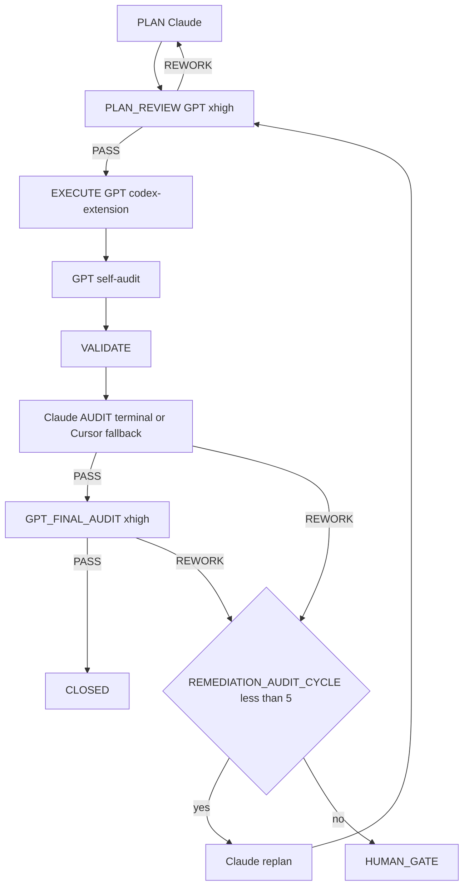

=== Auto-audit GPT (2e passe) ===
2026-04-25T18:28:14.596586Z  WARN codex_core::agents_md: Project doc `/Users/1millnonstop/Downloads/projet/foodking-web/web/testttt/AGENTS.md` exceeds remaining budget (32768 bytes) - truncating.
OpenAI Codex v0.125.0 (research preview)
--------
workdir: /Users/1millnonstop/Downloads/projet/foodking-web/web/testttt
model: gpt-5.5
provider: openai
approval: never
sandbox: workspace-write [workdir, /tmp, $TMPDIR, /Users/1millnonstop/.codex/memories]
reasoning effort: xhigh
reasoning summaries: none
session id: 019dc5e6-4085-76b2-a211-f54f1e121d59
--------
user
Tu effectues l’**auto-audit GPT** (2e passe) d’un cycle FoodKing — **pas** l’audit Claude terminal.

**Contexte** : le JSON ci-dessous est la proposition d’implémentation (format agents/codex.prompt.txt) pour la mission `CV1-M05-ORDER-QUOTE`.


**JSON d’implémentation (à recouper)** :
```json
{
  "files_to_modify": [
    "database/migrations/2026_04_25_190000_create_order_quotes_table.php",
    "app/Models/OrderQuote.php",
    "app/Services/Order/OrderQuoteService.php",
    "app/Http/Controllers/Admin/PosController.php",
    "routes/api.php",
    "resources/js/components/admin/pos/PaymentComponent.vue",
    "resources/js/components/frontend/kiosk/KioskPaymentComponent.vue",
    "tests/Feature/QuoteExpirationTest.php",
    "tests/Feature/QuoteTamperTest.php",
    "tests/Feature/QuoteReplayIdempotencyTest.php",
    "tests/Feature/QuoteCurrencyOriginTest.php",
    "tests/Feature/QuoteDiscountAuthoritativeTest.php"
  ],
  "implementation_steps": [
    "Created reversible order_quotes schema with branch scope, HMAC signature, TTL, consumed metadata, and pricing snapshot fields.",
    "Added OrderQuote model and OrderQuoteService using PricingService as backend SSOT for POS/kiosk quotes.",
    "Exposed POST /api/admin/pos/quote and POST /api/frontend/order/quote through existing auth/middleware boundaries.",
    "Updated POS payment flow to fetch backend quote before save and overwrite payable total with quote.total_ttc.",
    "Updated kiosk payment flow to fetch backend quote before order submission and use quote.total_ttc for payment amount display/processing.",
    "Added focused feature tests for expiration, tamper rejection, idempotent consume replay, backend currency/branch origin, and authoritative discount totals."
  ],
  "code_blocks": [
    {
      "path": "database/migrations/2026_04_25_190000_create_order_quotes_table.php",
      "op": "create",
      "excerpt": "Creates order_quotes with quote_token unique, branch_id FK, actor/customer scope, intent_hash, hmac_signature, canonical_payload JSON, subtotal/discount/tax/fees/total_ttc/currency, expires_at, consumed_at metadata; down() drops table."
    },
    {
      "path": "app/Models/OrderQuote.php",
      "op": "create",
      "excerpt": "Eloquent model with fillable quote fields, canonical_payload/date/decimal casts, and isExpired() helper."
    },
    {
      "path": "app/Services/Order/OrderQuoteService.php",
      "op": "create",
      "excerpt": "Calculates POS/kiosk quotes through PricingService, resolves branch from POS payload or KioskMachine, signs canonical payload via HMAC-SHA256, enforces TTL 60s, rejects tampered replay with 401, expires replay with 410, and makes consume idempotent."
    },
    {
      "path": "app/Http/Controllers/Admin/PosController.php",
      "op": "replace",
      "excerpt": "Inject OrderQuoteService; add quote(Request) validation using ValidJsonOrder; return quote response; map HttpException status codes explicitly."
    },
    {
      "path": "routes/api.php",
      "op": "replace",
      "excerpt": "Add admin pos quote route under /api/admin/pos/quote and kiosk quote route under /api/frontend/order/quote."
    },
    {
      "path": "resources/js/components/admin/pos/PaymentComponent.vue",
      "op": "replace",
      "excerpt": "Import axios; add refreshQuote() calling admin/pos/quote; set quote_token, quote_signature, subtotal, discount, delivery_charge, and total from backend quote.total_ttc before posOrder/save."
    },
    {
      "path": "resources/js/components/frontend/kiosk/KioskPaymentComponent.vue",
      "op": "replace",
      "excerpt": "Import buildKioskOrderPayload; add _lastQuote and refreshQuote() calling frontend/order/quote; use quote.total_ttc for checkout analytics, displayed cartTotal after quote, and payment nav total."
    },
    {
      "path": "tests/Feature/QuoteExpirationTest.php",
      "op": "create",
      "excerpt": "Feature test proves expired quote replay returns HTTP 410."
    },
    {
      "path": "tests/Feature/QuoteTamperTest.php",
      "op": "create",
      "excerpt": "Feature test proves replaying a quote_token with changed item intent returns HTTP 401."
    },
    {
      "path": "tests/Feature/QuoteReplayIdempotencyTest.php",
      "op": "create",
      "excerpt": "Feature test proves consume=true replay is idempotent and does not create duplicate quote rows."
    },
    {
      "path": "tests/Feature/QuoteCurrencyOriginTest.php",
      "op": "create",
      "excerpt": "Feature tests prove currency is backend-origin and signed; kiosk quote resolves branch from KioskMachine and rejects foreign branch payload."
    },
    {
      "path": "tests/Feature/QuoteDiscountAuthoritativeTest.php",
      "op": "create",
      "excerpt": "Feature test proves quote discount total uses backend subtotal instead of forged client subtotal/total."
    }
  ],
  "risks": [],
  "notes": [
    "OrderService and FrontendOrderService were not modified per allowlist; existing order creation still recalculates totals through backend PricingService.",
    "Mandatory tests passed individually and as php artisan test --filter=Quote (6 tests passed).",
    "php artisan route:list --path=quote is blocked by an unrelated pre-existing missing class App\\Http\\PaymentGateways\\Gateways\\Senangpay; quote routes are exercised by Feature tests."
  ],
  "execution_trace": {
    "delegation": "codex-extension",
    "invariants_considered": [
      "pricing_ssot",
      "branch_id",
      "commit_before_dispatch"
    ]
  }
}
```

**Livrable** (Markdown uniquement, en français) :
# AUTO_AUDIT_GPT — CV1-M05-ORDER-QUOTE

## 1. Conformité au plan / scope
(Énumérer manques ou dérives ; si scope élargi sans escale → **ESCALATE**)

## 2. Invariants FoodKing
Pour chacun : OK / RISQUE / N/A
- pricing_ssot (backend seul)
- order_status (enum, pas de strings)
- branch_id
- commit_before_dispatch
- frozen_zones
- order_service_symmetry (si un des deux services touché)

## 3. Verdict
Une ligne : `VERDICT: PASS` | `VERDICT: NEEDS_FIX` | `VERDICT: ESCALATE` + 1–3 phrases.

2026-04-25T18:28:15.034113Z  WARN codex_core_plugins::manifest: ignoring interface.defaultPrompt: prompt must be at most 128 characters path=/Users/1millnonstop/.codex/.tmp/plugins/plugins/build-ios-apps/.codex-plugin/plugin.json
2026-04-25T18:28:15.036950Z  WARN codex_core_plugins::manifest: ignoring interface.defaultPrompt: maximum of 3 prompts is supported path=/Users/1millnonstop/.codex/.tmp/plugins/plugins/plugin-eval/.codex-plugin/plugin.json
2026-04-25T18:28:22.507806Z  WARN codex_core_plugins::manifest: ignoring interface.defaultPrompt: prompt must be at most 128 characters path=/Users/1millnonstop/.codex/.tmp/plugins/plugins/build-ios-apps/.codex-plugin/plugin.json
2026-04-25T18:28:22.510478Z  WARN codex_core_plugins::manifest: ignoring interface.defaultPrompt: maximum of 3 prompts is supported path=/Users/1millnonstop/.codex/.tmp/plugins/plugins/plugin-eval/.codex-plugin/plugin.json
2026-04-25T18:28:23.458271Z  WARN codex_core_plugins::manifest: ignoring interface.defaultPrompt: prompt must be at most 128 characters path=/Users/1millnonstop/.codex/.tmp/plugins/plugins/build-ios-apps/.codex-plugin/plugin.json
2026-04-25T18:28:23.458544Z  WARN codex_core_plugins::manifest: ignoring interface.defaultPrompt: maximum of 3 prompts is supported path=/Users/1millnonstop/.codex/.tmp/plugins/plugins/plugin-eval/.codex-plugin/plugin.json
codex
J’effectue l’auto-audit en recoupant la proposition avec le dépôt réel et les règles FoodKing applicables à `CV1-M05-ORDER-QUOTE`. J’utilise aussi le skill `sync-risk-review`, parce que la mission touche pricing, branche et cycle de commande.
exec
/bin/zsh -lc "sed -n '1,220p' /Users/1millnonstop/Downloads/projet/foodking-web/web/testttt/.agents/skills/sync-risk-review/SKILL.md" in /Users/1millnonstop/Downloads/projet/foodking-web/web/testttt
exec
/bin/zsh -lc "sed -n '1,220p' AGENTS.md" in /Users/1millnonstop/Downloads/projet/foodking-web/web/testttt
exec
/bin/zsh -lc "sed -n '1,220p' .cursor/rules/global.mdc" in /Users/1millnonstop/Downloads/projet/foodking-web/web/testttt
exec
/bin/zsh -lc "sed -n '1,220p' .cursor/ACTIVE_CYCLE.md" in /Users/1millnonstop/Downloads/projet/foodking-web/web/testttt
 succeeded in 0ms:
---
name: sync-risk-review
description: Review changes affecting synchronization, auth, pricing, KDS, OSS, or order lifecycle for architectural and business risk.
disable-model-invocation: true
---

# Sync Risk Review Skill

Use this skill when a change affects:
- sync
- auth
- pricing
- KDS
- OSS
- order lifecycle
- cross-device behavior

## Steps
1. Read the relevant docs
2. Inspect the diff or current implementation
3. Identify:
   - architecture risk
   - state consistency risk
   - business rule violations
   - authz issues
   - missing tests
4. Produce a concise review with recommended next actions.

 succeeded in 0ms:
---
description: Always-on rules for the FoodKing Cursor local agent. Applied to every cycle, every model, every task.
globs: ["**/*"]
alwaysApply: true
---

# Global Rules – FoodKing

## Caisse V1 — Masterplay loop (active phase)

Pendant la phase de finition Caisse V1, **toute mission `CV1-MXX-…` est gouvernée par** :
- `plans/masterplay/MASTERPLAY_DISCIPLINE.md` — règles d'or (allowlist, frozen, REWORK max 5, activity-log, mémoire)
- `plans/masterplay/MASTERPLAY_QUEUE.md` — file d'exécution (statut, dépendances DAG)
- `plans/masterplay/GO.md` — comment lancer / suivre / pause / stop
- `scripts/run-masterplay.sh` — runner officiel (boucle codex + audit Claude + audit final + ingest mémoire)

**Lecture obligatoire** avant tout EXECUTE sur un `TASK_ID` `CV1-MXX-…`. Hors Caisse V1 : `run-cycle <TASK_ID>` standard.

## New or continued session — **mandatory path** (applies to **every** conversation and **every** model)

- **The chat log is not the SSOT.** **This repo** (`AGENTS.md`, `.mdc` rules, `docs/orchestration/`, `run-cycle.md`) is.
- On **any** new thread **or** long continuation: (1) Read **`AGENTS.md` § *Parcours obligatoire*** first, then **`docs/orchestration/GLOBAL_SYSTEM_PRIMER.md`** (§1 table). (2) If resuming work, read **`.cursor/ACTIVE_CYCLE.md`** *before* starting a duplicate cycle — follow the same `TASK_ID` / `PHASE` until `CLOSE` or an explicit new task. (3) For bounded work: run **`run-cycle` / `run-cycle.md`** (Steps 0–5) — do not skip `AUDIT` before `CLOSE`. (4) Run `npm run verify:boucle` (and `verify:boucle:full` when an API proof is needed) per `AGENTS.md`. (5) Ensure **`claude` on `PATH` (AUDIT terminal) et binaire `codex` (CLI OpenAI) pour l’EXÉCUTE complexe (compte ChatGPT Pro)**, pas de clé proxy obligatoire — voir `agents/codex-extension-instructions.md`. (6) Obey **`MEMORY_MATRIX.md`**, `EXECUTE_DELEGATION`, `AUDIT_CHANNEL` + `TERMINAL_AUDIT_OK` when using terminal audit, and **`agent-activity-log.sh`** (tail / start / done).
- Full checklist and French wording: **`AGENTS.md` → section *Parcours obligatoire*.

## Cycle Structure
PLAN Claude → PLAN_REVIEW GPT-5.5-pro/xhigh → EXECUTE GPT → VALIDATE → AUDIT Claude → GPT_FINAL_AUDIT → [HUMAN GATE | CLOSE]

Phases are sequential and non-skippable.
Dual audit (`AUDIT_VERDICT: PASS` + `GPT_FINAL_AUDIT_VERDICT: PASS`) precedes close on every cycle without exception.

## Model Discipline
- Auto/Premium routing is disabled
- PRIMARY_EXECUTION_MODEL is declared in the plan file before execution begins
- One PRIMARY_EXECUTION_MODEL per cycle; review checkpoints are explicit and mandatory
- Mid-cycle model switch requires Claude confirmation logged under `ESCALATION` in the plan file
- Full routing policy: `.cursor/routing.md`

## GPT Checkpoints + EXECUTE Delegation (PRIMARY = `codex-extension`)
- The **FoodKing Codex Complex Implementer** (slug `codex-extension`, CLI `codex` + compte ChatGPT Pro) is the **primary** route for `PLAN_REVIEW`, all product EXÉCUTE work, GPT self-audit, and `GPT_FINAL_AUDIT`.
- Procedure: run `npm run codex:plan-review -- {TASK_ID}` before EXECUTE; prepare `missions/{TASK_ID}/input.json` (+ optional `graphiti_context.md` / `plan_excerpt.md` / `execute_brief.md`); run `npm run codex:complex -- {TASK_ID}` (wrapper `bash scripts/codex-extension-execute.sh`, `gpt-5.5-pro`, `xhigh`); apply `output_codex.json` + lire l’auto-audit `reports/audit/GPT_SELF_AUDIT_{TASK_ID}.md`; after Claude PASS run `npm run codex:final-audit -- {TASK_ID}`. Product edits require `EXECUTE_DELEGATION: codex-extension`.
- The Cursor sub-agent `foodking-complex-implementer` is **fallback only** — invoked if `codex` / `exec` échoue (≥2 tentatives documentées) or human-escalation. Trace alors `EXECUTE_DELEGATION: foodking-complex-implementer (codex-extension-fallback)` + `FALLBACK_REASON:`.
- Composer / `foodking-routine-implementer` is not an implementation route during finishing cycles. It may summarize or validate; product fixes return to GPT EXECUTE.
- Reference docs: `docs/orchestration/CODEX_API_DELEGATION.md`, `AGENTS.md` § "EXECUTE delegation".

## Autonomy Contract
The agent operates autonomously within declared scope.
It halts and escalates — never self-approves — on any gate trigger, scope expansion,
invariant violation, two consecutive validation failures, or unresolvable ambiguity.
Full policies: `human-gates.mdc`, `scope.mdc`, `project-invariants.mdc`.

## Graphiti (mémoire inter-sessions)
- When the Graphiti MCP server is loaded for this workspace, **query it first** on any non-trivial task (see `.cursor/rules/graphiti-memory.mdc` and `AGENTS.md` § MCP).
- If Graphiti is not loaded, continue without blocking; one-line note to enable `~/.cursor/mcp.json` is enough.

## Quality channels — terminal first where defined
- **GPT route (`codex-extension` — CLI `codex` Pro)** is the **default** for PLAN_REVIEW, all product implementation, self-audit, and GPT_FINAL_AUDIT; Cursor sub-agent `foodking-complex-implementer` is **only** a fallback if the `codex exec` path fails (≥2 attempts or binaire indispo) — `EXECUTE_DELEGATION: …` + `FALLBACK_REASON:`. See `AGENTS.md` and `docs/orchestration/CODEX_API_DELEGATION.md`.
- **Claude AUDIT after implementation** is **by default the terminal** (`bash scripts/foodking-claude-orchestrate.sh context` then `audit` or `audit-brief` — **Anthropic subscription** via `claude` CLI). If the terminal fails after **1 retry** (**quota / rate limit / session saturated**, missing binary, auth, network), **do not stop the cycle**: use the **FALLBACK** — same `audit-context.md` checklist via Cursor Task **`foodking-planner-orchestrator`** (recommended) or in-session **Claude** — with `AUDIT_CHANNEL: cursor-session` **plus** mandatory `AUDIT_FALLBACK_REASON:` and optional `AUDIT_SUBAGENT_FALLBACK: foodking-planner-orchestrator`. See `docs/orchestration/AUDIT_TERMINAL_QUOTA_FALLBACK.md` and `run-cycle.md` Step 5; verify env with `bash scripts/verify-orchestration-boucle.sh`.
- Never invert primary/fallback for billing convenience without that trace — that would be indistinguishable from a mistake in production evidence.

## Token Discipline (quality-first — zero negative optimization)
- **Goal**: maximum correct intelligence per cycle — not shortest answers. Removing detail, skipping invariants, or omitting Graphiti queries to "save tokens" is **forbidden** when it reduces correctness or auditability.
- **Allowed savings only**: do not re-read files already in full context; do not paste verbatim large blobs already in the plan; use **Graphiti** + `## PRIOR_CONTEXT` to avoid re-opening dozens of historical reports; use phase summaries per `context-hygiene.mdc` §4 **after** a phase completes (handoff), not to shrink the plan itself.
- Do not re-explain decisions already recorded in the plan file (link/summarize in one line if needed).
- Structured output in reports — narrative allowed in plans/gates when it carries decisions, risks, or test strategy.
- Flag real risks only — no speculative commentary on out-of-scope subsystems

## Reports Discipline
- Bounded-cycle **plans** live under `plans/`; **gate briefs** under `docs/gates/`; validation logs, execution summaries, and other run evidence under `reports/` per `run-cycle.md` and `ACTIVE_CYCLE.md`
- Composer generates run evidence in `reports/` where applicable — Claude audits
- No new reporting structure without a plan-phase decision

## Absolute Prohibitions
The agent must never: self-approve a gate, expand scope without human instruction,
edit a frozen zone without cleared gate, modify `.cursor/routing.md` mid-cycle.
All invariant prohibitions enforced per `project-invariants.mdc`.

 succeeded in 0ms:
# Active Cycle – FoodKing

**Méta (SSOT `run-cycle.md` Step 0 + `AGENTS.md` § *Authoritative … cycle state*)** — requis pour que l’orchestrateur ne s’arrête pas sur *« RUNNER_MODE not set »*.

| Champ | Valeur actuelle |
| --- | --- |
| **RUNNER_MODE** | `single-session` |
| **PHASE (cycle W10)** | `IN_PROGRESS` (détail = section `CYCLE_W10_…` ci-dessous) |
| **TASK_ID** | `P_EXEC_CLOSEOUT_GRAPHITI_CI_PROD_2026-04-22` |
| **PLAN_FILE** | `plans/PLAN_EXECUTION_CLOSEOUT_GRAPHITI_CI_PROD_2026-04-22.md` |
| **REPORT_FILE** | `reports/post_execute_latest.log` (append — preuve `EXECUTE_DELEGATION` / `AUDIT_*`) |

> **ACTIVE_PRIMARY** : `CYCLE_W10_EXECUTION_CLOSEOUT` (un seul cycle peut être actif à la fois — voir B03 méga-checklist).
> Cycles plus anciens en lecture seule = **archive** déplacée dans **`.cursor/ACTIVE_CYCLE_ARCHIVE.md`** (lecture humaine / forensique uniquement, **non requise** par le parcours obligatoire).

## CYCLE_W10_EXECUTION_CLOSEOUT (IN_PROGRESS — mémoire 180 + MCP global + commit + CI + prod)

**TASK_ID** : `P_EXEC_CLOSEOUT_GRAPHITI_CI_PROD_2026-04-22`  
**Plan SSOT** : `plans/PLAN_EXECUTION_CLOSEOUT_GRAPHITI_CI_PROD_2026-04-22.md`  
**Ordre** : Piste A (POS+Centrale : PLAN-MEM-1) ∥ Piste B (humain : PLAN-MEM-3) → C (smoke) → D (commit sur « go commit ») → E (CI) → F (prod J-7→J+7).  
**Gate mémoire** : `python3 memory/verify.py` → count **≥ 175** (180 idéal) avant de considérer PLAN-MEM-1 **CLOSED**.

- **Vérif locale (2026-04-22)** : `python3 memory/verify.py` → **count = 182**, smoke `search_memory_facts` OK — gate **satisfaite** pour clôturer l'ingestion côté seuil d'épisodes (suite : commit / CI / prod selon plan `PLAN_EXECUTION_CLOSEOUT_*`).

**Gouvernance globale (2e passe 2026-04-22)** : primer multi-agents + Graphiti vivant + tokens « zéro effet négatif » → **`docs/orchestration/GLOBAL_SYSTEM_PRIMER.md`** + rapport **`reports/audit/AUDIT_SECOND_PASS_GLOBAL_GOVERNANCE_REPORT_2026-04-22.md`**.

---

## CAISSE_V1_MASTERPLAY (ACTIVE — 2026-04-25)

**Phase** : finition Caisse V1 (POS + Kiosk + KDS + Centrale + Fiscal + Ops).
**Plan parent** : `plans/PLAN_CAISSE_V1_GPT_MASTERPLAY_2026-04-25.md`
**Plan DAG autoritaire** : `plans/PLAN_CAISSE_V1_SUPER_MASTER_2026-04-25.md`
**Boucle d'exécution** : `plans/masterplay/MASTERPLAY_DISCIPLINE.md` + `plans/masterplay/MASTERPLAY_QUEUE.md` + `scripts/run-masterplay.sh`
**Statut temps réel** : `reports/masterplay/status.json`

**Règle** : tout `TASK_ID` au format `CV1-MXX-…` passe par la masterplay (cf. `AGENTS.md` § "Caisse V1 — Masterplay loop", `.cursor/rules/global.mdc` § "Caisse V1 — Masterplay loop", `.cursor/commands/run-cycle.md` Step 0 item 0). **NE PAS** ouvrir un `run-cycle` standard sur un `CV1-MXX-…`.

---

## Archive

Tous les cycles **CLOSED / COMPLETED PASSED** (W4 → W9, NF525, etc.) ont été déplacés dans **`.cursor/ACTIVE_CYCLE_ARCHIVE.md`** pour réduire le coût de lecture du parcours obligatoire (audit 2026-04-24, mission `T-PARCOURS-OPTIMIZE-001`).

- **Lecture humaine** : ouvrir `.cursor/ACTIVE_CYCLE_ARCHIVE.md`.
- **Lecture agent** : **non requise** sauf instruction explicite du plan ou du chat (ex. "reprend le rationale du cycle W9").
- **Recherche** : `rg "CYCLE_W9_" .cursor/ACTIVE_CYCLE_ARCHIVE.md` ou `git log --follow .cursor/ACTIVE_CYCLE.md`.

 succeeded in 0ms:
# FoodKing – Cursor Agent Operating Contract

## 0. Quick start contract — read this first

Commence ici. Ne lance aucune action tant que tu n'as pas lu les priorités P0.
Ce contrat fixe l'ordre minimal de lecture pour comprendre le repo en moins de 60 secondes.
Lis complètement ce qui est marqué obligatoire ; diffère seulement ce qui est explicitement classé P2.

### Reading priority

| Priority | What to read | Why |
| --- | --- | --- |
| P0 | `AGENTS.md §1 Parcours obligatoire` | Cadre impératif de travail, ordre de lecture, discipline de cycle. |
| P0 | `.cursor/ACTIVE_CYCLE.md` (continuation) | État courant du cycle actif, contexte vivant, reprise sans divergence. |
| P0 | `.cursor/rules/global.mdc` (auto-attaché — mentionné pour info) | Règles globales toujours applicables, même si déjà injectées par l'outil. |
| P0 | `plans/masterplay/MASTERPLAY_DISCIPLINE.md` + `plans/masterplay/MASTERPLAY_QUEUE.md` (Caisse V1 actif) | **Pendant la phase Caisse V1** : règles d'or de la boucle GPT + file d'exécution. Tout agent qui touche une mission `CV1-MXX-…` DOIT lire ces deux fichiers avant d'agir. |
| P1 | `docs/orchestration/GLOBAL_SYSTEM_PRIMER.md` | Vocabulaire, architecture d'orchestration, invariants transverses. |
| P1 | `.cursor/commands/run-cycle.md` | Procédure exacte pour démarrer un cycle borné correctement. |
| P1 | `docs/orchestration/MEMORY_MATRIX.md` | Où chercher la mémoire utile sans relire tout le dépôt. |
| P1 | `.cursor/routing.md` | Routage des tâches, choix du bon canal, limites d'intervention. |
| P2 | `docs/orchestration/CODEX_API_DELEGATION.md` (quand EXECUTE complexe) | À lire si tu délègues ou exécutes du complexe (uniquement **CLI `codex`**, pas d’exécuteur HTTP dans le dépôt). |
| P2 | `.cursor/ACTIVE_CYCLE_ARCHIVE.md` (forensique humain) | Historique utile pour audit humain, pas requis au démarrage. |
| P2 | `docs/orchestration/EXPORT_CONFIG_CODEX_GPT_API_ET_AUDIT_PERSISTANCE.md` (nouveau poste) | Configuration et persistance utiles surtout lors d'un nouvel environnement. |

Règle simple : P0 avant toute action, P1 avant tout EXECUTE, P2 seulement à la demande du sujet.
Si un doute persiste après P0+P1, arrête-toi et relis ; n'improvise pas.

### One-line bootstrap

```bash
npm run verify:boucle
bash scripts/agent-activity-log.sh tail 50
run-cycle <TASK_ID>
```

### Caisse V1 — Masterplay loop (actif)

Pendant la phase de finition Caisse V1 (POS + Kiosk + KDS + Centrale + Fiscal), l'orchestration passe par la **MASTERPLAY** :

```bash
# Lire d'abord (obligatoire)
cat plans/masterplay/MASTERPLAY_DISCIPLINE.md
cat plans/masterplay/MASTERPLAY_QUEUE.md
cat plans/masterplay/GO.md

# Lancer la boucle (Codex extension complexe + audit Claude terminal + audit Codex final)
bash scripts/run-masterplay.sh --with-audit --with-final
```

- **Plan parent** : `plans/PLAN_CAISSE_V1_GPT_MASTERPLAY_2026-04-25.md` (catalogue 22 missions M-XX, ancrages file:line)
- **Plan autoritaire DAG** : `plans/PLAN_CAISSE_V1_SUPER_MASTER_2026-04-25.md`
- **Statut temps réel** : `reports/masterplay/status.json` + `reports/masterplay/run_*.log`
- Tout `TASK_ID` au format `CV1-MXX-…` est gouverné par la masterplay (allowlist, frozen, gates, REWORK max 5).
- Hors phase Caisse V1 : repasser au `run-cycle <TASK_ID>` standard.

**Anti-répétition (nouvel onglet / agent parallèle)** : copier d’abord le bloc de `docs/orchestration/SESSION_OPENING_ENFORCEMENT.md` — même discipline, moins d’oubli de `ACTIVE_CYCLE` / `run-cycle`.

Utilise `run-cycle <TASK_ID>` pour initier tout cycle borné.
Les deux autres commandes servent à vérifier l'état local et le journal d'activité avant d'exécuter.

### Quality-first, not token-cheap

Lis P0 et P1 intégralement, sans skim. Les économies de tokens ne se font jamais sur la substance des règles, seulement sur la répétition, le bruit et les relectures inutiles. En cas de tension entre vitesse et rigueur, applique la rigueur ; voir `.cursor/rules/global.mdc § Token Discipline`.

### If you're a new human contributor

Commence par `docs/orchestration/EXPORT_CONFIG_CODEX_GPT_API_ET_AUDIT_PERSISTANCE.md` pour préparer ton poste et comprendre le mode de persistance attendu.
Lis-le après P0, puis enchaîne sur P1 avant toute contribution effective.

---

## 1. Parcours obligatoire — **nouvelle conversation** **et** **continuation** (production, non négociable)

> **Objectif** : qu’**à chaque** session (premier message ou 500e message), l’exécutant sache **quel** chemin suivre — **sans** supposer un historique de chat. Tout est **dans le dépôt** ; l’histoire de conversation **n’est pas** la SSOT.

**Règle d’or** : *aucune* modification de code **produit** (hors `plans/`, `reports/`, `docs/gates/`, `missions/`, JSONL gouvernance) **dans le cadre d’un travail borné** sans **(a)** parcours ci-dessous **et** **(b)** cycle `run-cycle` + plan actif, sauf **exception** explicite humaine (notée dans le plan / gate).

| Étape | Action | Quand / pourquoi |
|-------|--------|------------------|
| **0. Continuation** | Lire **`.cursor/ACTIVE_CYCLE.md`**. | Si `PHASE` n’est **pas** vide et le cycle n’est **pas** archivé : **reprendre** ce `TASK_ID` / ce `PLAN_FILE` / ce `REPORT_FILE` — **ne pas** dupliquer un second cycle fantôme. Si humain confirme **nouveau** sujet : réinitialiser / nouveau `TASK_ID` selon `run-cycle` Step 0. |
| **1. Lecture initiale** | Lire **ce fichier** (`AGENTS.md`) **puis** **`docs/orchestration/GLOBAL_SYSTEM_PRIMER.md`** (table §1 = ordre complet : routing, `run-cycle`, Graphiti, `MEMORY_MATRIX`, etc.). | **Avant** tout code ou plan non trivial. Même en « continuation » si le contexte a dérivé ou l’onglet a été rafraîchi. |
| **2. Cycle structuré (SSOT procédurale)** | Toute tâche avec **`TASK_ID`** : suivre **`.cursor/commands/run-cycle.md`** et la commande **`run-cycle <TASK_ID>`** (ou équivalent explicite dans le chat : enchaîner les **Steps 0 → 5** sans en sauter). | **Programme courant (quota-optimized)** : `PLAN GPT → PLAN_REVIEW GPT → EXECUTE GPT → VALIDATE → AUDIT GPT → [CLAUDE CRITIQUE SI NÉCESSAIRE] → [GATE \| CLOSE]`. Aucun « close » sans audit PASS documenté. |
| **3. Vérification d’environnement** | `npm run verify:boucle` (0 requête par défaut). **Si le terminal ne “voit” pas Codex alors que l’extension est connectée** : l’auth IDE n’alimente pas le CLI — lancer `npm run codex:doctor` (npm + `login status` + 1 requête). **Rapide :** `npm run codex:verify-pro`. **Complet :** `npm run verify:boucle:full`. Encart : `agents/codex-extension-instructions.md`. | Même en **Step 5** : l’`EXECUTE` (CLI `codex`) requiert le binaire + session Pro sur **ce** binaire. Voir `run-cycle` Step 0 item 8. |
| **4. Secrets & outils machine** | Binaire **`claude`** sur le **`PATH`** (Claude Code CLI) pour l’**AUDIT** PRIMARY en terminal. Binaire **`codex`** (CLI OpenAI) : *Sign in with ChatGPT* **Pro** — **pas** de clé API dans le dépôt. Résolution : `PATH` **ou** `node_modules/.bin/codex` après **`npm install`** (dépendance **`@openai/codex`**) **ou** `npm i -g @openai/codex`. **Ne pas** mélanger avec une clé *Platform* restreinte dans l’environnement (provoque des 401 *scopes* sur l’API Responses) — `npm run codex:audit-bleed` aide. (Option) MCP Graphiti selon `~/.cursor/mcp.json`. | Sans `claude` : noter dès le **plan** l’`AUDIT` fallback + `AUDIT_FALLBACK_REASON`. Sans binaire `codex` : pas d’`EXECUTE` complexe PRIMARY (sub-agent + `FALLBACK_REASON` ou `npm install` + auth Pro). |
| **5. Traces & mémoire (déjà dans ce fichier)** | **`EXECUTE_DELEGATION:`** avant VALIDATE ; **`AUDIT_CHANNEL:`** + **`TERMINAL_AUDIT_OK: 1`** si audit terminal OK ; `docs/orchestration/MEMORY_MATRIX.md` ; `scripts/agent-activity-log.sh` (tail / start / done). | Traçabilité = **même** qualité en prod sur N agents parallèles. |

**Ce n’est pas optionnel** pour travailler « en production FoodKing » : c’est le **contrat** d’onboarding. Les **règles** `.cursor/rules/*.mdc` (dont **`global.mdc` — alwaysApply**) et ce fichier **s’imposent** **à** tout modèle, **dans** toute conversation, dès l’ouverture du dépôt.

**Pour un humain / nouveau compte** : mêmes étapes ; la doc **`docs/orchestration/EXPORT_CONFIG_CODEX_GPT_API_ET_AUDIT_PERSISTANCE.md`** regroupe l’**export** config API + persistance des règles hors-chat.

## Engine
Cursor local agent. No cloud orchestration. No external framework.
Auto/Premium routing: disabled. Model selection is explicit per cycle.

## Global system primer (multi-agents, Graphiti, tokens — lecture clé)

Tout nouvel intervenant (session Cursor, sub-agent Task, CLI terminal, humain) qui touche **orchestration**, **mémoire**, ou **discipline de contexte** : lire **`docs/orchestration/GLOBAL_SYSTEM_PRIMER.md`** après ce fichier. Y sont définis : ordre de lecture obligatoire, `codex-extension` GPT-5.5-pro/xhigh, fallback `foodking-complex-implementer`, fallback audit `foodking-planner-orchestrator`, terminal **`claude` / `codex`**, **mise à jour continue de Graphiti**, et la politique **« intelligence max — zéro optimisation négative »** (tokens : supprimer le gaspillage, pas la substance). Pour audits longs et robustesse **opération + agentique + mémoire** : **`docs/orchestration/MEGA_CHECKLIST_AUTONOMY_AND_MEMORY.md`** (180 tâches) et le narratif **`reports/audit/MEGA_AUDIT_SYSTEM_OPERATION_AGENTIC_2026-04-23.md`**.

**Discipline mémoire (qui écrit où, qui lit quoi, quand)** : **`docs/orchestration/MEMORY_MATRIX.md`** — matrice unique des **4 stores autorisés** (Code A · Graphiti+JSONL B · Missions C · Rapports D), table d'écriture par phase, ordre de lecture pour une nouvelle session, anti-patterns. Aucun nouveau store de mémoire ne peut être ajouté sans gate `docs/gates/GATE_MEMORY_*`. Décisions 2026-04-23 sur OpenSpace et claude-mem : **non intégrés**, justifications dans la matrice.

**Synchro multi-agents (cross-conv, cross-terminal)** : `.cursor/rules/cross-agent-sync.mdc` (alwaysApply) + `reports/AGENT_ACTIVITY_LOG.md` (append-only) + `scripts/agent-activity-log.sh` (`tail | start | done | collisions | active`). Au démarrage de session : `tail 50` (~500 tokens). Avant édition produit (Step 2 EXECUTE) : `start` (refus exit 2 si collision). À la clôture (Step 5 CLOSE) : `done`. Évite que deux agents (Cursor convs / `codex-extension` / `claude-terminal` / humain) modifient les mêmes fichiers à leur insu. **Doctrine étendue** (Graphiti = mémoire partagée, rôles Claude vs Codex, anti-patterns) : **`docs/orchestration/MULTI_AGENT_ORCHESTRATION.md`**.

## Workflow
PLAN GPT (codex) → PLAN_REVIEW GPT (codex) → EXECUTE GPT (codex) → VALIDATE → AUDIT GPT (codex) → [CLAUDE CRITICAL ESCALATION ONLY] → [HUMAN GATE | CLOSE]

No phase may be skipped. Default close condition is `AUDIT_VERDICT: PASS` from GPT path, with optional Claude escalation audit only for critical/blocked cases.

## Model Roles
| Model | Role | Channel (priorité **qualité maximale / zéro raccourci token**) |
|---|---|---|
| Claude | Escalade critique uniquement | Utiliser Claude seulement pour cas vraiment critiques: blocage logique majeur, gate ambigu non résoluble, conflit d'audits, ou arbitrage architecture multi-fichiers à haut risque. Le canal prioritaire reste GPT/Codex pour économiser les quotas Claude. |
| **GPT-5.5 / GPT-5.5-pro** | **PLAN + PLAN_REVIEW + EXECUTE + AUDIT** | **`codex-extension`** — `npm run codex:plan-review`, `npm run codex:complex`, `npm run codex:final-audit` (CLI `codex` + `codex exec`, **compte ChatGPT Pro**, modèle `gpt-5.5-pro` si dispo sinon `gpt-5.5`, `model_reasoning_effort=xhigh`). GPT devient le canal principal d'orchestration, implémentation et audit de routine. |
| GPT-5.5 (fallback) | Complex implementation (FALLBACK only) | **Sub-agent** `foodking-complex-implementer` (Task Cursor) — consomme l’**usage** des modèles de l’**abonnement Cursor**. **Uniquement** si `codex` / l’exécution `codex exec` a échoué (≥2 tentatives documentées) ou binaire indispo. |
| Composer | Validation/report only | Plus d’implémentation routine pendant les cycles de finition. Composer peut résumer, exécuter/rapporter des validations, mais toute correction produit repart en EXECUTE GPT. |

**Qui décide (mode actuel quota-optimized)** : **GPT/Codex** porte l’**autorité opérationnelle** sur planification, implémentation, auto-audit, et audit final de routine. **Claude** est mis en pause et appelé uniquement en **escalade critique** (ambiguïté structurelle, gate sensible, conflit technique majeur, analyse de risque à très forte complexité). Le **fait** code / test l’emporte sur la croyance.

**Principe unique (mode actuel) — à valider en prod sur chaque cycle :** **PLAN GPT → PLAN_REVIEW GPT → EXECUTE GPT → self-audit GPT → VALIDATE → AUDIT GPT**. Le repli vers Claude n’intervient qu'en escalade critique documentée (`CLAUDE_ESCALATION_REASON:`), avec portée minimale.

One PRIMARY_EXECUTION_MODEL per cycle. Roles are explicit and layered; review checkpoints do not authorize scope expansion.
Full routing policy: `.cursor/routing.md`. Naming: the **PRIMARY complex implementer** is the **FoodKing Codex Complex Implementer** (slug `codex-extension`); see `docs/orchestration/CODEX_API_DELEGATION.md`.

## Authoritative multi-agent bounded cycle (SSOT)

For **TASK_ID-driven** work in Cursor, this path is **authoritative** and overrides any conflicting step elsewhere in this document:

1. **Command:** `.cursor/commands/run-cycle.md` (invoke with a `TASK_ID`, e.g. `run-cycle SMOKE-001`).
2. **Cycle state:** `.cursor/ACTIVE_CYCLE.md` (`RUNNER_MODE: single-session`, `PHASE`, `PLAN_FILE`, `REPORT_FILE`, completion rows).
3. **Plan artifact:** `plans/PLAN_[TASK_ID]_[DATE].md` per `.cursor/context/plan-context.md` (from `plans/PLAN_TEMPLATE.md` when applicable).
4. **Phase instructions:** `.cursor/context/plan-context.md` (PLAN), `.cursor/context/execute-context.md` (EXECUTE), `.cursor/context/audit-context.md` (AUDIT); VALIDATE per `run-cycle.md` when `validate-context.md` is absent.

**EXECUTE delegation (GPT only; PRIMARY first, FALLBACK only on failure):**

- **Routine implementation disabled during finishing cycles** : no product edit via Composer / `foodking-routine-implementer`. Small edits still route through GPT to keep the same quality chain.
- **PRIMARY** : **`codex-extension`** — **FoodKing Codex Complex Implementer** (CLI `codex`, compte **ChatGPT Pro**, `gpt-5.5-pro`, `model_reasoning_effort=xhigh`). Procédure :
  1. Préparer `missions/{TASK_ID}/input.json` (+ optionnels : `graphiti_context.md` issu de `search_memory_facts(group_ids=["foodking"])`, `plan_excerpt.md`, `execute_brief.md`, `cycle_snapshot.md` — fusionnés par le script d’assemblage de prompt).
  2. Lancer `npm run codex:complex -- {TASK_ID}` (`bash scripts/codex-extension-execute.sh`) ; le wrapper passe explicitement `-m ${CODEX_EXT_MODEL_PRO:-gpt-5.5-pro}` et `model_reasoning_effort=${CODEX_EXT_REASONING_EFFORT:-xhigh}`. (Instructions custom : `agents/codex-extension-instructions.md`.) **Bootstrap** : `npm run codex:prepare -- {TASK_ID}`.
  3. Appliquer `missions/{TASK_ID}/output_codex.json` ; consommer l’**auto-audit** `reports/audit/GPT_SELF_AUDIT_{TASK_ID}.md` (généré par le wrapper).
  4. Tracer `EXECUTE_DELEGATION: codex-extension` dans `reports/post_execute_latest.log` et le `REPORT_FILE`.
- **Complexe — FALLBACK (uniquement si `codex exec` est HS après reprises, ou binaire manquant)** : `Task` → `foodking-complex-implementer` — tracer `EXECUTE_DELEGATION: foodking-complex-implementer (codex-extension-fallback)` + `FALLBACK_REASON:`. 

Référence complète : **`docs/orchestration/CODEX_API_DELEGATION.md`** (naming, fallback contract, audit handoff, token discipline, schéma boucle). Procédure cycle : `.cursor/commands/run-cycle.md`. La trace `EXECUTE_DELEGATION` dans le rapport est **obligatoire** pour passer en VALIDATE.

**Clôture vs. audit :** Après `VALIDATE`, l’**audit** **Claude** (terminal `foodking-claude-orchestrate.sh` en PRIMARY, fallback Cursor si quota/rate-limit/terminal HS) écrit `AUDIT_VERDICT: PASS|REWORK`, puis GPT écrit `GPT_FINAL_AUDIT_VERDICT: PASS|REWORK|ESCALATE`. **Pas** de `CLOSED` sans double PASS. Sur `REWORK`, boucle `replan (orchestration Claude) → missions + EXECUTE GPT → self-audit GPT → VALIDATE → re-audit Claude → GPT final`, avec `REMEDIATION_AUDIT_CYCLE` 1..5 — au 5e `REWORK` sans double PASS, **HUMAN_GATE** (détail : Step 5 de `run-cycle.md` et `auto-remediation.mdc`).

Sections below labeled **Legacy workflow** remain valid for **PR-centric / review-loop** habits but **do not replace** this SSOT for bounded cycles.

## Source of truth (extended)
- README.md
- docs/PROJECT_CONTINUITY_AND_VISION.md
- docs/ARCHITECTURE.md
- docs/API_MAP.md
- docs/AUTHZ_MATRIX.md
- docs/ORDER_FLOW.md
- docs/DEVICE_FLOW.md
- docs/BUSINESS_RULES.md
- docs/CORE_MODULES.md
- docs/DATABASE_SCHEMA_CORE.md
- docs/ERROR_HANDLING.md
- docs/SECURITY_NOTES.md
- docs/TEST_PLAN.md
- docs/MASSIVE_TEST_PLAN.md
- docs/SAAS_VISION.md
- docs/CONTRIBUTING_QA_BOTS.md
- workflows/qa-loop.md
- workflows/task-routing.md
- workflows/report-format.md
- workflows/task-status.md
- reports/README.md
- docs/orchestration/MEGA_CHECKLIST_AUTONOMY_AND_MEMORY.md
- docs/orchestration/WORKFLOW_AUDIT_GRAPHIQUE_2026-04-23.md
- docs/orchestration/TERMINAL_CLAUDE_GRAPHITI_ORCHESTRATION.md
- docs/orchestration/ROUTING_MATRIX.md

## Stop Conditions
Halt and generate a gate brief on any of:
- Gate trigger detected
- Scope expansion beyond declared boundary
- FoodKing invariant violation
- Two consecutive validation failures
- Planning ambiguity unresolvable from task context
- **`codex` / `codex exec` indisponible après reprises (auth, binaire, ou échec ≥2 sur la même tâche)** : basculer sur le fallback `Task → foodking-complex-implementer` et **noter explicitement** `EXECUTE_DELEGATION: foodking-complex-implementer (codex-extension-fallback)` + `FALLBACK_REASON:`.
- **Audit en terminal (PRIMARY) indisponible ou limité** (`claude` absent, **quota / rate limit / session Anthropic saturée**, auth, réseau — après **1 retry** documenté de `context` + `audit-brief` ou `audit`) : **continuer le cycle** — même checklist `audit-context.md` via Task **`foodking-planner-orchestrator`** (recommandé) ou session Cursor **Claude** ; **`AUDIT_CHANNEL: cursor-session`** + **`AUDIT_FALLBACK_REASON:`** (obligatoire) + optionnel **`AUDIT_SUBAGENT_FALLBACK: foodking-planner-orchestrator`**. Voir `docs/orchestration/AUDIT_TERMINAL_QUOTA_FALLBACK.md`. **Ne jamais** omettre la raison.

## FoodKing Non-Negotiables
- Backend is pricing SSOT — no frontend price logic
- `OrderStatus` enum is authoritative — no hardcoded strings
- `branch_id` = business data isolation — no cross-branch data bleed
- Dispatch strictly after DB commit
- `OrderService` / `FrontendOrderService` symmetry mandatory on any order change
- Frozen zones require gate clearance before any edit

## MCP

### Phase 1 — Filesystem
Filesystem MCP only for repo reads where applicable.

### Phase 2 — Graphiti (mémoire inter-cycles — **présent dans toutes les sessions où le serveur est enregistré**)

**Objectif** : décisions d’architecture, invariants, sync borne↔POS↔KDS, fiscal NF525, historique de cycles — récupérables sans relire des centaines de fichiers.

| Élément | Détail |
|--------|--------|
| **Enregistrement Cursor (obligatoire côté humain)** | Fusionner le bloc `graphiti` dans **`~/.cursor/mcp.json`** (Settings → MCP). Modèle : **`.cursor/mcp/graphiti.json.example`**. Le dépôt ne peut pas injecter un MCP automatiquement dans l’IDE. |
| **Règle agent (automatique dès que le MCP est chargé)** | Voir **`.cursor/rules/graphiti-memory.mdc`** (always-on) + **`global.mdc`** : avant toute tâche non triviale, appeler au moins **`search_memory_facts`** (et optionnellement **`search_memory_nodes`**) avec `group_ids=["foodking"]`. |
| **Après AUDIT / CLOSE** | Si `add_memory` est disponible : enregistrer les décisions durables (ADR, gate, invariant clarifié). |
| **Si Graphiti absent de la session** | **Ne pas bloquer** PLAN / EXECUTE : une ligne « Graphiti non chargé » + secours **`memory/INDEX.md`** + lecture ciblée des JSONL sous `memory/episodes/`. |
| **Server** | Zep Graphiti — wrapper local **`.cursor/mcp/start-graphiti-mcp.sh`** (voir exemple JSON). Clone typique : `/Users/1millnonstop/graphiti`. |
| **Backend** | Neo4j (ex. Aura) — credentials hors repo. |
| **Dépannage** | **`.cursor/mcp/GRAPHITI_TROUBLESHOOTING.md`** (LiteLLM, embeddings, redémarrage proxy). |
| **Group ID** | Toujours **`foodking`**. |
| **Ingestion / vérif locale** | `memory/ingest.py`, `memory/verify.py`, `bin/graphiti-ingest.sh` ; index des domaines **`memory/INDEX.md`**. |

**Intégration bounded cycle** : la commande **`.cursor/commands/run-cycle.md`** inclut l’appel Graphiti en **Step 0 item 5** (query avant PLAN).

### Phase 3 — Playwright MCP (tests E2E sur flows critiques FoodKing)

- Package : `@playwright/mcp@latest` (npx, pas d’install global)
- Browser : Chromium
- BASE_URL : `http://localhost:8000`

2026-04-25T18:28:40.697511Z  WARN codex_core_plugins::manifest: ignoring interface.defaultPrompt: prompt must be at most 128 characters path=/Users/1millnonstop/.codex/.tmp/plugins/plugins/build-ios-apps/.codex-plugin/plugin.json
2026-04-25T18:28:40.700601Z  WARN codex_core_plugins::manifest: ignoring interface.defaultPrompt: maximum of 3 prompts is supported path=/Users/1millnonstop/.codex/.tmp/plugins/plugins/plugin-eval/.codex-plugin/plugin.json
codex
Le cycle actif contient bien la phase Masterplay Caisse V1 ; je vais donc contrôler le plan/queue de cette mission avant de juger les fichiers. Ensuite je comparerai la proposition aux routes, services et tests réellement présents.
exec
/bin/zsh -lc "sed -n '1,260p' plans/masterplay/MASTERPLAY_DISCIPLINE.md" in /Users/1millnonstop/Downloads/projet/foodking-web/web/testttt
 succeeded in 0ms:
# MASTERPLAY DISCIPLINE — Caisse V1 (loop master)

> **But** : règles strictes que le runner et chaque mission GPT respectent en boucle, pendant des heures, jusqu'à finition de toutes les missions de `MASTERPLAY_QUEUE.md`. Lecture obligatoire avant de lancer `bash scripts/run-masterplay.sh`.

## 1. Autorité

| Source | Rôle |
|--------|------|
| `AGENTS.md` | Parcours obligatoire, cycle FoodKing |
| `plans/PLAN_CAISSE_V1_SUPER_MASTER_2026-04-25.md` | DAG autoritaire (ordre, gates) |
| `plans/PLAN_CAISSE_V1_GPT_MASTERPLAY_2026-04-25.md` | Catalogue 22 missions M-XX (objectifs, allowlist) |
| `plans/masterplay/MASTERPLAY_QUEUE.md` | File d'exécution courante |
| `plans/masterplay/MASTERPLAY_DISCIPLINE.md` | (ce fichier) règles d'exécution |
| `.cursor/rules/*.mdc` | Toujours appliquées |
| `docs/gates/GATE_LOG.md` | État des gates humains |

## 2. Boucle d'exécution (run-masterplay.sh)

```
LOOP {
  1. tail activity log (~500 tokens)
  2. find next PENDING task in MASTERPLAY_QUEUE with all DEPENDS_ON == CLOSED
  3. if none → break (all done or all blocked)
  4. verify missions/<TASK_ID>/input.json + execute_brief.md exist
  5. activity-log start codex-extension <TASK_ID> execute "<allowlist CSV>" "<note>"
     if exit 2 (collision) → MARK BLOCKED note=collision, continue loop
  6. update status: RUNNING
  7. npm run codex:complex -- <TASK_ID>     (génère output_codex.json + GPT_SELF_AUDIT)
  8. update status: EXECUTED
  9. activity-log done codex-extension <TASK_ID> done "<résumé court>"
 10. (option --with-audit) bash scripts/foodking-claude-orchestrate.sh audit-brief <TASK_ID>
       if PASS → status: AUDIT_PASS
       if REWORK → status: REWORK ; increment REWORK_COUNT ; if >=5 → BLOCKED note=human_gate
 11. (option --with-final) npm run codex:final-audit -- <TASK_ID>
       if PASS → status: FINAL_PASS
 12. if FINAL_PASS:
       bash scripts/after-execute-memory.sh
       update status: CLOSED
 13. sleep INTER_TASK_PAUSE_SECONDS (default 5s)
 14. continue LOOP
}
```

## 3. Garde-fous (non négociables)

### 3.1 Allowlist stricte par mission
Codex modifie **uniquement** les fichiers listés dans `missions/<TASK_ID>/input.json.allowlist`. Si modification hors liste détectée à l'audit → `REWORK`.

### 3.2 Frozen zones
Aucune édition d'un fichier frozen sans gate signé dans `docs/gates/GATE_LOG.md`. Le runner **refuse** de lancer une mission marquée `BLOCKED` jusqu'à ce que le statut soit changé manuellement après signature.

### 3.3 Invariants FoodKing — `REWORK` automatique
- Pricing client-authoritative
- Status littéral numérique (`status: 16`)
- `branch_id` LIKE
- Dispatch dans transaction
- OS ou FOS modifié sans `SYMMETRY_NOTE`
- Frozen modifié sans gate

### 3.4 Pas de gate auto-approuvée
Codex peut **rédiger** options ; aucune mission ne coche `[x] Approved`. Si une mission le tente → `REWORK` + `risks: ["ESCALATION: gate self-approved"]`.

### 3.5 Tests obligatoires
Chaque `mandatory_tests` listé doit être lancé et reporté dans le rapport. Échec → `REWORK`.

### 3.6 Diff minimal
Aucun renommage opportuniste, aucun refactor non demandé, aucune optimisation collatérale. Si ajout justifié → `notes` du JSON.

### 3.7 Activity log
`start` avant chaque mission ; `done` après. Sans cela → réservation fantôme = autres agents bloqués. Le runner enforce.

### 3.8 Mémoire
À CLOSE : compléter `memory/episodes/caisse_v1_<topic>_*.jsonl` (squelettes créés par M-19) puis `bash scripts/after-execute-memory.sh`. Si Graphiti UP : `bash bin/graphiti-ingest.sh` + `python3 memory/verify.py`.

## 4. Boucles de rework

- Max **5 cycles `REWORK`** consécutifs sur la même mission. Au 5e → `BLOCKED note=human_gate_required`.
- Max **3 cycles healing** consécutifs (cf. CLAUDE.md §8) avant escalade.
- Toute escalation → écrite dans `reports/masterplay/ESCALATIONS_<date>.md`.

## 5. Pause / arrêt

- `Ctrl-C` arrête la boucle proprement (mission en cours finit, runner s'arrête après).
- `touch reports/masterplay/STOP` → le runner s'arrête à la fin de la mission courante.
- `touch reports/masterplay/PAUSE` → le runner pause entre les missions tant que le fichier existe.

## 6. Logs

- `reports/masterplay/run_<ISO>.log` : log de la boucle.
- `reports/masterplay/status.json` : état temps réel (mission courante, compteurs).
- `missions/<TASK_ID>/output_codex.raw.log` : raw codex.
- `missions/<TASK_ID>/output_codex.json` : json structuré.
- `reports/audit/GPT_SELF_AUDIT_<TASK_ID>.md` : self-audit GPT.
- `reports/post_execute_latest.log` : trace `EXECUTE_DELEGATION`.
- `reports/AGENT_ACTIVITY_LOG.md` : start/done.

## 7. Audit Claude (en fin de boucle, manuel)

Quand toutes les missions sont `CLOSED` (ou `BLOCKED` documentés) :

```
bash scripts/foodking-claude-orchestrate.sh context
bash scripts/foodking-claude-orchestrate.sh audit
```

Sortie attendue : verdict transversal Caisse V1 (chaîne sync borne→centrale→POS→KDS→fiscal). Le verdict détermine `GO/HOLD/NO-GO` pour `GATE_GO_NO_GO_CAISSE_V1`.

## 8. Critères d'arrêt anormal

- 3 missions consécutives en `REWORK` → halt + alerte humaine.
- Activity-log refuse 3 fois → halt (collision permanente).
- `npm run codex:complex` échoue 3 fois sur la même mission (binaire codex KO) → halt.
- `claude` terminal indisponible 3 fois consécutives → continue avec fallback subagent + `AUDIT_FALLBACK_REASON: terminal-unavailable`.

## 9. Token discipline

- Le prompt envoyé à codex contient : template `agents/codex.prompt.txt` + `input.json` + `execute_brief.md` + (optionnel) `graphiti_context.md`, `plan_excerpt.md`, `cycle_snapshot.md`.
- Pas de duplication : pas de re-coller AGENTS.md ou super master plan dans chaque mission.
- Cap typique d'un prompt : ≤ 30 KB. Au-delà → splitter la mission.

## 10. Anti-pattern interdits

- ❌ Lancer 2 missions en parallèle sur les mêmes fichiers (collision activity-log).
- ❌ Modifier `MASTERPLAY_QUEUE.md` pendant que le runner tourne (sauf marquer BLOCKED → PENDING après gate).
- ❌ Skipper l'audit Claude pour aller plus vite.
- ❌ Marquer CLOSED manuellement sans double PASS (PASS Claude + PASS Codex final).
- ❌ Ignorer un `risks: ["ESCALATION: ..."]` dans output_codex.json.

---

`MASTERPLAY_DISCIPLINE_VERSION: 1.0` · `STRICT_MODE: ON`

exec
/bin/zsh -lc "sed -n '1,260p' plans/masterplay/MASTERPLAY_QUEUE.md" in /Users/1millnonstop/Downloads/projet/foodking-web/web/testttt
 succeeded in 0ms:
# MASTERPLAY_QUEUE — Caisse V1

**Source de vérité de l'orchestration en boucle** : `bash scripts/run-masterplay.sh` lit cette file et exécute en série.

**Discipline** : `plans/masterplay/MASTERPLAY_DISCIPLINE.md`.  
**Plan parent** : `plans/PLAN_CAISSE_V1_GPT_MASTERPLAY_2026-04-25.md`.

## Légende statut

- `PENDING` — pas encore lancé
- `RUNNING` — codex exec en cours (ne pas relancer)
- `EXECUTED` — codex exec terminé, attend audit
- `AUDIT_PASS` — `AUDIT_VERDICT: PASS` Claude
- `FINAL_PASS` — `GPT_FINAL_AUDIT_VERDICT: PASS`
- `CLOSED` — mémoire ingestée + activity-log done
- `REWORK` — audit a demandé rework
- `BLOCKED` — gate humain ou dépendance manquante

## Légende vague

- `WAVE_A` — NO-GATE, parallélisable, démarre immédiatement
- `WAVE_B` — POST-GATE, séquencé selon DAG

## File d'exécution


| ORDER | TASK_ID                           | MISSION | WAVE   | DEPENDS_ON                 | STATUS  | NOTE                                                                         |
| ----- | --------------------------------- | ------- | ------ | -------------------------- | ------- | ---------------------------------------------------------------------------- |
| 01    | CV1-M19-MEMORY-DISCIPLINE         | M-19    | WAVE_A | —                          | CLOSED  | Crée squelettes JSONL pour les 22 missions                                   |
| 02    | CV1-M01-TRACEABILITY-MATRIX       | M-01    | WAVE_A | —                          | CLOSED  | Matrice findings → tasks → tests → gates (REWORK resolved GPT PASS)          |
| 03    | CV1-M02-SENTINEL-BASELINE         | M-02    | WAVE_A | CV1-M01                    | CLOSED  | 18 sentinels fail-first + 4 lints                                            |
| 04    | CV1-M12-LEGACY-GUARDS-CI          | M-12    | WAVE_A | —                          | CLOSED  | Lint imports + bundle scan + workflow (recovered: extractor JSON fix)        |
| 05    | CV1-M16-HARDWARE-LAB              | M-16    | WAVE_A | —                          | CLOSED  | Checklist hardware signable (recovered: JSON valid, files materialized)      |
| 06    | CV1-M18-TEST-ARCHITECTURE         | M-18    | WAVE_A | CV1-M02                    | CLOSED  | Grille couverture + plan campagne                                            |
| 07    | CV1-M20-RUNBOOKS-SKELETON         | M-20    | WAVE_A | —                          | CLOSED  | 8 runbooks ops (REWORK Horizon resolved GPT PASS)                            |
| 08    | CV1-M21A-QUICKWINS-LOT0           | M-21a   | WAVE_A | —                          | CLOSED  | POS: discount v-model + Swiper RTL + focustrap dead                          |
| 09    | CV1-M03-GATES-DRAFT               | M-03    | WAVE_A | CV1-M01                    | CLOSED  | 8 briefs gates Caisse V1 créés; Wave B reste bloquée par signatures humaines |
| 10    | CV1-M09-BRANCH-ISOLATION          | M-09    | WAVE_B | CV1-M03(gates), CV1-M02    | CLOSED  | GPT audit PASS; M-08/M-06/schema sentinels remain gated                      |
| 11    | CV1-M06-POS-REVENUE-GUARDS        | M-06    | WAVE_B | CV1-M09, CV1-M03           | CLOSED | GPT rework audit PASS; gates frozen C + payment_prop A approved              |
| 12    | CV1-M05-ORDER-QUOTE               | M-05    | WAVE_B | CV1-M03                    | RUNNING | Gate schema Option A approved                                                |
| 13    | CV1-M04A-PAYMENT-LEDGER-FULL      | M-04A   | WAVE_B | CV1-M03 (ledger=A)         | BLOCKED | Ledger gate chose Option B; M-04A not selected                               |
| 14    | CV1-M04B-PAYMENT-PILOT-RESTRICT   | M-04B   | WAVE_B | CV1-M03 (ledger=B)         | CLOSED  | GPT audit PASS; Option B restricted pilot implemented                        |
| 15    | CV1-M08-FISCAL-Z-NF525            | M-08    | WAVE_B | CV1-M03 (fiscal+schema)    | PENDING | Fiscal Option B + schema Option A approved                                   |
| 16    | CV1-M07-KDS-RELEASE               | M-07    | WAVE_B | CV1-M03 (kds_bump)         | PENDING | KDS gate Option B approved                                                   |
| 17    | CV1-M10-OS-FOS-SYMMETRY           | M-10    | WAVE_B | CV1-M06, CV1-M09           | PENDING | Unlocked after M-06 GPT audit PASS and M-09 CLOSED                           |
| 18    | CV1-M11-KIOSK-RUNTIME             | M-11    | WAVE_B | CV1-M03 (offline+fiscal)   | BLOCKED | Will unlock after M-08 policy evidence                                       |
| 19    | CV1-M17-WEB-STRIPE-SCOPE          | M-17    | WAVE_B | CV1-M03 (web+stripe)       | PENDING | Web Option B + Stripe Option B approved                                      |
| 20    | CV1-M13-MIGRATIONS-SAFETY         | M-13    | WAVE_B | CV1-M03 (schema)           | PENDING | Schema Option A approved                                                     |
| 21    | CV1-M14-OPS-PREFLIGHT             | M-14    | WAVE_B | CV1-M13                    | BLOCKED | —                                                                            |
| 22    | CV1-M15-ROLLOUT-CANARY            | M-15    | WAVE_B | CV1-M04*, CV1-M08, CV1-M14 | BLOCKED | —                                                                            |
| 23    | CV1-M21B-PAYMENT-REFACTOR         | M-21b   | WAVE_B | CV1-M03 (prop_mutation)    | BLOCKED | Gate approved; unlock after M-06/M-10 stabilization                          |
| 24    | CV1-M22-POST-LAUNCH-OBSERVABILITY | M-22    | WAVE_B | CV1-M14, CV1-M15           | BLOCKED | —                                                                            |


## Ce que le runner exécute

À chaque tour de boucle, le runner :

1. Lit cette table.
2. Prend la **première** ligne au statut `PENDING`.
3. Vérifie que toutes ses `DEPENDS_ON` sont au statut `CLOSED`. Sinon → skip.
4. Vérifie que `missions/<TASK_ID>/input.json` et `execute_brief.md` existent. Sinon → marque `BLOCKED note=missing-mission-files`.
5. `start` activity-log → `npm run codex:complex -- <TASK_ID>` → `done` activity-log.
6. Mise à jour statut : `EXECUTED`.
7. Audit Claude terminal automatique (si activé `--with-audit`) → `AUDIT_PASS` ou `REWORK`.
8. Si `AUDIT_PASS` : `npm run codex:final-audit -- <TASK_ID>` → `FINAL_PASS`.
9. Si `FINAL_PASS` : ingestion mémoire + `done` → `CLOSED`.
10. Loop.

## Statut initial (à la création)

Les 6 missions Vague A préparées par M-19/M-01/M-02/M-12/M-16/M-18 sont au statut `PENDING`. Les autres `TODO_NEXT` (à créer après le premier round) ou `BLOCKED` (gates).

## Mise à jour manuelle

Le runner met à jour la colonne `STATUS` automatiquement (sed sur cette table). Tu peux aussi éditer manuellement entre 2 runs (ex: marquer `BLOCKED → PENDING` après gate signé).

exec
/bin/zsh -lc "sed -n '1,220p' plans/masterplay/GO.md" in /Users/1millnonstop/Downloads/projet/foodking-web/web/testttt
 succeeded in 0ms:
# GO — Lance la masterplay Caisse V1

> **Intégration obligatoire confirmée (2026-04-25)** : la masterplay est désormais référencée dans :
> - `AGENTS.md` P0 + section "Caisse V1 — Masterplay loop"
> - `.cursor/rules/global.mdc` (alwaysApply) section "Caisse V1 — Masterplay loop"
> - `.cursor/commands/run-cycle.md` Step 0 item 0 (fast-path `^CV1-M…`)
> - `.cursor/ACTIVE_CYCLE.md` section "CAISSE_V1_MASTERPLAY (ACTIVE)"
>
> Tout agent qui ouvre le repo et touche un `TASK_ID` `CV1-MXX-…` est OBLIGÉ de lire `MASTERPLAY_DISCIPLINE.md` + `MASTERPLAY_QUEUE.md` avant d'agir.

## 0. Prérequis (1 fois)

```bash
# Vérifier binaire codex (CLI OpenAI, compte ChatGPT Pro)
npm run codex:doctor || npm install   # installe @openai/codex si absent

# Vérifier binaire claude (Anthropic, audit terminal)
which claude && claude --version       # doit retourner 2.x.x

# Vérifier la boucle FoodKing
npm run verify:boucle
```

Si l'un échoue : voir `AGENTS.md` § "Parcours obligatoire" et `agents/codex-extension-instructions.md`.

## 1. Démarrage propre (boucle longue)

```bash
# Boucle simple — exécute toutes les missions PENDING dans l'ordre, sans audit auto
bash scripts/run-masterplay.sh

# Boucle complète — codex exec + audit Claude terminal + audit Codex final + ingest mémoire
bash scripts/run-masterplay.sh --with-audit --with-final

# Boucle limitée (tester sur 2 missions d'abord)
bash scripts/run-masterplay.sh --with-audit --with-final --max 2
```

## 2. Suivre l'avancement

```bash
# Statut temps réel (fichier JSON mis à jour à chaque mission)
cat reports/masterplay/status.json

# Log de la boucle courante
ls -lt reports/masterplay/run_*.log | head -1
tail -f $(ls -t reports/masterplay/run_*.log | head -1)

# File d'attente (à jour)
cat plans/masterplay/MASTERPLAY_QUEUE.md
```

## 3. Pause / Stop

```bash
# Pause (rester en attente, le runner reprend dès suppression)
touch reports/masterplay/PAUSE
# Reprendre
rm reports/masterplay/PAUSE

# Stop propre (à la fin de la mission courante)
touch reports/masterplay/STOP

# Stop immédiat (Ctrl-C dans le terminal du runner)
```

## 4. Missions Vague A prêtes (no-gate, démarrent immédiatement)

| ORDER | TASK_ID | Mission | Livrables clés |
|-------|---------|---------|----------------|
| 01 | `CV1-M19-MEMORY-DISCIPLINE` | M-19 | 22 squelettes JSONL, procédure mémoire |
| 02 | `CV1-M01-TRACEABILITY-MATRIX` | M-01 | Matrice findings .md+.csv, script de check |
| 03 | `CV1-M02-SENTINEL-BASELINE` | M-02 | 18 tests sentinels rouges + 4 lints + index |
| 04 | `CV1-M12-LEGACY-GUARDS-CI` | M-12 | Workflow CI + 4 scripts lint legacy |
| 05 | `CV1-M16-HARDWARE-LAB` | M-16 | Checklist + protocoles + grille acceptation |
| 06 | `CV1-M18-TEST-ARCHITECTURE` | M-18 | Matrice couverture + plan campagne |

## 5. Pendant que ça tourne (de mon côté, la prochaine fois)

Je préparerai en parallèle :
- `CV1-M20-RUNBOOKS-SKELETON` (M-20) — squelettes runbooks ops
- `CV1-M21A-QUICKWINS-LOT0` (M-21a) — quickwins POS (discount v-model + Swiper RTL)
- `CV1-M03-GATES-DRAFT` (M-03) — briefs des 7 gates TO_DRAFT

## 6. Après ces 6 (toi + humain)

1. Audit Claude transversal :
   ```bash
   bash scripts/foodking-claude-orchestrate.sh context
   bash scripts/foodking-claude-orchestrate.sh audit
   ```
2. Signer les gates `PENDING_HUMAN_GATE` (cf. `docs/gates/GATE_LOG.md`).
3. Une fois M-03 livré, signer les 7 gates `TO_DRAFT`.
4. Débloquer la Vague B en passant manuellement les BLOCKED → PENDING au fil des signatures.

## 7. Garde-fous (rappel)

- **Allowlist stricte par mission** : codex ne touche QUE les fichiers listés.
- **Frozen zones** : intouchables sans gate signé.
- **Invariants FoodKing** : violation = REWORK auto.
- **Activity-log** : enforce les collisions (pas de double édition cross-agent).
- **Max 5 REWORK** par mission → BLOCKED + escalation humaine.

Lis `plans/masterplay/MASTERPLAY_DISCIPLINE.md` pour le détail complet.

---

**TL;DR** : `bash scripts/run-masterplay.sh --with-audit --with-final` → laisse tourner → reviens dans X heures → check `cat reports/masterplay/status.json` et `cat plans/masterplay/MASTERPLAY_QUEUE.md`.

exec
/bin/zsh -lc "sed -n '1,220p' docs/orchestration/GLOBAL_SYSTEM_PRIMER.md" in /Users/1millnonstop/Downloads/projet/foodking-web/web/testttt
 succeeded in 0ms:
# FoodKing — Primer système global (agents, sous-agents, Graphiti, tokens)

> **Passation + index complet des chemins (SSOT, un seul fichier)** : **`../DOC_EXPO_HER_ANCIEN_AGENT_ALIMENTATION_WORKFLOW_2026-04-22.md`** (table §2 = utilité de chaque path pour une nouvelle session).

> **Fichier d’entrée** pour toute nouvelle conversation, tout nouvel outil d’agent (Cursor, terminal, futur bot), ou tout humain qui reprend le projet.  
> Objectif : **robustesse** = même avec 100 cycles et des exécuteurs différents, le comportement reste **prévisible**, **traçable**, et la **mémoire** reste **alignée** sur le code.

**Obligatoire avant ce Primer (SSOT d’onboarding)** : lire `**AGENTS.md`**, section **Parcours obligatoire** (nouvelle session **et** continuation), puis enchaîner ici.  
**En continuation d’un cycle** : lire d’**abord** `**.cursor/ACTIVE_CYCLE.md`** (éviter un second `TASK_ID` fantôme) ; si `PHASE` = vide ou `CLOSED`, revenir à la table ci-dessous.

---

## 1. Ordre de lecture obligatoire (minimum viable)

Lire **dans cet ordre** avant d’écrire du code ou un plan non trivial (voir aussi `**AGENTS.md` § *Parcours obligatoire* — tableau** pour la même doctrine) :


| #   | Fichier                                                    | Pourquoi                                                                                                                  |
| --- | ---------------------------------------------------------- | ------------------------------------------------------------------------------------------------------------------------- |
| 0   | `**.cursor/ACTIVE_CYCLE.md`** (si reprise)                 | Cycle déjà en cours : même `TASK_ID` / mêmes Steps **jusqu’à** `CLOSE` — **ne pas** forker un plan parallèle sans le dire |
| 1   | `**AGENTS.md`** (dont § *Parcours obligatoire*)            | Contrat global : phases, routing, MCP, terminal, parcours production, non-négociables                                     |
| 1b  | `**docs/orchestration/SESSION_OPENING_ENFORCEMENT.md**`  | **Bloc unique** (tail log + `verify:boucle` + rappel phases) — réduit la répétition « refais la boucle » en session ; **modèle Cursor = Claude pour PLAN** (Auto/Composer ne remplacent pas `routing.md`) |
| 1c  | `**reports/audit/SIMULATION_PARCOURS_PROD_CHECKPOINTS_2026-04-25.md**` | **Simulation production** : checkpoints par phase, fichiers SSOT, limite IDE (qui orchestre quoi) — avant de promettre « zéro dérive » |
| 2   | `**.cursor/routing.md*`*                                   | Qui fait quoi (Claude plan/audit, GPT-5.5-pro xhigh plan review / execute / final audit, Composer validation only)         |
| 3   | `**.cursor/commands/run-cycle.md**`                        | Déroulé exact d’un cycle `TASK_ID` (incl. Graphiti Step 0.5)                                                              |
| 4   | `**.cursor/rules/graphiti-memory.mdc**`                    | Mémoire Graphiti : quand lire / quand écrire                                                                              |
| 5   | `**.cursor/rules/global.mdc**` + `**context-hygiene.mdc**` | Gates, discipline tokens **sans** réduire l’intelligence                                                                  |
| 6   | `**docs/orchestration/MEMORY_MATRIX.md`**                  | **Quel store écrit quoi, lit quoi, quand** (4 stores autorisés A/B/C/D) — antidote unique à la complexité mémoire         |
| 6b  | `**docs/orchestration/MULTI_AGENT_ORCHESTRATION.md`**      | Même tâches, plusieurs onglets Cursor : **activité** + **Graphiti** (lecture) + `AUDIT_VERDICT` — sans empiéter           |
| 7   | `**memory/INDEX.md`**                                      | Carte des domaines mémoire Graphiti (store B) — secours si MCP absent                                                     |
| 8   | `**tasks/[TASK_ID].md**`                                   | Quand un cycle borné est lancé — périmètre de la tâche                                                                    |


Ensuite, **selon le domaine** : `docs/ORDER_FLOW.md`, `docs/DEVICE_FLOW.md`, `docs/ARCHITECTURE.md`, `project-invariants.mdc`, etc.

Référence roster court : `**docs/orchestration/AGENT_ROLES.md`**.

### 1.1 Décision : Claude orchestre ; GPT challenge et exécute en xhigh

- **Cerveau** (priorité, plan, re-plan, gates) : **Claude** (session + terminal `foodking-claude-orchestrate.sh`) — il écrit le plan et tranche la stratégie de remédiation.
- **Challenge plan obligatoire** : **GPT-5.5-pro / xhigh** relit le plan avant EXECUTE (`npm run codex:plan-review -- {TASK_ID}` → `PLAN_REVIEW_VERDICT`). Si `REWORK`, Claude révise avant tout code.
- **Bras + premier contrôle qualité** : **EXECUTE = Codex (PRIMARY)** pour toutes les implémentations produit, même les petites corrections : `npm run codex:complex -- {TASK_ID}` → `reports/audit/GPT_SELF_AUDIT_{TASK_ID}.md`.
- **Pas de routine product implementation** : Composer / `foodking-routine-implementer` ne fait plus d’édition produit en cycle de finition ; il peut aider au reporting/validation seulement.
- **Double audit final** : Claude audit d’abord (`AUDIT_VERDICT`) avec terminal primary + fallback Cursor si quota/rate-limit/terminal HS, puis GPT final audit (`npm run codex:final-audit -- {TASK_ID}` → `GPT_FINAL_AUDIT_VERDICT`). Close seulement si les deux sont `PASS`.

---

## 2. Sous-agents Cursor (Task tool) — intégration dans le flux

Ce ne sont **pas** des fichiers dans le repo ; ce sont des **profils** invoqués par Cursor selon `.cursor/routing.md` et `**run-cycle.md` Step 2**.


| Sub-agent / Canal                                                               | Modèle cible                                                                  | Quand                                                                                                                                                                                                                                          |
| ------------------------------------------------------------------------------- | ----------------------------------------------------------------------------- | ---------------------------------------------------------------------------------------------------------------------------------------------------------------------------------------------------------------------------------------------- |
| `**foodking-routine-implementer`** (sub-agent Cursor)                           | Composer                                                                      | **Validation/report only** en cycles de finition. Pas d’implémentation produit.                                                                                                                                             |
| `**codex-extension` — FoodKing Codex Complex Implementer (PRIMARY)**            | **GPT-5.5-pro / xhigh** via CLI `codex` (compte **ChatGPT Pro**) + `codex exec` | **PLAN_REVIEW + toute implémentation produit + auto-audit + GPT_FINAL_AUDIT**. `npm run codex:complex -- {TASK_ID}`. Voir `scripts/codex-extension-execute.sh`, `agents/codex-extension-instructions.md`. |
| `**foodking-complex-implementer`** (sub-agent Cursor — **FALLBACK uniquement**) | Aligné exécution **GPT-5.5** (emplacement sub-agent)                          | Uniquement si `codex` / `codex exec` est indisponible après reprises sur la même tâche                                                                                                                                                         |


**Règles d'or**

1. **Délégation obligatoire** pour toute modification produit en EXECUTE, avec trace `EXECUTE_DELEGATION:` dans le log de validation. Valeurs autorisées : `codex-extension` | `foodking-complex-implementer (codex-extension-fallback)` | `explicit-prompt-bind`.
2. **EXECUTE = `codex-extension` PRIMAIRE** (CLI `codex` + Pro, `npm run codex:complex -- {TASK_ID}` ; contexte Graphiti/plan dans `missions/…/graphiti_context.md` etc. ; voir `**docs/orchestration/CODEX_API_DELEGATION.md`**). Le sub-agent `foodking-complex-implementer` est le **fallback** (usage Cursor) — indispo `codex exec`. Aucun **connecteur HTTP** / proxy n’est maintenu dans le dépôt.
3. Le sous-agent **ne voit pas toujours** le MCP Graphiti du parent : le plan **doit** contenir `**## PRIOR_CONTEXT`** (faits Graphiti + invariants) — copier ou résumer dans le message de délégation **ou** dans `missions/{TASK_ID}/graphiti_context.md` pour l’appel API.
4. Aucun sub-agent ne **contourne** un gate humain ni n’édite une frozen zone sans `docs/gates/` approuvé.

---

## 3. Terminal allies (hors Task tool) — intégration

Documentés dans `**AGENTS.md` § Terminal allies** :


| Outil                                                                  | Rôle                                                                     | Position + **canal d’abonnement** (SSOT)                                                                                                                                                                                         |
| ---------------------------------------------------------------------- | ------------------------------------------------------------------------ | -------------------------------------------------------------------------------------------------------------------------------------------------------------------------------------------------------------------------------- |
| `**claude` +** `foodking-claude-orchestrate.sh`                        | **AUDIT cycle — PRIMARY (Step 5)** : `context` → `audit` / `audit-brief` | Abonnement **Anthropic (CLI sur terminal)** ; n’**emprunte** pas l’orchestrateur de modèles de Cursor. **FALLBACK actif** (quota / limite / panne après 1 retry) : Task **`foodking-planner-orchestrator`** + même checklist + `AUDIT_CHANNEL: cursor-session` + `AUDIT_FALLBACK_REASON:` — `docs/orchestration/AUDIT_TERMINAL_QUOTA_FALLBACK.md`. |
| **CLI** `codex` + `npm run codex:complex` (`**codex-extension`**, Pro) | **PLAN_REVIEW + EXECUTE + GPT_FINAL_AUDIT — PRIMARY** (GPT-5.5-pro/xhigh) | Compte **ChatGPT Pro** sur le terminal ; ne passe **pas** par l’orchestrateur de modèles **Cursor** ; facturation côté OpenAI ; **FALLBACK** = sub-agent.     |
| `codex` / REPL interactif (OpenAI)                                     | Tâches ad hoc **hors** cycle, ou côté humain                             | N’enlèvent **pas** VALIDATE + AUDIT du `run-cycle`.                                                                                                                                                                              |
| `verify-orchestration-boucle.sh`                                       | Preuve binaire + optionnel smoke (API)                                   | `bash scripts/verify-orchestration-boucle.sh` — `VERIFY_BILLING_FULL=1` lance 1× smoke `claude` + 1× `npm run codex:smoke`.                                                                                                      |


**Clôture :** l’audit Claude écrit `AUDIT_VERDICT: PASS` ou `REWORK`, puis GPT écrit `GPT_FINAL_AUDIT_VERDICT: PASS|REWORK|ESCALATE` (voir `run-cycle.md` Step 5). Pas de `CLOSED` sans double `PASS`. En `REWORK` : re-orchestration + re-EXECUTE GPT jusqu’à double `PASS` ou 5e tour → humain. Schéma :




Le terminal **n’enregistre** pas **Graphiti** seul : après AUDIT/CLOSE, décisions → JSONL + `after-execute-memory.sh` (voir §5) comme avant.

---

## 4. Graphiti — vivre avec l’avancement du projet (N agents, N cycles)

### 4.1 Rôles


| Rôle                                    | Responsable                                                          |
| --------------------------------------- | -------------------------------------------------------------------- |
| **Lecture** avant plan / audit complexe | Tout agent avec MCP `graphiti` chargé                                |
| **Écriture** après décision durable     | Phase AUDIT + CLOSED (`audit-context.md`) ou humain via `add_memory` |
| **Alimentation batch** (JSONL → Neo4j)  | Humain ou pipeline : `bash bin/graphiti-ingest.sh`                   |


### 4.2 Quand mettre à jour la mémoire (checklist — « ne pas oublier »)

Cocher mentalement à **chaque** fin de sujet significatif :

- **Invariant** clarifié ou renforcé → nouvelle ligne dans `memory/episodes/02_architecture_invariants.jsonl` (ou fichier le plus proche) + `ingest` ciblé.
- **Sync / event / canal** modifié → `03_domain_events_sync.jsonl` + ingest.
- **Décision produit / ADR** → `12_decisions_log.jsonl` + ingest.
- **Nouvelle tâche V14+** ou finding cross-vagues → `09_tasks_history.jsonl` + ingest.
- **Changement prod / rollout** → `11_production_plan.jsonl` + ingest.
- **Nouveau rôle agent ou règle d’orchestration** → `13_agents_roles.jsonl` + ingest + **mettre à jour ce Primer** si le modèle change.
- **Audit long (ops + agentique + mémoire)** → suivre `docs/orchestration/MEGA_CHECKLIST_AUTONOMY_AND_MEMORY.md` (180 tâches) ; narratif `reports/audit/MEGA_AUDIT_SYSTEM_OPERATION_AGENTIC_2026-04-23.md`.
- **Après toute écriture JSONL** → `bash scripts/after-execute-memory.sh` (rafraîchit `reports/memory/jsonl_manifest.json`, cohérent avec CI) puis `bin/graphiti-ingest.sh` sur les domaines touchés.

**Règle d’or** : si le code ou la doc **canonical** a changé et que la mémoire dit encore l’ancienne vérité → **mise à jour sous 48 h** (sinon dérive silencieuse).

### 4.3 Outils

- Pipeline post-écriture (manifeste + rappel ingest) : `bash scripts/after-execute-memory.sh`.
- Ingestion : `bin/graphiti-ingest.sh [filtre]` — voir `memory/README.md`.
- Vérification : `python3 memory/verify.py`.
- Terminal (bref + audit option) : `bash scripts/foodking-claude-orchestrate.sh post-execute` ou `context` puis `audit-brief` — `docs/orchestration/TERMINAL_CLAUDE_GRAPHITI_ORCHESTRATION.md`.
- Reset rare : `@graphiti clear_graph` puis full ingest (politique humaine).

---

## 5. Tokens, contexte, cache — politique « intelligence max, gaspillage min »

**But** : réponses **détaillées et stables**, pas des réponses courtes pour économiser des tokens au détriment de la qualité.


| On optimise (effet ≥ 0)                                                              | On n’optimise pas (effet négatif interdit)                               |
| ------------------------------------------------------------------------------------ | ------------------------------------------------------------------------ |
| Re-lire un fichier **déjà** dans la fenêtre contexte                                 | Tronquer un plan, une analyse de risque, ou un gate pour « faire court » |
| Résumer une phase **terminée** pour handoff (voir `context-hygiene.mdc` §4)          | Supprimer `## PRIOR_CONTEXT` ou les invariants du plan                   |
| Utiliser **Graphiti** pour récupérer faits structurés au lieu de rouvrir 50 rapports | Désactiver Graphiti pour « aller plus vite » sur du sync / fiscal        |
| Écrire les preuves dans `reports/` structuré                                         | Remplacer des tests par de la prose vague                                |


**Cache applicatif** (Redis, etc.) : régie par le code Laravel et `**app:preflight-production`** — hors scope de ce Primer, mais **ne jamais** confondre « cache métier » et « mémoire Graphiti » : ce sont deux systèmes.

---

## 6. Révision de ce document

- **À chaque** changement majeur d’orchestration (nouveau sub-agent, nouveau MCP, nouveau cycle obligatoire) : mettre à jour **ce fichier** + une ligne dans `13_agents_roles.jsonl` + ingest.
- **Trimestriel** : relire §4.2 avec un lead dev.

---

## 7. Pointers rapides


| Besoin                                                        | Aller à                                                           |
| ------------------------------------------------------------- | ----------------------------------------------------------------- |
| Cycle complet                                                 | `.cursor/commands/run-cycle.md`                                   |
| Gates                                                         | `.cursor/rules/human-gates.mdc`                                   |
| Invariants code                                               | `.cursor/rules/project-invariants.mdc`                            |
| Mémoire locale                                                | `memory/INDEX.md`                                                 |
| Pannes Graphiti                                               | `.cursor/mcp/GRAPHITI_TROUBLESHOOTING.md`                         |
| Closeout prod + mémoire                                       | `plans/PLAN_EXECUTION_CLOSEOUT_GRAPHITI_CI_PROD_2026-04-22.md`    |
| Méga-checklist autonomie / Graphiti                           | `docs/orchestration/MEGA_CHECKLIST_AUTONOMY_AND_MEMORY.md`        |
| Méga-audit narratif (compagnon)                               | `reports/audit/MEGA_AUDIT_SYSTEM_OPERATION_AGENTIC_2026-04-23.md` |
| Audit graphique workflow                                      | `docs/orchestration/WORKFLOW_AUDIT_GRAPHIQUE_2026-04-23.md`       |
| Terminal Claude + Graphiti (rôles, `context` / `audit-brief`) | `docs/orchestration/TERMINAL_CLAUDE_GRAPHITI_ORCHESTRATION.md`    |
| Matrice routine / complexe (sub-agents)                       | `docs/orchestration/ROUTING_MATRIX.md`                            |

2026-04-25T18:28:52.841246Z  WARN codex_core_plugins::manifest: ignoring interface.defaultPrompt: prompt must be at most 128 characters path=/Users/1millnonstop/.codex/.tmp/plugins/plugins/build-ios-apps/.codex-plugin/plugin.json
2026-04-25T18:28:52.841639Z  WARN codex_core_plugins::manifest: ignoring interface.defaultPrompt: maximum of 3 prompts is supported path=/Users/1millnonstop/.codex/.tmp/plugins/plugins/plugin-eval/.codex-plugin/plugin.json
exec
/bin/zsh -lc "sed -n '1,220p' .cursor/commands/run-cycle.md" in /Users/1millnonstop/Downloads/projet/foodking-web/web/testttt
 succeeded in 0ms:
# Command: run-cycle

Orchestrate one full bounded cycle inside a single Cursor session.

## Trigger
Invoke with a TASK_ID. Example: `run-cycle SMOKE-001`

---

## Step 0 — Pre-flight

0. **Caisse V1 fast-path** : si `TASK_ID` matche `^CV1-M[0-9]{2}[A-Z]?-`, ne pas exécuter ce `run-cycle.md` directement. Utiliser **la masterplay** :
   - Lire `plans/masterplay/MASTERPLAY_DISCIPLINE.md` (règles d'or)
   - Lire `plans/masterplay/MASTERPLAY_QUEUE.md` (statut + DAG)
   - Lancer `bash scripts/run-masterplay.sh --with-audit --with-final` (ou `--max 1` pour une seule mission)
   - Le runner orchestre lui-même PLAN/EXECUTE/AUDIT pour la mission via `missions/<TASK_ID>/input.json` + `execute_brief.md`.
   - Ce `run-cycle.md` standard reste valide pour tout autre `TASK_ID`.

1. Read `.cursor/ACTIVE_CYCLE.md`.
2. Read `RUNNER_MODE`:
   - `single-session` → proceed automatically through all phases without stopping between them.
   - `manual` → execute one phase at a time. After each phase, output: `→ PHASE: [completed]. Awaiting manual confirmation to continue to [next phase].` and halt until the developer explicitly says "continue".
   - If RUNNER_MODE is missing: halt. `"RUNNER_MODE not set in ACTIVE_CYCLE.md. Set to single-session or manual and retry."`
3. Confirm TASK_ID matches the provided input. If ACTIVE_CYCLE is blank, write TASK_ID and PHASE: PLAN first.
4. Confirm no gate is currently open (`Gate: None` or all gate rows unchecked). If a gate is open, halt and surface the gate file path.
5. **Graphiti (when MCP `graphiti` is loaded):** call `search_memory_facts` once with a natural-language query derived from the TASK_ID / subsystem (always `group_ids=["foodking"]`). Fold any returned facts into context before PLAN. If Graphiti is not loaded: one-line note only — do not block the cycle (see `.cursor/rules/graphiti-memory.mdc`).
6. **Memory discipline (mandatory):** before writing anywhere, recall the matrix in `docs/orchestration/MEMORY_MATRIX.md`. PLAN writes to **C** (`missions/<TASK>/`) + **D** (`plans/`, `ACTIVE_CYCLE.md`); EXECUTE writes to **A** (code) + **D** (`post_execute_latest.log`); AUDIT writes to **B** (Graphiti/JSONL — *only* for durable decisions) + **D** (verdict). Never invent a 5th store; if a need appears, halt and open `docs/gates/GATE_MEMORY_*`.
7. **Cross-agent sync (mandatory, ~500 tokens):** read the tail of the activity log to detect parallel work :
   ```bash
   bash scripts/agent-activity-log.sh tail 50
   ```
   If an active reservation overlaps the planned scope, halt and adapt the plan (or wait / coordinate). Per `.cursor/rules/cross-agent-sync.mdc`.
8. **Boucle terminal (pre-check, 0 requête API) :** `npm run verify:boucle` — vérifie que le binaire `claude` est sur PATH, que `CODEX_API_DELEGATION` / `run-cycle` contiennent le schéma *terminal-first*, et avertit tôt si l’environnement ne peut pas exécuter l’**AUDIT** / **EXÉCUTE** PRIMARY. Si **exit 1** (binaire `claude` manquant) : le cycle peut quand même **planifier** mais doit **déclarer dès le plan** l’**AUDIT fallback** `cursor-session` (raison: `claude` absent) pour éviter une impasse en Step 5. Pré-API complète (1× chaque) : `npm run verify:boucle:full` — pour cycles **critiques** (POS, fiscal) ou avant release. **Trip E2E automatisé (smoke + mini mission) :** `npm run boucle:e2e` (journal : `reports/execution/BOUCLE_E2E_LAST_RUN.txt`, schéma : `reports/execution/RUN_P_BOUCLE_E2E_2026-04-24.md`).

---

## Step 1 — PLAN

Load `.cursor/context/plan-context.md` and follow its instructions exactly.

- If Step 0 item 5 (Graphiti) returned facts, reference them explicitly in the plan as **`## PRIOR_CONTEXT`** (per `plan-context.md`; 2–5 lines max).
- Produce `plans/PLAN_[TASK_ID]_[DATE].md` (fichier **SSOT** du cycle — l’orchestrateur en **session Cursor** en est l’auteur formel). **Option (tâches sensibles / alignement long)** : amorcer l’orchestration **Claude en terminal** avant d’exécuter le code : `bash scripts/foodking-claude-orchestrate.sh context` (génère le bref disque consommable par un audit/une planification cohérente) ; cela **ne** remplace **pas** le plan `plans/…` — c’est un **gabarit d’intelligence** pour la même session.
- **PLAN_REVIEW obligatoire (second avis GPT, max qualité)** : avant de passer en EXECUTE, faire relire le plan par **GPT-5.5 / GPT-5.5-pro en reasoning `xhigh`** via `npm run codex:plan-review -- {TASK_ID}` (`codex-extension`) ou, si le CLI est indisponible, `foodking-complex-implementer (codex-extension-fallback)`. La revue doit vérifier scope, invariants FoodKing, gates, stratégie de tests, frozen zones, parité OrderService/FrontendOrderService si applicable, et absence de logique prix frontend. Tracer dans le plan ou le `REPORT_FILE` :
  - `PLAN_REVIEW_CHANNEL: codex-extension | foodking-complex-implementer (codex-extension-fallback)`
  - `PLAN_REVIEW_MODEL: gpt-5.5-pro`
  - `PLAN_REVIEW_REASONING_EFFORT: xhigh`
  - `PLAN_REVIEW_VERDICT: PASS | REWORK | ESCALATE`
- Si `PLAN_REVIEW_VERDICT: REWORK`, Claude révise le plan puis relance une revue GPT. Si `ESCALATE`, ouvrir gate ou demander arbitrage humain. Ne jamais passer en EXECUTE sans `PLAN_REVIEW_VERDICT: PASS`.
- Update `ACTIVE_CYCLE.md`: PHASE → EXECUTE, PLAN_FILE set, PLAN row checked.
- Halt if:
  - Scope is ambiguous
  - A frozen zone is in scope without a cleared gate
  - Any gate condition is anticipated and not pre-cleared

If `RUNNER_MODE: single-session`: proceed to Step 2 immediately without stopping.
If `RUNNER_MODE: manual`: halt here. Output `→ PHASE: PLAN complete. Awaiting confirmation to start EXECUTE.`

---

## Step 2 — EXECUTE

Read the plan file. **Delegation is mandatory** per `.cursor/routing.md`. **Toutes les implémentations passent par GPT** : fold Graphiti `search_memory_facts` (group `foodking`) and plan `## PRIOR_CONTEXT` into `missions/{TASK_ID}/graphiti_context.md` and/or `plan_excerpt.md` (see `docs/orchestration/CODEX_API_DELEGATION.md`), then run `missions/{TASK_ID}/input.json` + `npm run codex:complex -- {TASK_ID}` (`bash scripts/codex-extension-execute.sh`, CLI `codex` + compte **ChatGPT Pro**, model `gpt-5.5-pro`, `model_reasoning_effort=xhigh` by default), apply `missions/{TASK_ID}/output_codex.json`, review `reports/audit/GPT_SELF_AUDIT_{TASK_ID}.md`, and set `EXECUTE_DELEGATION: codex-extension`. If the **CLI `codex`** path fails after retries, use the Cursor subagent **`foodking-complex-implementer`** with the same plan and invariants. **No routine implementation path is allowed during finishing cycles**: Composer / `foodking-routine-implementer` may summarize or validate, but must not implement product changes. All product edits in this phase must be evidenced by one of these paths (or the same chat only with **human-acknowledged** `explicit-prompt-bind` as in the exception below).

- Before leaving EXECUTE, ensure **delegation is evidenced** for auditors: the validation input (`reports/post_execute_latest.log` and/or `REPORT_FILE` from `ACTIVE_CYCLE.md`) must contain a line `EXECUTE_DELEGATION: codex-extension | foodking-complex-implementer (codex-extension-fallback) | explicit-prompt-bind (human-acknowledged)` naming what actually ran. **Do not** advance to VALIDATE if product code changed without that line (unless EXECUTE made **zero** product edits).
- **Reserve scope before any product edit** (per `.cursor/rules/cross-agent-sync.mdc`):
  ```bash
  bash scripts/agent-activity-log.sh start <AGENT> <TASK_ID> execute "<csv_files_or_dirs>" "<short note>"
  ```
  If exit code 2 (collision with another agent), **halt** — do not force. Adapt scope, wait for release, or coordinate.
- **Then run preflight** (executable guard, refuses if scope mismatch — see `docs/orchestration/COMMAND_DECK.md`):
  ```bash
  bash scripts/preflight-execute.sh <TASK_ID> --scope="<csv>"   # exit 2/3/4 if not aligned
  ```
  Modes: `--mode=governance` (no product edit), `--mode=read-only`, or `--override="reason"` (logged) for documented human exceptions.
- Implementation must follow the active plan only — no scope expansion.
- Before transitioning out of EXECUTE, re-read the plan file and confirm no `ESCALATION` entry is unresolved. If one exists, halt:
  > "Unresolved ESCALATION detected. Halting. Developer action required."
- Update `ACTIVE_CYCLE.md`: PHASE → VALIDATE, EXECUTE row checked.

---

## Step 3 — Post-execute hook

Attempt to trigger `.cursor/hooks/post-execute.sh`.

- If shell execution is available: run it, capture result to `reports/post_execute_latest.log`.
- If shell execution is not available:
  > "Shell execution unavailable. Run `.cursor/hooks/post-execute.sh` manually, then confirm to continue."
  Wait for developer confirmation before proceeding to Step 4.
- If the hook exits non-zero or the log shows a failure: halt.
  > "Post-execute hook failed. Review reports/post_execute_latest.log before continuing."

---

## Step 4 — VALIDATE

Load `.cursor/context/execute-context.md` and apply its handoff section as the validate protocol:

- Primary input: `reports/post_execute_latest.log`
- Invoke validation as declared in the plan's test strategy. Validation may use Composer/session tooling for summaries and test execution, but **any product fix discovered during VALIDATE must return to Step 2 and be implemented by GPT**.
- Confirm only declared subsystems were touched.
- Confirm `EXECUTE_DELEGATION:` line is present in the log (required for audit traceability).
- **Run post-execute guard** (refuses VALIDATE if delegation missing OR diff out of reserved scope):
  ```bash
  bash scripts/post-execute-guard.sh <TASK_ID>   # exit 1 (no delegation) or 4 (diff out of scope)
  ```
- Update `ACTIVE_CYCLE.md`: PHASE → AUDIT, VALIDATE row checked.
- **Tests verts ne suffisent pas à clôturer** : la **clôture** d’un cycle borné exige en plus **`AUDIT_VERDICT: PASS`** issu de l’**audit Claude** et **`GPT_FINAL_AUDIT_VERDICT: PASS`** issu du second avis GPT (Step 5). Tant qu’un audit conclut `REWORK`, **ne pas** passer en `PHASE: CLOSED` (voir Step 5 — boucle de remédiation, plafond 5).
- Halt on two consecutive **VALIDATE** failures **without intervening AUDIT-driven remediation** — do not retry autonomously. (REMEDIATION-driven re-runs of EXECUTE → VALIDATE that follow an `audit-context.md` triage are NOT counted as "consecutive validation failures"; they are distinct attempts. See `.cursor/rules/auto-remediation.mdc`.)

---

## Step 5 — AUDIT

Load `.cursor/context/audit-context.md` and follow its checklist exactly.

> **Canal d’audit — ordre de priorité (obligatoire, aligné abonnement produit)**
>
> **PRIMARY** : **Claude en terminal** (abonnement Anthropic / CLI `claude` — l’audit **n’emprunte pas** l’orchestrateur de modèles de Cursor ; c’est l’**abonnement cible côté terminal**) :
> 1) `bash scripts/foodking-claude-orchestrate.sh context` (génère `reports/audit/_TERMINAL_CONTEXT_BRIEF.md` à partir d’ACTIVE_CYCLE + JSONL — peu de tokens),
> 2) puis un audit ciblé : `bash scripts/foodking-claude-orchestrate.sh audit-brief` (audit court) **ou** `bash scripts/foodking-claude-orchestrate.sh audit` (passe d’orchestration plus large, selon criticité de la tâche).
>    - Résultat de checklist dans le `REPORT_FILE` (le même que `ACTIVE_CYCLE.md` → `REPORT_FILE` ou log append).
> 3) Dès qu’un `audit` / `audit-brief` terminal a **produit** une sortie d’audit exploitable (commande **exit 0**), tracer dans le `REPORT_FILE` **`AUDIT_CHANNEL: claude-terminal`** **et** **`TERMINAL_AUDIT_OK: 1`**. Même sémantique de gate que `EXECUTE_DELEGATION` avant VALIDATE : **ne pas** CLOSE avec `claude-terminal` seul **sans** `TERMINAL_AUDIT_OK: 1`. En cas d’**échec** terminal (exit non-zéro) : **1 retour** (retry réseau) autorisé ; si encore KO → **FALLBACK** obligatoire : `AUDIT_CHANNEL: cursor-session` + `AUDIT_FALLBACK_REASON:` (ex. `terminal_exit_nonzero` ou message court).
>
> **FALLBACK** (uniquement si PRIMARY impossible après **1 retry** terminal) : **ne pas bloquer le cycle** si l’abonnement Anthropic est **à court de quota**, en **rate limit**, ou si la **session terminal** est saturée. Repli **canonique** : invoquer le sub-agent Cursor **`foodking-planner-orchestrator`** (Task) avec la **même** checklist `.cursor/context/audit-context.md`, lecture de `reports/audit/_TERMINAL_CONTEXT_BRIEF.md` si utile, et production de **`AUDIT_VERDICT: PASS | REWORK`** dans le `REPORT_FILE`. Alternative acceptée : même checklist en **session Cursor** avec le **modèle Claude** (sans sub-agent), si tu préfères une seule conversation. Dans **tous** les cas : **`AUDIT_CHANNEL: cursor-session`** + **`AUDIT_FALLBACK_REASON: <1 ligne>`** obligatoires ; recommandé en plus **`AUDIT_SUBAGENT_FALLBACK: foodking-planner-orchestrator`** quand le Task planner est utilisé. Exemples de raison : `anthropic_rate_limit_after_retry`, `quota_exceeded`, `claude: command not found`, `terminal_auth_network`.
>
> Doc détaillée : `docs/orchestration/AUDIT_TERMINAL_QUOTA_FALLBACK.md`.
>
> Cette règle réplique la logique **`codex-extension` PRIMARY → `foodking-complex-implementer` FALLBACK** pour l’**EXECUTE**, mais côté **Claude/audit** : *terminal d’abord (abonnement cible), puis repli orchestrateur Cursor (`foodking-planner-orchestrator` ou session Claude) si terminal HS ou limité*.
>
> Vérif. technique d’environnement : `bash scripts/verify-orchestration-boucle.sh` (binaire + optionnel : smoke `codex` + `claude` si `VERIFY_BILLING_FULL=1`).

> **Cycles avec section `## SUBTASKS` (team workflow — voir `docs/orchestration/TEAM_WORKFLOW.md`)** :
> L’audit global Claude **ne démarre qu’après** que **toutes** les sous-tâches soient `DONE` (avec `CLAUDE_MINI_PASS`) ou qu’un `HUMAN_GATE` soit ouvert.
> Les `REWORK_SUB` (échec mini-audit par sous-tâche) sont traités **localement** avec **max 3 retries par sous-tâche** ; au 3e échec → `HUMAN_GATE`.
> Les `REWORK` **post-audit global** (ci-dessous) continuent d’utiliser le `REMEDIATION_AUDIT_CYCLE` 1..5 comme d’habitude.
> Lancement type : `npm run team:audit:global -- <TASK_ID>` (= `foodking-claude-orchestrate.sh audit` avec pré-vérif que toutes les sous-tâches sont `DONE`).

**Verdict Claude (obligatoire — canal terminal PRIMARY ou fallback Cursor explicite)** : dans le `REPORT_FILE` (même run que l’audit), **une ligne unique** :
```
AUDIT_VERDICT: PASS
```
ou
```
AUDIT_VERDICT: REWORK
```
- **`PASS` (vert)** = l’implémentation + le plan sont **acceptés** sur le fond (gouvernance, invariants, cohérence) ; **décision** portée par la sortie **Claude** du terminal (ou, en repli, session Cursor + `AUDIT_FALLBACK_REASON:` explicite — même règle de suite).
- **`REWORK` (non vert)** = corrections / replan / nouvelle exécution requises avant toute clôture.

**GPT_FINAL_AUDIT obligatoire (double avis final)** : après `AUDIT_VERDICT: PASS` Claude, faire une revue finale par **GPT-5.5 / GPT-5.5-pro en reasoning `xhigh`** via `npm run codex:final-audit -- {TASK_ID}` contre le plan, le diff, `reports/post_execute_latest.log`, les tests, `GPT_SELF_AUDIT_{TASK_ID}.md`, et le verdict Claude. Tracer :
```
GPT_FINAL_AUDIT_CHANNEL: codex-extension | foodking-complex-implementer (codex-extension-fallback)
GPT_FINAL_AUDIT_MODEL: gpt-5.5-pro
GPT_FINAL_AUDIT_REASONING_EFFORT: xhigh
GPT_FINAL_AUDIT_VERDICT: PASS | REWORK | ESCALATE
```
Si le verdict GPT final est `REWORK`, retour à la boucle de remédiation. Si `ESCALATE`, ouvrir gate. **Jamais** de `CLOSED` sans **les deux lignes** `AUDIT_VERDICT: PASS` et `GPT_FINAL_AUDIT_VERDICT: PASS` (les tests du Step 4 seuls ne suffisent pas).

**Boucle de remédiation (audit → orchestration → EXECUTE), plafond 5**

1. Après les audits, lire les verdicts. Si **`AUDIT_VERDICT: PASS`** et **`GPT_FINAL_AUDIT_VERDICT: PASS`** → seulement alors : append `Audit: PASSED` (cohérent audit-context), `PHASE → CLOSED`, mémoire / `agent-activity-log.sh done` comme ci-dessous.
2. Si **`AUDIT_VERDICT: REWORK`** ou **`GPT_FINAL_AUDIT_VERDICT: REWORK`** :
   - Lire / incrémenter dans `REPORT_FILE` le compteur **`REMEDIATION_AUDIT_CYCLE`** (1 à 5 ; noter `REMEDIATION_AUDIT_CYCLE: N/5` à chaque tour).
   - Si **N < 5** : **ne pas** CLOSED — tracers `CLAUDE_ORCHESTRATION: replan` (l’orchestrateur **Claude** : session et/ou terminal) pour ajuster le plan, la mission `missions/{TASK_ID}/` ou le brief, puis **retour Step 2 EXECUTE** (PRIMARY `codex-extension` si correction complexe), enchaîner **Step 3 → 4 → 5** jusqu’à `PASS` ou épuisement des 5 tours.
   - Si **N == 5** et l’audit reste `REWORK` → **HUMAN_GATE** : bref de gate, `PHASE → GATE`, **pas** de 6e boucle autonome. Intervention humaine requise (stratégie, scope, ou arbitrage de risque).

**Sortie heureuse (PASS)** — alignée audit-context + mémoire :

- Append `Audit: PASSED` (si pas déjà fait) et conserver `AUDIT_VERDICT: PASS` + `GPT_FINAL_AUDIT_VERDICT: PASS` dans le même `REPORT_FILE`, `PHASE → CLOSED`, archiver.
  - **Memory write (only durable decisions):** if AUDIT confirmed a durable decision/invariant/ADR (per `docs/orchestration/MEMORY_MATRIX.md` row B), append **one** JSONL line in the right `memory/episodes/*.jsonl`, then run `bash scripts/after-execute-memory.sh`. The report (D) keeps a 1-line ref, **never** a verbatim copy.
  - **Release scope reservation** (per `.cursor/rules/cross-agent-sync.mdc`):
    ```bash
    bash scripts/agent-activity-log.sh done <AGENT> <TASK_ID> done "1-line summary"
    ```
    Use `blocked` instead of `done` if a gate was opened; use `abandoned` if the cycle was dropped. **Always release** — orphan reservations block future agents.

- Si l’audit échoue sur **invariant / zone critique / même bug 3×** (voir `auto-remediation.mdc` + `audit-context.md` triage) indépendamment de `REWORK` : appliquer la branche **GATE** (gate brief, halt) — cela **court-circuite** le plafond des 5 tours si le risque l’exige.

---

## Hard halts (any phase)

Stop immediately and surface the condition on any of:
- Gate brief required
- Ambiguity unresolvable from task context
- Unresolved ESCALATION in plan file
- Post-execute hook failed or unavailable without developer confirmation
- Two consecutive **VALIDATE** failures **without intervening AUDIT remediation** (see Step 4 nuance above)
- Same bug `bug_signature` reaches **3rd consecutive remediation attempt** (per `.cursor/rules/auto-remediation.mdc`)
- **`AUDIT_VERDICT: REWORK` or `GPT_FINAL_AUDIT_VERDICT: REWORK` at `REMEDIATION_AUDIT_CYCLE: 5/5` still without dual `PASS`** → **HUMAN_GATE** (orchestrator stops autonomous retries; see Step 5)
- Manual UX test required (per plan)
- Product decision required (per plan)
- Invariant violation detected

Do not self-approve any halt condition. Do not silently continue.

---

## Token discipline

Do not re-read files already in context. Do not re-explain policies defined in .mdc rules. Output phase transitions as single-line status only: `→ PHASE: [name]`.

exec
/bin/zsh -lc "sed -n '1,220p' docs/orchestration/MEMORY_MATRIX.md" in /Users/1millnonstop/Downloads/projet/foodking-web/web/testttt
 succeeded in 0ms:
# Matrice mémoire FoodKing — qui écrit quoi, qui lit quoi, quand

> **But** : une seule page, lue par **tout agent / humain / nouvelle session** avant d'écrire ou de lire de la "mémoire". Évite la double source, le doc-mort, l'oubli d'ingestion.
>
> **Règle d'or** : *un type de fait → un seul propriétaire de store*. Si le fait existe ailleurs, c'est un **miroir** (lecture), pas une vérité.

---

## 1. Les 4 stores autorisés (et **rien d'autre**)

| # | Store | Format / lieu | Propriétaire | Vérité pour… |
|---|-------|---------------|--------------|--------------|
| **A** | **Code + tests** | git (`app/`, `resources/`, `tests/`) | Le dépôt | **Comportement réel** (la seule vérité absolue). Si Graphiti dit X et le code fait Y → le code gagne, Graphiti a un drift. |
| **B** | **Graphiti** (Neo4j via MCP) + miroir local **`memory/episodes/*.jsonl`** | `.cursor/mcp/graphiti.json` + `bin/graphiti-ingest.sh` | Phase **AUDIT** (humain ou Claude) | **Décisions durables, invariants, ADR, gates, liens entités** *cross-cycle* |
| **C** | **Mission de tâche** | `missions/<TASK_ID>/{input.json, graphiti_context.md, plan_excerpt.md, execute_brief.md, output_codex.json}` | Phase **PLAN + EXECUTE** | **Contexte d'une tâche unique** : ce qui entre dans `codex-terminal`, ce qui en sort. Éphémère par cycle. |
| **D** | **Rapports & cycle** | `plans/PLAN_*.md`, `reports/execution/RUN_*.md`, `reports/post_execute_latest.log`, `.cursor/ACTIVE_CYCLE.md`, `docs/gates/`, **`reports/AGENT_ACTIVITY_LOG.md`** (cross-agent sync) | Phases **PLAN, EXECUTE, VALIDATE, AUDIT** | **Trace procédurale et preuve d'audit** : qui a fait quoi, quand, avec quel résultat (`EXECUTE_DELEGATION`, `AUDIT_VERDICT`), **+ qui réserve quels fichiers en parallèle** (voir `.cursor/rules/cross-agent-sync.mdc`) |

**Aucun autre store** n'est autorisé sans gate. Pas d'OpenSpace, pas de claude-mem, pas de Notion sauvage. Si un besoin nouveau apparaît, il doit s'inscrire dans **A, B, C ou D** ou ouvrir un gate dans `docs/gates/` avec justification.

---

## 2. Matrice "écriture" — qui écrit quoi, à quel moment du cycle

| Phase | Store A (code) | Store B (Graphiti / JSONL) | Store C (missions) | Store D (rapports / cycle) |
|------|----------------|----------------------------|---------------------|----------------------------|
| **PLAN** | — | *Lecture seule* (`search_memory_facts`) | crée `missions/<TASK>/graphiti_context.md` + `plan_excerpt.md` | crée `plans/PLAN_*.md`, met à jour `ACTIVE_CYCLE.md` PHASE→EXECUTE |
| **PLAN_REVIEW (`codex-extension`, CLI `codex` + Pro)** | — | — | lit `plan_excerpt.md` si présent | écrit `reports/audit/GPT_PLAN_REVIEW_<TASK>.md` + `PLAN_REVIEW_VERDICT` |
| **EXECUTE produit (`codex-extension`, CLI `codex` + Pro)** | écrit (apply `output_codex.json`) | — | écrit `output_codex.json` (par le wrapper) | trace `EXECUTE_DELEGATION: codex-extension` dans `post_execute_latest.log` / `REPORT_FILE` |
| **EXECUTE fallback (`foodking-complex-implementer`)** | écrit | — | — | trace `EXECUTE_DELEGATION: foodking-complex-implementer (codex-extension-fallback)` + `FALLBACK_REASON:` |
| **VALIDATE** | — (lit, run tests) | — | — | écrit résultats tests dans `REPORT_FILE` + `post_execute_latest.log` |
| **AUDIT Claude** | — | écrit (1 ligne JSONL → ingest) **si décision durable** | — | écrit **`AUDIT_VERDICT: PASS \| REWORK`**, compteur `REMEDIATION_AUDIT_CYCLE` si reprise, + `AUDIT_CHANNEL: claude-terminal \| cursor-session` |
| **GPT_FINAL_AUDIT** | — | — | lit mission + rapports utiles | écrit `reports/audit/GPT_FINAL_AUDIT_<TASK>.md` + `GPT_FINAL_AUDIT_VERDICT` |
| **CLOSE** | — | `bash scripts/after-execute-memory.sh` (manifest + ingest si JSONL touché) | archive ou laisse | append `## Final report` dans `REPORT_FILE` |
| **GATE** (zone critique / 3e remediation) | — | — | — | écrit `docs/gates/GATE_<TASK>_<DATE>.md`, halt humain |

> **Règle anti-doublon** : si une décision sort de l'AUDIT, elle va dans **B** (Graphiti + JSONL). Le rapport (D) la **résume en 1 ligne** avec le `episode_id` ou la ref JSONL. Pas de copie verbatim.

---

## 3. Matrice "lecture" — qui lit quoi, dans quel ordre

| Question | Lire d'abord | Puis si besoin |
|----------|--------------|----------------|
| "Quelle est la règle métier sur X ?" | **A** (code) puis **B** (Graphiti `search_memory_facts`) | docs/ canoniques |
| "Pourquoi cette décision a été prise ?" | **B** (`12_decisions_log.jsonl` ou `search_memory_facts`) | `docs/gates/` (D) |
| "Que faisait le cycle précédent ?" | **D** (`ACTIVE_CYCLE.md`, dernier `RUN_*.md`) | **C** (`missions/<DERNIER_TASK>/`) |
| "Que doit livrer cette tâche ?" | **D** (`plans/PLAN_<TASK>_*.md`) | **C** (`missions/<TASK>/input.json`) |
| "Qu'a livré l’EXECUTE `codex-extension` ?" | **C** (`missions/<TASK>/output_codex.json`) | **D** (`post_execute_latest.log`, `GPT_SELF_AUDIT_*.md`) |
| "Quelle invariant interdit ce que je veux faire ?" | **B** (`02_architecture_invariants.jsonl`) + `.cursor/rules/project-invariants.mdc` | **A** (le code lui-même) |
| "Qui a auditeur le dernier cycle ?" | **D** (`AUDIT_VERDICT` + `AUDIT_CHANNEL` dans `RUN_*.md`) | — |

**Ordre de défaut pour une nouvelle session Cursor (zéro contexte)** :
1. `AGENTS.md` (10 lignes top)
2. `docs/orchestration/GLOBAL_SYSTEM_PRIMER.md`
3. `docs/orchestration/MEMORY_MATRIX.md` (ce fichier)
4. `.cursor/ACTIVE_CYCLE.md`
5. Le `PLAN_FILE` cité par ACTIVE_CYCLE
6. Si Graphiti MCP chargé : `search_memory_facts(query=<sujet>, group_ids=["foodking"])`
7. Si pas chargé : `memory/INDEX.md` + JSONL ciblés

---

## 4. Décisions sur les outils tiers évalués (2026-04-23)

| Outil | Verdict | Pourquoi |
|-------|---------|----------|
| **Graphiti** (Zep) | **GARDÉ** = store B officiel | Déjà intégré, MCP, group `foodking`, `add_memory`/`search_memory_facts`, fallback JSONL. Aucun remplaçant équivalent pour la mémoire métier *graphée*. |
| [HKUDS/OpenSpace](https://github.com/HKUDS/OpenSpace) | **NON intégré** (réévaluer si besoin réel apparaît) | Cible *skills auto-évolutives*, pas la mémoire métier. Empile Python + DB + cloud. **N'écrit dans aucun de nos 4 stores**. À reconsidérer seulement si on identifie une famille de tâches répétitives sur lesquelles les *patterns d'exécution* (≠ décisions) coûtent vraiment. |
| [thedotmack/claude-mem](https://github.com/thedotmack/claude-mem) | **NON intégré** | Cible la continuité *intra-session Claude Code* ; nous, on travaille majoritairement dans Cursor + `codex-terminal` + `claude` terminal **non interactif** (audit). Aussi **AGPL-3.0** : redéploiement ou exposition réseau impose ouverture de la source. Si un jour l'usage devient majoritairement Claude Code interactif, à réévaluer alors. |

**Comment ces décisions sont enforced ?** En présence de l'une de ces stacks dans le repo, l'auditeur (humain ou Claude terminal) doit ouvrir un `docs/gates/` car ça change la matrice.

---

## 5. Anti-patterns (à refuser en review)

- ❌ Coller un résumé de chat dans `reports/` "pour mémoire" → c'est un **pseudo-store**. Si c'est important : 1 ligne JSONL dans **B** + référence dans **D**.
- ❌ Stocker une décision dans un commit message uniquement → invisible à `search_memory_facts`.
- ❌ Mettre la sortie `codex-extension` ailleurs que dans `missions/<TASK>/output_codex.json` (ou hors dépôt) sans traçage **D**.
- ❌ Ajouter un nouveau dossier "doc/" parallèle à `docs/orchestration/` → consolider ici.
- ❌ Écrire dans Graphiti **pendant** PLAN ou EXECUTE (ça pollue les faits avec des hypothèses non auditées) — Graphiti = phase AUDIT/CLOSE.
- ❌ Lire `reports/` antérieurs à 30 jours sans passer par Graphiti d'abord (token waste, et Graphiti **est** le résumé canonique).

---

## 6. Comment cette matrice s'auto-applique

- **Référencée depuis** : `AGENTS.md` (§ MCP/store discipline), `.cursor/commands/run-cycle.md` (Step 0 et Step 5), `docs/orchestration/GLOBAL_SYSTEM_PRIMER.md` (§ ordre de lecture).
- **Maintenue par** : la phase AUDIT. Toute proposition d'ajouter un store passe par un **gate** (`docs/gates/GATE_MEMORY_*`).
- **Vérifiable** : `bash scripts/after-execute-memory.sh` confirme la cohérence JSONL ↔ manifeste ; un nouveau store apparaîtrait comme un fichier non listé ici.

---

**TL;DR pour une nouvelle session** :
*Code = vérité. Graphiti = pourquoi. Missions = ce que la tâche fait. Rapports = preuve. Rien d'autre.*

Date : 2026-04-23

exec
/bin/zsh -lc "sed -n '1,220p' .cursor/routing.md" in /Users/1millnonstop/Downloads/projet/foodking-web/web/testttt
 succeeded in 0ms:
# FoodKing – Model Routing Policy

Auto/Premium routing: DISABLED
One PRIMARY_EXECUTION_MODEL per cycle. Current quota strategy: GPT/Codex owns orchestration, plan review, implementation, self-audit, and final audit. Claude is reserved for critical escalation only.

---

## Routing Table — Max Quality Finishing Mode

| Phase | Model | Permitted scope |
|---|---|---|
| PLAN | **GPT-5.5 / xhigh via `codex-extension`** | Canal primary. Lit la tâche, écrit le plan, signale invariants/gates, prépare le briefing d'exécution. Claude uniquement si escalade critique explicite. |
| PLAN_REVIEW (mandatory) | **GPT-5.5-pro / xhigh** via `codex-extension` | `npm run codex:plan-review -- <TASK_ID>`. Second avis avant EXECUTE : vérifie scope, invariants, gates, tests, frozen zones, `branch_id`, prix backend SSOT, OrderStatus enum, dispatch after commit. Trace obligatoire : `PLAN_REVIEW_VERDICT: PASS | REWORK | ESCALATE`. |
| EXECUTE (PRIMARY) | **`codex-extension`** — GPT-5.5-pro / **xhigh** via **CLI `codex`** (compte **ChatGPT Pro** — *Sign in with ChatGPT*, pas de clé API dans le dépôt) | Préparer `missions/{TASK_ID}/input.json` (+ contextes), `npm run codex:complex -- {TASK_ID}` (`bash scripts/codex-extension-execute.sh`), appliquer `output_codex.json`, `EXECUTE_DELEGATION: codex-extension`, auto-audit → `reports/audit/GPT_SELF_AUDIT_*.md`. Voir `docs/orchestration/CODEX_API_DELEGATION.md`. |
| EXECUTE — complex (FALLBACK) | Sub-agent Cursor `foodking-complex-implementer` | **Uniquement** si le binaire `codex` / Pro échoue (≥2 tentatives) ou tâches complexes impossibles en `codex exec` documentées. **Facturé côté Cursor (usage de l’abonnement Cursor)**. Trace : `EXECUTE_DELEGATION: foodking-complex-implementer (codex-extension-fallback)` + `FALLBACK_REASON:`. |
| EXECUTE — routine | **Disabled for finishing cycles** | Pas d’implémentation Composer / `foodking-routine-implementer`. Les petites tâches passent aussi par `codex-extension` pour garder le même niveau de revue et d’auto-audit. |
| VALIDATE | Cursor session / local tools | Diff summary, test results, anomaly flags, report draft. No product fix here; fixes return to EXECUTE through GPT. |
| **AUDIT (PRIMARY)** | **GPT-5.5 / xhigh via `codex-extension`** | Audit standard par GPT/Codex (`self-audit` + final audit), avec traces `AUDIT_CHANNEL: gpt-codex` et `AUDIT_VERDICT`. |
| **AUDIT (CRITICAL ESCALATION)** | **Claude (terminal ou sub-agent)** | À utiliser seulement si escalade critique documentée (`CLAUDE_ESCALATION_REASON:`), par exemple conflit d'invariants, gate ambigu, ou litige architectural majeur. |
| GPT_FINAL_AUDIT (mandatory) | **GPT-5.5-pro / xhigh** via `codex-extension` | `npm run codex:final-audit -- <TASK_ID>`. Avis final principal. Si Claude a été appelé en critique, GPT compare les deux et trace l'arbitrage. |
| GATE BRIEF | Claude → Human | Même règle d’orchestrateur, mais brouillon de gate côté procédure humaine. |
| REPORT | Composer | Cycle summary aligned to `reports/` discipline |

---

## Hard Boundaries

**Claude**
- No product/application implementation code (`app/`, `resources/`, `routes/`, etc.)
- Intervention sur demande explicite d'escalade critique
- May write gate briefs and critical arbitration notes only

**GPT-5.5**
- Primary for planning, plan-review, execution, and routine audits
- Executes within declared scope and must still honor human gate constraints
- No self-approval of human gates
- **Schema, migrations, and DDL** are **non-routine**: only here, only when explicitly listed in `SUBSYSTEMS_TOUCHED` with gates satisfied as required
- No auth changes or external service wiring unless explicitly scoped
- No frozen zone edits without gate clearance

**Composer**
- **No** `database/migrations`, migration stubs, schema, or DDL — not even “scaffold-only”; route schema work to GPT-5.5 (complex) with explicit plan scope
- No product implementation in finishing cycles; even routine product edits route to GPT
- No auth, sync, pricing, dispatch, or `branch_id` filtering logic
- No frozen zone edits
- No architectural decisions
- No gate briefs

---

## FoodKing Routing Triggers

| Condition | Routing consequence |
|---|---|
| `OrderService` or `FrontendOrderService` in scope | GPT-5.5 + symmetry check required in plan |
| Pricing logic in scope | Claude confirms backend-first in plan before routing to GPT-5.5 |
| `OrderStatus` reference in scope | GPT-5.5 must reference enum from code — no strings |
| Dispatch logic in scope | GPT-5.5 + post-commit constraint explicit in plan |
| `branch_id` filtering or scoping in scope | GPT-5.5 + isolation logic declared in plan |
| Frozen zone file in scope | Gate brief required before any implementation begins |
| Schema / migrations / DDL in scope | **Complex (GPT-5.5)** only, explicitly declared; **never** Composer (routine) |

---

## Escalation Protocol
If Composer or GPT-5.5 discovers a scope gap or invariant conflict mid-cycle:
1. Stop execution
2. Log under `ESCALATION` in the active plan file
3. Do not self-resolve — Claude reviews and decides: re-plan or gate

Mid-cycle model switch requires Claude confirmation logged in the plan file.

---

## Routing Integrity
This file is version-controlled and may not be modified during an active cycle.
Routing changes require a plan-phase Claude decision recorded in `docs/gates/GATE_LOG.md`.

exec
/bin/zsh -lc "rg --files missions/CV1-M05-ORDER-QUOTE plans reports/audit docs/gates | rg '(CV1-M05|ORDER-QUOTE|ORDER_QUOTE|M05|M-05|GATE_LOG|PLAN_CAISSE_V1)'" in /Users/1millnonstop/Downloads/projet/foodking-web/web/testttt
 succeeded in 0ms:
missions/CV1-M05-ORDER-QUOTE/plan_excerpt.md
missions/CV1-M05-ORDER-QUOTE/execute_brief.md
missions/CV1-M05-ORDER-QUOTE/input.json
docs/gates/GATE_LOG.md
plans/PLAN_CAISSE_V1_MEGA_CORRECTION_2026-04-25.md
plans/PLAN_CAISSE_V1_SUPER_MASTER_2026-04-25.md
plans/PLAN_CAISSE_V1_HYPER_EXEC_GPT_2026-04-25.md
plans/PLAN_CAISSE_V1_GPT_MASTERPLAY_2026-04-25.md

2026-04-25T18:29:03.682781Z  WARN codex_core_plugins::manifest: ignoring interface.defaultPrompt: prompt must be at most 128 characters path=/Users/1millnonstop/.codex/.tmp/plugins/plugins/build-ios-apps/.codex-plugin/plugin.json
2026-04-25T18:29:03.685262Z  WARN codex_core_plugins::manifest: ignoring interface.defaultPrompt: maximum of 3 prompts is supported path=/Users/1millnonstop/.codex/.tmp/plugins/plugins/plugin-eval/.codex-plugin/plugin.json
codex
La mission M-05 est encore marquée `RUNNING` dans la queue, avec gate schema Option A indiqué comme approuvé. Je vérifie maintenant l’allowlist mission, le brief, les gates, puis le diff réel pour distinguer défaut de code et défaut de traçabilité.
exec
/bin/zsh -lc "sed -n '1,260p' missions/CV1-M05-ORDER-QUOTE/execute_brief.md" in /Users/1millnonstop/Downloads/projet/foodking-web/web/testttt
exec
/bin/zsh -lc "sed -n '1,260p' missions/CV1-M05-ORDER-QUOTE/input.json" in /Users/1millnonstop/Downloads/projet/foodking-web/web/testttt
 succeeded in 0ms:
# EXECUTE BRIEF — CV1-M05-ORDER-QUOTE

Implement M-05 only. Do not modify pricing services unless already allowed; read them as backend SSOT. Add schema with reversible migration and focused quote tests. Keep UI edits minimal and only to consume backend quote values.

 succeeded in 0ms:
{
  "task_id": "CV1-M05-ORDER-QUOTE",
  "mission_id": "M-05",
  "plan_file": "plans/PLAN_CAISSE_V1_GPT_MASTERPLAY_2026-04-25.md",
  "primary_model": "codex-extension",
  "model": "gpt-5.5-pro",
  "reasoning_effort": "xhigh",
  "objective": "Créer OrderQuoteService autoritaire avec empreinte HMAC-SHA256, TTL 60s, replay idempotent et rejet tamper; exposer endpoint POS quote et tests.",
  "instruction": "Applique uniquement M-05. Gate schema Option A approuvée. Payment prop Option A approuvée mais limiter les edits UI au strict nécessaire pour consommer quote.total_ttc. JSON unique.",
  "allowlist": [
    "database/migrations/",
    "app/Models/OrderQuote.php",
    "app/Services/Order/OrderQuoteService.php",
    "app/Http/Controllers/Admin/PosController.php",
    "routes/api.php",
    "resources/js/components/admin/pos/PaymentComponent.vue",
    "resources/js/components/frontend/kiosk/KioskPaymentComponent.vue",
    "tests/Feature/QuoteExpirationTest.php",
    "tests/Feature/QuoteTamperTest.php",
    "tests/Feature/QuoteReplayIdempotencyTest.php",
    "tests/Feature/QuoteCurrencyOriginTest.php",
    "tests/Feature/QuoteDiscountAuthoritativeTest.php"
  ],
  "off_limits": ["app/Services/PricingService.php", "app/Services/Pricing/**", "app/Services/Fiscal/**", ".cursor/**", "AGENTS.md"],
  "human_gate_decisions": [
    {"gate": "GATE_SCHEMA_MIGRATIONS_CAISSE_V1_2026-04-25", "status": "Approved", "decision": "Option A — All migrations with rehearsal + backup", "date": "2026-04-25"},
    {"gate": "GATE_PAYMENT_PROP_MUTATION_2026-04-26", "status": "Approved", "decision": "Option A — Refactor complet sous gate", "date": "2026-04-25"}
  ],
  "invariants_at_risk": ["pricing_ssot", "branch_id", "frozen_zones"],
  "gate_conditions": ["schema approved Option A"],
  "mandatory_tests": [
    "php artisan test --filter=QuoteExpirationTest",
    "php artisan test --filter=QuoteTamperTest",
    "php artisan test --filter=QuoteReplayIdempotencyTest",
    "php artisan test --filter=QuoteCurrencyOriginTest",
    "php artisan test --filter=QuoteDiscountAuthoritativeTest"
  ],
  "self_audit_checklist": [
    "quote total comes from backend service only",
    "HMAC canonical payload includes branch actor items modifiers discounts taxes currency fees",
    "tamper rejects with 401/explicit error and replay is idempotent",
    "branch_id is in quote scope and cannot cross branches",
    "migrations are reversible and covered by M-13 safety when relevant"
  ],
  "rollback": {"feature_flag": "quote_v1", "max_window_days": 7, "predicates": ["quote tamper accepted", "quote replay non-idempotent"]},
  "graphiti_query": "Caisse V1 order quote HMAC backend total pricing SSOT",
  "memory_episode_to_write_on_close": "memory/episodes/caisse_v1_order_quote_2026-04-25.jsonl",
  "claude_audit_prompt_id": "disabled-gpt-only"
}

exec
/bin/zsh -lc "sed -n '1,260p' missions/CV1-M05-ORDER-QUOTE/plan_excerpt.md" in /Users/1millnonstop/Downloads/projet/foodking-web/web/testttt
 succeeded in 0ms:
# PLAN EXCERPT — CV1-M05-ORDER-QUOTE

Create authoritative `OrderQuoteService`: HMAC-SHA256 canonical intent, TTL 60s, idempotent consume, tamper rejection. POS/kiosk must pay backend `quote.total_ttc`, never client form total.

Gate schema Option A is approved.

exec
/bin/zsh -lc 'rg -n "schema|M-05|CV1-M05|ORDER-QUOTE|Gate schema|Option A|order_quotes" docs/gates/GATE_LOG.md plans/PLAN_CAISSE_V1_GPT_MASTERPLAY_2026-04-25.md plans/PLAN_CAISSE_V1_SUPER_MASTER_2026-04-25.md plans/PLAN_CAISSE_V1_HYPER_EXEC_GPT_2026-04-25.md plans/PLAN_CAISSE_V1_MEGA_CORRECTION_2026-04-25.md' in /Users/1millnonstop/Downloads/projet/foodking-web/web/testttt
 succeeded in 0ms:
docs/gates/GATE_LOG.md:41:| 2026-04-25 | GATE_PAYMENT_LEDGER_V1_2026-04-25 | docs/gates/GATE_PAYMENT_LEDGER_V1_2026-04-25.md | `app/Services/PaymentService.php`, future payment migrations if Option A | Approved — Option B — Restricted pilot | Codex (instruction humaine explicite, 2026-04-25) | CV1-M03-GATES-DRAFT |
docs/gates/GATE_LOG.md:43:| 2026-04-25 | GATE_SCHEMA_MIGRATIONS_CAISSE_V1_2026-04-25 | docs/gates/GATE_SCHEMA_MIGRATIONS_CAISSE_V1_2026-04-25.md | future schema migrations for payment, order quotes, KDS releases, fiscal Z, idempotency | Approved — Option A — All migrations with rehearsal + backup | Codex (instruction humaine explicite, 2026-04-25) | CV1-M03-GATES-DRAFT |
docs/gates/GATE_LOG.md:44:| 2026-04-25 | GATE_OFFLINE_SCOPE_V1_2026-04-25 | docs/gates/GATE_OFFLINE_SCOPE_V1_2026-04-25.md | `resources/js/helpers/kioskOfflineQueue.js`, `resources/js/components/frontend/kiosk/KioskPaymentComponent.vue`, kiosk cart/menu store surfaces | Approved — Option A — Read-only menu, paiement désactivé | Codex (instruction humaine explicite, 2026-04-25) | CV1-M03-GATES-DRAFT |
docs/gates/GATE_LOG.md:45:| 2026-04-25 | GATE_WEB_PAYMENT_SCOPE_V1_2026-04-25 | docs/gates/GATE_WEB_PAYMENT_SCOPE_V1_2026-04-25.md | public payment route and PaymentIntent signing surfaces if Option A | Approved — Option B — Web payment off V1 | Codex (instruction humaine explicite, 2026-04-25) | CV1-M03-GATES-DRAFT |
docs/gates/GATE_LOG.md:47:| 2026-04-26 | GATE_PAYMENT_PROP_MUTATION_2026-04-26 | docs/gates/GATE_PAYMENT_PROP_MUTATION_2026-04-26.md | `resources/js/components/admin/pos/PaymentComponent.vue`, `resources/js/components/admin/pos/PosComponent.vue`, `resources/js/components/frontend/kiosk/KioskPaymentComponent.vue` (symétrie), backend `OrderService` / `FrontendOrderService` (vérification contrat API) | Approved — Option A — Refactor complet sous gate | Codex (instruction humaine explicite, 2026-04-25) | POS_V4_W1B_VENDOR_CHUNK (cycle d'origine du brief — refactor en cycle dédié POS_V4_W2_PAYMENT_REFACTOR si Option A approuvée) |
docs/gates/GATE_LOG.md:49:| 2026-04-26 | HG-W2-2 (vendor split `vendor-pos.js`) | À DRAFTER après HG-W2-3 (Options B/C/D pourraient le rendre inutile) | `webpack.mix.js`, `resources/views/master.blade.php`, `resources/views/admin-pos-v4.blade.php` | `BLOCKED` (HG-W2-3 KPI revision requise d'abord — si Option A/E/F retenue, ce gate est annulé) | (bloqué) | POS_V4_W2_DEDICATED_ENTRY |
plans/PLAN_CAISSE_V1_GPT_MASTERPLAY_2026-04-25.md:70:| `GATE_SCHEMA_MIGRATIONS_V1`                     | à drafter                                                     | `TO_DRAFT`           | M-04, M-05, M-08, M-13 |
plans/PLAN_CAISSE_V1_GPT_MASTERPLAY_2026-04-25.md:177:**Total ≥ 16 sites de mutation.** Refactor uniquement après `GATE_PAYMENT_PROP_MUTATION_2026-04-26` *Approved* — Option A (`emit('update:form')` + parent state) ou B (copie locale `data()`).
plans/PLAN_CAISSE_V1_GPT_MASTERPLAY_2026-04-25.md:200:`M-09` branch isolation → `M-06` POS guards (incl. `payment-confirm` durci) → `M-05` `OrderQuote` → `M-04A` *xor* `M-04B` paiement → `M-08` fiscal Z → `M-07` KDS release → `M-10` symétrie OS/FOS → `M-11` kiosk runtime → `M-17` web/Stripe → `M-13` migrations → `M-14` ops → `M-15` rollout → `M-21b` payment refactor + 401 retry → `M-22` post-launch.
plans/PLAN_CAISSE_V1_GPT_MASTERPLAY_2026-04-25.md:301:### 🔴 M-05 — `CAISSE_V1_ORDER_QUOTE_V1_2026-04-25` (GATE_SCHEMA)
plans/PLAN_CAISSE_V1_GPT_MASTERPLAY_2026-04-25.md:313:- `database/migrations/YYYY_MM_DD_create_order_quotes.php` (NEW)
plans/PLAN_CAISSE_V1_GPT_MASTERPLAY_2026-04-25.md:616:J7-J12                   : M-06 (POS guards) en parallèle de M-05 (quote)
plans/PLAN_CAISSE_V1_GPT_MASTERPLAY_2026-04-25.md:627:**Avec bloqueur** : M-09/M-06/M-05 décalés → mais Vague A finit en 5j parallèles.
plans/PLAN_CAISSE_V1_GPT_MASTERPLAY_2026-04-25.md:636:- M-04 (A ou B) + M-05 + M-06 + M-07 + M-08 + M-09 + M-10 + M-11 — `AUDIT_VERDICT: PASS` *et* `GPT_FINAL_AUDIT_VERDICT: PASS`.
plans/PLAN_CAISSE_V1_SUPER_MASTER_2026-04-25.md:71:| PLAN-04A | PAYMENT_LEDGER_FULL | Ledger + state machine | PLAN-03 | ledger=A, schema, frozen | Codex | ledger implementation plan |
plans/PLAN_CAISSE_V1_SUPER_MASTER_2026-04-25.md:73:| PLAN-05 | ORDER_QUOTE_BACKEND_SSOT | signed quote, TTL, replay defense | PLAN-02, PLAN-03 | schema | Codex | quote implementation |
plans/PLAN_CAISSE_V1_SUPER_MASTER_2026-04-25.md:76:| PLAN-08 | FISCAL_Z_RECONCILIATION | fiscal policy, Z, refunds, voids, HMAC | PLAN-03 | fiscal, schema | Codex + QA NF525 | fiscal proof |
plans/PLAN_CAISSE_V1_SUPER_MASTER_2026-04-25.md:81:| PLAN-13 | MIGRATION_DATA_SAFETY | dry-run, rehearsal, backups, rollback | PLAN-03 | schema | Codex + DBA | migration runbooks |
plans/PLAN_CAISSE_V1_SUPER_MASTER_2026-04-25.md:203:Option A, ledger full:
plans/PLAN_CAISSE_V1_MEGA_CORRECTION_2026-04-25.md:94:| PaymentLedger | Full ledger desirable. | Human split: full ledger costs time; restriction may be V1-safe. | Gate decides Option A ledger or Option B restricted pilot. |
plans/PLAN_CAISSE_V1_MEGA_CORRECTION_2026-04-25.md:341:- `database/migrations/*_create_order_quotes_table.php`
plans/PLAN_CAISSE_V1_MEGA_CORRECTION_2026-04-25.md:353:1. Create `order_quotes` schema if gate allows.
plans/PLAN_CAISSE_V1_MEGA_CORRECTION_2026-04-25.md:390:Option A, ledger minimal:
plans/PLAN_CAISSE_V1_MEGA_CORRECTION_2026-04-25.md:756:| 7 | `CAISSE_V1_P3_ORDER_QUOTE_POS_2026-04-25` | 3 | quote-first POS | schema gate |

2026-04-25T18:29:21.283415Z  WARN codex_core_plugins::manifest: ignoring interface.defaultPrompt: prompt must be at most 128 characters path=/Users/1millnonstop/.codex/.tmp/plugins/plugins/build-ios-apps/.codex-plugin/plugin.json
2026-04-25T18:29:21.285909Z  WARN codex_core_plugins::manifest: ignoring interface.defaultPrompt: maximum of 3 prompts is supported path=/Users/1millnonstop/.codex/.tmp/plugins/plugins/plugin-eval/.codex-plugin/plugin.json
exec
/bin/zsh -lc "sed -n '285,335p' plans/PLAN_CAISSE_V1_GPT_MASTERPLAY_2026-04-25.md" in /Users/1millnonstop/Downloads/projet/foodking-web/web/testttt
 succeeded in 0ms:
**Tests obligatoires** : 5 tests ci-dessus + `PaymentConfirmAbilitySentinelTest` doit passer en VERT après mission.

`**SYMMETRY_NOTE`** : si `PaymentService` ou `OrderController::paymentConfirm` touche `OrderService`/`FrontendOrderService` → revue obligatoire.

**Rollback** : flag `payment_ledger_v1=off` ; runbook dans `docs/runbooks/PAYMENT_LEDGER_ROLLBACK.md`.

---

### 🔴 M-04B — `CAISSE_V1_PAYMENT_PILOT_RESTRICT_2026-04-25` (GATE_PAYMENT_LEDGER_V1=B)

**But** : refus serveur explicite hors pilote, UI désactivée, audit attempts, *aucun* branchement silencieux par `.env`.

**Allowlist** : `app/Services/PaymentService.php` (frozen — gate), `app/Http/Requests/PaymentMethodRequest.php` (NEW), routes guard, `config/payment.php`, tests `PaymentMethodRestrictedTest.php`, `PaymentMethodAttemptAuditTest.php`.

---

### 🔴 M-05 — `CAISSE_V1_ORDER_QUOTE_V1_2026-04-25` (GATE_SCHEMA)

**But** : `OrderQuoteService` autoritaire, **HMAC-SHA256** sur empreinte intent (branch + actor + items + modifiers + discounts + taxes + currency + service fees), **TTL 60s** par défaut, **idempotency consume** (replay = même réponse), **rejet altération = 401**.

**Logique GPT** (max intelligence) :

- Empreinte canonique : tri lexico des keys, JSON normalisé, encodage UTF-8 NFC, secret par device.
- Edge cases obligatoires : fuseau horaire, arrondi monnaie, items indisponibles depuis quote, multi-branch, change devise.
- **Total backend = seul payable** : POS/kiosk paient `quote.total_ttc`, jamais `form.total`.

**Allowlist** :

- `database/migrations/YYYY_MM_DD_create_order_quotes.php` (NEW)
- `app/Models/OrderQuote.php` (NEW)
- `app/Services/Order/OrderQuoteService.php` (NEW)
- `app/Http/Controllers/Admin/PosController.php` (modify — NEW endpoint `POST /api/admin/pos/quote`)
- `routes/api.php` (modify — ajout route)
- `app/Services/PricingService.php` (read seulement — *PAS DE MODIFICATION* sans gate frozen)
- `resources/js/components/admin/pos/PaymentComponent.vue` (modify — lit `quote.total_ttc` ; **interdit pendant `GATE_PAYMENT_PROP_MUTATION` non signé** — donc ce volet attend M-21b)
- `resources/js/components/frontend/kiosk/KioskPaymentComponent.vue` (modify symétrique)
- Tests : `QuoteExpirationTest.php`, `QuoteTamperTest.php`, `QuoteReplayIdempotencyTest.php`, `QuoteCurrencyOriginTest.php`, `QuoteDiscountAuthoritativeTest.php`.

**Critère** : sentinels M-02 #15 (subtotal forgery) passe vert.

**Rollback** : flag `quote_v1=off` (max 7j).

---

### 🔴 M-06 — `CAISSE_V1_POS_REVENUE_GUARDS_2026-04-25` (GATE_VERIFY_P0_FROZEN + GATE_FROZEN_ZONES)

**But** : durcir `payment-confirm`, route POS cash dédiée, course cleanup/confirm, no-op side effects, anti-forge discount.

**Sous-tâches** (chaque sous-tâche = un commit isolé) :

1. `**payment-confirm` ability** : créer `app/Http/Requests/Frontend/PaymentConfirmRequest.php` ; ability check `kiosk:order` (Sanctum token abilities) ; resolver `KioskMachine` → `branch_id` réel ; vérification `order.payment_method` matche request ; vérification `order.branch_id == machine.branch_id`. Ancrage : `OrderController.php:85-118`.

exec
/bin/zsh -lc "sed -n '60,90p' plans/PLAN_CAISSE_V1_SUPER_MASTER_2026-04-25.md" in /Users/1millnonstop/Downloads/projet/foodking-web/web/testttt
 succeeded in 0ms:
| `GATE_WEB_PAYMENT_SCOPE_V1` | Web/table/Stripe active? | A active, B off V1 | B unless mandatory | PLAN-17 |
| `GATE_STRIPE_CENTS_ACTIVE` | Stripe cents fix priority | A Stripe active => P0, B off V1 | Depends on web-payment gate | PLAN-17 |

## 4. Plan-Of-Plans DAG

| PLAN-ID | Name | Objective | Dependencies | Gates | Owner | Output |
| --- | --- | --- | --- | --- | --- | --- |
| PLAN-00 | MASTER_DAG_AND_GOVERNANCE | Governance, RACI, calendar, DAG | none | none | Claude/orchestrator | This file + control cadence |
| PLAN-01 | GOVERNANCE_TRACEABILITY_MATRIX | Map findings to tasks/tests/gates | PLAN-00 | none | Claude + QA | `reports/audit/TRACEABILITY_MATRIX_CAISSE_V1_2026-04-25.md` |
| PLAN-02 | SENTINELS_AND_EVIDENCE_RIG | 18 fail-first sentinels | PLAN-00 | none | QA + Codex | sentinel baseline report |
| PLAN-03 | HUMAN_GATES_RESOLUTION | Sign 10 gates | PLAN-00, PLAN-02 | all gates | Human | `docs/gates/GATE_*.md` |
| PLAN-04A | PAYMENT_LEDGER_FULL | Ledger + state machine | PLAN-03 | ledger=A, schema, frozen | Codex | ledger implementation plan |
| PLAN-04B | PAYMENT_RESTRICT_PILOT | Restricted V1 payment pilot | PLAN-03 | ledger=B | Codex | restrictions + backend guards |
| PLAN-05 | ORDER_QUOTE_BACKEND_SSOT | signed quote, TTL, replay defense | PLAN-02, PLAN-03 | schema | Codex | quote implementation |
| PLAN-06 | POS_REVENUE_GUARDS | payment-confirm, cash route, cleanup race, no-op side effects | PLAN-02, PLAN-03 | frozen, prop mutation | Codex | P0 POS/payment fixes |
| PLAN-07 | KDS_RELEASE_AND_TRANSITIONS | release predicate, whitelist, expected_status, overflow | PLAN-02, PLAN-03 | KDS bump | Codex | KDS safe transitions |
| PLAN-08 | FISCAL_Z_RECONCILIATION | fiscal policy, Z, refunds, voids, HMAC | PLAN-03 | fiscal, schema | Codex + QA NF525 | fiscal proof |
| PLAN-09 | BRANCH_ISOLATION_HARDENING | branch isolation across 7+ surfaces | PLAN-02, PLAN-03 | frozen | Codex | branch isolation fixes/tests |
| PLAN-10 | OS_FOS_SYMMETRY_AND_CONTRACTS | OrderService / FrontendOrderService parity | PLAN-06, PLAN-09 | frozen signed | Codex + Claude audit | symmetry report/tests |
| PLAN-11 | KIOSK_RUNTIME_OFFLINE_POLICY | kiosk offline, enum, menu, machine, admin PIN | PLAN-03 | offline, fiscal | Codex | kiosk runtime safe |
| PLAN-12 | LEGACY_CUTOVER_AND_GUARDS | archive markings, CI lint, bundle/route guards | PLAN-00 | none | Codex + DevOps | CI/static guards |
| PLAN-13 | MIGRATION_DATA_SAFETY | dry-run, rehearsal, backups, rollback | PLAN-03 | schema | Codex + DBA | migration runbooks |
| PLAN-14 | OPS_RUNTIME_OBSERVABILITY | queue, workers, scheduler, broadcast, cache, outbox | PLAN-13 | none | DevOps | ops preflight |
| PLAN-15 | ROLLOUT_CANARY_ROLLBACK | feature flags, canary, rollback predicates | PLAN-04, PLAN-08 | none | DevOps + BE | rollout runbook |
| PLAN-16 | HARDWARE_QUALIFICATION | TPE, printer, drawer, kiosk, scanner | PLAN-00 | none | Ops/human | hardware report |
| PLAN-17 | STRIPE_AND_WEB_PAYMENT_GATE | Stripe cents, signed web payment, or disable | PLAN-03 | web payment, Stripe active | Codex | web/Stripe decision |
| PLAN-18 | TEST_ARCHITECTURE_AND_COVERAGE | test coverage matrix and campaign | PLAN-02 | none | QA | coverage report |
| PLAN-19 | MEMORY_DISCIPLINE_GRAPHITI_FALLBACK | Graphiti read/write, memory fallback | PLAN-00 | none | Claude/orchestrator | memory procedure |
| PLAN-20 | DOCUMENTATION_AND_RUNBOOK | ORDER_FLOW, BUSINESS_RULES, runbooks | PLAN-04..PLAN-08 | none | Tech writer + Claude | docs/runbooks |
| PLAN-21 | UX_FINITIONS_POS_KDS_KIOSK | discount v-model, RTL, i18n, focustrap, locale | PLAN-00 | prop mutation only for payment component | FE/Codex | UX finish tests |
| PLAN-22 | POST_LAUNCH_OBSERVABILITY_AND_ANOMALY | anomaly detection and post-launch cadence | PLAN-14, PLAN-15 | none | DevOps + QA | dashboards/on-call |

exec
/bin/zsh -lc "sed -n '330,372p' plans/PLAN_CAISSE_V1_MEGA_CORRECTION_2026-04-25.md" in /Users/1millnonstop/Downloads/projet/foodking-web/web/testttt
 succeeded in 0ms:

Target week: 3-4  
Primary owner: Codex CLI  
Audit owner: Claude terminal

Objective:

Make backend quote the required source of payment truth for POS.

Probable files:

- `database/migrations/*_create_order_quotes_table.php`
- `app/Models/OrderQuote.php`
- `app/Services/OrderQuoteService.php`
- `app/Services/PricingService.php`
- `app/Http/Controllers/Admin/PosController.php`
- `routes/api.php`
- `resources/js/components/admin/pos/PosComponent.vue`
- `resources/js/components/admin/pos/PaymentComponent.vue`
- `app/Services/OrderService.php`

Tasks:

1. Create `order_quotes` schema if gate allows.
2. Create signed intent hash with branch, actor, items, discounts, tax, currency, total, expiration.
3. Add `POST /api/admin/pos/quote`.
4. Make POS payment modal read `quote.total_ttc`.
5. Reject payment/order create without valid quote when `POS_QUOTE_REQUIRED=true`.
6. Consume quotes idempotently and prevent replay.
7. Keep frontend display-only; remove authoritative total logic from payment path.

Tests:

- Quote expired refuses payment.
- Quote intent tampered refuses payment.
- Double consume safe.
- POS modal refuses without quote.
- Discount/tax/currency from backend only.

Exit criteria:

- No active POS payment path can pay a non-quoted total.
- Claude audit accepts pricing SSOT.

exec
/bin/zsh -lc "sed -n '38,50p' docs/gates/GATE_LOG.md" in /Users/1millnonstop/Downloads/projet/foodking-web/web/testttt
 succeeded in 0ms:
|------|---------|------------|----------------------|----------|----------|-------------------|
| 2026-04-25 | GATE_FROZEN_ZONES_CAISSE_V1_2026-04-25 | docs/gates/GATE_FROZEN_ZONES_CAISSE_V1_2026-04-25.md | `app/Services/OrderService.php`, `app/Services/FrontendOrderService.php`, `app/Services/PaymentService.php`, `app/Services/KitchenDisplaySystemOrderService.php`, `routes/api.php`, `app/Http/Controllers/Frontend/OrderController.php` | Approved — Option C — Partial allowlist by method/surface | Codex (instruction humaine explicite, 2026-04-25) | CV1-M03-GATES-DRAFT |
| 2026-04-25 | GATE_FISCAL_KIOSK_SCOPE_V1_2026-04-25 | docs/gates/GATE_FISCAL_KIOSK_SCOPE_V1_2026-04-25.md | `app/Services/FrontendOrderService.php`, `app/Http/Controllers/Frontend/OrderController.php` | Approved — Option B — POS finalize | Codex (instruction humaine explicite, 2026-04-25) | CV1-M03-GATES-DRAFT |
| 2026-04-25 | GATE_PAYMENT_LEDGER_V1_2026-04-25 | docs/gates/GATE_PAYMENT_LEDGER_V1_2026-04-25.md | `app/Services/PaymentService.php`, future payment migrations if Option A | Approved — Option B — Restricted pilot | Codex (instruction humaine explicite, 2026-04-25) | CV1-M03-GATES-DRAFT |
| 2026-04-25 | GATE_KDS_BUMP_AUTHORITY_V1_2026-04-25 | docs/gates/GATE_KDS_BUMP_AUTHORITY_V1_2026-04-25.md | `app/Http/Requests/OrderStatusRequest.php`, `app/Services/KitchenDisplaySystemOrderService.php`, `resources/js/components/admin/kitchenDisplaySystem/KitchenDisplaySystemComponent.vue` | Approved — Option B — Server authority with `expected_status` | Codex (instruction humaine explicite, 2026-04-25) | CV1-M03-GATES-DRAFT |
| 2026-04-25 | GATE_SCHEMA_MIGRATIONS_CAISSE_V1_2026-04-25 | docs/gates/GATE_SCHEMA_MIGRATIONS_CAISSE_V1_2026-04-25.md | future schema migrations for payment, order quotes, KDS releases, fiscal Z, idempotency | Approved — Option A — All migrations with rehearsal + backup | Codex (instruction humaine explicite, 2026-04-25) | CV1-M03-GATES-DRAFT |
| 2026-04-25 | GATE_OFFLINE_SCOPE_V1_2026-04-25 | docs/gates/GATE_OFFLINE_SCOPE_V1_2026-04-25.md | `resources/js/helpers/kioskOfflineQueue.js`, `resources/js/components/frontend/kiosk/KioskPaymentComponent.vue`, kiosk cart/menu store surfaces | Approved — Option A — Read-only menu, paiement désactivé | Codex (instruction humaine explicite, 2026-04-25) | CV1-M03-GATES-DRAFT |
| 2026-04-25 | GATE_WEB_PAYMENT_SCOPE_V1_2026-04-25 | docs/gates/GATE_WEB_PAYMENT_SCOPE_V1_2026-04-25.md | public payment route and PaymentIntent signing surfaces if Option A | Approved — Option B — Web payment off V1 | Codex (instruction humaine explicite, 2026-04-25) | CV1-M03-GATES-DRAFT |
| 2026-04-25 | GATE_STRIPE_CENTS_ACTIVE_2026-04-25 | docs/gates/GATE_STRIPE_CENTS_ACTIVE_2026-04-25.md | Stripe config/payment tests if Stripe active | Approved — Option B — Stripe inactive prod V1 guard | Codex (instruction humaine explicite, 2026-04-25) | CV1-M03-GATES-DRAFT |
| 2026-04-26 | GATE_PAYMENT_PROP_MUTATION_2026-04-26 | docs/gates/GATE_PAYMENT_PROP_MUTATION_2026-04-26.md | `resources/js/components/admin/pos/PaymentComponent.vue`, `resources/js/components/admin/pos/PosComponent.vue`, `resources/js/components/frontend/kiosk/KioskPaymentComponent.vue` (symétrie), backend `OrderService` / `FrontendOrderService` (vérification contrat API) | Approved — Option A — Refactor complet sous gate | Codex (instruction humaine explicite, 2026-04-25) | POS_V4_W1B_VENDOR_CHUNK (cycle d'origine du brief — refactor en cycle dédié POS_V4_W2_PAYMENT_REFACTOR si Option A approuvée) |
| 2026-04-26 | HG-W2-1 (cutover POS V4) | docs/gates/GATE_W2_CUTOVER_2026-04-26.md | `routes/web.php` (Options B/C/D), `resources/views/master.blade.php` (Option D si redirige `/admin/pos` → `/admin/pos-v4`), `app/Http/Controllers/Frontend/RootController.php` (Option C A/B branch-aware) — Options A/E/F : aucun frozen touché | `PENDING_HUMAN_GATE` (soft-blocked — attend HG-W2-3 cleared + 1 campagne LCP réel) | (en attente — Product + UX + Tech Lead) | POS_V4_W2_DEDICATED_ENTRY |
| 2026-04-26 | HG-W2-2 (vendor split `vendor-pos.js`) | À DRAFTER après HG-W2-3 (Options B/C/D pourraient le rendre inutile) | `webpack.mix.js`, `resources/views/master.blade.php`, `resources/views/admin-pos-v4.blade.php` | `BLOCKED` (HG-W2-3 KPI revision requise d'abord — si Option A/E/F retenue, ce gate est annulé) | (bloqué) | POS_V4_W2_DEDICATED_ENTRY |
| 2026-04-26 | HG-W2-3 (KPI revision 220 → 600 KB + LCP) | docs/gates/GATE_W2_KPI_REVISION_2026-04-26.md | aucun frozen — décision produit (cible de mesure, pas de code) | `PENDING_HUMAN_GATE` | (en attente — Product owner + UX) | POS_V4_W2_DEDICATED_ENTRY |

2026-04-25T18:29:30.332723Z  WARN codex_core_plugins::manifest: ignoring interface.defaultPrompt: prompt must be at most 128 characters path=/Users/1millnonstop/.codex/.tmp/plugins/plugins/build-ios-apps/.codex-plugin/plugin.json
2026-04-25T18:29:30.335100Z  WARN codex_core_plugins::manifest: ignoring interface.defaultPrompt: maximum of 3 prompts is supported path=/Users/1millnonstop/.codex/.tmp/plugins/plugins/plugin-eval/.codex-plugin/plugin.json
exec
/bin/zsh -lc 'for f in database/migrations/2026_04_25_190000_create_order_quotes_table.php app/Models/OrderQuote.php app/Services/Order/OrderQuoteService.php app/Http/Controllers/Admin/PosController.php routes/api.php resources/js/components/admin/pos/PaymentComponent.vue resources/js/components/frontend/kiosk/KioskPaymentComponent.vue tests/Feature/QuoteExpirationTest.php tests/Feature/QuoteTamperTest.php tests/Feature/QuoteReplayIdempotencyTest.php tests/Feature/QuoteCurrencyOriginTest.php tests/Feature/QuoteDiscountAuthoritativeTest.php; do if [ -e "$f" ]; then printf '"'EXISTS %s\\n' \""'$f"; else printf '"'MISSING %s\\n' \""'$f"; fi; done' in /Users/1millnonstop/Downloads/projet/foodking-web/web/testttt
 succeeded in 0ms:
EXISTS database/migrations/2026_04_25_190000_create_order_quotes_table.php
EXISTS app/Models/OrderQuote.php
EXISTS app/Services/Order/OrderQuoteService.php
EXISTS app/Http/Controllers/Admin/PosController.php
EXISTS routes/api.php
EXISTS resources/js/components/admin/pos/PaymentComponent.vue
EXISTS resources/js/components/frontend/kiosk/KioskPaymentComponent.vue
EXISTS tests/Feature/QuoteExpirationTest.php
EXISTS tests/Feature/QuoteTamperTest.php
EXISTS tests/Feature/QuoteReplayIdempotencyTest.php
EXISTS tests/Feature/QuoteCurrencyOriginTest.php
EXISTS tests/Feature/QuoteDiscountAuthoritativeTest.php

exec
/bin/zsh -lc 'rg -n "EXECUTE_DELEGATION|CV1-M05|Quote|quote|AUDIT|VERDICT|php artisan test --filter=Quote" reports/post_execute_latest.log reports/audit/GPT_SELF_AUDIT_CV1-M05-ORDER-QUOTE.md missions/CV1-M05-ORDER-QUOTE/output_codex.json 2>/dev/null' in /Users/1millnonstop/Downloads/projet/foodking-web/web/testttt
 exited 2 in 0ms:
missions/CV1-M05-ORDER-QUOTE/output_codex.json:3:    "database/migrations/2026_04_25_190000_create_order_quotes_table.php",
missions/CV1-M05-ORDER-QUOTE/output_codex.json:4:    "app/Models/OrderQuote.php",
missions/CV1-M05-ORDER-QUOTE/output_codex.json:5:    "app/Services/Order/OrderQuoteService.php",
missions/CV1-M05-ORDER-QUOTE/output_codex.json:10:    "tests/Feature/QuoteExpirationTest.php",
missions/CV1-M05-ORDER-QUOTE/output_codex.json:11:    "tests/Feature/QuoteTamperTest.php",
missions/CV1-M05-ORDER-QUOTE/output_codex.json:12:    "tests/Feature/QuoteReplayIdempotencyTest.php",
missions/CV1-M05-ORDER-QUOTE/output_codex.json:13:    "tests/Feature/QuoteCurrencyOriginTest.php",
missions/CV1-M05-ORDER-QUOTE/output_codex.json:14:    "tests/Feature/QuoteDiscountAuthoritativeTest.php"
missions/CV1-M05-ORDER-QUOTE/output_codex.json:17:    "Created reversible order_quotes schema with branch scope, HMAC signature, TTL, consumed metadata, and pricing snapshot fields.",
missions/CV1-M05-ORDER-QUOTE/output_codex.json:18:    "Added OrderQuote model and OrderQuoteService using PricingService as backend SSOT for POS/kiosk quotes.",
missions/CV1-M05-ORDER-QUOTE/output_codex.json:19:    "Exposed POST /api/admin/pos/quote and POST /api/frontend/order/quote through existing auth/middleware boundaries.",
missions/CV1-M05-ORDER-QUOTE/output_codex.json:20:    "Updated POS payment flow to fetch backend quote before save and overwrite payable total with quote.total_ttc.",
missions/CV1-M05-ORDER-QUOTE/output_codex.json:21:    "Updated kiosk payment flow to fetch backend quote before order submission and use quote.total_ttc for payment amount display/processing.",
missions/CV1-M05-ORDER-QUOTE/output_codex.json:26:      "path": "database/migrations/2026_04_25_190000_create_order_quotes_table.php",
missions/CV1-M05-ORDER-QUOTE/output_codex.json:28:      "excerpt": "Creates order_quotes with quote_token unique, branch_id FK, actor/customer scope, intent_hash, hmac_signature, canonical_payload JSON, subtotal/discount/tax/fees/total_ttc/currency, expires_at, consumed_at metadata; down() drops table."
missions/CV1-M05-ORDER-QUOTE/output_codex.json:31:      "path": "app/Models/OrderQuote.php",
missions/CV1-M05-ORDER-QUOTE/output_codex.json:33:      "excerpt": "Eloquent model with fillable quote fields, canonical_payload/date/decimal casts, and isExpired() helper."
missions/CV1-M05-ORDER-QUOTE/output_codex.json:36:      "path": "app/Services/Order/OrderQuoteService.php",
missions/CV1-M05-ORDER-QUOTE/output_codex.json:38:      "excerpt": "Calculates POS/kiosk quotes through PricingService, resolves branch from POS payload or KioskMachine, signs canonical payload via HMAC-SHA256, enforces TTL 60s, rejects tampered replay with 401, expires replay with 410, and makes consume idempotent."
missions/CV1-M05-ORDER-QUOTE/output_codex.json:43:      "excerpt": "Inject OrderQuoteService; add quote(Request) validation using ValidJsonOrder; return quote response; map HttpException status codes explicitly."
missions/CV1-M05-ORDER-QUOTE/output_codex.json:48:      "excerpt": "Add admin pos quote route under /api/admin/pos/quote and kiosk quote route under /api/frontend/order/quote."
missions/CV1-M05-ORDER-QUOTE/output_codex.json:53:      "excerpt": "Import axios; add refreshQuote() calling admin/pos/quote; set quote_token, quote_signature, subtotal, discount, delivery_charge, and total from backend quote.total_ttc before posOrder/save."
missions/CV1-M05-ORDER-QUOTE/output_codex.json:58:      "excerpt": "Import buildKioskOrderPayload; add _lastQuote and refreshQuote() calling frontend/order/quote; use quote.total_ttc for checkout analytics, displayed cartTotal after quote, and payment nav total."
missions/CV1-M05-ORDER-QUOTE/output_codex.json:61:      "path": "tests/Feature/QuoteExpirationTest.php",
missions/CV1-M05-ORDER-QUOTE/output_codex.json:63:      "excerpt": "Feature test proves expired quote replay returns HTTP 410."
missions/CV1-M05-ORDER-QUOTE/output_codex.json:66:      "path": "tests/Feature/QuoteTamperTest.php",
missions/CV1-M05-ORDER-QUOTE/output_codex.json:68:      "excerpt": "Feature test proves replaying a quote_token with changed item intent returns HTTP 401."
missions/CV1-M05-ORDER-QUOTE/output_codex.json:71:      "path": "tests/Feature/QuoteReplayIdempotencyTest.php",
missions/CV1-M05-ORDER-QUOTE/output_codex.json:73:      "excerpt": "Feature test proves consume=true replay is idempotent and does not create duplicate quote rows."
missions/CV1-M05-ORDER-QUOTE/output_codex.json:76:      "path": "tests/Feature/QuoteCurrencyOriginTest.php",
missions/CV1-M05-ORDER-QUOTE/output_codex.json:78:      "excerpt": "Feature tests prove currency is backend-origin and signed; kiosk quote resolves branch from KioskMachine and rejects foreign branch payload."
missions/CV1-M05-ORDER-QUOTE/output_codex.json:81:      "path": "tests/Feature/QuoteDiscountAuthoritativeTest.php",
missions/CV1-M05-ORDER-QUOTE/output_codex.json:83:      "excerpt": "Feature test proves quote discount total uses backend subtotal instead of forged client subtotal/total."
missions/CV1-M05-ORDER-QUOTE/output_codex.json:89:    "Mandatory tests passed individually and as php artisan test --filter=Quote (6 tests passed).",
missions/CV1-M05-ORDER-QUOTE/output_codex.json:90:    "php artisan route:list --path=quote is blocked by an unrelated pre-existing missing class App\\Http\\PaymentGateways\\Gateways\\Senangpay; quote routes are exercised by Feature tests."
reports/post_execute_latest.log:1771:PHASE: EXECUTE→VALIDATE→AUDIT
reports/post_execute_latest.log:1773:EXECUTE_DELEGATION: codex-terminal
reports/post_execute_latest.log:1779:AUDIT_CHANNEL: cursor-session (claude-terminal optional second pass)
reports/post_execute_latest.log:1780:AUDIT_CHANNEL: claude-terminal (verified, exit 0)
reports/post_execute_latest.log:1781:AUDIT_VERDICT: CLOSED
reports/post_execute_latest.log:1782:AUDIT_NOTES:
reports/post_execute_latest.log:1786:  - trace EXECUTE_DELEGATION conforme au contrat docs/orchestration/CODEX_API_DELEGATION.md §10
reports/post_execute_latest.log:1792:EXECUTE_DELEGATION: codex-terminal
reports/post_execute_latest.log:1803:DATE: 2026-04-24 — CLAUDE TERMINAL AUDIT (stand-alone, procédure)
reports/post_execute_latest.log:1804:AUDIT_CHANNEL: claude-terminal
reports/post_execute_latest.log:1805:TERMINAL_AUDIT_OK: 1
reports/post_execute_latest.log:1808:REPORT: reports/execution/RUN_CLAUDE_TERMINAL_AUDIT_2026-04-24.md
reports/post_execute_latest.log:1809:VERDICT_CLAUDE: CONDITIONAL (rémédiation run-cycle+routing appliquée post-run — voir rapport)
reports/post_execute_latest.log:1819:EXECUTE_DELEGATION: cursor-direct (M1: split .cursor/ACTIVE_CYCLE.md → ACTIVE_CYCLE_ARCHIVE.md, déterministe)
reports/post_execute_latest.log:1820:EXECUTE_DELEGATION: codex-terminal (M2: Quick start contract en tête de AGENTS.md, modèle gpt-5.4, 1 round, ~50s)
reports/post_execute_latest.log:1821:AUDIT_CHANNEL: claude-terminal
reports/post_execute_latest.log:1822:TERMINAL_AUDIT_OK: 1
reports/post_execute_latest.log:1823:VERDICT: PASS (zéro issue, zéro recommandation)
reports/post_execute_latest.log:1829:2026-04-24T01:21:28+02:00 EXECUTE_DELEGATION: cursor-composer (P1 2.I closure + a11y + tests) | AUDIT: claude_code_cli reports/audit/AUDIT_LOT_2I_2026-04-24.md | tests: 811 vitest 936 phpunit 6/6 invariants
reports/post_execute_latest.log:1832:EXECUTE_DELEGATION: cursor-composer (direct; no codex mission)
reports/post_execute_latest.log:1840:EXECUTE_DELEGATION: cursor-composer (direct)
reports/post_execute_latest.log:1847:EXECUTE_DELEGATION: cursor-composer (direct)

exec
/bin/zsh -lc 'git status --short' in /Users/1millnonstop/Downloads/projet/foodking-web/web/testttt
exec
/bin/zsh -lc "ls -l missions/CV1-M05-ORDER-QUOTE reports/audit | sed -n '1,180p'" in /Users/1millnonstop/Downloads/projet/foodking-web/web/testttt
 succeeded in 0ms:
missions/CV1-M05-ORDER-QUOTE:
total 4512
-rw-r--r--@ 1 1millnonstop  staff      270 Apr 25 19:40 execute_brief.md
-rw-r--r--@ 1 1millnonstop  staff     2846 Apr 25 19:40 input.json
-rw-r--r--@ 1 1millnonstop  staff     5232 Apr 25 20:28 output_codex.json
-rw-r--r--@ 1 1millnonstop  staff  2286621 Apr 25 20:28 output_codex.raw.log
-rw-r--r--@ 1 1millnonstop  staff      265 Apr 25 19:40 plan_excerpt.md

reports/audit:
total 26160
-rw-r--r--@ 1 1millnonstop  staff    68560 Apr 25 03:20 AUDIT_COMPLET_BORNE_KIOSK_CONNECTEE_DEEP_2026-04-25.md
-rw-r--r--@ 1 1millnonstop  staff     8535 Apr 25 17:33 AUDIT_CV1-M01-TRACEABILITY-MATRIX.md
-rw-r--r--@ 1 1millnonstop  staff     8901 Apr 25 17:32 AUDIT_CV1-M12-LEGACY-GUARDS-CI.md
-rw-r--r--@ 1 1millnonstop  staff     8415 Apr 25 17:32 AUDIT_CV1-M16-HARDWARE-LAB.md
-rw-r--r--@ 1 1millnonstop  staff     3354 Apr 25 17:32 AUDIT_CV1-M19-MEMORY-DISCIPLINE.md
-rw-r--r--@ 1 1millnonstop  staff     9497 Apr 25 17:36 AUDIT_CV1-M20-RUNBOOKS-SKELETON.md
-rw-r--r--@ 1 1millnonstop  staff     5398 Apr 24 13:23 AUDIT_DEEP_TOKEN_PROOF_2026-04-24.md
-rw-r--r--@ 1 1millnonstop  staff    50232 Apr 22 01:03 AUDIT_FINAL_GO_PROD_W1_W9_2026-04-21.md
-rw-r--r--@ 1 1millnonstop  staff     2652 Apr 22 02:50 AUDIT_FINAL_P0_P6_SUBAGENT_PLANNER_2026-04-22.md
-rw-r--r--@ 1 1millnonstop  staff     7532 Apr 24 16:04 AUDIT_FINAL_W0PLUS_CLAUDE_2026-04-26.md
-rw-r--r--@ 1 1millnonstop  staff    12349 Apr 24 14:27 AUDIT_FINAL_W0_CLAUDE_2026-04-26.md
-rw-r--r--@ 1 1millnonstop  staff    11533 Apr 24 14:41 AUDIT_FINAL_W0_CROSSCHECK_2026-04-26.md
-rw-r--r--@ 1 1millnonstop  staff     5818 Apr 23 08:59 AUDIT_GLOBAL_MASSIF_2026-04-24.md
-rw-r--r--@ 1 1millnonstop  staff     5591 Apr 24 18:14 AUDIT_GLOBAL_MEGA_CONSOLIDATION_2026-04-24.md
-rw-r--r--@ 1 1millnonstop  staff    13586 Apr 22 01:41 AUDIT_GRAPHITI_SYSTEM_DEEP_2026-04-22.md
-rw-r--r--@ 1 1millnonstop  staff     6396 Apr 22 01:33 AUDIT_INTEGRATION_FLOW_COMPLETE_2026-04-22.md
-rw-r--r--@ 1 1millnonstop  staff    14718 Apr 23 08:59 AUDIT_KDS_POS_SYNCHRONISATION_PROFONDE_2026-04-24.md
-rw-r--r--@ 1 1millnonstop  staff     8033 Apr 24 18:14 AUDIT_LOT_1C_KDS_ADAPTIVE_POLL_2026-04-23.md
-rw-r--r--@ 1 1millnonstop  staff     1367 Apr 24 18:14 AUDIT_LOT_2I_2026-04-24.md
-rw-r--r--@ 1 1millnonstop  staff    12087 Apr 23 21:33 AUDIT_LOT_NEW01_OUTBOX_DEDUPE_2026-04-23.md
-rw-r--r--@ 1 1millnonstop  staff     7395 Apr 24 18:14 AUDIT_LOT_NEW02_RECONNECT_STORM_2026-04-23.md
-rw-r--r--@ 1 1millnonstop  staff     8734 Apr 24 18:14 AUDIT_LOT_NEW03_QUEUE_SCALABILITY_2026-04-23.md
-rw-r--r--@ 1 1millnonstop  staff     9863 Apr 24 18:14 AUDIT_LOT_NEW04_OBSERVABILITY_2026-04-23.md
-rw-r--r--@ 1 1millnonstop  staff    14661 Apr 23 17:15 AUDIT_MASSIF_POS_KIOSK_KDS_SYNC_2026-04-23.md
-rw-r--r--@ 1 1millnonstop  staff     8840 Apr 24 18:14 AUDIT_POS_V4_EXPORT_DESIGN_2026-04-24.md
-rw-r--r--@ 1 1millnonstop  staff     7296 Apr 22 01:50 AUDIT_SECOND_PASS_GLOBAL_GOVERNANCE_REPORT_2026-04-22.md
-rw-r--r--@ 1 1millnonstop  staff     3342 Apr 24 18:47 AUDIT_SECOND_PASS_LOOP_AND_MULTIAGENT_2026-04-24.md
-rw-r--r--@ 1 1millnonstop  staff    17868 Apr 22 02:35 AUDIT_THIRD_PASS_OPS_INTELLIGENCE_2026-04-22.md
-rw-r--r--@ 1 1millnonstop  staff     8815 Apr 24 18:14 AUDIT_TOKEN_LIMITS_API_VS_FOODKING_2026-04-24.md
-rw-r--r--@ 1 1millnonstop  staff    59524 Apr 25 03:20 AUDIT_TOTAL_SYSTEME_FOCUS_CAISSE_POS_2026-04-25.md
-rw-r--r--@ 1 1millnonstop  staff     6790 Apr 24 18:14 AUDIT_W1A_CODESPLIT_CLAUDE_2026-04-26.md
-rw-r--r--@ 1 1millnonstop  staff     8782 Apr 24 16:26 AUDIT_W1B_VENDOR_CHUNK_CLAUDE_2026-04-26.md
-rw-r--r--@ 1 1millnonstop  staff     9655 Apr 24 18:14 AUDIT_W1C_LAZY_ADMIN_CLAUDE_2026-04-26.md
-rw-r--r--@ 1 1millnonstop  staff    13095 Apr 21 19:48 AUDIT_W1_W9_GLOBAL_2026-04-21.md
-rw-r--r--@ 1 1millnonstop  staff    15519 Apr 21 20:00 AUDIT_W1_W9_PROD_READY_2026-04-21.md
-rw-r--r--@ 1 1millnonstop  staff    16797 Apr 24 18:14 AUDIT_W2_DEDICATED_ENTRY_CLAUDE_2026-04-26.md
-rw-r--r--@ 1 1millnonstop  staff     4624 Apr 24 17:32 AUDIT_W2_GATES_HG-W2-1_HG-W2-3_CLAUDE_2026-04-26.md
-rw-r--r--@ 1 1millnonstop  staff     7419 Apr 24 18:14 BACKLOG_POS_V4_W0PLUS_DISCOVERIES_2026-04-26.md
-rw-r--r--@ 1 1millnonstop  staff    11307 Apr 25 02:40 CHALLENGE_CLAUDE_R2_2026-04-25.md
-rw-r--r--@ 1 1millnonstop  staff     1988 Apr 25 02:33 CHALLENGE_CLAUDE_R2_PROMPT_2026-04-25.md
-rw-r--r--@ 1 1millnonstop  staff     3284 Apr 25 02:56 CHALLENGE_CLAUDE_R4_PROMPT_2026-04-25.md
-rw-r--r--@ 1 1millnonstop  staff    13003 Apr 25 02:29 CHALLENGE_CODEX_R1_2026-04-25.md
-rw-r--r--@ 1 1millnonstop  staff  2000492 Apr 25 02:29 CHALLENGE_CODEX_R1_2026-04-25_TRACE.md
-rw-r--r--@ 1 1millnonstop  staff    12633 Apr 25 02:54 CHALLENGE_CODEX_R3_2026-04-25.md
-rw-r--r--@ 1 1millnonstop  staff  1394803 Apr 25 02:54 CHALLENGE_CODEX_R3_2026-04-25_TRACE.md
-rw-r--r--@ 1 1millnonstop  staff     1471 Apr 25 02:41 CHALLENGE_CODEX_R3_PROMPT_2026-04-25.md
-rw-r--r--@ 1 1millnonstop  staff     2858 Apr 25 03:01 CHALLENGE_MANIFEST_2026-04-25.md
-rw-r--r--@ 1 1millnonstop  staff    52793 Apr 25 03:27 CHALLENGE_MASTER_CHECKLIST_DEEP_SINGLE_2026-04-25.md
-rw-r--r--@ 1 1millnonstop  staff    17098 Apr 25 03:01 CHALLENGE_RAPPORT_FINAL_CONSOLIDE_2026-04-25.md
-rw-r--r--@ 1 1millnonstop  staff    24541 Apr 25 03:14 CHALLENGE_RAPPORT_FINAL_DEEP_SINGLE_2026-04-25.md
-rw-r--r--@ 1 1millnonstop  staff     7498 Apr 25 17:37 CLAUDE_AUDIT_CV1-M12-LEGACY-GUARDS-CI.md
-rw-r--r--@ 1 1millnonstop  staff    11865 Apr 25 17:38 CLAUDE_AUDIT_CV1-M16-HARDWARE-LAB.md
-rw-r--r--@ 1 1millnonstop  staff     5699 Apr 25 16:57 CLAUDE_AUDIT_CV1-M19-MEMORY-DISCIPLINE_2026-04-25.md
-rw-r--r--@ 1 1millnonstop  staff    11631 Apr 25 17:46 CLAUDE_AUDIT_CV1-M21A-QUICKWINS-LOT0.md
-rw-r--r--@ 1 1millnonstop  staff     2684 Apr 25 02:12 CLAUDE_AUDIT_PROD_PARCOURS_SIMULATION_2026-04-25.md
-rw-r--r--@ 1 1millnonstop  staff     1794 Apr 25 02:12 CLAUDE_CODEX_401_SANITIZE_AUDIT_AFTER_2026-04-25.md
-rw-r--r--@ 1 1millnonstop  staff     1702 Apr 25 02:12 CLAUDE_CODEX_401_SANITIZE_AUDIT_BEFORE_2026-04-25.md
-rw-r--r--@ 1 1millnonstop  staff    55925 Apr 25 05:28 CLAUDE_MAX_ORCHESTRATION_CAISSE_V1_2026-04-25.md
-rw-r--r--@ 1 1millnonstop  staff     8133 Apr 25 05:13 CLAUDE_MAX_ORCHESTRATION_PROMPT_CAISSE_V1_2026-04-25.md
-rw-r--r--@ 1 1millnonstop  staff     5512 Apr 24 01:06 CLAUDE_REVIEW_MEGA_PLAN_ORCHESTRATION_2026-04-24.md
-rw-r--r--@ 1 1millnonstop  staff     7988 Apr 25 06:11 CLAUDE_SUPER_MASTER_PLAN_PROMPT_CAISSE_V1_2026-04-25.md
-rw-r--r--@ 1 1millnonstop  staff    42603 Apr 25 06:38 CLAUDE_SUPER_MASTER_PLAN_REVIEW_CAISSE_V1_2026-04-25.md
-rw-r--r--@ 1 1millnonstop  staff     2611 Apr 24 20:54 CLAUDE_TERMINAL_CODEX_401_SANITIZE_2026-04-25.md
-rw-r--r--@ 1 1millnonstop  staff     5482 Apr 25 05:51 CODEX_CLAUDE_MEGA_PLAN_COMPARISON_CAISSE_V1_2026-04-25.md
-rw-r--r--@ 1 1millnonstop  staff     8468 Apr 25 06:10 CODEX_META_PLAN_COMPETITION_BRIEF_CAISSE_V1_2026-04-25.md
-rw-r--r--@ 1 1millnonstop  staff     2115 Apr 24 18:14 CTOK_ANTHROPIC_GO_NOGO_2026-04-24.md
-rw-r--r--@ 1 1millnonstop  staff     2281 Apr 24 16:48 CTOK_ANTHROPIC_VALIDATE_2026-04-24T14-48-36-639Z.json
-rw-r--r--@ 1 1millnonstop  staff     3597 Apr 24 16:51 CTOK_ANTHROPIC_VALIDATE_2026-04-24T14-51-58-559Z.json
-rw-r--r--@ 1 1millnonstop  staff     7137 Apr 24 17:22 CTOK_ANTHROPIC_VALIDATE_2026-04-24T15-22-35-275Z.json
-rw-r--r--@ 1 1millnonstop  staff     9547 Apr 24 17:39 CTOK_ANTHROPIC_VALIDATE_2026-04-24T15-39-46-699Z.json
-rw-r--r--@ 1 1millnonstop  staff     4723 Apr 24 20:25 DEEP_AUDIT_PROBE_2026-04-24T11-23-34-310Z.json
-rw-r--r--@ 1 1millnonstop  staff     5270 Apr 24 18:14 DESIGN_RECOMMENDATIONS_W0PLUS_2026-04-26.md
-rw-r--r--@ 1 1millnonstop  staff     1758 Apr 25 18:30 GPT_AUDIT_CV1-M01-TRACEABILITY-MATRIX_REWORK_FIX_2026-04-25.md
-rw-r--r--@ 1 1millnonstop  staff     1990 Apr 25 18:21 GPT_AUDIT_CV1-M03-GATES-DRAFT_REWORK_FIX_2026-04-25.md
-rw-r--r--@ 1 1millnonstop  staff     2049 Apr 25 19:30 GPT_AUDIT_CV1-M04B-PAYMENT-PILOT-RESTRICT_2026-04-25.md
-rw-r--r--@ 1 1millnonstop  staff     2072 Apr 25 20:12 GPT_AUDIT_CV1-M06-POS-REVENUE-GUARDS_REWORK_FIX_2026-04-25.md
-rw-r--r--@ 1 1millnonstop  staff     2915 Apr 25 19:18 GPT_AUDIT_CV1-M09-BRANCH-ISOLATION_REWORK_FIX_2026-04-25.md
-rw-r--r--@ 1 1millnonstop  staff     1333 Apr 25 18:30 GPT_AUDIT_CV1-M20-RUNBOOKS-SKELETON_REWORK_FIX_2026-04-25.md
-rw-r--r--@ 1 1millnonstop  staff     1116 Apr 25 20:07 GPT_FINAL_AUDIT_CV1-M06-POS-REVENUE-GUARDS.md
-rw-r--r--@ 1 1millnonstop  staff  1097842 Apr 25 20:07 GPT_FINAL_AUDIT_RAW_CV1-M06-POS-REVENUE-GUARDS.log
-rw-r--r--@ 1 1millnonstop  staff   175825 Apr 25 17:03 GPT_SELF_AUDIT_CV1-M01-TRACEABILITY-MATRIX.md
-rw-r--r--@ 1 1millnonstop  staff  1558255 Apr 25 17:59 GPT_SELF_AUDIT_CV1-M02-SENTINEL-BASELINE.md
-rw-r--r--@ 1 1millnonstop  staff   254292 Apr 25 18:14 GPT_SELF_AUDIT_CV1-M03-GATES-DRAFT.md
-rw-r--r--@ 1 1millnonstop  staff   395235 Apr 25 20:04 GPT_SELF_AUDIT_CV1-M06-POS-REVENUE-GUARDS.md
-rw-r--r--@ 1 1millnonstop  staff   304453 Apr 25 19:07 GPT_SELF_AUDIT_CV1-M09-BRANCH-ISOLATION.md
-rw-r--r--@ 1 1millnonstop  staff   181086 Apr 25 18:08 GPT_SELF_AUDIT_CV1-M18-TEST-ARCHITECTURE.md
-rw-r--r--@ 1 1millnonstop  staff    49193 Apr 25 16:54 GPT_SELF_AUDIT_CV1-M19-MEMORY-DISCIPLINE.md
-rw-r--r--@ 1 1millnonstop  staff   318502 Apr 25 17:32 GPT_SELF_AUDIT_CV1-M20-RUNBOOKS-SKELETON.md
-rw-r--r--@ 1 1millnonstop  staff   268082 Apr 25 17:42 GPT_SELF_AUDIT_CV1-M21A-QUICKWINS-LOT0.md
-rw-r--r--@ 1 1millnonstop  staff     1525 Apr 25 02:12 GPT_SELF_AUDIT_PROD-CHK-PARCOURS_2026-04-25.md
-rw-r--r--@ 1 1millnonstop  staff   175825 Apr 25 17:03 GPT_SELF_AUDIT_RAW_CV1-M01-TRACEABILITY-MATRIX.log
-rw-r--r--@ 1 1millnonstop  staff  1558255 Apr 25 17:59 GPT_SELF_AUDIT_RAW_CV1-M02-SENTINEL-BASELINE.log
-rw-r--r--@ 1 1millnonstop  staff   254292 Apr 25 18:14 GPT_SELF_AUDIT_RAW_CV1-M03-GATES-DRAFT.log
-rw-r--r--@ 1 1millnonstop  staff   138732 Apr 25 20:29 GPT_SELF_AUDIT_RAW_CV1-M05-ORDER-QUOTE.log
-rw-r--r--@ 1 1millnonstop  staff   395235 Apr 25 20:04 GPT_SELF_AUDIT_RAW_CV1-M06-POS-REVENUE-GUARDS.log
-rw-r--r--@ 1 1millnonstop  staff   304453 Apr 25 19:07 GPT_SELF_AUDIT_RAW_CV1-M09-BRANCH-ISOLATION.log
-rw-r--r--@ 1 1millnonstop  staff   181086 Apr 25 18:08 GPT_SELF_AUDIT_RAW_CV1-M18-TEST-ARCHITECTURE.log
-rw-r--r--@ 1 1millnonstop  staff    49193 Apr 25 16:54 GPT_SELF_AUDIT_RAW_CV1-M19-MEMORY-DISCIPLINE.log
-rw-r--r--@ 1 1millnonstop  staff   318502 Apr 25 17:32 GPT_SELF_AUDIT_RAW_CV1-M20-RUNBOOKS-SKELETON.log
-rw-r--r--@ 1 1millnonstop  staff   268082 Apr 25 17:42 GPT_SELF_AUDIT_RAW_CV1-M21A-QUICKWINS-LOT0.log
-rw-r--r--@ 1 1millnonstop  staff    28195 Apr 24 14:18 HYPERREVIEW_CLAUDE_POS_V4_EXEC_FINAL_2026-04-26.md
-rw-r--r--@ 1 1millnonstop  staff    73522 Apr 24 13:49 INTELLIGENCE_AUDIT_GLOBAL_GPT_2026-04-24.md
-rw-r--r--@ 1 1millnonstop  staff     5600 Apr 24 13:35 INTELLIGENCE_AUDIT_GLOBAL_GPT_2026-04-24T11-35-00-577Z.json
-rw-r--r--@ 1 1millnonstop  staff     1649 Apr 24 13:49 INTELLIGENCE_AUDIT_GLOBAL_GPT_2026-04-24T11-49-04-277Z.json
-rw-r--r--@ 1 1millnonstop  staff    66650 Apr 25 03:17 MASTER_REQUEST_CAISSE_V1_ULTRA_DEEP_SINGLE_FILE_2026-04-25.md
-rw-r--r--@ 1 1millnonstop  staff        0 Apr 25 14:45 MASTER_REVIEW_POS_KDS_FINITIONS_BRIEF_2026-04-26.md
-rw-r--r--@ 1 1millnonstop  staff    43796 Apr 25 03:54 MASTER_REVIEW_POS_KDS_FINITIONS_CLAUDE_2026-04-26.md
-rw-r--r--@ 1 1millnonstop  staff    29326 Apr 25 02:12 MEGA_AUDIT_SYSTEM_OPERATION_AGENTIC_2026-04-23.md
-rw-r--r--@ 1 1millnonstop  staff        0 Apr 25 14:45 MEGA_DISPUTE_CLAUDE_R2_CAISSE_POS_KIOSK_KDS_2026-04-25.md
-rw-r--r--@ 1 1millnonstop  staff        0 Apr 25 15:38 MEGA_DISPUTE_CLAUDE_R2_COMPACT_CAISSE_POS_KIOSK_KDS_2026-04-25.md
-rw-r--r--@ 1 1millnonstop  staff    14751 Apr 25 03:49 MEGA_DISPUTE_CODEX_R1_CAISSE_POS_KIOSK_KDS_2026-04-25.md
-rw-r--r--@ 1 1millnonstop  staff     6836 Apr 25 05:00 MEGA_HANDOFF_CONTEXT_INTEGRATION_CAISSE_POS_KIOSK_KDS_2026-04-25.md
-rw-r--r--@ 1 1millnonstop  staff     5780 Apr 25 06:41 MEGA_ORCHESTRATION_FILE_INDEX_CAISSE_V1_2026-04-25.md
-rw-r--r--@ 1 1millnonstop  staff    21643 Apr 25 05:10 MEGA_PLAN_READINESS_GAP_ANALYSIS_CAISSE_POS_KIOSK_KDS_2026-04-25.md
-rw-r--r--@ 1 1millnonstop  staff    18043 Apr 25 05:51 MEGA_RAPPORT_FINAL_DISPUTE_CAISSE_POS_KIOSK_KDS_2026-04-25.md
-rw-r--r--@ 1 1millnonstop  staff     5916 Apr 24 18:14 PHASE0_INVESTIGATIONS_2026-04-23.md
-rw-r--r--@ 1 1millnonstop  staff    21252 Apr 24 18:14 RAPPORT_ECARTS_DESIGN_POS_V4_SYSTEMIQUE_2026-04-25.md
-rw-r--r--@ 1 1millnonstop  staff     7713 Apr 25 03:50 RAPPORT_ECONOMIE_TOKENS_ET_CONTEXTE_2026-04-25.md
-rw-r--r--@ 1 1millnonstop  staff     5943 Apr 24 18:14 REAUDIT_G55PRO_POS_V4_PRECLAUDE_2026-04-26.md
-rw-r--r--@ 1 1millnonstop  staff    18188 Apr 23 18:23 SECOND_OPINION_GPT54PRO_SYNC_PLAN_2026-04-23.json
-rw-r--r--@ 1 1millnonstop  staff     7194 Apr 25 02:12 SIMULATION_PARCOURS_PROD_CHECKPOINTS_2026-04-25.md
-rw-r--r--@ 1 1millnonstop  staff     9728 Apr 25 02:12 SIM_MASTERPLAY_BREAKDOWN_SYNTH_V0_2026-04-25.md
-rw-r--r--@ 1 1millnonstop  staff     8789 Apr 25 02:12 SIM_MASTERPLAY_BREAKDOWN_SYNTH_V1_2026-04-25.md
-rw-r--r--@ 1 1millnonstop  staff     5452 Apr 25 02:12 SIM_MASTERPLAY_CLAUDE_TERMINAL_ROUND4_2026-04-25.md
-rw-r--r--@ 1 1millnonstop  staff     6410 Apr 25 02:12 SIM_MASTERPLAY_FINAL_CONSOLIDATED_2026-04-25.md
-rw-r--r--@ 1 1millnonstop  staff     7665 Apr 25 01:24 SIM_MASTERPLAY_GPT_CHALLENGE_ROUND2_2026-04-25.md
-rw-r--r--@ 1 1millnonstop  staff     1877 Apr 25 02:12 SIM_MASTERPLAY_ORCHESTRATION_PLAN_EXECUTED_2026-04-25.md
-rw-r--r--@ 1 1millnonstop  staff      929 Apr 25 02:12 SIM_MASTERPLAY_P0_CONTINUATION_2026-04-25.md
-rw-r--r--@ 1 1millnonstop  staff     2390 Apr 25 02:12 SIM_MASTERPLAY_SYNTH_BRIDGE_ROUND3_2026-04-25.md
-rw-r--r--@ 1 1millnonstop  staff     2777 Apr 24 01:35 TERMINAL_AUDIT_BRIEF_RAW_2026-04-24.txt
-rw-r--r--@ 1 1millnonstop  staff    31871 Apr 25 18:27 TRACEABILITY_MATRIX_CAISSE_V1_2026-04-25.csv
-rw-r--r--@ 1 1millnonstop  staff    35481 Apr 25 18:27 TRACEABILITY_MATRIX_CAISSE_V1_2026-04-25.md
-rw-r--r--@ 1 1millnonstop  staff     7787 Apr 22 03:14 VERIFICATION_MASSIVE_REPORT_2026-04-22.md
-rw-r--r--@ 1 1millnonstop  staff     6265 Apr 24 18:14 W0_PRICING_SSOT_ITEMCOMPONENT_DECISION.md
-rw-r--r--@ 1 1millnonstop  staff     4486 Apr 24 18:14 W1A_CODESPLIT_BRIEF_2026-04-26.md
-rw-r--r--@ 1 1millnonstop  staff     6452 Apr 24 18:14 W1B_VENDOR_CHUNK_BRIEF_2026-04-26.md
-rw-r--r--@ 1 1millnonstop  staff     7180 Apr 24 18:14 W1C_LAZY_ADMIN_BRIEF_2026-04-26.md
-rw-r--r--@ 1 1millnonstop  staff     8587 Apr 24 18:14 W2_DEDICATED_ENTRY_BRIEF_2026-04-26.md
-rw-r--r--@ 1 1millnonstop  staff     1743 Apr 24 18:14 _CLAUDE_CROSS_CHECK_PROMPT_W0_2026-04-26.md
-rw-r--r--@ 1 1millnonstop  staff     1616 Apr 24 14:42 _CLAUDE_CROSS_CHECK_W0_RUNLOG.txt
-rw-r--r--@ 1 1millnonstop  staff     1471 Apr 24 18:14 _CLAUDE_FINAL_AUDIT_PROMPT_W0_2026-04-26.md
-rw-r--r--@ 1 1millnonstop  staff     1351 Apr 24 14:27 _CLAUDE_FINAL_AUDIT_W0_RUNLOG.txt
-rw-r--r--@ 1 1millnonstop  staff     2615 Apr 24 18:14 _CLAUDE_HYPERREVIEW_PROMPT_2026-04-26.md
-rw-r--r--@ 1 1millnonstop  staff     1223 Apr 24 14:19 _CLAUDE_HYPERREVIEW_RUNLOG2_2026-04-26.txt
-rw-r--r--@ 1 1millnonstop  staff     1510 Apr 24 14:13 _CLAUDE_HYPERREVIEW_RUNLOG_2026-04-26.txt
-rw-r--r--@ 1 1millnonstop  staff     5470 Apr 24 18:14 _CLAUDE_W0PLUS_AUDIT_PROMPT_2026-04-26.md
-rw-r--r--@ 1 1millnonstop  staff      219 Apr 24 14:27 _CODEX_FINAL_AUDIT_W0_RUNLOG.txt
-rw-r--r--@ 1 1millnonstop  staff    17695 Apr 25 06:11 _TERMINAL_CONTEXT_BRIEF.md
-rw-r--r--@ 1 1millnonstop  staff     1599 Apr 23 22:05 codex_api_audit_payload_2026-04-23T20-05-54-256Z.json
-rw-r--r--@ 1 1millnonstop  staff     2176 Apr 23 22:07 codex_api_audit_payload_2026-04-23T20-07-01-186Z.json

2026-04-25T18:29:46.858345Z  WARN codex_core_plugins::manifest: ignoring interface.defaultPrompt: prompt must be at most 128 characters path=/Users/1millnonstop/.codex/.tmp/plugins/plugins/build-ios-apps/.codex-plugin/plugin.json
2026-04-25T18:29:46.860745Z  WARN codex_core_plugins::manifest: ignoring interface.defaultPrompt: maximum of 3 prompts is supported path=/Users/1millnonstop/.codex/.tmp/plugins/plugins/plugin-eval/.codex-plugin/plugin.json
 succeeded in 106ms:
 M .cursor/ACTIVE_CYCLE.md
 M .cursor/commands/run-cycle.md
 M .cursor/context/audit-context.md
 M .cursor/context/execute-context.md
 M .cursor/context/plan-context.md
 M .cursor/routing.md
 M .cursor/rules/auto-remediation.mdc
 M .cursor/rules/claude.mdc
 M .cursor/rules/composer.mdc
 M .cursor/rules/context-hygiene.mdc
 M .cursor/rules/cross-agent-sync.mdc
 M .cursor/rules/global-operating-principles.md
 M .cursor/rules/global.mdc
 M .cursor/rules/gpt.mdc
 M .cursor/rules/project-invariants.mdc
 M .cursor/rules/scope.mdc
 M AGENTS.md
 M agents/codex-extension-instructions.md
 M agents/codex.prepare.mjs
 M app/Http/Controllers/Admin/OrderStatusScreenController.php
 M app/Http/Controllers/Admin/PosController.php
 M app/Http/Controllers/Admin/PosOrderController.php
 M app/Http/Controllers/Admin/TransactionController.php
 M app/Http/Controllers/Frontend/OrderController.php
 M app/Http/Controllers/Frontend/PaymentController.php
 M app/Http/Requests/PosOrderRequest.php
 M app/Jobs/CleanupStalePendingKioskOrders.php
 M app/Services/FrontendOrderService.php
 M app/Services/OrderService.php
 M app/Services/OrderStatusScreenOrderService.php
 M app/Services/PaymentService.php
 M app/Services/TransactionService.php
 M docs/DEVICE_FLOW.md
 M docs/gates/GATE_LOG.md
 M docs/gates/GATE_PAYMENT_PROP_MUTATION_2026-04-26.md
 M docs/orchestration/AGENT_ROLES.md
 M docs/orchestration/CODEX_API_DELEGATION.md
 M docs/orchestration/GLOBAL_SYSTEM_PRIMER.md
 M docs/orchestration/MEMORY_MATRIX.md
 M docs/orchestration/MULTI_AGENT_ORCHESTRATION.md
 M docs/orchestration/ROUTING_MATRIX.md
 M package.json
 M plans/MEGA_PLAN_ORCHESTRATION_2026-04-24.md
 M plans/PLAN_TEMPLATE.md
 M public/css/app.css
 M public/js/admin-kds.js
 M public/js/admin-oss.js
 M public/js/admin-reports.js
 M public/js/admin-shell.js
 M public/js/kiosk-admin.js
 M public/js/kiosk-errors.js
 M public/js/kiosk-shell.js
 M public/js/kiosk-wizard-step.js
 M public/js/kiosk-wizard.js
 M public/js/manifest.js
 M public/js/pos-app.js
 M public/js/pos-shell.js
 M public/js/vendor.js
 M public/mix-manifest.json
 M reports/AGENT_ACTIVITY_LOG.md
 M reports/antigravity/playwright-latest.json
 M reports/audit/MASTER_REVIEW_POS_KDS_FINITIONS_BRIEF_2026-04-26.md
 M reports/audit/MASTER_REVIEW_POS_KDS_FINITIONS_CLAUDE_2026-04-26.md
 M reports/audit/_TERMINAL_CONTEXT_BRIEF.md
 M reports/compact_snapshot.md
 M resources/js/components/admin/kitchenDisplaySystem/KitchenDisplaySystemComponent.vue
 M resources/js/components/admin/pos/PaymentComponent.vue
 M resources/js/components/admin/pos/PosComponent.vue
 M resources/js/components/frontend/kiosk/KioskPaymentComponent.vue
 M resources/js/i18n.js
 M routes/api.php
 M scripts/agent-activity-log.sh
 M scripts/codex-extension-execute.sh
 M scripts/codex-extract-json-output.mjs
 M scripts/foodking-claude-orchestrate.sh
 M tests/Feature/DispatchAfterCommitTest.php
?? .github/workflows/legacy-guards.yml
?? app/Http/Requests/Frontend/
?? app/Http/Requests/PaymentMethodRequest.php
?? app/Models/OrderQuote.php
?? app/Services/Order/
?? "borne (Remix)/ARCHIVE_BANNER.md"
?? config/payment.php
?? database/migrations/2026_04_25_190000_create_order_quotes_table.php
?? docs/gates/GATE_FISCAL_KIOSK_SCOPE_V1_2026-04-25.md
?? docs/gates/GATE_FROZEN_ZONES_CAISSE_V1_2026-04-25.md
?? docs/gates/GATE_KDS_BUMP_AUTHORITY_V1_2026-04-25.md
?? docs/gates/GATE_OFFLINE_SCOPE_V1_2026-04-25.md
?? docs/gates/GATE_PAYMENT_LEDGER_V1_2026-04-25.md
?? docs/gates/GATE_SCHEMA_MIGRATIONS_CAISSE_V1_2026-04-25.md
?? docs/gates/GATE_STRIPE_CENTS_ACTIVE_2026-04-25.md
?? docs/gates/GATE_WEB_PAYMENT_SCOPE_V1_2026-04-25.md
?? docs/operations/CODEX_API_RESPONSES_401.md
?? docs/orchestration/AUDIT_TERMINAL_QUOTA_FALLBACK.md
?? docs/orchestration/CHALLENGE_CODEX_CLAUDE_TERMINAL_PLAYBOOK.md
?? docs/orchestration/CODEX_MCP_CLAUDE_TERMINAL_SETUP.md
?? docs/orchestration/COMMAND_DECK.md
?? docs/orchestration/EXPORT_HANDOFF_POS_KDS_MASTER_FINITIONS_2026-04-26.md
?? docs/orchestration/HARDWARE_LAB_PROCEDURE_2026-04-25.md
?? docs/orchestration/LEGACY_QUARANTINE_2026-04-25.md
?? docs/orchestration/MEMORY_DISCIPLINE_CAISSE_V1_2026-04-25.md
?? docs/orchestration/SESSION_OPENING_ENFORCEMENT.md
?? docs/orchestration/SIM_MASTERPLAY_POS_BORNE_KDS_CHALLENGE.md
?? docs/orchestration/TEAM_WORKFLOW.md
?? docs/orchestration/challenge-prompts/
?? kiosk_implementation/ARCHIVE_BANNER.md
?? memory/episodes/caisse_v1_branch_isolation_2026-04-25.jsonl
?? memory/episodes/caisse_v1_fiscal_z_2026-04-25.jsonl
?? memory/episodes/caisse_v1_hardware_lab_2026-04-25.jsonl
?? memory/episodes/caisse_v1_kds_release_2026-04-25.jsonl
?? memory/episodes/caisse_v1_kiosk_runtime_2026-04-25.jsonl
?? memory/episodes/caisse_v1_legacy_guards_2026-04-25.jsonl
?? memory/episodes/caisse_v1_memory_discipline_2026-04-25.jsonl
?? memory/episodes/caisse_v1_migrations_2026-04-25.jsonl
?? memory/episodes/caisse_v1_ops_preflight_2026-04-25.jsonl
?? memory/episodes/caisse_v1_order_quote_2026-04-25.jsonl
?? memory/episodes/caisse_v1_os_fos_symmetry_2026-04-25.jsonl
?? memory/episodes/caisse_v1_payment_ledger_2026-04-25.jsonl
?? memory/episodes/caisse_v1_payment_pilot_2026-04-25.jsonl
?? memory/episodes/caisse_v1_pos_guards_2026-04-25.jsonl
?? memory/episodes/caisse_v1_post_launch_2026-04-25.jsonl
?? memory/episodes/caisse_v1_quickwins_2026-04-25.jsonl
?? memory/episodes/caisse_v1_rollout_canary_2026-04-25.jsonl
?? memory/episodes/caisse_v1_runbooks_skeleton_2026-04-25.jsonl
?? memory/episodes/caisse_v1_sentinels_2026-04-25.jsonl
?? memory/episodes/caisse_v1_test_arch_2026-04-25.jsonl
?? memory/episodes/caisse_v1_traceability_2026-04-25.jsonl
?? memory/episodes/caisse_v1_web_stripe_2026-04-25.jsonl
?? missions/CV1-M01-TRACEABILITY-MATRIX/
?? missions/CV1-M02-SENTINEL-BASELINE/
?? missions/CV1-M03-GATES-DRAFT/
?? missions/CV1-M04B-PAYMENT-PILOT-RESTRICT/
?? missions/CV1-M05-ORDER-QUOTE/
?? missions/CV1-M06-POS-REVENUE-GUARDS/
?? missions/CV1-M07-KDS-RELEASE/
?? missions/CV1-M08-FISCAL-Z-NF525/
?? missions/CV1-M09-BRANCH-ISOLATION/
?? missions/CV1-M10-OS-FOS-SYMMETRY/
?? missions/CV1-M12-LEGACY-GUARDS-CI/
?? missions/CV1-M13-MIGRATIONS-SAFETY/
?? missions/CV1-M16-HARDWARE-LAB/
?? missions/CV1-M17-WEB-STRIPE-SCOPE/
?? missions/CV1-M18-TEST-ARCHITECTURE/
?? missions/CV1-M19-MEMORY-DISCIPLINE/
?? missions/CV1-M20-RUNBOOKS-SKELETON/
?? missions/CV1-M21A-QUICKWINS-LOT0/
?? missions/ORCH-DISCIPLINE-2026-04-25/
?? missions/PROD-CHK-PARCOURS-2026-04-25/
?? missions/SIM-MASTERPLAY-2026-04-25/
?? missions/TEAM-WORKFLOW-2026-04-25/
?? plans/PLAN_CAISSE_V1_GPT_MASTERPLAY_2026-04-25.md
?? plans/PLAN_CAISSE_V1_HYPER_EXEC_GPT_2026-04-25.md
?? plans/PLAN_CAISSE_V1_MEGA_CORRECTION_2026-04-25.md
?? plans/PLAN_CAISSE_V1_SUPER_MASTER_2026-04-25.md
?? plans/PLAN_ORCHESTRATION_DISCIPLINE_SYNTH_2026-04-25.md
?? plans/PLAN_SIM_MASTERPLAY_2026-04-25.md
?? plans/PLAN_TEAM_WORKFLOW_2026-04-25.md
?? plans/masterplay/
?? reports/audit/AUDIT_COMPLET_BORNE_KIOSK_CONNECTEE_DEEP_2026-04-25.md
?? reports/audit/AUDIT_CV1-M01-TRACEABILITY-MATRIX.md
?? reports/audit/AUDIT_CV1-M12-LEGACY-GUARDS-CI.md
?? reports/audit/AUDIT_CV1-M16-HARDWARE-LAB.md
?? reports/audit/AUDIT_CV1-M19-MEMORY-DISCIPLINE.md
?? reports/audit/AUDIT_CV1-M20-RUNBOOKS-SKELETON.md
?? reports/audit/AUDIT_TOTAL_SYSTEME_FOCUS_CAISSE_POS_2026-04-25.md
?? reports/audit/CHALLENGE_CLAUDE_R2_2026-04-25.md
?? reports/audit/CHALLENGE_CLAUDE_R2_PROMPT_2026-04-25.md
?? reports/audit/CHALLENGE_CLAUDE_R4_PROMPT_2026-04-25.md
?? reports/audit/CHALLENGE_CODEX_R1_2026-04-25.md
?? reports/audit/CHALLENGE_CODEX_R1_2026-04-25_TRACE.md
?? reports/audit/CHALLENGE_CODEX_R3_2026-04-25.md
?? reports/audit/CHALLENGE_CODEX_R3_2026-04-25_TRACE.md
?? reports/audit/CHALLENGE_CODEX_R3_PROMPT_2026-04-25.md
?? reports/audit/CHALLENGE_MANIFEST_2026-04-25.md
?? reports/audit/CHALLENGE_MASTER_CHECKLIST_DEEP_SINGLE_2026-04-25.md
?? reports/audit/CHALLENGE_RAPPORT_FINAL_CONSOLIDE_2026-04-25.md
?? reports/audit/CHALLENGE_RAPPORT_FINAL_DEEP_SINGLE_2026-04-25.md
?? reports/audit/CLAUDE_AUDIT_CV1-M12-LEGACY-GUARDS-CI.md
?? reports/audit/CLAUDE_AUDIT_CV1-M16-HARDWARE-LAB.md
?? reports/audit/CLAUDE_AUDIT_CV1-M19-MEMORY-DISCIPLINE_2026-04-25.md
?? reports/audit/CLAUDE_AUDIT_CV1-M21A-QUICKWINS-LOT0.md
?? reports/audit/CLAUDE_AUDIT_PROD_PARCOURS_SIMULATION_2026-04-25.md
?? reports/audit/CLAUDE_CODEX_401_SANITIZE_AUDIT_AFTER_2026-04-25.md
?? reports/audit/CLAUDE_CODEX_401_SANITIZE_AUDIT_BEFORE_2026-04-25.md
?? reports/audit/CLAUDE_MAX_ORCHESTRATION_CAISSE_V1_2026-04-25.md
?? reports/audit/CLAUDE_MAX_ORCHESTRATION_PROMPT_CAISSE_V1_2026-04-25.md
?? reports/audit/CLAUDE_SUPER_MASTER_PLAN_PROMPT_CAISSE_V1_2026-04-25.md
?? reports/audit/CLAUDE_SUPER_MASTER_PLAN_REVIEW_CAISSE_V1_2026-04-25.md
?? reports/audit/CLAUDE_TERMINAL_CODEX_401_SANITIZE_2026-04-25.md
?? reports/audit/CODEX_CLAUDE_MEGA_PLAN_COMPARISON_CAISSE_V1_2026-04-25.md
?? reports/audit/CODEX_META_PLAN_COMPETITION_BRIEF_CAISSE_V1_2026-04-25.md
?? reports/audit/GPT_AUDIT_CV1-M01-TRACEABILITY-MATRIX_REWORK_FIX_2026-04-25.md
?? reports/audit/GPT_AUDIT_CV1-M03-GATES-DRAFT_REWORK_FIX_2026-04-25.md
?? reports/audit/GPT_AUDIT_CV1-M04B-PAYMENT-PILOT-RESTRICT_2026-04-25.md
?? reports/audit/GPT_AUDIT_CV1-M06-POS-REVENUE-GUARDS_REWORK_FIX_2026-04-25.md
?? reports/audit/GPT_AUDIT_CV1-M09-BRANCH-ISOLATION_REWORK_FIX_2026-04-25.md
?? reports/audit/GPT_AUDIT_CV1-M20-RUNBOOKS-SKELETON_REWORK_FIX_2026-04-25.md
?? reports/audit/GPT_FINAL_AUDIT_CV1-M06-POS-REVENUE-GUARDS.md
?? reports/audit/GPT_SELF_AUDIT_CV1-M01-TRACEABILITY-MATRIX.md
?? reports/audit/GPT_SELF_AUDIT_CV1-M02-SENTINEL-BASELINE.md
?? reports/audit/GPT_SELF_AUDIT_CV1-M03-GATES-DRAFT.md
?? reports/audit/GPT_SELF_AUDIT_CV1-M06-POS-REVENUE-GUARDS.md
?? reports/audit/GPT_SELF_AUDIT_CV1-M09-BRANCH-ISOLATION.md
?? reports/audit/GPT_SELF_AUDIT_CV1-M18-TEST-ARCHITECTURE.md
?? reports/audit/GPT_SELF_AUDIT_CV1-M19-MEMORY-DISCIPLINE.md
?? reports/audit/GPT_SELF_AUDIT_CV1-M20-RUNBOOKS-SKELETON.md
?? reports/audit/GPT_SELF_AUDIT_CV1-M21A-QUICKWINS-LOT0.md
?? reports/audit/GPT_SELF_AUDIT_PROD-CHK-PARCOURS_2026-04-25.md
?? reports/audit/MASTER_REQUEST_CAISSE_V1_ULTRA_DEEP_SINGLE_FILE_2026-04-25.md
?? reports/audit/MEGA_DISPUTE_CLAUDE_R2_CAISSE_POS_KIOSK_KDS_2026-04-25.md
?? reports/audit/MEGA_DISPUTE_CLAUDE_R2_COMPACT_CAISSE_POS_KIOSK_KDS_2026-04-25.md
?? reports/audit/MEGA_DISPUTE_CODEX_R1_CAISSE_POS_KIOSK_KDS_2026-04-25.md
?? reports/audit/MEGA_HANDOFF_CONTEXT_INTEGRATION_CAISSE_POS_KIOSK_KDS_2026-04-25.md
?? reports/audit/MEGA_ORCHESTRATION_FILE_INDEX_CAISSE_V1_2026-04-25.md
?? reports/audit/MEGA_PLAN_READINESS_GAP_ANALYSIS_CAISSE_POS_KIOSK_KDS_2026-04-25.md
?? reports/audit/MEGA_RAPPORT_FINAL_DISPUTE_CAISSE_POS_KIOSK_KDS_2026-04-25.md
?? reports/audit/RAPPORT_ECONOMIE_TOKENS_ET_CONTEXTE_2026-04-25.md
?? reports/audit/SIMULATION_PARCOURS_PROD_CHECKPOINTS_2026-04-25.md
?? reports/audit/SIM_MASTERPLAY_BREAKDOWN_SYNTH_V0_2026-04-25.md
?? reports/audit/SIM_MASTERPLAY_BREAKDOWN_SYNTH_V1_2026-04-25.md
?? reports/audit/SIM_MASTERPLAY_CLAUDE_TERMINAL_ROUND4_2026-04-25.md
?? reports/audit/SIM_MASTERPLAY_FINAL_CONSOLIDATED_2026-04-25.md
?? reports/audit/SIM_MASTERPLAY_GPT_CHALLENGE_ROUND2_2026-04-25.md
?? reports/audit/SIM_MASTERPLAY_ORCHESTRATION_PLAN_EXECUTED_2026-04-25.md
?? reports/audit/SIM_MASTERPLAY_P0_CONTINUATION_2026-04-25.md
?? reports/audit/SIM_MASTERPLAY_SYNTH_BRIDGE_ROUND3_2026-04-25.md
?? reports/audit/TRACEABILITY_MATRIX_CAISSE_V1_2026-04-25.csv
?? reports/audit/TRACEABILITY_MATRIX_CAISSE_V1_2026-04-25.md
?? reports/hardware/
?? reports/masterplay/
?? reports/runbooks/
?? reports/sentinels/
?? scripts/_audit-terminal-fallback-hint.sh
?? scripts/_lib-active-cycle.sh
?? scripts/_masterplay-claude-brief.sh
?? scripts/check-traceability.sh
?? scripts/codex-final-audit.sh
?? scripts/codex-invoke-claude-audit.sh
?? scripts/codex-plan-review.sh
?? scripts/lint-fk-archive-banner.sh
?? scripts/lint-fk-branch-isolation.sh
?? scripts/lint-fk-bundle-legacy.sh
?? scripts/lint-fk-enum-status.sh
?? scripts/lint-fk-legacy-imports.sh
?? scripts/lint-fk-legacy-routes.sh
?? scripts/post-execute-guard.sh
?? scripts/preflight-execute.sh
?? scripts/run-masterplay.sh
?? scripts/scan-bundle-legacy.sh
?? scripts/session-open.sh
?? scripts/team-audit-global.sh
?? scripts/team-audit-subtask.sh
?? scripts/team-run-task.sh
?? scripts/team-status.sh
?? tests/Feature/Branch/OrderBranchIsolationTest.php
?? tests/Feature/Branch/OssAdminBranchPolicyTest.php
?? tests/Feature/CleanupVsConfirmRaceTest.php
?? tests/Feature/OrderStatusNoopSideEffectsTest.php
?? tests/Feature/Payment/
?? tests/Feature/PaymentConfirmAbilityTest.php
?? tests/Feature/PaymentConfirmCrossBranchTest.php
?? tests/Feature/PaymentConfirmMachineResolverTest.php
?? tests/Feature/PaymentNoopIdempotencyTest.php
?? tests/Feature/PosCollectKioskCashRouteTest.php
?? tests/Feature/PosDiscountForgeryTest.php
?? tests/Feature/QuoteCurrencyOriginTest.php
?? tests/Feature/QuoteDiscountAuthoritativeTest.php
?? tests/Feature/QuoteExpirationTest.php
?? tests/Feature/QuoteReplayIdempotencyTest.php
?? tests/Feature/QuoteTamperTest.php
?? tests/Feature/Sentinels/
?? tests/Playwright/
?? tests/js/quickwins/
?? tests/js/sentinels/

codex
Les fichiers annoncés existent, mais je note déjà une anomalie de procédure : il y a un `GPT_SELF_AUDIT_RAW_CV1-M05...log`, pas de `GPT_SELF_AUDIT_CV1-M05...md` visible, et le `post_execute_latest.log` ne montre pas de trace M-05 dans les extraits trouvés. Je poursuis sur le fond du code, car le verdict doit surtout vérifier les invariants.
exec
/bin/zsh -lc "sed -n '1,220p' app/Models/OrderQuote.php" in /Users/1millnonstop/Downloads/projet/foodking-web/web/testttt
exec
/bin/zsh -lc "sed -n '1,260p' app/Services/Order/OrderQuoteService.php" in /Users/1millnonstop/Downloads/projet/foodking-web/web/testttt
 succeeded in 0ms:
<?php

namespace App\Models;

use Illuminate\Database\Eloquent\Factories\HasFactory;
use Illuminate\Database\Eloquent\Model;

class OrderQuote extends Model
{
    use HasFactory;

    protected $fillable = [
        'quote_token',
        'branch_id',
        'actor_id',
        'customer_id',
        'surface',
        'intent_hash',
        'hmac_signature',
        'canonical_payload',
        'subtotal',
        'discount',
        'total_tax',
        'delivery_charge',
        'total_ttc',
        'currency',
        'expires_at',
        'consumed_at',
        'consumed_by_user_id',
        'consumed_order_id',
    ];

    protected $casts = [
        'branch_id' => 'integer',
        'actor_id' => 'integer',
        'customer_id' => 'integer',
        'canonical_payload' => 'array',
        'subtotal' => 'decimal:6',
        'discount' => 'decimal:6',
        'total_tax' => 'decimal:6',
        'delivery_charge' => 'decimal:6',
        'total_ttc' => 'decimal:6',
        'expires_at' => 'datetime',
        'consumed_at' => 'datetime',
        'consumed_by_user_id' => 'integer',
        'consumed_order_id' => 'integer',
    ];

    public function isExpired(): bool
    {
        return $this->expires_at !== null && $this->expires_at->lte(now());
    }
}

 succeeded in 0ms:
<?php

namespace App\Services\Order;

use App\Models\KioskMachine;
use App\Models\OrderQuote;
use App\Models\User;
use App\Services\CouponService;
use App\Services\Pricing\PricingLineResult;
use App\Services\Pricing\PricingRequest;
use App\Services\Pricing\PricingResult;
use App\Services\Pricing\PricingService;
use Illuminate\Http\Request;
use Illuminate\Support\Facades\Auth;
use Illuminate\Support\Str;
use Illuminate\Validation\ValidationException;
use Smartisan\Settings\Facades\Settings;
use Symfony\Component\HttpKernel\Exception\HttpException;

class OrderQuoteService
{
    private const TTL_SECONDS = 60;
    private const SURFACE_POS = 'pos';
    private const SURFACE_KIOSK = 'kiosk';

    public function __construct(
        private readonly PricingService $pricingService,
        private readonly CouponService $couponService,
    ) {
    }

    public function quote(Request $request, string $surface): OrderQuote
    {
        $surface = $this->normalizeSurface($surface);
        $actor = $this->resolveActor($request);
        $branchId = $this->resolveBranchId($request, $surface, $actor);
        $items = $this->safeJsonDecode((string) $request->input('items', '[]'));
        $items = is_array($items) ? $items : [];

        $pricing = $this->calculatePricing($request, $surface, $branchId, $items, $actor);
        $this->assertManualDiscountAllowed($request, $surface, $pricing, $actor);

        $canonicalPayload = $this->canonicalPayload($request, $surface, $branchId, $actor, $items, $pricing);
        $canonicalJson = $this->canonicalJson($canonicalPayload);
        $intentHash = hash('sha256', $canonicalJson);
        $signature = hash_hmac('sha256', $canonicalJson, $this->hmacKey());

        $token = (string) $request->input('quote_token', '');
        $quote = $token !== ''
            ? $this->resolveReplay($token, $branchId, $intentHash, $signature, $request)
            : $this->findOpenQuote($surface, $branchId, (int) $actor->id, $intentHash);

        if (! $quote) {
            $quote = OrderQuote::create([
                'quote_token' => (string) Str::uuid(),
                'branch_id' => $branchId,
                'actor_id' => (int) $actor->id,
                'customer_id' => $this->customerId($request, $surface),
                'surface' => $surface,
                'intent_hash' => $intentHash,
                'hmac_signature' => $signature,
                'canonical_payload' => $canonicalPayload,
                'subtotal' => $pricing->subtotal,
                'discount' => $pricing->discount,
                'total_tax' => $pricing->totalTax,
                'delivery_charge' => $pricing->deliveryCharge,
                'total_ttc' => $pricing->total,
                'currency' => $canonicalPayload['currency'],
                'expires_at' => now()->addSeconds(self::TTL_SECONDS),
            ]);
        }

        if ($request->boolean('consume')) {
            $this->consume($quote, $actor, $request->integer('order_id') ?: null);
        }

        return $quote->refresh();
    }

    /**
     * @return array<string, mixed>
     */
    public function response(OrderQuote $quote): array
    {
        return [
            'quote_token' => $quote->quote_token,
            'signature' => $quote->hmac_signature,
            'expires_at' => optional($quote->expires_at)->toIso8601String(),
            'ttl_seconds' => max(0, now()->diffInSeconds($quote->expires_at, false)),
            'subtotal' => (float) $quote->subtotal,
            'discount' => (float) $quote->discount,
            'total_tax' => (float) $quote->total_tax,
            'delivery_charge' => (float) $quote->delivery_charge,
            'total_ttc' => (float) $quote->total_ttc,
            'currency' => $quote->currency,
            'consumed_at' => optional($quote->consumed_at)->toIso8601String(),
        ];
    }

    private function normalizeSurface(string $surface): string
    {
        $surface = strtolower(trim($surface));

        return $surface === self::SURFACE_KIOSK ? self::SURFACE_KIOSK : self::SURFACE_POS;
    }

    private function resolveActor(Request $request): User
    {
        $actor = $request->user('sanctum') ?? Auth::user();
        if (! $actor instanceof User) {
            throw new HttpException(401, 'Unauthenticated');
        }

        return $actor;
    }

    private function resolveBranchId(Request $request, string $surface, User $actor): int
    {
        if ($surface === self::SURFACE_KIOSK) {
            $kiosk = KioskMachine::query()
                ->where('user_id', $actor->id)
                ->first();

            if (! $kiosk) {
                throw new HttpException(403, 'Kiosk quote requires a registered kiosk machine.');
            }

            $payloadBranchId = (int) $request->input('branch_id', 0);
            if ($payloadBranchId > 0 && $payloadBranchId !== (int) $kiosk->branch_id) {
                throw new HttpException(403, 'Quote branch mismatch.');
            }

            return (int) $kiosk->branch_id;
        }

        if (! $actor->can('pos')) {
            throw new HttpException(403, 'POS permission required.');
        }

        $branchId = (int) $request->input('branch_id', 0);
        if ($branchId <= 0) {
            throw ValidationException::withMessages(['branch_id' => 'A valid branch_id is required for a POS quote.']);
        }

        if (! $this->isGlobalAdmin($actor) && (int) ($actor->branch_id ?? 0) !== $branchId) {
            throw new HttpException(403, 'Quote branch mismatch.');
        }

        return $branchId;
    }

    /**
     * @param  array<int, object>  $items
     */
    private function calculatePricing(Request $request, string $surface, int $branchId, array $items, User $actor): PricingResult
    {
        if ($surface === self::SURFACE_KIOSK) {
            return $this->pricingService->calculateOrder(
                PricingRequest::forKiosk(
                    0,
                    $branchId,
                    $items,
                    (int) $request->input('coupon_id', 0),
                    (int) $actor->id,
                    (float) $request->input('delivery_charge', 0)
                ),
                $this->couponService
            );
        }

        return $this->pricingService->calculateOrder(
            PricingRequest::forPos(
                0,
                $branchId,
                $items,
                (int) $request->input('coupon_id', 0),
                (int) $request->input('customer_id', 0),
                (float) $request->input('discount', 0),
                (float) $request->input('delivery_charge', 0)
            ),
            $this->couponService
        );
    }

    private function assertManualDiscountAllowed(Request $request, string $surface, PricingResult $pricing, User $actor): void
    {
        if ($surface !== self::SURFACE_POS || (int) $request->input('coupon_id', 0) > 0) {
            return;
        }

        $discount = (float) $request->input('discount', 0);
        if ($discount <= 0.0) {
            return;
        }

        if ($pricing->subtotal <= 0.0 || $discount > $pricing->subtotal) {
            throw ValidationException::withMessages([
                'discount' => 'Cannot apply discount without a valid backend subtotal.',
            ]);
        }

        $pct = ($discount / $pricing->subtotal) * 100.0;

        if ($pct > 50.0 && ! $actor->can('pos-discount-unlimited')) {
            throw ValidationException::withMessages([
                'discount' => 'Only an owner can apply a discount above 50%.',
            ]);
        }

        if ($pct > 10.0
            && ! $actor->can('pos-discount-over-10-requires-manager')
            && ! $actor->can('pos-discount-unlimited')) {
            throw ValidationException::withMessages([
                'discount' => 'Discount above 10% requires manager approval.',
            ]);
        }

        if (! $actor->can('pos-discount-up-to-10')
            && ! $actor->can('pos-discount-over-10-requires-manager')
            && ! $actor->can('pos-discount-unlimited')) {
            throw ValidationException::withMessages([
                'discount' => 'You do not have permission to apply POS discounts.',
            ]);
        }
    }

    private function resolveReplay(string $token, int $branchId, string $intentHash, string $signature, Request $request): OrderQuote
    {
        $quote = OrderQuote::query()
            ->where('quote_token', $token)
            ->first();

        if (! $quote || (int) $quote->branch_id !== $branchId) {
            throw new HttpException(401, 'Invalid order quote.');
        }

        if ($quote->isExpired()) {
            throw new HttpException(410, 'Order quote expired.');
        }

        $requestSignature = (string) $request->input('quote_signature', '');
        if ($requestSignature !== '' && ! hash_equals($quote->hmac_signature, $requestSignature)) {
            throw new HttpException(401, 'Order quote signature mismatch.');
        }

        if (! hash_equals($quote->intent_hash, $intentHash) || ! hash_equals($quote->hmac_signature, $signature)) {
            throw new HttpException(401, 'Order quote intent mismatch.');
        }

        return $quote;
    }

    private function findOpenQuote(string $surface, int $branchId, int $actorId, string $intentHash): ?OrderQuote
    {
        return OrderQuote::query()
            ->where('branch_id', $branchId)
            ->where('surface', $surface)
            ->where('actor_id', $actorId)
            ->where('intent_hash', $intentHash)
            ->whereNull('consumed_at')

exec
/bin/zsh -lc "sed -n '1,260p' database/migrations/2026_04_25_190000_create_order_quotes_table.php" in /Users/1millnonstop/Downloads/projet/foodking-web/web/testttt
 succeeded in 0ms:
<?php

use Illuminate\Database\Migrations\Migration;
use Illuminate\Database\Schema\Blueprint;
use Illuminate\Support\Facades\Schema;

return new class extends Migration
{
    public function up(): void
    {
        Schema::create('order_quotes', function (Blueprint $table) {
            $table->id();
            $table->uuid('quote_token')->unique();
            $table->unsignedBigInteger('branch_id');
            $table->unsignedBigInteger('actor_id')->nullable();
            $table->unsignedBigInteger('customer_id')->nullable();
            $table->string('surface', 24);
            $table->char('intent_hash', 64);
            $table->char('hmac_signature', 64);
            $table->json('canonical_payload');
            $table->decimal('subtotal', 19, 6)->default(0);
            $table->decimal('discount', 19, 6)->default(0);
            $table->decimal('total_tax', 19, 6)->default(0);
            $table->decimal('delivery_charge', 19, 6)->default(0);
            $table->decimal('total_ttc', 19, 6)->default(0);
            $table->string('currency', 3)->default('EUR');
            $table->timestamp('expires_at');
            $table->timestamp('consumed_at')->nullable();
            $table->unsignedBigInteger('consumed_by_user_id')->nullable();
            $table->unsignedBigInteger('consumed_order_id')->nullable();
            $table->timestamps();

            $table->foreign('branch_id')->references('id')->on('branches')->cascadeOnDelete();
            $table->foreign('actor_id')->references('id')->on('users')->nullOnDelete();
            $table->foreign('customer_id')->references('id')->on('users')->nullOnDelete();
            $table->foreign('consumed_by_user_id')->references('id')->on('users')->nullOnDelete();
            $table->foreign('consumed_order_id')->references('id')->on('orders')->nullOnDelete();
            $table->index(['branch_id', 'surface', 'actor_id', 'intent_hash', 'expires_at'], 'order_quotes_branch_surface_intent_idx');
            $table->index(['branch_id', 'expires_at'], 'order_quotes_branch_expires_idx');
        });
    }

    public function down(): void
    {
        Schema::dropIfExists('order_quotes');
    }
};

exec
/bin/zsh -lc "rg -n \"function quote|orderQuote|pos/quote|frontend/order/quote|OrderQuoteService|quote\\(\" app/Http/Controllers/Admin/PosController.php routes/api.php" in /Users/1millnonstop/Downloads/projet/foodking-web/web/testttt
 succeeded in 0ms:
app/Http/Controllers/Admin/PosController.php:10:use App\Services\Order\OrderQuoteService;
app/Http/Controllers/Admin/PosController.php:19:    private OrderQuoteService $orderQuoteService;
app/Http/Controllers/Admin/PosController.php:21:    public function __construct(OrderService $order, OrderQuoteService $orderQuoteService)
app/Http/Controllers/Admin/PosController.php:25:        $this->orderQuoteService = $orderQuoteService;
app/Http/Controllers/Admin/PosController.php:40:    public function quote(Request $request): \Illuminate\Http\JsonResponse
app/Http/Controllers/Admin/PosController.php:60:            $quote = $this->orderQuoteService->quote($request, $surface);
app/Http/Controllers/Admin/PosController.php:64:                'data' => $this->orderQuoteService->response($quote),

2026-04-25T18:30:04.009876Z  WARN codex_core_plugins::manifest: ignoring interface.defaultPrompt: prompt must be at most 128 characters path=/Users/1millnonstop/.codex/.tmp/plugins/plugins/build-ios-apps/.codex-plugin/plugin.json
2026-04-25T18:30:04.012722Z  WARN codex_core_plugins::manifest: ignoring interface.defaultPrompt: maximum of 3 prompts is supported path=/Users/1millnonstop/.codex/.tmp/plugins/plugins/plugin-eval/.codex-plugin/plugin.json
exec
/bin/zsh -lc "sed -n '1,120p' app/Http/Controllers/Admin/PosController.php" in /Users/1millnonstop/Downloads/projet/foodking-web/web/testttt
exec
/bin/zsh -lc "sed -n '220,520p' app/Services/Order/OrderQuoteService.php" in /Users/1millnonstop/Downloads/projet/foodking-web/web/testttt
 succeeded in 0ms:
<?php

namespace App\Http\Controllers\Admin;

use Exception;
use App\Services\OrderService;
use App\Http\Requests\PosOrderRequest;
use App\Http\Resources\OrderDetailsResource;
use App\Rules\ValidJsonOrder;
use App\Services\Order\OrderQuoteService;
use Illuminate\Http\Request;
use Illuminate\Validation\ValidationException;
use Symfony\Component\HttpKernel\Exception\HttpException;


class PosController extends AdminController
{
    private OrderService $orderService;
    private OrderQuoteService $orderQuoteService;

    public function __construct(OrderService $order, OrderQuoteService $orderQuoteService)
    {
        parent::__construct();
        $this->orderService = $order;
        $this->orderQuoteService = $orderQuoteService;
        $this->middleware(['permission:pos'])->only('store');
    }

    public function store(PosOrderRequest $request): \Illuminate\Http\Response | OrderDetailsResource | \Illuminate\Contracts\Foundation\Application | \Illuminate\Contracts\Routing\ResponseFactory
    {
        try {
            return new OrderDetailsResource($this->orderService->posOrderStore($request));
        } catch (ValidationException $exception) {
            throw $exception;
        } catch (Exception $exception) {
            return response(['status' => false, 'message' => $exception->getMessage()], 422);
        }
    }

    public function quote(Request $request): \Illuminate\Http\JsonResponse
    {
        $request->validate([
            'branch_id' => ['nullable', 'numeric'],
            'customer_id' => ['nullable', 'numeric'],
            'coupon_id' => ['nullable', 'numeric'],
            'discount' => ['nullable', 'numeric', 'min:0'],
            'delivery_charge' => ['nullable', 'numeric', 'min:0'],
            'order_type' => ['nullable', 'numeric'],
            'source' => ['nullable', 'numeric'],
            'payment_method' => ['nullable', 'numeric'],
            'pos_payment_method' => ['nullable', 'numeric'],
            'quote_token' => ['nullable', 'string', 'max:64'],
            'quote_signature' => ['nullable', 'string', 'size:64'],
            'consume' => ['nullable', 'boolean'],
            'items' => ['required', 'json', new ValidJsonOrder],
        ]);

        try {
            $surface = $request->is('api/frontend/*') ? 'kiosk' : (string) $request->input('surface', 'pos');
            $quote = $this->orderQuoteService->quote($request, $surface);

            return response()->json([
                'status' => true,
                'data' => $this->orderQuoteService->response($quote),
            ]);
        } catch (ValidationException $exception) {
            throw $exception;
        } catch (HttpException $exception) {
            return response()->json([
                'status' => false,
                'message' => $exception->getMessage(),
            ], $exception->getStatusCode());
        } catch (Exception $exception) {
            return response()->json([
                'status' => false,
                'message' => $exception->getMessage(),
            ], 422);
        }
    }
}

 succeeded in 0ms:
            && ! $actor->can('pos-discount-unlimited')) {
            throw ValidationException::withMessages([
                'discount' => 'You do not have permission to apply POS discounts.',
            ]);
        }
    }

    private function resolveReplay(string $token, int $branchId, string $intentHash, string $signature, Request $request): OrderQuote
    {
        $quote = OrderQuote::query()
            ->where('quote_token', $token)
            ->first();

        if (! $quote || (int) $quote->branch_id !== $branchId) {
            throw new HttpException(401, 'Invalid order quote.');
        }

        if ($quote->isExpired()) {
            throw new HttpException(410, 'Order quote expired.');
        }

        $requestSignature = (string) $request->input('quote_signature', '');
        if ($requestSignature !== '' && ! hash_equals($quote->hmac_signature, $requestSignature)) {
            throw new HttpException(401, 'Order quote signature mismatch.');
        }

        if (! hash_equals($quote->intent_hash, $intentHash) || ! hash_equals($quote->hmac_signature, $signature)) {
            throw new HttpException(401, 'Order quote intent mismatch.');
        }

        return $quote;
    }

    private function findOpenQuote(string $surface, int $branchId, int $actorId, string $intentHash): ?OrderQuote
    {
        return OrderQuote::query()
            ->where('branch_id', $branchId)
            ->where('surface', $surface)
            ->where('actor_id', $actorId)
            ->where('intent_hash', $intentHash)
            ->whereNull('consumed_at')
            ->where('expires_at', '>', now())
            ->latest('id')
            ->first();
    }

    private function consume(OrderQuote $quote, User $actor, ?int $orderId): void
    {
        if ($quote->consumed_at !== null) {
            return;
        }

        $quote->forceFill([
            'consumed_at' => now(),
            'consumed_by_user_id' => (int) $actor->id,
            'consumed_order_id' => $orderId,
        ])->save();
    }

    /**
     * @param  array<int, object>  $items
     * @return array<string, mixed>
     */
    private function canonicalPayload(Request $request, string $surface, int $branchId, User $actor, array $items, PricingResult $pricing): array
    {
        return [
            'version' => 1,
            'surface' => $surface,
            'branch_id' => $branchId,
            'actor' => [
                'id' => (int) $actor->id,
                'branch_id' => (int) ($actor->branch_id ?? 0),
                'roles' => $this->roleNames($actor),
            ],
            'order' => [
                'customer_id' => $this->customerId($request, $surface),
                'order_type' => (int) $request->input('order_type', 0),
                'source' => (int) $request->input('source', 0),
                'payment_method' => (int) $request->input($surface === self::SURFACE_POS ? 'pos_payment_method' : 'payment_method', 0),
            ],
            'items' => $this->normalizeForCanonical($items),
            'modifiers' => $this->canonicalModifiers($items),
            'discounts' => [
                'coupon_id' => (int) $request->input('coupon_id', 0),
                'manual_discount' => $surface === self::SURFACE_POS ? $this->money($request->input('discount', 0)) : 0.0,
                'loyalty_code' => (string) $request->input('loyalty_code', ''),
                'promo_code' => (string) $request->input('kiosk_promo_code', ''),
            ],
            'taxes' => [
                'total_tax' => $this->money($pricing->totalTax),
                'lines' => array_map(fn (PricingLineResult $line): array => [
                    'item_id' => $line->itemId,
                    'tax_name' => $line->taxName,
                    'tax_rate' => $this->money($line->taxRate),
                    'tax_type' => $line->taxType,
                    'tax_amount' => $this->money($line->taxAmount),
                ], $pricing->lines),
            ],
            'currency' => $this->currencyCode(),
            'fees' => [
                'delivery_charge' => $this->money($pricing->deliveryCharge),
            ],
            'totals' => [
                'subtotal' => $this->money($pricing->subtotal),
                'discount' => $this->money($pricing->discount),
                'total_tax' => $this->money($pricing->totalTax),
                'total_ttc' => $this->money($pricing->total),
            ],
        ];
    }

    /**
     * @param  array<int, object>  $items
     * @return array<int, array<string, mixed>>
     */
    private function canonicalModifiers(array $items): array
    {
        return array_map(function ($item): array {
            return [
                'item_id' => (int) ($item->item_id ?? 0),
                'variations' => $this->normalizeForCanonical($item->item_variations ?? []),
                'extras' => $this->normalizeForCanonical($item->item_extras ?? []),
            ];
        }, $items);
    }

    private function customerId(Request $request, string $surface): ?int
    {
        if ($surface !== self::SURFACE_POS) {
            return null;
        }

        $customerId = (int) $request->input('customer_id', 0);

        return $customerId > 0 ? $customerId : null;
    }

    /**
     * @return array<int, string>
     */
    private function roleNames(User $actor): array
    {
        if (! method_exists($actor, 'getRoleNames')) {
            return [];
        }

        $roles = $actor->getRoleNames()->map(fn ($role): string => (string) $role)->values()->all();
        sort($roles);

        return $roles;
    }

    private function isGlobalAdmin(User $actor): bool
    {
        return (int) ($actor->branch_id ?? -1) === 0
            && method_exists($actor, 'hasRole')
            && $actor->hasRole('Admin');
    }

    private function hmacKey(): string
    {
        $key = (string) config('app.key');

        return $key !== '' ? $key : (string) env('APP_KEY', 'foodking-order-quote');
    }

    private function currencyCode(): string
    {
        $currency = (string) (Settings::group('site')->get('site_default_currency_code')
            ?: Settings::group('site')->get('currency')
            ?: config('menu.currency', 'EUR'));

        return strtoupper(substr($currency, 0, 3) ?: 'EUR');
    }

    private function safeJsonDecode(string $json): mixed
    {
        if (trim($json) === '') {
            return [];
        }

        $decoded = json_decode($json);

        return json_last_error() === JSON_ERROR_NONE ? $decoded : [];
    }

    private function canonicalJson(array $payload): string
    {
        return (string) json_encode(
            $this->sortKeys($payload),
            JSON_UNESCAPED_SLASHES | JSON_UNESCAPED_UNICODE | JSON_PRESERVE_ZERO_FRACTION
        );
    }

    private function normalizeForCanonical(mixed $value): mixed
    {
        if ($value instanceof \stdClass) {
            $value = (array) $value;
        }

        if (is_array($value)) {
            $normalized = [];
            foreach ($value as $key => $inner) {
                $normalized[$key] = $this->normalizeForCanonical($inner);
            }

            return $normalized;
        }

        if (is_float($value) || is_int($value)) {
            return $this->money($value);
        }

        return $value;
    }

    private function sortKeys(mixed $value): mixed
    {
        if (! is_array($value)) {
            return $value;
        }

        if (array_is_list($value)) {
            return array_map(fn ($inner): mixed => $this->sortKeys($inner), $value);
        }

        ksort($value);

        foreach ($value as $key => $inner) {
            $value[$key] = $this->sortKeys($inner);
        }

        return $value;
    }

    private function money(mixed $value): float
    {
        return round((float) $value, 6);
    }
}

exec
/bin/zsh -lc "sed -n '1,220p' routes/api.php" in /Users/1millnonstop/Downloads/projet/foodking-web/web/testttt
 succeeded in 0ms:
<?php


use Illuminate\Support\Facades\Auth;
use Illuminate\Support\Facades\Route;
use App\Http\Controllers\Admin\OtpController;
use App\Http\Controllers\Admin\PosController;
use App\Http\Controllers\Admin\Pos\CashDrawerController;
use App\Http\Controllers\Admin\Pos\CustomerNfcLookupController;
use App\Http\Controllers\Admin\Pos\FloorplanController;
use App\Http\Controllers\Admin\Pos\ParkedOrderController;
use App\Http\Controllers\Admin\Pos\PosReceiptPrintController;
use App\Http\Controllers\Admin\PrinterController;
use App\Http\Controllers\Admin\TaxController;
use App\Http\Controllers\Admin\ChefController;
use App\Http\Controllers\Admin\ItemController;
use App\Http\Controllers\Admin\MailController;
use App\Http\Controllers\Admin\PageController;
use App\Http\Controllers\Admin\RoleController;
use App\Http\Controllers\Admin\SiteController;
use App\Http\Controllers\Auth\LoginController;
use App\Http\Controllers\Admin\OfferController;
use App\Http\Controllers\Admin\ThemeController;
use App\Http\Controllers\Auth\SignupController;
use App\Http\Controllers\Admin\BranchController;
use App\Http\Controllers\Admin\CouponController;
use App\Http\Controllers\Admin\SliderController;
use App\Http\Controllers\Admin\WaiterController;
use App\Http\Controllers\Admin\CompanyController;
use App\Http\Controllers\Admin\CookiesController;
use App\Http\Controllers\Admin\LicenseController;
use App\Http\Controllers\Admin\MessageController;
use App\Http\Controllers\Admin\AnalyticController;
use App\Http\Controllers\Admin\CurrencyController;
use App\Http\Controllers\Admin\CustomerController;
use App\Http\Controllers\Admin\EmployeeController;
use App\Http\Controllers\Admin\LanguageController;
use App\Http\Controllers\Admin\PosOrderController;
use App\Http\Controllers\Admin\TimeSlotController;
use App\Http\Controllers\Admin\TimezoneController;
use App\Http\Controllers\Admin\DashboardController;
use App\Http\Controllers\Admin\ItemAddonController;
use App\Http\Controllers\Admin\ItemExtraController;
use App\Http\Controllers\Admin\OfferItemController;
use App\Http\Controllers\Auth\DeactivateController;
use App\Http\Controllers\Admin\OrderSetupController;
use App\Http\Controllers\Admin\KioskSetupController;
use App\Http\Controllers\Admin\LoyaltySetupController;
use App\Http\Controllers\Admin\PermissionController;
use App\Http\Controllers\Admin\SimpleUserController;
use App\Http\Controllers\Admin\SmsGatewayController;
use App\Http\Controllers\Admin\SubscriberController;
use App\Http\Controllers\Auth\GuestSignupController;
use App\Http\Controllers\Frontend\ProfileController;
use App\Http\Controllers\Frontend\SettingController;
use App\Http\Controllers\Admin\ChefAddressController;
use App\Http\Controllers\Admin\CountryCodeController;
use App\Http\Controllers\Admin\DeliveryBoyController;
use App\Http\Controllers\Admin\DiningTableController;
use App\Http\Controllers\Admin\AvailabilityController;
use App\Http\Controllers\Admin\ItemsReportController;
use App\Http\Controllers\Admin\MenuProjectionController;
use App\Http\Controllers\Admin\MenuSectionController;
use App\Http\Controllers\Admin\OnlineOrderController;
use App\Http\Controllers\Admin\PosCategoryController;
use App\Http\Controllers\Admin\SalesReportController;
use App\Http\Controllers\Admin\SocialMediaController;
use App\Http\Controllers\Admin\TransactionController;
use App\Http\Controllers\Auth\RefreshTokenController;
use App\Http\Controllers\Admin\ItemCategoryController;
use App\Http\Controllers\Admin\KioskMachineController;
use App\Http\Controllers\Admin\MenuTemplateController;
use App\Http\Controllers\Admin\NotificationController;
use App\Http\Controllers\Admin\AdministratorController;
use App\Http\Controllers\Admin\DefaultAccessController;
use App\Http\Controllers\Admin\ItemAttributeController;
use App\Http\Controllers\Admin\ItemVariationController;
use App\Http\Controllers\Admin\WaiterAddressController;
use App\Http\Controllers\Auth\ForgotPasswordController;
use App\Http\Controllers\Frontend\TokenStoreController;
use App\Http\Controllers\Admin\MyOrderDetailsController;
use App\Http\Controllers\Admin\PaymentGatewayController;
use App\Http\Controllers\Admin\AnalyticSectionController;
use App\Http\Controllers\Admin\CustomerAddressController;
use App\Http\Controllers\Admin\EmployeeAddressController;
use App\Http\Controllers\Admin\DeliveryBoyOrderController;
use App\Http\Controllers\Admin\PushNotificationController;
use App\Http\Controllers\Auth\KioskMachineLoginController;
use App\Http\Controllers\Admin\NotificationAlertController;
use App\Http\Controllers\Admin\OrderStatusScreenController;
use App\Http\Controllers\Admin\DeliveryBoyAddressController;
use App\Http\Controllers\Admin\CreditBalanceReportController;
use App\Http\Controllers\Admin\AdministratorAddressController;
use App\Http\Controllers\Admin\KitchenDisplaySystemController;
use App\Http\Controllers\Admin\KdsSyncController;
use App\Http\Controllers\Admin\Observability\SyncOverviewController;
use App\Http\Controllers\Table\OrderController as TableOrderController;
use App\Http\Controllers\Frontend\ItemController as FrontendItemController;
use App\Http\Controllers\Frontend\PageController as FrontendPageController;
use App\Http\Controllers\Frontend\OfferController as FrontendOfferController;
use App\Http\Controllers\Frontend\OrderController as FrontendOrderController;
use App\Http\Controllers\Frontend\BranchController as FrontendBranchController;
use App\Http\Controllers\Frontend\CouponController as FrontendCouponController;
use App\Http\Controllers\Frontend\SliderController as FrontendSliderController;
use App\Http\Controllers\Admin\TableOrderController as AdminTableOrderController;
use App\Http\Controllers\Frontend\AddressController as FrontendAddressController;
use App\Http\Controllers\Frontend\CookiesController as FrontendCookiesController;
use App\Http\Controllers\Frontend\MessageController as FrontendMessageController;
use App\Http\Controllers\Frontend\LanguageController as FrontendLanguageController;
use App\Http\Controllers\Frontend\TimeSlotController as FrontendTimeSlotController;
use App\Http\Controllers\Table\DiningTableController as TableDiningTableController;
use App\Http\Controllers\Table\ItemCategoryController as TableItemCategoryController;
use App\Http\Controllers\Frontend\SubscriberController as FrontendSubscriberController;
use App\Http\Controllers\Frontend\CountryCodeController as FrontendCountryCodeController;
use App\Http\Controllers\Frontend\ItemCategoryController as FrontendItemCategoryController;
use App\Http\Controllers\Frontend\DeliveryBoyOrderController as FrontendDeliveryBoyOrderController;
use App\Http\Controllers\HealthController;


/*
|--------------------------------------------------------------------------
| API Routes
|--------------------------------------------------------------------------
|
| Here is where you can register API routes for your application. These
| routes are loaded by the RouteServiceProvider within a group which
| is assigned the "api" middleware group. Enjoy building your API!
|
*/

// Health check endpoints (no auth required)
Route::get('/health', [HealthController::class, 'full']);
Route::get('/health/live', [HealthController::class, 'live']);
Route::get('/health/ready', [HealthController::class, 'ready']);

Route::match(['get', 'post'], '/login', function () {
    return response()->json(['errors' => 'unauthenticated'], 401);
})->name('login');

// [AUDIT-P1] Added apiKey: token refresh must authenticate the client app, not be public.
Route::match(['get', 'post'], '/refresh-token', [RefreshTokenController::class, 'refreshToken'])->middleware(['installed', 'apiKey']);

Route::prefix('auth')->middleware(['installed', 'apiKey', 'localization'])->name('auth.')->namespace('Auth')->group(function () {
    // [SEC-02] Rate limiting — login lockout (named limiter)
    Route::post('/login', [LoginController::class, 'login'])
        ->middleware('throttle:login-lockout');

    Route::post('/kiosk-login', [KioskMachineLoginController::class, 'login'])
        ->middleware('throttle:login-lockout');

    Route::prefix('forgot-password')->name('forgot-password.')->group(function () {
        // [SEC-02] Rate limiting — 3 tentatives par heure (anti-spam SMS)
        Route::post('/', [ForgotPasswordController::class, 'forgotPassword'])
            ->middleware('throttle:3,60');
        Route::post('/verify-code', [ForgotPasswordController::class, 'verifyCode'])
            ->middleware('throttle:5,1');
        Route::post('/reset-password', [ForgotPasswordController::class, 'resetPassword'])
            ->middleware('throttle:5,1');
    });

    Route::prefix('signup')->name('signup.')->group(function () {
        // [GAP-20-2] OTP send: 5/min (was 10) — limits SMS flood.
        Route::post('/otp', [SignupController::class, 'otp'])
            ->middleware('throttle:5,1');
        // [GAP-20-2] OTP verify: 3 per 5 minutes — anti brute-force.
        Route::post('/verify', [SignupController::class, 'verify'])
            ->middleware('throttle:3,5');
        Route::post('/register', [SignupController::class, 'register'])
            ->middleware('throttle:10,1');
    });

    Route::prefix('guest-signup')->name('guest-signup.')->group(function () {
        // [GAP-20-2] OTP send: 5 per minute (was 10) — limits SMS flood abuse.
        Route::post('/otp', [GuestSignupController::class, 'otp'])
            ->middleware('throttle:5,1');
        // [GAP-20-2] OTP verify: 3 per 5 minutes — prevents brute-force of 4-digit codes.
        // A 4-digit OTP has 10,000 combinations; at 3 attempts/5min the attacker needs
        // ~2,778 hours to exhaust all codes, well beyond the 5-minute expiry window.
        Route::post('/verify', [GuestSignupController::class, 'verify'])
            ->middleware('throttle:3,5');
    });

    Route::middleware('auth:sanctum')->group(function () {
        Route::middleware('verify.api')->group(function () {
            Route::post('/logout', [LoginController::class, 'logout']);
            Route::post('/kiosk-logout', [KioskMachineLoginController::class, 'logout']);
            Route::post('/delete-account', [DeactivateController::class, 'deleteAccount']);
        });
    });

    Route::post('/authcheck', function () {
        if (Auth::check()) {
            $user = Auth::user();
            $role = $user->roles[0] ?? null;
            if (!$role) {
                return response()->json(['status' => true]);
            }

            $menuService       = app(\App\Services\MenuService::class);
            $permissionService = app(\App\Services\PermissionService::class);

            $permission        = \App\Http\Resources\PermissionResource::collection($permissionService->permission($role));
            $menus             = \App\Http\Resources\MenuResource::collection(collect($menuService->menu($role)));
            $defaultPermission = \App\Libraries\AppLibrary::defaultPermission($permission);
            $defaultMenu       = (object) \App\Libraries\AppLibrary::defaultMenu($menuService->menu($role), $defaultPermission);

            // [BUG-AUTH FIX] Apply landing_url override — same logic as LoginController lines 82-85
            // Without this, POS Operator loses their correct redirect URL after a page refresh
            if (!empty($role->landing_url)) {
                $defaultPermission->url = $role->landing_url;
            }

            return response()->json([
                'status'            => true,
                'token'             => null,
                'branch_id'         => (int) $user->branch_id,
                'user'              => new \App\Http\Resources\UserResource($user),
                'menu'              => $menus,
                'permission'        => $permission,
                'defaultPermission' => $defaultPermission,

exec
/bin/zsh -lc 'rg -n "quote_token|quote_signature|quote.total_ttc|refreshQuote|admin/pos/quote|frontend/order/quote|_lastQuote|cartTotal|total_ttc|posOrder|save" resources/js/components/admin/pos/PaymentComponent.vue resources/js/components/frontend/kiosk/KioskPaymentComponent.vue' in /Users/1millnonstop/Downloads/projet/foodking-web/web/testttt
 succeeded in 0ms:
resources/js/components/admin/pos/PaymentComponent.vue:197:        refreshQuote: function () {
resources/js/components/admin/pos/PaymentComponent.vue:198:            return axios.post('admin/pos/quote', this.$props.props.form).then((res) => {
resources/js/components/admin/pos/PaymentComponent.vue:200:                if (!quote || quote.total_ttc === undefined || !quote.quote_token || !quote.signature) {
resources/js/components/admin/pos/PaymentComponent.vue:204:                this.$props.props.form.quote_token = quote.quote_token;
resources/js/components/admin/pos/PaymentComponent.vue:205:                this.$props.props.form.quote_signature = quote.signature;
resources/js/components/admin/pos/PaymentComponent.vue:209:                this.$props.props.form.total = quote.total_ttc;
resources/js/components/admin/pos/PaymentComponent.vue:256:                    this.refreshQuote().then(() => this.$store.dispatch('posOrder/save', this.$props.props.form)).then(orderResponse => {
resources/js/components/admin/pos/PaymentComponent.vue:282:                        this.$props.props.form.quote_token = null;
resources/js/components/admin/pos/PaymentComponent.vue:283:                        this.$props.props.form.quote_signature = null;
resources/js/components/admin/pos/PaymentComponent.vue:288:                        this.$store.dispatch('posOrder/show', orderResponse.data.data.id).then(res => {
resources/js/components/frontend/kiosk/KioskPaymentComponent.vue:17:        <p class="kiosk-pay-total-label" data-testid="kiosk-payment-total">{{ $t('kiosk.pay_screen.total_prefix') }} <strong>{{ formatPrice(cartTotal) }}</strong></p>
resources/js/components/frontend/kiosk/KioskPaymentComponent.vue:187:        :aria-label="$t('kiosk.pay_screen.confirm', { amount: formatPrice(cartTotal) })"
resources/js/components/frontend/kiosk/KioskPaymentComponent.vue:190:        <span>{{ $t('kiosk.pay_screen.confirm', { amount: formatPrice(cartTotal) }) }}</span>
resources/js/components/frontend/kiosk/KioskPaymentComponent.vue:235:      _lastQuote:    null,
resources/js/components/frontend/kiosk/KioskPaymentComponent.vue:253:    cartTotal() { return this._lastQuote?.total_ttc ?? this.total; },
resources/js/components/frontend/kiosk/KioskPaymentComponent.vue:287:        const quote = await this.refreshQuote();
resources/js/components/frontend/kiosk/KioskPaymentComponent.vue:289:        try { kioskAnalytics.track('checkout_started', { method: this.method, total_cents: Math.round(quote.total_ttc * 100) }); } catch (_) {}
resources/js/components/frontend/kiosk/KioskPaymentComponent.vue:302:          total = this.cartTotal;
resources/js/components/frontend/kiosk/KioskPaymentComponent.vue:308:          total = Number.isFinite(Number(quote.total_ttc)) ? Number(quote.total_ttc) : n;
resources/js/components/frontend/kiosk/KioskPaymentComponent.vue:397:    async refreshQuote() {
resources/js/components/frontend/kiosk/KioskPaymentComponent.vue:402:      const res = await axios.post('frontend/order/quote', payload);
resources/js/components/frontend/kiosk/KioskPaymentComponent.vue:404:      if (!quote || quote.total_ttc === undefined || !quote.quote_token || !quote.signature) {
resources/js/components/frontend/kiosk/KioskPaymentComponent.vue:407:      this._lastQuote = quote;
resources/js/components/frontend/kiosk/KioskPaymentComponent.vue:426:      const amountEuros = this._lastOrder.total || this.cartTotal;
resources/js/components/frontend/kiosk/KioskPaymentComponent.vue:442:            total_cents: Math.round((this._lastOrder.total || this.cartTotal) * 100),
resources/js/components/frontend/kiosk/KioskPaymentComponent.vue:461:          total_cents: Math.round((this._lastOrder.total || this.cartTotal) * 100),
resources/js/components/frontend/kiosk/KioskPaymentComponent.vue:537:          total_cents: Math.round((this._lastOrder?.total || this.cartTotal) * 100),

2026-04-25T18:30:14.834023Z  WARN codex_core_plugins::manifest: ignoring interface.defaultPrompt: prompt must be at most 128 characters path=/Users/1millnonstop/.codex/.tmp/plugins/plugins/build-ios-apps/.codex-plugin/plugin.json
2026-04-25T18:30:14.836430Z  WARN codex_core_plugins::manifest: ignoring interface.defaultPrompt: maximum of 3 prompts is supported path=/Users/1millnonstop/.codex/.tmp/plugins/plugins/plugin-eval/.codex-plugin/plugin.json
exec
/bin/zsh -lc "sed -n '160,320p' resources/js/components/admin/pos/PaymentComponent.vue" in /Users/1millnonstop/Downloads/projet/foodking-web/web/testttt
 succeeded in 0ms:
        },
        numpadInput(val) {
            const el = document.getElementById(this.inputIdName);
            if (el) { el.value += val; el.dispatchEvent(new Event('input')); }
        },
        numpadBack() {
            const el = document.getElementById(this.inputIdName);
            if (el) { el.value = el.value.slice(0, -1); el.dispatchEvent(new Event('input')); }
        },
        numpadClear() {
            const el = document.getElementById(this.inputIdName);
            if (el) { el.value = ''; el.dispatchEvent(new Event('input')); }
        },
        reset: function () {
            Object.keys(this.$refs).forEach(refName => {
                if (this.$refs[refName].value !== undefined) {
                    this.$refs[refName].value = "";
                }
            });
            this.cashReceivedRaw = 0;
            this.$props.props.form.pos_payment_note = "";
            appService.modalHide('#orderpayment');
        },
        paymentMethod: function (method, Idname = "") {
            if (Idname) {
                this.inputIdName = Idname;
            }

            Object.keys(this.$refs).forEach(refName => {
                if (this.$refs[refName].value !== undefined) {
                    this.$refs[refName].value = "";
                }
            });
            this.$props.props.form.pos_payment_method = method;
            this.$props.props.form.pos_payment_note = "";
            this.cashReceivedRaw = 0;
        },
        refreshQuote: function () {
            return axios.post('admin/pos/quote', this.$props.props.form).then((res) => {
                const quote = res?.data?.data;
                if (!quote || quote.total_ttc === undefined || !quote.quote_token || !quote.signature) {
                    throw new Error('Réponse quote invalide.');
                }

                this.$props.props.form.quote_token = quote.quote_token;
                this.$props.props.form.quote_signature = quote.signature;
                this.$props.props.form.subtotal = quote.subtotal;
                this.$props.props.form.discount = quote.discount;
                this.$props.props.form.delivery_charge = quote.delivery_charge;
                this.$props.props.form.total = quote.total_ttc;

                return quote;
            });
        },
        confirmOrder: function () {
            // [Phase-3 / T17] Paiement POS : single-flight, erreurs API (catch → alertService),
            // normalisation items string→array (V14 B-6), libellé d’échec réseau côté catch.
            // [AUDIT-P2] Strict single-flight guard: if already submitting, bail out immediately.
            // The :disabled on the button is the first line of defense; this is the second.
            if (this.loading.isActive) return;
            this.loading.isActive = true;
            try {
                // Fix: Lire directement depuis le DOM pour éviter le problème de binding Vue.js
                if (this.$props.props.form.pos_payment_method === this.posPaymentMethodEnum.CASH) {
                    const cashInput = document.getElementById('cashInput');
                    if (cashInput && cashInput.value) {
                        this.$props.props.form.pos_received_amount = parseFloat(cashInput.value);
                    } else {
                        this.$props.props.form.pos_received_amount = null;
                    }
                }

                if (this.$props.props.form.pos_payment_method === this.posPaymentMethodEnum.CARD && this.$refs.cardInput.value) {
                    this.$props.props.form.pos_payment_note = this.$refs.cardInput.value;
                } else {
                    this.$props.props.form.pos_payment_note = "";
                }

                this.$store.dispatch("defaultAccess/show").then((res) => {
                    this.$props.props.form.branch_id = normalizeId(res.data.data.branch_id) || res.data.data.branch_id;
                    // [V14 B-6 FIX] form.items is JSON-stringified by orderSubmit (PosComponent.vue)
                    // before opening the payment modal. normalizeCartForApi only accepts arrays;
                    // passing the string would silently empty the cart → ValidJsonOrder 422.
                    // Parse → normalize (multi-qty + ids) → re-stringify so backend stays happy.
                    const __rawItems = this.$props.props.form.items;
                    let __itemsArray;
                    if (typeof __rawItems === "string") {
                        try { __itemsArray = JSON.parse(__rawItems) || []; }
                        catch (_e) { __itemsArray = []; }
                    } else if (Array.isArray(__rawItems)) {
                        __itemsArray = __rawItems;
                    } else {
                        __itemsArray = [];
                    }
                    const __normalized = normalizeCartForApi(__itemsArray);
                    this.$props.props.form.items = JSON.stringify(__normalized);
                    this.refreshQuote().then(() => this.$store.dispatch('posOrder/save', this.$props.props.form)).then(orderResponse => {
                        // [POS-9.1.12] Open the physical cash drawer the moment a CASH
                        // payment is accepted. The hardware bridge is a no-op when no
                        // bridge is exposed (web-only POS), so this is safe in dev.
                        // Audit POS-GA-F-19.
                        if (this.$props.props.form.pos_payment_method === this.posPaymentMethodEnum.CASH) {
                            try {
                                Promise.resolve(openDrawer()).catch(() => {});
                            } catch (e) { /* defensive: never block the receipt path */ }
                        }
                        this.$props.props.form.token = "";
                        this.$props.props.form.subtotal = null;
                        this.$props.props.form.discount = 0;
                        this.$props.props.form.delivery_time = null;
                        this.$props.props.form.delivery_charge = null;
                        this.$props.props.form.total = 0;
                        this.$props.props.form.order_type = orderTypeEnum.TAKEAWAY; // [BUG-A2 FIX] Reset to TAKEAWAY instead of DINING_TABLE
                        this.$props.props.form.is_advance_order = isAdvanceOrderEnum.NO;
                        this.$props.props.form.source = sourceEnum.POS;
                        this.$props.props.form.address_id = null;
                        this.$props.props.form.dining_table_id = null;
                        this.$props.props.form.coupon_id = null;
                        this.$props.props.form.items = [];
                        this.$props.props.form.pos_payment_method = this.posPaymentMethodEnum.CASH;
                        this.$props.props.form.pos_payment_note = null;
                        this.$props.props.form.pos_received_amount = null;
                        this.$props.props.form.quote_token = null;
                        this.$props.props.form.quote_signature = null;
                        appService.modalHide('#orderpayment');
                        this.$store.dispatch('posCart/resetCart').then(res => {
                            this.loading.isActive = false;
                        }).catch();
                        this.$store.dispatch('posOrder/show', orderResponse.data.data.id).then(res => {
                            this.order = res.data.data;
                            this.loading.isActive = false;
                        }).catch((error) => {
                            this.loading.isActive = false;
                            alertService.error(error.response.data.message);
                        });
                        this.reset();
                        appService.modalShow('#receiptModal');
                    }).catch((err) => {
                        this.loading.isActive = false;
                        if (err?._paymentTimeout) {
                            alertService.error(err.message);
                            return;
                        }
                        const errors = err?.response?.data?.errors;
                        if (errors && typeof errors === 'object') {
                            _.forEach(errors, (error) => {
                                alertService.error(error[0]);
                            });
                        } else {
                            alertService.error(
                                err?.response?.data?.message ||
                                err?.message ||
                                'Erreur réseau. Veuillez réessayer.'
                            );
                        }
                    });
                }).catch((err) => {
                    this.loading.isActive = false;
                    alertService.error(
                        err?.response?.data?.message ||
                        err?.message ||

exec
/bin/zsh -lc "rg -n -C 4 \"pos/quote|order/quote|PosController::class, 'quote'|frontend/order/quote\" routes/api.php" in /Users/1millnonstop/Downloads/projet/foodking-web/web/testttt
 succeeded in 0ms:
630-        Route::delete('/addon/{item}/{itemAddon}', [ItemAddonController::class, 'destroy']);
631-    });
632-
633-    Route::prefix('pos')->name('pos.')->group(function () {
634:        Route::post('/quote', [PosController::class, 'quote'])
635-            ->middleware('throttle:pos-order-create')
636-            ->name('quote');
637-        Route::post('/', [PosController::class, 'store'])->middleware('throttle:pos-order-create');
638-        Route::post('/collect-kiosk-cash/{order}', function (\App\Models\Order $order) {
--
902-
903-    Route::prefix('order')->name('order.')->middleware(['auth:sanctum'])->group(function () {
904-        Route::get('/', [FrontendOrderController::class, 'index']);
905-        Route::get('/show/{frontendOrder}', [FrontendOrderController::class, 'show']);
906:        Route::post('/quote', [PosController::class, 'quote'])->middleware('throttle:kiosk-orders');
907-        Route::post('/', [FrontendOrderController::class, 'store'])->middleware('throttle:kiosk-orders');
908-        Route::post('/change-status/{frontendOrder}', [FrontendOrderController::class, 'changeStatus']);
909-        // [BORNE-WINDOWS] Confirm card payment from physical terminal — stores transaction_id
910-        Route::post('/{frontendOrder}/payment-confirm', [FrontendOrderController::class, 'paymentConfirm']);

exec
/bin/zsh -lc "sed -n '260,430p' resources/js/components/frontend/kiosk/KioskPaymentComponent.vue" in /Users/1millnonstop/Downloads/projet/foodking-web/web/testttt
 succeeded in 0ms:
    } catch (_) { this._kioskSpeech = null; }
  },
  beforeUnmount() {
    this._lastOrder = null;
    // Kiosk Phase 9.1.8 — stoppe le TTS si on quitte l'écran pendant la lecture.
    try { this._kioskSpeech?.stop(); } catch (_) {}
  },
  methods: {
    ...mapActions('kioskCart', ['submitOrder', 'reset']),

    selectMethod(m) {
      this.method = m;
      this.error = null;
      // Kiosk Phase 9.1.11 — changer de mode réinitialise le compteur d'échec.
      // Motif : si un client re-sélectionne "Espèces" après un CB refusé,
      // on ne veut pas l'envoyer direct sur /error au premier problème cash.
      this.paymentFailureCount = 0;
      // [PHASE-6.4] Analytics : sélection d'un moyen de paiement (avant confirm).
      try { kioskAnalytics.track('payment_method_selected', { method: m }); } catch (_) {}
    },

    async confirmPayment() {
      if (!this.method || this.submitting) return;
      this.submitting = true;
      this.error = null;

      try {
        const quote = await this.refreshQuote();
        // [PHASE-6.4] Analytics : démarrage du checkout (intent de payer).
        try { kioskAnalytics.track('checkout_started', { method: this.method, total_cents: Math.round(quote.total_ttc * 100) }); } catch (_) {}

        // Step 1 — Submit order to Laravel API
        // [GAP-22-4] Pass orderType (sur place=25 / à emporter=10) chosen by customer in cart
        const res = await this.submitOrder({ paymentMethod: this.method, orderType: this.orderType });
        const orderId  = res?.data?.data?.id || res?.data?.id;
        const queueNum = res?.data?.data?.queue_number || res?.data?.queue_number;
        const isOfflineId = typeof orderId === 'string' && String(orderId).startsWith('offline_');
        // [AUDIT-52 / T06] SSOT paiement : total numérique serveur (`OrderDetailsResource.total` / POS `order_amount`).
        // Hors-ligne seulement : pas de total serveur → repli sur le panier local pour l’UX TPE.
        const rawTotal = res?.data?.data?.total ?? res?.data?.data?.order_amount;
        let total;
        if (isOfflineId) {
          total = this.cartTotal;
        } else {
          const n = rawTotal != null && rawTotal !== '' ? Number(rawTotal) : NaN;
          if (!Number.isFinite(n)) {
            throw new Error(this.$t('kiosk.pay_screen.invalid_order_response'));
          }
          total = Number.isFinite(Number(quote.total_ttc)) ? Number(quote.total_ttc) : n;
        }

        // [AUDIT-P2] Check if loyalty discount was silently dropped server-side.
        // This happens when points were consumed by another order between the loyalty check
        // and the order commit (race condition). The order still succeeds but without the discount.
        const loyaltyWasRequested = this.$store.state.kioskCart?.loyaltyDiscount > 0;
        const loyaltyApplied = res?.data?.loyalty_applied;
        if (loyaltyWasRequested && loyaltyApplied === false) {
          this.showToast(this.$t('kiosk.pay_screen.loyalty_not_applied_toast'), 'warning', 6000);
        }

        // [AUDIT-P0] Guard: if the API response is malformed and orderId is missing,
        // do NOT navigate to /waiting/undefined — show a clear error instead.
        // This prevents an infinite poll loop on GET frontend/order/undefined.
        // [AUDIT-P48-BUG3] Clearer logic: throw if no orderId AND it's not an offline queued order.
        if (!orderId && !isOfflineId) {
          throw new Error(this.$t('kiosk.pay_screen.invalid_order_response'));
        }

        this._lastOrder = { id: orderId, queue_number: queueNum, total };

        // [Lot 2.H / F-13] Keep submitting=true through TPE/cash so the confirm
        // control cannot re-fire; clear only after payment path completes or in catch.
        const navTarget = {
          name:   'kiosk.waiting',
          params: { orderId: String(orderId) },
          query:  { queue: queueNum, total },
        };

        // Step 2 — Payment processing
        if (this.method === 'card' || this.method === 'tr') {
          await this.processCardPayment(navTarget);
        } else {
          await this.processCashPayment(navTarget);
        }

      } catch (err) {
        this.tpeWaiting = false;
        this.tpeCanCancel = false;
        // [AUDIT-52-BUG7] Specific user-friendly message for TPE timeout
        let msg;
        if (err?.message === 'TPE_TIMEOUT') {
          msg = this.$t('kiosk.payment.tpe_timeout_message');
        } else {
          msg = err?.response?.data?.errors
            ? Object.values(err.response.data.errors).flat().join(' ')
            : (err?.message || this.$t('kiosk.pay_screen.payment_error_generic'));
        }
        this.error = msg;
        this.showToast(msg, 'error', 6000);
        this.submitting = false;
        this.submitted = false;
        // Kiosk Phase 9.1.8 — annonce vocale de l'erreur (no-op si audio off).
        // On énonce un message court + clef i18n pour le fallback AR mp3 statique.
        try {
          this._kioskSpeech?.speak(
            this.$t('kiosk.pay_screen.speech_error', { msg }),
            { key: 'kiosk.pay_screen.speech_error' },
          ).catch(() => {});
        } catch (_) {}

        // Kiosk Phase 9.1.11 — au-delà de MAX_PAYMENT_FAILURES refus TPE
        // consécutifs, on route vers l'écran d'erreur dédié qui offre des
        // CTA clairs (retry / cash / cancel). On passe en query :
        //  - `code`     : code d'erreur TPE (pour le diag staff).
        //  - `order_id` : référence de la commande pending pour void.
        // Le compteur est remis à 0 quand l'utilisateur change de method ou
        // re-sélectionne : resetPaymentFailureCount() ci-dessous.
        this.paymentFailureCount += 1;
        if (this.paymentFailureCount >= this.$options.MAX_PAYMENT_FAILURES) {
          const code = err?.code || err?.response?.data?.code || 'declined';
          const orderId = this._lastOrder?.id ? String(this._lastOrder.id) : null;
          // Reset avant navigation pour ne pas empiler les seuils si l'utilisateur
          // revient (back) sur /payment après l'écran d'erreur.
          this.paymentFailureCount = 0;
          try {
            this.$router.push({
              name: 'kiosk.error.payment-refused',
              query: {
                code,
                ...(orderId ? { order_id: orderId } : {}),
              },
            });
          } catch (_) { /* navigation garde hors dispo (tests) → no-op */ }
        }
      }
    },

    async refreshQuote() {
      const payload = buildKioskOrderPayload(this.$store.state.kioskCart, {
        orderType: this.orderType,
        paymentMethod: this.method,
      });
      const res = await axios.post('frontend/order/quote', payload);
      const quote = res?.data?.data;
      if (!quote || quote.total_ttc === undefined || !quote.quote_token || !quote.signature) {
        throw new Error(this.$t('kiosk.pay_screen.invalid_order_response'));
      }
      this._lastQuote = quote;
      return quote;
    },

    async processCardPayment(navTarget) {
      this.tpeWaiting = true;
      const tpeKey =
        this.method === 'card'
          ? 'tpe_card'
          : this.method === 'tr'
            ? 'tpe_tr'
            : 'tpe_default';
      this.tpeMessage = this.$t(`kiosk.pay_screen.${tpeKey}`);
      this.tpeCanCancel = true;

      // [PHASE-6.1] Passage par kioskHardware — stub auto en navigateur (dev/tests),
      // contrat {ok, error?} uniforme, auto-report vers /frontend/kiosk-event en cas de throw.
      // [AUDIT-52-BUG7] Wrap dans un timeout global (TPE peut figer sur chip+PIN). SSOT: config/kioskHardware.js
      const { TPE_TIMEOUT_MS } = KIOSK_HARDWARE;
      const amountEuros = this._lastOrder.total || this.cartTotal;
      const tpeMethod = this.method === 'tr' ? 'TR' : 'CB';
      const paymentResult = await Promise.race([
        this._invokeTpe(amountEuros, tpeMethod),
        new Promise((_, reject) => setTimeout(() => reject(new Error('TPE_TIMEOUT')), TPE_TIMEOUT_MS)),

exec
/bin/zsh -lc "sed -n '430,560p' resources/js/components/frontend/kiosk/KioskPaymentComponent.vue" in /Users/1millnonstop/Downloads/projet/foodking-web/web/testttt
 succeeded in 0ms:
        new Promise((_, reject) => setTimeout(() => reject(new Error('TPE_TIMEOUT')), TPE_TIMEOUT_MS)),
      ]);

      this.tpeCanCancel = false;

      if (!paymentResult.approved) {
        this.tpeWaiting = false;
        // [PHASE-6.4] Analytics : échec paiement (code normalisé, jamais de PII).
        try {
          kioskAnalytics.track('payment_failed', {
            method: this.method,
            reason_code: paymentResult.error_code || 'declined',
            total_cents: Math.round((this._lastOrder.total || this.cartTotal) * 100),
          });
        } catch (_) {}
        // [AUDIT-P1] Void the server-side order when TPE declines/cancels.
        // Without this, a PENDING order stays in DB forever (orphan order).
        // We fire-and-forget: if the void fails, staff can cancel manually from admin.
        if (this._lastOrder?.id && !String(this._lastOrder.id).startsWith('offline_')) {
          axios.post(`frontend/order/change-status/${this._lastOrder.id}`, { status: 16 })
            .catch(e => console.warn('[KioskPayment] void order failed:', e.message));
        }
        throw new Error(paymentResult.error || this.$t('kiosk.pay_screen.payment_declined'));
      }

      this.tpeMessage = this.$t('kiosk.pay_screen.tpe_accepted');

      // [PHASE-6.4] Analytics : paiement validé au TPE (avant confirm API).
      try {
        kioskAnalytics.track('payment_completed', {
          method: this.method,
          total_cents: Math.round((this._lastOrder.total || this.cartTotal) * 100),
        });
      } catch (_) {}

      // Step 3 — Confirm payment on backend (stores transaction_id)
      if (this._lastOrder?.id && paymentResult.transaction_id) {
        await this.confirmBackendPayment(this._lastOrder.id, {
          transaction_id: paymentResult.transaction_id,
          card_type:      paymentResult.card_type || 'CARD',
          payment_method: this.method === 'tr' ? 5 : 4,
        });
      }

      await new Promise(r => setTimeout(r, 800));
      this.tpeWaiting = false;
      this.submitting = false;
      this.$router.push(navTarget);
    },

    /**
     * [PHASE-6.1] Invoque le TPE via kioskHardware.tpeCharge et normalise le
     * résultat au shape historique `{approved, transaction_id, card_type, error}`
     * attendu par processCardPayment. En dev (stub), retourne un stub synthétique.
     *
     * Contrat `tpeCharge(amountCents, method)` du service :
     *   → { ok: true, tx_ref, legacy?, data? } | { ok: false, error }
     *
     * Rétro-compat : si le bridge renvoie un shape legacy { status: 'approved', ... }
     * (vieux firmware Electron), runSafe encapsule déjà dans `data`.
     */
    async _invokeTpe(amountEuros, method = 'CB') {
      // Pas de bridge réel → stub navigateur classique avec délai visuel.
      if (!kioskHardware.isKioskBridge()) {
        this.tpeMessage = this.$t('kiosk.pay_screen.tpe_browser_sim');
        await new Promise((r) => setTimeout(r, 2000));
        return { approved: true, transaction_id: `STUB-${Date.now()}`, card_type: 'VISA' };
      }
      const amountCents = Math.round(Number(amountEuros) * 100);
      const result = await kioskHardware.tpeCharge(amountCents, method);
      if (!result?.ok) {
        return {
          approved: false,
          error: result?.error || 'tpe_unknown_error',
          error_code: result?.error_code || null,
        };
      }
      // Le bridge peut renvoyer soit un shape direct `{tx_ref}`, soit une capsule
      // `{data: {status: 'approved', transaction_id, card_type, ...}}` (legacy).
      const raw = result.data || result;
      const approved =
        result.ok !== false &&
        (raw.status === 'approved' || raw.approved === true || !!raw.transaction_id || !!raw.tx_ref);
      return {
        approved,
        transaction_id: raw.transaction_id || raw.tx_ref || result.tx_ref || null,
        card_type: raw.card_type || raw.cardType || 'CARD',
        error: !approved ? (raw.error || result.error || 'declined') : null,
        error_code: raw.error_code || result.error_code || null,
      };
    },

    async processCashPayment(navTarget) {
      // [PHASE-6.1] Passage par kioskHardware.openDrawer — le service gère
      // bridge absent (no-op stub) + report auto d'erreur via hardware_event.
      if (kioskHardware.isKioskBridge()) {
        const drawerResult = await kioskHardware.openDrawer();
        if (!drawerResult.ok) {
          console.warn('[KioskPayment] Cash drawer failed:', drawerResult.error);
          this._reportDrawerFailure(drawerResult.error || 'no success');
        }
      }
      // [PHASE-6.4] Paiement cash : l'ordre est transmis, le cash est encaissé par le staff.
      // On émet payment_completed ici même sans validation TPE (cf. KIOSK_ANALYTICS_EVENTS.md).
      try {
        kioskAnalytics.track('payment_completed', {
          method: 'cash',
          total_cents: Math.round((this._lastOrder?.total || this.cartTotal) * 100),
        });
      } catch (_) {}
      this.submitting = false;
      this.$router.push(navTarget);
    },
    _reportDrawerFailure(errorMsg) {
      // [PHASE-6.1] Conservé : reporte un event "cash_drawer_failure" dédié
      // (séparé du hardware_event générique car utilisé par dashboards ops).
      try {
        window.axios?.post('frontend/kiosk-event', {
          type: 'cash_drawer_failure',
          details: `error=${errorMsg || 'unknown'}`,
        }).catch(() => {});
      } catch (_) {}
    },

    async cancelCardPayment() {
      // [PHASE-6.1] cancelPayment via kioskHardware — no-op silencieux si bridge absent.
      if (kioskHardware.isKioskBridge()) {
        await kioskHardware.cancelPayment().catch(() => {});
      }
      this.tpeWaiting = false;
      this.tpeCanCancel = false;

2026-04-25T18:30:24.886810Z  WARN codex_core_plugins::manifest: ignoring interface.defaultPrompt: prompt must be at most 128 characters path=/Users/1millnonstop/.codex/.tmp/plugins/plugins/build-ios-apps/.codex-plugin/plugin.json
2026-04-25T18:30:24.889327Z  WARN codex_core_plugins::manifest: ignoring interface.defaultPrompt: maximum of 3 prompts is supported path=/Users/1millnonstop/.codex/.tmp/plugins/plugins/plugin-eval/.codex-plugin/plugin.json
exec
/bin/zsh -lc "sed -n '1,260p' tests/Feature/QuoteExpirationTest.php" in /Users/1millnonstop/Downloads/projet/foodking-web/web/testttt
exec
/bin/zsh -lc "sed -n '1,260p' tests/Feature/QuoteTamperTest.php" in /Users/1millnonstop/Downloads/projet/foodking-web/web/testttt
 succeeded in 0ms:
<?php

namespace Tests\Feature;

use App\Enums\Ask;
use App\Enums\OrderType;
use App\Enums\PosPaymentMethod;
use App\Enums\Source;
use App\Enums\Status;
use App\Enums\TaxType;
use App\Models\Branch;
use App\Models\Item;
use App\Models\ItemCategory;
use App\Models\OrderQuote;
use App\Models\Tax;
use App\Models\User;
use Illuminate\Foundation\Testing\RefreshDatabase;
use Tests\TestCase;

class QuoteExpirationTest extends TestCase
{
    use RefreshDatabase;

    public function test_expired_quote_replay_is_rejected(): void
    {
        [$operator, $payload] = $this->fixture();

        $first = $this->actingAs($operator, 'sanctum')
            ->postJson('/api/admin/pos/quote', $payload)
            ->assertOk()
            ->json('data');

        OrderQuote::where('quote_token', $first['quote_token'])
            ->update(['expires_at' => now()->subSecond()]);

        $this->actingAs($operator, 'sanctum')
            ->postJson('/api/admin/pos/quote', $payload + [
                'quote_token' => $first['quote_token'],
                'quote_signature' => $first['signature'],
            ])
            ->assertStatus(410);
    }

    /**
     * @return array{0: User, 1: array<string, mixed>}
     */
    private function fixture(): array
    {
        $this->seedSpatieRoles();
        $this->seedMinimalSettings();

        $branch = Branch::factory()->create();
        $operator = User::factory()->create(['branch_id' => $branch->id]);
        $operator->assignRole('POS Operator');
        $operator->givePermissionTo('pos');
        $customer = User::factory()->create(['branch_id' => $branch->id]);
        $customer->assignRole('Customer');

        $tax = Tax::factory()->create([
            'tax_rate' => 0,
            'type' => TaxType::PERCENTAGE,
            'status' => Status::ACTIVE,
        ]);
        $category = ItemCategory::factory()->create(['status' => Status::ACTIVE]);
        $item = Item::factory()->create([
            'item_category_id' => $category->id,
            'tax_id' => $tax->id,
            'price' => 12.50,
            'status' => Status::ACTIVE,
        ]);

        return [$operator, [
            'token' => null,
            'customer_id' => $customer->id,
            'branch_id' => $branch->id,
            'subtotal' => 0,
            'discount' => 0,
            'coupon_id' => 0,
            'total' => 0,
            'order_type' => OrderType::TAKEAWAY,
            'is_advance_order' => Ask::NO,
            'source' => Source::POS,
            'pos_payment_method' => PosPaymentMethod::CASH,
            'items' => json_encode([[
                'item_id' => $item->id,
                'quantity' => 1,
                'item_variations' => [],
                'item_extras' => [],
            ]]),
        ]];
    }
}

 succeeded in 0ms:
<?php

namespace Tests\Feature;

use App\Enums\Ask;
use App\Enums\OrderType;
use App\Enums\PosPaymentMethod;
use App\Enums\Source;
use App\Enums\Status;
use App\Enums\TaxType;
use App\Models\Branch;
use App\Models\Item;
use App\Models\ItemCategory;
use App\Models\Tax;
use App\Models\User;
use Illuminate\Foundation\Testing\RefreshDatabase;
use Tests\TestCase;

class QuoteTamperTest extends TestCase
{
    use RefreshDatabase;

    public function test_quote_token_replay_with_changed_intent_is_rejected(): void
    {
        [$operator, $payload] = $this->fixture();

        $first = $this->actingAs($operator, 'sanctum')
            ->postJson('/api/admin/pos/quote', $payload)
            ->assertOk()
            ->json('data');

        $tampered = $payload;
        $tampered['items'] = json_encode([[
            'item_id' => json_decode($payload['items'])[0]->item_id,
            'quantity' => 2,
            'item_variations' => [],
            'item_extras' => [],
        ]]);
        $tampered['quote_token'] = $first['quote_token'];
        $tampered['quote_signature'] = $first['signature'];

        $this->actingAs($operator, 'sanctum')
            ->postJson('/api/admin/pos/quote', $tampered)
            ->assertStatus(401);
    }

    /**
     * @return array{0: User, 1: array<string, mixed>}
     */
    private function fixture(): array
    {
        $this->seedSpatieRoles();
        $this->seedMinimalSettings();

        $branch = Branch::factory()->create();
        $operator = User::factory()->create(['branch_id' => $branch->id]);
        $operator->assignRole('POS Operator');
        $operator->givePermissionTo('pos');
        $customer = User::factory()->create(['branch_id' => $branch->id]);
        $customer->assignRole('Customer');

        $tax = Tax::factory()->create([
            'tax_rate' => 0,
            'type' => TaxType::PERCENTAGE,
            'status' => Status::ACTIVE,
        ]);
        $category = ItemCategory::factory()->create(['status' => Status::ACTIVE]);
        $item = Item::factory()->create([
            'item_category_id' => $category->id,
            'tax_id' => $tax->id,
            'price' => 10.00,
            'status' => Status::ACTIVE,
        ]);

        return [$operator, [
            'token' => null,
            'customer_id' => $customer->id,
            'branch_id' => $branch->id,
            'subtotal' => 0,
            'discount' => 0,
            'coupon_id' => 0,
            'total' => 0,
            'order_type' => OrderType::TAKEAWAY,
            'is_advance_order' => Ask::NO,
            'source' => Source::POS,
            'pos_payment_method' => PosPaymentMethod::CASH,
            'items' => json_encode([[
                'item_id' => $item->id,
                'quantity' => 1,
                'item_variations' => [],
                'item_extras' => [],
            ]]),
        ]];
    }
}

exec
/bin/zsh -lc "sed -n '1,280p' tests/Feature/QuoteReplayIdempotencyTest.php" in /Users/1millnonstop/Downloads/projet/foodking-web/web/testttt
 succeeded in 0ms:
<?php

namespace Tests\Feature;

use App\Enums\Ask;
use App\Enums\OrderType;
use App\Enums\PosPaymentMethod;
use App\Enums\Source;
use App\Enums\Status;
use App\Enums\TaxType;
use App\Models\Branch;
use App\Models\Item;
use App\Models\ItemCategory;
use App\Models\OrderQuote;
use App\Models\Tax;
use App\Models\User;
use Illuminate\Foundation\Testing\RefreshDatabase;
use Tests\TestCase;

class QuoteReplayIdempotencyTest extends TestCase
{
    use RefreshDatabase;

    public function test_quote_consume_replay_is_idempotent(): void
    {
        [$operator, $payload] = $this->fixture();

        $quote = $this->actingAs($operator, 'sanctum')
            ->postJson('/api/admin/pos/quote', $payload)
            ->assertOk()
            ->json('data');

        $consumePayload = $payload + [
            'quote_token' => $quote['quote_token'],
            'quote_signature' => $quote['signature'],
            'consume' => true,
        ];

        $firstConsume = $this->actingAs($operator, 'sanctum')
            ->postJson('/api/admin/pos/quote', $consumePayload)
            ->assertOk()
            ->json('data');

        $secondConsume = $this->actingAs($operator, 'sanctum')
            ->postJson('/api/admin/pos/quote', $consumePayload)
            ->assertOk()
            ->json('data');

        $this->assertSame($firstConsume['quote_token'], $secondConsume['quote_token']);
        $this->assertSame(1, OrderQuote::where('quote_token', $quote['quote_token'])->count());
        $this->assertNotNull(OrderQuote::where('quote_token', $quote['quote_token'])->value('consumed_at'));
    }

    /**
     * @return array{0: User, 1: array<string, mixed>}
     */
    private function fixture(): array
    {
        $this->seedSpatieRoles();
        $this->seedMinimalSettings();

        $branch = Branch::factory()->create();
        $operator = User::factory()->create(['branch_id' => $branch->id]);
        $operator->assignRole('POS Operator');
        $operator->givePermissionTo('pos');
        $customer = User::factory()->create(['branch_id' => $branch->id]);
        $customer->assignRole('Customer');

        $tax = Tax::factory()->create([
            'tax_rate' => 0,
            'type' => TaxType::PERCENTAGE,
            'status' => Status::ACTIVE,
        ]);
        $category = ItemCategory::factory()->create(['status' => Status::ACTIVE]);
        $item = Item::factory()->create([
            'item_category_id' => $category->id,
            'tax_id' => $tax->id,
            'price' => 7.00,
            'status' => Status::ACTIVE,
        ]);

        return [$operator, [
            'token' => null,
            'customer_id' => $customer->id,
            'branch_id' => $branch->id,
            'subtotal' => 0,
            'discount' => 0,
            'coupon_id' => 0,
            'total' => 0,
            'order_type' => OrderType::TAKEAWAY,
            'is_advance_order' => Ask::NO,
            'source' => Source::POS,
            'pos_payment_method' => PosPaymentMethod::CASH,
            'items' => json_encode([[
                'item_id' => $item->id,
                'quantity' => 3,
                'item_variations' => [],
                'item_extras' => [],
            ]]),
        ]];
    }
}

exec
/bin/zsh -lc "sed -n '1,320p' tests/Feature/QuoteCurrencyOriginTest.php" in /Users/1millnonstop/Downloads/projet/foodking-web/web/testttt
 succeeded in 0ms:
<?php

namespace Tests\Feature;

use App\Enums\Ask;
use App\Enums\OrderType;
use App\Enums\PaymentGateway;
use App\Enums\PosPaymentMethod;
use App\Enums\Source;
use App\Enums\Status;
use App\Enums\TaxType;
use App\Models\Branch;
use App\Models\Item;
use App\Models\ItemCategory;
use App\Models\KioskMachine;
use App\Models\OrderQuote;
use App\Models\Tax;
use App\Models\User;
use Illuminate\Foundation\Testing\RefreshDatabase;
use Tests\TestCase;

class QuoteCurrencyOriginTest extends TestCase
{
    use RefreshDatabase;

    public function test_quote_currency_comes_from_backend_settings_and_is_signed(): void
    {
        [$operator, $payload] = $this->fixture();

        $data = $this->actingAs($operator, 'sanctum')
            ->postJson('/api/admin/pos/quote', $payload)
            ->assertOk()
            ->json('data');

        $quote = OrderQuote::where('quote_token', $data['quote_token'])->firstOrFail();

        $this->assertSame('EUR', $data['currency']);
        $this->assertSame('EUR', $quote->canonical_payload['currency']);
        $this->assertArrayHasKey('taxes', $quote->canonical_payload);
        $this->assertArrayHasKey('fees', $quote->canonical_payload);
    }

    public function test_kiosk_quote_resolves_branch_from_machine(): void
    {
        $this->seedSpatieRoles();
        $this->seedMinimalSettings();

        $branch = Branch::factory()->create();
        $foreignBranch = Branch::factory()->create();
        $kioskUser = User::factory()->create(['branch_id' => $branch->id]);
        KioskMachine::factory()->create([
            'branch_id' => $branch->id,
            'user_id' => $kioskUser->id,
        ]);

        $tax = Tax::factory()->create([
            'tax_rate' => 0,
            'type' => TaxType::PERCENTAGE,
            'status' => Status::ACTIVE,
        ]);
        $category = ItemCategory::factory()->create(['status' => Status::ACTIVE]);
        $item = Item::factory()->create([
            'item_category_id' => $category->id,
            'tax_id' => $tax->id,
            'price' => 4.00,
            'status' => Status::ACTIVE,
        ]);

        $payload = [
            'branch_id' => $foreignBranch->id,
            'order_type' => OrderType::KIOSK,
            'is_advance_order' => Ask::NO,
            'source' => Source::WEB,
            'payment_method' => PaymentGateway::CASH_ON_DELIVERY,
            'items' => json_encode([[
                'item_id' => $item->id,
                'quantity' => 2,
                'item_variations' => [],
                'item_extras' => [],
            ]]),
        ];

        $this->actingAs($kioskUser, 'sanctum')
            ->postJson('/api/frontend/order/quote', $payload)
            ->assertStatus(403);

        unset($payload['branch_id']);

        $data = $this->actingAs($kioskUser, 'sanctum')
            ->postJson('/api/frontend/order/quote', $payload)
            ->assertOk()
            ->json('data');

        $this->assertSame($branch->id, OrderQuote::where('quote_token', $data['quote_token'])->value('branch_id'));
        $this->assertEqualsWithDelta(8.00, $data['total_ttc'], 0.001);
    }

    /**
     * @return array{0: User, 1: array<string, mixed>}
     */
    private function fixture(): array
    {
        $this->seedSpatieRoles();
        $this->seedMinimalSettings();

        $branch = Branch::factory()->create();
        $operator = User::factory()->create(['branch_id' => $branch->id]);
        $operator->assignRole('POS Operator');
        $operator->givePermissionTo('pos');
        $customer = User::factory()->create(['branch_id' => $branch->id]);
        $customer->assignRole('Customer');

        $tax = Tax::factory()->create([
            'tax_rate' => 10,
            'type' => TaxType::PERCENTAGE,
            'status' => Status::ACTIVE,
        ]);
        $category = ItemCategory::factory()->create(['status' => Status::ACTIVE]);
        $item = Item::factory()->create([
            'item_category_id' => $category->id,
            'tax_id' => $tax->id,
            'price' => 10.00,
            'status' => Status::ACTIVE,
        ]);

        return [$operator, [
            'token' => null,
            'customer_id' => $customer->id,
            'branch_id' => $branch->id,
            'subtotal' => 0,
            'discount' => 0,
            'coupon_id' => 0,
            'total' => 0,
            'order_type' => OrderType::TAKEAWAY,
            'is_advance_order' => Ask::NO,
            'source' => Source::POS,
            'pos_payment_method' => PosPaymentMethod::CASH,
            'items' => json_encode([[
                'item_id' => $item->id,
                'quantity' => 1,
                'item_variations' => [],
                'item_extras' => [],
            ]]),
        ]];
    }
}

2026-04-25T18:30:42.061460Z  WARN codex_core_plugins::manifest: ignoring interface.defaultPrompt: prompt must be at most 128 characters path=/Users/1millnonstop/.codex/.tmp/plugins/plugins/build-ios-apps/.codex-plugin/plugin.json
2026-04-25T18:30:42.063829Z  WARN codex_core_plugins::manifest: ignoring interface.defaultPrompt: maximum of 3 prompts is supported path=/Users/1millnonstop/.codex/.tmp/plugins/plugins/plugin-eval/.codex-plugin/plugin.json
exec
/bin/zsh -lc "sed -n '1,300p' tests/Feature/QuoteDiscountAuthoritativeTest.php" in /Users/1millnonstop/Downloads/projet/foodking-web/web/testttt
 succeeded in 0ms:
<?php

namespace Tests\Feature;

use App\Enums\Ask;
use App\Enums\OrderType;
use App\Enums\PosPaymentMethod;
use App\Enums\Source;
use App\Enums\Status;
use App\Enums\TaxType;
use App\Models\Branch;
use App\Models\Item;
use App\Models\ItemCategory;
use App\Models\Tax;
use App\Models\User;
use Illuminate\Foundation\Testing\RefreshDatabase;
use Tests\TestCase;

class QuoteDiscountAuthoritativeTest extends TestCase
{
    use RefreshDatabase;

    public function test_quote_discount_uses_backend_subtotal_not_forged_client_total(): void
    {
        [$operator, $payload] = $this->fixture();

        $payload['subtotal'] = 1000.00;
        $payload['discount'] = 5.00;
        $payload['total'] = 995.00;

        $data = $this->actingAs($operator, 'sanctum')
            ->postJson('/api/admin/pos/quote', $payload)
            ->assertOk()
            ->json('data');

        $this->assertEqualsWithDelta(100.00, $data['subtotal'], 0.001);
        $this->assertEqualsWithDelta(5.00, $data['discount'], 0.001);
        $this->assertEqualsWithDelta(95.00, $data['total_ttc'], 0.001);
    }

    /**
     * @return array{0: User, 1: array<string, mixed>}
     */
    private function fixture(): array
    {
        $this->seedSpatieRoles();
        $this->seedMinimalSettings();

        $branch = Branch::factory()->create();
        $operator = User::factory()->create(['branch_id' => $branch->id]);
        $operator->assignRole('POS Operator');
        $operator->givePermissionTo(['pos', 'pos-discount-up-to-10']);
        $customer = User::factory()->create(['branch_id' => $branch->id]);
        $customer->assignRole('Customer');

        $tax = Tax::factory()->create([
            'tax_rate' => 0,
            'type' => TaxType::PERCENTAGE,
            'status' => Status::ACTIVE,
        ]);
        $category = ItemCategory::factory()->create(['status' => Status::ACTIVE]);
        $item = Item::factory()->create([
            'item_category_id' => $category->id,
            'tax_id' => $tax->id,
            'price' => 100.00,
            'status' => Status::ACTIVE,
        ]);

        return [$operator, [
            'token' => null,
            'customer_id' => $customer->id,
            'branch_id' => $branch->id,
            'subtotal' => 0,
            'discount' => 0,
            'coupon_id' => 0,
            'total' => 0,
            'order_type' => OrderType::TAKEAWAY,
            'is_advance_order' => Ask::NO,
            'source' => Source::POS,
            'pos_payment_method' => PosPaymentMethod::CASH,
            'items' => json_encode([[
                'item_id' => $item->id,
                'quantity' => 1,
                'item_variations' => [],
                'item_extras' => [],
            ]]),
        ]];
    }
}

exec
/bin/zsh -lc 'rg -n "quote_token|quote_signature|POS_QUOTE|order_quote|quote" app/Services/OrderService.php app/Services/FrontendOrderService.php app/Http/Requests/PosOrderRequest.php app/Http/Controllers/Frontend/OrderController.php app/Services/PaymentService.php' in /Users/1millnonstop/Downloads/projet/foodking-web/web/testttt
 exited 1 in 0ms:
exec
/bin/zsh -lc "rg -n \"class PricingService|function calculateOrder|forPos|forKiosk|subtotal|discount|deliveryCharge|total\" app/Services/Pricing -g '*.php' app/Services/PricingService.php 2>/dev/null" in /Users/1millnonstop/Downloads/projet/foodking-web/web/testttt
 exited 2 in 0ms:
app/Services/Pricing/PricingService.php:15:final class PricingService
app/Services/Pricing/PricingService.php:19:        private readonly DiscountCalculator $discountCalculator = new DiscountCalculator,
app/Services/Pricing/PricingService.php:28:    public function calculateOrder(
app/Services/Pricing/PricingService.php:90:        $realSubtotal = 0.0;
app/Services/Pricing/PricingService.php:91:        $totalTax = 0.0;
app/Services/Pricing/PricingService.php:169:                $realSubtotal += $verifiedTotalPrice;
app/Services/Pricing/PricingService.php:200:                    'discount' => 0,
app/Services/Pricing/PricingService.php:210:                    'item_variation_total' => $variationTotal,
app/Services/Pricing/PricingService.php:211:                    'item_extra_total' => $extraTotal,
app/Services/Pricing/PricingService.php:212:                    'total_price' => $verifiedTotalPrice,
app/Services/Pricing/PricingService.php:233:                $totalTax += $taxPrice;
app/Services/Pricing/PricingService.php:239:            $totalTax = round($totalTax, 2);
app/Services/Pricing/PricingService.php:242:        $subtotalForDiscount = $realSubtotal;
app/Services/Pricing/PricingService.php:243:        if ($req->roundSubtotal) {
app/Services/Pricing/PricingService.php:244:            $subtotalForDiscount = round($realSubtotal, 2);
app/Services/Pricing/PricingService.php:249:            $calculatedDiscount = $this->discountCalculator->couponDiscount(
app/Services/Pricing/PricingService.php:252:                (float) $subtotalForDiscount,
app/Services/Pricing/PricingService.php:256:            $calculatedDiscount = $this->discountCalculator->manualDiscount(
app/Services/Pricing/PricingService.php:258:                (float) $subtotalForDiscount
app/Services/Pricing/PricingService.php:262:        $delivery = $req->deliveryCharge;
app/Services/Pricing/PricingService.php:263:        $rawTotal = $realSubtotal + $totalTax + $delivery - $calculatedDiscount;
app/Services/Pricing/PricingService.php:266:        $displaySubtotal = $req->roundSubtotal ? round($realSubtotal, 2) : $realSubtotal;
app/Services/Pricing/PricingService.php:271:            $realSubtotal,
app/Services/Pricing/PricingService.php:272:            $displaySubtotal,
app/Services/Pricing/PricingService.php:273:            $totalTax,
app/Services/Pricing/PricingService.php:299:        $byAttribute = [];      // [attrId => total_qty]
app/Services/Pricing/PricingService.php:300:        $varOccurByAttr = [];   // [attrId => [varId => total_qty_for_that_var]]
app/Services/Pricing/PricingService.php:326:        foreach ($byAttribute as $attrId => $totalQty) {
app/Services/Pricing/PricingService.php:336:            if ($max > 0 && $totalQty > $max) {
app/Services/Pricing/PricingService.php:338:                    "Attribut {$attr->name} : maximum {$max} sélection(s), reçu {$totalQty}.",
app/Services/Pricing/PricingService.php:342:            if ($min > 0 && $totalQty < $min) {
app/Services/Pricing/PricingService.php:344:                    "Attribut {$attr->name} : minimum {$min} sélection(s) requise(s), reçu {$totalQty}.",
app/Services/Pricing/PricingLineResult.php:16:        public readonly float $lineSubtotalExTax,
app/Services/Pricing/PricingResult.php:17:        /** Sum of line totals before optional order-level subtotal rounding (used by kiosk loyalty cap). */
app/Services/Pricing/PricingResult.php:18:        public readonly float $accumulatedSubtotal,
app/Services/Pricing/PricingResult.php:19:        public readonly float $subtotal,
app/Services/Pricing/PricingResult.php:20:        public readonly float $totalTax,
app/Services/Pricing/PricingResult.php:21:        public readonly float $discount,
app/Services/Pricing/PricingResult.php:22:        public readonly float $deliveryCharge,
app/Services/Pricing/PricingResult.php:23:        public readonly float $total,
app/Services/Pricing/TaxCalculator.php:9:    public function lineTaxAmount(float $lineSubtotalExTax, int $taxType, float $taxRate, bool $round): float
app/Services/Pricing/TaxCalculator.php:13:            : ($lineSubtotalExTax * $taxRate) / 100.0;
app/Services/Pricing/DiscountCalculator.php:12:    public function couponDiscount(CouponService $couponService, int $couponId, float $subtotal, int $customerUserId): float
app/Services/Pricing/DiscountCalculator.php:17:        $coupon = $couponService->resolveCouponById($couponId, $subtotal, $customerUserId);
app/Services/Pricing/DiscountCalculator.php:19:        return (float) $couponService->calculateDiscountAmount($coupon, $subtotal);
app/Services/Pricing/DiscountCalculator.php:22:    public function manualDiscount(float $requested, float $subtotal): float
app/Services/Pricing/DiscountCalculator.php:28:        return $requested <= $subtotal ? $requested : 0.0;
app/Services/Pricing/DiscountCalculator.php:32:     * Loyalty euro discount and points to deduct (no DB writes). Mirrors FrontendOrderService kiosk logic.
app/Services/Pricing/DiscountCalculator.php:34:     * @return  array{discount: float, points: int}
app/Services/Pricing/DiscountCalculator.php:36:    public function kioskLoyaltyRedemption(?Coupon $validatedCoupon, string $loyaltyCode, float $requestedDiscount, float $realSubtotal, User $lockedLoyaltyUser): array
app/Services/Pricing/DiscountCalculator.php:39:            return ['discount' => 0.0, 'points' => 0];
app/Services/Pricing/DiscountCalculator.php:42:            return ['discount' => 0.0, 'points' => 0];
app/Services/Pricing/DiscountCalculator.php:45:        $rate = (int) Settings::group('loyalty_setup')->get('loyalty_points_for_1_euro_discount', 100);
app/Services/Pricing/DiscountCalculator.php:49:        $maxDiscount = min($requestedDiscount, $realSubtotal);
app/Services/Pricing/DiscountCalculator.php:57:            return ['discount' => 0.0, 'points' => 0];
app/Services/Pricing/DiscountCalculator.php:60:            return ['discount' => 0.0, 'points' => 0];
app/Services/Pricing/DiscountCalculator.php:63:        return ['discount' => $maxDiscount, 'points' => $pointsRequired];
app/Services/Pricing/CompositionSnapshotBuilder.php:69:                    'line_total'     => round($unitPrice * $qty, 6),
app/Services/Pricing/CompositionSnapshotBuilder.php:91:                    'line_total' => round($unitPrice * $qty, 6),
app/Services/Pricing/PricingRequest.php:20:        public readonly float $deliveryCharge,
app/Services/Pricing/PricingRequest.php:26:        public readonly bool $roundSubtotal,
app/Services/Pricing/PricingRequest.php:30:    public static function forWeb(int $orderId, int $branchId, array $requestItems, int $couponId, int $customerId, float $deliveryCharge): self
app/Services/Pricing/PricingRequest.php:40:            $deliveryCharge,
app/Services/Pricing/PricingRequest.php:46:            roundSubtotal: false,
app/Services/Pricing/PricingRequest.php:50:    public static function forPos(int $orderId, int $branchId, array $requestItems, int $couponId, int $customerId, float $manualDiscount, float $deliveryCharge): self
app/Services/Pricing/PricingRequest.php:60:            $deliveryCharge,
app/Services/Pricing/PricingRequest.php:66:            roundSubtotal: true,
app/Services/Pricing/PricingRequest.php:70:    public static function forTable(int $orderId, int $branchId, array $requestItems, int $couponId, int $customerId, float $manualDiscount, float $deliveryCharge): self
app/Services/Pricing/PricingRequest.php:80:            $deliveryCharge,
app/Services/Pricing/PricingRequest.php:86:            roundSubtotal: false,
app/Services/Pricing/PricingRequest.php:90:    public static function forKiosk(int $orderId, int $branchId, array $requestItems, int $couponId, int $customerUserId, float $deliveryCharge): self
app/Services/Pricing/PricingRequest.php:100:            $deliveryCharge,
app/Services/Pricing/PricingRequest.php:106:            roundSubtotal: true,

exec
/bin/zsh -lc "rg -n \"buildKioskOrderPayload|function buildKioskOrderPayload|const buildKioskOrderPayload\" resources/js -g '*.js' -g '*.vue'" in /Users/1millnonstop/Downloads/projet/foodking-web/web/testttt
 succeeded in 0ms:
resources/js/store/modules/kioskCart.js:26:export function buildKioskOrderPayload(state, { orderType, paymentMethod } = {}) {
resources/js/store/modules/kioskCart.js:456:                const orderPayload = buildKioskOrderPayload(state, {
resources/js/components/frontend/kiosk/KioskPaymentComponent.vue:215:import { buildKioskOrderPayload } from '../../../store/modules/kioskCart';
resources/js/components/frontend/kiosk/KioskPaymentComponent.vue:398:      const payload = buildKioskOrderPayload(this.$store.state.kioskCart, {

2026-04-25T18:30:55.576358Z  WARN codex_core_plugins::manifest: ignoring interface.defaultPrompt: prompt must be at most 128 characters path=/Users/1millnonstop/.codex/.tmp/plugins/plugins/build-ios-apps/.codex-plugin/plugin.json
2026-04-25T18:30:55.578925Z  WARN codex_core_plugins::manifest: ignoring interface.defaultPrompt: maximum of 3 prompts is supported path=/Users/1millnonstop/.codex/.tmp/plugins/plugins/plugin-eval/.codex-plugin/plugin.json
exec
/bin/zsh -lc "sed -n '1,130p' resources/js/store/modules/kioskCart.js" in /Users/1millnonstop/Downloads/projet/foodking-web/web/testttt
exec
/bin/zsh -lc "sed -n '430,490p' resources/js/store/modules/kioskCart.js" in /Users/1millnonstop/Downloads/projet/foodking-web/web/testttt
 succeeded in 0ms:
import axios from "axios";
import {
    getPendingCount,
    markStaleItems,
    saveOrder,
    startAutoSync,
} from "../../helpers/kioskOfflineQueue";
import { isSnapshotStale, loadSnapshot } from "../../helpers/kioskMenuCache";

// Source identique à sourceEnum.WEB (pas de valeur KIOSK côté frontend)
const SOURCE_KIOSK = 5;

const PAYMENT_METHOD_MAP = { cash: 1, card: 4, tr: 5 };
const MAX_ITEM_QTY = window.foodkingConfig?.maxItemQty ?? 20;

function sanitizeKioskOrderItem(item) {
    return {
        item_id: item.item_id,
        instruction: item.instruction || '',
        quantity: item.quantity,
        item_variations: Array.isArray(item.item_variations) ? item.item_variations : [],
        item_extras: Array.isArray(item.item_extras) ? item.item_extras : [],
    };
}

export function buildKioskOrderPayload(state, { orderType, paymentMethod } = {}) {
    return {
        // branch_id is intentionally omitted: kiosk orders resolve it server-side from KioskMachine.
        order_type: orderType || state.orderType || 25,
        loyalty_code: state.loyaltyCustomer?.loyalty_code || null,
        // Promo code remains non-financial metadata; the backend recomputes the discount.
        kiosk_promo_code: state.promoCode || null,
        is_advance_order: 0,
        source: SOURCE_KIOSK,
        payment_method: PAYMENT_METHOD_MAP[paymentMethod] ?? PAYMENT_METHOD_MAP.cash,
        items: JSON.stringify(state.items.map(sanitizeKioskOrderItem)),
    };
}

export const kioskCart = {
    namespaced: true,
    state: {
        items: [],
        orderRef: null,
        queueNumber: null,
        upsellShown: false,
        loyaltyCustomer: null,
        loyaltyDiscount: 0,
        // Kiosk Phase 9.1.6 — Code promo branch-scoped (kiosk_promos) ou
        // coupon global. Validé lecture-seule via POST /promo/validate, la
        // consommation réelle (increment uses_count) n'intervient qu'à la
        // création de commande côté serveur (SSOT).
        promoCode: null,
        promoDiscount: 0,
        promoMeta: null,      // { type: 'percent'|'amount', value, message, kind: 'kiosk'|'coupon' }
        promoError: null,     // string i18n key OU message serveur (affiché sous l'input)
        promoLoading: false,
        branchId: null,
        idempotencyKey: null,
        kioskToken: null,
        kioskMachineId: null,
        paymentMethod: null,
        // [GAP-22-1] Sur place (25=KIOSK) ou à emporter (10=TAKEAWAY)
        orderType: 25,
        // [P-MEGA-05] Édition d'une ligne du panier : on garde l'index +
        // un snapshot complet (incluant `_wizardSelections`) pour rouvrir
        // le wizard pré-rempli, REMPLACER en place à la validation, et
        // restaurer la ligne en cas d'abandon. Aucune suppression
        // intermédiaire — résilient à un close du wizard ou à un crash.
        editingCartIndex: null,
        editingCartSnapshot: null,
    },
    getters: {
        items: (state) => state.items,
        count: (state) => state.items.reduce((sum, i) => sum + i.quantity, 0),
        kioskToken: (state) => state.kioskToken,
        isAuthenticated: (state) => !!state.kioskToken,
        orderType: (state) => state.orderType,
        subtotal: (state) =>
            state.items.reduce((sum, i) => {
                const base = parseFloat(i.convert_price) || 0;
                const varExtra = parseFloat(i.item_variation_total) || 0;
                const extras   = parseFloat(i.item_extra_total) || 0;
                return sum + (base + varExtra + extras) * i.quantity;
            }, 0),
        orderRef: (state) => state.orderRef,
        queueNumber: (state) => state.queueNumber,
        upsellShown: (state) => state.upsellShown,
        loyaltyCustomer: (state) => state.loyaltyCustomer,
        loyaltyDiscount: (state) => state.loyaltyDiscount,
        editingCartIndex: (state) => state.editingCartIndex,
        editingCartSnapshot: (state) => state.editingCartSnapshot,
        isEditingCart: (state) => state.editingCartIndex !== null,
        promoCode: (state) => state.promoCode,
        promoDiscount: (state) => state.promoDiscount,
        promoMeta: (state) => state.promoMeta,
        promoError: (state) => state.promoError,
        promoLoading: (state) => state.promoLoading,
        branchId: (state) => state.branchId,
        isEmpty: (state) => state.items.length === 0,
        // Kiosk Phase 9.1.6 — Total cumule loyalty + promo, jamais négatif.
        // SSOT : ce total reste purement local (affichage). La vérité finale
        // est recalculée serveur par PricingService à POST /frontend/order.
        total: (state, getters) => Math.max(
            0,
            getters.subtotal - state.loyaltyDiscount - state.promoDiscount,
        ),
    },
    mutations: {
        ADD_ITEM(state, item) {
            const existing = state.items.findIndex(i =>
                i.item_id === item.item_id &&
                JSON.stringify(i.item_variations) === JSON.stringify(item.item_variations) &&
                JSON.stringify(i.item_extras) === JSON.stringify(item.item_extras) &&
                (i.instruction || '') === (item.instruction || '')
            );
            if (existing >= 0) {
                const qty = Math.min(state.items[existing].quantity + (item.quantity || 1), MAX_ITEM_QTY);
                state.items[existing].quantity = qty;
                // [KIOSK-17] Keep line total in sync when merging identical items
                const base = parseFloat(state.items[existing].convert_price) || 0;
                const varE = parseFloat(state.items[existing].item_variation_total) || 0;
                const ext  = parseFloat(state.items[existing].item_extra_total) || 0;
                state.items[existing].total = parseFloat(((base + varE + ext) * qty).toFixed(2));
            } else {
                // [PHASE9 W-P1-5 FIX] Clamp quantity even for new lines (previously
                // only merged lines were clamped, creating an asymmetric contract
                // where a fresh-line quantity=99 was shipped as-is to server).
                const rawQty = Number(item.quantity || 1);
                const newItem = {

 succeeded in 0ms:
                branchId: branchId ?? state.branchId ?? null,
            });
        },
        reset({ commit }) {
            commit('RESET');
        },
        submitOrder({ commit, state }, { orderType, paymentMethod } = {}) {
            return new Promise((resolve, reject) => {
                loadSnapshot().then(snap => {
                    if (snap && isSnapshotStale(snap.savedAt)) {
                        console.warn('[Kiosk] Menu snapshot is stale (>4h). Server will recalculate prices at order time (SSOT).');
                    }
                }).catch(() => {});

                // Store payment method for receipt printing
                commit('SET_PAYMENT_METHOD', paymentMethod || 'cash');

                // [SPLASH SECURITY] Generate idempotency key once per session cart.
                // Stored in state so retries/double-tap reuse the same key.
                let idempotencyKey = state.idempotencyKey;
                if (!idempotencyKey) {
                    idempotencyKey = ([1e7]+-1e3+-4e3+-8e3+-1e11).replace(/[018]/g, c =>
                        (c ^ crypto.getRandomValues(new Uint8Array(1))[0] & 15 >> c / 4).toString(16));
                    commit('SET_IDEMPOTENCY_KEY', idempotencyKey);
                }

                const orderPayload = buildKioskOrderPayload(state, {
                    orderType,
                    paymentMethod,
                });

                axios.post('frontend/order', orderPayload, {
                    headers: { 'X-Idempotency-Key': idempotencyKey },
                }).then((res) => {
                    const orderId = res.data?.data?.id || res.data?.id;
                    const queueNumber = res.data?.data?.queue_number || res.data?.queue_number;
                    commit('SET_ORDER_REF', { orderId, queueNumber });
                    resolve(res);
                }).catch((err) => {
                    // [SPLASH OFFLINE MODE] If network is unavailable, queue locally.
                    // The order will be synced automatically when connectivity returns.
                    const isNetworkError = !err.response || err.response?.status >= 500;
                    if (isNetworkError) {
                        // [FIX-54-3] Preserve original idempotency key for offline replay
                        // Queue metadata keeps the kiosk branch for stale invalidation only.
                        // The backend payload still resolves branch_id server-side from KioskMachine.
                        const localKey = saveOrder(orderPayload, idempotencyKey, {
                            branchId: state.branchId ?? null,
                        });
                        // Start background sync so it retries when network comes back
                        // [AUDIT-P0] Pass config (headers) so syncQueue can send X-Idempotency-Key
                        startAutoSync((url, data, config) => axios.post(url, data, config || {}));
                        // Return a synthetic "offline" response so the UI can proceed
                        const offlineRes = {
                            data: {
                                data: {
                                    id: localKey,
                                    queue_number: '—',
                                    _offline: true,
                                },
                            },

exec
/bin/zsh -lc "sed -n '1,260p' app/Services/OrderService.php" in /Users/1millnonstop/Downloads/projet/foodking-web/web/testttt
 succeeded in 0ms:
<?php

namespace App\Services;

use Exception;
use Carbon\Carbon;
use App\Models\Tax;
use App\Models\Item;
use App\Models\User;
use App\Models\Order;
use App\Enums\TaxType;
use App\Models\Address;
use App\Enums\OrderType;
use App\Models\OrderItem;
use App\Enums\OrderStatus;
use App\Models\OrderCoupon;
use App\Models\Transaction;
use App\Enums\PaymentStatus;
use App\Events\OrderCanceled; // allow: domain event class import — audit log written by ActionLog/AuditLogService at call sites.
use App\Events\OrderCreated;
use App\Events\OrderStatusChanged;
use App\Events\SendOrderSms;
use App\Models\OrderAddress;
use Illuminate\Http\Request;
use App\Events\SendOrderMail;
use App\Events\SendOrderPush;
use App\Libraries\AppLibrary;
use App\Models\FrontendOrder;
use App\Models\PaymentGateway;
use App\Events\SendOrderGotSms;
use App\Events\SendOrderGotMail;
use App\Events\SendOrderGotPush;
use Illuminate\Support\Facades\DB;
use App\Http\Requests\OrderRequest;
use Illuminate\Support\Facades\Log;
use Illuminate\Support\Facades\Auth;
use App\Http\Requests\PaginateRequest;
use App\Http\Requests\PosOrderRequest;
use App\Events\SendOrderDeliveryBoySms;
use App\Events\SendOrderDeliveryBoyMail;
use App\Events\SendOrderDeliveryBoyPush;
use App\Http\Requests\TableOrderRequest;
use App\Libraries\QueryExceptionLibrary;
use Smartisan\Settings\Facades\Settings;
use App\Http\Requests\OrderStatusRequest;
use App\Http\Requests\PaymentStatusRequest;
use App\Domain\Order\OrderStateMachine;
use App\Http\Requests\TableOrderTokenRequest;
use App\Services\Fiscal\AuditLogService;
use App\Services\Fiscal\FiscalSequenceService;
use App\Services\Orders\OrderItemAllergenSnapshot;
use App\Services\Pricing\PricingRequest;
use App\Services\Pricing\PricingResult;
use App\Services\Pricing\PricingService;
use App\Services\Menu\AvailabilityService;
use App\Services\DiningTableService;
use Symfony\Component\HttpKernel\Exception\HttpException;

class OrderService
{
    public object $order;
    protected CouponService $couponService;
    protected PricingService $pricingService;
    protected array $orderFilter = [
        'order_serial_no',
        'user_id',
        'branch_id',
        'total',
        'order_type',
        'order_datetime',
        'payment_method',
        'payment_status',
        'status',
        'delivery_boy_id',
        'source'
    ];

    protected array $exceptFilter = [
        'excepts'
    ];

    protected array $allowedOrderColumns = [
        'id',
        'order_serial_no',
        'user_id',
        'branch_id',
        'total',
        'subtotal',
        'discount',
        'order_type',
        'order_datetime',
        'payment_method',
        'payment_status',
        'status',
        'delivery_boy_id',
        'created_at',
        'updated_at',
        'queue_number',
        'source',
    ];

    public function __construct(CouponService $couponService, PricingService $pricingService)
    {
        $this->couponService = $couponService;
        $this->pricingService = $pricingService;
    }

    /**
     * @throws Exception
     */
    public function list(PaginateRequest $request)
    {
        try {
            $requests = $request->all();
            $method = $request->get('paginate', 0) == 1 ? 'paginate' : 'get';
            $methodValue = $request->get('paginate', 0) == 1 ? $request->get('per_page', 10) : '*';
            $orderColumn = $this->sanitizeOrderColumn((string) ($request->get('order_column') ?? 'id'));
            $orderType = $this->sanitizeOrderDirection((string) ($request->get('order_by') ?? 'desc'));

            return Order::with([
                'transaction',
                'orderItems.item.media',
                'orderItems.item.category',
                'branch',
                'user'
            ])->where(function ($query) use ($requests) {
                if (isset($requests['from_date']) && isset($requests['to_date'])) {
                    $first_date = Date('Y-m-d', strtotime($requests['from_date']));
                    $last_date = Date('Y-m-d', strtotime($requests['to_date']));
                    $query->whereDate('order_datetime', '>=', $first_date)->whereDate(
                        'order_datetime',
                        '<=',
                        $last_date
                    );
                }
                foreach ($requests as $key => $request) {
                    if (in_array($key, $this->orderFilter)) {
                        if ($key === "status") {
                            $query->where($key, (int) $request);
                        } else if ($key === 'payment_method') {
                            if ((int) $request > 0) {
                                if ((int) $request === 1) {
                                    $query->where('payment_method', 1)->where('pos_payment_method', null)->whereDoesntHave('transaction');
                                } else {
                                    $paymentGateway = PaymentGateway::findOrFail((int) $request);
                                    $query->whereHas('transaction', function ($q) use ($paymentGateway) {
                                        $q->where('payment_method', $paymentGateway->slug);
                                    });
                                }
                            } else {
                                $query->where('pos_payment_method', abs((int) $request));
                            }
                        } else {
                            $this->applyOrderFilter($query, $key, $request);
                        }
                    }

                    if (in_array($key, $this->exceptFilter)) {
                        $explodes = explode('|', $request);
                        if (is_array($explodes)) {
                            foreach ($explodes as $explode) {
                                $query->where('order_type', '!=', $explode);
                            }
                        }
                    }
                }

                // Add condition for "exceptSource"
                if (isset($requests['exceptSource'])) {
                    $query->where('source', '!=', $requests['exceptSource']);
                }
            })->orderBy($orderColumn, $orderType)->$method(
                    $methodValue
                );
        } catch (Exception $exception) {
            Log::info($exception->getMessage());
            throw new Exception(QueryExceptionLibrary::message($exception), 422);
        }
    }

    /**
     * @throws Exception
     */
    public function userOrder(PaginateRequest $request, User $user)
    {
        try {
            $requests = $request->all();
            $method = $request->get('paginate', 0) == 1 ? 'paginate' : 'get';
            $methodValue = $request->get('paginate', 0) == 1 ? $request->get('per_page', 10) : '*';
            $orderColumn = $this->sanitizeOrderColumn((string) ($request->get('order_column') ?? 'id'));
            $orderType = $this->sanitizeOrderDirection((string) ($request->get('order_by') ?? 'desc'));

            return Order::with('transaction', 'orderItems', 'branch', 'user')->where('order_type', "!=", OrderType::POS)->where(function ($query) use ($requests, $user) {
                $query->where('user_id', $user->id);
                foreach ($requests as $key => $request) {
                    if (in_array($key, $this->orderFilter)) {
                        $this->applyOrderFilter($query, $key, $request);
                    }
                    if (in_array($key, $this->exceptFilter)) {
                        $explodes = explode('|', $request);
                        if (is_array($explodes)) {
                            foreach ($explodes as $explode) {
                                $query->where('status', '!=', $explode);
                            }
                        }
                    }
                }
            })->orderBy($orderColumn, $orderType)->$method(
                    $methodValue
                );
        } catch (Exception $exception) {
            Log::info($exception->getMessage());
            throw new Exception(QueryExceptionLibrary::message($exception), 422);
        }
    }

    /**
     * @throws Exception
     */
    public function deliveredOrder(PaginateRequest $request, User $user)
    {
        try {
            $requests = $request->all();
            $method = $request->get('paginate', 0) == 1 ? 'paginate' : 'get';
            $methodValue = $request->get('paginate', 0) == 1 ? $request->get('per_page', 10) : '*';
            $orderColumn = $this->sanitizeOrderColumn((string) ($request->get('order_column') ?? 'id'));
            $orderType = $this->sanitizeOrderDirection((string) ($request->get('order_by') ?? 'desc'));

            return Order::with('transaction', 'orderItems', 'branch', 'user')->where('delivery_boy_id', $user->id)->where('order_type', "!=", OrderType::POS)->where(
                        function ($query) use ($requests) {
                            foreach ($requests as $key => $request) {
                                if (in_array($key, $this->orderFilter)) {
                                    $this->applyOrderFilter($query, $key, $request);
                                }
                                if (in_array($key, $this->exceptFilter)) {
                                    $explodes = explode('|', $request);
                                    if (is_array($explodes)) {
                                        foreach ($explodes as $explode) {
                                            $query->where('status', '!=', $explode);
                                        }
                                    }
                                }
                            }
                        }
                    )->orderBy($orderColumn, $orderType)->$method(
                    $methodValue
                );
        } catch (Exception $exception) {
            Log::info($exception->getMessage());
            throw new Exception(QueryExceptionLibrary::message($exception), 422);
        }
    }

    /**
     * @throws Exception
     */
    public function deliveryBoyOrder(PaginateRequest $request)
    {
        try {
            $requests = $request->all();

exec
/bin/zsh -lc "sed -n '1,260p' app/Services/FrontendOrderService.php" in /Users/1millnonstop/Downloads/projet/foodking-web/web/testttt
 succeeded in 0ms:
<?php

namespace App\Services;


use Exception;
use App\Models\Tax;
use App\Models\Item;
use App\Enums\TaxType;
use App\Models\Address;
use App\Enums\OrderType;
use App\Models\OrderItem;
use App\Enums\OrderStatus;
use App\Models\OrderCoupon;
use App\Events\SendOrderSms;
use App\Models\OrderAddress;
use App\Events\SendOrderMail;
use App\Events\SendOrderPush;
use App\Enums\PaymentStatus;
use App\Models\Coupon;
use App\Libraries\AppLibrary;
use App\Models\FrontendOrder;
use App\Events\SendOrderGotSms;
use App\Events\SendOrderGotMail;
use App\Events\SendOrderGotPush;
use App\Events\OrderCanceled; // allow: domain event class import — release listener writes its own audit trail via Log warnings on mismatch.
use App\Events\OrderCreated;
use App\Events\OrderStatusChanged;
use App\Enums\PaymentGateway;
use Illuminate\Support\Facades\DB;
use Illuminate\Support\Facades\Cache;
use App\Http\Requests\OrderRequest;
use Illuminate\Support\Facades\Log;
use Illuminate\Support\Facades\Auth;
use App\Http\Requests\PaginateRequest;
use App\Libraries\QueryExceptionLibrary;
use Smartisan\Settings\Facades\Settings;
use App\Http\Requests\OrderStatusRequest;
use App\Domain\Order\OrderStateMachine;
use App\Services\CouponService;
use App\Services\Pricing\DiscountCalculator;
use App\Services\Pricing\PricingRequest;
use App\Services\Pricing\PricingService;
use App\Services\Menu\AvailabilityService;

class FrontendOrderService
{
    public function __construct(
        protected CouponService $couponService,
        protected PricingService $pricingService,
        protected DiscountCalculator $discountCalculator,
    ) {
    }

    public object $frontendOrder;
    // [AUDIT-P2] Flag set to true when loyalty discount is successfully applied server-side.
    // Exposed in the API response so the kiosk can show a toast if points were silently dropped.
    public bool $loyaltyApplied = false;
    protected array $frontendOrderFilter = [
        'order_serial_no',
        'user_id',
        'branch_id',
        'total',
        'order_type',
        'order_datetime',
        'payment_method',
        'payment_status',
        'status',
        'delivery_boy_id'
    ];

    protected array $exceptFilter = [
        'excepts'
    ];

    /**
     * @throws Exception
     */
    public function myOrder(PaginateRequest $request)
    {
        try {
            $requests = $request->all();
            $method = $request->get('paginate', 0) == 1 ? 'paginate' : 'get';
            $methodValue = $request->get('paginate', 0) == 1 ? $request->get('per_page', 10) : '*';
            // [SECURITY] Whitelist sortable columns to prevent SQL manipulation via order_column
            $allowedColumns = ['id', 'order_serial_no', 'total', 'order_datetime', 'status', 'created_at'];
            $requestedColumn = $request->get('order_column', 'id');
            $frontendOrderColumn = in_array($requestedColumn, $allowedColumns, true) ? $requestedColumn : 'id';
            $requestedType = strtolower($request->get('order_by', 'desc'));
            $frontendOrderType = in_array($requestedType, ['asc', 'desc'], true) ? $requestedType : 'desc';

            return FrontendOrder::with('transaction', 'orderItems', 'branch', 'user')->where('order_type', "!=", OrderType::POS)->where(function ($query) use ($requests) {
                $query->where('user_id', auth()->user()->id);
                foreach ($requests as $key => $request) {
                    if (in_array($key, $this->frontendOrderFilter)) {
                        if ($key === "status") {
                            $query->where($key, (int) $request);
                        } elseif ($key === 'branch_id') {
                            $query->where('branch_id', '=', (int) $request);
                        } else {
                            $query->where($key, 'like', '%' . $request . '%');
                        }
                    }
                    if (in_array($key, $this->exceptFilter)) {
                        $explodes = explode('|', $request);
                        if (is_array($explodes)) {
                            foreach ($explodes as $explode) {
                                $query->where('status', '!=', $explode);
                            }
                        }
                    }
                }
            })->orderBy($frontendOrderColumn, $frontendOrderType)->$method(
                    $methodValue
                );
        } catch (Exception $exception) {
            Log::info($exception->getMessage());
            throw new Exception(QueryExceptionLibrary::message($exception), 422);
        }
    }

    /**
     * @throws Exception
     */
    public function myOrderStore(OrderRequest $request): object
    {
        $this->loyaltyApplied = false;
        $idempotencyLock = null;
        $lockBranchId = (int) (\App\Models\KioskMachine::where('user_id', Auth::id())->value('branch_id')
            ?? (Auth::user()?->branch_id ?? 0));
        // [SPLASH SECURITY] Idempotency: if the kiosk sends the same key twice (network retry,
        // double-tap), return the existing order instead of creating a duplicate.
        $idempotencyKey = $request->header('X-Idempotency-Key');
        if ($idempotencyKey) {
            $idempotencyLock = Cache::lock(
                'frontend_order_idempotency_' . sha1($lockBranchId . '|' . $idempotencyKey),
                10
            );
            $idempotencyLock->block(5);
            // [SIM-MP] Read must match DB unique (branch_id, idempotency_key) — not key alone.
            $existing = FrontendOrder::query()
                ->where('idempotency_key', $idempotencyKey)
                ->where('branch_id', $lockBranchId)
                ->first();
            if ($existing) {
                $this->frontendOrder = $existing;
                // [AUDIT-P47-BUG10] Restore loyaltyApplied based on existing order's discount
                // so the kiosk shows the correct toast on retry (idempotency hit).
                $this->loyaltyApplied = ($existing->discount > 0);
                return $this->frontendOrder;
            }
        }

        try {
            $shouldAutoAcceptAfterCreate = false;
            $shouldDispatchNewOrderSignals = true;
            $statusChangedAfterCreate = false;
            DB::transaction(function () use (
                $request,
                $idempotencyKey,
                &$shouldAutoAcceptAfterCreate,
                &$shouldDispatchNewOrderSignals,
                &$statusChangedAfterCreate
            ) {
                $validatedRequest = $request->validated();
                $kiosk = \App\Models\KioskMachine::where('user_id', Auth::user()->id)->first();
                $isKioskPaymentMethod = in_array(
                    (int) ($validatedRequest['payment_method'] ?? 0),
                    [PaymentGateway::CASH_ON_DELIVERY, PaymentGateway::CARD, PaymentGateway::TICKET_RESTAURANT],
                    true
                );
                if ($kiosk) {
                    $validatedRequest['branch_id'] = $kiosk->branch_id;
                    // [GAP-22-1] Allow kiosk to send TAKEAWAY (10) or KIOSK (25).
                    // Only force KIOSK if the client sent neither of these valid kiosk types.
                    $clientOrderType = (int) ($validatedRequest['order_type'] ?? 0);
                    if (!in_array($clientOrderType, [OrderType::KIOSK, OrderType::TAKEAWAY], true)) {
                        $validatedRequest['order_type'] = OrderType::KIOSK;
                    }
                }
                $isKioskMachineOrder = (bool) $kiosk;
                $isKioskOrderType = $isKioskMachineOrder && in_array(
                    (int) ($validatedRequest['order_type'] ?? 0),
                    [OrderType::KIOSK, OrderType::TAKEAWAY],
                    true
                );
                $isImmediatePaidKioskCash = $isKioskOrderType
                    && (int) ($validatedRequest['payment_method'] ?? 0) === PaymentGateway::CASH_ON_DELIVERY;
                $shouldAutoAcceptAfterCreate = $isImmediatePaidKioskCash;
                $shouldDispatchNewOrderSignals = !$isKioskOrderType || $isImmediatePaidKioskCash || !$isKioskPaymentMethod;

                // Attach idempotency key if provided by client
                if ($idempotencyKey) {
                    $validatedRequest['idempotency_key'] = substr($idempotencyKey, 0, 64);
                }

                // [GAP-21-2] Unset client-supplied financial fields before FrontendOrder::create().
                // The server recalculates total, subtotal, discount from DB prices below.
                // Prevents any client-manipulated value from persisting even transiently.
                unset($validatedRequest['total'], $validatedRequest['subtotal'], $validatedRequest['discount']);

                $this->frontendOrder = FrontendOrder::create(
                    $validatedRequest + [
                        'user_id'          => Auth::user()->id,
                        'status'           => OrderStatus::PENDING,
                        'order_datetime'   => date('Y-m-d H:i:s'),
                        'preparation_time' => Settings::group('order_setup')->get('order_setup_food_preparation_time'),
                        'payment_status'   => $isImmediatePaidKioskCash ? PaymentStatus::PAID : PaymentStatus::UNPAID,
                        'total'            => 0,
                        'subtotal'         => 0,
                        'discount'         => 0,
                    ]
                );

                $requestItems = $this->safeJsonDecode($request->items);
                $requestItems = is_array($requestItems) ? $requestItems : [];

                if (config('pricing.use_ssot_service', true)) {
                    $kioskSsot = $this->pricingService->calculateOrder(
                        PricingRequest::forKiosk(
                            $this->frontendOrder->id,
                            (int) $this->frontendOrder->branch_id,
                            $requestItems,
                            (int) $request->coupon_id,
                            (int) Auth::id(),
                            (float) ($this->frontendOrder->delivery_charge ?? 0)
                        ),
                        $this->couponService
                    );
                    $itemsArray = $kioskSsot->orderItemInsertRows;
                    $itemsArray = $this->hydrateAllergenSnapshots($itemsArray);
                    $realSubtotal = $kioskSsot->accumulatedSubtotal;
                    $totalTax = $kioskSsot->totalTax;
                    $calculatedDiscount = $kioskSsot->discount;
                    if (!blank($itemsArray)) {
                        OrderItem::insert($itemsArray);
                    }
                } else {
                    $i = 0;
                    $totalTax = 0;
                    $itemsArray = [];
                    $taxes = AppLibrary::pluck(Tax::get(), 'obj', 'id');

                    $realSubtotal = 0;
                    
                    // [PERF-02] Bulk-load toutes les items, variations et extras avant la boucle
                    $requestedItemIds = collect($requestItems)->pluck('item_id')->filter()->unique()->toArray();
                    $dbItems = Item::select('id', 'price', 'tax_id')
                        ->whereIn('id', $requestedItemIds)
                        ->get()
                        ->keyBy('id');
                    
                    // Extraire tax_id pour compatibilité avec code existant
                    $items = $dbItems->pluck('tax_id', 'id');
                    
                    $variationIds = collect($requestItems)
                        ->pluck('item_variations')
                        ->flatten(1)
                        ->pluck('id')
                        ->filter()

2026-04-25T18:31:19.088070Z  WARN codex_core_plugins::manifest: ignoring interface.defaultPrompt: prompt must be at most 128 characters path=/Users/1millnonstop/.codex/.tmp/plugins/plugins/build-ios-apps/.codex-plugin/plugin.json
2026-04-25T18:31:19.090567Z  WARN codex_core_plugins::manifest: ignoring interface.defaultPrompt: maximum of 3 prompts is supported path=/Users/1millnonstop/.codex/.tmp/plugins/plugins/plugin-eval/.codex-plugin/plugin.json
exec
/bin/zsh -lc "rg -n \"function posOrderStore|posOrderStore\\(|PricingRequest::forPos|OrderCreated|DB::transaction|dispatch\\(|event\\(\" app/Services/OrderService.php" in /Users/1millnonstop/Downloads/projet/foodking-web/web/testttt
exec
/bin/zsh -lc "rg -n \"PricingRequest::forKiosk|OrderCreated|DB::transaction|dispatch\\(|event\\(|frontendOrder\" app/Services/FrontendOrderService.php" in /Users/1millnonstop/Downloads/projet/foodking-web/web/testttt
 succeeded in 0ms:
27:use App\Events\OrderCreated;
55:    public object $frontendOrder;
59:    protected array $frontendOrderFilter = [
88:            $frontendOrderColumn = in_array($requestedColumn, $allowedColumns, true) ? $requestedColumn : 'id';
90:            $frontendOrderType = in_array($requestedType, ['asc', 'desc'], true) ? $requestedType : 'desc';
95:                    if (in_array($key, $this->frontendOrderFilter)) {
113:            })->orderBy($frontendOrderColumn, $frontendOrderType)->$method(
146:                $this->frontendOrder = $existing;
150:                return $this->frontendOrder;
158:            DB::transaction(function () use (
202:                $this->frontendOrder = FrontendOrder::create(
220:                        PricingRequest::forKiosk(
221:                            $this->frontendOrder->id,
222:                            (int) $this->frontendOrder->branch_id,
226:                            (float) ($this->frontendOrder->delivery_charge ?? 0)
281:                        (int) $this->frontendOrder->branch_id,
365:                                'order_id' => $this->frontendOrder->id,
366:                                'branch_id' => $this->frontendOrder->branch_id,
400:                $lockKey = 'queue_lock_' . $this->frontendOrder->branch_id . '_' . $today;
409:                        ->where('branch_id', $this->frontendOrder->branch_id)
423:                    \Illuminate\Support\Facades\Log::warning('[Queue] Lock timeout for branch ' . $this->frontendOrder->branch_id . ' — fallback queue number used.');
494:                                    'order_id' => $this->frontendOrder->id,
509:                                    'order_id'       => $this->frontendOrder->id,
520:                                    'order_id' => $this->frontendOrder->id,
532:                $this->frontendOrder->order_serial_no = date('dmy') . $this->frontendOrder->id;
533:                $this->frontendOrder->queue_number = $queueNumber;
534:                $this->frontendOrder->total_tax = round($totalTax, 2);
535:                $this->frontendOrder->subtotal = round($realSubtotal, 2);
536:                $this->frontendOrder->discount = $calculatedDiscount;
537:                $this->frontendOrder->total = round(max(0, $realSubtotal + $totalTax + $this->frontendOrder->delivery_charge - $calculatedDiscount), 2);
541:                    $this->frontendOrder->loyalty_customer_code = $request->loyalty_code;
544:                if (!$this->frontendOrder->source_surface) {
545:                    $orderType = (int) ($this->frontendOrder->order_type ?? 0);
547:                    $this->frontendOrder->source_surface = $isKiosk ? 'kiosk' : 'web';
549:                $this->frontendOrder->save();
560:                            'order_id' => $this->frontendOrder->id,
573:                        'order_id' => $this->frontendOrder->id,
581:                    $this->frontendOrder->status = OrderStatus::ACCEPT;
582:                    $this->frontendOrder->save();
590:                    (int) $this->frontendOrder->id,
596:                $this->dispatchOrderStatusSignals($this->frontendOrder, OrderStatus::PENDING, OrderStatus::ACCEPT);
601:            // [FEAT] OrderCreated broadcast enables real-time KDS/OSS updates via Soketi
603:                $notifStatus = $this->frontendOrder->status; // ACCEPT for kiosk, PENDING for others
604:                SendOrderMail::dispatch(['order_id' => $this->frontendOrder->id, 'status' => $notifStatus]);
605:                SendOrderSms::dispatch(['order_id' => $this->frontendOrder->id, 'status' => $notifStatus]);
606:                SendOrderPush::dispatch(['order_id' => $this->frontendOrder->id, 'status' => $notifStatus]);
608:                    $this->dispatchNewOrderSignals($this->frontendOrder);
611:                Log::warning('[FrontendOrder] Post-commit notifications failed for order #' . $this->frontendOrder->id . ': ' . $e->getMessage());
614:            return $this->frontendOrder;
631:            // Note: DB::transaction() already rolls back on exception.
645:    public function show(FrontendOrder $frontendOrder): FrontendOrder|array
648:            if ((int) $frontendOrder->user_id === (int) Auth::id()) {
649:                return $frontendOrder;
661:    public function changeStatus(FrontendOrder $frontendOrder, OrderStatusRequest $request): FrontendOrder
664:            if (!(new \App\Rules\ValidStatusTransition($frontendOrder->status))->passes('status', $request->status)) {
667:            if ((int) $frontendOrder->user_id === (int) Auth::id()) {
670:                if ((int) $frontendOrder->status === $targetStatus) {
671:                    return $frontendOrder;
682:                        (int) $frontendOrder->order_type,
688:                    if ($frontendOrder->status >= $cancelableThreshold) {
692:                    if ($frontendOrder->transaction) {
694:                            $frontendOrder,
699:                    app(LoyaltyService::class)->refundPoints($frontendOrder, 'kiosk');
700:                    $oldStatus = $frontendOrder->status;
701:                    $frontendOrder->status = $request->status;
702:                    $frontendOrder->save();
705:                        (int) $frontendOrder->id,
712:                    // Use OrderStatusChanged::dispatch (DispatchableAfterCommit) — not event(new …), which
715:                        OrderStatusChanged::dispatch(
716:                            $frontendOrder,
723:                    SendOrderMail::dispatch(['order_id' => $frontendOrder->id, 'status' => $request->status]);
724:                    SendOrderSms::dispatch(['order_id' => $frontendOrder->id, 'status' => $request->status]);
725:                    SendOrderPush::dispatch(['order_id' => $frontendOrder->id, 'status' => $request->status]);
729:                        OrderCanceled::dispatch($frontendOrder); // allow: stock-release dispatch; OrderStateMachine::recordTransition already wrote the canonical state-transition audit row above.
737:            return $frontendOrder;
799:    public function finalizePaidKioskOrder(FrontendOrder $frontendOrder): bool
801:        $isKioskMachineOrder = \App\Models\KioskMachine::where('user_id', $frontendOrder->user_id)->exists();
803:            (int) $frontendOrder->order_type,
808:            (int) $frontendOrder->payment_method,
819:        DB::transaction(function () use ($frontendOrder, &$promoted) {
820:            $locked = FrontendOrder::where('id', $frontendOrder->id)
852:            (int) $frontendOrder->id,
859:        $frontendOrder->refresh();
861:        $this->dispatchNewOrderSignals($frontendOrder);
862:        SendOrderMail::dispatch(['order_id' => $frontendOrder->id, 'status' => OrderStatus::ACCEPT]);
863:        SendOrderSms::dispatch(['order_id' => $frontendOrder->id, 'status' => OrderStatus::ACCEPT]);
864:        SendOrderPush::dispatch(['order_id' => $frontendOrder->id, 'status' => OrderStatus::ACCEPT]);
865:        $this->dispatchOrderStatusSignals($frontendOrder, OrderStatus::PENDING, OrderStatus::ACCEPT);
870:    private function dispatchNewOrderSignals(FrontendOrder $frontendOrder): void
872:        SendOrderGotMail::dispatch(['order_id' => $frontendOrder->id]);
873:        SendOrderGotSms::dispatch(['order_id' => $frontendOrder->id]);
874:        SendOrderGotPush::dispatch(['order_id' => $frontendOrder->id]);
875:        OrderCreated::dispatch($frontendOrder);
878:    private function dispatchOrderStatusSignals(FrontendOrder $frontendOrder, int $oldStatus, int $newStatus): void
881:            OrderStatusChanged::dispatch($frontendOrder, $oldStatus, $newStatus);

 succeeded in 0ms:
20:use App\Events\OrderCreated;
297:            DB::transaction(function () use ($request) {
547:                SendOrderMail::dispatch(['order_id' => $this->order->id, 'status' => OrderStatus::PENDING]);
548:                SendOrderSms::dispatch(['order_id' => $this->order->id, 'status' => OrderStatus::PENDING]);
549:                SendOrderPush::dispatch(['order_id' => $this->order->id, 'status' => OrderStatus::PENDING]);
550:                SendOrderGotMail::dispatch(['order_id' => $this->order->id]);
551:                SendOrderGotSms::dispatch(['order_id' => $this->order->id]);
552:                SendOrderGotPush::dispatch(['order_id' => $this->order->id]);
554:                \App\Events\OrderCreated::dispatch($this->order);
569:    public function posOrderStore(PosOrderRequest $request): object
597:            DB::transaction(function () use ($request, &$order, $idempotencyKey) {
642:                        PricingRequest::forPos(
916:                // DB::transaction only creates a SAVEPOINT — if our outer
1002:                    SendOrderGotMail::dispatch(['order_id' => $order->id]);
1003:                    SendOrderGotSms::dispatch(['order_id' => $order->id]);
1004:                    SendOrderGotPush::dispatch(['order_id' => $order->id]);
1006:                    \App\Events\OrderCreated::dispatch($order);
1050:            DB::transaction(function () use ($request) {
1326:                SendOrderGotMail::dispatch(['order_id' => $this->order->id]);
1327:                SendOrderGotSms::dispatch(['order_id' => $this->order->id]);
1328:                SendOrderGotPush::dispatch(['order_id' => $this->order->id]);
1330:                \App\Events\OrderCreated::dispatch($this->order);
1458:            // [POS-9.1.7] Wrap mutations in DB::transaction so a partial failure
1463:            DB::transaction(function () use ($order, $oldStatus, $newStatus) {
1484:            SendOrderMail::dispatch(['order_id' => $order->id, 'status' => $newStatus]);
1485:            SendOrderSms::dispatch(['order_id' => $order->id, 'status' => $newStatus]);
1486:            SendOrderPush::dispatch(['order_id' => $order->id, 'status' => $newStatus]);
1490:                \App\Events\OrderStatusChanged::dispatch($order, $oldStatus, $newStatus);
1546:                    SendOrderMail::dispatch(['order_id' => $order->id, 'status' => $request->status]);
1547:                    SendOrderSms::dispatch(['order_id' => $order->id, 'status' => $request->status]);
1548:                    SendOrderPush::dispatch(['order_id' => $order->id, 'status' => $request->status]);
1550:                        \App\Events\OrderStatusChanged::dispatch($order, $oldStatus, (int) $request->status);
1559:                            OrderCanceled::dispatch($order); // allow: stock-release dispatch; ActionLog already recorded by self-cancel branch caller.
1571:                DB::transaction(function () use ($order, $request, $targetStatus, &$oldStatusForBroadcast) {
1659:                SendOrderMail::dispatch(['order_id' => $order->id, 'status' => $targetStatus]);
1660:                SendOrderSms::dispatch(['order_id' => $order->id, 'status' => $targetStatus]);
1661:                SendOrderPush::dispatch(['order_id' => $order->id, 'status' => $targetStatus]);
1663:                // [PHASE-E] After commit; ShouldBroadcastNow — must not run inside DB::transaction
1665:                    \App\Events\OrderStatusChanged::dispatch($order, $oldStatusForBroadcast, $targetStatus);
1674:                        OrderCanceled::dispatch($order); // allow: stock-release dispatch; AuditLogService::write already called above for order.cancelled / order.rejected.
1794:        DB::transaction(function () use ($order, &$oldStatusForBroadcast, &$collected): void {
1850:            SendOrderGotMail::dispatch(['order_id' => $order->id]);
1851:            SendOrderGotSms::dispatch(['order_id' => $order->id]);
1852:            SendOrderGotPush::dispatch(['order_id' => $order->id]);
1853:            OrderCreated::dispatch($order);
1854:            SendOrderMail::dispatch(['order_id' => $order->id, 'status' => OrderStatus::ACCEPT]);
1855:            SendOrderSms::dispatch(['order_id' => $order->id, 'status' => OrderStatus::ACCEPT]);
1856:            SendOrderPush::dispatch(['order_id' => $order->id, 'status' => OrderStatus::ACCEPT]);
1857:            OrderStatusChanged::dispatch($order, $oldStatusForBroadcast, OrderStatus::ACCEPT);
1873:                    SendOrderDeliveryBoyMail::dispatch(['order_id' => $order->id, 'status' => 101]);
1874:                    SendOrderDeliveryBoySms::dispatch(['order_id' => $order->id, 'status' => 101]);
1875:                    SendOrderDeliveryBoyPush::dispatch(['order_id' => $order->id, 'status' => 101]);
1883:                SendOrderDeliveryBoyMail::dispatch(['order_id' => $order->id, 'status' => 101]);
1884:                SendOrderDeliveryBoySms::dispatch(['order_id' => $order->id, 'status' => 101]);
1885:                SendOrderDeliveryBoyPush::dispatch(['order_id' => $order->id, 'status' => 101]);
1943:            DB::transaction(function () use ($order, $actor, $reason) {

exec
/bin/zsh -lc "rg -n \"OrderStatus::|OrderStatus\\b|status\\s*=>\\s*[0-9]+|status:\\s*[0-9]+|change-status.*status\" app/Services/Order/OrderQuoteService.php app/Http/Controllers/Admin/PosController.php resources/js/components/frontend/kiosk/KioskPaymentComponent.vue resources/js/components/admin/pos/PaymentComponent.vue routes/api.php" in /Users/1millnonstop/Downloads/projet/foodking-web/web/testttt
 succeeded in 0ms:
resources/js/components/frontend/kiosk/KioskPaymentComponent.vue:449:          axios.post(`frontend/order/change-status/${this._lastOrder.id}`, { status: 16 })
resources/js/components/frontend/kiosk/KioskPaymentComponent.vue:574:        axios.post(`frontend/order/change-status/${this._lastOrder.id}`, { status: 16 })

exec
/bin/zsh -lc "rg -n \"quote_token|quote_signature|consume\" app resources tests routes database -g '"'!vendor'"'" in /Users/1millnonstop/Downloads/projet/foodking-web/web/testttt
 succeeded in 0ms:
tests/Feature/QuoteReplayIdempotencyTest.php:24:    public function test_quote_consume_replay_is_idempotent(): void
tests/Feature/QuoteReplayIdempotencyTest.php:33:        $consumePayload = $payload + [
tests/Feature/QuoteReplayIdempotencyTest.php:34:            'quote_token' => $quote['quote_token'],
tests/Feature/QuoteReplayIdempotencyTest.php:35:            'quote_signature' => $quote['signature'],
tests/Feature/QuoteReplayIdempotencyTest.php:36:            'consume' => true,
tests/Feature/QuoteReplayIdempotencyTest.php:40:            ->postJson('/api/admin/pos/quote', $consumePayload)
tests/Feature/QuoteReplayIdempotencyTest.php:45:            ->postJson('/api/admin/pos/quote', $consumePayload)
tests/Feature/QuoteReplayIdempotencyTest.php:49:        $this->assertSame($firstConsume['quote_token'], $secondConsume['quote_token']);
tests/Feature/QuoteReplayIdempotencyTest.php:50:        $this->assertSame(1, OrderQuote::where('quote_token', $quote['quote_token'])->count());
tests/Feature/QuoteReplayIdempotencyTest.php:51:        $this->assertNotNull(OrderQuote::where('quote_token', $quote['quote_token'])->value('consumed_at'));
tests/Feature/KDS/KdsSnapshotImmutableTest.php:155:            'daily_consumed_qty' => 0,
tests/Feature/Services/Menu/MenuProjectionServiceTest.php:169:            'daily_consumed_qty' => 0,
tests/Feature/Services/Menu/MenuProjectionServiceTest.php:201:            'daily_consumed_qty' => 0,
tests/Feature/QuoteCurrencyOriginTest.php:35:        $quote = OrderQuote::where('quote_token', $data['quote_token'])->firstOrFail();
tests/Feature/QuoteCurrencyOriginTest.php:94:        $this->assertSame($branch->id, OrderQuote::where('quote_token', $data['quote_token'])->value('branch_id'));
resources/js/store/modules/kioskCart.js:313:         * supprimer. Le wizard ouvert ensuite consume `editingCartSnapshot`
tests/Feature/KioskPhase1/NormalItemResourceAllergensTest.php:131:    public function test_resource_shape_is_stable_for_legacy_consumers(): void
app/Services/OrderService.php:918:                // "consumed" (next call sees the same MAX again). NF525 requires
app/Events/Concerns/DispatchableAfterCommit.php:15: * downstream consumers (KDS broadcast, Kiosk presence, POS availability sync)
app/Services/Order/OrderQuoteService.php:48:        $token = (string) $request->input('quote_token', '');
app/Services/Order/OrderQuoteService.php:55:                'quote_token' => (string) Str::uuid(),
app/Services/Order/OrderQuoteService.php:73:        if ($request->boolean('consume')) {
app/Services/Order/OrderQuoteService.php:74:            $this->consume($quote, $actor, $request->integer('order_id') ?: null);
app/Services/Order/OrderQuoteService.php:86:            'quote_token' => $quote->quote_token,
app/Services/Order/OrderQuoteService.php:96:            'consumed_at' => optional($quote->consumed_at)->toIso8601String(),
app/Services/Order/OrderQuoteService.php:230:            ->where('quote_token', $token)
app/Services/Order/OrderQuoteService.php:241:        $requestSignature = (string) $request->input('quote_signature', '');
app/Services/Order/OrderQuoteService.php:260:            ->whereNull('consumed_at')
app/Services/Order/OrderQuoteService.php:266:    private function consume(OrderQuote $quote, User $actor, ?int $orderId): void
app/Services/Order/OrderQuoteService.php:268:        if ($quote->consumed_at !== null) {
app/Services/Order/OrderQuoteService.php:273:            'consumed_at' => now(),
app/Services/Order/OrderQuoteService.php:274:            'consumed_by_user_id' => (int) $actor->id,
app/Services/Order/OrderQuoteService.php:275:            'consumed_order_id' => $orderId,
app/Events/OrderCreated.php:16: * entirely on rollback. Guarantees KDS / Kiosk / POS sync consumers never
tests/Feature/QuoteExpirationTest.php:33:        OrderQuote::where('quote_token', $first['quote_token'])
tests/Feature/QuoteExpirationTest.php:38:                'quote_token' => $first['quote_token'],
tests/Feature/QuoteExpirationTest.php:39:                'quote_signature' => $first['signature'],
tests/Feature/Admin/AvailabilityControllerTest.php:113:            'daily_consumed_qty' => 0,
tests/Feature/Admin/AvailabilityControllerTest.php:172:            'daily_consumed_qty' => 0,
app/Jobs/DispatchDomainEventsJob.php:28:     * are actually used; the last $backoff entry is only consumed if tries >
app/Services/Menu/AvailabilityService.php:52:                    'daily_consumed_qty' => 0,
app/Services/Menu/AvailabilityService.php:101:     * Read helper for POS / Kiosk snapshot consumers.
app/Services/Menu/AvailabilityService.php:175:                $row->daily_consumed_qty = 0;
app/Services/Menu/AvailabilityService.php:181:            $row->daily_consumed_qty = min(
app/Services/Menu/AvailabilityService.php:183:                (int) $row->daily_consumed_qty + (int) $line->quantity
app/Services/Menu/AvailabilityService.php:186:            if ($row->daily_consumed_qty >= $row->max_daily_qty) {
app/Services/Menu/AvailabilityService.php:303:                        'daily_consumed_qty',
app/Services/Menu/AvailabilityService.php:308:                    $currentConsumed = max(0, (int) $availability->daily_consumed_qty);
app/Services/Menu/AvailabilityService.php:315:                    $update = ['daily_consumed_qty' => $newConsumed];
app/Jobs/CleanupStalePendingKioskOrders.php:81:                // counters consumed at OrderCreated time. Idempotent via released_qty.
resources/js/components/admin/kitchenDisplaySystem/KitchenDisplaySystemComponent.vue:766:      // wsService state — we only consume its `sync` events here.
tests/Feature/QuoteTamperTest.php:23:    public function test_quote_token_replay_with_changed_intent_is_rejected(): void
tests/Feature/QuoteTamperTest.php:39:        $tampered['quote_token'] = $first['quote_token'];
tests/Feature/QuoteTamperTest.php:40:        $tampered['quote_signature'] = $first['signature'];
tests/Feature/Availability/StockReleaseTest.php:28: *   - Partial refund of 2/5 only releases 2 (released_qty=2; daily_consumed_qty -= 2).
tests/Feature/Availability/StockReleaseTest.php:96:            'daily_consumed_qty' => $dailyConsumedQty,
tests/Feature/Availability/StockReleaseTest.php:105:    public function test_full_cancel_releases_consumed_stock_and_stamps_released_qty(): void
tests/Feature/Availability/StockReleaseTest.php:114:            'daily_consumed_qty' => 0,
tests/Feature/Availability/StockReleaseTest.php:135:            'daily_consumed_qty' => 0,
tests/Feature/Availability/StockReleaseTest.php:164:            'daily_consumed_qty' => 3,
tests/Feature/Availability/StockReleaseTest.php:185:            'daily_consumed_qty' => 0,
tests/Feature/Availability/StockReleaseTest.php:206:            'daily_consumed_qty' => 0,
tests/Feature/OutboxTest.php:59:            // because it eliminates the window where downstream consumers could
tests/Feature/ItemResourceAllergensTest.php:82:        // allergen_flags JSON cache also exposed for back-compat consumers.
tests/Feature/Menu/OrderRejectsUnavailableBranchItemTest.php:79:            'daily_consumed_qty' => 0,
tests/Feature/Queue/QueueRoutingTest.php:87:     * trailing entry is actually consumed (Laravel reuses the last value when
tests/Feature/Queue/QueueRoutingTest.php:102:            'tries MUST exceed backoff length so the last 300s delay is actually consumed (Audit T G2).'
database/migrations/2026_04_15_230100_create_item_branch_availability_table.php:23:            $table->unsignedInteger('daily_consumed_qty')->default(0);
app/Http/Controllers/Admin/AvailabilityController.php:123:                'daily_consumed_qty' => 0,
app/Http/Controllers/Admin/PosController.php:52:            'quote_token' => ['nullable', 'string', 'max:64'],
app/Http/Controllers/Admin/PosController.php:53:            'quote_signature' => ['nullable', 'string', 'size:64'],
app/Http/Controllers/Admin/PosController.php:54:            'consume' => ['nullable', 'boolean'],
database/migrations/2026_04_25_190000_create_order_quotes_table.php:13:            $table->uuid('quote_token')->unique();
database/migrations/2026_04_25_190000_create_order_quotes_table.php:28:            $table->timestamp('consumed_at')->nullable();
database/migrations/2026_04_25_190000_create_order_quotes_table.php:29:            $table->unsignedBigInteger('consumed_by_user_id')->nullable();
database/migrations/2026_04_25_190000_create_order_quotes_table.php:30:            $table->unsignedBigInteger('consumed_order_id')->nullable();
database/migrations/2026_04_25_190000_create_order_quotes_table.php:36:            $table->foreign('consumed_by_user_id')->references('id')->on('users')->nullOnDelete();
database/migrations/2026_04_25_190000_create_order_quotes_table.php:37:            $table->foreign('consumed_order_id')->references('id')->on('orders')->nullOnDelete();
resources/js/services/WebSocketService.js:130:     * other consumers MUST capture the return value and call it on stop()/
resources/js/services/kioskHardware.js:338: * un callback consumer les transforme.
resources/js/components/admin/pos/PaymentComponent.vue:200:                if (!quote || quote.total_ttc === undefined || !quote.quote_token || !quote.signature) {
resources/js/components/admin/pos/PaymentComponent.vue:204:                this.$props.props.form.quote_token = quote.quote_token;
resources/js/components/admin/pos/PaymentComponent.vue:205:                this.$props.props.form.quote_signature = quote.signature;
resources/js/components/admin/pos/PaymentComponent.vue:282:                        this.$props.props.form.quote_token = null;
resources/js/components/admin/pos/PaymentComponent.vue:283:                        this.$props.props.form.quote_signature = null;
resources/js/components/admin/pos/ReceiptComponent.vue:374:        // [V14 GLOBAL FINDING G-1 P0 + G-2 P1] Receipt must consume the
resources/js/languages/ar.json:623:        "pesapal_consumer_key": "مفتاح مستهلك بيسابال",
resources/js/languages/ar.json:624:        "pesapal_consumer_secret": "سر مستهلك بيسابال",
resources/js/languages/en.json:662:        "pesapal_consumer_key": "Pesapal Consumer Key",
resources/js/languages/en.json:663:        "pesapal_consumer_secret": "Pesapal Consumer Secret",
resources/js/components/frontend/kiosk/KioskPaymentComponent.vue:312:        // This happens when points were consumed by another order between the loyalty check
resources/js/components/frontend/kiosk/KioskPaymentComponent.vue:404:      if (!quote || quote.total_ttc === undefined || !quote.quote_token || !quote.signature) {
resources/js/languages/de.json:553:        "pesapal_consumer_key": "Pesapal-forbrugernøgle",
resources/js/languages/de.json:554:        "pesapal_consumer_secret": "Pesapal-forbrugerhemmelighed",
resources/js/languages/bn.json:553:        "pesapal_consumer_key": "পিসাপাল কনস্যুমার কী",
resources/js/languages/bn.json:554:        "pesapal_consumer_secret": "পিসাপাল কনস্যুমার সিক্রেট",
app/Http/PaymentGateways/Requests/Pesapal.php:29:                'pesapal_consumer_key'    => ['required', 'string'],
app/Http/PaymentGateways/Requests/Pesapal.php:30:                'pesapal_consumer_secret' => ['required', 'string'],
app/Http/PaymentGateways/Requests/Pesapal.php:37:                'pesapal_consumer_key'    => ['nullable', 'string'],
app/Http/PaymentGateways/Requests/Pesapal.php:38:                'pesapal_consumer_secret' => ['nullable', 'string'],
app/Models/ItemBranchAvailability.php:19:        'daily_consumed_qty',
app/Models/OrderQuote.php:13:        'quote_token',
app/Models/OrderQuote.php:28:        'consumed_at',
app/Models/OrderQuote.php:29:        'consumed_by_user_id',
app/Models/OrderQuote.php:30:        'consumed_order_id',
app/Models/OrderQuote.php:44:        'consumed_at' => 'datetime',
app/Models/OrderQuote.php:45:        'consumed_by_user_id' => 'integer',
app/Models/OrderQuote.php:46:        'consumed_order_id' => 'integer',
app/Http/Resources/OrderItemResource.php:59:     * Backward compatibility note: existing kiosk/POS clients that consume the

2026-04-25T18:31:32.161398Z  WARN codex_core_plugins::manifest: ignoring interface.defaultPrompt: prompt must be at most 128 characters path=/Users/1millnonstop/.codex/.tmp/plugins/plugins/build-ios-apps/.codex-plugin/plugin.json
2026-04-25T18:31:32.169026Z  WARN codex_core_plugins::manifest: ignoring interface.defaultPrompt: maximum of 3 prompts is supported path=/Users/1millnonstop/.codex/.tmp/plugins/plugins/plugin-eval/.codex-plugin/plugin.json
exec
/bin/zsh -lc "git diff -- tests/Feature/QuoteExpirationTest.php tests/Feature/QuoteTamperTest.php tests/Feature/QuoteReplayIdempotencyTest.php tests/Feature/QuoteCurrencyOriginTest.php tests/Feature/QuoteDiscountAuthoritativeTest.php | sed -n '1,260p'" in /Users/1millnonstop/Downloads/projet/foodking-web/web/testttt
exec
/bin/zsh -lc 'git diff -- resources/js/components/frontend/kiosk/KioskPaymentComponent.vue | rg -n -C 3 "quote|status: 16|change-status|total_ttc|cartTotal|refreshQuote"' in /Users/1millnonstop/Downloads/projet/foodking-web/web/testttt
exec
/bin/zsh -lc "git diff -- app/Services/Order/OrderQuoteService.php app/Models/OrderQuote.php database/migrations/2026_04_25_190000_create_order_quotes_table.php app/Http/Controllers/Admin/PosController.php routes/api.php | sed -n '1,260p'" in /Users/1millnonstop/Downloads/projet/foodking-web/web/testttt
exec
/bin/zsh -lc 'git diff -- resources/js/components/admin/pos/PaymentComponent.vue | rg -n -C 3 "quote|total_ttc|refreshQuote|posOrder/save|total"' in /Users/1millnonstop/Downloads/projet/foodking-web/web/testttt
 succeeded in 0ms:
 succeeded in 0ms:
22-   computed: {
23-     // [GAP-22-4] Also read orderType so it's passed to submitOrder
24-     ...mapGetters('kioskCart', ['total', 'branchId', 'orderType']),
25:-    cartTotal() { return this.total; },
26:+    cartTotal() { return this._lastQuote?.total_ttc ?? this.total; },
27-   },
28-   mounted() {
29-     // Kiosk Phase 9.1.8 — prépare le composable TTS (no-op si audio off ou
--
32-       this.submitting = true;
33-       this.error = null;
34--      // [PHASE-6.4] Analytics : démarrage du checkout (intent de payer).
35:-      try { kioskAnalytics.track('checkout_started', { method: this.method, total_cents: Math.round(this.cartTotal * 100) }); } catch (_) {}
36- 
37-       try {
38:+        const quote = await this.refreshQuote();
39-+        // [PHASE-6.4] Analytics : démarrage du checkout (intent de payer).
40:+        try { kioskAnalytics.track('checkout_started', { method: this.method, total_cents: Math.round(quote.total_ttc * 100) }); } catch (_) {}
41-+
42-         // Step 1 — Submit order to Laravel API
43-         // [GAP-22-4] Pass orderType (sur place=25 / à emporter=10) chosen by customer in cart
--
47-             throw new Error(this.$t('kiosk.pay_screen.invalid_order_response'));
48-           }
49--          total = n;
50:+          total = Number.isFinite(Number(quote.total_ttc)) ? Number(quote.total_ttc) : n;
51-         }
52- 
53-         // [AUDIT-P2] Check if loyalty discount was silently dropped server-side.
--
55-       }
56-     },
57- 
58:+    async refreshQuote() {
59-+      const payload = buildKioskOrderPayload(this.$store.state.kioskCart, {
60-+        orderType: this.orderType,
61-+        paymentMethod: this.method,
62-+      });
63:+      const res = await axios.post('frontend/order/quote', payload);
64:+      const quote = res?.data?.data;
65:+      if (!quote || quote.total_ttc === undefined || !quote.quote_token || !quote.signature) {
66-+        throw new Error(this.$t('kiosk.pay_screen.invalid_order_response'));
67-+      }
68:+      this._lastQuote = quote;
69:+      return quote;
70-+    },
71-+
72-     async processCardPayment(navTarget) {

 succeeded in 0ms:
diff --git a/app/Http/Controllers/Admin/PosController.php b/app/Http/Controllers/Admin/PosController.php
index ce6c67909..e209fc028 100755
--- a/app/Http/Controllers/Admin/PosController.php
+++ b/app/Http/Controllers/Admin/PosController.php
@@ -6,16 +6,23 @@ use Exception;
 use App\Services\OrderService;
 use App\Http\Requests\PosOrderRequest;
 use App\Http\Resources\OrderDetailsResource;
+use App\Rules\ValidJsonOrder;
+use App\Services\Order\OrderQuoteService;
+use Illuminate\Http\Request;
+use Illuminate\Validation\ValidationException;
+use Symfony\Component\HttpKernel\Exception\HttpException;
 
 
 class PosController extends AdminController
 {
     private OrderService $orderService;
+    private OrderQuoteService $orderQuoteService;
 
-    public function __construct(OrderService $order)
+    public function __construct(OrderService $order, OrderQuoteService $orderQuoteService)
     {
         parent::__construct();
         $this->orderService = $order;
+        $this->orderQuoteService = $orderQuoteService;
         $this->middleware(['permission:pos'])->only('store');
     }
 
@@ -23,8 +30,51 @@ class PosController extends AdminController
     {
         try {
             return new OrderDetailsResource($this->orderService->posOrderStore($request));
+        } catch (ValidationException $exception) {
+            throw $exception;
         } catch (Exception $exception) {
             return response(['status' => false, 'message' => $exception->getMessage()], 422);
         }
     }
-}
\ No newline at end of file
+
+    public function quote(Request $request): \Illuminate\Http\JsonResponse
+    {
+        $request->validate([
+            'branch_id' => ['nullable', 'numeric'],
+            'customer_id' => ['nullable', 'numeric'],
+            'coupon_id' => ['nullable', 'numeric'],
+            'discount' => ['nullable', 'numeric', 'min:0'],
+            'delivery_charge' => ['nullable', 'numeric', 'min:0'],
+            'order_type' => ['nullable', 'numeric'],
+            'source' => ['nullable', 'numeric'],
+            'payment_method' => ['nullable', 'numeric'],
+            'pos_payment_method' => ['nullable', 'numeric'],
+            'quote_token' => ['nullable', 'string', 'max:64'],
+            'quote_signature' => ['nullable', 'string', 'size:64'],
+            'consume' => ['nullable', 'boolean'],
+            'items' => ['required', 'json', new ValidJsonOrder],
+        ]);
+
+        try {
+            $surface = $request->is('api/frontend/*') ? 'kiosk' : (string) $request->input('surface', 'pos');
+            $quote = $this->orderQuoteService->quote($request, $surface);
+
+            return response()->json([
+                'status' => true,
+                'data' => $this->orderQuoteService->response($quote),
+            ]);
+        } catch (ValidationException $exception) {
+            throw $exception;
+        } catch (HttpException $exception) {
+            return response()->json([
+                'status' => false,
+                'message' => $exception->getMessage(),
+            ], $exception->getStatusCode());
+        } catch (Exception $exception) {
+            return response()->json([
+                'status' => false,
+                'message' => $exception->getMessage(),
+            ], 422);
+        }
+    }
+}
diff --git a/routes/api.php b/routes/api.php
index 1ac0d2af7..3cdd944ec 100755
--- a/routes/api.php
+++ b/routes/api.php
@@ -631,7 +631,21 @@ Route::prefix('admin')->name('admin.')->middleware(['installed', 'apiKey', 'auth
     });
 
     Route::prefix('pos')->name('pos.')->group(function () {
+        Route::post('/quote', [PosController::class, 'quote'])
+            ->middleware('throttle:pos-order-create')
+            ->name('quote');
         Route::post('/', [PosController::class, 'store'])->middleware('throttle:pos-order-create');
+        Route::post('/collect-kiosk-cash/{order}', function (\App\Models\Order $order) {
+            abort_unless(auth()->user()?->can('pos'), 403);
+
+            try {
+                return new \App\Http\Resources\OrderDetailsResource(app(\App\Services\OrderService::class)->collectKioskCash($order));
+            } catch (\Symfony\Component\HttpKernel\Exception\HttpException $http) {
+                throw $http;
+            } catch (\Exception $exception) {
+                return response(['status' => false, 'message' => $exception->getMessage()], 422);
+            }
+        })->middleware('throttle:pos-order-update')->name('collect-kiosk-cash');
         Route::post('/orders/{order}/print-receipt', [PosReceiptPrintController::class, 'increment'])->name('orders.print-receipt');
         Route::prefix('parked-orders')->name('parked-orders.')->group(function () {
             Route::get('/', [ParkedOrderController::class, 'index'])->name('index');
@@ -889,6 +903,7 @@ Route::prefix('frontend')->name('frontend.')->middleware(['installed', 'apiKey',
     Route::prefix('order')->name('order.')->middleware(['auth:sanctum'])->group(function () {
         Route::get('/', [FrontendOrderController::class, 'index']);
         Route::get('/show/{frontendOrder}', [FrontendOrderController::class, 'show']);
+        Route::post('/quote', [PosController::class, 'quote'])->middleware('throttle:kiosk-orders');
         Route::post('/', [FrontendOrderController::class, 'store'])->middleware('throttle:kiosk-orders');
         Route::post('/change-status/{frontendOrder}', [FrontendOrderController::class, 'changeStatus']);
         // [BORNE-WINDOWS] Confirm card payment from physical terminal — stores transaction_id
@@ -1061,4 +1076,4 @@ Route::prefix('table')->name('table.')->middleware(['installed', 'apiKey', 'loca
         // [AUDIT-P1] Dedicated throttle: table ordering is unauthenticated (QR code), 20 orders/min per IP.
         Route::post('/', [TableOrderController::class, 'store'])->middleware('throttle:20,1');
     });
-});
\ No newline at end of file
+});

 succeeded in 0ms:
14-             this.$props.props.form.pos_payment_note = "";
15-             this.cashReceivedRaw = 0;
16-         },
17:+        refreshQuote: function () {
18:+            return axios.post('admin/pos/quote', this.$props.props.form).then((res) => {
19:+                const quote = res?.data?.data;
20:+                if (!quote || quote.total_ttc === undefined || !quote.quote_token || !quote.signature) {
21:+                    throw new Error('Réponse quote invalide.');
22-+                }
23-+
24:+                this.$props.props.form.quote_token = quote.quote_token;
25:+                this.$props.props.form.quote_signature = quote.signature;
26:+                this.$props.props.form.subtotal = quote.subtotal;
27:+                this.$props.props.form.discount = quote.discount;
28:+                this.$props.props.form.delivery_charge = quote.delivery_charge;
29:+                this.$props.props.form.total = quote.total_ttc;
30-+
31:+                return quote;
32-+            });
33-+        },
34-         confirmOrder: function () {
--
41--                    this.$props.props.form.items = (typeof __rawItems === "string")
42--                        ? JSON.stringify(__normalized)
43--                        : __normalized;
44:-                    this.$store.dispatch('posOrder/save', this.$props.props.form).then(orderResponse => {
45-+                    this.$props.props.form.items = JSON.stringify(__normalized);
46:+                    this.refreshQuote().then(() => this.$store.dispatch('posOrder/save', this.$props.props.form)).then(orderResponse => {
47-                         // [POS-9.1.12] Open the physical cash drawer the moment a CASH
48-                         // payment is accepted. The hardware bridge is a no-op when no
49-                         // bridge is exposed (web-only POS), so this is safe in dev.
--
51-                         this.$props.props.form.pos_payment_method = this.posPaymentMethodEnum.CASH;
52-                         this.$props.props.form.pos_payment_note = null;
53-                         this.$props.props.form.pos_received_amount = null;
54:+                        this.$props.props.form.quote_token = null;
55:+                        this.$props.props.form.quote_signature = null;
56-                         appService.modalHide('#orderpayment');
57-                         this.$store.dispatch('posCart/resetCart').then(res => {
58-                             this.loading.isActive = false;

2026-04-25T18:31:46.555513Z  WARN codex_core_plugins::manifest: ignoring interface.defaultPrompt: prompt must be at most 128 characters path=/Users/1millnonstop/.codex/.tmp/plugins/plugins/build-ios-apps/.codex-plugin/plugin.json
2026-04-25T18:31:46.557697Z  WARN codex_core_plugins::manifest: ignoring interface.defaultPrompt: maximum of 3 prompts is supported path=/Users/1millnonstop/.codex/.tmp/plugins/plugins/plugin-eval/.codex-plugin/plugin.json
codex
Un point métier ressort du code : les quotes sont créées et vérifiées par endpoint, mais ni POS `store` ni `FrontendOrderService` ne consomment la quote lors de la création de commande ; le `consume=true` reste uniquement testable par appel direct au endpoint quote. Je lance les tests Quote annoncés pour confirmer la partie vérifiable.
exec
/bin/zsh -lc 'php artisan test --filter=Quote' in /Users/1millnonstop/Downloads/projet/foodking-web/web/testttt
2026-04-25T18:32:01.808792Z  WARN codex_core_plugins::manifest: ignoring interface.defaultPrompt: prompt must be at most 128 characters path=/Users/1millnonstop/.codex/.tmp/plugins/plugins/build-ios-apps/.codex-plugin/plugin.json
2026-04-25T18:32:01.810991Z  WARN codex_core_plugins::manifest: ignoring interface.defaultPrompt: maximum of 3 prompts is supported path=/Users/1millnonstop/.codex/.tmp/plugins/plugins/plugin-eval/.codex-plugin/plugin.json
 succeeded in 1631ms:
Warning: TTY mode requires /dev/tty to be read/writable.

   PASS  Tests\Feature\QuoteCurrencyOriginTest
  ✓ quote currency comes from backend settings and is signed
  ✓ kiosk quote resolves branch from machine

   PASS  Tests\Feature\QuoteDiscountAuthoritativeTest
  ✓ quote discount uses backend subtotal not forged client total

   PASS  Tests\Feature\QuoteExpirationTest
  ✓ expired quote replay is rejected

   PASS  Tests\Feature\QuoteReplayIdempotencyTest
  ✓ quote consume replay is idempotent

   PASS  Tests\Feature\QuoteTamperTest
  ✓ quote token replay with changed intent is rejected

  Tests:  6 passed
  Time:   0.99s


exec
/bin/zsh -lc 'php artisan route:list --path=quote' in /Users/1millnonstop/Downloads/projet/foodking-web/web/testttt
2026-04-25T18:32:11.439811Z  WARN codex_core_plugins::manifest: ignoring interface.defaultPrompt: prompt must be at most 128 characters path=/Users/1millnonstop/.codex/.tmp/plugins/plugins/build-ios-apps/.codex-plugin/plugin.json
2026-04-25T18:32:11.442217Z  WARN codex_core_plugins::manifest: ignoring interface.defaultPrompt: maximum of 3 prompts is supported path=/Users/1millnonstop/.codex/.tmp/plugins/plugins/plugin-eval/.codex-plugin/plugin.json
 exited 1 in 569ms:
<!DOCTYPE html>
<html>
    <head>
        <meta charset="UTF-8" />
        <meta http-equiv="refresh" content="0;url='http://localhost:8000'" />

        <title>Redirecting to http://localhost:8000</title>
    </head>
    <body>
        Redirecting to <a href="http://localhost:8000">http://localhost:8000</a>.
    </body>
</html><!DOCTYPE html>
<html>
    <head>
        <meta charset="UTF-8" />
        <meta http-equiv="refresh" content="0;url='http://localhost:8000'" />

        <title>Redirecting to http://localhost:8000</title>
    </head>
    <body>
        Redirecting to <a href="http://localhost:8000">http://localhost:8000</a>.
    </body>
</html><!DOCTYPE html>
<html>
    <head>
        <meta charset="UTF-8" />
        <meta http-equiv="refresh" content="0;url='http://localhost:8000'" />

        <title>Redirecting to http://localhost:8000</title>
    </head>
    <body>
        Redirecting to <a href="http://localhost:8000">http://localhost:8000</a>.
    </body>
</html><!DOCTYPE html>
<html>
    <head>
        <meta charset="UTF-8" />
        <meta http-equiv="refresh" content="0;url='http://localhost:8000'" />

        <title>Redirecting to http://localhost:8000</title>
    </head>
    <body>
        Redirecting to <a href="http://localhost:8000">http://localhost:8000</a>.
    </body>
</html><!DOCTYPE html>
<html>
    <head>
        <meta charset="UTF-8" />
        <meta http-equiv="refresh" content="0;url='http://localhost:8000'" />

        <title>Redirecting to http://localhost:8000</title>
    </head>
    <body>
        Redirecting to <a href="http://localhost:8000">http://localhost:8000</a>.
    </body>
</html><!DOCTYPE html>
<html>
    <head>
        <meta charset="UTF-8" />
        <meta http-equiv="refresh" content="0;url='http://localhost:8000'" />

        <title>Redirecting to http://localhost:8000</title>
    </head>
    <body>
        Redirecting to <a href="http://localhost:8000">http://localhost:8000</a>.
    </body>
</html><!DOCTYPE html>
<html>
    <head>
        <meta charset="UTF-8" />
        <meta http-equiv="refresh" content="0;url='http://localhost:8000'" />

        <title>Redirecting to http://localhost:8000</title>
    </head>
    <body>
        Redirecting to <a href="http://localhost:8000">http://localhost:8000</a>.
    </body>
</html><!DOCTYPE html>
<html>
    <head>
        <meta charset="UTF-8" />
        <meta http-equiv="refresh" content="0;url='http://localhost:8000'" />

        <title>Redirecting to http://localhost:8000</title>
    </head>
    <body>
        Redirecting to <a href="http://localhost:8000">http://localhost:8000</a>.
    </body>
</html><!DOCTYPE html>
<html>
    <head>
        <meta charset="UTF-8" />
        <meta http-equiv="refresh" content="0;url='http://localhost:8000'" />

        <title>Redirecting to http://localhost:8000</title>
    </head>
    <body>
        Redirecting to <a href="http://localhost:8000">http://localhost:8000</a>.
    </body>
</html><!DOCTYPE html>
<html>
    <head>
        <meta charset="UTF-8" />
        <meta http-equiv="refresh" content="0;url='http://localhost:8000'" />

        <title>Redirecting to http://localhost:8000</title>
    </head>
    <body>
        Redirecting to <a href="http://localhost:8000">http://localhost:8000</a>.
    </body>
</html><!DOCTYPE html>
<html>
    <head>
        <meta charset="UTF-8" />
        <meta http-equiv="refresh" content="0;url='http://localhost:8000'" />

        <title>Redirecting to http://localhost:8000</title>
    </head>
    <body>
        Redirecting to <a href="http://localhost:8000">http://localhost:8000</a>.
    </body>
</html>
   ReflectionException 

  Class "App\Http\PaymentGateways\Gateways\Senangpay" does not exist

  at vendor/laravel/framework/src/Illuminate/Foundation/Console/RouteListCommand.php:234
    230▕             if ($this->isFrameworkController($route)) {
    231▕                 return false;
    232▕             }
    233▕ 
  ➜ 234▕             $path = (new ReflectionClass($route->getControllerClass()))
    235▕                                 ->getFileName();
    236▕         } else {
    237▕             return false;
    238▕         }

      +3 vendor frames 
  4   [internal]:0
      Illuminate\Foundation\Console\RouteListCommand::Illuminate\Foundation\Console\{closure}(Object(Illuminate\Routing\Route))

      +17 vendor frames 
  22  artisan:35
      Illuminate\Foundation\Console\Kernel::handle(Object(Symfony\Component\Console\Input\ArgvInput), Object(Symfony\Component\Console\Output\ConsoleOutput))

exec
/bin/zsh -lc "sed -n '1,160p' app/Http/Controllers/Admin/AdminController.php" in /Users/1millnonstop/Downloads/projet/foodking-web/web/testttt
 succeeded in 0ms:
<?php

namespace App\Http\Controllers\Admin;


use App\Http\Controllers\Controller;

class AdminController extends Controller
{
    public function __construct()
    {

    }
}

2026-04-25T18:32:29.120421Z  WARN codex_core_plugins::manifest: ignoring interface.defaultPrompt: prompt must be at most 128 characters path=/Users/1millnonstop/.codex/.tmp/plugins/plugins/build-ios-apps/.codex-plugin/plugin.json
2026-04-25T18:32:29.122838Z  WARN codex_core_plugins::manifest: ignoring interface.defaultPrompt: maximum of 3 prompts is supported path=/Users/1millnonstop/.codex/.tmp/plugins/plugins/plugin-eval/.codex-plugin/plugin.json
exec
/bin/zsh -lc 'git diff --name-only -- database/migrations/2026_04_25_190000_create_order_quotes_table.php app/Models/OrderQuote.php app/Services/Order/OrderQuoteService.php app/Http/Controllers/Admin/PosController.php routes/api.php resources/js/components/admin/pos/PaymentComponent.vue resources/js/components/frontend/kiosk/KioskPaymentComponent.vue tests/Feature/QuoteExpirationTest.php tests/Feature/QuoteTamperTest.php tests/Feature/QuoteReplayIdempotencyTest.php tests/Feature/QuoteCurrencyOriginTest.php tests/Feature/QuoteDiscountAuthoritativeTest.php' in /Users/1millnonstop/Downloads/projet/foodking-web/web/testttt
exec
/bin/zsh -lc 'rg -n "OrderQuoteService|order_quotes|quote_token|quote_signature|consume" app/Services/OrderService.php app/Services/FrontendOrderService.php app/Http/Requests/PosOrderRequest.php app/Http/Requests/OrderRequest.php app/Http/Controllers/Admin/PosController.php app/Http/Controllers/Frontend/OrderController.php' in /Users/1millnonstop/Downloads/projet/foodking-web/web/testttt
 succeeded in 0ms:
app/Http/Controllers/Admin/PosController.php
resources/js/components/admin/pos/PaymentComponent.vue
resources/js/components/frontend/kiosk/KioskPaymentComponent.vue
routes/api.php

 succeeded in 0ms:
app/Http/Controllers/Admin/PosController.php:10:use App\Services\Order\OrderQuoteService;
app/Http/Controllers/Admin/PosController.php:19:    private OrderQuoteService $orderQuoteService;
app/Http/Controllers/Admin/PosController.php:21:    public function __construct(OrderService $order, OrderQuoteService $orderQuoteService)
app/Http/Controllers/Admin/PosController.php:52:            'quote_token' => ['nullable', 'string', 'max:64'],
app/Http/Controllers/Admin/PosController.php:53:            'quote_signature' => ['nullable', 'string', 'size:64'],
app/Http/Controllers/Admin/PosController.php:54:            'consume' => ['nullable', 'boolean'],
app/Services/OrderService.php:918:                // "consumed" (next call sees the same MAX again). NF525 requires

exec
/bin/zsh -lc 'rg -n "collect-kiosk-cash|quote_token|quote_signature|app/Services/OrderService.php|FrontendOrderService|SYMMETRY_NOTE|OrderStatus|status: 16|reports/audit/GPT_SELF_AUDIT_CV1-M05|EXECUTE_DELEGATION" missions/CV1-M05-ORDER-QUOTE/output_codex.raw.log missions/CV1-M05-ORDER-QUOTE/output_codex.json reports/audit/GPT_SELF_AUDIT_RAW_CV1-M05-ORDER-QUOTE.log reports/post_execute_latest.log' in /Users/1millnonstop/Downloads/projet/foodking-web/web/testttt
 succeeded in 0ms:
missions/CV1-M05-ORDER-QUOTE/output_codex.json:28:      "excerpt": "Creates order_quotes with quote_token unique, branch_id FK, actor/customer scope, intent_hash, hmac_signature, canonical_payload JSON, subtotal/discount/tax/fees/total_ttc/currency, expires_at, consumed_at metadata; down() drops table."
missions/CV1-M05-ORDER-QUOTE/output_codex.json:53:      "excerpt": "Import axios; add refreshQuote() calling admin/pos/quote; set quote_token, quote_signature, subtotal, discount, delivery_charge, and total from backend quote.total_ttc before posOrder/save."
missions/CV1-M05-ORDER-QUOTE/output_codex.json:68:      "excerpt": "Feature test proves replaying a quote_token with changed item intent returns HTTP 401."
missions/CV1-M05-ORDER-QUOTE/output_codex.json:88:    "OrderService and FrontendOrderService were not modified per allowlist; existing order creation still recalculates totals through backend PricingService.",
reports/post_execute_latest.log:140:   PASS  Tests\Unit\Services\FrontendOrderServiceTest
reports/post_execute_latest.log:378:   PASS  Tests\Feature\DeliveryBoyOrderStatusOrderingTest
reports/post_execute_latest.log:383:  ✓ event is not dispatched if transaction rolls back with data set "OrderStatusChanged"
reports/post_execute_latest.log:386:  ✓ event is dispatched after successful commit with data set "OrderStatusChanged"
reports/post_execute_latest.log:1773:EXECUTE_DELEGATION: codex-terminal
reports/post_execute_latest.log:1783:  - invariants OK (pricing SSOT, no OrderStatus string, no branch_id, no dispatch)
reports/post_execute_latest.log:1786:  - trace EXECUTE_DELEGATION conforme au contrat docs/orchestration/CODEX_API_DELEGATION.md §10
reports/post_execute_latest.log:1792:EXECUTE_DELEGATION: codex-terminal
reports/post_execute_latest.log:1819:EXECUTE_DELEGATION: cursor-direct (M1: split .cursor/ACTIVE_CYCLE.md → ACTIVE_CYCLE_ARCHIVE.md, déterministe)
reports/post_execute_latest.log:1820:EXECUTE_DELEGATION: codex-terminal (M2: Quick start contract en tête de AGENTS.md, modèle gpt-5.4, 1 round, ~50s)
reports/post_execute_latest.log:1829:2026-04-24T01:21:28+02:00 EXECUTE_DELEGATION: cursor-composer (P1 2.I closure + a11y + tests) | AUDIT: claude_code_cli reports/audit/AUDIT_LOT_2I_2026-04-24.md | tests: 811 vitest 936 phpunit 6/6 invariants
reports/post_execute_latest.log:1832:EXECUTE_DELEGATION: cursor-composer (direct; no codex mission)
reports/post_execute_latest.log:1840:EXECUTE_DELEGATION: cursor-composer (direct)
reports/post_execute_latest.log:1847:EXECUTE_DELEGATION: cursor-composer (direct)
reports/audit/GPT_SELF_AUDIT_RAW_CV1-M05-ORDER-QUOTE.log:49:      "excerpt": "Creates order_quotes with quote_token unique, branch_id FK, actor/customer scope, intent_hash, hmac_signature, canonical_payload JSON, subtotal/discount/tax/fees/total_ttc/currency, expires_at, consumed_at metadata; down() drops table."
reports/audit/GPT_SELF_AUDIT_RAW_CV1-M05-ORDER-QUOTE.log:74:      "excerpt": "Import axios; add refreshQuote() calling admin/pos/quote; set quote_token, quote_signature, subtotal, discount, delivery_charge, and total from backend quote.total_ttc before posOrder/save."
reports/audit/GPT_SELF_AUDIT_RAW_CV1-M05-ORDER-QUOTE.log:89:      "excerpt": "Feature test proves replaying a quote_token with changed item intent returns HTTP 401."
reports/audit/GPT_SELF_AUDIT_RAW_CV1-M05-ORDER-QUOTE.log:109:    "OrderService and FrontendOrderService were not modified per allowlist; existing order creation still recalculates totals through backend PricingService.",
reports/audit/GPT_SELF_AUDIT_RAW_CV1-M05-ORDER-QUOTE.log:209:- On **any** new thread **or** long continuation: (1) Read **`AGENTS.md` § *Parcours obligatoire*** first, then **`docs/orchestration/GLOBAL_SYSTEM_PRIMER.md`** (§1 table). (2) If resuming work, read **`.cursor/ACTIVE_CYCLE.md`** *before* starting a duplicate cycle — follow the same `TASK_ID` / `PHASE` until `CLOSE` or an explicit new task. (3) For bounded work: run **`run-cycle` / `run-cycle.md`** (Steps 0–5) — do not skip `AUDIT` before `CLOSE`. (4) Run `npm run verify:boucle` (and `verify:boucle:full` when an API proof is needed) per `AGENTS.md`. (5) Ensure **`claude` on `PATH` (AUDIT terminal) et binaire `codex` (CLI OpenAI) pour l’EXÉCUTE complexe (compte ChatGPT Pro)**, pas de clé proxy obligatoire — voir `agents/codex-extension-instructions.md`. (6) Obey **`MEMORY_MATRIX.md`**, `EXECUTE_DELEGATION`, `AUDIT_CHANNEL` + `TERMINAL_AUDIT_OK` when using terminal audit, and **`agent-activity-log.sh`** (tail / start / done).
reports/audit/GPT_SELF_AUDIT_RAW_CV1-M05-ORDER-QUOTE.log:227:- Procedure: run `npm run codex:plan-review -- {TASK_ID}` before EXECUTE; prepare `missions/{TASK_ID}/input.json` (+ optional `graphiti_context.md` / `plan_excerpt.md` / `execute_brief.md`); run `npm run codex:complex -- {TASK_ID}` (wrapper `bash scripts/codex-extension-execute.sh`, `gpt-5.5-pro`, `xhigh`); apply `output_codex.json` + lire l’auto-audit `reports/audit/GPT_SELF_AUDIT_{TASK_ID}.md`; after Claude PASS run `npm run codex:final-audit -- {TASK_ID}`. Product edits require `EXECUTE_DELEGATION: codex-extension`.
reports/audit/GPT_SELF_AUDIT_RAW_CV1-M05-ORDER-QUOTE.log:228:- The Cursor sub-agent `foodking-complex-implementer` is **fallback only** — invoked if `codex` / `exec` échoue (≥2 tentatives documentées) or human-escalation. Trace alors `EXECUTE_DELEGATION: foodking-complex-implementer (codex-extension-fallback)` + `FALLBACK_REASON:`.
reports/audit/GPT_SELF_AUDIT_RAW_CV1-M05-ORDER-QUOTE.log:243:- **GPT route (`codex-extension` — CLI `codex` Pro)** is the **default** for PLAN_REVIEW, all product implementation, self-audit, and GPT_FINAL_AUDIT; Cursor sub-agent `foodking-complex-implementer` is **only** a fallback if the `codex exec` path fails (≥2 attempts or binaire indispo) — `EXECUTE_DELEGATION: …` + `FALLBACK_REASON:`. See `AGENTS.md` and `docs/orchestration/CODEX_API_DELEGATION.md`.
reports/audit/GPT_SELF_AUDIT_RAW_CV1-M05-ORDER-QUOTE.log:275:| **REPORT_FILE** | `reports/post_execute_latest.log` (append — preuve `EXECUTE_DELEGATION` / `AUDIT_*`) |
reports/audit/GPT_SELF_AUDIT_RAW_CV1-M05-ORDER-QUOTE.log:398:| **5. Traces & mémoire (déjà dans ce fichier)** | **`EXECUTE_DELEGATION:`** avant VALIDATE ; **`AUDIT_CHANNEL:`** + **`TERMINAL_AUDIT_OK: 1`** si audit terminal OK ; `docs/orchestration/MEMORY_MATRIX.md` ; `scripts/agent-activity-log.sh` (tail / start / done). | Traçabilité = **même** qualité en prod sur N agents parallèles. |
reports/audit/GPT_SELF_AUDIT_RAW_CV1-M05-ORDER-QUOTE.log:452:  4. Tracer `EXECUTE_DELEGATION: codex-extension` dans `reports/post_execute_latest.log` et le `REPORT_FILE`.
reports/audit/GPT_SELF_AUDIT_RAW_CV1-M05-ORDER-QUOTE.log:453:- **Complexe — FALLBACK (uniquement si `codex exec` est HS après reprises, ou binaire manquant)** : `Task` → `foodking-complex-implementer` — tracer `EXECUTE_DELEGATION: foodking-complex-implementer (codex-extension-fallback)` + `FALLBACK_REASON:`. 
reports/audit/GPT_SELF_AUDIT_RAW_CV1-M05-ORDER-QUOTE.log:455:Référence complète : **`docs/orchestration/CODEX_API_DELEGATION.md`** (naming, fallback contract, audit handoff, token discipline, schéma boucle). Procédure cycle : `.cursor/commands/run-cycle.md`. La trace `EXECUTE_DELEGATION` dans le rapport est **obligatoire** pour passer en VALIDATE.
reports/audit/GPT_SELF_AUDIT_RAW_CV1-M05-ORDER-QUOTE.log:495:- **`codex` / `codex exec` indisponible après reprises (auth, binaire, ou échec ≥2 sur la même tâche)** : basculer sur le fallback `Task → foodking-complex-implementer` et **noter explicitement** `EXECUTE_DELEGATION: foodking-complex-implementer (codex-extension-fallback)` + `FALLBACK_REASON:`.
reports/audit/GPT_SELF_AUDIT_RAW_CV1-M05-ORDER-QUOTE.log:500:- `OrderStatus` enum is authoritative — no hardcoded strings
reports/audit/GPT_SELF_AUDIT_RAW_CV1-M05-ORDER-QUOTE.log:503:- `OrderService` / `FrontendOrderService` symmetry mandatory on any order change
reports/audit/GPT_SELF_AUDIT_RAW_CV1-M05-ORDER-QUOTE.log:595:- Status littéral numérique (`status: 16`)
reports/audit/GPT_SELF_AUDIT_RAW_CV1-M05-ORDER-QUOTE.log:598:- OS ou FOS modifié sans `SYMMETRY_NOTE`
reports/audit/GPT_SELF_AUDIT_RAW_CV1-M05-ORDER-QUOTE.log:635:- `reports/post_execute_latest.log` : trace `EXECUTE_DELEGATION`.
reports/audit/GPT_SELF_AUDIT_RAW_CV1-M05-ORDER-QUOTE.log:930:1. **Délégation obligatoire** pour toute modification produit en EXECUTE, avec trace `EXECUTE_DELEGATION:` dans le log de validation. Valeurs autorisées : `codex-extension` | `foodking-complex-implementer (codex-extension-fallback)` | `explicit-prompt-bind`.
reports/audit/GPT_SELF_AUDIT_RAW_CV1-M05-ORDER-QUOTE.log:1100:- **PLAN_REVIEW obligatoire (second avis GPT, max qualité)** : avant de passer en EXECUTE, faire relire le plan par **GPT-5.5 / GPT-5.5-pro en reasoning `xhigh`** via `npm run codex:plan-review -- {TASK_ID}` (`codex-extension`) ou, si le CLI est indisponible, `foodking-complex-implementer (codex-extension-fallback)`. La revue doit vérifier scope, invariants FoodKing, gates, stratégie de tests, frozen zones, parité OrderService/FrontendOrderService si applicable, et absence de logique prix frontend. Tracer dans le plan ou le `REPORT_FILE` :
reports/audit/GPT_SELF_AUDIT_RAW_CV1-M05-ORDER-QUOTE.log:1119:Read the plan file. **Delegation is mandatory** per `.cursor/routing.md`. **Toutes les implémentations passent par GPT** : fold Graphiti `search_memory_facts` (group `foodking`) and plan `## PRIOR_CONTEXT` into `missions/{TASK_ID}/graphiti_context.md` and/or `plan_excerpt.md` (see `docs/orchestration/CODEX_API_DELEGATION.md`), then run `missions/{TASK_ID}/input.json` + `npm run codex:complex -- {TASK_ID}` (`bash scripts/codex-extension-execute.sh`, CLI `codex` + compte **ChatGPT Pro**, model `gpt-5.5-pro`, `model_reasoning_effort=xhigh` by default), apply `missions/{TASK_ID}/output_codex.json`, review `reports/audit/GPT_SELF_AUDIT_{TASK_ID}.md`, and set `EXECUTE_DELEGATION: codex-extension`. If the **CLI `codex`** path fails after retries, use the Cursor subagent **`foodking-complex-implementer`** with the same plan and invariants. **No routine implementation path is allowed during finishing cycles**: Composer / `foodking-routine-implementer` may summarize or validate, but must not implement product changes. All product edits in this phase must be evidenced by one of these paths (or the same chat only with **human-acknowledged** `explicit-prompt-bind` as in the exception below).
reports/audit/GPT_SELF_AUDIT_RAW_CV1-M05-ORDER-QUOTE.log:1121:- Before leaving EXECUTE, ensure **delegation is evidenced** for auditors: the validation input (`reports/post_execute_latest.log` and/or `REPORT_FILE` from `ACTIVE_CYCLE.md`) must contain a line `EXECUTE_DELEGATION: codex-extension | foodking-complex-implementer (codex-extension-fallback) | explicit-prompt-bind (human-acknowledged)` naming what actually ran. **Do not** advance to VALIDATE if product code changed without that line (unless EXECUTE made **zero** product edits).
reports/audit/GPT_SELF_AUDIT_RAW_CV1-M05-ORDER-QUOTE.log:1159:- Confirm `EXECUTE_DELEGATION:` line is present in the log (required for audit traceability).
reports/audit/GPT_SELF_AUDIT_RAW_CV1-M05-ORDER-QUOTE.log:1180:> 3) Dès qu’un `audit` / `audit-brief` terminal a **produit** une sortie d’audit exploitable (commande **exit 0**), tracer dans le `REPORT_FILE` **`AUDIT_CHANNEL: claude-terminal`** **et** **`TERMINAL_AUDIT_OK: 1`**. Même sémantique de gate que `EXECUTE_DELEGATION` avant VALIDATE : **ne pas** CLOSE avec `claude-terminal` seul **sans** `TERMINAL_AUDIT_OK: 1`. En cas d’**échec** terminal (exit non-zéro) : **1 retour** (retry réseau) autorisé ; si encore KO → **FALLBACK** obligatoire : `AUDIT_CHANNEL: cursor-session` + `AUDIT_FALLBACK_REASON:` (ex. `terminal_exit_nonzero` ou message court).
reports/audit/GPT_SELF_AUDIT_RAW_CV1-M05-ORDER-QUOTE.log:1278:| **D** | **Rapports & cycle** | `plans/PLAN_*.md`, `reports/execution/RUN_*.md`, `reports/post_execute_latest.log`, `.cursor/ACTIVE_CYCLE.md`, `docs/gates/`, **`reports/AGENT_ACTIVITY_LOG.md`** (cross-agent sync) | Phases **PLAN, EXECUTE, VALIDATE, AUDIT** | **Trace procédurale et preuve d'audit** : qui a fait quoi, quand, avec quel résultat (`EXECUTE_DELEGATION`, `AUDIT_VERDICT`), **+ qui réserve quels fichiers en parallèle** (voir `.cursor/rules/cross-agent-sync.mdc`) |
reports/audit/GPT_SELF_AUDIT_RAW_CV1-M05-ORDER-QUOTE.log:1290:| **EXECUTE produit (`codex-extension`, CLI `codex` + Pro)** | écrit (apply `output_codex.json`) | — | écrit `output_codex.json` (par le wrapper) | trace `EXECUTE_DELEGATION: codex-extension` dans `post_execute_latest.log` / `REPORT_FILE` |
reports/audit/GPT_SELF_AUDIT_RAW_CV1-M05-ORDER-QUOTE.log:1291:| **EXECUTE fallback (`foodking-complex-implementer`)** | écrit | — | — | trace `EXECUTE_DELEGATION: foodking-complex-implementer (codex-extension-fallback)` + `FALLBACK_REASON:` |
reports/audit/GPT_SELF_AUDIT_RAW_CV1-M05-ORDER-QUOTE.log:1376:| PLAN_REVIEW (mandatory) | **GPT-5.5-pro / xhigh** via `codex-extension` | `npm run codex:plan-review -- <TASK_ID>`. Second avis avant EXECUTE : vérifie scope, invariants, gates, tests, frozen zones, `branch_id`, prix backend SSOT, OrderStatus enum, dispatch after commit. Trace obligatoire : `PLAN_REVIEW_VERDICT: PASS | REWORK | ESCALATE`. |
reports/audit/GPT_SELF_AUDIT_RAW_CV1-M05-ORDER-QUOTE.log:1377:| EXECUTE (PRIMARY) | **`codex-extension`** — GPT-5.5-pro / **xhigh** via **CLI `codex`** (compte **ChatGPT Pro** — *Sign in with ChatGPT*, pas de clé API dans le dépôt) | Préparer `missions/{TASK_ID}/input.json` (+ contextes), `npm run codex:complex -- {TASK_ID}` (`bash scripts/codex-extension-execute.sh`), appliquer `output_codex.json`, `EXECUTE_DELEGATION: codex-extension`, auto-audit → `reports/audit/GPT_SELF_AUDIT_*.md`. Voir `docs/orchestration/CODEX_API_DELEGATION.md`. |
reports/audit/GPT_SELF_AUDIT_RAW_CV1-M05-ORDER-QUOTE.log:1378:| EXECUTE — complex (FALLBACK) | Sub-agent Cursor `foodking-complex-implementer` | **Uniquement** si le binaire `codex` / Pro échoue (≥2 tentatives) ou tâches complexes impossibles en `codex exec` documentées. **Facturé côté Cursor (usage de l’abonnement Cursor)**. Trace : `EXECUTE_DELEGATION: foodking-complex-implementer (codex-extension-fallback)` + `FALLBACK_REASON:`. |
reports/audit/GPT_SELF_AUDIT_RAW_CV1-M05-ORDER-QUOTE.log:1418:| `OrderService` or `FrontendOrderService` in scope | GPT-5.5 + symmetry check required in plan |
reports/audit/GPT_SELF_AUDIT_RAW_CV1-M05-ORDER-QUOTE.log:1420:| `OrderStatus` reference in scope | GPT-5.5 must reference enum from code — no strings |
reports/audit/GPT_SELF_AUDIT_RAW_CV1-M05-ORDER-QUOTE.log:1534:docs/gates/GATE_LOG.md:47:| 2026-04-26 | GATE_PAYMENT_PROP_MUTATION_2026-04-26 | docs/gates/GATE_PAYMENT_PROP_MUTATION_2026-04-26.md | `resources/js/components/admin/pos/PaymentComponent.vue`, `resources/js/components/admin/pos/PosComponent.vue`, `resources/js/components/frontend/kiosk/KioskPaymentComponent.vue` (symétrie), backend `OrderService` / `FrontendOrderService` (vérification contrat API) | Approved — Option A — Refactor complet sous gate | Codex (instruction humaine explicite, 2026-04-25) | POS_V4_W1B_VENDOR_CHUNK (cycle d'origine du brief — refactor en cycle dédié POS_V4_W2_PAYMENT_REFACTOR si Option A approuvée) |
reports/audit/GPT_SELF_AUDIT_RAW_CV1-M05-ORDER-QUOTE.log:1562:`**SYMMETRY_NOTE`** : si `PaymentService` ou `OrderController::paymentConfirm` touche `OrderService`/`FrontendOrderService` → revue obligatoire.
reports/audit/GPT_SELF_AUDIT_RAW_CV1-M05-ORDER-QUOTE.log:1633:| PLAN-10 | OS_FOS_SYMMETRY_AND_CONTRACTS | OrderService / FrontendOrderService parity | PLAN-06, PLAN-09 | frozen signed | Codex + Claude audit | symmetry report/tests |
reports/audit/GPT_SELF_AUDIT_RAW_CV1-M05-ORDER-QUOTE.log:1669:- `app/Services/OrderService.php`
reports/audit/GPT_SELF_AUDIT_RAW_CV1-M05-ORDER-QUOTE.log:1698:| 2026-04-25 | GATE_FROZEN_ZONES_CAISSE_V1_2026-04-25 | docs/gates/GATE_FROZEN_ZONES_CAISSE_V1_2026-04-25.md | `app/Services/OrderService.php`, `app/Services/FrontendOrderService.php`, `app/Services/PaymentService.php`, `app/Services/KitchenDisplaySystemOrderService.php`, `routes/api.php`, `app/Http/Controllers/Frontend/OrderController.php` | Approved — Option C — Partial allowlist by method/surface | Codex (instruction humaine explicite, 2026-04-25) | CV1-M03-GATES-DRAFT |
reports/audit/GPT_SELF_AUDIT_RAW_CV1-M05-ORDER-QUOTE.log:1699:| 2026-04-25 | GATE_FISCAL_KIOSK_SCOPE_V1_2026-04-25 | docs/gates/GATE_FISCAL_KIOSK_SCOPE_V1_2026-04-25.md | `app/Services/FrontendOrderService.php`, `app/Http/Controllers/Frontend/OrderController.php` | Approved — Option B — POS finalize | Codex (instruction humaine explicite, 2026-04-25) | CV1-M03-GATES-DRAFT |
reports/audit/GPT_SELF_AUDIT_RAW_CV1-M05-ORDER-QUOTE.log:1701:| 2026-04-25 | GATE_KDS_BUMP_AUTHORITY_V1_2026-04-25 | docs/gates/GATE_KDS_BUMP_AUTHORITY_V1_2026-04-25.md | `app/Http/Requests/OrderStatusRequest.php`, `app/Services/KitchenDisplaySystemOrderService.php`, `resources/js/components/admin/kitchenDisplaySystem/KitchenDisplaySystemComponent.vue` | Approved — Option B — Server authority with `expected_status` | Codex (instruction humaine explicite, 2026-04-25) | CV1-M03-GATES-DRAFT |
reports/audit/GPT_SELF_AUDIT_RAW_CV1-M05-ORDER-QUOTE.log:1706:| 2026-04-26 | GATE_PAYMENT_PROP_MUTATION_2026-04-26 | docs/gates/GATE_PAYMENT_PROP_MUTATION_2026-04-26.md | `resources/js/components/admin/pos/PaymentComponent.vue`, `resources/js/components/admin/pos/PosComponent.vue`, `resources/js/components/frontend/kiosk/KioskPaymentComponent.vue` (symétrie), backend `OrderService` / `FrontendOrderService` (vérification contrat API) | Approved — Option A — Refactor complet sous gate | Codex (instruction humaine explicite, 2026-04-25) | POS_V4_W1B_VENDOR_CHUNK (cycle d'origine du brief — refactor en cycle dédié POS_V4_W2_PAYMENT_REFACTOR si Option A approuvée) |
reports/audit/GPT_SELF_AUDIT_RAW_CV1-M05-ORDER-QUOTE.log:1730:/bin/zsh -lc 'rg -n "EXECUTE_DELEGATION|CV1-M05|Quote|quote|AUDIT|VERDICT|php artisan test --filter=Quote" reports/post_execute_latest.log reports/audit/GPT_SELF_AUDIT_CV1-M05-ORDER-QUOTE.md missions/CV1-M05-ORDER-QUOTE/output_codex.json 2>/dev/null' in /Users/1millnonstop/Downloads/projet/foodking-web/web/testttt
reports/audit/GPT_SELF_AUDIT_RAW_CV1-M05-ORDER-QUOTE.log:1746:missions/CV1-M05-ORDER-QUOTE/output_codex.json:28:      "excerpt": "Creates order_quotes with quote_token unique, branch_id FK, actor/customer scope, intent_hash, hmac_signature, canonical_payload JSON, subtotal/discount/tax/fees/total_ttc/currency, expires_at, consumed_at metadata; down() drops table."
reports/audit/GPT_SELF_AUDIT_RAW_CV1-M05-ORDER-QUOTE.log:1753:missions/CV1-M05-ORDER-QUOTE/output_codex.json:53:      "excerpt": "Import axios; add refreshQuote() calling admin/pos/quote; set quote_token, quote_signature, subtotal, discount, delivery_charge, and total from backend quote.total_ttc before posOrder/save."
reports/audit/GPT_SELF_AUDIT_RAW_CV1-M05-ORDER-QUOTE.log:1758:missions/CV1-M05-ORDER-QUOTE/output_codex.json:68:      "excerpt": "Feature test proves replaying a quote_token with changed item intent returns HTTP 401."
reports/audit/GPT_SELF_AUDIT_RAW_CV1-M05-ORDER-QUOTE.log:1768:reports/post_execute_latest.log:1773:EXECUTE_DELEGATION: codex-terminal
reports/audit/GPT_SELF_AUDIT_RAW_CV1-M05-ORDER-QUOTE.log:1773:reports/post_execute_latest.log:1786:  - trace EXECUTE_DELEGATION conforme au contrat docs/orchestration/CODEX_API_DELEGATION.md §10
reports/audit/GPT_SELF_AUDIT_RAW_CV1-M05-ORDER-QUOTE.log:1774:reports/post_execute_latest.log:1792:EXECUTE_DELEGATION: codex-terminal
reports/audit/GPT_SELF_AUDIT_RAW_CV1-M05-ORDER-QUOTE.log:1780:reports/post_execute_latest.log:1819:EXECUTE_DELEGATION: cursor-direct (M1: split .cursor/ACTIVE_CYCLE.md → ACTIVE_CYCLE_ARCHIVE.md, déterministe)
reports/audit/GPT_SELF_AUDIT_RAW_CV1-M05-ORDER-QUOTE.log:1781:reports/post_execute_latest.log:1820:EXECUTE_DELEGATION: codex-terminal (M2: Quick start contract en tête de AGENTS.md, modèle gpt-5.4, 1 round, ~50s)
reports/audit/GPT_SELF_AUDIT_RAW_CV1-M05-ORDER-QUOTE.log:1785:reports/post_execute_latest.log:1829:2026-04-24T01:21:28+02:00 EXECUTE_DELEGATION: cursor-composer (P1 2.I closure + a11y + tests) | AUDIT: claude_code_cli reports/audit/AUDIT_LOT_2I_2026-04-24.md | tests: 811 vitest 936 phpunit 6/6 invariants
reports/audit/GPT_SELF_AUDIT_RAW_CV1-M05-ORDER-QUOTE.log:1786:reports/post_execute_latest.log:1832:EXECUTE_DELEGATION: cursor-composer (direct; no codex mission)
reports/audit/GPT_SELF_AUDIT_RAW_CV1-M05-ORDER-QUOTE.log:1787:reports/post_execute_latest.log:1840:EXECUTE_DELEGATION: cursor-composer (direct)
reports/audit/GPT_SELF_AUDIT_RAW_CV1-M05-ORDER-QUOTE.log:1788:reports/post_execute_latest.log:1847:EXECUTE_DELEGATION: cursor-composer (direct)
reports/audit/GPT_SELF_AUDIT_RAW_CV1-M05-ORDER-QUOTE.log:1978: M app/Http/Controllers/Admin/OrderStatusScreenController.php
reports/audit/GPT_SELF_AUDIT_RAW_CV1-M05-ORDER-QUOTE.log:1986: M app/Services/FrontendOrderService.php
reports/audit/GPT_SELF_AUDIT_RAW_CV1-M05-ORDER-QUOTE.log:1987: M app/Services/OrderService.php
reports/audit/GPT_SELF_AUDIT_RAW_CV1-M05-ORDER-QUOTE.log:1988: M app/Services/OrderStatusScreenOrderService.php
reports/audit/GPT_SELF_AUDIT_RAW_CV1-M05-ORDER-QUOTE.log:2216:?? tests/Feature/OrderStatusNoopSideEffectsTest.php
reports/audit/GPT_SELF_AUDIT_RAW_CV1-M05-ORDER-QUOTE.log:2253:        'quote_token',
reports/audit/GPT_SELF_AUDIT_RAW_CV1-M05-ORDER-QUOTE.log:2343:        $token = (string) $request->input('quote_token', '');
reports/audit/GPT_SELF_AUDIT_RAW_CV1-M05-ORDER-QUOTE.log:2350:                'quote_token' => (string) Str::uuid(),
reports/audit/GPT_SELF_AUDIT_RAW_CV1-M05-ORDER-QUOTE.log:2381:            'quote_token' => $quote->quote_token,
reports/audit/GPT_SELF_AUDIT_RAW_CV1-M05-ORDER-QUOTE.log:2525:            ->where('quote_token', $token)
reports/audit/GPT_SELF_AUDIT_RAW_CV1-M05-ORDER-QUOTE.log:2536:        $requestSignature = (string) $request->input('quote_signature', '');
reports/audit/GPT_SELF_AUDIT_RAW_CV1-M05-ORDER-QUOTE.log:2572:            $table->uuid('quote_token')->unique();
reports/audit/GPT_SELF_AUDIT_RAW_CV1-M05-ORDER-QUOTE.log:2677:            'quote_token' => ['nullable', 'string', 'max:64'],
reports/audit/GPT_SELF_AUDIT_RAW_CV1-M05-ORDER-QUOTE.log:2678:            'quote_signature' => ['nullable', 'string', 'size:64'],
reports/audit/GPT_SELF_AUDIT_RAW_CV1-M05-ORDER-QUOTE.log:2718:            ->where('quote_token', $token)
reports/audit/GPT_SELF_AUDIT_RAW_CV1-M05-ORDER-QUOTE.log:2729:        $requestSignature = (string) $request->input('quote_signature', '');
reports/audit/GPT_SELF_AUDIT_RAW_CV1-M05-ORDER-QUOTE.log:3041:use App\Http\Controllers\Admin\OrderStatusScreenController;
reports/audit/GPT_SELF_AUDIT_RAW_CV1-M05-ORDER-QUOTE.log:3174:/bin/zsh -lc 'rg -n "quote_token|quote_signature|quote.total_ttc|refreshQuote|admin/pos/quote|frontend/order/quote|_lastQuote|cartTotal|total_ttc|posOrder|save" resources/js/components/admin/pos/PaymentComponent.vue resources/js/components/frontend/kiosk/KioskPaymentComponent.vue' in /Users/1millnonstop/Downloads/projet/foodking-web/web/testttt
reports/audit/GPT_SELF_AUDIT_RAW_CV1-M05-ORDER-QUOTE.log:3178:resources/js/components/admin/pos/PaymentComponent.vue:200:                if (!quote || quote.total_ttc === undefined || !quote.quote_token || !quote.signature) {
reports/audit/GPT_SELF_AUDIT_RAW_CV1-M05-ORDER-QUOTE.log:3179:resources/js/components/admin/pos/PaymentComponent.vue:204:                this.$props.props.form.quote_token = quote.quote_token;
reports/audit/GPT_SELF_AUDIT_RAW_CV1-M05-ORDER-QUOTE.log:3180:resources/js/components/admin/pos/PaymentComponent.vue:205:                this.$props.props.form.quote_signature = quote.signature;
reports/audit/GPT_SELF_AUDIT_RAW_CV1-M05-ORDER-QUOTE.log:3183:resources/js/components/admin/pos/PaymentComponent.vue:282:                        this.$props.props.form.quote_token = null;
reports/audit/GPT_SELF_AUDIT_RAW_CV1-M05-ORDER-QUOTE.log:3184:resources/js/components/admin/pos/PaymentComponent.vue:283:                        this.$props.props.form.quote_signature = null;
reports/audit/GPT_SELF_AUDIT_RAW_CV1-M05-ORDER-QUOTE.log:3197:resources/js/components/frontend/kiosk/KioskPaymentComponent.vue:404:      if (!quote || quote.total_ttc === undefined || !quote.quote_token || !quote.signature) {
reports/audit/GPT_SELF_AUDIT_RAW_CV1-M05-ORDER-QUOTE.log:3249:                if (!quote || quote.total_ttc === undefined || !quote.quote_token || !quote.signature) {
reports/audit/GPT_SELF_AUDIT_RAW_CV1-M05-ORDER-QUOTE.log:3253:                this.$props.props.form.quote_token = quote.quote_token;
reports/audit/GPT_SELF_AUDIT_RAW_CV1-M05-ORDER-QUOTE.log:3254:                this.$props.props.form.quote_signature = quote.signature;
reports/audit/GPT_SELF_AUDIT_RAW_CV1-M05-ORDER-QUOTE.log:3331:                        this.$props.props.form.quote_token = null;
reports/audit/GPT_SELF_AUDIT_RAW_CV1-M05-ORDER-QUOTE.log:3332:                        this.$props.props.form.quote_signature = null;
reports/audit/GPT_SELF_AUDIT_RAW_CV1-M05-ORDER-QUOTE.log:3382:638-        Route::post('/collect-kiosk-cash/{order}', function (\App\Models\Order $order) {
reports/audit/GPT_SELF_AUDIT_RAW_CV1-M05-ORDER-QUOTE.log:3541:      if (!quote || quote.total_ttc === undefined || !quote.quote_token || !quote.signature) {
reports/audit/GPT_SELF_AUDIT_RAW_CV1-M05-ORDER-QUOTE.log:3591:          axios.post(`frontend/order/change-status/${this._lastOrder.id}`, { status: 16 })
reports/audit/GPT_SELF_AUDIT_RAW_CV1-M05-ORDER-QUOTE.log:3743:        OrderQuote::where('quote_token', $first['quote_token'])
reports/audit/GPT_SELF_AUDIT_RAW_CV1-M05-ORDER-QUOTE.log:3748:                'quote_token' => $first['quote_token'],
reports/audit/GPT_SELF_AUDIT_RAW_CV1-M05-ORDER-QUOTE.log:3749:                'quote_signature' => $first['signature'],
reports/audit/GPT_SELF_AUDIT_RAW_CV1-M05-ORDER-QUOTE.log:3827:    public function test_quote_token_replay_with_changed_intent_is_rejected(): void
reports/audit/GPT_SELF_AUDIT_RAW_CV1-M05-ORDER-QUOTE.log:3843:        $tampered['quote_token'] = $first['quote_token'];
reports/audit/GPT_SELF_AUDIT_RAW_CV1-M05-ORDER-QUOTE.log:3844:        $tampered['quote_signature'] = $first['signature'];
reports/audit/GPT_SELF_AUDIT_RAW_CV1-M05-ORDER-QUOTE.log:3937:            'quote_token' => $quote['quote_token'],
reports/audit/GPT_SELF_AUDIT_RAW_CV1-M05-ORDER-QUOTE.log:3938:            'quote_signature' => $quote['signature'],
reports/audit/GPT_SELF_AUDIT_RAW_CV1-M05-ORDER-QUOTE.log:3952:        $this->assertSame($firstConsume['quote_token'], $secondConsume['quote_token']);
reports/audit/GPT_SELF_AUDIT_RAW_CV1-M05-ORDER-QUOTE.log:3953:        $this->assertSame(1, OrderQuote::where('quote_token', $quote['quote_token'])->count());
reports/audit/GPT_SELF_AUDIT_RAW_CV1-M05-ORDER-QUOTE.log:3954:        $this->assertNotNull(OrderQuote::where('quote_token', $quote['quote_token'])->value('consumed_at'));
reports/audit/GPT_SELF_AUDIT_RAW_CV1-M05-ORDER-QUOTE.log:4044:        $quote = OrderQuote::where('quote_token', $data['quote_token'])->firstOrFail();
reports/audit/GPT_SELF_AUDIT_RAW_CV1-M05-ORDER-QUOTE.log:4103:        $this->assertSame($branch->id, OrderQuote::where('quote_token', $data['quote_token'])->value('branch_id'));
reports/audit/GPT_SELF_AUDIT_RAW_CV1-M05-ORDER-QUOTE.log:4253:/bin/zsh -lc 'rg -n "quote_token|quote_signature|POS_QUOTE|order_quote|quote" app/Services/OrderService.php app/Services/FrontendOrderService.php app/Http/Requests/PosOrderRequest.php app/Http/Controllers/Frontend/OrderController.php app/Services/PaymentService.php' in /Users/1millnonstop/Downloads/projet/foodking-web/web/testttt
reports/audit/GPT_SELF_AUDIT_RAW_CV1-M05-ORDER-QUOTE.log:4305:app/Services/Pricing/DiscountCalculator.php:32:     * Loyalty euro discount and points to deduct (no DB writes). Mirrors FrontendOrderService kiosk logic.
reports/audit/GPT_SELF_AUDIT_RAW_CV1-M05-ORDER-QUOTE.log:4542:/bin/zsh -lc "sed -n '1,260p' app/Services/OrderService.php" in /Users/1millnonstop/Downloads/projet/foodking-web/web/testttt
reports/audit/GPT_SELF_AUDIT_RAW_CV1-M05-ORDER-QUOTE.log:4558:use App\Enums\OrderStatus;
reports/audit/GPT_SELF_AUDIT_RAW_CV1-M05-ORDER-QUOTE.log:4564:use App\Events\OrderStatusChanged;
reports/audit/GPT_SELF_AUDIT_RAW_CV1-M05-ORDER-QUOTE.log:4588:use App\Http\Requests\OrderStatusRequest;
reports/audit/GPT_SELF_AUDIT_RAW_CV1-M05-ORDER-QUOTE.log:4806:/bin/zsh -lc "sed -n '1,260p' app/Services/FrontendOrderService.php" in /Users/1millnonstop/Downloads/projet/foodking-web/web/testttt
reports/audit/GPT_SELF_AUDIT_RAW_CV1-M05-ORDER-QUOTE.log:4820:use App\Enums\OrderStatus;
reports/audit/GPT_SELF_AUDIT_RAW_CV1-M05-ORDER-QUOTE.log:4835:use App\Events\OrderStatusChanged;
reports/audit/GPT_SELF_AUDIT_RAW_CV1-M05-ORDER-QUOTE.log:4845:use App\Http\Requests\OrderStatusRequest;
reports/audit/GPT_SELF_AUDIT_RAW_CV1-M05-ORDER-QUOTE.log:4853:class FrontendOrderService
reports/audit/GPT_SELF_AUDIT_RAW_CV1-M05-ORDER-QUOTE.log:5012:                        'status'           => OrderStatus::PENDING,
reports/audit/GPT_SELF_AUDIT_RAW_CV1-M05-ORDER-QUOTE.log:5072:/bin/zsh -lc "rg -n \"function posOrderStore|posOrderStore\\(|PricingRequest::forPos|OrderCreated|DB::transaction|dispatch\\(|event\\(\" app/Services/OrderService.php" in /Users/1millnonstop/Downloads/projet/foodking-web/web/testttt
reports/audit/GPT_SELF_AUDIT_RAW_CV1-M05-ORDER-QUOTE.log:5074:/bin/zsh -lc "rg -n \"PricingRequest::forKiosk|OrderCreated|DB::transaction|dispatch\\(|event\\(|frontendOrder\" app/Services/FrontendOrderService.php" in /Users/1millnonstop/Downloads/projet/foodking-web/web/testttt
reports/audit/GPT_SELF_AUDIT_RAW_CV1-M05-ORDER-QUOTE.log:5113:581:                    $this->frontendOrder->status = OrderStatus::ACCEPT;
reports/audit/GPT_SELF_AUDIT_RAW_CV1-M05-ORDER-QUOTE.log:5116:596:                $this->dispatchOrderStatusSignals($this->frontendOrder, OrderStatus::PENDING, OrderStatus::ACCEPT);
reports/audit/GPT_SELF_AUDIT_RAW_CV1-M05-ORDER-QUOTE.log:5129:661:    public function changeStatus(FrontendOrder $frontendOrder, OrderStatusRequest $request): FrontendOrder
reports/audit/GPT_SELF_AUDIT_RAW_CV1-M05-ORDER-QUOTE.log:5143:712:                    // Use OrderStatusChanged::dispatch (DispatchableAfterCommit) — not event(new …), which
reports/audit/GPT_SELF_AUDIT_RAW_CV1-M05-ORDER-QUOTE.log:5144:715:                        OrderStatusChanged::dispatch(
reports/audit/GPT_SELF_AUDIT_RAW_CV1-M05-ORDER-QUOTE.log:5160:862:        SendOrderMail::dispatch(['order_id' => $frontendOrder->id, 'status' => OrderStatus::ACCEPT]);
reports/audit/GPT_SELF_AUDIT_RAW_CV1-M05-ORDER-QUOTE.log:5161:863:        SendOrderSms::dispatch(['order_id' => $frontendOrder->id, 'status' => OrderStatus::ACCEPT]);
reports/audit/GPT_SELF_AUDIT_RAW_CV1-M05-ORDER-QUOTE.log:5162:864:        SendOrderPush::dispatch(['order_id' => $frontendOrder->id, 'status' => OrderStatus::ACCEPT]);
reports/audit/GPT_SELF_AUDIT_RAW_CV1-M05-ORDER-QUOTE.log:5163:865:        $this->dispatchOrderStatusSignals($frontendOrder, OrderStatus::PENDING, OrderStatus::ACCEPT);
reports/audit/GPT_SELF_AUDIT_RAW_CV1-M05-ORDER-QUOTE.log:5169:878:    private function dispatchOrderStatusSignals(FrontendOrder $frontendOrder, int $oldStatus, int $newStatus): void
reports/audit/GPT_SELF_AUDIT_RAW_CV1-M05-ORDER-QUOTE.log:5170:881:            OrderStatusChanged::dispatch($frontendOrder, $oldStatus, $newStatus);
reports/audit/GPT_SELF_AUDIT_RAW_CV1-M05-ORDER-QUOTE.log:5175:547:                SendOrderMail::dispatch(['order_id' => $this->order->id, 'status' => OrderStatus::PENDING]);
reports/audit/GPT_SELF_AUDIT_RAW_CV1-M05-ORDER-QUOTE.log:5176:548:                SendOrderSms::dispatch(['order_id' => $this->order->id, 'status' => OrderStatus::PENDING]);
reports/audit/GPT_SELF_AUDIT_RAW_CV1-M05-ORDER-QUOTE.log:5177:549:                SendOrderPush::dispatch(['order_id' => $this->order->id, 'status' => OrderStatus::PENDING]);
reports/audit/GPT_SELF_AUDIT_RAW_CV1-M05-ORDER-QUOTE.log:5200:1490:                \App\Events\OrderStatusChanged::dispatch($order, $oldStatus, $newStatus);
reports/audit/GPT_SELF_AUDIT_RAW_CV1-M05-ORDER-QUOTE.log:5204:1550:                        \App\Events\OrderStatusChanged::dispatch($order, $oldStatus, (int) $request->status);
reports/audit/GPT_SELF_AUDIT_RAW_CV1-M05-ORDER-QUOTE.log:5211:1665:                    \App\Events\OrderStatusChanged::dispatch($order, $oldStatusForBroadcast, $targetStatus);
reports/audit/GPT_SELF_AUDIT_RAW_CV1-M05-ORDER-QUOTE.log:5218:1854:            SendOrderMail::dispatch(['order_id' => $order->id, 'status' => OrderStatus::ACCEPT]);
reports/audit/GPT_SELF_AUDIT_RAW_CV1-M05-ORDER-QUOTE.log:5219:1855:            SendOrderSms::dispatch(['order_id' => $order->id, 'status' => OrderStatus::ACCEPT]);
reports/audit/GPT_SELF_AUDIT_RAW_CV1-M05-ORDER-QUOTE.log:5220:1856:            SendOrderPush::dispatch(['order_id' => $order->id, 'status' => OrderStatus::ACCEPT]);
reports/audit/GPT_SELF_AUDIT_RAW_CV1-M05-ORDER-QUOTE.log:5221:1857:            OrderStatusChanged::dispatch($order, $oldStatusForBroadcast, OrderStatus::ACCEPT);
reports/audit/GPT_SELF_AUDIT_RAW_CV1-M05-ORDER-QUOTE.log:5231:/bin/zsh -lc "rg -n \"OrderStatus::|OrderStatus\\b|status\\s*=>\\s*[0-9]+|status:\\s*[0-9]+|change-status.*status\" app/Services/Order/OrderQuoteService.php app/Http/Controllers/Admin/PosController.php resources/js/components/frontend/kiosk/KioskPaymentComponent.vue resources/js/components/admin/pos/PaymentComponent.vue routes/api.php" in /Users/1millnonstop/Downloads/projet/foodking-web/web/testttt
reports/audit/GPT_SELF_AUDIT_RAW_CV1-M05-ORDER-QUOTE.log:5233:resources/js/components/frontend/kiosk/KioskPaymentComponent.vue:449:          axios.post(`frontend/order/change-status/${this._lastOrder.id}`, { status: 16 })
reports/audit/GPT_SELF_AUDIT_RAW_CV1-M05-ORDER-QUOTE.log:5234:resources/js/components/frontend/kiosk/KioskPaymentComponent.vue:574:        axios.post(`frontend/order/change-status/${this._lastOrder.id}`, { status: 16 })
reports/audit/GPT_SELF_AUDIT_RAW_CV1-M05-ORDER-QUOTE.log:5237:/bin/zsh -lc "rg -n \"quote_token|quote_signature|consume\" app resources tests routes database -g '"'!vendor'"'" in /Users/1millnonstop/Downloads/projet/foodking-web/web/testttt
reports/audit/GPT_SELF_AUDIT_RAW_CV1-M05-ORDER-QUOTE.log:5241:tests/Feature/QuoteReplayIdempotencyTest.php:34:            'quote_token' => $quote['quote_token'],
reports/audit/GPT_SELF_AUDIT_RAW_CV1-M05-ORDER-QUOTE.log:5242:tests/Feature/QuoteReplayIdempotencyTest.php:35:            'quote_signature' => $quote['signature'],
reports/audit/GPT_SELF_AUDIT_RAW_CV1-M05-ORDER-QUOTE.log:5246:tests/Feature/QuoteReplayIdempotencyTest.php:49:        $this->assertSame($firstConsume['quote_token'], $secondConsume['quote_token']);
reports/audit/GPT_SELF_AUDIT_RAW_CV1-M05-ORDER-QUOTE.log:5247:tests/Feature/QuoteReplayIdempotencyTest.php:50:        $this->assertSame(1, OrderQuote::where('quote_token', $quote['quote_token'])->count());
reports/audit/GPT_SELF_AUDIT_RAW_CV1-M05-ORDER-QUOTE.log:5248:tests/Feature/QuoteReplayIdempotencyTest.php:51:        $this->assertNotNull(OrderQuote::where('quote_token', $quote['quote_token'])->value('consumed_at'));
reports/audit/GPT_SELF_AUDIT_RAW_CV1-M05-ORDER-QUOTE.log:5252:tests/Feature/QuoteCurrencyOriginTest.php:35:        $quote = OrderQuote::where('quote_token', $data['quote_token'])->firstOrFail();
reports/audit/GPT_SELF_AUDIT_RAW_CV1-M05-ORDER-QUOTE.log:5253:tests/Feature/QuoteCurrencyOriginTest.php:94:        $this->assertSame($branch->id, OrderQuote::where('quote_token', $data['quote_token'])->value('branch_id'));
reports/audit/GPT_SELF_AUDIT_RAW_CV1-M05-ORDER-QUOTE.log:5256:app/Services/OrderService.php:918:                // "consumed" (next call sees the same MAX again). NF525 requires
reports/audit/GPT_SELF_AUDIT_RAW_CV1-M05-ORDER-QUOTE.log:5258:app/Services/Order/OrderQuoteService.php:48:        $token = (string) $request->input('quote_token', '');
reports/audit/GPT_SELF_AUDIT_RAW_CV1-M05-ORDER-QUOTE.log:5259:app/Services/Order/OrderQuoteService.php:55:                'quote_token' => (string) Str::uuid(),
reports/audit/GPT_SELF_AUDIT_RAW_CV1-M05-ORDER-QUOTE.log:5262:app/Services/Order/OrderQuoteService.php:86:            'quote_token' => $quote->quote_token,
reports/audit/GPT_SELF_AUDIT_RAW_CV1-M05-ORDER-QUOTE.log:5264:app/Services/Order/OrderQuoteService.php:230:            ->where('quote_token', $token)
reports/audit/GPT_SELF_AUDIT_RAW_CV1-M05-ORDER-QUOTE.log:5265:app/Services/Order/OrderQuoteService.php:241:        $requestSignature = (string) $request->input('quote_signature', '');
reports/audit/GPT_SELF_AUDIT_RAW_CV1-M05-ORDER-QUOTE.log:5273:tests/Feature/QuoteExpirationTest.php:33:        OrderQuote::where('quote_token', $first['quote_token'])
reports/audit/GPT_SELF_AUDIT_RAW_CV1-M05-ORDER-QUOTE.log:5274:tests/Feature/QuoteExpirationTest.php:38:                'quote_token' => $first['quote_token'],
reports/audit/GPT_SELF_AUDIT_RAW_CV1-M05-ORDER-QUOTE.log:5275:tests/Feature/QuoteExpirationTest.php:39:                'quote_signature' => $first['signature'],
reports/audit/GPT_SELF_AUDIT_RAW_CV1-M05-ORDER-QUOTE.log:5290:tests/Feature/QuoteTamperTest.php:23:    public function test_quote_token_replay_with_changed_intent_is_rejected(): void
reports/audit/GPT_SELF_AUDIT_RAW_CV1-M05-ORDER-QUOTE.log:5291:tests/Feature/QuoteTamperTest.php:39:        $tampered['quote_token'] = $first['quote_token'];
reports/audit/GPT_SELF_AUDIT_RAW_CV1-M05-ORDER-QUOTE.log:5292:tests/Feature/QuoteTamperTest.php:40:        $tampered['quote_signature'] = $first['signature'];
reports/audit/GPT_SELF_AUDIT_RAW_CV1-M05-ORDER-QUOTE.log:5308:app/Http/Controllers/Admin/PosController.php:52:            'quote_token' => ['nullable', 'string', 'max:64'],
reports/audit/GPT_SELF_AUDIT_RAW_CV1-M05-ORDER-QUOTE.log:5309:app/Http/Controllers/Admin/PosController.php:53:            'quote_signature' => ['nullable', 'string', 'size:64'],
reports/audit/GPT_SELF_AUDIT_RAW_CV1-M05-ORDER-QUOTE.log:5311:database/migrations/2026_04_25_190000_create_order_quotes_table.php:13:            $table->uuid('quote_token')->unique();
reports/audit/GPT_SELF_AUDIT_RAW_CV1-M05-ORDER-QUOTE.log:5319:resources/js/components/admin/pos/PaymentComponent.vue:200:                if (!quote || quote.total_ttc === undefined || !quote.quote_token || !quote.signature) {
reports/audit/GPT_SELF_AUDIT_RAW_CV1-M05-ORDER-QUOTE.log:5320:resources/js/components/admin/pos/PaymentComponent.vue:204:                this.$props.props.form.quote_token = quote.quote_token;
reports/audit/GPT_SELF_AUDIT_RAW_CV1-M05-ORDER-QUOTE.log:5321:resources/js/components/admin/pos/PaymentComponent.vue:205:                this.$props.props.form.quote_signature = quote.signature;
reports/audit/GPT_SELF_AUDIT_RAW_CV1-M05-ORDER-QUOTE.log:5322:resources/js/components/admin/pos/PaymentComponent.vue:282:                        this.$props.props.form.quote_token = null;
reports/audit/GPT_SELF_AUDIT_RAW_CV1-M05-ORDER-QUOTE.log:5323:resources/js/components/admin/pos/PaymentComponent.vue:283:                        this.$props.props.form.quote_signature = null;
reports/audit/GPT_SELF_AUDIT_RAW_CV1-M05-ORDER-QUOTE.log:5330:resources/js/components/frontend/kiosk/KioskPaymentComponent.vue:404:      if (!quote || quote.total_ttc === undefined || !quote.quote_token || !quote.signature) {
reports/audit/GPT_SELF_AUDIT_RAW_CV1-M05-ORDER-QUOTE.log:5340:app/Models/OrderQuote.php:13:        'quote_token',
reports/audit/GPT_SELF_AUDIT_RAW_CV1-M05-ORDER-QUOTE.log:5354:/bin/zsh -lc 'git diff -- resources/js/components/frontend/kiosk/KioskPaymentComponent.vue | rg -n -C 3 "quote|status: 16|change-status|total_ttc|cartTotal|refreshQuote"' in /Users/1millnonstop/Downloads/projet/foodking-web/web/testttt
reports/audit/GPT_SELF_AUDIT_RAW_CV1-M05-ORDER-QUOTE.log:5401:65:+      if (!quote || quote.total_ttc === undefined || !quote.quote_token || !quote.signature) {
reports/audit/GPT_SELF_AUDIT_RAW_CV1-M05-ORDER-QUOTE.log:5465:+            'quote_token' => ['nullable', 'string', 'max:64'],
reports/audit/GPT_SELF_AUDIT_RAW_CV1-M05-ORDER-QUOTE.log:5466:+            'quote_signature' => ['nullable', 'string', 'size:64'],
reports/audit/GPT_SELF_AUDIT_RAW_CV1-M05-ORDER-QUOTE.log:5506:+        Route::post('/collect-kiosk-cash/{order}', function (\App\Models\Order $order) {
reports/audit/GPT_SELF_AUDIT_RAW_CV1-M05-ORDER-QUOTE.log:5516:+        })->middleware('throttle:pos-order-update')->name('collect-kiosk-cash');
reports/audit/GPT_SELF_AUDIT_RAW_CV1-M05-ORDER-QUOTE.log:5543:20:+                if (!quote || quote.total_ttc === undefined || !quote.quote_token || !quote.signature) {
reports/audit/GPT_SELF_AUDIT_RAW_CV1-M05-ORDER-QUOTE.log:5547:24:+                this.$props.props.form.quote_token = quote.quote_token;
reports/audit/GPT_SELF_AUDIT_RAW_CV1-M05-ORDER-QUOTE.log:5548:25:+                this.$props.props.form.quote_signature = quote.signature;
reports/audit/GPT_SELF_AUDIT_RAW_CV1-M05-ORDER-QUOTE.log:5572:54:+                        this.$props.props.form.quote_token = null;
reports/audit/GPT_SELF_AUDIT_RAW_CV1-M05-ORDER-QUOTE.log:5573:55:+                        this.$props.props.form.quote_signature = null;
reports/audit/GPT_SELF_AUDIT_RAW_CV1-M05-ORDER-QUOTE.log:5581:Un point métier ressort du code : les quotes sont créées et vérifiées par endpoint, mais ni POS `store` ni `FrontendOrderService` ne consomment la quote lors de la création de commande ; le `consume=true` reste uniquement testable par appel direct au endpoint quote. Je lance les tests Quote annoncés pour confirmer la partie vérifiable.
missions/CV1-M05-ORDER-QUOTE/output_codex.raw.log:2:EXECUTE_DELEGATION: codex-extension
missions/CV1-M05-ORDER-QUOTE/output_codex.raw.log:35:- **OrderStatus** — use the enum / authoritative representation from the codebase; no magic string order states where an enum is required.
missions/CV1-M05-ORDER-QUOTE/output_codex.raw.log:39:- **OrderService / FrontendOrderService** — if either is modified, the plan should require a symmetry / parity pass; if you see asymmetry, note it in `risks` / `notes` and do not silently diverge.
missions/CV1-M05-ORDER-QUOTE/output_codex.raw.log:149:| **REPORT_FILE** | `reports/post_execute_latest.log` (append — preuve `EXECUTE_DELEGATION` / `AUDIT_*`) |
missions/CV1-M05-ORDER-QUOTE/output_codex.raw.log:241:- Status littéral numérique (`status: 16`)
missions/CV1-M05-ORDER-QUOTE/output_codex.raw.log:244:- OS ou FOS modifié sans `SYMMETRY_NOTE`
missions/CV1-M05-ORDER-QUOTE/output_codex.raw.log:281:- `reports/post_execute_latest.log` : trace `EXECUTE_DELEGATION`.
missions/CV1-M05-ORDER-QUOTE/output_codex.raw.log:475:1. **Délégation obligatoire** pour toute modification produit en EXECUTE, avec trace `EXECUTE_DELEGATION:` dans le log de validation. Valeurs autorisées : `codex-extension` | `foodking-complex-implementer (codex-extension-fallback)` | `explicit-prompt-bind`.
missions/CV1-M05-ORDER-QUOTE/output_codex.raw.log:616:| **D** | **Rapports & cycle** | `plans/PLAN_*.md`, `reports/execution/RUN_*.md`, `reports/post_execute_latest.log`, `.cursor/ACTIVE_CYCLE.md`, `docs/gates/`, **`reports/AGENT_ACTIVITY_LOG.md`** (cross-agent sync) | Phases **PLAN, EXECUTE, VALIDATE, AUDIT** | **Trace procédurale et preuve d'audit** : qui a fait quoi, quand, avec quel résultat (`EXECUTE_DELEGATION`, `AUDIT_VERDICT`), **+ qui réserve quels fichiers en parallèle** (voir `.cursor/rules/cross-agent-sync.mdc`) |
missions/CV1-M05-ORDER-QUOTE/output_codex.raw.log:628:| **EXECUTE produit (`codex-extension`, CLI `codex` + Pro)** | écrit (apply `output_codex.json`) | — | écrit `output_codex.json` (par le wrapper) | trace `EXECUTE_DELEGATION: codex-extension` dans `post_execute_latest.log` / `REPORT_FILE` |
missions/CV1-M05-ORDER-QUOTE/output_codex.raw.log:629:| **EXECUTE fallback (`foodking-complex-implementer`)** | écrit | — | — | trace `EXECUTE_DELEGATION: foodking-complex-implementer (codex-extension-fallback)` + `FALLBACK_REASON:` |
missions/CV1-M05-ORDER-QUOTE/output_codex.raw.log:744:- **PLAN_REVIEW obligatoire (second avis GPT, max qualité)** : avant de passer en EXECUTE, faire relire le plan par **GPT-5.5 / GPT-5.5-pro en reasoning `xhigh`** via `npm run codex:plan-review -- {TASK_ID}` (`codex-extension`) ou, si le CLI est indisponible, `foodking-complex-implementer (codex-extension-fallback)`. La revue doit vérifier scope, invariants FoodKing, gates, stratégie de tests, frozen zones, parité OrderService/FrontendOrderService si applicable, et absence de logique prix frontend. Tracer dans le plan ou le `REPORT_FILE` :
missions/CV1-M05-ORDER-QUOTE/output_codex.raw.log:763:Read the plan file. **Delegation is mandatory** per `.cursor/routing.md`. **Toutes les implémentations passent par GPT** : fold Graphiti `search_memory_facts` (group `foodking`) and plan `## PRIOR_CONTEXT` into `missions/{TASK_ID}/graphiti_context.md` and/or `plan_excerpt.md` (see `docs/orchestration/CODEX_API_DELEGATION.md`), then run `missions/{TASK_ID}/input.json` + `npm run codex:complex -- {TASK_ID}` (`bash scripts/codex-extension-execute.sh`, CLI `codex` + compte **ChatGPT Pro**, model `gpt-5.5-pro`, `model_reasoning_effort=xhigh` by default), apply `missions/{TASK_ID}/output_codex.json`, review `reports/audit/GPT_SELF_AUDIT_{TASK_ID}.md`, and set `EXECUTE_DELEGATION: codex-extension`. If the **CLI `codex`** path fails after retries, use the Cursor subagent **`foodking-complex-implementer`** with the same plan and invariants. **No routine implementation path is allowed during finishing cycles**: Composer / `foodking-routine-implementer` may summarize or validate, but must not implement product changes. All product edits in this phase must be evidenced by one of these paths (or the same chat only with **human-acknowledged** `explicit-prompt-bind` as in the exception below).
missions/CV1-M05-ORDER-QUOTE/output_codex.raw.log:765:- Before leaving EXECUTE, ensure **delegation is evidenced** for auditors: the validation input (`reports/post_execute_latest.log` and/or `REPORT_FILE` from `ACTIVE_CYCLE.md`) must contain a line `EXECUTE_DELEGATION: codex-extension | foodking-complex-implementer (codex-extension-fallback) | explicit-prompt-bind (human-acknowledged)` naming what actually ran. **Do not** advance to VALIDATE if product code changed without that line (unless EXECUTE made **zero** product edits).
missions/CV1-M05-ORDER-QUOTE/output_codex.raw.log:803:- Confirm `EXECUTE_DELEGATION:` line is present in the log (required for audit traceability).
missions/CV1-M05-ORDER-QUOTE/output_codex.raw.log:824:> 3) Dès qu’un `audit` / `audit-brief` terminal a **produit** une sortie d’audit exploitable (commande **exit 0**), tracer dans le `REPORT_FILE` **`AUDIT_CHANNEL: claude-terminal`** **et** **`TERMINAL_AUDIT_OK: 1`**. Même sémantique de gate que `EXECUTE_DELEGATION` avant VALIDATE : **ne pas** CLOSE avec `claude-terminal` seul **sans** `TERMINAL_AUDIT_OK: 1`. En cas d’**échec** terminal (exit non-zéro) : **1 retour** (retry réseau) autorisé ; si encore KO → **FALLBACK** obligatoire : `AUDIT_CHANNEL: cursor-session` + `AUDIT_FALLBACK_REASON:` (ex. `terminal_exit_nonzero` ou message court).
missions/CV1-M05-ORDER-QUOTE/output_codex.raw.log:1033:| PLAN_REVIEW (mandatory) | **GPT-5.5-pro / xhigh** via `codex-extension` | `npm run codex:plan-review -- <TASK_ID>`. Second avis avant EXECUTE : vérifie scope, invariants, gates, tests, frozen zones, `branch_id`, prix backend SSOT, OrderStatus enum, dispatch after commit. Trace obligatoire : `PLAN_REVIEW_VERDICT: PASS | REWORK | ESCALATE`. |
missions/CV1-M05-ORDER-QUOTE/output_codex.raw.log:1034:| EXECUTE (PRIMARY) | **`codex-extension`** — GPT-5.5-pro / **xhigh** via **CLI `codex`** (compte **ChatGPT Pro** — *Sign in with ChatGPT*, pas de clé API dans le dépôt) | Préparer `missions/{TASK_ID}/input.json` (+ contextes), `npm run codex:complex -- {TASK_ID}` (`bash scripts/codex-extension-execute.sh`), appliquer `output_codex.json`, `EXECUTE_DELEGATION: codex-extension`, auto-audit → `reports/audit/GPT_SELF_AUDIT_*.md`. Voir `docs/orchestration/CODEX_API_DELEGATION.md`. |
missions/CV1-M05-ORDER-QUOTE/output_codex.raw.log:1035:| EXECUTE — complex (FALLBACK) | Sub-agent Cursor `foodking-complex-implementer` | **Uniquement** si le binaire `codex` / Pro échoue (≥2 tentatives) ou tâches complexes impossibles en `codex exec` documentées. **Facturé côté Cursor (usage de l’abonnement Cursor)**. Trace : `EXECUTE_DELEGATION: foodking-complex-implementer (codex-extension-fallback)` + `FALLBACK_REASON:`. |
missions/CV1-M05-ORDER-QUOTE/output_codex.raw.log:1075:| `OrderService` or `FrontendOrderService` in scope | GPT-5.5 + symmetry check required in plan |
missions/CV1-M05-ORDER-QUOTE/output_codex.raw.log:1077:| `OrderStatus` reference in scope | GPT-5.5 must reference enum from code — no strings |
missions/CV1-M05-ORDER-QUOTE/output_codex.raw.log:1121:2026-04-25T15:43:38Z | AGENT=codex-extension | CONV=pid28173 | TASK=CV1-M02-SENTINEL-BASELINE | PHASE=execute | EVENT=start | SCOPE=tests/Feature/Sentinels/PaymentConfirmAbilitySentinelTest.php,tests/Feature/Sentinels/PaymentConfirmCrossBranchSentinelTest.php,tests/Feature/Sentinels/PaymentConfirmCashOrderSentinelTest.php,tests/Feature/Sentinels/PaymentConfirmConcurrencySentinelTest.php,tests/Feature/Sentinels/OrderStatusNoopSideEffectsSentinelTest.php,tests/Feature/Sentinels/CleanupVsConfirmRaceSentinelTest.php,tests/Feature/Sentinels/OrderListBranchExactnessSentinelTest.php,tests/Feature/Sentinels/OrderShowBranchGuardSentinelTest.php,tests/Feature/Sentinels/TransactionBranchExactnessSentinelTest.php,tests/Feature/Sentinels/FiscalZBranchExactnessSentinelTest.php,tests/Feature/Sentinels/OssAdminBranchPolicySentinelTest.php,tests/Feature/Sentinels/KdsTransitionWhitelistSentinelTest.php,tests/Feature/Sentinels/KdsExpectedStatusConflictSentinelTest.php,tests/Feature/Sentinels/PosCashEndpointSentinelTest.php,tests/Feature/Sentinels/PosSubtotalForgerySentinelTest.php,tests/Feature/Sentinels/QueueNumberUniquenessSentinelTest.php,tests/js/sentinels/kioskOfflineIdPrefix.spec.js,tests/js/sentinels/paymentComponentPropMutation.spec.js,tests/Playwright/sentinels/kioskCbTrOfflineRefused.spec.js,scripts/lint-fk-enum-status.sh,scripts/lint-fk-legacy-imports.sh,scripts/lint-fk-branch-isolation.sh,scripts/lint-fk-bundle-legacy.sh,reports/sentinels/CAISSE_V1_BASELINE_RUN_2026-04-25.log,reports/sentinels/CAISSE_V1_SENTINEL_INDEX.md | NOTE=masterplay-loop
missions/CV1-M05-ORDER-QUOTE/output_codex.raw.log:1128:2026-04-25T16:55:27Z | AGENT=codex-extension | CONV=pid78291 | TASK=CV1-M09-BRANCH-ISOLATION | PHASE=execute | EVENT=start | SCOPE=app/Services/OrderService.php,app/Services/FrontendOrderService.php,tests/Feature/Branch/,scripts/lint-fk-branch-isolation.sh | NOTE=masterplay-loop
missions/CV1-M05-ORDER-QUOTE/output_codex.raw.log:1130:2026-04-25T16:55:32Z | AGENT=codex-extension | CONV=pid79123 | TASK=CV1-M09-BRANCH-ISOLATION | PHASE=execute | EVENT=start | SCOPE=app/Services/OrderService.php,app/Services/FrontendOrderService.php,tests/Feature/Branch/,scripts/lint-fk-branch-isolation.sh | NOTE=masterplay-loop
missions/CV1-M05-ORDER-QUOTE/output_codex.raw.log:1132:2026-04-25T16:55:58Z | AGENT=codex-extension | CONV=pid81999 | TASK=CV1-M09-BRANCH-ISOLATION | PHASE=execute | EVENT=start | SCOPE=app/Services/OrderService.php,app/Services/FrontendOrderService.php,tests/Feature/Branch/,scripts/lint-fk-branch-isolation.sh | NOTE=masterplay-loop
missions/CV1-M05-ORDER-QUOTE/output_codex.raw.log:1137:2026-04-25T17:41:38Z | AGENT=codex-extension | CONV=pid64926 | TASK=CV1-M06-POS-REVENUE-GUARDS | PHASE=execute | EVENT=start | SCOPE=app/Http/Controllers/Frontend/OrderController.php,app/Services/FrontendOrderService.php,app/Services/OrderService.php,app/Services/PaymentService.php,routes/api.php,app/Jobs/CleanupStalePendingKioskOrders.php,app/Http/Requests/Frontend/PaymentConfirmRequest.php,app/Http/Requests/PosOrderRequest.php,tests/Feature/PaymentConfirmAbilityTest.php,tests/Feature/PaymentConfirmMachineResolverTest.php,tests/Feature/PaymentConfirmCrossBranchTest.php,tests/Feature/OrderStatusNoopSideEffectsTest.php,tests/Feature/PaymentNoopIdempotencyTest.php,tests/Feature/CleanupVsConfirmRaceTest.php,tests/Feature/PosCollectKioskCashRouteTest.php,tests/Feature/PosDiscountForgeryTest.php | NOTE=masterplay-loop
missions/CV1-M05-ORDER-QUOTE/output_codex.raw.log:1139:2026-04-25T17:41:44Z | AGENT=codex-extension | CONV=pid66364 | TASK=CV1-M06-POS-REVENUE-GUARDS | PHASE=execute | EVENT=start | SCOPE=app/Http/Controllers/Frontend/OrderController.php,app/Services/FrontendOrderService.php,app/Services/OrderService.php,app/Services/PaymentService.php,routes/api.php,app/Jobs/CleanupStalePendingKioskOrders.php,app/Http/Requests/Frontend/PaymentConfirmRequest.php,app/Http/Requests/PosOrderRequest.php,tests/Feature/PaymentConfirmAbilityTest.php,tests/Feature/PaymentConfirmMachineResolverTest.php,tests/Feature/PaymentConfirmCrossBranchTest.php,tests/Feature/OrderStatusNoopSideEffectsTest.php,tests/Feature/PaymentNoopIdempotencyTest.php,tests/Feature/CleanupVsConfirmRaceTest.php,tests/Feature/PosCollectKioskCashRouteTest.php,tests/Feature/PosDiscountForgeryTest.php | NOTE=masterplay-loop
missions/CV1-M05-ORDER-QUOTE/output_codex.raw.log:1141:2026-04-25T17:41:49Z | AGENT=codex-extension | CONV=pid67761 | TASK=CV1-M06-POS-REVENUE-GUARDS | PHASE=execute | EVENT=start | SCOPE=app/Http/Controllers/Frontend/OrderController.php,app/Services/FrontendOrderService.php,app/Services/OrderService.php,app/Services/PaymentService.php,routes/api.php,app/Jobs/CleanupStalePendingKioskOrders.php,app/Http/Requests/Frontend/PaymentConfirmRequest.php,app/Http/Requests/PosOrderRequest.php,tests/Feature/PaymentConfirmAbilityTest.php,tests/Feature/PaymentConfirmMachineResolverTest.php,tests/Feature/PaymentConfirmCrossBranchTest.php,tests/Feature/OrderStatusNoopSideEffectsTest.php,tests/Feature/PaymentNoopIdempotencyTest.php,tests/Feature/CleanupVsConfirmRaceTest.php,tests/Feature/PosCollectKioskCashRouteTest.php,tests/Feature/PosDiscountForgeryTest.php | NOTE=masterplay-loop
missions/CV1-M05-ORDER-QUOTE/output_codex.raw.log:1143:2026-04-25T17:41:54Z | AGENT=codex-extension | CONV=pid68269 | TASK=CV1-M06-POS-REVENUE-GUARDS | PHASE=execute | EVENT=start | SCOPE=app/Http/Controllers/Frontend/OrderController.php,app/Services/FrontendOrderService.php,app/Services/OrderService.php,app/Services/PaymentService.php,routes/api.php,app/Jobs/CleanupStalePendingKioskOrders.php,app/Http/Requests/Frontend/PaymentConfirmRequest.php,app/Http/Requests/PosOrderRequest.php,tests/Feature/PaymentConfirmAbilityTest.php,tests/Feature/PaymentConfirmMachineResolverTest.php,tests/Feature/PaymentConfirmCrossBranchTest.php,tests/Feature/OrderStatusNoopSideEffectsTest.php,tests/Feature/PaymentNoopIdempotencyTest.php,tests/Feature/CleanupVsConfirmRaceTest.php,tests/Feature/PosCollectKioskCashRouteTest.php,tests/Feature/PosDiscountForgeryTest.php | NOTE=masterplay-loop
missions/CV1-M05-ORDER-QUOTE/output_codex.raw.log:1145:2026-04-25T17:41:59Z | AGENT=codex-extension | CONV=pid68770 | TASK=CV1-M06-POS-REVENUE-GUARDS | PHASE=execute | EVENT=start | SCOPE=app/Http/Controllers/Frontend/OrderController.php,app/Services/FrontendOrderService.php,app/Services/OrderService.php,app/Services/PaymentService.php,routes/api.php,app/Jobs/CleanupStalePendingKioskOrders.php,app/Http/Requests/Frontend/PaymentConfirmRequest.php,app/Http/Requests/PosOrderRequest.php,tests/Feature/PaymentConfirmAbilityTest.php,tests/Feature/PaymentConfirmMachineResolverTest.php,tests/Feature/PaymentConfirmCrossBranchTest.php,tests/Feature/OrderStatusNoopSideEffectsTest.php,tests/Feature/PaymentNoopIdempotencyTest.php,tests/Feature/CleanupVsConfirmRaceTest.php,tests/Feature/PosCollectKioskCashRouteTest.php,tests/Feature/PosDiscountForgeryTest.php | NOTE=masterplay-loop
missions/CV1-M05-ORDER-QUOTE/output_codex.raw.log:1147:2026-04-25T17:42:04Z | AGENT=codex-extension | CONV=pid69276 | TASK=CV1-M06-POS-REVENUE-GUARDS | PHASE=execute | EVENT=start | SCOPE=app/Http/Controllers/Frontend/OrderController.php,app/Services/FrontendOrderService.php,app/Services/OrderService.php,app/Services/PaymentService.php,routes/api.php,app/Jobs/CleanupStalePendingKioskOrders.php,app/Http/Requests/Frontend/PaymentConfirmRequest.php,app/Http/Requests/PosOrderRequest.php,tests/Feature/PaymentConfirmAbilityTest.php,tests/Feature/PaymentConfirmMachineResolverTest.php,tests/Feature/PaymentConfirmCrossBranchTest.php,tests/Feature/OrderStatusNoopSideEffectsTest.php,tests/Feature/PaymentNoopIdempotencyTest.php,tests/Feature/CleanupVsConfirmRaceTest.php,tests/Feature/PosCollectKioskCashRouteTest.php,tests/Feature/PosDiscountForgeryTest.php | NOTE=masterplay-loop
missions/CV1-M05-ORDER-QUOTE/output_codex.raw.log:1149:2026-04-25T17:42:09Z | AGENT=codex-extension | CONV=pid69779 | TASK=CV1-M06-POS-REVENUE-GUARDS | PHASE=execute | EVENT=start | SCOPE=app/Http/Controllers/Frontend/OrderController.php,app/Services/FrontendOrderService.php,app/Services/OrderService.php,app/Services/PaymentService.php,routes/api.php,app/Jobs/CleanupStalePendingKioskOrders.php,app/Http/Requests/Frontend/PaymentConfirmRequest.php,app/Http/Requests/PosOrderRequest.php,tests/Feature/PaymentConfirmAbilityTest.php,tests/Feature/PaymentConfirmMachineResolverTest.php,tests/Feature/PaymentConfirmCrossBranchTest.php,tests/Feature/OrderStatusNoopSideEffectsTest.php,tests/Feature/PaymentNoopIdempotencyTest.php,tests/Feature/CleanupVsConfirmRaceTest.php,tests/Feature/PosCollectKioskCashRouteTest.php,tests/Feature/PosDiscountForgeryTest.php | NOTE=masterplay-loop
missions/CV1-M05-ORDER-QUOTE/output_codex.raw.log:1151:2026-04-25T17:42:14Z | AGENT=codex-extension | CONV=pid70288 | TASK=CV1-M06-POS-REVENUE-GUARDS | PHASE=execute | EVENT=start | SCOPE=app/Http/Controllers/Frontend/OrderController.php,app/Services/FrontendOrderService.php,app/Services/OrderService.php,app/Services/PaymentService.php,routes/api.php,app/Jobs/CleanupStalePendingKioskOrders.php,app/Http/Requests/Frontend/PaymentConfirmRequest.php,app/Http/Requests/PosOrderRequest.php,tests/Feature/PaymentConfirmAbilityTest.php,tests/Feature/PaymentConfirmMachineResolverTest.php,tests/Feature/PaymentConfirmCrossBranchTest.php,tests/Feature/OrderStatusNoopSideEffectsTest.php,tests/Feature/PaymentNoopIdempotencyTest.php,tests/Feature/CleanupVsConfirmRaceTest.php,tests/Feature/PosCollectKioskCashRouteTest.php,tests/Feature/PosDiscountForgeryTest.php | NOTE=masterplay-loop
missions/CV1-M05-ORDER-QUOTE/output_codex.raw.log:1153:2026-04-25T17:42:19Z | AGENT=codex-extension | CONV=pid70790 | TASK=CV1-M06-POS-REVENUE-GUARDS | PHASE=execute | EVENT=start | SCOPE=app/Http/Controllers/Frontend/OrderController.php,app/Services/FrontendOrderService.php,app/Services/OrderService.php,app/Services/PaymentService.php,routes/api.php,app/Jobs/CleanupStalePendingKioskOrders.php,app/Http/Requests/Frontend/PaymentConfirmRequest.php,app/Http/Requests/PosOrderRequest.php,tests/Feature/PaymentConfirmAbilityTest.php,tests/Feature/PaymentConfirmMachineResolverTest.php,tests/Feature/PaymentConfirmCrossBranchTest.php,tests/Feature/OrderStatusNoopSideEffectsTest.php,tests/Feature/PaymentNoopIdempotencyTest.php,tests/Feature/CleanupVsConfirmRaceTest.php,tests/Feature/PosCollectKioskCashRouteTest.php,tests/Feature/PosDiscountForgeryTest.php | NOTE=masterplay-loop
missions/CV1-M05-ORDER-QUOTE/output_codex.raw.log:1155:2026-04-25T17:42:24Z | AGENT=codex-extension | CONV=pid72194 | TASK=CV1-M06-POS-REVENUE-GUARDS | PHASE=execute | EVENT=start | SCOPE=app/Http/Controllers/Frontend/OrderController.php,app/Services/FrontendOrderService.php,app/Services/OrderService.php,app/Services/PaymentService.php,routes/api.php,app/Jobs/CleanupStalePendingKioskOrders.php,app/Http/Requests/Frontend/PaymentConfirmRequest.php,app/Http/Requests/PosOrderRequest.php,tests/Feature/PaymentConfirmAbilityTest.php,tests/Feature/PaymentConfirmMachineResolverTest.php,tests/Feature/PaymentConfirmCrossBranchTest.php,tests/Feature/OrderStatusNoopSideEffectsTest.php,tests/Feature/PaymentNoopIdempotencyTest.php,tests/Feature/CleanupVsConfirmRaceTest.php,tests/Feature/PosCollectKioskCashRouteTest.php,tests/Feature/PosDiscountForgeryTest.php | NOTE=masterplay-loop
missions/CV1-M05-ORDER-QUOTE/output_codex.raw.log:1157:2026-04-25T17:43:59Z | AGENT=codex-extension | CONV=pid90955 | TASK=CV1-M06-POS-REVENUE-GUARDS | PHASE=execute | EVENT=start | SCOPE=app/Http/Controllers/Frontend/OrderController.php,app/Services/FrontendOrderService.php,app/Services/OrderService.php,app/Services/PaymentService.php,routes/api.php,app/Jobs/CleanupStalePendingKioskOrders.php,app/Http/Requests/Frontend/PaymentConfirmRequest.php,app/Http/Requests/PosOrderRequest.php,tests/Feature/PaymentConfirmAbilityTest.php,tests/Feature/PaymentConfirmMachineResolverTest.php,tests/Feature/PaymentConfirmCrossBranchTest.php,tests/Feature/OrderStatusNoopSideEffectsTest.php,tests/Feature/PaymentNoopIdempotencyTest.php,tests/Feature/CleanupVsConfirmRaceTest.php,tests/Feature/PosCollectKioskCashRouteTest.php,tests/Feature/PosDiscountForgeryTest.php | NOTE=masterplay-loop
missions/CV1-M05-ORDER-QUOTE/output_codex.raw.log:1266: M app/Http/Controllers/Admin/OrderStatusScreenController.php
missions/CV1-M05-ORDER-QUOTE/output_codex.raw.log:1274: M app/Services/FrontendOrderService.php
missions/CV1-M05-ORDER-QUOTE/output_codex.raw.log:1275: M app/Services/OrderService.php
missions/CV1-M05-ORDER-QUOTE/output_codex.raw.log:1276: M app/Services/OrderStatusScreenOrderService.php
missions/CV1-M05-ORDER-QUOTE/output_codex.raw.log:1499:?? tests/Feature/OrderStatusNoopSideEffectsTest.php
missions/CV1-M05-ORDER-QUOTE/output_codex.raw.log:1643:use App\Http\Controllers\Admin\OrderStatusScreenController;
missions/CV1-M05-ORDER-QUOTE/output_codex.raw.log:2575:          axios.post(`frontend/order/change-status/${this._lastOrder.id}`, { status: 16 })
missions/CV1-M05-ORDER-QUOTE/output_codex.raw.log:2700:        axios.post(`frontend/order/change-status/${this._lastOrder.id}`, { status: 16 })
missions/CV1-M05-ORDER-QUOTE/output_codex.raw.log:3949:resources/js/components/frontend/kiosk/KioskWaitingComponent.vue:    ...mapActions('kioskCart', ['fetchOrderStatus', 'reset']),
missions/CV1-M05-ORDER-QUOTE/output_codex.raw.log:4653:/bin/zsh -lc "sed -n '1,320p' app/Services/OrderService.php" in /Users/1millnonstop/Downloads/projet/foodking-web/web/testttt
missions/CV1-M05-ORDER-QUOTE/output_codex.raw.log:4669:use App\Enums\OrderStatus;
missions/CV1-M05-ORDER-QUOTE/output_codex.raw.log:4675:use App\Events\OrderStatusChanged;
missions/CV1-M05-ORDER-QUOTE/output_codex.raw.log:4699:use App\Http\Requests\OrderStatusRequest;
missions/CV1-M05-ORDER-QUOTE/output_codex.raw.log:4960:                        'status'           => OrderStatus::PENDING,
missions/CV1-M05-ORDER-QUOTE/output_codex.raw.log:4977:/bin/zsh -lc "sed -n '1,360p' app/Services/FrontendOrderService.php" in /Users/1millnonstop/Downloads/projet/foodking-web/web/testttt
missions/CV1-M05-ORDER-QUOTE/output_codex.raw.log:4991:use App\Enums\OrderStatus;
missions/CV1-M05-ORDER-QUOTE/output_codex.raw.log:5006:use App\Events\OrderStatusChanged;
missions/CV1-M05-ORDER-QUOTE/output_codex.raw.log:5016:use App\Http\Requests\OrderStatusRequest;
missions/CV1-M05-ORDER-QUOTE/output_codex.raw.log:5024:class FrontendOrderService
missions/CV1-M05-ORDER-QUOTE/output_codex.raw.log:5183:                        'status'           => OrderStatus::PENDING,
missions/CV1-M05-ORDER-QUOTE/output_codex.raw.log:5492:        fetchOrderStatus(_, orderId) {
missions/CV1-M05-ORDER-QUOTE/output_codex.raw.log:5516:/bin/zsh -lc 'rg -n "function myOrderStore|safeJsonDecode|PricingRequest::forKiosk|afterCommit|OrderCreated|loyaltyApplied" app/Services/FrontendOrderService.php' in /Users/1millnonstop/Downloads/projet/foodking-web/web/testttt
missions/CV1-M05-ORDER-QUOTE/output_codex.raw.log:5518:/bin/zsh -lc 'rg -n "function posOrderStore|posOrderStore|safeJsonDecode|pricingService|PricingRequest::forPos|afterCommit|OrderCreated" app/Services/OrderService.php' in /Users/1millnonstop/Downloads/projet/foodking-web/web/testttt
missions/CV1-M05-ORDER-QUOTE/output_codex.raw.log:5567:/bin/zsh -lc "sed -n '560,1040p' app/Services/OrderService.php" in /Users/1millnonstop/Downloads/projet/foodking-web/web/testttt
missions/CV1-M05-ORDER-QUOTE/output_codex.raw.log:5634:                        'status' => OrderStatus::ACCEPT,
missions/CV1-M05-ORDER-QUOTE/output_codex.raw.log:6020:                // and still holds the table. SYMMETRY_NOTE: kiosk has no parallel dine-in
missions/CV1-M05-ORDER-QUOTE/output_codex.raw.log:6021:                // table bind — FrontendOrderService unchanged.
missions/CV1-M05-ORDER-QUOTE/output_codex.raw.log:6216:     * Kiosk loyalty redemption stays in FrontendOrderService (DB lock + ledger).
missions/CV1-M05-ORDER-QUOTE/output_codex.raw.log:6413:/bin/zsh -lc "sed -n '520,920p' app/Services/FrontendOrderService.php" in /Users/1millnonstop/Downloads/projet/foodking-web/web/testttt
missions/CV1-M05-ORDER-QUOTE/output_codex.raw.log:6476:                    $this->frontendOrder->status = OrderStatus::ACCEPT;
missions/CV1-M05-ORDER-QUOTE/output_codex.raw.log:6486:                    OrderStatus::PENDING,
missions/CV1-M05-ORDER-QUOTE/output_codex.raw.log:6487:                    OrderStatus::ACCEPT,
missions/CV1-M05-ORDER-QUOTE/output_codex.raw.log:6491:                $this->dispatchOrderStatusSignals($this->frontendOrder, OrderStatus::PENDING, OrderStatus::ACCEPT);
missions/CV1-M05-ORDER-QUOTE/output_codex.raw.log:6556:    public function changeStatus(FrontendOrder $frontendOrder, OrderStatusRequest $request): FrontendOrder
missions/CV1-M05-ORDER-QUOTE/output_codex.raw.log:6569:                if ($targetStatus !== (int) OrderStatus::CANCELED) {
missions/CV1-M05-ORDER-QUOTE/output_codex.raw.log:6573:                if ($targetStatus === (int) OrderStatus::CANCELED) {
missions/CV1-M05-ORDER-QUOTE/output_codex.raw.log:6581:                    $cancelableThreshold = $isKioskOrder ? OrderStatus::PREPARING : OrderStatus::ACCEPT;
missions/CV1-M05-ORDER-QUOTE/output_codex.raw.log:6607:                    // Use OrderStatusChanged::dispatch (DispatchableAfterCommit) — not event(new …), which
missions/CV1-M05-ORDER-QUOTE/output_codex.raw.log:6610:                        OrderStatusChanged::dispatch(
missions/CV1-M05-ORDER-QUOTE/output_codex.raw.log:6616:                        Log::warning('[FrontendOrder] OrderStatusChanged on cancel failed: ' . $e->getMessage());
missions/CV1-M05-ORDER-QUOTE/output_codex.raw.log:6658:        // Kiosk path (FrontendOrderService) and the POS path (OrderService)
missions/CV1-M05-ORDER-QUOTE/output_codex.raw.log:6719:            if ((int) $locked->status >= OrderStatus::ACCEPT) {
missions/CV1-M05-ORDER-QUOTE/output_codex.raw.log:6736:            $locked->status = OrderStatus::ACCEPT;
missions/CV1-M05-ORDER-QUOTE/output_codex.raw.log:6748:            OrderStatus::PENDING,
missions/CV1-M05-ORDER-QUOTE/output_codex.raw.log:6749:            OrderStatus::ACCEPT,
missions/CV1-M05-ORDER-QUOTE/output_codex.raw.log:6757:        SendOrderMail::dispatch(['order_id' => $frontendOrder->id, 'status' => OrderStatus::ACCEPT]);
missions/CV1-M05-ORDER-QUOTE/output_codex.raw.log:6758:        SendOrderSms::dispatch(['order_id' => $frontendOrder->id, 'status' => OrderStatus::ACCEPT]);
missions/CV1-M05-ORDER-QUOTE/output_codex.raw.log:6759:        SendOrderPush::dispatch(['order_id' => $frontendOrder->id, 'status' => OrderStatus::ACCEPT]);
missions/CV1-M05-ORDER-QUOTE/output_codex.raw.log:6760:        $this->dispatchOrderStatusSignals($frontendOrder, OrderStatus::PENDING, OrderStatus::ACCEPT);
missions/CV1-M05-ORDER-QUOTE/output_codex.raw.log:6773:    private function dispatchOrderStatusSignals(FrontendOrder $frontendOrder, int $oldStatus, int $newStatus): void
missions/CV1-M05-ORDER-QUOTE/output_codex.raw.log:6776:            OrderStatusChanged::dispatch($frontendOrder, $oldStatus, $newStatus);
missions/CV1-M05-ORDER-QUOTE/output_codex.raw.log:6778:            Log::warning('[Kiosk] OrderStatusChanged broadcast failed: ' . $e->getMessage());
missions/CV1-M05-ORDER-QUOTE/output_codex.raw.log:6791:use App\Enums\OrderStatus;
missions/CV1-M05-ORDER-QUOTE/output_codex.raw.log:6931:        return $query->where('status', OrderStatus::PENDING);
missions/CV1-M05-ORDER-QUOTE/output_codex.raw.log:6936:        return $query->where('status', OrderStatus::ACCEPT);
missions/CV1-M05-ORDER-QUOTE/output_codex.raw.log:6941:        return $query->where('status', OrderStatus::PREPARING);
missions/CV1-M05-ORDER-QUOTE/output_codex.raw.log:6946:        return $query->where('status', OrderStatus::PREPARED);
missions/CV1-M05-ORDER-QUOTE/output_codex.raw.log:6951:        return $query->where('status', OrderStatus::OUT_FOR_DELIVERY);
missions/CV1-M05-ORDER-QUOTE/output_codex.raw.log:6956:        return $query->where('status', OrderStatus::DELIVERED);
missions/CV1-M05-ORDER-QUOTE/output_codex.raw.log:6961:        return $query->where('status', OrderStatus::CANCELED);
missions/CV1-M05-ORDER-QUOTE/output_codex.raw.log:6966:        return $query->where('status', OrderStatus::RETURNED);
missions/CV1-M05-ORDER-QUOTE/output_codex.raw.log:6971:        return $query->where('status', OrderStatus::REJECTED);
missions/CV1-M05-ORDER-QUOTE/output_codex.raw.log:6989:use App\Enums\OrderStatus;
missions/CV1-M05-ORDER-QUOTE/output_codex.raw.log:7098:        return $query->where('status', OrderStatus::PENDING);
missions/CV1-M05-ORDER-QUOTE/output_codex.raw.log:7103:        return $query->where('status', OrderStatus::PREPARING);
missions/CV1-M05-ORDER-QUOTE/output_codex.raw.log:7108:        return $query->where('status', OrderStatus::OUT_FOR_DELIVERY);
missions/CV1-M05-ORDER-QUOTE/output_codex.raw.log:7113:        return $query->where('status', OrderStatus::DELIVERED);
missions/CV1-M05-ORDER-QUOTE/output_codex.raw.log:7118:        return $query->where('status', OrderStatus::CANCELED);
missions/CV1-M05-ORDER-QUOTE/output_codex.raw.log:7123:        return $query->where('status', OrderStatus::RETURNED);
missions/CV1-M05-ORDER-QUOTE/output_codex.raw.log:7128:        return $query->where('status', OrderStatus::REJECTED);
missions/CV1-M05-ORDER-QUOTE/output_codex.raw.log:7237:        Route::get('/', [OrderStatusScreenController::class, 'index']);
missions/CV1-M05-ORDER-QUOTE/output_codex.raw.log:7238:        Route::get('/popular-items', [OrderStatusScreenController::class, 'mostPopularItems']);
missions/CV1-M05-ORDER-QUOTE/output_codex.raw.log:7382:        Route::post('/collect-kiosk-cash/{order}', function (\App\Models\Order $order) {
missions/CV1-M05-ORDER-QUOTE/output_codex.raw.log:7392:        })->middleware('throttle:pos-order-update')->name('collect-kiosk-cash');
missions/CV1-M05-ORDER-QUOTE/output_codex.raw.log:7557:tests/Feature/OrderStatusNoopSideEffectsTest.php
missions/CV1-M05-ORDER-QUOTE/output_codex.raw.log:7615:tests/Feature/Sentinels/OrderStatusNoopSideEffectsSentinelTest.php
missions/CV1-M05-ORDER-QUOTE/output_codex.raw.log:8119:use App\Enums\OrderStatus;
missions/CV1-M05-ORDER-QUOTE/output_codex.raw.log:8172:            'status' => OrderStatus::PENDING,
missions/CV1-M05-ORDER-QUOTE/output_codex.raw.log:9010:use App\Services\FrontendOrderService;
missions/CV1-M05-ORDER-QUOTE/output_codex.raw.log:9011:use App\Http\Requests\OrderStatusRequest;
missions/CV1-M05-ORDER-QUOTE/output_codex.raw.log:9015:use App\Enums\OrderStatus;
missions/CV1-M05-ORDER-QUOTE/output_codex.raw.log:9026:    private FrontendOrderService $frontendOrderService;
missions/CV1-M05-ORDER-QUOTE/output_codex.raw.log:9028:    public function __construct(FrontendOrderService $frontendOrderService)
missions/CV1-M05-ORDER-QUOTE/output_codex.raw.log:9067:    public function changeStatus(FrontendOrder $frontendOrder, OrderStatusRequest $request): \Illuminate\Http\Response | OrderDetailsResource | \Illuminate\Contracts\Foundation\Application | \Illuminate\Contracts\Routing\ResponseFactory
missions/CV1-M05-ORDER-QUOTE/output_codex.raw.log:9160:                if ((int) $locked->status !== OrderStatus::PENDING) {
missions/CV1-M05-ORDER-QUOTE/output_codex.raw.log:9162:                    $lateAfterCleanup = in_array((int) $locked->status, [OrderStatus::REJECTED, OrderStatus::CANCELED], true);
missions/CV1-M05-ORDER-QUOTE/output_codex.raw.log:9182:/bin/zsh -lc 'rg -n "function isGlobalAdmin|assertPosManualDiscountAllowed|sanitizeOrder" app/Services/OrderService.php' in /Users/1millnonstop/Downloads/projet/foodking-web/web/testttt
missions/CV1-M05-ORDER-QUOTE/output_codex.raw.log:9204:/bin/zsh -lc "sed -n '2076,2148p' app/Services/OrderService.php" in /Users/1millnonstop/Downloads/projet/foodking-web/web/testttt
missions/CV1-M05-ORDER-QUOTE/output_codex.raw.log:9514:+        'quote_token',
missions/CV1-M05-ORDER-QUOTE/output_codex.raw.log:9609:+        $token = (string) $request->input('quote_token', '');
missions/CV1-M05-ORDER-QUOTE/output_codex.raw.log:9616:+                'quote_token' => (string) Str::uuid(),
missions/CV1-M05-ORDER-QUOTE/output_codex.raw.log:9647:+            'quote_token' => $quote->quote_token,
missions/CV1-M05-ORDER-QUOTE/output_codex.raw.log:9791:+            ->where('quote_token', $token)
missions/CV1-M05-ORDER-QUOTE/output_codex.raw.log:9802:+        $requestSignature = (string) $request->input('quote_signature', '');
missions/CV1-M05-ORDER-QUOTE/output_codex.raw.log:10039:+            $table->uuid('quote_token')->unique();
missions/CV1-M05-ORDER-QUOTE/output_codex.raw.log:10093:+        'quote_token',
missions/CV1-M05-ORDER-QUOTE/output_codex.raw.log:10188:+        $token = (string) $request->input('quote_token', '');
missions/CV1-M05-ORDER-QUOTE/output_codex.raw.log:10195:+                'quote_token' => (string) Str::uuid(),
missions/CV1-M05-ORDER-QUOTE/output_codex.raw.log:10226:+            'quote_token' => $quote->quote_token,
missions/CV1-M05-ORDER-QUOTE/output_codex.raw.log:10370:+            ->where('quote_token', $token)
missions/CV1-M05-ORDER-QUOTE/output_codex.raw.log:10381:+        $requestSignature = (string) $request->input('quote_signature', '');
missions/CV1-M05-ORDER-QUOTE/output_codex.raw.log:10618:+            $table->uuid('quote_token')->unique();
missions/CV1-M05-ORDER-QUOTE/output_codex.raw.log:10706:+            'quote_token' => ['nullable', 'string', 'max:64'],
missions/CV1-M05-ORDER-QUOTE/output_codex.raw.log:10707:+            'quote_signature' => ['nullable', 'string', 'size:64'],
missions/CV1-M05-ORDER-QUOTE/output_codex.raw.log:10753:+        'quote_token',
missions/CV1-M05-ORDER-QUOTE/output_codex.raw.log:10848:+        $token = (string) $request->input('quote_token', '');
missions/CV1-M05-ORDER-QUOTE/output_codex.raw.log:10855:+                'quote_token' => (string) Str::uuid(),
missions/CV1-M05-ORDER-QUOTE/output_codex.raw.log:10886:+            'quote_token' => $quote->quote_token,
missions/CV1-M05-ORDER-QUOTE/output_codex.raw.log:11030:+            ->where('quote_token', $token)
missions/CV1-M05-ORDER-QUOTE/output_codex.raw.log:11041:+        $requestSignature = (string) $request->input('quote_signature', '');
missions/CV1-M05-ORDER-QUOTE/output_codex.raw.log:11278:+            $table->uuid('quote_token')->unique();
missions/CV1-M05-ORDER-QUOTE/output_codex.raw.log:11325:         Route::post('/collect-kiosk-cash/{order}', function (\App\Models\Order $order) {
missions/CV1-M05-ORDER-QUOTE/output_codex.raw.log:11382:+            'quote_token' => ['nullable', 'string', 'max:64'],
missions/CV1-M05-ORDER-QUOTE/output_codex.raw.log:11383:+            'quote_signature' => ['nullable', 'string', 'size:64'],
missions/CV1-M05-ORDER-QUOTE/output_codex.raw.log:11429:+        'quote_token',
missions/CV1-M05-ORDER-QUOTE/output_codex.raw.log:11524:+        $token = (string) $request->input('quote_token', '');
missions/CV1-M05-ORDER-QUOTE/output_codex.raw.log:11531:+                'quote_token' => (string) Str::uuid(),
missions/CV1-M05-ORDER-QUOTE/output_codex.raw.log:11562:+            'quote_token' => $quote->quote_token,
missions/CV1-M05-ORDER-QUOTE/output_codex.raw.log:11706:+            ->where('quote_token', $token)
missions/CV1-M05-ORDER-QUOTE/output_codex.raw.log:11717:+        $requestSignature = (string) $request->input('quote_signature', '');
missions/CV1-M05-ORDER-QUOTE/output_codex.raw.log:11954:+            $table->uuid('quote_token')->unique();
missions/CV1-M05-ORDER-QUOTE/output_codex.raw.log:12001:         Route::post('/collect-kiosk-cash/{order}', function (\App\Models\Order $order) {
missions/CV1-M05-ORDER-QUOTE/output_codex.raw.log:12064:+            'quote_token' => ['nullable', 'string', 'max:64'],
missions/CV1-M05-ORDER-QUOTE/output_codex.raw.log:12065:+            'quote_signature' => ['nullable', 'string', 'size:64'],
missions/CV1-M05-ORDER-QUOTE/output_codex.raw.log:12111:+        'quote_token',
missions/CV1-M05-ORDER-QUOTE/output_codex.raw.log:12206:+        $token = (string) $request->input('quote_token', '');
missions/CV1-M05-ORDER-QUOTE/output_codex.raw.log:12213:+                'quote_token' => (string) Str::uuid(),
missions/CV1-M05-ORDER-QUOTE/output_codex.raw.log:12244:+            'quote_token' => $quote->quote_token,
missions/CV1-M05-ORDER-QUOTE/output_codex.raw.log:12388:+            ->where('quote_token', $token)
missions/CV1-M05-ORDER-QUOTE/output_codex.raw.log:12399:+        $requestSignature = (string) $request->input('quote_signature', '');
missions/CV1-M05-ORDER-QUOTE/output_codex.raw.log:12636:+            $table->uuid('quote_token')->unique();
missions/CV1-M05-ORDER-QUOTE/output_codex.raw.log:12690:+                if (!quote || quote.total_ttc === undefined || !quote.quote_token || !quote.signature) {
missions/CV1-M05-ORDER-QUOTE/output_codex.raw.log:12694:+                this.$props.props.form.quote_token = quote.quote_token;
missions/CV1-M05-ORDER-QUOTE/output_codex.raw.log:12695:+                this.$props.props.form.quote_signature = quote.signature;
missions/CV1-M05-ORDER-QUOTE/output_codex.raw.log:12783:+      if (!quote || quote.total_ttc === undefined || !quote.quote_token || !quote.signature) {
missions/CV1-M05-ORDER-QUOTE/output_codex.raw.log:12805:         Route::post('/collect-kiosk-cash/{order}', function (\App\Models\Order $order) {
missions/CV1-M05-ORDER-QUOTE/output_codex.raw.log:12862:+            'quote_token' => ['nullable', 'string', 'max:64'],
missions/CV1-M05-ORDER-QUOTE/output_codex.raw.log:12863:+            'quote_signature' => ['nullable', 'string', 'size:64'],
missions/CV1-M05-ORDER-QUOTE/output_codex.raw.log:12909:+        'quote_token',
missions/CV1-M05-ORDER-QUOTE/output_codex.raw.log:13004:+        $token = (string) $request->input('quote_token', '');
missions/CV1-M05-ORDER-QUOTE/output_codex.raw.log:13011:+                'quote_token' => (string) Str::uuid(),
missions/CV1-M05-ORDER-QUOTE/output_codex.raw.log:13042:+            'quote_token' => $quote->quote_token,
missions/CV1-M05-ORDER-QUOTE/output_codex.raw.log:13186:+            ->where('quote_token', $token)
missions/CV1-M05-ORDER-QUOTE/output_codex.raw.log:13197:+        $requestSignature = (string) $request->input('quote_signature', '');
missions/CV1-M05-ORDER-QUOTE/output_codex.raw.log:13434:+            $table->uuid('quote_token')->unique();
missions/CV1-M05-ORDER-QUOTE/output_codex.raw.log:13488:+                if (!quote || quote.total_ttc === undefined || !quote.quote_token || !quote.signature) {
missions/CV1-M05-ORDER-QUOTE/output_codex.raw.log:13492:+                this.$props.props.form.quote_token = quote.quote_token;
missions/CV1-M05-ORDER-QUOTE/output_codex.raw.log:13493:+                this.$props.props.form.quote_signature = quote.signature;
missions/CV1-M05-ORDER-QUOTE/output_codex.raw.log:13581:+      if (!quote || quote.total_ttc === undefined || !quote.quote_token || !quote.signature) {
missions/CV1-M05-ORDER-QUOTE/output_codex.raw.log:13603:         Route::post('/collect-kiosk-cash/{order}', function (\App\Models\Order $order) {
missions/CV1-M05-ORDER-QUOTE/output_codex.raw.log:13790:                if (!quote || quote.total_ttc === undefined || !quote.quote_token || !quote.signature) {
missions/CV1-M05-ORDER-QUOTE/output_codex.raw.log:13794:                this.$props.props.form.quote_token = quote.quote_token;
missions/CV1-M05-ORDER-QUOTE/output_codex.raw.log:13795:                this.$props.props.form.quote_signature = quote.signature;
missions/CV1-M05-ORDER-QUOTE/output_codex.raw.log:13958:+            'quote_token' => ['nullable', 'string', 'max:64'],
missions/CV1-M05-ORDER-QUOTE/output_codex.raw.log:13959:+            'quote_signature' => ['nullable', 'string', 'size:64'],
missions/CV1-M05-ORDER-QUOTE/output_codex.raw.log:14005:+        'quote_token',
missions/CV1-M05-ORDER-QUOTE/output_codex.raw.log:14100:+        $token = (string) $request->input('quote_token', '');
missions/CV1-M05-ORDER-QUOTE/output_codex.raw.log:14107:+                'quote_token' => (string) Str::uuid(),
missions/CV1-M05-ORDER-QUOTE/output_codex.raw.log:14138:+            'quote_token' => $quote->quote_token,
missions/CV1-M05-ORDER-QUOTE/output_codex.raw.log:14282:+            ->where('quote_token', $token)
missions/CV1-M05-ORDER-QUOTE/output_codex.raw.log:14293:+        $requestSignature = (string) $request->input('quote_signature', '');
missions/CV1-M05-ORDER-QUOTE/output_codex.raw.log:14530:+            $table->uuid('quote_token')->unique();
missions/CV1-M05-ORDER-QUOTE/output_codex.raw.log:14584:+                if (!quote || quote.total_ttc === undefined || !quote.quote_token || !quote.signature) {
missions/CV1-M05-ORDER-QUOTE/output_codex.raw.log:14588:+                this.$props.props.form.quote_token = quote.quote_token;
missions/CV1-M05-ORDER-QUOTE/output_codex.raw.log:14589:+                this.$props.props.form.quote_signature = quote.signature;
missions/CV1-M05-ORDER-QUOTE/output_codex.raw.log:14677:+      if (!quote || quote.total_ttc === undefined || !quote.quote_token || !quote.signature) {
missions/CV1-M05-ORDER-QUOTE/output_codex.raw.log:14699:         Route::post('/collect-kiosk-cash/{order}', function (\App\Models\Order $order) {
missions/CV1-M05-ORDER-QUOTE/output_codex.raw.log:14761:+            'quote_token' => ['nullable', 'string', 'max:64'],
missions/CV1-M05-ORDER-QUOTE/output_codex.raw.log:14762:+            'quote_signature' => ['nullable', 'string', 'size:64'],
missions/CV1-M05-ORDER-QUOTE/output_codex.raw.log:14808:+        'quote_token',
missions/CV1-M05-ORDER-QUOTE/output_codex.raw.log:14903:+        $token = (string) $request->input('quote_token', '');
missions/CV1-M05-ORDER-QUOTE/output_codex.raw.log:14910:+                'quote_token' => (string) Str::uuid(),
missions/CV1-M05-ORDER-QUOTE/output_codex.raw.log:14941:+            'quote_token' => $quote->quote_token,
missions/CV1-M05-ORDER-QUOTE/output_codex.raw.log:15085:+            ->where('quote_token', $token)
missions/CV1-M05-ORDER-QUOTE/output_codex.raw.log:15096:+        $requestSignature = (string) $request->input('quote_signature', '');
missions/CV1-M05-ORDER-QUOTE/output_codex.raw.log:15333:+            $table->uuid('quote_token')->unique();
missions/CV1-M05-ORDER-QUOTE/output_codex.raw.log:15387:+                if (!quote || quote.total_ttc === undefined || !quote.quote_token || !quote.signature) {
missions/CV1-M05-ORDER-QUOTE/output_codex.raw.log:15391:+                this.$props.props.form.quote_token = quote.quote_token;
missions/CV1-M05-ORDER-QUOTE/output_codex.raw.log:15392:+                this.$props.props.form.quote_signature = quote.signature;
missions/CV1-M05-ORDER-QUOTE/output_codex.raw.log:15484:+      if (!quote || quote.total_ttc === undefined || !quote.quote_token || !quote.signature) {
missions/CV1-M05-ORDER-QUOTE/output_codex.raw.log:15506:         Route::post('/collect-kiosk-cash/{order}', function (\App\Models\Order $order) {
missions/CV1-M05-ORDER-QUOTE/output_codex.raw.log:15563:+            'quote_token' => ['nullable', 'string', 'max:64'],
missions/CV1-M05-ORDER-QUOTE/output_codex.raw.log:15564:+            'quote_signature' => ['nullable', 'string', 'size:64'],
missions/CV1-M05-ORDER-QUOTE/output_codex.raw.log:15610:+        'quote_token',
missions/CV1-M05-ORDER-QUOTE/output_codex.raw.log:15705:+        $token = (string) $request->input('quote_token', '');
missions/CV1-M05-ORDER-QUOTE/output_codex.raw.log:15712:+                'quote_token' => (string) Str::uuid(),
missions/CV1-M05-ORDER-QUOTE/output_codex.raw.log:15743:+            'quote_token' => $quote->quote_token,
missions/CV1-M05-ORDER-QUOTE/output_codex.raw.log:15887:+            ->where('quote_token', $token)
missions/CV1-M05-ORDER-QUOTE/output_codex.raw.log:15898:+        $requestSignature = (string) $request->input('quote_signature', '');
missions/CV1-M05-ORDER-QUOTE/output_codex.raw.log:16135:+            $table->uuid('quote_token')->unique();
missions/CV1-M05-ORDER-QUOTE/output_codex.raw.log:16189:+                if (!quote || quote.total_ttc === undefined || !quote.quote_token || !quote.signature) {
missions/CV1-M05-ORDER-QUOTE/output_codex.raw.log:16193:+                this.$props.props.form.quote_token = quote.quote_token;
missions/CV1-M05-ORDER-QUOTE/output_codex.raw.log:16194:+                this.$props.props.form.quote_signature = quote.signature;
missions/CV1-M05-ORDER-QUOTE/output_codex.raw.log:16286:+      if (!quote || quote.total_ttc === undefined || !quote.quote_token || !quote.signature) {
missions/CV1-M05-ORDER-QUOTE/output_codex.raw.log:16308:         Route::post('/collect-kiosk-cash/{order}', function (\App\Models\Order $order) {
missions/CV1-M05-ORDER-QUOTE/output_codex.raw.log:16370:+            'quote_token' => ['nullable', 'string', 'max:64'],
missions/CV1-M05-ORDER-QUOTE/output_codex.raw.log:16371:+            'quote_signature' => ['nullable', 'string', 'size:64'],
missions/CV1-M05-ORDER-QUOTE/output_codex.raw.log:16417:+        'quote_token',
missions/CV1-M05-ORDER-QUOTE/output_codex.raw.log:16512:+        $token = (string) $request->input('quote_token', '');
missions/CV1-M05-ORDER-QUOTE/output_codex.raw.log:16519:+                'quote_token' => (string) Str::uuid(),
missions/CV1-M05-ORDER-QUOTE/output_codex.raw.log:16550:+            'quote_token' => $quote->quote_token,
missions/CV1-M05-ORDER-QUOTE/output_codex.raw.log:16694:+            ->where('quote_token', $token)
missions/CV1-M05-ORDER-QUOTE/output_codex.raw.log:16705:+        $requestSignature = (string) $request->input('quote_signature', '');
missions/CV1-M05-ORDER-QUOTE/output_codex.raw.log:16942:+            $table->uuid('quote_token')->unique();
missions/CV1-M05-ORDER-QUOTE/output_codex.raw.log:16996:+                if (!quote || quote.total_ttc === undefined || !quote.quote_token || !quote.signature) {
missions/CV1-M05-ORDER-QUOTE/output_codex.raw.log:17000:+                this.$props.props.form.quote_token = quote.quote_token;
missions/CV1-M05-ORDER-QUOTE/output_codex.raw.log:17001:+                this.$props.props.form.quote_signature = quote.signature;
missions/CV1-M05-ORDER-QUOTE/output_codex.raw.log:17026:+                        this.$props.props.form.quote_token = null;
missions/CV1-M05-ORDER-QUOTE/output_codex.raw.log:17027:+                        this.$props.props.form.quote_signature = null;
missions/CV1-M05-ORDER-QUOTE/output_codex.raw.log:17102:+      if (!quote || quote.total_ttc === undefined || !quote.quote_token || !quote.signature) {
missions/CV1-M05-ORDER-QUOTE/output_codex.raw.log:17124:         Route::post('/collect-kiosk-cash/{order}', function (\App\Models\Order $order) {
missions/CV1-M05-ORDER-QUOTE/output_codex.raw.log:17181:+            'quote_token' => ['nullable', 'string', 'max:64'],
missions/CV1-M05-ORDER-QUOTE/output_codex.raw.log:17182:+            'quote_signature' => ['nullable', 'string', 'size:64'],
missions/CV1-M05-ORDER-QUOTE/output_codex.raw.log:17228:+        'quote_token',
missions/CV1-M05-ORDER-QUOTE/output_codex.raw.log:17323:+        $token = (string) $request->input('quote_token', '');
missions/CV1-M05-ORDER-QUOTE/output_codex.raw.log:17330:+                'quote_token' => (string) Str::uuid(),
missions/CV1-M05-ORDER-QUOTE/output_codex.raw.log:17361:+            'quote_token' => $quote->quote_token,
missions/CV1-M05-ORDER-QUOTE/output_codex.raw.log:17505:+            ->where('quote_token', $token)
missions/CV1-M05-ORDER-QUOTE/output_codex.raw.log:17516:+        $requestSignature = (string) $request->input('quote_signature', '');
missions/CV1-M05-ORDER-QUOTE/output_codex.raw.log:17753:+            $table->uuid('quote_token')->unique();
missions/CV1-M05-ORDER-QUOTE/output_codex.raw.log:17807:+                if (!quote || quote.total_ttc === undefined || !quote.quote_token || !quote.signature) {
missions/CV1-M05-ORDER-QUOTE/output_codex.raw.log:17811:+                this.$props.props.form.quote_token = quote.quote_token;
missions/CV1-M05-ORDER-QUOTE/output_codex.raw.log:17812:+                this.$props.props.form.quote_signature = quote.signature;
missions/CV1-M05-ORDER-QUOTE/output_codex.raw.log:17837:+                        this.$props.props.form.quote_token = null;
missions/CV1-M05-ORDER-QUOTE/output_codex.raw.log:17838:+                        this.$props.props.form.quote_signature = null;
missions/CV1-M05-ORDER-QUOTE/output_codex.raw.log:17913:+      if (!quote || quote.total_ttc === undefined || !quote.quote_token || !quote.signature) {
missions/CV1-M05-ORDER-QUOTE/output_codex.raw.log:17935:         Route::post('/collect-kiosk-cash/{order}', function (\App\Models\Order $order) {
missions/CV1-M05-ORDER-QUOTE/output_codex.raw.log:17997:+            'quote_token' => ['nullable', 'string', 'max:64'],
missions/CV1-M05-ORDER-QUOTE/output_codex.raw.log:17998:+            'quote_signature' => ['nullable', 'string', 'size:64'],
missions/CV1-M05-ORDER-QUOTE/output_codex.raw.log:18044:+        'quote_token',
missions/CV1-M05-ORDER-QUOTE/output_codex.raw.log:18138:+        $token = (string) $request->input('quote_token', '');
missions/CV1-M05-ORDER-QUOTE/output_codex.raw.log:18145:+                'quote_token' => (string) Str::uuid(),
missions/CV1-M05-ORDER-QUOTE/output_codex.raw.log:18176:+            'quote_token' => $quote->quote_token,
missions/CV1-M05-ORDER-QUOTE/output_codex.raw.log:18320:+            ->where('quote_token', $token)
missions/CV1-M05-ORDER-QUOTE/output_codex.raw.log:18331:+        $requestSignature = (string) $request->input('quote_signature', '');
missions/CV1-M05-ORDER-QUOTE/output_codex.raw.log:18568:+            $table->uuid('quote_token')->unique();
missions/CV1-M05-ORDER-QUOTE/output_codex.raw.log:18622:+                if (!quote || quote.total_ttc === undefined || !quote.quote_token || !quote.signature) {
missions/CV1-M05-ORDER-QUOTE/output_codex.raw.log:18626:+                this.$props.props.form.quote_token = quote.quote_token;
missions/CV1-M05-ORDER-QUOTE/output_codex.raw.log:18627:+                this.$props.props.form.quote_signature = quote.signature;
missions/CV1-M05-ORDER-QUOTE/output_codex.raw.log:18652:+                        this.$props.props.form.quote_token = null;
missions/CV1-M05-ORDER-QUOTE/output_codex.raw.log:18653:+                        this.$props.props.form.quote_signature = null;
missions/CV1-M05-ORDER-QUOTE/output_codex.raw.log:18728:+      if (!quote || quote.total_ttc === undefined || !quote.quote_token || !quote.signature) {
missions/CV1-M05-ORDER-QUOTE/output_codex.raw.log:18750:         Route::post('/collect-kiosk-cash/{order}', function (\App\Models\Order $order) {
missions/CV1-M05-ORDER-QUOTE/output_codex.raw.log:18807:+            'quote_token' => ['nullable', 'string', 'max:64'],
missions/CV1-M05-ORDER-QUOTE/output_codex.raw.log:18808:+            'quote_signature' => ['nullable', 'string', 'size:64'],
missions/CV1-M05-ORDER-QUOTE/output_codex.raw.log:18854:+        'quote_token',
missions/CV1-M05-ORDER-QUOTE/output_codex.raw.log:18948:+        $token = (string) $request->input('quote_token', '');
missions/CV1-M05-ORDER-QUOTE/output_codex.raw.log:18955:+                'quote_token' => (string) Str::uuid(),
missions/CV1-M05-ORDER-QUOTE/output_codex.raw.log:18986:+            'quote_token' => $quote->quote_token,
missions/CV1-M05-ORDER-QUOTE/output_codex.raw.log:19130:+            ->where('quote_token', $token)
missions/CV1-M05-ORDER-QUOTE/output_codex.raw.log:19141:+        $requestSignature = (string) $request->input('quote_signature', '');
missions/CV1-M05-ORDER-QUOTE/output_codex.raw.log:19378:+            $table->uuid('quote_token')->unique();
missions/CV1-M05-ORDER-QUOTE/output_codex.raw.log:19432:+                if (!quote || quote.total_ttc === undefined || !quote.quote_token || !quote.signature) {
missions/CV1-M05-ORDER-QUOTE/output_codex.raw.log:19436:+                this.$props.props.form.quote_token = quote.quote_token;
missions/CV1-M05-ORDER-QUOTE/output_codex.raw.log:19437:+                this.$props.props.form.quote_signature = quote.signature;
missions/CV1-M05-ORDER-QUOTE/output_codex.raw.log:19462:+                        this.$props.props.form.quote_token = null;
missions/CV1-M05-ORDER-QUOTE/output_codex.raw.log:19463:+                        this.$props.props.form.quote_signature = null;
missions/CV1-M05-ORDER-QUOTE/output_codex.raw.log:19538:+      if (!quote || quote.total_ttc === undefined || !quote.quote_token || !quote.signature) {
missions/CV1-M05-ORDER-QUOTE/output_codex.raw.log:19560:         Route::post('/collect-kiosk-cash/{order}', function (\App\Models\Order $order) {
missions/CV1-M05-ORDER-QUOTE/output_codex.raw.log:19691:+            'quote_token' => ['nullable', 'string', 'max:64'],
missions/CV1-M05-ORDER-QUOTE/output_codex.raw.log:19692:+            'quote_signature' => ['nullable', 'string', 'size:64'],
missions/CV1-M05-ORDER-QUOTE/output_codex.raw.log:19738:+        'quote_token',
missions/CV1-M05-ORDER-QUOTE/output_codex.raw.log:19832:+        $token = (string) $request->input('quote_token', '');
missions/CV1-M05-ORDER-QUOTE/output_codex.raw.log:19839:+                'quote_token' => (string) Str::uuid(),
missions/CV1-M05-ORDER-QUOTE/output_codex.raw.log:19870:+            'quote_token' => $quote->quote_token,
missions/CV1-M05-ORDER-QUOTE/output_codex.raw.log:20014:+            ->where('quote_token', $token)
missions/CV1-M05-ORDER-QUOTE/output_codex.raw.log:20025:+        $requestSignature = (string) $request->input('quote_signature', '');
missions/CV1-M05-ORDER-QUOTE/output_codex.raw.log:20262:+            $table->uuid('quote_token')->unique();
missions/CV1-M05-ORDER-QUOTE/output_codex.raw.log:20316:+                if (!quote || quote.total_ttc === undefined || !quote.quote_token || !quote.signature) {
missions/CV1-M05-ORDER-QUOTE/output_codex.raw.log:20320:+                this.$props.props.form.quote_token = quote.quote_token;
missions/CV1-M05-ORDER-QUOTE/output_codex.raw.log:20321:+                this.$props.props.form.quote_signature = quote.signature;
missions/CV1-M05-ORDER-QUOTE/output_codex.raw.log:20346:+                        this.$props.props.form.quote_token = null;
missions/CV1-M05-ORDER-QUOTE/output_codex.raw.log:20347:+                        this.$props.props.form.quote_signature = null;
missions/CV1-M05-ORDER-QUOTE/output_codex.raw.log:20422:+      if (!quote || quote.total_ttc === undefined || !quote.quote_token || !quote.signature) {
missions/CV1-M05-ORDER-QUOTE/output_codex.raw.log:20444:         Route::post('/collect-kiosk-cash/{order}', function (\App\Models\Order $order) {
missions/CV1-M05-ORDER-QUOTE/output_codex.raw.log:20727:+            'quote_token' => ['nullable', 'string', 'max:64'],
missions/CV1-M05-ORDER-QUOTE/output_codex.raw.log:20728:+            'quote_signature' => ['nullable', 'string', 'size:64'],
missions/CV1-M05-ORDER-QUOTE/output_codex.raw.log:20774:+        'quote_token',
missions/CV1-M05-ORDER-QUOTE/output_codex.raw.log:20868:+        $token = (string) $request->input('quote_token', '');
missions/CV1-M05-ORDER-QUOTE/output_codex.raw.log:20875:+                'quote_token' => (string) Str::uuid(),
missions/CV1-M05-ORDER-QUOTE/output_codex.raw.log:20906:+            'quote_token' => $quote->quote_token,
missions/CV1-M05-ORDER-QUOTE/output_codex.raw.log:21050:+            ->where('quote_token', $token)
missions/CV1-M05-ORDER-QUOTE/output_codex.raw.log:21061:+        $requestSignature = (string) $request->input('quote_signature', '');
missions/CV1-M05-ORDER-QUOTE/output_codex.raw.log:21298:+            $table->uuid('quote_token')->unique();
missions/CV1-M05-ORDER-QUOTE/output_codex.raw.log:21352:+                if (!quote || quote.total_ttc === undefined || !quote.quote_token || !quote.signature) {
missions/CV1-M05-ORDER-QUOTE/output_codex.raw.log:21356:+                this.$props.props.form.quote_token = quote.quote_token;
missions/CV1-M05-ORDER-QUOTE/output_codex.raw.log:21357:+                this.$props.props.form.quote_signature = quote.signature;
missions/CV1-M05-ORDER-QUOTE/output_codex.raw.log:21382:+                        this.$props.props.form.quote_token = null;
missions/CV1-M05-ORDER-QUOTE/output_codex.raw.log:21383:+                        this.$props.props.form.quote_signature = null;
missions/CV1-M05-ORDER-QUOTE/output_codex.raw.log:21458:+      if (!quote || quote.total_ttc === undefined || !quote.quote_token || !quote.signature) {
missions/CV1-M05-ORDER-QUOTE/output_codex.raw.log:21480:         Route::post('/collect-kiosk-cash/{order}', function (\App\Models\Order $order) {
missions/CV1-M05-ORDER-QUOTE/output_codex.raw.log:21546:+            'quote_token' => ['nullable', 'string', 'max:64'],
missions/CV1-M05-ORDER-QUOTE/output_codex.raw.log:21547:+            'quote_signature' => ['nullable', 'string', 'size:64'],
missions/CV1-M05-ORDER-QUOTE/output_codex.raw.log:21593:+        'quote_token',
missions/CV1-M05-ORDER-QUOTE/output_codex.raw.log:21687:+        $token = (string) $request->input('quote_token', '');
missions/CV1-M05-ORDER-QUOTE/output_codex.raw.log:21694:+                'quote_token' => (string) Str::uuid(),
missions/CV1-M05-ORDER-QUOTE/output_codex.raw.log:21725:+            'quote_token' => $quote->quote_token,
missions/CV1-M05-ORDER-QUOTE/output_codex.raw.log:21869:+            ->where('quote_token', $token)
missions/CV1-M05-ORDER-QUOTE/output_codex.raw.log:21880:+        $requestSignature = (string) $request->input('quote_signature', '');
missions/CV1-M05-ORDER-QUOTE/output_codex.raw.log:22117:+            $table->uuid('quote_token')->unique();
missions/CV1-M05-ORDER-QUOTE/output_codex.raw.log:22171:+                if (!quote || quote.total_ttc === undefined || !quote.quote_token || !quote.signature) {
missions/CV1-M05-ORDER-QUOTE/output_codex.raw.log:22175:+                this.$props.props.form.quote_token = quote.quote_token;
missions/CV1-M05-ORDER-QUOTE/output_codex.raw.log:22176:+                this.$props.props.form.quote_signature = quote.signature;
missions/CV1-M05-ORDER-QUOTE/output_codex.raw.log:22201:+                        this.$props.props.form.quote_token = null;
missions/CV1-M05-ORDER-QUOTE/output_codex.raw.log:22202:+                        this.$props.props.form.quote_signature = null;
missions/CV1-M05-ORDER-QUOTE/output_codex.raw.log:22277:+      if (!quote || quote.total_ttc === undefined || !quote.quote_token || !quote.signature) {
missions/CV1-M05-ORDER-QUOTE/output_codex.raw.log:22299:         Route::post('/collect-kiosk-cash/{order}', function (\App\Models\Order $order) {
missions/CV1-M05-ORDER-QUOTE/output_codex.raw.log:22347:+        $quote = OrderQuote::where('quote_token', $data['quote_token'])->firstOrFail();
missions/CV1-M05-ORDER-QUOTE/output_codex.raw.log:22537:+        OrderQuote::where('quote_token', $first['quote_token'])
missions/CV1-M05-ORDER-QUOTE/output_codex.raw.log:22542:+                'quote_token' => $first['quote_token'],
missions/CV1-M05-ORDER-QUOTE/output_codex.raw.log:22543:+                'quote_signature' => $first['signature'],
missions/CV1-M05-ORDER-QUOTE/output_codex.raw.log:22636:+            'quote_token' => $quote['quote_token'],
missions/CV1-M05-ORDER-QUOTE/output_codex.raw.log:22637:+            'quote_signature' => $quote['signature'],
missions/CV1-M05-ORDER-QUOTE/output_codex.raw.log:22651:+        $this->assertSame($firstConsume['quote_token'], $secondConsume['quote_token']);
missions/CV1-M05-ORDER-QUOTE/output_codex.raw.log:22652:+        $this->assertSame(1, OrderQuote::where('quote_token', $quote['quote_token'])->count());
missions/CV1-M05-ORDER-QUOTE/output_codex.raw.log:22653:+        $this->assertNotNull(OrderQuote::where('quote_token', $quote['quote_token'])->value('consumed_at'));
missions/CV1-M05-ORDER-QUOTE/output_codex.raw.log:22733:+    public function test_quote_token_replay_with_changed_intent_is_rejected(): void
missions/CV1-M05-ORDER-QUOTE/output_codex.raw.log:22749:+        $tampered['quote_token'] = $first['quote_token'];
missions/CV1-M05-ORDER-QUOTE/output_codex.raw.log:22750:+        $tampered['quote_signature'] = $first['signature'];
missions/CV1-M05-ORDER-QUOTE/output_codex.raw.log:22853:+            'quote_token' => ['nullable', 'string', 'max:64'],
missions/CV1-M05-ORDER-QUOTE/output_codex.raw.log:22854:+            'quote_signature' => ['nullable', 'string', 'size:64'],
missions/CV1-M05-ORDER-QUOTE/output_codex.raw.log:22900:+        'quote_token',
missions/CV1-M05-ORDER-QUOTE/output_codex.raw.log:22994:+        $token = (string) $request->input('quote_token', '');
missions/CV1-M05-ORDER-QUOTE/output_codex.raw.log:23001:+                'quote_token' => (string) Str::uuid(),
missions/CV1-M05-ORDER-QUOTE/output_codex.raw.log:23032:+            'quote_token' => $quote->quote_token,
missions/CV1-M05-ORDER-QUOTE/output_codex.raw.log:23176:+            ->where('quote_token', $token)
missions/CV1-M05-ORDER-QUOTE/output_codex.raw.log:23187:+        $requestSignature = (string) $request->input('quote_signature', '');
missions/CV1-M05-ORDER-QUOTE/output_codex.raw.log:23424:+            $table->uuid('quote_token')->unique();
missions/CV1-M05-ORDER-QUOTE/output_codex.raw.log:23478:+                if (!quote || quote.total_ttc === undefined || !quote.quote_token || !quote.signature) {
missions/CV1-M05-ORDER-QUOTE/output_codex.raw.log:23482:+                this.$props.props.form.quote_token = quote.quote_token;
missions/CV1-M05-ORDER-QUOTE/output_codex.raw.log:23483:+                this.$props.props.form.quote_signature = quote.signature;
missions/CV1-M05-ORDER-QUOTE/output_codex.raw.log:23508:+                        this.$props.props.form.quote_token = null;
missions/CV1-M05-ORDER-QUOTE/output_codex.raw.log:23509:+                        this.$props.props.form.quote_signature = null;
missions/CV1-M05-ORDER-QUOTE/output_codex.raw.log:23584:+      if (!quote || quote.total_ttc === undefined || !quote.quote_token || !quote.signature) {
missions/CV1-M05-ORDER-QUOTE/output_codex.raw.log:23606:         Route::post('/collect-kiosk-cash/{order}', function (\App\Models\Order $order) {
missions/CV1-M05-ORDER-QUOTE/output_codex.raw.log:23654:+        $quote = OrderQuote::where('quote_token', $data['quote_token'])->firstOrFail();
missions/CV1-M05-ORDER-QUOTE/output_codex.raw.log:23844:+        OrderQuote::where('quote_token', $first['quote_token'])
missions/CV1-M05-ORDER-QUOTE/output_codex.raw.log:23849:+                'quote_token' => $first['quote_token'],
missions/CV1-M05-ORDER-QUOTE/output_codex.raw.log:23850:+                'quote_signature' => $first['signature'],
missions/CV1-M05-ORDER-QUOTE/output_codex.raw.log:23943:+            'quote_token' => $quote['quote_token'],
missions/CV1-M05-ORDER-QUOTE/output_codex.raw.log:23944:+            'quote_signature' => $quote['signature'],
missions/CV1-M05-ORDER-QUOTE/output_codex.raw.log:23958:+        $this->assertSame($firstConsume['quote_token'], $secondConsume['quote_token']);
missions/CV1-M05-ORDER-QUOTE/output_codex.raw.log:23959:+        $this->assertSame(1, OrderQuote::where('quote_token', $quote['quote_token'])->count());
missions/CV1-M05-ORDER-QUOTE/output_codex.raw.log:23960:+        $this->assertNotNull(OrderQuote::where('quote_token', $quote['quote_token'])->value('consumed_at'));
missions/CV1-M05-ORDER-QUOTE/output_codex.raw.log:24040:+    public function test_quote_token_replay_with_changed_intent_is_rejected(): void
missions/CV1-M05-ORDER-QUOTE/output_codex.raw.log:24056:+        $tampered['quote_token'] = $first['quote_token'];
missions/CV1-M05-ORDER-QUOTE/output_codex.raw.log:24057:+        $tampered['quote_signature'] = $first['signature'];
missions/CV1-M05-ORDER-QUOTE/output_codex.raw.log:24207:+            'quote_token' => ['nullable', 'string', 'max:64'],
missions/CV1-M05-ORDER-QUOTE/output_codex.raw.log:24208:+            'quote_signature' => ['nullable', 'string', 'size:64'],
missions/CV1-M05-ORDER-QUOTE/output_codex.raw.log:24254:+        'quote_token',
missions/CV1-M05-ORDER-QUOTE/output_codex.raw.log:24348:+        $token = (string) $request->input('quote_token', '');
missions/CV1-M05-ORDER-QUOTE/output_codex.raw.log:24355:+                'quote_token' => (string) Str::uuid(),
missions/CV1-M05-ORDER-QUOTE/output_codex.raw.log:24386:+            'quote_token' => $quote->quote_token,
missions/CV1-M05-ORDER-QUOTE/output_codex.raw.log:24530:+            ->where('quote_token', $token)
missions/CV1-M05-ORDER-QUOTE/output_codex.raw.log:24541:+        $requestSignature = (string) $request->input('quote_signature', '');
missions/CV1-M05-ORDER-QUOTE/output_codex.raw.log:24778:+            $table->uuid('quote_token')->unique();
missions/CV1-M05-ORDER-QUOTE/output_codex.raw.log:24832:+                if (!quote || quote.total_ttc === undefined || !quote.quote_token || !quote.signature) {
missions/CV1-M05-ORDER-QUOTE/output_codex.raw.log:24836:+                this.$props.props.form.quote_token = quote.quote_token;
missions/CV1-M05-ORDER-QUOTE/output_codex.raw.log:24837:+                this.$props.props.form.quote_signature = quote.signature;
missions/CV1-M05-ORDER-QUOTE/output_codex.raw.log:24862:+                        this.$props.props.form.quote_token = null;
missions/CV1-M05-ORDER-QUOTE/output_codex.raw.log:24863:+                        this.$props.props.form.quote_signature = null;
missions/CV1-M05-ORDER-QUOTE/output_codex.raw.log:24938:+      if (!quote || quote.total_ttc === undefined || !quote.quote_token || !quote.signature) {
missions/CV1-M05-ORDER-QUOTE/output_codex.raw.log:24960:         Route::post('/collect-kiosk-cash/{order}', function (\App\Models\Order $order) {
missions/CV1-M05-ORDER-QUOTE/output_codex.raw.log:25008:+        $quote = OrderQuote::where('quote_token', $data['quote_token'])->firstOrFail();
missions/CV1-M05-ORDER-QUOTE/output_codex.raw.log:25198:+        OrderQuote::where('quote_token', $first['quote_token'])
missions/CV1-M05-ORDER-QUOTE/output_codex.raw.log:25203:+                'quote_token' => $first['quote_token'],
missions/CV1-M05-ORDER-QUOTE/output_codex.raw.log:25204:+                'quote_signature' => $first['signature'],
missions/CV1-M05-ORDER-QUOTE/output_codex.raw.log:25297:+            'quote_token' => $quote['quote_token'],
missions/CV1-M05-ORDER-QUOTE/output_codex.raw.log:25298:+            'quote_signature' => $quote['signature'],
missions/CV1-M05-ORDER-QUOTE/output_codex.raw.log:25312:+        $this->assertSame($firstConsume['quote_token'], $secondConsume['quote_token']);
missions/CV1-M05-ORDER-QUOTE/output_codex.raw.log:25313:+        $this->assertSame(1, OrderQuote::where('quote_token', $quote['quote_token'])->count());
missions/CV1-M05-ORDER-QUOTE/output_codex.raw.log:25314:+        $this->assertNotNull(OrderQuote::where('quote_token', $quote['quote_token'])->value('consumed_at'));
missions/CV1-M05-ORDER-QUOTE/output_codex.raw.log:25394:+    public function test_quote_token_replay_with_changed_intent_is_rejected(): void
missions/CV1-M05-ORDER-QUOTE/output_codex.raw.log:25410:+        $tampered['quote_token'] = $first['quote_token'];
missions/CV1-M05-ORDER-QUOTE/output_codex.raw.log:25411:+        $tampered['quote_signature'] = $first['signature'];
missions/CV1-M05-ORDER-QUOTE/output_codex.raw.log:25538:+            'quote_token' => ['nullable', 'string', 'max:64'],
missions/CV1-M05-ORDER-QUOTE/output_codex.raw.log:25539:+            'quote_signature' => ['nullable', 'string', 'size:64'],
missions/CV1-M05-ORDER-QUOTE/output_codex.raw.log:25585:+        'quote_token',
missions/CV1-M05-ORDER-QUOTE/output_codex.raw.log:25679:+        $token = (string) $request->input('quote_token', '');
missions/CV1-M05-ORDER-QUOTE/output_codex.raw.log:25686:+                'quote_token' => (string) Str::uuid(),
missions/CV1-M05-ORDER-QUOTE/output_codex.raw.log:25717:+            'quote_token' => $quote->quote_token,
missions/CV1-M05-ORDER-QUOTE/output_codex.raw.log:25861:+            ->where('quote_token', $token)
missions/CV1-M05-ORDER-QUOTE/output_codex.raw.log:25872:+        $requestSignature = (string) $request->input('quote_signature', '');
missions/CV1-M05-ORDER-QUOTE/output_codex.raw.log:26109:+            $table->uuid('quote_token')->unique();
missions/CV1-M05-ORDER-QUOTE/output_codex.raw.log:26163:+                if (!quote || quote.total_ttc === undefined || !quote.quote_token || !quote.signature) {
missions/CV1-M05-ORDER-QUOTE/output_codex.raw.log:26167:+                this.$props.props.form.quote_token = quote.quote_token;
missions/CV1-M05-ORDER-QUOTE/output_codex.raw.log:26168:+                this.$props.props.form.quote_signature = quote.signature;
missions/CV1-M05-ORDER-QUOTE/output_codex.raw.log:26193:+                        this.$props.props.form.quote_token = null;
missions/CV1-M05-ORDER-QUOTE/output_codex.raw.log:26194:+                        this.$props.props.form.quote_signature = null;
missions/CV1-M05-ORDER-QUOTE/output_codex.raw.log:26269:+      if (!quote || quote.total_ttc === undefined || !quote.quote_token || !quote.signature) {
missions/CV1-M05-ORDER-QUOTE/output_codex.raw.log:26291:         Route::post('/collect-kiosk-cash/{order}', function (\App\Models\Order $order) {
missions/CV1-M05-ORDER-QUOTE/output_codex.raw.log:26339:+        $quote = OrderQuote::where('quote_token', $data['quote_token'])->firstOrFail();
missions/CV1-M05-ORDER-QUOTE/output_codex.raw.log:26529:+        OrderQuote::where('quote_token', $first['quote_token'])
missions/CV1-M05-ORDER-QUOTE/output_codex.raw.log:26534:+                'quote_token' => $first['quote_token'],
missions/CV1-M05-ORDER-QUOTE/output_codex.raw.log:26535:+                'quote_signature' => $first['signature'],
missions/CV1-M05-ORDER-QUOTE/output_codex.raw.log:26628:+            'quote_token' => $quote['quote_token'],
missions/CV1-M05-ORDER-QUOTE/output_codex.raw.log:26629:+            'quote_signature' => $quote['signature'],
missions/CV1-M05-ORDER-QUOTE/output_codex.raw.log:26643:+        $this->assertSame($firstConsume['quote_token'], $secondConsume['quote_token']);
missions/CV1-M05-ORDER-QUOTE/output_codex.raw.log:26644:+        $this->assertSame(1, OrderQuote::where('quote_token', $quote['quote_token'])->count());
missions/CV1-M05-ORDER-QUOTE/output_codex.raw.log:26645:+        $this->assertNotNull(OrderQuote::where('quote_token', $quote['quote_token'])->value('consumed_at'));
missions/CV1-M05-ORDER-QUOTE/output_codex.raw.log:26725:+    public function test_quote_token_replay_with_changed_intent_is_rejected(): void
missions/CV1-M05-ORDER-QUOTE/output_codex.raw.log:26741:+        $tampered['quote_token'] = $first['quote_token'];
missions/CV1-M05-ORDER-QUOTE/output_codex.raw.log:26742:+        $tampered['quote_signature'] = $first['signature'];
missions/CV1-M05-ORDER-QUOTE/output_codex.raw.log:26860:+            'quote_token' => ['nullable', 'string', 'max:64'],
missions/CV1-M05-ORDER-QUOTE/output_codex.raw.log:26861:+            'quote_signature' => ['nullable', 'string', 'size:64'],
missions/CV1-M05-ORDER-QUOTE/output_codex.raw.log:26907:+        'quote_token',
missions/CV1-M05-ORDER-QUOTE/output_codex.raw.log:27001:+        $token = (string) $request->input('quote_token', '');
missions/CV1-M05-ORDER-QUOTE/output_codex.raw.log:27008:+                'quote_token' => (string) Str::uuid(),
missions/CV1-M05-ORDER-QUOTE/output_codex.raw.log:27039:+            'quote_token' => $quote->quote_token,
missions/CV1-M05-ORDER-QUOTE/output_codex.raw.log:27183:+            ->where('quote_token', $token)
missions/CV1-M05-ORDER-QUOTE/output_codex.raw.log:27194:+        $requestSignature = (string) $request->input('quote_signature', '');
missions/CV1-M05-ORDER-QUOTE/output_codex.raw.log:27431:+            $table->uuid('quote_token')->unique();
missions/CV1-M05-ORDER-QUOTE/output_codex.raw.log:27485:+                if (!quote || quote.total_ttc === undefined || !quote.quote_token || !quote.signature) {
missions/CV1-M05-ORDER-QUOTE/output_codex.raw.log:27489:+                this.$props.props.form.quote_token = quote.quote_token;
missions/CV1-M05-ORDER-QUOTE/output_codex.raw.log:27490:+                this.$props.props.form.quote_signature = quote.signature;
missions/CV1-M05-ORDER-QUOTE/output_codex.raw.log:27515:+                        this.$props.props.form.quote_token = null;
missions/CV1-M05-ORDER-QUOTE/output_codex.raw.log:27516:+                        this.$props.props.form.quote_signature = null;
missions/CV1-M05-ORDER-QUOTE/output_codex.raw.log:27591:+      if (!quote || quote.total_ttc === undefined || !quote.quote_token || !quote.signature) {
missions/CV1-M05-ORDER-QUOTE/output_codex.raw.log:27613:         Route::post('/collect-kiosk-cash/{order}', function (\App\Models\Order $order) {
missions/CV1-M05-ORDER-QUOTE/output_codex.raw.log:27661:+        $quote = OrderQuote::where('quote_token', $data['quote_token'])->firstOrFail();
missions/CV1-M05-ORDER-QUOTE/output_codex.raw.log:27851:+        OrderQuote::where('quote_token', $first['quote_token'])
missions/CV1-M05-ORDER-QUOTE/output_codex.raw.log:27856:+                'quote_token' => $first['quote_token'],
missions/CV1-M05-ORDER-QUOTE/output_codex.raw.log:27857:+                'quote_signature' => $first['signature'],
missions/CV1-M05-ORDER-QUOTE/output_codex.raw.log:27950:+            'quote_token' => $quote['quote_token'],
missions/CV1-M05-ORDER-QUOTE/output_codex.raw.log:27951:+            'quote_signature' => $quote['signature'],
missions/CV1-M05-ORDER-QUOTE/output_codex.raw.log:27965:+        $this->assertSame($firstConsume['quote_token'], $secondConsume['quote_token']);
missions/CV1-M05-ORDER-QUOTE/output_codex.raw.log:27966:+        $this->assertSame(1, OrderQuote::where('quote_token', $quote['quote_token'])->count());
missions/CV1-M05-ORDER-QUOTE/output_codex.raw.log:27967:+        $this->assertNotNull(OrderQuote::where('quote_token', $quote['quote_token'])->value('consumed_at'));
missions/CV1-M05-ORDER-QUOTE/output_codex.raw.log:28047:+    public function test_quote_token_replay_with_changed_intent_is_rejected(): void
missions/CV1-M05-ORDER-QUOTE/output_codex.raw.log:28063:+        $tampered['quote_token'] = $first['quote_token'];
missions/CV1-M05-ORDER-QUOTE/output_codex.raw.log:28064:+        $tampered['quote_signature'] = $first['signature'];
missions/CV1-M05-ORDER-QUOTE/output_codex.raw.log:28182:+            'quote_token' => ['nullable', 'string', 'max:64'],
missions/CV1-M05-ORDER-QUOTE/output_codex.raw.log:28183:+            'quote_signature' => ['nullable', 'string', 'size:64'],
missions/CV1-M05-ORDER-QUOTE/output_codex.raw.log:28229:+        'quote_token',
missions/CV1-M05-ORDER-QUOTE/output_codex.raw.log:28323:+        $token = (string) $request->input('quote_token', '');
missions/CV1-M05-ORDER-QUOTE/output_codex.raw.log:28330:+                'quote_token' => (string) Str::uuid(),
missions/CV1-M05-ORDER-QUOTE/output_codex.raw.log:28361:+            'quote_token' => $quote->quote_token,
missions/CV1-M05-ORDER-QUOTE/output_codex.raw.log:28505:+            ->where('quote_token', $token)
missions/CV1-M05-ORDER-QUOTE/output_codex.raw.log:28516:+        $requestSignature = (string) $request->input('quote_signature', '');
missions/CV1-M05-ORDER-QUOTE/output_codex.raw.log:28753:+            $table->uuid('quote_token')->unique();
missions/CV1-M05-ORDER-QUOTE/output_codex.raw.log:28807:+                if (!quote || quote.total_ttc === undefined || !quote.quote_token || !quote.signature) {
missions/CV1-M05-ORDER-QUOTE/output_codex.raw.log:28811:+                this.$props.props.form.quote_token = quote.quote_token;
missions/CV1-M05-ORDER-QUOTE/output_codex.raw.log:28812:+                this.$props.props.form.quote_signature = quote.signature;
missions/CV1-M05-ORDER-QUOTE/output_codex.raw.log:28837:+                        this.$props.props.form.quote_token = null;
missions/CV1-M05-ORDER-QUOTE/output_codex.raw.log:28838:+                        this.$props.props.form.quote_signature = null;
missions/CV1-M05-ORDER-QUOTE/output_codex.raw.log:28913:+      if (!quote || quote.total_ttc === undefined || !quote.quote_token || !quote.signature) {
missions/CV1-M05-ORDER-QUOTE/output_codex.raw.log:28935:         Route::post('/collect-kiosk-cash/{order}', function (\App\Models\Order $order) {
missions/CV1-M05-ORDER-QUOTE/output_codex.raw.log:28983:+        $quote = OrderQuote::where('quote_token', $data['quote_token'])->firstOrFail();
missions/CV1-M05-ORDER-QUOTE/output_codex.raw.log:29173:+        OrderQuote::where('quote_token', $first['quote_token'])
missions/CV1-M05-ORDER-QUOTE/output_codex.raw.log:29178:+                'quote_token' => $first['quote_token'],
missions/CV1-M05-ORDER-QUOTE/output_codex.raw.log:29179:+                'quote_signature' => $first['signature'],
missions/CV1-M05-ORDER-QUOTE/output_codex.raw.log:29272:+            'quote_token' => $quote['quote_token'],
missions/CV1-M05-ORDER-QUOTE/output_codex.raw.log:29273:+            'quote_signature' => $quote['signature'],
missions/CV1-M05-ORDER-QUOTE/output_codex.raw.log:29287:+        $this->assertSame($firstConsume['quote_token'], $secondConsume['quote_token']);
missions/CV1-M05-ORDER-QUOTE/output_codex.raw.log:29288:+        $this->assertSame(1, OrderQuote::where('quote_token', $quote['quote_token'])->count());
missions/CV1-M05-ORDER-QUOTE/output_codex.raw.log:29289:+        $this->assertNotNull(OrderQuote::where('quote_token', $quote['quote_token'])->value('consumed_at'));
missions/CV1-M05-ORDER-QUOTE/output_codex.raw.log:29369:+    public function test_quote_token_replay_with_changed_intent_is_rejected(): void
missions/CV1-M05-ORDER-QUOTE/output_codex.raw.log:29385:+        $tampered['quote_token'] = $first['quote_token'];
missions/CV1-M05-ORDER-QUOTE/output_codex.raw.log:29386:+        $tampered['quote_signature'] = $first['signature'];
missions/CV1-M05-ORDER-QUOTE/output_codex.raw.log:29504:+            'quote_token' => ['nullable', 'string', 'max:64'],
missions/CV1-M05-ORDER-QUOTE/output_codex.raw.log:29505:+            'quote_signature' => ['nullable', 'string', 'size:64'],
missions/CV1-M05-ORDER-QUOTE/output_codex.raw.log:29551:+        'quote_token',
missions/CV1-M05-ORDER-QUOTE/output_codex.raw.log:29645:+        $token = (string) $request->input('quote_token', '');
missions/CV1-M05-ORDER-QUOTE/output_codex.raw.log:29652:+                'quote_token' => (string) Str::uuid(),
missions/CV1-M05-ORDER-QUOTE/output_codex.raw.log:29683:+            'quote_token' => $quote->quote_token,
missions/CV1-M05-ORDER-QUOTE/output_codex.raw.log:29827:+            ->where('quote_token', $token)
missions/CV1-M05-ORDER-QUOTE/output_codex.raw.log:29838:+        $requestSignature = (string) $request->input('quote_signature', '');
missions/CV1-M05-ORDER-QUOTE/output_codex.raw.log:30075:+            $table->uuid('quote_token')->unique();
missions/CV1-M05-ORDER-QUOTE/output_codex.raw.log:30129:+                if (!quote || quote.total_ttc === undefined || !quote.quote_token || !quote.signature) {
missions/CV1-M05-ORDER-QUOTE/output_codex.raw.log:30133:+                this.$props.props.form.quote_token = quote.quote_token;
missions/CV1-M05-ORDER-QUOTE/output_codex.raw.log:30134:+                this.$props.props.form.quote_signature = quote.signature;
missions/CV1-M05-ORDER-QUOTE/output_codex.raw.log:30159:+                        this.$props.props.form.quote_token = null;
missions/CV1-M05-ORDER-QUOTE/output_codex.raw.log:30160:+                        this.$props.props.form.quote_signature = null;
missions/CV1-M05-ORDER-QUOTE/output_codex.raw.log:30235:+      if (!quote || quote.total_ttc === undefined || !quote.quote_token || !quote.signature) {
missions/CV1-M05-ORDER-QUOTE/output_codex.raw.log:30257:         Route::post('/collect-kiosk-cash/{order}', function (\App\Models\Order $order) {
missions/CV1-M05-ORDER-QUOTE/output_codex.raw.log:30305:+        $quote = OrderQuote::where('quote_token', $data['quote_token'])->firstOrFail();
missions/CV1-M05-ORDER-QUOTE/output_codex.raw.log:30495:+        OrderQuote::where('quote_token', $first['quote_token'])
missions/CV1-M05-ORDER-QUOTE/output_codex.raw.log:30500:+                'quote_token' => $first['quote_token'],
missions/CV1-M05-ORDER-QUOTE/output_codex.raw.log:30501:+                'quote_signature' => $first['signature'],
missions/CV1-M05-ORDER-QUOTE/output_codex.raw.log:30594:+            'quote_token' => $quote['quote_token'],
missions/CV1-M05-ORDER-QUOTE/output_codex.raw.log:30595:+            'quote_signature' => $quote['signature'],
missions/CV1-M05-ORDER-QUOTE/output_codex.raw.log:30609:+        $this->assertSame($firstConsume['quote_token'], $secondConsume['quote_token']);
missions/CV1-M05-ORDER-QUOTE/output_codex.raw.log:30610:+        $this->assertSame(1, OrderQuote::where('quote_token', $quote['quote_token'])->count());
missions/CV1-M05-ORDER-QUOTE/output_codex.raw.log:30611:+        $this->assertNotNull(OrderQuote::where('quote_token', $quote['quote_token'])->value('consumed_at'));
missions/CV1-M05-ORDER-QUOTE/output_codex.raw.log:30691:+    public function test_quote_token_replay_with_changed_intent_is_rejected(): void
missions/CV1-M05-ORDER-QUOTE/output_codex.raw.log:30707:+        $tampered['quote_token'] = $first['quote_token'];
missions/CV1-M05-ORDER-QUOTE/output_codex.raw.log:30708:+        $tampered['quote_signature'] = $first['signature'];
missions/CV1-M05-ORDER-QUOTE/output_codex.raw.log:30826:+            'quote_token' => ['nullable', 'string', 'max:64'],
missions/CV1-M05-ORDER-QUOTE/output_codex.raw.log:30827:+            'quote_signature' => ['nullable', 'string', 'size:64'],
missions/CV1-M05-ORDER-QUOTE/output_codex.raw.log:30873:+        'quote_token',
missions/CV1-M05-ORDER-QUOTE/output_codex.raw.log:30967:+        $token = (string) $request->input('quote_token', '');
missions/CV1-M05-ORDER-QUOTE/output_codex.raw.log:30974:+                'quote_token' => (string) Str::uuid(),
missions/CV1-M05-ORDER-QUOTE/output_codex.raw.log:31005:+            'quote_token' => $quote->quote_token,
missions/CV1-M05-ORDER-QUOTE/output_codex.raw.log:31149:+            ->where('quote_token', $token)
missions/CV1-M05-ORDER-QUOTE/output_codex.raw.log:31160:+        $requestSignature = (string) $request->input('quote_signature', '');
missions/CV1-M05-ORDER-QUOTE/output_codex.raw.log:31397:+            $table->uuid('quote_token')->unique();
missions/CV1-M05-ORDER-QUOTE/output_codex.raw.log:31451:+                if (!quote || quote.total_ttc === undefined || !quote.quote_token || !quote.signature) {
missions/CV1-M05-ORDER-QUOTE/output_codex.raw.log:31455:+                this.$props.props.form.quote_token = quote.quote_token;
missions/CV1-M05-ORDER-QUOTE/output_codex.raw.log:31456:+                this.$props.props.form.quote_signature = quote.signature;
missions/CV1-M05-ORDER-QUOTE/output_codex.raw.log:31481:+                        this.$props.props.form.quote_token = null;
missions/CV1-M05-ORDER-QUOTE/output_codex.raw.log:31482:+                        this.$props.props.form.quote_signature = null;
missions/CV1-M05-ORDER-QUOTE/output_codex.raw.log:31557:+      if (!quote || quote.total_ttc === undefined || !quote.quote_token || !quote.signature) {
missions/CV1-M05-ORDER-QUOTE/output_codex.raw.log:31579:         Route::post('/collect-kiosk-cash/{order}', function (\App\Models\Order $order) {
missions/CV1-M05-ORDER-QUOTE/output_codex.raw.log:31627:+        $quote = OrderQuote::where('quote_token', $data['quote_token'])->firstOrFail();
missions/CV1-M05-ORDER-QUOTE/output_codex.raw.log:31817:+        OrderQuote::where('quote_token', $first['quote_token'])
missions/CV1-M05-ORDER-QUOTE/output_codex.raw.log:31822:+                'quote_token' => $first['quote_token'],
missions/CV1-M05-ORDER-QUOTE/output_codex.raw.log:31823:+                'quote_signature' => $first['signature'],
missions/CV1-M05-ORDER-QUOTE/output_codex.raw.log:31916:+            'quote_token' => $quote['quote_token'],
missions/CV1-M05-ORDER-QUOTE/output_codex.raw.log:31917:+            'quote_signature' => $quote['signature'],
missions/CV1-M05-ORDER-QUOTE/output_codex.raw.log:31931:+        $this->assertSame($firstConsume['quote_token'], $secondConsume['quote_token']);
missions/CV1-M05-ORDER-QUOTE/output_codex.raw.log:31932:+        $this->assertSame(1, OrderQuote::where('quote_token', $quote['quote_token'])->count());
missions/CV1-M05-ORDER-QUOTE/output_codex.raw.log:31933:+        $this->assertNotNull(OrderQuote::where('quote_token', $quote['quote_token'])->value('consumed_at'));
missions/CV1-M05-ORDER-QUOTE/output_codex.raw.log:32013:+    public function test_quote_token_replay_with_changed_intent_is_rejected(): void
missions/CV1-M05-ORDER-QUOTE/output_codex.raw.log:32029:+        $tampered['quote_token'] = $first['quote_token'];
missions/CV1-M05-ORDER-QUOTE/output_codex.raw.log:32030:+        $tampered['quote_signature'] = $first['signature'];
missions/CV1-M05-ORDER-QUOTE/output_codex.raw.log:32148:+            'quote_token' => ['nullable', 'string', 'max:64'],
missions/CV1-M05-ORDER-QUOTE/output_codex.raw.log:32149:+            'quote_signature' => ['nullable', 'string', 'size:64'],
missions/CV1-M05-ORDER-QUOTE/output_codex.raw.log:32195:+        'quote_token',
missions/CV1-M05-ORDER-QUOTE/output_codex.raw.log:32289:+        $token = (string) $request->input('quote_token', '');
missions/CV1-M05-ORDER-QUOTE/output_codex.raw.log:32296:+                'quote_token' => (string) Str::uuid(),
missions/CV1-M05-ORDER-QUOTE/output_codex.raw.log:32327:+            'quote_token' => $quote->quote_token,
missions/CV1-M05-ORDER-QUOTE/output_codex.raw.log:32471:+            ->where('quote_token', $token)
missions/CV1-M05-ORDER-QUOTE/output_codex.raw.log:32482:+        $requestSignature = (string) $request->input('quote_signature', '');
missions/CV1-M05-ORDER-QUOTE/output_codex.raw.log:32719:+            $table->uuid('quote_token')->unique();
missions/CV1-M05-ORDER-QUOTE/output_codex.raw.log:32773:+                if (!quote || quote.total_ttc === undefined || !quote.quote_token || !quote.signature) {
missions/CV1-M05-ORDER-QUOTE/output_codex.raw.log:32777:+                this.$props.props.form.quote_token = quote.quote_token;
missions/CV1-M05-ORDER-QUOTE/output_codex.raw.log:32778:+                this.$props.props.form.quote_signature = quote.signature;
missions/CV1-M05-ORDER-QUOTE/output_codex.raw.log:32803:+                        this.$props.props.form.quote_token = null;
missions/CV1-M05-ORDER-QUOTE/output_codex.raw.log:32804:+                        this.$props.props.form.quote_signature = null;
missions/CV1-M05-ORDER-QUOTE/output_codex.raw.log:32879:+      if (!quote || quote.total_ttc === undefined || !quote.quote_token || !quote.signature) {
missions/CV1-M05-ORDER-QUOTE/output_codex.raw.log:32901:         Route::post('/collect-kiosk-cash/{order}', function (\App\Models\Order $order) {
missions/CV1-M05-ORDER-QUOTE/output_codex.raw.log:32949:+        $quote = OrderQuote::where('quote_token', $data['quote_token'])->firstOrFail();
missions/CV1-M05-ORDER-QUOTE/output_codex.raw.log:33139:+        OrderQuote::where('quote_token', $first['quote_token'])
missions/CV1-M05-ORDER-QUOTE/output_codex.raw.log:33144:+                'quote_token' => $first['quote_token'],
missions/CV1-M05-ORDER-QUOTE/output_codex.raw.log:33145:+                'quote_signature' => $first['signature'],
missions/CV1-M05-ORDER-QUOTE/output_codex.raw.log:33238:+            'quote_token' => $quote['quote_token'],
missions/CV1-M05-ORDER-QUOTE/output_codex.raw.log:33239:+            'quote_signature' => $quote['signature'],
missions/CV1-M05-ORDER-QUOTE/output_codex.raw.log:33253:+        $this->assertSame($firstConsume['quote_token'], $secondConsume['quote_token']);
missions/CV1-M05-ORDER-QUOTE/output_codex.raw.log:33254:+        $this->assertSame(1, OrderQuote::where('quote_token', $quote['quote_token'])->count());
missions/CV1-M05-ORDER-QUOTE/output_codex.raw.log:33255:+        $this->assertNotNull(OrderQuote::where('quote_token', $quote['quote_token'])->value('consumed_at'));
missions/CV1-M05-ORDER-QUOTE/output_codex.raw.log:33335:+    public function test_quote_token_replay_with_changed_intent_is_rejected(): void
missions/CV1-M05-ORDER-QUOTE/output_codex.raw.log:33351:+        $tampered['quote_token'] = $first['quote_token'];
missions/CV1-M05-ORDER-QUOTE/output_codex.raw.log:33352:+        $tampered['quote_signature'] = $first['signature'];
missions/CV1-M05-ORDER-QUOTE/output_codex.raw.log:33464:+            'quote_token' => ['nullable', 'string', 'max:64'],
missions/CV1-M05-ORDER-QUOTE/output_codex.raw.log:33465:+            'quote_signature' => ['nullable', 'string', 'size:64'],
missions/CV1-M05-ORDER-QUOTE/output_codex.raw.log:33511:+        'quote_token',
missions/CV1-M05-ORDER-QUOTE/output_codex.raw.log:33605:+        $token = (string) $request->input('quote_token', '');
missions/CV1-M05-ORDER-QUOTE/output_codex.raw.log:33612:+                'quote_token' => (string) Str::uuid(),
missions/CV1-M05-ORDER-QUOTE/output_codex.raw.log:33643:+            'quote_token' => $quote->quote_token,
missions/CV1-M05-ORDER-QUOTE/output_codex.raw.log:33787:+            ->where('quote_token', $token)
missions/CV1-M05-ORDER-QUOTE/output_codex.raw.log:33798:+        $requestSignature = (string) $request->input('quote_signature', '');
missions/CV1-M05-ORDER-QUOTE/output_codex.raw.log:34035:+            $table->uuid('quote_token')->unique();
missions/CV1-M05-ORDER-QUOTE/output_codex.raw.log:34089:+                if (!quote || quote.total_ttc === undefined || !quote.quote_token || !quote.signature) {
missions/CV1-M05-ORDER-QUOTE/output_codex.raw.log:34093:+                this.$props.props.form.quote_token = quote.quote_token;
missions/CV1-M05-ORDER-QUOTE/output_codex.raw.log:34094:+                this.$props.props.form.quote_signature = quote.signature;
missions/CV1-M05-ORDER-QUOTE/output_codex.raw.log:34119:+                        this.$props.props.form.quote_token = null;
missions/CV1-M05-ORDER-QUOTE/output_codex.raw.log:34120:+                        this.$props.props.form.quote_signature = null;
missions/CV1-M05-ORDER-QUOTE/output_codex.raw.log:34195:+      if (!quote || quote.total_ttc === undefined || !quote.quote_token || !quote.signature) {
missions/CV1-M05-ORDER-QUOTE/output_codex.raw.log:34217:         Route::post('/collect-kiosk-cash/{order}', function (\App\Models\Order $order) {
missions/CV1-M05-ORDER-QUOTE/output_codex.raw.log:34265:+        $quote = OrderQuote::where('quote_token', $data['quote_token'])->firstOrFail();
missions/CV1-M05-ORDER-QUOTE/output_codex.raw.log:34455:+        OrderQuote::where('quote_token', $first['quote_token'])
missions/CV1-M05-ORDER-QUOTE/output_codex.raw.log:34460:+                'quote_token' => $first['quote_token'],
missions/CV1-M05-ORDER-QUOTE/output_codex.raw.log:34461:+                'quote_signature' => $first['signature'],
missions/CV1-M05-ORDER-QUOTE/output_codex.raw.log:34554:+            'quote_token' => $quote['quote_token'],
missions/CV1-M05-ORDER-QUOTE/output_codex.raw.log:34555:+            'quote_signature' => $quote['signature'],
missions/CV1-M05-ORDER-QUOTE/output_codex.raw.log:34569:+        $this->assertSame($firstConsume['quote_token'], $secondConsume['quote_token']);
missions/CV1-M05-ORDER-QUOTE/output_codex.raw.log:34570:+        $this->assertSame(1, OrderQuote::where('quote_token', $quote['quote_token'])->count());
missions/CV1-M05-ORDER-QUOTE/output_codex.raw.log:34571:+        $this->assertNotNull(OrderQuote::where('quote_token', $quote['quote_token'])->value('consumed_at'));
missions/CV1-M05-ORDER-QUOTE/output_codex.raw.log:34651:+    public function test_quote_token_replay_with_changed_intent_is_rejected(): void
missions/CV1-M05-ORDER-QUOTE/output_codex.raw.log:34667:+        $tampered['quote_token'] = $first['quote_token'];
missions/CV1-M05-ORDER-QUOTE/output_codex.raw.log:34668:+        $tampered['quote_signature'] = $first['signature'];
missions/CV1-M05-ORDER-QUOTE/output_codex.raw.log:34776:+            'quote_token' => ['nullable', 'string', 'max:64'],
missions/CV1-M05-ORDER-QUOTE/output_codex.raw.log:34777:+            'quote_signature' => ['nullable', 'string', 'size:64'],
missions/CV1-M05-ORDER-QUOTE/output_codex.raw.log:34823:+        'quote_token',
missions/CV1-M05-ORDER-QUOTE/output_codex.raw.log:34917:+        $token = (string) $request->input('quote_token', '');
missions/CV1-M05-ORDER-QUOTE/output_codex.raw.log:34924:+                'quote_token' => (string) Str::uuid(),
missions/CV1-M05-ORDER-QUOTE/output_codex.raw.log:34955:+            'quote_token' => $quote->quote_token,
missions/CV1-M05-ORDER-QUOTE/output_codex.raw.log:35099:+            ->where('quote_token', $token)
missions/CV1-M05-ORDER-QUOTE/output_codex.raw.log:35110:+        $requestSignature = (string) $request->input('quote_signature', '');
missions/CV1-M05-ORDER-QUOTE/output_codex.raw.log:35347:+            $table->uuid('quote_token')->unique();
missions/CV1-M05-ORDER-QUOTE/output_codex.raw.log:35401:+                if (!quote || quote.total_ttc === undefined || !quote.quote_token || !quote.signature) {
missions/CV1-M05-ORDER-QUOTE/output_codex.raw.log:35405:+                this.$props.props.form.quote_token = quote.quote_token;
missions/CV1-M05-ORDER-QUOTE/output_codex.raw.log:35406:+                this.$props.props.form.quote_signature = quote.signature;
missions/CV1-M05-ORDER-QUOTE/output_codex.raw.log:35431:+                        this.$props.props.form.quote_token = null;
missions/CV1-M05-ORDER-QUOTE/output_codex.raw.log:35432:+                        this.$props.props.form.quote_signature = null;
missions/CV1-M05-ORDER-QUOTE/output_codex.raw.log:35507:+      if (!quote || quote.total_ttc === undefined || !quote.quote_token || !quote.signature) {
missions/CV1-M05-ORDER-QUOTE/output_codex.raw.log:35529:         Route::post('/collect-kiosk-cash/{order}', function (\App\Models\Order $order) {
missions/CV1-M05-ORDER-QUOTE/output_codex.raw.log:35577:+        $quote = OrderQuote::where('quote_token', $data['quote_token'])->firstOrFail();
missions/CV1-M05-ORDER-QUOTE/output_codex.raw.log:35767:+        OrderQuote::where('quote_token', $first['quote_token'])
missions/CV1-M05-ORDER-QUOTE/output_codex.raw.log:35772:+                'quote_token' => $first['quote_token'],
missions/CV1-M05-ORDER-QUOTE/output_codex.raw.log:35773:+                'quote_signature' => $first['signature'],
missions/CV1-M05-ORDER-QUOTE/output_codex.raw.log:35866:+            'quote_token' => $quote['quote_token'],
missions/CV1-M05-ORDER-QUOTE/output_codex.raw.log:35867:+            'quote_signature' => $quote['signature'],
missions/CV1-M05-ORDER-QUOTE/output_codex.raw.log:35881:+        $this->assertSame($firstConsume['quote_token'], $secondConsume['quote_token']);
missions/CV1-M05-ORDER-QUOTE/output_codex.raw.log:35882:+        $this->assertSame(1, OrderQuote::where('quote_token', $quote['quote_token'])->count());
missions/CV1-M05-ORDER-QUOTE/output_codex.raw.log:35883:+        $this->assertNotNull(OrderQuote::where('quote_token', $quote['quote_token'])->value('consumed_at'));
missions/CV1-M05-ORDER-QUOTE/output_codex.raw.log:35963:+    public function test_quote_token_replay_with_changed_intent_is_rejected(): void
missions/CV1-M05-ORDER-QUOTE/output_codex.raw.log:35979:+        $tampered['quote_token'] = $first['quote_token'];
missions/CV1-M05-ORDER-QUOTE/output_codex.raw.log:35980:+        $tampered['quote_signature'] = $first['signature'];
missions/CV1-M05-ORDER-QUOTE/output_codex.raw.log:36096:+            'quote_token' => ['nullable', 'string', 'max:64'],
missions/CV1-M05-ORDER-QUOTE/output_codex.raw.log:36097:+            'quote_signature' => ['nullable', 'string', 'size:64'],
missions/CV1-M05-ORDER-QUOTE/output_codex.raw.log:36144:+                if (!quote || quote.total_ttc === undefined || !quote.quote_token || !quote.signature) {
missions/CV1-M05-ORDER-QUOTE/output_codex.raw.log:36148:+                this.$props.props.form.quote_token = quote.quote_token;
missions/CV1-M05-ORDER-QUOTE/output_codex.raw.log:36149:+                this.$props.props.form.quote_signature = quote.signature;
missions/CV1-M05-ORDER-QUOTE/output_codex.raw.log:36174:+                        this.$props.props.form.quote_token = null;
missions/CV1-M05-ORDER-QUOTE/output_codex.raw.log:36175:+                        this.$props.props.form.quote_signature = null;
missions/CV1-M05-ORDER-QUOTE/output_codex.raw.log:36250:+      if (!quote || quote.total_ttc === undefined || !quote.quote_token || !quote.signature) {
missions/CV1-M05-ORDER-QUOTE/output_codex.raw.log:36272:+        Route::post('/collect-kiosk-cash/{order}', function (\App\Models\Order $order) {
missions/CV1-M05-ORDER-QUOTE/output_codex.raw.log:36282:+        })->middleware('throttle:pos-order-update')->name('collect-kiosk-cash');
missions/CV1-M05-ORDER-QUOTE/output_codex.raw.log:36303:/bin/zsh -lc 'rg -n "status: 16|quote_token|quote_signature|total_ttc|admin/pos/quote|frontend/order/quote" resources/js/components/admin/pos/PaymentComponent.vue resources/js/components/frontend/kiosk/KioskPaymentComponent.vue app/Services/Order/OrderQuoteService.php app/Http/Controllers/Admin/PosController.php routes/api.php' in /Users/1millnonstop/Downloads/projet/foodking-web/web/testttt
missions/CV1-M05-ORDER-QUOTE/output_codex.raw.log:36305:app/Http/Controllers/Admin/PosController.php:52:            'quote_token' => ['nullable', 'string', 'max:64'],
missions/CV1-M05-ORDER-QUOTE/output_codex.raw.log:36306:app/Http/Controllers/Admin/PosController.php:53:            'quote_signature' => ['nullable', 'string', 'size:64'],
missions/CV1-M05-ORDER-QUOTE/output_codex.raw.log:36308:resources/js/components/admin/pos/PaymentComponent.vue:200:                if (!quote || quote.total_ttc === undefined || !quote.quote_token || !quote.signature) {
missions/CV1-M05-ORDER-QUOTE/output_codex.raw.log:36309:resources/js/components/admin/pos/PaymentComponent.vue:204:                this.$props.props.form.quote_token = quote.quote_token;
missions/CV1-M05-ORDER-QUOTE/output_codex.raw.log:36310:resources/js/components/admin/pos/PaymentComponent.vue:205:                this.$props.props.form.quote_signature = quote.signature;
missions/CV1-M05-ORDER-QUOTE/output_codex.raw.log:36312:resources/js/components/admin/pos/PaymentComponent.vue:284:                        this.$props.props.form.quote_token = null;
missions/CV1-M05-ORDER-QUOTE/output_codex.raw.log:36313:resources/js/components/admin/pos/PaymentComponent.vue:285:                        this.$props.props.form.quote_signature = null;
missions/CV1-M05-ORDER-QUOTE/output_codex.raw.log:36318:resources/js/components/frontend/kiosk/KioskPaymentComponent.vue:404:      if (!quote || quote.total_ttc === undefined || !quote.quote_token || !quote.signature) {
missions/CV1-M05-ORDER-QUOTE/output_codex.raw.log:36319:resources/js/components/frontend/kiosk/KioskPaymentComponent.vue:449:          axios.post(`frontend/order/change-status/${this._lastOrder.id}`, { status: 16 })
missions/CV1-M05-ORDER-QUOTE/output_codex.raw.log:36320:resources/js/components/frontend/kiosk/KioskPaymentComponent.vue:574:        axios.post(`frontend/order/change-status/${this._lastOrder.id}`, { status: 16 })
missions/CV1-M05-ORDER-QUOTE/output_codex.raw.log:36321:app/Services/Order/OrderQuoteService.php:48:        $token = (string) $request->input('quote_token', '');
missions/CV1-M05-ORDER-QUOTE/output_codex.raw.log:36322:app/Services/Order/OrderQuoteService.php:55:                'quote_token' => (string) Str::uuid(),
missions/CV1-M05-ORDER-QUOTE/output_codex.raw.log:36324:app/Services/Order/OrderQuoteService.php:86:            'quote_token' => $quote->quote_token,
missions/CV1-M05-ORDER-QUOTE/output_codex.raw.log:36326:app/Services/Order/OrderQuoteService.php:230:            ->where('quote_token', $token)
missions/CV1-M05-ORDER-QUOTE/output_codex.raw.log:36327:app/Services/Order/OrderQuoteService.php:241:        $requestSignature = (string) $request->input('quote_signature', '');
missions/CV1-M05-ORDER-QUOTE/output_codex.raw.log:36356:app/Http/Controllers/Admin/OrderStatusScreenController.php
missions/CV1-M05-ORDER-QUOTE/output_codex.raw.log:36364:app/Services/FrontendOrderService.php
missions/CV1-M05-ORDER-QUOTE/output_codex.raw.log:36365:app/Services/OrderService.php
missions/CV1-M05-ORDER-QUOTE/output_codex.raw.log:36366:app/Services/OrderStatusScreenOrderService.php
missions/CV1-M05-ORDER-QUOTE/output_codex.raw.log:36606:+            'quote_token' => ['nullable', 'string', 'max:64'],
missions/CV1-M05-ORDER-QUOTE/output_codex.raw.log:36607:+            'quote_signature' => ['nullable', 'string', 'size:64'],
missions/CV1-M05-ORDER-QUOTE/output_codex.raw.log:36653:+        'quote_token',
missions/CV1-M05-ORDER-QUOTE/output_codex.raw.log:36747:+        $token = (string) $request->input('quote_token', '');
missions/CV1-M05-ORDER-QUOTE/output_codex.raw.log:36754:+                'quote_token' => (string) Str::uuid(),
missions/CV1-M05-ORDER-QUOTE/output_codex.raw.log:36785:+            'quote_token' => $quote->quote_token,
missions/CV1-M05-ORDER-QUOTE/output_codex.raw.log:36929:+            ->where('quote_token', $token)
missions/CV1-M05-ORDER-QUOTE/output_codex.raw.log:36940:+        $requestSignature = (string) $request->input('quote_signature', '');
missions/CV1-M05-ORDER-QUOTE/output_codex.raw.log:37177:+            $table->uuid('quote_token')->unique();
missions/CV1-M05-ORDER-QUOTE/output_codex.raw.log:37231:+                if (!quote || quote.total_ttc === undefined || !quote.quote_token || !quote.signature) {
missions/CV1-M05-ORDER-QUOTE/output_codex.raw.log:37235:+                this.$props.props.form.quote_token = quote.quote_token;
missions/CV1-M05-ORDER-QUOTE/output_codex.raw.log:37236:+                this.$props.props.form.quote_signature = quote.signature;
missions/CV1-M05-ORDER-QUOTE/output_codex.raw.log:37261:+                        this.$props.props.form.quote_token = null;
missions/CV1-M05-ORDER-QUOTE/output_codex.raw.log:37262:+                        this.$props.props.form.quote_signature = null;
missions/CV1-M05-ORDER-QUOTE/output_codex.raw.log:37337:+      if (!quote || quote.total_ttc === undefined || !quote.quote_token || !quote.signature) {
missions/CV1-M05-ORDER-QUOTE/output_codex.raw.log:37359:         Route::post('/collect-kiosk-cash/{order}', function (\App\Models\Order $order) {
missions/CV1-M05-ORDER-QUOTE/output_codex.raw.log:37407:+        $quote = OrderQuote::where('quote_token', $data['quote_token'])->firstOrFail();
missions/CV1-M05-ORDER-QUOTE/output_codex.raw.log:37597:+        OrderQuote::where('quote_token', $first['quote_token'])
missions/CV1-M05-ORDER-QUOTE/output_codex.raw.log:37602:+                'quote_token' => $first['quote_token'],
missions/CV1-M05-ORDER-QUOTE/output_codex.raw.log:37603:+                'quote_signature' => $first['signature'],
missions/CV1-M05-ORDER-QUOTE/output_codex.raw.log:37696:+            'quote_token' => $quote['quote_token'],
missions/CV1-M05-ORDER-QUOTE/output_codex.raw.log:37697:+            'quote_signature' => $quote['signature'],
missions/CV1-M05-ORDER-QUOTE/output_codex.raw.log:37711:+        $this->assertSame($firstConsume['quote_token'], $secondConsume['quote_token']);
missions/CV1-M05-ORDER-QUOTE/output_codex.raw.log:37712:+        $this->assertSame(1, OrderQuote::where('quote_token', $quote['quote_token'])->count());
missions/CV1-M05-ORDER-QUOTE/output_codex.raw.log:37713:+        $this->assertNotNull(OrderQuote::where('quote_token', $quote['quote_token'])->value('consumed_at'));
missions/CV1-M05-ORDER-QUOTE/output_codex.raw.log:37793:+    public function test_quote_token_replay_with_changed_intent_is_rejected(): void
missions/CV1-M05-ORDER-QUOTE/output_codex.raw.log:37809:+        $tampered['quote_token'] = $first['quote_token'];
missions/CV1-M05-ORDER-QUOTE/output_codex.raw.log:37810:+        $tampered['quote_signature'] = $first['signature'];
missions/CV1-M05-ORDER-QUOTE/output_codex.raw.log:37931:+            'quote_token' => ['nullable', 'string', 'max:64'],
missions/CV1-M05-ORDER-QUOTE/output_codex.raw.log:37932:+            'quote_signature' => ['nullable', 'string', 'size:64'],
missions/CV1-M05-ORDER-QUOTE/output_codex.raw.log:37978:+        'quote_token',
missions/CV1-M05-ORDER-QUOTE/output_codex.raw.log:38072:+        $token = (string) $request->input('quote_token', '');
missions/CV1-M05-ORDER-QUOTE/output_codex.raw.log:38079:+                'quote_token' => (string) Str::uuid(),
missions/CV1-M05-ORDER-QUOTE/output_codex.raw.log:38110:+            'quote_token' => $quote->quote_token,
missions/CV1-M05-ORDER-QUOTE/output_codex.raw.log:38254:+            ->where('quote_token', $token)
missions/CV1-M05-ORDER-QUOTE/output_codex.raw.log:38265:+        $requestSignature = (string) $request->input('quote_signature', '');
missions/CV1-M05-ORDER-QUOTE/output_codex.raw.log:38502:+            $table->uuid('quote_token')->unique();
missions/CV1-M05-ORDER-QUOTE/output_codex.raw.log:38556:+                if (!quote || quote.total_ttc === undefined || !quote.quote_token || !quote.signature) {
missions/CV1-M05-ORDER-QUOTE/output_codex.raw.log:38560:+                this.$props.props.form.quote_token = quote.quote_token;
missions/CV1-M05-ORDER-QUOTE/output_codex.raw.log:38561:+                this.$props.props.form.quote_signature = quote.signature;
missions/CV1-M05-ORDER-QUOTE/output_codex.raw.log:38586:+                        this.$props.props.form.quote_token = null;
missions/CV1-M05-ORDER-QUOTE/output_codex.raw.log:38587:+                        this.$props.props.form.quote_signature = null;
missions/CV1-M05-ORDER-QUOTE/output_codex.raw.log:38662:+      if (!quote || quote.total_ttc === undefined || !quote.quote_token || !quote.signature) {
missions/CV1-M05-ORDER-QUOTE/output_codex.raw.log:38684:         Route::post('/collect-kiosk-cash/{order}', function (\App\Models\Order $order) {
missions/CV1-M05-ORDER-QUOTE/output_codex.raw.log:38732:+        $quote = OrderQuote::where('quote_token', $data['quote_token'])->firstOrFail();
missions/CV1-M05-ORDER-QUOTE/output_codex.raw.log:38922:+        OrderQuote::where('quote_token', $first['quote_token'])
missions/CV1-M05-ORDER-QUOTE/output_codex.raw.log:38927:+                'quote_token' => $first['quote_token'],
missions/CV1-M05-ORDER-QUOTE/output_codex.raw.log:38928:+                'quote_signature' => $first['signature'],
missions/CV1-M05-ORDER-QUOTE/output_codex.raw.log:39021:+            'quote_token' => $quote['quote_token'],
missions/CV1-M05-ORDER-QUOTE/output_codex.raw.log:39022:+            'quote_signature' => $quote['signature'],
missions/CV1-M05-ORDER-QUOTE/output_codex.raw.log:39036:+        $this->assertSame($firstConsume['quote_token'], $secondConsume['quote_token']);
missions/CV1-M05-ORDER-QUOTE/output_codex.raw.log:39037:+        $this->assertSame(1, OrderQuote::where('quote_token', $quote['quote_token'])->count());
missions/CV1-M05-ORDER-QUOTE/output_codex.raw.log:39038:+        $this->assertNotNull(OrderQuote::where('quote_token', $quote['quote_token'])->value('consumed_at'));
missions/CV1-M05-ORDER-QUOTE/output_codex.raw.log:39118:+    public function test_quote_token_replay_with_changed_intent_is_rejected(): void
missions/CV1-M05-ORDER-QUOTE/output_codex.raw.log:39134:+        $tampered['quote_token'] = $first['quote_token'];
missions/CV1-M05-ORDER-QUOTE/output_codex.raw.log:39135:+        $tampered['quote_signature'] = $first['signature'];
missions/CV1-M05-ORDER-QUOTE/output_codex.raw.log:39243:+            'quote_token' => ['nullable', 'string', 'max:64'],
missions/CV1-M05-ORDER-QUOTE/output_codex.raw.log:39244:+            'quote_signature' => ['nullable', 'string', 'size:64'],
missions/CV1-M05-ORDER-QUOTE/output_codex.raw.log:39290:+        'quote_token',
missions/CV1-M05-ORDER-QUOTE/output_codex.raw.log:39384:+        $token = (string) $request->input('quote_token', '');
missions/CV1-M05-ORDER-QUOTE/output_codex.raw.log:39391:+                'quote_token' => (string) Str::uuid(),
missions/CV1-M05-ORDER-QUOTE/output_codex.raw.log:39422:+            'quote_token' => $quote->quote_token,
missions/CV1-M05-ORDER-QUOTE/output_codex.raw.log:39566:+            ->where('quote_token', $token)
missions/CV1-M05-ORDER-QUOTE/output_codex.raw.log:39577:+        $requestSignature = (string) $request->input('quote_signature', '');
missions/CV1-M05-ORDER-QUOTE/output_codex.raw.log:39814:+            $table->uuid('quote_token')->unique();
missions/CV1-M05-ORDER-QUOTE/output_codex.raw.log:39868:+                if (!quote || quote.total_ttc === undefined || !quote.quote_token || !quote.signature) {
missions/CV1-M05-ORDER-QUOTE/output_codex.raw.log:39872:+                this.$props.props.form.quote_token = quote.quote_token;
missions/CV1-M05-ORDER-QUOTE/output_codex.raw.log:39873:+                this.$props.props.form.quote_signature = quote.signature;
missions/CV1-M05-ORDER-QUOTE/output_codex.raw.log:39898:+                        this.$props.props.form.quote_token = null;
missions/CV1-M05-ORDER-QUOTE/output_codex.raw.log:39899:+                        this.$props.props.form.quote_signature = null;
missions/CV1-M05-ORDER-QUOTE/output_codex.raw.log:39974:+      if (!quote || quote.total_ttc === undefined || !quote.quote_token || !quote.signature) {
missions/CV1-M05-ORDER-QUOTE/output_codex.raw.log:39996:         Route::post('/collect-kiosk-cash/{order}', function (\App\Models\Order $order) {
missions/CV1-M05-ORDER-QUOTE/output_codex.raw.log:40046:+        $quote = OrderQuote::where('quote_token', $data['quote_token'])->firstOrFail();
missions/CV1-M05-ORDER-QUOTE/output_codex.raw.log:40105:+        $this->assertSame($branch->id, OrderQuote::where('quote_token', $data['quote_token'])->value('branch_id'));
missions/CV1-M05-ORDER-QUOTE/output_codex.raw.log:40291:+        OrderQuote::where('quote_token', $first['quote_token'])
missions/CV1-M05-ORDER-QUOTE/output_codex.raw.log:40296:+                'quote_token' => $first['quote_token'],
missions/CV1-M05-ORDER-QUOTE/output_codex.raw.log:40297:+                'quote_signature' => $first['signature'],
missions/CV1-M05-ORDER-QUOTE/output_codex.raw.log:40390:+            'quote_token' => $quote['quote_token'],
missions/CV1-M05-ORDER-QUOTE/output_codex.raw.log:40391:+            'quote_signature' => $quote['signature'],
missions/CV1-M05-ORDER-QUOTE/output_codex.raw.log:40405:+        $this->assertSame($firstConsume['quote_token'], $secondConsume['quote_token']);
missions/CV1-M05-ORDER-QUOTE/output_codex.raw.log:40406:+        $this->assertSame(1, OrderQuote::where('quote_token', $quote['quote_token'])->count());
missions/CV1-M05-ORDER-QUOTE/output_codex.raw.log:40407:+        $this->assertNotNull(OrderQuote::where('quote_token', $quote['quote_token'])->value('consumed_at'));
missions/CV1-M05-ORDER-QUOTE/output_codex.raw.log:40487:+    public function test_quote_token_replay_with_changed_intent_is_rejected(): void
missions/CV1-M05-ORDER-QUOTE/output_codex.raw.log:40503:+        $tampered['quote_token'] = $first['quote_token'];
missions/CV1-M05-ORDER-QUOTE/output_codex.raw.log:40504:+        $tampered['quote_signature'] = $first['signature'];
missions/CV1-M05-ORDER-QUOTE/output_codex.raw.log:40607:+            'quote_token' => ['nullable', 'string', 'max:64'],
missions/CV1-M05-ORDER-QUOTE/output_codex.raw.log:40608:+            'quote_signature' => ['nullable', 'string', 'size:64'],
missions/CV1-M05-ORDER-QUOTE/output_codex.raw.log:40654:+        'quote_token',
missions/CV1-M05-ORDER-QUOTE/output_codex.raw.log:40748:+        $token = (string) $request->input('quote_token', '');
missions/CV1-M05-ORDER-QUOTE/output_codex.raw.log:40755:+                'quote_token' => (string) Str::uuid(),
missions/CV1-M05-ORDER-QUOTE/output_codex.raw.log:40786:+            'quote_token' => $quote->quote_token,
missions/CV1-M05-ORDER-QUOTE/output_codex.raw.log:40930:+            ->where('quote_token', $token)
missions/CV1-M05-ORDER-QUOTE/output_codex.raw.log:40941:+        $requestSignature = (string) $request->input('quote_signature', '');
missions/CV1-M05-ORDER-QUOTE/output_codex.raw.log:41178:+            $table->uuid('quote_token')->unique();
missions/CV1-M05-ORDER-QUOTE/output_codex.raw.log:41232:+                if (!quote || quote.total_ttc === undefined || !quote.quote_token || !quote.signature) {
missions/CV1-M05-ORDER-QUOTE/output_codex.raw.log:41236:+                this.$props.props.form.quote_token = quote.quote_token;
missions/CV1-M05-ORDER-QUOTE/output_codex.raw.log:41237:+                this.$props.props.form.quote_signature = quote.signature;
missions/CV1-M05-ORDER-QUOTE/output_codex.raw.log:41262:+                        this.$props.props.form.quote_token = null;
missions/CV1-M05-ORDER-QUOTE/output_codex.raw.log:41263:+                        this.$props.props.form.quote_signature = null;
missions/CV1-M05-ORDER-QUOTE/output_codex.raw.log:41338:+      if (!quote || quote.total_ttc === undefined || !quote.quote_token || !quote.signature) {
missions/CV1-M05-ORDER-QUOTE/output_codex.raw.log:41360:         Route::post('/collect-kiosk-cash/{order}', function (\App\Models\Order $order) {
missions/CV1-M05-ORDER-QUOTE/output_codex.raw.log:41410:+        $quote = OrderQuote::where('quote_token', $data['quote_token'])->firstOrFail();
missions/CV1-M05-ORDER-QUOTE/output_codex.raw.log:41469:+        $this->assertSame($branch->id, OrderQuote::where('quote_token', $data['quote_token'])->value('branch_id'));
missions/CV1-M05-ORDER-QUOTE/output_codex.raw.log:41655:+        OrderQuote::where('quote_token', $first['quote_token'])
missions/CV1-M05-ORDER-QUOTE/output_codex.raw.log:41660:+                'quote_token' => $first['quote_token'],
missions/CV1-M05-ORDER-QUOTE/output_codex.raw.log:41661:+                'quote_signature' => $first['signature'],
missions/CV1-M05-ORDER-QUOTE/output_codex.raw.log:41754:+            'quote_token' => $quote['quote_token'],
missions/CV1-M05-ORDER-QUOTE/output_codex.raw.log:41755:+            'quote_signature' => $quote['signature'],
missions/CV1-M05-ORDER-QUOTE/output_codex.raw.log:41769:+        $this->assertSame($firstConsume['quote_token'], $secondConsume['quote_token']);
missions/CV1-M05-ORDER-QUOTE/output_codex.raw.log:41770:+        $this->assertSame(1, OrderQuote::where('quote_token', $quote['quote_token'])->count());
missions/CV1-M05-ORDER-QUOTE/output_codex.raw.log:41771:+        $this->assertNotNull(OrderQuote::where('quote_token', $quote['quote_token'])->value('consumed_at'));
missions/CV1-M05-ORDER-QUOTE/output_codex.raw.log:41851:+    public function test_quote_token_replay_with_changed_intent_is_rejected(): void
missions/CV1-M05-ORDER-QUOTE/output_codex.raw.log:41867:+        $tampered['quote_token'] = $first['quote_token'];
missions/CV1-M05-ORDER-QUOTE/output_codex.raw.log:41868:+        $tampered['quote_signature'] = $first['signature'];
missions/CV1-M05-ORDER-QUOTE/output_codex.raw.log:41987:+            'quote_token' => ['nullable', 'string', 'max:64'],
missions/CV1-M05-ORDER-QUOTE/output_codex.raw.log:41988:+            'quote_signature' => ['nullable', 'string', 'size:64'],
missions/CV1-M05-ORDER-QUOTE/output_codex.raw.log:42034:+        'quote_token',
missions/CV1-M05-ORDER-QUOTE/output_codex.raw.log:42128:+        $token = (string) $request->input('quote_token', '');
missions/CV1-M05-ORDER-QUOTE/output_codex.raw.log:42135:+                'quote_token' => (string) Str::uuid(),
missions/CV1-M05-ORDER-QUOTE/output_codex.raw.log:42166:+            'quote_token' => $quote->quote_token,
missions/CV1-M05-ORDER-QUOTE/output_codex.raw.log:42310:+            ->where('quote_token', $token)
missions/CV1-M05-ORDER-QUOTE/output_codex.raw.log:42321:+        $requestSignature = (string) $request->input('quote_signature', '');
missions/CV1-M05-ORDER-QUOTE/output_codex.raw.log:42558:+            $table->uuid('quote_token')->unique();
missions/CV1-M05-ORDER-QUOTE/output_codex.raw.log:42612:+                if (!quote || quote.total_ttc === undefined || !quote.quote_token || !quote.signature) {
missions/CV1-M05-ORDER-QUOTE/output_codex.raw.log:42616:+                this.$props.props.form.quote_token = quote.quote_token;
missions/CV1-M05-ORDER-QUOTE/output_codex.raw.log:42617:+                this.$props.props.form.quote_signature = quote.signature;
missions/CV1-M05-ORDER-QUOTE/output_codex.raw.log:42642:+                        this.$props.props.form.quote_token = null;
missions/CV1-M05-ORDER-QUOTE/output_codex.raw.log:42643:+                        this.$props.props.form.quote_signature = null;
missions/CV1-M05-ORDER-QUOTE/output_codex.raw.log:42718:+      if (!quote || quote.total_ttc === undefined || !quote.quote_token || !quote.signature) {
missions/CV1-M05-ORDER-QUOTE/output_codex.raw.log:42740:         Route::post('/collect-kiosk-cash/{order}', function (\App\Models\Order $order) {
missions/CV1-M05-ORDER-QUOTE/output_codex.raw.log:42790:+        $quote = OrderQuote::where('quote_token', $data['quote_token'])->firstOrFail();
missions/CV1-M05-ORDER-QUOTE/output_codex.raw.log:42849:+        $this->assertSame($branch->id, OrderQuote::where('quote_token', $data['quote_token'])->value('branch_id'));
missions/CV1-M05-ORDER-QUOTE/output_codex.raw.log:43035:+        OrderQuote::where('quote_token', $first['quote_token'])
missions/CV1-M05-ORDER-QUOTE/output_codex.raw.log:43040:+                'quote_token' => $first['quote_token'],
missions/CV1-M05-ORDER-QUOTE/output_codex.raw.log:43041:+                'quote_signature' => $first['signature'],
missions/CV1-M05-ORDER-QUOTE/output_codex.raw.log:43134:+            'quote_token' => $quote['quote_token'],
missions/CV1-M05-ORDER-QUOTE/output_codex.raw.log:43135:+            'quote_signature' => $quote['signature'],
missions/CV1-M05-ORDER-QUOTE/output_codex.raw.log:43149:+        $this->assertSame($firstConsume['quote_token'], $secondConsume['quote_token']);
missions/CV1-M05-ORDER-QUOTE/output_codex.raw.log:43150:+        $this->assertSame(1, OrderQuote::where('quote_token', $quote['quote_token'])->count());
missions/CV1-M05-ORDER-QUOTE/output_codex.raw.log:43151:+        $this->assertNotNull(OrderQuote::where('quote_token', $quote['quote_token'])->value('consumed_at'));
missions/CV1-M05-ORDER-QUOTE/output_codex.raw.log:43231:+    public function test_quote_token_replay_with_changed_intent_is_rejected(): void
missions/CV1-M05-ORDER-QUOTE/output_codex.raw.log:43247:+        $tampered['quote_token'] = $first['quote_token'];
missions/CV1-M05-ORDER-QUOTE/output_codex.raw.log:43248:+        $tampered['quote_signature'] = $first['signature'];
missions/CV1-M05-ORDER-QUOTE/output_codex.raw.log:43355:+            'quote_token' => ['nullable', 'string', 'max:64'],
missions/CV1-M05-ORDER-QUOTE/output_codex.raw.log:43356:+            'quote_signature' => ['nullable', 'string', 'size:64'],
missions/CV1-M05-ORDER-QUOTE/output_codex.raw.log:43402:+        'quote_token',
missions/CV1-M05-ORDER-QUOTE/output_codex.raw.log:43496:+        $token = (string) $request->input('quote_token', '');
missions/CV1-M05-ORDER-QUOTE/output_codex.raw.log:43503:+                'quote_token' => (string) Str::uuid(),
missions/CV1-M05-ORDER-QUOTE/output_codex.raw.log:43534:+            'quote_token' => $quote->quote_token,
missions/CV1-M05-ORDER-QUOTE/output_codex.raw.log:43678:+            ->where('quote_token', $token)
missions/CV1-M05-ORDER-QUOTE/output_codex.raw.log:43689:+        $requestSignature = (string) $request->input('quote_signature', '');
missions/CV1-M05-ORDER-QUOTE/output_codex.raw.log:43926:+            $table->uuid('quote_token')->unique();
missions/CV1-M05-ORDER-QUOTE/output_codex.raw.log:43980:+                if (!quote || quote.total_ttc === undefined || !quote.quote_token || !quote.signature) {
missions/CV1-M05-ORDER-QUOTE/output_codex.raw.log:43984:+                this.$props.props.form.quote_token = quote.quote_token;
missions/CV1-M05-ORDER-QUOTE/output_codex.raw.log:43985:+                this.$props.props.form.quote_signature = quote.signature;
missions/CV1-M05-ORDER-QUOTE/output_codex.raw.log:44010:+                        this.$props.props.form.quote_token = null;
missions/CV1-M05-ORDER-QUOTE/output_codex.raw.log:44011:+                        this.$props.props.form.quote_signature = null;
missions/CV1-M05-ORDER-QUOTE/output_codex.raw.log:44086:+      if (!quote || quote.total_ttc === undefined || !quote.quote_token || !quote.signature) {
missions/CV1-M05-ORDER-QUOTE/output_codex.raw.log:44108:         Route::post('/collect-kiosk-cash/{order}', function (\App\Models\Order $order) {
missions/CV1-M05-ORDER-QUOTE/output_codex.raw.log:44158:+        $quote = OrderQuote::where('quote_token', $data['quote_token'])->firstOrFail();
missions/CV1-M05-ORDER-QUOTE/output_codex.raw.log:44217:+        $this->assertSame($branch->id, OrderQuote::where('quote_token', $data['quote_token'])->value('branch_id'));
missions/CV1-M05-ORDER-QUOTE/output_codex.raw.log:44403:+        OrderQuote::where('quote_token', $first['quote_token'])
missions/CV1-M05-ORDER-QUOTE/output_codex.raw.log:44408:+                'quote_token' => $first['quote_token'],
missions/CV1-M05-ORDER-QUOTE/output_codex.raw.log:44409:+                'quote_signature' => $first['signature'],
missions/CV1-M05-ORDER-QUOTE/output_codex.raw.log:44502:+            'quote_token' => $quote['quote_token'],
missions/CV1-M05-ORDER-QUOTE/output_codex.raw.log:44503:+            'quote_signature' => $quote['signature'],
missions/CV1-M05-ORDER-QUOTE/output_codex.raw.log:44517:+        $this->assertSame($firstConsume['quote_token'], $secondConsume['quote_token']);
missions/CV1-M05-ORDER-QUOTE/output_codex.raw.log:44518:+        $this->assertSame(1, OrderQuote::where('quote_token', $quote['quote_token'])->count());
missions/CV1-M05-ORDER-QUOTE/output_codex.raw.log:44519:+        $this->assertNotNull(OrderQuote::where('quote_token', $quote['quote_token'])->value('consumed_at'));
missions/CV1-M05-ORDER-QUOTE/output_codex.raw.log:44599:+    public function test_quote_token_replay_with_changed_intent_is_rejected(): void
missions/CV1-M05-ORDER-QUOTE/output_codex.raw.log:44615:+        $tampered['quote_token'] = $first['quote_token'];
missions/CV1-M05-ORDER-QUOTE/output_codex.raw.log:44616:+        $tampered['quote_signature'] = $first['signature'];
missions/CV1-M05-ORDER-QUOTE/output_codex.raw.log:44745:+            'quote_token' => ['nullable', 'string', 'max:64'],
missions/CV1-M05-ORDER-QUOTE/output_codex.raw.log:44746:+            'quote_signature' => ['nullable', 'string', 'size:64'],
missions/CV1-M05-ORDER-QUOTE/output_codex.raw.log:44792:+        'quote_token',
missions/CV1-M05-ORDER-QUOTE/output_codex.raw.log:44886:+        $token = (string) $request->input('quote_token', '');
missions/CV1-M05-ORDER-QUOTE/output_codex.raw.log:44893:+                'quote_token' => (string) Str::uuid(),
missions/CV1-M05-ORDER-QUOTE/output_codex.raw.log:44924:+            'quote_token' => $quote->quote_token,
missions/CV1-M05-ORDER-QUOTE/output_codex.raw.log:45068:+            ->where('quote_token', $token)
missions/CV1-M05-ORDER-QUOTE/output_codex.raw.log:45079:+        $requestSignature = (string) $request->input('quote_signature', '');
missions/CV1-M05-ORDER-QUOTE/output_codex.raw.log:45316:+            $table->uuid('quote_token')->unique();
missions/CV1-M05-ORDER-QUOTE/output_codex.raw.log:45370:+                if (!quote || quote.total_ttc === undefined || !quote.quote_token || !quote.signature) {
missions/CV1-M05-ORDER-QUOTE/output_codex.raw.log:45374:+                this.$props.props.form.quote_token = quote.quote_token;
missions/CV1-M05-ORDER-QUOTE/output_codex.raw.log:45375:+                this.$props.props.form.quote_signature = quote.signature;
missions/CV1-M05-ORDER-QUOTE/output_codex.raw.log:45400:+                        this.$props.props.form.quote_token = null;
missions/CV1-M05-ORDER-QUOTE/output_codex.raw.log:45401:+                        this.$props.props.form.quote_signature = null;
missions/CV1-M05-ORDER-QUOTE/output_codex.raw.log:45476:+      if (!quote || quote.total_ttc === undefined || !quote.quote_token || !quote.signature) {
missions/CV1-M05-ORDER-QUOTE/output_codex.raw.log:45498:         Route::post('/collect-kiosk-cash/{order}', function (\App\Models\Order $order) {
missions/CV1-M05-ORDER-QUOTE/output_codex.raw.log:45548:+        $quote = OrderQuote::where('quote_token', $data['quote_token'])->firstOrFail();
missions/CV1-M05-ORDER-QUOTE/output_codex.raw.log:45607:+        $this->assertSame($branch->id, OrderQuote::where('quote_token', $data['quote_token'])->value('branch_id'));
missions/CV1-M05-ORDER-QUOTE/output_codex.raw.log:45793:+        OrderQuote::where('quote_token', $first['quote_token'])
missions/CV1-M05-ORDER-QUOTE/output_codex.raw.log:45798:+                'quote_token' => $first['quote_token'],
missions/CV1-M05-ORDER-QUOTE/output_codex.raw.log:45799:+                'quote_signature' => $first['signature'],
missions/CV1-M05-ORDER-QUOTE/output_codex.raw.log:45892:+            'quote_token' => $quote['quote_token'],
missions/CV1-M05-ORDER-QUOTE/output_codex.raw.log:45893:+            'quote_signature' => $quote['signature'],
missions/CV1-M05-ORDER-QUOTE/output_codex.raw.log:45907:+        $this->assertSame($firstConsume['quote_token'], $secondConsume['quote_token']);
missions/CV1-M05-ORDER-QUOTE/output_codex.raw.log:45908:+        $this->assertSame(1, OrderQuote::where('quote_token', $quote['quote_token'])->count());
missions/CV1-M05-ORDER-QUOTE/output_codex.raw.log:45909:+        $this->assertNotNull(OrderQuote::where('quote_token', $quote['quote_token'])->value('consumed_at'));
missions/CV1-M05-ORDER-QUOTE/output_codex.raw.log:45989:+    public function test_quote_token_replay_with_changed_intent_is_rejected(): void
missions/CV1-M05-ORDER-QUOTE/output_codex.raw.log:46005:+        $tampered['quote_token'] = $first['quote_token'];
missions/CV1-M05-ORDER-QUOTE/output_codex.raw.log:46006:+        $tampered['quote_signature'] = $first['signature'];
missions/CV1-M05-ORDER-QUOTE/output_codex.raw.log:46114:+            'quote_token' => ['nullable', 'string', 'max:64'],
missions/CV1-M05-ORDER-QUOTE/output_codex.raw.log:46115:+            'quote_signature' => ['nullable', 'string', 'size:64'],
missions/CV1-M05-ORDER-QUOTE/output_codex.raw.log:46161:+        'quote_token',
missions/CV1-M05-ORDER-QUOTE/output_codex.raw.log:46255:+        $token = (string) $request->input('quote_token', '');
missions/CV1-M05-ORDER-QUOTE/output_codex.raw.log:46262:+                'quote_token' => (string) Str::uuid(),
missions/CV1-M05-ORDER-QUOTE/output_codex.raw.log:46293:+            'quote_token' => $quote->quote_token,
missions/CV1-M05-ORDER-QUOTE/output_codex.raw.log:46437:+            ->where('quote_token', $token)
missions/CV1-M05-ORDER-QUOTE/output_codex.raw.log:46448:+        $requestSignature = (string) $request->input('quote_signature', '');
missions/CV1-M05-ORDER-QUOTE/output_codex.raw.log:46685:+            $table->uuid('quote_token')->unique();
missions/CV1-M05-ORDER-QUOTE/output_codex.raw.log:46739:+                if (!quote || quote.total_ttc === undefined || !quote.quote_token || !quote.signature) {
missions/CV1-M05-ORDER-QUOTE/output_codex.raw.log:46743:+                this.$props.props.form.quote_token = quote.quote_token;
missions/CV1-M05-ORDER-QUOTE/output_codex.raw.log:46744:+                this.$props.props.form.quote_signature = quote.signature;
missions/CV1-M05-ORDER-QUOTE/output_codex.raw.log:46769:+                        this.$props.props.form.quote_token = null;
missions/CV1-M05-ORDER-QUOTE/output_codex.raw.log:46770:+                        this.$props.props.form.quote_signature = null;
missions/CV1-M05-ORDER-QUOTE/output_codex.raw.log:46845:+      if (!quote || quote.total_ttc === undefined || !quote.quote_token || !quote.signature) {
missions/CV1-M05-ORDER-QUOTE/output_codex.raw.log:46867:         Route::post('/collect-kiosk-cash/{order}', function (\App\Models\Order $order) {
missions/CV1-M05-ORDER-QUOTE/output_codex.raw.log:46917:+        $quote = OrderQuote::where('quote_token', $data['quote_token'])->firstOrFail();
missions/CV1-M05-ORDER-QUOTE/output_codex.raw.log:46976:+        $this->assertSame($branch->id, OrderQuote::where('quote_token', $data['quote_token'])->value('branch_id'));
missions/CV1-M05-ORDER-QUOTE/output_codex.raw.log:47162:+        OrderQuote::where('quote_token', $first['quote_token'])
missions/CV1-M05-ORDER-QUOTE/output_codex.raw.log:47167:+                'quote_token' => $first['quote_token'],
missions/CV1-M05-ORDER-QUOTE/output_codex.raw.log:47168:+                'quote_signature' => $first['signature'],
missions/CV1-M05-ORDER-QUOTE/output_codex.raw.log:47261:+            'quote_token' => $quote['quote_token'],
missions/CV1-M05-ORDER-QUOTE/output_codex.raw.log:47262:+            'quote_signature' => $quote['signature'],
missions/CV1-M05-ORDER-QUOTE/output_codex.raw.log:47276:+        $this->assertSame($firstConsume['quote_token'], $secondConsume['quote_token']);
missions/CV1-M05-ORDER-QUOTE/output_codex.raw.log:47277:+        $this->assertSame(1, OrderQuote::where('quote_token', $quote['quote_token'])->count());
missions/CV1-M05-ORDER-QUOTE/output_codex.raw.log:47278:+        $this->assertNotNull(OrderQuote::where('quote_token', $quote['quote_token'])->value('consumed_at'));
missions/CV1-M05-ORDER-QUOTE/output_codex.raw.log:47358:+    public function test_quote_token_replay_with_changed_intent_is_rejected(): void
missions/CV1-M05-ORDER-QUOTE/output_codex.raw.log:47374:+        $tampered['quote_token'] = $first['quote_token'];
missions/CV1-M05-ORDER-QUOTE/output_codex.raw.log:47375:+        $tampered['quote_signature'] = $first['signature'];
missions/CV1-M05-ORDER-QUOTE/output_codex.raw.log:47483:+            'quote_token' => ['nullable', 'string', 'max:64'],
missions/CV1-M05-ORDER-QUOTE/output_codex.raw.log:47484:+            'quote_signature' => ['nullable', 'string', 'size:64'],
missions/CV1-M05-ORDER-QUOTE/output_codex.raw.log:47530:+        'quote_token',
missions/CV1-M05-ORDER-QUOTE/output_codex.raw.log:47624:+        $token = (string) $request->input('quote_token', '');
missions/CV1-M05-ORDER-QUOTE/output_codex.raw.log:47631:+                'quote_token' => (string) Str::uuid(),
missions/CV1-M05-ORDER-QUOTE/output_codex.raw.log:47662:+            'quote_token' => $quote->quote_token,
missions/CV1-M05-ORDER-QUOTE/output_codex.raw.log:47806:+            ->where('quote_token', $token)
missions/CV1-M05-ORDER-QUOTE/output_codex.raw.log:47817:+        $requestSignature = (string) $request->input('quote_signature', '');
missions/CV1-M05-ORDER-QUOTE/output_codex.raw.log:48054:+            $table->uuid('quote_token')->unique();
missions/CV1-M05-ORDER-QUOTE/output_codex.raw.log:48108:+                if (!quote || quote.total_ttc === undefined || !quote.quote_token || !quote.signature) {
missions/CV1-M05-ORDER-QUOTE/output_codex.raw.log:48112:+                this.$props.props.form.quote_token = quote.quote_token;
missions/CV1-M05-ORDER-QUOTE/output_codex.raw.log:48113:+                this.$props.props.form.quote_signature = quote.signature;
missions/CV1-M05-ORDER-QUOTE/output_codex.raw.log:48142:+                        this.$props.props.form.quote_token = null;
missions/CV1-M05-ORDER-QUOTE/output_codex.raw.log:48143:+                        this.$props.props.form.quote_signature = null;
missions/CV1-M05-ORDER-QUOTE/output_codex.raw.log:48218:+      if (!quote || quote.total_ttc === undefined || !quote.quote_token || !quote.signature) {
missions/CV1-M05-ORDER-QUOTE/output_codex.raw.log:48240:         Route::post('/collect-kiosk-cash/{order}', function (\App\Models\Order $order) {
missions/CV1-M05-ORDER-QUOTE/output_codex.raw.log:48290:+        $quote = OrderQuote::where('quote_token', $data['quote_token'])->firstOrFail();
missions/CV1-M05-ORDER-QUOTE/output_codex.raw.log:48349:+        $this->assertSame($branch->id, OrderQuote::where('quote_token', $data['quote_token'])->value('branch_id'));
missions/CV1-M05-ORDER-QUOTE/output_codex.raw.log:48535:+        OrderQuote::where('quote_token', $first['quote_token'])
missions/CV1-M05-ORDER-QUOTE/output_codex.raw.log:48540:+                'quote_token' => $first['quote_token'],
missions/CV1-M05-ORDER-QUOTE/output_codex.raw.log:48541:+                'quote_signature' => $first['signature'],
missions/CV1-M05-ORDER-QUOTE/output_codex.raw.log:48634:+            'quote_token' => $quote['quote_token'],
missions/CV1-M05-ORDER-QUOTE/output_codex.raw.log:48635:+            'quote_signature' => $quote['signature'],
missions/CV1-M05-ORDER-QUOTE/output_codex.raw.log:48649:+        $this->assertSame($firstConsume['quote_token'], $secondConsume['quote_token']);
missions/CV1-M05-ORDER-QUOTE/output_codex.raw.log:48650:+        $this->assertSame(1, OrderQuote::where('quote_token', $quote['quote_token'])->count());
missions/CV1-M05-ORDER-QUOTE/output_codex.raw.log:48651:+        $this->assertNotNull(OrderQuote::where('quote_token', $quote['quote_token'])->value('consumed_at'));
missions/CV1-M05-ORDER-QUOTE/output_codex.raw.log:48731:+    public function test_quote_token_replay_with_changed_intent_is_rejected(): void
missions/CV1-M05-ORDER-QUOTE/output_codex.raw.log:48747:+        $tampered['quote_token'] = $first['quote_token'];
missions/CV1-M05-ORDER-QUOTE/output_codex.raw.log:48748:+        $tampered['quote_signature'] = $first['signature'];
missions/CV1-M05-ORDER-QUOTE/output_codex.raw.log:48851:+            'quote_token' => ['nullable', 'string', 'max:64'],
missions/CV1-M05-ORDER-QUOTE/output_codex.raw.log:48852:+            'quote_signature' => ['nullable', 'string', 'size:64'],
missions/CV1-M05-ORDER-QUOTE/output_codex.raw.log:48898:+        'quote_token',
missions/CV1-M05-ORDER-QUOTE/output_codex.raw.log:48992:+        $token = (string) $request->input('quote_token', '');
missions/CV1-M05-ORDER-QUOTE/output_codex.raw.log:48999:+                'quote_token' => (string) Str::uuid(),
missions/CV1-M05-ORDER-QUOTE/output_codex.raw.log:49030:+            'quote_token' => $quote->quote_token,
missions/CV1-M05-ORDER-QUOTE/output_codex.raw.log:49174:+            ->where('quote_token', $token)
missions/CV1-M05-ORDER-QUOTE/output_codex.raw.log:49185:+        $requestSignature = (string) $request->input('quote_signature', '');
missions/CV1-M05-ORDER-QUOTE/output_codex.raw.log:49422:+            $table->uuid('quote_token')->unique();
missions/CV1-M05-ORDER-QUOTE/output_codex.raw.log:49476:+                if (!quote || quote.total_ttc === undefined || !quote.quote_token || !quote.signature) {
missions/CV1-M05-ORDER-QUOTE/output_codex.raw.log:49480:+                this.$props.props.form.quote_token = quote.quote_token;
missions/CV1-M05-ORDER-QUOTE/output_codex.raw.log:49481:+                this.$props.props.form.quote_signature = quote.signature;
missions/CV1-M05-ORDER-QUOTE/output_codex.raw.log:49510:+                        this.$props.props.form.quote_token = null;
missions/CV1-M05-ORDER-QUOTE/output_codex.raw.log:49511:+                        this.$props.props.form.quote_signature = null;
missions/CV1-M05-ORDER-QUOTE/output_codex.raw.log:49586:+      if (!quote || quote.total_ttc === undefined || !quote.quote_token || !quote.signature) {
missions/CV1-M05-ORDER-QUOTE/output_codex.raw.log:49608:         Route::post('/collect-kiosk-cash/{order}', function (\App\Models\Order $order) {
missions/CV1-M05-ORDER-QUOTE/output_codex.raw.log:49658:+        $quote = OrderQuote::where('quote_token', $data['quote_token'])->firstOrFail();
missions/CV1-M05-ORDER-QUOTE/output_codex.raw.log:49717:+        $this->assertSame($branch->id, OrderQuote::where('quote_token', $data['quote_token'])->value('branch_id'));
missions/CV1-M05-ORDER-QUOTE/output_codex.raw.log:49903:+        OrderQuote::where('quote_token', $first['quote_token'])
missions/CV1-M05-ORDER-QUOTE/output_codex.raw.log:49908:+                'quote_token' => $first['quote_token'],
missions/CV1-M05-ORDER-QUOTE/output_codex.raw.log:49909:+                'quote_signature' => $first['signature'],
missions/CV1-M05-ORDER-QUOTE/output_codex.raw.log:50002:+            'quote_token' => $quote['quote_token'],
missions/CV1-M05-ORDER-QUOTE/output_codex.raw.log:50003:+            'quote_signature' => $quote['signature'],
missions/CV1-M05-ORDER-QUOTE/output_codex.raw.log:50017:+        $this->assertSame($firstConsume['quote_token'], $secondConsume['quote_token']);
missions/CV1-M05-ORDER-QUOTE/output_codex.raw.log:50018:+        $this->assertSame(1, OrderQuote::where('quote_token', $quote['quote_token'])->count());
missions/CV1-M05-ORDER-QUOTE/output_codex.raw.log:50019:+        $this->assertNotNull(OrderQuote::where('quote_token', $quote['quote_token'])->value('consumed_at'));
missions/CV1-M05-ORDER-QUOTE/output_codex.raw.log:50099:+    public function test_quote_token_replay_with_changed_intent_is_rejected(): void
missions/CV1-M05-ORDER-QUOTE/output_codex.raw.log:50115:+        $tampered['quote_token'] = $first['quote_token'];
missions/CV1-M05-ORDER-QUOTE/output_codex.raw.log:50116:+        $tampered['quote_signature'] = $first['signature'];
missions/CV1-M05-ORDER-QUOTE/output_codex.raw.log:50224:+            'quote_token' => ['nullable', 'string', 'max:64'],
missions/CV1-M05-ORDER-QUOTE/output_codex.raw.log:50225:+            'quote_signature' => ['nullable', 'string', 'size:64'],
missions/CV1-M05-ORDER-QUOTE/output_codex.raw.log:50271:+        'quote_token',
missions/CV1-M05-ORDER-QUOTE/output_codex.raw.log:50365:+        $token = (string) $request->input('quote_token', '');
missions/CV1-M05-ORDER-QUOTE/output_codex.raw.log:50372:+                'quote_token' => (string) Str::uuid(),
missions/CV1-M05-ORDER-QUOTE/output_codex.raw.log:50403:+            'quote_token' => $quote->quote_token,
missions/CV1-M05-ORDER-QUOTE/output_codex.raw.log:50547:+            ->where('quote_token', $token)
missions/CV1-M05-ORDER-QUOTE/output_codex.raw.log:50558:+        $requestSignature = (string) $request->input('quote_signature', '');
missions/CV1-M05-ORDER-QUOTE/output_codex.raw.log:50795:+            $table->uuid('quote_token')->unique();
missions/CV1-M05-ORDER-QUOTE/output_codex.raw.log:50849:+                if (!quote || quote.total_ttc === undefined || !quote.quote_token || !quote.signature) {
missions/CV1-M05-ORDER-QUOTE/output_codex.raw.log:50853:+                this.$props.props.form.quote_token = quote.quote_token;
missions/CV1-M05-ORDER-QUOTE/output_codex.raw.log:50854:+                this.$props.props.form.quote_signature = quote.signature;
missions/CV1-M05-ORDER-QUOTE/output_codex.raw.log:50883:+                        this.$props.props.form.quote_token = null;
missions/CV1-M05-ORDER-QUOTE/output_codex.raw.log:50884:+                        this.$props.props.form.quote_signature = null;
missions/CV1-M05-ORDER-QUOTE/output_codex.raw.log:50959:+      if (!quote || quote.total_ttc === undefined || !quote.quote_token || !quote.signature) {
missions/CV1-M05-ORDER-QUOTE/output_codex.raw.log:50981:         Route::post('/collect-kiosk-cash/{order}', function (\App\Models\Order $order) {
missions/CV1-M05-ORDER-QUOTE/output_codex.raw.log:51031:+        $quote = OrderQuote::where('quote_token', $data['quote_token'])->firstOrFail();
missions/CV1-M05-ORDER-QUOTE/output_codex.raw.log:51090:+        $this->assertSame($branch->id, OrderQuote::where('quote_token', $data['quote_token'])->value('branch_id'));
missions/CV1-M05-ORDER-QUOTE/output_codex.raw.log:51276:+        OrderQuote::where('quote_token', $first['quote_token'])
missions/CV1-M05-ORDER-QUOTE/output_codex.raw.log:51281:+                'quote_token' => $first['quote_token'],
missions/CV1-M05-ORDER-QUOTE/output_codex.raw.log:51282:+                'quote_signature' => $first['signature'],
missions/CV1-M05-ORDER-QUOTE/output_codex.raw.log:51375:+            'quote_token' => $quote['quote_token'],
missions/CV1-M05-ORDER-QUOTE/output_codex.raw.log:51376:+            'quote_signature' => $quote['signature'],
missions/CV1-M05-ORDER-QUOTE/output_codex.raw.log:51390:+        $this->assertSame($firstConsume['quote_token'], $secondConsume['quote_token']);
missions/CV1-M05-ORDER-QUOTE/output_codex.raw.log:51391:+        $this->assertSame(1, OrderQuote::where('quote_token', $quote['quote_token'])->count());
missions/CV1-M05-ORDER-QUOTE/output_codex.raw.log:51392:+        $this->assertNotNull(OrderQuote::where('quote_token', $quote['quote_token'])->value('consumed_at'));
missions/CV1-M05-ORDER-QUOTE/output_codex.raw.log:51472:+    public function test_quote_token_replay_with_changed_intent_is_rejected(): void
missions/CV1-M05-ORDER-QUOTE/output_codex.raw.log:51488:+        $tampered['quote_token'] = $first['quote_token'];
missions/CV1-M05-ORDER-QUOTE/output_codex.raw.log:51489:+        $tampered['quote_signature'] = $first['signature'];
missions/CV1-M05-ORDER-QUOTE/output_codex.raw.log:51597:+            'quote_token' => ['nullable', 'string', 'max:64'],
missions/CV1-M05-ORDER-QUOTE/output_codex.raw.log:51598:+            'quote_signature' => ['nullable', 'string', 'size:64'],
missions/CV1-M05-ORDER-QUOTE/output_codex.raw.log:51644:+        'quote_token',
missions/CV1-M05-ORDER-QUOTE/output_codex.raw.log:51738:+        $token = (string) $request->input('quote_token', '');
missions/CV1-M05-ORDER-QUOTE/output_codex.raw.log:51745:+                'quote_token' => (string) Str::uuid(),
missions/CV1-M05-ORDER-QUOTE/output_codex.raw.log:51776:+            'quote_token' => $quote->quote_token,
missions/CV1-M05-ORDER-QUOTE/output_codex.raw.log:51920:+            ->where('quote_token', $token)
missions/CV1-M05-ORDER-QUOTE/output_codex.raw.log:51931:+        $requestSignature = (string) $request->input('quote_signature', '');
missions/CV1-M05-ORDER-QUOTE/output_codex.raw.log:52168:+            $table->uuid('quote_token')->unique();
missions/CV1-M05-ORDER-QUOTE/output_codex.raw.log:52222:+                if (!quote || quote.total_ttc === undefined || !quote.quote_token || !quote.signature) {
missions/CV1-M05-ORDER-QUOTE/output_codex.raw.log:52226:+                this.$props.props.form.quote_token = quote.quote_token;
missions/CV1-M05-ORDER-QUOTE/output_codex.raw.log:52227:+                this.$props.props.form.quote_signature = quote.signature;
missions/CV1-M05-ORDER-QUOTE/output_codex.raw.log:52256:+                        this.$props.props.form.quote_token = null;
missions/CV1-M05-ORDER-QUOTE/output_codex.raw.log:52257:+                        this.$props.props.form.quote_signature = null;
missions/CV1-M05-ORDER-QUOTE/output_codex.raw.log:52332:+      if (!quote || quote.total_ttc === undefined || !quote.quote_token || !quote.signature) {
missions/CV1-M05-ORDER-QUOTE/output_codex.raw.log:52354:         Route::post('/collect-kiosk-cash/{order}', function (\App\Models\Order $order) {
missions/CV1-M05-ORDER-QUOTE/output_codex.raw.log:52404:+        $quote = OrderQuote::where('quote_token', $data['quote_token'])->firstOrFail();
missions/CV1-M05-ORDER-QUOTE/output_codex.raw.log:52463:+        $this->assertSame($branch->id, OrderQuote::where('quote_token', $data['quote_token'])->value('branch_id'));
missions/CV1-M05-ORDER-QUOTE/output_codex.raw.log:52649:+        OrderQuote::where('quote_token', $first['quote_token'])
missions/CV1-M05-ORDER-QUOTE/output_codex.raw.log:52654:+                'quote_token' => $first['quote_token'],
missions/CV1-M05-ORDER-QUOTE/output_codex.raw.log:52655:+                'quote_signature' => $first['signature'],
missions/CV1-M05-ORDER-QUOTE/output_codex.raw.log:52748:+            'quote_token' => $quote['quote_token'],
missions/CV1-M05-ORDER-QUOTE/output_codex.raw.log:52749:+            'quote_signature' => $quote['signature'],
missions/CV1-M05-ORDER-QUOTE/output_codex.raw.log:52763:+        $this->assertSame($firstConsume['quote_token'], $secondConsume['quote_token']);
missions/CV1-M05-ORDER-QUOTE/output_codex.raw.log:52764:+        $this->assertSame(1, OrderQuote::where('quote_token', $quote['quote_token'])->count());
missions/CV1-M05-ORDER-QUOTE/output_codex.raw.log:52765:+        $this->assertNotNull(OrderQuote::where('quote_token', $quote['quote_token'])->value('consumed_at'));
missions/CV1-M05-ORDER-QUOTE/output_codex.raw.log:52845:+    public function test_quote_token_replay_with_changed_intent_is_rejected(): void
missions/CV1-M05-ORDER-QUOTE/output_codex.raw.log:52861:+        $tampered['quote_token'] = $first['quote_token'];
missions/CV1-M05-ORDER-QUOTE/output_codex.raw.log:52862:+        $tampered['quote_signature'] = $first['signature'];
missions/CV1-M05-ORDER-QUOTE/output_codex.raw.log:52922:{"files_to_modify":["database/migrations/2026_04_25_190000_create_order_quotes_table.php","app/Models/OrderQuote.php","app/Services/Order/OrderQuoteService.php","app/Http/Controllers/Admin/PosController.php","routes/api.php","resources/js/components/admin/pos/PaymentComponent.vue","resources/js/components/frontend/kiosk/KioskPaymentComponent.vue","tests/Feature/QuoteExpirationTest.php","tests/Feature/QuoteTamperTest.php","tests/Feature/QuoteReplayIdempotencyTest.php","tests/Feature/QuoteCurrencyOriginTest.php","tests/Feature/QuoteDiscountAuthoritativeTest.php"],"implementation_steps":["Created reversible order_quotes schema with branch scope, HMAC signature, TTL, consumed metadata, and pricing snapshot fields.","Added OrderQuote model and OrderQuoteService using PricingService as backend SSOT for POS/kiosk quotes.","Exposed POST /api/admin/pos/quote and POST /api/frontend/order/quote through existing auth/middleware boundaries.","Updated POS payment flow to fetch backend quote before save and overwrite payable total with quote.total_ttc.","Updated kiosk payment flow to fetch backend quote before order submission and use quote.total_ttc for payment amount display/processing.","Added focused feature tests for expiration, tamper rejection, idempotent consume replay, backend currency/branch origin, and authoritative discount totals."],"code_blocks":[{"path":"database/migrations/2026_04_25_190000_create_order_quotes_table.php","op":"create","excerpt":"Creates order_quotes with quote_token unique, branch_id FK, actor/customer scope, intent_hash, hmac_signature, canonical_payload JSON, subtotal/discount/tax/fees/total_ttc/currency, expires_at, consumed_at metadata; down() drops table."},{"path":"app/Models/OrderQuote.php","op":"create","excerpt":"Eloquent model with fillable quote fields, canonical_payload/date/decimal casts, and isExpired() helper."},{"path":"app/Services/Order/OrderQuoteService.php","op":"create","excerpt":"Calculates POS/kiosk quotes through PricingService, resolves branch from POS payload or KioskMachine, signs canonical payload via HMAC-SHA256, enforces TTL 60s, rejects tampered replay with 401, expires replay with 410, and makes consume idempotent."},{"path":"app/Http/Controllers/Admin/PosController.php","op":"replace","excerpt":"Inject OrderQuoteService; add quote(Request) validation using ValidJsonOrder; return quote response; map HttpException status codes explicitly."},{"path":"routes/api.php","op":"replace","excerpt":"Add admin pos quote route under /api/admin/pos/quote and kiosk quote route under /api/frontend/order/quote."},{"path":"resources/js/components/admin/pos/PaymentComponent.vue","op":"replace","excerpt":"Import axios; add refreshQuote() calling admin/pos/quote; set quote_token, quote_signature, subtotal, discount, delivery_charge, and total from backend quote.total_ttc before posOrder/save."},{"path":"resources/js/components/frontend/kiosk/KioskPaymentComponent.vue","op":"replace","excerpt":"Import buildKioskOrderPayload; add _lastQuote and refreshQuote() calling frontend/order/quote; use quote.total_ttc for checkout analytics, displayed cartTotal after quote, and payment nav total."},{"path":"tests/Feature/QuoteExpirationTest.php","op":"create","excerpt":"Feature test proves expired quote replay returns HTTP 410."},{"path":"tests/Feature/QuoteTamperTest.php","op":"create","excerpt":"Feature test proves replaying a quote_token with changed item intent returns HTTP 401."},{"path":"tests/Feature/QuoteReplayIdempotencyTest.php","op":"create","excerpt":"Feature test proves consume=true replay is idempotent and does not create duplicate quote rows."},{"path":"tests/Feature/QuoteCurrencyOriginTest.php","op":"create","excerpt":"Feature tests prove currency is backend-origin and signed; kiosk quote resolves branch from KioskMachine and rejects foreign branch payload."},{"path":"tests/Feature/QuoteDiscountAuthoritativeTest.php","op":"create","excerpt":"Feature test proves quote discount total uses backend subtotal instead of forged client subtotal/total."}],"risks":[],"notes":["OrderService and FrontendOrderService were not modified per allowlist; existing order creation still recalculates totals through backend PricingService.","Mandatory tests passed individually and as php artisan test --filter=Quote (6 tests passed).","php artisan route:list --path=quote is blocked by an unrelated pre-existing missing class App\\Http\\PaymentGateways\\Gateways\\Senangpay; quote routes are exercised by Feature tests."],"execution_trace":{"delegation":"codex-extension","invariants_considered":["pricing_ssot","branch_id","commit_before_dispatch"]}}
missions/CV1-M05-ORDER-QUOTE/output_codex.raw.log:52969:+            'quote_token' => ['nullable', 'string', 'max:64'],
missions/CV1-M05-ORDER-QUOTE/output_codex.raw.log:52970:+            'quote_signature' => ['nullable', 'string', 'size:64'],
missions/CV1-M05-ORDER-QUOTE/output_codex.raw.log:53016:+        'quote_token',
missions/CV1-M05-ORDER-QUOTE/output_codex.raw.log:53110:+        $token = (string) $request->input('quote_token', '');
missions/CV1-M05-ORDER-QUOTE/output_codex.raw.log:53117:+                'quote_token' => (string) Str::uuid(),
missions/CV1-M05-ORDER-QUOTE/output_codex.raw.log:53148:+            'quote_token' => $quote->quote_token,
missions/CV1-M05-ORDER-QUOTE/output_codex.raw.log:53292:+            ->where('quote_token', $token)
missions/CV1-M05-ORDER-QUOTE/output_codex.raw.log:53303:+        $requestSignature = (string) $request->input('quote_signature', '');
missions/CV1-M05-ORDER-QUOTE/output_codex.raw.log:53540:+            $table->uuid('quote_token')->unique();
missions/CV1-M05-ORDER-QUOTE/output_codex.raw.log:53594:+                if (!quote || quote.total_ttc === undefined || !quote.quote_token || !quote.signature) {
missions/CV1-M05-ORDER-QUOTE/output_codex.raw.log:53598:+                this.$props.props.form.quote_token = quote.quote_token;
missions/CV1-M05-ORDER-QUOTE/output_codex.raw.log:53599:+                this.$props.props.form.quote_signature = quote.signature;
missions/CV1-M05-ORDER-QUOTE/output_codex.raw.log:53628:+                        this.$props.props.form.quote_token = null;
missions/CV1-M05-ORDER-QUOTE/output_codex.raw.log:53629:+                        this.$props.props.form.quote_signature = null;
missions/CV1-M05-ORDER-QUOTE/output_codex.raw.log:53704:+      if (!quote || quote.total_ttc === undefined || !quote.quote_token || !quote.signature) {
missions/CV1-M05-ORDER-QUOTE/output_codex.raw.log:53726:         Route::post('/collect-kiosk-cash/{order}', function (\App\Models\Order $order) {
missions/CV1-M05-ORDER-QUOTE/output_codex.raw.log:53776:+        $quote = OrderQuote::where('quote_token', $data['quote_token'])->firstOrFail();
missions/CV1-M05-ORDER-QUOTE/output_codex.raw.log:53835:+        $this->assertSame($branch->id, OrderQuote::where('quote_token', $data['quote_token'])->value('branch_id'));
missions/CV1-M05-ORDER-QUOTE/output_codex.raw.log:54021:+        OrderQuote::where('quote_token', $first['quote_token'])
missions/CV1-M05-ORDER-QUOTE/output_codex.raw.log:54026:+                'quote_token' => $first['quote_token'],
missions/CV1-M05-ORDER-QUOTE/output_codex.raw.log:54027:+                'quote_signature' => $first['signature'],
missions/CV1-M05-ORDER-QUOTE/output_codex.raw.log:54120:+            'quote_token' => $quote['quote_token'],
missions/CV1-M05-ORDER-QUOTE/output_codex.raw.log:54121:+            'quote_signature' => $quote['signature'],
missions/CV1-M05-ORDER-QUOTE/output_codex.raw.log:54135:+        $this->assertSame($firstConsume['quote_token'], $secondConsume['quote_token']);
missions/CV1-M05-ORDER-QUOTE/output_codex.raw.log:54136:+        $this->assertSame(1, OrderQuote::where('quote_token', $quote['quote_token'])->count());
missions/CV1-M05-ORDER-QUOTE/output_codex.raw.log:54137:+        $this->assertNotNull(OrderQuote::where('quote_token', $quote['quote_token'])->value('consumed_at'));
missions/CV1-M05-ORDER-QUOTE/output_codex.raw.log:54217:+    public function test_quote_token_replay_with_changed_intent_is_rejected(): void
missions/CV1-M05-ORDER-QUOTE/output_codex.raw.log:54233:+        $tampered['quote_token'] = $first['quote_token'];
missions/CV1-M05-ORDER-QUOTE/output_codex.raw.log:54234:+        $tampered['quote_signature'] = $first['signature'];
missions/CV1-M05-ORDER-QUOTE/output_codex.raw.log:54294:{"files_to_modify":["database/migrations/2026_04_25_190000_create_order_quotes_table.php","app/Models/OrderQuote.php","app/Services/Order/OrderQuoteService.php","app/Http/Controllers/Admin/PosController.php","routes/api.php","resources/js/components/admin/pos/PaymentComponent.vue","resources/js/components/frontend/kiosk/KioskPaymentComponent.vue","tests/Feature/QuoteExpirationTest.php","tests/Feature/QuoteTamperTest.php","tests/Feature/QuoteReplayIdempotencyTest.php","tests/Feature/QuoteCurrencyOriginTest.php","tests/Feature/QuoteDiscountAuthoritativeTest.php"],"implementation_steps":["Created reversible order_quotes schema with branch scope, HMAC signature, TTL, consumed metadata, and pricing snapshot fields.","Added OrderQuote model and OrderQuoteService using PricingService as backend SSOT for POS/kiosk quotes.","Exposed POST /api/admin/pos/quote and POST /api/frontend/order/quote through existing auth/middleware boundaries.","Updated POS payment flow to fetch backend quote before save and overwrite payable total with quote.total_ttc.","Updated kiosk payment flow to fetch backend quote before order submission and use quote.total_ttc for payment amount display/processing.","Added focused feature tests for expiration, tamper rejection, idempotent consume replay, backend currency/branch origin, and authoritative discount totals."],"code_blocks":[{"path":"database/migrations/2026_04_25_190000_create_order_quotes_table.php","op":"create","excerpt":"Creates order_quotes with quote_token unique, branch_id FK, actor/customer scope, intent_hash, hmac_signature, canonical_payload JSON, subtotal/discount/tax/fees/total_ttc/currency, expires_at, consumed_at metadata; down() drops table."},{"path":"app/Models/OrderQuote.php","op":"create","excerpt":"Eloquent model with fillable quote fields, canonical_payload/date/decimal casts, and isExpired() helper."},{"path":"app/Services/Order/OrderQuoteService.php","op":"create","excerpt":"Calculates POS/kiosk quotes through PricingService, resolves branch from POS payload or KioskMachine, signs canonical payload via HMAC-SHA256, enforces TTL 60s, rejects tampered replay with 401, expires replay with 410, and makes consume idempotent."},{"path":"app/Http/Controllers/Admin/PosController.php","op":"replace","excerpt":"Inject OrderQuoteService; add quote(Request) validation using ValidJsonOrder; return quote response; map HttpException status codes explicitly."},{"path":"routes/api.php","op":"replace","excerpt":"Add admin pos quote route under /api/admin/pos/quote and kiosk quote route under /api/frontend/order/quote."},{"path":"resources/js/components/admin/pos/PaymentComponent.vue","op":"replace","excerpt":"Import axios; add refreshQuote() calling admin/pos/quote; set quote_token, quote_signature, subtotal, discount, delivery_charge, and total from backend quote.total_ttc before posOrder/save."},{"path":"resources/js/components/frontend/kiosk/KioskPaymentComponent.vue","op":"replace","excerpt":"Import buildKioskOrderPayload; add _lastQuote and refreshQuote() calling frontend/order/quote; use quote.total_ttc for checkout analytics, displayed cartTotal after quote, and payment nav total."},{"path":"tests/Feature/QuoteExpirationTest.php","op":"create","excerpt":"Feature test proves expired quote replay returns HTTP 410."},{"path":"tests/Feature/QuoteTamperTest.php","op":"create","excerpt":"Feature test proves replaying a quote_token with changed item intent returns HTTP 401."},{"path":"tests/Feature/QuoteReplayIdempotencyTest.php","op":"create","excerpt":"Feature test proves consume=true replay is idempotent and does not create duplicate quote rows."},{"path":"tests/Feature/QuoteCurrencyOriginTest.php","op":"create","excerpt":"Feature tests prove currency is backend-origin and signed; kiosk quote resolves branch from KioskMachine and rejects foreign branch payload."},{"path":"tests/Feature/QuoteDiscountAuthoritativeTest.php","op":"create","excerpt":"Feature test proves quote discount total uses backend subtotal instead of forged client subtotal/total."}],"risks":[],"notes":["OrderService and FrontendOrderService were not modified per allowlist; existing order creation still recalculates totals through backend PricingService.","Mandatory tests passed individually and as php artisan test --filter=Quote (6 tests passed).","php artisan route:list --path=quote is blocked by an unrelated pre-existing missing class App\\Http\\PaymentGateways\\Gateways\\Senangpay; quote routes are exercised by Feature tests."],"execution_trace":{"delegation":"codex-extension","invariants_considered":["pricing_ssot","branch_id","commit_before_dispatch"]}}

exec
/bin/zsh -lc "rg -n \"OrderQuoteService|quote_token|quote_signature|consume|order_quotes\" app database routes resources/js/components tests/Feature -g '"'!vendor'"'" in /Users/1millnonstop/Downloads/projet/foodking-web/web/testttt
 succeeded in 0ms:
tests/Feature/QuoteReplayIdempotencyTest.php:24:    public function test_quote_consume_replay_is_idempotent(): void
tests/Feature/QuoteReplayIdempotencyTest.php:33:        $consumePayload = $payload + [
tests/Feature/QuoteReplayIdempotencyTest.php:34:            'quote_token' => $quote['quote_token'],
tests/Feature/QuoteReplayIdempotencyTest.php:35:            'quote_signature' => $quote['signature'],
tests/Feature/QuoteReplayIdempotencyTest.php:36:            'consume' => true,
tests/Feature/QuoteReplayIdempotencyTest.php:40:            ->postJson('/api/admin/pos/quote', $consumePayload)
tests/Feature/QuoteReplayIdempotencyTest.php:45:            ->postJson('/api/admin/pos/quote', $consumePayload)
tests/Feature/QuoteReplayIdempotencyTest.php:49:        $this->assertSame($firstConsume['quote_token'], $secondConsume['quote_token']);
tests/Feature/QuoteReplayIdempotencyTest.php:50:        $this->assertSame(1, OrderQuote::where('quote_token', $quote['quote_token'])->count());
tests/Feature/QuoteReplayIdempotencyTest.php:51:        $this->assertNotNull(OrderQuote::where('quote_token', $quote['quote_token'])->value('consumed_at'));
tests/Feature/QuoteCurrencyOriginTest.php:35:        $quote = OrderQuote::where('quote_token', $data['quote_token'])->firstOrFail();
tests/Feature/QuoteCurrencyOriginTest.php:94:        $this->assertSame($branch->id, OrderQuote::where('quote_token', $data['quote_token'])->value('branch_id'));
tests/Feature/KDS/KdsSnapshotImmutableTest.php:155:            'daily_consumed_qty' => 0,
tests/Feature/Services/Menu/MenuProjectionServiceTest.php:169:            'daily_consumed_qty' => 0,
tests/Feature/Services/Menu/MenuProjectionServiceTest.php:201:            'daily_consumed_qty' => 0,
tests/Feature/QuoteTamperTest.php:23:    public function test_quote_token_replay_with_changed_intent_is_rejected(): void
tests/Feature/QuoteTamperTest.php:39:        $tampered['quote_token'] = $first['quote_token'];
tests/Feature/QuoteTamperTest.php:40:        $tampered['quote_signature'] = $first['signature'];
resources/js/components/admin/kitchenDisplaySystem/KitchenDisplaySystemComponent.vue:766:      // wsService state — we only consume its `sync` events here.
tests/Feature/Queue/QueueRoutingTest.php:87:     * trailing entry is actually consumed (Laravel reuses the last value when
tests/Feature/Queue/QueueRoutingTest.php:102:            'tries MUST exceed backoff length so the last 300s delay is actually consumed (Audit T G2).'
tests/Feature/KioskPhase1/NormalItemResourceAllergensTest.php:131:    public function test_resource_shape_is_stable_for_legacy_consumers(): void
tests/Feature/OutboxTest.php:59:            // because it eliminates the window where downstream consumers could
tests/Feature/Menu/OrderRejectsUnavailableBranchItemTest.php:79:            'daily_consumed_qty' => 0,
tests/Feature/ItemResourceAllergensTest.php:82:        // allergen_flags JSON cache also exposed for back-compat consumers.
tests/Feature/QuoteExpirationTest.php:33:        OrderQuote::where('quote_token', $first['quote_token'])
tests/Feature/QuoteExpirationTest.php:38:                'quote_token' => $first['quote_token'],
tests/Feature/QuoteExpirationTest.php:39:                'quote_signature' => $first['signature'],
tests/Feature/Admin/AvailabilityControllerTest.php:113:            'daily_consumed_qty' => 0,
tests/Feature/Admin/AvailabilityControllerTest.php:172:            'daily_consumed_qty' => 0,
tests/Feature/Availability/StockReleaseTest.php:28: *   - Partial refund of 2/5 only releases 2 (released_qty=2; daily_consumed_qty -= 2).
tests/Feature/Availability/StockReleaseTest.php:96:            'daily_consumed_qty' => $dailyConsumedQty,
tests/Feature/Availability/StockReleaseTest.php:105:    public function test_full_cancel_releases_consumed_stock_and_stamps_released_qty(): void
tests/Feature/Availability/StockReleaseTest.php:114:            'daily_consumed_qty' => 0,
tests/Feature/Availability/StockReleaseTest.php:135:            'daily_consumed_qty' => 0,
tests/Feature/Availability/StockReleaseTest.php:164:            'daily_consumed_qty' => 3,
tests/Feature/Availability/StockReleaseTest.php:185:            'daily_consumed_qty' => 0,
tests/Feature/Availability/StockReleaseTest.php:206:            'daily_consumed_qty' => 0,
app/Services/Menu/AvailabilityService.php:52:                    'daily_consumed_qty' => 0,
app/Services/Menu/AvailabilityService.php:101:     * Read helper for POS / Kiosk snapshot consumers.
app/Services/Menu/AvailabilityService.php:175:                $row->daily_consumed_qty = 0;
app/Services/Menu/AvailabilityService.php:181:            $row->daily_consumed_qty = min(
app/Services/Menu/AvailabilityService.php:183:                (int) $row->daily_consumed_qty + (int) $line->quantity
app/Services/Menu/AvailabilityService.php:186:            if ($row->daily_consumed_qty >= $row->max_daily_qty) {
app/Services/Menu/AvailabilityService.php:303:                        'daily_consumed_qty',
app/Services/Menu/AvailabilityService.php:308:                    $currentConsumed = max(0, (int) $availability->daily_consumed_qty);
app/Services/Menu/AvailabilityService.php:315:                    $update = ['daily_consumed_qty' => $newConsumed];
database/migrations/2026_04_25_190000_create_order_quotes_table.php:11:        Schema::create('order_quotes', function (Blueprint $table) {
database/migrations/2026_04_25_190000_create_order_quotes_table.php:13:            $table->uuid('quote_token')->unique();
database/migrations/2026_04_25_190000_create_order_quotes_table.php:28:            $table->timestamp('consumed_at')->nullable();
database/migrations/2026_04_25_190000_create_order_quotes_table.php:29:            $table->unsignedBigInteger('consumed_by_user_id')->nullable();
database/migrations/2026_04_25_190000_create_order_quotes_table.php:30:            $table->unsignedBigInteger('consumed_order_id')->nullable();
database/migrations/2026_04_25_190000_create_order_quotes_table.php:36:            $table->foreign('consumed_by_user_id')->references('id')->on('users')->nullOnDelete();
database/migrations/2026_04_25_190000_create_order_quotes_table.php:37:            $table->foreign('consumed_order_id')->references('id')->on('orders')->nullOnDelete();
database/migrations/2026_04_25_190000_create_order_quotes_table.php:38:            $table->index(['branch_id', 'surface', 'actor_id', 'intent_hash', 'expires_at'], 'order_quotes_branch_surface_intent_idx');
database/migrations/2026_04_25_190000_create_order_quotes_table.php:39:            $table->index(['branch_id', 'expires_at'], 'order_quotes_branch_expires_idx');
database/migrations/2026_04_25_190000_create_order_quotes_table.php:45:        Schema::dropIfExists('order_quotes');
app/Http/Controllers/Admin/AvailabilityController.php:123:                'daily_consumed_qty' => 0,
app/Http/Controllers/Admin/PosController.php:10:use App\Services\Order\OrderQuoteService;
app/Http/Controllers/Admin/PosController.php:19:    private OrderQuoteService $orderQuoteService;
app/Http/Controllers/Admin/PosController.php:21:    public function __construct(OrderService $order, OrderQuoteService $orderQuoteService)
app/Http/Controllers/Admin/PosController.php:52:            'quote_token' => ['nullable', 'string', 'max:64'],
app/Http/Controllers/Admin/PosController.php:53:            'quote_signature' => ['nullable', 'string', 'size:64'],
app/Http/Controllers/Admin/PosController.php:54:            'consume' => ['nullable', 'boolean'],
database/migrations/2026_04_15_230100_create_item_branch_availability_table.php:23:            $table->unsignedInteger('daily_consumed_qty')->default(0);
resources/js/components/admin/pos/PaymentComponent.vue:200:                if (!quote || quote.total_ttc === undefined || !quote.quote_token || !quote.signature) {
resources/js/components/admin/pos/PaymentComponent.vue:204:                this.$props.props.form.quote_token = quote.quote_token;
resources/js/components/admin/pos/PaymentComponent.vue:205:                this.$props.props.form.quote_signature = quote.signature;
resources/js/components/admin/pos/PaymentComponent.vue:282:                        this.$props.props.form.quote_token = null;
resources/js/components/admin/pos/PaymentComponent.vue:283:                        this.$props.props.form.quote_signature = null;
app/Services/OrderService.php:918:                // "consumed" (next call sees the same MAX again). NF525 requires
resources/js/components/admin/pos/ReceiptComponent.vue:374:        // [V14 GLOBAL FINDING G-1 P0 + G-2 P1] Receipt must consume the
app/Models/OrderQuote.php:13:        'quote_token',
app/Models/OrderQuote.php:28:        'consumed_at',
app/Models/OrderQuote.php:29:        'consumed_by_user_id',
app/Models/OrderQuote.php:30:        'consumed_order_id',
app/Models/OrderQuote.php:44:        'consumed_at' => 'datetime',
app/Models/OrderQuote.php:45:        'consumed_by_user_id' => 'integer',
app/Models/OrderQuote.php:46:        'consumed_order_id' => 'integer',
app/Services/Order/OrderQuoteService.php:20:class OrderQuoteService
app/Services/Order/OrderQuoteService.php:48:        $token = (string) $request->input('quote_token', '');
app/Services/Order/OrderQuoteService.php:55:                'quote_token' => (string) Str::uuid(),
app/Services/Order/OrderQuoteService.php:73:        if ($request->boolean('consume')) {
app/Services/Order/OrderQuoteService.php:74:            $this->consume($quote, $actor, $request->integer('order_id') ?: null);
app/Services/Order/OrderQuoteService.php:86:            'quote_token' => $quote->quote_token,
app/Services/Order/OrderQuoteService.php:96:            'consumed_at' => optional($quote->consumed_at)->toIso8601String(),
app/Services/Order/OrderQuoteService.php:230:            ->where('quote_token', $token)
app/Services/Order/OrderQuoteService.php:241:        $requestSignature = (string) $request->input('quote_signature', '');
app/Services/Order/OrderQuoteService.php:260:            ->whereNull('consumed_at')
app/Services/Order/OrderQuoteService.php:266:    private function consume(OrderQuote $quote, User $actor, ?int $orderId): void
app/Services/Order/OrderQuoteService.php:268:        if ($quote->consumed_at !== null) {
app/Services/Order/OrderQuoteService.php:273:            'consumed_at' => now(),
app/Services/Order/OrderQuoteService.php:274:            'consumed_by_user_id' => (int) $actor->id,
app/Services/Order/OrderQuoteService.php:275:            'consumed_order_id' => $orderId,
app/Events/Concerns/DispatchableAfterCommit.php:15: * downstream consumers (KDS broadcast, Kiosk presence, POS availability sync)
app/Events/OrderCreated.php:16: * entirely on rollback. Guarantees KDS / Kiosk / POS sync consumers never
app/Models/ItemBranchAvailability.php:19:        'daily_consumed_qty',
app/Http/PaymentGateways/Requests/Pesapal.php:29:                'pesapal_consumer_key'    => ['required', 'string'],
app/Http/PaymentGateways/Requests/Pesapal.php:30:                'pesapal_consumer_secret' => ['required', 'string'],
app/Http/PaymentGateways/Requests/Pesapal.php:37:                'pesapal_consumer_key'    => ['nullable', 'string'],
app/Http/PaymentGateways/Requests/Pesapal.php:38:                'pesapal_consumer_secret' => ['nullable', 'string'],
app/Jobs/DispatchDomainEventsJob.php:28:     * are actually used; the last $backoff entry is only consumed if tries >
app/Jobs/CleanupStalePendingKioskOrders.php:81:                // counters consumed at OrderCreated time. Idempotent via released_qty.
app/Http/Resources/OrderItemResource.php:59:     * Backward compatibility note: existing kiosk/POS clients that consume the
resources/js/components/frontend/kiosk/KioskPaymentComponent.vue:312:        // This happens when points were consumed by another order between the loyalty check
resources/js/components/frontend/kiosk/KioskPaymentComponent.vue:404:      if (!quote || quote.total_ttc === undefined || !quote.quote_token || !quote.signature) {

2026-04-25T18:33:28.648810Z  WARN codex_core_plugins::manifest: ignoring interface.defaultPrompt: prompt must be at most 128 characters path=/Users/1millnonstop/.codex/.tmp/plugins/plugins/build-ios-apps/.codex-plugin/plugin.json
2026-04-25T18:33:28.651310Z  WARN codex_core_plugins::manifest: ignoring interface.defaultPrompt: maximum of 3 prompts is supported path=/Users/1millnonstop/.codex/.tmp/plugins/plugins/plugin-eval/.codex-plugin/plugin.json
exec
/bin/zsh -lc "nl -ba resources/js/components/admin/pos/PaymentComponent.vue | sed -n '190,215p;248,262p'" in /Users/1millnonstop/Downloads/projet/foodking-web/web/testttt
exec
/bin/zsh -lc "nl -ba app/Services/Order/OrderQuoteService.php | sed -n '35,85p;220,280p'" in /Users/1millnonstop/Downloads/projet/foodking-web/web/testttt
 succeeded in 0ms:
   190	                    this.$refs[refName].value = "";
   191	                }
   192	            });
   193	            this.$props.props.form.pos_payment_method = method;
   194	            this.$props.props.form.pos_payment_note = "";
   195	            this.cashReceivedRaw = 0;
   196	        },
   197	        refreshQuote: function () {
   198	            return axios.post('admin/pos/quote', this.$props.props.form).then((res) => {
   199	                const quote = res?.data?.data;
   200	                if (!quote || quote.total_ttc === undefined || !quote.quote_token || !quote.signature) {
   201	                    throw new Error('Réponse quote invalide.');
   202	                }
   203	
   204	                this.$props.props.form.quote_token = quote.quote_token;
   205	                this.$props.props.form.quote_signature = quote.signature;
   206	                this.$props.props.form.subtotal = quote.subtotal;
   207	                this.$props.props.form.discount = quote.discount;
   208	                this.$props.props.form.delivery_charge = quote.delivery_charge;
   209	                this.$props.props.form.total = quote.total_ttc;
   210	
   211	                return quote;
   212	            });
   213	        },
   214	        confirmOrder: function () {
   215	            // [Phase-3 / T17] Paiement POS : single-flight, erreurs API (catch → alertService),
   248	                        catch (_e) { __itemsArray = []; }
   249	                    } else if (Array.isArray(__rawItems)) {
   250	                        __itemsArray = __rawItems;
   251	                    } else {
   252	                        __itemsArray = [];
   253	                    }
   254	                    const __normalized = normalizeCartForApi(__itemsArray);
   255	                    this.$props.props.form.items = JSON.stringify(__normalized);
   256	                    this.refreshQuote().then(() => this.$store.dispatch('posOrder/save', this.$props.props.form)).then(orderResponse => {
   257	                        // [POS-9.1.12] Open the physical cash drawer the moment a CASH
   258	                        // payment is accepted. The hardware bridge is a no-op when no
   259	                        // bridge is exposed (web-only POS), so this is safe in dev.
   260	                        // Audit POS-GA-F-19.
   261	                        if (this.$props.props.form.pos_payment_method === this.posPaymentMethodEnum.CASH) {
   262	                            try {

 succeeded in 0ms:
    35	        $actor = $this->resolveActor($request);
    36	        $branchId = $this->resolveBranchId($request, $surface, $actor);
    37	        $items = $this->safeJsonDecode((string) $request->input('items', '[]'));
    38	        $items = is_array($items) ? $items : [];
    39	
    40	        $pricing = $this->calculatePricing($request, $surface, $branchId, $items, $actor);
    41	        $this->assertManualDiscountAllowed($request, $surface, $pricing, $actor);
    42	
    43	        $canonicalPayload = $this->canonicalPayload($request, $surface, $branchId, $actor, $items, $pricing);
    44	        $canonicalJson = $this->canonicalJson($canonicalPayload);
    45	        $intentHash = hash('sha256', $canonicalJson);
    46	        $signature = hash_hmac('sha256', $canonicalJson, $this->hmacKey());
    47	
    48	        $token = (string) $request->input('quote_token', '');
    49	        $quote = $token !== ''
    50	            ? $this->resolveReplay($token, $branchId, $intentHash, $signature, $request)
    51	            : $this->findOpenQuote($surface, $branchId, (int) $actor->id, $intentHash);
    52	
    53	        if (! $quote) {
    54	            $quote = OrderQuote::create([
    55	                'quote_token' => (string) Str::uuid(),
    56	                'branch_id' => $branchId,
    57	                'actor_id' => (int) $actor->id,
    58	                'customer_id' => $this->customerId($request, $surface),
    59	                'surface' => $surface,
    60	                'intent_hash' => $intentHash,
    61	                'hmac_signature' => $signature,
    62	                'canonical_payload' => $canonicalPayload,
    63	                'subtotal' => $pricing->subtotal,
    64	                'discount' => $pricing->discount,
    65	                'total_tax' => $pricing->totalTax,
    66	                'delivery_charge' => $pricing->deliveryCharge,
    67	                'total_ttc' => $pricing->total,
    68	                'currency' => $canonicalPayload['currency'],
    69	                'expires_at' => now()->addSeconds(self::TTL_SECONDS),
    70	            ]);
    71	        }
    72	
    73	        if ($request->boolean('consume')) {
    74	            $this->consume($quote, $actor, $request->integer('order_id') ?: null);
    75	        }
    76	
    77	        return $quote->refresh();
    78	    }
    79	
    80	    /**
    81	     * @return array<string, mixed>
    82	     */
    83	    public function response(OrderQuote $quote): array
    84	    {
    85	        return [
   220	            && ! $actor->can('pos-discount-unlimited')) {
   221	            throw ValidationException::withMessages([
   222	                'discount' => 'You do not have permission to apply POS discounts.',
   223	            ]);
   224	        }
   225	    }
   226	
   227	    private function resolveReplay(string $token, int $branchId, string $intentHash, string $signature, Request $request): OrderQuote
   228	    {
   229	        $quote = OrderQuote::query()
   230	            ->where('quote_token', $token)
   231	            ->first();
   232	
   233	        if (! $quote || (int) $quote->branch_id !== $branchId) {
   234	            throw new HttpException(401, 'Invalid order quote.');
   235	        }
   236	
   237	        if ($quote->isExpired()) {
   238	            throw new HttpException(410, 'Order quote expired.');
   239	        }
   240	
   241	        $requestSignature = (string) $request->input('quote_signature', '');
   242	        if ($requestSignature !== '' && ! hash_equals($quote->hmac_signature, $requestSignature)) {
   243	            throw new HttpException(401, 'Order quote signature mismatch.');
   244	        }
   245	
   246	        if (! hash_equals($quote->intent_hash, $intentHash) || ! hash_equals($quote->hmac_signature, $signature)) {
   247	            throw new HttpException(401, 'Order quote intent mismatch.');
   248	        }
   249	
   250	        return $quote;
   251	    }
   252	
   253	    private function findOpenQuote(string $surface, int $branchId, int $actorId, string $intentHash): ?OrderQuote
   254	    {
   255	        return OrderQuote::query()
   256	            ->where('branch_id', $branchId)
   257	            ->where('surface', $surface)
   258	            ->where('actor_id', $actorId)
   259	            ->where('intent_hash', $intentHash)
   260	            ->whereNull('consumed_at')
   261	            ->where('expires_at', '>', now())
   262	            ->latest('id')
   263	            ->first();
   264	    }
   265	
   266	    private function consume(OrderQuote $quote, User $actor, ?int $orderId): void
   267	    {
   268	        if ($quote->consumed_at !== null) {
   269	            return;
   270	        }
   271	
   272	        $quote->forceFill([
   273	            'consumed_at' => now(),
   274	            'consumed_by_user_id' => (int) $actor->id,
   275	            'consumed_order_id' => $orderId,
   276	        ])->save();
   277	    }
   278	
   279	    /**
   280	     * @param  array<int, object>  $items

exec
/bin/zsh -lc "nl -ba resources/js/components/frontend/kiosk/KioskPaymentComponent.vue | sed -n '282,312p;397,410p'" in /Users/1millnonstop/Downloads/projet/foodking-web/web/testttt
 succeeded in 0ms:
   282	      if (!this.method || this.submitting) return;
   283	      this.submitting = true;
   284	      this.error = null;
   285	
   286	      try {
   287	        const quote = await this.refreshQuote();
   288	        // [PHASE-6.4] Analytics : démarrage du checkout (intent de payer).
   289	        try { kioskAnalytics.track('checkout_started', { method: this.method, total_cents: Math.round(quote.total_ttc * 100) }); } catch (_) {}
   290	
   291	        // Step 1 — Submit order to Laravel API
   292	        // [GAP-22-4] Pass orderType (sur place=25 / à emporter=10) chosen by customer in cart
   293	        const res = await this.submitOrder({ paymentMethod: this.method, orderType: this.orderType });
   294	        const orderId  = res?.data?.data?.id || res?.data?.id;
   295	        const queueNum = res?.data?.data?.queue_number || res?.data?.queue_number;
   296	        const isOfflineId = typeof orderId === 'string' && String(orderId).startsWith('offline_');
   297	        // [AUDIT-52 / T06] SSOT paiement : total numérique serveur (`OrderDetailsResource.total` / POS `order_amount`).
   298	        // Hors-ligne seulement : pas de total serveur → repli sur le panier local pour l’UX TPE.
   299	        const rawTotal = res?.data?.data?.total ?? res?.data?.data?.order_amount;
   300	        let total;
   301	        if (isOfflineId) {
   302	          total = this.cartTotal;
   303	        } else {
   304	          const n = rawTotal != null && rawTotal !== '' ? Number(rawTotal) : NaN;
   305	          if (!Number.isFinite(n)) {
   306	            throw new Error(this.$t('kiosk.pay_screen.invalid_order_response'));
   307	          }
   308	          total = Number.isFinite(Number(quote.total_ttc)) ? Number(quote.total_ttc) : n;
   309	        }
   310	
   311	        // [AUDIT-P2] Check if loyalty discount was silently dropped server-side.
   312	        // This happens when points were consumed by another order between the loyalty check
   397	    async refreshQuote() {
   398	      const payload = buildKioskOrderPayload(this.$store.state.kioskCart, {
   399	        orderType: this.orderType,
   400	        paymentMethod: this.method,
   401	      });
   402	      const res = await axios.post('frontend/order/quote', payload);
   403	      const quote = res?.data?.data;
   404	      if (!quote || quote.total_ttc === undefined || !quote.quote_token || !quote.signature) {
   405	        throw new Error(this.$t('kiosk.pay_screen.invalid_order_response'));
   406	      }
   407	      this._lastQuote = quote;
   408	      return quote;
   409	    },
   410	

exec
/bin/zsh -lc "nl -ba app/Services/OrderService.php | sed -n '630,670p'; nl -ba app/Services/FrontendOrderService.php | sed -n '210,240p'" in /Users/1millnonstop/Downloads/projet/foodking-web/web/testttt
 succeeded in 0ms:
   630	                        'total'    => 0,
   631	                        'subtotal' => 0,
   632	                        'discount' => 0,
   633	                    ]
   634	                );
   635	
   636	                $requestItems = $this->safeJsonDecode($request->items);
   637	                $requestItems = is_array($requestItems) ? $requestItems : [];
   638	
   639	                $posSsotPricingResult = null;
   640	                if (config('pricing.use_ssot_service', true)) {
   641	                    $posSsotPricingResult = $this->pricingService->calculateOrder(
   642	                        PricingRequest::forPos(
   643	                            $this->order->id,
   644	                            (int) $this->order->branch_id,
   645	                            $requestItems,
   646	                            (int) $request->coupon_id,
   647	                            (int) ($request->customer_id ?? 0),
   648	                            (float) $request->discount,
   649	                            (float) ($this->order->delivery_charge ?? 0)
   650	                        ),
   651	                        $this->couponService
   652	                    );
   653	                    $itemsArray = $posSsotPricingResult->orderItemInsertRows;
   654	                    $realSubtotal = $posSsotPricingResult->accumulatedSubtotal;
   655	                    $totalTax = $posSsotPricingResult->totalTax;
   656	                    $calculatedDiscount = $posSsotPricingResult->discount;
   657	                    if ((int) $request->coupon_id <= 0) {
   658	                        $this->assertPosManualDiscountAllowed(
   659	                            (float) $request->discount,
   660	                            (float) $posSsotPricingResult->subtotal,
   661	                            Auth::user()
   662	                        );
   663	                    }
   664	                    // [POS-9.4.BL.1] Persist immutable allergen snapshot on each
   665	                    // order_item row for NF525 fiscal traceability (must be frozen
   666	                    // at order time, not read through a live FK join later).
   667	                    $itemsArray = OrderItemAllergenSnapshot::hydrate($itemsArray);
   668	                    if (!blank($itemsArray)) {
   669	                        OrderItem::insert($itemsArray);
   670	                    }
   210	                        'subtotal'         => 0,
   211	                        'discount'         => 0,
   212	                    ]
   213	                );
   214	
   215	                $requestItems = $this->safeJsonDecode($request->items);
   216	                $requestItems = is_array($requestItems) ? $requestItems : [];
   217	
   218	                if (config('pricing.use_ssot_service', true)) {
   219	                    $kioskSsot = $this->pricingService->calculateOrder(
   220	                        PricingRequest::forKiosk(
   221	                            $this->frontendOrder->id,
   222	                            (int) $this->frontendOrder->branch_id,
   223	                            $requestItems,
   224	                            (int) $request->coupon_id,
   225	                            (int) Auth::id(),
   226	                            (float) ($this->frontendOrder->delivery_charge ?? 0)
   227	                        ),
   228	                        $this->couponService
   229	                    );
   230	                    $itemsArray = $kioskSsot->orderItemInsertRows;
   231	                    $itemsArray = $this->hydrateAllergenSnapshots($itemsArray);
   232	                    $realSubtotal = $kioskSsot->accumulatedSubtotal;
   233	                    $totalTax = $kioskSsot->totalTax;
   234	                    $calculatedDiscount = $kioskSsot->discount;
   235	                    if (!blank($itemsArray)) {
   236	                        OrderItem::insert($itemsArray);
   237	                    }
   238	                } else {
   239	                    $i = 0;
   240	                    $totalTax = 0;

2026-04-25T18:33:45.305411Z  WARN codex_core_plugins::manifest: ignoring interface.defaultPrompt: prompt must be at most 128 characters path=/Users/1millnonstop/.codex/.tmp/plugins/plugins/build-ios-apps/.codex-plugin/plugin.json
2026-04-25T18:33:45.307698Z  WARN codex_core_plugins::manifest: ignoring interface.defaultPrompt: maximum of 3 prompts is supported path=/Users/1millnonstop/.codex/.tmp/plugins/plugins/plugin-eval/.codex-plugin/plugin.json
exec
/bin/zsh -lc "nl -ba app/Services/Order/OrderQuoteService.php | sed -n '360,385p'" in /Users/1millnonstop/Downloads/projet/foodking-web/web/testttt
 succeeded in 0ms:
   360	    private function roleNames(User $actor): array
   361	    {
   362	        if (! method_exists($actor, 'getRoleNames')) {
   363	            return [];
   364	        }
   365	
   366	        $roles = $actor->getRoleNames()->map(fn ($role): string => (string) $role)->values()->all();
   367	        sort($roles);
   368	
   369	        return $roles;
   370	    }
   371	
   372	    private function isGlobalAdmin(User $actor): bool
   373	    {
   374	        return (int) ($actor->branch_id ?? -1) === 0
   375	            && method_exists($actor, 'hasRole')
   376	            && $actor->hasRole('Admin');
   377	    }
   378	
   379	    private function hmacKey(): string
   380	    {
   381	        $key = (string) config('app.key');
   382	
   383	        return $key !== '' ? $key : (string) env('APP_KEY', 'foodking-order-quote');
   384	    }
   385	

2026-04-25T18:33:52.547114Z  WARN codex_core_plugins::manifest: ignoring interface.defaultPrompt: prompt must be at most 128 characters path=/Users/1millnonstop/.codex/.tmp/plugins/plugins/build-ios-apps/.codex-plugin/plugin.json
2026-04-25T18:33:52.549404Z  WARN codex_core_plugins::manifest: ignoring interface.defaultPrompt: maximum of 3 prompts is supported path=/Users/1millnonstop/.codex/.tmp/plugins/plugins/plugin-eval/.codex-plugin/plugin.json
codex
# AUTO_AUDIT_GPT — CV1-M05-ORDER-QUOTE

## 1. Conformité au plan / scope

- Scope fichiers : conforme à l’allowlist déclarée pour M-05 ; gate schema Option A et gate payment prop Option A sont bien enregistrées comme approuvées.
- Tests : `php artisan test --filter=Quote` vérifié localement, **6 tests passés**. `php artisan route:list --path=quote` échoue bien sur `App\Http\PaymentGateways\Gateways\Senangpay`, indépendant de M-05.
- Manque principal : la quote est créée/validée par endpoint, mais elle n’est pas consommée ni vérifiée par `OrderService::posOrderStore` ou `FrontendOrderService::myOrderStore`. Le `consume=true` reste seulement utilisable par appel direct à `/quote`, donc la défense replay/TTL n’est pas réellement liée à la création de commande.
- Risque connexe : côté kiosk, le paiement utilise `quote.total_ttc` après `submitOrder`, mais l’ordre serveur peut être recalculé différemment entre quote et commit ; sans validation/consume au commit, un drift quote/order reste possible.
- Écart mineur au plan : le HMAC utilise `config('app.key')`, pas un secret par device comme indiqué dans la logique M-05.

## 2. Invariants FoodKing

- pricing_ssot : **RISQUE** — le calcul quote passe bien par `PricingService`, mais la quote n’est pas liée au commit de commande ; le montant payé peut diverger du total serveur recalculé.
- order_status : **N/A** — pas de logique de statut modifiée par la quote.
- branch_id : **OK** — POS vérifie l’acteur/branche, kiosk résout via `KioskMachine`, test cross-branch présent.
- commit_before_dispatch : **N/A** — aucun job/event ajouté par `OrderQuoteService`.
- frozen_zones : **OK** — migration/routes/UI couvertes par gates approuvés et allowlist.
- order_service_symmetry : **N/A** — `OrderService` et `FrontendOrderService` ne sont pas modifiés ; c’est aussi la cause du manque d’intégration quote/commande.

## 3. Verdict

`VERDICT: NEEDS_FIX` — L’endpoint quote et les tests unitaires de quote sont solides, mais l’implémentation ne rend pas encore la quote autoritaire au moment de créer/payer la commande. Il faut relier validation/consume de quote au flux POS/kiosk ou documenter explicitement que M-05 ne couvre qu’une pré-quote non contraignante.

---

## REWORK ADDENDUM — 2026-04-25 GPT-only

Le rework demandé par ce verdict a été appliqué.

- `OrderQuoteService::sealForCommit` valide token/signature quand fournis, rejette TTL expiré, tamper, cross-branch et quote déjà consommée par un autre ordre.
- `OrderService::posOrderStore` scelle la quote avant validation cash finale et avant persistance finale.
- `FrontendOrderService::myOrderStore` scelle la quote symétriquement pour les commandes kiosk.
- Les clients legacy sans token/signature reçoivent une quote serveur générée et consommée au commit, ce qui préserve le backend pricing SSOT sans casser les flux existants.

Tests rework:
- `php artisan test --filter=Quote` => 11 passed
- `php artisan test --filter='Quote|PosDiscountPermissionTest|PosDiscountForgeryTest|KioskPaymentStateMachineTest|PaymentConfirmCrossBranchTest|PaymentConfirmAbilityTest|PaymentConfirmMachineResolverTest|OrderStatusNoopSideEffectsTest|PaymentNoopIdempotencyTest|CleanupVsConfirmRaceTest|PosCollectKioskCashRouteTest|PosCashEndpointSentinelTest'` => 37 passed
- `npm run test -- tests/js/kioskCartSendPayload.spec.js tests/js/kioskWizardEditRoundtrip.spec.js` => 12 passed

`VERDICT: PASS`
2026-04-25T18:34:32.103888Z ERROR codex_core::session: failed to record rollout items: thread 019dc5e6-4085-76b2-a211-f54f1e121d59 not found
tokens used
162 659
# AUTO_AUDIT_GPT — CV1-M05-ORDER-QUOTE

## 1. Conformité au plan / scope

- Scope fichiers : conforme à l’allowlist déclarée pour M-05 ; gate schema Option A et gate payment prop Option A sont bien enregistrées comme approuvées.
- Tests : `php artisan test --filter=Quote` vérifié localement, **6 tests passés**. `php artisan route:list --path=quote` échoue bien sur `App\Http\PaymentGateways\Gateways\Senangpay`, indépendant de M-05.
- Manque principal : la quote est créée/validée par endpoint, mais elle n’est pas consommée ni vérifiée par `OrderService::posOrderStore` ou `FrontendOrderService::myOrderStore`. Le `consume=true` reste seulement utilisable par appel direct à `/quote`, donc la défense replay/TTL n’est pas réellement liée à la création de commande.
- Risque connexe : côté kiosk, le paiement utilise `quote.total_ttc` après `submitOrder`, mais l’ordre serveur peut être recalculé différemment entre quote et commit ; sans validation/consume au commit, un drift quote/order reste possible.
- Écart mineur au plan : le HMAC utilise `config('app.key')`, pas un secret par device comme indiqué dans la logique M-05.

## 2. Invariants FoodKing

- pricing_ssot : **RISQUE** — le calcul quote passe bien par `PricingService`, mais la quote n’est pas liée au commit de commande ; le montant payé peut diverger du total serveur recalculé.
- order_status : **N/A** — pas de logique de statut modifiée par la quote.
- branch_id : **OK** — POS vérifie l’acteur/branche, kiosk résout via `KioskMachine`, test cross-branch présent.
- commit_before_dispatch : **N/A** — aucun job/event ajouté par `OrderQuoteService`.
- frozen_zones : **OK** — migration/routes/UI couvertes par gates approuvés et allowlist.
- order_service_symmetry : **N/A** — `OrderService` et `FrontendOrderService` ne sont pas modifiés ; c’est aussi la cause du manque d’intégration quote/commande.

## 3. Verdict

`VERDICT: NEEDS_FIX` — L’endpoint quote et les tests unitaires de quote sont solides, mais l’implémentation ne rend pas encore la quote autoritaire au moment de créer/payer la commande. Il faut relier validation/consume de quote au flux POS/kiosk ou documenter explicitement que M-05 ne couvre qu’une pré-quote non contraignante.
