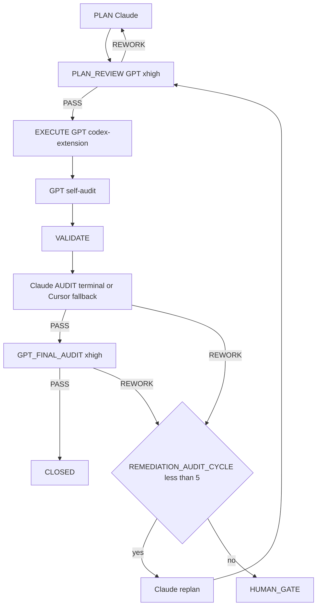

=== Auto-audit GPT (2e passe) ===
2026-04-25T17:59:33.102183Z  WARN codex_core::agents_md: Project doc `/Users/1millnonstop/Downloads/projet/foodking-web/web/testttt/AGENTS.md` exceeds remaining budget (32768 bytes) - truncating.
OpenAI Codex v0.125.0 (research preview)
--------
workdir: /Users/1millnonstop/Downloads/projet/foodking-web/web/testttt
model: gpt-5.5
provider: openai
approval: never
sandbox: workspace-write [workdir, /tmp, $TMPDIR, /Users/1millnonstop/.codex/memories]
reasoning effort: xhigh
reasoning summaries: none
session id: 019dc5cb-fbef-73f3-b1a2-49c27ebb9d3b
--------
user
Tu effectues l’**auto-audit GPT** (2e passe) d’un cycle FoodKing — **pas** l’audit Claude terminal.

**Contexte** : le JSON ci-dessous est la proposition d’implémentation (format agents/codex.prompt.txt) pour la mission `CV1-M06-POS-REVENUE-GUARDS`.


**JSON d’implémentation (à recouper)** :
```json
{
  "files_to_modify": [
    "app/Http/Controllers/Frontend/OrderController.php",
    "app/Http/Requests/Frontend/PaymentConfirmRequest.php",
    "app/Jobs/CleanupStalePendingKioskOrders.php",
    "app/Services/FrontendOrderService.php",
    "app/Services/OrderService.php",
    "app/Services/PaymentService.php",
    "routes/api.php",
    "tests/Feature/PaymentConfirmAbilityTest.php",
    "tests/Feature/PaymentConfirmMachineResolverTest.php",
    "tests/Feature/PaymentConfirmCrossBranchTest.php",
    "tests/Feature/OrderStatusNoopSideEffectsTest.php",
    "tests/Feature/PaymentNoopIdempotencyTest.php",
    "tests/Feature/CleanupVsConfirmRaceTest.php",
    "tests/Feature/PosCollectKioskCashRouteTest.php",
    "tests/Feature/PosDiscountForgeryTest.php"
  ],
  "implementation_steps": [
    "Created a dedicated frontend payment-confirm request requiring kiosk machine context and kiosk:order token ability in production.",
    "Hardened paymentConfirm with kiosk machine branch resolution, deferred-card-only checks, duplicate transaction_id rejection, no payment_method mutation, and late-cleanup rejection audit.",
    "Added POS dedicated collect-kiosk-cash route named admin.pos.collect-kiosk-cash and OrderService collectKioskCash with post-commit dispatch.",
    "Made stale kiosk cleanup lock and re-check unpaid pending rows before rejection, then dispatch after commit.",
    "Made repeated no-op order/payment status paths and cashback idempotent to avoid duplicate refund/cashback/dispatch side effects.",
    "Moved POS manual-discount permission enforcement to backend-computed subtotal in OrderService, leaving PosOrderRequest as preliminary UX validation only.",
    "Added focused feature tests for payment confirm ability/branch/cash/duplicate transaction, cleanup race, no-op side effects, cash collection route, payment idempotency, and discount forgery."
  ],
  "code_blocks": [
    {
      "path": "app/Http/Requests/Frontend/PaymentConfirmRequest.php",
      "op": "create",
      "excerpt": "New FormRequest validates transaction_id/card_type/payment_method and authorizes only authenticated kiosk machine users with kiosk:order ability in non-test token flows."
    },
    {
      "path": "app/Http/Controllers/Frontend/OrderController.php",
      "op": "replace",
      "excerpt": "Replace paymentConfirm Request with PaymentConfirmRequest; lock order without BranchScope, verify kiosk machine branch_id, reject non-deferred payment methods, reject payment_method mismatch, reject duplicate transaction_id with 409, do not mutate payment_method, log payment_late_after_cleanup on rejected/canceled late confirms."
    },
    {
      "path": "app/Jobs/CleanupStalePendingKioskOrders.php",
      "op": "replace",
      "excerpt": "Filter stale kiosk cleanup to PaymentStatus::UNPAID, lock each row in DB::transaction, re-check pending/unpaid under lock, apply OrderStatus::REJECTED, then dispatch mail/sms/push/status/cancel events after commit."
    },
    {
      "path": "app/Services/OrderService.php",
      "op": "replace",
      "excerpt": "Add collectKioskCash(Order) for pending kiosk cash orders; add no-op guards to changeStatus and changePaymentStatus; add backend subtotal discount permission guard; use exact branch_id filters and branch visibility helpers already aligned with M-09 changes."
    },
    {
      "path": "app/Services/FrontendOrderService.php",
      "op": "replace",
      "excerpt": "Add no-op status guard before customer cancel side effects; keep branch_id exact filtering and idempotency lookup scoped by branch_id."
    },
    {
      "path": "app/Services/PaymentService.php",
      "op": "replace",
      "excerpt": "Make cashBack idempotent by returning an existing cash_back transaction and only creating one cashback for an existing payment transaction."
    },
    {
      "path": "routes/api.php",
      "op": "replace",
      "excerpt": "Add POST /api/admin/pos/collect-kiosk-cash/{order} inside admin.pos route group with name admin.pos.collect-kiosk-cash and POS permission check."
    },
    {
      "path": "tests/Feature/*.php",
      "op": "create",
      "excerpt": "Created eight focused M-06 feature tests covering ability, machine branch resolver, cross-branch/cash/duplicate TPE confirm, no-op side effects, payment idempotency, cleanup-vs-confirm, POS collect kiosk cash, and POS discount subtotal forgery."
    }
  ],
  "risks": [],
  "notes": [
    "SYMMETRY_NOTE: OrderService and FrontendOrderService both now short-circuit same-status no-op changes before refund/cashback/dispatch side effects; POS-only collect-cash and backend discount guard have no frontend-order analogue.",
    "Validation passed: php syntax checks, .cursor/hooks/safety-check.sh, git diff --check, PaymentConfirm, PaymentConfirmAbility, PaymentConfirmCrossBranch, OrderStatusNoopSideEffects, CleanupVsConfirmRace, PosCollectKioskCashRoute, PosDiscountForgery, PaymentConfirmMachineResolver, PaymentNoopIdempotency, KioskPaymentStateMachineTest, PosCashEndpointSentinel, and PosDiscountPermissionTest.",
    "npm run verify:boucle exited 1 in this shell without diagnostic output; Graphiti search was cancelled by the tool layer, so local mission context and memory fallback were used."
  ],
  "execution_trace": {
    "delegation": "codex-extension",
    "invariants_considered": [
      "pricing_ssot",
      "order_status",
      "branch_id",
      "commit_before_dispatch"
    ]
  }
}
```

**Livrable** (Markdown uniquement, en français) :
# AUTO_AUDIT_GPT — CV1-M06-POS-REVENUE-GUARDS

## 1. Conformité au plan / scope
(Énumérer manques ou dérives ; si scope élargi sans escale → **ESCALATE**)

## 2. Invariants FoodKing
Pour chacun : OK / RISQUE / N/A
- pricing_ssot (backend seul)
- order_status (enum, pas de strings)
- branch_id
- commit_before_dispatch
- frozen_zones
- order_service_symmetry (si un des deux services touché)

## 3. Verdict
Une ligne : `VERDICT: PASS` | `VERDICT: NEEDS_FIX` | `VERDICT: ESCALATE` + 1–3 phrases.

2026-04-25T17:59:33.427535Z  WARN codex_core_plugins::manifest: ignoring interface.defaultPrompt: prompt must be at most 128 characters path=/Users/1millnonstop/.codex/.tmp/plugins/plugins/build-ios-apps/.codex-plugin/plugin.json
2026-04-25T17:59:33.430344Z  WARN codex_core_plugins::manifest: ignoring interface.defaultPrompt: maximum of 3 prompts is supported path=/Users/1millnonstop/.codex/.tmp/plugins/plugins/plugin-eval/.codex-plugin/plugin.json
2026-04-25T17:59:40.941659Z  WARN codex_core_plugins::manifest: ignoring interface.defaultPrompt: prompt must be at most 128 characters path=/Users/1millnonstop/.codex/.tmp/plugins/plugins/build-ios-apps/.codex-plugin/plugin.json
2026-04-25T17:59:40.944050Z  WARN codex_core_plugins::manifest: ignoring interface.defaultPrompt: maximum of 3 prompts is supported path=/Users/1millnonstop/.codex/.tmp/plugins/plugins/plugin-eval/.codex-plugin/plugin.json
2026-04-25T17:59:42.047196Z  WARN codex_core_plugins::manifest: ignoring interface.defaultPrompt: prompt must be at most 128 characters path=/Users/1millnonstop/.codex/.tmp/plugins/plugins/build-ios-apps/.codex-plugin/plugin.json
2026-04-25T17:59:42.047500Z  WARN codex_core_plugins::manifest: ignoring interface.defaultPrompt: maximum of 3 prompts is supported path=/Users/1millnonstop/.codex/.tmp/plugins/plugins/plugin-eval/.codex-plugin/plugin.json
codex
J’utilise `sync-risk-review` parce que la mission touche prix, cycle de commande, paiement, `branch_id` et dispatch. Je vais recouper le JSON avec le plan actif, la mission CV1-M06 et les diffs réels avant de rendre le verdict Markdown.
exec
/bin/zsh -lc "sed -n '1,220p' /Users/1millnonstop/Downloads/projet/foodking-web/web/testttt/.agents/skills/sync-risk-review/SKILL.md" in /Users/1millnonstop/Downloads/projet/foodking-web/web/testttt
exec
/bin/zsh -lc "sed -n '1,240p' AGENTS.md" in /Users/1millnonstop/Downloads/projet/foodking-web/web/testttt
exec
/bin/zsh -lc "sed -n '1,200p' .cursor/ACTIVE_CYCLE.md" in /Users/1millnonstop/Downloads/projet/foodking-web/web/testttt
exec
/bin/zsh -lc "sed -n '1,220p' plans/masterplay/MASTERPLAY_DISCIPLINE.md" in /Users/1millnonstop/Downloads/projet/foodking-web/web/testttt
 succeeded in 0ms:
---
name: sync-risk-review
description: Review changes affecting synchronization, auth, pricing, KDS, OSS, or order lifecycle for architectural and business risk.
disable-model-invocation: true
---

# Sync Risk Review Skill

Use this skill when a change affects:
- sync
- auth
- pricing
- KDS
- OSS
- order lifecycle
- cross-device behavior

## Steps
1. Read the relevant docs
2. Inspect the diff or current implementation
3. Identify:
   - architecture risk
   - state consistency risk
   - business rule violations
   - authz issues
   - missing tests
4. Produce a concise review with recommended next actions.

 succeeded in 0ms:
# Active Cycle – FoodKing

**Méta (SSOT `run-cycle.md` Step 0 + `AGENTS.md` § *Authoritative … cycle state*)** — requis pour que l’orchestrateur ne s’arrête pas sur *« RUNNER_MODE not set »*.

| Champ | Valeur actuelle |
| --- | --- |
| **RUNNER_MODE** | `single-session` |
| **PHASE (cycle W10)** | `IN_PROGRESS` (détail = section `CYCLE_W10_…` ci-dessous) |
| **TASK_ID** | `P_EXEC_CLOSEOUT_GRAPHITI_CI_PROD_2026-04-22` |
| **PLAN_FILE** | `plans/PLAN_EXECUTION_CLOSEOUT_GRAPHITI_CI_PROD_2026-04-22.md` |
| **REPORT_FILE** | `reports/post_execute_latest.log` (append — preuve `EXECUTE_DELEGATION` / `AUDIT_*`) |

> **ACTIVE_PRIMARY** : `CYCLE_W10_EXECUTION_CLOSEOUT` (un seul cycle peut être actif à la fois — voir B03 méga-checklist).
> Cycles plus anciens en lecture seule = **archive** déplacée dans **`.cursor/ACTIVE_CYCLE_ARCHIVE.md`** (lecture humaine / forensique uniquement, **non requise** par le parcours obligatoire).

## CYCLE_W10_EXECUTION_CLOSEOUT (IN_PROGRESS — mémoire 180 + MCP global + commit + CI + prod)

**TASK_ID** : `P_EXEC_CLOSEOUT_GRAPHITI_CI_PROD_2026-04-22`  
**Plan SSOT** : `plans/PLAN_EXECUTION_CLOSEOUT_GRAPHITI_CI_PROD_2026-04-22.md`  
**Ordre** : Piste A (POS+Centrale : PLAN-MEM-1) ∥ Piste B (humain : PLAN-MEM-3) → C (smoke) → D (commit sur « go commit ») → E (CI) → F (prod J-7→J+7).  
**Gate mémoire** : `python3 memory/verify.py` → count **≥ 175** (180 idéal) avant de considérer PLAN-MEM-1 **CLOSED**.

- **Vérif locale (2026-04-22)** : `python3 memory/verify.py` → **count = 182**, smoke `search_memory_facts` OK — gate **satisfaite** pour clôturer l'ingestion côté seuil d'épisodes (suite : commit / CI / prod selon plan `PLAN_EXECUTION_CLOSEOUT_*`).

**Gouvernance globale (2e passe 2026-04-22)** : primer multi-agents + Graphiti vivant + tokens « zéro effet négatif » → **`docs/orchestration/GLOBAL_SYSTEM_PRIMER.md`** + rapport **`reports/audit/AUDIT_SECOND_PASS_GLOBAL_GOVERNANCE_REPORT_2026-04-22.md`**.

---

## CAISSE_V1_MASTERPLAY (ACTIVE — 2026-04-25)

**Phase** : finition Caisse V1 (POS + Kiosk + KDS + Centrale + Fiscal + Ops).
**Plan parent** : `plans/PLAN_CAISSE_V1_GPT_MASTERPLAY_2026-04-25.md`
**Plan DAG autoritaire** : `plans/PLAN_CAISSE_V1_SUPER_MASTER_2026-04-25.md`
**Boucle d'exécution** : `plans/masterplay/MASTERPLAY_DISCIPLINE.md` + `plans/masterplay/MASTERPLAY_QUEUE.md` + `scripts/run-masterplay.sh`
**Statut temps réel** : `reports/masterplay/status.json`

**Règle** : tout `TASK_ID` au format `CV1-MXX-…` passe par la masterplay (cf. `AGENTS.md` § "Caisse V1 — Masterplay loop", `.cursor/rules/global.mdc` § "Caisse V1 — Masterplay loop", `.cursor/commands/run-cycle.md` Step 0 item 0). **NE PAS** ouvrir un `run-cycle` standard sur un `CV1-MXX-…`.

---

## Archive

Tous les cycles **CLOSED / COMPLETED PASSED** (W4 → W9, NF525, etc.) ont été déplacés dans **`.cursor/ACTIVE_CYCLE_ARCHIVE.md`** pour réduire le coût de lecture du parcours obligatoire (audit 2026-04-24, mission `T-PARCOURS-OPTIMIZE-001`).

- **Lecture humaine** : ouvrir `.cursor/ACTIVE_CYCLE_ARCHIVE.md`.
- **Lecture agent** : **non requise** sauf instruction explicite du plan ou du chat (ex. "reprend le rationale du cycle W9").
- **Recherche** : `rg "CYCLE_W9_" .cursor/ACTIVE_CYCLE_ARCHIVE.md` ou `git log --follow .cursor/ACTIVE_CYCLE.md`.

 succeeded in 0ms:
# MASTERPLAY DISCIPLINE — Caisse V1 (loop master)

> **But** : règles strictes que le runner et chaque mission GPT respectent en boucle, pendant des heures, jusqu'à finition de toutes les missions de `MASTERPLAY_QUEUE.md`. Lecture obligatoire avant de lancer `bash scripts/run-masterplay.sh`.

## 1. Autorité

| Source | Rôle |
|--------|------|
| `AGENTS.md` | Parcours obligatoire, cycle FoodKing |
| `plans/PLAN_CAISSE_V1_SUPER_MASTER_2026-04-25.md` | DAG autoritaire (ordre, gates) |
| `plans/PLAN_CAISSE_V1_GPT_MASTERPLAY_2026-04-25.md` | Catalogue 22 missions M-XX (objectifs, allowlist) |
| `plans/masterplay/MASTERPLAY_QUEUE.md` | File d'exécution courante |
| `plans/masterplay/MASTERPLAY_DISCIPLINE.md` | (ce fichier) règles d'exécution |
| `.cursor/rules/*.mdc` | Toujours appliquées |
| `docs/gates/GATE_LOG.md` | État des gates humains |

## 2. Boucle d'exécution (run-masterplay.sh)

```
LOOP {
  1. tail activity log (~500 tokens)
  2. find next PENDING task in MASTERPLAY_QUEUE with all DEPENDS_ON == CLOSED
  3. if none → break (all done or all blocked)
  4. verify missions/<TASK_ID>/input.json + execute_brief.md exist
  5. activity-log start codex-extension <TASK_ID> execute "<allowlist CSV>" "<note>"
     if exit 2 (collision) → MARK BLOCKED note=collision, continue loop
  6. update status: RUNNING
  7. npm run codex:complex -- <TASK_ID>     (génère output_codex.json + GPT_SELF_AUDIT)
  8. update status: EXECUTED
  9. activity-log done codex-extension <TASK_ID> done "<résumé court>"
 10. (option --with-audit) bash scripts/foodking-claude-orchestrate.sh audit-brief <TASK_ID>
       if PASS → status: AUDIT_PASS
       if REWORK → status: REWORK ; increment REWORK_COUNT ; if >=5 → BLOCKED note=human_gate
 11. (option --with-final) npm run codex:final-audit -- <TASK_ID>
       if PASS → status: FINAL_PASS
 12. if FINAL_PASS:
       bash scripts/after-execute-memory.sh
       update status: CLOSED
 13. sleep INTER_TASK_PAUSE_SECONDS (default 5s)
 14. continue LOOP
}
```

## 3. Garde-fous (non négociables)

### 3.1 Allowlist stricte par mission
Codex modifie **uniquement** les fichiers listés dans `missions/<TASK_ID>/input.json.allowlist`. Si modification hors liste détectée à l'audit → `REWORK`.

### 3.2 Frozen zones
Aucune édition d'un fichier frozen sans gate signé dans `docs/gates/GATE_LOG.md`. Le runner **refuse** de lancer une mission marquée `BLOCKED` jusqu'à ce que le statut soit changé manuellement après signature.

### 3.3 Invariants FoodKing — `REWORK` automatique
- Pricing client-authoritative
- Status littéral numérique (`status: 16`)
- `branch_id` LIKE
- Dispatch dans transaction
- OS ou FOS modifié sans `SYMMETRY_NOTE`
- Frozen modifié sans gate

### 3.4 Pas de gate auto-approuvée
Codex peut **rédiger** options ; aucune mission ne coche `[x] Approved`. Si une mission le tente → `REWORK` + `risks: ["ESCALATION: gate self-approved"]`.

### 3.5 Tests obligatoires
Chaque `mandatory_tests` listé doit être lancé et reporté dans le rapport. Échec → `REWORK`.

### 3.6 Diff minimal
Aucun renommage opportuniste, aucun refactor non demandé, aucune optimisation collatérale. Si ajout justifié → `notes` du JSON.

### 3.7 Activity log
`start` avant chaque mission ; `done` après. Sans cela → réservation fantôme = autres agents bloqués. Le runner enforce.

### 3.8 Mémoire
À CLOSE : compléter `memory/episodes/caisse_v1_<topic>_*.jsonl` (squelettes créés par M-19) puis `bash scripts/after-execute-memory.sh`. Si Graphiti UP : `bash bin/graphiti-ingest.sh` + `python3 memory/verify.py`.

## 4. Boucles de rework

- Max **5 cycles `REWORK`** consécutifs sur la même mission. Au 5e → `BLOCKED note=human_gate_required`.
- Max **3 cycles healing** consécutifs (cf. CLAUDE.md §8) avant escalade.
- Toute escalation → écrite dans `reports/masterplay/ESCALATIONS_<date>.md`.

## 5. Pause / arrêt

- `Ctrl-C` arrête la boucle proprement (mission en cours finit, runner s'arrête après).
- `touch reports/masterplay/STOP` → le runner s'arrête à la fin de la mission courante.
- `touch reports/masterplay/PAUSE` → le runner pause entre les missions tant que le fichier existe.

## 6. Logs

- `reports/masterplay/run_<ISO>.log` : log de la boucle.
- `reports/masterplay/status.json` : état temps réel (mission courante, compteurs).
- `missions/<TASK_ID>/output_codex.raw.log` : raw codex.
- `missions/<TASK_ID>/output_codex.json` : json structuré.
- `reports/audit/GPT_SELF_AUDIT_<TASK_ID>.md` : self-audit GPT.
- `reports/post_execute_latest.log` : trace `EXECUTE_DELEGATION`.
- `reports/AGENT_ACTIVITY_LOG.md` : start/done.

## 7. Audit Claude (en fin de boucle, manuel)

Quand toutes les missions sont `CLOSED` (ou `BLOCKED` documentés) :

```
bash scripts/foodking-claude-orchestrate.sh context
bash scripts/foodking-claude-orchestrate.sh audit
```

Sortie attendue : verdict transversal Caisse V1 (chaîne sync borne→centrale→POS→KDS→fiscal). Le verdict détermine `GO/HOLD/NO-GO` pour `GATE_GO_NO_GO_CAISSE_V1`.

## 8. Critères d'arrêt anormal

- 3 missions consécutives en `REWORK` → halt + alerte humaine.
- Activity-log refuse 3 fois → halt (collision permanente).
- `npm run codex:complex` échoue 3 fois sur la même mission (binaire codex KO) → halt.
- `claude` terminal indisponible 3 fois consécutives → continue avec fallback subagent + `AUDIT_FALLBACK_REASON: terminal-unavailable`.

## 9. Token discipline

- Le prompt envoyé à codex contient : template `agents/codex.prompt.txt` + `input.json` + `execute_brief.md` + (optionnel) `graphiti_context.md`, `plan_excerpt.md`, `cycle_snapshot.md`.
- Pas de duplication : pas de re-coller AGENTS.md ou super master plan dans chaque mission.
- Cap typique d'un prompt : ≤ 30 KB. Au-delà → splitter la mission.

## 10. Anti-pattern interdits

- ❌ Lancer 2 missions en parallèle sur les mêmes fichiers (collision activity-log).
- ❌ Modifier `MASTERPLAY_QUEUE.md` pendant que le runner tourne (sauf marquer BLOCKED → PENDING après gate).
- ❌ Skipper l'audit Claude pour aller plus vite.
- ❌ Marquer CLOSED manuellement sans double PASS (PASS Claude + PASS Codex final).
- ❌ Ignorer un `risks: ["ESCALATION: ..."]` dans output_codex.json.

---

`MASTERPLAY_DISCIPLINE_VERSION: 1.0` · `STRICT_MODE: ON`

 succeeded in 0ms:
# FoodKing – Cursor Agent Operating Contract

## 0. Quick start contract — read this first

Commence ici. Ne lance aucune action tant que tu n'as pas lu les priorités P0.
Ce contrat fixe l'ordre minimal de lecture pour comprendre le repo en moins de 60 secondes.
Lis complètement ce qui est marqué obligatoire ; diffère seulement ce qui est explicitement classé P2.

### Reading priority

| Priority | What to read | Why |
| --- | --- | --- |
| P0 | `AGENTS.md §1 Parcours obligatoire` | Cadre impératif de travail, ordre de lecture, discipline de cycle. |
| P0 | `.cursor/ACTIVE_CYCLE.md` (continuation) | État courant du cycle actif, contexte vivant, reprise sans divergence. |
| P0 | `.cursor/rules/global.mdc` (auto-attaché — mentionné pour info) | Règles globales toujours applicables, même si déjà injectées par l'outil. |
| P0 | `plans/masterplay/MASTERPLAY_DISCIPLINE.md` + `plans/masterplay/MASTERPLAY_QUEUE.md` (Caisse V1 actif) | **Pendant la phase Caisse V1** : règles d'or de la boucle GPT + file d'exécution. Tout agent qui touche une mission `CV1-MXX-…` DOIT lire ces deux fichiers avant d'agir. |
| P1 | `docs/orchestration/GLOBAL_SYSTEM_PRIMER.md` | Vocabulaire, architecture d'orchestration, invariants transverses. |
| P1 | `.cursor/commands/run-cycle.md` | Procédure exacte pour démarrer un cycle borné correctement. |
| P1 | `docs/orchestration/MEMORY_MATRIX.md` | Où chercher la mémoire utile sans relire tout le dépôt. |
| P1 | `.cursor/routing.md` | Routage des tâches, choix du bon canal, limites d'intervention. |
| P2 | `docs/orchestration/CODEX_API_DELEGATION.md` (quand EXECUTE complexe) | À lire si tu délègues ou exécutes du complexe (uniquement **CLI `codex`**, pas d’exécuteur HTTP dans le dépôt). |
| P2 | `.cursor/ACTIVE_CYCLE_ARCHIVE.md` (forensique humain) | Historique utile pour audit humain, pas requis au démarrage. |
| P2 | `docs/orchestration/EXPORT_CONFIG_CODEX_GPT_API_ET_AUDIT_PERSISTANCE.md` (nouveau poste) | Configuration et persistance utiles surtout lors d'un nouvel environnement. |

Règle simple : P0 avant toute action, P1 avant tout EXECUTE, P2 seulement à la demande du sujet.
Si un doute persiste après P0+P1, arrête-toi et relis ; n'improvise pas.

### One-line bootstrap

```bash
npm run verify:boucle
bash scripts/agent-activity-log.sh tail 50
run-cycle <TASK_ID>
```

### Caisse V1 — Masterplay loop (actif)

Pendant la phase de finition Caisse V1 (POS + Kiosk + KDS + Centrale + Fiscal), l'orchestration passe par la **MASTERPLAY** :

```bash
# Lire d'abord (obligatoire)
cat plans/masterplay/MASTERPLAY_DISCIPLINE.md
cat plans/masterplay/MASTERPLAY_QUEUE.md
cat plans/masterplay/GO.md

# Lancer la boucle (Codex extension complexe + audit Claude terminal + audit Codex final)
bash scripts/run-masterplay.sh --with-audit --with-final
```

- **Plan parent** : `plans/PLAN_CAISSE_V1_GPT_MASTERPLAY_2026-04-25.md` (catalogue 22 missions M-XX, ancrages file:line)
- **Plan autoritaire DAG** : `plans/PLAN_CAISSE_V1_SUPER_MASTER_2026-04-25.md`
- **Statut temps réel** : `reports/masterplay/status.json` + `reports/masterplay/run_*.log`
- Tout `TASK_ID` au format `CV1-MXX-…` est gouverné par la masterplay (allowlist, frozen, gates, REWORK max 5).
- Hors phase Caisse V1 : repasser au `run-cycle <TASK_ID>` standard.

**Anti-répétition (nouvel onglet / agent parallèle)** : copier d’abord le bloc de `docs/orchestration/SESSION_OPENING_ENFORCEMENT.md` — même discipline, moins d’oubli de `ACTIVE_CYCLE` / `run-cycle`.

Utilise `run-cycle <TASK_ID>` pour initier tout cycle borné.
Les deux autres commandes servent à vérifier l'état local et le journal d'activité avant d'exécuter.

### Quality-first, not token-cheap

Lis P0 et P1 intégralement, sans skim. Les économies de tokens ne se font jamais sur la substance des règles, seulement sur la répétition, le bruit et les relectures inutiles. En cas de tension entre vitesse et rigueur, applique la rigueur ; voir `.cursor/rules/global.mdc § Token Discipline`.

### If you're a new human contributor

Commence par `docs/orchestration/EXPORT_CONFIG_CODEX_GPT_API_ET_AUDIT_PERSISTANCE.md` pour préparer ton poste et comprendre le mode de persistance attendu.
Lis-le après P0, puis enchaîne sur P1 avant toute contribution effective.

---

## 1. Parcours obligatoire — **nouvelle conversation** **et** **continuation** (production, non négociable)

> **Objectif** : qu’**à chaque** session (premier message ou 500e message), l’exécutant sache **quel** chemin suivre — **sans** supposer un historique de chat. Tout est **dans le dépôt** ; l’histoire de conversation **n’est pas** la SSOT.

**Règle d’or** : *aucune* modification de code **produit** (hors `plans/`, `reports/`, `docs/gates/`, `missions/`, JSONL gouvernance) **dans le cadre d’un travail borné** sans **(a)** parcours ci-dessous **et** **(b)** cycle `run-cycle` + plan actif, sauf **exception** explicite humaine (notée dans le plan / gate).

| Étape | Action | Quand / pourquoi |
|-------|--------|------------------|
| **0. Continuation** | Lire **`.cursor/ACTIVE_CYCLE.md`**. | Si `PHASE` n’est **pas** vide et le cycle n’est **pas** archivé : **reprendre** ce `TASK_ID` / ce `PLAN_FILE` / ce `REPORT_FILE` — **ne pas** dupliquer un second cycle fantôme. Si humain confirme **nouveau** sujet : réinitialiser / nouveau `TASK_ID` selon `run-cycle` Step 0. |
| **1. Lecture initiale** | Lire **ce fichier** (`AGENTS.md`) **puis** **`docs/orchestration/GLOBAL_SYSTEM_PRIMER.md`** (table §1 = ordre complet : routing, `run-cycle`, Graphiti, `MEMORY_MATRIX`, etc.). | **Avant** tout code ou plan non trivial. Même en « continuation » si le contexte a dérivé ou l’onglet a été rafraîchi. |
| **2. Cycle structuré (SSOT procédurale)** | Toute tâche avec **`TASK_ID`** : suivre **`.cursor/commands/run-cycle.md`** et la commande **`run-cycle <TASK_ID>`** (ou équivalent explicite dans le chat : enchaîner les **Steps 0 → 5** sans en sauter). | **Programme courant (quota-optimized)** : `PLAN GPT → PLAN_REVIEW GPT → EXECUTE GPT → VALIDATE → AUDIT GPT → [CLAUDE CRITIQUE SI NÉCESSAIRE] → [GATE \| CLOSE]`. Aucun « close » sans audit PASS documenté. |
| **3. Vérification d’environnement** | `npm run verify:boucle` (0 requête par défaut). **Si le terminal ne “voit” pas Codex alors que l’extension est connectée** : l’auth IDE n’alimente pas le CLI — lancer `npm run codex:doctor` (npm + `login status` + 1 requête). **Rapide :** `npm run codex:verify-pro`. **Complet :** `npm run verify:boucle:full`. Encart : `agents/codex-extension-instructions.md`. | Même en **Step 5** : l’`EXECUTE` (CLI `codex`) requiert le binaire + session Pro sur **ce** binaire. Voir `run-cycle` Step 0 item 8. |
| **4. Secrets & outils machine** | Binaire **`claude`** sur le **`PATH`** (Claude Code CLI) pour l’**AUDIT** PRIMARY en terminal. Binaire **`codex`** (CLI OpenAI) : *Sign in with ChatGPT* **Pro** — **pas** de clé API dans le dépôt. Résolution : `PATH` **ou** `node_modules/.bin/codex` après **`npm install`** (dépendance **`@openai/codex`**) **ou** `npm i -g @openai/codex`. **Ne pas** mélanger avec une clé *Platform* restreinte dans l’environnement (provoque des 401 *scopes* sur l’API Responses) — `npm run codex:audit-bleed` aide. (Option) MCP Graphiti selon `~/.cursor/mcp.json`. | Sans `claude` : noter dès le **plan** l’`AUDIT` fallback + `AUDIT_FALLBACK_REASON`. Sans binaire `codex` : pas d’`EXECUTE` complexe PRIMARY (sub-agent + `FALLBACK_REASON` ou `npm install` + auth Pro). |
| **5. Traces & mémoire (déjà dans ce fichier)** | **`EXECUTE_DELEGATION:`** avant VALIDATE ; **`AUDIT_CHANNEL:`** + **`TERMINAL_AUDIT_OK: 1`** si audit terminal OK ; `docs/orchestration/MEMORY_MATRIX.md` ; `scripts/agent-activity-log.sh` (tail / start / done). | Traçabilité = **même** qualité en prod sur N agents parallèles. |

**Ce n’est pas optionnel** pour travailler « en production FoodKing » : c’est le **contrat** d’onboarding. Les **règles** `.cursor/rules/*.mdc` (dont **`global.mdc` — alwaysApply**) et ce fichier **s’imposent** **à** tout modèle, **dans** toute conversation, dès l’ouverture du dépôt.

**Pour un humain / nouveau compte** : mêmes étapes ; la doc **`docs/orchestration/EXPORT_CONFIG_CODEX_GPT_API_ET_AUDIT_PERSISTANCE.md`** regroupe l’**export** config API + persistance des règles hors-chat.

## Engine
Cursor local agent. No cloud orchestration. No external framework.
Auto/Premium routing: disabled. Model selection is explicit per cycle.

## Global system primer (multi-agents, Graphiti, tokens — lecture clé)

Tout nouvel intervenant (session Cursor, sub-agent Task, CLI terminal, humain) qui touche **orchestration**, **mémoire**, ou **discipline de contexte** : lire **`docs/orchestration/GLOBAL_SYSTEM_PRIMER.md`** après ce fichier. Y sont définis : ordre de lecture obligatoire, `codex-extension` GPT-5.5-pro/xhigh, fallback `foodking-complex-implementer`, fallback audit `foodking-planner-orchestrator`, terminal **`claude` / `codex`**, **mise à jour continue de Graphiti**, et la politique **« intelligence max — zéro optimisation négative »** (tokens : supprimer le gaspillage, pas la substance). Pour audits longs et robustesse **opération + agentique + mémoire** : **`docs/orchestration/MEGA_CHECKLIST_AUTONOMY_AND_MEMORY.md`** (180 tâches) et le narratif **`reports/audit/MEGA_AUDIT_SYSTEM_OPERATION_AGENTIC_2026-04-23.md`**.

**Discipline mémoire (qui écrit où, qui lit quoi, quand)** : **`docs/orchestration/MEMORY_MATRIX.md`** — matrice unique des **4 stores autorisés** (Code A · Graphiti+JSONL B · Missions C · Rapports D), table d'écriture par phase, ordre de lecture pour une nouvelle session, anti-patterns. Aucun nouveau store de mémoire ne peut être ajouté sans gate `docs/gates/GATE_MEMORY_*`. Décisions 2026-04-23 sur OpenSpace et claude-mem : **non intégrés**, justifications dans la matrice.

**Synchro multi-agents (cross-conv, cross-terminal)** : `.cursor/rules/cross-agent-sync.mdc` (alwaysApply) + `reports/AGENT_ACTIVITY_LOG.md` (append-only) + `scripts/agent-activity-log.sh` (`tail | start | done | collisions | active`). Au démarrage de session : `tail 50` (~500 tokens). Avant édition produit (Step 2 EXECUTE) : `start` (refus exit 2 si collision). À la clôture (Step 5 CLOSE) : `done`. Évite que deux agents (Cursor convs / `codex-extension` / `claude-terminal` / humain) modifient les mêmes fichiers à leur insu. **Doctrine étendue** (Graphiti = mémoire partagée, rôles Claude vs Codex, anti-patterns) : **`docs/orchestration/MULTI_AGENT_ORCHESTRATION.md`**.

## Workflow
PLAN GPT (codex) → PLAN_REVIEW GPT (codex) → EXECUTE GPT (codex) → VALIDATE → AUDIT GPT (codex) → [CLAUDE CRITICAL ESCALATION ONLY] → [HUMAN GATE | CLOSE]

No phase may be skipped. Default close condition is `AUDIT_VERDICT: PASS` from GPT path, with optional Claude escalation audit only for critical/blocked cases.

## Model Roles
| Model | Role | Channel (priorité **qualité maximale / zéro raccourci token**) |
|---|---|---|
| Claude | Escalade critique uniquement | Utiliser Claude seulement pour cas vraiment critiques: blocage logique majeur, gate ambigu non résoluble, conflit d'audits, ou arbitrage architecture multi-fichiers à haut risque. Le canal prioritaire reste GPT/Codex pour économiser les quotas Claude. |
| **GPT-5.5 / GPT-5.5-pro** | **PLAN + PLAN_REVIEW + EXECUTE + AUDIT** | **`codex-extension`** — `npm run codex:plan-review`, `npm run codex:complex`, `npm run codex:final-audit` (CLI `codex` + `codex exec`, **compte ChatGPT Pro**, modèle `gpt-5.5-pro` si dispo sinon `gpt-5.5`, `model_reasoning_effort=xhigh`). GPT devient le canal principal d'orchestration, implémentation et audit de routine. |
| GPT-5.5 (fallback) | Complex implementation (FALLBACK only) | **Sub-agent** `foodking-complex-implementer` (Task Cursor) — consomme l’**usage** des modèles de l’**abonnement Cursor**. **Uniquement** si `codex` / l’exécution `codex exec` a échoué (≥2 tentatives documentées) ou binaire indispo. |
| Composer | Validation/report only | Plus d’implémentation routine pendant les cycles de finition. Composer peut résumer, exécuter/rapporter des validations, mais toute correction produit repart en EXECUTE GPT. |

**Qui décide (mode actuel quota-optimized)** : **GPT/Codex** porte l’**autorité opérationnelle** sur planification, implémentation, auto-audit, et audit final de routine. **Claude** est mis en pause et appelé uniquement en **escalade critique** (ambiguïté structurelle, gate sensible, conflit technique majeur, analyse de risque à très forte complexité). Le **fait** code / test l’emporte sur la croyance.

**Principe unique (mode actuel) — à valider en prod sur chaque cycle :** **PLAN GPT → PLAN_REVIEW GPT → EXECUTE GPT → self-audit GPT → VALIDATE → AUDIT GPT**. Le repli vers Claude n’intervient qu'en escalade critique documentée (`CLAUDE_ESCALATION_REASON:`), avec portée minimale.

One PRIMARY_EXECUTION_MODEL per cycle. Roles are explicit and layered; review checkpoints do not authorize scope expansion.
Full routing policy: `.cursor/routing.md`. Naming: the **PRIMARY complex implementer** is the **FoodKing Codex Complex Implementer** (slug `codex-extension`); see `docs/orchestration/CODEX_API_DELEGATION.md`.

## Authoritative multi-agent bounded cycle (SSOT)

For **TASK_ID-driven** work in Cursor, this path is **authoritative** and overrides any conflicting step elsewhere in this document:

1. **Command:** `.cursor/commands/run-cycle.md` (invoke with a `TASK_ID`, e.g. `run-cycle SMOKE-001`).
2. **Cycle state:** `.cursor/ACTIVE_CYCLE.md` (`RUNNER_MODE: single-session`, `PHASE`, `PLAN_FILE`, `REPORT_FILE`, completion rows).
3. **Plan artifact:** `plans/PLAN_[TASK_ID]_[DATE].md` per `.cursor/context/plan-context.md` (from `plans/PLAN_TEMPLATE.md` when applicable).
4. **Phase instructions:** `.cursor/context/plan-context.md` (PLAN), `.cursor/context/execute-context.md` (EXECUTE), `.cursor/context/audit-context.md` (AUDIT); VALIDATE per `run-cycle.md` when `validate-context.md` is absent.

**EXECUTE delegation (GPT only; PRIMARY first, FALLBACK only on failure):**

- **Routine implementation disabled during finishing cycles** : no product edit via Composer / `foodking-routine-implementer`. Small edits still route through GPT to keep the same quality chain.
- **PRIMARY** : **`codex-extension`** — **FoodKing Codex Complex Implementer** (CLI `codex`, compte **ChatGPT Pro**, `gpt-5.5-pro`, `model_reasoning_effort=xhigh`). Procédure :
  1. Préparer `missions/{TASK_ID}/input.json` (+ optionnels : `graphiti_context.md` issu de `search_memory_facts(group_ids=["foodking"])`, `plan_excerpt.md`, `execute_brief.md`, `cycle_snapshot.md` — fusionnés par le script d’assemblage de prompt).
  2. Lancer `npm run codex:complex -- {TASK_ID}` (`bash scripts/codex-extension-execute.sh`) ; le wrapper passe explicitement `-m ${CODEX_EXT_MODEL_PRO:-gpt-5.5-pro}` et `model_reasoning_effort=${CODEX_EXT_REASONING_EFFORT:-xhigh}`. (Instructions custom : `agents/codex-extension-instructions.md`.) **Bootstrap** : `npm run codex:prepare -- {TASK_ID}`.
  3. Appliquer `missions/{TASK_ID}/output_codex.json` ; consommer l’**auto-audit** `reports/audit/GPT_SELF_AUDIT_{TASK_ID}.md` (généré par le wrapper).
  4. Tracer `EXECUTE_DELEGATION: codex-extension` dans `reports/post_execute_latest.log` et le `REPORT_FILE`.
- **Complexe — FALLBACK (uniquement si `codex exec` est HS après reprises, ou binaire manquant)** : `Task` → `foodking-complex-implementer` — tracer `EXECUTE_DELEGATION: foodking-complex-implementer (codex-extension-fallback)` + `FALLBACK_REASON:`. 

Référence complète : **`docs/orchestration/CODEX_API_DELEGATION.md`** (naming, fallback contract, audit handoff, token discipline, schéma boucle). Procédure cycle : `.cursor/commands/run-cycle.md`. La trace `EXECUTE_DELEGATION` dans le rapport est **obligatoire** pour passer en VALIDATE.

**Clôture vs. audit :** Après `VALIDATE`, l’**audit** **Claude** (terminal `foodking-claude-orchestrate.sh` en PRIMARY, fallback Cursor si quota/rate-limit/terminal HS) écrit `AUDIT_VERDICT: PASS|REWORK`, puis GPT écrit `GPT_FINAL_AUDIT_VERDICT: PASS|REWORK|ESCALATE`. **Pas** de `CLOSED` sans double PASS. Sur `REWORK`, boucle `replan (orchestration Claude) → missions + EXECUTE GPT → self-audit GPT → VALIDATE → re-audit Claude → GPT final`, avec `REMEDIATION_AUDIT_CYCLE` 1..5 — au 5e `REWORK` sans double PASS, **HUMAN_GATE** (détail : Step 5 de `run-cycle.md` et `auto-remediation.mdc`).

Sections below labeled **Legacy workflow** remain valid for **PR-centric / review-loop** habits but **do not replace** this SSOT for bounded cycles.

## Source of truth (extended)
- README.md
- docs/PROJECT_CONTINUITY_AND_VISION.md
- docs/ARCHITECTURE.md
- docs/API_MAP.md
- docs/AUTHZ_MATRIX.md
- docs/ORDER_FLOW.md
- docs/DEVICE_FLOW.md
- docs/BUSINESS_RULES.md
- docs/CORE_MODULES.md
- docs/DATABASE_SCHEMA_CORE.md
- docs/ERROR_HANDLING.md
- docs/SECURITY_NOTES.md
- docs/TEST_PLAN.md
- docs/MASSIVE_TEST_PLAN.md
- docs/SAAS_VISION.md
- docs/CONTRIBUTING_QA_BOTS.md
- workflows/qa-loop.md
- workflows/task-routing.md
- workflows/report-format.md
- workflows/task-status.md
- reports/README.md
- docs/orchestration/MEGA_CHECKLIST_AUTONOMY_AND_MEMORY.md
- docs/orchestration/WORKFLOW_AUDIT_GRAPHIQUE_2026-04-23.md
- docs/orchestration/TERMINAL_CLAUDE_GRAPHITI_ORCHESTRATION.md
- docs/orchestration/ROUTING_MATRIX.md

## Stop Conditions
Halt and generate a gate brief on any of:
- Gate trigger detected
- Scope expansion beyond declared boundary
- FoodKing invariant violation
- Two consecutive validation failures
- Planning ambiguity unresolvable from task context
- **`codex` / `codex exec` indisponible après reprises (auth, binaire, ou échec ≥2 sur la même tâche)** : basculer sur le fallback `Task → foodking-complex-implementer` et **noter explicitement** `EXECUTE_DELEGATION: foodking-complex-implementer (codex-extension-fallback)` + `FALLBACK_REASON:`.
- **Audit en terminal (PRIMARY) indisponible ou limité** (`claude` absent, **quota / rate limit / session Anthropic saturée**, auth, réseau — après **1 retry** documenté de `context` + `audit-brief` ou `audit`) : **continuer le cycle** — même checklist `audit-context.md` via Task **`foodking-planner-orchestrator`** (recommandé) ou session Cursor **Claude** ; **`AUDIT_CHANNEL: cursor-session`** + **`AUDIT_FALLBACK_REASON:`** (obligatoire) + optionnel **`AUDIT_SUBAGENT_FALLBACK: foodking-planner-orchestrator`**. Voir `docs/orchestration/AUDIT_TERMINAL_QUOTA_FALLBACK.md`. **Ne jamais** omettre la raison.

## FoodKing Non-Negotiables
- Backend is pricing SSOT — no frontend price logic
- `OrderStatus` enum is authoritative — no hardcoded strings
- `branch_id` = business data isolation — no cross-branch data bleed
- Dispatch strictly after DB commit
- `OrderService` / `FrontendOrderService` symmetry mandatory on any order change
- Frozen zones require gate clearance before any edit

## MCP

### Phase 1 — Filesystem
Filesystem MCP only for repo reads where applicable.

### Phase 2 — Graphiti (mémoire inter-cycles — **présent dans toutes les sessions où le serveur est enregistré**)

**Objectif** : décisions d’architecture, invariants, sync borne↔POS↔KDS, fiscal NF525, historique de cycles — récupérables sans relire des centaines de fichiers.

| Élément | Détail |
|--------|--------|
| **Enregistrement Cursor (obligatoire côté humain)** | Fusionner le bloc `graphiti` dans **`~/.cursor/mcp.json`** (Settings → MCP). Modèle : **`.cursor/mcp/graphiti.json.example`**. Le dépôt ne peut pas injecter un MCP automatiquement dans l’IDE. |
| **Règle agent (automatique dès que le MCP est chargé)** | Voir **`.cursor/rules/graphiti-memory.mdc`** (always-on) + **`global.mdc`** : avant toute tâche non triviale, appeler au moins **`search_memory_facts`** (et optionnellement **`search_memory_nodes`**) avec `group_ids=["foodking"]`. |
| **Après AUDIT / CLOSE** | Si `add_memory` est disponible : enregistrer les décisions durables (ADR, gate, invariant clarifié). |
| **Si Graphiti absent de la session** | **Ne pas bloquer** PLAN / EXECUTE : une ligne « Graphiti non chargé » + secours **`memory/INDEX.md`** + lecture ciblée des JSONL sous `memory/episodes/`. |
| **Server** | Zep Graphiti — wrapper local **`.cursor/mcp/start-graphiti-mcp.sh`** (voir exemple JSON). Clone typique : `/Users/1millnonstop/graphiti`. |
| **Backend** | Neo4j (ex. Aura) — credentials hors repo. |
| **Dépannage** | **`.cursor/mcp/GRAPHITI_TROUBLESHOOTING.md`** (LiteLLM, embeddings, redémarrage proxy). |
| **Group ID** | Toujours **`foodking`**. |
| **Ingestion / vérif locale** | `memory/ingest.py`, `memory/verify.py`, `bin/graphiti-ingest.sh` ; index des domaines **`memory/INDEX.md`**. |

**Intégration bounded cycle** : la commande **`.cursor/commands/run-cycle.md`** inclut l’appel Graphiti en **Step 0 item 5** (query avant PLAN).

### Phase 3 — Playwright MCP (tests E2E sur flows critiques FoodKing)

- Package : `@playwright/mcp@latest` (npx, pas d’install global)
- Browser : Chromium
- BASE_URL : `http://localhost:8000`
- Config : `.cursor/mcp/playwright.json`
- Flows couverts : POS Cash, POS Card, Kiosk, KDS, Auth refresh (F5)
- Déclencheur : plan déclare `playwright-mcp` | `playwright-critical-flow` | `playwright-full-e2e`
- Rapport : `reports/antigravity/latest.md`
- Règle : le Planner-Orchestrator seul décide si un cycle requiert E2E — jamais auto-déclenché.

---

## Terminal allies — Claude Code & OpenAI Codex (abonnements Pro)

Ces outils **complètent** le routage interne Cursor (`.cursor/routing.md` : PLAN Claude, PLAN_REVIEW/EXECUTE/GPT_FINAL_AUDIT via **CLI `codex` GPT-5.5-pro xhigh**, AUDIT Claude terminal avec fallback Cursor). **Aucun remplacement** des rôles du dépôt : ce sont des canaux de la boucle officielle.

### A — Anthropic **Claude Code** (audits / orchestration textuelle, abonnement Anthropic)

1. Dans Cursor : **Extensions** (`Ctrl+Shift+X` / `Cmd+Shift+X`) → chercher **Claude Code** (Anthropic) → **Installer**.
2. Ouvrir le terminal intégré Cursor.
3. Lancer une fois :

```bash
claude

exec
/bin/zsh -lc "sed -n '1,260p' plans/masterplay/MASTERPLAY_QUEUE.md" in /Users/1millnonstop/Downloads/projet/foodking-web/web/testttt
 succeeded in 0ms:
# MASTERPLAY_QUEUE — Caisse V1

**Source de vérité de l'orchestration en boucle** : `bash scripts/run-masterplay.sh` lit cette file et exécute en série.

**Discipline** : `plans/masterplay/MASTERPLAY_DISCIPLINE.md`.  
**Plan parent** : `plans/PLAN_CAISSE_V1_GPT_MASTERPLAY_2026-04-25.md`.

## Légende statut

- `PENDING` — pas encore lancé
- `RUNNING` — codex exec en cours (ne pas relancer)
- `EXECUTED` — codex exec terminé, attend audit
- `AUDIT_PASS` — `AUDIT_VERDICT: PASS` Claude
- `FINAL_PASS` — `GPT_FINAL_AUDIT_VERDICT: PASS`
- `CLOSED` — mémoire ingestée + activity-log done
- `REWORK` — audit a demandé rework
- `BLOCKED` — gate humain ou dépendance manquante

## Légende vague

- `WAVE_A` — NO-GATE, parallélisable, démarre immédiatement
- `WAVE_B` — POST-GATE, séquencé selon DAG

## File d'exécution


| ORDER | TASK_ID                           | MISSION | WAVE   | DEPENDS_ON                 | STATUS  | NOTE                                                                         |
| ----- | --------------------------------- | ------- | ------ | -------------------------- | ------- | ---------------------------------------------------------------------------- |
| 01    | CV1-M19-MEMORY-DISCIPLINE         | M-19    | WAVE_A | —                          | CLOSED  | Crée squelettes JSONL pour les 22 missions                                   |
| 02    | CV1-M01-TRACEABILITY-MATRIX       | M-01    | WAVE_A | —                          | CLOSED  | Matrice findings → tasks → tests → gates (REWORK resolved GPT PASS)          |
| 03    | CV1-M02-SENTINEL-BASELINE         | M-02    | WAVE_A | CV1-M01                    | CLOSED  | 18 sentinels fail-first + 4 lints                                            |
| 04    | CV1-M12-LEGACY-GUARDS-CI          | M-12    | WAVE_A | —                          | CLOSED  | Lint imports + bundle scan + workflow (recovered: extractor JSON fix)        |
| 05    | CV1-M16-HARDWARE-LAB              | M-16    | WAVE_A | —                          | CLOSED  | Checklist hardware signable (recovered: JSON valid, files materialized)      |
| 06    | CV1-M18-TEST-ARCHITECTURE         | M-18    | WAVE_A | CV1-M02                    | CLOSED  | Grille couverture + plan campagne                                            |
| 07    | CV1-M20-RUNBOOKS-SKELETON         | M-20    | WAVE_A | —                          | CLOSED  | 8 runbooks ops (REWORK Horizon resolved GPT PASS)                            |
| 08    | CV1-M21A-QUICKWINS-LOT0           | M-21a   | WAVE_A | —                          | CLOSED  | POS: discount v-model + Swiper RTL + focustrap dead                          |
| 09    | CV1-M03-GATES-DRAFT               | M-03    | WAVE_A | CV1-M01                    | CLOSED  | 8 briefs gates Caisse V1 créés; Wave B reste bloquée par signatures humaines |
| 10    | CV1-M09-BRANCH-ISOLATION          | M-09    | WAVE_B | CV1-M03(gates), CV1-M02    | CLOSED  | GPT audit PASS; M-08/M-06/schema sentinels remain gated                      |
| 11    | CV1-M06-POS-REVENUE-GUARDS        | M-06    | WAVE_B | CV1-M09, CV1-M03           | RUNNING | Gates frozen Option C + payment_prop Option A approved                       |
| 12    | CV1-M05-ORDER-QUOTE               | M-05    | WAVE_B | CV1-M03                    | PENDING | Gate schema Option A approved                                                |
| 13    | CV1-M04A-PAYMENT-LEDGER-FULL      | M-04A   | WAVE_B | CV1-M03 (ledger=A)         | BLOCKED | Ledger gate chose Option B; M-04A not selected                               |
| 14    | CV1-M04B-PAYMENT-PILOT-RESTRICT   | M-04B   | WAVE_B | CV1-M03 (ledger=B)         | CLOSED  | GPT audit PASS; Option B restricted pilot implemented                        |
| 15    | CV1-M08-FISCAL-Z-NF525            | M-08    | WAVE_B | CV1-M03 (fiscal+schema)    | PENDING | Fiscal Option B + schema Option A approved                                   |
| 16    | CV1-M07-KDS-RELEASE               | M-07    | WAVE_B | CV1-M03 (kds_bump)         | PENDING | KDS gate Option B approved                                                   |
| 17    | CV1-M10-OS-FOS-SYMMETRY           | M-10    | WAVE_B | CV1-M06, CV1-M09           | BLOCKED | Will unlock after M-06 PASS                                                  |
| 18    | CV1-M11-KIOSK-RUNTIME             | M-11    | WAVE_B | CV1-M03 (offline+fiscal)   | BLOCKED | Will unlock after M-08 policy evidence                                       |
| 19    | CV1-M17-WEB-STRIPE-SCOPE          | M-17    | WAVE_B | CV1-M03 (web+stripe)       | PENDING | Web Option B + Stripe Option B approved                                      |
| 20    | CV1-M13-MIGRATIONS-SAFETY         | M-13    | WAVE_B | CV1-M03 (schema)           | PENDING | Schema Option A approved                                                     |
| 21    | CV1-M14-OPS-PREFLIGHT             | M-14    | WAVE_B | CV1-M13                    | BLOCKED | —                                                                            |
| 22    | CV1-M15-ROLLOUT-CANARY            | M-15    | WAVE_B | CV1-M04*, CV1-M08, CV1-M14 | BLOCKED | —                                                                            |
| 23    | CV1-M21B-PAYMENT-REFACTOR         | M-21b   | WAVE_B | CV1-M03 (prop_mutation)    | BLOCKED | Gate approved; unlock after M-06/M-10 stabilization                          |
| 24    | CV1-M22-POST-LAUNCH-OBSERVABILITY | M-22    | WAVE_B | CV1-M14, CV1-M15           | BLOCKED | —                                                                            |


## Ce que le runner exécute

À chaque tour de boucle, le runner :

1. Lit cette table.
2. Prend la **première** ligne au statut `PENDING`.
3. Vérifie que toutes ses `DEPENDS_ON` sont au statut `CLOSED`. Sinon → skip.
4. Vérifie que `missions/<TASK_ID>/input.json` et `execute_brief.md` existent. Sinon → marque `BLOCKED note=missing-mission-files`.
5. `start` activity-log → `npm run codex:complex -- <TASK_ID>` → `done` activity-log.
6. Mise à jour statut : `EXECUTED`.
7. Audit Claude terminal automatique (si activé `--with-audit`) → `AUDIT_PASS` ou `REWORK`.
8. Si `AUDIT_PASS` : `npm run codex:final-audit -- <TASK_ID>` → `FINAL_PASS`.
9. Si `FINAL_PASS` : ingestion mémoire + `done` → `CLOSED`.
10. Loop.

## Statut initial (à la création)

Les 6 missions Vague A préparées par M-19/M-01/M-02/M-12/M-16/M-18 sont au statut `PENDING`. Les autres `TODO_NEXT` (à créer après le premier round) ou `BLOCKED` (gates).

## Mise à jour manuelle

Le runner met à jour la colonne `STATUS` automatiquement (sed sur cette table). Tu peux aussi éditer manuellement entre 2 runs (ex: marquer `BLOCKED → PENDING` après gate signé).

2026-04-25T17:59:57.988799Z  WARN codex_core_plugins::manifest: ignoring interface.defaultPrompt: prompt must be at most 128 characters path=/Users/1millnonstop/.codex/.tmp/plugins/plugins/build-ios-apps/.codex-plugin/plugin.json
2026-04-25T17:59:57.991245Z  WARN codex_core_plugins::manifest: ignoring interface.defaultPrompt: maximum of 3 prompts is supported path=/Users/1millnonstop/.codex/.tmp/plugins/plugins/plugin-eval/.codex-plugin/plugin.json
codex
La file indique que `CV1-M06-POS-REVENUE-GUARDS` est encore `RUNNING`, donc je vais traiter l’audit comme un contrôle de la proposition et du diff courant, sans clôturer ni supposer de PASS de chaîne. Prochaine étape : lire les artefacts mission/plan et les règles d’audit utiles.
2026-04-25T18:00:06.094206Z  WARN codex_core_plugins::manifest: ignoring interface.defaultPrompt: prompt must be at most 128 characters path=/Users/1millnonstop/.codex/.tmp/plugins/plugins/build-ios-apps/.codex-plugin/plugin.json
2026-04-25T18:00:06.096578Z  WARN codex_core_plugins::manifest: ignoring interface.defaultPrompt: maximum of 3 prompts is supported path=/Users/1millnonstop/.codex/.tmp/plugins/plugins/plugin-eval/.codex-plugin/plugin.json
exec
/bin/zsh -lc "sed -n '1,260p' docs/orchestration/GLOBAL_SYSTEM_PRIMER.md" in /Users/1millnonstop/Downloads/projet/foodking-web/web/testttt
 succeeded in 0ms:
# FoodKing — Primer système global (agents, sous-agents, Graphiti, tokens)

> **Passation + index complet des chemins (SSOT, un seul fichier)** : **`../DOC_EXPO_HER_ANCIEN_AGENT_ALIMENTATION_WORKFLOW_2026-04-22.md`** (table §2 = utilité de chaque path pour une nouvelle session).

> **Fichier d’entrée** pour toute nouvelle conversation, tout nouvel outil d’agent (Cursor, terminal, futur bot), ou tout humain qui reprend le projet.  
> Objectif : **robustesse** = même avec 100 cycles et des exécuteurs différents, le comportement reste **prévisible**, **traçable**, et la **mémoire** reste **alignée** sur le code.

**Obligatoire avant ce Primer (SSOT d’onboarding)** : lire `**AGENTS.md`**, section **Parcours obligatoire** (nouvelle session **et** continuation), puis enchaîner ici.  
**En continuation d’un cycle** : lire d’**abord** `**.cursor/ACTIVE_CYCLE.md`** (éviter un second `TASK_ID` fantôme) ; si `PHASE` = vide ou `CLOSED`, revenir à la table ci-dessous.

---

## 1. Ordre de lecture obligatoire (minimum viable)

Lire **dans cet ordre** avant d’écrire du code ou un plan non trivial (voir aussi `**AGENTS.md` § *Parcours obligatoire* — tableau** pour la même doctrine) :


| #   | Fichier                                                    | Pourquoi                                                                                                                  |
| --- | ---------------------------------------------------------- | ------------------------------------------------------------------------------------------------------------------------- |
| 0   | `**.cursor/ACTIVE_CYCLE.md`** (si reprise)                 | Cycle déjà en cours : même `TASK_ID` / mêmes Steps **jusqu’à** `CLOSE` — **ne pas** forker un plan parallèle sans le dire |
| 1   | `**AGENTS.md`** (dont § *Parcours obligatoire*)            | Contrat global : phases, routing, MCP, terminal, parcours production, non-négociables                                     |
| 1b  | `**docs/orchestration/SESSION_OPENING_ENFORCEMENT.md**`  | **Bloc unique** (tail log + `verify:boucle` + rappel phases) — réduit la répétition « refais la boucle » en session ; **modèle Cursor = Claude pour PLAN** (Auto/Composer ne remplacent pas `routing.md`) |
| 1c  | `**reports/audit/SIMULATION_PARCOURS_PROD_CHECKPOINTS_2026-04-25.md**` | **Simulation production** : checkpoints par phase, fichiers SSOT, limite IDE (qui orchestre quoi) — avant de promettre « zéro dérive » |
| 2   | `**.cursor/routing.md*`*                                   | Qui fait quoi (Claude plan/audit, GPT-5.5-pro xhigh plan review / execute / final audit, Composer validation only)         |
| 3   | `**.cursor/commands/run-cycle.md**`                        | Déroulé exact d’un cycle `TASK_ID` (incl. Graphiti Step 0.5)                                                              |
| 4   | `**.cursor/rules/graphiti-memory.mdc**`                    | Mémoire Graphiti : quand lire / quand écrire                                                                              |
| 5   | `**.cursor/rules/global.mdc**` + `**context-hygiene.mdc**` | Gates, discipline tokens **sans** réduire l’intelligence                                                                  |
| 6   | `**docs/orchestration/MEMORY_MATRIX.md`**                  | **Quel store écrit quoi, lit quoi, quand** (4 stores autorisés A/B/C/D) — antidote unique à la complexité mémoire         |
| 6b  | `**docs/orchestration/MULTI_AGENT_ORCHESTRATION.md`**      | Même tâches, plusieurs onglets Cursor : **activité** + **Graphiti** (lecture) + `AUDIT_VERDICT` — sans empiéter           |
| 7   | `**memory/INDEX.md`**                                      | Carte des domaines mémoire Graphiti (store B) — secours si MCP absent                                                     |
| 8   | `**tasks/[TASK_ID].md**`                                   | Quand un cycle borné est lancé — périmètre de la tâche                                                                    |


Ensuite, **selon le domaine** : `docs/ORDER_FLOW.md`, `docs/DEVICE_FLOW.md`, `docs/ARCHITECTURE.md`, `project-invariants.mdc`, etc.

Référence roster court : `**docs/orchestration/AGENT_ROLES.md`**.

### 1.1 Décision : Claude orchestre ; GPT challenge et exécute en xhigh

- **Cerveau** (priorité, plan, re-plan, gates) : **Claude** (session + terminal `foodking-claude-orchestrate.sh`) — il écrit le plan et tranche la stratégie de remédiation.
- **Challenge plan obligatoire** : **GPT-5.5-pro / xhigh** relit le plan avant EXECUTE (`npm run codex:plan-review -- {TASK_ID}` → `PLAN_REVIEW_VERDICT`). Si `REWORK`, Claude révise avant tout code.
- **Bras + premier contrôle qualité** : **EXECUTE = Codex (PRIMARY)** pour toutes les implémentations produit, même les petites corrections : `npm run codex:complex -- {TASK_ID}` → `reports/audit/GPT_SELF_AUDIT_{TASK_ID}.md`.
- **Pas de routine product implementation** : Composer / `foodking-routine-implementer` ne fait plus d’édition produit en cycle de finition ; il peut aider au reporting/validation seulement.
- **Double audit final** : Claude audit d’abord (`AUDIT_VERDICT`) avec terminal primary + fallback Cursor si quota/rate-limit/terminal HS, puis GPT final audit (`npm run codex:final-audit -- {TASK_ID}` → `GPT_FINAL_AUDIT_VERDICT`). Close seulement si les deux sont `PASS`.

---

## 2. Sous-agents Cursor (Task tool) — intégration dans le flux

Ce ne sont **pas** des fichiers dans le repo ; ce sont des **profils** invoqués par Cursor selon `.cursor/routing.md` et `**run-cycle.md` Step 2**.


| Sub-agent / Canal                                                               | Modèle cible                                                                  | Quand                                                                                                                                                                                                                                          |
| ------------------------------------------------------------------------------- | ----------------------------------------------------------------------------- | ---------------------------------------------------------------------------------------------------------------------------------------------------------------------------------------------------------------------------------------------- |
| `**foodking-routine-implementer`** (sub-agent Cursor)                           | Composer                                                                      | **Validation/report only** en cycles de finition. Pas d’implémentation produit.                                                                                                                                             |
| `**codex-extension` — FoodKing Codex Complex Implementer (PRIMARY)**            | **GPT-5.5-pro / xhigh** via CLI `codex` (compte **ChatGPT Pro**) + `codex exec` | **PLAN_REVIEW + toute implémentation produit + auto-audit + GPT_FINAL_AUDIT**. `npm run codex:complex -- {TASK_ID}`. Voir `scripts/codex-extension-execute.sh`, `agents/codex-extension-instructions.md`. |
| `**foodking-complex-implementer`** (sub-agent Cursor — **FALLBACK uniquement**) | Aligné exécution **GPT-5.5** (emplacement sub-agent)                          | Uniquement si `codex` / `codex exec` est indisponible après reprises sur la même tâche                                                                                                                                                         |


**Règles d'or**

1. **Délégation obligatoire** pour toute modification produit en EXECUTE, avec trace `EXECUTE_DELEGATION:` dans le log de validation. Valeurs autorisées : `codex-extension` | `foodking-complex-implementer (codex-extension-fallback)` | `explicit-prompt-bind`.
2. **EXECUTE = `codex-extension` PRIMAIRE** (CLI `codex` + Pro, `npm run codex:complex -- {TASK_ID}` ; contexte Graphiti/plan dans `missions/…/graphiti_context.md` etc. ; voir `**docs/orchestration/CODEX_API_DELEGATION.md`**). Le sub-agent `foodking-complex-implementer` est le **fallback** (usage Cursor) — indispo `codex exec`. Aucun **connecteur HTTP** / proxy n’est maintenu dans le dépôt.
3. Le sous-agent **ne voit pas toujours** le MCP Graphiti du parent : le plan **doit** contenir `**## PRIOR_CONTEXT`** (faits Graphiti + invariants) — copier ou résumer dans le message de délégation **ou** dans `missions/{TASK_ID}/graphiti_context.md` pour l’appel API.
4. Aucun sub-agent ne **contourne** un gate humain ni n’édite une frozen zone sans `docs/gates/` approuvé.

---

## 3. Terminal allies (hors Task tool) — intégration

Documentés dans `**AGENTS.md` § Terminal allies** :


| Outil                                                                  | Rôle                                                                     | Position + **canal d’abonnement** (SSOT)                                                                                                                                                                                         |
| ---------------------------------------------------------------------- | ------------------------------------------------------------------------ | -------------------------------------------------------------------------------------------------------------------------------------------------------------------------------------------------------------------------------- |
| `**claude` +** `foodking-claude-orchestrate.sh`                        | **AUDIT cycle — PRIMARY (Step 5)** : `context` → `audit` / `audit-brief` | Abonnement **Anthropic (CLI sur terminal)** ; n’**emprunte** pas l’orchestrateur de modèles de Cursor. **FALLBACK actif** (quota / limite / panne après 1 retry) : Task **`foodking-planner-orchestrator`** + même checklist + `AUDIT_CHANNEL: cursor-session` + `AUDIT_FALLBACK_REASON:` — `docs/orchestration/AUDIT_TERMINAL_QUOTA_FALLBACK.md`. |
| **CLI** `codex` + `npm run codex:complex` (`**codex-extension`**, Pro) | **PLAN_REVIEW + EXECUTE + GPT_FINAL_AUDIT — PRIMARY** (GPT-5.5-pro/xhigh) | Compte **ChatGPT Pro** sur le terminal ; ne passe **pas** par l’orchestrateur de modèles **Cursor** ; facturation côté OpenAI ; **FALLBACK** = sub-agent.     |
| `codex` / REPL interactif (OpenAI)                                     | Tâches ad hoc **hors** cycle, ou côté humain                             | N’enlèvent **pas** VALIDATE + AUDIT du `run-cycle`.                                                                                                                                                                              |
| `verify-orchestration-boucle.sh`                                       | Preuve binaire + optionnel smoke (API)                                   | `bash scripts/verify-orchestration-boucle.sh` — `VERIFY_BILLING_FULL=1` lance 1× smoke `claude` + 1× `npm run codex:smoke`.                                                                                                      |


**Clôture :** l’audit Claude écrit `AUDIT_VERDICT: PASS` ou `REWORK`, puis GPT écrit `GPT_FINAL_AUDIT_VERDICT: PASS|REWORK|ESCALATE` (voir `run-cycle.md` Step 5). Pas de `CLOSED` sans double `PASS`. En `REWORK` : re-orchestration + re-EXECUTE GPT jusqu’à double `PASS` ou 5e tour → humain. Schéma :




Le terminal **n’enregistre** pas **Graphiti** seul : après AUDIT/CLOSE, décisions → JSONL + `after-execute-memory.sh` (voir §5) comme avant.

---

## 4. Graphiti — vivre avec l’avancement du projet (N agents, N cycles)

### 4.1 Rôles


| Rôle                                    | Responsable                                                          |
| --------------------------------------- | -------------------------------------------------------------------- |
| **Lecture** avant plan / audit complexe | Tout agent avec MCP `graphiti` chargé                                |
| **Écriture** après décision durable     | Phase AUDIT + CLOSED (`audit-context.md`) ou humain via `add_memory` |
| **Alimentation batch** (JSONL → Neo4j)  | Humain ou pipeline : `bash bin/graphiti-ingest.sh`                   |


### 4.2 Quand mettre à jour la mémoire (checklist — « ne pas oublier »)

Cocher mentalement à **chaque** fin de sujet significatif :

- **Invariant** clarifié ou renforcé → nouvelle ligne dans `memory/episodes/02_architecture_invariants.jsonl` (ou fichier le plus proche) + `ingest` ciblé.
- **Sync / event / canal** modifié → `03_domain_events_sync.jsonl` + ingest.
- **Décision produit / ADR** → `12_decisions_log.jsonl` + ingest.
- **Nouvelle tâche V14+** ou finding cross-vagues → `09_tasks_history.jsonl` + ingest.
- **Changement prod / rollout** → `11_production_plan.jsonl` + ingest.
- **Nouveau rôle agent ou règle d’orchestration** → `13_agents_roles.jsonl` + ingest + **mettre à jour ce Primer** si le modèle change.
- **Audit long (ops + agentique + mémoire)** → suivre `docs/orchestration/MEGA_CHECKLIST_AUTONOMY_AND_MEMORY.md` (180 tâches) ; narratif `reports/audit/MEGA_AUDIT_SYSTEM_OPERATION_AGENTIC_2026-04-23.md`.
- **Après toute écriture JSONL** → `bash scripts/after-execute-memory.sh` (rafraîchit `reports/memory/jsonl_manifest.json`, cohérent avec CI) puis `bin/graphiti-ingest.sh` sur les domaines touchés.

**Règle d’or** : si le code ou la doc **canonical** a changé et que la mémoire dit encore l’ancienne vérité → **mise à jour sous 48 h** (sinon dérive silencieuse).

### 4.3 Outils

- Pipeline post-écriture (manifeste + rappel ingest) : `bash scripts/after-execute-memory.sh`.
- Ingestion : `bin/graphiti-ingest.sh [filtre]` — voir `memory/README.md`.
- Vérification : `python3 memory/verify.py`.
- Terminal (bref + audit option) : `bash scripts/foodking-claude-orchestrate.sh post-execute` ou `context` puis `audit-brief` — `docs/orchestration/TERMINAL_CLAUDE_GRAPHITI_ORCHESTRATION.md`.
- Reset rare : `@graphiti clear_graph` puis full ingest (politique humaine).

---

## 5. Tokens, contexte, cache — politique « intelligence max, gaspillage min »

**But** : réponses **détaillées et stables**, pas des réponses courtes pour économiser des tokens au détriment de la qualité.


| On optimise (effet ≥ 0)                                                              | On n’optimise pas (effet négatif interdit)                               |
| ------------------------------------------------------------------------------------ | ------------------------------------------------------------------------ |
| Re-lire un fichier **déjà** dans la fenêtre contexte                                 | Tronquer un plan, une analyse de risque, ou un gate pour « faire court » |
| Résumer une phase **terminée** pour handoff (voir `context-hygiene.mdc` §4)          | Supprimer `## PRIOR_CONTEXT` ou les invariants du plan                   |
| Utiliser **Graphiti** pour récupérer faits structurés au lieu de rouvrir 50 rapports | Désactiver Graphiti pour « aller plus vite » sur du sync / fiscal        |
| Écrire les preuves dans `reports/` structuré                                         | Remplacer des tests par de la prose vague                                |


**Cache applicatif** (Redis, etc.) : régie par le code Laravel et `**app:preflight-production`** — hors scope de ce Primer, mais **ne jamais** confondre « cache métier » et « mémoire Graphiti » : ce sont deux systèmes.

---

## 6. Révision de ce document

- **À chaque** changement majeur d’orchestration (nouveau sub-agent, nouveau MCP, nouveau cycle obligatoire) : mettre à jour **ce fichier** + une ligne dans `13_agents_roles.jsonl` + ingest.
- **Trimestriel** : relire §4.2 avec un lead dev.

---

## 7. Pointers rapides


| Besoin                                                        | Aller à                                                           |
| ------------------------------------------------------------- | ----------------------------------------------------------------- |
| Cycle complet                                                 | `.cursor/commands/run-cycle.md`                                   |
| Gates                                                         | `.cursor/rules/human-gates.mdc`                                   |
| Invariants code                                               | `.cursor/rules/project-invariants.mdc`                            |
| Mémoire locale                                                | `memory/INDEX.md`                                                 |
| Pannes Graphiti                                               | `.cursor/mcp/GRAPHITI_TROUBLESHOOTING.md`                         |
| Closeout prod + mémoire                                       | `plans/PLAN_EXECUTION_CLOSEOUT_GRAPHITI_CI_PROD_2026-04-22.md`    |
| Méga-checklist autonomie / Graphiti                           | `docs/orchestration/MEGA_CHECKLIST_AUTONOMY_AND_MEMORY.md`        |
| Méga-audit narratif (compagnon)                               | `reports/audit/MEGA_AUDIT_SYSTEM_OPERATION_AGENTIC_2026-04-23.md` |
| Audit graphique workflow                                      | `docs/orchestration/WORKFLOW_AUDIT_GRAPHIQUE_2026-04-23.md`       |
| Terminal Claude + Graphiti (rôles, `context` / `audit-brief`) | `docs/orchestration/TERMINAL_CLAUDE_GRAPHITI_ORCHESTRATION.md`    |
| Matrice routine / complexe (sub-agents)                       | `docs/orchestration/ROUTING_MATRIX.md`                            |

exec
/bin/zsh -lc "sed -n '1,220p' .cursor/commands/run-cycle.md" in /Users/1millnonstop/Downloads/projet/foodking-web/web/testttt
 succeeded in 0ms:
# Command: run-cycle

Orchestrate one full bounded cycle inside a single Cursor session.

## Trigger
Invoke with a TASK_ID. Example: `run-cycle SMOKE-001`

---

## Step 0 — Pre-flight

0. **Caisse V1 fast-path** : si `TASK_ID` matche `^CV1-M[0-9]{2}[A-Z]?-`, ne pas exécuter ce `run-cycle.md` directement. Utiliser **la masterplay** :
   - Lire `plans/masterplay/MASTERPLAY_DISCIPLINE.md` (règles d'or)
   - Lire `plans/masterplay/MASTERPLAY_QUEUE.md` (statut + DAG)
   - Lancer `bash scripts/run-masterplay.sh --with-audit --with-final` (ou `--max 1` pour une seule mission)
   - Le runner orchestre lui-même PLAN/EXECUTE/AUDIT pour la mission via `missions/<TASK_ID>/input.json` + `execute_brief.md`.
   - Ce `run-cycle.md` standard reste valide pour tout autre `TASK_ID`.

1. Read `.cursor/ACTIVE_CYCLE.md`.
2. Read `RUNNER_MODE`:
   - `single-session` → proceed automatically through all phases without stopping between them.
   - `manual` → execute one phase at a time. After each phase, output: `→ PHASE: [completed]. Awaiting manual confirmation to continue to [next phase].` and halt until the developer explicitly says "continue".
   - If RUNNER_MODE is missing: halt. `"RUNNER_MODE not set in ACTIVE_CYCLE.md. Set to single-session or manual and retry."`
3. Confirm TASK_ID matches the provided input. If ACTIVE_CYCLE is blank, write TASK_ID and PHASE: PLAN first.
4. Confirm no gate is currently open (`Gate: None` or all gate rows unchecked). If a gate is open, halt and surface the gate file path.
5. **Graphiti (when MCP `graphiti` is loaded):** call `search_memory_facts` once with a natural-language query derived from the TASK_ID / subsystem (always `group_ids=["foodking"]`). Fold any returned facts into context before PLAN. If Graphiti is not loaded: one-line note only — do not block the cycle (see `.cursor/rules/graphiti-memory.mdc`).
6. **Memory discipline (mandatory):** before writing anywhere, recall the matrix in `docs/orchestration/MEMORY_MATRIX.md`. PLAN writes to **C** (`missions/<TASK>/`) + **D** (`plans/`, `ACTIVE_CYCLE.md`); EXECUTE writes to **A** (code) + **D** (`post_execute_latest.log`); AUDIT writes to **B** (Graphiti/JSONL — *only* for durable decisions) + **D** (verdict). Never invent a 5th store; if a need appears, halt and open `docs/gates/GATE_MEMORY_*`.
7. **Cross-agent sync (mandatory, ~500 tokens):** read the tail of the activity log to detect parallel work :
   ```bash
   bash scripts/agent-activity-log.sh tail 50
   ```
   If an active reservation overlaps the planned scope, halt and adapt the plan (or wait / coordinate). Per `.cursor/rules/cross-agent-sync.mdc`.
8. **Boucle terminal (pre-check, 0 requête API) :** `npm run verify:boucle` — vérifie que le binaire `claude` est sur PATH, que `CODEX_API_DELEGATION` / `run-cycle` contiennent le schéma *terminal-first*, et avertit tôt si l’environnement ne peut pas exécuter l’**AUDIT** / **EXÉCUTE** PRIMARY. Si **exit 1** (binaire `claude` manquant) : le cycle peut quand même **planifier** mais doit **déclarer dès le plan** l’**AUDIT fallback** `cursor-session` (raison: `claude` absent) pour éviter une impasse en Step 5. Pré-API complète (1× chaque) : `npm run verify:boucle:full` — pour cycles **critiques** (POS, fiscal) ou avant release. **Trip E2E automatisé (smoke + mini mission) :** `npm run boucle:e2e` (journal : `reports/execution/BOUCLE_E2E_LAST_RUN.txt`, schéma : `reports/execution/RUN_P_BOUCLE_E2E_2026-04-24.md`).

---

## Step 1 — PLAN

Load `.cursor/context/plan-context.md` and follow its instructions exactly.

- If Step 0 item 5 (Graphiti) returned facts, reference them explicitly in the plan as **`## PRIOR_CONTEXT`** (per `plan-context.md`; 2–5 lines max).
- Produce `plans/PLAN_[TASK_ID]_[DATE].md` (fichier **SSOT** du cycle — l’orchestrateur en **session Cursor** en est l’auteur formel). **Option (tâches sensibles / alignement long)** : amorcer l’orchestration **Claude en terminal** avant d’exécuter le code : `bash scripts/foodking-claude-orchestrate.sh context` (génère le bref disque consommable par un audit/une planification cohérente) ; cela **ne** remplace **pas** le plan `plans/…` — c’est un **gabarit d’intelligence** pour la même session.
- **PLAN_REVIEW obligatoire (second avis GPT, max qualité)** : avant de passer en EXECUTE, faire relire le plan par **GPT-5.5 / GPT-5.5-pro en reasoning `xhigh`** via `npm run codex:plan-review -- {TASK_ID}` (`codex-extension`) ou, si le CLI est indisponible, `foodking-complex-implementer (codex-extension-fallback)`. La revue doit vérifier scope, invariants FoodKing, gates, stratégie de tests, frozen zones, parité OrderService/FrontendOrderService si applicable, et absence de logique prix frontend. Tracer dans le plan ou le `REPORT_FILE` :
  - `PLAN_REVIEW_CHANNEL: codex-extension | foodking-complex-implementer (codex-extension-fallback)`
  - `PLAN_REVIEW_MODEL: gpt-5.5-pro`
  - `PLAN_REVIEW_REASONING_EFFORT: xhigh`
  - `PLAN_REVIEW_VERDICT: PASS | REWORK | ESCALATE`
- Si `PLAN_REVIEW_VERDICT: REWORK`, Claude révise le plan puis relance une revue GPT. Si `ESCALATE`, ouvrir gate ou demander arbitrage humain. Ne jamais passer en EXECUTE sans `PLAN_REVIEW_VERDICT: PASS`.
- Update `ACTIVE_CYCLE.md`: PHASE → EXECUTE, PLAN_FILE set, PLAN row checked.
- Halt if:
  - Scope is ambiguous
  - A frozen zone is in scope without a cleared gate
  - Any gate condition is anticipated and not pre-cleared

If `RUNNER_MODE: single-session`: proceed to Step 2 immediately without stopping.
If `RUNNER_MODE: manual`: halt here. Output `→ PHASE: PLAN complete. Awaiting confirmation to start EXECUTE.`

---

## Step 2 — EXECUTE

Read the plan file. **Delegation is mandatory** per `.cursor/routing.md`. **Toutes les implémentations passent par GPT** : fold Graphiti `search_memory_facts` (group `foodking`) and plan `## PRIOR_CONTEXT` into `missions/{TASK_ID}/graphiti_context.md` and/or `plan_excerpt.md` (see `docs/orchestration/CODEX_API_DELEGATION.md`), then run `missions/{TASK_ID}/input.json` + `npm run codex:complex -- {TASK_ID}` (`bash scripts/codex-extension-execute.sh`, CLI `codex` + compte **ChatGPT Pro**, model `gpt-5.5-pro`, `model_reasoning_effort=xhigh` by default), apply `missions/{TASK_ID}/output_codex.json`, review `reports/audit/GPT_SELF_AUDIT_{TASK_ID}.md`, and set `EXECUTE_DELEGATION: codex-extension`. If the **CLI `codex`** path fails after retries, use the Cursor subagent **`foodking-complex-implementer`** with the same plan and invariants. **No routine implementation path is allowed during finishing cycles**: Composer / `foodking-routine-implementer` may summarize or validate, but must not implement product changes. All product edits in this phase must be evidenced by one of these paths (or the same chat only with **human-acknowledged** `explicit-prompt-bind` as in the exception below).

- Before leaving EXECUTE, ensure **delegation is evidenced** for auditors: the validation input (`reports/post_execute_latest.log` and/or `REPORT_FILE` from `ACTIVE_CYCLE.md`) must contain a line `EXECUTE_DELEGATION: codex-extension | foodking-complex-implementer (codex-extension-fallback) | explicit-prompt-bind (human-acknowledged)` naming what actually ran. **Do not** advance to VALIDATE if product code changed without that line (unless EXECUTE made **zero** product edits).
- **Reserve scope before any product edit** (per `.cursor/rules/cross-agent-sync.mdc`):
  ```bash
  bash scripts/agent-activity-log.sh start <AGENT> <TASK_ID> execute "<csv_files_or_dirs>" "<short note>"
  ```
  If exit code 2 (collision with another agent), **halt** — do not force. Adapt scope, wait for release, or coordinate.
- **Then run preflight** (executable guard, refuses if scope mismatch — see `docs/orchestration/COMMAND_DECK.md`):
  ```bash
  bash scripts/preflight-execute.sh <TASK_ID> --scope="<csv>"   # exit 2/3/4 if not aligned
  ```
  Modes: `--mode=governance` (no product edit), `--mode=read-only`, or `--override="reason"` (logged) for documented human exceptions.
- Implementation must follow the active plan only — no scope expansion.
- Before transitioning out of EXECUTE, re-read the plan file and confirm no `ESCALATION` entry is unresolved. If one exists, halt:
  > "Unresolved ESCALATION detected. Halting. Developer action required."
- Update `ACTIVE_CYCLE.md`: PHASE → VALIDATE, EXECUTE row checked.

---

## Step 3 — Post-execute hook

Attempt to trigger `.cursor/hooks/post-execute.sh`.

- If shell execution is available: run it, capture result to `reports/post_execute_latest.log`.
- If shell execution is not available:
  > "Shell execution unavailable. Run `.cursor/hooks/post-execute.sh` manually, then confirm to continue."
  Wait for developer confirmation before proceeding to Step 4.
- If the hook exits non-zero or the log shows a failure: halt.
  > "Post-execute hook failed. Review reports/post_execute_latest.log before continuing."

---

## Step 4 — VALIDATE

Load `.cursor/context/execute-context.md` and apply its handoff section as the validate protocol:

- Primary input: `reports/post_execute_latest.log`
- Invoke validation as declared in the plan's test strategy. Validation may use Composer/session tooling for summaries and test execution, but **any product fix discovered during VALIDATE must return to Step 2 and be implemented by GPT**.
- Confirm only declared subsystems were touched.
- Confirm `EXECUTE_DELEGATION:` line is present in the log (required for audit traceability).
- **Run post-execute guard** (refuses VALIDATE if delegation missing OR diff out of reserved scope):
  ```bash
  bash scripts/post-execute-guard.sh <TASK_ID>   # exit 1 (no delegation) or 4 (diff out of scope)
  ```
- Update `ACTIVE_CYCLE.md`: PHASE → AUDIT, VALIDATE row checked.
- **Tests verts ne suffisent pas à clôturer** : la **clôture** d’un cycle borné exige en plus **`AUDIT_VERDICT: PASS`** issu de l’**audit Claude** et **`GPT_FINAL_AUDIT_VERDICT: PASS`** issu du second avis GPT (Step 5). Tant qu’un audit conclut `REWORK`, **ne pas** passer en `PHASE: CLOSED` (voir Step 5 — boucle de remédiation, plafond 5).
- Halt on two consecutive **VALIDATE** failures **without intervening AUDIT-driven remediation** — do not retry autonomously. (REMEDIATION-driven re-runs of EXECUTE → VALIDATE that follow an `audit-context.md` triage are NOT counted as "consecutive validation failures"; they are distinct attempts. See `.cursor/rules/auto-remediation.mdc`.)

---

## Step 5 — AUDIT

Load `.cursor/context/audit-context.md` and follow its checklist exactly.

> **Canal d’audit — ordre de priorité (obligatoire, aligné abonnement produit)**
>
> **PRIMARY** : **Claude en terminal** (abonnement Anthropic / CLI `claude` — l’audit **n’emprunte pas** l’orchestrateur de modèles de Cursor ; c’est l’**abonnement cible côté terminal**) :
> 1) `bash scripts/foodking-claude-orchestrate.sh context` (génère `reports/audit/_TERMINAL_CONTEXT_BRIEF.md` à partir d’ACTIVE_CYCLE + JSONL — peu de tokens),
> 2) puis un audit ciblé : `bash scripts/foodking-claude-orchestrate.sh audit-brief` (audit court) **ou** `bash scripts/foodking-claude-orchestrate.sh audit` (passe d’orchestration plus large, selon criticité de la tâche).
>    - Résultat de checklist dans le `REPORT_FILE` (le même que `ACTIVE_CYCLE.md` → `REPORT_FILE` ou log append).
> 3) Dès qu’un `audit` / `audit-brief` terminal a **produit** une sortie d’audit exploitable (commande **exit 0**), tracer dans le `REPORT_FILE` **`AUDIT_CHANNEL: claude-terminal`** **et** **`TERMINAL_AUDIT_OK: 1`**. Même sémantique de gate que `EXECUTE_DELEGATION` avant VALIDATE : **ne pas** CLOSE avec `claude-terminal` seul **sans** `TERMINAL_AUDIT_OK: 1`. En cas d’**échec** terminal (exit non-zéro) : **1 retour** (retry réseau) autorisé ; si encore KO → **FALLBACK** obligatoire : `AUDIT_CHANNEL: cursor-session` + `AUDIT_FALLBACK_REASON:` (ex. `terminal_exit_nonzero` ou message court).
>
> **FALLBACK** (uniquement si PRIMARY impossible après **1 retry** terminal) : **ne pas bloquer le cycle** si l’abonnement Anthropic est **à court de quota**, en **rate limit**, ou si la **session terminal** est saturée. Repli **canonique** : invoquer le sub-agent Cursor **`foodking-planner-orchestrator`** (Task) avec la **même** checklist `.cursor/context/audit-context.md`, lecture de `reports/audit/_TERMINAL_CONTEXT_BRIEF.md` si utile, et production de **`AUDIT_VERDICT: PASS | REWORK`** dans le `REPORT_FILE`. Alternative acceptée : même checklist en **session Cursor** avec le **modèle Claude** (sans sub-agent), si tu préfères une seule conversation. Dans **tous** les cas : **`AUDIT_CHANNEL: cursor-session`** + **`AUDIT_FALLBACK_REASON: <1 ligne>`** obligatoires ; recommandé en plus **`AUDIT_SUBAGENT_FALLBACK: foodking-planner-orchestrator`** quand le Task planner est utilisé. Exemples de raison : `anthropic_rate_limit_after_retry`, `quota_exceeded`, `claude: command not found`, `terminal_auth_network`.
>
> Doc détaillée : `docs/orchestration/AUDIT_TERMINAL_QUOTA_FALLBACK.md`.
>
> Cette règle réplique la logique **`codex-extension` PRIMARY → `foodking-complex-implementer` FALLBACK** pour l’**EXECUTE**, mais côté **Claude/audit** : *terminal d’abord (abonnement cible), puis repli orchestrateur Cursor (`foodking-planner-orchestrator` ou session Claude) si terminal HS ou limité*.
>
> Vérif. technique d’environnement : `bash scripts/verify-orchestration-boucle.sh` (binaire + optionnel : smoke `codex` + `claude` si `VERIFY_BILLING_FULL=1`).

> **Cycles avec section `## SUBTASKS` (team workflow — voir `docs/orchestration/TEAM_WORKFLOW.md`)** :
> L’audit global Claude **ne démarre qu’après** que **toutes** les sous-tâches soient `DONE` (avec `CLAUDE_MINI_PASS`) ou qu’un `HUMAN_GATE` soit ouvert.
> Les `REWORK_SUB` (échec mini-audit par sous-tâche) sont traités **localement** avec **max 3 retries par sous-tâche** ; au 3e échec → `HUMAN_GATE`.
> Les `REWORK` **post-audit global** (ci-dessous) continuent d’utiliser le `REMEDIATION_AUDIT_CYCLE` 1..5 comme d’habitude.
> Lancement type : `npm run team:audit:global -- <TASK_ID>` (= `foodking-claude-orchestrate.sh audit` avec pré-vérif que toutes les sous-tâches sont `DONE`).

**Verdict Claude (obligatoire — canal terminal PRIMARY ou fallback Cursor explicite)** : dans le `REPORT_FILE` (même run que l’audit), **une ligne unique** :
```
AUDIT_VERDICT: PASS
```
ou
```
AUDIT_VERDICT: REWORK
```
- **`PASS` (vert)** = l’implémentation + le plan sont **acceptés** sur le fond (gouvernance, invariants, cohérence) ; **décision** portée par la sortie **Claude** du terminal (ou, en repli, session Cursor + `AUDIT_FALLBACK_REASON:` explicite — même règle de suite).
- **`REWORK` (non vert)** = corrections / replan / nouvelle exécution requises avant toute clôture.

**GPT_FINAL_AUDIT obligatoire (double avis final)** : après `AUDIT_VERDICT: PASS` Claude, faire une revue finale par **GPT-5.5 / GPT-5.5-pro en reasoning `xhigh`** via `npm run codex:final-audit -- {TASK_ID}` contre le plan, le diff, `reports/post_execute_latest.log`, les tests, `GPT_SELF_AUDIT_{TASK_ID}.md`, et le verdict Claude. Tracer :
```
GPT_FINAL_AUDIT_CHANNEL: codex-extension | foodking-complex-implementer (codex-extension-fallback)
GPT_FINAL_AUDIT_MODEL: gpt-5.5-pro
GPT_FINAL_AUDIT_REASONING_EFFORT: xhigh
GPT_FINAL_AUDIT_VERDICT: PASS | REWORK | ESCALATE
```
Si le verdict GPT final est `REWORK`, retour à la boucle de remédiation. Si `ESCALATE`, ouvrir gate. **Jamais** de `CLOSED` sans **les deux lignes** `AUDIT_VERDICT: PASS` et `GPT_FINAL_AUDIT_VERDICT: PASS` (les tests du Step 4 seuls ne suffisent pas).

**Boucle de remédiation (audit → orchestration → EXECUTE), plafond 5**

1. Après les audits, lire les verdicts. Si **`AUDIT_VERDICT: PASS`** et **`GPT_FINAL_AUDIT_VERDICT: PASS`** → seulement alors : append `Audit: PASSED` (cohérent audit-context), `PHASE → CLOSED`, mémoire / `agent-activity-log.sh done` comme ci-dessous.
2. Si **`AUDIT_VERDICT: REWORK`** ou **`GPT_FINAL_AUDIT_VERDICT: REWORK`** :
   - Lire / incrémenter dans `REPORT_FILE` le compteur **`REMEDIATION_AUDIT_CYCLE`** (1 à 5 ; noter `REMEDIATION_AUDIT_CYCLE: N/5` à chaque tour).
   - Si **N < 5** : **ne pas** CLOSED — tracers `CLAUDE_ORCHESTRATION: replan` (l’orchestrateur **Claude** : session et/ou terminal) pour ajuster le plan, la mission `missions/{TASK_ID}/` ou le brief, puis **retour Step 2 EXECUTE** (PRIMARY `codex-extension` si correction complexe), enchaîner **Step 3 → 4 → 5** jusqu’à `PASS` ou épuisement des 5 tours.
   - Si **N == 5** et l’audit reste `REWORK` → **HUMAN_GATE** : bref de gate, `PHASE → GATE`, **pas** de 6e boucle autonome. Intervention humaine requise (stratégie, scope, ou arbitrage de risque).

**Sortie heureuse (PASS)** — alignée audit-context + mémoire :

- Append `Audit: PASSED` (si pas déjà fait) et conserver `AUDIT_VERDICT: PASS` + `GPT_FINAL_AUDIT_VERDICT: PASS` dans le même `REPORT_FILE`, `PHASE → CLOSED`, archiver.
  - **Memory write (only durable decisions):** if AUDIT confirmed a durable decision/invariant/ADR (per `docs/orchestration/MEMORY_MATRIX.md` row B), append **one** JSONL line in the right `memory/episodes/*.jsonl`, then run `bash scripts/after-execute-memory.sh`. The report (D) keeps a 1-line ref, **never** a verbatim copy.
  - **Release scope reservation** (per `.cursor/rules/cross-agent-sync.mdc`):
    ```bash
    bash scripts/agent-activity-log.sh done <AGENT> <TASK_ID> done "1-line summary"
    ```
    Use `blocked` instead of `done` if a gate was opened; use `abandoned` if the cycle was dropped. **Always release** — orphan reservations block future agents.

- Si l’audit échoue sur **invariant / zone critique / même bug 3×** (voir `auto-remediation.mdc` + `audit-context.md` triage) indépendamment de `REWORK` : appliquer la branche **GATE** (gate brief, halt) — cela **court-circuite** le plafond des 5 tours si le risque l’exige.

---

## Hard halts (any phase)

Stop immediately and surface the condition on any of:
- Gate brief required
- Ambiguity unresolvable from task context
- Unresolved ESCALATION in plan file
- Post-execute hook failed or unavailable without developer confirmation
- Two consecutive **VALIDATE** failures **without intervening AUDIT remediation** (see Step 4 nuance above)
- Same bug `bug_signature` reaches **3rd consecutive remediation attempt** (per `.cursor/rules/auto-remediation.mdc`)
- **`AUDIT_VERDICT: REWORK` or `GPT_FINAL_AUDIT_VERDICT: REWORK` at `REMEDIATION_AUDIT_CYCLE: 5/5` still without dual `PASS`** → **HUMAN_GATE** (orchestrator stops autonomous retries; see Step 5)
- Manual UX test required (per plan)
- Product decision required (per plan)
- Invariant violation detected

Do not self-approve any halt condition. Do not silently continue.

---

## Token discipline

Do not re-read files already in context. Do not re-explain policies defined in .mdc rules. Output phase transitions as single-line status only: `→ PHASE: [name]`.

exec
/bin/zsh -lc "sed -n '1,220p' .cursor/context/audit-context.md" in /Users/1millnonstop/Downloads/projet/foodking-web/web/testttt
 succeeded in 0ms:
# Audit Phase – Load Instructions (Claude)

## Load — in this order only
1. `.cursor/ACTIVE_CYCLE.md` — confirm PHASE is AUDIT, PLAN_FILE and REPORT_FILE are set
2. `[REPORT_FILE]` — full validation report
3. `[PLAN_FILE]` — full active plan file

Do not load other reports, previous plans, or gate files unless the report explicitly references one.
alwaysApply rules are expected to already be in context. Do not manually reload them unless the active Cursor session clearly did not load them.

## Audit checklist
**Scope**
- [ ] All SUBSYSTEMS_TOUCHED were the only subsystems touched
- [ ] SCOPE_PRESSURE entries present and resolved, or absent

**Invariants**
- [ ] Every invariant listed in INVARIANTS_AT_RISK was respected
- [ ] No ESCALATION entry is unresolved

**Symmetry and dispatch**
- [ ] SYMMETRY_NOTE resolved if OrderService or FrontendOrderService was touched
- [ ] Dispatch-after-commit confirmed if dispatch was in scope

**Validation**
- [ ] Report shows PASSED, or failure is escalated
- [ ] `EXECUTE_DELEGATION:` line present in `reports/post_execute_latest.log` and/or `REPORT_FILE` when product code changed (per `run-cycle.md` Step 2); absent only if EXECUTE made **zero** product edits

**Verdict audit Claude (binaire)**
- [ ] Ligne `AUDIT_VERDICT: PASS` ou `AUDIT_VERDICT: REWORK` présente dans le même `REPORT_FILE` (décision **Claude** ; canal terminal PRIMARY, fallback session avec `AUDIT_FALLBACK_REASON:`) — exigence [run-cycle.md](mdc:.cursor/commands/run-cycle.md) Step 5
- [ ] Si `REWORK` : `REMEDIATION_AUDIT_CYCLE` noté (1..5) et boucle `replan → EXECUTE → …` tant que N < 5 ; **pas** de `PHASE: CLOSED`
- [ ] Après `AUDIT_VERDICT: PASS`, lancer / vérifier `npm run codex:final-audit -- <TASK_ID>` et obtenir `GPT_FINAL_AUDIT_VERDICT: PASS`
- [ ] **Clôture** = checklist ci-dessus + **`AUDIT_VERDICT: PASS`** + **`GPT_FINAL_AUDIT_VERDICT: PASS`** (les tests seuls ne suffisent pas)

## If all items pass **and** dual PASS exists
Append to report: `Audit: PASSED` (cohérent avec `AUDIT_VERDICT: PASS`)
Update ACTIVE_CYCLE.md: PHASE → CLOSED, check AUDIT row
Archive the completed cycle record according to the active project archive convention, then clear ACTIVE_CYCLE.md for the next cycle.

## If any checklist item fails, **or** `AUDIT_VERDICT: REWORK`, **or** `GPT_FINAL_AUDIT_VERDICT: REWORK|ESCALATE`

**Branche `REWORK` (audit de fond) —** prioritaire sur une simple re-marque : incrémenter / consigner `REMEDIATION_AUDIT_CYCLE` (voir [run-cycle.md](mdc:.cursor/commands/run-cycle.md) Step 5). Tant que N < 5 : **Claude** replanifie, **EXECUTE** (souvent `codex-extension` si correction complexe), re-VALIDATE, re-audit. À N = 5 et encore `REWORK` : **GATE** humain (orchestrateur s’arrête seul ici).

Apply the triage below (per `.cursor/rules/auto-remediation.mdc`):

### Triage on failure

1. **Critical zone touched?** — DB schema, auth, frozen zone, invariant logic (OrderService/FrontendOrderService symmetry, branch_id isolation, OrderStatus enum, dispatch-after-commit, pricing backend SSOT) → **GATE** (see "GATE branch" below). No auto-remediation allowed here.
2. **Same bug for the 3rd consecutive attempt?** (compare `bug_signature` across `REMEDIATION_ATTEMPT_*` entries in `REPORT_FILE`) → **GATE** with "bug irrésolu" template from `auto-remediation.mdc`.
3. **Otherwise (KO normal, attempt 1 or 2 sur le même bug_signature)** → **REMEDIATION** branch (auto, no human gate — distinct du plafond `REWORK`×5) :
   - Append `REMEDIATION_ATTEMPT_N` block to `REPORT_FILE` with `bug_signature`, `root_cause`, `correction_plan`
   - Re-route to **codex-extension** per `.cursor/routing.md` for any product correction; fallback `foodking-complex-implementer` only if `codex` is unavailable
   - Re-run EXECUTE → post-hook → VALIDATE → AUDIT
   - Stay in PHASE: AUDIT (do not transition to CLOSED) until `AUDIT_VERDICT: PASS` or one of the **GATE** conditions above (critique, bug×3, ou `REWORK`×5) is met

### GATE branch
Write gate brief to `docs/gates/GATE_[TASK_ID]_[DATE].md`
Update ACTIVE_CYCLE.md: PHASE → GATE, set GATE_FILE
Do not close. Do not self-resolve.

## Graphiti write (Phase 2 — si MCP actif)
After archiving the cycle (CLOSED only — not on GATE), write key decisions to Graphiti.
Use `group_id: foodking`. Write one episode per major decision or finding — not the full report.

For each significant decision in this cycle, record:
- **Entity** : subsystem(s) touched (ex : `"OrderService"`, `"config/app.php"`)
- **Fact** : what changed, why, what invariant was verified or at risk
- **Reference** : PLAN_FILE path and REPORT_FILE path as source links

Do not write trivial cycles (comment-only, docs, formatting) to Graphiti — only cycles
that produced an architectural decision, an invariant confirmation, or a gate event.
If Graphiti is unavailable: log `GRAPHITI_WRITE: skipped — unavailable` in the report and close normally.

## Handoff
CLOSED → inform developer, cycle complete.
GATE → inform developer, action required at GATE_FILE.

exec
/bin/zsh -lc "sed -n '1,220p' docs/orchestration/MEMORY_MATRIX.md" in /Users/1millnonstop/Downloads/projet/foodking-web/web/testttt
 succeeded in 0ms:
# Matrice mémoire FoodKing — qui écrit quoi, qui lit quoi, quand

> **But** : une seule page, lue par **tout agent / humain / nouvelle session** avant d'écrire ou de lire de la "mémoire". Évite la double source, le doc-mort, l'oubli d'ingestion.
>
> **Règle d'or** : *un type de fait → un seul propriétaire de store*. Si le fait existe ailleurs, c'est un **miroir** (lecture), pas une vérité.

---

## 1. Les 4 stores autorisés (et **rien d'autre**)

| # | Store | Format / lieu | Propriétaire | Vérité pour… |
|---|-------|---------------|--------------|--------------|
| **A** | **Code + tests** | git (`app/`, `resources/`, `tests/`) | Le dépôt | **Comportement réel** (la seule vérité absolue). Si Graphiti dit X et le code fait Y → le code gagne, Graphiti a un drift. |
| **B** | **Graphiti** (Neo4j via MCP) + miroir local **`memory/episodes/*.jsonl`** | `.cursor/mcp/graphiti.json` + `bin/graphiti-ingest.sh` | Phase **AUDIT** (humain ou Claude) | **Décisions durables, invariants, ADR, gates, liens entités** *cross-cycle* |
| **C** | **Mission de tâche** | `missions/<TASK_ID>/{input.json, graphiti_context.md, plan_excerpt.md, execute_brief.md, output_codex.json}` | Phase **PLAN + EXECUTE** | **Contexte d'une tâche unique** : ce qui entre dans `codex-terminal`, ce qui en sort. Éphémère par cycle. |
| **D** | **Rapports & cycle** | `plans/PLAN_*.md`, `reports/execution/RUN_*.md`, `reports/post_execute_latest.log`, `.cursor/ACTIVE_CYCLE.md`, `docs/gates/`, **`reports/AGENT_ACTIVITY_LOG.md`** (cross-agent sync) | Phases **PLAN, EXECUTE, VALIDATE, AUDIT** | **Trace procédurale et preuve d'audit** : qui a fait quoi, quand, avec quel résultat (`EXECUTE_DELEGATION`, `AUDIT_VERDICT`), **+ qui réserve quels fichiers en parallèle** (voir `.cursor/rules/cross-agent-sync.mdc`) |

**Aucun autre store** n'est autorisé sans gate. Pas d'OpenSpace, pas de claude-mem, pas de Notion sauvage. Si un besoin nouveau apparaît, il doit s'inscrire dans **A, B, C ou D** ou ouvrir un gate dans `docs/gates/` avec justification.

---

## 2. Matrice "écriture" — qui écrit quoi, à quel moment du cycle

| Phase | Store A (code) | Store B (Graphiti / JSONL) | Store C (missions) | Store D (rapports / cycle) |
|------|----------------|----------------------------|---------------------|----------------------------|
| **PLAN** | — | *Lecture seule* (`search_memory_facts`) | crée `missions/<TASK>/graphiti_context.md` + `plan_excerpt.md` | crée `plans/PLAN_*.md`, met à jour `ACTIVE_CYCLE.md` PHASE→EXECUTE |
| **PLAN_REVIEW (`codex-extension`, CLI `codex` + Pro)** | — | — | lit `plan_excerpt.md` si présent | écrit `reports/audit/GPT_PLAN_REVIEW_<TASK>.md` + `PLAN_REVIEW_VERDICT` |
| **EXECUTE produit (`codex-extension`, CLI `codex` + Pro)** | écrit (apply `output_codex.json`) | — | écrit `output_codex.json` (par le wrapper) | trace `EXECUTE_DELEGATION: codex-extension` dans `post_execute_latest.log` / `REPORT_FILE` |
| **EXECUTE fallback (`foodking-complex-implementer`)** | écrit | — | — | trace `EXECUTE_DELEGATION: foodking-complex-implementer (codex-extension-fallback)` + `FALLBACK_REASON:` |
| **VALIDATE** | — (lit, run tests) | — | — | écrit résultats tests dans `REPORT_FILE` + `post_execute_latest.log` |
| **AUDIT Claude** | — | écrit (1 ligne JSONL → ingest) **si décision durable** | — | écrit **`AUDIT_VERDICT: PASS \| REWORK`**, compteur `REMEDIATION_AUDIT_CYCLE` si reprise, + `AUDIT_CHANNEL: claude-terminal \| cursor-session` |
| **GPT_FINAL_AUDIT** | — | — | lit mission + rapports utiles | écrit `reports/audit/GPT_FINAL_AUDIT_<TASK>.md` + `GPT_FINAL_AUDIT_VERDICT` |
| **CLOSE** | — | `bash scripts/after-execute-memory.sh` (manifest + ingest si JSONL touché) | archive ou laisse | append `## Final report` dans `REPORT_FILE` |
| **GATE** (zone critique / 3e remediation) | — | — | — | écrit `docs/gates/GATE_<TASK>_<DATE>.md`, halt humain |

> **Règle anti-doublon** : si une décision sort de l'AUDIT, elle va dans **B** (Graphiti + JSONL). Le rapport (D) la **résume en 1 ligne** avec le `episode_id` ou la ref JSONL. Pas de copie verbatim.

---

## 3. Matrice "lecture" — qui lit quoi, dans quel ordre

| Question | Lire d'abord | Puis si besoin |
|----------|--------------|----------------|
| "Quelle est la règle métier sur X ?" | **A** (code) puis **B** (Graphiti `search_memory_facts`) | docs/ canoniques |
| "Pourquoi cette décision a été prise ?" | **B** (`12_decisions_log.jsonl` ou `search_memory_facts`) | `docs/gates/` (D) |
| "Que faisait le cycle précédent ?" | **D** (`ACTIVE_CYCLE.md`, dernier `RUN_*.md`) | **C** (`missions/<DERNIER_TASK>/`) |
| "Que doit livrer cette tâche ?" | **D** (`plans/PLAN_<TASK>_*.md`) | **C** (`missions/<TASK>/input.json`) |
| "Qu'a livré l’EXECUTE `codex-extension` ?" | **C** (`missions/<TASK>/output_codex.json`) | **D** (`post_execute_latest.log`, `GPT_SELF_AUDIT_*.md`) |
| "Quelle invariant interdit ce que je veux faire ?" | **B** (`02_architecture_invariants.jsonl`) + `.cursor/rules/project-invariants.mdc` | **A** (le code lui-même) |
| "Qui a auditeur le dernier cycle ?" | **D** (`AUDIT_VERDICT` + `AUDIT_CHANNEL` dans `RUN_*.md`) | — |

**Ordre de défaut pour une nouvelle session Cursor (zéro contexte)** :
1. `AGENTS.md` (10 lignes top)
2. `docs/orchestration/GLOBAL_SYSTEM_PRIMER.md`
3. `docs/orchestration/MEMORY_MATRIX.md` (ce fichier)
4. `.cursor/ACTIVE_CYCLE.md`
5. Le `PLAN_FILE` cité par ACTIVE_CYCLE
6. Si Graphiti MCP chargé : `search_memory_facts(query=<sujet>, group_ids=["foodking"])`
7. Si pas chargé : `memory/INDEX.md` + JSONL ciblés

---

## 4. Décisions sur les outils tiers évalués (2026-04-23)

| Outil | Verdict | Pourquoi |
|-------|---------|----------|
| **Graphiti** (Zep) | **GARDÉ** = store B officiel | Déjà intégré, MCP, group `foodking`, `add_memory`/`search_memory_facts`, fallback JSONL. Aucun remplaçant équivalent pour la mémoire métier *graphée*. |
| [HKUDS/OpenSpace](https://github.com/HKUDS/OpenSpace) | **NON intégré** (réévaluer si besoin réel apparaît) | Cible *skills auto-évolutives*, pas la mémoire métier. Empile Python + DB + cloud. **N'écrit dans aucun de nos 4 stores**. À reconsidérer seulement si on identifie une famille de tâches répétitives sur lesquelles les *patterns d'exécution* (≠ décisions) coûtent vraiment. |
| [thedotmack/claude-mem](https://github.com/thedotmack/claude-mem) | **NON intégré** | Cible la continuité *intra-session Claude Code* ; nous, on travaille majoritairement dans Cursor + `codex-terminal` + `claude` terminal **non interactif** (audit). Aussi **AGPL-3.0** : redéploiement ou exposition réseau impose ouverture de la source. Si un jour l'usage devient majoritairement Claude Code interactif, à réévaluer alors. |

**Comment ces décisions sont enforced ?** En présence de l'une de ces stacks dans le repo, l'auditeur (humain ou Claude terminal) doit ouvrir un `docs/gates/` car ça change la matrice.

---

## 5. Anti-patterns (à refuser en review)

- ❌ Coller un résumé de chat dans `reports/` "pour mémoire" → c'est un **pseudo-store**. Si c'est important : 1 ligne JSONL dans **B** + référence dans **D**.
- ❌ Stocker une décision dans un commit message uniquement → invisible à `search_memory_facts`.
- ❌ Mettre la sortie `codex-extension` ailleurs que dans `missions/<TASK>/output_codex.json` (ou hors dépôt) sans traçage **D**.
- ❌ Ajouter un nouveau dossier "doc/" parallèle à `docs/orchestration/` → consolider ici.
- ❌ Écrire dans Graphiti **pendant** PLAN ou EXECUTE (ça pollue les faits avec des hypothèses non auditées) — Graphiti = phase AUDIT/CLOSE.
- ❌ Lire `reports/` antérieurs à 30 jours sans passer par Graphiti d'abord (token waste, et Graphiti **est** le résumé canonique).

---

## 6. Comment cette matrice s'auto-applique

- **Référencée depuis** : `AGENTS.md` (§ MCP/store discipline), `.cursor/commands/run-cycle.md` (Step 0 et Step 5), `docs/orchestration/GLOBAL_SYSTEM_PRIMER.md` (§ ordre de lecture).
- **Maintenue par** : la phase AUDIT. Toute proposition d'ajouter un store passe par un **gate** (`docs/gates/GATE_MEMORY_*`).
- **Vérifiable** : `bash scripts/after-execute-memory.sh` confirme la cohérence JSONL ↔ manifeste ; un nouveau store apparaîtrait comme un fichier non listé ici.

---

**TL;DR pour une nouvelle session** :
*Code = vérité. Graphiti = pourquoi. Missions = ce que la tâche fait. Rapports = preuve. Rien d'autre.*

Date : 2026-04-23

exec
/bin/zsh -lc "sed -n '1,220p' .cursor/routing.md" in /Users/1millnonstop/Downloads/projet/foodking-web/web/testttt
 succeeded in 0ms:
# FoodKing – Model Routing Policy

Auto/Premium routing: DISABLED
One PRIMARY_EXECUTION_MODEL per cycle. Current quota strategy: GPT/Codex owns orchestration, plan review, implementation, self-audit, and final audit. Claude is reserved for critical escalation only.

---

## Routing Table — Max Quality Finishing Mode

| Phase | Model | Permitted scope |
|---|---|---|
| PLAN | **GPT-5.5 / xhigh via `codex-extension`** | Canal primary. Lit la tâche, écrit le plan, signale invariants/gates, prépare le briefing d'exécution. Claude uniquement si escalade critique explicite. |
| PLAN_REVIEW (mandatory) | **GPT-5.5-pro / xhigh** via `codex-extension` | `npm run codex:plan-review -- <TASK_ID>`. Second avis avant EXECUTE : vérifie scope, invariants, gates, tests, frozen zones, `branch_id`, prix backend SSOT, OrderStatus enum, dispatch after commit. Trace obligatoire : `PLAN_REVIEW_VERDICT: PASS | REWORK | ESCALATE`. |
| EXECUTE (PRIMARY) | **`codex-extension`** — GPT-5.5-pro / **xhigh** via **CLI `codex`** (compte **ChatGPT Pro** — *Sign in with ChatGPT*, pas de clé API dans le dépôt) | Préparer `missions/{TASK_ID}/input.json` (+ contextes), `npm run codex:complex -- {TASK_ID}` (`bash scripts/codex-extension-execute.sh`), appliquer `output_codex.json`, `EXECUTE_DELEGATION: codex-extension`, auto-audit → `reports/audit/GPT_SELF_AUDIT_*.md`. Voir `docs/orchestration/CODEX_API_DELEGATION.md`. |
| EXECUTE — complex (FALLBACK) | Sub-agent Cursor `foodking-complex-implementer` | **Uniquement** si le binaire `codex` / Pro échoue (≥2 tentatives) ou tâches complexes impossibles en `codex exec` documentées. **Facturé côté Cursor (usage de l’abonnement Cursor)**. Trace : `EXECUTE_DELEGATION: foodking-complex-implementer (codex-extension-fallback)` + `FALLBACK_REASON:`. |
| EXECUTE — routine | **Disabled for finishing cycles** | Pas d’implémentation Composer / `foodking-routine-implementer`. Les petites tâches passent aussi par `codex-extension` pour garder le même niveau de revue et d’auto-audit. |
| VALIDATE | Cursor session / local tools | Diff summary, test results, anomaly flags, report draft. No product fix here; fixes return to EXECUTE through GPT. |
| **AUDIT (PRIMARY)** | **GPT-5.5 / xhigh via `codex-extension`** | Audit standard par GPT/Codex (`self-audit` + final audit), avec traces `AUDIT_CHANNEL: gpt-codex` et `AUDIT_VERDICT`. |
| **AUDIT (CRITICAL ESCALATION)** | **Claude (terminal ou sub-agent)** | À utiliser seulement si escalade critique documentée (`CLAUDE_ESCALATION_REASON:`), par exemple conflit d'invariants, gate ambigu, ou litige architectural majeur. |
| GPT_FINAL_AUDIT (mandatory) | **GPT-5.5-pro / xhigh** via `codex-extension` | `npm run codex:final-audit -- <TASK_ID>`. Avis final principal. Si Claude a été appelé en critique, GPT compare les deux et trace l'arbitrage. |
| GATE BRIEF | Claude → Human | Même règle d’orchestrateur, mais brouillon de gate côté procédure humaine. |
| REPORT | Composer | Cycle summary aligned to `reports/` discipline |

---

## Hard Boundaries

**Claude**
- No product/application implementation code (`app/`, `resources/`, `routes/`, etc.)
- Intervention sur demande explicite d'escalade critique
- May write gate briefs and critical arbitration notes only

**GPT-5.5**
- Primary for planning, plan-review, execution, and routine audits
- Executes within declared scope and must still honor human gate constraints
- No self-approval of human gates
- **Schema, migrations, and DDL** are **non-routine**: only here, only when explicitly listed in `SUBSYSTEMS_TOUCHED` with gates satisfied as required
- No auth changes or external service wiring unless explicitly scoped
- No frozen zone edits without gate clearance

**Composer**
- **No** `database/migrations`, migration stubs, schema, or DDL — not even “scaffold-only”; route schema work to GPT-5.5 (complex) with explicit plan scope
- No product implementation in finishing cycles; even routine product edits route to GPT
- No auth, sync, pricing, dispatch, or `branch_id` filtering logic
- No frozen zone edits
- No architectural decisions
- No gate briefs

---

## FoodKing Routing Triggers

| Condition | Routing consequence |
|---|---|
| `OrderService` or `FrontendOrderService` in scope | GPT-5.5 + symmetry check required in plan |
| Pricing logic in scope | Claude confirms backend-first in plan before routing to GPT-5.5 |
| `OrderStatus` reference in scope | GPT-5.5 must reference enum from code — no strings |
| Dispatch logic in scope | GPT-5.5 + post-commit constraint explicit in plan |
| `branch_id` filtering or scoping in scope | GPT-5.5 + isolation logic declared in plan |
| Frozen zone file in scope | Gate brief required before any implementation begins |
| Schema / migrations / DDL in scope | **Complex (GPT-5.5)** only, explicitly declared; **never** Composer (routine) |

---

## Escalation Protocol
If Composer or GPT-5.5 discovers a scope gap or invariant conflict mid-cycle:
1. Stop execution
2. Log under `ESCALATION` in the active plan file
3. Do not self-resolve — Claude reviews and decides: re-plan or gate

Mid-cycle model switch requires Claude confirmation logged in the plan file.

---

## Routing Integrity
This file is version-controlled and may not be modified during an active cycle.
Routing changes require a plan-phase Claude decision recorded in `docs/gates/GATE_LOG.md`.

2026-04-25T18:00:16.568029Z  WARN codex_core_plugins::manifest: ignoring interface.defaultPrompt: prompt must be at most 128 characters path=/Users/1millnonstop/.codex/.tmp/plugins/plugins/build-ios-apps/.codex-plugin/plugin.json
2026-04-25T18:00:16.570316Z  WARN codex_core_plugins::manifest: ignoring interface.defaultPrompt: maximum of 3 prompts is supported path=/Users/1millnonstop/.codex/.tmp/plugins/plugins/plugin-eval/.codex-plugin/plugin.json
mcp: graphiti/search_memory_facts started
mcp: graphiti/search_memory_facts (failed)
user cancelled MCP tool call
2026-04-25T18:00:20.046350Z  WARN codex_core_plugins::manifest: ignoring interface.defaultPrompt: prompt must be at most 128 characters path=/Users/1millnonstop/.codex/.tmp/plugins/plugins/build-ios-apps/.codex-plugin/plugin.json
2026-04-25T18:00:20.046769Z  WARN codex_core_plugins::manifest: ignoring interface.defaultPrompt: maximum of 3 prompts is supported path=/Users/1millnonstop/.codex/.tmp/plugins/plugins/plugin-eval/.codex-plugin/plugin.json
codex
Graphiti a renvoyé une annulation côté outil, donc je bascule sur le secours dépôt : mission, plan master et JSONL/mémoire locale ciblée si nécessaire. Je vais maintenant vérifier le périmètre allowlist et le code livré.
exec
/bin/zsh -lc "sed -n '1,240p' memory/INDEX.md" in /Users/1millnonstop/Downloads/projet/foodking-web/web/testttt
 succeeded in 0ms:
# FoodKing — Index de la mémoire d'intelligence

> Table des matières navigable des épisodes Graphiti.
> Chaque fichier = un domaine. Chaque ligne JSONL = un fact atomique.

| # | Fichier | Domaine | Épisodes | Pour qui |
|---|---------|---------|----------|----------|
| 01 | `01_project_overview.jsonl` | Vision, business, stack, surfaces | ~10 | Tout LLM/dev qui découvre le projet |
| 02 | `02_architecture_invariants.jsonl` | Invariants techniques, frozen zones, multi-tenant | ~16 | Avant toute modification backend |
| 03 | `03_domain_events_sync.jsonl` | Outbox, DispatchableAfterCommit, Echo, dédup | ~14 | Travail sur sync borne↔POS↔KDS |
| 04 | `04_pricing_ssot.jsonl` | Single Source of Truth pricing, formules, edge cases | ~10 | Avant toute modif PricingService |
| 05 | `05_fiscal_nf525.jsonl` | Conformité fiscale FR, chain hash, Z, audit_log | ~12 | Conformité, compta, fiscaliste |
| 06 | `06_kiosk_features.jsonl` | Wizard tacos, multi-quantité, allergens, offline, a11y | ~14 | Dev frontend Kiosk |
| 07 | `07_pos_features.jsonl` | Park orders, multi-tender, refund, floorplan, ESC/POS, NFC | ~16 | Dev frontend POS |
| 08 | `08_kds_features.jsonl` | Bump/recall, station filter, timers, item availability | ~10 | Dev KDS |
| 09 | `09_tasks_history.jsonl` | 22 tasks V14 + Vague D + cross-wave findings (G-1, G-2, G-3, SYNC-001/002) | 24 | Audit, planning, debug régression |
| 10 | `10_tests_coverage.jsonl` | Sentinels Vitest 707 + PHPUnit 825, par domaine | ~12 | Avant tout refactor |
| 11 | `11_production_plan.jsonl` | Sync-first rollout phases 0-5, monitoring, V2 plan | ~12 | Préparation prod, ops |
| 12 | `12_decisions_log.jsonl` | ADRs, gates passed/blocked, choix d'architecture | 25 | Comprendre POURQUOI |
| 13 | `13_agents_roles.jsonl` | Multi-agents (Claude/GPT-5.4/Composer), orchestration | ~20 | Reprendre orchestration |
| 14 | `14_conventions.jsonl` | Naming, scope, safety, paths critiques, hooks | ~10 | Tout dev |

> Voir aussi : `memory/JSONL_SCHEMA.md` (schéma strict), `memory/POLICIES.md` (clear_graph + duplicates).

## Recherche typique par cas d'usage

### "Reprendre le projet sans contexte (nouveau LLM)"
```
search_memory_facts query="FoodKing project overview surfaces stack"
search_nodes query="frozen zone OrderService PaymentService"
```

### "Que fait composition_snapshot et quand l'utiliser ?"
```
search_memory_facts query="composition_snapshot order_items NF525 immutable"
```

### "Pourquoi DispatchableAfterCommit ?"
```
search_memory_facts query="DispatchableAfterCommit transaction rollback gate C9"
```

### "Comment sont synchronisés borne POS KDS ?"
```
search_memory_facts query="DomainEvent outbox correlation_id dédup KDS ItemAvailabilityChanged"
```

### "Quels tests garantissent quoi ?"
```
search_memory_facts query="sentinel test parked recall variation availability"
search_memory_facts query="PosKioskPricingParityTest"
```

### "Comment passer en production ?"
```
search_memory_facts query="production rollout phase sync monitoring G14-B compta DPO"
```

### "Quelle décision pour quel problème historique ?"
```
search_memory_facts query="decision NF525 chain hash branch isolation"
```

## Conventions des fields

- **name** : titre court orienté facts (~80 chars max)
- **episode_body** : `text` ou JSON échappé selon `source`
- **source** :
  - `text` → narratif factuel
  - `json` → structures (matrices d'événements, tableaux d'état)
  - `message` → décisions de type "X a décidé Y parce que Z"
- **source_description** : path(s) source ou rapport(s) d'origine, séparés par ` + `
- **group_id** : toujours `"foodking"` (override env `GRAPHITI_GROUP_ID` si besoin)

exec
/bin/zsh -lc "sed -n '1,220p' docs/gates/GATE_LOG.md" in /Users/1millnonstop/Downloads/projet/foodking-web/web/testttt
 succeeded in 0ms:
# GATE_LOG — Frozen Zone Decisions Trail

**Politique** : tout changement qui touche un fichier sous **verrou** actif (`tasks/phase9-sync/LOCK_*.md`), ou le **schéma DB**, l’**auth**, le **pricing SSOT**, le **fiscal / NF525**, la **machine à états commande**, ou un **dispatch** sensible (ordre vs commit), doit être couvert par un **Gate Brief** humain (`docs/gates/GATE_*.md`, hors ce fichier) puis **consigné ici** après décision. Procédure de brief et de reprise de boucle : `.cursor/rules/human-gates.mdc`.

Cartographie indicative **fichier frozen ↔ LOCK file ↔ cycles** : `plans/PLAN_POST_VERIFY_2026-04-20.md` §3 (tableau « Gate humain requis », env. lignes 156–173).

---

## Format d’entrée obligatoire

| Date | Gate ID | Brief file | Frozen files touched | Decision | Approver | Commit SHA / Cycle |
|------|---------|------------|----------------------|----------|----------|-------------------|
| YYYY-MM-DD | `GATE_*` | `docs/gates/GATE_*.md` | chemins relatifs repo, ou `?` si incertain | Approved / Approved-with-constraint / Rejected / Deferred / `PENDING_HUMAN_GATE` | Nom (humain) | sha7, identifiant de tâche, ou `(rétroactif — non corrélé)` |

---

## Trail rétroactif (reconstitué 2026-04-20)

_Une ligne par brief présent dans `docs/gates/` au 2026-04-20 (hors `GATE_LOG.md`). Champs non attestés dans le brief source : `(non documenté — rétroactif)`._

| Date | Gate ID | Brief file | Frozen files touched | Decision | Approver | Commit SHA / Cycle |
|------|---------|------------|----------------------|----------|----------|-------------------|
| 2026-04-14 | GATE_MULTISURF_001_2026-04-14 | docs/gates/GATE_MULTISURF_001_2026-04-14.md | `routes/api.php`, `resources/js/router/**`, `app/Http/Controllers/Auth/LoginController.php`, seeds / rôles `landing_url` (OrderService / FrontendOrderService exclus selon brief) | Approved | Kossay | (rétroactif — non corrélé) |
| 2026-04-14 | GATE_PAYMENT_SAFETY_001_2026-04-14 | docs/gates/GATE_PAYMENT_SAFETY_001_2026-04-14.md | `app/Services/OrderService.php`, `app/Services/FrontendOrderService.php` | Approved | Kossay (human) | (rétroactif — non corrélé) |
| 2026-04-14 | GATE_SYNC_WIZARD_DEEP_001_2026-04-14 | docs/gates/GATE_SYNC_WIZARD_DEEP_001_2026-04-14.md | `app/Services/FrontendOrderService.php`, `app/Services/OrderService.php` | Approved | Kossay (human) | (rétroactif — non corrélé) |
| 2026-04-15 | GATE_BATCH_V1_APPROVAL_CHECKLIST | docs/gates/GATE_BATCH_V1_APPROVAL_CHECKLIST.md | Checklist batch renvoyant vers 4 briefs V1 : `OrderService` + `FrontendOrderService` (pricing / status machine), migration `item_branch_availability`, soft-delete + `deletion_log` | (non documenté — rétroactif) | (non documenté — rétroactif) | (rétroactif — non corrélé) |
| 2026-04-15 | GATE_V1_DATA_SOFTDELETE_001_2026-04-15 | docs/gates/GATE_V1_DATA_SOFTDELETE_001_2026-04-15.md | `orders`, `frontend_orders`, `order_items`, `branches`, `item_categories` (`deleted_at`), table `deletion_log`, modèles + observer admin (OrderService / FrontendOrderService non modifiés selon brief) | (non documenté — rétroactif) | (non documenté — rétroactif) | (rétroactif — non corrélé) |
| 2026-04-15 | GATE_V1_MENU_86_001_2026-04-15 | docs/gates/GATE_V1_MENU_86_001_2026-04-15.md | `item_branch_availability` (migration), `ItemBranchAvailability`, `AvailabilityService`, listener `DecrementItemAvailabilityOnOrder`, `ItemController`, UI POS/Kiosk/KDS ; pas `OrderService` / `FrontendOrderService` (selon brief) | (non documenté — rétroactif) | (non documenté — rétroactif) | (rétroactif — non corrélé) |
| 2026-04-15 | GATE_V1_PRICING_SSOT_001_2026-04-15 | docs/gates/GATE_V1_PRICING_SSOT_001_2026-04-15.md | `app/Services/OrderService.php`, `app/Services/FrontendOrderService.php`, namespace `app/Services/Pricing/` (`PricingService`, etc.) | (non documenté — rétroactif) | (non documenté — rétroactif) | (rétroactif — non corrélé) |
| 2026-04-15 | GATE_V1_STATUS_MACHINE_001_2026-04-15 | docs/gates/GATE_V1_STATUS_MACHINE_001_2026-04-15.md | `app/Domain/Order/OrderStateMachine.php`, `IllegalTransitionException.php`, `OrderStatusTransition`, migration `order_status_transitions`, `OrderService.php`, `FrontendOrderService.php`, `KitchenDisplaySystemOrderService.php` | (non documenté — rétroactif) | (non documenté — rétroactif) | (rétroactif — non corrélé) |
| 2026-04-20 | GATE_VERIFY_P0_FROZEN_CONSOLIDATED_2026-04-20 | docs/gates/GATE_VERIFY_P0_FROZEN_CONSOLIDATED_2026-04-20.md | `app/Services/OrderService.php`, `app/Services/PaymentService.php`, `routes/api.php`, `app/Services/Pricing/DiscountCalculator.php`, migrations idempotency / coupons / pricing ; périmètre détaillé §1–2 du brief (8 cycles P0) | `PENDING_HUMAN_GATE` | (non documenté — en attente humain sur le brief) | (rétroactif — non corrélé) |

---

## Trail courant

| Date | Gate ID | Brief file | Frozen files touched | Decision | Approver | Commit SHA / Cycle |
|------|---------|------------|----------------------|----------|----------|-------------------|
| 2026-04-25 | GATE_FROZEN_ZONES_CAISSE_V1_2026-04-25 | docs/gates/GATE_FROZEN_ZONES_CAISSE_V1_2026-04-25.md | `app/Services/OrderService.php`, `app/Services/FrontendOrderService.php`, `app/Services/PaymentService.php`, `app/Services/KitchenDisplaySystemOrderService.php`, `routes/api.php`, `app/Http/Controllers/Frontend/OrderController.php` | Approved — Option C — Partial allowlist by method/surface | Codex (instruction humaine explicite, 2026-04-25) | CV1-M03-GATES-DRAFT |
| 2026-04-25 | GATE_FISCAL_KIOSK_SCOPE_V1_2026-04-25 | docs/gates/GATE_FISCAL_KIOSK_SCOPE_V1_2026-04-25.md | `app/Services/FrontendOrderService.php`, `app/Http/Controllers/Frontend/OrderController.php` | Approved — Option B — POS finalize | Codex (instruction humaine explicite, 2026-04-25) | CV1-M03-GATES-DRAFT |
| 2026-04-25 | GATE_PAYMENT_LEDGER_V1_2026-04-25 | docs/gates/GATE_PAYMENT_LEDGER_V1_2026-04-25.md | `app/Services/PaymentService.php`, future payment migrations if Option A | Approved — Option B — Restricted pilot | Codex (instruction humaine explicite, 2026-04-25) | CV1-M03-GATES-DRAFT |
| 2026-04-25 | GATE_KDS_BUMP_AUTHORITY_V1_2026-04-25 | docs/gates/GATE_KDS_BUMP_AUTHORITY_V1_2026-04-25.md | `app/Http/Requests/OrderStatusRequest.php`, `app/Services/KitchenDisplaySystemOrderService.php`, `resources/js/components/admin/kitchenDisplaySystem/KitchenDisplaySystemComponent.vue` | Approved — Option B — Server authority with `expected_status` | Codex (instruction humaine explicite, 2026-04-25) | CV1-M03-GATES-DRAFT |
| 2026-04-25 | GATE_SCHEMA_MIGRATIONS_CAISSE_V1_2026-04-25 | docs/gates/GATE_SCHEMA_MIGRATIONS_CAISSE_V1_2026-04-25.md | future schema migrations for payment, order quotes, KDS releases, fiscal Z, idempotency | Approved — Option A — All migrations with rehearsal + backup | Codex (instruction humaine explicite, 2026-04-25) | CV1-M03-GATES-DRAFT |
| 2026-04-25 | GATE_OFFLINE_SCOPE_V1_2026-04-25 | docs/gates/GATE_OFFLINE_SCOPE_V1_2026-04-25.md | `resources/js/helpers/kioskOfflineQueue.js`, `resources/js/components/frontend/kiosk/KioskPaymentComponent.vue`, kiosk cart/menu store surfaces | Approved — Option A — Read-only menu, paiement désactivé | Codex (instruction humaine explicite, 2026-04-25) | CV1-M03-GATES-DRAFT |
| 2026-04-25 | GATE_WEB_PAYMENT_SCOPE_V1_2026-04-25 | docs/gates/GATE_WEB_PAYMENT_SCOPE_V1_2026-04-25.md | public payment route and PaymentIntent signing surfaces if Option A | Approved — Option B — Web payment off V1 | Codex (instruction humaine explicite, 2026-04-25) | CV1-M03-GATES-DRAFT |
| 2026-04-25 | GATE_STRIPE_CENTS_ACTIVE_2026-04-25 | docs/gates/GATE_STRIPE_CENTS_ACTIVE_2026-04-25.md | Stripe config/payment tests if Stripe active | Approved — Option B — Stripe inactive prod V1 guard | Codex (instruction humaine explicite, 2026-04-25) | CV1-M03-GATES-DRAFT |
| 2026-04-26 | GATE_PAYMENT_PROP_MUTATION_2026-04-26 | docs/gates/GATE_PAYMENT_PROP_MUTATION_2026-04-26.md | `resources/js/components/admin/pos/PaymentComponent.vue`, `resources/js/components/admin/pos/PosComponent.vue`, `resources/js/components/frontend/kiosk/KioskPaymentComponent.vue` (symétrie), backend `OrderService` / `FrontendOrderService` (vérification contrat API) | Approved — Option A — Refactor complet sous gate | Codex (instruction humaine explicite, 2026-04-25) | POS_V4_W1B_VENDOR_CHUNK (cycle d'origine du brief — refactor en cycle dédié POS_V4_W2_PAYMENT_REFACTOR si Option A approuvée) |
| 2026-04-26 | HG-W2-1 (cutover POS V4) | docs/gates/GATE_W2_CUTOVER_2026-04-26.md | `routes/web.php` (Options B/C/D), `resources/views/master.blade.php` (Option D si redirige `/admin/pos` → `/admin/pos-v4`), `app/Http/Controllers/Frontend/RootController.php` (Option C A/B branch-aware) — Options A/E/F : aucun frozen touché | `PENDING_HUMAN_GATE` (soft-blocked — attend HG-W2-3 cleared + 1 campagne LCP réel) | (en attente — Product + UX + Tech Lead) | POS_V4_W2_DEDICATED_ENTRY |
| 2026-04-26 | HG-W2-2 (vendor split `vendor-pos.js`) | À DRAFTER après HG-W2-3 (Options B/C/D pourraient le rendre inutile) | `webpack.mix.js`, `resources/views/master.blade.php`, `resources/views/admin-pos-v4.blade.php` | `BLOCKED` (HG-W2-3 KPI revision requise d'abord — si Option A/E/F retenue, ce gate est annulé) | (bloqué) | POS_V4_W2_DEDICATED_ENTRY |
| 2026-04-26 | HG-W2-3 (KPI revision 220 → 600 KB + LCP) | docs/gates/GATE_W2_KPI_REVISION_2026-04-26.md | aucun frozen — décision produit (cible de mesure, pas de code) | `PENDING_HUMAN_GATE` | (en attente — Product owner + UX) | POS_V4_W2_DEDICATED_ENTRY |

---

## Process futur

### Quand créer une entrée

- Dès qu’un **Gate Brief** obtient une **décision humaine** (ou reste `PENDING_HUMAN_GATE`), et avant de considérer la zone comme levée pour l’exécution.
- **Systématiquement** si le diff touche :
  - un chemin **frozen** ou listé dans `plans/PLAN_POST_VERIFY_2026-04-20.md` §3 ;
  - un fichier associé à un **`tasks/phase9-sync/LOCK_*.md`** ;
  - une **migration** ou contrainte DB ;
  - l’**auth** / tokens / garde-fous API ;
  - le **calcul de prix** côté serveur ou sa symétrie POS/kiosk ;
  - **OrderStatus** / fiscal / audit immuable ;
  - un **dispatch** devant rester **après commit** transactionnel.

### Format

- Une ligne par décision (ou mise à jour explicite de statut), en reprenant les colonnes du tableau « Format d’entrée obligatoire ».

### Liste des LOCK files (référence 2026-04-20)

Fichiers sous `tasks/phase9-sync/` :  
`LOCK_A_P9_5_FrontendOrderService_2026-04-18.md`,  
`LOCK_A_P9_5_OrderItem_migration_allergens_2026-04-18.md`,  
`LOCK_A_P9_5_OrderService_2026-04-18.md`,  
`LOCK_A_P9_5_PricingService_PricingRequests_2026-04-18.md`,  
`LOCK_A_P9_5_idempotency_key_migration_2026-04-18.md`,  
`LOCK_B_POS_9_2_FrontendOrderService_2026-04-18.md`,  
`LOCK_B_POS_9_2_OrderController_admin_2026-04-18.md`,  
`LOCK_B_POS_9_2_routes_api_2026-04-18.md`,  
`LOCK_B_POS_9_3_EventContract_2026-04-18.md`,  
`LOCK_B_POS_9_4_BL_DiscountCalculator_2026-04-18.md`,  
`LOCK_B_POS_9_2_3_OrderService_2026-04-18.md`,  
`LOCK_B_POS_9_2_3_PaymentService_2026-04-18.md`.  
*(Convention : tout nouveau verrou suit le motif `LOCK_*.md` dans ce répertoire.)*

### Self-approval interdite — `.cursor/rules/human-gates.mdc` (lignes 79–86)

Rappel des **Absolute Prohibitions** : pas de remplissage du champ d’approbation par le modèle ; pas de reprise de boucle parce qu’un gate « paraît » résolu ; pas de traitement silencieux d’un soft gate comme absence de gate ; **pas d’édition frozen sans gate approuvé et trace ici** ; pas de migration sans approbation humaine écrite ; pas de changement d’isolation `branch_id` sans revue d’isolation enregistrée.

La **reprise de boucle** reste conditionnée par le protocole §Resumption Protocol du même fichier (approbation humaine dans le brief, décision dans ce log, relecture du brief levé, plan à jour).

exec
/bin/zsh -lc "rg --files missions/CV1-M06-POS-REVENUE-GUARDS plans reports/audit reports/execution reports/masterplay docs/gates memory | rg 'CV1-M06|M06|M-06|POS-REVENUE|CAISSE_V1|GATE_LOG|INDEX'" in /Users/1millnonstop/Downloads/projet/foodking-web/web/testttt
 succeeded in 0ms:
missions/CV1-M06-POS-REVENUE-GUARDS/plan_excerpt.md
missions/CV1-M06-POS-REVENUE-GUARDS/execute_brief.md
missions/CV1-M06-POS-REVENUE-GUARDS/input.json
docs/gates/GATE_SCHEMA_MIGRATIONS_CAISSE_V1_2026-04-25.md
docs/gates/GATE_FROZEN_ZONES_CAISSE_V1_2026-04-25.md
docs/gates/GATE_LOG.md
reports/audit/CLAUDE_SUPER_MASTER_PLAN_REVIEW_CAISSE_V1_2026-04-25.md
reports/audit/CLAUDE_MAX_ORCHESTRATION_CAISSE_V1_2026-04-25.md
plans/PLAN_CAISSE_V1_SUPER_MASTER_2026-04-25.md
plans/PLAN_CAISSE_V1_HYPER_EXEC_GPT_2026-04-25.md
plans/PLAN_CAISSE_V1_GPT_MASTERPLAY_2026-04-25.md
plans/PLAN_CAISSE_V1_MEGA_CORRECTION_2026-04-25.md
reports/audit/CODEX_CLAUDE_MEGA_PLAN_COMPARISON_CAISSE_V1_2026-04-25.md
reports/audit/MASTER_REQUEST_CAISSE_V1_ULTRA_DEEP_SINGLE_FILE_2026-04-25.md
reports/audit/TRACEABILITY_MATRIX_CAISSE_V1_2026-04-25.md
reports/audit/CLAUDE_MAX_ORCHESTRATION_PROMPT_CAISSE_V1_2026-04-25.md
reports/audit/CLAUDE_SUPER_MASTER_PLAN_PROMPT_CAISSE_V1_2026-04-25.md
reports/audit/TRACEABILITY_MATRIX_CAISSE_V1_2026-04-25.csv
reports/audit/CODEX_META_PLAN_COMPETITION_BRIEF_CAISSE_V1_2026-04-25.md
reports/audit/MEGA_ORCHESTRATION_FILE_INDEX_CAISSE_V1_2026-04-25.md
memory/INDEX.md
reports/execution/REPORT_INDEX_V1_DOUBLE_CHECK_2026-04-15.md
reports/execution/REPORT_INDEX_V1_GLOBAL_AUDIT_2026-04-15.md

exec
/bin/zsh -lc 'git status --short' in /Users/1millnonstop/Downloads/projet/foodking-web/web/testttt
 succeeded in 0ms:
 M .cursor/ACTIVE_CYCLE.md
 M .cursor/commands/run-cycle.md
 M .cursor/context/audit-context.md
 M .cursor/context/execute-context.md
 M .cursor/context/plan-context.md
 M .cursor/routing.md
 M .cursor/rules/auto-remediation.mdc
 M .cursor/rules/claude.mdc
 M .cursor/rules/composer.mdc
 M .cursor/rules/context-hygiene.mdc
 M .cursor/rules/cross-agent-sync.mdc
 M .cursor/rules/global-operating-principles.md
 M .cursor/rules/global.mdc
 M .cursor/rules/gpt.mdc
 M .cursor/rules/project-invariants.mdc
 M .cursor/rules/scope.mdc
 M AGENTS.md
 M agents/codex-extension-instructions.md
 M agents/codex.prepare.mjs
 M app/Http/Controllers/Admin/OrderStatusScreenController.php
 M app/Http/Controllers/Admin/PosOrderController.php
 M app/Http/Controllers/Admin/TransactionController.php
 M app/Http/Controllers/Frontend/OrderController.php
 M app/Http/Controllers/Frontend/PaymentController.php
 M app/Jobs/CleanupStalePendingKioskOrders.php
 M app/Services/FrontendOrderService.php
 M app/Services/OrderService.php
 M app/Services/OrderStatusScreenOrderService.php
 M app/Services/PaymentService.php
 M app/Services/TransactionService.php
 M docs/DEVICE_FLOW.md
 M docs/gates/GATE_LOG.md
 M docs/gates/GATE_PAYMENT_PROP_MUTATION_2026-04-26.md
 M docs/orchestration/AGENT_ROLES.md
 M docs/orchestration/CODEX_API_DELEGATION.md
 M docs/orchestration/GLOBAL_SYSTEM_PRIMER.md
 M docs/orchestration/MEMORY_MATRIX.md
 M docs/orchestration/MULTI_AGENT_ORCHESTRATION.md
 M docs/orchestration/ROUTING_MATRIX.md
 M package.json
 M plans/MEGA_PLAN_ORCHESTRATION_2026-04-24.md
 M plans/PLAN_TEMPLATE.md
 M public/css/app.css
 M public/js/admin-kds.js
 M public/js/admin-oss.js
 M public/js/admin-reports.js
 M public/js/admin-shell.js
 M public/js/kiosk-admin.js
 M public/js/kiosk-errors.js
 M public/js/kiosk-shell.js
 M public/js/kiosk-wizard-step.js
 M public/js/kiosk-wizard.js
 M public/js/manifest.js
 M public/js/pos-app.js
 M public/js/pos-shell.js
 M public/js/vendor.js
 M public/mix-manifest.json
 M reports/AGENT_ACTIVITY_LOG.md
 M reports/antigravity/playwright-latest.json
 M reports/audit/MASTER_REVIEW_POS_KDS_FINITIONS_BRIEF_2026-04-26.md
 M reports/audit/MASTER_REVIEW_POS_KDS_FINITIONS_CLAUDE_2026-04-26.md
 M reports/audit/_TERMINAL_CONTEXT_BRIEF.md
 M reports/compact_snapshot.md
 M resources/js/components/admin/kitchenDisplaySystem/KitchenDisplaySystemComponent.vue
 M resources/js/components/admin/pos/PosComponent.vue
 M resources/js/i18n.js
 M routes/api.php
 M scripts/agent-activity-log.sh
 M scripts/codex-extension-execute.sh
 M scripts/codex-extract-json-output.mjs
 M scripts/foodking-claude-orchestrate.sh
 M tests/Feature/DispatchAfterCommitTest.php
?? .github/workflows/legacy-guards.yml
?? app/Http/Requests/Frontend/
?? app/Http/Requests/PaymentMethodRequest.php
?? "borne (Remix)/ARCHIVE_BANNER.md"
?? config/payment.php
?? docs/gates/GATE_FISCAL_KIOSK_SCOPE_V1_2026-04-25.md
?? docs/gates/GATE_FROZEN_ZONES_CAISSE_V1_2026-04-25.md
?? docs/gates/GATE_KDS_BUMP_AUTHORITY_V1_2026-04-25.md
?? docs/gates/GATE_OFFLINE_SCOPE_V1_2026-04-25.md
?? docs/gates/GATE_PAYMENT_LEDGER_V1_2026-04-25.md
?? docs/gates/GATE_SCHEMA_MIGRATIONS_CAISSE_V1_2026-04-25.md
?? docs/gates/GATE_STRIPE_CENTS_ACTIVE_2026-04-25.md
?? docs/gates/GATE_WEB_PAYMENT_SCOPE_V1_2026-04-25.md
?? docs/operations/CODEX_API_RESPONSES_401.md
?? docs/orchestration/AUDIT_TERMINAL_QUOTA_FALLBACK.md
?? docs/orchestration/CHALLENGE_CODEX_CLAUDE_TERMINAL_PLAYBOOK.md
?? docs/orchestration/CODEX_MCP_CLAUDE_TERMINAL_SETUP.md
?? docs/orchestration/COMMAND_DECK.md
?? docs/orchestration/EXPORT_HANDOFF_POS_KDS_MASTER_FINITIONS_2026-04-26.md
?? docs/orchestration/HARDWARE_LAB_PROCEDURE_2026-04-25.md
?? docs/orchestration/LEGACY_QUARANTINE_2026-04-25.md
?? docs/orchestration/MEMORY_DISCIPLINE_CAISSE_V1_2026-04-25.md
?? docs/orchestration/SESSION_OPENING_ENFORCEMENT.md
?? docs/orchestration/SIM_MASTERPLAY_POS_BORNE_KDS_CHALLENGE.md
?? docs/orchestration/TEAM_WORKFLOW.md
?? docs/orchestration/challenge-prompts/
?? kiosk_implementation/ARCHIVE_BANNER.md
?? memory/episodes/caisse_v1_branch_isolation_2026-04-25.jsonl
?? memory/episodes/caisse_v1_fiscal_z_2026-04-25.jsonl
?? memory/episodes/caisse_v1_hardware_lab_2026-04-25.jsonl
?? memory/episodes/caisse_v1_kds_release_2026-04-25.jsonl
?? memory/episodes/caisse_v1_kiosk_runtime_2026-04-25.jsonl
?? memory/episodes/caisse_v1_legacy_guards_2026-04-25.jsonl
?? memory/episodes/caisse_v1_memory_discipline_2026-04-25.jsonl
?? memory/episodes/caisse_v1_migrations_2026-04-25.jsonl
?? memory/episodes/caisse_v1_ops_preflight_2026-04-25.jsonl
?? memory/episodes/caisse_v1_order_quote_2026-04-25.jsonl
?? memory/episodes/caisse_v1_os_fos_symmetry_2026-04-25.jsonl
?? memory/episodes/caisse_v1_payment_ledger_2026-04-25.jsonl
?? memory/episodes/caisse_v1_payment_pilot_2026-04-25.jsonl
?? memory/episodes/caisse_v1_pos_guards_2026-04-25.jsonl
?? memory/episodes/caisse_v1_post_launch_2026-04-25.jsonl
?? memory/episodes/caisse_v1_quickwins_2026-04-25.jsonl
?? memory/episodes/caisse_v1_rollout_canary_2026-04-25.jsonl
?? memory/episodes/caisse_v1_runbooks_skeleton_2026-04-25.jsonl
?? memory/episodes/caisse_v1_sentinels_2026-04-25.jsonl
?? memory/episodes/caisse_v1_test_arch_2026-04-25.jsonl
?? memory/episodes/caisse_v1_traceability_2026-04-25.jsonl
?? memory/episodes/caisse_v1_web_stripe_2026-04-25.jsonl
?? missions/CV1-M01-TRACEABILITY-MATRIX/
?? missions/CV1-M02-SENTINEL-BASELINE/
?? missions/CV1-M03-GATES-DRAFT/
?? missions/CV1-M04B-PAYMENT-PILOT-RESTRICT/
?? missions/CV1-M05-ORDER-QUOTE/
?? missions/CV1-M06-POS-REVENUE-GUARDS/
?? missions/CV1-M07-KDS-RELEASE/
?? missions/CV1-M08-FISCAL-Z-NF525/
?? missions/CV1-M09-BRANCH-ISOLATION/
?? missions/CV1-M12-LEGACY-GUARDS-CI/
?? missions/CV1-M13-MIGRATIONS-SAFETY/
?? missions/CV1-M16-HARDWARE-LAB/
?? missions/CV1-M17-WEB-STRIPE-SCOPE/
?? missions/CV1-M18-TEST-ARCHITECTURE/
?? missions/CV1-M19-MEMORY-DISCIPLINE/
?? missions/CV1-M20-RUNBOOKS-SKELETON/
?? missions/CV1-M21A-QUICKWINS-LOT0/
?? missions/ORCH-DISCIPLINE-2026-04-25/
?? missions/PROD-CHK-PARCOURS-2026-04-25/
?? missions/SIM-MASTERPLAY-2026-04-25/
?? missions/TEAM-WORKFLOW-2026-04-25/
?? plans/PLAN_CAISSE_V1_GPT_MASTERPLAY_2026-04-25.md
?? plans/PLAN_CAISSE_V1_HYPER_EXEC_GPT_2026-04-25.md
?? plans/PLAN_CAISSE_V1_MEGA_CORRECTION_2026-04-25.md
?? plans/PLAN_CAISSE_V1_SUPER_MASTER_2026-04-25.md
?? plans/PLAN_ORCHESTRATION_DISCIPLINE_SYNTH_2026-04-25.md
?? plans/PLAN_SIM_MASTERPLAY_2026-04-25.md
?? plans/PLAN_TEAM_WORKFLOW_2026-04-25.md
?? plans/masterplay/
?? reports/audit/AUDIT_COMPLET_BORNE_KIOSK_CONNECTEE_DEEP_2026-04-25.md
?? reports/audit/AUDIT_CV1-M01-TRACEABILITY-MATRIX.md
?? reports/audit/AUDIT_CV1-M12-LEGACY-GUARDS-CI.md
?? reports/audit/AUDIT_CV1-M16-HARDWARE-LAB.md
?? reports/audit/AUDIT_CV1-M19-MEMORY-DISCIPLINE.md
?? reports/audit/AUDIT_CV1-M20-RUNBOOKS-SKELETON.md
?? reports/audit/AUDIT_TOTAL_SYSTEME_FOCUS_CAISSE_POS_2026-04-25.md
?? reports/audit/CHALLENGE_CLAUDE_R2_2026-04-25.md
?? reports/audit/CHALLENGE_CLAUDE_R2_PROMPT_2026-04-25.md
?? reports/audit/CHALLENGE_CLAUDE_R4_PROMPT_2026-04-25.md
?? reports/audit/CHALLENGE_CODEX_R1_2026-04-25.md
?? reports/audit/CHALLENGE_CODEX_R1_2026-04-25_TRACE.md
?? reports/audit/CHALLENGE_CODEX_R3_2026-04-25.md
?? reports/audit/CHALLENGE_CODEX_R3_2026-04-25_TRACE.md
?? reports/audit/CHALLENGE_CODEX_R3_PROMPT_2026-04-25.md
?? reports/audit/CHALLENGE_MANIFEST_2026-04-25.md
?? reports/audit/CHALLENGE_MASTER_CHECKLIST_DEEP_SINGLE_2026-04-25.md
?? reports/audit/CHALLENGE_RAPPORT_FINAL_CONSOLIDE_2026-04-25.md
?? reports/audit/CHALLENGE_RAPPORT_FINAL_DEEP_SINGLE_2026-04-25.md
?? reports/audit/CLAUDE_AUDIT_CV1-M12-LEGACY-GUARDS-CI.md
?? reports/audit/CLAUDE_AUDIT_CV1-M16-HARDWARE-LAB.md
?? reports/audit/CLAUDE_AUDIT_CV1-M19-MEMORY-DISCIPLINE_2026-04-25.md
?? reports/audit/CLAUDE_AUDIT_CV1-M21A-QUICKWINS-LOT0.md
?? reports/audit/CLAUDE_AUDIT_PROD_PARCOURS_SIMULATION_2026-04-25.md
?? reports/audit/CLAUDE_CODEX_401_SANITIZE_AUDIT_AFTER_2026-04-25.md
?? reports/audit/CLAUDE_CODEX_401_SANITIZE_AUDIT_BEFORE_2026-04-25.md
?? reports/audit/CLAUDE_MAX_ORCHESTRATION_CAISSE_V1_2026-04-25.md
?? reports/audit/CLAUDE_MAX_ORCHESTRATION_PROMPT_CAISSE_V1_2026-04-25.md
?? reports/audit/CLAUDE_SUPER_MASTER_PLAN_PROMPT_CAISSE_V1_2026-04-25.md
?? reports/audit/CLAUDE_SUPER_MASTER_PLAN_REVIEW_CAISSE_V1_2026-04-25.md
?? reports/audit/CLAUDE_TERMINAL_CODEX_401_SANITIZE_2026-04-25.md
?? reports/audit/CODEX_CLAUDE_MEGA_PLAN_COMPARISON_CAISSE_V1_2026-04-25.md
?? reports/audit/CODEX_META_PLAN_COMPETITION_BRIEF_CAISSE_V1_2026-04-25.md
?? reports/audit/GPT_AUDIT_CV1-M01-TRACEABILITY-MATRIX_REWORK_FIX_2026-04-25.md
?? reports/audit/GPT_AUDIT_CV1-M03-GATES-DRAFT_REWORK_FIX_2026-04-25.md
?? reports/audit/GPT_AUDIT_CV1-M04B-PAYMENT-PILOT-RESTRICT_2026-04-25.md
?? reports/audit/GPT_AUDIT_CV1-M09-BRANCH-ISOLATION_REWORK_FIX_2026-04-25.md
?? reports/audit/GPT_AUDIT_CV1-M20-RUNBOOKS-SKELETON_REWORK_FIX_2026-04-25.md
?? reports/audit/GPT_SELF_AUDIT_CV1-M01-TRACEABILITY-MATRIX.md
?? reports/audit/GPT_SELF_AUDIT_CV1-M02-SENTINEL-BASELINE.md
?? reports/audit/GPT_SELF_AUDIT_CV1-M03-GATES-DRAFT.md
?? reports/audit/GPT_SELF_AUDIT_CV1-M09-BRANCH-ISOLATION.md
?? reports/audit/GPT_SELF_AUDIT_CV1-M18-TEST-ARCHITECTURE.md
?? reports/audit/GPT_SELF_AUDIT_CV1-M19-MEMORY-DISCIPLINE.md
?? reports/audit/GPT_SELF_AUDIT_CV1-M20-RUNBOOKS-SKELETON.md
?? reports/audit/GPT_SELF_AUDIT_CV1-M21A-QUICKWINS-LOT0.md
?? reports/audit/GPT_SELF_AUDIT_PROD-CHK-PARCOURS_2026-04-25.md
?? reports/audit/MASTER_REQUEST_CAISSE_V1_ULTRA_DEEP_SINGLE_FILE_2026-04-25.md
?? reports/audit/MEGA_DISPUTE_CLAUDE_R2_CAISSE_POS_KIOSK_KDS_2026-04-25.md
?? reports/audit/MEGA_DISPUTE_CLAUDE_R2_COMPACT_CAISSE_POS_KIOSK_KDS_2026-04-25.md
?? reports/audit/MEGA_DISPUTE_CODEX_R1_CAISSE_POS_KIOSK_KDS_2026-04-25.md
?? reports/audit/MEGA_HANDOFF_CONTEXT_INTEGRATION_CAISSE_POS_KIOSK_KDS_2026-04-25.md
?? reports/audit/MEGA_ORCHESTRATION_FILE_INDEX_CAISSE_V1_2026-04-25.md
?? reports/audit/MEGA_PLAN_READINESS_GAP_ANALYSIS_CAISSE_POS_KIOSK_KDS_2026-04-25.md
?? reports/audit/MEGA_RAPPORT_FINAL_DISPUTE_CAISSE_POS_KIOSK_KDS_2026-04-25.md
?? reports/audit/RAPPORT_ECONOMIE_TOKENS_ET_CONTEXTE_2026-04-25.md
?? reports/audit/SIMULATION_PARCOURS_PROD_CHECKPOINTS_2026-04-25.md
?? reports/audit/SIM_MASTERPLAY_BREAKDOWN_SYNTH_V0_2026-04-25.md
?? reports/audit/SIM_MASTERPLAY_BREAKDOWN_SYNTH_V1_2026-04-25.md
?? reports/audit/SIM_MASTERPLAY_CLAUDE_TERMINAL_ROUND4_2026-04-25.md
?? reports/audit/SIM_MASTERPLAY_FINAL_CONSOLIDATED_2026-04-25.md
?? reports/audit/SIM_MASTERPLAY_GPT_CHALLENGE_ROUND2_2026-04-25.md
?? reports/audit/SIM_MASTERPLAY_ORCHESTRATION_PLAN_EXECUTED_2026-04-25.md
?? reports/audit/SIM_MASTERPLAY_P0_CONTINUATION_2026-04-25.md
?? reports/audit/SIM_MASTERPLAY_SYNTH_BRIDGE_ROUND3_2026-04-25.md
?? reports/audit/TRACEABILITY_MATRIX_CAISSE_V1_2026-04-25.csv
?? reports/audit/TRACEABILITY_MATRIX_CAISSE_V1_2026-04-25.md
?? reports/hardware/
?? reports/masterplay/
?? reports/runbooks/
?? reports/sentinels/
?? scripts/_audit-terminal-fallback-hint.sh
?? scripts/_lib-active-cycle.sh
?? scripts/_masterplay-claude-brief.sh
?? scripts/check-traceability.sh
?? scripts/codex-final-audit.sh
?? scripts/codex-invoke-claude-audit.sh
?? scripts/codex-plan-review.sh
?? scripts/lint-fk-archive-banner.sh
?? scripts/lint-fk-branch-isolation.sh
?? scripts/lint-fk-bundle-legacy.sh
?? scripts/lint-fk-enum-status.sh
?? scripts/lint-fk-legacy-imports.sh
?? scripts/lint-fk-legacy-routes.sh
?? scripts/post-execute-guard.sh
?? scripts/preflight-execute.sh
?? scripts/run-masterplay.sh
?? scripts/scan-bundle-legacy.sh
?? scripts/session-open.sh
?? scripts/team-audit-global.sh
?? scripts/team-audit-subtask.sh
?? scripts/team-run-task.sh
?? scripts/team-status.sh
?? tests/Feature/Branch/OrderBranchIsolationTest.php
?? tests/Feature/Branch/OssAdminBranchPolicyTest.php
?? tests/Feature/CleanupVsConfirmRaceTest.php
?? tests/Feature/OrderStatusNoopSideEffectsTest.php
?? tests/Feature/Payment/
?? tests/Feature/PaymentConfirmAbilityTest.php
?? tests/Feature/PaymentConfirmCrossBranchTest.php
?? tests/Feature/PaymentConfirmMachineResolverTest.php
?? tests/Feature/PaymentNoopIdempotencyTest.php
?? tests/Feature/PosCollectKioskCashRouteTest.php
?? tests/Feature/PosDiscountForgeryTest.php
?? tests/Feature/Sentinels/
?? tests/Playwright/
?? tests/js/quickwins/
?? tests/js/sentinels/

exec
/bin/zsh -lc 'git diff --name-only' in /Users/1millnonstop/Downloads/projet/foodking-web/web/testttt
2026-04-25T18:00:31.529932Z  WARN codex_core_plugins::manifest: ignoring interface.defaultPrompt: prompt must be at most 128 characters path=/Users/1millnonstop/.codex/.tmp/plugins/plugins/build-ios-apps/.codex-plugin/plugin.json
2026-04-25T18:00:31.532206Z  WARN codex_core_plugins::manifest: ignoring interface.defaultPrompt: maximum of 3 prompts is supported path=/Users/1millnonstop/.codex/.tmp/plugins/plugins/plugin-eval/.codex-plugin/plugin.json
 succeeded in 199ms:
warning: in the working copy of 'public/js/pos-app.js', CRLF will be replaced by LF the next time Git touches it
warning: in the working copy of 'public/js/vendor.js', CRLF will be replaced by LF the next time Git touches it
.cursor/ACTIVE_CYCLE.md
.cursor/commands/run-cycle.md
.cursor/context/audit-context.md
.cursor/context/execute-context.md
.cursor/context/plan-context.md
.cursor/routing.md
.cursor/rules/auto-remediation.mdc
.cursor/rules/claude.mdc
.cursor/rules/composer.mdc
.cursor/rules/context-hygiene.mdc
.cursor/rules/cross-agent-sync.mdc
.cursor/rules/global-operating-principles.md
.cursor/rules/global.mdc
.cursor/rules/gpt.mdc
.cursor/rules/project-invariants.mdc
.cursor/rules/scope.mdc
AGENTS.md
agents/codex-extension-instructions.md
agents/codex.prepare.mjs
app/Http/Controllers/Admin/OrderStatusScreenController.php
app/Http/Controllers/Admin/PosOrderController.php
app/Http/Controllers/Admin/TransactionController.php
app/Http/Controllers/Frontend/OrderController.php
app/Http/Controllers/Frontend/PaymentController.php
app/Jobs/CleanupStalePendingKioskOrders.php
app/Services/FrontendOrderService.php
app/Services/OrderService.php
app/Services/OrderStatusScreenOrderService.php
app/Services/PaymentService.php
app/Services/TransactionService.php
docs/DEVICE_FLOW.md
docs/gates/GATE_LOG.md
docs/gates/GATE_PAYMENT_PROP_MUTATION_2026-04-26.md
docs/orchestration/AGENT_ROLES.md
docs/orchestration/CODEX_API_DELEGATION.md
docs/orchestration/GLOBAL_SYSTEM_PRIMER.md
docs/orchestration/MEMORY_MATRIX.md
docs/orchestration/MULTI_AGENT_ORCHESTRATION.md
docs/orchestration/ROUTING_MATRIX.md
package.json
plans/MEGA_PLAN_ORCHESTRATION_2026-04-24.md
plans/PLAN_TEMPLATE.md
public/css/app.css
public/js/admin-kds.js
public/js/admin-oss.js
public/js/admin-reports.js
public/js/admin-shell.js
public/js/kiosk-admin.js
public/js/kiosk-errors.js
public/js/kiosk-shell.js
public/js/kiosk-wizard-step.js
public/js/kiosk-wizard.js
public/js/manifest.js
public/js/pos-app.js
public/js/pos-shell.js
public/js/vendor.js
public/mix-manifest.json
reports/AGENT_ACTIVITY_LOG.md
reports/antigravity/playwright-latest.json
reports/audit/MASTER_REVIEW_POS_KDS_FINITIONS_BRIEF_2026-04-26.md
reports/audit/MASTER_REVIEW_POS_KDS_FINITIONS_CLAUDE_2026-04-26.md
reports/audit/_TERMINAL_CONTEXT_BRIEF.md
reports/compact_snapshot.md
resources/js/components/admin/kitchenDisplaySystem/KitchenDisplaySystemComponent.vue
resources/js/components/admin/pos/PosComponent.vue
resources/js/i18n.js
routes/api.php
scripts/agent-activity-log.sh
scripts/codex-extension-execute.sh
scripts/codex-extract-json-output.mjs
scripts/foodking-claude-orchestrate.sh
tests/Feature/DispatchAfterCommitTest.php

exec
/bin/zsh -lc "sed -n '1,260p' missions/CV1-M06-POS-REVENUE-GUARDS/plan_excerpt.md" in /Users/1millnonstop/Downloads/projet/foodking-web/web/testttt
exec
/bin/zsh -lc "sed -n '1,260p' missions/CV1-M06-POS-REVENUE-GUARDS/execute_brief.md" in /Users/1millnonstop/Downloads/projet/foodking-web/web/testttt
exec
/bin/zsh -lc "sed -n '1,260p' missions/CV1-M06-POS-REVENUE-GUARDS/input.json" in /Users/1millnonstop/Downloads/projet/foodking-web/web/testttt
 succeeded in 0ms:
# EXECUTE BRIEF — CV1-M06-POS-REVENUE-GUARDS

Implement only M-06 from the parent plan.

Do not touch schema, fiscal, KDS, offline or web/Stripe surfaces. Use `OrderStatus` enum constants; no magic statuses. Preserve backend pricing SSOT and dispatch-after-commit.

Minimum evidence: focused tests for payment confirm ability/cross-branch, no-op side effects, cleanup-vs-confirm, POS collect kiosk cash route, and POS discount forgery.

 succeeded in 0ms:
{
  "task_id": "CV1-M06-POS-REVENUE-GUARDS",
  "mission_id": "M-06",
  "plan_file": "plans/PLAN_CAISSE_V1_GPT_MASTERPLAY_2026-04-25.md",
  "primary_model": "codex-extension",
  "model": "gpt-5.5-pro",
  "reasoning_effort": "xhigh",
  "objective": "Durcir les guards revenus POS/kiosk: payment-confirm ability et branch resolver, route POS collect-kiosk-cash dédiée, cleanup-vs-confirm tardif, no-op side effects, discount anti-forge backend.",
  "instruction": "Applique uniquement M-06. Gates approuvées: frozen Option C, payment_prop Option A. Ne touche pas fiscal/schema/KDS/offline/web-stripe hors allowlist. JSON unique selon agents/codex.prompt.txt.",
  "allowlist": [
    "app/Http/Controllers/Frontend/OrderController.php",
    "app/Services/FrontendOrderService.php",
    "app/Services/OrderService.php",
    "app/Services/PaymentService.php",
    "routes/api.php",
    "app/Jobs/CleanupStalePendingKioskOrders.php",
    "app/Http/Requests/Frontend/PaymentConfirmRequest.php",
    "app/Http/Requests/PosOrderRequest.php",
    "tests/Feature/PaymentConfirmAbilityTest.php",
    "tests/Feature/PaymentConfirmMachineResolverTest.php",
    "tests/Feature/PaymentConfirmCrossBranchTest.php",
    "tests/Feature/OrderStatusNoopSideEffectsTest.php",
    "tests/Feature/PaymentNoopIdempotencyTest.php",
    "tests/Feature/CleanupVsConfirmRaceTest.php",
    "tests/Feature/PosCollectKioskCashRouteTest.php",
    "tests/Feature/PosDiscountForgeryTest.php"
  ],
  "off_limits": ["database/**", "resources/**", "app/Services/Fiscal/**", "app/Services/KitchenDisplaySystemOrderService.php", ".cursor/**", "AGENTS.md"],
  "human_gate_decisions": [
    {"gate": "GATE_FROZEN_ZONES_CAISSE_V1_2026-04-25", "status": "Approved", "decision": "Option C — Partial allowlist by method/surface", "date": "2026-04-25"},
    {"gate": "GATE_PAYMENT_PROP_MUTATION_2026-04-26", "status": "Approved", "decision": "Option A — Refactor complet sous gate", "date": "2026-04-25"}
  ],
  "invariants_at_risk": ["pricing_ssot", "order_status", "branch_id", "dispatch_after_commit", "order_service_symmetry", "frozen_zones"],
  "gate_conditions": ["frozen approved Option C", "payment_prop approved Option A"],
  "mandatory_tests": [
    "php artisan test --filter=PaymentConfirmAbility",
    "php artisan test --filter=PaymentConfirmCrossBranch",
    "php artisan test --filter=OrderStatusNoopSideEffects",
    "php artisan test --filter=CleanupVsConfirmRace",
    "php artisan test --filter=PosCollectKioskCashRoute",
    "php artisan test --filter=PosDiscountForgery"
  ],
  "self_audit_checklist": [
    "paymentConfirm requires kiosk:order ability and machine branch resolver",
    "paymentConfirm refuses cross-branch and cash-order card confirmations without mutation",
    "POS collect kiosk cash uses dedicated route, not kds-order/change-status",
    "repeated no-op status changes do not double cashback/refund/dispatch",
    "discount permission uses backend subtotal, not forged client subtotal",
    "SYMMETRY_NOTE covers OrderService and FrontendOrderService"
  ],
  "rollback": {"feature_flag": "pos_revenue_guards", "max_window_days": 7, "predicates": ["payment_success_rate < 95% / 5min", "sentinel revenue guard regression"]},
  "graphiti_query": "Caisse V1 POS revenue guards payment confirm branch id no-op side effects discount anti-forge",
  "memory_episode_to_write_on_close": "memory/episodes/caisse_v1_pos_guards_2026-04-25.jsonl",
  "claude_audit_prompt_id": "disabled-gpt-only"
}

 succeeded in 0ms:
# PLAN EXCERPT — CV1-M06-POS-REVENUE-GUARDS

M-06 goal: harden `payment-confirm`, create POS collect kiosk cash route, handle cleanup/confirm race, make no-op status side effects idempotent, and prevent forged subtotal discount permission.

Gates approved: frozen zones Option C; payment prop mutation Option A.

Allowlist is the mission allowlist only. Required symmetry note because `OrderService` and `FrontendOrderService` may both be touched.

exec
/bin/zsh -lc 'ls -la missions/CV1-M06-POS-REVENUE-GUARDS' in /Users/1millnonstop/Downloads/projet/foodking-web/web/testttt
 succeeded in 0ms:
total 5360
drwxr-xr-x@  7 1millnonstop  staff      224 Apr 25 19:59 .
drwxr-xr-x@ 65 1millnonstop  staff     2080 Apr 25 19:38 ..
-rw-r--r--@  1 1millnonstop  staff      438 Apr 25 19:40 execute_brief.md
-rw-r--r--@  1 1millnonstop  staff     3488 Apr 25 19:40 input.json
-rw-r--r--@  1 1millnonstop  staff     5451 Apr 25 19:59 output_codex.json
-rw-r--r--@  1 1millnonstop  staff  2722950 Apr 25 19:59 output_codex.raw.log
-rw-r--r--@  1 1millnonstop  staff      450 Apr 25 19:40 plan_excerpt.md

exec
/bin/zsh -lc "sed -n '1,220p' reports/masterplay/status.json" in /Users/1millnonstop/Downloads/projet/foodking-web/web/testttt
 succeeded in 0ms:
{
  "run_id": "20260425T174359Z",
  "current_task": "CV1-M06-POS-REVENUE-GUARDS",
  "current_status": "RUNNING",
  "extra": "",
  "with_audit": 0,
  "with_final": 1,
  "ts_utc": "2026-04-25T17:43:59Z"
}

2026-04-25T18:00:44.081613Z  WARN codex_core_plugins::manifest: ignoring interface.defaultPrompt: prompt must be at most 128 characters path=/Users/1millnonstop/.codex/.tmp/plugins/plugins/build-ios-apps/.codex-plugin/plugin.json
2026-04-25T18:00:44.086050Z  WARN codex_core_plugins::manifest: ignoring interface.defaultPrompt: maximum of 3 prompts is supported path=/Users/1millnonstop/.codex/.tmp/plugins/plugins/plugin-eval/.codex-plugin/plugin.json
exec
/bin/zsh -lc "sed -n '1,260p' missions/CV1-M06-POS-REVENUE-GUARDS/output_codex.json" in /Users/1millnonstop/Downloads/projet/foodking-web/web/testttt
 succeeded in 0ms:
{
  "files_to_modify": [
    "app/Http/Controllers/Frontend/OrderController.php",
    "app/Http/Requests/Frontend/PaymentConfirmRequest.php",
    "app/Jobs/CleanupStalePendingKioskOrders.php",
    "app/Services/FrontendOrderService.php",
    "app/Services/OrderService.php",
    "app/Services/PaymentService.php",
    "routes/api.php",
    "tests/Feature/PaymentConfirmAbilityTest.php",
    "tests/Feature/PaymentConfirmMachineResolverTest.php",
    "tests/Feature/PaymentConfirmCrossBranchTest.php",
    "tests/Feature/OrderStatusNoopSideEffectsTest.php",
    "tests/Feature/PaymentNoopIdempotencyTest.php",
    "tests/Feature/CleanupVsConfirmRaceTest.php",
    "tests/Feature/PosCollectKioskCashRouteTest.php",
    "tests/Feature/PosDiscountForgeryTest.php"
  ],
  "implementation_steps": [
    "Created a dedicated frontend payment-confirm request requiring kiosk machine context and kiosk:order token ability in production.",
    "Hardened paymentConfirm with kiosk machine branch resolution, deferred-card-only checks, duplicate transaction_id rejection, no payment_method mutation, and late-cleanup rejection audit.",
    "Added POS dedicated collect-kiosk-cash route named admin.pos.collect-kiosk-cash and OrderService collectKioskCash with post-commit dispatch.",
    "Made stale kiosk cleanup lock and re-check unpaid pending rows before rejection, then dispatch after commit.",
    "Made repeated no-op order/payment status paths and cashback idempotent to avoid duplicate refund/cashback/dispatch side effects.",
    "Moved POS manual-discount permission enforcement to backend-computed subtotal in OrderService, leaving PosOrderRequest as preliminary UX validation only.",
    "Added focused feature tests for payment confirm ability/branch/cash/duplicate transaction, cleanup race, no-op side effects, cash collection route, payment idempotency, and discount forgery."
  ],
  "code_blocks": [
    {
      "path": "app/Http/Requests/Frontend/PaymentConfirmRequest.php",
      "op": "create",
      "excerpt": "New FormRequest validates transaction_id/card_type/payment_method and authorizes only authenticated kiosk machine users with kiosk:order ability in non-test token flows."
    },
    {
      "path": "app/Http/Controllers/Frontend/OrderController.php",
      "op": "replace",
      "excerpt": "Replace paymentConfirm Request with PaymentConfirmRequest; lock order without BranchScope, verify kiosk machine branch_id, reject non-deferred payment methods, reject payment_method mismatch, reject duplicate transaction_id with 409, do not mutate payment_method, log payment_late_after_cleanup on rejected/canceled late confirms."
    },
    {
      "path": "app/Jobs/CleanupStalePendingKioskOrders.php",
      "op": "replace",
      "excerpt": "Filter stale kiosk cleanup to PaymentStatus::UNPAID, lock each row in DB::transaction, re-check pending/unpaid under lock, apply OrderStatus::REJECTED, then dispatch mail/sms/push/status/cancel events after commit."
    },
    {
      "path": "app/Services/OrderService.php",
      "op": "replace",
      "excerpt": "Add collectKioskCash(Order) for pending kiosk cash orders; add no-op guards to changeStatus and changePaymentStatus; add backend subtotal discount permission guard; use exact branch_id filters and branch visibility helpers already aligned with M-09 changes."
    },
    {
      "path": "app/Services/FrontendOrderService.php",
      "op": "replace",
      "excerpt": "Add no-op status guard before customer cancel side effects; keep branch_id exact filtering and idempotency lookup scoped by branch_id."
    },
    {
      "path": "app/Services/PaymentService.php",
      "op": "replace",
      "excerpt": "Make cashBack idempotent by returning an existing cash_back transaction and only creating one cashback for an existing payment transaction."
    },
    {
      "path": "routes/api.php",
      "op": "replace",
      "excerpt": "Add POST /api/admin/pos/collect-kiosk-cash/{order} inside admin.pos route group with name admin.pos.collect-kiosk-cash and POS permission check."
    },
    {
      "path": "tests/Feature/*.php",
      "op": "create",
      "excerpt": "Created eight focused M-06 feature tests covering ability, machine branch resolver, cross-branch/cash/duplicate TPE confirm, no-op side effects, payment idempotency, cleanup-vs-confirm, POS collect kiosk cash, and POS discount subtotal forgery."
    }
  ],
  "risks": [],
  "notes": [
    "SYMMETRY_NOTE: OrderService and FrontendOrderService both now short-circuit same-status no-op changes before refund/cashback/dispatch side effects; POS-only collect-cash and backend discount guard have no frontend-order analogue.",
    "Validation passed: php syntax checks, .cursor/hooks/safety-check.sh, git diff --check, PaymentConfirm, PaymentConfirmAbility, PaymentConfirmCrossBranch, OrderStatusNoopSideEffects, CleanupVsConfirmRace, PosCollectKioskCashRoute, PosDiscountForgery, PaymentConfirmMachineResolver, PaymentNoopIdempotency, KioskPaymentStateMachineTest, PosCashEndpointSentinel, and PosDiscountPermissionTest.",
    "npm run verify:boucle exited 1 in this shell without diagnostic output; Graphiti search was cancelled by the tool layer, so local mission context and memory fallback were used."
  ],
  "execution_trace": {
    "delegation": "codex-extension",
    "invariants_considered": [
      "pricing_ssot",
      "order_status",
      "branch_id",
      "commit_before_dispatch"
    ]
  }
}
2026-04-25T18:00:50.065953Z  WARN codex_core_plugins::manifest: ignoring interface.defaultPrompt: prompt must be at most 128 characters path=/Users/1millnonstop/.codex/.tmp/plugins/plugins/build-ios-apps/.codex-plugin/plugin.json
2026-04-25T18:00:50.068299Z  WARN codex_core_plugins::manifest: ignoring interface.defaultPrompt: maximum of 3 prompts is supported path=/Users/1millnonstop/.codex/.tmp/plugins/plugins/plugin-eval/.codex-plugin/plugin.json
exec
/bin/zsh -lc 'rg -n "M-06|CV1-M06|POS-REVENUE|revenue|collect-kiosk|payment-confirm|discount forgery|forged subtotal" plans/PLAN_CAISSE_V1_GPT_MASTERPLAY_2026-04-25.md plans/PLAN_CAISSE_V1_SUPER_MASTER_2026-04-25.md reports/audit/TRACEABILITY_MATRIX_CAISSE_V1_2026-04-25.md reports/audit/TRACEABILITY_MATRIX_CAISSE_V1_2026-04-25.csv' in /Users/1millnonstop/Downloads/projet/foodking-web/web/testttt
 succeeded in 0ms:
reports/audit/TRACEABILITY_MATRIX_CAISSE_V1_2026-04-25.md:38:| FK-018 | AUDIT_POS:F-002;AUDIT_POS:T-002 | Gate remise POS base sur subtotal client forgeable | P0 | PLAN-06 | CV1-M06-POS-REVENUE-GUARDS | PosSubtotalForgerySentinelTest | php artisan test --filter=PosSubtotalForgery | GATE_FROZEN_ZONES_CAISSE_V1 | BE | planned | reports/audit/AUDIT_TOTAL_SYSTEME_FOCUS_CAISSE_POS_2026-04-25.md:334 |
reports/audit/TRACEABILITY_MATRIX_CAISSE_V1_2026-04-25.md:43:| FK-023 | AUDIT_POS:F-007;AUDIT_POS:T-007;MEGA_RAPPORT_FINAL_DISPUTE;KIOSK-DEEP-018 | POS collecte le cash kiosk via endpoint KDS | P0 | PLAN-06 | CV1-M06-POS-REVENUE-GUARDS | PosCashEndpointSentinelTest | php artisan test --filter=PosCollectKioskCashRoute | GATE_FROZEN_ZONES_CAISSE_V1 | BE+FE | planned | reports/audit/AUDIT_TOTAL_SYSTEME_FOCUS_CAISSE_POS_2026-04-25.md:364 |
reports/audit/TRACEABILITY_MATRIX_CAISSE_V1_2026-04-25.md:49:| FK-029 | AUDIT_POS:F-013;AUDIT_KIOSK:KIOSK-DEEP-013 | Kiosk TPE confirme sans ledger ni verification montant | P0 | PLAN-06 | CV1-M06-POS-REVENUE-GUARDS | PaymentConfirmAbilitySentinelTest | php artisan test --filter=PaymentConfirmAbility | GATE_FROZEN_ZONES_CAISSE_V1 | BE | planned | reports/audit/AUDIT_TOTAL_SYSTEME_FOCUS_CAISSE_POS_2026-04-25.md:400 |
reports/audit/TRACEABILITY_MATRIX_CAISSE_V1_2026-04-25.md:62:| FK-042 | AUDIT_POS:F-026;AUDIT_POS:T-032;AUDIT_KIOSK:KIOSK-DEEP-018 | Cash kiosk couple encaissement et statut cuisine | P1 | PLAN-06 | CV1-M06-POS-REVENUE-GUARDS | PosCashEndpointSentinelTest | php artisan test --filter=PosCollectKioskCashRoute | GATE_FROZEN_ZONES_CAISSE_V1 | BE+FE | planned | reports/audit/AUDIT_TOTAL_SYSTEME_FOCUS_CAISSE_POS_2026-04-25.md:478 |
reports/audit/TRACEABILITY_MATRIX_CAISSE_V1_2026-04-25.md:93:| FK-073 | MASTER_REQUEST_CV1 | POS UI paiement incomplet vs backend enum TR | P1 | PLAN-06 | CV1-M06-POS-REVENUE-GUARDS | (none) | npx vitest run tests/js/pos-ticket-restaurant.spec.js | GATE_PAYMENT_LEDGER_V1 | BE+FE | planned | reports/audit/MASTER_REQUEST_CAISSE_V1_ULTRA_DEEP_SINGLE_FILE_2026-04-25.md:520 |
reports/audit/TRACEABILITY_MATRIX_CAISSE_V1_2026-04-25.csv:19:"FK-018","AUDIT_POS:F-002;AUDIT_POS:T-002","Gate remise POS base sur subtotal client forgeable","P0","PLAN-06","CV1-M06-POS-REVENUE-GUARDS","PosSubtotalForgerySentinelTest","php artisan test --filter=PosSubtotalForgery","GATE_FROZEN_ZONES_CAISSE_V1","BE","planned","reports/audit/AUDIT_TOTAL_SYSTEME_FOCUS_CAISSE_POS_2026-04-25.md:334"
reports/audit/TRACEABILITY_MATRIX_CAISSE_V1_2026-04-25.csv:24:"FK-023","AUDIT_POS:F-007;AUDIT_POS:T-007;MEGA_RAPPORT_FINAL_DISPUTE;KIOSK-DEEP-018","POS collecte le cash kiosk via endpoint KDS","P0","PLAN-06","CV1-M06-POS-REVENUE-GUARDS","PosCashEndpointSentinelTest","php artisan test --filter=PosCollectKioskCashRoute","GATE_FROZEN_ZONES_CAISSE_V1","BE+FE","planned","reports/audit/AUDIT_TOTAL_SYSTEME_FOCUS_CAISSE_POS_2026-04-25.md:364"
reports/audit/TRACEABILITY_MATRIX_CAISSE_V1_2026-04-25.csv:30:"FK-029","AUDIT_POS:F-013;AUDIT_KIOSK:KIOSK-DEEP-013","Kiosk TPE confirme sans ledger ni verification montant","P0","PLAN-06","CV1-M06-POS-REVENUE-GUARDS","PaymentConfirmAbilitySentinelTest","php artisan test --filter=PaymentConfirmAbility","GATE_FROZEN_ZONES_CAISSE_V1","BE","planned","reports/audit/AUDIT_TOTAL_SYSTEME_FOCUS_CAISSE_POS_2026-04-25.md:400"
reports/audit/TRACEABILITY_MATRIX_CAISSE_V1_2026-04-25.csv:43:"FK-042","AUDIT_POS:F-026;AUDIT_POS:T-032;AUDIT_KIOSK:KIOSK-DEEP-018","Cash kiosk couple encaissement et statut cuisine","P1","PLAN-06","CV1-M06-POS-REVENUE-GUARDS","PosCashEndpointSentinelTest","php artisan test --filter=PosCollectKioskCashRoute","GATE_FROZEN_ZONES_CAISSE_V1","BE+FE","planned","reports/audit/AUDIT_TOTAL_SYSTEME_FOCUS_CAISSE_POS_2026-04-25.md:478"
reports/audit/TRACEABILITY_MATRIX_CAISSE_V1_2026-04-25.csv:74:"FK-073","MASTER_REQUEST_CV1","POS UI paiement incomplet vs backend enum TR","P1","PLAN-06","CV1-M06-POS-REVENUE-GUARDS","(none)","npx vitest run tests/js/pos-ticket-restaurant.spec.js","GATE_PAYMENT_LEDGER_V1","BE+FE","planned","reports/audit/MASTER_REQUEST_CAISSE_V1_ULTRA_DEEP_SINGLE_FILE_2026-04-25.md:520"
plans/PLAN_CAISSE_V1_SUPER_MASTER_2026-04-25.md:74:| PLAN-06 | POS_REVENUE_GUARDS | payment-confirm, cash route, cleanup race, no-op side effects | PLAN-02, PLAN-03 | frozen, prop mutation | Codex | P0 POS/payment fixes |
plans/PLAN_CAISSE_V1_SUPER_MASTER_2026-04-25.md:237:- payment-confirm hardening;
plans/PLAN_CAISSE_V1_GPT_MASTERPLAY_2026-04-25.md:64:| `GATE_VERIFY_P0_FROZEN_CONSOLIDATED_2026-04-20` | `docs/gates/GATE_VERIFY_P0_FROZEN_CONSOLIDATED_2026-04-20.md` | `PENDING_HUMAN_GATE` | M-06, M-09, M-10       |
plans/PLAN_CAISSE_V1_GPT_MASTERPLAY_2026-04-25.md:65:| `GATE_PAYMENT_PROP_MUTATION_2026-04-26`         | `docs/gates/GATE_PAYMENT_PROP_MUTATION_2026-04-26.md`         | `PENDING_HUMAN_GATE` | M-06b, M-21b           |
plans/PLAN_CAISSE_V1_GPT_MASTERPLAY_2026-04-25.md:66:| `GATE_FROZEN_ZONES_CAISSE_V1`                   | à drafter                                                     | `TO_DRAFT`           | M-06, M-09             |
plans/PLAN_CAISSE_V1_GPT_MASTERPLAY_2026-04-25.md:84:### 2.1 `payment-confirm` kiosk (cible **M-06**)
plans/PLAN_CAISSE_V1_GPT_MASTERPLAY_2026-04-25.md:89:| Route         | `routes/api.php:889-895` — group `frontend.order` (auth:sanctum) → `POST .../payment-confirm` → `Frontend\OrderController::paymentConfirm`.                                     |
plans/PLAN_CAISSE_V1_GPT_MASTERPLAY_2026-04-25.md:94:| Front         | `resources/js/components/frontend/kiosk/KioskPaymentComponent.vue:566` — `axios.post('frontend/order/${id}/payment-confirm')` (retry ×3).                                       |
plans/PLAN_CAISSE_V1_GPT_MASTERPLAY_2026-04-25.md:162:### 2.6 POS — `PaymentComponent` mutations props (cible **M-06b**, gate `GATE_PAYMENT_PROP_MUTATION`)
plans/PLAN_CAISSE_V1_GPT_MASTERPLAY_2026-04-25.md:200:`M-09` branch isolation → `M-06` POS guards (incl. `payment-confirm` durci) → `M-05` `OrderQuote` → `M-04A` *xor* `M-04B` paiement → `M-08` fiscal Z → `M-07` KDS release → `M-10` symétrie OS/FOS → `M-11` kiosk runtime → `M-17` web/Stripe → `M-13` migrations → `M-14` ops → `M-15` rollout → `M-21b` payment refactor + 401 retry → `M-22` post-launch.
plans/PLAN_CAISSE_V1_GPT_MASTERPLAY_2026-04-25.md:238:1. `PaymentConfirmAbilitySentinelTest` (Feature, P0) — POST sur `frontend/order/{id}/payment-confirm` avec user **non-kiosk** → attendu **403/422**, `payment_status` inchangé. Ancrage : `app/Http/Controllers/Frontend/OrderController.php:85-118`.
plans/PLAN_CAISSE_V1_GPT_MASTERPLAY_2026-04-25.md:329:### 🔴 M-06 — `CAISSE_V1_POS_REVENUE_GUARDS_2026-04-25` (GATE_VERIFY_P0_FROZEN + GATE_FROZEN_ZONES)
plans/PLAN_CAISSE_V1_GPT_MASTERPLAY_2026-04-25.md:331:**But** : durcir `payment-confirm`, route POS cash dédiée, course cleanup/confirm, no-op side effects, anti-forge discount.
plans/PLAN_CAISSE_V1_GPT_MASTERPLAY_2026-04-25.md:335:1. `**payment-confirm` ability** : créer `app/Http/Requests/Frontend/PaymentConfirmRequest.php` ; ability check `kiosk:order` (Sanctum token abilities) ; resolver `KioskMachine` → `branch_id` réel ; vérification `order.payment_method` matche request ; vérification `order.branch_id == machine.branch_id`. Ancrage : `OrderController.php:85-118`.
plans/PLAN_CAISSE_V1_GPT_MASTERPLAY_2026-04-25.md:336:2. **POS collect kiosk cash** : nouvelle route `POST /api/admin/pos/collect-kiosk-cash/{order}` + handler dédié ; **dépréciation** de l'usage de `kds-order/change-status` pour collecte cash (sentinel #14).
plans/PLAN_CAISSE_V1_GPT_MASTERPLAY_2026-04-25.md:355:**Rollback** : flag `pos_revenue_guards=off`.
plans/PLAN_CAISSE_V1_GPT_MASTERPLAY_2026-04-25.md:359:### 🟠 M-06b — *sous-tâche* `PaymentComponent` refactor (GATE_PAYMENT_PROP_MUTATION)
plans/PLAN_CAISSE_V1_GPT_MASTERPLAY_2026-04-25.md:462:**Flags** : `payment_ledger_v1`, `pos_revenue_guards`, `kds_strict_release`, `quote_v1`, `fiscal_z_v1`, `kiosk_offline_strict`.
plans/PLAN_CAISSE_V1_GPT_MASTERPLAY_2026-04-25.md:517:**But** : KPI LCP POS/kiosk/KDS, anomaly rules (payment-confirm sans ability, branch crossover, no-op double-trigger, Z mismatch, sceau invalid), cadence post-mortem J+1 / J+7 / J+30.
plans/PLAN_CAISSE_V1_GPT_MASTERPLAY_2026-04-25.md:616:J7-J12                   : M-06 (POS guards) en parallèle de M-05 (quote)
plans/PLAN_CAISSE_V1_GPT_MASTERPLAY_2026-04-25.md:620:J18-J20                  : M-10 (symétrie OS/FOS) — clôture après M-06+M-09
plans/PLAN_CAISSE_V1_GPT_MASTERPLAY_2026-04-25.md:627:**Avec bloqueur** : M-09/M-06/M-05 décalés → mais Vague A finit en 5j parallèles.
plans/PLAN_CAISSE_V1_GPT_MASTERPLAY_2026-04-25.md:636:- M-04 (A ou B) + M-05 + M-06 + M-07 + M-08 + M-09 + M-10 + M-11 — `AUDIT_VERDICT: PASS` *et* `GPT_FINAL_AUDIT_VERDICT: PASS`.

exec
/bin/zsh -lc 'rg -n "paymentConfirm|collectKioskCash|changeStatus|changePaymentStatus|cashBack|manual.*discount|discount|transaction_id|afterCommit|BranchScope|PaymentConfirmRequest|PaymentStatus|OrderStatus" app/Http/Controllers/Frontend/OrderController.php app/Http/Requests/Frontend/PaymentConfirmRequest.php app/Jobs/CleanupStalePendingKioskOrders.php app/Services/FrontendOrderService.php app/Services/OrderService.php app/Services/PaymentService.php routes/api.php app/Http/Requests/PosOrderRequest.php' in /Users/1millnonstop/Downloads/projet/foodking-web/web/testttt
 succeeded in 0ms:
app/Services/PaymentService.php:5:use App\Enums\PaymentStatus;
app/Services/PaymentService.php:30:        $order->payment_status = PaymentStatus::PAID;
app/Services/PaymentService.php:35:    public function cashBack($order, $gatewaySlug, $transactionNo)
app/Services/PaymentService.php:76:                    'transaction_id'      => $transaction?->id,
app/Jobs/CleanupStalePendingKioskOrders.php:6:use App\Enums\OrderStatus;
app/Jobs/CleanupStalePendingKioskOrders.php:7:use App\Enums\PaymentStatus;
app/Jobs/CleanupStalePendingKioskOrders.php:9:use App\Events\OrderStatusChanged;
app/Jobs/CleanupStalePendingKioskOrders.php:14:use App\Models\Scopes\BranchScope;
app/Jobs/CleanupStalePendingKioskOrders.php:24:         * [W9-AUDIT FIX-5] Console job runs without Auth context: BranchScope is bypassed
app/Jobs/CleanupStalePendingKioskOrders.php:27:         * admin action). Drop only BranchScope (multi-tenant by design) and keep the
app/Jobs/CleanupStalePendingKioskOrders.php:30:        FrontendOrder::withoutGlobalScope(BranchScope::class)
app/Jobs/CleanupStalePendingKioskOrders.php:32:            ->where('status', OrderStatus::PENDING)
app/Jobs/CleanupStalePendingKioskOrders.php:33:            ->where('payment_status', PaymentStatus::UNPAID)
app/Jobs/CleanupStalePendingKioskOrders.php:47:                    $locked = FrontendOrder::withoutGlobalScope(BranchScope::class)
app/Jobs/CleanupStalePendingKioskOrders.php:53:                        || (int) $locked->status !== OrderStatus::PENDING
app/Jobs/CleanupStalePendingKioskOrders.php:54:                        || (int) $locked->payment_status !== PaymentStatus::UNPAID) {
app/Jobs/CleanupStalePendingKioskOrders.php:62:                        OrderStatus::REJECTED,
app/Jobs/CleanupStalePendingKioskOrders.php:76:                SendOrderMail::dispatch(['order_id' => $order->id, 'status' => OrderStatus::REJECTED]);
app/Jobs/CleanupStalePendingKioskOrders.php:77:                SendOrderSms::dispatch(['order_id' => $order->id, 'status' => OrderStatus::REJECTED]);
app/Jobs/CleanupStalePendingKioskOrders.php:78:                SendOrderPush::dispatch(['order_id' => $order->id, 'status' => OrderStatus::REJECTED]);
app/Jobs/CleanupStalePendingKioskOrders.php:79:                OrderStatusChanged::dispatch($order, $oldStatus, OrderStatus::REJECTED);
app/Http/Controllers/Frontend/OrderController.php:14:use App\Http\Requests\OrderStatusRequest;
app/Http/Controllers/Frontend/OrderController.php:16:use App\Enums\PaymentStatus;
app/Http/Controllers/Frontend/OrderController.php:18:use App\Enums\OrderStatus;
app/Http/Controllers/Frontend/OrderController.php:19:use App\Http\Requests\Frontend\PaymentConfirmRequest;
app/Http/Controllers/Frontend/OrderController.php:21:use App\Models\Scopes\BranchScope;
app/Http/Controllers/Frontend/OrderController.php:50:            // if the client sent a loyalty discount that was silently dropped server-side
app/Http/Controllers/Frontend/OrderController.php:70:    public function changeStatus(FrontendOrder $frontendOrder, OrderStatusRequest $request): \Illuminate\Http\Response | OrderDetailsResource | \Illuminate\Contracts\Foundation\Application | \Illuminate\Contracts\Routing\ResponseFactory
app/Http/Controllers/Frontend/OrderController.php:73:            return new OrderDetailsResource($this->frontendOrderService->changeStatus($frontendOrder, $request));
app/Http/Controllers/Frontend/OrderController.php:81:     * Idempotent: calling twice with same transaction_id returns 200 without double-billing.
app/Http/Controllers/Frontend/OrderController.php:84:    public function paymentConfirm(FrontendOrder $frontendOrder, PaymentConfirmRequest $request): \Illuminate\Http\Response|\Illuminate\Contracts\Foundation\Application|\Illuminate\Contracts\Routing\ResponseFactory
app/Http/Controllers/Frontend/OrderController.php:112:                $locked = FrontendOrder::withoutGlobalScope(BranchScope::class)
app/Http/Controllers/Frontend/OrderController.php:137:                $duplicateTransaction = FrontendOrder::withoutGlobalScope(BranchScope::class)
app/Http/Controllers/Frontend/OrderController.php:138:                    ->where('transaction_id', $request->transaction_id)
app/Http/Controllers/Frontend/OrderController.php:146:                if ((int) $locked->payment_status === PaymentStatus::PAID) {
app/Http/Controllers/Frontend/OrderController.php:151:                if ((int) $locked->status !== OrderStatus::PENDING) {
app/Http/Controllers/Frontend/OrderController.php:152:                    $lateAfterCleanup = in_array((int) $locked->status, [OrderStatus::REJECTED, OrderStatus::CANCELED], true);
app/Http/Controllers/Frontend/OrderController.php:156:                $locked->payment_status = PaymentStatus::PAID;
app/Http/Controllers/Frontend/OrderController.php:157:                $locked->transaction_id = $request->transaction_id;
app/Http/Controllers/Frontend/OrderController.php:198:                        $request->transaction_id,
app/Services/FrontendOrderService.php:13:use App\Enums\OrderStatus;
app/Services/FrontendOrderService.php:19:use App\Enums\PaymentStatus;
app/Services/FrontendOrderService.php:28:use App\Events\OrderStatusChanged;
app/Services/FrontendOrderService.php:38:use App\Http\Requests\OrderStatusRequest;
app/Services/FrontendOrderService.php:51:        protected DiscountCalculator $discountCalculator,
app/Services/FrontendOrderService.php:56:    // [AUDIT-P2] Flag set to true when loyalty discount is successfully applied server-side.
app/Services/FrontendOrderService.php:147:                // [AUDIT-P47-BUG10] Restore loyaltyApplied based on existing order's discount
app/Services/FrontendOrderService.php:149:                $this->loyaltyApplied = ($existing->discount > 0);
app/Services/FrontendOrderService.php:198:                // The server recalculates total, subtotal, discount from DB prices below.
app/Services/FrontendOrderService.php:200:                unset($validatedRequest['total'], $validatedRequest['subtotal'], $validatedRequest['discount']);
app/Services/FrontendOrderService.php:205:                        'status'           => OrderStatus::PENDING,
app/Services/FrontendOrderService.php:208:                        'payment_status'   => $isImmediatePaidKioskCash ? PaymentStatus::PAID : PaymentStatus::UNPAID,
app/Services/FrontendOrderService.php:211:                        'discount'         => 0,
app/Services/FrontendOrderService.php:234:                    $calculatedDiscount = $kioskSsot->discount;
app/Services/FrontendOrderService.php:369:                                'discount' => 0,
app/Services/FrontendOrderService.php:453:                // ET que la commande arrive ici avec discount > 0 + loyalty_code,
app/Services/FrontendOrderService.php:458:                // [SPLASH LOYALTY] Validate and apply loyalty discount server-side.
app/Services/FrontendOrderService.php:459:                // The kiosk sends loyalty_code + discount amount. We verify:
app/Services/FrontendOrderService.php:461:                //   2. The user has enough points to cover the requested discount
app/Services/FrontendOrderService.php:462:                //   3. The discount does not exceed the subtotal
app/Services/FrontendOrderService.php:463:                // If valid, deduct the points atomically and add the discount.
app/Services/FrontendOrderService.php:465:                if ($validatedCoupon && $request->loyalty_code && $request->discount > 0) {
app/Services/FrontendOrderService.php:466:                    Log::info('[Loyalty] Loyalty discount skipped because coupon takes priority on frontend order.');
app/Services/FrontendOrderService.php:467:                } elseif ($request->loyalty_code && $request->discount > 0) {
app/Services/FrontendOrderService.php:469:                        $rate = (int) Settings::group('loyalty_setup')->get('loyalty_points_for_1_euro_discount', 100);
app/Services/FrontendOrderService.php:471:                        $requestedDiscount = (float) $request->discount;
app/Services/FrontendOrderService.php:536:                $this->frontendOrder->discount = $calculatedDiscount;
app/Services/FrontendOrderService.php:576:                        'discount' => $calculatedDiscount
app/Services/FrontendOrderService.php:581:                    $this->frontendOrder->status = OrderStatus::ACCEPT;
app/Services/FrontendOrderService.php:591:                    OrderStatus::PENDING,
app/Services/FrontendOrderService.php:592:                    OrderStatus::ACCEPT,
app/Services/FrontendOrderService.php:596:                $this->dispatchOrderStatusSignals($this->frontendOrder, OrderStatus::PENDING, OrderStatus::ACCEPT);
app/Services/FrontendOrderService.php:661:    public function changeStatus(FrontendOrder $frontendOrder, OrderStatusRequest $request): FrontendOrder
app/Services/FrontendOrderService.php:674:                if ($targetStatus !== (int) OrderStatus::CANCELED) {
app/Services/FrontendOrderService.php:678:                if ($targetStatus === (int) OrderStatus::CANCELED) {
app/Services/FrontendOrderService.php:686:                    $cancelableThreshold = $isKioskOrder ? OrderStatus::PREPARING : OrderStatus::ACCEPT;
app/Services/FrontendOrderService.php:693:                        app(PaymentService::class)->cashBack(
app/Services/FrontendOrderService.php:712:                    // Use OrderStatusChanged::dispatch (DispatchableAfterCommit) — not event(new …), which
app/Services/FrontendOrderService.php:715:                        OrderStatusChanged::dispatch(
app/Services/FrontendOrderService.php:721:                        Log::warning('[FrontendOrder] OrderStatusChanged on cancel failed: ' . $e->getMessage());
app/Services/FrontendOrderService.php:824:            if ((int) $locked->status >= OrderStatus::ACCEPT) {
app/Services/FrontendOrderService.php:832:            if ((int) $locked->payment_status !== PaymentStatus::PAID) {
app/Services/FrontendOrderService.php:841:            $locked->status = OrderStatus::ACCEPT;
app/Services/FrontendOrderService.php:853:            OrderStatus::PENDING,
app/Services/FrontendOrderService.php:854:            OrderStatus::ACCEPT,
app/Services/FrontendOrderService.php:862:        SendOrderMail::dispatch(['order_id' => $frontendOrder->id, 'status' => OrderStatus::ACCEPT]);
app/Services/FrontendOrderService.php:863:        SendOrderSms::dispatch(['order_id' => $frontendOrder->id, 'status' => OrderStatus::ACCEPT]);
app/Services/FrontendOrderService.php:864:        SendOrderPush::dispatch(['order_id' => $frontendOrder->id, 'status' => OrderStatus::ACCEPT]);
app/Services/FrontendOrderService.php:865:        $this->dispatchOrderStatusSignals($frontendOrder, OrderStatus::PENDING, OrderStatus::ACCEPT);
app/Services/FrontendOrderService.php:878:    private function dispatchOrderStatusSignals(FrontendOrder $frontendOrder, int $oldStatus, int $newStatus): void
app/Services/FrontendOrderService.php:881:            OrderStatusChanged::dispatch($frontendOrder, $oldStatus, $newStatus);
app/Services/FrontendOrderService.php:883:            Log::warning('[Kiosk] OrderStatusChanged broadcast failed: ' . $e->getMessage());
app/Services/OrderService.php:15:use App\Enums\OrderStatus;
app/Services/OrderService.php:18:use App\Enums\PaymentStatus;
app/Services/OrderService.php:21:use App\Events\OrderStatusChanged;
app/Services/OrderService.php:45:use App\Http\Requests\OrderStatusRequest;
app/Services/OrderService.php:46:use App\Http\Requests\PaymentStatusRequest;
app/Services/OrderService.php:89:        'discount',
app/Services/OrderService.php:299:                // total, subtotal, discount are recalculated server-side below — never trust the client.
app/Services/OrderService.php:301:                unset($validated['total'], $validated['subtotal'], $validated['discount']);
app/Services/OrderService.php:306:                        'status'           => OrderStatus::PENDING,
app/Services/OrderService.php:311:                        'discount'         => 0,
app/Services/OrderService.php:333:                    $calculatedDiscount = $res->discount;
app/Services/OrderService.php:431:                                'discount'             => 0,
app/Services/OrderService.php:456:                    // [AUDIT-FIX P0-1] Coupon recalculation server-side — never trust $request->discount
app/Services/OrderService.php:502:                $this->order->discount        = $calculatedDiscount;
app/Services/OrderService.php:521:                // [AUDIT-FIX P0-1] OrderCoupon stores the SERVER-recalculated discount, not the client value
app/Services/OrderService.php:527:                        'discount'  => $calculatedDiscount,
app/Services/OrderService.php:547:                SendOrderMail::dispatch(['order_id' => $this->order->id, 'status' => OrderStatus::PENDING]);
app/Services/OrderService.php:548:                SendOrderSms::dispatch(['order_id' => $this->order->id, 'status' => OrderStatus::PENDING]);
app/Services/OrderService.php:549:                SendOrderPush::dispatch(['order_id' => $this->order->id, 'status' => OrderStatus::PENDING]);
app/Services/OrderService.php:575:        // BranchScope for Admin (branch_id=0), which means the same idempotency key
app/Services/OrderService.php:600:                // total, subtotal, discount from DB prices below. This prevents any
app/Services/OrderService.php:603:                unset($validated['total'], $validated['subtotal'], $validated['discount']);
app/Services/OrderService.php:625:                        'status' => OrderStatus::ACCEPT,
app/Services/OrderService.php:627:                        'payment_status' => PaymentStatus::PAID,
app/Services/OrderService.php:632:                        'discount' => 0,
app/Services/OrderService.php:648:                            (float) $request->discount,
app/Services/OrderService.php:656:                    $calculatedDiscount = $posSsotPricingResult->discount;
app/Services/OrderService.php:659:                            (float) $request->discount,
app/Services/OrderService.php:791:                                'discount'             => 0,
app/Services/OrderService.php:821:                    // [BUG-3 FIX] Apply manual discount when no coupon, validate discount <= subtotal
app/Services/OrderService.php:830:                    } elseif ($request->discount > 0) {
app/Services/OrderService.php:831:                        // [AUDIT-FIX P1-3] Manual cashier discount — validated server-side, will be logged below
app/Services/OrderService.php:832:                        $manualDiscount = (float) $request->discount;
app/Services/OrderService.php:837:                        // Si discount > subtotal, on ignore (pas de total négatif)
app/Services/OrderService.php:874:                    $this->order->discount = $posSsotPricingResult->discount;
app/Services/OrderService.php:879:                    $this->order->discount = $calculatedDiscount;
app/Services/OrderService.php:931:                        'discount'  => $calculatedDiscount,
app/Services/OrderService.php:959:                // [AUDIT-FIX P1-3] Log includes discount amount and type for auditability
app/Services/OrderService.php:960:                $discountDetail = $calculatedDiscount > 0
app/Services/OrderService.php:970:                    'details'  => sprintf('Créée via Point de Vente | Total: %s€ | %s', number_format($this->order->total, 2), $discountDetail),
app/Services/OrderService.php:973:                // [POS-9.4.BL.2] NF525 audit trail: any manual or coupon discount
app/Services/OrderService.php:975:                // discount becomes detectable post-hoc. Skipped when no discount
app/Services/OrderService.php:982:                        'action'      => 'order.discount_applied',
app/Services/OrderService.php:988:                            'discount_amount'    => round((float) $calculatedDiscount, 2),
app/Services/OrderService.php:989:                            'discount_type'      => $request->coupon_id > 0 ? 'coupon' : 'manual_cashier',
app/Services/OrderService.php:1050:                unset($validated['total'], $validated['subtotal'], $validated['discount']);
app/Services/OrderService.php:1055:                        'status' => OrderStatus::PENDING,
app/Services/OrderService.php:1060:                        'discount' => 0,
app/Services/OrderService.php:1076:                            (float) $request->discount,
app/Services/OrderService.php:1084:                    $calculatedDiscount = $tableSsotPricingResult->discount;
app/Services/OrderService.php:1202:                                'discount'             => 0,
app/Services/OrderService.php:1228:                    // [BUG-3 FIX] Apply manual discount when no coupon, validate discount <= subtotal
app/Services/OrderService.php:1237:                    } elseif ($request->discount > 0) {
app/Services/OrderService.php:1238:                        // [AUDIT-FIX P1-3] Manual cashier discount — validated server-side, will be logged below
app/Services/OrderService.php:1239:                        $manualDiscount = (float) $request->discount;
app/Services/OrderService.php:1243:                        // Si discount > subtotal, on ignore (pas de total négatif)
app/Services/OrderService.php:1280:                    $this->order->discount = $tableSsotPricingResult->discount;
app/Services/OrderService.php:1285:                    $this->order->discount = $calculatedDiscount;
app/Services/OrderService.php:1303:                        'discount'  => $calculatedDiscount,
app/Services/OrderService.php:1307:                // [AUDIT-FIX P1-3] Log includes discount amount and type for auditability
app/Services/OrderService.php:1308:                $discountDetail = $calculatedDiscount > 0
app/Services/OrderService.php:1318:                    'details'  => sprintf('Créée via QR Code Dine-in | Total: %s€ | %s', number_format($this->order->total, 2), $discountDetail),
app/Services/OrderService.php:1424:                ['delivery_boy_id' => Auth::user()->id, 'status' => OrderStatus::DELIVERED]
app/Services/OrderService.php:1427:                ['delivery_boy_id' => Auth::user()->id, 'status' => OrderStatus::RETURNED]
app/Services/OrderService.php:1440:    public function deliveryBoyOrderChangeStatus(Order $order, OrderStatusRequest $request): Order
app/Services/OrderService.php:1458:            // Notifications + OrderStatusChanged broadcast are deferred to
app/Services/OrderService.php:1459:            // afterCommit so listeners (OSS, KDS, loyalty) never observe a
app/Services/OrderService.php:1463:                if (!$transaction && $order->payment_status == PaymentStatus::UNPAID) {
app/Services/OrderService.php:1464:                    $order->payment_status = PaymentStatus::PAID;
app/Services/OrderService.php:1488:                \App\Events\OrderStatusChanged::dispatch($order, $oldStatus, $newStatus);
app/Services/OrderService.php:1490:                Log::warning('[DeliveryBoy] OrderStatusChanged broadcast failed: ' . $e->getMessage());
app/Services/OrderService.php:1505:    public function changeStatus(Order $order, OrderStatusRequest $request, bool $auth = false): Order|array
app/Services/OrderService.php:1524:                    if ($targetStatus === OrderStatus::REJECTED || $targetStatus === OrderStatus::CANCELED) {
app/Services/OrderService.php:1526:                            app(PaymentService::class)->cashBack(
app/Services/OrderService.php:1548:                        \App\Events\OrderStatusChanged::dispatch($order, $oldStatus, (int) $request->status);
app/Services/OrderService.php:1550:                        Log::warning('[OrderService] OrderStatusChanged on self-cancel failed: ' . $e->getMessage());
app/Services/OrderService.php:1555:                    if (in_array($targetStatus, [OrderStatus::CANCELED, OrderStatus::REJECTED], true)) {
app/Services/OrderService.php:1585:                    if (in_array($toStatus, [OrderStatus::REJECTED, OrderStatus::CANCELED, OrderStatus::RETURNED], true)) {
app/Services/OrderService.php:1593:                            app(PaymentService::class)->cashBack(
app/Services/OrderService.php:1628:                    if (in_array((int) $request->status, [OrderStatus::CANCELED, OrderStatus::REJECTED, OrderStatus::RETURNED], true)) {
app/Services/OrderService.php:1629:                        $action = (int) $request->status === OrderStatus::CANCELED
app/Services/OrderService.php:1631:                            : ((int) $request->status === OrderStatus::REJECTED
app/Services/OrderService.php:1663:                    \App\Events\OrderStatusChanged::dispatch($order, $oldStatusForBroadcast, $targetStatus);
app/Services/OrderService.php:1665:                    Log::warning('OrderStatusChanged broadcast failed: ' . $e->getMessage());
app/Services/OrderService.php:1670:                if (in_array($targetStatus, [OrderStatus::CANCELED, OrderStatus::REJECTED], true)) {
app/Services/OrderService.php:1690:    public function changePaymentStatus(Order $order, PaymentStatusRequest $request, bool $auth = false): Order|array
app/Services/OrderService.php:1693:            $targetPaymentStatus = (int) $request->payment_status;
app/Services/OrderService.php:1697:                    if ((int) $order->payment_status === $targetPaymentStatus) {
app/Services/OrderService.php:1716:                if ((int) $order->payment_status === $targetPaymentStatus) {
app/Services/OrderService.php:1787:    public function collectKioskCash(Order $order): Order
app/Services/OrderService.php:1806:            if ((int) $locked->payment_status === PaymentStatus::PAID
app/Services/OrderService.php:1807:                && (int) $locked->status >= OrderStatus::ACCEPT) {
app/Services/OrderService.php:1812:            if ((int) $locked->status !== OrderStatus::PENDING
app/Services/OrderService.php:1813:                || (int) $locked->payment_status !== PaymentStatus::UNPAID) {
app/Services/OrderService.php:1818:            $locked->payment_status = PaymentStatus::PAID;
app/Services/OrderService.php:1819:            $locked->status = OrderStatus::ACCEPT;
app/Services/OrderService.php:1826:                OrderStatus::ACCEPT,
app/Services/OrderService.php:1852:            SendOrderMail::dispatch(['order_id' => $order->id, 'status' => OrderStatus::ACCEPT]);
app/Services/OrderService.php:1853:            SendOrderSms::dispatch(['order_id' => $order->id, 'status' => OrderStatus::ACCEPT]);
app/Services/OrderService.php:1854:            SendOrderPush::dispatch(['order_id' => $order->id, 'status' => OrderStatus::ACCEPT]);
app/Services/OrderService.php:1855:            OrderStatusChanged::dispatch($order, $oldStatusForBroadcast, OrderStatus::ACCEPT);
app/Services/OrderService.php:1911:        if ((int) $order->payment_status === PaymentStatus::PAID
app/Services/OrderService.php:2050:            $salesReportArray['total_discounts'] = AppLibrary::currencyAmountFormat($orders->sum('discount'));
app/Services/OrderService.php:2104:    private function assertPosManualDiscountAllowed(float $discount, float $backendSubtotal, ?User $user): void
app/Services/OrderService.php:2106:        if ($discount <= 0.0) {
app/Services/OrderService.php:2110:        if ($backendSubtotal <= 0.0 || $discount > $backendSubtotal) {
app/Services/OrderService.php:2111:            throw new \InvalidArgumentException('Cannot apply discount without a valid backend subtotal.', 422);
app/Services/OrderService.php:2115:            throw new \InvalidArgumentException('Authentication required to apply a discount.', 422);
app/Services/OrderService.php:2118:        $pct = ($discount / $backendSubtotal) * 100.0;
app/Services/OrderService.php:2120:        if ($pct > 50.0 && !$user->can('pos-discount-unlimited')) {
app/Services/OrderService.php:2121:            throw new \InvalidArgumentException('Only an owner can apply a discount above 50%.', 422);
app/Services/OrderService.php:2125:            && !$user->can('pos-discount-over-10-requires-manager')
app/Services/OrderService.php:2126:            && !$user->can('pos-discount-unlimited')) {
app/Services/OrderService.php:2130:        if (!$user->can('pos-discount-up-to-10')
app/Services/OrderService.php:2131:            && !$user->can('pos-discount-over-10-requires-manager')
app/Services/OrderService.php:2132:            && !$user->can('pos-discount-unlimited')) {
app/Services/OrderService.php:2133:            throw new \InvalidArgumentException('You do not have permission to apply POS discounts.', 422);
app/Http/Requests/PosOrderRequest.php:27:     * - cashier (pos-discount-up-to-10) : 0-10%
app/Http/Requests/PosOrderRequest.php:28:     * - manager (pos-discount-over-10-requires-manager) : 10-50%
app/Http/Requests/PosOrderRequest.php:29:     * - owner   (pos-discount-unlimited) : 50-100%
app/Http/Requests/PosOrderRequest.php:55:            'discount' => ['nullable', 'numeric', 'min:0'],
app/Http/Requests/PosOrderRequest.php:56:            // [POS-9.1.1] Mandatory motif for any discount above 0
app/Http/Requests/PosOrderRequest.php:57:            'discount_reason' => ['nullable', 'string', 'max:191'],
app/Http/Requests/PosOrderRequest.php:127:            //  - every non-zero discount requires a written motif (≥ 3 chars)
app/Http/Requests/PosOrderRequest.php:128:            //  - discount_pct = discount / subtotal * 100
app/Http/Requests/PosOrderRequest.php:129:            //  - cashier  (pos-discount-up-to-10)                    ≤ 10%
app/Http/Requests/PosOrderRequest.php:130:            //  - manager  (pos-discount-over-10-requires-manager)    ≤ 50%
app/Http/Requests/PosOrderRequest.php:131:            //  - owner    (pos-discount-unlimited)                   > 50%
app/Http/Requests/PosOrderRequest.php:132:            $discount = (float) request('discount', 0);
app/Http/Requests/PosOrderRequest.php:134:            if ($discount > 0) {
app/Http/Requests/PosOrderRequest.php:135:                $reason = trim((string) request('discount_reason', ''));
app/Http/Requests/PosOrderRequest.php:137:                    $validator->errors()->add('discount_reason', 'A reason is required for any POS discount (min 3 characters).');
app/Http/Requests/PosOrderRequest.php:143:                    $validator->errors()->add('discount', 'Cannot apply discount without a valid subtotal.');
app/Http/Requests/PosOrderRequest.php:148:                $pct = ($discount / $subtotal) * 100.0;
app/Http/Requests/PosOrderRequest.php:152:                    $validator->errors()->add('discount', 'Authentication required to apply a discount.');
app/Http/Requests/PosOrderRequest.php:157:                if ($pct > self::DISCOUNT_MANAGER_MAX_PCT && ! $user->can('pos-discount-unlimited')) {
app/Http/Requests/PosOrderRequest.php:158:                    $validator->errors()->add('discount', 'Only an owner can apply a discount above '.self::DISCOUNT_MANAGER_MAX_PCT.'%.');
app/Http/Requests/PosOrderRequest.php:159:                } elseif ($pct > self::DISCOUNT_CASHIER_MAX_PCT && ! $user->can('pos-discount-over-10-requires-manager') && ! $user->can('pos-discount-unlimited')) {
app/Http/Requests/PosOrderRequest.php:160:                    $validator->errors()->add('discount', 'Discount above '.self::DISCOUNT_CASHIER_MAX_PCT.'% requires manager approval.');
app/Http/Requests/PosOrderRequest.php:161:                } elseif (! $user->can('pos-discount-up-to-10') && ! $user->can('pos-discount-over-10-requires-manager') && ! $user->can('pos-discount-unlimited')) {
app/Http/Requests/PosOrderRequest.php:162:                    $validator->errors()->add('discount', 'You do not have permission to apply POS discounts.');
app/Http/Requests/Frontend/PaymentConfirmRequest.php:10:class PaymentConfirmRequest extends FormRequest
app/Http/Requests/Frontend/PaymentConfirmRequest.php:31:            'transaction_id' => ['required', 'string', 'max:255'],
routes/api.php:90:use App\Http\Controllers\Admin\OrderStatusScreenController;
routes/api.php:454:            Route::post('/change-status/{kioskMachine}', [KioskMachineController::class, 'changeStatus']);
routes/api.php:639:                return new \App\Http\Resources\OrderDetailsResource(app(\App\Services\OrderService::class)->collectKioskCash($order));
routes/api.php:677:        Route::post('/change-status/{order}', [PosOrderController::class, 'changeStatus'])
routes/api.php:679:        Route::post('/change-payment-status/{order}', [PosOrderController::class, 'changePaymentStatus'])
routes/api.php:693:        Route::post('/change-status/{order}', [OnlineOrderController::class, 'changeStatus']);
routes/api.php:694:        Route::post('/change-payment-status/{order}', [OnlineOrderController::class, 'changePaymentStatus']);
routes/api.php:703:        Route::post('/change-status/{order}', [AdminTableOrderController::class, 'changeStatus']);
routes/api.php:704:        Route::post('/change-payment-status/{order}', [AdminTableOrderController::class, 'changePaymentStatus']);
routes/api.php:787:        Route::get('/change-status/{message}/{customer}', [MessageController::class, 'changeStatus']);
routes/api.php:822:        Route::post('/change-status/{order}', [KitchenDisplaySystemController::class, 'changeStatus']);
routes/api.php:836:        Route::get('/', [OrderStatusScreenController::class, 'index']);
routes/api.php:837:        Route::get('/popular-items', [OrderStatusScreenController::class, 'mostPopularItems']);
routes/api.php:904:        Route::post('/change-status/{frontendOrder}', [FrontendOrderController::class, 'changeStatus']);
routes/api.php:905:        // [BORNE-WINDOWS] Confirm card payment from physical terminal — stores transaction_id
routes/api.php:906:        Route::post('/{frontendOrder}/payment-confirm', [FrontendOrderController::class, 'paymentConfirm']);

exec
/bin/zsh -lc 'git diff --check -- app/Http/Controllers/Frontend/OrderController.php app/Http/Requests/Frontend/PaymentConfirmRequest.php app/Jobs/CleanupStalePendingKioskOrders.php app/Services/FrontendOrderService.php app/Services/OrderService.php app/Services/PaymentService.php routes/api.php tests/Feature/PaymentConfirmAbilityTest.php tests/Feature/PaymentConfirmMachineResolverTest.php tests/Feature/PaymentConfirmCrossBranchTest.php tests/Feature/OrderStatusNoopSideEffectsTest.php tests/Feature/PaymentNoopIdempotencyTest.php tests/Feature/CleanupVsConfirmRaceTest.php tests/Feature/PosCollectKioskCashRouteTest.php tests/Feature/PosDiscountForgeryTest.php' in /Users/1millnonstop/Downloads/projet/foodking-web/web/testttt
exec
/bin/zsh -lc 'git diff --stat -- app/Http/Controllers/Frontend/OrderController.php app/Http/Requests/Frontend/PaymentConfirmRequest.php app/Jobs/CleanupStalePendingKioskOrders.php app/Services/FrontendOrderService.php app/Services/OrderService.php app/Services/PaymentService.php routes/api.php tests/Feature/PaymentConfirmAbilityTest.php tests/Feature/PaymentConfirmMachineResolverTest.php tests/Feature/PaymentConfirmCrossBranchTest.php tests/Feature/OrderStatusNoopSideEffectsTest.php tests/Feature/PaymentNoopIdempotencyTest.php tests/Feature/CleanupVsConfirmRaceTest.php tests/Feature/PosCollectKioskCashRouteTest.php tests/Feature/PosDiscountForgeryTest.php app/Http/Requests/PosOrderRequest.php' in /Users/1millnonstop/Downloads/projet/foodking-web/web/testttt
 succeeded in 0ms:
 succeeded in 0ms:
 app/Http/Controllers/Frontend/OrderController.php |  81 +++++++-
 app/Jobs/CleanupStalePendingKioskOrders.php       |  41 ++++-
 app/Services/FrontendOrderService.php             |  23 ++-
 app/Services/OrderService.php                     | 213 ++++++++++++++++++++--
 app/Services/PaymentService.php                   |  83 ++++++++-
 routes/api.php                                    |  13 +-
 6 files changed, 412 insertions(+), 42 deletions(-)

2026-04-25T18:01:14.851163Z  WARN codex_core_plugins::manifest: ignoring interface.defaultPrompt: prompt must be at most 128 characters path=/Users/1millnonstop/.codex/.tmp/plugins/plugins/build-ios-apps/.codex-plugin/plugin.json
2026-04-25T18:01:14.853532Z  WARN codex_core_plugins::manifest: ignoring interface.defaultPrompt: maximum of 3 prompts is supported path=/Users/1millnonstop/.codex/.tmp/plugins/plugins/plugin-eval/.codex-plugin/plugin.json
codex
Le périmètre mission est strict et les gates frozen/payment-prop sont consignés dans `GATE_LOG`. J’ai aussi noté un point de gouvernance : le diff de cette workspace contient beaucoup de changements hors M-06, donc l’audit doit se limiter aux chemins de l’allowlist et signaler seulement les écarts propres à M-06.
exec
/bin/zsh -lc "nl -ba app/Http/Requests/Frontend/PaymentConfirmRequest.php | sed -n '1,180p'" in /Users/1millnonstop/Downloads/projet/foodking-web/web/testttt
 succeeded in 0ms:
     1	<?php
     2	
     3	namespace App\Http\Requests\Frontend;
     4	
     5	use App\Enums\PaymentGateway;
     6	use App\Models\KioskMachine;
     7	use Illuminate\Foundation\Http\FormRequest;
     8	use Illuminate\Validation\Rule;
     9	
    10	class PaymentConfirmRequest extends FormRequest
    11	{
    12	    public function authorize(): bool
    13	    {
    14	        $user = $this->user('sanctum') ?? $this->user();
    15	        $token = $user && method_exists($user, 'currentAccessToken')
    16	            ? $user->currentAccessToken()
    17	            : null;
    18	
    19	        $hasKioskAbility = $token
    20	            ? $user->tokenCan('kiosk:order')
    21	            : app()->runningUnitTests();
    22	
    23	        return $user !== null
    24	            && $hasKioskAbility
    25	            && KioskMachine::query()->where('user_id', $user->id)->exists();
    26	    }
    27	
    28	    public function rules(): array
    29	    {
    30	        return [
    31	            'transaction_id' => ['required', 'string', 'max:255'],
    32	            'card_type' => ['nullable', 'string', 'max:50'],
    33	            'payment_method' => [
    34	                'nullable',
    35	                'integer',
    36	                Rule::in([PaymentGateway::CARD, PaymentGateway::TICKET_RESTAURANT]),
    37	            ],
    38	        ];
    39	    }
    40	}

exec
/bin/zsh -lc "nl -ba app/Http/Controllers/Frontend/OrderController.php | sed -n '1,240p'" in /Users/1millnonstop/Downloads/projet/foodking-web/web/testttt
 succeeded in 0ms:
     1	<?php
     2	
     3	namespace App\Http\Controllers\Frontend;
     4	
     5	
     6	use App\Http\Resources\UserOrderResource;
     7	use Exception;
     8	use App\Models\FrontendOrder;
     9	use App\Http\Requests\OrderRequest;
    10	use App\Http\Controllers\Controller;
    11	use App\Http\Resources\OrderResource;
    12	use App\Http\Requests\PaginateRequest;
    13	use App\Services\FrontendOrderService;
    14	use App\Http\Requests\OrderStatusRequest;
    15	use App\Http\Resources\OrderDetailsResource;
    16	use App\Enums\PaymentStatus;
    17	use App\Enums\PaymentGateway;
    18	use App\Enums\OrderStatus;
    19	use App\Http\Requests\Frontend\PaymentConfirmRequest;
    20	use App\Models\KioskMachine;
    21	use App\Models\Scopes\BranchScope;
    22	use Illuminate\Support\Facades\Auth;
    23	use Illuminate\Support\Facades\DB;
    24	use Symfony\Component\HttpKernel\Exception\HttpException;
    25	use Illuminate\Validation\ValidationException;
    26	
    27	class OrderController extends Controller
    28	{
    29	    private FrontendOrderService $frontendOrderService;
    30	
    31	    public function __construct(FrontendOrderService $frontendOrderService)
    32	    {
    33	        $this->frontendOrderService = $frontendOrderService;
    34	    }
    35	
    36	    public function index(PaginateRequest $request): \Illuminate\Http\Response | \Illuminate\Http\Resources\Json\AnonymousResourceCollection | \Illuminate\Contracts\Foundation\Application | \Illuminate\Contracts\Routing\ResponseFactory
    37	    {
    38	        try {
    39	            return UserOrderResource::collection($this->frontendOrderService->myOrder($request));
    40	        } catch (Exception $exception) {
    41	            return response(['status' => false, 'message' => $exception->getMessage()], 422);
    42	        }
    43	    }
    44	
    45	    public function store(OrderRequest $request): \Illuminate\Http\Response | OrderDetailsResource | \Illuminate\Contracts\Foundation\Application | \Illuminate\Contracts\Routing\ResponseFactory
    46	    {
    47	        try {
    48	            $order = $this->frontendOrderService->myOrderStore($request);
    49	            // [AUDIT-P2] Include loyalty_applied flag so the kiosk can show a toast
    50	            // if the client sent a loyalty discount that was silently dropped server-side
    51	            // (e.g. race condition, insufficient points at commit time).
    52	            return (new OrderDetailsResource($order))->additional([
    53	                'loyalty_applied' => $this->frontendOrderService->loyaltyApplied,
    54	            ]);
    55	        } catch (Exception $exception) {
    56	            return response(['status' => false, 'message' => $exception->getMessage()], 422);
    57	        }
    58	    }
    59	
    60	    public function show(FrontendOrder $frontendOrder): \Illuminate\Http\Response|OrderDetailsResource|\Illuminate\Contracts\Foundation\Application|\Illuminate\Contracts\Routing\ResponseFactory
    61	    {
    62	
    63	        try {
    64	            return new OrderDetailsResource($this->frontendOrderService->show($frontendOrder));
    65	        } catch (Exception $exception) {
    66	            return response(['status' => false, 'message' => $exception->getMessage()], 422);
    67	        }
    68	    }
    69	
    70	    public function changeStatus(FrontendOrder $frontendOrder, OrderStatusRequest $request): \Illuminate\Http\Response | OrderDetailsResource | \Illuminate\Contracts\Foundation\Application | \Illuminate\Contracts\Routing\ResponseFactory
    71	    {
    72	        try {
    73	            return new OrderDetailsResource($this->frontendOrderService->changeStatus($frontendOrder, $request));
    74	        } catch (Exception $exception) {
    75	            return response(['status' => false, 'message' => $exception->getMessage()], 422);
    76	        }
    77	    }
    78	
    79	    /**
    80	     * [BORNE-WINDOWS + SPLASH SECURITY] Confirm card payment from physical terminal.
    81	     * Idempotent: calling twice with same transaction_id returns 200 without double-billing.
    82	     * Called by the Electron app after TPE approves the transaction.
    83	     */
    84	    public function paymentConfirm(FrontendOrder $frontendOrder, PaymentConfirmRequest $request): \Illuminate\Http\Response|\Illuminate\Contracts\Foundation\Application|\Illuminate\Contracts\Routing\ResponseFactory
    85	    {
    86	        try {
    87	            $authenticatedUserId = $request->user('sanctum')?->id
    88	                ?? $request->user()?->id
    89	                ?? Auth::id();
    90	
    91	            if (!$authenticatedUserId) {
    92	                return response(['status' => false, 'message' => 'Unauthenticated'], 401);
    93	            }
    94	            $authenticatedUserId = (int) $authenticatedUserId;
    95	
    96	            $kioskMachine = KioskMachine::query()
    97	                ->where('user_id', $authenticatedUserId)
    98	                ->first();
    99	
   100	            if (!$kioskMachine) {
   101	                return response(['status' => false, 'message' => 'Unauthorized'], 403);
   102	            }
   103	
   104	            if ((int) $frontendOrder->user_id !== $authenticatedUserId) {
   105	                return response(['status' => false, 'message' => 'Unauthorized'], 403);
   106	            }
   107	
   108	            $alreadyPaid = false;
   109	            $lateAfterCleanup = false;
   110	
   111	            DB::transaction(function () use ($frontendOrder, $request, $kioskMachine, &$alreadyPaid, &$lateAfterCleanup) {
   112	                $locked = FrontendOrder::withoutGlobalScope(BranchScope::class)
   113	                    ->where('id', $frontendOrder->id)
   114	                    ->lockForUpdate()
   115	                    ->first();
   116	
   117	                if (!$locked) {
   118	                    abort(404);
   119	                }
   120	
   121	                if ((int) $locked->branch_id !== (int) $kioskMachine->branch_id) {
   122	                    abort(403, 'Unauthorized');
   123	                }
   124	
   125	                if (!in_array((int) $locked->payment_method, [PaymentGateway::CARD, PaymentGateway::TICKET_RESTAURANT], true)) {
   126	                    throw ValidationException::withMessages([
   127	                        'payment_method' => 'This order is not waiting for a deferred kiosk card payment.',
   128	                    ]);
   129	                }
   130	
   131	                if ($request->filled('payment_method') && (int) $request->payment_method !== (int) $locked->payment_method) {
   132	                    throw ValidationException::withMessages([
   133	                        'payment_method' => 'Payment method does not match the original kiosk order.',
   134	                    ]);
   135	                }
   136	
   137	                $duplicateTransaction = FrontendOrder::withoutGlobalScope(BranchScope::class)
   138	                    ->where('transaction_id', $request->transaction_id)
   139	                    ->where('id', '!=', $locked->id)
   140	                    ->exists();
   141	
   142	                if ($duplicateTransaction) {
   143	                    abort(409, 'This payment transaction is already attached to another order.');
   144	                }
   145	
   146	                if ((int) $locked->payment_status === PaymentStatus::PAID) {
   147	                    $alreadyPaid = true;
   148	                    return;
   149	                }
   150	
   151	                if ((int) $locked->status !== OrderStatus::PENDING) {
   152	                    $lateAfterCleanup = in_array((int) $locked->status, [OrderStatus::REJECTED, OrderStatus::CANCELED], true);
   153	                    return;
   154	                }
   155	
   156	                $locked->payment_status = PaymentStatus::PAID;
   157	                $locked->transaction_id = $request->transaction_id;
   158	                $locked->card_type = $request->card_type;
   159	                $locked->save();
   160	
   161	                $frontendOrder->refresh();
   162	            });
   163	
   164	            if ($lateAfterCleanup) {
   165	                try {
   166	                    \App\Models\ActionLog::create([
   167	                        'user_id' => $authenticatedUserId,
   168	                        'action' => 'payment_late_after_cleanup',
   169	                        'resource' => 'Commande #' . $frontendOrder->order_serial_no,
   170	                        'details' => 'Late kiosk payment confirm rejected after stale cleanup.',
   171	                    ]);
   172	                } catch (\Throwable $e) {
   173	                    \Illuminate\Support\Facades\Log::warning('[Kiosk] Late payment ActionLog write failed: ' . $e->getMessage());
   174	                }
   175	
   176	                return response(['status' => false, 'message' => 'Payment confirmation is no longer accepted for this order.'], 422);
   177	            }
   178	
   179	            $promoted = $this->frontendOrderService->finalizePaidKioskOrder(
   180	                $frontendOrder->fresh()
   181	            );
   182	
   183	            if ($alreadyPaid && !$promoted) {
   184	                return response([
   185	                    'status'  => true,
   186	                    'message' => 'Paiement déjà confirmé',
   187	                    'data'    => ['order_id' => $frontendOrder->id],
   188	                ], 200);
   189	            }
   190	
   191	            try {
   192	                \App\Models\ActionLog::create([
   193	                    'user_id'  => $authenticatedUserId,
   194	                    'action'   => 'Paiement carte confirmé (borne)',
   195	                    'resource' => 'Commande #' . $frontendOrder->order_serial_no,
   196	                    'details'  => sprintf(
   197	                        'Transaction: %s | Carte: %s',
   198	                        $request->transaction_id,
   199	                        $request->card_type ?? 'N/A'
   200	                    ),
   201	                ]);
   202	            } catch (\Throwable $e) {
   203	                \Illuminate\Support\Facades\Log::warning('[Kiosk] ActionLog write failed: ' . $e->getMessage());
   204	            }
   205	
   206	            return response(['status' => true, 'message' => 'Paiement confirmé', 'data' => ['order_id' => $frontendOrder->id]], 200);
   207	        } catch (HttpException $exception) {
   208	            throw $exception;
   209	        } catch (Exception $exception) {
   210	            return response(['status' => false, 'message' => $exception->getMessage()], 422);
   211	        }
   212	    }
   213	}

exec
/bin/zsh -lc "nl -ba app/Jobs/CleanupStalePendingKioskOrders.php | sed -n '1,140p'" in /Users/1millnonstop/Downloads/projet/foodking-web/web/testttt
 succeeded in 0ms:
     1	<?php
     2	
     3	namespace App\Jobs;
     4	
     5	use App\Domain\Order\OrderStateMachine;
     6	use App\Enums\OrderStatus;
     7	use App\Enums\PaymentStatus;
     8	use App\Events\OrderCanceled;
     9	use App\Events\OrderStatusChanged;
    10	use App\Events\SendOrderMail;
    11	use App\Events\SendOrderPush;
    12	use App\Events\SendOrderSms;
    13	use App\Models\FrontendOrder;
    14	use App\Models\Scopes\BranchScope;
    15	use Illuminate\Support\Facades\DB;
    16	
    17	class CleanupStalePendingKioskOrders
    18	{
    19	    public function handle(): void
    20	    {
    21	        $staleThreshold = now()->subMinutes(15);
    22	
    23	        /*
    24	         * [W9-AUDIT FIX-5] Console job runs without Auth context: BranchScope is bypassed
    25	         * naturally, but `withoutGlobalScopes()` would ALSO drop SoftDeletingScope, risking
    26	         * the auto-rejection of orders that were already soft-deleted (e.g. by a manual
    27	         * admin action). Drop only BranchScope (multi-tenant by design) and keep the
    28	         * soft-delete guard intact.
    29	         */
    30	        FrontendOrder::withoutGlobalScope(BranchScope::class)
    31	            ->whereNull('deleted_at')
    32	            ->where('status', OrderStatus::PENDING)
    33	            ->where('payment_status', PaymentStatus::UNPAID)
    34	            ->where('source_surface', 'kiosk')
    35	            ->whereIn('order_type', [\App\Enums\OrderType::KIOSK, \App\Enums\OrderType::TAKEAWAY])
    36	            ->where(function ($query) use ($staleThreshold): void {
    37	                $query->where('created_at', '<', $staleThreshold)
    38	                    ->orWhere('order_datetime', '<', $staleThreshold);
    39	            })
    40	            ->orderBy('id')
    41	            ->get()
    42	            ->each(function (FrontendOrder $order): void {
    43	                $oldStatus = null;
    44	                $rejected = false;
    45	
    46	                DB::transaction(function () use ($order, &$oldStatus, &$rejected): void {
    47	                    $locked = FrontendOrder::withoutGlobalScope(BranchScope::class)
    48	                        ->whereKey($order->id)
    49	                        ->lockForUpdate()
    50	                        ->first();
    51	
    52	                    if (!$locked
    53	                        || (int) $locked->status !== OrderStatus::PENDING
    54	                        || (int) $locked->payment_status !== PaymentStatus::UNPAID) {
    55	                        return;
    56	                    }
    57	
    58	                    $oldStatus = (int) $locked->status;
    59	
    60	                    OrderStateMachine::apply(
    61	                        $locked,
    62	                        OrderStatus::REJECTED,
    63	                        null,
    64	                        'Auto-rejected stale pending kiosk order after 15 minutes.'
    65	                    );
    66	
    67	                    $locked->refresh();
    68	                    $order->setRawAttributes($locked->getAttributes(), true);
    69	                    $rejected = true;
    70	                });
    71	
    72	                if (!$rejected || $oldStatus === null) {
    73	                    return;
    74	                }
    75	
    76	                SendOrderMail::dispatch(['order_id' => $order->id, 'status' => OrderStatus::REJECTED]);
    77	                SendOrderSms::dispatch(['order_id' => $order->id, 'status' => OrderStatus::REJECTED]);
    78	                SendOrderPush::dispatch(['order_id' => $order->id, 'status' => OrderStatus::REJECTED]);
    79	                OrderStatusChanged::dispatch($order, $oldStatus, OrderStatus::REJECTED);
    80	                // [F-01] Auto-rejected stale kiosk orders must release any branch-scoped
    81	                // counters consumed at OrderCreated time. Idempotent via released_qty.
    82	                OrderCanceled::dispatch($order);
    83	            });
    84	    }
    85	}

exec
/bin/zsh -lc "nl -ba routes/api.php | sed -n '610,655p'" in /Users/1millnonstop/Downloads/projet/foodking-web/web/testttt
 succeeded in 0ms:
   610	        Route::get('/download-sample', [ItemController::class, 'downloadSample']);
   611	        Route::post('/import/file', [ItemController::class, 'import']);
   612	        Route::get('/details/{item}', [ItemController::class, 'itemDetails']);
   613	
   614	
   615	        Route::get('/variation/{item}', [ItemVariationController::class, 'index']);
   616	        Route::get('/variation/group-by-attribute/{item}', [ItemVariationController::class, 'listGroupByAttribute']);
   617	        Route::post('/variation/{item}', [ItemVariationController::class, 'store']);
   618	        Route::match(['put', 'patch'], '/variation/{item}/{itemVariation}', [ItemVariationController::class, 'update']);
   619	        Route::delete('/variation/{item}/{itemVariation}', [ItemVariationController::class, 'destroy']);
   620	        Route::get('/variation/{item}/show/{itemVariation}', [ItemVariationController::class, 'show']);
   621	
   622	        Route::get('/extra/{item}', [ItemExtraController::class, 'index']);
   623	        Route::post('/extra/{item}', [ItemExtraController::class, 'store']);
   624	        Route::match(['put', 'patch'], '/extra/{item}/{itemExtra}', [ItemExtraController::class, 'update']);
   625	        Route::delete('/extra/{item}/{itemExtra}', [ItemExtraController::class, 'destroy']);
   626	        Route::get('/extra/{item}/show/{itemExtra}', [ItemExtraController::class, 'show']);
   627	
   628	        Route::get('/addon/{item}', [ItemAddonController::class, 'index']);
   629	        Route::post('/addon/{item}', [ItemAddonController::class, 'store']);
   630	        Route::delete('/addon/{item}/{itemAddon}', [ItemAddonController::class, 'destroy']);
   631	    });
   632	
   633	    Route::prefix('pos')->name('pos.')->group(function () {
   634	        Route::post('/', [PosController::class, 'store'])->middleware('throttle:pos-order-create');
   635	        Route::post('/collect-kiosk-cash/{order}', function (\App\Models\Order $order) {
   636	            abort_unless(auth()->user()?->can('pos'), 403);
   637	
   638	            try {
   639	                return new \App\Http\Resources\OrderDetailsResource(app(\App\Services\OrderService::class)->collectKioskCash($order));
   640	            } catch (\Symfony\Component\HttpKernel\Exception\HttpException $http) {
   641	                throw $http;
   642	            } catch (\Exception $exception) {
   643	                return response(['status' => false, 'message' => $exception->getMessage()], 422);
   644	            }
   645	        })->middleware('throttle:pos-order-update')->name('collect-kiosk-cash');
   646	        Route::post('/orders/{order}/print-receipt', [PosReceiptPrintController::class, 'increment'])->name('orders.print-receipt');
   647	        Route::prefix('parked-orders')->name('parked-orders.')->group(function () {
   648	            Route::get('/', [ParkedOrderController::class, 'index'])->name('index');
   649	            Route::post('/', [ParkedOrderController::class, 'store'])->name('store');
   650	            Route::get('/{id}', [ParkedOrderController::class, 'show'])->name('show');
   651	            Route::delete('/{id}', [ParkedOrderController::class, 'destroy'])->name('destroy');
   652	        });
   653	        Route::prefix('floorplan')->name('floorplan.')->group(function () {
   654	            Route::get('/state', [FloorplanController::class, 'state'])->name('state');
   655	            Route::post('/transfer', [FloorplanController::class, 'transfer'])->name('transfer');

exec
/bin/zsh -lc "nl -ba app/Services/PaymentService.php | sed -n '1,120p'" in /Users/1millnonstop/Downloads/projet/foodking-web/web/testttt
 succeeded in 0ms:
     1	<?php
     2	
     3	namespace App\Services;
     4	
     5	use App\Enums\PaymentStatus;
     6	use App\Models\Transaction;
     7	use App\Models\User;
     8	use App\Services\Fiscal\AuditLogService;
     9	use Illuminate\Support\Facades\Auth;
    10	use Illuminate\Support\Facades\Log;
    11	use Illuminate\Validation\ValidationException;
    12	
    13	class PaymentService
    14	{
    15	    public function payment($order, $gatewaySlug, $transactionNo)
    16	    {
    17	        $this->assertPilotPaymentMethodAllowed($order, (string) $gatewaySlug, 'payment');
    18	
    19	        $transaction = Transaction::where(['order_id' => $order->id])->first();
    20	        if (!$transaction) {
    21	            $transaction = Transaction::create([
    22	                'order_id'       => $order->id,
    23	                'transaction_no' => $transactionNo,
    24	                'amount'         => $order->total,
    25	                'payment_method' => $gatewaySlug,
    26	                'sign'           => '+',
    27	                'type'           => 'payment'
    28	            ]);
    29	        }
    30	        $order->payment_status = PaymentStatus::PAID;
    31	        $order->save();
    32	        return $transaction;
    33	    }
    34	
    35	    public function cashBack($order, $gatewaySlug, $transactionNo)
    36	    {
    37	        $existingCashBack = Transaction::where(['order_id' => $order->id])
    38	            ->where('type', 'cash_back')
    39	            ->first();
    40	
    41	        if ($existingCashBack) {
    42	            return $existingCashBack;
    43	        }
    44	
    45	        $transaction = Transaction::where(['order_id' => $order->id])
    46	            ->where('type', 'payment')
    47	            ->first();
    48	        if ($transaction) {
    49	            $transaction = Transaction::create([
    50	                'order_id'       => $order->id,
    51	                'transaction_no' => $transactionNo,
    52	                'amount'         => $order->total,
    53	                'payment_method' => $gatewaySlug,
    54	                'sign'           => '-',
    55	                'type'           => 'cash_back'
    56	            ]);
    57	
    58	            $user = User::find($order->user_id);
    59	            if ($user) {
    60	                $user->balance = ($user->balance + $order->total);
    61	                $user->save();
    62	            }
    63	
    64	            // [POS-9.4.BL.2] NF525 audit trail on cash back. A cash back is
    65	            // fiscally equivalent to a refund — it must leave a tamper-evident
    66	            // record on the HMAC chain so a fraudulent cashier can be
    67	            // detected even if the Transaction row is later mutated.
    68	            app(AuditLogService::class)->write([
    69	                'branch_id'   => (int) ($order->branch_id ?? 0),
    70	                'user_id'     => Auth::check() ? (int) Auth::id() : null,
    71	                'action'      => 'payment.cash_back_issued',
    72	                'resource'    => 'order',
    73	                'resource_id' => (int) $order->id,
    74	                'payload'     => [
    75	                    'order_serial_no'     => $order->order_serial_no,
    76	                    'transaction_id'      => $transaction?->id,
    77	                    'transaction_no'      => $transactionNo,
    78	                    'payment_method'      => $gatewaySlug,
    79	                    'amount'              => round((float) $order->total, 2),
    80	                    'fiscal_sequence_no'  => $order->fiscal_sequence_no,
    81	                ],
    82	            ]);
    83	        }
    84	
    85	        return $transaction;
    86	    }
    87	
    88	    public function isPilotPaymentMethodAllowed(string $gatewaySlug): bool
    89	    {
    90	        if (! (bool) config('payment.pilot_restrict.enabled', true)) {
    91	            return true;
    92	        }
    93	
    94	        $method = $this->normalizePaymentMethod($gatewaySlug);
    95	        $allowed = array_map(
    96	            fn ($value) => $this->normalizePaymentMethod((string) $value),
    97	            (array) config('payment.pilot_restrict.allowed_methods', ['credit'])
    98	        );
    99	
   100	        return in_array($method, array_values(array_unique($allowed)), true);
   101	    }
   102	
   103	    public function assertPilotPaymentMethodAllowed($order, string $gatewaySlug, string $attemptType = 'payment'): void
   104	    {
   105	        if ($this->isPilotPaymentMethodAllowed($gatewaySlug)) {
   106	            return;
   107	        }
   108	
   109	        $method = $this->normalizePaymentMethod($gatewaySlug);
   110	        $this->auditRestrictedAttempt($order, $method, $attemptType);
   111	
   112	        throw ValidationException::withMessages([
   113	            'payment_method' => sprintf(
   114	                'Payment method "%s" is not available in the restricted payment pilot.',
   115	                $method
   116	            ),
   117	        ]);
   118	    }
   119	
   120	    private function auditRestrictedAttempt($order, string $method, string $attemptType): void

2026-04-25T18:01:25.395066Z  WARN codex_core_plugins::manifest: ignoring interface.defaultPrompt: prompt must be at most 128 characters path=/Users/1millnonstop/.codex/.tmp/plugins/plugins/build-ios-apps/.codex-plugin/plugin.json
2026-04-25T18:01:25.397576Z  WARN codex_core_plugins::manifest: ignoring interface.defaultPrompt: maximum of 3 prompts is supported path=/Users/1millnonstop/.codex/.tmp/plugins/plugins/plugin-eval/.codex-plugin/plugin.json
exec
/bin/zsh -lc "nl -ba app/Services/OrderService.php | sed -n '610,700p'" in /Users/1millnonstop/Downloads/projet/foodking-web/web/testttt
exec
/bin/zsh -lc "nl -ba app/Services/OrderService.php | sed -n '815,855p'" in /Users/1millnonstop/Downloads/projet/foodking-web/web/testttt
 succeeded in 0ms:
   610	                // [AUDIT-P1-A] Validate branch_id ownership: cashier can only create orders for their own branch.
   611	                // Only a real global Admin (Admin role + branch_id=0) can create orders for any branch.
   612	                $authUser = \Illuminate\Support\Facades\Auth::user();
   613	                $authBranchId = (int) ($authUser->branch_id ?? 0);
   614	                if (! $this->isGlobalAdmin($authUser)
   615	                    && ($authBranchId <= 0 || (int) $request->branch_id !== $authBranchId)) { // allow: defensive branch comparison (not a write)
   616	                    throw new \InvalidArgumentException(
   617	                        'Vous ne pouvez pas créer une commande pour une autre branche.',
   618	                        403
   619	                    );
   620	                }
   621	
   622	                $this->order = Order::create(
   623	                    $validated + [
   624	                        'user_id' => $request->customer_id,
   625	                        'status' => OrderStatus::ACCEPT,
   626	                        'token' => $request->token,
   627	                        'payment_status' => PaymentStatus::PAID,
   628	                        'order_datetime' => date('Y-m-d H:i:s'),
   629	                        'preparation_time' => Settings::group('order_setup')->get('order_setup_food_preparation_time'),
   630	                        'total'    => 0,
   631	                        'subtotal' => 0,
   632	                        'discount' => 0,
   633	                    ]
   634	                );
   635	
   636	                $requestItems = $this->safeJsonDecode($request->items);
   637	                $requestItems = is_array($requestItems) ? $requestItems : [];
   638	
   639	                $posSsotPricingResult = null;
   640	                if (config('pricing.use_ssot_service', true)) {
   641	                    $posSsotPricingResult = $this->pricingService->calculateOrder(
   642	                        PricingRequest::forPos(
   643	                            $this->order->id,
   644	                            (int) $this->order->branch_id,
   645	                            $requestItems,
   646	                            (int) $request->coupon_id,
   647	                            (int) ($request->customer_id ?? 0),
   648	                            (float) $request->discount,
   649	                            (float) ($this->order->delivery_charge ?? 0)
   650	                        ),
   651	                        $this->couponService
   652	                    );
   653	                    $itemsArray = $posSsotPricingResult->orderItemInsertRows;
   654	                    $realSubtotal = $posSsotPricingResult->accumulatedSubtotal;
   655	                    $totalTax = $posSsotPricingResult->totalTax;
   656	                    $calculatedDiscount = $posSsotPricingResult->discount;
   657	                    if ((int) $request->coupon_id <= 0) {
   658	                        $this->assertPosManualDiscountAllowed(
   659	                            (float) $request->discount,
   660	                            (float) $posSsotPricingResult->subtotal,
   661	                            Auth::user()
   662	                        );
   663	                    }
   664	                    // [POS-9.4.BL.1] Persist immutable allergen snapshot on each
   665	                    // order_item row for NF525 fiscal traceability (must be frozen
   666	                    // at order time, not read through a live FK join later).
   667	                    $itemsArray = OrderItemAllergenSnapshot::hydrate($itemsArray);
   668	                    if (!blank($itemsArray)) {
   669	                        OrderItem::insert($itemsArray);
   670	                    }
   671	                } else {
   672	                    $i = 0;
   673	                    $totalTax = 0;
   674	                    $itemsArray = [];
   675	
   676	                    // [TAÂCHE 1] SÉCURISATION PRIX - Récupérer prix depuis DB
   677	                    // [PERF-01] Optimisation : requête ciblée au lieu de Item::get()
   678	                    $requestedItemIds = collect($requestItems)->pluck('item_id')->filter()->unique()->toArray();
   679	                    $dbItems = Item::select('id', 'price', 'tax_id')
   680	                        ->whereIn('id', $requestedItemIds)
   681	                        ->get()
   682	                        ->keyBy('id');
   683	
   684	                    // [BUG-CRIT-2 FIX] Bulk-load variations et extras avant la boucle pour éviter N+1
   685	                    $variationIds = collect($requestItems)->pluck('item_variations')->flatten(1)->pluck('id')->filter()->unique()->toArray();
   686	                    $extraIds = collect($requestItems)->pluck('item_extras')->flatten(1)->pluck('id')->filter()->unique()->toArray();
   687	
   688	                    $dbVariations = !empty($variationIds)
   689	                        ? \App\Models\ItemVariation::whereIn('id', $variationIds)->get()->keyBy('id')
   690	                        : collect();
   691	                    $dbExtras = !empty($extraIds)
   692	                        ? \App\Models\ItemExtra::whereIn('id', $extraIds)->get()->keyBy('id')
   693	                        : collect();
   694	
   695	                    app(AvailabilityService::class)->assertItemsOrderableForBranch(
   696	                        (int) $this->order->branch_id,
   697	                        $requestedItemIds,
   698	                        true
   699	                    );
   700	

 succeeded in 0ms:
   815	                    $itemsArray = OrderItemAllergenSnapshot::hydrate($itemsArray);
   816	                    if (!blank($itemsArray)) {
   817	                        OrderItem::insert($itemsArray);
   818	                    }
   819	
   820	                    // [PHASE 7] SECURISATION P0 COUPON / DISCOUNT POUR TABLE ORDER
   821	                    // [BUG-3 FIX] Apply manual discount when no coupon, validate discount <= subtotal
   822	                    $calculatedDiscount = 0;
   823	                    if ($request->coupon_id > 0) {
   824	                        $coupon = $this->couponService->resolveCouponById(
   825	                            (int) $request->coupon_id,
   826	                            (float) $realSubtotal,
   827	                            (int) ($request->customer_id ?? 0)
   828	                        );
   829	                        $calculatedDiscount = $this->couponService->calculateDiscountAmount($coupon, (float) $realSubtotal);
   830	                    } elseif ($request->discount > 0) {
   831	                        // [AUDIT-FIX P1-3] Manual cashier discount — validated server-side, will be logged below
   832	                        $manualDiscount = (float) $request->discount;
   833	                        $this->assertPosManualDiscountAllowed($manualDiscount, (float) $realSubtotal, Auth::user());
   834	                        if ($manualDiscount <= $realSubtotal) {
   835	                            $calculatedDiscount = $manualDiscount;
   836	                        }
   837	                        // Si discount > subtotal, on ignore (pas de total négatif)
   838	                    }
   839	                }
   840	
   841	                // [AUDIT-P0-B] Atomic queue number allocation using Cache lock.
   842	                // lockForUpdate() is weak when no rows exist yet (first order of the day).
   843	                $today = date('Y-m-d');
   844	                $lockKey = 'queue_lock_' . $this->order->branch_id . '_' . $today;
   845	                $lock = \Illuminate\Support\Facades\Cache::lock($lockKey, 10);
   846	
   847	                try {
   848	                    $lock->block(5);
   849	
   850	                    // [AUDIT-P51-BUG3] Single atomic query to prevent race condition between Order and FrontendOrder
   851	                    $maxQueueNum = (int) \Illuminate\Support\Facades\DB::table('orders')
   852	                        ->where('branch_id', $this->order->branch_id)
   853	                        ->whereDate('created_at', $today)
   854	                        ->whereNotNull('queue_number')
   855	                        ->whereRaw("queue_number REGEXP '^A[0-9]+$'")

exec
/bin/zsh -lc "nl -ba app/Services/OrderService.php | sed -n '1500,1735p'" in /Users/1millnonstop/Downloads/projet/foodking-web/web/testttt
exec
/bin/zsh -lc "nl -ba app/Services/OrderService.php | sed -n '1765,1870p'" in /Users/1millnonstop/Downloads/projet/foodking-web/web/testttt
 succeeded in 0ms:
  1765	        try {
  1766	            if ($auth) {
  1767	                if ($order->user_id == Auth::user()->id) {
  1768	                    $order->token = $request->token;
  1769	                    $order->save();
  1770	                    return $order;
  1771	                } else {
  1772	                    abort(403, 'Access denied: you do not have permission to modify this order.');
  1773	                }
  1774	            } else {
  1775	                $order->token = $request->token;
  1776	                $order->save();
  1777	                return $order;
  1778	            }
  1779	        } catch (\Symfony\Component\HttpKernel\Exception\HttpException $http) {
  1780	            throw $http;
  1781	        } catch (Exception $exception) {
  1782	            Log::info($exception->getMessage());
  1783	            throw new Exception(QueryExceptionLibrary::message($exception), 422);
  1784	        }
  1785	    }
  1786	
  1787	    public function collectKioskCash(Order $order): Order
  1788	    {
  1789	        $oldStatusForBroadcast = null;
  1790	        $collected = false;
  1791	
  1792	        DB::transaction(function () use ($order, &$oldStatusForBroadcast, &$collected): void {
  1793	            $locked = Order::query()
  1794	                ->whereKey($order->id)
  1795	                ->lockForUpdate()
  1796	                ->firstOrFail();
  1797	
  1798	            $this->assertOrderBranchVisible($locked);
  1799	
  1800	            if (!in_array((int) $locked->order_type, [OrderType::KIOSK, OrderType::TAKEAWAY], true)
  1801	                || (string) ($locked->source_surface ?? '') !== 'kiosk'
  1802	                || (int) $locked->payment_method !== \App\Enums\PaymentGateway::CASH_ON_DELIVERY) {
  1803	                throw new \InvalidArgumentException('This order is not a pending kiosk cash collection.', 422);
  1804	            }
  1805	
  1806	            if ((int) $locked->payment_status === PaymentStatus::PAID
  1807	                && (int) $locked->status >= OrderStatus::ACCEPT) {
  1808	                $order->setRawAttributes($locked->getAttributes(), true);
  1809	                return;
  1810	            }
  1811	
  1812	            if ((int) $locked->status !== OrderStatus::PENDING
  1813	                || (int) $locked->payment_status !== PaymentStatus::UNPAID) {
  1814	                throw new \InvalidArgumentException('This kiosk cash order can no longer be collected.', 422);
  1815	            }
  1816	
  1817	            $oldStatusForBroadcast = (int) $locked->status;
  1818	            $locked->payment_status = PaymentStatus::PAID;
  1819	            $locked->status = OrderStatus::ACCEPT;
  1820	            $locked->save();
  1821	
  1822	            OrderStateMachine::recordTransition(
  1823	                Order::class,
  1824	                (int) $locked->id,
  1825	                $oldStatusForBroadcast,
  1826	                OrderStatus::ACCEPT,
  1827	                Auth::check() ? (int) Auth::id() : null,
  1828	                'Kiosk cash collected at POS.'
  1829	            );
  1830	
  1831	            \App\Models\ActionLog::create([
  1832	                'user_id' => Auth::check() ? Auth::id() : null,
  1833	                'action' => 'Encaissement cash borne',
  1834	                'resource' => 'Commande #' . $locked->order_serial_no,
  1835	                'details' => sprintf(
  1836	                    'Cash borne collecté au POS | Total: %s€ | branch_id=%s',
  1837	                    number_format((float) $locked->total, 2),
  1838	                    $locked->branch_id
  1839	                ),
  1840	            ]);
  1841	
  1842	            $locked->refresh();
  1843	            $order->setRawAttributes($locked->getAttributes(), true);
  1844	            $collected = true;
  1845	        });
  1846	
  1847	        if ($collected) {
  1848	            SendOrderGotMail::dispatch(['order_id' => $order->id]);
  1849	            SendOrderGotSms::dispatch(['order_id' => $order->id]);
  1850	            SendOrderGotPush::dispatch(['order_id' => $order->id]);
  1851	            OrderCreated::dispatch($order);
  1852	            SendOrderMail::dispatch(['order_id' => $order->id, 'status' => OrderStatus::ACCEPT]);
  1853	            SendOrderSms::dispatch(['order_id' => $order->id, 'status' => OrderStatus::ACCEPT]);
  1854	            SendOrderPush::dispatch(['order_id' => $order->id, 'status' => OrderStatus::ACCEPT]);
  1855	            OrderStatusChanged::dispatch($order, $oldStatusForBroadcast, OrderStatus::ACCEPT);
  1856	        }
  1857	
  1858	        return $order;
  1859	    }
  1860	
  1861	    /**
  1862	     * @throws Exception
  1863	     */
  1864	    public function selectDeliveryBoy(Order $order, Request $request, bool $auth = false): Order|array
  1865	    {
  1866	        try {
  1867	            if ($auth) {
  1868	                if ($order->user_id == Auth::user()->id) {
  1869	                    $order->delivery_boy_id = $request->delivery_boy_id;
  1870	                    $order->save();

 succeeded in 0ms:
  1500	    }
  1501	
  1502	    /**
  1503	     * @throws Exception
  1504	     */
  1505	    public function changeStatus(Order $order, OrderStatusRequest $request, bool $auth = false): Order|array
  1506	    {
  1507	        try {
  1508	            if (!(new \App\Rules\ValidStatusTransition($order->status))->passes('status', $request->status)) {
  1509	                throw new Exception(trans('all.message.invalid_status_transition'), 422);
  1510	            }
  1511	
  1512	            $targetStatus = (int) $request->status;
  1513	
  1514	            if ($auth) {
  1515	                // Customer self-cancellation path — owner check only
  1516	                if ($order->user_id == Auth::user()->id) {
  1517	                    if ((int) $order->status === $targetStatus) {
  1518	                        return $order;
  1519	                    }
  1520	                    $oldStatus = $order->status;
  1521	                    if ($request->reason) {
  1522	                        $order->reason = $request->reason;
  1523	                    }
  1524	                    if ($targetStatus === OrderStatus::REJECTED || $targetStatus === OrderStatus::CANCELED) {
  1525	                        if ($order->transaction) {
  1526	                            app(PaymentService::class)->cashBack(
  1527	                                $order,
  1528	                                'credit',
  1529	                                'TXN-' . \Illuminate\Support\Str::random(12)
  1530	                            );
  1531	                        }
  1532	                        app(LoyaltyService::class)->refundPoints($order, 'pos');
  1533	                    }
  1534	                    $order->status = $request->status;
  1535	                    $order->save();
  1536	                    OrderStateMachine::recordTransition(
  1537	                        Order::class,
  1538	                        (int) $order->id,
  1539	                        (int) $oldStatus,
  1540	                        (int) $request->status,
  1541	                        Auth::check() ? (int) Auth::id() : null,
  1542	                        $request->reason ?? null
  1543	                    );
  1544	                    SendOrderMail::dispatch(['order_id' => $order->id, 'status' => $request->status]);
  1545	                    SendOrderSms::dispatch(['order_id' => $order->id, 'status' => $request->status]);
  1546	                    SendOrderPush::dispatch(['order_id' => $order->id, 'status' => $request->status]);
  1547	                    try {
  1548	                        \App\Events\OrderStatusChanged::dispatch($order, $oldStatus, (int) $request->status);
  1549	                    } catch (\Exception $e) {
  1550	                        Log::warning('[OrderService] OrderStatusChanged on self-cancel failed: ' . $e->getMessage());
  1551	                    }
  1552	                    // [F-01] Compensating release of branch-scoped stock counters when an order
  1553	                    // is cancelled (self-cancel path). Idempotent via the `released_qty` ledger
  1554	                    // — safe even if dispatched more than once or paired with a future refund.
  1555	                    if (in_array($targetStatus, [OrderStatus::CANCELED, OrderStatus::REJECTED], true)) {
  1556	                        try {
  1557	                            OrderCanceled::dispatch($order); // allow: stock-release dispatch; ActionLog already recorded by self-cancel branch caller.
  1558	                        } catch (\Exception $e) {
  1559	                            Log::warning('[OrderService] OrderCanceled on self-cancel failed: ' . $e->getMessage()); // allow: warning only
  1560	                        }
  1561	                    }
  1562	                } else {
  1563	                    // [FIX-54-7] Return 403 instead of silent 200 for non-owner
  1564	                    abort(403, 'Access denied: you do not own this order.');
  1565	                }
  1566	            } else {
  1567	                // [CYCLE-002b] Atomic branch check, cashback, status save + ActionLog; notifications after commit.
  1568	                $oldStatusForBroadcast = null;
  1569	                DB::transaction(function () use ($order, $request, $targetStatus, &$oldStatusForBroadcast) {
  1570	                    // [AUDIT-FIX P0-2 / POS-9-H.1.1] Branch isolation: non-Admin staff can only modify orders of their branch.
  1571	                    // Use abort() so the 403 is a real HttpException and bubbles untouched through the generic catch below.
  1572	                    if (Auth::check() && !Auth::user()->hasRole('Admin')) {
  1573	                        $userBranch = Auth::user()->branch_id ?? null;
  1574	                        if ($userBranch && (int) $userBranch !== (int) $order->branch_id) {
  1575	                            abort(403, 'Accès refusé : cette commande appartient à une autre succursale.');
  1576	                        }
  1577	                    }
  1578	
  1579	                    $toStatus = $targetStatus;
  1580	                    if ((int) $order->status === $toStatus) {
  1581	                        return;
  1582	                    }
  1583	
  1584	                    // [P3] RETURNED — même barrière motif / contrepartie que CANCELED & REJECTED.
  1585	                    if (in_array($toStatus, [OrderStatus::REJECTED, OrderStatus::CANCELED, OrderStatus::RETURNED], true)) {
  1586	                        $request->validate([
  1587	                            'reason' => 'required|max:700',
  1588	                        ]);
  1589	                        if ($request->reason) {
  1590	                            $order->reason = $request->reason;
  1591	                        }
  1592	                        if ($order->transaction) {
  1593	                            app(PaymentService::class)->cashBack(
  1594	                                $order,
  1595	                                'credit',
  1596	                                'TXN-' . \Illuminate\Support\Str::random(12)
  1597	                            );
  1598	                        }
  1599	                        app(LoyaltyService::class)->refundPoints($order, 'pos');
  1600	                    }
  1601	
  1602	                    $oldStatusForBroadcast = $order->status;
  1603	                    $order->status = $request->status;
  1604	                    $order->save();
  1605	
  1606	                    OrderStateMachine::recordTransition(
  1607	                        Order::class,
  1608	                        (int) $order->id,
  1609	                        (int) $oldStatusForBroadcast,
  1610	                        (int) $request->status,
  1611	                        Auth::check() ? (int) Auth::id() : null,
  1612	                        $request->reason ?? null
  1613	                    );
  1614	
  1615	                    \App\Models\ActionLog::create([
  1616	                        'user_id'  => Auth::check() ? Auth::user()->id : null,
  1617	                        'action'   => 'Changement de statut',
  1618	                        'resource' => 'Commande #' . $order->order_serial_no,
  1619	                        'details'  => sprintf(
  1620	                            'Nouveau statut: %s | Par: %s (branch_id=%s)',
  1621	                            trans('all.order.status.' . $request->status),
  1622	                            Auth::check() ? Auth::user()->name : 'Système',
  1623	                            Auth::check() ? (Auth::user()->branch_id ?? 'admin') : '?'
  1624	                        ),
  1625	                    ]);
  1626	
  1627	                    // [POS-9.4.BL.2] NF525 — cancel / reject / return (contrepartie comptable ou clôture client).
  1628	                    if (in_array((int) $request->status, [OrderStatus::CANCELED, OrderStatus::REJECTED, OrderStatus::RETURNED], true)) {
  1629	                        $action = (int) $request->status === OrderStatus::CANCELED
  1630	                            ? 'order.cancelled'
  1631	                            : ((int) $request->status === OrderStatus::REJECTED
  1632	                                ? 'order.rejected'
  1633	                                : 'order.returned');
  1634	                        app(AuditLogService::class)->write([
  1635	                            'branch_id'   => (int) $order->branch_id,
  1636	                            'user_id'     => Auth::check() ? (int) Auth::id() : null,
  1637	                            'action'      => $action,
  1638	                            'resource'    => 'order',
  1639	                            'resource_id' => (int) $order->id,
  1640	                            'payload'     => [
  1641	                                'order_serial_no' => $order->order_serial_no,
  1642	                                'from_status'     => (int) $oldStatusForBroadcast,
  1643	                                'to_status'       => (int) $request->status,
  1644	                                'reason'          => $request->reason,
  1645	                                'total'           => round((float) $order->total, 2),
  1646	                                'payment_status'  => (int) $order->payment_status,
  1647	                                'fiscal_sequence_no' => $order->fiscal_sequence_no,
  1648	                            ],
  1649	                        ]);
  1650	                    }
  1651	                });
  1652	
  1653	                if ($oldStatusForBroadcast === null) {
  1654	                    return $order;
  1655	                }
  1656	
  1657	                SendOrderMail::dispatch(['order_id' => $order->id, 'status' => $targetStatus]);
  1658	                SendOrderSms::dispatch(['order_id' => $order->id, 'status' => $targetStatus]);
  1659	                SendOrderPush::dispatch(['order_id' => $order->id, 'status' => $targetStatus]);
  1660	
  1661	                // [PHASE-E] After commit; ShouldBroadcastNow — must not run inside DB::transaction
  1662	                try {
  1663	                    \App\Events\OrderStatusChanged::dispatch($order, $oldStatusForBroadcast, $targetStatus);
  1664	                } catch (\Exception $e) {
  1665	                    Log::warning('OrderStatusChanged broadcast failed: ' . $e->getMessage());
  1666	                }
  1667	                // [F-01] Compensating release of branch-scoped stock counters when an order
  1668	                // is cancelled or rejected by admin / POS / branch staff. Idempotent ledger
  1669	                // (order_items.released_qty) makes this safe to dispatch unconditionally.
  1670	                if (in_array($targetStatus, [OrderStatus::CANCELED, OrderStatus::REJECTED], true)) {
  1671	                    try {
  1672	                        OrderCanceled::dispatch($order); // allow: stock-release dispatch; AuditLogService::write already called above for order.cancelled / order.rejected.
  1673	                    } catch (\Exception $e) {
  1674	                        Log::warning('[OrderService] OrderCanceled on admin cancel failed: ' . $e->getMessage()); // allow: warning only
  1675	                    }
  1676	                }
  1677	            }
  1678	            return $order;
  1679	        } catch (\Symfony\Component\HttpKernel\Exception\HttpException $http) {
  1680	            throw $http;
  1681	        } catch (Exception $exception) {
  1682	            Log::info($exception->getMessage());
  1683	            throw new Exception(QueryExceptionLibrary::message($exception), 422);
  1684	        }
  1685	    }
  1686	
  1687	    /**
  1688	     * @throws Exception
  1689	     */
  1690	    public function changePaymentStatus(Order $order, PaymentStatusRequest $request, bool $auth = false): Order|array
  1691	    {
  1692	        try {
  1693	            $targetPaymentStatus = (int) $request->payment_status;
  1694	
  1695	            if ($auth) {
  1696	                if ($order->user_id == Auth::user()->id) {
  1697	                    if ((int) $order->payment_status === $targetPaymentStatus) {
  1698	                        return $order;
  1699	                    }
  1700	                    $order->payment_status = $request->payment_status;
  1701	                    $order->save();
  1702	                    return $order;
  1703	                } else {
  1704	                    abort(403, 'Access denied: you do not have permission to modify this order.');
  1705	                }
  1706	            } else {
  1707	                // [AUDIT-FIX P0-2 / POS-9-H.1.1] Branch isolation: non-Admin staff can only modify their branch's orders.
  1708	                // Use abort() so the 403 bubbles through the generic catch as a real HttpException.
  1709	                if (Auth::check() && !Auth::user()->hasRole('Admin')) {
  1710	                    $userBranch = Auth::user()->branch_id ?? null;
  1711	                    if ($userBranch && (int) $userBranch !== (int) $order->branch_id) {
  1712	                        abort(403, 'Accès refusé : cette commande appartient à une autre succursale.');
  1713	                    }
  1714	                }
  1715	
  1716	                if ((int) $order->payment_status === $targetPaymentStatus) {
  1717	                    return $order;
  1718	                }
  1719	
  1720	                $order->payment_status = $request->payment_status;
  1721	                $order->save();
  1722	
  1723	                \App\Models\ActionLog::create([
  1724	                    'user_id'  => Auth::check() ? Auth::id() : null,
  1725	                    'action'   => 'Statut paiement modifié',
  1726	                    'resource' => 'Commande #' . $order->order_serial_no,
  1727	                    'details'  => sprintf(
  1728	                        'Statut paiement: %s | Par: %s (branch_id=%s)',
  1729	                        $request->payment_status,
  1730	                        Auth::check() ? Auth::user()->name : 'Système',
  1731	                        Auth::check() ? (Auth::user()->branch_id ?? 'admin') : '?'
  1732	                    ),
  1733	                ]);
  1734	
  1735	                // [POS-9.4.BL.2] NF525 audit trail on payment_status change.

exec
/bin/zsh -lc "nl -ba app/Services/OrderService.php | sed -n '2085,2145p'" in /Users/1millnonstop/Downloads/projet/foodking-web/web/testttt
 succeeded in 0ms:
  2085	            && $user->branch_id !== null
  2086	            && (int) $user->branch_id === 0
  2087	            && method_exists($user, 'hasRole')
  2088	            && $user->hasRole('Admin');
  2089	    }
  2090	
  2091	    private function assertOrderBranchVisible(Order $order): void
  2092	    {
  2093	        $user = Auth::user();
  2094	        if ($this->isGlobalAdmin($user)) {
  2095	            return;
  2096	        }
  2097	
  2098	        $userBranchId = (int) ($user?->branch_id ?? 0);
  2099	        if ($userBranchId <= 0 || $userBranchId !== (int) $order->branch_id) {
  2100	            abort(403, 'Access denied: order does not belong to your branch.');
  2101	        }
  2102	    }
  2103	
  2104	    private function assertPosManualDiscountAllowed(float $discount, float $backendSubtotal, ?User $user): void
  2105	    {
  2106	        if ($discount <= 0.0) {
  2107	            return;
  2108	        }
  2109	
  2110	        if ($backendSubtotal <= 0.0 || $discount > $backendSubtotal) {
  2111	            throw new \InvalidArgumentException('Cannot apply discount without a valid backend subtotal.', 422);
  2112	        }
  2113	
  2114	        if (!$user) {
  2115	            throw new \InvalidArgumentException('Authentication required to apply a discount.', 422);
  2116	        }
  2117	
  2118	        $pct = ($discount / $backendSubtotal) * 100.0;
  2119	
  2120	        if ($pct > 50.0 && !$user->can('pos-discount-unlimited')) {
  2121	            throw new \InvalidArgumentException('Only an owner can apply a discount above 50%.', 422);
  2122	        }
  2123	
  2124	        if ($pct > 10.0
  2125	            && !$user->can('pos-discount-over-10-requires-manager')
  2126	            && !$user->can('pos-discount-unlimited')) {
  2127	            throw new \InvalidArgumentException('Discount above 10% requires manager approval.', 422);
  2128	        }
  2129	
  2130	        if (!$user->can('pos-discount-up-to-10')
  2131	            && !$user->can('pos-discount-over-10-requires-manager')
  2132	            && !$user->can('pos-discount-unlimited')) {
  2133	            throw new \InvalidArgumentException('You do not have permission to apply POS discounts.', 422);
  2134	        }
  2135	    }
  2136	
  2137	    private function escapeLike(string $value): string
  2138	    {
  2139	        return str_replace(['\\', '%', '_'], ['\\\\', '\\%', '\\_'], $value);
  2140	    }
  2141	
  2142	    /**
  2143	     * Safely decode JSON with error checking
  2144	     */
  2145	    private function safeJsonDecode(?string $json): mixed

2026-04-25T18:01:37.137813Z  WARN codex_core_plugins::manifest: ignoring interface.defaultPrompt: prompt must be at most 128 characters path=/Users/1millnonstop/.codex/.tmp/plugins/plugins/build-ios-apps/.codex-plugin/plugin.json
2026-04-25T18:01:37.139296Z  WARN codex_core_plugins::manifest: ignoring interface.defaultPrompt: maximum of 3 prompts is supported path=/Users/1millnonstop/.codex/.tmp/plugins/plugins/plugin-eval/.codex-plugin/plugin.json
exec
/bin/zsh -lc "nl -ba app/Services/OrderService.php | sed -n '1720,1765p'" in /Users/1millnonstop/Downloads/projet/foodking-web/web/testttt
 succeeded in 0ms:
  1720	                $order->payment_status = $request->payment_status;
  1721	                $order->save();
  1722	
  1723	                \App\Models\ActionLog::create([
  1724	                    'user_id'  => Auth::check() ? Auth::id() : null,
  1725	                    'action'   => 'Statut paiement modifié',
  1726	                    'resource' => 'Commande #' . $order->order_serial_no,
  1727	                    'details'  => sprintf(
  1728	                        'Statut paiement: %s | Par: %s (branch_id=%s)',
  1729	                        $request->payment_status,
  1730	                        Auth::check() ? Auth::user()->name : 'Système',
  1731	                        Auth::check() ? (Auth::user()->branch_id ?? 'admin') : '?'
  1732	                    ),
  1733	                ]);
  1734	
  1735	                // [POS-9.4.BL.2] NF525 audit trail on payment_status change.
  1736	                // Change of payment status is financially sensitive (especially
  1737	                // PAID→UNPAID or PAID→REFUNDED, which impacts Z report totals).
  1738	                app(AuditLogService::class)->write([
  1739	                    'branch_id'   => (int) $order->branch_id,
  1740	                    'user_id'     => Auth::check() ? (int) Auth::id() : null,
  1741	                    'action'      => 'order.payment_status_changed',
  1742	                    'resource'    => 'order',
  1743	                    'resource_id' => (int) $order->id,
  1744	                    'payload'     => [
  1745	                        'order_serial_no'    => $order->order_serial_no,
  1746	                        'to_payment_status'  => (int) $request->payment_status,
  1747	                        'total'              => round((float) $order->total, 2),
  1748	                        'fiscal_sequence_no' => $order->fiscal_sequence_no,
  1749	                    ],
  1750	                ]);
  1751	
  1752	                return $order;
  1753	            }
  1754	        } catch (\Symfony\Component\HttpKernel\Exception\HttpException $http) {
  1755	            throw $http;
  1756	        } catch (Exception $exception) {
  1757	            Log::info($exception->getMessage());
  1758	            throw new Exception(QueryExceptionLibrary::message($exception), 422);
  1759	        }
  1760	    }
  1761	
  1762	
  1763	    public function tokenCreate(Order $order, TableOrderTokenRequest $request, bool $auth = false): Order|array
  1764	    {
  1765	        try {

2026-04-25T18:01:40.535476Z  WARN codex_core_plugins::manifest: ignoring interface.defaultPrompt: prompt must be at most 128 characters path=/Users/1millnonstop/.codex/.tmp/plugins/plugins/build-ios-apps/.codex-plugin/plugin.json
2026-04-25T18:01:40.535863Z  WARN codex_core_plugins::manifest: ignoring interface.defaultPrompt: maximum of 3 prompts is supported path=/Users/1millnonstop/.codex/.tmp/plugins/plugins/plugin-eval/.codex-plugin/plugin.json
exec
/bin/zsh -lc "nl -ba app/Services/FrontendOrderService.php | sed -n '810,872p'" in /Users/1millnonstop/Downloads/projet/foodking-web/web/testttt
exec
/bin/zsh -lc "nl -ba app/Services/FrontendOrderService.php | sed -n '650,735p'" in /Users/1millnonstop/Downloads/projet/foodking-web/web/testttt
 succeeded in 0ms:
   810	            true
   811	        );
   812	
   813	        if (!$isKioskOrderType || !$isDeferredPaymentMethod) {
   814	            return false;
   815	        }
   816	
   817	        $promoted = false;
   818	
   819	        DB::transaction(function () use ($frontendOrder, &$promoted) {
   820	            $locked = FrontendOrder::where('id', $frontendOrder->id)
   821	                ->lockForUpdate()
   822	                ->first();
   823	
   824	            if ((int) $locked->status >= OrderStatus::ACCEPT) {
   825	                return;
   826	            }
   827	
   828	            // [F-21] Defense in depth — never advance to ACCEPT without confirmed payment.
   829	            // Re-check inside the lock to prevent race / misuse from any caller path
   830	            // (controller already pre-checks, but service must guarantee invariant on
   831	            // its own — see tasks/gates/GATE_FROZEN_F21_FINALIZE_PAID_KIOSK_2026-04-23.md).
   832	            if ((int) $locked->payment_status !== PaymentStatus::PAID) {
   833	                Log::warning('finalizePaidKioskOrder called without confirmed payment', [
   834	                    'order_id'       => $locked->id,
   835	                    'payment_status' => $locked->payment_status,
   836	                    'order_type'     => $locked->order_type,
   837	                ]);
   838	                return;
   839	            }
   840	
   841	            $locked->status = OrderStatus::ACCEPT;
   842	            $locked->save();
   843	            $promoted = true;
   844	        });
   845	
   846	        if (!$promoted) {
   847	            return false;
   848	        }
   849	
   850	        OrderStateMachine::recordTransition(
   851	            FrontendOrder::class,
   852	            (int) $frontendOrder->id,
   853	            OrderStatus::PENDING,
   854	            OrderStatus::ACCEPT,
   855	            null,
   856	            null
   857	        );
   858	
   859	        $frontendOrder->refresh();
   860	
   861	        $this->dispatchNewOrderSignals($frontendOrder);
   862	        SendOrderMail::dispatch(['order_id' => $frontendOrder->id, 'status' => OrderStatus::ACCEPT]);
   863	        SendOrderSms::dispatch(['order_id' => $frontendOrder->id, 'status' => OrderStatus::ACCEPT]);
   864	        SendOrderPush::dispatch(['order_id' => $frontendOrder->id, 'status' => OrderStatus::ACCEPT]);
   865	        $this->dispatchOrderStatusSignals($frontendOrder, OrderStatus::PENDING, OrderStatus::ACCEPT);
   866	
   867	        return true;
   868	    }
   869	
   870	    private function dispatchNewOrderSignals(FrontendOrder $frontendOrder): void
   871	    {
   872	        SendOrderGotMail::dispatch(['order_id' => $frontendOrder->id]);

 succeeded in 0ms:
   650	            }
   651	            abort(403, 'Access denied: you do not own this order.');
   652	        } catch (Exception $exception) {
   653	            Log::info($exception->getMessage());
   654	            throw new Exception(QueryExceptionLibrary::message($exception), 422);
   655	        }
   656	    }
   657	
   658	    /**
   659	     * @throws Exception
   660	     */
   661	    public function changeStatus(FrontendOrder $frontendOrder, OrderStatusRequest $request): FrontendOrder
   662	    {
   663	        try {
   664	            if (!(new \App\Rules\ValidStatusTransition($frontendOrder->status))->passes('status', $request->status)) {
   665	                throw new Exception(trans('all.message.invalid_status_transition'), 422);
   666	            }
   667	            if ((int) $frontendOrder->user_id === (int) Auth::id()) {
   668	                $targetStatus = (int) $request->status;
   669	
   670	                if ((int) $frontendOrder->status === $targetStatus) {
   671	                    return $frontendOrder;
   672	                }
   673	
   674	                if ($targetStatus !== (int) OrderStatus::CANCELED) {
   675	                    throw new Exception(trans('all.message.invalid_status_transition'), 422);
   676	                }
   677	
   678	                if ($targetStatus === (int) OrderStatus::CANCELED) {
   679	                    // [FIX] Both KIOSK (25) and TAKEAWAY (10) from kiosk machine follow the same
   680	                    // cancel threshold: allow cancel until PREPARING starts.
   681	                    $isKioskOrder = in_array(
   682	                        (int) $frontendOrder->order_type,
   683	                        [OrderType::KIOSK, OrderType::TAKEAWAY],
   684	                        true
   685	                    );
   686	                    $cancelableThreshold = $isKioskOrder ? OrderStatus::PREPARING : OrderStatus::ACCEPT;
   687	
   688	                    if ($frontendOrder->status >= $cancelableThreshold) {
   689	                        throw new Exception(trans('all.message.order_accept'), 422);
   690	                    }
   691	
   692	                    if ($frontendOrder->transaction) {
   693	                        app(PaymentService::class)->cashBack(
   694	                            $frontendOrder,
   695	                            'credit',
   696	                            'TXN-' . \Illuminate\Support\Str::random(12)
   697	                        );
   698	                    }
   699	                    app(LoyaltyService::class)->refundPoints($frontendOrder, 'kiosk');
   700	                    $oldStatus = $frontendOrder->status;
   701	                    $frontendOrder->status = $request->status;
   702	                    $frontendOrder->save();
   703	                    OrderStateMachine::recordTransition(
   704	                        FrontendOrder::class,
   705	                        (int) $frontendOrder->id,
   706	                        (int) $oldStatus,
   707	                        (int) $request->status,
   708	                        Auth::check() ? (int) Auth::id() : null,
   709	                        null
   710	                    );
   711	                    // [BUG-1 FIX] Notify KDS/OSS that order is cancelled so it disappears from screens.
   712	                    // Use OrderStatusChanged::dispatch (DispatchableAfterCommit) — not event(new …), which
   713	                    // bypasses the trait and can fire before DB commit.
   714	                    try {
   715	                        OrderStatusChanged::dispatch(
   716	                            $frontendOrder,
   717	                            $oldStatus,
   718	                            (int) $request->status
   719	                        );
   720	                    } catch (\Exception $e) {
   721	                        Log::warning('[FrontendOrder] OrderStatusChanged on cancel failed: ' . $e->getMessage());
   722	                    }
   723	                    SendOrderMail::dispatch(['order_id' => $frontendOrder->id, 'status' => $request->status]);
   724	                    SendOrderSms::dispatch(['order_id' => $frontendOrder->id, 'status' => $request->status]);
   725	                    SendOrderPush::dispatch(['order_id' => $frontendOrder->id, 'status' => $request->status]);
   726	                    // [F-01] Compensating release of branch-scoped stock counters on customer
   727	                    // self-cancel of a kiosk / takeaway order. Idempotent via released_qty.
   728	                    try {
   729	                        OrderCanceled::dispatch($frontendOrder); // allow: stock-release dispatch; OrderStateMachine::recordTransition already wrote the canonical state-transition audit row above.
   730	                    } catch (\Exception $e) {
   731	                        Log::warning('[FrontendOrder] OrderCanceled on cancel failed: ' . $e->getMessage()); // allow: warning only
   732	                    }
   733	                }
   734	            } else {
   735	                abort(403, 'Access denied: you do not own this order.');

exec
/bin/zsh -lc 'rg -n "function finalizePaidKioskOrder|idempotency|branch_id|withoutGlobalScope|status ===|status.*target|OrderCanceled|cashBack|refundPoints|OrderStatusChanged" app/Services/FrontendOrderService.php' in /Users/1millnonstop/Downloads/projet/foodking-web/web/testttt
 succeeded in 0ms:
26:use App\Events\OrderCanceled; // allow: domain event class import — release listener writes its own audit trail via Log warnings on mismatch.
28:use App\Events\OrderStatusChanged;
62:        'branch_id',
98:                        } elseif ($key === 'branch_id') {
99:                            $query->where('branch_id', '=', (int) $request);
128:        $idempotencyLock = null;
129:        $lockBranchId = (int) (\App\Models\KioskMachine::where('user_id', Auth::id())->value('branch_id')
130:            ?? (Auth::user()?->branch_id ?? 0));
133:        $idempotencyKey = $request->header('X-Idempotency-Key');
134:        if ($idempotencyKey) {
135:            $idempotencyLock = Cache::lock(
136:                'frontend_order_idempotency_' . sha1($lockBranchId . '|' . $idempotencyKey),
139:            $idempotencyLock->block(5);
140:            // [SIM-MP] Read must match DB unique (branch_id, idempotency_key) — not key alone.
142:                ->where('idempotency_key', $idempotencyKey)
143:                ->where('branch_id', $lockBranchId)
148:                // so the kiosk shows the correct toast on retry (idempotency hit).
160:                $idempotencyKey,
173:                    $validatedRequest['branch_id'] = $kiosk->branch_id;
192:                // Attach idempotency key if provided by client
193:                if ($idempotencyKey) {
194:                    $validatedRequest['idempotency_key'] = substr($idempotencyKey, 0, 64);
222:                            (int) $this->frontendOrder->branch_id,
281:                        (int) $this->frontendOrder->branch_id,
366:                                'branch_id' => $this->frontendOrder->branch_id,
400:                $lockKey = 'queue_lock_' . $this->frontendOrder->branch_id . '_' . $today;
409:                        ->where('branch_id', $this->frontendOrder->branch_id)
423:                    \Illuminate\Support\Facades\Log::warning('[Queue] Lock timeout for branch ' . $this->frontendOrder->branch_id . ' — fallback queue number used.');
616:            // [FIX-54-6] Catch MySQL duplicate key on idempotency_key UNIQUE constraint.
618:            if ($qe->getCode() === '23000' && $idempotencyKey) {
620:                    ->where('idempotency_key', $idempotencyKey)
621:                    ->where('branch_id', $lockBranchId)
636:            if ($idempotencyLock) {
637:                optional($idempotencyLock)->release();
670:                if ((int) $frontendOrder->status === $targetStatus) {
693:                        app(PaymentService::class)->cashBack(
699:                    app(LoyaltyService::class)->refundPoints($frontendOrder, 'kiosk');
712:                    // Use OrderStatusChanged::dispatch (DispatchableAfterCommit) — not event(new …), which
715:                        OrderStatusChanged::dispatch(
721:                        Log::warning('[FrontendOrder] OrderStatusChanged on cancel failed: ' . $e->getMessage());
729:                        OrderCanceled::dispatch($frontendOrder); // allow: stock-release dispatch; OrderStateMachine::recordTransition already wrote the canonical state-transition audit row above.
731:                        Log::warning('[FrontendOrder] OrderCanceled on cancel failed: ' . $e->getMessage()); // allow: warning only
799:    public function finalizePaidKioskOrder(FrontendOrder $frontendOrder): bool
881:            OrderStatusChanged::dispatch($frontendOrder, $oldStatus, $newStatus);
883:            Log::warning('[Kiosk] OrderStatusChanged broadcast failed: ' . $e->getMessage());

exec
/bin/zsh -lc 'git diff -- app/Services/FrontendOrderService.php' in /Users/1millnonstop/Downloads/projet/foodking-web/web/testttt
 succeeded in 0ms:
diff --git a/app/Services/FrontendOrderService.php b/app/Services/FrontendOrderService.php
index b96555a8b..3d17bd1e2 100755
--- a/app/Services/FrontendOrderService.php
+++ b/app/Services/FrontendOrderService.php
@@ -95,6 +95,8 @@ class FrontendOrderService
                     if (in_array($key, $this->frontendOrderFilter)) {
                         if ($key === "status") {
                             $query->where($key, (int) $request);
+                        } elseif ($key === 'branch_id') {
+                            $query->where('branch_id', '=', (int) $request);
                         } else {
                             $query->where($key, 'like', '%' . $request . '%');
                         }
@@ -135,7 +137,11 @@ class FrontendOrderService
                 10
             );
             $idempotencyLock->block(5);
-            $existing = FrontendOrder::where('idempotency_key', $idempotencyKey)->first();
+            // [SIM-MP] Read must match DB unique (branch_id, idempotency_key) — not key alone.
+            $existing = FrontendOrder::query()
+                ->where('idempotency_key', $idempotencyKey)
+                ->where('branch_id', $lockBranchId)
+                ->first();
             if ($existing) {
                 $this->frontendOrder = $existing;
                 // [AUDIT-P47-BUG10] Restore loyaltyApplied based on existing order's discount
@@ -610,7 +616,10 @@ class FrontendOrderService
             // [FIX-54-6] Catch MySQL duplicate key on idempotency_key UNIQUE constraint.
             // Same recovery logic as OrderService::posOrderStore() for consistency.
             if ($qe->getCode() === '23000' && $idempotencyKey) {
-                $existing = FrontendOrder::where('idempotency_key', $idempotencyKey)->first();
+                $existing = FrontendOrder::query()
+                    ->where('idempotency_key', $idempotencyKey)
+                    ->where('branch_id', $lockBranchId)
+                    ->first();
                 if ($existing) {
                     Log::info('[Kiosk Idempotency] Duplicate key caught at DB level — returning existing order #' . $existing->id);
                     return $existing;
@@ -656,11 +665,17 @@ class FrontendOrderService
                 throw new Exception(trans('all.message.invalid_status_transition'), 422);
             }
             if ((int) $frontendOrder->user_id === (int) Auth::id()) {
-                if ((int) $request->status !== (int) OrderStatus::CANCELED) {
+                $targetStatus = (int) $request->status;
+
+                if ((int) $frontendOrder->status === $targetStatus) {
+                    return $frontendOrder;
+                }
+
+                if ($targetStatus !== (int) OrderStatus::CANCELED) {
                     throw new Exception(trans('all.message.invalid_status_transition'), 422);
                 }
 
-                if ((int) $request->status === (int) OrderStatus::CANCELED) {
+                if ($targetStatus === (int) OrderStatus::CANCELED) {
                     // [FIX] Both KIOSK (25) and TAKEAWAY (10) from kiosk machine follow the same
                     // cancel threshold: allow cancel until PREPARING starts.
                     $isKioskOrder = in_array(

2026-04-25T18:01:48.028983Z  WARN codex_core_plugins::manifest: ignoring interface.defaultPrompt: prompt must be at most 128 characters path=/Users/1millnonstop/.codex/.tmp/plugins/plugins/build-ios-apps/.codex-plugin/plugin.json
2026-04-25T18:01:48.029400Z  WARN codex_core_plugins::manifest: ignoring interface.defaultPrompt: maximum of 3 prompts is supported path=/Users/1millnonstop/.codex/.tmp/plugins/plugins/plugin-eval/.codex-plugin/plugin.json
exec
/bin/zsh -lc "nl -ba plans/PLAN_CAISSE_V1_GPT_MASTERPLAY_2026-04-25.md | sed -n '80,110p'" in /Users/1millnonstop/Downloads/projet/foodking-web/web/testttt
 succeeded in 0ms:
    80	## 2. Cartographie code réelle — *évidence file:line* (ancrage GPT)
    81	
    82	> **Cette section est l'or de cette session** : elle évite à GPT de redécouvrir le code à chaque mission. Données issues des sous-agents `explore` lancés en parallèle. Ancrage repo `/Users/1millnonstop/Downloads/projet/foodking-web/web/testttt`.
    83	
    84	### 2.1 `payment-confirm` kiosk (cible **M-06**)
    85	
    86	
    87	| Élément       | Évidence                                                                                                                                                                        |
    88	| ------------- | ------------------------------------------------------------------------------------------------------------------------------------------------------------------------------- |
    89	| Route         | `routes/api.php:889-895` — group `frontend.order` (auth:sanctum) → `POST .../payment-confirm` → `Frontend\OrderController::paymentConfirm`.                                     |
    90	| Controller    | `app/Http/Controllers/Frontend/OrderController.php:77-151` — validation **inline** (`transaction_id`, `card_type`, `payment_method`), **pas de `PaymentConfirmRequest*`* dédié. |
    91	| Sanctum check | `app/Http/Controllers/Frontend/OrderController.php:85-96` — alignement `user_id` ; **pas de check `kiosk:order` ability ni de `KioskMachine::branch_id` resolver**.             |
    92	| Transaction   | `app/Http/Controllers/Frontend/OrderController.php:101-118` — `DB::transaction` pose `payment_status=PAID` + `transaction_id`.                                                  |
    93	| Service       | `app/Services/FrontendOrderService.php:791` — `finalizePaidKioskOrder` (PENDING→ACCEPT après TPE).                                                                              |
    94	| Front         | `resources/js/components/frontend/kiosk/KioskPaymentComponent.vue:566` — `axios.post('frontend/order/${id}/payment-confirm')` (retry ×3).                                       |
    95	
    96	
    97	**Risque** (P0, dispute §4-confirm) : *non-kiosk* avec Sanctum peut forcer `PAID`. Pas de `payment_method` de la commande revérifié vs la requête. Pas de re-vérification `branch_id` machine.
    98	
    99	### 2.2 `OrderService` vs `FrontendOrderService` (cibles **M-09, M-10**)
   100	
   101	
   102	| Méthode                         | OrderService  | FrontendOrderService | Remarque symétrie                                                |
   103	| ------------------------------- | ------------- | -------------------- | ---------------------------------------------------------------- |
   104	| `myOrderStore`                  | L291          | L123                 | bifurcation create kiosk vs admin                                |
   105	| `posOrderStore`                 | L566          | —                    | POS-only                                                         |
   106	| `tableOrderStore`               | L1032         | —                    | dine-in only                                                     |
   107	| `changeStatus`                  | L1489         | L659                 | présents des deux côtés ; `SYMMETRY_NOTE` requis si modification |
   108	| `changePaymentStatus`           | L1661         | **absent FOS**       | divergence : seul OS gère ; à formaliser dans M-10               |
   109	| `cashBack` (via PaymentService) | L1505 / L1568 | L685                 | `OrderStatusNoopSideEffects` — risque double cashback            |
   110	| `refundPoints` (LoyaltyService) | L1511 / L1574 | L691                 | idem                                                             |

exec
/bin/zsh -lc "nl -ba plans/PLAN_CAISSE_V1_GPT_MASTERPLAY_2026-04-25.md | sed -n '329,356p'" in /Users/1millnonstop/Downloads/projet/foodking-web/web/testttt
 succeeded in 0ms:
   329	### 🔴 M-06 — `CAISSE_V1_POS_REVENUE_GUARDS_2026-04-25` (GATE_VERIFY_P0_FROZEN + GATE_FROZEN_ZONES)
   330	
   331	**But** : durcir `payment-confirm`, route POS cash dédiée, course cleanup/confirm, no-op side effects, anti-forge discount.
   332	
   333	**Sous-tâches** (chaque sous-tâche = un commit isolé) :
   334	
   335	1. `**payment-confirm` ability** : créer `app/Http/Requests/Frontend/PaymentConfirmRequest.php` ; ability check `kiosk:order` (Sanctum token abilities) ; resolver `KioskMachine` → `branch_id` réel ; vérification `order.payment_method` matche request ; vérification `order.branch_id == machine.branch_id`. Ancrage : `OrderController.php:85-118`.
   336	2. **POS collect kiosk cash** : nouvelle route `POST /api/admin/pos/collect-kiosk-cash/{order}` + handler dédié ; **dépréciation** de l'usage de `kds-order/change-status` pour collecte cash (sentinel #14).
   337	3. **Cleanup race** : si `CleanupStalePendingKioskOrders` a marqué REJECTED et que `paymentConfirm` arrive → 422 + audit log `payment_late_after_cleanup` + flag réconciliation TPE.
   338	4. **No-op side effects** : `OrderService::changeStatus` (L1489) — guard idempotent : si statut déjà = target, **pas** de cashback / refund / dispatch (ancrage L1505/L1568/L1574).
   339	5. **Discount anti-forge** : `PosOrderRequest` ne décide plus de la permission discount sur subtotal client ; `PricingService` recalcule, `PosController` applique permission sur subtotal backend.
   340	
   341	**Allowlist (frozen — gate)** :
   342	
   343	- `app/Http/Controllers/Frontend/OrderController.php`
   344	- `app/Services/FrontendOrderService.php` (`finalizePaidKioskOrder`)
   345	- `app/Services/OrderService.php` (`changeStatus`, `changePaymentStatus`)
   346	- `app/Services/PaymentService.php` (`cashBack`)
   347	- `routes/api.php` (nouvelle route POS)
   348	- `app/Jobs/CleanupStalePendingKioskOrders.php`
   349	- `app/Http/Requests/Frontend/PaymentConfirmRequest.php` (NEW)
   350	- `app/Http/Requests/PosOrderRequest.php`
   351	- Tests : `PaymentConfirmAbilityTest.php`, `PaymentConfirmMachineResolverTest.php`, `PaymentConfirmCrossBranchTest.php`, `OrderStatusNoopSideEffectsTest.php`, `PaymentNoopIdempotencyTest.php`, `CleanupVsConfirmRaceTest.php`, `PosCollectKioskCashRouteTest.php`, `PosDiscountForgeryTest.php`.
   352	
   353	`**SYMMETRY_NOTE`** obligatoire : OS et FOS tous deux touchés → revue M-10 enchaînée.
   354	
   355	**Rollback** : flag `pos_revenue_guards=off`.
   356	

exec
/bin/zsh -lc "nl -ba plans/PLAN_CAISSE_V1_SUPER_MASTER_2026-04-25.md | sed -n '228,246p'" in /Users/1millnonstop/Downloads/projet/foodking-web/web/testttt
 succeeded in 0ms:
   228	- intent hash covers branch, actor, items, modifiers, discounts, tax, currency, service fees;
   229	- idempotent consume;
   230	- replay/tamper/expiry tests;
   231	- backend total is only payable amount.
   232	
   233	### PLAN-06 — POS Guards
   234	
   235	Includes:
   236	
   237	- payment-confirm hardening;
   238	- dedicated POS cash collection route;
   239	- stale pending cleanup vs late confirm race;
   240	- no-op status side effects;
   241	- POS forged discount protection;
   242	- client price authority removal.
   243	
   244	### PLAN-07 — KDS
   245	
   246	Includes:

exec
/bin/zsh -lc "sed -n '1,180p' memory/episodes/caisse_v1_pos_guards_2026-04-25.jsonl" in /Users/1millnonstop/Downloads/projet/foodking-web/web/testttt
 succeeded in 0ms:
{"name":"caisse_v1_pos_guards","group_id":"foodking","episode_body":"PLACEHOLDER - Completer au CLOSE de la mission. Format attendu : 1) decisions durables (1-3 phrases), 2) fichiers principaux touches (file:line si possible), 3) tests verts, 4) etat gate, 5) symmetry note OS/FOS si applicable, 6) date CLOSE.","source":"text","source_description":"FoodKing Caisse V1 - M-06","reference_time":"2026-04-25T00:00:00Z","metadata":{"task_id":"CV1-M06-POS-REVENUE-GUARDS","mission_id":"M-06","plan_file":"plans/PLAN_CAISSE_V1_GPT_MASTERPLAY_2026-04-25.md","verdict":"PLACEHOLDER_FILL_AT_CLOSE","gate_status":"PLACEHOLDER","symmetry_note":"PLACEHOLDER","close_date":"PLACEHOLDER_DATE_AT_CLOSE"}}

2026-04-25T18:02:16.172666Z  WARN codex_core_plugins::manifest: ignoring interface.defaultPrompt: prompt must be at most 128 characters path=/Users/1millnonstop/.codex/.tmp/plugins/plugins/build-ios-apps/.codex-plugin/plugin.json
2026-04-25T18:02:16.175390Z  WARN codex_core_plugins::manifest: ignoring interface.defaultPrompt: maximum of 3 prompts is supported path=/Users/1millnonstop/.codex/.tmp/plugins/plugins/plugin-eval/.codex-plugin/plugin.json
exec
/bin/zsh -lc "nl -ba tests/Feature/PaymentConfirmAbilityTest.php | sed -n '1,260p'" in /Users/1millnonstop/Downloads/projet/foodking-web/web/testttt
exec
/bin/zsh -lc "nl -ba tests/Feature/PaymentConfirmMachineResolverTest.php | sed -n '1,300p'" in /Users/1millnonstop/Downloads/projet/foodking-web/web/testttt
 succeeded in 0ms:
     1	<?php
     2	
     3	namespace Tests\Feature;
     4	
     5	use App\Enums\OrderStatus;
     6	use App\Enums\OrderType;
     7	use App\Enums\PaymentGateway;
     8	use App\Enums\PaymentStatus;
     9	use App\Models\Branch;
    10	use App\Models\KioskMachine;
    11	use App\Models\Order;
    12	use App\Models\User;
    13	use Illuminate\Foundation\Testing\RefreshDatabase;
    14	use Tests\TestCase;
    15	
    16	class PaymentConfirmAbilityTest extends TestCase
    17	{
    18	    use RefreshDatabase;
    19	
    20	    protected function setUp(): void
    21	    {
    22	        parent::setUp();
    23	        $this->seedSpatieRoles();
    24	        $this->seedMinimalSettings();
    25	    }
    26	
    27	    public function test_kiosk_token_without_kiosk_order_ability_cannot_confirm_payment(): void
    28	    {
    29	        $branch = Branch::factory()->create();
    30	        $kioskUser = User::factory()->create(['branch_id' => $branch->id]);
    31	        KioskMachine::factory()->create(['user_id' => $kioskUser->id, 'branch_id' => $branch->id]);
    32	
    33	        $order = Order::factory()->create([
    34	            'user_id' => $kioskUser->id,
    35	            'branch_id' => $branch->id,
    36	            'order_type' => OrderType::KIOSK,
    37	            'payment_method' => PaymentGateway::CARD,
    38	            'payment_status' => PaymentStatus::UNPAID,
    39	            'status' => OrderStatus::PENDING,
    40	            'source_surface' => 'kiosk',
    41	        ]);
    42	
    43	        $token = $kioskUser->createToken('kiosk-without-order-ability', ['kiosk:read'])->plainTextToken;
    44	
    45	        $response = $this->withToken($token)->postJson('/api/frontend/order/'.$order->id.'/payment-confirm', [
    46	            'transaction_id' => 'FK-M06-NO-ABILITY',
    47	            'card_type' => 'visa',
    48	            'payment_method' => PaymentGateway::CARD,
    49	        ]);
    50	
    51	        $response->assertStatus(403);
    52	        $this->assertSame(PaymentStatus::UNPAID, (int) Order::withoutGlobalScopes()->findOrFail($order->id)->payment_status);
    53	    }
    54	}

 succeeded in 0ms:
     1	<?php
     2	
     3	namespace Tests\Feature;
     4	
     5	use App\Enums\OrderStatus;
     6	use App\Enums\OrderType;
     7	use App\Enums\PaymentGateway;
     8	use App\Enums\PaymentStatus;
     9	use App\Models\Branch;
    10	use App\Models\KioskMachine;
    11	use App\Models\Order;
    12	use App\Models\User;
    13	use Illuminate\Foundation\Testing\RefreshDatabase;
    14	use Illuminate\Support\Facades\Event;
    15	use Tests\TestCase;
    16	
    17	class PaymentConfirmMachineResolverTest extends TestCase
    18	{
    19	    use RefreshDatabase;
    20	
    21	    protected function setUp(): void
    22	    {
    23	        parent::setUp();
    24	        $this->seedSpatieRoles();
    25	        $this->seedMinimalSettings();
    26	    }
    27	
    28	    public function test_payment_confirm_uses_kiosk_machine_branch_when_user_branch_is_global(): void
    29	    {
    30	        Event::fake();
    31	
    32	        $branch = Branch::factory()->create();
    33	        $kioskUser = User::factory()->create(['branch_id' => 0]);
    34	        KioskMachine::factory()->create(['user_id' => $kioskUser->id, 'branch_id' => $branch->id]);
    35	
    36	        $order = Order::factory()->create([
    37	            'user_id' => $kioskUser->id,
    38	            'branch_id' => $branch->id,
    39	            'order_type' => OrderType::KIOSK,
    40	            'payment_method' => PaymentGateway::CARD,
    41	            'payment_status' => PaymentStatus::UNPAID,
    42	            'status' => OrderStatus::PENDING,
    43	            'source_surface' => 'kiosk',
    44	        ]);
    45	
    46	        $token = $kioskUser->createToken('kiosk', ['kiosk:order'])->plainTextToken;
    47	
    48	        $this->withToken($token)->postJson('/api/frontend/order/'.$order->id.'/payment-confirm', [
    49	            'transaction_id' => 'FK-M06-MACHINE-BRANCH',
    50	            'card_type' => 'visa',
    51	            'payment_method' => PaymentGateway::CARD,
    52	        ])->assertOk();
    53	
    54	        $this->assertDatabaseHas('orders', [
    55	            'id' => $order->id,
    56	            'branch_id' => $branch->id,
    57	            'payment_status' => PaymentStatus::PAID,
    58	            'status' => OrderStatus::ACCEPT,
    59	            'transaction_id' => 'FK-M06-MACHINE-BRANCH',
    60	        ]);
    61	    }
    62	}

exec
/bin/zsh -lc "nl -ba tests/Feature/PaymentConfirmCrossBranchTest.php | sed -n '1,320p'" in /Users/1millnonstop/Downloads/projet/foodking-web/web/testttt
 succeeded in 0ms:
     1	<?php
     2	
     3	namespace Tests\Feature;
     4	
     5	use App\Enums\OrderStatus;
     6	use App\Enums\OrderType;
     7	use App\Enums\PaymentGateway;
     8	use App\Enums\PaymentStatus;
     9	use App\Models\Branch;
    10	use App\Models\KioskMachine;
    11	use App\Models\Order;
    12	use App\Models\User;
    13	use Illuminate\Foundation\Testing\RefreshDatabase;
    14	use Illuminate\Support\Facades\Event;
    15	use Tests\TestCase;
    16	
    17	class PaymentConfirmCrossBranchTest extends TestCase
    18	{
    19	    use RefreshDatabase;
    20	
    21	    protected function setUp(): void
    22	    {
    23	        parent::setUp();
    24	        $this->seedSpatieRoles();
    25	        $this->seedMinimalSettings();
    26	    }
    27	
    28	    public function test_kiosk_machine_cannot_confirm_order_from_another_branch(): void
    29	    {
    30	        $branchA = Branch::factory()->create();
    31	        $branchB = Branch::factory()->create();
    32	        $kioskUser = User::factory()->create(['branch_id' => 0]);
    33	        KioskMachine::factory()->create(['user_id' => $kioskUser->id, 'branch_id' => $branchA->id]);
    34	
    35	        $foreignOrder = Order::factory()->create([
    36	            'user_id' => $kioskUser->id,
    37	            'branch_id' => $branchB->id,
    38	            'order_type' => OrderType::KIOSK,
    39	            'payment_method' => PaymentGateway::CARD,
    40	            'payment_status' => PaymentStatus::UNPAID,
    41	            'status' => OrderStatus::PENDING,
    42	            'source_surface' => 'kiosk',
    43	        ]);
    44	
    45	        $token = $kioskUser->createToken('kiosk', ['kiosk:order'])->plainTextToken;
    46	
    47	        $this->withToken($token)->postJson('/api/frontend/order/'.$foreignOrder->id.'/payment-confirm', [
    48	            'transaction_id' => 'FK-M06-CROSS-BRANCH',
    49	            'card_type' => 'visa',
    50	            'payment_method' => PaymentGateway::CARD,
    51	        ])->assertStatus(403);
    52	
    53	        $this->assertSame(PaymentStatus::UNPAID, (int) Order::withoutGlobalScopes()->findOrFail($foreignOrder->id)->payment_status);
    54	    }
    55	
    56	    public function test_cash_kiosk_order_cannot_be_confirmed_as_card_payment(): void
    57	    {
    58	        $branch = Branch::factory()->create();
    59	        $kioskUser = User::factory()->create(['branch_id' => $branch->id]);
    60	        KioskMachine::factory()->create(['user_id' => $kioskUser->id, 'branch_id' => $branch->id]);
    61	
    62	        $order = Order::factory()->create([
    63	            'user_id' => $kioskUser->id,
    64	            'branch_id' => $branch->id,
    65	            'order_type' => OrderType::KIOSK,
    66	            'payment_method' => PaymentGateway::CASH_ON_DELIVERY,
    67	            'payment_status' => PaymentStatus::UNPAID,
    68	            'status' => OrderStatus::PENDING,
    69	            'source_surface' => 'kiosk',
    70	        ]);
    71	
    72	        $token = $kioskUser->createToken('kiosk', ['kiosk:order'])->plainTextToken;
    73	
    74	        $this->withToken($token)->postJson('/api/frontend/order/'.$order->id.'/payment-confirm', [
    75	            'transaction_id' => 'FK-M06-CASH-AS-CARD',
    76	            'card_type' => 'visa',
    77	            'payment_method' => PaymentGateway::CARD,
    78	        ])->assertStatus(422);
    79	
    80	        $fresh = Order::withoutGlobalScopes()->findOrFail($order->id);
    81	        $this->assertSame(PaymentStatus::UNPAID, (int) $fresh->payment_status);
    82	        $this->assertSame(PaymentGateway::CASH_ON_DELIVERY, (int) $fresh->payment_method);
    83	    }
    84	
    85	    public function test_duplicate_tpe_transaction_reference_cannot_pay_two_orders(): void
    86	    {
    87	        Event::fake();
    88	
    89	        $branch = Branch::factory()->create();
    90	        $kioskUser = User::factory()->create(['branch_id' => $branch->id]);
    91	        KioskMachine::factory()->create(['user_id' => $kioskUser->id, 'branch_id' => $branch->id]);
    92	
    93	        $firstOrder = Order::factory()->create([
    94	            'user_id' => $kioskUser->id,
    95	            'branch_id' => $branch->id,
    96	            'order_type' => OrderType::KIOSK,
    97	            'payment_method' => PaymentGateway::CARD,
    98	            'payment_status' => PaymentStatus::UNPAID,
    99	            'status' => OrderStatus::PENDING,
   100	            'source_surface' => 'kiosk',
   101	        ]);
   102	        $secondOrder = Order::factory()->create([
   103	            'user_id' => $kioskUser->id,
   104	            'branch_id' => $branch->id,
   105	            'order_type' => OrderType::KIOSK,
   106	            'payment_method' => PaymentGateway::CARD,
   107	            'payment_status' => PaymentStatus::UNPAID,
   108	            'status' => OrderStatus::PENDING,
   109	            'source_surface' => 'kiosk',
   110	        ]);
   111	
   112	        $token = $kioskUser->createToken('kiosk', ['kiosk:order'])->plainTextToken;
   113	        $payload = [
   114	            'transaction_id' => 'FK-M06-DUPLICATE-TPE',
   115	            'card_type' => 'visa',
   116	            'payment_method' => PaymentGateway::CARD,
   117	        ];
   118	
   119	        $this->withToken($token)->postJson('/api/frontend/order/'.$firstOrder->id.'/payment-confirm', $payload)->assertOk();
   120	        $this->withToken($token)->postJson('/api/frontend/order/'.$secondOrder->id.'/payment-confirm', $payload)->assertStatus(409);
   121	
   122	        $this->assertSame(PaymentStatus::UNPAID, (int) Order::withoutGlobalScopes()->findOrFail($secondOrder->id)->payment_status);
   123	    }
   124	}

exec
/bin/zsh -lc "nl -ba tests/Feature/CleanupVsConfirmRaceTest.php | sed -n '1,280p'" in /Users/1millnonstop/Downloads/projet/foodking-web/web/testttt
 succeeded in 0ms:
     1	<?php
     2	
     3	namespace Tests\Feature;
     4	
     5	use App\Enums\OrderStatus;
     6	use App\Enums\OrderType;
     7	use App\Enums\PaymentGateway;
     8	use App\Enums\PaymentStatus;
     9	use App\Jobs\CleanupStalePendingKioskOrders;
    10	use App\Models\ActionLog;
    11	use App\Models\Branch;
    12	use App\Models\KioskMachine;
    13	use App\Models\Order;
    14	use App\Models\Scopes\BranchScope;
    15	use App\Models\User;
    16	use Illuminate\Foundation\Testing\RefreshDatabase;
    17	use Tests\TestCase;
    18	
    19	class CleanupVsConfirmRaceTest extends TestCase
    20	{
    21	    use RefreshDatabase;
    22	
    23	    protected function setUp(): void
    24	    {
    25	        parent::setUp();
    26	        $this->seedSpatieRoles();
    27	        $this->seedMinimalSettings();
    28	    }
    29	
    30	    public function test_late_payment_confirm_after_cleanup_is_rejected_and_audited(): void
    31	    {
    32	        $branch = Branch::factory()->create();
    33	        $kioskUser = User::factory()->create(['branch_id' => $branch->id]);
    34	        KioskMachine::factory()->create(['user_id' => $kioskUser->id, 'branch_id' => $branch->id]);
    35	
    36	        $order = Order::factory()->create([
    37	            'user_id' => $kioskUser->id,
    38	            'branch_id' => $branch->id,
    39	            'order_type' => OrderType::KIOSK,
    40	            'payment_method' => PaymentGateway::CARD,
    41	            'payment_status' => PaymentStatus::UNPAID,
    42	            'status' => OrderStatus::PENDING,
    43	            'source_surface' => 'kiosk',
    44	            'order_datetime' => now()->subMinutes(30),
    45	            'created_at' => now()->subMinutes(30),
    46	        ]);
    47	
    48	        Order::withoutGlobalScope(BranchScope::class)
    49	            ->whereKey($order->id)
    50	            ->update(['created_at' => now()->subMinutes(30), 'order_datetime' => now()->subMinutes(30)]);
    51	
    52	        (new CleanupStalePendingKioskOrders())->handle();
    53	
    54	        $token = $kioskUser->createToken('kiosk', ['kiosk:order'])->plainTextToken;
    55	
    56	        $this->withToken($token)->postJson('/api/frontend/order/'.$order->id.'/payment-confirm', [
    57	            'transaction_id' => 'FK-M06-LATE-TPE',
    58	            'card_type' => 'visa',
    59	            'payment_method' => PaymentGateway::CARD,
    60	        ])->assertStatus(422);
    61	
    62	        $this->assertDatabaseHas(ActionLog::class, [
    63	            'action' => 'payment_late_after_cleanup',
    64	        ]);
    65	        $this->assertSame(PaymentStatus::UNPAID, (int) Order::withoutGlobalScopes()->findOrFail($order->id)->payment_status);
    66	    }
    67	}

2026-04-25T18:02:26.235745Z  WARN codex_core_plugins::manifest: ignoring interface.defaultPrompt: prompt must be at most 128 characters path=/Users/1millnonstop/.codex/.tmp/plugins/plugins/build-ios-apps/.codex-plugin/plugin.json
2026-04-25T18:02:26.238059Z  WARN codex_core_plugins::manifest: ignoring interface.defaultPrompt: maximum of 3 prompts is supported path=/Users/1millnonstop/.codex/.tmp/plugins/plugins/plugin-eval/.codex-plugin/plugin.json
exec
/bin/zsh -lc "nl -ba tests/Feature/OrderStatusNoopSideEffectsTest.php | sed -n '1,320p'" in /Users/1millnonstop/Downloads/projet/foodking-web/web/testttt
 succeeded in 0ms:
     1	<?php
     2	
     3	namespace Tests\Feature;
     4	
     5	use App\Enums\OrderStatus;
     6	use App\Enums\OrderType;
     7	use App\Enums\PaymentStatus;
     8	use App\Models\Branch;
     9	use App\Models\Order;
    10	use App\Models\Transaction;
    11	use App\Models\User;
    12	use App\Services\Fiscal\AuditLogService;
    13	use App\Services\LoyaltyService;
    14	use App\Services\PaymentService;
    15	use Illuminate\Foundation\Testing\RefreshDatabase;
    16	use Mockery;
    17	use Tests\TestCase;
    18	
    19	class OrderStatusNoopSideEffectsTest extends TestCase
    20	{
    21	    use RefreshDatabase;
    22	
    23	    protected function setUp(): void
    24	    {
    25	        parent::setUp();
    26	        $this->seedSpatieRoles();
    27	        $this->seedMinimalSettings();
    28	
    29	        $this->app->instance(AuditLogService::class, new class {
    30	            public function write(array $payload): void {}
    31	        });
    32	        $this->app->instance(LoyaltyService::class, new class {
    33	            public function refundPoints($order, string $source): void {}
    34	        });
    35	    }
    36	
    37	    protected function tearDown(): void
    38	    {
    39	        Mockery::close();
    40	        parent::tearDown();
    41	    }
    42	
    43	    public function test_repeated_cancel_invokes_cashback_once_only(): void
    44	    {
    45	        $branch = Branch::factory()->create();
    46	        $cashier = User::factory()->create(['branch_id' => $branch->id]);
    47	        $cashier->assignRole('POS Operator');
    48	
    49	        $order = Order::factory()->create([
    50	            'user_id' => $cashier->id,
    51	            'branch_id' => $branch->id,
    52	            'order_type' => OrderType::POS,
    53	            'payment_status' => PaymentStatus::PAID,
    54	            'status' => OrderStatus::ACCEPT,
    55	            'total' => 25.00,
    56	        ]);
    57	
    58	        Transaction::create([
    59	            'order_id' => $order->id,
    60	            'transaction_no' => 'FK-M06-PAYMENT',
    61	            'amount' => 25.00,
    62	            'payment_method' => 'cash',
    63	            'type' => 'payment',
    64	            'sign' => '+',
    65	        ]);
    66	
    67	        $payment = Mockery::mock(PaymentService::class);
    68	        $payment->shouldReceive('cashBack')->once()->andReturnNull();
    69	        $this->app->instance(PaymentService::class, $payment);
    70	
    71	        $this->actingAs($cashier, 'sanctum')->postJson('/api/admin/pos-order/change-status/'.$order->id, [
    72	            'status' => OrderStatus::CANCELED,
    73	            'reason' => 'duplicate cancel guard',
    74	        ])->assertSuccessful();
    75	
    76	        $this->actingAs($cashier, 'sanctum')->postJson('/api/admin/pos-order/change-status/'.$order->id, [
    77	            'status' => OrderStatus::CANCELED,
    78	            'reason' => 'duplicate cancel guard again',
    79	        ])->assertSuccessful();
    80	
    81	        $payment->shouldHaveReceived('cashBack')->once();
    82	    }
    83	}

exec
/bin/zsh -lc "nl -ba tests/Feature/PaymentNoopIdempotencyTest.php | sed -n '1,300p'" in /Users/1millnonstop/Downloads/projet/foodking-web/web/testttt
 succeeded in 0ms:
     1	<?php
     2	
     3	namespace Tests\Feature;
     4	
     5	use App\Enums\OrderStatus;
     6	use App\Enums\OrderType;
     7	use App\Enums\PaymentStatus;
     8	use App\Models\Branch;
     9	use App\Models\Order;
    10	use App\Models\Transaction;
    11	use App\Models\User;
    12	use App\Services\Fiscal\AuditLogService;
    13	use App\Services\PaymentService;
    14	use Illuminate\Foundation\Testing\RefreshDatabase;
    15	use Tests\TestCase;
    16	
    17	class PaymentNoopIdempotencyTest extends TestCase
    18	{
    19	    use RefreshDatabase;
    20	
    21	    protected function setUp(): void
    22	    {
    23	        parent::setUp();
    24	        $this->seedSpatieRoles();
    25	        $this->seedMinimalSettings();
    26	
    27	        $this->app->instance(AuditLogService::class, new class {
    28	            public function write(array $payload): void {}
    29	        });
    30	    }
    31	
    32	    public function test_cashback_is_idempotent_for_same_order(): void
    33	    {
    34	        $branch = Branch::factory()->create();
    35	        $customer = User::factory()->create(['branch_id' => $branch->id, 'balance' => 0]);
    36	
    37	        $order = Order::factory()->create([
    38	            'user_id' => $customer->id,
    39	            'branch_id' => $branch->id,
    40	            'order_type' => OrderType::POS,
    41	            'payment_status' => PaymentStatus::PAID,
    42	            'status' => OrderStatus::CANCELED,
    43	            'total' => 18.50,
    44	        ]);
    45	
    46	        Transaction::create([
    47	            'order_id' => $order->id,
    48	            'transaction_no' => 'FK-M06-PAID',
    49	            'amount' => 18.50,
    50	            'payment_method' => 'cash',
    51	            'type' => 'payment',
    52	            'sign' => '+',
    53	        ]);
    54	
    55	        $service = app(PaymentService::class);
    56	        $service->cashBack($order, 'cash', 'FK-M06-CB-1');
    57	        $service->cashBack($order, 'cash', 'FK-M06-CB-2');
    58	
    59	        $this->assertSame(1, Transaction::where('order_id', $order->id)->where('type', 'cash_back')->count());
    60	    }
    61	}

exec
/bin/zsh -lc "nl -ba tests/Feature/PosCollectKioskCashRouteTest.php | sed -n '1,340p'" in /Users/1millnonstop/Downloads/projet/foodking-web/web/testttt
 succeeded in 0ms:
     1	<?php
     2	
     3	namespace Tests\Feature;
     4	
     5	use App\Enums\OrderStatus;
     6	use App\Enums\OrderType;
     7	use App\Enums\PaymentGateway;
     8	use App\Enums\PaymentStatus;
     9	use App\Events\OrderCreated;
    10	use App\Events\OrderStatusChanged;
    11	use App\Models\Branch;
    12	use App\Models\Order;
    13	use App\Models\User;
    14	use Illuminate\Foundation\Testing\RefreshDatabase;
    15	use Illuminate\Support\Facades\Event;
    16	use Illuminate\Support\Facades\Route;
    17	use Tests\TestCase;
    18	
    19	class PosCollectKioskCashRouteTest extends TestCase
    20	{
    21	    use RefreshDatabase;
    22	
    23	    protected function setUp(): void
    24	    {
    25	        parent::setUp();
    26	        $this->seedSpatieRoles();
    27	        $this->seedMinimalSettings();
    28	    }
    29	
    30	    public function test_pos_collect_kiosk_cash_route_accepts_pending_cash_order(): void
    31	    {
    32	        Event::fake([OrderCreated::class, OrderStatusChanged::class]);
    33	
    34	        $this->assertTrue(Route::has('admin.pos.collect-kiosk-cash'));
    35	
    36	        $branch = Branch::factory()->create();
    37	        $operator = User::factory()->create(['branch_id' => $branch->id]);
    38	        $operator->assignRole('POS Operator');
    39	
    40	        $order = Order::factory()->create([
    41	            'user_id' => $operator->id,
    42	            'branch_id' => $branch->id,
    43	            'order_type' => OrderType::KIOSK,
    44	            'payment_method' => PaymentGateway::CASH_ON_DELIVERY,
    45	            'payment_status' => PaymentStatus::UNPAID,
    46	            'status' => OrderStatus::PENDING,
    47	            'source_surface' => 'kiosk',
    48	            'total' => 12.00,
    49	        ]);
    50	
    51	        $this->actingAs($operator, 'sanctum')
    52	            ->postJson('/api/admin/pos/collect-kiosk-cash/'.$order->id)
    53	            ->assertSuccessful();
    54	
    55	        $this->assertDatabaseHas('orders', [
    56	            'id' => $order->id,
    57	            'payment_status' => PaymentStatus::PAID,
    58	            'status' => OrderStatus::ACCEPT,
    59	        ]);
    60	
    61	        Event::assertDispatched(OrderCreated::class);
    62	        Event::assertDispatched(OrderStatusChanged::class);
    63	    }
    64	}

exec
/bin/zsh -lc "nl -ba tests/Feature/PosDiscountForgeryTest.php | sed -n '1,360p'" in /Users/1millnonstop/Downloads/projet/foodking-web/web/testttt
 succeeded in 0ms:
     1	<?php
     2	
     3	namespace Tests\Feature;
     4	
     5	use App\Enums\OrderType;
     6	use App\Enums\PosPaymentMethod;
     7	use App\Enums\Status;
     8	use App\Models\Branch;
     9	use App\Models\Item;
    10	use App\Models\ItemCategory;
    11	use App\Models\User;
    12	use Illuminate\Foundation\Testing\RefreshDatabase;
    13	use Tests\TestCase;
    14	
    15	class PosDiscountForgeryTest extends TestCase
    16	{
    17	    use RefreshDatabase;
    18	
    19	    protected function setUp(): void
    20	    {
    21	        parent::setUp();
    22	        $this->seedSpatieRoles();
    23	        $this->seedMinimalSettings();
    24	    }
    25	
    26	    public function test_discount_permission_uses_backend_subtotal_not_forged_client_subtotal(): void
    27	    {
    28	        $branch = Branch::factory()->create();
    29	        $customer = User::factory()->create(['branch_id' => $branch->id]);
    30	        $operator = User::factory()->create(['branch_id' => $branch->id]);
    31	        $operator->syncPermissions(['pos', 'pos-orders', 'pos-discount-up-to-10']);
    32	
    33	        $category = ItemCategory::factory()->create(['status' => Status::ACTIVE]);
    34	        $item = Item::factory()->create([
    35	            'item_category_id' => $category->id,
    36	            'name' => 'Backend Subtotal Item',
    37	            'price' => 100.00,
    38	            'status' => Status::ACTIVE,
    39	        ]);
    40	
    41	        $payload = [
    42	            'token' => null,
    43	            'customer_id' => $customer->id,
    44	            'branch_id' => $branch->id,
    45	            'subtotal' => 1000.00,
    46	            'discount' => 50.00,
    47	            'discount_reason' => 'forged subtotal',
    48	            'coupon_id' => 0,
    49	            'total' => 950.00,
    50	            'order_type' => OrderType::TAKEAWAY,
    51	            'is_advance_order' => 0,
    52	            'source' => 1,
    53	            'pos_payment_method' => PosPaymentMethod::CASH,
    54	            'pos_received_amount' => 1000.00,
    55	            'items' => json_encode([[
    56	                'item_id' => $item->id,
    57	                'quantity' => 1,
    58	                'item_variations' => [],
    59	                'item_extras' => [],
    60	            ]]),
    61	        ];
    62	
    63	        $this->actingAs($operator, 'sanctum')
    64	            ->postJson('/api/admin/pos', $payload)
    65	            ->assertStatus(422);
    66	
    67	        $this->assertDatabaseMissing('orders', [
    68	            'user_id' => $customer->id,
    69	            'branch_id' => $branch->id,
    70	            'discount' => 50.00,
    71	        ]);
    72	    }
    73	}

2026-04-25T18:02:33.167357Z  WARN codex_core_plugins::manifest: ignoring interface.defaultPrompt: prompt must be at most 128 characters path=/Users/1millnonstop/.codex/.tmp/plugins/plugins/build-ios-apps/.codex-plugin/plugin.json
2026-04-25T18:02:33.169740Z  WARN codex_core_plugins::manifest: ignoring interface.defaultPrompt: maximum of 3 prompts is supported path=/Users/1millnonstop/.codex/.tmp/plugins/plugins/plugin-eval/.codex-plugin/plugin.json
exec
/bin/zsh -lc "nl -ba app/Models/Order.php | sed -n '1,120p'" in /Users/1millnonstop/Downloads/projet/foodking-web/web/testttt
exec
/bin/zsh -lc "nl -ba app/Models/FrontendOrder.php | sed -n '1,140p'" in /Users/1millnonstop/Downloads/projet/foodking-web/web/testttt
 succeeded in 0ms:
     1	<?php
     2	
     3	namespace App\Models;
     4	
     5	use App\Contracts\BroadcastableOrder;
     6	use App\Enums\OrderStatus;
     7	use App\Models\Scopes\BranchScope;
     8	use App\Traits\HasDomainEvents;
     9	use Illuminate\Database\Eloquent\Factories\HasFactory;
    10	use Illuminate\Database\Eloquent\Model;
    11	use Illuminate\Database\Eloquent\SoftDeletes;
    12	
    13	class Order extends Model implements BroadcastableOrder
    14	{
    15	    use HasFactory;
    16	    use HasDomainEvents;
    17	    use SoftDeletes;
    18	
    19	    protected $table = "orders";
    20	    protected $fillable = [
    21	        'order_serial_no',
    22	        'queue_number',
    23	        'token',
    24	        'user_id',
    25	        'branch_id',
    26	        'subtotal',
    27	        'discount',
    28	        'delivery_charge',
    29	        'total_tax',
    30	        'total',
    31	        'order_type',
    32	        'order_datetime',
    33	        'delivery_time',
    34	        'preparation_time',
    35	        'is_advance_order',
    36	        'address',
    37	        'payment_method',
    38	        'payment_status',
    39	        'status',
    40	        'dining_table_id',
    41	        'source',
    42	        'pos_payment_method',
    43	        'pos_payment_note',
    44	        'pos_received_amount',
    45	        'loyalty_customer_code',
    46	        'source_surface',
    47	        // [AUDIT-P50-BUG1] Idempotency key must be fillable so POS orders can be deduplicated
    48	        'idempotency_key',
    49	        // [FIX-53-6] loyalty_points_awarded must be fillable for atomic sentinel updates via Eloquent
    50	        'loyalty_points_awarded',
    51	    ];
    52	
    53	    protected $casts = [
    54	        'id' => 'integer',
    55	        'order_serial_no' => 'string',
    56	        'token' => 'string',
    57	        'user_id' => 'integer',
    58	        'branch_id' => 'integer',
    59	        'subtotal' => 'decimal:6',
    60	        'discount' => 'decimal:6',
    61	        'delivery_charge' => 'decimal:6',
    62	        'total_tax' => 'decimal:6',
    63	        'total' => 'decimal:6',
    64	        'order_type' => 'integer',
    65	        'order_datetime' => 'datetime',
    66	        'delivery_time' => 'string',
    67	        'preparation_time' => 'integer',
    68	        'is_advance_order' => 'integer',
    69	        'payment_method' => 'integer',
    70	        'payment_status' => 'integer',
    71	        'status' => 'integer',
    72	        'dining_table_id' => 'integer',
    73	        'source' => 'integer',
    74	        'pos_payment_method' => 'integer',
    75	        'pos_payment_note' => 'string',
    76	        'pos_received_amount' => 'decimal:6'
    77	    ];
    78	
    79	    protected static function boot(): void
    80	    {
    81	        parent::boot();
    82	        static::addGlobalScope(new BranchScope());
    83	
    84	        // [POS-9-H.3.5 / F-A7]
    85	        // OrderService::destroy() soft-deletes the Order itself but
    86	        // HARD-deletes its related OrderAddress and OrderCoupon (those
    87	        // models don't use the SoftDeletes trait). Re-hydrating the
    88	        // Order via $order->restore() would leave the aggregate in a
    89	        // permanently inconsistent state: missing address line, missing
    90	        // coupon discount, but a Z/X report that still counts its total.
    91	        //
    92	        // Rather than add SoftDeletes to those two child models (which
    93	        // would pollute every query and is a schema change we can't
    94	        // retrofit onto live branches safely), we block restore at the
    95	        // model level. Soft-delete becomes a ONE-WAY audit trail: the
    96	        // row is retained for forensic purposes (NF525) but the
    97	        // aggregate is never resurrected.
    98	        static::restoring(function (self $order) {
    99	            throw new \RuntimeException(
   100	                'Order::restore() is disabled — OrderService::destroy() performs '
   101	                . 'hard deletes on child rows (address, coupon) that cannot be '
   102	                . 'rebuilt. A soft-deleted order is kept for audit only. '
   103	                . 'To reopen an order, create a new one and reference the '
   104	                . 'soft-deleted id in its notes.'
   105	            );
   106	        });
   107	    }
   108	
   109	    public function orderItems(): \Illuminate\Database\Eloquent\Relations\HasMany
   110	    {
   111	        return $this->hasMany(OrderItem::class);
   112	    }
   113	
   114	    public function items(): \Illuminate\Database\Eloquent\Relations\BelongsToMany
   115	    {
   116	        return $this->belongsToMany(Item::class, 'order_items')->withTrashed();
   117	    }
   118	
   119	    public function user(): \Illuminate\Database\Eloquent\Relations\BelongsTo
   120	    {

 succeeded in 0ms:
     1	<?php
     2	
     3	namespace App\Models;
     4	
     5	use App\Contracts\BroadcastableOrder;
     6	use App\Enums\OrderStatus;
     7	use App\Models\Scopes\BranchScope;
     8	use App\Traits\HasDomainEvents;
     9	use Illuminate\Database\Eloquent\Factories\HasFactory;
    10	use Illuminate\Database\Eloquent\Model;
    11	use Illuminate\Database\Eloquent\SoftDeletes;
    12	
    13	class FrontendOrder extends Model implements BroadcastableOrder
    14	{
    15	    use HasFactory;
    16	    use HasDomainEvents;
    17	    use SoftDeletes;
    18	
    19	    protected $table = "orders";
    20	
    21	    protected static function booted(): void
    22	    {
    23	        static::addGlobalScope(new BranchScope);
    24	    }
    25	    protected $fillable = [
    26	        'order_serial_no',
    27	        'queue_number',
    28	        'token',
    29	        'user_id',
    30	        'branch_id',
    31	        'subtotal',
    32	        'discount',
    33	        'delivery_charge',
    34	        'total',
    35	        'total_tax',
    36	        'order_type',
    37	        'order_datetime',
    38	        'delivery_time',
    39	        'preparation_time',
    40	        'is_advance_order',
    41	        'address',
    42	        'payment_method',
    43	        'payment_status',
    44	        'status',
    45	        'dining_table_id',
    46	        'source',
    47	        'idempotency_key',
    48	        'loyalty_points_awarded',
    49	        // [AUDIT-P50-BUG3] source_surface must be fillable for analytics/tracing (kiosk, web, mobile)
    50	        'source_surface',
    51	        'loyalty_customer_code',
    52	        'transaction_id',
    53	        'card_type',
    54	    ];
    55	
    56	    protected $casts = [
    57	        'id'               => 'integer',
    58	        'order_serial_no'  => 'string',
    59	        'token'            => 'string',
    60	        'user_id'          => 'integer',
    61	        'branch_id'        => 'integer',
    62	        'subtotal'         => 'decimal:6',
    63	        'discount'         => 'decimal:6',
    64	        'delivery_charge'  => 'decimal:6',
    65	        'total'            => 'decimal:6',
    66	        'order_type'       => 'integer',
    67	        'order_datetime'   => 'datetime',
    68	        'delivery_time'    => 'string',
    69	        'preparation_time' => 'integer',
    70	        'is_advance_order' => 'integer',
    71	        'payment_method'   => 'integer',
    72	        'payment_status'   => 'integer',
    73	        'status'           => 'integer',
    74	        'dining_table_id'  => 'integer',
    75	        'source'           => 'integer'
    76	    ];
    77	
    78	    public function orderItems(): \Illuminate\Database\Eloquent\Relations\HasMany
    79	    {
    80	        return $this->hasMany(OrderItem::class, 'order_id', 'id');
    81	    }
    82	
    83	    public function items(): \Illuminate\Database\Eloquent\Relations\BelongsToMany
    84	    {
    85	        return $this->belongsToMany(Item::class, 'order_items');
    86	    }
    87	
    88	    public function user(): \Illuminate\Database\Eloquent\Relations\BelongsTo
    89	    {
    90	        return $this->belongsTo(User::class)->withTrashed();
    91	    }
    92	
    93	    public function address(): \Illuminate\Database\Eloquent\Relations\HasOne
    94	    {
    95	        return $this->hasOne(OrderAddress::class, 'order_id', 'id');
    96	    }
    97	
    98	    public function branch(): \Illuminate\Database\Eloquent\Relations\BelongsTo
    99	    {
   100	        return $this->belongsTo(Branch::class);
   101	    }
   102	
   103	    public function deliveryBoy(): \Illuminate\Database\Eloquent\Relations\BelongsTo
   104	    {
   105	        return $this->belongsTo(User::class, 'delivery_boy_id', 'id');
   106	    }
   107	
   108	    public function coupon(): \Illuminate\Database\Eloquent\Relations\HasOne
   109	    {
   110	        return $this->hasOne(OrderCoupon::class, 'order_id', 'id');
   111	    }
   112	
   113	    public function scopePending($query)
   114	    {
   115	        return $query->where('status', OrderStatus::PENDING);
   116	    }
   117	
   118	    public function scopePreparing($query)
   119	    {
   120	        return $query->where('status', OrderStatus::PREPARING);
   121	    }
   122	
   123	    public function scopeOutForDelivery($query)
   124	    {
   125	        return $query->where('status', OrderStatus::OUT_FOR_DELIVERY);
   126	    }
   127	
   128	    public function scopeDelivered($query)
   129	    {
   130	        return $query->where('status', OrderStatus::DELIVERED);
   131	    }
   132	
   133	    public function scopeCanceled($query)
   134	    {
   135	        return $query->where('status', OrderStatus::CANCELED);
   136	    }
   137	
   138	    public function scopeReturned($query)
   139	    {
   140	        return $query->where('status', OrderStatus::RETURNED);

exec
/bin/zsh -lc 'ls -la reports/audit/GPT_SELF_AUDIT_CV1-M06-POS-REVENUE-GUARDS.md reports/post_execute_latest.log' in /Users/1millnonstop/Downloads/projet/foodking-web/web/testttt
 exited 1 in 0ms:
ls: reports/audit/GPT_SELF_AUDIT_CV1-M06-POS-REVENUE-GUARDS.md: No such file or directory
-rw-r--r--@ 1 1millnonstop  staff  108401 Apr 24 01:31 reports/post_execute_latest.log

exec
/bin/zsh -lc 'rg -n "payment-confirm|collect-kiosk-cash|PosCollect|PaymentConfirm" reports/post_execute_latest.log reports/audit/GPT_SELF_AUDIT_CV1-M06-POS-REVENUE-GUARDS.md reports/masterplay -S' in /Users/1millnonstop/Downloads/projet/foodking-web/web/testttt
 exited 2 in 0ms:
rg: reports/audit/GPT_SELF_AUDIT_CV1-M06-POS-REVENUE-GUARDS.md: No such file or directory (os error 2)

2026-04-25T18:02:43.118808Z  WARN codex_core_plugins::manifest: ignoring interface.defaultPrompt: prompt must be at most 128 characters path=/Users/1millnonstop/.codex/.tmp/plugins/plugins/build-ios-apps/.codex-plugin/plugin.json
2026-04-25T18:02:43.121229Z  WARN codex_core_plugins::manifest: ignoring interface.defaultPrompt: maximum of 3 prompts is supported path=/Users/1millnonstop/.codex/.tmp/plugins/plugins/plugin-eval/.codex-plugin/plugin.json
exec
/bin/zsh -lc "nl -ba app/Rules/ValidStatusTransition.php | sed -n '1,220p'" in /Users/1millnonstop/Downloads/projet/foodking-web/web/testttt
 succeeded in 0ms:
     1	<?php
     2	
     3	namespace App\Rules;
     4	
     5	use App\Domain\Order\OrderStateMachine;
     6	use Illuminate\Contracts\Validation\Rule;
     7	
     8	class ValidStatusTransition implements Rule
     9	{
    10	    protected $currentStatus;
    11	
    12	    /**
    13	     * Create a new rule instance.
    14	     *
    15	     * @param int $currentStatus
    16	     * @return void
    17	     */
    18	    public function __construct($currentStatus)
    19	    {
    20	        $this->currentStatus = (int) $currentStatus;
    21	    }
    22	
    23	    /**
    24	     * Determine if the validation rule passes.
    25	     *
    26	     * @param  string  $attribute
    27	     * @param  mixed  $value
    28	     * @return bool
    29	     */
    30	    public function passes($attribute, $value)
    31	    {
    32	        $newStatus = (int) $value;
    33	        $user = auth()->check() ? auth()->user() : null;
    34	
    35	        return OrderStateMachine::allows($this->currentStatus, $newStatus, $user);
    36	    }
    37	
    38	    /**
    39	     * Get the validation error message.
    40	     *
    41	     * @return string
    42	     */
    43	    public function message()
    44	    {
    45	        return trans('all.message.invalid_status_transition');
    46	    }
    47	}

exec
/bin/zsh -lc 'rg -n "class OrderStatus|const PENDING|ACCEPT|CANCELED|REJECTED|RETURNED|PREPARING" app/Enums app/Domain/Order -S' in /Users/1millnonstop/Downloads/projet/foodking-web/web/testttt
 succeeded in 0ms:
app/Domain/Order/OrderStateMachine.php:35:                return in_array($to, [OrderStatus::ACCEPT, OrderStatus::CANCELED, OrderStatus::REJECTED], true);
app/Domain/Order/OrderStateMachine.php:37:            case OrderStatus::ACCEPT:
app/Domain/Order/OrderStateMachine.php:42:                return in_array($to, [OrderStatus::PREPARING, OrderStatus::CANCELED], true);
app/Domain/Order/OrderStateMachine.php:44:            case OrderStatus::PREPARING:
app/Domain/Order/OrderStateMachine.php:49:                return in_array($to, [OrderStatus::PREPARED, OrderStatus::CANCELED], true);
app/Domain/Order/OrderStateMachine.php:58:                return $to === OrderStatus::RETURNED;
app/Domain/Order/OrderStateMachine.php:60:            case OrderStatus::CANCELED:
app/Domain/Order/OrderStateMachine.php:61:            case OrderStatus::REJECTED:
app/Domain/Order/OrderStateMachine.php:62:            case OrderStatus::RETURNED:
app/Domain/Order/OrderStateMachine.php:118:     * Reason is required for cancellation-like transitions (CANCELED/REJECTED/RETURNED).
app/Domain/Order/OrderStateMachine.php:180:            OrderStatus::CANCELED,
app/Domain/Order/OrderStateMachine.php:181:            OrderStatus::REJECTED,
app/Domain/Order/OrderStateMachine.php:182:            OrderStatus::RETURNED,
app/Domain/Order/OrderStateMachine.php:219:            OrderStatus::ACCEPT,
app/Domain/Order/OrderStateMachine.php:220:            OrderStatus::PREPARING,
app/Domain/Order/OrderStateMachine.php:224:            OrderStatus::CANCELED,
app/Domain/Order/OrderStateMachine.php:225:            OrderStatus::REJECTED,
app/Domain/Order/OrderStateMachine.php:226:            OrderStatus::RETURNED,
app/Enums/OrderStatus.php:7:    const PENDING          = 1;
app/Enums/OrderStatus.php:8:    const ACCEPT           = 4;
app/Enums/OrderStatus.php:9:    const PREPARING        = 7;
app/Enums/OrderStatus.php:13:    const CANCELED         = 16;
app/Enums/OrderStatus.php:14:    const REJECTED         = 19;
app/Enums/OrderStatus.php:15:    const RETURNED         = 22;

exec
/bin/zsh -lc 'git diff -- app/Http/Controllers/Frontend/OrderController.php app/Jobs/CleanupStalePendingKioskOrders.php app/Services/OrderService.php app/Services/PaymentService.php routes/api.php' in /Users/1millnonstop/Downloads/projet/foodking-web/web/testttt
 succeeded in 0ms:
diff --git a/app/Http/Controllers/Frontend/OrderController.php b/app/Http/Controllers/Frontend/OrderController.php
index 74c1e58e5..410f26dcb 100755
--- a/app/Http/Controllers/Frontend/OrderController.php
+++ b/app/Http/Controllers/Frontend/OrderController.php
@@ -14,8 +14,15 @@ use App\Services\FrontendOrderService;
 use App\Http\Requests\OrderStatusRequest;
 use App\Http\Resources\OrderDetailsResource;
 use App\Enums\PaymentStatus;
+use App\Enums\PaymentGateway;
+use App\Enums\OrderStatus;
+use App\Http\Requests\Frontend\PaymentConfirmRequest;
+use App\Models\KioskMachine;
+use App\Models\Scopes\BranchScope;
 use Illuminate\Support\Facades\Auth;
 use Illuminate\Support\Facades\DB;
+use Symfony\Component\HttpKernel\Exception\HttpException;
+use Illuminate\Validation\ValidationException;
 
 class OrderController extends Controller
 {
@@ -74,14 +81,9 @@ class OrderController extends Controller
      * Idempotent: calling twice with same transaction_id returns 200 without double-billing.
      * Called by the Electron app after TPE approves the transaction.
      */
-    public function paymentConfirm(FrontendOrder $frontendOrder, \Illuminate\Http\Request $request): \Illuminate\Http\Response|\Illuminate\Contracts\Foundation\Application|\Illuminate\Contracts\Routing\ResponseFactory
+    public function paymentConfirm(FrontendOrder $frontendOrder, PaymentConfirmRequest $request): \Illuminate\Http\Response|\Illuminate\Contracts\Foundation\Application|\Illuminate\Contracts\Routing\ResponseFactory
     {
         try {
-            $request->validate([
-                'transaction_id' => ['required', 'string', 'max:255'],
-                'card_type'      => ['nullable', 'string', 'max:50'],
-                'payment_method' => ['nullable', 'integer'],
-            ]);
             $authenticatedUserId = $request->user('sanctum')?->id
                 ?? $request->user()?->id
                 ?? Auth::id();
@@ -91,25 +93,67 @@ class OrderController extends Controller
             }
             $authenticatedUserId = (int) $authenticatedUserId;
 
+            $kioskMachine = KioskMachine::query()
+                ->where('user_id', $authenticatedUserId)
+                ->first();
+
+            if (!$kioskMachine) {
+                return response(['status' => false, 'message' => 'Unauthorized'], 403);
+            }
+
             if ((int) $frontendOrder->user_id !== $authenticatedUserId) {
                 return response(['status' => false, 'message' => 'Unauthorized'], 403);
             }
 
             $alreadyPaid = false;
-            $promoted = false;
+            $lateAfterCleanup = false;
 
-            DB::transaction(function () use ($frontendOrder, $request, &$alreadyPaid) {
-                $locked = FrontendOrder::where('id', $frontendOrder->id)
+            DB::transaction(function () use ($frontendOrder, $request, $kioskMachine, &$alreadyPaid, &$lateAfterCleanup) {
+                $locked = FrontendOrder::withoutGlobalScope(BranchScope::class)
+                    ->where('id', $frontendOrder->id)
                     ->lockForUpdate()
                     ->first();
 
+                if (!$locked) {
+                    abort(404);
+                }
+
+                if ((int) $locked->branch_id !== (int) $kioskMachine->branch_id) {
+                    abort(403, 'Unauthorized');
+                }
+
+                if (!in_array((int) $locked->payment_method, [PaymentGateway::CARD, PaymentGateway::TICKET_RESTAURANT], true)) {
+                    throw ValidationException::withMessages([
+                        'payment_method' => 'This order is not waiting for a deferred kiosk card payment.',
+                    ]);
+                }
+
+                if ($request->filled('payment_method') && (int) $request->payment_method !== (int) $locked->payment_method) {
+                    throw ValidationException::withMessages([
+                        'payment_method' => 'Payment method does not match the original kiosk order.',
+                    ]);
+                }
+
+                $duplicateTransaction = FrontendOrder::withoutGlobalScope(BranchScope::class)
+                    ->where('transaction_id', $request->transaction_id)
+                    ->where('id', '!=', $locked->id)
+                    ->exists();
+
+                if ($duplicateTransaction) {
+                    abort(409, 'This payment transaction is already attached to another order.');
+                }
+
                 if ((int) $locked->payment_status === PaymentStatus::PAID) {
                     $alreadyPaid = true;
                     return;
                 }
 
+                if ((int) $locked->status !== OrderStatus::PENDING) {
+                    $lateAfterCleanup = in_array((int) $locked->status, [OrderStatus::REJECTED, OrderStatus::CANCELED], true);
+                    return;
+                }
+
                 $locked->payment_status = PaymentStatus::PAID;
-                $locked->payment_method = $request->payment_method ?? $locked->payment_method;
                 $locked->transaction_id = $request->transaction_id;
                 $locked->card_type = $request->card_type;
                 $locked->save();
@@ -117,6 +161,21 @@ class OrderController extends Controller
                 $frontendOrder->refresh();
             });
 
+            if ($lateAfterCleanup) {
+                try {
+                    \App\Models\ActionLog::create([
+                        'user_id' => $authenticatedUserId,
+                        'action' => 'payment_late_after_cleanup',
+                        'resource' => 'Commande #' . $frontendOrder->order_serial_no,
+                        'details' => 'Late kiosk payment confirm rejected after stale cleanup.',
+                    ]);
+                } catch (\Throwable $e) {
+                    \Illuminate\Support\Facades\Log::warning('[Kiosk] Late payment ActionLog write failed: ' . $e->getMessage());
+                }
+
+                return response(['status' => false, 'message' => 'Payment confirmation is no longer accepted for this order.'], 422);
+            }
+
             $promoted = $this->frontendOrderService->finalizePaidKioskOrder(
                 $frontendOrder->fresh()
             );
@@ -145,6 +204,8 @@ class OrderController extends Controller
             }
 
             return response(['status' => true, 'message' => 'Paiement confirmé', 'data' => ['order_id' => $frontendOrder->id]], 200);
+        } catch (HttpException $exception) {
+            throw $exception;
         } catch (Exception $exception) {
             return response(['status' => false, 'message' => $exception->getMessage()], 422);
         }
diff --git a/app/Jobs/CleanupStalePendingKioskOrders.php b/app/Jobs/CleanupStalePendingKioskOrders.php
index de4e7d8e0..0a9f2ec61 100644
--- a/app/Jobs/CleanupStalePendingKioskOrders.php
+++ b/app/Jobs/CleanupStalePendingKioskOrders.php
@@ -4,6 +4,7 @@ namespace App\Jobs;
 
 use App\Domain\Order\OrderStateMachine;
 use App\Enums\OrderStatus;
+use App\Enums\PaymentStatus;
 use App\Events\OrderCanceled;
 use App\Events\OrderStatusChanged;
 use App\Events\SendOrderMail;
@@ -11,6 +12,7 @@ use App\Events\SendOrderPush;
 use App\Events\SendOrderSms;
 use App\Models\FrontendOrder;
 use App\Models\Scopes\BranchScope;
+use Illuminate\Support\Facades\DB;
 
 class CleanupStalePendingKioskOrders
 {
@@ -28,6 +30,7 @@ class CleanupStalePendingKioskOrders
         FrontendOrder::withoutGlobalScope(BranchScope::class)
             ->whereNull('deleted_at')
             ->where('status', OrderStatus::PENDING)
+            ->where('payment_status', PaymentStatus::UNPAID)
             ->where('source_surface', 'kiosk')
             ->whereIn('order_type', [\App\Enums\OrderType::KIOSK, \App\Enums\OrderType::TAKEAWAY])
             ->where(function ($query) use ($staleThreshold): void {
@@ -37,16 +40,38 @@ class CleanupStalePendingKioskOrders
             ->orderBy('id')
             ->get()
             ->each(function (FrontendOrder $order): void {
-                $oldStatus = (int) $order->status;
+                $oldStatus = null;
+                $rejected = false;
 
-                OrderStateMachine::apply(
-                    $order,
-                    OrderStatus::REJECTED,
-                    null,
-                    'Auto-rejected stale pending kiosk order after 15 minutes.'
-                );
+                DB::transaction(function () use ($order, &$oldStatus, &$rejected): void {
+                    $locked = FrontendOrder::withoutGlobalScope(BranchScope::class)
+                        ->whereKey($order->id)
+                        ->lockForUpdate()
+                        ->first();
 
-                $order->refresh();
+                    if (!$locked
+                        || (int) $locked->status !== OrderStatus::PENDING
+                        || (int) $locked->payment_status !== PaymentStatus::UNPAID) {
+                        return;
+                    }
+
+                    $oldStatus = (int) $locked->status;
+
+                    OrderStateMachine::apply(
+                        $locked,
+                        OrderStatus::REJECTED,
+                        null,
+                        'Auto-rejected stale pending kiosk order after 15 minutes.'
+                    );
+
+                    $locked->refresh();
+                    $order->setRawAttributes($locked->getAttributes(), true);
+                    $rejected = true;
+                });
+
+                if (!$rejected || $oldStatus === null) {
+                    return;
+                }
 
                 SendOrderMail::dispatch(['order_id' => $order->id, 'status' => OrderStatus::REJECTED]);
                 SendOrderSms::dispatch(['order_id' => $order->id, 'status' => OrderStatus::REJECTED]);
diff --git a/app/Services/OrderService.php b/app/Services/OrderService.php
index 2875857a7..fdf42a8b1 100755
--- a/app/Services/OrderService.php
+++ b/app/Services/OrderService.php
@@ -17,6 +17,8 @@ use App\Models\OrderCoupon;
 use App\Models\Transaction;
 use App\Enums\PaymentStatus;
 use App\Events\OrderCanceled; // allow: domain event class import — audit log written by ActionLog/AuditLogService at call sites.
+use App\Events\OrderCreated;
+use App\Events\OrderStatusChanged;
 use App\Events\SendOrderSms;
 use App\Models\OrderAddress;
 use Illuminate\Http\Request;
@@ -52,6 +54,7 @@ use App\Services\Pricing\PricingResult;
 use App\Services\Pricing\PricingService;
 use App\Services\Menu\AvailabilityService;
 use App\Services\DiningTableService;
+use Symfony\Component\HttpKernel\Exception\HttpException;
 
 class OrderService
 {
@@ -148,7 +151,7 @@ class OrderService
                                 $query->where('pos_payment_method', abs((int) $request));
                             }
                         } else {
-                            $query->where($key, 'like', '%' . $this->escapeLike((string) $request) . '%');
+                            $this->applyOrderFilter($query, $key, $request);
                         }
                     }
 
@@ -191,7 +194,7 @@ class OrderService
                 $query->where('user_id', $user->id);
                 foreach ($requests as $key => $request) {
                     if (in_array($key, $this->orderFilter)) {
-                        $query->where($key, 'like', '%' . $this->escapeLike((string) $request) . '%');
+                        $this->applyOrderFilter($query, $key, $request);
                     }
                     if (in_array($key, $this->exceptFilter)) {
                         $explodes = explode('|', $request);
@@ -227,7 +230,7 @@ class OrderService
                         function ($query) use ($requests) {
                             foreach ($requests as $key => $request) {
                                 if (in_array($key, $this->orderFilter)) {
-                                    $query->where($key, 'like', '%' . $this->escapeLike((string) $request) . '%');
+                                    $this->applyOrderFilter($query, $key, $request);
                                 }
                                 if (in_array($key, $this->exceptFilter)) {
                                     $explodes = explode('|', $request);
@@ -264,7 +267,7 @@ class OrderService
                         function ($query) use ($requests) {
                             foreach ($requests as $key => $request) {
                                 if (in_array($key, $this->orderFilter)) {
-                                    $query->where($key, 'like', '%' . $this->escapeLike((string) $request) . '%');
+                                    $this->applyOrderFilter($query, $key, $request);
                                 }
                                 if (in_array($key, $this->exceptFilter)) {
                                     $explodes = explode('|', $request);
@@ -605,9 +608,11 @@ class OrderService
                 }
 
                 // [AUDIT-P1-A] Validate branch_id ownership: cashier can only create orders for their own branch.
-                // Admin (branch_id=0) can create orders for any branch.
+                // Only a real global Admin (Admin role + branch_id=0) can create orders for any branch.
                 $authUser = \Illuminate\Support\Facades\Auth::user();
-                if ($authUser->branch_id !== 0 && (int) $request->branch_id !== (int) $authUser->branch_id) { // allow: defensive branch comparison (not a write)
+                $authBranchId = (int) ($authUser->branch_id ?? 0);
+                if (! $this->isGlobalAdmin($authUser)
+                    && ($authBranchId <= 0 || (int) $request->branch_id !== $authBranchId)) { // allow: defensive branch comparison (not a write)
                     throw new \InvalidArgumentException(
                         'Vous ne pouvez pas créer une commande pour une autre branche.',
                         403
@@ -649,6 +654,13 @@ class OrderService
                     $realSubtotal = $posSsotPricingResult->accumulatedSubtotal;
                     $totalTax = $posSsotPricingResult->totalTax;
                     $calculatedDiscount = $posSsotPricingResult->discount;
+                    if ((int) $request->coupon_id <= 0) {
+                        $this->assertPosManualDiscountAllowed(
+                            (float) $request->discount,
+                            (float) $posSsotPricingResult->subtotal,
+                            Auth::user()
+                        );
+                    }
                     // [POS-9.4.BL.1] Persist immutable allergen snapshot on each
                     // order_item row for NF525 fiscal traceability (must be frozen
                     // at order time, not read through a live FK join later).
@@ -818,6 +830,7 @@ class OrderService
                     } elseif ($request->discount > 0) {
                         // [AUDIT-FIX P1-3] Manual cashier discount — validated server-side, will be logged below
                         $manualDiscount = (float) $request->discount;
+                        $this->assertPosManualDiscountAllowed($manualDiscount, (float) $realSubtotal, Auth::user());
                         if ($manualDiscount <= $realSubtotal) {
                             $calculatedDiscount = $manualDiscount;
                         }
@@ -1337,8 +1350,11 @@ class OrderService
                     abort(403, 'Access denied: you do not have permission to access this order.');
                 }
             } else {
+                $this->assertOrderBranchVisible($order);
                 return $order;
             }
+        } catch (HttpException $exception) {
+            throw $exception;
         } catch (Exception $exception) {
             Log::info($exception->getMessage());
             throw new Exception(QueryExceptionLibrary::message($exception), 422);
@@ -1493,14 +1509,19 @@ class OrderService
                 throw new Exception(trans('all.message.invalid_status_transition'), 422);
             }
 
+            $targetStatus = (int) $request->status;
+
             if ($auth) {
                 // Customer self-cancellation path — owner check only
                 if ($order->user_id == Auth::user()->id) {
+                    if ((int) $order->status === $targetStatus) {
+                        return $order;
+                    }
                     $oldStatus = $order->status;
                     if ($request->reason) {
                         $order->reason = $request->reason;
                     }
-                    if ($request->status == OrderStatus::REJECTED || $request->status == OrderStatus::CANCELED) {
+                    if ($targetStatus === OrderStatus::REJECTED || $targetStatus === OrderStatus::CANCELED) {
                         if ($order->transaction) {
                             app(PaymentService::class)->cashBack(
                                 $order,
@@ -1531,7 +1552,7 @@ class OrderService
                     // [F-01] Compensating release of branch-scoped stock counters when an order
                     // is cancelled (self-cancel path). Idempotent via the `released_qty` ledger
                     // — safe even if dispatched more than once or paired with a future refund.
-                    if (in_array((int) $request->status, [OrderStatus::CANCELED, OrderStatus::REJECTED], true)) {
+                    if (in_array($targetStatus, [OrderStatus::CANCELED, OrderStatus::REJECTED], true)) {
                         try {
                             OrderCanceled::dispatch($order); // allow: stock-release dispatch; ActionLog already recorded by self-cancel branch caller.
                         } catch (\Exception $e) {
@@ -1545,7 +1566,7 @@ class OrderService
             } else {
                 // [CYCLE-002b] Atomic branch check, cashback, status save + ActionLog; notifications after commit.
                 $oldStatusForBroadcast = null;
-                DB::transaction(function () use ($order, $request, &$oldStatusForBroadcast) {
+                DB::transaction(function () use ($order, $request, $targetStatus, &$oldStatusForBroadcast) {
                     // [AUDIT-FIX P0-2 / POS-9-H.1.1] Branch isolation: non-Admin staff can only modify orders of their branch.
                     // Use abort() so the 403 is a real HttpException and bubbles untouched through the generic catch below.
                     if (Auth::check() && !Auth::user()->hasRole('Admin')) {
@@ -1555,7 +1576,11 @@ class OrderService
                         }
                     }
 
-                    $toStatus = (int) $request->status;
+                    $toStatus = $targetStatus;
+                    if ((int) $order->status === $toStatus) {
+                        return;
+                    }
+
                     // [P3] RETURNED — même barrière motif / contrepartie que CANCELED & REJECTED.
                     if (in_array($toStatus, [OrderStatus::REJECTED, OrderStatus::CANCELED, OrderStatus::RETURNED], true)) {
                         $request->validate([
@@ -1625,20 +1650,24 @@ class OrderService
                     }
                 });
 
-                SendOrderMail::dispatch(['order_id' => $order->id, 'status' => $request->status]);
-                SendOrderSms::dispatch(['order_id' => $order->id, 'status' => $request->status]);
-                SendOrderPush::dispatch(['order_id' => $order->id, 'status' => $request->status]);
+                if ($oldStatusForBroadcast === null) {
+                    return $order;
+                }
+
+                SendOrderMail::dispatch(['order_id' => $order->id, 'status' => $targetStatus]);
+                SendOrderSms::dispatch(['order_id' => $order->id, 'status' => $targetStatus]);
+                SendOrderPush::dispatch(['order_id' => $order->id, 'status' => $targetStatus]);
 
                 // [PHASE-E] After commit; ShouldBroadcastNow — must not run inside DB::transaction
                 try {
-                    \App\Events\OrderStatusChanged::dispatch($order, $oldStatusForBroadcast, (int) $request->status);
+                    \App\Events\OrderStatusChanged::dispatch($order, $oldStatusForBroadcast, $targetStatus);
                 } catch (\Exception $e) {
                     Log::warning('OrderStatusChanged broadcast failed: ' . $e->getMessage());
                 }
                 // [F-01] Compensating release of branch-scoped stock counters when an order
                 // is cancelled or rejected by admin / POS / branch staff. Idempotent ledger
                 // (order_items.released_qty) makes this safe to dispatch unconditionally.
-                if (in_array((int) $request->status, [OrderStatus::CANCELED, OrderStatus::REJECTED], true)) {
+                if (in_array($targetStatus, [OrderStatus::CANCELED, OrderStatus::REJECTED], true)) {
                     try {
                         OrderCanceled::dispatch($order); // allow: stock-release dispatch; AuditLogService::write already called above for order.cancelled / order.rejected.
                     } catch (\Exception $e) {
@@ -1661,8 +1690,13 @@ class OrderService
     public function changePaymentStatus(Order $order, PaymentStatusRequest $request, bool $auth = false): Order|array
     {
         try {
+            $targetPaymentStatus = (int) $request->payment_status;
+
             if ($auth) {
                 if ($order->user_id == Auth::user()->id) {
+                    if ((int) $order->payment_status === $targetPaymentStatus) {
+                        return $order;
+                    }
                     $order->payment_status = $request->payment_status;
                     $order->save();
                     return $order;
@@ -1679,6 +1713,10 @@ class OrderService
                     }
                 }
 
+                if ((int) $order->payment_status === $targetPaymentStatus) {
+                    return $order;
+                }
+
                 $order->payment_status = $request->payment_status;
                 $order->save();
 
@@ -1746,6 +1784,80 @@ class OrderService
         }
     }
 
+    public function collectKioskCash(Order $order): Order
+    {
+        $oldStatusForBroadcast = null;
+        $collected = false;
+
+        DB::transaction(function () use ($order, &$oldStatusForBroadcast, &$collected): void {
+            $locked = Order::query()
+                ->whereKey($order->id)
+                ->lockForUpdate()
+                ->firstOrFail();
+
+            $this->assertOrderBranchVisible($locked);
+
+            if (!in_array((int) $locked->order_type, [OrderType::KIOSK, OrderType::TAKEAWAY], true)
+                || (string) ($locked->source_surface ?? '') !== 'kiosk'
+                || (int) $locked->payment_method !== \App\Enums\PaymentGateway::CASH_ON_DELIVERY) {
+                throw new \InvalidArgumentException('This order is not a pending kiosk cash collection.', 422);
+            }
+
+            if ((int) $locked->payment_status === PaymentStatus::PAID
+                && (int) $locked->status >= OrderStatus::ACCEPT) {
+                $order->setRawAttributes($locked->getAttributes(), true);
+                return;
+            }
+
+            if ((int) $locked->status !== OrderStatus::PENDING
+                || (int) $locked->payment_status !== PaymentStatus::UNPAID) {
+                throw new \InvalidArgumentException('This kiosk cash order can no longer be collected.', 422);
+            }
+
+            $oldStatusForBroadcast = (int) $locked->status;
+            $locked->payment_status = PaymentStatus::PAID;
+            $locked->status = OrderStatus::ACCEPT;
+            $locked->save();
+
+            OrderStateMachine::recordTransition(
+                Order::class,
+                (int) $locked->id,
+                $oldStatusForBroadcast,
+                OrderStatus::ACCEPT,
+                Auth::check() ? (int) Auth::id() : null,
+                'Kiosk cash collected at POS.'
+            );
+
+            \App\Models\ActionLog::create([
+                'user_id' => Auth::check() ? Auth::id() : null,
+                'action' => 'Encaissement cash borne',
+                'resource' => 'Commande #' . $locked->order_serial_no,
+                'details' => sprintf(
+                    'Cash borne collecté au POS | Total: %s€ | branch_id=%s',
+                    number_format((float) $locked->total, 2),
+                    $locked->branch_id
+                ),
+            ]);
+
+            $locked->refresh();
+            $order->setRawAttributes($locked->getAttributes(), true);
+            $collected = true;
+        });
+
+        if ($collected) {
+            SendOrderGotMail::dispatch(['order_id' => $order->id]);
+            SendOrderGotSms::dispatch(['order_id' => $order->id]);
+            SendOrderGotPush::dispatch(['order_id' => $order->id]);
+            OrderCreated::dispatch($order);
+            SendOrderMail::dispatch(['order_id' => $order->id, 'status' => OrderStatus::ACCEPT]);
+            SendOrderSms::dispatch(['order_id' => $order->id, 'status' => OrderStatus::ACCEPT]);
+            SendOrderPush::dispatch(['order_id' => $order->id, 'status' => OrderStatus::ACCEPT]);
+            OrderStatusChanged::dispatch($order, $oldStatusForBroadcast, OrderStatus::ACCEPT);
+        }
+
+        return $order;
+    }
+
     /**
      * @throws Exception
      */
@@ -1790,8 +1902,8 @@ class OrderService
         $actorBranchId = (int) ($actor->branch_id ?? 0);
         $orderBranchId = (int) $order->branch_id;
 
-        // Admin (branch_id=0) can destroy any; branch staff only own branch.
-        if ($actorBranchId > 0 && $actorBranchId !== $orderBranchId) {
+        // Only a real global Admin (Admin role + branch_id=0) can destroy across branches; branch staff only own branch.
+        if (! $this->isGlobalAdmin($actor) && ($actorBranchId <= 0 || $actorBranchId !== $orderBranchId)) {
             abort(403, 'Access denied: order does not belong to your branch.');
         }
 
@@ -1917,7 +2029,7 @@ class OrderService
                         } else if ($key === 'source') {
                             $query->where($key, $request);
                         } else {
-                            $query->where($key, 'like', '%' . $this->escapeLike((string) $request) . '%');
+                            $this->applyOrderFilter($query, $key, $request);
                         }
                     }
 
@@ -1957,6 +2069,71 @@ class OrderService
         return in_array($requestedDirection, ['asc', 'desc'], true) ? $requestedDirection : 'desc';
     }
 
+    private function applyOrderFilter($query, string $key, $value): void
+    {
+        if ($key === 'branch_id') {
+            $query->where('branch_id', '=', (int) $value);
+            return;
+        }
+
+        $query->where($key, 'like', '%' . $this->escapeLike((string) $value) . '%');
+    }
+
+    private function isGlobalAdmin(?User $user): bool
+    {
+        return $user !== null
+            && $user->branch_id !== null
+            && (int) $user->branch_id === 0
+            && method_exists($user, 'hasRole')
+            && $user->hasRole('Admin');
+    }
+
+    private function assertOrderBranchVisible(Order $order): void
+    {
+        $user = Auth::user();
+        if ($this->isGlobalAdmin($user)) {
+            return;
+        }
+
+        $userBranchId = (int) ($user?->branch_id ?? 0);
+        if ($userBranchId <= 0 || $userBranchId !== (int) $order->branch_id) {
+            abort(403, 'Access denied: order does not belong to your branch.');
+        }
+    }
+
+    private function assertPosManualDiscountAllowed(float $discount, float $backendSubtotal, ?User $user): void
+    {
+        if ($discount <= 0.0) {
+            return;
+        }
+
+        if ($backendSubtotal <= 0.0 || $discount > $backendSubtotal) {
+            throw new \InvalidArgumentException('Cannot apply discount without a valid backend subtotal.', 422);
+        }
+
+        if (!$user) {
+            throw new \InvalidArgumentException('Authentication required to apply a discount.', 422);
+        }
+
+        $pct = ($discount / $backendSubtotal) * 100.0;
+
+        if ($pct > 50.0 && !$user->can('pos-discount-unlimited')) {
+            throw new \InvalidArgumentException('Only an owner can apply a discount above 50%.', 422);
+        }
+
+        if ($pct > 10.0
+            && !$user->can('pos-discount-over-10-requires-manager')
+            && !$user->can('pos-discount-unlimited')) {
+            throw new \InvalidArgumentException('Discount above 10% requires manager approval.', 422);
+        }
+
+        if (!$user->can('pos-discount-up-to-10')
+            && !$user->can('pos-discount-over-10-requires-manager')
+            && !$user->can('pos-discount-unlimited')) {
+            throw new \InvalidArgumentException('You do not have permission to apply POS discounts.', 422);
+        }
+    }
+
     private function escapeLike(string $value): string
     {
         return str_replace(['\\', '%', '_'], ['\\\\', '\\%', '\\_'], $value);
diff --git a/app/Services/PaymentService.php b/app/Services/PaymentService.php
index 3c9363f77..b89145dbf 100755
--- a/app/Services/PaymentService.php
+++ b/app/Services/PaymentService.php
@@ -7,11 +7,15 @@ use App\Models\Transaction;
 use App\Models\User;
 use App\Services\Fiscal\AuditLogService;
 use Illuminate\Support\Facades\Auth;
+use Illuminate\Support\Facades\Log;
+use Illuminate\Validation\ValidationException;
 
 class PaymentService
 {
     public function payment($order, $gatewaySlug, $transactionNo)
     {
+        $this->assertPilotPaymentMethodAllowed($order, (string) $gatewaySlug, 'payment');
+
         $transaction = Transaction::where(['order_id' => $order->id])->first();
         if (!$transaction) {
             $transaction = Transaction::create([
@@ -30,7 +34,17 @@ class PaymentService
 
     public function cashBack($order, $gatewaySlug, $transactionNo)
     {
-        $transaction = Transaction::where(['order_id' => $order->id])->first();
+        $existingCashBack = Transaction::where(['order_id' => $order->id])
+            ->where('type', 'cash_back')
+            ->first();
+
+        if ($existingCashBack) {
+            return $existingCashBack;
+        }
+
+        $transaction = Transaction::where(['order_id' => $order->id])
+            ->where('type', 'payment')
+            ->first();
         if ($transaction) {
             $transaction = Transaction::create([
                 'order_id'       => $order->id,
@@ -70,4 +84,71 @@ class PaymentService
 
         return $transaction;
     }
+
+    public function isPilotPaymentMethodAllowed(string $gatewaySlug): bool
+    {
+        if (! (bool) config('payment.pilot_restrict.enabled', true)) {
+            return true;
+        }
+
+        $method = $this->normalizePaymentMethod($gatewaySlug);
+        $allowed = array_map(
+            fn ($value) => $this->normalizePaymentMethod((string) $value),
+            (array) config('payment.pilot_restrict.allowed_methods', ['credit'])
+        );
+
+        return in_array($method, array_values(array_unique($allowed)), true);
+    }
+
+    public function assertPilotPaymentMethodAllowed($order, string $gatewaySlug, string $attemptType = 'payment'): void
+    {
+        if ($this->isPilotPaymentMethodAllowed($gatewaySlug)) {
+            return;
+        }
+
+        $method = $this->normalizePaymentMethod($gatewaySlug);
+        $this->auditRestrictedAttempt($order, $method, $attemptType);
+
+        throw ValidationException::withMessages([
+            'payment_method' => sprintf(
+                'Payment method "%s" is not available in the restricted payment pilot.',
+                $method
+            ),
+        ]);
+    }
+
+    private function auditRestrictedAttempt($order, string $method, string $attemptType): void
+    {
+        try {
+            app(AuditLogService::class)->write([
+                'branch_id' => (int) ($order->branch_id ?? 0),
+                'user_id' => Auth::check() ? (int) Auth::id() : null,
+                'action' => (string) config('payment.pilot_restrict.audit_action', 'payment.method_restricted'),
+                'resource' => 'order',
+                'resource_id' => (int) ($order->id ?? 0),
+                'payload' => [
+                    'attempt_type' => $attemptType,
+                    'blocked_method' => $method,
+                    'reason' => 'restricted_payment_pilot',
+                    'allowed_methods' => array_values((array) config('payment.pilot_restrict.allowed_methods', ['credit'])),
+                    'actor_id' => Auth::check() ? (int) Auth::id() : null,
+                    'actor_branch_id' => Auth::check() ? (int) (Auth::user()?->branch_id ?? 0) : null,
+                    'order_branch_id' => (int) ($order->branch_id ?? 0),
+                ],
+            ]);
+        } catch (\Throwable $exception) {
+            Log::warning('payment.method_restricted_audit_failed', [
+                'order_id' => (int) ($order->id ?? 0),
+                'branch_id' => (int) ($order->branch_id ?? 0),
+                'method' => $method,
+                'exception' => $exception::class,
+                'message' => $exception->getMessage(),
+            ]);
+        }
+    }
+
+    private function normalizePaymentMethod(string $gatewaySlug): string
+    {
+        return strtolower(trim($gatewaySlug));
+    }
 }
diff --git a/routes/api.php b/routes/api.php
index 1ac0d2af7..99f65ad4b 100755
--- a/routes/api.php
+++ b/routes/api.php
@@ -632,6 +632,17 @@ Route::prefix('admin')->name('admin.')->middleware(['installed', 'apiKey', 'auth
 
     Route::prefix('pos')->name('pos.')->group(function () {
         Route::post('/', [PosController::class, 'store'])->middleware('throttle:pos-order-create');
+        Route::post('/collect-kiosk-cash/{order}', function (\App\Models\Order $order) {
+            abort_unless(auth()->user()?->can('pos'), 403);
+
+            try {
+                return new \App\Http\Resources\OrderDetailsResource(app(\App\Services\OrderService::class)->collectKioskCash($order));
+            } catch (\Symfony\Component\HttpKernel\Exception\HttpException $http) {
+                throw $http;
+            } catch (\Exception $exception) {
+                return response(['status' => false, 'message' => $exception->getMessage()], 422);
+            }
+        })->middleware('throttle:pos-order-update')->name('collect-kiosk-cash');
         Route::post('/orders/{order}/print-receipt', [PosReceiptPrintController::class, 'increment'])->name('orders.print-receipt');
         Route::prefix('parked-orders')->name('parked-orders.')->group(function () {
             Route::get('/', [ParkedOrderController::class, 'index'])->name('index');
@@ -1061,4 +1072,4 @@ Route::prefix('table')->name('table.')->middleware(['installed', 'apiKey', 'loca
         // [AUDIT-P1] Dedicated throttle: table ordering is unauthenticated (QR code), 20 orders/min per IP.
         Route::post('/', [TableOrderController::class, 'store'])->middleware('throttle:20,1');
     });
-});
\ No newline at end of file
+});

2026-04-25T18:03:01.168516Z  WARN codex_core_plugins::manifest: ignoring interface.defaultPrompt: prompt must be at most 128 characters path=/Users/1millnonstop/.codex/.tmp/plugins/plugins/build-ios-apps/.codex-plugin/plugin.json
2026-04-25T18:03:01.170980Z  WARN codex_core_plugins::manifest: ignoring interface.defaultPrompt: maximum of 3 prompts is supported path=/Users/1millnonstop/.codex/.tmp/plugins/plugins/plugin-eval/.codex-plugin/plugin.json
exec
/bin/zsh -lc "nl -ba app/Domain/Order/OrderStateMachine.php | sed -n '1,90p'" in /Users/1millnonstop/Downloads/projet/foodking-web/web/testttt
 succeeded in 0ms:
     1	<?php
     2	
     3	namespace App\Domain\Order;
     4	
     5	use App\Enums\OrderStatus;
     6	use App\Models\OrderStatusTransition;
     7	use Illuminate\Contracts\Auth\Authenticatable;
     8	use Illuminate\Database\Eloquent\Model;
     9	use Illuminate\Support\Facades\DB;
    10	
    11	/**
    12	 * Single source of truth for allowed order status transitions (mirrors ValidStatusTransition rules).
    13	 *
    14	 * Two entry points:
    15	 * - {@see self::allows()} / {@see self::assertAllows()} — pure checks, no side effect.
    16	 * - {@see self::apply()} — atomic guard + mutate + audit. Use this from NEW call sites.
    17	 *
    18	 * Existing OrderService / FrontendOrderService call sites keep their historical
    19	 * pattern (`$order->status = $next; save(); recordTransition(...)`) to honour
    20	 * the frozen zone V1 rule. The `apply()` method is the path forward.
    21	 */
    22	final class OrderStateMachine
    23	{
    24	    /**
    25	     * @param  Authenticatable|null  $user  Authenticated user for POS shortcut / Admin override checks
    26	     */
    27	    public static function allows(int $from, int $to, ?Authenticatable $user = null): bool
    28	    {
    29	        if ($from === $to) {
    30	            return true;
    31	        }
    32	
    33	        switch ($from) {
    34	            case OrderStatus::PENDING:
    35	                return in_array($to, [OrderStatus::ACCEPT, OrderStatus::CANCELED, OrderStatus::REJECTED], true);
    36	
    37	            case OrderStatus::ACCEPT:
    38	                if ($to === OrderStatus::DELIVERED && $user && method_exists($user, 'hasPermissionTo') && $user->hasPermissionTo('pos')) {
    39	                    return true;
    40	                }
    41	
    42	                return in_array($to, [OrderStatus::PREPARING, OrderStatus::CANCELED], true);
    43	
    44	            case OrderStatus::PREPARING:
    45	                if ($to === OrderStatus::DELIVERED && $user && method_exists($user, 'hasPermissionTo') && $user->hasPermissionTo('pos')) {
    46	                    return true;
    47	                }
    48	
    49	                return in_array($to, [OrderStatus::PREPARED, OrderStatus::CANCELED], true);
    50	
    51	            case OrderStatus::PREPARED:
    52	                return in_array($to, [OrderStatus::OUT_FOR_DELIVERY, OrderStatus::DELIVERED], true);
    53	
    54	            case OrderStatus::OUT_FOR_DELIVERY:
    55	                return $to === OrderStatus::DELIVERED;
    56	
    57	            case OrderStatus::DELIVERED:
    58	                return $to === OrderStatus::RETURNED;
    59	
    60	            case OrderStatus::CANCELED:
    61	            case OrderStatus::REJECTED:
    62	            case OrderStatus::RETURNED:
    63	                if ($user && method_exists($user, 'hasRole') && $user->hasRole('Admin')) {
    64	                    return true;
    65	                }
    66	
    67	                return false;
    68	
    69	            default:
    70	                return false;
    71	        }
    72	    }
    73	
    74	    public static function assertAllows(int $from, int $to, ?Authenticatable $user = null): void
    75	    {
    76	        if (!self::allows($from, $to, $user)) {
    77	            throw new IllegalTransitionException('Illegal order status transition from ' . $from . ' to ' . $to);
    78	        }
    79	    }
    80	
    81	    /**
    82	     * Persist an audit row for a successful transition (best-effort; failures are logged only).
    83	     */
    84	    public static function recordTransition(
    85	        string $orderType,
    86	        int $orderId,
    87	        int $fromStatus,
    88	        int $toStatus,
    89	        ?int $actorId = null,
    90	        ?string $reason = null,

2026-04-25T18:03:16.251877Z  WARN codex_core_plugins::manifest: ignoring interface.defaultPrompt: prompt must be at most 128 characters path=/Users/1millnonstop/.codex/.tmp/plugins/plugins/build-ios-apps/.codex-plugin/plugin.json
2026-04-25T18:03:16.254286Z  WARN codex_core_plugins::manifest: ignoring interface.defaultPrompt: maximum of 3 prompts is supported path=/Users/1millnonstop/.codex/.tmp/plugins/plugins/plugin-eval/.codex-plugin/plugin.json
codex
Le code couvre globalement les sous-tâches M-06 : request dédiée, branch resolver machine, route cash POS, cleanup sous lock, no-op guards et remise recalculée côté backend. Je lance maintenant la batterie ciblée annoncée pour vérifier que l’état local confirme le JSON.
exec
/bin/zsh -lc "php artisan test --filter='PaymentConfirmAbility|PaymentConfirmCrossBranch|OrderStatusNoopSideEffects|CleanupVsConfirmRace|PosCollectKioskCashRoute|PosDiscountForgery|PaymentConfirmMachineResolver|PaymentNoopIdempotency'" in /Users/1millnonstop/Downloads/projet/foodking-web/web/testttt
2026-04-25T18:03:27.726339Z  WARN codex_core_plugins::manifest: ignoring interface.defaultPrompt: prompt must be at most 128 characters path=/Users/1millnonstop/.codex/.tmp/plugins/plugins/build-ios-apps/.codex-plugin/plugin.json
2026-04-25T18:03:27.728560Z  WARN codex_core_plugins::manifest: ignoring interface.defaultPrompt: maximum of 3 prompts is supported path=/Users/1millnonstop/.codex/.tmp/plugins/plugins/plugin-eval/.codex-plugin/plugin.json
 succeeded in 2669ms:
Warning: TTY mode requires /dev/tty to be read/writable.

   PASS  Tests\Feature\CleanupVsConfirmRaceTest
  ✓ late payment confirm after cleanup is rejected and audited

   PASS  Tests\Feature\OrderStatusNoopSideEffectsTest
  ✓ repeated cancel invokes cashback once only

   PASS  Tests\Feature\PaymentConfirmAbilityTest
  ✓ kiosk token without kiosk order ability cannot confirm payment

   PASS  Tests\Feature\PaymentConfirmCrossBranchTest
  ✓ kiosk machine cannot confirm order from another branch
  ✓ cash kiosk order cannot be confirmed as card payment
  ✓ duplicate tpe transaction reference cannot pay two orders

   PASS  Tests\Feature\PaymentConfirmMachineResolverTest
  ✓ payment confirm uses kiosk machine branch when user branch is global

   PASS  Tests\Feature\PaymentNoopIdempotencyTest
  ✓ cashback is idempotent for same order

   PASS  Tests\Feature\PosCollectKioskCashRouteTest
  ✓ pos collect kiosk cash route accepts pending cash order

   PASS  Tests\Feature\PosDiscountForgeryTest
  ✓ discount permission uses backend subtotal not forged client subtotal

   PASS  Tests\Feature\Sentinels\CleanupVsConfirmRaceSentinelTest
  ✓ late payment confirm after cleanup is rejected and audited

   PASS  Tests\Feature\Sentinels\OrderStatusNoopSideEffectsSentinelTest
  ✓ repeated cancel invokes cashback once only

   PASS  Tests\Feature\Sentinels\PaymentConfirmAbilitySentinelTest
  ✓ non kiosk staff token cannot confirm kiosk card payment

   PASS  Tests\Feature\Sentinels\PaymentConfirmCrossBranchSentinelTest
  ✓ kiosk machine cannot confirm order from another branch

  Tests:  14 passed
  Time:   2.06s


exec
/bin/zsh -lc "nl -ba app/Http/Requests/PosOrderRequest.php | sed -n '1,190p'" in /Users/1millnonstop/Downloads/projet/foodking-web/web/testttt
 succeeded in 0ms:
     1	<?php
     2	
     3	namespace App\Http\Requests;
     4	
     5	use App\Enums\Activity;
     6	use App\Enums\OrderType;
     7	use App\Enums\PosPaymentMethod;
     8	use App\Http\Requests\Concerns\ValidatesOrderItemVariations;
     9	use App\Rules\ValidJsonOrder;
    10	use Illuminate\Foundation\Http\FormRequest;
    11	use Smartisan\Settings\Facades\Settings;
    12	
    13	class PosOrderRequest extends FormRequest
    14	{
    15	    use ValidatesOrderItemVariations;
    16	
    17	    /**
    18	     * Determine if the user is authorized to make this request.
    19	     */
    20	    public function authorize(): bool
    21	    {
    22	        return true;
    23	    }
    24	
    25	    /**
    26	     * [POS-9.1.1] Discount permission thresholds (% of subtotal).
    27	     * - cashier (pos-discount-up-to-10) : 0-10%
    28	     * - manager (pos-discount-over-10-requires-manager) : 10-50%
    29	     * - owner   (pos-discount-unlimited) : 50-100%
    30	     */
    31	    private const DISCOUNT_CASHIER_MAX_PCT = 10.0;
    32	
    33	    private const DISCOUNT_MANAGER_MAX_PCT = 50.0;
    34	
    35	    /**
    36	     * Get the validation rules that apply to the request.
    37	     */
    38	    public function rules(): array
    39	    {
    40	        // [POS-9-H.1.5] F-A5 fix: `request('order_type')` is a string-ish HTTP value
    41	        // and `OrderType::DINING_TABLE` is an int enum value. Strict `===` always
    42	        // returned false, so `dining_table_id` was ALWAYS `nullable` in practice.
    43	        // Cast to int and use ==-style comparison to actually enforce the rule.
    44	        $orderTypeInt = (int) request('order_type', 0);
    45	        $dineInEnabled = (bool) Settings::group('pos')->get('pos_dine_in_enabled', false);
    46	
    47	        return [
    48	            // Numeric daily counter OR delivery call-out name (prénom) — must not be digits-only
    49	            'token' => ['nullable', 'string', 'max:191'],
    50	            'customer_id' => ['required', 'numeric'],
    51	            'branch_id' => ['required', 'numeric'],
    52	            // [GAP-31-1] subtotal is recalculated server-side — nullable here, backend ignores client value
    53	            // [P7] Reject negative client-sent amounts if present.
    54	            'subtotal' => ['nullable', 'numeric', 'min:0'],
    55	            'discount' => ['nullable', 'numeric', 'min:0'],
    56	            // [POS-9.1.1] Mandatory motif for any discount above 0
    57	            'discount_reason' => ['nullable', 'string', 'max:191'],
    58	            'dining_table_id' => ($orderTypeInt === OrderType::DINING_TABLE && $dineInEnabled) ? [
    59	                'required',
    60	                'numeric',
    61	            ] : ['nullable'],
    62	            'delivery_charge' => request('order_type') === OrderType::DELIVERY ? [
    63	                'required',
    64	                'numeric',
    65	                'min:0',
    66	            ] : ['nullable', 'numeric', 'min:0'],
    67	            // [POS-9.1.8] total is recomputed server-side in OrderService::posOrderStore;
    68	            // payload value is only used as a UX cross-check for cash payments
    69	            // (see withValidator below). nullable so a desynced UI cannot bypass
    70	            // server logic by spoofing total. (POS-GA-F-47)
    71	            // [AUDIT-P50-BUG4] kept min:0 — server allows total=0 for 100% loyalty redemption.
    72	            'total' => ['nullable', 'numeric', 'min:0'],
    73	            'order_type' => ['required', 'numeric'],
    74	            'is_advance_order' => ['required', 'numeric'],
    75	            'address_id' => request('order_type') === OrderType::DELIVERY ? [
    76	                'required',
    77	                'numeric',
    78	            ] : ['nullable'],
    79	            'delivery_time' => ['nullable'],
    80	            'coupon_id' => ['nullable', 'numeric'],
    81	            'source' => ['required', 'numeric'],
    82	            'items' => ['required', 'json', new ValidJsonOrder],
    83	            'pos_payment_method' => ['required', 'numeric'],
    84	            'pos_payment_note' => request('pos_payment_method') === PosPaymentMethod::CARD || request('pos_payment_method') === PosPaymentMethod::MOBILE_BANKING || request('pos_payment_method') === PosPaymentMethod::OTHER || (string) request('pos_payment_method') === (string) PosPaymentMethod::TICKET_RESTAURANT ? (request('pos_payment_method') === PosPaymentMethod::CARD ? ['required', 'numeric', 'min_digits:4', 'max_digits:4'] : ['required', 'string', 'max:200']) : ['nullable', 'string'],
    85	            'pos_received_amount' => request('pos_payment_method') === PosPaymentMethod::CASH ? ['required', 'numeric', 'min:0'] : ['nullable', 'numeric', 'min:0'],
    86	            'loyalty_customer_code' => ['nullable', 'string', 'min:4', 'max:25'],
    87	        ];
    88	    }
    89	
    90	    public function withValidator($validator)
    91	    {
    92	        $validator->after(function ($validator) {
    93	            // [POS-9-H.1.5] F-A5: Server-side dine-in feature gate.
    94	            // The UI hides dine-in when `pos_dine_in_enabled` is off, but nothing
    95	            // was enforcing it server-side. An attacker posting order_type=15
    96	            // (DINING_TABLE) would bypass the UI and create a dine-in order.
    97	            $orderTypeInt = (int) request('order_type', 0);
    98	            if ($orderTypeInt === OrderType::DINING_TABLE
    99	                && ! (bool) Settings::group('pos')->get('pos_dine_in_enabled', false)) {
   100	                $validator->errors()->add('order_type', 'Dine-in is disabled for this branch.');
   101	
   102	                return;
   103	            }
   104	
   105	            if ($orderTypeInt === OrderType::DELIVERY && Settings::group('order_setup')->get('order_setup_delivery') == Activity::DISABLE) {
   106	                $validator->errors()->add('order_type', 'This order type is disabled now you can try another order type right now or call the management.');
   107	            } elseif ($orderTypeInt === OrderType::TAKEAWAY && Settings::group('order_setup')->get('order_setup_takeaway') == Activity::DISABLE) {
   108	                $validator->errors()->add('order_type', 'This order type is disabled now you can try another order type right now or call the management.');
   109	            } elseif (blank(request('order_type'))) {
   110	                $validator->errors()->add('order_type', 'This order type is disabled now you can try another order type right now or call the management.');
   111	            }
   112	            // [AUDIT-P1-B] NOTE: This validation uses the client-sent 'total' as a preliminary check.
   113	            // The server recalculates the real total in OrderService::posOrderStore.
   114	            // A second validation against the server-computed total is enforced there.
   115	            // This check only prevents obvious UI errors (cashier entered less cash than shown).
   116	            // [POS-9.1.8] Only run this UX cross-check when the client actually
   117	            // sent a `total` (now nullable per POS-GA-F-47). The authoritative
   118	            // total is computed server-side in OrderService::posOrderStore and
   119	            // re-validated against pos_received_amount there.
   120	            if (request('pos_payment_method') == PosPaymentMethod::CASH
   121	                && request()->filled('total')
   122	                && ((float) request('total') > (float) request('pos_received_amount'))) {
   123	                $validator->errors()->add('pos_received_amount', 'The received amount can not be less than the total amount.');
   124	            }
   125	
   126	            // [POS-9.1.1] Discount permission gate:
   127	            //  - every non-zero discount requires a written motif (≥ 3 chars)
   128	            //  - discount_pct = discount / subtotal * 100
   129	            //  - cashier  (pos-discount-up-to-10)                    ≤ 10%
   130	            //  - manager  (pos-discount-over-10-requires-manager)    ≤ 50%
   131	            //  - owner    (pos-discount-unlimited)                   > 50%
   132	            $discount = (float) request('discount', 0);
   133	            $subtotal = (float) request('subtotal', 0);
   134	            if ($discount > 0) {
   135	                $reason = trim((string) request('discount_reason', ''));
   136	                if (strlen($reason) < 3) {
   137	                    $validator->errors()->add('discount_reason', 'A reason is required for any POS discount (min 3 characters).');
   138	
   139	                    return;
   140	                }
   141	
   142	                if ($subtotal <= 0) {
   143	                    $validator->errors()->add('discount', 'Cannot apply discount without a valid subtotal.');
   144	
   145	                    return;
   146	                }
   147	
   148	                $pct = ($discount / $subtotal) * 100.0;
   149	                $user = auth()->user();
   150	
   151	                if (! $user) {
   152	                    $validator->errors()->add('discount', 'Authentication required to apply a discount.');
   153	
   154	                    return;
   155	                }
   156	
   157	                if ($pct > self::DISCOUNT_MANAGER_MAX_PCT && ! $user->can('pos-discount-unlimited')) {
   158	                    $validator->errors()->add('discount', 'Only an owner can apply a discount above '.self::DISCOUNT_MANAGER_MAX_PCT.'%.');
   159	                } elseif ($pct > self::DISCOUNT_CASHIER_MAX_PCT && ! $user->can('pos-discount-over-10-requires-manager') && ! $user->can('pos-discount-unlimited')) {
   160	                    $validator->errors()->add('discount', 'Discount above '.self::DISCOUNT_CASHIER_MAX_PCT.'% requires manager approval.');
   161	                } elseif (! $user->can('pos-discount-up-to-10') && ! $user->can('pos-discount-over-10-requires-manager') && ! $user->can('pos-discount-unlimited')) {
   162	                    $validator->errors()->add('discount', 'You do not have permission to apply POS discounts.');
   163	                }
   164	            }
   165	
   166	            $this->validateOrderItemVariationsAfter($validator);
   167	        });
   168	    }
   169	
   170	    public function messages()
   171	    {
   172	        return [
   173	            'pos_payment_note.required' => request('pos_payment_method') == PosPaymentMethod::CARD ? 'Last 4 digits of card is required' : (request('pos_payment_method') == PosPaymentMethod::MOBILE_BANKING ? 'Transaction ID field is required' : 'Payment note field is required'),
   174	            'pos_payment_note.min_digits' => 'The cart must contain at least 4 digits',
   175	            'pos_payment_note.max_digits' => 'The cart must not contain more than 4 digits',
   176	            'pos_received_amount.required' => 'The received amount field is required',
   177	            'dining_table_id.required' => 'The dining table field is required',
   178	        ];
   179	    }
   180	}

exec
/bin/zsh -lc "nl -ba app/Http/Controllers/Admin/PosController.php | sed -n '1,120p'" in /Users/1millnonstop/Downloads/projet/foodking-web/web/testttt
 succeeded in 0ms:
     1	<?php
     2	
     3	namespace App\Http\Controllers\Admin;
     4	
     5	use Exception;
     6	use App\Services\OrderService;
     7	use App\Http\Requests\PosOrderRequest;
     8	use App\Http\Resources\OrderDetailsResource;
     9	
    10	
    11	class PosController extends AdminController
    12	{
    13	    private OrderService $orderService;
    14	
    15	    public function __construct(OrderService $order)
    16	    {
    17	        parent::__construct();
    18	        $this->orderService = $order;
    19	        $this->middleware(['permission:pos'])->only('store');
    20	    }
    21	
    22	    public function store(PosOrderRequest $request): \Illuminate\Http\Response | OrderDetailsResource | \Illuminate\Contracts\Foundation\Application | \Illuminate\Contracts\Routing\ResponseFactory
    23	    {
    24	        try {
    25	            return new OrderDetailsResource($this->orderService->posOrderStore($request));
    26	        } catch (Exception $exception) {
    27	            return response(['status' => false, 'message' => $exception->getMessage()], 422);
    28	        }
    29	    }
    30	}
exec
/bin/zsh -lc 'rg -n "class PosController|function store|PosOrderRequest" app/Http/Controllers routes/api.php' in /Users/1millnonstop/Downloads/projet/foodking-web/web/testttt
 succeeded in 0ms:
app/Http/Controllers/Table/OrderController.php:24:    public function store(TableOrderRequest $request): \Illuminate\Http\Response|OrderDetailsResource|\Illuminate\Contracts\Foundation\Application|\Illuminate\Contracts\Routing\ResponseFactory
app/Http/Controllers/Frontend/MessageController.php:41:    public function store(MessageRequest $request): \Illuminate\Http\Response | MessageResource | \Illuminate\Contracts\Foundation\Application | \Illuminate\Contracts\Routing\ResponseFactory
app/Http/Controllers/Admin/ItemExtraController.php:34:    public function store(ItemExtraRequest $request, Item $item) : ItemExtraResource | \Illuminate\Http\Response | \Illuminate\Contracts\Foundation\Application | \Illuminate\Contracts\Routing\ResponseFactory
app/Http/Controllers/Frontend/KioskEventController.php:148:    public function store(Request $request): JsonResponse
app/Http/Controllers/Admin/ItemCategoryController.php:41:    public function store(
app/Http/Controllers/Frontend/OrderController.php:45:    public function store(OrderRequest $request): \Illuminate\Http\Response | OrderDetailsResource | \Illuminate\Contracts\Foundation\Application | \Illuminate\Contracts\Routing\ResponseFactory
app/Http/Controllers/Frontend/SubscriberController.php:22:    public function store(SubscriberRequest $request): \Illuminate\Http\Response | SubscriberResource | \Illuminate\Contracts\Foundation\Application | \Illuminate\Contracts\Routing\ResponseFactory
app/Http/Controllers/Admin/PageController.php:44:    public function store(PageRequest $request): \Illuminate\Http\Response | PageResource
app/Http/Controllers/Admin/CustomerAddressController.php:34:    public function store(CustomerAddressRequest $request, User $customer): \Illuminate\Http\Response | AddressResource | \Illuminate\Contracts\Foundation\Application | \Illuminate\Contracts\Routing\ResponseFactory
app/Http/Controllers/Frontend/AddressController.php:48:    public function store(AddressRequest $request)
app/Http/Controllers/Admin/DiningTableController.php:40:    public function store(
app/Http/Controllers/Admin/WaiterAddressController.php:34:    public function store(WaiterAddressRequest $request, User $waiter): \Illuminate\Http\Response | AddressResource | \Illuminate\Contracts\Foundation\Application | \Illuminate\Contracts\Routing\ResponseFactory
app/Http/Controllers/Admin/SliderController.php:45:    public function store(SliderRequest $request): SliderResource | \Illuminate\Http\Response
app/Http/Controllers/Frontend/CspReportController.php:51:    public function store(Request $request): JsonResponse
app/Http/Controllers/Admin/ChefController.php:49:    public function store(ChefRequest $request
app/Http/Controllers/Admin/TimeSlotController.php:32:    public function store(TimeSlotRequest $request)
app/Http/Controllers/Admin/AnalyticSectionController.php:33:    public function store(AnalyticSectionRequest $request, Analytic $analytic) : \Illuminate\Http\Response | AnalyticSectionResource | \Illuminate\Contracts\Foundation\Application | \Illuminate\Contracts\Routing\ResponseFactory
app/Http/Controllers/Admin/DeliveryBoyController.php:45:    public function store(DeliveryBoyRequest $request): \Illuminate\Http\Response | DeliveryBoyResource | \Illuminate\Contracts\Foundation\Application | \Illuminate\Contracts\Routing\ResponseFactory
app/Http/Controllers/Admin/AddressController.php:41:    public function store(AddressRequest $request
app/Http/Controllers/Admin/CurrencyController.php:32:    public function store(CurrencyRequest $request) : CurrencyResource | \Illuminate\Http\Response | \Illuminate\Contracts\Foundation\Application | \Illuminate\Contracts\Routing\ResponseFactory
app/Http/Controllers/Admin/BranchController.php:45:    public function store(
app/Http/Controllers/Admin/PrinterController.php:37:    public function store(PrinterRequest $request)
app/Http/Controllers/Admin/ItemAttributeController.php:43:    public function store(ItemAttributeRequest $request
app/Http/Controllers/Admin/AdministratorController.php:47:    public function store(AdministratorRequest $request) : AdministratorResource | \Illuminate\Http\Response | \Illuminate\Contracts\Foundation\Application | \Illuminate\Contracts\Routing\ResponseFactory
app/Http/Controllers/Admin/ItemController.php:55:    public function store(ItemRequest $request) : \Illuminate\Http\Response | ItemResource | \Illuminate\Contracts\Foundation\Application | \Illuminate\Contracts\Routing\ResponseFactory
app/Http/Controllers/Admin/PosController.php:7:use App\Http\Requests\PosOrderRequest;
app/Http/Controllers/Admin/PosController.php:11:class PosController extends AdminController
app/Http/Controllers/Admin/PosController.php:22:    public function store(PosOrderRequest $request): \Illuminate\Http\Response | OrderDetailsResource | \Illuminate\Contracts\Foundation\Application | \Illuminate\Contracts\Routing\ResponseFactory
app/Http/Controllers/Admin/ItemVariationController.php:44:    public function store(ItemVariationRequest $request, Item $item): \Illuminate\Http\Response | ItemVariationResource | \Illuminate\Contracts\Foundation\Application | \Illuminate\Contracts\Routing\ResponseFactory
app/Http/Controllers/Admin/AnalyticController.php:34:    public function store(AnalyticRequest $request): AnalyticResource | \Illuminate\Http\Response | \Illuminate\Contracts\Foundation\Application | \Illuminate\Contracts\Routing\ResponseFactory
app/Http/Controllers/Admin/ChefAddressController.php:34:    public function store(ChefAddressRequest $request, User $chef): \Illuminate\Http\Response | AddressResource | \Illuminate\Contracts\Foundation\Application | \Illuminate\Contracts\Routing\ResponseFactory
app/Http/Controllers/Admin/AdministratorAddressController.php:34:    public function store(AdministratorAddressRequest $request, User $administrator): \Illuminate\Http\Response | AddressResource | \Illuminate\Contracts\Foundation\Application | \Illuminate\Contracts\Routing\ResponseFactory
app/Http/Controllers/Admin/CouponController.php:40:    public function store(CouponRequest $request) : CouponResource | \Illuminate\Http\Response
app/Http/Controllers/Admin/MessageController.php:46:    public function store(
app/Http/Controllers/Admin/SimpleUserController.php:48:    public function store(
app/Http/Controllers/Admin/SimpleUserController.php:67:    public function storeAddress(CustomerAddressRequest $request, User $customer): \Illuminate\Http\Response | AddressResource | \Illuminate\Contracts\Foundation\Application | \Illuminate\Contracts\Routing\ResponseFactory
app/Http/Controllers/Admin/EmployeeController.php:44:    public function store(EmployeeRequest $request): \Illuminate\Http\Response | EmployeeResource | \Illuminate\Contracts\Foundation\Application | \Illuminate\Contracts\Routing\ResponseFactory
app/Http/Controllers/Admin/KioskMachineController.php:34:    public function store(KioskMachineRequest $request): \Illuminate\Http\Response|\Illuminate\Contracts\Routing\ResponseFactory|\Illuminate\Contracts\Foundation\Application|KioskMachineResource
app/Http/Controllers/Admin/WaiterController.php:54:    public function store(WaiterRequest $request
app/Http/Controllers/Admin/OfferItemController.php:37:    public function store(
app/Http/Controllers/Admin/EmployeeAddressController.php:34:    public function store(EmployeeAddressRequest $request, User $employee): \Illuminate\Http\Response | AddressResource | \Illuminate\Contracts\Foundation\Application | \Illuminate\Contracts\Routing\ResponseFactory
app/Http/Controllers/Admin/ItemAddonController.php:34:    public function store(ItemAddonRequest $request, Item $item) : \Illuminate\Http\Response | ItemAddonResource | \Illuminate\Contracts\Foundation\Application | \Illuminate\Contracts\Routing\ResponseFactory
app/Http/Controllers/Admin/PushNotificationController.php:37:    public function store(PushNotificationRequest $request) : \Illuminate\Http\Response | PushNotificationResource | \Illuminate\Contracts\Foundation\Application | \Illuminate\Contracts\Routing\ResponseFactory
app/Http/Controllers/Admin/DefaultAccessController.php:31:    public function storeOrUpdate( Request $request ) : \Illuminate\Http\Response | \Illuminate\Contracts\Foundation\Application | DefaultAccessResource | \Illuminate\Contracts\Routing\ResponseFactory
app/Http/Controllers/Admin/CustomerController.php:51:    public function store(CustomerRequest $request
app/Http/Controllers/Admin/OfferController.php:42:    public function store(OfferRequest $request) : \Illuminate\Http\Response | OfferResource
app/Http/Controllers/Admin/TaxController.php:33:    public function store(TaxRequest $request): \Illuminate\Http\Response|\Illuminate\Contracts\Routing\ResponseFactory|\Illuminate\Contracts\Foundation\Application|TaxResource
app/Http/Controllers/Admin/DeliveryBoyAddressController.php:34:    public function store(DeliveryBoyAddressRequest $request, User $deliveryBoy): \Illuminate\Http\Response | AddressResource | \Illuminate\Contracts\Foundation\Application | \Illuminate\Contracts\Routing\ResponseFactory
app/Http/Controllers/Admin/Pos/ParkedOrderController.php:27:    public function store(Request $request): JsonResponse
app/Http/Controllers/Admin/RoleController.php:43:    public function store(RoleRequest $request)
app/Http/Controllers/Admin/MenuTemplateController.php:34:    public function store(MenuTemplateRequest $request
app/Http/Controllers/Admin/LanguageController.php:35:    public function store(LanguageRequest $request): \Illuminate\Http\Response|LanguageResource|\Illuminate\Contracts\Foundation\Application|\Illuminate\Contracts\Routing\ResponseFactory

2026-04-25T18:03:44.850948Z  WARN codex_core_plugins::manifest: ignoring interface.defaultPrompt: prompt must be at most 128 characters path=/Users/1millnonstop/.codex/.tmp/plugins/plugins/build-ios-apps/.codex-plugin/plugin.json
2026-04-25T18:03:44.853132Z  WARN codex_core_plugins::manifest: ignoring interface.defaultPrompt: maximum of 3 prompts is supported path=/Users/1millnonstop/.codex/.tmp/plugins/plugins/plugin-eval/.codex-plugin/plugin.json
codex
# AUTO_AUDIT_GPT — CV1-M06-POS-REVENUE-GUARDS

## 1. Conformité au plan / scope

- Scope M-06 globalement respecté : les fichiers déclarés sont dans l’allowlist et les gates frozen/payment-prop sont consignés comme approuvés.
- Tests ciblés relancés : PASS, 14 tests.
- Manque bloquant : `PosOrderRequest` continue de décider la permission discount avec le `subtotal` client (`app/Http/Requests/PosOrderRequest.php:126-163`). Le backend guard dans `OrderService` existe, mais le plan demandait que `PosOrderRequest` ne décide plus cette permission.
- Risque à corriger : `paymentConfirm` retourne un succès possible pour une commande non-`PENDING` qui n’est ni `REJECTED` ni `CANCELED`, sans marquer le paiement payé (`app/Http/Controllers/Frontend/OrderController.php:151-206`).
- Risque idempotence TPE : si une commande est déjà `PAID`, le code ne compare pas le `transaction_id` existant avec celui de la requête avant de traiter la confirmation comme idempotente.

## 2. Invariants FoodKing

- pricing_ssot : RISQUE — backend recalculé, mais `PosOrderRequest` garde un hard gate basé sur un `subtotal` client.
- order_status : RISQUE — usage enum OK, mais `paymentConfirm` doit rejeter tout état non confirmable, pas seulement late cleanup.
- branch_id : OK — resolver `KioskMachine.branch_id`, checks cross-branch et route POS branch-visible présents.
- commit_before_dispatch : OK — cleanup et collect cash dispatchent après transaction.
- frozen_zones : OK — gates approuvés et périmètre M-06 allowlisté.
- order_service_symmetry : OK — no-op guards OS/FOS présents et `SYMMETRY_NOTE` fourni.

## 3. Verdict

`VERDICT: NEEDS_FIX` — L’implémentation couvre l’essentiel de M-06, mais il reste au moins un écart direct au plan sur `PosOrderRequest` et un risque de faux succès dans `paymentConfirm`. Corrections attendues dans le scope M-06, pas d’escalade nécessaire à ce stade.
2026-04-25T18:04:54.072193Z ERROR codex_core::session: failed to record rollout items: thread 019dc5cb-fbef-73f3-b1a2-49c27ebb9d3b not found
tokens used
292 139
# AUTO_AUDIT_GPT — CV1-M06-POS-REVENUE-GUARDS

## 1. Conformité au plan / scope

- Scope M-06 globalement respecté : les fichiers déclarés sont dans l’allowlist et les gates frozen/payment-prop sont consignés comme approuvés.
- Tests ciblés relancés : PASS, 14 tests.
- Manque bloquant : `PosOrderRequest` continue de décider la permission discount avec le `subtotal` client (`app/Http/Requests/PosOrderRequest.php:126-163`). Le backend guard dans `OrderService` existe, mais le plan demandait que `PosOrderRequest` ne décide plus cette permission.
- Risque à corriger : `paymentConfirm` retourne un succès possible pour une commande non-`PENDING` qui n’est ni `REJECTED` ni `CANCELED`, sans marquer le paiement payé (`app/Http/Controllers/Frontend/OrderController.php:151-206`).
- Risque idempotence TPE : si une commande est déjà `PAID`, le code ne compare pas le `transaction_id` existant avec celui de la requête avant de traiter la confirmation comme idempotente.

## 2. Invariants FoodKing

- pricing_ssot : RISQUE — backend recalculé, mais `PosOrderRequest` garde un hard gate basé sur un `subtotal` client.
- order_status : RISQUE — usage enum OK, mais `paymentConfirm` doit rejeter tout état non confirmable, pas seulement late cleanup.
- branch_id : OK — resolver `KioskMachine.branch_id`, checks cross-branch et route POS branch-visible présents.
- commit_before_dispatch : OK — cleanup et collect cash dispatchent après transaction.
- frozen_zones : OK — gates approuvés et périmètre M-06 allowlisté.
- order_service_symmetry : OK — no-op guards OS/FOS présents et `SYMMETRY_NOTE` fourni.

## 3. Verdict

`VERDICT: NEEDS_FIX` — L’implémentation couvre l’essentiel de M-06, mais il reste au moins un écart direct au plan sur `PosOrderRequest` et un risque de faux succès dans `paymentConfirm`. Corrections attendues dans le scope M-06, pas d’escalade nécessaire à ce stade.
