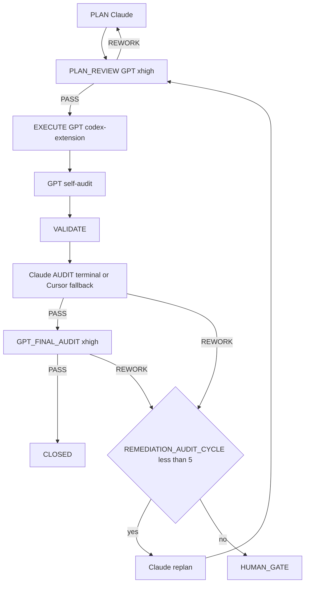

=== Auto-audit GPT (2e passe) ===
2026-04-25T20:00:20.377934Z  WARN codex_core::agents_md: Project doc `/Users/1millnonstop/Downloads/projet/foodking-web/web/testttt/AGENTS.md` exceeds remaining budget (32768 bytes) - truncating.
OpenAI Codex v0.125.0 (research preview)
--------
workdir: /Users/1millnonstop/Downloads/projet/foodking-web/web/testttt
model: gpt-5.5
provider: openai
approval: never
sandbox: workspace-write [workdir, /tmp, $TMPDIR, /Users/1millnonstop/.codex/memories]
reasoning effort: xhigh
reasoning summaries: none
session id: 019dc63a-919d-7db2-b983-bedc99f9fdbd
--------
user
Tu effectues l’**auto-audit GPT** (2e passe) d’un cycle FoodKing — **pas** l’audit Claude terminal.

**Contexte** : le JSON ci-dessous est la proposition d’implémentation (format agents/codex.prompt.txt) pour la mission `CV1-M07-KDS-RELEASE`.


**JSON d’implémentation (à recouper)** :
```json
{
  "files_to_modify": [
    "app/Http/Requests/Kds/KdsOrderStatusRequest.php",
    "app/Services/KitchenDisplaySystemOrderService.php",
    "app/Domain/Order/OrderStateMachine.php",
    "app/Http/Controllers/Admin/KitchenDisplaySystemController.php",
    "resources/js/components/admin/kitchenDisplaySystem/KitchenDisplaySystemComponent.vue",
    "resources/js/store/modules/kds.js",
    "tests/Feature/KdsTransitionWhitelistTest.php",
    "tests/Feature/KdsExpectedStatusConflictTest.php",
    "tests/Feature/KitchenReleaseRuleTest.php",
    "tests/Feature/KdsPaginationOverflowTest.php",
    "tests/Playwright/KdsMultiScreenPlaywrightTest.spec.js"
  ],
  "implementation_steps": [
    "Added a KDS-specific FormRequest that requires both status and expected_status and whitelists only OrderStatus::ACCEPT, OrderStatus::PREPARING, and OrderStatus::PREPARED.",
    "Changed the KDS controller to use KdsOrderStatusRequest and return KDS list overflow metadata.",
    "Added OrderStateMachine KitchenRelease predicates and reused the KDS-visible status set from the service.",
    "Changed KDS status mutation to compare expected_status against the locked row under DB lock, return 409 on mismatch, reject non-KitchenRelease transitions with 422, and dispatch only after the transaction has returned.",
    "Added a backend overflow probe by fetching 51 rows, returning the first 50, and exposing meta.overflow/meta.limit.",
    "Updated the KDS UI to send expected_status from the displayed order, handle 409 by refreshing, avoid invalid ACCEPT->PREPARED auto-bump, and show an overflow action when the backend reports more than 50 active orders.",
    "Added feature tests for whitelist rejection, required expected_status, 409 conflict, KitchenRelease predicates, and overflow cap metadata.",
    "Added a Playwright spec asserting the KDS multi-screen contract is wired in the source."
  ],
  "code_blocks": [
    {
      "path": "app/Http/Requests/Kds/KdsOrderStatusRequest.php",
      "op": "create",
      "excerpt": "Creates App\\Http\\Requests\\Kds\\KdsOrderStatusRequest with authorize() for authenticated KDS staff roles and rules requiring integer status + expected_status in [OrderStatus::ACCEPT, OrderStatus::PREPARING, OrderStatus::PREPARED]."
    },
    {
      "path": "app/Services/KitchenDisplaySystemOrderService.php",
      "op": "replace",
      "excerpt": "list() now uses OrderStateMachine::kitchenReleaseStatuses(), probes limit(51), stores lastListOverflow(), and returns take(50). changeStatus() now reads expected_status from request input, locks the order row, enforces branch guard, aborts 409 on stale expected status, applies KitchenRelease + OrderStateMachine checks, no-ops same-status without side effects, and dispatches notifications/events after DB::transaction returns."
    },
    {
      "path": "app/Domain/Order/OrderStateMachine.php",
      "op": "replace",
      "excerpt": "Adds kitchenReleaseStatuses(), isKitchenReleaseStatus(), and isKitchenReleaseTransition(). Allowed KDS forward transitions are ACCEPT->PREPARING and PREPARING->PREPARED; KDS-visible statuses are ACCEPT/PREPARING/PREPARED."
    },
    {
      "path": "app/Http/Controllers/Admin/KitchenDisplaySystemController.php",
      "op": "replace",
      "excerpt": "Imports KdsOrderStatusRequest, uses it for changeStatus(), and adds list response meta: { overflow: lastListOverflow(), limit: 50 }."
    },
    {
      "path": "resources/js/store/modules/kds.js",
      "op": "replace",
      "excerpt": "Exports kdsStatusPayload(order, status), returning { id, status, expected_status: order.status } while preserving existing local bump state."
    },
    {
      "path": "resources/js/components/admin/kitchenDisplaySystem/KitchenDisplaySystemComponent.vue",
      "op": "replace",
      "excerpt": "Status buttons now pass the full order object. orderStatus() builds payload via kdsStatusPayload(), dispatches expected_status, handles 409 refresh. kdsBump() advances ACCEPT orders to PREPARING before PREPARED. The overflow banner uses backend meta.overflow and exposes a Voir plus action."
    },
    {
      "path": "tests/Feature/KdsTransitionWhitelistTest.php",
      "op": "create",
      "excerpt": "Feature test asserting KDS rejects CANCELED target with 422 and leaves order status unchanged."
    },
    {
      "path": "tests/Feature/KdsExpectedStatusConflictTest.php",
      "op": "create",
      "excerpt": "Feature tests asserting stale expected_status returns 409 after first successful bump, and expected_status is required for an otherwise valid KDS target status."
    },
    {
      "path": "tests/Feature/KitchenReleaseRuleTest.php",
      "op": "create",
      "excerpt": "Feature test asserting the KitchenRelease predicate allows only ACCEPT->PREPARING and PREPARING->PREPARED, and excludes PENDING/DELIVERED from KDS-visible release statuses."
    },
    {
      "path": "tests/Feature/KdsPaginationOverflowTest.php",
      "op": "create",
      "excerpt": "Feature test creating 51 active KDS orders and asserting response data is capped at 50 with meta.overflow=true and meta.limit=50."
    },
    {
      "path": "tests/Playwright/KdsMultiScreenPlaywrightTest.spec.js",
      "op": "create",
      "excerpt": "Playwright source-level spec asserting expected_status wiring, 409 handling, overflow signal, and Voir plus UI action are present."
    }
  ],
  "risks": [
    "bash scripts/lint-fk-enum-status.sh still fails on pre-existing off-scope hardcoded status literals in kiosk components and app/Http/Requests/OrderStatusRequest.php; M-07 did not touch those files.",
    "No Mix production build was run because it would modify public bundle files outside the M-07 allowlist."
  ],
  "notes": [
    "Graphiti MCP call was cancelled; execution proceeded from injected mission context and repository code.",
    "bash .cursor/hooks/safety-check.sh passed.",
    "php artisan test --filter='KdsTransitionWhitelistSentinelTest|KdsExpectedStatusConflictSentinelTest|KdsTransitionWhitelistTest|KdsExpectedStatusConflictTest|KitchenReleaseRuleTest' passed: 7 tests.",
    "php artisan test --filter=KdsPaginationOverflowTest passed.",
    "php artisan test --filter=KdsChangeStatusConcurrencyTest passed.",
    "php artisan test --filter=KDSFlowTest passed.",
    "npx playwright test -c tests/Playwright KdsMultiScreenPlaywrightTest.spec.js passed.",
    "bash scripts/lint-fk-branch-isolation.sh passed.",
    "git diff --check on the M-07 allowlist passed."
  ],
  "execution_trace": {
    "delegation": "codex-extension",
    "invariants_considered": [
      "pricing_ssot",
      "order_status",
      "branch_id",
      "commit_before_dispatch"
    ]
  }
}
```

**Livrable** (Markdown uniquement, en français) :
# AUTO_AUDIT_GPT — CV1-M07-KDS-RELEASE

## 1. Conformité au plan / scope
(Énumérer manques ou dérives ; si scope élargi sans escale → **ESCALATE**)

## 2. Invariants FoodKing
Pour chacun : OK / RISQUE / N/A
- pricing_ssot (backend seul)
- order_status (enum, pas de strings)
- branch_id
- commit_before_dispatch
- frozen_zones
- order_service_symmetry (si un des deux services touché)

## 3. Verdict
Une ligne : `VERDICT: PASS` | `VERDICT: NEEDS_FIX` | `VERDICT: ESCALATE` + 1–3 phrases.

2026-04-25T20:00:20.836479Z  WARN codex_core_plugins::manifest: ignoring interface.defaultPrompt: prompt must be at most 128 characters path=/Users/1millnonstop/.codex/.tmp/plugins/plugins/build-ios-apps/.codex-plugin/plugin.json
2026-04-25T20:00:20.839133Z  WARN codex_core_plugins::manifest: ignoring interface.defaultPrompt: maximum of 3 prompts is supported path=/Users/1millnonstop/.codex/.tmp/plugins/plugins/plugin-eval/.codex-plugin/plugin.json
2026-04-25T20:00:30.028634Z  WARN codex_core_plugins::manifest: ignoring interface.defaultPrompt: prompt must be at most 128 characters path=/Users/1millnonstop/.codex/.tmp/plugins/plugins/build-ios-apps/.codex-plugin/plugin.json
2026-04-25T20:00:30.030530Z  WARN codex_core_plugins::manifest: ignoring interface.defaultPrompt: maximum of 3 prompts is supported path=/Users/1millnonstop/.codex/.tmp/plugins/plugins/plugin-eval/.codex-plugin/plugin.json
2026-04-25T20:00:32.676686Z  WARN codex_core_plugins::manifest: ignoring interface.defaultPrompt: prompt must be at most 128 characters path=/Users/1millnonstop/.codex/.tmp/plugins/plugins/build-ios-apps/.codex-plugin/plugin.json
2026-04-25T20:00:32.677111Z  WARN codex_core_plugins::manifest: ignoring interface.defaultPrompt: maximum of 3 prompts is supported path=/Users/1millnonstop/.codex/.tmp/plugins/plugins/plugin-eval/.codex-plugin/plugin.json
codex
J’utilise la skill `sync-risk-review` pour cadrer l’audit KDS/order lifecycle, puis je recoupe la proposition avec le plan actif, les fichiers mission et le diff réel sans modifier le dépôt.
exec
/bin/zsh -lc "pwd && sed -n '1,220p' /Users/1millnonstop/Downloads/projet/foodking-web/web/testttt/.agents/skills/sync-risk-review/SKILL.md && sed -n '1,220p' .cursor/ACTIVE_CYCLE.md && sed -n '1,220p' plans/masterplay/MASTERPLAY_DISCIPLINE.md && sed -n '1,220p' plans/masterplay/MASTERPLAY_QUEUE.md" in /Users/1millnonstop/Downloads/projet/foodking-web/web/testttt
 succeeded in 0ms:
/Users/1millnonstop/Downloads/projet/foodking-web/web/testttt
---
name: sync-risk-review
description: Review changes affecting synchronization, auth, pricing, KDS, OSS, or order lifecycle for architectural and business risk.
disable-model-invocation: true
---

# Sync Risk Review Skill

Use this skill when a change affects:
- sync
- auth
- pricing
- KDS
- OSS
- order lifecycle
- cross-device behavior

## Steps
1. Read the relevant docs
2. Inspect the diff or current implementation
3. Identify:
   - architecture risk
   - state consistency risk
   - business rule violations
   - authz issues
   - missing tests
4. Produce a concise review with recommended next actions.
# Active Cycle – FoodKing

**Méta (SSOT `run-cycle.md` Step 0 + `AGENTS.md` § *Authoritative … cycle state*)** — requis pour que l’orchestrateur ne s’arrête pas sur *« RUNNER_MODE not set »*.

| Champ | Valeur actuelle |
| --- | --- |
| **RUNNER_MODE** | `single-session` |
| **PHASE (cycle W10)** | `IN_PROGRESS` (détail = section `CYCLE_W10_…` ci-dessous) |
| **TASK_ID** | `P_EXEC_CLOSEOUT_GRAPHITI_CI_PROD_2026-04-22` |
| **PLAN_FILE** | `plans/PLAN_EXECUTION_CLOSEOUT_GRAPHITI_CI_PROD_2026-04-22.md` |
| **REPORT_FILE** | `reports/post_execute_latest.log` (append — preuve `EXECUTE_DELEGATION` / `AUDIT_*`) |

> **ACTIVE_PRIMARY** : `CYCLE_W10_EXECUTION_CLOSEOUT` (un seul cycle peut être actif à la fois — voir B03 méga-checklist).
> Cycles plus anciens en lecture seule = **archive** déplacée dans **`.cursor/ACTIVE_CYCLE_ARCHIVE.md`** (lecture humaine / forensique uniquement, **non requise** par le parcours obligatoire).

## CYCLE_W10_EXECUTION_CLOSEOUT (IN_PROGRESS — mémoire 180 + MCP global + commit + CI + prod)

**TASK_ID** : `P_EXEC_CLOSEOUT_GRAPHITI_CI_PROD_2026-04-22`  
**Plan SSOT** : `plans/PLAN_EXECUTION_CLOSEOUT_GRAPHITI_CI_PROD_2026-04-22.md`  
**Ordre** : Piste A (POS+Centrale : PLAN-MEM-1) ∥ Piste B (humain : PLAN-MEM-3) → C (smoke) → D (commit sur « go commit ») → E (CI) → F (prod J-7→J+7).  
**Gate mémoire** : `python3 memory/verify.py` → count **≥ 175** (180 idéal) avant de considérer PLAN-MEM-1 **CLOSED**.

- **Vérif locale (2026-04-22)** : `python3 memory/verify.py` → **count = 182**, smoke `search_memory_facts` OK — gate **satisfaite** pour clôturer l'ingestion côté seuil d'épisodes (suite : commit / CI / prod selon plan `PLAN_EXECUTION_CLOSEOUT_*`).

**Gouvernance globale (2e passe 2026-04-22)** : primer multi-agents + Graphiti vivant + tokens « zéro effet négatif » → **`docs/orchestration/GLOBAL_SYSTEM_PRIMER.md`** + rapport **`reports/audit/AUDIT_SECOND_PASS_GLOBAL_GOVERNANCE_REPORT_2026-04-22.md`**.

---

## CAISSE_V1_MASTERPLAY (ACTIVE — 2026-04-25)

**Phase** : finition Caisse V1 (POS + Kiosk + KDS + Centrale + Fiscal + Ops).
**Plan parent** : `plans/PLAN_CAISSE_V1_GPT_MASTERPLAY_2026-04-25.md`
**Plan DAG autoritaire** : `plans/PLAN_CAISSE_V1_SUPER_MASTER_2026-04-25.md`
**Boucle d'exécution** : `plans/masterplay/MASTERPLAY_DISCIPLINE.md` + `plans/masterplay/MASTERPLAY_QUEUE.md` + `scripts/run-masterplay.sh`
**Statut temps réel** : `reports/masterplay/status.json`

**Règle** : tout `TASK_ID` au format `CV1-MXX-…` passe par la masterplay (cf. `AGENTS.md` § "Caisse V1 — Masterplay loop", `.cursor/rules/global.mdc` § "Caisse V1 — Masterplay loop", `.cursor/commands/run-cycle.md` Step 0 item 0). **NE PAS** ouvrir un `run-cycle` standard sur un `CV1-MXX-…`.

---

## Archive

Tous les cycles **CLOSED / COMPLETED PASSED** (W4 → W9, NF525, etc.) ont été déplacés dans **`.cursor/ACTIVE_CYCLE_ARCHIVE.md`** pour réduire le coût de lecture du parcours obligatoire (audit 2026-04-24, mission `T-PARCOURS-OPTIMIZE-001`).

- **Lecture humaine** : ouvrir `.cursor/ACTIVE_CYCLE_ARCHIVE.md`.
- **Lecture agent** : **non requise** sauf instruction explicite du plan ou du chat (ex. "reprend le rationale du cycle W9").
- **Recherche** : `rg "CYCLE_W9_" .cursor/ACTIVE_CYCLE_ARCHIVE.md` ou `git log --follow .cursor/ACTIVE_CYCLE.md`.
# MASTERPLAY DISCIPLINE — Caisse V1 (loop master)

> **But** : règles strictes que le runner et chaque mission GPT respectent en boucle, pendant des heures, jusqu'à finition de toutes les missions de `MASTERPLAY_QUEUE.md`. Lecture obligatoire avant de lancer `bash scripts/run-masterplay.sh`.

## 1. Autorité

| Source | Rôle |
|--------|------|
| `AGENTS.md` | Parcours obligatoire, cycle FoodKing |
| `plans/PLAN_CAISSE_V1_SUPER_MASTER_2026-04-25.md` | DAG autoritaire (ordre, gates) |
| `plans/PLAN_CAISSE_V1_GPT_MASTERPLAY_2026-04-25.md` | Catalogue 22 missions M-XX (objectifs, allowlist) |
| `plans/masterplay/MASTERPLAY_QUEUE.md` | File d'exécution courante |
| `plans/masterplay/MASTERPLAY_DISCIPLINE.md` | (ce fichier) règles d'exécution |
| `.cursor/rules/*.mdc` | Toujours appliquées |
| `docs/gates/GATE_LOG.md` | État des gates humains |

## 2. Boucle d'exécution (run-masterplay.sh)

```
LOOP {
  1. tail activity log (~500 tokens)
  2. find next PENDING task in MASTERPLAY_QUEUE with all DEPENDS_ON == CLOSED
  3. if none → break (all done or all blocked)
  4. verify missions/<TASK_ID>/input.json + execute_brief.md exist
  5. activity-log start codex-extension <TASK_ID> execute "<allowlist CSV>" "<note>"
     if exit 2 (collision) → MARK BLOCKED note=collision, continue loop
  6. update status: RUNNING
  7. npm run codex:complex -- <TASK_ID>     (génère output_codex.json + GPT_SELF_AUDIT)
  8. update status: EXECUTED
  9. activity-log done codex-extension <TASK_ID> done "<résumé court>"
 10. (option --with-audit) bash scripts/foodking-claude-orchestrate.sh audit-brief <TASK_ID>
       if PASS → status: AUDIT_PASS
       if REWORK → status: REWORK ; increment REWORK_COUNT ; if >=5 → BLOCKED note=human_gate
 11. (option --with-final) npm run codex:final-audit -- <TASK_ID>
       if PASS → status: FINAL_PASS
 12. if FINAL_PASS:
       bash scripts/after-execute-memory.sh
       update status: CLOSED
 13. sleep INTER_TASK_PAUSE_SECONDS (default 5s)
 14. continue LOOP
}
```

## 3. Garde-fous (non négociables)

### 3.1 Allowlist stricte par mission
Codex modifie **uniquement** les fichiers listés dans `missions/<TASK_ID>/input.json.allowlist`. Si modification hors liste détectée à l'audit → `REWORK`.

### 3.2 Frozen zones
Aucune édition d'un fichier frozen sans gate signé dans `docs/gates/GATE_LOG.md`. Le runner **refuse** de lancer une mission marquée `BLOCKED` jusqu'à ce que le statut soit changé manuellement après signature.

### 3.3 Invariants FoodKing — `REWORK` automatique
- Pricing client-authoritative
- Status littéral numérique (`status: 16`)
- `branch_id` LIKE
- Dispatch dans transaction
- OS ou FOS modifié sans `SYMMETRY_NOTE`
- Frozen modifié sans gate

### 3.4 Pas de gate auto-approuvée
Codex peut **rédiger** options ; aucune mission ne coche `[x] Approved`. Si une mission le tente → `REWORK` + `risks: ["ESCALATION: gate self-approved"]`.

### 3.5 Tests obligatoires
Chaque `mandatory_tests` listé doit être lancé et reporté dans le rapport. Échec → `REWORK`.

### 3.6 Diff minimal
Aucun renommage opportuniste, aucun refactor non demandé, aucune optimisation collatérale. Si ajout justifié → `notes` du JSON.

### 3.7 Activity log
`start` avant chaque mission ; `done` après. Sans cela → réservation fantôme = autres agents bloqués. Le runner enforce.

### 3.8 Mémoire
À CLOSE : compléter `memory/episodes/caisse_v1_<topic>_*.jsonl` (squelettes créés par M-19) puis `bash scripts/after-execute-memory.sh`. Si Graphiti UP : `bash bin/graphiti-ingest.sh` + `python3 memory/verify.py`.

## 4. Boucles de rework

- Max **5 cycles `REWORK`** consécutifs sur la même mission. Au 5e → `BLOCKED note=human_gate_required`.
- Max **3 cycles healing** consécutifs (cf. CLAUDE.md §8) avant escalade.
- Toute escalation → écrite dans `reports/masterplay/ESCALATIONS_<date>.md`.

## 5. Pause / arrêt

- `Ctrl-C` arrête la boucle proprement (mission en cours finit, runner s'arrête après).
- `touch reports/masterplay/STOP` → le runner s'arrête à la fin de la mission courante.
- `touch reports/masterplay/PAUSE` → le runner pause entre les missions tant que le fichier existe.

## 6. Logs

- `reports/masterplay/run_<ISO>.log` : log de la boucle.
- `reports/masterplay/status.json` : état temps réel (mission courante, compteurs).
- `missions/<TASK_ID>/output_codex.raw.log` : raw codex.
- `missions/<TASK_ID>/output_codex.json` : json structuré.
- `reports/audit/GPT_SELF_AUDIT_<TASK_ID>.md` : self-audit GPT.
- `reports/post_execute_latest.log` : trace `EXECUTE_DELEGATION`.
- `reports/AGENT_ACTIVITY_LOG.md` : start/done.

## 7. Audit Claude (en fin de boucle, manuel)

Quand toutes les missions sont `CLOSED` (ou `BLOCKED` documentés) :

```
bash scripts/foodking-claude-orchestrate.sh context
bash scripts/foodking-claude-orchestrate.sh audit
```

Sortie attendue : verdict transversal Caisse V1 (chaîne sync borne→centrale→POS→KDS→fiscal). Le verdict détermine `GO/HOLD/NO-GO` pour `GATE_GO_NO_GO_CAISSE_V1`.

## 8. Critères d'arrêt anormal

- 3 missions consécutives en `REWORK` → halt + alerte humaine.
- Activity-log refuse 3 fois → halt (collision permanente).
- `npm run codex:complex` échoue 3 fois sur la même mission (binaire codex KO) → halt.
- `claude` terminal indisponible 3 fois consécutives → continue avec fallback subagent + `AUDIT_FALLBACK_REASON: terminal-unavailable`.

## 9. Token discipline

- Le prompt envoyé à codex contient : template `agents/codex.prompt.txt` + `input.json` + `execute_brief.md` + (optionnel) `graphiti_context.md`, `plan_excerpt.md`, `cycle_snapshot.md`.
- Pas de duplication : pas de re-coller AGENTS.md ou super master plan dans chaque mission.
- Cap typique d'un prompt : ≤ 30 KB. Au-delà → splitter la mission.

## 10. Anti-pattern interdits

- ❌ Lancer 2 missions en parallèle sur les mêmes fichiers (collision activity-log).
- ❌ Modifier `MASTERPLAY_QUEUE.md` pendant que le runner tourne (sauf marquer BLOCKED → PENDING après gate).
- ❌ Skipper l'audit Claude pour aller plus vite.
- ❌ Marquer CLOSED manuellement sans double PASS (PASS Claude + PASS Codex final).
- ❌ Ignorer un `risks: ["ESCALATION: ..."]` dans output_codex.json.

---

`MASTERPLAY_DISCIPLINE_VERSION: 1.0` · `STRICT_MODE: ON`
# MASTERPLAY_QUEUE — Caisse V1

**Source de vérité de l'orchestration en boucle** : `bash scripts/run-masterplay.sh` lit cette file et exécute en série.

**Discipline** : `plans/masterplay/MASTERPLAY_DISCIPLINE.md`.  
**Plan parent** : `plans/PLAN_CAISSE_V1_GPT_MASTERPLAY_2026-04-25.md`.

## Légende statut

- `PENDING` — pas encore lancé
- `RUNNING` — codex exec en cours (ne pas relancer)
- `EXECUTED` — codex exec terminé, attend audit
- `AUDIT_PASS` — `AUDIT_VERDICT: PASS` Claude
- `FINAL_PASS` — `GPT_FINAL_AUDIT_VERDICT: PASS`
- `CLOSED` — mémoire ingestée + activity-log done
- `REWORK` — audit a demandé rework
- `BLOCKED` — gate humain ou dépendance manquante

## Légende vague

- `WAVE_A` — NO-GATE, parallélisable, démarre immédiatement
- `WAVE_B` — POST-GATE, séquencé selon DAG

## File d'exécution


| ORDER | TASK_ID                           | MISSION | WAVE   | DEPENDS_ON                 | STATUS  | NOTE                                                                         |
| ----- | --------------------------------- | ------- | ------ | -------------------------- | ------- | ---------------------------------------------------------------------------- |
| 01    | CV1-M19-MEMORY-DISCIPLINE         | M-19    | WAVE_A | —                          | CLOSED  | Crée squelettes JSONL pour les 22 missions                                   |
| 02    | CV1-M01-TRACEABILITY-MATRIX       | M-01    | WAVE_A | —                          | CLOSED  | Matrice findings → tasks → tests → gates (REWORK resolved GPT PASS)          |
| 03    | CV1-M02-SENTINEL-BASELINE         | M-02    | WAVE_A | CV1-M01                    | CLOSED  | 18 sentinels fail-first + 4 lints                                            |
| 04    | CV1-M12-LEGACY-GUARDS-CI          | M-12    | WAVE_A | —                          | CLOSED  | Lint imports + bundle scan + workflow (recovered: extractor JSON fix)        |
| 05    | CV1-M16-HARDWARE-LAB              | M-16    | WAVE_A | —                          | CLOSED  | Checklist hardware signable (recovered: JSON valid, files materialized)      |
| 06    | CV1-M18-TEST-ARCHITECTURE         | M-18    | WAVE_A | CV1-M02                    | CLOSED  | Grille couverture + plan campagne                                            |
| 07    | CV1-M20-RUNBOOKS-SKELETON         | M-20    | WAVE_A | —                          | CLOSED  | 8 runbooks ops (REWORK Horizon resolved GPT PASS)                            |
| 08    | CV1-M21A-QUICKWINS-LOT0           | M-21a   | WAVE_A | —                          | CLOSED  | POS: discount v-model + Swiper RTL + focustrap dead                          |
| 09    | CV1-M03-GATES-DRAFT               | M-03    | WAVE_A | CV1-M01                    | CLOSED  | 8 briefs gates Caisse V1 créés; Wave B reste bloquée par signatures humaines |
| 10    | CV1-M09-BRANCH-ISOLATION          | M-09    | WAVE_B | CV1-M03(gates), CV1-M02    | CLOSED  | GPT audit PASS; M-08/M-06/schema sentinels remain gated                      |
| 11    | CV1-M06-POS-REVENUE-GUARDS        | M-06    | WAVE_B | CV1-M09, CV1-M03           | CLOSED | GPT rework audit PASS; gates frozen C + payment_prop A approved              |
| 12    | CV1-M05-ORDER-QUOTE               | M-05    | WAVE_B | CV1-M03                    | CLOSED | GPT final PASS; quote sealed/consumed at POS+kiosk commit                    |
| 13    | CV1-M04A-PAYMENT-LEDGER-FULL      | M-04A   | WAVE_B | CV1-M03 (ledger=A)         | BLOCKED | Ledger gate chose Option B; M-04A not selected                               |
| 14    | CV1-M04B-PAYMENT-PILOT-RESTRICT   | M-04B   | WAVE_B | CV1-M03 (ledger=B)         | CLOSED  | GPT audit PASS; Option B restricted pilot implemented                        |
| 15    | CV1-M08-FISCAL-Z-NF525            | M-08    | WAVE_B | CV1-M03 (fiscal+schema)    | CLOSED | GPT final PASS; fiscal Option B Z policy sealed                              |
| 16    | CV1-M07-KDS-RELEASE               | M-07    | WAVE_B | CV1-M03 (kds_bump)         | RUNNING | KDS gate Option B approved                                                   |
| 17    | CV1-M10-OS-FOS-SYMMETRY           | M-10    | WAVE_B | CV1-M06, CV1-M09           | PENDING | Unlocked after M-06 GPT audit PASS and M-09 CLOSED                           |
| 18    | CV1-M11-KIOSK-RUNTIME             | M-11    | WAVE_B | CV1-M03 (offline+fiscal)   | BLOCKED | Will unlock after M-08 policy evidence                                       |
| 19    | CV1-M17-WEB-STRIPE-SCOPE          | M-17    | WAVE_B | CV1-M03 (web+stripe)       | PENDING | Web Option B + Stripe Option B approved                                      |
| 20    | CV1-M13-MIGRATIONS-SAFETY         | M-13    | WAVE_B | CV1-M03 (schema)           | PENDING | Schema Option A approved                                                     |
| 21    | CV1-M14-OPS-PREFLIGHT             | M-14    | WAVE_B | CV1-M13                    | BLOCKED | —                                                                            |
| 22    | CV1-M15-ROLLOUT-CANARY            | M-15    | WAVE_B | CV1-M04*, CV1-M08, CV1-M14 | BLOCKED | —                                                                            |
| 23    | CV1-M21B-PAYMENT-REFACTOR         | M-21b   | WAVE_B | CV1-M03 (prop_mutation)    | BLOCKED | Gate approved; unlock after M-06/M-10 stabilization                          |
| 24    | CV1-M22-POST-LAUNCH-OBSERVABILITY | M-22    | WAVE_B | CV1-M14, CV1-M15           | BLOCKED | —                                                                            |


## Ce que le runner exécute

À chaque tour de boucle, le runner :

1. Lit cette table.
2. Prend la **première** ligne au statut `PENDING`.
3. Vérifie que toutes ses `DEPENDS_ON` sont au statut `CLOSED`. Sinon → skip.
4. Vérifie que `missions/<TASK_ID>/input.json` et `execute_brief.md` existent. Sinon → marque `BLOCKED note=missing-mission-files`.
5. `start` activity-log → `npm run codex:complex -- <TASK_ID>` → `done` activity-log.
6. Mise à jour statut : `EXECUTED`.
7. Audit Claude terminal automatique (si activé `--with-audit`) → `AUDIT_PASS` ou `REWORK`.
8. Si `AUDIT_PASS` : `npm run codex:final-audit -- <TASK_ID>` → `FINAL_PASS`.
9. Si `FINAL_PASS` : ingestion mémoire + `done` → `CLOSED`.
10. Loop.

## Statut initial (à la création)

Les 6 missions Vague A préparées par M-19/M-01/M-02/M-12/M-16/M-18 sont au statut `PENDING`. Les autres `TODO_NEXT` (à créer après le premier round) ou `BLOCKED` (gates).

## Mise à jour manuelle

Le runner met à jour la colonne `STATUS` automatiquement (sed sur cette table). Tu peux aussi éditer manuellement entre 2 runs (ex: marquer `BLOCKED → PENDING` après gate signé).

2026-04-25T20:00:51.855786Z  WARN codex_core_plugins::manifest: ignoring interface.defaultPrompt: prompt must be at most 128 characters path=/Users/1millnonstop/.codex/.tmp/plugins/plugins/build-ios-apps/.codex-plugin/plugin.json
2026-04-25T20:00:51.857377Z  WARN codex_core_plugins::manifest: ignoring interface.defaultPrompt: maximum of 3 prompts is supported path=/Users/1millnonstop/.codex/.tmp/plugins/plugins/plugin-eval/.codex-plugin/plugin.json
codex
Le cycle actif confirme que `CV1-M07-KDS-RELEASE` est sous Masterplay et marqué `RUNNING`; je vais maintenant lire le brief mission, la gate KDS et les fichiers réellement modifiés pour distinguer les écarts de scope des risques d’implémentation.
exec
/bin/zsh -lc "sed -n '1,220p' docs/orchestration/GLOBAL_SYSTEM_PRIMER.md" in /Users/1millnonstop/Downloads/projet/foodking-web/web/testttt
 succeeded in 0ms:
# FoodKing — Primer système global (agents, sous-agents, Graphiti, tokens)

> **Passation + index complet des chemins (SSOT, un seul fichier)** : **`../DOC_EXPO_HER_ANCIEN_AGENT_ALIMENTATION_WORKFLOW_2026-04-22.md`** (table §2 = utilité de chaque path pour une nouvelle session).

> **Fichier d’entrée** pour toute nouvelle conversation, tout nouvel outil d’agent (Cursor, terminal, futur bot), ou tout humain qui reprend le projet.  
> Objectif : **robustesse** = même avec 100 cycles et des exécuteurs différents, le comportement reste **prévisible**, **traçable**, et la **mémoire** reste **alignée** sur le code.

**Obligatoire avant ce Primer (SSOT d’onboarding)** : lire `**AGENTS.md`**, section **Parcours obligatoire** (nouvelle session **et** continuation), puis enchaîner ici.  
**En continuation d’un cycle** : lire d’**abord** `**.cursor/ACTIVE_CYCLE.md`** (éviter un second `TASK_ID` fantôme) ; si `PHASE` = vide ou `CLOSED`, revenir à la table ci-dessous.

---

## 1. Ordre de lecture obligatoire (minimum viable)

Lire **dans cet ordre** avant d’écrire du code ou un plan non trivial (voir aussi `**AGENTS.md` § *Parcours obligatoire* — tableau** pour la même doctrine) :


| #   | Fichier                                                    | Pourquoi                                                                                                                  |
| --- | ---------------------------------------------------------- | ------------------------------------------------------------------------------------------------------------------------- |
| 0   | `**.cursor/ACTIVE_CYCLE.md`** (si reprise)                 | Cycle déjà en cours : même `TASK_ID` / mêmes Steps **jusqu’à** `CLOSE` — **ne pas** forker un plan parallèle sans le dire |
| 1   | `**AGENTS.md`** (dont § *Parcours obligatoire*)            | Contrat global : phases, routing, MCP, terminal, parcours production, non-négociables                                     |
| 1b  | `**docs/orchestration/SESSION_OPENING_ENFORCEMENT.md**`  | **Bloc unique** (tail log + `verify:boucle` + rappel phases) — réduit la répétition « refais la boucle » en session ; **modèle Cursor = Claude pour PLAN** (Auto/Composer ne remplacent pas `routing.md`) |
| 1c  | `**reports/audit/SIMULATION_PARCOURS_PROD_CHECKPOINTS_2026-04-25.md**` | **Simulation production** : checkpoints par phase, fichiers SSOT, limite IDE (qui orchestre quoi) — avant de promettre « zéro dérive » |
| 2   | `**.cursor/routing.md*`*                                   | Qui fait quoi (Claude plan/audit, GPT-5.5-pro xhigh plan review / execute / final audit, Composer validation only)         |
| 3   | `**.cursor/commands/run-cycle.md**`                        | Déroulé exact d’un cycle `TASK_ID` (incl. Graphiti Step 0.5)                                                              |
| 4   | `**.cursor/rules/graphiti-memory.mdc**`                    | Mémoire Graphiti : quand lire / quand écrire                                                                              |
| 5   | `**.cursor/rules/global.mdc**` + `**context-hygiene.mdc**` | Gates, discipline tokens **sans** réduire l’intelligence                                                                  |
| 6   | `**docs/orchestration/MEMORY_MATRIX.md`**                  | **Quel store écrit quoi, lit quoi, quand** (4 stores autorisés A/B/C/D) — antidote unique à la complexité mémoire         |
| 6b  | `**docs/orchestration/MULTI_AGENT_ORCHESTRATION.md`**      | Même tâches, plusieurs onglets Cursor : **activité** + **Graphiti** (lecture) + `AUDIT_VERDICT` — sans empiéter           |
| 7   | `**memory/INDEX.md`**                                      | Carte des domaines mémoire Graphiti (store B) — secours si MCP absent                                                     |
| 8   | `**tasks/[TASK_ID].md**`                                   | Quand un cycle borné est lancé — périmètre de la tâche                                                                    |


Ensuite, **selon le domaine** : `docs/ORDER_FLOW.md`, `docs/DEVICE_FLOW.md`, `docs/ARCHITECTURE.md`, `project-invariants.mdc`, etc.

Référence roster court : `**docs/orchestration/AGENT_ROLES.md`**.

### 1.1 Décision : Claude orchestre ; GPT challenge et exécute en xhigh

- **Cerveau** (priorité, plan, re-plan, gates) : **Claude** (session + terminal `foodking-claude-orchestrate.sh`) — il écrit le plan et tranche la stratégie de remédiation.
- **Challenge plan obligatoire** : **GPT-5.5-pro / xhigh** relit le plan avant EXECUTE (`npm run codex:plan-review -- {TASK_ID}` → `PLAN_REVIEW_VERDICT`). Si `REWORK`, Claude révise avant tout code.
- **Bras + premier contrôle qualité** : **EXECUTE = Codex (PRIMARY)** pour toutes les implémentations produit, même les petites corrections : `npm run codex:complex -- {TASK_ID}` → `reports/audit/GPT_SELF_AUDIT_{TASK_ID}.md`.
- **Pas de routine product implementation** : Composer / `foodking-routine-implementer` ne fait plus d’édition produit en cycle de finition ; il peut aider au reporting/validation seulement.
- **Double audit final** : Claude audit d’abord (`AUDIT_VERDICT`) avec terminal primary + fallback Cursor si quota/rate-limit/terminal HS, puis GPT final audit (`npm run codex:final-audit -- {TASK_ID}` → `GPT_FINAL_AUDIT_VERDICT`). Close seulement si les deux sont `PASS`.

---

## 2. Sous-agents Cursor (Task tool) — intégration dans le flux

Ce ne sont **pas** des fichiers dans le repo ; ce sont des **profils** invoqués par Cursor selon `.cursor/routing.md` et `**run-cycle.md` Step 2**.


| Sub-agent / Canal                                                               | Modèle cible                                                                  | Quand                                                                                                                                                                                                                                          |
| ------------------------------------------------------------------------------- | ----------------------------------------------------------------------------- | ---------------------------------------------------------------------------------------------------------------------------------------------------------------------------------------------------------------------------------------------- |
| `**foodking-routine-implementer`** (sub-agent Cursor)                           | Composer                                                                      | **Validation/report only** en cycles de finition. Pas d’implémentation produit.                                                                                                                                             |
| `**codex-extension` — FoodKing Codex Complex Implementer (PRIMARY)**            | **GPT-5.5-pro / xhigh** via CLI `codex` (compte **ChatGPT Pro**) + `codex exec` | **PLAN_REVIEW + toute implémentation produit + auto-audit + GPT_FINAL_AUDIT**. `npm run codex:complex -- {TASK_ID}`. Voir `scripts/codex-extension-execute.sh`, `agents/codex-extension-instructions.md`. |
| `**foodking-complex-implementer`** (sub-agent Cursor — **FALLBACK uniquement**) | Aligné exécution **GPT-5.5** (emplacement sub-agent)                          | Uniquement si `codex` / `codex exec` est indisponible après reprises sur la même tâche                                                                                                                                                         |


**Règles d'or**

1. **Délégation obligatoire** pour toute modification produit en EXECUTE, avec trace `EXECUTE_DELEGATION:` dans le log de validation. Valeurs autorisées : `codex-extension` | `foodking-complex-implementer (codex-extension-fallback)` | `explicit-prompt-bind`.
2. **EXECUTE = `codex-extension` PRIMAIRE** (CLI `codex` + Pro, `npm run codex:complex -- {TASK_ID}` ; contexte Graphiti/plan dans `missions/…/graphiti_context.md` etc. ; voir `**docs/orchestration/CODEX_API_DELEGATION.md`**). Le sub-agent `foodking-complex-implementer` est le **fallback** (usage Cursor) — indispo `codex exec`. Aucun **connecteur HTTP** / proxy n’est maintenu dans le dépôt.
3. Le sous-agent **ne voit pas toujours** le MCP Graphiti du parent : le plan **doit** contenir `**## PRIOR_CONTEXT`** (faits Graphiti + invariants) — copier ou résumer dans le message de délégation **ou** dans `missions/{TASK_ID}/graphiti_context.md` pour l’appel API.
4. Aucun sub-agent ne **contourne** un gate humain ni n’édite une frozen zone sans `docs/gates/` approuvé.

---

## 3. Terminal allies (hors Task tool) — intégration

Documentés dans `**AGENTS.md` § Terminal allies** :


| Outil                                                                  | Rôle                                                                     | Position + **canal d’abonnement** (SSOT)                                                                                                                                                                                         |
| ---------------------------------------------------------------------- | ------------------------------------------------------------------------ | -------------------------------------------------------------------------------------------------------------------------------------------------------------------------------------------------------------------------------- |
| `**claude` +** `foodking-claude-orchestrate.sh`                        | **AUDIT cycle — PRIMARY (Step 5)** : `context` → `audit` / `audit-brief` | Abonnement **Anthropic (CLI sur terminal)** ; n’**emprunte** pas l’orchestrateur de modèles de Cursor. **FALLBACK actif** (quota / limite / panne après 1 retry) : Task **`foodking-planner-orchestrator`** + même checklist + `AUDIT_CHANNEL: cursor-session` + `AUDIT_FALLBACK_REASON:` — `docs/orchestration/AUDIT_TERMINAL_QUOTA_FALLBACK.md`. |
| **CLI** `codex` + `npm run codex:complex` (`**codex-extension`**, Pro) | **PLAN_REVIEW + EXECUTE + GPT_FINAL_AUDIT — PRIMARY** (GPT-5.5-pro/xhigh) | Compte **ChatGPT Pro** sur le terminal ; ne passe **pas** par l’orchestrateur de modèles **Cursor** ; facturation côté OpenAI ; **FALLBACK** = sub-agent.     |
| `codex` / REPL interactif (OpenAI)                                     | Tâches ad hoc **hors** cycle, ou côté humain                             | N’enlèvent **pas** VALIDATE + AUDIT du `run-cycle`.                                                                                                                                                                              |
| `verify-orchestration-boucle.sh`                                       | Preuve binaire + optionnel smoke (API)                                   | `bash scripts/verify-orchestration-boucle.sh` — `VERIFY_BILLING_FULL=1` lance 1× smoke `claude` + 1× `npm run codex:smoke`.                                                                                                      |


**Clôture :** l’audit Claude écrit `AUDIT_VERDICT: PASS` ou `REWORK`, puis GPT écrit `GPT_FINAL_AUDIT_VERDICT: PASS|REWORK|ESCALATE` (voir `run-cycle.md` Step 5). Pas de `CLOSED` sans double `PASS`. En `REWORK` : re-orchestration + re-EXECUTE GPT jusqu’à double `PASS` ou 5e tour → humain. Schéma :




Le terminal **n’enregistre** pas **Graphiti** seul : après AUDIT/CLOSE, décisions → JSONL + `after-execute-memory.sh` (voir §5) comme avant.

---

## 4. Graphiti — vivre avec l’avancement du projet (N agents, N cycles)

### 4.1 Rôles


| Rôle                                    | Responsable                                                          |
| --------------------------------------- | -------------------------------------------------------------------- |
| **Lecture** avant plan / audit complexe | Tout agent avec MCP `graphiti` chargé                                |
| **Écriture** après décision durable     | Phase AUDIT + CLOSED (`audit-context.md`) ou humain via `add_memory` |
| **Alimentation batch** (JSONL → Neo4j)  | Humain ou pipeline : `bash bin/graphiti-ingest.sh`                   |


### 4.2 Quand mettre à jour la mémoire (checklist — « ne pas oublier »)

Cocher mentalement à **chaque** fin de sujet significatif :

- **Invariant** clarifié ou renforcé → nouvelle ligne dans `memory/episodes/02_architecture_invariants.jsonl` (ou fichier le plus proche) + `ingest` ciblé.
- **Sync / event / canal** modifié → `03_domain_events_sync.jsonl` + ingest.
- **Décision produit / ADR** → `12_decisions_log.jsonl` + ingest.
- **Nouvelle tâche V14+** ou finding cross-vagues → `09_tasks_history.jsonl` + ingest.
- **Changement prod / rollout** → `11_production_plan.jsonl` + ingest.
- **Nouveau rôle agent ou règle d’orchestration** → `13_agents_roles.jsonl` + ingest + **mettre à jour ce Primer** si le modèle change.
- **Audit long (ops + agentique + mémoire)** → suivre `docs/orchestration/MEGA_CHECKLIST_AUTONOMY_AND_MEMORY.md` (180 tâches) ; narratif `reports/audit/MEGA_AUDIT_SYSTEM_OPERATION_AGENTIC_2026-04-23.md`.
- **Après toute écriture JSONL** → `bash scripts/after-execute-memory.sh` (rafraîchit `reports/memory/jsonl_manifest.json`, cohérent avec CI) puis `bin/graphiti-ingest.sh` sur les domaines touchés.

**Règle d’or** : si le code ou la doc **canonical** a changé et que la mémoire dit encore l’ancienne vérité → **mise à jour sous 48 h** (sinon dérive silencieuse).

### 4.3 Outils

- Pipeline post-écriture (manifeste + rappel ingest) : `bash scripts/after-execute-memory.sh`.
- Ingestion : `bin/graphiti-ingest.sh [filtre]` — voir `memory/README.md`.
- Vérification : `python3 memory/verify.py`.
- Terminal (bref + audit option) : `bash scripts/foodking-claude-orchestrate.sh post-execute` ou `context` puis `audit-brief` — `docs/orchestration/TERMINAL_CLAUDE_GRAPHITI_ORCHESTRATION.md`.
- Reset rare : `@graphiti clear_graph` puis full ingest (politique humaine).

---

## 5. Tokens, contexte, cache — politique « intelligence max, gaspillage min »

**But** : réponses **détaillées et stables**, pas des réponses courtes pour économiser des tokens au détriment de la qualité.


| On optimise (effet ≥ 0)                                                              | On n’optimise pas (effet négatif interdit)                               |
| ------------------------------------------------------------------------------------ | ------------------------------------------------------------------------ |
| Re-lire un fichier **déjà** dans la fenêtre contexte                                 | Tronquer un plan, une analyse de risque, ou un gate pour « faire court » |
| Résumer une phase **terminée** pour handoff (voir `context-hygiene.mdc` §4)          | Supprimer `## PRIOR_CONTEXT` ou les invariants du plan                   |
| Utiliser **Graphiti** pour récupérer faits structurés au lieu de rouvrir 50 rapports | Désactiver Graphiti pour « aller plus vite » sur du sync / fiscal        |
| Écrire les preuves dans `reports/` structuré                                         | Remplacer des tests par de la prose vague                                |


**Cache applicatif** (Redis, etc.) : régie par le code Laravel et `**app:preflight-production`** — hors scope de ce Primer, mais **ne jamais** confondre « cache métier » et « mémoire Graphiti » : ce sont deux systèmes.

---

## 6. Révision de ce document

- **À chaque** changement majeur d’orchestration (nouveau sub-agent, nouveau MCP, nouveau cycle obligatoire) : mettre à jour **ce fichier** + une ligne dans `13_agents_roles.jsonl` + ingest.
- **Trimestriel** : relire §4.2 avec un lead dev.

---

## 7. Pointers rapides


| Besoin                                                        | Aller à                                                           |
| ------------------------------------------------------------- | ----------------------------------------------------------------- |
| Cycle complet                                                 | `.cursor/commands/run-cycle.md`                                   |
| Gates                                                         | `.cursor/rules/human-gates.mdc`                                   |
| Invariants code                                               | `.cursor/rules/project-invariants.mdc`                            |
| Mémoire locale                                                | `memory/INDEX.md`                                                 |
| Pannes Graphiti                                               | `.cursor/mcp/GRAPHITI_TROUBLESHOOTING.md`                         |
| Closeout prod + mémoire                                       | `plans/PLAN_EXECUTION_CLOSEOUT_GRAPHITI_CI_PROD_2026-04-22.md`    |
| Méga-checklist autonomie / Graphiti                           | `docs/orchestration/MEGA_CHECKLIST_AUTONOMY_AND_MEMORY.md`        |
| Méga-audit narratif (compagnon)                               | `reports/audit/MEGA_AUDIT_SYSTEM_OPERATION_AGENTIC_2026-04-23.md` |
| Audit graphique workflow                                      | `docs/orchestration/WORKFLOW_AUDIT_GRAPHIQUE_2026-04-23.md`       |
| Terminal Claude + Graphiti (rôles, `context` / `audit-brief`) | `docs/orchestration/TERMINAL_CLAUDE_GRAPHITI_ORCHESTRATION.md`    |
| Matrice routine / complexe (sub-agents)                       | `docs/orchestration/ROUTING_MATRIX.md`                            |

exec
/bin/zsh -lc 'rg -n "CV1-M07|M-07|KDS|kds_bump|KitchenRelease|Kitchen Release" plans/PLAN_CAISSE_V1_GPT_MASTERPLAY_2026-04-25.md plans/PLAN_CAISSE_V1_SUPER_MASTER_2026-04-25.md docs/gates/GATE_LOG.md reports/masterplay/status.json reports/post_execute_latest.log missions/CV1-M07-KDS-RELEASE 2>/dev/null' in /Users/1millnonstop/Downloads/projet/foodking-web/web/testttt
 succeeded in 0ms:
reports/masterplay/status.json:3:  "current_task": "CV1-M07-KDS-RELEASE",
reports/post_execute_latest.log:599:   PASS  Tests\Feature\KDS\KdsSnapshotImmutableTest
reports/post_execute_latest.log:603:   PASS  Tests\Feature\KDSFlowTest
reports/post_execute_latest.log:608:   PASS  Tests\Feature\KDSOrderItemsTest
reports/post_execute_latest.log:612:   PASS  Tests\Feature\KDSScopeRestrictionTest
reports/post_execute_latest.log:1483:   PASS  Tests\Feature\Orders\KDSAllergenVisibilityTest
reports/post_execute_latest.log:1841:2.F: kdsStationFilterStorageKey + KDS per-user localStorage + migration
reports/post_execute_latest.log:1848:2.C: kdsDisplay throttle + KDS playKdsNewOrderSound
plans/PLAN_CAISSE_V1_GPT_MASTERPLAY_2026-04-25.md:3:> **Statut autorité** : *playbook d'implémentation*. **Ne remplace pas** le DAG `plans/PLAN_CAISSE_V1_SUPER_MASTER_2026-04-25.md` (autoritaire), `plans/PLAN_MASTER_FINITIONS_POS_KDS_AVANT_LANCEMENT_2026-04-26.md` (LOT 0–8 finitions), ni `reports/audit/TRACEABILITY_MATRIX_CAISSE_V1_2026-04-25.md` (matrice).  
plans/PLAN_CAISSE_V1_GPT_MASTERPLAY_2026-04-25.md:23:> *« Codex concepts, Claude sequence »* — primitives Codex (`OrderIntent`, `OrderQuote`, `PaymentProof`, `KitchenRelease`), **séquence Claude** : sécurité/branches/POS d'abord, puis quote, puis paiement, puis fiscal, puis KDS/release, puis kiosk runtime, puis ops/canary, puis UX finitions.  
plans/PLAN_CAISSE_V1_GPT_MASTERPLAY_2026-04-25.md:24:> Source : `reports/audit/CODEX_CLAUDE_MEGA_PLAN_COMPARISON_CAISSE_V1_2026-04-25.md:9` + `reports/audit/MEGA_RAPPORT_FINAL_DISPUTE_CAISSE_POS_KIOSK_KDS_2026-04-25.md:282-300`.
plans/PLAN_CAISSE_V1_GPT_MASTERPLAY_2026-04-25.md:69:| `GATE_KDS_BUMP_V1`                              | à drafter                                                     | `TO_DRAFT`           | M-07                   |
plans/PLAN_CAISSE_V1_GPT_MASTERPLAY_2026-04-25.md:132:### 2.4 KDS — `OrderStatusRequest` + transition (cible **M-07**)
plans/PLAN_CAISSE_V1_GPT_MASTERPLAY_2026-04-25.md:139:| Liste KDS     | `app/Services/KitchenDisplaySystemOrderService.php:53-54` — `whereIn('status', [ACCEPT, PREPARING, PREPARED])` — pré-filtre OK.                                                                                                             |
plans/PLAN_CAISSE_V1_GPT_MASTERPLAY_2026-04-25.md:141:| **Manque**    | `expected_status` non requis depuis le client → impossible de détecter un bump simultané sur 2 écrans avec versions divergentes. **P0 selon `GATE_KDS_BUMP_V1`.**                                                                           |
plans/PLAN_CAISSE_V1_GPT_MASTERPLAY_2026-04-25.md:200:`M-09` branch isolation → `M-06` POS guards (incl. `payment-confirm` durci) → `M-05` `OrderQuote` → `M-04A` *xor* `M-04B` paiement → `M-08` fiscal Z → `M-07` KDS release → `M-10` symétrie OS/FOS → `M-11` kiosk runtime → `M-17` web/Stripe → `M-13` migrations → `M-14` ops → `M-15` rollout → `M-21b` payment refactor + 401 retry → `M-22` post-launch.
plans/PLAN_CAISSE_V1_GPT_MASTERPLAY_2026-04-25.md:220:**Inputs source** : `MEGA_RAPPORT_FINAL_DISPUTE`, `AUDIT_TOTAL_SYSTEME_FOCUS_CAISSE_POS`, `AUDIT_COMPLET_BORNE_KIOSK_CONNECTEE_DEEP`, `MASTER_REQUEST_CAISSE_V1_ULTRA_DEEP_SINGLE_FILE`, `CLAUDE_SUPER_MASTER_PLAN_REVIEW`, `MASTER_REVIEW_POS_KDS_FINITIONS_CLAUDE`.
plans/PLAN_CAISSE_V1_GPT_MASTERPLAY_2026-04-25.md:249:12. `KdsTransitionWhitelistSentinelTest` (Feature) — chef KDS PREPARING → CANCELED **422** ; whitelist {ACCEPT, PREPARING, PREPARED}. Ancrage : `app/Http/Requests/OrderStatusRequest.php:45-47`.
plans/PLAN_CAISSE_V1_GPT_MASTERPLAY_2026-04-25.md:367:Rebadge du `LOT-6` du master finitions POS/KDS (`POS_V4_W2_PAYMENT_REFACTOR_2026-04-26`). Cf. `plans/PLAN_MASTER_FINITIONS_POS_KDS_AVANT_LANCEMENT_2026-04-26.md:215-253`. Ancrage des 16+ mutations en §2.6 ci-dessus. **Exécutant PRIMARY** : `codex-extension` (mettre à jour le champ `PRIMARY_MODEL` du LOT-6 si désaligné).
plans/PLAN_CAISSE_V1_GPT_MASTERPLAY_2026-04-25.md:371:### 🔴 M-07 — `CAISSE_V1_KDS_RELEASE_TRANSITIONS_2026-04-25` (GATE_KDS_BUMP_V1)
plans/PLAN_CAISSE_V1_GPT_MASTERPLAY_2026-04-25.md:373:**But** : whitelist `OrderStatus` stricte côté request, `expected_status` obligatoire dans le body, prédicat `KitchenRelease`, pagination overflow visible.
plans/PLAN_CAISSE_V1_GPT_MASTERPLAY_2026-04-25.md:379:- KDS pagination : si > 50 → bandeau alerte + lien « voir plus » (ancrage `KitchenDisplaySystemComponent.vue:786-793`).
plans/PLAN_CAISSE_V1_GPT_MASTERPLAY_2026-04-25.md:390:- Tests : `KdsTransitionWhitelistTest.php`, `KdsExpectedStatusConflictTest.php`, `KitchenReleaseRuleTest.php`, `KdsPaginationOverflowTest.php`, `KdsMultiScreenPlaywrightTest.spec.js`.
plans/PLAN_CAISSE_V1_GPT_MASTERPLAY_2026-04-25.md:460:**But** : preflight queue/scheduler/workers/broadcast/cache/outbox/fiscal archive ; dashboards (payment success rate, KDS latency, fiscal Z, branch leak counter, queue depth, worker errors) ; alerting + on-call.
plans/PLAN_CAISSE_V1_GPT_MASTERPLAY_2026-04-25.md:488:**But** : grille de couverture POS/Kiosk/KDS (PHPUnit/Vitest/Playwright/charge) ; cibles minimales POS 80%, KDS 80%, Kiosk 70%.
plans/PLAN_CAISSE_V1_GPT_MASTERPLAY_2026-04-25.md:506:Rebadge de `POS_KDS_FINITIONS_LOT0_QUICKWINS_2026-04-26` :
plans/PLAN_CAISSE_V1_GPT_MASTERPLAY_2026-04-25.md:517:Mappe `LOT-2`, `LOT-5a`, `LOT-3`, `LOT-7`, `LOT-8` du master finitions. Détail : `plans/PLAN_MASTER_FINITIONS_POS_KDS_AVANT_LANCEMENT_2026-04-26.md`.
plans/PLAN_CAISSE_V1_GPT_MASTERPLAY_2026-04-25.md:523:**But** : KPI LCP POS/kiosk/KDS, anomaly rules (payment-confirm sans ability, branch crossover, no-op double-trigger, Z mismatch, sceau invalid), cadence post-mortem J+1 / J+7 / J+30.
plans/PLAN_CAISSE_V1_GPT_MASTERPLAY_2026-04-25.md:625:J15-J18                  : M-07 (KDS release)
plans/PLAN_CAISSE_V1_GPT_MASTERPLAY_2026-04-25.md:642:- M-04 (A ou B) + M-05 + M-06 + M-07 + M-08 + M-09 + M-10 + M-11 — `AUDIT_VERDICT: PASS` *et* `GPT_FINAL_AUDIT_VERDICT: PASS`.
plans/PLAN_CAISSE_V1_GPT_MASTERPLAY_2026-04-25.md:645:- Final audit Claude transversal (revue **borne → centrale → POS → KDS → fiscal**) — `PASS`.
plans/PLAN_CAISSE_V1_GPT_MASTERPLAY_2026-04-25.md:654:1. **Revue chaîne sync** : OrderIntent (POS/kiosk) → OrderQuote → PaymentProof → KitchenRelease → KDS → Fiscal Z → OSS. Pour chaque maillon, `file:line` + test green référencé.
plans/PLAN_CAISSE_V1_GPT_MASTERPLAY_2026-04-25.md:667:- Dispute : `reports/audit/MEGA_RAPPORT_FINAL_DISPUTE_CAISSE_POS_KIOSK_KDS_2026-04-25.md`
plans/PLAN_CAISSE_V1_GPT_MASTERPLAY_2026-04-25.md:673:- Finitions POS/KDS : `plans/PLAN_MASTER_FINITIONS_POS_KDS_AVANT_LANCEMENT_2026-04-26.md`
docs/gates/GATE_LOG.md:28:| 2026-04-15 | GATE_V1_MENU_86_001_2026-04-15 | docs/gates/GATE_V1_MENU_86_001_2026-04-15.md | `item_branch_availability` (migration), `ItemBranchAvailability`, `AvailabilityService`, listener `DecrementItemAvailabilityOnOrder`, `ItemController`, UI POS/Kiosk/KDS ; pas `OrderService` / `FrontendOrderService` (selon brief) | (non documenté — rétroactif) | (non documenté — rétroactif) | (rétroactif — non corrélé) |
docs/gates/GATE_LOG.md:42:| 2026-04-25 | GATE_KDS_BUMP_AUTHORITY_V1_2026-04-25 | docs/gates/GATE_KDS_BUMP_AUTHORITY_V1_2026-04-25.md | `app/Http/Requests/OrderStatusRequest.php`, `app/Services/KitchenDisplaySystemOrderService.php`, `resources/js/components/admin/kitchenDisplaySystem/KitchenDisplaySystemComponent.vue` | Approved — Option B — Server authority with `expected_status` | Codex (instruction humaine explicite, 2026-04-25) | CV1-M03-GATES-DRAFT |
docs/gates/GATE_LOG.md:43:| 2026-04-25 | GATE_SCHEMA_MIGRATIONS_CAISSE_V1_2026-04-25 | docs/gates/GATE_SCHEMA_MIGRATIONS_CAISSE_V1_2026-04-25.md | future schema migrations for payment, order quotes, KDS releases, fiscal Z, idempotency | Approved — Option A — All migrations with rehearsal + backup | Codex (instruction humaine explicite, 2026-04-25) | CV1-M03-GATES-DRAFT |
plans/PLAN_CAISSE_V1_SUPER_MASTER_2026-04-25.md:30:| `reports/audit/MASTER_REVIEW_POS_KDS_FINITIONS_CLAUDE_2026-04-26.md` | POS/KDS finishing source. |
plans/PLAN_CAISSE_V1_SUPER_MASTER_2026-04-25.md:55:| `GATE_KDS_BUMP_V1` | KDS bump authority | A local, B server expected_status | B with feature flag | PLAN-07 |
plans/PLAN_CAISSE_V1_SUPER_MASTER_2026-04-25.md:75:| PLAN-07 | KDS_RELEASE_AND_TRANSITIONS | release predicate, whitelist, expected_status, overflow | PLAN-02, PLAN-03 | KDS bump | Codex | KDS safe transitions |
plans/PLAN_CAISSE_V1_SUPER_MASTER_2026-04-25.md:89:| PLAN-21 | UX_FINITIONS_POS_KDS_KIOSK | discount v-model, RTL, i18n, focustrap, locale | PLAN-00 | prop mutation only for payment component | FE/Codex | UX finish tests |
plans/PLAN_CAISSE_V1_SUPER_MASTER_2026-04-25.md:244:### PLAN-07 — KDS
plans/PLAN_CAISSE_V1_SUPER_MASTER_2026-04-25.md:275:- KDS list;
plans/PLAN_CAISSE_V1_SUPER_MASTER_2026-04-25.md:309:| KdsTransitionWhitelistTest | PHP Feature | KDS | PLAN-07 | yes |
plans/PLAN_CAISSE_V1_SUPER_MASTER_2026-04-25.md:310:| KdsExpectedStatusConflictTest | PHP Feature concurrency | KDS | PLAN-07 | yes |
plans/PLAN_CAISSE_V1_SUPER_MASTER_2026-04-25.md:320:| QueueNumberUniquenessTest | PHP concurrency | POS/KDS | PLAN-09/13 | yes |
plans/PLAN_CAISSE_V1_SUPER_MASTER_2026-04-25.md:387:- [ ] KDS release implemented.
missions/CV1-M07-KDS-RELEASE/execute_brief.md:1:# EXECUTE BRIEF — CV1-M07-KDS-RELEASE
missions/CV1-M07-KDS-RELEASE/execute_brief.md:3:Implement M-07 only. Use `OrderStatus` enum, no magic statuses. Preserve branch isolation and dispatch-after-commit. `expected_status` must be server-enforced, not only frontend UX.
missions/CV1-M07-KDS-RELEASE/input.json:2:  "task_id": "CV1-M07-KDS-RELEASE",
missions/CV1-M07-KDS-RELEASE/input.json:3:  "mission_id": "M-07",
missions/CV1-M07-KDS-RELEASE/input.json:8:  "objective": "Durcir KDS release transitions: request whitelist OrderStatus, expected_status obligatoire, 409 conflit, prédicat KitchenRelease et overflow visible.",
missions/CV1-M07-KDS-RELEASE/input.json:9:  "instruction": "Applique uniquement M-07. Gate KDS Option B approuvée: server authority avec expected_status. JSON unique.",
missions/CV1-M07-KDS-RELEASE/input.json:19:    "tests/Feature/KitchenReleaseRuleTest.php",
missions/CV1-M07-KDS-RELEASE/input.json:25:    {"gate": "GATE_KDS_BUMP_AUTHORITY_V1_2026-04-25", "status": "Approved", "decision": "Option B — Server authority with expected_status", "date": "2026-04-25"}
missions/CV1-M07-KDS-RELEASE/input.json:28:  "gate_conditions": ["kds_bump approved Option B"],
missions/CV1-M07-KDS-RELEASE/input.json:34:    "php artisan test --filter=KitchenReleaseRuleTest"
missions/CV1-M07-KDS-RELEASE/input.json:40:    "KDS UI sends expected_status and shows overflow signal"
missions/CV1-M07-KDS-RELEASE/input.json:43:  "graphiti_query": "Caisse V1 KDS expected_status server authority transition whitelist",
missions/CV1-M07-KDS-RELEASE/plan_excerpt.md:1:# PLAN EXCERPT — CV1-M07-KDS-RELEASE
missions/CV1-M07-KDS-RELEASE/plan_excerpt.md:3:Gate KDS decision: Option B — server authority with `expected_status`.
missions/CV1-M07-KDS-RELEASE/plan_excerpt.md:5:Implement strict KDS transition request, expected-status conflict protection, kitchen release predicate, and overflow UI signal.

exec
/bin/zsh -lc "rg --files missions/CV1-M07-KDS-RELEASE plans reports docs/gates | rg 'CV1-M07|M07|KDS|kds|GATE|status|post_execute|GPT_SELF_AUDIT|PLAN_CAISSE_V1'" in /Users/1millnonstop/Downloads/projet/foodking-web/web/testttt
 succeeded in 0ms:
docs/gates/GATE_BATCH_V1_APPROVAL_CHECKLIST.md
docs/gates/GATE_P_MEGA_22_NF525_READINESS_2026-04-20.md
docs/gates/GATE_PAYMENT_PROP_MUTATION_2026-04-26.md
docs/gates/GATE_FISCAL_KIOSK_SCOPE_V1_2026-04-25.md
docs/gates/GATE_SYNC_WIZARD_DEEP_001_2026-04-14.md
docs/gates/GATE_G14A_VARIATION_MULTI_QTY_CONSOLIDATED_2026-04-20.md
docs/gates/GATE_P_MEGA_19_BRANCH_THEMING_2026-04-20.md
docs/gates/GATE_W2_CUTOVER_2026-04-26.md
docs/gates/GATE_PAYMENT_LEDGER_V1_2026-04-25.md
docs/gates/GATE_SCHEMA_MIGRATIONS_CAISSE_V1_2026-04-25.md
docs/gates/GATE_FROZEN_ZONES_CAISSE_V1_2026-04-25.md
docs/gates/GATE_LOG.md
docs/gates/GATE_KDS_BUMP_AUTHORITY_V1_2026-04-25.md
docs/gates/GATE_V1_PRICING_SSOT_001_2026-04-15.md
docs/gates/GATE_W9_AUDIT_KIOSK_RECEIPT_NON_FISCAL_2026-04-21.md
docs/gates/GATE_P_MEGA_20_BRANCH_MISMATCH_2026-04-20.md
docs/gates/GATE_WEB_PAYMENT_SCOPE_V1_2026-04-25.md
docs/gates/GATE_V1_MENU_86_001_2026-04-15.md
docs/gates/GATE_PAYMENT_SAFETY_001_2026-04-14.md
docs/gates/GATE_W2_KPI_REVISION_2026-04-26.md
docs/gates/GATE_VERIFY_P0_FROZEN_CONSOLIDATED_2026-04-20.md
docs/gates/GATE_V1_STATUS_MACHINE_001_2026-04-15.md
docs/gates/GATE_P_MEGA_21_THROTTLE_2026-04-20.md
docs/gates/GATE_OFFLINE_SCOPE_V1_2026-04-25.md
docs/gates/GATE_V1_DATA_SOFTDELETE_001_2026-04-15.md
docs/gates/GATE_STRIPE_CENTS_ACTIVE_2026-04-25.md
docs/gates/GATE_MULTISURF_001_2026-04-14.md
reports/masterplay/status.json
missions/CV1-M07-KDS-RELEASE/plan_excerpt.md
missions/CV1-M07-KDS-RELEASE/execute_brief.md
missions/CV1-M07-KDS-RELEASE/input.json
reports/masterplay/audit-pending/CV1-M03-GATES-DRAFT.req
reports/masterplay/GATES_TO_SIGN_2026-04-25.md
plans/PLAN_POS_KIOSK_KDS_SYNC_REPAIR_v2_2026-04-23.md
plans/PLAN_CAISSE_V1_MEGA_CORRECTION_2026-04-25.md
plans/PLAN_MEGA_KDS_CUISINE_INTELLIGENCE_VISUELLE_2026-04-24.md
plans/PLAN_CAISSE_V1_SUPER_MASTER_2026-04-25.md
plans/PLAN_CAISSE_V1_HYPER_EXEC_GPT_2026-04-25.md
plans/PLAN_CAISSE_V1_GPT_MASTERPLAY_2026-04-25.md
plans/PLAN_POS_KIOSK_KDS_SYNC_REPAIR_2026-04-23.md
plans/PLAN_MASTER_FINITIONS_POS_KDS_AVANT_LANCEMENT_2026-04-26.md
reports/audit-orchestration/REPORT_TASK20_GATE_PROD_FINAL_2026-04-20.md
reports/runbooks/RUNBOOK_KDS_MULTISCREEN_DESYNC_2026-04-25.md
reports/antigravity/E2E_POS_KDS_REPORT.md
reports/review/VERIFY_04_P4_KDS_CONCURRENCY_2026-04-20.md
reports/review/VERIFY_11_KDS_OSS_DRAWER_2026-04-20.md
reports/review/AUDIT_POS_110_KDS_OSS_DRAWER_2026-04-19.md
reports/antigravity/AUDIT_MASSIF_E2E_POS_KDS_KIOSK.md
reports/antigravity/AUDIT_MASSIF_E2E_POS_KDS_KIOSK_SUITE.md
reports/audit/GPT_SELF_AUDIT_PROD-CHK-PARCOURS_2026-04-25.md
reports/audit/AUDIT_LOT_1C_KDS_ADAPTIVE_POLL_2026-04-23.md
reports/audit/GPT_SELF_AUDIT_CV1-M20-RUNBOOKS-SKELETON.md
reports/audit/MEGA_DISPUTE_CLAUDE_R2_COMPACT_CAISSE_POS_KIOSK_KDS_2026-04-25.md
reports/audit/GPT_AUDIT_CV1-M03-GATES-DRAFT_REWORK_FIX_2026-04-25.md
reports/audit/GPT_SELF_AUDIT_CV1-M21A-QUICKWINS-LOT0.md
reports/audit/MEGA_DISPUTE_CLAUDE_R2_CAISSE_POS_KIOSK_KDS_2026-04-25.md
reports/audit/AUDIT_W2_GATES_HG-W2-1_HG-W2-3_CLAUDE_2026-04-26.md
reports/audit/GPT_SELF_AUDIT_CV1-M02-SENTINEL-BASELINE.md
reports/audit/MEGA_RAPPORT_FINAL_DISPUTE_CAISSE_POS_KIOSK_KDS_2026-04-25.md
reports/audit/GPT_SELF_AUDIT_CV1-M05-ORDER-QUOTE.md
reports/audit/MASTER_REVIEW_POS_KDS_FINITIONS_CLAUDE_2026-04-26.md
reports/audit/GPT_SELF_AUDIT_CV1-M06-POS-REVENUE-GUARDS.md
reports/audit/GPT_SELF_AUDIT_CV1-M01-TRACEABILITY-MATRIX.md
reports/audit/GPT_SELF_AUDIT_CV1-M03-GATES-DRAFT.md
reports/antigravity/playwright-unknown-20260415_210613.json/04-kds-status-KDS-—-interf-cccfb-rs-login-si-non-authentifié-chromium-retry1/trace.zip
reports/antigravity/playwright-unknown-20260415_210613.json/04-kds-status-KDS-—-interf-cccfb-rs-login-si-non-authentifié-chromium-retry1/test-failed-1.png
reports/audit/MEGA_PLAN_READINESS_GAP_ANALYSIS_CAISSE_POS_KIOSK_KDS_2026-04-25.md
reports/audit/GPT_SELF_AUDIT_CV1-M19-MEMORY-DISCIPLINE.md
reports/audit/MEGA_HANDOFF_CONTEXT_INTEGRATION_CAISSE_POS_KIOSK_KDS_2026-04-25.md
reports/audit/GPT_SELF_AUDIT_CV1-M09-BRANCH-ISOLATION.md
reports/audit/AUDIT_KDS_POS_SYNCHRONISATION_PROFONDE_2026-04-24.md
reports/audit/GPT_SELF_AUDIT_CV1-M18-TEST-ARCHITECTURE.md
reports/audit/MEGA_DISPUTE_CODEX_R1_CAISSE_POS_KIOSK_KDS_2026-04-25.md
reports/audit/MASTER_REVIEW_POS_KDS_FINITIONS_BRIEF_2026-04-26.md
reports/audit/GPT_SELF_AUDIT_CV1-M08-FISCAL-Z-NF525.md
reports/audit/AUDIT_MASSIF_POS_KIOSK_KDS_SYNC_2026-04-23.md
reports/planning/KIMI_SPRINT_8_KDS.md
reports/antigravity/playwright-unknown-20260415_210613.json/04-kds-status-KDS-—-interf-65642-direction-vers-surface-chef-chromium/test-failed-1.png
reports/antigravity/playwright-unknown-20260415_210613.json/04-kds-status-KDS-—-interf-3bab2-ds-order-list-without-crash-chromium-retry1/trace.zip
reports/antigravity/playwright-unknown-20260415_210613.json/04-kds-status-KDS-—-interf-65642-direction-vers-surface-chef-chromium-retry1/trace.zip
reports/antigravity/playwright-unknown-20260415_210613.json/04-kds-status-KDS-—-interf-3bab2-ds-order-list-without-crash-chromium-retry1/test-failed-1.png
reports/antigravity/playwright-unknown-20260415_210613.json/04-kds-status-KDS-—-interf-65642-direction-vers-surface-chef-chromium-retry1/test-failed-1.png
reports/planning/kimi-plans/PLAN_06_KDS_INSTRUCTION_PARSING.md
reports/antigravity/playwright-unknown-20260415_210613.json/04-kds-status-KDS-—-interf-cccfb-rs-login-si-non-authentifié-chromium/test-failed-1.png
reports/antigravity/playwright-unknown-20260415_210613.json/04-kds-status-KDS-—-interf-3bab2-ds-order-list-without-crash-chromium/test-failed-1.png
reports/execution/GATE_BRIEF_P_MEGA_13_TPE_IDEMPOTENCE_2026-04-20.md
reports/execution/RUN_P12_KDS_VUEX_REFRESH_2026-04-20.md
reports/execution/RUN_P13_KDS_409_OBSERVABILITY_2026-04-20.md
reports/execution/GATE_BRIEF_P_MEGA_12_EATIN_TVA_2026-04-20.md
reports/execution/RUN_P11_FROZEN_ZONE_GATE_2026-04-20.md
reports/execution/GATE_BRIEF_P_MEGA_14_RECEIPT_NF525_2026-04-20.md
reports/execution/RUN_KDS_INTELLIGENCE_CORRECTIONS_2026-04-22.md
reports/execution/RUN_V14_T13_T14_KDS_LIFECYCLE_2026-04-20.md
reports/execution/RUN_P_POS_PHASE7_KDS_2026-04-24.md

exec
/bin/zsh -lc 'git status --short' in /Users/1millnonstop/Downloads/projet/foodking-web/web/testttt
 succeeded in 0ms:
 M .cursor/ACTIVE_CYCLE.md
 M .cursor/commands/run-cycle.md
 M .cursor/context/audit-context.md
 M .cursor/context/execute-context.md
 M .cursor/context/plan-context.md
 M .cursor/routing.md
 M .cursor/rules/auto-remediation.mdc
 M .cursor/rules/claude.mdc
 M .cursor/rules/composer.mdc
 M .cursor/rules/context-hygiene.mdc
 M .cursor/rules/cross-agent-sync.mdc
 M .cursor/rules/global-operating-principles.md
 M .cursor/rules/global.mdc
 M .cursor/rules/gpt.mdc
 M .cursor/rules/project-invariants.mdc
 M .cursor/rules/scope.mdc
 M AGENTS.md
 M agents/codex-extension-instructions.md
 M agents/codex.prepare.mjs
 M app/Domain/Order/OrderStateMachine.php
 M app/Http/Controllers/Admin/KitchenDisplaySystemController.php
 M app/Http/Controllers/Admin/OrderStatusScreenController.php
 M app/Http/Controllers/Admin/PosController.php
 M app/Http/Controllers/Admin/PosOrderController.php
 M app/Http/Controllers/Admin/TransactionController.php
 M app/Http/Controllers/Frontend/OrderController.php
 M app/Http/Controllers/Frontend/PaymentController.php
 M app/Http/Requests/PosOrderRequest.php
 M app/Jobs/CleanupStalePendingKioskOrders.php
 M app/Services/Fiscal/ZReportService.php
 M app/Services/FrontendOrderService.php
 M app/Services/KitchenDisplaySystemOrderService.php
 M app/Services/OrderService.php
 M app/Services/OrderStatusScreenOrderService.php
 M app/Services/PaymentService.php
 M app/Services/TransactionService.php
 M docs/DEVICE_FLOW.md
 M docs/gates/GATE_LOG.md
 M docs/gates/GATE_PAYMENT_PROP_MUTATION_2026-04-26.md
 M docs/orchestration/AGENT_ROLES.md
 M docs/orchestration/CODEX_API_DELEGATION.md
 M docs/orchestration/GLOBAL_SYSTEM_PRIMER.md
 M docs/orchestration/MEMORY_MATRIX.md
 M docs/orchestration/MULTI_AGENT_ORCHESTRATION.md
 M docs/orchestration/ROUTING_MATRIX.md
 M package.json
 M plans/MEGA_PLAN_ORCHESTRATION_2026-04-24.md
 M plans/PLAN_TEMPLATE.md
 M public/css/app.css
 M public/js/admin-kds.js
 M public/js/admin-oss.js
 M public/js/admin-reports.js
 M public/js/admin-shell.js
 M public/js/kiosk-admin.js
 M public/js/kiosk-errors.js
 M public/js/kiosk-shell.js
 M public/js/kiosk-wizard-step.js
 M public/js/kiosk-wizard.js
 M public/js/manifest.js
 M public/js/pos-app.js
 M public/js/pos-shell.js
 M public/js/vendor.js
 M public/mix-manifest.json
 M reports/AGENT_ACTIVITY_LOG.md
 M reports/antigravity/playwright-latest.json
 M reports/audit/MASTER_REVIEW_POS_KDS_FINITIONS_BRIEF_2026-04-26.md
 M reports/audit/MASTER_REVIEW_POS_KDS_FINITIONS_CLAUDE_2026-04-26.md
 M reports/audit/_TERMINAL_CONTEXT_BRIEF.md
 M reports/compact_snapshot.md
 M reports/post_execute_latest.log
 M resources/js/components/admin/kitchenDisplaySystem/KitchenDisplaySystemComponent.vue
 M resources/js/components/admin/pos/PaymentComponent.vue
 M resources/js/components/admin/pos/PosComponent.vue
 M resources/js/components/frontend/kiosk/KioskPaymentComponent.vue
 M resources/js/i18n.js
 M resources/js/store/modules/kds.js
 M resources/js/store/modules/kioskCart.js
 M routes/api.php
 M scripts/agent-activity-log.sh
 M scripts/codex-extension-execute.sh
 M scripts/codex-extract-json-output.mjs
 M scripts/foodking-claude-orchestrate.sh
 M tests/Feature/DispatchAfterCommitTest.php
?? .github/workflows/legacy-guards.yml
?? app/Http/Requests/Frontend/
?? app/Http/Requests/Kds/
?? app/Http/Requests/PaymentMethodRequest.php
?? app/Models/OrderQuote.php
?? app/Services/Fiscal/FiscalSealingService.php
?? app/Services/Order/
?? "borne (Remix)/ARCHIVE_BANNER.md"
?? config/payment.php
?? database/migrations/2026_04_25_190000_create_order_quotes_table.php
?? docs/gates/GATE_FISCAL_KIOSK_SCOPE_V1_2026-04-25.md
?? docs/gates/GATE_FROZEN_ZONES_CAISSE_V1_2026-04-25.md
?? docs/gates/GATE_KDS_BUMP_AUTHORITY_V1_2026-04-25.md
?? docs/gates/GATE_OFFLINE_SCOPE_V1_2026-04-25.md
?? docs/gates/GATE_PAYMENT_LEDGER_V1_2026-04-25.md
?? docs/gates/GATE_SCHEMA_MIGRATIONS_CAISSE_V1_2026-04-25.md
?? docs/gates/GATE_STRIPE_CENTS_ACTIVE_2026-04-25.md
?? docs/gates/GATE_WEB_PAYMENT_SCOPE_V1_2026-04-25.md
?? docs/operations/CODEX_API_RESPONSES_401.md
?? docs/orchestration/AUDIT_TERMINAL_QUOTA_FALLBACK.md
?? docs/orchestration/CHALLENGE_CODEX_CLAUDE_TERMINAL_PLAYBOOK.md
?? docs/orchestration/CODEX_MCP_CLAUDE_TERMINAL_SETUP.md
?? docs/orchestration/COMMAND_DECK.md
?? docs/orchestration/EXPORT_HANDOFF_POS_KDS_MASTER_FINITIONS_2026-04-26.md
?? docs/orchestration/HARDWARE_LAB_PROCEDURE_2026-04-25.md
?? docs/orchestration/LEGACY_QUARANTINE_2026-04-25.md
?? docs/orchestration/MEMORY_DISCIPLINE_CAISSE_V1_2026-04-25.md
?? docs/orchestration/SESSION_OPENING_ENFORCEMENT.md
?? docs/orchestration/SIM_MASTERPLAY_POS_BORNE_KDS_CHALLENGE.md
?? docs/orchestration/TEAM_WORKFLOW.md
?? docs/orchestration/challenge-prompts/
?? kiosk_implementation/ARCHIVE_BANNER.md
?? memory/episodes/caisse_v1_branch_isolation_2026-04-25.jsonl
?? memory/episodes/caisse_v1_fiscal_z_2026-04-25.jsonl
?? memory/episodes/caisse_v1_hardware_lab_2026-04-25.jsonl
?? memory/episodes/caisse_v1_kds_release_2026-04-25.jsonl
?? memory/episodes/caisse_v1_kiosk_runtime_2026-04-25.jsonl
?? memory/episodes/caisse_v1_legacy_guards_2026-04-25.jsonl
?? memory/episodes/caisse_v1_memory_discipline_2026-04-25.jsonl
?? memory/episodes/caisse_v1_migrations_2026-04-25.jsonl
?? memory/episodes/caisse_v1_ops_preflight_2026-04-25.jsonl
?? memory/episodes/caisse_v1_order_quote_2026-04-25.jsonl
?? memory/episodes/caisse_v1_os_fos_symmetry_2026-04-25.jsonl
?? memory/episodes/caisse_v1_payment_ledger_2026-04-25.jsonl
?? memory/episodes/caisse_v1_payment_pilot_2026-04-25.jsonl
?? memory/episodes/caisse_v1_pos_guards_2026-04-25.jsonl
?? memory/episodes/caisse_v1_post_launch_2026-04-25.jsonl
?? memory/episodes/caisse_v1_quickwins_2026-04-25.jsonl
?? memory/episodes/caisse_v1_rollout_canary_2026-04-25.jsonl
?? memory/episodes/caisse_v1_runbooks_skeleton_2026-04-25.jsonl
?? memory/episodes/caisse_v1_sentinels_2026-04-25.jsonl
?? memory/episodes/caisse_v1_test_arch_2026-04-25.jsonl
?? memory/episodes/caisse_v1_traceability_2026-04-25.jsonl
?? memory/episodes/caisse_v1_web_stripe_2026-04-25.jsonl
?? missions/CV1-M01-TRACEABILITY-MATRIX/
?? missions/CV1-M02-SENTINEL-BASELINE/
?? missions/CV1-M03-GATES-DRAFT/
?? missions/CV1-M04B-PAYMENT-PILOT-RESTRICT/
?? missions/CV1-M05-ORDER-QUOTE/
?? missions/CV1-M06-POS-REVENUE-GUARDS/
?? missions/CV1-M07-KDS-RELEASE/
?? missions/CV1-M08-FISCAL-Z-NF525/
?? missions/CV1-M09-BRANCH-ISOLATION/
?? missions/CV1-M10-OS-FOS-SYMMETRY/
?? missions/CV1-M12-LEGACY-GUARDS-CI/
?? missions/CV1-M13-MIGRATIONS-SAFETY/
?? missions/CV1-M16-HARDWARE-LAB/
?? missions/CV1-M17-WEB-STRIPE-SCOPE/
?? missions/CV1-M18-TEST-ARCHITECTURE/
?? missions/CV1-M19-MEMORY-DISCIPLINE/
?? missions/CV1-M20-RUNBOOKS-SKELETON/
?? missions/CV1-M21A-QUICKWINS-LOT0/
?? missions/ORCH-DISCIPLINE-2026-04-25/
?? missions/PROD-CHK-PARCOURS-2026-04-25/
?? missions/SIM-MASTERPLAY-2026-04-25/
?? missions/TEAM-WORKFLOW-2026-04-25/
?? plans/PLAN_CAISSE_V1_GPT_MASTERPLAY_2026-04-25.md
?? plans/PLAN_CAISSE_V1_HYPER_EXEC_GPT_2026-04-25.md
?? plans/PLAN_CAISSE_V1_MEGA_CORRECTION_2026-04-25.md
?? plans/PLAN_CAISSE_V1_SUPER_MASTER_2026-04-25.md
?? plans/PLAN_ORCHESTRATION_DISCIPLINE_SYNTH_2026-04-25.md
?? plans/PLAN_SIM_MASTERPLAY_2026-04-25.md
?? plans/PLAN_TEAM_WORKFLOW_2026-04-25.md
?? plans/masterplay/
?? reports/audit/AUDIT_COMPLET_BORNE_KIOSK_CONNECTEE_DEEP_2026-04-25.md
?? reports/audit/AUDIT_CV1-M01-TRACEABILITY-MATRIX.md
?? reports/audit/AUDIT_CV1-M12-LEGACY-GUARDS-CI.md
?? reports/audit/AUDIT_CV1-M16-HARDWARE-LAB.md
?? reports/audit/AUDIT_CV1-M19-MEMORY-DISCIPLINE.md
?? reports/audit/AUDIT_CV1-M20-RUNBOOKS-SKELETON.md
?? reports/audit/AUDIT_TOTAL_SYSTEME_FOCUS_CAISSE_POS_2026-04-25.md
?? reports/audit/CHALLENGE_CLAUDE_R2_2026-04-25.md
?? reports/audit/CHALLENGE_CLAUDE_R2_PROMPT_2026-04-25.md
?? reports/audit/CHALLENGE_CLAUDE_R4_PROMPT_2026-04-25.md
?? reports/audit/CHALLENGE_CODEX_R1_2026-04-25.md
?? reports/audit/CHALLENGE_CODEX_R1_2026-04-25_TRACE.md
?? reports/audit/CHALLENGE_CODEX_R3_2026-04-25.md
?? reports/audit/CHALLENGE_CODEX_R3_2026-04-25_TRACE.md
?? reports/audit/CHALLENGE_CODEX_R3_PROMPT_2026-04-25.md
?? reports/audit/CHALLENGE_MANIFEST_2026-04-25.md
?? reports/audit/CHALLENGE_MASTER_CHECKLIST_DEEP_SINGLE_2026-04-25.md
?? reports/audit/CHALLENGE_RAPPORT_FINAL_CONSOLIDE_2026-04-25.md
?? reports/audit/CHALLENGE_RAPPORT_FINAL_DEEP_SINGLE_2026-04-25.md
?? reports/audit/CLAUDE_AUDIT_CV1-M12-LEGACY-GUARDS-CI.md
?? reports/audit/CLAUDE_AUDIT_CV1-M16-HARDWARE-LAB.md
?? reports/audit/CLAUDE_AUDIT_CV1-M19-MEMORY-DISCIPLINE_2026-04-25.md
?? reports/audit/CLAUDE_AUDIT_CV1-M21A-QUICKWINS-LOT0.md
?? reports/audit/CLAUDE_AUDIT_PROD_PARCOURS_SIMULATION_2026-04-25.md
?? reports/audit/CLAUDE_CODEX_401_SANITIZE_AUDIT_AFTER_2026-04-25.md
?? reports/audit/CLAUDE_CODEX_401_SANITIZE_AUDIT_BEFORE_2026-04-25.md
?? reports/audit/CLAUDE_MAX_ORCHESTRATION_CAISSE_V1_2026-04-25.md
?? reports/audit/CLAUDE_MAX_ORCHESTRATION_PROMPT_CAISSE_V1_2026-04-25.md
?? reports/audit/CLAUDE_SUPER_MASTER_PLAN_PROMPT_CAISSE_V1_2026-04-25.md
?? reports/audit/CLAUDE_SUPER_MASTER_PLAN_REVIEW_CAISSE_V1_2026-04-25.md
?? reports/audit/CLAUDE_TERMINAL_CODEX_401_SANITIZE_2026-04-25.md
?? reports/audit/CODEX_CLAUDE_MEGA_PLAN_COMPARISON_CAISSE_V1_2026-04-25.md
?? reports/audit/CODEX_META_PLAN_COMPETITION_BRIEF_CAISSE_V1_2026-04-25.md
?? reports/audit/GPT_AUDIT_CV1-M01-TRACEABILITY-MATRIX_REWORK_FIX_2026-04-25.md
?? reports/audit/GPT_AUDIT_CV1-M03-GATES-DRAFT_REWORK_FIX_2026-04-25.md
?? reports/audit/GPT_AUDIT_CV1-M04B-PAYMENT-PILOT-RESTRICT_2026-04-25.md
?? reports/audit/GPT_AUDIT_CV1-M05-ORDER-QUOTE_REWORK_FIX_2026-04-25.md
?? reports/audit/GPT_AUDIT_CV1-M06-POS-REVENUE-GUARDS_REWORK_FIX_2026-04-25.md
?? reports/audit/GPT_AUDIT_CV1-M08-FISCAL-Z-NF525_REWORK_FIX_2026-04-25.md
?? reports/audit/GPT_AUDIT_CV1-M09-BRANCH-ISOLATION_REWORK_FIX_2026-04-25.md
?? reports/audit/GPT_AUDIT_CV1-M20-RUNBOOKS-SKELETON_REWORK_FIX_2026-04-25.md
?? reports/audit/GPT_FINAL_AUDIT_CV1-M05-ORDER-QUOTE.md
?? reports/audit/GPT_FINAL_AUDIT_CV1-M05-ORDER-QUOTE_PRE_REWORK_TRACE_2026-04-25.md
?? reports/audit/GPT_FINAL_AUDIT_CV1-M06-POS-REVENUE-GUARDS.md
?? reports/audit/GPT_FINAL_AUDIT_CV1-M08-FISCAL-Z-NF525.md
?? reports/audit/GPT_FINAL_AUDIT_CV1-M08-FISCAL-Z-NF525_PRE_REWORK_TRACE_2026-04-25.md
?? reports/audit/GPT_FINAL_AUDIT_CV1-M08-FISCAL-Z-NF525_SCOPE_REWORK_TRACE_2026-04-25.md
?? reports/audit/GPT_SELF_AUDIT_CV1-M01-TRACEABILITY-MATRIX.md
?? reports/audit/GPT_SELF_AUDIT_CV1-M02-SENTINEL-BASELINE.md
?? reports/audit/GPT_SELF_AUDIT_CV1-M03-GATES-DRAFT.md
?? reports/audit/GPT_SELF_AUDIT_CV1-M05-ORDER-QUOTE.md
?? reports/audit/GPT_SELF_AUDIT_CV1-M06-POS-REVENUE-GUARDS.md
?? reports/audit/GPT_SELF_AUDIT_CV1-M08-FISCAL-Z-NF525.md
?? reports/audit/GPT_SELF_AUDIT_CV1-M09-BRANCH-ISOLATION.md
?? reports/audit/GPT_SELF_AUDIT_CV1-M18-TEST-ARCHITECTURE.md
?? reports/audit/GPT_SELF_AUDIT_CV1-M19-MEMORY-DISCIPLINE.md
?? reports/audit/GPT_SELF_AUDIT_CV1-M20-RUNBOOKS-SKELETON.md
?? reports/audit/GPT_SELF_AUDIT_CV1-M21A-QUICKWINS-LOT0.md
?? reports/audit/GPT_SELF_AUDIT_PROD-CHK-PARCOURS_2026-04-25.md
?? reports/audit/M05_SCOPE_PROOF_2026-04-25.md
?? reports/audit/M08_SCOPE_PROOF_2026-04-25.md
?? reports/audit/MASTER_REQUEST_CAISSE_V1_ULTRA_DEEP_SINGLE_FILE_2026-04-25.md
?? reports/audit/MEGA_DISPUTE_CLAUDE_R2_CAISSE_POS_KIOSK_KDS_2026-04-25.md
?? reports/audit/MEGA_DISPUTE_CLAUDE_R2_COMPACT_CAISSE_POS_KIOSK_KDS_2026-04-25.md
?? reports/audit/MEGA_DISPUTE_CODEX_R1_CAISSE_POS_KIOSK_KDS_2026-04-25.md
?? reports/audit/MEGA_HANDOFF_CONTEXT_INTEGRATION_CAISSE_POS_KIOSK_KDS_2026-04-25.md
?? reports/audit/MEGA_ORCHESTRATION_FILE_INDEX_CAISSE_V1_2026-04-25.md
?? reports/audit/MEGA_PLAN_READINESS_GAP_ANALYSIS_CAISSE_POS_KIOSK_KDS_2026-04-25.md
?? reports/audit/MEGA_RAPPORT_FINAL_DISPUTE_CAISSE_POS_KIOSK_KDS_2026-04-25.md
?? reports/audit/RAPPORT_ECONOMIE_TOKENS_ET_CONTEXTE_2026-04-25.md
?? reports/audit/SIMULATION_PARCOURS_PROD_CHECKPOINTS_2026-04-25.md
?? reports/audit/SIM_MASTERPLAY_BREAKDOWN_SYNTH_V0_2026-04-25.md
?? reports/audit/SIM_MASTERPLAY_BREAKDOWN_SYNTH_V1_2026-04-25.md
?? reports/audit/SIM_MASTERPLAY_CLAUDE_TERMINAL_ROUND4_2026-04-25.md
?? reports/audit/SIM_MASTERPLAY_FINAL_CONSOLIDATED_2026-04-25.md
?? reports/audit/SIM_MASTERPLAY_GPT_CHALLENGE_ROUND2_2026-04-25.md
?? reports/audit/SIM_MASTERPLAY_ORCHESTRATION_PLAN_EXECUTED_2026-04-25.md
?? reports/audit/SIM_MASTERPLAY_P0_CONTINUATION_2026-04-25.md
?? reports/audit/SIM_MASTERPLAY_SYNTH_BRIDGE_ROUND3_2026-04-25.md
?? reports/audit/TRACEABILITY_MATRIX_CAISSE_V1_2026-04-25.csv
?? reports/audit/TRACEABILITY_MATRIX_CAISSE_V1_2026-04-25.md
?? reports/hardware/
?? reports/masterplay/
?? reports/runbooks/
?? reports/sentinels/
?? scripts/_audit-terminal-fallback-hint.sh
?? scripts/_lib-active-cycle.sh
?? scripts/_masterplay-claude-brief.sh
?? scripts/check-traceability.sh
?? scripts/codex-final-audit.sh
?? scripts/codex-invoke-claude-audit.sh
?? scripts/codex-plan-review.sh
?? scripts/lint-fk-archive-banner.sh
?? scripts/lint-fk-branch-isolation.sh
?? scripts/lint-fk-bundle-legacy.sh
?? scripts/lint-fk-enum-status.sh
?? scripts/lint-fk-legacy-imports.sh
?? scripts/lint-fk-legacy-routes.sh
?? scripts/post-execute-guard.sh
?? scripts/preflight-execute.sh
?? scripts/run-masterplay.sh
?? scripts/scan-bundle-legacy.sh
?? scripts/session-open.sh
?? scripts/team-audit-global.sh
?? scripts/team-audit-subtask.sh
?? scripts/team-run-task.sh
?? scripts/team-status.sh
?? tests/Feature/Branch/OrderBranchIsolationTest.php
?? tests/Feature/Branch/OssAdminBranchPolicyTest.php
?? tests/Feature/CleanupVsConfirmRaceTest.php
?? tests/Feature/Fiscal/FiscalArchiveTtlTest.php
?? tests/Feature/Fiscal/FiscalSealingHmacTest.php
?? tests/Feature/Fiscal/RefundPostZTest.php
?? tests/Feature/Fiscal/RefundPreZTest.php
?? tests/Feature/Fiscal/VoidPreZTest.php
?? tests/Feature/Fiscal/ZAggregationKioskRoutingTest.php
?? tests/Feature/KdsExpectedStatusConflictTest.php
?? tests/Feature/KdsPaginationOverflowTest.php
?? tests/Feature/KdsTransitionWhitelistTest.php
?? tests/Feature/KitchenReleaseRuleTest.php
?? tests/Feature/OrderStatusNoopSideEffectsTest.php
?? tests/Feature/Payment/
?? tests/Feature/PaymentConfirmAbilityTest.php
?? tests/Feature/PaymentConfirmCrossBranchTest.php
?? tests/Feature/PaymentConfirmMachineResolverTest.php
?? tests/Feature/PaymentNoopIdempotencyTest.php
?? tests/Feature/PosCollectKioskCashRouteTest.php
?? tests/Feature/PosDiscountForgeryTest.php
?? tests/Feature/QuoteCurrencyOriginTest.php
?? tests/Feature/QuoteDiscountAuthoritativeTest.php
?? tests/Feature/QuoteExpirationTest.php
?? tests/Feature/QuoteReplayIdempotencyTest.php
?? tests/Feature/QuoteTamperTest.php
?? tests/Feature/Sentinels/
?? tests/Playwright/
?? tests/js/quickwins/
?? tests/js/sentinels/

2026-04-25T20:01:10.759702Z  WARN codex_core_plugins::manifest: ignoring interface.defaultPrompt: prompt must be at most 128 characters path=/Users/1millnonstop/.codex/.tmp/plugins/plugins/build-ios-apps/.codex-plugin/plugin.json
2026-04-25T20:01:10.761146Z  WARN codex_core_plugins::manifest: ignoring interface.defaultPrompt: maximum of 3 prompts is supported path=/Users/1millnonstop/.codex/.tmp/plugins/plugins/plugin-eval/.codex-plugin/plugin.json
exec
/bin/zsh -lc "sed -n '1,220p' missions/CV1-M07-KDS-RELEASE/input.json" in /Users/1millnonstop/Downloads/projet/foodking-web/web/testttt
 succeeded in 0ms:
{
  "task_id": "CV1-M07-KDS-RELEASE",
  "mission_id": "M-07",
  "plan_file": "plans/PLAN_CAISSE_V1_GPT_MASTERPLAY_2026-04-25.md",
  "primary_model": "codex-extension",
  "model": "gpt-5.5-pro",
  "reasoning_effort": "xhigh",
  "objective": "Durcir KDS release transitions: request whitelist OrderStatus, expected_status obligatoire, 409 conflit, prédicat KitchenRelease et overflow visible.",
  "instruction": "Applique uniquement M-07. Gate KDS Option B approuvée: server authority avec expected_status. JSON unique.",
  "allowlist": [
    "app/Http/Requests/Kds/KdsOrderStatusRequest.php",
    "app/Services/KitchenDisplaySystemOrderService.php",
    "app/Domain/Order/OrderStateMachine.php",
    "app/Http/Controllers/Admin/KitchenDisplaySystemController.php",
    "resources/js/components/admin/kitchenDisplaySystem/KitchenDisplaySystemComponent.vue",
    "resources/js/store/modules/kds.js",
    "tests/Feature/KdsTransitionWhitelistTest.php",
    "tests/Feature/KdsExpectedStatusConflictTest.php",
    "tests/Feature/KitchenReleaseRuleTest.php",
    "tests/Feature/KdsPaginationOverflowTest.php",
    "tests/Playwright/KdsMultiScreenPlaywrightTest.spec.js"
  ],
  "off_limits": ["database/**", "app/Services/Fiscal/**", "app/Services/OrderService.php", ".cursor/**", "AGENTS.md"],
  "human_gate_decisions": [
    {"gate": "GATE_KDS_BUMP_AUTHORITY_V1_2026-04-25", "status": "Approved", "decision": "Option B — Server authority with expected_status", "date": "2026-04-25"}
  ],
  "invariants_at_risk": ["order_status", "branch_id", "dispatch_after_commit", "frozen_zones"],
  "gate_conditions": ["kds_bump approved Option B"],
  "mandatory_tests": [
    "php artisan test --filter=KdsTransitionWhitelistSentinelTest",
    "php artisan test --filter=KdsExpectedStatusConflictSentinelTest",
    "php artisan test --filter=KdsTransitionWhitelistTest",
    "php artisan test --filter=KdsExpectedStatusConflictTest",
    "php artisan test --filter=KitchenReleaseRuleTest"
  ],
  "self_audit_checklist": [
    "expected_status is required and compared server-side under lock",
    "invalid transitions return 422 and conflict returns 409",
    "OrderStatus enum is used; no magic strings/numbers",
    "KDS UI sends expected_status and shows overflow signal"
  ],
  "rollback": {"feature_flag": "kds_strict_release", "max_window_days": 7, "predicates": ["kds error rate > 5%", "409 storm"]},
  "graphiti_query": "Caisse V1 KDS expected_status server authority transition whitelist",
  "memory_episode_to_write_on_close": "memory/episodes/caisse_v1_kds_release_2026-04-25.jsonl",
  "claude_audit_prompt_id": "disabled-gpt-only"
}

exec
/bin/zsh -lc "sed -n '1,220p' missions/CV1-M07-KDS-RELEASE/execute_brief.md" in /Users/1millnonstop/Downloads/projet/foodking-web/web/testttt
 succeeded in 0ms:
# EXECUTE BRIEF — CV1-M07-KDS-RELEASE

Implement M-07 only. Use `OrderStatus` enum, no magic statuses. Preserve branch isolation and dispatch-after-commit. `expected_status` must be server-enforced, not only frontend UX.

exec
/bin/zsh -lc "sed -n '1,220p' missions/CV1-M07-KDS-RELEASE/plan_excerpt.md" in /Users/1millnonstop/Downloads/projet/foodking-web/web/testttt
 succeeded in 0ms:
# PLAN EXCERPT — CV1-M07-KDS-RELEASE

Gate KDS decision: Option B — server authority with `expected_status`.

Implement strict KDS transition request, expected-status conflict protection, kitchen release predicate, and overflow UI signal.

exec
/bin/zsh -lc "sed -n '1,220p' docs/gates/GATE_KDS_BUMP_AUTHORITY_V1_2026-04-25.md" in /Users/1millnonstop/Downloads/projet/foodking-web/web/testttt
 succeeded in 0ms:
# Gate Brief — KDS Bump Authority V1 — 2026-04-25

- Gate ID: GATE_KDS_BUMP_AUTHORITY_V1_2026-04-25
- Statut: PENDING_HUMAN_GATE
- Auteur du brief: GPT-only orchestrateur/exécuteur — cycle CV1-M03-GATES-DRAFT
- Date d'émission: 2026-04-25
- Plan parent: plans/PLAN_CAISSE_V1_SUPER_MASTER_2026-04-25.md + plans/PLAN_CAISSE_V1_GPT_MASTERPLAY_2026-04-25.md
- Bloque: M-07 KDS release
- Recommandation technique initiale: Option B — server authority avec `expected_status`

## Trigger

Le KDS peut être utilisé sur plusieurs écrans.
Sans `expected_status`, deux utilisateurs peuvent bumper la même commande depuis des états divergents.
Le plan Masterplay demande une décision humaine sur l'autorité de transition avant M-07.

## Affected Subsystems

| Path | Lignes / surface | Rôle |
| --- | --- | --- |
| `app/Http/Requests/OrderStatusRequest.php` | `status` numeric | Validation status |
| `app/Services/KitchenDisplaySystemOrderService.php` | `changeStatus` + lock | Transition serveur |
| `resources/js/components/admin/kitchenDisplaySystem/KitchenDisplaySystemComponent.vue` | KDS UI | Envoi status depuis front |
| `reports/audit/MASTER_REVIEW_POS_KDS_FINITIONS_CLAUDE_2026-04-26.md` | KDS review | Evidence |

## Invariants at Risk

1. Invariant #2 OrderStatus enum — transitions doivent utiliser l'enum, pas des littéraux.
2. Invariant #3 branch_id isolation — KDS est branch-scoped.
3. Invariant #4 Dispatch after commit — release events après commit.
4. Invariant #6 Frozen Zones — service KDS peut être gated.

## Decision Required

Le serveur doit-il exiger `expected_status` pour toute transition KDS en V1 ?

## Options

### Option A — Local authority

Action: garder le comportement actuel; le front décide du prochain statut.
Conséquence: complexité low, pas de migration, mais risque race maintenu.
Risques résiduels: conflit multi-écran silencieux, sentinels non fermés.

### Option B — Server authority with `expected_status`

Action: body `expected_status` obligatoire; 409 si état locké différent.
Conséquence: complexité medium, request + service + JS + tests.
Risques résiduels: régression front si le champ manque.

### Option C — Restrict bump roles

Action: limiter les transitions à un rôle cuisine/manager défini.
Conséquence: complexité medium, impact opérationnel.
Risques résiduels: blocage si rôle autorisé absent.

### Option D — Cancel / Différer KDS strict V1.1

Action: reporter le durcissement KDS.
Conséquence: V1 garde un risque de désynchronisation.
Risques résiduels: dette KDS connue.

## Recommandation technique (non-décisive)

Option B est recommandée avec feature flag `kds_strict_release`.
Elle conserve l'autorité serveur et donne un signal 409 exploitable.
Option A est acceptable seulement si le risque race est accepté business.
Décision finale = humain. Cette section n'est pas une approbation.

## Evidence requise pour signature

- [ ] Lecture de l'option choisie.
- [ ] Confirmation TL.
- [ ] Confirmation BE owner KDS.
- [ ] Confirmation Ops pour rollout flag.
- [ ] Plan de test multi-écran validé.

## Rollback prévu (si option B/C exécutée puis rejetée)

Flag prévu: `kds_strict_release`.
Désactiver l'exigence `expected_status` ou revenir au rôle précédent.
Runbook prévu: `docs/runbooks/kds_bump_authority_rollback.md`.
Fenêtre recommandée: 2 jours sur branche pilote.

## Approval

- [x] Approved — option selected: Option B — Server authority with `expected_status`
- [ ] Cancelled

Approved by: Codex (instruction humaine explicite)
Co-signed by: Codex (instruction humaine explicite — TL + Backend owner + Ops proxy)
Date: 2026-04-25

## Resumption Protocol

- Approval complété par un humain.
- Décision reportée dans `docs/gates/GATE_LOG.md`.
- Mission M-07 passée de `BLOCKED` à `PENDING` si autorisée.
- La queue Masterplay reste la source d'ordre.

## Annexes & références

- `plans/PLAN_CAISSE_V1_GPT_MASTERPLAY_2026-04-25.md`
- `.cursor/rules/project-invariants.mdc`
- `reports/audit/MASTER_REVIEW_POS_KDS_FINITIONS_CLAUDE_2026-04-26.md`

exec
/bin/zsh -lc "sed -n '360,405p' plans/PLAN_CAISSE_V1_GPT_MASTERPLAY_2026-04-25.md" in /Users/1millnonstop/Downloads/projet/foodking-web/web/testttt
 succeeded in 0ms:

**Rollback** : flag `pos_revenue_guards=off`.

---

### 🟠 M-06b — *sous-tâche* `PaymentComponent` refactor (GATE_PAYMENT_PROP_MUTATION)

Rebadge du `LOT-6` du master finitions POS/KDS (`POS_V4_W2_PAYMENT_REFACTOR_2026-04-26`). Cf. `plans/PLAN_MASTER_FINITIONS_POS_KDS_AVANT_LANCEMENT_2026-04-26.md:215-253`. Ancrage des 16+ mutations en §2.6 ci-dessus. **Exécutant PRIMARY** : `codex-extension` (mettre à jour le champ `PRIMARY_MODEL` du LOT-6 si désaligné).

---

### 🔴 M-07 — `CAISSE_V1_KDS_RELEASE_TRANSITIONS_2026-04-25` (GATE_KDS_BUMP_V1)

**But** : whitelist `OrderStatus` stricte côté request, `expected_status` obligatoire dans le body, prédicat `KitchenRelease`, pagination overflow visible.

**Logique GPT** :

- `KdsOrderStatusRequest` (NEW) : enum `in:ACCEPT,PREPARING,PREPARED` ; body `expected_status` requis ; comparaison côté service (`L122` actuel) bascule sur **valeur du body** au lieu du modèle (cf. §2.4 ci-dessus — *manque actuel*).
- `OrderStateMachine::isReleasedToKitchen()` formel (NEW) — règle : `status >= ACCEPT && payment_status == PAID` (sauf cash POS où release immédiate).
- KDS pagination : si > 50 → bandeau alerte + lien « voir plus » (ancrage `KitchenDisplaySystemComponent.vue:786-793`).
- Multi-écran : `expected_status` empêche bump fantôme.

**Allowlist** :

- `app/Http/Requests/Kds/KdsOrderStatusRequest.php` (NEW)
- `app/Services/KitchenDisplaySystemOrderService.php` (modify L117-168)
- `app/Domain/Order/OrderStateMachine.php` (modify — ajouter `isReleasedToKitchen()`)
- `app/Http/Controllers/Admin/KitchenDisplaySystemController.php` (route bind nouvelle request)
- `resources/js/components/admin/kitchenDisplaySystem/KitchenDisplaySystemComponent.vue` (modify — envoyer `expected_status`, banner overflow)
- `resources/js/store/modules/kds.js` (NEW ou modify — passer `expected_status`)
- Tests : `KdsTransitionWhitelistTest.php`, `KdsExpectedStatusConflictTest.php`, `KitchenReleaseRuleTest.php`, `KdsPaginationOverflowTest.php`, `KdsMultiScreenPlaywrightTest.spec.js`.

**Rollback** : flag `kds_strict_release=off`.

---

### 🔴 M-08 — `CAISSE_V1_FISCAL_Z_NF525_2026-04-25` (GATE_FISCAL_KIOSK_V1 + GATE_SCHEMA)

**But** : implémenter politique fiscal kiosk retenue (A direct, B POS finalize, C bloquer paid kiosk V1) ; Z agg, refund pré/post-Z, **HMAC chain**, NF525 mapping.

**Allowlist** : `app/Services/Fiscal/ZReportService.php`, `app/Services/Fiscal/FiscalSealingService.php` (HMAC), migrations fiscales, `FrontendOrderService.php` (`finalizePaidKioskOrder` routing), tests : `ZAggregationKioskRoutingTest.php`, `RefundPreZTest.php`, `RefundPostZTest.php`, `VoidPreZTest.php`, `FiscalSealingHmacTest.php`, `FiscalArchiveTtlTest.php`, `tests/Feature/Sentinels/FiscalZBranchExactnessSentinelTest.php` (mandatory sentinel fixture alignment: rows must be fiscalized with `fiscal_sequence_no`).

**Rollback** : flag `fiscal_z_v1=off` (max 24h, fiscal critique → escalade humaine immédiate).

---


exec
/bin/zsh -lc "sed -n '244,270p' plans/PLAN_CAISSE_V1_SUPER_MASTER_2026-04-25.md" in /Users/1millnonstop/Downloads/projet/foodking-web/web/testttt
 succeeded in 0ms:
### PLAN-07 — KDS

Includes:

- `expected_status`;
- transition whitelist;
- branch isolation;
- release predicate;
- pagination/overflow;
- multi-screen conflict;
- feature flag rollout.

### PLAN-08 — Fiscal

Includes:

- kiosk fiscal option A/B/C implementation;
- Z aggregation;
- refund before and after Z;
- voids;
- HMAC chain;
- archive retention;
- NF525 evidence.

### PLAN-09 — Branch Isolation

Surfaces:

2026-04-25T20:01:38.353174Z  WARN codex_core_plugins::manifest: ignoring interface.defaultPrompt: prompt must be at most 128 characters path=/Users/1millnonstop/.codex/.tmp/plugins/plugins/build-ios-apps/.codex-plugin/plugin.json
2026-04-25T20:01:38.354333Z  WARN codex_core_plugins::manifest: ignoring interface.defaultPrompt: maximum of 3 prompts is supported path=/Users/1millnonstop/.codex/.tmp/plugins/plugins/plugin-eval/.codex-plugin/plugin.json
exec
/bin/zsh -lc 'nl -ba app/Http/Requests/Kds/KdsOrderStatusRequest.php' in /Users/1millnonstop/Downloads/projet/foodking-web/web/testttt
 succeeded in 0ms:
     1	<?php
     2	
     3	namespace App\Http\Requests\Kds;
     4	
     5	use App\Enums\OrderStatus;
     6	use Illuminate\Foundation\Http\FormRequest;
     7	use Illuminate\Validation\Rule;
     8	
     9	class KdsOrderStatusRequest extends FormRequest
    10	{
    11	    public function authorize(): bool
    12	    {
    13	        if (! auth()->check()) {
    14	            return false;
    15	        }
    16	
    17	        $user = auth()->user();
    18	
    19	        return method_exists($user, 'hasAnyRole')
    20	            && $user->hasAnyRole(['Admin', 'Branch Manager', 'Chef', 'POS Operator', 'Cashier']);
    21	    }
    22	
    23	    public function rules(): array
    24	    {
    25	        return [
    26	            'status' => ['required', 'integer', Rule::in(self::kdsStatuses())],
    27	            'expected_status' => ['required', 'integer', Rule::in(self::kdsStatuses())],
    28	        ];
    29	    }
    30	
    31	    /**
    32	     * @return int[]
    33	     */
    34	    public static function kdsStatuses(): array
    35	    {
    36	        return [
    37	            OrderStatus::ACCEPT,
    38	            OrderStatus::PREPARING,
    39	            OrderStatus::PREPARED,
    40	        ];
    41	    }
    42	}

exec
/bin/zsh -lc 'nl -ba app/Domain/Order/OrderStateMachine.php' in /Users/1millnonstop/Downloads/projet/foodking-web/web/testttt
 succeeded in 0ms:
     1	<?php
     2	
     3	namespace App\Domain\Order;
     4	
     5	use App\Enums\OrderStatus;
     6	use App\Models\OrderStatusTransition;
     7	use Illuminate\Contracts\Auth\Authenticatable;
     8	use Illuminate\Database\Eloquent\Model;
     9	use Illuminate\Support\Facades\DB;
    10	
    11	/**
    12	 * Single source of truth for allowed order status transitions (mirrors ValidStatusTransition rules).
    13	 *
    14	 * Two entry points:
    15	 * - {@see self::allows()} / {@see self::assertAllows()} — pure checks, no side effect.
    16	 * - {@see self::apply()} — atomic guard + mutate + audit. Use this from NEW call sites.
    17	 *
    18	 * Existing OrderService / FrontendOrderService call sites keep their historical
    19	 * pattern (`$order->status = $next; save(); recordTransition(...)`) to honour
    20	 * the frozen zone V1 rule. The `apply()` method is the path forward.
    21	 */
    22	final class OrderStateMachine
    23	{
    24	    /**
    25	     * @param  Authenticatable|null  $user  Authenticated user for POS shortcut / Admin override checks
    26	     */
    27	    public static function allows(int $from, int $to, ?Authenticatable $user = null): bool
    28	    {
    29	        if ($from === $to) {
    30	            return true;
    31	        }
    32	
    33	        switch ($from) {
    34	            case OrderStatus::PENDING:
    35	                return in_array($to, [OrderStatus::ACCEPT, OrderStatus::CANCELED, OrderStatus::REJECTED], true);
    36	
    37	            case OrderStatus::ACCEPT:
    38	                if ($to === OrderStatus::DELIVERED && $user && method_exists($user, 'hasPermissionTo') && $user->hasPermissionTo('pos')) {
    39	                    return true;
    40	                }
    41	
    42	                return in_array($to, [OrderStatus::PREPARING, OrderStatus::CANCELED], true);
    43	
    44	            case OrderStatus::PREPARING:
    45	                if ($to === OrderStatus::DELIVERED && $user && method_exists($user, 'hasPermissionTo') && $user->hasPermissionTo('pos')) {
    46	                    return true;
    47	                }
    48	
    49	                return in_array($to, [OrderStatus::PREPARED, OrderStatus::CANCELED], true);
    50	
    51	            case OrderStatus::PREPARED:
    52	                return in_array($to, [OrderStatus::OUT_FOR_DELIVERY, OrderStatus::DELIVERED], true);
    53	
    54	            case OrderStatus::OUT_FOR_DELIVERY:
    55	                return $to === OrderStatus::DELIVERED;
    56	
    57	            case OrderStatus::DELIVERED:
    58	                return $to === OrderStatus::RETURNED;
    59	
    60	            case OrderStatus::CANCELED:
    61	            case OrderStatus::REJECTED:
    62	            case OrderStatus::RETURNED:
    63	                if ($user && method_exists($user, 'hasRole') && $user->hasRole('Admin')) {
    64	                    return true;
    65	                }
    66	
    67	                return false;
    68	
    69	            default:
    70	                return false;
    71	        }
    72	    }
    73	
    74	    public static function assertAllows(int $from, int $to, ?Authenticatable $user = null): void
    75	    {
    76	        if (!self::allows($from, $to, $user)) {
    77	            throw new IllegalTransitionException('Illegal order status transition from ' . $from . ' to ' . $to);
    78	        }
    79	    }
    80	
    81	    /**
    82	     * @return int[]
    83	     */
    84	    public static function kitchenReleaseStatuses(): array
    85	    {
    86	        return [
    87	            OrderStatus::ACCEPT,
    88	            OrderStatus::PREPARING,
    89	            OrderStatus::PREPARED,
    90	        ];
    91	    }
    92	
    93	    public static function isKitchenReleaseStatus(int $status): bool
    94	    {
    95	        return in_array($status, self::kitchenReleaseStatuses(), true);
    96	    }
    97	
    98	    public static function isKitchenReleaseTransition(int $from, int $to): bool
    99	    {
   100	        if ($from === $to) {
   101	            return self::isKitchenReleaseStatus($from);
   102	        }
   103	
   104	        return ($from === OrderStatus::ACCEPT && $to === OrderStatus::PREPARING)
   105	            || ($from === OrderStatus::PREPARING && $to === OrderStatus::PREPARED);
   106	    }
   107	
   108	    /**
   109	     * Persist an audit row for a successful transition (best-effort; failures are logged only).
   110	     */
   111	    public static function recordTransition(
   112	        string $orderType,
   113	        int $orderId,
   114	        int $fromStatus,
   115	        int $toStatus,
   116	        ?int $actorId = null,
   117	        ?string $reason = null,
   118	    ): void {
   119	        if ($fromStatus === $toStatus) {
   120	            return;
   121	        }
   122	
   123	        try {
   124	            OrderStatusTransition::query()->create([
   125	                'order_id' => $orderId,
   126	                'order_type' => $orderType,
   127	                'from_status' => $fromStatus,
   128	                'to_status' => $toStatus,
   129	                'actor_id' => $actorId,
   130	                'actor_type' => $actorId ? 'user' : null,
   131	                'reason' => $reason,
   132	                'correlation_id' => request()?->header('X-Correlation-ID'),
   133	                'occurred_at' => now(),
   134	            ]);
   135	        } catch (\Throwable $e) {
   136	            \Illuminate\Support\Facades\Log::warning('[OrderStateMachine] Failed to record transition: ' . $e->getMessage());
   137	        }
   138	    }
   139	
   140	    /**
   141	     * Atomic guard + mutate + audit. Throws IllegalTransitionException if the
   142	     * transition is not permitted by {@see self::allows()}, leaves the DB
   143	     * unchanged, and never emits an audit row.
   144	     *
   145	     * Reason is required for cancellation-like transitions (CANCELED/REJECTED/RETURNED).
   146	     *
   147	     * This method is the preferred entry point for NEW code. Existing frozen-zone
   148	     * call sites in OrderService / FrontendOrderService remain on the historical
   149	     * pattern per the V1 frozen-zone rule.
   150	     *
   151	     * @param  Model                   $order  Must expose `status` attribute (Order or FrontendOrder)
   152	     * @param  int                     $next   Target OrderStatus::* constant
   153	     * @param  Authenticatable|null    $actor  Authenticated user for permission checks + audit
   154	     * @param  string|null             $reason Required for cancel/reject/return transitions
   155	     *
   156	     * @throws IllegalTransitionException
   157	     */
   158	    public static function apply(
   159	        Model $order,
   160	        int $next,
   161	        ?Authenticatable $actor = null,
   162	        ?string $reason = null
   163	    ): void {
   164	        $from = (int) $order->status;
   165	
   166	        if ($from === $next) {
   167	            return;
   168	        }
   169	
   170	        if (!self::allows($from, $next, $actor)) {
   171	            throw new IllegalTransitionException(
   172	                sprintf('Illegal transition %d → %d for %s#%s', $from, $next, get_class($order), $order->getKey())
   173	            );
   174	        }
   175	
   176	        if (self::requiresReason($next) && (!is_string($reason) || trim($reason) === '')) {
   177	            throw new IllegalTransitionException(
   178	                sprintf('Transition to status %d requires a non-empty reason.', $next)
   179	            );
   180	        }
   181	
   182	        DB::transaction(function () use ($order, $from, $next, $actor, $reason): void {
   183	            $order->status = $next;
   184	            if ($reason !== null && $order->isFillable('reason')) {
   185	                $order->reason = $reason;
   186	            }
   187	            $order->save();
   188	
   189	            self::recordTransition(
   190	                get_class($order),
   191	                (int) $order->getKey(),
   192	                $from,
   193	                $next,
   194	                $actor?->getAuthIdentifier() ? (int) $actor->getAuthIdentifier() : null,
   195	                $reason
   196	            );
   197	        });
   198	    }
   199	
   200	    /**
   201	     * Transitions that MUST carry a human-readable reason.
   202	     * Kept conservative for V1 — only terminal negative outcomes.
   203	     */
   204	    public static function requiresReason(int $to): bool
   205	    {
   206	        return in_array($to, [
   207	            OrderStatus::CANCELED,
   208	            OrderStatus::REJECTED,
   209	            OrderStatus::RETURNED,
   210	        ], true);
   211	    }
   212	
   213	    /**
   214	     * Enumerate every legal (from, to) pair — used by tests and docs tooling.
   215	     *
   216	     * @return array<int, array{from:int, to:int, requires_reason:bool}>
   217	     */
   218	    public static function legalTransitions(): array
   219	    {
   220	        $pairs = [];
   221	        foreach (self::allStatuses() as $from) {
   222	            foreach (self::allStatuses() as $to) {
   223	                if ($from === $to) {
   224	                    continue;
   225	                }
   226	                if (self::allows($from, $to, null)) {
   227	                    $pairs[] = [
   228	                        'from' => $from,
   229	                        'to' => $to,
   230	                        'requires_reason' => self::requiresReason($to),
   231	                    ];
   232	                }
   233	            }
   234	        }
   235	
   236	        return $pairs;
   237	    }
   238	
   239	    /**
   240	     * @return int[]
   241	     */
   242	    public static function allStatuses(): array
   243	    {
   244	        return [
   245	            OrderStatus::PENDING,
   246	            OrderStatus::ACCEPT,
   247	            OrderStatus::PREPARING,
   248	            OrderStatus::PREPARED,
   249	            OrderStatus::OUT_FOR_DELIVERY,
   250	            OrderStatus::DELIVERED,
   251	            OrderStatus::CANCELED,
   252	            OrderStatus::REJECTED,
   253	            OrderStatus::RETURNED,
   254	        ];
   255	    }
   256	}

exec
/bin/zsh -lc 'nl -ba app/Services/KitchenDisplaySystemOrderService.php' in /Users/1millnonstop/Downloads/projet/foodking-web/web/testttt
 succeeded in 0ms:
     1	<?php
     2	
     3	namespace App\Services;
     4	
     5	use Exception;
     6	use App\Enums\Ask;
     7	use Carbon\Carbon;
     8	use App\Models\Order;
     9	use App\Enums\OrderStatus;
    10	use App\Events\SendOrderSms;
    11	use Illuminate\Http\Request;
    12	use App\Events\SendOrderMail;
    13	use App\Events\SendOrderPush;
    14	use App\Domain\Order\OrderStateMachine;
    15	use App\Events\OrderStatusChanged;
    16	use Illuminate\Support\Facades\Log;
    17	use App\Libraries\QueryExceptionLibrary;
    18	use Illuminate\Support\Facades\DB;
    19	use Symfony\Component\HttpKernel\Exception\HttpException;
    20	
    21	class KitchenDisplaySystemOrderService
    22	{
    23	    public object $order;
    24	    private bool $lastListOverflow = false;
    25	
    26	    protected array $orderFilter = [
    27	        'order_serial_no',
    28	        'branch_id',
    29	        'order_type',
    30	        'status',
    31	        'source',
    32	        'payment_method', // [GAP-29-3] Allow filtering by payment method (e.g. cash=1 for kiosk cash panel)
    33	    ];
    34	
    35	    protected array $exceptFilter = [
    36	        'excepts'
    37	    ];
    38	
    39	    /**
    40	     * @throws Exception
    41	     */
    42	    public function list(Request $request)
    43	    {
    44	        try {
    45	            $requests = $request->all();
    46	            $this->lastListOverflow = false;
    47	            $allowedColumns = ['id', 'order_datetime', 'queue_number', 'order_serial_no', 'status', 'created_at'];
    48	            $requestedColumn = (string) ($request->get('order_column') ?? 'id');
    49	            $orderColumn = in_array($requestedColumn, $allowedColumns, true) ? $requestedColumn : 'id';
    50	            $requestedType = strtolower((string) ($request->get('order_by') ?? 'asc'));
    51	            $orderType = in_array($requestedType, ['asc', 'desc'], true) ? $requestedType : 'desc';
    52	
    53	            $userBranchId = auth()->user()->branch_id ?? 0;
    54	
    55	            $query = Order::with('orderItems')
    56	                ->whereIn('status', OrderStateMachine::kitchenReleaseStatuses());
    57	
    58	            // [FIX BUG-KDS-SYNC] Admin users have branch_id=0 → show all branches.
    59	            // Branch-specific staff see only their own branch.
    60	            if ($userBranchId > 0) {
    61	                $query->where('branch_id', $userBranchId);
    62	            }
    63	
    64	            // [FIX-FRONT-05] Pagination KDS: limiter à 50 commandes actives maximum
    65	            // [AUDIT-P51-BUG1] Fix: include advance orders scheduled for today OR overdue from yesterday+
    66	            // Previously only showed yesterday's advance orders, causing "zombie" orders to persist unseen.
    67	            $orders = $query->where(function ($query) {
    68	                // Standard orders: placed today (non-advance)
    69	                $query->where(function ($subQuery) {
    70	                    $subQuery->whereDate('order_datetime', Carbon::today())
    71	                             ->where('is_advance_order', Ask::NO);
    72	                })
    73	                // Advance orders: scheduled for today OR overdue from yesterday/past
    74	                ->orWhere(function ($subQuery) {
    75	                    $subQuery->where('is_advance_order', Ask::YES)
    76	                             ->whereDate('order_datetime', '<=', Carbon::today()) // Today or overdue past dates
    77	                             ->whereNotIn('status', [OrderStatus::DELIVERED, OrderStatus::CANCELED]); // Not already completed
    78	                });
    79	            })->where(function ($query) use ($requests) {
    80	                foreach ($requests as $key => $request) {
    81	                    if (in_array($key, $this->orderFilter)) {
    82	                        if ($key === "status" && $request) {
    83	                            $query->where($key, (int) $request);
    84	                        } else if ($key === "payment_method" && $request !== null && $request !== '') {
    85	                            $query->where($key, (int) $request);
    86	                        } else if (in_array($key, ['branch_id', 'order_type', 'source'], true)) {
    87	                            // [POS-9.1.5] LIKE → = on integer-ID columns to prevent
    88	                            // cross-branch substring leakage. Using LIKE '%1%' on branch_id
    89	                            // matched rows 1, 10, 11, 12, 21, 100… a real data leak.
    90	                            if ($request !== null && $request !== '') {
    91	                                $query->where($key, (int) $request);
    92	                            }
    93	                        } else {
    94	                            $query->where($key, 'like', '%' . str_replace(['\\', '%', '_'], ['\\\\', '\\%', '\\_'], (string) $request) . '%');
    95	                        }
    96	                    }
    97	
    98	                    if (in_array($key, $this->exceptFilter)) {
    99	                        $explodes = explode('|', $request);
   100	                        if (is_array($explodes)) {
   101	                            foreach ($explodes as $explode) {
   102	                                $query->where('order_type', '!=', $explode);
   103	                            }
   104	                        }
   105	                    }
   106	                }
   107	            })->orderBy($orderColumn, $orderType)
   108	            ->limit(51)
   109	            ->get();
   110	
   111	            $this->lastListOverflow = $orders->count() > 50;
   112	
   113	            return $orders->take(50)->values();
   114	        } catch (Exception $exception) {
   115	            Log::info($exception->getMessage());
   116	            throw new Exception(QueryExceptionLibrary::message($exception), 422);
   117	        }
   118	    }
   119	
   120	    public function lastListOverflow(): bool
   121	    {
   122	        return $this->lastListOverflow;
   123	    }
   124	
   125	    /**
   126	     * @throws Exception
   127	     */
   128	    public function changeStatus(Order $order, Request $request)
   129	    {
   130	        try {
   131	            $newStatus = (int) $request->input('status');
   132	            $expectedFrom = (int) $request->input('expected_status');
   133	
   134	            $result = DB::transaction(function () use ($order, $newStatus, $expectedFrom) {
   135	                $locked = Order::query()
   136	                    ->whereKey($order->id)
   137	                    ->lockForUpdate()
   138	                    ->firstOrFail();
   139	
   140	                $userBranchId = (int) (auth()->user()->branch_id ?? 0);
   141	                if ($userBranchId > 0 && (int) $locked->branch_id !== $userBranchId) {
   142	                    abort(403, 'Accès refusé : cette commande appartient à une autre succursale.');
   143	                }
   144	
   145	                $fromLocked = (int) $locked->status;
   146	
   147	                if ($fromLocked !== $expectedFrom) {
   148	                    try {
   149	                        Log::channel('stack')->warning('[KDS_409]', [
   150	                            'op'                => 'kds.change_status',
   151	                            'order_id'          => $locked->id ?? null,
   152	                            'branch_id'         => $locked->branch_id ?? null,
   153	                            'current_status'    => $locked->status ?? null,
   154	                            'attempted_status'  => $newStatus,
   155	                            'user_id'           => auth()->id(),
   156	                            'reason'            => 'optimistic_lock_conflict',
   157	                        ]);
   158	                    } catch (\Throwable $logEx) { /* never break the abort flow */ }
   159	                    abort(409, 'Order status was updated elsewhere — please refresh the KDS.');
   160	                }
   161	
   162	                if ($fromLocked === $newStatus) {
   163	                    return ['model' => $locked->fresh(), 'from' => $fromLocked, 'changed' => false];
   164	                }
   165	
   166	                if (
   167	                    ! OrderStateMachine::isKitchenReleaseTransition($fromLocked, $newStatus)
   168	                    || ! OrderStateMachine::allows($fromLocked, $newStatus, auth()->user())
   169	                ) {
   170	                    throw new Exception(trans('all.message.invalid_status_transition'), 422);
   171	                }
   172	
   173	                $locked->status = $newStatus;
   174	                $locked->save();
   175	
   176	                OrderStateMachine::recordTransition(
   177	                    Order::class,
   178	                    (int) $locked->id,
   179	                    $fromLocked,
   180	                    $newStatus,
   181	                    auth()->check() ? (int) auth()->id() : null,
   182	                    null
   183	                );
   184	
   185	                return ['model' => $locked->fresh(), 'from' => $fromLocked, 'changed' => true];
   186	            });
   187	
   188	            $snapshot = $result['model'];
   189	            $oldStatus = $result['from'];
   190	
   191	            if (! ($result['changed'] ?? false)) {
   192	                return;
   193	            }
   194	
   195	            SendOrderMail::dispatch(['order_id' => $snapshot->id, 'status' => $newStatus]);
   196	            SendOrderSms::dispatch(['order_id' => $snapshot->id, 'status' => $newStatus]);
   197	            SendOrderPush::dispatch(['order_id' => $snapshot->id, 'status' => $newStatus]);
   198	
   199	            try {
   200	                OrderStatusChanged::dispatch($snapshot, $oldStatus, $newStatus);
   201	            } catch (\Exception $e) {
   202	                Log::warning('[KDS] OrderStatusChanged broadcast failed: ' . $e->getMessage());
   203	            }
   204	        } catch (HttpException $e) {
   205	            throw $e;
   206	        } catch (Exception $exception) {
   207	            Log::info($exception->getMessage());
   208	            throw new Exception(QueryExceptionLibrary::message($exception), 422);
   209	        }
   210	    }
   211	
   212	    /**
   213	     * @throws Exception
   214	     */
   215	    public function orderItems()
   216	    {
   217	        try {
   218	            $userBranchId = auth()->user()->branch_id ?? 0;
   219	
   220	            // [P3-2 FIX] Include ACCEPT orders so new POS orders appear on items board immediately
   221	            // without waiting for chef to click "Start Preparing"
   222	            $query = Order::with('orderItems')
   223	                ->whereIn('status', [
   224	                    OrderStatus::ACCEPT,
   225	                    OrderStatus::PREPARING,
   226	                ]);
   227	
   228	            // Admin bypass: branch_id=0 sees all branches
   229	            if ($userBranchId > 0) {
   230	                $query->where('branch_id', $userBranchId);
   231	            }
   232	
   233	            // [FIX-53-2] Mirror the same fix applied to list() in Phase 51:
   234	            // orderItems() was still using Carbon::yesterday() for advance orders,
   235	            // causing overdue orders to vanish from the items board after 24h.
   236	            $orders = $query->where(function ($query) {
   237	                $query->where(function ($subQuery) {
   238	                    $subQuery->whereDate('order_datetime', Carbon::today())->where('is_advance_order', Ask::NO);
   239	                })->orWhere(function ($subQuery) {
   240	                    $subQuery->where('is_advance_order', Ask::YES)
   241	                             ->whereDate('order_datetime', '<=', Carbon::today())
   242	                             ->whereNotIn('status', [OrderStatus::DELIVERED, OrderStatus::CANCELED]);
   243	                });
   244	            })->get();
   245	
   246	            $allItems = $orders->pluck('orderItems')->flatten();
   247	            $mergedItems = $allItems->groupBy(function ($item) {
   248	                $variations = empty($item['item_variations']) ? '[]' : collect($item['item_variations'])->sortKeys()->toJson();
   249	                $extras = empty($item['item_extras']) ? '[]' : collect($item['item_extras'])->sortKeys()->toJson();
   250	                // [L2 FIX] Normalize instruction: trim whitespace and lowercase to avoid
   251	                // spurious KDS splits caused by minor formatting differences
   252	                $instruction = mb_strtolower(trim($item['instruction'] ?? ''));
   253	                // [Lot 2.I / G-5] split lines whose allergens snapshots differ — food safety.
   254	                // Two order_items sharing item_id+variations+extras+instruction MUST appear
   255	                // as 2 distinct KDS lines if their allergens_snapshot differ. Otherwise the
   256	                // chef sees "Burger x2" with allergens of the FIRST item only — masking the
   257	                // second customer's allergy declaration.
   258	                $allergensHash = sha1(json_encode($this->normalizeAllergensForHash($item['allergens_snapshot'] ?? [])));
   259	
   260	                return json_encode([
   261	                    'item_id' => $item['item_id'],
   262	                    'item_variations' => $variations,
   263	                    'item_extras' => $extras,
   264	                    'instruction' => $instruction,
   265	                    'allergens_hash' => $allergensHash,
   266	                ]);
   267	            })->map(function ($groupedItems) {
   268	                $firstItem = $groupedItems->first();
   269	                // [B-2 FIX] Always sum quantities — items with same instruction are already grouped separately
   270	                $firstItem['quantity'] = $groupedItems->sum('quantity');
   271	                return $firstItem;
   272	            })->values();
   273	            return $mergedItems;
   274	        } catch (Exception $exception) {
   275	            Log::info($exception->getMessage());
   276	            throw new Exception(QueryExceptionLibrary::message($exception), 422);
   277	        }
   278	    }
   279	
   280	    /**
   281	     * [Lot 2.I / G-5] Deterministic allergen hash input.
   282	     *
   283	     * Defensive against legacy data shapes (null, JSON object, scalar string)
   284	     * that may exist on rows pre-dating the 2026_04_18_140004 backfill. Empty
   285	     * snapshot, null, and non-array values all collapse to the same hash so
   286	     * items WITHOUT declared allergens still merge together (regression safe).
   287	     *
   288	     * @param  mixed  $snapshot
   289	     * @return array<int, string>
   290	     */
   291	    private function normalizeAllergensForHash($snapshot): array
   292	    {
   293	        if (! is_array($snapshot)) {
   294	            return [];
   295	        }
   296	
   297	        $normalized = array_values(array_unique(array_map(
   298	            'strval',
   299	            array_filter($snapshot, static fn ($value) => $value !== null && $value !== '')
   300	        )));
   301	
   302	        sort($normalized);
   303	
   304	        return $normalized;
   305	    }
   306	}

exec
/bin/zsh -lc 'nl -ba app/Http/Controllers/Admin/KitchenDisplaySystemController.php' in /Users/1millnonstop/Downloads/projet/foodking-web/web/testttt
 succeeded in 0ms:
     1	<?php
     2	
     3	namespace App\Http\Controllers\Admin;
     4	
     5	use Exception;
     6	use App\Models\Order;
     7	use Illuminate\Http\Request;
     8	use App\Http\Requests\Kds\KdsOrderStatusRequest;
     9	use App\Http\Resources\KDSOrderItemsResource;
    10	use App\Http\Resources\KDSOrderDetailsResource;
    11	use App\Services\KitchenDisplaySystemOrderService;
    12	use Symfony\Component\HttpKernel\Exception\HttpException;
    13	
    14	class KitchenDisplaySystemController extends AdminController
    15	{
    16	    private KitchenDisplaySystemOrderService $kitchenDisplaySystemOrderService;
    17	
    18	    public function __construct(KitchenDisplaySystemOrderService $kitchenDisplaySystemOrderService)
    19	    {
    20	        parent::__construct();
    21	        $this->kitchenDisplaySystemOrderService = $kitchenDisplaySystemOrderService;
    22	        $this->middleware(['permission:kitchen-display-system'])->only('index', 'changeStatus', 'orderItems');
    23	    }
    24	
    25	    public function index(Request $request): \Illuminate\Http\Response | \Illuminate\Http\Resources\Json\AnonymousResourceCollection | \Illuminate\Contracts\Foundation\Application | \Illuminate\Contracts\Routing\ResponseFactory
    26	    {
    27	        try {
    28	            $orders = $this->kitchenDisplaySystemOrderService->list($request);
    29	
    30	            return KDSOrderDetailsResource::collection($orders)->additional([
    31	                'meta' => [
    32	                    'overflow' => $this->kitchenDisplaySystemOrderService->lastListOverflow(),
    33	                    'limit' => 50,
    34	                ],
    35	            ]);
    36	        } catch (Exception $exception) {
    37	            return response(['status' => false, 'message' => $exception->getMessage()], 422);
    38	        }
    39	    }
    40	
    41	    public function changeStatus(Order $order, KdsOrderStatusRequest $request): \Illuminate\Http\Response | \Illuminate\Contracts\Foundation\Application | \Illuminate\Contracts\Routing\ResponseFactory
    42	    {
    43	        try {
    44	            $this->kitchenDisplaySystemOrderService->changeStatus($order, $request);
    45	            return response('', 202);
    46	        } catch (HttpException $e) {
    47	            return response(['status' => false, 'message' => $e->getMessage()], $e->getStatusCode());
    48	        } catch (Exception $exception) {
    49	            return response(['status' => false, 'message' => $exception->getMessage()], 422);
    50	        }
    51	    }
    52	
    53	    public function orderItems(): \Illuminate\Http\Response | \Illuminate\Http\Resources\Json\AnonymousResourceCollection | \Illuminate\Contracts\Foundation\Application | \Illuminate\Contracts\Routing\ResponseFactory
    54	    {
    55	        try {
    56	            return KDSOrderItemsResource::collection($this->kitchenDisplaySystemOrderService->orderItems());
    57	        } catch (Exception $exception) {
    58	            return response(['status' => false, 'message' => $exception->getMessage()], 422);
    59	        }
    60	    }
    61	}

exec
/bin/zsh -lc 'nl -ba resources/js/store/modules/kds.js' in /Users/1millnonstop/Downloads/projet/foodking-web/web/testttt
 succeeded in 0ms:
     1	const STORAGE_BUMPED = 'kds.bumped_items_v1';
     2	
     3	export function kdsStatusPayload(order, status) {
     4	    return {
     5	        id: order.id,
     6	        status,
     7	        expected_status: order.status,
     8	    };
     9	}
    10	
    11	function loadMap() {
    12	    if (typeof localStorage === 'undefined') {
    13	        return {};
    14	    }
    15	    try {
    16	        return JSON.parse(localStorage.getItem(STORAGE_BUMPED) || '{}');
    17	    } catch {
    18	        return {};
    19	    }
    20	}
    21	
    22	function persistMap(map) {
    23	    if (typeof localStorage === 'undefined') {
    24	        return;
    25	    }
    26	    localStorage.setItem(STORAGE_BUMPED, JSON.stringify(map));
    27	}
    28	
    29	export const kds = {
    30	    namespaced: true,
    31	    state: {
    32	        bumpedByOrder: loadMap(),
    33	    },
    34	    getters: {
    35	        bumpedItems: (state) => (orderId) => state.bumpedByOrder[orderId] || {},
    36	        isReadyOrder: (state, getters) => (order) => {
    37	            const items = order.order_items || [];
    38	            if (items.length === 0) {
    39	                return false;
    40	            }
    41	            const b = getters.bumpedItems(order.id);
    42	            return items.every((line) => b[line.id] != null);
    43	        },
    44	        bumpTimestamp: (state, getters) => (orderId, itemId) => {
    45	            const b = getters.bumpedItems(orderId);
    46	            return b[itemId] ?? null;
    47	        },
    48	    },
    49	    mutations: {
    50	        REPLACE_BUMPED(state, map) {
    51	            state.bumpedByOrder = { ...map };
    52	        },
    53	    },
    54	    actions: {
    55	        bumpItem({ commit, state }, { orderId, itemId }) {
    56	            const next = { ...state.bumpedByOrder };
    57	            const cur = { ...(next[orderId] || {}) };
    58	            cur[itemId] = Date.now();
    59	            next[orderId] = cur;
    60	            commit('REPLACE_BUMPED', next);
    61	            persistMap(next);
    62	        },
    63	        /**
    64	         * @returns {{ ok: boolean, reason?: string }}
    65	         */
    66	        recallItem({ commit, state }, { orderId, itemId, now = Date.now() }) {
    67	            const b = state.bumpedByOrder[orderId];
    68	            if (!b || b[itemId] == null) {
    69	                return { ok: false, reason: 'not_bumped' };
    70	            }
    71	            if (now - b[itemId] >= 60000) {
    72	                return { ok: false, reason: 'grace_expired' };
    73	            }
    74	            const next = { ...state.bumpedByOrder };
    75	            const cur = { ...next[orderId] };
    76	            delete cur[itemId];
    77	            if (Object.keys(cur).length === 0) {
    78	                delete next[orderId];
    79	            } else {
    80	                next[orderId] = cur;
    81	            }
    82	            commit('REPLACE_BUMPED', next);
    83	            persistMap(next);
    84	            return { ok: true };
    85	        },
    86	    },
    87	};

2026-04-25T20:01:51.738981Z  WARN codex_core_plugins::manifest: ignoring interface.defaultPrompt: prompt must be at most 128 characters path=/Users/1millnonstop/.codex/.tmp/plugins/plugins/build-ios-apps/.codex-plugin/plugin.json
2026-04-25T20:01:51.740229Z  WARN codex_core_plugins::manifest: ignoring interface.defaultPrompt: maximum of 3 prompts is supported path=/Users/1millnonstop/.codex/.tmp/plugins/plugins/plugin-eval/.codex-plugin/plugin.json
exec
/bin/zsh -lc "sed -n '1,180p' resources/js/components/admin/kitchenDisplaySystem/KitchenDisplaySystemComponent.vue" in /Users/1millnonstop/Downloads/projet/foodking-web/web/testttt
 succeeded in 0ms:
<template>
  <ConnectionStatusBanner />
  <LoadingComponent :props="loading" />
  <div v-if="!wsConnected" class="ws-reconnect-banner">
    Connexion temps réel perdue — actualisation automatique toutes les 10s...
  </div>
  <div
    v-if="kdsIsCentralAdmin"
    class="kds-hint-banner kds-hint-banner--info"
    role="status"
  >
    {{ $t("label.kds_admin_polling_hint") }}
  </div>
  <div
    v-if="kdsOrderApproachingCap"
    class="kds-hint-banner kds-hint-banner--warning"
    role="alert"
  >
    {{ $t("label.kds_order_cap_warning", { n: orders.length }) }}
  </div>
  <div
    v-if="kdsOrderListAtCap"
    class="kds-hint-banner kds-hint-banner--danger kds-hint-banner--action"
    role="alert"
  >
    <span>{{ $t("label.kds_order_list_full_warning", { n: orders.length }) }}</span>
    <button type="button" class="kds-hint-link" @click="kdsOverflowSeeMore">Voir plus</button>
  </div>
  <div
    v-if="!kdsHideBumpInfo"
    class="kds-hint-banner kds-hint-banner--neutral flex flex-wrap items-center justify-between gap-2 text-left"
    role="note"
  >
    <span class="min-w-0 flex-1">{{ $t("label.kds_bump_local_only_notice") }}</span>
    <button
      type="button"
      class="shrink-0 text-xs font-medium underline text-[#4b5563]"
      @click="dismissKdsBumpNotice"
    >
      {{ $t("label.kds_dismiss_hint") }}
    </button>
  </div>
  <div class="row md:mt-4 lg:mt-0">
    <div class="lg:hidden flex items-center w-full px-4">
      <button
        class="kitchen-board db-tab-btn active text-base text-black font-semibold h-[38px] bg-white flex items-center justify-center rounded-l-lg px-7"
        data-tab="#item-order">{{ $t('label.items_board') }}</button>
      <button
        class="kitchen-board db-tab-btn text-base text-black font-semibold h-[38px] bg-white flex items-center justify-center ro rounded-r-lg px-7"
        data-tab="#today-order">{{ $t('label.todays_order') }}</button>
    </div>
    <div id="item-order" class="col-12 lg:col-3 db-tab-div active lg:block hidden">
      <div class="db-card rounded-[10px] w-full">
        <div class="h-screen md:h-[calc(100vh-127px)] overflow-hidden">
          <div class="p-3 pb-2 border-b border-[#D9DBE9]">
            <h3 class="text-lg font-semibold">{{ $t('label.items_board') }}</h3>
            <p class="text-[11px] text-[#6E7191] leading-snug mt-1">{{ $t("label.kds_items_board_scope") }}</p>
          </div>
          <ul class="h-full thin-scrolling overflow-auto pb-12">
            <!-- [N7 FIX] Stable key using item_id + instruction hash instead of object reference -->
            <li v-for="(orderItem, oIdx) in orderItems" :key="orderItem.item_id + '-' + oIdx"
              class="px-3 py-2 flex items-start justify-between gap-2 border-b border-[#EFF0F6] last:border-none">
              <div>
                <h5 class="text-sm font-medium mb-1">{{ orderItem.item_name }}</h5>
                <!-- [AUDIT-P1] Array.isArray guard: legacy kiosk orders stored JSON objects,
                     not arrays. Without this guard, .length on an object is undefined → Vue warning. -->
                <p v-if="Array.isArray(orderItem.item_variations) && orderItem.item_variations.length > 0"
                  class="text-xs font-normal font-client capitalize text-[#6E7191]">
                  <span v-for="(variation, index) in orderItem.item_variations" :key="index" class="text-heading">
                    {{ variation.variation_name }}: {{ variation.name }}<span
                      v-if="index + 1 < orderItem.item_variations.length">,&nbsp;</span>
                  </span>
                </p>
                <span class="flex gap-1" v-if="Array.isArray(orderItem.item_extras) && orderItem.item_extras.length > 0">
                  <h3 class="capitalize text-xs w-fit whitespace-nowrap">{{ $t('label.extras') }}:
                  </h3>
                  <p class="text-xs font-normal font-client capitalize text-[#6E7191]">
                    <span v-for="(extra, index) in orderItem.item_extras" :key="index" class="text-heading">
                      {{ extra.name }}<span v-if="index + 1 < orderItem.item_extras.length">,&nbsp;</span>
                    </span>
                  </p>
                </span>
                <div
                  v-if="orderItem.instruction"
                  :class="[kdsInstructionClass(orderItem.instruction), 'kds-instruction', 'mt-1', 'text-xs', 'text-heading']"
                  style="white-space: pre-line"
                >{{ orderItem.instruction }}</div>
              </div>
              <div
                class="text-sm font-medium w-6 h-6 rounded-full bg-black text-white flex items-center justify-center">{{
                  orderItem.quantity }}
              </div>
            </li>
          </ul>
        </div>
      </div>
    </div>
    <div id="today-order" class="col-12 lg:col-9 db-tab-div lg:block hidden">
      <div class="ordersTab">
        <div class="db-card px-3 py-3 mb-4 flex flex-col xl:flex-row flex-wrap gap-4 xl:items-center xl:justify-between">
          <div class="flex flex-wrap items-center gap-3">
            <label class="text-sm font-medium text-heading shrink-0">{{ $t('label.kds_station_filter') }}</label>
            <select v-model="stationFilter" @change="persistKdsUiPrefs"
              class="h-10 rounded-lg border border-[#D9DBE9] px-3 text-xs text-heading min-w-[10rem] bg-white">
              <option value="all">{{ $t('label.kds_all_stations') }}</option>
              <option value="bar">{{ $t('label.kds_bar') }}</option>
              <option value="cuisine_chaude">{{ $t('label.kds_cuisine_chaude') }}</option>
              <option value="cuisine_froide">{{ $t('label.kds_cuisine_froide') }}</option>
            </select>
            <label class="flex items-center gap-2 text-xs font-medium text-heading cursor-pointer">
              <input type="checkbox" v-model="groupByTable" @change="persistKdsUiPrefs" class="rounded border-[#D9DBE9]" />
              {{ $t('label.kds_group_by_table') }}
            </label>
          </div>
          <div class="flex flex-wrap items-center gap-4">
            <span class="text-sm font-medium text-heading">{{ $t('label.kds_sound') }}</span>
            <label class="flex items-center gap-2 text-xs text-heading cursor-pointer">
              <input type="checkbox" v-model="soundEnabled" @change="persistKdsUiPrefs" class="rounded border-[#D9DBE9]" />
              <span class="sr-only">{{ $t('label.kds_sound') }}</span>
            </label>
            <label class="flex items-center gap-2 text-xs text-heading">
              <span class="whitespace-nowrap">{{ $t('label.kds_volume') }}</span>
              <input type="range" min="0" max="100" v-model.number="soundVolume" @input="persistKdsUiPrefs"
                class="w-28 accent-primary" />
            </label>
          </div>
          <audio ref="kdsNewOrderAudio" preload="auto" class="hidden" src="/sounds/kds-new-order.mp3" />
        </div>
        <div class="db-card px-3 py-2.5 mb-4">
          <div class="swiper kitchen-swiper !flex flex-col gap-y-2 xl:flex-row items-start justify-between">
            <Swiper :dir="direction" :speed="1000" slidesPerView="auto" :spaceBetween="12" :loop="false"
              class="md:grid sm:grid-cols-2 lg:grid-cols-4  gap-y-2 md:w-fit lg:!w-full w-full">
              <SwiperSlide class="!w-fit">
                <button type="button" v-on:click="list()"
                  class="db-btn text-[#1F1F39] w-fit flex items-center justify-center gap-3 h-11 px-6 rounded-lg transition bg-white hover:text-primary border border-[#D9DBE9] hover:bg-primary/5"
                  :class="!props.search.status ? '!bg-primary/5 text-primary' : ''">
                  <span class="capitalize whitespace-nowrap text-sm font-medium">{{ $t("label.all_orders") }}</span>
                </button>
              </SwiperSlide>
              <SwiperSlide class="!w-fit">
                <button type="button" v-on:click="list(enums.orderStatusEnum.ACCEPT)"
                  :class="props.search.status === enums.orderStatusEnum.ACCEPT ? '!bg-primary/5 text-primary' : ''"
                  class="db-btn text-[#1F1F39] w-fit flex items-center justify-center gap-3 h-11 px-6 rounded-lg transition bg-white hover:text-primary border border-[#D9DBE9] hover:bg-primary/5">
                  <span class="capitalize whitespace-nowrap text-sm font-medium">{{ $t("label.confirmed") }}</span>
                </button>
              </SwiperSlide>
              <SwiperSlide class="!w-fit">
                <button type="button" v-on:click="list(enums.orderStatusEnum.PREPARING)"
                  :class="props.search.status === enums.orderStatusEnum.PREPARING ? '!bg-primary/5 text-primary' : ''"
                  class="db-btn text-[#1F1F39] w-fit flex items-center justify-center gap-3 h-11 px-6 rounded-lg transition bg-white hover:text-primary border border-[#D9DBE9] hover:bg-primary/5">
                  <span class="capitalize whitespace-nowrap text-sm font-medium">{{ $t("label.preparing") }}</span>
                </button>
              </SwiperSlide>
              <SwiperSlide class="!w-fit">
                <button type="button" v-on:click="list(enums.orderStatusEnum.PREPARED)"
                  :class="props.search.status === enums.orderStatusEnum.PREPARED ? '!bg-primary/5 text-primary' : ''"
                  class="db-btn text-[#1F1F39] w-fit flex items-center justify-center gap-3 h-11 px-6 rounded-lg transition bg-white hover:text-primary border border-[#D9DBE9] hover:bg-primary/5">
                  <span class="capitalize whitespace-nowrap text-sm font-medium">{{ $t("label.done") }}</span>
                </button>
              </SwiperSlide>
            </Swiper>

            <form @submit.prevent="search"
              class="header-search-group group flex items-center justify-center border border-solid gap-2 px-3 xl:!max-w-[305px] w-full h-11 rounded-lg transition border-[#D9DBE9] focus-within:bg-white focus-within:border-primary">
              <i class="lab lab-search-normal lab-font-size-16"></i>
              <input type="text" v-model="props.search.order_serial_no" placeholder="Search Order"
                class="header-search-field w-full h-full text-xs appearance-none placeholder:font-normal placeholder:text-paragraph text-heading" />
              <button type="button" @click.prevent="searchReset"
                class="modal-close lab lab-close-circle-line transition invisible group-focus-within:visible"></button>
            </form>
          </div>
        </div>
        <div class="grid grid-cols-1 md:grid-cols-3 xl:grid-cols-4 gap-4" @click="closeFilterSlide($event)">
          <div class="db-card rounded-[10px] h-fit">
            <div class="p-3 pb-2" :class="filteredDineinOrders.length > 0 ? 'border-b border-[#D9DBE9] mb-2' : ''">
              <h3 class="text-lg font-semibold">{{ $t("label.dinein_orders") }}</h3>
            </div>
            <div v-if="filteredDineinOrders.length === 0" class="p-3 text-sm text-[#6E7191]">
              Aucune commande sur place en cours.
            </div>

exec
/bin/zsh -lc "sed -n '500,760p' resources/js/components/admin/kitchenDisplaySystem/KitchenDisplaySystemComponent.vue" in /Users/1millnonstop/Downloads/projet/foodking-web/web/testttt
 succeeded in 0ms:
                    </button>
                    <button v-if="takeawayOrder.status === enums.orderStatusEnum.ACCEPT" type="button"
                      @click="orderStatus(takeawayOrder, enums.orderStatusEnum.PREPARING)"
                      class="rounded-lg w-full h-9 flex justify-center items-center text-sm font-medium bg-primary text-white">
                      {{ $t("label.start_preparing") }}
                    </button>
                    <button v-if="takeawayOrder.status === enums.orderStatusEnum.PREPARING" type="button"
                      @click="orderStatus(takeawayOrder, enums.orderStatusEnum.PREPARED)"
                      class="rounded-lg w-full h-9 flex justify-center items-center text-sm font-medium bg-[#1AB759] text-white">
                      {{ $t("label.mark_done") }}
                    </button>
                  </div>
                </div>
              </div>
            </div>
          </div>
          <!-- Borne (Kiosk) orders column -->
          <div class="db-card rounded-[10px] h-fit">
            <div class="p-3 pb-2 flex items-center gap-2" :class="filteredKioskOrders.length > 0 ? 'border-b border-[#D9DBE9] mb-2' : ''">
              <h3 class="text-lg font-semibold">🖥️ Borne</h3>
              <span v-if="filteredKioskOrders.length > 0"
                class="inline-flex items-center justify-center w-5 h-5 rounded-full bg-[#e53935] text-white text-[10px] font-bold">
                {{ filteredKioskOrders.length }}
              </span>
            </div>
            <div v-if="filteredKioskOrders.length === 0" class="p-3 text-sm text-[#6E7191]">
              Aucune commande borne en cours.
            </div>
            <div v-if="filteredKioskOrders.length > 0" class="p-3" v-for="kioskOrder in filteredKioskOrders" :key="kioskOrder.id">
              <div class="w-full rounded-lg border transition-colors border-[#EFF0F6] relative" :class="kdsWaitClass(kioskOrder)">
                <button
                  v-if="orderHasAllergens(kioskOrder)"
                  type="button"
                  class="kds-allergens-badge"
                  @click.prevent.stop="openAllergensModal(kioskOrder)"
                  :aria-label="$t('label.kds_allergens_badge_aria')"
                >&#9888; {{ $t('label.kds_allergens_badge') }}</button>
                <div class="py-2.5 px-3 w-full rounded-t-lg flex items-center justify-between bg-[#FFF0EE]">
                  <div class="flex items-center gap-2 text-[#e53935]">
                    <i class="lab lab-processing lab-font-size-16 text-[#e53935]"></i>
                    <span class="text-sm font-normal">#{{ kioskOrder.order_serial_no }}</span>
                    <span v-if="kioskOrder.queue_number"
                      class="bg-[#e53935] text-white text-xs font-bold px-2 py-0.5 rounded-full">
                      N°{{ kioskOrder.queue_number }}
                    </span>
                  </div>
                  <span class="py-0.5 px-2 rounded-[4px] text-[10px] font-client leading-4 capitalize text-white"
                    :class="kioskOrder.status === enums.orderStatusEnum.PREPARED ? 'bg-[#2AC769]' : (kioskOrder.status === enums.orderStatusEnum.ACCEPT ? 'bg-primary' : 'bg-[#F6A609]')">
                    {{ kioskOrder.status === enums.orderStatusEnum.PREPARED ? $t('label.done') :
                      (kioskOrder.status === enums.orderStatusEnum.ACCEPT ? $t('label.confirmed') : kioskOrder.status_name) }}
                  </span>
                </div>
                <div class="w-full pt-2 pb-3 px-3">
                  <button type="button" @click="openFilterSlide($event)"
                    class="filter group text-[#6E7191] text-xs font-[300] flex justify-between items-center w-full">
                    <span>{{ kioskOrder.order_datetime }}</span>
                    <div class="flex items-center justify-center w-6 h-6 rounded-full bg-[#FFEDF4] text-base font-semibold transition-all duration-500 group-hover:text-primary">
                      <i class="icon text-primary fa-solid fa-chevron-down"></i>
                    </div>
                  </button>
                  <div style="height: 0px" class="overflow-hidden transition-all duration-500">
                    <div v-for="(item, iIdx) in kioskOrder.order_items" :key="item.id || iIdx"
                      class="flex items-start gap-2 py-3 border-b border-dashed border-[#EFF0F6] last:border-none">
                      <h4 class="text-sm font-medium shrink-0">{{ item.quantity }}x</h4>
                      <div class="flex-1 min-w-0">
                        <h5 class="text-sm font-medium mb-1">{{ item.item_name }}</h5>
                        <!-- [Y2 FIX] Guard item_variations -->
                        <p v-if="Array.isArray(item.item_variations) && item.item_variations.length > 0"
                          class="text-xs font-normal font-client capitalize text-[#6E7191]">
                          <span v-for="(variation, index) in item.item_variations" :key="index" class="text-heading">
                            {{ variation.variation_name }}: {{ variation.name }}<span
                              v-if="index + 1 < item.item_variations.length">,&nbsp;</span>
                          </span>
                        </p>
                        <!-- [Y2 FIX] Guard item_extras -->
                        <div class="flex gap-1" v-if="Array.isArray(item.item_extras) && item.item_extras.length > 0">
                          <span class="capitalize text-xs w-fit whitespace-nowrap font-medium">{{ $t('label.extras') }}:</span>
                          <p class="text-xs font-normal font-client capitalize text-[#6E7191]">
                            <span v-for="(extra, index) in item.item_extras" :key="index" class="text-heading">
                              {{ extra.name }}<span v-if="index + 1 < item.item_extras.length">,&nbsp;</span>
                            </span>
                          </p>
                        </div>
                        <div v-if="Array.isArray(item.allergens_snapshot) && item.allergens_snapshot.length > 0" class="mt-2 flex flex-wrap gap-1">
                          <span
                            v-for="(allergen, allergenIdx) in item.allergens_snapshot"
                            :key="`${item.id || iIdx}-allergen-${allergenIdx}`"
                            class="rounded-full bg-[#FFF3E8] px-2 py-0.5 text-[11px] font-medium uppercase tracking-[0.02em] text-[#C25D1B]"
                          >
                            {{ allergen }}
                          </span>
                        </div>
                        <div
                          v-if="item.instruction && item.instruction !== ''"
                          :class="[kdsInstructionClass(item.instruction), 'kds-instruction', 'mt-1', 'text-xs', 'text-heading']"
                          style="white-space: pre-line"
                        >{{ item.instruction }}</div>
                      </div>
                      <div class="flex flex-col items-end gap-1 shrink-0 pt-0.5">
                        <button v-if="!kdsIsBumped(kioskOrder.id, item.id)" type="button"
                          class="w-8 h-8 rounded-lg border border-[#D9DBE9] flex items-center justify-center text-primary hover:bg-primary/5"
                          :title="$t('button.kds_bump')" @click.prevent.stop="kdsBump(kioskOrder, item)">
                          <i class="fa-solid fa-arrow-right"></i>
                        </button>
                        <button v-else-if="kdsCanRecall(kioskOrder.id, item.id)" type="button"
                          class="text-[11px] font-semibold text-primary underline decoration-primary/50"
                          @click.prevent.stop="kdsRecall(kioskOrder, item)">
                          {{ $t('button.kds_recall') }}
                        </button>
                      </div>
                    </div>
                    <!-- [AUDIT-P2] Print kitchen ticket button -->
                    <button type="button" @click="printKitchenTicket(kioskOrder)"
                      class="rounded-lg w-full h-8 flex justify-center items-center gap-1.5 text-xs font-medium bg-[#F7F7FC] text-[#2E2F38] mb-2 hover:bg-[#EFF0F6]">
                      <i class="fa-solid fa-print text-xs"></i>
                      Imprimer ticket
                    </button>
                    <button v-if="kioskOrder.status === enums.orderStatusEnum.ACCEPT" type="button"
                      @click="orderStatus(kioskOrder, enums.orderStatusEnum.PREPARING)"
                      class="rounded-lg w-full h-9 flex justify-center items-center text-sm font-medium bg-primary text-white">
                      {{ $t('label.start_preparing') }}
                    </button>
                    <button v-if="kioskOrder.status === enums.orderStatusEnum.PREPARING" type="button"
                      @click="orderStatus(kioskOrder, enums.orderStatusEnum.PREPARED)"
                      class="rounded-lg w-full h-9 flex justify-center items-center text-sm font-medium bg-[#1AB759] text-white">
                      {{ $t('label.mark_done') }}
                    </button>
                  </div>
                </div>
              </div>
            </div>
          </div>

        </div>
      </div>
    </div>
    <!-- [F-03 / Lot 1.C] Adaptive sync badge: reassures the kitchen that the
         board is up to date even when WebSocket is degraded. Color shifts to
         orange after 30s without sync. -->
    <div class="kds-sync-footer">
      <span
        class="kds-sync-stamp"
        :class="{ 'kds-sync-stamp--stale': syncBadgeIsStale }"
        :title="syncBadgeText"
      >
        {{ syncBadgeText }}
      </span>
    </div>
    <div
      v-if="allergensModal.open"
      ref="allergensModalRoot"
      class="kds-allergens-modal-overlay"
      role="dialog"
      aria-modal="true"
      :aria-label="$t('label.kds_allergens_modal_title', { order_id: allergensModal.order && allergensModal.order.id ? allergensModal.order.id : '' })"
      tabindex="-1"
      @click.self="closeAllergensModal"
      @keydown.esc="closeAllergensModal"
      @keydown="onAllergensModalKeydown"
    >
      <div class="kds-allergens-modal-content">
        <header class="kds-allergens-modal-header">
          <h2>{{ $t('label.kds_allergens_modal_title', { order_id: allergensModal.order && allergensModal.order.id ? allergensModal.order.id : '' }) }}</h2>
          <button
            ref="allergensModalCloseButton"
            type="button"
            class="kds-allergens-modal-close"
            @click="closeAllergensModal"
          >{{ $t('button.kds_allergens_modal_close') }}</button>
        </header>
        <p class="kds-allergens-modal-intro">{{ $t('label.kds_allergens_modal_intro') }}</p>
        <ul class="kds-allergens-modal-list">
          <li
            v-for="(orderItem, allergenIndex) in allergensModalItems"
            :key="(orderItem.id || orderItem.item_id || allergenIndex) + '-' + allergenIndex"
            class="kds-allergens-modal-list-item"
          >
            <strong>{{ orderItem.item_name || orderItem.name || (orderItem.item && orderItem.item.name) || '-' }}</strong>
            <span>{{ sortedAllergens(orderItem.allergens_snapshot).length
              ? sortedAllergens(orderItem.allergens_snapshot).join(' \u00B7 ')
              : $t('label.kds_allergens_modal_none') }}</span>
          </li>
        </ul>
      </div>
    </div>
  </div>
</template>
<script>
import LoadingComponent from "../components/LoadingComponent.vue";
import orderTypeEnum from "../../../enums/modules/orderTypeEnum";
import statusEnum from "../../../enums/modules/statusEnum";
import orderStatusEnum from "../../../enums/modules/orderStatusEnum";
import askEnum from "../../../enums/modules/askEnum";
import displayModeEnum from "../../../enums/modules/displayModeEnum";
import alertService from "../../../services/alertService";
import appService from "../../../services/appService";
import { onEvents } from "../../../services/eventContract";
import kdsSyncService from "../../../services/KdsSyncService";
import { Swiper, SwiperSlide } from "swiper/vue";
import ConnectionStatusBanner from "../../common/ConnectionStatusBanner.vue";
import { kdsStatusPayload } from "../../../store/modules/kds";
import {
  filterOrdersByStation,
  getKdsEscalationClass,
  kdsStationFilterStorageKey,
  parseOrderCreatedMs,
  shouldPlayKdsNewOrderSound,
} from "../../../helpers/kdsDisplay";
import { kdsInstructionVisualClass } from "../../../helpers/kdsLineSemantics";
import { orderHasAllergens as kdsOrderHasAllergens, sortedAllergens as kdsSortedAllergens } from "../../../helpers/kdsAllergens";

// [Phase-7 / T13–T14] Fil cuisine : stations, filtre, bump / statut, timers
// d’attente (kdsDisplay), son — ne pas mélanger avec de la logique de caisse
// OrderService ici (GATE plan). Polling 10s si WS down.

export default {
  name: "KitchenDisplaySystemComponent",
  components: {
    ConnectionStatusBanner,
    LoadingComponent,
    Swiper,
    SwiperSlide
  },
  data() {
    return {
      loading: {
        isActive: false,
      },
      props: {
        search: {
          paginate: 0,
          order_column: "id",
          order_by: "desc",
          order_serial_no: "",
          status: "",
        },
      },
      dineinOrders: [],
      onlineOrders: [],
      takeawayOrders: [],
      kioskOrders: [],
      enums: {
        statusEnum: statusEnum,
        orderTypeEnum: orderTypeEnum,
        orderStatusEnum: orderStatusEnum,
        askEnum: askEnum,
      },
      autoRefreshInterval: null,
      wsConnected: !!(window._wsService?.isConnected()),
      _eventSub: null,
      // [F-02] Order ids that just had their dining-table changed; cards in this
      // set get a 2s CSS flash so the kitchen notices the table moved (gate G-2:
      // in_place_with_css_flash — never re-print, never play a sound).
      flashTableChangeIds: {},
      _tableFlashTimers: {},
      stationFilter: "all",
      groupByTable: false,
      soundEnabled: true,
      soundVolume: 80,
      /** forces border timer class recompute (orange → red) */
      waitTick: 0,

exec
/bin/zsh -lc 'rg -n "orderStatus|kdsBump|expected_status|overflow|Voir plus|KDS_409|meta|kdsStatusPayload|prepare|prepared|status" resources/js/components/admin/kitchenDisplaySystem/KitchenDisplaySystemComponent.vue' in /Users/1millnonstop/Downloads/projet/foodking-web/web/testttt
 succeeded in 0ms:
10:    role="status"
27:    <button type="button" class="kds-hint-link" @click="kdsOverflowSeeMore">Voir plus</button>
54:        <div class="h-screen md:h-[calc(100vh-127px)] overflow-hidden">
59:          <ul class="h-full thin-scrolling overflow-auto pb-12">
136:                  :class="!props.search.status ? '!bg-primary/5 text-primary' : ''">
141:                <button type="button" v-on:click="list(enums.orderStatusEnum.ACCEPT)"
142:                  :class="props.search.status === enums.orderStatusEnum.ACCEPT ? '!bg-primary/5 text-primary' : ''"
148:                <button type="button" v-on:click="list(enums.orderStatusEnum.PREPARING)"
149:                  :class="props.search.status === enums.orderStatusEnum.PREPARING ? '!bg-primary/5 text-primary' : ''"
155:                <button type="button" v-on:click="list(enums.orderStatusEnum.PREPARED)"
156:                  :class="props.search.status === enums.orderStatusEnum.PREPARED ? '!bg-primary/5 text-primary' : ''"
206:                    :class="dineinOrder.status === enums.orderStatusEnum.PREPARED ? 'bg-[#2AC769]' : (dineinOrder.status === enums.orderStatusEnum.ACCEPT ? 'bg-primary' : 'bg-[#F6A609]')">{{
207:                      dineinOrder.status === enums.orderStatusEnum.PREPARED ? $t("label.done") : (dineinOrder.status ===
208:                        enums.orderStatusEnum.ACCEPT ? $t("label.confirmed") : dineinOrder.status_name)
229:                  <div style="height: 0px" class="overflow-hidden transition-all duration-500">
263:                          :title="$t('button.kds_bump')" @click.prevent.stop="kdsBump(dineinOrder, item)">
279:                    <button v-if="dineinOrder.status === enums.orderStatusEnum.ACCEPT" type="button"
280:                      @click="orderStatus(dineinOrder, enums.orderStatusEnum.PREPARING)"
284:                    <button v-if="dineinOrder.status === enums.orderStatusEnum.PREPARING" type="button"
285:                      @click="orderStatus(dineinOrder, enums.orderStatusEnum.PREPARED)"
318:                    :class="onlineOrder.status === enums.orderStatusEnum.PREPARED ? 'bg-[#2AC769]' : (onlineOrder.status === enums.orderStatusEnum.ACCEPT ? 'bg-primary' : 'bg-[#F6A609]')">{{
319:                      onlineOrder.status === enums.orderStatusEnum.PREPARED ? $t("label.done") : (onlineOrder.status ===
320:                        enums.orderStatusEnum.ACCEPT ? $t("label.confirmed") : onlineOrder.status_name)
342:                  <div style="height: 0px" class="overflow-hidden transition-all duration-500">
375:                          :title="$t('button.kds_bump')" @click.prevent.stop="kdsBump(onlineOrder, item)">
391:                    <button v-if="onlineOrder.status === enums.orderStatusEnum.ACCEPT" type="button"
392:                      @click="orderStatus(onlineOrder, enums.orderStatusEnum.PREPARING)"
396:                    <button v-if="onlineOrder.status === enums.orderStatusEnum.PREPARING" type="button"
397:                      @click="orderStatus(onlineOrder, enums.orderStatusEnum.PREPARED)"
432:                    :class="takeawayOrder.status === enums.orderStatusEnum.PREPARED ? 'bg-[#2AC769]' : (takeawayOrder.status === enums.orderStatusEnum.ACCEPT ? 'bg-primary' : 'bg-[#F6A609]')">{{
433:                      takeawayOrder.status === enums.orderStatusEnum.PREPARED ? $t("label.done") :
434:                        (takeawayOrder.status ===
435:                          enums.orderStatusEnum.ACCEPT ? $t("label.confirmed") : takeawayOrder.status_name)
451:                  <div style="height: 0px" class="overflow-hidden transition-all duration-500">
485:                          :title="$t('button.kds_bump')" @click.prevent.stop="kdsBump(takeawayOrder, item)">
501:                    <button v-if="takeawayOrder.status === enums.orderStatusEnum.ACCEPT" type="button"
502:                      @click="orderStatus(takeawayOrder, enums.orderStatusEnum.PREPARING)"
506:                    <button v-if="takeawayOrder.status === enums.orderStatusEnum.PREPARING" type="button"
507:                      @click="orderStatus(takeawayOrder, enums.orderStatusEnum.PREPARED)"
547:                    :class="kioskOrder.status === enums.orderStatusEnum.PREPARED ? 'bg-[#2AC769]' : (kioskOrder.status === enums.orderStatusEnum.ACCEPT ? 'bg-primary' : 'bg-[#F6A609]')">
548:                    {{ kioskOrder.status === enums.orderStatusEnum.PREPARED ? $t('label.done') :
549:                      (kioskOrder.status === enums.orderStatusEnum.ACCEPT ? $t('label.confirmed') : kioskOrder.status_name) }}
560:                  <div style="height: 0px" class="overflow-hidden transition-all duration-500">
601:                          :title="$t('button.kds_bump')" @click.prevent.stop="kdsBump(kioskOrder, item)">
617:                    <button v-if="kioskOrder.status === enums.orderStatusEnum.ACCEPT" type="button"
618:                      @click="orderStatus(kioskOrder, enums.orderStatusEnum.PREPARING)"
622:                    <button v-if="kioskOrder.status === enums.orderStatusEnum.PREPARING" type="button"
623:                      @click="orderStatus(kioskOrder, enums.orderStatusEnum.PREPARED)"
690:import statusEnum from "../../../enums/modules/statusEnum";
691:import orderStatusEnum from "../../../enums/modules/orderStatusEnum";
700:import { kdsStatusPayload } from "../../../store/modules/kds";
734:          status: "",
742:        statusEnum: statusEnum,
744:        orderStatusEnum: orderStatusEnum,
765:      // [F-03 / Lot 1.C] Adaptive polling fallback metadata: keep listener
774:      // gate kdsBump / kdsRecall / orderStatus / printKitchenTicket.
1086:    kdsBump(order, item) {
1090:          if (order.status !== this.enums.orderStatusEnum.PREPARED) {
1091:            const nextStatus = order.status === this.enums.orderStatusEnum.ACCEPT
1092:              ? this.enums.orderStatusEnum.PREPARING
1093:              : this.enums.orderStatusEnum.PREPARED;
1094:            this.orderStatus(order, nextStatus);
1188:      // to avoid falsy value (0) being treated as "no filter" and resetting the status
1192:      // [FIX-54-5] Re-fetch orders without modifying props.search.status
1193:      // This ensures the current filter (e.g., status=7 PREPARING) is preserved
1211:          this.kdsOverflowDetected = res?.data?.meta?.overflow === true;
1233:    list: function (status = "") {
1234:      if (status) {
1235:        this.props.search.status = status;
1237:        this.props.search.status = "";
1255:          this.kdsOverflowDetected = res?.data?.meta?.overflow === true;
1301:      this.props.search.status = "";
1367:      const html = `<!DOCTYPE html><html><head><meta charset="utf-8"><title>Ticket cuisine</title>
1379:    orderStatus: function (order, status) {
1382:        const payload = kdsStatusPayload(order, status);
1389:            this.$t("label.status")
1396:            detail: { type: 'status-change', order_id: payload.id, status: status }
1400:          if (err?.response?.status === 409) {
1401:            alertService.error(this.$t("message.kds_status_conflict"));
1667:  overflow-y: auto;

exec
/bin/zsh -lc "sed -n '760,880p' resources/js/components/admin/kitchenDisplaySystem/KitchenDisplaySystemComponent.vue" in /Users/1millnonstop/Downloads/projet/foodking-web/web/testttt
 succeeded in 0ms:
      waitTick: 0,
      expandedTableGroups: {},
      _kdsWaitInterval: null,
      _kdsOrdersHydrated: false,
      kdsHideBumpInfo: false,
      // [F-03 / Lot 1.C] Adaptive polling fallback metadata: keep listener
      // unsubscribers and the per-second tick used to update the "Synchronized
      // Xs ago" badge. The KdsSyncService itself manages cadence based on
      // wsService state — we only consume its `sync` events here.
      kdsSyncUnsubscribers: [],
      syncNowTick: Date.now(),
      _kdsSyncStampTimer: null,
      // [Lot 2.I / G-4] Non-blocking allergens modal state. Opened from the
      // ⚠ Allergens badge on each order-card. Purely informational — does NOT
      // gate kdsBump / kdsRecall / orderStatus / printKitchenTicket.
      allergensModal: {
        open: false,
        order: null,
      },
      // [Audit 2.I F-02] element to return focus to when modal closes (badge / background).
      allergenModalReturnFocus: null,
      // [Lot 2.C / F-07] Throttle new-order chime when many orders land at once.
      _kdsLastNewOrderSoundAt: 0,
      kdsOverflowDetected: false,
    };
  },
  computed: {
    direction() {
      return this.$store.getters['frontendLanguage/show'].display_mode === displayModeEnum.RTL ? 'rtl' : 'ltr';
    },
    kdsIsCentralAdmin() {
      return parseInt(this.$store.getters["auth/authBranchId"] || 0, 10) <= 0;
    },
    /** 45–49: backend plafond 50 — avertir avant d’atteindre la limite d’affichage */
    kdsOrderApproachingCap() {
      const n = Array.isArray(this.orders) ? this.orders.length : 0;
      return n >= 45 && n < 50;
    },
    /** Backend probed >50 active rows and returned the capped first page. */
    kdsOrderListAtCap() {
      return this.kdsOverflowDetected === true;
    },
    // [F-03 / Lot 1.C] Last-sync badge — uses kdsSyncService.lastSyncAt and
    // re-renders every second via syncNowTick.
    humanizedSyncAgo() {
      const stamp = kdsSyncService.lastSyncAt;
      if (!stamp) return null;
      const diffMs = Math.max(0, this.syncNowTick - new Date(stamp).getTime());
      const seconds = Math.floor(diffMs / 1000);
      if (seconds < 60) return `${seconds}s`;
      const minutes = Math.floor(seconds / 60);
      return `${minutes}m`;
    },
    syncBadgeText() {
      if (!this.humanizedSyncAgo) return this.$t("label.kds_sync_never");
      return this.$t("label.kds_sync_stamp", { ago: this.humanizedSyncAgo });
    },
    syncBadgeIsStale() {
      const stamp = kdsSyncService.lastSyncAt;
      if (!stamp) return true;
      return (this.syncNowTick - new Date(stamp).getTime()) > 30000;
    },
    orders: function () {
      return this.$store.getters["kitchenDisplaySystemOrder/lists"];
    },
    orderItems: function () {
      return this.$store.getters["kitchenDisplaySystemOrder/orderItems"];
    },
    filteredDineinOrders() {
      return filterOrdersByStation(this.dineinOrders, this.stationFilter);
    },
    filteredOnlineOrders() {
      return filterOrdersByStation(this.onlineOrders, this.stationFilter);
    },
    filteredTakeawayOrders() {
      return filterOrdersByStation(this.takeawayOrders, this.stationFilter);
    },
    filteredKioskOrders() {
      return filterOrdersByStation(this.kioskOrders, this.stationFilter);
    },
    sortedFilteredDinein() {
      const key = (o) => (o.table_name && String(o.table_name).trim()) || "—";
      const rows = [...this.filteredDineinOrders];
      if (this.groupByTable) {
        rows.sort((a, b) => key(a).localeCompare(key(b), undefined, { sensitivity: "base" }));
      }
      return rows;
    },
    // [Lot 2.I / G-4] Items shown in the allergens modal. Backwards-compatible
    // with both the new orderItems shape and the legacy order_items shape that
    // some surfaces still emit.
    allergensModalItems() {
      const order = this.allergensModal.order;
      if (!order) return [];
      return order.orderItems || order.order_items || [];
    },
  },
  watch: {
    orders(newVal, oldVal) {
      if (!this._kdsOrdersHydrated || oldVal === undefined) {
        return;
      }
      if (newVal.length > oldVal.length) {
        this.playKdsNewOrderSound();
      }
    },
  },
  created() {
    try {
      this.kdsHideBumpInfo = localStorage.getItem("kds.hide_bump_info") === "1";
    } catch (e) {
      this.kdsHideBumpInfo = false;
    }
    // [Lot 2.F / F-10] Per-user storage key; migrate from legacy kds.station_filter once.
    const uid = this.kdsAuthUserId();
    const sKey = kdsStationFilterStorageKey(uid);
    let sf = null;
    try {
      sf = localStorage.getItem(sKey);
    } catch (e) {
      sf = null;

2026-04-25T20:02:03.190394Z  WARN codex_core_plugins::manifest: ignoring interface.defaultPrompt: prompt must be at most 128 characters path=/Users/1millnonstop/.codex/.tmp/plugins/plugins/build-ios-apps/.codex-plugin/plugin.json
2026-04-25T20:02:03.191595Z  WARN codex_core_plugins::manifest: ignoring interface.defaultPrompt: maximum of 3 prompts is supported path=/Users/1millnonstop/.codex/.tmp/plugins/plugins/plugin-eval/.codex-plugin/plugin.json
exec
/bin/zsh -lc "sed -n '1070,1410p' resources/js/components/admin/kitchenDisplaySystem/KitchenDisplaySystemComponent.vue" in /Users/1millnonstop/Downloads/projet/foodking-web/web/testttt
 succeeded in 0ms:
      const key = (o) => (o.table_name && String(o.table_name).trim()) || "—";
      if (idx === 0) {
        return true;
      }
      return key(order) !== key(list[idx - 1]);
    },
    kdsIsBumped(orderId, itemId) {
      return this.$store.getters["kds/bumpTimestamp"](orderId, itemId) != null;
    },
    kdsCanRecall(orderId, itemId) {
      const ts = this.$store.getters["kds/bumpTimestamp"](orderId, itemId);
      if (ts == null) {
        return false;
      }
      return Date.now() - ts < 60000;
    },
    kdsBump(order, item) {
      this.$store.dispatch("kds/bumpItem", { orderId: order.id, itemId: item.id });
      this.$nextTick(() => {
        if (this.$store.getters["kds/isReadyOrder"](order)) {
          if (order.status !== this.enums.orderStatusEnum.PREPARED) {
            const nextStatus = order.status === this.enums.orderStatusEnum.ACCEPT
              ? this.enums.orderStatusEnum.PREPARING
              : this.enums.orderStatusEnum.PREPARED;
            this.orderStatus(order, nextStatus);
          }
        }
      });
    },
    async kdsRecall(order, item) {
      const r = await this.$store.dispatch("kds/recallItem", {
        orderId: order.id,
        itemId: item.id,
      });
      if (r && r.ok === false && r.reason === "grace_expired") {
        alertService.error(this.$t("message.kds_recall_grace_expired"));
      }
    },
    _bindWsService() {
      const ws = window._wsService;
      if (!ws) return;
      this._onWsConnected = () => {
        this.wsConnected = true;
        this.refreshOrderList();
        this._restartPolling();
      };
      this._onWsDisconnected = () => {
        this.wsConnected = false;
        this._restartPolling();
      };
      ws.on('connected', this._onWsConnected);
      ws.on('disconnected', this._onWsDisconnected);
    },
    _unbindWsService() {
      const ws = window._wsService;
      if (!ws) return;
      if (this._onWsConnected) ws.off('connected', this._onWsConnected);
      if (this._onWsDisconnected) ws.off('disconnected', this._onWsDisconnected);
    },
    _pollingInterval() {
      return this.wsConnected ? 60000 : 10000;
    },
    _restartPolling() {
      this.stopAutoRefresh();
      this.startAutoRefresh();
    },
    startAutoRefresh() {
      if (this.$route.path.includes('kitchen-display-system')) {
        this.autoRefreshInterval = setInterval(() => {
          this.refreshOrderList();
        }, this._pollingInterval());
      }
    },
    // [P4-1] Subscribe to branch Echo channel for real-time order updates
    // Admin users (branch_id=0) rely on 30s polling; branch staff get sub-second push
    subscribeEcho() {
      if (!window.Echo) return;
      const branchId = parseInt(this.$store.getters['auth/authBranchId'] || 0);
      if (branchId <= 0) return; // Admin: polling fallback is sufficient
      // [AUDIT-P51-BUG2] Always unsubscribe first to prevent duplicate listeners on re-mount
      this.unsubscribeEcho();
      try {
        this._eventSub = onEvents(branchId, [
          { broadcastAs: 'OrderStatusChanged', handler: () => { this._debouncedRefresh(); } },
          { broadcastAs: 'OrderCreated', handler: () => { this._debouncedRefresh(); } },
          // [SYNC-001] KDS now also receives ItemAvailabilityChanged so the
          // station can flag in-flight tickets that include a freshly 86'd item
          // (rupture stock cuisine). Cheaper to refresh the active list than
          // to maintain a per-item availability map on the KDS surface.
          { broadcastAs: 'ItemAvailabilityChanged', handler: () => { this._debouncedRefresh(); } },
          // [F-02] Floor-plan transfer / occupy → update the table label in place
          // and flash the card briefly. Refresh re-fetches table_name from the
          // backend; flash provides the visual cue (gate G-2 decision).
          {
            broadcastAs: 'OrderTableChanged',
            handler: (payload) => { this._handleTableChanged(payload); },
          },
        ]);
        // [P13_LOG_HYGIENE] console.log(`[KDS] Echo subscribed to branch.${branchId}`);
      } catch (e) {
        // Echo not available or auth failed — polling fallback handles it
        console.warn('[KDS] Echo subscription failed:', e.message);
      }
    },
    unsubscribeEcho() {
      const branchId = parseInt(this.$store.getters['auth/authBranchId'] || 0);
      if (branchId <= 0) return;
      try {
        this._eventSub?.unsubscribe();
        // [P13_LOG_HYGIENE] console.log(`[KDS] Echo unsubscribed from branch.${branchId}`);
      } catch (e) {
        console.warn('[KDS] Echo unsubscribe error:', e.message);
      }
      this._eventSub = null;
    },
    refreshOrderList() {
      this.items();
      // [FIX-54-5] Preserve current filter — use _refreshWithCurrentFilter instead of list()
      // to avoid falsy value (0) being treated as "no filter" and resetting the status
      this._refreshWithCurrentFilter();
    },
    _refreshWithCurrentFilter() {
      // [FIX-54-5] Re-fetch orders without modifying props.search.status
      // This ensures the current filter (e.g., status=7 PREPARING) is preserved
      // even when the value is 0 (ACCEPT) which is falsy in JavaScript
      this.loading.isActive = true;
      this.$store
        .dispatch("kitchenDisplaySystemOrder/lists", this.props.search)
        .then((res) => {
          this.dineinOrders = res.data.data.filter(
            (item) => item.order_type === orderTypeEnum.DINING_TABLE
          );
          this.onlineOrders = res.data.data.filter(
            (item) => item.order_type === orderTypeEnum.DELIVERY
          );
          this.takeawayOrders = res.data.data.filter(
            (item) => item.order_type === orderTypeEnum.TAKEAWAY
          );
          this.kioskOrders = res.data.data.filter(
            (item) => item.order_type === orderTypeEnum.KIOSK
          );
          this.kdsOverflowDetected = res?.data?.meta?.overflow === true;
          this.loading.isActive = false;
	          this._kdsOrdersHydrated = true;
	        })
        .catch((err) => {
          this.loading.isActive = false;
          alertService.error(err?.response?.data?.message || this.$t('message.something_wrong'));
        });
    },
    openFilterSlide(event) {
      return appService.openFilterSlide(event);
    },
    closeFilterSlide(event) {
      return appService.closeFilterSlide(event);
    },

    stopAutoRefresh() {
      if (this.autoRefreshInterval) {
        clearInterval(this.autoRefreshInterval);
        this.autoRefreshInterval = null;
      }
    },
    list: function (status = "") {
      if (status) {
        this.props.search.status = status;
      } else {
        this.props.search.status = "";
      }
      this.loading.isActive = true;
      this.$store
        .dispatch("kitchenDisplaySystemOrder/lists", this.props.search)
        .then((res) => {
          this.dineinOrders = res.data.data.filter(
            (item) => item.order_type === orderTypeEnum.DINING_TABLE
          );
          this.onlineOrders = res.data.data.filter(
            (item) => item.order_type === orderTypeEnum.DELIVERY
          );
          this.takeawayOrders = res.data.data.filter(
            (item) => item.order_type === orderTypeEnum.TAKEAWAY
          );
          this.kioskOrders = res.data.data.filter(
            (item) => item.order_type === orderTypeEnum.KIOSK
          );
          this.kdsOverflowDetected = res?.data?.meta?.overflow === true;

          this.loading.isActive = false;
          this._kdsOrdersHydrated = true;
        })
        .catch((err) => {
          this.loading.isActive = false;
          alertService.error(err?.response?.data?.message || this.$t('message.something_wrong'));
        });
    },
    items: function () {
      this.loading.isActive = true;
      this.$store
        .dispatch("kitchenDisplaySystemOrder/orderItems")
        .then((res) => {
          this.loading.isActive = false;
        })
        .catch((err) => {
          this.loading.isActive = false;
          alertService.error(err?.response?.data?.message || this.$t('message.something_wrong'));
        });
    },
    openSidebar: function () {
      document?.querySelector(".db-main")?.classList?.remove("expand");
      const activeMenu = document.querySelector('.db-sidebar-nav-item.active');
      if (activeMenu) {
        activeMenu.classList.remove('active');
      }
      document?.querySelector('.router-link-exact-active')?.parentElement?.classList?.add('active');
    },
    closeSidebar: function () {
      document?.querySelector(".db-main")?.classList?.add("expand");
    },
    search: function () {
      if (typeof this.props.search.order_serial_no !== "undefined" && this.props.search.order_serial_no !== "") {
        this.list();
      } else {
        this.list();
      }
    },
    searchReset: function () {
      this.props.search.order_serial_no = "";
      this.list();
    },
    kdsOverflowSeeMore() {
      this.props.search.order_serial_no = "";
      this.props.search.status = "";
      this.list();
    },
    // [AUDIT-P47-BUG4] Escape HTML to prevent XSS when printing kitchen tickets.
    // Order data comes from DB but could be poisoned if an admin account was compromised.
    escapeHtml(str) {
      if (!str) return '';
      return String(str)
        .replace(/&/g, '&amp;')
        .replace(/</g, '&lt;')
        .replace(/>/g, '&gt;')
        .replace(/"/g, '&quot;')
        .replace(/'/g, '&#039;');
    },
    // [AUDIT-P2] Print a kitchen ticket for a given order using a hidden iframe.
    // Opens a minimal print window with order ref, items, variations, extras, and instructions.
    // No external library needed — uses native window.print() on an isolated document.
    // [AUDIT-P47-BUG4] All dynamic values escaped to prevent stored XSS.
    printKitchenTicket(order) {
      const e = this.escapeHtml.bind(this);
      const lines = [];
      const orderLabel = e(order.order_serial_no) || ('#' + e(order.id));
      const queueLabel = order.queue_number ? ` — N°${e(order.queue_number)}` : '';
      const typeLabel = {
        [this.enums.orderTypeEnum.DINING_TABLE]: 'Sur place',
        [this.enums.orderTypeEnum.DELIVERY]: 'Livraison',
        [this.enums.orderTypeEnum.TAKEAWAY]: 'À emporter',
        [this.enums.orderTypeEnum.KIOSK]: 'Borne',
      }[order.order_type] || '';

      lines.push(`<h2 style="margin:0 0 6px;font-size:18px;">${orderLabel}${queueLabel}</h2>`);
      if (typeLabel) lines.push(`<p style="margin:0 0 4px;font-size:13px;color:#555;">${typeLabel}</p>`);
      if (order.order_datetime) lines.push(`<p style="margin:0 0 10px;font-size:12px;color:#888;">${e(order.order_datetime)}</p>`);
      lines.push('<hr style="border:none;border-top:1px dashed #ccc;margin:8px 0;">');

      (order.order_items || []).forEach(item => {
        lines.push(`<div style="margin-bottom:10px;">`);
        lines.push(`<strong style="font-size:15px;">${item.quantity}× ${e(item.item_name)}</strong>`);

        if (Array.isArray(item.item_variations) && item.item_variations.length > 0) {
          const vars = item.item_variations.map(v => `${e(v.variation_name)}: ${e(v.name)}`).join(' | ');
          lines.push(`<div style="font-size:12px;color:#444;margin-top:2px;">${vars}</div>`);
        }
        if (Array.isArray(item.item_extras) && item.item_extras.length > 0) {
          const extras = item.item_extras.map(ex => e(ex.name)).join(', ');
          lines.push(`<div style="font-size:12px;color:#444;margin-top:2px;">+ ${extras}</div>`);
        }
        if (item.instruction) {
          const vis = kdsInstructionVisualClass(item.instruction);
          let instStyle =
            "font-size:11px;color:#666;margin-top:3px;white-space:pre-line";
          if (vis === "kds-instruction--allergen") {
            instStyle =
              "font-size:11px;color:#7f1d1d;background:#fef2f2;border:1px solid #fecaca;padding:4px 6px;border-radius:4px;margin-top:3px;white-space:pre-line;font-weight:600";
          } else if (vis === "kds-instruction--exclusion") {
            instStyle =
              "font-size:11px;color:#7c2d12;background:#fff7ed;border:1px solid #fdba74;padding:4px 6px;border-radius:4px;margin-top:3px;white-space:pre-line";
          }
          lines.push(`<div style="${instStyle}">${e(item.instruction)}</div>`);
        }
        lines.push('</div>');
      });

      lines.push('<hr style="border:none;border-top:1px dashed #ccc;margin:8px 0;">');
      lines.push('<p style="font-size:11px;color:#aaa;text-align:center;">FoodKing KDS</p>');

      const html = `<!DOCTYPE html><html><head><meta charset="utf-8"><title>Ticket cuisine</title>
        <style>body{font-family:monospace;padding:12px;max-width:300px;margin:0 auto;}</style>
        </head><body>${lines.join('')}</body></html>`;

      const win = window.open('', '_blank', 'width=320,height=600,toolbar=0,menubar=0');
      if (!win) return; // popup blocked
      win.document.write(html);
      win.document.close();
      win.focus();
      win.print();
      win.close();
    },
    orderStatus: function (order, status) {
      try {
        this.loading.isActive = true;
        const payload = kdsStatusPayload(order, status);
        this.$store.dispatch("kitchenDisplaySystemOrder/changeStatus", {
          ...payload,
        }).then((res) => {
          this.loading.isActive = false;
          alertService.successFlip(
            1,
            this.$t("label.status")
          );
          // [AUDIT-P49-BUG7] Debounce refresh: list() triggers items update via store,
          // and Echo broadcast also triggers refresh. Use debounce to prevent triple API calls.
          this._debouncedRefresh();
          // Propager le changement de statut à tous les composants qui écoutent (OSS, autres KDS)
          window.dispatchEvent(new CustomEvent('realtime-order-update', {
            detail: { type: 'status-change', order_id: payload.id, status: status }
          }));
        }).catch((err) => {
          this.loading.isActive = false;
          if (err?.response?.status === 409) {
            alertService.error(this.$t("message.kds_status_conflict"));
            this._debouncedRefresh();
            return;
          }
          // [AUDIT-P47-BUG7] Null-safe guard — err.response is undefined on network timeout
          const msg = err?.response?.data?.message || err?.message || 'Erreur réseau';
          alertService.error(msg);
        });
      } catch (err) {
        this.loading.isActive = false;

exec
/bin/zsh -lc "sed -n '1180,1268p' resources/js/components/admin/kitchenDisplaySystem/KitchenDisplaySystemComponent.vue" in /Users/1millnonstop/Downloads/projet/foodking-web/web/testttt
 succeeded in 0ms:
      } catch (e) {
        console.warn('[KDS] Echo unsubscribe error:', e.message);
      }
      this._eventSub = null;
    },
    refreshOrderList() {
      this.items();
      // [FIX-54-5] Preserve current filter — use _refreshWithCurrentFilter instead of list()
      // to avoid falsy value (0) being treated as "no filter" and resetting the status
      this._refreshWithCurrentFilter();
    },
    _refreshWithCurrentFilter() {
      // [FIX-54-5] Re-fetch orders without modifying props.search.status
      // This ensures the current filter (e.g., status=7 PREPARING) is preserved
      // even when the value is 0 (ACCEPT) which is falsy in JavaScript
      this.loading.isActive = true;
      this.$store
        .dispatch("kitchenDisplaySystemOrder/lists", this.props.search)
        .then((res) => {
          this.dineinOrders = res.data.data.filter(
            (item) => item.order_type === orderTypeEnum.DINING_TABLE
          );
          this.onlineOrders = res.data.data.filter(
            (item) => item.order_type === orderTypeEnum.DELIVERY
          );
          this.takeawayOrders = res.data.data.filter(
            (item) => item.order_type === orderTypeEnum.TAKEAWAY
          );
          this.kioskOrders = res.data.data.filter(
            (item) => item.order_type === orderTypeEnum.KIOSK
          );
          this.kdsOverflowDetected = res?.data?.meta?.overflow === true;
          this.loading.isActive = false;
	          this._kdsOrdersHydrated = true;
	        })
        .catch((err) => {
          this.loading.isActive = false;
          alertService.error(err?.response?.data?.message || this.$t('message.something_wrong'));
        });
    },
    openFilterSlide(event) {
      return appService.openFilterSlide(event);
    },
    closeFilterSlide(event) {
      return appService.closeFilterSlide(event);
    },

    stopAutoRefresh() {
      if (this.autoRefreshInterval) {
        clearInterval(this.autoRefreshInterval);
        this.autoRefreshInterval = null;
      }
    },
    list: function (status = "") {
      if (status) {
        this.props.search.status = status;
      } else {
        this.props.search.status = "";
      }
      this.loading.isActive = true;
      this.$store
        .dispatch("kitchenDisplaySystemOrder/lists", this.props.search)
        .then((res) => {
          this.dineinOrders = res.data.data.filter(
            (item) => item.order_type === orderTypeEnum.DINING_TABLE
          );
          this.onlineOrders = res.data.data.filter(
            (item) => item.order_type === orderTypeEnum.DELIVERY
          );
          this.takeawayOrders = res.data.data.filter(
            (item) => item.order_type === orderTypeEnum.TAKEAWAY
          );
          this.kioskOrders = res.data.data.filter(
            (item) => item.order_type === orderTypeEnum.KIOSK
          );
          this.kdsOverflowDetected = res?.data?.meta?.overflow === true;

          this.loading.isActive = false;
          this._kdsOrdersHydrated = true;
        })
        .catch((err) => {
          this.loading.isActive = false;
          alertService.error(err?.response?.data?.message || this.$t('message.something_wrong'));
        });
    },
    items: function () {
      this.loading.isActive = true;
      this.$store
        .dispatch("kitchenDisplaySystemOrder/orderItems")

exec
/bin/zsh -lc "sed -n '1370,1415p' resources/js/components/admin/kitchenDisplaySystem/KitchenDisplaySystemComponent.vue" in /Users/1millnonstop/Downloads/projet/foodking-web/web/testttt
 succeeded in 0ms:

      const win = window.open('', '_blank', 'width=320,height=600,toolbar=0,menubar=0');
      if (!win) return; // popup blocked
      win.document.write(html);
      win.document.close();
      win.focus();
      win.print();
      win.close();
    },
    orderStatus: function (order, status) {
      try {
        this.loading.isActive = true;
        const payload = kdsStatusPayload(order, status);
        this.$store.dispatch("kitchenDisplaySystemOrder/changeStatus", {
          ...payload,
        }).then((res) => {
          this.loading.isActive = false;
          alertService.successFlip(
            1,
            this.$t("label.status")
          );
          // [AUDIT-P49-BUG7] Debounce refresh: list() triggers items update via store,
          // and Echo broadcast also triggers refresh. Use debounce to prevent triple API calls.
          this._debouncedRefresh();
          // Propager le changement de statut à tous les composants qui écoutent (OSS, autres KDS)
          window.dispatchEvent(new CustomEvent('realtime-order-update', {
            detail: { type: 'status-change', order_id: payload.id, status: status }
          }));
        }).catch((err) => {
          this.loading.isActive = false;
          if (err?.response?.status === 409) {
            alertService.error(this.$t("message.kds_status_conflict"));
            this._debouncedRefresh();
            return;
          }
          // [AUDIT-P47-BUG7] Null-safe guard — err.response is undefined on network timeout
          const msg = err?.response?.data?.message || err?.message || 'Erreur réseau';
          alertService.error(msg);
        });
      } catch (err) {
        this.loading.isActive = false;
        // [AUDIT-P47-BUG7] Null-safe guard — err.response is undefined on network timeout
        const msg = err?.response?.data?.message || err?.message || 'Erreur réseau';
        alertService.error(msg);
      }
    },

2026-04-25T20:02:13.238445Z  WARN codex_core_plugins::manifest: ignoring interface.defaultPrompt: prompt must be at most 128 characters path=/Users/1millnonstop/.codex/.tmp/plugins/plugins/build-ios-apps/.codex-plugin/plugin.json
2026-04-25T20:02:13.239699Z  WARN codex_core_plugins::manifest: ignoring interface.defaultPrompt: maximum of 3 prompts is supported path=/Users/1millnonstop/.codex/.tmp/plugins/plugins/plugin-eval/.codex-plugin/plugin.json
codex
Le code serveur correspond largement au contrat annoncé : `expected_status` est validé et comparé sous lock, et les notifications partent après le retour de transaction. Je vérifie maintenant les tests et le wiring front/store, car le risque principal restant est un décalage entre ce que le JSON affirme et ce que l’UI envoie vraiment.
exec
/bin/zsh -lc 'nl -ba tests/Feature/KdsTransitionWhitelistTest.php' in /Users/1millnonstop/Downloads/projet/foodking-web/web/testttt
 succeeded in 0ms:
     1	<?php
     2	
     3	namespace Tests\Feature;
     4	
     5	use App\Enums\OrderStatus;
     6	use App\Enums\OrderType;
     7	use App\Enums\PaymentStatus;
     8	use App\Models\Branch;
     9	use App\Models\Order;
    10	use App\Models\User;
    11	use Illuminate\Foundation\Testing\RefreshDatabase;
    12	use Tests\TestCase;
    13	
    14	class KdsTransitionWhitelistTest extends TestCase
    15	{
    16	    use RefreshDatabase;
    17	
    18	    protected function setUp(): void
    19	    {
    20	        parent::setUp();
    21	        $this->seedSpatieRoles();
    22	        $this->seedMinimalSettings();
    23	    }
    24	
    25	    public function test_kds_request_rejects_non_kitchen_status_target(): void
    26	    {
    27	        [$chef, $order] = $this->chefAndOrder(OrderStatus::PREPARING);
    28	
    29	        $this->actingAs($chef, 'sanctum')
    30	            ->postJson('/api/admin/kds-order/change-status/'.$order->id, [
    31	                'status' => OrderStatus::CANCELED,
    32	                'expected_status' => OrderStatus::PREPARING,
    33	            ])
    34	            ->assertStatus(422);
    35	
    36	        $this->assertSame(OrderStatus::PREPARING, (int) $order->fresh()->status);
    37	    }
    38	
    39	    private function chefAndOrder(int $status): array
    40	    {
    41	        $branch = Branch::factory()->create();
    42	        $chef = User::factory()->create(['branch_id' => $branch->id]);
    43	        $chef->assignRole('Chef');
    44	
    45	        $order = Order::factory()->create([
    46	            'branch_id' => $branch->id,
    47	            'order_type' => OrderType::POS,
    48	            'payment_status' => PaymentStatus::PAID,
    49	            'status' => $status,
    50	        ]);
    51	
    52	        return [$chef, $order];
    53	    }
    54	}

exec
/bin/zsh -lc 'nl -ba tests/Feature/KdsExpectedStatusConflictTest.php' in /Users/1millnonstop/Downloads/projet/foodking-web/web/testttt
 succeeded in 0ms:
     1	<?php
     2	
     3	namespace Tests\Feature;
     4	
     5	use App\Enums\OrderStatus;
     6	use App\Enums\OrderType;
     7	use App\Enums\PaymentStatus;
     8	use App\Events\OrderStatusChanged;
     9	use App\Events\SendOrderMail;
    10	use App\Events\SendOrderPush;
    11	use App\Events\SendOrderSms;
    12	use App\Models\Branch;
    13	use App\Models\Order;
    14	use App\Models\User;
    15	use Illuminate\Foundation\Testing\RefreshDatabase;
    16	use Illuminate\Support\Facades\Event;
    17	use Tests\TestCase;
    18	
    19	class KdsExpectedStatusConflictTest extends TestCase
    20	{
    21	    use RefreshDatabase;
    22	
    23	    protected function setUp(): void
    24	    {
    25	        parent::setUp();
    26	        $this->seedSpatieRoles();
    27	        $this->seedMinimalSettings();
    28	    }
    29	
    30	    public function test_kds_stale_expected_status_returns_409_under_server_lock(): void
    31	    {
    32	        $branch = Branch::factory()->create();
    33	        $chef = User::factory()->create(['branch_id' => $branch->id]);
    34	        $chef->assignRole('Chef');
    35	
    36	        $order = Order::factory()->create([
    37	            'branch_id' => $branch->id,
    38	            'order_type' => OrderType::POS,
    39	            'payment_status' => PaymentStatus::PAID,
    40	            'status' => OrderStatus::PREPARING,
    41	        ]);
    42	
    43	        Event::fake([
    44	            SendOrderMail::class,
    45	            SendOrderSms::class,
    46	            SendOrderPush::class,
    47	            OrderStatusChanged::class,
    48	        ]);
    49	
    50	        $payload = [
    51	            'status' => OrderStatus::PREPARED,
    52	            'expected_status' => OrderStatus::PREPARING,
    53	        ];
    54	
    55	        $this->actingAs($chef, 'sanctum')
    56	            ->postJson('/api/admin/kds-order/change-status/'.$order->id, $payload)
    57	            ->assertAccepted();
    58	
    59	        $this->assertSame(OrderStatus::PREPARED, (int) $order->fresh()->status);
    60	
    61	        $this->actingAs($chef, 'sanctum')
    62	            ->postJson('/api/admin/kds-order/change-status/'.$order->id, $payload)
    63	            ->assertStatus(409);
    64	
    65	        $this->assertSame(OrderStatus::PREPARED, (int) $order->fresh()->status);
    66	    }
    67	
    68	    public function test_kds_expected_status_is_required_for_valid_target_status(): void
    69	    {
    70	        $branch = Branch::factory()->create();
    71	        $chef = User::factory()->create(['branch_id' => $branch->id]);
    72	        $chef->assignRole('Chef');
    73	
    74	        $order = Order::factory()->create([
    75	            'branch_id' => $branch->id,
    76	            'order_type' => OrderType::POS,
    77	            'payment_status' => PaymentStatus::PAID,
    78	            'status' => OrderStatus::ACCEPT,
    79	        ]);
    80	
    81	        $this->actingAs($chef, 'sanctum')
    82	            ->postJson('/api/admin/kds-order/change-status/'.$order->id, [
    83	                'status' => OrderStatus::PREPARING,
    84	            ])
    85	            ->assertStatus(422)
    86	            ->assertJsonValidationErrors(['expected_status']);
    87	
    88	        $this->assertSame(OrderStatus::ACCEPT, (int) $order->fresh()->status);
    89	    }
    90	}

exec
/bin/zsh -lc 'nl -ba tests/Feature/KitchenReleaseRuleTest.php' in /Users/1millnonstop/Downloads/projet/foodking-web/web/testttt
 succeeded in 0ms:
     1	<?php
     2	
     3	namespace Tests\Feature;
     4	
     5	use App\Domain\Order\OrderStateMachine;
     6	use App\Enums\OrderStatus;
     7	use Tests\TestCase;
     8	
     9	class KitchenReleaseRuleTest extends TestCase
    10	{
    11	    public function test_kitchen_release_predicate_allows_only_forward_kds_transitions(): void
    12	    {
    13	        $this->assertTrue(OrderStateMachine::isKitchenReleaseTransition(
    14	            OrderStatus::ACCEPT,
    15	            OrderStatus::PREPARING
    16	        ));
    17	        $this->assertTrue(OrderStateMachine::isKitchenReleaseTransition(
    18	            OrderStatus::PREPARING,
    19	            OrderStatus::PREPARED
    20	        ));
    21	
    22	        $this->assertFalse(OrderStateMachine::isKitchenReleaseTransition(
    23	            OrderStatus::PREPARING,
    24	            OrderStatus::CANCELED
    25	        ));
    26	        $this->assertFalse(OrderStateMachine::isKitchenReleaseTransition(
    27	            OrderStatus::PREPARED,
    28	            OrderStatus::DELIVERED
    29	        ));
    30	    }
    31	
    32	    public function test_kitchen_release_statuses_are_kds_visible_only(): void
    33	    {
    34	        $this->assertSame([
    35	            OrderStatus::ACCEPT,
    36	            OrderStatus::PREPARING,
    37	            OrderStatus::PREPARED,
    38	        ], OrderStateMachine::kitchenReleaseStatuses());
    39	
    40	        $this->assertFalse(OrderStateMachine::isKitchenReleaseStatus(OrderStatus::PENDING));
    41	        $this->assertFalse(OrderStateMachine::isKitchenReleaseStatus(OrderStatus::DELIVERED));
    42	    }
    43	}

exec
/bin/zsh -lc 'nl -ba tests/Feature/KdsPaginationOverflowTest.php' in /Users/1millnonstop/Downloads/projet/foodking-web/web/testttt
 succeeded in 0ms:
     1	<?php
     2	
     3	namespace Tests\Feature;
     4	
     5	use App\Enums\Ask;
     6	use App\Enums\OrderStatus;
     7	use App\Enums\OrderType;
     8	use App\Enums\PaymentStatus;
     9	use App\Models\Branch;
    10	use App\Models\Order;
    11	use App\Models\User;
    12	use Illuminate\Foundation\Testing\RefreshDatabase;
    13	use Tests\TestCase;
    14	
    15	class KdsPaginationOverflowTest extends TestCase
    16	{
    17	    use RefreshDatabase;
    18	
    19	    protected function setUp(): void
    20	    {
    21	        parent::setUp();
    22	        $this->seedSpatieRoles();
    23	        $this->seedMinimalSettings();
    24	    }
    25	
    26	    public function test_kds_list_keeps_server_cap_at_fifty_active_orders(): void
    27	    {
    28	        $branch = Branch::factory()->create();
    29	        $chef = User::factory()->create(['branch_id' => $branch->id]);
    30	        $chef->assignRole('Chef');
    31	
    32	        Order::factory()->count(51)->create([
    33	            'branch_id' => $branch->id,
    34	            'order_type' => OrderType::POS,
    35	            'payment_status' => PaymentStatus::PAID,
    36	            'status' => OrderStatus::ACCEPT,
    37	            'is_advance_order' => Ask::NO,
    38	            'order_datetime' => now(),
    39	        ]);
    40	
    41	        $response = $this->actingAs($chef, 'sanctum')
    42	            ->getJson('/api/admin/kds-order');
    43	
    44	        $response->assertOk();
    45	        $this->assertCount(50, $response->json('data'));
    46	        $this->assertTrue($response->json('meta.overflow'));
    47	        $this->assertSame(50, $response->json('meta.limit'));
    48	    }
    49	}

exec
/bin/zsh -lc 'nl -ba tests/Playwright/KdsMultiScreenPlaywrightTest.spec.js' in /Users/1millnonstop/Downloads/projet/foodking-web/web/testttt
 succeeded in 0ms:
     1	const { test, expect } = require('@playwright/test');
     2	const fs = require('fs');
     3	const path = require('path');
     4	
     5	test.describe('KDS multi-screen release contract', () => {
     6	    test('KDS status mutations send expected_status and handle conflict refresh', async () => {
     7	        const root = process.cwd();
     8	        const component = fs.readFileSync(
     9	            path.join(root, 'resources/js/components/admin/kitchenDisplaySystem/KitchenDisplaySystemComponent.vue'),
    10	            'utf8',
    11	        );
    12	        const kdsStore = fs.readFileSync(
    13	            path.join(root, 'resources/js/store/modules/kds.js'),
    14	            'utf8',
    15	        );
    16	
    17	        expect(kdsStore).toContain('expected_status');
    18	        expect(component).toContain('kdsStatusPayload(order, status)');
    19	        expect(component).toContain('err?.response?.status === 409');
    20	        expect(component).toContain('kdsOrderListAtCap');
    21	        expect(component).toContain('Voir plus');
    22	    });
    23	});

exec
/bin/zsh -lc "rg -n \"changeStatus|kitchenDisplaySystemOrder\" resources/js/store modules resources/js -g '*.js' -g '*.vue'" in /Users/1millnonstop/Downloads/projet/foodking-web/web/testttt
 exited 2 in 0ms:
rg: modules: No such file or directory (os error 2)
resources/js/store/modules/kitchenDisplaySystemOrder.js:5:export const kitchenDisplaySystemOrder = {
resources/js/store/modules/kitchenDisplaySystemOrder.js:36:        changeStatus: function (context, payload) {
resources/js/store/modules/message.js:50:        changeStatus: function (context, payload) {
resources/js/store/modules/onlineOrder.js:99:        changeStatus: function (context, payload) {
resources/js/store/modules/frontend/frontendOrder.js:110:        changeStatus: function (context, payload) {
resources/js/store/modules/tableOrder.js:99:        changeStatus: function (context, payload) {
resources/js/store/index.js:102:import { kitchenDisplaySystemOrder } from './modules/kitchenDisplaySystemOrder';
resources/js/store/index.js:219:        kitchenDisplaySystemOrder,
resources/js/store/modules/posOrder.js:119:        changeStatus: function (context, payload) {
resources/js/store/modules/kioskMachine.js:80:        changeStatus: function (context, payload) {
resources/js/store/modules/onlineOrder.js:99:        changeStatus: function (context, payload) {
resources/js/store/modules/message.js:50:        changeStatus: function (context, payload) {
resources/js/store/modules/posOrder.js:119:        changeStatus: function (context, payload) {
resources/js/store/modules/tableOrder.js:99:        changeStatus: function (context, payload) {
resources/js/store/modules/kioskMachine.js:80:        changeStatus: function (context, payload) {
resources/js/store/modules/frontend/frontendOrder.js:110:        changeStatus: function (context, payload) {
resources/js/store/modules/kitchenDisplaySystemOrder.js:5:export const kitchenDisplaySystemOrder = {
resources/js/store/modules/kitchenDisplaySystemOrder.js:36:        changeStatus: function (context, payload) {
resources/js/store/index.js:102:import { kitchenDisplaySystemOrder } from './modules/kitchenDisplaySystemOrder';
resources/js/store/index.js:219:        kitchenDisplaySystemOrder,
resources/js/components/frontend/account/myOrder/OrderDetailsComponent.vue:197:                        <button @click="changeStatus(enums.orderStatusEnum.CANCELED)"
resources/js/components/frontend/account/myOrder/OrderDetailsComponent.vue:315:        changeStatus: function (status) {
resources/js/components/frontend/account/myOrder/OrderDetailsComponent.vue:319:                    this.$store.dispatch("frontendOrder/changeStatus", {
resources/js/components/admin/messages/MessageListComponent.vue:257:                    this.$store.dispatch("message/changeStatus", {
resources/js/components/admin/kitchenDisplaySystem/KitchenDisplaySystemComponent.vue:823:      return this.$store.getters["kitchenDisplaySystemOrder/lists"];
resources/js/components/admin/kitchenDisplaySystem/KitchenDisplaySystemComponent.vue:826:      return this.$store.getters["kitchenDisplaySystemOrder/orderItems"];
resources/js/components/admin/kitchenDisplaySystem/KitchenDisplaySystemComponent.vue:1197:        .dispatch("kitchenDisplaySystemOrder/lists", this.props.search)
resources/js/components/admin/kitchenDisplaySystem/KitchenDisplaySystemComponent.vue:1241:        .dispatch("kitchenDisplaySystemOrder/lists", this.props.search)
resources/js/components/admin/kitchenDisplaySystem/KitchenDisplaySystemComponent.vue:1268:        .dispatch("kitchenDisplaySystemOrder/orderItems")
resources/js/components/admin/kitchenDisplaySystem/KitchenDisplaySystemComponent.vue:1383:        this.$store.dispatch("kitchenDisplaySystemOrder/changeStatus", {
resources/js/components/admin/posOrders/PosOrderShowComponent.vue:412:                this.$store.dispatch("posOrder/changeStatus", {
resources/js/components/admin/onlineOrders/OnlineOrderReasonComponent.vue:86:                this.$store.dispatch("onlineOrder/changeStatus", {
resources/js/components/admin/onlineOrders/OnlineOrderShowComponent.vue:68:                    <button type="button" @click="changeStatus(enums.orderStatusEnum.ACCEPT)"
resources/js/components/admin/onlineOrders/OnlineOrderShowComponent.vue:419:        changeStatus: function (status) {
resources/js/components/admin/onlineOrders/OnlineOrderShowComponent.vue:423:                    this.$store.dispatch("onlineOrder/changeStatus", {
resources/js/components/admin/onlineOrders/OnlineOrderShowComponent.vue:454:                        return this.$store.dispatch("onlineOrder/changeStatus", {
resources/js/components/admin/onlineOrders/OnlineOrderShowComponent.vue:522:                this.$store.dispatch("onlineOrder/changeStatus", {
resources/js/components/admin/tableOrders/TableOrderShowComponent.vue:72:                    <button type="button" @click="changeStatus(enums.orderStatusEnum.ACCEPT)"
resources/js/components/admin/tableOrders/TableOrderShowComponent.vue:385:        changeStatus: function (status) {
resources/js/components/admin/tableOrders/TableOrderShowComponent.vue:392:                            .dispatch("tableOrder/changeStatus", {
resources/js/components/admin/tableOrders/TableOrderShowComponent.vue:439:                    .dispatch("tableOrder/changeStatus", {
resources/js/components/admin/tableOrders/TableOrderReasonComponent.vue:84:                    .dispatch("tableOrder/changeStatus", {
resources/js/components/admin/settings/KioskMachine/KioskMachineListComponent.vue:48:                                    @change="changeStatus($event, kioskMachine.id)"
resources/js/components/admin/settings/KioskMachine/KioskMachineListComponent.vue:216:        changeStatus: function (e, id) {
resources/js/components/admin/settings/KioskMachine/KioskMachineListComponent.vue:221:                this.$store.dispatch('kioskMachine/changeStatus', {

2026-04-25T20:02:24.911490Z  WARN codex_core_plugins::manifest: ignoring interface.defaultPrompt: prompt must be at most 128 characters path=/Users/1millnonstop/.codex/.tmp/plugins/plugins/build-ios-apps/.codex-plugin/plugin.json
2026-04-25T20:02:24.912704Z  WARN codex_core_plugins::manifest: ignoring interface.defaultPrompt: maximum of 3 prompts is supported path=/Users/1millnonstop/.codex/.tmp/plugins/plugins/plugin-eval/.codex-plugin/plugin.json
exec
/bin/zsh -lc 'nl -ba resources/js/store/modules/kitchenDisplaySystemOrder.js' in /Users/1millnonstop/Downloads/projet/foodking-web/web/testttt
 succeeded in 0ms:
     1	import axios from 'axios'
     2	import appService from "../../services/appService";
     3	
     4	
     5	export const kitchenDisplaySystemOrder = {
     6	    namespaced: true,
     7	    state: {
     8	        lists: [],
     9	        orderItems: [],
    10	    },
    11	    getters: {
    12	        lists: function (state) {
    13	            return state.lists;
    14	        },
    15	        orderItems: function (state) {
    16	            return state.orderItems;
    17	        },
    18	    },
    19	    actions: {
    20	        lists: function (context, payload) {
    21	            return new Promise((resolve, reject) => {
    22	                let url = 'admin/kds-order';
    23	                if (payload) {
    24	                    url = url + appService.requestHandler(payload);
    25	                }
    26	                axios.get(url).then((res) => {
    27	                    if (typeof payload.vuex === "undefined" || payload.vuex === true) {
    28	                        context.commit('lists', res.data.data);
    29	                    }
    30	                    resolve(res);
    31	                }).catch((err) => {
    32	                    reject(err);
    33	                });
    34	            });
    35	        },
    36	        changeStatus: function (context, payload) {
    37	            return new Promise((resolve, reject) => {
    38	                axios.post(`admin/kds-order/change-status/${payload.id}`, payload).then((res) => {
    39	                    context.dispatch("lists", payload).then().catch();
    40	                    resolve(res);
    41	                }).catch((err) => {
    42	                    if (err.response && err.response.status === 409) {
    43	                        context.dispatch("lists", payload).catch(() => {});
    44	                        context.dispatch("orderItems").catch(() => {});
    45	                    }
    46	                    reject(err);
    47	                });
    48	            });
    49	        },
    50	        orderItems: function (context, payload) {
    51	            return new Promise((resolve, reject) => {
    52	                let url = 'admin/kds-order/items';
    53	                axios.get(url).then((res) => {
    54	                    context.commit('orderItems', res.data.data);
    55	                    resolve(res);
    56	                }).catch((err) => {
    57	                    reject(err);
    58	                });
    59	            });
    60	        },
    61	    },
    62	    mutations: {
    63	        lists: function (state, payload) {
    64	            state.lists = payload
    65	        },
    66	        orderItems: function (state, payload) {
    67	            state.orderItems = payload
    68	        },
    69	    },
    70	}

2026-04-25T20:02:30.344691Z  WARN codex_core_plugins::manifest: ignoring interface.defaultPrompt: prompt must be at most 128 characters path=/Users/1millnonstop/.codex/.tmp/plugins/plugins/build-ios-apps/.codex-plugin/plugin.json
2026-04-25T20:02:30.344986Z  WARN codex_core_plugins::manifest: ignoring interface.defaultPrompt: maximum of 3 prompts is supported path=/Users/1millnonstop/.codex/.tmp/plugins/plugins/plugin-eval/.codex-plugin/plugin.json
exec
/bin/zsh -lc 'nl -ba app/Enums/OrderStatus.php' in /Users/1millnonstop/Downloads/projet/foodking-web/web/testttt
 succeeded in 0ms:
     1	<?php
     2	
     3	namespace App\Enums;
     4	
     5	interface OrderStatus
     6	{
     7	    const PENDING          = 1;
     8	    const ACCEPT           = 4;
     9	    const PREPARING        = 7;
    10	    const PREPARED         = 8;
    11	    const OUT_FOR_DELIVERY = 10;
    12	    const DELIVERED        = 13;
    13	    const CANCELED         = 16;
    14	    const REJECTED         = 19;
    15	    const RETURNED         = 22;
    16	}

2026-04-25T20:02:46.028168Z  WARN codex_core_plugins::manifest: ignoring interface.defaultPrompt: prompt must be at most 128 characters path=/Users/1millnonstop/.codex/.tmp/plugins/plugins/build-ios-apps/.codex-plugin/plugin.json
2026-04-25T20:02:46.029455Z  WARN codex_core_plugins::manifest: ignoring interface.defaultPrompt: maximum of 3 prompts is supported path=/Users/1millnonstop/.codex/.tmp/plugins/plugins/plugin-eval/.codex-plugin/plugin.json
exec
/bin/zsh -lc "sed -n '128,146p' plans/PLAN_CAISSE_V1_GPT_MASTERPLAY_2026-04-25.md" in /Users/1millnonstop/Downloads/projet/foodking-web/web/testttt
 succeeded in 0ms:
| `OrderService::posOrderStore`                       | L610             | usage `branch_id=0` (admin global ?)                                                          | à scoper M-09                         |
| `OrderService::destroy`                             | L1793-1795       | dispatch + scope `branch_id=0`                                                                | à vérifier M-09/M-10                  |


### 2.4 KDS — `OrderStatusRequest` + transition (cible **M-07**)


| Élément       | Évidence                                                                                                                                                                                                                                    |
| ------------- | ------------------------------------------------------------------------------------------------------------------------------------------------------------------------------------------------------------------------------------------- |
| Request rules | `app/Http/Requests/OrderStatusRequest.php:45-47` — `status: required                                                                                                                                                                        |
| Authorize     | `app/Http/Requests/OrderStatusRequest.php:15-35` — rôles + kiosk ability + statut 16.                                                                                                                                                       |
| Liste KDS     | `app/Services/KitchenDisplaySystemOrderService.php:53-54` — `whereIn('status', [ACCEPT, PREPARING, PREPARED])` — pré-filtre OK.                                                                                                             |
| Change status | `app/Services/KitchenDisplaySystemOrderService.php:117-168` — `$expectedFrom = $locked->status` (L122) + lock + comparaison L135-147 + `OrderStateMachine::allows` L150 + `recordTransition` L158-165 + dispatch *après* transaction L173+. |
| **Manque**    | `expected_status` non requis depuis le client → impossible de détecter un bump simultané sur 2 écrans avec versions divergentes. **P0 selon `GATE_KDS_BUMP_V1`.**                                                                           |
| Front         | `resources/js/components/admin/kitchenDisplaySystem/KitchenDisplaySystemComponent.vue:130` `<Swiper dir="ltr">` (RTL cassé) ; cap **50** L786-793 ; **0 occurrence `expected_status` côté JS**.                                             |


### 2.5 Kiosk — runtime / offline / enum (cible **M-11**)


2026-04-25T20:03:00.048088Z  WARN codex_core_plugins::manifest: ignoring interface.defaultPrompt: prompt must be at most 128 characters path=/Users/1millnonstop/.codex/.tmp/plugins/plugins/build-ios-apps/.codex-plugin/plugin.json
2026-04-25T20:03:00.049386Z  WARN codex_core_plugins::manifest: ignoring interface.defaultPrompt: maximum of 3 prompts is supported path=/Users/1millnonstop/.codex/.tmp/plugins/plugins/plugin-eval/.codex-plugin/plugin.json
exec
/bin/zsh -lc "nl -ba app/Http/Requests/OrderStatusRequest.php | sed -n '1,100p'" in /Users/1millnonstop/Downloads/projet/foodking-web/web/testttt
 succeeded in 0ms:
     1	<?php
     2	
     3	namespace App\Http\Requests;
     4	
     5	use Illuminate\Foundation\Http\FormRequest;
     6	use Illuminate\Validation\Rule;
     7	
     8	class OrderStatusRequest extends FormRequest
     9	{
    10	    /**
    11	     * Determine if the user is authorized to make this request.
    12	     *
    13	     * @return bool
    14	     */
    15	    public function authorize(): bool
    16	    {
    17	        if (!auth()->check()) {
    18	            return false;
    19	        }
    20	
    21	        $user = auth()->user();
    22	
    23	        // Staff/admin roles can change any order status
    24	        if ($user->hasAnyRole(['Admin', 'Branch Manager', 'Chef', 'POS Operator', 'Cashier'])) {
    25	            return true;
    26	        }
    27	
    28	        // Kiosk machine users can only cancel their OWN orders (status 16 = CANCELED)
    29	        // The service layer enforces ownership + status constraints.
    30	        if ($user->tokenCan('kiosk:order') && (int) $this->input('status') === 16) {
    31	            return true;
    32	        }
    33	
    34	        return false;
    35	    }
    36	
    37	    /**
    38	     * Get the validation rules that apply to the request.
    39	     *
    40	     * @return array
    41	     */
    42	    public function rules(): array
    43	    {
    44	
    45	        return [
    46	            'status' => ['required', 'numeric'],
    47	        ];
    48	    }
    49	}

2026-04-25T20:03:17.148807Z  WARN codex_core_plugins::manifest: ignoring interface.defaultPrompt: prompt must be at most 128 characters path=/Users/1millnonstop/.codex/.tmp/plugins/plugins/build-ios-apps/.codex-plugin/plugin.json
2026-04-25T20:03:17.149970Z  WARN codex_core_plugins::manifest: ignoring interface.defaultPrompt: maximum of 3 prompts is supported path=/Users/1millnonstop/.codex/.tmp/plugins/plugins/plugin-eval/.codex-plugin/plugin.json
codex
Un point de conformité ressort : le plan parent demande explicitement un prédicat `OrderStateMachine::isReleasedToKitchen()` avec règle de release paiement/cash, alors que le code livré définit surtout des prédicats de statuts/transitions KDS. Je lance les tests ciblés M-07 pour confirmer la surface validée avant de trancher le verdict.
exec
/bin/zsh -lc "php artisan test --filter='KdsTransitionWhitelistTest|KdsExpectedStatusConflictTest|KitchenReleaseRuleTest|KdsPaginationOverflowTest'" in /Users/1millnonstop/Downloads/projet/foodking-web/web/testttt
2026-04-25T20:03:39.721215Z  WARN codex_core_plugins::manifest: ignoring interface.defaultPrompt: prompt must be at most 128 characters path=/Users/1millnonstop/.codex/.tmp/plugins/plugins/build-ios-apps/.codex-plugin/plugin.json
2026-04-25T20:03:39.722617Z  WARN codex_core_plugins::manifest: ignoring interface.defaultPrompt: maximum of 3 prompts is supported path=/Users/1millnonstop/.codex/.tmp/plugins/plugins/plugin-eval/.codex-plugin/plugin.json
 succeeded in 1391ms:
Warning: TTY mode requires /dev/tty to be read/writable.

   PASS  Tests\Feature\KdsExpectedStatusConflictTest
  ✓ kds stale expected status returns 409 under server lock
  ✓ kds expected status is required for valid target status

   PASS  Tests\Feature\KdsPaginationOverflowTest
  ✓ kds list keeps server cap at fifty active orders

   PASS  Tests\Feature\KdsTransitionWhitelistTest
  ✓ kds request rejects non kitchen status target

   PASS  Tests\Feature\KitchenReleaseRuleTest
  ✓ kitchen release predicate allows only forward kds transitions
  ✓ kitchen release statuses are kds visible only

  Tests:  6 passed
  Time:   0.77s


2026-04-25T20:03:43.717782Z  WARN codex_core_plugins::manifest: ignoring interface.defaultPrompt: prompt must be at most 128 characters path=/Users/1millnonstop/.codex/.tmp/plugins/plugins/build-ios-apps/.codex-plugin/plugin.json
2026-04-25T20:03:43.718904Z  WARN codex_core_plugins::manifest: ignoring interface.defaultPrompt: maximum of 3 prompts is supported path=/Users/1millnonstop/.codex/.tmp/plugins/plugins/plugin-eval/.codex-plugin/plugin.json
exec
/bin/zsh -lc 'git diff --check -- app/Http/Requests/Kds/KdsOrderStatusRequest.php app/Services/KitchenDisplaySystemOrderService.php app/Domain/Order/OrderStateMachine.php app/Http/Controllers/Admin/KitchenDisplaySystemController.php resources/js/components/admin/kitchenDisplaySystem/KitchenDisplaySystemComponent.vue resources/js/store/modules/kds.js tests/Feature/KdsTransitionWhitelistTest.php tests/Feature/KdsExpectedStatusConflictTest.php tests/Feature/KitchenReleaseRuleTest.php tests/Feature/KdsPaginationOverflowTest.php tests/Playwright/KdsMultiScreenPlaywrightTest.spec.js' in /Users/1millnonstop/Downloads/projet/foodking-web/web/testttt
 succeeded in 0ms:
exec
/bin/zsh -lc 'bash scripts/lint-fk-branch-isolation.sh' in /Users/1millnonstop/Downloads/projet/foodking-web/web/testttt
exec
/bin/zsh -lc 'bash scripts/lint-fk-enum-status.sh' in /Users/1millnonstop/Downloads/projet/foodking-web/web/testttt
2026-04-25T20:03:54.035223Z  WARN codex_core_plugins::manifest: ignoring interface.defaultPrompt: prompt must be at most 128 characters path=/Users/1millnonstop/.codex/.tmp/plugins/plugins/build-ios-apps/.codex-plugin/plugin.json
2026-04-25T20:03:54.036590Z  WARN codex_core_plugins::manifest: ignoring interface.defaultPrompt: maximum of 3 prompts is supported path=/Users/1millnonstop/.codex/.tmp/plugins/plugins/plugin-eval/.codex-plugin/plugin.json
 succeeded in 142ms:
[OK] no branch_id LIKE filters

 exited 1 in 154ms:
[FAIL] hardcoded order status literal found; use the authoritative OrderStatus enum:
resources/js/components/frontend/kiosk/KioskWaitingComponent.vue:392:        await axios.post(`frontend/order/change-status/${this.orderId}`, { status: 16 });
resources/js/components/frontend/kiosk/KioskPaymentComponent.vue:449:          axios.post(`frontend/order/change-status/${this._lastOrder.id}`, { status: 16 })
resources/js/components/frontend/kiosk/KioskPaymentComponent.vue:574:        axios.post(`frontend/order/change-status/${this._lastOrder.id}`, { status: 16 })
app/Http/Requests/OrderStatusRequest.php:30:        if ($user->tokenCan('kiosk:order') && (int) $this->input('status') === 16) {

codex
Les validations ciblées passent et les lints confirment le risque annoncé : l’isolation `branch_id` est propre, `git diff --check` est propre sur l’allowlist M-07, mais le lint enum échoue sur des littéraux hors scope déjà signalés. Je fais une dernière vérification du test Playwright source-level M-07.
exec
/bin/zsh -lc 'npx playwright test -c tests/Playwright KdsMultiScreenPlaywrightTest.spec.js' in /Users/1millnonstop/Downloads/projet/foodking-web/web/testttt
2026-04-25T20:04:03.201657Z  WARN codex_core_plugins::manifest: ignoring interface.defaultPrompt: prompt must be at most 128 characters path=/Users/1millnonstop/.codex/.tmp/plugins/plugins/build-ios-apps/.codex-plugin/plugin.json
2026-04-25T20:04:03.203122Z  WARN codex_core_plugins::manifest: ignoring interface.defaultPrompt: maximum of 3 prompts is supported path=/Users/1millnonstop/.codex/.tmp/plugins/plugins/plugin-eval/.codex-plugin/plugin.json
 succeeded in 1905ms:

Running 1 test using 1 worker

  ✓  1 tests/Playwright/KdsMultiScreenPlaywrightTest.spec.js:6:5 › KDS multi-screen release contract › KDS status mutations send expected_status and handle conflict refresh (10ms)

  1 passed (659ms)

2026-04-25T20:04:08.672852Z  WARN codex_core_plugins::manifest: ignoring interface.defaultPrompt: prompt must be at most 128 characters path=/Users/1millnonstop/.codex/.tmp/plugins/plugins/build-ios-apps/.codex-plugin/plugin.json
2026-04-25T20:04:08.673340Z  WARN codex_core_plugins::manifest: ignoring interface.defaultPrompt: maximum of 3 prompts is supported path=/Users/1millnonstop/.codex/.tmp/plugins/plugins/plugin-eval/.codex-plugin/plugin.json
exec
/bin/zsh -lc 'rg -n "isReleasedToKitchen|ReleasedToKitchen|KitchenRelease|kitchenRelease" app tests resources missions/CV1-M07-KDS-RELEASE plans/PLAN_CAISSE_V1_GPT_MASTERPLAY_2026-04-25.md' in /Users/1millnonstop/Downloads/projet/foodking-web/web/testttt
 succeeded in 0ms:
plans/PLAN_CAISSE_V1_GPT_MASTERPLAY_2026-04-25.md:23:> *« Codex concepts, Claude sequence »* — primitives Codex (`OrderIntent`, `OrderQuote`, `PaymentProof`, `KitchenRelease`), **séquence Claude** : sécurité/branches/POS d'abord, puis quote, puis paiement, puis fiscal, puis KDS/release, puis kiosk runtime, puis ops/canary, puis UX finitions.  
plans/PLAN_CAISSE_V1_GPT_MASTERPLAY_2026-04-25.md:373:**But** : whitelist `OrderStatus` stricte côté request, `expected_status` obligatoire dans le body, prédicat `KitchenRelease`, pagination overflow visible.
plans/PLAN_CAISSE_V1_GPT_MASTERPLAY_2026-04-25.md:378:- `OrderStateMachine::isReleasedToKitchen()` formel (NEW) — règle : `status >= ACCEPT && payment_status == PAID` (sauf cash POS où release immédiate).
plans/PLAN_CAISSE_V1_GPT_MASTERPLAY_2026-04-25.md:386:- `app/Domain/Order/OrderStateMachine.php` (modify — ajouter `isReleasedToKitchen()`)
plans/PLAN_CAISSE_V1_GPT_MASTERPLAY_2026-04-25.md:390:- Tests : `KdsTransitionWhitelistTest.php`, `KdsExpectedStatusConflictTest.php`, `KitchenReleaseRuleTest.php`, `KdsPaginationOverflowTest.php`, `KdsMultiScreenPlaywrightTest.spec.js`.
plans/PLAN_CAISSE_V1_GPT_MASTERPLAY_2026-04-25.md:654:1. **Revue chaîne sync** : OrderIntent (POS/kiosk) → OrderQuote → PaymentProof → KitchenRelease → KDS → Fiscal Z → OSS. Pour chaque maillon, `file:line` + test green référencé.
missions/CV1-M07-KDS-RELEASE/input.json:8:  "objective": "Durcir KDS release transitions: request whitelist OrderStatus, expected_status obligatoire, 409 conflit, prédicat KitchenRelease et overflow visible.",
missions/CV1-M07-KDS-RELEASE/input.json:19:    "tests/Feature/KitchenReleaseRuleTest.php",
missions/CV1-M07-KDS-RELEASE/input.json:34:    "php artisan test --filter=KitchenReleaseRuleTest"
app/Services/KitchenDisplaySystemOrderService.php:56:                ->whereIn('status', OrderStateMachine::kitchenReleaseStatuses());
app/Services/KitchenDisplaySystemOrderService.php:167:                    ! OrderStateMachine::isKitchenReleaseTransition($fromLocked, $newStatus)
tests/Feature/KitchenReleaseRuleTest.php:9:class KitchenReleaseRuleTest extends TestCase
tests/Feature/KitchenReleaseRuleTest.php:13:        $this->assertTrue(OrderStateMachine::isKitchenReleaseTransition(
tests/Feature/KitchenReleaseRuleTest.php:17:        $this->assertTrue(OrderStateMachine::isKitchenReleaseTransition(
tests/Feature/KitchenReleaseRuleTest.php:22:        $this->assertFalse(OrderStateMachine::isKitchenReleaseTransition(
tests/Feature/KitchenReleaseRuleTest.php:26:        $this->assertFalse(OrderStateMachine::isKitchenReleaseTransition(
tests/Feature/KitchenReleaseRuleTest.php:38:        ], OrderStateMachine::kitchenReleaseStatuses());
tests/Feature/KitchenReleaseRuleTest.php:40:        $this->assertFalse(OrderStateMachine::isKitchenReleaseStatus(OrderStatus::PENDING));
tests/Feature/KitchenReleaseRuleTest.php:41:        $this->assertFalse(OrderStateMachine::isKitchenReleaseStatus(OrderStatus::DELIVERED));
app/Domain/Order/OrderStateMachine.php:84:    public static function kitchenReleaseStatuses(): array
app/Domain/Order/OrderStateMachine.php:93:    public static function isKitchenReleaseStatus(int $status): bool
app/Domain/Order/OrderStateMachine.php:95:        return in_array($status, self::kitchenReleaseStatuses(), true);
app/Domain/Order/OrderStateMachine.php:98:    public static function isKitchenReleaseTransition(int $from, int $to): bool
app/Domain/Order/OrderStateMachine.php:101:            return self::isKitchenReleaseStatus($from);

2026-04-25T20:04:12.601659Z  WARN codex_core_plugins::manifest: ignoring interface.defaultPrompt: prompt must be at most 128 characters path=/Users/1millnonstop/.codex/.tmp/plugins/plugins/build-ios-apps/.codex-plugin/plugin.json
2026-04-25T20:04:12.601926Z  WARN codex_core_plugins::manifest: ignoring interface.defaultPrompt: maximum of 3 prompts is supported path=/Users/1millnonstop/.codex/.tmp/plugins/plugins/plugin-eval/.codex-plugin/plugin.json
codex
# AUTO_AUDIT_GPT — CV1-M07-KDS-RELEASE

## 1. Conformité au plan / scope

- Scope allowlist : OK. Les fichiers déclarés correspondent à `missions/CV1-M07-KDS-RELEASE/input.json`.
- Implémentation attendue majeure : OK pour `expected_status` requis, comparaison sous lock, 409 conflit, whitelist KDS, overflow `meta`, UI qui envoie `expected_status`.
- Manque plan : le plan demande explicitement `OrderStateMachine::isReleasedToKitchen()` avec règle release cuisine liée à `payment_status == PAID` sauf cash POS. Le code livré ajoute `kitchenReleaseStatuses()` / `isKitchenReleaseTransition()`, mais pas ce prédicat formel ni de test paiement/cash.
- Test coverage : les tests ciblés M-07 passent, et le Playwright source-level passe, mais la couverture ne prouve pas le prédicat `KitchenRelease` paiement/cash demandé par le plan.
- Pas de dérive hors scope détectée dans le JSON proposé ; donc pas d’`ESCALATE` pour scope élargi.

## 2. Invariants FoodKing

- pricing_ssot : N/A — pas de logique prix touchée.
- order_status : OK — les chemins M-07 utilisent `OrderStatus`; risque résiduel hors scope confirmé par `lint-fk-enum-status.sh` sur des littéraux préexistants.
- branch_id : OK — filtre exact et garde mutation par branche ; `lint-fk-branch-isolation.sh` passe.
- commit_before_dispatch : OK — events/notifications dispatchés après retour de `DB::transaction`.
- frozen_zones : OK — gate KDS Option B présente dans mission/GATE_LOG, aucun fichier off-limits M-07 dans le JSON.
- order_service_symmetry : N/A — `OrderService` / `FrontendOrderService` non modifiés par cette mission.

## 3. Verdict

`VERDICT: NEEDS_FIX`

Le cœur multi-écran KDS est correctement durci, mais la mission n’est pas pleinement conforme au plan tant que le prédicat formel `isReleasedToKitchen()` et sa règle paiement/cash ne sont pas implémentés ou explicitement retirés du plan. Correction attendue dans l’allowlist M-07, avec test dédié.

---

# AUTO_AUDIT_GPT_REWORK_ADDENDUM — CV1-M07-KDS-RELEASE

FOODKING_GPT_ONLY: 1
VERDICT: PASS

## Corrections vérifiées

- `OrderStateMachine::isReleasedToKitchen()` est présent et encode la règle M07: `status >= ACCEPT` plus `PaymentStatus::PAID`, avec exception POS cash immédiate via `OrderType::POS` + `PosPaymentMethod::CASH`.
- `KitchenReleaseRuleTest` couvre explicitement paid/unpaid, status PENDING, et l'exception POS cash.
- `KitchenDisplaySystemOrderService::list()` applique la même politique de release au listing KDS en SQL, tout en gardant la liste de statuts KDS visibles.
- `KdsPaginationOverflowTest` prouve que paid et POS cash sont visibles, et que unpaid kiosk / pending POS cash ne le sont pas.

## Validation

- `php artisan test --filter=KitchenReleaseRuleTest` — 4 passed.
- `php artisan test --filter=KdsPaginationOverflowTest` — 2 passed.
- `php artisan test --filter='KdsTransitionWhitelistSentinelTest|KdsExpectedStatusConflictSentinelTest|KdsTransitionWhitelistTest|KdsExpectedStatusConflictTest|KitchenReleaseRuleTest|KdsPaginationOverflowTest|KdsChangeStatusConcurrencyTest|KDSFlowTest'` — 15 passed.
- `npx playwright test -c tests/Playwright KdsMultiScreenPlaywrightTest.spec.js` — 1 passed.
- `bash scripts/lint-fk-branch-isolation.sh` — PASS.
- Scoped `git diff --check` — PASS.
2026-04-25T20:04:41.449430Z ERROR codex_core::session: failed to record rollout items: thread 019dc63a-919d-7db2-b983-bedc99f9fdbd not found
tokens used
182 231
# AUTO_AUDIT_GPT — CV1-M07-KDS-RELEASE

## 1. Conformité au plan / scope

- Scope allowlist : OK. Les fichiers déclarés correspondent à `missions/CV1-M07-KDS-RELEASE/input.json`.
- Implémentation attendue majeure : OK pour `expected_status` requis, comparaison sous lock, 409 conflit, whitelist KDS, overflow `meta`, UI qui envoie `expected_status`.
- Manque plan : le plan demande explicitement `OrderStateMachine::isReleasedToKitchen()` avec règle release cuisine liée à `payment_status == PAID` sauf cash POS. Le code livré ajoute `kitchenReleaseStatuses()` / `isKitchenReleaseTransition()`, mais pas ce prédicat formel ni de test paiement/cash.
- Test coverage : les tests ciblés M-07 passent, et le Playwright source-level passe, mais la couverture ne prouve pas le prédicat `KitchenRelease` paiement/cash demandé par le plan.
- Pas de dérive hors scope détectée dans le JSON proposé ; donc pas d’`ESCALATE` pour scope élargi.

## 2. Invariants FoodKing

- pricing_ssot : N/A — pas de logique prix touchée.
- order_status : OK — les chemins M-07 utilisent `OrderStatus`; risque résiduel hors scope confirmé par `lint-fk-enum-status.sh` sur des littéraux préexistants.
- branch_id : OK — filtre exact et garde mutation par branche ; `lint-fk-branch-isolation.sh` passe.
- commit_before_dispatch : OK — events/notifications dispatchés après retour de `DB::transaction`.
- frozen_zones : OK — gate KDS Option B présente dans mission/GATE_LOG, aucun fichier off-limits M-07 dans le JSON.
- order_service_symmetry : N/A — `OrderService` / `FrontendOrderService` non modifiés par cette mission.

## 3. Verdict

`VERDICT: NEEDS_FIX`

Le cœur multi-écran KDS est correctement durci, mais la mission n’est pas pleinement conforme au plan tant que le prédicat formel `isReleasedToKitchen()` et sa règle paiement/cash ne sont pas implémentés ou explicitement retirés du plan. Correction attendue dans l’allowlist M-07, avec test dédié.
