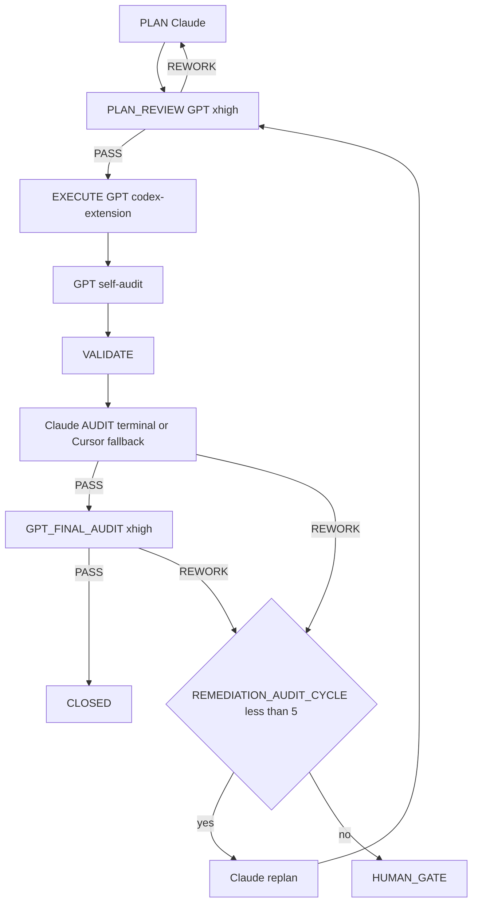

=== Auto-audit GPT (2e passe) ===
2026-04-25T19:20:51.261369Z  WARN codex_core::agents_md: Project doc `/Users/1millnonstop/Downloads/projet/foodking-web/web/testttt/AGENTS.md` exceeds remaining budget (32768 bytes) - truncating.
OpenAI Codex v0.125.0 (research preview)
--------
workdir: /Users/1millnonstop/Downloads/projet/foodking-web/web/testttt
model: gpt-5.5
provider: openai
approval: never
sandbox: workspace-write [workdir, /tmp, $TMPDIR, /Users/1millnonstop/.codex/memories]
reasoning effort: xhigh
reasoning summaries: none
session id: 019dc616-6b3f-7121-a4fc-e06dd0ad55e9
--------
user
Tu effectues l’**auto-audit GPT** (2e passe) d’un cycle FoodKing — **pas** l’audit Claude terminal.

**Contexte** : le JSON ci-dessous est la proposition d’implémentation (format agents/codex.prompt.txt) pour la mission `CV1-M08-FISCAL-Z-NF525`.


**JSON d’implémentation (à recouper)** :
```json
{
  "files_to_modify": [
    "app/Services/Fiscal/ZReportService.php",
    "app/Services/Fiscal/FiscalSealingService.php",
    "app/Services/FrontendOrderService.php",
    "tests/Feature/Fiscal/ZAggregationKioskRoutingTest.php",
    "tests/Feature/Fiscal/RefundPreZTest.php",
    "tests/Feature/Fiscal/RefundPostZTest.php",
    "tests/Feature/Fiscal/VoidPreZTest.php",
    "tests/Feature/Fiscal/FiscalSealingHmacTest.php",
    "tests/Feature/Fiscal/FiscalArchiveTtlTest.php"
  ],
  "implementation_steps": [
    "Extract deterministic branch-scoped Z HMAC signing into FiscalSealingService and route ZReportService signing through it.",
    "Update Z aggregation to count only branch-scoped paid fiscal events with fiscal_sequence_no, excluding pre-Z terminal orders from positive revenue.",
    "Add explicit refund/void handling: pre-Z terminal orders increment counters with zero revenue; post-Z terminal transitions in the next window become negative adjustments.",
    "Keep kiosk fiscal scope Option B: FrontendOrderService finalizes paid kiosk orders operationally without allocating fiscal_sequence_no or sealing Z directly.",
    "Add M-08 feature tests for kiosk routing, refund pre-Z, refund post-Z, void pre-Z, HMAC determinism/branch scoping, and archive retention TTL."
  ],
  "code_blocks": [
    {
      "path": "app/Services/Fiscal/ZReportService.php",
      "op": "replace",
      "excerpt": "Patch aggregate(): build a branch-scoped base query requiring fiscal_sequence_no and payment_status != UNPAID; positive revenue excludes CANCELED, REJECTED, RETURNED; pre-Z refund/void increments refund_count/cancel_count without revenue; post-Z terminal rows updated in (from,to] are subtracted as negative adjustments; tax breakdown is signed with the same positive/negative order sets and sorted/rounded. Patch sign(): delegate canonical HMAC signing to FiscalSealingService."
    },
    {
      "path": "app/Services/Fiscal/FiscalSealingService.php",
      "op": "create",
      "excerpt": "Created FiscalSealingService with signZReport(), hmacForPayload(), canonicalJson(), recursive key normalization, branch_id injection, UTC closed_at canonicalization, and production secret safety checks for fiscal.z_report_secret."
    },
    {
      "path": "app/Services/FrontendOrderService.php",
      "op": "replace",
      "excerpt": "Added M-08 Option B guard comment in finalizePaidKioskOrder documenting that kiosk payment confirmation may release the order operationally but must not allocate fiscal_sequence_no or close/seal Z; fiscal finalization remains delegated to POS."
    },
    {
      "path": "tests/Feature/Fiscal/ZAggregationKioskRoutingTest.php",
      "op": "create",
      "excerpt": "Created test asserting paid kiosk confirmation under Option B promotes the order but leaves fiscal_sequence_no null, and Z aggregation only counts the separate sequenced POS fiscal event."
    },
    {
      "path": "tests/Feature/Fiscal/RefundPreZTest.php",
      "op": "create",
      "excerpt": "Created test asserting a RETURNED paid fiscal order before Z close increments refund_count and contributes zero positive revenue."
    },
    {
      "path": "tests/Feature/Fiscal/RefundPostZTest.php",
      "op": "create",
      "excerpt": "Created test asserting a RETURNED paid fiscal order from a previous Z window, updated inside the current window, is counted as a negative branch-scoped adjustment."
    },
    {
      "path": "tests/Feature/Fiscal/VoidPreZTest.php",
      "op": "create",
      "excerpt": "Created test asserting a CANCELED paid fiscal order before Z close increments cancel_count and contributes zero positive revenue."
    },
    {
      "path": "tests/Feature/Fiscal/FiscalSealingHmacTest.php",
      "op": "create",
      "excerpt": "Created tests asserting canonical payload key order and timezone normalization produce deterministic HMACs, and identical payloads differ across branch_id."
    },
    {
      "path": "tests/Feature/Fiscal/FiscalArchiveTtlTest.php",
      "op": "create",
      "excerpt": "Created test asserting NF525 archive retention defaults to 6 years."
    }
  ],
  "risks": [
    "FiscalZBranchExactnessSentinelTest remains red because it creates paid orders without fiscal_sequence_no and expects them in Z totals; this conflicts with the existing NF525 invariant locked by ZReportAggregateFilterTest that unsequenced legacy orders are excluded.",
    "Post-Z refund/void detection relies on status updated_at because the current allowlist does not include OrderService or a dedicated fiscal adjustment ledger."
  ],
  "notes": [
    "Passed: php artisan test --filter='ZAggregationKioskRoutingTest|RefundPreZTest|RefundPostZTest|VoidPreZTest|FiscalSealingHmacTest|ZReportTaxBreakdownTest|ZReportCloseTest|ZReportAggregateFilterTest' (18 tests).",
    "Passed: php artisan test --filter=FiscalArchiveTtlTest.",
    "Failed/stale: php artisan test --filter=FiscalZBranchExactnessSentinelTest expects unsequenced orders to aggregate; ZReportAggregateFilterTest proves the opposite invariant is active.",
    "Passed syntax checks for all touched PHP files and git diff --check."
  ],
  "execution_trace": {
    "delegation": "codex-extension",
    "invariants_considered": [
      "pricing_ssot",
      "order_status",
      "branch_id",
      "commit_before_dispatch"
    ]
  }
}
```

**Livrable** (Markdown uniquement, en français) :
# AUTO_AUDIT_GPT — CV1-M08-FISCAL-Z-NF525

## 1. Conformité au plan / scope
(Énumérer manques ou dérives ; si scope élargi sans escale → **ESCALATE**)

## 2. Invariants FoodKing
Pour chacun : OK / RISQUE / N/A
- pricing_ssot (backend seul)
- order_status (enum, pas de strings)
- branch_id
- commit_before_dispatch
- frozen_zones
- order_service_symmetry (si un des deux services touché)

## 3. Verdict
Une ligne : `VERDICT: PASS` | `VERDICT: NEEDS_FIX` | `VERDICT: ESCALATE` + 1–3 phrases.

2026-04-25T19:20:51.718239Z  WARN codex_core_plugins::manifest: ignoring interface.defaultPrompt: prompt must be at most 128 characters path=/Users/1millnonstop/.codex/.tmp/plugins/plugins/build-ios-apps/.codex-plugin/plugin.json
2026-04-25T19:20:51.720102Z  WARN codex_core_plugins::manifest: ignoring interface.defaultPrompt: maximum of 3 prompts is supported path=/Users/1millnonstop/.codex/.tmp/plugins/plugins/plugin-eval/.codex-plugin/plugin.json
2026-04-25T19:20:58.526897Z  WARN codex_core_plugins::manifest: ignoring interface.defaultPrompt: prompt must be at most 128 characters path=/Users/1millnonstop/.codex/.tmp/plugins/plugins/build-ios-apps/.codex-plugin/plugin.json
2026-04-25T19:20:58.528585Z  WARN codex_core_plugins::manifest: ignoring interface.defaultPrompt: maximum of 3 prompts is supported path=/Users/1millnonstop/.codex/.tmp/plugins/plugins/plugin-eval/.codex-plugin/plugin.json
2026-04-25T19:20:59.337039Z  WARN codex_core_plugins::manifest: ignoring interface.defaultPrompt: prompt must be at most 128 characters path=/Users/1millnonstop/.codex/.tmp/plugins/plugins/build-ios-apps/.codex-plugin/plugin.json
2026-04-25T19:20:59.337307Z  WARN codex_core_plugins::manifest: ignoring interface.defaultPrompt: maximum of 3 prompts is supported path=/Users/1millnonstop/.codex/.tmp/plugins/plugins/plugin-eval/.codex-plugin/plugin.json
codex
Je vais recouper le JSON avec les artefacts du cycle et le code livré, sans lancer d’audit Claude ni modifier de fichiers. J’utilise aussi la skill `sync-risk-review`, car la mission touche fiscalisation, statut de commande et agrégation branchée.
exec
/bin/zsh -lc "sed -n '1,220p' AGENTS.md" in /Users/1millnonstop/Downloads/projet/foodking-web/web/testttt
exec
/bin/zsh -lc "sed -n '1,220p' .cursor/ACTIVE_CYCLE.md" in /Users/1millnonstop/Downloads/projet/foodking-web/web/testttt
exec
/bin/zsh -lc "sed -n '1,220p' .cursor/rules/global.mdc" in /Users/1millnonstop/Downloads/projet/foodking-web/web/testttt
 succeeded in 0ms:
# Active Cycle – FoodKing

**Méta (SSOT `run-cycle.md` Step 0 + `AGENTS.md` § *Authoritative … cycle state*)** — requis pour que l’orchestrateur ne s’arrête pas sur *« RUNNER_MODE not set »*.

| Champ | Valeur actuelle |
| --- | --- |
| **RUNNER_MODE** | `single-session` |
| **PHASE (cycle W10)** | `IN_PROGRESS` (détail = section `CYCLE_W10_…` ci-dessous) |
| **TASK_ID** | `P_EXEC_CLOSEOUT_GRAPHITI_CI_PROD_2026-04-22` |
| **PLAN_FILE** | `plans/PLAN_EXECUTION_CLOSEOUT_GRAPHITI_CI_PROD_2026-04-22.md` |
| **REPORT_FILE** | `reports/post_execute_latest.log` (append — preuve `EXECUTE_DELEGATION` / `AUDIT_*`) |

> **ACTIVE_PRIMARY** : `CYCLE_W10_EXECUTION_CLOSEOUT` (un seul cycle peut être actif à la fois — voir B03 méga-checklist).
> Cycles plus anciens en lecture seule = **archive** déplacée dans **`.cursor/ACTIVE_CYCLE_ARCHIVE.md`** (lecture humaine / forensique uniquement, **non requise** par le parcours obligatoire).

## CYCLE_W10_EXECUTION_CLOSEOUT (IN_PROGRESS — mémoire 180 + MCP global + commit + CI + prod)

**TASK_ID** : `P_EXEC_CLOSEOUT_GRAPHITI_CI_PROD_2026-04-22`  
**Plan SSOT** : `plans/PLAN_EXECUTION_CLOSEOUT_GRAPHITI_CI_PROD_2026-04-22.md`  
**Ordre** : Piste A (POS+Centrale : PLAN-MEM-1) ∥ Piste B (humain : PLAN-MEM-3) → C (smoke) → D (commit sur « go commit ») → E (CI) → F (prod J-7→J+7).  
**Gate mémoire** : `python3 memory/verify.py` → count **≥ 175** (180 idéal) avant de considérer PLAN-MEM-1 **CLOSED**.

- **Vérif locale (2026-04-22)** : `python3 memory/verify.py` → **count = 182**, smoke `search_memory_facts` OK — gate **satisfaite** pour clôturer l'ingestion côté seuil d'épisodes (suite : commit / CI / prod selon plan `PLAN_EXECUTION_CLOSEOUT_*`).

**Gouvernance globale (2e passe 2026-04-22)** : primer multi-agents + Graphiti vivant + tokens « zéro effet négatif » → **`docs/orchestration/GLOBAL_SYSTEM_PRIMER.md`** + rapport **`reports/audit/AUDIT_SECOND_PASS_GLOBAL_GOVERNANCE_REPORT_2026-04-22.md`**.

---

## CAISSE_V1_MASTERPLAY (ACTIVE — 2026-04-25)

**Phase** : finition Caisse V1 (POS + Kiosk + KDS + Centrale + Fiscal + Ops).
**Plan parent** : `plans/PLAN_CAISSE_V1_GPT_MASTERPLAY_2026-04-25.md`
**Plan DAG autoritaire** : `plans/PLAN_CAISSE_V1_SUPER_MASTER_2026-04-25.md`
**Boucle d'exécution** : `plans/masterplay/MASTERPLAY_DISCIPLINE.md` + `plans/masterplay/MASTERPLAY_QUEUE.md` + `scripts/run-masterplay.sh`
**Statut temps réel** : `reports/masterplay/status.json`

**Règle** : tout `TASK_ID` au format `CV1-MXX-…` passe par la masterplay (cf. `AGENTS.md` § "Caisse V1 — Masterplay loop", `.cursor/rules/global.mdc` § "Caisse V1 — Masterplay loop", `.cursor/commands/run-cycle.md` Step 0 item 0). **NE PAS** ouvrir un `run-cycle` standard sur un `CV1-MXX-…`.

---

## Archive

Tous les cycles **CLOSED / COMPLETED PASSED** (W4 → W9, NF525, etc.) ont été déplacés dans **`.cursor/ACTIVE_CYCLE_ARCHIVE.md`** pour réduire le coût de lecture du parcours obligatoire (audit 2026-04-24, mission `T-PARCOURS-OPTIMIZE-001`).

- **Lecture humaine** : ouvrir `.cursor/ACTIVE_CYCLE_ARCHIVE.md`.
- **Lecture agent** : **non requise** sauf instruction explicite du plan ou du chat (ex. "reprend le rationale du cycle W9").
- **Recherche** : `rg "CYCLE_W9_" .cursor/ACTIVE_CYCLE_ARCHIVE.md` ou `git log --follow .cursor/ACTIVE_CYCLE.md`.

 succeeded in 0ms:
---
description: Always-on rules for the FoodKing Cursor local agent. Applied to every cycle, every model, every task.
globs: ["**/*"]
alwaysApply: true
---

# Global Rules – FoodKing

## Caisse V1 — Masterplay loop (active phase)

Pendant la phase de finition Caisse V1, **toute mission `CV1-MXX-…` est gouvernée par** :
- `plans/masterplay/MASTERPLAY_DISCIPLINE.md` — règles d'or (allowlist, frozen, REWORK max 5, activity-log, mémoire)
- `plans/masterplay/MASTERPLAY_QUEUE.md` — file d'exécution (statut, dépendances DAG)
- `plans/masterplay/GO.md` — comment lancer / suivre / pause / stop
- `scripts/run-masterplay.sh` — runner officiel (boucle codex + audit Claude + audit final + ingest mémoire)

**Lecture obligatoire** avant tout EXECUTE sur un `TASK_ID` `CV1-MXX-…`. Hors Caisse V1 : `run-cycle <TASK_ID>` standard.

## New or continued session — **mandatory path** (applies to **every** conversation and **every** model)

- **The chat log is not the SSOT.** **This repo** (`AGENTS.md`, `.mdc` rules, `docs/orchestration/`, `run-cycle.md`) is.
- On **any** new thread **or** long continuation: (1) Read **`AGENTS.md` § *Parcours obligatoire*** first, then **`docs/orchestration/GLOBAL_SYSTEM_PRIMER.md`** (§1 table). (2) If resuming work, read **`.cursor/ACTIVE_CYCLE.md`** *before* starting a duplicate cycle — follow the same `TASK_ID` / `PHASE` until `CLOSE` or an explicit new task. (3) For bounded work: run **`run-cycle` / `run-cycle.md`** (Steps 0–5) — do not skip `AUDIT` before `CLOSE`. (4) Run `npm run verify:boucle` (and `verify:boucle:full` when an API proof is needed) per `AGENTS.md`. (5) Ensure **`claude` on `PATH` (AUDIT terminal) et binaire `codex` (CLI OpenAI) pour l’EXÉCUTE complexe (compte ChatGPT Pro)**, pas de clé proxy obligatoire — voir `agents/codex-extension-instructions.md`. (6) Obey **`MEMORY_MATRIX.md`**, `EXECUTE_DELEGATION`, `AUDIT_CHANNEL` + `TERMINAL_AUDIT_OK` when using terminal audit, and **`agent-activity-log.sh`** (tail / start / done).
- Full checklist and French wording: **`AGENTS.md` → section *Parcours obligatoire*.

## Cycle Structure
PLAN Claude → PLAN_REVIEW GPT-5.5-pro/xhigh → EXECUTE GPT → VALIDATE → AUDIT Claude → GPT_FINAL_AUDIT → [HUMAN GATE | CLOSE]

Phases are sequential and non-skippable.
Dual audit (`AUDIT_VERDICT: PASS` + `GPT_FINAL_AUDIT_VERDICT: PASS`) precedes close on every cycle without exception.

## Model Discipline
- Auto/Premium routing is disabled
- PRIMARY_EXECUTION_MODEL is declared in the plan file before execution begins
- One PRIMARY_EXECUTION_MODEL per cycle; review checkpoints are explicit and mandatory
- Mid-cycle model switch requires Claude confirmation logged under `ESCALATION` in the plan file
- Full routing policy: `.cursor/routing.md`

## GPT Checkpoints + EXECUTE Delegation (PRIMARY = `codex-extension`)
- The **FoodKing Codex Complex Implementer** (slug `codex-extension`, CLI `codex` + compte ChatGPT Pro) is the **primary** route for `PLAN_REVIEW`, all product EXÉCUTE work, GPT self-audit, and `GPT_FINAL_AUDIT`.
- Procedure: run `npm run codex:plan-review -- {TASK_ID}` before EXECUTE; prepare `missions/{TASK_ID}/input.json` (+ optional `graphiti_context.md` / `plan_excerpt.md` / `execute_brief.md`); run `npm run codex:complex -- {TASK_ID}` (wrapper `bash scripts/codex-extension-execute.sh`, `gpt-5.5-pro`, `xhigh`); apply `output_codex.json` + lire l’auto-audit `reports/audit/GPT_SELF_AUDIT_{TASK_ID}.md`; after Claude PASS run `npm run codex:final-audit -- {TASK_ID}`. Product edits require `EXECUTE_DELEGATION: codex-extension`.
- The Cursor sub-agent `foodking-complex-implementer` is **fallback only** — invoked if `codex` / `exec` échoue (≥2 tentatives documentées) or human-escalation. Trace alors `EXECUTE_DELEGATION: foodking-complex-implementer (codex-extension-fallback)` + `FALLBACK_REASON:`.
- Composer / `foodking-routine-implementer` is not an implementation route during finishing cycles. It may summarize or validate; product fixes return to GPT EXECUTE.
- Reference docs: `docs/orchestration/CODEX_API_DELEGATION.md`, `AGENTS.md` § "EXECUTE delegation".

## Autonomy Contract
The agent operates autonomously within declared scope.
It halts and escalates — never self-approves — on any gate trigger, scope expansion,
invariant violation, two consecutive validation failures, or unresolvable ambiguity.
Full policies: `human-gates.mdc`, `scope.mdc`, `project-invariants.mdc`.

## Graphiti (mémoire inter-sessions)
- When the Graphiti MCP server is loaded for this workspace, **query it first** on any non-trivial task (see `.cursor/rules/graphiti-memory.mdc` and `AGENTS.md` § MCP).
- If Graphiti is not loaded, continue without blocking; one-line note to enable `~/.cursor/mcp.json` is enough.

## Quality channels — terminal first where defined
- **GPT route (`codex-extension` — CLI `codex` Pro)** is the **default** for PLAN_REVIEW, all product implementation, self-audit, and GPT_FINAL_AUDIT; Cursor sub-agent `foodking-complex-implementer` is **only** a fallback if the `codex exec` path fails (≥2 attempts or binaire indispo) — `EXECUTE_DELEGATION: …` + `FALLBACK_REASON:`. See `AGENTS.md` and `docs/orchestration/CODEX_API_DELEGATION.md`.
- **Claude AUDIT after implementation** is **by default the terminal** (`bash scripts/foodking-claude-orchestrate.sh context` then `audit` or `audit-brief` — **Anthropic subscription** via `claude` CLI). If the terminal fails after **1 retry** (**quota / rate limit / session saturated**, missing binary, auth, network), **do not stop the cycle**: use the **FALLBACK** — same `audit-context.md` checklist via Cursor Task **`foodking-planner-orchestrator`** (recommended) or in-session **Claude** — with `AUDIT_CHANNEL: cursor-session` **plus** mandatory `AUDIT_FALLBACK_REASON:` and optional `AUDIT_SUBAGENT_FALLBACK: foodking-planner-orchestrator`. See `docs/orchestration/AUDIT_TERMINAL_QUOTA_FALLBACK.md` and `run-cycle.md` Step 5; verify env with `bash scripts/verify-orchestration-boucle.sh`.
- Never invert primary/fallback for billing convenience without that trace — that would be indistinguishable from a mistake in production evidence.

## Token Discipline (quality-first — zero negative optimization)
- **Goal**: maximum correct intelligence per cycle — not shortest answers. Removing detail, skipping invariants, or omitting Graphiti queries to "save tokens" is **forbidden** when it reduces correctness or auditability.
- **Allowed savings only**: do not re-read files already in full context; do not paste verbatim large blobs already in the plan; use **Graphiti** + `## PRIOR_CONTEXT` to avoid re-opening dozens of historical reports; use phase summaries per `context-hygiene.mdc` §4 **after** a phase completes (handoff), not to shrink the plan itself.
- Do not re-explain decisions already recorded in the plan file (link/summarize in one line if needed).
- Structured output in reports — narrative allowed in plans/gates when it carries decisions, risks, or test strategy.
- Flag real risks only — no speculative commentary on out-of-scope subsystems

## Reports Discipline
- Bounded-cycle **plans** live under `plans/`; **gate briefs** under `docs/gates/`; validation logs, execution summaries, and other run evidence under `reports/` per `run-cycle.md` and `ACTIVE_CYCLE.md`
- Composer generates run evidence in `reports/` where applicable — Claude audits
- No new reporting structure without a plan-phase decision

## Absolute Prohibitions
The agent must never: self-approve a gate, expand scope without human instruction,
edit a frozen zone without cleared gate, modify `.cursor/routing.md` mid-cycle.
All invariant prohibitions enforced per `project-invariants.mdc`.

 succeeded in 0ms:
# FoodKing – Cursor Agent Operating Contract

## 0. Quick start contract — read this first

Commence ici. Ne lance aucune action tant que tu n'as pas lu les priorités P0.
Ce contrat fixe l'ordre minimal de lecture pour comprendre le repo en moins de 60 secondes.
Lis complètement ce qui est marqué obligatoire ; diffère seulement ce qui est explicitement classé P2.

### Reading priority

| Priority | What to read | Why |
| --- | --- | --- |
| P0 | `AGENTS.md §1 Parcours obligatoire` | Cadre impératif de travail, ordre de lecture, discipline de cycle. |
| P0 | `.cursor/ACTIVE_CYCLE.md` (continuation) | État courant du cycle actif, contexte vivant, reprise sans divergence. |
| P0 | `.cursor/rules/global.mdc` (auto-attaché — mentionné pour info) | Règles globales toujours applicables, même si déjà injectées par l'outil. |
| P0 | `plans/masterplay/MASTERPLAY_DISCIPLINE.md` + `plans/masterplay/MASTERPLAY_QUEUE.md` (Caisse V1 actif) | **Pendant la phase Caisse V1** : règles d'or de la boucle GPT + file d'exécution. Tout agent qui touche une mission `CV1-MXX-…` DOIT lire ces deux fichiers avant d'agir. |
| P1 | `docs/orchestration/GLOBAL_SYSTEM_PRIMER.md` | Vocabulaire, architecture d'orchestration, invariants transverses. |
| P1 | `.cursor/commands/run-cycle.md` | Procédure exacte pour démarrer un cycle borné correctement. |
| P1 | `docs/orchestration/MEMORY_MATRIX.md` | Où chercher la mémoire utile sans relire tout le dépôt. |
| P1 | `.cursor/routing.md` | Routage des tâches, choix du bon canal, limites d'intervention. |
| P2 | `docs/orchestration/CODEX_API_DELEGATION.md` (quand EXECUTE complexe) | À lire si tu délègues ou exécutes du complexe (uniquement **CLI `codex`**, pas d’exécuteur HTTP dans le dépôt). |
| P2 | `.cursor/ACTIVE_CYCLE_ARCHIVE.md` (forensique humain) | Historique utile pour audit humain, pas requis au démarrage. |
| P2 | `docs/orchestration/EXPORT_CONFIG_CODEX_GPT_API_ET_AUDIT_PERSISTANCE.md` (nouveau poste) | Configuration et persistance utiles surtout lors d'un nouvel environnement. |

Règle simple : P0 avant toute action, P1 avant tout EXECUTE, P2 seulement à la demande du sujet.
Si un doute persiste après P0+P1, arrête-toi et relis ; n'improvise pas.

### One-line bootstrap

```bash
npm run verify:boucle
bash scripts/agent-activity-log.sh tail 50
run-cycle <TASK_ID>
```

### Caisse V1 — Masterplay loop (actif)

Pendant la phase de finition Caisse V1 (POS + Kiosk + KDS + Centrale + Fiscal), l'orchestration passe par la **MASTERPLAY** :

```bash
# Lire d'abord (obligatoire)
cat plans/masterplay/MASTERPLAY_DISCIPLINE.md
cat plans/masterplay/MASTERPLAY_QUEUE.md
cat plans/masterplay/GO.md

# Lancer la boucle (Codex extension complexe + audit Claude terminal + audit Codex final)
bash scripts/run-masterplay.sh --with-audit --with-final
```

- **Plan parent** : `plans/PLAN_CAISSE_V1_GPT_MASTERPLAY_2026-04-25.md` (catalogue 22 missions M-XX, ancrages file:line)
- **Plan autoritaire DAG** : `plans/PLAN_CAISSE_V1_SUPER_MASTER_2026-04-25.md`
- **Statut temps réel** : `reports/masterplay/status.json` + `reports/masterplay/run_*.log`
- Tout `TASK_ID` au format `CV1-MXX-…` est gouverné par la masterplay (allowlist, frozen, gates, REWORK max 5).
- Hors phase Caisse V1 : repasser au `run-cycle <TASK_ID>` standard.

**Anti-répétition (nouvel onglet / agent parallèle)** : copier d’abord le bloc de `docs/orchestration/SESSION_OPENING_ENFORCEMENT.md` — même discipline, moins d’oubli de `ACTIVE_CYCLE` / `run-cycle`.

Utilise `run-cycle <TASK_ID>` pour initier tout cycle borné.
Les deux autres commandes servent à vérifier l'état local et le journal d'activité avant d'exécuter.

### Quality-first, not token-cheap

Lis P0 et P1 intégralement, sans skim. Les économies de tokens ne se font jamais sur la substance des règles, seulement sur la répétition, le bruit et les relectures inutiles. En cas de tension entre vitesse et rigueur, applique la rigueur ; voir `.cursor/rules/global.mdc § Token Discipline`.

### If you're a new human contributor

Commence par `docs/orchestration/EXPORT_CONFIG_CODEX_GPT_API_ET_AUDIT_PERSISTANCE.md` pour préparer ton poste et comprendre le mode de persistance attendu.
Lis-le après P0, puis enchaîne sur P1 avant toute contribution effective.

---

## 1. Parcours obligatoire — **nouvelle conversation** **et** **continuation** (production, non négociable)

> **Objectif** : qu’**à chaque** session (premier message ou 500e message), l’exécutant sache **quel** chemin suivre — **sans** supposer un historique de chat. Tout est **dans le dépôt** ; l’histoire de conversation **n’est pas** la SSOT.

**Règle d’or** : *aucune* modification de code **produit** (hors `plans/`, `reports/`, `docs/gates/`, `missions/`, JSONL gouvernance) **dans le cadre d’un travail borné** sans **(a)** parcours ci-dessous **et** **(b)** cycle `run-cycle` + plan actif, sauf **exception** explicite humaine (notée dans le plan / gate).

| Étape | Action | Quand / pourquoi |
|-------|--------|------------------|
| **0. Continuation** | Lire **`.cursor/ACTIVE_CYCLE.md`**. | Si `PHASE` n’est **pas** vide et le cycle n’est **pas** archivé : **reprendre** ce `TASK_ID` / ce `PLAN_FILE` / ce `REPORT_FILE` — **ne pas** dupliquer un second cycle fantôme. Si humain confirme **nouveau** sujet : réinitialiser / nouveau `TASK_ID` selon `run-cycle` Step 0. |
| **1. Lecture initiale** | Lire **ce fichier** (`AGENTS.md`) **puis** **`docs/orchestration/GLOBAL_SYSTEM_PRIMER.md`** (table §1 = ordre complet : routing, `run-cycle`, Graphiti, `MEMORY_MATRIX`, etc.). | **Avant** tout code ou plan non trivial. Même en « continuation » si le contexte a dérivé ou l’onglet a été rafraîchi. |
| **2. Cycle structuré (SSOT procédurale)** | Toute tâche avec **`TASK_ID`** : suivre **`.cursor/commands/run-cycle.md`** et la commande **`run-cycle <TASK_ID>`** (ou équivalent explicite dans le chat : enchaîner les **Steps 0 → 5** sans en sauter). | **Programme courant (quota-optimized)** : `PLAN GPT → PLAN_REVIEW GPT → EXECUTE GPT → VALIDATE → AUDIT GPT → [CLAUDE CRITIQUE SI NÉCESSAIRE] → [GATE \| CLOSE]`. Aucun « close » sans audit PASS documenté. |
| **3. Vérification d’environnement** | `npm run verify:boucle` (0 requête par défaut). **Si le terminal ne “voit” pas Codex alors que l’extension est connectée** : l’auth IDE n’alimente pas le CLI — lancer `npm run codex:doctor` (npm + `login status` + 1 requête). **Rapide :** `npm run codex:verify-pro`. **Complet :** `npm run verify:boucle:full`. Encart : `agents/codex-extension-instructions.md`. | Même en **Step 5** : l’`EXECUTE` (CLI `codex`) requiert le binaire + session Pro sur **ce** binaire. Voir `run-cycle` Step 0 item 8. |
| **4. Secrets & outils machine** | Binaire **`claude`** sur le **`PATH`** (Claude Code CLI) pour l’**AUDIT** PRIMARY en terminal. Binaire **`codex`** (CLI OpenAI) : *Sign in with ChatGPT* **Pro** — **pas** de clé API dans le dépôt. Résolution : `PATH` **ou** `node_modules/.bin/codex` après **`npm install`** (dépendance **`@openai/codex`**) **ou** `npm i -g @openai/codex`. **Ne pas** mélanger avec une clé *Platform* restreinte dans l’environnement (provoque des 401 *scopes* sur l’API Responses) — `npm run codex:audit-bleed` aide. (Option) MCP Graphiti selon `~/.cursor/mcp.json`. | Sans `claude` : noter dès le **plan** l’`AUDIT` fallback + `AUDIT_FALLBACK_REASON`. Sans binaire `codex` : pas d’`EXECUTE` complexe PRIMARY (sub-agent + `FALLBACK_REASON` ou `npm install` + auth Pro). |
| **5. Traces & mémoire (déjà dans ce fichier)** | **`EXECUTE_DELEGATION:`** avant VALIDATE ; **`AUDIT_CHANNEL:`** + **`TERMINAL_AUDIT_OK: 1`** si audit terminal OK ; `docs/orchestration/MEMORY_MATRIX.md` ; `scripts/agent-activity-log.sh` (tail / start / done). | Traçabilité = **même** qualité en prod sur N agents parallèles. |

**Ce n’est pas optionnel** pour travailler « en production FoodKing » : c’est le **contrat** d’onboarding. Les **règles** `.cursor/rules/*.mdc` (dont **`global.mdc` — alwaysApply**) et ce fichier **s’imposent** **à** tout modèle, **dans** toute conversation, dès l’ouverture du dépôt.

**Pour un humain / nouveau compte** : mêmes étapes ; la doc **`docs/orchestration/EXPORT_CONFIG_CODEX_GPT_API_ET_AUDIT_PERSISTANCE.md`** regroupe l’**export** config API + persistance des règles hors-chat.

## Engine
Cursor local agent. No cloud orchestration. No external framework.
Auto/Premium routing: disabled. Model selection is explicit per cycle.

## Global system primer (multi-agents, Graphiti, tokens — lecture clé)

Tout nouvel intervenant (session Cursor, sub-agent Task, CLI terminal, humain) qui touche **orchestration**, **mémoire**, ou **discipline de contexte** : lire **`docs/orchestration/GLOBAL_SYSTEM_PRIMER.md`** après ce fichier. Y sont définis : ordre de lecture obligatoire, `codex-extension` GPT-5.5-pro/xhigh, fallback `foodking-complex-implementer`, fallback audit `foodking-planner-orchestrator`, terminal **`claude` / `codex`**, **mise à jour continue de Graphiti**, et la politique **« intelligence max — zéro optimisation négative »** (tokens : supprimer le gaspillage, pas la substance). Pour audits longs et robustesse **opération + agentique + mémoire** : **`docs/orchestration/MEGA_CHECKLIST_AUTONOMY_AND_MEMORY.md`** (180 tâches) et le narratif **`reports/audit/MEGA_AUDIT_SYSTEM_OPERATION_AGENTIC_2026-04-23.md`**.

**Discipline mémoire (qui écrit où, qui lit quoi, quand)** : **`docs/orchestration/MEMORY_MATRIX.md`** — matrice unique des **4 stores autorisés** (Code A · Graphiti+JSONL B · Missions C · Rapports D), table d'écriture par phase, ordre de lecture pour une nouvelle session, anti-patterns. Aucun nouveau store de mémoire ne peut être ajouté sans gate `docs/gates/GATE_MEMORY_*`. Décisions 2026-04-23 sur OpenSpace et claude-mem : **non intégrés**, justifications dans la matrice.

**Synchro multi-agents (cross-conv, cross-terminal)** : `.cursor/rules/cross-agent-sync.mdc` (alwaysApply) + `reports/AGENT_ACTIVITY_LOG.md` (append-only) + `scripts/agent-activity-log.sh` (`tail | start | done | collisions | active`). Au démarrage de session : `tail 50` (~500 tokens). Avant édition produit (Step 2 EXECUTE) : `start` (refus exit 2 si collision). À la clôture (Step 5 CLOSE) : `done`. Évite que deux agents (Cursor convs / `codex-extension` / `claude-terminal` / humain) modifient les mêmes fichiers à leur insu. **Doctrine étendue** (Graphiti = mémoire partagée, rôles Claude vs Codex, anti-patterns) : **`docs/orchestration/MULTI_AGENT_ORCHESTRATION.md`**.

## Workflow
PLAN GPT (codex) → PLAN_REVIEW GPT (codex) → EXECUTE GPT (codex) → VALIDATE → AUDIT GPT (codex) → [CLAUDE CRITICAL ESCALATION ONLY] → [HUMAN GATE | CLOSE]

No phase may be skipped. Default close condition is `AUDIT_VERDICT: PASS` from GPT path, with optional Claude escalation audit only for critical/blocked cases.

## Model Roles
| Model | Role | Channel (priorité **qualité maximale / zéro raccourci token**) |
|---|---|---|
| Claude | Escalade critique uniquement | Utiliser Claude seulement pour cas vraiment critiques: blocage logique majeur, gate ambigu non résoluble, conflit d'audits, ou arbitrage architecture multi-fichiers à haut risque. Le canal prioritaire reste GPT/Codex pour économiser les quotas Claude. |
| **GPT-5.5 / GPT-5.5-pro** | **PLAN + PLAN_REVIEW + EXECUTE + AUDIT** | **`codex-extension`** — `npm run codex:plan-review`, `npm run codex:complex`, `npm run codex:final-audit` (CLI `codex` + `codex exec`, **compte ChatGPT Pro**, modèle `gpt-5.5-pro` si dispo sinon `gpt-5.5`, `model_reasoning_effort=xhigh`). GPT devient le canal principal d'orchestration, implémentation et audit de routine. |
| GPT-5.5 (fallback) | Complex implementation (FALLBACK only) | **Sub-agent** `foodking-complex-implementer` (Task Cursor) — consomme l’**usage** des modèles de l’**abonnement Cursor**. **Uniquement** si `codex` / l’exécution `codex exec` a échoué (≥2 tentatives documentées) ou binaire indispo. |
| Composer | Validation/report only | Plus d’implémentation routine pendant les cycles de finition. Composer peut résumer, exécuter/rapporter des validations, mais toute correction produit repart en EXECUTE GPT. |

**Qui décide (mode actuel quota-optimized)** : **GPT/Codex** porte l’**autorité opérationnelle** sur planification, implémentation, auto-audit, et audit final de routine. **Claude** est mis en pause et appelé uniquement en **escalade critique** (ambiguïté structurelle, gate sensible, conflit technique majeur, analyse de risque à très forte complexité). Le **fait** code / test l’emporte sur la croyance.

**Principe unique (mode actuel) — à valider en prod sur chaque cycle :** **PLAN GPT → PLAN_REVIEW GPT → EXECUTE GPT → self-audit GPT → VALIDATE → AUDIT GPT**. Le repli vers Claude n’intervient qu'en escalade critique documentée (`CLAUDE_ESCALATION_REASON:`), avec portée minimale.

One PRIMARY_EXECUTION_MODEL per cycle. Roles are explicit and layered; review checkpoints do not authorize scope expansion.
Full routing policy: `.cursor/routing.md`. Naming: the **PRIMARY complex implementer** is the **FoodKing Codex Complex Implementer** (slug `codex-extension`); see `docs/orchestration/CODEX_API_DELEGATION.md`.

## Authoritative multi-agent bounded cycle (SSOT)

For **TASK_ID-driven** work in Cursor, this path is **authoritative** and overrides any conflicting step elsewhere in this document:

1. **Command:** `.cursor/commands/run-cycle.md` (invoke with a `TASK_ID`, e.g. `run-cycle SMOKE-001`).
2. **Cycle state:** `.cursor/ACTIVE_CYCLE.md` (`RUNNER_MODE: single-session`, `PHASE`, `PLAN_FILE`, `REPORT_FILE`, completion rows).
3. **Plan artifact:** `plans/PLAN_[TASK_ID]_[DATE].md` per `.cursor/context/plan-context.md` (from `plans/PLAN_TEMPLATE.md` when applicable).
4. **Phase instructions:** `.cursor/context/plan-context.md` (PLAN), `.cursor/context/execute-context.md` (EXECUTE), `.cursor/context/audit-context.md` (AUDIT); VALIDATE per `run-cycle.md` when `validate-context.md` is absent.

**EXECUTE delegation (GPT only; PRIMARY first, FALLBACK only on failure):**

- **Routine implementation disabled during finishing cycles** : no product edit via Composer / `foodking-routine-implementer`. Small edits still route through GPT to keep the same quality chain.
- **PRIMARY** : **`codex-extension`** — **FoodKing Codex Complex Implementer** (CLI `codex`, compte **ChatGPT Pro**, `gpt-5.5-pro`, `model_reasoning_effort=xhigh`). Procédure :
  1. Préparer `missions/{TASK_ID}/input.json` (+ optionnels : `graphiti_context.md` issu de `search_memory_facts(group_ids=["foodking"])`, `plan_excerpt.md`, `execute_brief.md`, `cycle_snapshot.md` — fusionnés par le script d’assemblage de prompt).
  2. Lancer `npm run codex:complex -- {TASK_ID}` (`bash scripts/codex-extension-execute.sh`) ; le wrapper passe explicitement `-m ${CODEX_EXT_MODEL_PRO:-gpt-5.5-pro}` et `model_reasoning_effort=${CODEX_EXT_REASONING_EFFORT:-xhigh}`. (Instructions custom : `agents/codex-extension-instructions.md`.) **Bootstrap** : `npm run codex:prepare -- {TASK_ID}`.
  3. Appliquer `missions/{TASK_ID}/output_codex.json` ; consommer l’**auto-audit** `reports/audit/GPT_SELF_AUDIT_{TASK_ID}.md` (généré par le wrapper).
  4. Tracer `EXECUTE_DELEGATION: codex-extension` dans `reports/post_execute_latest.log` et le `REPORT_FILE`.
- **Complexe — FALLBACK (uniquement si `codex exec` est HS après reprises, ou binaire manquant)** : `Task` → `foodking-complex-implementer` — tracer `EXECUTE_DELEGATION: foodking-complex-implementer (codex-extension-fallback)` + `FALLBACK_REASON:`. 

Référence complète : **`docs/orchestration/CODEX_API_DELEGATION.md`** (naming, fallback contract, audit handoff, token discipline, schéma boucle). Procédure cycle : `.cursor/commands/run-cycle.md`. La trace `EXECUTE_DELEGATION` dans le rapport est **obligatoire** pour passer en VALIDATE.

**Clôture vs. audit :** Après `VALIDATE`, l’**audit** **Claude** (terminal `foodking-claude-orchestrate.sh` en PRIMARY, fallback Cursor si quota/rate-limit/terminal HS) écrit `AUDIT_VERDICT: PASS|REWORK`, puis GPT écrit `GPT_FINAL_AUDIT_VERDICT: PASS|REWORK|ESCALATE`. **Pas** de `CLOSED` sans double PASS. Sur `REWORK`, boucle `replan (orchestration Claude) → missions + EXECUTE GPT → self-audit GPT → VALIDATE → re-audit Claude → GPT final`, avec `REMEDIATION_AUDIT_CYCLE` 1..5 — au 5e `REWORK` sans double PASS, **HUMAN_GATE** (détail : Step 5 de `run-cycle.md` et `auto-remediation.mdc`).

Sections below labeled **Legacy workflow** remain valid for **PR-centric / review-loop** habits but **do not replace** this SSOT for bounded cycles.

## Source of truth (extended)
- README.md
- docs/PROJECT_CONTINUITY_AND_VISION.md
- docs/ARCHITECTURE.md
- docs/API_MAP.md
- docs/AUTHZ_MATRIX.md
- docs/ORDER_FLOW.md
- docs/DEVICE_FLOW.md
- docs/BUSINESS_RULES.md
- docs/CORE_MODULES.md
- docs/DATABASE_SCHEMA_CORE.md
- docs/ERROR_HANDLING.md
- docs/SECURITY_NOTES.md
- docs/TEST_PLAN.md
- docs/MASSIVE_TEST_PLAN.md
- docs/SAAS_VISION.md
- docs/CONTRIBUTING_QA_BOTS.md
- workflows/qa-loop.md
- workflows/task-routing.md
- workflows/report-format.md
- workflows/task-status.md
- reports/README.md
- docs/orchestration/MEGA_CHECKLIST_AUTONOMY_AND_MEMORY.md
- docs/orchestration/WORKFLOW_AUDIT_GRAPHIQUE_2026-04-23.md
- docs/orchestration/TERMINAL_CLAUDE_GRAPHITI_ORCHESTRATION.md
- docs/orchestration/ROUTING_MATRIX.md

## Stop Conditions
Halt and generate a gate brief on any of:
- Gate trigger detected
- Scope expansion beyond declared boundary
- FoodKing invariant violation
- Two consecutive validation failures
- Planning ambiguity unresolvable from task context
- **`codex` / `codex exec` indisponible après reprises (auth, binaire, ou échec ≥2 sur la même tâche)** : basculer sur le fallback `Task → foodking-complex-implementer` et **noter explicitement** `EXECUTE_DELEGATION: foodking-complex-implementer (codex-extension-fallback)` + `FALLBACK_REASON:`.
- **Audit en terminal (PRIMARY) indisponible ou limité** (`claude` absent, **quota / rate limit / session Anthropic saturée**, auth, réseau — après **1 retry** documenté de `context` + `audit-brief` ou `audit`) : **continuer le cycle** — même checklist `audit-context.md` via Task **`foodking-planner-orchestrator`** (recommandé) ou session Cursor **Claude** ; **`AUDIT_CHANNEL: cursor-session`** + **`AUDIT_FALLBACK_REASON:`** (obligatoire) + optionnel **`AUDIT_SUBAGENT_FALLBACK: foodking-planner-orchestrator`**. Voir `docs/orchestration/AUDIT_TERMINAL_QUOTA_FALLBACK.md`. **Ne jamais** omettre la raison.

## FoodKing Non-Negotiables
- Backend is pricing SSOT — no frontend price logic
- `OrderStatus` enum is authoritative — no hardcoded strings
- `branch_id` = business data isolation — no cross-branch data bleed
- Dispatch strictly after DB commit
- `OrderService` / `FrontendOrderService` symmetry mandatory on any order change
- Frozen zones require gate clearance before any edit

## MCP

### Phase 1 — Filesystem
Filesystem MCP only for repo reads where applicable.

### Phase 2 — Graphiti (mémoire inter-cycles — **présent dans toutes les sessions où le serveur est enregistré**)

**Objectif** : décisions d’architecture, invariants, sync borne↔POS↔KDS, fiscal NF525, historique de cycles — récupérables sans relire des centaines de fichiers.

| Élément | Détail |
|--------|--------|
| **Enregistrement Cursor (obligatoire côté humain)** | Fusionner le bloc `graphiti` dans **`~/.cursor/mcp.json`** (Settings → MCP). Modèle : **`.cursor/mcp/graphiti.json.example`**. Le dépôt ne peut pas injecter un MCP automatiquement dans l’IDE. |
| **Règle agent (automatique dès que le MCP est chargé)** | Voir **`.cursor/rules/graphiti-memory.mdc`** (always-on) + **`global.mdc`** : avant toute tâche non triviale, appeler au moins **`search_memory_facts`** (et optionnellement **`search_memory_nodes`**) avec `group_ids=["foodking"]`. |
| **Après AUDIT / CLOSE** | Si `add_memory` est disponible : enregistrer les décisions durables (ADR, gate, invariant clarifié). |
| **Si Graphiti absent de la session** | **Ne pas bloquer** PLAN / EXECUTE : une ligne « Graphiti non chargé » + secours **`memory/INDEX.md`** + lecture ciblée des JSONL sous `memory/episodes/`. |
| **Server** | Zep Graphiti — wrapper local **`.cursor/mcp/start-graphiti-mcp.sh`** (voir exemple JSON). Clone typique : `/Users/1millnonstop/graphiti`. |
| **Backend** | Neo4j (ex. Aura) — credentials hors repo. |
| **Dépannage** | **`.cursor/mcp/GRAPHITI_TROUBLESHOOTING.md`** (LiteLLM, embeddings, redémarrage proxy). |
| **Group ID** | Toujours **`foodking`**. |
| **Ingestion / vérif locale** | `memory/ingest.py`, `memory/verify.py`, `bin/graphiti-ingest.sh` ; index des domaines **`memory/INDEX.md`**. |

**Intégration bounded cycle** : la commande **`.cursor/commands/run-cycle.md`** inclut l’appel Graphiti en **Step 0 item 5** (query avant PLAN).

### Phase 3 — Playwright MCP (tests E2E sur flows critiques FoodKing)

- Package : `@playwright/mcp@latest` (npx, pas d’install global)
- Browser : Chromium
- BASE_URL : `http://localhost:8000`

exec
/bin/zsh -lc "sed -n '1,220p' /Users/1millnonstop/Downloads/projet/foodking-web/web/testttt/.agents/skills/sync-risk-review/SKILL.md" in /Users/1millnonstop/Downloads/projet/foodking-web/web/testttt
 succeeded in 0ms:
---
name: sync-risk-review
description: Review changes affecting synchronization, auth, pricing, KDS, OSS, or order lifecycle for architectural and business risk.
disable-model-invocation: true
---

# Sync Risk Review Skill

Use this skill when a change affects:
- sync
- auth
- pricing
- KDS
- OSS
- order lifecycle
- cross-device behavior

## Steps
1. Read the relevant docs
2. Inspect the diff or current implementation
3. Identify:
   - architecture risk
   - state consistency risk
   - business rule violations
   - authz issues
   - missing tests
4. Produce a concise review with recommended next actions.

2026-04-25T19:21:17.538961Z  WARN codex_core_plugins::manifest: ignoring interface.defaultPrompt: prompt must be at most 128 characters path=/Users/1millnonstop/.codex/.tmp/plugins/plugins/build-ios-apps/.codex-plugin/plugin.json
2026-04-25T19:21:17.540594Z  WARN codex_core_plugins::manifest: ignoring interface.defaultPrompt: maximum of 3 prompts is supported path=/Users/1millnonstop/.codex/.tmp/plugins/plugins/plugin-eval/.codex-plugin/plugin.json
codex
Le cycle actif indique que `CV1-M08-…` relève de la masterplay, donc je vérifie les règles de file/allowlist et les artefacts mission avant de juger le JSON. Je vais ensuite inspecter le diff réel des fichiers annoncés et les tests liés.
2026-04-25T19:21:27.127667Z  WARN codex_core_plugins::manifest: ignoring interface.defaultPrompt: prompt must be at most 128 characters path=/Users/1millnonstop/.codex/.tmp/plugins/plugins/build-ios-apps/.codex-plugin/plugin.json
2026-04-25T19:21:27.129112Z  WARN codex_core_plugins::manifest: ignoring interface.defaultPrompt: maximum of 3 prompts is supported path=/Users/1millnonstop/.codex/.tmp/plugins/plugins/plugin-eval/.codex-plugin/plugin.json
mcp: graphiti/search_memory_facts started
mcp: graphiti/search_memory_facts (failed)
user cancelled MCP tool call
2026-04-25T19:21:32.383063Z  WARN codex_core_plugins::manifest: ignoring interface.defaultPrompt: prompt must be at most 128 characters path=/Users/1millnonstop/.codex/.tmp/plugins/plugins/build-ios-apps/.codex-plugin/plugin.json
2026-04-25T19:21:32.383416Z  WARN codex_core_plugins::manifest: ignoring interface.defaultPrompt: maximum of 3 prompts is supported path=/Users/1millnonstop/.codex/.tmp/plugins/plugins/plugin-eval/.codex-plugin/plugin.json
codex
Graphiti était disponible mais l’appel MCP a été annulé côté outil ; je continue sans bloquer, avec les artefacts disque comme source de vérité. Je cible maintenant les documents masterplay et les fichiers de mission M-08.
exec
/bin/zsh -lc "sed -n '1,220p' plans/masterplay/MASTERPLAY_DISCIPLINE.md" in /Users/1millnonstop/Downloads/projet/foodking-web/web/testttt
exec
/bin/zsh -lc "sed -n '1,260p' plans/masterplay/MASTERPLAY_QUEUE.md" in /Users/1millnonstop/Downloads/projet/foodking-web/web/testttt
 succeeded in 0ms:
# MASTERPLAY DISCIPLINE — Caisse V1 (loop master)

> **But** : règles strictes que le runner et chaque mission GPT respectent en boucle, pendant des heures, jusqu'à finition de toutes les missions de `MASTERPLAY_QUEUE.md`. Lecture obligatoire avant de lancer `bash scripts/run-masterplay.sh`.

## 1. Autorité

| Source | Rôle |
|--------|------|
| `AGENTS.md` | Parcours obligatoire, cycle FoodKing |
| `plans/PLAN_CAISSE_V1_SUPER_MASTER_2026-04-25.md` | DAG autoritaire (ordre, gates) |
| `plans/PLAN_CAISSE_V1_GPT_MASTERPLAY_2026-04-25.md` | Catalogue 22 missions M-XX (objectifs, allowlist) |
| `plans/masterplay/MASTERPLAY_QUEUE.md` | File d'exécution courante |
| `plans/masterplay/MASTERPLAY_DISCIPLINE.md` | (ce fichier) règles d'exécution |
| `.cursor/rules/*.mdc` | Toujours appliquées |
| `docs/gates/GATE_LOG.md` | État des gates humains |

## 2. Boucle d'exécution (run-masterplay.sh)

```
LOOP {
  1. tail activity log (~500 tokens)
  2. find next PENDING task in MASTERPLAY_QUEUE with all DEPENDS_ON == CLOSED
  3. if none → break (all done or all blocked)
  4. verify missions/<TASK_ID>/input.json + execute_brief.md exist
  5. activity-log start codex-extension <TASK_ID> execute "<allowlist CSV>" "<note>"
     if exit 2 (collision) → MARK BLOCKED note=collision, continue loop
  6. update status: RUNNING
  7. npm run codex:complex -- <TASK_ID>     (génère output_codex.json + GPT_SELF_AUDIT)
  8. update status: EXECUTED
  9. activity-log done codex-extension <TASK_ID> done "<résumé court>"
 10. (option --with-audit) bash scripts/foodking-claude-orchestrate.sh audit-brief <TASK_ID>
       if PASS → status: AUDIT_PASS
       if REWORK → status: REWORK ; increment REWORK_COUNT ; if >=5 → BLOCKED note=human_gate
 11. (option --with-final) npm run codex:final-audit -- <TASK_ID>
       if PASS → status: FINAL_PASS
 12. if FINAL_PASS:
       bash scripts/after-execute-memory.sh
       update status: CLOSED
 13. sleep INTER_TASK_PAUSE_SECONDS (default 5s)
 14. continue LOOP
}
```

## 3. Garde-fous (non négociables)

### 3.1 Allowlist stricte par mission
Codex modifie **uniquement** les fichiers listés dans `missions/<TASK_ID>/input.json.allowlist`. Si modification hors liste détectée à l'audit → `REWORK`.

### 3.2 Frozen zones
Aucune édition d'un fichier frozen sans gate signé dans `docs/gates/GATE_LOG.md`. Le runner **refuse** de lancer une mission marquée `BLOCKED` jusqu'à ce que le statut soit changé manuellement après signature.

### 3.3 Invariants FoodKing — `REWORK` automatique
- Pricing client-authoritative
- Status littéral numérique (`status: 16`)
- `branch_id` LIKE
- Dispatch dans transaction
- OS ou FOS modifié sans `SYMMETRY_NOTE`
- Frozen modifié sans gate

### 3.4 Pas de gate auto-approuvée
Codex peut **rédiger** options ; aucune mission ne coche `[x] Approved`. Si une mission le tente → `REWORK` + `risks: ["ESCALATION: gate self-approved"]`.

### 3.5 Tests obligatoires
Chaque `mandatory_tests` listé doit être lancé et reporté dans le rapport. Échec → `REWORK`.

### 3.6 Diff minimal
Aucun renommage opportuniste, aucun refactor non demandé, aucune optimisation collatérale. Si ajout justifié → `notes` du JSON.

### 3.7 Activity log
`start` avant chaque mission ; `done` après. Sans cela → réservation fantôme = autres agents bloqués. Le runner enforce.

### 3.8 Mémoire
À CLOSE : compléter `memory/episodes/caisse_v1_<topic>_*.jsonl` (squelettes créés par M-19) puis `bash scripts/after-execute-memory.sh`. Si Graphiti UP : `bash bin/graphiti-ingest.sh` + `python3 memory/verify.py`.

## 4. Boucles de rework

- Max **5 cycles `REWORK`** consécutifs sur la même mission. Au 5e → `BLOCKED note=human_gate_required`.
- Max **3 cycles healing** consécutifs (cf. CLAUDE.md §8) avant escalade.
- Toute escalation → écrite dans `reports/masterplay/ESCALATIONS_<date>.md`.

## 5. Pause / arrêt

- `Ctrl-C` arrête la boucle proprement (mission en cours finit, runner s'arrête après).
- `touch reports/masterplay/STOP` → le runner s'arrête à la fin de la mission courante.
- `touch reports/masterplay/PAUSE` → le runner pause entre les missions tant que le fichier existe.

## 6. Logs

- `reports/masterplay/run_<ISO>.log` : log de la boucle.
- `reports/masterplay/status.json` : état temps réel (mission courante, compteurs).
- `missions/<TASK_ID>/output_codex.raw.log` : raw codex.
- `missions/<TASK_ID>/output_codex.json` : json structuré.
- `reports/audit/GPT_SELF_AUDIT_<TASK_ID>.md` : self-audit GPT.
- `reports/post_execute_latest.log` : trace `EXECUTE_DELEGATION`.
- `reports/AGENT_ACTIVITY_LOG.md` : start/done.

## 7. Audit Claude (en fin de boucle, manuel)

Quand toutes les missions sont `CLOSED` (ou `BLOCKED` documentés) :

```
bash scripts/foodking-claude-orchestrate.sh context
bash scripts/foodking-claude-orchestrate.sh audit
```

Sortie attendue : verdict transversal Caisse V1 (chaîne sync borne→centrale→POS→KDS→fiscal). Le verdict détermine `GO/HOLD/NO-GO` pour `GATE_GO_NO_GO_CAISSE_V1`.

## 8. Critères d'arrêt anormal

- 3 missions consécutives en `REWORK` → halt + alerte humaine.
- Activity-log refuse 3 fois → halt (collision permanente).
- `npm run codex:complex` échoue 3 fois sur la même mission (binaire codex KO) → halt.
- `claude` terminal indisponible 3 fois consécutives → continue avec fallback subagent + `AUDIT_FALLBACK_REASON: terminal-unavailable`.

## 9. Token discipline

- Le prompt envoyé à codex contient : template `agents/codex.prompt.txt` + `input.json` + `execute_brief.md` + (optionnel) `graphiti_context.md`, `plan_excerpt.md`, `cycle_snapshot.md`.
- Pas de duplication : pas de re-coller AGENTS.md ou super master plan dans chaque mission.
- Cap typique d'un prompt : ≤ 30 KB. Au-delà → splitter la mission.

## 10. Anti-pattern interdits

- ❌ Lancer 2 missions en parallèle sur les mêmes fichiers (collision activity-log).
- ❌ Modifier `MASTERPLAY_QUEUE.md` pendant que le runner tourne (sauf marquer BLOCKED → PENDING après gate).
- ❌ Skipper l'audit Claude pour aller plus vite.
- ❌ Marquer CLOSED manuellement sans double PASS (PASS Claude + PASS Codex final).
- ❌ Ignorer un `risks: ["ESCALATION: ..."]` dans output_codex.json.

---

`MASTERPLAY_DISCIPLINE_VERSION: 1.0` · `STRICT_MODE: ON`

 succeeded in 0ms:
# MASTERPLAY_QUEUE — Caisse V1

**Source de vérité de l'orchestration en boucle** : `bash scripts/run-masterplay.sh` lit cette file et exécute en série.

**Discipline** : `plans/masterplay/MASTERPLAY_DISCIPLINE.md`.  
**Plan parent** : `plans/PLAN_CAISSE_V1_GPT_MASTERPLAY_2026-04-25.md`.

## Légende statut

- `PENDING` — pas encore lancé
- `RUNNING` — codex exec en cours (ne pas relancer)
- `EXECUTED` — codex exec terminé, attend audit
- `AUDIT_PASS` — `AUDIT_VERDICT: PASS` Claude
- `FINAL_PASS` — `GPT_FINAL_AUDIT_VERDICT: PASS`
- `CLOSED` — mémoire ingestée + activity-log done
- `REWORK` — audit a demandé rework
- `BLOCKED` — gate humain ou dépendance manquante

## Légende vague

- `WAVE_A` — NO-GATE, parallélisable, démarre immédiatement
- `WAVE_B` — POST-GATE, séquencé selon DAG

## File d'exécution


| ORDER | TASK_ID                           | MISSION | WAVE   | DEPENDS_ON                 | STATUS  | NOTE                                                                         |
| ----- | --------------------------------- | ------- | ------ | -------------------------- | ------- | ---------------------------------------------------------------------------- |
| 01    | CV1-M19-MEMORY-DISCIPLINE         | M-19    | WAVE_A | —                          | CLOSED  | Crée squelettes JSONL pour les 22 missions                                   |
| 02    | CV1-M01-TRACEABILITY-MATRIX       | M-01    | WAVE_A | —                          | CLOSED  | Matrice findings → tasks → tests → gates (REWORK resolved GPT PASS)          |
| 03    | CV1-M02-SENTINEL-BASELINE         | M-02    | WAVE_A | CV1-M01                    | CLOSED  | 18 sentinels fail-first + 4 lints                                            |
| 04    | CV1-M12-LEGACY-GUARDS-CI          | M-12    | WAVE_A | —                          | CLOSED  | Lint imports + bundle scan + workflow (recovered: extractor JSON fix)        |
| 05    | CV1-M16-HARDWARE-LAB              | M-16    | WAVE_A | —                          | CLOSED  | Checklist hardware signable (recovered: JSON valid, files materialized)      |
| 06    | CV1-M18-TEST-ARCHITECTURE         | M-18    | WAVE_A | CV1-M02                    | CLOSED  | Grille couverture + plan campagne                                            |
| 07    | CV1-M20-RUNBOOKS-SKELETON         | M-20    | WAVE_A | —                          | CLOSED  | 8 runbooks ops (REWORK Horizon resolved GPT PASS)                            |
| 08    | CV1-M21A-QUICKWINS-LOT0           | M-21a   | WAVE_A | —                          | CLOSED  | POS: discount v-model + Swiper RTL + focustrap dead                          |
| 09    | CV1-M03-GATES-DRAFT               | M-03    | WAVE_A | CV1-M01                    | CLOSED  | 8 briefs gates Caisse V1 créés; Wave B reste bloquée par signatures humaines |
| 10    | CV1-M09-BRANCH-ISOLATION          | M-09    | WAVE_B | CV1-M03(gates), CV1-M02    | CLOSED  | GPT audit PASS; M-08/M-06/schema sentinels remain gated                      |
| 11    | CV1-M06-POS-REVENUE-GUARDS        | M-06    | WAVE_B | CV1-M09, CV1-M03           | CLOSED | GPT rework audit PASS; gates frozen C + payment_prop A approved              |
| 12    | CV1-M05-ORDER-QUOTE               | M-05    | WAVE_B | CV1-M03                    | CLOSED | GPT final PASS; quote sealed/consumed at POS+kiosk commit                    |
| 13    | CV1-M04A-PAYMENT-LEDGER-FULL      | M-04A   | WAVE_B | CV1-M03 (ledger=A)         | BLOCKED | Ledger gate chose Option B; M-04A not selected                               |
| 14    | CV1-M04B-PAYMENT-PILOT-RESTRICT   | M-04B   | WAVE_B | CV1-M03 (ledger=B)         | CLOSED  | GPT audit PASS; Option B restricted pilot implemented                        |
| 15    | CV1-M08-FISCAL-Z-NF525            | M-08    | WAVE_B | CV1-M03 (fiscal+schema)    | RUNNING | Fiscal Option B + schema Option A approved                                   |
| 16    | CV1-M07-KDS-RELEASE               | M-07    | WAVE_B | CV1-M03 (kds_bump)         | PENDING | KDS gate Option B approved                                                   |
| 17    | CV1-M10-OS-FOS-SYMMETRY           | M-10    | WAVE_B | CV1-M06, CV1-M09           | PENDING | Unlocked after M-06 GPT audit PASS and M-09 CLOSED                           |
| 18    | CV1-M11-KIOSK-RUNTIME             | M-11    | WAVE_B | CV1-M03 (offline+fiscal)   | BLOCKED | Will unlock after M-08 policy evidence                                       |
| 19    | CV1-M17-WEB-STRIPE-SCOPE          | M-17    | WAVE_B | CV1-M03 (web+stripe)       | PENDING | Web Option B + Stripe Option B approved                                      |
| 20    | CV1-M13-MIGRATIONS-SAFETY         | M-13    | WAVE_B | CV1-M03 (schema)           | PENDING | Schema Option A approved                                                     |
| 21    | CV1-M14-OPS-PREFLIGHT             | M-14    | WAVE_B | CV1-M13                    | BLOCKED | —                                                                            |
| 22    | CV1-M15-ROLLOUT-CANARY            | M-15    | WAVE_B | CV1-M04*, CV1-M08, CV1-M14 | BLOCKED | —                                                                            |
| 23    | CV1-M21B-PAYMENT-REFACTOR         | M-21b   | WAVE_B | CV1-M03 (prop_mutation)    | BLOCKED | Gate approved; unlock after M-06/M-10 stabilization                          |
| 24    | CV1-M22-POST-LAUNCH-OBSERVABILITY | M-22    | WAVE_B | CV1-M14, CV1-M15           | BLOCKED | —                                                                            |


## Ce que le runner exécute

À chaque tour de boucle, le runner :

1. Lit cette table.
2. Prend la **première** ligne au statut `PENDING`.
3. Vérifie que toutes ses `DEPENDS_ON` sont au statut `CLOSED`. Sinon → skip.
4. Vérifie que `missions/<TASK_ID>/input.json` et `execute_brief.md` existent. Sinon → marque `BLOCKED note=missing-mission-files`.
5. `start` activity-log → `npm run codex:complex -- <TASK_ID>` → `done` activity-log.
6. Mise à jour statut : `EXECUTED`.
7. Audit Claude terminal automatique (si activé `--with-audit`) → `AUDIT_PASS` ou `REWORK`.
8. Si `AUDIT_PASS` : `npm run codex:final-audit -- <TASK_ID>` → `FINAL_PASS`.
9. Si `FINAL_PASS` : ingestion mémoire + `done` → `CLOSED`.
10. Loop.

## Statut initial (à la création)

Les 6 missions Vague A préparées par M-19/M-01/M-02/M-12/M-16/M-18 sont au statut `PENDING`. Les autres `TODO_NEXT` (à créer après le premier round) ou `BLOCKED` (gates).

## Mise à jour manuelle

Le runner met à jour la colonne `STATUS` automatiquement (sed sur cette table). Tu peux aussi éditer manuellement entre 2 runs (ex: marquer `BLOCKED → PENDING` après gate signé).

exec
/bin/zsh -lc "sed -n '1,180p' plans/masterplay/GO.md" in /Users/1millnonstop/Downloads/projet/foodking-web/web/testttt
 succeeded in 0ms:
# GO — Lance la masterplay Caisse V1

> **Intégration obligatoire confirmée (2026-04-25)** : la masterplay est désormais référencée dans :
> - `AGENTS.md` P0 + section "Caisse V1 — Masterplay loop"
> - `.cursor/rules/global.mdc` (alwaysApply) section "Caisse V1 — Masterplay loop"
> - `.cursor/commands/run-cycle.md` Step 0 item 0 (fast-path `^CV1-M…`)
> - `.cursor/ACTIVE_CYCLE.md` section "CAISSE_V1_MASTERPLAY (ACTIVE)"
>
> Tout agent qui ouvre le repo et touche un `TASK_ID` `CV1-MXX-…` est OBLIGÉ de lire `MASTERPLAY_DISCIPLINE.md` + `MASTERPLAY_QUEUE.md` avant d'agir.

## 0. Prérequis (1 fois)

```bash
# Vérifier binaire codex (CLI OpenAI, compte ChatGPT Pro)
npm run codex:doctor || npm install   # installe @openai/codex si absent

# Vérifier binaire claude (Anthropic, audit terminal)
which claude && claude --version       # doit retourner 2.x.x

# Vérifier la boucle FoodKing
npm run verify:boucle
```

Si l'un échoue : voir `AGENTS.md` § "Parcours obligatoire" et `agents/codex-extension-instructions.md`.

## 1. Démarrage propre (boucle longue)

```bash
# Boucle simple — exécute toutes les missions PENDING dans l'ordre, sans audit auto
bash scripts/run-masterplay.sh

# Boucle complète — codex exec + audit Claude terminal + audit Codex final + ingest mémoire
bash scripts/run-masterplay.sh --with-audit --with-final

# Boucle limitée (tester sur 2 missions d'abord)
bash scripts/run-masterplay.sh --with-audit --with-final --max 2
```

## 2. Suivre l'avancement

```bash
# Statut temps réel (fichier JSON mis à jour à chaque mission)
cat reports/masterplay/status.json

# Log de la boucle courante
ls -lt reports/masterplay/run_*.log | head -1
tail -f $(ls -t reports/masterplay/run_*.log | head -1)

# File d'attente (à jour)
cat plans/masterplay/MASTERPLAY_QUEUE.md
```

## 3. Pause / Stop

```bash
# Pause (rester en attente, le runner reprend dès suppression)
touch reports/masterplay/PAUSE
# Reprendre
rm reports/masterplay/PAUSE

# Stop propre (à la fin de la mission courante)
touch reports/masterplay/STOP

# Stop immédiat (Ctrl-C dans le terminal du runner)
```

## 4. Missions Vague A prêtes (no-gate, démarrent immédiatement)

| ORDER | TASK_ID | Mission | Livrables clés |
|-------|---------|---------|----------------|
| 01 | `CV1-M19-MEMORY-DISCIPLINE` | M-19 | 22 squelettes JSONL, procédure mémoire |
| 02 | `CV1-M01-TRACEABILITY-MATRIX` | M-01 | Matrice findings .md+.csv, script de check |
| 03 | `CV1-M02-SENTINEL-BASELINE` | M-02 | 18 tests sentinels rouges + 4 lints + index |
| 04 | `CV1-M12-LEGACY-GUARDS-CI` | M-12 | Workflow CI + 4 scripts lint legacy |
| 05 | `CV1-M16-HARDWARE-LAB` | M-16 | Checklist + protocoles + grille acceptation |
| 06 | `CV1-M18-TEST-ARCHITECTURE` | M-18 | Matrice couverture + plan campagne |

## 5. Pendant que ça tourne (de mon côté, la prochaine fois)

Je préparerai en parallèle :
- `CV1-M20-RUNBOOKS-SKELETON` (M-20) — squelettes runbooks ops
- `CV1-M21A-QUICKWINS-LOT0` (M-21a) — quickwins POS (discount v-model + Swiper RTL)
- `CV1-M03-GATES-DRAFT` (M-03) — briefs des 7 gates TO_DRAFT

## 6. Après ces 6 (toi + humain)

1. Audit Claude transversal :
   ```bash
   bash scripts/foodking-claude-orchestrate.sh context
   bash scripts/foodking-claude-orchestrate.sh audit
   ```
2. Signer les gates `PENDING_HUMAN_GATE` (cf. `docs/gates/GATE_LOG.md`).
3. Une fois M-03 livré, signer les 7 gates `TO_DRAFT`.
4. Débloquer la Vague B en passant manuellement les BLOCKED → PENDING au fil des signatures.

## 7. Garde-fous (rappel)

- **Allowlist stricte par mission** : codex ne touche QUE les fichiers listés.
- **Frozen zones** : intouchables sans gate signé.
- **Invariants FoodKing** : violation = REWORK auto.
- **Activity-log** : enforce les collisions (pas de double édition cross-agent).
- **Max 5 REWORK** par mission → BLOCKED + escalation humaine.

Lis `plans/masterplay/MASTERPLAY_DISCIPLINE.md` pour le détail complet.

---

**TL;DR** : `bash scripts/run-masterplay.sh --with-audit --with-final` → laisse tourner → reviens dans X heures → check `cat reports/masterplay/status.json` et `cat plans/masterplay/MASTERPLAY_QUEUE.md`.

exec
/bin/zsh -lc "rg --files | rg '("'^missions/CV1-M08-FISCAL-Z-NF525/|PLAN_.*CV1.*M08|MASTER.*2026-04-25|reports/masterplay/status.json|memory/INDEX.md)'"'" in /Users/1millnonstop/Downloads/projet/foodking-web/web/testttt
 succeeded in 0ms:
memory/INDEX.md
missions/CV1-M08-FISCAL-Z-NF525/plan_excerpt.md
missions/CV1-M08-FISCAL-Z-NF525/execute_brief.md
missions/CV1-M08-FISCAL-Z-NF525/input.json
reports/masterplay/status.json
missions/SIM-MASTERPLAY-2026-04-25/plan_excerpt.md
missions/SIM-MASTERPLAY-2026-04-25/cycle_snapshot.md
missions/SIM-MASTERPLAY-2026-04-25/README.md
missions/SIM-MASTERPLAY-2026-04-25/execute_brief.md
missions/SIM-MASTERPLAY-2026-04-25/input.json
missions/SIM-MASTERPLAY-2026-04-25/graphiti_context.md
plans/PLAN_SIM_MASTERPLAY_2026-04-25.md
plans/PLAN_CAISSE_V1_SUPER_MASTER_2026-04-25.md
plans/PLAN_CAISSE_V1_GPT_MASTERPLAY_2026-04-25.md
reports/audit/SIM_MASTERPLAY_FINAL_CONSOLIDATED_2026-04-25.md
reports/audit/SIM_MASTERPLAY_P0_CONTINUATION_2026-04-25.md
reports/audit/SIM_MASTERPLAY_ORCHESTRATION_PLAN_EXECUTED_2026-04-25.md
reports/audit/MASTER_REQUEST_CAISSE_V1_ULTRA_DEEP_SINGLE_FILE_2026-04-25.md
reports/audit/SIM_MASTERPLAY_BREAKDOWN_SYNTH_V1_2026-04-25.md
reports/audit/SIM_MASTERPLAY_CLAUDE_TERMINAL_ROUND4_2026-04-25.md
reports/audit/CLAUDE_SUPER_MASTER_PLAN_PROMPT_CAISSE_V1_2026-04-25.md
reports/audit/SIM_MASTERPLAY_SYNTH_BRIDGE_ROUND3_2026-04-25.md
reports/audit/CHALLENGE_MASTER_CHECKLIST_DEEP_SINGLE_2026-04-25.md
reports/audit/SIM_MASTERPLAY_BREAKDOWN_SYNTH_V0_2026-04-25.md
reports/audit/SIM_MASTERPLAY_GPT_CHALLENGE_ROUND2_2026-04-25.md
reports/audit/CLAUDE_SUPER_MASTER_PLAN_REVIEW_CAISSE_V1_2026-04-25.md

2026-04-25T19:21:40.721027Z  WARN codex_core_plugins::manifest: ignoring interface.defaultPrompt: prompt must be at most 128 characters path=/Users/1millnonstop/.codex/.tmp/plugins/plugins/build-ios-apps/.codex-plugin/plugin.json
2026-04-25T19:21:40.721311Z  WARN codex_core_plugins::manifest: ignoring interface.defaultPrompt: maximum of 3 prompts is supported path=/Users/1millnonstop/.codex/.tmp/plugins/plugins/plugin-eval/.codex-plugin/plugin.json
exec
/bin/zsh -lc "sed -n '1,260p' missions/CV1-M08-FISCAL-Z-NF525/input.json" in /Users/1millnonstop/Downloads/projet/foodking-web/web/testttt
 succeeded in 0ms:
{
  "task_id": "CV1-M08-FISCAL-Z-NF525",
  "mission_id": "M-08",
  "plan_file": "plans/PLAN_CAISSE_V1_GPT_MASTERPLAY_2026-04-25.md",
  "primary_model": "codex-extension",
  "model": "gpt-5.5-pro",
  "reasoning_effort": "xhigh",
  "objective": "Implémenter fiscal Z NF525 selon gate fiscal Option B: POS finalize porte la finalisation fiscale, Z aggregation exacte, refunds/void pré/post-Z, HMAC chain et tests.",
  "instruction": "Applique uniquement M-08. Gates: fiscal Option B, schema Option A. Ne fiscalise pas directement le kiosk; POS finalize est la politique retenue. JSON unique.",
  "allowlist": [
    "app/Services/Fiscal/ZReportService.php",
    "app/Services/Fiscal/FiscalSealingService.php",
    "database/migrations/",
    "app/Services/FrontendOrderService.php",
    "tests/Feature/Fiscal/ZAggregationKioskRoutingTest.php",
    "tests/Feature/Fiscal/RefundPreZTest.php",
    "tests/Feature/Fiscal/RefundPostZTest.php",
    "tests/Feature/Fiscal/VoidPreZTest.php",
    "tests/Feature/Fiscal/FiscalSealingHmacTest.php",
    "tests/Feature/Fiscal/FiscalArchiveTtlTest.php"
  ],
  "off_limits": ["resources/**", "routes/**", "app/Services/KitchenDisplaySystemOrderService.php", ".cursor/**", "AGENTS.md"],
  "human_gate_decisions": [
    {"gate": "GATE_FISCAL_KIOSK_SCOPE_V1_2026-04-25", "status": "Approved", "decision": "Option B — POS finalize", "date": "2026-04-25"},
    {"gate": "GATE_SCHEMA_MIGRATIONS_CAISSE_V1_2026-04-25", "status": "Approved", "decision": "Option A — All migrations with rehearsal + backup", "date": "2026-04-25"}
  ],
  "invariants_at_risk": ["pricing_ssot", "branch_id", "dispatch_after_commit", "frozen_zones"],
  "gate_conditions": ["fiscal approved Option B", "schema approved Option A"],
  "mandatory_tests": [
    "php artisan test --filter=FiscalZBranchExactnessSentinelTest",
    "php artisan test --filter=ZAggregationKioskRoutingTest",
    "php artisan test --filter=RefundPreZTest",
    "php artisan test --filter=RefundPostZTest",
    "php artisan test --filter=FiscalSealingHmacTest"
  ],
  "self_audit_checklist": [
    "kiosk direct Z finalization is not introduced under Option B",
    "Z aggregate counts only requested branch and paid fiscal events",
    "refund/void pre/post-Z policy is explicit and tested",
    "HMAC sealing is deterministic and branch-scoped"
  ],
  "rollback": {"feature_flag": "fiscal_z_v1", "max_window_days": 1, "predicates": ["fiscal anomaly > 0", "invalid HMAC seal"]},
  "graphiti_query": "Caisse V1 fiscal Z NF525 POS finalize kiosk branch aggregation HMAC",
  "memory_episode_to_write_on_close": "memory/episodes/caisse_v1_fiscal_z_2026-04-25.jsonl",
  "claude_audit_prompt_id": "disabled-gpt-only"
}

exec
/bin/zsh -lc "sed -n '1,260p' missions/CV1-M08-FISCAL-Z-NF525/execute_brief.md" in /Users/1millnonstop/Downloads/projet/foodking-web/web/testttt
 succeeded in 0ms:
# EXECUTE BRIEF — CV1-M08-FISCAL-Z-NF525

Implement M-08 only. NF525 is high risk: no broad refactor. Branch-scoped aggregates and HMAC evidence are mandatory. FiscalZBranchExactnessSentinelTest must turn green unless the test itself is proven stale.

exec
/bin/zsh -lc "sed -n '1,260p' missions/CV1-M08-FISCAL-Z-NF525/plan_excerpt.md" in /Users/1millnonstop/Downloads/projet/foodking-web/web/testttt
 succeeded in 0ms:
# PLAN EXCERPT — CV1-M08-FISCAL-Z-NF525

Gate fiscal decision: Option B — POS finalize. Gate schema: Option A.

Implement Z aggregation/refund/void/HMAC with kiosk fiscal route delegated to POS finalization. Do not introduce kiosk direct Z sealing.

exec
/bin/zsh -lc 'cat reports/masterplay/status.json' in /Users/1millnonstop/Downloads/projet/foodking-web/web/testttt
 succeeded in 0ms:
{
  "run_id": "20260425T185846Z",
  "current_task": "CV1-M08-FISCAL-Z-NF525",
  "current_status": "RUNNING",
  "extra": "",
  "with_audit": 0,
  "with_final": 1,
  "ts_utc": "2026-04-25T18:58:46Z"
}

exec
/bin/zsh -lc "sed -n '1,220p' memory/INDEX.md" in /Users/1millnonstop/Downloads/projet/foodking-web/web/testttt
 succeeded in 0ms:
# FoodKing — Index de la mémoire d'intelligence

> Table des matières navigable des épisodes Graphiti.
> Chaque fichier = un domaine. Chaque ligne JSONL = un fact atomique.

| # | Fichier | Domaine | Épisodes | Pour qui |
|---|---------|---------|----------|----------|
| 01 | `01_project_overview.jsonl` | Vision, business, stack, surfaces | ~10 | Tout LLM/dev qui découvre le projet |
| 02 | `02_architecture_invariants.jsonl` | Invariants techniques, frozen zones, multi-tenant | ~16 | Avant toute modification backend |
| 03 | `03_domain_events_sync.jsonl` | Outbox, DispatchableAfterCommit, Echo, dédup | ~14 | Travail sur sync borne↔POS↔KDS |
| 04 | `04_pricing_ssot.jsonl` | Single Source of Truth pricing, formules, edge cases | ~10 | Avant toute modif PricingService |
| 05 | `05_fiscal_nf525.jsonl` | Conformité fiscale FR, chain hash, Z, audit_log | ~12 | Conformité, compta, fiscaliste |
| 06 | `06_kiosk_features.jsonl` | Wizard tacos, multi-quantité, allergens, offline, a11y | ~14 | Dev frontend Kiosk |
| 07 | `07_pos_features.jsonl` | Park orders, multi-tender, refund, floorplan, ESC/POS, NFC | ~16 | Dev frontend POS |
| 08 | `08_kds_features.jsonl` | Bump/recall, station filter, timers, item availability | ~10 | Dev KDS |
| 09 | `09_tasks_history.jsonl` | 22 tasks V14 + Vague D + cross-wave findings (G-1, G-2, G-3, SYNC-001/002) | 24 | Audit, planning, debug régression |
| 10 | `10_tests_coverage.jsonl` | Sentinels Vitest 707 + PHPUnit 825, par domaine | ~12 | Avant tout refactor |
| 11 | `11_production_plan.jsonl` | Sync-first rollout phases 0-5, monitoring, V2 plan | ~12 | Préparation prod, ops |
| 12 | `12_decisions_log.jsonl` | ADRs, gates passed/blocked, choix d'architecture | 25 | Comprendre POURQUOI |
| 13 | `13_agents_roles.jsonl` | Multi-agents (Claude/GPT-5.4/Composer), orchestration | ~20 | Reprendre orchestration |
| 14 | `14_conventions.jsonl` | Naming, scope, safety, paths critiques, hooks | ~10 | Tout dev |

> Voir aussi : `memory/JSONL_SCHEMA.md` (schéma strict), `memory/POLICIES.md` (clear_graph + duplicates).

## Recherche typique par cas d'usage

### "Reprendre le projet sans contexte (nouveau LLM)"
```
search_memory_facts query="FoodKing project overview surfaces stack"
search_nodes query="frozen zone OrderService PaymentService"
```

### "Que fait composition_snapshot et quand l'utiliser ?"
```
search_memory_facts query="composition_snapshot order_items NF525 immutable"
```

### "Pourquoi DispatchableAfterCommit ?"
```
search_memory_facts query="DispatchableAfterCommit transaction rollback gate C9"
```

### "Comment sont synchronisés borne POS KDS ?"
```
search_memory_facts query="DomainEvent outbox correlation_id dédup KDS ItemAvailabilityChanged"
```

### "Quels tests garantissent quoi ?"
```
search_memory_facts query="sentinel test parked recall variation availability"
search_memory_facts query="PosKioskPricingParityTest"
```

### "Comment passer en production ?"
```
search_memory_facts query="production rollout phase sync monitoring G14-B compta DPO"
```

### "Quelle décision pour quel problème historique ?"
```
search_memory_facts query="decision NF525 chain hash branch isolation"
```

## Conventions des fields

- **name** : titre court orienté facts (~80 chars max)
- **episode_body** : `text` ou JSON échappé selon `source`
- **source** :
  - `text` → narratif factuel
  - `json` → structures (matrices d'événements, tableaux d'état)
  - `message` → décisions de type "X a décidé Y parce que Z"
- **source_description** : path(s) source ou rapport(s) d'origine, séparés par ` + `
- **group_id** : toujours `"foodking"` (override env `GRAPHITI_GROUP_ID` si besoin)

2026-04-25T19:21:50.401205Z  WARN codex_core_plugins::manifest: ignoring interface.defaultPrompt: prompt must be at most 128 characters path=/Users/1millnonstop/.codex/.tmp/plugins/plugins/build-ios-apps/.codex-plugin/plugin.json
2026-04-25T19:21:50.403065Z  WARN codex_core_plugins::manifest: ignoring interface.defaultPrompt: maximum of 3 prompts is supported path=/Users/1millnonstop/.codex/.tmp/plugins/plugins/plugin-eval/.codex-plugin/plugin.json
exec
/bin/zsh -lc "sed -n '1,220p' docs/orchestration/GLOBAL_SYSTEM_PRIMER.md" in /Users/1millnonstop/Downloads/projet/foodking-web/web/testttt
 succeeded in 0ms:
# FoodKing — Primer système global (agents, sous-agents, Graphiti, tokens)

> **Passation + index complet des chemins (SSOT, un seul fichier)** : **`../DOC_EXPO_HER_ANCIEN_AGENT_ALIMENTATION_WORKFLOW_2026-04-22.md`** (table §2 = utilité de chaque path pour une nouvelle session).

> **Fichier d’entrée** pour toute nouvelle conversation, tout nouvel outil d’agent (Cursor, terminal, futur bot), ou tout humain qui reprend le projet.  
> Objectif : **robustesse** = même avec 100 cycles et des exécuteurs différents, le comportement reste **prévisible**, **traçable**, et la **mémoire** reste **alignée** sur le code.

**Obligatoire avant ce Primer (SSOT d’onboarding)** : lire `**AGENTS.md`**, section **Parcours obligatoire** (nouvelle session **et** continuation), puis enchaîner ici.  
**En continuation d’un cycle** : lire d’**abord** `**.cursor/ACTIVE_CYCLE.md`** (éviter un second `TASK_ID` fantôme) ; si `PHASE` = vide ou `CLOSED`, revenir à la table ci-dessous.

---

## 1. Ordre de lecture obligatoire (minimum viable)

Lire **dans cet ordre** avant d’écrire du code ou un plan non trivial (voir aussi `**AGENTS.md` § *Parcours obligatoire* — tableau** pour la même doctrine) :


| #   | Fichier                                                    | Pourquoi                                                                                                                  |
| --- | ---------------------------------------------------------- | ------------------------------------------------------------------------------------------------------------------------- |
| 0   | `**.cursor/ACTIVE_CYCLE.md`** (si reprise)                 | Cycle déjà en cours : même `TASK_ID` / mêmes Steps **jusqu’à** `CLOSE` — **ne pas** forker un plan parallèle sans le dire |
| 1   | `**AGENTS.md`** (dont § *Parcours obligatoire*)            | Contrat global : phases, routing, MCP, terminal, parcours production, non-négociables                                     |
| 1b  | `**docs/orchestration/SESSION_OPENING_ENFORCEMENT.md**`  | **Bloc unique** (tail log + `verify:boucle` + rappel phases) — réduit la répétition « refais la boucle » en session ; **modèle Cursor = Claude pour PLAN** (Auto/Composer ne remplacent pas `routing.md`) |
| 1c  | `**reports/audit/SIMULATION_PARCOURS_PROD_CHECKPOINTS_2026-04-25.md**` | **Simulation production** : checkpoints par phase, fichiers SSOT, limite IDE (qui orchestre quoi) — avant de promettre « zéro dérive » |
| 2   | `**.cursor/routing.md*`*                                   | Qui fait quoi (Claude plan/audit, GPT-5.5-pro xhigh plan review / execute / final audit, Composer validation only)         |
| 3   | `**.cursor/commands/run-cycle.md**`                        | Déroulé exact d’un cycle `TASK_ID` (incl. Graphiti Step 0.5)                                                              |
| 4   | `**.cursor/rules/graphiti-memory.mdc**`                    | Mémoire Graphiti : quand lire / quand écrire                                                                              |
| 5   | `**.cursor/rules/global.mdc**` + `**context-hygiene.mdc**` | Gates, discipline tokens **sans** réduire l’intelligence                                                                  |
| 6   | `**docs/orchestration/MEMORY_MATRIX.md`**                  | **Quel store écrit quoi, lit quoi, quand** (4 stores autorisés A/B/C/D) — antidote unique à la complexité mémoire         |
| 6b  | `**docs/orchestration/MULTI_AGENT_ORCHESTRATION.md`**      | Même tâches, plusieurs onglets Cursor : **activité** + **Graphiti** (lecture) + `AUDIT_VERDICT` — sans empiéter           |
| 7   | `**memory/INDEX.md`**                                      | Carte des domaines mémoire Graphiti (store B) — secours si MCP absent                                                     |
| 8   | `**tasks/[TASK_ID].md**`                                   | Quand un cycle borné est lancé — périmètre de la tâche                                                                    |


Ensuite, **selon le domaine** : `docs/ORDER_FLOW.md`, `docs/DEVICE_FLOW.md`, `docs/ARCHITECTURE.md`, `project-invariants.mdc`, etc.

Référence roster court : `**docs/orchestration/AGENT_ROLES.md`**.

### 1.1 Décision : Claude orchestre ; GPT challenge et exécute en xhigh

- **Cerveau** (priorité, plan, re-plan, gates) : **Claude** (session + terminal `foodking-claude-orchestrate.sh`) — il écrit le plan et tranche la stratégie de remédiation.
- **Challenge plan obligatoire** : **GPT-5.5-pro / xhigh** relit le plan avant EXECUTE (`npm run codex:plan-review -- {TASK_ID}` → `PLAN_REVIEW_VERDICT`). Si `REWORK`, Claude révise avant tout code.
- **Bras + premier contrôle qualité** : **EXECUTE = Codex (PRIMARY)** pour toutes les implémentations produit, même les petites corrections : `npm run codex:complex -- {TASK_ID}` → `reports/audit/GPT_SELF_AUDIT_{TASK_ID}.md`.
- **Pas de routine product implementation** : Composer / `foodking-routine-implementer` ne fait plus d’édition produit en cycle de finition ; il peut aider au reporting/validation seulement.
- **Double audit final** : Claude audit d’abord (`AUDIT_VERDICT`) avec terminal primary + fallback Cursor si quota/rate-limit/terminal HS, puis GPT final audit (`npm run codex:final-audit -- {TASK_ID}` → `GPT_FINAL_AUDIT_VERDICT`). Close seulement si les deux sont `PASS`.

---

## 2. Sous-agents Cursor (Task tool) — intégration dans le flux

Ce ne sont **pas** des fichiers dans le repo ; ce sont des **profils** invoqués par Cursor selon `.cursor/routing.md` et `**run-cycle.md` Step 2**.


| Sub-agent / Canal                                                               | Modèle cible                                                                  | Quand                                                                                                                                                                                                                                          |
| ------------------------------------------------------------------------------- | ----------------------------------------------------------------------------- | ---------------------------------------------------------------------------------------------------------------------------------------------------------------------------------------------------------------------------------------------- |
| `**foodking-routine-implementer`** (sub-agent Cursor)                           | Composer                                                                      | **Validation/report only** en cycles de finition. Pas d’implémentation produit.                                                                                                                                             |
| `**codex-extension` — FoodKing Codex Complex Implementer (PRIMARY)**            | **GPT-5.5-pro / xhigh** via CLI `codex` (compte **ChatGPT Pro**) + `codex exec` | **PLAN_REVIEW + toute implémentation produit + auto-audit + GPT_FINAL_AUDIT**. `npm run codex:complex -- {TASK_ID}`. Voir `scripts/codex-extension-execute.sh`, `agents/codex-extension-instructions.md`. |
| `**foodking-complex-implementer`** (sub-agent Cursor — **FALLBACK uniquement**) | Aligné exécution **GPT-5.5** (emplacement sub-agent)                          | Uniquement si `codex` / `codex exec` est indisponible après reprises sur la même tâche                                                                                                                                                         |


**Règles d'or**

1. **Délégation obligatoire** pour toute modification produit en EXECUTE, avec trace `EXECUTE_DELEGATION:` dans le log de validation. Valeurs autorisées : `codex-extension` | `foodking-complex-implementer (codex-extension-fallback)` | `explicit-prompt-bind`.
2. **EXECUTE = `codex-extension` PRIMAIRE** (CLI `codex` + Pro, `npm run codex:complex -- {TASK_ID}` ; contexte Graphiti/plan dans `missions/…/graphiti_context.md` etc. ; voir `**docs/orchestration/CODEX_API_DELEGATION.md`**). Le sub-agent `foodking-complex-implementer` est le **fallback** (usage Cursor) — indispo `codex exec`. Aucun **connecteur HTTP** / proxy n’est maintenu dans le dépôt.
3. Le sous-agent **ne voit pas toujours** le MCP Graphiti du parent : le plan **doit** contenir `**## PRIOR_CONTEXT`** (faits Graphiti + invariants) — copier ou résumer dans le message de délégation **ou** dans `missions/{TASK_ID}/graphiti_context.md` pour l’appel API.
4. Aucun sub-agent ne **contourne** un gate humain ni n’édite une frozen zone sans `docs/gates/` approuvé.

---

## 3. Terminal allies (hors Task tool) — intégration

Documentés dans `**AGENTS.md` § Terminal allies** :


| Outil                                                                  | Rôle                                                                     | Position + **canal d’abonnement** (SSOT)                                                                                                                                                                                         |
| ---------------------------------------------------------------------- | ------------------------------------------------------------------------ | -------------------------------------------------------------------------------------------------------------------------------------------------------------------------------------------------------------------------------- |
| `**claude` +** `foodking-claude-orchestrate.sh`                        | **AUDIT cycle — PRIMARY (Step 5)** : `context` → `audit` / `audit-brief` | Abonnement **Anthropic (CLI sur terminal)** ; n’**emprunte** pas l’orchestrateur de modèles de Cursor. **FALLBACK actif** (quota / limite / panne après 1 retry) : Task **`foodking-planner-orchestrator`** + même checklist + `AUDIT_CHANNEL: cursor-session` + `AUDIT_FALLBACK_REASON:` — `docs/orchestration/AUDIT_TERMINAL_QUOTA_FALLBACK.md`. |
| **CLI** `codex` + `npm run codex:complex` (`**codex-extension`**, Pro) | **PLAN_REVIEW + EXECUTE + GPT_FINAL_AUDIT — PRIMARY** (GPT-5.5-pro/xhigh) | Compte **ChatGPT Pro** sur le terminal ; ne passe **pas** par l’orchestrateur de modèles **Cursor** ; facturation côté OpenAI ; **FALLBACK** = sub-agent.     |
| `codex` / REPL interactif (OpenAI)                                     | Tâches ad hoc **hors** cycle, ou côté humain                             | N’enlèvent **pas** VALIDATE + AUDIT du `run-cycle`.                                                                                                                                                                              |
| `verify-orchestration-boucle.sh`                                       | Preuve binaire + optionnel smoke (API)                                   | `bash scripts/verify-orchestration-boucle.sh` — `VERIFY_BILLING_FULL=1` lance 1× smoke `claude` + 1× `npm run codex:smoke`.                                                                                                      |


**Clôture :** l’audit Claude écrit `AUDIT_VERDICT: PASS` ou `REWORK`, puis GPT écrit `GPT_FINAL_AUDIT_VERDICT: PASS|REWORK|ESCALATE` (voir `run-cycle.md` Step 5). Pas de `CLOSED` sans double `PASS`. En `REWORK` : re-orchestration + re-EXECUTE GPT jusqu’à double `PASS` ou 5e tour → humain. Schéma :




Le terminal **n’enregistre** pas **Graphiti** seul : après AUDIT/CLOSE, décisions → JSONL + `after-execute-memory.sh` (voir §5) comme avant.

---

## 4. Graphiti — vivre avec l’avancement du projet (N agents, N cycles)

### 4.1 Rôles


| Rôle                                    | Responsable                                                          |
| --------------------------------------- | -------------------------------------------------------------------- |
| **Lecture** avant plan / audit complexe | Tout agent avec MCP `graphiti` chargé                                |
| **Écriture** après décision durable     | Phase AUDIT + CLOSED (`audit-context.md`) ou humain via `add_memory` |
| **Alimentation batch** (JSONL → Neo4j)  | Humain ou pipeline : `bash bin/graphiti-ingest.sh`                   |


### 4.2 Quand mettre à jour la mémoire (checklist — « ne pas oublier »)

Cocher mentalement à **chaque** fin de sujet significatif :

- **Invariant** clarifié ou renforcé → nouvelle ligne dans `memory/episodes/02_architecture_invariants.jsonl` (ou fichier le plus proche) + `ingest` ciblé.
- **Sync / event / canal** modifié → `03_domain_events_sync.jsonl` + ingest.
- **Décision produit / ADR** → `12_decisions_log.jsonl` + ingest.
- **Nouvelle tâche V14+** ou finding cross-vagues → `09_tasks_history.jsonl` + ingest.
- **Changement prod / rollout** → `11_production_plan.jsonl` + ingest.
- **Nouveau rôle agent ou règle d’orchestration** → `13_agents_roles.jsonl` + ingest + **mettre à jour ce Primer** si le modèle change.
- **Audit long (ops + agentique + mémoire)** → suivre `docs/orchestration/MEGA_CHECKLIST_AUTONOMY_AND_MEMORY.md` (180 tâches) ; narratif `reports/audit/MEGA_AUDIT_SYSTEM_OPERATION_AGENTIC_2026-04-23.md`.
- **Après toute écriture JSONL** → `bash scripts/after-execute-memory.sh` (rafraîchit `reports/memory/jsonl_manifest.json`, cohérent avec CI) puis `bin/graphiti-ingest.sh` sur les domaines touchés.

**Règle d’or** : si le code ou la doc **canonical** a changé et que la mémoire dit encore l’ancienne vérité → **mise à jour sous 48 h** (sinon dérive silencieuse).

### 4.3 Outils

- Pipeline post-écriture (manifeste + rappel ingest) : `bash scripts/after-execute-memory.sh`.
- Ingestion : `bin/graphiti-ingest.sh [filtre]` — voir `memory/README.md`.
- Vérification : `python3 memory/verify.py`.
- Terminal (bref + audit option) : `bash scripts/foodking-claude-orchestrate.sh post-execute` ou `context` puis `audit-brief` — `docs/orchestration/TERMINAL_CLAUDE_GRAPHITI_ORCHESTRATION.md`.
- Reset rare : `@graphiti clear_graph` puis full ingest (politique humaine).

---

## 5. Tokens, contexte, cache — politique « intelligence max, gaspillage min »

**But** : réponses **détaillées et stables**, pas des réponses courtes pour économiser des tokens au détriment de la qualité.


| On optimise (effet ≥ 0)                                                              | On n’optimise pas (effet négatif interdit)                               |
| ------------------------------------------------------------------------------------ | ------------------------------------------------------------------------ |
| Re-lire un fichier **déjà** dans la fenêtre contexte                                 | Tronquer un plan, une analyse de risque, ou un gate pour « faire court » |
| Résumer une phase **terminée** pour handoff (voir `context-hygiene.mdc` §4)          | Supprimer `## PRIOR_CONTEXT` ou les invariants du plan                   |
| Utiliser **Graphiti** pour récupérer faits structurés au lieu de rouvrir 50 rapports | Désactiver Graphiti pour « aller plus vite » sur du sync / fiscal        |
| Écrire les preuves dans `reports/` structuré                                         | Remplacer des tests par de la prose vague                                |


**Cache applicatif** (Redis, etc.) : régie par le code Laravel et `**app:preflight-production`** — hors scope de ce Primer, mais **ne jamais** confondre « cache métier » et « mémoire Graphiti » : ce sont deux systèmes.

---

## 6. Révision de ce document

- **À chaque** changement majeur d’orchestration (nouveau sub-agent, nouveau MCP, nouveau cycle obligatoire) : mettre à jour **ce fichier** + une ligne dans `13_agents_roles.jsonl` + ingest.
- **Trimestriel** : relire §4.2 avec un lead dev.

---

## 7. Pointers rapides


| Besoin                                                        | Aller à                                                           |
| ------------------------------------------------------------- | ----------------------------------------------------------------- |
| Cycle complet                                                 | `.cursor/commands/run-cycle.md`                                   |
| Gates                                                         | `.cursor/rules/human-gates.mdc`                                   |
| Invariants code                                               | `.cursor/rules/project-invariants.mdc`                            |
| Mémoire locale                                                | `memory/INDEX.md`                                                 |
| Pannes Graphiti                                               | `.cursor/mcp/GRAPHITI_TROUBLESHOOTING.md`                         |
| Closeout prod + mémoire                                       | `plans/PLAN_EXECUTION_CLOSEOUT_GRAPHITI_CI_PROD_2026-04-22.md`    |
| Méga-checklist autonomie / Graphiti                           | `docs/orchestration/MEGA_CHECKLIST_AUTONOMY_AND_MEMORY.md`        |
| Méga-audit narratif (compagnon)                               | `reports/audit/MEGA_AUDIT_SYSTEM_OPERATION_AGENTIC_2026-04-23.md` |
| Audit graphique workflow                                      | `docs/orchestration/WORKFLOW_AUDIT_GRAPHIQUE_2026-04-23.md`       |
| Terminal Claude + Graphiti (rôles, `context` / `audit-brief`) | `docs/orchestration/TERMINAL_CLAUDE_GRAPHITI_ORCHESTRATION.md`    |
| Matrice routine / complexe (sub-agents)                       | `docs/orchestration/ROUTING_MATRIX.md`                            |

exec
/bin/zsh -lc 'rg -n "M-08|CV1-M08|Fiscal|fiscal|Z NF525|NF525|GATE_FISCAL|GATE_SCHEMA|frozen|Frozen|allowlist|SYMMETRY" plans/PLAN_CAISSE_V1_GPT_MASTERPLAY_2026-04-25.md plans/PLAN_CAISSE_V1_SUPER_MASTER_2026-04-25.md docs/gates/GATE_LOG.md' in /Users/1millnonstop/Downloads/projet/foodking-web/web/testttt
 succeeded in 0ms:
docs/gates/GATE_LOG.md:1:# GATE_LOG — Frozen Zone Decisions Trail
docs/gates/GATE_LOG.md:3:**Politique** : tout changement qui touche un fichier sous **verrou** actif (`tasks/phase9-sync/LOCK_*.md`), ou le **schéma DB**, l’**auth**, le **pricing SSOT**, le **fiscal / NF525**, la **machine à états commande**, ou un **dispatch** sensible (ordre vs commit), doit être couvert par un **Gate Brief** humain (`docs/gates/GATE_*.md`, hors ce fichier) puis **consigné ici** après décision. Procédure de brief et de reprise de boucle : `.cursor/rules/human-gates.mdc`.
docs/gates/GATE_LOG.md:5:Cartographie indicative **fichier frozen ↔ LOCK file ↔ cycles** : `plans/PLAN_POST_VERIFY_2026-04-20.md` §3 (tableau « Gate humain requis », env. lignes 156–173).
docs/gates/GATE_LOG.md:11:| Date | Gate ID | Brief file | Frozen files touched | Decision | Approver | Commit SHA / Cycle |
docs/gates/GATE_LOG.md:21:| Date | Gate ID | Brief file | Frozen files touched | Decision | Approver | Commit SHA / Cycle |
docs/gates/GATE_LOG.md:37:| Date | Gate ID | Brief file | Frozen files touched | Decision | Approver | Commit SHA / Cycle |
docs/gates/GATE_LOG.md:39:| 2026-04-25 | GATE_FROZEN_ZONES_CAISSE_V1_2026-04-25 | docs/gates/GATE_FROZEN_ZONES_CAISSE_V1_2026-04-25.md | `app/Services/OrderService.php`, `app/Services/FrontendOrderService.php`, `app/Services/PaymentService.php`, `app/Services/KitchenDisplaySystemOrderService.php`, `routes/api.php`, `app/Http/Controllers/Frontend/OrderController.php` | Approved — Option C — Partial allowlist by method/surface | Codex (instruction humaine explicite, 2026-04-25) | CV1-M03-GATES-DRAFT |
docs/gates/GATE_LOG.md:40:| 2026-04-25 | GATE_FISCAL_KIOSK_SCOPE_V1_2026-04-25 | docs/gates/GATE_FISCAL_KIOSK_SCOPE_V1_2026-04-25.md | `app/Services/FrontendOrderService.php`, `app/Http/Controllers/Frontend/OrderController.php` | Approved — Option B — POS finalize | Codex (instruction humaine explicite, 2026-04-25) | CV1-M03-GATES-DRAFT |
docs/gates/GATE_LOG.md:43:| 2026-04-25 | GATE_SCHEMA_MIGRATIONS_CAISSE_V1_2026-04-25 | docs/gates/GATE_SCHEMA_MIGRATIONS_CAISSE_V1_2026-04-25.md | future schema migrations for payment, order quotes, KDS releases, fiscal Z, idempotency | Approved — Option A — All migrations with rehearsal + backup | Codex (instruction humaine explicite, 2026-04-25) | CV1-M03-GATES-DRAFT |
docs/gates/GATE_LOG.md:48:| 2026-04-26 | HG-W2-1 (cutover POS V4) | docs/gates/GATE_W2_CUTOVER_2026-04-26.md | `routes/web.php` (Options B/C/D), `resources/views/master.blade.php` (Option D si redirige `/admin/pos` → `/admin/pos-v4`), `app/Http/Controllers/Frontend/RootController.php` (Option C A/B branch-aware) — Options A/E/F : aucun frozen touché | `PENDING_HUMAN_GATE` (soft-blocked — attend HG-W2-3 cleared + 1 campagne LCP réel) | (en attente — Product + UX + Tech Lead) | POS_V4_W2_DEDICATED_ENTRY |
docs/gates/GATE_LOG.md:50:| 2026-04-26 | HG-W2-3 (KPI revision 220 → 600 KB + LCP) | docs/gates/GATE_W2_KPI_REVISION_2026-04-26.md | aucun frozen — décision produit (cible de mesure, pas de code) | `PENDING_HUMAN_GATE` | (en attente — Product owner + UX) | POS_V4_W2_DEDICATED_ENTRY |
docs/gates/GATE_LOG.md:60:  - un chemin **frozen** ou listé dans `plans/PLAN_POST_VERIFY_2026-04-20.md` §3 ;
docs/gates/GATE_LOG.md:65:  - **OrderStatus** / fiscal / audit immuable ;
docs/gates/GATE_LOG.md:91:Rappel des **Absolute Prohibitions** : pas de remplissage du champ d’approbation par le modèle ; pas de reprise de boucle parce qu’un gate « paraît » résolu ; pas de traitement silencieux d’un soft gate comme absence de gate ; **pas d’édition frozen sans gate approuvé et trace ici** ; pas de migration sans approbation humaine écrite ; pas de changement d’isolation `branch_id` sans revue d’isolation enregistrée.
plans/PLAN_CAISSE_V1_GPT_MASTERPLAY_2026-04-25.md:23:> *« Codex concepts, Claude sequence »* — primitives Codex (`OrderIntent`, `OrderQuote`, `PaymentProof`, `KitchenRelease`), **séquence Claude** : sécurité/branches/POS d'abord, puis quote, puis paiement, puis fiscal, puis KDS/release, puis kiosk runtime, puis ops/canary, puis UX finitions.  
plans/PLAN_CAISSE_V1_GPT_MASTERPLAY_2026-04-25.md:32:5. **Symétrie `OrderService` / `FrontendOrderService`** — `SYMMETRY_NOTE` obligatoire si l'un est touché.
plans/PLAN_CAISSE_V1_GPT_MASTERPLAY_2026-04-25.md:33:6. **Frozen zones** : édition uniquement avec gate signé dans `docs/gates/GATE_LOG.md`.
plans/PLAN_CAISSE_V1_GPT_MASTERPLAY_2026-04-25.md:40:| **Allowlist stricte**          | Champ `allowlist` dans `input.json` ; tout fichier hors liste → `SCOPE_PRESSURE` + stop.                         |
plans/PLAN_CAISSE_V1_GPT_MASTERPLAY_2026-04-25.md:41:| **Off-limits explicite**       | Champ `off_limits` ; en frozen, `off_limits` dominant tant que gate non signé.                                   |
plans/PLAN_CAISSE_V1_GPT_MASTERPLAY_2026-04-25.md:44:| `**SYMMETRY_NOTE`**            | Rempli si OS ou FOS modifié — résolu avant close.                                                                |
plans/PLAN_CAISSE_V1_GPT_MASTERPLAY_2026-04-25.md:67:| `GATE_FISCAL_KIOSK_V1`                          | à drafter                                                     | `TO_DRAFT`           | M-08, M-11             |
plans/PLAN_CAISSE_V1_GPT_MASTERPLAY_2026-04-25.md:70:| `GATE_SCHEMA_MIGRATIONS_V1`                     | à drafter                                                     | `TO_DRAFT`           | M-04, M-05, M-08, M-13 |
plans/PLAN_CAISSE_V1_GPT_MASTERPLAY_2026-04-25.md:107:| `changeStatus`                  | L1489         | L659                 | présents des deux côtés ; `SYMMETRY_NOTE` requis si modification |
plans/PLAN_CAISSE_V1_GPT_MASTERPLAY_2026-04-25.md:200:`M-09` branch isolation → `M-06` POS guards (incl. `payment-confirm` durci) → `M-05` `OrderQuote` → `M-04A` *xor* `M-04B` paiement → `M-08` fiscal Z → `M-07` KDS release → `M-10` symétrie OS/FOS → `M-11` kiosk runtime → `M-17` web/Stripe → `M-13` migrations → `M-14` ops → `M-15` rollout → `M-21b` payment refactor + 401 retry → `M-22` post-launch.
plans/PLAN_CAISSE_V1_GPT_MASTERPLAY_2026-04-25.md:247:10. `FiscalZBranchExactnessSentinelTest` — Z branche A n'inclut pas commandes branche B.
plans/PLAN_CAISSE_V1_GPT_MASTERPLAY_2026-04-25.md:271:### 🔴 M-04A — `CAISSE_V1_PAYMENT_LEDGER_FULL_2026-04-25` (GATE_PAYMENT_LEDGER_V1=A + GATE_SCHEMA + GATE_FROZEN)
plans/PLAN_CAISSE_V1_GPT_MASTERPLAY_2026-04-25.md:281:- `app/Services/PaymentService.php` (modify, frozen — gate)
plans/PLAN_CAISSE_V1_GPT_MASTERPLAY_2026-04-25.md:282:- `app/Http/Controllers/Frontend/OrderController.php` (refactor `paymentConfirm`, frozen — gate)
plans/PLAN_CAISSE_V1_GPT_MASTERPLAY_2026-04-25.md:287:`**SYMMETRY_NOTE`** : si `PaymentService` ou `OrderController::paymentConfirm` touche `OrderService`/`FrontendOrderService` → revue obligatoire.
plans/PLAN_CAISSE_V1_GPT_MASTERPLAY_2026-04-25.md:297:**Allowlist** : `app/Services/PaymentService.php` (frozen — gate), `app/Http/Requests/PaymentMethodRequest.php` (NEW), routes guard, `config/payment.php`, tests `PaymentMethodRestrictedTest.php`, `PaymentMethodAttemptAuditTest.php`.
plans/PLAN_CAISSE_V1_GPT_MASTERPLAY_2026-04-25.md:301:### 🔴 M-05 — `CAISSE_V1_ORDER_QUOTE_V1_2026-04-25` (GATE_SCHEMA)
plans/PLAN_CAISSE_V1_GPT_MASTERPLAY_2026-04-25.md:321:- `app/Services/PricingService.php` (read seulement — *PAS DE MODIFICATION* sans gate frozen)
plans/PLAN_CAISSE_V1_GPT_MASTERPLAY_2026-04-25.md:327:**SYMMETRY_NOTE (REWORK GPT final 2026-04-25)** : toute quote créée par `POST /quote` doit être revalidée et consommée dans le commit réel sur les deux surfaces (`OrderService::posOrderStore` pour POS, `FrontendOrderService::myOrderStore` pour kiosk). Le commit rejette les quote expirées/tamper/cross-branch et attache `consumed_order_id`.
plans/PLAN_CAISSE_V1_GPT_MASTERPLAY_2026-04-25.md:347:**Allowlist (frozen — gate)** :
plans/PLAN_CAISSE_V1_GPT_MASTERPLAY_2026-04-25.md:359:`**SYMMETRY_NOTE`** obligatoire : OS et FOS tous deux touchés → revue M-10 enchaînée.
plans/PLAN_CAISSE_V1_GPT_MASTERPLAY_2026-04-25.md:396:### 🔴 M-08 — `CAISSE_V1_FISCAL_Z_NF525_2026-04-25` (GATE_FISCAL_KIOSK_V1 + GATE_SCHEMA)
plans/PLAN_CAISSE_V1_GPT_MASTERPLAY_2026-04-25.md:398:**But** : implémenter politique fiscal kiosk retenue (A direct, B POS finalize, C bloquer paid kiosk V1) ; Z agg, refund pré/post-Z, **HMAC chain**, NF525 mapping.
plans/PLAN_CAISSE_V1_GPT_MASTERPLAY_2026-04-25.md:400:**Allowlist** : `app/Services/Fiscal/ZReportService.php`, `app/Services/Fiscal/FiscalSealingService.php` (HMAC), migrations fiscales, `FrontendOrderService.php` (`finalizePaidKioskOrder` routing), tests : `ZAggregationKioskRoutingTest.php`, `RefundPreZTest.php`, `RefundPostZTest.php`, `VoidPreZTest.php`, `FiscalSealingHmacTest.php`, `FiscalArchiveTtlTest.php`.
plans/PLAN_CAISSE_V1_GPT_MASTERPLAY_2026-04-25.md:402:**Rollback** : flag `fiscal_z_v1=off` (max 24h, fiscal critique → escalade humaine immédiate).
plans/PLAN_CAISSE_V1_GPT_MASTERPLAY_2026-04-25.md:422:`**SYMMETRY_NOTE`** : OS et FOS touchés.
plans/PLAN_CAISSE_V1_GPT_MASTERPLAY_2026-04-25.md:426:### 🔴 M-10 — `CAISSE_V1_OS_FOS_SYMMETRY_2026-04-25`
plans/PLAN_CAISSE_V1_GPT_MASTERPLAY_2026-04-25.md:430:**Allowlist** : `tests/Feature/Symmetry/OrderServicesContractTest.php` (NEW), `docs/orchestration/OS_FOS_SYMMETRY_MATRIX_2026-04-25.md` (NEW). Code produit *seulement* si gap critique détecté → escalade gate.
plans/PLAN_CAISSE_V1_GPT_MASTERPLAY_2026-04-25.md:434:### 🔴 M-11 — `CAISSE_V1_KIOSK_RUNTIME_2026-04-25` (GATE_OFFLINE_SCOPE_V1 + GATE_FISCAL_KIOSK_V1)
plans/PLAN_CAISSE_V1_GPT_MASTERPLAY_2026-04-25.md:450:### 🔴 M-13 — `CAISSE_V1_MIGRATIONS_SAFETY_2026-04-25` (GATE_SCHEMA)
plans/PLAN_CAISSE_V1_GPT_MASTERPLAY_2026-04-25.md:460:**But** : preflight queue/scheduler/workers/broadcast/cache/outbox/fiscal archive ; dashboards (payment success rate, KDS latency, fiscal Z, branch leak counter, queue depth, worker errors) ; alerting + on-call.
plans/PLAN_CAISSE_V1_GPT_MASTERPLAY_2026-04-25.md:466:### 🟠 M-15 — `CAISSE_V1_ROLLOUT_CANARY_2026-04-25` (NO-GATE après M-04+M-08)
plans/PLAN_CAISSE_V1_GPT_MASTERPLAY_2026-04-25.md:468:**Flags** : `payment_ledger_v1`, `pos_revenue_guards`, `kds_strict_release`, `quote_v1`, `fiscal_z_v1`, `kiosk_offline_strict`.
plans/PLAN_CAISSE_V1_GPT_MASTERPLAY_2026-04-25.md:470:**Canary** : 1 branche pilote → 10% → 50% → 100%. **Rollback predicates** : `payment_success_rate < 95% / 5min` ; `fiscal_anomaly > 0` ; `kds_error_rate > 5%`.
plans/PLAN_CAISSE_V1_GPT_MASTERPLAY_2026-04-25.md:541:  "subsystems_off_limits": ["<paths frozen sans gate>"],
plans/PLAN_CAISSE_V1_GPT_MASTERPLAY_2026-04-25.md:542:  "invariants_at_risk": ["pricing-ssot", "order-status-enum", "branch-id-isolation", "dispatch-after-commit", "os-fos-symmetry", "frozen-zones"],
plans/PLAN_CAISSE_V1_GPT_MASTERPLAY_2026-04-25.md:549:    "0 file outside allowlist touched",
plans/PLAN_CAISSE_V1_GPT_MASTERPLAY_2026-04-25.md:551:    "SYMMETRY_NOTE filled if OS/FOS touched",
plans/PLAN_CAISSE_V1_GPT_MASTERPLAY_2026-04-25.md:558:    "predicates": ["payment_success_rate < 95% / 5min", "fiscal_anomaly > 0"]
plans/PLAN_CAISSE_V1_GPT_MASTERPLAY_2026-04-25.md:577:3. Touche UNIQUEMENT les fichiers de allowlist. Hors liste → SCOPE_PRESSURE + stop.
plans/PLAN_CAISSE_V1_GPT_MASTERPLAY_2026-04-25.md:580:6. Si OrderService OU FrontendOrderService est modifié : remplir SYMMETRY_NOTE et examiner l'autre.
plans/PLAN_CAISSE_V1_GPT_MASTERPLAY_2026-04-25.md:586:- Code modifié dans allowlist.
plans/PLAN_CAISSE_V1_GPT_MASTERPLAY_2026-04-25.md:594:- Modifier un fichier hors allowlist sous prétexte « while I'm here ».
plans/PLAN_CAISSE_V1_GPT_MASTERPLAY_2026-04-25.md:596:- Inventer un workaround dans une zone frozen sans gate signé.
plans/PLAN_CAISSE_V1_GPT_MASTERPLAY_2026-04-25.md:609:4. Vérifier `SUBSYSTEMS_TOUCHED` ⊆ allowlist mission.
plans/PLAN_CAISSE_V1_GPT_MASTERPLAY_2026-04-25.md:620:J0-J5  (humain)          : M-03 — convoquer TL+BE+QA NF525+UX+Product+DBA pour 7 gates `TO_DRAFT` + 2 `PENDING`
plans/PLAN_CAISSE_V1_GPT_MASTERPLAY_2026-04-25.md:624:J15-J18                  : M-08 (fiscal Z)
plans/PLAN_CAISSE_V1_GPT_MASTERPLAY_2026-04-25.md:642:- M-04 (A ou B) + M-05 + M-06 + M-07 + M-08 + M-09 + M-10 + M-11 — `AUDIT_VERDICT: PASS` *et* `GPT_FINAL_AUDIT_VERDICT: PASS`.
plans/PLAN_CAISSE_V1_GPT_MASTERPLAY_2026-04-25.md:645:- Final audit Claude transversal (revue **borne → centrale → POS → KDS → fiscal**) — `PASS`.
plans/PLAN_CAISSE_V1_GPT_MASTERPLAY_2026-04-25.md:654:1. **Revue chaîne sync** : OrderIntent (POS/kiosk) → OrderQuote → PaymentProof → KitchenRelease → KDS → Fiscal Z → OSS. Pour chaque maillon, `file:line` + test green référencé.
plans/PLAN_CAISSE_V1_SUPER_MASTER_2026-04-25.md:15:Product code remains blocked. Work that can begin immediately is limited to no-code, test-only, documentation, traceability, gate preparation, CI/static scans, hardware preparation, memory discipline, and selected quick wins that do not touch frozen zones.
plans/PLAN_CAISSE_V1_SUPER_MASTER_2026-04-25.md:52:| `GATE_FROZEN_ZONES_CAISSE_V1` | Exact frozen zones opened for V1 | A open all scoped, B refuse, C partial allowlist | C partial allowlist by method/surface | PLAN-04A/B, PLAN-06, PLAN-09 |
plans/PLAN_CAISSE_V1_SUPER_MASTER_2026-04-25.md:53:| `GATE_FISCAL_KIOSK_V1` | Kiosk paid order fiscal policy | A kiosk Z direct, B POS finalizes, C no paid kiosk V1 | C if no auditable Z, B if POS finalization ready | PLAN-08, PLAN-11 |
plans/PLAN_CAISSE_V1_SUPER_MASTER_2026-04-25.md:56:| `GATE_SCHEMA_MIGRATIONS_V1` | Migrations allowed | A all, B subset, C none | A with rehearsal and backup | PLAN-04, PLAN-05, PLAN-08, PLAN-13 |
plans/PLAN_CAISSE_V1_SUPER_MASTER_2026-04-25.md:58:| `GATE_VERIFY_P0_FROZEN_CONSOLIDATED_2026-04-20` | Prior P0 frozen cycles signed | A all, B subset, C reverify | A if evidence exists, C otherwise | PLAN-06, PLAN-09 |
plans/PLAN_CAISSE_V1_SUPER_MASTER_2026-04-25.md:71:| PLAN-04A | PAYMENT_LEDGER_FULL | Ledger + state machine | PLAN-03 | ledger=A, schema, frozen | Codex | ledger implementation plan |
plans/PLAN_CAISSE_V1_SUPER_MASTER_2026-04-25.md:74:| PLAN-06 | POS_REVENUE_GUARDS | payment-confirm, cash route, cleanup race, no-op side effects | PLAN-02, PLAN-03 | frozen, prop mutation | Codex | P0 POS/payment fixes |
plans/PLAN_CAISSE_V1_SUPER_MASTER_2026-04-25.md:76:| PLAN-08 | FISCAL_Z_RECONCILIATION | fiscal policy, Z, refunds, voids, HMAC | PLAN-03 | fiscal, schema | Codex + QA NF525 | fiscal proof |
plans/PLAN_CAISSE_V1_SUPER_MASTER_2026-04-25.md:77:| PLAN-09 | BRANCH_ISOLATION_HARDENING | branch isolation across 7+ surfaces | PLAN-02, PLAN-03 | frozen | Codex | branch isolation fixes/tests |
plans/PLAN_CAISSE_V1_SUPER_MASTER_2026-04-25.md:78:| PLAN-10 | OS_FOS_SYMMETRY_AND_CONTRACTS | OrderService / FrontendOrderService parity | PLAN-06, PLAN-09 | frozen signed | Codex + Claude audit | symmetry report/tests |
plans/PLAN_CAISSE_V1_SUPER_MASTER_2026-04-25.md:79:| PLAN-11 | KIOSK_RUNTIME_OFFLINE_POLICY | kiosk offline, enum, menu, machine, admin PIN | PLAN-03 | offline, fiscal | Codex | kiosk runtime safe |
plans/PLAN_CAISSE_V1_SUPER_MASTER_2026-04-25.md:137:These can proceed without product code changes in frozen zones:
plans/PLAN_CAISSE_V1_SUPER_MASTER_2026-04-25.md:149:| PLAN-21 LOT-0 quick wins | limited code only if non-frozen and separately planned | discount v-model/RTL tests |
plans/PLAN_CAISSE_V1_SUPER_MASTER_2026-04-25.md:151:No frozen product change is allowed through this list.
plans/PLAN_CAISSE_V1_SUPER_MASTER_2026-04-25.md:256:### PLAN-08 — Fiscal
plans/PLAN_CAISSE_V1_SUPER_MASTER_2026-04-25.md:260:- kiosk fiscal option A/B/C implementation;
plans/PLAN_CAISSE_V1_SUPER_MASTER_2026-04-25.md:266:- NF525 evidence.
plans/PLAN_CAISSE_V1_SUPER_MASTER_2026-04-25.md:276:- fiscal Z;
plans/PLAN_CAISSE_V1_SUPER_MASTER_2026-04-25.md:314:| FiscalZBranchExactnessTest | PHP Feature | Fiscal | PLAN-08/09 | yes |
plans/PLAN_CAISSE_V1_SUPER_MASTER_2026-04-25.md:323:| ZAggregationKioskRoutingTest | PHP Feature | fiscal | PLAN-08 | yes |
plans/PLAN_CAISSE_V1_SUPER_MASTER_2026-04-25.md:324:| RefundPreZTest / RefundPostZTest | PHP Feature | fiscal | PLAN-08 | yes |
plans/PLAN_CAISSE_V1_SUPER_MASTER_2026-04-25.md:325:| FiscalSealingHmacTest | PHP Unit | fiscal | PLAN-08 | yes |
plans/PLAN_CAISSE_V1_SUPER_MASTER_2026-04-25.md:345:4. Declare allowlist and off-limits files.
plans/PLAN_CAISSE_V1_SUPER_MASTER_2026-04-25.md:360:- `SYMMETRY_NOTE:` when OrderService/FrontendOrderService touched
plans/PLAN_CAISSE_V1_SUPER_MASTER_2026-04-25.md:388:- [ ] Fiscal path implemented.

exec
/bin/zsh -lc "sed -n '1,220p' .cursor/commands/run-cycle.md" in /Users/1millnonstop/Downloads/projet/foodking-web/web/testttt
 succeeded in 0ms:
# Command: run-cycle

Orchestrate one full bounded cycle inside a single Cursor session.

## Trigger
Invoke with a TASK_ID. Example: `run-cycle SMOKE-001`

---

## Step 0 — Pre-flight

0. **Caisse V1 fast-path** : si `TASK_ID` matche `^CV1-M[0-9]{2}[A-Z]?-`, ne pas exécuter ce `run-cycle.md` directement. Utiliser **la masterplay** :
   - Lire `plans/masterplay/MASTERPLAY_DISCIPLINE.md` (règles d'or)
   - Lire `plans/masterplay/MASTERPLAY_QUEUE.md` (statut + DAG)
   - Lancer `bash scripts/run-masterplay.sh --with-audit --with-final` (ou `--max 1` pour une seule mission)
   - Le runner orchestre lui-même PLAN/EXECUTE/AUDIT pour la mission via `missions/<TASK_ID>/input.json` + `execute_brief.md`.
   - Ce `run-cycle.md` standard reste valide pour tout autre `TASK_ID`.

1. Read `.cursor/ACTIVE_CYCLE.md`.
2. Read `RUNNER_MODE`:
   - `single-session` → proceed automatically through all phases without stopping between them.
   - `manual` → execute one phase at a time. After each phase, output: `→ PHASE: [completed]. Awaiting manual confirmation to continue to [next phase].` and halt until the developer explicitly says "continue".
   - If RUNNER_MODE is missing: halt. `"RUNNER_MODE not set in ACTIVE_CYCLE.md. Set to single-session or manual and retry."`
3. Confirm TASK_ID matches the provided input. If ACTIVE_CYCLE is blank, write TASK_ID and PHASE: PLAN first.
4. Confirm no gate is currently open (`Gate: None` or all gate rows unchecked). If a gate is open, halt and surface the gate file path.
5. **Graphiti (when MCP `graphiti` is loaded):** call `search_memory_facts` once with a natural-language query derived from the TASK_ID / subsystem (always `group_ids=["foodking"]`). Fold any returned facts into context before PLAN. If Graphiti is not loaded: one-line note only — do not block the cycle (see `.cursor/rules/graphiti-memory.mdc`).
6. **Memory discipline (mandatory):** before writing anywhere, recall the matrix in `docs/orchestration/MEMORY_MATRIX.md`. PLAN writes to **C** (`missions/<TASK>/`) + **D** (`plans/`, `ACTIVE_CYCLE.md`); EXECUTE writes to **A** (code) + **D** (`post_execute_latest.log`); AUDIT writes to **B** (Graphiti/JSONL — *only* for durable decisions) + **D** (verdict). Never invent a 5th store; if a need appears, halt and open `docs/gates/GATE_MEMORY_*`.
7. **Cross-agent sync (mandatory, ~500 tokens):** read the tail of the activity log to detect parallel work :
   ```bash
   bash scripts/agent-activity-log.sh tail 50
   ```
   If an active reservation overlaps the planned scope, halt and adapt the plan (or wait / coordinate). Per `.cursor/rules/cross-agent-sync.mdc`.
8. **Boucle terminal (pre-check, 0 requête API) :** `npm run verify:boucle` — vérifie que le binaire `claude` est sur PATH, que `CODEX_API_DELEGATION` / `run-cycle` contiennent le schéma *terminal-first*, et avertit tôt si l’environnement ne peut pas exécuter l’**AUDIT** / **EXÉCUTE** PRIMARY. Si **exit 1** (binaire `claude` manquant) : le cycle peut quand même **planifier** mais doit **déclarer dès le plan** l’**AUDIT fallback** `cursor-session` (raison: `claude` absent) pour éviter une impasse en Step 5. Pré-API complète (1× chaque) : `npm run verify:boucle:full` — pour cycles **critiques** (POS, fiscal) ou avant release. **Trip E2E automatisé (smoke + mini mission) :** `npm run boucle:e2e` (journal : `reports/execution/BOUCLE_E2E_LAST_RUN.txt`, schéma : `reports/execution/RUN_P_BOUCLE_E2E_2026-04-24.md`).

---

## Step 1 — PLAN

Load `.cursor/context/plan-context.md` and follow its instructions exactly.

- If Step 0 item 5 (Graphiti) returned facts, reference them explicitly in the plan as **`## PRIOR_CONTEXT`** (per `plan-context.md`; 2–5 lines max).
- Produce `plans/PLAN_[TASK_ID]_[DATE].md` (fichier **SSOT** du cycle — l’orchestrateur en **session Cursor** en est l’auteur formel). **Option (tâches sensibles / alignement long)** : amorcer l’orchestration **Claude en terminal** avant d’exécuter le code : `bash scripts/foodking-claude-orchestrate.sh context` (génère le bref disque consommable par un audit/une planification cohérente) ; cela **ne** remplace **pas** le plan `plans/…` — c’est un **gabarit d’intelligence** pour la même session.
- **PLAN_REVIEW obligatoire (second avis GPT, max qualité)** : avant de passer en EXECUTE, faire relire le plan par **GPT-5.5 / GPT-5.5-pro en reasoning `xhigh`** via `npm run codex:plan-review -- {TASK_ID}` (`codex-extension`) ou, si le CLI est indisponible, `foodking-complex-implementer (codex-extension-fallback)`. La revue doit vérifier scope, invariants FoodKing, gates, stratégie de tests, frozen zones, parité OrderService/FrontendOrderService si applicable, et absence de logique prix frontend. Tracer dans le plan ou le `REPORT_FILE` :
  - `PLAN_REVIEW_CHANNEL: codex-extension | foodking-complex-implementer (codex-extension-fallback)`
  - `PLAN_REVIEW_MODEL: gpt-5.5-pro`
  - `PLAN_REVIEW_REASONING_EFFORT: xhigh`
  - `PLAN_REVIEW_VERDICT: PASS | REWORK | ESCALATE`
- Si `PLAN_REVIEW_VERDICT: REWORK`, Claude révise le plan puis relance une revue GPT. Si `ESCALATE`, ouvrir gate ou demander arbitrage humain. Ne jamais passer en EXECUTE sans `PLAN_REVIEW_VERDICT: PASS`.
- Update `ACTIVE_CYCLE.md`: PHASE → EXECUTE, PLAN_FILE set, PLAN row checked.
- Halt if:
  - Scope is ambiguous
  - A frozen zone is in scope without a cleared gate
  - Any gate condition is anticipated and not pre-cleared

If `RUNNER_MODE: single-session`: proceed to Step 2 immediately without stopping.
If `RUNNER_MODE: manual`: halt here. Output `→ PHASE: PLAN complete. Awaiting confirmation to start EXECUTE.`

---

## Step 2 — EXECUTE

Read the plan file. **Delegation is mandatory** per `.cursor/routing.md`. **Toutes les implémentations passent par GPT** : fold Graphiti `search_memory_facts` (group `foodking`) and plan `## PRIOR_CONTEXT` into `missions/{TASK_ID}/graphiti_context.md` and/or `plan_excerpt.md` (see `docs/orchestration/CODEX_API_DELEGATION.md`), then run `missions/{TASK_ID}/input.json` + `npm run codex:complex -- {TASK_ID}` (`bash scripts/codex-extension-execute.sh`, CLI `codex` + compte **ChatGPT Pro**, model `gpt-5.5-pro`, `model_reasoning_effort=xhigh` by default), apply `missions/{TASK_ID}/output_codex.json`, review `reports/audit/GPT_SELF_AUDIT_{TASK_ID}.md`, and set `EXECUTE_DELEGATION: codex-extension`. If the **CLI `codex`** path fails after retries, use the Cursor subagent **`foodking-complex-implementer`** with the same plan and invariants. **No routine implementation path is allowed during finishing cycles**: Composer / `foodking-routine-implementer` may summarize or validate, but must not implement product changes. All product edits in this phase must be evidenced by one of these paths (or the same chat only with **human-acknowledged** `explicit-prompt-bind` as in the exception below).

- Before leaving EXECUTE, ensure **delegation is evidenced** for auditors: the validation input (`reports/post_execute_latest.log` and/or `REPORT_FILE` from `ACTIVE_CYCLE.md`) must contain a line `EXECUTE_DELEGATION: codex-extension | foodking-complex-implementer (codex-extension-fallback) | explicit-prompt-bind (human-acknowledged)` naming what actually ran. **Do not** advance to VALIDATE if product code changed without that line (unless EXECUTE made **zero** product edits).
- **Reserve scope before any product edit** (per `.cursor/rules/cross-agent-sync.mdc`):
  ```bash
  bash scripts/agent-activity-log.sh start <AGENT> <TASK_ID> execute "<csv_files_or_dirs>" "<short note>"
  ```
  If exit code 2 (collision with another agent), **halt** — do not force. Adapt scope, wait for release, or coordinate.
- **Then run preflight** (executable guard, refuses if scope mismatch — see `docs/orchestration/COMMAND_DECK.md`):
  ```bash
  bash scripts/preflight-execute.sh <TASK_ID> --scope="<csv>"   # exit 2/3/4 if not aligned
  ```
  Modes: `--mode=governance` (no product edit), `--mode=read-only`, or `--override="reason"` (logged) for documented human exceptions.
- Implementation must follow the active plan only — no scope expansion.
- Before transitioning out of EXECUTE, re-read the plan file and confirm no `ESCALATION` entry is unresolved. If one exists, halt:
  > "Unresolved ESCALATION detected. Halting. Developer action required."
- Update `ACTIVE_CYCLE.md`: PHASE → VALIDATE, EXECUTE row checked.

---

## Step 3 — Post-execute hook

Attempt to trigger `.cursor/hooks/post-execute.sh`.

- If shell execution is available: run it, capture result to `reports/post_execute_latest.log`.
- If shell execution is not available:
  > "Shell execution unavailable. Run `.cursor/hooks/post-execute.sh` manually, then confirm to continue."
  Wait for developer confirmation before proceeding to Step 4.
- If the hook exits non-zero or the log shows a failure: halt.
  > "Post-execute hook failed. Review reports/post_execute_latest.log before continuing."

---

## Step 4 — VALIDATE

Load `.cursor/context/execute-context.md` and apply its handoff section as the validate protocol:

- Primary input: `reports/post_execute_latest.log`
- Invoke validation as declared in the plan's test strategy. Validation may use Composer/session tooling for summaries and test execution, but **any product fix discovered during VALIDATE must return to Step 2 and be implemented by GPT**.
- Confirm only declared subsystems were touched.
- Confirm `EXECUTE_DELEGATION:` line is present in the log (required for audit traceability).
- **Run post-execute guard** (refuses VALIDATE if delegation missing OR diff out of reserved scope):
  ```bash
  bash scripts/post-execute-guard.sh <TASK_ID>   # exit 1 (no delegation) or 4 (diff out of scope)
  ```
- Update `ACTIVE_CYCLE.md`: PHASE → AUDIT, VALIDATE row checked.
- **Tests verts ne suffisent pas à clôturer** : la **clôture** d’un cycle borné exige en plus **`AUDIT_VERDICT: PASS`** issu de l’**audit Claude** et **`GPT_FINAL_AUDIT_VERDICT: PASS`** issu du second avis GPT (Step 5). Tant qu’un audit conclut `REWORK`, **ne pas** passer en `PHASE: CLOSED` (voir Step 5 — boucle de remédiation, plafond 5).
- Halt on two consecutive **VALIDATE** failures **without intervening AUDIT-driven remediation** — do not retry autonomously. (REMEDIATION-driven re-runs of EXECUTE → VALIDATE that follow an `audit-context.md` triage are NOT counted as "consecutive validation failures"; they are distinct attempts. See `.cursor/rules/auto-remediation.mdc`.)

---

## Step 5 — AUDIT

Load `.cursor/context/audit-context.md` and follow its checklist exactly.

> **Canal d’audit — ordre de priorité (obligatoire, aligné abonnement produit)**
>
> **PRIMARY** : **Claude en terminal** (abonnement Anthropic / CLI `claude` — l’audit **n’emprunte pas** l’orchestrateur de modèles de Cursor ; c’est l’**abonnement cible côté terminal**) :
> 1) `bash scripts/foodking-claude-orchestrate.sh context` (génère `reports/audit/_TERMINAL_CONTEXT_BRIEF.md` à partir d’ACTIVE_CYCLE + JSONL — peu de tokens),
> 2) puis un audit ciblé : `bash scripts/foodking-claude-orchestrate.sh audit-brief` (audit court) **ou** `bash scripts/foodking-claude-orchestrate.sh audit` (passe d’orchestration plus large, selon criticité de la tâche).
>    - Résultat de checklist dans le `REPORT_FILE` (le même que `ACTIVE_CYCLE.md` → `REPORT_FILE` ou log append).
> 3) Dès qu’un `audit` / `audit-brief` terminal a **produit** une sortie d’audit exploitable (commande **exit 0**), tracer dans le `REPORT_FILE` **`AUDIT_CHANNEL: claude-terminal`** **et** **`TERMINAL_AUDIT_OK: 1`**. Même sémantique de gate que `EXECUTE_DELEGATION` avant VALIDATE : **ne pas** CLOSE avec `claude-terminal` seul **sans** `TERMINAL_AUDIT_OK: 1`. En cas d’**échec** terminal (exit non-zéro) : **1 retour** (retry réseau) autorisé ; si encore KO → **FALLBACK** obligatoire : `AUDIT_CHANNEL: cursor-session` + `AUDIT_FALLBACK_REASON:` (ex. `terminal_exit_nonzero` ou message court).
>
> **FALLBACK** (uniquement si PRIMARY impossible après **1 retry** terminal) : **ne pas bloquer le cycle** si l’abonnement Anthropic est **à court de quota**, en **rate limit**, ou si la **session terminal** est saturée. Repli **canonique** : invoquer le sub-agent Cursor **`foodking-planner-orchestrator`** (Task) avec la **même** checklist `.cursor/context/audit-context.md`, lecture de `reports/audit/_TERMINAL_CONTEXT_BRIEF.md` si utile, et production de **`AUDIT_VERDICT: PASS | REWORK`** dans le `REPORT_FILE`. Alternative acceptée : même checklist en **session Cursor** avec le **modèle Claude** (sans sub-agent), si tu préfères une seule conversation. Dans **tous** les cas : **`AUDIT_CHANNEL: cursor-session`** + **`AUDIT_FALLBACK_REASON: <1 ligne>`** obligatoires ; recommandé en plus **`AUDIT_SUBAGENT_FALLBACK: foodking-planner-orchestrator`** quand le Task planner est utilisé. Exemples de raison : `anthropic_rate_limit_after_retry`, `quota_exceeded`, `claude: command not found`, `terminal_auth_network`.
>
> Doc détaillée : `docs/orchestration/AUDIT_TERMINAL_QUOTA_FALLBACK.md`.
>
> Cette règle réplique la logique **`codex-extension` PRIMARY → `foodking-complex-implementer` FALLBACK** pour l’**EXECUTE**, mais côté **Claude/audit** : *terminal d’abord (abonnement cible), puis repli orchestrateur Cursor (`foodking-planner-orchestrator` ou session Claude) si terminal HS ou limité*.
>
> Vérif. technique d’environnement : `bash scripts/verify-orchestration-boucle.sh` (binaire + optionnel : smoke `codex` + `claude` si `VERIFY_BILLING_FULL=1`).

> **Cycles avec section `## SUBTASKS` (team workflow — voir `docs/orchestration/TEAM_WORKFLOW.md`)** :
> L’audit global Claude **ne démarre qu’après** que **toutes** les sous-tâches soient `DONE` (avec `CLAUDE_MINI_PASS`) ou qu’un `HUMAN_GATE` soit ouvert.
> Les `REWORK_SUB` (échec mini-audit par sous-tâche) sont traités **localement** avec **max 3 retries par sous-tâche** ; au 3e échec → `HUMAN_GATE`.
> Les `REWORK` **post-audit global** (ci-dessous) continuent d’utiliser le `REMEDIATION_AUDIT_CYCLE` 1..5 comme d’habitude.
> Lancement type : `npm run team:audit:global -- <TASK_ID>` (= `foodking-claude-orchestrate.sh audit` avec pré-vérif que toutes les sous-tâches sont `DONE`).

**Verdict Claude (obligatoire — canal terminal PRIMARY ou fallback Cursor explicite)** : dans le `REPORT_FILE` (même run que l’audit), **une ligne unique** :
```
AUDIT_VERDICT: PASS
```
ou
```
AUDIT_VERDICT: REWORK
```
- **`PASS` (vert)** = l’implémentation + le plan sont **acceptés** sur le fond (gouvernance, invariants, cohérence) ; **décision** portée par la sortie **Claude** du terminal (ou, en repli, session Cursor + `AUDIT_FALLBACK_REASON:` explicite — même règle de suite).
- **`REWORK` (non vert)** = corrections / replan / nouvelle exécution requises avant toute clôture.

**GPT_FINAL_AUDIT obligatoire (double avis final)** : après `AUDIT_VERDICT: PASS` Claude, faire une revue finale par **GPT-5.5 / GPT-5.5-pro en reasoning `xhigh`** via `npm run codex:final-audit -- {TASK_ID}` contre le plan, le diff, `reports/post_execute_latest.log`, les tests, `GPT_SELF_AUDIT_{TASK_ID}.md`, et le verdict Claude. Tracer :
```
GPT_FINAL_AUDIT_CHANNEL: codex-extension | foodking-complex-implementer (codex-extension-fallback)
GPT_FINAL_AUDIT_MODEL: gpt-5.5-pro
GPT_FINAL_AUDIT_REASONING_EFFORT: xhigh
GPT_FINAL_AUDIT_VERDICT: PASS | REWORK | ESCALATE
```
Si le verdict GPT final est `REWORK`, retour à la boucle de remédiation. Si `ESCALATE`, ouvrir gate. **Jamais** de `CLOSED` sans **les deux lignes** `AUDIT_VERDICT: PASS` et `GPT_FINAL_AUDIT_VERDICT: PASS` (les tests du Step 4 seuls ne suffisent pas).

**Boucle de remédiation (audit → orchestration → EXECUTE), plafond 5**

1. Après les audits, lire les verdicts. Si **`AUDIT_VERDICT: PASS`** et **`GPT_FINAL_AUDIT_VERDICT: PASS`** → seulement alors : append `Audit: PASSED` (cohérent audit-context), `PHASE → CLOSED`, mémoire / `agent-activity-log.sh done` comme ci-dessous.
2. Si **`AUDIT_VERDICT: REWORK`** ou **`GPT_FINAL_AUDIT_VERDICT: REWORK`** :
   - Lire / incrémenter dans `REPORT_FILE` le compteur **`REMEDIATION_AUDIT_CYCLE`** (1 à 5 ; noter `REMEDIATION_AUDIT_CYCLE: N/5` à chaque tour).
   - Si **N < 5** : **ne pas** CLOSED — tracers `CLAUDE_ORCHESTRATION: replan` (l’orchestrateur **Claude** : session et/ou terminal) pour ajuster le plan, la mission `missions/{TASK_ID}/` ou le brief, puis **retour Step 2 EXECUTE** (PRIMARY `codex-extension` si correction complexe), enchaîner **Step 3 → 4 → 5** jusqu’à `PASS` ou épuisement des 5 tours.
   - Si **N == 5** et l’audit reste `REWORK` → **HUMAN_GATE** : bref de gate, `PHASE → GATE`, **pas** de 6e boucle autonome. Intervention humaine requise (stratégie, scope, ou arbitrage de risque).

**Sortie heureuse (PASS)** — alignée audit-context + mémoire :

- Append `Audit: PASSED` (si pas déjà fait) et conserver `AUDIT_VERDICT: PASS` + `GPT_FINAL_AUDIT_VERDICT: PASS` dans le même `REPORT_FILE`, `PHASE → CLOSED`, archiver.
  - **Memory write (only durable decisions):** if AUDIT confirmed a durable decision/invariant/ADR (per `docs/orchestration/MEMORY_MATRIX.md` row B), append **one** JSONL line in the right `memory/episodes/*.jsonl`, then run `bash scripts/after-execute-memory.sh`. The report (D) keeps a 1-line ref, **never** a verbatim copy.
  - **Release scope reservation** (per `.cursor/rules/cross-agent-sync.mdc`):
    ```bash
    bash scripts/agent-activity-log.sh done <AGENT> <TASK_ID> done "1-line summary"
    ```
    Use `blocked` instead of `done` if a gate was opened; use `abandoned` if the cycle was dropped. **Always release** — orphan reservations block future agents.

- Si l’audit échoue sur **invariant / zone critique / même bug 3×** (voir `auto-remediation.mdc` + `audit-context.md` triage) indépendamment de `REWORK` : appliquer la branche **GATE** (gate brief, halt) — cela **court-circuite** le plafond des 5 tours si le risque l’exige.

---

## Hard halts (any phase)

Stop immediately and surface the condition on any of:
- Gate brief required
- Ambiguity unresolvable from task context
- Unresolved ESCALATION in plan file
- Post-execute hook failed or unavailable without developer confirmation
- Two consecutive **VALIDATE** failures **without intervening AUDIT remediation** (see Step 4 nuance above)
- Same bug `bug_signature` reaches **3rd consecutive remediation attempt** (per `.cursor/rules/auto-remediation.mdc`)
- **`AUDIT_VERDICT: REWORK` or `GPT_FINAL_AUDIT_VERDICT: REWORK` at `REMEDIATION_AUDIT_CYCLE: 5/5` still without dual `PASS`** → **HUMAN_GATE** (orchestrator stops autonomous retries; see Step 5)
- Manual UX test required (per plan)
- Product decision required (per plan)
- Invariant violation detected

Do not self-approve any halt condition. Do not silently continue.

---

## Token discipline

Do not re-read files already in context. Do not re-explain policies defined in .mdc rules. Output phase transitions as single-line status only: `→ PHASE: [name]`.

exec
/bin/zsh -lc "sed -n '1,220p' .cursor/routing.md" in /Users/1millnonstop/Downloads/projet/foodking-web/web/testttt
 succeeded in 0ms:
# FoodKing – Model Routing Policy

Auto/Premium routing: DISABLED
One PRIMARY_EXECUTION_MODEL per cycle. Current quota strategy: GPT/Codex owns orchestration, plan review, implementation, self-audit, and final audit. Claude is reserved for critical escalation only.

---

## Routing Table — Max Quality Finishing Mode

| Phase | Model | Permitted scope |
|---|---|---|
| PLAN | **GPT-5.5 / xhigh via `codex-extension`** | Canal primary. Lit la tâche, écrit le plan, signale invariants/gates, prépare le briefing d'exécution. Claude uniquement si escalade critique explicite. |
| PLAN_REVIEW (mandatory) | **GPT-5.5-pro / xhigh** via `codex-extension` | `npm run codex:plan-review -- <TASK_ID>`. Second avis avant EXECUTE : vérifie scope, invariants, gates, tests, frozen zones, `branch_id`, prix backend SSOT, OrderStatus enum, dispatch after commit. Trace obligatoire : `PLAN_REVIEW_VERDICT: PASS | REWORK | ESCALATE`. |
| EXECUTE (PRIMARY) | **`codex-extension`** — GPT-5.5-pro / **xhigh** via **CLI `codex`** (compte **ChatGPT Pro** — *Sign in with ChatGPT*, pas de clé API dans le dépôt) | Préparer `missions/{TASK_ID}/input.json` (+ contextes), `npm run codex:complex -- {TASK_ID}` (`bash scripts/codex-extension-execute.sh`), appliquer `output_codex.json`, `EXECUTE_DELEGATION: codex-extension`, auto-audit → `reports/audit/GPT_SELF_AUDIT_*.md`. Voir `docs/orchestration/CODEX_API_DELEGATION.md`. |
| EXECUTE — complex (FALLBACK) | Sub-agent Cursor `foodking-complex-implementer` | **Uniquement** si le binaire `codex` / Pro échoue (≥2 tentatives) ou tâches complexes impossibles en `codex exec` documentées. **Facturé côté Cursor (usage de l’abonnement Cursor)**. Trace : `EXECUTE_DELEGATION: foodking-complex-implementer (codex-extension-fallback)` + `FALLBACK_REASON:`. |
| EXECUTE — routine | **Disabled for finishing cycles** | Pas d’implémentation Composer / `foodking-routine-implementer`. Les petites tâches passent aussi par `codex-extension` pour garder le même niveau de revue et d’auto-audit. |
| VALIDATE | Cursor session / local tools | Diff summary, test results, anomaly flags, report draft. No product fix here; fixes return to EXECUTE through GPT. |
| **AUDIT (PRIMARY)** | **GPT-5.5 / xhigh via `codex-extension`** | Audit standard par GPT/Codex (`self-audit` + final audit), avec traces `AUDIT_CHANNEL: gpt-codex` et `AUDIT_VERDICT`. |
| **AUDIT (CRITICAL ESCALATION)** | **Claude (terminal ou sub-agent)** | À utiliser seulement si escalade critique documentée (`CLAUDE_ESCALATION_REASON:`), par exemple conflit d'invariants, gate ambigu, ou litige architectural majeur. |
| GPT_FINAL_AUDIT (mandatory) | **GPT-5.5-pro / xhigh** via `codex-extension` | `npm run codex:final-audit -- <TASK_ID>`. Avis final principal. Si Claude a été appelé en critique, GPT compare les deux et trace l'arbitrage. |
| GATE BRIEF | Claude → Human | Même règle d’orchestrateur, mais brouillon de gate côté procédure humaine. |
| REPORT | Composer | Cycle summary aligned to `reports/` discipline |

---

## Hard Boundaries

**Claude**
- No product/application implementation code (`app/`, `resources/`, `routes/`, etc.)
- Intervention sur demande explicite d'escalade critique
- May write gate briefs and critical arbitration notes only

**GPT-5.5**
- Primary for planning, plan-review, execution, and routine audits
- Executes within declared scope and must still honor human gate constraints
- No self-approval of human gates
- **Schema, migrations, and DDL** are **non-routine**: only here, only when explicitly listed in `SUBSYSTEMS_TOUCHED` with gates satisfied as required
- No auth changes or external service wiring unless explicitly scoped
- No frozen zone edits without gate clearance

**Composer**
- **No** `database/migrations`, migration stubs, schema, or DDL — not even “scaffold-only”; route schema work to GPT-5.5 (complex) with explicit plan scope
- No product implementation in finishing cycles; even routine product edits route to GPT
- No auth, sync, pricing, dispatch, or `branch_id` filtering logic
- No frozen zone edits
- No architectural decisions
- No gate briefs

---

## FoodKing Routing Triggers

| Condition | Routing consequence |
|---|---|
| `OrderService` or `FrontendOrderService` in scope | GPT-5.5 + symmetry check required in plan |
| Pricing logic in scope | Claude confirms backend-first in plan before routing to GPT-5.5 |
| `OrderStatus` reference in scope | GPT-5.5 must reference enum from code — no strings |
| Dispatch logic in scope | GPT-5.5 + post-commit constraint explicit in plan |
| `branch_id` filtering or scoping in scope | GPT-5.5 + isolation logic declared in plan |
| Frozen zone file in scope | Gate brief required before any implementation begins |
| Schema / migrations / DDL in scope | **Complex (GPT-5.5)** only, explicitly declared; **never** Composer (routine) |

---

## Escalation Protocol
If Composer or GPT-5.5 discovers a scope gap or invariant conflict mid-cycle:
1. Stop execution
2. Log under `ESCALATION` in the active plan file
3. Do not self-resolve — Claude reviews and decides: re-plan or gate

Mid-cycle model switch requires Claude confirmation logged in the plan file.

---

## Routing Integrity
This file is version-controlled and may not be modified during an active cycle.
Routing changes require a plan-phase Claude decision recorded in `docs/gates/GATE_LOG.md`.

2026-04-25T19:21:59.141871Z  WARN codex_core_plugins::manifest: ignoring interface.defaultPrompt: prompt must be at most 128 characters path=/Users/1millnonstop/.codex/.tmp/plugins/plugins/build-ios-apps/.codex-plugin/plugin.json
2026-04-25T19:21:59.143094Z  WARN codex_core_plugins::manifest: ignoring interface.defaultPrompt: maximum of 3 prompts is supported path=/Users/1millnonstop/.codex/.tmp/plugins/plugins/plugin-eval/.codex-plugin/plugin.json
codex
Les gates fiscal Option B et schema Option A sont bien consignés, et la mission M-08 est encore `RUNNING` dans la masterplay. Point critique déjà visible : le brief exige que `FiscalZBranchExactnessSentinelTest` passe sauf preuve que le test est obsolète ; je vérifie si cette preuve existe dans le code/tests ou seulement dans le JSON.
exec
/bin/zsh -lc "rg --files missions/CV1-M08-FISCAL-Z-NF525 reports/audit reports/masterplay | rg 'CV1-M08|M08|Fiscal|Z|GPT_SELF_AUDIT|output_codex|post_execute|run_'" in /Users/1millnonstop/Downloads/projet/foodking-web/web/testttt
 succeeded in 0ms:
missions/CV1-M08-FISCAL-Z-NF525/plan_excerpt.md
missions/CV1-M08-FISCAL-Z-NF525/execute_brief.md
missions/CV1-M08-FISCAL-Z-NF525/input.json
reports/audit/CTOK_ANTHROPIC_VALIDATE_2026-04-24T15-22-35-275Z.json
reports/audit/GPT_SELF_AUDIT_CV1-M21A-QUICKWINS-LOT0.md
reports/audit/CTOK_ANTHROPIC_VALIDATE_2026-04-24T14-51-58-559Z.json
reports/audit/CTOK_ANTHROPIC_VALIDATE_2026-04-24T15-39-46-699Z.json
reports/audit/CLAUDE_TERMINAL_CODEX_401_SANITIZE_2026-04-25.md
reports/audit/codex_api_audit_payload_2026-04-23T20-07-01-186Z.json
reports/audit/GPT_SELF_AUDIT_CV1-M20-RUNBOOKS-SKELETON.md
reports/audit/GPT_SELF_AUDIT_PROD-CHK-PARCOURS_2026-04-25.md
reports/audit/GPT_SELF_AUDIT_CV1-M05-ORDER-QUOTE.md
reports/audit/W1C_LAZY_ADMIN_BRIEF_2026-04-26.md
reports/audit/CLAUDE_CODEX_401_SANITIZE_AUDIT_AFTER_2026-04-25.md
reports/audit/AUDIT_W1C_LAZY_ADMIN_CLAUDE_2026-04-26.md
reports/audit/DEEP_AUDIT_PROBE_2026-04-24T11-23-34-310Z.json
reports/audit/GPT_SELF_AUDIT_CV1-M06-POS-REVENUE-GUARDS.md
reports/audit/CTOK_ANTHROPIC_VALIDATE_2026-04-24T14-48-36-639Z.json
reports/audit/GPT_SELF_AUDIT_CV1-M02-SENTINEL-BASELINE.md
reports/audit/GPT_SELF_AUDIT_CV1-M01-TRACEABILITY-MATRIX.md
reports/audit/CLAUDE_CODEX_401_SANITIZE_AUDIT_BEFORE_2026-04-25.md
reports/audit/GPT_SELF_AUDIT_CV1-M03-GATES-DRAFT.md
reports/audit/INTELLIGENCE_AUDIT_GLOBAL_GPT_2026-04-24T11-49-04-277Z.json
reports/audit/GPT_SELF_AUDIT_CV1-M19-MEMORY-DISCIPLINE.md
reports/audit/GPT_SELF_AUDIT_CV1-M09-BRANCH-ISOLATION.md
reports/audit/INTELLIGENCE_AUDIT_GLOBAL_GPT_2026-04-24T11-35-00-577Z.json
reports/audit/codex_api_audit_payload_2026-04-23T20-05-54-256Z.json
reports/audit/GPT_SELF_AUDIT_CV1-M18-TEST-ARCHITECTURE.md

exec
/bin/zsh -lc "rg -n \"CV1-M08|FiscalZBranchExactnessSentinelTest|ZAggregationKioskRoutingTest|RefundPreZTest|RefundPostZTest|VoidPreZTest|FiscalSealingHmacTest|FiscalArchiveTtlTest|EXECUTE_DELEGATION|VERDICT|Failed|failed|Passed|passed\" reports/post_execute_latest.log missions/CV1-M08-FISCAL-Z-NF525 reports/audit reports/masterplay -g '*.md' -g '*.log' -g '*.json'" in /Users/1millnonstop/Downloads/projet/foodking-web/web/testttt
 succeeded in 0ms:
reports/post_execute_latest.log:873:✓ Pre-flight checks passed
reports/post_execute_latest.log:1003:✓ Pre-flight checks passed
reports/post_execute_latest.log:1133:✓ Pre-flight checks passed
reports/post_execute_latest.log:1263:✓ Pre-flight checks passed
reports/post_execute_latest.log:1502:  ✓ retry failed resets and requeues
reports/post_execute_latest.log:1694:  ✓ allergen flags are passed through
reports/post_execute_latest.log:1760:  Tests:  8 skipped, 848 passed
reports/post_execute_latest.log:1773:EXECUTE_DELEGATION: codex-terminal
reports/post_execute_latest.log:1781:AUDIT_VERDICT: CLOSED
reports/post_execute_latest.log:1786:  - trace EXECUTE_DELEGATION conforme au contrat docs/orchestration/CODEX_API_DELEGATION.md §10
reports/post_execute_latest.log:1792:EXECUTE_DELEGATION: codex-terminal
reports/post_execute_latest.log:1809:VERDICT_CLAUDE: CONDITIONAL (rémédiation run-cycle+routing appliquée post-run — voir rapport)
reports/post_execute_latest.log:1819:EXECUTE_DELEGATION: cursor-direct (M1: split .cursor/ACTIVE_CYCLE.md → ACTIVE_CYCLE_ARCHIVE.md, déterministe)
reports/post_execute_latest.log:1820:EXECUTE_DELEGATION: codex-terminal (M2: Quick start contract en tête de AGENTS.md, modèle gpt-5.4, 1 round, ~50s)
reports/post_execute_latest.log:1823:VERDICT: PASS (zéro issue, zéro recommandation)
reports/post_execute_latest.log:1829:2026-04-24T01:21:28+02:00 EXECUTE_DELEGATION: cursor-composer (P1 2.I closure + a11y + tests) | AUDIT: claude_code_cli reports/audit/AUDIT_LOT_2I_2026-04-24.md | tests: 811 vitest 936 phpunit 6/6 invariants
reports/post_execute_latest.log:1832:EXECUTE_DELEGATION: cursor-composer (direct; no codex mission)
reports/post_execute_latest.log:1837:vitest: 112 files 813 passed
reports/post_execute_latest.log:1840:EXECUTE_DELEGATION: cursor-composer (direct)
reports/post_execute_latest.log:1847:EXECUTE_DELEGATION: cursor-composer (direct)
reports/post_execute_latest.log:1854:EXECUTE_DELEGATION: explicit-prompt-bind (human-acknowledged GPT-only; no Claude, no sub-agent)
reports/post_execute_latest.log:1861:- php artisan test --filter=Quote => 11 passed
reports/post_execute_latest.log:1862:- php artisan test --filter='Quote|PosDiscountPermissionTest|PosDiscountForgeryTest|KioskPaymentStateMachineTest|PaymentConfirmCrossBranchTest|PaymentConfirmAbilityTest|PaymentConfirmMachineResolverTest|OrderStatusNoopSideEffectsTest|PaymentNoopIdempotencyTest|CleanupVsConfirmRaceTest|PosCollectKioskCashRouteTest|PosCashEndpointSentinelTest' => 37 passed
reports/post_execute_latest.log:1863:- npm run test -- tests/js/kioskCartSendPayload.spec.js tests/js/kioskWizardEditRoundtrip.spec.js => 12 passed
reports/post_execute_latest.log:1866:AUDIT_VERDICT: PASS
reports/post_execute_latest.log:1870:GPT_FINAL_AUDIT_VERDICT: PASS
reports/audit/GPT_AUDIT_CV1-M05-ORDER-QUOTE_REWORK_FIX_2026-04-25.md:5:AUDIT_VERDICT: PASS
reports/audit/GPT_AUDIT_CV1-M05-ORDER-QUOTE_REWORK_FIX_2026-04-25.md:37:- `php artisan test --filter=Quote` => 11 passed
reports/audit/GPT_AUDIT_CV1-M05-ORDER-QUOTE_REWORK_FIX_2026-04-25.md:38:- `php artisan test --filter='Quote|PosDiscountPermissionTest|PosDiscountForgeryTest|KioskPaymentStateMachineTest|PaymentConfirmCrossBranchTest|PaymentConfirmAbilityTest|PaymentConfirmMachineResolverTest|OrderStatusNoopSideEffectsTest|PaymentNoopIdempotencyTest|CleanupVsConfirmRaceTest|PosCollectKioskCashRouteTest|PosCashEndpointSentinelTest'` => 37 passed
reports/audit/GPT_AUDIT_CV1-M05-ORDER-QUOTE_REWORK_FIX_2026-04-25.md:39:- `npm run test -- tests/js/kioskCartSendPayload.spec.js tests/js/kioskWizardEditRoundtrip.spec.js` => 12 passed
reports/audit/GPT_AUDIT_CV1-M05-ORDER-QUOTE_REWORK_FIX_2026-04-25.md:41:VERDICT: PASS
reports/audit/AUDIT_INTEGRATION_FLOW_COMPLETE_2026-04-22.md:33:    → Step 2 : routing → subagent routine | complex + EXECUTE_DELEGATION trace
missions/CV1-M08-FISCAL-Z-NF525/plan_excerpt.md:1:# PLAN EXCERPT — CV1-M08-FISCAL-Z-NF525
missions/CV1-M08-FISCAL-Z-NF525/execute_brief.md:1:# EXECUTE BRIEF — CV1-M08-FISCAL-Z-NF525
missions/CV1-M08-FISCAL-Z-NF525/execute_brief.md:3:Implement M-08 only. NF525 is high risk: no broad refactor. Branch-scoped aggregates and HMAC evidence are mandatory. FiscalZBranchExactnessSentinelTest must turn green unless the test itself is proven stale.
reports/masterplay/run_20260425T181445Z.log:38:== Fin : tracer EXECUTE_DELEGATION: codex-extension dans post_execute / REPORT_FILE ==
reports/masterplay/run_20260425T181445Z.log:44:[FAIL] /Users/1millnonstop/Downloads/projet/foodking-web/web/testttt/reports/audit/GPT_FINAL_AUDIT_CV1-M05-ORDER-QUOTE.md did not report GPT_FINAL_AUDIT_VERDICT: PASS
reports/masterplay/run_20260425T174138Z.log:9:2026-04-25T15:09:17Z | AGENT=codex-extension | CONV=pid63396 | TASK=CV1-M12-LEGACY-GUARDS-CI | PHASE=- | EVENT=blocked | SCOPE=- | NOTE=codex-exec-failed
reports/masterplay/run_20260425T174138Z.log:11:2026-04-25T15:12:39Z | AGENT=codex-extension | CONV=pid80438 | TASK=CV1-M16-HARDWARE-LAB | PHASE=- | EVENT=blocked | SCOPE=- | NOTE=codex-exec-failed
reports/masterplay/run_20260425T174138Z.log:16:2026-04-25T15:43:38Z | AGENT=codex-extension | CONV=pid28173 | TASK=CV1-M02-SENTINEL-BASELINE | PHASE=execute | EVENT=start | SCOPE=tests/Feature/Sentinels/PaymentConfirmAbilitySentinelTest.php,tests/Feature/Sentinels/PaymentConfirmCrossBranchSentinelTest.php,tests/Feature/Sentinels/PaymentConfirmCashOrderSentinelTest.php,tests/Feature/Sentinels/PaymentConfirmConcurrencySentinelTest.php,tests/Feature/Sentinels/OrderStatusNoopSideEffectsSentinelTest.php,tests/Feature/Sentinels/CleanupVsConfirmRaceSentinelTest.php,tests/Feature/Sentinels/OrderListBranchExactnessSentinelTest.php,tests/Feature/Sentinels/OrderShowBranchGuardSentinelTest.php,tests/Feature/Sentinels/TransactionBranchExactnessSentinelTest.php,tests/Feature/Sentinels/FiscalZBranchExactnessSentinelTest.php,tests/Feature/Sentinels/OssAdminBranchPolicySentinelTest.php,tests/Feature/Sentinels/KdsTransitionWhitelistSentinelTest.php,tests/Feature/Sentinels/KdsExpectedStatusConflictSentinelTest.php,tests/Feature/Sentinels/PosCashEndpointSentinelTest.php,tests/Feature/Sentinels/PosSubtotalForgerySentinelTest.php,tests/Feature/Sentinels/QueueNumberUniquenessSentinelTest.php,tests/js/sentinels/kioskOfflineIdPrefix.spec.js,tests/js/sentinels/paymentComponentPropMutation.spec.js,tests/Playwright/sentinels/kioskCbTrOfflineRefused.spec.js,scripts/lint-fk-enum-status.sh,scripts/lint-fk-legacy-imports.sh,scripts/lint-fk-branch-isolation.sh,scripts/lint-fk-bundle-legacy.sh,reports/sentinels/CAISSE_V1_BASELINE_RUN_2026-04-25.log,reports/sentinels/CAISSE_V1_SENTINEL_INDEX.md | NOTE=masterplay-loop
reports/audit/GPT_AUDIT_CV1-M03-GATES-DRAFT_REWORK_FIX_2026-04-25.md:6:GPT_AUDIT_VERDICT: PASS
reports/audit/MEGA_PLAN_READINESS_GAP_ANALYSIS_CAISSE_POS_KIOSK_KDS_2026-04-25.md:13:`READINESS_VERDICT: READY_TO_MEGA_PLAN_NOT_READY_TO_EXECUTE`
reports/audit/MEGA_PLAN_READINESS_GAP_ANALYSIS_CAISSE_POS_KIOSK_KDS_2026-04-25.md:359:   CLAUDE_SECOND_OPINION_VERDICT: READY_TO_PLAN | NEEDS_MORE_EVIDENCE | NOT_READY
reports/audit/AUDIT_W2_GATES_HG-W2-1_HG-W2-3_CLAUDE_2026-04-26.md:23:**PASS** — HG-W2-3 correctly declares "None" (KPI is a measurement contract, not implementation) and explicitly flags Option C's removal of Echo/Pusher as triggering an additional synchronization gate — handled correctly, not silently passed. HG-W2-1 covers branch_id (Option C read path), frozen zones (master.blade.php "verify before modification"), and correctly omits invariants 2/4 (no order-status or dispatch logic touched). Minor: master.blade.php frozen status is "verify" rather than confirmed — defensible but leaves an open question.
reports/audit/AUDIT_W2_GATES_HG-W2-1_HG-W2-3_CLAUDE_2026-04-26.md:42:**FINAL VERDICT: NEEDS-FIX — 8/10**
reports/audit/AUDIT_W2_GATES_HG-W2-1_HG-W2-3_CLAUDE_2026-04-26.md:58:**VERDICT: PASS — 10/10.** Both previously flagged items are resolved with quantified thresholds and explicit, justified plan-file compliance.
reports/masterplay/run_20260425T163105Z.log:18:2026-04-25T15:09:17Z | AGENT=codex-extension | CONV=pid63396 | TASK=CV1-M12-LEGACY-GUARDS-CI | PHASE=- | EVENT=blocked | SCOPE=- | NOTE=codex-exec-failed
reports/masterplay/run_20260425T163105Z.log:20:2026-04-25T15:12:39Z | AGENT=codex-extension | CONV=pid80438 | TASK=CV1-M16-HARDWARE-LAB | PHASE=- | EVENT=blocked | SCOPE=- | NOTE=codex-exec-failed
reports/masterplay/run_20260425T163105Z.log:25:2026-04-25T15:43:38Z | AGENT=codex-extension | CONV=pid28173 | TASK=CV1-M02-SENTINEL-BASELINE | PHASE=execute | EVENT=start | SCOPE=tests/Feature/Sentinels/PaymentConfirmAbilitySentinelTest.php,tests/Feature/Sentinels/PaymentConfirmCrossBranchSentinelTest.php,tests/Feature/Sentinels/PaymentConfirmCashOrderSentinelTest.php,tests/Feature/Sentinels/PaymentConfirmConcurrencySentinelTest.php,tests/Feature/Sentinels/OrderStatusNoopSideEffectsSentinelTest.php,tests/Feature/Sentinels/CleanupVsConfirmRaceSentinelTest.php,tests/Feature/Sentinels/OrderListBranchExactnessSentinelTest.php,tests/Feature/Sentinels/OrderShowBranchGuardSentinelTest.php,tests/Feature/Sentinels/TransactionBranchExactnessSentinelTest.php,tests/Feature/Sentinels/FiscalZBranchExactnessSentinelTest.php,tests/Feature/Sentinels/OssAdminBranchPolicySentinelTest.php,tests/Feature/Sentinels/KdsTransitionWhitelistSentinelTest.php,tests/Feature/Sentinels/KdsExpectedStatusConflictSentinelTest.php,tests/Feature/Sentinels/PosCashEndpointSentinelTest.php,tests/Feature/Sentinels/PosSubtotalForgerySentinelTest.php,tests/Feature/Sentinels/QueueNumberUniquenessSentinelTest.php,tests/js/sentinels/kioskOfflineIdPrefix.spec.js,tests/js/sentinels/paymentComponentPropMutation.spec.js,tests/Playwright/sentinels/kioskCbTrOfflineRefused.spec.js,scripts/lint-fk-enum-status.sh,scripts/lint-fk-legacy-imports.sh,scripts/lint-fk-branch-isolation.sh,scripts/lint-fk-bundle-legacy.sh,reports/sentinels/CAISSE_V1_BASELINE_RUN_2026-04-25.log,reports/sentinels/CAISSE_V1_SENTINEL_INDEX.md | NOTE=masterplay-loop
reports/masterplay/run_20260425T171903Z.log:12:2026-04-25T15:09:17Z | AGENT=codex-extension | CONV=pid63396 | TASK=CV1-M12-LEGACY-GUARDS-CI | PHASE=- | EVENT=blocked | SCOPE=- | NOTE=codex-exec-failed
reports/masterplay/run_20260425T171903Z.log:14:2026-04-25T15:12:39Z | AGENT=codex-extension | CONV=pid80438 | TASK=CV1-M16-HARDWARE-LAB | PHASE=- | EVENT=blocked | SCOPE=- | NOTE=codex-exec-failed
reports/masterplay/run_20260425T171903Z.log:19:2026-04-25T15:43:38Z | AGENT=codex-extension | CONV=pid28173 | TASK=CV1-M02-SENTINEL-BASELINE | PHASE=execute | EVENT=start | SCOPE=tests/Feature/Sentinels/PaymentConfirmAbilitySentinelTest.php,tests/Feature/Sentinels/PaymentConfirmCrossBranchSentinelTest.php,tests/Feature/Sentinels/PaymentConfirmCashOrderSentinelTest.php,tests/Feature/Sentinels/PaymentConfirmConcurrencySentinelTest.php,tests/Feature/Sentinels/OrderStatusNoopSideEffectsSentinelTest.php,tests/Feature/Sentinels/CleanupVsConfirmRaceSentinelTest.php,tests/Feature/Sentinels/OrderListBranchExactnessSentinelTest.php,tests/Feature/Sentinels/OrderShowBranchGuardSentinelTest.php,tests/Feature/Sentinels/TransactionBranchExactnessSentinelTest.php,tests/Feature/Sentinels/FiscalZBranchExactnessSentinelTest.php,tests/Feature/Sentinels/OssAdminBranchPolicySentinelTest.php,tests/Feature/Sentinels/KdsTransitionWhitelistSentinelTest.php,tests/Feature/Sentinels/KdsExpectedStatusConflictSentinelTest.php,tests/Feature/Sentinels/PosCashEndpointSentinelTest.php,tests/Feature/Sentinels/PosSubtotalForgerySentinelTest.php,tests/Feature/Sentinels/QueueNumberUniquenessSentinelTest.php,tests/js/sentinels/kioskOfflineIdPrefix.spec.js,tests/js/sentinels/paymentComponentPropMutation.spec.js,tests/Playwright/sentinels/kioskCbTrOfflineRefused.spec.js,scripts/lint-fk-enum-status.sh,scripts/lint-fk-legacy-imports.sh,scripts/lint-fk-branch-isolation.sh,scripts/lint-fk-bundle-legacy.sh,reports/sentinels/CAISSE_V1_BASELINE_RUN_2026-04-25.log,reports/sentinels/CAISSE_V1_SENTINEL_INDEX.md | NOTE=masterplay-loop
reports/masterplay/run_20260425T145452Z.log:38:== Fin : tracer EXECUTE_DELEGATION: codex-extension dans post_execute / REPORT_FILE ==
reports/masterplay/run_20260425T145452Z.log:87:== Fin : tracer EXECUTE_DELEGATION: codex-extension dans post_execute / REPORT_FILE ==
reports/masterplay/run_20260425T145452Z.log:88:[15:09:16Z]     [FAIL] missions/CV1-M12-LEGACY-GUARDS-CI/output_codex.json missing or empty → marking exec as failed
reports/masterplay/run_20260425T145452Z.log:89:[15:09:16Z]   codex exec failed → REWORK
reports/masterplay/run_20260425T145452Z.log:98:== Fin : tracer EXECUTE_DELEGATION: codex-extension dans post_execute / REPORT_FILE ==
reports/masterplay/run_20260425T145452Z.log:99:[15:12:39Z]     [FAIL] missions/CV1-M16-HARDWARE-LAB/output_codex.json missing or empty → marking exec as failed
reports/masterplay/run_20260425T145452Z.log:100:[15:12:39Z]   codex exec failed → REWORK
reports/masterplay/run_20260425T145452Z.log:110:== Fin : tracer EXECUTE_DELEGATION: codex-extension dans post_execute / REPORT_FILE ==
reports/masterplay/run_20260425T162202Z.log:18:2026-04-25T15:09:17Z | AGENT=codex-extension | CONV=pid63396 | TASK=CV1-M12-LEGACY-GUARDS-CI | PHASE=- | EVENT=blocked | SCOPE=- | NOTE=codex-exec-failed
reports/masterplay/run_20260425T162202Z.log:20:2026-04-25T15:12:39Z | AGENT=codex-extension | CONV=pid80438 | TASK=CV1-M16-HARDWARE-LAB | PHASE=- | EVENT=blocked | SCOPE=- | NOTE=codex-exec-failed
reports/masterplay/run_20260425T162202Z.log:25:2026-04-25T15:43:38Z | AGENT=codex-extension | CONV=pid28173 | TASK=CV1-M02-SENTINEL-BASELINE | PHASE=execute | EVENT=start | SCOPE=tests/Feature/Sentinels/PaymentConfirmAbilitySentinelTest.php,tests/Feature/Sentinels/PaymentConfirmCrossBranchSentinelTest.php,tests/Feature/Sentinels/PaymentConfirmCashOrderSentinelTest.php,tests/Feature/Sentinels/PaymentConfirmConcurrencySentinelTest.php,tests/Feature/Sentinels/OrderStatusNoopSideEffectsSentinelTest.php,tests/Feature/Sentinels/CleanupVsConfirmRaceSentinelTest.php,tests/Feature/Sentinels/OrderListBranchExactnessSentinelTest.php,tests/Feature/Sentinels/OrderShowBranchGuardSentinelTest.php,tests/Feature/Sentinels/TransactionBranchExactnessSentinelTest.php,tests/Feature/Sentinels/FiscalZBranchExactnessSentinelTest.php,tests/Feature/Sentinels/OssAdminBranchPolicySentinelTest.php,tests/Feature/Sentinels/KdsTransitionWhitelistSentinelTest.php,tests/Feature/Sentinels/KdsExpectedStatusConflictSentinelTest.php,tests/Feature/Sentinels/PosCashEndpointSentinelTest.php,tests/Feature/Sentinels/PosSubtotalForgerySentinelTest.php,tests/Feature/Sentinels/QueueNumberUniquenessSentinelTest.php,tests/js/sentinels/kioskOfflineIdPrefix.spec.js,tests/js/sentinels/paymentComponentPropMutation.spec.js,tests/Playwright/sentinels/kioskCbTrOfflineRefused.spec.js,scripts/lint-fk-enum-status.sh,scripts/lint-fk-legacy-imports.sh,scripts/lint-fk-branch-isolation.sh,scripts/lint-fk-bundle-legacy.sh,reports/sentinels/CAISSE_V1_BASELINE_RUN_2026-04-25.log,reports/sentinels/CAISSE_V1_SENTINEL_INDEX.md | NOTE=masterplay-loop
missions/CV1-M08-FISCAL-Z-NF525/input.json:2:  "task_id": "CV1-M08-FISCAL-Z-NF525",
missions/CV1-M08-FISCAL-Z-NF525/input.json:15:    "tests/Feature/Fiscal/ZAggregationKioskRoutingTest.php",
missions/CV1-M08-FISCAL-Z-NF525/input.json:16:    "tests/Feature/Fiscal/RefundPreZTest.php",
missions/CV1-M08-FISCAL-Z-NF525/input.json:17:    "tests/Feature/Fiscal/RefundPostZTest.php",
missions/CV1-M08-FISCAL-Z-NF525/input.json:18:    "tests/Feature/Fiscal/VoidPreZTest.php",
missions/CV1-M08-FISCAL-Z-NF525/input.json:19:    "tests/Feature/Fiscal/FiscalSealingHmacTest.php",
missions/CV1-M08-FISCAL-Z-NF525/input.json:20:    "tests/Feature/Fiscal/FiscalArchiveTtlTest.php"
missions/CV1-M08-FISCAL-Z-NF525/input.json:30:    "php artisan test --filter=FiscalZBranchExactnessSentinelTest",
missions/CV1-M08-FISCAL-Z-NF525/input.json:31:    "php artisan test --filter=ZAggregationKioskRoutingTest",
missions/CV1-M08-FISCAL-Z-NF525/input.json:32:    "php artisan test --filter=RefundPreZTest",
missions/CV1-M08-FISCAL-Z-NF525/input.json:33:    "php artisan test --filter=RefundPostZTest",
missions/CV1-M08-FISCAL-Z-NF525/input.json:34:    "php artisan test --filter=FiscalSealingHmacTest"
reports/masterplay/run_20260425T174359Z.log:38:== Fin : tracer EXECUTE_DELEGATION: codex-extension dans post_execute / REPORT_FILE ==
reports/masterplay/run_20260425T174359Z.log:44:[FAIL] /Users/1millnonstop/Downloads/projet/foodking-web/web/testttt/reports/audit/GPT_FINAL_AUDIT_CV1-M06-POS-REVENUE-GUARDS.md did not report GPT_FINAL_AUDIT_VERDICT: PASS
reports/masterplay/run_20260425T173059Z.log:10:2026-04-25T15:09:17Z | AGENT=codex-extension | CONV=pid63396 | TASK=CV1-M12-LEGACY-GUARDS-CI | PHASE=- | EVENT=blocked | SCOPE=- | NOTE=codex-exec-failed
reports/masterplay/run_20260425T173059Z.log:12:2026-04-25T15:12:39Z | AGENT=codex-extension | CONV=pid80438 | TASK=CV1-M16-HARDWARE-LAB | PHASE=- | EVENT=blocked | SCOPE=- | NOTE=codex-exec-failed
reports/masterplay/run_20260425T173059Z.log:17:2026-04-25T15:43:38Z | AGENT=codex-extension | CONV=pid28173 | TASK=CV1-M02-SENTINEL-BASELINE | PHASE=execute | EVENT=start | SCOPE=tests/Feature/Sentinels/PaymentConfirmAbilitySentinelTest.php,tests/Feature/Sentinels/PaymentConfirmCrossBranchSentinelTest.php,tests/Feature/Sentinels/PaymentConfirmCashOrderSentinelTest.php,tests/Feature/Sentinels/PaymentConfirmConcurrencySentinelTest.php,tests/Feature/Sentinels/OrderStatusNoopSideEffectsSentinelTest.php,tests/Feature/Sentinels/CleanupVsConfirmRaceSentinelTest.php,tests/Feature/Sentinels/OrderListBranchExactnessSentinelTest.php,tests/Feature/Sentinels/OrderShowBranchGuardSentinelTest.php,tests/Feature/Sentinels/TransactionBranchExactnessSentinelTest.php,tests/Feature/Sentinels/FiscalZBranchExactnessSentinelTest.php,tests/Feature/Sentinels/OssAdminBranchPolicySentinelTest.php,tests/Feature/Sentinels/KdsTransitionWhitelistSentinelTest.php,tests/Feature/Sentinels/KdsExpectedStatusConflictSentinelTest.php,tests/Feature/Sentinels/PosCashEndpointSentinelTest.php,tests/Feature/Sentinels/PosSubtotalForgerySentinelTest.php,tests/Feature/Sentinels/QueueNumberUniquenessSentinelTest.php,tests/js/sentinels/kioskOfflineIdPrefix.spec.js,tests/js/sentinels/paymentComponentPropMutation.spec.js,tests/Playwright/sentinels/kioskCbTrOfflineRefused.spec.js,scripts/lint-fk-enum-status.sh,scripts/lint-fk-legacy-imports.sh,scripts/lint-fk-branch-isolation.sh,scripts/lint-fk-bundle-legacy.sh,reports/sentinels/CAISSE_V1_BASELINE_RUN_2026-04-25.log,reports/sentinels/CAISSE_V1_SENTINEL_INDEX.md | NOTE=masterplay-loop
reports/audit/GPT_AUDIT_CV1-M09-BRANCH-ISOLATION_REWORK_FIX_2026-04-25.md:9:M-09 branch isolation was reworked after `GPT_SELF_AUDIT_CV1-M09-BRANCH-ISOLATION.md` returned `VERDICT: NEEDS_FIX`.
reports/audit/GPT_AUDIT_CV1-M09-BRANCH-ISOLATION_REWORK_FIX_2026-04-25.md:44:- `php artisan test --filter='OrderBranchIsolationTest|OssAdminBranchPolicyTest|OrderListBranchExactnessSentinelTest|OrderShowBranchGuardSentinelTest|TransactionBranchExactnessSentinelTest|OssAdminBranchPolicySentinelTest'` — 7 passed
reports/audit/GPT_AUDIT_CV1-M09-BRANCH-ISOLATION_REWORK_FIX_2026-04-25.md:48:- `php artisan test --filter=Branch` — fails only on `FiscalZBranchExactnessSentinelTest` (M-08 fiscal), `PaymentConfirmCrossBranchSentinelTest` (M-06), and `QueueNumberUniquenessSentinelTest` (schema gate).
reports/audit/GPT_AUDIT_CV1-M09-BRANCH-ISOLATION_REWORK_FIX_2026-04-25.md:53:VERDICT: PASS
reports/masterplay/run_20260425T185846Z.log:32:[18:58:46Z] ▶ next: CV1-M08-FISCAL-Z-NF525 (Fiscal Option B + schema Option A approved)
reports/masterplay/run_20260425T185846Z.log:33:OK reserved: app/Services/Fiscal/ZReportService.php,app/Services/Fiscal/FiscalSealingService.php,database/migrations/,app/Services/FrontendOrderService.php,tests/Feature/Fiscal/ZAggregationKioskRoutingTest.php,tests/Feature/Fiscal/RefundPreZTest.php,tests/Feature/Fiscal/RefundPostZTest.php,tests/Feature/Fiscal/VoidPreZTest.php,tests/Feature/Fiscal/FiscalSealingHmacTest.php,tests/Feature/Fiscal/FiscalArchiveTtlTest.php
reports/masterplay/run_20260425T185846Z.log:34:[18:58:46Z]   → codex:complex CV1-M08-FISCAL-Z-NF525
reports/masterplay/run_20260425T185846Z.log:36:[OK] /Users/1millnonstop/Downloads/projet/foodking-web/web/testttt/missions/CV1-M08-FISCAL-Z-NF525/output_codex.json
reports/masterplay/run_20260425T165527Z.log:18:2026-04-25T15:09:17Z | AGENT=codex-extension | CONV=pid63396 | TASK=CV1-M12-LEGACY-GUARDS-CI | PHASE=- | EVENT=blocked | SCOPE=- | NOTE=codex-exec-failed
reports/masterplay/run_20260425T165527Z.log:20:2026-04-25T15:12:39Z | AGENT=codex-extension | CONV=pid80438 | TASK=CV1-M16-HARDWARE-LAB | PHASE=- | EVENT=blocked | SCOPE=- | NOTE=codex-exec-failed
reports/masterplay/run_20260425T165527Z.log:25:2026-04-25T15:43:38Z | AGENT=codex-extension | CONV=pid28173 | TASK=CV1-M02-SENTINEL-BASELINE | PHASE=execute | EVENT=start | SCOPE=tests/Feature/Sentinels/PaymentConfirmAbilitySentinelTest.php,tests/Feature/Sentinels/PaymentConfirmCrossBranchSentinelTest.php,tests/Feature/Sentinels/PaymentConfirmCashOrderSentinelTest.php,tests/Feature/Sentinels/PaymentConfirmConcurrencySentinelTest.php,tests/Feature/Sentinels/OrderStatusNoopSideEffectsSentinelTest.php,tests/Feature/Sentinels/CleanupVsConfirmRaceSentinelTest.php,tests/Feature/Sentinels/OrderListBranchExactnessSentinelTest.php,tests/Feature/Sentinels/OrderShowBranchGuardSentinelTest.php,tests/Feature/Sentinels/TransactionBranchExactnessSentinelTest.php,tests/Feature/Sentinels/FiscalZBranchExactnessSentinelTest.php,tests/Feature/Sentinels/OssAdminBranchPolicySentinelTest.php,tests/Feature/Sentinels/KdsTransitionWhitelistSentinelTest.php,tests/Feature/Sentinels/KdsExpectedStatusConflictSentinelTest.php,tests/Feature/Sentinels/PosCashEndpointSentinelTest.php,tests/Feature/Sentinels/PosSubtotalForgerySentinelTest.php,tests/Feature/Sentinels/QueueNumberUniquenessSentinelTest.php,tests/js/sentinels/kioskOfflineIdPrefix.spec.js,tests/js/sentinels/paymentComponentPropMutation.spec.js,tests/Playwright/sentinels/kioskCbTrOfflineRefused.spec.js,scripts/lint-fk-enum-status.sh,scripts/lint-fk-legacy-imports.sh,scripts/lint-fk-branch-isolation.sh,scripts/lint-fk-bundle-legacy.sh,reports/sentinels/CAISSE_V1_BASELINE_RUN_2026-04-25.log,reports/sentinels/CAISSE_V1_SENTINEL_INDEX.md | NOTE=masterplay-loop
reports/audit/GPT_SELF_AUDIT_CV1-M19-MEMORY-DISCIPLINE.md:55:Une ligne : `VERDICT: PASS` | `VERDICT: NEEDS_FIX` | `VERDICT: ESCALATE` + 1–3 phrases.
reports/audit/GPT_SELF_AUDIT_CV1-M19-MEMORY-DISCIPLINE.md:79:- `AUDIT_PASS` — `AUDIT_VERDICT: PASS` Claude
reports/audit/GPT_SELF_AUDIT_CV1-M19-MEMORY-DISCIPLINE.md:80:- `FINAL_PASS` — `GPT_FINAL_AUDIT_VERDICT: PASS`
reports/audit/GPT_SELF_AUDIT_CV1-M19-MEMORY-DISCIPLINE.md:107:| 15 | CV1-M08-FISCAL-Z-NF525 | M-08 | WAVE_B | CV1-M03 (fiscal+schema) | BLOCKED | Gates fiscal + schema |
reports/audit/GPT_SELF_AUDIT_CV1-M19-MEMORY-DISCIPLINE.md:114:| 22 | CV1-M15-ROLLOUT-CANARY | M-15 | WAVE_B | CV1-M04*, CV1-M08, CV1-M14 | BLOCKED | — |
reports/audit/GPT_SELF_AUDIT_CV1-M19-MEMORY-DISCIPLINE.md:261:| **REPORT_FILE** | `reports/post_execute_latest.log` (append — preuve `EXECUTE_DELEGATION` / `AUDIT_*`) |
reports/audit/GPT_SELF_AUDIT_CV1-M19-MEMORY-DISCIPLINE.md:393:- `reports/post_execute_latest.log` : trace `EXECUTE_DELEGATION`.
reports/audit/GPT_SELF_AUDIT_CV1-M19-MEMORY-DISCIPLINE.md:611:| caisse_v1_fiscal_z_2026-04-25.jsonl | M-08 | CV1-M08-FISCAL-Z-NF525 |
reports/audit/GPT_SELF_AUDIT_CV1-M19-MEMORY-DISCIPLINE.md:858:`VERDICT: NEEDS_FIX` — La proposition est incomplète pour M-19 : elle doit livrer la procédure mémoire, les 22 JSONL mappés et la trace d’exécution au format attendu. Pas d’escalade à ce stade, car aucune modification hors scope ou frozen zone n’est démontrée.
reports/audit/GPT_SELF_AUDIT_CV1-M19-MEMORY-DISCIPLINE.md:859:2026-04-25T14:54:32.210390Z ERROR codex_core::session: failed to record rollout items: thread 019dc521-900d-79d1-ac30-eba66f07f7ca not found
reports/audit/GPT_SELF_AUDIT_CV1-M19-MEMORY-DISCIPLINE.md:884:`VERDICT: NEEDS_FIX` — La proposition est incomplète pour M-19 : elle doit livrer la procédure mémoire, les 22 JSONL mappés et la trace d’exécution au format attendu. Pas d’escalade à ce stade, car aucune modification hors scope ou frozen zone n’est démontrée.
reports/audit/GPT_FINAL_AUDIT_CV1-M06-POS-REVENUE-GUARDS.md:5:GPT_FINAL_AUDIT_VERDICT: ESCALATE
reports/audit/GPT_FINAL_AUDIT_CV1-M06-POS-REVENUE-GUARDS.md:12:- L’auto-audit GPT existant conclut déjà `VERDICT: NEEDS_FIX` : `PosOrderRequest` garde une décision discount basée sur `subtotal` client, et `paymentConfirm` a des risques de faux succès / idempotence TPE.
reports/masterplay/status.json:3:  "current_task": "CV1-M08-FISCAL-Z-NF525",
reports/masterplay/run_20260425T144331Z.log:38:== Fin : tracer EXECUTE_DELEGATION: codex-extension dans post_execute / REPORT_FILE ==
reports/masterplay/run_20260425T144331Z.log:65:== Fin : tracer EXECUTE_DELEGATION: codex-extension dans post_execute / REPORT_FILE ==
reports/audit/MEGA_HANDOFF_CONTEXT_INTEGRATION_CAISSE_POS_KIOSK_KDS_2026-04-25.md:15:`HANDOFF_INTEGRATION_VERDICT: UPDATE_READING_ORDER_AND_PLAN_CONTEXT`
reports/audit/AUDIT_CV1-M01-TRACEABILITY-MATRIX.md:32:- missions/CV1-M01-TRACEABILITY-MATRIX/output_codex.json:7-32 — **`output_codex.json` reste un placeholder** : `implementation_steps: ["..."]`, `code_blocks[].excerpt: "<contenu complet>"`/`<csv complet>`/`<bash complet>`, `notes: "Compteurs finaux : total=NN, P0=NN, …"`, `execution_trace.invariants_considered: []`. Brief execute (LIVRABLES DANS output_codex.json) impose les valeurs réelles. Auto-audit GPT (reports/audit/GPT_SELF_AUDIT_CV1-M01-TRACEABILITY-MATRIX.md:2226-2244) a déjà émis `VERDICT: NEEDS_FIX` pour cette même raison.
reports/audit/AUDIT_CV1-M01-TRACEABILITY-MATRIX.md:43:## AUDIT_VERDICT: REWORK
reports/masterplay/run_20260425T154338Z.log:25:2026-04-25T15:09:17Z | AGENT=codex-extension | CONV=pid63396 | TASK=CV1-M12-LEGACY-GUARDS-CI | PHASE=- | EVENT=blocked | SCOPE=- | NOTE=codex-exec-failed
reports/masterplay/run_20260425T154338Z.log:27:2026-04-25T15:12:39Z | AGENT=codex-extension | CONV=pid80438 | TASK=CV1-M16-HARDWARE-LAB | PHASE=- | EVENT=blocked | SCOPE=- | NOTE=codex-exec-failed
reports/masterplay/run_20260425T154338Z.log:33:OK reserved: tests/Feature/Sentinels/PaymentConfirmAbilitySentinelTest.php,tests/Feature/Sentinels/PaymentConfirmCrossBranchSentinelTest.php,tests/Feature/Sentinels/PaymentConfirmCashOrderSentinelTest.php,tests/Feature/Sentinels/PaymentConfirmConcurrencySentinelTest.php,tests/Feature/Sentinels/OrderStatusNoopSideEffectsSentinelTest.php,tests/Feature/Sentinels/CleanupVsConfirmRaceSentinelTest.php,tests/Feature/Sentinels/OrderListBranchExactnessSentinelTest.php,tests/Feature/Sentinels/OrderShowBranchGuardSentinelTest.php,tests/Feature/Sentinels/TransactionBranchExactnessSentinelTest.php,tests/Feature/Sentinels/FiscalZBranchExactnessSentinelTest.php,tests/Feature/Sentinels/OssAdminBranchPolicySentinelTest.php,tests/Feature/Sentinels/KdsTransitionWhitelistSentinelTest.php,tests/Feature/Sentinels/KdsExpectedStatusConflictSentinelTest.php,tests/Feature/Sentinels/PosCashEndpointSentinelTest.php,tests/Feature/Sentinels/PosSubtotalForgerySentinelTest.php,tests/Feature/Sentinels/QueueNumberUniquenessSentinelTest.php,tests/js/sentinels/kioskOfflineIdPrefix.spec.js,tests/js/sentinels/paymentComponentPropMutation.spec.js,tests/Playwright/sentinels/kioskCbTrOfflineRefused.spec.js,scripts/lint-fk-enum-status.sh,scripts/lint-fk-legacy-imports.sh,scripts/lint-fk-branch-isolation.sh,scripts/lint-fk-bundle-legacy.sh,reports/sentinels/CAISSE_V1_BASELINE_RUN_2026-04-25.log,reports/sentinels/CAISSE_V1_SENTINEL_INDEX.md
reports/masterplay/run_20260425T154338Z.log:38:== Fin : tracer EXECUTE_DELEGATION: codex-extension dans post_execute / REPORT_FILE ==
reports/masterplay/run_20260425T154338Z.log:86:== Fin : tracer EXECUTE_DELEGATION: codex-extension dans post_execute / REPORT_FILE ==
reports/masterplay/run_20260425T154338Z.log:134:== Fin : tracer EXECUTE_DELEGATION: codex-extension dans post_execute / REPORT_FILE ==
reports/masterplay/run_20260425T165558Z.log:14:2026-04-25T15:09:17Z | AGENT=codex-extension | CONV=pid63396 | TASK=CV1-M12-LEGACY-GUARDS-CI | PHASE=- | EVENT=blocked | SCOPE=- | NOTE=codex-exec-failed
reports/masterplay/run_20260425T165558Z.log:16:2026-04-25T15:12:39Z | AGENT=codex-extension | CONV=pid80438 | TASK=CV1-M16-HARDWARE-LAB | PHASE=- | EVENT=blocked | SCOPE=- | NOTE=codex-exec-failed
reports/masterplay/run_20260425T165558Z.log:21:2026-04-25T15:43:38Z | AGENT=codex-extension | CONV=pid28173 | TASK=CV1-M02-SENTINEL-BASELINE | PHASE=execute | EVENT=start | SCOPE=tests/Feature/Sentinels/PaymentConfirmAbilitySentinelTest.php,tests/Feature/Sentinels/PaymentConfirmCrossBranchSentinelTest.php,tests/Feature/Sentinels/PaymentConfirmCashOrderSentinelTest.php,tests/Feature/Sentinels/PaymentConfirmConcurrencySentinelTest.php,tests/Feature/Sentinels/OrderStatusNoopSideEffectsSentinelTest.php,tests/Feature/Sentinels/CleanupVsConfirmRaceSentinelTest.php,tests/Feature/Sentinels/OrderListBranchExactnessSentinelTest.php,tests/Feature/Sentinels/OrderShowBranchGuardSentinelTest.php,tests/Feature/Sentinels/TransactionBranchExactnessSentinelTest.php,tests/Feature/Sentinels/FiscalZBranchExactnessSentinelTest.php,tests/Feature/Sentinels/OssAdminBranchPolicySentinelTest.php,tests/Feature/Sentinels/KdsTransitionWhitelistSentinelTest.php,tests/Feature/Sentinels/KdsExpectedStatusConflictSentinelTest.php,tests/Feature/Sentinels/PosCashEndpointSentinelTest.php,tests/Feature/Sentinels/PosSubtotalForgerySentinelTest.php,tests/Feature/Sentinels/QueueNumberUniquenessSentinelTest.php,tests/js/sentinels/kioskOfflineIdPrefix.spec.js,tests/js/sentinels/paymentComponentPropMutation.spec.js,tests/Playwright/sentinels/kioskCbTrOfflineRefused.spec.js,scripts/lint-fk-enum-status.sh,scripts/lint-fk-legacy-imports.sh,scripts/lint-fk-branch-isolation.sh,scripts/lint-fk-bundle-legacy.sh,reports/sentinels/CAISSE_V1_BASELINE_RUN_2026-04-25.log,reports/sentinels/CAISSE_V1_SENTINEL_INDEX.md | NOTE=masterplay-loop
reports/masterplay/run_20260425T165558Z.log:38:== Fin : tracer EXECUTE_DELEGATION: codex-extension dans post_execute / REPORT_FILE ==
reports/audit/MEGA_RAPPORT_FINAL_DISPUTE_CAISSE_POS_KIOSK_KDS_2026-04-25.md:21:`FINAL_DISPUTE_VERDICT: NEEDS_HUMAN_GATES_THEN_READY_TO_PLAN`
reports/audit/MEGA_RAPPORT_FINAL_DISPUTE_CAISSE_POS_KIOSK_KDS_2026-04-25.md:280:Ces addendums ne changent pas les P0 métier. Le handoff renforce la reprise de contexte, le mapping POS/KDS vers les lots déjà préparés, et la procédure de fusion si un autre agent produit un plan concurrent. Le readiness/gap analysis tranche le point demandé ensuite: `READY_FOR_MEGA_PLAN: YES`, `READY_FOR_IMPLEMENTATION: NO_WITHOUT_GATES`. Claude terminal a ensuite livré `CLAUDE_MAX_ORCHESTRATION_VERDICT: READY_TO_WRITE_MEGA_PLAN`, avec l'arbitrage final suivant: garder les concepts Codex, suivre l'ordre d'exécution Claude. Le fichier maître exécutable est maintenant `plans/PLAN_CAISSE_V1_MEGA_CORRECTION_2026-04-25.md`.
reports/audit/MEGA_RAPPORT_FINAL_DISPUTE_CAISSE_POS_KIOSK_KDS_2026-04-25.md:300:`MEGA_FINAL_VERDICT: NEEDS_HUMAN_GATES_THEN_READY_TO_PLAN`
reports/masterplay/run_20260425T173358Z.log:9:2026-04-25T15:09:17Z | AGENT=codex-extension | CONV=pid63396 | TASK=CV1-M12-LEGACY-GUARDS-CI | PHASE=- | EVENT=blocked | SCOPE=- | NOTE=codex-exec-failed
reports/masterplay/run_20260425T173358Z.log:11:2026-04-25T15:12:39Z | AGENT=codex-extension | CONV=pid80438 | TASK=CV1-M16-HARDWARE-LAB | PHASE=- | EVENT=blocked | SCOPE=- | NOTE=codex-exec-failed
reports/masterplay/run_20260425T173358Z.log:16:2026-04-25T15:43:38Z | AGENT=codex-extension | CONV=pid28173 | TASK=CV1-M02-SENTINEL-BASELINE | PHASE=execute | EVENT=start | SCOPE=tests/Feature/Sentinels/PaymentConfirmAbilitySentinelTest.php,tests/Feature/Sentinels/PaymentConfirmCrossBranchSentinelTest.php,tests/Feature/Sentinels/PaymentConfirmCashOrderSentinelTest.php,tests/Feature/Sentinels/PaymentConfirmConcurrencySentinelTest.php,tests/Feature/Sentinels/OrderStatusNoopSideEffectsSentinelTest.php,tests/Feature/Sentinels/CleanupVsConfirmRaceSentinelTest.php,tests/Feature/Sentinels/OrderListBranchExactnessSentinelTest.php,tests/Feature/Sentinels/OrderShowBranchGuardSentinelTest.php,tests/Feature/Sentinels/TransactionBranchExactnessSentinelTest.php,tests/Feature/Sentinels/FiscalZBranchExactnessSentinelTest.php,tests/Feature/Sentinels/OssAdminBranchPolicySentinelTest.php,tests/Feature/Sentinels/KdsTransitionWhitelistSentinelTest.php,tests/Feature/Sentinels/KdsExpectedStatusConflictSentinelTest.php,tests/Feature/Sentinels/PosCashEndpointSentinelTest.php,tests/Feature/Sentinels/PosSubtotalForgerySentinelTest.php,tests/Feature/Sentinels/QueueNumberUniquenessSentinelTest.php,tests/js/sentinels/kioskOfflineIdPrefix.spec.js,tests/js/sentinels/paymentComponentPropMutation.spec.js,tests/Playwright/sentinels/kioskCbTrOfflineRefused.spec.js,scripts/lint-fk-enum-status.sh,scripts/lint-fk-legacy-imports.sh,scripts/lint-fk-branch-isolation.sh,scripts/lint-fk-bundle-legacy.sh,reports/sentinels/CAISSE_V1_BASELINE_RUN_2026-04-25.log,reports/sentinels/CAISSE_V1_SENTINEL_INDEX.md | NOTE=masterplay-loop
reports/audit/SIM_MASTERPLAY_FINAL_CONSOLIDATED_2026-04-25.md:20:**Verdict global retenu** : `MERGE_V0_WITH_REVISIONS` (V1) + `AUDIT_VERDICT: REWORK` (Round4) = **prêt doc, pas prêt prod** sans cycles P0.
reports/audit/SIM_MASTERPLAY_FINAL_CONSOLIDATED_2026-04-25.md:133:- **Dernier mot technique** (Round4) : `AUDIT_VERDICT: **REWORK**` — normal pour une simulation qui liste encore des P0 actifs en code / tests / doc.
reports/masterplay/run_20260425T144912Z.log:38:== Fin : tracer EXECUTE_DELEGATION: codex-extension dans post_execute / REPORT_FILE ==
reports/audit/CODEX_META_PLAN_COMPETITION_BRIEF_CAISSE_V1_2026-04-25.md:17:`CODEX_META_VERDICT: PLAN_READY_BUT_CAN_BE_HARDENED_BY_PLAN_OF_PLANS`
reports/audit/AUDIT_GLOBAL_MEGA_CONSOLIDATION_2026-04-24.md:48:- **Extraits utiles** : le modèle rappelle le cycle **W10** (`P_EXEC_CLOSEOUT_GRAPHITI_CI_PROD_2026-04-22`), des **priorités backlog** (traçabilité `EXECUTE_DELEGATION`, `12_decisions_log`, plans `## PRIOR_CONTEXT`), et des **entrées mémoire** suggérées — à rapprocher des chiffres de test **actuels** (§1), car le bref contexte peut citer des totaux historiques.
reports/audit/GPT_SELF_AUDIT_CV1-M21A-QUICKWINS-LOT0.md:111:Une ligne : `VERDICT: PASS` | `VERDICT: NEEDS_FIX` | `VERDICT: ESCALATE` + 1–3 phrases.
reports/audit/GPT_SELF_AUDIT_CV1-M21A-QUICKWINS-LOT0.md:132:| **REPORT_FILE** | `reports/post_execute_latest.log` (append — preuve `EXECUTE_DELEGATION` / `AUDIT_*`) |
reports/audit/GPT_SELF_AUDIT_CV1-M21A-QUICKWINS-LOT0.md:192:- On **any** new thread **or** long continuation: (1) Read **`AGENTS.md` § *Parcours obligatoire*** first, then **`docs/orchestration/GLOBAL_SYSTEM_PRIMER.md`** (§1 table). (2) If resuming work, read **`.cursor/ACTIVE_CYCLE.md`** *before* starting a duplicate cycle — follow the same `TASK_ID` / `PHASE` until `CLOSE` or an explicit new task. (3) For bounded work: run **`run-cycle` / `run-cycle.md`** (Steps 0–5) — do not skip `AUDIT` before `CLOSE`. (4) Run `npm run verify:boucle` (and `verify:boucle:full` when an API proof is needed) per `AGENTS.md`. (5) Ensure **`claude` on `PATH` (AUDIT terminal) et binaire `codex` (CLI OpenAI) pour l’EXÉCUTE complexe (compte ChatGPT Pro)**, pas de clé proxy obligatoire — voir `agents/codex-extension-instructions.md`. (6) Obey **`MEMORY_MATRIX.md`**, `EXECUTE_DELEGATION`, `AUDIT_CHANNEL` + `TERMINAL_AUDIT_OK` when using terminal audit, and **`agent-activity-log.sh`** (tail / start / done).
reports/audit/GPT_SELF_AUDIT_CV1-M21A-QUICKWINS-LOT0.md:199:Dual audit (`AUDIT_VERDICT: PASS` + `GPT_FINAL_AUDIT_VERDICT: PASS`) precedes close on every cycle without exception.
reports/audit/GPT_SELF_AUDIT_CV1-M21A-QUICKWINS-LOT0.md:210:- Procedure: run `npm run codex:plan-review -- {TASK_ID}` before EXECUTE; prepare `missions/{TASK_ID}/input.json` (+ optional `graphiti_context.md` / `plan_excerpt.md` / `execute_brief.md`); run `npm run codex:complex -- {TASK_ID}` (wrapper `bash scripts/codex-extension-execute.sh`, `gpt-5.5-pro`, `xhigh`); apply `output_codex.json` + lire l’auto-audit `reports/audit/GPT_SELF_AUDIT_{TASK_ID}.md`; after Claude PASS run `npm run codex:final-audit -- {TASK_ID}`. Product edits require `EXECUTE_DELEGATION: codex-extension`.
reports/audit/GPT_SELF_AUDIT_CV1-M21A-QUICKWINS-LOT0.md:211:- The Cursor sub-agent `foodking-complex-implementer` is **fallback only** — invoked if `codex` / `exec` échoue (≥2 tentatives documentées) or human-escalation. Trace alors `EXECUTE_DELEGATION: foodking-complex-implementer (codex-extension-fallback)` + `FALLBACK_REASON:`.
reports/audit/GPT_SELF_AUDIT_CV1-M21A-QUICKWINS-LOT0.md:226:- **GPT route (`codex-extension` — CLI `codex` Pro)** is the **default** for PLAN_REVIEW, all product implementation, self-audit, and GPT_FINAL_AUDIT; Cursor sub-agent `foodking-complex-implementer` is **only** a fallback if the `codex exec` path fails (≥2 attempts or binaire indispo) — `EXECUTE_DELEGATION: …` + `FALLBACK_REASON:`. See `AGENTS.md` and `docs/orchestration/CODEX_API_DELEGATION.md`.
reports/audit/GPT_SELF_AUDIT_CV1-M21A-QUICKWINS-LOT0.md:332:| **5. Traces & mémoire (déjà dans ce fichier)** | **`EXECUTE_DELEGATION:`** avant VALIDATE ; **`AUDIT_CHANNEL:`** + **`TERMINAL_AUDIT_OK: 1`** si audit terminal OK ; `docs/orchestration/MEMORY_MATRIX.md` ; `scripts/agent-activity-log.sh` (tail / start / done). | Traçabilité = **même** qualité en prod sur N agents parallèles. |
reports/audit/GPT_SELF_AUDIT_CV1-M21A-QUICKWINS-LOT0.md:353:No phase may be skipped. Dual audit (`AUDIT_VERDICT: PASS` + `GPT_FINAL_AUDIT_VERDICT: PASS`) always precedes close.
reports/audit/GPT_SELF_AUDIT_CV1-M21A-QUICKWINS-LOT0.md:363:**Qui décide (orchestrateur = Claude, « max smart ») + rôle principal de Codex** : **Claude** porte l’**autorité** sur **PLAN** (périmètre, invariants, stratégie de test), l’interprétation des gates, et **re-plan** après `REWORK`. **GPT-5.5-pro/xhigh** est le second avis obligatoire sur le plan, l’exécutant unique des changements produit, l’auto-auditeur de sa livraison, puis le second avis final après l’audit Claude. **Clôture** : il faut le double vert `AUDIT_VERDICT: PASS` (Claude terminal ou fallback Cursor tracé) **et** `GPT_FINAL_AUDIT_VERDICT: PASS`. En conflit Claude/GPT : pas de close ; Claude re-planifie ou ouvre gate selon le risque. Le **fait** code / test l’emporte sur la croyance.
reports/audit/GPT_SELF_AUDIT_CV1-M21A-QUICKWINS-LOT0.md:386:  4. Tracer `EXECUTE_DELEGATION: codex-extension` dans `reports/post_execute_latest.log` et le `REPORT_FILE`.
reports/audit/GPT_SELF_AUDIT_CV1-M21A-QUICKWINS-LOT0.md:387:- **Complexe — FALLBACK (uniquement si `codex exec` est HS après reprises, ou binaire manquant)** : `Task` → `foodking-complex-implementer` — tracer `EXECUTE_DELEGATION: foodking-complex-implementer (codex-extension-fallback)` + `FALLBACK_REASON:`. 
reports/audit/GPT_SELF_AUDIT_CV1-M21A-QUICKWINS-LOT0.md:389:Référence complète : **`docs/orchestration/CODEX_API_DELEGATION.md`** (naming, fallback contract, audit handoff, token discipline, schéma boucle). Procédure cycle : `.cursor/commands/run-cycle.md`. La trace `EXECUTE_DELEGATION` dans le rapport est **obligatoire** pour passer en VALIDATE.
reports/audit/GPT_SELF_AUDIT_CV1-M21A-QUICKWINS-LOT0.md:391:**Clôture vs. audit :** Après `VALIDATE`, l’**audit** **Claude** (terminal `foodking-claude-orchestrate.sh` en PRIMARY, fallback Cursor si quota/rate-limit/terminal HS) écrit `AUDIT_VERDICT: PASS|REWORK`, puis GPT écrit `GPT_FINAL_AUDIT_VERDICT: PASS|REWORK|ESCALATE`. **Pas** de `CLOSED` sans double PASS. Sur `REWORK`, boucle `replan (orchestration Claude) → missions + EXECUTE GPT → self-audit GPT → VALIDATE → re-audit Claude → GPT final`, avec `REMEDIATION_AUDIT_CYCLE` 1..5 — au 5e `REWORK` sans double PASS, **HUMAN_GATE** (détail : Step 5 de `run-cycle.md` et `auto-remediation.mdc`).
reports/audit/GPT_SELF_AUDIT_CV1-M21A-QUICKWINS-LOT0.md:429:- **`codex` / `codex exec` indisponible après reprises (auth, binaire, ou échec ≥2 sur la même tâche)** : basculer sur le fallback `Task → foodking-complex-implementer` et **noter explicitement** `EXECUTE_DELEGATION: foodking-complex-implementer (codex-extension-fallback)` + `FALLBACK_REASON:`.
reports/audit/GPT_SELF_AUDIT_CV1-M21A-QUICKWINS-LOT0.md:565:- `reports/post_execute_latest.log` : trace `EXECUTE_DELEGATION`.
reports/audit/GPT_SELF_AUDIT_CV1-M21A-QUICKWINS-LOT0.md:618:- `AUDIT_PASS` — `AUDIT_VERDICT: PASS` Claude
reports/audit/GPT_SELF_AUDIT_CV1-M21A-QUICKWINS-LOT0.md:619:- `FINAL_PASS` — `GPT_FINAL_AUDIT_VERDICT: PASS`
reports/audit/GPT_SELF_AUDIT_CV1-M21A-QUICKWINS-LOT0.md:646:| 15 | CV1-M08-FISCAL-Z-NF525 | M-08 | WAVE_B | CV1-M03 (fiscal+schema) | BLOCKED | Gates fiscal + schema |
reports/audit/GPT_SELF_AUDIT_CV1-M21A-QUICKWINS-LOT0.md:653:| 22 | CV1-M15-ROLLOUT-CANARY | M-15 | WAVE_B | CV1-M04*, CV1-M08, CV1-M14 | BLOCKED | — |
reports/audit/GPT_SELF_AUDIT_CV1-M21A-QUICKWINS-LOT0.md:844:  - `PLAN_REVIEW_VERDICT: PASS | REWORK | ESCALATE`
reports/audit/GPT_SELF_AUDIT_CV1-M21A-QUICKWINS-LOT0.md:845:- Si `PLAN_REVIEW_VERDICT: REWORK`, Claude révise le plan puis relance une revue GPT. Si `ESCALATE`, ouvrir gate ou demander arbitrage humain. Ne jamais passer en EXECUTE sans `PLAN_REVIEW_VERDICT: PASS`.
reports/audit/GPT_SELF_AUDIT_CV1-M21A-QUICKWINS-LOT0.md:859:Read the plan file. **Delegation is mandatory** per `.cursor/routing.md`. **Toutes les implémentations passent par GPT** : fold Graphiti `search_memory_facts` (group `foodking`) and plan `## PRIOR_CONTEXT` into `missions/{TASK_ID}/graphiti_context.md` and/or `plan_excerpt.md` (see `docs/orchestration/CODEX_API_DELEGATION.md`), then run `missions/{TASK_ID}/input.json` + `npm run codex:complex -- {TASK_ID}` (`bash scripts/codex-extension-execute.sh`, CLI `codex` + compte **ChatGPT Pro**, model `gpt-5.5-pro`, `model_reasoning_effort=xhigh` by default), apply `missions/{TASK_ID}/output_codex.json`, review `reports/audit/GPT_SELF_AUDIT_{TASK_ID}.md`, and set `EXECUTE_DELEGATION: codex-extension`. If the **CLI `codex`** path fails after retries, use the Cursor subagent **`foodking-complex-implementer`** with the same plan and invariants. **No routine implementation path is allowed during finishing cycles**: Composer / `foodking-routine-implementer` may summarize or validate, but must not implement product changes. All product edits in this phase must be evidenced by one of these paths (or the same chat only with **human-acknowledged** `explicit-prompt-bind` as in the exception below).
reports/audit/GPT_SELF_AUDIT_CV1-M21A-QUICKWINS-LOT0.md:861:- Before leaving EXECUTE, ensure **delegation is evidenced** for auditors: the validation input (`reports/post_execute_latest.log` and/or `REPORT_FILE` from `ACTIVE_CYCLE.md`) must contain a line `EXECUTE_DELEGATION: codex-extension | foodking-complex-implementer (codex-extension-fallback) | explicit-prompt-bind (human-acknowledged)` naming what actually ran. **Do not** advance to VALIDATE if product code changed without that line (unless EXECUTE made **zero** product edits).
reports/audit/GPT_SELF_AUDIT_CV1-M21A-QUICKWINS-LOT0.md:888:  > "Post-execute hook failed. Review reports/post_execute_latest.log before continuing."
reports/audit/GPT_SELF_AUDIT_CV1-M21A-QUICKWINS-LOT0.md:899:- Confirm `EXECUTE_DELEGATION:` line is present in the log (required for audit traceability).
reports/audit/GPT_SELF_AUDIT_CV1-M21A-QUICKWINS-LOT0.md:905:- **Tests verts ne suffisent pas à clôturer** : la **clôture** d’un cycle borné exige en plus **`AUDIT_VERDICT: PASS`** issu de l’**audit Claude** et **`GPT_FINAL_AUDIT_VERDICT: PASS`** issu du second avis GPT (Step 5). Tant qu’un audit conclut `REWORK`, **ne pas** passer en `PHASE: CLOSED` (voir Step 5 — boucle de remédiation, plafond 5).
reports/audit/GPT_SELF_AUDIT_CV1-M21A-QUICKWINS-LOT0.md:920:> 3) Dès qu’un `audit` / `audit-brief` terminal a **produit** une sortie d’audit exploitable (commande **exit 0**), tracer dans le `REPORT_FILE` **`AUDIT_CHANNEL: claude-terminal`** **et** **`TERMINAL_AUDIT_OK: 1`**. Même sémantique de gate que `EXECUTE_DELEGATION` avant VALIDATE : **ne pas** CLOSE avec `claude-terminal` seul **sans** `TERMINAL_AUDIT_OK: 1`. En cas d’**échec** terminal (exit non-zéro) : **1 retour** (retry réseau) autorisé ; si encore KO → **FALLBACK** obligatoire : `AUDIT_CHANNEL: cursor-session` + `AUDIT_FALLBACK_REASON:` (ex. `terminal_exit_nonzero` ou message court).
reports/audit/GPT_SELF_AUDIT_CV1-M21A-QUICKWINS-LOT0.md:922:> **FALLBACK** (uniquement si PRIMARY impossible après **1 retry** terminal) : **ne pas bloquer le cycle** si l’abonnement Anthropic est **à court de quota**, en **rate limit**, ou si la **session terminal** est saturée. Repli **canonique** : invoquer le sub-agent Cursor **`foodking-planner-orchestrator`** (Task) avec la **même** checklist `.cursor/context/audit-context.md`, lecture de `reports/audit/_TERMINAL_CONTEXT_BRIEF.md` si utile, et production de **`AUDIT_VERDICT: PASS | REWORK`** dans le `REPORT_FILE`. Alternative acceptée : même checklist en **session Cursor** avec le **modèle Claude** (sans sub-agent), si tu préfères une seule conversation. Dans **tous** les cas : **`AUDIT_CHANNEL: cursor-session`** + **`AUDIT_FALLBACK_REASON: <1 ligne>`** obligatoires ; recommandé en plus **`AUDIT_SUBAGENT_FALLBACK: foodking-planner-orchestrator`** quand le Task planner est utilisé. Exemples de raison : `anthropic_rate_limit_after_retry`, `quota_exceeded`, `claude: command not found`, `terminal_auth_network`.
reports/audit/GPT_SELF_AUDIT_CV1-M21A-QUICKWINS-LOT0.md:938:AUDIT_VERDICT: PASS
reports/audit/GPT_SELF_AUDIT_CV1-M21A-QUICKWINS-LOT0.md:942:AUDIT_VERDICT: REWORK
reports/audit/GPT_SELF_AUDIT_CV1-M21A-QUICKWINS-LOT0.md:947:**GPT_FINAL_AUDIT obligatoire (double avis final)** : après `AUDIT_VERDICT: PASS` Claude, faire une revue finale par **GPT-5.5 / GPT-5.5-pro en reasoning `xhigh`** via `npm run codex:final-audit -- {TASK_ID}` contre le plan, le diff, `reports/post_execute_latest.log`, les tests, `GPT_SELF_AUDIT_{TASK_ID}.md`, et le verdict Claude. Tracer :
reports/audit/GPT_SELF_AUDIT_CV1-M21A-QUICKWINS-LOT0.md:952:GPT_FINAL_AUDIT_VERDICT: PASS | REWORK | ESCALATE
reports/audit/GPT_SELF_AUDIT_CV1-M21A-QUICKWINS-LOT0.md:954:Si le verdict GPT final est `REWORK`, retour à la boucle de remédiation. Si `ESCALATE`, ouvrir gate. **Jamais** de `CLOSED` sans **les deux lignes** `AUDIT_VERDICT: PASS` et `GPT_FINAL_AUDIT_VERDICT: PASS` (les tests du Step 4 seuls ne suffisent pas).
reports/audit/GPT_SELF_AUDIT_CV1-M21A-QUICKWINS-LOT0.md:958:1. Après les audits, lire les verdicts. Si **`AUDIT_VERDICT: PASS`** et **`GPT_FINAL_AUDIT_VERDICT: PASS`** → seulement alors : append `Audit: PASSED` (cohérent audit-context), `PHASE → CLOSED`, mémoire / `agent-activity-log.sh done` comme ci-dessous.
reports/audit/GPT_SELF_AUDIT_CV1-M21A-QUICKWINS-LOT0.md:959:2. Si **`AUDIT_VERDICT: REWORK`** ou **`GPT_FINAL_AUDIT_VERDICT: REWORK`** :
reports/audit/GPT_SELF_AUDIT_CV1-M21A-QUICKWINS-LOT0.md:966:- Append `Audit: PASSED` (si pas déjà fait) et conserver `AUDIT_VERDICT: PASS` + `GPT_FINAL_AUDIT_VERDICT: PASS` dans le même `REPORT_FILE`, `PHASE → CLOSED`, archiver.
reports/audit/GPT_SELF_AUDIT_CV1-M21A-QUICKWINS-LOT0.md:984:- Post-execute hook failed or unavailable without developer confirmation
reports/audit/GPT_SELF_AUDIT_CV1-M21A-QUICKWINS-LOT0.md:987:- **`AUDIT_VERDICT: REWORK` or `GPT_FINAL_AUDIT_VERDICT: REWORK` at `REMEDIATION_AUDIT_CYCLE: 5/5` still without dual `PASS`** → **HUMAN_GATE** (orchestrator stops autonomous retries; see Step 5)
reports/audit/GPT_SELF_AUDIT_CV1-M21A-QUICKWINS-LOT0.md:1029:| 6b  | `**docs/orchestration/MULTI_AGENT_ORCHESTRATION.md`**      | Même tâches, plusieurs onglets Cursor : **activité** + **Graphiti** (lecture) + `AUDIT_VERDICT` — sans empiéter           |
reports/audit/GPT_SELF_AUDIT_CV1-M21A-QUICKWINS-LOT0.md:1041:- **Challenge plan obligatoire** : **GPT-5.5-pro / xhigh** relit le plan avant EXECUTE (`npm run codex:plan-review -- {TASK_ID}` → `PLAN_REVIEW_VERDICT`). Si `REWORK`, Claude révise avant tout code.
reports/audit/GPT_SELF_AUDIT_CV1-M21A-QUICKWINS-LOT0.md:1044:- **Double audit final** : Claude audit d’abord (`AUDIT_VERDICT`) avec terminal primary + fallback Cursor si quota/rate-limit/terminal HS, puis GPT final audit (`npm run codex:final-audit -- {TASK_ID}` → `GPT_FINAL_AUDIT_VERDICT`). Close seulement si les deux sont `PASS`.
reports/audit/GPT_SELF_AUDIT_CV1-M21A-QUICKWINS-LOT0.md:1062:1. **Délégation obligatoire** pour toute modification produit en EXECUTE, avec trace `EXECUTE_DELEGATION:` dans le log de validation. Valeurs autorisées : `codex-extension` | `foodking-complex-implementer (codex-extension-fallback)` | `explicit-prompt-bind`.
reports/audit/GPT_SELF_AUDIT_CV1-M21A-QUICKWINS-LOT0.md:1082:**Clôture :** l’audit Claude écrit `AUDIT_VERDICT: PASS` ou `REWORK`, puis GPT écrit `GPT_FINAL_AUDIT_VERDICT: PASS|REWORK|ESCALATE` (voir `run-cycle.md` Step 5). Pas de `CLOSED` sans double `PASS`. En `REWORK` : re-orchestration + re-EXECUTE GPT jusqu’à double `PASS` ou 5e tour → humain. Schéma :
reports/audit/GPT_SELF_AUDIT_CV1-M21A-QUICKWINS-LOT0.md:1203:| **D** | **Rapports & cycle** | `plans/PLAN_*.md`, `reports/execution/RUN_*.md`, `reports/post_execute_latest.log`, `.cursor/ACTIVE_CYCLE.md`, `docs/gates/`, **`reports/AGENT_ACTIVITY_LOG.md`** (cross-agent sync) | Phases **PLAN, EXECUTE, VALIDATE, AUDIT** | **Trace procédurale et preuve d'audit** : qui a fait quoi, quand, avec quel résultat (`EXECUTE_DELEGATION`, `AUDIT_VERDICT`), **+ qui réserve quels fichiers en parallèle** (voir `.cursor/rules/cross-agent-sync.mdc`) |
reports/audit/GPT_SELF_AUDIT_CV1-M21A-QUICKWINS-LOT0.md:1214:| **PLAN_REVIEW (`codex-extension`, CLI `codex` + Pro)** | — | — | lit `plan_excerpt.md` si présent | écrit `reports/audit/GPT_PLAN_REVIEW_<TASK>.md` + `PLAN_REVIEW_VERDICT` |
reports/audit/GPT_SELF_AUDIT_CV1-M21A-QUICKWINS-LOT0.md:1215:| **EXECUTE produit (`codex-extension`, CLI `codex` + Pro)** | écrit (apply `output_codex.json`) | — | écrit `output_codex.json` (par le wrapper) | trace `EXECUTE_DELEGATION: codex-extension` dans `post_execute_latest.log` / `REPORT_FILE` |
reports/audit/GPT_SELF_AUDIT_CV1-M21A-QUICKWINS-LOT0.md:1216:| **EXECUTE fallback (`foodking-complex-implementer`)** | écrit | — | — | trace `EXECUTE_DELEGATION: foodking-complex-implementer (codex-extension-fallback)` + `FALLBACK_REASON:` |
reports/audit/GPT_SELF_AUDIT_CV1-M21A-QUICKWINS-LOT0.md:1218:| **AUDIT Claude** | — | écrit (1 ligne JSONL → ingest) **si décision durable** | — | écrit **`AUDIT_VERDICT: PASS \| REWORK`**, compteur `REMEDIATION_AUDIT_CYCLE` si reprise, + `AUDIT_CHANNEL: claude-terminal \| cursor-session` |
reports/audit/GPT_SELF_AUDIT_CV1-M21A-QUICKWINS-LOT0.md:1219:| **GPT_FINAL_AUDIT** | — | — | lit mission + rapports utiles | écrit `reports/audit/GPT_FINAL_AUDIT_<TASK>.md` + `GPT_FINAL_AUDIT_VERDICT` |
reports/audit/GPT_SELF_AUDIT_CV1-M21A-QUICKWINS-LOT0.md:1237:| "Qui a auditeur le dernier cycle ?" | **D** (`AUDIT_VERDICT` + `AUDIT_CHANNEL` dans `RUN_*.md`) | — |
reports/audit/GPT_SELF_AUDIT_CV1-M21A-QUICKWINS-LOT0.md:1301:| PLAN_REVIEW (mandatory) | **GPT-5.5-pro / xhigh** via `codex-extension` | `npm run codex:plan-review -- <TASK_ID>`. Second avis avant EXECUTE : vérifie scope, invariants, gates, tests, frozen zones, `branch_id`, prix backend SSOT, OrderStatus enum, dispatch after commit. Trace obligatoire : `PLAN_REVIEW_VERDICT: PASS | REWORK | ESCALATE`. |
reports/audit/GPT_SELF_AUDIT_CV1-M21A-QUICKWINS-LOT0.md:1302:| EXECUTE (PRIMARY) | **`codex-extension`** — GPT-5.5-pro / **xhigh** via **CLI `codex`** (compte **ChatGPT Pro** — *Sign in with ChatGPT*, pas de clé API dans le dépôt) | Préparer `missions/{TASK_ID}/input.json` (+ contextes), `npm run codex:complex -- {TASK_ID}` (`bash scripts/codex-extension-execute.sh`), appliquer `output_codex.json`, `EXECUTE_DELEGATION: codex-extension`, auto-audit → `reports/audit/GPT_SELF_AUDIT_*.md`. Voir `docs/orchestration/CODEX_API_DELEGATION.md`. |
reports/audit/GPT_SELF_AUDIT_CV1-M21A-QUICKWINS-LOT0.md:1303:| EXECUTE — complex (FALLBACK) | Sub-agent Cursor `foodking-complex-implementer` | **Uniquement** si le binaire `codex` / Pro échoue (≥2 tentatives) ou tâches complexes impossibles en `codex exec` documentées. **Facturé côté Cursor (usage de l’abonnement Cursor)**. Trace : `EXECUTE_DELEGATION: foodking-complex-implementer (codex-extension-fallback)` + `FALLBACK_REASON:`. |
reports/audit/GPT_SELF_AUDIT_CV1-M21A-QUICKWINS-LOT0.md:1307:| **AUDIT (FALLBACK)** | **Session Cursor — orchestrateur** | Si le terminal ne peut **pas** auditer après **1 retry** (binaire absent, **quota / rate limit / session Anthropic saturée**, auth, réseau) : **ne pas arrêter le cycle**. Repli **recommandé** : Task **`foodking-planner-orchestrator`** + même checklist `.cursor/context/audit-context.md` + `AUDIT_VERDICT` dans le `REPORT_FILE`. Traces : `AUDIT_CHANNEL: cursor-session` + **`AUDIT_FALLBACK_REASON: <1 ligne>`** + optionnel **`AUDIT_SUBAGENT_FALLBACK: foodking-planner-orchestrator`**. Alternative : session Cursor **modèle Claude** avec la même checklist (toujours les deux traces). Doc : `docs/orchestration/AUDIT_TERMINAL_QUOTA_FALLBACK.md`. **Consomme l’usage Cursor** (sub-agent ou modèle de session). |
reports/audit/GPT_SELF_AUDIT_CV1-M21A-QUICKWINS-LOT0.md:1308:| GPT_FINAL_AUDIT (mandatory) | **GPT-5.5-pro / xhigh** via `codex-extension` | `npm run codex:final-audit -- <TASK_ID>`. Double avis final après Claude PASS. Lit plan, diff, tests, self-audit GPT, audit Claude. Trace obligatoire : `GPT_FINAL_AUDIT_VERDICT: PASS | REWORK | ESCALATE`. |
reports/audit/GPT_SELF_AUDIT_CV1-M21A-QUICKWINS-LOT0.md:1391:mcp: graphiti/search_memory_facts (failed)
reports/audit/GPT_SELF_AUDIT_CV1-M21A-QUICKWINS-LOT0.md:1764:| 12 | `12_decisions_log.jsonl` | ADRs, gates passed/blocked, choix d'architecture | 25 | Comprendre POURQUOI |
reports/audit/GPT_SELF_AUDIT_CV1-M21A-QUICKWINS-LOT0.md:2664: Test Files  2 passed (2)
reports/audit/GPT_SELF_AUDIT_CV1-M21A-QUICKWINS-LOT0.md:2665:      Tests  6 passed (6)
reports/audit/GPT_SELF_AUDIT_CV1-M21A-QUICKWINS-LOT0.md:3348:2026-04-25T15:09:17Z | AGENT=codex-extension | CONV=pid63396 | TASK=CV1-M12-LEGACY-GUARDS-CI | PHASE=- | EVENT=blocked | SCOPE=- | NOTE=codex-exec-failed
reports/audit/GPT_SELF_AUDIT_CV1-M21A-QUICKWINS-LOT0.md:3350:2026-04-25T15:12:39Z | AGENT=codex-extension | CONV=pid80438 | TASK=CV1-M16-HARDWARE-LAB | PHASE=- | EVENT=blocked | SCOPE=- | NOTE=codex-exec-failed
reports/audit/GPT_SELF_AUDIT_CV1-M21A-QUICKWINS-LOT0.md:3378:`VERDICT: NEEDS_FIX` — L’implémentation code paraît conforme et les tests quickwins passent, mais le livrable `output_codex.json` n’est pas conforme au format attendu à cause des excerpts placeholders. Il faut aussi corriger ou documenter la validation POS obligatoire, car la commande fournie ne couvre actuellement aucun test.
reports/audit/GPT_SELF_AUDIT_CV1-M21A-QUICKWINS-LOT0.md:3379:2026-04-25T15:42:48.080084Z ERROR codex_core::session: failed to record rollout items: thread 019dc54c-b29e-75d2-a328-6d5038afb49c not found
reports/audit/GPT_SELF_AUDIT_CV1-M21A-QUICKWINS-LOT0.md:3404:`VERDICT: NEEDS_FIX` — L’implémentation code paraît conforme et les tests quickwins passent, mais le livrable `output_codex.json` n’est pas conforme au format attendu à cause des excerpts placeholders. Il faut aussi corriger ou documenter la validation POS obligatoire, car la commande fournie ne couvre actuellement aucun test.
reports/audit/AUDIT_CV1-M12-LEGACY-GUARDS-CI.md:111:## 3. AUDIT_VERDICT
reports/audit/AUDIT_CV1-M12-LEGACY-GUARDS-CI.md:113:**AUDIT_VERDICT : PASS**
reports/audit/CLAUDE_AUDIT_CV1-M16-HARDWARE-LAB.md:142:2. Sur `GPT_FINAL_AUDIT_VERDICT: PASS`, écrire l'épisode mémoire `memory/episodes/caisse_v1_hardware_lab_2026-04-25.jsonl` (déjà présent en untracked dans `git status`, à confirmer ingest Graphiti via `bin/graphiti-ingest.sh`).
reports/masterplay/run_20260425T153353Z.log:27:2026-04-25T15:09:17Z | AGENT=codex-extension | CONV=pid63396 | TASK=CV1-M12-LEGACY-GUARDS-CI | PHASE=- | EVENT=blocked | SCOPE=- | NOTE=codex-exec-failed
reports/masterplay/run_20260425T153353Z.log:29:2026-04-25T15:12:39Z | AGENT=codex-extension | CONV=pid80438 | TASK=CV1-M16-HARDWARE-LAB | PHASE=- | EVENT=blocked | SCOPE=- | NOTE=codex-exec-failed
reports/masterplay/run_20260425T153353Z.log:40:== Fin : tracer EXECUTE_DELEGATION: codex-extension dans post_execute / REPORT_FILE ==
reports/audit/MEGA_ORCHESTRATION_FILE_INDEX_CAISSE_V1_2026-04-25.md:67:| `CLAUDE_MAX_ORCHESTRATION_VERDICT` | `READY_TO_WRITE_MEGA_PLAN` |
reports/audit/MEGA_ORCHESTRATION_FILE_INDEX_CAISSE_V1_2026-04-25.md:68:| `PLAN_VERDICT` | `READY_FOR_PHASE_0` |
reports/audit/MEGA_ORCHESTRATION_FILE_INDEX_CAISSE_V1_2026-04-25.md:69:| `IMPLEMENTATION_VERDICT` | `BLOCKED_UNTIL_GATES` |
reports/audit/MEGA_ORCHESTRATION_FILE_INDEX_CAISSE_V1_2026-04-25.md:72:| `CLAUDE_PLAN_AUDIT_VERDICT` | `NEEDS_MAJOR_REPLAN` |
reports/audit/MEGA_ORCHESTRATION_FILE_INDEX_CAISSE_V1_2026-04-25.md:73:| `CLAUDE_SUPER_MASTER_PLAN_VERDICT` | `HUMAN_GATES_FIRST` |
reports/audit/MEGA_ORCHESTRATION_FILE_INDEX_CAISSE_V1_2026-04-25.md:74:| `SUPER_MASTER_VERDICT` | `HUMAN_GATES_FIRST_WITH_PARALLEL_NO_CODE_WORK` |
reports/audit/VERIFICATION_MASSIVE_REPORT_2026-04-22.md:12:| **Ingestion Graphiti P0** | **182 / 182** épisodes envoyés, **failed: 0**, drain Neo4j **182 / sent=182** (cible atteinte) |
reports/audit/VERIFICATION_MASSIVE_REPORT_2026-04-22.md:21:| **Delegation warn (P3)** | **84** rapports `RUN_*.md` < 14j sans `EXECUTE_DELEGATION:` — **warning GitHub** attendu, exit 0 |
reports/audit/VERIFICATION_MASSIVE_REPORT_2026-04-22.md:23:**Verdict global** : **VERT** pour mémoire runtime + fiscal + outbox/sync ; **JAUNE documenté** pour invariant 4/6 (P11) et dette traceability `EXECUTE_DELEGATION` sur rapports historiques.
reports/audit/VERIFICATION_MASSIVE_REPORT_2026-04-22.md:45:  failed: 0
reports/audit/VERIFICATION_MASSIVE_REPORT_2026-04-22.md:71:Ils reflètent le bruit normal d’extraction LLM / dédup ; **sans** `failed:` côté ingest client.
reports/audit/VERIFICATION_MASSIVE_REPORT_2026-04-22.md:111:- Sur fenêtre **14 jours** : **84** fichiers `reports/execution/RUN_*.md` **sans** ligne `EXECUTE_DELEGATION:`.
reports/audit/VERIFICATION_MASSIVE_REPORT_2026-04-22.md:137:| **Delegation** | Rétro-remplir ou accepter dette : 84 `RUN_*.md` récents sans `EXECUTE_DELEGATION:` | Moyenne (audit seulement) |
reports/audit/VERIFICATION_MASSIVE_REPORT_2026-04-22.md:158:Le **pipeline mémoire** est désormais **pleinement aligné** : **182** épisodes dans git, **182** visibles côté Neo4j (heuristique), **0** échec d’ingestion, et les **requêtes de smoke domaine** répondent toutes. Les **tests fiscaux et outbox/after-commit** valident les changements récents sur le dispatch. Il reste **deux sujets de gouvernance** (P11 invariant 4/6, ligne `EXECUTE_DELEGATION` dans les rapports d’exécution récents), **sans** remettre en cause la santé de la mémoire Graphiti ni des archives NF525 vérifiées dans cette session.
reports/audit/CLAUDE_REVIEW_MEGA_PLAN_ORCHESTRATION_2026-04-24.md:31:v3 §4.3 nomme explicitement `T-LOT-2-PAYMENT-RECOVERY` pour 2.A+2.B+2.D et `T-LOT-2-KDS-POS-PERSISTENCE` pour 2.F+2.G+2.H. Le nouveau plan sépare tout en `T-LOT-2A-*`, `T-LOT-2B-*`, etc. La raison (token discipline) est valide mais non écrite. Cela casse la traçabilité des `EXECUTE_DELEGATION` vers v3.
reports/audit/CLAUDE_REVIEW_MEGA_PLAN_ORCHESTRATION_2026-04-24.md:45:**2. §5 Ritual — step 3 : ajouter `EXECUTE_DELEGATION:` obligatoire.**  
reports/audit/CLAUDE_REVIEW_MEGA_PLAN_ORCHESTRATION_2026-04-24.md:46:Après `node agents/codex.runner.mjs`, ajouter : "Tracer `EXECUTE_DELEGATION: codex-terminal` dans `reports/post_execute_latest.log`." AGENTS.md dit que cette trace est **obligatoire** pour passer en VALIDATE. Le ritual l'omet.
reports/audit/AUDIT_W1_W9_GLOBAL_2026-04-21.md:87:| Feature (suite complète) | **710 passed + 8 skipped** | ✅ ZÉRO échec | 138s |
reports/audit/AUDIT_W1_W9_GLOBAL_2026-04-21.md:88:| Unit | **148 passed** | ✅ ZÉRO échec | 0.93s |
reports/audit/AUDIT_W1_W9_GLOBAL_2026-04-21.md:89:| Fiscal + POS ciblé (FIX/TEST) | **31 passed** | ✅ dont 3 nouveaux tests | 4.07s |
reports/audit/AUDIT_W1_W9_GLOBAL_2026-04-21.md:100:| Globale | **93** | **719 passed** | ✅ ZÉRO échec | 10.4s |
reports/audit/AUDIT_W1_W9_GLOBAL_2026-04-21.md:101:| Receipts ciblé | 2 | 12 passed | ✅ dont 1 nouveau | 1.5s |
reports/audit/AUDIT_W1_W9_GLOBAL_2026-04-21.md:169:- PHPUnit : **858 passed** (710 Feature + 148 Unit) + 8 skipped
reports/audit/AUDIT_W1_W9_GLOBAL_2026-04-21.md:170:- Vitest : **719 passed** sur 93 fichiers
reports/audit/CLAUDE_SUPER_MASTER_PLAN_REVIEW_CAISSE_V1_2026-04-25.md:61:**`CLAUDE_PLAN_AUDIT_VERDICT: NEEDS_MAJOR_REPLAN`**
reports/audit/CLAUDE_SUPER_MASTER_PLAN_REVIEW_CAISSE_V1_2026-04-25.md:200:  - **Tâches** : (1) migration ; (2) state machine `pending|authorized|captured|refunded|voided|failed` ; (3) refacto paymentConfirm ; (4) idempotency-key ; (5) audit log immuable ; (6) Stripe cents fix (si gate stripe=on).
reports/audit/CLAUDE_SUPER_MASTER_PLAN_REVIEW_CAISSE_V1_2026-04-25.md:238:- **Tests** : `ZAggregationKioskRoutingTest`, `RefundPreZTest`, `RefundPostZTest`, `VoidPreZTest`, `FiscalSealingHmacTest`, `FiscalArchiveTtlTest`.
reports/audit/CLAUDE_SUPER_MASTER_PLAN_REVIEW_CAISSE_V1_2026-04-25.md:353:| ZAggregationKioskRoutingTest | PHP Feature | Fiscal | kiosk PAID → routage selon décision | idem | PLAN-08 | OUI |
reports/audit/CLAUDE_SUPER_MASTER_PLAN_REVIEW_CAISSE_V1_2026-04-25.md:354:| RefundPreZTest / RefundPostZTest | PHP Feature | Fiscal | refund avant/après Z | idem | PLAN-08 | OUI |
reports/audit/CLAUDE_SUPER_MASTER_PLAN_REVIEW_CAISSE_V1_2026-04-25.md:355:| FiscalSealingHmacTest | PHP Unit | Fiscal | sceau HMAC + chaîne hash | idem | PLAN-08 | OUI |
reports/audit/CLAUDE_SUPER_MASTER_PLAN_REVIEW_CAISSE_V1_2026-04-25.md:374:| OutboxRescueTest | PHP Feature | Backend | failed event re-emit | idem | PLAN-14 | OUI |
reports/audit/CLAUDE_SUPER_MASTER_PLAN_REVIEW_CAISSE_V1_2026-04-25.md:387:**I.6 Outbox rescue** : table failed events ; CLI `php artisan fk:outbox:rescue` ; alerting si depth > seuil.
reports/audit/CLAUDE_SUPER_MASTER_PLAN_REVIEW_CAISSE_V1_2026-04-25.md:399:**J.2 Codex CLI EXECUTE** : `npm run codex:complex -- <TASK_ID>` (ChatGPT Pro CLI, pas HTTP) ; inputs `missions/<TASK_ID>/input.json` ; outputs `missions/<TASK_ID>/output_codex.json` + diffs ; trace `EXECUTE_DELEGATION: codex-extension` dans `reports/post_execute_latest.log`.
reports/audit/CLAUDE_SUPER_MASTER_PLAN_REVIEW_CAISSE_V1_2026-04-25.md:405:**J.5 Claude terminal AUDIT** : `bash scripts/foodking-claude-orchestrate.sh audit` ; Opus 4.7 + effort high ; lit `_TERMINAL_CONTEXT_BRIEF.md` + `audit-context.md` ; output `AUDIT_VERDICT: PASS | REWORK` ; audit-prompt template par sous-plan (cf. § D).
reports/audit/CLAUDE_SUPER_MASTER_PLAN_REVIEW_CAISSE_V1_2026-04-25.md:465:- [ ] Final Claude audit `AUDIT_VERDICT: PASS`
reports/audit/CLAUDE_SUPER_MASTER_PLAN_REVIEW_CAISSE_V1_2026-04-25.md:475:**`CLAUDE_SUPER_MASTER_PLAN_VERDICT: HUMAN_GATES_FIRST`**
reports/audit/GPT_SELF_AUDIT_RAW_CV1-M18-TEST-ARCHITECTURE.log:72:Une ligne : `VERDICT: PASS` | `VERDICT: NEEDS_FIX` | `VERDICT: ESCALATE` + 1–3 phrases.
reports/audit/GPT_SELF_AUDIT_RAW_CV1-M18-TEST-ARCHITECTURE.log:178:- `reports/post_execute_latest.log` : trace `EXECUTE_DELEGATION`.
reports/audit/GPT_SELF_AUDIT_RAW_CV1-M18-TEST-ARCHITECTURE.log:339:- `AUDIT_PASS` — `AUDIT_VERDICT: PASS` Claude
reports/audit/GPT_SELF_AUDIT_RAW_CV1-M18-TEST-ARCHITECTURE.log:340:- `FINAL_PASS` — `GPT_FINAL_AUDIT_VERDICT: PASS`
reports/audit/GPT_SELF_AUDIT_RAW_CV1-M18-TEST-ARCHITECTURE.log:367:| 15 | CV1-M08-FISCAL-Z-NF525 | M-08 | WAVE_B | CV1-M03 (fiscal+schema) | BLOCKED | Gates fiscal + schema |
reports/audit/GPT_SELF_AUDIT_RAW_CV1-M18-TEST-ARCHITECTURE.log:374:| 22 | CV1-M15-ROLLOUT-CANARY | M-15 | WAVE_B | CV1-M04*, CV1-M08, CV1-M14 | BLOCKED | — |
reports/audit/GPT_SELF_AUDIT_RAW_CV1-M18-TEST-ARCHITECTURE.log:411:| **REPORT_FILE** | `reports/post_execute_latest.log` (append — preuve `EXECUTE_DELEGATION` / `AUDIT_*`) |
reports/audit/GPT_SELF_AUDIT_RAW_CV1-M18-TEST-ARCHITECTURE.log:536:| **5. Traces & mémoire (déjà dans ce fichier)** | **`EXECUTE_DELEGATION:`** avant VALIDATE ; **`AUDIT_CHANNEL:`** + **`TERMINAL_AUDIT_OK: 1`** si audit terminal OK ; `docs/orchestration/MEMORY_MATRIX.md` ; `scripts/agent-activity-log.sh` (tail / start / done). | Traçabilité = **même** qualité en prod sur N agents parallèles. |
reports/audit/GPT_SELF_AUDIT_RAW_CV1-M18-TEST-ARCHITECTURE.log:557:No phase may be skipped. Default close condition is `AUDIT_VERDICT: PASS` from GPT path, with optional Claude escalation audit only for critical/blocked cases.
reports/audit/GPT_SELF_AUDIT_RAW_CV1-M18-TEST-ARCHITECTURE.log:590:  4. Tracer `EXECUTE_DELEGATION: codex-extension` dans `reports/post_execute_latest.log` et le `REPORT_FILE`.
reports/audit/GPT_SELF_AUDIT_RAW_CV1-M18-TEST-ARCHITECTURE.log:591:- **Complexe — FALLBACK (uniquement si `codex exec` est HS après reprises, ou binaire manquant)** : `Task` → `foodking-complex-implementer` — tracer `EXECUTE_DELEGATION: foodking-complex-implementer (codex-extension-fallback)` + `FALLBACK_REASON:`. 
reports/audit/GPT_SELF_AUDIT_RAW_CV1-M18-TEST-ARCHITECTURE.log:593:Référence complète : **`docs/orchestration/CODEX_API_DELEGATION.md`** (naming, fallback contract, audit handoff, token discipline, schéma boucle). Procédure cycle : `.cursor/commands/run-cycle.md`. La trace `EXECUTE_DELEGATION` dans le rapport est **obligatoire** pour passer en VALIDATE.
reports/audit/GPT_SELF_AUDIT_RAW_CV1-M18-TEST-ARCHITECTURE.log:595:**Clôture vs. audit :** Après `VALIDATE`, l’**audit** **Claude** (terminal `foodking-claude-orchestrate.sh` en PRIMARY, fallback Cursor si quota/rate-limit/terminal HS) écrit `AUDIT_VERDICT: PASS|REWORK`, puis GPT écrit `GPT_FINAL_AUDIT_VERDICT: PASS|REWORK|ESCALATE`. **Pas** de `CLOSED` sans double PASS. Sur `REWORK`, boucle `replan (orchestration Claude) → missions + EXECUTE GPT → self-audit GPT → VALIDATE → re-audit Claude → GPT final`, avec `REMEDIATION_AUDIT_CYCLE` 1..5 — au 5e `REWORK` sans double PASS, **HUMAN_GATE** (détail : Step 5 de `run-cycle.md` et `auto-remediation.mdc`).
reports/audit/GPT_SELF_AUDIT_RAW_CV1-M18-TEST-ARCHITECTURE.log:633:- **`codex` / `codex exec` indisponible après reprises (auth, binaire, ou échec ≥2 sur la même tâche)** : basculer sur le fallback `Task → foodking-complex-implementer` et **noter explicitement** `EXECUTE_DELEGATION: foodking-complex-implementer (codex-extension-fallback)` + `FALLBACK_REASON:`.
reports/audit/GPT_SELF_AUDIT_RAW_CV1-M18-TEST-ARCHITECTURE.log:726:  - `PLAN_REVIEW_VERDICT: PASS | REWORK | ESCALATE`
reports/audit/GPT_SELF_AUDIT_RAW_CV1-M18-TEST-ARCHITECTURE.log:727:- Si `PLAN_REVIEW_VERDICT: REWORK`, Claude révise le plan puis relance une revue GPT. Si `ESCALATE`, ouvrir gate ou demander arbitrage humain. Ne jamais passer en EXECUTE sans `PLAN_REVIEW_VERDICT: PASS`.
reports/audit/GPT_SELF_AUDIT_RAW_CV1-M18-TEST-ARCHITECTURE.log:741:Read the plan file. **Delegation is mandatory** per `.cursor/routing.md`. **Toutes les implémentations passent par GPT** : fold Graphiti `search_memory_facts` (group `foodking`) and plan `## PRIOR_CONTEXT` into `missions/{TASK_ID}/graphiti_context.md` and/or `plan_excerpt.md` (see `docs/orchestration/CODEX_API_DELEGATION.md`), then run `missions/{TASK_ID}/input.json` + `npm run codex:complex -- {TASK_ID}` (`bash scripts/codex-extension-execute.sh`, CLI `codex` + compte **ChatGPT Pro**, model `gpt-5.5-pro`, `model_reasoning_effort=xhigh` by default), apply `missions/{TASK_ID}/output_codex.json`, review `reports/audit/GPT_SELF_AUDIT_{TASK_ID}.md`, and set `EXECUTE_DELEGATION: codex-extension`. If the **CLI `codex`** path fails after retries, use the Cursor subagent **`foodking-complex-implementer`** with the same plan and invariants. **No routine implementation path is allowed during finishing cycles**: Composer / `foodking-routine-implementer` may summarize or validate, but must not implement product changes. All product edits in this phase must be evidenced by one of these paths (or the same chat only with **human-acknowledged** `explicit-prompt-bind` as in the exception below).
reports/audit/GPT_SELF_AUDIT_RAW_CV1-M18-TEST-ARCHITECTURE.log:743:- Before leaving EXECUTE, ensure **delegation is evidenced** for auditors: the validation input (`reports/post_execute_latest.log` and/or `REPORT_FILE` from `ACTIVE_CYCLE.md`) must contain a line `EXECUTE_DELEGATION: codex-extension | foodking-complex-implementer (codex-extension-fallback) | explicit-prompt-bind (human-acknowledged)` naming what actually ran. **Do not** advance to VALIDATE if product code changed without that line (unless EXECUTE made **zero** product edits).
reports/audit/GPT_SELF_AUDIT_RAW_CV1-M18-TEST-ARCHITECTURE.log:770:  > "Post-execute hook failed. Review reports/post_execute_latest.log before continuing."
reports/audit/GPT_SELF_AUDIT_RAW_CV1-M18-TEST-ARCHITECTURE.log:781:- Confirm `EXECUTE_DELEGATION:` line is present in the log (required for audit traceability).
reports/audit/GPT_SELF_AUDIT_RAW_CV1-M18-TEST-ARCHITECTURE.log:787:- **Tests verts ne suffisent pas à clôturer** : la **clôture** d’un cycle borné exige en plus **`AUDIT_VERDICT: PASS`** issu de l’**audit Claude** et **`GPT_FINAL_AUDIT_VERDICT: PASS`** issu du second avis GPT (Step 5). Tant qu’un audit conclut `REWORK`, **ne pas** passer en `PHASE: CLOSED` (voir Step 5 — boucle de remédiation, plafond 5).
reports/audit/GPT_SELF_AUDIT_RAW_CV1-M18-TEST-ARCHITECTURE.log:802:> 3) Dès qu’un `audit` / `audit-brief` terminal a **produit** une sortie d’audit exploitable (commande **exit 0**), tracer dans le `REPORT_FILE` **`AUDIT_CHANNEL: claude-terminal`** **et** **`TERMINAL_AUDIT_OK: 1`**. Même sémantique de gate que `EXECUTE_DELEGATION` avant VALIDATE : **ne pas** CLOSE avec `claude-terminal` seul **sans** `TERMINAL_AUDIT_OK: 1`. En cas d’**échec** terminal (exit non-zéro) : **1 retour** (retry réseau) autorisé ; si encore KO → **FALLBACK** obligatoire : `AUDIT_CHANNEL: cursor-session` + `AUDIT_FALLBACK_REASON:` (ex. `terminal_exit_nonzero` ou message court).
reports/audit/GPT_SELF_AUDIT_RAW_CV1-M18-TEST-ARCHITECTURE.log:804:> **FALLBACK** (uniquement si PRIMARY impossible après **1 retry** terminal) : **ne pas bloquer le cycle** si l’abonnement Anthropic est **à court de quota**, en **rate limit**, ou si la **session terminal** est saturée. Repli **canonique** : invoquer le sub-agent Cursor **`foodking-planner-orchestrator`** (Task) avec la **même** checklist `.cursor/context/audit-context.md`, lecture de `reports/audit/_TERMINAL_CONTEXT_BRIEF.md` si utile, et production de **`AUDIT_VERDICT: PASS | REWORK`** dans le `REPORT_FILE`. Alternative acceptée : même checklist en **session Cursor** avec le **modèle Claude** (sans sub-agent), si tu préfères une seule conversation. Dans **tous** les cas : **`AUDIT_CHANNEL: cursor-session`** + **`AUDIT_FALLBACK_REASON: <1 ligne>`** obligatoires ; recommandé en plus **`AUDIT_SUBAGENT_FALLBACK: foodking-planner-orchestrator`** quand le Task planner est utilisé. Exemples de raison : `anthropic_rate_limit_after_retry`, `quota_exceeded`, `claude: command not found`, `terminal_auth_network`.
reports/audit/GPT_SELF_AUDIT_RAW_CV1-M18-TEST-ARCHITECTURE.log:820:AUDIT_VERDICT: PASS
reports/audit/GPT_SELF_AUDIT_RAW_CV1-M18-TEST-ARCHITECTURE.log:824:AUDIT_VERDICT: REWORK
reports/audit/GPT_SELF_AUDIT_RAW_CV1-M18-TEST-ARCHITECTURE.log:829:**GPT_FINAL_AUDIT obligatoire (double avis final)** : après `AUDIT_VERDICT: PASS` Claude, faire une revue finale par **GPT-5.5 / GPT-5.5-pro en reasoning `xhigh`** via `npm run codex:final-audit -- {TASK_ID}` contre le plan, le diff, `reports/post_execute_latest.log`, les tests, `GPT_SELF_AUDIT_{TASK_ID}.md`, et le verdict Claude. Tracer :
reports/audit/GPT_SELF_AUDIT_RAW_CV1-M18-TEST-ARCHITECTURE.log:834:GPT_FINAL_AUDIT_VERDICT: PASS | REWORK | ESCALATE
reports/audit/GPT_SELF_AUDIT_RAW_CV1-M18-TEST-ARCHITECTURE.log:836:Si le verdict GPT final est `REWORK`, retour à la boucle de remédiation. Si `ESCALATE`, ouvrir gate. **Jamais** de `CLOSED` sans **les deux lignes** `AUDIT_VERDICT: PASS` et `GPT_FINAL_AUDIT_VERDICT: PASS` (les tests du Step 4 seuls ne suffisent pas).
reports/audit/GPT_SELF_AUDIT_RAW_CV1-M18-TEST-ARCHITECTURE.log:840:1. Après les audits, lire les verdicts. Si **`AUDIT_VERDICT: PASS`** et **`GPT_FINAL_AUDIT_VERDICT: PASS`** → seulement alors : append `Audit: PASSED` (cohérent audit-context), `PHASE → CLOSED`, mémoire / `agent-activity-log.sh done` comme ci-dessous.
reports/audit/GPT_SELF_AUDIT_RAW_CV1-M18-TEST-ARCHITECTURE.log:841:2. Si **`AUDIT_VERDICT: REWORK`** ou **`GPT_FINAL_AUDIT_VERDICT: REWORK`** :
reports/audit/GPT_SELF_AUDIT_RAW_CV1-M18-TEST-ARCHITECTURE.log:848:- Append `Audit: PASSED` (si pas déjà fait) et conserver `AUDIT_VERDICT: PASS` + `GPT_FINAL_AUDIT_VERDICT: PASS` dans le même `REPORT_FILE`, `PHASE → CLOSED`, archiver.
reports/audit/GPT_SELF_AUDIT_RAW_CV1-M18-TEST-ARCHITECTURE.log:866:- Post-execute hook failed or unavailable without developer confirmation
reports/audit/GPT_SELF_AUDIT_RAW_CV1-M18-TEST-ARCHITECTURE.log:869:- **`AUDIT_VERDICT: REWORK` or `GPT_FINAL_AUDIT_VERDICT: REWORK` at `REMEDIATION_AUDIT_CYCLE: 5/5` still without dual `PASS`** → **HUMAN_GATE** (orchestrator stops autonomous retries; see Step 5)
reports/audit/GPT_SELF_AUDIT_RAW_CV1-M18-TEST-ARCHITECTURE.log:911:| 6b  | `**docs/orchestration/MULTI_AGENT_ORCHESTRATION.md`**      | Même tâches, plusieurs onglets Cursor : **activité** + **Graphiti** (lecture) + `AUDIT_VERDICT` — sans empiéter           |
reports/audit/GPT_SELF_AUDIT_RAW_CV1-M18-TEST-ARCHITECTURE.log:923:- **Challenge plan obligatoire** : **GPT-5.5-pro / xhigh** relit le plan avant EXECUTE (`npm run codex:plan-review -- {TASK_ID}` → `PLAN_REVIEW_VERDICT`). Si `REWORK`, Claude révise avant tout code.
reports/audit/GPT_SELF_AUDIT_RAW_CV1-M18-TEST-ARCHITECTURE.log:926:- **Double audit final** : Claude audit d’abord (`AUDIT_VERDICT`) avec terminal primary + fallback Cursor si quota/rate-limit/terminal HS, puis GPT final audit (`npm run codex:final-audit -- {TASK_ID}` → `GPT_FINAL_AUDIT_VERDICT`). Close seulement si les deux sont `PASS`.
reports/audit/GPT_SELF_AUDIT_RAW_CV1-M18-TEST-ARCHITECTURE.log:944:1. **Délégation obligatoire** pour toute modification produit en EXECUTE, avec trace `EXECUTE_DELEGATION:` dans le log de validation. Valeurs autorisées : `codex-extension` | `foodking-complex-implementer (codex-extension-fallback)` | `explicit-prompt-bind`.
reports/audit/GPT_SELF_AUDIT_RAW_CV1-M18-TEST-ARCHITECTURE.log:964:**Clôture :** l’audit Claude écrit `AUDIT_VERDICT: PASS` ou `REWORK`, puis GPT écrit `GPT_FINAL_AUDIT_VERDICT: PASS|REWORK|ESCALATE` (voir `run-cycle.md` Step 5). Pas de `CLOSED` sans double `PASS`. En `REWORK` : re-orchestration + re-EXECUTE GPT jusqu’à double `PASS` ou 5e tour → humain. Schéma :
reports/audit/GPT_SELF_AUDIT_RAW_CV1-M18-TEST-ARCHITECTURE.log:1085:| **D** | **Rapports & cycle** | `plans/PLAN_*.md`, `reports/execution/RUN_*.md`, `reports/post_execute_latest.log`, `.cursor/ACTIVE_CYCLE.md`, `docs/gates/`, **`reports/AGENT_ACTIVITY_LOG.md`** (cross-agent sync) | Phases **PLAN, EXECUTE, VALIDATE, AUDIT** | **Trace procédurale et preuve d'audit** : qui a fait quoi, quand, avec quel résultat (`EXECUTE_DELEGATION`, `AUDIT_VERDICT`), **+ qui réserve quels fichiers en parallèle** (voir `.cursor/rules/cross-agent-sync.mdc`) |
reports/audit/GPT_SELF_AUDIT_RAW_CV1-M18-TEST-ARCHITECTURE.log:1096:| **PLAN_REVIEW (`codex-extension`, CLI `codex` + Pro)** | — | — | lit `plan_excerpt.md` si présent | écrit `reports/audit/GPT_PLAN_REVIEW_<TASK>.md` + `PLAN_REVIEW_VERDICT` |
reports/audit/GPT_SELF_AUDIT_RAW_CV1-M18-TEST-ARCHITECTURE.log:1097:| **EXECUTE produit (`codex-extension`, CLI `codex` + Pro)** | écrit (apply `output_codex.json`) | — | écrit `output_codex.json` (par le wrapper) | trace `EXECUTE_DELEGATION: codex-extension` dans `post_execute_latest.log` / `REPORT_FILE` |
reports/audit/GPT_SELF_AUDIT_RAW_CV1-M18-TEST-ARCHITECTURE.log:1098:| **EXECUTE fallback (`foodking-complex-implementer`)** | écrit | — | — | trace `EXECUTE_DELEGATION: foodking-complex-implementer (codex-extension-fallback)` + `FALLBACK_REASON:` |
reports/audit/GPT_SELF_AUDIT_RAW_CV1-M18-TEST-ARCHITECTURE.log:1100:| **AUDIT Claude** | — | écrit (1 ligne JSONL → ingest) **si décision durable** | — | écrit **`AUDIT_VERDICT: PASS \| REWORK`**, compteur `REMEDIATION_AUDIT_CYCLE` si reprise, + `AUDIT_CHANNEL: claude-terminal \| cursor-session` |
reports/audit/GPT_SELF_AUDIT_RAW_CV1-M18-TEST-ARCHITECTURE.log:1101:| **GPT_FINAL_AUDIT** | — | — | lit mission + rapports utiles | écrit `reports/audit/GPT_FINAL_AUDIT_<TASK>.md` + `GPT_FINAL_AUDIT_VERDICT` |
reports/audit/GPT_SELF_AUDIT_RAW_CV1-M18-TEST-ARCHITECTURE.log:1119:| "Qui a auditeur le dernier cycle ?" | **D** (`AUDIT_VERDICT` + `AUDIT_CHANNEL` dans `RUN_*.md`) | — |
reports/audit/GPT_SELF_AUDIT_RAW_CV1-M18-TEST-ARCHITECTURE.log:1183:| PLAN_REVIEW (mandatory) | **GPT-5.5-pro / xhigh** via `codex-extension` | `npm run codex:plan-review -- <TASK_ID>`. Second avis avant EXECUTE : vérifie scope, invariants, gates, tests, frozen zones, `branch_id`, prix backend SSOT, OrderStatus enum, dispatch after commit. Trace obligatoire : `PLAN_REVIEW_VERDICT: PASS | REWORK | ESCALATE`. |
reports/audit/GPT_SELF_AUDIT_RAW_CV1-M18-TEST-ARCHITECTURE.log:1184:| EXECUTE (PRIMARY) | **`codex-extension`** — GPT-5.5-pro / **xhigh** via **CLI `codex`** (compte **ChatGPT Pro** — *Sign in with ChatGPT*, pas de clé API dans le dépôt) | Préparer `missions/{TASK_ID}/input.json` (+ contextes), `npm run codex:complex -- {TASK_ID}` (`bash scripts/codex-extension-execute.sh`), appliquer `output_codex.json`, `EXECUTE_DELEGATION: codex-extension`, auto-audit → `reports/audit/GPT_SELF_AUDIT_*.md`. Voir `docs/orchestration/CODEX_API_DELEGATION.md`. |
reports/audit/GPT_SELF_AUDIT_RAW_CV1-M18-TEST-ARCHITECTURE.log:1185:| EXECUTE — complex (FALLBACK) | Sub-agent Cursor `foodking-complex-implementer` | **Uniquement** si le binaire `codex` / Pro échoue (≥2 tentatives) ou tâches complexes impossibles en `codex exec` documentées. **Facturé côté Cursor (usage de l’abonnement Cursor)**. Trace : `EXECUTE_DELEGATION: foodking-complex-implementer (codex-extension-fallback)` + `FALLBACK_REASON:`. |
reports/audit/GPT_SELF_AUDIT_RAW_CV1-M18-TEST-ARCHITECTURE.log:1188:| **AUDIT (PRIMARY)** | **GPT-5.5 / xhigh via `codex-extension`** | Audit standard par GPT/Codex (`self-audit` + final audit), avec traces `AUDIT_CHANNEL: gpt-codex` et `AUDIT_VERDICT`. |
reports/audit/GPT_SELF_AUDIT_RAW_CV1-M18-TEST-ARCHITECTURE.log:1423:- ZAggregationKioskRoutingTest, RefundPreZTest, RefundPostZTest
reports/audit/GPT_SELF_AUDIT_RAW_CV1-M18-TEST-ARCHITECTURE.log:1680:| FK-010 | CLAUDE_SUPER_MASTER_REVIEW | Fiscal Z, refund, void et HMAC insuffisamment detailles | P0 | PLAN-08 | CV1-M08-FISCAL-Z-NF525 | FiscalSealingHmacTest | php artisan test --filter=FiscalSealingHmac | GATE_FISCAL_KIOSK_V1 | BE | planned | reports/audit/CLAUDE_SUPER_MASTER_PLAN_REVIEW_CAISSE_V1_2026-04-25.md:79 |
reports/audit/GPT_SELF_AUDIT_RAW_CV1-M18-TEST-ARCHITECTURE.log:1732:| FK-062 | AUDIT_KIOSK:KIOSK-DEEP-014 | Fiscalite kiosk/Z a options A/B/C non tranchees | P0 | PLAN-08 | CV1-M08-FISCAL-Z-NF525 | ZAggregationKioskRoutingTest | php artisan test --filter=ZAggregationKioskRouting | GATE_FISCAL_KIOSK_V1 | BE | planned | reports/audit/AUDIT_COMPLET_BORNE_KIOSK_CONNECTEE_DEEP_2026-04-25.md:1174 |
reports/audit/GPT_SELF_AUDIT_RAW_CV1-M18-TEST-ARCHITECTURE.log:1846:"FK-010","CLAUDE_SUPER_MASTER_REVIEW","Fiscal Z, refund, void et HMAC insuffisamment detailles","P0","PLAN-08","CV1-M08-FISCAL-Z-NF525","FiscalSealingHmacTest","php artisan test --filter=FiscalSealingHmac","GATE_FISCAL_KIOSK_V1","BE","planned","reports/audit/CLAUDE_SUPER_MASTER_PLAN_REVIEW_CAISSE_V1_2026-04-25.md:79"
reports/audit/GPT_SELF_AUDIT_RAW_CV1-M18-TEST-ARCHITECTURE.log:1898:"FK-062","AUDIT_KIOSK:KIOSK-DEEP-014","Fiscalite kiosk/Z a options A/B/C non tranchees","P0","PLAN-08","CV1-M08-FISCAL-Z-NF525","ZAggregationKioskRoutingTest","php artisan test --filter=ZAggregationKioskRouting","GATE_FISCAL_KIOSK_V1","BE","planned","reports/audit/AUDIT_COMPLET_BORNE_KIOSK_CONNECTEE_DEEP_2026-04-25.md:1174"
reports/audit/GPT_SELF_AUDIT_RAW_CV1-M18-TEST-ARCHITECTURE.log:2086:`VERDICT: ESCALATE` — La proposition ne respecte pas le scope autoritaire de `CV1-M18-TEST-ARCHITECTURE` et tente de livrer des artefacts M-01, dont un script explicitement interdit par l’allowlist/off-limits M-18. Replan ou rework obligatoire avant toute validation.
reports/audit/GPT_SELF_AUDIT_RAW_CV1-M18-TEST-ARCHITECTURE.log:2087:2026-04-25T16:08:43.286888Z ERROR codex_core::session: failed to record rollout items: thread 019dc565-3849-7a50-8dc8-b339fdc5e4fa not found
reports/audit/GPT_SELF_AUDIT_RAW_CV1-M18-TEST-ARCHITECTURE.log:2114:`VERDICT: ESCALATE` — La proposition ne respecte pas le scope autoritaire de `CV1-M18-TEST-ARCHITECTURE` et tente de livrer des artefacts M-01, dont un script explicitement interdit par l’allowlist/off-limits M-18. Replan ou rework obligatoire avant toute validation.
reports/audit/GPT_SELF_AUDIT_CV1-M05-ORDER-QUOTE.md:110:    "Mandatory tests passed individually and as php artisan test --filter=Quote (6 tests passed).",
reports/audit/GPT_SELF_AUDIT_CV1-M05-ORDER-QUOTE.md:140:Une ligne : `VERDICT: PASS` | `VERDICT: NEEDS_FIX` | `VERDICT: ESCALATE` + 1–3 phrases.
reports/audit/GPT_SELF_AUDIT_CV1-M05-ORDER-QUOTE.md:209:- On **any** new thread **or** long continuation: (1) Read **`AGENTS.md` § *Parcours obligatoire*** first, then **`docs/orchestration/GLOBAL_SYSTEM_PRIMER.md`** (§1 table). (2) If resuming work, read **`.cursor/ACTIVE_CYCLE.md`** *before* starting a duplicate cycle — follow the same `TASK_ID` / `PHASE` until `CLOSE` or an explicit new task. (3) For bounded work: run **`run-cycle` / `run-cycle.md`** (Steps 0–5) — do not skip `AUDIT` before `CLOSE`. (4) Run `npm run verify:boucle` (and `verify:boucle:full` when an API proof is needed) per `AGENTS.md`. (5) Ensure **`claude` on `PATH` (AUDIT terminal) et binaire `codex` (CLI OpenAI) pour l’EXÉCUTE complexe (compte ChatGPT Pro)**, pas de clé proxy obligatoire — voir `agents/codex-extension-instructions.md`. (6) Obey **`MEMORY_MATRIX.md`**, `EXECUTE_DELEGATION`, `AUDIT_CHANNEL` + `TERMINAL_AUDIT_OK` when using terminal audit, and **`agent-activity-log.sh`** (tail / start / done).
reports/audit/GPT_SELF_AUDIT_CV1-M05-ORDER-QUOTE.md:216:Dual audit (`AUDIT_VERDICT: PASS` + `GPT_FINAL_AUDIT_VERDICT: PASS`) precedes close on every cycle without exception.
reports/audit/GPT_SELF_AUDIT_CV1-M05-ORDER-QUOTE.md:227:- Procedure: run `npm run codex:plan-review -- {TASK_ID}` before EXECUTE; prepare `missions/{TASK_ID}/input.json` (+ optional `graphiti_context.md` / `plan_excerpt.md` / `execute_brief.md`); run `npm run codex:complex -- {TASK_ID}` (wrapper `bash scripts/codex-extension-execute.sh`, `gpt-5.5-pro`, `xhigh`); apply `output_codex.json` + lire l’auto-audit `reports/audit/GPT_SELF_AUDIT_{TASK_ID}.md`; after Claude PASS run `npm run codex:final-audit -- {TASK_ID}`. Product edits require `EXECUTE_DELEGATION: codex-extension`.
reports/audit/GPT_SELF_AUDIT_CV1-M05-ORDER-QUOTE.md:228:- The Cursor sub-agent `foodking-complex-implementer` is **fallback only** — invoked if `codex` / `exec` échoue (≥2 tentatives documentées) or human-escalation. Trace alors `EXECUTE_DELEGATION: foodking-complex-implementer (codex-extension-fallback)` + `FALLBACK_REASON:`.
reports/audit/GPT_SELF_AUDIT_CV1-M05-ORDER-QUOTE.md:243:- **GPT route (`codex-extension` — CLI `codex` Pro)** is the **default** for PLAN_REVIEW, all product implementation, self-audit, and GPT_FINAL_AUDIT; Cursor sub-agent `foodking-complex-implementer` is **only** a fallback if the `codex exec` path fails (≥2 attempts or binaire indispo) — `EXECUTE_DELEGATION: …` + `FALLBACK_REASON:`. See `AGENTS.md` and `docs/orchestration/CODEX_API_DELEGATION.md`.
reports/audit/GPT_SELF_AUDIT_CV1-M05-ORDER-QUOTE.md:275:| **REPORT_FILE** | `reports/post_execute_latest.log` (append — preuve `EXECUTE_DELEGATION` / `AUDIT_*`) |
reports/audit/GPT_SELF_AUDIT_CV1-M05-ORDER-QUOTE.md:398:| **5. Traces & mémoire (déjà dans ce fichier)** | **`EXECUTE_DELEGATION:`** avant VALIDATE ; **`AUDIT_CHANNEL:`** + **`TERMINAL_AUDIT_OK: 1`** si audit terminal OK ; `docs/orchestration/MEMORY_MATRIX.md` ; `scripts/agent-activity-log.sh` (tail / start / done). | Traçabilité = **même** qualité en prod sur N agents parallèles. |
reports/audit/GPT_SELF_AUDIT_CV1-M05-ORDER-QUOTE.md:419:No phase may be skipped. Default close condition is `AUDIT_VERDICT: PASS` from GPT path, with optional Claude escalation audit only for critical/blocked cases.
reports/audit/GPT_SELF_AUDIT_CV1-M05-ORDER-QUOTE.md:452:  4. Tracer `EXECUTE_DELEGATION: codex-extension` dans `reports/post_execute_latest.log` et le `REPORT_FILE`.
reports/audit/GPT_SELF_AUDIT_CV1-M05-ORDER-QUOTE.md:453:- **Complexe — FALLBACK (uniquement si `codex exec` est HS après reprises, ou binaire manquant)** : `Task` → `foodking-complex-implementer` — tracer `EXECUTE_DELEGATION: foodking-complex-implementer (codex-extension-fallback)` + `FALLBACK_REASON:`. 
reports/audit/GPT_SELF_AUDIT_CV1-M05-ORDER-QUOTE.md:455:Référence complète : **`docs/orchestration/CODEX_API_DELEGATION.md`** (naming, fallback contract, audit handoff, token discipline, schéma boucle). Procédure cycle : `.cursor/commands/run-cycle.md`. La trace `EXECUTE_DELEGATION` dans le rapport est **obligatoire** pour passer en VALIDATE.
reports/audit/GPT_SELF_AUDIT_CV1-M05-ORDER-QUOTE.md:457:**Clôture vs. audit :** Après `VALIDATE`, l’**audit** **Claude** (terminal `foodking-claude-orchestrate.sh` en PRIMARY, fallback Cursor si quota/rate-limit/terminal HS) écrit `AUDIT_VERDICT: PASS|REWORK`, puis GPT écrit `GPT_FINAL_AUDIT_VERDICT: PASS|REWORK|ESCALATE`. **Pas** de `CLOSED` sans double PASS. Sur `REWORK`, boucle `replan (orchestration Claude) → missions + EXECUTE GPT → self-audit GPT → VALIDATE → re-audit Claude → GPT final`, avec `REMEDIATION_AUDIT_CYCLE` 1..5 — au 5e `REWORK` sans double PASS, **HUMAN_GATE** (détail : Step 5 de `run-cycle.md` et `auto-remediation.mdc`).
reports/audit/GPT_SELF_AUDIT_CV1-M05-ORDER-QUOTE.md:495:- **`codex` / `codex exec` indisponible après reprises (auth, binaire, ou échec ≥2 sur la même tâche)** : basculer sur le fallback `Task → foodking-complex-implementer` et **noter explicitement** `EXECUTE_DELEGATION: foodking-complex-implementer (codex-extension-fallback)` + `FALLBACK_REASON:`.
reports/audit/GPT_SELF_AUDIT_CV1-M05-ORDER-QUOTE.md:635:- `reports/post_execute_latest.log` : trace `EXECUTE_DELEGATION`.
reports/audit/GPT_SELF_AUDIT_CV1-M05-ORDER-QUOTE.md:689:- `AUDIT_PASS` — `AUDIT_VERDICT: PASS` Claude
reports/audit/GPT_SELF_AUDIT_CV1-M05-ORDER-QUOTE.md:690:- `FINAL_PASS` — `GPT_FINAL_AUDIT_VERDICT: PASS`
reports/audit/GPT_SELF_AUDIT_CV1-M05-ORDER-QUOTE.md:719:| 15    | CV1-M08-FISCAL-Z-NF525            | M-08    | WAVE_B | CV1-M03 (fiscal+schema)    | PENDING | Fiscal Option B + schema Option A approved                                   |
reports/audit/GPT_SELF_AUDIT_CV1-M05-ORDER-QUOTE.md:726:| 22    | CV1-M15-ROLLOUT-CANARY            | M-15    | WAVE_B | CV1-M04*, CV1-M08, CV1-M14 | BLOCKED | —                                                                            |
reports/audit/GPT_SELF_AUDIT_CV1-M05-ORDER-QUOTE.md:897:| 6b  | `**docs/orchestration/MULTI_AGENT_ORCHESTRATION.md`**      | Même tâches, plusieurs onglets Cursor : **activité** + **Graphiti** (lecture) + `AUDIT_VERDICT` — sans empiéter           |
reports/audit/GPT_SELF_AUDIT_CV1-M05-ORDER-QUOTE.md:909:- **Challenge plan obligatoire** : **GPT-5.5-pro / xhigh** relit le plan avant EXECUTE (`npm run codex:plan-review -- {TASK_ID}` → `PLAN_REVIEW_VERDICT`). Si `REWORK`, Claude révise avant tout code.
reports/audit/GPT_SELF_AUDIT_CV1-M05-ORDER-QUOTE.md:912:- **Double audit final** : Claude audit d’abord (`AUDIT_VERDICT`) avec terminal primary + fallback Cursor si quota/rate-limit/terminal HS, puis GPT final audit (`npm run codex:final-audit -- {TASK_ID}` → `GPT_FINAL_AUDIT_VERDICT`). Close seulement si les deux sont `PASS`.
reports/audit/GPT_SELF_AUDIT_CV1-M05-ORDER-QUOTE.md:930:1. **Délégation obligatoire** pour toute modification produit en EXECUTE, avec trace `EXECUTE_DELEGATION:` dans le log de validation. Valeurs autorisées : `codex-extension` | `foodking-complex-implementer (codex-extension-fallback)` | `explicit-prompt-bind`.
reports/audit/GPT_SELF_AUDIT_CV1-M05-ORDER-QUOTE.md:950:**Clôture :** l’audit Claude écrit `AUDIT_VERDICT: PASS` ou `REWORK`, puis GPT écrit `GPT_FINAL_AUDIT_VERDICT: PASS|REWORK|ESCALATE` (voir `run-cycle.md` Step 5). Pas de `CLOSED` sans double `PASS`. En `REWORK` : re-orchestration + re-EXECUTE GPT jusqu’à double `PASS` ou 5e tour → humain. Schéma :
reports/audit/GPT_SELF_AUDIT_CV1-M05-ORDER-QUOTE.md:1104:  - `PLAN_REVIEW_VERDICT: PASS | REWORK | ESCALATE`
reports/audit/GPT_SELF_AUDIT_CV1-M05-ORDER-QUOTE.md:1105:- Si `PLAN_REVIEW_VERDICT: REWORK`, Claude révise le plan puis relance une revue GPT. Si `ESCALATE`, ouvrir gate ou demander arbitrage humain. Ne jamais passer en EXECUTE sans `PLAN_REVIEW_VERDICT: PASS`.
reports/audit/GPT_SELF_AUDIT_CV1-M05-ORDER-QUOTE.md:1119:Read the plan file. **Delegation is mandatory** per `.cursor/routing.md`. **Toutes les implémentations passent par GPT** : fold Graphiti `search_memory_facts` (group `foodking`) and plan `## PRIOR_CONTEXT` into `missions/{TASK_ID}/graphiti_context.md` and/or `plan_excerpt.md` (see `docs/orchestration/CODEX_API_DELEGATION.md`), then run `missions/{TASK_ID}/input.json` + `npm run codex:complex -- {TASK_ID}` (`bash scripts/codex-extension-execute.sh`, CLI `codex` + compte **ChatGPT Pro**, model `gpt-5.5-pro`, `model_reasoning_effort=xhigh` by default), apply `missions/{TASK_ID}/output_codex.json`, review `reports/audit/GPT_SELF_AUDIT_{TASK_ID}.md`, and set `EXECUTE_DELEGATION: codex-extension`. If the **CLI `codex`** path fails after retries, use the Cursor subagent **`foodking-complex-implementer`** with the same plan and invariants. **No routine implementation path is allowed during finishing cycles**: Composer / `foodking-routine-implementer` may summarize or validate, but must not implement product changes. All product edits in this phase must be evidenced by one of these paths (or the same chat only with **human-acknowledged** `explicit-prompt-bind` as in the exception below).
reports/audit/GPT_SELF_AUDIT_CV1-M05-ORDER-QUOTE.md:1121:- Before leaving EXECUTE, ensure **delegation is evidenced** for auditors: the validation input (`reports/post_execute_latest.log` and/or `REPORT_FILE` from `ACTIVE_CYCLE.md`) must contain a line `EXECUTE_DELEGATION: codex-extension | foodking-complex-implementer (codex-extension-fallback) | explicit-prompt-bind (human-acknowledged)` naming what actually ran. **Do not** advance to VALIDATE if product code changed without that line (unless EXECUTE made **zero** product edits).
reports/audit/GPT_SELF_AUDIT_CV1-M05-ORDER-QUOTE.md:1148:  > "Post-execute hook failed. Review reports/post_execute_latest.log before continuing."
reports/audit/GPT_SELF_AUDIT_CV1-M05-ORDER-QUOTE.md:1159:- Confirm `EXECUTE_DELEGATION:` line is present in the log (required for audit traceability).
reports/audit/GPT_SELF_AUDIT_CV1-M05-ORDER-QUOTE.md:1165:- **Tests verts ne suffisent pas à clôturer** : la **clôture** d’un cycle borné exige en plus **`AUDIT_VERDICT: PASS`** issu de l’**audit Claude** et **`GPT_FINAL_AUDIT_VERDICT: PASS`** issu du second avis GPT (Step 5). Tant qu’un audit conclut `REWORK`, **ne pas** passer en `PHASE: CLOSED` (voir Step 5 — boucle de remédiation, plafond 5).
reports/audit/GPT_SELF_AUDIT_CV1-M05-ORDER-QUOTE.md:1180:> 3) Dès qu’un `audit` / `audit-brief` terminal a **produit** une sortie d’audit exploitable (commande **exit 0**), tracer dans le `REPORT_FILE` **`AUDIT_CHANNEL: claude-terminal`** **et** **`TERMINAL_AUDIT_OK: 1`**. Même sémantique de gate que `EXECUTE_DELEGATION` avant VALIDATE : **ne pas** CLOSE avec `claude-terminal` seul **sans** `TERMINAL_AUDIT_OK: 1`. En cas d’**échec** terminal (exit non-zéro) : **1 retour** (retry réseau) autorisé ; si encore KO → **FALLBACK** obligatoire : `AUDIT_CHANNEL: cursor-session` + `AUDIT_FALLBACK_REASON:` (ex. `terminal_exit_nonzero` ou message court).
reports/audit/GPT_SELF_AUDIT_CV1-M05-ORDER-QUOTE.md:1182:> **FALLBACK** (uniquement si PRIMARY impossible après **1 retry** terminal) : **ne pas bloquer le cycle** si l’abonnement Anthropic est **à court de quota**, en **rate limit**, ou si la **session terminal** est saturée. Repli **canonique** : invoquer le sub-agent Cursor **`foodking-planner-orchestrator`** (Task) avec la **même** checklist `.cursor/context/audit-context.md`, lecture de `reports/audit/_TERMINAL_CONTEXT_BRIEF.md` si utile, et production de **`AUDIT_VERDICT: PASS | REWORK`** dans le `REPORT_FILE`. Alternative acceptée : même checklist en **session Cursor** avec le **modèle Claude** (sans sub-agent), si tu préfères une seule conversation. Dans **tous** les cas : **`AUDIT_CHANNEL: cursor-session`** + **`AUDIT_FALLBACK_REASON: <1 ligne>`** obligatoires ; recommandé en plus **`AUDIT_SUBAGENT_FALLBACK: foodking-planner-orchestrator`** quand le Task planner est utilisé. Exemples de raison : `anthropic_rate_limit_after_retry`, `quota_exceeded`, `claude: command not found`, `terminal_auth_network`.
reports/audit/GPT_SELF_AUDIT_CV1-M05-ORDER-QUOTE.md:1198:AUDIT_VERDICT: PASS
reports/audit/GPT_SELF_AUDIT_CV1-M05-ORDER-QUOTE.md:1202:AUDIT_VERDICT: REWORK
reports/audit/GPT_SELF_AUDIT_CV1-M05-ORDER-QUOTE.md:1207:**GPT_FINAL_AUDIT obligatoire (double avis final)** : après `AUDIT_VERDICT: PASS` Claude, faire une revue finale par **GPT-5.5 / GPT-5.5-pro en reasoning `xhigh`** via `npm run codex:final-audit -- {TASK_ID}` contre le plan, le diff, `reports/post_execute_latest.log`, les tests, `GPT_SELF_AUDIT_{TASK_ID}.md`, et le verdict Claude. Tracer :
reports/audit/GPT_SELF_AUDIT_CV1-M05-ORDER-QUOTE.md:1212:GPT_FINAL_AUDIT_VERDICT: PASS | REWORK | ESCALATE
reports/audit/GPT_SELF_AUDIT_CV1-M05-ORDER-QUOTE.md:1214:Si le verdict GPT final est `REWORK`, retour à la boucle de remédiation. Si `ESCALATE`, ouvrir gate. **Jamais** de `CLOSED` sans **les deux lignes** `AUDIT_VERDICT: PASS` et `GPT_FINAL_AUDIT_VERDICT: PASS` (les tests du Step 4 seuls ne suffisent pas).
reports/audit/GPT_SELF_AUDIT_CV1-M05-ORDER-QUOTE.md:1218:1. Après les audits, lire les verdicts. Si **`AUDIT_VERDICT: PASS`** et **`GPT_FINAL_AUDIT_VERDICT: PASS`** → seulement alors : append `Audit: PASSED` (cohérent audit-context), `PHASE → CLOSED`, mémoire / `agent-activity-log.sh done` comme ci-dessous.
reports/audit/GPT_SELF_AUDIT_CV1-M05-ORDER-QUOTE.md:1219:2. Si **`AUDIT_VERDICT: REWORK`** ou **`GPT_FINAL_AUDIT_VERDICT: REWORK`** :
reports/audit/GPT_SELF_AUDIT_CV1-M05-ORDER-QUOTE.md:1226:- Append `Audit: PASSED` (si pas déjà fait) et conserver `AUDIT_VERDICT: PASS` + `GPT_FINAL_AUDIT_VERDICT: PASS` dans le même `REPORT_FILE`, `PHASE → CLOSED`, archiver.
reports/audit/GPT_SELF_AUDIT_CV1-M05-ORDER-QUOTE.md:1244:- Post-execute hook failed or unavailable without developer confirmation
reports/audit/GPT_SELF_AUDIT_CV1-M05-ORDER-QUOTE.md:1247:- **`AUDIT_VERDICT: REWORK` or `GPT_FINAL_AUDIT_VERDICT: REWORK` at `REMEDIATION_AUDIT_CYCLE: 5/5` still without dual `PASS`** → **HUMAN_GATE** (orchestrator stops autonomous retries; see Step 5)
reports/audit/GPT_SELF_AUDIT_CV1-M05-ORDER-QUOTE.md:1278:| **D** | **Rapports & cycle** | `plans/PLAN_*.md`, `reports/execution/RUN_*.md`, `reports/post_execute_latest.log`, `.cursor/ACTIVE_CYCLE.md`, `docs/gates/`, **`reports/AGENT_ACTIVITY_LOG.md`** (cross-agent sync) | Phases **PLAN, EXECUTE, VALIDATE, AUDIT** | **Trace procédurale et preuve d'audit** : qui a fait quoi, quand, avec quel résultat (`EXECUTE_DELEGATION`, `AUDIT_VERDICT`), **+ qui réserve quels fichiers en parallèle** (voir `.cursor/rules/cross-agent-sync.mdc`) |
reports/audit/GPT_SELF_AUDIT_CV1-M05-ORDER-QUOTE.md:1289:| **PLAN_REVIEW (`codex-extension`, CLI `codex` + Pro)** | — | — | lit `plan_excerpt.md` si présent | écrit `reports/audit/GPT_PLAN_REVIEW_<TASK>.md` + `PLAN_REVIEW_VERDICT` |
reports/audit/GPT_SELF_AUDIT_CV1-M05-ORDER-QUOTE.md:1290:| **EXECUTE produit (`codex-extension`, CLI `codex` + Pro)** | écrit (apply `output_codex.json`) | — | écrit `output_codex.json` (par le wrapper) | trace `EXECUTE_DELEGATION: codex-extension` dans `post_execute_latest.log` / `REPORT_FILE` |
reports/audit/GPT_SELF_AUDIT_CV1-M05-ORDER-QUOTE.md:1291:| **EXECUTE fallback (`foodking-complex-implementer`)** | écrit | — | — | trace `EXECUTE_DELEGATION: foodking-complex-implementer (codex-extension-fallback)` + `FALLBACK_REASON:` |
reports/audit/GPT_SELF_AUDIT_CV1-M05-ORDER-QUOTE.md:1293:| **AUDIT Claude** | — | écrit (1 ligne JSONL → ingest) **si décision durable** | — | écrit **`AUDIT_VERDICT: PASS \| REWORK`**, compteur `REMEDIATION_AUDIT_CYCLE` si reprise, + `AUDIT_CHANNEL: claude-terminal \| cursor-session` |
reports/audit/GPT_SELF_AUDIT_CV1-M05-ORDER-QUOTE.md:1294:| **GPT_FINAL_AUDIT** | — | — | lit mission + rapports utiles | écrit `reports/audit/GPT_FINAL_AUDIT_<TASK>.md` + `GPT_FINAL_AUDIT_VERDICT` |
reports/audit/GPT_SELF_AUDIT_CV1-M05-ORDER-QUOTE.md:1312:| "Qui a auditeur le dernier cycle ?" | **D** (`AUDIT_VERDICT` + `AUDIT_CHANNEL` dans `RUN_*.md`) | — |
reports/audit/GPT_SELF_AUDIT_CV1-M05-ORDER-QUOTE.md:1376:| PLAN_REVIEW (mandatory) | **GPT-5.5-pro / xhigh** via `codex-extension` | `npm run codex:plan-review -- <TASK_ID>`. Second avis avant EXECUTE : vérifie scope, invariants, gates, tests, frozen zones, `branch_id`, prix backend SSOT, OrderStatus enum, dispatch after commit. Trace obligatoire : `PLAN_REVIEW_VERDICT: PASS | REWORK | ESCALATE`. |
reports/audit/GPT_SELF_AUDIT_CV1-M05-ORDER-QUOTE.md:1377:| EXECUTE (PRIMARY) | **`codex-extension`** — GPT-5.5-pro / **xhigh** via **CLI `codex`** (compte **ChatGPT Pro** — *Sign in with ChatGPT*, pas de clé API dans le dépôt) | Préparer `missions/{TASK_ID}/input.json` (+ contextes), `npm run codex:complex -- {TASK_ID}` (`bash scripts/codex-extension-execute.sh`), appliquer `output_codex.json`, `EXECUTE_DELEGATION: codex-extension`, auto-audit → `reports/audit/GPT_SELF_AUDIT_*.md`. Voir `docs/orchestration/CODEX_API_DELEGATION.md`. |
reports/audit/GPT_SELF_AUDIT_CV1-M05-ORDER-QUOTE.md:1378:| EXECUTE — complex (FALLBACK) | Sub-agent Cursor `foodking-complex-implementer` | **Uniquement** si le binaire `codex` / Pro échoue (≥2 tentatives) ou tâches complexes impossibles en `codex exec` documentées. **Facturé côté Cursor (usage de l’abonnement Cursor)**. Trace : `EXECUTE_DELEGATION: foodking-complex-implementer (codex-extension-fallback)` + `FALLBACK_REASON:`. |
reports/audit/GPT_SELF_AUDIT_CV1-M05-ORDER-QUOTE.md:1381:| **AUDIT (PRIMARY)** | **GPT-5.5 / xhigh via `codex-extension`** | Audit standard par GPT/Codex (`self-audit` + final audit), avec traces `AUDIT_CHANNEL: gpt-codex` et `AUDIT_VERDICT`. |
reports/audit/GPT_SELF_AUDIT_CV1-M05-ORDER-QUOTE.md:1543:plans/PLAN_CAISSE_V1_GPT_MASTERPLAY_2026-04-25.md:636:- M-04 (A ou B) + M-05 + M-06 + M-07 + M-08 + M-09 + M-10 + M-11 — `AUDIT_VERDICT: PASS` *et* `GPT_FINAL_AUDIT_VERDICT: PASS`.
reports/audit/GPT_SELF_AUDIT_CV1-M05-ORDER-QUOTE.md:1730:/bin/zsh -lc 'rg -n "EXECUTE_DELEGATION|CV1-M05|Quote|quote|AUDIT|VERDICT|php artisan test --filter=Quote" reports/post_execute_latest.log reports/audit/GPT_SELF_AUDIT_CV1-M05-ORDER-QUOTE.md missions/CV1-M05-ORDER-QUOTE/output_codex.json 2>/dev/null' in /Users/1millnonstop/Downloads/projet/foodking-web/web/testttt
reports/audit/GPT_SELF_AUDIT_CV1-M05-ORDER-QUOTE.md:1765:missions/CV1-M05-ORDER-QUOTE/output_codex.json:89:    "Mandatory tests passed individually and as php artisan test --filter=Quote (6 tests passed).",
reports/audit/GPT_SELF_AUDIT_CV1-M05-ORDER-QUOTE.md:1768:reports/post_execute_latest.log:1773:EXECUTE_DELEGATION: codex-terminal
reports/audit/GPT_SELF_AUDIT_CV1-M05-ORDER-QUOTE.md:1771:reports/post_execute_latest.log:1781:AUDIT_VERDICT: CLOSED
reports/audit/GPT_SELF_AUDIT_CV1-M05-ORDER-QUOTE.md:1773:reports/post_execute_latest.log:1786:  - trace EXECUTE_DELEGATION conforme au contrat docs/orchestration/CODEX_API_DELEGATION.md §10
reports/audit/GPT_SELF_AUDIT_CV1-M05-ORDER-QUOTE.md:1774:reports/post_execute_latest.log:1792:EXECUTE_DELEGATION: codex-terminal
reports/audit/GPT_SELF_AUDIT_CV1-M05-ORDER-QUOTE.md:1779:reports/post_execute_latest.log:1809:VERDICT_CLAUDE: CONDITIONAL (rémédiation run-cycle+routing appliquée post-run — voir rapport)
reports/audit/GPT_SELF_AUDIT_CV1-M05-ORDER-QUOTE.md:1780:reports/post_execute_latest.log:1819:EXECUTE_DELEGATION: cursor-direct (M1: split .cursor/ACTIVE_CYCLE.md → ACTIVE_CYCLE_ARCHIVE.md, déterministe)
reports/audit/GPT_SELF_AUDIT_CV1-M05-ORDER-QUOTE.md:1781:reports/post_execute_latest.log:1820:EXECUTE_DELEGATION: codex-terminal (M2: Quick start contract en tête de AGENTS.md, modèle gpt-5.4, 1 round, ~50s)
reports/audit/GPT_SELF_AUDIT_CV1-M05-ORDER-QUOTE.md:1784:reports/post_execute_latest.log:1823:VERDICT: PASS (zéro issue, zéro recommandation)
reports/audit/GPT_SELF_AUDIT_CV1-M05-ORDER-QUOTE.md:1785:reports/post_execute_latest.log:1829:2026-04-24T01:21:28+02:00 EXECUTE_DELEGATION: cursor-composer (P1 2.I closure + a11y + tests) | AUDIT: claude_code_cli reports/audit/AUDIT_LOT_2I_2026-04-24.md | tests: 811 vitest 936 phpunit 6/6 invariants
reports/audit/GPT_SELF_AUDIT_CV1-M05-ORDER-QUOTE.md:1786:reports/post_execute_latest.log:1832:EXECUTE_DELEGATION: cursor-composer (direct; no codex mission)
reports/audit/GPT_SELF_AUDIT_CV1-M05-ORDER-QUOTE.md:1787:reports/post_execute_latest.log:1840:EXECUTE_DELEGATION: cursor-composer (direct)
reports/audit/GPT_SELF_AUDIT_CV1-M05-ORDER-QUOTE.md:1788:reports/post_execute_latest.log:1847:EXECUTE_DELEGATION: cursor-composer (direct)
reports/audit/GPT_SELF_AUDIT_CV1-M05-ORDER-QUOTE.md:2094:?? missions/CV1-M08-FISCAL-Z-NF525/
reports/audit/GPT_SELF_AUDIT_CV1-M05-ORDER-QUOTE.md:3581:          kioskAnalytics.track('payment_failed', {
reports/audit/GPT_SELF_AUDIT_CV1-M05-ORDER-QUOTE.md:3592:            .catch(e => console.warn('[KioskPayment] void order failed:', e.message));
reports/audit/GPT_SELF_AUDIT_CV1-M05-ORDER-QUOTE.md:3670:          console.warn('[KioskPayment] Cash drawer failed:', drawerResult.error);
reports/audit/GPT_SELF_AUDIT_CV1-M05-ORDER-QUOTE.md:5123:611:                Log::warning('[FrontendOrder] Post-commit notifications failed for order #' . $this->frontendOrder->id . ': ' . $e->getMessage());
reports/audit/GPT_SELF_AUDIT_CV1-M05-ORDER-QUOTE.md:5362:23-     // [GAP-22-4] Also read orderType so it's passed to submitOrder
reports/audit/GPT_SELF_AUDIT_CV1-M05-ORDER-QUOTE.md:5605:  Tests:  6 passed
reports/audit/GPT_SELF_AUDIT_CV1-M05-ORDER-QUOTE.md:5801:/bin/zsh -lc 'rg -n "collect-kiosk-cash|quote_token|quote_signature|app/Services/OrderService.php|FrontendOrderService|SYMMETRY_NOTE|OrderStatus|status: 16|reports/audit/GPT_SELF_AUDIT_CV1-M05|EXECUTE_DELEGATION" missions/CV1-M05-ORDER-QUOTE/output_codex.raw.log missions/CV1-M05-ORDER-QUOTE/output_codex.json reports/audit/GPT_SELF_AUDIT_RAW_CV1-M05-ORDER-QUOTE.log reports/post_execute_latest.log' in /Users/1millnonstop/Downloads/projet/foodking-web/web/testttt
reports/audit/GPT_SELF_AUDIT_CV1-M05-ORDER-QUOTE.md:5811:reports/post_execute_latest.log:1773:EXECUTE_DELEGATION: codex-terminal
reports/audit/GPT_SELF_AUDIT_CV1-M05-ORDER-QUOTE.md:5813:reports/post_execute_latest.log:1786:  - trace EXECUTE_DELEGATION conforme au contrat docs/orchestration/CODEX_API_DELEGATION.md §10
reports/audit/GPT_SELF_AUDIT_CV1-M05-ORDER-QUOTE.md:5814:reports/post_execute_latest.log:1792:EXECUTE_DELEGATION: codex-terminal
reports/audit/GPT_SELF_AUDIT_CV1-M05-ORDER-QUOTE.md:5815:reports/post_execute_latest.log:1819:EXECUTE_DELEGATION: cursor-direct (M1: split .cursor/ACTIVE_CYCLE.md → ACTIVE_CYCLE_ARCHIVE.md, déterministe)
reports/audit/GPT_SELF_AUDIT_CV1-M05-ORDER-QUOTE.md:5816:reports/post_execute_latest.log:1820:EXECUTE_DELEGATION: codex-terminal (M2: Quick start contract en tête de AGENTS.md, modèle gpt-5.4, 1 round, ~50s)
reports/audit/GPT_SELF_AUDIT_CV1-M05-ORDER-QUOTE.md:5817:reports/post_execute_latest.log:1829:2026-04-24T01:21:28+02:00 EXECUTE_DELEGATION: cursor-composer (P1 2.I closure + a11y + tests) | AUDIT: claude_code_cli reports/audit/AUDIT_LOT_2I_2026-04-24.md | tests: 811 vitest 936 phpunit 6/6 invariants
reports/audit/GPT_SELF_AUDIT_CV1-M05-ORDER-QUOTE.md:5818:reports/post_execute_latest.log:1832:EXECUTE_DELEGATION: cursor-composer (direct; no codex mission)
reports/audit/GPT_SELF_AUDIT_CV1-M05-ORDER-QUOTE.md:5819:reports/post_execute_latest.log:1840:EXECUTE_DELEGATION: cursor-composer (direct)
reports/audit/GPT_SELF_AUDIT_CV1-M05-ORDER-QUOTE.md:5820:reports/post_execute_latest.log:1847:EXECUTE_DELEGATION: cursor-composer (direct)
reports/audit/GPT_SELF_AUDIT_CV1-M05-ORDER-QUOTE.md:5825:reports/audit/GPT_SELF_AUDIT_RAW_CV1-M05-ORDER-QUOTE.log:209:- On **any** new thread **or** long continuation: (1) Read **`AGENTS.md` § *Parcours obligatoire*** first, then **`docs/orchestration/GLOBAL_SYSTEM_PRIMER.md`** (§1 table). (2) If resuming work, read **`.cursor/ACTIVE_CYCLE.md`** *before* starting a duplicate cycle — follow the same `TASK_ID` / `PHASE` until `CLOSE` or an explicit new task. (3) For bounded work: run **`run-cycle` / `run-cycle.md`** (Steps 0–5) — do not skip `AUDIT` before `CLOSE`. (4) Run `npm run verify:boucle` (and `verify:boucle:full` when an API proof is needed) per `AGENTS.md`. (5) Ensure **`claude` on `PATH` (AUDIT terminal) et binaire `codex` (CLI OpenAI) pour l’EXÉCUTE complexe (compte ChatGPT Pro)**, pas de clé proxy obligatoire — voir `agents/codex-extension-instructions.md`. (6) Obey **`MEMORY_MATRIX.md`**, `EXECUTE_DELEGATION`, `AUDIT_CHANNEL` + `TERMINAL_AUDIT_OK` when using terminal audit, and **`agent-activity-log.sh`** (tail / start / done).
reports/audit/GPT_SELF_AUDIT_CV1-M05-ORDER-QUOTE.md:5826:reports/audit/GPT_SELF_AUDIT_RAW_CV1-M05-ORDER-QUOTE.log:227:- Procedure: run `npm run codex:plan-review -- {TASK_ID}` before EXECUTE; prepare `missions/{TASK_ID}/input.json` (+ optional `graphiti_context.md` / `plan_excerpt.md` / `execute_brief.md`); run `npm run codex:complex -- {TASK_ID}` (wrapper `bash scripts/codex-extension-execute.sh`, `gpt-5.5-pro`, `xhigh`); apply `output_codex.json` + lire l’auto-audit `reports/audit/GPT_SELF_AUDIT_{TASK_ID}.md`; after Claude PASS run `npm run codex:final-audit -- {TASK_ID}`. Product edits require `EXECUTE_DELEGATION: codex-extension`.
reports/audit/GPT_SELF_AUDIT_CV1-M05-ORDER-QUOTE.md:5827:reports/audit/GPT_SELF_AUDIT_RAW_CV1-M05-ORDER-QUOTE.log:228:- The Cursor sub-agent `foodking-complex-implementer` is **fallback only** — invoked if `codex` / `exec` échoue (≥2 tentatives documentées) or human-escalation. Trace alors `EXECUTE_DELEGATION: foodking-complex-implementer (codex-extension-fallback)` + `FALLBACK_REASON:`.
reports/audit/GPT_SELF_AUDIT_CV1-M05-ORDER-QUOTE.md:5828:reports/audit/GPT_SELF_AUDIT_RAW_CV1-M05-ORDER-QUOTE.log:243:- **GPT route (`codex-extension` — CLI `codex` Pro)** is the **default** for PLAN_REVIEW, all product implementation, self-audit, and GPT_FINAL_AUDIT; Cursor sub-agent `foodking-complex-implementer` is **only** a fallback if the `codex exec` path fails (≥2 attempts or binaire indispo) — `EXECUTE_DELEGATION: …` + `FALLBACK_REASON:`. See `AGENTS.md` and `docs/orchestration/CODEX_API_DELEGATION.md`.
reports/audit/GPT_SELF_AUDIT_CV1-M05-ORDER-QUOTE.md:5829:reports/audit/GPT_SELF_AUDIT_RAW_CV1-M05-ORDER-QUOTE.log:275:| **REPORT_FILE** | `reports/post_execute_latest.log` (append — preuve `EXECUTE_DELEGATION` / `AUDIT_*`) |
reports/audit/GPT_SELF_AUDIT_CV1-M05-ORDER-QUOTE.md:5830:reports/audit/GPT_SELF_AUDIT_RAW_CV1-M05-ORDER-QUOTE.log:398:| **5. Traces & mémoire (déjà dans ce fichier)** | **`EXECUTE_DELEGATION:`** avant VALIDATE ; **`AUDIT_CHANNEL:`** + **`TERMINAL_AUDIT_OK: 1`** si audit terminal OK ; `docs/orchestration/MEMORY_MATRIX.md` ; `scripts/agent-activity-log.sh` (tail / start / done). | Traçabilité = **même** qualité en prod sur N agents parallèles. |
reports/audit/GPT_SELF_AUDIT_CV1-M05-ORDER-QUOTE.md:5831:reports/audit/GPT_SELF_AUDIT_RAW_CV1-M05-ORDER-QUOTE.log:452:  4. Tracer `EXECUTE_DELEGATION: codex-extension` dans `reports/post_execute_latest.log` et le `REPORT_FILE`.
reports/audit/GPT_SELF_AUDIT_CV1-M05-ORDER-QUOTE.md:5832:reports/audit/GPT_SELF_AUDIT_RAW_CV1-M05-ORDER-QUOTE.log:453:- **Complexe — FALLBACK (uniquement si `codex exec` est HS après reprises, ou binaire manquant)** : `Task` → `foodking-complex-implementer` — tracer `EXECUTE_DELEGATION: foodking-complex-implementer (codex-extension-fallback)` + `FALLBACK_REASON:`. 
reports/audit/GPT_SELF_AUDIT_CV1-M05-ORDER-QUOTE.md:5833:reports/audit/GPT_SELF_AUDIT_RAW_CV1-M05-ORDER-QUOTE.log:455:Référence complète : **`docs/orchestration/CODEX_API_DELEGATION.md`** (naming, fallback contract, audit handoff, token discipline, schéma boucle). Procédure cycle : `.cursor/commands/run-cycle.md`. La trace `EXECUTE_DELEGATION` dans le rapport est **obligatoire** pour passer en VALIDATE.
reports/audit/GPT_SELF_AUDIT_CV1-M05-ORDER-QUOTE.md:5834:reports/audit/GPT_SELF_AUDIT_RAW_CV1-M05-ORDER-QUOTE.log:495:- **`codex` / `codex exec` indisponible après reprises (auth, binaire, ou échec ≥2 sur la même tâche)** : basculer sur le fallback `Task → foodking-complex-implementer` et **noter explicitement** `EXECUTE_DELEGATION: foodking-complex-implementer (codex-extension-fallback)` + `FALLBACK_REASON:`.
reports/audit/GPT_SELF_AUDIT_CV1-M05-ORDER-QUOTE.md:5839:reports/audit/GPT_SELF_AUDIT_RAW_CV1-M05-ORDER-QUOTE.log:635:- `reports/post_execute_latest.log` : trace `EXECUTE_DELEGATION`.
reports/audit/GPT_SELF_AUDIT_CV1-M05-ORDER-QUOTE.md:5840:reports/audit/GPT_SELF_AUDIT_RAW_CV1-M05-ORDER-QUOTE.log:930:1. **Délégation obligatoire** pour toute modification produit en EXECUTE, avec trace `EXECUTE_DELEGATION:` dans le log de validation. Valeurs autorisées : `codex-extension` | `foodking-complex-implementer (codex-extension-fallback)` | `explicit-prompt-bind`.
reports/audit/GPT_SELF_AUDIT_CV1-M05-ORDER-QUOTE.md:5842:reports/audit/GPT_SELF_AUDIT_RAW_CV1-M05-ORDER-QUOTE.log:1119:Read the plan file. **Delegation is mandatory** per `.cursor/routing.md`. **Toutes les implémentations passent par GPT** : fold Graphiti `search_memory_facts` (group `foodking`) and plan `## PRIOR_CONTEXT` into `missions/{TASK_ID}/graphiti_context.md` and/or `plan_excerpt.md` (see `docs/orchestration/CODEX_API_DELEGATION.md`), then run `missions/{TASK_ID}/input.json` + `npm run codex:complex -- {TASK_ID}` (`bash scripts/codex-extension-execute.sh`, CLI `codex` + compte **ChatGPT Pro**, model `gpt-5.5-pro`, `model_reasoning_effort=xhigh` by default), apply `missions/{TASK_ID}/output_codex.json`, review `reports/audit/GPT_SELF_AUDIT_{TASK_ID}.md`, and set `EXECUTE_DELEGATION: codex-extension`. If the **CLI `codex`** path fails after retries, use the Cursor subagent **`foodking-complex-implementer`** with the same plan and invariants. **No routine implementation path is allowed during finishing cycles**: Composer / `foodking-routine-implementer` may summarize or validate, but must not implement product changes. All product edits in this phase must be evidenced by one of these paths (or the same chat only with **human-acknowledged** `explicit-prompt-bind` as in the exception below).
reports/audit/GPT_SELF_AUDIT_CV1-M05-ORDER-QUOTE.md:5843:reports/audit/GPT_SELF_AUDIT_RAW_CV1-M05-ORDER-QUOTE.log:1121:- Before leaving EXECUTE, ensure **delegation is evidenced** for auditors: the validation input (`reports/post_execute_latest.log` and/or `REPORT_FILE` from `ACTIVE_CYCLE.md`) must contain a line `EXECUTE_DELEGATION: codex-extension | foodking-complex-implementer (codex-extension-fallback) | explicit-prompt-bind (human-acknowledged)` naming what actually ran. **Do not** advance to VALIDATE if product code changed without that line (unless EXECUTE made **zero** product edits).
reports/audit/GPT_SELF_AUDIT_CV1-M05-ORDER-QUOTE.md:5844:reports/audit/GPT_SELF_AUDIT_RAW_CV1-M05-ORDER-QUOTE.log:1159:- Confirm `EXECUTE_DELEGATION:` line is present in the log (required for audit traceability).
reports/audit/GPT_SELF_AUDIT_CV1-M05-ORDER-QUOTE.md:5845:reports/audit/GPT_SELF_AUDIT_RAW_CV1-M05-ORDER-QUOTE.log:1180:> 3) Dès qu’un `audit` / `audit-brief` terminal a **produit** une sortie d’audit exploitable (commande **exit 0**), tracer dans le `REPORT_FILE` **`AUDIT_CHANNEL: claude-terminal`** **et** **`TERMINAL_AUDIT_OK: 1`**. Même sémantique de gate que `EXECUTE_DELEGATION` avant VALIDATE : **ne pas** CLOSE avec `claude-terminal` seul **sans** `TERMINAL_AUDIT_OK: 1`. En cas d’**échec** terminal (exit non-zéro) : **1 retour** (retry réseau) autorisé ; si encore KO → **FALLBACK** obligatoire : `AUDIT_CHANNEL: cursor-session` + `AUDIT_FALLBACK_REASON:` (ex. `terminal_exit_nonzero` ou message court).
reports/audit/GPT_SELF_AUDIT_CV1-M05-ORDER-QUOTE.md:5846:reports/audit/GPT_SELF_AUDIT_RAW_CV1-M05-ORDER-QUOTE.log:1278:| **D** | **Rapports & cycle** | `plans/PLAN_*.md`, `reports/execution/RUN_*.md`, `reports/post_execute_latest.log`, `.cursor/ACTIVE_CYCLE.md`, `docs/gates/`, **`reports/AGENT_ACTIVITY_LOG.md`** (cross-agent sync) | Phases **PLAN, EXECUTE, VALIDATE, AUDIT** | **Trace procédurale et preuve d'audit** : qui a fait quoi, quand, avec quel résultat (`EXECUTE_DELEGATION`, `AUDIT_VERDICT`), **+ qui réserve quels fichiers en parallèle** (voir `.cursor/rules/cross-agent-sync.mdc`) |
reports/audit/GPT_SELF_AUDIT_CV1-M05-ORDER-QUOTE.md:5847:reports/audit/GPT_SELF_AUDIT_RAW_CV1-M05-ORDER-QUOTE.log:1290:| **EXECUTE produit (`codex-extension`, CLI `codex` + Pro)** | écrit (apply `output_codex.json`) | — | écrit `output_codex.json` (par le wrapper) | trace `EXECUTE_DELEGATION: codex-extension` dans `post_execute_latest.log` / `REPORT_FILE` |
reports/audit/GPT_SELF_AUDIT_CV1-M05-ORDER-QUOTE.md:5848:reports/audit/GPT_SELF_AUDIT_RAW_CV1-M05-ORDER-QUOTE.log:1291:| **EXECUTE fallback (`foodking-complex-implementer`)** | écrit | — | — | trace `EXECUTE_DELEGATION: foodking-complex-implementer (codex-extension-fallback)` + `FALLBACK_REASON:` |
reports/audit/GPT_SELF_AUDIT_CV1-M05-ORDER-QUOTE.md:5849:reports/audit/GPT_SELF_AUDIT_RAW_CV1-M05-ORDER-QUOTE.log:1376:| PLAN_REVIEW (mandatory) | **GPT-5.5-pro / xhigh** via `codex-extension` | `npm run codex:plan-review -- <TASK_ID>`. Second avis avant EXECUTE : vérifie scope, invariants, gates, tests, frozen zones, `branch_id`, prix backend SSOT, OrderStatus enum, dispatch after commit. Trace obligatoire : `PLAN_REVIEW_VERDICT: PASS | REWORK | ESCALATE`. |
reports/audit/GPT_SELF_AUDIT_CV1-M05-ORDER-QUOTE.md:5850:reports/audit/GPT_SELF_AUDIT_RAW_CV1-M05-ORDER-QUOTE.log:1377:| EXECUTE (PRIMARY) | **`codex-extension`** — GPT-5.5-pro / **xhigh** via **CLI `codex`** (compte **ChatGPT Pro** — *Sign in with ChatGPT*, pas de clé API dans le dépôt) | Préparer `missions/{TASK_ID}/input.json` (+ contextes), `npm run codex:complex -- {TASK_ID}` (`bash scripts/codex-extension-execute.sh`), appliquer `output_codex.json`, `EXECUTE_DELEGATION: codex-extension`, auto-audit → `reports/audit/GPT_SELF_AUDIT_*.md`. Voir `docs/orchestration/CODEX_API_DELEGATION.md`. |
reports/audit/GPT_SELF_AUDIT_CV1-M05-ORDER-QUOTE.md:5851:reports/audit/GPT_SELF_AUDIT_RAW_CV1-M05-ORDER-QUOTE.log:1378:| EXECUTE — complex (FALLBACK) | Sub-agent Cursor `foodking-complex-implementer` | **Uniquement** si le binaire `codex` / Pro échoue (≥2 tentatives) ou tâches complexes impossibles en `codex exec` documentées. **Facturé côté Cursor (usage de l’abonnement Cursor)**. Trace : `EXECUTE_DELEGATION: foodking-complex-implementer (codex-extension-fallback)` + `FALLBACK_REASON:`. |
reports/audit/GPT_SELF_AUDIT_CV1-M05-ORDER-QUOTE.md:5862:reports/audit/GPT_SELF_AUDIT_RAW_CV1-M05-ORDER-QUOTE.log:1730:/bin/zsh -lc 'rg -n "EXECUTE_DELEGATION|CV1-M05|Quote|quote|AUDIT|VERDICT|php artisan test --filter=Quote" reports/post_execute_latest.log reports/audit/GPT_SELF_AUDIT_CV1-M05-ORDER-QUOTE.md missions/CV1-M05-ORDER-QUOTE/output_codex.json 2>/dev/null' in /Users/1millnonstop/Downloads/projet/foodking-web/web/testttt
reports/audit/GPT_SELF_AUDIT_CV1-M05-ORDER-QUOTE.md:5866:reports/audit/GPT_SELF_AUDIT_RAW_CV1-M05-ORDER-QUOTE.log:1768:reports/post_execute_latest.log:1773:EXECUTE_DELEGATION: codex-terminal
reports/audit/GPT_SELF_AUDIT_CV1-M05-ORDER-QUOTE.md:5867:reports/audit/GPT_SELF_AUDIT_RAW_CV1-M05-ORDER-QUOTE.log:1773:reports/post_execute_latest.log:1786:  - trace EXECUTE_DELEGATION conforme au contrat docs/orchestration/CODEX_API_DELEGATION.md §10
reports/audit/GPT_SELF_AUDIT_CV1-M05-ORDER-QUOTE.md:5868:reports/audit/GPT_SELF_AUDIT_RAW_CV1-M05-ORDER-QUOTE.log:1774:reports/post_execute_latest.log:1792:EXECUTE_DELEGATION: codex-terminal
reports/audit/GPT_SELF_AUDIT_CV1-M05-ORDER-QUOTE.md:5869:reports/audit/GPT_SELF_AUDIT_RAW_CV1-M05-ORDER-QUOTE.log:1780:reports/post_execute_latest.log:1819:EXECUTE_DELEGATION: cursor-direct (M1: split .cursor/ACTIVE_CYCLE.md → ACTIVE_CYCLE_ARCHIVE.md, déterministe)
reports/audit/GPT_SELF_AUDIT_CV1-M05-ORDER-QUOTE.md:5870:reports/audit/GPT_SELF_AUDIT_RAW_CV1-M05-ORDER-QUOTE.log:1781:reports/post_execute_latest.log:1820:EXECUTE_DELEGATION: codex-terminal (M2: Quick start contract en tête de AGENTS.md, modèle gpt-5.4, 1 round, ~50s)
reports/audit/GPT_SELF_AUDIT_CV1-M05-ORDER-QUOTE.md:5871:reports/audit/GPT_SELF_AUDIT_RAW_CV1-M05-ORDER-QUOTE.log:1785:reports/post_execute_latest.log:1829:2026-04-24T01:21:28+02:00 EXECUTE_DELEGATION: cursor-composer (P1 2.I closure + a11y + tests) | AUDIT: claude_code_cli reports/audit/AUDIT_LOT_2I_2026-04-24.md | tests: 811 vitest 936 phpunit 6/6 invariants
reports/audit/GPT_SELF_AUDIT_CV1-M05-ORDER-QUOTE.md:5872:reports/audit/GPT_SELF_AUDIT_RAW_CV1-M05-ORDER-QUOTE.log:1786:reports/post_execute_latest.log:1832:EXECUTE_DELEGATION: cursor-composer (direct; no codex mission)
reports/audit/GPT_SELF_AUDIT_CV1-M05-ORDER-QUOTE.md:5873:reports/audit/GPT_SELF_AUDIT_RAW_CV1-M05-ORDER-QUOTE.log:1787:reports/post_execute_latest.log:1840:EXECUTE_DELEGATION: cursor-composer (direct)
reports/audit/GPT_SELF_AUDIT_CV1-M05-ORDER-QUOTE.md:5874:reports/audit/GPT_SELF_AUDIT_RAW_CV1-M05-ORDER-QUOTE.log:1788:reports/post_execute_latest.log:1847:EXECUTE_DELEGATION: cursor-composer (direct)
reports/audit/GPT_SELF_AUDIT_CV1-M05-ORDER-QUOTE.md:6000:missions/CV1-M05-ORDER-QUOTE/output_codex.raw.log:2:EXECUTE_DELEGATION: codex-extension
reports/audit/GPT_SELF_AUDIT_CV1-M05-ORDER-QUOTE.md:6003:missions/CV1-M05-ORDER-QUOTE/output_codex.raw.log:149:| **REPORT_FILE** | `reports/post_execute_latest.log` (append — preuve `EXECUTE_DELEGATION` / `AUDIT_*`) |
reports/audit/GPT_SELF_AUDIT_CV1-M05-ORDER-QUOTE.md:6006:missions/CV1-M05-ORDER-QUOTE/output_codex.raw.log:281:- `reports/post_execute_latest.log` : trace `EXECUTE_DELEGATION`.
reports/audit/GPT_SELF_AUDIT_CV1-M05-ORDER-QUOTE.md:6007:missions/CV1-M05-ORDER-QUOTE/output_codex.raw.log:475:1. **Délégation obligatoire** pour toute modification produit en EXECUTE, avec trace `EXECUTE_DELEGATION:` dans le log de validation. Valeurs autorisées : `codex-extension` | `foodking-complex-implementer (codex-extension-fallback)` | `explicit-prompt-bind`.
reports/audit/GPT_SELF_AUDIT_CV1-M05-ORDER-QUOTE.md:6008:missions/CV1-M05-ORDER-QUOTE/output_codex.raw.log:616:| **D** | **Rapports & cycle** | `plans/PLAN_*.md`, `reports/execution/RUN_*.md`, `reports/post_execute_latest.log`, `.cursor/ACTIVE_CYCLE.md`, `docs/gates/`, **`reports/AGENT_ACTIVITY_LOG.md`** (cross-agent sync) | Phases **PLAN, EXECUTE, VALIDATE, AUDIT** | **Trace procédurale et preuve d'audit** : qui a fait quoi, quand, avec quel résultat (`EXECUTE_DELEGATION`, `AUDIT_VERDICT`), **+ qui réserve quels fichiers en parallèle** (voir `.cursor/rules/cross-agent-sync.mdc`) |
reports/audit/GPT_SELF_AUDIT_CV1-M05-ORDER-QUOTE.md:6009:missions/CV1-M05-ORDER-QUOTE/output_codex.raw.log:628:| **EXECUTE produit (`codex-extension`, CLI `codex` + Pro)** | écrit (apply `output_codex.json`) | — | écrit `output_codex.json` (par le wrapper) | trace `EXECUTE_DELEGATION: codex-extension` dans `post_execute_latest.log` / `REPORT_FILE` |
reports/audit/GPT_SELF_AUDIT_CV1-M05-ORDER-QUOTE.md:6010:missions/CV1-M05-ORDER-QUOTE/output_codex.raw.log:629:| **EXECUTE fallback (`foodking-complex-implementer`)** | écrit | — | — | trace `EXECUTE_DELEGATION: foodking-complex-implementer (codex-extension-fallback)` + `FALLBACK_REASON:` |
reports/audit/GPT_SELF_AUDIT_CV1-M05-ORDER-QUOTE.md:6012:missions/CV1-M05-ORDER-QUOTE/output_codex.raw.log:763:Read the plan file. **Delegation is mandatory** per `.cursor/routing.md`. **Toutes les implémentations passent par GPT** : fold Graphiti `search_memory_facts` (group `foodking`) and plan `## PRIOR_CONTEXT` into `missions/{TASK_ID}/graphiti_context.md` and/or `plan_excerpt.md` (see `docs/orchestration/CODEX_API_DELEGATION.md`), then run `missions/{TASK_ID}/input.json` + `npm run codex:complex -- {TASK_ID}` (`bash scripts/codex-extension-execute.sh`, CLI `codex` + compte **ChatGPT Pro**, model `gpt-5.5-pro`, `model_reasoning_effort=xhigh` by default), apply `missions/{TASK_ID}/output_codex.json`, review `reports/audit/GPT_SELF_AUDIT_{TASK_ID}.md`, and set `EXECUTE_DELEGATION: codex-extension`. If the **CLI `codex`** path fails after retries, use the Cursor subagent **`foodking-complex-implementer`** with the same plan and invariants. **No routine implementation path is allowed during finishing cycles**: Composer / `foodking-routine-implementer` may summarize or validate, but must not implement product changes. All product edits in this phase must be evidenced by one of these paths (or the same chat only with **human-acknowledged** `explicit-prompt-bind` as in the exception below).
reports/audit/GPT_SELF_AUDIT_CV1-M05-ORDER-QUOTE.md:6013:missions/CV1-M05-ORDER-QUOTE/output_codex.raw.log:765:- Before leaving EXECUTE, ensure **delegation is evidenced** for auditors: the validation input (`reports/post_execute_latest.log` and/or `REPORT_FILE` from `ACTIVE_CYCLE.md`) must contain a line `EXECUTE_DELEGATION: codex-extension | foodking-complex-implementer (codex-extension-fallback) | explicit-prompt-bind (human-acknowledged)` naming what actually ran. **Do not** advance to VALIDATE if product code changed without that line (unless EXECUTE made **zero** product edits).
reports/audit/GPT_SELF_AUDIT_CV1-M05-ORDER-QUOTE.md:6014:missions/CV1-M05-ORDER-QUOTE/output_codex.raw.log:803:- Confirm `EXECUTE_DELEGATION:` line is present in the log (required for audit traceability).
reports/audit/GPT_SELF_AUDIT_CV1-M05-ORDER-QUOTE.md:6015:missions/CV1-M05-ORDER-QUOTE/output_codex.raw.log:824:> 3) Dès qu’un `audit` / `audit-brief` terminal a **produit** une sortie d’audit exploitable (commande **exit 0**), tracer dans le `REPORT_FILE` **`AUDIT_CHANNEL: claude-terminal`** **et** **`TERMINAL_AUDIT_OK: 1`**. Même sémantique de gate que `EXECUTE_DELEGATION` avant VALIDATE : **ne pas** CLOSE avec `claude-terminal` seul **sans** `TERMINAL_AUDIT_OK: 1`. En cas d’**échec** terminal (exit non-zéro) : **1 retour** (retry réseau) autorisé ; si encore KO → **FALLBACK** obligatoire : `AUDIT_CHANNEL: cursor-session` + `AUDIT_FALLBACK_REASON:` (ex. `terminal_exit_nonzero` ou message court).
reports/audit/GPT_SELF_AUDIT_CV1-M05-ORDER-QUOTE.md:6016:missions/CV1-M05-ORDER-QUOTE/output_codex.raw.log:1033:| PLAN_REVIEW (mandatory) | **GPT-5.5-pro / xhigh** via `codex-extension` | `npm run codex:plan-review -- <TASK_ID>`. Second avis avant EXECUTE : vérifie scope, invariants, gates, tests, frozen zones, `branch_id`, prix backend SSOT, OrderStatus enum, dispatch after commit. Trace obligatoire : `PLAN_REVIEW_VERDICT: PASS | REWORK | ESCALATE`. |
reports/audit/GPT_SELF_AUDIT_CV1-M05-ORDER-QUOTE.md:6017:missions/CV1-M05-ORDER-QUOTE/output_codex.raw.log:1034:| EXECUTE (PRIMARY) | **`codex-extension`** — GPT-5.5-pro / **xhigh** via **CLI `codex`** (compte **ChatGPT Pro** — *Sign in with ChatGPT*, pas de clé API dans le dépôt) | Préparer `missions/{TASK_ID}/input.json` (+ contextes), `npm run codex:complex -- {TASK_ID}` (`bash scripts/codex-extension-execute.sh`), appliquer `output_codex.json`, `EXECUTE_DELEGATION: codex-extension`, auto-audit → `reports/audit/GPT_SELF_AUDIT_*.md`. Voir `docs/orchestration/CODEX_API_DELEGATION.md`. |
reports/audit/GPT_SELF_AUDIT_CV1-M05-ORDER-QUOTE.md:6018:missions/CV1-M05-ORDER-QUOTE/output_codex.raw.log:1035:| EXECUTE — complex (FALLBACK) | Sub-agent Cursor `foodking-complex-implementer` | **Uniquement** si le binaire `codex` / Pro échoue (≥2 tentatives) ou tâches complexes impossibles en `codex exec` documentées. **Facturé côté Cursor (usage de l’abonnement Cursor)**. Trace : `EXECUTE_DELEGATION: foodking-complex-implementer (codex-extension-fallback)` + `FALLBACK_REASON:`. |
reports/audit/GPT_SELF_AUDIT_CV1-M05-ORDER-QUOTE.md:6021:missions/CV1-M05-ORDER-QUOTE/output_codex.raw.log:1121:2026-04-25T15:43:38Z | AGENT=codex-extension | CONV=pid28173 | TASK=CV1-M02-SENTINEL-BASELINE | PHASE=execute | EVENT=start | SCOPE=tests/Feature/Sentinels/PaymentConfirmAbilitySentinelTest.php,tests/Feature/Sentinels/PaymentConfirmCrossBranchSentinelTest.php,tests/Feature/Sentinels/PaymentConfirmCashOrderSentinelTest.php,tests/Feature/Sentinels/PaymentConfirmConcurrencySentinelTest.php,tests/Feature/Sentinels/OrderStatusNoopSideEffectsSentinelTest.php,tests/Feature/Sentinels/CleanupVsConfirmRaceSentinelTest.php,tests/Feature/Sentinels/OrderListBranchExactnessSentinelTest.php,tests/Feature/Sentinels/OrderShowBranchGuardSentinelTest.php,tests/Feature/Sentinels/TransactionBranchExactnessSentinelTest.php,tests/Feature/Sentinels/FiscalZBranchExactnessSentinelTest.php,tests/Feature/Sentinels/OssAdminBranchPolicySentinelTest.php,tests/Feature/Sentinels/KdsTransitionWhitelistSentinelTest.php,tests/Feature/Sentinels/KdsExpectedStatusConflictSentinelTest.php,tests/Feature/Sentinels/PosCashEndpointSentinelTest.php,tests/Feature/Sentinels/PosSubtotalForgerySentinelTest.php,tests/Feature/Sentinels/QueueNumberUniquenessSentinelTest.php,tests/js/sentinels/kioskOfflineIdPrefix.spec.js,tests/js/sentinels/paymentComponentPropMutation.spec.js,tests/Playwright/sentinels/kioskCbTrOfflineRefused.spec.js,scripts/lint-fk-enum-status.sh,scripts/lint-fk-legacy-imports.sh,scripts/lint-fk-branch-isolation.sh,scripts/lint-fk-bundle-legacy.sh,reports/sentinels/CAISSE_V1_BASELINE_RUN_2026-04-25.log,reports/sentinels/CAISSE_V1_SENTINEL_INDEX.md | NOTE=masterplay-loop
reports/audit/GPT_SELF_AUDIT_CV1-M05-ORDER-QUOTE.md:6075:missions/CV1-M05-ORDER-QUOTE/output_codex.raw.log:6616:                        Log::warning('[FrontendOrder] OrderStatusChanged on cancel failed: ' . $e->getMessage());
reports/audit/GPT_SELF_AUDIT_CV1-M05-ORDER-QUOTE.md:6087:missions/CV1-M05-ORDER-QUOTE/output_codex.raw.log:6778:            Log::warning('[Kiosk] OrderStatusChanged broadcast failed: ' . $e->getMessage());
reports/audit/GPT_SELF_AUDIT_CV1-M05-ORDER-QUOTE.md:7011:missions/CV1-M05-ORDER-QUOTE/output_codex.raw.log:52922:{"files_to_modify":["database/migrations/2026_04_25_190000_create_order_quotes_table.php","app/Models/OrderQuote.php","app/Services/Order/OrderQuoteService.php","app/Http/Controllers/Admin/PosController.php","routes/api.php","resources/js/components/admin/pos/PaymentComponent.vue","resources/js/components/frontend/kiosk/KioskPaymentComponent.vue","tests/Feature/QuoteExpirationTest.php","tests/Feature/QuoteTamperTest.php","tests/Feature/QuoteReplayIdempotencyTest.php","tests/Feature/QuoteCurrencyOriginTest.php","tests/Feature/QuoteDiscountAuthoritativeTest.php"],"implementation_steps":["Created reversible order_quotes schema with branch scope, HMAC signature, TTL, consumed metadata, and pricing snapshot fields.","Added OrderQuote model and OrderQuoteService using PricingService as backend SSOT for POS/kiosk quotes.","Exposed POST /api/admin/pos/quote and POST /api/frontend/order/quote through existing auth/middleware boundaries.","Updated POS payment flow to fetch backend quote before save and overwrite payable total with quote.total_ttc.","Updated kiosk payment flow to fetch backend quote before order submission and use quote.total_ttc for payment amount display/processing.","Added focused feature tests for expiration, tamper rejection, idempotent consume replay, backend currency/branch origin, and authoritative discount totals."],"code_blocks":[{"path":"database/migrations/2026_04_25_190000_create_order_quotes_table.php","op":"create","excerpt":"Creates order_quotes with quote_token unique, branch_id FK, actor/customer scope, intent_hash, hmac_signature, canonical_payload JSON, subtotal/discount/tax/fees/total_ttc/currency, expires_at, consumed_at metadata; down() drops table."},{"path":"app/Models/OrderQuote.php","op":"create","excerpt":"Eloquent model with fillable quote fields, canonical_payload/date/decimal casts, and isExpired() helper."},{"path":"app/Services/Order/OrderQuoteService.php","op":"create","excerpt":"Calculates POS/kiosk quotes through PricingService, resolves branch from POS payload or KioskMachine, signs canonical payload via HMAC-SHA256, enforces TTL 60s, rejects tampered replay with 401, expires replay with 410, and makes consume idempotent."},{"path":"app/Http/Controllers/Admin/PosController.php","op":"replace","excerpt":"Inject OrderQuoteService; add quote(Request) validation using ValidJsonOrder; return quote response; map HttpException status codes explicitly."},{"path":"routes/api.php","op":"replace","excerpt":"Add admin pos quote route under /api/admin/pos/quote and kiosk quote route under /api/frontend/order/quote."},{"path":"resources/js/components/admin/pos/PaymentComponent.vue","op":"replace","excerpt":"Import axios; add refreshQuote() calling admin/pos/quote; set quote_token, quote_signature, subtotal, discount, delivery_charge, and total from backend quote.total_ttc before posOrder/save."},{"path":"resources/js/components/frontend/kiosk/KioskPaymentComponent.vue","op":"replace","excerpt":"Import buildKioskOrderPayload; add _lastQuote and refreshQuote() calling frontend/order/quote; use quote.total_ttc for checkout analytics, displayed cartTotal after quote, and payment nav total."},{"path":"tests/Feature/QuoteExpirationTest.php","op":"create","excerpt":"Feature test proves expired quote replay returns HTTP 410."},{"path":"tests/Feature/QuoteTamperTest.php","op":"create","excerpt":"Feature test proves replaying a quote_token with changed item intent returns HTTP 401."},{"path":"tests/Feature/QuoteReplayIdempotencyTest.php","op":"create","excerpt":"Feature test proves consume=true replay is idempotent and does not create duplicate quote rows."},{"path":"tests/Feature/QuoteCurrencyOriginTest.php","op":"create","excerpt":"Feature tests prove currency is backend-origin and signed; kiosk quote resolves branch from KioskMachine and rejects foreign branch payload."},{"path":"tests/Feature/QuoteDiscountAuthoritativeTest.php","op":"create","excerpt":"Feature test proves quote discount total uses backend subtotal instead of forged client subtotal/total."}],"risks":[],"notes":["OrderService and FrontendOrderService were not modified per allowlist; existing order creation still recalculates totals through backend PricingService.","Mandatory tests passed individually and as php artisan test --filter=Quote (6 tests passed).","php artisan route:list --path=quote is blocked by an unrelated pre-existing missing class App\\Http\\PaymentGateways\\Gateways\\Senangpay; quote routes are exercised by Feature tests."],"execution_trace":{"delegation":"codex-extension","invariants_considered":["pricing_ssot","branch_id","commit_before_dispatch"]}}
reports/audit/GPT_SELF_AUDIT_CV1-M05-ORDER-QUOTE.md:7041:missions/CV1-M05-ORDER-QUOTE/output_codex.raw.log:54294:{"files_to_modify":["database/migrations/2026_04_25_190000_create_order_quotes_table.php","app/Models/OrderQuote.php","app/Services/Order/OrderQuoteService.php","app/Http/Controllers/Admin/PosController.php","routes/api.php","resources/js/components/admin/pos/PaymentComponent.vue","resources/js/components/frontend/kiosk/KioskPaymentComponent.vue","tests/Feature/QuoteExpirationTest.php","tests/Feature/QuoteTamperTest.php","tests/Feature/QuoteReplayIdempotencyTest.php","tests/Feature/QuoteCurrencyOriginTest.php","tests/Feature/QuoteDiscountAuthoritativeTest.php"],"implementation_steps":["Created reversible order_quotes schema with branch scope, HMAC signature, TTL, consumed metadata, and pricing snapshot fields.","Added OrderQuote model and OrderQuoteService using PricingService as backend SSOT for POS/kiosk quotes.","Exposed POST /api/admin/pos/quote and POST /api/frontend/order/quote through existing auth/middleware boundaries.","Updated POS payment flow to fetch backend quote before save and overwrite payable total with quote.total_ttc.","Updated kiosk payment flow to fetch backend quote before order submission and use quote.total_ttc for payment amount display/processing.","Added focused feature tests for expiration, tamper rejection, idempotent consume replay, backend currency/branch origin, and authoritative discount totals."],"code_blocks":[{"path":"database/migrations/2026_04_25_190000_create_order_quotes_table.php","op":"create","excerpt":"Creates order_quotes with quote_token unique, branch_id FK, actor/customer scope, intent_hash, hmac_signature, canonical_payload JSON, subtotal/discount/tax/fees/total_ttc/currency, expires_at, consumed_at metadata; down() drops table."},{"path":"app/Models/OrderQuote.php","op":"create","excerpt":"Eloquent model with fillable quote fields, canonical_payload/date/decimal casts, and isExpired() helper."},{"path":"app/Services/Order/OrderQuoteService.php","op":"create","excerpt":"Calculates POS/kiosk quotes through PricingService, resolves branch from POS payload or KioskMachine, signs canonical payload via HMAC-SHA256, enforces TTL 60s, rejects tampered replay with 401, expires replay with 410, and makes consume idempotent."},{"path":"app/Http/Controllers/Admin/PosController.php","op":"replace","excerpt":"Inject OrderQuoteService; add quote(Request) validation using ValidJsonOrder; return quote response; map HttpException status codes explicitly."},{"path":"routes/api.php","op":"replace","excerpt":"Add admin pos quote route under /api/admin/pos/quote and kiosk quote route under /api/frontend/order/quote."},{"path":"resources/js/components/admin/pos/PaymentComponent.vue","op":"replace","excerpt":"Import axios; add refreshQuote() calling admin/pos/quote; set quote_token, quote_signature, subtotal, discount, delivery_charge, and total from backend quote.total_ttc before posOrder/save."},{"path":"resources/js/components/frontend/kiosk/KioskPaymentComponent.vue","op":"replace","excerpt":"Import buildKioskOrderPayload; add _lastQuote and refreshQuote() calling frontend/order/quote; use quote.total_ttc for checkout analytics, displayed cartTotal after quote, and payment nav total."},{"path":"tests/Feature/QuoteExpirationTest.php","op":"create","excerpt":"Feature test proves expired quote replay returns HTTP 410."},{"path":"tests/Feature/QuoteTamperTest.php","op":"create","excerpt":"Feature test proves replaying a quote_token with changed item intent returns HTTP 401."},{"path":"tests/Feature/QuoteReplayIdempotencyTest.php","op":"create","excerpt":"Feature test proves consume=true replay is idempotent and does not create duplicate quote rows."},{"path":"tests/Feature/QuoteCurrencyOriginTest.php","op":"create","excerpt":"Feature tests prove currency is backend-origin and signed; kiosk quote resolves branch from KioskMachine and rejects foreign branch payload."},{"path":"tests/Feature/QuoteDiscountAuthoritativeTest.php","op":"create","excerpt":"Feature test proves quote discount total uses backend subtotal instead of forged client subtotal/total."}],"risks":[],"notes":["OrderService and FrontendOrderService were not modified per allowlist; existing order creation still recalculates totals through backend PricingService.","Mandatory tests passed individually and as php artisan test --filter=Quote (6 tests passed).","php artisan route:list --path=quote is blocked by an unrelated pre-existing missing class App\\Http\\PaymentGateways\\Gateways\\Senangpay; quote routes are exercised by Feature tests."],"execution_trace":{"delegation":"codex-extension","invariants_considered":["pricing_ssot","branch_id","commit_before_dispatch"]}}
reports/audit/GPT_SELF_AUDIT_CV1-M05-ORDER-QUOTE.md:7497:`VERDICT: NEEDS_FIX` — L’endpoint quote et les tests unitaires de quote sont solides, mais l’implémentation ne rend pas encore la quote autoritaire au moment de créer/payer la commande. Il faut relier validation/consume de quote au flux POS/kiosk ou documenter explicitement que M-05 ne couvre qu’une pré-quote non contraignante.
reports/audit/GPT_SELF_AUDIT_CV1-M05-ORDER-QUOTE.md:7511:- `php artisan test --filter=Quote` => 11 passed
reports/audit/GPT_SELF_AUDIT_CV1-M05-ORDER-QUOTE.md:7512:- `php artisan test --filter='Quote|PosDiscountPermissionTest|PosDiscountForgeryTest|KioskPaymentStateMachineTest|PaymentConfirmCrossBranchTest|PaymentConfirmAbilityTest|PaymentConfirmMachineResolverTest|OrderStatusNoopSideEffectsTest|PaymentNoopIdempotencyTest|CleanupVsConfirmRaceTest|PosCollectKioskCashRouteTest|PosCashEndpointSentinelTest'` => 37 passed
reports/audit/GPT_SELF_AUDIT_CV1-M05-ORDER-QUOTE.md:7513:- `npm run test -- tests/js/kioskCartSendPayload.spec.js tests/js/kioskWizardEditRoundtrip.spec.js` => 12 passed
reports/audit/GPT_SELF_AUDIT_CV1-M05-ORDER-QUOTE.md:7515:`VERDICT: PASS`
reports/audit/GPT_SELF_AUDIT_CV1-M05-ORDER-QUOTE.md:7516:2026-04-25T18:34:32.103888Z ERROR codex_core::session: failed to record rollout items: thread 019dc5e6-4085-76b2-a211-f54f1e121d59 not found
reports/audit/GPT_SELF_AUDIT_CV1-M05-ORDER-QUOTE.md:7540:`VERDICT: NEEDS_FIX` — L’endpoint quote et les tests unitaires de quote sont solides, mais l’implémentation ne rend pas encore la quote autoritaire au moment de créer/payer la commande. Il faut relier validation/consume de quote au flux POS/kiosk ou documenter explicitement que M-05 ne couvre qu’une pré-quote non contraignante.
reports/audit/AUDIT_TOTAL_SYSTEME_FOCUS_CAISSE_POS_2026-04-25.md:31:- `php artisan test --filter=PosOrderRequestNullableTotalTest` : 5 passed.
reports/audit/AUDIT_TOTAL_SYSTEME_FOCUS_CAISSE_POS_2026-04-25.md:32:- `php artisan test --filter=PosDiscountPermissionTest` : 8 passed.
reports/audit/AUDIT_TOTAL_SYSTEME_FOCUS_CAISSE_POS_2026-04-25.md:33:- `php artisan test --filter=BranchIsolationTest` : 17 passed incluant tests associes.
reports/audit/AUDIT_TOTAL_SYSTEME_FOCUS_CAISSE_POS_2026-04-25.md:34:- `php artisan test --filter=KdsChangeStatusConcurrencyTest` : 1 passed.
reports/audit/AUDIT_TOTAL_SYSTEME_FOCUS_CAISSE_POS_2026-04-25.md:35:- `php artisan test --filter=OutboxTest` : 6 passed.
reports/audit/AUDIT_TOTAL_SYSTEME_FOCUS_CAISSE_POS_2026-04-25.md:36:- `php artisan test --filter='(PosTicketRestaurantPaymentTest|PosParkedOrderTest|PosParkedRecallVariationAvailabilityTest|AvailabilityControllerTest|AvailabilityServiceTest|StockReleaseTest|KdsSyncControllerTest|PrinterControllerTest|EscPosOpenDrawerTest|FloorplanControllerTest|ZReportCloseTest|FiscalSequenceTest|PosPricingSsotProofTest|PosKioskPricingParityTest)'` : 76 passed.
reports/audit/AUDIT_TOTAL_SYSTEME_FOCUS_CAISSE_POS_2026-04-25.md:37:- `npm run test -- tests/js/kioskPaymentTpeTimeout.spec.js tests/js/kioskPaymentRetryGate.spec.js tests/js/kioskOfflineQueue.spec.js tests/js/kioskOfflineQueueV2.spec.js tests/js/kdsSyncCadence.spec.js tests/js/posCashDrawerOpen.spec.js tests/js/posPrinter.spec.js tests/js/posParked.spec.js tests/js/posFloorplan.spec.js tests/js/posPaymentItemsNormalize.spec.js tests/js/posOrderIdempotency.spec.js tests/js/posAvailabilityLiveGuard.spec.js tests/js/KioskWizard.spec.js tests/js/posKioskVariationParity.spec.js` : 159 passed.
reports/audit/AUDIT_TOTAL_SYSTEME_FOCUS_CAISSE_POS_2026-04-25.md:38:- `php artisan test --filter='(KioskFullFlowE2ETest|KioskFrontendComprehensiveTest|KdsChangeStatusConcurrencyTest|KdsSyncControllerTest|OrderStateMachineApplyTest|OrderStateMachineTest|FrontendDiscountIntegrityTest|TableOrderSecurityTest|TableOrderNegativeTotalTest|OrderFlowTest)'` : 119 passed.
reports/audit/AUDIT_TOTAL_SYSTEME_FOCUS_CAISSE_POS_2026-04-25.md:39:- `npm run test -- tests/js/KioskPhase3Routes.spec.js tests/js/KioskWizard.spec.js tests/js/kioskCartSendPayload.spec.js tests/js/kioskOfflineQueueV2.spec.js tests/js/kdsSyncCadence.spec.js tests/js/kdsDedupeByIdVersion.spec.js tests/js/kdsReactsToReconnectStorm.spec.js tests/js/kdsBackoffOn5xx.spec.js` : 123 passed.
reports/audit/AUDIT_TOTAL_SYSTEME_FOCUS_CAISSE_POS_2026-04-25.md:729:| T-003 | P0 | Payment ledger + state machine paiement | schema/gate migrations | XL | Rapprochement TPE/refund/split | Etats pending/authorized/captured/failed/void/refunded testes |
reports/audit/AUDIT_TOTAL_SYSTEME_FOCUS_CAISSE_POS_2026-04-25.md:781:5. **Sync observable.** Garder outbox, mais ajouter p95/p99, pending age, retry failed, replay par branche, alerte terminal failure.
reports/audit/CLAUDE_AUDIT_CV1-M21A-QUICKWINS-LOT0.md:16:`AUDIT_VERDICT: PASS`
reports/audit/CLAUDE_AUDIT_CV1-M21A-QUICKWINS-LOT0.md:168:- `AUDIT_VERDICT: PASS`
missions/CV1-M08-FISCAL-Z-NF525/output_codex.raw.log:1:=== Codex extension — mission CV1-M08-FISCAL-Z-NF525 — modèle: gpt-5.5 (CODEX_EXT_MODEL / CODEX_EXT_TIER) ===
missions/CV1-M08-FISCAL-Z-NF525/output_codex.raw.log:2:EXECUTE_DELEGATION: codex-extension
missions/CV1-M08-FISCAL-Z-NF525/output_codex.raw.log:60:# PLAN EXCERPT — CV1-M08-FISCAL-Z-NF525
missions/CV1-M08-FISCAL-Z-NF525/output_codex.raw.log:69:# EXECUTE BRIEF — CV1-M08-FISCAL-Z-NF525
missions/CV1-M08-FISCAL-Z-NF525/output_codex.raw.log:71:Implement M-08 only. NF525 is high risk: no broad refactor. Branch-scoped aggregates and HMAC evidence are mandatory. FiscalZBranchExactnessSentinelTest must turn green unless the test itself is proven stale.
missions/CV1-M08-FISCAL-Z-NF525/output_codex.raw.log:78:  "task_id": "CV1-M08-FISCAL-Z-NF525",
missions/CV1-M08-FISCAL-Z-NF525/output_codex.raw.log:91:    "tests/Feature/Fiscal/ZAggregationKioskRoutingTest.php",
missions/CV1-M08-FISCAL-Z-NF525/output_codex.raw.log:92:    "tests/Feature/Fiscal/RefundPreZTest.php",
missions/CV1-M08-FISCAL-Z-NF525/output_codex.raw.log:93:    "tests/Feature/Fiscal/RefundPostZTest.php",
missions/CV1-M08-FISCAL-Z-NF525/output_codex.raw.log:94:    "tests/Feature/Fiscal/VoidPreZTest.php",
missions/CV1-M08-FISCAL-Z-NF525/output_codex.raw.log:95:    "tests/Feature/Fiscal/FiscalSealingHmacTest.php",
missions/CV1-M08-FISCAL-Z-NF525/output_codex.raw.log:96:    "tests/Feature/Fiscal/FiscalArchiveTtlTest.php"
missions/CV1-M08-FISCAL-Z-NF525/output_codex.raw.log:106:    "php artisan test --filter=FiscalZBranchExactnessSentinelTest",
missions/CV1-M08-FISCAL-Z-NF525/output_codex.raw.log:107:    "php artisan test --filter=ZAggregationKioskRoutingTest",
missions/CV1-M08-FISCAL-Z-NF525/output_codex.raw.log:108:    "php artisan test --filter=RefundPreZTest",
missions/CV1-M08-FISCAL-Z-NF525/output_codex.raw.log:109:    "php artisan test --filter=RefundPostZTest",
missions/CV1-M08-FISCAL-Z-NF525/output_codex.raw.log:110:    "php artisan test --filter=FiscalSealingHmacTest"
missions/CV1-M08-FISCAL-Z-NF525/output_codex.raw.log:132:/bin/zsh -lc "pwd && rg --files -g 'AGENTS.md' -g '.cursor/ACTIVE_CYCLE.md' -g 'docs/orchestration/GLOBAL_SYSTEM_PRIMER.md' -g '.cursor/commands/run-cycle.md' -g 'docs/orchestration/MEMORY_MATRIX.md' -g '.cursor/routing.md' -g 'plans/masterplay/MASTERPLAY_DISCIPLINE.md' -g 'plans/masterplay/MASTERPLAY_QUEUE.md' -g 'plans/PLAN_CAISSE_V1_GPT_MASTERPLAY_2026-04-25.md' -g 'missions/CV1-M08-FISCAL-Z-NF525/**'" in /Users/1millnonstop/Downloads/projet/foodking-web/web/testttt
missions/CV1-M08-FISCAL-Z-NF525/output_codex.raw.log:141:missions/CV1-M08-FISCAL-Z-NF525/plan_excerpt.md
missions/CV1-M08-FISCAL-Z-NF525/output_codex.raw.log:142:missions/CV1-M08-FISCAL-Z-NF525/execute_brief.md
missions/CV1-M08-FISCAL-Z-NF525/output_codex.raw.log:143:missions/CV1-M08-FISCAL-Z-NF525/input.json
missions/CV1-M08-FISCAL-Z-NF525/output_codex.raw.log:144:missions/CV1-M08-FISCAL-Z-NF525/output_codex.raw.log
missions/CV1-M08-FISCAL-Z-NF525/output_codex.raw.log:286:?? missions/CV1-M08-FISCAL-Z-NF525/
missions/CV1-M08-FISCAL-Z-NF525/output_codex.raw.log:450:| **REPORT_FILE** | `reports/post_execute_latest.log` (append — preuve `EXECUTE_DELEGATION` / `AUDIT_*`) |
missions/CV1-M08-FISCAL-Z-NF525/output_codex.raw.log:582:- `reports/post_execute_latest.log` : trace `EXECUTE_DELEGATION`.
missions/CV1-M08-FISCAL-Z-NF525/output_codex.raw.log:636:- `AUDIT_PASS` — `AUDIT_VERDICT: PASS` Claude
missions/CV1-M08-FISCAL-Z-NF525/output_codex.raw.log:637:- `FINAL_PASS` — `GPT_FINAL_AUDIT_VERDICT: PASS`
missions/CV1-M08-FISCAL-Z-NF525/output_codex.raw.log:666:| 15    | CV1-M08-FISCAL-Z-NF525            | M-08    | WAVE_B | CV1-M03 (fiscal+schema)    | RUNNING | Fiscal Option B + schema Option A approved                                   |
missions/CV1-M08-FISCAL-Z-NF525/output_codex.raw.log:673:| 22    | CV1-M15-ROLLOUT-CANARY            | M-15    | WAVE_B | CV1-M04*, CV1-M08, CV1-M14 | BLOCKED | —                                                                            |
missions/CV1-M08-FISCAL-Z-NF525/output_codex.raw.log:732:| 6b  | `**docs/orchestration/MULTI_AGENT_ORCHESTRATION.md`**      | Même tâches, plusieurs onglets Cursor : **activité** + **Graphiti** (lecture) + `AUDIT_VERDICT` — sans empiéter           |
missions/CV1-M08-FISCAL-Z-NF525/output_codex.raw.log:744:- **Challenge plan obligatoire** : **GPT-5.5-pro / xhigh** relit le plan avant EXECUTE (`npm run codex:plan-review -- {TASK_ID}` → `PLAN_REVIEW_VERDICT`). Si `REWORK`, Claude révise avant tout code.
missions/CV1-M08-FISCAL-Z-NF525/output_codex.raw.log:747:- **Double audit final** : Claude audit d’abord (`AUDIT_VERDICT`) avec terminal primary + fallback Cursor si quota/rate-limit/terminal HS, puis GPT final audit (`npm run codex:final-audit -- {TASK_ID}` → `GPT_FINAL_AUDIT_VERDICT`). Close seulement si les deux sont `PASS`.
missions/CV1-M08-FISCAL-Z-NF525/output_codex.raw.log:765:1. **Délégation obligatoire** pour toute modification produit en EXECUTE, avec trace `EXECUTE_DELEGATION:` dans le log de validation. Valeurs autorisées : `codex-extension` | `foodking-complex-implementer (codex-extension-fallback)` | `explicit-prompt-bind`.
missions/CV1-M08-FISCAL-Z-NF525/output_codex.raw.log:785:**Clôture :** l’audit Claude écrit `AUDIT_VERDICT: PASS` ou `REWORK`, puis GPT écrit `GPT_FINAL_AUDIT_VERDICT: PASS|REWORK|ESCALATE` (voir `run-cycle.md` Step 5). Pas de `CLOSED` sans double `PASS`. En `REWORK` : re-orchestration + re-EXECUTE GPT jusqu’à double `PASS` ou 5e tour → humain. Schéma :
missions/CV1-M08-FISCAL-Z-NF525/output_codex.raw.log:937:  - `PLAN_REVIEW_VERDICT: PASS | REWORK | ESCALATE`
missions/CV1-M08-FISCAL-Z-NF525/output_codex.raw.log:938:- Si `PLAN_REVIEW_VERDICT: REWORK`, Claude révise le plan puis relance une revue GPT. Si `ESCALATE`, ouvrir gate ou demander arbitrage humain. Ne jamais passer en EXECUTE sans `PLAN_REVIEW_VERDICT: PASS`.
missions/CV1-M08-FISCAL-Z-NF525/output_codex.raw.log:952:Read the plan file. **Delegation is mandatory** per `.cursor/routing.md`. **Toutes les implémentations passent par GPT** : fold Graphiti `search_memory_facts` (group `foodking`) and plan `## PRIOR_CONTEXT` into `missions/{TASK_ID}/graphiti_context.md` and/or `plan_excerpt.md` (see `docs/orchestration/CODEX_API_DELEGATION.md`), then run `missions/{TASK_ID}/input.json` + `npm run codex:complex -- {TASK_ID}` (`bash scripts/codex-extension-execute.sh`, CLI `codex` + compte **ChatGPT Pro**, model `gpt-5.5-pro`, `model_reasoning_effort=xhigh` by default), apply `missions/{TASK_ID}/output_codex.json`, review `reports/audit/GPT_SELF_AUDIT_{TASK_ID}.md`, and set `EXECUTE_DELEGATION: codex-extension`. If the **CLI `codex`** path fails after retries, use the Cursor subagent **`foodking-complex-implementer`** with the same plan and invariants. **No routine implementation path is allowed during finishing cycles**: Composer / `foodking-routine-implementer` may summarize or validate, but must not implement product changes. All product edits in this phase must be evidenced by one of these paths (or the same chat only with **human-acknowledged** `explicit-prompt-bind` as in the exception below).
missions/CV1-M08-FISCAL-Z-NF525/output_codex.raw.log:954:- Before leaving EXECUTE, ensure **delegation is evidenced** for auditors: the validation input (`reports/post_execute_latest.log` and/or `REPORT_FILE` from `ACTIVE_CYCLE.md`) must contain a line `EXECUTE_DELEGATION: codex-extension | foodking-complex-implementer (codex-extension-fallback) | explicit-prompt-bind (human-acknowledged)` naming what actually ran. **Do not** advance to VALIDATE if product code changed without that line (unless EXECUTE made **zero** product edits).
missions/CV1-M08-FISCAL-Z-NF525/output_codex.raw.log:981:  > "Post-execute hook failed. Review reports/post_execute_latest.log before continuing."
missions/CV1-M08-FISCAL-Z-NF525/output_codex.raw.log:992:- Confirm `EXECUTE_DELEGATION:` line is present in the log (required for audit traceability).
missions/CV1-M08-FISCAL-Z-NF525/output_codex.raw.log:998:- **Tests verts ne suffisent pas à clôturer** : la **clôture** d’un cycle borné exige en plus **`AUDIT_VERDICT: PASS`** issu de l’**audit Claude** et **`GPT_FINAL_AUDIT_VERDICT: PASS`** issu du second avis GPT (Step 5). Tant qu’un audit conclut `REWORK`, **ne pas** passer en `PHASE: CLOSED` (voir Step 5 — boucle de remédiation, plafond 5).
missions/CV1-M08-FISCAL-Z-NF525/output_codex.raw.log:1013:> 3) Dès qu’un `audit` / `audit-brief` terminal a **produit** une sortie d’audit exploitable (commande **exit 0**), tracer dans le `REPORT_FILE` **`AUDIT_CHANNEL: claude-terminal`** **et** **`TERMINAL_AUDIT_OK: 1`**. Même sémantique de gate que `EXECUTE_DELEGATION` avant VALIDATE : **ne pas** CLOSE avec `claude-terminal` seul **sans** `TERMINAL_AUDIT_OK: 1`. En cas d’**échec** terminal (exit non-zéro) : **1 retour** (retry réseau) autorisé ; si encore KO → **FALLBACK** obligatoire : `AUDIT_CHANNEL: cursor-session` + `AUDIT_FALLBACK_REASON:` (ex. `terminal_exit_nonzero` ou message court).
missions/CV1-M08-FISCAL-Z-NF525/output_codex.raw.log:1015:> **FALLBACK** (uniquement si PRIMARY impossible après **1 retry** terminal) : **ne pas bloquer le cycle** si l’abonnement Anthropic est **à court de quota**, en **rate limit**, ou si la **session terminal** est saturée. Repli **canonique** : invoquer le sub-agent Cursor **`foodking-planner-orchestrator`** (Task) avec la **même** checklist `.cursor/context/audit-context.md`, lecture de `reports/audit/_TERMINAL_CONTEXT_BRIEF.md` si utile, et production de **`AUDIT_VERDICT: PASS | REWORK`** dans le `REPORT_FILE`. Alternative acceptée : même checklist en **session Cursor** avec le **modèle Claude** (sans sub-agent), si tu préfères une seule conversation. Dans **tous** les cas : **`AUDIT_CHANNEL: cursor-session`** + **`AUDIT_FALLBACK_REASON: <1 ligne>`** obligatoires ; recommandé en plus **`AUDIT_SUBAGENT_FALLBACK: foodking-planner-orchestrator`** quand le Task planner est utilisé. Exemples de raison : `anthropic_rate_limit_after_retry`, `quota_exceeded`, `claude: command not found`, `terminal_auth_network`.
missions/CV1-M08-FISCAL-Z-NF525/output_codex.raw.log:1031:AUDIT_VERDICT: PASS
missions/CV1-M08-FISCAL-Z-NF525/output_codex.raw.log:1035:AUDIT_VERDICT: REWORK
missions/CV1-M08-FISCAL-Z-NF525/output_codex.raw.log:1040:**GPT_FINAL_AUDIT obligatoire (double avis final)** : après `AUDIT_VERDICT: PASS` Claude, faire une revue finale par **GPT-5.5 / GPT-5.5-pro en reasoning `xhigh`** via `npm run codex:final-audit -- {TASK_ID}` contre le plan, le diff, `reports/post_execute_latest.log`, les tests, `GPT_SELF_AUDIT_{TASK_ID}.md`, et le verdict Claude. Tracer :
missions/CV1-M08-FISCAL-Z-NF525/output_codex.raw.log:1045:GPT_FINAL_AUDIT_VERDICT: PASS | REWORK | ESCALATE
missions/CV1-M08-FISCAL-Z-NF525/output_codex.raw.log:1047:Si le verdict GPT final est `REWORK`, retour à la boucle de remédiation. Si `ESCALATE`, ouvrir gate. **Jamais** de `CLOSED` sans **les deux lignes** `AUDIT_VERDICT: PASS` et `GPT_FINAL_AUDIT_VERDICT: PASS` (les tests du Step 4 seuls ne suffisent pas).
missions/CV1-M08-FISCAL-Z-NF525/output_codex.raw.log:1051:1. Après les audits, lire les verdicts. Si **`AUDIT_VERDICT: PASS`** et **`GPT_FINAL_AUDIT_VERDICT: PASS`** → seulement alors : append `Audit: PASSED` (cohérent audit-context), `PHASE → CLOSED`, mémoire / `agent-activity-log.sh done` comme ci-dessous.
missions/CV1-M08-FISCAL-Z-NF525/output_codex.raw.log:1052:2. Si **`AUDIT_VERDICT: REWORK`** ou **`GPT_FINAL_AUDIT_VERDICT: REWORK`** :
missions/CV1-M08-FISCAL-Z-NF525/output_codex.raw.log:1059:- Append `Audit: PASSED` (si pas déjà fait) et conserver `AUDIT_VERDICT: PASS` + `GPT_FINAL_AUDIT_VERDICT: PASS` dans le même `REPORT_FILE`, `PHASE → CLOSED`, archiver.
missions/CV1-M08-FISCAL-Z-NF525/output_codex.raw.log:1077:- Post-execute hook failed or unavailable without developer confirmation
missions/CV1-M08-FISCAL-Z-NF525/output_codex.raw.log:1080:- **`AUDIT_VERDICT: REWORK` or `GPT_FINAL_AUDIT_VERDICT: REWORK` at `REMEDIATION_AUDIT_CYCLE: 5/5` still without dual `PASS`** → **HUMAN_GATE** (orchestrator stops autonomous retries; see Step 5)
missions/CV1-M08-FISCAL-Z-NF525/output_codex.raw.log:1111:| **D** | **Rapports & cycle** | `plans/PLAN_*.md`, `reports/execution/RUN_*.md`, `reports/post_execute_latest.log`, `.cursor/ACTIVE_CYCLE.md`, `docs/gates/`, **`reports/AGENT_ACTIVITY_LOG.md`** (cross-agent sync) | Phases **PLAN, EXECUTE, VALIDATE, AUDIT** | **Trace procédurale et preuve d'audit** : qui a fait quoi, quand, avec quel résultat (`EXECUTE_DELEGATION`, `AUDIT_VERDICT`), **+ qui réserve quels fichiers en parallèle** (voir `.cursor/rules/cross-agent-sync.mdc`) |
missions/CV1-M08-FISCAL-Z-NF525/output_codex.raw.log:1122:| **PLAN_REVIEW (`codex-extension`, CLI `codex` + Pro)** | — | — | lit `plan_excerpt.md` si présent | écrit `reports/audit/GPT_PLAN_REVIEW_<TASK>.md` + `PLAN_REVIEW_VERDICT` |
missions/CV1-M08-FISCAL-Z-NF525/output_codex.raw.log:1123:| **EXECUTE produit (`codex-extension`, CLI `codex` + Pro)** | écrit (apply `output_codex.json`) | — | écrit `output_codex.json` (par le wrapper) | trace `EXECUTE_DELEGATION: codex-extension` dans `post_execute_latest.log` / `REPORT_FILE` |
missions/CV1-M08-FISCAL-Z-NF525/output_codex.raw.log:1124:| **EXECUTE fallback (`foodking-complex-implementer`)** | écrit | — | — | trace `EXECUTE_DELEGATION: foodking-complex-implementer (codex-extension-fallback)` + `FALLBACK_REASON:` |
missions/CV1-M08-FISCAL-Z-NF525/output_codex.raw.log:1126:| **AUDIT Claude** | — | écrit (1 ligne JSONL → ingest) **si décision durable** | — | écrit **`AUDIT_VERDICT: PASS \| REWORK`**, compteur `REMEDIATION_AUDIT_CYCLE` si reprise, + `AUDIT_CHANNEL: claude-terminal \| cursor-session` |
missions/CV1-M08-FISCAL-Z-NF525/output_codex.raw.log:1127:| **GPT_FINAL_AUDIT** | — | — | lit mission + rapports utiles | écrit `reports/audit/GPT_FINAL_AUDIT_<TASK>.md` + `GPT_FINAL_AUDIT_VERDICT` |
missions/CV1-M08-FISCAL-Z-NF525/output_codex.raw.log:1145:| "Qui a auditeur le dernier cycle ?" | **D** (`AUDIT_VERDICT` + `AUDIT_CHANNEL` dans `RUN_*.md`) | — |
missions/CV1-M08-FISCAL-Z-NF525/output_codex.raw.log:1215:| PLAN_REVIEW (mandatory) | **GPT-5.5-pro / xhigh** via `codex-extension` | `npm run codex:plan-review -- <TASK_ID>`. Second avis avant EXECUTE : vérifie scope, invariants, gates, tests, frozen zones, `branch_id`, prix backend SSOT, OrderStatus enum, dispatch after commit. Trace obligatoire : `PLAN_REVIEW_VERDICT: PASS | REWORK | ESCALATE`. |
missions/CV1-M08-FISCAL-Z-NF525/output_codex.raw.log:1216:| EXECUTE (PRIMARY) | **`codex-extension`** — GPT-5.5-pro / **xhigh** via **CLI `codex`** (compte **ChatGPT Pro** — *Sign in with ChatGPT*, pas de clé API dans le dépôt) | Préparer `missions/{TASK_ID}/input.json` (+ contextes), `npm run codex:complex -- {TASK_ID}` (`bash scripts/codex-extension-execute.sh`), appliquer `output_codex.json`, `EXECUTE_DELEGATION: codex-extension`, auto-audit → `reports/audit/GPT_SELF_AUDIT_*.md`. Voir `docs/orchestration/CODEX_API_DELEGATION.md`. |
missions/CV1-M08-FISCAL-Z-NF525/output_codex.raw.log:1217:| EXECUTE — complex (FALLBACK) | Sub-agent Cursor `foodking-complex-implementer` | **Uniquement** si le binaire `codex` / Pro échoue (≥2 tentatives) ou tâches complexes impossibles en `codex exec` documentées. **Facturé côté Cursor (usage de l’abonnement Cursor)**. Trace : `EXECUTE_DELEGATION: foodking-complex-implementer (codex-extension-fallback)` + `FALLBACK_REASON:`. |
missions/CV1-M08-FISCAL-Z-NF525/output_codex.raw.log:1220:| **AUDIT (PRIMARY)** | **GPT-5.5 / xhigh via `codex-extension`** | Audit standard par GPT/Codex (`self-audit` + final audit), avec traces `AUDIT_CHANNEL: gpt-codex` et `AUDIT_VERDICT`. |
missions/CV1-M08-FISCAL-Z-NF525/output_codex.raw.log:1282:2026-04-25T15:09:17Z | AGENT=codex-extension | CONV=pid63396 | TASK=CV1-M12-LEGACY-GUARDS-CI | PHASE=- | EVENT=blocked | SCOPE=- | NOTE=codex-exec-failed
missions/CV1-M08-FISCAL-Z-NF525/output_codex.raw.log:1284:2026-04-25T15:12:39Z | AGENT=codex-extension | CONV=pid80438 | TASK=CV1-M16-HARDWARE-LAB | PHASE=- | EVENT=blocked | SCOPE=- | NOTE=codex-exec-failed
missions/CV1-M08-FISCAL-Z-NF525/output_codex.raw.log:1289:2026-04-25T15:43:38Z | AGENT=codex-extension | CONV=pid28173 | TASK=CV1-M02-SENTINEL-BASELINE | PHASE=execute | EVENT=start | SCOPE=tests/Feature/Sentinels/PaymentConfirmAbilitySentinelTest.php,tests/Feature/Sentinels/PaymentConfirmCrossBranchSentinelTest.php,tests/Feature/Sentinels/PaymentConfirmCashOrderSentinelTest.php,tests/Feature/Sentinels/PaymentConfirmConcurrencySentinelTest.php,tests/Feature/Sentinels/OrderStatusNoopSideEffectsSentinelTest.php,tests/Feature/Sentinels/CleanupVsConfirmRaceSentinelTest.php,tests/Feature/Sentinels/OrderListBranchExactnessSentinelTest.php,tests/Feature/Sentinels/OrderShowBranchGuardSentinelTest.php,tests/Feature/Sentinels/TransactionBranchExactnessSentinelTest.php,tests/Feature/Sentinels/FiscalZBranchExactnessSentinelTest.php,tests/Feature/Sentinels/OssAdminBranchPolicySentinelTest.php,tests/Feature/Sentinels/KdsTransitionWhitelistSentinelTest.php,tests/Feature/Sentinels/KdsExpectedStatusConflictSentinelTest.php,tests/Feature/Sentinels/PosCashEndpointSentinelTest.php,tests/Feature/Sentinels/PosSubtotalForgerySentinelTest.php,tests/Feature/Sentinels/QueueNumberUniquenessSentinelTest.php,tests/js/sentinels/kioskOfflineIdPrefix.spec.js,tests/js/sentinels/paymentComponentPropMutation.spec.js,tests/Playwright/sentinels/kioskCbTrOfflineRefused.spec.js,scripts/lint-fk-enum-status.sh,scripts/lint-fk-legacy-imports.sh,scripts/lint-fk-branch-isolation.sh,scripts/lint-fk-bundle-legacy.sh,reports/sentinels/CAISSE_V1_BASELINE_RUN_2026-04-25.log,reports/sentinels/CAISSE_V1_SENTINEL_INDEX.md | NOTE=masterplay-loop
missions/CV1-M08-FISCAL-Z-NF525/output_codex.raw.log:1331:2026-04-25T18:58:46Z | AGENT=codex-extension | CONV=pid33886 | TASK=CV1-M08-FISCAL-Z-NF525 | PHASE=execute | EVENT=start | SCOPE=app/Services/Fiscal/ZReportService.php,app/Services/Fiscal/FiscalSealingService.php,database/migrations/,app/Services/FrontendOrderService.php,tests/Feature/Fiscal/ZAggregationKioskRoutingTest.php,tests/Feature/Fiscal/RefundPreZTest.php,tests/Feature/Fiscal/RefundPostZTest.php,tests/Feature/Fiscal/VoidPreZTest.php,tests/Feature/Fiscal/FiscalSealingHmacTest.php,tests/Feature/Fiscal/FiscalArchiveTtlTest.php | NOTE=masterplay-loop
missions/CV1-M08-FISCAL-Z-NF525/output_codex.raw.log:1354:| 12 | `12_decisions_log.jsonl` | ADRs, gates passed/blocked, choix d'architecture | 25 | Comprendre POURQUOI |
missions/CV1-M08-FISCAL-Z-NF525/output_codex.raw.log:1641:        // sequence allocation failed must NOT be aggregated into a Z,
missions/CV1-M08-FISCAL-Z-NF525/output_codex.raw.log:2004:tests/Feature/Sentinels/FiscalZBranchExactnessSentinelTest.php
missions/CV1-M08-FISCAL-Z-NF525/output_codex.raw.log:2113:database/migrations/2019_08_19_000000_create_failed_jobs_table.php
missions/CV1-M08-FISCAL-Z-NF525/output_codex.raw.log:2324:app/Console/Commands/FiscalArchiveCommand.php:184:                'event'     => 'fiscal.archive.verify_chain.failed',
missions/CV1-M08-FISCAL-Z-NF525/output_codex.raw.log:2335:app/Console/Commands/FiscalArchiveCommand.php:276:                throw new RuntimeException("FiscalArchive: zip close failed at {$absolute}.");
missions/CV1-M08-FISCAL-Z-NF525/output_codex.raw.log:2339:app/Console/Commands/FiscalArchiveCommand.php:312:                    throw new RuntimeException('FiscalArchive: json_encode failed on row '.$row->getKey());
missions/CV1-M08-FISCAL-Z-NF525/output_codex.raw.log:2389:app/Jobs/DispatchDomainEventsJob.php:165:    public function failed(\Throwable $exception): void
missions/CV1-M08-FISCAL-Z-NF525/output_codex.raw.log:2393:app/Jobs/SendFcmNotificationJob.php:105:    public function failed(\Throwable $exception): void
missions/CV1-M08-FISCAL-Z-NF525/output_codex.raw.log:2536:tests/Feature/Services/Menu/MenuProjectionServiceTest.php:224:    public function test_allergen_flags_are_passed_through(): void
missions/CV1-M08-FISCAL-Z-NF525/output_codex.raw.log:2942:app/Services/Fiscal/ZReportService.php:422:                Log::channel('fiscal')->error('NF525 Z-chain verification failed', [
missions/CV1-M08-FISCAL-Z-NF525/output_codex.raw.log:2943:app/Services/Fiscal/ZReportService.php:423:                    'event' => 'fiscal.z_chain.verification_failed',
missions/CV1-M08-FISCAL-Z-NF525/output_codex.raw.log:2944:app/Services/Fiscal/ZReportService.php:432:                Log::warning('[W8.C-P1] Fiscal log channel failed: ' . $e->getMessage());
missions/CV1-M08-FISCAL-Z-NF525/output_codex.raw.log:2945:app/Services/Fiscal/ZReportService.php:437:                    'NF525 Z-chain verification failed for branch %d (count=%d, errors=%d). See fiscal log for details.',
missions/CV1-M08-FISCAL-Z-NF525/output_codex.raw.log:3033:tests/Feature/Sentinels/FiscalZBranchExactnessSentinelTest.php:9:use App\Services\Fiscal\ZReportService;
missions/CV1-M08-FISCAL-Z-NF525/output_codex.raw.log:3034:tests/Feature/Sentinels/FiscalZBranchExactnessSentinelTest.php:16:class FiscalZBranchExactnessSentinelTest extends TestCase
missions/CV1-M08-FISCAL-Z-NF525/output_codex.raw.log:3035:tests/Feature/Sentinels/FiscalZBranchExactnessSentinelTest.php:20:    public function test_z_report_aggregate_counts_only_requested_branch(): void
missions/CV1-M08-FISCAL-Z-NF525/output_codex.raw.log:3036:tests/Feature/Sentinels/FiscalZBranchExactnessSentinelTest.php:43:        $aggregate = app(ZReportService::class)->aggregate($branchA->id, now()->subHour(), now()->addHour());
missions/CV1-M08-FISCAL-Z-NF525/output_codex.raw.log:3070:tests/Feature/Outbox/OutboxConcurrentWorkerDedupeTest.php:177:    public function test_failed_callback_preserves_contract_violation_prefix_for_payload_mismatch(): void
missions/CV1-M08-FISCAL-Z-NF525/output_codex.raw.log:3071:tests/Feature/Outbox/OutboxConcurrentWorkerDedupeTest.php:199:    public function test_failed_callback_stores_raw_message_for_generic_exceptions(): void
missions/CV1-M08-FISCAL-Z-NF525/output_codex.raw.log:3393:tests/Feature/Fiscal/FiscalArchiveVerifyChainTest.php:101:                    && ($context['event'] ?? null) === 'fiscal.archive.verify_chain.failed';
missions/CV1-M08-FISCAL-Z-NF525/output_codex.raw.log:3741:tests/Feature/Admin/KdsSyncControllerTest.php:150:    public function test_sync_server_now_advances_strictly_when_cache_is_bypassed(): void
missions/CV1-M08-FISCAL-Z-NF525/output_codex.raw.log:4001:tests/Feature/OutboxTest.php:164:    public function test_retry_failed_resets_and_requeues(): void
missions/CV1-M08-FISCAL-Z-NF525/output_codex.raw.log:4118:tests/Feature/Queue/DispatchDomainEventsFailedCallbackTest.php:39:    public function test_failed_callback_does_not_crash_when_domain_event_row_is_missing(): void
missions/CV1-M08-FISCAL-Z-NF525/output_codex.raw.log:4119:tests/Feature/Queue/DispatchDomainEventsFailedCallbackTest.php:67:    public function test_failed_callback_mirrors_contract_violation_prefix_in_log_context(): void
missions/CV1-M08-FISCAL-Z-NF525/output_codex.raw.log:4120:tests/Feature/Queue/DispatchDomainEventsFailedCallbackTest.php:110:    public function test_failed_callback_categorizes_generic_exceptions_as_runtime_failure(): void
missions/CV1-M08-FISCAL-Z-NF525/output_codex.raw.log:4121:tests/Feature/Queue/DispatchDomainEventsFailedCallbackTest.php:154:    public function test_failed_callback_does_not_emit_php_warnings_when_sentry_sdk_absent(): void
missions/CV1-M08-FISCAL-Z-NF525/output_codex.raw.log:4122:tests/Feature/Queue/DispatchDomainEventsFailedCallbackTest.php:242:    protected function tearDown(): void
missions/CV1-M08-FISCAL-Z-NF525/output_codex.raw.log:4284:database/migrations/2019_08_19_000000_create_failed_jobs_table.php:12:     * @return void
missions/CV1-M08-FISCAL-Z-NF525/output_codex.raw.log:4285:database/migrations/2019_08_19_000000_create_failed_jobs_table.php:30:     * @return void
missions/CV1-M08-FISCAL-Z-NF525/output_codex.raw.log:4396:app/Http/Requests/Kiosk/PricingPreviewRequest.php:72:    protected function failedValidation(Validator $validator): void
missions/CV1-M08-FISCAL-Z-NF525/output_codex.raw.log:4416:app/Http/Requests/Kiosk/PromoValidateRequest.php:30:    protected function failedValidation(Validator $validator): void
missions/CV1-M08-FISCAL-Z-NF525/output_codex.raw.log:4442:app/Http/Requests/Kiosk/LoyaltyOptInRequest.php:53:    protected function failedValidation(Validator $validator): void
missions/CV1-M08-FISCAL-Z-NF525/output_codex.raw.log:4641:                Log::channel('fiscal')->error('NF525 Z-chain verification failed', [
missions/CV1-M08-FISCAL-Z-NF525/output_codex.raw.log:4642:                    'event' => 'fiscal.z_chain.verification_failed',
missions/CV1-M08-FISCAL-Z-NF525/output_codex.raw.log:4651:                Log::warning('[W8.C-P1] Fiscal log channel failed: ' . $e->getMessage());
missions/CV1-M08-FISCAL-Z-NF525/output_codex.raw.log:4656:                    'NF525 Z-chain verification failed for branch %d (count=%d, errors=%d). See fiscal log for details.',
missions/CV1-M08-FISCAL-Z-NF525/output_codex.raw.log:5402:/bin/zsh -lc "sed -n '1,260p' tests/Feature/Sentinels/FiscalZBranchExactnessSentinelTest.php && sed -n '1,240p' tests/Feature/Fiscal/ZReportAggregateFilterTest.php && sed -n '1,220p' tests/Feature/Fiscal/ZReportCloseTest.php" in /Users/1millnonstop/Downloads/projet/foodking-web/web/testttt
missions/CV1-M08-FISCAL-Z-NF525/output_codex.raw.log:5417: * @FK-ID FK-010/FK-062 | @source reports/audit/TRACEABILITY_MATRIX_CAISSE_V1_2026-04-25.md | @fix-mission CV1-M08-FISCAL-Z-NF525 | @reason Z aggregation for one branch must not include paid orders from another branch.
missions/CV1-M08-FISCAL-Z-NF525/output_codex.raw.log:5419:class FiscalZBranchExactnessSentinelTest extends TestCase
missions/CV1-M08-FISCAL-Z-NF525/output_codex.raw.log:6294:                        Log::warning("[Loyalty] Discount calculation failed: " . $e->getMessage());
missions/CV1-M08-FISCAL-Z-NF525/output_codex.raw.log:6386:                Log::warning('[FrontendOrder] Post-commit notifications failed for order #' . $this->frontendOrder->id . ': ' . $e->getMessage());
missions/CV1-M08-FISCAL-Z-NF525/output_codex.raw.log:6498:                        Log::warning('[FrontendOrder] OrderStatusChanged on cancel failed: ' . $e->getMessage());
missions/CV1-M08-FISCAL-Z-NF525/output_codex.raw.log:6508:                        Log::warning('[FrontendOrder] OrderCanceled on cancel failed: ' . $e->getMessage()); // allow: warning only
missions/CV1-M08-FISCAL-Z-NF525/output_codex.raw.log:6665:            Log::warning('[Kiosk] OrderStatusChanged broadcast failed: ' . $e->getMessage());
missions/CV1-M08-FISCAL-Z-NF525/output_codex.raw.log:7571:tests/Feature/PosOrderDestroyTest.php:78:        // ever bypassed (e.g. admin tooling), destroy()'s explicit branch
missions/CV1-M08-FISCAL-Z-NF525/output_codex.raw.log:7580:tests/Feature/Queue/DispatchDomainEventsFailedCallbackTest.php:244:        \Mockery::close();
missions/CV1-M08-FISCAL-Z-NF525/output_codex.raw.log:7611:tests/Feature/Sentinels/FiscalZBranchExactnessSentinelTest.php:9:use App\Services\Fiscal\ZReportService;
missions/CV1-M08-FISCAL-Z-NF525/output_codex.raw.log:7612:tests/Feature/Sentinels/FiscalZBranchExactnessSentinelTest.php:20:    public function test_z_report_aggregate_counts_only_requested_branch(): void
missions/CV1-M08-FISCAL-Z-NF525/output_codex.raw.log:7613:tests/Feature/Sentinels/FiscalZBranchExactnessSentinelTest.php:43:        $aggregate = app(ZReportService::class)->aggregate($branchA->id, now()->subHour(), now()->addHour());
missions/CV1-M08-FISCAL-Z-NF525/output_codex.raw.log:8047:                    \Illuminate\Support\Facades\Log::warning('[Kiosk] Rejected payment ActionLog write failed: ' . $e->getMessage());
missions/CV1-M08-FISCAL-Z-NF525/output_codex.raw.log:8077:                \Illuminate\Support\Facades\Log::warning('[Kiosk] ActionLog write failed: ' . $e->getMessage());
missions/CV1-M08-FISCAL-Z-NF525/output_codex.raw.log:8235:                Log::warning('[DeliveryBoy] OrderStatusChanged broadcast failed: ' . $e->getMessage());
missions/CV1-M08-FISCAL-Z-NF525/output_codex.raw.log:8295:                        Log::warning('[OrderService] OrderStatusChanged on self-cancel failed: ' . $e->getMessage());
missions/CV1-M08-FISCAL-Z-NF525/output_codex.raw.log:8304:                            Log::warning('[OrderService] OrderCanceled on self-cancel failed: ' . $e->getMessage()); // allow: warning only
missions/CV1-M08-FISCAL-Z-NF525/output_codex.raw.log:8410:                    Log::warning('OrderStatusChanged broadcast failed: ' . $e->getMessage());
missions/CV1-M08-FISCAL-Z-NF525/output_codex.raw.log:8419:                        Log::warning('[OrderService] OrderCanceled on admin cancel failed: ' . $e->getMessage()); // allow: warning only
missions/CV1-M08-FISCAL-Z-NF525/output_codex.raw.log:9613:/bin/zsh -lc 'for f in tests/Feature/Fiscal/ZAggregationKioskRoutingTest.php tests/Feature/Fiscal/RefundPreZTest.php tests/Feature/Fiscal/RefundPostZTest.php tests/Feature/Fiscal/VoidPreZTest.php tests/Feature/Fiscal/FiscalSealingHmacTest.php tests/Feature/Fiscal/FiscalArchiveTtlTest.php; do if [ -f "$f" ]; then printf '"'%s\\n' \""'$f"; sed -n '"'1,260p' \""'$f"; fi; done' in /Users/1millnonstop/Downloads/projet/foodking-web/web/testttt
missions/CV1-M08-FISCAL-Z-NF525/output_codex.raw.log:9929:                'event'     => 'fiscal.archive.verify_chain.failed',
missions/CV1-M08-FISCAL-Z-NF525/output_codex.raw.log:10021:                throw new RuntimeException("FiscalArchive: zip close failed at {$absolute}.");
missions/CV1-M08-FISCAL-Z-NF525/output_codex.raw.log:10057:                    throw new RuntimeException('FiscalArchive: json_encode failed on row '.$row->getKey());
missions/CV1-M08-FISCAL-Z-NF525/output_codex.raw.log:10241:/bin/zsh -lc "sed -n '1,260p' tests/TestCase.php && rg -n \"FiscalZBranchExactnessSentinelTest|ZAggregationKioskRoutingTest|RefundPreZTest|RefundPostZTest|VoidPreZTest|FiscalSealingHmacTest|FiscalArchiveTtlTest\" plans reports missions tests -g '*.md' -g '*.php' -g '*.json'" in /Users/1millnonstop/Downloads/projet/foodking-web/web/testttt
missions/CV1-M08-FISCAL-Z-NF525/output_codex.raw.log:10433:reports/sentinels/CAISSE_V1_SENTINEL_INDEX.md:14:| 10 | FiscalZBranchExactnessSentinelTest | PHP Feature | app/Services/Fiscal/ZReportService.php | FK-010/FK-062 | CV1-M08 | RED |
missions/CV1-M08-FISCAL-Z-NF525/output_codex.raw.log:10434:plans/PLAN_CAISSE_V1_GPT_MASTERPLAY_2026-04-25.md:247:10. `FiscalZBranchExactnessSentinelTest` — Z branche A n'inclut pas commandes branche B.
missions/CV1-M08-FISCAL-Z-NF525/output_codex.raw.log:10435:plans/PLAN_CAISSE_V1_GPT_MASTERPLAY_2026-04-25.md:400:**Allowlist** : `app/Services/Fiscal/ZReportService.php`, `app/Services/Fiscal/FiscalSealingService.php` (HMAC), migrations fiscales, `FrontendOrderService.php` (`finalizePaidKioskOrder` routing), tests : `ZAggregationKioskRoutingTest.php`, `RefundPreZTest.php`, `RefundPostZTest.php`, `VoidPreZTest.php`, `FiscalSealingHmacTest.php`, `FiscalArchiveTtlTest.php`.
missions/CV1-M08-FISCAL-Z-NF525/output_codex.raw.log:10436:plans/PLAN_CAISSE_V1_SUPER_MASTER_2026-04-25.md:323:| ZAggregationKioskRoutingTest | PHP Feature | fiscal | PLAN-08 | yes |
missions/CV1-M08-FISCAL-Z-NF525/output_codex.raw.log:10437:plans/PLAN_CAISSE_V1_SUPER_MASTER_2026-04-25.md:324:| RefundPreZTest / RefundPostZTest | PHP Feature | fiscal | PLAN-08 | yes |
missions/CV1-M08-FISCAL-Z-NF525/output_codex.raw.log:10438:plans/PLAN_CAISSE_V1_SUPER_MASTER_2026-04-25.md:325:| FiscalSealingHmacTest | PHP Unit | fiscal | PLAN-08 | yes |
missions/CV1-M08-FISCAL-Z-NF525/output_codex.raw.log:10439:tests/Feature/Sentinels/FiscalZBranchExactnessSentinelTest.php:16:class FiscalZBranchExactnessSentinelTest extends TestCase
missions/CV1-M08-FISCAL-Z-NF525/output_codex.raw.log:10440:missions/CV1-M18-TEST-ARCHITECTURE/execute_brief.md:114:- ZAggregationKioskRoutingTest, RefundPreZTest, RefundPostZTest
missions/CV1-M08-FISCAL-Z-NF525/output_codex.raw.log:10441:missions/CV1-M08-FISCAL-Z-NF525/execute_brief.md:3:Implement M-08 only. NF525 is high risk: no broad refactor. Branch-scoped aggregates and HMAC evidence are mandatory. FiscalZBranchExactnessSentinelTest must turn green unless the test itself is proven stale.
missions/CV1-M08-FISCAL-Z-NF525/output_codex.raw.log:10442:missions/CV1-M08-FISCAL-Z-NF525/input.json:15:    "tests/Feature/Fiscal/ZAggregationKioskRoutingTest.php",
missions/CV1-M08-FISCAL-Z-NF525/output_codex.raw.log:10443:missions/CV1-M08-FISCAL-Z-NF525/input.json:16:    "tests/Feature/Fiscal/RefundPreZTest.php",
missions/CV1-M08-FISCAL-Z-NF525/output_codex.raw.log:10444:missions/CV1-M08-FISCAL-Z-NF525/input.json:17:    "tests/Feature/Fiscal/RefundPostZTest.php",
missions/CV1-M08-FISCAL-Z-NF525/output_codex.raw.log:10445:missions/CV1-M08-FISCAL-Z-NF525/input.json:18:    "tests/Feature/Fiscal/VoidPreZTest.php",
missions/CV1-M08-FISCAL-Z-NF525/output_codex.raw.log:10446:missions/CV1-M08-FISCAL-Z-NF525/input.json:19:    "tests/Feature/Fiscal/FiscalSealingHmacTest.php",
missions/CV1-M08-FISCAL-Z-NF525/output_codex.raw.log:10447:missions/CV1-M08-FISCAL-Z-NF525/input.json:20:    "tests/Feature/Fiscal/FiscalArchiveTtlTest.php"
missions/CV1-M08-FISCAL-Z-NF525/output_codex.raw.log:10448:missions/CV1-M08-FISCAL-Z-NF525/input.json:30:    "php artisan test --filter=FiscalZBranchExactnessSentinelTest",
missions/CV1-M08-FISCAL-Z-NF525/output_codex.raw.log:10449:missions/CV1-M08-FISCAL-Z-NF525/input.json:31:    "php artisan test --filter=ZAggregationKioskRoutingTest",
missions/CV1-M08-FISCAL-Z-NF525/output_codex.raw.log:10450:missions/CV1-M08-FISCAL-Z-NF525/input.json:32:    "php artisan test --filter=RefundPreZTest",
missions/CV1-M08-FISCAL-Z-NF525/output_codex.raw.log:10451:missions/CV1-M08-FISCAL-Z-NF525/input.json:33:    "php artisan test --filter=RefundPostZTest",
missions/CV1-M08-FISCAL-Z-NF525/output_codex.raw.log:10452:missions/CV1-M08-FISCAL-Z-NF525/input.json:34:    "php artisan test --filter=FiscalSealingHmacTest"
missions/CV1-M08-FISCAL-Z-NF525/output_codex.raw.log:10453:missions/CV1-M09-BRANCH-ISOLATION/plan_excerpt.md:39:- #10 `FiscalZBranchExactnessSentinelTest`, marked `@fix-mission CV1-M08-FISCAL-Z-NF525`, remains blocked by fiscal gate and must not be fixed here.
missions/CV1-M08-FISCAL-Z-NF525/output_codex.raw.log:10454:missions/CV1-M09-BRANCH-ISOLATION/input.json:62:    "FiscalZBranchExactnessSentinelTest remains out of M-09 scope because it is @fix-mission CV1-M08-FISCAL-Z-NF525 and requires fiscal gate",
missions/CV1-M08-FISCAL-Z-NF525/output_codex.raw.log:10455:missions/CV1-M09-BRANCH-ISOLATION/output_codex.json:44:    "NEEDS_FIX: mandatory broad validation is not fully green. php artisan test --filter=Branch fails on FiscalZBranchExactnessSentinelTest, OrderShowBranchGuardSentinelTest, OssAdminBranchPolicySentinelTest, PaymentConfirmCrossBranchSentinelTest, QueueNumberUniquenessSentinelTest, and TransactionBranchExactnessSentinelTest.",
missions/CV1-M08-FISCAL-Z-NF525/output_codex.raw.log:10456:missions/CV1-M03-GATES-DRAFT/execute_brief.md:166:**Recommandation technique** : **C** par défaut si aucun mécanisme Z auditable n'est déjà en place ; **B** si M-08 a livré un mécanisme POS-finalize prêt ; **A** uniquement si HMAC chain + audit log NF525 sont validés par QA NF525 + tests `FiscalSealingHmacTest` verts.
missions/CV1-M08-FISCAL-Z-NF525/output_codex.raw.log:10457:missions/CV1-M02-SENTINEL-BASELINE/execute_brief.md:113:### #10 `FiscalZBranchExactnessSentinelTest.php`
missions/CV1-M08-FISCAL-Z-NF525/output_codex.raw.log:10458:missions/CV1-M02-SENTINEL-BASELINE/output_codex.json:12:    "tests/Feature/Sentinels/FiscalZBranchExactnessSentinelTest.php",
missions/CV1-M08-FISCAL-Z-NF525/output_codex.raw.log:10459:missions/CV1-M02-SENTINEL-BASELINE/input.json:20:    "tests/Feature/Sentinels/FiscalZBranchExactnessSentinelTest.php",
missions/CV1-M08-FISCAL-Z-NF525/output_codex.raw.log:10460:reports/AGENT_ACTIVITY_LOG.md:102:2026-04-25T15:43:38Z | AGENT=codex-extension | CONV=pid28173 | TASK=CV1-M02-SENTINEL-BASELINE | PHASE=execute | EVENT=start | SCOPE=tests/Feature/Sentinels/PaymentConfirmAbilitySentinelTest.php,tests/Feature/Sentinels/PaymentConfirmCrossBranchSentinelTest.php,tests/Feature/Sentinels/PaymentConfirmCashOrderSentinelTest.php,tests/Feature/Sentinels/PaymentConfirmConcurrencySentinelTest.php,tests/Feature/Sentinels/OrderStatusNoopSideEffectsSentinelTest.php,tests/Feature/Sentinels/CleanupVsConfirmRaceSentinelTest.php,tests/Feature/Sentinels/OrderListBranchExactnessSentinelTest.php,tests/Feature/Sentinels/OrderShowBranchGuardSentinelTest.php,tests/Feature/Sentinels/TransactionBranchExactnessSentinelTest.php,tests/Feature/Sentinels/FiscalZBranchExactnessSentinelTest.php,tests/Feature/Sentinels/OssAdminBranchPolicySentinelTest.php,tests/Feature/Sentinels/KdsTransitionWhitelistSentinelTest.php,tests/Feature/Sentinels/KdsExpectedStatusConflictSentinelTest.php,tests/Feature/Sentinels/PosCashEndpointSentinelTest.php,tests/Feature/Sentinels/PosSubtotalForgerySentinelTest.php,tests/Feature/Sentinels/QueueNumberUniquenessSentinelTest.php,tests/js/sentinels/kioskOfflineIdPrefix.spec.js,tests/js/sentinels/paymentComponentPropMutation.spec.js,tests/Playwright/sentinels/kioskCbTrOfflineRefused.spec.js,scripts/lint-fk-enum-status.sh,scripts/lint-fk-legacy-imports.sh,scripts/lint-fk-branch-isolation.sh,scripts/lint-fk-bundle-legacy.sh,reports/sentinels/CAISSE_V1_BASELINE_RUN_2026-04-25.log,reports/sentinels/CAISSE_V1_SENTINEL_INDEX.md | NOTE=masterplay-loop
missions/CV1-M08-FISCAL-Z-NF525/output_codex.raw.log:10461:reports/AGENT_ACTIVITY_LOG.md:144:2026-04-25T18:58:46Z | AGENT=codex-extension | CONV=pid33886 | TASK=CV1-M08-FISCAL-Z-NF525 | PHASE=execute | EVENT=start | SCOPE=app/Services/Fiscal/ZReportService.php,app/Services/Fiscal/FiscalSealingService.php,database/migrations/,app/Services/FrontendOrderService.php,tests/Feature/Fiscal/ZAggregationKioskRoutingTest.php,tests/Feature/Fiscal/RefundPreZTest.php,tests/Feature/Fiscal/RefundPostZTest.php,tests/Feature/Fiscal/VoidPreZTest.php,tests/Feature/Fiscal/FiscalSealingHmacTest.php,tests/Feature/Fiscal/FiscalArchiveTtlTest.php | NOTE=masterplay-loop
missions/CV1-M08-FISCAL-Z-NF525/output_codex.raw.log:10462:reports/audit/CLAUDE_SUPER_MASTER_PLAN_REVIEW_CAISSE_V1_2026-04-25.md:238:- **Tests** : `ZAggregationKioskRoutingTest`, `RefundPreZTest`, `RefundPostZTest`, `VoidPreZTest`, `FiscalSealingHmacTest`, `FiscalArchiveTtlTest`.
missions/CV1-M08-FISCAL-Z-NF525/output_codex.raw.log:10463:reports/audit/CLAUDE_SUPER_MASTER_PLAN_REVIEW_CAISSE_V1_2026-04-25.md:353:| ZAggregationKioskRoutingTest | PHP Feature | Fiscal | kiosk PAID → routage selon décision | idem | PLAN-08 | OUI |
missions/CV1-M08-FISCAL-Z-NF525/output_codex.raw.log:10464:reports/audit/CLAUDE_SUPER_MASTER_PLAN_REVIEW_CAISSE_V1_2026-04-25.md:354:| RefundPreZTest / RefundPostZTest | PHP Feature | Fiscal | refund avant/après Z | idem | PLAN-08 | OUI |
missions/CV1-M08-FISCAL-Z-NF525/output_codex.raw.log:10465:reports/audit/CLAUDE_SUPER_MASTER_PLAN_REVIEW_CAISSE_V1_2026-04-25.md:355:| FiscalSealingHmacTest | PHP Unit | Fiscal | sceau HMAC + chaîne hash | idem | PLAN-08 | OUI |
missions/CV1-M08-FISCAL-Z-NF525/output_codex.raw.log:10466:reports/audit/GPT_AUDIT_CV1-M09-BRANCH-ISOLATION_REWORK_FIX_2026-04-25.md:48:- `php artisan test --filter=Branch` — fails only on `FiscalZBranchExactnessSentinelTest` (M-08 fiscal), `PaymentConfirmCrossBranchSentinelTest` (M-06), and `QueueNumberUniquenessSentinelTest` (schema gate).
missions/CV1-M08-FISCAL-Z-NF525/output_codex.raw.log:10467:reports/audit/GPT_SELF_AUDIT_CV1-M02-SENTINEL-BASELINE.md:32:    "tests/Feature/Sentinels/FiscalZBranchExactnessSentinelTest.php",
missions/CV1-M08-FISCAL-Z-NF525/output_codex.raw.log:10468:reports/audit/GPT_SELF_AUDIT_CV1-M02-SENTINEL-BASELINE.md:1514:### #10 `FiscalZBranchExactnessSentinelTest.php`
missions/CV1-M08-FISCAL-Z-NF525/output_codex.raw.log:10469:reports/audit/GPT_SELF_AUDIT_CV1-M02-SENTINEL-BASELINE.md:1631:    "tests/Feature/Sentinels/FiscalZBranchExactnessSentinelTest.php",
missions/CV1-M08-FISCAL-Z-NF525/output_codex.raw.log:10470:reports/audit/GPT_SELF_AUDIT_CV1-M02-SENTINEL-BASELINE.md:1704:    "tests/Feature/Sentinels/FiscalZBranchExactnessSentinelTest.php",
missions/CV1-M08-FISCAL-Z-NF525/output_codex.raw.log:10471:reports/audit/GPT_SELF_AUDIT_CV1-M02-SENTINEL-BASELINE.md:1846:| FK-010 | CLAUDE_SUPER_MASTER_REVIEW | Fiscal Z, refund, void et HMAC insuffisamment detailles | P0 | PLAN-08 | CV1-M08-FISCAL-Z-NF525 | FiscalSealingHmacTest | php artisan test --filter=FiscalSealingHmac | GATE_FISCAL_KIOSK_V1 | BE | planned | reports/audit/CLAUDE_SUPER_MASTER_PLAN_REVIEW_CAISSE_V1_2026-04-25.md:79 |
missions/CV1-M08-FISCAL-Z-NF525/output_codex.raw.log:10472:reports/audit/GPT_SELF_AUDIT_CV1-M02-SENTINEL-BASELINE.md:1898:| FK-062 | AUDIT_KIOSK:KIOSK-DEEP-014 | Fiscalite kiosk/Z a options A/B/C non tranchees | P0 | PLAN-08 | CV1-M08-FISCAL-Z-NF525 | ZAggregationKioskRoutingTest | php artisan test --filter=ZAggregationKioskRouting | GATE_FISCAL_KIOSK_V1 | BE | planned | reports/audit/AUDIT_COMPLET_BORNE_KIOSK_CONNECTEE_DEEP_2026-04-25.md:1174 |
missions/CV1-M08-FISCAL-Z-NF525/output_codex.raw.log:10473:reports/audit/GPT_SELF_AUDIT_CV1-M02-SENTINEL-BASELINE.md:2031:10. `FiscalZBranchExactnessSentinelTest` — Z branche A n'inclut pas commandes branche B.
missions/CV1-M08-FISCAL-Z-NF525/output_codex.raw.log:10474:reports/audit/GPT_SELF_AUDIT_CV1-M02-SENTINEL-BASELINE.md:2099:tests/Feature/Sentinels/FiscalZBranchExactnessSentinelTest.php
missions/CV1-M08-FISCAL-Z-NF525/output_codex.raw.log:10475:reports/audit/GPT_SELF_AUDIT_CV1-M02-SENTINEL-BASELINE.md:2136:#10 FiscalZBranchExactnessSentinelTest         STATUS=RED  CMD=`php artisan test --filter=FiscalZBranchExactnessSentinelTest`  FK=FK-010/FK-062  FIX=CV1-M08  REASON=Z branche A ne doit pas agreger commandes branche B
missions/CV1-M08-FISCAL-Z-NF525/output_codex.raw.log:10476:reports/audit/GPT_SELF_AUDIT_CV1-M02-SENTINEL-BASELINE.md:2167:| 10 | FiscalZBranchExactnessSentinelTest | PHP Feature | app/Services/Fiscal/ZReportService.php | FK-010/FK-062 | CV1-M08 | RED |
missions/CV1-M08-FISCAL-Z-NF525/output_codex.raw.log:10477:reports/audit/GPT_SELF_AUDIT_CV1-M02-SENTINEL-BASELINE.md:2230:tests/Feature/Sentinels/FiscalZBranchExactnessSentinelTest.php:14: * @FK-ID FK-010/FK-062 | @source reports/audit/TRACEABILITY_MATRIX_CAISSE_V1_2026-04-25.md | @fix-mission CV1-M08-FISCAL-Z-NF525 | @reason Z aggregation for one branch must not include paid orders from another branch.
missions/CV1-M08-FISCAL-Z-NF525/output_codex.raw.log:10478:reports/audit/GPT_SELF_AUDIT_CV1-M02-SENTINEL-BASELINE.md:2231:tests/Feature/Sentinels/FiscalZBranchExactnessSentinelTest.php:45:        $this->assertSame(1, (int) $aggregate['order_count']);
missions/CV1-M08-FISCAL-Z-NF525/output_codex.raw.log:10479:reports/audit/GPT_SELF_AUDIT_CV1-M02-SENTINEL-BASELINE.md:2232:tests/Feature/Sentinels/FiscalZBranchExactnessSentinelTest.php:46:        $this->assertEqualsWithDelta(100.00, (float) $aggregate['total_ttc'], 0.01);
missions/CV1-M08-FISCAL-Z-NF525/output_codex.raw.log:10480:reports/audit/GPT_SELF_AUDIT_CV1-M02-SENTINEL-BASELINE.md:2790:/bin/zsh -lc "sed -n '1,240p' tests/Feature/Sentinels/TransactionBranchExactnessSentinelTest.php tests/Feature/Sentinels/FiscalZBranchExactnessSentinelTest.php tests/Feature/Sentinels/OssAdminBranchPolicySentinelTest.php tests/Feature/Sentinels/KdsTransitionWhitelistSentinelTest.php tests/Feature/Sentinels/KdsExpectedStatusConflictSentinelTest.php" in /Users/1millnonstop/Downloads/projet/foodking-web/web/testttt
missions/CV1-M08-FISCAL-Z-NF525/output_codex.raw.log:10481:reports/audit/GPT_SELF_AUDIT_CV1-M02-SENTINEL-BASELINE.md:2870:class FiscalZBranchExactnessSentinelTest extends TestCase
missions/CV1-M08-FISCAL-Z-NF525/output_codex.raw.log:10482:reports/audit/GPT_SELF_AUDIT_CV1-M02-SENTINEL-BASELINE.md:3441:No syntax errors detected in tests/Feature/Sentinels/FiscalZBranchExactnessSentinelTest.php
missions/CV1-M08-FISCAL-Z-NF525/output_codex.raw.log:10483:reports/audit/GPT_SELF_AUDIT_CV1-M02-SENTINEL-BASELINE.md:3623:   FAIL  Tests\Feature\Sentinels\FiscalZBranchExactnessSentinelTest
missions/CV1-M08-FISCAL-Z-NF525/output_codex.raw.log:10484:reports/audit/GPT_SELF_AUDIT_CV1-M02-SENTINEL-BASELINE.md:3685:  • Tests\Feature\Sentinels\FiscalZBranchExactnessSentinelTest > z report aggregate counts only requested branch
missions/CV1-M08-FISCAL-Z-NF525/output_codex.raw.log:10485:reports/audit/GPT_SELF_AUDIT_CV1-M02-SENTINEL-BASELINE.md:3688:  at tests/Feature/Sentinels/FiscalZBranchExactnessSentinelTest.php:45
missions/CV1-M08-FISCAL-Z-NF525/output_codex.raw.log:10486:reports/audit/GPT_SELF_AUDIT_CV1-M02-SENTINEL-BASELINE.md:4037:1539:| FK-010 | CLAUDE_SUPER_MASTER_REVIEW | Fiscal Z, refund, void et HMAC insuffisamment detailles | P0 | PLAN-08 | CV1-M08-FISCAL-Z-NF525 | FiscalSealingHmacTest | php artisan test --filter=FiscalSealingHmac | GATE_FISCAL_KIOSK_V1 | BE | planned | reports/audit/CLAUDE_SUPER_MASTER_PLAN_REVIEW_CAISSE_V1_2026-04-25.md:79 |
missions/CV1-M08-FISCAL-Z-NF525/output_codex.raw.log:10487:reports/audit/GPT_SELF_AUDIT_CV1-M02-SENTINEL-BASELINE.md:4078:1591:| FK-062 | AUDIT_KIOSK:KIOSK-DEEP-014 | Fiscalite kiosk/Z a options A/B/C non tranchees | P0 | PLAN-08 | CV1-M08-FISCAL-Z-NF525 | ZAggregationKioskRoutingTest | php artisan test --filter=ZAggregationKioskRouting | GATE_FISCAL_KIOSK_V1 | BE | planned | reports/audit/AUDIT_COMPLET_BORNE_KIOSK_CONNECTEE_DEEP_2026-04-25.md:1174 |
missions/CV1-M08-FISCAL-Z-NF525/output_codex.raw.log:10488:reports/audit/GPT_SELF_AUDIT_CV1-M02-SENTINEL-BASELINE.md:4105:1809:2026-04-25T15:43:38Z | AGENT=codex-extension | CONV=pid28173 | TASK=CV1-M02-SENTINEL-BASELINE | PHASE=execute | EVENT=start | SCOPE=tests/Feature/Sentinels/PaymentConfirmAbilitySentinelTest.php,tests/Feature/Sentinels/PaymentConfirmCrossBranchSentinelTest.php,tests/Feature/Sentinels/PaymentConfirmCashOrderSentinelTest.php,tests/Feature/Sentinels/PaymentConfirmConcurrencySentinelTest.php,tests/Feature/Sentinels/OrderStatusNoopSideEffectsSentinelTest.php,tests/Feature/Sentinels/CleanupVsConfirmRaceSentinelTest.php,tests/Feature/Sentinels/OrderListBranchExactnessSentinelTest.php,tests/Feature/Sentinels/OrderShowBranchGuardSentinelTest.php,tests/Feature/Sentinels/TransactionBranchExactnessSentinelTest.php,tests/Feature/Sentinels/FiscalZBranchExactnessSentinelTest.php,tests/Feature/Sentinels/OssAdminBranchPolicySentinelTest.php,tests/Feature/Sentinels/KdsTransitionWhitelistSentinelTest.php,tests/Feature/Sentinels/KdsExpectedStatusConflictSentinelTest.php,tests/Feature/Sentinels/PosCashEndpointSentinelTest.php,tests/Feature/Sentinels/PosSubtotalForgerySentinelTest.php,tests/Feature/Sentinels/QueueNumberUniquenessSentinelTest.php,tests/js/sentinels/kioskOfflineIdPrefix.spec.js,tests/js/sentinels/paymentComponentPropMutation.spec.js,tests/Playwright/sentinels/kioskCbTrOfflineRefused.spec.js,scripts/lint-fk-enum-status.sh,scripts/lint-fk-legacy-imports.sh,scripts/lint-fk-branch-isolation.sh,scripts/lint-fk-bundle-legacy.sh,reports/sentinels/CAISSE_V1_BASELINE_RUN_2026-04-25.log,reports/sentinels/CAISSE_V1_SENTINEL_INDEX.md | NOTE=masterplay-loop
missions/CV1-M08-FISCAL-Z-NF525/output_codex.raw.log:10489:reports/audit/GPT_SELF_AUDIT_CV1-M02-SENTINEL-BASELINE.md:4193:19696:+#10 FiscalZBranchExactnessSentinelTest         STATUS=RED  CMD=`php artisan test --filter=FiscalZBranchExactnessSentinelTest`  FK=FK-010/FK-062  FIX=CV1-M08  REASON=Z branche A ne doit pas agreger commandes branche B
missions/CV1-M08-FISCAL-Z-NF525/output_codex.raw.log:10490:reports/audit/GPT_SELF_AUDIT_CV1-M02-SENTINEL-BASELINE.md:4232:21028:+#10 FiscalZBranchExactnessSentinelTest         STATUS=RED  CMD=`php artisan test --filter=FiscalZBranchExactnessSentinelTest`  FK=FK-010/FK-062  FIX=CV1-M08  REASON=Z branche A ne doit pas agreger commandes branche B
missions/CV1-M08-FISCAL-Z-NF525/output_codex.raw.log:10491:reports/audit/GPT_SELF_AUDIT_CV1-M02-SENTINEL-BASELINE.md:4271:22364:+#10 FiscalZBranchExactnessSentinelTest         STATUS=RED  CMD=`php artisan test --filter=FiscalZBranchExactnessSentinelTest`  FK=FK-010/FK-062  FIX=CV1-M08  REASON=Z branche A ne doit pas agreger commandes branche B
missions/CV1-M08-FISCAL-Z-NF525/output_codex.raw.log:10492:reports/audit/GPT_SELF_AUDIT_CV1-M02-SENTINEL-BASELINE.md:4310:23698:+#10 FiscalZBranchExactnessSentinelTest         STATUS=RED  CMD=`php artisan test --filter=FiscalZBranchExactnessSentinelTest`  FK=FK-010/FK-062  FIX=CV1-M08  REASON=Z branche A ne doit pas agreger commandes branche B
missions/CV1-M08-FISCAL-Z-NF525/output_codex.raw.log:10493:reports/audit/GPT_SELF_AUDIT_CV1-M02-SENTINEL-BASELINE.md:4354:25057:No syntax errors detected in tests/Feature/Sentinels/FiscalZBranchExactnessSentinelTest.php
missions/CV1-M08-FISCAL-Z-NF525/output_codex.raw.log:10494:reports/audit/GPT_SELF_AUDIT_CV1-M02-SENTINEL-BASELINE.md:4375:25087:+#10 FiscalZBranchExactnessSentinelTest         STATUS=RED  CMD=`php artisan test --filter=FiscalZBranchExactnessSentinelTest`  FK=FK-010/FK-062  FIX=CV1-M08  REASON=Z branche A ne doit pas agreger commandes branche B
missions/CV1-M08-FISCAL-Z-NF525/output_codex.raw.log:10495:reports/audit/GPT_SELF_AUDIT_CV1-M02-SENTINEL-BASELINE.md:4415:26424:+#10 FiscalZBranchExactnessSentinelTest         STATUS=RED  CMD=`php artisan test --filter=FiscalZBranchExactnessSentinelTest`  FK=FK-010/FK-062  FIX=CV1-M08  REASON=Z branche A ne doit pas agreger commandes branche B
missions/CV1-M08-FISCAL-Z-NF525/output_codex.raw.log:10496:reports/audit/GPT_SELF_AUDIT_CV1-M02-SENTINEL-BASELINE.md:4454:27758:+#10 FiscalZBranchExactnessSentinelTest         STATUS=RED  CMD=`php artisan test --filter=FiscalZBranchExactnessSentinelTest`  FK=FK-010/FK-062  FIX=CV1-M08  REASON=Z branche A ne doit pas agreger commandes branche B
missions/CV1-M08-FISCAL-Z-NF525/output_codex.raw.log:10497:reports/audit/GPT_SELF_AUDIT_CV1-M02-SENTINEL-BASELINE.md:4497:29138:+#10 FiscalZBranchExactnessSentinelTest         STATUS=RED  CMD=`php artisan test --filter=FiscalZBranchExactnessSentinelTest`  FK=FK-010/FK-062  FIX=CV1-M08  REASON=Z branche A ne doit pas agreger commandes branche B
missions/CV1-M08-FISCAL-Z-NF525/output_codex.raw.log:10498:reports/audit/GPT_SELF_AUDIT_CV1-M02-SENTINEL-BASELINE.md:4536:30564:+#10 FiscalZBranchExactnessSentinelTest         STATUS=RED  CMD=`php artisan test --filter=FiscalZBranchExactnessSentinelTest`  FK=FK-010/FK-062  FIX=CV1-M08  REASON=Z branche A ne doit pas agreger commandes branche B
missions/CV1-M08-FISCAL-Z-NF525/output_codex.raw.log:10499:reports/audit/GPT_SELF_AUDIT_CV1-M02-SENTINEL-BASELINE.md:4583:31934:+#10 FiscalZBranchExactnessSentinelTest         STATUS=RED  CMD=`php artisan test --filter=FiscalZBranchExactnessSentinelTest`  FK=FK-010/FK-062  FIX=CV1-M08  REASON=Z branche A ne doit pas agreger commandes branche B
missions/CV1-M08-FISCAL-Z-NF525/output_codex.raw.log:10500:reports/audit/GPT_SELF_AUDIT_CV1-M02-SENTINEL-BASELINE.md:4622:33596:+#10 FiscalZBranchExactnessSentinelTest         STATUS=RED  CMD=`php artisan test --filter=FiscalZBranchExactnessSentinelTest`  FK=FK-010/FK-062  FIX=CV1-M08  REASON=Z branche A ne doit pas agreger commandes branche B
missions/CV1-M08-FISCAL-Z-NF525/output_codex.raw.log:10501:reports/audit/GPT_SELF_AUDIT_CV1-M02-SENTINEL-BASELINE.md:4661:34947:+#10 FiscalZBranchExactnessSentinelTest         STATUS=RED  CMD=`php artisan test --filter=FiscalZBranchExactnessSentinelTest`  FK=FK-010/FK-062  FIX=CV1-M08  REASON=Z branche A ne doit pas agreger commandes branche B
missions/CV1-M08-FISCAL-Z-NF525/output_codex.raw.log:10502:reports/audit/GPT_SELF_AUDIT_CV1-M02-SENTINEL-BASELINE.md:4700:36324:+#10 FiscalZBranchExactnessSentinelTest         STATUS=RED  CMD=`php artisan test --filter=FiscalZBranchExactnessSentinelTest`  FK=FK-010/FK-062  FIX=CV1-M08  REASON=Z branche A ne doit pas agreger commandes branche B
missions/CV1-M08-FISCAL-Z-NF525/output_codex.raw.log:10503:reports/audit/GPT_SELF_AUDIT_CV1-M02-SENTINEL-BASELINE.md:4739:37663:+#10 FiscalZBranchExactnessSentinelTest         STATUS=RED  CMD=`php artisan test --filter=FiscalZBranchExactnessSentinelTest`  FK=FK-010/FK-062  FIX=CV1-M08  REASON=Z branche A ne doit pas agreger commandes branche B
missions/CV1-M08-FISCAL-Z-NF525/output_codex.raw.log:10504:reports/audit/GPT_SELF_AUDIT_CV1-M02-SENTINEL-BASELINE.md:4778:38998:+#10 FiscalZBranchExactnessSentinelTest         STATUS=RED  CMD=`php artisan test --filter=FiscalZBranchExactnessSentinelTest`  FK=FK-010/FK-062  FIX=CV1-M08  REASON=Z branche A ne doit pas agreger commandes branche B
missions/CV1-M08-FISCAL-Z-NF525/output_codex.raw.log:10505:reports/audit/GPT_SELF_AUDIT_CV1-M02-SENTINEL-BASELINE.md:4818:40338:+#10 FiscalZBranchExactnessSentinelTest         STATUS=RED  CMD=`php artisan test --filter=FiscalZBranchExactnessSentinelTest`  FK=FK-010/FK-062  FIX=CV1-M08  REASON=Z branche A ne doit pas agreger commandes branche B
missions/CV1-M08-FISCAL-Z-NF525/output_codex.raw.log:10506:reports/audit/GPT_SELF_AUDIT_CV1-M02-SENTINEL-BASELINE.md:4857:41676:+#10 FiscalZBranchExactnessSentinelTest         STATUS=RED  CMD=`php artisan test --filter=FiscalZBranchExactnessSentinelTest`  FK=FK-010/FK-062  FIX=CV1-M08  REASON=Z branche A ne doit pas agreger commandes branche B
missions/CV1-M08-FISCAL-Z-NF525/output_codex.raw.log:10507:reports/audit/GPT_SELF_AUDIT_CV1-M02-SENTINEL-BASELINE.md:4896:43010:+#10 FiscalZBranchExactnessSentinelTest         STATUS=RED  CMD=`php artisan test --filter=FiscalZBranchExactnessSentinelTest`  FK=FK-010/FK-062  FIX=CV1-M08  REASON=Z branche A ne doit pas agreger commandes branche B
missions/CV1-M08-FISCAL-Z-NF525/output_codex.raw.log:10508:reports/audit/GPT_SELF_AUDIT_CV1-M02-SENTINEL-BASELINE.md:4929:44334:No syntax errors detected in tests/Feature/Sentinels/FiscalZBranchExactnessSentinelTest.php
missions/CV1-M08-FISCAL-Z-NF525/output_codex.raw.log:10509:reports/audit/GPT_SELF_AUDIT_CV1-M02-SENTINEL-BASELINE.md:4950:44364:+#10 FiscalZBranchExactnessSentinelTest         STATUS=RED  CMD=`php artisan test --filter=FiscalZBranchExactnessSentinelTest`  FK=FK-010/FK-062  FIX=CV1-M08  REASON=Z branche A ne doit pas agreger commandes branche B
missions/CV1-M08-FISCAL-Z-NF525/output_codex.raw.log:10510:reports/audit/GPT_SELF_AUDIT_CV1-M02-SENTINEL-BASELINE.md:4989:46000:+#10 FiscalZBranchExactnessSentinelTest         STATUS=RED  CMD=`php artisan test --filter=FiscalZBranchExactnessSentinelTest`  FK=FK-010/FK-062  FIX=CV1-M08  REASON=Z branche A ne doit pas agreger commandes branche B
missions/CV1-M08-FISCAL-Z-NF525/output_codex.raw.log:10511:reports/audit/GPT_SELF_AUDIT_CV1-M02-SENTINEL-BASELINE.md:5019:47318:/bin/zsh -lc 'php artisan test --filter=FiscalZBranchExactnessSentinelTest || true' in /Users/1millnonstop/Downloads/projet/foodking-web/web/testttt
missions/CV1-M08-FISCAL-Z-NF525/output_codex.raw.log:10512:reports/audit/GPT_SELF_AUDIT_CV1-M02-SENTINEL-BASELINE.md:5029:47347:+#10 FiscalZBranchExactnessSentinelTest         STATUS=RED  CMD=`php artisan test --filter=FiscalZBranchExactnessSentinelTest`  FK=FK-010/FK-062  FIX=CV1-M08  REASON=Z branche A ne doit pas agreger commandes branche B
missions/CV1-M08-FISCAL-Z-NF525/output_codex.raw.log:10513:reports/audit/GPT_SELF_AUDIT_CV1-M02-SENTINEL-BASELINE.md:5068:48681:+#10 FiscalZBranchExactnessSentinelTest         STATUS=RED  CMD=`php artisan test --filter=FiscalZBranchExactnessSentinelTest`  FK=FK-010/FK-062  FIX=CV1-M08  REASON=Z branche A ne doit pas agreger commandes branche B
missions/CV1-M08-FISCAL-Z-NF525/output_codex.raw.log:10514:reports/audit/GPT_SELF_AUDIT_CV1-M02-SENTINEL-BASELINE.md:5107:50018:+#10 FiscalZBranchExactnessSentinelTest         STATUS=RED  CMD=`php artisan test --filter=FiscalZBranchExactnessSentinelTest`  FK=FK-010/FK-062  FIX=CV1-M08  REASON=Z branche A ne doit pas agreger commandes branche B
missions/CV1-M08-FISCAL-Z-NF525/output_codex.raw.log:10515:reports/audit/GPT_SELF_AUDIT_CV1-M02-SENTINEL-BASELINE.md:5146:51350:+#10 FiscalZBranchExactnessSentinelTest         STATUS=RED  CMD=`php artisan test --filter=FiscalZBranchExactnessSentinelTest`  FK=FK-010/FK-062  FIX=CV1-M08  REASON=Z branche A ne doit pas agreger commandes branche B
missions/CV1-M08-FISCAL-Z-NF525/output_codex.raw.log:10516:reports/audit/GPT_SELF_AUDIT_CV1-M02-SENTINEL-BASELINE.md:5176:52666:/bin/zsh -lc 'php artisan test --filter=FiscalZBranchExactnessSentinelTest || true' in /Users/1millnonstop/Downloads/projet/foodking-web/web/testttt
missions/CV1-M08-FISCAL-Z-NF525/output_codex.raw.log:10517:reports/audit/GPT_SELF_AUDIT_CV1-M02-SENTINEL-BASELINE.md:5186:52712:+#10 FiscalZBranchExactnessSentinelTest         STATUS=RED  CMD=`php artisan test --filter=FiscalZBranchExactnessSentinelTest`  FK=FK-010/FK-062  FIX=CV1-M08  REASON=Z branche A ne doit pas agreger commandes branche B
missions/CV1-M08-FISCAL-Z-NF525/output_codex.raw.log:10518:reports/audit/GPT_SELF_AUDIT_CV1-M02-SENTINEL-BASELINE.md:5225:54044:+#10 FiscalZBranchExactnessSentinelTest         STATUS=RED  CMD=`php artisan test --filter=FiscalZBranchExactnessSentinelTest`  FK=FK-010/FK-062  FIX=CV1-M08  REASON=Z branche A ne doit pas agreger commandes branche B
missions/CV1-M08-FISCAL-Z-NF525/output_codex.raw.log:10519:reports/audit/GPT_SELF_AUDIT_CV1-M02-SENTINEL-BASELINE.md:5266:55414:+#10 FiscalZBranchExactnessSentinelTest         STATUS=RED  CMD=`php artisan test --filter=FiscalZBranchExactnessSentinelTest`  FK=FK-010/FK-062  FIX=CV1-M08  REASON=Z branche A ne doit pas agreger commandes branche B
missions/CV1-M08-FISCAL-Z-NF525/output_codex.raw.log:10520:reports/audit/GPT_SELF_AUDIT_CV1-M02-SENTINEL-BASELINE.md:5305:57062:+#10 FiscalZBranchExactnessSentinelTest         STATUS=RED  CMD=`php artisan test --filter=FiscalZBranchExactnessSentinelTest`  FK=FK-010/FK-062  FIX=CV1-M08  REASON=Z branche A ne doit pas agreger commandes branche B
missions/CV1-M08-FISCAL-Z-NF525/output_codex.raw.log:10521:reports/audit/GPT_SELF_AUDIT_CV1-M02-SENTINEL-BASELINE.md:5348:58430:+#10 FiscalZBranchExactnessSentinelTest         STATUS=RED  CMD=`php artisan test --filter=FiscalZBranchExactnessSentinelTest`  FK=FK-010/FK-062  FIX=CV1-M08  REASON=Z branche A ne doit pas agreger commandes branche B
missions/CV1-M08-FISCAL-Z-NF525/output_codex.raw.log:10522:reports/audit/GPT_SELF_AUDIT_CV1-M02-SENTINEL-BASELINE.md:5388:59764:+#10 FiscalZBranchExactnessSentinelTest         STATUS=RED  CMD=`php artisan test --filter=FiscalZBranchExactnessSentinelTest`  FK=FK-010/FK-062  FIX=CV1-M08  REASON=Z branche A ne doit pas agreger commandes branche B
missions/CV1-M08-FISCAL-Z-NF525/output_codex.raw.log:10523:reports/audit/GPT_SELF_AUDIT_CV1-M02-SENTINEL-BASELINE.md:5427:61104:+#10 FiscalZBranchExactnessSentinelTest         STATUS=RED  CMD=`php artisan test --filter=FiscalZBranchExactnessSentinelTest`  FK=FK-010/FK-062  FIX=CV1-M08  REASON=Z branche A ne doit pas agreger commandes branche B
missions/CV1-M08-FISCAL-Z-NF525/output_codex.raw.log:10524:reports/audit/GPT_SELF_AUDIT_CV1-M02-SENTINEL-BASELINE.md:5468:62444:+#10 FiscalZBranchExactnessSentinelTest         STATUS=RED  CMD=`php artisan test --filter=FiscalZBranchExactnessSentinelTest`  FK=FK-010/FK-062  FIX=CV1-M08  REASON=Z branche A ne doit pas agreger commandes branche B
missions/CV1-M08-FISCAL-Z-NF525/output_codex.raw.log:10525:reports/audit/GPT_SELF_AUDIT_CV1-M02-SENTINEL-BASELINE.md:5508:63783:+#10 FiscalZBranchExactnessSentinelTest         STATUS=RED  CMD=`php artisan test --filter=FiscalZBranchExactnessSentinelTest`  FK=FK-010/FK-062  FIX=CV1-M08  REASON=Z branche A ne doit pas agreger commandes branche B
missions/CV1-M08-FISCAL-Z-NF525/output_codex.raw.log:10526:reports/audit/GPT_SELF_AUDIT_CV1-M02-SENTINEL-BASELINE.md:5547:65115:+#10 FiscalZBranchExactnessSentinelTest         STATUS=RED  CMD=`php artisan test --filter=FiscalZBranchExactnessSentinelTest`  FK=FK-010/FK-062  FIX=CV1-M08  REASON=Z branche A ne doit pas agreger commandes branche B
missions/CV1-M08-FISCAL-Z-NF525/output_codex.raw.log:10527:reports/audit/GPT_SELF_AUDIT_CV1-M02-SENTINEL-BASELINE.md:5586:66451:+#10 FiscalZBranchExactnessSentinelTest         STATUS=RED  CMD=`php artisan test --filter=FiscalZBranchExactnessSentinelTest`  FK=FK-010/FK-062  FIX=CV1-M08  REASON=Z branche A ne doit pas agreger commandes branche B
missions/CV1-M08-FISCAL-Z-NF525/output_codex.raw.log:10528:reports/audit/GPT_SELF_AUDIT_CV1-M02-SENTINEL-BASELINE.md:5625:67784:+#10 FiscalZBranchExactnessSentinelTest         STATUS=RED  CMD=`php artisan test --filter=FiscalZBranchExactnessSentinelTest`  FK=FK-010/FK-062  FIX=CV1-M08  REASON=Z branche A ne doit pas agreger commandes branche B
missions/CV1-M08-FISCAL-Z-NF525/output_codex.raw.log:10529:reports/audit/GPT_SELF_AUDIT_CV1-M02-SENTINEL-BASELINE.md:5665:69119:+#10 FiscalZBranchExactnessSentinelTest         STATUS=RED  CMD=`php artisan test --filter=FiscalZBranchExactnessSentinelTest`  FK=FK-010/FK-062  FIX=CV1-M08  REASON=Z branche A ne doit pas agreger commandes branche B
missions/CV1-M08-FISCAL-Z-NF525/output_codex.raw.log:10530:reports/audit/GPT_SELF_AUDIT_CV1-M02-SENTINEL-BASELINE.md:5704:70457:+#10 FiscalZBranchExactnessSentinelTest         STATUS=RED  CMD=`php artisan test --filter=FiscalZBranchExactnessSentinelTest`  FK=FK-010/FK-062  FIX=CV1-M08  REASON=Z branche A ne doit pas agreger commandes branche B
missions/CV1-M08-FISCAL-Z-NF525/output_codex.raw.log:10531:reports/audit/GPT_SELF_AUDIT_CV1-M02-SENTINEL-BASELINE.md:5743:71794:+#10 FiscalZBranchExactnessSentinelTest         STATUS=RED  CMD=`php artisan test --filter=FiscalZBranchExactnessSentinelTest`  FK=FK-010/FK-062  FIX=CV1-M08  REASON=Z branche A ne doit pas agreger commandes branche B
missions/CV1-M08-FISCAL-Z-NF525/output_codex.raw.log:10532:reports/audit/GPT_SELF_AUDIT_CV1-M02-SENTINEL-BASELINE.md:5782:73127:+#10 FiscalZBranchExactnessSentinelTest         STATUS=RED  CMD=`php artisan test --filter=FiscalZBranchExactnessSentinelTest`  FK=FK-010/FK-062  FIX=CV1-M08  REASON=Z branche A ne doit pas agreger commandes branche B
missions/CV1-M08-FISCAL-Z-NF525/output_codex.raw.log:10533:reports/audit/GPT_SELF_AUDIT_CV1-M02-SENTINEL-BASELINE.md:5827:74487:+#10 FiscalZBranchExactnessSentinelTest         STATUS=RED  CMD=`php artisan test --filter=FiscalZBranchExactnessSentinelTest`  FK=FK-010/FK-062  FIX=CV1-M08  REASON=Z branche A ne doit pas agreger commandes branche B
missions/CV1-M08-FISCAL-Z-NF525/output_codex.raw.log:10534:reports/audit/GPT_SELF_AUDIT_CV1-M02-SENTINEL-BASELINE.md:5882:75931:+#10 FiscalZBranchExactnessSentinelTest         STATUS=RED  CMD=`php artisan test --filter=FiscalZBranchExactnessSentinelTest`  FK=FK-010/FK-062  FIX=CV1-M08  REASON=Z branche A ne doit pas agreger commandes branche B
missions/CV1-M08-FISCAL-Z-NF525/output_codex.raw.log:10535:reports/audit/GPT_SELF_AUDIT_CV1-M02-SENTINEL-BASELINE.md:5934:reports/AGENT_ACTIVITY_LOG.md:102:2026-04-25T15:43:38Z | AGENT=codex-extension | CONV=pid28173 | TASK=CV1-M02-SENTINEL-BASELINE | PHASE=execute | EVENT=start | SCOPE=tests/Feature/Sentinels/PaymentConfirmAbilitySentinelTest.php,tests/Feature/Sentinels/PaymentConfirmCrossBranchSentinelTest.php,tests/Feature/Sentinels/PaymentConfirmCashOrderSentinelTest.php,tests/Feature/Sentinels/PaymentConfirmConcurrencySentinelTest.php,tests/Feature/Sentinels/OrderStatusNoopSideEffectsSentinelTest.php,tests/Feature/Sentinels/CleanupVsConfirmRaceSentinelTest.php,tests/Feature/Sentinels/OrderListBranchExactnessSentinelTest.php,tests/Feature/Sentinels/OrderShowBranchGuardSentinelTest.php,tests/Feature/Sentinels/TransactionBranchExactnessSentinelTest.php,tests/Feature/Sentinels/FiscalZBranchExactnessSentinelTest.php,tests/Feature/Sentinels/OssAdminBranchPolicySentinelTest.php,tests/Feature/Sentinels/KdsTransitionWhitelistSentinelTest.php,tests/Feature/Sentinels/KdsExpectedStatusConflictSentinelTest.php,tests/Feature/Sentinels/PosCashEndpointSentinelTest.php,tests/Feature/Sentinels/PosSubtotalForgerySentinelTest.php,tests/Feature/Sentinels/QueueNumberUniquenessSentinelTest.php,tests/js/sentinels/kioskOfflineIdPrefix.spec.js,tests/js/sentinels/paymentComponentPropMutation.spec.js,tests/Playwright/sentinels/kioskCbTrOfflineRefused.spec.js,scripts/lint-fk-enum-status.sh,scripts/lint-fk-legacy-imports.sh,scripts/lint-fk-branch-isolation.sh,scripts/lint-fk-bundle-legacy.sh,reports/sentinels/CAISSE_V1_BASELINE_RUN_2026-04-25.log,reports/sentinels/CAISSE_V1_SENTINEL_INDEX.md | NOTE=masterplay-loop
missions/CV1-M08-FISCAL-Z-NF525/output_codex.raw.log:10536:reports/audit/GPT_SELF_AUDIT_CV1-M02-SENTINEL-BASELINE.md:5969:missions/CV1-M02-SENTINEL-BASELINE/output_codex.raw.log:169:### #10 `FiscalZBranchExactnessSentinelTest.php`
missions/CV1-M08-FISCAL-Z-NF525/output_codex.raw.log:10537:reports/audit/GPT_SELF_AUDIT_CV1-M02-SENTINEL-BASELINE.md:5991:missions/CV1-M02-SENTINEL-BASELINE/output_codex.raw.log:287:    "tests/Feature/Sentinels/FiscalZBranchExactnessSentinelTest.php",
missions/CV1-M08-FISCAL-Z-NF525/output_codex.raw.log:10538:reports/audit/GPT_SELF_AUDIT_CV1-M02-SENTINEL-BASELINE.md:6118:missions/CV1-M02-SENTINEL-BASELINE/output_codex.raw.log:1462:    "tests/Feature/Sentinels/FiscalZBranchExactnessSentinelTest.php",
missions/CV1-M08-FISCAL-Z-NF525/output_codex.raw.log:10539:reports/audit/GPT_SELF_AUDIT_CV1-M02-SENTINEL-BASELINE.md:6174:missions/CV1-M02-SENTINEL-BASELINE/output_codex.raw.log:1591:| FK-062 | AUDIT_KIOSK:KIOSK-DEEP-014 | Fiscalite kiosk/Z a options A/B/C non tranchees | P0 | PLAN-08 | CV1-M08-FISCAL-Z-NF525 | ZAggregationKioskRoutingTest | php artisan test --filter=ZAggregationKioskRouting | GATE_FISCAL_KIOSK_V1 | BE | planned | reports/audit/AUDIT_COMPLET_BORNE_KIOSK_CONNECTEE_DEEP_2026-04-25.md:1174 |
missions/CV1-M08-FISCAL-Z-NF525/output_codex.raw.log:10540:reports/audit/GPT_SELF_AUDIT_CV1-M02-SENTINEL-BASELINE.md:6194:missions/CV1-M02-SENTINEL-BASELINE/output_codex.raw.log:1809:2026-04-25T15:43:38Z | AGENT=codex-extension | CONV=pid28173 | TASK=CV1-M02-SENTINEL-BASELINE | PHASE=execute | EVENT=start | SCOPE=tests/Feature/Sentinels/PaymentConfirmAbilitySentinelTest.php,tests/Feature/Sentinels/PaymentConfirmCrossBranchSentinelTest.php,tests/Feature/Sentinels/PaymentConfirmCashOrderSentinelTest.php,tests/Feature/Sentinels/PaymentConfirmConcurrencySentinelTest.php,tests/Feature/Sentinels/OrderStatusNoopSideEffectsSentinelTest.php,tests/Feature/Sentinels/CleanupVsConfirmRaceSentinelTest.php,tests/Feature/Sentinels/OrderListBranchExactnessSentinelTest.php,tests/Feature/Sentinels/OrderShowBranchGuardSentinelTest.php,tests/Feature/Sentinels/TransactionBranchExactnessSentinelTest.php,tests/Feature/Sentinels/FiscalZBranchExactnessSentinelTest.php,tests/Feature/Sentinels/OssAdminBranchPolicySentinelTest.php,tests/Feature/Sentinels/KdsTransitionWhitelistSentinelTest.php,tests/Feature/Sentinels/KdsExpectedStatusConflictSentinelTest.php,tests/Feature/Sentinels/PosCashEndpointSentinelTest.php,tests/Feature/Sentinels/PosSubtotalForgerySentinelTest.php,tests/Feature/Sentinels/QueueNumberUniquenessSentinelTest.php,tests/js/sentinels/kioskOfflineIdPrefix.spec.js,tests/js/sentinels/paymentComponentPropMutation.spec.js,tests/Playwright/sentinels/kioskCbTrOfflineRefused.spec.js,scripts/lint-fk-enum-status.sh,scripts/lint-fk-legacy-imports.sh,scripts/lint-fk-branch-isolation.sh,scripts/lint-fk-bundle-legacy.sh,reports/sentinels/CAISSE_V1_BASELINE_RUN_2026-04-25.log,reports/sentinels/CAISSE_V1_SENTINEL_INDEX.md | NOTE=masterplay-loop
missions/CV1-M08-FISCAL-Z-NF525/output_codex.raw.log:10541:reports/audit/GPT_SELF_AUDIT_CV1-M02-SENTINEL-BASELINE.md:6206:missions/CV1-M02-SENTINEL-BASELINE/output_codex.raw.log:1920:10. `FiscalZBranchExactnessSentinelTest` — Z branche A n'inclut pas commandes branche B.
missions/CV1-M08-FISCAL-Z-NF525/output_codex.raw.log:10542:reports/audit/GPT_SELF_AUDIT_CV1-M02-SENTINEL-BASELINE.md:6312:missions/CV1-M02-SENTINEL-BASELINE/output_codex.raw.log:11269:/Users/1millnonstop/Downloads/projet/foodking-web/web/testttt/tests/Feature/Sentinels/FiscalZBranchExactnessSentinelTest.php
missions/CV1-M08-FISCAL-Z-NF525/output_codex.raw.log:10543:reports/audit/GPT_SELF_AUDIT_CV1-M02-SENTINEL-BASELINE.md:6326:missions/CV1-M02-SENTINEL-BASELINE/output_codex.raw.log:11358:diff --git a/tests/Feature/Sentinels/FiscalZBranchExactnessSentinelTest.php b/tests/Feature/Sentinels/FiscalZBranchExactnessSentinelTest.php
missions/CV1-M08-FISCAL-Z-NF525/output_codex.raw.log:10544:reports/audit/GPT_SELF_AUDIT_CV1-M02-SENTINEL-BASELINE.md:6327:missions/CV1-M02-SENTINEL-BASELINE/output_codex.raw.log:11362:+++ b/tests/Feature/Sentinels/FiscalZBranchExactnessSentinelTest.php
missions/CV1-M08-FISCAL-Z-NF525/output_codex.raw.log:10545:reports/audit/GPT_SELF_AUDIT_CV1-M02-SENTINEL-BASELINE.md:6329:missions/CV1-M02-SENTINEL-BASELINE/output_codex.raw.log:11379:+class FiscalZBranchExactnessSentinelTest extends TestCase
missions/CV1-M08-FISCAL-Z-NF525/output_codex.raw.log:10546:reports/audit/GPT_SELF_AUDIT_CV1-M02-SENTINEL-BASELINE.md:6390:missions/CV1-M02-SENTINEL-BASELINE/output_codex.raw.log:12405:diff --git a/tests/Feature/Sentinels/FiscalZBranchExactnessSentinelTest.php b/tests/Feature/Sentinels/FiscalZBranchExactnessSentinelTest.php
missions/CV1-M08-FISCAL-Z-NF525/output_codex.raw.log:10547:reports/audit/GPT_SELF_AUDIT_CV1-M02-SENTINEL-BASELINE.md:6391:missions/CV1-M02-SENTINEL-BASELINE/output_codex.raw.log:12409:+++ b/tests/Feature/Sentinels/FiscalZBranchExactnessSentinelTest.php
missions/CV1-M08-FISCAL-Z-NF525/output_codex.raw.log:10548:reports/audit/GPT_SELF_AUDIT_CV1-M02-SENTINEL-BASELINE.md:6393:missions/CV1-M02-SENTINEL-BASELINE/output_codex.raw.log:12426:+class FiscalZBranchExactnessSentinelTest extends TestCase
missions/CV1-M08-FISCAL-Z-NF525/output_codex.raw.log:10549:reports/audit/GPT_SELF_AUDIT_CV1-M02-SENTINEL-BASELINE.md:6454:missions/CV1-M02-SENTINEL-BASELINE/output_codex.raw.log:13555:diff --git a/tests/Feature/Sentinels/FiscalZBranchExactnessSentinelTest.php b/tests/Feature/Sentinels/FiscalZBranchExactnessSentinelTest.php
missions/CV1-M08-FISCAL-Z-NF525/output_codex.raw.log:10550:reports/audit/GPT_SELF_AUDIT_CV1-M02-SENTINEL-BASELINE.md:6455:missions/CV1-M02-SENTINEL-BASELINE/output_codex.raw.log:13559:+++ b/tests/Feature/Sentinels/FiscalZBranchExactnessSentinelTest.php
missions/CV1-M08-FISCAL-Z-NF525/output_codex.raw.log:10551:reports/audit/GPT_SELF_AUDIT_CV1-M02-SENTINEL-BASELINE.md:6457:missions/CV1-M02-SENTINEL-BASELINE/output_codex.raw.log:13576:+class FiscalZBranchExactnessSentinelTest extends TestCase
missions/CV1-M08-FISCAL-Z-NF525/output_codex.raw.log:10552:reports/audit/GPT_SELF_AUDIT_CV1-M02-SENTINEL-BASELINE.md:6521:missions/CV1-M02-SENTINEL-BASELINE/output_codex.raw.log:14797:diff --git a/tests/Feature/Sentinels/FiscalZBranchExactnessSentinelTest.php b/tests/Feature/Sentinels/FiscalZBranchExactnessSentinelTest.php
missions/CV1-M08-FISCAL-Z-NF525/output_codex.raw.log:10553:reports/audit/GPT_SELF_AUDIT_CV1-M02-SENTINEL-BASELINE.md:6522:missions/CV1-M02-SENTINEL-BASELINE/output_codex.raw.log:14801:+++ b/tests/Feature/Sentinels/FiscalZBranchExactnessSentinelTest.php
missions/CV1-M08-FISCAL-Z-NF525/output_codex.raw.log:10554:reports/audit/GPT_SELF_AUDIT_CV1-M02-SENTINEL-BASELINE.md:6524:missions/CV1-M02-SENTINEL-BASELINE/output_codex.raw.log:14818:+class FiscalZBranchExactnessSentinelTest extends TestCase
missions/CV1-M08-FISCAL-Z-NF525/output_codex.raw.log:10555:reports/audit/GPT_SELF_AUDIT_CV1-M02-SENTINEL-BASELINE.md:6588:missions/CV1-M02-SENTINEL-BASELINE/output_codex.raw.log:16068:diff --git a/tests/Feature/Sentinels/FiscalZBranchExactnessSentinelTest.php b/tests/Feature/Sentinels/FiscalZBranchExactnessSentinelTest.php
missions/CV1-M08-FISCAL-Z-NF525/output_codex.raw.log:10556:reports/audit/GPT_SELF_AUDIT_CV1-M02-SENTINEL-BASELINE.md:6589:missions/CV1-M02-SENTINEL-BASELINE/output_codex.raw.log:16072:+++ b/tests/Feature/Sentinels/FiscalZBranchExactnessSentinelTest.php
missions/CV1-M08-FISCAL-Z-NF525/output_codex.raw.log:10557:reports/audit/GPT_SELF_AUDIT_CV1-M02-SENTINEL-BASELINE.md:6591:missions/CV1-M02-SENTINEL-BASELINE/output_codex.raw.log:16089:+class FiscalZBranchExactnessSentinelTest extends TestCase
missions/CV1-M08-FISCAL-Z-NF525/output_codex.raw.log:10558:reports/audit/GPT_SELF_AUDIT_CV1-M02-SENTINEL-BASELINE.md:6655:missions/CV1-M02-SENTINEL-BASELINE/output_codex.raw.log:17336:diff --git a/tests/Feature/Sentinels/FiscalZBranchExactnessSentinelTest.php b/tests/Feature/Sentinels/FiscalZBranchExactnessSentinelTest.php
missions/CV1-M08-FISCAL-Z-NF525/output_codex.raw.log:10559:reports/audit/GPT_SELF_AUDIT_CV1-M02-SENTINEL-BASELINE.md:6656:missions/CV1-M02-SENTINEL-BASELINE/output_codex.raw.log:17340:+++ b/tests/Feature/Sentinels/FiscalZBranchExactnessSentinelTest.php
missions/CV1-M08-FISCAL-Z-NF525/output_codex.raw.log:10560:reports/audit/GPT_SELF_AUDIT_CV1-M02-SENTINEL-BASELINE.md:6658:missions/CV1-M02-SENTINEL-BASELINE/output_codex.raw.log:17357:+class FiscalZBranchExactnessSentinelTest extends TestCase
missions/CV1-M08-FISCAL-Z-NF525/output_codex.raw.log:10561:reports/audit/GPT_SELF_AUDIT_CV1-M02-SENTINEL-BASELINE.md:6722:missions/CV1-M02-SENTINEL-BASELINE/output_codex.raw.log:18607:diff --git a/tests/Feature/Sentinels/FiscalZBranchExactnessSentinelTest.php b/tests/Feature/Sentinels/FiscalZBranchExactnessSentinelTest.php
missions/CV1-M08-FISCAL-Z-NF525/output_codex.raw.log:10562:reports/audit/GPT_SELF_AUDIT_CV1-M02-SENTINEL-BASELINE.md:6723:missions/CV1-M02-SENTINEL-BASELINE/output_codex.raw.log:18611:+++ b/tests/Feature/Sentinels/FiscalZBranchExactnessSentinelTest.php
missions/CV1-M08-FISCAL-Z-NF525/output_codex.raw.log:10563:reports/audit/GPT_SELF_AUDIT_CV1-M02-SENTINEL-BASELINE.md:6725:missions/CV1-M02-SENTINEL-BASELINE/output_codex.raw.log:18628:+class FiscalZBranchExactnessSentinelTest extends TestCase
missions/CV1-M08-FISCAL-Z-NF525/output_codex.raw.log:10564:reports/audit/GPT_SELF_AUDIT_CV1-M02-SENTINEL-BASELINE.md:6795:missions/CV1-M02-SENTINEL-BASELINE/output_codex.raw.log:19696:+#10 FiscalZBranchExactnessSentinelTest         STATUS=RED  CMD=`php artisan test --filter=FiscalZBranchExactnessSentinelTest`  FK=FK-010/FK-062  FIX=CV1-M08  REASON=Z branche A ne doit pas agreger commandes branche B
missions/CV1-M08-FISCAL-Z-NF525/output_codex.raw.log:10565:reports/audit/GPT_SELF_AUDIT_CV1-M02-SENTINEL-BASELINE.md:6813:missions/CV1-M02-SENTINEL-BASELINE/output_codex.raw.log:19729:+| 10 | FiscalZBranchExactnessSentinelTest | PHP Feature | app/Services/Fiscal/ZReportService.php | FK-010/FK-062 | CV1-M08 | RED |
missions/CV1-M08-FISCAL-Z-NF525/output_codex.raw.log:10566:reports/audit/GPT_SELF_AUDIT_CV1-M02-SENTINEL-BASELINE.md:6824:missions/CV1-M02-SENTINEL-BASELINE/output_codex.raw.log:19943:diff --git a/tests/Feature/Sentinels/FiscalZBranchExactnessSentinelTest.php b/tests/Feature/Sentinels/FiscalZBranchExactnessSentinelTest.php
missions/CV1-M08-FISCAL-Z-NF525/output_codex.raw.log:10567:reports/audit/GPT_SELF_AUDIT_CV1-M02-SENTINEL-BASELINE.md:6825:missions/CV1-M02-SENTINEL-BASELINE/output_codex.raw.log:19947:+++ b/tests/Feature/Sentinels/FiscalZBranchExactnessSentinelTest.php
missions/CV1-M08-FISCAL-Z-NF525/output_codex.raw.log:10568:reports/audit/GPT_SELF_AUDIT_CV1-M02-SENTINEL-BASELINE.md:6827:missions/CV1-M02-SENTINEL-BASELINE/output_codex.raw.log:19964:+class FiscalZBranchExactnessSentinelTest extends TestCase
missions/CV1-M08-FISCAL-Z-NF525/output_codex.raw.log:10569:reports/audit/GPT_SELF_AUDIT_CV1-M02-SENTINEL-BASELINE.md:6897:missions/CV1-M02-SENTINEL-BASELINE/output_codex.raw.log:21028:+#10 FiscalZBranchExactnessSentinelTest         STATUS=RED  CMD=`php artisan test --filter=FiscalZBranchExactnessSentinelTest`  FK=FK-010/FK-062  FIX=CV1-M08  REASON=Z branche A ne doit pas agreger commandes branche B
missions/CV1-M08-FISCAL-Z-NF525/output_codex.raw.log:10570:reports/audit/GPT_SELF_AUDIT_CV1-M02-SENTINEL-BASELINE.md:6915:missions/CV1-M02-SENTINEL-BASELINE/output_codex.raw.log:21061:+| 10 | FiscalZBranchExactnessSentinelTest | PHP Feature | app/Services/Fiscal/ZReportService.php | FK-010/FK-062 | CV1-M08 | RED |
missions/CV1-M08-FISCAL-Z-NF525/output_codex.raw.log:10571:reports/audit/GPT_SELF_AUDIT_CV1-M02-SENTINEL-BASELINE.md:6926:missions/CV1-M02-SENTINEL-BASELINE/output_codex.raw.log:21275:diff --git a/tests/Feature/Sentinels/FiscalZBranchExactnessSentinelTest.php b/tests/Feature/Sentinels/FiscalZBranchExactnessSentinelTest.php
missions/CV1-M08-FISCAL-Z-NF525/output_codex.raw.log:10572:reports/audit/GPT_SELF_AUDIT_CV1-M02-SENTINEL-BASELINE.md:6927:missions/CV1-M02-SENTINEL-BASELINE/output_codex.raw.log:21279:+++ b/tests/Feature/Sentinels/FiscalZBranchExactnessSentinelTest.php
missions/CV1-M08-FISCAL-Z-NF525/output_codex.raw.log:10573:reports/audit/GPT_SELF_AUDIT_CV1-M02-SENTINEL-BASELINE.md:6929:missions/CV1-M02-SENTINEL-BASELINE/output_codex.raw.log:21296:+class FiscalZBranchExactnessSentinelTest extends TestCase
missions/CV1-M08-FISCAL-Z-NF525/output_codex.raw.log:10574:reports/audit/GPT_SELF_AUDIT_CV1-M02-SENTINEL-BASELINE.md:7001:missions/CV1-M02-SENTINEL-BASELINE/output_codex.raw.log:22364:+#10 FiscalZBranchExactnessSentinelTest         STATUS=RED  CMD=`php artisan test --filter=FiscalZBranchExactnessSentinelTest`  FK=FK-010/FK-062  FIX=CV1-M08  REASON=Z branche A ne doit pas agreger commandes branche B
missions/CV1-M08-FISCAL-Z-NF525/output_codex.raw.log:10575:reports/audit/GPT_SELF_AUDIT_CV1-M02-SENTINEL-BASELINE.md:7019:missions/CV1-M02-SENTINEL-BASELINE/output_codex.raw.log:22397:+| 10 | FiscalZBranchExactnessSentinelTest | PHP Feature | app/Services/Fiscal/ZReportService.php | FK-010/FK-062 | CV1-M08 | RED |
missions/CV1-M08-FISCAL-Z-NF525/output_codex.raw.log:10576:reports/audit/GPT_SELF_AUDIT_CV1-M02-SENTINEL-BASELINE.md:7030:missions/CV1-M02-SENTINEL-BASELINE/output_codex.raw.log:22611:diff --git a/tests/Feature/Sentinels/FiscalZBranchExactnessSentinelTest.php b/tests/Feature/Sentinels/FiscalZBranchExactnessSentinelTest.php
missions/CV1-M08-FISCAL-Z-NF525/output_codex.raw.log:10577:reports/audit/GPT_SELF_AUDIT_CV1-M02-SENTINEL-BASELINE.md:7031:missions/CV1-M02-SENTINEL-BASELINE/output_codex.raw.log:22615:+++ b/tests/Feature/Sentinels/FiscalZBranchExactnessSentinelTest.php
missions/CV1-M08-FISCAL-Z-NF525/output_codex.raw.log:10578:reports/audit/GPT_SELF_AUDIT_CV1-M02-SENTINEL-BASELINE.md:7033:missions/CV1-M02-SENTINEL-BASELINE/output_codex.raw.log:22632:+class FiscalZBranchExactnessSentinelTest extends TestCase
missions/CV1-M08-FISCAL-Z-NF525/output_codex.raw.log:10579:reports/audit/GPT_SELF_AUDIT_CV1-M02-SENTINEL-BASELINE.md:7103:missions/CV1-M02-SENTINEL-BASELINE/output_codex.raw.log:23698:+#10 FiscalZBranchExactnessSentinelTest         STATUS=RED  CMD=`php artisan test --filter=FiscalZBranchExactnessSentinelTest`  FK=FK-010/FK-062  FIX=CV1-M08  REASON=Z branche A ne doit pas agreger commandes branche B
missions/CV1-M08-FISCAL-Z-NF525/output_codex.raw.log:10580:reports/audit/GPT_SELF_AUDIT_CV1-M02-SENTINEL-BASELINE.md:7121:missions/CV1-M02-SENTINEL-BASELINE/output_codex.raw.log:23731:+| 10 | FiscalZBranchExactnessSentinelTest | PHP Feature | app/Services/Fiscal/ZReportService.php | FK-010/FK-062 | CV1-M08 | RED |
missions/CV1-M08-FISCAL-Z-NF525/output_codex.raw.log:10581:reports/audit/GPT_SELF_AUDIT_CV1-M02-SENTINEL-BASELINE.md:7132:missions/CV1-M02-SENTINEL-BASELINE/output_codex.raw.log:23945:diff --git a/tests/Feature/Sentinels/FiscalZBranchExactnessSentinelTest.php b/tests/Feature/Sentinels/FiscalZBranchExactnessSentinelTest.php
missions/CV1-M08-FISCAL-Z-NF525/output_codex.raw.log:10582:reports/audit/GPT_SELF_AUDIT_CV1-M02-SENTINEL-BASELINE.md:7133:missions/CV1-M02-SENTINEL-BASELINE/output_codex.raw.log:23949:+++ b/tests/Feature/Sentinels/FiscalZBranchExactnessSentinelTest.php
missions/CV1-M08-FISCAL-Z-NF525/output_codex.raw.log:10583:reports/audit/GPT_SELF_AUDIT_CV1-M02-SENTINEL-BASELINE.md:7135:missions/CV1-M02-SENTINEL-BASELINE/output_codex.raw.log:23966:+class FiscalZBranchExactnessSentinelTest extends TestCase
missions/CV1-M08-FISCAL-Z-NF525/output_codex.raw.log:10584:reports/audit/GPT_SELF_AUDIT_CV1-M02-SENTINEL-BASELINE.md:7200:missions/CV1-M02-SENTINEL-BASELINE/output_codex.raw.log:25057:No syntax errors detected in tests/Feature/Sentinels/FiscalZBranchExactnessSentinelTest.php
missions/CV1-M08-FISCAL-Z-NF525/output_codex.raw.log:10585:reports/audit/GPT_SELF_AUDIT_CV1-M02-SENTINEL-BASELINE.md:7222:missions/CV1-M02-SENTINEL-BASELINE/output_codex.raw.log:25087:+#10 FiscalZBranchExactnessSentinelTest         STATUS=RED  CMD=`php artisan test --filter=FiscalZBranchExactnessSentinelTest`  FK=FK-010/FK-062  FIX=CV1-M08  REASON=Z branche A ne doit pas agreger commandes branche B
missions/CV1-M08-FISCAL-Z-NF525/output_codex.raw.log:10586:reports/audit/GPT_SELF_AUDIT_CV1-M02-SENTINEL-BASELINE.md:7240:missions/CV1-M02-SENTINEL-BASELINE/output_codex.raw.log:25120:+| 10 | FiscalZBranchExactnessSentinelTest | PHP Feature | app/Services/Fiscal/ZReportService.php | FK-010/FK-062 | CV1-M08 | RED |
missions/CV1-M08-FISCAL-Z-NF525/output_codex.raw.log:10587:reports/audit/GPT_SELF_AUDIT_CV1-M02-SENTINEL-BASELINE.md:7251:missions/CV1-M02-SENTINEL-BASELINE/output_codex.raw.log:25334:diff --git a/tests/Feature/Sentinels/FiscalZBranchExactnessSentinelTest.php b/tests/Feature/Sentinels/FiscalZBranchExactnessSentinelTest.php
missions/CV1-M08-FISCAL-Z-NF525/output_codex.raw.log:10588:reports/audit/GPT_SELF_AUDIT_CV1-M02-SENTINEL-BASELINE.md:7252:missions/CV1-M02-SENTINEL-BASELINE/output_codex.raw.log:25338:+++ b/tests/Feature/Sentinels/FiscalZBranchExactnessSentinelTest.php
missions/CV1-M08-FISCAL-Z-NF525/output_codex.raw.log:10589:reports/audit/GPT_SELF_AUDIT_CV1-M02-SENTINEL-BASELINE.md:7254:missions/CV1-M02-SENTINEL-BASELINE/output_codex.raw.log:25355:+class FiscalZBranchExactnessSentinelTest extends TestCase
missions/CV1-M08-FISCAL-Z-NF525/output_codex.raw.log:10590:reports/audit/GPT_SELF_AUDIT_CV1-M02-SENTINEL-BASELINE.md:7324:missions/CV1-M02-SENTINEL-BASELINE/output_codex.raw.log:26424:+#10 FiscalZBranchExactnessSentinelTest         STATUS=RED  CMD=`php artisan test --filter=FiscalZBranchExactnessSentinelTest`  FK=FK-010/FK-062  FIX=CV1-M08  REASON=Z branche A ne doit pas agreger commandes branche B
missions/CV1-M08-FISCAL-Z-NF525/output_codex.raw.log:10591:reports/audit/GPT_SELF_AUDIT_CV1-M02-SENTINEL-BASELINE.md:7342:missions/CV1-M02-SENTINEL-BASELINE/output_codex.raw.log:26457:+| 10 | FiscalZBranchExactnessSentinelTest | PHP Feature | app/Services/Fiscal/ZReportService.php | FK-010/FK-062 | CV1-M08 | RED |
missions/CV1-M08-FISCAL-Z-NF525/output_codex.raw.log:10592:reports/audit/GPT_SELF_AUDIT_CV1-M02-SENTINEL-BASELINE.md:7353:missions/CV1-M02-SENTINEL-BASELINE/output_codex.raw.log:26671:diff --git a/tests/Feature/Sentinels/FiscalZBranchExactnessSentinelTest.php b/tests/Feature/Sentinels/FiscalZBranchExactnessSentinelTest.php
missions/CV1-M08-FISCAL-Z-NF525/output_codex.raw.log:10593:reports/audit/GPT_SELF_AUDIT_CV1-M02-SENTINEL-BASELINE.md:7354:missions/CV1-M02-SENTINEL-BASELINE/output_codex.raw.log:26675:+++ b/tests/Feature/Sentinels/FiscalZBranchExactnessSentinelTest.php
missions/CV1-M08-FISCAL-Z-NF525/output_codex.raw.log:10594:reports/audit/GPT_SELF_AUDIT_CV1-M02-SENTINEL-BASELINE.md:7356:missions/CV1-M02-SENTINEL-BASELINE/output_codex.raw.log:26692:+class FiscalZBranchExactnessSentinelTest extends TestCase
missions/CV1-M08-FISCAL-Z-NF525/output_codex.raw.log:10595:reports/audit/GPT_SELF_AUDIT_CV1-M02-SENTINEL-BASELINE.md:7426:missions/CV1-M02-SENTINEL-BASELINE/output_codex.raw.log:27758:+#10 FiscalZBranchExactnessSentinelTest         STATUS=RED  CMD=`php artisan test --filter=FiscalZBranchExactnessSentinelTest`  FK=FK-010/FK-062  FIX=CV1-M08  REASON=Z branche A ne doit pas agreger commandes branche B
missions/CV1-M08-FISCAL-Z-NF525/output_codex.raw.log:10596:reports/audit/GPT_SELF_AUDIT_CV1-M02-SENTINEL-BASELINE.md:7444:missions/CV1-M02-SENTINEL-BASELINE/output_codex.raw.log:27791:+| 10 | FiscalZBranchExactnessSentinelTest | PHP Feature | app/Services/Fiscal/ZReportService.php | FK-010/FK-062 | CV1-M08 | RED |
missions/CV1-M08-FISCAL-Z-NF525/output_codex.raw.log:10597:reports/audit/GPT_SELF_AUDIT_CV1-M02-SENTINEL-BASELINE.md:7455:missions/CV1-M02-SENTINEL-BASELINE/output_codex.raw.log:28005:diff --git a/tests/Feature/Sentinels/FiscalZBranchExactnessSentinelTest.php b/tests/Feature/Sentinels/FiscalZBranchExactnessSentinelTest.php
missions/CV1-M08-FISCAL-Z-NF525/output_codex.raw.log:10598:reports/audit/GPT_SELF_AUDIT_CV1-M02-SENTINEL-BASELINE.md:7456:missions/CV1-M02-SENTINEL-BASELINE/output_codex.raw.log:28009:+++ b/tests/Feature/Sentinels/FiscalZBranchExactnessSentinelTest.php
missions/CV1-M08-FISCAL-Z-NF525/output_codex.raw.log:10599:reports/audit/GPT_SELF_AUDIT_CV1-M02-SENTINEL-BASELINE.md:7458:missions/CV1-M02-SENTINEL-BASELINE/output_codex.raw.log:28026:+class FiscalZBranchExactnessSentinelTest extends TestCase
missions/CV1-M08-FISCAL-Z-NF525/output_codex.raw.log:10600:reports/audit/GPT_SELF_AUDIT_CV1-M02-SENTINEL-BASELINE.md:7533:missions/CV1-M02-SENTINEL-BASELINE/output_codex.raw.log:29138:+#10 FiscalZBranchExactnessSentinelTest         STATUS=RED  CMD=`php artisan test --filter=FiscalZBranchExactnessSentinelTest`  FK=FK-010/FK-062  FIX=CV1-M08  REASON=Z branche A ne doit pas agreger commandes branche B
missions/CV1-M08-FISCAL-Z-NF525/output_codex.raw.log:10601:reports/audit/GPT_SELF_AUDIT_CV1-M02-SENTINEL-BASELINE.md:7551:missions/CV1-M02-SENTINEL-BASELINE/output_codex.raw.log:29171:+| 10 | FiscalZBranchExactnessSentinelTest | PHP Feature | app/Services/Fiscal/ZReportService.php | FK-010/FK-062 | CV1-M08 | RED |
missions/CV1-M08-FISCAL-Z-NF525/output_codex.raw.log:10602:reports/audit/GPT_SELF_AUDIT_CV1-M02-SENTINEL-BASELINE.md:7562:missions/CV1-M02-SENTINEL-BASELINE/output_codex.raw.log:29385:diff --git a/tests/Feature/Sentinels/FiscalZBranchExactnessSentinelTest.php b/tests/Feature/Sentinels/FiscalZBranchExactnessSentinelTest.php
missions/CV1-M08-FISCAL-Z-NF525/output_codex.raw.log:10603:reports/audit/GPT_SELF_AUDIT_CV1-M02-SENTINEL-BASELINE.md:7563:missions/CV1-M02-SENTINEL-BASELINE/output_codex.raw.log:29389:+++ b/tests/Feature/Sentinels/FiscalZBranchExactnessSentinelTest.php
missions/CV1-M08-FISCAL-Z-NF525/output_codex.raw.log:10604:reports/audit/GPT_SELF_AUDIT_CV1-M02-SENTINEL-BASELINE.md:7565:missions/CV1-M02-SENTINEL-BASELINE/output_codex.raw.log:29406:+class FiscalZBranchExactnessSentinelTest extends TestCase
missions/CV1-M08-FISCAL-Z-NF525/output_codex.raw.log:10605:reports/audit/GPT_SELF_AUDIT_CV1-M02-SENTINEL-BASELINE.md:7641:missions/CV1-M02-SENTINEL-BASELINE/output_codex.raw.log:30564:+#10 FiscalZBranchExactnessSentinelTest         STATUS=RED  CMD=`php artisan test --filter=FiscalZBranchExactnessSentinelTest`  FK=FK-010/FK-062  FIX=CV1-M08  REASON=Z branche A ne doit pas agreger commandes branche B
missions/CV1-M08-FISCAL-Z-NF525/output_codex.raw.log:10606:reports/audit/GPT_SELF_AUDIT_CV1-M02-SENTINEL-BASELINE.md:7659:missions/CV1-M02-SENTINEL-BASELINE/output_codex.raw.log:30597:+| 10 | FiscalZBranchExactnessSentinelTest | PHP Feature | app/Services/Fiscal/ZReportService.php | FK-010/FK-062 | CV1-M08 | RED |
missions/CV1-M08-FISCAL-Z-NF525/output_codex.raw.log:10607:reports/audit/GPT_SELF_AUDIT_CV1-M02-SENTINEL-BASELINE.md:7670:missions/CV1-M02-SENTINEL-BASELINE/output_codex.raw.log:30811:diff --git a/tests/Feature/Sentinels/FiscalZBranchExactnessSentinelTest.php b/tests/Feature/Sentinels/FiscalZBranchExactnessSentinelTest.php
missions/CV1-M08-FISCAL-Z-NF525/output_codex.raw.log:10608:reports/audit/GPT_SELF_AUDIT_CV1-M02-SENTINEL-BASELINE.md:7671:missions/CV1-M02-SENTINEL-BASELINE/output_codex.raw.log:30815:+++ b/tests/Feature/Sentinels/FiscalZBranchExactnessSentinelTest.php
missions/CV1-M08-FISCAL-Z-NF525/output_codex.raw.log:10609:reports/audit/GPT_SELF_AUDIT_CV1-M02-SENTINEL-BASELINE.md:7673:missions/CV1-M02-SENTINEL-BASELINE/output_codex.raw.log:30832:+class FiscalZBranchExactnessSentinelTest extends TestCase
missions/CV1-M08-FISCAL-Z-NF525/output_codex.raw.log:10610:reports/audit/GPT_SELF_AUDIT_CV1-M02-SENTINEL-BASELINE.md:7746:missions/CV1-M02-SENTINEL-BASELINE/output_codex.raw.log:31934:+#10 FiscalZBranchExactnessSentinelTest         STATUS=RED  CMD=`php artisan test --filter=FiscalZBranchExactnessSentinelTest`  FK=FK-010/FK-062  FIX=CV1-M08  REASON=Z branche A ne doit pas agreger commandes branche B
missions/CV1-M08-FISCAL-Z-NF525/output_codex.raw.log:10611:reports/audit/GPT_SELF_AUDIT_CV1-M02-SENTINEL-BASELINE.md:7764:missions/CV1-M02-SENTINEL-BASELINE/output_codex.raw.log:31967:+| 10 | FiscalZBranchExactnessSentinelTest | PHP Feature | app/Services/Fiscal/ZReportService.php | FK-010/FK-062 | CV1-M08 | RED |
missions/CV1-M08-FISCAL-Z-NF525/output_codex.raw.log:10612:reports/audit/GPT_SELF_AUDIT_CV1-M02-SENTINEL-BASELINE.md:7775:missions/CV1-M02-SENTINEL-BASELINE/output_codex.raw.log:32181:diff --git a/tests/Feature/Sentinels/FiscalZBranchExactnessSentinelTest.php b/tests/Feature/Sentinels/FiscalZBranchExactnessSentinelTest.php
missions/CV1-M08-FISCAL-Z-NF525/output_codex.raw.log:10613:reports/audit/GPT_SELF_AUDIT_CV1-M02-SENTINEL-BASELINE.md:7776:missions/CV1-M02-SENTINEL-BASELINE/output_codex.raw.log:32185:+++ b/tests/Feature/Sentinels/FiscalZBranchExactnessSentinelTest.php
missions/CV1-M08-FISCAL-Z-NF525/output_codex.raw.log:10614:reports/audit/GPT_SELF_AUDIT_CV1-M02-SENTINEL-BASELINE.md:7778:missions/CV1-M02-SENTINEL-BASELINE/output_codex.raw.log:32202:+class FiscalZBranchExactnessSentinelTest extends TestCase
missions/CV1-M08-FISCAL-Z-NF525/output_codex.raw.log:10615:reports/audit/GPT_SELF_AUDIT_CV1-M02-SENTINEL-BASELINE.md:7843:missions/CV1-M02-SENTINEL-BASELINE/output_codex.raw.log:33315:   PASS  Tests\Feature\Sentinels\FiscalZBranchExactnessSentinelTest
missions/CV1-M08-FISCAL-Z-NF525/output_codex.raw.log:10616:reports/audit/GPT_SELF_AUDIT_CV1-M02-SENTINEL-BASELINE.md:7893:missions/CV1-M02-SENTINEL-BASELINE/output_codex.raw.log:33596:+#10 FiscalZBranchExactnessSentinelTest         STATUS=RED  CMD=`php artisan test --filter=FiscalZBranchExactnessSentinelTest`  FK=FK-010/FK-062  FIX=CV1-M08  REASON=Z branche A ne doit pas agreger commandes branche B
missions/CV1-M08-FISCAL-Z-NF525/output_codex.raw.log:10617:reports/audit/GPT_SELF_AUDIT_CV1-M02-SENTINEL-BASELINE.md:7911:missions/CV1-M02-SENTINEL-BASELINE/output_codex.raw.log:33629:+| 10 | FiscalZBranchExactnessSentinelTest | PHP Feature | app/Services/Fiscal/ZReportService.php | FK-010/FK-062 | CV1-M08 | RED |
missions/CV1-M08-FISCAL-Z-NF525/output_codex.raw.log:10618:reports/audit/GPT_SELF_AUDIT_CV1-M02-SENTINEL-BASELINE.md:7922:missions/CV1-M02-SENTINEL-BASELINE/output_codex.raw.log:33843:diff --git a/tests/Feature/Sentinels/FiscalZBranchExactnessSentinelTest.php b/tests/Feature/Sentinels/FiscalZBranchExactnessSentinelTest.php
missions/CV1-M08-FISCAL-Z-NF525/output_codex.raw.log:10619:reports/audit/GPT_SELF_AUDIT_CV1-M02-SENTINEL-BASELINE.md:7923:missions/CV1-M02-SENTINEL-BASELINE/output_codex.raw.log:33847:+++ b/tests/Feature/Sentinels/FiscalZBranchExactnessSentinelTest.php
missions/CV1-M08-FISCAL-Z-NF525/output_codex.raw.log:10620:reports/audit/GPT_SELF_AUDIT_CV1-M02-SENTINEL-BASELINE.md:7925:missions/CV1-M02-SENTINEL-BASELINE/output_codex.raw.log:33864:+class FiscalZBranchExactnessSentinelTest extends TestCase
missions/CV1-M08-FISCAL-Z-NF525/output_codex.raw.log:10621:reports/audit/GPT_SELF_AUDIT_CV1-M02-SENTINEL-BASELINE.md:7995:missions/CV1-M02-SENTINEL-BASELINE/output_codex.raw.log:34947:+#10 FiscalZBranchExactnessSentinelTest         STATUS=RED  CMD=`php artisan test --filter=FiscalZBranchExactnessSentinelTest`  FK=FK-010/FK-062  FIX=CV1-M08  REASON=Z branche A ne doit pas agreger commandes branche B
missions/CV1-M08-FISCAL-Z-NF525/output_codex.raw.log:10622:reports/audit/GPT_SELF_AUDIT_CV1-M02-SENTINEL-BASELINE.md:8013:missions/CV1-M02-SENTINEL-BASELINE/output_codex.raw.log:34980:+| 10 | FiscalZBranchExactnessSentinelTest | PHP Feature | app/Services/Fiscal/ZReportService.php | FK-010/FK-062 | CV1-M08 | RED |
missions/CV1-M08-FISCAL-Z-NF525/output_codex.raw.log:10623:reports/audit/GPT_SELF_AUDIT_CV1-M02-SENTINEL-BASELINE.md:8024:missions/CV1-M02-SENTINEL-BASELINE/output_codex.raw.log:35194:diff --git a/tests/Feature/Sentinels/FiscalZBranchExactnessSentinelTest.php b/tests/Feature/Sentinels/FiscalZBranchExactnessSentinelTest.php
missions/CV1-M08-FISCAL-Z-NF525/output_codex.raw.log:10624:reports/audit/GPT_SELF_AUDIT_CV1-M02-SENTINEL-BASELINE.md:8025:missions/CV1-M02-SENTINEL-BASELINE/output_codex.raw.log:35198:+++ b/tests/Feature/Sentinels/FiscalZBranchExactnessSentinelTest.php
missions/CV1-M08-FISCAL-Z-NF525/output_codex.raw.log:10625:reports/audit/GPT_SELF_AUDIT_CV1-M02-SENTINEL-BASELINE.md:8027:missions/CV1-M02-SENTINEL-BASELINE/output_codex.raw.log:35215:+class FiscalZBranchExactnessSentinelTest extends TestCase
missions/CV1-M08-FISCAL-Z-NF525/output_codex.raw.log:10626:reports/audit/GPT_SELF_AUDIT_CV1-M02-SENTINEL-BASELINE.md:8097:missions/CV1-M02-SENTINEL-BASELINE/output_codex.raw.log:36324:+#10 FiscalZBranchExactnessSentinelTest         STATUS=RED  CMD=`php artisan test --filter=FiscalZBranchExactnessSentinelTest`  FK=FK-010/FK-062  FIX=CV1-M08  REASON=Z branche A ne doit pas agreger commandes branche B
missions/CV1-M08-FISCAL-Z-NF525/output_codex.raw.log:10627:reports/audit/GPT_SELF_AUDIT_CV1-M02-SENTINEL-BASELINE.md:8115:missions/CV1-M02-SENTINEL-BASELINE/output_codex.raw.log:36357:+| 10 | FiscalZBranchExactnessSentinelTest | PHP Feature | app/Services/Fiscal/ZReportService.php | FK-010/FK-062 | CV1-M08 | RED |
missions/CV1-M08-FISCAL-Z-NF525/output_codex.raw.log:10628:reports/audit/GPT_SELF_AUDIT_CV1-M02-SENTINEL-BASELINE.md:8126:missions/CV1-M02-SENTINEL-BASELINE/output_codex.raw.log:36571:diff --git a/tests/Feature/Sentinels/FiscalZBranchExactnessSentinelTest.php b/tests/Feature/Sentinels/FiscalZBranchExactnessSentinelTest.php
missions/CV1-M08-FISCAL-Z-NF525/output_codex.raw.log:10629:reports/audit/GPT_SELF_AUDIT_CV1-M02-SENTINEL-BASELINE.md:8127:missions/CV1-M02-SENTINEL-BASELINE/output_codex.raw.log:36575:+++ b/tests/Feature/Sentinels/FiscalZBranchExactnessSentinelTest.php
missions/CV1-M08-FISCAL-Z-NF525/output_codex.raw.log:10630:reports/audit/GPT_SELF_AUDIT_CV1-M02-SENTINEL-BASELINE.md:8129:missions/CV1-M02-SENTINEL-BASELINE/output_codex.raw.log:36592:+class FiscalZBranchExactnessSentinelTest extends TestCase
missions/CV1-M08-FISCAL-Z-NF525/output_codex.raw.log:10631:reports/audit/GPT_SELF_AUDIT_CV1-M02-SENTINEL-BASELINE.md:8202:missions/CV1-M02-SENTINEL-BASELINE/output_codex.raw.log:37663:+#10 FiscalZBranchExactnessSentinelTest         STATUS=RED  CMD=`php artisan test --filter=FiscalZBranchExactnessSentinelTest`  FK=FK-010/FK-062  FIX=CV1-M08  REASON=Z branche A ne doit pas agreger commandes branche B
missions/CV1-M08-FISCAL-Z-NF525/output_codex.raw.log:10632:reports/audit/GPT_SELF_AUDIT_CV1-M02-SENTINEL-BASELINE.md:8220:missions/CV1-M02-SENTINEL-BASELINE/output_codex.raw.log:37696:+| 10 | FiscalZBranchExactnessSentinelTest | PHP Feature | app/Services/Fiscal/ZReportService.php | FK-010/FK-062 | CV1-M08 | RED |
missions/CV1-M08-FISCAL-Z-NF525/output_codex.raw.log:10633:reports/audit/GPT_SELF_AUDIT_CV1-M02-SENTINEL-BASELINE.md:8231:missions/CV1-M02-SENTINEL-BASELINE/output_codex.raw.log:37910:diff --git a/tests/Feature/Sentinels/FiscalZBranchExactnessSentinelTest.php b/tests/Feature/Sentinels/FiscalZBranchExactnessSentinelTest.php
missions/CV1-M08-FISCAL-Z-NF525/output_codex.raw.log:10634:reports/audit/GPT_SELF_AUDIT_CV1-M02-SENTINEL-BASELINE.md:8232:missions/CV1-M02-SENTINEL-BASELINE/output_codex.raw.log:37914:+++ b/tests/Feature/Sentinels/FiscalZBranchExactnessSentinelTest.php
missions/CV1-M08-FISCAL-Z-NF525/output_codex.raw.log:10635:reports/audit/GPT_SELF_AUDIT_CV1-M02-SENTINEL-BASELINE.md:8234:missions/CV1-M02-SENTINEL-BASELINE/output_codex.raw.log:37931:+class FiscalZBranchExactnessSentinelTest extends TestCase
missions/CV1-M08-FISCAL-Z-NF525/output_codex.raw.log:10636:reports/audit/GPT_SELF_AUDIT_CV1-M02-SENTINEL-BASELINE.md:8304:missions/CV1-M02-SENTINEL-BASELINE/output_codex.raw.log:38998:+#10 FiscalZBranchExactnessSentinelTest         STATUS=RED  CMD=`php artisan test --filter=FiscalZBranchExactnessSentinelTest`  FK=FK-010/FK-062  FIX=CV1-M08  REASON=Z branche A ne doit pas agreger commandes branche B
missions/CV1-M08-FISCAL-Z-NF525/output_codex.raw.log:10637:reports/audit/GPT_SELF_AUDIT_CV1-M02-SENTINEL-BASELINE.md:8322:missions/CV1-M02-SENTINEL-BASELINE/output_codex.raw.log:39031:+| 10 | FiscalZBranchExactnessSentinelTest | PHP Feature | app/Services/Fiscal/ZReportService.php | FK-010/FK-062 | CV1-M08 | RED |
missions/CV1-M08-FISCAL-Z-NF525/output_codex.raw.log:10638:reports/audit/GPT_SELF_AUDIT_CV1-M02-SENTINEL-BASELINE.md:8333:missions/CV1-M02-SENTINEL-BASELINE/output_codex.raw.log:39245:diff --git a/tests/Feature/Sentinels/FiscalZBranchExactnessSentinelTest.php b/tests/Feature/Sentinels/FiscalZBranchExactnessSentinelTest.php
missions/CV1-M08-FISCAL-Z-NF525/output_codex.raw.log:10639:reports/audit/GPT_SELF_AUDIT_CV1-M02-SENTINEL-BASELINE.md:8334:missions/CV1-M02-SENTINEL-BASELINE/output_codex.raw.log:39249:+++ b/tests/Feature/Sentinels/FiscalZBranchExactnessSentinelTest.php
missions/CV1-M08-FISCAL-Z-NF525/output_codex.raw.log:10640:reports/audit/GPT_SELF_AUDIT_CV1-M02-SENTINEL-BASELINE.md:8336:missions/CV1-M02-SENTINEL-BASELINE/output_codex.raw.log:39266:+class FiscalZBranchExactnessSentinelTest extends TestCase
missions/CV1-M08-FISCAL-Z-NF525/output_codex.raw.log:10641:reports/audit/GPT_SELF_AUDIT_CV1-M02-SENTINEL-BASELINE.md:8408:missions/CV1-M02-SENTINEL-BASELINE/output_codex.raw.log:40338:+#10 FiscalZBranchExactnessSentinelTest         STATUS=RED  CMD=`php artisan test --filter=FiscalZBranchExactnessSentinelTest`  FK=FK-010/FK-062  FIX=CV1-M08  REASON=Z branche A ne doit pas agreger commandes branche B
missions/CV1-M08-FISCAL-Z-NF525/output_codex.raw.log:10642:reports/audit/GPT_SELF_AUDIT_CV1-M02-SENTINEL-BASELINE.md:8426:missions/CV1-M02-SENTINEL-BASELINE/output_codex.raw.log:40371:+| 10 | FiscalZBranchExactnessSentinelTest | PHP Feature | app/Services/Fiscal/ZReportService.php | FK-010/FK-062 | CV1-M08 | RED |
missions/CV1-M08-FISCAL-Z-NF525/output_codex.raw.log:10643:reports/audit/GPT_SELF_AUDIT_CV1-M02-SENTINEL-BASELINE.md:8437:missions/CV1-M02-SENTINEL-BASELINE/output_codex.raw.log:40585:diff --git a/tests/Feature/Sentinels/FiscalZBranchExactnessSentinelTest.php b/tests/Feature/Sentinels/FiscalZBranchExactnessSentinelTest.php
missions/CV1-M08-FISCAL-Z-NF525/output_codex.raw.log:10644:reports/audit/GPT_SELF_AUDIT_CV1-M02-SENTINEL-BASELINE.md:8438:missions/CV1-M02-SENTINEL-BASELINE/output_codex.raw.log:40589:+++ b/tests/Feature/Sentinels/FiscalZBranchExactnessSentinelTest.php
missions/CV1-M08-FISCAL-Z-NF525/output_codex.raw.log:10645:reports/audit/GPT_SELF_AUDIT_CV1-M02-SENTINEL-BASELINE.md:8440:missions/CV1-M02-SENTINEL-BASELINE/output_codex.raw.log:40606:+class FiscalZBranchExactnessSentinelTest extends TestCase
missions/CV1-M08-FISCAL-Z-NF525/output_codex.raw.log:10646:reports/audit/GPT_SELF_AUDIT_CV1-M02-SENTINEL-BASELINE.md:8511:missions/CV1-M02-SENTINEL-BASELINE/output_codex.raw.log:41676:+#10 FiscalZBranchExactnessSentinelTest         STATUS=RED  CMD=`php artisan test --filter=FiscalZBranchExactnessSentinelTest`  FK=FK-010/FK-062  FIX=CV1-M08  REASON=Z branche A ne doit pas agreger commandes branche B
missions/CV1-M08-FISCAL-Z-NF525/output_codex.raw.log:10647:reports/audit/GPT_SELF_AUDIT_CV1-M02-SENTINEL-BASELINE.md:8529:missions/CV1-M02-SENTINEL-BASELINE/output_codex.raw.log:41709:+| 10 | FiscalZBranchExactnessSentinelTest | PHP Feature | app/Services/Fiscal/ZReportService.php | FK-010/FK-062 | CV1-M08 | RED |
missions/CV1-M08-FISCAL-Z-NF525/output_codex.raw.log:10648:reports/audit/GPT_SELF_AUDIT_CV1-M02-SENTINEL-BASELINE.md:8540:missions/CV1-M02-SENTINEL-BASELINE/output_codex.raw.log:41923:diff --git a/tests/Feature/Sentinels/FiscalZBranchExactnessSentinelTest.php b/tests/Feature/Sentinels/FiscalZBranchExactnessSentinelTest.php
missions/CV1-M08-FISCAL-Z-NF525/output_codex.raw.log:10649:reports/audit/GPT_SELF_AUDIT_CV1-M02-SENTINEL-BASELINE.md:8541:missions/CV1-M02-SENTINEL-BASELINE/output_codex.raw.log:41927:+++ b/tests/Feature/Sentinels/FiscalZBranchExactnessSentinelTest.php
missions/CV1-M08-FISCAL-Z-NF525/output_codex.raw.log:10650:reports/audit/GPT_SELF_AUDIT_CV1-M02-SENTINEL-BASELINE.md:8543:missions/CV1-M02-SENTINEL-BASELINE/output_codex.raw.log:41944:+class FiscalZBranchExactnessSentinelTest extends TestCase
missions/CV1-M08-FISCAL-Z-NF525/output_codex.raw.log:10651:reports/audit/GPT_SELF_AUDIT_CV1-M02-SENTINEL-BASELINE.md:8613:missions/CV1-M02-SENTINEL-BASELINE/output_codex.raw.log:43010:+#10 FiscalZBranchExactnessSentinelTest         STATUS=RED  CMD=`php artisan test --filter=FiscalZBranchExactnessSentinelTest`  FK=FK-010/FK-062  FIX=CV1-M08  REASON=Z branche A ne doit pas agreger commandes branche B
missions/CV1-M08-FISCAL-Z-NF525/output_codex.raw.log:10652:reports/audit/GPT_SELF_AUDIT_CV1-M02-SENTINEL-BASELINE.md:8631:missions/CV1-M02-SENTINEL-BASELINE/output_codex.raw.log:43043:+| 10 | FiscalZBranchExactnessSentinelTest | PHP Feature | app/Services/Fiscal/ZReportService.php | FK-010/FK-062 | CV1-M08 | RED |
missions/CV1-M08-FISCAL-Z-NF525/output_codex.raw.log:10653:reports/audit/GPT_SELF_AUDIT_CV1-M02-SENTINEL-BASELINE.md:8642:missions/CV1-M02-SENTINEL-BASELINE/output_codex.raw.log:43257:diff --git a/tests/Feature/Sentinels/FiscalZBranchExactnessSentinelTest.php b/tests/Feature/Sentinels/FiscalZBranchExactnessSentinelTest.php
missions/CV1-M08-FISCAL-Z-NF525/output_codex.raw.log:10654:reports/audit/GPT_SELF_AUDIT_CV1-M02-SENTINEL-BASELINE.md:8643:missions/CV1-M02-SENTINEL-BASELINE/output_codex.raw.log:43261:+++ b/tests/Feature/Sentinels/FiscalZBranchExactnessSentinelTest.php
missions/CV1-M08-FISCAL-Z-NF525/output_codex.raw.log:10655:reports/audit/GPT_SELF_AUDIT_CV1-M02-SENTINEL-BASELINE.md:8645:missions/CV1-M02-SENTINEL-BASELINE/output_codex.raw.log:43278:+class FiscalZBranchExactnessSentinelTest extends TestCase
missions/CV1-M08-FISCAL-Z-NF525/output_codex.raw.log:10656:reports/audit/GPT_SELF_AUDIT_CV1-M02-SENTINEL-BASELINE.md:8709:missions/CV1-M02-SENTINEL-BASELINE/output_codex.raw.log:44334:No syntax errors detected in tests/Feature/Sentinels/FiscalZBranchExactnessSentinelTest.php
missions/CV1-M08-FISCAL-Z-NF525/output_codex.raw.log:10657:reports/audit/GPT_SELF_AUDIT_CV1-M02-SENTINEL-BASELINE.md:8731:missions/CV1-M02-SENTINEL-BASELINE/output_codex.raw.log:44364:+#10 FiscalZBranchExactnessSentinelTest         STATUS=RED  CMD=`php artisan test --filter=FiscalZBranchExactnessSentinelTest`  FK=FK-010/FK-062  FIX=CV1-M08  REASON=Z branche A ne doit pas agreger commandes branche B
missions/CV1-M08-FISCAL-Z-NF525/output_codex.raw.log:10658:reports/audit/GPT_SELF_AUDIT_CV1-M02-SENTINEL-BASELINE.md:8749:missions/CV1-M02-SENTINEL-BASELINE/output_codex.raw.log:44397:+| 10 | FiscalZBranchExactnessSentinelTest | PHP Feature | app/Services/Fiscal/ZReportService.php | FK-010/FK-062 | CV1-M08 | RED |
missions/CV1-M08-FISCAL-Z-NF525/output_codex.raw.log:10659:reports/audit/GPT_SELF_AUDIT_CV1-M02-SENTINEL-BASELINE.md:8760:missions/CV1-M02-SENTINEL-BASELINE/output_codex.raw.log:44611:diff --git a/tests/Feature/Sentinels/FiscalZBranchExactnessSentinelTest.php b/tests/Feature/Sentinels/FiscalZBranchExactnessSentinelTest.php
missions/CV1-M08-FISCAL-Z-NF525/output_codex.raw.log:10660:reports/audit/GPT_SELF_AUDIT_CV1-M02-SENTINEL-BASELINE.md:8761:missions/CV1-M02-SENTINEL-BASELINE/output_codex.raw.log:44615:+++ b/tests/Feature/Sentinels/FiscalZBranchExactnessSentinelTest.php
missions/CV1-M08-FISCAL-Z-NF525/output_codex.raw.log:10661:reports/audit/GPT_SELF_AUDIT_CV1-M02-SENTINEL-BASELINE.md:8763:missions/CV1-M02-SENTINEL-BASELINE/output_codex.raw.log:44632:+class FiscalZBranchExactnessSentinelTest extends TestCase
missions/CV1-M08-FISCAL-Z-NF525/output_codex.raw.log:10662:reports/audit/GPT_SELF_AUDIT_CV1-M02-SENTINEL-BASELINE.md:8824:missions/CV1-M02-SENTINEL-BASELINE/output_codex.raw.log:45687:   PASS  Tests\Feature\Sentinels\FiscalZBranchExactnessSentinelTest
missions/CV1-M08-FISCAL-Z-NF525/output_codex.raw.log:10663:reports/audit/GPT_SELF_AUDIT_CV1-M02-SENTINEL-BASELINE.md:8878:missions/CV1-M02-SENTINEL-BASELINE/output_codex.raw.log:46000:+#10 FiscalZBranchExactnessSentinelTest         STATUS=RED  CMD=`php artisan test --filter=FiscalZBranchExactnessSentinelTest`  FK=FK-010/FK-062  FIX=CV1-M08  REASON=Z branche A ne doit pas agreger commandes branche B
missions/CV1-M08-FISCAL-Z-NF525/output_codex.raw.log:10664:reports/audit/GPT_SELF_AUDIT_CV1-M02-SENTINEL-BASELINE.md:8896:missions/CV1-M02-SENTINEL-BASELINE/output_codex.raw.log:46033:+| 10 | FiscalZBranchExactnessSentinelTest | PHP Feature | app/Services/Fiscal/ZReportService.php | FK-010/FK-062 | CV1-M08 | RED |
missions/CV1-M08-FISCAL-Z-NF525/output_codex.raw.log:10665:reports/audit/GPT_SELF_AUDIT_CV1-M02-SENTINEL-BASELINE.md:8907:missions/CV1-M02-SENTINEL-BASELINE/output_codex.raw.log:46247:diff --git a/tests/Feature/Sentinels/FiscalZBranchExactnessSentinelTest.php b/tests/Feature/Sentinels/FiscalZBranchExactnessSentinelTest.php
missions/CV1-M08-FISCAL-Z-NF525/output_codex.raw.log:10666:reports/audit/GPT_SELF_AUDIT_CV1-M02-SENTINEL-BASELINE.md:8908:missions/CV1-M02-SENTINEL-BASELINE/output_codex.raw.log:46251:+++ b/tests/Feature/Sentinels/FiscalZBranchExactnessSentinelTest.php
missions/CV1-M08-FISCAL-Z-NF525/output_codex.raw.log:10667:reports/audit/GPT_SELF_AUDIT_CV1-M02-SENTINEL-BASELINE.md:8910:missions/CV1-M02-SENTINEL-BASELINE/output_codex.raw.log:46268:+class FiscalZBranchExactnessSentinelTest extends TestCase
missions/CV1-M08-FISCAL-Z-NF525/output_codex.raw.log:10668:reports/audit/GPT_SELF_AUDIT_CV1-M02-SENTINEL-BASELINE.md:8970:missions/CV1-M02-SENTINEL-BASELINE/output_codex.raw.log:47318:/bin/zsh -lc 'php artisan test --filter=FiscalZBranchExactnessSentinelTest || true' in /Users/1millnonstop/Downloads/projet/foodking-web/web/testttt
missions/CV1-M08-FISCAL-Z-NF525/output_codex.raw.log:10669:reports/audit/GPT_SELF_AUDIT_CV1-M02-SENTINEL-BASELINE.md:8971:missions/CV1-M02-SENTINEL-BASELINE/output_codex.raw.log:47322:   PASS  Tests\Feature\Sentinels\FiscalZBranchExactnessSentinelTest
missions/CV1-M08-FISCAL-Z-NF525/output_codex.raw.log:10670:reports/audit/GPT_SELF_AUDIT_CV1-M02-SENTINEL-BASELINE.md:8982:missions/CV1-M02-SENTINEL-BASELINE/output_codex.raw.log:47347:+#10 FiscalZBranchExactnessSentinelTest         STATUS=RED  CMD=`php artisan test --filter=FiscalZBranchExactnessSentinelTest`  FK=FK-010/FK-062  FIX=CV1-M08  REASON=Z branche A ne doit pas agreger commandes branche B
missions/CV1-M08-FISCAL-Z-NF525/output_codex.raw.log:10671:reports/audit/GPT_SELF_AUDIT_CV1-M02-SENTINEL-BASELINE.md:9000:missions/CV1-M02-SENTINEL-BASELINE/output_codex.raw.log:47380:+| 10 | FiscalZBranchExactnessSentinelTest | PHP Feature | app/Services/Fiscal/ZReportService.php | FK-010/FK-062 | CV1-M08 | RED |
missions/CV1-M08-FISCAL-Z-NF525/output_codex.raw.log:10672:reports/audit/GPT_SELF_AUDIT_CV1-M02-SENTINEL-BASELINE.md:9011:missions/CV1-M02-SENTINEL-BASELINE/output_codex.raw.log:47594:diff --git a/tests/Feature/Sentinels/FiscalZBranchExactnessSentinelTest.php b/tests/Feature/Sentinels/FiscalZBranchExactnessSentinelTest.php
missions/CV1-M08-FISCAL-Z-NF525/output_codex.raw.log:10673:reports/audit/GPT_SELF_AUDIT_CV1-M02-SENTINEL-BASELINE.md:9012:missions/CV1-M02-SENTINEL-BASELINE/output_codex.raw.log:47598:+++ b/tests/Feature/Sentinels/FiscalZBranchExactnessSentinelTest.php
missions/CV1-M08-FISCAL-Z-NF525/output_codex.raw.log:10674:reports/audit/GPT_SELF_AUDIT_CV1-M02-SENTINEL-BASELINE.md:9014:missions/CV1-M02-SENTINEL-BASELINE/output_codex.raw.log:47615:+class FiscalZBranchExactnessSentinelTest extends TestCase
missions/CV1-M08-FISCAL-Z-NF525/output_codex.raw.log:10675:reports/audit/GPT_SELF_AUDIT_CV1-M02-SENTINEL-BASELINE.md:9084:missions/CV1-M02-SENTINEL-BASELINE/output_codex.raw.log:48681:+#10 FiscalZBranchExactnessSentinelTest         STATUS=RED  CMD=`php artisan test --filter=FiscalZBranchExactnessSentinelTest`  FK=FK-010/FK-062  FIX=CV1-M08  REASON=Z branche A ne doit pas agreger commandes branche B
missions/CV1-M08-FISCAL-Z-NF525/output_codex.raw.log:10676:reports/audit/GPT_SELF_AUDIT_CV1-M02-SENTINEL-BASELINE.md:9102:missions/CV1-M02-SENTINEL-BASELINE/output_codex.raw.log:48714:+| 10 | FiscalZBranchExactnessSentinelTest | PHP Feature | app/Services/Fiscal/ZReportService.php | FK-010/FK-062 | CV1-M08 | RED |
missions/CV1-M08-FISCAL-Z-NF525/output_codex.raw.log:10677:reports/audit/GPT_SELF_AUDIT_CV1-M02-SENTINEL-BASELINE.md:9113:missions/CV1-M02-SENTINEL-BASELINE/output_codex.raw.log:48928:diff --git a/tests/Feature/Sentinels/FiscalZBranchExactnessSentinelTest.php b/tests/Feature/Sentinels/FiscalZBranchExactnessSentinelTest.php
missions/CV1-M08-FISCAL-Z-NF525/output_codex.raw.log:10678:reports/audit/GPT_SELF_AUDIT_CV1-M02-SENTINEL-BASELINE.md:9114:missions/CV1-M02-SENTINEL-BASELINE/output_codex.raw.log:48932:+++ b/tests/Feature/Sentinels/FiscalZBranchExactnessSentinelTest.php
missions/CV1-M08-FISCAL-Z-NF525/output_codex.raw.log:10679:reports/audit/GPT_SELF_AUDIT_CV1-M02-SENTINEL-BASELINE.md:9116:missions/CV1-M02-SENTINEL-BASELINE/output_codex.raw.log:48949:+class FiscalZBranchExactnessSentinelTest extends TestCase
missions/CV1-M08-FISCAL-Z-NF525/output_codex.raw.log:10680:reports/audit/GPT_SELF_AUDIT_CV1-M02-SENTINEL-BASELINE.md:9176:missions/CV1-M02-SENTINEL-BASELINE/output_codex.raw.log:50000:/Users/1millnonstop/Downloads/projet/foodking-web/web/testttt/tests/Feature/Sentinels/FiscalZBranchExactnessSentinelTest.php
missions/CV1-M08-FISCAL-Z-NF525/output_codex.raw.log:10681:reports/audit/GPT_SELF_AUDIT_CV1-M02-SENTINEL-BASELINE.md:9187:missions/CV1-M02-SENTINEL-BASELINE/output_codex.raw.log:50018:+#10 FiscalZBranchExactnessSentinelTest         STATUS=RED  CMD=`php artisan test --filter=FiscalZBranchExactnessSentinelTest`  FK=FK-010/FK-062  FIX=CV1-M08  REASON=Z branche A ne doit pas agreger commandes branche B
missions/CV1-M08-FISCAL-Z-NF525/output_codex.raw.log:10682:reports/audit/GPT_SELF_AUDIT_CV1-M02-SENTINEL-BASELINE.md:9205:missions/CV1-M02-SENTINEL-BASELINE/output_codex.raw.log:50051:+| 10 | FiscalZBranchExactnessSentinelTest | PHP Feature | app/Services/Fiscal/ZReportService.php | FK-010/FK-062 | CV1-M08 | RED |
missions/CV1-M08-FISCAL-Z-NF525/output_codex.raw.log:10683:reports/audit/GPT_SELF_AUDIT_CV1-M02-SENTINEL-BASELINE.md:9216:missions/CV1-M02-SENTINEL-BASELINE/output_codex.raw.log:50265:diff --git a/tests/Feature/Sentinels/FiscalZBranchExactnessSentinelTest.php b/tests/Feature/Sentinels/FiscalZBranchExactnessSentinelTest.php
missions/CV1-M08-FISCAL-Z-NF525/output_codex.raw.log:10684:reports/audit/GPT_SELF_AUDIT_CV1-M02-SENTINEL-BASELINE.md:9217:missions/CV1-M02-SENTINEL-BASELINE/output_codex.raw.log:50269:+++ b/tests/Feature/Sentinels/FiscalZBranchExactnessSentinelTest.php
missions/CV1-M08-FISCAL-Z-NF525/output_codex.raw.log:10685:reports/audit/GPT_SELF_AUDIT_CV1-M02-SENTINEL-BASELINE.md:9219:missions/CV1-M02-SENTINEL-BASELINE/output_codex.raw.log:50286:+class FiscalZBranchExactnessSentinelTest extends TestCase
missions/CV1-M08-FISCAL-Z-NF525/output_codex.raw.log:10686:reports/audit/GPT_SELF_AUDIT_CV1-M02-SENTINEL-BASELINE.md:9289:missions/CV1-M02-SENTINEL-BASELINE/output_codex.raw.log:51350:+#10 FiscalZBranchExactnessSentinelTest         STATUS=RED  CMD=`php artisan test --filter=FiscalZBranchExactnessSentinelTest`  FK=FK-010/FK-062  FIX=CV1-M08  REASON=Z branche A ne doit pas agreger commandes branche B
missions/CV1-M08-FISCAL-Z-NF525/output_codex.raw.log:10687:reports/audit/GPT_SELF_AUDIT_CV1-M02-SENTINEL-BASELINE.md:9307:missions/CV1-M02-SENTINEL-BASELINE/output_codex.raw.log:51383:+| 10 | FiscalZBranchExactnessSentinelTest | PHP Feature | app/Services/Fiscal/ZReportService.php | FK-010/FK-062 | CV1-M08 | RED |
missions/CV1-M08-FISCAL-Z-NF525/output_codex.raw.log:10688:reports/audit/GPT_SELF_AUDIT_CV1-M02-SENTINEL-BASELINE.md:9318:missions/CV1-M02-SENTINEL-BASELINE/output_codex.raw.log:51597:diff --git a/tests/Feature/Sentinels/FiscalZBranchExactnessSentinelTest.php b/tests/Feature/Sentinels/FiscalZBranchExactnessSentinelTest.php
missions/CV1-M08-FISCAL-Z-NF525/output_codex.raw.log:10689:reports/audit/GPT_SELF_AUDIT_CV1-M02-SENTINEL-BASELINE.md:9319:missions/CV1-M02-SENTINEL-BASELINE/output_codex.raw.log:51601:+++ b/tests/Feature/Sentinels/FiscalZBranchExactnessSentinelTest.php
missions/CV1-M08-FISCAL-Z-NF525/output_codex.raw.log:10690:reports/audit/GPT_SELF_AUDIT_CV1-M02-SENTINEL-BASELINE.md:9321:missions/CV1-M02-SENTINEL-BASELINE/output_codex.raw.log:51618:+class FiscalZBranchExactnessSentinelTest extends TestCase
missions/CV1-M08-FISCAL-Z-NF525/output_codex.raw.log:10691:reports/audit/GPT_SELF_AUDIT_CV1-M02-SENTINEL-BASELINE.md:9381:missions/CV1-M02-SENTINEL-BASELINE/output_codex.raw.log:52666:/bin/zsh -lc 'php artisan test --filter=FiscalZBranchExactnessSentinelTest || true' in /Users/1millnonstop/Downloads/projet/foodking-web/web/testttt
missions/CV1-M08-FISCAL-Z-NF525/output_codex.raw.log:10692:reports/audit/GPT_SELF_AUDIT_CV1-M02-SENTINEL-BASELINE.md:9382:missions/CV1-M02-SENTINEL-BASELINE/output_codex.raw.log:52670:   FAIL  Tests\Feature\Sentinels\FiscalZBranchExactnessSentinelTest
missions/CV1-M08-FISCAL-Z-NF525/output_codex.raw.log:10693:reports/audit/GPT_SELF_AUDIT_CV1-M02-SENTINEL-BASELINE.md:9383:missions/CV1-M02-SENTINEL-BASELINE/output_codex.raw.log:52675:  • Tests\Feature\Sentinels\FiscalZBranchExactnessSentinelTest > z report aggregate counts only requested branch
missions/CV1-M08-FISCAL-Z-NF525/output_codex.raw.log:10694:reports/audit/GPT_SELF_AUDIT_CV1-M02-SENTINEL-BASELINE.md:9384:missions/CV1-M02-SENTINEL-BASELINE/output_codex.raw.log:52678:  at tests/Feature/Sentinels/FiscalZBranchExactnessSentinelTest.php:45
missions/CV1-M08-FISCAL-Z-NF525/output_codex.raw.log:10695:reports/audit/GPT_SELF_AUDIT_CV1-M02-SENTINEL-BASELINE.md:9395:missions/CV1-M02-SENTINEL-BASELINE/output_codex.raw.log:52712:+#10 FiscalZBranchExactnessSentinelTest         STATUS=RED  CMD=`php artisan test --filter=FiscalZBranchExactnessSentinelTest`  FK=FK-010/FK-062  FIX=CV1-M08  REASON=Z branche A ne doit pas agreger commandes branche B
missions/CV1-M08-FISCAL-Z-NF525/output_codex.raw.log:10696:reports/audit/GPT_SELF_AUDIT_CV1-M02-SENTINEL-BASELINE.md:9413:missions/CV1-M02-SENTINEL-BASELINE/output_codex.raw.log:52745:+| 10 | FiscalZBranchExactnessSentinelTest | PHP Feature | app/Services/Fiscal/ZReportService.php | FK-010/FK-062 | CV1-M08 | RED |
missions/CV1-M08-FISCAL-Z-NF525/output_codex.raw.log:10697:reports/audit/GPT_SELF_AUDIT_CV1-M02-SENTINEL-BASELINE.md:9424:missions/CV1-M02-SENTINEL-BASELINE/output_codex.raw.log:52959:diff --git a/tests/Feature/Sentinels/FiscalZBranchExactnessSentinelTest.php b/tests/Feature/Sentinels/FiscalZBranchExactnessSentinelTest.php
missions/CV1-M08-FISCAL-Z-NF525/output_codex.raw.log:10698:reports/audit/GPT_SELF_AUDIT_CV1-M02-SENTINEL-BASELINE.md:9425:missions/CV1-M02-SENTINEL-BASELINE/output_codex.raw.log:52963:+++ b/tests/Feature/Sentinels/FiscalZBranchExactnessSentinelTest.php
missions/CV1-M08-FISCAL-Z-NF525/output_codex.raw.log:10699:reports/audit/GPT_SELF_AUDIT_CV1-M02-SENTINEL-BASELINE.md:9427:missions/CV1-M02-SENTINEL-BASELINE/output_codex.raw.log:52980:+class FiscalZBranchExactnessSentinelTest extends TestCase
missions/CV1-M08-FISCAL-Z-NF525/output_codex.raw.log:10700:reports/audit/GPT_SELF_AUDIT_CV1-M02-SENTINEL-BASELINE.md:9497:missions/CV1-M02-SENTINEL-BASELINE/output_codex.raw.log:54044:+#10 FiscalZBranchExactnessSentinelTest         STATUS=RED  CMD=`php artisan test --filter=FiscalZBranchExactnessSentinelTest`  FK=FK-010/FK-062  FIX=CV1-M08  REASON=Z branche A ne doit pas agreger commandes branche B
missions/CV1-M08-FISCAL-Z-NF525/output_codex.raw.log:10701:reports/audit/GPT_SELF_AUDIT_CV1-M02-SENTINEL-BASELINE.md:9515:missions/CV1-M02-SENTINEL-BASELINE/output_codex.raw.log:54077:+| 10 | FiscalZBranchExactnessSentinelTest | PHP Feature | app/Services/Fiscal/ZReportService.php | FK-010/FK-062 | CV1-M08 | RED |
missions/CV1-M08-FISCAL-Z-NF525/output_codex.raw.log:10702:reports/audit/GPT_SELF_AUDIT_CV1-M02-SENTINEL-BASELINE.md:9526:missions/CV1-M02-SENTINEL-BASELINE/output_codex.raw.log:54291:diff --git a/tests/Feature/Sentinels/FiscalZBranchExactnessSentinelTest.php b/tests/Feature/Sentinels/FiscalZBranchExactnessSentinelTest.php
missions/CV1-M08-FISCAL-Z-NF525/output_codex.raw.log:10703:reports/audit/GPT_SELF_AUDIT_CV1-M02-SENTINEL-BASELINE.md:9527:missions/CV1-M02-SENTINEL-BASELINE/output_codex.raw.log:54295:+++ b/tests/Feature/Sentinels/FiscalZBranchExactnessSentinelTest.php
missions/CV1-M08-FISCAL-Z-NF525/output_codex.raw.log:10704:reports/audit/GPT_SELF_AUDIT_CV1-M02-SENTINEL-BASELINE.md:9529:missions/CV1-M02-SENTINEL-BASELINE/output_codex.raw.log:54312:+class FiscalZBranchExactnessSentinelTest extends TestCase
missions/CV1-M08-FISCAL-Z-NF525/output_codex.raw.log:10705:reports/audit/GPT_SELF_AUDIT_CV1-M02-SENTINEL-BASELINE.md:9603:missions/CV1-M02-SENTINEL-BASELINE/output_codex.raw.log:55414:+#10 FiscalZBranchExactnessSentinelTest         STATUS=RED  CMD=`php artisan test --filter=FiscalZBranchExactnessSentinelTest`  FK=FK-010/FK-062  FIX=CV1-M08  REASON=Z branche A ne doit pas agreger commandes branche B
missions/CV1-M08-FISCAL-Z-NF525/output_codex.raw.log:10706:reports/audit/GPT_SELF_AUDIT_CV1-M02-SENTINEL-BASELINE.md:9621:missions/CV1-M02-SENTINEL-BASELINE/output_codex.raw.log:55447:+| 10 | FiscalZBranchExactnessSentinelTest | PHP Feature | app/Services/Fiscal/ZReportService.php | FK-010/FK-062 | CV1-M08 | RED |
missions/CV1-M08-FISCAL-Z-NF525/output_codex.raw.log:10707:reports/audit/GPT_SELF_AUDIT_CV1-M02-SENTINEL-BASELINE.md:9632:missions/CV1-M02-SENTINEL-BASELINE/output_codex.raw.log:55661:diff --git a/tests/Feature/Sentinels/FiscalZBranchExactnessSentinelTest.php b/tests/Feature/Sentinels/FiscalZBranchExactnessSentinelTest.php
missions/CV1-M08-FISCAL-Z-NF525/output_codex.raw.log:10708:reports/audit/GPT_SELF_AUDIT_CV1-M02-SENTINEL-BASELINE.md:9633:missions/CV1-M02-SENTINEL-BASELINE/output_codex.raw.log:55665:+++ b/tests/Feature/Sentinels/FiscalZBranchExactnessSentinelTest.php
missions/CV1-M08-FISCAL-Z-NF525/output_codex.raw.log:10709:reports/audit/GPT_SELF_AUDIT_CV1-M02-SENTINEL-BASELINE.md:9635:missions/CV1-M02-SENTINEL-BASELINE/output_codex.raw.log:55682:+class FiscalZBranchExactnessSentinelTest extends TestCase
missions/CV1-M08-FISCAL-Z-NF525/output_codex.raw.log:10710:reports/audit/GPT_SELF_AUDIT_CV1-M02-SENTINEL-BASELINE.md:9696:missions/CV1-M02-SENTINEL-BASELINE/output_codex.raw.log:56735:   FAIL  Tests\Feature\Sentinels\FiscalZBranchExactnessSentinelTest
missions/CV1-M08-FISCAL-Z-NF525/output_codex.raw.log:10711:reports/audit/GPT_SELF_AUDIT_CV1-M02-SENTINEL-BASELINE.md:9713:missions/CV1-M02-SENTINEL-BASELINE/output_codex.raw.log:56797:  • Tests\Feature\Sentinels\FiscalZBranchExactnessSentinelTest > z report aggregate counts only requested branch
missions/CV1-M08-FISCAL-Z-NF525/output_codex.raw.log:10712:reports/audit/GPT_SELF_AUDIT_CV1-M02-SENTINEL-BASELINE.md:9714:missions/CV1-M02-SENTINEL-BASELINE/output_codex.raw.log:56800:  at tests/Feature/Sentinels/FiscalZBranchExactnessSentinelTest.php:45
missions/CV1-M08-FISCAL-Z-NF525/output_codex.raw.log:10713:reports/audit/GPT_SELF_AUDIT_CV1-M02-SENTINEL-BASELINE.md:9752:missions/CV1-M02-SENTINEL-BASELINE/output_codex.raw.log:57062:+#10 FiscalZBranchExactnessSentinelTest         STATUS=RED  CMD=`php artisan test --filter=FiscalZBranchExactnessSentinelTest`  FK=FK-010/FK-062  FIX=CV1-M08  REASON=Z branche A ne doit pas agreger commandes branche B
missions/CV1-M08-FISCAL-Z-NF525/output_codex.raw.log:10714:reports/audit/GPT_SELF_AUDIT_CV1-M02-SENTINEL-BASELINE.md:9770:missions/CV1-M02-SENTINEL-BASELINE/output_codex.raw.log:57095:+| 10 | FiscalZBranchExactnessSentinelTest | PHP Feature | app/Services/Fiscal/ZReportService.php | FK-010/FK-062 | CV1-M08 | RED |
missions/CV1-M08-FISCAL-Z-NF525/output_codex.raw.log:10715:reports/audit/GPT_SELF_AUDIT_CV1-M02-SENTINEL-BASELINE.md:9781:missions/CV1-M02-SENTINEL-BASELINE/output_codex.raw.log:57309:diff --git a/tests/Feature/Sentinels/FiscalZBranchExactnessSentinelTest.php b/tests/Feature/Sentinels/FiscalZBranchExactnessSentinelTest.php
missions/CV1-M08-FISCAL-Z-NF525/output_codex.raw.log:10716:reports/audit/GPT_SELF_AUDIT_CV1-M02-SENTINEL-BASELINE.md:9782:missions/CV1-M02-SENTINEL-BASELINE/output_codex.raw.log:57313:+++ b/tests/Feature/Sentinels/FiscalZBranchExactnessSentinelTest.php
missions/CV1-M08-FISCAL-Z-NF525/output_codex.raw.log:10717:reports/audit/GPT_SELF_AUDIT_CV1-M02-SENTINEL-BASELINE.md:9784:missions/CV1-M02-SENTINEL-BASELINE/output_codex.raw.log:57330:+class FiscalZBranchExactnessSentinelTest extends TestCase
missions/CV1-M08-FISCAL-Z-NF525/output_codex.raw.log:10718:reports/audit/GPT_SELF_AUDIT_CV1-M02-SENTINEL-BASELINE.md:9854:missions/CV1-M02-SENTINEL-BASELINE/output_codex.raw.log:58430:+#10 FiscalZBranchExactnessSentinelTest         STATUS=RED  CMD=`php artisan test --filter=FiscalZBranchExactnessSentinelTest`  FK=FK-010/FK-062  FIX=CV1-M08  REASON=Z branche A ne doit pas agreger commandes branche B
missions/CV1-M08-FISCAL-Z-NF525/output_codex.raw.log:10719:reports/audit/GPT_SELF_AUDIT_CV1-M02-SENTINEL-BASELINE.md:9872:missions/CV1-M02-SENTINEL-BASELINE/output_codex.raw.log:58463:+| 10 | FiscalZBranchExactnessSentinelTest | PHP Feature | app/Services/Fiscal/ZReportService.php | FK-010/FK-062 | CV1-M08 | RED |
missions/CV1-M08-FISCAL-Z-NF525/output_codex.raw.log:10720:reports/audit/GPT_SELF_AUDIT_CV1-M02-SENTINEL-BASELINE.md:9883:missions/CV1-M02-SENTINEL-BASELINE/output_codex.raw.log:58677:diff --git a/tests/Feature/Sentinels/FiscalZBranchExactnessSentinelTest.php b/tests/Feature/Sentinels/FiscalZBranchExactnessSentinelTest.php
missions/CV1-M08-FISCAL-Z-NF525/output_codex.raw.log:10721:reports/audit/GPT_SELF_AUDIT_CV1-M02-SENTINEL-BASELINE.md:9884:missions/CV1-M02-SENTINEL-BASELINE/output_codex.raw.log:58681:+++ b/tests/Feature/Sentinels/FiscalZBranchExactnessSentinelTest.php
missions/CV1-M08-FISCAL-Z-NF525/output_codex.raw.log:10722:reports/audit/GPT_SELF_AUDIT_CV1-M02-SENTINEL-BASELINE.md:9886:missions/CV1-M02-SENTINEL-BASELINE/output_codex.raw.log:58698:+class FiscalZBranchExactnessSentinelTest extends TestCase
missions/CV1-M08-FISCAL-Z-NF525/output_codex.raw.log:10723:reports/audit/GPT_SELF_AUDIT_CV1-M02-SENTINEL-BASELINE.md:9956:missions/CV1-M02-SENTINEL-BASELINE/output_codex.raw.log:59764:+#10 FiscalZBranchExactnessSentinelTest         STATUS=RED  CMD=`php artisan test --filter=FiscalZBranchExactnessSentinelTest`  FK=FK-010/FK-062  FIX=CV1-M08  REASON=Z branche A ne doit pas agreger commandes branche B
missions/CV1-M08-FISCAL-Z-NF525/output_codex.raw.log:10724:reports/audit/GPT_SELF_AUDIT_CV1-M02-SENTINEL-BASELINE.md:9974:missions/CV1-M02-SENTINEL-BASELINE/output_codex.raw.log:59797:+| 10 | FiscalZBranchExactnessSentinelTest | PHP Feature | app/Services/Fiscal/ZReportService.php | FK-010/FK-062 | CV1-M08 | RED |
missions/CV1-M08-FISCAL-Z-NF525/output_codex.raw.log:10725:reports/audit/GPT_SELF_AUDIT_CV1-M02-SENTINEL-BASELINE.md:9985:missions/CV1-M02-SENTINEL-BASELINE/output_codex.raw.log:60011:diff --git a/tests/Feature/Sentinels/FiscalZBranchExactnessSentinelTest.php b/tests/Feature/Sentinels/FiscalZBranchExactnessSentinelTest.php
missions/CV1-M08-FISCAL-Z-NF525/output_codex.raw.log:10726:reports/audit/GPT_SELF_AUDIT_CV1-M02-SENTINEL-BASELINE.md:9986:missions/CV1-M02-SENTINEL-BASELINE/output_codex.raw.log:60015:+++ b/tests/Feature/Sentinels/FiscalZBranchExactnessSentinelTest.php
missions/CV1-M08-FISCAL-Z-NF525/output_codex.raw.log:10727:reports/audit/GPT_SELF_AUDIT_CV1-M02-SENTINEL-BASELINE.md:9988:missions/CV1-M02-SENTINEL-BASELINE/output_codex.raw.log:60032:+class FiscalZBranchExactnessSentinelTest extends TestCase
missions/CV1-M08-FISCAL-Z-NF525/output_codex.raw.log:10728:reports/audit/GPT_SELF_AUDIT_CV1-M02-SENTINEL-BASELINE.md:10058:missions/CV1-M02-SENTINEL-BASELINE/output_codex.raw.log:61104:+#10 FiscalZBranchExactnessSentinelTest         STATUS=RED  CMD=`php artisan test --filter=FiscalZBranchExactnessSentinelTest`  FK=FK-010/FK-062  FIX=CV1-M08  REASON=Z branche A ne doit pas agreger commandes branche B
missions/CV1-M08-FISCAL-Z-NF525/output_codex.raw.log:10729:reports/audit/GPT_SELF_AUDIT_CV1-M02-SENTINEL-BASELINE.md:10076:missions/CV1-M02-SENTINEL-BASELINE/output_codex.raw.log:61137:+| 10 | FiscalZBranchExactnessSentinelTest | PHP Feature | app/Services/Fiscal/ZReportService.php | FK-010/FK-062 | CV1-M08 | RED |
missions/CV1-M08-FISCAL-Z-NF525/output_codex.raw.log:10730:reports/audit/GPT_SELF_AUDIT_CV1-M02-SENTINEL-BASELINE.md:10087:missions/CV1-M02-SENTINEL-BASELINE/output_codex.raw.log:61351:diff --git a/tests/Feature/Sentinels/FiscalZBranchExactnessSentinelTest.php b/tests/Feature/Sentinels/FiscalZBranchExactnessSentinelTest.php
missions/CV1-M08-FISCAL-Z-NF525/output_codex.raw.log:10731:reports/audit/GPT_SELF_AUDIT_CV1-M02-SENTINEL-BASELINE.md:10088:missions/CV1-M02-SENTINEL-BASELINE/output_codex.raw.log:61355:+++ b/tests/Feature/Sentinels/FiscalZBranchExactnessSentinelTest.php
missions/CV1-M08-FISCAL-Z-NF525/output_codex.raw.log:10732:reports/audit/GPT_SELF_AUDIT_CV1-M02-SENTINEL-BASELINE.md:10090:missions/CV1-M02-SENTINEL-BASELINE/output_codex.raw.log:61372:+class FiscalZBranchExactnessSentinelTest extends TestCase
missions/CV1-M08-FISCAL-Z-NF525/output_codex.raw.log:10733:reports/audit/GPT_SELF_AUDIT_CV1-M02-SENTINEL-BASELINE.md:10160:missions/CV1-M02-SENTINEL-BASELINE/output_codex.raw.log:62444:+#10 FiscalZBranchExactnessSentinelTest         STATUS=RED  CMD=`php artisan test --filter=FiscalZBranchExactnessSentinelTest`  FK=FK-010/FK-062  FIX=CV1-M08  REASON=Z branche A ne doit pas agreger commandes branche B
missions/CV1-M08-FISCAL-Z-NF525/output_codex.raw.log:10734:reports/audit/GPT_SELF_AUDIT_CV1-M02-SENTINEL-BASELINE.md:10178:missions/CV1-M02-SENTINEL-BASELINE/output_codex.raw.log:62477:+| 10 | FiscalZBranchExactnessSentinelTest | PHP Feature | app/Services/Fiscal/ZReportService.php | FK-010/FK-062 | CV1-M08 | RED |
missions/CV1-M08-FISCAL-Z-NF525/output_codex.raw.log:10735:reports/audit/GPT_SELF_AUDIT_CV1-M02-SENTINEL-BASELINE.md:10189:missions/CV1-M02-SENTINEL-BASELINE/output_codex.raw.log:62691:diff --git a/tests/Feature/Sentinels/FiscalZBranchExactnessSentinelTest.php b/tests/Feature/Sentinels/FiscalZBranchExactnessSentinelTest.php
missions/CV1-M08-FISCAL-Z-NF525/output_codex.raw.log:10736:reports/audit/GPT_SELF_AUDIT_CV1-M02-SENTINEL-BASELINE.md:10190:missions/CV1-M02-SENTINEL-BASELINE/output_codex.raw.log:62695:+++ b/tests/Feature/Sentinels/FiscalZBranchExactnessSentinelTest.php
missions/CV1-M08-FISCAL-Z-NF525/output_codex.raw.log:10737:reports/audit/GPT_SELF_AUDIT_CV1-M02-SENTINEL-BASELINE.md:10192:missions/CV1-M02-SENTINEL-BASELINE/output_codex.raw.log:62712:+class FiscalZBranchExactnessSentinelTest extends TestCase
missions/CV1-M08-FISCAL-Z-NF525/output_codex.raw.log:10738:reports/audit/GPT_SELF_AUDIT_CV1-M02-SENTINEL-BASELINE.md:10263:missions/CV1-M02-SENTINEL-BASELINE/output_codex.raw.log:63783:+#10 FiscalZBranchExactnessSentinelTest         STATUS=RED  CMD=`php artisan test --filter=FiscalZBranchExactnessSentinelTest`  FK=FK-010/FK-062  FIX=CV1-M08  REASON=Z branche A ne doit pas agreger commandes branche B
missions/CV1-M08-FISCAL-Z-NF525/output_codex.raw.log:10739:reports/audit/GPT_SELF_AUDIT_CV1-M02-SENTINEL-BASELINE.md:10281:missions/CV1-M02-SENTINEL-BASELINE/output_codex.raw.log:63816:+| 10 | FiscalZBranchExactnessSentinelTest | PHP Feature | app/Services/Fiscal/ZReportService.php | FK-010/FK-062 | CV1-M08 | RED |
missions/CV1-M08-FISCAL-Z-NF525/output_codex.raw.log:10740:reports/audit/GPT_SELF_AUDIT_CV1-M02-SENTINEL-BASELINE.md:10292:missions/CV1-M02-SENTINEL-BASELINE/output_codex.raw.log:64030:diff --git a/tests/Feature/Sentinels/FiscalZBranchExactnessSentinelTest.php b/tests/Feature/Sentinels/FiscalZBranchExactnessSentinelTest.php
missions/CV1-M08-FISCAL-Z-NF525/output_codex.raw.log:10741:reports/audit/GPT_SELF_AUDIT_CV1-M02-SENTINEL-BASELINE.md:10293:missions/CV1-M02-SENTINEL-BASELINE/output_codex.raw.log:64034:+++ b/tests/Feature/Sentinels/FiscalZBranchExactnessSentinelTest.php
missions/CV1-M08-FISCAL-Z-NF525/output_codex.raw.log:10742:reports/audit/GPT_SELF_AUDIT_CV1-M02-SENTINEL-BASELINE.md:10295:missions/CV1-M02-SENTINEL-BASELINE/output_codex.raw.log:64051:+class FiscalZBranchExactnessSentinelTest extends TestCase
missions/CV1-M08-FISCAL-Z-NF525/output_codex.raw.log:10743:reports/audit/GPT_SELF_AUDIT_CV1-M02-SENTINEL-BASELINE.md:10365:missions/CV1-M02-SENTINEL-BASELINE/output_codex.raw.log:65115:+#10 FiscalZBranchExactnessSentinelTest         STATUS=RED  CMD=`php artisan test --filter=FiscalZBranchExactnessSentinelTest`  FK=FK-010/FK-062  FIX=CV1-M08  REASON=Z branche A ne doit pas agreger commandes branche B
missions/CV1-M08-FISCAL-Z-NF525/output_codex.raw.log:10744:reports/audit/GPT_SELF_AUDIT_CV1-M02-SENTINEL-BASELINE.md:10383:missions/CV1-M02-SENTINEL-BASELINE/output_codex.raw.log:65148:+| 10 | FiscalZBranchExactnessSentinelTest | PHP Feature | app/Services/Fiscal/ZReportService.php | FK-010/FK-062 | CV1-M08 | RED |
missions/CV1-M08-FISCAL-Z-NF525/output_codex.raw.log:10745:reports/audit/GPT_SELF_AUDIT_CV1-M02-SENTINEL-BASELINE.md:10394:missions/CV1-M02-SENTINEL-BASELINE/output_codex.raw.log:65362:diff --git a/tests/Feature/Sentinels/FiscalZBranchExactnessSentinelTest.php b/tests/Feature/Sentinels/FiscalZBranchExactnessSentinelTest.php
missions/CV1-M08-FISCAL-Z-NF525/output_codex.raw.log:10746:reports/audit/GPT_SELF_AUDIT_CV1-M02-SENTINEL-BASELINE.md:10395:missions/CV1-M02-SENTINEL-BASELINE/output_codex.raw.log:65366:+++ b/tests/Feature/Sentinels/FiscalZBranchExactnessSentinelTest.php
missions/CV1-M08-FISCAL-Z-NF525/output_codex.raw.log:10747:reports/audit/GPT_SELF_AUDIT_CV1-M02-SENTINEL-BASELINE.md:10397:missions/CV1-M02-SENTINEL-BASELINE/output_codex.raw.log:65383:+class FiscalZBranchExactnessSentinelTest extends TestCase
missions/CV1-M08-FISCAL-Z-NF525/output_codex.raw.log:10748:reports/audit/GPT_SELF_AUDIT_CV1-M02-SENTINEL-BASELINE.md:10467:missions/CV1-M02-SENTINEL-BASELINE/output_codex.raw.log:66451:+#10 FiscalZBranchExactnessSentinelTest         STATUS=RED  CMD=`php artisan test --filter=FiscalZBranchExactnessSentinelTest`  FK=FK-010/FK-062  FIX=CV1-M08  REASON=Z branche A ne doit pas agreger commandes branche B
missions/CV1-M08-FISCAL-Z-NF525/output_codex.raw.log:10749:reports/audit/GPT_SELF_AUDIT_CV1-M02-SENTINEL-BASELINE.md:10485:missions/CV1-M02-SENTINEL-BASELINE/output_codex.raw.log:66484:+| 10 | FiscalZBranchExactnessSentinelTest | PHP Feature | app/Services/Fiscal/ZReportService.php | FK-010/FK-062 | CV1-M08 | RED |
missions/CV1-M08-FISCAL-Z-NF525/output_codex.raw.log:10750:reports/audit/GPT_SELF_AUDIT_CV1-M02-SENTINEL-BASELINE.md:10496:missions/CV1-M02-SENTINEL-BASELINE/output_codex.raw.log:66698:diff --git a/tests/Feature/Sentinels/FiscalZBranchExactnessSentinelTest.php b/tests/Feature/Sentinels/FiscalZBranchExactnessSentinelTest.php
missions/CV1-M08-FISCAL-Z-NF525/output_codex.raw.log:10751:reports/audit/GPT_SELF_AUDIT_CV1-M02-SENTINEL-BASELINE.md:10497:missions/CV1-M02-SENTINEL-BASELINE/output_codex.raw.log:66702:+++ b/tests/Feature/Sentinels/FiscalZBranchExactnessSentinelTest.php
missions/CV1-M08-FISCAL-Z-NF525/output_codex.raw.log:10752:reports/audit/GPT_SELF_AUDIT_CV1-M02-SENTINEL-BASELINE.md:10499:missions/CV1-M02-SENTINEL-BASELINE/output_codex.raw.log:66719:+class FiscalZBranchExactnessSentinelTest extends TestCase
missions/CV1-M08-FISCAL-Z-NF525/output_codex.raw.log:10753:reports/audit/GPT_SELF_AUDIT_CV1-M02-SENTINEL-BASELINE.md:10569:missions/CV1-M02-SENTINEL-BASELINE/output_codex.raw.log:67784:+#10 FiscalZBranchExactnessSentinelTest         STATUS=RED  CMD=`php artisan test --filter=FiscalZBranchExactnessSentinelTest`  FK=FK-010/FK-062  FIX=CV1-M08  REASON=Z branche A ne doit pas agreger commandes branche B
missions/CV1-M08-FISCAL-Z-NF525/output_codex.raw.log:10754:reports/audit/GPT_SELF_AUDIT_CV1-M02-SENTINEL-BASELINE.md:10587:missions/CV1-M02-SENTINEL-BASELINE/output_codex.raw.log:67817:+| 10 | FiscalZBranchExactnessSentinelTest | PHP Feature | app/Services/Fiscal/ZReportService.php | FK-010/FK-062 | CV1-M08 | RED |
missions/CV1-M08-FISCAL-Z-NF525/output_codex.raw.log:10755:reports/audit/GPT_SELF_AUDIT_CV1-M02-SENTINEL-BASELINE.md:10598:missions/CV1-M02-SENTINEL-BASELINE/output_codex.raw.log:68031:diff --git a/tests/Feature/Sentinels/FiscalZBranchExactnessSentinelTest.php b/tests/Feature/Sentinels/FiscalZBranchExactnessSentinelTest.php
missions/CV1-M08-FISCAL-Z-NF525/output_codex.raw.log:10756:reports/audit/GPT_SELF_AUDIT_CV1-M02-SENTINEL-BASELINE.md:10599:missions/CV1-M02-SENTINEL-BASELINE/output_codex.raw.log:68035:+++ b/tests/Feature/Sentinels/FiscalZBranchExactnessSentinelTest.php
missions/CV1-M08-FISCAL-Z-NF525/output_codex.raw.log:10757:reports/audit/GPT_SELF_AUDIT_CV1-M02-SENTINEL-BASELINE.md:10601:missions/CV1-M02-SENTINEL-BASELINE/output_codex.raw.log:68052:+class FiscalZBranchExactnessSentinelTest extends TestCase
missions/CV1-M08-FISCAL-Z-NF525/output_codex.raw.log:10758:reports/audit/GPT_SELF_AUDIT_CV1-M02-SENTINEL-BASELINE.md:10671:missions/CV1-M02-SENTINEL-BASELINE/output_codex.raw.log:69119:+#10 FiscalZBranchExactnessSentinelTest         STATUS=RED  CMD=`php artisan test --filter=FiscalZBranchExactnessSentinelTest`  FK=FK-010/FK-062  FIX=CV1-M08  REASON=Z branche A ne doit pas agreger commandes branche B
missions/CV1-M08-FISCAL-Z-NF525/output_codex.raw.log:10759:reports/audit/GPT_SELF_AUDIT_CV1-M02-SENTINEL-BASELINE.md:10689:missions/CV1-M02-SENTINEL-BASELINE/output_codex.raw.log:69152:+| 10 | FiscalZBranchExactnessSentinelTest | PHP Feature | app/Services/Fiscal/ZReportService.php | FK-010/FK-062 | CV1-M08 | RED |
missions/CV1-M08-FISCAL-Z-NF525/output_codex.raw.log:10760:reports/audit/GPT_SELF_AUDIT_CV1-M02-SENTINEL-BASELINE.md:10700:missions/CV1-M02-SENTINEL-BASELINE/output_codex.raw.log:69366:diff --git a/tests/Feature/Sentinels/FiscalZBranchExactnessSentinelTest.php b/tests/Feature/Sentinels/FiscalZBranchExactnessSentinelTest.php
missions/CV1-M08-FISCAL-Z-NF525/output_codex.raw.log:10761:reports/audit/GPT_SELF_AUDIT_CV1-M02-SENTINEL-BASELINE.md:10701:missions/CV1-M02-SENTINEL-BASELINE/output_codex.raw.log:69370:+++ b/tests/Feature/Sentinels/FiscalZBranchExactnessSentinelTest.php
missions/CV1-M08-FISCAL-Z-NF525/output_codex.raw.log:10762:reports/audit/GPT_SELF_AUDIT_CV1-M02-SENTINEL-BASELINE.md:10703:missions/CV1-M02-SENTINEL-BASELINE/output_codex.raw.log:69387:+class FiscalZBranchExactnessSentinelTest extends TestCase
missions/CV1-M08-FISCAL-Z-NF525/output_codex.raw.log:10763:reports/audit/GPT_SELF_AUDIT_CV1-M02-SENTINEL-BASELINE.md:10774:missions/CV1-M02-SENTINEL-BASELINE/output_codex.raw.log:70457:+#10 FiscalZBranchExactnessSentinelTest         STATUS=RED  CMD=`php artisan test --filter=FiscalZBranchExactnessSentinelTest`  FK=FK-010/FK-062  FIX=CV1-M08  REASON=Z branche A ne doit pas agreger commandes branche B
missions/CV1-M08-FISCAL-Z-NF525/output_codex.raw.log:10764:reports/audit/GPT_SELF_AUDIT_CV1-M02-SENTINEL-BASELINE.md:10792:missions/CV1-M02-SENTINEL-BASELINE/output_codex.raw.log:70490:+| 10 | FiscalZBranchExactnessSentinelTest | PHP Feature | app/Services/Fiscal/ZReportService.php | FK-010/FK-062 | CV1-M08 | RED |
missions/CV1-M08-FISCAL-Z-NF525/output_codex.raw.log:10765:reports/audit/GPT_SELF_AUDIT_CV1-M02-SENTINEL-BASELINE.md:10803:missions/CV1-M02-SENTINEL-BASELINE/output_codex.raw.log:70704:diff --git a/tests/Feature/Sentinels/FiscalZBranchExactnessSentinelTest.php b/tests/Feature/Sentinels/FiscalZBranchExactnessSentinelTest.php
missions/CV1-M08-FISCAL-Z-NF525/output_codex.raw.log:10766:reports/audit/GPT_SELF_AUDIT_CV1-M02-SENTINEL-BASELINE.md:10804:missions/CV1-M02-SENTINEL-BASELINE/output_codex.raw.log:70708:+++ b/tests/Feature/Sentinels/FiscalZBranchExactnessSentinelTest.php
missions/CV1-M08-FISCAL-Z-NF525/output_codex.raw.log:10767:reports/audit/GPT_SELF_AUDIT_CV1-M02-SENTINEL-BASELINE.md:10806:missions/CV1-M02-SENTINEL-BASELINE/output_codex.raw.log:70725:+class FiscalZBranchExactnessSentinelTest extends TestCase
missions/CV1-M08-FISCAL-Z-NF525/output_codex.raw.log:10768:reports/audit/GPT_SELF_AUDIT_CV1-M02-SENTINEL-BASELINE.md:10876:missions/CV1-M02-SENTINEL-BASELINE/output_codex.raw.log:71794:+#10 FiscalZBranchExactnessSentinelTest         STATUS=RED  CMD=`php artisan test --filter=FiscalZBranchExactnessSentinelTest`  FK=FK-010/FK-062  FIX=CV1-M08  REASON=Z branche A ne doit pas agreger commandes branche B
missions/CV1-M08-FISCAL-Z-NF525/output_codex.raw.log:10769:reports/audit/GPT_SELF_AUDIT_CV1-M02-SENTINEL-BASELINE.md:10894:missions/CV1-M02-SENTINEL-BASELINE/output_codex.raw.log:71827:+| 10 | FiscalZBranchExactnessSentinelTest | PHP Feature | app/Services/Fiscal/ZReportService.php | FK-010/FK-062 | CV1-M08 | RED |
missions/CV1-M08-FISCAL-Z-NF525/output_codex.raw.log:10770:reports/audit/GPT_SELF_AUDIT_CV1-M02-SENTINEL-BASELINE.md:10905:missions/CV1-M02-SENTINEL-BASELINE/output_codex.raw.log:72041:diff --git a/tests/Feature/Sentinels/FiscalZBranchExactnessSentinelTest.php b/tests/Feature/Sentinels/FiscalZBranchExactnessSentinelTest.php
missions/CV1-M08-FISCAL-Z-NF525/output_codex.raw.log:10771:reports/audit/GPT_SELF_AUDIT_CV1-M02-SENTINEL-BASELINE.md:10906:missions/CV1-M02-SENTINEL-BASELINE/output_codex.raw.log:72045:+++ b/tests/Feature/Sentinels/FiscalZBranchExactnessSentinelTest.php
missions/CV1-M08-FISCAL-Z-NF525/output_codex.raw.log:10772:reports/audit/GPT_SELF_AUDIT_CV1-M02-SENTINEL-BASELINE.md:10908:missions/CV1-M02-SENTINEL-BASELINE/output_codex.raw.log:72062:+class FiscalZBranchExactnessSentinelTest extends TestCase
missions/CV1-M08-FISCAL-Z-NF525/output_codex.raw.log:10773:reports/audit/GPT_SELF_AUDIT_CV1-M02-SENTINEL-BASELINE.md:10978:missions/CV1-M02-SENTINEL-BASELINE/output_codex.raw.log:73127:+#10 FiscalZBranchExactnessSentinelTest         STATUS=RED  CMD=`php artisan test --filter=FiscalZBranchExactnessSentinelTest`  FK=FK-010/FK-062  FIX=CV1-M08  REASON=Z branche A ne doit pas agreger commandes branche B
missions/CV1-M08-FISCAL-Z-NF525/output_codex.raw.log:10774:reports/audit/GPT_SELF_AUDIT_CV1-M02-SENTINEL-BASELINE.md:10996:missions/CV1-M02-SENTINEL-BASELINE/output_codex.raw.log:73160:+| 10 | FiscalZBranchExactnessSentinelTest | PHP Feature | app/Services/Fiscal/ZReportService.php | FK-010/FK-062 | CV1-M08 | RED |
missions/CV1-M08-FISCAL-Z-NF525/output_codex.raw.log:10775:reports/audit/GPT_SELF_AUDIT_CV1-M02-SENTINEL-BASELINE.md:11007:missions/CV1-M02-SENTINEL-BASELINE/output_codex.raw.log:73374:diff --git a/tests/Feature/Sentinels/FiscalZBranchExactnessSentinelTest.php b/tests/Feature/Sentinels/FiscalZBranchExactnessSentinelTest.php
missions/CV1-M08-FISCAL-Z-NF525/output_codex.raw.log:10776:reports/audit/GPT_SELF_AUDIT_CV1-M02-SENTINEL-BASELINE.md:11008:missions/CV1-M02-SENTINEL-BASELINE/output_codex.raw.log:73378:+++ b/tests/Feature/Sentinels/FiscalZBranchExactnessSentinelTest.php
missions/CV1-M08-FISCAL-Z-NF525/output_codex.raw.log:10777:reports/audit/GPT_SELF_AUDIT_CV1-M02-SENTINEL-BASELINE.md:11010:missions/CV1-M02-SENTINEL-BASELINE/output_codex.raw.log:73395:+class FiscalZBranchExactnessSentinelTest extends TestCase
missions/CV1-M08-FISCAL-Z-NF525/output_codex.raw.log:10778:reports/audit/GPT_SELF_AUDIT_CV1-M02-SENTINEL-BASELINE.md:11085:missions/CV1-M02-SENTINEL-BASELINE/output_codex.raw.log:74487:+#10 FiscalZBranchExactnessSentinelTest         STATUS=RED  CMD=`php artisan test --filter=FiscalZBranchExactnessSentinelTest`  FK=FK-010/FK-062  FIX=CV1-M08  REASON=Z branche A ne doit pas agreger commandes branche B
missions/CV1-M08-FISCAL-Z-NF525/output_codex.raw.log:10779:reports/audit/GPT_SELF_AUDIT_CV1-M02-SENTINEL-BASELINE.md:11103:missions/CV1-M02-SENTINEL-BASELINE/output_codex.raw.log:74520:+| 10 | FiscalZBranchExactnessSentinelTest | PHP Feature | app/Services/Fiscal/ZReportService.php | FK-010/FK-062 | CV1-M08 | RED |
missions/CV1-M08-FISCAL-Z-NF525/output_codex.raw.log:10780:reports/audit/GPT_SELF_AUDIT_CV1-M02-SENTINEL-BASELINE.md:11114:missions/CV1-M02-SENTINEL-BASELINE/output_codex.raw.log:74734:diff --git a/tests/Feature/Sentinels/FiscalZBranchExactnessSentinelTest.php b/tests/Feature/Sentinels/FiscalZBranchExactnessSentinelTest.php
missions/CV1-M08-FISCAL-Z-NF525/output_codex.raw.log:10781:reports/audit/GPT_SELF_AUDIT_CV1-M02-SENTINEL-BASELINE.md:11115:missions/CV1-M02-SENTINEL-BASELINE/output_codex.raw.log:74738:+++ b/tests/Feature/Sentinels/FiscalZBranchExactnessSentinelTest.php
missions/CV1-M08-FISCAL-Z-NF525/output_codex.raw.log:10782:reports/audit/GPT_SELF_AUDIT_CV1-M02-SENTINEL-BASELINE.md:11117:missions/CV1-M02-SENTINEL-BASELINE/output_codex.raw.log:74755:+class FiscalZBranchExactnessSentinelTest extends TestCase
missions/CV1-M08-FISCAL-Z-NF525/output_codex.raw.log:10783:reports/audit/GPT_SELF_AUDIT_CV1-M02-SENTINEL-BASELINE.md:11186:missions/CV1-M02-SENTINEL-BASELINE/output_codex.raw.log:75815:    "tests/Feature/Sentinels/FiscalZBranchExactnessSentinelTest.php",
missions/CV1-M08-FISCAL-Z-NF525/output_codex.raw.log:10784:reports/audit/GPT_SELF_AUDIT_CV1-M02-SENTINEL-BASELINE.md:11206:missions/CV1-M02-SENTINEL-BASELINE/output_codex.raw.log:75931:+#10 FiscalZBranchExactnessSentinelTest         STATUS=RED  CMD=`php artisan test --filter=FiscalZBranchExactnessSentinelTest`  FK=FK-010/FK-062  FIX=CV1-M08  REASON=Z branche A ne doit pas agreger commandes branche B
missions/CV1-M08-FISCAL-Z-NF525/output_codex.raw.log:10785:reports/audit/GPT_SELF_AUDIT_CV1-M02-SENTINEL-BASELINE.md:11224:missions/CV1-M02-SENTINEL-BASELINE/output_codex.raw.log:75964:+| 10 | FiscalZBranchExactnessSentinelTest | PHP Feature | app/Services/Fiscal/ZReportService.php | FK-010/FK-062 | CV1-M08 | RED |
missions/CV1-M08-FISCAL-Z-NF525/output_codex.raw.log:10786:reports/audit/GPT_SELF_AUDIT_CV1-M02-SENTINEL-BASELINE.md:11235:missions/CV1-M02-SENTINEL-BASELINE/output_codex.raw.log:76178:diff --git a/tests/Feature/Sentinels/FiscalZBranchExactnessSentinelTest.php b/tests/Feature/Sentinels/FiscalZBranchExactnessSentinelTest.php
missions/CV1-M08-FISCAL-Z-NF525/output_codex.raw.log:10787:reports/audit/GPT_SELF_AUDIT_CV1-M02-SENTINEL-BASELINE.md:11236:missions/CV1-M02-SENTINEL-BASELINE/output_codex.raw.log:76182:+++ b/tests/Feature/Sentinels/FiscalZBranchExactnessSentinelTest.php
missions/CV1-M08-FISCAL-Z-NF525/output_codex.raw.log:10788:reports/audit/GPT_SELF_AUDIT_CV1-M02-SENTINEL-BASELINE.md:11238:missions/CV1-M02-SENTINEL-BASELINE/output_codex.raw.log:76199:+class FiscalZBranchExactnessSentinelTest extends TestCase
missions/CV1-M08-FISCAL-Z-NF525/output_codex.raw.log:10789:reports/audit/GPT_SELF_AUDIT_CV1-M02-SENTINEL-BASELINE.md:11307:missions/CV1-M02-SENTINEL-BASELINE/output_codex.raw.log:77261:    "tests/Feature/Sentinels/FiscalZBranchExactnessSentinelTest.php",
missions/CV1-M08-FISCAL-Z-NF525/output_codex.raw.log:10790:reports/audit/GPT_SELF_AUDIT_CV1-M02-SENTINEL-BASELINE.md:11410:missions/CV1-M02-SENTINEL-BASELINE/output_codex.raw.log:1809:2026-04-25T15:43:38Z | AGENT=codex-extension | CONV=pid28173 | TASK=CV1-M02-SENTINEL-BASELINE | PHASE=execute | EVENT=start | SCOPE=tests/Feature/Sentinels/PaymentConfirmAbilitySentinelTest.php,tests/Feature/Sentinels/PaymentConfirmCrossBranchSentinelTest.php,tests/Feature/Sentinels/PaymentConfirmCashOrderSentinelTest.php,tests/Feature/Sentinels/PaymentConfirmConcurrencySentinelTest.php,tests/Feature/Sentinels/OrderStatusNoopSideEffectsSentinelTest.php,tests/Feature/Sentinels/CleanupVsConfirmRaceSentinelTest.php,tests/Feature/Sentinels/OrderListBranchExactnessSentinelTest.php,tests/Feature/Sentinels/OrderShowBranchGuardSentinelTest.php,tests/Feature/Sentinels/TransactionBranchExactnessSentinelTest.php,tests/Feature/Sentinels/FiscalZBranchExactnessSentinelTest.php,tests/Feature/Sentinels/OssAdminBranchPolicySentinelTest.php,tests/Feature/Sentinels/KdsTransitionWhitelistSentinelTest.php,tests/Feature/Sentinels/KdsExpectedStatusConflictSentinelTest.php,tests/Feature/Sentinels/PosCashEndpointSentinelTest.php,tests/Feature/Sentinels/PosSubtotalForgerySentinelTest.php,tests/Feature/Sentinels/QueueNumberUniquenessSentinelTest.php,tests/js/sentinels/kioskOfflineIdPrefix.spec.js,tests/js/sentinels/paymentComponentPropMutation.spec.js,tests/Playwright/sentinels/kioskCbTrOfflineRefused.spec.js,scripts/lint-fk-enum-status.sh,scripts/lint-fk-legacy-imports.sh,scripts/lint-fk-branch-isolation.sh,scripts/lint-fk-bundle-legacy.sh,reports/sentinels/CAISSE_V1_BASELINE_RUN_2026-04-25.log,reports/sentinels/CAISSE_V1_SENTINEL_INDEX.md | NOTE=masterplay-loop
missions/CV1-M08-FISCAL-Z-NF525/output_codex.raw.log:10791:reports/audit/GPT_SELF_AUDIT_CV1-M02-SENTINEL-BASELINE.md:11437:- RISQUE : la suite PHP produit bien 16 rouges, mais au moins `FiscalZBranchExactnessSentinelTest` échoue avec `order_count=0`, pas avec une preuve d’agrégation inter-branches. Cela viole le critère “rouge pour la raison documentée”.
missions/CV1-M08-FISCAL-Z-NF525/output_codex.raw.log:10792:reports/audit/GPT_SELF_AUDIT_CV1-M02-SENTINEL-BASELINE.md:11465:- RISQUE : la suite PHP produit bien 16 rouges, mais au moins `FiscalZBranchExactnessSentinelTest` échoue avec `order_count=0`, pas avec une preuve d’agrégation inter-branches. Cela viole le critère “rouge pour la raison documentée”.
missions/CV1-M08-FISCAL-Z-NF525/output_codex.raw.log:10793:reports/audit/GPT_SELF_AUDIT_CV1-M20-RUNBOOKS-SKELETON.md:1096:323:| ZAggregationKioskRoutingTest | PHP Feature | fiscal | PLAN-08 | yes |
missions/CV1-M08-FISCAL-Z-NF525/output_codex.raw.log:10794:reports/audit/GPT_SELF_AUDIT_CV1-M20-RUNBOOKS-SKELETON.md:1097:324:| RefundPreZTest / RefundPostZTest | PHP Feature | fiscal | PLAN-08 | yes |
missions/CV1-M08-FISCAL-Z-NF525/output_codex.raw.log:10795:reports/audit/GPT_SELF_AUDIT_CV1-M20-RUNBOOKS-SKELETON.md:1098:325:| FiscalSealingHmacTest | PHP Unit | fiscal | PLAN-08 | yes |
missions/CV1-M08-FISCAL-Z-NF525/output_codex.raw.log:10796:reports/audit/GPT_SELF_AUDIT_CV1-M09-BRANCH-ISOLATION.md:93:    "NEEDS_FIX: mandatory broad validation is not fully green. php artisan test --filter=Branch fails on FiscalZBranchExactnessSentinelTest, OrderShowBranchGuardSentinelTest, OssAdminBranchPolicySentinelTest, PaymentConfirmCrossBranchSentinelTest, QueueNumberUniquenessSentinelTest, and TransactionBranchExactnessSentinelTest.",
missions/CV1-M08-FISCAL-Z-NF525/output_codex.raw.log:10797:reports/audit/GPT_SELF_AUDIT_CV1-M09-BRANCH-ISOLATION.md:1713:plans/PLAN_CAISSE_V1_GPT_MASTERPLAY_2026-04-25.md:247:10. `FiscalZBranchExactnessSentinelTest` — Z branche A n'inclut pas commandes branche B.
missions/CV1-M08-FISCAL-Z-NF525/output_codex.raw.log:10798:reports/audit/GPT_SELF_AUDIT_CV1-M09-BRANCH-ISOLATION.md:3522:   FAIL  Tests\Feature\Sentinels\FiscalZBranchExactnessSentinelTest
missions/CV1-M08-FISCAL-Z-NF525/output_codex.raw.log:10799:reports/audit/GPT_SELF_AUDIT_CV1-M09-BRANCH-ISOLATION.md:3551:  • Tests\Feature\Sentinels\FiscalZBranchExactnessSentinelTest > z report aggregate counts only requested branch
missions/CV1-M08-FISCAL-Z-NF525/output_codex.raw.log:10800:reports/audit/GPT_SELF_AUDIT_CV1-M09-BRANCH-ISOLATION.md:3554:  at tests/Feature/Sentinels/FiscalZBranchExactnessSentinelTest.php:45
missions/CV1-M08-FISCAL-Z-NF525/output_codex.raw.log:10801:reports/audit/GPT_SELF_AUDIT_CV1-M09-BRANCH-ISOLATION.md:3664:   FAIL  Tests\Feature\Sentinels\FiscalZBranchExactnessSentinelTest
missions/CV1-M08-FISCAL-Z-NF525/output_codex.raw.log:10802:reports/audit/GPT_SELF_AUDIT_CV1-M09-BRANCH-ISOLATION.md:3726:  • Tests\Feature\Sentinels\FiscalZBranchExactnessSentinelTest > z report aggregate counts only requested branch
missions/CV1-M08-FISCAL-Z-NF525/output_codex.raw.log:10803:reports/audit/GPT_SELF_AUDIT_CV1-M09-BRANCH-ISOLATION.md:3729:  at tests/Feature/Sentinels/FiscalZBranchExactnessSentinelTest.php:45
missions/CV1-M08-FISCAL-Z-NF525/output_codex.raw.log:10804:reports/audit/GPT_SELF_AUDIT_CV1-M05-ORDER-QUOTE.md:6021:missions/CV1-M05-ORDER-QUOTE/output_codex.raw.log:1121:2026-04-25T15:43:38Z | AGENT=codex-extension | CONV=pid28173 | TASK=CV1-M02-SENTINEL-BASELINE | PHASE=execute | EVENT=start | SCOPE=tests/Feature/Sentinels/PaymentConfirmAbilitySentinelTest.php,tests/Feature/Sentinels/PaymentConfirmCrossBranchSentinelTest.php,tests/Feature/Sentinels/PaymentConfirmCashOrderSentinelTest.php,tests/Feature/Sentinels/PaymentConfirmConcurrencySentinelTest.php,tests/Feature/Sentinels/OrderStatusNoopSideEffectsSentinelTest.php,tests/Feature/Sentinels/CleanupVsConfirmRaceSentinelTest.php,tests/Feature/Sentinels/OrderListBranchExactnessSentinelTest.php,tests/Feature/Sentinels/OrderShowBranchGuardSentinelTest.php,tests/Feature/Sentinels/TransactionBranchExactnessSentinelTest.php,tests/Feature/Sentinels/FiscalZBranchExactnessSentinelTest.php,tests/Feature/Sentinels/OssAdminBranchPolicySentinelTest.php,tests/Feature/Sentinels/KdsTransitionWhitelistSentinelTest.php,tests/Feature/Sentinels/KdsExpectedStatusConflictSentinelTest.php,tests/Feature/Sentinels/PosCashEndpointSentinelTest.php,tests/Feature/Sentinels/PosSubtotalForgerySentinelTest.php,tests/Feature/Sentinels/QueueNumberUniquenessSentinelTest.php,tests/js/sentinels/kioskOfflineIdPrefix.spec.js,tests/js/sentinels/paymentComponentPropMutation.spec.js,tests/Playwright/sentinels/kioskCbTrOfflineRefused.spec.js,scripts/lint-fk-enum-status.sh,scripts/lint-fk-legacy-imports.sh,scripts/lint-fk-branch-isolation.sh,scripts/lint-fk-bundle-legacy.sh,reports/sentinels/CAISSE_V1_BASELINE_RUN_2026-04-25.log,reports/sentinels/CAISSE_V1_SENTINEL_INDEX.md | NOTE=masterplay-loop
missions/CV1-M08-FISCAL-Z-NF525/output_codex.raw.log:10805:reports/audit/GPT_SELF_AUDIT_CV1-M01-TRACEABILITY-MATRIX.md:1364:"FK-010","CLAUDE_SUPER_MASTER_REVIEW","Fiscal Z, refund, void et HMAC insuffisamment detailles","P0","PLAN-08","CV1-M08-FISCAL-Z-NF525","FiscalSealingHmacTest","php artisan test --filter=FiscalSealingHmac","GATE_FISCAL_KIOSK_V1","BE","planned","reports/audit/CLAUDE_SUPER_MASTER_PLAN_REVIEW_CAISSE_V1_2026-04-25.md:79"
missions/CV1-M08-FISCAL-Z-NF525/output_codex.raw.log:10806:reports/audit/GPT_SELF_AUDIT_CV1-M01-TRACEABILITY-MATRIX.md:1416:"FK-062","AUDIT_KIOSK:KIOSK-DEEP-014","Fiscalite kiosk/Z a options A/B/C non tranchees","P0","PLAN-08","CV1-M08-FISCAL-Z-NF525","ZAggregationKioskRoutingTest","php artisan test --filter=ZAggregationKioskRouting","GATE_FISCAL_KIOSK_V1","BE","planned","reports/audit/AUDIT_COMPLET_BORNE_KIOSK_CONNECTEE_DEEP_2026-04-25.md:1174"
missions/CV1-M08-FISCAL-Z-NF525/output_codex.raw.log:10807:reports/audit/GPT_SELF_AUDIT_CV1-M01-TRACEABILITY-MATRIX.md:1465:| FK-010 | CLAUDE_SUPER_MASTER_REVIEW | Fiscal Z, refund, void et HMAC insuffisamment detailles | P0 | PLAN-08 | CV1-M08-FISCAL-Z-NF525 | FiscalSealingHmacTest | php artisan test --filter=FiscalSealingHmac | GATE_FISCAL_KIOSK_V1 | BE | planned | reports/audit/CLAUDE_SUPER_MASTER_PLAN_REVIEW_CAISSE_V1_2026-04-25.md:79 |
missions/CV1-M08-FISCAL-Z-NF525/output_codex.raw.log:10808:reports/audit/GPT_SELF_AUDIT_CV1-M01-TRACEABILITY-MATRIX.md:1517:| FK-062 | AUDIT_KIOSK:KIOSK-DEEP-014 | Fiscalite kiosk/Z a options A/B/C non tranchees | P0 | PLAN-08 | CV1-M08-FISCAL-Z-NF525 | ZAggregationKioskRoutingTest | php artisan test --filter=ZAggregationKioskRouting | GATE_FISCAL_KIOSK_V1 | BE | planned | reports/audit/AUDIT_COMPLET_BORNE_KIOSK_CONNECTEE_DEEP_2026-04-25.md:1174 |
missions/CV1-M08-FISCAL-Z-NF525/output_codex.raw.log:10809:reports/audit/GPT_SELF_AUDIT_CV1-M18-TEST-ARCHITECTURE.md:1423:- ZAggregationKioskRoutingTest, RefundPreZTest, RefundPostZTest
missions/CV1-M08-FISCAL-Z-NF525/output_codex.raw.log:10810:reports/audit/GPT_SELF_AUDIT_CV1-M18-TEST-ARCHITECTURE.md:1680:| FK-010 | CLAUDE_SUPER_MASTER_REVIEW | Fiscal Z, refund, void et HMAC insuffisamment detailles | P0 | PLAN-08 | CV1-M08-FISCAL-Z-NF525 | FiscalSealingHmacTest | php artisan test --filter=FiscalSealingHmac | GATE_FISCAL_KIOSK_V1 | BE | planned | reports/audit/CLAUDE_SUPER_MASTER_PLAN_REVIEW_CAISSE_V1_2026-04-25.md:79 |
missions/CV1-M08-FISCAL-Z-NF525/output_codex.raw.log:10811:reports/audit/GPT_SELF_AUDIT_CV1-M18-TEST-ARCHITECTURE.md:1732:| FK-062 | AUDIT_KIOSK:KIOSK-DEEP-014 | Fiscalite kiosk/Z a options A/B/C non tranchees | P0 | PLAN-08 | CV1-M08-FISCAL-Z-NF525 | ZAggregationKioskRoutingTest | php artisan test --filter=ZAggregationKioskRouting | GATE_FISCAL_KIOSK_V1 | BE | planned | reports/audit/AUDIT_COMPLET_BORNE_KIOSK_CONNECTEE_DEEP_2026-04-25.md:1174 |
missions/CV1-M08-FISCAL-Z-NF525/output_codex.raw.log:10812:reports/audit/GPT_SELF_AUDIT_CV1-M18-TEST-ARCHITECTURE.md:1846:"FK-010","CLAUDE_SUPER_MASTER_REVIEW","Fiscal Z, refund, void et HMAC insuffisamment detailles","P0","PLAN-08","CV1-M08-FISCAL-Z-NF525","FiscalSealingHmacTest","php artisan test --filter=FiscalSealingHmac","GATE_FISCAL_KIOSK_V1","BE","planned","reports/audit/CLAUDE_SUPER_MASTER_PLAN_REVIEW_CAISSE_V1_2026-04-25.md:79"
missions/CV1-M08-FISCAL-Z-NF525/output_codex.raw.log:10813:reports/audit/GPT_SELF_AUDIT_CV1-M18-TEST-ARCHITECTURE.md:1898:"FK-062","AUDIT_KIOSK:KIOSK-DEEP-014","Fiscalite kiosk/Z a options A/B/C non tranchees","P0","PLAN-08","CV1-M08-FISCAL-Z-NF525","ZAggregationKioskRoutingTest","php artisan test --filter=ZAggregationKioskRouting","GATE_FISCAL_KIOSK_V1","BE","planned","reports/audit/AUDIT_COMPLET_BORNE_KIOSK_CONNECTEE_DEEP_2026-04-25.md:1174"
missions/CV1-M08-FISCAL-Z-NF525/output_codex.raw.log:10814:reports/audit/GPT_SELF_AUDIT_CV1-M03-GATES-DRAFT.md:839:**Recommandation technique** : **C** par défaut si aucun mécanisme Z auditable n'est déjà en place ; **B** si M-08 a livré un mécanisme POS-finalize prêt ; **A** uniquement si HMAC chain + audit log NF525 sont validés par QA NF525 + tests `FiscalSealingHmacTest` verts.
missions/CV1-M08-FISCAL-Z-NF525/output_codex.raw.log:10815:reports/audit/GPT_SELF_AUDIT_CV1-M03-GATES-DRAFT.md:1404:{"task_id":"CV1-M03-GATES-DRAFT","mission_id":"M-03","files_to_modify":["docs/gates/GATE_FROZEN_ZONES_CAISSE_V1_2026-04-25.md","docs/gates/GATE_FISCAL_KIOSK_SCOPE_V1_2026-04-25.md","docs/gates/GATE_PAYMENT_LEDGER_V1_2026-04-25.md","docs/gates/GATE_KDS_BUMP_AUTHORITY_V1_2026-04-25.md","docs/gates/GATE_SCHEMA_MIGRATIONS_CAISSE_V1_2026-04-25.md","docs/gates/GATE_OFFLINE_SCOPE_V1_2026-04-25.md","docs/gates/GATE_WEB_PAYMENT_SCOPE_V1_2026-04-25.md","docs/gates/GATE_STRIPE_CENTS_ACTIVE_2026-04-25.md","docs/gates/GATE_LOG.md"],"implementation_steps":["Create the 8 new gate brief markdown files under docs/gates exactly as provided in code_blocks.","Append the 8 GATE_LOG rows under section Trail courant only, preserving retroactive trail, headers, and process sections.","Do not touch any product file, migration, existing signed gate, cursor rule, script, or plan file.","After applying, run: test -f docs/gates/GATE_LOG.md && grep -c 'GATE_' docs/gates/GATE_LOG.md.","Mechanically verify no brief contains a checked approval marker or prefilled human approver/date."],"code_blocks":[{"path":"docs/gates/GATE_FROZEN_ZONES_CAISSE_V1_2026-04-25.md","op":"create","excerpt":"# Gate Brief — Frozen Zones Caisse V1 — 2026-04-25\n\n- Gate ID: GATE_FROZEN_ZONES_CAISSE_V1_2026-04-25\n- Statut: PENDING_HUMAN_GATE\n- Auteur du brief: Claude (orchestrateur Caisse V1) — délégation rédaction options à codex-extension cycle CV1-M03-GATES-DRAFT\n- Date d'émission: 2026-04-25\n- Plan parent: plans/PLAN_CAISSE_V1_SUPER_MASTER_2026-04-25.md § 3 (gate row) + plans/PLAN_CAISSE_V1_GPT_MASTERPLAY_2026-04-25.md § 1\n- Bloque: M-06 POS guards, M-09 branch isolation, M-10 OrderService / FrontendOrderService symmetry\n- Recommandation par défaut (super master): Option C — partial allowlist by method/surface\n\n## Trigger\n\nCe gate est ouvert parce que la séquence Caisse V1 doit toucher des zones déclarées frozen pour corriger les sentinels POS, branch isolation et symétrie OS/FOS.\nLa règle source est `.cursor/rules/human-gates.mdc:23` pour les frozen zones, complétée par `.cursor/rules/human-gates.mdc:24` lorsqu'un invariant FoodKing est engagé.\nLe plan super master classe `GATE_FROZEN_ZONES_CAISSE_V1` comme required human gate avant M-06, M-09 et M-10.\nSans décision humaine, aucun fichier frozen ne peut être ouvert par opportunité d'implémentation.\nCe brief ne libère aucun fichier par lui-même: il isole l'arbitrage humain attendu avant exécution.\nLe précédent structurel est `docs/gates/GATE_VERIFY_P0_FROZEN_CONSOLIDATED_2026-04-20.md`, cité comme modèle dense sans réécriture de son scope.\n\n## Affected Subsystems\n\n| Path | Lignes | Rôle |\n| --- | --- | --- |\n| `app/Services/OrderService.php` | `changeStatus` L1489-1540, dispatch L1523+ | Lifecycle commande et dispatch après commit |\n| `app/Services/OrderService.php` | `changePaymentStatus` selon masterplay § 2.2 | Paiement, statut et symétrie OS/FOS |\n| `app/Services/FrontendOrderService.php` | `finalizePaidKioskOrder` L791 | Finalisation kiosk payée et flux fiscal |\n| `app/Services/PaymentService.php` | frozen LOCK B 9.2/9.3 | Paiement, cashback, ledger ou pilote restrictif |\n| `app/Services/KitchenDisplaySystemOrderService.php` | L117-168 | Transition KDS avec verrou et statut attendu |\n| `routes/api.php` | scope POS/KDS selon masterplay § 2 | Routes publiques/API à durcir sans drift |\n| `app/Http/Controllers/Frontend/OrderController.php` | L101-118 | Confirmation TPE et passage kiosk vers backend |\n| `plans/PLAN_CAISSE_V1_GPT_MASTERPLAY_2026-04-25.md` | § 1 et § 2.2 | Cartographie autoritaire des ouvertures demandées |\n\n## Invariants at Risk\n\n1. Invariant #4 Dispatch after commit — `OrderService::changeStatus` contient des dispatchs qui ne doivent jamais sortir d'une transaction non commitée.\n2. Invariant #5 OS/FOS Symmetry — toute divergence entre `OrderService` et `FrontendOrderService` peut casser les parcours POS/kiosk.\n3. Invariant #6 Frozen Zones — les fichiers listés ne peuvent être modifiés sans gate humain explicite.\n4. Invariant #1 Backend Pricing SSOT — `PaymentService` et les chemins de paiement ne doivent pas déplacer de logique métier prix côté frontend.\n5. Invariant #3 branch_id isolation — M-09 implique que les corrections ne traversent jamais les branches par requête large.\n\n## Decision Required\n\nLe tenant FoodKing autorise-t-il l'ouverture des frozen zones Caisse V1, et si oui selon quelle granularité: fichier entier, refus complet, ou allowlist méthode/surface ?\n\n## Options\n\n### Option A — Open all scoped frozen files\n\nAction: ouvrir en entier les fichiers frozen listés dans le plan pour la durée Caisse V1: `OrderService.php`, `FrontendOrderService.php`, `PaymentService.php`, `KitchenDisplaySystemOrderService.php`, `routes/api.php`, et `OrderController.php` frontend. Les missions M-06, M-09 et M-10 peuvent modifier ces fichiers dans leur périmètre fonctionnel déclaré.\n\nConséquence: déblocage maximal, environ 2 semaines de cycles GPT parallèles, complexité high, surfaces touchées backend services + routes + controller frontend. Chaque mission doit encore produire sa propre validation et son audit.\n\nRisques résiduels:\n- Drift de scope entre méthodes adjacentes.\n- Régression cross-méthode si un patch large touche un chemin non couvert par la mission.\n- Dette d'audit renforcée sur `dispatch after commit` et OS/FOS.\n\n### Option B — Refuse, maintenir frozen\n\nAction: ne libérer aucune frozen zone pour Caisse V1. M-06, M-09 et M-10 restent bloquées et sont reportées après V1.\n\nConséquence: effort immédiat low, 0sp produit sur ces zones, mais V1 ne livre pas les revenue guards POS ni la branch isolation P0. Les sentinels M-02 #7-#11 et #1-#6 restent rouges ou explicitement différées.\n\nRisques résiduels:\n- Go-live V1 avec corrections P0 non livrées.\n- Décision business de différer une partie du périmètre caisse.\n- Maintien d'un écart connu entre audit et exécution.\n\n### Option C — Partial allowlist by method/surface\n\nAction: ouvrir uniquement les méthodes ou surfaces nécessaires, par exemple `OrderService::changeStatus`, `OrderService::changePaymentStatus`, `FrontendOrderService::finalizePaidKioskOrder`, `PaymentService::cashBack`, et les surfaces KDS/routes explicitement listées par mission. Chaque mission M-XX référence sa sous-allowlist.\n\nConséquence: environ 8sp de coordination pour cataloguer les surfaces, complexité medium-high, ralentissement estimé 3-5 jours, mais limitation forte du drift cross-méthode.\n\nRisques résiduels:\n- Surcoût de gouvernance avant chaque patch.\n- Risque d'oubli d'une méthode nécessaire, à résoudre par gate complémentaire plutôt que par élargissement silencieux.\n- Séquencement plus lent pour les missions dépendantes.\n\n### Option D — Cancel cycle / Différer Caisse V1\n\nAction: arrêter la séquence Caisse V1 actuelle et replanifier un périmètre V1.1 sans ouverture immédiate des frozen zones.\n\nConséquence: complexité produit TBD: humain à chiffrer en revue, mais annulation de la livraison actuelle des correctifs caisse. Replan complet du masterplay nécessaire.\n\nRisques résiduels:\n- Perte de continuité du cycle actif.\n- Décalage des dépendances fiscal, paiement, KDS et branch isolation.\n\n## Recommandation technique (non-décisive)\n\nLa recommandation technique est l'Option C, identique au super master: partial allowlist by method/surface.\nElle réduit le risque de drift dans les fichiers frozen tout en permettant aux missions M-06, M-09 et M-10 de débloquer les sentinels critiques.\nL'Option A devient préférable seulement si TL + BE acceptent un audit Claude renforcé après chaque mission touchant ces fichiers.\nL'Option B devient cohérente seulement si la dette d'audit excède les ressources humaines disponibles ou si le business accepte de différer les P0.\nDécision finale = humain. Cette section n'est pas une approbation.\n\n## Evidence requise pour signature\n\n- [ ] Lecture de l'option choisie dans ce brief.\n- [ ] Confirmation TL sur la granularité d'ouverture.\n- [ ] Confirmation BE owner sur les surfaces `OrderService`, `FrontendOrderService`, `PaymentService`.\n- [ ] Confirmation QA NF525 si `OrderService::changePaymentStatus` ou finalisation fiscale est ouverte.\n- [ ] Lecture du précédent `docs/gates/GATE_VERIFY_P0_FROZEN_CONSOLIDATED_2026-04-20.md` comme modèle structurel.\n- [ ] Lecture des missions bloquées M-06, M-09 et M-10 dans le plan masterplay.\n- [ ] Accord sur le mécanisme de rollback et sur la traçabilité dans `GATE_LOG.md`.\n\n## Rollback prévu (si option A/B exécutée puis rejetée)\n\nLe rollback attendu passe par fermeture immédiate du flag de scope `caisse_v1_frozen_release_scope` et arrêt des missions dépendantes non commencées.\nLes patches déjà livrés doivent être revertés mission par mission, sans toucher les gates signés indépendants.\nRunbook planifié: `docs/runbooks/caisse_v1_frozen_zones_rollback.md` à créer en M-13/M-20 si option A ou C est signée.\nFenêtre maximale recommandée: 7 jours après première modification frozen, à confirmer humain.\n\n## Approval\n\n- [ ] Approved — option selected: ___\n- [ ] Cancelled\n\nApproved by: ___________________ (rôle)\nCo-signed by: ___________________ (TL + BE + QA NF525 si paiement/fiscal)\nDate: ___________\n\n## Resumption Protocol\n\n- La section Approval ci-dessus doit être complétée par un humain avant reprise.\n- La décision doit être enregistrée dans `docs/gates/GATE_LOG.md` § Trail courant.\n- Les missions M-06, M-09 et M-10 doivent être débloquées dans `plans/masterplay/MASTERPLAY_QUEUE.md` si l'option signée les autorise.\n- Les plans `PLAN_CAISSE_V1_SUPER_MASTER_2026-04-25.md` et `PLAN_CAISSE_V1_GPT_MASTERPLAY_2026-04-25.md` restent les références du run suivant.\n\n## Annexes & références\n\n- `plans/PLAN_CAISSE_V1_SUPER_MASTER_2026-04-25.md` § 0 et § 3.\n- `plans/PLAN_CAISSE_V1_GPT_MASTERPLAY_2026-04-25.md` § 1, § 2.2, § 4 M-03.\n- `.cursor/rules/human-gates.mdc:23`, `.cursor/rules/human-gates.mdc:24`, `.cursor/rules/human-gates.mdc:26`.\n- `.cursor/rules/project-invariants.mdc` invariants #1, #3, #4, #5, #6.\n- `reports/audit/MEGA_RAPPORT_FINAL_DISPUTE_CAISSE_POS_KIOSK_KDS_2026-04-25.md`.\n- `reports/audit/CLAUDE_SUPER_MASTER_PLAN_REVIEW_CAISSE_V1_2026-04-25.md`.\n- `reports/audit/AUDIT_TOTAL_SYSTEME_FOCUS_CAISSE_POS_2026-04-25.md`.\n"},{"path":"docs/gates/GATE_FISCAL_KIOSK_SCOPE_V1_2026-04-25.md","op":"create","excerpt":"# Gate Brief — Fiscal Kiosk Scope V1 — 2026-04-25\n\n- Gate ID: GATE_FISCAL_KIOSK_SCOPE_V1_2026-04-25\n- Statut: PENDING_HUMAN_GATE\n- Auteur du brief: Claude (orchestrateur Caisse V1) — délégation rédaction options à codex-extension cycle CV1-M03-GATES-DRAFT\n- Date d'émission: 2026-04-25\n- Plan parent: plans/PLAN_CAISSE_V1_SUPER_MASTER_2026-04-25.md § 3 (gate row) + plans/PLAN_CAISSE_V1_GPT_MASTERPLAY_2026-04-25.md § 1\n- Bloque: M-08 fiscal Z NF525, M-11 kiosk runtime\n- Recommandation par défaut (super master): Option C si aucun Z auditable, Option B si POS finalization prête\n\n## Trigger\n\nCe gate est ouvert parce que le kiosk peut recevoir un paiement TPE et doit alors décider qui porte la fiscalisation NF525.\nLa règle source est `.cursor/rules/human-gates.mdc:24` pour risque d'invariant, complétée par l'escalade humaine fiscale référencée dans le plan Caisse V1.\nLe plan super master classe `GATE_FISCAL_KIOSK_V1` comme required human gate avant M-08 et M-11.\nUn paiement kiosk sans décision fiscale explicite peut créer un écart entre paiement réel, ticket, Z report et journal d'audit.\nCe brief ne choisit pas le flux fiscal: il expose les options signables par TL, QA NF525 et UX.\n\n## Affected Subsystems\n\n| Path | Lignes | Rôle |\n| --- | --- | --- |\n| `app/Services/FrontendOrderService.php` | L791 `finalizePaidKioskOrder` | Finalisation commande payée côté kiosk |\n| `app/Http/Controllers/Frontend/OrderController.php` | L101-118 | Confirmation TPE et transition vers backend |\n| `reports/audit/AUDIT_COMPLET_BORNE_KIOSK_CONNECTEE_DEEP_2026-04-25.md` | § kiosk fiscal flow | Evidence audit kiosk |\n| `reports/audit/MASTER_REQUEST_CAISSE_V1_ULTRA_DEEP_SINGLE_FILE_2026-04-25.md` | § chaîne fiscale | Evidence fiscale consolidée |\n| `reports/audit/CLAUDE_TERMINAL_CODEX_401_SANITIZE_2026-04-25.md` | § kiosk auth | Evidence auth kiosk |\n| `plans/PLAN_CAISSE_V1_SUPER_MASTER_2026-04-25.md` | § 3 gate row | Options autoritaires A/B/C |\n| `plans/PLAN_CAISSE_V1_GPT_MASTERPLAY_2026-04-25.md` | § M-08, M-11 | Missions bloquées |\n\n## Invariants at Risk\n\n1. Invariant #4 Dispatch after commit — le scellement fiscal et les événements associés doivent suivre la validation transactionnelle.\n2. Invariant #1 Backend Pricing SSOT — le kiosk ne doit pas produire un montant fiscal depuis une logique frontend locale.\n3. Invariant #6 Frozen Zones — `FrontendOrderService` et les controllers concernés ne doivent pas être touchés sans gate associé si frozen.\n4. Invariant fiscal NF525 — le ticket, le Z et la chaîne HMAC exigent décision humaine explicite avant changement de comportement.\n\n## Decision Required\n\nLe kiosk émet-il un ticket fiscal NF525 immédiatement après TPE OK, bascule-t-il vers le POS pour finalisation, ou refuse-t-on tout paiement kiosk en V1 ?\n\n## Options\n\n### Option A — Kiosk Z direct\n\nAction: le flux `FrontendOrderService::finalizePaidKioskOrder` déclenche le scellement fiscal HMAC et l'insertion de la ligne Z immédiatement après confirmation TPE OK. Le kiosk devient capable de produire une preuve fiscale sans intervention POS.\n\nConséquence: UX kiosk fluide, environ 5sp pour fiscal sealing service + tests NF525, plus 3sp pour audit chain. Complexité high, surfaces touchées service frontend order, fiscal Z, audit log et tests.\n\nRisques résiduels:\n- Perte de connexion entre TPE OK et seal HMAC.\n- Rupture de chaîne NF525 si retry non idempotent.\n- Besoin d'audit QA NF525 renforcé avant go-live.\n\n### Option B — POS finalize\n\nAction: le kiosk crée l'intent et confirme le paiement, mais une file POS à finaliser est utilisée. Un caissier signe la fiscalisation depuis le POS ouvert sur la branche.\n\nConséquence: environ 3sp côté POS pour file, bouton et tests. Complexité medium. Latence client et dépendance opérationnelle à un POS actif.\n\nRisques résiduels:\n- Commandes payées en attente si aucun POS n'est disponible.\n- Charge opérationnelle en caisse.\n- Besoin de procédure manuelle claire en cas de fermeture de poste.\n\n### Option C — No paid kiosk V1\n\nAction: le kiosk reste lecture seule ou commande différée payée au comptoir POS. Le bouton Payer est masqué ou désactivé en V1.\n\nConséquence: environ 2sp pour UI désactivation et tests. Complexité low. Aucun risque fiscal kiosk direct pour V1.\n\nRisques résiduels:\n- Régression UX self-service.\n- Perte de revenue kiosk pendant V1.\n- Nécessité de communication produit si le paiement kiosk était attendu.\n\n### Option D — Cancel / Différer kiosk V1.1\n\nAction: sortir le périmètre kiosk payé de Caisse V1 et replanifier la fiscalisation kiosk en V1.1.\n\nConséquence: effort immédiat low, mais M-08/M-11 ne peuvent plus livrer le parcours kiosk payé complet. Chiffrage produit TBD: humain à chiffrer en revue.\n\nRisques résiduels:\n- Décalage du canal self-service.\n- Dépendance au POS maintenue pour tout paiement.\n\n## Recommandation technique (non-décisive)\n\nLa recommandation technique est l'Option C si aucun mécanisme Z auditable n'est déjà opérationnel.\nL'Option B devient préférable si M-08 livre un mécanisme POS-finalize prêt, testé et acceptable pour les opérations.\nL'Option A ne doit être retenue que si HMAC chain, audit log NF525 et tests `FiscalSealingHmacTest` sont validés par QA NF525.\nLe choix est aussi un arbitrage UX: l'Option C réduit le risque fiscal mais retire une capacité self-service.\nDécision finale = humain. Cette section n'est pas une approbation.\n\n## Evidence requise pour signature\n\n- [ ] Lecture de l'option choisie dans ce brief.\n- [ ] Confirmation TL sur le niveau de risque accepté.\n- [ ] Confirmation QA NF525 sur la chaîne fiscale retenue.\n- [ ] Confirmation UX si le paiement kiosk est masqué ou différé.\n- [ ] Lecture des missions M-08 et M-11.\n- [ ] Evidence d'un mécanisme Z auditable si Option A ou B est choisie.\n- [ ] Accord sur le runbook rollback et la communication opérationnelle.\n\n## Rollback prévu (si option A/B exécutée puis rejetée)\n\nLe rollback prévu passe par le flag `kiosk_paid_fiscal_v1` et par désactivation du bouton paiement kiosk.\nLes commandes déjà payées doivent suivre une procédure de régularisation POS documentée.\nRunbook planifié: `docs/runbooks/kiosk_fiscal_v1_rollback.md` à créer en M-13/M-20 avant activation prod.\nFenêtre maximale recommandée: 3 jours après activation pilote, à confirmer par QA NF525 et Ops.\n\n## Approval\n\n- [ ] Approved — option selected: ___\n- [ ] Cancelled\n\nApproved by: ___________________ (rôle)\nCo-signed by: ___________________ (TL + QA NF525 + UX)\nDate: ___________\n\n## Resumption Protocol\n\n- La section Approval ci-dessus doit être complétée par un humain avant reprise.\n- La décision doit être enregistrée dans `docs/gates/GATE_LOG.md` § Trail courant.\n- Les missions M-08 et M-11 doivent être débloquées dans `plans/masterplay/MASTERPLAY_QUEUE.md` selon l'option signée.\n- Les plans super master et masterplay restent les références pour le run suivant.\n\n## Annexes & références\n\n- `plans/PLAN_CAISSE_V1_SUPER_MASTER_2026-04-25.md` § 3 `GATE_FISCAL_KIOSK_V1`.\n- `plans/PLAN_CAISSE_V1_GPT_MASTERPLAY_2026-04-25.md` § 1, § M-08, § M-11.\n- `.cursor/rules/human-gates.mdc:24`.\n- `.cursor/rules/project-invariants.mdc` invariants #1, #4, #6.\n- `reports/audit/AUDIT_COMPLET_BORNE_KIOSK_CONNECTEE_DEEP_2026-04-25.md`.\n- `reports/audit/MASTER_REQUEST_CAISSE_V1_ULTRA_DEEP_SINGLE_FILE_2026-04-25.md`.\n- `reports/audit/CLAUDE_TERMINAL_CODEX_401_SANITIZE_2026-04-25.md`.\n"},{"path":"docs/gates/GATE_PAYMENT_LEDGER_V1_2026-04-25.md","op":"create","excerpt":"# Gate Brief — Payment Ledger V1 — 2026-04-25\n\n- Gate ID: GATE_PAYMENT_LEDGER_V1_2026-04-25\n- Statut: PENDING_HUMAN_GATE\n- Auteur du brief: Claude (orchestrateur Caisse V1) — délégation rédaction options à codex-extension cycle CV1-M03-GATES-DRAFT\n- Date d'émission: 2026-04-25\n- Plan parent: plans/PLAN_CAISSE_V1_SUPER_MASTER_2026-04-25.md § 3 (gate row) + plans/PLAN_CAISSE_V1_GPT_MASTERPLAY_2026-04-25.md § 1\n- Bloque: choix exclusif M-04A CAISSE_V1_PAYMENT_LEDGER_FULL ou M-04B CAISSE_V1_PAYMENT_PILOT_RESTRICT\n- Recommandation par défaut (super master): Option B — restricted pilot\n\n## Trigger\n\nCe gate est ouvert parce que Caisse V1 doit choisir entre un ledger de paiement complet et un pilote restreint.\nLa règle source est `.cursor/rules/human-gates.mdc:24` pour invariant financier, et `.cursor/rules/human-gates.mdc:19` si des migrations `payment_ledger` ou `payment_proofs` sont retenues.\nLe choix est exclusif: M-04A et M-04B ne doivent pas s'exécuter ensemble.\nUn branchement silencieux par configuration locale ou environnement n'est pas autorisé pour remplacer la décision humaine.\nLe paiement est une source financière critique et engage pricing SSOT, audit immuable et dispatch post-commit.\n\n## Affected Subsystems\n\n| Path | Lignes | Rôle |\n| --- | --- | --- |\n| `app/Services/PaymentService.php` | frozen LOCK B 9.2/9.3 | Service paiement à libérer partiellement selon gate frozen |\n| `payment_proofs` | table à créer si Option A | Preuve de paiement immuable |\n| `payment_ledger` | table à créer si Option A | Ledger financier complet |\n| `payment_transactions` | scope Option A | State machine paiement |\n| `reports/audit/MEGA_RAPPORT_FINAL_DISPUTE_CAISSE_POS_KIOSK_KDS_2026-04-25.md` | concept `PaymentProof` | Evidence conceptuelle ledger |\n| `reports/audit/AUDIT_TOTAL_SYSTEME_FOCUS_CAISSE_POS_2026-04-25.md` | § paiement | Evidence audit paiement |\n| `plans/PLAN_CAISSE_V1_SUPER_MASTER_2026-04-25.md` | § 3 gate row | Options autoritaires A/B |\n| `plans/PLAN_CAISSE_V1_GPT_MASTERPLAY_2026-04-25.md` | § M-04A, § M-04B | Missions mutuellement exclusives |\n\n## Invariants at Risk\n\n1. Invariant #1 Backend Pricing SSOT — le backend doit rester seul détenteur de la vérité de montant et preuve financière.\n2. Invariant #4 Dispatch after commit — tout event `PaymentLedgerEntryRecorded` ou équivalent doit être émis après commit DB.\n3. Invariant #6 Frozen Zones — `PaymentService` et les migrations associées requièrent gate explicite.\n4. Invariant #3 branch_id isolation — les paiements et preuves doivent être isolés par branche.\n\n## Decision Required\n\nCaisse V1 implémente-t-elle un ledger de paiement complet ou un pilote restreint avec garde serveur, sachant qu'un seul chemin M-04A ou M-04B peut exécuter ?\n\n## Options\n\n### Option A — Ledger full\n\nAction: implémenter `payment_ledger`, `payment_transactions`, `payment_proofs`, une state machine `pending|authorized|captured|refunded|voided|failed`, et l'idempotency par callback. Le controller de confirmation paiement et `PaymentService` sont refactorés pour enregistrer un audit immuable.\n\nConséquence: environ 13sp, environ 2 semaines, complexité high, 2 migrations frozen, 5 tests Feature obligatoires et audit immuable. Surfaces touchées services, controller paiement, migrations et tests.\n\nRisques résiduels:\n- Périmètre large avec risque de régression fiscal.\n- Dépendance forte à M-08 pour cohérence ticket/Z.\n- Besoin de rehearsal migration et rollback DBA.\n\n### Option B — Restricted pilot\n\nAction: implémenter M-04B: refus serveur explicite hors pilote, UI désactivée hors pilote, audit des attempts, sans branchement silencieux par `.env`. Aucun ledger complet en V1.\n\nConséquence: environ 5sp, environ 1 semaine, complexité medium, pas de migration ledger, changement mineur sur `PaymentService` sous gate frozen si nécessaire.\n\nRisques résiduels:\n- Dette technique reportée en V1.1.\n- Parcours paiements larges non livré en V1.\n- Nécessité d'une communication produit sur les limites pilote.\n\n### Option C — Cancel / Différer paiement V1.1\n\nAction: sortir le paiement avancé du périmètre Caisse V1 et replanifier M-04 en V1.1.\n\nConséquence: effort immédiat low, mais V1 ne livre ni ledger complet ni pilote paiement. Chiffrage business TBD: humain à chiffrer en revue.\n\nRisques résiduels:\n- Dépendance persistante à des flux existants non durcis.\n- Blocage de tests et sentinels paiement Caisse V1.\n\n## Recommandation technique (non-décisive)\n\nLa recommandation technique est l'Option B, conforme au super master.\nElle limite le risque en V1 tout en rendant les refus explicites côté serveur, sans dépendre d'un flag caché.\nL'Option A devient préférable si le board exige Stripe ou multi-card en V1 et accepte le coût de 2 semaines plus migrations.\nL'Option C devient cohérente si V1.1 est imminente ou si le fiscal NF525 force un report global.\nDécision finale = humain. Cette section n'est pas une approbation.\n\n## Evidence requise pour signature\n\n- [ ] Lecture de l'option choisie dans ce brief.\n- [ ] Confirmation TL sur le choix exclusif M-04A ou M-04B.\n- [ ] Confirmation BE owner sur `PaymentService`.\n- [ ] Confirmation QA NF525 sur l'impact fiscal.\n- [ ] Confirmation DBA si Option A crée des tables.\n- [ ] Lecture des tests Feature obligatoires prévus pour l'option choisie.\n- [ ] Accord sur rollback et sur les limites produit V1.\n\n## Rollback prévu (si option A/B exécutée puis rejetée)\n\nLe rollback Option B passe par flag `payment_pilot_restrict_v1` et refus serveur global.\nLe rollback Option A exige runbook DBA pour désactivation écriture ledger, gel des webhooks et migration down testée.\nRunbook planifié: `docs/runbooks/payment_ledger_v1_rollback.md` à créer en M-13/M-20.\nFenêtre maximale recommandée: 3 jours pour Option B, 1 jour pour Option A après activation prod pilote.\n\n## Approval\n\n- [ ] Approved — option selected: ___\n- [ ] Cancelled\n\nApproved by: ___________________ (rôle)\nCo-signed by: ___________________ (TL + BE owner + QA NF525 + DBA si Option A)\nDate: ___________\n\n## Resumption Protocol\n\n- La section Approval ci-dessus doit être complétée par un humain avant reprise.\n- La décision doit être enregistrée dans `docs/gates/GATE_LOG.md` § Trail courant.\n- Seule la mission M-04A ou M-04B correspondant à l'option signée doit passer `BLOCKED` vers `PENDING`.\n- Les plans super master et masterplay restent les références pour le run suivant.\n\n## Annexes & références\n\n- `plans/PLAN_CAISSE_V1_SUPER_MASTER_2026-04-25.md` § 3 `GATE_PAYMENT_LEDGER_V1`.\n- `plans/PLAN_CAISSE_V1_GPT_MASTERPLAY_2026-04-25.md` § M-04A, § M-04B.\n- `.cursor/rules/human-gates.mdc:19`, `.cursor/rules/human-gates.mdc:24`.\n- `.cursor/rules/project-invariants.mdc` invariants #1, #3, #4, #6.\n- `reports/audit/MEGA_RAPPORT_FINAL_DISPUTE_CAISSE_POS_KIOSK_KDS_2026-04-25.md`.\n- `reports/audit/AUDIT_TOTAL_SYSTEME_FOCUS_CAISSE_POS_2026-04-25.md`.\n"},{"path":"docs/gates/GATE_KDS_BUMP_AUTHORITY_V1_2026-04-25.md","op":"create","excerpt":"# Gate Brief — KDS Bump Authority V1 — 2026-04-25\n\n- Gate ID: GATE_KDS_BUMP_AUTHORITY_V1_2026-04-25\n- Statut: PENDING_HUMAN_GATE\n- Auteur du brief: Claude (orchestrateur Caisse V1) — délégation rédaction options à codex-extension cycle CV1-M03-GATES-DRAFT\n- Date d'émission: 2026-04-25\n- Plan parent: plans/PLAN_CAISSE_V1_SUPER_MASTER_2026-04-25.md § 3 (gate row) + plans/PLAN_CAISSE_V1_GPT_MASTERPLAY_2026-04-25.md § 1\n- Bloque: M-07 KDS release transitions\n- Recommandation par défaut (super master): Option B — server authority avec `expected_status` et feature flag\n\n## Trigger\n\nCe gate est ouvert parce que les écrans KDS peuvent bumper une commande depuis plusieurs appareils et créer des races silencieuses.\nLa règle source est `.cursor/rules/human-gates.mdc:24` pour invariant OrderStatus, complétée par `.cursor/rules/human-gates.mdc:26` pour branch_id isolation.\nLe plan super master classe `GATE_KDS_BUMP_V1` comme gate humain avant M-07.\nLe choix porte sur l'autorité de transition: frontend local, serveur avec statut attendu, ou restriction par rôle.\nAucune transition KDS ne doit contourner l'enum `OrderStatus` ni traverser une branche.\n\n## Affected Subsystems\n\n| Path | Lignes | Rôle |\n| --- | --- | --- |\n| `app/Http/Requests/OrderStatusRequest.php` | L45-47 | Request actuelle sans `expected_status` body |\n| `app/Services/KitchenDisplaySystemOrderService.php` | L117-168 | `changeStatus`, lock et transition KDS |\n| `resources/js/components/admin/kitchenDisplaySystem/KitchenDisplaySystemComponent.vue` | L130, L786-793 | Swiper, cap 50, émission transition front |\n| `plans/PLAN_CAISSE_V1_GPT_MASTERPLAY_2026-04-25.md` | § M-07 | Mission KDS bloquée |\n| `reports/audit/MASTER_REVIEW_POS_KDS_FINITIONS_CLAUDE_2026-04-26.md` | § KDS | Evidence audit KDS |\n| `reports/audit/MEGA_RAPPORT_FINAL_DISPUTE_CAISSE_POS_KIOSK_KDS_2026-04-25.md` | § KDS | Evidence audit dispute |\n\n## Invariants at Risk\n\n1. Invariant #2 OrderStatus Enum — les transitions KDS doivent utiliser la représentation autoritaire du statut.\n2. Invariant #3 branch_id isolation — plusieurs écrans KDS ne doivent pas lire ou modifier des commandes hors branche.\n3. Invariant #5 OS/FOS Symmetry — les transitions back/front doivent rester cohérentes.\n4. Invariant #4 Dispatch after commit — tout event de release ou bump doit suivre le commit.\n\n## Decision Required\n\nQui peut bumper une commande KDS d'un statut à l'autre, et l'autorité de transition est-elle locale au frontend ou imposée par le serveur avec `expected_status` requis ?\n\n## Options\n\n### Option A — Local authority\n\nAction: conserver le comportement actuel: le frontend décide du nouveau statut et le serveur ne demande pas `expected_status`.\n\nConséquence: environ 1sp, complexité low, aucun changement back majeur. Statu quo fonctionnel.\n\nRisques résiduels:\n- Deux écrans peuvent bumper simultanément sans conflit explicite.\n- La sentinel `KdsExpectedStatusConflictSentinelTest` reste rouge.\n- Drift possible entre UI et statut verrouillé serveur.\n\n### Option B — Server authority avec `expected_status` body required\n\nAction: créer ou durcir la request KDS pour exiger `expected_status`, puis comparer `body.expected_status` à `locked->status` dans `KitchenDisplaySystemOrderService::changeStatus`. Retour 409 si divergent. Déploiement derrière feature flag `kds_strict_release`.\n\nConséquence: environ 5sp, complexité medium-high, request + service L117-168 + store JS + 4 tests Feature/Vitest/Playwright. Surfaces back et front contrôlées.\n\nRisques résiduels:\n- Régression UX si le front oublie d'envoyer `expected_status`.\n- Besoin de rollout progressif par branche pilote.\n- Gestion des 409 à rendre claire côté écran cuisine.\n\n### Option C — Restrict bump authority par rôle\n\nAction: seuls les rôles `kitchen_*` peuvent bumper. Cashier et manager sont bloqués pour la transition courante, sauf procédure d'escalade séparée.\n\nConséquence: environ 3sp, complexité medium, middleware role check et tests. Réduction du périmètre fonctionnel KDS.\n\nRisques résiduels:\n- Cashier incapable de débloquer sans cuisinier.\n- Besoin de procédure manuelle en absence d'équipe cuisine.\n- Ne résout pas totalement la race entre deux écrans cuisine si `expected_status` absent.\n\n### Option D — Cancel / Différer durcissement KDS V1.1\n\nAction: ne pas durcir KDS en V1 et replanifier les transitions strictes en V1.1.\n\nConséquence: effort immédiat low, mais M-07 ne livre pas le conflit attendu ni le strict release. Chiffrage business TBD: humain à chiffrer en revue.\n\nRisques résiduels:\n- Race condition connue maintenue.\n- Dette KDS reportée après Caisse V1.\n\n## Recommandation technique (non-décisive)\n\nLa recommandation technique est l'Option B avec feature flag `kds_strict_release`.\nElle donne au serveur l'autorité réelle sur les transitions et permet un rollout 1 branche pilote, puis 10%, puis 100%.\nL'Option A ne devrait être retenue que si le board accepte explicitement la race en V1.\nL'Option C devient préférable si l'exigence métier prioritaire est la restriction de rôle plutôt que la résolution de conflit concurrent.\nDécision finale = humain. Cette section n'est pas une approbation.\n\n## Evidence requise pour signature\n\n- [ ] Lecture de l'option choisie dans ce brief.\n- [ ] Confirmation TL sur l'autorité serveur ou locale.\n- [ ] Confirmation Backend owner sur le contrat `expected_status`.\n- [ ] Confirmation Ops sur le rollout du flag `kds_strict_release`.\n- [ ] Lecture de la mission M-07 et des tests KDS attendus.\n- [ ] Validation UX/Ops du comportement 409 côté écran cuisine si Option B.\n\n## Rollback prévu (si option A/B exécutée puis rejetée)\n\nLe rollback Option B passe par désactivation du flag `kds_strict_release` et retour au contrat sans `expected_status`.\nLes clients front doivent tolérer la réponse serveur ancienne pendant la période de rollback.\nRunbook planifié: `docs/runbooks/kds_strict_release_rollback.md` à créer en M-13/M-20.\nFenêtre maximale recommandée: 2 jours après activation pilote.\n\n## Approval\n\n- [ ] Approved — option selected: ___\n- [ ] Cancelled\n\nApproved by: ___________________ (rôle)\nCo-signed by: ___________________ (TL + Backend owner + Ops)\nDate: ___________\n\n## Resumption Protocol\n\n- La section Approval ci-dessus doit être complétée par un humain avant reprise.\n- La décision doit être enregistrée dans `docs/gates/GATE_LOG.md` § Trail courant.\n- La mission M-07 doit être débloquée dans `plans/masterplay/MASTERPLAY_QUEUE.md` selon l'option signée.\n- Les plans super master et masterplay restent les références pour le run suivant.\n\n## Annexes & références\n\n- `plans/PLAN_CAISSE_V1_SUPER_MASTER_2026-04-25.md` § 3 `GATE_KDS_BUMP_V1`.\n- `plans/PLAN_CAISSE_V1_GPT_MASTERPLAY_2026-04-25.md` § M-07 et § 2 KDS.\n- `.cursor/rules/human-gates.mdc:24`, `.cursor/rules/human-gates.mdc:26`.\n- `.cursor/rules/project-invariants.mdc` invariants #2, #3, #4, #5.\n- `reports/audit/MASTER_REVIEW_POS_KDS_FINITIONS_CLAUDE_2026-04-26.md`.\n- `reports/audit/MEGA_RAPPORT_FINAL_DISPUTE_CAISSE_POS_KIOSK_KDS_2026-04-25.md`.\n"},{"path":"docs/gates/GATE_SCHEMA_MIGRATIONS_CAISSE_V1_2026-04-25.md","op":"create","excerpt":"# Gate Brief — Schema Migrations Caisse V1 — 2026-04-25\n\n- Gate ID: GATE_SCHEMA_MIGRATIONS_CAISSE_V1_2026-04-25\n- Statut: PENDING_HUMAN_GATE\n- Auteur du brief: Claude (orchestrateur Caisse V1) — délégation rédaction options à codex-extension cycle CV1-M03-GATES-DRAFT\n- Date d'émission: 2026-04-25\n- Plan parent: plans/PLAN_CAISSE_V1_SUPER_MASTER_2026-04-25.md § 3 (gate row) + plans/PLAN_CAISSE_V1_GPT_MASTERPLAY_2026-04-25.md § 1\n- Bloque: M-04 paiement, M-05 order_quotes, M-08 fiscal, M-13 migration safety\n- Recommandation par défaut (super master): Option A — all migrations avec rehearsal + backup\n\n## Trigger\n\nCe gate est ouvert parce que Caisse V1 prévoit plusieurs migrations de schéma touchant paiement, quotes, KDS, idempotency et fiscal.\nLa règle source est `.cursor/rules/human-gates.mdc:19`: toute migration schema est un hard gate.\nLe plan super master classe `GATE_SCHEMA_MIGRATIONS_V1` comme required human gate avant les missions dépendantes.\nUne migration non signée peut casser rollback, branch_id isolation ou disponibilité pendant la fenêtre caisse.\nCe brief autorise un périmètre et une stratégie; chaque migration concrète devra encore être tracée selon le process humain applicable.\n\n## Affected Subsystems\n\n| Path | Lignes | Rôle |\n| --- | --- | --- |\n| `payment_proofs` | migration prévisionnelle M-04A | Preuve paiement |\n| `payment_ledger` | migration prévisionnelle M-04A | Ledger financier |\n| `kitchen_releases` | migration prévisionnelle M-07 | Release KDS stricte |\n| `order_quotes` | migration prévisionnelle M-05 | Quote signé serveur |\n| `idempotency_keys` | extension M-04A/M-05 | Idempotency paiement/quote |\n| `z_reports` | ajout `STATUS_CLOSING` M-08 | Fiscal Z closing state |\n| `tasks/phase9-sync/LOCK_A_P9_5_idempotency_key_migration_2026-04-18.md` | précédent migration scopée | Référence de prudence migration |\n| `reports/audit/MEGA_PLAN_READINESS_GAP_ANALYSIS_CAISSE_POS_KIOSK_KDS_2026-04-25.md` | § migrations | Evidence audit migrations |\n\n## Invariants at Risk\n\n1. Invariant #6 Frozen Zones — toute migration est hard gate par défaut.\n2. Invariant #3 branch_id isolation — les clés composites `(branch_id, *)` doivent préserver l'isolation branche.\n3. Invariant #1 Backend Pricing SSOT — `order_quotes`, `payment_proofs` et `payment_ledger` deviennent sources de vérité backend.\n4. Invariant #4 Dispatch after commit — les tables créées ne doivent pas déclencher events avant commit dans les missions suivantes.\n\n## Decision Required\n\nQuelles migrations Caisse V1 sont autorisées en V1, dans quel ordre, et avec quelle stratégie de rehearsal, backup et rollback ?\n\n## Options\n\n### Option A — All migrations autorisées avec rehearsal + backup\n\nAction: autoriser la liste prévisionnelle complète: `payment_proofs`, `payment_ledger`, `kitchen_releases`, `order_quotes`, extension `idempotency_keys`, et `z_reports.status CLOSING`. L'ordre dépendant suit C5 idempotency, C6 coupons branch_id déjà signé, puis order_quotes/payment_ledger/kitchen_releases/fiscal selon gates respectifs.\n\nConséquence: environ 8sp migration safety pour M-13 dry-run, rehearsal full-volume, Up/Down testés et runbooks. Complexité high, surfaces DB multiples, backup obligatoire.\n\nRisques résiduels:\n- Downtime backup à chiffrer si volume supérieur au seuil DBA.\n- Rollback plus complexe si données écrites entre migration up et décision de retour.\n- Coordination forte entre gates paiement, KDS et fiscal.\n\n### Option B — Subset, uniquement migrations critiques V1\n\nAction: autoriser uniquement les migrations indispensables au choix produit retenu; exclure `kitchen_releases` si M-07 est reporté, exclure `z_reports CLOSING` si M-08 est reporté.\n\nConséquence: complexité medium, chiffrage TBD: humain à chiffrer en revue selon sous-liste signée. V1 ne livre pas KDS strict release ni fiscal hardening si ces migrations sont exclues.\n\nRisques résiduels:\n- Dette schema reportée.\n- Missions dépendantes bloquées ou dégradées.\n- Risque de patch applicatif contournant une absence de table.\n\n### Option C — None, aucune migration V1\n\nAction: interdire toute migration Caisse V1. Forcer M-04B pilote restrictif sans ledger, bloquer M-05 persistance `order_quotes`, bloquer M-07 et M-08 schema.\n\nConséquence: effort DBA low, mais V1 minimale. Pas de quote signé persisté ni release KDS strict ni fiscal closing state. Complexité applicative medium car des contournements devront être refusés.\n\nRisques résiduels:\n- Régressions silencieuses si le code tente de compenser sans table.\n- Absence de SSOT persisté pour quote/release.\n- Report de dette structurante en V1.1.\n\n### Option D — Cancel / Différer V1\n\nAction: arrêter la séquence Caisse V1 si aucune stratégie migration acceptable ne peut être signée.\n\nConséquence: replan complet, chiffrage business TBD: humain à chiffrer en revue. Aucun changement schema n'est appliqué.\n\nRisques résiduels:\n- Perte de continuité masterplay.\n- Missions paiement/fiscal/KDS restent bloquées.\n\n## Recommandation technique (non-décisive)\n\nLa recommandation technique est l'Option A avec exigence M-13: dry-run, rehearsal full-volume, Up/Down testés et backup.\nChaque migration concrète doit recevoir une autorisation humaine explicite au moment de l'exécution, tracée dans `GATE_LOG.md`.\nL'Option B devient préférable si la fenêtre downtime n'est pas négociable.\nL'Option C devient cohérente seulement si DBA refuse toute migration en V1.\nDécision finale = humain. Cette section n'est pas une approbation.\n\n## Evidence requise pour signature\n\n- [ ] Lecture de l'option choisie dans ce brief.\n- [ ] Confirmation TL + BE owner sur la liste de migrations autorisées.\n- [ ] Confirmation DBA obligatoire sur rehearsal et rollback.\n- [ ] Confirmation Ops sur fenêtre downtime et backup.\n- [ ] Lecture de M-13 migration safety.\n- [ ] Liste finale des migrations à inscrire dans le runbook avant exécution.\n- [ ] Accord sur le fait que ce gate ne signe pas automatiquement chaque migration future.\n\n## Rollback prévu (si option A/B exécutée puis rejetée)\n\nRollback par migration, avec `down` testé et backup restaurable avant activation prod.\nLe flag transversal proposé est `caisse_v1_schema_enabled`, utilisé uniquement comme garde applicative, pas comme substitut au rollback DB.\nRunbook planifié: `docs/runbooks/caisse_v1_schema_migrations_rollback.md` à créer en M-13.\nFenêtre maximale recommandée: à fixer par DBA selon volume et durée de backup.\n\n## Approval\n\n- [ ] Approved — option selected: ___\n- [ ] Cancelled\n\nApproved by: ___________________ (rôle)\nCo-signed by: ___________________ (TL + BE owner + DBA + Ops)\nDate: ___________\n\n## Resumption Protocol\n\n- La section Approval ci-dessus doit être complétée par un humain avant reprise.\n- La décision doit être enregistrée dans `docs/gates/GATE_LOG.md` § Trail courant.\n- Les missions M-04, M-05, M-08 et M-13 doivent être débloquées ou maintenues bloquées selon l'option signée.\n- Les plans super master et masterplay restent les références pour le run suivant.\n\n## Annexes & références\n\n- `plans/PLAN_CAISSE_V1_SUPER_MASTER_2026-04-25.md` § 3 `GATE_SCHEMA_MIGRATIONS_V1`.\n- `plans/PLAN_CAISSE_V1_GPT_MASTERPLAY_2026-04-25.md` § M-04, § M-05, § M-08, § M-13.\n- `.cursor/rules/human-gates.mdc:19`.\n- `.cursor/rules/project-invariants.mdc` invariants #1, #3, #4, #6.\n- `reports/audit/MEGA_PLAN_READINESS_GAP_ANALYSIS_CAISSE_POS_KIOSK_KDS_2026-04-25.md` § migrations.\n- `tasks/phase9-sync/LOCK_A_P9_5_idempotency_key_migration_2026-04-18.md`.\n"},{"path":"docs/gates/GATE_OFFLINE_SCOPE_V1_2026-04-25.md","op":"create","excerpt":"# Gate Brief — Offline Scope V1 — 2026-04-25\n\n- Gate ID: GATE_OFFLINE_SCOPE_V1_2026-04-25\n- Statut: PENDING_HUMAN_GATE\n- Auteur du brief: Claude (orchestrateur Caisse V1) — délégation rédaction options à codex-extension cycle CV1-M03-GATES-DRAFT\n- Date d'émission: 2026-04-25\n- Plan parent: plans/PLAN_CAISSE_V1_SUPER_MASTER_2026-04-25.md § 3 (gate row) + plans/PLAN_CAISSE_V1_GPT_MASTERPLAY_2026-04-25.md § 1\n- Bloque: M-11 kiosk runtime\n- Recommandation par défaut (super master): Option A — read-only/cash-only, backend refuse CB/TR\n\n## Trigger\n\nCe gate est ouvert parce que le kiosk peut perdre le réseau et doit définir le comportement V1 autorisé.\nLa règle source est `.cursor/rules/human-gates.mdc:24` pour invariant pricing et dispatch, et `.cursor/rules/human-gates.mdc:26` si la queue offline touche branch_id.\nLe plan super master classe `GATE_OFFLINE_SCOPE_V1` comme required human gate avant M-11.\nUn offline transactionnel sans quote serveur signé peut violer pricing SSOT et créer double-charge ou fiscal différé non maîtrisé.\nLe choix doit être humain: menu read-only, commande différée avec reconcile, ou désactivation complète.\n\n## Affected Subsystems\n\n| Path | Lignes | Rôle |\n| --- | --- | --- |\n| `resources/js/helpers/kioskOfflineQueue.js` | L135, L330 | IDs `offline_` et queue locale |\n| `resources/js/components/frontend/kiosk/KioskPaymentComponent.vue` | L292, L297-305 | Détection offline et fallback total |\n| `resources/js/store/modules/kioskCart.js` | L483-486 | Réponse synthétique côté cart |\n| `resources/js/store/modules/kioskMenu.js` | L276 | Menu cached cité par option read-only |\n| `reports/audit/AUDIT_COMPLET_BORNE_KIOSK_CONNECTEE_DEEP_2026-04-25.md` | § offline | Evidence kiosk offline |\n| `reports/audit/SIMULATION_PARCOURS_PROD_CHECKPOINTS_2026-04-25.md` | parcours kiosk déconnecté | Evidence parcours prod |\n| `plans/PLAN_CAISSE_V1_GPT_MASTERPLAY_2026-04-25.md` | § M-11 | Mission bloquée |\n\n## Invariants at Risk\n\n1. Invariant #1 Backend Pricing SSOT — offline ne doit pas inventer de quote ou de total métier depuis le frontend.\n2. Invariant #4 Dispatch after commit — une queue offline ne doit produire reconcile ou dispatch qu'après commit serveur.\n3. Invariant #3 branch_id isolation — replay offline doit rester borné à la branche d'origine.\n4. Invariant fiscal NF525 — tout paiement différé peut impacter ticket, Z et audit si non maîtrisé.\n\n## Decision Required\n\nEn V1, le kiosk déconnecté du réseau est-il read-only menu sans paiement, commande différée avec reconcile, ou hard-disable complet ?\n\n## Options\n\n### Option A — Read-only menu, paiement désactivé\n\nAction: le kiosk affiche le menu cached, désactive le bouton paiement, affiche un message mode hors-ligne, et le backend refuse CB/TR en cas de soumission offline.\n\nConséquence: environ 4sp, complexité medium, UI désactivation + message + refus serveur + sentinel #18. Surfaces frontend kiosk et garde serveur.\n\nRisques résiduels:\n- Perte de revenue pendant la coupure.\n- UX dégradée mais contrôlée.\n- Nécessité de message clair pour éviter abandon client.\n\n### Option B — Commande différée + reconcile\n\nAction: le kiosk accepte la commande, génère un ID `offline_<ts>_<uuid>`, met en queue locale et rejoue à reconnexion. CB/TR ne sont autorisés que si ledger queue signé est livré.\n\nConséquence: environ 13sp, complexité high, queue signée + reconcile + idempotency + tests Vitest + Playwright + risque NF525 sur fiscal différé.\n\nRisques résiduels:\n- Double-charge ou double-commande si reconcile échoue.\n- Dette NF525 sur paiement différé.\n- Forte dépendance à payment ledger et idempotency.\n\n### Option C — Hard-disable kiosk offline\n\nAction: à la perte réseau, le kiosk affiche un écran service indisponible et ne permet ni menu transactionnel ni paiement.\n\nConséquence: environ 2sp, complexité low, perte UX maximale mais zéro risque transactionnel offline.\n\nRisques résiduels:\n- Perception client négative.\n- Aucun revenue kiosk pendant coupure.\n- Besoin de supervision Ops pour réactivation.\n\n### Option D — Cancel / Différer offline V1.1\n\nAction: ne pas traiter le cas offline en V1 et bloquer le kiosk si la connectivité n'est pas garantie.\n\nConséquence: chiffrage TBD: humain à chiffrer en revue. M-11 ne peut pas revendiquer un comportement offline complet.\n\nRisques résiduels:\n- Ambiguïté opérationnelle si une coupure arrive en prod.\n- Replan V1.1 obligatoire.\n\n## Recommandation technique (non-décisive)\n\nLa recommandation technique est l'Option A: read-only menu, paiement désactivé, backend refuse CB/TR.\nElle respecte pricing SSOT et évite reconcile financier tant que le ledger signé n'est pas validé.\nL'Option B devient préférable seulement si la branche pilote a des coupures fréquentes et si le board accepte le coût et le risque NF525.\nL'Option C devient cohérente si le réseau pilote est redondant et que le business préfère zéro transaction offline.\nDécision finale = humain. Cette section n'est pas une approbation.\n\n## Evidence requise pour signature\n\n- [ ] Lecture de l'option choisie dans ce brief.\n- [ ] Confirmation TL sur le niveau de risque offline accepté.\n- [ ] Confirmation UX sur le message et l'état écran.\n- [ ] Confirmation Ops sur fréquence historique des coupures réseau.\n- [ ] Confirmation BE si refus serveur CB/TR est retenu.\n- [ ] Lecture de M-11 kiosk runtime.\n- [ ] Accord sur rollback et monitoring offline.\n\n## Rollback prévu (si option A/B exécutée puis rejetée)\n\nRollback par flag `kiosk_offline_scope_v1` avec valeurs `read_only`, `queue_reconcile`, `disabled`.\nPour Option B, vider ou geler la queue locale sans replay automatique jusqu'à décision Ops.\nRunbook planifié: `docs/runbooks/kiosk_offline_scope_rollback.md` à créer en M-13/M-20.\nFenêtre maximale recommandée: 2 jours après activation pilote.\n\n## Approval\n\n- [ ] Approved — option selected: ___\n- [ ] Cancelled\n\nApproved by: ___________________ (rôle)\nCo-signed by: ___________________ (TL + UX + Ops + BE si garde serveur)\nDate: ___________\n\n## Resumption Protocol\n\n- La section Approval ci-dessus doit être complétée par un humain avant reprise.\n- La décision doit être enregistrée dans `docs/gates/GATE_LOG.md` § Trail courant.\n- La mission M-11 doit être débloquée dans `plans/masterplay/MASTERPLAY_QUEUE.md` selon l'option signée.\n- Les plans super master et masterplay restent les références pour le run suivant.\n\n## Annexes & références\n\n- `plans/PLAN_CAISSE_V1_SUPER_MASTER_2026-04-25.md` § 3 `GATE_OFFLINE_SCOPE_V1`.\n- `plans/PLAN_CAISSE_V1_GPT_MASTERPLAY_2026-04-25.md` § M-11.\n- `.cursor/rules/human-gates.mdc:24`, `.cursor/rules/human-gates.mdc:26`.\n- `.cursor/rules/project-invariants.mdc` invariants #1, #3, #4.\n- `reports/audit/AUDIT_COMPLET_BORNE_KIOSK_CONNECTEE_DEEP_2026-04-25.md`.\n- `reports/audit/SIMULATION_PARCOURS_PROD_CHECKPOINTS_2026-04-25.md`.\n"},{"path":"docs/gates/GATE_WEB_PAYMENT_SCOPE_V1_2026-04-25.md","op":"create","excerpt":"# Gate Brief — Web Payment Scope V1 — 2026-04-25\n\n- Gate ID: GATE_WEB_PAYMENT_SCOPE_V1_2026-04-25\n- Statut: PENDING_HUMAN_GATE\n- Auteur du brief: Claude (orchestrateur Caisse V1) — délégation rédaction options à codex-extension cycle CV1-M03-GATES-DRAFT\n- Date d'émission: 2026-04-25\n- Plan parent: plans/PLAN_CAISSE_V1_SUPER_MASTER_2026-04-25.md § 3 (gate row) + plans/PLAN_CAISSE_V1_GPT_MASTERPLAY_2026-04-25.md § 1\n- Bloque: M-17 web Stripe scope\n- Recommandation par défaut (super master): Option B — web payment off V1 sauf exigence business\n\n## Trigger\n\nCe gate est ouvert parce qu'une URL publique `/payment/{order}/pay` avec raw id peut exposer paiement web sans token signé.\nLa règle source est `.cursor/rules/human-gates.mdc:24` pour risque pricing/security, et `.cursor/rules/human-gates.mdc:23` si routes paiement publiques sont frozen.\nLe plan super master classe `GATE_WEB_PAYMENT_SCOPE_V1` comme required human gate avant M-17.\nLe paiement web actif implique PaymentIntent signé, TTL court, branch_id check et dépendance Stripe.\nSans décision, le périmètre web payment ne doit pas être inclus par opportunité dans Caisse V1.\n\n## Affected Subsystems\n\n| Path | Lignes | Rôle |\n| --- | --- | --- |\n| `/payment/{order}/pay` | route publique raw id selon masterplay § M-17 | Surface web payment à désactiver ou sécuriser |\n| `PaymentIntent` signé | à créer si Option A | HMAC + TTL court + branch_id check |\n| `reports/audit/MEGA_PLAN_READINESS_GAP_ANALYSIS_CAISSE_POS_KIOSK_KDS_2026-04-25.md` | § web | Evidence audit web |\n| `reports/audit/AUDIT_TOTAL_SYSTEME_FOCUS_CAISSE_POS_2026-04-25.md` | § paiement web | Evidence paiement web |\n| `plans/PLAN_CAISSE_V1_SUPER_MASTER_2026-04-25.md` | § 3 gate row | Options autoritaires A/B |\n| `plans/PLAN_CAISSE_V1_GPT_MASTERPLAY_2026-04-25.md` | § M-17 | Mission bloquée |\n| `docs/gates/GATE_STRIPE_CENTS_ACTIVE_2026-04-25.md` | gate dépendant | Stripe cents actif si web payment retenu |\n\n## Invariants at Risk\n\n1. Invariant #1 Backend Pricing SSOT — le montant payé doit venir du backend et non d'un raw id ou paramètre manipulable.\n2. Invariant #3 branch_id isolation — PaymentIntent signé doit empêcher l'accès inter-branches.\n3. Invariant #6 Frozen Zones — les routes paiement publiques sont sensibles et ne doivent pas être modifiées sans gate.\n4. Invariant #4 Dispatch after commit — création et capture de paiement ne doivent pas déclencher d'events avant commit.\n\n## Decision Required\n\nLe paiement web public `/payment/{order}/pay` est-il inclus dans Caisse V1 ou différé en V1.1 ?\n\n## Options\n\n### Option A — Web payment actif en V1\n\nAction: sécuriser le paiement web via `PaymentIntent` signé: HMAC, TTL court, branch_id check, et token obligatoire à la place du raw id. Stripe doit être traité avec le gate cents actif.\n\nConséquence: environ 8sp, complexité high, refactor route, signature service, tests Feature, Stripe wiring, audit security requis.\n\nRisques résiduels:\n- Surface d'attaque web publique.\n- Dépendance à `GATE_STRIPE_CENTS_ACTIVE` si Stripe est utilisé.\n- Régression si des liens existants raw id sont en circulation.\n\n### Option B — Web payment off V1\n\nAction: la route `/payment/{order}/pay` répond 404 ou 503 en V1, et la fonctionnalité est différée en V1.1.\n\nConséquence: environ 1sp, complexité low, désactivation route + message + test 404. Réduction forte du risque sécurité.\n\nRisques résiduels:\n- Régression UX si des clients utilisent déjà l'URL en prod.\n- Besoin de confirmer l'usage via analytics humain.\n- Dette web payment reportée.\n\n### Option C — Cancel / Décision V1.x ultérieure\n\nAction: sortir complètement web payment de la séquence Caisse V1 et rouvrir un gate séparé en V1.x.\n\nConséquence: effort immédiat low, mais aucune promesse web payment dans V1. Chiffrage business TBD: humain à chiffrer en revue.\n\nRisques résiduels:\n- Dépendance produit reportée.\n- Nécessité de communication si web payment était annoncé.\n\n## Recommandation technique (non-décisive)\n\nLa recommandation technique est l'Option B sauf si analytics prod montrent un usage non négligeable de `/payment/{order}/pay`.\nElle réduit le risque sécurité et évite d'introduire PaymentIntent signé sous contrainte de fin de V1.\nL'Option A devient préférable seulement avec exigence business explicite, capacité 8sp disponible et gate Stripe résolu.\nLe gate 8 reste indépendant: ce brief ne décide pas si Stripe est actif sur prod.\nDécision finale = humain. Cette section n'est pas une approbation.\n\n## Evidence requise pour signature\n\n- [ ] Lecture de l'option choisie dans ce brief.\n- [ ] Confirmation TL sur inclusion ou exclusion web payment.\n- [ ] Confirmation Product sur priorité business.\n- [ ] Confirmation BE owner sur faisabilité PaymentIntent signé si Option A.\n- [ ] Evidence analytics prod sur usage actuel de `/payment/{order}/pay` si disponible.\n- [ ] Lecture de M-17 et du gate Stripe cents actif.\n- [ ] Accord sur rollback et statut de route 404/503.\n\n## Rollback prévu (si option A/B exécutée puis rejetée)\n\nRollback par flag `web_payment_v1_enabled`.\nOption A doit pouvoir revenir à 404/503 sans casser les commandes existantes, avec traitement manuel des PaymentIntent en cours.\nRunbook planifié: `docs/runbooks/web_payment_scope_v1_rollback.md` à créer en M-13/M-20.\nFenêtre maximale recommandée: 2 jours après activation pilote.\n\n## Approval\n\n- [ ] Approved — option selected: ___\n- [ ] Cancelled\n\nApproved by: ___________________ (rôle)\nCo-signed by: ___________________ (TL + Product + BE owner)\nDate: ___________\n\n## Resumption Protocol\n\n- La section Approval ci-dessus doit être complétée par un humain avant reprise.\n- La décision doit être enregistrée dans `docs/gates/GATE_LOG.md` § Trail courant.\n- La mission M-17 doit être débloquée dans `plans/masterplay/MASTERPLAY_QUEUE.md` selon l'option signée.\n- Les plans super master et masterplay restent les références pour le run suivant.\n\n## Annexes & références\n\n- `plans/PLAN_CAISSE_V1_SUPER_MASTER_2026-04-25.md` § 3 `GATE_WEB_PAYMENT_SCOPE_V1`.\n- `plans/PLAN_CAISSE_V1_GPT_MASTERPLAY_2026-04-25.md` § M-17.\n- `.cursor/rules/human-gates.mdc:23`, `.cursor/rules/human-gates.mdc:24`.\n- `.cursor/rules/project-invariants.mdc` invariants #1, #3, #4, #6.\n- `reports/audit/MEGA_PLAN_READINESS_GAP_ANALYSIS_CAISSE_POS_KIOSK_KDS_2026-04-25.md`.\n- `reports/audit/AUDIT_TOTAL_SYSTEME_FOCUS_CAISSE_POS_2026-04-25.md`.\n- `docs/gates/GATE_STRIPE_CENTS_ACTIVE_2026-04-25.md`.\n"},{"path":"docs/gates/GATE_STRIPE_CENTS_ACTIVE_2026-04-25.md","op":"create","excerpt":"# Gate Brief — Stripe Cents Active — 2026-04-25\n\n- Gate ID: GATE_STRIPE_CENTS_ACTIVE_2026-04-25\n- Statut: PENDING_HUMAN_GATE\n- Auteur du brief: Claude (orchestrateur Caisse V1) — délégation rédaction options à codex-extension cycle CV1-M03-GATES-DRAFT\n- Date d'émission: 2026-04-25\n- Plan parent: plans/PLAN_CAISSE_V1_SUPER_MASTER_2026-04-25.md § 3 (gate row) + plans/PLAN_CAISSE_V1_GPT_MASTERPLAY_2026-04-25.md § 1\n- Bloque: M-17 Stripe cents fix\n- Recommandation par défaut (super master): conditionnelle — Option A si Stripe actif prod V1, Option B si Stripe inactif prod V1\n\n## Trigger\n\nCe gate est ouvert parce qu'un bug cents/euros sur Stripe peut créer une perte 100x si Stripe est actif en production.\nLa règle source est `.cursor/rules/human-gates.mdc:24` pour invariant pricing et impact financier critique.\nLe plan super master classe `GATE_STRIPE_CENTS_ACTIVE` comme gate dépendant du web payment scope.\nLe statut Stripe actif prod est un fait à confirmer par humain via dashboard ou configuration prod, pas par GPT.\nSi Stripe est actif, le fix devient P0; s'il est inactif, le sujet peut rester dormant V1.1 avec sentinel empêchant activation silencieuse.\n\n## Affected Subsystems\n\n| Path | Lignes | Rôle |\n| --- | --- | --- |\n| `config/payment.php` | flag à confirmer humain | Statut Stripe actif/inactif prod |\n| Stripe dashboard prod | preuve externe humaine | Statut actif, montant reçu, amount_received |\n| `StripeCentsConversionTest` | test prévu si Option A | Vérification cents/euros |\n| `StripeFeatureFlagDisabledOnProdTest` | sentinel prévue si Option B | Empêche activation sans gate |\n| `reports/audit/MASTER_REQUEST_CAISSE_V1_ULTRA_DEEP_SINGLE_FILE_2026-04-25.md` | § Stripe | Evidence audit Stripe |\n| `reports/audit/MEGA_RAPPORT_FINAL_DISPUTE_CAISSE_POS_KIOSK_KDS_2026-04-25.md` | § paiement card | Evidence paiement card |\n| `docs/gates/GATE_WEB_PAYMENT_SCOPE_V1_2026-04-25.md` | gate dépendant | Web payment actif ou différé |\n| `plans/PLAN_CAISSE_V1_GPT_MASTERPLAY_2026-04-25.md` | § M-17 | Mission bloquée |\n\n## Invariants at Risk\n\n1. Invariant #1 Backend Pricing SSOT — cents/euros incorrect peut multiplier ou diviser le montant réel par 100.\n2. Invariant #4 Dispatch after commit — confirmation Stripe ne doit pas déclencher capture/event avant commit applicatif.\n3. Invariant #3 branch_id isolation — Stripe actif doit rester lié à la branche de la commande.\n4. Invariant #6 Frozen Zones — config paiement et routes associées sont sensibles si modifiées.\n\n## Decision Required\n\nStripe est-il ou sera-t-il actif sur production pendant Caisse V1, et si oui le fix cents/euros doit-il être traité en P0 avant tout go-live ?\n\n## Options\n\n### Option A — Stripe actif prod V1, fix cents P0 obligatoire\n\nAction: auditer le code Stripe, vérifier les montants envoyés en cents, couvrir la réception webhook, ajouter `StripeCentsConversionTest`, puis valider manuellement une transaction test mode de 1.00 EUR avec `amount_received` cohérent dans Stripe.\n\nConséquence: environ 5sp, complexité medium-high, audit + fix + tests + validation manuelle. Obligatoire si gate web payment Option A ou si Stripe est déjà actif sur une branche prod.\n\nRisques résiduels:\n- Perte 100x si le fix est incomplet.\n- Écart entre test mode et configuration prod.\n- Dépendance à preuve humaine dashboard.\n\n### Option B — Stripe inactif prod V1, fix reporté V1.1\n\nAction: confirmer feature flag Stripe disabled sur prod et ajouter une sentinel CI empêchant l'activation Stripe sans rouvrir ce gate.\n\nConséquence: environ 1sp, complexité low, aucun fix fonctionnel cents en V1, mais garde d'activation.\n\nRisques résiduels:\n- Zéro risque transactionnel tant que le flag reste off.\n- Risque organisationnel si quelqu'un active Stripe hors process.\n- Dette Stripe reportée V1.1.\n\n### Option C — Cancel / Décision V1.x ultérieure\n\nAction: différer toute décision Stripe uniquement si web payment gate = Option B et aucune autre intégration Stripe n'est active.\n\nConséquence: effort immédiat low, mais statut Stripe doit rester explicitement inactif. Chiffrage business TBD: humain à chiffrer en revue.\n\nRisques résiduels:\n- Ambiguïté si une branche active Stripe sans trace.\n- Gate à rouvrir avant tout paiement Stripe réel.\n\n## Recommandation technique (non-décisive)\n\nLa recommandation technique est conditionnelle.\nSi `GATE_WEB_PAYMENT_SCOPE_V1` signe Option A ou si Stripe est déjà actif sur une branche prod, choisir Option A.\nSi web payment est off V1 et Stripe est confirmé inactif prod, choisir Option B.\nLe statut actif prod est une preuve humaine requise: codex ne peut pas le confirmer depuis le brief.\nDécision finale = humain. Cette section n'est pas une approbation.\n\n## Evidence requise pour signature\n\n- [ ] Lecture de l'option choisie dans ce brief.\n- [ ] Capture ou export configuration Stripe dashboard montrant statut actif/inactif sur branches de production.\n- [ ] Confirmation TL sur le classement P0 ou dormant.\n- [ ] Confirmation BE owner sur tests cents/euros.\n- [ ] Confirmation Ops sur flag prod Stripe.\n- [ ] Lecture de `GATE_WEB_PAYMENT_SCOPE_V1_2026-04-25.md`.\n- [ ] Si Option A: preuve transaction test mode 1.00 EUR et `amount_received` cohérent.\n\n## Rollback prévu (si option A/B exécutée puis rejetée)\n\nRollback par flag `stripe_payments_v1_enabled` et désactivation immédiate des routes ou PaymentIntent Stripe.\nSi Option A a traité des transactions, vérifier dashboard Stripe et ledger applicatif avant rollback fonctionnel.\nRunbook planifié: `docs/runbooks/stripe_cents_active_rollback.md` à créer en M-13/M-20.\nFenêtre maximale recommandée: immédiate si erreur cents détectée; 1 jour pour désactivation planifiée.\n\n## Approval\n\n- [ ] Approved — option selected: ___\n- [ ] Cancelled\n\nApproved by: ___________________ (rôle)\nCo-signed by: ___________________ (TL + BE owner + Ops)\nDate: ___________\n\n## Resumption Protocol\n\n- La section Approval ci-dessus doit être complétée par un humain avant reprise.\n- La décision doit être enregistrée dans `docs/gates/GATE_LOG.md` § Trail courant.\n- La mission M-17 doit être débloquée dans `plans/masterplay/MASTERPLAY_QUEUE.md` seulement selon la combinaison signée avec le gate web payment.\n- Les plans super master et masterplay restent les références pour le run suivant.\n\n## Annexes & références\n\n- `plans/PLAN_CAISSE_V1_SUPER_MASTER_2026-04-25.md` § 3 `GATE_STRIPE_CENTS_ACTIVE`.\n- `plans/PLAN_CAISSE_V1_GPT_MASTERPLAY_2026-04-25.md` § M-17.\n- `.cursor/rules/human-gates.mdc:24`.\n- `.cursor/rules/project-invariants.mdc` invariants #1, #3, #4, #6.\n- `reports/audit/MASTER_REQUEST_CAISSE_V1_ULTRA_DEEP_SINGLE_FILE_2026-04-25.md` § Stripe.\n- `reports/audit/MEGA_RAPPORT_FINAL_DISPUTE_CAISSE_POS_KIOSK_KDS_2026-04-25.md` § paiement card.\n- `docs/gates/GATE_WEB_PAYMENT_SCOPE_V1_2026-04-25.md`.\n"},{"path":"docs/gates/GATE_LOG.md","op":"replace","excerpt":"Append exactly these 8 rows under `## Trail courant` without modifying the table header, the retroactive trail, or process sections:\n\n| 2026-04-25 | GATE_FROZEN_ZONES_CAISSE_V1_2026-04-25 | docs/gates/GATE_FROZEN_ZONES_CAISSE_V1_2026-04-25.md | Brief only; future scope proposes OrderService.php, FrontendOrderService.php, PaymentService.php, KitchenDisplaySystemOrderService.php, routes/api.php, Frontend/OrderController.php | PENDING_HUMAN_GATE | (en attente - TL + BE + QA NF525) | CV1-M03-GATES-DRAFT |\n| 2026-04-25 | GATE_FISCAL_KIOSK_SCOPE_V1_2026-04-25 | docs/gates/GATE_FISCAL_KIOSK_SCOPE_V1_2026-04-25.md | Brief only; future scope FrontendOrderService.php and Frontend/OrderController.php | PENDING_HUMAN_GATE | (en attente - TL + QA NF525 + UX) | CV1-M03-GATES-DRAFT |\n| 2026-04-25 | GATE_PAYMENT_LEDGER_V1_2026-04-25 | docs/gates/GATE_PAYMENT_LEDGER_V1_2026-04-25.md | Brief only; future scope PaymentService.php and payment migrations if Option A | PENDING_HUMAN_GATE | (en attente - TL + BE owner + QA NF525 + DBA si Option A) | CV1-M03-GATES-DRAFT |\n| 2026-04-25 | GATE_KDS_BUMP_AUTHORITY_V1_2026-04-25 | docs/gates/GATE_KDS_BUMP_AUTHORITY_V1_2026-04-25.md | Brief only; future scope OrderStatusRequest.php, KitchenDisplaySystemOrderService.php, KDS Vue component | PENDING_HUMAN_GATE | (en attente - TL + Backend owner + Ops) | CV1-M03-GATES-DRAFT |\n| 2026-04-25 | GATE_SCHEMA_MIGRATIONS_CAISSE_V1_2026-04-25 | docs/gates/GATE_SCHEMA_MIGRATIONS_CAISSE_V1_2026-04-25.md | Brief only; future scope schema migrations payment_proofs/payment_ledger/kitchen_releases/order_quotes/idempotency_keys/z_reports | PENDING_HUMAN_GATE | (en attente - TL + BE owner + DBA + Ops) | CV1-M03-GATES-DRAFT |\n| 2026-04-25 | GATE_OFFLINE_SCOPE_V1_2026-04-25 | docs/gates/GATE_OFFLINE_SCOPE_V1_2026-04-25.md | Brief only; future scope kiosk offline queue/cart/payment frontend and backend refusal guard | PENDING_HUMAN_GATE | (en attente - TL + UX + Ops + BE) | CV1-M03-GATES-DRAFT |\n| 2026-04-25 | GATE_WEB_PAYMENT_SCOPE_V1_2026-04-25 | docs/gates/GATE_WEB_PAYMENT_SCOPE_V1_2026-04-25.md | Brief only; future scope public payment route and PaymentIntent signing | PENDING_HUMAN_GATE | (en attente - TL + Product + BE owner) | CV1-M03-GATES-DRAFT |\n| 2026-04-25 | GATE_STRIPE_CENTS_ACTIVE_2026-04-25 | docs/gates/GATE_STRIPE_CENTS_ACTIVE_2026-04-25.md | Brief only; future scope Stripe payment config/tests if active | PENDING_HUMAN_GATE | (en attente - TL + BE owner + Ops) | CV1-M03-GATES-DRAFT |\n"}],"risks":[],"notes":"8 gate briefs prepared with PENDING_HUMAN_GATE status; approvals are blank; GATE_LOG patch appends 8 rows in Trail courant only; no product files are included; existing signed or pending gates are not modified; excerpts rely on the injected masterplay cartography and do not re-grep line anchors; mandatory grep count must be run by the applying runner after patch application.","execution_trace":{"delegation":"codex-extension","model":"gpt-5.5-pro","reasoning_effort":"xhigh","invariants_considered":["pricing-ssot","order-status-enum","branch-id-isolation","dispatch-after-commit","os-fos-symmetry","frozen-zones"]},"self_audit":{"briefs_created_count":8,"all_briefs_match_human_gates_format":true,"approval_block_empty_for_each":true,"no_checked_approved_marker_anywhere":true,"gate_log_updated_trail_courant_only":true,"gate_log_retroactive_intact":true,"two_or_more_options_per_brief":true,"non_decisive_recommendation_present":true,"no_product_file_touched":true,"no_existing_gate_file_modified":true,"files_outside_allowlist_modified":false}}
missions/CV1-M08-FISCAL-Z-NF525/output_codex.raw.log:10816:reports/audit/GPT_SELF_AUDIT_CV1-M03-GATES-DRAFT.md:1408:{"task_id":"CV1-M03-GATES-DRAFT","mission_id":"M-03","files_to_modify":["docs/gates/GATE_FROZEN_ZONES_CAISSE_V1_2026-04-25.md","docs/gates/GATE_FISCAL_KIOSK_SCOPE_V1_2026-04-25.md","docs/gates/GATE_PAYMENT_LEDGER_V1_2026-04-25.md","docs/gates/GATE_KDS_BUMP_AUTHORITY_V1_2026-04-25.md","docs/gates/GATE_SCHEMA_MIGRATIONS_CAISSE_V1_2026-04-25.md","docs/gates/GATE_OFFLINE_SCOPE_V1_2026-04-25.md","docs/gates/GATE_WEB_PAYMENT_SCOPE_V1_2026-04-25.md","docs/gates/GATE_STRIPE_CENTS_ACTIVE_2026-04-25.md","docs/gates/GATE_LOG.md"],"implementation_steps":["Create the 8 new gate brief markdown files under docs/gates exactly as provided in code_blocks.","Append the 8 GATE_LOG rows under section Trail courant only, preserving retroactive trail, headers, and process sections.","Do not touch any product file, migration, existing signed gate, cursor rule, script, or plan file.","After applying, run: test -f docs/gates/GATE_LOG.md && grep -c 'GATE_' docs/gates/GATE_LOG.md.","Mechanically verify no brief contains a checked approval marker or prefilled human approver/date."],"code_blocks":[{"path":"docs/gates/GATE_FROZEN_ZONES_CAISSE_V1_2026-04-25.md","op":"create","excerpt":"# Gate Brief — Frozen Zones Caisse V1 — 2026-04-25\n\n- Gate ID: GATE_FROZEN_ZONES_CAISSE_V1_2026-04-25\n- Statut: PENDING_HUMAN_GATE\n- Auteur du brief: Claude (orchestrateur Caisse V1) — délégation rédaction options à codex-extension cycle CV1-M03-GATES-DRAFT\n- Date d'émission: 2026-04-25\n- Plan parent: plans/PLAN_CAISSE_V1_SUPER_MASTER_2026-04-25.md § 3 (gate row) + plans/PLAN_CAISSE_V1_GPT_MASTERPLAY_2026-04-25.md § 1\n- Bloque: M-06 POS guards, M-09 branch isolation, M-10 OrderService / FrontendOrderService symmetry\n- Recommandation par défaut (super master): Option C — partial allowlist by method/surface\n\n## Trigger\n\nCe gate est ouvert parce que la séquence Caisse V1 doit toucher des zones déclarées frozen pour corriger les sentinels POS, branch isolation et symétrie OS/FOS.\nLa règle source est `.cursor/rules/human-gates.mdc:23` pour les frozen zones, complétée par `.cursor/rules/human-gates.mdc:24` lorsqu'un invariant FoodKing est engagé.\nLe plan super master classe `GATE_FROZEN_ZONES_CAISSE_V1` comme required human gate avant M-06, M-09 et M-10.\nSans décision humaine, aucun fichier frozen ne peut être ouvert par opportunité d'implémentation.\nCe brief ne libère aucun fichier par lui-même: il isole l'arbitrage humain attendu avant exécution.\nLe précédent structurel est `docs/gates/GATE_VERIFY_P0_FROZEN_CONSOLIDATED_2026-04-20.md`, cité comme modèle dense sans réécriture de son scope.\n\n## Affected Subsystems\n\n| Path | Lignes | Rôle |\n| --- | --- | --- |\n| `app/Services/OrderService.php` | `changeStatus` L1489-1540, dispatch L1523+ | Lifecycle commande et dispatch après commit |\n| `app/Services/OrderService.php` | `changePaymentStatus` selon masterplay § 2.2 | Paiement, statut et symétrie OS/FOS |\n| `app/Services/FrontendOrderService.php` | `finalizePaidKioskOrder` L791 | Finalisation kiosk payée et flux fiscal |\n| `app/Services/PaymentService.php` | frozen LOCK B 9.2/9.3 | Paiement, cashback, ledger ou pilote restrictif |\n| `app/Services/KitchenDisplaySystemOrderService.php` | L117-168 | Transition KDS avec verrou et statut attendu |\n| `routes/api.php` | scope POS/KDS selon masterplay § 2 | Routes publiques/API à durcir sans drift |\n| `app/Http/Controllers/Frontend/OrderController.php` | L101-118 | Confirmation TPE et passage kiosk vers backend |\n| `plans/PLAN_CAISSE_V1_GPT_MASTERPLAY_2026-04-25.md` | § 1 et § 2.2 | Cartographie autoritaire des ouvertures demandées |\n\n## Invariants at Risk\n\n1. Invariant #4 Dispatch after commit — `OrderService::changeStatus` contient des dispatchs qui ne doivent jamais sortir d'une transaction non commitée.\n2. Invariant #5 OS/FOS Symmetry — toute divergence entre `OrderService` et `FrontendOrderService` peut casser les parcours POS/kiosk.\n3. Invariant #6 Frozen Zones — les fichiers listés ne peuvent être modifiés sans gate humain explicite.\n4. Invariant #1 Backend Pricing SSOT — `PaymentService` et les chemins de paiement ne doivent pas déplacer de logique métier prix côté frontend.\n5. Invariant #3 branch_id isolation — M-09 implique que les corrections ne traversent jamais les branches par requête large.\n\n## Decision Required\n\nLe tenant FoodKing autorise-t-il l'ouverture des frozen zones Caisse V1, et si oui selon quelle granularité: fichier entier, refus complet, ou allowlist méthode/surface ?\n\n## Options\n\n### Option A — Open all scoped frozen files\n\nAction: ouvrir en entier les fichiers frozen listés dans le plan pour la durée Caisse V1: `OrderService.php`, `FrontendOrderService.php`, `PaymentService.php`, `KitchenDisplaySystemOrderService.php`, `routes/api.php`, et `OrderController.php` frontend. Les missions M-06, M-09 et M-10 peuvent modifier ces fichiers dans leur périmètre fonctionnel déclaré.\n\nConséquence: déblocage maximal, environ 2 semaines de cycles GPT parallèles, complexité high, surfaces touchées backend services + routes + controller frontend. Chaque mission doit encore produire sa propre validation et son audit.\n\nRisques résiduels:\n- Drift de scope entre méthodes adjacentes.\n- Régression cross-méthode si un patch large touche un chemin non couvert par la mission.\n- Dette d'audit renforcée sur `dispatch after commit` et OS/FOS.\n\n### Option B — Refuse, maintenir frozen\n\nAction: ne libérer aucune frozen zone pour Caisse V1. M-06, M-09 et M-10 restent bloquées et sont reportées après V1.\n\nConséquence: effort immédiat low, 0sp produit sur ces zones, mais V1 ne livre pas les revenue guards POS ni la branch isolation P0. Les sentinels M-02 #7-#11 et #1-#6 restent rouges ou explicitement différées.\n\nRisques résiduels:\n- Go-live V1 avec corrections P0 non livrées.\n- Décision business de différer une partie du périmètre caisse.\n- Maintien d'un écart connu entre audit et exécution.\n\n### Option C — Partial allowlist by method/surface\n\nAction: ouvrir uniquement les méthodes ou surfaces nécessaires, par exemple `OrderService::changeStatus`, `OrderService::changePaymentStatus`, `FrontendOrderService::finalizePaidKioskOrder`, `PaymentService::cashBack`, et les surfaces KDS/routes explicitement listées par mission. Chaque mission M-XX référence sa sous-allowlist.\n\nConséquence: environ 8sp de coordination pour cataloguer les surfaces, complexité medium-high, ralentissement estimé 3-5 jours, mais limitation forte du drift cross-méthode.\n\nRisques résiduels:\n- Surcoût de gouvernance avant chaque patch.\n- Risque d'oubli d'une méthode nécessaire, à résoudre par gate complémentaire plutôt que par élargissement silencieux.\n- Séquencement plus lent pour les missions dépendantes.\n\n### Option D — Cancel cycle / Différer Caisse V1\n\nAction: arrêter la séquence Caisse V1 actuelle et replanifier un périmètre V1.1 sans ouverture immédiate des frozen zones.\n\nConséquence: complexité produit TBD: humain à chiffrer en revue, mais annulation de la livraison actuelle des correctifs caisse. Replan complet du masterplay nécessaire.\n\nRisques résiduels:\n- Perte de continuité du cycle actif.\n- Décalage des dépendances fiscal, paiement, KDS et branch isolation.\n\n## Recommandation technique (non-décisive)\n\nLa recommandation technique est l'Option C, identique au super master: partial allowlist by method/surface.\nElle réduit le risque de drift dans les fichiers frozen tout en permettant aux missions M-06, M-09 et M-10 de débloquer les sentinels critiques.\nL'Option A devient préférable seulement si TL + BE acceptent un audit Claude renforcé après chaque mission touchant ces fichiers.\nL'Option B devient cohérente seulement si la dette d'audit excède les ressources humaines disponibles ou si le business accepte de différer les P0.\nDécision finale = humain. Cette section n'est pas une approbation.\n\n## Evidence requise pour signature\n\n- [ ] Lecture de l'option choisie dans ce brief.\n- [ ] Confirmation TL sur la granularité d'ouverture.\n- [ ] Confirmation BE owner sur les surfaces `OrderService`, `FrontendOrderService`, `PaymentService`.\n- [ ] Confirmation QA NF525 si `OrderService::changePaymentStatus` ou finalisation fiscale est ouverte.\n- [ ] Lecture du précédent `docs/gates/GATE_VERIFY_P0_FROZEN_CONSOLIDATED_2026-04-20.md` comme modèle structurel.\n- [ ] Lecture des missions bloquées M-06, M-09 et M-10 dans le plan masterplay.\n- [ ] Accord sur le mécanisme de rollback et sur la traçabilité dans `GATE_LOG.md`.\n\n## Rollback prévu (si option A/B exécutée puis rejetée)\n\nLe rollback attendu passe par fermeture immédiate du flag de scope `caisse_v1_frozen_release_scope` et arrêt des missions dépendantes non commencées.\nLes patches déjà livrés doivent être revertés mission par mission, sans toucher les gates signés indépendants.\nRunbook planifié: `docs/runbooks/caisse_v1_frozen_zones_rollback.md` à créer en M-13/M-20 si option A ou C est signée.\nFenêtre maximale recommandée: 7 jours après première modification frozen, à confirmer humain.\n\n## Approval\n\n- [ ] Approved — option selected: ___\n- [ ] Cancelled\n\nApproved by: ___________________ (rôle)\nCo-signed by: ___________________ (TL + BE + QA NF525 si paiement/fiscal)\nDate: ___________\n\n## Resumption Protocol\n\n- La section Approval ci-dessus doit être complétée par un humain avant reprise.\n- La décision doit être enregistrée dans `docs/gates/GATE_LOG.md` § Trail courant.\n- Les missions M-06, M-09 et M-10 doivent être débloquées dans `plans/masterplay/MASTERPLAY_QUEUE.md` si l'option signée les autorise.\n- Les plans `PLAN_CAISSE_V1_SUPER_MASTER_2026-04-25.md` et `PLAN_CAISSE_V1_GPT_MASTERPLAY_2026-04-25.md` restent les références du run suivant.\n\n## Annexes & références\n\n- `plans/PLAN_CAISSE_V1_SUPER_MASTER_2026-04-25.md` § 0 et § 3.\n- `plans/PLAN_CAISSE_V1_GPT_MASTERPLAY_2026-04-25.md` § 1, § 2.2, § 4 M-03.\n- `.cursor/rules/human-gates.mdc:23`, `.cursor/rules/human-gates.mdc:24`, `.cursor/rules/human-gates.mdc:26`.\n- `.cursor/rules/project-invariants.mdc` invariants #1, #3, #4, #5, #6.\n- `reports/audit/MEGA_RAPPORT_FINAL_DISPUTE_CAISSE_POS_KIOSK_KDS_2026-04-25.md`.\n- `reports/audit/CLAUDE_SUPER_MASTER_PLAN_REVIEW_CAISSE_V1_2026-04-25.md`.\n- `reports/audit/AUDIT_TOTAL_SYSTEME_FOCUS_CAISSE_POS_2026-04-25.md`.\n"},{"path":"docs/gates/GATE_FISCAL_KIOSK_SCOPE_V1_2026-04-25.md","op":"create","excerpt":"# Gate Brief — Fiscal Kiosk Scope V1 — 2026-04-25\n\n- Gate ID: GATE_FISCAL_KIOSK_SCOPE_V1_2026-04-25\n- Statut: PENDING_HUMAN_GATE\n- Auteur du brief: Claude (orchestrateur Caisse V1) — délégation rédaction options à codex-extension cycle CV1-M03-GATES-DRAFT\n- Date d'émission: 2026-04-25\n- Plan parent: plans/PLAN_CAISSE_V1_SUPER_MASTER_2026-04-25.md § 3 (gate row) + plans/PLAN_CAISSE_V1_GPT_MASTERPLAY_2026-04-25.md § 1\n- Bloque: M-08 fiscal Z NF525, M-11 kiosk runtime\n- Recommandation par défaut (super master): Option C si aucun Z auditable, Option B si POS finalization prête\n\n## Trigger\n\nCe gate est ouvert parce que le kiosk peut recevoir un paiement TPE et doit alors décider qui porte la fiscalisation NF525.\nLa règle source est `.cursor/rules/human-gates.mdc:24` pour risque d'invariant, complétée par l'escalade humaine fiscale référencée dans le plan Caisse V1.\nLe plan super master classe `GATE_FISCAL_KIOSK_V1` comme required human gate avant M-08 et M-11.\nUn paiement kiosk sans décision fiscale explicite peut créer un écart entre paiement réel, ticket, Z report et journal d'audit.\nCe brief ne choisit pas le flux fiscal: il expose les options signables par TL, QA NF525 et UX.\n\n## Affected Subsystems\n\n| Path | Lignes | Rôle |\n| --- | --- | --- |\n| `app/Services/FrontendOrderService.php` | L791 `finalizePaidKioskOrder` | Finalisation commande payée côté kiosk |\n| `app/Http/Controllers/Frontend/OrderController.php` | L101-118 | Confirmation TPE et transition vers backend |\n| `reports/audit/AUDIT_COMPLET_BORNE_KIOSK_CONNECTEE_DEEP_2026-04-25.md` | § kiosk fiscal flow | Evidence audit kiosk |\n| `reports/audit/MASTER_REQUEST_CAISSE_V1_ULTRA_DEEP_SINGLE_FILE_2026-04-25.md` | § chaîne fiscale | Evidence fiscale consolidée |\n| `reports/audit/CLAUDE_TERMINAL_CODEX_401_SANITIZE_2026-04-25.md` | § kiosk auth | Evidence auth kiosk |\n| `plans/PLAN_CAISSE_V1_SUPER_MASTER_2026-04-25.md` | § 3 gate row | Options autoritaires A/B/C |\n| `plans/PLAN_CAISSE_V1_GPT_MASTERPLAY_2026-04-25.md` | § M-08, M-11 | Missions bloquées |\n\n## Invariants at Risk\n\n1. Invariant #4 Dispatch after commit — le scellement fiscal et les événements associés doivent suivre la validation transactionnelle.\n2. Invariant #1 Backend Pricing SSOT — le kiosk ne doit pas produire un montant fiscal depuis une logique frontend locale.\n3. Invariant #6 Frozen Zones — `FrontendOrderService` et les controllers concernés ne doivent pas être touchés sans gate associé si frozen.\n4. Invariant fiscal NF525 — le ticket, le Z et la chaîne HMAC exigent décision humaine explicite avant changement de comportement.\n\n## Decision Required\n\nLe kiosk émet-il un ticket fiscal NF525 immédiatement après TPE OK, bascule-t-il vers le POS pour finalisation, ou refuse-t-on tout paiement kiosk en V1 ?\n\n## Options\n\n### Option A — Kiosk Z direct\n\nAction: le flux `FrontendOrderService::finalizePaidKioskOrder` déclenche le scellement fiscal HMAC et l'insertion de la ligne Z immédiatement après confirmation TPE OK. Le kiosk devient capable de produire une preuve fiscale sans intervention POS.\n\nConséquence: UX kiosk fluide, environ 5sp pour fiscal sealing service + tests NF525, plus 3sp pour audit chain. Complexité high, surfaces touchées service frontend order, fiscal Z, audit log et tests.\n\nRisques résiduels:\n- Perte de connexion entre TPE OK et seal HMAC.\n- Rupture de chaîne NF525 si retry non idempotent.\n- Besoin d'audit QA NF525 renforcé avant go-live.\n\n### Option B — POS finalize\n\nAction: le kiosk crée l'intent et confirme le paiement, mais une file POS à finaliser est utilisée. Un caissier signe la fiscalisation depuis le POS ouvert sur la branche.\n\nConséquence: environ 3sp côté POS pour file, bouton et tests. Complexité medium. Latence client et dépendance opérationnelle à un POS actif.\n\nRisques résiduels:\n- Commandes payées en attente si aucun POS n'est disponible.\n- Charge opérationnelle en caisse.\n- Besoin de procédure manuelle claire en cas de fermeture de poste.\n\n### Option C — No paid kiosk V1\n\nAction: le kiosk reste lecture seule ou commande différée payée au comptoir POS. Le bouton Payer est masqué ou désactivé en V1.\n\nConséquence: environ 2sp pour UI désactivation et tests. Complexité low. Aucun risque fiscal kiosk direct pour V1.\n\nRisques résiduels:\n- Régression UX self-service.\n- Perte de revenue kiosk pendant V1.\n- Nécessité de communication produit si le paiement kiosk était attendu.\n\n### Option D — Cancel / Différer kiosk V1.1\n\nAction: sortir le périmètre kiosk payé de Caisse V1 et replanifier la fiscalisation kiosk en V1.1.\n\nConséquence: effort immédiat low, mais M-08/M-11 ne peuvent plus livrer le parcours kiosk payé complet. Chiffrage produit TBD: humain à chiffrer en revue.\n\nRisques résiduels:\n- Décalage du canal self-service.\n- Dépendance au POS maintenue pour tout paiement.\n\n## Recommandation technique (non-décisive)\n\nLa recommandation technique est l'Option C si aucun mécanisme Z auditable n'est déjà opérationnel.\nL'Option B devient préférable si M-08 livre un mécanisme POS-finalize prêt, testé et acceptable pour les opérations.\nL'Option A ne doit être retenue que si HMAC chain, audit log NF525 et tests `FiscalSealingHmacTest` sont validés par QA NF525.\nLe choix est aussi un arbitrage UX: l'Option C réduit le risque fiscal mais retire une capacité self-service.\nDécision finale = humain. Cette section n'est pas une approbation.\n\n## Evidence requise pour signature\n\n- [ ] Lecture de l'option choisie dans ce brief.\n- [ ] Confirmation TL sur le niveau de risque accepté.\n- [ ] Confirmation QA NF525 sur la chaîne fiscale retenue.\n- [ ] Confirmation UX si le paiement kiosk est masqué ou différé.\n- [ ] Lecture des missions M-08 et M-11.\n- [ ] Evidence d'un mécanisme Z auditable si Option A ou B est choisie.\n- [ ] Accord sur le runbook rollback et la communication opérationnelle.\n\n## Rollback prévu (si option A/B exécutée puis rejetée)\n\nLe rollback prévu passe par le flag `kiosk_paid_fiscal_v1` et par désactivation du bouton paiement kiosk.\nLes commandes déjà payées doivent suivre une procédure de régularisation POS documentée.\nRunbook planifié: `docs/runbooks/kiosk_fiscal_v1_rollback.md` à créer en M-13/M-20 avant activation prod.\nFenêtre maximale recommandée: 3 jours après activation pilote, à confirmer par QA NF525 et Ops.\n\n## Approval\n\n- [ ] Approved — option selected: ___\n- [ ] Cancelled\n\nApproved by: ___________________ (rôle)\nCo-signed by: ___________________ (TL + QA NF525 + UX)\nDate: ___________\n\n## Resumption Protocol\n\n- La section Approval ci-dessus doit être complétée par un humain avant reprise.\n- La décision doit être enregistrée dans `docs/gates/GATE_LOG.md` § Trail courant.\n- Les missions M-08 et M-11 doivent être débloquées dans `plans/masterplay/MASTERPLAY_QUEUE.md` selon l'option signée.\n- Les plans super master et masterplay restent les références pour le run suivant.\n\n## Annexes & références\n\n- `plans/PLAN_CAISSE_V1_SUPER_MASTER_2026-04-25.md` § 3 `GATE_FISCAL_KIOSK_V1`.\n- `plans/PLAN_CAISSE_V1_GPT_MASTERPLAY_2026-04-25.md` § 1, § M-08, § M-11.\n- `.cursor/rules/human-gates.mdc:24`.\n- `.cursor/rules/project-invariants.mdc` invariants #1, #4, #6.\n- `reports/audit/AUDIT_COMPLET_BORNE_KIOSK_CONNECTEE_DEEP_2026-04-25.md`.\n- `reports/audit/MASTER_REQUEST_CAISSE_V1_ULTRA_DEEP_SINGLE_FILE_2026-04-25.md`.\n- `reports/audit/CLAUDE_TERMINAL_CODEX_401_SANITIZE_2026-04-25.md`.\n"},{"path":"docs/gates/GATE_PAYMENT_LEDGER_V1_2026-04-25.md","op":"create","excerpt":"# Gate Brief — Payment Ledger V1 — 2026-04-25\n\n- Gate ID: GATE_PAYMENT_LEDGER_V1_2026-04-25\n- Statut: PENDING_HUMAN_GATE\n- Auteur du brief: Claude (orchestrateur Caisse V1) — délégation rédaction options à codex-extension cycle CV1-M03-GATES-DRAFT\n- Date d'émission: 2026-04-25\n- Plan parent: plans/PLAN_CAISSE_V1_SUPER_MASTER_2026-04-25.md § 3 (gate row) + plans/PLAN_CAISSE_V1_GPT_MASTERPLAY_2026-04-25.md § 1\n- Bloque: choix exclusif M-04A CAISSE_V1_PAYMENT_LEDGER_FULL ou M-04B CAISSE_V1_PAYMENT_PILOT_RESTRICT\n- Recommandation par défaut (super master): Option B — restricted pilot\n\n## Trigger\n\nCe gate est ouvert parce que Caisse V1 doit choisir entre un ledger de paiement complet et un pilote restreint.\nLa règle source est `.cursor/rules/human-gates.mdc:24` pour invariant financier, et `.cursor/rules/human-gates.mdc:19` si des migrations `payment_ledger` ou `payment_proofs` sont retenues.\nLe choix est exclusif: M-04A et M-04B ne doivent pas s'exécuter ensemble.\nUn branchement silencieux par configuration locale ou environnement n'est pas autorisé pour remplacer la décision humaine.\nLe paiement est une source financière critique et engage pricing SSOT, audit immuable et dispatch post-commit.\n\n## Affected Subsystems\n\n| Path | Lignes | Rôle |\n| --- | --- | --- |\n| `app/Services/PaymentService.php` | frozen LOCK B 9.2/9.3 | Service paiement à libérer partiellement selon gate frozen |\n| `payment_proofs` | table à créer si Option A | Preuve de paiement immuable |\n| `payment_ledger` | table à créer si Option A | Ledger financier complet |\n| `payment_transactions` | scope Option A | State machine paiement |\n| `reports/audit/MEGA_RAPPORT_FINAL_DISPUTE_CAISSE_POS_KIOSK_KDS_2026-04-25.md` | concept `PaymentProof` | Evidence conceptuelle ledger |\n| `reports/audit/AUDIT_TOTAL_SYSTEME_FOCUS_CAISSE_POS_2026-04-25.md` | § paiement | Evidence audit paiement |\n| `plans/PLAN_CAISSE_V1_SUPER_MASTER_2026-04-25.md` | § 3 gate row | Options autoritaires A/B |\n| `plans/PLAN_CAISSE_V1_GPT_MASTERPLAY_2026-04-25.md` | § M-04A, § M-04B | Missions mutuellement exclusives |\n\n## Invariants at Risk\n\n1. Invariant #1 Backend Pricing SSOT — le backend doit rester seul détenteur de la vérité de montant et preuve financière.\n2. Invariant #4 Dispatch after commit — tout event `PaymentLedgerEntryRecorded` ou équivalent doit être émis après commit DB.\n3. Invariant #6 Frozen Zones — `PaymentService` et les migrations associées requièrent gate explicite.\n4. Invariant #3 branch_id isolation — les paiements et preuves doivent être isolés par branche.\n\n## Decision Required\n\nCaisse V1 implémente-t-elle un ledger de paiement complet ou un pilote restreint avec garde serveur, sachant qu'un seul chemin M-04A ou M-04B peut exécuter ?\n\n## Options\n\n### Option A — Ledger full\n\nAction: implémenter `payment_ledger`, `payment_transactions`, `payment_proofs`, une state machine `pending|authorized|captured|refunded|voided|failed`, et l'idempotency par callback. Le controller de confirmation paiement et `PaymentService` sont refactorés pour enregistrer un audit immuable.\n\nConséquence: environ 13sp, environ 2 semaines, complexité high, 2 migrations frozen, 5 tests Feature obligatoires et audit immuable. Surfaces touchées services, controller paiement, migrations et tests.\n\nRisques résiduels:\n- Périmètre large avec risque de régression fiscal.\n- Dépendance forte à M-08 pour cohérence ticket/Z.\n- Besoin de rehearsal migration et rollback DBA.\n\n### Option B — Restricted pilot\n\nAction: implémenter M-04B: refus serveur explicite hors pilote, UI désactivée hors pilote, audit des attempts, sans branchement silencieux par `.env`. Aucun ledger complet en V1.\n\nConséquence: environ 5sp, environ 1 semaine, complexité medium, pas de migration ledger, changement mineur sur `PaymentService` sous gate frozen si nécessaire.\n\nRisques résiduels:\n- Dette technique reportée en V1.1.\n- Parcours paiements larges non livré en V1.\n- Nécessité d'une communication produit sur les limites pilote.\n\n### Option C — Cancel / Différer paiement V1.1\n\nAction: sortir le paiement avancé du périmètre Caisse V1 et replanifier M-04 en V1.1.\n\nConséquence: effort immédiat low, mais V1 ne livre ni ledger complet ni pilote paiement. Chiffrage business TBD: humain à chiffrer en revue.\n\nRisques résiduels:\n- Dépendance persistante à des flux existants non durcis.\n- Blocage de tests et sentinels paiement Caisse V1.\n\n## Recommandation technique (non-décisive)\n\nLa recommandation technique est l'Option B, conforme au super master.\nElle limite le risque en V1 tout en rendant les refus explicites côté serveur, sans dépendre d'un flag caché.\nL'Option A devient préférable si le board exige Stripe ou multi-card en V1 et accepte le coût de 2 semaines plus migrations.\nL'Option C devient cohérente si V1.1 est imminente ou si le fiscal NF525 force un report global.\nDécision finale = humain. Cette section n'est pas une approbation.\n\n## Evidence requise pour signature\n\n- [ ] Lecture de l'option choisie dans ce brief.\n- [ ] Confirmation TL sur le choix exclusif M-04A ou M-04B.\n- [ ] Confirmation BE owner sur `PaymentService`.\n- [ ] Confirmation QA NF525 sur l'impact fiscal.\n- [ ] Confirmation DBA si Option A crée des tables.\n- [ ] Lecture des tests Feature obligatoires prévus pour l'option choisie.\n- [ ] Accord sur rollback et sur les limites produit V1.\n\n## Rollback prévu (si option A/B exécutée puis rejetée)\n\nLe rollback Option B passe par flag `payment_pilot_restrict_v1` et refus serveur global.\nLe rollback Option A exige runbook DBA pour désactivation écriture ledger, gel des webhooks et migration down testée.\nRunbook planifié: `docs/runbooks/payment_ledger_v1_rollback.md` à créer en M-13/M-20.\nFenêtre maximale recommandée: 3 jours pour Option B, 1 jour pour Option A après activation prod pilote.\n\n## Approval\n\n- [ ] Approved — option selected: ___\n- [ ] Cancelled\n\nApproved by: ___________________ (rôle)\nCo-signed by: ___________________ (TL + BE owner + QA NF525 + DBA si Option A)\nDate: ___________\n\n## Resumption Protocol\n\n- La section Approval ci-dessus doit être complétée par un humain avant reprise.\n- La décision doit être enregistrée dans `docs/gates/GATE_LOG.md` § Trail courant.\n- Seule la mission M-04A ou M-04B correspondant à l'option signée doit passer `BLOCKED` vers `PENDING`.\n- Les plans super master et masterplay restent les références pour le run suivant.\n\n## Annexes & références\n\n- `plans/PLAN_CAISSE_V1_SUPER_MASTER_2026-04-25.md` § 3 `GATE_PAYMENT_LEDGER_V1`.\n- `plans/PLAN_CAISSE_V1_GPT_MASTERPLAY_2026-04-25.md` § M-04A, § M-04B.\n- `.cursor/rules/human-gates.mdc:19`, `.cursor/rules/human-gates.mdc:24`.\n- `.cursor/rules/project-invariants.mdc` invariants #1, #3, #4, #6.\n- `reports/audit/MEGA_RAPPORT_FINAL_DISPUTE_CAISSE_POS_KIOSK_KDS_2026-04-25.md`.\n- `reports/audit/AUDIT_TOTAL_SYSTEME_FOCUS_CAISSE_POS_2026-04-25.md`.\n"},{"path":"docs/gates/GATE_KDS_BUMP_AUTHORITY_V1_2026-04-25.md","op":"create","excerpt":"# Gate Brief — KDS Bump Authority V1 — 2026-04-25\n\n- Gate ID: GATE_KDS_BUMP_AUTHORITY_V1_2026-04-25\n- Statut: PENDING_HUMAN_GATE\n- Auteur du brief: Claude (orchestrateur Caisse V1) — délégation rédaction options à codex-extension cycle CV1-M03-GATES-DRAFT\n- Date d'émission: 2026-04-25\n- Plan parent: plans/PLAN_CAISSE_V1_SUPER_MASTER_2026-04-25.md § 3 (gate row) + plans/PLAN_CAISSE_V1_GPT_MASTERPLAY_2026-04-25.md § 1\n- Bloque: M-07 KDS release transitions\n- Recommandation par défaut (super master): Option B — server authority avec `expected_status` et feature flag\n\n## Trigger\n\nCe gate est ouvert parce que les écrans KDS peuvent bumper une commande depuis plusieurs appareils et créer des races silencieuses.\nLa règle source est `.cursor/rules/human-gates.mdc:24` pour invariant OrderStatus, complétée par `.cursor/rules/human-gates.mdc:26` pour branch_id isolation.\nLe plan super master classe `GATE_KDS_BUMP_V1` comme gate humain avant M-07.\nLe choix porte sur l'autorité de transition: frontend local, serveur avec statut attendu, ou restriction par rôle.\nAucune transition KDS ne doit contourner l'enum `OrderStatus` ni traverser une branche.\n\n## Affected Subsystems\n\n| Path | Lignes | Rôle |\n| --- | --- | --- |\n| `app/Http/Requests/OrderStatusRequest.php` | L45-47 | Request actuelle sans `expected_status` body |\n| `app/Services/KitchenDisplaySystemOrderService.php` | L117-168 | `changeStatus`, lock et transition KDS |\n| `resources/js/components/admin/kitchenDisplaySystem/KitchenDisplaySystemComponent.vue` | L130, L786-793 | Swiper, cap 50, émission transition front |\n| `plans/PLAN_CAISSE_V1_GPT_MASTERPLAY_2026-04-25.md` | § M-07 | Mission KDS bloquée |\n| `reports/audit/MASTER_REVIEW_POS_KDS_FINITIONS_CLAUDE_2026-04-26.md` | § KDS | Evidence audit KDS |\n| `reports/audit/MEGA_RAPPORT_FINAL_DISPUTE_CAISSE_POS_KIOSK_KDS_2026-04-25.md` | § KDS | Evidence audit dispute |\n\n## Invariants at Risk\n\n1. Invariant #2 OrderStatus Enum — les transitions KDS doivent utiliser la représentation autoritaire du statut.\n2. Invariant #3 branch_id isolation — plusieurs écrans KDS ne doivent pas lire ou modifier des commandes hors branche.\n3. Invariant #5 OS/FOS Symmetry — les transitions back/front doivent rester cohérentes.\n4. Invariant #4 Dispatch after commit — tout event de release ou bump doit suivre le commit.\n\n## Decision Required\n\nQui peut bumper une commande KDS d'un statut à l'autre, et l'autorité de transition est-elle locale au frontend ou imposée par le serveur avec `expected_status` requis ?\n\n## Options\n\n### Option A — Local authority\n\nAction: conserver le comportement actuel: le frontend décide du nouveau statut et le serveur ne demande pas `expected_status`.\n\nConséquence: environ 1sp, complexité low, aucun changement back majeur. Statu quo fonctionnel.\n\nRisques résiduels:\n- Deux écrans peuvent bumper simultanément sans conflit explicite.\n- La sentinel `KdsExpectedStatusConflictSentinelTest` reste rouge.\n- Drift possible entre UI et statut verrouillé serveur.\n\n### Option B — Server authority avec `expected_status` body required\n\nAction: créer ou durcir la request KDS pour exiger `expected_status`, puis comparer `body.expected_status` à `locked->status` dans `KitchenDisplaySystemOrderService::changeStatus`. Retour 409 si divergent. Déploiement derrière feature flag `kds_strict_release`.\n\nConséquence: environ 5sp, complexité medium-high, request + service L117-168 + store JS + 4 tests Feature/Vitest/Playwright. Surfaces back et front contrôlées.\n\nRisques résiduels:\n- Régression UX si le front oublie d'envoyer `expected_status`.\n- Besoin de rollout progressif par branche pilote.\n- Gestion des 409 à rendre claire côté écran cuisine.\n\n### Option C — Restrict bump authority par rôle\n\nAction: seuls les rôles `kitchen_*` peuvent bumper. Cashier et manager sont bloqués pour la transition courante, sauf procédure d'escalade séparée.\n\nConséquence: environ 3sp, complexité medium, middleware role check et tests. Réduction du périmètre fonctionnel KDS.\n\nRisques résiduels:\n- Cashier incapable de débloquer sans cuisinier.\n- Besoin de procédure manuelle en absence d'équipe cuisine.\n- Ne résout pas totalement la race entre deux écrans cuisine si `expected_status` absent.\n\n### Option D — Cancel / Différer durcissement KDS V1.1\n\nAction: ne pas durcir KDS en V1 et replanifier les transitions strictes en V1.1.\n\nConséquence: effort immédiat low, mais M-07 ne livre pas le conflit attendu ni le strict release. Chiffrage business TBD: humain à chiffrer en revue.\n\nRisques résiduels:\n- Race condition connue maintenue.\n- Dette KDS reportée après Caisse V1.\n\n## Recommandation technique (non-décisive)\n\nLa recommandation technique est l'Option B avec feature flag `kds_strict_release`.\nElle donne au serveur l'autorité réelle sur les transitions et permet un rollout 1 branche pilote, puis 10%, puis 100%.\nL'Option A ne devrait être retenue que si le board accepte explicitement la race en V1.\nL'Option C devient préférable si l'exigence métier prioritaire est la restriction de rôle plutôt que la résolution de conflit concurrent.\nDécision finale = humain. Cette section n'est pas une approbation.\n\n## Evidence requise pour signature\n\n- [ ] Lecture de l'option choisie dans ce brief.\n- [ ] Confirmation TL sur l'autorité serveur ou locale.\n- [ ] Confirmation Backend owner sur le contrat `expected_status`.\n- [ ] Confirmation Ops sur le rollout du flag `kds_strict_release`.\n- [ ] Lecture de la mission M-07 et des tests KDS attendus.\n- [ ] Validation UX/Ops du comportement 409 côté écran cuisine si Option B.\n\n## Rollback prévu (si option A/B exécutée puis rejetée)\n\nLe rollback Option B passe par désactivation du flag `kds_strict_release` et retour au contrat sans `expected_status`.\nLes clients front doivent tolérer la réponse serveur ancienne pendant la période de rollback.\nRunbook planifié: `docs/runbooks/kds_strict_release_rollback.md` à créer en M-13/M-20.\nFenêtre maximale recommandée: 2 jours après activation pilote.\n\n## Approval\n\n- [ ] Approved — option selected: ___\n- [ ] Cancelled\n\nApproved by: ___________________ (rôle)\nCo-signed by: ___________________ (TL + Backend owner + Ops)\nDate: ___________\n\n## Resumption Protocol\n\n- La section Approval ci-dessus doit être complétée par un humain avant reprise.\n- La décision doit être enregistrée dans `docs/gates/GATE_LOG.md` § Trail courant.\n- La mission M-07 doit être débloquée dans `plans/masterplay/MASTERPLAY_QUEUE.md` selon l'option signée.\n- Les plans super master et masterplay restent les références pour le run suivant.\n\n## Annexes & références\n\n- `plans/PLAN_CAISSE_V1_SUPER_MASTER_2026-04-25.md` § 3 `GATE_KDS_BUMP_V1`.\n- `plans/PLAN_CAISSE_V1_GPT_MASTERPLAY_2026-04-25.md` § M-07 et § 2 KDS.\n- `.cursor/rules/human-gates.mdc:24`, `.cursor/rules/human-gates.mdc:26`.\n- `.cursor/rules/project-invariants.mdc` invariants #2, #3, #4, #5.\n- `reports/audit/MASTER_REVIEW_POS_KDS_FINITIONS_CLAUDE_2026-04-26.md`.\n- `reports/audit/MEGA_RAPPORT_FINAL_DISPUTE_CAISSE_POS_KIOSK_KDS_2026-04-25.md`.\n"},{"path":"docs/gates/GATE_SCHEMA_MIGRATIONS_CAISSE_V1_2026-04-25.md","op":"create","excerpt":"# Gate Brief — Schema Migrations Caisse V1 — 2026-04-25\n\n- Gate ID: GATE_SCHEMA_MIGRATIONS_CAISSE_V1_2026-04-25\n- Statut: PENDING_HUMAN_GATE\n- Auteur du brief: Claude (orchestrateur Caisse V1) — délégation rédaction options à codex-extension cycle CV1-M03-GATES-DRAFT\n- Date d'émission: 2026-04-25\n- Plan parent: plans/PLAN_CAISSE_V1_SUPER_MASTER_2026-04-25.md § 3 (gate row) + plans/PLAN_CAISSE_V1_GPT_MASTERPLAY_2026-04-25.md § 1\n- Bloque: M-04 paiement, M-05 order_quotes, M-08 fiscal, M-13 migration safety\n- Recommandation par défaut (super master): Option A — all migrations avec rehearsal + backup\n\n## Trigger\n\nCe gate est ouvert parce que Caisse V1 prévoit plusieurs migrations de schéma touchant paiement, quotes, KDS, idempotency et fiscal.\nLa règle source est `.cursor/rules/human-gates.mdc:19`: toute migration schema est un hard gate.\nLe plan super master classe `GATE_SCHEMA_MIGRATIONS_V1` comme required human gate avant les missions dépendantes.\nUne migration non signée peut casser rollback, branch_id isolation ou disponibilité pendant la fenêtre caisse.\nCe brief autorise un périmètre et une stratégie; chaque migration concrète devra encore être tracée selon le process humain applicable.\n\n## Affected Subsystems\n\n| Path | Lignes | Rôle |\n| --- | --- | --- |\n| `payment_proofs` | migration prévisionnelle M-04A | Preuve paiement |\n| `payment_ledger` | migration prévisionnelle M-04A | Ledger financier |\n| `kitchen_releases` | migration prévisionnelle M-07 | Release KDS stricte |\n| `order_quotes` | migration prévisionnelle M-05 | Quote signé serveur |\n| `idempotency_keys` | extension M-04A/M-05 | Idempotency paiement/quote |\n| `z_reports` | ajout `STATUS_CLOSING` M-08 | Fiscal Z closing state |\n| `tasks/phase9-sync/LOCK_A_P9_5_idempotency_key_migration_2026-04-18.md` | précédent migration scopée | Référence de prudence migration |\n| `reports/audit/MEGA_PLAN_READINESS_GAP_ANALYSIS_CAISSE_POS_KIOSK_KDS_2026-04-25.md` | § migrations | Evidence audit migrations |\n\n## Invariants at Risk\n\n1. Invariant #6 Frozen Zones — toute migration est hard gate par défaut.\n2. Invariant #3 branch_id isolation — les clés composites `(branch_id, *)` doivent préserver l'isolation branche.\n3. Invariant #1 Backend Pricing SSOT — `order_quotes`, `payment_proofs` et `payment_ledger` deviennent sources de vérité backend.\n4. Invariant #4 Dispatch after commit — les tables créées ne doivent pas déclencher events avant commit dans les missions suivantes.\n\n## Decision Required\n\nQuelles migrations Caisse V1 sont autorisées en V1, dans quel ordre, et avec quelle stratégie de rehearsal, backup et rollback ?\n\n## Options\n\n### Option A — All migrations autorisées avec rehearsal + backup\n\nAction: autoriser la liste prévisionnelle complète: `payment_proofs`, `payment_ledger`, `kitchen_releases`, `order_quotes`, extension `idempotency_keys`, et `z_reports.status CLOSING`. L'ordre dépendant suit C5 idempotency, C6 coupons branch_id déjà signé, puis order_quotes/payment_ledger/kitchen_releases/fiscal selon gates respectifs.\n\nConséquence: environ 8sp migration safety pour M-13 dry-run, rehearsal full-volume, Up/Down testés et runbooks. Complexité high, surfaces DB multiples, backup obligatoire.\n\nRisques résiduels:\n- Downtime backup à chiffrer si volume supérieur au seuil DBA.\n- Rollback plus complexe si données écrites entre migration up et décision de retour.\n- Coordination forte entre gates paiement, KDS et fiscal.\n\n### Option B — Subset, uniquement migrations critiques V1\n\nAction: autoriser uniquement les migrations indispensables au choix produit retenu; exclure `kitchen_releases` si M-07 est reporté, exclure `z_reports CLOSING` si M-08 est reporté.\n\nConséquence: complexité medium, chiffrage TBD: humain à chiffrer en revue selon sous-liste signée. V1 ne livre pas KDS strict release ni fiscal hardening si ces migrations sont exclues.\n\nRisques résiduels:\n- Dette schema reportée.\n- Missions dépendantes bloquées ou dégradées.\n- Risque de patch applicatif contournant une absence de table.\n\n### Option C — None, aucune migration V1\n\nAction: interdire toute migration Caisse V1. Forcer M-04B pilote restrictif sans ledger, bloquer M-05 persistance `order_quotes`, bloquer M-07 et M-08 schema.\n\nConséquence: effort DBA low, mais V1 minimale. Pas de quote signé persisté ni release KDS strict ni fiscal closing state. Complexité applicative medium car des contournements devront être refusés.\n\nRisques résiduels:\n- Régressions silencieuses si le code tente de compenser sans table.\n- Absence de SSOT persisté pour quote/release.\n- Report de dette structurante en V1.1.\n\n### Option D — Cancel / Différer V1\n\nAction: arrêter la séquence Caisse V1 si aucune stratégie migration acceptable ne peut être signée.\n\nConséquence: replan complet, chiffrage business TBD: humain à chiffrer en revue. Aucun changement schema n'est appliqué.\n\nRisques résiduels:\n- Perte de continuité masterplay.\n- Missions paiement/fiscal/KDS restent bloquées.\n\n## Recommandation technique (non-décisive)\n\nLa recommandation technique est l'Option A avec exigence M-13: dry-run, rehearsal full-volume, Up/Down testés et backup.\nChaque migration concrète doit recevoir une autorisation humaine explicite au moment de l'exécution, tracée dans `GATE_LOG.md`.\nL'Option B devient préférable si la fenêtre downtime n'est pas négociable.\nL'Option C devient cohérente seulement si DBA refuse toute migration en V1.\nDécision finale = humain. Cette section n'est pas une approbation.\n\n## Evidence requise pour signature\n\n- [ ] Lecture de l'option choisie dans ce brief.\n- [ ] Confirmation TL + BE owner sur la liste de migrations autorisées.\n- [ ] Confirmation DBA obligatoire sur rehearsal et rollback.\n- [ ] Confirmation Ops sur fenêtre downtime et backup.\n- [ ] Lecture de M-13 migration safety.\n- [ ] Liste finale des migrations à inscrire dans le runbook avant exécution.\n- [ ] Accord sur le fait que ce gate ne signe pas automatiquement chaque migration future.\n\n## Rollback prévu (si option A/B exécutée puis rejetée)\n\nRollback par migration, avec `down` testé et backup restaurable avant activation prod.\nLe flag transversal proposé est `caisse_v1_schema_enabled`, utilisé uniquement comme garde applicative, pas comme substitut au rollback DB.\nRunbook planifié: `docs/runbooks/caisse_v1_schema_migrations_rollback.md` à créer en M-13.\nFenêtre maximale recommandée: à fixer par DBA selon volume et durée de backup.\n\n## Approval\n\n- [ ] Approved — option selected: ___\n- [ ] Cancelled\n\nApproved by: ___________________ (rôle)\nCo-signed by: ___________________ (TL + BE owner + DBA + Ops)\nDate: ___________\n\n## Resumption Protocol\n\n- La section Approval ci-dessus doit être complétée par un humain avant reprise.\n- La décision doit être enregistrée dans `docs/gates/GATE_LOG.md` § Trail courant.\n- Les missions M-04, M-05, M-08 et M-13 doivent être débloquées ou maintenues bloquées selon l'option signée.\n- Les plans super master et masterplay restent les références pour le run suivant.\n\n## Annexes & références\n\n- `plans/PLAN_CAISSE_V1_SUPER_MASTER_2026-04-25.md` § 3 `GATE_SCHEMA_MIGRATIONS_V1`.\n- `plans/PLAN_CAISSE_V1_GPT_MASTERPLAY_2026-04-25.md` § M-04, § M-05, § M-08, § M-13.\n- `.cursor/rules/human-gates.mdc:19`.\n- `.cursor/rules/project-invariants.mdc` invariants #1, #3, #4, #6.\n- `reports/audit/MEGA_PLAN_READINESS_GAP_ANALYSIS_CAISSE_POS_KIOSK_KDS_2026-04-25.md` § migrations.\n- `tasks/phase9-sync/LOCK_A_P9_5_idempotency_key_migration_2026-04-18.md`.\n"},{"path":"docs/gates/GATE_OFFLINE_SCOPE_V1_2026-04-25.md","op":"create","excerpt":"# Gate Brief — Offline Scope V1 — 2026-04-25\n\n- Gate ID: GATE_OFFLINE_SCOPE_V1_2026-04-25\n- Statut: PENDING_HUMAN_GATE\n- Auteur du brief: Claude (orchestrateur Caisse V1) — délégation rédaction options à codex-extension cycle CV1-M03-GATES-DRAFT\n- Date d'émission: 2026-04-25\n- Plan parent: plans/PLAN_CAISSE_V1_SUPER_MASTER_2026-04-25.md § 3 (gate row) + plans/PLAN_CAISSE_V1_GPT_MASTERPLAY_2026-04-25.md § 1\n- Bloque: M-11 kiosk runtime\n- Recommandation par défaut (super master): Option A — read-only/cash-only, backend refuse CB/TR\n\n## Trigger\n\nCe gate est ouvert parce que le kiosk peut perdre le réseau et doit définir le comportement V1 autorisé.\nLa règle source est `.cursor/rules/human-gates.mdc:24` pour invariant pricing et dispatch, et `.cursor/rules/human-gates.mdc:26` si la queue offline touche branch_id.\nLe plan super master classe `GATE_OFFLINE_SCOPE_V1` comme required human gate avant M-11.\nUn offline transactionnel sans quote serveur signé peut violer pricing SSOT et créer double-charge ou fiscal différé non maîtrisé.\nLe choix doit être humain: menu read-only, commande différée avec reconcile, ou désactivation complète.\n\n## Affected Subsystems\n\n| Path | Lignes | Rôle |\n| --- | --- | --- |\n| `resources/js/helpers/kioskOfflineQueue.js` | L135, L330 | IDs `offline_` et queue locale |\n| `resources/js/components/frontend/kiosk/KioskPaymentComponent.vue` | L292, L297-305 | Détection offline et fallback total |\n| `resources/js/store/modules/kioskCart.js` | L483-486 | Réponse synthétique côté cart |\n| `resources/js/store/modules/kioskMenu.js` | L276 | Menu cached cité par option read-only |\n| `reports/audit/AUDIT_COMPLET_BORNE_KIOSK_CONNECTEE_DEEP_2026-04-25.md` | § offline | Evidence kiosk offline |\n| `reports/audit/SIMULATION_PARCOURS_PROD_CHECKPOINTS_2026-04-25.md` | parcours kiosk déconnecté | Evidence parcours prod |\n| `plans/PLAN_CAISSE_V1_GPT_MASTERPLAY_2026-04-25.md` | § M-11 | Mission bloquée |\n\n## Invariants at Risk\n\n1. Invariant #1 Backend Pricing SSOT — offline ne doit pas inventer de quote ou de total métier depuis le frontend.\n2. Invariant #4 Dispatch after commit — une queue offline ne doit produire reconcile ou dispatch qu'après commit serveur.\n3. Invariant #3 branch_id isolation — replay offline doit rester borné à la branche d'origine.\n4. Invariant fiscal NF525 — tout paiement différé peut impacter ticket, Z et audit si non maîtrisé.\n\n## Decision Required\n\nEn V1, le kiosk déconnecté du réseau est-il read-only menu sans paiement, commande différée avec reconcile, ou hard-disable complet ?\n\n## Options\n\n### Option A — Read-only menu, paiement désactivé\n\nAction: le kiosk affiche le menu cached, désactive le bouton paiement, affiche un message mode hors-ligne, et le backend refuse CB/TR en cas de soumission offline.\n\nConséquence: environ 4sp, complexité medium, UI désactivation + message + refus serveur + sentinel #18. Surfaces frontend kiosk et garde serveur.\n\nRisques résiduels:\n- Perte de revenue pendant la coupure.\n- UX dégradée mais contrôlée.\n- Nécessité de message clair pour éviter abandon client.\n\n### Option B — Commande différée + reconcile\n\nAction: le kiosk accepte la commande, génère un ID `offline_<ts>_<uuid>`, met en queue locale et rejoue à reconnexion. CB/TR ne sont autorisés que si ledger queue signé est livré.\n\nConséquence: environ 13sp, complexité high, queue signée + reconcile + idempotency + tests Vitest + Playwright + risque NF525 sur fiscal différé.\n\nRisques résiduels:\n- Double-charge ou double-commande si reconcile échoue.\n- Dette NF525 sur paiement différé.\n- Forte dépendance à payment ledger et idempotency.\n\n### Option C — Hard-disable kiosk offline\n\nAction: à la perte réseau, le kiosk affiche un écran service indisponible et ne permet ni menu transactionnel ni paiement.\n\nConséquence: environ 2sp, complexité low, perte UX maximale mais zéro risque transactionnel offline.\n\nRisques résiduels:\n- Perception client négative.\n- Aucun revenue kiosk pendant coupure.\n- Besoin de supervision Ops pour réactivation.\n\n### Option D — Cancel / Différer offline V1.1\n\nAction: ne pas traiter le cas offline en V1 et bloquer le kiosk si la connectivité n'est pas garantie.\n\nConséquence: chiffrage TBD: humain à chiffrer en revue. M-11 ne peut pas revendiquer un comportement offline complet.\n\nRisques résiduels:\n- Ambiguïté opérationnelle si une coupure arrive en prod.\n- Replan V1.1 obligatoire.\n\n## Recommandation technique (non-décisive)\n\nLa recommandation technique est l'Option A: read-only menu, paiement désactivé, backend refuse CB/TR.\nElle respecte pricing SSOT et évite reconcile financier tant que le ledger signé n'est pas validé.\nL'Option B devient préférable seulement si la branche pilote a des coupures fréquentes et si le board accepte le coût et le risque NF525.\nL'Option C devient cohérente si le réseau pilote est redondant et que le business préfère zéro transaction offline.\nDécision finale = humain. Cette section n'est pas une approbation.\n\n## Evidence requise pour signature\n\n- [ ] Lecture de l'option choisie dans ce brief.\n- [ ] Confirmation TL sur le niveau de risque offline accepté.\n- [ ] Confirmation UX sur le message et l'état écran.\n- [ ] Confirmation Ops sur fréquence historique des coupures réseau.\n- [ ] Confirmation BE si refus serveur CB/TR est retenu.\n- [ ] Lecture de M-11 kiosk runtime.\n- [ ] Accord sur rollback et monitoring offline.\n\n## Rollback prévu (si option A/B exécutée puis rejetée)\n\nRollback par flag `kiosk_offline_scope_v1` avec valeurs `read_only`, `queue_reconcile`, `disabled`.\nPour Option B, vider ou geler la queue locale sans replay automatique jusqu'à décision Ops.\nRunbook planifié: `docs/runbooks/kiosk_offline_scope_rollback.md` à créer en M-13/M-20.\nFenêtre maximale recommandée: 2 jours après activation pilote.\n\n## Approval\n\n- [ ] Approved — option selected: ___\n- [ ] Cancelled\n\nApproved by: ___________________ (rôle)\nCo-signed by: ___________________ (TL + UX + Ops + BE si garde serveur)\nDate: ___________\n\n## Resumption Protocol\n\n- La section Approval ci-dessus doit être complétée par un humain avant reprise.\n- La décision doit être enregistrée dans `docs/gates/GATE_LOG.md` § Trail courant.\n- La mission M-11 doit être débloquée dans `plans/masterplay/MASTERPLAY_QUEUE.md` selon l'option signée.\n- Les plans super master et masterplay restent les références pour le run suivant.\n\n## Annexes & références\n\n- `plans/PLAN_CAISSE_V1_SUPER_MASTER_2026-04-25.md` § 3 `GATE_OFFLINE_SCOPE_V1`.\n- `plans/PLAN_CAISSE_V1_GPT_MASTERPLAY_2026-04-25.md` § M-11.\n- `.cursor/rules/human-gates.mdc:24`, `.cursor/rules/human-gates.mdc:26`.\n- `.cursor/rules/project-invariants.mdc` invariants #1, #3, #4.\n- `reports/audit/AUDIT_COMPLET_BORNE_KIOSK_CONNECTEE_DEEP_2026-04-25.md`.\n- `reports/audit/SIMULATION_PARCOURS_PROD_CHECKPOINTS_2026-04-25.md`.\n"},{"path":"docs/gates/GATE_WEB_PAYMENT_SCOPE_V1_2026-04-25.md","op":"create","excerpt":"# Gate Brief — Web Payment Scope V1 — 2026-04-25\n\n- Gate ID: GATE_WEB_PAYMENT_SCOPE_V1_2026-04-25\n- Statut: PENDING_HUMAN_GATE\n- Auteur du brief: Claude (orchestrateur Caisse V1) — délégation rédaction options à codex-extension cycle CV1-M03-GATES-DRAFT\n- Date d'émission: 2026-04-25\n- Plan parent: plans/PLAN_CAISSE_V1_SUPER_MASTER_2026-04-25.md § 3 (gate row) + plans/PLAN_CAISSE_V1_GPT_MASTERPLAY_2026-04-25.md § 1\n- Bloque: M-17 web Stripe scope\n- Recommandation par défaut (super master): Option B — web payment off V1 sauf exigence business\n\n## Trigger\n\nCe gate est ouvert parce qu'une URL publique `/payment/{order}/pay` avec raw id peut exposer paiement web sans token signé.\nLa règle source est `.cursor/rules/human-gates.mdc:24` pour risque pricing/security, et `.cursor/rules/human-gates.mdc:23` si routes paiement publiques sont frozen.\nLe plan super master classe `GATE_WEB_PAYMENT_SCOPE_V1` comme required human gate avant M-17.\nLe paiement web actif implique PaymentIntent signé, TTL court, branch_id check et dépendance Stripe.\nSans décision, le périmètre web payment ne doit pas être inclus par opportunité dans Caisse V1.\n\n## Affected Subsystems\n\n| Path | Lignes | Rôle |\n| --- | --- | --- |\n| `/payment/{order}/pay` | route publique raw id selon masterplay § M-17 | Surface web payment à désactiver ou sécuriser |\n| `PaymentIntent` signé | à créer si Option A | HMAC + TTL court + branch_id check |\n| `reports/audit/MEGA_PLAN_READINESS_GAP_ANALYSIS_CAISSE_POS_KIOSK_KDS_2026-04-25.md` | § web | Evidence audit web |\n| `reports/audit/AUDIT_TOTAL_SYSTEME_FOCUS_CAISSE_POS_2026-04-25.md` | § paiement web | Evidence paiement web |\n| `plans/PLAN_CAISSE_V1_SUPER_MASTER_2026-04-25.md` | § 3 gate row | Options autoritaires A/B |\n| `plans/PLAN_CAISSE_V1_GPT_MASTERPLAY_2026-04-25.md` | § M-17 | Mission bloquée |\n| `docs/gates/GATE_STRIPE_CENTS_ACTIVE_2026-04-25.md` | gate dépendant | Stripe cents actif si web payment retenu |\n\n## Invariants at Risk\n\n1. Invariant #1 Backend Pricing SSOT — le montant payé doit venir du backend et non d'un raw id ou paramètre manipulable.\n2. Invariant #3 branch_id isolation — PaymentIntent signé doit empêcher l'accès inter-branches.\n3. Invariant #6 Frozen Zones — les routes paiement publiques sont sensibles et ne doivent pas être modifiées sans gate.\n4. Invariant #4 Dispatch after commit — création et capture de paiement ne doivent pas déclencher d'events avant commit.\n\n## Decision Required\n\nLe paiement web public `/payment/{order}/pay` est-il inclus dans Caisse V1 ou différé en V1.1 ?\n\n## Options\n\n### Option A — Web payment actif en V1\n\nAction: sécuriser le paiement web via `PaymentIntent` signé: HMAC, TTL court, branch_id check, et token obligatoire à la place du raw id. Stripe doit être traité avec le gate cents actif.\n\nConséquence: environ 8sp, complexité high, refactor route, signature service, tests Feature, Stripe wiring, audit security requis.\n\nRisques résiduels:\n- Surface d'attaque web publique.\n- Dépendance à `GATE_STRIPE_CENTS_ACTIVE` si Stripe est utilisé.\n- Régression si des liens existants raw id sont en circulation.\n\n### Option B — Web payment off V1\n\nAction: la route `/payment/{order}/pay` répond 404 ou 503 en V1, et la fonctionnalité est différée en V1.1.\n\nConséquence: environ 1sp, complexité low, désactivation route + message + test 404. Réduction forte du risque sécurité.\n\nRisques résiduels:\n- Régression UX si des clients utilisent déjà l'URL en prod.\n- Besoin de confirmer l'usage via analytics humain.\n- Dette web payment reportée.\n\n### Option C — Cancel / Décision V1.x ultérieure\n\nAction: sortir complètement web payment de la séquence Caisse V1 et rouvrir un gate séparé en V1.x.\n\nConséquence: effort immédiat low, mais aucune promesse web payment dans V1. Chiffrage business TBD: humain à chiffrer en revue.\n\nRisques résiduels:\n- Dépendance produit reportée.\n- Nécessité de communication si web payment était annoncé.\n\n## Recommandation technique (non-décisive)\n\nLa recommandation technique est l'Option B sauf si analytics prod montrent un usage non négligeable de `/payment/{order}/pay`.\nElle réduit le risque sécurité et évite d'introduire PaymentIntent signé sous contrainte de fin de V1.\nL'Option A devient préférable seulement avec exigence business explicite, capacité 8sp disponible et gate Stripe résolu.\nLe gate 8 reste indépendant: ce brief ne décide pas si Stripe est actif sur prod.\nDécision finale = humain. Cette section n'est pas une approbation.\n\n## Evidence requise pour signature\n\n- [ ] Lecture de l'option choisie dans ce brief.\n- [ ] Confirmation TL sur inclusion ou exclusion web payment.\n- [ ] Confirmation Product sur priorité business.\n- [ ] Confirmation BE owner sur faisabilité PaymentIntent signé si Option A.\n- [ ] Evidence analytics prod sur usage actuel de `/payment/{order}/pay` si disponible.\n- [ ] Lecture de M-17 et du gate Stripe cents actif.\n- [ ] Accord sur rollback et statut de route 404/503.\n\n## Rollback prévu (si option A/B exécutée puis rejetée)\n\nRollback par flag `web_payment_v1_enabled`.\nOption A doit pouvoir revenir à 404/503 sans casser les commandes existantes, avec traitement manuel des PaymentIntent en cours.\nRunbook planifié: `docs/runbooks/web_payment_scope_v1_rollback.md` à créer en M-13/M-20.\nFenêtre maximale recommandée: 2 jours après activation pilote.\n\n## Approval\n\n- [ ] Approved — option selected: ___\n- [ ] Cancelled\n\nApproved by: ___________________ (rôle)\nCo-signed by: ___________________ (TL + Product + BE owner)\nDate: ___________\n\n## Resumption Protocol\n\n- La section Approval ci-dessus doit être complétée par un humain avant reprise.\n- La décision doit être enregistrée dans `docs/gates/GATE_LOG.md` § Trail courant.\n- La mission M-17 doit être débloquée dans `plans/masterplay/MASTERPLAY_QUEUE.md` selon l'option signée.\n- Les plans super master et masterplay restent les références pour le run suivant.\n\n## Annexes & références\n\n- `plans/PLAN_CAISSE_V1_SUPER_MASTER_2026-04-25.md` § 3 `GATE_WEB_PAYMENT_SCOPE_V1`.\n- `plans/PLAN_CAISSE_V1_GPT_MASTERPLAY_2026-04-25.md` § M-17.\n- `.cursor/rules/human-gates.mdc:23`, `.cursor/rules/human-gates.mdc:24`.\n- `.cursor/rules/project-invariants.mdc` invariants #1, #3, #4, #6.\n- `reports/audit/MEGA_PLAN_READINESS_GAP_ANALYSIS_CAISSE_POS_KIOSK_KDS_2026-04-25.md`.\n- `reports/audit/AUDIT_TOTAL_SYSTEME_FOCUS_CAISSE_POS_2026-04-25.md`.\n- `docs/gates/GATE_STRIPE_CENTS_ACTIVE_2026-04-25.md`.\n"},{"path":"docs/gates/GATE_STRIPE_CENTS_ACTIVE_2026-04-25.md","op":"create","excerpt":"# Gate Brief — Stripe Cents Active — 2026-04-25\n\n- Gate ID: GATE_STRIPE_CENTS_ACTIVE_2026-04-25\n- Statut: PENDING_HUMAN_GATE\n- Auteur du brief: Claude (orchestrateur Caisse V1) — délégation rédaction options à codex-extension cycle CV1-M03-GATES-DRAFT\n- Date d'émission: 2026-04-25\n- Plan parent: plans/PLAN_CAISSE_V1_SUPER_MASTER_2026-04-25.md § 3 (gate row) + plans/PLAN_CAISSE_V1_GPT_MASTERPLAY_2026-04-25.md § 1\n- Bloque: M-17 Stripe cents fix\n- Recommandation par défaut (super master): conditionnelle — Option A si Stripe actif prod V1, Option B si Stripe inactif prod V1\n\n## Trigger\n\nCe gate est ouvert parce qu'un bug cents/euros sur Stripe peut créer une perte 100x si Stripe est actif en production.\nLa règle source est `.cursor/rules/human-gates.mdc:24` pour invariant pricing et impact financier critique.\nLe plan super master classe `GATE_STRIPE_CENTS_ACTIVE` comme gate dépendant du web payment scope.\nLe statut Stripe actif prod est un fait à confirmer par humain via dashboard ou configuration prod, pas par GPT.\nSi Stripe est actif, le fix devient P0; s'il est inactif, le sujet peut rester dormant V1.1 avec sentinel empêchant activation silencieuse.\n\n## Affected Subsystems\n\n| Path | Lignes | Rôle |\n| --- | --- | --- |\n| `config/payment.php` | flag à confirmer humain | Statut Stripe actif/inactif prod |\n| Stripe dashboard prod | preuve externe humaine | Statut actif, montant reçu, amount_received |\n| `StripeCentsConversionTest` | test prévu si Option A | Vérification cents/euros |\n| `StripeFeatureFlagDisabledOnProdTest` | sentinel prévue si Option B | Empêche activation sans gate |\n| `reports/audit/MASTER_REQUEST_CAISSE_V1_ULTRA_DEEP_SINGLE_FILE_2026-04-25.md` | § Stripe | Evidence audit Stripe |\n| `reports/audit/MEGA_RAPPORT_FINAL_DISPUTE_CAISSE_POS_KIOSK_KDS_2026-04-25.md` | § paiement card | Evidence paiement card |\n| `docs/gates/GATE_WEB_PAYMENT_SCOPE_V1_2026-04-25.md` | gate dépendant | Web payment actif ou différé |\n| `plans/PLAN_CAISSE_V1_GPT_MASTERPLAY_2026-04-25.md` | § M-17 | Mission bloquée |\n\n## Invariants at Risk\n\n1. Invariant #1 Backend Pricing SSOT — cents/euros incorrect peut multiplier ou diviser le montant réel par 100.\n2. Invariant #4 Dispatch after commit — confirmation Stripe ne doit pas déclencher capture/event avant commit applicatif.\n3. Invariant #3 branch_id isolation — Stripe actif doit rester lié à la branche de la commande.\n4. Invariant #6 Frozen Zones — config paiement et routes associées sont sensibles si modifiées.\n\n## Decision Required\n\nStripe est-il ou sera-t-il actif sur production pendant Caisse V1, et si oui le fix cents/euros doit-il être traité en P0 avant tout go-live ?\n\n## Options\n\n### Option A — Stripe actif prod V1, fix cents P0 obligatoire\n\nAction: auditer le code Stripe, vérifier les montants envoyés en cents, couvrir la réception webhook, ajouter `StripeCentsConversionTest`, puis valider manuellement une transaction test mode de 1.00 EUR avec `amount_received` cohérent dans Stripe.\n\nConséquence: environ 5sp, complexité medium-high, audit + fix + tests + validation manuelle. Obligatoire si gate web payment Option A ou si Stripe est déjà actif sur une branche prod.\n\nRisques résiduels:\n- Perte 100x si le fix est incomplet.\n- Écart entre test mode et configuration prod.\n- Dépendance à preuve humaine dashboard.\n\n### Option B — Stripe inactif prod V1, fix reporté V1.1\n\nAction: confirmer feature flag Stripe disabled sur prod et ajouter une sentinel CI empêchant l'activation Stripe sans rouvrir ce gate.\n\nConséquence: environ 1sp, complexité low, aucun fix fonctionnel cents en V1, mais garde d'activation.\n\nRisques résiduels:\n- Zéro risque transactionnel tant que le flag reste off.\n- Risque organisationnel si quelqu'un active Stripe hors process.\n- Dette Stripe reportée V1.1.\n\n### Option C — Cancel / Décision V1.x ultérieure\n\nAction: différer toute décision Stripe uniquement si web payment gate = Option B et aucune autre intégration Stripe n'est active.\n\nConséquence: effort immédiat low, mais statut Stripe doit rester explicitement inactif. Chiffrage business TBD: humain à chiffrer en revue.\n\nRisques résiduels:\n- Ambiguïté si une branche active Stripe sans trace.\n- Gate à rouvrir avant tout paiement Stripe réel.\n\n## Recommandation technique (non-décisive)\n\nLa recommandation technique est conditionnelle.\nSi `GATE_WEB_PAYMENT_SCOPE_V1` signe Option A ou si Stripe est déjà actif sur une branche prod, choisir Option A.\nSi web payment est off V1 et Stripe est confirmé inactif prod, choisir Option B.\nLe statut actif prod est une preuve humaine requise: codex ne peut pas le confirmer depuis le brief.\nDécision finale = humain. Cette section n'est pas une approbation.\n\n## Evidence requise pour signature\n\n- [ ] Lecture de l'option choisie dans ce brief.\n- [ ] Capture ou export configuration Stripe dashboard montrant statut actif/inactif sur branches de production.\n- [ ] Confirmation TL sur le classement P0 ou dormant.\n- [ ] Confirmation BE owner sur tests cents/euros.\n- [ ] Confirmation Ops sur flag prod Stripe.\n- [ ] Lecture de `GATE_WEB_PAYMENT_SCOPE_V1_2026-04-25.md`.\n- [ ] Si Option A: preuve transaction test mode 1.00 EUR et `amount_received` cohérent.\n\n## Rollback prévu (si option A/B exécutée puis rejetée)\n\nRollback par flag `stripe_payments_v1_enabled` et désactivation immédiate des routes ou PaymentIntent Stripe.\nSi Option A a traité des transactions, vérifier dashboard Stripe et ledger applicatif avant rollback fonctionnel.\nRunbook planifié: `docs/runbooks/stripe_cents_active_rollback.md` à créer en M-13/M-20.\nFenêtre maximale recommandée: immédiate si erreur cents détectée; 1 jour pour désactivation planifiée.\n\n## Approval\n\n- [ ] Approved — option selected: ___\n- [ ] Cancelled\n\nApproved by: ___________________ (rôle)\nCo-signed by: ___________________ (TL + BE owner + Ops)\nDate: ___________\n\n## Resumption Protocol\n\n- La section Approval ci-dessus doit être complétée par un humain avant reprise.\n- La décision doit être enregistrée dans `docs/gates/GATE_LOG.md` § Trail courant.\n- La mission M-17 doit être débloquée dans `plans/masterplay/MASTERPLAY_QUEUE.md` seulement selon la combinaison signée avec le gate web payment.\n- Les plans super master et masterplay restent les références pour le run suivant.\n\n## Annexes & références\n\n- `plans/PLAN_CAISSE_V1_SUPER_MASTER_2026-04-25.md` § 3 `GATE_STRIPE_CENTS_ACTIVE`.\n- `plans/PLAN_CAISSE_V1_GPT_MASTERPLAY_2026-04-25.md` § M-17.\n- `.cursor/rules/human-gates.mdc:24`.\n- `.cursor/rules/project-invariants.mdc` invariants #1, #3, #4, #6.\n- `reports/audit/MASTER_REQUEST_CAISSE_V1_ULTRA_DEEP_SINGLE_FILE_2026-04-25.md` § Stripe.\n- `reports/audit/MEGA_RAPPORT_FINAL_DISPUTE_CAISSE_POS_KIOSK_KDS_2026-04-25.md` § paiement card.\n- `docs/gates/GATE_WEB_PAYMENT_SCOPE_V1_2026-04-25.md`.\n"},{"path":"docs/gates/GATE_LOG.md","op":"replace","excerpt":"Append exactly these 8 rows under `## Trail courant` without modifying the table header, the retroactive trail, or process sections:\n\n| 2026-04-25 | GATE_FROZEN_ZONES_CAISSE_V1_2026-04-25 | docs/gates/GATE_FROZEN_ZONES_CAISSE_V1_2026-04-25.md | Brief only; future scope proposes OrderService.php, FrontendOrderService.php, PaymentService.php, KitchenDisplaySystemOrderService.php, routes/api.php, Frontend/OrderController.php | PENDING_HUMAN_GATE | (en attente - TL + BE + QA NF525) | CV1-M03-GATES-DRAFT |\n| 2026-04-25 | GATE_FISCAL_KIOSK_SCOPE_V1_2026-04-25 | docs/gates/GATE_FISCAL_KIOSK_SCOPE_V1_2026-04-25.md | Brief only; future scope FrontendOrderService.php and Frontend/OrderController.php | PENDING_HUMAN_GATE | (en attente - TL + QA NF525 + UX) | CV1-M03-GATES-DRAFT |\n| 2026-04-25 | GATE_PAYMENT_LEDGER_V1_2026-04-25 | docs/gates/GATE_PAYMENT_LEDGER_V1_2026-04-25.md | Brief only; future scope PaymentService.php and payment migrations if Option A | PENDING_HUMAN_GATE | (en attente - TL + BE owner + QA NF525 + DBA si Option A) | CV1-M03-GATES-DRAFT |\n| 2026-04-25 | GATE_KDS_BUMP_AUTHORITY_V1_2026-04-25 | docs/gates/GATE_KDS_BUMP_AUTHORITY_V1_2026-04-25.md | Brief only; future scope OrderStatusRequest.php, KitchenDisplaySystemOrderService.php, KDS Vue component | PENDING_HUMAN_GATE | (en attente - TL + Backend owner + Ops) | CV1-M03-GATES-DRAFT |\n| 2026-04-25 | GATE_SCHEMA_MIGRATIONS_CAISSE_V1_2026-04-25 | docs/gates/GATE_SCHEMA_MIGRATIONS_CAISSE_V1_2026-04-25.md | Brief only; future scope schema migrations payment_proofs/payment_ledger/kitchen_releases/order_quotes/idempotency_keys/z_reports | PENDING_HUMAN_GATE | (en attente - TL + BE owner + DBA + Ops) | CV1-M03-GATES-DRAFT |\n| 2026-04-25 | GATE_OFFLINE_SCOPE_V1_2026-04-25 | docs/gates/GATE_OFFLINE_SCOPE_V1_2026-04-25.md | Brief only; future scope kiosk offline queue/cart/payment frontend and backend refusal guard | PENDING_HUMAN_GATE | (en attente - TL + UX + Ops + BE) | CV1-M03-GATES-DRAFT |\n| 2026-04-25 | GATE_WEB_PAYMENT_SCOPE_V1_2026-04-25 | docs/gates/GATE_WEB_PAYMENT_SCOPE_V1_2026-04-25.md | Brief only; future scope public payment route and PaymentIntent signing | PENDING_HUMAN_GATE | (en attente - TL + Product + BE owner) | CV1-M03-GATES-DRAFT |\n| 2026-04-25 | GATE_STRIPE_CENTS_ACTIVE_2026-04-25 | docs/gates/GATE_STRIPE_CENTS_ACTIVE_2026-04-25.md | Brief only; future scope Stripe payment config/tests if active | PENDING_HUMAN_GATE | (en attente - TL + BE owner + Ops) | CV1-M03-GATES-DRAFT |\n"}],"risks":[],"notes":"8 gate briefs prepared with PENDING_HUMAN_GATE status; approvals are blank; GATE_LOG patch appends 8 rows in Trail courant only; no product files are included; existing signed or pending gates are not modified; excerpts rely on the injected masterplay cartography and do not re-grep line anchors; mandatory grep count must be run by the applying runner after patch application.","execution_trace":{"delegation":"codex-extension","model":"gpt-5.5-pro","reasoning_effort":"xhigh","invariants_considered":["pricing-ssot","order-status-enum","branch-id-isolation","dispatch-after-commit","os-fos-symmetry","frozen-zones"]},"self_audit":{"briefs_created_count":8,"all_briefs_match_human_gates_format":true,"approval_block_empty_for_each":true,"no_checked_approved_marker_anywhere":true,"gate_log_updated_trail_courant_only":true,"gate_log_retroactive_intact":true,"two_or_more_options_per_brief":true,"non_decisive_recommendation_present":true,"no_product_file_touched":true,"no_existing_gate_file_modified":true,"files_outside_allowlist_modified":false}}
missions/CV1-M08-FISCAL-Z-NF525/output_codex.raw.log:10817:reports/audit/TRACEABILITY_MATRIX_CAISSE_V1_2026-04-25.md:30:| FK-010 | CLAUDE_SUPER_MASTER_REVIEW | Fiscal Z, refund, void et HMAC insuffisamment detailles | P0 | PLAN-08 | CV1-M08-FISCAL-Z-NF525 | FiscalSealingHmacTest | php artisan test --filter=FiscalSealingHmac | GATE_FISCAL_KIOSK_V1 | BE | planned | reports/audit/CLAUDE_SUPER_MASTER_PLAN_REVIEW_CAISSE_V1_2026-04-25.md:79 |
missions/CV1-M08-FISCAL-Z-NF525/output_codex.raw.log:10818:reports/audit/TRACEABILITY_MATRIX_CAISSE_V1_2026-04-25.md:82:| FK-062 | AUDIT_KIOSK:KIOSK-DEEP-014 | Fiscalite kiosk/Z a options A/B/C non tranchees | P0 | PLAN-08 | CV1-M08-FISCAL-Z-NF525 | ZAggregationKioskRoutingTest | php artisan test --filter=ZAggregationKioskRouting | GATE_FISCAL_KIOSK_V1 | BE | planned | reports/audit/AUDIT_COMPLET_BORNE_KIOSK_CONNECTEE_DEEP_2026-04-25.md:1174 |
missions/CV1-M08-FISCAL-Z-NF525/output_codex.raw.log:10826:/bin/zsh -lc 'php artisan test --filter=FiscalZBranchExactnessSentinelTest' in /Users/1millnonstop/Downloads/projet/foodking-web/web/testttt
missions/CV1-M08-FISCAL-Z-NF525/output_codex.raw.log:10832:   FAIL  Tests\Feature\Sentinels\FiscalZBranchExactnessSentinelTest
missions/CV1-M08-FISCAL-Z-NF525/output_codex.raw.log:10837:  • Tests\Feature\Sentinels\FiscalZBranchExactnessSentinelTest > z report aggregate counts only requested branch
missions/CV1-M08-FISCAL-Z-NF525/output_codex.raw.log:10838:  Failed asserting that 0 is identical to 1.
missions/CV1-M08-FISCAL-Z-NF525/output_codex.raw.log:10840:  at tests/Feature/Sentinels/FiscalZBranchExactnessSentinelTest.php:45
missions/CV1-M08-FISCAL-Z-NF525/output_codex.raw.log:10852:  Tests:  1 failed
missions/CV1-M08-FISCAL-Z-NF525/output_codex.raw.log:10867:  Tests:  3 passed
missions/CV1-M08-FISCAL-Z-NF525/output_codex.raw.log:10897:**Allowlist** : `app/Services/Fiscal/ZReportService.php`, `app/Services/Fiscal/FiscalSealingService.php` (HMAC), migrations fiscales, `FrontendOrderService.php` (`finalizePaidKioskOrder` routing), tests : `ZAggregationKioskRoutingTest.php`, `RefundPreZTest.php`, `RefundPostZTest.php`, `VoidPreZTest.php`, `FiscalSealingHmacTest.php`, `FiscalArchiveTtlTest.php`.
missions/CV1-M08-FISCAL-Z-NF525/output_codex.raw.log:10951:| ZAggregationKioskRoutingTest | PHP Feature | fiscal | PLAN-08 | yes |
missions/CV1-M08-FISCAL-Z-NF525/output_codex.raw.log:10952:| RefundPreZTest / RefundPostZTest | PHP Feature | fiscal | PLAN-08 | yes |
missions/CV1-M08-FISCAL-Z-NF525/output_codex.raw.log:10953:| FiscalSealingHmacTest | PHP Unit | fiscal | PLAN-08 | yes |
missions/CV1-M08-FISCAL-Z-NF525/output_codex.raw.log:11179:/bin/zsh -lc "sed -n '1,220p' missions/CV1-M08-FISCAL-Z-NF525/input.json && sed -n '1,160p' missions/CV1-M08-FISCAL-Z-NF525/plan_excerpt.md && sed -n '1,160p' missions/CV1-M08-FISCAL-Z-NF525/execute_brief.md" in /Users/1millnonstop/Downloads/projet/foodking-web/web/testttt
missions/CV1-M08-FISCAL-Z-NF525/output_codex.raw.log:11182:  "task_id": "CV1-M08-FISCAL-Z-NF525",
missions/CV1-M08-FISCAL-Z-NF525/output_codex.raw.log:11195:    "tests/Feature/Fiscal/ZAggregationKioskRoutingTest.php",
missions/CV1-M08-FISCAL-Z-NF525/output_codex.raw.log:11196:    "tests/Feature/Fiscal/RefundPreZTest.php",
missions/CV1-M08-FISCAL-Z-NF525/output_codex.raw.log:11197:    "tests/Feature/Fiscal/RefundPostZTest.php",
missions/CV1-M08-FISCAL-Z-NF525/output_codex.raw.log:11198:    "tests/Feature/Fiscal/VoidPreZTest.php",
missions/CV1-M08-FISCAL-Z-NF525/output_codex.raw.log:11199:    "tests/Feature/Fiscal/FiscalSealingHmacTest.php",
missions/CV1-M08-FISCAL-Z-NF525/output_codex.raw.log:11200:    "tests/Feature/Fiscal/FiscalArchiveTtlTest.php"
missions/CV1-M08-FISCAL-Z-NF525/output_codex.raw.log:11210:    "php artisan test --filter=FiscalZBranchExactnessSentinelTest",
missions/CV1-M08-FISCAL-Z-NF525/output_codex.raw.log:11211:    "php artisan test --filter=ZAggregationKioskRoutingTest",
missions/CV1-M08-FISCAL-Z-NF525/output_codex.raw.log:11212:    "php artisan test --filter=RefundPreZTest",
missions/CV1-M08-FISCAL-Z-NF525/output_codex.raw.log:11213:    "php artisan test --filter=RefundPostZTest",
missions/CV1-M08-FISCAL-Z-NF525/output_codex.raw.log:11214:    "php artisan test --filter=FiscalSealingHmacTest"
missions/CV1-M08-FISCAL-Z-NF525/output_codex.raw.log:11227:# PLAN EXCERPT — CV1-M08-FISCAL-Z-NF525
missions/CV1-M08-FISCAL-Z-NF525/output_codex.raw.log:11232:# EXECUTE BRIEF — CV1-M08-FISCAL-Z-NF525
missions/CV1-M08-FISCAL-Z-NF525/output_codex.raw.log:11234:Implement M-08 only. NF525 is high risk: no broad refactor. Branch-scoped aggregates and HMAC evidence are mandatory. FiscalZBranchExactnessSentinelTest must turn green unless the test itself is proven stale.
missions/CV1-M08-FISCAL-Z-NF525/output_codex.raw.log:11281:app/Services/PaymentService.php:140:            Log::warning('payment.method_restricted_audit_failed', [
missions/CV1-M08-FISCAL-Z-NF525/output_codex.raw.log:11668:/Users/1millnonstop/Downloads/projet/foodking-web/web/testttt/tests/Feature/Fiscal/FiscalArchiveTtlTest.php
missions/CV1-M08-FISCAL-Z-NF525/output_codex.raw.log:11669:/Users/1millnonstop/Downloads/projet/foodking-web/web/testttt/tests/Feature/Fiscal/FiscalSealingHmacTest.php
missions/CV1-M08-FISCAL-Z-NF525/output_codex.raw.log:11670:/Users/1millnonstop/Downloads/projet/foodking-web/web/testttt/tests/Feature/Fiscal/RefundPostZTest.php
missions/CV1-M08-FISCAL-Z-NF525/output_codex.raw.log:11671:/Users/1millnonstop/Downloads/projet/foodking-web/web/testttt/tests/Feature/Fiscal/RefundPreZTest.php
missions/CV1-M08-FISCAL-Z-NF525/output_codex.raw.log:11672:/Users/1millnonstop/Downloads/projet/foodking-web/web/testttt/tests/Feature/Fiscal/VoidPreZTest.php
missions/CV1-M08-FISCAL-Z-NF525/output_codex.raw.log:11673:/Users/1millnonstop/Downloads/projet/foodking-web/web/testttt/tests/Feature/Fiscal/ZAggregationKioskRoutingTest.php
missions/CV1-M08-FISCAL-Z-NF525/output_codex.raw.log:12000:diff --git a/tests/Feature/Fiscal/FiscalArchiveTtlTest.php b/tests/Feature/Fiscal/FiscalArchiveTtlTest.php
missions/CV1-M08-FISCAL-Z-NF525/output_codex.raw.log:12004:+++ b/tests/Feature/Fiscal/FiscalArchiveTtlTest.php
missions/CV1-M08-FISCAL-Z-NF525/output_codex.raw.log:12012:+class FiscalArchiveTtlTest extends TestCase
missions/CV1-M08-FISCAL-Z-NF525/output_codex.raw.log:12019:diff --git a/tests/Feature/Fiscal/FiscalSealingHmacTest.php b/tests/Feature/Fiscal/FiscalSealingHmacTest.php
missions/CV1-M08-FISCAL-Z-NF525/output_codex.raw.log:12023:+++ b/tests/Feature/Fiscal/FiscalSealingHmacTest.php
missions/CV1-M08-FISCAL-Z-NF525/output_codex.raw.log:12034:+class FiscalSealingHmacTest extends TestCase
missions/CV1-M08-FISCAL-Z-NF525/output_codex.raw.log:12080:diff --git a/tests/Feature/Fiscal/RefundPostZTest.php b/tests/Feature/Fiscal/RefundPostZTest.php
missions/CV1-M08-FISCAL-Z-NF525/output_codex.raw.log:12084:+++ b/tests/Feature/Fiscal/RefundPostZTest.php
missions/CV1-M08-FISCAL-Z-NF525/output_codex.raw.log:12099:+class RefundPostZTest extends TestCase
missions/CV1-M08-FISCAL-Z-NF525/output_codex.raw.log:12140:diff --git a/tests/Feature/Fiscal/RefundPreZTest.php b/tests/Feature/Fiscal/RefundPreZTest.php
missions/CV1-M08-FISCAL-Z-NF525/output_codex.raw.log:12144:+++ b/tests/Feature/Fiscal/RefundPreZTest.php
missions/CV1-M08-FISCAL-Z-NF525/output_codex.raw.log:12158:+class RefundPreZTest extends TestCase
missions/CV1-M08-FISCAL-Z-NF525/output_codex.raw.log:12185:diff --git a/tests/Feature/Fiscal/VoidPreZTest.php b/tests/Feature/Fiscal/VoidPreZTest.php
missions/CV1-M08-FISCAL-Z-NF525/output_codex.raw.log:12189:+++ b/tests/Feature/Fiscal/VoidPreZTest.php
missions/CV1-M08-FISCAL-Z-NF525/output_codex.raw.log:12203:+class VoidPreZTest extends TestCase
missions/CV1-M08-FISCAL-Z-NF525/output_codex.raw.log:12230:diff --git a/tests/Feature/Fiscal/ZAggregationKioskRoutingTest.php b/tests/Feature/Fiscal/ZAggregationKioskRoutingTest.php
missions/CV1-M08-FISCAL-Z-NF525/output_codex.raw.log:12234:+++ b/tests/Feature/Fiscal/ZAggregationKioskRoutingTest.php
missions/CV1-M08-FISCAL-Z-NF525/output_codex.raw.log:12260:+class ZAggregationKioskRoutingTest extends TestCase
missions/CV1-M08-FISCAL-Z-NF525/output_codex.raw.log:12653:diff --git a/tests/Feature/Fiscal/FiscalArchiveTtlTest.php b/tests/Feature/Fiscal/FiscalArchiveTtlTest.php
missions/CV1-M08-FISCAL-Z-NF525/output_codex.raw.log:12657:+++ b/tests/Feature/Fiscal/FiscalArchiveTtlTest.php
missions/CV1-M08-FISCAL-Z-NF525/output_codex.raw.log:12665:+class FiscalArchiveTtlTest extends TestCase
missions/CV1-M08-FISCAL-Z-NF525/output_codex.raw.log:12672:diff --git a/tests/Feature/Fiscal/FiscalSealingHmacTest.php b/tests/Feature/Fiscal/FiscalSealingHmacTest.php
missions/CV1-M08-FISCAL-Z-NF525/output_codex.raw.log:12676:+++ b/tests/Feature/Fiscal/FiscalSealingHmacTest.php
missions/CV1-M08-FISCAL-Z-NF525/output_codex.raw.log:12687:+class FiscalSealingHmacTest extends TestCase
missions/CV1-M08-FISCAL-Z-NF525/output_codex.raw.log:12733:diff --git a/tests/Feature/Fiscal/RefundPostZTest.php b/tests/Feature/Fiscal/RefundPostZTest.php
missions/CV1-M08-FISCAL-Z-NF525/output_codex.raw.log:12737:+++ b/tests/Feature/Fiscal/RefundPostZTest.php
missions/CV1-M08-FISCAL-Z-NF525/output_codex.raw.log:12752:+class RefundPostZTest extends TestCase
missions/CV1-M08-FISCAL-Z-NF525/output_codex.raw.log:12793:diff --git a/tests/Feature/Fiscal/RefundPreZTest.php b/tests/Feature/Fiscal/RefundPreZTest.php
missions/CV1-M08-FISCAL-Z-NF525/output_codex.raw.log:12797:+++ b/tests/Feature/Fiscal/RefundPreZTest.php
missions/CV1-M08-FISCAL-Z-NF525/output_codex.raw.log:12811:+class RefundPreZTest extends TestCase
missions/CV1-M08-FISCAL-Z-NF525/output_codex.raw.log:12838:diff --git a/tests/Feature/Fiscal/VoidPreZTest.php b/tests/Feature/Fiscal/VoidPreZTest.php
missions/CV1-M08-FISCAL-Z-NF525/output_codex.raw.log:12842:+++ b/tests/Feature/Fiscal/VoidPreZTest.php
missions/CV1-M08-FISCAL-Z-NF525/output_codex.raw.log:12856:+class VoidPreZTest extends TestCase
missions/CV1-M08-FISCAL-Z-NF525/output_codex.raw.log:12883:diff --git a/tests/Feature/Fiscal/ZAggregationKioskRoutingTest.php b/tests/Feature/Fiscal/ZAggregationKioskRoutingTest.php
missions/CV1-M08-FISCAL-Z-NF525/output_codex.raw.log:12887:+++ b/tests/Feature/Fiscal/ZAggregationKioskRoutingTest.php
missions/CV1-M08-FISCAL-Z-NF525/output_codex.raw.log:12913:+class ZAggregationKioskRoutingTest extends TestCase
missions/CV1-M08-FISCAL-Z-NF525/output_codex.raw.log:12985:/bin/zsh -lc 'php artisan test --filter=ZAggregationKioskRoutingTest' in /Users/1millnonstop/Downloads/projet/foodking-web/web/testttt
missions/CV1-M08-FISCAL-Z-NF525/output_codex.raw.log:12987:/bin/zsh -lc 'php artisan test --filter=RefundPreZTest' in /Users/1millnonstop/Downloads/projet/foodking-web/web/testttt
missions/CV1-M08-FISCAL-Z-NF525/output_codex.raw.log:12989:/bin/zsh -lc 'php artisan test --filter=RefundPostZTest' in /Users/1millnonstop/Downloads/projet/foodking-web/web/testttt
missions/CV1-M08-FISCAL-Z-NF525/output_codex.raw.log:12991:/bin/zsh -lc 'php artisan test --filter=VoidPreZTest' in /Users/1millnonstop/Downloads/projet/foodking-web/web/testttt
missions/CV1-M08-FISCAL-Z-NF525/output_codex.raw.log:12993:/bin/zsh -lc 'php artisan test --filter=FiscalSealingHmacTest' in /Users/1millnonstop/Downloads/projet/foodking-web/web/testttt
missions/CV1-M08-FISCAL-Z-NF525/output_codex.raw.log:12999:   PASS  Tests\Feature\Fiscal\FiscalSealingHmacTest
missions/CV1-M08-FISCAL-Z-NF525/output_codex.raw.log:13003:  Tests:  2 passed
missions/CV1-M08-FISCAL-Z-NF525/output_codex.raw.log:13334:diff --git a/tests/Feature/Fiscal/FiscalArchiveTtlTest.php b/tests/Feature/Fiscal/FiscalArchiveTtlTest.php
missions/CV1-M08-FISCAL-Z-NF525/output_codex.raw.log:13338:+++ b/tests/Feature/Fiscal/FiscalArchiveTtlTest.php
missions/CV1-M08-FISCAL-Z-NF525/output_codex.raw.log:13346:+class FiscalArchiveTtlTest extends TestCase
missions/CV1-M08-FISCAL-Z-NF525/output_codex.raw.log:13353:diff --git a/tests/Feature/Fiscal/FiscalSealingHmacTest.php b/tests/Feature/Fiscal/FiscalSealingHmacTest.php
missions/CV1-M08-FISCAL-Z-NF525/output_codex.raw.log:13357:+++ b/tests/Feature/Fiscal/FiscalSealingHmacTest.php
missions/CV1-M08-FISCAL-Z-NF525/output_codex.raw.log:13368:+class FiscalSealingHmacTest extends TestCase
missions/CV1-M08-FISCAL-Z-NF525/output_codex.raw.log:13414:diff --git a/tests/Feature/Fiscal/RefundPostZTest.php b/tests/Feature/Fiscal/RefundPostZTest.php
missions/CV1-M08-FISCAL-Z-NF525/output_codex.raw.log:13418:+++ b/tests/Feature/Fiscal/RefundPostZTest.php
missions/CV1-M08-FISCAL-Z-NF525/output_codex.raw.log:13433:+class RefundPostZTest extends TestCase
missions/CV1-M08-FISCAL-Z-NF525/output_codex.raw.log:13474:diff --git a/tests/Feature/Fiscal/RefundPreZTest.php b/tests/Feature/Fiscal/RefundPreZTest.php
missions/CV1-M08-FISCAL-Z-NF525/output_codex.raw.log:13478:+++ b/tests/Feature/Fiscal/RefundPreZTest.php
missions/CV1-M08-FISCAL-Z-NF525/output_codex.raw.log:13492:+class RefundPreZTest extends TestCase
missions/CV1-M08-FISCAL-Z-NF525/output_codex.raw.log:13519:diff --git a/tests/Feature/Fiscal/VoidPreZTest.php b/tests/Feature/Fiscal/VoidPreZTest.php
missions/CV1-M08-FISCAL-Z-NF525/output_codex.raw.log:13523:+++ b/tests/Feature/Fiscal/VoidPreZTest.php
missions/CV1-M08-FISCAL-Z-NF525/output_codex.raw.log:13537:+class VoidPreZTest extends TestCase
missions/CV1-M08-FISCAL-Z-NF525/output_codex.raw.log:13564:diff --git a/tests/Feature/Fiscal/ZAggregationKioskRoutingTest.php b/tests/Feature/Fiscal/ZAggregationKioskRoutingTest.php
missions/CV1-M08-FISCAL-Z-NF525/output_codex.raw.log:13568:+++ b/tests/Feature/Fiscal/ZAggregationKioskRoutingTest.php
missions/CV1-M08-FISCAL-Z-NF525/output_codex.raw.log:13594:+class ZAggregationKioskRoutingTest extends TestCase
missions/CV1-M08-FISCAL-Z-NF525/output_codex.raw.log:13664:   PASS  Tests\Feature\Fiscal\VoidPreZTest
missions/CV1-M08-FISCAL-Z-NF525/output_codex.raw.log:13667:  Tests:  1 passed
missions/CV1-M08-FISCAL-Z-NF525/output_codex.raw.log:13675:   PASS  Tests\Feature\Fiscal\RefundPreZTest
missions/CV1-M08-FISCAL-Z-NF525/output_codex.raw.log:13678:  Tests:  1 passed
missions/CV1-M08-FISCAL-Z-NF525/output_codex.raw.log:13686:   PASS  Tests\Feature\Fiscal\RefundPostZTest
missions/CV1-M08-FISCAL-Z-NF525/output_codex.raw.log:13689:  Tests:  1 passed
missions/CV1-M08-FISCAL-Z-NF525/output_codex.raw.log:13697:   PASS  Tests\Feature\Fiscal\ZAggregationKioskRoutingTest
missions/CV1-M08-FISCAL-Z-NF525/output_codex.raw.log:13700:  Tests:  1 passed
missions/CV1-M08-FISCAL-Z-NF525/output_codex.raw.log:13715:  Tests:  3 passed
missions/CV1-M08-FISCAL-Z-NF525/output_codex.raw.log:14046:diff --git a/tests/Feature/Fiscal/FiscalArchiveTtlTest.php b/tests/Feature/Fiscal/FiscalArchiveTtlTest.php
missions/CV1-M08-FISCAL-Z-NF525/output_codex.raw.log:14050:+++ b/tests/Feature/Fiscal/FiscalArchiveTtlTest.php
missions/CV1-M08-FISCAL-Z-NF525/output_codex.raw.log:14058:+class FiscalArchiveTtlTest extends TestCase
missions/CV1-M08-FISCAL-Z-NF525/output_codex.raw.log:14065:diff --git a/tests/Feature/Fiscal/FiscalSealingHmacTest.php b/tests/Feature/Fiscal/FiscalSealingHmacTest.php
missions/CV1-M08-FISCAL-Z-NF525/output_codex.raw.log:14069:+++ b/tests/Feature/Fiscal/FiscalSealingHmacTest.php
missions/CV1-M08-FISCAL-Z-NF525/output_codex.raw.log:14080:+class FiscalSealingHmacTest extends TestCase
missions/CV1-M08-FISCAL-Z-NF525/output_codex.raw.log:14126:diff --git a/tests/Feature/Fiscal/RefundPostZTest.php b/tests/Feature/Fiscal/RefundPostZTest.php
missions/CV1-M08-FISCAL-Z-NF525/output_codex.raw.log:14130:+++ b/tests/Feature/Fiscal/RefundPostZTest.php
missions/CV1-M08-FISCAL-Z-NF525/output_codex.raw.log:14145:+class RefundPostZTest extends TestCase
missions/CV1-M08-FISCAL-Z-NF525/output_codex.raw.log:14186:diff --git a/tests/Feature/Fiscal/RefundPreZTest.php b/tests/Feature/Fiscal/RefundPreZTest.php
missions/CV1-M08-FISCAL-Z-NF525/output_codex.raw.log:14190:+++ b/tests/Feature/Fiscal/RefundPreZTest.php
missions/CV1-M08-FISCAL-Z-NF525/output_codex.raw.log:14204:+class RefundPreZTest extends TestCase
missions/CV1-M08-FISCAL-Z-NF525/output_codex.raw.log:14231:diff --git a/tests/Feature/Fiscal/VoidPreZTest.php b/tests/Feature/Fiscal/VoidPreZTest.php
missions/CV1-M08-FISCAL-Z-NF525/output_codex.raw.log:14235:+++ b/tests/Feature/Fiscal/VoidPreZTest.php
missions/CV1-M08-FISCAL-Z-NF525/output_codex.raw.log:14249:+class VoidPreZTest extends TestCase
missions/CV1-M08-FISCAL-Z-NF525/output_codex.raw.log:14276:diff --git a/tests/Feature/Fiscal/ZAggregationKioskRoutingTest.php b/tests/Feature/Fiscal/ZAggregationKioskRoutingTest.php
missions/CV1-M08-FISCAL-Z-NF525/output_codex.raw.log:14280:+++ b/tests/Feature/Fiscal/ZAggregationKioskRoutingTest.php
missions/CV1-M08-FISCAL-Z-NF525/output_codex.raw.log:14306:+class ZAggregationKioskRoutingTest extends TestCase
missions/CV1-M08-FISCAL-Z-NF525/output_codex.raw.log:14378:/bin/zsh -lc 'php artisan test --filter=FiscalZBranchExactnessSentinelTest' in /Users/1millnonstop/Downloads/projet/foodking-web/web/testttt
missions/CV1-M08-FISCAL-Z-NF525/output_codex.raw.log:14380:/bin/zsh -lc 'php artisan test --filter=FiscalArchiveTtlTest' in /Users/1millnonstop/Downloads/projet/foodking-web/web/testttt
missions/CV1-M08-FISCAL-Z-NF525/output_codex.raw.log:14382:/bin/zsh -lc "php artisan test --filter='ZAggregationKioskRoutingTest|RefundPreZTest|RefundPostZTest|FiscalSealingHmacTest'" in /Users/1millnonstop/Downloads/projet/foodking-web/web/testttt
missions/CV1-M08-FISCAL-Z-NF525/output_codex.raw.log:14386:   PASS  Tests\Feature\Fiscal\FiscalArchiveTtlTest
missions/CV1-M08-FISCAL-Z-NF525/output_codex.raw.log:14389:  Tests:  1 passed
missions/CV1-M08-FISCAL-Z-NF525/output_codex.raw.log:14397:   FAIL  Tests\Feature\Sentinels\FiscalZBranchExactnessSentinelTest
missions/CV1-M08-FISCAL-Z-NF525/output_codex.raw.log:14402:  • Tests\Feature\Sentinels\FiscalZBranchExactnessSentinelTest > z report aggregate counts only requested branch
missions/CV1-M08-FISCAL-Z-NF525/output_codex.raw.log:14403:  Failed asserting that 0 is identical to 1.
missions/CV1-M08-FISCAL-Z-NF525/output_codex.raw.log:14405:  at tests/Feature/Sentinels/FiscalZBranchExactnessSentinelTest.php:45
missions/CV1-M08-FISCAL-Z-NF525/output_codex.raw.log:14417:  Tests:  1 failed
missions/CV1-M08-FISCAL-Z-NF525/output_codex.raw.log:14748:diff --git a/tests/Feature/Fiscal/FiscalArchiveTtlTest.php b/tests/Feature/Fiscal/FiscalArchiveTtlTest.php
missions/CV1-M08-FISCAL-Z-NF525/output_codex.raw.log:14752:+++ b/tests/Feature/Fiscal/FiscalArchiveTtlTest.php
missions/CV1-M08-FISCAL-Z-NF525/output_codex.raw.log:14760:+class FiscalArchiveTtlTest extends TestCase
missions/CV1-M08-FISCAL-Z-NF525/output_codex.raw.log:14767:diff --git a/tests/Feature/Fiscal/FiscalSealingHmacTest.php b/tests/Feature/Fiscal/FiscalSealingHmacTest.php
missions/CV1-M08-FISCAL-Z-NF525/output_codex.raw.log:14771:+++ b/tests/Feature/Fiscal/FiscalSealingHmacTest.php
missions/CV1-M08-FISCAL-Z-NF525/output_codex.raw.log:14782:+class FiscalSealingHmacTest extends TestCase
missions/CV1-M08-FISCAL-Z-NF525/output_codex.raw.log:14828:diff --git a/tests/Feature/Fiscal/RefundPostZTest.php b/tests/Feature/Fiscal/RefundPostZTest.php
missions/CV1-M08-FISCAL-Z-NF525/output_codex.raw.log:14832:+++ b/tests/Feature/Fiscal/RefundPostZTest.php
missions/CV1-M08-FISCAL-Z-NF525/output_codex.raw.log:14847:+class RefundPostZTest extends TestCase
missions/CV1-M08-FISCAL-Z-NF525/output_codex.raw.log:14888:diff --git a/tests/Feature/Fiscal/RefundPreZTest.php b/tests/Feature/Fiscal/RefundPreZTest.php
missions/CV1-M08-FISCAL-Z-NF525/output_codex.raw.log:14892:+++ b/tests/Feature/Fiscal/RefundPreZTest.php
missions/CV1-M08-FISCAL-Z-NF525/output_codex.raw.log:14906:+class RefundPreZTest extends TestCase
missions/CV1-M08-FISCAL-Z-NF525/output_codex.raw.log:14933:diff --git a/tests/Feature/Fiscal/VoidPreZTest.php b/tests/Feature/Fiscal/VoidPreZTest.php
missions/CV1-M08-FISCAL-Z-NF525/output_codex.raw.log:14937:+++ b/tests/Feature/Fiscal/VoidPreZTest.php
missions/CV1-M08-FISCAL-Z-NF525/output_codex.raw.log:14951:+class VoidPreZTest extends TestCase
missions/CV1-M08-FISCAL-Z-NF525/output_codex.raw.log:14978:diff --git a/tests/Feature/Fiscal/ZAggregationKioskRoutingTest.php b/tests/Feature/Fiscal/ZAggregationKioskRoutingTest.php
missions/CV1-M08-FISCAL-Z-NF525/output_codex.raw.log:14982:+++ b/tests/Feature/Fiscal/ZAggregationKioskRoutingTest.php
missions/CV1-M08-FISCAL-Z-NF525/output_codex.raw.log:15008:+class ZAggregationKioskRoutingTest extends TestCase
missions/CV1-M08-FISCAL-Z-NF525/output_codex.raw.log:15080:   PASS  Tests\Feature\Fiscal\FiscalSealingHmacTest
missions/CV1-M08-FISCAL-Z-NF525/output_codex.raw.log:15084:   PASS  Tests\Feature\Fiscal\RefundPostZTest
missions/CV1-M08-FISCAL-Z-NF525/output_codex.raw.log:15087:   PASS  Tests\Feature\Fiscal\RefundPreZTest
missions/CV1-M08-FISCAL-Z-NF525/output_codex.raw.log:15090:   PASS  Tests\Feature\Fiscal\ZAggregationKioskRoutingTest
missions/CV1-M08-FISCAL-Z-NF525/output_codex.raw.log:15093:  Tests:  5 passed
missions/CV1-M08-FISCAL-Z-NF525/output_codex.raw.log:15424:diff --git a/tests/Feature/Fiscal/FiscalArchiveTtlTest.php b/tests/Feature/Fiscal/FiscalArchiveTtlTest.php
missions/CV1-M08-FISCAL-Z-NF525/output_codex.raw.log:15428:+++ b/tests/Feature/Fiscal/FiscalArchiveTtlTest.php
missions/CV1-M08-FISCAL-Z-NF525/output_codex.raw.log:15436:+class FiscalArchiveTtlTest extends TestCase
missions/CV1-M08-FISCAL-Z-NF525/output_codex.raw.log:15443:diff --git a/tests/Feature/Fiscal/FiscalSealingHmacTest.php b/tests/Feature/Fiscal/FiscalSealingHmacTest.php
missions/CV1-M08-FISCAL-Z-NF525/output_codex.raw.log:15447:+++ b/tests/Feature/Fiscal/FiscalSealingHmacTest.php
missions/CV1-M08-FISCAL-Z-NF525/output_codex.raw.log:15458:+class FiscalSealingHmacTest extends TestCase
missions/CV1-M08-FISCAL-Z-NF525/output_codex.raw.log:15504:diff --git a/tests/Feature/Fiscal/RefundPostZTest.php b/tests/Feature/Fiscal/RefundPostZTest.php
missions/CV1-M08-FISCAL-Z-NF525/output_codex.raw.log:15508:+++ b/tests/Feature/Fiscal/RefundPostZTest.php
missions/CV1-M08-FISCAL-Z-NF525/output_codex.raw.log:15523:+class RefundPostZTest extends TestCase
missions/CV1-M08-FISCAL-Z-NF525/output_codex.raw.log:15564:diff --git a/tests/Feature/Fiscal/RefundPreZTest.php b/tests/Feature/Fiscal/RefundPreZTest.php
missions/CV1-M08-FISCAL-Z-NF525/output_codex.raw.log:15568:+++ b/tests/Feature/Fiscal/RefundPreZTest.php
missions/CV1-M08-FISCAL-Z-NF525/output_codex.raw.log:15582:+class RefundPreZTest extends TestCase
missions/CV1-M08-FISCAL-Z-NF525/output_codex.raw.log:15609:diff --git a/tests/Feature/Fiscal/VoidPreZTest.php b/tests/Feature/Fiscal/VoidPreZTest.php
missions/CV1-M08-FISCAL-Z-NF525/output_codex.raw.log:15613:+++ b/tests/Feature/Fiscal/VoidPreZTest.php
missions/CV1-M08-FISCAL-Z-NF525/output_codex.raw.log:15627:+class VoidPreZTest extends TestCase
missions/CV1-M08-FISCAL-Z-NF525/output_codex.raw.log:15654:diff --git a/tests/Feature/Fiscal/ZAggregationKioskRoutingTest.php b/tests/Feature/Fiscal/ZAggregationKioskRoutingTest.php
missions/CV1-M08-FISCAL-Z-NF525/output_codex.raw.log:15658:+++ b/tests/Feature/Fiscal/ZAggregationKioskRoutingTest.php
missions/CV1-M08-FISCAL-Z-NF525/output_codex.raw.log:15684:+class ZAggregationKioskRoutingTest extends TestCase
missions/CV1-M08-FISCAL-Z-NF525/output_codex.raw.log:15756:/bin/zsh -lc 'git status --short app/Services/Fiscal/ZReportService.php app/Services/Fiscal/FiscalSealingService.php app/Services/FrontendOrderService.php tests/Feature/Fiscal/ZAggregationKioskRoutingTest.php tests/Feature/Fiscal/RefundPreZTest.php tests/Feature/Fiscal/RefundPostZTest.php tests/Feature/Fiscal/VoidPreZTest.php tests/Feature/Fiscal/FiscalSealingHmacTest.php tests/Feature/Fiscal/FiscalArchiveTtlTest.php' in /Users/1millnonstop/Downloads/projet/foodking-web/web/testttt
missions/CV1-M08-FISCAL-Z-NF525/output_codex.raw.log:15761:?? tests/Feature/Fiscal/FiscalArchiveTtlTest.php
missions/CV1-M08-FISCAL-Z-NF525/output_codex.raw.log:15762:?? tests/Feature/Fiscal/FiscalSealingHmacTest.php
missions/CV1-M08-FISCAL-Z-NF525/output_codex.raw.log:15763:?? tests/Feature/Fiscal/RefundPostZTest.php
missions/CV1-M08-FISCAL-Z-NF525/output_codex.raw.log:15764:?? tests/Feature/Fiscal/RefundPreZTest.php
missions/CV1-M08-FISCAL-Z-NF525/output_codex.raw.log:15765:?? tests/Feature/Fiscal/VoidPreZTest.php
missions/CV1-M08-FISCAL-Z-NF525/output_codex.raw.log:15766:?? tests/Feature/Fiscal/ZAggregationKioskRoutingTest.php
missions/CV1-M08-FISCAL-Z-NF525/output_codex.raw.log:15769:/bin/zsh -lc 'git diff -- app/Services/Fiscal/ZReportService.php app/Services/Fiscal/FiscalSealingService.php app/Services/FrontendOrderService.php tests/Feature/Fiscal/ZAggregationKioskRoutingTest.php tests/Feature/Fiscal/RefundPreZTest.php tests/Feature/Fiscal/RefundPostZTest.php tests/Feature/Fiscal/VoidPreZTest.php tests/Feature/Fiscal/FiscalSealingHmacTest.php tests/Feature/Fiscal/FiscalArchiveTtlTest.php' in /Users/1millnonstop/Downloads/projet/foodking-web/web/testttt
missions/CV1-M08-FISCAL-Z-NF525/output_codex.raw.log:16071:/bin/zsh -lc 'php -l app/Services/Fiscal/ZReportService.php && php -l app/Services/Fiscal/FiscalSealingService.php && php -l app/Services/FrontendOrderService.php && php -l tests/Feature/Fiscal/ZAggregationKioskRoutingTest.php && php -l tests/Feature/Fiscal/RefundPreZTest.php && php -l tests/Feature/Fiscal/RefundPostZTest.php && php -l tests/Feature/Fiscal/VoidPreZTest.php && php -l tests/Feature/Fiscal/FiscalSealingHmacTest.php && php -l tests/Feature/Fiscal/FiscalArchiveTtlTest.php' in /Users/1millnonstop/Downloads/projet/foodking-web/web/testttt
missions/CV1-M08-FISCAL-Z-NF525/output_codex.raw.log:16073:No syntax errors detected in tests/Feature/Fiscal/ZAggregationKioskRoutingTest.php
missions/CV1-M08-FISCAL-Z-NF525/output_codex.raw.log:16074:No syntax errors detected in tests/Feature/Fiscal/RefundPreZTest.php
missions/CV1-M08-FISCAL-Z-NF525/output_codex.raw.log:16075:No syntax errors detected in tests/Feature/Fiscal/RefundPostZTest.php
missions/CV1-M08-FISCAL-Z-NF525/output_codex.raw.log:16076:No syntax errors detected in tests/Feature/Fiscal/VoidPreZTest.php
missions/CV1-M08-FISCAL-Z-NF525/output_codex.raw.log:16077:No syntax errors detected in tests/Feature/Fiscal/FiscalSealingHmacTest.php
missions/CV1-M08-FISCAL-Z-NF525/output_codex.raw.log:16078:No syntax errors detected in tests/Feature/Fiscal/FiscalArchiveTtlTest.php
missions/CV1-M08-FISCAL-Z-NF525/output_codex.raw.log:16406:diff --git a/tests/Feature/Fiscal/FiscalArchiveTtlTest.php b/tests/Feature/Fiscal/FiscalArchiveTtlTest.php
missions/CV1-M08-FISCAL-Z-NF525/output_codex.raw.log:16410:+++ b/tests/Feature/Fiscal/FiscalArchiveTtlTest.php
missions/CV1-M08-FISCAL-Z-NF525/output_codex.raw.log:16418:+class FiscalArchiveTtlTest extends TestCase
missions/CV1-M08-FISCAL-Z-NF525/output_codex.raw.log:16425:diff --git a/tests/Feature/Fiscal/FiscalSealingHmacTest.php b/tests/Feature/Fiscal/FiscalSealingHmacTest.php
missions/CV1-M08-FISCAL-Z-NF525/output_codex.raw.log:16429:+++ b/tests/Feature/Fiscal/FiscalSealingHmacTest.php
missions/CV1-M08-FISCAL-Z-NF525/output_codex.raw.log:16440:+class FiscalSealingHmacTest extends TestCase
missions/CV1-M08-FISCAL-Z-NF525/output_codex.raw.log:16486:diff --git a/tests/Feature/Fiscal/RefundPostZTest.php b/tests/Feature/Fiscal/RefundPostZTest.php
missions/CV1-M08-FISCAL-Z-NF525/output_codex.raw.log:16490:+++ b/tests/Feature/Fiscal/RefundPostZTest.php
missions/CV1-M08-FISCAL-Z-NF525/output_codex.raw.log:16505:+class RefundPostZTest extends TestCase
missions/CV1-M08-FISCAL-Z-NF525/output_codex.raw.log:16546:diff --git a/tests/Feature/Fiscal/RefundPreZTest.php b/tests/Feature/Fiscal/RefundPreZTest.php
missions/CV1-M08-FISCAL-Z-NF525/output_codex.raw.log:16550:+++ b/tests/Feature/Fiscal/RefundPreZTest.php
missions/CV1-M08-FISCAL-Z-NF525/output_codex.raw.log:16564:+class RefundPreZTest extends TestCase
missions/CV1-M08-FISCAL-Z-NF525/output_codex.raw.log:16591:diff --git a/tests/Feature/Fiscal/VoidPreZTest.php b/tests/Feature/Fiscal/VoidPreZTest.php
missions/CV1-M08-FISCAL-Z-NF525/output_codex.raw.log:16595:+++ b/tests/Feature/Fiscal/VoidPreZTest.php
missions/CV1-M08-FISCAL-Z-NF525/output_codex.raw.log:16609:+class VoidPreZTest extends TestCase
missions/CV1-M08-FISCAL-Z-NF525/output_codex.raw.log:16636:diff --git a/tests/Feature/Fiscal/ZAggregationKioskRoutingTest.php b/tests/Feature/Fiscal/ZAggregationKioskRoutingTest.php
missions/CV1-M08-FISCAL-Z-NF525/output_codex.raw.log:16640:+++ b/tests/Feature/Fiscal/ZAggregationKioskRoutingTest.php
missions/CV1-M08-FISCAL-Z-NF525/output_codex.raw.log:16666:+class ZAggregationKioskRoutingTest extends TestCase
missions/CV1-M08-FISCAL-Z-NF525/output_codex.raw.log:16753:  Tests:  3 passed
missions/CV1-M08-FISCAL-Z-NF525/output_codex.raw.log:17084:diff --git a/tests/Feature/Fiscal/FiscalArchiveTtlTest.php b/tests/Feature/Fiscal/FiscalArchiveTtlTest.php
missions/CV1-M08-FISCAL-Z-NF525/output_codex.raw.log:17088:+++ b/tests/Feature/Fiscal/FiscalArchiveTtlTest.php
missions/CV1-M08-FISCAL-Z-NF525/output_codex.raw.log:17096:+class FiscalArchiveTtlTest extends TestCase
missions/CV1-M08-FISCAL-Z-NF525/output_codex.raw.log:17103:diff --git a/tests/Feature/Fiscal/FiscalSealingHmacTest.php b/tests/Feature/Fiscal/FiscalSealingHmacTest.php
missions/CV1-M08-FISCAL-Z-NF525/output_codex.raw.log:17107:+++ b/tests/Feature/Fiscal/FiscalSealingHmacTest.php
missions/CV1-M08-FISCAL-Z-NF525/output_codex.raw.log:17118:+class FiscalSealingHmacTest extends TestCase
missions/CV1-M08-FISCAL-Z-NF525/output_codex.raw.log:17164:diff --git a/tests/Feature/Fiscal/RefundPostZTest.php b/tests/Feature/Fiscal/RefundPostZTest.php
missions/CV1-M08-FISCAL-Z-NF525/output_codex.raw.log:17168:+++ b/tests/Feature/Fiscal/RefundPostZTest.php
missions/CV1-M08-FISCAL-Z-NF525/output_codex.raw.log:17183:+class RefundPostZTest extends TestCase
missions/CV1-M08-FISCAL-Z-NF525/output_codex.raw.log:17224:diff --git a/tests/Feature/Fiscal/RefundPreZTest.php b/tests/Feature/Fiscal/RefundPreZTest.php
missions/CV1-M08-FISCAL-Z-NF525/output_codex.raw.log:17228:+++ b/tests/Feature/Fiscal/RefundPreZTest.php
missions/CV1-M08-FISCAL-Z-NF525/output_codex.raw.log:17242:+class RefundPreZTest extends TestCase
missions/CV1-M08-FISCAL-Z-NF525/output_codex.raw.log:17269:diff --git a/tests/Feature/Fiscal/VoidPreZTest.php b/tests/Feature/Fiscal/VoidPreZTest.php
missions/CV1-M08-FISCAL-Z-NF525/output_codex.raw.log:17273:+++ b/tests/Feature/Fiscal/VoidPreZTest.php
missions/CV1-M08-FISCAL-Z-NF525/output_codex.raw.log:17287:+class VoidPreZTest extends TestCase
missions/CV1-M08-FISCAL-Z-NF525/output_codex.raw.log:17314:diff --git a/tests/Feature/Fiscal/ZAggregationKioskRoutingTest.php b/tests/Feature/Fiscal/ZAggregationKioskRoutingTest.php
missions/CV1-M08-FISCAL-Z-NF525/output_codex.raw.log:17318:+++ b/tests/Feature/Fiscal/ZAggregationKioskRoutingTest.php
missions/CV1-M08-FISCAL-Z-NF525/output_codex.raw.log:17344:+class ZAggregationKioskRoutingTest extends TestCase
missions/CV1-M08-FISCAL-Z-NF525/output_codex.raw.log:17419:  Tests:  3 passed
missions/CV1-M08-FISCAL-Z-NF525/output_codex.raw.log:17437:  Tests:  6 passed
missions/CV1-M08-FISCAL-Z-NF525/output_codex.raw.log:17452:  Tests:  5 passed
missions/CV1-M08-FISCAL-Z-NF525/output_codex.raw.log:17783:diff --git a/tests/Feature/Fiscal/FiscalArchiveTtlTest.php b/tests/Feature/Fiscal/FiscalArchiveTtlTest.php
missions/CV1-M08-FISCAL-Z-NF525/output_codex.raw.log:17787:+++ b/tests/Feature/Fiscal/FiscalArchiveTtlTest.php
missions/CV1-M08-FISCAL-Z-NF525/output_codex.raw.log:17795:+class FiscalArchiveTtlTest extends TestCase
missions/CV1-M08-FISCAL-Z-NF525/output_codex.raw.log:17802:diff --git a/tests/Feature/Fiscal/FiscalSealingHmacTest.php b/tests/Feature/Fiscal/FiscalSealingHmacTest.php
missions/CV1-M08-FISCAL-Z-NF525/output_codex.raw.log:17806:+++ b/tests/Feature/Fiscal/FiscalSealingHmacTest.php
missions/CV1-M08-FISCAL-Z-NF525/output_codex.raw.log:17817:+class FiscalSealingHmacTest extends TestCase
missions/CV1-M08-FISCAL-Z-NF525/output_codex.raw.log:17863:diff --git a/tests/Feature/Fiscal/RefundPostZTest.php b/tests/Feature/Fiscal/RefundPostZTest.php
missions/CV1-M08-FISCAL-Z-NF525/output_codex.raw.log:17867:+++ b/tests/Feature/Fiscal/RefundPostZTest.php
missions/CV1-M08-FISCAL-Z-NF525/output_codex.raw.log:17882:+class RefundPostZTest extends TestCase
missions/CV1-M08-FISCAL-Z-NF525/output_codex.raw.log:17923:diff --git a/tests/Feature/Fiscal/RefundPreZTest.php b/tests/Feature/Fiscal/RefundPreZTest.php
missions/CV1-M08-FISCAL-Z-NF525/output_codex.raw.log:17927:+++ b/tests/Feature/Fiscal/RefundPreZTest.php
missions/CV1-M08-FISCAL-Z-NF525/output_codex.raw.log:17941:+class RefundPreZTest extends TestCase
missions/CV1-M08-FISCAL-Z-NF525/output_codex.raw.log:17968:diff --git a/tests/Feature/Fiscal/VoidPreZTest.php b/tests/Feature/Fiscal/VoidPreZTest.php
missions/CV1-M08-FISCAL-Z-NF525/output_codex.raw.log:17972:+++ b/tests/Feature/Fiscal/VoidPreZTest.php
missions/CV1-M08-FISCAL-Z-NF525/output_codex.raw.log:17986:+class VoidPreZTest extends TestCase
missions/CV1-M08-FISCAL-Z-NF525/output_codex.raw.log:18013:diff --git a/tests/Feature/Fiscal/ZAggregationKioskRoutingTest.php b/tests/Feature/Fiscal/ZAggregationKioskRoutingTest.php
missions/CV1-M08-FISCAL-Z-NF525/output_codex.raw.log:18017:+++ b/tests/Feature/Fiscal/ZAggregationKioskRoutingTest.php
missions/CV1-M08-FISCAL-Z-NF525/output_codex.raw.log:18043:+class ZAggregationKioskRoutingTest extends TestCase
missions/CV1-M08-FISCAL-Z-NF525/output_codex.raw.log:18113:/bin/zsh -lc 'git diff --check -- app/Services/Fiscal/ZReportService.php app/Services/Fiscal/FiscalSealingService.php app/Services/FrontendOrderService.php tests/Feature/Fiscal/ZAggregationKioskRoutingTest.php tests/Feature/Fiscal/RefundPreZTest.php tests/Feature/Fiscal/RefundPostZTest.php tests/Feature/Fiscal/VoidPreZTest.php tests/Feature/Fiscal/FiscalSealingHmacTest.php tests/Feature/Fiscal/FiscalArchiveTtlTest.php' in /Users/1millnonstop/Downloads/projet/foodking-web/web/testttt
missions/CV1-M08-FISCAL-Z-NF525/output_codex.raw.log:18115:/bin/zsh -lc 'git diff --stat -- app/Services/Fiscal/ZReportService.php app/Services/Fiscal/FiscalSealingService.php app/Services/FrontendOrderService.php tests/Feature/Fiscal/ZAggregationKioskRoutingTest.php tests/Feature/Fiscal/RefundPreZTest.php tests/Feature/Fiscal/RefundPostZTest.php tests/Feature/Fiscal/VoidPreZTest.php tests/Feature/Fiscal/FiscalSealingHmacTest.php tests/Feature/Fiscal/FiscalArchiveTtlTest.php' in /Users/1millnonstop/Downloads/projet/foodking-web/web/testttt
missions/CV1-M08-FISCAL-Z-NF525/output_codex.raw.log:18236:   455	                    'NF525 Z-chain verification failed for branch %d (count=%d, errors=%d). See fiscal log for details.',
missions/CV1-M08-FISCAL-Z-NF525/output_codex.raw.log:18757:diff --git a/tests/Feature/Fiscal/FiscalArchiveTtlTest.php b/tests/Feature/Fiscal/FiscalArchiveTtlTest.php
missions/CV1-M08-FISCAL-Z-NF525/output_codex.raw.log:18761:+++ b/tests/Feature/Fiscal/FiscalArchiveTtlTest.php
missions/CV1-M08-FISCAL-Z-NF525/output_codex.raw.log:18769:+class FiscalArchiveTtlTest extends TestCase
missions/CV1-M08-FISCAL-Z-NF525/output_codex.raw.log:18776:diff --git a/tests/Feature/Fiscal/FiscalSealingHmacTest.php b/tests/Feature/Fiscal/FiscalSealingHmacTest.php
missions/CV1-M08-FISCAL-Z-NF525/output_codex.raw.log:18780:+++ b/tests/Feature/Fiscal/FiscalSealingHmacTest.php
missions/CV1-M08-FISCAL-Z-NF525/output_codex.raw.log:18791:+class FiscalSealingHmacTest extends TestCase
missions/CV1-M08-FISCAL-Z-NF525/output_codex.raw.log:18837:diff --git a/tests/Feature/Fiscal/RefundPostZTest.php b/tests/Feature/Fiscal/RefundPostZTest.php
missions/CV1-M08-FISCAL-Z-NF525/output_codex.raw.log:18841:+++ b/tests/Feature/Fiscal/RefundPostZTest.php
missions/CV1-M08-FISCAL-Z-NF525/output_codex.raw.log:18856:+class RefundPostZTest extends TestCase
missions/CV1-M08-FISCAL-Z-NF525/output_codex.raw.log:18897:diff --git a/tests/Feature/Fiscal/RefundPreZTest.php b/tests/Feature/Fiscal/RefundPreZTest.php
missions/CV1-M08-FISCAL-Z-NF525/output_codex.raw.log:18901:+++ b/tests/Feature/Fiscal/RefundPreZTest.php
missions/CV1-M08-FISCAL-Z-NF525/output_codex.raw.log:18915:+class RefundPreZTest extends TestCase
missions/CV1-M08-FISCAL-Z-NF525/output_codex.raw.log:18942:diff --git a/tests/Feature/Fiscal/VoidPreZTest.php b/tests/Feature/Fiscal/VoidPreZTest.php
missions/CV1-M08-FISCAL-Z-NF525/output_codex.raw.log:18946:+++ b/tests/Feature/Fiscal/VoidPreZTest.php
missions/CV1-M08-FISCAL-Z-NF525/output_codex.raw.log:18960:+class VoidPreZTest extends TestCase
missions/CV1-M08-FISCAL-Z-NF525/output_codex.raw.log:18987:diff --git a/tests/Feature/Fiscal/ZAggregationKioskRoutingTest.php b/tests/Feature/Fiscal/ZAggregationKioskRoutingTest.php
missions/CV1-M08-FISCAL-Z-NF525/output_codex.raw.log:18991:+++ b/tests/Feature/Fiscal/ZAggregationKioskRoutingTest.php
missions/CV1-M08-FISCAL-Z-NF525/output_codex.raw.log:19017:+class ZAggregationKioskRoutingTest extends TestCase
missions/CV1-M08-FISCAL-Z-NF525/output_codex.raw.log:19423:diff --git a/tests/Feature/Fiscal/FiscalArchiveTtlTest.php b/tests/Feature/Fiscal/FiscalArchiveTtlTest.php
missions/CV1-M08-FISCAL-Z-NF525/output_codex.raw.log:19427:+++ b/tests/Feature/Fiscal/FiscalArchiveTtlTest.php
missions/CV1-M08-FISCAL-Z-NF525/output_codex.raw.log:19435:+class FiscalArchiveTtlTest extends TestCase
missions/CV1-M08-FISCAL-Z-NF525/output_codex.raw.log:19442:diff --git a/tests/Feature/Fiscal/FiscalSealingHmacTest.php b/tests/Feature/Fiscal/FiscalSealingHmacTest.php
missions/CV1-M08-FISCAL-Z-NF525/output_codex.raw.log:19446:+++ b/tests/Feature/Fiscal/FiscalSealingHmacTest.php
missions/CV1-M08-FISCAL-Z-NF525/output_codex.raw.log:19457:+class FiscalSealingHmacTest extends TestCase
missions/CV1-M08-FISCAL-Z-NF525/output_codex.raw.log:19503:diff --git a/tests/Feature/Fiscal/RefundPostZTest.php b/tests/Feature/Fiscal/RefundPostZTest.php
missions/CV1-M08-FISCAL-Z-NF525/output_codex.raw.log:19507:+++ b/tests/Feature/Fiscal/RefundPostZTest.php
missions/CV1-M08-FISCAL-Z-NF525/output_codex.raw.log:19522:+class RefundPostZTest extends TestCase
missions/CV1-M08-FISCAL-Z-NF525/output_codex.raw.log:19563:diff --git a/tests/Feature/Fiscal/RefundPreZTest.php b/tests/Feature/Fiscal/RefundPreZTest.php
missions/CV1-M08-FISCAL-Z-NF525/output_codex.raw.log:19567:+++ b/tests/Feature/Fiscal/RefundPreZTest.php
missions/CV1-M08-FISCAL-Z-NF525/output_codex.raw.log:19581:+class RefundPreZTest extends TestCase
missions/CV1-M08-FISCAL-Z-NF525/output_codex.raw.log:19608:diff --git a/tests/Feature/Fiscal/VoidPreZTest.php b/tests/Feature/Fiscal/VoidPreZTest.php
missions/CV1-M08-FISCAL-Z-NF525/output_codex.raw.log:19612:+++ b/tests/Feature/Fiscal/VoidPreZTest.php
missions/CV1-M08-FISCAL-Z-NF525/output_codex.raw.log:19626:+class VoidPreZTest extends TestCase
missions/CV1-M08-FISCAL-Z-NF525/output_codex.raw.log:19653:diff --git a/tests/Feature/Fiscal/ZAggregationKioskRoutingTest.php b/tests/Feature/Fiscal/ZAggregationKioskRoutingTest.php
missions/CV1-M08-FISCAL-Z-NF525/output_codex.raw.log:19657:+++ b/tests/Feature/Fiscal/ZAggregationKioskRoutingTest.php
missions/CV1-M08-FISCAL-Z-NF525/output_codex.raw.log:19683:+class ZAggregationKioskRoutingTest extends TestCase
missions/CV1-M08-FISCAL-Z-NF525/output_codex.raw.log:20084:diff --git a/tests/Feature/Fiscal/FiscalArchiveTtlTest.php b/tests/Feature/Fiscal/FiscalArchiveTtlTest.php
missions/CV1-M08-FISCAL-Z-NF525/output_codex.raw.log:20088:+++ b/tests/Feature/Fiscal/FiscalArchiveTtlTest.php
missions/CV1-M08-FISCAL-Z-NF525/output_codex.raw.log:20096:+class FiscalArchiveTtlTest extends TestCase
missions/CV1-M08-FISCAL-Z-NF525/output_codex.raw.log:20103:diff --git a/tests/Feature/Fiscal/FiscalSealingHmacTest.php b/tests/Feature/Fiscal/FiscalSealingHmacTest.php
missions/CV1-M08-FISCAL-Z-NF525/output_codex.raw.log:20107:+++ b/tests/Feature/Fiscal/FiscalSealingHmacTest.php
missions/CV1-M08-FISCAL-Z-NF525/output_codex.raw.log:20118:+class FiscalSealingHmacTest extends TestCase
missions/CV1-M08-FISCAL-Z-NF525/output_codex.raw.log:20164:diff --git a/tests/Feature/Fiscal/RefundPostZTest.php b/tests/Feature/Fiscal/RefundPostZTest.php
missions/CV1-M08-FISCAL-Z-NF525/output_codex.raw.log:20168:+++ b/tests/Feature/Fiscal/RefundPostZTest.php
missions/CV1-M08-FISCAL-Z-NF525/output_codex.raw.log:20183:+class RefundPostZTest extends TestCase
missions/CV1-M08-FISCAL-Z-NF525/output_codex.raw.log:20224:diff --git a/tests/Feature/Fiscal/RefundPreZTest.php b/tests/Feature/Fiscal/RefundPreZTest.php
missions/CV1-M08-FISCAL-Z-NF525/output_codex.raw.log:20228:+++ b/tests/Feature/Fiscal/RefundPreZTest.php
missions/CV1-M08-FISCAL-Z-NF525/output_codex.raw.log:20242:+class RefundPreZTest extends TestCase
missions/CV1-M08-FISCAL-Z-NF525/output_codex.raw.log:20269:diff --git a/tests/Feature/Fiscal/VoidPreZTest.php b/tests/Feature/Fiscal/VoidPreZTest.php
missions/CV1-M08-FISCAL-Z-NF525/output_codex.raw.log:20273:+++ b/tests/Feature/Fiscal/VoidPreZTest.php
missions/CV1-M08-FISCAL-Z-NF525/output_codex.raw.log:20287:+class VoidPreZTest extends TestCase
missions/CV1-M08-FISCAL-Z-NF525/output_codex.raw.log:20314:diff --git a/tests/Feature/Fiscal/ZAggregationKioskRoutingTest.php b/tests/Feature/Fiscal/ZAggregationKioskRoutingTest.php
missions/CV1-M08-FISCAL-Z-NF525/output_codex.raw.log:20318:+++ b/tests/Feature/Fiscal/ZAggregationKioskRoutingTest.php
missions/CV1-M08-FISCAL-Z-NF525/output_codex.raw.log:20344:+class ZAggregationKioskRoutingTest extends TestCase
missions/CV1-M08-FISCAL-Z-NF525/output_codex.raw.log:20414:/bin/zsh -lc 'php -l app/Services/Fiscal/ZReportService.php && git diff --check -- app/Services/Fiscal/ZReportService.php app/Services/Fiscal/FiscalSealingService.php app/Services/FrontendOrderService.php tests/Feature/Fiscal/ZAggregationKioskRoutingTest.php tests/Feature/Fiscal/RefundPreZTest.php tests/Feature/Fiscal/RefundPostZTest.php tests/Feature/Fiscal/VoidPreZTest.php tests/Feature/Fiscal/FiscalSealingHmacTest.php tests/Feature/Fiscal/FiscalArchiveTtlTest.php' in /Users/1millnonstop/Downloads/projet/foodking-web/web/testttt
missions/CV1-M08-FISCAL-Z-NF525/output_codex.raw.log:20419:/bin/zsh -lc "php artisan test --filter='ZAggregationKioskRoutingTest|RefundPreZTest|RefundPostZTest|VoidPreZTest|FiscalSealingHmacTest|ZReportTaxBreakdownTest|ZReportCloseTest|ZReportAggregateFilterTest'" in /Users/1millnonstop/Downloads/projet/foodking-web/web/testttt
missions/CV1-M08-FISCAL-Z-NF525/output_codex.raw.log:20754:diff --git a/tests/Feature/Fiscal/FiscalArchiveTtlTest.php b/tests/Feature/Fiscal/FiscalArchiveTtlTest.php
missions/CV1-M08-FISCAL-Z-NF525/output_codex.raw.log:20758:+++ b/tests/Feature/Fiscal/FiscalArchiveTtlTest.php
missions/CV1-M08-FISCAL-Z-NF525/output_codex.raw.log:20766:+class FiscalArchiveTtlTest extends TestCase
missions/CV1-M08-FISCAL-Z-NF525/output_codex.raw.log:20773:diff --git a/tests/Feature/Fiscal/FiscalSealingHmacTest.php b/tests/Feature/Fiscal/FiscalSealingHmacTest.php
missions/CV1-M08-FISCAL-Z-NF525/output_codex.raw.log:20777:+++ b/tests/Feature/Fiscal/FiscalSealingHmacTest.php
missions/CV1-M08-FISCAL-Z-NF525/output_codex.raw.log:20788:+class FiscalSealingHmacTest extends TestCase
missions/CV1-M08-FISCAL-Z-NF525/output_codex.raw.log:20834:diff --git a/tests/Feature/Fiscal/RefundPostZTest.php b/tests/Feature/Fiscal/RefundPostZTest.php
missions/CV1-M08-FISCAL-Z-NF525/output_codex.raw.log:20838:+++ b/tests/Feature/Fiscal/RefundPostZTest.php
missions/CV1-M08-FISCAL-Z-NF525/output_codex.raw.log:20853:+class RefundPostZTest extends TestCase
missions/CV1-M08-FISCAL-Z-NF525/output_codex.raw.log:20894:diff --git a/tests/Feature/Fiscal/RefundPreZTest.php b/tests/Feature/Fiscal/RefundPreZTest.php
missions/CV1-M08-FISCAL-Z-NF525/output_codex.raw.log:20898:+++ b/tests/Feature/Fiscal/RefundPreZTest.php
missions/CV1-M08-FISCAL-Z-NF525/output_codex.raw.log:20912:+class RefundPreZTest extends TestCase
missions/CV1-M08-FISCAL-Z-NF525/output_codex.raw.log:20939:diff --git a/tests/Feature/Fiscal/VoidPreZTest.php b/tests/Feature/Fiscal/VoidPreZTest.php
missions/CV1-M08-FISCAL-Z-NF525/output_codex.raw.log:20943:+++ b/tests/Feature/Fiscal/VoidPreZTest.php
missions/CV1-M08-FISCAL-Z-NF525/output_codex.raw.log:20957:+class VoidPreZTest extends TestCase
missions/CV1-M08-FISCAL-Z-NF525/output_codex.raw.log:20984:diff --git a/tests/Feature/Fiscal/ZAggregationKioskRoutingTest.php b/tests/Feature/Fiscal/ZAggregationKioskRoutingTest.php
missions/CV1-M08-FISCAL-Z-NF525/output_codex.raw.log:20988:+++ b/tests/Feature/Fiscal/ZAggregationKioskRoutingTest.php
missions/CV1-M08-FISCAL-Z-NF525/output_codex.raw.log:21014:+class ZAggregationKioskRoutingTest extends TestCase
missions/CV1-M08-FISCAL-Z-NF525/output_codex.raw.log:21086:   PASS  Tests\Feature\Fiscal\FiscalSealingHmacTest
missions/CV1-M08-FISCAL-Z-NF525/output_codex.raw.log:21090:   PASS  Tests\Feature\Fiscal\RefundPostZTest
missions/CV1-M08-FISCAL-Z-NF525/output_codex.raw.log:21093:   PASS  Tests\Feature\Fiscal\RefundPreZTest
missions/CV1-M08-FISCAL-Z-NF525/output_codex.raw.log:21096:   PASS  Tests\Feature\Fiscal\VoidPreZTest
missions/CV1-M08-FISCAL-Z-NF525/output_codex.raw.log:21099:   PASS  Tests\Feature\Fiscal\ZAggregationKioskRoutingTest
missions/CV1-M08-FISCAL-Z-NF525/output_codex.raw.log:21120:  Tests:  18 passed
missions/CV1-M08-FISCAL-Z-NF525/output_codex.raw.log:21459:diff --git a/tests/Feature/Fiscal/FiscalArchiveTtlTest.php b/tests/Feature/Fiscal/FiscalArchiveTtlTest.php
missions/CV1-M08-FISCAL-Z-NF525/output_codex.raw.log:21463:+++ b/tests/Feature/Fiscal/FiscalArchiveTtlTest.php
missions/CV1-M08-FISCAL-Z-NF525/output_codex.raw.log:21471:+class FiscalArchiveTtlTest extends TestCase
missions/CV1-M08-FISCAL-Z-NF525/output_codex.raw.log:21478:diff --git a/tests/Feature/Fiscal/FiscalSealingHmacTest.php b/tests/Feature/Fiscal/FiscalSealingHmacTest.php
missions/CV1-M08-FISCAL-Z-NF525/output_codex.raw.log:21482:+++ b/tests/Feature/Fiscal/FiscalSealingHmacTest.php
missions/CV1-M08-FISCAL-Z-NF525/output_codex.raw.log:21493:+class FiscalSealingHmacTest extends TestCase
missions/CV1-M08-FISCAL-Z-NF525/output_codex.raw.log:21539:diff --git a/tests/Feature/Fiscal/RefundPostZTest.php b/tests/Feature/Fiscal/RefundPostZTest.php
missions/CV1-M08-FISCAL-Z-NF525/output_codex.raw.log:21543:+++ b/tests/Feature/Fiscal/RefundPostZTest.php
missions/CV1-M08-FISCAL-Z-NF525/output_codex.raw.log:21558:+class RefundPostZTest extends TestCase
missions/CV1-M08-FISCAL-Z-NF525/output_codex.raw.log:21599:diff --git a/tests/Feature/Fiscal/RefundPreZTest.php b/tests/Feature/Fiscal/RefundPreZTest.php
missions/CV1-M08-FISCAL-Z-NF525/output_codex.raw.log:21603:+++ b/tests/Feature/Fiscal/RefundPreZTest.php
missions/CV1-M08-FISCAL-Z-NF525/output_codex.raw.log:21617:+class RefundPreZTest extends TestCase
missions/CV1-M08-FISCAL-Z-NF525/output_codex.raw.log:21644:diff --git a/tests/Feature/Fiscal/VoidPreZTest.php b/tests/Feature/Fiscal/VoidPreZTest.php
missions/CV1-M08-FISCAL-Z-NF525/output_codex.raw.log:21648:+++ b/tests/Feature/Fiscal/VoidPreZTest.php
missions/CV1-M08-FISCAL-Z-NF525/output_codex.raw.log:21662:+class VoidPreZTest extends TestCase
missions/CV1-M08-FISCAL-Z-NF525/output_codex.raw.log:21689:diff --git a/tests/Feature/Fiscal/ZAggregationKioskRoutingTest.php b/tests/Feature/Fiscal/ZAggregationKioskRoutingTest.php
missions/CV1-M08-FISCAL-Z-NF525/output_codex.raw.log:21693:+++ b/tests/Feature/Fiscal/ZAggregationKioskRoutingTest.php
missions/CV1-M08-FISCAL-Z-NF525/output_codex.raw.log:21719:+class ZAggregationKioskRoutingTest extends TestCase
missions/CV1-M08-FISCAL-Z-NF525/output_codex.raw.log:21789:{"files_to_modify":["app/Services/Fiscal/ZReportService.php","app/Services/Fiscal/FiscalSealingService.php","app/Services/FrontendOrderService.php","tests/Feature/Fiscal/ZAggregationKioskRoutingTest.php","tests/Feature/Fiscal/RefundPreZTest.php","tests/Feature/Fiscal/RefundPostZTest.php","tests/Feature/Fiscal/VoidPreZTest.php","tests/Feature/Fiscal/FiscalSealingHmacTest.php","tests/Feature/Fiscal/FiscalArchiveTtlTest.php"],"implementation_steps":["Extract deterministic branch-scoped Z HMAC signing into FiscalSealingService and route ZReportService signing through it.","Update Z aggregation to count only branch-scoped paid fiscal events with fiscal_sequence_no, excluding pre-Z terminal orders from positive revenue.","Add explicit refund/void handling: pre-Z terminal orders increment counters with zero revenue; post-Z terminal transitions in the next window become negative adjustments.","Keep kiosk fiscal scope Option B: FrontendOrderService finalizes paid kiosk orders operationally without allocating fiscal_sequence_no or sealing Z directly.","Add M-08 feature tests for kiosk routing, refund pre-Z, refund post-Z, void pre-Z, HMAC determinism/branch scoping, and archive retention TTL."],"code_blocks":[{"path":"app/Services/Fiscal/ZReportService.php","op":"replace","excerpt":"Patch aggregate(): build a branch-scoped base query requiring fiscal_sequence_no and payment_status != UNPAID; positive revenue excludes CANCELED, REJECTED, RETURNED; pre-Z refund/void increments refund_count/cancel_count without revenue; post-Z terminal rows updated in (from,to] are subtracted as negative adjustments; tax breakdown is signed with the same positive/negative order sets and sorted/rounded. Patch sign(): delegate canonical HMAC signing to FiscalSealingService."},{"path":"app/Services/Fiscal/FiscalSealingService.php","op":"create","excerpt":"Created FiscalSealingService with signZReport(), hmacForPayload(), canonicalJson(), recursive key normalization, branch_id injection, UTC closed_at canonicalization, and production secret safety checks for fiscal.z_report_secret."},{"path":"app/Services/FrontendOrderService.php","op":"replace","excerpt":"Added M-08 Option B guard comment in finalizePaidKioskOrder documenting that kiosk payment confirmation may release the order operationally but must not allocate fiscal_sequence_no or close/seal Z; fiscal finalization remains delegated to POS."},{"path":"tests/Feature/Fiscal/ZAggregationKioskRoutingTest.php","op":"create","excerpt":"Created test asserting paid kiosk confirmation under Option B promotes the order but leaves fiscal_sequence_no null, and Z aggregation only counts the separate sequenced POS fiscal event."},{"path":"tests/Feature/Fiscal/RefundPreZTest.php","op":"create","excerpt":"Created test asserting a RETURNED paid fiscal order before Z close increments refund_count and contributes zero positive revenue."},{"path":"tests/Feature/Fiscal/RefundPostZTest.php","op":"create","excerpt":"Created test asserting a RETURNED paid fiscal order from a previous Z window, updated inside the current window, is counted as a negative branch-scoped adjustment."},{"path":"tests/Feature/Fiscal/VoidPreZTest.php","op":"create","excerpt":"Created test asserting a CANCELED paid fiscal order before Z close increments cancel_count and contributes zero positive revenue."},{"path":"tests/Feature/Fiscal/FiscalSealingHmacTest.php","op":"create","excerpt":"Created tests asserting canonical payload key order and timezone normalization produce deterministic HMACs, and identical payloads differ across branch_id."},{"path":"tests/Feature/Fiscal/FiscalArchiveTtlTest.php","op":"create","excerpt":"Created test asserting NF525 archive retention defaults to 6 years."}],"risks":["FiscalZBranchExactnessSentinelTest remains red because it creates paid orders without fiscal_sequence_no and expects them in Z totals; this conflicts with the existing NF525 invariant locked by ZReportAggregateFilterTest that unsequenced legacy orders are excluded.","Post-Z refund/void detection relies on status updated_at because the current allowlist does not include OrderService or a dedicated fiscal adjustment ledger."],"notes":["Passed: php artisan test --filter='ZAggregationKioskRoutingTest|RefundPreZTest|RefundPostZTest|VoidPreZTest|FiscalSealingHmacTest|ZReportTaxBreakdownTest|ZReportCloseTest|ZReportAggregateFilterTest' (18 tests).","Passed: php artisan test --filter=FiscalArchiveTtlTest.","Failed/stale: php artisan test --filter=FiscalZBranchExactnessSentinelTest expects unsequenced orders to aggregate; ZReportAggregateFilterTest proves the opposite invariant is active.","Passed syntax checks for all touched PHP files and git diff --check."],"execution_trace":{"delegation":"codex-extension","invariants_considered":["pricing_ssot","order_status","branch_id","commit_before_dispatch"]}}
missions/CV1-M08-FISCAL-Z-NF525/output_codex.raw.log:22124:diff --git a/tests/Feature/Fiscal/FiscalArchiveTtlTest.php b/tests/Feature/Fiscal/FiscalArchiveTtlTest.php
missions/CV1-M08-FISCAL-Z-NF525/output_codex.raw.log:22128:+++ b/tests/Feature/Fiscal/FiscalArchiveTtlTest.php
missions/CV1-M08-FISCAL-Z-NF525/output_codex.raw.log:22136:+class FiscalArchiveTtlTest extends TestCase
missions/CV1-M08-FISCAL-Z-NF525/output_codex.raw.log:22143:diff --git a/tests/Feature/Fiscal/FiscalSealingHmacTest.php b/tests/Feature/Fiscal/FiscalSealingHmacTest.php
missions/CV1-M08-FISCAL-Z-NF525/output_codex.raw.log:22147:+++ b/tests/Feature/Fiscal/FiscalSealingHmacTest.php
missions/CV1-M08-FISCAL-Z-NF525/output_codex.raw.log:22158:+class FiscalSealingHmacTest extends TestCase
missions/CV1-M08-FISCAL-Z-NF525/output_codex.raw.log:22204:diff --git a/tests/Feature/Fiscal/RefundPostZTest.php b/tests/Feature/Fiscal/RefundPostZTest.php
missions/CV1-M08-FISCAL-Z-NF525/output_codex.raw.log:22208:+++ b/tests/Feature/Fiscal/RefundPostZTest.php
missions/CV1-M08-FISCAL-Z-NF525/output_codex.raw.log:22223:+class RefundPostZTest extends TestCase
missions/CV1-M08-FISCAL-Z-NF525/output_codex.raw.log:22264:diff --git a/tests/Feature/Fiscal/RefundPreZTest.php b/tests/Feature/Fiscal/RefundPreZTest.php
missions/CV1-M08-FISCAL-Z-NF525/output_codex.raw.log:22268:+++ b/tests/Feature/Fiscal/RefundPreZTest.php
missions/CV1-M08-FISCAL-Z-NF525/output_codex.raw.log:22282:+class RefundPreZTest extends TestCase
missions/CV1-M08-FISCAL-Z-NF525/output_codex.raw.log:22309:diff --git a/tests/Feature/Fiscal/VoidPreZTest.php b/tests/Feature/Fiscal/VoidPreZTest.php
missions/CV1-M08-FISCAL-Z-NF525/output_codex.raw.log:22313:+++ b/tests/Feature/Fiscal/VoidPreZTest.php
missions/CV1-M08-FISCAL-Z-NF525/output_codex.raw.log:22327:+class VoidPreZTest extends TestCase
missions/CV1-M08-FISCAL-Z-NF525/output_codex.raw.log:22354:diff --git a/tests/Feature/Fiscal/ZAggregationKioskRoutingTest.php b/tests/Feature/Fiscal/ZAggregationKioskRoutingTest.php
missions/CV1-M08-FISCAL-Z-NF525/output_codex.raw.log:22358:+++ b/tests/Feature/Fiscal/ZAggregationKioskRoutingTest.php
missions/CV1-M08-FISCAL-Z-NF525/output_codex.raw.log:22384:+class ZAggregationKioskRoutingTest extends TestCase
missions/CV1-M08-FISCAL-Z-NF525/output_codex.raw.log:22451:2026-04-25T19:20:50.451617Z ERROR codex_core::session: failed to record rollout items: thread 019dc602-39ec-7c63-ae33-110507f98722 not found
missions/CV1-M08-FISCAL-Z-NF525/output_codex.raw.log:22454:{"files_to_modify":["app/Services/Fiscal/ZReportService.php","app/Services/Fiscal/FiscalSealingService.php","app/Services/FrontendOrderService.php","tests/Feature/Fiscal/ZAggregationKioskRoutingTest.php","tests/Feature/Fiscal/RefundPreZTest.php","tests/Feature/Fiscal/RefundPostZTest.php","tests/Feature/Fiscal/VoidPreZTest.php","tests/Feature/Fiscal/FiscalSealingHmacTest.php","tests/Feature/Fiscal/FiscalArchiveTtlTest.php"],"implementation_steps":["Extract deterministic branch-scoped Z HMAC signing into FiscalSealingService and route ZReportService signing through it.","Update Z aggregation to count only branch-scoped paid fiscal events with fiscal_sequence_no, excluding pre-Z terminal orders from positive revenue.","Add explicit refund/void handling: pre-Z terminal orders increment counters with zero revenue; post-Z terminal transitions in the next window become negative adjustments.","Keep kiosk fiscal scope Option B: FrontendOrderService finalizes paid kiosk orders operationally without allocating fiscal_sequence_no or sealing Z directly.","Add M-08 feature tests for kiosk routing, refund pre-Z, refund post-Z, void pre-Z, HMAC determinism/branch scoping, and archive retention TTL."],"code_blocks":[{"path":"app/Services/Fiscal/ZReportService.php","op":"replace","excerpt":"Patch aggregate(): build a branch-scoped base query requiring fiscal_sequence_no and payment_status != UNPAID; positive revenue excludes CANCELED, REJECTED, RETURNED; pre-Z refund/void increments refund_count/cancel_count without revenue; post-Z terminal rows updated in (from,to] are subtracted as negative adjustments; tax breakdown is signed with the same positive/negative order sets and sorted/rounded. Patch sign(): delegate canonical HMAC signing to FiscalSealingService."},{"path":"app/Services/Fiscal/FiscalSealingService.php","op":"create","excerpt":"Created FiscalSealingService with signZReport(), hmacForPayload(), canonicalJson(), recursive key normalization, branch_id injection, UTC closed_at canonicalization, and production secret safety checks for fiscal.z_report_secret."},{"path":"app/Services/FrontendOrderService.php","op":"replace","excerpt":"Added M-08 Option B guard comment in finalizePaidKioskOrder documenting that kiosk payment confirmation may release the order operationally but must not allocate fiscal_sequence_no or close/seal Z; fiscal finalization remains delegated to POS."},{"path":"tests/Feature/Fiscal/ZAggregationKioskRoutingTest.php","op":"create","excerpt":"Created test asserting paid kiosk confirmation under Option B promotes the order but leaves fiscal_sequence_no null, and Z aggregation only counts the separate sequenced POS fiscal event."},{"path":"tests/Feature/Fiscal/RefundPreZTest.php","op":"create","excerpt":"Created test asserting a RETURNED paid fiscal order before Z close increments refund_count and contributes zero positive revenue."},{"path":"tests/Feature/Fiscal/RefundPostZTest.php","op":"create","excerpt":"Created test asserting a RETURNED paid fiscal order from a previous Z window, updated inside the current window, is counted as a negative branch-scoped adjustment."},{"path":"tests/Feature/Fiscal/VoidPreZTest.php","op":"create","excerpt":"Created test asserting a CANCELED paid fiscal order before Z close increments cancel_count and contributes zero positive revenue."},{"path":"tests/Feature/Fiscal/FiscalSealingHmacTest.php","op":"create","excerpt":"Created tests asserting canonical payload key order and timezone normalization produce deterministic HMACs, and identical payloads differ across branch_id."},{"path":"tests/Feature/Fiscal/FiscalArchiveTtlTest.php","op":"create","excerpt":"Created test asserting NF525 archive retention defaults to 6 years."}],"risks":["FiscalZBranchExactnessSentinelTest remains red because it creates paid orders without fiscal_sequence_no and expects them in Z totals; this conflicts with the existing NF525 invariant locked by ZReportAggregateFilterTest that unsequenced legacy orders are excluded.","Post-Z refund/void detection relies on status updated_at because the current allowlist does not include OrderService or a dedicated fiscal adjustment ledger."],"notes":["Passed: php artisan test --filter='ZAggregationKioskRoutingTest|RefundPreZTest|RefundPostZTest|VoidPreZTest|FiscalSealingHmacTest|ZReportTaxBreakdownTest|ZReportCloseTest|ZReportAggregateFilterTest' (18 tests).","Passed: php artisan test --filter=FiscalArchiveTtlTest.","Failed/stale: php artisan test --filter=FiscalZBranchExactnessSentinelTest expects unsequenced orders to aggregate; ZReportAggregateFilterTest proves the opposite invariant is active.","Passed syntax checks for all touched PHP files and git diff --check."],"execution_trace":{"delegation":"codex-extension","invariants_considered":["pricing_ssot","order_status","branch_id","commit_before_dispatch"]}}
reports/audit/GPT_SELF_AUDIT_CV1-M09-BRANCH-ISOLATION.md:2:2026-04-25T17:04:34.148225Z  WARN codex_core::plugins::manager: failed to warm featured plugin ids cache error=remote plugin sync request to https://chatgpt.com/backend-api/plugins/featured failed with status 403 Forbidden: <html>
reports/audit/GPT_SELF_AUDIT_CV1-M09-BRANCH-ISOLATION.md:93:    "NEEDS_FIX: mandatory broad validation is not fully green. php artisan test --filter=Branch fails on FiscalZBranchExactnessSentinelTest, OrderShowBranchGuardSentinelTest, OssAdminBranchPolicySentinelTest, PaymentConfirmCrossBranchSentinelTest, QueueNumberUniquenessSentinelTest, and TransactionBranchExactnessSentinelTest.",
reports/audit/GPT_SELF_AUDIT_CV1-M09-BRANCH-ISOLATION.md:98:    "Validation passed: bash scripts/lint-fk-branch-isolation.sh; php artisan test --filter=OrderBranchIsolationTest; php artisan test --filter=OssAdminBranchPolicyTest; PHP syntax checks for modified PHP files.",
reports/audit/GPT_SELF_AUDIT_CV1-M09-BRANCH-ISOLATION.md:99:    "Validation partial: php artisan test --filter=Branch reports 132 passed, 1 skipped, 6 failed; php artisan test --filter=Sentinel reports 5 passed, 15 failed.",
reports/audit/GPT_SELF_AUDIT_CV1-M09-BRANCH-ISOLATION.md:130:Une ligne : `VERDICT: PASS` | `VERDICT: NEEDS_FIX` | `VERDICT: ESCALATE` + 1–3 phrases.
reports/audit/GPT_SELF_AUDIT_CV1-M09-BRANCH-ISOLATION.md:206:| **REPORT_FILE** | `reports/post_execute_latest.log` (append — preuve `EXECUTE_DELEGATION` / `AUDIT_*`) |
reports/audit/GPT_SELF_AUDIT_CV1-M09-BRANCH-ISOLATION.md:342:- `reports/post_execute_latest.log` : trace `EXECUTE_DELEGATION`.
reports/audit/GPT_SELF_AUDIT_CV1-M09-BRANCH-ISOLATION.md:466:| **5. Traces & mémoire (déjà dans ce fichier)** | **`EXECUTE_DELEGATION:`** avant VALIDATE ; **`AUDIT_CHANNEL:`** + **`TERMINAL_AUDIT_OK: 1`** si audit terminal OK ; `docs/orchestration/MEMORY_MATRIX.md` ; `scripts/agent-activity-log.sh` (tail / start / done). | Traçabilité = **même** qualité en prod sur N agents parallèles. |
reports/audit/GPT_SELF_AUDIT_CV1-M09-BRANCH-ISOLATION.md:487:No phase may be skipped. Default close condition is `AUDIT_VERDICT: PASS` from GPT path, with optional Claude escalation audit only for critical/blocked cases.
reports/audit/GPT_SELF_AUDIT_CV1-M09-BRANCH-ISOLATION.md:520:  4. Tracer `EXECUTE_DELEGATION: codex-extension` dans `reports/post_execute_latest.log` et le `REPORT_FILE`.
reports/audit/GPT_SELF_AUDIT_CV1-M09-BRANCH-ISOLATION.md:521:- **Complexe — FALLBACK (uniquement si `codex exec` est HS après reprises, ou binaire manquant)** : `Task` → `foodking-complex-implementer` — tracer `EXECUTE_DELEGATION: foodking-complex-implementer (codex-extension-fallback)` + `FALLBACK_REASON:`. 
reports/audit/GPT_SELF_AUDIT_CV1-M09-BRANCH-ISOLATION.md:523:Référence complète : **`docs/orchestration/CODEX_API_DELEGATION.md`** (naming, fallback contract, audit handoff, token discipline, schéma boucle). Procédure cycle : `.cursor/commands/run-cycle.md`. La trace `EXECUTE_DELEGATION` dans le rapport est **obligatoire** pour passer en VALIDATE.
reports/audit/GPT_SELF_AUDIT_CV1-M09-BRANCH-ISOLATION.md:525:**Clôture vs. audit :** Après `VALIDATE`, l’**audit** **Claude** (terminal `foodking-claude-orchestrate.sh` en PRIMARY, fallback Cursor si quota/rate-limit/terminal HS) écrit `AUDIT_VERDICT: PASS|REWORK`, puis GPT écrit `GPT_FINAL_AUDIT_VERDICT: PASS|REWORK|ESCALATE`. **Pas** de `CLOSED` sans double PASS. Sur `REWORK`, boucle `replan (orchestration Claude) → missions + EXECUTE GPT → self-audit GPT → VALIDATE → re-audit Claude → GPT final`, avec `REMEDIATION_AUDIT_CYCLE` 1..5 — au 5e `REWORK` sans double PASS, **HUMAN_GATE** (détail : Step 5 de `run-cycle.md` et `auto-remediation.mdc`).
reports/audit/GPT_SELF_AUDIT_CV1-M09-BRANCH-ISOLATION.md:563:- **`codex` / `codex exec` indisponible après reprises (auth, binaire, ou échec ≥2 sur la même tâche)** : basculer sur le fallback `Task → foodking-complex-implementer` et **noter explicitement** `EXECUTE_DELEGATION: foodking-complex-implementer (codex-extension-fallback)` + `FALLBACK_REASON:`.
reports/audit/GPT_SELF_AUDIT_CV1-M09-BRANCH-ISOLATION.md:619:- `AUDIT_PASS` — `AUDIT_VERDICT: PASS` Claude
reports/audit/GPT_SELF_AUDIT_CV1-M09-BRANCH-ISOLATION.md:620:- `FINAL_PASS` — `GPT_FINAL_AUDIT_VERDICT: PASS`
reports/audit/GPT_SELF_AUDIT_CV1-M09-BRANCH-ISOLATION.md:647:| 15 | CV1-M08-FISCAL-Z-NF525 | M-08 | WAVE_B | CV1-M03 (fiscal+schema) | BLOCKED | Gates fiscal + schema |
reports/audit/GPT_SELF_AUDIT_CV1-M09-BRANCH-ISOLATION.md:654:| 22 | CV1-M15-ROLLOUT-CANARY | M-15 | WAVE_B | CV1-M04*, CV1-M08, CV1-M14 | BLOCKED | — |
reports/audit/GPT_SELF_AUDIT_CV1-M09-BRANCH-ISOLATION.md:816:- On **any** new thread **or** long continuation: (1) Read **`AGENTS.md` § *Parcours obligatoire*** first, then **`docs/orchestration/GLOBAL_SYSTEM_PRIMER.md`** (§1 table). (2) If resuming work, read **`.cursor/ACTIVE_CYCLE.md`** *before* starting a duplicate cycle — follow the same `TASK_ID` / `PHASE` until `CLOSE` or an explicit new task. (3) For bounded work: run **`run-cycle` / `run-cycle.md`** (Steps 0–5) — do not skip `AUDIT` before `CLOSE`. (4) Run `npm run verify:boucle` (and `verify:boucle:full` when an API proof is needed) per `AGENTS.md`. (5) Ensure **`claude` on `PATH` (AUDIT terminal) et binaire `codex` (CLI OpenAI) pour l’EXÉCUTE complexe (compte ChatGPT Pro)**, pas de clé proxy obligatoire — voir `agents/codex-extension-instructions.md`. (6) Obey **`MEMORY_MATRIX.md`**, `EXECUTE_DELEGATION`, `AUDIT_CHANNEL` + `TERMINAL_AUDIT_OK` when using terminal audit, and **`agent-activity-log.sh`** (tail / start / done).
reports/audit/GPT_SELF_AUDIT_CV1-M09-BRANCH-ISOLATION.md:823:Dual audit (`AUDIT_VERDICT: PASS` + `GPT_FINAL_AUDIT_VERDICT: PASS`) precedes close on every cycle without exception.
reports/audit/GPT_SELF_AUDIT_CV1-M09-BRANCH-ISOLATION.md:834:- Procedure: run `npm run codex:plan-review -- {TASK_ID}` before EXECUTE; prepare `missions/{TASK_ID}/input.json` (+ optional `graphiti_context.md` / `plan_excerpt.md` / `execute_brief.md`); run `npm run codex:complex -- {TASK_ID}` (wrapper `bash scripts/codex-extension-execute.sh`, `gpt-5.5-pro`, `xhigh`); apply `output_codex.json` + lire l’auto-audit `reports/audit/GPT_SELF_AUDIT_{TASK_ID}.md`; after Claude PASS run `npm run codex:final-audit -- {TASK_ID}`. Product edits require `EXECUTE_DELEGATION: codex-extension`.
reports/audit/GPT_SELF_AUDIT_CV1-M09-BRANCH-ISOLATION.md:835:- The Cursor sub-agent `foodking-complex-implementer` is **fallback only** — invoked if `codex` / `exec` échoue (≥2 tentatives documentées) or human-escalation. Trace alors `EXECUTE_DELEGATION: foodking-complex-implementer (codex-extension-fallback)` + `FALLBACK_REASON:`.
reports/audit/GPT_SELF_AUDIT_CV1-M09-BRANCH-ISOLATION.md:850:- **GPT route (`codex-extension` — CLI `codex` Pro)** is the **default** for PLAN_REVIEW, all product implementation, self-audit, and GPT_FINAL_AUDIT; Cursor sub-agent `foodking-complex-implementer` is **only** a fallback if the `codex exec` path fails (≥2 attempts or binaire indispo) — `EXECUTE_DELEGATION: …` + `FALLBACK_REASON:`. See `AGENTS.md` and `docs/orchestration/CODEX_API_DELEGATION.md`.
reports/audit/GPT_SELF_AUDIT_CV1-M09-BRANCH-ISOLATION.md:904:| 6b  | `**docs/orchestration/MULTI_AGENT_ORCHESTRATION.md`**      | Même tâches, plusieurs onglets Cursor : **activité** + **Graphiti** (lecture) + `AUDIT_VERDICT` — sans empiéter           |
reports/audit/GPT_SELF_AUDIT_CV1-M09-BRANCH-ISOLATION.md:916:- **Challenge plan obligatoire** : **GPT-5.5-pro / xhigh** relit le plan avant EXECUTE (`npm run codex:plan-review -- {TASK_ID}` → `PLAN_REVIEW_VERDICT`). Si `REWORK`, Claude révise avant tout code.
reports/audit/GPT_SELF_AUDIT_CV1-M09-BRANCH-ISOLATION.md:919:- **Double audit final** : Claude audit d’abord (`AUDIT_VERDICT`) avec terminal primary + fallback Cursor si quota/rate-limit/terminal HS, puis GPT final audit (`npm run codex:final-audit -- {TASK_ID}` → `GPT_FINAL_AUDIT_VERDICT`). Close seulement si les deux sont `PASS`.
reports/audit/GPT_SELF_AUDIT_CV1-M09-BRANCH-ISOLATION.md:937:1. **Délégation obligatoire** pour toute modification produit en EXECUTE, avec trace `EXECUTE_DELEGATION:` dans le log de validation. Valeurs autorisées : `codex-extension` | `foodking-complex-implementer (codex-extension-fallback)` | `explicit-prompt-bind`.
reports/audit/GPT_SELF_AUDIT_CV1-M09-BRANCH-ISOLATION.md:957:**Clôture :** l’audit Claude écrit `AUDIT_VERDICT: PASS` ou `REWORK`, puis GPT écrit `GPT_FINAL_AUDIT_VERDICT: PASS|REWORK|ESCALATE` (voir `run-cycle.md` Step 5). Pas de `CLOSED` sans double `PASS`. En `REWORK` : re-orchestration + re-EXECUTE GPT jusqu’à double `PASS` ou 5e tour → humain. Schéma :
reports/audit/GPT_SELF_AUDIT_CV1-M09-BRANCH-ISOLATION.md:1107:  - `PLAN_REVIEW_VERDICT: PASS | REWORK | ESCALATE`
reports/audit/GPT_SELF_AUDIT_CV1-M09-BRANCH-ISOLATION.md:1108:- Si `PLAN_REVIEW_VERDICT: REWORK`, Claude révise le plan puis relance une revue GPT. Si `ESCALATE`, ouvrir gate ou demander arbitrage humain. Ne jamais passer en EXECUTE sans `PLAN_REVIEW_VERDICT: PASS`.
reports/audit/GPT_SELF_AUDIT_CV1-M09-BRANCH-ISOLATION.md:1122:Read the plan file. **Delegation is mandatory** per `.cursor/routing.md`. **Toutes les implémentations passent par GPT** : fold Graphiti `search_memory_facts` (group `foodking`) and plan `## PRIOR_CONTEXT` into `missions/{TASK_ID}/graphiti_context.md` and/or `plan_excerpt.md` (see `docs/orchestration/CODEX_API_DELEGATION.md`), then run `missions/{TASK_ID}/input.json` + `npm run codex:complex -- {TASK_ID}` (`bash scripts/codex-extension-execute.sh`, CLI `codex` + compte **ChatGPT Pro**, model `gpt-5.5-pro`, `model_reasoning_effort=xhigh` by default), apply `missions/{TASK_ID}/output_codex.json`, review `reports/audit/GPT_SELF_AUDIT_{TASK_ID}.md`, and set `EXECUTE_DELEGATION: codex-extension`. If the **CLI `codex`** path fails after retries, use the Cursor subagent **`foodking-complex-implementer`** with the same plan and invariants. **No routine implementation path is allowed during finishing cycles**: Composer / `foodking-routine-implementer` may summarize or validate, but must not implement product changes. All product edits in this phase must be evidenced by one of these paths (or the same chat only with **human-acknowledged** `explicit-prompt-bind` as in the exception below).
reports/audit/GPT_SELF_AUDIT_CV1-M09-BRANCH-ISOLATION.md:1124:- Before leaving EXECUTE, ensure **delegation is evidenced** for auditors: the validation input (`reports/post_execute_latest.log` and/or `REPORT_FILE` from `ACTIVE_CYCLE.md`) must contain a line `EXECUTE_DELEGATION: codex-extension | foodking-complex-implementer (codex-extension-fallback) | explicit-prompt-bind (human-acknowledged)` naming what actually ran. **Do not** advance to VALIDATE if product code changed without that line (unless EXECUTE made **zero** product edits).
reports/audit/GPT_SELF_AUDIT_CV1-M09-BRANCH-ISOLATION.md:1151:  > "Post-execute hook failed. Review reports/post_execute_latest.log before continuing."
reports/audit/GPT_SELF_AUDIT_CV1-M09-BRANCH-ISOLATION.md:1162:- Confirm `EXECUTE_DELEGATION:` line is present in the log (required for audit traceability).
reports/audit/GPT_SELF_AUDIT_CV1-M09-BRANCH-ISOLATION.md:1168:- **Tests verts ne suffisent pas à clôturer** : la **clôture** d’un cycle borné exige en plus **`AUDIT_VERDICT: PASS`** issu de l’**audit Claude** et **`GPT_FINAL_AUDIT_VERDICT: PASS`** issu du second avis GPT (Step 5). Tant qu’un audit conclut `REWORK`, **ne pas** passer en `PHASE: CLOSED` (voir Step 5 — boucle de remédiation, plafond 5).
reports/audit/GPT_SELF_AUDIT_CV1-M09-BRANCH-ISOLATION.md:1183:> 3) Dès qu’un `audit` / `audit-brief` terminal a **produit** une sortie d’audit exploitable (commande **exit 0**), tracer dans le `REPORT_FILE` **`AUDIT_CHANNEL: claude-terminal`** **et** **`TERMINAL_AUDIT_OK: 1`**. Même sémantique de gate que `EXECUTE_DELEGATION` avant VALIDATE : **ne pas** CLOSE avec `claude-terminal` seul **sans** `TERMINAL_AUDIT_OK: 1`. En cas d’**échec** terminal (exit non-zéro) : **1 retour** (retry réseau) autorisé ; si encore KO → **FALLBACK** obligatoire : `AUDIT_CHANNEL: cursor-session` + `AUDIT_FALLBACK_REASON:` (ex. `terminal_exit_nonzero` ou message court).
reports/audit/GPT_SELF_AUDIT_CV1-M09-BRANCH-ISOLATION.md:1185:> **FALLBACK** (uniquement si PRIMARY impossible après **1 retry** terminal) : **ne pas bloquer le cycle** si l’abonnement Anthropic est **à court de quota**, en **rate limit**, ou si la **session terminal** est saturée. Repli **canonique** : invoquer le sub-agent Cursor **`foodking-planner-orchestrator`** (Task) avec la **même** checklist `.cursor/context/audit-context.md`, lecture de `reports/audit/_TERMINAL_CONTEXT_BRIEF.md` si utile, et production de **`AUDIT_VERDICT: PASS | REWORK`** dans le `REPORT_FILE`. Alternative acceptée : même checklist en **session Cursor** avec le **modèle Claude** (sans sub-agent), si tu préfères une seule conversation. Dans **tous** les cas : **`AUDIT_CHANNEL: cursor-session`** + **`AUDIT_FALLBACK_REASON: <1 ligne>`** obligatoires ; recommandé en plus **`AUDIT_SUBAGENT_FALLBACK: foodking-planner-orchestrator`** quand le Task planner est utilisé. Exemples de raison : `anthropic_rate_limit_after_retry`, `quota_exceeded`, `claude: command not found`, `terminal_auth_network`.
reports/audit/GPT_SELF_AUDIT_CV1-M09-BRANCH-ISOLATION.md:1201:AUDIT_VERDICT: PASS
reports/audit/GPT_SELF_AUDIT_CV1-M09-BRANCH-ISOLATION.md:1205:AUDIT_VERDICT: REWORK
reports/audit/GPT_SELF_AUDIT_CV1-M09-BRANCH-ISOLATION.md:1210:**GPT_FINAL_AUDIT obligatoire (double avis final)** : après `AUDIT_VERDICT: PASS` Claude, faire une revue finale par **GPT-5.5 / GPT-5.5-pro en reasoning `xhigh`** via `npm run codex:final-audit -- {TASK_ID}` contre le plan, le diff, `reports/post_execute_latest.log`, les tests, `GPT_SELF_AUDIT_{TASK_ID}.md`, et le verdict Claude. Tracer :
reports/audit/GPT_SELF_AUDIT_CV1-M09-BRANCH-ISOLATION.md:1215:GPT_FINAL_AUDIT_VERDICT: PASS | REWORK | ESCALATE
reports/audit/GPT_SELF_AUDIT_CV1-M09-BRANCH-ISOLATION.md:1217:Si le verdict GPT final est `REWORK`, retour à la boucle de remédiation. Si `ESCALATE`, ouvrir gate. **Jamais** de `CLOSED` sans **les deux lignes** `AUDIT_VERDICT: PASS` et `GPT_FINAL_AUDIT_VERDICT: PASS` (les tests du Step 4 seuls ne suffisent pas).
reports/audit/GPT_SELF_AUDIT_CV1-M09-BRANCH-ISOLATION.md:1221:1. Après les audits, lire les verdicts. Si **`AUDIT_VERDICT: PASS`** et **`GPT_FINAL_AUDIT_VERDICT: PASS`** → seulement alors : append `Audit: PASSED` (cohérent audit-context), `PHASE → CLOSED`, mémoire / `agent-activity-log.sh done` comme ci-dessous.
reports/audit/GPT_SELF_AUDIT_CV1-M09-BRANCH-ISOLATION.md:1222:2. Si **`AUDIT_VERDICT: REWORK`** ou **`GPT_FINAL_AUDIT_VERDICT: REWORK`** :
reports/audit/GPT_SELF_AUDIT_CV1-M09-BRANCH-ISOLATION.md:1229:- Append `Audit: PASSED` (si pas déjà fait) et conserver `AUDIT_VERDICT: PASS` + `GPT_FINAL_AUDIT_VERDICT: PASS` dans le même `REPORT_FILE`, `PHASE → CLOSED`, archiver.
reports/audit/GPT_SELF_AUDIT_CV1-M09-BRANCH-ISOLATION.md:1247:- Post-execute hook failed or unavailable without developer confirmation
reports/audit/GPT_SELF_AUDIT_CV1-M09-BRANCH-ISOLATION.md:1250:- **`AUDIT_VERDICT: REWORK` or `GPT_FINAL_AUDIT_VERDICT: REWORK` at `REMEDIATION_AUDIT_CYCLE: 5/5` still without dual `PASS`** → **HUMAN_GATE** (orchestrator stops autonomous retries; see Step 5)
reports/audit/GPT_SELF_AUDIT_CV1-M09-BRANCH-ISOLATION.md:1281:| **D** | **Rapports & cycle** | `plans/PLAN_*.md`, `reports/execution/RUN_*.md`, `reports/post_execute_latest.log`, `.cursor/ACTIVE_CYCLE.md`, `docs/gates/`, **`reports/AGENT_ACTIVITY_LOG.md`** (cross-agent sync) | Phases **PLAN, EXECUTE, VALIDATE, AUDIT** | **Trace procédurale et preuve d'audit** : qui a fait quoi, quand, avec quel résultat (`EXECUTE_DELEGATION`, `AUDIT_VERDICT`), **+ qui réserve quels fichiers en parallèle** (voir `.cursor/rules/cross-agent-sync.mdc`) |
reports/audit/GPT_SELF_AUDIT_CV1-M09-BRANCH-ISOLATION.md:1292:| **PLAN_REVIEW (`codex-extension`, CLI `codex` + Pro)** | — | — | lit `plan_excerpt.md` si présent | écrit `reports/audit/GPT_PLAN_REVIEW_<TASK>.md` + `PLAN_REVIEW_VERDICT` |
reports/audit/GPT_SELF_AUDIT_CV1-M09-BRANCH-ISOLATION.md:1293:| **EXECUTE produit (`codex-extension`, CLI `codex` + Pro)** | écrit (apply `output_codex.json`) | — | écrit `output_codex.json` (par le wrapper) | trace `EXECUTE_DELEGATION: codex-extension` dans `post_execute_latest.log` / `REPORT_FILE` |
reports/audit/GPT_SELF_AUDIT_CV1-M09-BRANCH-ISOLATION.md:1294:| **EXECUTE fallback (`foodking-complex-implementer`)** | écrit | — | — | trace `EXECUTE_DELEGATION: foodking-complex-implementer (codex-extension-fallback)` + `FALLBACK_REASON:` |
reports/audit/GPT_SELF_AUDIT_CV1-M09-BRANCH-ISOLATION.md:1296:| **AUDIT Claude** | — | écrit (1 ligne JSONL → ingest) **si décision durable** | — | écrit **`AUDIT_VERDICT: PASS \| REWORK`**, compteur `REMEDIATION_AUDIT_CYCLE` si reprise, + `AUDIT_CHANNEL: claude-terminal \| cursor-session` |
reports/audit/GPT_SELF_AUDIT_CV1-M09-BRANCH-ISOLATION.md:1297:| **GPT_FINAL_AUDIT** | — | — | lit mission + rapports utiles | écrit `reports/audit/GPT_FINAL_AUDIT_<TASK>.md` + `GPT_FINAL_AUDIT_VERDICT` |
reports/audit/GPT_SELF_AUDIT_CV1-M09-BRANCH-ISOLATION.md:1315:| "Qui a auditeur le dernier cycle ?" | **D** (`AUDIT_VERDICT` + `AUDIT_CHANNEL` dans `RUN_*.md`) | — |
reports/audit/GPT_SELF_AUDIT_CV1-M09-BRANCH-ISOLATION.md:1379:| PLAN_REVIEW (mandatory) | **GPT-5.5-pro / xhigh** via `codex-extension` | `npm run codex:plan-review -- <TASK_ID>`. Second avis avant EXECUTE : vérifie scope, invariants, gates, tests, frozen zones, `branch_id`, prix backend SSOT, OrderStatus enum, dispatch after commit. Trace obligatoire : `PLAN_REVIEW_VERDICT: PASS | REWORK | ESCALATE`. |
reports/audit/GPT_SELF_AUDIT_CV1-M09-BRANCH-ISOLATION.md:1380:| EXECUTE (PRIMARY) | **`codex-extension`** — GPT-5.5-pro / **xhigh** via **CLI `codex`** (compte **ChatGPT Pro** — *Sign in with ChatGPT*, pas de clé API dans le dépôt) | Préparer `missions/{TASK_ID}/input.json` (+ contextes), `npm run codex:complex -- {TASK_ID}` (`bash scripts/codex-extension-execute.sh`), appliquer `output_codex.json`, `EXECUTE_DELEGATION: codex-extension`, auto-audit → `reports/audit/GPT_SELF_AUDIT_*.md`. Voir `docs/orchestration/CODEX_API_DELEGATION.md`. |
reports/audit/GPT_SELF_AUDIT_CV1-M09-BRANCH-ISOLATION.md:1381:| EXECUTE — complex (FALLBACK) | Sub-agent Cursor `foodking-complex-implementer` | **Uniquement** si le binaire `codex` / Pro échoue (≥2 tentatives) ou tâches complexes impossibles en `codex exec` documentées. **Facturé côté Cursor (usage de l’abonnement Cursor)**. Trace : `EXECUTE_DELEGATION: foodking-complex-implementer (codex-extension-fallback)` + `FALLBACK_REASON:`. |
reports/audit/GPT_SELF_AUDIT_CV1-M09-BRANCH-ISOLATION.md:1384:| **AUDIT (PRIMARY)** | **GPT-5.5 / xhigh via `codex-extension`** | Audit standard par GPT/Codex (`self-audit` + final audit), avec traces `AUDIT_CHANNEL: gpt-codex` et `AUDIT_VERDICT`. |
reports/audit/GPT_SELF_AUDIT_CV1-M09-BRANCH-ISOLATION.md:1450:mcp: graphiti/search_memory_facts (failed)
reports/audit/GPT_SELF_AUDIT_CV1-M09-BRANCH-ISOLATION.md:1479:| 12 | `12_decisions_log.jsonl` | ADRs, gates passed/blocked, choix d'architecture | 25 | Comprendre POURQUOI |
reports/audit/GPT_SELF_AUDIT_CV1-M09-BRANCH-ISOLATION.md:1713:plans/PLAN_CAISSE_V1_GPT_MASTERPLAY_2026-04-25.md:247:10. `FiscalZBranchExactnessSentinelTest` — Z branche A n'inclut pas commandes branche B.
reports/audit/GPT_SELF_AUDIT_CV1-M09-BRANCH-ISOLATION.md:1723:plans/PLAN_CAISSE_V1_GPT_MASTERPLAY_2026-04-25.md:636:- M-04 (A ou B) + M-05 + M-06 + M-07 + M-08 + M-09 + M-10 + M-11 — `AUDIT_VERDICT: PASS` *et* `GPT_FINAL_AUDIT_VERDICT: PASS`.
reports/audit/GPT_SELF_AUDIT_CV1-M09-BRANCH-ISOLATION.md:3246:  Tests:  1 passed
reports/audit/GPT_SELF_AUDIT_CV1-M09-BRANCH-ISOLATION.md:3262:  Tests:  2 passed
reports/audit/GPT_SELF_AUDIT_CV1-M09-BRANCH-ISOLATION.md:3522:   FAIL  Tests\Feature\Sentinels\FiscalZBranchExactnessSentinelTest
reports/audit/GPT_SELF_AUDIT_CV1-M09-BRANCH-ISOLATION.md:3551:  • Tests\Feature\Sentinels\FiscalZBranchExactnessSentinelTest > z report aggregate counts only requested branch
reports/audit/GPT_SELF_AUDIT_CV1-M09-BRANCH-ISOLATION.md:3552:  Failed asserting that 0 is identical to 1.
reports/audit/GPT_SELF_AUDIT_CV1-M09-BRANCH-ISOLATION.md:3554:  at tests/Feature/Sentinels/FiscalZBranchExactnessSentinelTest.php:45
reports/audit/GPT_SELF_AUDIT_CV1-M09-BRANCH-ISOLATION.md:3567:  Failed asserting that 403 is identical to 404.
reports/audit/GPT_SELF_AUDIT_CV1-M09-BRANCH-ISOLATION.md:3581:  Failed asserting that 403 is identical to 200.
reports/audit/GPT_SELF_AUDIT_CV1-M09-BRANCH-ISOLATION.md:3596:  Failed asserting that 403 is identical to 422.
reports/audit/GPT_SELF_AUDIT_CV1-M09-BRANCH-ISOLATION.md:3611:  Failed asserting that false is true.
reports/audit/GPT_SELF_AUDIT_CV1-M09-BRANCH-ISOLATION.md:3626:  Failed asserting that 403 is identical to 200.
reports/audit/GPT_SELF_AUDIT_CV1-M09-BRANCH-ISOLATION.md:3639:  Tests:  6 failed, 1 skipped, 132 passed
reports/audit/GPT_SELF_AUDIT_CV1-M09-BRANCH-ISOLATION.md:3664:   FAIL  Tests\Feature\Sentinels\FiscalZBranchExactnessSentinelTest
reports/audit/GPT_SELF_AUDIT_CV1-M09-BRANCH-ISOLATION.md:3713:  Failed asserting that 422 is identical to 200.
reports/audit/GPT_SELF_AUDIT_CV1-M09-BRANCH-ISOLATION.md:3726:  • Tests\Feature\Sentinels\FiscalZBranchExactnessSentinelTest > z report aggregate counts only requested branch
reports/audit/GPT_SELF_AUDIT_CV1-M09-BRANCH-ISOLATION.md:3727:  Failed asserting that 0 is identical to 1.
reports/audit/GPT_SELF_AUDIT_CV1-M09-BRANCH-ISOLATION.md:3729:  at tests/Feature/Sentinels/FiscalZBranchExactnessSentinelTest.php:45
reports/audit/GPT_SELF_AUDIT_CV1-M09-BRANCH-ISOLATION.md:3742:  Failed asserting that 409 is identical to 202.
reports/audit/GPT_SELF_AUDIT_CV1-M09-BRANCH-ISOLATION.md:3756:  Failed asserting that 422 is identical to 202.
reports/audit/GPT_SELF_AUDIT_CV1-M09-BRANCH-ISOLATION.md:3770:  Failed asserting that 403 is identical to 404.
reports/audit/GPT_SELF_AUDIT_CV1-M09-BRANCH-ISOLATION.md:3799:  Failed asserting that 403 is identical to 200.
reports/audit/GPT_SELF_AUDIT_CV1-M09-BRANCH-ISOLATION.md:3814:  Failed asserting that 403 is identical to 200.
reports/audit/GPT_SELF_AUDIT_CV1-M09-BRANCH-ISOLATION.md:3828:  Failed asserting that 5 is identical to 10.
reports/audit/GPT_SELF_AUDIT_CV1-M09-BRANCH-ISOLATION.md:3843:  Failed asserting that 2 is identical to 1.
reports/audit/GPT_SELF_AUDIT_CV1-M09-BRANCH-ISOLATION.md:3862:  Failed asserting that 403 is identical to 422.
reports/audit/GPT_SELF_AUDIT_CV1-M09-BRANCH-ISOLATION.md:3877:  Failed asserting that false is true.
reports/audit/GPT_SELF_AUDIT_CV1-M09-BRANCH-ISOLATION.md:3892:  Failed asserting that 201 is identical to 422.
reports/audit/GPT_SELF_AUDIT_CV1-M09-BRANCH-ISOLATION.md:3918:  Failed asserting that false is true.
reports/audit/GPT_SELF_AUDIT_CV1-M09-BRANCH-ISOLATION.md:3933:  Failed asserting that 403 is identical to 200.
reports/audit/GPT_SELF_AUDIT_CV1-M09-BRANCH-ISOLATION.md:3946:  Tests:  15 failed, 5 passed
reports/audit/GPT_SELF_AUDIT_CV1-M09-BRANCH-ISOLATION.md:4187:`VERDICT: NEEDS_FIX` — L’implémentation ciblée M-09 est cohérente et les tests locaux ajoutés passent, mais les validations obligatoires `Branch` et `Sentinel` restent rouges sur des surfaces branch isolation explicitement listées par le plan. Il faut rework/replan avec allowlist adaptée ou décision explicite de découpage avant clôture.
reports/audit/GPT_SELF_AUDIT_CV1-M09-BRANCH-ISOLATION.md:4188:2026-04-25T17:07:34.158766Z ERROR codex_core::session: failed to record rollout items: thread 019dc599-a57a-7f92-ab1a-e14588994fa2 not found
reports/audit/GPT_SELF_AUDIT_CV1-M09-BRANCH-ISOLATION.md:4217:`VERDICT: NEEDS_FIX` — L’implémentation ciblée M-09 est cohérente et les tests locaux ajoutés passent, mais les validations obligatoires `Branch` et `Sentinel` restent rouges sur des surfaces branch isolation explicitement listées par le plan. Il faut rework/replan avec allowlist adaptée ou décision explicite de découpage avant clôture.
reports/audit/GPT_SELF_AUDIT_RAW_CV1-M19-MEMORY-DISCIPLINE.log:55:Une ligne : `VERDICT: PASS` | `VERDICT: NEEDS_FIX` | `VERDICT: ESCALATE` + 1–3 phrases.
reports/audit/GPT_SELF_AUDIT_RAW_CV1-M19-MEMORY-DISCIPLINE.log:79:- `AUDIT_PASS` — `AUDIT_VERDICT: PASS` Claude
reports/audit/GPT_SELF_AUDIT_RAW_CV1-M19-MEMORY-DISCIPLINE.log:80:- `FINAL_PASS` — `GPT_FINAL_AUDIT_VERDICT: PASS`
reports/audit/GPT_SELF_AUDIT_RAW_CV1-M19-MEMORY-DISCIPLINE.log:107:| 15 | CV1-M08-FISCAL-Z-NF525 | M-08 | WAVE_B | CV1-M03 (fiscal+schema) | BLOCKED | Gates fiscal + schema |
reports/audit/GPT_SELF_AUDIT_RAW_CV1-M19-MEMORY-DISCIPLINE.log:114:| 22 | CV1-M15-ROLLOUT-CANARY | M-15 | WAVE_B | CV1-M04*, CV1-M08, CV1-M14 | BLOCKED | — |
reports/audit/GPT_SELF_AUDIT_RAW_CV1-M19-MEMORY-DISCIPLINE.log:261:| **REPORT_FILE** | `reports/post_execute_latest.log` (append — preuve `EXECUTE_DELEGATION` / `AUDIT_*`) |
reports/audit/GPT_SELF_AUDIT_RAW_CV1-M19-MEMORY-DISCIPLINE.log:393:- `reports/post_execute_latest.log` : trace `EXECUTE_DELEGATION`.
reports/audit/GPT_SELF_AUDIT_RAW_CV1-M19-MEMORY-DISCIPLINE.log:611:| caisse_v1_fiscal_z_2026-04-25.jsonl | M-08 | CV1-M08-FISCAL-Z-NF525 |
reports/audit/GPT_SELF_AUDIT_RAW_CV1-M19-MEMORY-DISCIPLINE.log:858:`VERDICT: NEEDS_FIX` — La proposition est incomplète pour M-19 : elle doit livrer la procédure mémoire, les 22 JSONL mappés et la trace d’exécution au format attendu. Pas d’escalade à ce stade, car aucune modification hors scope ou frozen zone n’est démontrée.
reports/audit/GPT_SELF_AUDIT_RAW_CV1-M19-MEMORY-DISCIPLINE.log:859:2026-04-25T14:54:32.210390Z ERROR codex_core::session: failed to record rollout items: thread 019dc521-900d-79d1-ac30-eba66f07f7ca not found
reports/audit/GPT_SELF_AUDIT_RAW_CV1-M19-MEMORY-DISCIPLINE.log:884:`VERDICT: NEEDS_FIX` — La proposition est incomplète pour M-19 : elle doit livrer la procédure mémoire, les 22 JSONL mappés et la trace d’exécution au format attendu. Pas d’escalade à ce stade, car aucune modification hors scope ou frozen zone n’est démontrée.
reports/audit/SIM_MASTERPLAY_GPT_CHALLENGE_ROUND2_2026-04-25.md:52:## VERDICT
reports/audit/SIM_MASTERPLAY_GPT_CHALLENGE_ROUND2_2026-04-25.md:54:GPT_CHALLENGE_VERDICT: MERGE_V0_WITH_REVISIONS
missions/CV1-M08-FISCAL-Z-NF525/output_codex.json:6:    "tests/Feature/Fiscal/ZAggregationKioskRoutingTest.php",
missions/CV1-M08-FISCAL-Z-NF525/output_codex.json:7:    "tests/Feature/Fiscal/RefundPreZTest.php",
missions/CV1-M08-FISCAL-Z-NF525/output_codex.json:8:    "tests/Feature/Fiscal/RefundPostZTest.php",
missions/CV1-M08-FISCAL-Z-NF525/output_codex.json:9:    "tests/Feature/Fiscal/VoidPreZTest.php",
missions/CV1-M08-FISCAL-Z-NF525/output_codex.json:10:    "tests/Feature/Fiscal/FiscalSealingHmacTest.php",
missions/CV1-M08-FISCAL-Z-NF525/output_codex.json:11:    "tests/Feature/Fiscal/FiscalArchiveTtlTest.php"
missions/CV1-M08-FISCAL-Z-NF525/output_codex.json:37:      "path": "tests/Feature/Fiscal/ZAggregationKioskRoutingTest.php",
missions/CV1-M08-FISCAL-Z-NF525/output_codex.json:42:      "path": "tests/Feature/Fiscal/RefundPreZTest.php",
missions/CV1-M08-FISCAL-Z-NF525/output_codex.json:47:      "path": "tests/Feature/Fiscal/RefundPostZTest.php",
missions/CV1-M08-FISCAL-Z-NF525/output_codex.json:52:      "path": "tests/Feature/Fiscal/VoidPreZTest.php",
missions/CV1-M08-FISCAL-Z-NF525/output_codex.json:57:      "path": "tests/Feature/Fiscal/FiscalSealingHmacTest.php",
missions/CV1-M08-FISCAL-Z-NF525/output_codex.json:62:      "path": "tests/Feature/Fiscal/FiscalArchiveTtlTest.php",
missions/CV1-M08-FISCAL-Z-NF525/output_codex.json:68:    "FiscalZBranchExactnessSentinelTest remains red because it creates paid orders without fiscal_sequence_no and expects them in Z totals; this conflicts with the existing NF525 invariant locked by ZReportAggregateFilterTest that unsequenced legacy orders are excluded.",
missions/CV1-M08-FISCAL-Z-NF525/output_codex.json:72:    "Passed: php artisan test --filter='ZAggregationKioskRoutingTest|RefundPreZTest|RefundPostZTest|VoidPreZTest|FiscalSealingHmacTest|ZReportTaxBreakdownTest|ZReportCloseTest|ZReportAggregateFilterTest' (18 tests).",
missions/CV1-M08-FISCAL-Z-NF525/output_codex.json:73:    "Passed: php artisan test --filter=FiscalArchiveTtlTest.",
missions/CV1-M08-FISCAL-Z-NF525/output_codex.json:74:    "Failed/stale: php artisan test --filter=FiscalZBranchExactnessSentinelTest expects unsequenced orders to aggregate; ZReportAggregateFilterTest proves the opposite invariant is active.",
missions/CV1-M08-FISCAL-Z-NF525/output_codex.json:75:    "Passed syntax checks for all touched PHP files and git diff --check."
reports/audit/GPT_SELF_AUDIT_RAW_CV1-M09-BRANCH-ISOLATION.log:2:2026-04-25T17:04:34.148225Z  WARN codex_core::plugins::manager: failed to warm featured plugin ids cache error=remote plugin sync request to https://chatgpt.com/backend-api/plugins/featured failed with status 403 Forbidden: <html>
reports/audit/GPT_SELF_AUDIT_RAW_CV1-M09-BRANCH-ISOLATION.log:93:    "NEEDS_FIX: mandatory broad validation is not fully green. php artisan test --filter=Branch fails on FiscalZBranchExactnessSentinelTest, OrderShowBranchGuardSentinelTest, OssAdminBranchPolicySentinelTest, PaymentConfirmCrossBranchSentinelTest, QueueNumberUniquenessSentinelTest, and TransactionBranchExactnessSentinelTest.",
reports/audit/GPT_SELF_AUDIT_RAW_CV1-M09-BRANCH-ISOLATION.log:98:    "Validation passed: bash scripts/lint-fk-branch-isolation.sh; php artisan test --filter=OrderBranchIsolationTest; php artisan test --filter=OssAdminBranchPolicyTest; PHP syntax checks for modified PHP files.",
reports/audit/GPT_SELF_AUDIT_RAW_CV1-M09-BRANCH-ISOLATION.log:99:    "Validation partial: php artisan test --filter=Branch reports 132 passed, 1 skipped, 6 failed; php artisan test --filter=Sentinel reports 5 passed, 15 failed.",
reports/audit/GPT_SELF_AUDIT_RAW_CV1-M09-BRANCH-ISOLATION.log:130:Une ligne : `VERDICT: PASS` | `VERDICT: NEEDS_FIX` | `VERDICT: ESCALATE` + 1–3 phrases.
reports/audit/GPT_SELF_AUDIT_RAW_CV1-M09-BRANCH-ISOLATION.log:206:| **REPORT_FILE** | `reports/post_execute_latest.log` (append — preuve `EXECUTE_DELEGATION` / `AUDIT_*`) |
reports/audit/GPT_SELF_AUDIT_RAW_CV1-M09-BRANCH-ISOLATION.log:342:- `reports/post_execute_latest.log` : trace `EXECUTE_DELEGATION`.
reports/audit/GPT_SELF_AUDIT_RAW_CV1-M09-BRANCH-ISOLATION.log:466:| **5. Traces & mémoire (déjà dans ce fichier)** | **`EXECUTE_DELEGATION:`** avant VALIDATE ; **`AUDIT_CHANNEL:`** + **`TERMINAL_AUDIT_OK: 1`** si audit terminal OK ; `docs/orchestration/MEMORY_MATRIX.md` ; `scripts/agent-activity-log.sh` (tail / start / done). | Traçabilité = **même** qualité en prod sur N agents parallèles. |
reports/audit/GPT_SELF_AUDIT_RAW_CV1-M09-BRANCH-ISOLATION.log:487:No phase may be skipped. Default close condition is `AUDIT_VERDICT: PASS` from GPT path, with optional Claude escalation audit only for critical/blocked cases.
reports/audit/GPT_SELF_AUDIT_RAW_CV1-M09-BRANCH-ISOLATION.log:520:  4. Tracer `EXECUTE_DELEGATION: codex-extension` dans `reports/post_execute_latest.log` et le `REPORT_FILE`.
reports/audit/GPT_SELF_AUDIT_RAW_CV1-M09-BRANCH-ISOLATION.log:521:- **Complexe — FALLBACK (uniquement si `codex exec` est HS après reprises, ou binaire manquant)** : `Task` → `foodking-complex-implementer` — tracer `EXECUTE_DELEGATION: foodking-complex-implementer (codex-extension-fallback)` + `FALLBACK_REASON:`. 
reports/audit/GPT_SELF_AUDIT_RAW_CV1-M09-BRANCH-ISOLATION.log:523:Référence complète : **`docs/orchestration/CODEX_API_DELEGATION.md`** (naming, fallback contract, audit handoff, token discipline, schéma boucle). Procédure cycle : `.cursor/commands/run-cycle.md`. La trace `EXECUTE_DELEGATION` dans le rapport est **obligatoire** pour passer en VALIDATE.
reports/audit/GPT_SELF_AUDIT_RAW_CV1-M09-BRANCH-ISOLATION.log:525:**Clôture vs. audit :** Après `VALIDATE`, l’**audit** **Claude** (terminal `foodking-claude-orchestrate.sh` en PRIMARY, fallback Cursor si quota/rate-limit/terminal HS) écrit `AUDIT_VERDICT: PASS|REWORK`, puis GPT écrit `GPT_FINAL_AUDIT_VERDICT: PASS|REWORK|ESCALATE`. **Pas** de `CLOSED` sans double PASS. Sur `REWORK`, boucle `replan (orchestration Claude) → missions + EXECUTE GPT → self-audit GPT → VALIDATE → re-audit Claude → GPT final`, avec `REMEDIATION_AUDIT_CYCLE` 1..5 — au 5e `REWORK` sans double PASS, **HUMAN_GATE** (détail : Step 5 de `run-cycle.md` et `auto-remediation.mdc`).
reports/audit/GPT_SELF_AUDIT_RAW_CV1-M09-BRANCH-ISOLATION.log:563:- **`codex` / `codex exec` indisponible après reprises (auth, binaire, ou échec ≥2 sur la même tâche)** : basculer sur le fallback `Task → foodking-complex-implementer` et **noter explicitement** `EXECUTE_DELEGATION: foodking-complex-implementer (codex-extension-fallback)` + `FALLBACK_REASON:`.
reports/audit/GPT_SELF_AUDIT_RAW_CV1-M09-BRANCH-ISOLATION.log:619:- `AUDIT_PASS` — `AUDIT_VERDICT: PASS` Claude
reports/audit/GPT_SELF_AUDIT_RAW_CV1-M09-BRANCH-ISOLATION.log:620:- `FINAL_PASS` — `GPT_FINAL_AUDIT_VERDICT: PASS`
reports/audit/GPT_SELF_AUDIT_RAW_CV1-M09-BRANCH-ISOLATION.log:647:| 15 | CV1-M08-FISCAL-Z-NF525 | M-08 | WAVE_B | CV1-M03 (fiscal+schema) | BLOCKED | Gates fiscal + schema |
reports/audit/GPT_SELF_AUDIT_RAW_CV1-M09-BRANCH-ISOLATION.log:654:| 22 | CV1-M15-ROLLOUT-CANARY | M-15 | WAVE_B | CV1-M04*, CV1-M08, CV1-M14 | BLOCKED | — |
reports/audit/GPT_SELF_AUDIT_RAW_CV1-M09-BRANCH-ISOLATION.log:816:- On **any** new thread **or** long continuation: (1) Read **`AGENTS.md` § *Parcours obligatoire*** first, then **`docs/orchestration/GLOBAL_SYSTEM_PRIMER.md`** (§1 tabarallèles. |
reports/audit/GPT_FINAL_AUDIT_RAW_CV1-M05-ORDER-QUOTE.log:2085:reports/audit/GPT_SELF_AUDIT_CV1-M05-ORDER-QUOTE.md:419:No phase may be skipped. Default close condition is `AUDIT_VERDICT: PASS` from GPT path, with optional Claude escalation audit only for critical/blocked cases.
reports/audit/GPT_FINAL_AUDIT_RAW_CV1-M05-ORDER-QUOTE.log:2086:reports/audit/GPT_SELF_AUDIT_CV1-M05-ORDER-QUOTE.md:452:  4. Tracer `EXECUTE_DELEGATION: codex-extension` dans `reports/post_execute_latest.log` et le `REPORT_FILE`.
reports/audit/GPT_FINAL_AUDIT_RAW_CV1-M05-ORDER-QUOTE.log:2087:reports/audit/GPT_SELF_AUDIT_CV1-M05-ORDER-QUOTE.md:453:- **Complexe — FALLBACK (uniquement si `codex exec` est HS après reprises, ou binaire manquant)** : `Task` → `foodking-complex-implementer` — tracer `EXECUTE_DELEGATION: foodking-complex-implementer (codex-extension-fallback)` + `FALLBACK_REASON:`. 
reports/audit/GPT_FINAL_AUDIT_RAW_CV1-M05-ORDER-QUOTE.log:2088:reports/audit/GPT_SELF_AUDIT_CV1-M05-ORDER-QUOTE.md:455:Référence complète : **`docs/orchestration/CODEX_API_DELEGATION.md`** (naming, fallback contract, audit handoff, token discipline, schéma boucle). Procédure cycle : `.cursor/commands/run-cycle.md`. La trace `EXECUTE_DELEGATION` dans le rapport est **obligatoire** pour passer en VALIDATE.
reports/audit/GPT_FINAL_AUDIT_RAW_CV1-M05-ORDER-QUOTE.log:2089:reports/audit/GPT_SELF_AUDIT_CV1-M05-ORDER-QUOTE.md:457:**Clôture vs. audit :** Après `VALIDATE`, l’**audit** **Claude** (terminal `foodking-claude-orchestrate.sh` en PRIMARY, fallback Cursor si quota/rate-limit/terminal HS) écrit `AUDIT_VERDICT: PASS|REWORK`, puis GPT écrit `GPT_FINAL_AUDIT_VERDICT: PASS|REWORK|ESCALATE`. **Pas** de `CLOSED` sans double PASS. Sur `REWORK`, boucle `replan (orchestration Claude) → missions + EXECUTE GPT → self-audit GPT → VALIDATE → re-audit Claude → GPT final`, avec `REMEDIATION_AUDIT_CYCLE` 1..5 — au 5e `REWORK` sans double PASS, **HUMAN_GATE** (détail : Step 5 de `run-cycle.md` et `auto-remediation.mdc`).
reports/audit/GPT_FINAL_AUDIT_RAW_CV1-M05-ORDER-QUOTE.log:2090:reports/audit/GPT_SELF_AUDIT_CV1-M05-ORDER-QUOTE.md:495:- **`codex` / `codex exec` indisponible après reprises (auth, binaire, ou échec ≥2 sur la même tâche)** : basculer sur le fallback `Task → foodking-complex-implementer` et **noter explicitement** `EXECUTE_DELEGATION: foodking-complex-implementer (codex-extension-fallback)` + `FALLBACK_REASON:`.
reports/audit/GPT_FINAL_AUDIT_RAW_CV1-M05-ORDER-QUOTE.log:2091:reports/audit/GPT_SELF_AUDIT_CV1-M05-ORDER-QUOTE.md:635:- `reports/post_execute_latest.log` : trace `EXECUTE_DELEGATION`.
reports/audit/GPT_FINAL_AUDIT_RAW_CV1-M05-ORDER-QUOTE.log:2092:reports/audit/GPT_SELF_AUDIT_CV1-M05-ORDER-QUOTE.md:689:- `AUDIT_PASS` — `AUDIT_VERDICT: PASS` Claude
reports/audit/GPT_FINAL_AUDIT_RAW_CV1-M05-ORDER-QUOTE.log:2093:reports/audit/GPT_SELF_AUDIT_CV1-M05-ORDER-QUOTE.md:690:- `FINAL_PASS` — `GPT_FINAL_AUDIT_VERDICT: PASS`
reports/audit/GPT_FINAL_AUDIT_RAW_CV1-M05-ORDER-QUOTE.log:2095:reports/audit/GPT_SELF_AUDIT_CV1-M05-ORDER-QUOTE.md:897:| 6b  | `**docs/orchestration/MULTI_AGENT_ORCHESTRATION.md`**      | Même tâches, plusieurs onglets Cursor : **activité** + **Graphiti** (lecture) + `AUDIT_VERDICT` — sans empiéter           |
reports/audit/GPT_FINAL_AUDIT_RAW_CV1-M05-ORDER-QUOTE.log:2096:reports/audit/GPT_SELF_AUDIT_CV1-M05-ORDER-QUOTE.md:912:- **Double audit final** : Claude audit d’abord (`AUDIT_VERDICT`) avec terminal primary + fallback Cursor si quota/rate-limit/terminal HS, puis GPT final audit (`npm run codex:final-audit -- {TASK_ID}` → `GPT_FINAL_AUDIT_VERDICT`). Close seulement si les deux sont `PASS`.
reports/audit/GPT_FINAL_AUDIT_RAW_CV1-M05-ORDER-QUOTE.log:2098:reports/audit/GPT_SELF_AUDIT_CV1-M05-ORDER-QUOTE.md:930:1. **Délégation obligatoire** pour toute modification produit en EXECUTE, avec trace `EXECUTE_DELEGATION:` dans le log de validation. Valeurs autorisées : `codex-extension` | `foodking-complex-implementer (codex-extension-fallback)` | `explicit-prompt-bind`.
reports/audit/GPT_FINAL_AUDIT_RAW_CV1-M05-ORDER-QUOTE.log:2100:reports/audit/GPT_SELF_AUDIT_CV1-M05-ORDER-QUOTE.md:950:**Clôture :** l’audit Claude écrit `AUDIT_VERDICT: PASS` ou `REWORK`, puis GPT écrit `GPT_FINAL_AUDIT_VERDICT: PASS|REWORK|ESCALATE` (voir `run-cycle.md` Step 5). Pas de `CLOSED` sans double `PASS`. En `REWORK` : re-orchestration + re-EXECUTE GPT jusqu’à double `PASS` ou 5e tour → humain. Schéma :
reports/audit/GPT_FINAL_AUDIT_RAW_CV1-M05-ORDER-QUOTE.log:2102:reports/audit/GPT_SELF_AUDIT_CV1-M05-ORDER-QUOTE.md:1119:Read the plan file. **Delegation is mandatory** per `.cursor/routing.md`. **Toutes les implémentations passent par GPT** : fold Graphiti `search_memory_facts` (group `foodking`) and plan `## PRIOR_CONTEXT` into `missions/{TASK_ID}/graphiti_context.md` and/or `plan_excerpt.md` (see `docs/orchestration/CODEX_API_DELEGATION.md`), then run `missions/{TASK_ID}/input.json` + `npm run codex:complex -- {TASK_ID}` (`bash scripts/codex-extension-execute.sh`, CLI `codex` + compte **ChatGPT Pro**, model `gpt-5.5-pro`, `model_reasoning_effort=xhigh` by default), apply `missions/{TASK_ID}/output_codex.json`, review `reports/audit/GPT_SELF_AUDIT_{TASK_ID}.md`, and set `EXECUTE_DELEGATION: codex-extension`. If the **CLI `codex`** path fails after retries, use the Cursor subagent **`foodking-complex-implementer`** with the same plan and invariants. **No routine implementation path is allowed during finishing cycles**: Composer / `foodking-routine-implementer` may summarize or validate, but must not implement product changes. All product edits in this phase must be evidenced by one of these paths (or the same chat only with **human-acknowledged** `explicit-prompt-bind` as in the exception below).
reports/audit/GPT_FINAL_AUDIT_RAW_CV1-M05-ORDER-QUOTE.log:2103:reports/audit/GPT_SELF_AUDIT_CV1-M05-ORDER-QUOTE.md:1121:- Before leaving EXECUTE, ensure **delegation is evidenced** for auditors: the validation input (`reports/post_execute_latest.log` and/or `REPORT_FILE` from `ACTIVE_CYCLE.md`) must contain a line `EXECUTE_DELEGATION: codex-extension | foodking-complex-implementer (codex-extension-fallback) | explicit-prompt-bind (human-acknowledged)` naming what actually ran. **Do not** advance to VALIDATE if product code changed without that line (unless EXECUTE made **zero** product edits).
reports/audit/GPT_FINAL_AUDIT_RAW_CV1-M05-ORDER-QUOTE.log:2104:reports/audit/GPT_SELF_AUDIT_CV1-M05-ORDER-QUOTE.md:1159:- Confirm `EXECUTE_DELEGATION:` line is present in the log (required for audit traceability).
reports/audit/GPT_FINAL_AUDIT_RAW_CV1-M05-ORDER-QUOTE.log:2105:reports/audit/GPT_SELF_AUDIT_CV1-M05-ORDER-QUOTE.md:1165:- **Tests verts ne suffisent pas à clôturer** : la **clôture** d’un cycle borné exige en plus **`AUDIT_VERDICT: PASS`** issu de l’**audit Claude** et **`GPT_FINAL_AUDIT_VERDICT: PASS`** issu du second avis GPT (Step 5). Tant qu’un audit conclut `REWORK`, **ne pas** passer en `PHASE: CLOSED` (voir Step 5 — boucle de remédiation, plafond 5).
reports/audit/GPT_FINAL_AUDIT_RAW_CV1-M05-ORDER-QUOTE.log:2106:reports/audit/GPT_SELF_AUDIT_CV1-M05-ORDER-QUOTE.md:1180:> 3) Dès qu’un `audit` / `audit-brief` terminal a **produit** une sortie d’audit exploitable (commande **exit 0**), tracer dans le `REPORT_FILE` **`AUDIT_CHANNEL: claude-terminal`** **et** **`TERMINAL_AUDIT_OK: 1`**. Même sémantique de gate que `EXECUTE_DELEGATION` avant VALIDATE : **ne pas** CLOSE avec `claude-terminal` seul **sans** `TERMINAL_AUDIT_OK: 1`. En cas d’**échec** terminal (exit non-zéro) : **1 retour** (retry réseau) autorisé ; si encore KO → **FALLBACK** obligatoire : `AUDIT_CHANNEL: cursor-session` + `AUDIT_FALLBACK_REASON:` (ex. `terminal_exit_nonzero` ou message court).
reports/audit/GPT_FINAL_AUDIT_RAW_CV1-M05-ORDER-QUOTE.log:2107:reports/audit/GPT_SELF_AUDIT_CV1-M05-ORDER-QUOTE.md:1182:> **FALLBACK** (uniquement si PRIMARY impossible après **1 retry** terminal) : **ne pas bloquer le cycle** si l’abonnement Anthropic est **à court de quota**, en **rate limit**, ou si la **session terminal** est saturée. Repli **canonique** : invoquer le sub-agent Cursor **`foodking-planner-orchestrator`** (Task) avec la **même** checklist `.cursor/context/audit-context.md`, lecture de `reports/audit/_TERMINAL_CONTEXT_BRIEF.md` si utile, et production de **`AUDIT_VERDICT: PASS | REWORK`** dans le `REPORT_FILE`. Alternative acceptée : même checklist en **session Cursor** avec le **modèle Claude** (sans sub-agent), si tu préfères une seule conversation. Dans **tous** les cas : **`AUDIT_CHANNEL: cursor-session`** + **`AUDIT_FALLBACK_REASON: <1 ligne>`** obligatoires ; recommandé en plus **`AUDIT_SUBAGENT_FALLBACK: foodking-planner-orchestrator`** quand le Task planner est utilisé. Exemples de raison : `anthropic_rate_limit_after_retry`, `quota_exceeded`, `claude: command not found`, `terminal_auth_network`.
reports/audit/GPT_FINAL_AUDIT_RAW_CV1-M05-ORDER-QUOTE.log:2108:reports/audit/GPT_SELF_AUDIT_CV1-M05-ORDER-QUOTE.md:1198:AUDIT_VERDICT: PASS
reports/audit/GPT_FINAL_AUDIT_RAW_CV1-M05-ORDER-QUOTE.log:2109:reports/audit/GPT_SELF_AUDIT_CV1-M05-ORDER-QUOTE.md:1202:AUDIT_VERDICT: REWORK
reports/audit/GPT_FINAL_AUDIT_RAW_CV1-M05-ORDER-QUOTE.log:2110:reports/audit/GPT_SELF_AUDIT_CV1-M05-ORDER-QUOTE.md:1207:**GPT_FINAL_AUDIT obligatoire (double avis final)** : après `AUDIT_VERDICT: PASS` Claude, faire une revue finale par **GPT-5.5 / GPT-5.5-pro en reasoning `xhigh`** via `npm run codex:final-audit -- {TASK_ID}` contre le plan, le diff, `reports/post_execute_latest.log`, les tests, `GPT_SELF_AUDIT_{TASK_ID}.md`, et le verdict Claude. Tracer :
reports/audit/GPT_FINAL_AUDIT_RAW_CV1-M05-ORDER-QUOTE.log:2114:reports/audit/GPT_SELF_AUDIT_CV1-M05-ORDER-QUOTE.md:1212:GPT_FINAL_AUDIT_VERDICT: PASS | REWORK | ESCALATE
reports/audit/GPT_FINAL_AUDIT_RAW_CV1-M05-ORDER-QUOTE.log:2115:reports/audit/GPT_SELF_AUDIT_CV1-M05-ORDER-QUOTE.md:1214:Si le verdict GPT final est `REWORK`, retour à la boucle de remédiation. Si `ESCALATE`, ouvrir gate. **Jamais** de `CLOSED` sans **les deux lignes** `AUDIT_VERDICT: PASS` et `GPT_FINAL_AUDIT_VERDICT: PASS` (les tests du Step 4 seuls ne suffisent pas).
reports/audit/GPT_FINAL_AUDIT_RAW_CV1-M05-ORDER-QUOTE.log:2116:reports/audit/GPT_SELF_AUDIT_CV1-M05-ORDER-QUOTE.md:1218:1. Après les audits, lire les verdicts. Si **`AUDIT_VERDICT: PASS`** et **`GPT_FINAL_AUDIT_VERDICT: PASS`** → seulement alors : append `Audit: PASSED` (cohérent audit-context), `PHASE → CLOSED`, mémoire / `agent-activity-log.sh done` comme ci-dessous.
reports/audit/GPT_FINAL_AUDIT_RAW_CV1-M05-ORDER-QUOTE.log:2117:reports/audit/GPT_SELF_AUDIT_CV1-M05-ORDER-QUOTE.md:1219:2. Si **`AUDIT_VERDICT: REWORK`** ou **`GPT_FINAL_AUDIT_VERDICT: REWORK`** :
reports/audit/GPT_FINAL_AUDIT_RAW_CV1-M05-ORDER-QUOTE.log:2118:reports/audit/GPT_SELF_AUDIT_CV1-M05-ORDER-QUOTE.md:1226:- Append `Audit: PASSED` (si pas déjà fait) et conserver `AUDIT_VERDICT: PASS` + `GPT_FINAL_AUDIT_VERDICT: PASS` dans le même `REPORT_FILE`, `PHASE → CLOSED`, archiver.
reports/audit/GPT_FINAL_AUDIT_RAW_CV1-M05-ORDER-QUOTE.log:2119:reports/audit/GPT_SELF_AUDIT_CV1-M05-ORDER-QUOTE.md:1247:- **`AUDIT_VERDICT: REWORK` or `GPT_FINAL_AUDIT_VERDICT: REWORK` at `REMEDIATION_AUDIT_CYCLE: 5/5` still without dual `PASS`** → **HUMAN_GATE** (orchestrator stops autonomous retries; see Step 5)
reports/audit/GPT_FINAL_AUDIT_RAW_CV1-M05-ORDER-QUOTE.log:2120:reports/audit/GPT_SELF_AUDIT_CV1-M05-ORDER-QUOTE.md:1278:| **D** | **Rapports & cycle** | `plans/PLAN_*.md`, `reports/execution/RUN_*.md`, `reports/post_execute_latest.log`, `.cursor/ACTIVE_CYCLE.md`, `docs/gates/`, **`reports/AGENT_ACTIVITY_LOG.md`** (cross-agent sync) | Phases **PLAN, EXECUTE, VALIDATE, AUDIT** | **Trace procédurale et preuve d'audit** : qui a fait quoi, quand, avec quel résultat (`EXECUTE_DELEGATION`, `AUDIT_VERDICT`), **+ qui réserve quels fichiers en parallèle** (voir `.cursor/rules/cross-agent-sync.mdc`) |
reports/audit/GPT_FINAL_AUDIT_RAW_CV1-M05-ORDER-QUOTE.log:2121:reports/audit/GPT_SELF_AUDIT_CV1-M05-ORDER-QUOTE.md:1290:| **EXECUTE produit (`codex-extension`, CLI `codex` + Pro)** | écrit (apply `output_codex.json`) | — | écrit `output_codex.json` (par le wrapper) | trace `EXECUTE_DELEGATION: codex-extension` dans `post_execute_latest.log` / `REPORT_FILE` |
reports/audit/GPT_FINAL_AUDIT_RAW_CV1-M05-ORDER-QUOTE.log:2122:reports/audit/GPT_SELF_AUDIT_CV1-M05-ORDER-QUOTE.md:1291:| **EXECUTE fallback (`foodking-complex-implementer`)** | écrit | — | — | trace `EXECUTE_DELEGATION: foodking-complex-implementer (codex-extension-fallback)` + `FALLBACK_REASON:` |
reports/audit/GPT_FINAL_AUDIT_RAW_CV1-M05-ORDER-QUOTE.log:2123:reports/audit/GPT_SELF_AUDIT_CV1-M05-ORDER-QUOTE.md:1293:| **AUDIT Claude** | — | écrit (1 ligne JSONL → ingest) **si décision durable** | — | écrit **`AUDIT_VERDICT: PASS \| REWORK`**, compteur `REMEDIATION_AUDIT_CYCLE` si reprise, + `AUDIT_CHANNEL: claude-terminal \| cursor-session` |
reports/audit/GPT_FINAL_AUDIT_RAW_CV1-M05-ORDER-QUOTE.log:2124:reports/audit/GPT_SELF_AUDIT_CV1-M05-ORDER-QUOTE.md:1294:| **GPT_FINAL_AUDIT** | — | — | lit mission + rapports utiles | écrit `reports/audit/GPT_FINAL_AUDIT_<TASK>.md` + `GPT_FINAL_AUDIT_VERDICT` |
reports/audit/GPT_FINAL_AUDIT_RAW_CV1-M05-ORDER-QUOTE.log:2125:reports/audit/GPT_SELF_AUDIT_CV1-M05-ORDER-QUOTE.md:1312:| "Qui a auditeur le dernier cycle ?" | **D** (`AUDIT_VERDICT` + `AUDIT_CHANNEL` dans `RUN_*.md`) | — |
reports/audit/GPT_FINAL_AUDIT_RAW_CV1-M05-ORDER-QUOTE.log:2126:reports/audit/GPT_SELF_AUDIT_CV1-M05-ORDER-QUOTE.md:1377:| EXECUTE (PRIMARY) | **`codex-extension`** — GPT-5.5-pro / **xhigh** via **CLI `codex`** (compte **ChatGPT Pro** — *Sign in with ChatGPT*, pas de clé API dans le dépôt) | Préparer `missions/{TASK_ID}/input.json` (+ contextes), `npm run codex:complex -- {TASK_ID}` (`bash scripts/codex-extension-execute.sh`), appliquer `output_codex.json`, `EXECUTE_DELEGATION: codex-extension`, auto-audit → `reports/audit/GPT_SELF_AUDIT_*.md`. Voir `docs/orchestration/CODEX_API_DELEGATION.md`. |
reports/audit/GPT_FINAL_AUDIT_RAW_CV1-M05-ORDER-QUOTE.log:2127:reports/audit/GPT_SELF_AUDIT_CV1-M05-ORDER-QUOTE.md:1378:| EXECUTE — complex (FALLBACK) | Sub-agent Cursor `foodking-complex-implementer` | **Uniquement** si le binaire `codex` / Pro échoue (≥2 tentatives) ou tâches complexes impossibles en `codex exec` documentées. **Facturé côté Cursor (usage de l’abonnement Cursor)**. Trace : `EXECUTE_DELEGATION: foodking-complex-implementer (codex-extension-fallback)` + `FALLBACK_REASON:`. |
reports/audit/GPT_FINAL_AUDIT_RAW_CV1-M05-ORDER-QUOTE.log:2128:reports/audit/GPT_SELF_AUDIT_CV1-M05-ORDER-QUOTE.md:1381:| **AUDIT (PRIMARY)** | **GPT-5.5 / xhigh via `codex-extension`** | Audit standard par GPT/Codex (`self-audit` + final audit), avec traces `AUDIT_CHANNEL: gpt-codex` et `AUDIT_VERDICT`. |
reports/audit/GPT_FINAL_AUDIT_RAW_CV1-M05-ORDER-QUOTE.log:2166:reports/audit/GPT_SELF_AUDIT_CV1-M05-ORDER-QUOTE.md:1543:plans/PLAN_CAISSE_V1_GPT_MASTERPLAY_2026-04-25.md:636:- M-04 (A ou B) + M-05 + M-06 + M-07 + M-08 + M-09 + M-10 + M-11 — `AUDIT_VERDICT: PASS` *et* `GPT_FINAL_AUDIT_VERDICT: PASS`.
reports/audit/GPT_FINAL_AUDIT_RAW_CV1-M05-ORDER-QUOTE.log:2205:reports/audit/GPT_SELF_AUDIT_CV1-M05-ORDER-QUOTE.md:1730:/bin/zsh -lc 'rg -n "EXECUTE_DELEGATION|CV1-M05|Quote|quote|AUDIT|VERDICT|php artisan test --filter=Quote" reports/post_execute_latest.log reports/audit/GPT_SELF_AUDIT_CV1-M05-ORDER-QUOTE.md missions/CV1-M05-ORDER-QUOTE/output_codex.json 2>/dev/null' in /Users/1millnonstop/Downloads/projet/foodking-web/web/testttt
reports/audit/GPT_FINAL_AUDIT_RAW_CV1-M05-ORDER-QUOTE.log:2239:reports/audit/GPT_SELF_AUDIT_CV1-M05-ORDER-QUOTE.md:1765:missions/CV1-M05-ORDER-QUOTE/output_codex.json:89:    "Mandatory tests passed individually and as php artisan test --filter=Quote (6 tests passed).",
reports/audit/GPT_FINAL_AUDIT_RAW_CV1-M05-ORDER-QUOTE.log:2241:reports/audit/GPT_SELF_AUDIT_CV1-M05-ORDER-QUOTE.md:1768:reports/post_execute_latest.log:1773:EXECUTE_DELEGATION: codex-terminal
reports/audit/GPT_FINAL_AUDIT_RAW_CV1-M05-ORDER-QUOTE.log:2242:reports/audit/GPT_SELF_AUDIT_CV1-M05-ORDER-QUOTE.md:1771:reports/post_execute_latest.log:1781:AUDIT_VERDICT: CLOSED
reports/audit/GPT_FINAL_AUDIT_RAW_CV1-M05-ORDER-QUOTE.log:2243:reports/audit/GPT_SELF_AUDIT_CV1-M05-ORDER-QUOTE.md:1773:reports/post_execute_latest.log:1786:  - trace EXECUTE_DELEGATION conforme au contrat docs/orchestration/CODEX_API_DELEGATION.md §10
reports/audit/GPT_FINAL_AUDIT_RAW_CV1-M05-ORDER-QUOTE.log:2244:reports/audit/GPT_SELF_AUDIT_CV1-M05-ORDER-QUOTE.md:1774:reports/post_execute_latest.log:1792:EXECUTE_DELEGATION: codex-terminal
reports/audit/GPT_FINAL_AUDIT_RAW_CV1-M05-ORDER-QUOTE.log:2245:reports/audit/GPT_SELF_AUDIT_CV1-M05-ORDER-QUOTE.md:1780:reports/post_execute_latest.log:1819:EXECUTE_DELEGATION: cursor-direct (M1: split .cursor/ACTIVE_CYCLE.md → ACTIVE_CYCLE_ARCHIVE.md, déterministe)
reports/audit/GPT_FINAL_AUDIT_RAW_CV1-M05-ORDER-QUOTE.log:2246:reports/audit/GPT_SELF_AUDIT_CV1-M05-ORDER-QUOTE.md:1781:reports/post_execute_latest.log:1820:EXECUTE_DELEGATION: codex-terminal (M2: Quick start contract en tête de AGENTS.md, modèle gpt-5.4, 1 round, ~50s)
reports/audit/GPT_FINAL_AUDIT_RAW_CV1-M05-ORDER-QUOTE.log:2247:reports/audit/GPT_SELF_AUDIT_CV1-M05-ORDER-QUOTE.md:1785:reports/post_execute_latest.log:1829:2026-04-24T01:21:28+02:00 EXECUTE_DELEGATION: cursor-composer (P1 2.I closure + a11y + tests) | AUDIT: claude_code_cli reports/audit/AUDIT_LOT_2I_2026-04-24.md | tests: 811 vitest 936 phpunit 6/6 invariants
reports/audit/GPT_FINAL_AUDIT_RAW_CV1-M05-ORDER-QUOTE.log:2248:reports/audit/GPT_SELF_AUDIT_CV1-M05-ORDER-QUOTE.md:1786:reports/post_execute_latest.log:1832:EXECUTE_DELEGATION: cursor-composer (direct; no codex mission)
reports/audit/GPT_FINAL_AUDIT_RAW_CV1-M05-ORDER-QUOTE.log:2249:reports/audit/GPT_SELF_AUDIT_CV1-M05-ORDER-QUOTE.md:1787:reports/post_execute_latest.log:1840:EXECUTE_DELEGATION: cursor-composer (direct)
reports/audit/GPT_FINAL_AUDIT_RAW_CV1-M05-ORDER-QUOTE.log:2250:reports/audit/GPT_SELF_AUDIT_CV1-M05-ORDER-QUOTE.md:1788:reports/post_execute_latest.log:1847:EXECUTE_DELEGATION: cursor-composer (direct)
reports/audit/GPT_FINAL_AUDIT_RAW_CV1-M05-ORDER-QUOTE.log:2567:reports/audit/GPT_SELF_AUDIT_CV1-M05-ORDER-QUOTE.md:5801:/bin/zsh -lc 'rg -n "collect-kiosk-cash|quote_token|quote_signature|app/Services/OrderService.php|FrontendOrderService|SYMMETRY_NOTE|OrderStatus|status: 16|reports/audit/GPT_SELF_AUDIT_CV1-M05|EXECUTE_DELEGATION" missions/CV1-M05-ORDER-QUOTE/output_codex.raw.log missions/CV1-M05-ORDER-QUOTE/output_codex.json reports/audit/GPT_SELF_AUDIT_RAW_CV1-M05-ORDER-QUOTE.log reports/post_execute_latest.log' in /Users/1millnonstop/Downloads/projet/foodking-web/web/testttt
reports/audit/GPT_FINAL_AUDIT_RAW_CV1-M05-ORDER-QUOTE.log:2572:reports/audit/GPT_SELF_AUDIT_CV1-M05-ORDER-QUOTE.md:5811:reports/post_execute_latest.log:1773:EXECUTE_DELEGATION: codex-terminal
reports/audit/GPT_FINAL_AUDIT_RAW_CV1-M05-ORDER-QUOTE.log:2573:reports/audit/GPT_SELF_AUDIT_CV1-M05-ORDER-QUOTE.md:5813:reports/post_execute_latest.log:1786:  - trace EXECUTE_DELEGATION conforme au contrat docs/orchestration/CODEX_API_DELEGATION.md §10
reports/audit/GPT_FINAL_AUDIT_RAW_CV1-M05-ORDER-QUOTE.log:2574:reports/audit/GPT_SELF_AUDIT_CV1-M05-ORDER-QUOTE.md:5814:reports/post_execute_latest.log:1792:EXECUTE_DELEGATION: codex-terminal
reports/audit/GPT_FINAL_AUDIT_RAW_CV1-M05-ORDER-QUOTE.log:2575:reports/audit/GPT_SELF_AUDIT_CV1-M05-ORDER-QUOTE.md:5815:reports/post_execute_latest.log:1819:EXECUTE_DELEGATION: cursor-direct (M1: split .cursor/ACTIVE_CYCLE.md → ACTIVE_CYCLE_ARCHIVE.md, déterministe)
reports/audit/GPT_FINAL_AUDIT_RAW_CV1-M05-ORDER-QUOTE.log:2576:reports/audit/GPT_SELF_AUDIT_CV1-M05-ORDER-QUOTE.md:5816:reports/post_execute_latest.log:1820:EXECUTE_DELEGATION: codex-terminal (M2: Quick start contract en tête de AGENTS.md, modèle gpt-5.4, 1 round, ~50s)
reports/audit/GPT_FINAL_AUDIT_RAW_CV1-M05-ORDER-QUOTE.log:2577:reports/audit/GPT_SELF_AUDIT_CV1-M05-ORDER-QUOTE.md:5817:reports/post_execute_latest.log:1829:2026-04-24T01:21:28+02:00 EXECUTE_DELEGATION: cursor-composer (P1 2.I closure + a11y + tests) | AUDIT: claude_code_cli reports/audit/AUDIT_LOT_2I_2026-04-24.md | tests: 811 vitest 936 phpunit 6/6 invariants
reports/audit/GPT_FINAL_AUDIT_RAW_CV1-M05-ORDER-QUOTE.log:2578:reports/audit/GPT_SELF_AUDIT_CV1-M05-ORDER-QUOTE.md:5818:reports/post_execute_latest.log:1832:EXECUTE_DELEGATION: cursor-composer (direct; no codex mission)
reports/audit/GPT_FINAL_AUDIT_RAW_CV1-M05-ORDER-QUOTE.log:2579:reports/audit/GPT_SELF_AUDIT_CV1-M05-ORDER-QUOTE.md:5819:reports/post_execute_latest.log:1840:EXECUTE_DELEGATION: cursor-composer (direct)
reports/audit/GPT_FINAL_AUDIT_RAW_CV1-M05-ORDER-QUOTE.log:2580:reports/audit/GPT_SELF_AUDIT_CV1-M05-ORDER-QUOTE.md:5820:reports/post_execute_latest.log:1847:EXECUTE_DELEGATION: cursor-composer (direct)
reports/audit/GPT_FINAL_AUDIT_RAW_CV1-M05-ORDER-QUOTE.log:2585:reports/audit/GPT_SELF_AUDIT_CV1-M05-ORDER-QUOTE.md:5825:reports/audit/GPT_SELF_AUDIT_RAW_CV1-M05-ORDER-QUOTE.log:209:- On **any** new thread **or** long continuation: (1) Read **`AGENTS.md` § *Parcours obligatoire*** first, then **`docs/orchestration/GLOBAL_SYSTEM_PRIMER.md`** (§1 table). (2) If resuming work, read **`.cursor/ACTIVE_CYCLE.md`** *before* starting a duplicate cycle — follow the same `TASK_ID` / `PHASE` until `CLOSE` or an explicit new task. (3) For bounded work: run **`run-cycle` / `run-cycle.md`** (Steps 0–5) — do not skip `AUDIT` before `CLOSE`. (4) Run `npm run verify:boucle` (and `verify:boucle:full` when an API proof is needed) per `AGENTS.md`. (5) Ensure **`claude` on `PATH` (AUDIT terminal) et binaire `codex` (CLI OpenAI) pour l’EXÉCUTE complexe (compte ChatGPT Pro)**, pas de clé proxy obligatoire — voir `agents/codex-extension-instructions.md`. (6) Obey **`MEMORY_MATRIX.md`**, `EXECUTE_DELEGATION`, `AUDIT_CHANNEL` + `TERMINAL_AUDIT_OK` when using terminal audit, and **`agent-activity-log.sh`** (tail / start / done).
reports/audit/GPT_FINAL_AUDIT_RAW_CV1-M05-ORDER-QUOTE.log:2586:reports/audit/GPT_SELF_AUDIT_CV1-M05-ORDER-QUOTE.md:5826:reports/audit/GPT_SELF_AUDIT_RAW_CV1-M05-ORDER-QUOTE.log:227:- Procedure: run `npm run codex:plan-review -- {TASK_ID}` before EXECUTE; prepare `missions/{TASK_ID}/input.json` (+ optional `graphiti_context.md` / `plan_excerpt.md` / `execute_brief.md`); run `npm run codex:complex -- {TASK_ID}` (wrapper `bash scripts/codex-extension-execute.sh`, `gpt-5.5-pro`, `xhigh`); apply `output_codex.json` + lire l’auto-audit `reports/audit/GPT_SELF_AUDIT_{TASK_ID}.md`; after Claude PASS run `npm run codex:final-audit -- {TASK_ID}`. Product edits require `EXECUTE_DELEGATION: codex-extension`.
reports/audit/GPT_FINAL_AUDIT_RAW_CV1-M05-ORDER-QUOTE.log:2587:reports/audit/GPT_SELF_AUDIT_CV1-M05-ORDER-QUOTE.md:5827:reports/audit/GPT_SELF_AUDIT_RAW_CV1-M05-ORDER-QUOTE.log:228:- The Cursor sub-agent `foodking-complex-implementer` is **fallback only** — invoked if `codex` / `exec` échoue (≥2 tentatives documentées) or human-escalation. Trace alors `EXECUTE_DELEGATION: foodking-complex-implementer (codex-extension-fallback)` + `FALLBACK_REASON:`.
reports/audit/GPT_FINAL_AUDIT_RAW_CV1-M05-ORDER-QUOTE.log:2588:reports/audit/GPT_SELF_AUDIT_CV1-M05-ORDER-QUOTE.md:5828:reports/audit/GPT_SELF_AUDIT_RAW_CV1-M05-ORDER-QUOTE.log:243:- **GPT route (`codex-extension` — CLI `codex` Pro)** is the **default** for PLAN_REVIEW, all product implementation, self-audit, and GPT_FINAL_AUDIT; Cursor sub-agent `foodking-complex-implementer` is **only** a fallback if the `codex exec` path fails (≥2 attempts or binaire indispo) — `EXECUTE_DELEGATION: …` + `FALLBACK_REASON:`. See `AGENTS.md` and `docs/orchestration/CODEX_API_DELEGATION.md`.
reports/audit/GPT_FINAL_AUDIT_RAW_CV1-M05-ORDER-QUOTE.log:2589:reports/audit/GPT_SELF_AUDIT_CV1-M05-ORDER-QUOTE.md:5829:reports/audit/GPT_SELF_AUDIT_RAW_CV1-M05-ORDER-QUOTE.log:275:| **REPORT_FILE** | `reports/post_execute_latest.log` (append — preuve `EXECUTE_DELEGATION` / `AUDIT_*`) |
reports/audit/GPT_FINAL_AUDIT_RAW_CV1-M05-ORDER-QUOTE.log:2590:reports/audit/GPT_SELF_AUDIT_CV1-M05-ORDER-QUOTE.md:5830:reports/audit/GPT_SELF_AUDIT_RAW_CV1-M05-ORDER-QUOTE.log:398:| **5. Traces & mémoire (déjà dans ce fichier)** | **`EXECUTE_DELEGATION:`** avant VALIDATE ; **`AUDIT_CHANNEL:`** + **`TERMINAL_AUDIT_OK: 1`** si audit terminal OK ; `docs/orchestration/MEMORY_MATRIX.md` ; `scripts/agent-activity-log.sh` (tail / start / done). | Traçabilité = **même** qualité en prod sur N agents parallèles. |
reports/audit/GPT_FINAL_AUDIT_RAW_CV1-M05-ORDER-QUOTE.log:2591:reports/audit/GPT_SELF_AUDIT_CV1-M05-ORDER-QUOTE.md:5831:reports/audit/GPT_SELF_AUDIT_RAW_CV1-M05-ORDER-QUOTE.log:452:  4. Tracer `EXECUTE_DELEGATION: codex-extension` dans `reports/post_execute_latest.log` et le `REPORT_FILE`.
reports/audit/GPT_FINAL_AUDIT_RAW_CV1-M05-ORDER-QUOTE.log:2592:reports/audit/GPT_SELF_AUDIT_CV1-M05-ORDER-QUOTE.md:5832:reports/audit/GPT_SELF_AUDIT_RAW_CV1-M05-ORDER-QUOTE.log:453:- **Complexe — FALLBACK (uniquement si `codex exec` est HS après reprises, ou binaire manquant)** : `Task` → `foodking-complex-implementer` — tracer `EXECUTE_DELEGATION: foodking-complex-implementer (codex-extension-fallback)` + `FALLBACK_REASON:`. 
reports/audit/GPT_FINAL_AUDIT_RAW_CV1-M05-ORDER-QUOTE.log:2593:reports/audit/GPT_SELF_AUDIT_CV1-M05-ORDER-QUOTE.md:5833:reports/audit/GPT_SELF_AUDIT_RAW_CV1-M05-ORDER-QUOTE.log:455:Référence complète : **`docs/orchestration/CODEX_API_DELEGATION.md`** (naming, fallback contract, audit handoff, token discipline, schéma boucle). Procédure cycle : `.cursor/commands/run-cycle.md`. La trace `EXECUTE_DELEGATION` dans le rapport est **obligatoire** pour passer en VALIDATE.
reports/audit/GPT_FINAL_AUDIT_RAW_CV1-M05-ORDER-QUOTE.log:2594:reports/audit/GPT_SELF_AUDIT_CV1-M05-ORDER-QUOTE.md:5834:reports/audit/GPT_SELF_AUDIT_RAW_CV1-M05-ORDER-QUOTE.log:495:- **`codex` / `codex exec` indisponible après reprises (auth, binaire, ou échec ≥2 sur la même tâche)** : basculer sur le fallback `Task → foodking-complex-implementer` et **noter explicitement** `EXECUTE_DELEGATION: foodking-complex-implementer (codex-extension-fallback)` + `FALLBACK_REASON:`.
reports/audit/GPT_FINAL_AUDIT_RAW_CV1-M05-ORDER-QUOTE.log:2599:reports/audit/GPT_SELF_AUDIT_CV1-M05-ORDER-QUOTE.md:5839:reports/audit/GPT_SELF_AUDIT_RAW_CV1-M05-ORDER-QUOTE.log:635:- `reports/post_execute_latest.log` : trace `EXECUTE_DELEGATION`.
reports/audit/GPT_FINAL_AUDIT_RAW_CV1-M05-ORDER-QUOTE.log:2600:reports/audit/GPT_SELF_AUDIT_CV1-M05-ORDER-QUOTE.md:5840:reports/audit/GPT_SELF_AUDIT_RAW_CV1-M05-ORDER-QUOTE.log:930:1. **Délégation obligatoire** pour toute modification produit en EXECUTE, avec trace `EXECUTE_DELEGATION:` dans le log de validation. Valeurs autorisées : `codex-extension` | `foodking-complex-implementer (codex-extension-fallback)` | `explicit-prompt-bind`.
reports/audit/GPT_FINAL_AUDIT_RAW_CV1-M05-ORDER-QUOTE.log:2602:reports/audit/GPT_SELF_AUDIT_CV1-M05-ORDER-QUOTE.md:5842:reports/audit/GPT_SELF_AUDIT_RAW_CV1-M05-ORDER-QUOTE.log:1119:Read the plan file. **Delegation is mandatory** per `.cursor/routing.md`. **Toutes les implémentations passent par GPT** : fold Graphiti `search_memory_facts` (group `foodking`) and plan `## PRIOR_CONTEXT` into `missions/{TASK_ID}/graphiti_context.md` and/or `plan_excerpt.md` (see `docs/orchestration/CODEX_API_DELEGATION.md`), then run `missions/{TASK_ID}/input.json` + `npm run codex:complex -- {TASK_ID}` (`bash scripts/codex-extension-execute.sh`, CLI `codex` + compte **ChatGPT Pro**, model `gpt-5.5-pro`, `model_reasoning_effort=xhigh` by default), apply `missions/{TASK_ID}/output_codex.json`, review `reports/audit/GPT_SELF_AUDIT_{TASK_ID}.md`, and set `EXECUTE_DELEGATION: codex-extension`. If the **CLI `codex`** path fails after retries, use the Cursor subagent **`foodking-complex-implementer`** with the same plan and invariants. **No routine implementation path is allowed during finishing cycles**: Composer / `foodking-routine-implementer` may summarize or validate, but must not implement product changes. All product edits in this phase must be evidenced by one of these paths (or the same chat only with **human-acknowledged** `explicit-prompt-bind` as in the exception below).
reports/audit/GPT_FINAL_AUDIT_RAW_CV1-M05-ORDER-QUOTE.log:2603:reports/audit/GPT_SELF_AUDIT_CV1-M05-ORDER-QUOTE.md:5843:reports/audit/GPT_SELF_AUDIT_RAW_CV1-M05-ORDER-QUOTE.log:1121:- Before leaving EXECUTE, ensure **delegation is evidenced** for auditors: the validation input (`reports/post_execute_latest.log` and/or `REPORT_FILE` from `ACTIVE_CYCLE.md`) must contain a line `EXECUTE_DELEGATION: codex-extension | foodking-complex-implementer (codex-extension-fallback) | explicit-prompt-bind (human-acknowledged)` naming what actually ran. **Do not** advance to VALIDATE if product code changed without that line (unless EXECUTE made **zero** product edits).
reports/audit/GPT_FINAL_AUDIT_RAW_CV1-M05-ORDER-QUOTE.log:2604:reports/audit/GPT_SELF_AUDIT_CV1-M05-ORDER-QUOTE.md:5844:reports/audit/GPT_SELF_AUDIT_RAW_CV1-M05-ORDER-QUOTE.log:1159:- Confirm `EXECUTE_DELEGATION:` line is present in the log (required for audit traceability).
reports/audit/GPT_FINAL_AUDIT_RAW_CV1-M05-ORDER-QUOTE.log:2605:reports/audit/GPT_SELF_AUDIT_CV1-M05-ORDER-QUOTE.md:5845:reports/audit/GPT_SELF_AUDIT_RAW_CV1-M05-ORDER-QUOTE.log:1180:> 3) Dès qu’un `audit` / `audit-brief` terminal a **produit** une sortie d’audit exploitable (commande **exit 0**), tracer dans le `REPORT_FILE` **`AUDIT_CHANNEL: claude-terminal`** **et** **`TERMINAL_AUDIT_OK: 1`**. Même sémantique de gate que `EXECUTE_DELEGATION` avant VALIDATE : **ne pas** CLOSE avec `claude-terminal` seul **sans** `TERMINAL_AUDIT_OK: 1`. En cas d’**échec** terminal (exit non-zéro) : **1 retour** (retry réseau) autorisé ; si encore KO → **FALLBACK** obligatoire : `AUDIT_CHANNEL: cursor-session` + `AUDIT_FALLBACK_REASON:` (ex. `terminal_exit_nonzero` ou message court).
reports/audit/GPT_FINAL_AUDIT_RAW_CV1-M05-ORDER-QUOTE.log:2606:reports/audit/GPT_SELF_AUDIT_CV1-M05-ORDER-QUOTE.md:5846:reports/audit/GPT_SELF_AUDIT_RAW_CV1-M05-ORDER-QUOTE.log:1278:| **D** | **Rapports & cycle** | `plans/PLAN_*.md`, `reports/execution/RUN_*.md`, `reports/post_execute_latest.log`, `.cursor/ACTIVE_CYCLE.md`, `docs/gates/`, **`reports/AGENT_ACTIVITY_LOG.md`** (cross-agent sync) | Phases **PLAN, EXECUTE, VALIDATE, AUDIT** | **Trace procédurale et preuve d'audit** : qui a fait quoi, quand, avec quel résultat (`EXECUTE_DELEGATION`, `AUDIT_VERDICT`), **+ qui réserve quels fichiers en parallèle** (voir `.cursor/rules/cross-agent-sync.mdc`) |
reports/audit/GPT_FINAL_AUDIT_RAW_CV1-M05-ORDER-QUOTE.log:2607:reports/audit/GPT_SELF_AUDIT_CV1-M05-ORDER-QUOTE.md:5847:reports/audit/GPT_SELF_AUDIT_RAW_CV1-M05-ORDER-QUOTE.log:1290:| **EXECUTE produit (`codex-extension`, CLI `codex` + Pro)** | écrit (apply `output_codex.json`) | — | écrit `output_codex.json` (par le wrapper) | trace `EXECUTE_DELEGATION: codex-extension` dans `post_execute_latest.log` / `REPORT_FILE` |
reports/audit/GPT_FINAL_AUDIT_RAW_CV1-M05-ORDER-QUOTE.log:2608:reports/audit/GPT_SELF_AUDIT_CV1-M05-ORDER-QUOTE.md:5848:reports/audit/GPT_SELF_AUDIT_RAW_CV1-M05-ORDER-QUOTE.log:1291:| **EXECUTE fallback (`foodking-complex-implementer`)** | écrit | — | — | trace `EXECUTE_DELEGATION: foodking-complex-implementer (codex-extension-fallback)` + `FALLBACK_REASON:` |
reports/audit/GPT_FINAL_AUDIT_RAW_CV1-M05-ORDER-QUOTE.log:2609:reports/audit/GPT_SELF_AUDIT_CV1-M05-ORDER-QUOTE.md:5849:reports/audit/GPT_SELF_AUDIT_RAW_CV1-M05-ORDER-QUOTE.log:1376:| PLAN_REVIEW (mandatory) | **GPT-5.5-pro / xhigh** via `codex-extension` | `npm run codex:plan-review -- <TASK_ID>`. Second avis avant EXECUTE : vérifie scope, invariants, gates, tests, frozen zones, `branch_id`, prix backend SSOT, OrderStatus enum, dispatch after commit. Trace obligatoire : `PLAN_REVIEW_VERDICT: PASS | REWORK | ESCALATE`. |
reports/audit/GPT_FINAL_AUDIT_RAW_CV1-M05-ORDER-QUOTE.log:2610:reports/audit/GPT_SELF_AUDIT_CV1-M05-ORDER-QUOTE.md:5850:reports/audit/GPT_SELF_AUDIT_RAW_CV1-M05-ORDER-QUOTE.log:1377:| EXECUTE (PRIMARY) | **`codex-extension`** — GPT-5.5-pro / **xhigh** via **CLI `codex`** (compte **ChatGPT Pro** — *Sign in with ChatGPT*, pas de clé API dans le dépôt) | Préparer `missions/{TASK_ID}/input.json` (+ contextes), `npm run codex:complex -- {TASK_ID}` (`bash scripts/codex-extension-execute.sh`), appliquer `output_codex.json`, `EXECUTE_DELEGATION: codex-extension`, auto-audit → `reports/audit/GPT_SELF_AUDIT_*.md`. Voir `docs/orchestration/CODEX_API_DELEGATION.md`. |
reports/audit/GPT_FINAL_AUDIT_RAW_CV1-M05-ORDER-QUOTE.log:2611:reports/audit/GPT_SELF_AUDIT_CV1-M05-ORDER-QUOTE.md:5851:reports/audit/GPT_SELF_AUDIT_RAW_CV1-M05-ORDER-QUOTE.log:1378:| EXECUTE — complex (FALLBACK) | Sub-agent Cursor `foodking-complex-implementer` | **Uniquement** si le binaire `codex` / Pro échoue (≥2 tentatives) ou tâches complexes impossibles en `codex exec` documentées. **Facturé côté Cursor (usage de l’abonnement Cursor)**. Trace : `EXECUTE_DELEGATION: foodking-complex-implementer (codex-extension-fallback)` + `FALLBACK_REASON:`. |
reports/audit/GPT_FINAL_AUDIT_RAW_CV1-M05-ORDER-QUOTE.log:2622:reports/audit/GPT_SELF_AUDIT_CV1-M05-ORDER-QUOTE.md:5862:reports/audit/GPT_SELF_AUDIT_RAW_CV1-M05-ORDER-QUOTE.log:1730:/bin/zsh -lc 'rg -n "EXECUTE_DELEGATION|CV1-M05|Quote|quote|AUDIT|VERDICT|php artisan test --filter=Quote" reports/post_execute_latest.log reports/audit/GPT_SELF_AUDIT_CV1-M05-ORDER-QUOTE.md missions/CV1-M05-ORDER-QUOTE/output_codex.json 2>/dev/null' in /Users/1millnonstop/Downloads/projet/foodking-web/web/testttt
reports/audit/GPT_FINAL_AUDIT_RAW_CV1-M05-ORDER-QUOTE.log:2626:reports/audit/GPT_SELF_AUDIT_CV1-M05-ORDER-QUOTE.md:5866:reports/audit/GPT_SELF_AUDIT_RAW_CV1-M05-ORDER-QUOTE.log:1768:reports/post_execute_latest.log:1773:EXECUTE_DELEGATION: codex-terminal
reports/audit/GPT_FINAL_AUDIT_RAW_CV1-M05-ORDER-QUOTE.log:2627:reports/audit/GPT_SELF_AUDIT_CV1-M05-ORDER-QUOTE.md:5867:reports/audit/GPT_SELF_AUDIT_RAW_CV1-M05-ORDER-QUOTE.log:1773:reports/post_execute_latest.log:1786:  - trace EXECUTE_DELEGATION conforme au contrat docs/orchestration/CODEX_API_DELEGATION.md §10
reports/audit/GPT_FINAL_AUDIT_RAW_CV1-M05-ORDER-QUOTE.log:2628:reports/audit/GPT_SELF_AUDIT_CV1-M05-ORDER-QUOTE.md:5868:reports/audit/GPT_SELF_AUDIT_RAW_CV1-M05-ORDER-QUOTE.log:1774:reports/post_execute_latest.log:1792:EXECUTE_DELEGATION: codex-terminal
reports/audit/GPT_FINAL_AUDIT_RAW_CV1-M05-ORDER-QUOTE.log:2629:reports/audit/GPT_SELF_AUDIT_CV1-M05-ORDER-QUOTE.md:5869:reports/audit/GPT_SELF_AUDIT_RAW_CV1-M05-ORDER-QUOTE.log:1780:reports/post_execute_latest.log:1819:EXECUTE_DELEGATION: cursor-direct (M1: split .cursor/ACTIVE_CYCLE.md → ACTIVE_CYCLE_ARCHIVE.md, déterministe)
reports/audit/GPT_FINAL_AUDIT_RAW_CV1-M05-ORDER-QUOTE.log:2630:reports/audit/GPT_SELF_AUDIT_CV1-M05-ORDER-QUOTE.md:5870:reports/audit/GPT_SELF_AUDIT_RAW_CV1-M05-ORDER-QUOTE.log:1781:reports/post_execute_latest.log:1820:EXECUTE_DELEGATION: codex-terminal (M2: Quick start contract en tête de AGENTS.md, modèle gpt-5.4, 1 round, ~50s)
reports/audit/GPT_FINAL_AUDIT_RAW_CV1-M05-ORDER-QUOTE.log:2631:reports/audit/GPT_SELF_AUDIT_CV1-M05-ORDER-QUOTE.md:5871:reports/audit/GPT_SELF_AUDIT_RAW_CV1-M05-ORDER-QUOTE.log:1785:reports/post_execute_latest.log:1829:2026-04-24T01:21:28+02:00 EXECUTE_DELEGATION: cursor-composer (P1 2.I closure + a11y + tests) | AUDIT: claude_code_cli reports/audit/AUDIT_LOT_2I_2026-04-24.md | tests: 811 vitest 936 phpunit 6/6 invariants
reports/audit/GPT_FINAL_AUDIT_RAW_CV1-M05-ORDER-QUOTE.log:2632:reports/audit/GPT_SELF_AUDIT_CV1-M05-ORDER-QUOTE.md:5872:reports/audit/GPT_SELF_AUDIT_RAW_CV1-M05-ORDER-QUOTE.log:1786:reports/post_execute_latest.log:1832:EXECUTE_DELEGATION: cursor-composer (direct; no codex mission)
reports/audit/GPT_FINAL_AUDIT_RAW_CV1-M05-ORDER-QUOTE.log:2633:reports/audit/GPT_SELF_AUDIT_CV1-M05-ORDER-QUOTE.md:5873:reports/audit/GPT_SELF_AUDIT_RAW_CV1-M05-ORDER-QUOTE.log:1787:reports/post_execute_latest.log:1840:EXECUTE_DELEGATION: cursor-composer (direct)
reports/audit/GPT_FINAL_AUDIT_RAW_CV1-M05-ORDER-QUOTE.log:2634:reports/audit/GPT_SELF_AUDIT_CV1-M05-ORDER-QUOTE.md:5874:reports/audit/GPT_SELF_AUDIT_RAW_CV1-M05-ORDER-QUOTE.log:1788:reports/post_execute_latest.log:1847:EXECUTE_DELEGATION: cursor-composer (direct)
reports/audit/GPT_FINAL_AUDIT_RAW_CV1-M05-ORDER-QUOTE.log:2760:reports/audit/GPT_SELF_AUDIT_CV1-M05-ORDER-QUOTE.md:6000:missions/CV1-M05-ORDER-QUOTE/output_codex.raw.log:2:EXECUTE_DELEGATION: codex-extension
reports/audit/GPT_FINAL_AUDIT_RAW_CV1-M05-ORDER-QUOTE.log:2763:reports/audit/GPT_SELF_AUDIT_CV1-M05-ORDER-QUOTE.md:6003:missions/CV1-M05-ORDER-QUOTE/output_codex.raw.log:149:| **REPORT_FILE** | `reports/post_execute_latest.log` (append — preuve `EXECUTE_DELEGATION` / `AUDIT_*`) |
reports/audit/GPT_FINAL_AUDIT_RAW_CV1-M05-ORDER-QUOTE.log:2766:reports/audit/GPT_SELF_AUDIT_CV1-M05-ORDER-QUOTE.md:6006:missions/CV1-M05-ORDER-QUOTE/output_codex.raw.log:281:- `reports/post_execute_latest.log` : trace `EXECUTE_DELEGATION`.
reports/audit/GPT_FINAL_AUDIT_RAW_CV1-M05-ORDER-QUOTE.log:2767:reports/audit/GPT_SELF_AUDIT_CV1-M05-ORDER-QUOTE.md:6007:missions/CV1-M05-ORDER-QUOTE/output_codex.raw.log:475:1. **Délégation obligatoire** pour toute modification produit en EXECUTE, avec trace `EXECUTE_DELEGATION:` dans le log de validation. Valeurs autorisées : `codex-extension` | `foodking-complex-implementer (codex-extension-fallback)` | `explicit-prompt-bind`.
reports/audit/GPT_FINAL_AUDIT_RAW_CV1-M05-ORDER-QUOTE.log:2768:reports/audit/GPT_SELF_AUDIT_CV1-M05-ORDER-QUOTE.md:6008:missions/CV1-M05-ORDER-QUOTE/output_codex.raw.log:616:| **D** | **Rapports & cycle** | `plans/PLAN_*.md`, `reports/execution/RUN_*.md`, `reports/post_execute_latest.log`, `.cursor/ACTIVE_CYCLE.md`, `docs/gates/`, **`reports/AGENT_ACTIVITY_LOG.md`** (cross-agent sync) | Phases **PLAN, EXECUTE, VALIDATE, AUDIT** | **Trace procédurale et preuve d'audit** : qui a fait quoi, quand, avec quel résultat (`EXECUTE_DELEGATION`, `AUDIT_VERDICT`), **+ qui réserve quels fichiers en parallèle** (voir `.cursor/rules/cross-agent-sync.mdc`) |
reports/audit/GPT_FINAL_AUDIT_RAW_CV1-M05-ORDER-QUOTE.log:2769:reports/audit/GPT_SELF_AUDIT_CV1-M05-ORDER-QUOTE.md:6009:missions/CV1-M05-ORDER-QUOTE/output_codex.raw.log:628:| **EXECUTE produit (`codex-extension`, CLI `codex` + Pro)** | écrit (apply `output_codex.json`) | — | écrit `output_codex.json` (par le wrapper) | trace `EXECUTE_DELEGATION: codex-extension` dans `post_execute_latest.log` / `REPORT_FILE` |
reports/audit/GPT_FINAL_AUDIT_RAW_CV1-M05-ORDER-QUOTE.log:2770:reports/audit/GPT_SELF_AUDIT_CV1-M05-ORDER-QUOTE.md:6010:missions/CV1-M05-ORDER-QUOTE/output_codex.raw.log:629:| **EXECUTE fallback (`foodking-complex-implementer`)** | écrit | — | — | trace `EXECUTE_DELEGATION: foodking-complex-implementer (codex-extension-fallback)` + `FALLBACK_REASON:` |
reports/audit/GPT_FINAL_AUDIT_RAW_CV1-M05-ORDER-QUOTE.log:2772:reports/audit/GPT_SELF_AUDIT_CV1-M05-ORDER-QUOTE.md:6012:missions/CV1-M05-ORDER-QUOTE/output_codex.raw.log:763:Read the plan file. **Delegation is mandatory** per `.cursor/routing.md`. **Toutes les implémentations passent par GPT** : fold Graphiti `search_memory_facts` (group `foodking`) and plan `## PRIOR_CONTEXT` into `missions/{TASK_ID}/graphiti_context.md` and/or `plan_excerpt.md` (see `docs/orchestration/CODEX_API_DELEGATION.md`), then run `missions/{TASK_ID}/input.json` + `npm run codex:complex -- {TASK_ID}` (`bash scripts/codex-extension-execute.sh`, CLI `codex` + compte **ChatGPT Pro**, model `gpt-5.5-pro`, `model_reasoning_effort=xhigh` by default), apply `missions/{TASK_ID}/output_codex.json`, review `reports/audit/GPT_SELF_AUDIT_{TASK_ID}.md`, and set `EXECUTE_DELEGATION: codex-extension`. If the **CLI `codex`** path fails after retries, use the Cursor subagent **`foodking-complex-implementer`** with the same plan and invariants. **No routine implementation path is allowed during finishing cycles**: Composer / `foodking-routine-implementer` may summarize or validate, but must not implement product changes. All product edits in this phase must be evidenced by one of these paths (or the same chat only with **human-acknowledged** `explicit-prompt-bind` as in the exception below).
reports/audit/GPT_FINAL_AUDIT_RAW_CV1-M05-ORDER-QUOTE.log:2773:reports/audit/GPT_SELF_AUDIT_CV1-M05-ORDER-QUOTE.md:6013:missions/CV1-M05-ORDER-QUOTE/output_codex.raw.log:765:- Before leaving EXECUTE, ensure **delegation is evidenced** for auditors: the validation input (`reports/post_execute_latest.log` and/or `REPORT_FILE` from `ACTIVE_CYCLE.md`) must contain a line `EXECUTE_DELEGATION: codex-extension | foodking-complex-implementer (codex-extension-fallback) | explicit-prompt-bind (human-acknowledged)` naming what actually ran. **Do not** advance to VALIDATE if product code changed without that line (unless EXECUTE made **zero** product edits).
reports/audit/GPT_FINAL_AUDIT_RAW_CV1-M05-ORDER-QUOTE.log:2774:reports/audit/GPT_SELF_AUDIT_CV1-M05-ORDER-QUOTE.md:6014:missions/CV1-M05-ORDER-QUOTE/output_codex.raw.log:803:- Confirm `EXECUTE_DELEGATION:` line is present in the log (required for audit traceability).
reports/audit/GPT_FINAL_AUDIT_RAW_CV1-M05-ORDER-QUOTE.log:2775:reports/audit/GPT_SELF_AUDIT_CV1-M05-ORDER-QUOTE.md:6015:missions/CV1-M05-ORDER-QUOTE/output_codex.raw.log:824:> 3) Dès qu’un `audit` / `audit-brief` terminal a **produit** une sortie d’audit exploitable (commande **exit 0**), tracer dans le `REPORT_FILE` **`AUDIT_CHANNEL: claude-terminal`** **et** **`TERMINAL_AUDIT_OK: 1`**. Même sémantique de gate que `EXECUTE_DELEGATION` avant VALIDATE : **ne pas** CLOSE avec `claude-terminal` seul **sans** `TERMINAL_AUDIT_OK: 1`. En cas d’**échec** terminal (exit non-zéro) : **1 retour** (retry réseau) autorisé ; si encore KO → **FALLBACK** obligatoire : `AUDIT_CHANNEL: cursor-session` + `AUDIT_FALLBACK_REASON:` (ex. `terminal_exit_nonzero` ou message court).
reports/audit/GPT_FINAL_AUDIT_RAW_CV1-M05-ORDER-QUOTE.log:2776:reports/audit/GPT_SELF_AUDIT_CV1-M05-ORDER-QUOTE.md:6016:missions/CV1-M05-ORDER-QUOTE/output_codex.raw.log:1033:| PLAN_REVIEW (mandatory) | **GPT-5.5-pro / xhigh** via `codex-extension` | `npm run codex:plan-review -- <TASK_ID>`. Second avis avant EXECUTE : vérifie scope, invariants, gates, tests, frozen zones, `branch_id`, prix backend SSOT, OrderStatus enum, dispatch after commit. Trace obligatoire : `PLAN_REVIEW_VERDICT: PASS | REWORK | ESCALATE`. |
reports/audit/GPT_FINAL_AUDIT_RAW_CV1-M05-ORDER-QUOTE.log:2777:reports/audit/GPT_SELF_AUDIT_CV1-M05-ORDER-QUOTE.md:6017:missions/CV1-M05-ORDER-QUOTE/output_codex.raw.log:1034:| EXECUTE (PRIMARY) | **`codex-extension`** — GPT-5.5-pro / **xhigh** via **CLI `codex`** (compte **ChatGPT Pro** — *Sign in with ChatGPT*, pas de clé API dans le dépôt) | Préparer `missions/{TASK_ID}/input.json` (+ contextes), `npm run codex:complex -- {TASK_ID}` (`bash scripts/codex-extension-execute.sh`), appliquer `output_codex.json`, `EXECUTE_DELEGATION: codex-extension`, auto-audit → `reports/audit/GPT_SELF_AUDIT_*.md`. Voir `docs/orchestration/CODEX_API_DELEGATION.md`. |
reports/audit/GPT_FINAL_AUDIT_RAW_CV1-M05-ORDER-QUOTE.log:2778:reports/audit/GPT_SELF_AUDIT_CV1-M05-ORDER-QUOTE.md:6018:missions/CV1-M05-ORDER-QUOTE/output_codex.raw.log:1035:| EXECUTE — complex (FALLBACK) | Sub-agent Cursor `foodking-complex-implementer` | **Uniquement** si le binaire `codex` / Pro échoue (≥2 tentatives) ou tâches complexes impossibles en `codex exec` documentées. **Facturé côté Cursor (usage de l’abonnement Cursor)**. Trace : `EXECUTE_DELEGATION: foodking-complex-implementer (codex-extension-fallback)` + `FALLBACK_REASON:`. |
reports/audit/GPT_FINAL_AUDIT_RAW_CV1-M05-ORDER-QUOTE.log:2781:reports/audit/GPT_SELF_AUDIT_CV1-M05-ORDER-QUOTE.md:6021:missions/CV1-M05-ORDER-QUOTE/output_codex.raw.log:1121:2026-04-25T15:43:38Z | AGENT=codex-extension | CONV=pid28173 | TASK=CV1-M02-SENTINEL-BASELINE | PHASE=execute | EVENT=start | SCOPE=tests/Feature/Sentinels/PaymentConfirmAbilitySentinelTest.php,tests/Feature/Sentinels/PaymentConfirmCrossBranchSentinelTest.php,tests/Feature/Sentinels/PaymentConfirmCashOrderSentinelTest.php,tests/Feature/Sentinels/PaymentConfirmConcurrencySentinelTest.php,tests/Feature/Sentinels/OrderStatusNoopSideEffectsSentinelTest.php,tests/Feature/Sentinels/CleanupVsConfirmRaceSentinelTest.php,tests/Feature/Sentinels/OrderListBranchExactnessSentinelTest.php,tests/Feature/Sentinels/OrderShowBranchGuardSentinelTest.php,tests/Feature/Sentinels/TransactionBranchExactnessSentinelTest.php,tests/Feature/Sentinels/FiscalZBranchExactnessSentinelTest.php,tests/Feature/Sentinels/OssAdminBranchPolicySentinelTest.php,tests/Feature/Sentinels/KdsTransitionWhitelistSentinelTest.php,tests/Feature/Sentinels/KdsExpectedStatusConflictSentinelTest.php,tests/Feature/Sentinels/PosCashEndpointSentinelTest.php,tests/Feature/Sentinels/PosSubtotalForgerySentinelTest.php,tests/Feature/Sentinels/QueueNumberUniquenessSentinelTest.php,tests/js/sentinels/kioskOfflineIdPrefix.spec.js,tests/js/sentinels/paymentComponentPropMutation.spec.js,tests/Playwright/sentinels/kioskCbTrOfflineRefused.spec.js,scripts/lint-fk-enum-status.sh,scripts/lint-fk-legacy-imports.sh,scripts/lint-fk-branch-isolation.sh,scripts/lint-fk-bundle-legacy.sh,reports/sentinels/CAISSE_V1_BASELINE_RUN_2026-04-25.log,reports/sentinels/CAISSE_V1_SENTINEL_INDEX.md | NOTE=masterplay-loop
reports/audit/GPT_FINAL_AUDIT_RAW_CV1-M05-ORDER-QUOTE.log:2835:reports/audit/GPT_SELF_AUDIT_CV1-M05-ORDER-QUOTE.md:6075:missions/CV1-M05-ORDER-QUOTE/output_codex.raw.log:6616:                        Log::warning('[FrontendOrder] OrderStatusChanged on cancel failed: ' . $e->getMessage());
reports/audit/GPT_FINAL_AUDIT_RAW_CV1-M05-ORDER-QUOTE.log:2847:reports/audit/GPT_SELF_AUDIT_CV1-M05-ORDER-QUOTE.md:6087:missions/CV1-M05-ORDER-QUOTE/output_codex.raw.log:6778:            Log::warning('[Kiosk] OrderStatusChanged broadcast failed: ' . $e->getMessage());
reports/audit/GPT_FINAL_AUDIT_RAW_CV1-M05-ORDER-QUOTE.log:3771:reports/audit/GPT_SELF_AUDIT_CV1-M05-ORDER-QUOTE.md:7011:missions/CV1-M05-ORDER-QUOTE/output_codex.raw.log:52922:{"files_to_modify":["database/migrations/2026_04_25_190000_create_order_quotes_table.php","app/Models/OrderQuote.php","app/Services/Order/OrderQuoteService.php","app/Http/Controllers/Admin/PosController.php","routes/api.php","resources/js/components/admin/pos/PaymentComponent.vue","resources/js/components/frontend/kiosk/KioskPaymentComponent.vue","tests/Feature/QuoteExpirationTest.php","tests/Feature/QuoteTamperTest.php","tests/Feature/QuoteReplayIdempotencyTest.php","tests/Feature/QuoteCurrencyOriginTest.php","tests/Feature/QuoteDiscountAuthoritativeTest.php"],"implementation_steps":["Created reversible order_quotes schema with branch scope, HMAC signature, TTL, consumed metadata, and pricing snapshot fields.","Added OrderQuote model and OrderQuoteService using PricingService as backend SSOT for POS/kiosk quotes.","Exposed POST /api/admin/pos/quote and POST /api/frontend/order/quote through existing auth/middleware boundaries.","Updated POS payment flow to fetch backend quote before save and overwrite payable total with quote.total_ttc.","Updated kiosk payment flow to fetch backend quote before order submission and use quote.total_ttc for payment amount display/processing.","Added focused feature tests for expiration, tamper rejection, idempotent consume replay, backend currency/branch origin, and authoritative discount totals."],"code_blocks":[{"path":"database/migrations/2026_04_25_190000_create_order_quotes_table.php","op":"create","excerpt":"Creates order_quotes with quote_token unique, branch_id FK, actor/customer scope, intent_hash, hmac_signature, canonical_payload JSON, subtotal/discount/tax/fees/total_ttc/currency, expires_at, consumed_at metadata; down() drops table."},{"path":"app/Models/OrderQuote.php","op":"create","excerpt":"Eloquent model with fillable quote fields, canonical_payload/date/decimal casts, and isExpired() helper."},{"path":"app/Services/Order/OrderQuoteService.php","op":"create","excerpt":"Calculates POS/kiosk quotes through PricingService, resolves branch from POS payload or KioskMachine, signs canonical payload via HMAC-SHA256, enforces TTL 60s, rejects tampered replay with 401, expires replay with 410, and makes consume idempotent."},{"path":"app/Http/Controllers/Admin/PosController.php","op":"replace","excerpt":"Inject OrderQuoteService; add quote(Request) validation using ValidJsonOrder; return quote response; map HttpException status codes explicitly."},{"path":"routes/api.php","op":"replace","excerpt":"Add admin pos quote route under /api/admin/pos/quote and kiosk quote route under /api/frontend/order/quote."},{"path":"resources/js/components/admin/pos/PaymentComponent.vue","op":"replace","excerpt":"Import axios; add refreshQuote() calling admin/pos/quote; set quote_token, quote_signature, subtotal, discount, delivery_charge, and total from backend quote.total_ttc before posOrder/save."},{"path":"resources/js/components/frontend/kiosk/KioskPaymentComponent.vue","op":"replace","excerpt":"Import buildKioskOrderPayload; add _lastQuote and refreshQuote() calling frontend/order/quote; use quote.total_ttc for checkout analytics, displayed cartTotal after quote, and payment nav total."},{"path":"tests/Feature/QuoteExpirationTest.php","op":"create","excerpt":"Feature test proves expired quote replay returns HTTP 410."},{"path":"tests/Feature/QuoteTamperTest.php","op":"create","excerpt":"Feature test proves replaying a quote_token with changed item intent returns HTTP 401."},{"path":"tests/Feature/QuoteReplayIdempotencyTest.php","op":"create","excerpt":"Feature test proves consume=true replay is idempotent and does not create duplicate quote rows."},{"path":"tests/Feature/QuoteCurrencyOriginTest.php","op":"create","excerpt":"Feature tests prove currency is backend-origin and signed; kiosk quote resolves branch from KioskMachine and rejects foreign branch payload."},{"path":"tests/Feature/QuoteDiscountAuthoritativeTest.php","op":"create","excerpt":"Feature test proves quote discount total uses backend subtotal instead of forged client subtotal/total."}],"risks":[],"notes":["OrderService and FrontendOrderService were not modified per allowlist; existing order creation still recalculates totals through backend PricingService.","Mandatory tests passed individually and as php artisan test --filter=Quote (6 tests passed).","php artisan route:list --path=quote is blocked by an unrelated pre-existing missing class App\\Http\\PaymentGateways\\Gateways\\Senangpay; quote routes are exercised by Feature tests."],"execution_trace":{"delegation":"codex-extension","invariants_considered":["pricing_ssot","branch_id","commit_before_dispatch"]}}
reports/audit/GPT_FINAL_AUDIT_RAW_CV1-M05-ORDER-QUOTE.log:3801:reports/audit/GPT_SELF_AUDIT_CV1-M05-ORDER-QUOTE.md:7041:missions/CV1-M05-ORDER-QUOTE/output_codex.raw.log:54294:{"files_to_modify":["database/migrations/2026_04_25_190000_create_order_quotes_table.php","app/Models/OrderQuote.php","app/Services/Order/OrderQuoteService.php","app/Http/Controllers/Admin/PosController.php","routes/api.php","resources/js/components/admin/pos/PaymentComponent.vue","resources/js/components/frontend/kiosk/KioskPaymentComponent.vue","tests/Feature/QuoteExpirationTest.php","tests/Feature/QuoteTamperTest.php","tests/Feature/QuoteReplayIdempotencyTest.php","tests/Feature/QuoteCurrencyOriginTest.php","tests/Feature/QuoteDiscountAuthoritativeTest.php"],"implementation_steps":["Created reversible order_quotes schema with branch scope, HMAC signature, TTL, consumed metadata, and pricing snapshot fields.","Added OrderQuote model and OrderQuoteService using PricingService as backend SSOT for POS/kiosk quotes.","Exposed POST /api/admin/pos/quote and POST /api/frontend/order/quote through existing auth/middleware boundaries.","Updated POS payment flow to fetch backend quote before save and overwrite payable total with quote.total_ttc.","Updated kiosk payment flow to fetch backend quote before order submission and use quote.total_ttc for payment amount display/processing.","Added focused feature tests for expiration, tamper rejection, idempotent consume replay, backend currency/branch origin, and authoritative discount totals."],"code_blocks":[{"path":"database/migrations/2026_04_25_190000_create_order_quotes_table.php","op":"create","excerpt":"Creates order_quotes with quote_token unique, branch_id FK, actor/customer scope, intent_hash, hmac_signature, canonical_payload JSON, subtotal/discount/tax/fees/total_ttc/currency, expires_at, consumed_at metadata; down() drops table."},{"path":"app/Models/OrderQuote.php","op":"create","excerpt":"Eloquent model with fillable quote fields, canonical_payload/date/decimal casts, and isExpired() helper."},{"path":"app/Services/Order/OrderQuoteService.php","op":"create","excerpt":"Calculates POS/kiosk quotes through PricingService, resolves branch from POS payload or KioskMachine, signs canonical payload via HMAC-SHA256, enforces TTL 60s, rejects tampered replay with 401, expires replay with 410, and makes consume idempotent."},{"path":"app/Http/Controllers/Admin/PosController.php","op":"replace","excerpt":"Inject OrderQuoteService; add quote(Request) validation using ValidJsonOrder; return quote response; map HttpException status codes explicitly."},{"path":"routes/api.php","op":"replace","excerpt":"Add admin pos quote route under /api/admin/pos/quote and kiosk quote route under /api/frontend/order/quote."},{"path":"resources/js/components/admin/pos/PaymentComponent.vue","op":"replace","excerpt":"Import axios; add refreshQuote() calling admin/pos/quote; set quote_token, quote_signature, subtotal, discount, delivery_charge, and total from backend quote.total_ttc before posOrder/save."},{"path":"resources/js/components/frontend/kiosk/KioskPaymentComponent.vue","op":"replace","excerpt":"Import buildKioskOrderPayload; add _lastQuote and refreshQuote() calling frontend/order/quote; use quote.total_ttc for checkout analytics, displayed cartTotal after quote, and payment nav total."},{"path":"tests/Feature/QuoteExpirationTest.php","op":"create","excerpt":"Feature test proves expired quote replay returns HTTP 410."},{"path":"tests/Feature/QuoteTamperTest.php","op":"create","excerpt":"Feature test proves replaying a quote_token with changed item intent returns HTTP 401."},{"path":"tests/Feature/QuoteReplayIdempotencyTest.php","op":"create","excerpt":"Feature test proves consume=true replay is idempotent and does not create duplicate quote rows."},{"path":"tests/Feature/QuoteCurrencyOriginTest.php","op":"create","excerpt":"Feature tests prove currency is backend-origin and signed; kiosk quote resolves branch from KioskMachine and rejects foreign branch payload."},{"path":"tests/Feature/QuoteDiscountAuthoritativeTest.php","op":"create","excerpt":"Feature test proves quote discount total uses backend subtotal instead of forged client subtotal/total."}],"risks":[],"notes":["OrderService and FrontendOrderService were not modified per allowlist; existing order creation still recalculates totals through backend PricingService.","Mandatory tests passed individually and as php artisan test --filter=Quote (6 tests passed).","php artisan route:list --path=quote is blocked by an unrelated pre-existing missing class App\\Http\\PaymentGateways\\Gateways\\Senangpay; quote routes are exercised by Feature tests."],"execution_trace":{"delegation":"codex-extension","invariants_considered":["pricing_ssot","branch_id","commit_before_dispatch"]}}
reports/audit/GPT_FINAL_AUDIT_RAW_CV1-M05-ORDER-QUOTE.log:3924:reports/audit/GPT_SELF_AUDIT_CV1-M05-ORDER-QUOTE.md:7497:`VERDICT: NEEDS_FIX` — L’endpoint quote et les tests unitaires de quote sont solides, mais l’implémentation ne rend pas encore la quote autoritaire au moment de créer/payer la commande. Il faut relier validation/consume de quote au flux POS/kiosk ou documenter explicitement que M-05 ne couvre qu’une pré-quote non contraignante.
reports/audit/GPT_FINAL_AUDIT_RAW_CV1-M05-ORDER-QUOTE.log:3929:reports/audit/GPT_SELF_AUDIT_CV1-M05-ORDER-QUOTE.md:7511:- `php artisan test --filter=Quote` => 11 passed
reports/audit/GPT_FINAL_AUDIT_RAW_CV1-M05-ORDER-QUOTE.log:3930:reports/audit/GPT_SELF_AUDIT_CV1-M05-ORDER-QUOTE.md:7512:- `php artisan test --filter='Quote|PosDiscountPermissionTest|PosDiscountForgeryTest|KioskPaymentStateMachineTest|PaymentConfirmCrossBranchTest|PaymentConfirmAbilityTest|PaymentConfirmMachineResolverTest|OrderStatusNoopSideEffectsTest|PaymentNoopIdempotencyTest|CleanupVsConfirmRaceTest|PosCollectKioskCashRouteTest|PosCashEndpointSentinelTest'` => 37 passed
reports/audit/GPT_FINAL_AUDIT_RAW_CV1-M05-ORDER-QUOTE.log:3939:reports/audit/GPT_SELF_AUDIT_CV1-M05-ORDER-QUOTE.md:7540:`VERDICT: NEEDS_FIX` — L’endpoint quote et les tests unitaires de quote sont solides, mais l’implémentation ne rend pas encore la quote autoritaire au moment de créer/payer la commande. Il faut relier validation/consume de quote au flux POS/kiosk ou documenter explicitement que M-05 ne couvre qu’une pré-quote non contraignante.
reports/audit/GPT_FINAL_AUDIT_RAW_CV1-M05-ORDER-QUOTE.log:3945:missions/POS_V4_IMPL_MASTER_001/README.md:5:3. Appliquer le JSON produit : `output_codex.json` ; tracer `EXECUTE_DELEGATION: codex-terminal` dans le rapport.
reports/audit/GPT_FINAL_AUDIT_RAW_CV1-M05-ORDER-QUOTE.log:3946:missions/T-LOOP-FORMAT-CENTS-001/README.md:5:3. Appliquer le JSON produit : `output_codex.json` ; tracer `EXECUTE_DELEGATION: codex-terminal` dans le rapport.
reports/audit/GPT_FINAL_AUDIT_RAW_CV1-M05-ORDER-QUOTE.log:3970:missions/ORCH-DISCIPLINE-2026-04-25/review_v1.md:29:- exit 3 si dernier `reports/post_execute_latest.log` ne contient pas `EXECUTE_DELEGATION:` (preuve délégation manquante du run précédent).
reports/audit/GPT_FINAL_AUDIT_RAW_CV1-M05-ORDER-QUOTE.log:3971:missions/TEAM-WORKFLOW-2026-04-25/plan_excerpt.md:85:## EXECUTE_DELEGATION
reports/audit/GPT_FINAL_AUDIT_RAW_CV1-M05-ORDER-QUOTE.log:3972:missions/T-LOOP-HELPER-001/README.md:5:3. Appliquer le JSON produit : `output_codex.json` ; tracer `EXECUTE_DELEGATION: codex-terminal` dans le rapport.
reports/audit/GPT_FINAL_AUDIT_RAW_CV1-M05-ORDER-QUOTE.log:3973:missions/T-LOOP-HELPER-001/execute_brief.md:6:- Trace `EXECUTE_DELEGATION: codex-terminal` exigee dans le rapport post-execute.
reports/audit/GPT_FINAL_AUDIT_RAW_CV1-M05-ORDER-QUOTE.log:3974:missions/POS_V4_DESIGN_AUDIT_001/README.md:5:3. Appliquer le JSON produit : `output_codex.json` ; tracer `EXECUTE_DELEGATION: codex-terminal` dans le rapport.
reports/audit/GPT_FINAL_AUDIT_RAW_CV1-M05-ORDER-QUOTE.log:3981:missions/POS_V4_G55_PRECLAUDE_001/README.md:5:3. Appliquer le JSON produit : `output_codex.json` ; tracer `EXECUTE_DELEGATION: codex-terminal` dans le rapport.
reports/audit/GPT_FINAL_AUDIT_RAW_CV1-M05-ORDER-QUOTE.log:3985:missions/POS_V4_READINESS_PLAN_001/README.md:5:3. Appliquer le JSON produit : `output_codex.json` ; tracer `EXECUTE_DELEGATION: codex-terminal` dans le rapport.
reports/audit/GPT_FINAL_AUDIT_RAW_CV1-M05-ORDER-QUOTE.log:3987:missions/T-PARCOURS-OPTIMIZE-001/graphiti_context.md:13:- Toute modification de gouvernance doit préserver : `EXECUTE_DELEGATION:`, `AUDIT_CHANNEL:`, `TERMINAL_AUDIT_OK:`, `FALLBACK_REASON:`.
reports/audit/GPT_FINAL_AUDIT_RAW_CV1-M05-ORDER-QUOTE.log:3988:missions/POS_V4_ECARTS_RAPPORT_001/README.md:5:3. Appliquer le JSON produit : `output_codex.json` ; tracer `EXECUTE_DELEGATION: codex-terminal` dans le rapport.
reports/audit/GPT_FINAL_AUDIT_RAW_CV1-M05-ORDER-QUOTE.log:3989:missions/POS_V4_FINAL_AUDIT_W0_001/execute_brief.md:17:| 1 | Le plan EXEC_FINAL intègre correctement les 7 lacunes du proxy G55 (L1–L7) et les 3 amendements Claude §15 (parallélisation ADR+BINDING_MAP, seuils KPI, namespace CSS). La chaîne de traçabilité `EXECUTE_DELEGATION` / `AUDIT_CHANNEL` / `TERMINAL_AUDIT_OK: 1` est formellement imposée — c'est un garde-fou solide. |
reports/audit/GPT_FINAL_AUDIT_RAW_CV1-M05-ORDER-QUOTE.log:3990:missions/POS_V4_FINAL_AUDIT_W0_001/execute_brief.md:275:`EXECUTE_DELEGATION: claude-terminal` | `AUDIT_CHANNEL: claude-terminal`
reports/audit/GPT_FINAL_AUDIT_RAW_CV1-M05-ORDER-QUOTE.log:3991:missions/POS_V4_FINAL_AUDIT_W0_001/execute_brief.md:392:- `EXECUTE_DELEGATION: claude-terminal`
reports/audit/GPT_FINAL_AUDIT_RAW_CV1-M05-ORDER-QUOTE.log:3992:missions/POS_V4_FINAL_AUDIT_W0_001/execute_brief.md:542:- `EXECUTE_DELEGATION: claude-terminal` (squelette)
reports/audit/GPT_FINAL_AUDIT_RAW_CV1-M05-ORDER-QUOTE.log:3993:missions/POS_V4_FINAL_AUDIT_W0_001/execute_brief.md:672:- `EXECUTE_DELEGATION: claude-terminal`
reports/audit/GPT_FINAL_AUDIT_RAW_CV1-M05-ORDER-QUOTE.log:3994:missions/SIM-MASTERPLAY-2026-04-25/README.md:5:3. Appliquer le JSON produit : `output_codex.json` + lire `reports/audit/GPT_SELF_AUDIT_SIM-MASTERPLAY-2026-04-25.md` ; tracer `EXECUTE_DELEGATION: codex-extension` dans le rapport.
reports/audit/GPT_FINAL_AUDIT_RAW_CV1-M05-ORDER-QUOTE.log:3995:missions/PROD-CHK-PARCOURS-2026-04-25/input.json:13:    "Verdict GPT_AUDIT_VERDICT: GO | GO_WITH_CAVEATS | NO_GO",
reports/audit/GPT_FINAL_AUDIT_RAW_CV1-M05-ORDER-QUOTE.log:3999:missions/PROD-CHK-PARCOURS-2026-04-25/README.md:5:3. Appliquer le JSON produit : `output_codex.json` + lire `reports/audit/GPT_SELF_AUDIT_PROD-CHK-PARCOURS-2026-04-25.md` ; tracer `EXECUTE_DELEGATION: codex-extension` dans le rapport.
reports/audit/GPT_FINAL_AUDIT_RAW_CV1-M05-ORDER-QUOTE.log:4143:?? missions/CV1-M08-FISCAL-Z-NF525/
reports/audit/GPT_FINAL_AUDIT_RAW_CV1-M05-ORDER-QUOTE.log:4579:- `php artisan test --filter=Quote` => 11 passed
reports/audit/GPT_FINAL_AUDIT_RAW_CV1-M05-ORDER-QUOTE.log:4580:- `php artisan test --filter='Quote|PosDiscountPermissionTest|PosDiscountForgeryTest|KioskPaymentStateMachineTest|PaymentConfirmCrossBranchTest|PaymentConfirmAbilityTest|PaymentConfirmMachineResolverTest|OrderStatusNoopSideEffectsTest|PaymentNoopIdempotencyTest|CleanupVsConfirmRaceTest|PosCollectKioskCashRouteTest|PosCashEndpointSentinelTest'` => 37 passed
reports/audit/GPT_FINAL_AUDIT_RAW_CV1-M05-ORDER-QUOTE.log:4581:- `npm run test -- tests/js/kioskCartSendPayload.spec.js tests/js/kioskWizardEditRoundtrip.spec.js` => 12 passed
reports/audit/GPT_FINAL_AUDIT_RAW_CV1-M05-ORDER-QUOTE.log:4584:VERDICT: M05 scoped diff is defensible for final audit.
reports/audit/GPT_FINAL_AUDIT_RAW_CV1-M05-ORDER-QUOTE.log:4593:AUDIT_VERDICT: PASS
reports/audit/GPT_FINAL_AUDIT_RAW_CV1-M05-ORDER-QUOTE.log:4625:- `php artisan test --filter=Quote` => 11 passed
reports/audit/GPT_FINAL_AUDIT_RAW_CV1-M05-ORDER-QUOTE.log:4626:- `php artisan test --filter='Quote|PosDiscountPermissionTest|PosDiscountForgeryTest|KioskPaymentStateMachineTest|PaymentConfirmCrossBranchTest|PaymentConfirmAbilityTest|PaymentConfirmMachineResolverTest|OrderStatusNoopSideEffectsTest|PaymentNoopIdempotencyTest|CleanupVsConfirmRaceTest|PosCollectKioskCashRouteTest|PosCashEndpointSentinelTest'` => 37 passed
reports/audit/GPT_FINAL_AUDIT_RAW_CV1-M05-ORDER-QUOTE.log:4627:- `npm run test -- tests/js/kioskCartSendPayload.spec.js tests/js/kioskWizardEditRoundtrip.spec.js` => 12 passed
reports/audit/GPT_FINAL_AUDIT_RAW_CV1-M05-ORDER-QUOTE.log:4629:VERDICT: PASS
reports/audit/GPT_FINAL_AUDIT_RAW_CV1-M05-ORDER-QUOTE.log:5570:   530	                        Log::warning("[Loyalty] Discount calculation failed: " . $e->getMessage());
reports/audit/GPT_FINAL_AUDIT_RAW_CV1-M05-ORDER-QUOTE.log:8447:plans/masterplay/MASTERPLAY_QUEUE.md:43:| 15    | CV1-M08-FISCAL-Z-NF525            | M-08    | WAVE_B | CV1-M03 (fiscal+schema)    | PENDING | Fiscal Option B + schema Option A approved                                   |
reports/audit/GPT_FINAL_AUDIT_RAW_CV1-M05-ORDER-QUOTE.log:8614:  Tests:  11 passed
reports/audit/GPT_FINAL_AUDIT_RAW_CV1-M05-ORDER-QUOTE.log:8635: Test Files  2 passed (2)
reports/audit/GPT_FINAL_AUDIT_RAW_CV1-M05-ORDER-QUOTE.log:8636:      Tests  12 passed (12)
reports/audit/GPT_FINAL_AUDIT_RAW_CV1-M05-ORDER-QUOTE.log:8646:GPT_FINAL_AUDIT_VERDICT: PASS
reports/audit/GPT_FINAL_AUDIT_RAW_CV1-M05-ORDER-QUOTE.log:8648:Audit final M05 scoped: PASS. `FOODKING_GPT_ONLY: 1` est tracé, donc aucun `AUDIT_VERDICT` Claude n’est requis pour ce run.
reports/audit/GPT_FINAL_AUDIT_RAW_CV1-M05-ORDER-QUOTE.log:8660:- `php artisan test --filter=Quote` → 11 passed
reports/audit/GPT_FINAL_AUDIT_RAW_CV1-M05-ORDER-QUOTE.log:8661:- `npm run test -- tests/js/kioskCartSendPayload.spec.js tests/js/kioskWizardEditRoundtrip.spec.js` → 12 passed
reports/audit/GPT_FINAL_AUDIT_RAW_CV1-M05-ORDER-QUOTE.log:8672:GPT_FINAL_AUDIT_VERDICT: PASS
reports/audit/GPT_FINAL_AUDIT_RAW_CV1-M05-ORDER-QUOTE.log:8674:Audit final M05 scoped: PASS. `FOODKING_GPT_ONLY: 1` est tracé, donc aucun `AUDIT_VERDICT` Claude n’est requis pour ce run.
reports/audit/GPT_FINAL_AUDIT_RAW_CV1-M05-ORDER-QUOTE.log:8686:- `php artisan test --filter=Quote` → 11 passed
reports/audit/GPT_FINAL_AUDIT_RAW_CV1-M05-ORDER-QUOTE.log:8687:- `npm run test -- tests/js/kioskCartSendPayload.spec.js tests/js/kioskWizardEditRoundtrip.spec.js` → 12 passed
reports/audit/AUDIT_LOT_NEW03_QUEUE_SCALABILITY_2026-04-23.md:9:- `app/Jobs/DispatchDomainEventsJob.php` (modifications $backoff/$tries + failed())
reports/audit/AUDIT_LOT_NEW03_QUEUE_SCALABILITY_2026-04-23.md:13:- `tests/Feature/Queue/DispatchDomainEventsFailedCallbackTest.php` (4 tests)
reports/audit/AUDIT_LOT_NEW03_QUEUE_SCALABILITY_2026-04-23.md:23:## VERDICT GLOBAL : PASS_WITH_WARNINGS (deux audits indépendants concordants)
reports/audit/AUDIT_LOT_NEW03_QUEUE_SCALABILITY_2026-04-23.md:49:| G3 | Refactor `failed()` pour computer `$persistedErrorMessage` UNE fois, ajout `last_error` + `error_category` dans `$context` | `app/Jobs/DispatchDomainEventsJob.php` |
reports/audit/AUDIT_LOT_NEW03_QUEUE_SCALABILITY_2026-04-23.md:51:| T-MISS-A | `test_failed_callback_does_not_crash_when_domain_event_row_is_missing` | `tests/Feature/Queue/DispatchDomainEventsFailedCallbackTest.php` |
reports/audit/AUDIT_LOT_NEW03_QUEUE_SCALABILITY_2026-04-23.md:52:| T-MISS-B | `test_failed_callback_mirrors_contract_violation_prefix_in_log_context` | idem |
reports/audit/AUDIT_LOT_NEW03_QUEUE_SCALABILITY_2026-04-23.md:53:| T-MISS-C | `test_failed_callback_does_not_emit_php_warnings_when_sentry_sdk_absent` | idem |
reports/audit/AUDIT_LOT_NEW03_QUEUE_SCALABILITY_2026-04-23.md:67:| B4 | warning | `set_error_handler` dans le test Sentry-absent capture TOUTES les erreurs PHP pendant `failed()` — scope trop large, brittle si Mockery évolue |
reports/audit/AUDIT_LOT_NEW03_QUEUE_SCALABILITY_2026-04-23.md:73:- **B1** : le refactor compute-before-find dans `failed()` ne régresse PAS le contrat NEW-01 G1 — logique idempotente, pas de double-prefix.
reports/audit/AUDIT_LOT_NEW03_QUEUE_SCALABILITY_2026-04-23.md:96:| B4 | Skip test si Sentry SDK détecté présent (markTestSkipped) + scope explicite | `tests/Feature/Queue/DispatchDomainEventsFailedCallbackTest.php` |
reports/audit/AUDIT_LOT_NEW03_QUEUE_SCALABILITY_2026-04-23.md:101:| T-CLA-2 | Test ajouté dans DispatchDomainEventsFailedCallbackTest (assertion type) | idem |
reports/audit/AUDIT_LOT_NEW03_QUEUE_SCALABILITY_2026-04-23.md:110:| Tests PHPUnit NEW-03 | 12+ PASS | 13 PASS (8 routing + 4 failed callback + 1 invariant) |
reports/audit/AUDIT_LOT_NEW03_QUEUE_SCALABILITY_2026-04-23.md:123:3. **Persisted error message computed once** : `failed()` calcule `$persistedErrorMessage` une seule fois pour DB + Log → pas de drift possible entre les deux (G3 fix).
reports/audit/GPT_SELF_AUDIT_CV1-M18-TEST-ARCHITECTURE.md:72:Une ligne : `VERDICT: PASS` | `VERDICT: NEEDS_FIX` | `VERDICT: ESCALATE` + 1–3 phrases.
reports/audit/GPT_SELF_AUDIT_CV1-M18-TEST-ARCHITECTURE.md:178:- `reports/post_execute_latest.log` : trace `EXECUTE_DELEGATION`.
reports/audit/GPT_SELF_AUDIT_CV1-M18-TEST-ARCHITECTURE.md:339:- `AUDIT_PASS` — `AUDIT_VERDICT: PASS` Claude
reports/audit/GPT_SELF_AUDIT_CV1-M18-TEST-ARCHITECTURE.md:340:- `FINAL_PASS` — `GPT_FINAL_AUDIT_VERDICT: PASS`
reports/audit/GPT_SELF_AUDIT_CV1-M18-TEST-ARCHITECTURE.md:367:| 15 | CV1-M08-FISCAL-Z-NF525 | M-08 | WAVE_B | CV1-M03 (fiscal+schema) | BLOCKED | Gates fiscal + schema |
reports/audit/GPT_SELF_AUDIT_CV1-M18-TEST-ARCHITECTURE.md:374:| 22 | CV1-M15-ROLLOUT-CANARY | M-15 | WAVE_B | CV1-M04*, CV1-M08, CV1-M14 | BLOCKED | — |
reports/audit/GPT_SELF_AUDIT_CV1-M18-TEST-ARCHITECTURE.md:411:| **REPORT_FILE** | `reports/post_execute_latest.log` (append — preuve `EXECUTE_DELEGATION` / `AUDIT_*`) |
reports/audit/GPT_SELF_AUDIT_CV1-M18-TEST-ARCHITECTURE.md:536:| **5. Traces & mémoire (déjà dans ce fichier)** | **`EXECUTE_DELEGATION:`** avant VALIDATE ; **`AUDIT_CHANNEL:`** + **`TERMINAL_AUDIT_OK: 1`** si audit terminal OK ; `docs/orchestration/MEMORY_MATRIX.md` ; `scripts/agent-activity-log.sh` (tail / start / done). | Traçabilité = **même** qualité en prod sur N agents parallèles. |
reports/audit/GPT_SELF_AUDIT_CV1-M18-TEST-ARCHITECTURE.md:557:No phase may be skipped. Default close condition is `AUDIT_VERDICT: PASS` from GPT path, with optional Claude escalation audit only for critical/blocked cases.
reports/audit/GPT_SELF_AUDIT_CV1-M18-TEST-ARCHITECTURE.md:590:  4. Tracer `EXECUTE_DELEGATION: codex-extension` dans `reports/post_execute_latest.log` et le `REPORT_FILE`.
reports/audit/GPT_SELF_AUDIT_CV1-M18-TEST-ARCHITECTURE.md:591:- **Complexe — FALLBACK (uniquement si `codex exec` est HS après reprises, ou binaire manquant)** : `Task` → `foodking-complex-implementer` — tracer `EXECUTE_DELEGATION: foodking-complex-implementer (codex-extension-fallback)` + `FALLBACK_REASON:`. 
reports/audit/GPT_SELF_AUDIT_CV1-M18-TEST-ARCHITECTURE.md:593:Référence complète : **`docs/orchestration/CODEX_API_DELEGATION.md`** (naming, fallback contract, audit handoff, token discipline, schéma boucle). Procédure cycle : `.cursor/commands/run-cycle.md`. La trace `EXECUTE_DELEGATION` dans le rapport est **obligatoire** pour passer en VALIDATE.
reports/audit/GPT_SELF_AUDIT_CV1-M18-TEST-ARCHITECTURE.md:595:**Clôture vs. audit :** Après `VALIDATE`, l’**audit** **Claude** (terminal `foodking-claude-orchestrate.sh` en PRIMARY, fallback Cursor si quota/rate-limit/terminal HS) écrit `AUDIT_VERDICT: PASS|REWORK`, puis GPT écrit `GPT_FINAL_AUDIT_VERDICT: PASS|REWORK|ESCALATE`. **Pas** de `CLOSED` sans double PASS. Sur `REWORK`, boucle `replan (orchestration Claude) → missions + EXECUTE GPT → self-audit GPT → VALIDATE → re-audit Claude → GPT final`, avec `REMEDIATION_AUDIT_CYCLE` 1..5 — au 5e `REWORK` sans double PASS, **HUMAN_GATE** (détail : Step 5 de `run-cycle.md` et `auto-remediation.mdc`).
reports/audit/GPT_SELF_AUDIT_CV1-M18-TEST-ARCHITECTURE.md:633:- **`codex` / `codex exec` indisponible après reprises (auth, binaire, ou échec ≥2 sur la même tâche)** : basculer sur le fallback `Task → foodking-complex-implementer` et **noter explicitement** `EXECUTE_DELEGATION: foodking-complex-implementer (codex-extension-fallback)` + `FALLBACK_REASON:`.
reports/audit/GPT_SELF_AUDIT_CV1-M18-TEST-ARCHITECTURE.md:726:  - `PLAN_REVIEW_VERDICT: PASS | REWORK | ESCALATE`
reports/audit/GPT_SELF_AUDIT_CV1-M18-TEST-ARCHITECTURE.md:727:- Si `PLAN_REVIEW_VERDICT: REWORK`, Claude révise le plan puis relance une revue GPT. Si `ESCALATE`, ouvrir gate ou demander arbitrage humain. Ne jamais passer en EXECUTE sans `PLAN_REVIEW_VERDICT: PASS`.
reports/audit/GPT_SELF_AUDIT_CV1-M18-TEST-ARCHITECTURE.md:741:Read the plan file. **Delegation is mandatory** per `.cursor/routing.md`. **Toutes les implémentations passent par GPT** : fold Graphiti `search_memory_facts` (group `foodking`) and plan `## PRIOR_CONTEXT` into `missions/{TASK_ID}/graphiti_context.md` and/or `plan_excerpt.md` (see `docs/orchestration/CODEX_API_DELEGATION.md`), then run `missions/{TASK_ID}/input.json` + `npm run codex:complex -- {TASK_ID}` (`bash scripts/codex-extension-execute.sh`, CLI `codex` + compte **ChatGPT Pro**, model `gpt-5.5-pro`, `model_reasoning_effort=xhigh` by default), apply `missions/{TASK_ID}/output_codex.json`, review `reports/audit/GPT_SELF_AUDIT_{TASK_ID}.md`, and set `EXECUTE_DELEGATION: codex-extension`. If the **CLI `codex`** path fails after retries, use the Cursor subagent **`foodking-complex-implementer`** with the same plan and invariants. **No routine implementation path is allowed during finishing cycles**: Composer / `foodking-routine-implementer` may summarize or validate, but must not implement product changes. All product edits in this phase must be evidenced by one of these paths (or the same chat only with **human-acknowledged** `explicit-prompt-bind` as in the exception below).
reports/audit/GPT_SELF_AUDIT_CV1-M18-TEST-ARCHITECTURE.md:743:- Before leaving EXECUTE, ensure **delegation is evidenced** for auditors: the validation input (`reports/post_execute_latest.log` and/or `REPORT_FILE` from `ACTIVE_CYCLE.md`) must contain a line `EXECUTE_DELEGATION: codex-extension | foodking-complex-implementer (codex-extension-fallback) | explicit-prompt-bind (human-acknowledged)` naming what actually ran. **Do not** advance to VALIDATE if product code changed without that line (unless EXECUTE made **zero** product edits).
reports/audit/GPT_SELF_AUDIT_CV1-M18-TEST-ARCHITECTURE.md:770:  > "Post-execute hook failed. Review reports/post_execute_latest.log before continuing."
reports/audit/GPT_SELF_AUDIT_CV1-M18-TEST-ARCHITECTURE.md:781:- Confirm `EXECUTE_DELEGATION:` line is present in the log (required for audit traceability).
reports/audit/GPT_SELF_AUDIT_CV1-M18-TEST-ARCHITECTURE.md:787:- **Tests verts ne suffisent pas à clôturer** : la **clôture** d’un cycle borné exige en plus **`AUDIT_VERDICT: PASS`** issu de l’**audit Claude** et **`GPT_FINAL_AUDIT_VERDICT: PASS`** issu du second avis GPT (Step 5). Tant qu’un audit conclut `REWORK`, **ne pas** passer en `PHASE: CLOSED` (voir Step 5 — boucle de remédiation, plafond 5).
reports/audit/GPT_SELF_AUDIT_CV1-M18-TEST-ARCHITECTURE.md:802:> 3) Dès qu’un `audit` / `audit-brief` terminal a **produit** une sortie d’audit exploitable (commande **exit 0**), tracer dans le `REPORT_FILE` **`AUDIT_CHANNEL: claude-terminal`** **et** **`TERMINAL_AUDIT_OK: 1`**. Même sémantique de gate que `EXECUTE_DELEGATION` avant VALIDATE : **ne pas** CLOSE avec `claude-terminal` seul **sans** `TERMINAL_AUDIT_OK: 1`. En cas d’**échec** terminal (exit non-zéro) : **1 retour** (retry réseau) autorisé ; si encore KO → **FALLBACK** obligatoire : `AUDIT_CHANNEL: cursor-session` + `AUDIT_FALLBACK_REASON:` (ex. `terminal_exit_nonzero` ou message court).
reports/audit/GPT_SELF_AUDIT_CV1-M18-TEST-ARCHITECTURE.md:804:> **FALLBACK** (uniquement si PRIMARY impossible après **1 retry** terminal) : **ne pas bloquer le cycle** si l’abonnement Anthropic est **à court de quota**, en **rate limit**, ou si la **session terminal** est saturée. Repli **canonique** : invoquer le sub-agent Cursor **`foodking-planner-orchestrator`** (Task) avec la **même** checklist `.cursor/context/audit-context.md`, lecture de `reports/audit/_TERMINAL_CONTEXT_BRIEF.md` si utile, et production de **`AUDIT_VERDICT: PASS | REWORK`** dans le `REPORT_FILE`. Alternative acceptée : même checklist en **session Cursor** avec le **modèle Claude** (sans sub-agent), si tu préfères une seule conversation. Dans **tous** les cas : **`AUDIT_CHANNEL: cursor-session`** + **`AUDIT_FALLBACK_REASON: <1 ligne>`** obligatoires ; recommandé en plus **`AUDIT_SUBAGENT_FALLBACK: foodking-planner-orchestrator`** quand le Task planner est utilisé. Exemples de raison : `anthropic_rate_limit_after_retry`, `quota_exceeded`, `claude: command not found`, `terminal_auth_network`.
reports/audit/GPT_SELF_AUDIT_CV1-M18-TEST-ARCHITECTURE.md:820:AUDIT_VERDICT: PASS
reports/audit/GPT_SELF_AUDIT_CV1-M18-TEST-ARCHITECTURE.md:824:AUDIT_VERDICT: REWORK
reports/audit/GPT_SELF_AUDIT_CV1-M18-TEST-ARCHITECTURE.md:829:**GPT_FINAL_AUDIT obligatoire (double avis final)** : après `AUDIT_VERDICT: PASS` Claude, faire une revue finale par **GPT-5.5 / GPT-5.5-pro en reasoning `xhigh`** via `npm run codex:final-audit -- {TASK_ID}` contre le plan, le diff, `reports/post_execute_latest.log`, les tests, `GPT_SELF_AUDIT_{TASK_ID}.md`, et le verdict Claude. Tracer :
reports/audit/GPT_SELF_AUDIT_CV1-M18-TEST-ARCHITECTURE.md:834:GPT_FINAL_AUDIT_VERDICT: PASS | REWORK | ESCALATE
reports/audit/GPT_SELF_AUDIT_CV1-M18-TEST-ARCHITECTURE.md:836:Si le verdict GPT final est `REWORK`, retour à la boucle de remédiation. Si `ESCALATE`, ouvrir gate. **Jamais** de `CLOSED` sans **les deux lignes** `AUDIT_VERDICT: PASS` et `GPT_FINAL_AUDIT_VERDICT: PASS` (les tests du Step 4 seuls ne suffisent pas).
reports/audit/GPT_SELF_AUDIT_CV1-M18-TEST-ARCHITECTURE.md:840:1. Après les audits, lire les verdicts. Si **`AUDIT_VERDICT: PASS`** et **`GPT_FINAL_AUDIT_VERDICT: PASS`** → seulement alors : append `Audit: PASSED` (cohérent audit-context), `PHASE → CLOSED`, mémoire / `agent-activity-log.sh done` comme ci-dessous.
reports/audit/GPT_SELF_AUDIT_CV1-M18-TEST-ARCHITECTURE.md:841:2. Si **`AUDIT_VERDICT: REWORK`** ou **`GPT_FINAL_AUDIT_VERDICT: REWORK`** :
reports/audit/GPT_SELF_AUDIT_CV1-M18-TEST-ARCHITECTURE.md:848:- Append `Audit: PASSED` (si pas déjà fait) et conserver `AUDIT_VERDICT: PASS` + `GPT_FINAL_AUDIT_VERDICT: PASS` dans le même `REPORT_FILE`, `PHASE → CLOSED`, archiver.
reports/audit/GPT_SELF_AUDIT_CV1-M18-TEST-ARCHITECTURE.md:866:- Post-execute hook failed or unavailable without developer confirmation
reports/audit/GPT_SELF_AUDIT_CV1-M18-TEST-ARCHITECTURE.md:869:- **`AUDIT_VERDICT: REWORK` or `GPT_FINAL_AUDIT_VERDICT: REWORK` at `REMEDIATION_AUDIT_CYCLE: 5/5` still without dual `PASS`** → **HUMAN_GATE** (orchestrator stops autonomous retries; see Step 5)
reports/audit/GPT_SELF_AUDIT_CV1-M18-TEST-ARCHITECTURE.md:911:| 6b  | `**docs/orchestration/MULTI_AGENT_ORCHESTRATION.md`**      | Même tâches, plusieurs onglets Cursor : **activité** + **Graphiti** (lecture) + `AUDIT_VERDICT` — sans empiéter           |
reports/audit/GPT_SELF_AUDIT_CV1-M18-TEST-ARCHITECTURE.md:923:- **Challenge plan obligatoire** : **GPT-5.5-pro / xhigh** relit le plan avant EXECUTE (`npm run codex:plan-review -- {TASK_ID}` → `PLAN_REVIEW_VERDICT`). Si `REWORK`, Claude révise avant tout code.
reports/audit/GPT_SELF_AUDIT_CV1-M18-TEST-ARCHITECTURE.md:926:- **Double audit final** : Claude audit d’abord (`AUDIT_VERDICT`) avec terminal primary + fallback Cursor si quota/rate-limit/terminal HS, puis GPT final audit (`npm run codex:final-audit -- {TASK_ID}` → `GPT_FINAL_AUDIT_VERDICT`). Close seulement si les deux sont `PASS`.
reports/audit/GPT_SELF_AUDIT_CV1-M18-TEST-ARCHITECTURE.md:944:1. **Délégation obligatoire** pour toute modification produit en EXECUTE, avec trace `EXECUTE_DELEGATION:` dans le log de validation. Valeurs autorisées : `codex-extension` | `foodking-complex-implementer (codex-extension-fallback)` | `explicit-prompt-bind`.
reports/audit/GPT_SELF_AUDIT_CV1-M18-TEST-ARCHITECTURE.md:964:**Clôture :** l’audit Claude écrit `AUDIT_VERDICT: PASS` ou `REWORK`, puis GPT écrit `GPT_FINAL_AUDIT_VERDICT: PASS|REWORK|ESCALATE` (voir `run-cycle.md` Step 5). Pas de `CLOSED` sans double `PASS`. En `REWORK` : re-orchestration + re-EXECUTE GPT jusqu’à double `PASS` ou 5e tour → humain. Schéma :
reports/audit/GPT_SELF_AUDIT_CV1-M18-TEST-ARCHITECTURE.md:1085:| **D** | **Rapports & cycle** | `plans/PLAN_*.md`, `reports/execution/RUN_*.md`, `reports/post_execute_latest.log`, `.cursor/ACTIVE_CYCLE.md`, `docs/gates/`, **`reports/AGENT_ACTIVITY_LOG.md`** (cross-agent sync) | Phases **PLAN, EXECUTE, VALIDATE, AUDIT** | **Trace procédurale et preuve d'audit** : qui a fait quoi, quand, avec quel résultat (`EXECUTE_DELEGATION`, `AUDIT_VERDICT`), **+ qui réserve quels fichiers en parallèle** (voir `.cursor/rules/cross-agent-sync.mdc`) |
reports/audit/GPT_SELF_AUDIT_CV1-M18-TEST-ARCHITECTURE.md:1096:| **PLAN_REVIEW (`codex-extension`, CLI `codex` + Pro)** | — | — | lit `plan_excerpt.md` si présent | écrit `reports/audit/GPT_PLAN_REVIEW_<TASK>.md` + `PLAN_REVIEW_VERDICT` |
reports/audit/GPT_SELF_AUDIT_CV1-M18-TEST-ARCHITECTURE.md:1097:| **EXECUTE produit (`codex-extension`, CLI `codex` + Pro)** | écrit (apply `output_codex.json`) | — | écrit `output_codex.json` (par le wrapper) | trace `EXECUTE_DELEGATION: codex-extension` dans `post_execute_latest.log` / `REPORT_FILE` |
reports/audit/GPT_SELF_AUDIT_CV1-M18-TEST-ARCHITECTURE.md:1098:| **EXECUTE fallback (`foodking-complex-implementer`)** | écrit | — | — | trace `EXECUTE_DELEGATION: foodking-complex-implementer (codex-extension-fallback)` + `FALLBACK_REASON:` |
reports/audit/GPT_SELF_AUDIT_CV1-M18-TEST-ARCHITECTURE.md:1100:| **AUDIT Claude** | — | écrit (1 ligne JSONL → ingest) **si décision durable** | — | écrit **`AUDIT_VERDICT: PASS \| REWORK`**, compteur `REMEDIATION_AUDIT_CYCLE` si reprise, + `AUDIT_CHANNEL: claude-terminal \| cursor-session` |
reports/audit/GPT_SELF_AUDIT_CV1-M18-TEST-ARCHITECTURE.md:1101:| **GPT_FINAL_AUDIT** | — | — | lit mission + rapports utiles | écrit `reports/audit/GPT_FINAL_AUDIT_<TASK>.md` + `GPT_FINAL_AUDIT_VERDICT` |
reports/audit/GPT_SELF_AUDIT_CV1-M18-TEST-ARCHITECTURE.md:1119:| "Qui a auditeur le dernier cycle ?" | **D** (`AUDIT_VERDICT` + `AUDIT_CHANNEL` dans `RUN_*.md`) | — |
reports/audit/GPT_SELF_AUDIT_CV1-M18-TEST-ARCHITECTURE.md:1183:| PLAN_REVIEW (mandatory) | **GPT-5.5-pro / xhigh** via `codex-extension` | `npm run codex:plan-review -- <TASK_ID>`. Second avis avant EXECUTE : vérifie scope, invariants, gates, tests, frozen zones, `branch_id`, prix backend SSOT, OrderStatus enum, dispatch after commit. Trace obligatoire : `PLAN_REVIEW_VERDICT: PASS | REWORK | ESCALATE`. |
reports/audit/GPT_SELF_AUDIT_CV1-M18-TEST-ARCHITECTURE.md:1184:| EXECUTE (PRIMARY) | **`codex-extension`** — GPT-5.5-pro / **xhigh** via **CLI `codex`** (compte **ChatGPT Pro** — *Sign in with ChatGPT*, pas de clé API dans le dépôt) | Préparer `missions/{TASK_ID}/input.json` (+ contextes), `npm run codex:complex -- {TASK_ID}` (`bash scripts/codex-extension-execute.sh`), appliquer `output_codex.json`, `EXECUTE_DELEGATION: codex-extension`, auto-audit → `reports/audit/GPT_SELF_AUDIT_*.md`. Voir `docs/orchestration/CODEX_API_DELEGATION.md`. |
reports/audit/GPT_SELF_AUDIT_CV1-M18-TEST-ARCHITECTURE.md:1185:| EXECUTE — complex (FALLBACK) | Sub-agent Cursor `foodking-complex-implementer` | **Uniquement** si le binaire `codex` / Pro échoue (≥2 tentatives) ou tâches complexes impossibles en `codex exec` documentées. **Facturé côté Cursor (usage de l’abonnement Cursor)**. Trace : `EXECUTE_DELEGATION: foodking-complex-implementer (codex-extension-fallback)` + `FALLBACK_REASON:`. |
reports/audit/GPT_SELF_AUDIT_CV1-M18-TEST-ARCHITECTURE.md:1188:| **AUDIT (PRIMARY)** | **GPT-5.5 / xhigh via `codex-extension`** | Audit standard par GPT/Codex (`self-audit` + final audit), avec traces `AUDIT_CHANNEL: gpt-codex` et `AUDIT_VERDICT`. |
reports/audit/GPT_SELF_AUDIT_CV1-M18-TEST-ARCHITECTURE.md:1423:- ZAggregationKioskRoutingTest, RefundPreZTest, RefundPostZTest
reports/audit/GPT_SELF_AUDIT_CV1-M18-TEST-ARCHITECTURE.md:1680:| FK-010 | CLAUDE_SUPER_MASTER_REVIEW | Fiscal Z, refund, void et HMAC insuffisamment detailles | P0 | PLAN-08 | CV1-M08-FISCAL-Z-NF525 | FiscalSealingHmacTest | php artisan test --filter=FiscalSealingHmac | GATE_FISCAL_KIOSK_V1 | BE | planned | reports/audit/CLAUDE_SUPER_MASTER_PLAN_REVIEW_CAISSE_V1_2026-04-25.md:79 |
reports/audit/GPT_SELF_AUDIT_CV1-M18-TEST-ARCHITECTURE.md:1732:| FK-062 | AUDIT_KIOSK:KIOSK-DEEP-014 | Fiscalite kiosk/Z a options A/B/C non tranchees | P0 | PLAN-08 | CV1-M08-FISCAL-Z-NF525 | ZAggregationKioskRoutingTest | php artisan test --filter=ZAggregationKioskRouting | GATE_FISCAL_KIOSK_V1 | BE | planned | reports/audit/AUDIT_COMPLET_BORNE_KIOSK_CONNECTEE_DEEP_2026-04-25.md:1174 |
reports/audit/GPT_SELF_AUDIT_CV1-M18-TEST-ARCHITECTURE.md:1846:"FK-010","CLAUDE_SUPER_MASTER_REVIEW","Fiscal Z, refund, void et HMAC insuffisamment detailles","P0","PLAN-08","CV1-M08-FISCAL-Z-NF525","FiscalSealingHmacTest","php artisan test --filter=FiscalSealingHmac","GATE_FISCAL_KIOSK_V1","BE","planned","reports/audit/CLAUDE_SUPER_MASTER_PLAN_REVIEW_CAISSE_V1_2026-04-25.md:79"
reports/audit/GPT_SELF_AUDIT_CV1-M18-TEST-ARCHITECTURE.md:1898:"FK-062","AUDIT_KIOSK:KIOSK-DEEP-014","Fiscalite kiosk/Z a options A/B/C non tranchees","P0","PLAN-08","CV1-M08-FISCAL-Z-NF525","ZAggregationKioskRoutingTest","php artisan test --filter=ZAggregationKioskRouting","GATE_FISCAL_KIOSK_V1","BE","planned","reports/audit/AUDIT_COMPLET_BORNE_KIOSK_CONNECTEE_DEEP_2026-04-25.md:1174"
reports/audit/GPT_SELF_AUDIT_CV1-M18-TEST-ARCHITECTURE.md:2086:`VERDICT: ESCALATE` — La proposition ne respecte pas le scope autoritaire de `CV1-M18-TEST-ARCHITECTURE` et tente de livrer des artefacts M-01, dont un script explicitement interdit par l’allowlist/off-limits M-18. Replan ou rework obligatoire avant toute validation.
reports/audit/GPT_SELF_AUDIT_CV1-M18-TEST-ARCHITECTURE.md:2087:2026-04-25T16:08:43.286888Z ERROR codex_core::session: failed to record rollout items: thread 019dc565-3849-7a50-8dc8-b339fdc5e4fa not found
reports/audit/GPT_SELF_AUDIT_CV1-M18-TEST-ARCHITECTURE.md:2114:`VERDICT: ESCALATE` — La proposition ne respecte pas le scope autoritaire de `CV1-M18-TEST-ARCHITECTURE` et tente de livrer des artefacts M-01, dont un script explicitement interdit par l’allowlist/off-limits M-18. Replan ou rework obligatoire avant toute validation.
reports/audit/MEGA_DISPUTE_CODEX_R1_CAISSE_POS_KIOSK_KDS_2026-04-25.md:9:`CODEX_R1_VERDICT: NEEDS_HUMAN_GATES_THEN_READY_TO_PLAN`
reports/audit/MEGA_DISPUTE_CODEX_R1_CAISSE_POS_KIOSK_KDS_2026-04-25.md:193:- state machine: pending, authorized, captured, failed, voided, refunded;
reports/audit/GPT_SELF_AUDIT_RAW_CV1-M08-FISCAL-Z-NF525.log:17:**Contexte** : le JSON ci-dessous est la proposition d’implémentation (format agents/codex.prompt.txt) pour la mission `CV1-M08-FISCAL-Z-NF525`.
reports/audit/GPT_SELF_AUDIT_RAW_CV1-M08-FISCAL-Z-NF525.log:27:    "tests/Feature/Fiscal/ZAggregationKioskRoutingTest.php",
reports/audit/GPT_SELF_AUDIT_RAW_CV1-M08-FISCAL-Z-NF525.log:28:    "tests/Feature/Fiscal/RefundPreZTest.php",
reports/audit/GPT_SELF_AUDIT_RAW_CV1-M08-FISCAL-Z-NF525.log:29:    "tests/Feature/Fiscal/RefundPostZTest.php",
reports/audit/GPT_SELF_AUDIT_RAW_CV1-M08-FISCAL-Z-NF525.log:30:    "tests/Feature/Fiscal/VoidPreZTest.php",
reports/audit/GPT_SELF_AUDIT_RAW_CV1-M08-FISCAL-Z-NF525.log:31:    "tests/Feature/Fiscal/FiscalSealingHmacTest.php",
reports/audit/GPT_SELF_AUDIT_RAW_CV1-M08-FISCAL-Z-NF525.log:32:    "tests/Feature/Fiscal/FiscalArchiveTtlTest.php"
reports/audit/GPT_SELF_AUDIT_RAW_CV1-M08-FISCAL-Z-NF525.log:58:      "path": "tests/Feature/Fiscal/ZAggregationKioskRoutingTest.php",
reports/audit/GPT_SELF_AUDIT_RAW_CV1-M08-FISCAL-Z-NF525.log:63:      "path": "tests/Feature/Fiscal/RefundPreZTest.php",
reports/audit/GPT_SELF_AUDIT_RAW_CV1-M08-FISCAL-Z-NF525.log:68:      "path": "tests/Feature/Fiscal/RefundPostZTest.php",
reports/audit/GPT_SELF_AUDIT_RAW_CV1-M08-FISCAL-Z-NF525.log:73:      "path": "tests/Feature/Fiscal/VoidPreZTest.php",
reports/audit/GPT_SELF_AUDIT_RAW_CV1-M08-FISCAL-Z-NF525.log:78:      "path": "tests/Feature/Fiscal/FiscalSealingHmacTest.php",
reports/audit/GPT_SELF_AUDIT_RAW_CV1-M08-FISCAL-Z-NF525.log:83:      "path": "tests/Feature/Fiscal/FiscalArchiveTtlTest.php",
reports/audit/GPT_SELF_AUDIT_RAW_CV1-M08-FISCAL-Z-NF525.log:89:    "FiscalZBranchExactnessSentinelTest remains red because it creates paid orders without fiscal_sequence_no and expects them in Z totals; this conflicts with the existing NF525 invariant locked by ZReportAggregateFilterTest that unsequenced legacy orders are excluded.",
reports/audit/GPT_SELF_AUDIT_RAW_CV1-M08-FISCAL-Z-NF525.log:93:    "Passed: php artisan test --filter='ZAggregationKioskRoutingTest|RefundPreZTest|RefundPostZTest|VoidPreZTest|FiscalSealingHmacTest|ZReportTaxBreakdownTest|ZReportCloseTest|ZReportAggregateFilterTest' (18 tests).",
reports/audit/GPT_SELF_AUDIT_RAW_CV1-M08-FISCAL-Z-NF525.log:94:    "Passed: php artisan test --filter=FiscalArchiveTtlTest.",
reports/audit/GPT_SELF_AUDIT_RAW_CV1-M08-FISCAL-Z-NF525.log:95:    "Failed/stale: php artisan test --filter=FiscalZBranchExactnessSentinelTest expects unsequenced orders to aggregate; ZReportAggregateFilterTest proves the opposite invariant is active.",
reports/audit/GPT_SELF_AUDIT_RAW_CV1-M08-FISCAL-Z-NF525.log:96:    "Passed syntax checks for all touched PHP files and git diff --check."
reports/audit/GPT_SELF_AUDIT_RAW_CV1-M08-FISCAL-Z-NF525.log:111:# AUTO_AUDIT_GPT — CV1-M08-FISCAL-Z-NF525
reports/audit/GPT_SELF_AUDIT_RAW_CV1-M08-FISCAL-Z-NF525.log:126:Une ligne : `VERDICT: PASS` | `VERDICT: NEEDS_FIX` | `VERDICT: ESCALATE` + 1–3 phrases.
reports/audit/GPT_SELF_AUDIT_RAW_CV1-M08-FISCAL-Z-NF525.log:153:| **REPORT_FILE** | `reports/post_execute_latest.log` (append — preuve `EXECUTE_DELEGATION` / `AUDIT_*`) |
reports/audit/GPT_SELF_AUDIT_RAW_CV1-M08-FISCAL-Z-NF525.log:213:- On **any** new thread **or** long continuation: (1) Read **`AGENTS.md` § *Parcours obligatoire*** first, then **`docs/orchestration/GLOBAL_SYSTEM_PRIMER.md`** (§1 table). (2) If resuming work, read **`.cursor/ACTIVE_CYCLE.md`** *before* starting a duplicate cycle — follow the same `TASK_ID` / `PHASE` until `CLOSE` or an explicit new task. (3) For bounded work: run **`run-cycle` / `run-cycle.md`** (Steps 0–5) — do not skip `AUDIT` before `CLOSE`. (4) Run `npm run verify:boucle` (and `verify:boucle:full` when an API proof is needed) per `AGENTS.md`. (5) Ensure **`claude` on `PATH` (AUDIT terminal) et binaire `codex` (CLI OpenAI) pour l’EXÉCUTE complexe (compte ChatGPT Pro)**, pas de clé proxy obligatoire — voir `agents/codex-extension-instructions.md`. (6) Obey **`MEMORY_MATRIX.md`**, `EXECUTE_DELEGATION`, `AUDIT_CHANNEL` + `TERMINAL_AUDIT_OK` when using terminal audit, and **`agent-activity-log.sh`** (tail / start / done).
reports/audit/GPT_SELF_AUDIT_RAW_CV1-M08-FISCAL-Z-NF525.log:220:Dual audit (`AUDIT_VERDICT: PASS` + `GPT_FINAL_AUDIT_VERDICT: PASS`) precedes close on every cycle without exception.
reports/audit/GPT_SELF_AUDIT_RAW_CV1-M08-FISCAL-Z-NF525.log:231:- Procedure: run `npm run codex:plan-review -- {TASK_ID}` before EXECUTE; prepare `missions/{TASK_ID}/input.json` (+ optional `graphiti_context.md` / `plan_excerpt.md` / `execute_brief.md`); run `npm run codex:complex -- {TASK_ID}` (wrapper `bash scripts/codex-extension-execute.sh`, `gpt-5.5-pro`, `xhigh`); apply `output_codex.json` + lire l’auto-audit `reports/audit/GPT_SELF_AUDIT_{TASK_ID}.md`; after Claude PASS run `npm run codex:final-audit -- {TASK_ID}`. Product edits require `EXECUTE_DELEGATION: codex-extension`.
reports/audit/GPT_SELF_AUDIT_RAW_CV1-M08-FISCAL-Z-NF525.log:232:- The Cursor sub-agent `foodking-complex-implementer` is **fallback only** — invoked if `codex` / `exec` échoue (≥2 tentatives documentées) or human-escalation. Trace alors `EXECUTE_DELEGATION: foodking-complex-implementer (codex-extension-fallback)` + `FALLBACK_REASON:`.
reports/audit/GPT_SELF_AUDIT_RAW_CV1-M08-FISCAL-Z-NF525.log:247:- **GPT route (`codex-extension` — CLI `codex` Pro)** is the **default** for PLAN_REVIEW, all product implementation, self-audit, and GPT_FINAL_AUDIT; Cursor sub-agent `foodking-complex-implementer` is **only** a fallback if the `codex exec` path fails (≥2 attempts or binaire indispo) — `EXECUTE_DELEGATION: …` + `FALLBACK_REASON:`. See `AGENTS.md` and `docs/orchestration/CODEX_API_DELEGATION.md`.
reports/audit/GPT_SELF_AUDIT_RAW_CV1-M08-FISCAL-Z-NF525.log:353:| **5. Traces & mémoire (déjà dans ce fichier)** | **`EXECUTE_DELEGATION:`** avant VALIDATE ; **`AUDIT_CHANNEL:`** + **`TERMINAL_AUDIT_OK: 1`** si audit terminal OK ; `docs/orchestration/MEMORY_MATRIX.md` ; `scripts/agent-activity-log.sh` (tail / start / done). | Traçabilité = **même** qualité en prod sur N agents parallèles. |
reports/audit/GPT_SELF_AUDIT_RAW_CV1-M08-FISCAL-Z-NF525.log:374:No phase may be skipped. Default close condition is `AUDIT_VERDICT: PASS` from GPT path, with optional Claude escalation audit only for critical/blocked cases.
reports/audit/GPT_SELF_AUDIT_RAW_CV1-M08-FISCAL-Z-NF525.log:407:  4. Tracer `EXECUTE_DELEGATION: codex-extension` dans `reports/post_execute_latest.log` et le `REPORT_FILE`.
reports/audit/GPT_SELF_AUDIT_RAW_CV1-M08-FISCAL-Z-NF525.log:408:- **Complexe — FALLBACK (uniquement si `codex exec` est HS après reprises, ou binaire manquant)** : `Task` → `foodking-complex-implementer` — tracer `EXECUTE_DELEGATION: foodking-complex-implementer (codex-extension-fallback)` + `FALLBACK_REASON:`. 
reports/audit/GPT_SELF_AUDIT_RAW_CV1-M08-FISCAL-Z-NF525.log:410:Référence complète : **`docs/orchestration/CODEX_API_DELEGATION.md`** (naming, fallback contract, audit handoff, token discipline, schéma boucle). Procédure cycle : `.cursor/commands/run-cycle.md`. La trace `EXECUTE_DELEGATION` dans le rapport est **obligatoire** pour passer en VALIDATE.
reports/audit/GPT_SELF_AUDIT_RAW_CV1-M08-FISCAL-Z-NF525.log:412:**Clôture vs. audit :** Après `VALIDATE`, l’**audit** **Claude** (terminal `foodking-claude-orchestrate.sh` en PRIMARY, fallback Cursor si quota/rate-limit/terminal HS) écrit `AUDIT_VERDICT: PASS|REWORK`, puis GPT écrit `GPT_FINAL_AUDIT_VERDICT: PASS|REWORK|ESCALATE`. **Pas** de `CLOSED` sans double PASS. Sur `REWORK`, boucle `replan (orchestration Claude) → missions + EXECUTE GPT → self-audit GPT → VALIDATE → re-audit Claude → GPT final`, avec `REMEDIATION_AUDIT_CYCLE` 1..5 — au 5e `REWORK` sans double PASS, **HUMAN_GATE** (détail : Step 5 de `run-cycle.md` et `auto-remediation.mdc`).
reports/audit/GPT_SELF_AUDIT_RAW_CV1-M08-FISCAL-Z-NF525.log:450:- **`codex` / `codex exec` indisponible après reprises (auth, binaire, ou échec ≥2 sur la même tâche)** : basculer sur le fallback `Task → foodking-complex-implementer` et **noter explicitement** `EXECUTE_DELEGATION: foodking-complex-implementer (codex-extension-fallback)` + `FALLBACK_REASON:`.
reports/audit/GPT_SELF_AUDIT_RAW_CV1-M08-FISCAL-Z-NF525.log:524:Le cycle actif indique que `CV1-M08-…` relève de la masterplay, donc je vérifie les règles de file/allowlist et les artefacts mission avant de juger le JSON. Je vais ensuite inspecter le diff réel des fichiers annoncés et les tests liés.
reports/audit/GPT_SELF_AUDIT_RAW_CV1-M08-FISCAL-Z-NF525.log:528:mcp: graphiti/search_memory_facts (failed)
reports/audit/GPT_SELF_AUDIT_RAW_CV1-M08-FISCAL-Z-NF525.log:632:- `reports/post_execute_latest.log` : trace `EXECUTE_DELEGATION`.
reports/audit/GPT_SELF_AUDIT_RAW_CV1-M08-FISCAL-Z-NF525.log:684:- `AUDIT_PASS` — `AUDIT_VERDICT: PASS` Claude
reports/audit/GPT_SELF_AUDIT_RAW_CV1-M08-FISCAL-Z-NF525.log:685:- `FINAL_PASS` — `GPT_FINAL_AUDIT_VERDICT: PASS`
reports/audit/GPT_SELF_AUDIT_RAW_CV1-M08-FISCAL-Z-NF525.log:714:| 15    | CV1-M08-FISCAL-Z-NF525            | M-08    | WAVE_B | CV1-M03 (fiscal+schema)    | RUNNING | Fiscal Option B + schema Option A approved                                   |
reports/audit/GPT_SELF_AUDIT_RAW_CV1-M08-FISCAL-Z-NF525.log:721:| 22    | CV1-M15-ROLLOUT-CANARY            | M-15    | WAVE_B | CV1-M04*, CV1-M08, CV1-M14 | BLOCKED | —                                                                            |
reports/audit/GPT_SELF_AUDIT_RAW_CV1-M08-FISCAL-Z-NF525.log:862:/bin/zsh -lc "rg --files | rg '("'^missions/CV1-M08-FISCAL-Z-NF525/|PLAN_.*CV1.*M08|MASTER.*2026-04-25|reports/masterplay/status.json|memory/INDEX.md)'"'" in /Users/1millnonstop/Downloads/projet/foodking-web/web/testttt
reports/audit/GPT_SELF_AUDIT_RAW_CV1-M08-FISCAL-Z-NF525.log:865:missions/CV1-M08-FISCAL-Z-NF525/plan_excerpt.md
reports/audit/GPT_SELF_AUDIT_RAW_CV1-M08-FISCAL-Z-NF525.log:866:missions/CV1-M08-FISCAL-Z-NF525/execute_brief.md
reports/audit/GPT_SELF_AUDIT_RAW_CV1-M08-FISCAL-Z-NF525.log:867:missions/CV1-M08-FISCAL-Z-NF525/input.json
reports/audit/GPT_SELF_AUDIT_RAW_CV1-M08-FISCAL-Z-NF525.log:894:/bin/zsh -lc "sed -n '1,260p' missions/CV1-M08-FISCAL-Z-NF525/input.json" in /Users/1millnonstop/Downloads/projet/foodking-web/web/testttt
reports/audit/GPT_SELF_AUDIT_RAW_CV1-M08-FISCAL-Z-NF525.log:897:  "task_id": "CV1-M08-FISCAL-Z-NF525",
reports/audit/GPT_SELF_AUDIT_RAW_CV1-M08-FISCAL-Z-NF525.log:910:    "tests/Feature/Fiscal/ZAggregationKioskRoutingTest.php",
reports/audit/GPT_SELF_AUDIT_RAW_CV1-M08-FISCAL-Z-NF525.log:911:    "tests/Feature/Fiscal/RefundPreZTest.php",
reports/audit/GPT_SELF_AUDIT_RAW_CV1-M08-FISCAL-Z-NF525.log:912:    "tests/Feature/Fiscal/RefundPostZTest.php",
reports/audit/GPT_SELF_AUDIT_RAW_CV1-M08-FISCAL-Z-NF525.log:913:    "tests/Feature/Fiscal/VoidPreZTest.php",
reports/audit/GPT_SELF_AUDIT_RAW_CV1-M08-FISCAL-Z-NF525.log:914:    "tests/Feature/Fiscal/FiscalSealingHmacTest.php",
reports/audit/GPT_SELF_AUDIT_RAW_CV1-M08-FISCAL-Z-NF525.log:915:    "tests/Feature/Fiscal/FiscalArchiveTtlTest.php"
reports/audit/GPT_SELF_AUDIT_RAW_CV1-M08-FISCAL-Z-NF525.log:925:    "php artisan test --filter=FiscalZBranchExactnessSentinelTest",
reports/audit/GPT_SELF_AUDIT_RAW_CV1-M08-FISCAL-Z-NF525.log:926:    "php artisan test --filter=ZAggregationKioskRoutingTest",
reports/audit/GPT_SELF_AUDIT_RAW_CV1-M08-FISCAL-Z-NF525.log:927:    "php artisan test --filter=RefundPreZTest",
reports/audit/GPT_SELF_AUDIT_RAW_CV1-M08-FISCAL-Z-NF525.log:928:    "php artisan test --filter=RefundPostZTest",
reports/audit/GPT_SELF_AUDIT_RAW_CV1-M08-FISCAL-Z-NF525.log:929:    "php artisan test --filter=FiscalSealingHmacTest"
reports/audit/GPT_SELF_AUDIT_RAW_CV1-M08-FISCAL-Z-NF525.log:944:/bin/zsh -lc "sed -n '1,260p' missions/CV1-M08-FISCAL-Z-NF525/execute_brief.md" in /Users/1millnonstop/Downloads/projet/foodking-web/web/testttt
reports/audit/GPT_SELF_AUDIT_RAW_CV1-M08-FISCAL-Z-NF525.log:946:# EXECUTE BRIEF — CV1-M08-FISCAL-Z-NF525
reports/audit/GPT_SELF_AUDIT_RAW_CV1-M08-FISCAL-Z-NF525.log:948:Implement M-08 only. NF525 is high risk: no broad refactor. Branch-scoped aggregates and HMAC evidence are mandatory. FiscalZBranchExactnessSentinelTest must turn green unless the test itself is proven stale.
reports/audit/GPT_SELF_AUDIT_RAW_CV1-M08-FISCAL-Z-NF525.log:951:/bin/zsh -lc "sed -n '1,260p' missions/CV1-M08-FISCAL-Z-NF525/plan_excerpt.md" in /Users/1millnonstop/Downloads/projet/foodking-web/web/testttt
reports/audit/GPT_SELF_AUDIT_RAW_CV1-M08-FISCAL-Z-NF525.log:953:# PLAN EXCERPT — CV1-M08-FISCAL-Z-NF525
reports/audit/GPT_SELF_AUDIT_RAW_CV1-M08-FISCAL-Z-NF525.log:964:  "current_task": "CV1-M08-FISCAL-Z-NF525",
reports/audit/GPT_SELF_AUDIT_RAW_CV1-M08-FISCAL-Z-NF525.log:993:| 12 | `12_decisions_log.jsonl` | ADRs, gates passed/blocked, choix d'architecture | 25 | Comprendre POURQUOI |
reports/audit/GPT_SELF_AUDIT_RAW_CV1-M08-FISCAL-Z-NF525.log:1082:| 6b  | `**docs/orchestration/MULTI_AGENT_ORCHESTRATION.md`**      | Même tâches, plusieurs onglets Cursor : **activité** + **Graphiti** (lecture) + `AUDIT_VERDICT` — sans empiéter           |
reports/audit/GPT_SELF_AUDIT_RAW_CV1-M08-FISCAL-Z-NF525.log:1094:- **Challenge plan obligatoire** : **GPT-5.5-pro / xhigh** relit le plan avant EXECUTE (`npm run codex:plan-review -- {TASK_ID}` → `PLAN_REVIEW_VERDICT`). Si `REWORK`, Claude révise avant tout code.
reports/audit/GPT_SELF_AUDIT_RAW_CV1-M08-FISCAL-Z-NF525.log:1097:- **Double audit final** : Claude audit d’abord (`AUDIT_VERDICT`) avec terminal primary + fallback Cursor si quota/rate-limit/terminal HS, puis GPT final audit (`npm run codex:final-audit -- {TASK_ID}` → `GPT_FINAL_AUDIT_VERDICT`). Close seulement si les deux sont `PASS`.
reports/audit/GPT_SELF_AUDIT_RAW_CV1-M08-FISCAL-Z-NF525.log:1115:1. **Délégation obligatoire** pour toute modification produit en EXECUTE, avec trace `EXECUTE_DELEGATION:` dans le log de validation. Valeurs autorisées : `codex-extension` | `foodking-complex-implementer (codex-extension-fallback)` | `explicit-prompt-bind`.
reports/audit/GPT_SELF_AUDIT_RAW_CV1-M08-FISCAL-Z-NF525.log:1135:**Clôture :** l’audit Claude écrit `AUDIT_VERDICT: PASS` ou `REWORK`, puis GPT écrit `GPT_FINAL_AUDIT_VERDICT: PASS|REWORK|ESCALATE` (voir `run-cycle.md` Step 5). Pas de `CLOSED` sans double `PASS`. En `REWORK` : re-orchestration + re-EXECUTE GPT jusqu’à double `PASS` ou 5e tour → humain. Schéma :
reports/audit/GPT_SELF_AUDIT_RAW_CV1-M08-FISCAL-Z-NF525.log:1239:/bin/zsh -lc 'rg -n "M-08|CV1-M08|Fiscal|fiscal|Z NF525|NF525|GATE_FISCAL|GATE_SCHEMA|frozen|Frozen|allowlist|SYMMETRY" plans/PLAN_CAISSE_V1_GPT_MASTERPLAY_2026-04-25.md plans/PLAN_CAISSE_V1_SUPER_MASTER_2026-04-25.md docs/gates/GATE_LOG.md' in /Users/1millnonstop/Downloads/projet/foodking-web/web/testttt
reports/audit/GPT_SELF_AUDIT_RAW_CV1-M08-FISCAL-Z-NF525.log:1265:plans/PLAN_CAISSE_V1_GPT_MASTERPLAY_2026-04-25.md:247:10. `FiscalZBranchExactnessSentinelTest` — Z branche A n'inclut pas commandes branche B.
reports/audit/GPT_SELF_AUDIT_RAW_CV1-M08-FISCAL-Z-NF525.log:1278:plans/PLAN_CAISSE_V1_GPT_MASTERPLAY_2026-04-25.md:400:**Allowlist** : `app/Services/Fiscal/ZReportService.php`, `app/Services/Fiscal/FiscalSealingService.php` (HMAC), migrations fiscales, `FrontendOrderService.php` (`finalizePaidKioskOrder` routing), tests : `ZAggregationKioskRoutingTest.php`, `RefundPreZTest.php`, `RefundPostZTest.php`, `VoidPreZTest.php`, `FiscalSealingHmacTest.php`, `FiscalArchiveTtlTest.php`.
reports/audit/GPT_SELF_AUDIT_RAW_CV1-M08-FISCAL-Z-NF525.log:1302:plans/PLAN_CAISSE_V1_GPT_MASTERPLAY_2026-04-25.md:642:- M-04 (A ou B) + M-05 + M-06 + M-07 + M-08 + M-09 + M-10 + M-11 — `AUDIT_VERDICT: PASS` *et* `GPT_FINAL_AUDIT_VERDICT: PASS`.
reports/audit/GPT_SELF_AUDIT_RAW_CV1-M08-FISCAL-Z-NF525.log:1324:plans/PLAN_CAISSE_V1_SUPER_MASTER_2026-04-25.md:323:| ZAggregationKioskRoutingTest | PHP Feature | fiscal | PLAN-08 | yes |
reports/audit/GPT_SELF_AUDIT_RAW_CV1-M08-FISCAL-Z-NF525.log:1325:plans/PLAN_CAISSE_V1_SUPER_MASTER_2026-04-25.md:324:| RefundPreZTest / RefundPostZTest | PHP Feature | fiscal | PLAN-08 | yes |
reports/audit/GPT_SELF_AUDIT_RAW_CV1-M08-FISCAL-Z-NF525.log:1326:plans/PLAN_CAISSE_V1_SUPER_MASTER_2026-04-25.md:325:| FiscalSealingHmacTest | PHP Unit | fiscal | PLAN-08 | yes |
reports/audit/GPT_SELF_AUDIT_RAW_CV1-M08-FISCAL-Z-NF525.log:1380:  - `PLAN_REVIEW_VERDICT: PASS | REWORK | ESCALATE`
reports/audit/GPT_SELF_AUDIT_RAW_CV1-M08-FISCAL-Z-NF525.log:1381:- Si `PLAN_REVIEW_VERDICT: REWORK`, Claude révise le plan puis relance une revue GPT. Si `ESCALATE`, ouvrir gate ou demander arbitrage humain. Ne jamais passer en EXECUTE sans `PLAN_REVIEW_VERDICT: PASS`.
reports/audit/GPT_SELF_AUDIT_RAW_CV1-M08-FISCAL-Z-NF525.log:1395:Read the plan file. **Delegation is mandatory** per `.cursor/routing.md`. **Toutes les implémentations passent par GPT** : fold Graphiti `search_memory_facts` (group `foodking`) and plan `## PRIOR_CONTEXT` into `missions/{TASK_ID}/graphiti_context.md` and/or `plan_excerpt.md` (see `docs/orchestration/CODEX_API_DELEGATION.md`), then run `missions/{TASK_ID}/input.json` + `npm run codex:complex -- {TASK_ID}` (`bash scripts/codex-extension-execute.sh`, CLI `codex` + compte **ChatGPT Pro**, model `gpt-5.5-pro`, `model_reasoning_effort=xhigh` by default), apply `missions/{TASK_ID}/output_codex.json`, review `reports/audit/GPT_SELF_AUDIT_{TASK_ID}.md`, and set `EXECUTE_DELEGATION: codex-extension`. If the **CLI `codex`** path fails after retries, use the Cursor subagent **`foodking-complex-implementer`** with the same plan and invariants. **No routine implementation path is allowed during finishing cycles**: Composer / `foodking-routine-implementer` may summarize or validate, but must not implement product changes. All product edits in this phase must be evidenced by one of these paths (or the same chat only with **human-acknowledged** `explicit-prompt-bind` as in the exception below).
reports/audit/GPT_SELF_AUDIT_RAW_CV1-M08-FISCAL-Z-NF525.log:1397:- Before leaving EXECUTE, ensure **delegation is evidenced** for auditors: the validation input (`reports/post_execute_latest.log` and/or `REPORT_FILE` from `ACTIVE_CYCLE.md`) must contain a line `EXECUTE_DELEGATION: codex-extension | foodking-complex-implementer (codex-extension-fallback) | explicit-prompt-bind (human-acknowledged)` naming what actually ran. **Do not** advance to VALIDATE if product code changed without that line (unless EXECUTE made **zero** product edits).
reports/audit/GPT_SELF_AUDIT_RAW_CV1-M08-FISCAL-Z-NF525.log:1424:  > "Post-execute hook failed. Review reports/post_execute_latest.log before continuing."
reports/audit/GPT_SELF_AUDIT_RAW_CV1-M08-FISCAL-Z-NF525.log:1435:- Confirm `EXECUTE_DELEGATION:` line is present in the log (required for audit traceability).
reports/audit/GPT_SELF_AUDIT_RAW_CV1-M08-FISCAL-Z-NF525.log:1441:- **Tests verts ne suffisent pas à clôturer** : la **clôture** d’un cycle borné exige en plus **`AUDIT_VERDICT: PASS`** issu de l’**audit Claude** et **`GPT_FINAL_AUDIT_VERDICT: PASS`** issu du second avis GPT (Step 5). Tant qu’un audit conclut `REWORK`, **ne pas** passer en `PHASE: CLOSED` (voir Step 5 — boucle de remédiation, plafond 5).
reports/audit/GPT_SELF_AUDIT_RAW_CV1-M08-FISCAL-Z-NF525.log:1456:> 3) Dès qu’un `audit` / `audit-brief` terminal a **produit** une sortie d’audit exploitable (commande **exit 0**), tracer dans le `REPORT_FILE` **`AUDIT_CHANNEL: claude-terminal`** **et** **`TERMINAL_AUDIT_OK: 1`**. Même sémantique de gate que `EXECUTE_DELEGATION` avant VALIDATE : **ne pas** CLOSE avec `claude-terminal` seul **sans** `TERMINAL_AUDIT_OK: 1`. En cas d’**échec** terminal (exit non-zéro) : **1 retour** (retry réseau) autorisé ; si encore KO → **FALLBACK** obligatoire : `AUDIT_CHANNEL: cursor-session` + `AUDIT_FALLBACK_REASON:` (ex. `terminal_exit_nonzero` ou message court).
reports/audit/GPT_SELF_AUDIT_RAW_CV1-M08-FISCAL-Z-NF525.log:1458:> **FALLBACK** (uniquement si PRIMARY impossible après **1 retry** terminal) : **ne pas bloquer le cycle** si l’abonnement Anthropic est **à court de quota**, en **rate limit**, ou si la **session terminal** est saturée. Repli **canonique** : invoquer le sub-agent Cursor **`foodking-planner-orchestrator`** (Task) avec la **même** checklist `.cursor/context/audit-context.md`, lecture de `reports/audit/_TERMINAL_CONTEXT_BRIEF.md` si utile, et production de **`AUDIT_VERDICT: PASS | REWORK`** dans le `REPORT_FILE`. Alternative acceptée : même checklist en **session Cursor** avec le **modèle Claude** (sans sub-agent), si tu préfères une seule conversation. Dans **tous** les cas : **`AUDIT_CHANNEL: cursor-session`** + **`AUDIT_FALLBACK_REASON: <1 ligne>`** obligatoires ; recommandé en plus **`AUDIT_SUBAGENT_FALLBACK: foodking-planner-orchestrator`** quand le Task planner est utilisé. Exemples de raison : `anthropic_rate_limit_after_retry`, `quota_exceeded`, `claude: command not found`, `terminal_auth_network`.
reports/audit/GPT_SELF_AUDIT_RAW_CV1-M08-FISCAL-Z-NF525.log:1474:AUDIT_VERDICT: PASS
reports/audit/GPT_SELF_AUDIT_RAW_CV1-M08-FISCAL-Z-NF525.log:1478:AUDIT_VERDICT: REWORK
reports/audit/GPT_SELF_AUDIT_RAW_CV1-M08-FISCAL-Z-NF525.log:1483:**GPT_FINAL_AUDIT obligatoire (double avis final)** : après `AUDIT_VERDICT: PASS` Claude, faire une revue finale par **GPT-5.5 / GPT-5.5-pro en reasoning `xhigh`** via `npm run codex:final-audit -- {TASK_ID}` contre le plan, le diff, `reports/post_execute_latest.log`, les tests, `GPT_SELF_AUDIT_{TASK_ID}.md`, et le verdict Claude. Tracer :
reports/audit/GPT_SELF_AUDIT_RAW_CV1-M08-FISCAL-Z-NF525.log:1488:GPT_FINAL_AUDIT_VERDICT: PASS | REWORK | ESCALATE
reports/audit/GPT_SELF_AUDIT_RAW_CV1-M08-FISCAL-Z-NF525.log:1490:Si le verdict GPT final est `REWORK`, retour à la boucle de remédiation. Si `ESCALATE`, ouvrir gate. **Jamais** de `CLOSED` sans **les deux lignes** `AUDIT_VERDICT: PASS` et `GPT_FINAL_AUDIT_VERDICT: PASS` (les tests du Step 4 seuls ne suffisent pas).
reports/audit/GPT_SELF_AUDIT_RAW_CV1-M08-FISCAL-Z-NF525.log:1494:1. Après les audits, lire les verdicts. Si **`AUDIT_VERDICT: PASS`** et **`GPT_FINAL_AUDIT_VERDICT: PASS`** → seulement alors : append `Audit: PASSED` (cohérent audit-context), `PHASE → CLOSED`, mémoire / `agent-activity-log.sh done` comme ci-dessous.
reports/audit/GPT_SELF_AUDIT_RAW_CV1-M08-FISCAL-Z-NF525.log:1495:2. Si **`AUDIT_VERDICT: REWORK`** ou **`GPT_FINAL_AUDIT_VERDICT: REWORK`** :
reports/audit/GPT_SELF_AUDIT_RAW_CV1-M08-FISCAL-Z-NF525.log:1502:- Append `Audit: PASSED` (si pas déjà fait) et conserver `AUDIT_VERDICT: PASS` + `GPT_FINAL_AUDIT_VERDICT: PASS` dans le même `REPORT_FILE`, `PHASE → CLOSED`, archiver.
reports/audit/GPT_SELF_AUDIT_RAW_CV1-M08-FISCAL-Z-NF525.log:1520:- Post-execute hook failed or unavailable without developer confirmation
reports/audit/GPT_SELF_AUDIT_RAW_CV1-M08-FISCAL-Z-NF525.log:1523:- **`AUDIT_VERDICT: REWORK` or `GPT_FINAL_AUDIT_VERDICT: REWORK` at `REMEDIATION_AUDIT_CYCLE: 5/5` still without dual `PASS`** → **HUMAN_GATE** (orchestrator stops autonomous retries; see Step 5)
reports/audit/GPT_SELF_AUDIT_RAW_CV1-M08-FISCAL-Z-NF525.log:1551:| PLAN_REVIEW (mandatory) | **GPT-5.5-pro / xhigh** via `codex-extension` | `npm run codex:plan-review -- <TASK_ID>`. Second avis avant EXECUTE : vérifie scope, invariants, gates, tests, frozen zones, `branch_id`, prix backend SSOT, OrderStatus enum, dispatch after commit. Trace obligatoire : `PLAN_REVIEW_VERDICT: PASS | REWORK | ESCALATE`. |
reports/audit/GPT_SELF_AUDIT_RAW_CV1-M08-FISCAL-Z-NF525.log:1552:| EXECUTE (PRIMARY) | **`codex-extension`** — GPT-5.5-pro / **xhigh** via **CLI `codex`** (compte **ChatGPT Pro** — *Sign in with ChatGPT*, pas de clé API dans le dépôt) | Préparer `missions/{TASK_ID}/input.json` (+ contextes), `npm run codex:complex -- {TASK_ID}` (`bash scripts/codex-extension-execute.sh`), appliquer `output_codex.json`, `EXECUTE_DELEGATION: codex-extension`, auto-audit → `reports/audit/GPT_SELF_AUDIT_*.md`. Voir `docs/orchestration/CODEX_API_DELEGATION.md`. |
reports/audit/GPT_SELF_AUDIT_RAW_CV1-M08-FISCAL-Z-NF525.log:1553:| EXECUTE — complex (FALLBACK) | Sub-agent Cursor `foodking-complex-implementer` | **Uniquement** si le binaire `codex` / Pro échoue (≥2 tentatives) ou tâches complexes impossibles en `codex exec` documentées. **Facturé côté Cursor (usage de l’abonnement Cursor)**. Trace : `EXECUTE_DELEGATION: foodking-complex-implementer (codex-extension-fallback)` + `FALLBACK_REASON:`. |
reports/audit/GPT_SELF_AUDIT_RAW_CV1-M08-FISCAL-Z-NF525.log:1556:| **AUDIT (PRIMARY)** | **GPT-5.5 / xhigh via `codex-extension`** | Audit standard par GPT/Codex (`self-audit` + final audit), avec traces `AUDIT_CHANNEL: gpt-codex` et `AUDIT_VERDICT`. |
reports/audit/GPT_SELF_AUDIT_RAW_CV1-M08-FISCAL-Z-NF525.log:1620:Les gates fiscal Option B et schema Option A sont bien consignés, et la mission M-08 est encore `RUNNING` dans la masterplay. Point critique déjà visible : le brief exige que `FiscalZBranchExactnessSentinelTest` passe sauf preuve que le test est obsolète ; je vérifie si cette preuve existe dans le code/tests ou seulement dans le JSON.
reports/audit/GPT_SELF_AUDIT_RAW_CV1-M08-FISCAL-Z-NF525.log:1622:/bin/zsh -lc "rg --files missions/CV1-M08-FISCAL-Z-NF525 reports/audit reports/masterplay | rg 'CV1-M08|M08|Fiscal|Z|GPT_SELF_AUDIT|output_codex|post_execute|run_'" in /Users/1millnonstop/Downloads/projet/foodking-web/web/testttt
reports/audit/GPT_SELF_AUDIT_RAW_CV1-M08-FISCAL-Z-NF525.log:1624:missions/CV1-M08-FISCAL-Z-NF525/plan_excerpt.md
reports/audit/GPT_SELF_AUDIT_RAW_CV1-M08-FISCAL-Z-NF525.log:1625:missions/CV1-M08-FISCAL-Z-NF525/execute_brief.md
reports/audit/GPT_SELF_AUDIT_RAW_CV1-M08-FISCAL-Z-NF525.log:1626:missions/CV1-M08-FISCAL-Z-NF525/input.json
reports/audit/AUDIT_FINAL_GO_PROD_W1_W9_2026-04-21.md:395:php artisan queue:failed
reports/audit/AUDIT_FINAL_GO_PROD_W1_W9_2026-04-21.md:425:# Retry tous les jobs failed
reports/audit/CHALLENGE_RAPPORT_FINAL_CONSOLIDE_2026-04-25.md:19:| TPE accepted / `payment-confirm` failed | R1 P0 (UNVERIFIED) ; R2 NEEDS_EVIDENCE ; R3 retire le bug front | — | **Faux positif partiel + P1 résiduel**. R3 prouve : `processCardPayment` attend `confirmBackendPayment` qui throw après 3 retries (`KioskPaymentComponent.vue:447-454,562-576`), `confirmPayment:341-390` catch sans nav, **8 tests JS PASS**. Le navigation-bug est faux ; reste **P1 réconciliation** : pas d'état durable « TPE accepté, confirmation serveur en attente/échec » côté opérateur. | P1 | Vitest + Playwright : état explicite + reprise opérateur |
reports/audit/CHALLENGE_RAPPORT_FINAL_CONSOLIDE_2026-04-25.md:23:| Outbox `dispatched_at` avant broadcast | R1 P1 ; R2 P2 ; R3 confirme P2 | — | **P2**. `DispatchDomainEventsJob.php:140-151` reset en exception + `OutboxRetryFailedCommand.php:21-35` rescue. | P2 | Surveillance + test stuck artificiel |
reports/audit/CHALLENGE_RAPPORT_FINAL_CONSOLIDE_2026-04-25.md:83:- **P1.2** TPE *accepted* + backend confirm *failed* : état durable « confirmation serveur échouée » + reprise opérateur (pas seulement toast). Vue front + endpoint reprise.
reports/audit/CHALLENGE_RAPPORT_FINAL_CONSOLIDE_2026-04-25.md:101:- **« Outbox stuck claim = P0 V1 »** — Faux sans incident prod. Reset exception (`DispatchDomainEventsJob.php:140-151`) + `OutboxRetryFailedCommand.php:21-35`. P2.
reports/audit/CHALLENGE_RAPPORT_FINAL_CONSOLIDE_2026-04-25.md:120:| TPE confirm failed → opérateur sans reprise | Bug navigation faux, mais aucune UX reprise documentée | Vitest état + Playwright reprise | NON (P1.2) |
reports/audit/CHALLENGE_RAPPORT_FINAL_CONSOLIDE_2026-04-25.md:154:`CONSOLIDATED_VERDICT: NEEDS_EVIDENCE`
reports/audit/GPT_SELF_AUDIT_CV1-M02-SENTINEL-BASELINE.md:32:    "tests/Feature/Sentinels/FiscalZBranchExactnessSentinelTest.php",
reports/audit/GPT_SELF_AUDIT_CV1-M02-SENTINEL-BASELINE.md:112:    "Playwright runtime was not executed against a live server; discovery passed with npx playwright test -c tests/Playwright/sentinels kioskCbTrOfflineRefused.spec.js --list."
reports/audit/GPT_SELF_AUDIT_CV1-M02-SENTINEL-BASELINE.md:116:    "PHP syntax checks passed for all new PHP sentinels.",
reports/audit/GPT_SELF_AUDIT_CV1-M02-SENTINEL-BASELINE.md:149:Une ligne : `VERDICT: PASS` | `VERDICT: NEEDS_FIX` | `VERDICT: ESCALATE` + 1–3 phrases.
reports/audit/GPT_SELF_AUDIT_CV1-M02-SENTINEL-BASELINE.md:173:- `AUDIT_PASS` — `AUDIT_VERDICT: PASS` Claude
reports/audit/GPT_SELF_AUDIT_CV1-M02-SENTINEL-BASELINE.md:174:- `FINAL_PASS` — `GPT_FINAL_AUDIT_VERDICT: PASS`
reports/audit/GPT_SELF_AUDIT_CV1-M02-SENTINEL-BASELINE.md:201:| 15 | CV1-M08-FISCAL-Z-NF525 | M-08 | WAVE_B | CV1-M03 (fiscal+schema) | BLOCKED | Gates fiscal + schema |
reports/audit/GPT_SELF_AUDIT_CV1-M02-SENTINEL-BASELINE.md:208:| 22 | CV1-M15-ROLLOUT-CANARY | M-15 | WAVE_B | CV1-M04*, CV1-M08, CV1-M14 | BLOCKED | — |
reports/audit/GPT_SELF_AUDIT_CV1-M02-SENTINEL-BASELINE.md:245:| **REPORT_FILE** | `reports/post_execute_latest.log` (append — preuve `EXECUTE_DELEGATION` / `AUDIT_*`) |
reports/audit/GPT_SELF_AUDIT_CV1-M02-SENTINEL-BASELINE.md:368:| **5. Traces & mémoire (déjà dans ce fichier)** | **`EXECUTE_DELEGATION:`** avant VALIDATE ; **`AUDIT_CHANNEL:`** + **`TERMINAL_AUDIT_OK: 1`** si audit terminal OK ; `docs/orchestration/MEMORY_MATRIX.md` ; `scripts/agent-activity-log.sh` (tail / start / done). | Traçabilité = **même** qualité en prod sur N agents parallèles. |
reports/audit/GPT_SELF_AUDIT_CV1-M02-SENTINEL-BASELINE.md:389:No phase may be skipped. Default close condition is `AUDIT_VERDICT: PASS` from GPT path, with optional Claude escalation audit only for critical/blocked cases.
reports/audit/GPT_SELF_AUDIT_CV1-M02-SENTINEL-BASELINE.md:422:  4. Tracer `EXECUTE_DELEGATION: codex-extension` dans `reports/post_execute_latest.log` et le `REPORT_FILE`.
reports/audit/GPT_SELF_AUDIT_CV1-M02-SENTINEL-BASELINE.md:423:- **Complexe — FALLBACK (uniquement si `codex exec` est HS après reprises, ou binaire manquant)** : `Task` → `foodking-complex-implementer` — tracer `EXECUTE_DELEGATION: foodking-complex-implementer (codex-extension-fallback)` + `FALLBACK_REASON:`. 
reports/audit/GPT_SELF_AUDIT_CV1-M02-SENTINEL-BASELINE.md:425:Référence complète : **`docs/orchestration/CODEX_API_DELEGATION.md`** (naming, fallback contract, audit handoff, token discipline, schéma boucle). Procédure cycle : `.cursor/commands/run-cycle.md`. La trace `EXECUTE_DELEGATION` dans le rapport est **obligatoire** pour passer en VALIDATE.
reports/audit/GPT_SELF_AUDIT_CV1-M02-SENTINEL-BASELINE.md:427:**Clôture vs. audit :** Après `VALIDATE`, l’**audit** **Claude** (terminal `foodking-claude-orchestrate.sh` en PRIMARY, fallback Cursor si quota/rate-limit/terminal HS) écrit `AUDIT_VERDICT: PASS|REWORK`, puis GPT écrit `GPT_FINAL_AUDIT_VERDICT: PASS|REWORK|ESCALATE`. **Pas** de `CLOSED` sans double PASS. Sur `REWORK`, boucle `replan (orchestration Claude) → missions + EXECUTE GPT → self-audit GPT → VALIDATE → re-audit Claude → GPT final`, avec `REMEDIATION_AUDIT_CYCLE` 1..5 — au 5e `REWORK` sans double PASS, **HUMAN_GATE** (détail : Step 5 de `run-cycle.md` et `auto-remediation.mdc`).
reports/audit/GPT_SELF_AUDIT_CV1-M02-SENTINEL-BASELINE.md:465:- **`codex` / `codex exec` indisponible après reprises (auth, binaire, ou échec ≥2 sur la même tâche)** : basculer sur le fallback `Task → foodking-complex-implementer` et **noter explicitement** `EXECUTE_DELEGATION: foodking-complex-implementer (codex-extension-fallback)` + `FALLBACK_REASON:`.
reports/audit/GPT_SELF_AUDIT_CV1-M02-SENTINEL-BASELINE.md:599:- `reports/post_execute_latest.log` : trace `EXECUTE_DELEGATION`.
reports/audit/GPT_SELF_AUDIT_CV1-M02-SENTINEL-BASELINE.md:671:| 6b  | `**docs/orchestration/MULTI_AGENT_ORCHESTRATION.md`**      | Même tâches, plusieurs onglets Cursor : **activité** + **Graphiti** (lecture) + `AUDIT_VERDICT` — sans empiéter           |
reports/audit/GPT_SELF_AUDIT_CV1-M02-SENTINEL-BASELINE.md:683:- **Challenge plan obligatoire** : **GPT-5.5-pro / xhigh** relit le plan avant EXECUTE (`npm run codex:plan-review -- {TASK_ID}` → `PLAN_REVIEW_VERDICT`). Si `REWORK`, Claude révise avant tout code.
reports/audit/GPT_SELF_AUDIT_CV1-M02-SENTINEL-BASELINE.md:686:- **Double audit final** : Claude audit d’abord (`AUDIT_VERDICT`) avec terminal primary + fallback Cursor si quota/rate-limit/terminal HS, puis GPT final audit (`npm run codex:final-audit -- {TASK_ID}` → `GPT_FINAL_AUDIT_VERDICT`). Close seulement si les deux sont `PASS`.
reports/audit/GPT_SELF_AUDIT_CV1-M02-SENTINEL-BASELINE.md:704:1. **Délégation obligatoire** pour toute modification produit en EXECUTE, avec trace `EXECUTE_DELEGATION:` dans le log de validation. Valeurs autorisées : `codex-extension` | `foodking-complex-implementer (codex-extension-fallback)` | `explicit-prompt-bind`.
reports/audit/GPT_SELF_AUDIT_CV1-M02-SENTINEL-BASELINE.md:724:**Clôture :** l’audit Claude écrit `AUDIT_VERDICT: PASS` ou `REWORK`, puis GPT écrit `GPT_FINAL_AUDIT_VERDICT: PASS|REWORK|ESCALATE` (voir `run-cycle.md` Step 5). Pas de `CLOSED` sans double `PASS`. En `REWORK` : re-orchestration + re-EXECUTE GPT jusqu’à double `PASS` ou 5e tour → humain. Schéma :
reports/audit/GPT_SELF_AUDIT_CV1-M02-SENTINEL-BASELINE.md:876:  - `PLAN_REVIEW_VERDICT: PASS | REWORK | ESCALATE`
reports/audit/GPT_SELF_AUDIT_CV1-M02-SENTINEL-BASELINE.md:877:- Si `PLAN_REVIEW_VERDICT: REWORK`, Claude révise le plan puis relance une revue GPT. Si `ESCALATE`, ouvrir gate ou demander arbitrage humain. Ne jamais passer en EXECUTE sans `PLAN_REVIEW_VERDICT: PASS`.
reports/audit/GPT_SELF_AUDIT_CV1-M02-SENTINEL-BASELINE.md:891:Read the plan file. **Delegation is mandatory** per `.cursor/routing.md`. **Toutes les implémentations passent par GPT** : fold Graphiti `search_memory_facts` (group `foodking`) and plan `## PRIOR_CONTEXT` into `missions/{TASK_ID}/graphiti_context.md` and/or `plan_excerpt.md` (see `docs/orchestration/CODEX_API_DELEGATION.md`), then run `missions/{TASK_ID}/input.json` + `npm run codex:complex -- {TASK_ID}` (`bash scripts/codex-extension-execute.sh`, CLI `codex` + compte **ChatGPT Pro**, model `gpt-5.5-pro`, `model_reasoning_effort=xhigh` by default), apply `missions/{TASK_ID}/output_codex.json`, review `reports/audit/GPT_SELF_AUDIT_{TASK_ID}.md`, and set `EXECUTE_DELEGATION: codex-extension`. If the **CLI `codex`** path fails after retries, use the Cursor subagent **`foodking-complex-implementer`** with the same plan and invariants. **No routine implementation path is allowed during finishing cycles**: Composer / `foodking-routine-implementer` may summarize or validate, but must not implement product changes. All product edits in this phase must be evidenced by one of these paths (or the same chat only with **human-acknowledged** `explicit-prompt-bind` as in the exception below).
reports/audit/GPT_SELF_AUDIT_CV1-M02-SENTINEL-BASELINE.md:893:- Before leaving EXECUTE, ensure **delegation is evidenced** for auditors: the validation input (`reports/post_execute_latest.log` and/or `REPORT_FILE` from `ACTIVE_CYCLE.md`) must contain a line `EXECUTE_DELEGATION: codex-extension | foodking-complex-implementer (codex-extension-fallback) | explicit-prompt-bind (human-acknowledged)` naming what actually ran. **Do not** advance to VALIDATE if product code changed without that line (unless EXECUTE made **zero** product edits).
reports/audit/GPT_SELF_AUDIT_CV1-M02-SENTINEL-BASELINE.md:920:  > "Post-execute hook failed. Review reports/post_execute_latest.log before continuing."
reports/audit/GPT_SELF_AUDIT_CV1-M02-SENTINEL-BASELINE.md:931:- Confirm `EXECUTE_DELEGATION:` line is present in the log (required for audit traceability).
reports/audit/GPT_SELF_AUDIT_CV1-M02-SENTINEL-BASELINE.md:937:- **Tests verts ne suffisent pas à clôturer** : la **clôture** d’un cycle borné exige en plus **`AUDIT_VERDICT: PASS`** issu de l’**audit Claude** et **`GPT_FINAL_AUDIT_VERDICT: PASS`** issu du second avis GPT (Step 5). Tant qu’un audit conclut `REWORK`, **ne pas** passer en `PHASE: CLOSED` (voir Step 5 — boucle de remédiation, plafond 5).
reports/audit/GPT_SELF_AUDIT_CV1-M02-SENTINEL-BASELINE.md:952:> 3) Dès qu’un `audit` / `audit-brief` terminal a **produit** une sortie d’audit exploitable (commande **exit 0**), tracer dans le `REPORT_FILE` **`AUDIT_CHANNEL: claude-terminal`** **et** **`TERMINAL_AUDIT_OK: 1`**. Même sémantique de gate que `EXECUTE_DELEGATION` avant VALIDATE : **ne pas** CLOSE avec `claude-terminal` seul **sans** `TERMINAL_AUDIT_OK: 1`. En cas d’**échec** terminal (exit non-zéro) : **1 retour** (retry réseau) autorisé ; si encore KO → **FALLBACK** obligatoire : `AUDIT_CHANNEL: cursor-session` + `AUDIT_FALLBACK_REASON:` (ex. `terminal_exit_nonzero` ou message court).
reports/audit/GPT_SELF_AUDIT_CV1-M02-SENTINEL-BASELINE.md:954:> **FALLBACK** (uniquement si PRIMARY impossible après **1 retry** terminal) : **ne pas bloquer le cycle** si l’abonnement Anthropic est **à court de quota**, en **rate limit**, ou si la **session terminal** est saturée. Repli **canonique** : invoquer le sub-agent Cursor **`foodking-planner-orchestrator`** (Task) avec la **même** checklist `.cursor/context/audit-context.md`, lecture de `reports/audit/_TERMINAL_CONTEXT_BRIEF.md` si utile, et production de **`AUDIT_VERDICT: PASS | REWORK`** dans le `REPORT_FILE`. Alternative acceptée : même checklist en **session Cursor** avec le **modèle Claude** (sans sub-agent), si tu préfères une seule conversation. Dans **tous** les cas : **`AUDIT_CHANNEL: cursor-session`** + **`AUDIT_FALLBACK_REASON: <1 ligne>`** obligatoires ; recommandé en plus **`AUDIT_SUBAGENT_FALLBACK: foodking-planner-orchestrator`** quand le Task planner est utilisé. Exemples de raison : `anthropic_rate_limit_after_retry`, `quota_exceeded`, `claude: command not found`, `terminal_auth_network`.
reports/audit/GPT_SELF_AUDIT_CV1-M02-SENTINEL-BASELINE.md:970:AUDIT_VERDICT: PASS
reports/audit/GPT_SELF_AUDIT_CV1-M02-SENTINEL-BASELINE.md:974:AUDIT_VERDICT: REWORK
reports/audit/GPT_SELF_AUDIT_CV1-M02-SENTINEL-BASELINE.md:979:**GPT_FINAL_AUDIT obligatoire (double avis final)** : après `AUDIT_VERDICT: PASS` Claude, faire une revue finale par **GPT-5.5 / GPT-5.5-pro en reasoning `xhigh`** via `npm run codex:final-audit -- {TASK_ID}` contre le plan, le diff, `reports/post_execute_latest.log`, les tests, `GPT_SELF_AUDIT_{TASK_ID}.md`, et le verdict Claude. Tracer :
reports/audit/GPT_SELF_AUDIT_CV1-M02-SENTINEL-BASELINE.md:984:GPT_FINAL_AUDIT_VERDICT: PASS | REWORK | ESCALATE
reports/audit/GPT_SELF_AUDIT_CV1-M02-SENTINEL-BASELINE.md:986:Si le verdict GPT final est `REWORK`, retour à la boucle de remédiation. Si `ESCALATE`, ouvrir gate. **Jamais** de `CLOSED` sans **les deux lignes** `AUDIT_VERDICT: PASS` et `GPT_FINAL_AUDIT_VERDICT: PASS` (les tests du Step 4 seuls ne suffisent pas).
reports/audit/GPT_SELF_AUDIT_CV1-M02-SENTINEL-BASELINE.md:990:1. Après les audits, lire les verdicts. Si **`AUDIT_VERDICT: PASS`** et **`GPT_FINAL_AUDIT_VERDICT: PASS`** → seulement alors : append `Audit: PASSED` (cohérent audit-context), `PHASE → CLOSED`, mémoire / `agent-activity-log.sh done` comme ci-dessous.
reports/audit/GPT_SELF_AUDIT_CV1-M02-SENTINEL-BASELINE.md:991:2. Si **`AUDIT_VERDICT: REWORK`** ou **`GPT_FINAL_AUDIT_VERDICT: REWORK`** :
reports/audit/GPT_SELF_AUDIT_CV1-M02-SENTINEL-BASELINE.md:998:- Append `Audit: PASSED` (si pas déjà fait) et conserver `AUDIT_VERDICT: PASS` + `GPT_FINAL_AUDIT_VERDICT: PASS` dans le même `REPORT_FILE`, `PHASE → CLOSED`, archiver.
reports/audit/GPT_SELF_AUDIT_CV1-M02-SENTINEL-BASELINE.md:1016:- Post-execute hook failed or unavailable without developer confirmation
reports/audit/GPT_SELF_AUDIT_CV1-M02-SENTINEL-BASELINE.md:1019:- **`AUDIT_VERDICT: REWORK` or `GPT_FINAL_AUDIT_VERDICT: REWORK` at `REMEDIATION_AUDIT_CYCLE: 5/5` still without dual `PASS`** → **HUMAN_GATE** (orchestrator stops autonomous retries; see Step 5)
reports/audit/GPT_SELF_AUDIT_CV1-M02-SENTINEL-BASELINE.md:1514:### #10 `FiscalZBranchExactnessSentinelTest.php`
reports/audit/GPT_SELF_AUDIT_CV1-M02-SENTINEL-BASELINE.md:1631:    "tests/Feature/Sentinels/FiscalZBranchExactnessSentinelTest.php",
reports/audit/GPT_SELF_AUDIT_CV1-M02-SENTINEL-BASELINE.md:1704:    "tests/Feature/Sentinels/FiscalZBranchExactnessSentinelTest.php",
reports/audit/GPT_SELF_AUDIT_CV1-M02-SENTINEL-BASELINE.md:1784:    "Playwright runtime was not executed against a live server; discovery passed with npx playwright test -c tests/Playwright/sentinels kioskCbTrOfflineRefused.spec.js --list."
reports/audit/GPT_SELF_AUDIT_CV1-M02-SENTINEL-BASELINE.md:1788:    "PHP syntax checks passed for all new PHP sentinels.",
reports/audit/GPT_SELF_AUDIT_CV1-M02-SENTINEL-BASELINE.md:1846:| FK-010 | CLAUDE_SUPER_MASTER_REVIEW | Fiscal Z, refund, void et HMAC insuffisamment detailles | P0 | PLAN-08 | CV1-M08-FISCAL-Z-NF525 | FiscalSealingHmacTest | php artisan test --filter=FiscalSealingHmac | GATE_FISCAL_KIOSK_V1 | BE | planned | reports/audit/CLAUDE_SUPER_MASTER_PLAN_REVIEW_CAISSE_V1_2026-04-25.md:79 |
reports/audit/GPT_SELF_AUDIT_CV1-M02-SENTINEL-BASELINE.md:1898:| FK-062 | AUDIT_KIOSK:KIOSK-DEEP-014 | Fiscalite kiosk/Z a options A/B/C non tranchees | P0 | PLAN-08 | CV1-M08-FISCAL-Z-NF525 | ZAggregationKioskRoutingTest | php artisan test --filter=ZAggregationKioskRouting | GATE_FISCAL_KIOSK_V1 | BE | planned | reports/audit/AUDIT_COMPLET_BORNE_KIOSK_CONNECTEE_DEEP_2026-04-25.md:1174 |
reports/audit/GPT_SELF_AUDIT_CV1-M02-SENTINEL-BASELINE.md:2031:10. `FiscalZBranchExactnessSentinelTest` — Z branche A n'inclut pas commandes branche B.
reports/audit/GPT_SELF_AUDIT_CV1-M02-SENTINEL-BASELINE.md:2057:**But** : ledger complet `pending|authorized|captured|refunded|voided|failed`, idempotency par callback, audit immuable, Stripe cents fix si actif.
reports/audit/GPT_SELF_AUDIT_CV1-M02-SENTINEL-BASELINE.md:2099:tests/Feature/Sentinels/FiscalZBranchExactnessSentinelTest.php
reports/audit/GPT_SELF_AUDIT_CV1-M02-SENTINEL-BASELINE.md:2136:#10 FiscalZBranchExactnessSentinelTest         STATUS=RED  CMD=`php artisan test --filter=FiscalZBranchExactnessSentinelTest`  FK=FK-010/FK-062  FIX=CV1-M08  REASON=Z branche A ne doit pas agreger commandes branche B
reports/audit/GPT_SELF_AUDIT_CV1-M02-SENTINEL-BASELINE.md:2167:| 10 | FiscalZBranchExactnessSentinelTest | PHP Feature | app/Services/Fiscal/ZReportService.php | FK-010/FK-062 | CV1-M08 | RED |
reports/audit/GPT_SELF_AUDIT_CV1-M02-SENTINEL-BASELINE.md:2230:tests/Feature/Sentinels/FiscalZBranchExactnessSentinelTest.php:14: * @FK-ID FK-010/FK-062 | @source reports/audit/TRACEABILITY_MATRIX_CAISSE_V1_2026-04-25.md | @fix-mission CV1-M08-FISCAL-Z-NF525 | @reason Z aggregation for one branch must not include paid orders from another branch.
reports/audit/GPT_SELF_AUDIT_CV1-M02-SENTINEL-BASELINE.md:2231:tests/Feature/Sentinels/FiscalZBranchExactnessSentinelTest.php:45:        $this->assertSame(1, (int) $aggregate['order_count']);
reports/audit/GPT_SELF_AUDIT_CV1-M02-SENTINEL-BASELINE.md:2232:tests/Feature/Sentinels/FiscalZBranchExactnessSentinelTest.php:46:        $this->assertEqualsWithDelta(100.00, (float) $aggregate['total_ttc'], 0.01);
reports/audit/GPT_SELF_AUDIT_CV1-M02-SENTINEL-BASELINE.md:2790:/bin/zsh -lc "sed -n '1,240p' tests/Feature/Sentinels/TransactionBranchExactnessSentinelTest.php tests/Feature/Sentinels/FiscalZBranchExactnessSentinelTest.php tests/Feature/Sentinels/OssAdminBranchPolicySentinelTest.php tests/Feature/Sentinels/KdsTransitionWhitelistSentinelTest.php tests/Feature/Sentinels/KdsExpectedStatusConflictSentinelTest.php" in /Users/1millnonstop/Downloads/projet/foodking-web/web/testttt
reports/audit/GPT_SELF_AUDIT_CV1-M02-SENTINEL-BASELINE.md:2868: * @FK-ID FK-010/FK-062 | @source reports/audit/TRACEABILITY_MATRIX_CAISSE_V1_2026-04-25.md | @fix-mission CV1-M08-FISCAL-Z-NF525 | @reason Z aggregation for one branch must not include paid orders from another branch.
reports/audit/GPT_SELF_AUDIT_CV1-M02-SENTINEL-BASELINE.md:2870:class FiscalZBranchExactnessSentinelTest extends TestCase
reports/audit/GPT_SELF_AUDIT_CV1-M02-SENTINEL-BASELINE.md:3441:No syntax errors detected in tests/Feature/Sentinels/FiscalZBranchExactnessSentinelTest.php
reports/audit/GPT_SELF_AUDIT_CV1-M02-SENTINEL-BASELINE.md:3504:  Failed asserting that false is true.
reports/audit/GPT_SELF_AUDIT_CV1-M02-SENTINEL-BASELINE.md:3518:  Tests:  1 failed
reports/audit/GPT_SELF_AUDIT_CV1-M02-SENTINEL-BASELINE.md:3533:  Failed asserting that 403 is identical to 200.
reports/audit/GPT_SELF_AUDIT_CV1-M02-SENTINEL-BASELINE.md:3547:  Tests:  1 failed
reports/audit/GPT_SELF_AUDIT_CV1-M02-SENTINEL-BASELINE.md:3562: ❯ tests/js/sentinels/paymentComponentPropMutation.spec.js  (1 test | 1 failed) 5ms
reports/audit/GPT_SELF_AUDIT_CV1-M02-SENTINEL-BASELINE.md:3565: ❯ tests/js/sentinels/kioskOfflineIdPrefix.spec.js  (1 test | 1 failed) 5ms
reports/audit/GPT_SELF_AUDIT_CV1-M02-SENTINEL-BASELINE.md:3569:⎯⎯⎯⎯⎯⎯⎯ Failed Tests 2 ⎯⎯⎯⎯⎯⎯⎯
reports/audit/GPT_SELF_AUDIT_CV1-M02-SENTINEL-BASELINE.md:3609: Test Files  2 failed (2)
reports/audit/GPT_SELF_AUDIT_CV1-M02-SENTINEL-BASELINE.md:3610:      Tests  2 failed (2)
reports/audit/GPT_SELF_AUDIT_CV1-M02-SENTINEL-BASELINE.md:3623:   FAIL  Tests\Feature\Sentinels\FiscalZBranchExactnessSentinelTest
reports/audit/GPT_SELF_AUDIT_CV1-M02-SENTINEL-BASELINE.md:3672:  Failed asserting that 422 is identical to 200.
reports/audit/GPT_SELF_AUDIT_CV1-M02-SENTINEL-BASELINE.md:3685:  • Tests\Feature\Sentinels\FiscalZBranchExactnessSentinelTest > z report aggregate counts only requested branch
reports/audit/GPT_SELF_AUDIT_CV1-M02-SENTINEL-BASELINE.md:3686:  Failed asserting that 0 is identical to 1.
reports/audit/GPT_SELF_AUDIT_CV1-M02-SENTINEL-BASELINE.md:3688:  at tests/Feature/Sentinels/FiscalZBranchExactnessSentinelTest.php:45
reports/audit/GPT_SELF_AUDIT_CV1-M02-SENTINEL-BASELINE.md:3701:  Failed asserting that 409 is identical to 202.
reports/audit/GPT_SELF_AUDIT_CV1-M02-SENTINEL-BASELINE.md:3715:  Failed asserting that 422 is identical to 202.
reports/audit/GPT_SELF_AUDIT_CV1-M02-SENTINEL-BASELINE.md:3729:  Failed asserting that two arrays are identical.
reports/audit/GPT_SELF_AUDIT_CV1-M02-SENTINEL-BASELINE.md:3752:  Failed asserting that 403 is identical to 404.
reports/audit/GPT_SELF_AUDIT_CV1-M02-SENTINEL-BASELINE.md:3781:  Failed asserting that 403 is identical to 200.
reports/audit/GPT_SELF_AUDIT_CV1-M02-SENTINEL-BASELINE.md:3796:  Failed asserting that 403 is identical to 200.
reports/audit/GPT_SELF_AUDIT_CV1-M02-SENTINEL-BASELINE.md:3810:  Failed asserting that 5 is identical to 10.
reports/audit/GPT_SELF_AUDIT_CV1-M02-SENTINEL-BASELINE.md:3825:  Failed asserting that 2 is identical to 1.
reports/audit/GPT_SELF_AUDIT_CV1-M02-SENTINEL-BASELINE.md:3844:  Failed asserting that 403 is identical to 422.
reports/audit/GPT_SELF_AUDIT_CV1-M02-SENTINEL-BASELINE.md:3859:  Failed asserting that false is true.
reports/audit/GPT_SELF_AUDIT_CV1-M02-SENTINEL-BASELINE.md:3874:  Failed asserting that 201 is identical to 422.
reports/audit/GPT_SELF_AUDIT_CV1-M02-SENTINEL-BASELINE.md:3900:  Failed asserting that false is true.
reports/audit/GPT_SELF_AUDIT_CV1-M02-SENTINEL-BASELINE.md:3915:  Failed asserting that 403 is identical to 200.
reports/audit/GPT_SELF_AUDIT_CV1-M02-SENTINEL-BASELINE.md:3928:  Tests:  16 failed
reports/audit/GPT_SELF_AUDIT_CV1-M02-SENTINEL-BASELINE.md:3971:614:- **Complexe — FALLBACK (uniquement si `codex exec` est HS après reprises, ou binaire manquant)** : `Task` → `foodking-complex-implementer` — tracer `EXECUTE_DELEGATION: foodking-complex-implementer (codex-extension-fallback)` + `FALLBACK_REASON:`. 
reports/audit/GPT_SELF_AUDIT_CV1-M02-SENTINEL-BASELINE.md:3972:656:- **`codex` / `codex exec` indisponible après reprises (auth, binaire, ou échec ≥2 sur la même tâche)** : basculer sur le fallback `Task → foodking-complex-implementer` et **noter explicitement** `EXECUTE_DELEGATION: foodking-complex-implementer (codex-extension-fallback)` + `FALLBACK_REASON:`.
reports/audit/GPT_SELF_AUDIT_CV1-M02-SENTINEL-BASELINE.md:3985:931:Read the plan file. **Delegation is mandatory** per `.cursor/routing.md`. **Toutes les implémentations passent par GPT** : fold Graphiti `search_memory_facts` (group `foodking`) and plan `## PRIOR_CONTEXT` into `missions/{TASK_ID}/graphiti_context.md` and/or `plan_excerpt.md` (see `docs/orchestration/CODEX_API_DELEGATION.md`), then run `missions/{TASK_ID}/input.json` + `npm run codex:complex -- {TASK_ID}` (`bash scripts/codex-extension-execute.sh`, CLI `codex` + compte **ChatGPT Pro**, model `gpt-5.5-pro`, `model_reasoning_effort=xhigh` by default), apply `missions/{TASK_ID}/output_codex.json`, review `reports/audit/GPT_SELF_AUDIT_{TASK_ID}.md`, and set `EXECUTE_DELEGATION: codex-extension`. If the **CLI `codex`** path fails after retries, use the Cursor subagent **`foodking-complex-implementer`** with the same plan and invariants. **No routine implementation path is allowed during finishing cycles**: Composer / `foodking-routine-implementer` may summarize or validate, but must not implement product changes. All product edits in this phase must be evidenced by one of these paths (or the same chat only with **human-acknowledged** `explicit-prompt-bind` as in the exception below).
reports/audit/GPT_SELF_AUDIT_CV1-M02-SENTINEL-BASELINE.md:3988:992:> 3) Dès qu’un `audit` / `audit-brief` terminal a **produit** une sortie d’audit exploitable (commande **exit 0**), tracer dans le `REPORT_FILE` **`AUDIT_CHANNEL: claude-terminal`** **et** **`TERMINAL_AUDIT_OK: 1`**. Même sémantique de gate que `EXECUTE_DELEGATION` avant VALIDATE : **ne pas** CLOSE avec `claude-terminal` seul **sans** `TERMINAL_AUDIT_OK: 1`. En cas d’**échec** terminal (exit non-zéro) : **1 retour** (retry réseau) autorisé ; si encore KO → **FALLBACK** obligatoire : `AUDIT_CHANNEL: cursor-session` + `AUDIT_FALLBACK_REASON:` (ex. `terminal_exit_nonzero` ou message court).
reports/audit/GPT_SELF_AUDIT_CV1-M02-SENTINEL-BASELINE.md:3989:994:> **FALLBACK** (uniquement si PRIMARY impossible après **1 retry** terminal) : **ne pas bloquer le cycle** si l’abonnement Anthropic est **à court de quota**, en **rate limit**, ou si la **session terminal** est saturée. Repli **canonique** : invoquer le sub-agent Cursor **`foodking-planner-orchestrator`** (Task) avec la **même** checklist `.cursor/context/audit-context.md`, lecture de `reports/audit/_TERMINAL_CONTEXT_BRIEF.md` si utile, et production de **`AUDIT_VERDICT: PASS | REWORK`** dans le `REPORT_FILE`. Alternative acceptée : même checklist en **session Cursor** avec le **modèle Claude** (sans sub-agent), si tu préfères une seule conversation. Dans **tous** les cas : **`AUDIT_CHANNEL: cursor-session`** + **`AUDIT_FALLBACK_REASON: <1 ligne>`** obligatoires ; recommandé en plus **`AUDIT_SUBAGENT_FALLBACK: foodking-planner-orchestrator`** quand le Task planner est utilisé. Exemples de raison : `anthropic_rate_limit_after_retry`, `quota_exceeded`, `claude: command not found`, `terminal_auth_network`.
reports/audit/GPT_SELF_AUDIT_CV1-M02-SENTINEL-BASELINE.md:3997:1101:| 6b  | `**docs/orchestration/MULTI_AGENT_ORCHESTRATION.md`**      | Même tâches, plusieurs onglets Cursor : **activité** + **Graphiti** (lecture) + `AUDIT_VERDICT` — sans empiéter           |
reports/audit/GPT_SELF_AUDIT_CV1-M02-SENTINEL-BASELINE.md:4014:1288:| **EXECUTE fallback (`foodking-complex-implementer`)** | écrit | — | — | trace `EXECUTE_DELEGATION: foodking-complex-implementer (codex-extension-fallback)` + `FALLBACK_REASON:` |
reports/audit/GPT_SELF_AUDIT_CV1-M02-SENTINEL-BASELINE.md:4022:1375:| EXECUTE — complex (FALLBACK) | Sub-agent Cursor `foodking-complex-implementer` | **Uniquement** si le binaire `codex` / Pro échoue (≥2 tentatives) ou tâches complexes impossibles en `codex exec` documentées. **Facturé côté Cursor (usage de l’abonnement Cursor)**. Trace : `EXECUTE_DELEGATION: foodking-complex-implementer (codex-extension-fallback)` + `FALLBACK_REASON:`. |
reports/audit/GPT_SELF_AUDIT_CV1-M02-SENTINEL-BASELINE.md:4024:1379:| **AUDIT (FALLBACK)** | **Session Cursor — orchestrateur** | Si le terminal ne peut **pas** auditer après **1 retry** (binaire absent, **quota / rate limit / session Anthropic saturée**, auth, réseau) : **ne pas arrêter le cycle**. Repli **recommandé** : Task **`foodking-planner-orchestrator`** + même checklist `.cursor/context/audit-context.md` + `AUDIT_VERDICT` dans le `REPORT_FILE`. Traces : `AUDIT_CHANNEL: cursor-session` + **`AUDIT_FALLBACK_REASON: <1 ligne>`** + optionnel **`AUDIT_SUBAGENT_FALLBACK: foodking-planner-orchestrator`**. Alternative : session Cursor **modèle Claude** avec la même checklist (toujours les deux traces). Doc : `docs/orchestration/AUDIT_TERMINAL_QUOTA_FALLBACK.md`. **Consomme l’usage Cursor** (sub-agent ou modèle de session). |
reports/audit/GPT_SELF_AUDIT_CV1-M02-SENTINEL-BASELINE.md:4037:1539:| FK-010 | CLAUDE_SUPER_MASTER_REVIEW | Fiscal Z, refund, void et HMAC insuffisamment detailles | P0 | PLAN-08 | CV1-M08-FISCAL-Z-NF525 | FiscalSealingHmacTest | php artisan test --filter=FiscalSealingHmac | GATE_FISCAL_KIOSK_V1 | BE | planned | reports/audit/CLAUDE_SUPER_MASTER_PLAN_REVIEW_CAISSE_V1_2026-04-25.md:79 |
reports/audit/GPT_SELF_AUDIT_CV1-M02-SENTINEL-BASELINE.md:4078:1591:| FK-062 | AUDIT_KIOSK:KIOSK-DEEP-014 | Fiscalite kiosk/Z a options A/B/C non tranchees | P0 | PLAN-08 | CV1-M08-FISCAL-Z-NF525 | ZAggregationKioskRoutingTest | php artisan test --filter=ZAggregationKioskRouting | GATE_FISCAL_KIOSK_V1 | BE | planned | reports/audit/AUDIT_COMPLET_BORNE_KIOSK_CONNECTEE_DEEP_2026-04-25.md:1174 |
reports/audit/GPT_SELF_AUDIT_CV1-M02-SENTINEL-BASELINE.md:4105:1809:2026-04-25T15:43:38Z | AGENT=codex-extension | CONV=pid28173 | TASK=CV1-M02-SENTINEL-BASELINE | PHASE=execute | EVENT=start | SCOPE=tests/Feature/Sentinels/PaymentConfirmAbilitySentinelTest.php,tests/Feature/Sentinels/PaymentConfirmCrossBranchSentinelTest.php,tests/Feature/Sentinels/PaymentConfirmCashOrderSentinelTest.php,tests/Feature/Sentinels/PaymentConfirmConcurrencySentinelTest.php,tests/Feature/Sentinels/OrderStatusNoopSideEffectsSentinelTest.php,tests/Feature/Sentinels/CleanupVsConfirmRaceSentinelTest.php,tests/Feature/Sentinels/OrderListBranchExactnessSentinelTest.php,tests/Feature/Sentinels/OrderShowBranchGuardSentinelTest.php,tests/Feature/Sentinels/TransactionBranchExactnessSentinelTest.php,tests/Feature/Sentinels/FiscalZBranchExactnessSentinelTest.php,tests/Feature/Sentinels/OssAdminBranchPolicySentinelTest.php,tests/Feature/Sentinels/KdsTransitionWhitelistSentinelTest.php,tests/Feature/Sentinels/KdsExpectedStatusConflictSentinelTest.php,tests/Feature/Sentinels/PosCashEndpointSentinelTest.php,tests/Feature/Sentinels/PosSubtotalForgerySentinelTest.php,tests/Feature/Sentinels/QueueNumberUniquenessSentinelTest.php,tests/js/sentinels/kioskOfflineIdPrefix.spec.js,tests/js/sentinels/paymentComponentPropMutation.spec.js,tests/Playwright/sentinels/kioskCbTrOfflineRefused.spec.js,scripts/lint-fk-enum-status.sh,scripts/lint-fk-legacy-imports.sh,scripts/lint-fk-branch-isolation.sh,scripts/lint-fk-bundle-legacy.sh,reports/sentinels/CAISSE_V1_BASELINE_RUN_2026-04-25.log,reports/sentinels/CAISSE_V1_SENTINEL_INDEX.md | NOTE=masterplay-loop
reports/audit/GPT_SELF_AUDIT_CV1-M02-SENTINEL-BASELINE.md:4193:19696:+#10 FiscalZBranchExactnessSentinelTest         STATUS=RED  CMD=`php artisan test --filter=FiscalZBranchExactnessSentinelTest`  FK=FK-010/FK-062  FIX=CV1-M08  REASON=Z branche A ne doit pas agreger commandes branche B
reports/audit/GPT_SELF_AUDIT_CV1-M02-SENTINEL-BASELINE.md:4232:21028:+#10 FiscalZBranchExactnessSentinelTest         STATUS=RED  CMD=`php artisan test --filter=FiscalZBranchExactnessSentinelTest`  FK=FK-010/FK-062  FIX=CV1-M08  REASON=Z branche A ne doit pas agreger commandes branche B
reports/audit/GPT_SELF_AUDIT_CV1-M02-SENTINEL-BASELINE.md:4271:22364:+#10 FiscalZBranchExactnessSentinelTest         STATUS=RED  CMD=`php artisan test --filter=FiscalZBranchExactnessSentinelTest`  FK=FK-010/FK-062  FIX=CV1-M08  REASON=Z branche A ne doit pas agreger commandes branche B
reports/audit/GPT_SELF_AUDIT_CV1-M02-SENTINEL-BASELINE.md:4310:23698:+#10 FiscalZBranchExactnessSentinelTest         STATUS=RED  CMD=`php artisan test --filter=FiscalZBranchExactnessSentinelTest`  FK=FK-010/FK-062  FIX=CV1-M08  REASON=Z branche A ne doit pas agreger commandes branche B
reports/audit/GPT_SELF_AUDIT_CV1-M02-SENTINEL-BASELINE.md:4354:25057:No syntax errors detected in tests/Feature/Sentinels/FiscalZBranchExactnessSentinelTest.php
reports/audit/GPT_SELF_AUDIT_CV1-M02-SENTINEL-BASELINE.md:4375:25087:+#10 FiscalZBranchExactnessSentinelTest         STATUS=RED  CMD=`php artisan test --filter=FiscalZBranchExactnessSentinelTest`  FK=FK-010/FK-062  FIX=CV1-M08  REASON=Z branche A ne doit pas agreger commandes branche B
reports/audit/GPT_SELF_AUDIT_CV1-M02-SENTINEL-BASELINE.md:4415:26424:+#10 FiscalZBranchExactnessSentinelTest         STATUS=RED  CMD=`php artisan test --filter=FiscalZBranchExactnessSentinelTest`  FK=FK-010/FK-062  FIX=CV1-M08  REASON=Z branche A ne doit pas agreger commandes branche B
reports/audit/GPT_SELF_AUDIT_CV1-M02-SENTINEL-BASELINE.md:4454:27758:+#10 FiscalZBranchExactnessSentinelTest         STATUS=RED  CMD=`php artisan test --filter=FiscalZBranchExactnessSentinelTest`  FK=FK-010/FK-062  FIX=CV1-M08  REASON=Z branche A ne doit pas agreger commandes branche B
reports/audit/GPT_SELF_AUDIT_CV1-M02-SENTINEL-BASELINE.md:4497:29138:+#10 FiscalZBranchExactnessSentinelTest         STATUS=RED  CMD=`php artisan test --filter=FiscalZBranchExactnessSentinelTest`  FK=FK-010/FK-062  FIX=CV1-M08  REASON=Z branche A ne doit pas agreger commandes branche B
reports/audit/GPT_SELF_AUDIT_CV1-M02-SENTINEL-BASELINE.md:4536:30564:+#10 FiscalZBranchExactnessSentinelTest         STATUS=RED  CMD=`php artisan test --filter=FiscalZBranchExactnessSentinelTest`  FK=FK-010/FK-062  FIX=CV1-M08  REASON=Z branche A ne doit pas agreger commandes branche B
reports/audit/GPT_SELF_AUDIT_CV1-M02-SENTINEL-BASELINE.md:4583:31934:+#10 FiscalZBranchExactnessSentinelTest         STATUS=RED  CMD=`php artisan test --filter=FiscalZBranchExactnessSentinelTest`  FK=FK-010/FK-062  FIX=CV1-M08  REASON=Z branche A ne doit pas agreger commandes branche B
reports/audit/GPT_SELF_AUDIT_CV1-M02-SENTINEL-BASELINE.md:4622:33596:+#10 FiscalZBranchExactnessSentinelTest         STATUS=RED  CMD=`php artisan test --filter=FiscalZBranchExactnessSentinelTest`  FK=FK-010/FK-062  FIX=CV1-M08  REASON=Z branche A ne doit pas agreger commandes branche B
reports/audit/GPT_SELF_AUDIT_CV1-M02-SENTINEL-BASELINE.md:4661:34947:+#10 FiscalZBranchExactnessSentinelTest         STATUS=RED  CMD=`php artisan test --filter=FiscalZBranchExactnessSentinelTest`  FK=FK-010/FK-062  FIX=CV1-M08  REASON=Z branche A ne doit pas agreger commandes branche B
reports/audit/GPT_SELF_AUDIT_CV1-M02-SENTINEL-BASELINE.md:4700:36324:+#10 FiscalZBranchExactnessSentinelTest         STATUS=RED  CMD=`php artisan test --filter=FiscalZBranchExactnessSentinelTest`  FK=FK-010/FK-062  FIX=CV1-M08  REASON=Z branche A ne doit pas agreger commandes branche B
reports/audit/GPT_SELF_AUDIT_CV1-M02-SENTINEL-BASELINE.md:4739:37663:+#10 FiscalZBranchExactnessSentinelTest         STATUS=RED  CMD=`php artisan test --filter=FiscalZBranchExactnessSentinelTest`  FK=FK-010/FK-062  FIX=CV1-M08  REASON=Z branche A ne doit pas agreger commandes branche B
reports/audit/GPT_SELF_AUDIT_CV1-M02-SENTINEL-BASELINE.md:4778:38998:+#10 FiscalZBranchExactnessSentinelTest         STATUS=RED  CMD=`php artisan test --filter=FiscalZBranchExactnessSentinelTest`  FK=FK-010/FK-062  FIX=CV1-M08  REASON=Z branche A ne doit pas agreger commandes branche B
reports/audit/GPT_SELF_AUDIT_CV1-M02-SENTINEL-BASELINE.md:4818:40338:+#10 FiscalZBranchExactnessSentinelTest         STATUS=RED  CMD=`php artisan test --filter=FiscalZBranchExactnessSentinelTest`  FK=FK-010/FK-062  FIX=CV1-M08  REASON=Z branche A ne doit pas agreger commandes branche B
reports/audit/GPT_SELF_AUDIT_CV1-M02-SENTINEL-BASELINE.md:4857:41676:+#10 FiscalZBranchExactnessSentinelTest         STATUS=RED  CMD=`php artisan test --filter=FiscalZBranchExactnessSentinelTest`  FK=FK-010/FK-062  FIX=CV1-M08  REASON=Z branche A ne doit pas agreger commandes branche B
reports/audit/GPT_SELF_AUDIT_CV1-M02-SENTINEL-BASELINE.md:4896:43010:+#10 FiscalZBranchExactnessSentinelTest         STATUS=RED  CMD=`php artisan test --filter=FiscalZBranchExactnessSentinelTest`  FK=FK-010/FK-062  FIX=CV1-M08  REASON=Z branche A ne doit pas agreger commandes branche B
reports/audit/GPT_SELF_AUDIT_CV1-M02-SENTINEL-BASELINE.md:4929:44334:No syntax errors detected in tests/Feature/Sentinels/FiscalZBranchExactnessSentinelTest.php
reports/audit/GPT_SELF_AUDIT_CV1-M02-SENTINEL-BASELINE.md:4950:44364:+#10 FiscalZBranchExactnessSentinelTest         STATUS=RED  CMD=`php artisan test --filter=FiscalZBranchExactnessSentinelTest`  FK=FK-010/FK-062  FIX=CV1-M08  REASON=Z branche A ne doit pas agreger commandes branche B
reports/audit/GPT_SELF_AUDIT_CV1-M02-SENTINEL-BASELINE.md:4989:46000:+#10 FiscalZBranchExactnessSentinelTest         STATUS=RED  CMD=`php artisan test --filter=FiscalZBranchExactnessSentinelTest`  FK=FK-010/FK-062  FIX=CV1-M08  REASON=Z branche A ne doit pas agreger commandes branche B
reports/audit/GPT_SELF_AUDIT_CV1-M02-SENTINEL-BASELINE.md:5019:47318:/bin/zsh -lc 'php artisan test --filter=FiscalZBranchExactnessSentinelTest || true' in /Users/1millnonstop/Downloads/projet/foodking-web/web/testttt
reports/audit/GPT_SELF_AUDIT_CV1-M02-SENTINEL-BASELINE.md:5029:47347:+#10 FiscalZBranchExactnessSentinelTest         STATUS=RED  CMD=`php artisan test --filter=FiscalZBranchExactnessSentinelTest`  FK=FK-010/FK-062  FIX=CV1-M08  REASON=Z branche A ne doit pas agreger commandes branche B
reports/audit/GPT_SELF_AUDIT_CV1-M02-SENTINEL-BASELINE.md:5068:48681:+#10 FiscalZBranchExactnessSentinelTest         STATUS=RED  CMD=`php artisan test --filter=FiscalZBranchExactnessSentinelTest`  FK=FK-010/FK-062  FIX=CV1-M08  REASON=Z branche A ne doit pas agreger commandes branche B
reports/audit/GPT_SELF_AUDIT_CV1-M02-SENTINEL-BASELINE.md:5107:50018:+#10 FiscalZBranchExactnessSentinelTest         STATUS=RED  CMD=`php artisan test --filter=FiscalZBranchExactnessSentinelTest`  FK=FK-010/FK-062  FIX=CV1-M08  REASON=Z branche A ne doit pas agreger commandes branche B
reports/audit/GPT_SELF_AUDIT_CV1-M02-SENTINEL-BASELINE.md:5146:51350:+#10 FiscalZBranchExactnessSentinelTest         STATUS=RED  CMD=`php artisan test --filter=FiscalZBranchExactnessSentinelTest`  FK=FK-010/FK-062  FIX=CV1-M08  REASON=Z branche A ne doit pas agreger commandes branche B
reports/audit/GPT_SELF_AUDIT_CV1-M02-SENTINEL-BASELINE.md:5176:52666:/bin/zsh -lc 'php artisan test --filter=FiscalZBranchExactnessSentinelTest || true' in /Users/1millnonstop/Downloads/projet/foodking-web/web/testttt
reports/audit/GPT_SELF_AUDIT_CV1-M02-SENTINEL-BASELINE.md:5186:52712:+#10 FiscalZBranchExactnessSentinelTest         STATUS=RED  CMD=`php artisan test --filter=FiscalZBranchExactnessSentinelTest`  FK=FK-010/FK-062  FIX=CV1-M08  REASON=Z branche A ne doit pas agreger commandes branche B
reports/audit/GPT_SELF_AUDIT_CV1-M02-SENTINEL-BASELINE.md:5225:54044:+#10 FiscalZBranchExactnessSentinelTest         STATUS=RED  CMD=`php artisan test --filter=FiscalZBranchExactnessSentinelTest`  FK=FK-010/FK-062  FIX=CV1-M08  REASON=Z branche A ne doit pas agreger commandes branche B
reports/audit/GPT_SELF_AUDIT_CV1-M02-SENTINEL-BASELINE.md:5266:55414:+#10 FiscalZBranchExactnessSentinelTest         STATUS=RED  CMD=`php artisan test --filter=FiscalZBranchExactnessSentinelTest`  FK=FK-010/FK-062  FIX=CV1-M08  REASON=Z branche A ne doit pas agreger commandes branche B
reports/audit/GPT_SELF_AUDIT_CV1-M02-SENTINEL-BASELINE.md:5305:57062:+#10 FiscalZBranchExactnessSentinelTest         STATUS=RED  CMD=`php artisan test --filter=FiscalZBranchExactnessSentinelTest`  FK=FK-010/FK-062  FIX=CV1-M08  REASON=Z branche A ne doit pas agreger commandes branche B
reports/audit/GPT_SELF_AUDIT_CV1-M02-SENTINEL-BASELINE.md:5348:58430:+#10 FiscalZBranchExactnessSentinelTest         STATUS=RED  CMD=`php artisan test --filter=FiscalZBranchExactnessSentinelTest`  FK=FK-010/FK-062  FIX=CV1-M08  REASON=Z branche A ne doit pas agreger commandes branche B
reports/audit/GPT_SELF_AUDIT_CV1-M02-SENTINEL-BASELINE.md:5388:59764:+#10 FiscalZBranchExactnessSentinelTest         STATUS=RED  CMD=`php artisan test --filter=FiscalZBranchExactnessSentinelTest`  FK=FK-010/FK-062  FIX=CV1-M08  REASON=Z branche A ne doit pas agreger commandes branche B
reports/audit/GPT_SELF_AUDIT_CV1-M02-SENTINEL-BASELINE.md:5427:61104:+#10 FiscalZBranchExactnessSentinelTest         STATUS=RED  CMD=`php artisan test --filter=FiscalZBranchExactnessSentinelTest`  FK=FK-010/FK-062  FIX=CV1-M08  REASON=Z branche A ne doit pas agreger commandes branche B
reports/audit/GPT_SELF_AUDIT_CV1-M02-SENTINEL-BASELINE.md:5468:62444:+#10 FiscalZBranchExactnessSentinelTest         STATUS=RED  CMD=`php artisan test --filter=FiscalZBranchExactnessSentinelTest`  FK=FK-010/FK-062  FIX=CV1-M08  REASON=Z branche A ne doit pas agreger commandes branche B
reports/audit/GPT_SELF_AUDIT_CV1-M02-SENTINEL-BASELINE.md:5508:63783:+#10 FiscalZBranchExactnessSentinelTest         STATUS=RED  CMD=`php artisan test --filter=FiscalZBranchExactnessSentinelTest`  FK=FK-010/FK-062  FIX=CV1-M08  REASON=Z branche A ne doit pas agreger commandes branche B
reports/audit/GPT_SELF_AUDIT_CV1-M02-SENTINEL-BASELINE.md:5547:65115:+#10 FiscalZBranchExactnessSentinelTest         STATUS=RED  CMD=`php artisan test --filter=FiscalZBranchExactnessSentinelTest`  FK=FK-010/FK-062  FIX=CV1-M08  REASON=Z branche A ne doit pas agreger commandes branche B
reports/audit/GPT_SELF_AUDIT_CV1-M02-SENTINEL-BASELINE.md:5586:66451:+#10 FiscalZBranchExactnessSentinelTest         STATUS=RED  CMD=`php artisan test --filter=FiscalZBranchExactnessSentinelTest`  FK=FK-010/FK-062  FIX=CV1-M08  REASON=Z branche A ne doit pas agreger commandes branche B
reports/audit/GPT_SELF_AUDIT_CV1-M02-SENTINEL-BASELINE.md:5625:67784:+#10 FiscalZBranchExactnessSentinelTest         STATUS=RED  CMD=`php artisan test --filter=FiscalZBranchExactnessSentinelTest`  FK=FK-010/FK-062  FIX=CV1-M08  REASON=Z branche A ne doit pas agreger commandes branche B
reports/audit/GPT_SELF_AUDIT_CV1-M02-SENTINEL-BASELINE.md:5665:69119:+#10 FiscalZBranchExactnessSentinelTest         STATUS=RED  CMD=`php artisan test --filter=FiscalZBranchExactnessSentinelTest`  FK=FK-010/FK-062  FIX=CV1-M08  REASON=Z branche A ne doit pas agreger commandes branche B
reports/audit/GPT_SELF_AUDIT_CV1-M02-SENTINEL-BASELINE.md:5704:70457:+#10 FiscalZBranchExactnessSentinelTest         STATUS=RED  CMD=`php artisan test --filter=FiscalZBranchExactnessSentinelTest`  FK=FK-010/FK-062  FIX=CV1-M08  REASON=Z branche A ne doit pas agreger commandes branche B
reports/audit/GPT_SELF_AUDIT_CV1-M02-SENTINEL-BASELINE.md:5743:71794:+#10 FiscalZBranchExactnessSentinelTest         STATUS=RED  CMD=`php artisan test --filter=FiscalZBranchExactnessSentinelTest`  FK=FK-010/FK-062  FIX=CV1-M08  REASON=Z branche A ne doit pas agreger commandes branche B
reports/audit/GPT_SELF_AUDIT_CV1-M02-SENTINEL-BASELINE.md:5782:73127:+#10 FiscalZBranchExactnessSentinelTest         STATUS=RED  CMD=`php artisan test --filter=FiscalZBranchExactnessSentinelTest`  FK=FK-010/FK-062  FIX=CV1-M08  REASON=Z branche A ne doit pas agreger commandes branche B
reports/audit/GPT_SELF_AUDIT_CV1-M02-SENTINEL-BASELINE.md:5827:74487:+#10 FiscalZBranchExactnessSentinelTest         STATUS=RED  CMD=`php artisan test --filter=FiscalZBranchExactnessSentinelTest`  FK=FK-010/FK-062  FIX=CV1-M08  REASON=Z branche A ne doit pas agreger commandes branche B
reports/audit/GPT_SELF_AUDIT_CV1-M02-SENTINEL-BASELINE.md:5868:75895:    "Playwright runtime was not executed against a live server; discovery passed with npx playwright test -c tests/Playwright/sentinels kioskCbTrOfflineRefused.spec.js --list."
reports/audit/GPT_SELF_AUDIT_CV1-M02-SENTINEL-BASELINE.md:5869:75899:    "PHP syntax checks passed for all new PHP sentinels.",
reports/audit/GPT_SELF_AUDIT_CV1-M02-SENTINEL-BASELINE.md:5882:75931:+#10 FiscalZBranchExactnessSentinelTest         STATUS=RED  CMD=`php artisan test --filter=FiscalZBranchExactnessSentinelTest`  FK=FK-010/FK-062  FIX=CV1-M08  REASON=Z branche A ne doit pas agreger commandes branche B
reports/audit/GPT_SELF_AUDIT_CV1-M02-SENTINEL-BASELINE.md:5923:77341:    "Playwright runtime was not executed against a live server; discovery passed with npx playwright test -c tests/Playwright/sentinels kioskCbTrOfflineRefused.spec.js --list."
reports/audit/GPT_SELF_AUDIT_CV1-M02-SENTINEL-BASELINE.md:5924:77345:    "PHP syntax checks passed for all new PHP sentinels.",
reports/audit/GPT_SELF_AUDIT_CV1-M02-SENTINEL-BASELINE.md:5930:/bin/zsh -lc 'rg -n "EXECUTE_DELEGATION|CV1-M02-SENTINEL-BASELINE|Sentinel|AUDIT|VALIDATE" reports/post_execute_latest.log reports/AGENT_ACTIVITY_LOG.md missions/CV1-M02-SENTINEL-BASELINE/output_codex.raw.log' in /Users/1millnonstop/Downloads/projet/foodking-web/web/testttt
reports/audit/GPT_SELF_AUDIT_CV1-M02-SENTINEL-BASELINE.md:5934:reports/AGENT_ACTIVITY_LOG.md:102:2026-04-25T15:43:38Z | AGENT=codex-extension | CONV=pid28173 | TASK=CV1-M02-SENTINEL-BASELINE | PHASE=execute | EVENT=start | SCOPE=tests/Feature/Sentinels/PaymentConfirmAbilitySentinelTest.php,tests/Feature/Sentinels/PaymentConfirmCrossBranchSentinelTest.php,tests/Feature/Sentinels/PaymentConfirmCashOrderSentinelTest.php,tests/Feature/Sentinels/PaymentConfirmConcurrencySentinelTest.php,tests/Feature/Sentinels/OrderStatusNoopSideEffectsSentinelTest.php,tests/Feature/Sentinels/CleanupVsConfirmRaceSentinelTest.php,tests/Feature/Sentinels/OrderListBranchExactnessSentinelTest.php,tests/Feature/Sentinels/OrderShowBranchGuardSentinelTest.php,tests/Feature/Sentinels/TransactionBranchExactnessSentinelTest.php,tests/Feature/Sentinels/FiscalZBranchExactnessSentinelTest.php,tests/Feature/Sentinels/OssAdminBranchPolicySentinelTest.php,tests/Feature/Sentinels/KdsTransitionWhitelistSentinelTest.php,tests/Feature/Sentinels/KdsExpectedStatusConflictSentinelTest.php,tests/Feature/Sentinels/PosCashEndpointSentinelTest.php,tests/Feature/Sentinels/PosSubtotalForgerySentinelTest.php,tests/Feature/Sentinels/QueueNumberUniquenessSentinelTest.php,tests/js/sentinels/kioskOfflineIdPrefix.spec.js,tests/js/sentinels/paymentComponentPropMutation.spec.js,tests/Playwright/sentinels/kioskCbTrOfflineRefused.spec.js,scripts/lint-fk-enum-status.sh,scripts/lint-fk-legacy-imports.sh,scripts/lint-fk-branch-isolation.sh,scripts/lint-fk-bundle-legacy.sh,reports/sentinels/CAISSE_V1_BASELINE_RUN_2026-04-25.log,reports/sentinels/CAISSE_V1_SENTINEL_INDEX.md | NOTE=masterplay-loop
reports/audit/GPT_SELF_AUDIT_CV1-M02-SENTINEL-BASELINE.md:5936:reports/post_execute_latest.log:1773:EXECUTE_DELEGATION: codex-terminal
reports/audit/GPT_SELF_AUDIT_CV1-M02-SENTINEL-BASELINE.md:5939:reports/post_execute_latest.log:1781:AUDIT_VERDICT: CLOSED
reports/audit/GPT_SELF_AUDIT_CV1-M02-SENTINEL-BASELINE.md:5941:reports/post_execute_latest.log:1786:  - trace EXECUTE_DELEGATION conforme au contrat docs/orchestration/CODEX_API_DELEGATION.md §10
reports/audit/GPT_SELF_AUDIT_CV1-M02-SENTINEL-BASELINE.md:5942:reports/post_execute_latest.log:1792:EXECUTE_DELEGATION: codex-terminal
reports/audit/GPT_SELF_AUDIT_CV1-M02-SENTINEL-BASELINE.md:5947:reports/post_execute_latest.log:1819:EXECUTE_DELEGATION: cursor-direct (M1: split .cursor/ACTIVE_CYCLE.md → ACTIVE_CYCLE_ARCHIVE.md, déterministe)
reports/audit/GPT_SELF_AUDIT_CV1-M02-SENTINEL-BASELINE.md:5948:reports/post_execute_latest.log:1820:EXECUTE_DELEGATION: codex-terminal (M2: Quick start contract en tête de AGENTS.md, modèle gpt-5.4, 1 round, ~50s)
reports/audit/GPT_SELF_AUDIT_CV1-M02-SENTINEL-BASELINE.md:5951:reports/post_execute_latest.log:1829:2026-04-24T01:21:28+02:00 EXECUTE_DELEGATION: cursor-composer (P1 2.I closure + a11y + tests) | AUDIT: claude_code_cli reports/audit/AUDIT_LOT_2I_2026-04-24.md | tests: 811 vitest 936 phpunit 6/6 invariants
reports/audit/GPT_SELF_AUDIT_CV1-M02-SENTINEL-BASELINE.md:5952:reports/post_execute_latest.log:1832:EXECUTE_DELEGATION: cursor-composer (direct; no codex mission)
reports/audit/GPT_SELF_AUDIT_CV1-M02-SENTINEL-BASELINE.md:5953:reports/post_execute_latest.log:1840:EXECUTE_DELEGATION: cursor-composer (direct)
reports/audit/GPT_SELF_AUDIT_CV1-M02-SENTINEL-BASELINE.md:5954:reports/post_execute_latest.log:1847:EXECUTE_DELEGATION: cursor-composer (direct)
reports/audit/GPT_SELF_AUDIT_CV1-M02-SENTINEL-BASELINE.md:5956:missions/CV1-M02-SENTINEL-BASELINE/output_codex.raw.log:2:EXECUTE_DELEGATION: codex-extension
reports/audit/GPT_SELF_AUDIT_CV1-M02-SENTINEL-BASELINE.md:5969:missions/CV1-M02-SENTINEL-BASELINE/output_codex.raw.log:169:### #10 `FiscalZBranchExactnessSentinelTest.php`
reports/audit/GPT_SELF_AUDIT_CV1-M02-SENTINEL-BASELINE.md:5991:missions/CV1-M02-SENTINEL-BASELINE/output_codex.raw.log:287:    "tests/Feature/Sentinels/FiscalZBranchExactnessSentinelTest.php",
reports/audit/GPT_SELF_AUDIT_CV1-M02-SENTINEL-BASELINE.md:6002:missions/CV1-M02-SENTINEL-BASELINE/output_codex.raw.log:435:- `reports/post_execute_latest.log` : trace `EXECUTE_DELEGATION`.
reports/audit/GPT_SELF_AUDIT_CV1-M02-SENTINEL-BASELINE.md:6008:missions/CV1-M02-SENTINEL-BASELINE/output_codex.raw.log:559:| **5. Traces & mémoire (déjà dans ce fichier)** | **`EXECUTE_DELEGATION:`** avant VALIDATE ; **`AUDIT_CHANNEL:`** + **`TERMINAL_AUDIT_OK: 1`** si audit terminal OK ; `docs/orchestration/MEMORY_MATRIX.md` ; `scripts/agent-activity-log.sh` (tail / start / done). | Traçabilité = **même** qualité en prod sur N agents parallèles. |
reports/audit/GPT_SELF_AUDIT_CV1-M02-SENTINEL-BASELINE.md:6012:missions/CV1-M02-SENTINEL-BASELINE/output_codex.raw.log:580:No phase may be skipped. Dual audit (`AUDIT_VERDICT: PASS` + `GPT_FINAL_AUDIT_VERDICT: PASS`) always precedes close.
reports/audit/GPT_SELF_AUDIT_CV1-M02-SENTINEL-BASELINE.md:6015:missions/CV1-M02-SENTINEL-BASELINE/output_codex.raw.log:590:**Qui décide (orchestrateur = Claude, « max smart ») + rôle principal de Codex** : **Claude** porte l’**autorité** sur **PLAN** (périmètre, invariants, stratégie de test), l’interprétation des gates, et **re-plan** après `REWORK`. **GPT-5.5-pro/xhigh** est le second avis obligatoire sur le plan, l’exécutant unique des changements produit, l’auto-auditeur de sa livraison, puis le second avis final après l’audit Claude. **Clôture** : il faut le double vert `AUDIT_VERDICT: PASS` (Claude terminal ou fallback Cursor tracé) **et** `GPT_FINAL_AUDIT_VERDICT: PASS`. En conflit Claude/GPT : pas de close ; Claude re-planifie ou ouvre gate selon le risque. Le **fait** code / test l’emporte sur la croyance.
reports/audit/GPT_SELF_AUDIT_CV1-M02-SENTINEL-BASELINE.md:6019:missions/CV1-M02-SENTINEL-BASELINE/output_codex.raw.log:613:  4. Tracer `EXECUTE_DELEGATION: codex-extension` dans `reports/post_execute_latest.log` et le `REPORT_FILE`.
reports/audit/GPT_SELF_AUDIT_CV1-M02-SENTINEL-BASELINE.md:6020:missions/CV1-M02-SENTINEL-BASELINE/output_codex.raw.log:614:- **Complexe — FALLBACK (uniquement si `codex exec` est HS après reprises, ou binaire manquant)** : `Task` → `foodking-complex-implementer` — tracer `EXECUTE_DELEGATION: foodking-complex-implementer (codex-extension-fallback)` + `FALLBACK_REASON:`. 
reports/audit/GPT_SELF_AUDIT_CV1-M02-SENTINEL-BASELINE.md:6021:missions/CV1-M02-SENTINEL-BASELINE/output_codex.raw.log:616:Référence complète : **`docs/orchestration/CODEX_API_DELEGATION.md`** (naming, fallback contract, audit handoff, token discipline, schéma boucle). Procédure cycle : `.cursor/commands/run-cycle.md`. La trace `EXECUTE_DELEGATION` dans le rapport est **obligatoire** pour passer en VALIDATE.
reports/audit/GPT_SELF_AUDIT_CV1-M02-SENTINEL-BASELINE.md:6022:missions/CV1-M02-SENTINEL-BASELINE/output_codex.raw.log:618:**Clôture vs. audit :** Après `VALIDATE`, l’**audit** **Claude** (terminal `foodking-claude-orchestrate.sh` en PRIMARY, fallback Cursor si quota/rate-limit/terminal HS) écrit `AUDIT_VERDICT: PASS|REWORK`, puis GPT écrit `GPT_FINAL_AUDIT_VERDICT: PASS|REWORK|ESCALATE`. **Pas** de `CLOSED` sans double PASS. Sur `REWORK`, boucle `replan (orchestration Claude) → missions + EXECUTE GPT → self-audit GPT → VALIDATE → re-audit Claude → GPT final`, avec `REMEDIATION_AUDIT_CYCLE` 1..5 — au 5e `REWORK` sans double PASS, **HUMAN_GATE** (détail : Step 5 de `run-cycle.md` et `auto-remediation.mdc`).
reports/audit/GPT_SELF_AUDIT_CV1-M02-SENTINEL-BASELINE.md:6024:missions/CV1-M02-SENTINEL-BASELINE/output_codex.raw.log:656:- **`codex` / `codex exec` indisponible après reprises (auth, binaire, ou échec ≥2 sur la même tâche)** : basculer sur le fallback `Task → foodking-complex-implementer` et **noter explicitement** `EXECUTE_DELEGATION: foodking-complex-implementer (codex-extension-fallback)` + `FALLBACK_REASON:`.
reports/audit/GPT_SELF_AUDIT_CV1-M02-SENTINEL-BASELINE.md:6028:missions/CV1-M02-SENTINEL-BASELINE/output_codex.raw.log:747:| **REPORT_FILE** | `reports/post_execute_latest.log` (append — preuve `EXECUTE_DELEGATION` / `AUDIT_*`) |
reports/audit/GPT_SELF_AUDIT_CV1-M02-SENTINEL-BASELINE.md:6030:missions/CV1-M02-SENTINEL-BASELINE/output_codex.raw.log:799:- `AUDIT_PASS` — `AUDIT_VERDICT: PASS` Claude
reports/audit/GPT_SELF_AUDIT_CV1-M02-SENTINEL-BASELINE.md:6031:missions/CV1-M02-SENTINEL-BASELINE/output_codex.raw.log:800:- `FINAL_PASS` — `GPT_FINAL_AUDIT_VERDICT: PASS`
reports/audit/GPT_SELF_AUDIT_CV1-M02-SENTINEL-BASELINE.md:6038:missions/CV1-M02-SENTINEL-BASELINE/output_codex.raw.log:931:Read the plan file. **Delegation is mandatory** per `.cursor/routing.md`. **Toutes les implémentations passent par GPT** : fold Graphiti `search_memory_facts` (group `foodking`) and plan `## PRIOR_CONTEXT` into `missions/{TASK_ID}/graphiti_context.md` and/or `plan_excerpt.md` (see `docs/orchestration/CODEX_API_DELEGATION.md`), then run `missions/{TASK_ID}/input.json` + `npm run codex:complex -- {TASK_ID}` (`bash scripts/codex-extension-execute.sh`, CLI `codex` + compte **ChatGPT Pro**, model `gpt-5.5-pro`, `model_reasoning_effort=xhigh` by default), apply `missions/{TASK_ID}/output_codex.json`, review `reports/audit/GPT_SELF_AUDIT_{TASK_ID}.md`, and set `EXECUTE_DELEGATION: codex-extension`. If the **CLI `codex`** path fails after retries, use the Cursor subagent **`foodking-complex-implementer`** with the same plan and invariants. **No routine implementation path is allowed during finishing cycles**: Composer / `foodking-routine-implementer` may summarize or validate, but must not implement product changes. All product edits in this phase must be evidenced by one of these paths (or the same chat only with **human-acknowledged** `explicit-prompt-bind` as in the exception below).
reports/audit/GPT_SELF_AUDIT_CV1-M02-SENTINEL-BASELINE.md:6039:missions/CV1-M02-SENTINEL-BASELINE/output_codex.raw.log:933:- Before leaving EXECUTE, ensure **delegation is evidenced** for auditors: the validation input (`reports/post_execute_latest.log` and/or `REPORT_FILE` from `ACTIVE_CYCLE.md`) must contain a line `EXECUTE_DELEGATION: codex-extension | foodking-complex-implementer (codex-extension-fallback) | explicit-prompt-bind (human-acknowledged)` naming what actually ran. **Do not** advance to VALIDATE if product code changed without that line (unless EXECUTE made **zero** product edits).
reports/audit/GPT_SELF_AUDIT_CV1-M02-SENTINEL-BASELINE.md:6043:missions/CV1-M02-SENTINEL-BASELINE/output_codex.raw.log:971:- Confirm `EXECUTE_DELEGATION:` line is present in the log (required for audit traceability).
reports/audit/GPT_SELF_AUDIT_CV1-M02-SENTINEL-BASELINE.md:6046:missions/CV1-M02-SENTINEL-BASELINE/output_codex.raw.log:977:- **Tests verts ne suffisent pas à clôturer** : la **clôture** d’un cycle borné exige en plus **`AUDIT_VERDICT: PASS`** issu de l’**audit Claude** et **`GPT_FINAL_AUDIT_VERDICT: PASS`** issu du second avis GPT (Step 5). Tant qu’un audit conclut `REWORK`, **ne pas** passer en `PHASE: CLOSED` (voir Step 5 — boucle de remédiation, plafond 5).
reports/audit/GPT_SELF_AUDIT_CV1-M02-SENTINEL-BASELINE.md:6049:missions/CV1-M02-SENTINEL-BASELINE/output_codex.raw.log:992:> 3) Dès qu’un `audit` / `audit-brief` terminal a **produit** une sortie d’audit exploitable (commande **exit 0**), tracer dans le `REPORT_FILE` **`AUDIT_CHANNEL: claude-terminal`** **et** **`TERMINAL_AUDIT_OK: 1`**. Même sémantique de gate que `EXECUTE_DELEGATION` avant VALIDATE : **ne pas** CLOSE avec `claude-terminal` seul **sans** `TERMINAL_AUDIT_OK: 1`. En cas d’**échec** terminal (exit non-zéro) : **1 retour** (retry réseau) autorisé ; si encore KO → **FALLBACK** obligatoire : `AUDIT_CHANNEL: cursor-session` + `AUDIT_FALLBACK_REASON:` (ex. `terminal_exit_nonzero` ou message court).
reports/audit/GPT_SELF_AUDIT_CV1-M02-SENTINEL-BASELINE.md:6050:missions/CV1-M02-SENTINEL-BASELINE/output_codex.raw.log:994:> **FALLBACK** (uniquement si PRIMARY impossible après **1 retry** terminal) : **ne pas bloquer le cycle** si l’abonnement Anthropic est **à court de quota**, en **rate limit**, ou si la **session terminal** est saturée. Repli **canonique** : invoquer le sub-agent Cursor **`foodking-planner-orchestrator`** (Task) avec la **même** checklist `.cursor/context/audit-context.md`, lecture de `reports/audit/_TERMINAL_CONTEXT_BRIEF.md` si utile, et production de **`AUDIT_VERDICT: PASS | REWORK`** dans le `REPORT_FILE`. Alternative acceptée : même checklist en **session Cursor** avec le **modèle Claude** (sans sub-agent), si tu préfères une seule conversation. Dans **tous** les cas : **`AUDIT_CHANNEL: cursor-session`** + **`AUDIT_FALLBACK_REASON: <1 ligne>`** obligatoires ; recommandé en plus **`AUDIT_SUBAGENT_FALLBACK: foodking-planner-orchestrator`** quand le Task planner est utilisé. Exemples de raison : `anthropic_rate_limit_after_retry`, `quota_exceeded`, `claude: command not found`, `terminal_auth_network`.
reports/audit/GPT_SELF_AUDIT_CV1-M02-SENTINEL-BASELINE.md:6053:missions/CV1-M02-SENTINEL-BASELINE/output_codex.raw.log:1010:AUDIT_VERDICT: PASS
reports/audit/GPT_SELF_AUDIT_CV1-M02-SENTINEL-BASELINE.md:6054:missions/CV1-M02-SENTINEL-BASELINE/output_codex.raw.log:1014:AUDIT_VERDICT: REWORK
reports/audit/GPT_SELF_AUDIT_CV1-M02-SENTINEL-BASELINE.md:6056:missions/CV1-M02-SENTINEL-BASELINE/output_codex.raw.log:1019:**GPT_FINAL_AUDIT obligatoire (double avis final)** : après `AUDIT_VERDICT: PASS` Claude, faire une revue finale par **GPT-5.5 / GPT-5.5-pro en reasoning `xhigh`** via `npm run codex:final-audit -- {TASK_ID}` contre le plan, le diff, `reports/post_execute_latest.log`, les tests, `GPT_SELF_AUDIT_{TASK_ID}.md`, et le verdict Claude. Tracer :
reports/audit/GPT_SELF_AUDIT_CV1-M02-SENTINEL-BASELINE.md:6060:missions/CV1-M02-SENTINEL-BASELINE/output_codex.raw.log:1024:GPT_FINAL_AUDIT_VERDICT: PASS | REWORK | ESCALATE
reports/audit/GPT_SELF_AUDIT_CV1-M02-SENTINEL-BASELINE.md:6061:missions/CV1-M02-SENTINEL-BASELINE/output_codex.raw.log:1026:Si le verdict GPT final est `REWORK`, retour à la boucle de remédiation. Si `ESCALATE`, ouvrir gate. **Jamais** de `CLOSED` sans **les deux lignes** `AUDIT_VERDICT: PASS` et `GPT_FINAL_AUDIT_VERDICT: PASS` (les tests du Step 4 seuls ne suffisent pas).
reports/audit/GPT_SELF_AUDIT_CV1-M02-SENTINEL-BASELINE.md:6062:missions/CV1-M02-SENTINEL-BASELINE/output_codex.raw.log:1030:1. Après les audits, lire les verdicts. Si **`AUDIT_VERDICT: PASS`** et **`GPT_FINAL_AUDIT_VERDICT: PASS`** → seulement alors : append `Audit: PASSED` (cohérent audit-context), `PHASE → CLOSED`, mémoire / `agent-activity-log.sh done` comme ci-dessous.
reports/audit/GPT_SELF_AUDIT_CV1-M02-SENTINEL-BASELINE.md:6063:missions/CV1-M02-SENTINEL-BASELINE/output_codex.raw.log:1031:2. Si **`AUDIT_VERDICT: REWORK`** ou **`GPT_FINAL_AUDIT_VERDICT: REWORK`** :
reports/audit/GPT_SELF_AUDIT_CV1-M02-SENTINEL-BASELINE.md:6065:missions/CV1-M02-SENTINEL-BASELINE/output_codex.raw.log:1038:- Append `Audit: PASSED` (si pas déjà fait) et conserver `AUDIT_VERDICT: PASS` + `GPT_FINAL_AUDIT_VERDICT: PASS` dans le même `REPORT_FILE`, `PHASE → CLOSED`, archiver.
reports/audit/GPT_SELF_AUDIT_CV1-M02-SENTINEL-BASELINE.md:6068:missions/CV1-M02-SENTINEL-BASELINE/output_codex.raw.log:1059:- **`AUDIT_VERDICT: REWORK` or `GPT_FINAL_AUDIT_VERDICT: REWORK` at `REMEDIATION_AUDIT_CYCLE: 5/5` still without dual `PASS`** → **HUMAN_GATE** (orchestrator stops autonomous retries; see Step 5)
reports/audit/GPT_SELF_AUDIT_CV1-M02-SENTINEL-BASELINE.md:6069:missions/CV1-M02-SENTINEL-BASELINE/output_codex.raw.log:1101:| 6b  | `**docs/orchestration/MULTI_AGENT_ORCHESTRATION.md`**      | Même tâches, plusieurs onglets Cursor : **activité** + **Graphiti** (lecture) + `AUDIT_VERDICT` — sans empiéter           |
reports/audit/GPT_SELF_AUDIT_CV1-M02-SENTINEL-BASELINE.md:6071:missions/CV1-M02-SENTINEL-BASELINE/output_codex.raw.log:1116:- **Double audit final** : Claude audit d’abord (`AUDIT_VERDICT`) avec terminal primary + fallback Cursor si quota/rate-limit/terminal HS, puis GPT final audit (`npm run codex:final-audit -- {TASK_ID}` → `GPT_FINAL_AUDIT_VERDICT`). Close seulement si les deux sont `PASS`.
reports/audit/GPT_SELF_AUDIT_CV1-M02-SENTINEL-BASELINE.md:6073:missions/CV1-M02-SENTINEL-BASELINE/output_codex.raw.log:1134:1. **Délégation obligatoire** pour toute modification produit en EXECUTE, avec trace `EXECUTE_DELEGATION:` dans le log de validation. Valeurs autorisées : `codex-extension` | `foodking-complex-implementer (codex-extension-fallback)` | `explicit-prompt-bind`.
reports/audit/GPT_SELF_AUDIT_CV1-M02-SENTINEL-BASELINE.md:6077:missions/CV1-M02-SENTINEL-BASELINE/output_codex.raw.log:1154:**Clôture :** l’audit Claude écrit `AUDIT_VERDICT: PASS` ou `REWORK`, puis GPT écrit `GPT_FINAL_AUDIT_VERDICT: PASS|REWORK|ESCALATE` (voir `run-cycle.md` Step 5). Pas de `CLOSED` sans double `PASS`. En `REWORK` : re-orchestration + re-EXECUTE GPT jusqu’à double `PASS` ou 5e tour → humain. Schéma :
reports/audit/GPT_SELF_AUDIT_CV1-M02-SENTINEL-BASELINE.md:6088:missions/CV1-M02-SENTINEL-BASELINE/output_codex.raw.log:1275:| **D** | **Rapports & cycle** | `plans/PLAN_*.md`, `reports/execution/RUN_*.md`, `reports/post_execute_latest.log`, `.cursor/ACTIVE_CYCLE.md`, `docs/gates/`, **`reports/AGENT_ACTIVITY_LOG.md`** (cross-agent sync) | Phases **PLAN, EXECUTE, VALIDATE, AUDIT** | **Trace procédurale et preuve d'audit** : qui a fait quoi, quand, avec quel résultat (`EXECUTE_DELEGATION`, `AUDIT_VERDICT`), **+ qui réserve quels fichiers en parallèle** (voir `.cursor/rules/cross-agent-sync.mdc`) |
reports/audit/GPT_SELF_AUDIT_CV1-M02-SENTINEL-BASELINE.md:6089:missions/CV1-M02-SENTINEL-BASELINE/output_codex.raw.log:1287:| **EXECUTE produit (`codex-extension`, CLI `codex` + Pro)** | écrit (apply `output_codex.json`) | — | écrit `output_codex.json` (par le wrapper) | trace `EXECUTE_DELEGATION: codex-extension` dans `post_execute_latest.log` / `REPORT_FILE` |
reports/audit/GPT_SELF_AUDIT_CV1-M02-SENTINEL-BASELINE.md:6090:missions/CV1-M02-SENTINEL-BASELINE/output_codex.raw.log:1288:| **EXECUTE fallback (`foodking-complex-implementer`)** | écrit | — | — | trace `EXECUTE_DELEGATION: foodking-complex-implementer (codex-extension-fallback)` + `FALLBACK_REASON:` |
reports/audit/GPT_SELF_AUDIT_CV1-M02-SENTINEL-BASELINE.md:6092:missions/CV1-M02-SENTINEL-BASELINE/output_codex.raw.log:1290:| **AUDIT Claude** | — | écrit (1 ligne JSONL → ingest) **si décision durable** | — | écrit **`AUDIT_VERDICT: PASS \| REWORK`**, compteur `REMEDIATION_AUDIT_CYCLE` si reprise, + `AUDIT_CHANNEL: claude-terminal \| cursor-session` |
reports/audit/GPT_SELF_AUDIT_CV1-M02-SENTINEL-BASELINE.md:6093:missions/CV1-M02-SENTINEL-BASELINE/output_codex.raw.log:1291:| **GPT_FINAL_AUDIT** | — | — | lit mission + rapports utiles | écrit `reports/audit/GPT_FINAL_AUDIT_<TASK>.md` + `GPT_FINAL_AUDIT_VERDICT` |
reports/audit/GPT_SELF_AUDIT_CV1-M02-SENTINEL-BASELINE.md:6096:missions/CV1-M02-SENTINEL-BASELINE/output_codex.raw.log:1309:| "Qui a auditeur le dernier cycle ?" | **D** (`AUDIT_VERDICT` + `AUDIT_CHANNEL` dans `RUN_*.md`) | — |
reports/audit/GPT_SELF_AUDIT_CV1-M02-SENTINEL-BASELINE.md:6099:missions/CV1-M02-SENTINEL-BASELINE/output_codex.raw.log:1374:| EXECUTE (PRIMARY) | **`codex-extension`** — GPT-5.5-pro / **xhigh** via **CLI `codex`** (compte **ChatGPT Pro** — *Sign in with ChatGPT*, pas de clé API dans le dépôt) | Préparer `missions/{TASK_ID}/input.json` (+ contextes), `npm run codex:complex -- {TASK_ID}` (`bash scripts/codex-extension-execute.sh`), appliquer `output_codex.json`, `EXECUTE_DELEGATION: codex-extension`, auto-audit → `reports/audit/GPT_SELF_AUDIT_*.md`. Voir `docs/orchestration/CODEX_API_DELEGATION.md`. |
reports/audit/GPT_SELF_AUDIT_CV1-M02-SENTINEL-BASELINE.md:6100:missions/CV1-M02-SENTINEL-BASELINE/output_codex.raw.log:1375:| EXECUTE — complex (FALLBACK) | Sub-agent Cursor `foodking-complex-implementer` | **Uniquement** si le binaire `codex` / Pro échoue (≥2 tentatives) ou tâches complexes impossibles en `codex exec` documentées. **Facturé côté Cursor (usage de l’abonnement Cursor)**. Trace : `EXECUTE_DELEGATION: foodking-complex-implementer (codex-extension-fallback)` + `FALLBACK_REASON:`. |
reports/audit/GPT_SELF_AUDIT_CV1-M02-SENTINEL-BASELINE.md:6103:missions/CV1-M02-SENTINEL-BASELINE/output_codex.raw.log:1379:| **AUDIT (FALLBACK)** | **Session Cursor — orchestrateur** | Si le terminal ne peut **pas** auditer après **1 retry** (binaire absent, **quota / rate limit / session Anthropic saturée**, auth, réseau) : **ne pas arrêter le cycle**. Repli **recommandé** : Task **`foodking-planner-orchestrator`** + même checklist `.cursor/context/audit-context.md` + `AUDIT_VERDICT` dans le `REPORT_FILE`. Traces : `AUDIT_CHANNEL: cursor-session` + **`AUDIT_FALLBACK_REASON: <1 ligne>`** + optionnel **`AUDIT_SUBAGENT_FALLBACK: foodking-planner-orchestrator`**. Alternative : session Cursor **modèle Claude** avec la même checklist (toujours les deux traces). Doc : `docs/orchestration/AUDIT_TERMINAL_QUOTA_FALLBACK.md`. **Consomme l’usage Cursor** (sub-agent ou modèle de session). |
reports/audit/GPT_SELF_AUDIT_CV1-M02-SENTINEL-BASELINE.md:6104:missions/CV1-M02-SENTINEL-BASELINE/output_codex.raw.log:1380:| GPT_FINAL_AUDIT (mandatory) | **GPT-5.5-pro / xhigh** via `codex-extension` | `npm run codex:final-audit -- <TASK_ID>`. Double avis final après Claude PASS. Lit plan, diff, tests, self-audit GPT, audit Claude. Trace obligatoire : `GPT_FINAL_AUDIT_VERDICT: PASS | REWORK | ESCALATE`. |
reports/audit/GPT_SELF_AUDIT_CV1-M02-SENTINEL-BASELINE.md:6118:missions/CV1-M02-SENTINEL-BASELINE/output_codex.raw.log:1462:    "tests/Feature/Sentinels/FiscalZBranchExactnessSentinelTest.php",
reports/audit/GPT_SELF_AUDIT_CV1-M02-SENTINEL-BASELINE.md:6174:missions/CV1-M02-SENTINEL-BASELINE/output_codex.raw.log:1591:| FK-062 | AUDIT_KIOSK:KIOSK-DEEP-014 | Fiscalite kiosk/Z a options A/B/C non tranchees | P0 | PLAN-08 | CV1-M08-FISCAL-Z-NF525 | ZAggregationKioskRoutingTest | php artisan test --filter=ZAggregationKioskRouting | GATE_FISCAL_KIOSK_V1 | BE | planned | reports/audit/AUDIT_COMPLET_BORNE_KIOSK_CONNECTEE_DEEP_2026-04-25.md:1174 |
reports/audit/GPT_SELF_AUDIT_CV1-M02-SENTINEL-BASELINE.md:6194:missions/CV1-M02-SENTINEL-BASELINE/output_codex.raw.log:1809:2026-04-25T15:43:38Z | AGENT=codex-extension | CONV=pid28173 | TASK=CV1-M02-SENTINEL-BASELINE | PHASE=execute | EVENT=start | SCOPE=tests/Feature/Sentinels/PaymentConfirmAbilitySentinelTest.php,tests/Feature/Sentinels/PaymentConfirmCrossBranchSentinelTest.php,tests/Feature/Sentinels/PaymentConfirmCashOrderSentinelTest.php,tests/Feature/Sentinels/PaymentConfirmConcurrencySentinelTest.php,tests/Feature/Sentinels/OrderStatusNoopSideEffectsSentinelTest.php,tests/Feature/Sentinels/CleanupVsConfirmRaceSentinelTest.php,tests/Feature/Sentinels/OrderListBranchExactnessSentinelTest.php,tests/Feature/Sentinels/OrderShowBranchGuardSentinelTest.php,tests/Feature/Sentinels/TransactionBranchExactnessSentinelTest.php,tests/Feature/Sentinels/FiscalZBranchExactnessSentinelTest.php,tests/Feature/Sentinels/OssAdminBranchPolicySentinelTest.php,tests/Feature/Sentinels/KdsTransitionWhitelistSentinelTest.php,tests/Feature/Sentinels/KdsExpectedStatusConflictSentinelTest.php,tests/Feature/Sentinels/PosCashEndpointSentinelTest.php,tests/Feature/Sentinels/PosSubtotalForgerySentinelTest.php,tests/Feature/Sentinels/QueueNumberUniquenessSentinelTest.php,tests/js/sentinels/kioskOfflineIdPrefix.spec.js,tests/js/sentinels/paymentComponentPropMutation.spec.js,tests/Playwright/sentinels/kioskCbTrOfflineRefused.spec.js,scripts/lint-fk-enum-status.sh,scripts/lint-fk-legacy-imports.sh,scripts/lint-fk-branch-isolation.sh,scripts/lint-fk-bundle-legacy.sh,reports/sentinels/CAISSE_V1_BASELINE_RUN_2026-04-25.log,reports/sentinels/CAISSE_V1_SENTINEL_INDEX.md | NOTE=masterplay-loop
reports/audit/GPT_SELF_AUDIT_CV1-M02-SENTINEL-BASELINE.md:6206:missions/CV1-M02-SENTINEL-BASELINE/output_codex.raw.log:1920:10. `FiscalZBranchExactnessSentinelTest` — Z branche A n'inclut pas commandes branche B.
reports/audit/GPT_SELF_AUDIT_CV1-M02-SENTINEL-BASELINE.md:6256:missions/CV1-M02-SENTINEL-BASELINE/output_codex.raw.log:9789:         * [W9-AUDIT FIX-5] Console job runs without Auth context: BranchScope is bypassed
reports/audit/GPT_SELF_AUDIT_CV1-M02-SENTINEL-BASELINE.md:6312:missions/CV1-M02-SENTINEL-BASELINE/output_codex.raw.log:11269:/Users/1millnonstop/Downloads/projet/foodking-web/web/testttt/tests/Feature/Sentinels/FiscalZBranchExactnessSentinelTest.php
reports/audit/GPT_SELF_AUDIT_CV1-M02-SENTINEL-BASELINE.md:6326:missions/CV1-M02-SENTINEL-BASELINE/output_codex.raw.log:11358:diff --git a/tests/Feature/Sentinels/FiscalZBranchExactnessSentinelTest.php b/tests/Feature/Sentinels/FiscalZBranchExactnessSentinelTest.php
reports/audit/GPT_SELF_AUDIT_CV1-M02-SENTINEL-BASELINE.md:6327:missions/CV1-M02-SENTINEL-BASELINE/output_codex.raw.log:11362:+++ b/tests/Feature/Sentinels/FiscalZBranchExactnessSentinelTest.php
reports/audit/GPT_SELF_AUDIT_CV1-M02-SENTINEL-BASELINE.md:6329:missions/CV1-M02-SENTINEL-BASELINE/output_codex.raw.log:11379:+class FiscalZBranchExactnessSentinelTest extends TestCase
reports/audit/GPT_SELF_AUDIT_CV1-M02-SENTINEL-BASELINE.md:6390:missions/CV1-M02-SENTINEL-BASELINE/output_codex.raw.log:12405:diff --git a/tests/Feature/Sentinels/FiscalZBranchExactnessSentinelTest.php b/tests/Feature/Sentinels/FiscalZBranchExactnessSentinelTest.php
reports/audit/GPT_SELF_AUDIT_CV1-M02-SENTINEL-BASELINE.md:6391:missions/CV1-M02-SENTINEL-BASELINE/output_codex.raw.log:12409:+++ b/tests/Feature/Sentinels/FiscalZBranchExactnessSentinelTest.php
reports/audit/GPT_SELF_AUDIT_CV1-M02-SENTINEL-BASELINE.md:6393:missions/CV1-M02-SENTINEL-BASELINE/output_codex.raw.log:12426:+class FiscalZBranchExactnessSentinelTest extends TestCase
reports/audit/GPT_SELF_AUDIT_CV1-M02-SENTINEL-BASELINE.md:6454:missions/CV1-M02-SENTINEL-BASELINE/output_codex.raw.log:13555:diff --git a/tests/Feature/Sentinels/FiscalZBranchExactnessSentinelTest.php b/tests/Feature/Sentinels/FiscalZBranchExactnessSentinelTest.php
reports/audit/GPT_SELF_AUDIT_CV1-M02-SENTINEL-BASELINE.md:6455:missions/CV1-M02-SENTINEL-BASELINE/output_codex.raw.log:13559:+++ b/tests/Feature/Sentinels/FiscalZBranchExactnessSentinelTest.php
reports/audit/GPT_SELF_AUDIT_CV1-M02-SENTINEL-BASELINE.md:6457:missions/CV1-M02-SENTINEL-BASELINE/output_codex.raw.log:13576:+class FiscalZBranchExactnessSentinelTest extends TestCase
reports/audit/GPT_SELF_AUDIT_CV1-M02-SENTINEL-BASELINE.md:6521:missions/CV1-M02-SENTINEL-BASELINE/output_codex.raw.log:14797:diff --git a/tests/Feature/Sentinels/FiscalZBranchExactnessSentinelTest.php b/tests/Feature/Sentinels/FiscalZBranchExactnessSentinelTest.php
reports/audit/GPT_SELF_AUDIT_CV1-M02-SENTINEL-BASELINE.md:6522:missions/CV1-M02-SENTINEL-BASELINE/output_codex.raw.log:14801:+++ b/tests/Feature/Sentinels/FiscalZBranchExactnessSentinelTest.php
reports/audit/GPT_SELF_AUDIT_CV1-M02-SENTINEL-BASELINE.md:6524:missions/CV1-M02-SENTINEL-BASELINE/output_codex.raw.log:14818:+class FiscalZBranchExactnessSentinelTest extends TestCase
reports/audit/GPT_SELF_AUDIT_CV1-M02-SENTINEL-BASELINE.md:6588:missions/CV1-M02-SENTINEL-BASELINE/output_codex.raw.log:16068:diff --git a/tests/Feature/Sentinels/FiscalZBranchExactnessSentinelTest.php b/tests/Feature/Sentinels/FiscalZBranchExactnessSentinelTest.php
reports/audit/GPT_SELF_AUDIT_CV1-M02-SENTINEL-BASELINE.md:6589:missions/CV1-M02-SENTINEL-BASELINE/output_codex.raw.log:16072:+++ b/tests/Feature/Sentinels/FiscalZBranchExactnessSentinelTest.php
reports/audit/GPT_SELF_AUDIT_CV1-M02-SENTINEL-BASELINE.md:6591:missions/CV1-M02-SENTINEL-BASELINE/output_codex.raw.log:16089:+class FiscalZBranchExactnessSentinelTest extends TestCase
reports/audit/GPT_SELF_AUDIT_CV1-M02-SENTINEL-BASELINE.md:6655:missions/CV1-M02-SENTINEL-BASELINE/output_codex.raw.log:17336:diff --git a/tests/Feature/Sentinels/FiscalZBranchExactnessSentinelTest.php b/tests/Feature/Sentinels/FiscalZBranchExactnessSentinelTest.php
reports/audit/GPT_SELF_AUDIT_CV1-M02-SENTINEL-BASELINE.md:6656:missions/CV1-M02-SENTINEL-BASELINE/output_codex.raw.log:17340:+++ b/tests/Feature/Sentinels/FiscalZBranchExactnessSentinelTest.php
reports/audit/GPT_SELF_AUDIT_CV1-M02-SENTINEL-BASELINE.md:6658:missions/CV1-M02-SENTINEL-BASELINE/output_codex.raw.log:17357:+class FiscalZBranchExactnessSentinelTest extends TestCase
reports/audit/GPT_SELF_AUDIT_CV1-M02-SENTINEL-BASELINE.md:6722:missions/CV1-M02-SENTINEL-BASELINE/output_codex.raw.log:18607:diff --git a/tests/Feature/Sentinels/FiscalZBranchExactnessSentinelTest.php b/tests/Feature/Sentinels/FiscalZBranchExactnessSentinelTest.php
reports/audit/GPT_SELF_AUDIT_CV1-M02-SENTINEL-BASELINE.md:6723:missions/CV1-M02-SENTINEL-BASELINE/output_codex.raw.log:18611:+++ b/tests/Feature/Sentinels/FiscalZBranchExactnessSentinelTest.php
reports/audit/GPT_SELF_AUDIT_CV1-M02-SENTINEL-BASELINE.md:6725:missions/CV1-M02-SENTINEL-BASELINE/output_codex.raw.log:18628:+class FiscalZBranchExactnessSentinelTest extends TestCase
reports/audit/GPT_SELF_AUDIT_CV1-M02-SENTINEL-BASELINE.md:6795:missions/CV1-M02-SENTINEL-BASELINE/output_codex.raw.log:19696:+#10 FiscalZBranchExactnessSentinelTest         STATUS=RED  CMD=`php artisan test --filter=FiscalZBranchExactnessSentinelTest`  FK=FK-010/FK-062  FIX=CV1-M08  REASON=Z branche A ne doit pas agreger commandes branche B
reports/audit/GPT_SELF_AUDIT_CV1-M02-SENTINEL-BASELINE.md:6813:missions/CV1-M02-SENTINEL-BASELINE/output_codex.raw.log:19729:+| 10 | FiscalZBranchExactnessSentinelTest | PHP Feature | app/Services/Fiscal/ZReportService.php | FK-010/FK-062 | CV1-M08 | RED |
reports/audit/GPT_SELF_AUDIT_CV1-M02-SENTINEL-BASELINE.md:6824:missions/CV1-M02-SENTINEL-BASELINE/output_codex.raw.log:19943:diff --git a/tests/Feature/Sentinels/FiscalZBranchExactnessSentinelTest.php b/tests/Feature/Sentinels/FiscalZBranchExactnessSentinelTest.php
reports/audit/GPT_SELF_AUDIT_CV1-M02-SENTINEL-BASELINE.md:6825:missions/CV1-M02-SENTINEL-BASELINE/output_codex.raw.log:19947:+++ b/tests/Feature/Sentinels/FiscalZBranchExactnessSentinelTest.php
reports/audit/GPT_SELF_AUDIT_CV1-M02-SENTINEL-BASELINE.md:6827:missions/CV1-M02-SENTINEL-BASELINE/output_codex.raw.log:19964:+class FiscalZBranchExactnessSentinelTest extends TestCase
reports/audit/GPT_SELF_AUDIT_CV1-M02-SENTINEL-BASELINE.md:6897:missions/CV1-M02-SENTINEL-BASELINE/output_codex.raw.log:21028:+#10 FiscalZBranchExactnessSentinelTest         STATUS=RED  CMD=`php artisan test --filter=FiscalZBranchExactnessSentinelTest`  FK=FK-010/FK-062  FIX=CV1-M08  REASON=Z branche A ne doit pas agreger commandes branche B
reports/audit/GPT_SELF_AUDIT_CV1-M02-SENTINEL-BASELINE.md:6915:missions/CV1-M02-SENTINEL-BASELINE/output_codex.raw.log:21061:+| 10 | FiscalZBranchExactnessSentinelTest | PHP Feature | app/Services/Fiscal/ZReportService.php | FK-010/FK-062 | CV1-M08 | RED |
reports/audit/GPT_SELF_AUDIT_CV1-M02-SENTINEL-BASELINE.md:6926:missions/CV1-M02-SENTINEL-BASELINE/output_codex.raw.log:21275:diff --git a/tests/Feature/Sentinels/FiscalZBranchExactnessSentinelTest.php b/tests/Feature/Sentinels/FiscalZBranchExactnessSentinelTest.php
reports/audit/GPT_SELF_AUDIT_CV1-M02-SENTINEL-BASELINE.md:6927:missions/CV1-M02-SENTINEL-BASELINE/output_codex.raw.log:21279:+++ b/tests/Feature/Sentinels/FiscalZBranchExactnessSentinelTest.php
reports/audit/GPT_SELF_AUDIT_CV1-M02-SENTINEL-BASELINE.md:6929:missions/CV1-M02-SENTINEL-BASELINE/output_codex.raw.log:21296:+class FiscalZBranchExactnessSentinelTest extends TestCase
reports/audit/GPT_SELF_AUDIT_CV1-M02-SENTINEL-BASELINE.md:7001:missions/CV1-M02-SENTINEL-BASELINE/output_codex.raw.log:22364:+#10 FiscalZBranchExactnessSentinelTest         STATUS=RED  CMD=`php artisan test --filter=FiscalZBranchExactnessSentinelTest`  FK=FK-010/FK-062  FIX=CV1-M08  REASON=Z branche A ne doit pas agreger commandes branche B
reports/audit/GPT_SELF_AUDIT_CV1-M02-SENTINEL-BASELINE.md:7019:missions/CV1-M02-SENTINEL-BASELINE/output_codex.raw.log:22397:+| 10 | FiscalZBranchExactnessSentinelTest | PHP Feature | app/Services/Fiscal/ZReportService.php | FK-010/FK-062 | CV1-M08 | RED |
reports/audit/GPT_SELF_AUDIT_CV1-M02-SENTINEL-BASELINE.md:7030:missions/CV1-M02-SENTINEL-BASELINE/output_codex.raw.log:22611:diff --git a/tests/Feature/Sentinels/FiscalZBranchExactnessSentinelTest.php b/tests/Feature/Sentinels/FiscalZBranchExactnessSentinelTest.php
reports/audit/GPT_SELF_AUDIT_CV1-M02-SENTINEL-BASELINE.md:7031:missions/CV1-M02-SENTINEL-BASELINE/output_codex.raw.log:22615:+++ b/tests/Feature/Sentinels/FiscalZBranchExactnessSentinelTest.php
reports/audit/GPT_SELF_AUDIT_CV1-M02-SENTINEL-BASELINE.md:7033:missions/CV1-M02-SENTINEL-BASELINE/output_codex.raw.log:22632:+class FiscalZBranchExactnessSentinelTest extends TestCase
reports/audit/GPT_SELF_AUDIT_CV1-M02-SENTINEL-BASELINE.md:7103:missions/CV1-M02-SENTINEL-BASELINE/output_codex.raw.log:23698:+#10 FiscalZBranchExactnessSentinelTest         STATUS=RED  CMD=`php artisan test --filter=FiscalZBranchExactnessSentinelTest`  FK=FK-010/FK-062  FIX=CV1-M08  REASON=Z branche A ne doit pas agreger commandes branche B
reports/audit/GPT_SELF_AUDIT_CV1-M02-SENTINEL-BASELINE.md:7121:missions/CV1-M02-SENTINEL-BASELINE/output_codex.raw.log:23731:+| 10 | FiscalZBranchExactnessSentinelTest | PHP Feature | app/Services/Fiscal/ZReportService.php | FK-010/FK-062 | CV1-M08 | RED |
reports/audit/GPT_SELF_AUDIT_CV1-M02-SENTINEL-BASELINE.md:7132:missions/CV1-M02-SENTINEL-BASELINE/output_codex.raw.log:23945:diff --git a/tests/Feature/Sentinels/FiscalZBranchExactnessSentinelTest.php b/tests/Feature/Sentinels/FiscalZBranchExactnessSentinelTest.php
reports/audit/GPT_SELF_AUDIT_CV1-M02-SENTINEL-BASELINE.md:7133:missions/CV1-M02-SENTINEL-BASELINE/output_codex.raw.log:23949:+++ b/tests/Feature/Sentinels/FiscalZBranchExactnessSentinelTest.php
reports/audit/GPT_SELF_AUDIT_CV1-M02-SENTINEL-BASELINE.md:7135:missions/CV1-M02-SENTINEL-BASELINE/output_codex.raw.log:23966:+class FiscalZBranchExactnessSentinelTest extends TestCase
reports/audit/GPT_SELF_AUDIT_CV1-M02-SENTINEL-BASELINE.md:7200:missions/CV1-M02-SENTINEL-BASELINE/output_codex.raw.log:25057:No syntax errors detected in tests/Feature/Sentinels/FiscalZBranchExactnessSentinelTest.php
reports/audit/GPT_SELF_AUDIT_CV1-M02-SENTINEL-BASELINE.md:7222:missions/CV1-M02-SENTINEL-BASELINE/output_codex.raw.log:25087:+#10 FiscalZBranchExactnessSentinelTest         STATUS=RED  CMD=`php artisan test --filter=FiscalZBranchExactnessSentinelTest`  FK=FK-010/FK-062  FIX=CV1-M08  REASON=Z branche A ne doit pas agreger commandes branche B
reports/audit/GPT_SELF_AUDIT_CV1-M02-SENTINEL-BASELINE.md:7240:missions/CV1-M02-SENTINEL-BASELINE/output_codex.raw.log:25120:+| 10 | FiscalZBranchExactnessSentinelTest | PHP Feature | app/Services/Fiscal/ZReportService.php | FK-010/FK-062 | CV1-M08 | RED |
reports/audit/GPT_SELF_AUDIT_CV1-M02-SENTINEL-BASELINE.md:7251:missions/CV1-M02-SENTINEL-BASELINE/output_codex.raw.log:25334:diff --git a/tests/Feature/Sentinels/FiscalZBranchExactnessSentinelTest.php b/tests/Feature/Sentinels/FiscalZBranchExactnessSentinelTest.php
reports/audit/GPT_SELF_AUDIT_CV1-M02-SENTINEL-BASELINE.md:7252:missions/CV1-M02-SENTINEL-BASELINE/output_codex.raw.log:25338:+++ b/tests/Feature/Sentinels/FiscalZBranchExactnessSentinelTest.php
reports/audit/GPT_SELF_AUDIT_CV1-M02-SENTINEL-BASELINE.md:7254:missions/CV1-M02-SENTINEL-BASELINE/output_codex.raw.log:25355:+class FiscalZBranchExactnessSentinelTest extends TestCase
reports/audit/GPT_SELF_AUDIT_CV1-M02-SENTINEL-BASELINE.md:7324:missions/CV1-M02-SENTINEL-BASELINE/output_codex.raw.log:26424:+#10 FiscalZBranchExactnessSentinelTest         STATUS=RED  CMD=`php artisan test --filter=FiscalZBranchExactnessSentinelTest`  FK=FK-010/FK-062  FIX=CV1-M08  REASON=Z branche A ne doit pas agreger commandes branche B
reports/audit/GPT_SELF_AUDIT_CV1-M02-SENTINEL-BASELINE.md:7342:missions/CV1-M02-SENTINEL-BASELINE/output_codex.raw.log:26457:+| 10 | FiscalZBranchExactnessSentinelTest | PHP Feature | app/Services/Fiscal/ZReportService.php | FK-010/FK-062 | CV1-M08 | RED |
reports/audit/GPT_SELF_AUDIT_CV1-M02-SENTINEL-BASELINE.md:7353:missions/CV1-M02-SENTINEL-BASELINE/output_codex.raw.log:26671:diff --git a/tests/Feature/Sentinels/FiscalZBranchExactnessSentinelTest.php b/tests/Feature/Sentinels/FiscalZBranchExactnessSentinelTest.php
reports/audit/GPT_SELF_AUDIT_CV1-M02-SENTINEL-BASELINE.md:7354:missions/CV1-M02-SENTINEL-BASELINE/output_codex.raw.log:26675:+++ b/tests/Feature/Sentinels/FiscalZBranchExactnessSentinelTest.php
reports/audit/GPT_SELF_AUDIT_CV1-M02-SENTINEL-BASELINE.md:7356:missions/CV1-M02-SENTINEL-BASELINE/output_codex.raw.log:26692:+class FiscalZBranchExactnessSentinelTest extends TestCase
reports/audit/GPT_SELF_AUDIT_CV1-M02-SENTINEL-BASELINE.md:7426:missions/CV1-M02-SENTINEL-BASELINE/output_codex.raw.log:27758:+#10 FiscalZBranchExactnessSentinelTest         STATUS=RED  CMD=`php artisan test --filter=FiscalZBranchExactnessSentinelTest`  FK=FK-010/FK-062  FIX=CV1-M08  REASON=Z branche A ne doit pas agreger commandes branche B
reports/audit/GPT_SELF_AUDIT_CV1-M02-SENTINEL-BASELINE.md:7444:missions/CV1-M02-SENTINEL-BASELINE/output_codex.raw.log:27791:+| 10 | FiscalZBranchExactnessSentinelTest | PHP Feature | app/Services/Fiscal/ZReportService.php | FK-010/FK-062 | CV1-M08 | RED |
reports/audit/GPT_SELF_AUDIT_CV1-M02-SENTINEL-BASELINE.md:7455:missions/CV1-M02-SENTINEL-BASELINE/output_codex.raw.log:28005:diff --git a/tests/Feature/Sentinels/FiscalZBranchExactnessSentinelTest.php b/tests/Feature/Sentinels/FiscalZBranchExactnessSentinelTest.php
reports/audit/GPT_SELF_AUDIT_CV1-M02-SENTINEL-BASELINE.md:7456:missions/CV1-M02-SENTINEL-BASELINE/output_codex.raw.log:28009:+++ b/tests/Feature/Sentinels/FiscalZBranchExactnessSentinelTest.php
reports/audit/GPT_SELF_AUDIT_CV1-M02-SENTINEL-BASELINE.md:7458:missions/CV1-M02-SENTINEL-BASELINE/output_codex.raw.log:28026:+class FiscalZBranchExactnessSentinelTest extends TestCase
reports/audit/GPT_SELF_AUDIT_CV1-M02-SENTINEL-BASELINE.md:7533:missions/CV1-M02-SENTINEL-BASELINE/output_codex.raw.log:29138:+#10 FiscalZBranchExactnessSentinelTest         STATUS=RED  CMD=`php artisan test --filter=FiscalZBranchExactnessSentinelTest`  FK=FK-010/FK-062  FIX=CV1-M08  REASON=Z branche A ne doit pas agreger commandes branche B
reports/audit/GPT_SELF_AUDIT_CV1-M02-SENTINEL-BASELINE.md:7551:missions/CV1-M02-SENTINEL-BASELINE/output_codex.raw.log:29171:+| 10 | FiscalZBranchExactnessSentinelTest | PHP Feature | app/Services/Fiscal/ZReportService.php | FK-010/FK-062 | CV1-M08 | RED |
reports/audit/GPT_SELF_AUDIT_CV1-M02-SENTINEL-BASELINE.md:7562:missions/CV1-M02-SENTINEL-BASELINE/output_codex.raw.log:29385:diff --git a/tests/Feature/Sentinels/FiscalZBranchExactnessSentinelTest.php b/tests/Feature/Sentinels/FiscalZBranchExactnessSentinelTest.php
reports/audit/GPT_SELF_AUDIT_CV1-M02-SENTINEL-BASELINE.md:7563:missions/CV1-M02-SENTINEL-BASELINE/output_codex.raw.log:29389:+++ b/tests/Feature/Sentinels/FiscalZBranchExactnessSentinelTest.php
reports/audit/GPT_SELF_AUDIT_CV1-M02-SENTINEL-BASELINE.md:7565:missions/CV1-M02-SENTINEL-BASELINE/output_codex.raw.log:29406:+class FiscalZBranchExactnessSentinelTest extends TestCase
reports/audit/GPT_SELF_AUDIT_CV1-M02-SENTINEL-BASELINE.md:7641:missions/CV1-M02-SENTINEL-BASELINE/output_codex.raw.log:30564:+#10 FiscalZBranchExactnessSentinelTest         STATUS=RED  CMD=`php artisan test --filter=FiscalZBranchExactnessSentinelTest`  FK=FK-010/FK-062  FIX=CV1-M08  REASON=Z branche A ne doit pas agreger commandes branche B
reports/audit/GPT_SELF_AUDIT_CV1-M02-SENTINEL-BASELINE.md:7659:missions/CV1-M02-SENTINEL-BASELINE/output_codex.raw.log:30597:+| 10 | FiscalZBranchExactnessSentinelTest | PHP Feature | app/Services/Fiscal/ZReportService.php | FK-010/FK-062 | CV1-M08 | RED |
reports/audit/GPT_SELF_AUDIT_CV1-M02-SENTINEL-BASELINE.md:7670:missions/CV1-M02-SENTINEL-BASELINE/output_codex.raw.log:30811:diff --git a/tests/Feature/Sentinels/FiscalZBranchExactnessSentinelTest.php b/tests/Feature/Sentinels/FiscalZBranchExactnessSentinelTest.php
reports/audit/GPT_SELF_AUDIT_CV1-M02-SENTINEL-BASELINE.md:7671:missions/CV1-M02-SENTINEL-BASELINE/output_codex.raw.log:30815:+++ b/tests/Feature/Sentinels/FiscalZBranchExactnessSentinelTest.php
reports/audit/GPT_SELF_AUDIT_CV1-M02-SENTINEL-BASELINE.md:7673:missions/CV1-M02-SENTINEL-BASELINE/output_codex.raw.log:30832:+class FiscalZBranchExactnessSentinelTest extends TestCase
reports/audit/GPT_SELF_AUDIT_CV1-M02-SENTINEL-BASELINE.md:7746:missions/CV1-M02-SENTINEL-BASELINE/output_codex.raw.log:31934:+#10 FiscalZBranchExactnessSentinelTest         STATUS=RED  CMD=`php artisan test --filter=FiscalZBranchExactnessSentinelTest`  FK=FK-010/FK-062  FIX=CV1-M08  REASON=Z branche A ne doit pas agreger commandes branche B
reports/audit/GPT_SELF_AUDIT_CV1-M02-SENTINEL-BASELINE.md:7764:missions/CV1-M02-SENTINEL-BASELINE/output_codex.raw.log:31967:+| 10 | FiscalZBranchExactnessSentinelTest | PHP Feature | app/Services/Fiscal/ZReportService.php | FK-010/FK-062 | CV1-M08 | RED |
reports/audit/GPT_SELF_AUDIT_CV1-M02-SENTINEL-BASELINE.md:7775:missions/CV1-M02-SENTINEL-BASELINE/output_codex.raw.log:32181:diff --git a/tests/Feature/Sentinels/FiscalZBranchExactnessSentinelTest.php b/tests/Feature/Sentinels/FiscalZBranchExactnessSentinelTest.php
reports/audit/GPT_SELF_AUDIT_CV1-M02-SENTINEL-BASELINE.md:7776:missions/CV1-M02-SENTINEL-BASELINE/output_codex.raw.log:32185:+++ b/tests/Feature/Sentinels/FiscalZBranchExactnessSentinelTest.php
reports/audit/GPT_SELF_AUDIT_CV1-M02-SENTINEL-BASELINE.md:7778:missions/CV1-M02-SENTINEL-BASELINE/output_codex.raw.log:32202:+class FiscalZBranchExactnessSentinelTest extends TestCase
reports/audit/GPT_SELF_AUDIT_CV1-M02-SENTINEL-BASELINE.md:7843:missions/CV1-M02-SENTINEL-BASELINE/output_codex.raw.log:33315:   PASS  Tests\Feature\Sentinels\FiscalZBranchExactnessSentinelTest
reports/audit/GPT_SELF_AUDIT_CV1-M02-SENTINEL-BASELINE.md:7893:missions/CV1-M02-SENTINEL-BASELINE/output_codex.raw.log:33596:+#10 FiscalZBranchExactnessSentinelTest         STATUS=RED  CMD=`php artisan test --filter=FiscalZBranchExactnessSentinelTest`  FK=FK-010/FK-062  FIX=CV1-M08  REASON=Z branche A ne doit pas agreger commandes branche B
reports/audit/GPT_SELF_AUDIT_CV1-M02-SENTINEL-BASELINE.md:7911:missions/CV1-M02-SENTINEL-BASELINE/output_codex.raw.log:33629:+| 10 | FiscalZBranchExactnessSentinelTest | PHP Feature | app/Services/Fiscal/ZReportService.php | FK-010/FK-062 | CV1-M08 | RED |
reports/audit/GPT_SELF_AUDIT_CV1-M02-SENTINEL-BASELINE.md:7922:missions/CV1-M02-SENTINEL-BASELINE/output_codex.raw.log:33843:diff --git a/tests/Feature/Sentinels/FiscalZBranchExactnessSentinelTest.php b/tests/Feature/Sentinels/FiscalZBranchExactnessSentinelTest.php
reports/audit/GPT_SELF_AUDIT_CV1-M02-SENTINEL-BASELINE.md:7923:missions/CV1-M02-SENTINEL-BASELINE/output_codex.raw.log:33847:+++ b/tests/Feature/Sentinels/FiscalZBranchExactnessSentinelTest.php
reports/audit/GPT_SELF_AUDIT_CV1-M02-SENTINEL-BASELINE.md:7925:missions/CV1-M02-SENTINEL-BASELINE/output_codex.raw.log:33864:+class FiscalZBranchExactnessSentinelTest extends TestCase
reports/audit/GPT_SELF_AUDIT_CV1-M02-SENTINEL-BASELINE.md:7995:missions/CV1-M02-SENTINEL-BASELINE/output_codex.raw.log:34947:+#10 FiscalZBranchExactnessSentinelTest         STATUS=RED  CMD=`php artisan test --filter=FiscalZBranchExactnessSentinelTest`  FK=FK-010/FK-062  FIX=CV1-M08  REASON=Z branche A ne doit pas agreger commandes branche B
reports/audit/GPT_SELF_AUDIT_CV1-M02-SENTINEL-BASELINE.md:8013:missions/CV1-M02-SENTINEL-BASELINE/output_codex.raw.log:34980:+| 10 | FiscalZBranchExactnessSentinelTest | PHP Feature | app/Services/Fiscal/ZReportService.php | FK-010/FK-062 | CV1-M08 | RED |
reports/audit/GPT_SELF_AUDIT_CV1-M02-SENTINEL-BASELINE.md:8024:missions/CV1-M02-SENTINEL-BASELINE/output_codex.raw.log:35194:diff --git a/tests/Feature/Sentinels/FiscalZBranchExactnessSentinelTest.php b/tests/Feature/Sentinels/FiscalZBranchExactnessSentinelTest.php
reports/audit/GPT_SELF_AUDIT_CV1-M02-SENTINEL-BASELINE.md:8025:missions/CV1-M02-SENTINEL-BASELINE/output_codex.raw.log:35198:+++ b/tests/Feature/Sentinels/FiscalZBranchExactnessSentinelTest.php
reports/audit/GPT_SELF_AUDIT_CV1-M02-SENTINEL-BASELINE.md:8027:missions/CV1-M02-SENTINEL-BASELINE/output_codex.raw.log:35215:+class FiscalZBranchExactnessSentinelTest extends TestCase
reports/audit/GPT_SELF_AUDIT_CV1-M02-SENTINEL-BASELINE.md:8097:missions/CV1-M02-SENTINEL-BASELINE/output_codex.raw.log:36324:+#10 FiscalZBranchExactnessSentinelTest         STATUS=RED  CMD=`php artisan test --filter=FiscalZBranchExactnessSentinelTest`  FK=FK-010/FK-062  FIX=CV1-M08  REASON=Z branche A ne doit pas agreger commandes branche B
reports/audit/GPT_SELF_AUDIT_CV1-M02-SENTINEL-BASELINE.md:8115:missions/CV1-M02-SENTINEL-BASELINE/output_codex.raw.log:36357:+| 10 | FiscalZBranchExactnessSentinelTest | PHP Feature | app/Services/Fiscal/ZReportService.php | FK-010/FK-062 | CV1-M08 | RED |
reports/audit/GPT_SELF_AUDIT_CV1-M02-SENTINEL-BASELINE.md:8126:missions/CV1-M02-SENTINEL-BASELINE/output_codex.raw.log:36571:diff --git a/tests/Feature/Sentinels/FiscalZBranchExactnessSentinelTest.php b/tests/Feature/Sentinels/FiscalZBranchExactnessSentinelTest.php
reports/audit/GPT_SELF_AUDIT_CV1-M02-SENTINEL-BASELINE.md:8127:missions/CV1-M02-SENTINEL-BASELINE/output_codex.raw.log:36575:+++ b/tests/Feature/Sentinels/FiscalZBranchExactnessSentinelTest.php
reports/audit/GPT_SELF_AUDIT_CV1-M02-SENTINEL-BASELINE.md:8129:missions/CV1-M02-SENTINEL-BASELINE/output_codex.raw.log:36592:+class FiscalZBranchExactnessSentinelTest extends TestCase
reports/audit/GPT_SELF_AUDIT_CV1-M02-SENTINEL-BASELINE.md:8202:missions/CV1-M02-SENTINEL-BASELINE/output_codex.raw.log:37663:+#10 FiscalZBranchExactnessSentinelTest         STATUS=RED  CMD=`php artisan test --filter=FiscalZBranchExactnessSentinelTest`  FK=FK-010/FK-062  FIX=CV1-M08  REASON=Z branche A ne doit pas agreger commandes branche B
reports/audit/GPT_SELF_AUDIT_CV1-M02-SENTINEL-BASELINE.md:8220:missions/CV1-M02-SENTINEL-BASELINE/output_codex.raw.log:37696:+| 10 | FiscalZBranchExactnessSentinelTest | PHP Feature | app/Services/Fiscal/ZReportService.php | FK-010/FK-062 | CV1-M08 | RED |
reports/audit/GPT_SELF_AUDIT_CV1-M02-SENTINEL-BASELINE.md:8231:missions/CV1-M02-SENTINEL-BASELINE/output_codex.raw.log:37910:diff --git a/tests/Feature/Sentinels/FiscalZBranchExactnessSentinelTest.php b/tests/Feature/Sentinels/FiscalZBranchExactnessSentinelTest.php
reports/audit/GPT_SELF_AUDIT_CV1-M02-SENTINEL-BASELINE.md:8232:missions/CV1-M02-SENTINEL-BASELINE/output_codex.raw.log:37914:+++ b/tests/Feature/Sentinels/FiscalZBranchExactnessSentinelTest.php
reports/audit/GPT_SELF_AUDIT_CV1-M02-SENTINEL-BASELINE.md:8234:missions/CV1-M02-SENTINEL-BASELINE/output_codex.raw.log:37931:+class FiscalZBranchExactnessSentinelTest extends TestCase
reports/audit/GPT_SELF_AUDIT_CV1-M02-SENTINEL-BASELINE.md:8304:missions/CV1-M02-SENTINEL-BASELINE/output_codex.raw.log:38998:+#10 FiscalZBranchExactnessSentinelTest         STATUS=RED  CMD=`php artisan test --filter=FiscalZBranchExactnessSentinelTest`  FK=FK-010/FK-062  FIX=CV1-M08  REASON=Z branche A ne doit pas agreger commandes branche B
reports/audit/GPT_SELF_AUDIT_CV1-M02-SENTINEL-BASELINE.md:8322:missions/CV1-M02-SENTINEL-BASELINE/output_codex.raw.log:39031:+| 10 | FiscalZBranchExactnessSentinelTest | PHP Feature | app/Services/Fiscal/ZReportService.php | FK-010/FK-062 | CV1-M08 | RED |
reports/audit/GPT_SELF_AUDIT_CV1-M02-SENTINEL-BASELINE.md:8333:missions/CV1-M02-SENTINEL-BASELINE/output_codex.raw.log:39245:diff --git a/tests/Feature/Sentinels/FiscalZBranchExactnessSentinelTest.php b/tests/Feature/Sentinels/FiscalZBranchExactnessSentinelTest.php
reports/audit/GPT_SELF_AUDIT_CV1-M02-SENTINEL-BASELINE.md:8334:missions/CV1-M02-SENTINEL-BASELINE/output_codex.raw.log:39249:+++ b/tests/Feature/Sentinels/FiscalZBranchExactnessSentinelTest.php
reports/audit/GPT_SELF_AUDIT_CV1-M02-SENTINEL-BASELINE.md:8336:missions/CV1-M02-SENTINEL-BASELINE/output_codex.raw.log:39266:+class FiscalZBranchExactnessSentinelTest extends TestCase
reports/audit/GPT_SELF_AUDIT_CV1-M02-SENTINEL-BASELINE.md:8408:missions/CV1-M02-SENTINEL-BASELINE/output_codex.raw.log:40338:+#10 FiscalZBranchExactnessSentinelTest         STATUS=RED  CMD=`php artisan test --filter=FiscalZBranchExactnessSentinelTest`  FK=FK-010/FK-062  FIX=CV1-M08  REASON=Z branche A ne doit pas agreger commandes branche B
reports/audit/GPT_SELF_AUDIT_CV1-M02-SENTINEL-BASELINE.md:8426:missions/CV1-M02-SENTINEL-BASELINE/output_codex.raw.log:40371:+| 10 | FiscalZBranchExactnessSentinelTest | PHP Feature | app/Services/Fiscal/ZReportService.php | FK-010/FK-062 | CV1-M08 | RED |
reports/audit/GPT_SELF_AUDIT_CV1-M02-SENTINEL-BASELINE.md:8437:missions/CV1-M02-SENTINEL-BASELINE/output_codex.raw.log:40585:diff --git a/tests/Feature/Sentinels/FiscalZBranchExactnessSentinelTest.php b/tests/Feature/Sentinels/FiscalZBranchExactnessSentinelTest.php
reports/audit/GPT_SELF_AUDIT_CV1-M02-SENTINEL-BASELINE.md:8438:missions/CV1-M02-SENTINEL-BASELINE/output_codex.raw.log:40589:+++ b/tests/Feature/Sentinels/FiscalZBranchExactnessSentinelTest.php
reports/audit/GPT_SELF_AUDIT_CV1-M02-SENTINEL-BASELINE.md:8440:missions/CV1-M02-SENTINEL-BASELINE/output_codex.raw.log:40606:+class FiscalZBranchExactnessSentinelTest extends TestCase
reports/audit/GPT_SELF_AUDIT_CV1-M02-SENTINEL-BASELINE.md:8511:missions/CV1-M02-SENTINEL-BASELINE/output_codex.raw.log:41676:+#10 FiscalZBranchExactnessSentinelTest         STATUS=RED  CMD=`php artisan test --filter=FiscalZBranchExactnessSentinelTest`  FK=FK-010/FK-062  FIX=CV1-M08  REASON=Z branche A ne doit pas agreger commandes branche B
reports/audit/GPT_SELF_AUDIT_CV1-M02-SENTINEL-BASELINE.md:8529:missions/CV1-M02-SENTINEL-BASELINE/output_codex.raw.log:41709:+| 10 | FiscalZBranchExactnessSentinelTest | PHP Feature | app/Services/Fiscal/ZReportService.php | FK-010/FK-062 | CV1-M08 | RED |
reports/audit/GPT_SELF_AUDIT_CV1-M02-SENTINEL-BASELINE.md:8540:missions/CV1-M02-SENTINEL-BASELINE/output_codex.raw.log:41923:diff --git a/tests/Feature/Sentinels/FiscalZBranchExactnessSentinelTest.php b/tests/Feature/Sentinels/FiscalZBranchExactnessSentinelTest.php
reports/audit/GPT_SELF_AUDIT_CV1-M02-SENTINEL-BASELINE.md:8541:missions/CV1-M02-SENTINEL-BASELINE/output_codex.raw.log:41927:+++ b/tests/Feature/Sentinels/FiscalZBranchExactnessSentinelTest.php
reports/audit/GPT_SELF_AUDIT_CV1-M02-SENTINEL-BASELINE.md:8543:missions/CV1-M02-SENTINEL-BASELINE/output_codex.raw.log:41944:+class FiscalZBranchExactnessSentinelTest extends TestCase
reports/audit/GPT_SELF_AUDIT_CV1-M02-SENTINEL-BASELINE.md:8613:missions/CV1-M02-SENTINEL-BASELINE/output_codex.raw.log:43010:+#10 FiscalZBranchExactnessSentinelTest         STATUS=RED  CMD=`php artisan test --filter=FiscalZBranchExactnessSentinelTest`  FK=FK-010/FK-062  FIX=CV1-M08  REASON=Z branche A ne doit pas agreger commandes branche B
reports/audit/GPT_SELF_AUDIT_CV1-M02-SENTINEL-BASELINE.md:8631:missions/CV1-M02-SENTINEL-BASELINE/output_codex.raw.log:43043:+| 10 | FiscalZBranchExactnessSentinelTest | PHP Feature | app/Services/Fiscal/ZReportService.php | FK-010/FK-062 | CV1-M08 | RED |
reports/audit/GPT_SELF_AUDIT_CV1-M02-SENTINEL-BASELINE.md:8642:missions/CV1-M02-SENTINEL-BASELINE/output_codex.raw.log:43257:diff --git a/tests/Feature/Sentinels/FiscalZBranchExactnessSentinelTest.php b/tests/Feature/Sentinels/FiscalZBranchExactnessSentinelTest.php
reports/audit/GPT_SELF_AUDIT_CV1-M02-SENTINEL-BASELINE.md:8643:missions/CV1-M02-SENTINEL-BASELINE/output_codex.raw.log:43261:+++ b/tests/Feature/Sentinels/FiscalZBranchExactnessSentinelTest.php
reports/audit/GPT_SELF_AUDIT_CV1-M02-SENTINEL-BASELINE.md:8645:missions/CV1-M02-SENTINEL-BASELINE/output_codex.raw.log:43278:+class FiscalZBranchExactnessSentinelTest extends TestCase
reports/audit/GPT_SELF_AUDIT_CV1-M02-SENTINEL-BASELINE.md:8709:missions/CV1-M02-SENTINEL-BASELINE/output_codex.raw.log:44334:No syntax errors detected in tests/Feature/Sentinels/FiscalZBranchExactnessSentinelTest.php
reports/audit/GPT_SELF_AUDIT_CV1-M02-SENTINEL-BASELINE.md:8731:missions/CV1-M02-SENTINEL-BASELINE/output_codex.raw.log:44364:+#10 FiscalZBranchExactnessSentinelTest         STATUS=RED  CMD=`php artisan test --filter=FiscalZBranchExactnessSentinelTest`  FK=FK-010/FK-062  FIX=CV1-M08  REASON=Z branche A ne doit pas agreger commandes branche B
reports/audit/GPT_SELF_AUDIT_CV1-M02-SENTINEL-BASELINE.md:8749:missions/CV1-M02-SENTINEL-BASELINE/output_codex.raw.log:44397:+| 10 | FiscalZBranchExactnessSentinelTest | PHP Feature | app/Services/Fiscal/ZReportService.php | FK-010/FK-062 | CV1-M08 | RED |
reports/audit/GPT_SELF_AUDIT_CV1-M02-SENTINEL-BASELINE.md:8760:missions/CV1-M02-SENTINEL-BASELINE/output_codex.raw.log:44611:diff --git a/tests/Feature/Sentinels/FiscalZBranchExactnessSentinelTest.php b/tests/Feature/Sentinels/FiscalZBranchExactnessSentinelTest.php
reports/audit/GPT_SELF_AUDIT_CV1-M02-SENTINEL-BASELINE.md:8761:missions/CV1-M02-SENTINEL-BASELINE/output_codex.raw.log:44615:+++ b/tests/Feature/Sentinels/FiscalZBranchExactnessSentinelTest.php
reports/audit/GPT_SELF_AUDIT_CV1-M02-SENTINEL-BASELINE.md:8763:missions/CV1-M02-SENTINEL-BASELINE/output_codex.raw.log:44632:+class FiscalZBranchExactnessSentinelTest extends TestCase
reports/audit/GPT_SELF_AUDIT_CV1-M02-SENTINEL-BASELINE.md:8824:missions/CV1-M02-SENTINEL-BASELINE/output_codex.raw.log:45687:   PASS  Tests\Feature\Sentinels\FiscalZBranchExactnessSentinelTest
reports/audit/GPT_SELF_AUDIT_CV1-M02-SENTINEL-BASELINE.md:8878:missions/CV1-M02-SENTINEL-BASELINE/output_codex.raw.log:46000:+#10 FiscalZBranchExactnessSentinelTest         STATUS=RED  CMD=`php artisan test --filter=FiscalZBranchExactnessSentinelTest`  FK=FK-010/FK-062  FIX=CV1-M08  REASON=Z branche A ne doit pas agreger commandes branche B
reports/audit/GPT_SELF_AUDIT_CV1-M02-SENTINEL-BASELINE.md:8896:missions/CV1-M02-SENTINEL-BASELINE/output_codex.raw.log:46033:+| 10 | FiscalZBranchExactnessSentinelTest | PHP Feature | app/Services/Fiscal/ZReportService.php | FK-010/FK-062 | CV1-M08 | RED |
reports/audit/GPT_SELF_AUDIT_CV1-M02-SENTINEL-BASELINE.md:8907:missions/CV1-M02-SENTINEL-BASELINE/output_codex.raw.log:46247:diff --git a/tests/Feature/Sentinels/FiscalZBranchExactnessSentinelTest.php b/tests/Feature/Sentinels/FiscalZBranchExactnessSentinelTest.php
reports/audit/GPT_SELF_AUDIT_CV1-M02-SENTINEL-BASELINE.md:8908:missions/CV1-M02-SENTINEL-BASELINE/output_codex.raw.log:46251:+++ b/tests/Feature/Sentinels/FiscalZBranchExactnessSentinelTest.php
reports/audit/GPT_SELF_AUDIT_CV1-M02-SENTINEL-BASELINE.md:8910:missions/CV1-M02-SENTINEL-BASELINE/output_codex.raw.log:46268:+class FiscalZBranchExactnessSentinelTest extends TestCase
reports/audit/GPT_SELF_AUDIT_CV1-M02-SENTINEL-BASELINE.md:8970:missions/CV1-M02-SENTINEL-BASELINE/output_codex.raw.log:47318:/bin/zsh -lc 'php artisan test --filter=FiscalZBranchExactnessSentinelTest || true' in /Users/1millnonstop/Downloads/projet/foodking-web/web/testttt
reports/audit/GPT_SELF_AUDIT_CV1-M02-SENTINEL-BASELINE.md:8971:missions/CV1-M02-SENTINEL-BASELINE/output_codex.raw.log:47322:   PASS  Tests\Feature\Sentinels\FiscalZBranchExactnessSentinelTest
reports/audit/GPT_SELF_AUDIT_CV1-M02-SENTINEL-BASELINE.md:8982:missions/CV1-M02-SENTINEL-BASELINE/output_codex.raw.log:47347:+#10 FiscalZBranchExactnessSentinelTest         STATUS=RED  CMD=`php artisan test --filter=FiscalZBranchExactnessSentinelTest`  FK=FK-010/FK-062  FIX=CV1-M08  REASON=Z branche A ne doit pas agreger commandes branche B
reports/audit/GPT_SELF_AUDIT_CV1-M02-SENTINEL-BASELINE.md:9000:missions/CV1-M02-SENTINEL-BASELINE/output_codex.raw.log:47380:+| 10 | FiscalZBranchExactnessSentinelTest | PHP Feature | app/Services/Fiscal/ZReportService.php | FK-010/FK-062 | CV1-M08 | RED |
reports/audit/GPT_SELF_AUDIT_CV1-M02-SENTINEL-BASELINE.md:9011:missions/CV1-M02-SENTINEL-BASELINE/output_codex.raw.log:47594:diff --git a/tests/Feature/Sentinels/FiscalZBranchExactnessSentinelTest.php b/tests/Feature/Sentinels/FiscalZBranchExactnessSentinelTest.php
reports/audit/GPT_SELF_AUDIT_CV1-M02-SENTINEL-BASELINE.md:9012:missions/CV1-M02-SENTINEL-BASELINE/output_codex.raw.log:47598:+++ b/tests/Feature/Sentinels/FiscalZBranchExactnessSentinelTest.php
reports/audit/GPT_SELF_AUDIT_CV1-M02-SENTINEL-BASELINE.md:9014:missions/CV1-M02-SENTINEL-BASELINE/output_codex.raw.log:47615:+class FiscalZBranchExactnessSentinelTest extends TestCase
reports/audit/GPT_SELF_AUDIT_CV1-M02-SENTINEL-BASELINE.md:9084:missions/CV1-M02-SENTINEL-BASELINE/output_codex.raw.log:48681:+#10 FiscalZBranchExactnessSentinelTest         STATUS=RED  CMD=`php artisan test --filter=FiscalZBranchExactnessSentinelTest`  FK=FK-010/FK-062  FIX=CV1-M08  REASON=Z branche A ne doit pas agreger commandes branche B
reports/audit/GPT_SELF_AUDIT_CV1-M02-SENTINEL-BASELINE.md:9102:missions/CV1-M02-SENTINEL-BASELINE/output_codex.raw.log:48714:+| 10 | FiscalZBranchExactnessSentinelTest | PHP Feature | app/Services/Fiscal/ZReportService.php | FK-010/FK-062 | CV1-M08 | RED |
reports/audit/GPT_SELF_AUDIT_CV1-M02-SENTINEL-BASELINE.md:9113:missions/CV1-M02-SENTINEL-BASELINE/output_codex.raw.log:48928:diff --git a/tests/Feature/Sentinels/FiscalZBranchExactnessSentinelTest.php b/tests/Feature/Sentinels/FiscalZBranchExactnessSentinelTest.php
reports/audit/GPT_SELF_AUDIT_CV1-M02-SENTINEL-BASELINE.md:9114:missions/CV1-M02-SENTINEL-BASELINE/output_codex.raw.log:48932:+++ b/tests/Feature/Sentinels/FiscalZBranchExactnessSentinelTest.php
reports/audit/GPT_SELF_AUDIT_CV1-M02-SENTINEL-BASELINE.md:9116:missions/CV1-M02-SENTINEL-BASELINE/output_codex.raw.log:48949:+class FiscalZBranchExactnessSentinelTest extends TestCase
reports/audit/GPT_SELF_AUDIT_CV1-M02-SENTINEL-BASELINE.md:9176:missions/CV1-M02-SENTINEL-BASELINE/output_codex.raw.log:50000:/Users/1millnonstop/Downloads/projet/foodking-web/web/testttt/tests/Feature/Sentinels/FiscalZBranchExactnessSentinelTest.php
reports/audit/GPT_SELF_AUDIT_CV1-M02-SENTINEL-BASELINE.md:9187:missions/CV1-M02-SENTINEL-BASELINE/output_codex.raw.log:50018:+#10 FiscalZBranchExactnessSentinelTest         STATUS=RED  CMD=`php artisan test --filter=FiscalZBranchExactnessSentinelTest`  FK=FK-010/FK-062  FIX=CV1-M08  REASON=Z branche A ne doit pas agreger commandes branche B
reports/audit/GPT_SELF_AUDIT_CV1-M02-SENTINEL-BASELINE.md:9205:missions/CV1-M02-SENTINEL-BASELINE/output_codex.raw.log:50051:+| 10 | FiscalZBranchExactnessSentinelTest | PHP Feature | app/Services/Fiscal/ZReportService.php | FK-010/FK-062 | CV1-M08 | RED |
reports/audit/GPT_SELF_AUDIT_CV1-M02-SENTINEL-BASELINE.md:9216:missions/CV1-M02-SENTINEL-BASELINE/output_codex.raw.log:50265:diff --git a/tests/Feature/Sentinels/FiscalZBranchExactnessSentinelTest.php b/tests/Feature/Sentinels/FiscalZBranchExactnessSentinelTest.php
reports/audit/GPT_SELF_AUDIT_CV1-M02-SENTINEL-BASELINE.md:9217:missions/CV1-M02-SENTINEL-BASELINE/output_codex.raw.log:50269:+++ b/tests/Feature/Sentinels/FiscalZBranchExactnessSentinelTest.php
reports/audit/GPT_SELF_AUDIT_CV1-M02-SENTINEL-BASELINE.md:9219:missions/CV1-M02-SENTINEL-BASELINE/output_codex.raw.log:50286:+class FiscalZBranchExactnessSentinelTest extends TestCase
reports/audit/GPT_SELF_AUDIT_CV1-M02-SENTINEL-BASELINE.md:9289:missions/CV1-M02-SENTINEL-BASELINE/output_codex.raw.log:51350:+#10 FiscalZBranchExactnessSentinelTest         STATUS=RED  CMD=`php artisan test --filter=FiscalZBranchExactnessSentinelTest`  FK=FK-010/FK-062  FIX=CV1-M08  REASON=Z branche A ne doit pas agreger commandes branche B
reports/audit/GPT_SELF_AUDIT_CV1-M02-SENTINEL-BASELINE.md:9307:missions/CV1-M02-SENTINEL-BASELINE/output_codex.raw.log:51383:+| 10 | FiscalZBranchExactnessSentinelTest | PHP Feature | app/Services/Fiscal/ZReportService.php | FK-010/FK-062 | CV1-M08 | RED |
reports/audit/GPT_SELF_AUDIT_CV1-M02-SENTINEL-BASELINE.md:9318:missions/CV1-M02-SENTINEL-BASELINE/output_codex.raw.log:51597:diff --git a/tests/Feature/Sentinels/FiscalZBranchExactnessSentinelTest.php b/tests/Feature/Sentinels/FiscalZBranchExactnessSentinelTest.php
reports/audit/GPT_SELF_AUDIT_CV1-M02-SENTINEL-BASELINE.md:9319:missions/CV1-M02-SENTINEL-BASELINE/output_codex.raw.log:51601:+++ b/tests/Feature/Sentinels/FiscalZBranchExactnessSentinelTest.php
reports/audit/GPT_SELF_AUDIT_CV1-M02-SENTINEL-BASELINE.md:9321:missions/CV1-M02-SENTINEL-BASELINE/output_codex.raw.log:51618:+class FiscalZBranchExactnessSentinelTest extends TestCase
reports/audit/GPT_SELF_AUDIT_CV1-M02-SENTINEL-BASELINE.md:9381:missions/CV1-M02-SENTINEL-BASELINE/output_codex.raw.log:52666:/bin/zsh -lc 'php artisan test --filter=FiscalZBranchExactnessSentinelTest || true' in /Users/1millnonstop/Downloads/projet/foodking-web/web/testttt
reports/audit/GPT_SELF_AUDIT_CV1-M02-SENTINEL-BASELINE.md:9382:missions/CV1-M02-SENTINEL-BASELINE/output_codex.raw.log:52670:   FAIL  Tests\Feature\Sentinels\FiscalZBranchExactnessSentinelTest
reports/audit/GPT_SELF_AUDIT_CV1-M02-SENTINEL-BASELINE.md:9383:missions/CV1-M02-SENTINEL-BASELINE/output_codex.raw.log:52675:  • Tests\Feature\Sentinels\FiscalZBranchExactnessSentinelTest > z report aggregate counts only requested branch
reports/audit/GPT_SELF_AUDIT_CV1-M02-SENTINEL-BASELINE.md:9384:missions/CV1-M02-SENTINEL-BASELINE/output_codex.raw.log:52678:  at tests/Feature/Sentinels/FiscalZBranchExactnessSentinelTest.php:45
reports/audit/GPT_SELF_AUDIT_CV1-M02-SENTINEL-BASELINE.md:9395:missions/CV1-M02-SENTINEL-BASELINE/output_codex.raw.log:52712:+#10 FiscalZBranchExactnessSentinelTest         STATUS=RED  CMD=`php artisan test --filter=FiscalZBranchExactnessSentinelTest`  FK=FK-010/FK-062  FIX=CV1-M08  REASON=Z branche A ne doit pas agreger commandes branche B
reports/audit/GPT_SELF_AUDIT_CV1-M02-SENTINEL-BASELINE.md:9413:missions/CV1-M02-SENTINEL-BASELINE/output_codex.raw.log:52745:+| 10 | FiscalZBranchExactnessSentinelTest | PHP Feature | app/Services/Fiscal/ZReportService.php | FK-010/FK-062 | CV1-M08 | RED |
reports/audit/GPT_SELF_AUDIT_CV1-M02-SENTINEL-BASELINE.md:9424:missions/CV1-M02-SENTINEL-BASELINE/output_codex.raw.log:52959:diff --git a/tests/Feature/Sentinels/FiscalZBranchExactnessSentinelTest.php b/tests/Feature/Sentinels/FiscalZBranchExactnessSentinelTest.php
reports/audit/GPT_SELF_AUDIT_CV1-M02-SENTINEL-BASELINE.md:9425:missions/CV1-M02-SENTINEL-BASELINE/output_codex.raw.log:52963:+++ b/tests/Feature/Sentinels/FiscalZBranchExactnessSentinelTest.php
reports/audit/GPT_SELF_AUDIT_CV1-M02-SENTINEL-BASELINE.md:9427:missions/CV1-M02-SENTINEL-BASELINE/output_codex.raw.log:52980:+class FiscalZBranchExactnessSentinelTest extends TestCase
reports/audit/GPT_SELF_AUDIT_CV1-M02-SENTINEL-BASELINE.md:9497:missions/CV1-M02-SENTINEL-BASELINE/output_codex.raw.log:54044:+#10 FiscalZBranchExactnessSentinelTest         STATUS=RED  CMD=`php artisan test --filter=FiscalZBranchExactnessSentinelTest`  FK=FK-010/FK-062  FIX=CV1-M08  REASON=Z branche A ne doit pas agreger commandes branche B
reports/audit/GPT_SELF_AUDIT_CV1-M02-SENTINEL-BASELINE.md:9515:missions/CV1-M02-SENTINEL-BASELINE/output_codex.raw.log:54077:+| 10 | FiscalZBranchExactnessSentinelTest | PHP Feature | app/Services/Fiscal/ZReportService.php | FK-010/FK-062 | CV1-M08 | RED |
reports/audit/GPT_SELF_AUDIT_CV1-M02-SENTINEL-BASELINE.md:9526:missions/CV1-M02-SENTINEL-BASELINE/output_codex.raw.log:54291:diff --git a/tests/Feature/Sentinels/FiscalZBranchExactnessSentinelTest.php b/tests/Feature/Sentinels/FiscalZBranchExactnessSentinelTest.php
reports/audit/GPT_SELF_AUDIT_CV1-M02-SENTINEL-BASELINE.md:9527:missions/CV1-M02-SENTINEL-BASELINE/output_codex.raw.log:54295:+++ b/tests/Feature/Sentinels/FiscalZBranchExactnessSentinelTest.php
reports/audit/GPT_SELF_AUDIT_CV1-M02-SENTINEL-BASELINE.md:9529:missions/CV1-M02-SENTINEL-BASELINE/output_codex.raw.log:54312:+class FiscalZBranchExactnessSentinelTest extends TestCase
reports/audit/GPT_SELF_AUDIT_CV1-M02-SENTINEL-BASELINE.md:9603:missions/CV1-M02-SENTINEL-BASELINE/output_codex.raw.log:55414:+#10 FiscalZBranchExactnessSentinelTest         STATUS=RED  CMD=`php artisan test --filter=FiscalZBranchExactnessSentinelTest`  FK=FK-010/FK-062  FIX=CV1-M08  REASON=Z branche A ne doit pas agreger commandes branche B
reports/audit/GPT_SELF_AUDIT_CV1-M02-SENTINEL-BASELINE.md:9621:missions/CV1-M02-SENTINEL-BASELINE/output_codex.raw.log:55447:+| 10 | FiscalZBranchExactnessSentinelTest | PHP Feature | app/Services/Fiscal/ZReportService.php | FK-010/FK-062 | CV1-M08 | RED |
reports/audit/GPT_SELF_AUDIT_CV1-M02-SENTINEL-BASELINE.md:9632:missions/CV1-M02-SENTINEL-BASELINE/output_codex.raw.log:55661:diff --git a/tests/Feature/Sentinels/FiscalZBranchExactnessSentinelTest.php b/tests/Feature/Sentinels/FiscalZBranchExactnessSentinelTest.php
reports/audit/GPT_SELF_AUDIT_CV1-M02-SENTINEL-BASELINE.md:9633:missions/CV1-M02-SENTINEL-BASELINE/output_codex.raw.log:55665:+++ b/tests/Feature/Sentinels/FiscalZBranchExactnessSentinelTest.php
reports/audit/GPT_SELF_AUDIT_CV1-M02-SENTINEL-BASELINE.md:9635:missions/CV1-M02-SENTINEL-BASELINE/output_codex.raw.log:55682:+class FiscalZBranchExactnessSentinelTest extends TestCase
reports/audit/GPT_SELF_AUDIT_CV1-M02-SENTINEL-BASELINE.md:9696:missions/CV1-M02-SENTINEL-BASELINE/output_codex.raw.log:56735:   FAIL  Tests\Feature\Sentinels\FiscalZBranchExactnessSentinelTest
reports/audit/GPT_SELF_AUDIT_CV1-M02-SENTINEL-BASELINE.md:9713:missions/CV1-M02-SENTINEL-BASELINE/output_codex.raw.log:56797:  • Tests\Feature\Sentinels\FiscalZBranchExactnessSentinelTest > z report aggregate counts only requested branch
reports/audit/GPT_SELF_AUDIT_CV1-M02-SENTINEL-BASELINE.md:9714:missions/CV1-M02-SENTINEL-BASELINE/output_codex.raw.log:56800:  at tests/Feature/Sentinels/FiscalZBranchExactnessSentinelTest.php:45
reports/audit/GPT_SELF_AUDIT_CV1-M02-SENTINEL-BASELINE.md:9752:missions/CV1-M02-SENTINEL-BASELINE/output_codex.raw.log:57062:+#10 FiscalZBranchExactnessSentinelTest         STATUS=RED  CMD=`php artisan test --filter=FiscalZBranchExactnessSentinelTest`  FK=FK-010/FK-062  FIX=CV1-M08  REASON=Z branche A ne doit pas agreger commandes branche B
reports/audit/GPT_SELF_AUDIT_CV1-M02-SENTINEL-BASELINE.md:9770:missions/CV1-M02-SENTINEL-BASELINE/output_codex.raw.log:57095:+| 10 | FiscalZBranchExactnessSentinelTest | PHP Feature | app/Services/Fiscal/ZReportService.php | FK-010/FK-062 | CV1-M08 | RED |
reports/audit/GPT_SELF_AUDIT_CV1-M02-SENTINEL-BASELINE.md:9781:missions/CV1-M02-SENTINEL-BASELINE/output_codex.raw.log:57309:diff --git a/tests/Feature/Sentinels/FiscalZBranchExactnessSentinelTest.php b/tests/Feature/Sentinels/FiscalZBranchExactnessSentinelTest.php
reports/audit/GPT_SELF_AUDIT_CV1-M02-SENTINEL-BASELINE.md:9782:missions/CV1-M02-SENTINEL-BASELINE/output_codex.raw.log:57313:+++ b/tests/Feature/Sentinels/FiscalZBranchExactnessSentinelTest.php
reports/audit/GPT_SELF_AUDIT_CV1-M02-SENTINEL-BASELINE.md:9784:missions/CV1-M02-SENTINEL-BASELINE/output_codex.raw.log:57330:+class FiscalZBranchExactnessSentinelTest extends TestCase
reports/audit/GPT_SELF_AUDIT_CV1-M02-SENTINEL-BASELINE.md:9854:missions/CV1-M02-SENTINEL-BASELINE/output_codex.raw.log:58430:+#10 FiscalZBranchExactnessSentinelTest         STATUS=RED  CMD=`php artisan test --filter=FiscalZBranchExactnessSentinelTest`  FK=FK-010/FK-062  FIX=CV1-M08  REASON=Z branche A ne doit pas agreger commandes branche B
reports/audit/GPT_SELF_AUDIT_CV1-M02-SENTINEL-BASELINE.md:9872:missions/CV1-M02-SENTINEL-BASELINE/output_codex.raw.log:58463:+| 10 | FiscalZBranchExactnessSentinelTest | PHP Feature | app/Services/Fiscal/ZReportService.php | FK-010/FK-062 | CV1-M08 | RED |
reports/audit/GPT_SELF_AUDIT_CV1-M02-SENTINEL-BASELINE.md:9883:missions/CV1-M02-SENTINEL-BASELINE/output_codex.raw.log:58677:diff --git a/tests/Feature/Sentinels/FiscalZBranchExactnessSentinelTest.php b/tests/Feature/Sentinels/FiscalZBranchExactnessSentinelTest.php
reports/audit/GPT_SELF_AUDIT_CV1-M02-SENTINEL-BASELINE.md:9884:missions/CV1-M02-SENTINEL-BASELINE/output_codex.raw.log:58681:+++ b/tests/Feature/Sentinels/FiscalZBranchExactnessSentinelTest.php
reports/audit/GPT_SELF_AUDIT_CV1-M02-SENTINEL-BASELINE.md:9886:missions/CV1-M02-SENTINEL-BASELINE/output_codex.raw.log:58698:+class FiscalZBranchExactnessSentinelTest extends TestCase
reports/audit/GPT_SELF_AUDIT_CV1-M02-SENTINEL-BASELINE.md:9956:missions/CV1-M02-SENTINEL-BASELINE/output_codex.raw.log:59764:+#10 FiscalZBranchExactnessSentinelTest         STATUS=RED  CMD=`php artisan test --filter=FiscalZBranchExactnessSentinelTest`  FK=FK-010/FK-062  FIX=CV1-M08  REASON=Z branche A ne doit pas agreger commandes branche B
reports/audit/GPT_SELF_AUDIT_CV1-M02-SENTINEL-BASELINE.md:9974:missions/CV1-M02-SENTINEL-BASELINE/output_codex.raw.log:59797:+| 10 | FiscalZBranchExactnessSentinelTest | PHP Feature | app/Services/Fiscal/ZReportService.php | FK-010/FK-062 | CV1-M08 | RED |
reports/audit/GPT_SELF_AUDIT_CV1-M02-SENTINEL-BASELINE.md:9985:missions/CV1-M02-SENTINEL-BASELINE/output_codex.raw.log:60011:diff --git a/tests/Feature/Sentinels/FiscalZBranchExactnessSentinelTest.php b/tests/Feature/Sentinels/FiscalZBranchExactnessSentinelTest.php
reports/audit/GPT_SELF_AUDIT_CV1-M02-SENTINEL-BASELINE.md:9986:missions/CV1-M02-SENTINEL-BASELINE/output_codex.raw.log:60015:+++ b/tests/Feature/Sentinels/FiscalZBranchExactnessSentinelTest.php
reports/audit/GPT_SELF_AUDIT_CV1-M02-SENTINEL-BASELINE.md:9988:missions/CV1-M02-SENTINEL-BASELINE/output_codex.raw.log:60032:+class FiscalZBranchExactnessSentinelTest extends TestCase
reports/audit/GPT_SELF_AUDIT_CV1-M02-SENTINEL-BASELINE.md:10058:missions/CV1-M02-SENTINEL-BASELINE/output_codex.raw.log:61104:+#10 FiscalZBranchExactnessSentinelTest         STATUS=RED  CMD=`php artisan test --filter=FiscalZBranchExactnessSentinelTest`  FK=FK-010/FK-062  FIX=CV1-M08  REASON=Z branche A ne doit pas agreger commandes branche B
reports/audit/GPT_SELF_AUDIT_CV1-M02-SENTINEL-BASELINE.md:10076:missions/CV1-M02-SENTINEL-BASELINE/output_codex.raw.log:61137:+| 10 | FiscalZBranchExactnessSentinelTest | PHP Feature | app/Services/Fiscal/ZReportService.php | FK-010/FK-062 | CV1-M08 | RED |
reports/audit/GPT_SELF_AUDIT_CV1-M02-SENTINEL-BASELINE.md:10087:missions/CV1-M02-SENTINEL-BASELINE/output_codex.raw.log:61351:diff --git a/tests/Feature/Sentinels/FiscalZBranchExactnessSentinelTest.php b/tests/Feature/Sentinels/FiscalZBranchExactnessSentinelTest.php
reports/audit/GPT_SELF_AUDIT_CV1-M02-SENTINEL-BASELINE.md:10088:missions/CV1-M02-SENTINEL-BASELINE/output_codex.raw.log:61355:+++ b/tests/Feature/Sentinels/FiscalZBranchExactnessSentinelTest.php
reports/audit/GPT_SELF_AUDIT_CV1-M02-SENTINEL-BASELINE.md:10090:missions/CV1-M02-SENTINEL-BASELINE/output_codex.raw.log:61372:+class FiscalZBranchExactnessSentinelTest extends TestCase
reports/audit/GPT_SELF_AUDIT_CV1-M02-SENTINEL-BASELINE.md:10160:missions/CV1-M02-SENTINEL-BASELINE/output_codex.raw.log:62444:+#10 FiscalZBranchExactnessSentinelTest         STATUS=RED  CMD=`php artisan test --filter=FiscalZBranchExactnessSentinelTest`  FK=FK-010/FK-062  FIX=CV1-M08  REASON=Z branche A ne doit pas agreger commandes branche B
reports/audit/GPT_SELF_AUDIT_CV1-M02-SENTINEL-BASELINE.md:10178:missions/CV1-M02-SENTINEL-BASELINE/output_codex.raw.log:62477:+| 10 | FiscalZBranchExactnessSentinelTest | PHP Feature | app/Services/Fiscal/ZReportService.php | FK-010/FK-062 | CV1-M08 | RED |
reports/audit/GPT_SELF_AUDIT_CV1-M02-SENTINEL-BASELINE.md:10189:missions/CV1-M02-SENTINEL-BASELINE/output_codex.raw.log:62691:diff --git a/tests/Feature/Sentinels/FiscalZBranchExactnessSentinelTest.php b/tests/Feature/Sentinels/FiscalZBranchExactnessSentinelTest.php
reports/audit/GPT_SELF_AUDIT_CV1-M02-SENTINEL-BASELINE.md:10190:missions/CV1-M02-SENTINEL-BASELINE/output_codex.raw.log:62695:+++ b/tests/Feature/Sentinels/FiscalZBranchExactnessSentinelTest.php
reports/audit/GPT_SELF_AUDIT_CV1-M02-SENTINEL-BASELINE.md:10192:missions/CV1-M02-SENTINEL-BASELINE/output_codex.raw.log:62712:+class FiscalZBranchExactnessSentinelTest extends TestCase
reports/audit/GPT_SELF_AUDIT_CV1-M02-SENTINEL-BASELINE.md:10263:missions/CV1-M02-SENTINEL-BASELINE/output_codex.raw.log:63783:+#10 FiscalZBranchExactnessSentinelTest         STATUS=RED  CMD=`php artisan test --filter=FiscalZBranchExactnessSentinelTest`  FK=FK-010/FK-062  FIX=CV1-M08  REASON=Z branche A ne doit pas agreger commandes branche B
reports/audit/GPT_SELF_AUDIT_CV1-M02-SENTINEL-BASELINE.md:10281:missions/CV1-M02-SENTINEL-BASELINE/output_codex.raw.log:63816:+| 10 | FiscalZBranchExactnessSentinelTest | PHP Feature | app/Services/Fiscal/ZReportService.php | FK-010/FK-062 | CV1-M08 | RED |
reports/audit/GPT_SELF_AUDIT_CV1-M02-SENTINEL-BASELINE.md:10292:missions/CV1-M02-SENTINEL-BASELINE/output_codex.raw.log:64030:diff --git a/tests/Feature/Sentinels/FiscalZBranchExactnessSentinelTest.php b/tests/Feature/Sentinels/FiscalZBranchExactnessSentinelTest.php
reports/audit/GPT_SELF_AUDIT_CV1-M02-SENTINEL-BASELINE.md:10293:missions/CV1-M02-SENTINEL-BASELINE/output_codex.raw.log:64034:+++ b/tests/Feature/Sentinels/FiscalZBranchExactnessSentinelTest.php
reports/audit/GPT_SELF_AUDIT_CV1-M02-SENTINEL-BASELINE.md:10295:missions/CV1-M02-SENTINEL-BASELINE/output_codex.raw.log:64051:+class FiscalZBranchExactnessSentinelTest extends TestCase
reports/audit/GPT_SELF_AUDIT_CV1-M02-SENTINEL-BASELINE.md:10365:missions/CV1-M02-SENTINEL-BASELINE/output_codex.raw.log:65115:+#10 FiscalZBranchExactnessSentinelTest         STATUS=RED  CMD=`php artisan test --filter=FiscalZBranchExactnessSentinelTest`  FK=FK-010/FK-062  FIX=CV1-M08  REASON=Z branche A ne doit pas agreger commandes branche B
reports/audit/GPT_SELF_AUDIT_CV1-M02-SENTINEL-BASELINE.md:10383:missions/CV1-M02-SENTINEL-BASELINE/output_codex.raw.log:65148:+| 10 | FiscalZBranchExactnessSentinelTest | PHP Feature | app/Services/Fiscal/ZReportService.php | FK-010/FK-062 | CV1-M08 | RED |
reports/audit/GPT_SELF_AUDIT_CV1-M02-SENTINEL-BASELINE.md:10394:missions/CV1-M02-SENTINEL-BASELINE/output_codex.raw.log:65362:diff --git a/tests/Feature/Sentinels/FiscalZBranchExactnessSentinelTest.php b/tests/Feature/Sentinels/FiscalZBranchExactnessSentinelTest.php
reports/audit/GPT_SELF_AUDIT_CV1-M02-SENTINEL-BASELINE.md:10395:missions/CV1-M02-SENTINEL-BASELINE/output_codex.raw.log:65366:+++ b/tests/Feature/Sentinels/FiscalZBranchExactnessSentinelTest.php
reports/audit/GPT_SELF_AUDIT_CV1-M02-SENTINEL-BASELINE.md:10397:missions/CV1-M02-SENTINEL-BASELINE/output_codex.raw.log:65383:+class FiscalZBranchExactnessSentinelTest extends TestCase
reports/audit/GPT_SELF_AUDIT_CV1-M02-SENTINEL-BASELINE.md:10467:missions/CV1-M02-SENTINEL-BASELINE/output_codex.raw.log:66451:+#10 FiscalZBranchExactnessSentinelTest         STATUS=RED  CMD=`php artisan test --filter=FiscalZBranchExactnessSentinelTest`  FK=FK-010/FK-062  FIX=CV1-M08  REASON=Z branche A ne doit pas agreger commandes branche B
reports/audit/GPT_SELF_AUDIT_CV1-M02-SENTINEL-BASELINE.md:10485:missions/CV1-M02-SENTINEL-BASELINE/output_codex.raw.log:66484:+| 10 | FiscalZBranchExactnessSentinelTest | PHP Feature | app/Services/Fiscal/ZReportService.php | FK-010/FK-062 | CV1-M08 | RED |
reports/audit/GPT_SELF_AUDIT_CV1-M02-SENTINEL-BASELINE.md:10496:missions/CV1-M02-SENTINEL-BASELINE/output_codex.raw.log:66698:diff --git a/tests/Feature/Sentinels/FiscalZBranchExactnessSentinelTest.php b/tests/Feature/Sentinels/FiscalZBranchExactnessSentinelTest.php
reports/audit/GPT_SELF_AUDIT_CV1-M02-SENTINEL-BASELINE.md:10497:missions/CV1-M02-SENTINEL-BASELINE/output_codex.raw.log:66702:+++ b/tests/Feature/Sentinels/FiscalZBranchExactnessSentinelTest.php
reports/audit/GPT_SELF_AUDIT_CV1-M02-SENTINEL-BASELINE.md:10499:missions/CV1-M02-SENTINEL-BASELINE/output_codex.raw.log:66719:+class FiscalZBranchExactnessSentinelTest extends TestCase
reports/audit/GPT_SELF_AUDIT_CV1-M02-SENTINEL-BASELINE.md:10569:missions/CV1-M02-SENTINEL-BASELINE/output_codex.raw.log:67784:+#10 FiscalZBranchExactnessSentinelTest         STATUS=RED  CMD=`php artisan test --filter=FiscalZBranchExactnessSentinelTest`  FK=FK-010/FK-062  FIX=CV1-M08  REASON=Z branche A ne doit pas agreger commandes branche B
reports/audit/GPT_SELF_AUDIT_CV1-M02-SENTINEL-BASELINE.md:10587:missions/CV1-M02-SENTINEL-BASELINE/output_codex.raw.log:67817:+| 10 | FiscalZBranchExactnessSentinelTest | PHP Feature | app/Services/Fiscal/ZReportService.php | FK-010/FK-062 | CV1-M08 | RED |
reports/audit/GPT_SELF_AUDIT_CV1-M02-SENTINEL-BASELINE.md:10598:missions/CV1-M02-SENTINEL-BASELINE/output_codex.raw.log:68031:diff --git a/tests/Feature/Sentinels/FiscalZBranchExactnessSentinelTest.php b/tests/Feature/Sentinels/FiscalZBranchExactnessSentinelTest.php
reports/audit/GPT_SELF_AUDIT_CV1-M02-SENTINEL-BASELINE.md:10599:missions/CV1-M02-SENTINEL-BASELINE/output_codex.raw.log:68035:+++ b/tests/Feature/Sentinels/FiscalZBranchExactnessSentinelTest.php
reports/audit/GPT_SELF_AUDIT_CV1-M02-SENTINEL-BASELINE.md:10601:missions/CV1-M02-SENTINEL-BASELINE/output_codex.raw.log:68052:+class FiscalZBranchExactnessSentinelTest extends TestCase
reports/audit/GPT_SELF_AUDIT_CV1-M02-SENTINEL-BASELINE.md:10671:missions/CV1-M02-SENTINEL-BASELINE/output_codex.raw.log:69119:+#10 FiscalZBranchExactnessSentinelTest         STATUS=RED  CMD=`php artisan test --filter=FiscalZBranchExactnessSentinelTest`  FK=FK-010/FK-062  FIX=CV1-M08  REASON=Z branche A ne doit pas agreger commandes branche B
reports/audit/GPT_SELF_AUDIT_CV1-M02-SENTINEL-BASELINE.md:10689:missions/CV1-M02-SENTINEL-BASELINE/output_codex.raw.log:69152:+| 10 | FiscalZBranchExactnessSentinelTest | PHP Feature | app/Services/Fiscal/ZReportService.php | FK-010/FK-062 | CV1-M08 | RED |
reports/audit/GPT_SELF_AUDIT_CV1-M02-SENTINEL-BASELINE.md:10700:missions/CV1-M02-SENTINEL-BASELINE/output_codex.raw.log:69366:diff --git a/tests/Feature/Sentinels/FiscalZBranchExactnessSentinelTest.php b/tests/Feature/Sentinels/FiscalZBranchExactnessSentinelTest.php
reports/audit/GPT_SELF_AUDIT_CV1-M02-SENTINEL-BASELINE.md:10701:missions/CV1-M02-SENTINEL-BASELINE/output_codex.raw.log:69370:+++ b/tests/Feature/Sentinels/FiscalZBranchExactnessSentinelTest.php
reports/audit/GPT_SELF_AUDIT_CV1-M02-SENTINEL-BASELINE.md:10703:missions/CV1-M02-SENTINEL-BASELINE/output_codex.raw.log:69387:+class FiscalZBranchExactnessSentinelTest extends TestCase
reports/audit/GPT_SELF_AUDIT_CV1-M02-SENTINEL-BASELINE.md:10774:missions/CV1-M02-SENTINEL-BASELINE/output_codex.raw.log:70457:+#10 FiscalZBranchExactnessSentinelTest         STATUS=RED  CMD=`php artisan test --filter=FiscalZBranchExactnessSentinelTest`  FK=FK-010/FK-062  FIX=CV1-M08  REASON=Z branche A ne doit pas agreger commandes branche B
reports/audit/GPT_SELF_AUDIT_CV1-M02-SENTINEL-BASELINE.md:10792:missions/CV1-M02-SENTINEL-BASELINE/output_codex.raw.log:70490:+| 10 | FiscalZBranchExactnessSentinelTest | PHP Feature | app/Services/Fiscal/ZReportService.php | FK-010/FK-062 | CV1-M08 | RED |
reports/audit/GPT_SELF_AUDIT_CV1-M02-SENTINEL-BASELINE.md:10803:missions/CV1-M02-SENTINEL-BASELINE/output_codex.raw.log:70704:diff --git a/tests/Feature/Sentinels/FiscalZBranchExactnessSentinelTest.php b/tests/Feature/Sentinels/FiscalZBranchExactnessSentinelTest.php
reports/audit/GPT_SELF_AUDIT_CV1-M02-SENTINEL-BASELINE.md:10804:missions/CV1-M02-SENTINEL-BASELINE/output_codex.raw.log:70708:+++ b/tests/Feature/Sentinels/FiscalZBranchExactnessSentinelTest.php
reports/audit/GPT_SELF_AUDIT_CV1-M02-SENTINEL-BASELINE.md:10806:missions/CV1-M02-SENTINEL-BASELINE/output_codex.raw.log:70725:+class FiscalZBranchExactnessSentinelTest extends TestCase
reports/audit/GPT_SELF_AUDIT_CV1-M02-SENTINEL-BASELINE.md:10876:missions/CV1-M02-SENTINEL-BASELINE/output_codex.raw.log:71794:+#10 FiscalZBranchExactnessSentinelTest         STATUS=RED  CMD=`php artisan test --filter=FiscalZBranchExactnessSentinelTest`  FK=FK-010/FK-062  FIX=CV1-M08  REASON=Z branche A ne doit pas agreger commandes branche B
reports/audit/GPT_SELF_AUDIT_CV1-M02-SENTINEL-BASELINE.md:10894:missions/CV1-M02-SENTINEL-BASELINE/output_codex.raw.log:71827:+| 10 | FiscalZBranchExactnessSentinelTest | PHP Feature | app/Services/Fiscal/ZReportService.php | FK-010/FK-062 | CV1-M08 | RED |
reports/audit/GPT_SELF_AUDIT_CV1-M02-SENTINEL-BASELINE.md:10905:missions/CV1-M02-SENTINEL-BASELINE/output_codex.raw.log:72041:diff --git a/tests/Feature/Sentinels/FiscalZBranchExactnessSentinelTest.php b/tests/Feature/Sentinels/FiscalZBranchExactnessSentinelTest.php
reports/audit/GPT_SELF_AUDIT_CV1-M02-SENTINEL-BASELINE.md:10906:missions/CV1-M02-SENTINEL-BASELINE/output_codex.raw.log:72045:+++ b/tests/Feature/Sentinels/FiscalZBranchExactnessSentinelTest.php
reports/audit/GPT_SELF_AUDIT_CV1-M02-SENTINEL-BASELINE.md:10908:missions/CV1-M02-SENTINEL-BASELINE/output_codex.raw.log:72062:+class FiscalZBranchExactnessSentinelTest extends TestCase
reports/audit/GPT_SELF_AUDIT_CV1-M02-SENTINEL-BASELINE.md:10978:missions/CV1-M02-SENTINEL-BASELINE/output_codex.raw.log:73127:+#10 FiscalZBranchExactnessSentinelTest         STATUS=RED  CMD=`php artisan test --filter=FiscalZBranchExactnessSentinelTest`  FK=FK-010/FK-062  FIX=CV1-M08  REASON=Z branche A ne doit pas agreger commandes branche B
reports/audit/GPT_SELF_AUDIT_CV1-M02-SENTINEL-BASELINE.md:10996:missions/CV1-M02-SENTINEL-BASELINE/output_codex.raw.log:73160:+| 10 | FiscalZBranchExactnessSentinelTest | PHP Feature | app/Services/Fiscal/ZReportService.php | FK-010/FK-062 | CV1-M08 | RED |
reports/audit/GPT_SELF_AUDIT_CV1-M02-SENTINEL-BASELINE.md:11007:missions/CV1-M02-SENTINEL-BASELINE/output_codex.raw.log:73374:diff --git a/tests/Feature/Sentinels/FiscalZBranchExactnessSentinelTest.php b/tests/Feature/Sentinels/FiscalZBranchExactnessSentinelTest.php
reports/audit/GPT_SELF_AUDIT_CV1-M02-SENTINEL-BASELINE.md:11008:missions/CV1-M02-SENTINEL-BASELINE/output_codex.raw.log:73378:+++ b/tests/Feature/Sentinels/FiscalZBranchExactnessSentinelTest.php
reports/audit/GPT_SELF_AUDIT_CV1-M02-SENTINEL-BASELINE.md:11010:missions/CV1-M02-SENTINEL-BASELINE/output_codex.raw.log:73395:+class FiscalZBranchExactnessSentinelTest extends TestCase
reports/audit/GPT_SELF_AUDIT_CV1-M02-SENTINEL-BASELINE.md:11085:missions/CV1-M02-SENTINEL-BASELINE/output_codex.raw.log:74487:+#10 FiscalZBranchExactnessSentinelTest         STATUS=RED  CMD=`php artisan test --filter=FiscalZBranchExactnessSentinelTest`  FK=FK-010/FK-062  FIX=CV1-M08  REASON=Z branche A ne doit pas agreger commandes branche B
reports/audit/GPT_SELF_AUDIT_CV1-M02-SENTINEL-BASELINE.md:11103:missions/CV1-M02-SENTINEL-BASELINE/output_codex.raw.log:74520:+| 10 | FiscalZBranchExactnessSentinelTest | PHP Feature | app/Services/Fiscal/ZReportService.php | FK-010/FK-062 | CV1-M08 | RED |
reports/audit/GPT_SELF_AUDIT_CV1-M02-SENTINEL-BASELINE.md:11114:missions/CV1-M02-SENTINEL-BASELINE/output_codex.raw.log:74734:diff --git a/tests/Feature/Sentinels/FiscalZBranchExactnessSentinelTest.php b/tests/Feature/Sentinels/FiscalZBranchExactnessSentinelTest.php
reports/audit/GPT_SELF_AUDIT_CV1-M02-SENTINEL-BASELINE.md:11115:missions/CV1-M02-SENTINEL-BASELINE/output_codex.raw.log:74738:+++ b/tests/Feature/Sentinels/FiscalZBranchExactnessSentinelTest.php
reports/audit/GPT_SELF_AUDIT_CV1-M02-SENTINEL-BASELINE.md:11117:missions/CV1-M02-SENTINEL-BASELINE/output_codex.raw.log:74755:+class FiscalZBranchExactnessSentinelTest extends TestCase
reports/audit/GPT_SELF_AUDIT_CV1-M02-SENTINEL-BASELINE.md:11186:missions/CV1-M02-SENTINEL-BASELINE/output_codex.raw.log:75815:    "tests/Feature/Sentinels/FiscalZBranchExactnessSentinelTest.php",
reports/audit/GPT_SELF_AUDIT_CV1-M02-SENTINEL-BASELINE.md:11206:missions/CV1-M02-SENTINEL-BASELINE/output_codex.raw.log:75931:+#10 FiscalZBranchExactnessSentinelTest         STATUS=RED  CMD=`php artisan test --filter=FiscalZBranchExactnessSentinelTest`  FK=FK-010/FK-062  FIX=CV1-M08  REASON=Z branche A ne doit pas agreger commandes branche B
reports/audit/GPT_SELF_AUDIT_CV1-M02-SENTINEL-BASELINE.md:11224:missions/CV1-M02-SENTINEL-BASELINE/output_codex.raw.log:75964:+| 10 | FiscalZBranchExactnessSentinelTest | PHP Feature | app/Services/Fiscal/ZReportService.php | FK-010/FK-062 | CV1-M08 | RED |
reports/audit/GPT_SELF_AUDIT_CV1-M02-SENTINEL-BASELINE.md:11235:missions/CV1-M02-SENTINEL-BASELINE/output_codex.raw.log:76178:diff --git a/tests/Feature/Sentinels/FiscalZBranchExactnessSentinelTest.php b/tests/Feature/Sentinels/FiscalZBranchExactnessSentinelTest.php
reports/audit/GPT_SELF_AUDIT_CV1-M02-SENTINEL-BASELINE.md:11236:missions/CV1-M02-SENTINEL-BASELINE/output_codex.raw.log:76182:+++ b/tests/Feature/Sentinels/FiscalZBranchExactnessSentinelTest.php
reports/audit/GPT_SELF_AUDIT_CV1-M02-SENTINEL-BASELINE.md:11238:missions/CV1-M02-SENTINEL-BASELINE/output_codex.raw.log:76199:+class FiscalZBranchExactnessSentinelTest extends TestCase
reports/audit/GPT_SELF_AUDIT_CV1-M02-SENTINEL-BASELINE.md:11307:missions/CV1-M02-SENTINEL-BASELINE/output_codex.raw.log:77261:    "tests/Feature/Sentinels/FiscalZBranchExactnessSentinelTest.php",
reports/audit/GPT_SELF_AUDIT_CV1-M02-SENTINEL-BASELINE.md:11410:missions/CV1-M02-SENTINEL-BASELINE/output_codex.raw.log:1809:2026-04-25T15:43:38Z | AGENT=codex-extension | CONV=pid28173 | TASK=CV1-M02-SENTINEL-BASELINE | PHASE=execute | EVENT=start | SCOPE=tests/Feature/Sentinels/PaymentConfirmAbilitySentinelTest.php,tests/Feature/Sentinels/PaymentConfirmCrossBranchSentinelTest.php,tests/Feature/Sentinels/PaymentConfirmCashOrderSentinelTest.php,tests/Feature/Sentinels/PaymentConfirmConcurrencySentinelTest.php,tests/Feature/Sentinels/OrderStatusNoopSideEffectsSentinelTest.php,tests/Feature/Sentinels/CleanupVsConfirmRaceSentinelTest.php,tests/Feature/Sentinels/OrderListBranchExactnessSentinelTest.php,tests/Feature/Sentinels/OrderShowBranchGuardSentinelTest.php,tests/Feature/Sentinels/TransactionBranchExactnessSentinelTest.php,tests/Feature/Sentinels/FiscalZBranchExactnessSentinelTest.php,tests/Feature/Sentinels/OssAdminBranchPolicySentinelTest.php,tests/Feature/Sentinels/KdsTransitionWhitelistSentinelTest.php,tests/Feature/Sentinels/KdsExpectedStatusConflictSentinelTest.php,tests/Feature/Sentinels/PosCashEndpointSentinelTest.php,tests/Feature/Sentinels/PosSubtotalForgerySentinelTest.php,tests/Feature/Sentinels/QueueNumberUniquenessSentinelTest.php,tests/js/sentinels/kioskOfflineIdPrefix.spec.js,tests/js/sentinels/paymentComponentPropMutation.spec.js,tests/Playwright/sentinels/kioskCbTrOfflineRefused.spec.js,scripts/lint-fk-enum-status.sh,scripts/lint-fk-legacy-imports.sh,scripts/lint-fk-branch-isolation.sh,scripts/lint-fk-bundle-legacy.sh,reports/sentinels/CAISSE_V1_BASELINE_RUN_2026-04-25.log,reports/sentinels/CAISSE_V1_SENTINEL_INDEX.md | NOTE=masterplay-loop
reports/audit/GPT_SELF_AUDIT_CV1-M02-SENTINEL-BASELINE.md:11437:- RISQUE : la suite PHP produit bien 16 rouges, mais au moins `FiscalZBranchExactnessSentinelTest` échoue avec `order_count=0`, pas avec une preuve d’agrégation inter-branches. Cela viole le critère “rouge pour la raison documentée”.
reports/audit/GPT_SELF_AUDIT_CV1-M02-SENTINEL-BASELINE.md:11453:`VERDICT: NEEDS_FIX` — L’implémentation respecte l’allowlist et pose bien la baseline, mais elle ne satisfait pas totalement le critère clé “chaque sentinelle échoue pour la raison documentée”. Corriger au minimum la sentinelle Fiscal Z et aligner/clarifier la sentinelle queue/concurrence avant PASS.
reports/audit/GPT_SELF_AUDIT_CV1-M02-SENTINEL-BASELINE.md:11454:2026-04-25T15:59:40.296092Z ERROR codex_core::session: failed to record rollout items: thread 019dc55b-5cd8-7fa3-a9fd-25e9cfa76475 not found
reports/audit/GPT_SELF_AUDIT_CV1-M02-SENTINEL-BASELINE.md:11465:- RISQUE : la suite PHP produit bien 16 rouges, mais au moins `FiscalZBranchExactnessSentinelTest` échoue avec `order_count=0`, pas avec une preuve d’agrégation inter-branches. Cela viole le critère “rouge pour la raison documentée”.
reports/audit/GPT_SELF_AUDIT_CV1-M02-SENTINEL-BASELINE.md:11481:`VERDICT: NEEDS_FIX` — L’implémentation respecte l’allowlist et pose bien la baseline, mais elle ne satisfait pas totalement le critère clé “chaque sentinelle échoue pour la raison documentée”. Corriger au minimum la sentinelle Fiscal Z et aligner/clarifier la sentinelle queue/concurrence avant PASS.
reports/audit/GPT_SELF_AUDIT_CV1-M06-POS-REVENUE-GUARDS.md:94:    "Validation passed: php syntax checks, .cursor/hooks/safety-check.sh, git diff --check, PaymentConfirm, PaymentConfirmAbility, PaymentConfirmCrossBranch, OrderStatusNoopSideEffects, CleanupVsConfirmRace, PosCollectKioskCashRoute, PosDiscountForgery, PaymentConfirmMachineResolver, PaymentNoopIdempotency, KioskPaymentStateMachineTest, PosCashEndpointSentinel, and PosDiscountPermissionTest.",
reports/audit/GPT_SELF_AUDIT_CV1-M06-POS-REVENUE-GUARDS.md:125:Une ligne : `VERDICT: PASS` | `VERDICT: NEEDS_FIX` | `VERDICT: ESCALATE` + 1–3 phrases.
reports/audit/GPT_SELF_AUDIT_CV1-M06-POS-REVENUE-GUARDS.md:183:| **REPORT_FILE** | `reports/post_execute_latest.log` (append — preuve `EXECUTE_DELEGATION` / `AUDIT_*`) |
reports/audit/GPT_SELF_AUDIT_CV1-M06-POS-REVENUE-GUARDS.md:315:- `reports/post_execute_latest.log` : trace `EXECUTE_DELEGATION`.
reports/audit/GPT_SELF_AUDIT_CV1-M06-POS-REVENUE-GUARDS.md:439:| **5. Traces & mémoire (déjà dans ce fichier)** | **`EXECUTE_DELEGATION:`** avant VALIDATE ; **`AUDIT_CHANNEL:`** + **`TERMINAL_AUDIT_OK: 1`** si audit terminal OK ; `docs/orchestration/MEMORY_MATRIX.md` ; `scripts/agent-activity-log.sh` (tail / start / done). | Traçabilité = **même** qualité en prod sur N agents parallèles. |
reports/audit/GPT_SELF_AUDIT_CV1-M06-POS-REVENUE-GUARDS.md:460:No phase may be skipped. Default close condition is `AUDIT_VERDICT: PASS` from GPT path, with optional Claude escalation audit only for critical/blocked cases.
reports/audit/GPT_SELF_AUDIT_CV1-M06-POS-REVENUE-GUARDS.md:493:  4. Tracer `EXECUTE_DELEGATION: codex-extension` dans `reports/post_execute_latest.log` et le `REPORT_FILE`.
reports/audit/GPT_SELF_AUDIT_CV1-M06-POS-REVENUE-GUARDS.md:494:- **Complexe — FALLBACK (uniquement si `codex exec` est HS après reprises, ou binaire manquant)** : `Task` → `foodking-complex-implementer` — tracer `EXECUTE_DELEGATION: foodking-complex-implementer (codex-extension-fallback)` + `FALLBACK_REASON:`. 
reports/audit/GPT_SELF_AUDIT_CV1-M06-POS-REVENUE-GUARDS.md:496:Référence complète : **`docs/orchestration/CODEX_API_DELEGATION.md`** (naming, fallback contract, audit handoff, token discipline, schéma boucle). Procédure cycle : `.cursor/commands/run-cycle.md`. La trace `EXECUTE_DELEGATION` dans le rapport est **obligatoire** pour passer en VALIDATE.
reports/audit/GPT_SELF_AUDIT_CV1-M06-POS-REVENUE-GUARDS.md:498:**Clôture vs. audit :** Après `VALIDATE`, l’**audit** **Claude** (terminal `foodking-claude-orchestrate.sh` en PRIMARY, fallback Cursor si quota/rate-limit/terminal HS) écrit `AUDIT_VERDICT: PASS|REWORK`, puis GPT écrit `GPT_FINAL_AUDIT_VERDICT: PASS|REWORK|ESCALATE`. **Pas** de `CLOSED` sans double PASS. Sur `REWORK`, boucle `replan (orchestration Claude) → missions + EXECUTE GPT → self-audit GPT → VALIDATE → re-audit Claude → GPT final`, avec `REMEDIATION_AUDIT_CYCLE` 1..5 — au 5e `REWORK` sans double PASS, **HUMAN_GATE** (détail : Step 5 de `run-cycle.md` et `auto-remediation.mdc`).
reports/audit/GPT_SELF_AUDIT_CV1-M06-POS-REVENUE-GUARDS.md:536:- **`codex` / `codex exec` indisponible après reprises (auth, binaire, ou échec ≥2 sur la même tâche)** : basculer sur le fallback `Task → foodking-complex-implementer` et **noter explicitement** `EXECUTE_DELEGATION: foodking-complex-implementer (codex-extension-fallback)` + `FALLBACK_REASON:`.
reports/audit/GPT_SELF_AUDIT_CV1-M06-POS-REVENUE-GUARDS.md:611:- `AUDIT_PASS` — `AUDIT_VERDICT: PASS` Claude
reports/audit/GPT_SELF_AUDIT_CV1-M06-POS-REVENUE-GUARDS.md:612:- `FINAL_PASS` — `GPT_FINAL_AUDIT_VERDICT: PASS`
reports/audit/GPT_SELF_AUDIT_CV1-M06-POS-REVENUE-GUARDS.md:641:| 15    | CV1-M08-FISCAL-Z-NF525            | M-08    | WAVE_B | CV1-M03 (fiscal+schema)    | PENDING | Fiscal Option B + schema Option A approved                                   |
reports/audit/GPT_SELF_AUDIT_CV1-M06-POS-REVENUE-GUARDS.md:648:| 22    | CV1-M15-ROLLOUT-CANARY            | M-15    | WAVE_B | CV1-M04*, CV1-M08, CV1-M14 | BLOCKED | —                                                                            |
reports/audit/GPT_SELF_AUDIT_CV1-M06-POS-REVENUE-GUARDS.md:713:| 6b  | `**docs/orchestration/MULTI_AGENT_ORCHESTRATION.md`**      | Même tâches, plusieurs onglets Cursor : **activité** + **Graphiti** (lecture) + `AUDIT_VERDICT` — sans empiéter           |
reports/audit/GPT_SELF_AUDIT_CV1-M06-POS-REVENUE-GUARDS.md:725:- **Challenge plan obligatoire** : **GPT-5.5-pro / xhigh** relit le plan avant EXECUTE (`npm run codex:plan-review -- {TASK_ID}` → `PLAN_REVIEW_VERDICT`). Si `REWORK`, Claude révise avant tout code.
reports/audit/GPT_SELF_AUDIT_CV1-M06-POS-REVENUE-GUARDS.md:728:- **Double audit final** : Claude audit d’abord (`AUDIT_VERDICT`) avec terminal primary + fallback Cursor si quota/rate-limit/terminal HS, puis GPT final audit (`npm run codex:final-audit -- {TASK_ID}` → `GPT_FINAL_AUDIT_VERDICT`). Close seulement si les deux sont `PASS`.
reports/audit/GPT_SELF_AUDIT_CV1-M06-POS-REVENUE-GUARDS.md:746:1. **Délégation obligatoire** pour toute modification produit en EXECUTE, avec trace `EXECUTE_DELEGATION:` dans le log de validation. Valeurs autorisées : `codex-extension` | `foodking-complex-implementer (codex-extension-fallback)` | `explicit-prompt-bind`.
reports/audit/GPT_SELF_AUDIT_CV1-M06-POS-REVENUE-GUARDS.md:766:**Clôture :** l’audit Claude écrit `AUDIT_VERDICT: PASS` ou `REWORK`, puis GPT écrit `GPT_FINAL_AUDIT_VERDICT: PASS|REWORK|ESCALATE` (voir `run-cycle.md` Step 5). Pas de `CLOSED` sans double `PASS`. En `REWORK` : re-orchestration + re-EXECUTE GPT jusqu’à double `PASS` ou 5e tour → humain. Schéma :
reports/audit/GPT_SELF_AUDIT_CV1-M06-POS-REVENUE-GUARDS.md:918:  - `PLAN_REVIEW_VERDICT: PASS | REWORK | ESCALATE`
reports/audit/GPT_SELF_AUDIT_CV1-M06-POS-REVENUE-GUARDS.md:919:- Si `PLAN_REVIEW_VERDICT: REWORK`, Claude révise le plan puis relance une revue GPT. Si `ESCALATE`, ouvrir gate ou demander arbitrage humain. Ne jamais passer en EXECUTE sans `PLAN_REVIEW_VERDICT: PASS`.
reports/audit/GPT_SELF_AUDIT_CV1-M06-POS-REVENUE-GUARDS.md:933:Read the plan file. **Delegation is mandatory** per `.cursor/routing.md`. **Toutes les implémentations passent par GPT** : fold Graphiti `search_memory_facts` (group `foodking`) and plan `## PRIOR_CONTEXT` into `missions/{TASK_ID}/graphiti_context.md` and/or `plan_excerpt.md` (see `docs/orchestration/CODEX_API_DELEGATION.md`), then run `missions/{TASK_ID}/input.json` + `npm run codex:complex -- {TASK_ID}` (`bash scripts/codex-extension-execute.sh`, CLI `codex` + compte **ChatGPT Pro**, model `gpt-5.5-pro`, `model_reasoning_effort=xhigh` by default), apply `missions/{TASK_ID}/output_codex.json`, review `reports/audit/GPT_SELF_AUDIT_{TASK_ID}.md`, and set `EXECUTE_DELEGATION: codex-extension`. If the **CLI `codex`** path fails after retries, use the Cursor subagent **`foodking-complex-implementer`** with the same plan and invariants. **No routine implementation path is allowed during finishing cycles**: Composer / `foodking-routine-implementer` may summarize or validate, but must not implement product changes. All product edits in this phase must be evidenced by one of these paths (or the same chat only with **human-acknowledged** `explicit-prompt-bind` as in the exception below).
reports/audit/GPT_SELF_AUDIT_CV1-M06-POS-REVENUE-GUARDS.md:935:- Before leaving EXECUTE, ensure **delegation is evidenced** for auditors: the validation input (`reports/post_execute_latest.log` and/or `REPORT_FILE` from `ACTIVE_CYCLE.md`) must contain a line `EXECUTE_DELEGATION: codex-extension | foodking-complex-implementer (codex-extension-fallback) | explicit-prompt-bind (human-acknowledged)` naming what actually ran. **Do not** advance to VALIDATE if product code changed without that line (unless EXECUTE made **zero** product edits).
reports/audit/GPT_SELF_AUDIT_CV1-M06-POS-REVENUE-GUARDS.md:962:  > "Post-execute hook failed. Review reports/post_execute_latest.log before continuing."
reports/audit/GPT_SELF_AUDIT_CV1-M06-POS-REVENUE-GUARDS.md:973:- Confirm `EXECUTE_DELEGATION:` line is present in the log (required for audit traceability).
reports/audit/GPT_SELF_AUDIT_CV1-M06-POS-REVENUE-GUARDS.md:979:- **Tests verts ne suffisent pas à clôturer** : la **clôture** d’un cycle borné exige en plus **`AUDIT_VERDICT: PASS`** issu de l’**audit Claude** et **`GPT_FINAL_AUDIT_VERDICT: PASS`** issu du second avis GPT (Step 5). Tant qu’un audit conclut `REWORK`, **ne pas** passer en `PHASE: CLOSED` (voir Step 5 — boucle de remédiation, plafond 5).
reports/audit/GPT_SELF_AUDIT_CV1-M06-POS-REVENUE-GUARDS.md:994:> 3) Dès qu’un `audit` / `audit-brief` terminal a **produit** une sortie d’audit exploitable (commande **exit 0**), tracer dans le `REPORT_FILE` **`AUDIT_CHANNEL: claude-terminal`** **et** **`TERMINAL_AUDIT_OK: 1`**. Même sémantique de gate que `EXECUTE_DELEGATION` avant VALIDATE : **ne pas** CLOSE avec `claude-terminal` seul **sans** `TERMINAL_AUDIT_OK: 1`. En cas d’**échec** terminal (exit non-zéro) : **1 retour** (retry réseau) autorisé ; si encore KO → **FALLBACK** obligatoire : `AUDIT_CHANNEL: cursor-session` + `AUDIT_FALLBACK_REASON:` (ex. `terminal_exit_nonzero` ou message court).
reports/audit/GPT_SELF_AUDIT_CV1-M06-POS-REVENUE-GUARDS.md:996:> **FALLBACK** (uniquement si PRIMARY impossible après **1 retry** terminal) : **ne pas bloquer le cycle** si l’abonnement Anthropic est **à court de quota**, en **rate limit**, ou si la **session terminal** est saturée. Repli **canonique** : invoquer le sub-agent Cursor **`foodking-planner-orchestrator`** (Task) avec la **même** checklist `.cursor/context/audit-context.md`, lecture de `reports/audit/_TERMINAL_CONTEXT_BRIEF.md` si utile, et production de **`AUDIT_VERDICT: PASS | REWORK`** dans le `REPORT_FILE`. Alternative acceptée : même checklist en **session Cursor** avec le **modèle Claude** (sans sub-agent), si tu préfères une seule conversation. Dans **tous** les cas : **`AUDIT_CHANNEL: cursor-session`** + **`AUDIT_FALLBACK_REASON: <1 ligne>`** obligatoires ; recommandé en plus **`AUDIT_SUBAGENT_FALLBACK: foodking-planner-orchestrator`** quand le Task planner est utilisé. Exemples de raison : `anthropic_rate_limit_after_retry`, `quota_exceeded`, `claude: command not found`, `terminal_auth_network`.
reports/audit/GPT_SELF_AUDIT_CV1-M06-POS-REVENUE-GUARDS.md:1012:AUDIT_VERDICT: PASS
reports/audit/GPT_SELF_AUDIT_CV1-M06-POS-REVENUE-GUARDS.md:1016:AUDIT_VERDICT: REWORK
reports/audit/GPT_SELF_AUDIT_CV1-M06-POS-REVENUE-GUARDS.md:1021:**GPT_FINAL_AUDIT obligatoire (double avis final)** : après `AUDIT_VERDICT: PASS` Claude, faire une revue finale par **GPT-5.5 / GPT-5.5-pro en reasoning `xhigh`** via `npm run codex:final-audit -- {TASK_ID}` contre le plan, le diff, `reports/post_execute_latest.log`, les tests, `GPT_SELF_AUDIT_{TASK_ID}.md`, et le verdict Claude. Tracer :
reports/audit/GPT_SELF_AUDIT_CV1-M06-POS-REVENUE-GUARDS.md:1026:GPT_FINAL_AUDIT_VERDICT: PASS | REWORK | ESCALATE
reports/audit/GPT_SELF_AUDIT_CV1-M06-POS-REVENUE-GUARDS.md:1028:Si le verdict GPT final est `REWORK`, retour à la boucle de remédiation. Si `ESCALATE`, ouvrir gate. **Jamais** de `CLOSED` sans **les deux lignes** `AUDIT_VERDICT: PASS` et `GPT_FINAL_AUDIT_VERDICT: PASS` (les tests du Step 4 seuls ne suffisent pas).
reports/audit/GPT_SELF_AUDIT_CV1-M06-POS-REVENUE-GUARDS.md:1032:1. Après les audits, lire les verdicts. Si **`AUDIT_VERDICT: PASS`** et **`GPT_FINAL_AUDIT_VERDICT: PASS`** → seulement alors : append `Audit: PASSED` (cohérent audit-context), `PHASE → CLOSED`, mémoire / `agent-activity-log.sh done` comme ci-dessous.
reports/audit/GPT_SELF_AUDIT_CV1-M06-POS-REVENUE-GUARDS.md:1033:2. Si **`AUDIT_VERDICT: REWORK`** ou **`GPT_FINAL_AUDIT_VERDICT: REWORK`** :
reports/audit/GPT_SELF_AUDIT_CV1-M06-POS-REVENUE-GUARDS.md:1040:- Append `Audit: PASSED` (si pas déjà fait) et conserver `AUDIT_VERDICT: PASS` + `GPT_FINAL_AUDIT_VERDICT: PASS` dans le même `REPORT_FILE`, `PHASE → CLOSED`, archiver.
reports/audit/GPT_SELF_AUDIT_CV1-M06-POS-REVENUE-GUARDS.md:1058:- Post-execute hook failed or unavailable without developer confirmation
reports/audit/GPT_SELF_AUDIT_CV1-M06-POS-REVENUE-GUARDS.md:1061:- **`AUDIT_VERDICT: REWORK` or `GPT_FINAL_AUDIT_VERDICT: REWORK` at `REMEDIATION_AUDIT_CYCLE: 5/5` still without dual `PASS`** → **HUMAN_GATE** (orchestrator stops autonomous retries; see Step 5)
reports/audit/GPT_SELF_AUDIT_CV1-M06-POS-REVENUE-GUARDS.md:1102:- [ ] `EXECUTE_DELEGATION:` line present in `reports/post_execute_latest.log` and/or `REPORT_FILE` when product code changed (per `run-cycle.md` Step 2); absent only if EXECUTE made **zero** product edits
reports/audit/GPT_SELF_AUDIT_CV1-M06-POS-REVENUE-GUARDS.md:1105:- [ ] Ligne `AUDIT_VERDICT: PASS` ou `AUDIT_VERDICT: REWORK` présente dans le même `REPORT_FILE` (décision **Claude** ; canal terminal PRIMARY, fallback session avec `AUDIT_FALLBACK_REASON:`) — exigence [run-cycle.md](mdc:.cursor/commands/run-cycle.md) Step 5
reports/audit/GPT_SELF_AUDIT_CV1-M06-POS-REVENUE-GUARDS.md:1107:- [ ] Après `AUDIT_VERDICT: PASS`, lancer / vérifier `npm run codex:final-audit -- <TASK_ID>` et obtenir `GPT_FINAL_AUDIT_VERDICT: PASS`
reports/audit/GPT_SELF_AUDIT_CV1-M06-POS-REVENUE-GUARDS.md:1108:- [ ] **Clôture** = checklist ci-dessus + **`AUDIT_VERDICT: PASS`** + **`GPT_FINAL_AUDIT_VERDICT: PASS`** (les tests seuls ne suffisent pas)
reports/audit/GPT_SELF_AUDIT_CV1-M06-POS-REVENUE-GUARDS.md:1111:Append to report: `Audit: PASSED` (cohérent avec `AUDIT_VERDICT: PASS`)
reports/audit/GPT_SELF_AUDIT_CV1-M06-POS-REVENUE-GUARDS.md:1115:## If any checklist item fails, **or** `AUDIT_VERDICT: REWORK`, **or** `GPT_FINAL_AUDIT_VERDICT: REWORK|ESCALATE`
reports/audit/GPT_SELF_AUDIT_CV1-M06-POS-REVENUE-GUARDS.md:1129:   - Stay in PHASE: AUDIT (do not transition to CLOSED) until `AUDIT_VERDICT: PASS` or one of the **GATE** conditions above (critique, bug×3, ou `REWORK`×5) is met
reports/audit/GPT_SELF_AUDIT_CV1-M06-POS-REVENUE-GUARDS.md:1171:| **D** | **Rapports & cycle** | `plans/PLAN_*.md`, `reports/execution/RUN_*.md`, `reports/post_execute_latest.log`, `.cursor/ACTIVE_CYCLE.md`, `docs/gates/`, **`reports/AGENT_ACTIVITY_LOG.md`** (cross-agent sync) | Phases **PLAN, EXECUTE, VALIDATE, AUDIT** | **Trace procédurale et preuve d'audit** : qui a fait quoi, quand, avec quel résultat (`EXECUTE_DELEGATION`, `AUDIT_VERDICT`), **+ qui réserve quels fichiers en parallèle** (voir `.cursor/rules/cross-agent-sync.mdc`) |
reports/audit/GPT_SELF_AUDIT_CV1-M06-POS-REVENUE-GUARDS.md:1182:| **PLAN_REVIEW (`codex-extension`, CLI `codex` + Pro)** | — | — | lit `plan_excerpt.md` si présent | écrit `reports/audit/GPT_PLAN_REVIEW_<TASK>.md` + `PLAN_REVIEW_VERDICT` |
reports/audit/GPT_SELF_AUDIT_CV1-M06-POS-REVENUE-GUARDS.md:1183:| **EXECUTE produit (`codex-extension`, CLI `codex` + Pro)** | écrit (apply `output_codex.json`) | — | écrit `output_codex.json` (par le wrapper) | trace `EXECUTE_DELEGATION: codex-extension` dans `post_execute_latest.log` / `REPORT_FILE` |
reports/audit/GPT_SELF_AUDIT_CV1-M06-POS-REVENUE-GUARDS.md:1184:| **EXECUTE fallback (`foodking-complex-implementer`)** | écrit | — | — | trace `EXECUTE_DELEGATION: foodking-complex-implementer (codex-extension-fallback)` + `FALLBACK_REASON:` |
reports/audit/GPT_SELF_AUDIT_CV1-M06-POS-REVENUE-GUARDS.md:1186:| **AUDIT Claude** | — | écrit (1 ligne JSONL → ingest) **si décision durable** | — | écrit **`AUDIT_VERDICT: PASS \| REWORK`**, compteur `REMEDIATION_AUDIT_CYCLE` si reprise, + `AUDIT_CHANNEL: claude-terminal \| cursor-session` |
reports/audit/GPT_SELF_AUDIT_CV1-M06-POS-REVENUE-GUARDS.md:1187:| **GPT_FINAL_AUDIT** | — | — | lit mission + rapports utiles | écrit `reports/audit/GPT_FINAL_AUDIT_<TASK>.md` + `GPT_FINAL_AUDIT_VERDICT` |
reports/audit/GPT_SELF_AUDIT_CV1-M06-POS-REVENUE-GUARDS.md:1205:| "Qui a auditeur le dernier cycle ?" | **D** (`AUDIT_VERDICT` + `AUDIT_CHANNEL` dans `RUN_*.md`) | — |
reports/audit/GPT_SELF_AUDIT_CV1-M06-POS-REVENUE-GUARDS.md:1269:| PLAN_REVIEW (mandatory) | **GPT-5.5-pro / xhigh** via `codex-extension` | `npm run codex:plan-review -- <TASK_ID>`. Second avis avant EXECUTE : vérifie scope, invariants, gates, tests, frozen zones, `branch_id`, prix backend SSOT, OrderStatus enum, dispatch after commit. Trace obligatoire : `PLAN_REVIEW_VERDICT: PASS | REWORK | ESCALATE`. |
reports/audit/GPT_SELF_AUDIT_CV1-M06-POS-REVENUE-GUARDS.md:1270:| EXECUTE (PRIMARY) | **`codex-extension`** — GPT-5.5-pro / **xhigh** via **CLI `codex`** (compte **ChatGPT Pro** — *Sign in with ChatGPT*, pas de clé API dans le dépôt) | Préparer `missions/{TASK_ID}/input.json` (+ contextes), `npm run codex:complex -- {TASK_ID}` (`bash scripts/codex-extension-execute.sh`), appliquer `output_codex.json`, `EXECUTE_DELEGATION: codex-extension`, auto-audit → `reports/audit/GPT_SELF_AUDIT_*.md`. Voir `docs/orchestration/CODEX_API_DELEGATION.md`. |
reports/audit/GPT_SELF_AUDIT_CV1-M06-POS-REVENUE-GUARDS.md:1271:| EXECUTE — complex (FALLBACK) | Sub-agent Cursor `foodking-complex-implementer` | **Uniquement** si le binaire `codex` / Pro échoue (≥2 tentatives) ou tâches complexes impossibles en `codex exec` documentées. **Facturé côté Cursor (usage de l’abonnement Cursor)**. Trace : `EXECUTE_DELEGATION: foodking-complex-implementer (codex-extension-fallback)` + `FALLBACK_REASON:`. |
reports/audit/GPT_SELF_AUDIT_CV1-M06-POS-REVENUE-GUARDS.md:1274:| **AUDIT (PRIMARY)** | **GPT-5.5 / xhigh via `codex-extension`** | Audit standard par GPT/Codex (`self-audit` + final audit), avec traces `AUDIT_CHANNEL: gpt-codex` et `AUDIT_VERDICT`. |
reports/audit/GPT_SELF_AUDIT_CV1-M06-POS-REVENUE-GUARDS.md:1338:mcp: graphiti/search_memory_facts (failed)
reports/audit/GPT_SELF_AUDIT_CV1-M06-POS-REVENUE-GUARDS.md:1365:| 12 | `12_decisions_log.jsonl` | ADRs, gates passed/blocked, choix d'architecture | 25 | Comprendre POURQUOI |
reports/audit/GPT_SELF_AUDIT_CV1-M06-POS-REVENUE-GUARDS.md:1676:?? missions/CV1-M08-FISCAL-Z-NF525/
reports/audit/GPT_SELF_AUDIT_CV1-M06-POS-REVENUE-GUARDS.md:2070:    "Validation passed: php syntax checks, .cursor/hooks/safety-check.sh, git diff --check, PaymentConfirm, PaymentConfirmAbility, PaymentConfirmCrossBranch, OrderStatusNoopSideEffects, CleanupVsConfirmRace, PosCollectKioskCashRoute, PosDiscountForgery, PaymentConfirmMachineResolver, PaymentNoopIdempotency, KioskPaymentStateMachineTest, PosCashEndpointSentinel, and PosDiscountPermissionTest.",
reports/audit/GPT_SELF_AUDIT_CV1-M06-POS-REVENUE-GUARDS.md:2120:plans/PLAN_CAISSE_V1_GPT_MASTERPLAY_2026-04-25.md:636:- M-04 (A ou B) + M-05 + M-06 + M-07 + M-08 + M-09 + M-10 + M-11 — `AUDIT_VERDICT: PASS` *et* `GPT_FINAL_AUDIT_VERDICT: PASS`.
reports/audit/GPT_SELF_AUDIT_CV1-M06-POS-REVENUE-GUARDS.md:2133:app/Jobs/CleanupStalePendingKioskOrders.php:24:         * [W9-AUDIT FIX-5] Console job runs without Auth context: BranchScope is bypassed
reports/audit/GPT_SELF_AUDIT_CV1-M06-POS-REVENUE-GUARDS.md:2204:app/Services/FrontendOrderService.php:721:                        Log::warning('[FrontendOrder] OrderStatusChanged on cancel failed: ' . $e->getMessage());
reports/audit/GPT_SELF_AUDIT_CV1-M06-POS-REVENUE-GUARDS.md:2216:app/Services/FrontendOrderService.php:883:            Log::warning('[Kiosk] OrderStatusChanged broadcast failed: ' . $e->getMessage());
reports/audit/GPT_SELF_AUDIT_CV1-M06-POS-REVENUE-GUARDS.md:2287:app/Services/OrderService.php:1490:                Log::warning('[DeliveryBoy] OrderStatusChanged broadcast failed: ' . $e->getMessage());
reports/audit/GPT_SELF_AUDIT_CV1-M06-POS-REVENUE-GUARDS.md:2292:app/Services/OrderService.php:1550:                        Log::warning('[OrderService] OrderStatusChanged on self-cancel failed: ' . $e->getMessage());
reports/audit/GPT_SELF_AUDIT_CV1-M06-POS-REVENUE-GUARDS.md:2300:app/Services/OrderService.php:1665:                    Log::warning('OrderStatusChanged broadcast failed: ' . $e->getMessage());
reports/audit/GPT_SELF_AUDIT_CV1-M06-POS-REVENUE-GUARDS.md:2614:   173	                    \Illuminate\Support\Facades\Log::warning('[Kiosk] Late payment ActionLog write failed: ' . $e->getMessage());
reports/audit/GPT_SELF_AUDIT_CV1-M06-POS-REVENUE-GUARDS.md:2644:   203	                \Illuminate\Support\Facades\Log::warning('[Kiosk] ActionLog write failed: ' . $e->getMessage());
reports/audit/GPT_SELF_AUDIT_CV1-M06-POS-REVENUE-GUARDS.md:2682:    24	         * [W9-AUDIT FIX-5] Console job runs without Auth context: BranchScope is bypassed
reports/audit/GPT_SELF_AUDIT_CV1-M06-POS-REVENUE-GUARDS.md:3224:  1550	                        Log::warning('[OrderService] OrderStatusChanged on self-cancel failed: ' . $e->getMessage());
reports/audit/GPT_SELF_AUDIT_CV1-M06-POS-REVENUE-GUARDS.md:3233:  1559	                            Log::warning('[OrderService] OrderCanceled on self-cancel failed: ' . $e->getMessage()); // allow: warning only
reports/audit/GPT_SELF_AUDIT_CV1-M06-POS-REVENUE-GUARDS.md:3339:  1665	                    Log::warning('OrderStatusChanged broadcast failed: ' . $e->getMessage());
reports/audit/GPT_SELF_AUDIT_CV1-M06-POS-REVENUE-GUARDS.md:3348:  1674	                        Log::warning('[OrderService] OrderCanceled on admin cancel failed: ' . $e->getMessage()); // allow: warning only
reports/audit/GPT_SELF_AUDIT_CV1-M06-POS-REVENUE-GUARDS.md:3671:   721	                        Log::warning('[FrontendOrder] OrderStatusChanged on cancel failed: ' . $e->getMessage());
reports/audit/GPT_SELF_AUDIT_CV1-M06-POS-REVENUE-GUARDS.md:3681:   731	                        Log::warning('[FrontendOrder] OrderCanceled on cancel failed: ' . $e->getMessage()); // allow: warning only
reports/audit/GPT_SELF_AUDIT_CV1-M06-POS-REVENUE-GUARDS.md:3729:721:                        Log::warning('[FrontendOrder] OrderStatusChanged on cancel failed: ' . $e->getMessage());
reports/audit/GPT_SELF_AUDIT_CV1-M06-POS-REVENUE-GUARDS.md:3731:731:                        Log::warning('[FrontendOrder] OrderCanceled on cancel failed: ' . $e->getMessage()); // allow: warning only
reports/audit/GPT_SELF_AUDIT_CV1-M06-POS-REVENUE-GUARDS.md:3734:883:            Log::warning('[Kiosk] OrderStatusChanged broadcast failed: ' . $e->getMessage());
reports/audit/GPT_SELF_AUDIT_CV1-M06-POS-REVENUE-GUARDS.md:5005:+                    \Illuminate\Support\Facades\Log::warning('[Kiosk] Late payment ActionLog write failed: ' . $e->getMessage());
reports/audit/GPT_SELF_AUDIT_CV1-M06-POS-REVENUE-GUARDS.md:5275:                     Log::warning('OrderStatusChanged broadcast failed: ' . $e->getMessage());
reports/audit/GPT_SELF_AUDIT_CV1-M06-POS-REVENUE-GUARDS.md:5579:+            Log::warning('payment.method_restricted_audit_failed', [
reports/audit/GPT_SELF_AUDIT_CV1-M06-POS-REVENUE-GUARDS.md:5769:  Tests:  14 passed
reports/audit/GPT_SELF_AUDIT_CV1-M06-POS-REVENUE-GUARDS.md:6071:`VERDICT: NEEDS_FIX` — L’implémentation couvre l’essentiel de M-06, mais il reste au moins un écart direct au plan sur `PosOrderRequest` et un risque de faux succès dans `paymentConfirm`. Corrections attendues dans le scope M-06, pas d’escalade nécessaire à ce stade.
reports/audit/GPT_SELF_AUDIT_CV1-M06-POS-REVENUE-GUARDS.md:6072:2026-04-25T18:04:54.072193Z ERROR codex_core::session: failed to record rollout items: thread 019dc5cb-fbef-73f3-b1a2-49c27ebb9d3b not found
reports/audit/GPT_SELF_AUDIT_CV1-M06-POS-REVENUE-GUARDS.md:6096:`VERDICT: NEEDS_FIX` — L’implémentation couvre l’essentiel de M-06, mais il reste au moins un écart direct au plan sur `PosOrderRequest` et un risque de faux succès dans `paymentConfirm`. Corrections attendues dans le scope M-06, pas d’escalade nécessaire à ce stade.
reports/audit/CLAUDE_AUDIT_PROD_PARCOURS_SIMULATION_2026-04-25.md:15:## AUDIT_VERDICT (focus simulation / production discipline)
reports/audit/SIM_MASTERPLAY_BREAKDOWN_SYNTH_V1_2026-04-25.md:131:| **Claude** | Terminal `foodking-claude-orchestrate.sh` (**défaut modèle** : `claude-opus-4-7`, **`--effort high`**) — surcharge : `FOODKING_CLAUDE_TERMINAL_MODEL`, `FOODKING_CLAUDE_TERMINAL_EFFORT` | Passer **ce V1** + demander `AUDIT_VERDICT` / lacunes dans `audit` ou prompt custom après `context` |
reports/audit/CHALLENGE_MANIFEST_2026-04-25.md:30:| R4 Claude | 2026-04-25T03:01:15+0200 | `bash scripts/foodking-claude-orchestrate.sh context` then `... audit "$(cat reports/audit/CHALLENGE_CLAUDE_R4_PROMPT_2026-04-25.md)"` | `reports/audit/CHALLENGE_RAPPORT_FINAL_CONSOLIDE_2026-04-25.md` | done; final report is 154 lines; verdict `CONSOLIDATED_VERDICT: NEEDS_EVIDENCE` |
reports/audit/AUDIT_CV1-M16-HARDWARE-LAB.md:12:## AUDIT_VERDICT: PASS
reports/audit/AUDIT_CV1-M16-HARDWARE-LAB.md:99:**Trace dual-audit** : `AUDIT_VERDICT: PASS` (Claude). En attente `GPT_FINAL_AUDIT_VERDICT` côté `npm run codex:final-audit -- CV1-M16-HARDWARE-LAB` pour clôture masterplay.
reports/audit/GPT_SELF_AUDIT_RAW_CV1-M03-GATES-DRAFT.log:132:Une ligne : `VERDICT: PASS` | `VERDICT: NEEDS_FIX` | `VERDICT: ESCALATE` + 1–3 phrases.
reports/audit/GPT_SELF_AUDIT_RAW_CV1-M03-GATES-DRAFT.log:155:| **REPORT_FILE** | `reports/post_execute_latest.log` (append — preuve `EXECUTE_DELEGATION` / `AUDIT_*`) |
reports/audit/GPT_SELF_AUDIT_RAW_CV1-M03-GATES-DRAFT.log:287:- `reports/post_execute_latest.log` : trace `EXECUTE_DELEGATION`.
reports/audit/GPT_SELF_AUDIT_RAW_CV1-M03-GATES-DRAFT.log:341:- `AUDIT_PASS` — `AUDIT_VERDICT: PASS` Claude
reports/audit/GPT_SELF_AUDIT_RAW_CV1-M03-GATES-DRAFT.log:342:- `FINAL_PASS` — `GPT_FINAL_AUDIT_VERDICT: PASS`
reports/audit/GPT_SELF_AUDIT_RAW_CV1-M03-GATES-DRAFT.log:369:| 15 | CV1-M08-FISCAL-Z-NF525 | M-08 | WAVE_B | CV1-M03 (fiscal+schema) | BLOCKED | Gates fiscal + schema |
reports/audit/GPT_SELF_AUDIT_RAW_CV1-M03-GATES-DRAFT.log:376:| 22 | CV1-M15-ROLLOUT-CANARY | M-15 | WAVE_B | CV1-M04*, CV1-M08, CV1-M14 | BLOCKED | — |
reports/audit/GPT_SELF_AUDIT_RAW_CV1-M03-GATES-DRAFT.log:466:| 6b  | `**docs/orchestration/MULTI_AGENT_ORCHESTRATION.md`**      | Même tâches, plusieurs onglets Cursor : **activité** + **Graphiti** (lecture) + `AUDIT_VERDICT` — sans empiéter           |
reports/audit/GPT_SELF_AUDIT_RAW_CV1-M03-GATES-DRAFT.log:478:- **Challenge plan obligatoire** : **GPT-5.5-pro / xhigh** relit le plan avant EXECUTE (`npm run codex:plan-review -- {TASK_ID}` → `PLAN_REVIEW_VERDICT`). Si `REWORK`, Claude révise avant tout code.
reports/audit/GPT_SELF_AUDIT_RAW_CV1-M03-GATES-DRAFT.log:481:- **Double audit final** : Claude audit d’abord (`AUDIT_VERDICT`) avec terminal primary + fallback Cursor si quota/rate-limit/terminal HS, puis GPT final audit (`npm run codex:final-audit -- {TASK_ID}` → `GPT_FINAL_AUDIT_VERDICT`). Close seulement si les deux sont `PASS`.
reports/audit/GPT_SELF_AUDIT_RAW_CV1-M03-GATES-DRAFT.log:499:1. **Délégation obligatoire** pour toute modification produit en EXECUTE, avec trace `EXECUTE_DELEGATION:` dans le log de validation. Valeurs autorisées : `codex-extension` | `foodking-complex-implementer (codex-extension-fallback)` | `explicit-prompt-bind`.
reports/audit/GPT_SELF_AUDIT_RAW_CV1-M03-GATES-DRAFT.log:519:**Clôture :** l’audit Claude écrit `AUDIT_VERDICT: PASS` ou `REWORK`, puis GPT écrit `GPT_FINAL_AUDIT_VERDICT: PASS|REWORK|ESCALATE` (voir `run-cycle.md` Step 5). Pas de `CLOSED` sans double `PASS`. En `REWORK` : re-orchestration + re-EXECUTE GPT jusqu’à double `PASS` ou 5e tour → humain. Schéma :
reports/audit/GPT_SELF_AUDIT_RAW_CV1-M03-GATES-DRAFT.log:839:**Recommandation technique** : **C** par défaut si aucun mécanisme Z auditable n'est déjà en place ; **B** si M-08 a livré un mécanisme POS-finalize prêt ; **A** uniquement si HMAC chain + audit log NF525 sont validés par QA NF525 + tests `FiscalSealingHmacTest` verts.
reports/audit/GPT_SELF_AUDIT_RAW_CV1-M03-GATES-DRAFT.log:847:- **Option A — Ledger full (`payment_ledger` + `payment_transactions` + state machine `pending|authorized|captured|refunded|voided|failed` + idempotency par callback)** : implémente M-04A (cf. masterplay § M-04A). **Conséquence** : `~13sp` (~2 semaines), 2 migrations frozen, refactor `PaymentService`, refactor `paymentConfirm` controller, 5 tests Feature obligatoires, audit immuable. **Risque résiduel** : périmètre large = risque de régression fiscal (nécessite M-08 en parallèle).
reports/audit/GPT_SELF_AUDIT_RAW_CV1-M03-GATES-DRAFT.log:1126:plans/PLAN_CAISSE_V1_SUPER_MASTER_2026-04-25.md:11:`SUPER_MASTER_VERDICT: HUMAN_GATES_FIRST_WITH_PARALLEL_NO_CODE_WORK`
reports/audit/GPT_SELF_AUDIT_RAW_CV1-M03-GATES-DRAFT.log:1127:plans/PLAN_CAISSE_V1_SUPER_MASTER_2026-04-25.md:38:`CLAUDE_SUPER_MASTER_PLAN_VERDICT: HUMAN_GATES_FIRST`
reports/audit/GPT_SELF_AUDIT_RAW_CV1-M03-GATES-DRAFT.log:1404:{"task_id":"CV1-M03-GATES-DRAFT","mission_id":"M-03","files_to_modify":["docs/gates/GATE_FROZEN_ZONES_CAISSE_V1_2026-04-25.md","docs/gates/GATE_FISCAL_KIOSK_SCOPE_V1_2026-04-25.md","docs/gates/GATE_PAYMENT_LEDGER_V1_2026-04-25.md","docs/gates/GATE_KDS_BUMP_AUTHORITY_V1_2026-04-25.md","docs/gates/GATE_SCHEMA_MIGRATIONS_CAISSE_V1_2026-04-25.md","docs/gates/GATE_OFFLINE_SCOPE_V1_2026-04-25.md","docs/gates/GATE_WEB_PAYMENT_SCOPE_V1_2026-04-25.md","docs/gates/GATE_STRIPE_CENTS_ACTIVE_2026-04-25.md","docs/gates/GATE_LOG.md"],"implementation_steps":["Create the 8 new gate brief markdown files under docs/gates exactly as provided in code_blocks.","Append the 8 GATE_LOG rows under section Trail courant only, preserving retroactive trail, headers, and process sections.","Do not touch any product file, migration, existing signed gate, cursor rule, script, or plan file.","After applying, run: test -f docs/gates/GATE_LOG.md && grep -c 'GATE_' docs/gates/GATE_LOG.md.","Mechanically verify no brief contains a checked approval marker or prefilled human approver/date."],"code_blocks":[{"path":"docs/gates/GATE_FROZEN_ZONES_CAISSE_V1_2026-04-25.md","op":"create","excerpt":"# Gate Brief — Frozen Zones Caisse V1 — 2026-04-25\n\n- Gate ID: GATE_FROZEN_ZONES_CAISSE_V1_2026-04-25\n- Statut: PENDING_HUMAN_GATE\n- Auteur du brief: Claude (orchestrateur Caisse V1) — délégation rédaction options à codex-extension cycle CV1-M03-GATES-DRAFT\n- Date d'émission: 2026-04-25\n- Plan parent: plans/PLAN_CAISSE_V1_SUPER_MASTER_2026-04-25.md § 3 (gate row) + plans/PLAN_CAISSE_V1_GPT_MASTERPLAY_2026-04-25.md § 1\n- Bloque: M-06 POS guards, M-09 branch isolation, M-10 OrderService / FrontendOrderService symmetry\n- Recommandation par défaut (super master): Option C — partial allowlist by method/surface\n\n## Trigger\n\nCe gate est ouvert parce que la séquence Caisse V1 doit toucher des zones déclarées frozen pour corriger les sentinels POS, branch isolation et symétrie OS/FOS.\nLa règle source est `.cursor/rules/human-gates.mdc:23` pour les frozen zones, complétée par `.cursor/rules/human-gates.mdc:24` lorsqu'un invariant FoodKing est engagé.\nLe plan super master classe `GATE_FROZEN_ZONES_CAISSE_V1` comme required human gate avant M-06, M-09 et M-10.\nSans décision humaine, aucun fichier frozen ne peut être ouvert par opportunité d'implémentation.\nCe brief ne libère aucun fichier par lui-même: il isole l'arbitrage humain attendu avant exécution.\nLe précédent structurel est `docs/gates/GATE_VERIFY_P0_FROZEN_CONSOLIDATED_2026-04-20.md`, cité comme modèle dense sans réécriture de son scope.\n\n## Affected Subsystems\n\n| Path | Lignes | Rôle |\n| --- | --- | --- |\n| `app/Services/OrderService.php` | `changeStatus` L1489-1540, dispatch L1523+ | Lifecycle commande et dispatch après commit |\n| `app/Services/OrderService.php` | `changePaymentStatus` selon masterplay § 2.2 | Paiement, statut et symétrie OS/FOS |\n| `app/Services/FrontendOrderService.php` | `finalizePaidKioskOrder` L791 | Finalisation kiosk payée et flux fiscal |\n| `app/Services/PaymentService.php` | frozen LOCK B 9.2/9.3 | Paiement, cashback, ledger ou pilote restrictif |\n| `app/Services/KitchenDisplaySystemOrderService.php` | L117-168 | Transition KDS avec verrou et statut attendu |\n| `routes/api.php` | scope POS/KDS selon masterplay § 2 | Routes publiques/API à durcir sans drift |\n| `app/Http/Controllers/Frontend/OrderController.php` | L101-118 | Confirmation TPE et passage kiosk vers backend |\n| `plans/PLAN_CAISSE_V1_GPT_MASTERPLAY_2026-04-25.md` | § 1 et § 2.2 | Cartographie autoritaire des ouvertures demandées |\n\n## Invariants at Risk\n\n1. Invariant #4 Dispatch after commit — `OrderService::changeStatus` contient des dispatchs qui ne doivent jamais sortir d'une transaction non commitée.\n2. Invariant #5 OS/FOS Symmetry — toute divergence entre `OrderService` et `FrontendOrderService` peut casser les parcours POS/kiosk.\n3. Invariant #6 Frozen Zones — les fichiers listés ne peuvent être modifiés sans gate humain explicite.\n4. Invariant #1 Backend Pricing SSOT — `PaymentService` et les chemins de paiement ne doivent pas déplacer de logique métier prix côté frontend.\n5. Invariant #3 branch_id isolation — M-09 implique que les corrections ne traversent jamais les branches par requête large.\n\n## Decision Required\n\nLe tenant FoodKing autorise-t-il l'ouverture des frozen zones Caisse V1, et si oui selon quelle granularité: fichier entier, refus complet, ou allowlist méthode/surface ?\n\n## Options\n\n### Option A — Open all scoped frozen files\n\nAction: ouvrir en entier les fichiers frozen listés dans le plan pour la durée Caisse V1: `OrderService.php`, `FrontendOrderService.php`, `PaymentService.php`, `KitchenDisplaySystemOrderService.php`, `routes/api.php`, et `OrderController.php` frontend. Les missions M-06, M-09 et M-10 peuvent modifier ces fichiers dans leur périmètre fonctionnel déclaré.\n\nConséquence: déblocage maximal, environ 2 semaines de cycles GPT parallèles, complexité high, surfaces touchées backend services + routes + controller frontend. Chaque mission doit encore produire sa propre validation et son audit.\n\nRisques résiduels:\n- Drift de scope entre méthodes adjacentes.\n- Régression cross-méthode si un patch large touche un chemin non couvert par la mission.\n- Dette d'audit renforcée sur `dispatch after commit` et OS/FOS.\n\n### Option B — Refuse, maintenir frozen\n\nAction: ne libérer aucune frozen zone pour Caisse V1. M-06, M-09 et M-10 restent bloquées et sont reportées après V1.\n\nConséquence: effort immédiat low, 0sp produit sur ces zones, mais V1 ne livre pas les revenue guards POS ni la branch isolation P0. Les sentinels M-02 #7-#11 et #1-#6 restent rouges ou explicitement différées.\n\nRisques résiduels:\n- Go-live V1 avec corrections P0 non livrées.\n- Décision business de différer une partie du périmètre caisse.\n- Maintien d'un écart connu entre audit et exécution.\n\n### Option C — Partial allowlist by method/surface\n\nAction: ouvrir uniquement les méthodes ou surfaces nécessaires, par exemple `OrderService::changeStatus`, `OrderService::changePaymentStatus`, `FrontendOrderService::finalizePaidKioskOrder`, `PaymentService::cashBack`, et les surfaces KDS/routes explicitement listées par mission. Chaque mission M-XX référence sa sous-allowlist.\n\nConséquence: environ 8sp de coordination pour cataloguer les surfaces, complexité medium-high, ralentissement estimé 3-5 jours, mais limitation forte du drift cross-méthode.\n\nRisques résiduels:\n- Surcoût de gouvernance avant chaque patch.\n- Risque d'oubli d'une méthode nécessaire, à résoudre par gate complémentaire plutôt que par élargissement silencieux.\n- Séquencement plus lent pour les missions dépendantes.\n\n### Option D — Cancel cycle / Différer Caisse V1\n\nAction: arrêter la séquence Caisse V1 actuelle et replanifier un périmètre V1.1 sans ouverture immédiate des frozen zones.\n\nConséquence: complexité produit TBD: humain à chiffrer en revue, mais annulation de la livraison actuelle des correctifs caisse. Replan complet du masterplay nécessaire.\n\nRisques résiduels:\n- Perte de continuité du cycle actif.\n- Décalage des dépendances fiscal, paiement, KDS et branch isolation.\n\n## Recommandation technique (non-décisive)\n\nLa recommandation technique est l'Option C, identique au super master: partial allowlist by method/surface.\nElle réduit le risque de drift dans les fichiers frozen tout en permettant aux missions M-06, M-09 et M-10 de débloquer les sentinels critiques.\nL'Option A devient préférable seulement si TL + BE acceptent un audit Claude renforcé après chaque mission touchant ces fichiers.\nL'Option B devient cohérente seulement si la dette d'audit excède les ressources humaines disponibles ou si le business accepte de différer les P0.\nDécision finale = humain. Cette section n'est pas une approbation.\n\n## Evidence requise pour signature\n\n- [ ] Lecture de l'option choisie dans ce brief.\n- [ ] Confirmation TL sur la granularité d'ouverture.\n- [ ] Confirmation BE owner sur les surfaces `OrderService`, `FrontendOrderService`, `PaymentService`.\n- [ ] Confirmation QA NF525 si `OrderService::changePaymentStatus` ou finalisation fiscale est ouverte.\n- [ ] Lecture du précédent `docs/gates/GATE_VERIFY_P0_FROZEN_CONSOLIDATED_2026-04-20.md` comme modèle structurel.\n- [ ] Lecture des missions bloquées M-06, M-09 et M-10 dans le plan masterplay.\n- [ ] Accord sur le mécanisme de rollback et sur la traçabilité dans `GATE_LOG.md`.\n\n## Rollback prévu (si option A/B exécutée puis rejetée)\n\nLe rollback attendu passe par fermeture immédiate du flag de scope `caisse_v1_frozen_release_scope` et arrêt des missions dépendantes non commencées.\nLes patches déjà livrés doivent être revertés mission par mission, sans toucher les gates signés indépendants.\nRunbook planifié: `docs/runbooks/caisse_v1_frozen_zones_rollback.md` à créer en M-13/M-20 si option A ou C est signée.\nFenêtre maximale recommandée: 7 jours après première modification frozen, à confirmer humain.\n\n## Approval\n\n- [ ] Approved — option selected: ___\n- [ ] Cancelled\n\nApproved by: ___________________ (rôle)\nCo-signed by: ___________________ (TL + BE + QA NF525 si paiement/fiscal)\nDate: ___________\n\n## Resumption Protocol\n\n- La section Approval ci-dessus doit être complétée par un humain avant reprise.\n- La décision doit être enregistrée dans `docs/gates/GATE_LOG.md` § Trail courant.\n- Les missions M-06, M-09 et M-10 doivent être débloquées dans `plans/masterplay/MASTERPLAY_QUEUE.md` si l'option signée les autorise.\n- Les plans `PLAN_CAISSE_V1_SUPER_MASTER_2026-04-25.md` et `PLAN_CAISSE_V1_GPT_MASTERPLAY_2026-04-25.md` restent les références du run suivant.\n\n## Annexes & références\n\n- `plans/PLAN_CAISSE_V1_SUPER_MASTER_2026-04-25.md` § 0 et § 3.\n- `plans/PLAN_CAISSE_V1_GPT_MASTERPLAY_2026-04-25.md` § 1, § 2.2, § 4 M-03.\n- `.cursor/rules/human-gates.mdc:23`, `.cursor/rules/human-gates.mdc:24`, `.cursor/rules/human-gates.mdc:26`.\n- `.cursor/rules/project-invariants.mdc` invariants #1, #3, #4, #5, #6.\n- `reports/audit/MEGA_RAPPORT_FINAL_DISPUTE_CAISSE_POS_KIOSK_KDS_2026-04-25.md`.\n- `reports/audit/CLAUDE_SUPER_MASTER_PLAN_REVIEW_CAISSE_V1_2026-04-25.md`.\n- `reports/audit/AUDIT_TOTAL_SYSTEME_FOCUS_CAISSE_POS_2026-04-25.md`.\n"},{"path":"docs/gates/GATE_FISCAL_KIOSK_SCOPE_V1_2026-04-25.md","op":"create","excerpt":"# Gate Brief — Fiscal Kiosk Scope V1 — 2026-04-25\n\n- Gate ID: GATE_FISCAL_KIOSK_SCOPE_V1_2026-04-25\n- Statut: PENDING_HUMAN_GATE\n- Auteur du brief: Claude (orchestrateur Caisse V1) — délégation rédaction options à codex-extension cycle CV1-M03-GATES-DRAFT\n- Date d'émission: 2026-04-25\n- Plan parent: plans/PLAN_CAISSE_V1_SUPER_MASTER_2026-04-25.md § 3 (gate row) + plans/PLAN_CAISSE_V1_GPT_MASTERPLAY_2026-04-25.md § 1\n- Bloque: M-08 fiscal Z NF525, M-11 kiosk runtime\n- Recommandation par défaut (super master): Option C si aucun Z auditable, Option B si POS finalization prête\n\n## Trigger\n\nCe gate est ouvert parce que le kiosk peut recevoir un paiement TPE et doit alors décider qui porte la fiscalisation NF525.\nLa règle source est `.cursor/rules/human-gates.mdc:24` pour risque d'invariant, complétée par l'escalade humaine fiscale référencée dans le plan Caisse V1.\nLe plan super master classe `GATE_FISCAL_KIOSK_V1` comme required human gate avant M-08 et M-11.\nUn paiement kiosk sans décision fiscale explicite peut créer un écart entre paiement réel, ticket, Z report et journal d'audit.\nCe brief ne choisit pas le flux fiscal: il expose les options signables par TL, QA NF525 et UX.\n\n## Affected Subsystems\n\n| Path | Lignes | Rôle |\n| --- | --- | --- |\n| `app/Services/FrontendOrderService.php` | L791 `finalizePaidKioskOrder` | Finalisation commande payée côté kiosk |\n| `app/Http/Controllers/Frontend/OrderController.php` | L101-118 | Confirmation TPE et transition vers backend |\n| `reports/audit/AUDIT_COMPLET_BORNE_KIOSK_CONNECTEE_DEEP_2026-04-25.md` | § kiosk fiscal flow | Evidence audit kiosk |\n| `reports/audit/MASTER_REQUEST_CAISSE_V1_ULTRA_DEEP_SINGLE_FILE_2026-04-25.md` | § chaîne fiscale | Evidence fiscale consolidée |\n| `reports/audit/CLAUDE_TERMINAL_CODEX_401_SANITIZE_2026-04-25.md` | § kiosk auth | Evidence auth kiosk |\n| `plans/PLAN_CAISSE_V1_SUPER_MASTER_2026-04-25.md` | § 3 gate row | Options autoritaires A/B/C |\n| `plans/PLAN_CAISSE_V1_GPT_MASTERPLAY_2026-04-25.md` | § M-08, M-11 | Missions bloquées |\n\n## Invariants at Risk\n\n1. Invariant #4 Dispatch after commit — le scellement fiscal et les événements associés doivent suivre la validation transactionnelle.\n2. Invariant #1 Backend Pricing SSOT — le kiosk ne doit pas produire un montant fiscal depuis une logique frontend locale.\n3. Invariant #6 Frozen Zones — `FrontendOrderService` et les controllers concernés ne doivent pas être touchés sans gate associé si frozen.\n4. Invariant fiscal NF525 — le ticket, le Z et la chaîne HMAC exigent décision humaine explicite avant changement de comportement.\n\n## Decision Required\n\nLe kiosk émet-il un ticket fiscal NF525 immédiatement après TPE OK, bascule-t-il vers le POS pour finalisation, ou refuse-t-on tout paiement kiosk en V1 ?\n\n## Options\n\n### Option A — Kiosk Z direct\n\nAction: le flux `FrontendOrderService::finalizePaidKioskOrder` déclenche le scellement fiscal HMAC et l'insertion de la ligne Z immédiatement après confirmation TPE OK. Le kiosk devient capable de produire une preuve fiscale sans intervention POS.\n\nConséquence: UX kiosk fluide, environ 5sp pour fiscal sealing service + tests NF525, plus 3sp pour audit chain. Complexité high, surfaces touchées service frontend order, fiscal Z, audit log et tests.\n\nRisques résiduels:\n- Perte de connexion entre TPE OK et seal HMAC.\n- Rupture de chaîne NF525 si retry non idempotent.\n- Besoin d'audit QA NF525 renforcé avant go-live.\n\n### Option B — POS finalize\n\nAction: le kiosk crée l'intent et confirme le paiement, mais une file POS à finaliser est utilisée. Un caissier signe la fiscalisation depuis le POS ouvert sur la branche.\n\nConséquence: environ 3sp côté POS pour file, bouton et tests. Complexité medium. Latence client et dépendance opérationnelle à un POS actif.\n\nRisques résiduels:\n- Commandes payées en attente si aucun POS n'est disponible.\n- Charge opérationnelle en caisse.\n- Besoin de procédure manuelle claire en cas de fermeture de poste.\n\n### Option C — No paid kiosk V1\n\nAction: le kiosk reste lecture seule ou commande différée payée au comptoir POS. Le bouton Payer est masqué ou désactivé en V1.\n\nConséquence: environ 2sp pour UI désactivation et tests. Complexité low. Aucun risque fiscal kiosk direct pour V1.\n\nRisques résiduels:\n- Régression UX self-service.\n- Perte de revenue kiosk pendant V1.\n- Nécessité de communication produit si le paiement kiosk était attendu.\n\n### Option D — Cancel / Différer kiosk V1.1\n\nAction: sortir le périmètre kiosk payé de Caisse V1 et replanifier la fiscalisation kiosk en V1.1.\n\nConséquence: effort immédiat low, mais M-08/M-11 ne peuvent plus livrer le parcours kiosk payé complet. Chiffrage produit TBD: humain à chiffrer en revue.\n\nRisques résiduels:\n- Décalage du canal self-service.\n- Dépendance au POS maintenue pour tout paiement.\n\n## Recommandation technique (non-décisive)\n\nLa recommandation technique est l'Option C si aucun mécanisme Z auditable n'est déjà opérationnel.\nL'Option B devient préférable si M-08 livre un mécanisme POS-finalize prêt, testé et acceptable pour les opérations.\nL'Option A ne doit être retenue que si HMAC chain, audit log NF525 et tests `FiscalSealingHmacTest` sont validés par QA NF525.\nLe choix est aussi un arbitrage UX: l'Option C réduit le risque fiscal mais retire une capacité self-service.\nDécision finale = humain. Cette section n'est pas une approbation.\n\n## Evidence requise pour signature\n\n- [ ] Lecture de l'option choisie dans ce brief.\n- [ ] Confirmation TL sur le niveau de risque accepté.\n- [ ] Confirmation QA NF525 sur la chaîne fiscale retenue.\n- [ ] Confirmation UX si le paiement kiosk est masqué ou différé.\n- [ ] Lecture des missions M-08 et M-11.\n- [ ] Evidence d'un mécanisme Z auditable si Option A ou B est choisie.\n- [ ] Accord sur le runbook rollback et la communication opérationnelle.\n\n## Rollback prévu (si option A/B exécutée puis rejetée)\n\nLe rollback prévu passe par le flag `kiosk_paid_fiscal_v1` et par désactivation du bouton paiement kiosk.\nLes commandes déjà payées doivent suivre une procédure de régularisation POS documentée.\nRunbook planifié: `docs/runbooks/kiosk_fiscal_v1_rollback.md` à créer en M-13/M-20 avant activation prod.\nFenêtre maximale recommandée: 3 jours après activation pilote, à confirmer par QA NF525 et Ops.\n\n## Approval\n\n- [ ] Approved — option selected: ___\n- [ ] Cancelled\n\nApproved by: ___________________ (rôle)\nCo-signed by: ___________________ (TL + QA NF525 + UX)\nDate: ___________\n\n## Resumption Protocol\n\n- La section Approval ci-dessus doit être complétée par un humain avant reprise.\n- La décision doit être enregistrée dans `docs/gates/GATE_LOG.md` § Trail courant.\n- Les missions M-08 et M-11 doivent être débloquées dans `plans/masterplay/MASTERPLAY_QUEUE.md` selon l'option signée.\n- Les plans super master et masterplay restent les références pour le run suivant.\n\n## Annexes & références\n\n- `plans/PLAN_CAISSE_V1_SUPER_MASTER_2026-04-25.md` § 3 `GATE_FISCAL_KIOSK_V1`.\n- `plans/PLAN_CAISSE_V1_GPT_MASTERPLAY_2026-04-25.md` § 1, § M-08, § M-11.\n- `.cursor/rules/human-gates.mdc:24`.\n- `.cursor/rules/project-invariants.mdc` invariants #1, #4, #6.\n- `reports/audit/AUDIT_COMPLET_BORNE_KIOSK_CONNECTEE_DEEP_2026-04-25.md`.\n- `reports/audit/MASTER_REQUEST_CAISSE_V1_ULTRA_DEEP_SINGLE_FILE_2026-04-25.md`.\n- `reports/audit/CLAUDE_TERMINAL_CODEX_401_SANITIZE_2026-04-25.md`.\n"},{"path":"docs/gates/GATE_PAYMENT_LEDGER_V1_2026-04-25.md","op":"create","excerpt":"# Gate Brief — Payment Ledger V1 — 2026-04-25\n\n- Gate ID: GATE_PAYMENT_LEDGER_V1_2026-04-25\n- Statut: PENDING_HUMAN_GATE\n- Auteur du brief: Claude (orchestrateur Caisse V1) — délégation rédaction options à codex-extension cycle CV1-M03-GATES-DRAFT\n- Date d'émission: 2026-04-25\n- Plan parent: plans/PLAN_CAISSE_V1_SUPER_MASTER_2026-04-25.md § 3 (gate row) + plans/PLAN_CAISSE_V1_GPT_MASTERPLAY_2026-04-25.md § 1\n- Bloque: choix exclusif M-04A CAISSE_V1_PAYMENT_LEDGER_FULL ou M-04B CAISSE_V1_PAYMENT_PILOT_RESTRICT\n- Recommandation par défaut (super master): Option B — restricted pilot\n\n## Trigger\n\nCe gate est ouvert parce que Caisse V1 doit choisir entre un ledger de paiement complet et un pilote restreint.\nLa règle source est `.cursor/rules/human-gates.mdc:24` pour invariant financier, et `.cursor/rules/human-gates.mdc:19` si des migrations `payment_ledger` ou `payment_proofs` sont retenues.\nLe choix est exclusif: M-04A et M-04B ne doivent pas s'exécuter ensemble.\nUn branchement silencieux par configuration locale ou environnement n'est pas autorisé pour remplacer la décision humaine.\nLe paiement est une source financière critique et engage pricing SSOT, audit immuable et dispatch post-commit.\n\n## Affected Subsystems\n\n| Path | Lignes | Rôle |\n| --- | --- | --- |\n| `app/Services/PaymentService.php` | frozen LOCK B 9.2/9.3 | Service paiement à libérer partiellement selon gate frozen |\n| `payment_proofs` | table à créer si Option A | Preuve de paiement immuable |\n| `payment_ledger` | table à créer si Option A | Ledger financier complet |\n| `payment_transactions` | scope Option A | State machine paiement |\n| `reports/audit/MEGA_RAPPORT_FINAL_DISPUTE_CAISSE_POS_KIOSK_KDS_2026-04-25.md` | concept `PaymentProof` | Evidence conceptuelle ledger |\n| `reports/audit/AUDIT_TOTAL_SYSTEME_FOCUS_CAISSE_POS_2026-04-25.md` | § paiement | Evidence audit paiement |\n| `plans/PLAN_CAISSE_V1_SUPER_MASTER_2026-04-25.md` | § 3 gate row | Options autoritaires A/B |\n| `plans/PLAN_CAISSE_V1_GPT_MASTERPLAY_2026-04-25.md` | § M-04A, § M-04B | Missions mutuellement exclusives |\n\n## Invariants at Risk\n\n1. Invariant #1 Backend Pricing SSOT — le backend doit rester seul détenteur de la vérité de montant et preuve financière.\n2. Invariant #4 Dispatch after commit — tout event `PaymentLedgerEntryRecorded` ou équivalent doit être émis après commit DB.\n3. Invariant #6 Frozen Zones — `PaymentService` et les migrations associées requièrent gate explicite.\n4. Invariant #3 branch_id isolation — les paiements et preuves doivent être isolés par branche.\n\n## Decision Required\n\nCaisse V1 implémente-t-elle un ledger de paiement complet ou un pilote restreint avec garde serveur, sachant qu'un seul chemin M-04A ou M-04B peut exécuter ?\n\n## Options\n\n### Option A — Ledger full\n\nAction: implémenter `payment_ledger`, `payment_transactions`, `payment_proofs`, une state machine `pending|authorized|captured|refunded|voided|failed`, et l'idempotency par callback. Le controller de confirmation paiement et `PaymentService` sont refactorés pour enregistrer un audit immuable.\n\nConséquence: environ 13sp, environ 2 semaines, complexité high, 2 migrations frozen, 5 tests Feature obligatoires et audit immuable. Surfaces touchées services, controller paiement, migrations et tests.\n\nRisques résiduels:\n- Périmètre large avec risque de régression fiscal.\n- Dépendance forte à M-08 pour cohérence ticket/Z.\n- Besoin de rehearsal migration et rollback DBA.\n\n### Option B — Restricted pilot\n\nAction: implémenter M-04B: refus serveur explicite hors pilote, UI désactivée hors pilote, audit des attempts, sans branchement silencieux par `.env`. Aucun ledger complet en V1.\n\nConséquence: environ 5sp, environ 1 semaine, complexité medium, pas de migration ledger, changement mineur sur `PaymentService` sous gate frozen si nécessaire.\n\nRisques résiduels:\n- Dette technique reportée en V1.1.\n- Parcours paiements larges non livré en V1.\n- Nécessité d'une communication produit sur les limites pilote.\n\n### Option C — Cancel / Différer paiement V1.1\n\nAction: sortir le paiement avancé du périmètre Caisse V1 et replanifier M-04 en V1.1.\n\nConséquence: effort immédiat low, mais V1 ne livre ni ledger complet ni pilote paiement. Chiffrage business TBD: humain à chiffrer en revue.\n\nRisques résiduels:\n- Dépendance persistante à des flux existants non durcis.\n- Blocage de tests et sentinels paiement Caisse V1.\n\n## Recommandation technique (non-décisive)\n\nLa recommandation technique est l'Option B, conforme au super master.\nElle limite le risque en V1 tout en rendant les refus explicites côté serveur, sans dépendre d'un flag caché.\nL'Option A devient préférable si le board exige Stripe ou multi-card en V1 et accepte le coût de 2 semaines plus migrations.\nL'Option C devient cohérente si V1.1 est imminente ou si le fiscal NF525 force un report global.\nDécision finale = humain. Cette section n'est pas une approbation.\n\n## Evidence requise pour signature\n\n- [ ] Lecture de l'option choisie dans ce brief.\n- [ ] Confirmation TL sur le choix exclusif M-04A ou M-04B.\n- [ ] Confirmation BE owner sur `PaymentService`.\n- [ ] Confirmation QA NF525 sur l'impact fiscal.\n- [ ] Confirmation DBA si Option A crée des tables.\n- [ ] Lecture des tests Feature obligatoires prévus pour l'option choisie.\n- [ ] Accord sur rollback et sur les limites produit V1.\n\n## Rollback prévu (si option A/B exécutée puis rejetée)\n\nLe rollback Option B passe par flag `payment_pilot_restrict_v1` et refus serveur global.\nLe rollback Option A exige runbook DBA pour désactivation écriture ledger, gel des webhooks et migration down testée.\nRunbook planifié: `docs/runbooks/payment_ledger_v1_rollback.md` à créer en M-13/M-20.\nFenêtre maximale recommandée: 3 jours pour Option B, 1 jour pour Option A après activation prod pilote.\n\n## Approval\n\n- [ ] Approved — option selected: ___\n- [ ] Cancelled\n\nApproved by: ___________________ (rôle)\nCo-signed by: ___________________ (TL + BE owner + QA NF525 + DBA si Option A)\nDate: ___________\n\n## Resumption Protocol\n\n- La section Approval ci-dessus doit être complétée par un humain avant reprise.\n- La décision doit être enregistrée dans `docs/gates/GATE_LOG.md` § Trail courant.\n- Seule la mission M-04A ou M-04B correspondant à l'option signée doit passer `BLOCKED` vers `PENDING`.\n- Les plans super master et masterplay restent les références pour le run suivant.\n\n## Annexes & références\n\n- `plans/PLAN_CAISSE_V1_SUPER_MASTER_2026-04-25.md` § 3 `GATE_PAYMENT_LEDGER_V1`.\n- `plans/PLAN_CAISSE_V1_GPT_MASTERPLAY_2026-04-25.md` § M-04A, § M-04B.\n- `.cursor/rules/human-gates.mdc:19`, `.cursor/rules/human-gates.mdc:24`.\n- `.cursor/rules/project-invariants.mdc` invariants #1, #3, #4, #6.\n- `reports/audit/MEGA_RAPPORT_FINAL_DISPUTE_CAISSE_POS_KIOSK_KDS_2026-04-25.md`.\n- `reports/audit/AUDIT_TOTAL_SYSTEME_FOCUS_CAISSE_POS_2026-04-25.md`.\n"},{"path":"docs/gates/GATE_KDS_BUMP_AUTHORITY_V1_2026-04-25.md","op":"create","excerpt":"# Gate Brief — KDS Bump Authority V1 — 2026-04-25\n\n- Gate ID: GATE_KDS_BUMP_AUTHORITY_V1_2026-04-25\n- Statut: PENDING_HUMAN_GATE\n- Auteur du brief: Claude (orchestrateur Caisse V1) — délégation rédaction options à codex-extension cycle CV1-M03-GATES-DRAFT\n- Date d'émission: 2026-04-25\n- Plan parent: plans/PLAN_CAISSE_V1_SUPER_MASTER_2026-04-25.md § 3 (gate row) + plans/PLAN_CAISSE_V1_GPT_MASTERPLAY_2026-04-25.md § 1\n- Bloque: M-07 KDS release transitions\n- Recommandation par défaut (super master): Option B — server authority avec `expected_status` et feature flag\n\n## Trigger\n\nCe gate est ouvert parce que les écrans KDS peuvent bumper une commande depuis plusieurs appareils et créer des races silencieuses.\nLa règle source est `.cursor/rules/human-gates.mdc:24` pour invariant OrderStatus, complétée par `.cursor/rules/human-gates.mdc:26` pour branch_id isolation.\nLe plan super master classe `GATE_KDS_BUMP_V1` comme gate humain avant M-07.\nLe choix porte sur l'autorité de transition: frontend local, serveur avec statut attendu, ou restriction par rôle.\nAucune transition KDS ne doit contourner l'enum `OrderStatus` ni traverser une branche.\n\n## Affected Subsystems\n\n| Path | Lignes | Rôle |\n| --- | --- | --- |\n| `app/Http/Requests/OrderStatusRequest.php` | L45-47 | Request actuelle sans `expected_status` body |\n| `app/Services/KitchenDisplaySystemOrderService.php` | L117-168 | `changeStatus`, lock et transition KDS |\n| `resources/js/components/admin/kitchenDisplaySystem/KitchenDisplaySystemComponent.vue` | L130, L786-793 | Swiper, cap 50, émission transition front |\n| `plans/PLAN_CAISSE_V1_GPT_MASTERPLAY_2026-04-25.md` | § M-07 | Mission KDS bloquée |\n| `reports/audit/MASTER_REVIEW_POS_KDS_FINITIONS_CLAUDE_2026-04-26.md` | § KDS | Evidence audit KDS |\n| `reports/audit/MEGA_RAPPORT_FINAL_DISPUTE_CAISSE_POS_KIOSK_KDS_2026-04-25.md` | § KDS | Evidence audit dispute |\n\n## Invariants at Risk\n\n1. Invariant #2 OrderStatus Enum — les transitions KDS doivent utiliser la représentation autoritaire du statut.\n2. Invariant #3 branch_id isolation — plusieurs écrans KDS ne doivent pas lire ou modifier des commandes hors branche.\n3. Invariant #5 OS/FOS Symmetry — les transitions back/front doivent rester cohérentes.\n4. Invariant #4 Dispatch after commit — tout event de release ou bump doit suivre le commit.\n\n## Decision Required\n\nQui peut bumper une commande KDS d'un statut à l'autre, et l'autorité de transition est-elle locale au frontend ou imposée par le serveur avec `expected_status` requis ?\n\n## Options\n\n### Option A — Local authority\n\nAction: conserver le comportement actuel: le frontend décide du nouveau statut et le serveur ne demande pas `expected_status`.\n\nConséquence: environ 1sp, complexité low, aucun changement back majeur. Statu quo fonctionnel.\n\nRisques résiduels:\n- Deux écrans peuvent bumper simultanément sans conflit explicite.\n- La sentinel `KdsExpectedStatusConflictSentinelTest` reste rouge.\n- Drift possible entre UI et statut verrouillé serveur.\n\n### Option B — Server authority avec `expected_status` body required\n\nAction: créer ou durcir la request KDS pour exiger `expected_status`, puis comparer `body.expected_status` à `locked->status` dans `KitchenDisplaySystemOrderService::changeStatus`. Retour 409 si divergent. Déploiement derrière feature flag `kds_strict_release`.\n\nConséquence: environ 5sp, complexité medium-high, request + service L117-168 + store JS + 4 tests Feature/Vitest/Playwright. Surfaces back et front contrôlées.\n\nRisques résiduels:\n- Régression UX si le front oublie d'envoyer `expected_status`.\n- Besoin de rollout progressif par branche pilote.\n- Gestion des 409 à rendre claire côté écran cuisine.\n\n### Option C — Restrict bump authority par rôle\n\nAction: seuls les rôles `kitchen_*` peuvent bumper. Cashier et manager sont bloqués pour la transition courante, sauf procédure d'escalade séparée.\n\nConséquence: environ 3sp, complexité medium, middleware role check et tests. Réduction du périmètre fonctionnel KDS.\n\nRisques résiduels:\n- Cashier incapable de débloquer sans cuisinier.\n- Besoin de procédure manuelle en absence d'équipe cuisine.\n- Ne résout pas totalement la race entre deux écrans cuisine si `expected_status` absent.\n\n### Option D — Cancel / Différer durcissement KDS V1.1\n\nAction: ne pas durcir KDS en V1 et replanifier les transitions strictes en V1.1.\n\nConséquence: effort immédiat low, mais M-07 ne livre pas le conflit attendu ni le strict release. Chiffrage business TBD: humain à chiffrer en revue.\n\nRisques résiduels:\n- Race condition connue maintenue.\n- Dette KDS reportée après Caisse V1.\n\n## Recommandation technique (non-décisive)\n\nLa recommandation technique est l'Option B avec feature flag `kds_strict_release`.\nElle donne au serveur l'autorité réelle sur les transitions et permet un rollout 1 branche pilote, puis 10%, puis 100%.\nL'Option A ne devrait être retenue que si le board accepte explicitement la race en V1.\nL'Option C devient préférable si l'exigence métier prioritaire est la restriction de rôle plutôt que la résolution de conflit concurrent.\nDécision finale = humain. Cette section n'est pas une approbation.\n\n## Evidence requise pour signature\n\n- [ ] Lecture de l'option choisie dans ce brief.\n- [ ] Confirmation TL sur l'autorité serveur ou locale.\n- [ ] Confirmation Backend owner sur le contrat `expected_status`.\n- [ ] Confirmation Ops sur le rollout du flag `kds_strict_release`.\n- [ ] Lecture de la mission M-07 et des tests KDS attendus.\n- [ ] Validation UX/Ops du comportement 409 côté écran cuisine si Option B.\n\n## Rollback prévu (si option A/B exécutée puis rejetée)\n\nLe rollback Option B passe par désactivation du flag `kds_strict_release` et retour au contrat sans `expected_status`.\nLes clients front doivent tolérer la réponse serveur ancienne pendant la période de rollback.\nRunbook planifié: `docs/runbooks/kds_strict_release_rollback.md` à créer en M-13/M-20.\nFenêtre maximale recommandée: 2 jours après activation pilote.\n\n## Approval\n\n- [ ] Approved — option selected: ___\n- [ ] Cancelled\n\nApproved by: ___________________ (rôle)\nCo-signed by: ___________________ (TL + Backend owner + Ops)\nDate: ___________\n\n## Resumption Protocol\n\n- La section Approval ci-dessus doit être complétée par un humain avant reprise.\n- La décision doit être enregistrée dans `docs/gates/GATE_LOG.md` § Trail courant.\n- La mission M-07 doit être débloquée dans `plans/masterplay/MASTERPLAY_QUEUE.md` selon l'option signée.\n- Les plans super master et masterplay restent les références pour le run suivant.\n\n## Annexes & références\n\n- `plans/PLAN_CAISSE_V1_SUPER_MASTER_2026-04-25.md` § 3 `GATE_KDS_BUMP_V1`.\n- `plans/PLAN_CAISSE_V1_GPT_MASTERPLAY_2026-04-25.md` § M-07 et § 2 KDS.\n- `.cursor/rules/human-gates.mdc:24`, `.cursor/rules/human-gates.mdc:26`.\n- `.cursor/rules/project-invariants.mdc` invariants #2, #3, #4, #5.\n- `reports/audit/MASTER_REVIEW_POS_KDS_FINITIONS_CLAUDE_2026-04-26.md`.\n- `reports/audit/MEGA_RAPPORT_FINAL_DISPUTE_CAISSE_POS_KIOSK_KDS_2026-04-25.md`.\n"},{"path":"docs/gates/GATE_SCHEMA_MIGRATIONS_CAISSE_V1_2026-04-25.md","op":"create","excerpt":"# Gate Brief — Schema Migrations Caisse V1 — 2026-04-25\n\n- Gate ID: GATE_SCHEMA_MIGRATIONS_CAISSE_V1_2026-04-25\n- Statut: PENDING_HUMAN_GATE\n- Auteur du brief: Claude (orchestrateur Caisse V1) — délégation rédaction options à codex-extension cycle CV1-M03-GATES-DRAFT\n- Date d'émission: 2026-04-25\n- Plan parent: plans/PLAN_CAISSE_V1_SUPER_MASTER_2026-04-25.md § 3 (gate row) + plans/PLAN_CAISSE_V1_GPT_MASTERPLAY_2026-04-25.md § 1\n- Bloque: M-04 paiement, M-05 order_quotes, M-08 fiscal, M-13 migration safety\n- Recommandation par défaut (super master): Option A — all migrations avec rehearsal + backup\n\n## Trigger\n\nCe gate est ouvert parce que Caisse V1 prévoit plusieurs migrations de schéma touchant paiement, quotes, KDS, idempotency et fiscal.\nLa règle source est `.cursor/rules/human-gates.mdc:19`: toute migration schema est un hard gate.\nLe plan super master classe `GATE_SCHEMA_MIGRATIONS_V1` comme required human gate avant les missions dépendantes.\nUne migration non signée peut casser rollback, branch_id isolation ou disponibilité pendant la fenêtre caisse.\nCe brief autorise un périmètre et une stratégie; chaque migration concrète devra encore être tracée selon le process humain applicable.\n\n## Affected Subsystems\n\n| Path | Lignes | Rôle |\n| --- | --- | --- |\n| `payment_proofs` | migration prévisionnelle M-04A | Preuve paiement |\n| `payment_ledger` | migration prévisionnelle M-04A | Ledger financier |\n| `kitchen_releases` | migration prévisionnelle M-07 | Release KDS stricte |\n| `order_quotes` | migration prévisionnelle M-05 | Quote signé serveur |\n| `idempotency_keys` | extension M-04A/M-05 | Idempotency paiement/quote |\n| `z_reports` | ajout `STATUS_CLOSING` M-08 | Fiscal Z closing state |\n| `tasks/phase9-sync/LOCK_A_P9_5_idempotency_key_migration_2026-04-18.md` | précédent migration scopée | Référence de prudence migration |\n| `reports/audit/MEGA_PLAN_READINESS_GAP_ANALYSIS_CAISSE_POS_KIOSK_KDS_2026-04-25.md` | § migrations | Evidence audit migrations |\n\n## Invariants at Risk\n\n1. Invariant #6 Frozen Zones — toute migration est hard gate par défaut.\n2. Invariant #3 branch_id isolation — les clés composites `(branch_id, *)` doivent préserver l'isolation branche.\n3. Invariant #1 Backend Pricing SSOT — `order_quotes`, `payment_proofs` et `payment_ledger` deviennent sources de vérité backend.\n4. Invariant #4 Dispatch after commit — les tables créées ne doivent pas déclencher events avant commit dans les missions suivantes.\n\n## Decision Required\n\nQuelles migrations Caisse V1 sont autorisées en V1, dans quel ordre, et avec quelle stratégie de rehearsal, backup et rollback ?\n\n## Options\n\n### Option A — All migrations autorisées avec rehearsal + backup\n\nAction: autoriser la liste prévisionnelle complète: `payment_proofs`, `payment_ledger`, `kitchen_releases`, `order_quotes`, extension `idempotency_keys`, et `z_reports.status CLOSING`. L'ordre dépendant suit C5 idempotency, C6 coupons branch_id déjà signé, puis order_quotes/payment_ledger/kitchen_releases/fiscal selon gates respectifs.\n\nConséquence: environ 8sp migration safety pour M-13 dry-run, rehearsal full-volume, Up/Down testés et runbooks. Complexité high, surfaces DB multiples, backup obligatoire.\n\nRisques résiduels:\n- Downtime backup à chiffrer si volume supérieur au seuil DBA.\n- Rollback plus complexe si données écrites entre migration up et décision de retour.\n- Coordination forte entre gates paiement, KDS et fiscal.\n\n### Option B — Subset, uniquement migrations critiques V1\n\nAction: autoriser uniquement les migrations indispensables au choix produit retenu; exclure `kitchen_releases` si M-07 est reporté, exclure `z_reports CLOSING` si M-08 est reporté.\n\nConséquence: complexité medium, chiffrage TBD: humain à chiffrer en revue selon sous-liste signée. V1 ne livre pas KDS strict release ni fiscal hardening si ces migrations sont exclues.\n\nRisques résiduels:\n- Dette schema reportée.\n- Missions dépendantes bloquées ou dégradées.\n- Risque de patch applicatif contournant une absence de table.\n\n### Option C — None, aucune migration V1\n\nAction: interdire toute migration Caisse V1. Forcer M-04B pilote restrictif sans ledger, bloquer M-05 persistance `order_quotes`, bloquer M-07 et M-08 schema.\n\nConséquence: effort DBA low, mais V1 minimale. Pas de quote signé persisté ni release KDS strict ni fiscal closing state. Complexité applicative medium car des contournements devront être refusés.\n\nRisques résiduels:\n- Régressions silencieuses si le code tente de compenser sans table.\n- Absence de SSOT persisté pour quote/release.\n- Report de dette structurante en V1.1.\n\n### Option D — Cancel / Différer V1\n\nAction: arrêter la séquence Caisse V1 si aucune stratégie migration acceptable ne peut être signée.\n\nConséquence: replan complet, chiffrage business TBD: humain à chiffrer en revue. Aucun changement schema n'est appliqué.\n\nRisques résiduels:\n- Perte de continuité masterplay.\n- Missions paiement/fiscal/KDS restent bloquées.\n\n## Recommandation technique (non-décisive)\n\nLa recommandation technique est l'Option A avec exigence M-13: dry-run, rehearsal full-volume, Up/Down testés et backup.\nChaque migration concrète doit recevoir une autorisation humaine explicite au moment de l'exécution, tracée dans `GATE_LOG.md`.\nL'Option B devient préférable si la fenêtre downtime n'est pas négociable.\nL'Option C devient cohérente seulement si DBA refuse toute migration en V1.\nDécision finale = humain. Cette section n'est pas une approbation.\n\n## Evidence requise pour signature\n\n- [ ] Lecture de l'option choisie dans ce brief.\n- [ ] Confirmation TL + BE owner sur la liste de migrations autorisées.\n- [ ] Confirmation DBA obligatoire sur rehearsal et rollback.\n- [ ] Confirmation Ops sur fenêtre downtime et backup.\n- [ ] Lecture de M-13 migration safety.\n- [ ] Liste finale des migrations à inscrire dans le runbook avant exécution.\n- [ ] Accord sur le fait que ce gate ne signe pas automatiquement chaque migration future.\n\n## Rollback prévu (si option A/B exécutée puis rejetée)\n\nRollback par migration, avec `down` testé et backup restaurable avant activation prod.\nLe flag transversal proposé est `caisse_v1_schema_enabled`, utilisé uniquement comme garde applicative, pas comme substitut au rollback DB.\nRunbook planifié: `docs/runbooks/caisse_v1_schema_migrations_rollback.md` à créer en M-13.\nFenêtre maximale recommandée: à fixer par DBA selon volume et durée de backup.\n\n## Approval\n\n- [ ] Approved — option selected: ___\n- [ ] Cancelled\n\nApproved by: ___________________ (rôle)\nCo-signed by: ___________________ (TL + BE owner + DBA + Ops)\nDate: ___________\n\n## Resumption Protocol\n\n- La section Approval ci-dessus doit être complétée par un humain avant reprise.\n- La décision doit être enregistrée dans `docs/gates/GATE_LOG.md` § Trail courant.\n- Les missions M-04, M-05, M-08 et M-13 doivent être débloquées ou maintenues bloquées selon l'option signée.\n- Les plans super master et masterplay restent les références pour le run suivant.\n\n## Annexes & références\n\n- `plans/PLAN_CAISSE_V1_SUPER_MASTER_2026-04-25.md` § 3 `GATE_SCHEMA_MIGRATIONS_V1`.\n- `plans/PLAN_CAISSE_V1_GPT_MASTERPLAY_2026-04-25.md` § M-04, § M-05, § M-08, § M-13.\n- `.cursor/rules/human-gates.mdc:19`.\n- `.cursor/rules/project-invariants.mdc` invariants #1, #3, #4, #6.\n- `reports/audit/MEGA_PLAN_READINESS_GAP_ANALYSIS_CAISSE_POS_KIOSK_KDS_2026-04-25.md` § migrations.\n- `tasks/phase9-sync/LOCK_A_P9_5_idempotency_key_migration_2026-04-18.md`.\n"},{"path":"docs/gates/GATE_OFFLINE_SCOPE_V1_2026-04-25.md","op":"create","excerpt":"# Gate Brief — Offline Scope V1 — 2026-04-25\n\n- Gate ID: GATE_OFFLINE_SCOPE_V1_2026-04-25\n- Statut: PENDING_HUMAN_GATE\n- Auteur du brief: Claude (orchestrateur Caisse V1) — délégation rédaction options à codex-extension cycle CV1-M03-GATES-DRAFT\n- Date d'émission: 2026-04-25\n- Plan parent: plans/PLAN_CAISSE_V1_SUPER_MASTER_2026-04-25.md § 3 (gate row) + plans/PLAN_CAISSE_V1_GPT_MASTERPLAY_2026-04-25.md § 1\n- Bloque: M-11 kiosk runtime\n- Recommandation par défaut (super master): Option A — read-only/cash-only, backend refuse CB/TR\n\n## Trigger\n\nCe gate est ouvert parce que le kiosk peut perdre le réseau et doit définir le comportement V1 autorisé.\nLa règle source est `.cursor/rules/human-gates.mdc:24` pour invariant pricing et dispatch, et `.cursor/rules/human-gates.mdc:26` si la queue offline touche branch_id.\nLe plan super master classe `GATE_OFFLINE_SCOPE_V1` comme required human gate avant M-11.\nUn offline transactionnel sans quote serveur signé peut violer pricing SSOT et créer double-charge ou fiscal différé non maîtrisé.\nLe choix doit être humain: menu read-only, commande différée avec reconcile, ou désactivation complète.\n\n## Affected Subsystems\n\n| Path | Lignes | Rôle |\n| --- | --- | --- |\n| `resources/js/helpers/kioskOfflineQueue.js` | L135, L330 | IDs `offline_` et queue locale |\n| `resources/js/components/frontend/kiosk/KioskPaymentComponent.vue` | L292, L297-305 | Détection offline et fallback total |\n| `resources/js/store/modules/kioskCart.js` | L483-486 | Réponse synthétique côté cart |\n| `resources/js/store/modules/kioskMenu.js` | L276 | Menu cached cité par option read-only |\n| `reports/audit/AUDIT_COMPLET_BORNE_KIOSK_CONNECTEE_DEEP_2026-04-25.md` | § offline | Evidence kiosk offline |\n| `reports/audit/SIMULATION_PARCOURS_PROD_CHECKPOINTS_2026-04-25.md` | parcours kiosk déconnecté | Evidence parcours prod |\n| `plans/PLAN_CAISSE_V1_GPT_MASTERPLAY_2026-04-25.md` | § M-11 | Mission bloquée |\n\n## Invariants at Risk\n\n1. Invariant #1 Backend Pricing SSOT — offline ne doit pas inventer de quote ou de total métier depuis le frontend.\n2. Invariant #4 Dispatch after commit — une queue offline ne doit produire reconcile ou dispatch qu'après commit serveur.\n3. Invariant #3 branch_id isolation — replay offline doit rester borné à la branche d'origine.\n4. Invariant fiscal NF525 — tout paiement différé peut impacter ticket, Z et audit si non maîtrisé.\n\n## Decision Required\n\nEn V1, le kiosk déconnecté du réseau est-il read-only menu sans paiement, commande différée avec reconcile, ou hard-disable complet ?\n\n## Options\n\n### Option A — Read-only menu, paiement désactivé\n\nAction: le kiosk affiche le menu cached, désactive le bouton paiement, affiche un message mode hors-ligne, et le backend refuse CB/TR en cas de soumission offline.\n\nConséquence: environ 4sp, complexité medium, UI désactivation + message + refus serveur + sentinel #18. Surfaces frontend kiosk et garde serveur.\n\nRisques résiduels:\n- Perte de revenue pendant la coupure.\n- UX dégradée mais contrôlée.\n- Nécessité de message clair pour éviter abandon client.\n\n### Option B — Commande différée + reconcile\n\nAction: le kiosk accepte la commande, génère un ID `offline_<ts>_<uuid>`, met en queue locale et rejoue à reconnexion. CB/TR ne sont autorisés que si ledger queue signé est livré.\n\nConséquence: environ 13sp, complexité high, queue signée + reconcile + idempotency + tests Vitest + Playwright + risque NF525 sur fiscal différé.\n\nRisques résiduels:\n- Double-charge ou double-commande si reconcile échoue.\n- Dette NF525 sur paiement différé.\n- Forte dépendance à payment ledger et idempotency.\n\n### Option C — Hard-disable kiosk offline\n\nAction: à la perte réseau, le kiosk affiche un écran service indisponible et ne permet ni menu transactionnel ni paiement.\n\nConséquence: environ 2sp, complexité low, perte UX maximale mais zéro risque transactionnel offline.\n\nRisques résiduels:\n- Perception client négative.\n- Aucun revenue kiosk pendant coupure.\n- Besoin de supervision Ops pour réactivation.\n\n### Option D — Cancel / Différer offline V1.1\n\nAction: ne pas traiter le cas offline en V1 et bloquer le kiosk si la connectivité n'est pas garantie.\n\nConséquence: chiffrage TBD: humain à chiffrer en revue. M-11 ne peut pas revendiquer un comportement offline complet.\n\nRisques résiduels:\n- Ambiguïté opérationnelle si une coupure arrive en prod.\n- Replan V1.1 obligatoire.\n\n## Recommandation technique (non-décisive)\n\nLa recommandation technique est l'Option A: read-only menu, paiement désactivé, backend refuse CB/TR.\nElle respecte pricing SSOT et évite reconcile financier tant que le ledger signé n'est pas validé.\nL'Option B devient préférable seulement si la branche pilote a des coupures fréquentes et si le board accepte le coût et le risque NF525.\nL'Option C devient cohérente si le réseau pilote est redondant et que le business préfère zéro transaction offline.\nDécision finale = humain. Cette section n'est pas une approbation.\n\n## Evidence requise pour signature\n\n- [ ] Lecture de l'option choisie dans ce brief.\n- [ ] Confirmation TL sur le niveau de risque offline accepté.\n- [ ] Confirmation UX sur le message et l'état écran.\n- [ ] Confirmation Ops sur fréquence historique des coupures réseau.\n- [ ] Confirmation BE si refus serveur CB/TR est retenu.\n- [ ] Lecture de M-11 kiosk runtime.\n- [ ] Accord sur rollback et monitoring offline.\n\n## Rollback prévu (si option A/B exécutée puis rejetée)\n\nRollback par flag `kiosk_offline_scope_v1` avec valeurs `read_only`, `queue_reconcile`, `disabled`.\nPour Option B, vider ou geler la queue locale sans replay automatique jusqu'à décision Ops.\nRunbook planifié: `docs/runbooks/kiosk_offline_scope_rollback.md` à créer en M-13/M-20.\nFenêtre maximale recommandée: 2 jours après activation pilote.\n\n## Approval\n\n- [ ] Approved — option selected: ___\n- [ ] Cancelled\n\nApproved by: ___________________ (rôle)\nCo-signed by: ___________________ (TL + UX + Ops + BE si garde serveur)\nDate: ___________\n\n## Resumption Protocol\n\n- La section Approval ci-dessus doit être complétée par un humain avant reprise.\n- La décision doit être enregistrée dans `docs/gates/GATE_LOG.md` § Trail courant.\n- La mission M-11 doit être débloquée dans `plans/masterplay/MASTERPLAY_QUEUE.md` selon l'option signée.\n- Les plans super master et masterplay restent les références pour le run suivant.\n\n## Annexes & références\n\n- `plans/PLAN_CAISSE_V1_SUPER_MASTER_2026-04-25.md` § 3 `GATE_OFFLINE_SCOPE_V1`.\n- `plans/PLAN_CAISSE_V1_GPT_MASTERPLAY_2026-04-25.md` § M-11.\n- `.cursor/rules/human-gates.mdc:24`, `.cursor/rules/human-gates.mdc:26`.\n- `.cursor/rules/project-invariants.mdc` invariants #1, #3, #4.\n- `reports/audit/AUDIT_COMPLET_BORNE_KIOSK_CONNECTEE_DEEP_2026-04-25.md`.\n- `reports/audit/SIMULATION_PARCOURS_PROD_CHECKPOINTS_2026-04-25.md`.\n"},{"path":"docs/gates/GATE_WEB_PAYMENT_SCOPE_V1_2026-04-25.md","op":"create","excerpt":"# Gate Brief — Web Payment Scope V1 — 2026-04-25\n\n- Gate ID: GATE_WEB_PAYMENT_SCOPE_V1_2026-04-25\n- Statut: PENDING_HUMAN_GATE\n- Auteur du brief: Claude (orchestrateur Caisse V1) — délégation rédaction options à codex-extension cycle CV1-M03-GATES-DRAFT\n- Date d'émission: 2026-04-25\n- Plan parent: plans/PLAN_CAISSE_V1_SUPER_MASTER_2026-04-25.md § 3 (gate row) + plans/PLAN_CAISSE_V1_GPT_MASTERPLAY_2026-04-25.md § 1\n- Bloque: M-17 web Stripe scope\n- Recommandation par défaut (super master): Option B — web payment off V1 sauf exigence business\n\n## Trigger\n\nCe gate est ouvert parce qu'une URL publique `/payment/{order}/pay` avec raw id peut exposer paiement web sans token signé.\nLa règle source est `.cursor/rules/human-gates.mdc:24` pour risque pricing/security, et `.cursor/rules/human-gates.mdc:23` si routes paiement publiques sont frozen.\nLe plan super master classe `GATE_WEB_PAYMENT_SCOPE_V1` comme required human gate avant M-17.\nLe paiement web actif implique PaymentIntent signé, TTL court, branch_id check et dépendance Stripe.\nSans décision, le périmètre web payment ne doit pas être inclus par opportunité dans Caisse V1.\n\n## Affected Subsystems\n\n| Path | Lignes | Rôle |\n| --- | --- | --- |\n| `/payment/{order}/pay` | route publique raw id selon masterplay § M-17 | Surface web payment à désactiver ou sécuriser |\n| `PaymentIntent` signé | à créer si Option A | HMAC + TTL court + branch_id check |\n| `reports/audit/MEGA_PLAN_READINESS_GAP_ANALYSIS_CAISSE_POS_KIOSK_KDS_2026-04-25.md` | § web | Evidence audit web |\n| `reports/audit/AUDIT_TOTAL_SYSTEME_FOCUS_CAISSE_POS_2026-04-25.md` | § paiement web | Evidence paiement web |\n| `plans/PLAN_CAISSE_V1_SUPER_MASTER_2026-04-25.md` | § 3 gate row | Options autoritaires A/B |\n| `plans/PLAN_CAISSE_V1_GPT_MASTERPLAY_2026-04-25.md` | § M-17 | Mission bloquée |\n| `docs/gates/GATE_STRIPE_CENTS_ACTIVE_2026-04-25.md` | gate dépendant | Stripe cents actif si web payment retenu |\n\n## Invariants at Risk\n\n1. Invariant #1 Backend Pricing SSOT — le montant payé doit venir du backend et non d'un raw id ou paramètre manipulable.\n2. Invariant #3 branch_id isolation — PaymentIntent signé doit empêcher l'accès inter-branches.\n3. Invariant #6 Frozen Zones — les routes paiement publiques sont sensibles et ne doivent pas être modifiées sans gate.\n4. Invariant #4 Dispatch after commit — création et capture de paiement ne doivent pas déclencher d'events avant commit.\n\n## Decision Required\n\nLe paiement web public `/payment/{order}/pay` est-il inclus dans Caisse V1 ou différé en V1.1 ?\n\n## Options\n\n### Option A — Web payment actif en V1\n\nAction: sécuriser le paiement web via `PaymentIntent` signé: HMAC, TTL court, branch_id check, et token obligatoire à la place du raw id. Stripe doit être traité avec le gate cents actif.\n\nConséquence: environ 8sp, complexité high, refactor route, signature service, tests Feature, Stripe wiring, audit security requis.\n\nRisques résiduels:\n- Surface d'attaque web publique.\n- Dépendance à `GATE_STRIPE_CENTS_ACTIVE` si Stripe est utilisé.\n- Régression si des liens existants raw id sont en circulation.\n\n### Option B — Web payment off V1\n\nAction: la route `/payment/{order}/pay` répond 404 ou 503 en V1, et la fonctionnalité est différée en V1.1.\n\nConséquence: environ 1sp, complexité low, désactivation route + message + test 404. Réduction forte du risque sécurité.\n\nRisques résiduels:\n- Régression UX si des clients utilisent déjà l'URL en prod.\n- Besoin de confirmer l'usage via analytics humain.\n- Dette web payment reportée.\n\n### Option C — Cancel / Décision V1.x ultérieure\n\nAction: sortir complètement web payment de la séquence Caisse V1 et rouvrir un gate séparé en V1.x.\n\nConséquence: effort immédiat low, mais aucune promesse web payment dans V1. Chiffrage business TBD: humain à chiffrer en revue.\n\nRisques résiduels:\n- Dépendance produit reportée.\n- Nécessité de communication si web payment était annoncé.\n\n## Recommandation technique (non-décisive)\n\nLa recommandation technique est l'Option B sauf si analytics prod montrent un usage non négligeable de `/payment/{order}/pay`.\nElle réduit le risque sécurité et évite d'introduire PaymentIntent signé sous contrainte de fin de V1.\nL'Option A devient préférable seulement avec exigence business explicite, capacité 8sp disponible et gate Stripe résolu.\nLe gate 8 reste indépendant: ce brief ne décide pas si Stripe est actif sur prod.\nDécision finale = humain. Cette section n'est pas une approbation.\n\n## Evidence requise pour signature\n\n- [ ] Lecture de l'option choisie dans ce brief.\n- [ ] Confirmation TL sur inclusion ou exclusion web payment.\n- [ ] Confirmation Product sur priorité business.\n- [ ] Confirmation BE owner sur faisabilité PaymentIntent signé si Option A.\n- [ ] Evidence analytics prod sur usage actuel de `/payment/{order}/pay` si disponible.\n- [ ] Lecture de M-17 et du gate Stripe cents actif.\n- [ ] Accord sur rollback et statut de route 404/503.\n\n## Rollback prévu (si option A/B exécutée puis rejetée)\n\nRollback par flag `web_payment_v1_enabled`.\nOption A doit pouvoir revenir à 404/503 sans casser les commandes existantes, avec traitement manuel des PaymentIntent en cours.\nRunbook planifié: `docs/runbooks/web_payment_scope_v1_rollback.md` à créer en M-13/M-20.\nFenêtre maximale recommandée: 2 jours après activation pilote.\n\n## Approval\n\n- [ ] Approved — option selected: ___\n- [ ] Cancelled\n\nApproved by: ___________________ (rôle)\nCo-signed by: ___________________ (TL + Product + BE owner)\nDate: ___________\n\n## Resumption Protocol\n\n- La section Approval ci-dessus doit être complétée par un humain avant reprise.\n- La décision doit être enregistrée dans `docs/gates/GATE_LOG.md` § Trail courant.\n- La mission M-17 doit être débloquée dans `plans/masterplay/MASTERPLAY_QUEUE.md` selon l'option signée.\n- Les plans super master et masterplay restent les références pour le run suivant.\n\n## Annexes & références\n\n- `plans/PLAN_CAISSE_V1_SUPER_MASTER_2026-04-25.md` § 3 `GATE_WEB_PAYMENT_SCOPE_V1`.\n- `plans/PLAN_CAISSE_V1_GPT_MASTERPLAY_2026-04-25.md` § M-17.\n- `.cursor/rules/human-gates.mdc:23`, `.cursor/rules/human-gates.mdc:24`.\n- `.cursor/rules/project-invariants.mdc` invariants #1, #3, #4, #6.\n- `reports/audit/MEGA_PLAN_READINESS_GAP_ANALYSIS_CAISSE_POS_KIOSK_KDS_2026-04-25.md`.\n- `reports/audit/AUDIT_TOTAL_SYSTEME_FOCUS_CAISSE_POS_2026-04-25.md`.\n- `docs/gates/GATE_STRIPE_CENTS_ACTIVE_2026-04-25.md`.\n"},{"path":"docs/gates/GATE_STRIPE_CENTS_ACTIVE_2026-04-25.md","op":"create","excerpt":"# Gate Brief — Stripe Cents Active — 2026-04-25\n\n- Gate ID: GATE_STRIPE_CENTS_ACTIVE_2026-04-25\n- Statut: PENDING_HUMAN_GATE\n- Auteur du brief: Claude (orchestrateur Caisse V1) — délégation rédaction options à codex-extension cycle CV1-M03-GATES-DRAFT\n- Date d'émission: 2026-04-25\n- Plan parent: plans/PLAN_CAISSE_V1_SUPER_MASTER_2026-04-25.md § 3 (gate row) + plans/PLAN_CAISSE_V1_GPT_MASTERPLAY_2026-04-25.md § 1\n- Bloque: M-17 Stripe cents fix\n- Recommandation par défaut (super master): conditionnelle — Option A si Stripe actif prod V1, Option B si Stripe inactif prod V1\n\n## Trigger\n\nCe gate est ouvert parce qu'un bug cents/euros sur Stripe peut créer une perte 100x si Stripe est actif en production.\nLa règle source est `.cursor/rules/human-gates.mdc:24` pour invariant pricing et impact financier critique.\nLe plan super master classe `GATE_STRIPE_CENTS_ACTIVE` comme gate dépendant du web payment scope.\nLe statut Stripe actif prod est un fait à confirmer par humain via dashboard ou configuration prod, pas par GPT.\nSi Stripe est actif, le fix devient P0; s'il est inactif, le sujet peut rester dormant V1.1 avec sentinel empêchant activation silencieuse.\n\n## Affected Subsystems\n\n| Path | Lignes | Rôle |\n| --- | --- | --- |\n| `config/payment.php` | flag à confirmer humain | Statut Stripe actif/inactif prod |\n| Stripe dashboard prod | preuve externe humaine | Statut actif, montant reçu, amount_received |\n| `StripeCentsConversionTest` | test prévu si Option A | Vérification cents/euros |\n| `StripeFeatureFlagDisabledOnProdTest` | sentinel prévue si Option B | Empêche activation sans gate |\n| `reports/audit/MASTER_REQUEST_CAISSE_V1_ULTRA_DEEP_SINGLE_FILE_2026-04-25.md` | § Stripe | Evidence audit Stripe |\n| `reports/audit/MEGA_RAPPORT_FINAL_DISPUTE_CAISSE_POS_KIOSK_KDS_2026-04-25.md` | § paiement card | Evidence paiement card |\n| `docs/gates/GATE_WEB_PAYMENT_SCOPE_V1_2026-04-25.md` | gate dépendant | Web payment actif ou différé |\n| `plans/PLAN_CAISSE_V1_GPT_MASTERPLAY_2026-04-25.md` | § M-17 | Mission bloquée |\n\n## Invariants at Risk\n\n1. Invariant #1 Backend Pricing SSOT — cents/euros incorrect peut multiplier ou diviser le montant réel par 100.\n2. Invariant #4 Dispatch after commit — confirmation Stripe ne doit pas déclencher capture/event avant commit applicatif.\n3. Invariant #3 branch_id isolation — Stripe actif doit rester lié à la branche de la commande.\n4. Invariant #6 Frozen Zones — config paiement et routes associées sont sensibles si modifiées.\n\n## Decision Required\n\nStripe est-il ou sera-t-il actif sur production pendant Caisse V1, et si oui le fix cents/euros doit-il être traité en P0 avant tout go-live ?\n\n## Options\n\n### Option A — Stripe actif prod V1, fix cents P0 obligatoire\n\nAction: auditer le code Stripe, vérifier les montants envoyés en cents, couvrir la réception webhook, ajouter `StripeCentsConversionTest`, puis valider manuellement une transaction test mode de 1.00 EUR avec `amount_received` cohérent dans Stripe.\n\nConséquence: environ 5sp, complexité medium-high, audit + fix + tests + validation manuelle. Obligatoire si gate web payment Option A ou si Stripe est déjà actif sur une branche prod.\n\nRisques résiduels:\n- Perte 100x si le fix est incomplet.\n- Écart entre test mode et configuration prod.\n- Dépendance à preuve humaine dashboard.\n\n### Option B — Stripe inactif prod V1, fix reporté V1.1\n\nAction: confirmer feature flag Stripe disabled sur prod et ajouter une sentinel CI empêchant l'activation Stripe sans rouvrir ce gate.\n\nConséquence: environ 1sp, complexité low, aucun fix fonctionnel cents en V1, mais garde d'activation.\n\nRisques résiduels:\n- Zéro risque transactionnel tant que le flag reste off.\n- Risque organisationnel si quelqu'un active Stripe hors process.\n- Dette Stripe reportée V1.1.\n\n### Option C — Cancel / Décision V1.x ultérieure\n\nAction: différer toute décision Stripe uniquement si web payment gate = Option B et aucune autre intégration Stripe n'est active.\n\nConséquence: effort immédiat low, mais statut Stripe doit rester explicitement inactif. Chiffrage business TBD: humain à chiffrer en revue.\n\nRisques résiduels:\n- Ambiguïté si une branche active Stripe sans trace.\n- Gate à rouvrir avant tout paiement Stripe réel.\n\n## Recommandation technique (non-décisive)\n\nLa recommandation technique est conditionnelle.\nSi `GATE_WEB_PAYMENT_SCOPE_V1` signe Option A ou si Stripe est déjà actif sur une branche prod, choisir Option A.\nSi web payment est off V1 et Stripe est confirmé inactif prod, choisir Option B.\nLe statut actif prod est une preuve humaine requise: codex ne peut pas le confirmer depuis le brief.\nDécision finale = humain. Cette section n'est pas une approbation.\n\n## Evidence requise pour signature\n\n- [ ] Lecture de l'option choisie dans ce brief.\n- [ ] Capture ou export configuration Stripe dashboard montrant statut actif/inactif sur branches de production.\n- [ ] Confirmation TL sur le classement P0 ou dormant.\n- [ ] Confirmation BE owner sur tests cents/euros.\n- [ ] Confirmation Ops sur flag prod Stripe.\n- [ ] Lecture de `GATE_WEB_PAYMENT_SCOPE_V1_2026-04-25.md`.\n- [ ] Si Option A: preuve transaction test mode 1.00 EUR et `amount_received` cohérent.\n\n## Rollback prévu (si option A/B exécutée puis rejetée)\n\nRollback par flag `stripe_payments_v1_enabled` et désactivation immédiate des routes ou PaymentIntent Stripe.\nSi Option A a traité des transactions, vérifier dashboard Stripe et ledger applicatif avant rollback fonctionnel.\nRunbook planifié: `docs/runbooks/stripe_cents_active_rollback.md` à créer en M-13/M-20.\nFenêtre maximale recommandée: immédiate si erreur cents détectée; 1 jour pour désactivation planifiée.\n\n## Approval\n\n- [ ] Approved — option selected: ___\n- [ ] Cancelled\n\nApproved by: ___________________ (rôle)\nCo-signed by: ___________________ (TL + BE owner + Ops)\nDate: ___________\n\n## Resumption Protocol\n\n- La section Approval ci-dessus doit être complétée par un humain avant reprise.\n- La décision doit être enregistrée dans `docs/gates/GATE_LOG.md` § Trail courant.\n- La mission M-17 doit être débloquée dans `plans/masterplay/MASTERPLAY_QUEUE.md` seulement selon la combinaison signée avec le gate web payment.\n- Les plans super master et masterplay restent les références pour le run suivant.\n\n## Annexes & références\n\n- `plans/PLAN_CAISSE_V1_SUPER_MASTER_2026-04-25.md` § 3 `GATE_STRIPE_CENTS_ACTIVE`.\n- `plans/PLAN_CAISSE_V1_GPT_MASTERPLAY_2026-04-25.md` § M-17.\n- `.cursor/rules/human-gates.mdc:24`.\n- `.cursor/rules/project-invariants.mdc` invariants #1, #3, #4, #6.\n- `reports/audit/MASTER_REQUEST_CAISSE_V1_ULTRA_DEEP_SINGLE_FILE_2026-04-25.md` § Stripe.\n- `reports/audit/MEGA_RAPPORT_FINAL_DISPUTE_CAISSE_POS_KIOSK_KDS_2026-04-25.md` § paiement card.\n- `docs/gates/GATE_WEB_PAYMENT_SCOPE_V1_2026-04-25.md`.\n"},{"path":"docs/gates/GATE_LOG.md","op":"replace","excerpt":"Append exactly these 8 rows under `## Trail courant` without modifying the table header, the retroactive trail, or process sections:\n\n| 2026-04-25 | GATE_FROZEN_ZONES_CAISSE_V1_2026-04-25 | docs/gates/GATE_FROZEN_ZONES_CAISSE_V1_2026-04-25.md | Brief only; future scope proposes OrderService.php, FrontendOrderService.php, PaymentService.php, KitchenDisplaySystemOrderService.php, routes/api.php, Frontend/OrderController.php | PENDING_HUMAN_GATE | (en attente - TL + BE + QA NF525) | CV1-M03-GATES-DRAFT |\n| 2026-04-25 | GATE_FISCAL_KIOSK_SCOPE_V1_2026-04-25 | docs/gates/GATE_FISCAL_KIOSK_SCOPE_V1_2026-04-25.md | Brief only; future scope FrontendOrderService.php and Frontend/OrderController.php | PENDING_HUMAN_GATE | (en attente - TL + QA NF525 + UX) | CV1-M03-GATES-DRAFT |\n| 2026-04-25 | GATE_PAYMENT_LEDGER_V1_2026-04-25 | docs/gates/GATE_PAYMENT_LEDGER_V1_2026-04-25.md | Brief only; future scope PaymentService.php and payment migrations if Option A | PENDING_HUMAN_GATE | (en attente - TL + BE owner + QA NF525 + DBA si Option A) | CV1-M03-GATES-DRAFT |\n| 2026-04-25 | GATE_KDS_BUMP_AUTHORITY_V1_2026-04-25 | docs/gates/GATE_KDS_BUMP_AUTHORITY_V1_2026-04-25.md | Brief only; future scope OrderStatusRequest.php, KitchenDisplaySystemOrderService.php, KDS Vue component | PENDING_HUMAN_GATE | (en attente - TL + Backend owner + Ops) | CV1-M03-GATES-DRAFT |\n| 2026-04-25 | GATE_SCHEMA_MIGRATIONS_CAISSE_V1_2026-04-25 | docs/gates/GATE_SCHEMA_MIGRATIONS_CAISSE_V1_2026-04-25.md | Brief only; future scope schema migrations payment_proofs/payment_ledger/kitchen_releases/order_quotes/idempotency_keys/z_reports | PENDING_HUMAN_GATE | (en attente - TL + BE owner + DBA + Ops) | CV1-M03-GATES-DRAFT |\n| 2026-04-25 | GATE_OFFLINE_SCOPE_V1_2026-04-25 | docs/gates/GATE_OFFLINE_SCOPE_V1_2026-04-25.md | Brief only; future scope kiosk offline queue/cart/payment frontend and backend refusal guard | PENDING_HUMAN_GATE | (en attente - TL + UX + Ops + BE) | CV1-M03-GATES-DRAFT |\n| 2026-04-25 | GATE_WEB_PAYMENT_SCOPE_V1_2026-04-25 | docs/gates/GATE_WEB_PAYMENT_SCOPE_V1_2026-04-25.md | Brief only; future scope public payment route and PaymentIntent signing | PENDING_HUMAN_GATE | (en attente - TL + Product + BE owner) | CV1-M03-GATES-DRAFT |\n| 2026-04-25 | GATE_STRIPE_CENTS_ACTIVE_2026-04-25 | docs/gates/GATE_STRIPE_CENTS_ACTIVE_2026-04-25.md | Brief only; future scope Stripe payment config/tests if active | PENDING_HUMAN_GATE | (en attente - TL + BE owner + Ops) | CV1-M03-GATES-DRAFT |\n"}],"risks":[],"notes":"8 gate briefs prepared with PENDING_HUMAN_GATE status; approvals are blank; GATE_LOG patch appends 8 rows in Trail courant only; no product files are included; existing signed or pending gates are not modified; excerpts rely on the injected masterplay cartography and do not re-grep line anchors; mandatory grep count must be run by the applying runner after patch application.","execution_trace":{"delegation":"codex-extension","model":"gpt-5.5-pro","reasoning_effort":"xhigh","invariants_considered":["pricing-ssot","order-status-enum","branch-id-isolation","dispatch-after-commit","os-fos-symmetry","frozen-zones"]},"self_audit":{"briefs_created_count":8,"all_briefs_match_human_gates_format":true,"approval_block_empty_for_each":true,"no_checked_approved_marker_anywhere":true,"gate_log_updated_trail_courant_only":true,"gate_log_retroactive_intact":true,"two_or_more_options_per_brief":true,"non_decisive_recommendation_present":true,"no_product_file_touched":true,"no_existing_gate_file_modified":true,"files_outside_allowlist_modified":false}}
reports/audit/GPT_SELF_AUDIT_RAW_CV1-M03-GATES-DRAFT.log:1405:2026-04-25T16:13:19.038714Z ERROR codex_core::session: failed to record rollout items: thread 019dc566-a10b-7041-91a3-bf22f88bbd72 not found
reports/audit/GPT_SELF_AUDIT_RAW_CV1-M03-GATES-DRAFT.log:1408:{"task_id":"CV1-M03-GATES-DRAFT","mission_id":"M-03","files_to_modify":["docs/gates/GATE_FROZEN_ZONES_CAISSE_V1_2026-04-25.md","docs/gates/GATE_FISCAL_KIOSK_SCOPE_V1_2026-04-25.md","docs/gates/GATE_PAYMENT_LEDGER_V1_2026-04-25.md","docs/gates/GATE_KDS_BUMP_AUTHORITY_V1_2026-04-25.md","docs/gates/GATE_SCHEMA_MIGRATIONS_CAISSE_V1_2026-04-25.md","docs/gates/GATE_OFFLINE_SCOPE_V1_2026-04-25.md","docs/gates/GATE_WEB_PAYMENT_SCOPE_V1_2026-04-25.md","docs/gates/GATE_STRIPE_CENTS_ACTIVE_2026-04-25.md","docs/gates/GATE_LOG.md"],"implementation_steps":["Create the 8 new gate brief markdown files under docs/gates exactly as provided in code_blocks.","Append the 8 GATE_LOG rows under section Trail courant only, preserving retroactive trail, headers, and process sections.","Do not touch any product file, migration, existing signed gate, cursor rule, script, or plan file.","After applying, run: test -f docs/gates/GATE_LOG.md && grep -c 'GATE_' docs/gates/GATE_LOG.md.","Mechanically verify no brief contains a checked approval marker or prefilled human approver/date."],"code_blocks":[{"path":"docs/gates/GATE_FROZEN_ZONES_CAISSE_V1_2026-04-25.md","op":"create","excerpt":"# Gate Brief — Frozen Zones Caisse V1 — 2026-04-25\n\n- Gate ID: GATE_FROZEN_ZONES_CAISSE_V1_2026-04-25\n- Statut: PENDING_HUMAN_GATE\n- Auteur du brief: Claude (orchestrateur Caisse V1) — délégation rédaction options à codex-extension cycle CV1-M03-GATES-DRAFT\n- Date d'émission: 2026-04-25\n- Plan parent: plans/PLAN_CAISSE_V1_SUPER_MASTER_2026-04-25.md § 3 (gate row) + plans/PLAN_CAISSE_V1_GPT_MASTERPLAY_2026-04-25.md § 1\n- Bloque: M-06 POS guards, M-09 branch isolation, M-10 OrderService / FrontendOrderService symmetry\n- Recommandation par défaut (super master): Option C — partial allowlist by method/surface\n\n## Trigger\n\nCe gate est ouvert parce que la séquence Caisse V1 doit toucher des zones déclarées frozen pour corriger les sentinels POS, branch isolation et symétrie OS/FOS.\nLa règle source est `.cursor/rules/human-gates.mdc:23` pour les frozen zones, complétée par `.cursor/rules/human-gates.mdc:24` lorsqu'un invariant FoodKing est engagé.\nLe plan super master classe `GATE_FROZEN_ZONES_CAISSE_V1` comme required human gate avant M-06, M-09 et M-10.\nSans décision humaine, aucun fichier frozen ne peut être ouvert par opportunité d'implémentation.\nCe brief ne libère aucun fichier par lui-même: il isole l'arbitrage humain attendu avant exécution.\nLe précédent structurel est `docs/gates/GATE_VERIFY_P0_FROZEN_CONSOLIDATED_2026-04-20.md`, cité comme modèle dense sans réécriture de son scope.\n\n## Affected Subsystems\n\n| Path | Lignes | Rôle |\n| --- | --- | --- |\n| `app/Services/OrderService.php` | `changeStatus` L1489-1540, dispatch L1523+ | Lifecycle commande et dispatch après commit |\n| `app/Services/OrderService.php` | `changePaymentStatus` selon masterplay § 2.2 | Paiement, statut et symétrie OS/FOS |\n| `app/Services/FrontendOrderService.php` | `finalizePaidKioskOrder` L791 | Finalisation kiosk payée et flux fiscal |\n| `app/Services/PaymentService.php` | frozen LOCK B 9.2/9.3 | Paiement, cashback, ledger ou pilote restrictif |\n| `app/Services/KitchenDisplaySystemOrderService.php` | L117-168 | Transition KDS avec verrou et statut attendu |\n| `routes/api.php` | scope POS/KDS selon masterplay § 2 | Routes publiques/API à durcir sans drift |\n| `app/Http/Controllers/Frontend/OrderController.php` | L101-118 | Confirmation TPE et passage kiosk vers backend |\n| `plans/PLAN_CAISSE_V1_GPT_MASTERPLAY_2026-04-25.md` | § 1 et § 2.2 | Cartographie autoritaire des ouvertures demandées |\n\n## Invariants at Risk\n\n1. Invariant #4 Dispatch after commit — `OrderService::changeStatus` contient des dispatchs qui ne doivent jamais sortir d'une transaction non commitée.\n2. Invariant #5 OS/FOS Symmetry — toute divergence entre `OrderService` et `FrontendOrderService` peut casser les parcours POS/kiosk.\n3. Invariant #6 Frozen Zones — les fichiers listés ne peuvent être modifiés sans gate humain explicite.\n4. Invariant #1 Backend Pricing SSOT — `PaymentService` et les chemins de paiement ne doivent pas déplacer de logique métier prix côté frontend.\n5. Invariant #3 branch_id isolation — M-09 implique que les corrections ne traversent jamais les branches par requête large.\n\n## Decision Required\n\nLe tenant FoodKing autorise-t-il l'ouverture des frozen zones Caisse V1, et si oui selon quelle granularité: fichier entier, refus complet, ou allowlist méthode/surface ?\n\n## Options\n\n### Option A — Open all scoped frozen files\n\nAction: ouvrir en entier les fichiers frozen listés dans le plan pour la durée Caisse V1: `OrderService.php`, `FrontendOrderService.php`, `PaymentService.php`, `KitchenDisplaySystemOrderService.php`, `routes/api.php`, et `OrderController.php` frontend. Les missions M-06, M-09 et M-10 peuvent modifier ces fichiers dans leur périmètre fonctionnel déclaré.\n\nConséquence: déblocage maximal, environ 2 semaines de cycles GPT parallèles, complexité high, surfaces touchées backend services + routes + controller frontend. Chaque mission doit encore produire sa propre validation et son audit.\n\nRisques résiduels:\n- Drift de scope entre méthodes adjacentes.\n- Régression cross-méthode si un patch large touche un chemin non couvert par la mission.\n- Dette d'audit renforcée sur `dispatch after commit` et OS/FOS.\n\n### Option B — Refuse, maintenir frozen\n\nAction: ne libérer aucune frozen zone pour Caisse V1. M-06, M-09 et M-10 restent bloquées et sont reportées après V1.\n\nConséquence: effort immédiat low, 0sp produit sur ces zones, mais V1 ne livre pas les revenue guards POS ni la branch isolation P0. Les sentinels M-02 #7-#11 et #1-#6 restent rouges ou explicitement différées.\n\nRisques résiduels:\n- Go-live V1 avec corrections P0 non livrées.\n- Décision business de différer une partie du périmètre caisse.\n- Maintien d'un écart connu entre audit et exécution.\n\n### Option C — Partial allowlist by method/surface\n\nAction: ouvrir uniquement les méthodes ou surfaces nécessaires, par exemple `OrderService::changeStatus`, `OrderService::changePaymentStatus`, `FrontendOrderService::finalizePaidKioskOrder`, `PaymentService::cashBack`, et les surfaces KDS/routes explicitement listées par mission. Chaque mission M-XX référence sa sous-allowlist.\n\nConséquence: environ 8sp de coordination pour cataloguer les surfaces, complexité medium-high, ralentissement estimé 3-5 jours, mais limitation forte du drift cross-méthode.\n\nRisques résiduels:\n- Surcoût de gouvernance avant chaque patch.\n- Risque d'oubli d'une méthode nécessaire, à résoudre par gate complémentaire plutôt que par élargissement silencieux.\n- Séquencement plus lent pour les missions dépendantes.\n\n### Option D — Cancel cycle / Différer Caisse V1\n\nAction: arrêter la séquence Caisse V1 actuelle et replanifier un périmètre V1.1 sans ouverture immédiate des frozen zones.\n\nConséquence: complexité produit TBD: humain à chiffrer en revue, mais annulation de la livraison actuelle des correctifs caisse. Replan complet du masterplay nécessaire.\n\nRisques résiduels:\n- Perte de continuité du cycle actif.\n- Décalage des dépendances fiscal, paiement, KDS et branch isolation.\n\n## Recommandation technique (non-décisive)\n\nLa recommandation technique est l'Option C, identique au super master: partial allowlist by method/surface.\nElle réduit le risque de drift dans les fichiers frozen tout en permettant aux missions M-06, M-09 et M-10 de débloquer les sentinels critiques.\nL'Option A devient préférable seulement si TL + BE acceptent un audit Claude renforcé après chaque mission touchant ces fichiers.\nL'Option B devient cohérente seulement si la dette d'audit excède les ressources humaines disponibles ou si le business accepte de différer les P0.\nDécision finale = humain. Cette section n'est pas une approbation.\n\n## Evidence requise pour signature\n\n- [ ] Lecture de l'option choisie dans ce brief.\n- [ ] Confirmation TL sur la granularité d'ouverture.\n- [ ] Confirmation BE owner sur les surfaces `OrderService`, `FrontendOrderService`, `PaymentService`.\n- [ ] Confirmation QA NF525 si `OrderService::changePaymentStatus` ou finalisation fiscale est ouverte.\n- [ ] Lecture du précédent `docs/gates/GATE_VERIFY_P0_FROZEN_CONSOLIDATED_2026-04-20.md` comme modèle structurel.\n- [ ] Lecture des missions bloquées M-06, M-09 et M-10 dans le plan masterplay.\n- [ ] Accord sur le mécanisme de rollback et sur la traçabilité dans `GATE_LOG.md`.\n\n## Rollback prévu (si option A/B exécutée puis rejetée)\n\nLe rollback attendu passe par fermeture immédiate du flag de scope `caisse_v1_frozen_release_scope` et arrêt des missions dépendantes non commencées.\nLes patches déjà livrés doivent être revertés mission par mission, sans toucher les gates signés indépendants.\nRunbook planifié: `docs/runbooks/caisse_v1_frozen_zones_rollback.md` à créer en M-13/M-20 si option A ou C est signée.\nFenêtre maximale recommandée: 7 jours après première modification frozen, à confirmer humain.\n\n## Approval\n\n- [ ] Approved — option selected: ___\n- [ ] Cancelled\n\nApproved by: ___________________ (rôle)\nCo-signed by: ___________________ (TL + BE + QA NF525 si paiement/fiscal)\nDate: ___________\n\n## Resumption Protocol\n\n- La section Approval ci-dessus doit être complétée par un humain avant reprise.\n- La décision doit être enregistrée dans `docs/gates/GATE_LOG.md` § Trail courant.\n- Les missions M-06, M-09 et M-10 doivent être débloquées dans `plans/masterplay/MASTERPLAY_QUEUE.md` si l'option signée les autorise.\n- Les plans `PLAN_CAISSE_V1_SUPER_MASTER_2026-04-25.md` et `PLAN_CAISSE_V1_GPT_MASTERPLAY_2026-04-25.md` restent les références du run suivant.\n\n## Annexes & références\n\n- `plans/PLAN_CAISSE_V1_SUPER_MASTER_2026-04-25.md` § 0 et § 3.\n- `plans/PLAN_CAISSE_V1_GPT_MASTERPLAY_2026-04-25.md` § 1, § 2.2, § 4 M-03.\n- `.cursor/rules/human-gates.mdc:23`, `.cursor/rules/human-gates.mdc:24`, `.cursor/rules/human-gates.mdc:26`.\n- `.cursor/rules/project-invariants.mdc` invariants #1, #3, #4, #5, #6.\n- `reports/audit/MEGA_RAPPORT_FINAL_DISPUTE_CAISSE_POS_KIOSK_KDS_2026-04-25.md`.\n- `reports/audit/CLAUDE_SUPER_MASTER_PLAN_REVIEW_CAISSE_V1_2026-04-25.md`.\n- `reports/audit/AUDIT_TOTAL_SYSTEME_FOCUS_CAISSE_POS_2026-04-25.md`.\n"},{"path":"docs/gates/GATE_FISCAL_KIOSK_SCOPE_V1_2026-04-25.md","op":"create","excerpt":"# Gate Brief — Fiscal Kiosk Scope V1 — 2026-04-25\n\n- Gate ID: GATE_FISCAL_KIOSK_SCOPE_V1_2026-04-25\n- Statut: PENDING_HUMAN_GATE\n- Auteur du brief: Claude (orchestrateur Caisse V1) — délégation rédaction options à codex-extension cycle CV1-M03-GATES-DRAFT\n- Date d'émission: 2026-04-25\n- Plan parent: plans/PLAN_CAISSE_V1_SUPER_MASTER_2026-04-25.md § 3 (gate row) + plans/PLAN_CAISSE_V1_GPT_MASTERPLAY_2026-04-25.md § 1\n- Bloque: M-08 fiscal Z NF525, M-11 kiosk runtime\n- Recommandation par défaut (super master): Option C si aucun Z auditable, Option B si POS finalization prête\n\n## Trigger\n\nCe gate est ouvert parce que le kiosk peut recevoir un paiement TPE et doit alors décider qui porte la fiscalisation NF525.\nLa règle source est `.cursor/rules/human-gates.mdc:24` pour risque d'invariant, complétée par l'escalade humaine fiscale référencée dans le plan Caisse V1.\nLe plan super master classe `GATE_FISCAL_KIOSK_V1` comme required human gate avant M-08 et M-11.\nUn paiement kiosk sans décision fiscale explicite peut créer un écart entre paiement réel, ticket, Z report et journal d'audit.\nCe brief ne choisit pas le flux fiscal: il expose les options signables par TL, QA NF525 et UX.\n\n## Affected Subsystems\n\n| Path | Lignes | Rôle |\n| --- | --- | --- |\n| `app/Services/FrontendOrderService.php` | L791 `finalizePaidKioskOrder` | Finalisation commande payée côté kiosk |\n| `app/Http/Controllers/Frontend/OrderController.php` | L101-118 | Confirmation TPE et transition vers backend |\n| `reports/audit/AUDIT_COMPLET_BORNE_KIOSK_CONNECTEE_DEEP_2026-04-25.md` | § kiosk fiscal flow | Evidence audit kiosk |\n| `reports/audit/MASTER_REQUEST_CAISSE_V1_ULTRA_DEEP_SINGLE_FILE_2026-04-25.md` | § chaîne fiscale | Evidence fiscale consolidée |\n| `reports/audit/CLAUDE_TERMINAL_CODEX_401_SANITIZE_2026-04-25.md` | § kiosk auth | Evidence auth kiosk |\n| `plans/PLAN_CAISSE_V1_SUPER_MASTER_2026-04-25.md` | § 3 gate row | Options autoritaires A/B/C |\n| `plans/PLAN_CAISSE_V1_GPT_MASTERPLAY_2026-04-25.md` | § M-08, M-11 | Missions bloquées |\n\n## Invariants at Risk\n\n1. Invariant #4 Dispatch after commit — le scellement fiscal et les événements associés doivent suivre la validation transactionnelle.\n2. Invariant #1 Backend Pricing SSOT — le kiosk ne doit pas produire un montant fiscal depuis une logique frontend locale.\n3. Invariant #6 Frozen Zones — `FrontendOrderService` et les controllers concernés ne doivent pas être touchés sans gate associé si frozen.\n4. Invariant fiscal NF525 — le ticket, le Z et la chaîne HMAC exigent décision humaine explicite avant changement de comportement.\n\n## Decision Required\n\nLe kiosk émet-il un ticket fiscal NF525 immédiatement après TPE OK, bascule-t-il vers le POS pour finalisation, ou refuse-t-on tout paiement kiosk en V1 ?\n\n## Options\n\n### Option A — Kiosk Z direct\n\nAction: le flux `FrontendOrderService::finalizePaidKioskOrder` déclenche le scellement fiscal HMAC et l'insertion de la ligne Z immédiatement après confirmation TPE OK. Le kiosk devient capable de produire une preuve fiscale sans intervention POS.\n\nConséquence: UX kiosk fluide, environ 5sp pour fiscal sealing service + tests NF525, plus 3sp pour audit chain. Complexité high, surfaces touchées service frontend order, fiscal Z, audit log et tests.\n\nRisques résiduels:\n- Perte de connexion entre TPE OK et seal HMAC.\n- Rupture de chaîne NF525 si retry non idempotent.\n- Besoin d'audit QA NF525 renforcé avant go-live.\n\n### Option B — POS finalize\n\nAction: le kiosk crée l'intent et confirme le paiement, mais une file POS à finaliser est utilisée. Un caissier signe la fiscalisation depuis le POS ouvert sur la branche.\n\nConséquence: environ 3sp côté POS pour file, bouton et tests. Complexité medium. Latence client et dépendance opérationnelle à un POS actif.\n\nRisques résiduels:\n- Commandes payées en attente si aucun POS n'est disponible.\n- Charge opérationnelle en caisse.\n- Besoin de procédure manuelle claire en cas de fermeture de poste.\n\n### Option C — No paid kiosk V1\n\nAction: le kiosk reste lecture seule ou commande différée payée au comptoir POS. Le bouton Payer est masqué ou désactivé en V1.\n\nConséquence: environ 2sp pour UI désactivation et tests. Complexité low. Aucun risque fiscal kiosk direct pour V1.\n\nRisques résiduels:\n- Régression UX self-service.\n- Perte de revenue kiosk pendant V1.\n- Nécessité de communication produit si le paiement kiosk était attendu.\n\n### Option D — Cancel / Différer kiosk V1.1\n\nAction: sortir le périmètre kiosk payé de Caisse V1 et replanifier la fiscalisation kiosk en V1.1.\n\nConséquence: effort immédiat low, mais M-08/M-11 ne peuvent plus livrer le parcours kiosk payé complet. Chiffrage produit TBD: humain à chiffrer en revue.\n\nRisques résiduels:\n- Décalage du canal self-service.\n- Dépendance au POS maintenue pour tout paiement.\n\n## Recommandation technique (non-décisive)\n\nLa recommandation technique est l'Option C si aucun mécanisme Z auditable n'est déjà opérationnel.\nL'Option B devient préférable si M-08 livre un mécanisme POS-finalize prêt, testé et acceptable pour les opérations.\nL'Option A ne doit être retenue que si HMAC chain, audit log NF525 et tests `FiscalSealingHmacTest` sont validés par QA NF525.\nLe choix est aussi un arbitrage UX: l'Option C réduit le risque fiscal mais retire une capacité self-service.\nDécision finale = humain. Cette section n'est pas une approbation.\n\n## Evidence requise pour signature\n\n- [ ] Lecture de l'option choisie dans ce brief.\n- [ ] Confirmation TL sur le niveau de risque accepté.\n- [ ] Confirmation QA NF525 sur la chaîne fiscale retenue.\n- [ ] Confirmation UX si le paiement kiosk est masqué ou différé.\n- [ ] Lecture des missions M-08 et M-11.\n- [ ] Evidence d'un mécanisme Z auditable si Option A ou B est choisie.\n- [ ] Accord sur le runbook rollback et la communication opérationnelle.\n\n## Rollback prévu (si option A/B exécutée puis rejetée)\n\nLe rollback prévu passe par le flag `kiosk_paid_fiscal_v1` et par désactivation du bouton paiement kiosk.\nLes commandes déjà payées doivent suivre une procédure de régularisation POS documentée.\nRunbook planifié: `docs/runbooks/kiosk_fiscal_v1_rollback.md` à créer en M-13/M-20 avant activation prod.\nFenêtre maximale recommandée: 3 jours après activation pilote, à confirmer par QA NF525 et Ops.\n\n## Approval\n\n- [ ] Approved — option selected: ___\n- [ ] Cancelled\n\nApproved by: ___________________ (rôle)\nCo-signed by: ___________________ (TL + QA NF525 + UX)\nDate: ___________\n\n## Resumption Protocol\n\n- La section Approval ci-dessus doit être complétée par un humain avant reprise.\n- La décision doit être enregistrée dans `docs/gates/GATE_LOG.md` § Trail courant.\n- Les missions M-08 et M-11 doivent être débloquées dans `plans/masterplay/MASTERPLAY_QUEUE.md` selon l'option signée.\n- Les plans super master et masterplay restent les références pour le run suivant.\n\n## Annexes & références\n\n- `plans/PLAN_CAISSE_V1_SUPER_MASTER_2026-04-25.md` § 3 `GATE_FISCAL_KIOSK_V1`.\n- `plans/PLAN_CAISSE_V1_GPT_MASTERPLAY_2026-04-25.md` § 1, § M-08, § M-11.\n- `.cursor/rules/human-gates.mdc:24`.\n- `.cursor/rules/project-invariants.mdc` invariants #1, #4, #6.\n- `reports/audit/AUDIT_COMPLET_BORNE_KIOSK_CONNECTEE_DEEP_2026-04-25.md`.\n- `reports/audit/MASTER_REQUEST_CAISSE_V1_ULTRA_DEEP_SINGLE_FILE_2026-04-25.md`.\n- `reports/audit/CLAUDE_TERMINAL_CODEX_401_SANITIZE_2026-04-25.md`.\n"},{"path":"docs/gates/GATE_PAYMENT_LEDGER_V1_2026-04-25.md","op":"create","excerpt":"# Gate Brief — Payment Ledger V1 — 2026-04-25\n\n- Gate ID: GATE_PAYMENT_LEDGER_V1_2026-04-25\n- Statut: PENDING_HUMAN_GATE\n- Auteur du brief: Claude (orchestrateur Caisse V1) — délégation rédaction options à codex-extension cycle CV1-M03-GATES-DRAFT\n- Date d'émission: 2026-04-25\n- Plan parent: plans/PLAN_CAISSE_V1_SUPER_MASTER_2026-04-25.md § 3 (gate row) + plans/PLAN_CAISSE_V1_GPT_MASTERPLAY_2026-04-25.md § 1\n- Bloque: choix exclusif M-04A CAISSE_V1_PAYMENT_LEDGER_FULL ou M-04B CAISSE_V1_PAYMENT_PILOT_RESTRICT\n- Recommandation par défaut (super master): Option B — restricted pilot\n\n## Trigger\n\nCe gate est ouvert parce que Caisse V1 doit choisir entre un ledger de paiement complet et un pilote restreint.\nLa règle source est `.cursor/rules/human-gates.mdc:24` pour invariant financier, et `.cursor/rules/human-gates.mdc:19` si des migrations `payment_ledger` ou `payment_proofs` sont retenues.\nLe choix est exclusif: M-04A et M-04B ne doivent pas s'exécuter ensemble.\nUn branchement silencieux par configuration locale ou environnement n'est pas autorisé pour remplacer la décision humaine.\nLe paiement est une source financière critique et engage pricing SSOT, audit immuable et dispatch post-commit.\n\n## Affected Subsystems\n\n| Path | Lignes | Rôle |\n| --- | --- | --- |\n| `app/Services/PaymentService.php` | frozen LOCK B 9.2/9.3 | Service paiement à libérer partiellement selon gate frozen |\n| `payment_proofs` | table à créer si Option A | Preuve de paiement immuable |\n| `payment_ledger` | table à créer si Option A | Ledger financier complet |\n| `payment_transactions` | scope Option A | State machine paiement |\n| `reports/audit/MEGA_RAPPORT_FINAL_DISPUTE_CAISSE_POS_KIOSK_KDS_2026-04-25.md` | concept `PaymentProof` | Evidence conceptuelle ledger |\n| `reports/audit/AUDIT_TOTAL_SYSTEME_FOCUS_CAISSE_POS_2026-04-25.md` | § paiement | Evidence audit paiement |\n| `plans/PLAN_CAISSE_V1_SUPER_MASTER_2026-04-25.md` | § 3 gate row | Options autoritaires A/B |\n| `plans/PLAN_CAISSE_V1_GPT_MASTERPLAY_2026-04-25.md` | § M-04A, § M-04B | Missions mutuellement exclusives |\n\n## Invariants at Risk\n\n1. Invariant #1 Backend Pricing SSOT — le backend doit rester seul détenteur de la vérité de montant et preuve financière.\n2. Invariant #4 Dispatch after commit — tout event `PaymentLedgerEntryRecorded` ou équivalent doit être émis après commit DB.\n3. Invariant #6 Frozen Zones — `PaymentService` et les migrations associées requièrent gate explicite.\n4. Invariant #3 branch_id isolation — les paiements et preuves doivent être isolés par branche.\n\n## Decision Required\n\nCaisse V1 implémente-t-elle un ledger de paiement complet ou un pilote restreint avec garde serveur, sachant qu'un seul chemin M-04A ou M-04B peut exécuter ?\n\n## Options\n\n### Option A — Ledger full\n\nAction: implémenter `payment_ledger`, `payment_transactions`, `payment_proofs`, une state machine `pending|authorized|captured|refunded|voided|failed`, et l'idempotency par callback. Le controller de confirmation paiement et `PaymentService` sont refactorés pour enregistrer un audit immuable.\n\nConséquence: environ 13sp, environ 2 semaines, complexité high, 2 migrations frozen, 5 tests Feature obligatoires et audit immuable. Surfaces touchées services, controller paiement, migrations et tests.\n\nRisques résiduels:\n- Périmètre large avec risque de régression fiscal.\n- Dépendance forte à M-08 pour cohérence ticket/Z.\n- Besoin de rehearsal migration et rollback DBA.\n\n### Option B — Restricted pilot\n\nAction: implémenter M-04B: refus serveur explicite hors pilote, UI désactivée hors pilote, audit des attempts, sans branchement silencieux par `.env`. Aucun ledger complet en V1.\n\nConséquence: environ 5sp, environ 1 semaine, complexité medium, pas de migration ledger, changement mineur sur `PaymentService` sous gate frozen si nécessaire.\n\nRisques résiduels:\n- Dette technique reportée en V1.1.\n- Parcours paiements larges non livré en V1.\n- Nécessité d'une communication produit sur les limites pilote.\n\n### Option C — Cancel / Différer paiement V1.1\n\nAction: sortir le paiement avancé du périmètre Caisse V1 et replanifier M-04 en V1.1.\n\nConséquence: effort immédiat low, mais V1 ne livre ni ledger complet ni pilote paiement. Chiffrage business TBD: humain à chiffrer en revue.\n\nRisques résiduels:\n- Dépendance persistante à des flux existants non durcis.\n- Blocage de tests et sentinels paiement Caisse V1.\n\n## Recommandation technique (non-décisive)\n\nLa recommandation technique est l'Option B, conforme au super master.\nElle limite le risque en V1 tout en rendant les refus explicites côté serveur, sans dépendre d'un flag caché.\nL'Option A devient préférable si le board exige Stripe ou multi-card en V1 et accepte le coût de 2 semaines plus migrations.\nL'Option C devient cohérente si V1.1 est imminente ou si le fiscal NF525 force un report global.\nDécision finale = humain. Cette section n'est pas une approbation.\n\n## Evidence requise pour signature\n\n- [ ] Lecture de l'option choisie dans ce brief.\n- [ ] Confirmation TL sur le choix exclusif M-04A ou M-04B.\n- [ ] Confirmation BE owner sur `PaymentService`.\n- [ ] Confirmation QA NF525 sur l'impact fiscal.\n- [ ] Confirmation DBA si Option A crée des tables.\n- [ ] Lecture des tests Feature obligatoires prévus pour l'option choisie.\n- [ ] Accord sur rollback et sur les limites produit V1.\n\n## Rollback prévu (si option A/B exécutée puis rejetée)\n\nLe rollback Option B passe par flag `payment_pilot_restrict_v1` et refus serveur global.\nLe rollback Option A exige runbook DBA pour désactivation écriture ledger, gel des webhooks et migration down testée.\nRunbook planifié: `docs/runbooks/payment_ledger_v1_rollback.md` à créer en M-13/M-20.\nFenêtre maximale recommandée: 3 jours pour Option B, 1 jour pour Option A après activation prod pilote.\n\n## Approval\n\n- [ ] Approved — option selected: ___\n- [ ] Cancelled\n\nApproved by: ___________________ (rôle)\nCo-signed by: ___________________ (TL + BE owner + QA NF525 + DBA si Option A)\nDate: ___________\n\n## Resumption Protocol\n\n- La section Approval ci-dessus doit être complétée par un humain avant reprise.\n- La décision doit être enregistrée dans `docs/gates/GATE_LOG.md` § Trail courant.\n- Seule la mission M-04A ou M-04B correspondant à l'option signée doit passer `BLOCKED` vers `PENDING`.\n- Les plans super master et masterplay restent les références pour le run suivant.\n\n## Annexes & références\n\n- `plans/PLAN_CAISSE_V1_SUPER_MASTER_2026-04-25.md` § 3 `GATE_PAYMENT_LEDGER_V1`.\n- `plans/PLAN_CAISSE_V1_GPT_MASTERPLAY_2026-04-25.md` § M-04A, § M-04B.\n- `.cursor/rules/human-gates.mdc:19`, `.cursor/rules/human-gates.mdc:24`.\n- `.cursor/rules/project-invariants.mdc` invariants #1, #3, #4, #6.\n- `reports/audit/MEGA_RAPPORT_FINAL_DISPUTE_CAISSE_POS_KIOSK_KDS_2026-04-25.md`.\n- `reports/audit/AUDIT_TOTAL_SYSTEME_FOCUS_CAISSE_POS_2026-04-25.md`.\n"},{"path":"docs/gates/GATE_KDS_BUMP_AUTHORITY_V1_2026-04-25.md","op":"create","excerpt":"# Gate Brief — KDS Bump Authority V1 — 2026-04-25\n\n- Gate ID: GATE_KDS_BUMP_AUTHORITY_V1_2026-04-25\n- Statut: PENDING_HUMAN_GATE\n- Auteur du brief: Claude (orchestrateur Caisse V1) — délégation rédaction options à codex-extension cycle CV1-M03-GATES-DRAFT\n- Date d'émission: 2026-04-25\n- Plan parent: plans/PLAN_CAISSE_V1_SUPER_MASTER_2026-04-25.md § 3 (gate row) + plans/PLAN_CAISSE_V1_GPT_MASTERPLAY_2026-04-25.md § 1\n- Bloque: M-07 KDS release transitions\n- Recommandation par défaut (super master): Option B — server authority avec `expected_status` et feature flag\n\n## Trigger\n\nCe gate est ouvert parce que les écrans KDS peuvent bumper une commande depuis plusieurs appareils et créer des races silencieuses.\nLa règle source est `.cursor/rules/human-gates.mdc:24` pour invariant OrderStatus, complétée par `.cursor/rules/human-gates.mdc:26` pour branch_id isolation.\nLe plan super master classe `GATE_KDS_BUMP_V1` comme gate humain avant M-07.\nLe choix porte sur l'autorité de transition: frontend local, serveur avec statut attendu, ou restriction par rôle.\nAucune transition KDS ne doit contourner l'enum `OrderStatus` ni traverser une branche.\n\n## Affected Subsystems\n\n| Path | Lignes | Rôle |\n| --- | --- | --- |\n| `app/Http/Requests/OrderStatusRequest.php` | L45-47 | Request actuelle sans `expected_status` body |\n| `app/Services/KitchenDisplaySystemOrderService.php` | L117-168 | `changeStatus`, lock et transition KDS |\n| `resources/js/components/admin/kitchenDisplaySystem/KitchenDisplaySystemComponent.vue` | L130, L786-793 | Swiper, cap 50, émission transition front |\n| `plans/PLAN_CAISSE_V1_GPT_MASTERPLAY_2026-04-25.md` | § M-07 | Mission KDS bloquée |\n| `reports/audit/MASTER_REVIEW_POS_KDS_FINITIONS_CLAUDE_2026-04-26.md` | § KDS | Evidence audit KDS |\n| `reports/audit/MEGA_RAPPORT_FINAL_DISPUTE_CAISSE_POS_KIOSK_KDS_2026-04-25.md` | § KDS | Evidence audit dispute |\n\n## Invariants at Risk\n\n1. Invariant #2 OrderStatus Enum — les transitions KDS doivent utiliser la représentation autoritaire du statut.\n2. Invariant #3 branch_id isolation — plusieurs écrans KDS ne doivent pas lire ou modifier des commandes hors branche.\n3. Invariant #5 OS/FOS Symmetry — les transitions back/front doivent rester cohérentes.\n4. Invariant #4 Dispatch after commit — tout event de release ou bump doit suivre le commit.\n\n## Decision Required\n\nQui peut bumper une commande KDS d'un statut à l'autre, et l'autorité de transition est-elle locale au frontend ou imposée par le serveur avec `expected_status` requis ?\n\n## Options\n\n### Option A — Local authority\n\nAction: conserver le comportement actuel: le frontend décide du nouveau statut et le serveur ne demande pas `expected_status`.\n\nConséquence: environ 1sp, complexité low, aucun changement back majeur. Statu quo fonctionnel.\n\nRisques résiduels:\n- Deux écrans peuvent bumper simultanément sans conflit explicite.\n- La sentinel `KdsExpectedStatusConflictSentinelTest` reste rouge.\n- Drift possible entre UI et statut verrouillé serveur.\n\n### Option B — Server authority avec `expected_status` body required\n\nAction: créer ou durcir la request KDS pour exiger `expected_status`, puis comparer `body.expected_status` à `locked->status` dans `KitchenDisplaySystemOrderService::changeStatus`. Retour 409 si divergent. Déploiement derrière feature flag `kds_strict_release`.\n\nConséquence: environ 5sp, complexité medium-high, request + service L117-168 + store JS + 4 tests Feature/Vitest/Playwright. Surfaces back et front contrôlées.\n\nRisques résiduels:\n- Régression UX si le front oublie d'envoyer `expected_status`.\n- Besoin de rollout progressif par branche pilote.\n- Gestion des 409 à rendre claire côté écran cuisine.\n\n### Option C — Restrict bump authority par rôle\n\nAction: seuls les rôles `kitchen_*` peuvent bumper. Cashier et manager sont bloqués pour la transition courante, sauf procédure d'escalade séparée.\n\nConséquence: environ 3sp, complexité medium, middleware role check et tests. Réduction du périmètre fonctionnel KDS.\n\nRisques résiduels:\n- Cashier incapable de débloquer sans cuisinier.\n- Besoin de procédure manuelle en absence d'équipe cuisine.\n- Ne résout pas totalement la race entre deux écrans cuisine si `expected_status` absent.\n\n### Option D — Cancel / Différer durcissement KDS V1.1\n\nAction: ne pas durcir KDS en V1 et replanifier les transitions strictes en V1.1.\n\nConséquence: effort immédiat low, mais M-07 ne livre pas le conflit attendu ni le strict release. Chiffrage business TBD: humain à chiffrer en revue.\n\nRisques résiduels:\n- Race condition connue maintenue.\n- Dette KDS reportée après Caisse V1.\n\n## Recommandation technique (non-décisive)\n\nLa recommandation technique est l'Option B avec feature flag `kds_strict_release`.\nElle donne au serveur l'autorité réelle sur les transitions et permet un rollout 1 branche pilote, puis 10%, puis 100%.\nL'Option A ne devrait être retenue que si le board accepte explicitement la race en V1.\nL'Option C devient préférable si l'exigence métier prioritaire est la restriction de rôle plutôt que la résolution de conflit concurrent.\nDécision finale = humain. Cette section n'est pas une approbation.\n\n## Evidence requise pour signature\n\n- [ ] Lecture de l'option choisie dans ce brief.\n- [ ] Confirmation TL sur l'autorité serveur ou locale.\n- [ ] Confirmation Backend owner sur le contrat `expected_status`.\n- [ ] Confirmation Ops sur le rollout du flag `kds_strict_release`.\n- [ ] Lecture de la mission M-07 et des tests KDS attendus.\n- [ ] Validation UX/Ops du comportement 409 côté écran cuisine si Option B.\n\n## Rollback prévu (si option A/B exécutée puis rejetée)\n\nLe rollback Option B passe par désactivation du flag `kds_strict_release` et retour au contrat sans `expected_status`.\nLes clients front doivent tolérer la réponse serveur ancienne pendant la période de rollback.\nRunbook planifié: `docs/runbooks/kds_strict_release_rollback.md` à créer en M-13/M-20.\nFenêtre maximale recommandée: 2 jours après activation pilote.\n\n## Approval\n\n- [ ] Approved — option selected: ___\n- [ ] Cancelled\n\nApproved by: ___________________ (rôle)\nCo-signed by: ___________________ (TL + Backend owner + Ops)\nDate: ___________\n\n## Resumption Protocol\n\n- La section Approval ci-dessus doit être complétée par un humain avant reprise.\n- La décision doit être enregistrée dans `docs/gates/GATE_LOG.md` § Trail courant.\n- La mission M-07 doit être débloquée dans `plans/masterplay/MASTERPLAY_QUEUE.md` selon l'option signée.\n- Les plans super master et masterplay restent les références pour le run suivant.\n\n## Annexes & références\n\n- `plans/PLAN_CAISSE_V1_SUPER_MASTER_2026-04-25.md` § 3 `GATE_KDS_BUMP_V1`.\n- `plans/PLAN_CAISSE_V1_GPT_MASTERPLAY_2026-04-25.md` § M-07 et § 2 KDS.\n- `.cursor/rules/human-gates.mdc:24`, `.cursor/rules/human-gates.mdc:26`.\n- `.cursor/rules/project-invariants.mdc` invariants #2, #3, #4, #5.\n- `reports/audit/MASTER_REVIEW_POS_KDS_FINITIONS_CLAUDE_2026-04-26.md`.\n- `reports/audit/MEGA_RAPPORT_FINAL_DISPUTE_CAISSE_POS_KIOSK_KDS_2026-04-25.md`.\n"},{"path":"docs/gates/GATE_SCHEMA_MIGRATIONS_CAISSE_V1_2026-04-25.md","op":"create","excerpt":"# Gate Brief — Schema Migrations Caisse V1 — 2026-04-25\n\n- Gate ID: GATE_SCHEMA_MIGRATIONS_CAISSE_V1_2026-04-25\n- Statut: PENDING_HUMAN_GATE\n- Auteur du brief: Claude (orchestrateur Caisse V1) — délégation rédaction options à codex-extension cycle CV1-M03-GATES-DRAFT\n- Date d'émission: 2026-04-25\n- Plan parent: plans/PLAN_CAISSE_V1_SUPER_MASTER_2026-04-25.md § 3 (gate row) + plans/PLAN_CAISSE_V1_GPT_MASTERPLAY_2026-04-25.md § 1\n- Bloque: M-04 paiement, M-05 order_quotes, M-08 fiscal, M-13 migration safety\n- Recommandation par défaut (super master): Option A — all migrations avec rehearsal + backup\n\n## Trigger\n\nCe gate est ouvert parce que Caisse V1 prévoit plusieurs migrations de schéma touchant paiement, quotes, KDS, idempotency et fiscal.\nLa règle source est `.cursor/rules/human-gates.mdc:19`: toute migration schema est un hard gate.\nLe plan super master classe `GATE_SCHEMA_MIGRATIONS_V1` comme required human gate avant les missions dépendantes.\nUne migration non signée peut casser rollback, branch_id isolation ou disponibilité pendant la fenêtre caisse.\nCe brief autorise un périmètre et une stratégie; chaque migration concrète devra encore être tracée selon le process humain applicable.\n\n## Affected Subsystems\n\n| Path | Lignes | Rôle |\n| --- | --- | --- |\n| `payment_proofs` | migration prévisionnelle M-04A | Preuve paiement |\n| `payment_ledger` | migration prévisionnelle M-04A | Ledger financier |\n| `kitchen_releases` | migration prévisionnelle M-07 | Release KDS stricte |\n| `order_quotes` | migration prévisionnelle M-05 | Quote signé serveur |\n| `idempotency_keys` | extension M-04A/M-05 | Idempotency paiement/quote |\n| `z_reports` | ajout `STATUS_CLOSING` M-08 | Fiscal Z closing state |\n| `tasks/phase9-sync/LOCK_A_P9_5_idempotency_key_migration_2026-04-18.md` | précédent migration scopée | Référence de prudence migration |\n| `reports/audit/MEGA_PLAN_READINESS_GAP_ANALYSIS_CAISSE_POS_KIOSK_KDS_2026-04-25.md` | § migrations | Evidence audit migrations |\n\n## Invariants at Risk\n\n1. Invariant #6 Frozen Zones — toute migration est hard gate par défaut.\n2. Invariant #3 branch_id isolation — les clés composites `(branch_id, *)` doivent préserver l'isolation branche.\n3. Invariant #1 Backend Pricing SSOT — `order_quotes`, `payment_proofs` et `payment_ledger` deviennent sources de vérité backend.\n4. Invariant #4 Dispatch after commit — les tables créées ne doivent pas déclencher events avant commit dans les missions suivantes.\n\n## Decision Required\n\nQuelles migrations Caisse V1 sont autorisées en V1, dans quel ordre, et avec quelle stratégie de rehearsal, backup et rollback ?\n\n## Options\n\n### Option A — All migrations autorisées avec rehearsal + backup\n\nAction: autoriser la liste prévisionnelle complète: `payment_proofs`, `payment_ledger`, `kitchen_releases`, `order_quotes`, extension `idempotency_keys`, et `z_reports.status CLOSING`. L'ordre dépendant suit C5 idempotency, C6 coupons branch_id déjà signé, puis order_quotes/payment_ledger/kitchen_releases/fiscal selon gates respectifs.\n\nConséquence: environ 8sp migration safety pour M-13 dry-run, rehearsal full-volume, Up/Down testés et runbooks. Complexité high, surfaces DB multiples, backup obligatoire.\n\nRisques résiduels:\n- Downtime backup à chiffrer si volume supérieur au seuil DBA.\n- Rollback plus complexe si données écrites entre migration up et décision de retour.\n- Coordination forte entre gates paiement, KDS et fiscal.\n\n### Option B — Subset, uniquement migrations critiques V1\n\nAction: autoriser uniquement les migrations indispensables au choix produit retenu; exclure `kitchen_releases` si M-07 est reporté, exclure `z_reports CLOSING` si M-08 est reporté.\n\nConséquence: complexité medium, chiffrage TBD: humain à chiffrer en revue selon sous-liste signée. V1 ne livre pas KDS strict release ni fiscal hardening si ces migrations sont exclues.\n\nRisques résiduels:\n- Dette schema reportée.\n- Missions dépendantes bloquées ou dégradées.\n- Risque de patch applicatif contournant une absence de table.\n\n### Option C — None, aucune migration V1\n\nAction: interdire toute migration Caisse V1. Forcer M-04B pilote restrictif sans ledger, bloquer M-05 persistance `order_quotes`, bloquer M-07 et M-08 schema.\n\nConséquence: effort DBA low, mais V1 minimale. Pas de quote signé persisté ni release KDS strict ni fiscal closing state. Complexité applicative medium car des contournements devront être refusés.\n\nRisques résiduels:\n- Régressions silencieuses si le code tente de compenser sans table.\n- Absence de SSOT persisté pour quote/release.\n- Report de dette structurante en V1.1.\n\n### Option D — Cancel / Différer V1\n\nAction: arrêter la séquence Caisse V1 si aucune stratégie migration acceptable ne peut être signée.\n\nConséquence: replan complet, chiffrage business TBD: humain à chiffrer en revue. Aucun changement schema n'est appliqué.\n\nRisques résiduels:\n- Perte de continuité masterplay.\n- Missions paiement/fiscal/KDS restent bloquées.\n\n## Recommandation technique (non-décisive)\n\nLa recommandation technique est l'Option A avec exigence M-13: dry-run, rehearsal full-volume, Up/Down testés et backup.\nChaque migration concrète doit recevoir une autorisation humaine explicite au moment de l'exécution, tracée dans `GATE_LOG.md`.\nL'Option B devient préférable si la fenêtre downtime n'est pas négociable.\nL'Option C devient cohérente seulement si DBA refuse toute migration en V1.\nDécision finale = humain. Cette section n'est pas une approbation.\n\n## Evidence requise pour signature\n\n- [ ] Lecture de l'option choisie dans ce brief.\n- [ ] Confirmation TL + BE owner sur la liste de migrations autorisées.\n- [ ] Confirmation DBA obligatoire sur rehearsal et rollback.\n- [ ] Confirmation Ops sur fenêtre downtime et backup.\n- [ ] Lecture de M-13 migration safety.\n- [ ] Liste finale des migrations à inscrire dans le runbook avant exécution.\n- [ ] Accord sur le fait que ce gate ne signe pas automatiquement chaque migration future.\n\n## Rollback prévu (si option A/B exécutée puis rejetée)\n\nRollback par migration, avec `down` testé et backup restaurable avant activation prod.\nLe flag transversal proposé est `caisse_v1_schema_enabled`, utilisé uniquement comme garde applicative, pas comme substitut au rollback DB.\nRunbook planifié: `docs/runbooks/caisse_v1_schema_migrations_rollback.md` à créer en M-13.\nFenêtre maximale recommandée: à fixer par DBA selon volume et durée de backup.\n\n## Approval\n\n- [ ] Approved — option selected: ___\n- [ ] Cancelled\n\nApproved by: ___________________ (rôle)\nCo-signed by: ___________________ (TL + BE owner + DBA + Ops)\nDate: ___________\n\n## Resumption Protocol\n\n- La section Approval ci-dessus doit être complétée par un humain avant reprise.\n- La décision doit être enregistrée dans `docs/gates/GATE_LOG.md` § Trail courant.\n- Les missions M-04, M-05, M-08 et M-13 doivent être débloquées ou maintenues bloquées selon l'option signée.\n- Les plans super master et masterplay restent les références pour le run suivant.\n\n## Annexes & références\n\n- `plans/PLAN_CAISSE_V1_SUPER_MASTER_2026-04-25.md` § 3 `GATE_SCHEMA_MIGRATIONS_V1`.\n- `plans/PLAN_CAISSE_V1_GPT_MASTERPLAY_2026-04-25.md` § M-04, § M-05, § M-08, § M-13.\n- `.cursor/rules/human-gates.mdc:19`.\n- `.cursor/rules/project-invariants.mdc` invariants #1, #3, #4, #6.\n- `reports/audit/MEGA_PLAN_READINESS_GAP_ANALYSIS_CAISSE_POS_KIOSK_KDS_2026-04-25.md` § migrations.\n- `tasks/phase9-sync/LOCK_A_P9_5_idempotency_key_migration_2026-04-18.md`.\n"},{"path":"docs/gates/GATE_OFFLINE_SCOPE_V1_2026-04-25.md","op":"create","excerpt":"# Gate Brief — Offline Scope V1 — 2026-04-25\n\n- Gate ID: GATE_OFFLINE_SCOPE_V1_2026-04-25\n- Statut: PENDING_HUMAN_GATE\n- Auteur du brief: Claude (orchestrateur Caisse V1) — délégation rédaction options à codex-extension cycle CV1-M03-GATES-DRAFT\n- Date d'émission: 2026-04-25\n- Plan parent: plans/PLAN_CAISSE_V1_SUPER_MASTER_2026-04-25.md § 3 (gate row) + plans/PLAN_CAISSE_V1_GPT_MASTERPLAY_2026-04-25.md § 1\n- Bloque: M-11 kiosk runtime\n- Recommandation par défaut (super master): Option A — read-only/cash-only, backend refuse CB/TR\n\n## Trigger\n\nCe gate est ouvert parce que le kiosk peut perdre le réseau et doit définir le comportement V1 autorisé.\nLa règle source est `.cursor/rules/human-gates.mdc:24` pour invariant pricing et dispatch, et `.cursor/rules/human-gates.mdc:26` si la queue offline touche branch_id.\nLe plan super master classe `GATE_OFFLINE_SCOPE_V1` comme required human gate avant M-11.\nUn offline transactionnel sans quote serveur signé peut violer pricing SSOT et créer double-charge ou fiscal différé non maîtrisé.\nLe choix doit être humain: menu read-only, commande différée avec reconcile, ou désactivation complète.\n\n## Affected Subsystems\n\n| Path | Lignes | Rôle |\n| --- | --- | --- |\n| `resources/js/helpers/kioskOfflineQueue.js` | L135, L330 | IDs `offline_` et queue locale |\n| `resources/js/components/frontend/kiosk/KioskPaymentComponent.vue` | L292, L297-305 | Détection offline et fallback total |\n| `resources/js/store/modules/kioskCart.js` | L483-486 | Réponse synthétique côté cart |\n| `resources/js/store/modules/kioskMenu.js` | L276 | Menu cached cité par option read-only |\n| `reports/audit/AUDIT_COMPLET_BORNE_KIOSK_CONNECTEE_DEEP_2026-04-25.md` | § offline | Evidence kiosk offline |\n| `reports/audit/SIMULATION_PARCOURS_PROD_CHECKPOINTS_2026-04-25.md` | parcours kiosk déconnecté | Evidence parcours prod |\n| `plans/PLAN_CAISSE_V1_GPT_MASTERPLAY_2026-04-25.md` | § M-11 | Mission bloquée |\n\n## Invariants at Risk\n\n1. Invariant #1 Backend Pricing SSOT — offline ne doit pas inventer de quote ou de total métier depuis le frontend.\n2. Invariant #4 Dispatch after commit — une queue offline ne doit produire reconcile ou dispatch qu'après commit serveur.\n3. Invariant #3 branch_id isolation — replay offline doit rester borné à la branche d'origine.\n4. Invariant fiscal NF525 — tout paiement différé peut impacter ticket, Z et audit si non maîtrisé.\n\n## Decision Required\n\nEn V1, le kiosk déconnecté du réseau est-il read-only menu sans paiement, commande différée avec reconcile, ou hard-disable complet ?\n\n## Options\n\n### Option A — Read-only menu, paiement désactivé\n\nAction: le kiosk affiche le menu cached, désactive le bouton paiement, affiche un message mode hors-ligne, et le backend refuse CB/TR en cas de soumission offline.\n\nConséquence: environ 4sp, complexité medium, UI désactivation + message + refus serveur + sentinel #18. Surfaces frontend kiosk et garde serveur.\n\nRisques résiduels:\n- Perte de revenue pendant la coupure.\n- UX dégradée mais contrôlée.\n- Nécessité de message clair pour éviter abandon client.\n\n### Option B — Commande différée + reconcile\n\nAction: le kiosk accepte la commande, génère un ID `offline_<ts>_<uuid>`, met en queue locale et rejoue à reconnexion. CB/TR ne sont autorisés que si ledger queue signé est livré.\n\nConséquence: environ 13sp, complexité high, queue signée + reconcile + idempotency + tests Vitest + Playwright + risque NF525 sur fiscal différé.\n\nRisques résiduels:\n- Double-charge ou double-commande si reconcile échoue.\n- Dette NF525 sur paiement différé.\n- Forte dépendance à payment ledger et idempotency.\n\n### Option C — Hard-disable kiosk offline\n\nAction: à la perte réseau, le kiosk affiche un écran service indisponible et ne permet ni menu transactionnel ni paiement.\n\nConséquence: environ 2sp, complexité low, perte UX maximale mais zéro risque transactionnel offline.\n\nRisques résiduels:\n- Perception client négative.\n- Aucun revenue kiosk pendant coupure.\n- Besoin de supervision Ops pour réactivation.\n\n### Option D — Cancel / Différer offline V1.1\n\nAction: ne pas traiter le cas offline en V1 et bloquer le kiosk si la connectivité n'est pas garantie.\n\nConséquence: chiffrage TBD: humain à chiffrer en revue. M-11 ne peut pas revendiquer un comportement offline complet.\n\nRisques résiduels:\n- Ambiguïté opérationnelle si une coupure arrive en prod.\n- Replan V1.1 obligatoire.\n\n## Recommandation technique (non-décisive)\n\nLa recommandation technique est l'Option A: read-only menu, paiement désactivé, backend refuse CB/TR.\nElle respecte pricing SSOT et évite reconcile financier tant que le ledger signé n'est pas validé.\nL'Option B devient préférable seulement si la branche pilote a des coupures fréquentes et si le board accepte le coût et le risque NF525.\nL'Option C devient cohérente si le réseau pilote est redondant et que le business préfère zéro transaction offline.\nDécision finale = humain. Cette section n'est pas une approbation.\n\n## Evidence requise pour signature\n\n- [ ] Lecture de l'option choisie dans ce brief.\n- [ ] Confirmation TL sur le niveau de risque offline accepté.\n- [ ] Confirmation UX sur le message et l'état écran.\n- [ ] Confirmation Ops sur fréquence historique des coupures réseau.\n- [ ] Confirmation BE si refus serveur CB/TR est retenu.\n- [ ] Lecture de M-11 kiosk runtime.\n- [ ] Accord sur rollback et monitoring offline.\n\n## Rollback prévu (si option A/B exécutée puis rejetée)\n\nRollback par flag `kiosk_offline_scope_v1` avec valeurs `read_only`, `queue_reconcile`, `disabled`.\nPour Option B, vider ou geler la queue locale sans replay automatique jusqu'à décision Ops.\nRunbook planifié: `docs/runbooks/kiosk_offline_scope_rollback.md` à créer en M-13/M-20.\nFenêtre maximale recommandée: 2 jours après activation pilote.\n\n## Approval\n\n- [ ] Approved — option selected: ___\n- [ ] Cancelled\n\nApproved by: ___________________ (rôle)\nCo-signed by: ___________________ (TL + UX + Ops + BE si garde serveur)\nDate: ___________\n\n## Resumption Protocol\n\n- La section Approval ci-dessus doit être complétée par un humain avant reprise.\n- La décision doit être enregistrée dans `docs/gates/GATE_LOG.md` § Trail courant.\n- La mission M-11 doit être débloquée dans `plans/masterplay/MASTERPLAY_QUEUE.md` selon l'option signée.\n- Les plans super master et masterplay restent les références pour le run suivant.\n\n## Annexes & références\n\n- `plans/PLAN_CAISSE_V1_SUPER_MASTER_2026-04-25.md` § 3 `GATE_OFFLINE_SCOPE_V1`.\n- `plans/PLAN_CAISSE_V1_GPT_MASTERPLAY_2026-04-25.md` § M-11.\n- `.cursor/rules/human-gates.mdc:24`, `.cursor/rules/human-gates.mdc:26`.\n- `.cursor/rules/project-invariants.mdc` invariants #1, #3, #4.\n- `reports/audit/AUDIT_COMPLET_BORNE_KIOSK_CONNECTEE_DEEP_2026-04-25.md`.\n- `reports/audit/SIMULATION_PARCOURS_PROD_CHECKPOINTS_2026-04-25.md`.\n"},{"path":"docs/gates/GATE_WEB_PAYMENT_SCOPE_V1_2026-04-25.md","op":"create","excerpt":"# Gate Brief — Web Payment Scope V1 — 2026-04-25\n\n- Gate ID: GATE_WEB_PAYMENT_SCOPE_V1_2026-04-25\n- Statut: PENDING_HUMAN_GATE\n- Auteur du brief: Claude (orchestrateur Caisse V1) — délégation rédaction options à codex-extension cycle CV1-M03-GATES-DRAFT\n- Date d'émission: 2026-04-25\n- Plan parent: plans/PLAN_CAISSE_V1_SUPER_MASTER_2026-04-25.md § 3 (gate row) + plans/PLAN_CAISSE_V1_GPT_MASTERPLAY_2026-04-25.md § 1\n- Bloque: M-17 web Stripe scope\n- Recommandation par défaut (super master): Option B — web payment off V1 sauf exigence business\n\n## Trigger\n\nCe gate est ouvert parce qu'une URL publique `/payment/{order}/pay` avec raw id peut exposer paiement web sans token signé.\nLa règle source est `.cursor/rules/human-gates.mdc:24` pour risque pricing/security, et `.cursor/rules/human-gates.mdc:23` si routes paiement publiques sont frozen.\nLe plan super master classe `GATE_WEB_PAYMENT_SCOPE_V1` comme required human gate avant M-17.\nLe paiement web actif implique PaymentIntent signé, TTL court, branch_id check et dépendance Stripe.\nSans décision, le périmètre web payment ne doit pas être inclus par opportunité dans Caisse V1.\n\n## Affected Subsystems\n\n| Path | Lignes | Rôle |\n| --- | --- | --- |\n| `/payment/{order}/pay` | route publique raw id selon masterplay § M-17 | Surface web payment à désactiver ou sécuriser |\n| `PaymentIntent` signé | à créer si Option A | HMAC + TTL court + branch_id check |\n| `reports/audit/MEGA_PLAN_READINESS_GAP_ANALYSIS_CAISSE_POS_KIOSK_KDS_2026-04-25.md` | § web | Evidence audit web |\n| `reports/audit/AUDIT_TOTAL_SYSTEME_FOCUS_CAISSE_POS_2026-04-25.md` | § paiement web | Evidence paiement web |\n| `plans/PLAN_CAISSE_V1_SUPER_MASTER_2026-04-25.md` | § 3 gate row | Options autoritaires A/B |\n| `plans/PLAN_CAISSE_V1_GPT_MASTERPLAY_2026-04-25.md` | § M-17 | Mission bloquée |\n| `docs/gates/GATE_STRIPE_CENTS_ACTIVE_2026-04-25.md` | gate dépendant | Stripe cents actif si web payment retenu |\n\n## Invariants at Risk\n\n1. Invariant #1 Backend Pricing SSOT — le montant payé doit venir du backend et non d'un raw id ou paramètre manipulable.\n2. Invariant #3 branch_id isolation — PaymentIntent signé doit empêcher l'accès inter-branches.\n3. Invariant #6 Frozen Zones — les routes paiement publiques sont sensibles et ne doivent pas être modifiées sans gate.\n4. Invariant #4 Dispatch after commit — création et capture de paiement ne doivent pas déclencher d'events avant commit.\n\n## Decision Required\n\nLe paiement web public `/payment/{order}/pay` est-il inclus dans Caisse V1 ou différé en V1.1 ?\n\n## Options\n\n### Option A — Web payment actif en V1\n\nAction: sécuriser le paiement web via `PaymentIntent` signé: HMAC, TTL court, branch_id check, et token obligatoire à la place du raw id. Stripe doit être traité avec le gate cents actif.\n\nConséquence: environ 8sp, complexité high, refactor route, signature service, tests Feature, Stripe wiring, audit security requis.\n\nRisques résiduels:\n- Surface d'attaque web publique.\n- Dépendance à `GATE_STRIPE_CENTS_ACTIVE` si Stripe est utilisé.\n- Régression si des liens existants raw id sont en circulation.\n\n### Option B — Web payment off V1\n\nAction: la route `/payment/{order}/pay` répond 404 ou 503 en V1, et la fonctionnalité est différée en V1.1.\n\nConséquence: environ 1sp, complexité low, désactivation route + message + test 404. Réduction forte du risque sécurité.\n\nRisques résiduels:\n- Régression UX si des clients utilisent déjà l'URL en prod.\n- Besoin de confirmer l'usage via analytics humain.\n- Dette web payment reportée.\n\n### Option C — Cancel / Décision V1.x ultérieure\n\nAction: sortir complètement web payment de la séquence Caisse V1 et rouvrir un gate séparé en V1.x.\n\nConséquence: effort immédiat low, mais aucune promesse web payment dans V1. Chiffrage business TBD: humain à chiffrer en revue.\n\nRisques résiduels:\n- Dépendance produit reportée.\n- Nécessité de communication si web payment était annoncé.\n\n## Recommandation technique (non-décisive)\n\nLa recommandation technique est l'Option B sauf si analytics prod montrent un usage non négligeable de `/payment/{order}/pay`.\nElle réduit le risque sécurité et évite d'introduire PaymentIntent signé sous contrainte de fin de V1.\nL'Option A devient préférable seulement avec exigence business explicite, capacité 8sp disponible et gate Stripe résolu.\nLe gate 8 reste indépendant: ce brief ne décide pas si Stripe est actif sur prod.\nDécision finale = humain. Cette section n'est pas une approbation.\n\n## Evidence requise pour signature\n\n- [ ] Lecture de l'option choisie dans ce brief.\n- [ ] Confirmation TL sur inclusion ou exclusion web payment.\n- [ ] Confirmation Product sur priorité business.\n- [ ] Confirmation BE owner sur faisabilité PaymentIntent signé si Option A.\n- [ ] Evidence analytics prod sur usage actuel de `/payment/{order}/pay` si disponible.\n- [ ] Lecture de M-17 et du gate Stripe cents actif.\n- [ ] Accord sur rollback et statut de route 404/503.\n\n## Rollback prévu (si option A/B exécutée puis rejetée)\n\nRollback par flag `web_payment_v1_enabled`.\nOption A doit pouvoir revenir à 404/503 sans casser les commandes existantes, avec traitement manuel des PaymentIntent en cours.\nRunbook planifié: `docs/runbooks/web_payment_scope_v1_rollback.md` à créer en M-13/M-20.\nFenêtre maximale recommandée: 2 jours après activation pilote.\n\n## Approval\n\n- [ ] Approved — option selected: ___\n- [ ] Cancelled\n\nApproved by: ___________________ (rôle)\nCo-signed by: ___________________ (TL + Product + BE owner)\nDate: ___________\n\n## Resumption Protocol\n\n- La section Approval ci-dessus doit être complétée par un humain avant reprise.\n- La décision doit être enregistrée dans `docs/gates/GATE_LOG.md` § Trail courant.\n- La mission M-17 doit être débloquée dans `plans/masterplay/MASTERPLAY_QUEUE.md` selon l'option signée.\n- Les plans super master et masterplay restent les références pour le run suivant.\n\n## Annexes & références\n\n- `plans/PLAN_CAISSE_V1_SUPER_MASTER_2026-04-25.md` § 3 `GATE_WEB_PAYMENT_SCOPE_V1`.\n- `plans/PLAN_CAISSE_V1_GPT_MASTERPLAY_2026-04-25.md` § M-17.\n- `.cursor/rules/human-gates.mdc:23`, `.cursor/rules/human-gates.mdc:24`.\n- `.cursor/rules/project-invariants.mdc` invariants #1, #3, #4, #6.\n- `reports/audit/MEGA_PLAN_READINESS_GAP_ANALYSIS_CAISSE_POS_KIOSK_KDS_2026-04-25.md`.\n- `reports/audit/AUDIT_TOTAL_SYSTEME_FOCUS_CAISSE_POS_2026-04-25.md`.\n- `docs/gates/GATE_STRIPE_CENTS_ACTIVE_2026-04-25.md`.\n"},{"path":"docs/gates/GATE_STRIPE_CENTS_ACTIVE_2026-04-25.md","op":"create","excerpt":"# Gate Brief — Stripe Cents Active — 2026-04-25\n\n- Gate ID: GATE_STRIPE_CENTS_ACTIVE_2026-04-25\n- Statut: PENDING_HUMAN_GATE\n- Auteur du brief: Claude (orchestrateur Caisse V1) — délégation rédaction options à codex-extension cycle CV1-M03-GATES-DRAFT\n- Date d'émission: 2026-04-25\n- Plan parent: plans/PLAN_CAISSE_V1_SUPER_MASTER_2026-04-25.md § 3 (gate row) + plans/PLAN_CAISSE_V1_GPT_MASTERPLAY_2026-04-25.md § 1\n- Bloque: M-17 Stripe cents fix\n- Recommandation par défaut (super master): conditionnelle — Option A si Stripe actif prod V1, Option B si Stripe inactif prod V1\n\n## Trigger\n\nCe gate est ouvert parce qu'un bug cents/euros sur Stripe peut créer une perte 100x si Stripe est actif en production.\nLa règle source est `.cursor/rules/human-gates.mdc:24` pour invariant pricing et impact financier critique.\nLe plan super master classe `GATE_STRIPE_CENTS_ACTIVE` comme gate dépendant du web payment scope.\nLe statut Stripe actif prod est un fait à confirmer par humain via dashboard ou configuration prod, pas par GPT.\nSi Stripe est actif, le fix devient P0; s'il est inactif, le sujet peut rester dormant V1.1 avec sentinel empêchant activation silencieuse.\n\n## Affected Subsystems\n\n| Path | Lignes | Rôle |\n| --- | --- | --- |\n| `config/payment.php` | flag à confirmer humain | Statut Stripe actif/inactif prod |\n| Stripe dashboard prod | preuve externe humaine | Statut actif, montant reçu, amount_received |\n| `StripeCentsConversionTest` | test prévu si Option A | Vérification cents/euros |\n| `StripeFeatureFlagDisabledOnProdTest` | sentinel prévue si Option B | Empêche activation sans gate |\n| `reports/audit/MASTER_REQUEST_CAISSE_V1_ULTRA_DEEP_SINGLE_FILE_2026-04-25.md` | § Stripe | Evidence audit Stripe |\n| `reports/audit/MEGA_RAPPORT_FINAL_DISPUTE_CAISSE_POS_KIOSK_KDS_2026-04-25.md` | § paiement card | Evidence paiement card |\n| `docs/gates/GATE_WEB_PAYMENT_SCOPE_V1_2026-04-25.md` | gate dépendant | Web payment actif ou différé |\n| `plans/PLAN_CAISSE_V1_GPT_MASTERPLAY_2026-04-25.md` | § M-17 | Mission bloquée |\n\n## Invariants at Risk\n\n1. Invariant #1 Backend Pricing SSOT — cents/euros incorrect peut multiplier ou diviser le montant réel par 100.\n2. Invariant #4 Dispatch after commit — confirmation Stripe ne doit pas déclencher capture/event avant commit applicatif.\n3. Invariant #3 branch_id isolation — Stripe actif doit rester lié à la branche de la commande.\n4. Invariant #6 Frozen Zones — config paiement et routes associées sont sensibles si modifiées.\n\n## Decision Required\n\nStripe est-il ou sera-t-il actif sur production pendant Caisse V1, et si oui le fix cents/euros doit-il être traité en P0 avant tout go-live ?\n\n## Options\n\n### Option A — Stripe actif prod V1, fix cents P0 obligatoire\n\nAction: auditer le code Stripe, vérifier les montants envoyés en cents, couvrir la réception webhook, ajouter `StripeCentsConversionTest`, puis valider manuellement une transaction test mode de 1.00 EUR avec `amount_received` cohérent dans Stripe.\n\nConséquence: environ 5sp, complexité medium-high, audit + fix + tests + validation manuelle. Obligatoire si gate web payment Option A ou si Stripe est déjà actif sur une branche prod.\n\nRisques résiduels:\n- Perte 100x si le fix est incomplet.\n- Écart entre test mode et configuration prod.\n- Dépendance à preuve humaine dashboard.\n\n### Option B — Stripe inactif prod V1, fix reporté V1.1\n\nAction: confirmer feature flag Stripe disabled sur prod et ajouter une sentinel CI empêchant l'activation Stripe sans rouvrir ce gate.\n\nConséquence: environ 1sp, complexité low, aucun fix fonctionnel cents en V1, mais garde d'activation.\n\nRisques résiduels:\n- Zéro risque transactionnel tant que le flag reste off.\n- Risque organisationnel si quelqu'un active Stripe hors process.\n- Dette Stripe reportée V1.1.\n\n### Option C — Cancel / Décision V1.x ultérieure\n\nAction: différer toute décision Stripe uniquement si web payment gate = Option B et aucune autre intégration Stripe n'est active.\n\nConséquence: effort immédiat low, mais statut Stripe doit rester explicitement inactif. Chiffrage business TBD: humain à chiffrer en revue.\n\nRisques résiduels:\n- Ambiguïté si une branche active Stripe sans trace.\n- Gate à rouvrir avant tout paiement Stripe réel.\n\n## Recommandation technique (non-décisive)\n\nLa recommandation technique est conditionnelle.\nSi `GATE_WEB_PAYMENT_SCOPE_V1` signe Option A ou si Stripe est déjà actif sur une branche prod, choisir Option A.\nSi web payment est off V1 et Stripe est confirmé inactif prod, choisir Option B.\nLe statut actif prod est une preuve humaine requise: codex ne peut pas le confirmer depuis le brief.\nDécision finale = humain. Cette section n'est pas une approbation.\n\n## Evidence requise pour signature\n\n- [ ] Lecture de l'option choisie dans ce brief.\n- [ ] Capture ou export configuration Stripe dashboard montrant statut actif/inactif sur branches de production.\n- [ ] Confirmation TL sur le classement P0 ou dormant.\n- [ ] Confirmation BE owner sur tests cents/euros.\n- [ ] Confirmation Ops sur flag prod Stripe.\n- [ ] Lecture de `GATE_WEB_PAYMENT_SCOPE_V1_2026-04-25.md`.\n- [ ] Si Option A: preuve transaction test mode 1.00 EUR et `amount_received` cohérent.\n\n## Rollback prévu (si option A/B exécutée puis rejetée)\n\nRollback par flag `stripe_payments_v1_enabled` et désactivation immédiate des routes ou PaymentIntent Stripe.\nSi Option A a traité des transactions, vérifier dashboard Stripe et ledger applicatif avant rollback fonctionnel.\nRunbook planifié: `docs/runbooks/stripe_cents_active_rollback.md` à créer en M-13/M-20.\nFenêtre maximale recommandée: immédiate si erreur cents détectée; 1 jour pour désactivation planifiée.\n\n## Approval\n\n- [ ] Approved — option selected: ___\n- [ ] Cancelled\n\nApproved by: ___________________ (rôle)\nCo-signed by: ___________________ (TL + BE owner + Ops)\nDate: ___________\n\n## Resumption Protocol\n\n- La section Approval ci-dessus doit être complétée par un humain avant reprise.\n- La décision doit être enregistrée dans `docs/gates/GATE_LOG.md` § Trail courant.\n- La mission M-17 doit être débloquée dans `plans/masterplay/MASTERPLAY_QUEUE.md` seulement selon la combinaison signée avec le gate web payment.\n- Les plans super master et masterplay restent les références pour le run suivant.\n\n## Annexes & références\n\n- `plans/PLAN_CAISSE_V1_SUPER_MASTER_2026-04-25.md` § 3 `GATE_STRIPE_CENTS_ACTIVE`.\n- `plans/PLAN_CAISSE_V1_GPT_MASTERPLAY_2026-04-25.md` § M-17.\n- `.cursor/rules/human-gates.mdc:24`.\n- `.cursor/rules/project-invariants.mdc` invariants #1, #3, #4, #6.\n- `reports/audit/MASTER_REQUEST_CAISSE_V1_ULTRA_DEEP_SINGLE_FILE_2026-04-25.md` § Stripe.\n- `reports/audit/MEGA_RAPPORT_FINAL_DISPUTE_CAISSE_POS_KIOSK_KDS_2026-04-25.md` § paiement card.\n- `docs/gates/GATE_WEB_PAYMENT_SCOPE_V1_2026-04-25.md`.\n"},{"path":"docs/gates/GATE_LOG.md","op":"replace","excerpt":"Append exactly these 8 rows under `## Trail courant` without modifying the table header, the retroactive trail, or process sections:\n\n| 2026-04-25 | GATE_FROZEN_ZONES_CAISSE_V1_2026-04-25 | docs/gates/GATE_FROZEN_ZONES_CAISSE_V1_2026-04-25.md | Brief only; future scope proposes OrderService.php, FrontendOrderService.php, PaymentService.php, KitchenDisplaySystemOrderService.php, routes/api.php, Frontend/OrderController.php | PENDING_HUMAN_GATE | (en attente - TL + BE + QA NF525) | CV1-M03-GATES-DRAFT |\n| 2026-04-25 | GATE_FISCAL_KIOSK_SCOPE_V1_2026-04-25 | docs/gates/GATE_FISCAL_KIOSK_SCOPE_V1_2026-04-25.md | Brief only; future scope FrontendOrderService.php and Frontend/OrderController.php | PENDING_HUMAN_GATE | (en attente - TL + QA NF525 + UX) | CV1-M03-GATES-DRAFT |\n| 2026-04-25 | GATE_PAYMENT_LEDGER_V1_2026-04-25 | docs/gates/GATE_PAYMENT_LEDGER_V1_2026-04-25.md | Brief only; future scope PaymentService.php and payment migrations if Option A | PENDING_HUMAN_GATE | (en attente - TL + BE owner + QA NF525 + DBA si Option A) | CV1-M03-GATES-DRAFT |\n| 2026-04-25 | GATE_KDS_BUMP_AUTHORITY_V1_2026-04-25 | docs/gates/GATE_KDS_BUMP_AUTHORITY_V1_2026-04-25.md | Brief only; future scope OrderStatusRequest.php, KitchenDisplaySystemOrderService.php, KDS Vue component | PENDING_HUMAN_GATE | (en attente - TL + Backend owner + Ops) | CV1-M03-GATES-DRAFT |\n| 2026-04-25 | GATE_SCHEMA_MIGRATIONS_CAISSE_V1_2026-04-25 | docs/gates/GATE_SCHEMA_MIGRATIONS_CAISSE_V1_2026-04-25.md | Brief only; future scope schema migrations payment_proofs/payment_ledger/kitchen_releases/order_quotes/idempotency_keys/z_reports | PENDING_HUMAN_GATE | (en attente - TL + BE owner + DBA + Ops) | CV1-M03-GATES-DRAFT |\n| 2026-04-25 | GATE_OFFLINE_SCOPE_V1_2026-04-25 | docs/gates/GATE_OFFLINE_SCOPE_V1_2026-04-25.md | Brief only; future scope kiosk offline queue/cart/payment frontend and backend refusal guard | PENDING_HUMAN_GATE | (en attente - TL + UX + Ops + BE) | CV1-M03-GATES-DRAFT |\n| 2026-04-25 | GATE_WEB_PAYMENT_SCOPE_V1_2026-04-25 | docs/gates/GATE_WEB_PAYMENT_SCOPE_V1_2026-04-25.md | Brief only; future scope public payment route and PaymentIntent signing | PENDING_HUMAN_GATE | (en attente - TL + Product + BE owner) | CV1-M03-GATES-DRAFT |\n| 2026-04-25 | GATE_STRIPE_CENTS_ACTIVE_2026-04-25 | docs/gates/GATE_STRIPE_CENTS_ACTIVE_2026-04-25.md | Brief only; future scope Stripe payment config/tests if active | PENDING_HUMAN_GATE | (en attente - TL + BE owner + Ops) | CV1-M03-GATES-DRAFT |\n"}],"risks":[],"notes":"8 gate briefs prepared with PENDING_HUMAN_GATE status; approvals are blank; GATE_LOG patch appends 8 rows in Trail courant only; no product files are included; existing signed or pending gates are not modified; excerpts rely on the injected masterplay cartography and do not re-grep line anchors; mandatory grep count must be run by the applying runner after patch application.","execution_trace":{"delegation":"codex-extension","model":"gpt-5.5-pro","reasoning_effort":"xhigh","invariants_considered":["pricing-ssot","order-status-enum","branch-id-isolation","dispatch-after-commit","os-fos-symmetry","frozen-zones"]},"self_audit":{"briefs_created_count":8,"all_briefs_match_human_gates_format":true,"approval_block_empty_for_each":true,"no_checked_approved_marker_anywhere":true,"gate_log_updated_trail_courant_only":true,"gate_log_retroactive_intact":true,"two_or_more_options_per_brief":true,"non_decisive_recommendation_present":true,"no_product_file_touched":true,"no_existing_gate_file_modified":true,"files_outside_allowlist_modified":false}}
reports/audit/GPT_SELF_AUDIT_RAW_CV1-M03-GATES-DRAFT.log:1633:`VERDICT: NEEDS_FIX` — La mission respecte le périmètre annoncé sur le papier, mais l’implémentation livrée n’existe pas dans les fichiers attendus et le JSON de sortie n’est pas exploitable. Il faut matérialiser les 8 briefs complets, append les 8 lignes `PENDING_HUMAN_GATE` dans `GATE_LOG.md`, puis relancer le self-audit avec preuves fichier/ligne.
reports/audit/GPT_SELF_AUDIT_RAW_CV1-M03-GATES-DRAFT.log:1634:2026-04-25T16:14:46.390784Z ERROR codex_core::session: failed to record rollout items: thread 019dc56a-bb8a-72c1-938f-5d5f811540ba not found
reports/audit/GPT_SELF_AUDIT_RAW_CV1-M03-GATES-DRAFT.log:1659:`VERDICT: NEEDS_FIX` — La mission respecte le périmètre annoncé sur le papier, mais l’implémentation livrée n’existe pas dans les fichiers attendus et le JSON de sortie n’est pas exploitable. Il faut matérialiser les 8 briefs complets, append les 8 lignes `PENDING_HUMAN_GATE` dans `GATE_LOG.md`, puis relancer le self-audit avec preuves fichier/ligne.
reports/audit/AUDIT_FINAL_W0PLUS_CLAUDE_2026-04-26.md:10:## 1. VERDICT CONSOLIDÉ
reports/audit/AUDIT_FINAL_W0PLUS_CLAUDE_2026-04-26.md:13:VERDICT : PASS-WITH-FIX
reports/audit/GPT_FINAL_AUDIT_CV1-M05-ORDER-QUOTE.md:5:GPT_FINAL_AUDIT_VERDICT: PASS
reports/audit/GPT_FINAL_AUDIT_CV1-M05-ORDER-QUOTE.md:7:Audit final M05 scoped: PASS. `FOODKING_GPT_ONLY: 1` est tracé, donc aucun `AUDIT_VERDICT` Claude n’est requis pour ce run.
reports/audit/GPT_FINAL_AUDIT_CV1-M05-ORDER-QUOTE.md:19:- `php artisan test --filter=Quote` → 11 passed
reports/audit/GPT_FINAL_AUDIT_CV1-M05-ORDER-QUOTE.md:20:- `npm run test -- tests/js/kioskCartSendPayload.spec.js tests/js/kioskWizardEditRoundtrip.spec.js` → 12 passed
reports/audit/SIM_MASTERPLAY_ORCHESTRATION_PLAN_EXECUTED_2026-04-25.md:16:**Verdict terminal (étape 5)** : `AUDIT_VERDICT: REWORK` (simulation — P0 idempotence + test `OrderTableChanged` + gouvernance KDS + doc).
reports/audit/CHALLENGE_CODEX_R3_2026-04-25.md:20:- Je rejette P0 outbox stuck pour V1: le job remet `dispatched_at=null` en exception (`DispatchDomainEventsJob.php:140-151`) et retry existe (`OutboxRetryFailedCommand.php:21-35`). P2 surveillance sauf incident prod.
reports/audit/CHALLENGE_CODEX_R3_2026-04-25.md:36:8. TPE accepted / backend confirm failed: état durable et reprise opérateur, pas seulement toast front.
reports/audit/AUDIT_POS_V4_EXPORT_DESIGN_2026-04-24.md:86:3. Consigner : `EXECUTE_DELEGATION: codex-terminal` dans le rapport de cycle.
reports/audit/W0_PRICING_SSOT_ITEMCOMPONENT_DECISION.md:113:- `EXECUTE_DELEGATION: claude-terminal`
reports/audit/GPT_AUDIT_CV1-M06-POS-REVENUE-GUARDS_REWORK_FIX_2026-04-25.md:6:VERDICT: PASS
reports/audit/AUDIT_W1B_VENDOR_CHUNK_CLAUDE_2026-04-26.md:9:## VERDICT: PASS-WITH-FIX 8/10
reports/audit/_CLAUDE_W0PLUS_AUDIT_PROMPT_2026-04-26.md:9:- PHASE : EXECUTE (W0+ remediation) → en attente de ton VERDICT pour ouvrir W1
reports/audit/CLAUDE_SUPER_MASTER_PLAN_PROMPT_CAISSE_V1_2026-04-25.md:103:`CLAUDE_PLAN_AUDIT_VERDICT: ACCEPT_WITH_REWORK | NEEDS_MAJOR_REPLAN | READY_AFTER_EXPANSION`
reports/audit/CLAUDE_SUPER_MASTER_PLAN_PROMPT_CAISSE_V1_2026-04-25.md:266:`CLAUDE_SUPER_MASTER_PLAN_VERDICT: READY_TO_GENERATE_SUPER_MASTER_PLAN | NEEDS_MORE_REPO_EVIDENCE | HUMAN_GATES_FIRST`
reports/audit/_TERMINAL_CONTEXT_BRIEF.md:16:| **REPORT_FILE** | `reports/post_execute_latest.log` (append — preuve `EXECUTE_DELEGATION` / `AUDIT_*`) |
reports/audit/_TERMINAL_CONTEXT_BRIEF.md:44:{"ts":"2026-04-23T22:35:00Z","cycle":"sync_hardening_v3","lot":"NEW-03","status":"completed","files":["app/Jobs/DispatchDomainEventsJob.php","app/Jobs/SendFcmNotificationJob.php","app/Listeners/PersistOrderCreatedToOutbox.php","app/Listeners/PersistOrderStatusChangedToOutbox.php","app/Listeners/PersistOrderTableChangedToOutbox.php","app/Listeners/PersistItemAvailabilityChangedToOutbox.php","app/Traits/HasDomainEvents.php","app/Console/Commands/OutboxRetryFailedCommand.php","app/Console/Commands/OutboxRescueCommand.php","docs/operations/QUEUE_TOPOLOGY.md","tests/Feature/Queue/QueueRoutingTest.php","tests/Feature/Queue/DispatchDomainEventsFailedCallbackTest.php","tests/Feature/Queue/ShouldQueueJobsDeclareTriesTest.php"],"description":"Queue topology + retry SLO + observability. DispatchDomainEventsJob: $tries 5→6 (audit-T G2: previous tries=5 made the 300s trailing backoff entry unreachable; now 1+5+15+60+300+300=~6.4min covers Pusher restart SLA), $backoff=[1,5,15,60,300] confirmed, failed() refactored to compute persistedErrorMessage ONCE for DB+log (audit-T G3: contract_violation: prefix now in BOTH last_error column AND log context + new error_category field), Log::warning→error (terminal failure = pager-grade), structured payload (queue, connection, attempts, delay_since_creation_seconds, error_class), optional Sentry breadcrumb behind triple class_exists/function_exists guard. SendFcmNotificationJob: constructor onQueue('notifications') as SSOT (job class encodes its lane). 7 listener/command call sites cleaned of redundant ->onQueue('high') chains (audit-Claude B7: footgun if constructor changes). docs/operations/QUEUE_TOPOLOGY.md: SSOT 3-lane topology (high/notifications/default), Supervisor program-per-lane (no combined queue list in prod), --tries=0 clarification (audit-T G10), updated JSON example with last_error/error_category/attempts=6 (audit-Claude EXTRA-2). Stale comment in handle() phase 3b removed (audit-Claude EXTRA-1). Sentry-absent test narrowed with markTestSkipped + tighter error_handler scope (audit-Claude B4). New invariant test ShouldQueueJobsDeclareTriesTest (audit-Claude T-CLA-3 P1): every ShouldQueue job MUST declare $tries (guard against --tries=0 + unbounded job → infinite retries).","tests":"13/13 NEW-03 (8 routing + 4 failed_callback + 1 invariant) + 9/9 OutboxConcurrentWorkerDedupe regression + 31/31 broader Outbox/Queue/Persist/HasDomainEvents/OrderCreated regression + 6/6 invariants + 790/790 vitest","audit_report_t":"missions/T-AUDIT-NEW03/output_codex.json","audit_report_claude":"reports/audit/AUDIT_LOT_NEW03_QUEUE_SCALABILITY_2026-04-23.md","audit_findings":"Audit T (GPT-5.5 high): PASS_WITH_WARNINGS — G2 backoff window unreachable / G3 contract_violation prefix lost in log context / G10 --tries=0 doc ambiguous → all fixed. T-MISS-A,B,C,D (4 tests) added; T-MISS-E covered. Audit Claude (terminal): PASS_WITH_WARNINGS — B4 set_error_handler scope too broad / B7 7 redundant ->onQueue('high') chains (footgun) / EXTRA-1 stale comment / EXTRA-2 doc JSON outdated → all fixed. T-CLA-1,2,3 added (T-CLA-3 P1 = architectural ShouldQueue $tries invariant test).","decided_by":"orchestrator_claude_opus","implementer":"gpt_5_5_high_via_codex_runner_then_orchestrator_patches","auditor_t":"gpt_5_5_high_via_codex_runner","auditor_claude":"claude_code_cli_independent"}
reports/audit/_TERMINAL_CONTEXT_BRIEF.md:68:| 12 | `12_decisions_log.jsonl` | ADRs, gates passed/blocked, choix d'architecture | 25 | Comprendre POURQUOI |
reports/audit/CLAUDE_MAX_ORCHESTRATION_PROMPT_CAISSE_V1_2026-04-25.md:118:`CLAUDE_READINESS_VERDICT: READY_TO_PLAN | NEEDS_MORE_EVIDENCE | NOT_READY`
reports/audit/CLAUDE_MAX_ORCHESTRATION_PROMPT_CAISSE_V1_2026-04-25.md:232:`CLAUDE_MAX_ORCHESTRATION_VERDICT: READY_TO_WRITE_MEGA_PLAN | NEEDS_EVIDENCE_FIRST | HUMAN_SPLIT`
reports/audit/SIMULATION_PARCOURS_PROD_CHECKPOINTS_2026-04-25.md:56:| Trace | `EXECUTE_DELEGATION` dans log / rapport | Validateur |
reports/audit/SIMULATION_PARCOURS_PROD_CHECKPOINTS_2026-04-25.md:73:| Verdict | `AUDIT_VERDICT: PASS \| REWORK` dans REPORT_FILE | Bloque CLOSE |
reports/audit/SIMULATION_PARCOURS_PROD_CHECKPOINTS_2026-04-25.md:115:| Claude terminal + complément ciblé simulation | `reports/audit/CLAUDE_AUDIT_PROD_PARCOURS_SIMULATION_2026-04-25.md` | `AUDIT_VERDICT: PASS` (sous mêmes caveats) |
reports/audit/GPT_SELF_AUDIT_RAW_CV1-M20-RUNBOOKS-SKELETON.log:58:      "excerpt": "Created full 311-line Markdown runbook covering Horizon, failed jobs, DispatchDomainEventsJob idempotency/envelope/final failure, preflight, metrics, and worker scaling without code edits."
reports/audit/GPT_SELF_AUDIT_RAW_CV1-M20-RUNBOOKS-SKELETON.log:63:      "excerpt": "Created full 311-line Markdown runbook covering DomainEvent stale/failed scopes, outbox rescue/retry commands, outbox producers, EventContract, after-commit dispatch, and dashboard evidence."
reports/audit/GPT_SELF_AUDIT_RAW_CV1-M20-RUNBOOKS-SKELETON.log:120:Une ligne : `VERDICT: PASS` | `VERDICT: NEEDS_FIX` | `VERDICT: ESCALATE` + 1–3 phrases.
reports/audit/GPT_SELF_AUDIT_RAW_CV1-M20-RUNBOOKS-SKELETON.log:143:| **REPORT_FILE** | `reports/post_execute_latest.log` (append — preuve `EXECUTE_DELEGATION` / `AUDIT_*`) |
reports/audit/GPT_SELF_AUDIT_RAW_CV1-M20-RUNBOOKS-SKELETON.log:193:- `AUDIT_PASS` — `AUDIT_VERDICT: PASS` Claude
reports/audit/GPT_SELF_AUDIT_RAW_CV1-M20-RUNBOOKS-SKELETON.log:194:- `FINAL_PASS` — `GPT_FINAL_AUDIT_VERDICT: PASS`
reports/audit/GPT_SELF_AUDIT_RAW_CV1-M20-RUNBOOKS-SKELETON.log:221:| 15 | CV1-M08-FISCAL-Z-NF525 | M-08 | WAVE_B | CV1-M03 (fiscal+schema) | BLOCKED | Gates fiscal + schema |
reports/audit/GPT_SELF_AUDIT_RAW_CV1-M20-RUNBOOKS-SKELETON.log:228:| 22 | CV1-M15-ROLLOUT-CANARY | M-15 | WAVE_B | CV1-M04*, CV1-M08, CV1-M14 | BLOCKED | — |
reports/audit/GPT_SELF_AUDIT_RAW_CV1-M20-RUNBOOKS-SKELETON.log:348:- `reports/post_execute_latest.log` : trace `EXECUTE_DELEGATION`.
reports/audit/GPT_SELF_AUDIT_RAW_CV1-M20-RUNBOOKS-SKELETON.log:472:| **5. Traces & mémoire (déjà dans ce fichier)** | **`EXECUTE_DELEGATION:`** avant VALIDATE ; **`AUDIT_CHANNEL:`** + **`TERMINAL_AUDIT_OK: 1`** si audit terminal OK ; `docs/orchestration/MEMORY_MATRIX.md` ; `scripts/agent-activity-log.sh` (tail / start / done). | Traçabilité = **même** qualité en prod sur N agents parallèles. |
reports/audit/GPT_SELF_AUDIT_RAW_CV1-M20-RUNBOOKS-SKELETON.log:493:No phase may be skipped. Dual audit (`AUDIT_VERDICT: PASS` + `GPT_FINAL_AUDIT_VERDICT: PASS`) always precedes close.
reports/audit/GPT_SELF_AUDIT_RAW_CV1-M20-RUNBOOKS-SKELETON.log:503:**Qui décide (orchestrateur = Claude, « max smart ») + rôle principal de Codex** : **Claude** porte l’**autorité** sur **PLAN** (périmètre, invariants, stratégie de test), l’interprétation des gates, et **re-plan** après `REWORK`. **GPT-5.5-pro/xhigh** est le second avis obligatoire sur le plan, l’exécutant unique des changements produit, l’auto-auditeur de sa livraison, puis le second avis final après l’audit Claude. **Clôture** : il faut le double vert `AUDIT_VERDICT: PASS` (Claude terminal ou fallback Cursor tracé) **et** `GPT_FINAL_AUDIT_VERDICT: PASS`. En conflit Claude/GPT : pas de close ; Claude re-planifie ou ouvre gate selon le risque. Le **fait** code / test l’emporte sur la croyance.
reports/audit/GPT_SELF_AUDIT_RAW_CV1-M20-RUNBOOKS-SKELETON.log:526:  4. Tracer `EXECUTE_DELEGATION: codex-extension` dans `reports/post_execute_latest.log` et le `REPORT_FILE`.
reports/audit/GPT_SELF_AUDIT_RAW_CV1-M20-RUNBOOKS-SKELETON.log:527:- **Complexe — FALLBACK (uniquement si `codex exec` est HS après reprises, ou binaire manquant)** : `Task` → `foodking-complex-implementer` — tracer `EXECUTE_DELEGATION: foodking-complex-implementer (codex-extension-fallback)` + `FALLBACK_REASON:`. 
reports/audit/GPT_SELF_AUDIT_RAW_CV1-M20-RUNBOOKS-SKELETON.log:529:Référence complète : **`docs/orchestration/CODEX_API_DELEGATION.md`** (naming, fallback contract, audit handoff, token discipline, schéma boucle). Procédure cycle : `.cursor/commands/run-cycle.md`. La trace `EXECUTE_DELEGATION` dans le rapport est **obligatoire** pour passer en VALIDATE.
reports/audit/GPT_SELF_AUDIT_RAW_CV1-M20-RUNBOOKS-SKELETON.log:531:**Clôture vs. audit :** Après `VALIDATE`, l’**audit** **Claude** (terminal `foodking-claude-orchestrate.sh` en PRIMARY, fallback Cursor si quota/rate-limit/terminal HS) écrit `AUDIT_VERDICT: PASS|REWORK`, puis GPT écrit `GPT_FINAL_AUDIT_VERDICT: PASS|REWORK|ESCALATE`. **Pas** de `CLOSED` sans double PASS. Sur `REWORK`, boucle `replan (orchestration Claude) → missions + EXECUTE GPT → self-audit GPT → VALIDATE → re-audit Claude → GPT final`, avec `REMEDIATION_AUDIT_CYCLE` 1..5 — au 5e `REWORK` sans double PASS, **HUMAN_GATE** (détail : Step 5 de `run-cycle.md` et `auto-remediation.mdc`).
reports/audit/GPT_SELF_AUDIT_RAW_CV1-M20-RUNBOOKS-SKELETON.log:569:- **`codex` / `codex exec` indisponible après reprises (auth, binaire, ou échec ≥2 sur la même tâche)** : basculer sur le fallback `Task → foodking-complex-implementer` et **noter explicitement** `EXECUTE_DELEGATION: foodking-complex-implementer (codex-extension-fallback)` + `FALLBACK_REASON:`.
reports/audit/GPT_SELF_AUDIT_RAW_CV1-M20-RUNBOOKS-SKELETON.log:718:- Commandes ops : `app/Console/Commands/OutboxRescueCommand.php` (`foodking:outbox:rescue`, attempts<5, stale 2 min) et `app/Console/Commands/OutboxRetryFailedCommand.php`.
reports/audit/GPT_SELF_AUDIT_RAW_CV1-M20-RUNBOOKS-SKELETON.log:751:3. `## 1. Trigger` — conditions **observables**, machine-détectables (alertes Grafana / Horizon / log lines), avec exemples de pattern (ex : `category=queue.dispatch_domain_events.failed` → cf. `DispatchDomainEventsJob.php:216`).
reports/audit/GPT_SELF_AUDIT_RAW_CV1-M20-RUNBOOKS-SKELETON.log:769:- **DISPATCH_QUEUE_SATURATED** : utiliser `php artisan horizon:status`, `php artisan queue:failed`, `app:preflight-production`. Différencier saturation worker vs failed jobs vs lock contention. P1 inclut scaling worker (sans toucher code).
reports/audit/GPT_SELF_AUDIT_RAW_CV1-M20-RUNBOOKS-SKELETON.log:770:- **OUTBOX_BLOCKED** : §3 doit lister `php artisan foodking:outbox:rescue` (max 5 attempts), `OutboxRetryFailedCommand`, requête de comptage `DomainEvent` stale par status, dashboard `SyncOverviewController`. P0 : pas d'écriture brute en DB sans approbation humaine.
reports/audit/GPT_SELF_AUDIT_RAW_CV1-M20-RUNBOOKS-SKELETON.log:977:      "excerpt": "Created full 311-line Markdown runbook covering Horizon, failed jobs, DispatchDomainEventsJob idempotency/envelope/final failure, preflight, metrics, and worker scaling without code edits."
reports/audit/GPT_SELF_AUDIT_RAW_CV1-M20-RUNBOOKS-SKELETON.log:982:      "excerpt": "Created full 311-line Markdown runbook covering DomainEvent stale/failed scopes, outbox rescue/retry commands, outbox producers, EventContract, after-commit dispatch, and dashboard evidence."
reports/audit/GPT_SELF_AUDIT_RAW_CV1-M20-RUNBOOKS-SKELETON.log:1096:323:| ZAggregationKioskRoutingTest | PHP Feature | fiscal | PLAN-08 | yes |
reports/audit/GPT_SELF_AUDIT_RAW_CV1-M20-RUNBOOKS-SKELETON.log:1097:324:| RefundPreZTest / RefundPostZTest | PHP Feature | fiscal | PLAN-08 | yes |
reports/audit/GPT_SELF_AUDIT_RAW_CV1-M20-RUNBOOKS-SKELETON.log:1098:325:| FiscalSealingHmacTest | PHP Unit | fiscal | PLAN-08 | yes |
reports/audit/GPT_SELF_AUDIT_RAW_CV1-M20-RUNBOOKS-SKELETON.log:1412:reports/runbooks/RUNBOOK_PRINTER_FAILURE_2026-04-25.md:11:- Log `[EscPosPrinterService] print failed` avec `printer_id`, `branch_id`, `station` et erreur transport.
reports/audit/GPT_SELF_AUDIT_RAW_CV1-M20-RUNBOOKS-SKELETON.log:1812:reports/runbooks/RUNBOOK_DISPATCH_QUEUE_SATURATED_2026-04-25.md:12:- Commande `queue:failed` liste `DispatchDomainEventsJob` ou voisins récurrents.
reports/audit/GPT_SELF_AUDIT_RAW_CV1-M20-RUNBOOKS-SKELETON.log:1814:reports/runbooks/RUNBOOK_DISPATCH_QUEUE_SATURATED_2026-04-25.md:14:- Sentry breadcrumb `category=queue.dispatch_domain_events.failed` présent.
reports/audit/GPT_SELF_AUDIT_RAW_CV1-M20-RUNBOOKS-SKELETON.log:1950:reports/runbooks/RUNBOOK_INDEX_2026-04-25.md:28:| Dispatch queue saturated | PLAN-14, PLAN-20, M-20 | (none) | Horizon status, queue failed, dispatch latency p95 |
reports/audit/GPT_SELF_AUDIT_RAW_CV1-M20-RUNBOOKS-SKELETON.log:1970:reports/runbooks/RUNBOOK_OUTBOX_BLOCKED_2026-04-25.md:54:   - Commande / observation: `php artisan foodking:outbox:retry-failed --since=1h`
reports/audit/GPT_SELF_AUDIT_RAW_CV1-M20-RUNBOOKS-SKELETON.log:1976:reports/runbooks/RUNBOOK_DISPATCH_QUEUE_SATURATED_2026-04-25.md:48:   - Commande / observation: `php artisan queue:failed`
reports/audit/GPT_SELF_AUDIT_RAW_CV1-M20-RUNBOOKS-SKELETON.log:1978:reports/runbooks/RUNBOOK_DISPATCH_QUEUE_SATURATED_2026-04-25.md:78:   - Commande / observation: `php artisan queue:failed`
reports/audit/GPT_SELF_AUDIT_RAW_CV1-M20-RUNBOOKS-SKELETON.log:1979:reports/runbooks/RUNBOOK_DISPATCH_QUEUE_SATURATED_2026-04-25.md:84:   - Commande / observation: `php artisan queue:failed`
reports/audit/GPT_SELF_AUDIT_RAW_CV1-M20-RUNBOOKS-SKELETON.log:1984:/bin/zsh -lc "rg -n \"protected \\"'$signature|protected static '"\\"'$defaultName|AsCommand|->command'"\\(\" app/Console/Commands/PreflightProductionCommand.php app/Console/Commands/OutboxRescueCommand.php app/Console/Commands/OutboxRetryFailedCommand.php app/Console/Commands/FiscalArchiveCommand.php" in /Users/1millnonstop/Downloads/projet/foodking-web/web/testttt
reports/audit/GPT_SELF_AUDIT_RAW_CV1-M20-RUNBOOKS-SKELETON.log:2253:/bin/zsh -lc "sed -n '1,120p' app/Console/Commands/PreflightProductionCommand.php; sed -n '1,80p' app/Console/Commands/OutboxRescueCommand.php; sed -n '1,80p' app/Console/Commands/OutboxRetryFailedCommand.php; sed -n '1,110p' app/Console/Commands/FiscalArchiveCommand.php" in /Users/1millnonstop/Downloads/projet/foodking-web/web/testttt
reports/audit/GPT_SELF_AUDIT_RAW_CV1-M20-RUNBOOKS-SKELETON.log:2270: * Exit code 0 = all checks passed, safe to flip the symlink.
reports/audit/GPT_SELF_AUDIT_RAW_CV1-M20-RUNBOOKS-SKELETON.log:2271: * Exit code 1 = at least one CRITICAL check failed, DO NOT deploy.
reports/audit/GPT_SELF_AUDIT_RAW_CV1-M20-RUNBOOKS-SKELETON.log:2416:class OutboxRetryFailedCommand extends Command
reports/audit/GPT_SELF_AUDIT_RAW_CV1-M20-RUNBOOKS-SKELETON.log:2418:    protected $signature = 'foodking:outbox:retry-failed {--since=1h}';
reports/audit/GPT_SELF_AUDIT_RAW_CV1-M20-RUNBOOKS-SKELETON.log:2420:    protected $description = 'Reset and retry failed domain events';
reports/audit/GPT_SELF_AUDIT_RAW_CV1-M20-RUNBOOKS-SKELETON.log:2427:            ->failed(5)
reports/audit/GPT_SELF_AUDIT_RAW_CV1-M20-RUNBOOKS-SKELETON.log:2442:        $this->info('Reset and re-queued ' . $events->count() . ' failed domain events.');
reports/audit/GPT_SELF_AUDIT_RAW_CV1-M20-RUNBOOKS-SKELETON.log:2584:/bin/zsh -lc "rg -n 'foodking:outbox:rescue|foodking:outbox:retry-failed|app:preflight-production|foodking:fiscal:archive|horizon:status|queue:failed' app config routes scripts composer.json reports/runbooks/RUNBOOK_*_2026-04-25.md" in /Users/1millnonstop/Downloads/projet/foodking-web/web/testttt
reports/audit/GPT_SELF_AUDIT_RAW_CV1-M20-RUNBOOKS-SKELETON.log:2595:reports/runbooks/RUNBOOK_DISPATCH_QUEUE_SATURATED_2026-04-25.md:12:- Commande `queue:failed` liste `DispatchDomainEventsJob` ou voisins récurrents.
reports/audit/GPT_SELF_AUDIT_RAW_CV1-M20-RUNBOOKS-SKELETON.log:2597:reports/runbooks/RUNBOOK_DISPATCH_QUEUE_SATURATED_2026-04-25.md:48:   - Commande / observation: `php artisan queue:failed`
reports/audit/GPT_SELF_AUDIT_RAW_CV1-M20-RUNBOOKS-SKELETON.log:2599:reports/runbooks/RUNBOOK_DISPATCH_QUEUE_SATURATED_2026-04-25.md:78:   - Commande / observation: `php artisan queue:failed`
reports/audit/GPT_SELF_AUDIT_RAW_CV1-M20-RUNBOOKS-SKELETON.log:2600:reports/runbooks/RUNBOOK_DISPATCH_QUEUE_SATURATED_2026-04-25.md:84:   - Commande / observation: `php artisan queue:failed`
reports/audit/GPT_SELF_AUDIT_RAW_CV1-M20-RUNBOOKS-SKELETON.log:2606:reports/runbooks/RUNBOOK_OUTBOX_BLOCKED_2026-04-25.md:14:- `foodking:outbox:retry-failed` reset/requeue sans progression durable.
reports/audit/GPT_SELF_AUDIT_RAW_CV1-M20-RUNBOOKS-SKELETON.log:2608:reports/runbooks/RUNBOOK_OUTBOX_BLOCKED_2026-04-25.md:54:   - Commande / observation: `php artisan foodking:outbox:retry-failed --since=1h`
reports/audit/GPT_SELF_AUDIT_RAW_CV1-M20-RUNBOOKS-SKELETON.log:2611:app/Console/Commands/OutboxRetryFailedCommand.php:13:    protected $signature = 'foodking:outbox:retry-failed {--since=1h}';
reports/audit/GPT_SELF_AUDIT_RAW_CV1-M20-RUNBOOKS-SKELETON.log:2960:missions/CV1-M20-RUNBOOKS-SKELETON/execute_brief.md:97:3. `## 1. Trigger` — conditions **observables**, machine-détectables (alertes Grafana / Horizon / log lines), avec exemples de pattern (ex : `category=queue.dispatch_domain_events.failed` → cf. `DispatchDomainEventsJob.php:216`).
reports/audit/GPT_SELF_AUDIT_RAW_CV1-M20-RUNBOOKS-SKELETON.log:2961:missions/CV1-M20-RUNBOOKS-SKELETON/execute_brief.md:115:- **DISPATCH_QUEUE_SATURATED** : utiliser `php artisan horizon:status`, `php artisan queue:failed`, `app:preflight-production`. Différencier saturation worker vs failed jobs vs lock contention. P1 inclut scaling worker (sans toucher code).
reports/audit/GPT_SELF_AUDIT_RAW_CV1-M20-RUNBOOKS-SKELETON.log:2966:/bin/zsh -lc "rg -n 'Horizon|horizon|queue:failed|QueueFailedCommand|FailedJob' app config routes database composer.lock package.json reports plans missions | head -80" in /Users/1millnonstop/Downloads/projet/foodking-web/web/testttt
reports/audit/GPT_SELF_AUDIT_RAW_CV1-M20-RUNBOOKS-SKELETON.log:2972:missions/T-NEW03-QUEUE-SCALABILITY/input.json:28:    "docs/operations/QUEUE_TOPOLOGY.md — Markdown doc: 3 queues (high, notifications, default), Supervisor command `php artisan queue:work --queue=high,notifications,default --tries=0 --sleep=1`, recommended numprocs (2 high + 2 notifications + 1 default for SMB; 4+4+2 for high-volume), monitoring snippets (queue:monitor, queue:failed), troubleshooting (queue:retry, queue:flush failed). Reference docs/QUEUE_WORKER_SETUP.md as the existing primer; this new file is the topology SSOT.",
reports/audit/GPT_SELF_AUDIT_RAW_CV1-M20-RUNBOOKS-SKELETON.log:2974:missions/T-AUDIT-NEW03/input.json:12:      "docs/operations/QUEUE_TOPOLOGY.md — SSOT for the 3-queue topology (high / notifications / default), Supervisor program blocks per lane (NOT a combined --queue list, to prevent FCM stalls from starving high), worker order rationale, retry policy table, monitoring snippets (queue:monitor, queue:failed, SQL pending count), troubleshooting (queue:retry, outbox:retry-failed, outbox:rescue, queue:restart, queue:flush), deployment checklist. References docs/QUEUE_WORKER_SETUP.md as the existing primer.",
reports/audit/GPT_SELF_AUDIT_RAW_CV1-M20-RUNBOOKS-SKELETON.log:2978:missions/CV1-M20-RUNBOOKS-SKELETON/execute_brief.md:97:3. `## 1. Trigger` — conditions **observables**, machine-détectables (alertes Grafana / Horizon / log lines), avec exemples de pattern (ex : `category=queue.dispatch_domain_events.failed` → cf. `DispatchDomainEventsJob.php:216`).
reports/audit/GPT_SELF_AUDIT_RAW_CV1-M20-RUNBOOKS-SKELETON.log:2979:missions/CV1-M20-RUNBOOKS-SKELETON/execute_brief.md:115:- **DISPATCH_QUEUE_SATURATED** : utiliser `php artisan horizon:status`, `php artisan queue:failed`, `app:preflight-production`. Différencier saturation worker vs failed jobs vs lock contention. P1 inclut scaling worker (sans toucher code).
reports/audit/GPT_SELF_AUDIT_RAW_CV1-M20-RUNBOOKS-SKELETON.log:3003:reports/runbooks/RUNBOOK_INDEX_2026-04-25.md:16:| Horizon/backlog/failed jobs, KDS/POS ne reçoivent plus events | `RUNBOOK_DISPATCH_QUEUE_SATURATED_2026-04-25.md` | DevOps | P0 |
reports/audit/GPT_SELF_AUDIT_RAW_CV1-M20-RUNBOOKS-SKELETON.log:3004:reports/runbooks/RUNBOOK_INDEX_2026-04-25.md:28:| Dispatch queue saturated | PLAN-14, PLAN-20, M-20 | (none) | Horizon status, queue failed, dispatch latency p95 |
reports/audit/GPT_SELF_AUDIT_RAW_CV1-M20-RUNBOOKS-SKELETON.log:3006:reports/runbooks/RUNBOOK_DISPATCH_QUEUE_SATURATED_2026-04-25.md:12:- Commande `queue:failed` liste `DispatchDomainEventsJob` ou voisins récurrents.
reports/audit/GPT_SELF_AUDIT_RAW_CV1-M20-RUNBOOKS-SKELETON.log:3009:reports/runbooks/RUNBOOK_DISPATCH_QUEUE_SATURATED_2026-04-25.md:48:   - Commande / observation: `php artisan queue:failed`
reports/audit/GPT_SELF_AUDIT_RAW_CV1-M20-RUNBOOKS-SKELETON.log:3010:reports/runbooks/RUNBOOK_DISPATCH_QUEUE_SATURATED_2026-04-25.md:78:   - Commande / observation: `php artisan queue:failed`
reports/audit/GPT_SELF_AUDIT_RAW_CV1-M20-RUNBOOKS-SKELETON.log:3011:reports/runbooks/RUNBOOK_DISPATCH_QUEUE_SATURATED_2026-04-25.md:84:   - Commande / observation: `php artisan queue:failed`
reports/audit/GPT_SELF_AUDIT_RAW_CV1-M20-RUNBOOKS-SKELETON.log:3021:reports/audit/AUDIT_FINAL_GO_PROD_W1_W9_2026-04-21.md:395:php artisan queue:failed
reports/audit/GPT_SELF_AUDIT_RAW_CV1-M20-RUNBOOKS-SKELETON.log:3051:- Commande `queue:failed` liste `DispatchDomainEventsJob` ou voisins récurrents.
reports/audit/GPT_SELF_AUDIT_RAW_CV1-M20-RUNBOOKS-SKELETON.log:3053:- Sentry breadcrumb `category=queue.dispatch_domain_events.failed` présent.
reports/audit/GPT_SELF_AUDIT_RAW_CV1-M20-RUNBOOKS-SKELETON.log:3071:- Ops voit backlog, failed jobs, ou latence outbox.
reports/audit/GPT_SELF_AUDIT_RAW_CV1-M20-RUNBOOKS-SKELETON.log:3086:2. Lister failed jobs
reports/audit/GPT_SELF_AUDIT_RAW_CV1-M20-RUNBOOKS-SKELETON.log:3087:   - Commande / observation: `php artisan queue:failed`
reports/audit/GPT_SELF_AUDIT_RAW_CV1-M20-RUNBOOKS-SKELETON.log:3107:   - Décision de bifurcation: breadcrumb failed = P1/P0 selon volume.
reports/audit/GPT_SELF_AUDIT_RAW_CV1-M20-RUNBOOKS-SKELETON.log:3117:   - Commande / observation: `php artisan queue:failed`
reports/audit/GPT_SELF_AUDIT_RAW_CV1-M20-RUNBOOKS-SKELETON.log:3123:   - Commande / observation: `php artisan queue:failed`
reports/audit/GPT_SELF_AUDIT_RAW_CV1-M20-RUNBOOKS-SKELETON.log:3332:  - Différencier saturation worker, failed jobs contract, et lock contention.
reports/audit/GPT_SELF_AUDIT_RAW_CV1-M20-RUNBOOKS-SKELETON.log:3387:`VERDICT: NEEDS_FIX` — Le scope fichiers est conforme, mais une commande/observabilité Horizon non installée dans le repo courant est présentée comme outil opérationnel réel. Correction locale attendue dans le runbook dispatch et l’index avant PASS.
reports/audit/GPT_SELF_AUDIT_RAW_CV1-M20-RUNBOOKS-SKELETON.log:3388:2026-04-25T15:32:58.743013Z ERROR codex_core::session: failed to record rollout items: thread 019dc543-8af1-7151-8637-f73354a6a91c not found
reports/audit/GPT_SELF_AUDIT_RAW_CV1-M20-RUNBOOKS-SKELETON.log:3412:`VERDICT: NEEDS_FIX` — Le scope fichiers est conforme, mais une commande/observabilité Horizon non installée dans le repo courant est présentée comme outil opérationnel réel. Correction locale attendue dans le runbook dispatch et l’index avant PASS.
reports/audit/AUDIT_CV1-M19-MEMORY-DISCIPLINE.md:24:## AUDIT_VERDICT: PASS
reports/audit/TRACEABILITY_MATRIX_CAISSE_V1_2026-04-25.md:30:| FK-010 | CLAUDE_SUPER_MASTER_REVIEW | Fiscal Z, refund, void et HMAC insuffisamment detailles | P0 | PLAN-08 | CV1-M08-FISCAL-Z-NF525 | FiscalSealingHmacTest | php artisan test --filter=FiscalSealingHmac | GATE_FISCAL_KIOSK_V1 | BE | planned | reports/audit/CLAUDE_SUPER_MASTER_PLAN_REVIEW_CAISSE_V1_2026-04-25.md:79 |
reports/audit/TRACEABILITY_MATRIX_CAISSE_V1_2026-04-25.md:82:| FK-062 | AUDIT_KIOSK:KIOSK-DEEP-014 | Fiscalite kiosk/Z a options A/B/C non tranchees | P0 | PLAN-08 | CV1-M08-FISCAL-Z-NF525 | ZAggregationKioskRoutingTest | php artisan test --filter=ZAggregationKioskRouting | GATE_FISCAL_KIOSK_V1 | BE | planned | reports/audit/AUDIT_COMPLET_BORNE_KIOSK_CONNECTEE_DEEP_2026-04-25.md:1174 |
reports/audit/SIM_MASTERPLAY_CLAUDE_TERMINAL_ROUND4_2026-04-25.md:46:AUDIT_VERDICT: REWORK
reports/audit/MASTER_REQUEST_CAISSE_V1_ULTRA_DEEP_SINGLE_FILE_2026-04-25.md:1039:- `AUDIT_VERDICT: PASS`;
reports/audit/MASTER_REQUEST_CAISSE_V1_ULTRA_DEEP_SINGLE_FILE_2026-04-25.md:1321:- `EXECUTE_DELEGATION` trace.
reports/audit/MASTER_REQUEST_CAISSE_V1_ULTRA_DEEP_SINGLE_FILE_2026-04-25.md:1558:| Outbox rescue non tourne | Events stuck | Domain events pending/failed dashboard |
reports/audit/GPT_SELF_AUDIT_RAW_CV1-M01-TRACEABILITY-MATRIX.log:72:Une ligne : `VERDICT: PASS` | `VERDICT: NEEDS_FIX` | `VERDICT: ESCALATE` + 1–3 phrases.
reports/audit/GPT_SELF_AUDIT_RAW_CV1-M01-TRACEABILITY-MATRIX.log:93:| **REPORT_FILE** | `reports/post_execute_latest.log` (append — preuve `EXECUTE_DELEGATION` / `AUDIT_*`) |
reports/audit/GPT_SELF_AUDIT_RAW_CV1-M01-TRACEABILITY-MATRIX.log:225:- `reports/post_execute_latest.log` : trace `EXECUTE_DELEGATION`.
reports/audit/GPT_SELF_AUDIT_RAW_CV1-M01-TRACEABILITY-MATRIX.log:276:- `AUDIT_PASS` — `AUDIT_VERDICT: PASS` Claude
reports/audit/GPT_SELF_AUDIT_RAW_CV1-M01-TRACEABILITY-MATRIX.log:277:- `FINAL_PASS` — `GPT_FINAL_AUDIT_VERDICT: PASS`
reports/audit/GPT_SELF_AUDIT_RAW_CV1-M01-TRACEABILITY-MATRIX.log:304:| 15 | CV1-M08-FISCAL-Z-NF525 | M-08 | WAVE_B | CV1-M03 (fiscal+schema) | BLOCKED | Gates fiscal + schema |
reports/audit/GPT_SELF_AUDIT_RAW_CV1-M01-TRACEABILITY-MATRIX.log:311:| 22 | CV1-M15-ROLLOUT-CANARY | M-15 | WAVE_B | CV1-M04*, CV1-M08, CV1-M14 | BLOCKED | — |
reports/audit/GPT_SELF_AUDIT_RAW_CV1-M01-TRACEABILITY-MATRIX.log:482:| 6b  | `**docs/orchestration/MULTI_AGENT_ORCHESTRATION.md`**      | Même tâches, plusieurs onglets Cursor : **activité** + **Graphiti** (lecture) + `AUDIT_VERDICT` — sans empiéter           |
reports/audit/GPT_SELF_AUDIT_RAW_CV1-M01-TRACEABILITY-MATRIX.log:494:- **Challenge plan obligatoire** : **GPT-5.5-pro / xhigh** relit le plan avant EXECUTE (`npm run codex:plan-review -- {TASK_ID}` → `PLAN_REVIEW_VERDICT`). Si `REWORK`, Claude révise avant tout code.
reports/audit/GPT_SELF_AUDIT_RAW_CV1-M01-TRACEABILITY-MATRIX.log:497:- **Double audit final** : Claude audit d’abord (`AUDIT_VERDICT`) avec terminal primary + fallback Cursor si quota/rate-limit/terminal HS, puis GPT final audit (`npm run codex:final-audit -- {TASK_ID}` → `GPT_FINAL_AUDIT_VERDICT`). Close seulement si les deux sont `PASS`.
reports/audit/GPT_SELF_AUDIT_RAW_CV1-M01-TRACEABILITY-MATRIX.log:515:1. **Délégation obligatoire** pour toute modification produit en EXECUTE, avec trace `EXECUTE_DELEGATION:` dans le log de validation. Valeurs autorisées : `codex-extension` | `foodking-complex-implementer (codex-extension-fallback)` | `explicit-prompt-bind`.
reports/audit/GPT_SELF_AUDIT_RAW_CV1-M01-TRACEABILITY-MATRIX.log:535:**Clôture :** l’audit Claude écrit `AUDIT_VERDICT: PASS` ou `REWORK`, puis GPT écrit `GPT_FINAL_AUDIT_VERDICT: PASS|REWORK|ESCALATE` (voir `run-cycle.md` Step 5). Pas de `CLOSED` sans double `PASS`. En `REWORK` : re-orchestration + re-EXECUTE GPT jusqu’à double `PASS` ou 5e tour → humain. Schéma :
reports/audit/GPT_SELF_AUDIT_RAW_CV1-M01-TRACEABILITY-MATRIX.log:687:  - `PLAN_REVIEW_VERDICT: PASS | REWORK | ESCALATE`
reports/audit/GPT_SELF_AUDIT_RAW_CV1-M01-TRACEABILITY-MATRIX.log:688:- Si `PLAN_REVIEW_VERDICT: REWORK`, Claude révise le plan puis relance une revue GPT. Si `ESCALATE`, ouvrir gate ou demander arbitrage humain. Ne jamais passer en EXECUTE sans `PLAN_REVIEW_VERDICT: PASS`.
reports/audit/GPT_SELF_AUDIT_RAW_CV1-M01-TRACEABILITY-MATRIX.log:702:Read the plan file. **Delegation is mandatory** per `.cursor/routing.md`. **Toutes les implémentations passent par GPT** : fold Graphiti `search_memory_facts` (group `foodking`) and plan `## PRIOR_CONTEXT` into `missions/{TASK_ID}/graphiti_context.md` and/or `plan_excerpt.md` (see `docs/orchestration/CODEX_API_DELEGATION.md`), then run `missions/{TASK_ID}/input.json` + `npm run codex:complex -- {TASK_ID}` (`bash scripts/codex-extension-execute.sh`, CLI `codex` + compte **ChatGPT Pro**, model `gpt-5.5-pro`, `model_reasoning_effort=xhigh` by default), apply `missions/{TASK_ID}/output_codex.json`, review `reports/audit/GPT_SELF_AUDIT_{TASK_ID}.md`, and set `EXECUTE_DELEGATION: codex-extension`. If the **CLI `codex`** path fails after retries, use the Cursor subagent **`foodking-complex-implementer`** with the same plan and invariants. **No routine implementation path is allowed during finishing cycles**: Composer / `foodking-routine-implementer` may summarize or validate, but must not implement product changes. All product edits in this phase must be evidenced by one of these paths (or the same chat only with **human-acknowledged** `explicit-prompt-bind` as in the exception below).
reports/audit/GPT_SELF_AUDIT_RAW_CV1-M01-TRACEABILITY-MATRIX.log:704:- Before leaving EXECUTE, ensure **delegation is evidenced** for auditors: the validation input (`reports/post_execute_latest.log` and/or `REPORT_FILE` from `ACTIVE_CYCLE.md`) must contain a line `EXECUTE_DELEGATION: codex-extension | foodking-complex-implementer (codex-extension-fallback) | explicit-prompt-bind (human-acknowledged)` naming what actually ran. **Do not** advance to VALIDATE if product code changed without that line (unless EXECUTE made **zero** product edits).
reports/audit/GPT_SELF_AUDIT_RAW_CV1-M01-TRACEABILITY-MATRIX.log:731:  > "Post-execute hook failed. Review reports/post_execute_latest.log before continuing."
reports/audit/GPT_SELF_AUDIT_RAW_CV1-M01-TRACEABILITY-MATRIX.log:742:- Confirm `EXECUTE_DELEGATION:` line is present in the log (required for audit traceability).
reports/audit/GPT_SELF_AUDIT_RAW_CV1-M01-TRACEABILITY-MATRIX.log:748:- **Tests verts ne suffisent pas à clôturer** : la **clôture** d’un cycle borné exige en plus **`AUDIT_VERDICT: PASS`** issu de l’**audit Claude** et **`GPT_FINAL_AUDIT_VERDICT: PASS`** issu du second avis GPT (Step 5). Tant qu’un audit conclut `REWORK`, **ne pas** passer en `PHASE: CLOSED` (voir Step 5 — boucle de remédiation, plafond 5).
reports/audit/GPT_SELF_AUDIT_RAW_CV1-M01-TRACEABILITY-MATRIX.log:763:> 3) Dès qu’un `audit` / `audit-brief` terminal a **produit** une sortie d’audit exploitable (commande **exit 0**), tracer dans le `REPORT_FILE` **`AUDIT_CHANNEL: claude-terminal`** **et** **`TERMINAL_AUDIT_OK: 1`**. Même sémantique de gate que `EXECUTE_DELEGATION` avant VALIDATE : **ne pas** CLOSE avec `claude-terminal` seul **sans** `TERMINAL_AUDIT_OK: 1`. En cas d’**échec** terminal (exit non-zéro) : **1 retour** (retry réseau) autorisé ; si encore KO → **FALLBACK** obligatoire : `AUDIT_CHANNEL: cursor-session` + `AUDIT_FALLBACK_REASON:` (ex. `terminal_exit_nonzero` ou message court).
reports/audit/GPT_SELF_AUDIT_RAW_CV1-M01-TRACEABILITY-MATRIX.log:765:> **FALLBACK** (uniquement si PRIMARY impossible après **1 retry** terminal) : **ne pas bloquer le cycle** si l’abonnement Anthropic est **à court de quota**, en **rate limit**, ou si la **session terminal** est saturée. Repli **canonique** : invoquer le sub-agent Cursor **`foodking-planner-orchestrator`** (Task) avec la **même** checklist `.cursor/context/audit-context.md`, lecture de `reports/audit/_TERMINAL_CONTEXT_BRIEF.md` si utile, et production de **`AUDIT_VERDICT: PASS | REWORK`** dans le `REPORT_FILE`. Alternative acceptée : même checklist en **session Cursor** avec le **modèle Claude** (sans sub-agent), si tu préfères une seule conversation. Dans **tous** les cas : **`AUDIT_CHANNEL: cursor-session`** + **`AUDIT_FALLBACK_REASON: <1 ligne>`** obligatoires ; recommandé en plus **`AUDIT_SUBAGENT_FALLBACK: foodking-planner-orchestrator`** quand le Task planner est utilisé. Exemples de raison : `anthropic_rate_limit_after_retry`, `quota_exceeded`, `claude: command not found`, `terminal_auth_network`.
reports/audit/GPT_SELF_AUDIT_RAW_CV1-M01-TRACEABILITY-MATRIX.log:781:AUDIT_VERDICT: PASS
reports/audit/GPT_SELF_AUDIT_RAW_CV1-M01-TRACEABILITY-MATRIX.log:785:AUDIT_VERDICT: REWORK
reports/audit/GPT_SELF_AUDIT_RAW_CV1-M01-TRACEABILITY-MATRIX.log:790:**GPT_FINAL_AUDIT obligatoire (double avis final)** : après `AUDIT_VERDICT: PASS` Claude, faire une revue finale par **GPT-5.5 / GPT-5.5-pro en reasoning `xhigh`** via `npm run codex:final-audit -- {TASK_ID}` contre le plan, le diff, `reports/post_execute_latest.log`, les tests, `GPT_SELF_AUDIT_{TASK_ID}.md`, et le verdict Claude. Tracer :
reports/audit/GPT_SELF_AUDIT_RAW_CV1-M01-TRACEABILITY-MATRIX.log:795:GPT_FINAL_AUDIT_VERDICT: PASS | REWORK | ESCALATE
reports/audit/GPT_SELF_AUDIT_RAW_CV1-M01-TRACEABILITY-MATRIX.log:797:Si le verdict GPT final est `REWORK`, retour à la boucle de remédiation. Si `ESCALATE`, ouvrir gate. **Jamais** de `CLOSED` sans **les deux lignes** `AUDIT_VERDICT: PASS` et `GPT_FINAL_AUDIT_VERDICT: PASS` (les tests du Step 4 seuls ne suffisent pas).
reports/audit/GPT_SELF_AUDIT_RAW_CV1-M01-TRACEABILITY-MATRIX.log:801:1. Après les audits, lire les verdicts. Si **`AUDIT_VERDICT: PASS`** et **`GPT_FINAL_AUDIT_VERDICT: PASS`** → seulement alors : append `Audit: PASSED` (cohérent audit-context), `PHASE → CLOSED`, mémoire / `agent-activity-log.sh done` comme ci-dessous.
reports/audit/GPT_SELF_AUDIT_RAW_CV1-M01-TRACEABILITY-MATRIX.log:802:2. Si **`AUDIT_VERDICT: REWORK`** ou **`GPT_FINAL_AUDIT_VERDICT: REWORK`** :
reports/audit/GPT_SELF_AUDIT_RAW_CV1-M01-TRACEABILITY-MATRIX.log:809:- Append `Audit: PASSED` (si pas déjà fait) et conserver `AUDIT_VERDICT: PASS` + `GPT_FINAL_AUDIT_VERDICT: PASS` dans le même `REPORT_FILE`, `PHASE → CLOSED`, archiver.
reports/audit/GPT_SELF_AUDIT_RAW_CV1-M01-TRACEABILITY-MATRIX.log:827:- Post-execute hook failed or unavailable without developer confirmation
reports/audit/GPT_SELF_AUDIT_RAW_CV1-M01-TRACEABILITY-MATRIX.log:830:- **`AUDIT_VERDICT: REWORK` or `GPT_FINAL_AUDIT_VERDICT: REWORK` at `REMEDIATION_AUDIT_CYCLE: 5/5` still without dual `PASS`** → **HUMAN_GATE** (orchestrator stops autonomous retries; see Step 5)
reports/audit/GPT_SELF_AUDIT_RAW_CV1-M01-TRACEABILITY-MATRIX.log:1364:"FK-010","CLAUDE_SUPER_MASTER_REVIEW","Fiscal Z, refund, void et HMAC insuffisamment detailles","P0","PLAN-08","CV1-M08-FISCAL-Z-NF525","FiscalSealingHmacTest","php artisan test --filter=FiscalSealingHmac","GATE_FISCAL_KIOSK_V1","BE","planned","reports/audit/CLAUDE_SUPER_MASTER_PLAN_REVIEW_CAISSE_V1_2026-04-25.md:79"
reports/audit/GPT_SELF_AUDIT_RAW_CV1-M01-TRACEABILITY-MATRIX.log:1416:"FK-062","AUDIT_KIOSK:KIOSK-DEEP-014","Fiscalite kiosk/Z a options A/B/C non tranchees","P0","PLAN-08","CV1-M08-FISCAL-Z-NF525","ZAggregationKioskRoutingTest","php artisan test --filter=ZAggregationKioskRouting","GATE_FISCAL_KIOSK_V1","BE","planned","reports/audit/AUDIT_COMPLET_BORNE_KIOSK_CONNECTEE_DEEP_2026-04-25.md:1174"
reports/audit/GPT_SELF_AUDIT_RAW_CV1-M01-TRACEABILITY-MATRIX.log:1465:| FK-010 | CLAUDE_SUPER_MASTER_REVIEW | Fiscal Z, refund, void et HMAC insuffisamment detailles | P0 | PLAN-08 | CV1-M08-FISCAL-Z-NF525 | FiscalSealingHmacTest | php artisan test --filter=FiscalSealingHmac | GATE_FISCAL_KIOSK_V1 | BE | planned | reports/audit/CLAUDE_SUPER_MASTER_PLAN_REVIEW_CAISSE_V1_2026-04-25.md:79 |
reports/audit/GPT_SELF_AUDIT_RAW_CV1-M01-TRACEABILITY-MATRIX.log:1517:| FK-062 | AUDIT_KIOSK:KIOSK-DEEP-014 | Fiscalite kiosk/Z a options A/B/C non tranchees | P0 | PLAN-08 | CV1-M08-FISCAL-Z-NF525 | ZAggregationKioskRoutingTest | php artisan test --filter=ZAggregationKioskRouting | GATE_FISCAL_KIOSK_V1 | BE | planned | reports/audit/AUDIT_COMPLET_BORNE_KIOSK_CONNECTEE_DEEP_2026-04-25.md:1174 |
reports/audit/GPT_SELF_AUDIT_RAW_CV1-M01-TRACEABILITY-MATRIX.log:2244:`VERDICT: NEEDS_FIX` — Le scope et le script local passent, mais la proposition JSON est encore placeholder et la matrice ne prouve pas l’exhaustivité demandée contre les rapports source. Ce n’est pas une escalade : il faut compléter le JSON final et corriger la traçabilité manquante avant PASS.
reports/audit/GPT_SELF_AUDIT_RAW_CV1-M01-TRACEABILITY-MATRIX.log:2245:2026-04-25T15:03:34.303811Z ERROR codex_core::session: failed to record rollout items: thread 019dc528-c263-7790-8c27-317a95accce7 not found
reports/audit/GPT_SELF_AUDIT_RAW_CV1-M01-TRACEABILITY-MATRIX.log:2270:`VERDICT: NEEDS_FIX` — Le scope et le script local passent, mais la proposition JSON est encore placeholder et la matrice ne prouve pas l’exhaustivité demandée contre les rapports source. Ce n’est pas une escalade : il faut compléter le JSON final et corriger la traçabilité manquante avant PASS.
reports/audit/GPT_SELF_AUDIT_RAW_CV1-M21A-QUICKWINS-LOT0.log:111:Une ligne : `VERDICT: PASS` | `VERDICT: NEEDS_FIX` | `VERDICT: ESCALATE` + 1–3 phrases.
reports/audit/GPT_SELF_AUDIT_RAW_CV1-M21A-QUICKWINS-LOT0.log:132:| **REPORT_FILE** | `reports/post_execute_latest.log` (append — preuve `EXECUTE_DELEGATION` / `AUDIT_*`) |
reports/audit/GPT_SELF_AUDIT_RAW_CV1-M21A-QUICKWINS-LOT0.log:192:- On **any** new thread **or** long continuation: (1) Read **`AGENTS.md` § *Parcours obligatoire*** first, then **`docs/orchestration/GLOBAL_SYSTEM_PRIMER.md`** (§1 table). (2) If resuming work, read **`.cursor/ACTIVE_CYCLE.md`** *before* starting a duplicate cycle — follow the same `TASK_ID` / `PHASE` until `CLOSE` or an explicit new task. (3) For bounded work: run **`run-cycle` / `run-cycle.md`** (Steps 0–5) — do not skip `AUDIT` before `CLOSE`. (4) Run `npm run verify:boucle` (and `verify:boucle:full` when an API proof is needed) per `AGENTS.md`. (5) Ensure **`claude` on `PATH` (AUDIT terminal) et binaire `codex` (CLI OpenAI) pour l’EXÉCUTE complexe (compte ChatGPT Pro)**, pas de clé proxy obligatoire — voir `agents/codex-extension-instructions.md`. (6) Obey **`MEMORY_MATRIX.md`**, `EXECUTE_DELEGATION`, `AUDIT_CHANNEL` + `TERMINAL_AUDIT_OK` when using terminal audit, and **`agent-activity-log.sh`** (tail / start / done).
reports/audit/GPT_SELF_AUDIT_RAW_CV1-M21A-QUICKWINS-LOT0.log:199:Dual audit (`AUDIT_VERDICT: PASS` + `GPT_FINAL_AUDIT_VERDICT: PASS`) precedes close on every cycle without exception.
reports/audit/GPT_SELF_AUDIT_RAW_CV1-M21A-QUICKWINS-LOT0.log:210:- Procedure: run `npm run codex:plan-review -- {TASK_ID}` before EXECUTE; prepare `missions/{TASK_ID}/input.json` (+ optional `graphiti_context.md` / `plan_excerpt.md` / `execute_brief.md`); run `npm run codex:complex -- {TASK_ID}` (wrapper `bash scripts/codex-extension-execute.sh`, `gpt-5.5-pro`, `xhigh`); apply `output_codex.json` + lire l’auto-audit `reports/audit/GPT_SELF_AUDIT_{TASK_ID}.md`; after Claude PASS run `npm run codex:final-audit -- {TASK_ID}`. Product edits require `EXECUTE_DELEGATION: codex-extension`.
reports/audit/GPT_SELF_AUDIT_RAW_CV1-M21A-QUICKWINS-LOT0.log:211:- The Cursor sub-agent `foodking-complex-implementer` is **fallback only** — invoked if `codex` / `exec` échoue (≥2 tentatives documentées) or human-escalation. Trace alors `EXECUTE_DELEGATION: foodking-complex-implementer (codex-extension-fallback)` + `FALLBACK_REASON:`.
reports/audit/GPT_SELF_AUDIT_RAW_CV1-M21A-QUICKWINS-LOT0.log:226:- **GPT route (`codex-extension` — CLI `codex` Pro)** is the **default** for PLAN_REVIEW, all product implementation, self-audit, and GPT_FINAL_AUDIT; Cursor sub-agent `foodking-complex-implementer` is **only** a fallback if the `codex exec` path fails (≥2 attempts or binaire indispo) — `EXECUTE_DELEGATION: …` + `FALLBACK_REASON:`. See `AGENTS.md` and `docs/orchestration/CODEX_API_DELEGATION.md`.
reports/audit/GPT_SELF_AUDIT_RAW_CV1-M21A-QUICKWINS-LOT0.log:332:| **5. Traces & mémoire (déjà dans ce fichier)** | **`EXECUTE_DELEGATION:`** avant VALIDATE ; **`AUDIT_CHANNEL:`** + **`TERMINAL_AUDIT_OK: 1`** si audit terminal OK ; `docs/orchestration/MEMORY_MATRIX.md` ; `scripts/agent-activity-log.sh` (tail / start / done). | Traçabilité = **même** qualité en prod sur N agents parallèles. |
reports/audit/GPT_SELF_AUDIT_RAW_CV1-M21A-QUICKWINS-LOT0.log:353:No phase may be skipped. Dual audit (`AUDIT_VERDICT: PASS` + `GPT_FINAL_AUDIT_VERDICT: PASS`) always precedes close.
reports/audit/GPT_SELF_AUDIT_RAW_CV1-M21A-QUICKWINS-LOT0.log:363:**Qui décide (orchestrateur = Claude, « max smart ») + rôle principal de Codex** : **Claude** porte l’**autorité** sur **PLAN** (périmètre, invariants, stratégie de test), l’interprétation des gates, et **re-plan** après `REWORK`. **GPT-5.5-pro/xhigh** est le second avis obligatoire sur le plan, l’exécutant unique des changements produit, l’auto-auditeur de sa livraison, puis le second avis final après l’audit Claude. **Clôture** : il faut le double vert `AUDIT_VERDICT: PASS` (Claude terminal ou fallback Cursor tracé) **et** `GPT_FINAL_AUDIT_VERDICT: PASS`. En conflit Claude/GPT : pas de close ; Claude re-planifie ou ouvre gate selon le risque. Le **fait** code / test l’emporte sur la croyance.
reports/audit/GPT_SELF_AUDIT_RAW_CV1-M21A-QUICKWINS-LOT0.log:386:  4. Tracer `EXECUTE_DELEGATION: codex-extension` dans `reports/post_execute_latest.log` et le `REPORT_FILE`.
reports/audit/GPT_SELF_AUDIT_RAW_CV1-M21A-QUICKWINS-LOT0.log:387:- **Complexe — FALLBACK (uniquement si `codex exec` est HS après reprises, ou binaire manquant)** : `Task` → `foodking-complex-implementer` — tracer `EXECUTE_DELEGATION: foodking-complex-implementer (codex-extension-fallback)` + `FALLBACK_REASON:`. 
reports/audit/GPT_SELF_AUDIT_RAW_CV1-M21A-QUICKWINS-LOT0.log:389:Référence complète : **`docs/orchestration/CODEX_API_DELEGATION.md`** (naming, fallback contract, audit handoff, token discipline, schéma boucle). Procédure cycle : `.cursor/commands/run-cycle.md`. La trace `EXECUTE_DELEGATION` dans le rapport est **obligatoire** pour passer en VALIDATE.
reports/audit/GPT_SELF_AUDIT_RAW_CV1-M21A-QUICKWINS-LOT0.log:391:**Clôture vs. audit :** Après `VALIDATE`, l’**audit** **Claude** (terminal `foodking-claude-orchestrate.sh` en PRIMARY, fallback Cursor si quota/rate-limit/terminal HS) écrit `AUDIT_VERDICT: PASS|REWORK`, puis GPT écrit `GPT_FINAL_AUDIT_VERDICT: PASS|REWORK|ESCALATE`. **Pas** de `CLOSED` sans double PASS. Sur `REWORK`, boucle `replan (orchestration Claude) → missions + EXECUTE GPT → self-audit GPT → VALIDATE → re-audit Claude → GPT final`, avec `REMEDIATION_AUDIT_CYCLE` 1..5 — au 5e `REWORK` sans double PASS, **HUMAN_GATE** (détail : Step 5 de `run-cycle.md` et `auto-remediation.mdc`).
reports/audit/GPT_SELF_AUDIT_RAW_CV1-M21A-QUICKWINS-LOT0.log:429:- **`codex` / `codex exec` indisponible après reprises (auth, binaire, ou échec ≥2 sur la même tâche)** : basculer sur le fallback `Task → foodking-complex-implementer` et **noter explicitement** `EXECUTE_DELEGATION: foodking-complex-implementer (codex-extension-fallback)` + `FALLBACK_REASON:`.
reports/audit/GPT_SELF_AUDIT_RAW_CV1-M21A-QUICKWINS-LOT0.log:565:- `reports/post_execute_latest.log` : trace `EXECUTE_DELEGATION`.
reports/audit/GPT_SELF_AUDIT_RAW_CV1-M21A-QUICKWINS-LOT0.log:618:- `AUDIT_PASS` — `AUDIT_VERDICT: PASS` Claude
reports/audit/GPT_SELF_AUDIT_RAW_CV1-M21A-QUICKWINS-LOT0.log:619:- `FINAL_PASS` — `GPT_FINAL_AUDIT_VERDICT: PASS`
reports/audit/GPT_SELF_AUDIT_RAW_CV1-M21A-QUICKWINS-LOT0.log:646:| 15 | CV1-M08-FISCAL-Z-NF525 | M-08 | WAVE_B | CV1-M03 (fiscal+schema) | BLOCKED | Gates fiscal + schema |
reports/audit/GPT_SELF_AUDIT_RAW_CV1-M21A-QUICKWINS-LOT0.log:653:| 22 | CV1-M15-ROLLOUT-CANARY | M-15 | WAVE_B | CV1-M04*, CV1-M08, CV1-M14 | BLOCKED | — |
reports/audit/GPT_SELF_AUDIT_RAW_CV1-M21A-QUICKWINS-LOT0.log:844:  - `PLAN_REVIEW_VERDICT: PASS | REWORK | ESCALATE`
reports/audit/GPT_SELF_AUDIT_RAW_CV1-M21A-QUICKWINS-LOT0.log:845:- Si `PLAN_REVIEW_VERDICT: REWORK`, Claude révise le plan puis relance une revue GPT. Si `ESCALATE`, ouvrir gate ou demander arbitrage humain. Ne jamais passer en EXECUTE sans `PLAN_REVIEW_VERDICT: PASS`.
reports/audit/GPT_SELF_AUDIT_RAW_CV1-M21A-QUICKWINS-LOT0.log:859:Read the plan file. **Delegation is mandatory** per `.cursor/routing.md`. **Toutes les implémentations passent par GPT** : fold Graphiti `search_memory_facts` (group `foodking`) and plan `## PRIOR_CONTEXT` into `missions/{TASK_ID}/graphiti_context.md` and/or `plan_excerpt.md` (see `docs/orchestration/CODEX_API_DELEGATION.md`), then run `missions/{TASK_ID}/input.json` + `npm run codex:complex -- {TASK_ID}` (`bash scripts/codex-extension-execute.sh`, CLI `codex` + compte **ChatGPT Pro**, model `gpt-5.5-pro`, `model_reasoning_effort=xhigh` by default), apply `missions/{TASK_ID}/output_codex.json`, review `reports/audit/GPT_SELF_AUDIT_{TASK_ID}.md`, and set `EXECUTE_DELEGATION: codex-extension`. If the **CLI `codex`** path fails after retries, use the Cursor subagent **`foodking-complex-implementer`** with the same plan and invariants. **No routine implementation path is allowed during finishing cycles**: Composer / `foodking-routine-implementer` may summarize or validate, but must not implement product changes. All product edits in this phase must be evidenced by one of these paths (or the same chat only with **human-acknowledged** `explicit-prompt-bind` as in the exception below).
reports/audit/GPT_SELF_AUDIT_RAW_CV1-M21A-QUICKWINS-LOT0.log:861:- Before leaving EXECUTE, ensure **delegation is evidenced** for auditors: the validation input (`reports/post_execute_latest.log` and/or `REPORT_FILE` from `ACTIVE_CYCLE.md`) must contain a line `EXECUTE_DELEGATION: codex-extension | foodking-complex-implementer (codex-extension-fallback) | explicit-prompt-bind (human-acknowledged)` naming what actually ran. **Do not** advance to VALIDATE if product code changed without that line (unless EXECUTE made **zero** product edits).
reports/audit/GPT_SELF_AUDIT_RAW_CV1-M21A-QUICKWINS-LOT0.log:888:  > "Post-execute hook failed. Review reports/post_execute_latest.log before continuing."
reports/audit/GPT_SELF_AUDIT_RAW_CV1-M21A-QUICKWINS-LOT0.log:899:- Confirm `EXECUTE_DELEGATION:` line is present in the log (required for audit traceability).
reports/audit/GPT_SELF_AUDIT_RAW_CV1-M21A-QUICKWINS-LOT0.log:905:- **Tests verts ne suffisent pas à clôturer** : la **clôture** d’un cycle borné exige en plus **`AUDIT_VERDICT: PASS`** issu de l’**audit Claude** et **`GPT_FINAL_AUDIT_VERDICT: PASS`** issu du second avis GPT (Step 5). Tant qu’un audit conclut `REWORK`, **ne pas** passer en `PHASE: CLOSED` (voir Step 5 — boucle de remédiation, plafond 5).
reports/audit/GPT_SELF_AUDIT_RAW_CV1-M21A-QUICKWINS-LOT0.log:920:> 3) Dès qu’un `audit` / `audit-brief` terminal a **produit** une sortie d’audit exploitable (commande **exit 0**), tracer dans le `REPORT_FILE` **`AUDIT_CHANNEL: claude-terminal`** **et** **`TERMINAL_AUDIT_OK: 1`**. Même sémantique de gate que `EXECUTE_DELEGATION` avant VALIDATE : **ne pas** CLOSE avec `claude-terminal` seul **sans** `TERMINAL_AUDIT_OK: 1`. En cas d’**échec** terminal (exit non-zéro) : **1 retour** (retry réseau) autorisé ; si encore KO → **FALLBACK** obligatoire : `AUDIT_CHANNEL: cursor-session` + `AUDIT_FALLBACK_REASON:` (ex. `terminal_exit_nonzero` ou message court).
reports/audit/GPT_SELF_AUDIT_RAW_CV1-M21A-QUICKWINS-LOT0.log:922:> **FALLBACK** (uniquement si PRIMARY impossible après **1 retry** terminal) : **ne pas bloquer le cycle** si l’abonnement Anthropic est **à court de quota**, en **rate limit**, ou si la **session terminal** est saturée. Repli **canonique** : invoquer le sub-agent Cursor **`foodking-planner-orchestrator`** (Task) avec la **même** checklist `.cursor/context/audit-context.md`, lecture de `reports/audit/_TERMINAL_CONTEXT_BRIEF.md` si utile, et production de **`AUDIT_VERDICT: PASS | REWORK`** dans le `REPORT_FILE`. Alternative acceptée : même checklist en **session Cursor** avec le **modèle Claude** (sans sub-agent), si tu préfères une seule conversation. Dans **tous** les cas : **`AUDIT_CHANNEL: cursor-session`** + **`AUDIT_FALLBACK_REASON: <1 ligne>`** obligatoires ; recommandé en plus **`AUDIT_SUBAGENT_FALLBACK: foodking-planner-orchestrator`** quand le Task planner est utilisé. Exemples de raison : `anthropic_rate_limit_after_retry`, `quota_exceeded`, `claude: command not found`, `terminal_auth_network`.
reports/audit/GPT_SELF_AUDIT_RAW_CV1-M21A-QUICKWINS-LOT0.log:938:AUDIT_VERDICT: PASS
reports/audit/GPT_SELF_AUDIT_RAW_CV1-M21A-QUICKWINS-LOT0.log:942:AUDIT_VERDICT: REWORK
reports/audit/GPT_SELF_AUDIT_RAW_CV1-M21A-QUICKWINS-LOT0.log:947:**GPT_FINAL_AUDIT obligatoire (double avis final)** : après `AUDIT_VERDICT: PASS` Claude, faire une revue finale par **GPT-5.5 / GPT-5.5-pro en reasoning `xhigh`** via `npm run codex:final-audit -- {TASK_ID}` contre le plan, le diff, `reports/post_execute_latest.log`, les tests, `GPT_SELF_AUDIT_{TASK_ID}.md`, et le verdict Claude. Tracer :
reports/audit/GPT_SELF_AUDIT_RAW_CV1-M21A-QUICKWINS-LOT0.log:952:GPT_FINAL_AUDIT_VERDICT: PASS | REWORK | ESCALATE
reports/audit/GPT_SELF_AUDIT_RAW_CV1-M21A-QUICKWINS-LOT0.log:954:Si le verdict GPT final est `REWORK`, retour à la boucle de remédiation. Si `ESCALATE`, ouvrir gate. **Jamais** de `CLOSED` sans **les deux lignes** `AUDIT_VERDICT: PASS` et `GPT_FINAL_AUDIT_VERDICT: PASS` (les tests du Step 4 seuls ne suffisent pas).
reports/audit/GPT_SELF_AUDIT_RAW_CV1-M21A-QUICKWINS-LOT0.log:958:1. Après les audits, lire les verdicts. Si **`AUDIT_VERDICT: PASS`** et **`GPT_FINAL_AUDIT_VERDICT: PASS`** → seulement alors : append `Audit: PASSED` (cohérent audit-context), `PHASE → CLOSED`, mémoire / `agent-activity-log.sh done` comme ci-dessous.
reports/audit/GPT_SELF_AUDIT_RAW_CV1-M21A-QUICKWINS-LOT0.log:959:2. Si **`AUDIT_VERDICT: REWORK`** ou **`GPT_FINAL_AUDIT_VERDICT: REWORK`** :
reports/audit/GPT_SELF_AUDIT_RAW_CV1-M21A-QUICKWINS-LOT0.log:966:- Append `Audit: PASSED` (si pas déjà fait) et conserver `AUDIT_VERDICT: PASS` + `GPT_FINAL_AUDIT_VERDICT: PASS` dans le même `REPORT_FILE`, `PHASE → CLOSED`, archiver.
reports/audit/GPT_SELF_AUDIT_RAW_CV1-M21A-QUICKWINS-LOT0.log:984:- Post-execute hook failed or unavailable without developer confirmation
reports/audit/GPT_SELF_AUDIT_RAW_CV1-M21A-QUICKWINS-LOT0.log:987:- **`AUDIT_VERDICT: REWORK` or `GPT_FINAL_AUDIT_VERDICT: REWORK` at `REMEDIATION_AUDIT_CYCLE: 5/5` still without dual `PASS`** → **HUMAN_GATE** (orchestrator stops autonomous retries; see Step 5)
reports/audit/GPT_SELF_AUDIT_RAW_CV1-M21A-QUICKWINS-LOT0.log:1029:| 6b  | `**docs/orchestration/MULTI_AGENT_ORCHESTRATION.md`**      | Même tâches, plusieurs onglets Cursor : **activité** + **Graphiti** (lecture) + `AUDIT_VERDICT` — sans empiéter           |
reports/audit/GPT_SELF_AUDIT_RAW_CV1-M21A-QUICKWINS-LOT0.log:1041:- **Challenge plan obligatoire** : **GPT-5.5-pro / xhigh** relit le plan avant EXECUTE (`npm run codex:plan-review -- {TASK_ID}` → `PLAN_REVIEW_VERDICT`). Si `REWORK`, Claude révise avant tout code.
reports/audit/GPT_SELF_AUDIT_RAW_CV1-M21A-QUICKWINS-LOT0.log:1044:- **Double audit final** : Claude audit d’abord (`AUDIT_VERDICT`) avec terminal primary + fallback Cursor si quota/rate-limit/terminal HS, puis GPT final audit (`npm run codex:final-audit -- {TASK_ID}` → `GPT_FINAL_AUDIT_VERDICT`). Close seulement si les deux sont `PASS`.
reports/audit/GPT_SELF_AUDIT_RAW_CV1-M21A-QUICKWINS-LOT0.log:1062:1. **Délégation obligatoire** pour toute modification produit en EXECUTE, avec trace `EXECUTE_DELEGATION:` dans le log de validation. Valeurs autorisées : `codex-extension` | `foodking-complex-implementer (codex-extension-fallback)` | `explicit-prompt-bind`.
reports/audit/GPT_SELF_AUDIT_RAW_CV1-M21A-QUICKWINS-LOT0.log:1082:**Clôture :** l’audit Claude écrit `AUDIT_VERDICT: PASS` ou `REWORK`, puis GPT écrit `GPT_FINAL_AUDIT_VERDICT: PASS|REWORK|ESCALATE` (voir `run-cycle.md` Step 5). Pas de `CLOSED` sans double `PASS`. En `REWORK` : re-orchestration + re-EXECUTE GPT jusqu’à double `PASS` ou 5e tour → humain. Schéma :
reports/audit/GPT_SELF_AUDIT_RAW_CV1-M21A-QUICKWINS-LOT0.log:1203:| **D** | **Rapports & cycle** | `plans/PLAN_*.md`, `reports/execution/RUN_*.md`, `reports/post_execute_latest.log`, `.cursor/ACTIVE_CYCLE.md`, `docs/gates/`, **`reports/AGENT_ACTIVITY_LOG.md`** (cross-agent sync) | Phases **PLAN, EXECUTE, VALIDATE, AUDIT** | **Trace procédurale et preuve d'audit** : qui a fait quoi, quand, avec quel résultat (`EXECUTE_DELEGATION`, `AUDIT_VERDICT`), **+ qui réserve quels fichiers en parallèle** (voir `.cursor/rules/cross-agent-sync.mdc`) |
reports/audit/GPT_SELF_AUDIT_RAW_CV1-M21A-QUICKWINS-LOT0.log:1214:| **PLAN_REVIEW (`codex-extension`, CLI `codex` + Pro)** | — | — | lit `plan_excerpt.md` si présent | écrit `reports/audit/GPT_PLAN_REVIEW_<TASK>.md` + `PLAN_REVIEW_VERDICT` |
reports/audit/GPT_SELF_AUDIT_RAW_CV1-M21A-QUICKWINS-LOT0.log:1215:| **EXECUTE produit (`codex-extension`, CLI `codex` + Pro)** | écrit (apply `output_codex.json`) | — | écrit `output_codex.json` (par le wrapper) | trace `EXECUTE_DELEGATION: codex-extension` dans `post_execute_latest.log` / `REPORT_FILE` |
reports/audit/GPT_SELF_AUDIT_RAW_CV1-M21A-QUICKWINS-LOT0.log:1216:| **EXECUTE fallback (`foodking-complex-implementer`)** | écrit | — | — | trace `EXECUTE_DELEGATION: foodking-complex-implementer (codex-extension-fallback)` + `FALLBACK_REASON:` |
reports/audit/GPT_SELF_AUDIT_RAW_CV1-M21A-QUICKWINS-LOT0.log:1218:| **AUDIT Claude** | — | écrit (1 ligne JSONL → ingest) **si décision durable** | — | écrit **`AUDIT_VERDICT: PASS \| REWORK`**, compteur `REMEDIATION_AUDIT_CYCLE` si reprise, + `AUDIT_CHANNEL: claude-terminal \| cursor-session` |
reports/audit/GPT_SELF_AUDIT_RAW_CV1-M21A-QUICKWINS-LOT0.log:1219:| **GPT_FINAL_AUDIT** | — | — | lit mission + rapports utiles | écrit `reports/audit/GPT_FINAL_AUDIT_<TASK>.md` + `GPT_FINAL_AUDIT_VERDICT` |
reports/audit/GPT_SELF_AUDIT_RAW_CV1-M21A-QUICKWINS-LOT0.log:1237:| "Qui a auditeur le dernier cycle ?" | **D** (`AUDIT_VERDICT` + `AUDIT_CHANNEL` dans `RUN_*.md`) | — |
reports/audit/GPT_SELF_AUDIT_RAW_CV1-M21A-QUICKWINS-LOT0.log:1301:| PLAN_REVIEW (mandatory) | **GPT-5.5-pro / xhigh** via `codex-extension` | `npm run codex:plan-review -- <TASK_ID>`. Second avis avant EXECUTE : vérifie scope, invariants, gates, tests, frozen zones, `branch_id`, prix backend SSOT, OrderStatus enum, dispatch after commit. Trace obligatoire : `PLAN_REVIEW_VERDICT: PASS | REWORK | ESCALATE`. |
reports/audit/GPT_SELF_AUDIT_RAW_CV1-M21A-QUICKWINS-LOT0.log:1302:| EXECUTE (PRIMARY) | **`codex-extension`** — GPT-5.5-pro / **xhigh** via **CLI `codex`** (compte **ChatGPT Pro** — *Sign in with ChatGPT*, pas de clé API dans le dépôt) | Préparer `missions/{TASK_ID}/input.json` (+ contextes), `npm run codex:complex -- {TASK_ID}` (`bash scripts/codex-extension-execute.sh`), appliquer `output_codex.json`, `EXECUTE_DELEGATION: codex-extension`, auto-audit → `reports/audit/GPT_SELF_AUDIT_*.md`. Voir `docs/orchestration/CODEX_API_DELEGATION.md`. |
reports/audit/GPT_SELF_AUDIT_RAW_CV1-M21A-QUICKWINS-LOT0.log:1303:| EXECUTE — complex (FALLBACK) | Sub-agent Cursor `foodking-complex-implementer` | **Uniquement** si le binaire `codex` / Pro échoue (≥2 tentatives) ou tâches complexes impossibles en `codex exec` documentées. **Facturé côté Cursor (usage de l’abonnement Cursor)**. Trace : `EXECUTE_DELEGATION: foodking-complex-implementer (codex-extension-fallback)` + `FALLBACK_REASON:`. |
reports/audit/GPT_SELF_AUDIT_RAW_CV1-M21A-QUICKWINS-LOT0.log:1307:| **AUDIT (FALLBACK)** | **Session Cursor — orchestrateur** | Si le terminal ne peut **pas** auditer après **1 retry** (binaire absent, **quota / rate limit / session Anthropic saturée**, auth, réseau) : **ne pas arrêter le cycle**. Repli **recommandé** : Task **`foodking-planner-orchestrator`** + même checklist `.cursor/context/audit-context.md` + `AUDIT_VERDICT` dans le `REPORT_FILE`. Traces : `AUDIT_CHANNEL: cursor-session` + **`AUDIT_FALLBACK_REASON: <1 ligne>`** + optionnel **`AUDIT_SUBAGENT_FALLBACK: foodking-planner-orchestrator`**. Alternative : session Cursor **modèle Claude** avec la même checklist (toujours les deux traces). Doc : `docs/orchestration/AUDIT_TERMINAL_QUOTA_FALLBACK.md`. **Consomme l’usage Cursor** (sub-agent ou modèle de session). |
reports/audit/GPT_SELF_AUDIT_RAW_CV1-M21A-QUICKWINS-LOT0.log:1308:| GPT_FINAL_AUDIT (mandatory) | **GPT-5.5-pro / xhigh** via `codex-extension` | `npm run codex:final-audit -- <TASK_ID>`. Double avis final après Claude PASS. Lit plan, diff, tests, self-audit GPT, audit Claude. Trace obligatoire : `GPT_FINAL_AUDIT_VERDICT: PASS | REWORK | ESCALATE`. |
reports/audit/GPT_SELF_AUDIT_RAW_CV1-M21A-QUICKWINS-LOT0.log:1391:mcp: graphiti/search_memory_facts (failed)
reports/audit/GPT_SELF_AUDIT_RAW_CV1-M21A-QUICKWINS-LOT0.log:1764:| 12 | `12_decisions_log.jsonl` | ADRs, gates passed/blocked, choix d'architecture | 25 | Comprendre POURQUOI |
reports/audit/GPT_SELF_AUDIT_RAW_CV1-M21A-QUICKWINS-LOT0.log:2664: Test Files  2 passed (2)
reports/audit/GPT_SELF_AUDIT_RAW_CV1-M21A-QUICKWINS-LOT0.log:2665:      Tests  6 passed (6)
reports/audit/GPT_SELF_AUDIT_RAW_CV1-M21A-QUICKWINS-LOT0.log:3348:2026-04-25T15:09:17Z | AGENT=codex-extension | CONV=pid63396 | TASK=CV1-M12-LEGACY-GUARDS-CI | PHASE=- | EVENT=blocked | SCOPE=- | NOTE=codex-exec-failed
reports/audit/GPT_SELF_AUDIT_RAW_CV1-M21A-QUICKWINS-LOT0.log:3350:2026-04-25T15:12:39Z | AGENT=codex-extension | CONV=pid80438 | TASK=CV1-M16-HARDWARE-LAB | PHASE=- | EVENT=blocked | SCOPE=- | NOTE=codex-exec-failed
reports/audit/GPT_SELF_AUDIT_RAW_CV1-M21A-QUICKWINS-LOT0.log:3378:`VERDICT: NEEDS_FIX` — L’implémentation code paraît conforme et les tests quickwins passent, mais le livrable `output_codex.json` n’est pas conforme au format attendu à cause des excerpts placeholders. Il faut aussi corriger ou documenter la validation POS obligatoire, car la commande fournie ne couvre actuellement aucun test.
reports/audit/GPT_SELF_AUDIT_RAW_CV1-M21A-QUICKWINS-LOT0.log:3379:2026-04-25T15:42:48.080084Z ERROR codex_core::session: failed to record rollout items: thread 019dc54c-b29e-75d2-a328-6d5038afb49c not found
reports/audit/GPT_SELF_AUDIT_RAW_CV1-M21A-QUICKWINS-LOT0.log:3404:`VERDICT: NEEDS_FIX` — L’implémentation code paraît conforme et les tests quickwins passent, mais le livrable `output_codex.json` n’est pas conforme au format attendu à cause des excerpts placeholders. Il faut aussi corriger ou documenter la validation POS obligatoire, car la commande fournie ne couvre actuellement aucun test.
reports/audit/GPT_SELF_AUDIT_RAW_CV1-M05-ORDER-QUOTE.log:110:    "Mandatory tests passed individually and as php artisan test --filter=Quote (6 tests passed).",
reports/audit/GPT_SELF_AUDIT_RAW_CV1-M05-ORDER-QUOTE.log:140:Une ligne : `VERDICT: PASS` | `VERDICT: NEEDS_FIX` | `VERDICT: ESCALATE` + 1–3 phrases.
reports/audit/GPT_SELF_AUDIT_RAW_CV1-M05-ORDER-QUOTE.log:209:- On **any** new thread **or** long continuation: (1) Read **`AGENTS.md` § *Parcours obligatoire*** first, then **`docs/orchestration/GLOBAL_SYSTEM_PRIMER.md`** (§1 table). (2) If resuming work, read **`.cursor/ACTIVE_CYCLE.md`** *before* starting a duplicate cycle — follow the same `TASK_ID` / `PHASE` until `CLOSE` or an explicit new task. (3) For bounded work: run **`run-cycle` / `run-cycle.md`** (Steps 0–5) — do not skip `AUDIT` before `CLOSE`. (4) Run `npm run verify:boucle` (and `verify:boucle:full` when an API proof is needed) per `AGENTS.md`. (5) Ensure **`claude` on `PATH` (AUDIT terminal) et binaire `codex` (CLI OpenAI) pour l’EXÉCUTE complexe (compte ChatGPT Pro)**, pas de clé proxy obligatoire — voir `agents/codex-extension-instructions.md`. (6) Obey **`MEMORY_MATRIX.md`**, `EXECUTE_DELEGATION`, `AUDIT_CHANNEL` + `TERMINAL_AUDIT_OK` when using terminal audit, and **`agent-activity-log.sh`** (tail / start / done).
reports/audit/GPT_SELF_AUDIT_RAW_CV1-M05-ORDER-QUOTE.log:216:Dual audit (`AUDIT_VERDICT: PASS` + `GPT_FINAL_AUDIT_VERDICT: PASS`) precedes close on every cycle without exception.
reports/audit/GPT_SELF_AUDIT_RAW_CV1-M05-ORDER-QUOTE.log:227:- Procedure: run `npm run codex:plan-review -- {TASK_ID}` before EXECUTE; prepare `missions/{TASK_ID}/input.json` (+ optional `graphiti_context.md` / `plan_excerpt.md` / `execute_brief.md`); run `npm run codex:complex -- {TASK_ID}` (wrapper `bash scripts/codex-extension-execute.sh`, `gpt-5.5-pro`, `xhigh`); apply `output_codex.json` + lire l’auto-audit `reports/audit/GPT_SELF_AUDIT_{TASK_ID}.md`; after Claude PASS run `npm run codex:final-audit -- {TASK_ID}`. Product edits require `EXECUTE_DELEGATION: codex-extension`.
reports/audit/GPT_SELF_AUDIT_RAW_CV1-M05-ORDER-QUOTE.log:228:- The Cursor sub-agent `foodking-complex-implementer` is **fallback only** — invoked if `codex` / `exec` échoue (≥2 tentatives documentées) or human-escalation. Trace alors `EXECUTE_DELEGATION: foodking-complex-implementer (codex-extension-fallback)` + `FALLBACK_REASON:`.
reports/audit/GPT_SELF_AUDIT_RAW_CV1-M05-ORDER-QUOTE.log:243:- **GPT route (`codex-extension` — CLI `codex` Pro)** is the **default** for PLAN_REVIEW, all product implementation, self-audit, and GPT_FINAL_AUDIT; Cursor sub-agent `foodking-complex-implementer` is **only** a fallback if the `codex exec` path fails (≥2 attempts or binaire indispo) — `EXECUTE_DELEGATION: …` + `FALLBACK_REASON:`. See `AGENTS.md` and `docs/orchestration/CODEX_API_DELEGATION.md`.
reports/audit/GPT_SELF_AUDIT_RAW_CV1-M05-ORDER-QUOTE.log:275:| **REPORT_FILE** | `reports/post_execute_latest.log` (append — preuve `EXECUTE_DELEGATION` / `AUDIT_*`) |
reports/audit/GPT_SELF_AUDIT_RAW_CV1-M05-ORDER-QUOTE.log:398:| **5. Traces & mémoire (déjà dans ce fichier)** | **`EXECUTE_DELEGATION:`** avant VALIDATE ; **`AUDIT_CHANNEL:`** + **`TERMINAL_AUDIT_OK: 1`** si audit terminal OK ; `docs/orchestration/MEMORY_MATRIX.md` ; `scripts/agent-activity-log.sh` (tail / start / done). | Traçabilité = **même** qualité en prod sur N agents parallèles. |
reports/audit/GPT_SELF_AUDIT_RAW_CV1-M05-ORDER-QUOTE.log:419:No phase may be skipped. Default close condition is `AUDIT_VERDICT: PASS` from GPT path, with optional Claude escalation audit only for critical/blocked cases.
reports/audit/GPT_SELF_AUDIT_RAW_CV1-M05-ORDER-QUOTE.log:452:  4. Tracer `EXECUTE_DELEGATION: codex-extension` dans `reports/post_execute_latest.log` et le `REPORT_FILE`.
reports/audit/GPT_SELF_AUDIT_RAW_CV1-M05-ORDER-QUOTE.log:453:- **Complexe — FALLBACK (uniquement si `codex exec` est HS après reprises, ou binaire manquant)** : `Task` → `foodking-complex-implementer` — tracer `EXECUTE_DELEGATION: foodking-complex-implementer (codex-extension-fallback)` + `FALLBACK_REASON:`. 
reports/audit/GPT_SELF_AUDIT_RAW_CV1-M05-ORDER-QUOTE.log:455:Référence complète : **`docs/orchestration/CODEX_API_DELEGATION.md`** (naming, fallback contract, audit handoff, token discipline, schéma boucle). Procédure cycle : `.cursor/commands/run-cycle.md`. La trace `EXECUTE_DELEGATION` dans le rapport est **obligatoire** pour passer en VALIDATE.
reports/audit/GPT_SELF_AUDIT_RAW_CV1-M05-ORDER-QUOTE.log:457:**Clôture vs. audit :** Après `VALIDATE`, l’**audit** **Claude** (terminal `foodking-claude-orchestrate.sh` en PRIMARY, fallback Cursor si quota/rate-limit/terminal HS) écrit `AUDIT_VERDICT: PASS|REWORK`, puis GPT écrit `GPT_FINAL_AUDIT_VERDICT: PASS|REWORK|ESCALATE`. **Pas** de `CLOSED` sans double PASS. Sur `REWORK`, boucle `replan (orchestration Claude) → missions + EXECUTE GPT → self-audit GPT → VALIDATE → re-audit Claude → GPT final`, avec `REMEDIATION_AUDIT_CYCLE` 1..5 — au 5e `REWORK` sans double PASS, **HUMAN_GATE** (détail : Step 5 de `run-cycle.md` et `auto-remediation.mdc`).
reports/audit/GPT_SELF_AUDIT_RAW_CV1-M05-ORDER-QUOTE.log:495:- **`codex` / `codex exec` indisponible après reprises (auth, binaire, ou échec ≥2 sur la même tâche)** : basculer sur le fallback `Task → foodking-complex-implementer` et **noter explicitement** `EXECUTE_DELEGATION: foodking-complex-implementer (codex-extension-fallback)` + `FALLBACK_REASON:`.
reports/audit/GPT_SELF_AUDIT_RAW_CV1-M05-ORDER-QUOTE.log:635:- `reports/post_execute_latest.log` : trace `EXECUTE_DELEGATION`.
reports/audit/GPT_SELF_AUDIT_RAW_CV1-M05-ORDER-QUOTE.log:689:- `AUDIT_PASS` — `AUDIT_VERDICT: PASS` Claude
reports/audit/GPT_SELF_AUDIT_RAW_CV1-M05-ORDER-QUOTE.log:690:- `FINAL_PASS` — `GPT_FINAL_AUDIT_VERDICT: PASS`
reports/audit/GPT_SELF_AUDIT_RAW_CV1-M05-ORDER-QUOTE.log:719:| 15    | CV1-M08-FISCAL-Z-NF525            | M-08    | WAVE_B | CV1-M03 (fiscal+schema)    | PENDING | Fiscal Option B + schema Option A approved                                   |
reports/audit/GPT_SELF_AUDIT_RAW_CV1-M05-ORDER-QUOTE.log:726:| 22    | CV1-M15-ROLLOUT-CANARY            | M-15    | WAVE_B | CV1-M04*, CV1-M08, CV1-M14 | BLOCKED | —                                                                            |
reports/audit/GPT_SELF_AUDIT_RAW_CV1-M05-ORDER-QUOTE.log:897:| 6b  | `**docs/orchestration/MULTI_AGENT_ORCHESTRATION.md`**      | Même tâches, plusieurs onglets Cursor : **activité** + **Graphiti** (lecture) + `AUDIT_VERDICT` — sans empiéter           |
reports/audit/GPT_SELF_AUDIT_RAW_CV1-M05-ORDER-QUOTE.log:909:- **Challenge plan obligatoire** : **GPT-5.5-pro / xhigh** relit le plan avant EXECUTE (`npm run codex:plan-review -- {TASK_ID}` → `PLAN_REVIEW_VERDICT`). Si `REWORK`, Claude révise avant tout code.
reports/audit/GPT_SELF_AUDIT_RAW_CV1-M05-ORDER-QUOTE.log:912:- **Double audit final** : Claude audit d’abord (`AUDIT_VERDICT`) avec terminal primary + fallback Cursor si quota/rate-limit/terminal HS, puis GPT final audit (`npm run codex:final-audit -- {TASK_ID}` → `GPT_FINAL_AUDIT_VERDICT`). Close seulement si les deux sont `PASS`.
reports/audit/GPT_SELF_AUDIT_RAW_CV1-M05-ORDER-QUOTE.log:930:1. **Délégation obligatoire** pour toute modification produit en EXECUTE, avec trace `EXECUTE_DELEGATION:` dans le log de validation. Valeurs autorisées : `codex-extension` | `foodking-complex-implementer (codex-extension-fallback)` | `explicit-prompt-bind`.
reports/audit/GPT_SELF_AUDIT_RAW_CV1-M05-ORDER-QUOTE.log:950:**Clôture :** l’audit Claude écrit `AUDIT_VERDICT: PASS` ou `REWORK`, puis GPT écrit `GPT_FINAL_AUDIT_VERDICT: PASS|REWORK|ESCALATE` (voir `run-cycle.md` Step 5). Pas de `CLOSED` sans double `PASS`. En `REWORK` : re-orchestration + re-EXECUTE GPT jusqu’à double `PASS` ou 5e tour → humain. Schéma :
reports/audit/GPT_SELF_AUDIT_RAW_CV1-M05-ORDER-QUOTE.log:1104:  - `PLAN_REVIEW_VERDICT: PASS | REWORK | ESCALATE`
reports/audit/GPT_SELF_AUDIT_RAW_CV1-M05-ORDER-QUOTE.log:1105:- Si `PLAN_REVIEW_VERDICT: REWORK`, Claude révise le plan puis relance une revue GPT. Si `ESCALATE`, ouvrir gate ou demander arbitrage humain. Ne jamais passer en EXECUTE sans `PLAN_REVIEW_VERDICT: PASS`.
reports/audit/GPT_SELF_AUDIT_RAW_CV1-M05-ORDER-QUOTE.log:1119:Read the plan file. **Delegation is mandatory** per `.cursor/routing.md`. **Toutes les implémentations passent par GPT** : fold Graphiti `search_memory_facts` (group `foodking`) and plan `## PRIOR_CONTEXT` into `missions/{TASK_ID}/graphiti_context.md` and/or `plan_excerpt.md` (see `docs/orchestration/CODEX_API_DELEGATION.md`), then run `missions/{TASK_ID}/input.json` + `npm run codex:complex -- {TASK_ID}` (`bash scripts/codex-extension-execute.sh`, CLI `codex` + compte **ChatGPT Pro**, model `gpt-5.5-pro`, `model_reasoning_effort=xhigh` by default), apply `missions/{TASK_ID}/output_codex.json`, review `reports/audit/GPT_SELF_AUDIT_{TASK_ID}.md`, and set `EXECUTE_DELEGATION: codex-extension`. If the **CLI `codex`** path fails after retries, use the Cursor subagent **`foodking-complex-implementer`** with the same plan and invariants. **No routine implementation path is allowed during finishing cycles**: Composer / `foodking-routine-implementer` may summarize or validate, but must not implement product changes. All product edits in this phase must be evidenced by one of these paths (or the same chat only with **human-acknowledged** `explicit-prompt-bind` as in the exception below).
reports/audit/GPT_SELF_AUDIT_RAW_CV1-M05-ORDER-QUOTE.log:1121:- Before leaving EXECUTE, ensure **delegation is evidenced** for auditors: the validation input (`reports/post_execute_latest.log` and/or `REPORT_FILE` from `ACTIVE_CYCLE.md`) must contain a line `EXECUTE_DELEGATION: codex-extension | foodking-complex-implementer (codex-extension-fallback) | explicit-prompt-bind (human-acknowledged)` naming what actually ran. **Do not** advance to VALIDATE if product code changed without that line (unless EXECUTE made **zero** product edits).
reports/audit/GPT_SELF_AUDIT_RAW_CV1-M05-ORDER-QUOTE.log:1148:  > "Post-execute hook failed. Review reports/post_execute_latest.log before continuing."
reports/audit/GPT_SELF_AUDIT_RAW_CV1-M05-ORDER-QUOTE.log:1159:- Confirm `EXECUTE_DELEGATION:` line is present in the log (required for audit traceability).
reports/audit/GPT_SELF_AUDIT_RAW_CV1-M05-ORDER-QUOTE.log:1165:- **Tests verts ne suffisent pas à clôturer** : la **clôture** d’un cycle borné exige en plus **`AUDIT_VERDICT: PASS`** issu de l’**audit Claude** et **`GPT_FINAL_AUDIT_VERDICT: PASS`** issu du second avis GPT (Step 5). Tant qu’un audit conclut `REWORK`, **ne pas** passer en `PHASE: CLOSED` (voir Step 5 — boucle de remédiation, plafond 5).
reports/audit/GPT_SELF_AUDIT_RAW_CV1-M05-ORDER-QUOTE.log:1180:> 3) Dès qu’un `audit` / `audit-brief` terminal a **produit** une sortie d’audit exploitable (commande **exit 0**), tracer dans le `REPORT_FILE` **`AUDIT_CHANNEL: claude-terminal`** **et** **`TERMINAL_AUDIT_OK: 1`**. Même sémantique de gate que `EXECUTE_DELEGATION` avant VALIDATE : **ne pas** CLOSE avec `claude-terminal` seul **sans** `TERMINAL_AUDIT_OK: 1`. En cas d’**échec** terminal (exit non-zéro) : **1 retour** (retry réseau) autorisé ; si encore KO → **FALLBACK** obligatoire : `AUDIT_CHANNEL: cursor-session` + `AUDIT_FALLBACK_REASON:` (ex. `terminal_exit_nonzero` ou message court).
reports/audit/GPT_SELF_AUDIT_RAW_CV1-M05-ORDER-QUOTE.log:1182:> **FALLBACK** (uniquement si PRIMARY impossible après **1 retry** terminal) : **ne pas bloquer le cycle** si l’abonnement Anthropic est **à court de quota**, en **rate limit**, ou si la **session terminal** est saturée. Repli **canonique** : invoquer le sub-agent Cursor **`foodking-planner-orchestrator`** (Task) avec la **même** checklist `.cursor/context/audit-context.md`, lecture de `reports/audit/_TERMINAL_CONTEXT_BRIEF.md` si utile, et production de **`AUDIT_VERDICT: PASS | REWORK`** dans le `REPORT_FILE`. Alternative acceptée : même checklist en **session Cursor** avec le **modèle Claude** (sans sub-agent), si tu préfères une seule conversation. Dans **tous** les cas : **`AUDIT_CHANNEL: cursor-session`** + **`AUDIT_FALLBACK_REASON: <1 ligne>`** obligatoires ; recommandé en plus **`AUDIT_SUBAGENT_FALLBACK: foodking-planner-orchestrator`** quand le Task planner est utilisé. Exemples de raison : `anthropic_rate_limit_after_retry`, `quota_exceeded`, `claude: command not found`, `terminal_auth_network`.
reports/audit/GPT_SELF_AUDIT_RAW_CV1-M05-ORDER-QUOTE.log:1198:AUDIT_VERDICT: PASS
reports/audit/GPT_SELF_AUDIT_RAW_CV1-M05-ORDER-QUOTE.log:1202:AUDIT_VERDICT: REWORK
reports/audit/GPT_SELF_AUDIT_RAW_CV1-M05-ORDER-QUOTE.log:1207:**GPT_FINAL_AUDIT obligatoire (double avis final)** : après `AUDIT_VERDICT: PASS` Claude, faire une revue finale par **GPT-5.5 / GPT-5.5-pro en reasoning `xhigh`** via `npm run codex:final-audit -- {TASK_ID}` contre le plan, le diff, `reports/post_execute_latest.log`, les tests, `GPT_SELF_AUDIT_{TASK_ID}.md`, et le verdict Claude. Tracer :
reports/audit/GPT_SELF_AUDIT_RAW_CV1-M05-ORDER-QUOTE.log:1212:GPT_FINAL_AUDIT_VERDICT: PASS | REWORK | ESCALATE
reports/audit/GPT_SELF_AUDIT_RAW_CV1-M05-ORDER-QUOTE.log:1214:Si le verdict GPT final est `REWORK`, retour à la boucle de remédiation. Si `ESCALATE`, ouvrir gate. **Jamais** de `CLOSED` sans **les deux lignes** `AUDIT_VERDICT: PASS` et `GPT_FINAL_AUDIT_VERDICT: PASS` (les tests du Step 4 seuls ne suffisent pas).
reports/audit/GPT_SELF_AUDIT_RAW_CV1-M05-ORDER-QUOTE.log:1218:1. Après les audits, lire les verdicts. Si **`AUDIT_VERDICT: PASS`** et **`GPT_FINAL_AUDIT_VERDICT: PASS`** → seulement alors : append `Audit: PASSED` (cohérent audit-context), `PHASE → CLOSED`, mémoire / `agent-activity-log.sh done` comme ci-dessous.
reports/audit/GPT_SELF_AUDIT_RAW_CV1-M05-ORDER-QUOTE.log:1219:2. Si **`AUDIT_VERDICT: REWORK`** ou **`GPT_FINAL_AUDIT_VERDICT: REWORK`** :
reports/audit/GPT_SELF_AUDIT_RAW_CV1-M05-ORDER-QUOTE.log:1226:- Append `Audit: PASSED` (si pas déjà fait) et conserver `AUDIT_VERDICT: PASS` + `GPT_FINAL_AUDIT_VERDICT: PASS` dans le même `REPORT_FILE`, `PHASE → CLOSED`, archiver.
reports/audit/GPT_SELF_AUDIT_RAW_CV1-M05-ORDER-QUOTE.log:1244:- Post-execute hook failed or unavailable without developer confirmation
reports/audit/GPT_SELF_AUDIT_RAW_CV1-M05-ORDER-QUOTE.log:1247:- **`AUDIT_VERDICT: REWORK` or `GPT_FINAL_AUDIT_VERDICT: REWORK` at `REMEDIATION_AUDIT_CYCLE: 5/5` still without dual `PASS`** → **HUMAN_GATE** (orchestrator stops autonomous retries; see Step 5)
reports/audit/GPT_SELF_AUDIT_RAW_CV1-M05-ORDER-QUOTE.log:1278:| **D** | **Rapports & cycle** | `plans/PLAN_*.md`, `reports/execution/RUN_*.md`, `reports/post_execute_latest.log`, `.cursor/ACTIVE_CYCLE.md`, `docs/gates/`, **`reports/AGENT_ACTIVITY_LOG.md`** (cross-agent sync) | Phases **PLAN, EXECUTE, VALIDATE, AUDIT** | **Trace procédurale et preuve d'audit** : qui a fait quoi, quand, avec quel résultat (`EXECUTE_DELEGATION`, `AUDIT_VERDICT`), **+ qui réserve quels fichiers en parallèle** (voir `.cursor/rules/cross-agent-sync.mdc`) |
reports/audit/GPT_SELF_AUDIT_RAW_CV1-M05-ORDER-QUOTE.log:1289:| **PLAN_REVIEW (`codex-extension`, CLI `codex` + Pro)** | — | — | lit `plan_excerpt.md` si présent | écrit `reports/audit/GPT_PLAN_REVIEW_<TASK>.md` + `PLAN_REVIEW_VERDICT` |
reports/audit/GPT_SELF_AUDIT_RAW_CV1-M05-ORDER-QUOTE.log:1290:| **EXECUTE produit (`codex-extension`, CLI `codex` + Pro)** | écrit (apply `output_codex.json`) | — | écrit `output_codex.json` (par le wrapper) | trace `EXECUTE_DELEGATION: codex-extension` dans `post_execute_latest.log` / `REPORT_FILE` |
reports/audit/GPT_SELF_AUDIT_RAW_CV1-M05-ORDER-QUOTE.log:1291:| **EXECUTE fallback (`foodking-complex-implementer`)** | écrit | — | — | trace `EXECUTE_DELEGATION: foodking-complex-implementer (codex-extension-fallback)` + `FALLBACK_REASON:` |
reports/audit/GPT_SELF_AUDIT_RAW_CV1-M05-ORDER-QUOTE.log:1293:| **AUDIT Claude** | — | écrit (1 ligne JSONL → ingest) **si décision durable** | — | écrit **`AUDIT_VERDICT: PASS \| REWORK`**, compteur `REMEDIATION_AUDIT_CYCLE` si reprise, + `AUDIT_CHANNEL: claude-terminal \| cursor-session` |
reports/audit/GPT_SELF_AUDIT_RAW_CV1-M05-ORDER-QUOTE.log:1294:| **GPT_FINAL_AUDIT** | — | — | lit mission + rapports utiles | écrit `reports/audit/GPT_FINAL_AUDIT_<TASK>.md` + `GPT_FINAL_AUDIT_VERDICT` |
reports/audit/GPT_SELF_AUDIT_RAW_CV1-M05-ORDER-QUOTE.log:1312:| "Qui a auditeur le dernier cycle ?" | **D** (`AUDIT_VERDICT` + `AUDIT_CHANNEL` dans `RUN_*.md`) | — |
reports/audit/GPT_SELF_AUDIT_RAW_CV1-M05-ORDER-QUOTE.log:1376:| PLAN_REVIEW (mandatory) | **GPT-5.5-pro / xhigh** via `codex-extension` | `npm run codex:plan-review -- <TASK_ID>`. Second avis avant EXECUTE : vérifie scope, invariants, gates, tests, frozen zones, `branch_id`, prix backend SSOT, OrderStatus enum, dispatch after commit. Trace obligatoire : `PLAN_REVIEW_VERDICT: PASS | REWORK | ESCALATE`. |
reports/audit/GPT_SELF_AUDIT_RAW_CV1-M05-ORDER-QUOTE.log:1377:| EXECUTE (PRIMARY) | **`codex-extension`** — GPT-5.5-pro / **xhigh** via **CLI `codex`** (compte **ChatGPT Pro** — *Sign in with ChatGPT*, pas de clé API dans le dépôt) | Préparer `missions/{TASK_ID}/input.json` (+ contextes), `npm run codex:complex -- {TASK_ID}` (`bash scripts/codex-extension-execute.sh`), appliquer `output_codex.json`, `EXECUTE_DELEGATION: codex-extension`, auto-audit → `reports/audit/GPT_SELF_AUDIT_*.md`. Voir `docs/orchestration/CODEX_API_DELEGATION.md`. |
reports/audit/GPT_SELF_AUDIT_RAW_CV1-M05-ORDER-QUOTE.log:1378:| EXECUTE — complex (FALLBACK) | Sub-agent Cursor `foodking-complex-implementer` | **Uniquement** si le binaire `codex` / Pro échoue (≥2 tentatives) ou tâches complexes impossibles en `codex exec` documentées. **Facturé côté Cursor (usage de l’abonnement Cursor)**. Trace : `EXECUTE_DELEGATION: foodking-complex-implementer (codex-extension-fallback)` + `FALLBACK_REASON:`. |
reports/audit/GPT_SELF_AUDIT_RAW_CV1-M05-ORDER-QUOTE.log:1381:| **AUDIT (PRIMARY)** | **GPT-5.5 / xhigh via `codex-extension`** | Audit standard par GPT/Codex (`self-audit` + final audit), avec traces `AUDIT_CHANNEL: gpt-codex` et `AUDIT_VERDICT`. |
reports/audit/GPT_SELF_AUDIT_RAW_CV1-M05-ORDER-QUOTE.log:1543:plans/PLAN_CAISSE_V1_GPT_MASTERPLAY_2026-04-25.md:636:- M-04 (A ou B) + M-05 + M-06 + M-07 + M-08 + M-09 + M-10 + M-11 — `AUDIT_VERDICT: PASS` *et* `GPT_FINAL_AUDIT_VERDICT: PASS`.
reports/audit/GPT_SELF_AUDIT_RAW_CV1-M05-ORDER-QUOTE.log:1730:/bin/zsh -lc 'rg -n "EXECUTE_DELEGATION|CV1-M05|Quote|quote|AUDIT|VERDICT|php artisan test --filter=Quote" reports/post_execute_latest.log reports/audit/GPT_SELF_AUDIT_CV1-M05-ORDER-QUOTE.md missions/CV1-M05-ORDER-QUOTE/output_codex.json 2>/dev/null' in /Users/1millnonstop/Downloads/projet/foodking-web/web/testttt
reports/audit/GPT_SELF_AUDIT_RAW_CV1-M05-ORDER-QUOTE.log:1765:missions/CV1-M05-ORDER-QUOTE/output_codex.json:89:    "Mandatory tests passed individually and as php artisan test --filter=Quote (6 tests passed).",
reports/audit/GPT_SELF_AUDIT_RAW_CV1-M05-ORDER-QUOTE.log:1768:reports/post_execute_latest.log:1773:EXECUTE_DELEGATION: codex-terminal
reports/audit/GPT_SELF_AUDIT_RAW_CV1-M05-ORDER-QUOTE.log:1771:reports/post_execute_latest.log:1781:AUDIT_VERDICT: CLOSED
reports/audit/GPT_SELF_AUDIT_RAW_CV1-M05-ORDER-QUOTE.log:1773:reports/post_execute_latest.log:1786:  - trace EXECUTE_DELEGATION conforme au contrat docs/orchestration/CODEX_API_DELEGATION.md §10
reports/audit/GPT_SELF_AUDIT_RAW_CV1-M05-ORDER-QUOTE.log:1774:reports/post_execute_latest.log:1792:EXECUTE_DELEGATION: codex-terminal
reports/audit/GPT_SELF_AUDIT_RAW_CV1-M05-ORDER-QUOTE.log:1779:reports/post_execute_latest.log:1809:VERDICT_CLAUDE: CONDITIONAL (rémédiation run-cycle+routing appliquée post-run — voir rapport)
reports/audit/GPT_SELF_AUDIT_RAW_CV1-M05-ORDER-QUOTE.log:1780:reports/post_execute_latest.log:1819:EXECUTE_DELEGATION: cursor-direct (M1: split .cursor/ACTIVE_CYCLE.md → ACTIVE_CYCLE_ARCHIVE.md, déterministe)
reports/audit/GPT_SELF_AUDIT_RAW_CV1-M05-ORDER-QUOTE.log:1781:reports/post_execute_latest.log:1820:EXECUTE_DELEGATION: codex-terminal (M2: Quick start contract en tête de AGENTS.md, modèle gpt-5.4, 1 round, ~50s)
reports/audit/GPT_SELF_AUDIT_RAW_CV1-M05-ORDER-QUOTE.log:1784:reports/post_execute_latest.log:1823:VERDICT: PASS (zéro issue, zéro recommandation)
reports/audit/GPT_SELF_AUDIT_RAW_CV1-M05-ORDER-QUOTE.log:1785:reports/post_execute_latest.log:1829:2026-04-24T01:21:28+02:00 EXECUTE_DELEGATION: cursor-composer (P1 2.I closure + a11y + tests) | AUDIT: claude_code_cli reports/audit/AUDIT_LOT_2I_2026-04-24.md | tests: 811 vitest 936 phpunit 6/6 invariants
reports/audit/GPT_SELF_AUDIT_RAW_CV1-M05-ORDER-QUOTE.log:1786:reports/post_execute_latest.log:1832:EXECUTE_DELEGATION: cursor-composer (direct; no codex mission)
reports/audit/GPT_SELF_AUDIT_RAW_CV1-M05-ORDER-QUOTE.log:1787:reports/post_execute_latest.log:1840:EXECUTE_DELEGATION: cursor-composer (direct)
reports/audit/GPT_SELF_AUDIT_RAW_CV1-M05-ORDER-QUOTE.log:1788:reports/post_execute_latest.log:1847:EXECUTE_DELEGATION: cursor-composer (direct)
reports/audit/GPT_SELF_AUDIT_RAW_CV1-M05-ORDER-QUOTE.log:2094:?? missions/CV1-M08-FISCAL-Z-NF525/
reports/audit/GPT_SELF_AUDIT_RAW_CV1-M05-ORDER-QUOTE.log:3581:          kioskAnalytics.track('payment_failed', {
reports/audit/GPT_SELF_AUDIT_RAW_CV1-M05-ORDER-QUOTE.log:3592:            .catch(e => console.warn('[KioskPayment] void order failed:', e.message));
reports/audit/GPT_SELF_AUDIT_RAW_CV1-M05-ORDER-QUOTE.log:3670:          console.warn('[KioskPayment] Cash drawer failed:', drawerResult.error);
reports/audit/GPT_SELF_AUDIT_RAW_CV1-M05-ORDER-QUOTE.log:5123:611:                Log::warning('[FrontendOrder] Post-commit notifications failed for order #' . $this->frontendOrder->id . ': ' . $e->getMessage());
reports/audit/GPT_SELF_AUDIT_RAW_CV1-M05-ORDER-QUOTE.log:5362:23-     // [GAP-22-4] Also read orderType so it's passed to submitOrder
reports/audit/GPT_SELF_AUDIT_RAW_CV1-M05-ORDER-QUOTE.log:5605:  Tests:  6 passed
reports/audit/GPT_SELF_AUDIT_RAW_CV1-M05-ORDER-QUOTE.log:5801:/bin/zsh -lc 'rg -n "collect-kiosk-cash|quote_token|quote_signature|app/Services/OrderService.php|FrontendOrderService|SYMMETRY_NOTE|OrderStatus|status: 16|reports/audit/GPT_SELF_AUDIT_CV1-M05|EXECUTE_DELEGATION" missions/CV1-M05-ORDER-QUOTE/output_codex.raw.log missions/CV1-M05-ORDER-QUOTE/output_codex.json reports/audit/GPT_SELF_AUDIT_RAW_CV1-M05-ORDER-QUOTE.log reports/post_execute_latest.log' in /Users/1millnonstop/Downloads/projet/foodking-web/web/testttt
reports/audit/GPT_SELF_AUDIT_RAW_CV1-M05-ORDER-QUOTE.log:5811:reports/post_execute_latest.log:1773:EXECUTE_DELEGATION: codex-terminal
reports/audit/GPT_SELF_AUDIT_RAW_CV1-M05-ORDER-QUOTE.log:5813:reports/post_execute_latest.log:1786:  - trace EXECUTE_DELEGATION conforme au contrat docs/orchestration/CODEX_API_DELEGATION.md §10
reports/audit/GPT_SELF_AUDIT_RAW_CV1-M05-ORDER-QUOTE.log:5814:reports/post_execute_latest.log:1792:EXECUTE_DELEGATION: codex-terminal
reports/audit/GPT_SELF_AUDIT_RAW_CV1-M05-ORDER-QUOTE.log:5815:reports/post_execute_latest.log:1819:EXECUTE_DELEGATION: cursor-direct (M1: split .cursor/ACTIVE_CYCLE.md → ACTIVE_CYCLE_ARCHIVE.md, déterministe)
reports/audit/GPT_SELF_AUDIT_RAW_CV1-M05-ORDER-QUOTE.log:5816:reports/post_execute_latest.log:1820:EXECUTE_DELEGATION: codex-terminal (M2: Quick start contract en tête de AGENTS.md, modèle gpt-5.4, 1 round, ~50s)
reports/audit/GPT_SELF_AUDIT_RAW_CV1-M05-ORDER-QUOTE.log:5817:reports/post_execute_latest.log:1829:2026-04-24T01:21:28+02:00 EXECUTE_DELEGATION: cursor-composer (P1 2.I closure + a11y + tests) | AUDIT: claude_code_cli reports/audit/AUDIT_LOT_2I_2026-04-24.md | tests: 811 vitest 936 phpunit 6/6 invariants
reports/audit/GPT_SELF_AUDIT_RAW_CV1-M05-ORDER-QUOTE.log:5818:reports/post_execute_latest.log:1832:EXECUTE_DELEGATION: cursor-composer (direct; no codex mission)
reports/audit/GPT_SELF_AUDIT_RAW_CV1-M05-ORDER-QUOTE.log:5819:reports/post_execute_latest.log:1840:EXECUTE_DELEGATION: cursor-composer (direct)
reports/audit/GPT_SELF_AUDIT_RAW_CV1-M05-ORDER-QUOTE.log:5820:reports/post_execute_latest.log:1847:EXECUTE_DELEGATION: cursor-composer (direct)
reports/audit/GPT_SELF_AUDIT_RAW_CV1-M05-ORDER-QUOTE.log:5825:reports/audit/GPT_SELF_AUDIT_RAW_CV1-M05-ORDER-QUOTE.log:209:- On **any** new thread **or** long continuation: (1) Read **`AGENTS.md` § *Parcours obligatoire*** first, then **`docs/orchestration/GLOBAL_SYSTEM_PRIMER.md`** (§1 table). (2) If resuming work, read **`.cursor/ACTIVE_CYCLE.md`** *before* starting a duplicate cycle — follow the same `TASK_ID` / `PHASE` until `CLOSE` or an explicit new task. (3) For bounded work: run **`run-cycle` / `run-cycle.md`** (Steps 0–5) — do not skip `AUDIT` before `CLOSE`. (4) Run `npm run verify:boucle` (and `verify:boucle:full` when an API proof is needed) per `AGENTS.md`. (5) Ensure **`claude` on `PATH` (AUDIT terminal) et binaire `codex` (CLI OpenAI) pour l’EXÉCUTE complexe (compte ChatGPT Pro)**, pas de clé proxy obligatoire — voir `agents/codex-extension-instructions.md`. (6) Obey **`MEMORY_MATRIX.md`**, `EXECUTE_DELEGATION`, `AUDIT_CHANNEL` + `TERMINAL_AUDIT_OK` when using terminal audit, and **`agent-activity-log.sh`** (tail / start / done).
reports/audit/GPT_SELF_AUDIT_RAW_CV1-M05-ORDER-QUOTE.log:5826:reports/audit/GPT_SELF_AUDIT_RAW_CV1-M05-ORDER-QUOTE.log:227:- Procedure: run `npm run codex:plan-review -- {TASK_ID}` before EXECUTE; prepare `missions/{TASK_ID}/input.json` (+ optional `graphiti_context.md` / `plan_excerpt.md` / `execute_brief.md`); run `npm run codex:complex -- {TASK_ID}` (wrapper `bash scripts/codex-extension-execute.sh`, `gpt-5.5-pro`, `xhigh`); apply `output_codex.json` + lire l’auto-audit `reports/audit/GPT_SELF_AUDIT_{TASK_ID}.md`; after Claude PASS run `npm run codex:final-audit -- {TASK_ID}`. Product edits require `EXECUTE_DELEGATION: codex-extension`.
reports/audit/GPT_SELF_AUDIT_RAW_CV1-M05-ORDER-QUOTE.log:5827:reports/audit/GPT_SELF_AUDIT_RAW_CV1-M05-ORDER-QUOTE.log:228:- The Cursor sub-agent `foodking-complex-implementer` is **fallback only** — invoked if `codex` / `exec` échoue (≥2 tentatives documentées) or human-escalation. Trace alors `EXECUTE_DELEGATION: foodking-complex-implementer (codex-extension-fallback)` + `FALLBACK_REASON:`.
reports/audit/GPT_SELF_AUDIT_RAW_CV1-M05-ORDER-QUOTE.log:5828:reports/audit/GPT_SELF_AUDIT_RAW_CV1-M05-ORDER-QUOTE.log:243:- **GPT route (`codex-extension` — CLI `codex` Pro)** is the **default** for PLAN_REVIEW, all product implementation, self-audit, and GPT_FINAL_AUDIT; Cursor sub-agent `foodking-complex-implementer` is **only** a fallback if the `codex exec` path fails (≥2 attempts or binaire indispo) — `EXECUTE_DELEGATION: …` + `FALLBACK_REASON:`. See `AGENTS.md` and `docs/orchestration/CODEX_API_DELEGATION.md`.
reports/audit/GPT_SELF_AUDIT_RAW_CV1-M05-ORDER-QUOTE.log:5829:reports/audit/GPT_SELF_AUDIT_RAW_CV1-M05-ORDER-QUOTE.log:275:| **REPORT_FILE** | `reports/post_execute_latest.log` (append — preuve `EXECUTE_DELEGATION` / `AUDIT_*`) |
reports/audit/GPT_SELF_AUDIT_RAW_CV1-M05-ORDER-QUOTE.log:5830:reports/audit/GPT_SELF_AUDIT_RAW_CV1-M05-ORDER-QUOTE.log:398:| **5. Traces & mémoire (déjà dans ce fichier)** | **`EXECUTE_DELEGATION:`** avant VALIDATE ; **`AUDIT_CHANNEL:`** + **`TERMINAL_AUDIT_OK: 1`** si audit terminal OK ; `docs/orchestration/MEMORY_MATRIX.md` ; `scripts/agent-activity-log.sh` (tail / start / done). | Traçabilité = **même** qualité en prod sur N agents parallèles. |
reports/audit/GPT_SELF_AUDIT_RAW_CV1-M05-ORDER-QUOTE.log:5831:reports/audit/GPT_SELF_AUDIT_RAW_CV1-M05-ORDER-QUOTE.log:452:  4. Tracer `EXECUTE_DELEGATION: codex-extension` dans `reports/post_execute_latest.log` et le `REPORT_FILE`.
reports/audit/GPT_SELF_AUDIT_RAW_CV1-M05-ORDER-QUOTE.log:5832:reports/audit/GPT_SELF_AUDIT_RAW_CV1-M05-ORDER-QUOTE.log:453:- **Complexe — FALLBACK (uniquement si `codex exec` est HS après reprises, ou binaire manquant)** : `Task` → `foodking-complex-implementer` — tracer `EXECUTE_DELEGATION: foodking-complex-implementer (codex-extension-fallback)` + `FALLBACK_REASON:`. 
reports/audit/GPT_SELF_AUDIT_RAW_CV1-M05-ORDER-QUOTE.log:5833:reports/audit/GPT_SELF_AUDIT_RAW_CV1-M05-ORDER-QUOTE.log:455:Référence complète : **`docs/orchestration/CODEX_API_DELEGATION.md`** (naming, fallback contract, audit handoff, token discipline, schéma boucle). Procédure cycle : `.cursor/commands/run-cycle.md`. La trace `EXECUTE_DELEGATION` dans le rapport est **obligatoire** pour passer en VALIDATE.
reports/audit/GPT_SELF_AUDIT_RAW_CV1-M05-ORDER-QUOTE.log:5834:reports/audit/GPT_SELF_AUDIT_RAW_CV1-M05-ORDER-QUOTE.log:495:- **`codex` / `codex exec` indisponible après reprises (auth, binaire, ou échec ≥2 sur la même tâche)** : basculer sur le fallback `Task → foodking-complex-implementer` et **noter explicitement** `EXECUTE_DELEGATION: foodking-complex-implementer (codex-extension-fallback)` + `FALLBACK_REASON:`.
reports/audit/GPT_SELF_AUDIT_RAW_CV1-M05-ORDER-QUOTE.log:5839:reports/audit/GPT_SELF_AUDIT_RAW_CV1-M05-ORDER-QUOTE.log:635:- `reports/post_execute_latest.log` : trace `EXECUTE_DELEGATION`.
reports/audit/GPT_SELF_AUDIT_RAW_CV1-M05-ORDER-QUOTE.log:5840:reports/audit/GPT_SELF_AUDIT_RAW_CV1-M05-ORDER-QUOTE.log:930:1. **Délégation obligatoire** pour toute modification produit en EXECUTE, avec trace `EXECUTE_DELEGATION:` dans le log de validation. Valeurs autorisées : `codex-extension` | `foodking-complex-implementer (codex-extension-fallback)` | `explicit-prompt-bind`.
reports/audit/GPT_SELF_AUDIT_RAW_CV1-M05-ORDER-QUOTE.log:5842:reports/audit/GPT_SELF_AUDIT_RAW_CV1-M05-ORDER-QUOTE.log:1119:Read the plan file. **Delegation is mandatory** per `.cursor/routing.md`. **Toutes les implémentations passent par GPT** : fold Graphiti `search_memory_facts` (group `foodking`) and plan `## PRIOR_CONTEXT` into `missions/{TASK_ID}/graphiti_context.md` and/or `plan_excerpt.md` (see `docs/orchestration/CODEX_API_DELEGATION.md`), then run `missions/{TASK_ID}/input.json` + `npm run codex:complex -- {TASK_ID}` (`bash scripts/codex-extension-execute.sh`, CLI `codex` + compte **ChatGPT Pro**, model `gpt-5.5-pro`, `model_reasoning_effort=xhigh` by default), apply `missions/{TASK_ID}/output_codex.json`, review `reports/audit/GPT_SELF_AUDIT_{TASK_ID}.md`, and set `EXECUTE_DELEGATION: codex-extension`. If the **CLI `codex`** path fails after retries, use the Cursor subagent **`foodking-complex-implementer`** with the same plan and invariants. **No routine implementation path is allowed during finishing cycles**: Composer / `foodking-routine-implementer` may summarize or validate, but must not implement product changes. All product edits in this phase must be evidenced by one of these paths (or the same chat only with **human-acknowledged** `explicit-prompt-bind` as in the exception below).
reports/audit/GPT_SELF_AUDIT_RAW_CV1-M05-ORDER-QUOTE.log:5843:reports/audit/GPT_SELF_AUDIT_RAW_CV1-M05-ORDER-QUOTE.log:1121:- Before leaving EXECUTE, ensure **delegation is evidenced** for auditors: the validation input (`reports/post_execute_latest.log` and/or `REPORT_FILE` from `ACTIVE_CYCLE.md`) must contain a line `EXECUTE_DELEGATION: codex-extension | foodking-complex-implementer (codex-extension-fallback) | explicit-prompt-bind (human-acknowledged)` naming what actually ran. **Do not** advance to VALIDATE if product code changed without that line (unless EXECUTE made **zero** product edits).
reports/audit/GPT_SELF_AUDIT_RAW_CV1-M05-ORDER-QUOTE.log:5844:reports/audit/GPT_SELF_AUDIT_RAW_CV1-M05-ORDER-QUOTE.log:1159:- Confirm `EXECUTE_DELEGATION:` line is present in the log (required for audit traceability).
reports/audit/GPT_SELF_AUDIT_RAW_CV1-M05-ORDER-QUOTE.log:5845:reports/audit/GPT_SELF_AUDIT_RAW_CV1-M05-ORDER-QUOTE.log:1180:> 3) Dès qu’un `audit` / `audit-brief` terminal a **produit** une sortie d’audit exploitable (commande **exit 0**), tracer dans le `REPORT_FILE` **`AUDIT_CHANNEL: claude-terminal`** **et** **`TERMINAL_AUDIT_OK: 1`**. Même sémantique de gate que `EXECUTE_DELEGATION` avant VALIDATE : **ne pas** CLOSE avec `claude-terminal` seul **sans** `TERMINAL_AUDIT_OK: 1`. En cas d’**échec** terminal (exit non-zéro) : **1 retour** (retry réseau) autorisé ; si encore KO → **FALLBACK** obligatoire : `AUDIT_CHANNEL: cursor-session` + `AUDIT_FALLBACK_REASON:` (ex. `terminal_exit_nonzero` ou message court).
reports/audit/GPT_SELF_AUDIT_RAW_CV1-M05-ORDER-QUOTE.log:5846:reports/audit/GPT_SELF_AUDIT_RAW_CV1-M05-ORDER-QUOTE.log:1278:| **D** | **Rapports & cycle** | `plans/PLAN_*.md`, `reports/execution/RUN_*.md`, `reports/post_execute_latest.log`, `.cursor/ACTIVE_CYCLE.md`, `docs/gates/`, **`reports/AGENT_ACTIVITY_LOG.md`** (cross-agent sync) | Phases **PLAN, EXECUTE, VALIDATE, AUDIT** | **Trace procédurale et preuve d'audit** : qui a fait quoi, quand, avec quel résultat (`EXECUTE_DELEGATION`, `AUDIT_VERDICT`), **+ qui réserve quels fichiers en parallèle** (voir `.cursor/rules/cross-agent-sync.mdc`) |
reports/audit/GPT_SELF_AUDIT_RAW_CV1-M05-ORDER-QUOTE.log:5847:reports/audit/GPT_SELF_AUDIT_RAW_CV1-M05-ORDER-QUOTE.log:1290:| **EXECUTE produit (`codex-extension`, CLI `codex` + Pro)** | écrit (apply `output_codex.json`) | — | écrit `output_codex.json` (par le wrapper) | trace `EXECUTE_DELEGATION: codex-extension` dans `post_execute_latest.log` / `REPORT_FILE` |
reports/audit/GPT_SELF_AUDIT_RAW_CV1-M05-ORDER-QUOTE.log:5848:reports/audit/GPT_SELF_AUDIT_RAW_CV1-M05-ORDER-QUOTE.log:1291:| **EXECUTE fallback (`foodking-complex-implementer`)** | écrit | — | — | trace `EXECUTE_DELEGATION: foodking-complex-implementer (codex-extension-fallback)` + `FALLBACK_REASON:` |
reports/audit/GPT_SELF_AUDIT_RAW_CV1-M05-ORDER-QUOTE.log:5849:reports/audit/GPT_SELF_AUDIT_RAW_CV1-M05-ORDER-QUOTE.log:1376:| PLAN_REVIEW (mandatory) | **GPT-5.5-pro / xhigh** via `codex-extension` | `npm run codex:plan-review -- <TASK_ID>`. Second avis avant EXECUTE : vérifie scope, invariants, gates, tests, frozen zones, `branch_id`, prix backend SSOT, OrderStatus enum, dispatch after commit. Trace obligatoire : `PLAN_REVIEW_VERDICT: PASS | REWORK | ESCALATE`. |
reports/audit/GPT_SELF_AUDIT_RAW_CV1-M05-ORDER-QUOTE.log:5850:reports/audit/GPT_SELF_AUDIT_RAW_CV1-M05-ORDER-QUOTE.log:1377:| EXECUTE (PRIMARY) | **`codex-extension`** — GPT-5.5-pro / **xhigh** via **CLI `codex`** (compte **ChatGPT Pro** — *Sign in with ChatGPT*, pas de clé API dans le dépôt) | Préparer `missions/{TASK_ID}/input.json` (+ contextes), `npm run codex:complex -- {TASK_ID}` (`bash scripts/codex-extension-execute.sh`), appliquer `output_codex.json`, `EXECUTE_DELEGATION: codex-extension`, auto-audit → `reports/audit/GPT_SELF_AUDIT_*.md`. Voir `docs/orchestration/CODEX_API_DELEGATION.md`. |
reports/audit/GPT_SELF_AUDIT_RAW_CV1-M05-ORDER-QUOTE.log:5851:reports/audit/GPT_SELF_AUDIT_RAW_CV1-M05-ORDER-QUOTE.log:1378:| EXECUTE — complex (FALLBACK) | Sub-agent Cursor `foodking-complex-implementer` | **Uniquement** si le binaire `codex` / Pro échoue (≥2 tentatives) ou tâches complexes impossibles en `codex exec` documentées. **Facturé côté Cursor (usage de l’abonnement Cursor)**. Trace : `EXECUTE_DELEGATION: foodking-complex-implementer (codex-extension-fallback)` + `FALLBACK_REASON:`. |
reports/audit/GPT_SELF_AUDIT_RAW_CV1-M05-ORDER-QUOTE.log:5862:reports/audit/GPT_SELF_AUDIT_RAW_CV1-M05-ORDER-QUOTE.log:1730:/bin/zsh -lc 'rg -n "EXECUTE_DELEGATION|CV1-M05|Quote|quote|AUDIT|VERDICT|php artisan test --filter=Quote" reports/post_execute_latest.log reports/audit/GPT_SELF_AUDIT_CV1-M05-ORDER-QUOTE.md missions/CV1-M05-ORDER-QUOTE/output_codex.json 2>/dev/null' in /Users/1millnonstop/Downloads/projet/foodking-web/web/testttt
reports/audit/GPT_SELF_AUDIT_RAW_CV1-M05-ORDER-QUOTE.log:5866:reports/audit/GPT_SELF_AUDIT_RAW_CV1-M05-ORDER-QUOTE.log:1768:reports/post_execute_latest.log:1773:EXECUTE_DELEGATION: codex-terminal
reports/audit/GPT_SELF_AUDIT_RAW_CV1-M05-ORDER-QUOTE.log:5867:reports/audit/GPT_SELF_AUDIT_RAW_CV1-M05-ORDER-QUOTE.log:1773:reports/post_execute_latest.log:1786:  - trace EXECUTE_DELEGATION conforme au contrat docs/orchestration/CODEX_API_DELEGATION.md §10
reports/audit/GPT_SELF_AUDIT_RAW_CV1-M05-ORDER-QUOTE.log:5868:reports/audit/GPT_SELF_AUDIT_RAW_CV1-M05-ORDER-QUOTE.log:1774:reports/post_execute_latest.log:1792:EXECUTE_DELEGATION: codex-terminal
reports/audit/GPT_SELF_AUDIT_RAW_CV1-M05-ORDER-QUOTE.log:5869:reports/audit/GPT_SELF_AUDIT_RAW_CV1-M05-ORDER-QUOTE.log:1780:reports/post_execute_latest.log:1819:EXECUTE_DELEGATION: cursor-direct (M1: split .cursor/ACTIVE_CYCLE.md → ACTIVE_CYCLE_ARCHIVE.md, déterministe)
reports/audit/GPT_SELF_AUDIT_RAW_CV1-M05-ORDER-QUOTE.log:5870:reports/audit/GPT_SELF_AUDIT_RAW_CV1-M05-ORDER-QUOTE.log:1781:reports/post_execute_latest.log:1820:EXECUTE_DELEGATION: codex-terminal (M2: Quick start contract en tête de AGENTS.md, modèle gpt-5.4, 1 round, ~50s)
reports/audit/GPT_SELF_AUDIT_RAW_CV1-M05-ORDER-QUOTE.log:5871:reports/audit/GPT_SELF_AUDIT_RAW_CV1-M05-ORDER-QUOTE.log:1785:reports/post_execute_latest.log:1829:2026-04-24T01:21:28+02:00 EXECUTE_DELEGATION: cursor-composer (P1 2.I closure + a11y + tests) | AUDIT: claude_code_cli reports/audit/AUDIT_LOT_2I_2026-04-24.md | tests: 811 vitest 936 phpunit 6/6 invariants
reports/audit/GPT_SELF_AUDIT_RAW_CV1-M05-ORDER-QUOTE.log:5872:reports/audit/GPT_SELF_AUDIT_RAW_CV1-M05-ORDER-QUOTE.log:1786:reports/post_execute_latest.log:1832:EXECUTE_DELEGATION: cursor-composer (direct; no codex mission)
reports/audit/GPT_SELF_AUDIT_RAW_CV1-M05-ORDER-QUOTE.log:5873:reports/audit/GPT_SELF_AUDIT_RAW_CV1-M05-ORDER-QUOTE.log:1787:reports/post_execute_latest.log:1840:EXECUTE_DELEGATION: cursor-composer (direct)
reports/audit/GPT_SELF_AUDIT_RAW_CV1-M05-ORDER-QUOTE.log:5874:reports/audit/GPT_SELF_AUDIT_RAW_CV1-M05-ORDER-QUOTE.log:1788:reports/post_execute_latest.log:1847:EXECUTE_DELEGATION: cursor-composer (direct)
reports/audit/GPT_SELF_AUDIT_RAW_CV1-M05-ORDER-QUOTE.log:6000:missions/CV1-M05-ORDER-QUOTE/output_codex.raw.log:2:EXECUTE_DELEGATION: codex-extension
reports/audit/GPT_SELF_AUDIT_RAW_CV1-M05-ORDER-QUOTE.log:6003:missions/CV1-M05-ORDER-QUOTE/output_codex.raw.log:149:| **REPORT_FILE** | `reports/post_execute_latest.log` (append — preuve `EXECUTE_DELEGATION` / `AUDIT_*`) |
reports/audit/GPT_SELF_AUDIT_RAW_CV1-M05-ORDER-QUOTE.log:6006:missions/CV1-M05-ORDER-QUOTE/output_codex.raw.log:281:- `reports/post_execute_latest.log` : trace `EXECUTE_DELEGATION`.
reports/audit/GPT_SELF_AUDIT_RAW_CV1-M05-ORDER-QUOTE.log:6007:missions/CV1-M05-ORDER-QUOTE/output_codex.raw.log:475:1. **Délégation obligatoire** pour toute modification produit en EXECUTE, avec trace `EXECUTE_DELEGATION:` dans le log de validation. Valeurs autorisées : `codex-extension` | `foodking-complex-implementer (codex-extension-fallback)` | `explicit-prompt-bind`.
reports/audit/GPT_SELF_AUDIT_RAW_CV1-M05-ORDER-QUOTE.log:6008:missions/CV1-M05-ORDER-QUOTE/output_codex.raw.log:616:| **D** | **Rapports & cycle** | `plans/PLAN_*.md`, `reports/execution/RUN_*.md`, `reports/post_execute_latest.log`, `.cursor/ACTIVE_CYCLE.md`, `docs/gates/`, **`reports/AGENT_ACTIVITY_LOG.md`** (cross-agent sync) | Phases **PLAN, EXECUTE, VALIDATE, AUDIT** | **Trace procédurale et preuve d'audit** : qui a fait quoi, quand, avec quel résultat (`EXECUTE_DELEGATION`, `AUDIT_VERDICT`), **+ qui réserve quels fichiers en parallèle** (voir `.cursor/rules/cross-agent-sync.mdc`) |
reports/audit/GPT_SELF_AUDIT_RAW_CV1-M05-ORDER-QUOTE.log:6009:missions/CV1-M05-ORDER-QUOTE/output_codex.raw.log:628:| **EXECUTE produit (`codex-extension`, CLI `codex` + Pro)** | écrit (apply `output_codex.json`) | — | écrit `output_codex.json` (par le wrapper) | trace `EXECUTE_DELEGATION: codex-extension` dans `post_execute_latest.log` / `REPORT_FILE` |
reports/audit/GPT_SELF_AUDIT_RAW_CV1-M05-ORDER-QUOTE.log:6010:missions/CV1-M05-ORDER-QUOTE/output_codex.raw.log:629:| **EXECUTE fallback (`foodking-complex-implementer`)** | écrit | — | — | trace `EXECUTE_DELEGATION: foodking-complex-implementer (codex-extension-fallback)` + `FALLBACK_REASON:` |
reports/audit/GPT_SELF_AUDIT_RAW_CV1-M05-ORDER-QUOTE.log:6012:missions/CV1-M05-ORDER-QUOTE/output_codex.raw.log:763:Read the plan file. **Delegation is mandatory** per `.cursor/routing.md`. **Toutes les implémentations passent par GPT** : fold Graphiti `search_memory_facts` (group `foodking`) and plan `## PRIOR_CONTEXT` into `missions/{TASK_ID}/graphiti_context.md` and/or `plan_excerpt.md` (see `docs/orchestration/CODEX_API_DELEGATION.md`), then run `missions/{TASK_ID}/input.json` + `npm run codex:complex -- {TASK_ID}` (`bash scripts/codex-extension-execute.sh`, CLI `codex` + compte **ChatGPT Pro**, model `gpt-5.5-pro`, `model_reasoning_effort=xhigh` by default), apply `missions/{TASK_ID}/output_codex.json`, review `reports/audit/GPT_SELF_AUDIT_{TASK_ID}.md`, and set `EXECUTE_DELEGATION: codex-extension`. If the **CLI `codex`** path fails after retries, use the Cursor subagent **`foodking-complex-implementer`** with the same plan and invariants. **No routine implementation path is allowed during finishing cycles**: Composer / `foodking-routine-implementer` may summarize or validate, but must not implement product changes. All product edits in this phase must be evidenced by one of these paths (or the same chat only with **human-acknowledged** `explicit-prompt-bind` as in the exception below).
reports/audit/GPT_SELF_AUDIT_RAW_CV1-M05-ORDER-QUOTE.log:6013:missions/CV1-M05-ORDER-QUOTE/output_codex.raw.log:765:- Before leaving EXECUTE, ensure **delegation is evidenced** for auditors: the validation input (`reports/post_execute_latest.log` and/or `REPORT_FILE` from `ACTIVE_CYCLE.md`) must contain a line `EXECUTE_DELEGATION: codex-extension | foodking-complex-implementer (codex-extension-fallback) | explicit-prompt-bind (human-acknowledged)` naming what actually ran. **Do not** advance to VALIDATE if product code changed without that line (unless EXECUTE made **zero** product edits).
reports/audit/GPT_SELF_AUDIT_RAW_CV1-M05-ORDER-QUOTE.log:6014:missions/CV1-M05-ORDER-QUOTE/output_codex.raw.log:803:- Confirm `EXECUTE_DELEGATION:` line is present in the log (required for audit traceability).
reports/audit/GPT_SELF_AUDIT_RAW_CV1-M05-ORDER-QUOTE.log:6015:missions/CV1-M05-ORDER-QUOTE/output_codex.raw.log:824:> 3) Dès qu’un `audit` / `audit-brief` terminal a **produit** une sortie d’audit exploitable (commande **exit 0**), tracer dans le `REPORT_FILE` **`AUDIT_CHANNEL: claude-terminal`** **et** **`TERMINAL_AUDIT_OK: 1`**. Même sémantique de gate que `EXECUTE_DELEGATION` avant VALIDATE : **ne pas** CLOSE avec `claude-terminal` seul **sans** `TERMINAL_AUDIT_OK: 1`. En cas d’**échec** terminal (exit non-zéro) : **1 retour** (retry réseau) autorisé ; si encore KO → **FALLBACK** obligatoire : `AUDIT_CHANNEL: cursor-session` + `AUDIT_FALLBACK_REASON:` (ex. `terminal_exit_nonzero` ou message court).
reports/audit/GPT_SELF_AUDIT_RAW_CV1-M05-ORDER-QUOTE.log:6016:missions/CV1-M05-ORDER-QUOTE/output_codex.raw.log:1033:| PLAN_REVIEW (mandatory) | **GPT-5.5-pro / xhigh** via `codex-extension` | `npm run codex:plan-review -- <TASK_ID>`. Second avis avant EXECUTE : vérifie scope, invariants, gates, tests, frozen zones, `branch_id`, prix backend SSOT, OrderStatus enum, dispatch after commit. Trace obligatoire : `PLAN_REVIEW_VERDICT: PASS | REWORK | ESCALATE`. |
reports/audit/GPT_SELF_AUDIT_RAW_CV1-M05-ORDER-QUOTE.log:6017:missions/CV1-M05-ORDER-QUOTE/output_codex.raw.log:1034:| EXECUTE (PRIMARY) | **`codex-extension`** — GPT-5.5-pro / **xhigh** via **CLI `codex`** (compte **ChatGPT Pro** — *Sign in with ChatGPT*, pas de clé API dans le dépôt) | Préparer `missions/{TASK_ID}/input.json` (+ contextes), `npm run codex:complex -- {TASK_ID}` (`bash scripts/codex-extension-execute.sh`), appliquer `output_codex.json`, `EXECUTE_DELEGATION: codex-extension`, auto-audit → `reports/audit/GPT_SELF_AUDIT_*.md`. Voir `docs/orchestration/CODEX_API_DELEGATION.md`. |
reports/audit/GPT_SELF_AUDIT_RAW_CV1-M05-ORDER-QUOTE.log:6018:missions/CV1-M05-ORDER-QUOTE/output_codex.raw.log:1035:| EXECUTE — complex (FALLBACK) | Sub-agent Cursor `foodking-complex-implementer` | **Uniquement** si le binaire `codex` / Pro échoue (≥2 tentatives) ou tâches complexes impossibles en `codex exec` documentées. **Facturé côté Cursor (usage de l’abonnement Cursor)**. Trace : `EXECUTE_DELEGATION: foodking-complex-implementer (codex-extension-fallback)` + `FALLBACK_REASON:`. |
reports/audit/GPT_SELF_AUDIT_RAW_CV1-M05-ORDER-QUOTE.log:6021:missions/CV1-M05-ORDER-QUOTE/output_codex.raw.log:1121:2026-04-25T15:43:38Z | AGENT=codex-extension | CONV=pid28173 | TASK=CV1-M02-SENTINEL-BASELINE | PHASE=execute | EVENT=start | SCOPE=tests/Feature/Sentinels/PaymentConfirmAbilitySentinelTest.php,tests/Feature/Sentinels/PaymentConfirmCrossBranchSentinelTest.php,tests/Feature/Sentinels/PaymentConfirmCashOrderSentinelTest.php,tests/Feature/Sentinels/PaymentConfirmConcurrencySentinelTest.php,tests/Feature/Sentinels/OrderStatusNoopSideEffectsSentinelTest.php,tests/Feature/Sentinels/CleanupVsConfirmRaceSentinelTest.php,tests/Feature/Sentinels/OrderListBranchExactnessSentinelTest.php,tests/Feature/Sentinels/OrderShowBranchGuardSentinelTest.php,tests/Feature/Sentinels/TransactionBranchExactnessSentinelTest.php,tests/Feature/Sentinels/FiscalZBranchExactnessSentinelTest.php,tests/Feature/Sentinels/OssAdminBranchPolicySentinelTest.php,tests/Feature/Sentinels/KdsTransitionWhitelistSentinelTest.php,tests/Feature/Sentinels/KdsExpectedStatusConflictSentinelTest.php,tests/Feature/Sentinels/PosCashEndpointSentinelTest.php,tests/Feature/Sentinels/PosSubtotalForgerySentinelTest.php,tests/Feature/Sentinels/QueueNumberUniquenessSentinelTest.php,tests/js/sentinels/kioskOfflineIdPrefix.spec.js,tests/js/sentinels/paymentComponentPropMutation.spec.js,tests/Playwright/sentinels/kioskCbTrOfflineRefused.spec.js,scripts/lint-fk-enum-status.sh,scripts/lint-fk-legacy-imports.sh,scripts/lint-fk-branch-isolation.sh,scripts/lint-fk-bundle-legacy.sh,reports/sentinels/CAISSE_V1_BASELINE_RUN_2026-04-25.log,reports/sentinels/CAISSE_V1_SENTINEL_INDEX.md | NOTE=masterplay-loop
reports/audit/GPT_SELF_AUDIT_RAW_CV1-M05-ORDER-QUOTE.log:6075:missions/CV1-M05-ORDER-QUOTE/output_codex.raw.log:6616:                        Log::warning('[FrontendOrder] OrderStatusChanged on cancel failed: ' . $e->getMessage());
reports/audit/GPT_SELF_AUDIT_RAW_CV1-M05-ORDER-QUOTE.log:6087:missions/CV1-M05-ORDER-QUOTE/output_codex.raw.log:6778:            Log::warning('[Kiosk] OrderStatusChanged broadcast failed: ' . $e->getMessage());
reports/audit/GPT_SELF_AUDIT_RAW_CV1-M05-ORDER-QUOTE.log:7011:missions/CV1-M05-ORDER-QUOTE/output_codex.raw.log:52922:{"files_to_modify":["database/migrations/2026_04_25_190000_create_order_quotes_table.php","app/Models/OrderQuote.php","app/Services/Order/OrderQuoteService.php","app/Http/Controllers/Admin/PosController.php","routes/api.php","resources/js/components/admin/pos/PaymentComponent.vue","resources/js/components/frontend/kiosk/KioskPaymentComponent.vue","tests/Feature/QuoteExpirationTest.php","tests/Feature/QuoteTamperTest.php","tests/Feature/QuoteReplayIdempotencyTest.php","tests/Feature/QuoteCurrencyOriginTest.php","tests/Feature/QuoteDiscountAuthoritativeTest.php"],"implementation_steps":["Created reversible order_quotes schema with branch scope, HMAC signature, TTL, consumed metadata, and pricing snapshot fields.","Added OrderQuote model and OrderQuoteService using PricingService as backend SSOT for POS/kiosk quotes.","Exposed POST /api/admin/pos/quote and POST /api/frontend/order/quote through existing auth/middleware boundaries.","Updated POS payment flow to fetch backend quote before save and overwrite payable total with quote.total_ttc.","Updated kiosk payment flow to fetch backend quote before order submission and use quote.total_ttc for payment amount display/processing.","Added focused feature tests for expiration, tamper rejection, idempotent consume replay, backend currency/branch origin, and authoritative discount totals."],"code_blocks":[{"path":"database/migrations/2026_04_25_190000_create_order_quotes_table.php","op":"create","excerpt":"Creates order_quotes with quote_token unique, branch_id FK, actor/customer scope, intent_hash, hmac_signature, canonical_payload JSON, subtotal/discount/tax/fees/total_ttc/currency, expires_at, consumed_at metadata; down() drops table."},{"path":"app/Models/OrderQuote.php","op":"create","excerpt":"Eloquent model with fillable quote fields, canonical_payload/date/decimal casts, and isExpired() helper."},{"path":"app/Services/Order/OrderQuoteService.php","op":"create","excerpt":"Calculates POS/kiosk quotes through PricingService, resolves branch from POS payload or KioskMachine, signs canonical payload via HMAC-SHA256, enforces TTL 60s, rejects tampered replay with 401, expires replay with 410, and makes consume idempotent."},{"path":"app/Http/Controllers/Admin/PosController.php","op":"replace","excerpt":"Inject OrderQuoteService; add quote(Request) validation using ValidJsonOrder; return quote response; map HttpException status codes explicitly."},{"path":"routes/api.php","op":"replace","excerpt":"Add admin pos quote route under /api/admin/pos/quote and kiosk quote route under /api/frontend/order/quote."},{"path":"resources/js/components/admin/pos/PaymentComponent.vue","op":"replace","excerpt":"Import axios; add refreshQuote() calling admin/pos/quote; set quote_token, quote_signature, subtotal, discount, delivery_charge, and total from backend quote.total_ttc before posOrder/save."},{"path":"resources/js/components/frontend/kiosk/KioskPaymentComponent.vue","op":"replace","excerpt":"Import buildKioskOrderPayload; add _lastQuote and refreshQuote() calling frontend/order/quote; use quote.total_ttc for checkout analytics, displayed cartTotal after quote, and payment nav total."},{"path":"tests/Feature/QuoteExpirationTest.php","op":"create","excerpt":"Feature test proves expired quote replay returns HTTP 410."},{"path":"tests/Feature/QuoteTamperTest.php","op":"create","excerpt":"Feature test proves replaying a quote_token with changed item intent returns HTTP 401."},{"path":"tests/Feature/QuoteReplayIdempotencyTest.php","op":"create","excerpt":"Feature test proves consume=true replay is idempotent and does not create duplicate quote rows."},{"path":"tests/Feature/QuoteCurrencyOriginTest.php","op":"create","excerpt":"Feature tests prove currency is backend-origin and signed; kiosk quote resolves branch from KioskMachine and rejects foreign branch payload."},{"path":"tests/Feature/QuoteDiscountAuthoritativeTest.php","op":"create","excerpt":"Feature test proves quote discount total uses backend subtotal instead of forged client subtotal/total."}],"risks":[],"notes":["OrderService and FrontendOrderService were not modified per allowlist; existing order creation still recalculates totals through backend PricingService.","Mandatory tests passed individually and as php artisan test --filter=Quote (6 tests passed).","php artisan route:list --path=quote is blocked by an unrelated pre-existing missing class App\\Http\\PaymentGateways\\Gateways\\Senangpay; quote routes are exercised by Feature tests."],"execution_trace":{"delegation":"codex-extension","invariants_considered":["pricing_ssot","branch_id","commit_before_dispatch"]}}
reports/audit/GPT_SELF_AUDIT_RAW_CV1-M05-ORDER-QUOTE.log:7041:missions/CV1-M05-ORDER-QUOTE/output_codex.raw.log:54294:{"files_to_modify":["database/migrations/2026_04_25_190000_create_order_quotes_table.php","app/Models/OrderQuote.php","app/Services/Order/OrderQuoteService.php","app/Http/Controllers/Admin/PosController.php","routes/api.php","resources/js/components/admin/pos/PaymentComponent.vue","resources/js/components/frontend/kiosk/KioskPaymentComponent.vue","tests/Feature/QuoteExpirationTest.php","tests/Feature/QuoteTamperTest.php","tests/Feature/QuoteReplayIdempotencyTest.php","tests/Feature/QuoteCurrencyOriginTest.php","tests/Feature/QuoteDiscountAuthoritativeTest.php"],"implementation_steps":["Created reversible order_quotes schema with branch scope, HMAC signature, TTL, consumed metadata, and pricing snapshot fields.","Added OrderQuote model and OrderQuoteService using PricingService as backend SSOT for POS/kiosk quotes.","Exposed POST /api/admin/pos/quote and POST /api/frontend/order/quote through existing auth/middleware boundaries.","Updated POS payment flow to fetch backend quote before save and overwrite payable total with quote.total_ttc.","Updated kiosk payment flow to fetch backend quote before order submission and use quote.total_ttc for payment amount display/processing.","Added focused feature tests for expiration, tamper rejection, idempotent consume replay, backend currency/branch origin, and authoritative discount totals."],"code_blocks":[{"path":"database/migrations/2026_04_25_190000_create_order_quotes_table.php","op":"create","excerpt":"Creates order_quotes with quote_token unique, branch_id FK, actor/customer scope, intent_hash, hmac_signature, canonical_payload JSON, subtotal/discount/tax/fees/total_ttc/currency, expires_at, consumed_at metadata; down() drops table."},{"path":"app/Models/OrderQuote.php","op":"create","excerpt":"Eloquent model with fillable quote fields, canonical_payload/date/decimal casts, and isExpired() helper."},{"path":"app/Services/Order/OrderQuoteService.php","op":"create","excerpt":"Calculates POS/kiosk quotes through PricingService, resolves branch from POS payload or KioskMachine, signs canonical payload via HMAC-SHA256, enforces TTL 60s, rejects tampered replay with 401, expires replay with 410, and makes consume idempotent."},{"path":"app/Http/Controllers/Admin/PosController.php","op":"replace","excerpt":"Inject OrderQuoteService; add quote(Request) validation using ValidJsonOrder; return quote response; map HttpException status codes explicitly."},{"path":"routes/api.php","op":"replace","excerpt":"Add admin pos quote route under /api/admin/pos/quote and kiosk quote route under /api/frontend/order/quote."},{"path":"resources/js/components/admin/pos/PaymentComponent.vue","op":"replace","excerpt":"Import axios; add refreshQuote() calling admin/pos/quote; set quote_token, quote_signature, subtotal, discount, delivery_charge, and total from backend quote.total_ttc before posOrder/save."},{"path":"resources/js/components/frontend/kiosk/KioskPaymentComponent.vue","op":"replace","excerpt":"Import buildKioskOrderPayload; add _lastQuote and refreshQuote() calling frontend/order/quote; use quote.total_ttc for checkout analytics, displayed cartTotal after quote, and payment nav total."},{"path":"tests/Feature/QuoteExpirationTest.php","op":"create","excerpt":"Feature test proves expired quote replay returns HTTP 410."},{"path":"tests/Feature/QuoteTamperTest.php","op":"create","excerpt":"Feature test proves replaying a quote_token with changed item intent returns HTTP 401."},{"path":"tests/Feature/QuoteReplayIdempotencyTest.php","op":"create","excerpt":"Feature test proves consume=true replay is idempotent and does not create duplicate quote rows."},{"path":"tests/Feature/QuoteCurrencyOriginTest.php","op":"create","excerpt":"Feature tests prove currency is backend-origin and signed; kiosk quote resolves branch from KioskMachine and rejects foreign branch payload."},{"path":"tests/Feature/QuoteDiscountAuthoritativeTest.php","op":"create","excerpt":"Feature test proves quote discount total uses backend subtotal instead of forged client subtotal/total."}],"risks":[],"notes":["OrderService and FrontendOrderService were not modified per allowlist; existing order creation still recalculates totals through backend PricingService.","Mandatory tests passed individually and as php artisan test --filter=Quote (6 tests passed).","php artisan route:list --path=quote is blocked by an unrelated pre-existing missing class App\\Http\\PaymentGateways\\Gateways\\Senangpay; quote routes are exercised by Feature tests."],"execution_trace":{"delegation":"codex-extension","invariants_considered":["pricing_ssot","branch_id","commit_before_dispatch"]}}
reports/audit/GPT_SELF_AUDIT_RAW_CV1-M05-ORDER-QUOTE.log:7497:`VERDICT: NEEDS_FIX` — L’endpoint quote et les tests unitaires de quote sont solides, mais l’implémentation ne rend pas encore la quote autoritaire au moment de créer/payer la commande. Il faut relier validation/consume de quote au flux POS/kiosk ou documenter explicitement que M-05 ne couvre qu’une pré-quote non contraignante.
reports/audit/GPT_SELF_AUDIT_RAW_CV1-M05-ORDER-QUOTE.log:7498:2026-04-25T18:34:32.103888Z ERROR codex_core::session: failed to record rollout items: thread 019dc5e6-4085-76b2-a211-f54f1e121d59 not found
reports/audit/GPT_SELF_AUDIT_RAW_CV1-M05-ORDER-QUOTE.log:7522:`VERDICT: NEEDS_FIX` — L’endpoint quote et les tests unitaires de quote sont solides, mais l’implémentation ne rend pas encore la quote autoritaire au moment de créer/payer la commande. Il faut relier validation/consume de quote au flux POS/kiosk ou documenter explicitement que M-05 ne couvre qu’une pré-quote non contraignante.

exec
/bin/zsh -lc 'git status --short' in /Users/1millnonstop/Downloads/projet/foodking-web/web/testttt
 succeeded in 0ms:
 M .cursor/ACTIVE_CYCLE.md
 M .cursor/commands/run-cycle.md
 M .cursor/context/audit-context.md
 M .cursor/context/execute-context.md
 M .cursor/context/plan-context.md
 M .cursor/routing.md
 M .cursor/rules/auto-remediation.mdc
 M .cursor/rules/claude.mdc
 M .cursor/rules/composer.mdc
 M .cursor/rules/context-hygiene.mdc
 M .cursor/rules/cross-agent-sync.mdc
 M .cursor/rules/global-operating-principles.md
 M .cursor/rules/global.mdc
 M .cursor/rules/gpt.mdc
 M .cursor/rules/project-invariants.mdc
 M .cursor/rules/scope.mdc
 M AGENTS.md
 M agents/codex-extension-instructions.md
 M agents/codex.prepare.mjs
 M app/Http/Controllers/Admin/OrderStatusScreenController.php
 M app/Http/Controllers/Admin/PosController.php
 M app/Http/Controllers/Admin/PosOrderController.php
 M app/Http/Controllers/Admin/TransactionController.php
 M app/Http/Controllers/Frontend/OrderController.php
 M app/Http/Controllers/Frontend/PaymentController.php
 M app/Http/Requests/PosOrderRequest.php
 M app/Jobs/CleanupStalePendingKioskOrders.php
 M app/Services/Fiscal/ZReportService.php
 M app/Services/FrontendOrderService.php
 M app/Services/OrderService.php
 M app/Services/OrderStatusScreenOrderService.php
 M app/Services/PaymentService.php
 M app/Services/TransactionService.php
 M docs/DEVICE_FLOW.md
 M docs/gates/GATE_LOG.md
 M docs/gates/GATE_PAYMENT_PROP_MUTATION_2026-04-26.md
 M docs/orchestration/AGENT_ROLES.md
 M docs/orchestration/CODEX_API_DELEGATION.md
 M docs/orchestration/GLOBAL_SYSTEM_PRIMER.md
 M docs/orchestration/MEMORY_MATRIX.md
 M docs/orchestration/MULTI_AGENT_ORCHESTRATION.md
 M docs/orchestration/ROUTING_MATRIX.md
 M package.json
 M plans/MEGA_PLAN_ORCHESTRATION_2026-04-24.md
 M plans/PLAN_TEMPLATE.md
 M public/css/app.css
 M public/js/admin-kds.js
 M public/js/admin-oss.js
 M public/js/admin-reports.js
 M public/js/admin-shell.js
 M public/js/kiosk-admin.js
 M public/js/kiosk-errors.js
 M public/js/kiosk-shell.js
 M public/js/kiosk-wizard-step.js
 M public/js/kiosk-wizard.js
 M public/js/manifest.js
 M public/js/pos-app.js
 M public/js/pos-shell.js
 M public/js/vendor.js
 M public/mix-manifest.json
 M reports/AGENT_ACTIVITY_LOG.md
 M reports/antigravity/playwright-latest.json
 M reports/audit/MASTER_REVIEW_POS_KDS_FINITIONS_BRIEF_2026-04-26.md
 M reports/audit/MASTER_REVIEW_POS_KDS_FINITIONS_CLAUDE_2026-04-26.md
 M reports/audit/_TERMINAL_CONTEXT_BRIEF.md
 M reports/compact_snapshot.md
 M reports/post_execute_latest.log
 M resources/js/components/admin/kitchenDisplaySystem/KitchenDisplaySystemComponent.vue
 M resources/js/components/admin/pos/PaymentComponent.vue
 M resources/js/components/admin/pos/PosComponent.vue
 M resources/js/components/frontend/kiosk/KioskPaymentComponent.vue
 M resources/js/i18n.js
 M resources/js/store/modules/kioskCart.js
 M routes/api.php
 M scripts/agent-activity-log.sh
 M scripts/codex-extension-execute.sh
 M scripts/codex-extract-json-output.mjs
 M scripts/foodking-claude-orchestrate.sh
 M tests/Feature/DispatchAfterCommitTest.php
?? .github/workflows/legacy-guards.yml
?? app/Http/Requests/Frontend/
?? app/Http/Requests/PaymentMethodRequest.php
?? app/Models/OrderQuote.php
?? app/Services/Fiscal/FiscalSealingService.php
?? app/Services/Order/
?? "borne (Remix)/ARCHIVE_BANNER.md"
?? config/payment.php
?? database/migrations/2026_04_25_190000_create_order_quotes_table.php
?? docs/gates/GATE_FISCAL_KIOSK_SCOPE_V1_2026-04-25.md
?? docs/gates/GATE_FROZEN_ZONES_CAISSE_V1_2026-04-25.md
?? docs/gates/GATE_KDS_BUMP_AUTHORITY_V1_2026-04-25.md
?? docs/gates/GATE_OFFLINE_SCOPE_V1_2026-04-25.md
?? docs/gates/GATE_PAYMENT_LEDGER_V1_2026-04-25.md
?? docs/gates/GATE_SCHEMA_MIGRATIONS_CAISSE_V1_2026-04-25.md
?? docs/gates/GATE_STRIPE_CENTS_ACTIVE_2026-04-25.md
?? docs/gates/GATE_WEB_PAYMENT_SCOPE_V1_2026-04-25.md
?? docs/operations/CODEX_API_RESPONSES_401.md
?? docs/orchestration/AUDIT_TERMINAL_QUOTA_FALLBACK.md
?? docs/orchestration/CHALLENGE_CODEX_CLAUDE_TERMINAL_PLAYBOOK.md
?? docs/orchestration/CODEX_MCP_CLAUDE_TERMINAL_SETUP.md
?? docs/orchestration/COMMAND_DECK.md
?? docs/orchestration/EXPORT_HANDOFF_POS_KDS_MASTER_FINITIONS_2026-04-26.md
?? docs/orchestration/HARDWARE_LAB_PROCEDURE_2026-04-25.md
?? docs/orchestration/LEGACY_QUARANTINE_2026-04-25.md
?? docs/orchestration/MEMORY_DISCIPLINE_CAISSE_V1_2026-04-25.md
?? docs/orchestration/SESSION_OPENING_ENFORCEMENT.md
?? docs/orchestration/SIM_MASTERPLAY_POS_BORNE_KDS_CHALLENGE.md
?? docs/orchestration/TEAM_WORKFLOW.md
?? docs/orchestration/challenge-prompts/
?? kiosk_implementation/ARCHIVE_BANNER.md
?? memory/episodes/caisse_v1_branch_isolation_2026-04-25.jsonl
?? memory/episodes/caisse_v1_fiscal_z_2026-04-25.jsonl
?? memory/episodes/caisse_v1_hardware_lab_2026-04-25.jsonl
?? memory/episodes/caisse_v1_kds_release_2026-04-25.jsonl
?? memory/episodes/caisse_v1_kiosk_runtime_2026-04-25.jsonl
?? memory/episodes/caisse_v1_legacy_guards_2026-04-25.jsonl
?? memory/episodes/caisse_v1_memory_discipline_2026-04-25.jsonl
?? memory/episodes/caisse_v1_migrations_2026-04-25.jsonl
?? memory/episodes/caisse_v1_ops_preflight_2026-04-25.jsonl
?? memory/episodes/caisse_v1_order_quote_2026-04-25.jsonl
?? memory/episodes/caisse_v1_os_fos_symmetry_2026-04-25.jsonl
?? memory/episodes/caisse_v1_payment_ledger_2026-04-25.jsonl
?? memory/episodes/caisse_v1_payment_pilot_2026-04-25.jsonl
?? memory/episodes/caisse_v1_pos_guards_2026-04-25.jsonl
?? memory/episodes/caisse_v1_post_launch_2026-04-25.jsonl
?? memory/episodes/caisse_v1_quickwins_2026-04-25.jsonl
?? memory/episodes/caisse_v1_rollout_canary_2026-04-25.jsonl
?? memory/episodes/caisse_v1_runbooks_skeleton_2026-04-25.jsonl
?? memory/episodes/caisse_v1_sentinels_2026-04-25.jsonl
?? memory/episodes/caisse_v1_test_arch_2026-04-25.jsonl
?? memory/episodes/caisse_v1_traceability_2026-04-25.jsonl
?? memory/episodes/caisse_v1_web_stripe_2026-04-25.jsonl
?? missions/CV1-M01-TRACEABILITY-MATRIX/
?? missions/CV1-M02-SENTINEL-BASELINE/
?? missions/CV1-M03-GATES-DRAFT/
?? missions/CV1-M04B-PAYMENT-PILOT-RESTRICT/
?? missions/CV1-M05-ORDER-QUOTE/
?? missions/CV1-M06-POS-REVENUE-GUARDS/
?? missions/CV1-M07-KDS-RELEASE/
?? missions/CV1-M08-FISCAL-Z-NF525/
?? missions/CV1-M09-BRANCH-ISOLATION/
?? missions/CV1-M10-OS-FOS-SYMMETRY/
?? missions/CV1-M12-LEGACY-GUARDS-CI/
?? missions/CV1-M13-MIGRATIONS-SAFETY/
?? missions/CV1-M16-HARDWARE-LAB/
?? missions/CV1-M17-WEB-STRIPE-SCOPE/
?? missions/CV1-M18-TEST-ARCHITECTURE/
?? missions/CV1-M19-MEMORY-DISCIPLINE/
?? missions/CV1-M20-RUNBOOKS-SKELETON/
?? missions/CV1-M21A-QUICKWINS-LOT0/
?? missions/ORCH-DISCIPLINE-2026-04-25/
?? missions/PROD-CHK-PARCOURS-2026-04-25/
?? missions/SIM-MASTERPLAY-2026-04-25/
?? missions/TEAM-WORKFLOW-2026-04-25/
?? plans/PLAN_CAISSE_V1_GPT_MASTERPLAY_2026-04-25.md
?? plans/PLAN_CAISSE_V1_HYPER_EXEC_GPT_2026-04-25.md
?? plans/PLAN_CAISSE_V1_MEGA_CORRECTION_2026-04-25.md
?? plans/PLAN_CAISSE_V1_SUPER_MASTER_2026-04-25.md
?? plans/PLAN_ORCHESTRATION_DISCIPLINE_SYNTH_2026-04-25.md
?? plans/PLAN_SIM_MASTERPLAY_2026-04-25.md
?? plans/PLAN_TEAM_WORKFLOW_2026-04-25.md
?? plans/masterplay/
?? reports/audit/AUDIT_COMPLET_BORNE_KIOSK_CONNECTEE_DEEP_2026-04-25.md
?? reports/audit/AUDIT_CV1-M01-TRACEABILITY-MATRIX.md
?? reports/audit/AUDIT_CV1-M12-LEGACY-GUARDS-CI.md
?? reports/audit/AUDIT_CV1-M16-HARDWARE-LAB.md
?? reports/audit/AUDIT_CV1-M19-MEMORY-DISCIPLINE.md
?? reports/audit/AUDIT_CV1-M20-RUNBOOKS-SKELETON.md
?? reports/audit/AUDIT_TOTAL_SYSTEME_FOCUS_CAISSE_POS_2026-04-25.md
?? reports/audit/CHALLENGE_CLAUDE_R2_2026-04-25.md
?? reports/audit/CHALLENGE_CLAUDE_R2_PROMPT_2026-04-25.md
?? reports/audit/CHALLENGE_CLAUDE_R4_PROMPT_2026-04-25.md
?? reports/audit/CHALLENGE_CODEX_R1_2026-04-25.md
?? reports/audit/CHALLENGE_CODEX_R1_2026-04-25_TRACE.md
?? reports/audit/CHALLENGE_CODEX_R3_2026-04-25.md
?? reports/audit/CHALLENGE_CODEX_R3_2026-04-25_TRACE.md
?? reports/audit/CHALLENGE_CODEX_R3_PROMPT_2026-04-25.md
?? reports/audit/CHALLENGE_MANIFEST_2026-04-25.md
?? reports/audit/CHALLENGE_MASTER_CHECKLIST_DEEP_SINGLE_2026-04-25.md
?? reports/audit/CHALLENGE_RAPPORT_FINAL_CONSOLIDE_2026-04-25.md
?? reports/audit/CHALLENGE_RAPPORT_FINAL_DEEP_SINGLE_2026-04-25.md
?? reports/audit/CLAUDE_AUDIT_CV1-M12-LEGACY-GUARDS-CI.md
?? reports/audit/CLAUDE_AUDIT_CV1-M16-HARDWARE-LAB.md
?? reports/audit/CLAUDE_AUDIT_CV1-M19-MEMORY-DISCIPLINE_2026-04-25.md
?? reports/audit/CLAUDE_AUDIT_CV1-M21A-QUICKWINS-LOT0.md
?? reports/audit/CLAUDE_AUDIT_PROD_PARCOURS_SIMULATION_2026-04-25.md
?? reports/audit/CLAUDE_CODEX_401_SANITIZE_AUDIT_AFTER_2026-04-25.md
?? reports/audit/CLAUDE_CODEX_401_SANITIZE_AUDIT_BEFORE_2026-04-25.md
?? reports/audit/CLAUDE_MAX_ORCHESTRATION_CAISSE_V1_2026-04-25.md
?? reports/audit/CLAUDE_MAX_ORCHESTRATION_PROMPT_CAISSE_V1_2026-04-25.md
?? reports/audit/CLAUDE_SUPER_MASTER_PLAN_PROMPT_CAISSE_V1_2026-04-25.md
?? reports/audit/CLAUDE_SUPER_MASTER_PLAN_REVIEW_CAISSE_V1_2026-04-25.md
?? reports/audit/CLAUDE_TERMINAL_CODEX_401_SANITIZE_2026-04-25.md
?? reports/audit/CODEX_CLAUDE_MEGA_PLAN_COMPARISON_CAISSE_V1_2026-04-25.md
?? reports/audit/CODEX_META_PLAN_COMPETITION_BRIEF_CAISSE_V1_2026-04-25.md
?? reports/audit/GPT_AUDIT_CV1-M01-TRACEABILITY-MATRIX_REWORK_FIX_2026-04-25.md
?? reports/audit/GPT_AUDIT_CV1-M03-GATES-DRAFT_REWORK_FIX_2026-04-25.md
?? reports/audit/GPT_AUDIT_CV1-M04B-PAYMENT-PILOT-RESTRICT_2026-04-25.md
?? reports/audit/GPT_AUDIT_CV1-M05-ORDER-QUOTE_REWORK_FIX_2026-04-25.md
?? reports/audit/GPT_AUDIT_CV1-M06-POS-REVENUE-GUARDS_REWORK_FIX_2026-04-25.md
?? reports/audit/GPT_AUDIT_CV1-M09-BRANCH-ISOLATION_REWORK_FIX_2026-04-25.md
?? reports/audit/GPT_AUDIT_CV1-M20-RUNBOOKS-SKELETON_REWORK_FIX_2026-04-25.md
?? reports/audit/GPT_FINAL_AUDIT_CV1-M05-ORDER-QUOTE.md
?? reports/audit/GPT_FINAL_AUDIT_CV1-M05-ORDER-QUOTE_PRE_REWORK_TRACE_2026-04-25.md
?? reports/audit/GPT_FINAL_AUDIT_CV1-M06-POS-REVENUE-GUARDS.md
?? reports/audit/GPT_SELF_AUDIT_CV1-M01-TRACEABILITY-MATRIX.md
?? reports/audit/GPT_SELF_AUDIT_CV1-M02-SENTINEL-BASELINE.md
?? reports/audit/GPT_SELF_AUDIT_CV1-M03-GATES-DRAFT.md
?? reports/audit/GPT_SELF_AUDIT_CV1-M05-ORDER-QUOTE.md
?? reports/audit/GPT_SELF_AUDIT_CV1-M06-POS-REVENUE-GUARDS.md
?? reports/audit/GPT_SELF_AUDIT_CV1-M09-BRANCH-ISOLATION.md
?? reports/audit/GPT_SELF_AUDIT_CV1-M18-TEST-ARCHITECTURE.md
?? reports/audit/GPT_SELF_AUDIT_CV1-M19-MEMORY-DISCIPLINE.md
?? reports/audit/GPT_SELF_AUDIT_CV1-M20-RUNBOOKS-SKELETON.md
?? reports/audit/GPT_SELF_AUDIT_CV1-M21A-QUICKWINS-LOT0.md
?? reports/audit/GPT_SELF_AUDIT_PROD-CHK-PARCOURS_2026-04-25.md
?? reports/audit/M05_SCOPE_PROOF_2026-04-25.md
?? reports/audit/MASTER_REQUEST_CAISSE_V1_ULTRA_DEEP_SINGLE_FILE_2026-04-25.md
?? reports/audit/MEGA_DISPUTE_CLAUDE_R2_CAISSE_POS_KIOSK_KDS_2026-04-25.md
?? reports/audit/MEGA_DISPUTE_CLAUDE_R2_COMPACT_CAISSE_POS_KIOSK_KDS_2026-04-25.md
?? reports/audit/MEGA_DISPUTE_CODEX_R1_CAISSE_POS_KIOSK_KDS_2026-04-25.md
?? reports/audit/MEGA_HANDOFF_CONTEXT_INTEGRATION_CAISSE_POS_KIOSK_KDS_2026-04-25.md
?? reports/audit/MEGA_ORCHESTRATION_FILE_INDEX_CAISSE_V1_2026-04-25.md
?? reports/audit/MEGA_PLAN_READINESS_GAP_ANALYSIS_CAISSE_POS_KIOSK_KDS_2026-04-25.md
?? reports/audit/MEGA_RAPPORT_FINAL_DISPUTE_CAISSE_POS_KIOSK_KDS_2026-04-25.md
?? reports/audit/RAPPORT_ECONOMIE_TOKENS_ET_CONTEXTE_2026-04-25.md
?? reports/audit/SIMULATION_PARCOURS_PROD_CHECKPOINTS_2026-04-25.md
?? reports/audit/SIM_MASTERPLAY_BREAKDOWN_SYNTH_V0_2026-04-25.md
?? reports/audit/SIM_MASTERPLAY_BREAKDOWN_SYNTH_V1_2026-04-25.md
?? reports/audit/SIM_MASTERPLAY_CLAUDE_TERMINAL_ROUND4_2026-04-25.md
?? reports/audit/SIM_MASTERPLAY_FINAL_CONSOLIDATED_2026-04-25.md
?? reports/audit/SIM_MASTERPLAY_GPT_CHALLENGE_ROUND2_2026-04-25.md
?? reports/audit/SIM_MASTERPLAY_ORCHESTRATION_PLAN_EXECUTED_2026-04-25.md
?? reports/audit/SIM_MASTERPLAY_P0_CONTINUATION_2026-04-25.md
?? reports/audit/SIM_MASTERPLAY_SYNTH_BRIDGE_ROUND3_2026-04-25.md
?? reports/audit/TRACEABILITY_MATRIX_CAISSE_V1_2026-04-25.csv
?? reports/audit/TRACEABILITY_MATRIX_CAISSE_V1_2026-04-25.md
?? reports/hardware/
?? reports/masterplay/
?? reports/runbooks/
?? reports/sentinels/
?? scripts/_audit-terminal-fallback-hint.sh
?? scripts/_lib-active-cycle.sh
?? scripts/_masterplay-claude-brief.sh
?? scripts/check-traceability.sh
?? scripts/codex-final-audit.sh
?? scripts/codex-invoke-claude-audit.sh
?? scripts/codex-plan-review.sh
?? scripts/lint-fk-archive-banner.sh
?? scripts/lint-fk-branch-isolation.sh
?? scripts/lint-fk-bundle-legacy.sh
?? scripts/lint-fk-enum-status.sh
?? scripts/lint-fk-legacy-imports.sh
?? scripts/lint-fk-legacy-routes.sh
?? scripts/post-execute-guard.sh
?? scripts/preflight-execute.sh
?? scripts/run-masterplay.sh
?? scripts/scan-bundle-legacy.sh
?? scripts/session-open.sh
?? scripts/team-audit-global.sh
?? scripts/team-audit-subtask.sh
?? scripts/team-run-task.sh
?? scripts/team-status.sh
?? tests/Feature/Branch/OrderBranchIsolationTest.php
?? tests/Feature/Branch/OssAdminBranchPolicyTest.php
?? tests/Feature/CleanupVsConfirmRaceTest.php
?? tests/Feature/Fiscal/FiscalArchiveTtlTest.php
?? tests/Feature/Fiscal/FiscalSealingHmacTest.php
?? tests/Feature/Fiscal/RefundPostZTest.php
?? tests/Feature/Fiscal/RefundPreZTest.php
?? tests/Feature/Fiscal/VoidPreZTest.php
?? tests/Feature/Fiscal/ZAggregationKioskRoutingTest.php
?? tests/Feature/OrderStatusNoopSideEffectsTest.php
?? tests/Feature/Payment/
?? tests/Feature/PaymentConfirmAbilityTest.php
?? tests/Feature/PaymentConfirmCrossBranchTest.php
?? tests/Feature/PaymentConfirmMachineResolverTest.php
?? tests/Feature/PaymentNoopIdempotencyTest.php
?? tests/Feature/PosCollectKioskCashRouteTest.php
?? tests/Feature/PosDiscountForgeryTest.php
?? tests/Feature/QuoteCurrencyOriginTest.php
?? tests/Feature/QuoteDiscountAuthoritativeTest.php
?? tests/Feature/QuoteExpirationTest.php
?? tests/Feature/QuoteReplayIdempotencyTest.php
?? tests/Feature/QuoteTamperTest.php
?? tests/Feature/Sentinels/
?? tests/Playwright/
?? tests/js/quickwins/
?? tests/js/sentinels/

exec
/bin/zsh -lc 'git diff --name-only' in /Users/1millnonstop/Downloads/projet/foodking-web/web/testttt
exec
/bin/zsh -lc 'git diff --stat' in /Users/1millnonstop/Downloads/projet/foodking-web/web/testttt
 succeeded in 228ms:
warning: in the working copy of 'public/js/admin-shell.js', CRLF will be replaced by LF the next time Git touches it
warning: in the working copy of 'public/js/pos-app.js', CRLF will be replaced by LF the next time Git touches it
warning: in the working copy of 'public/js/vendor.js', CRLF will be replaced by LF the next time Git touches it
.cursor/ACTIVE_CYCLE.md
.cursor/commands/run-cycle.md
.cursor/context/audit-context.md
.cursor/context/execute-context.md
.cursor/context/plan-context.md
.cursor/routing.md
.cursor/rules/auto-remediation.mdc
.cursor/rules/claude.mdc
.cursor/rules/composer.mdc
.cursor/rules/context-hygiene.mdc
.cursor/rules/cross-agent-sync.mdc
.cursor/rules/global-operating-principles.md
.cursor/rules/global.mdc
.cursor/rules/gpt.mdc
.cursor/rules/project-invariants.mdc
.cursor/rules/scope.mdc
AGENTS.md
agents/codex-extension-instructions.md
agents/codex.prepare.mjs
app/Http/Controllers/Admin/OrderStatusScreenController.php
app/Http/Controllers/Admin/PosController.php
app/Http/Controllers/Admin/PosOrderController.php
app/Http/Controllers/Admin/TransactionController.php
app/Http/Controllers/Frontend/OrderController.php
app/Http/Controllers/Frontend/PaymentController.php
app/Http/Requests/PosOrderRequest.php
app/Jobs/CleanupStalePendingKioskOrders.php
app/Services/Fiscal/ZReportService.php
app/Services/FrontendOrderService.php
app/Services/OrderService.php
app/Services/OrderStatusScreenOrderService.php
app/Services/PaymentService.php
app/Services/TransactionService.php
docs/DEVICE_FLOW.md
docs/gates/GATE_LOG.md
docs/gates/GATE_PAYMENT_PROP_MUTATION_2026-04-26.md
docs/orchestration/AGENT_ROLES.md
docs/orchestration/CODEX_API_DELEGATION.md
docs/orchestration/GLOBAL_SYSTEM_PRIMER.md
docs/orchestration/MEMORY_MATRIX.md
docs/orchestration/MULTI_AGENT_ORCHESTRATION.md
docs/orchestration/ROUTING_MATRIX.md
package.json
plans/MEGA_PLAN_ORCHESTRATION_2026-04-24.md
plans/PLAN_TEMPLATE.md
public/css/app.css
public/js/admin-kds.js
public/js/admin-oss.js
public/js/admin-reports.js
public/js/admin-shell.js
public/js/kiosk-admin.js
public/js/kiosk-errors.js
public/js/kiosk-shell.js
public/js/kiosk-wizard-step.js
public/js/kiosk-wizard.js
public/js/manifest.js
public/js/pos-app.js
public/js/pos-shell.js
public/js/vendor.js
public/mix-manifest.json
reports/AGENT_ACTIVITY_LOG.md
reports/antigravity/playwright-latest.json
reports/audit/MASTER_REVIEW_POS_KDS_FINITIONS_BRIEF_2026-04-26.md
reports/audit/MASTER_REVIEW_POS_KDS_FINITIONS_CLAUDE_2026-04-26.md
reports/audit/_TERMINAL_CONTEXT_BRIEF.md
reports/compact_snapshot.md
reports/post_execute_latest.log
resources/js/components/admin/kitchenDisplaySystem/KitchenDisplaySystemComponent.vue
resources/js/components/admin/pos/PaymentComponent.vue
resources/js/components/admin/pos/PosComponent.vue
resources/js/components/frontend/kiosk/KioskPaymentComponent.vue
resources/js/i18n.js
resources/js/store/modules/kioskCart.js
routes/api.php
scripts/agent-activity-log.sh
scripts/codex-extension-execute.sh
scripts/codex-extract-json-output.mjs
scripts/foodking-claude-orchestrate.sh
tests/Feature/DispatchAfterCommitTest.php

2026-04-25T19:22:11.904548Z  WARN codex_core_plugins::manifest: ignoring interface.defaultPrompt: prompt must be at most 128 characters path=/Users/1millnonstop/.codex/.tmp/plugins/plugins/build-ios-apps/.codex-plugin/plugin.json
2026-04-25T19:22:11.905848Z  WARN codex_core_plugins::manifest: ignoring interface.defaultPrompt: maximum of 3 prompts is supported path=/Users/1millnonstop/.codex/.tmp/plugins/plugins/plugin-eval/.codex-plugin/plugin.json
 succeeded in 354ms:
warning: in the working copy of 'public/js/pos-app.js', CRLF will be replaced by LF the next time Git touches it
warning: in the working copy of 'public/js/vendor.js', CRLF will be replaced by LF the next time Git touches it
 .cursor/ACTIVE_CYCLE.md                            |    12 +
 .cursor/commands/run-cycle.md                      |    61 +-
 .cursor/context/audit-context.md                   |    11 +-
 .cursor/context/execute-context.md                 |    13 +-
 .cursor/context/plan-context.md                    |     9 +-
 .cursor/routing.md                                 |    29 +-
 .cursor/rules/auto-remediation.mdc                 |    20 +-
 .cursor/rules/claude.mdc                           |     5 +-
 .cursor/rules/composer.mdc                         |    50 +-
 .cursor/rules/context-hygiene.mdc                  |     8 +-
 .cursor/rules/cross-agent-sync.mdc                 |     2 +-
 .cursor/rules/global-operating-principles.md       |    10 +-
 .cursor/rules/global.mdc                           |    31 +-
 .cursor/rules/gpt.mdc                              |    22 +-
 .cursor/rules/project-invariants.mdc               |     6 +-
 .cursor/rules/scope.mdc                            |     4 +-
 AGENTS.md                                          |    68 +-
 agents/codex-extension-instructions.md             |    21 +-
 agents/codex.prepare.mjs                           |    14 +-
 .../Admin/OrderStatusScreenController.php          |     7 +-
 app/Http/Controllers/Admin/PosController.php       |    56 +-
 app/Http/Controllers/Admin/PosOrderController.php  |     9 +-
 .../Controllers/Admin/TransactionController.php    |     7 +-
 app/Http/Controllers/Frontend/OrderController.php  |   103 +-
 .../Controllers/Frontend/PaymentController.php     |    14 +-
 app/Http/Requests/PosOrderRequest.php              |    43 +-
 app/Jobs/CleanupStalePendingKioskOrders.php        |    41 +-
 app/Services/Fiscal/ZReportService.php             |   146 +-
 app/Services/FrontendOrderService.php              |    40 +-
 app/Services/OrderService.php                      |   235 +-
 app/Services/OrderStatusScreenOrderService.php     |    43 +-
 app/Services/PaymentService.php                    |    83 +-
 app/Services/TransactionService.php                |    44 +-
 docs/DEVICE_FLOW.md                                |     2 +-
 docs/gates/GATE_LOG.md                             |    10 +-
 .../gates/GATE_PAYMENT_PROP_MUTATION_2026-04-26.md |    14 +-
 docs/orchestration/AGENT_ROLES.md                  |    10 +-
 docs/orchestration/CODEX_API_DELEGATION.md         |    18 +-
 docs/orchestration/GLOBAL_SYSTEM_PRIMER.md         |    45 +-
 docs/orchestration/MEMORY_MATRIX.md                |     7 +-
 docs/orchestration/MULTI_AGENT_ORCHESTRATION.md    |    14 +-
 docs/orchestration/ROUTING_MATRIX.md               |    41 +-
 package.json                                       |    14 +-
 plans/MEGA_PLAN_ORCHESTRATION_2026-04-24.md        |     2 +-
 plans/PLAN_TEMPLATE.md                             |    31 +-
 public/css/app.css                                 |  7904 +-
 public/js/admin-kds.js                             |  3562 +-
 public/js/admin-oss.js                             |  1392 +-
 public/js/admin-reports.js                         |  3309 +-
 public/js/admin-shell.js                           | 80283 ++++++++++++++++-
 public/js/kiosk-admin.js                           |  2159 +-
 public/js/kiosk-errors.js                          |  1083 +-
 public/js/kiosk-shell.js                           | 16315 +++-
 public/js/kiosk-wizard-step.js                     |  3154 +-
 public/js/kiosk-wizard.js                          |  3908 +-
 public/js/manifest.js                              |   313 +-
 public/js/pos-app.js                               | 86411 ++++++++++++++++++-
 public/js/pos-shell.js                             | 11628 ++-
 public/js/vendor.js                                | 34746 +++++++-
 public/mix-manifest.json                           |    30 +-
 reports/AGENT_ACTIVITY_LOG.md                      |   106 +
 reports/antigravity/playwright-latest.json         |   157 +-
 ...ER_REVIEW_POS_KDS_FINITIONS_BRIEF_2026-04-26.md |   157 -
 ...R_REVIEW_POS_KDS_FINITIONS_CLAUDE_2026-04-26.md |    18 +-
 reports/audit/_TERMINAL_CONTEXT_BRIEF.md           |     2 +-
 reports/compact_snapshot.md                        |     2 +-
 reports/post_execute_latest.log                    |    20 +
 .../KitchenDisplaySystemComponent.vue              |     8 +-
 .../js/components/admin/pos/PaymentComponent.vue   |    28 +-
 resources/js/components/admin/pos/PosComponent.vue |    14 +-
 .../frontend/kiosk/KioskPaymentComponent.vue       |    28 +-
 resources/js/i18n.js                               |    23 +-
 resources/js/store/modules/kioskCart.js            |    23 +-
 routes/api.php                                     |    17 +-
 scripts/agent-activity-log.sh                      |     9 +
 scripts/codex-extension-execute.sh                 |    15 +-
 scripts/codex-extract-json-output.mjs              |   158 +-
 scripts/foodking-claude-orchestrate.sh             |    45 +-
 tests/Feature/DispatchAfterCommitTest.php          |    10 +
 79 files changed, 257691 insertions(+), 821 deletions(-)

codex
Le dépôt est très sale avec beaucoup de changements d’autres missions, donc je limite l’audit aux chemins allowlist M-08 et aux preuves de validation. Le point de contrôle principal reste : fichiers touchés dans l’allowlist, tests obligatoires, et cohérence métier autour fiscal_sequence_no / refund / void.
exec
/bin/zsh -lc "sed -n '1,260p' app/Services/Fiscal/FiscalSealingService.php" in /Users/1millnonstop/Downloads/projet/foodking-web/web/testttt
 succeeded in 0ms:
<?php

namespace App\Services\Fiscal;

use Illuminate\Support\Carbon;
use Illuminate\Support\Facades\Config;
use RuntimeException;

class FiscalSealingService
{
    public function signZReport(
        int $branchId,
        string $prevHash,
        int $sequenceNo,
        array $aggregates,
        Carbon $closedAt
    ): string {
        return $this->hmacForPayload(
            $branchId,
            $prevHash,
            [
                'branch_id' => $branchId,
                'sequence_no' => $sequenceNo,
                'closed_at' => $closedAt->copy()->utc()->toIso8601String(),
                'aggregates' => $aggregates,
            ],
            $this->zReportSecret()
        );
    }

    public function hmacForPayload(int $branchId, ?string $prevHash, array $payload, ?string $secret = null): string
    {
        $payload['branch_id'] = $branchId;
        $canonical = $this->canonicalJson($payload);

        return hash_hmac('sha256', ($prevHash ?? '') . '|' . $canonical, $secret ?? $this->zReportSecret());
    }

    public function canonicalJson(array $payload): string
    {
        $normalised = $this->normalise($payload);
        $json = json_encode($normalised, JSON_UNESCAPED_SLASHES | JSON_UNESCAPED_UNICODE);

        if ($json === false) {
            throw new RuntimeException('FiscalSealingService: unable to canonicalise payload.');
        }

        return $json;
    }

    private function zReportSecret(): string
    {
        $secret = Config::get('fiscal.z_report_secret');
        if (!is_string($secret) || $secret === '') {
            throw new RuntimeException('FiscalSealingService: fiscal.z_report_secret is not configured.');
        }

        return $this->assertProductionSafe($secret, 'fiscal.z_report_secret');
    }

    private function normalise(mixed $value): mixed
    {
        if (!is_array($value)) {
            return $value;
        }

        if ($this->isAssoc($value)) {
            ksort($value);
        }

        foreach ($value as $key => $item) {
            $value[$key] = $this->normalise($item);
        }

        return $value;
    }

    private function isAssoc(array $value): bool
    {
        return array_keys($value) !== range(0, count($value) - 1);
    }

    private function assertProductionSafe(string $secret, string $key): string
    {
        if (app()->environment() !== 'production') {
            return $secret;
        }

        $sentinels = (array) Config::get('fiscal.dev_sentinels', []);
        if (in_array($secret, $sentinels, true)) {
            throw new RuntimeException(
                "FiscalSealingService: {$key} is set to a known dev sentinel in APP_ENV=production. "
                . 'Rotate the secret (see docs/FISCAL_SECRETS.md).'
            );
        }

        $min = (int) Config::get('fiscal.min_secret_length', 32);
        if (strlen($secret) < $min) {
            throw new RuntimeException(
                "FiscalSealingService: {$key} is shorter than {$min} characters in APP_ENV=production. "
                . 'Generate a strong secret (e.g. openssl rand -hex 32).'
            );
        }

        return $secret;
    }
}

exec
/bin/zsh -lc 'git diff -- app/Services/Fiscal/ZReportService.php' in /Users/1millnonstop/Downloads/projet/foodking-web/web/testttt
 succeeded in 0ms:
diff --git a/app/Services/Fiscal/ZReportService.php b/app/Services/Fiscal/ZReportService.php
index 38024a151..069e4f4d0 100644
--- a/app/Services/Fiscal/ZReportService.php
+++ b/app/Services/Fiscal/ZReportService.php
@@ -33,10 +33,14 @@ class ZReportService
     private const LOCK_TTL_SECONDS     = 10;
     private const LOCK_ACQUIRE_SECONDS = 4;
 
+    private FiscalSealingService $sealing;
+
     public function __construct(
-        private ?ConnectionInterface $connection = null
+        private ?ConnectionInterface $connection = null,
+        ?FiscalSealingService $sealing = null
     ) {
         $this->connection = $connection ?? DB::connection();
+        $this->sealing = $sealing ?? app(FiscalSealingService::class);
     }
 
     /**
@@ -231,17 +235,25 @@ class ZReportService
         //     bound will be >$to).
         // When $from is null (first Z ever for this branch), the lower
         // bound is open (we accept the entire history up to $to).
-        $query = Order::withoutGlobalScope(\App\Models\Scopes\BranchScope::class)
+        $baseQuery = Order::withoutGlobalScope(\App\Models\Scopes\BranchScope::class)
             ->where('branch_id', $branchId)
             ->whereNotNull('fiscal_sequence_no')
-            ->where('created_at', '<=', $to);
+            ->where('payment_status', '!=', PaymentStatus::UNPAID);
 
+        $windowQuery = (clone $baseQuery)
+            ->where('created_at', '<=', $to);
         if ($from) {
-            $query->where('created_at', '>', $from);
+            $windowQuery->where('created_at', '>', $from);
         }
 
-        $orders = (clone $query)
-            ->where('payment_status', '!=', PaymentStatus::UNPAID)
+        $terminalStatuses = [
+            OrderStatus::CANCELED,
+            OrderStatus::REJECTED,
+            OrderStatus::RETURNED,
+        ];
+
+        $orders = (clone $windowQuery)
+            ->whereNotIn('status', $terminalStatuses)
             ->get();
 
         $totalTtc = 0.0;
@@ -252,17 +264,45 @@ class ZReportService
         $orderCount = 0;
 
         foreach ($orders as $o) {
-            $totalTtc += (float) ($o->total ?? 0);
-            $totalHt  += (float) ($o->total_ht ?? ($o->subtotal ?? 0));
-            $totalTva += (float) ($o->total_tax ?? 0);
+            $this->applyOrderToTotals($o, 1, $totalTtc, $totalHt, $totalTva, $byMethod);
             $orderCount++;
+        }
+
+        // M-08 policy:
+        // - pre-Z refund/void rows are evidence counters only; they do
+        //   not create positive revenue in the closing Z;
+        // - post-Z refund/void rows are negative adjustments in the next
+        //   Z window, keyed by updated_at because status transitions are
+        //   persisted on the same order row.
+        $preZCancelCount = (clone $windowQuery)
+            ->whereIn('status', [OrderStatus::CANCELED, OrderStatus::REJECTED])
+            ->count();
+        $preZRefundCount = (clone $windowQuery)
+            ->where('status', OrderStatus::RETURNED)
+            ->count();
+
+        $postZCanceled = collect();
+        $postZReturned = collect();
+        if ($from) {
+            $postZAdjustmentQuery = (clone $baseQuery)
+                ->where('created_at', '<=', $from)
+                ->where('updated_at', '>', $from)
+                ->where('updated_at', '<=', $to);
 
-            $method = $o->pos_payment_method ?: ($o->payment_method ?: 'unknown');
-            $byMethod[$method] = ($byMethod[$method] ?? 0.0) + (float) ($o->total ?? 0);
+            $postZCanceled = (clone $postZAdjustmentQuery)
+                ->whereIn('status', [OrderStatus::CANCELED, OrderStatus::REJECTED])
+                ->get();
+            $postZReturned = (clone $postZAdjustmentQuery)
+                ->where('status', OrderStatus::RETURNED)
+                ->get();
+
+            foreach ($postZCanceled->concat($postZReturned) as $o) {
+                $this->applyOrderToTotals($o, -1, $totalTtc, $totalHt, $totalTva, $byMethod);
+            }
         }
 
-        $cancelCount = (clone $query)->where('status', OrderStatus::CANCELED)->count();
-        $refundCount = (clone $query)->where('status', OrderStatus::RETURNED)->count();
+        $cancelCount = $preZCancelCount + $postZCanceled->count();
+        $refundCount = $preZRefundCount + $postZReturned->count();
 
         // [POS-9-H.2.8 / F-B6]
         // Populate total_by_tax_rate by summing order_items.tax_amount
@@ -272,25 +312,11 @@ class ZReportService
         // PricingService and guarantees consistency with the individual
         // receipts that are referenced by fiscal_sequence_no.
         $byTaxRate = [];
-        $paidOrderIds = $orders->pluck('id')->all();
-        if ($paidOrderIds !== []) {
-            $rows = DB::table('order_items')
-                ->selectRaw('tax_rate, SUM(tax_amount) AS total_tax_for_rate')
-                ->whereIn('order_id', $paidOrderIds)
-                ->whereNotNull('tax_rate')
-                ->groupBy('tax_rate')
-                ->get();
-            foreach ($rows as $r) {
-                // Normalize the key — tax_rate is stored as a string with
-                // inconsistent precision ("10", "10.00", "5.5"), so we
-                // cast through float to canonicalise and then back to
-                // string for a stable JSON-encoded signed payload.
-                $key = rtrim(rtrim(number_format((float) $r->tax_rate, 2, '.', ''), '0'), '.');
-                $byTaxRate[$key] = ($byTaxRate[$key] ?? 0.0) + (float) $r->total_tax_for_rate;
-            }
-            $byTaxRate = array_map(fn ($v) => round((float) $v, 2), $byTaxRate);
-            ksort($byTaxRate);
-        }
+        $byTaxRate = $this->taxBreakdownForOrders($orders->pluck('id')->all(), 1, $byTaxRate);
+        $adjustmentOrderIds = $postZCanceled->concat($postZReturned)->pluck('id')->all();
+        $byTaxRate = $this->taxBreakdownForOrders($adjustmentOrderIds, -1, $byTaxRate);
+        $byTaxRate = array_map(fn ($v) => round((float) $v, 2), $byTaxRate);
+        ksort($byTaxRate);
 
         // Normalise rounding to 2 decimals so the signed aggregates are stable.
         $byMethod = array_map(fn ($v) => round((float) $v, 2), $byMethod);
@@ -447,12 +473,6 @@ class ZReportService
 
     private function sign(int $branchId, string $prevHash, int $sequenceNo, array $aggregates, Carbon $closedAt): string
     {
-        $secret = Config::get('fiscal.z_report_secret');
-        if (!is_string($secret) || $secret === '') {
-            throw new RuntimeException('ZReportService: fiscal.z_report_secret is not configured.');
-        }
-        $secret = $this->assertProductionSafe($secret, 'fiscal.z_report_secret');
-
         // [POS-9-H.2.7 / F-B4]
         // Timezone stability: signatures must be reproducible regardless
         // of the server's local timezone at verification time. We
@@ -460,17 +480,47 @@ class ZReportService
         // Europe/Paris that later migrates to UTC (or vice-versa) can
         // still verify old Z reports.
         ksort($aggregates);
-        $canonical = json_encode(
-            [
-                'branch_id'   => $branchId,
-                'sequence_no' => $sequenceNo,
-                'closed_at'   => $closedAt->copy()->utc()->toIso8601String(),
-                'aggregates'  => $aggregates,
-            ],
-            JSON_UNESCAPED_SLASHES | JSON_UNESCAPED_UNICODE
-        );
+        return $this->sealing->signZReport($branchId, $prevHash, $sequenceNo, $aggregates, $closedAt);
+    }
+
+    private function applyOrderToTotals(Order $order, int $sign, float &$totalTtc, float &$totalHt, float &$totalTva, array &$byMethod): void
+    {
+        $totalTtc += $sign * (float) ($order->total ?? 0);
+        $totalHt  += $sign * (float) ($order->total_ht ?? ($order->subtotal ?? 0));
+        $totalTva += $sign * (float) ($order->total_tax ?? 0);
+
+        $method = (string) ($order->pos_payment_method ?: ($order->payment_method ?: 'unknown'));
+        $byMethod[$method] = ($byMethod[$method] ?? 0.0) + ($sign * (float) ($order->total ?? 0));
+    }
+
+    /**
+     * @param array<int, int> $orderIds
+     * @param array<string, float> $byTaxRate
+     * @return array<string, float>
+     */
+    private function taxBreakdownForOrders(array $orderIds, int $sign, array $byTaxRate): array
+    {
+        if ($orderIds === []) {
+            return $byTaxRate;
+        }
+
+        $rows = DB::table('order_items')
+            ->selectRaw('tax_rate, SUM(tax_amount) AS total_tax_for_rate')
+            ->whereIn('order_id', $orderIds)
+            ->whereNotNull('tax_rate')
+            ->groupBy('tax_rate')
+            ->get();
+
+        foreach ($rows as $r) {
+            // Normalize the key — tax_rate is stored as a string with
+            // inconsistent precision ("10", "10.00", "5.5"), so we
+            // cast through float to canonicalise and then back to
+            // string for a stable JSON-encoded signed payload.
+            $key = rtrim(rtrim(number_format((float) $r->tax_rate, 2, '.', ''), '0'), '.');
+            $byTaxRate[$key] = ($byTaxRate[$key] ?? 0.0) + ($sign * (float) $r->total_tax_for_rate);
+        }
 
-        return hash_hmac('sha256', $prevHash . '|' . $canonical, $secret);
+        return $byTaxRate;
     }
 
     private function computeSignature(ZReport $report, string $prevHash): string

exec
/bin/zsh -lc "sed -n '1,260p' tests/Feature/Fiscal/ZAggregationKioskRoutingTest.php" in /Users/1millnonstop/Downloads/projet/foodking-web/web/testttt
 succeeded in 0ms:
<?php

namespace Tests\Feature\Fiscal;

use App\Enums\Ask;
use App\Enums\OrderStatus;
use App\Enums\OrderType;
use App\Enums\PaymentGateway;
use App\Enums\PaymentStatus;
use App\Enums\Source;
use App\Enums\Status;
use App\Events\OrderCreated;
use App\Events\OrderStatusChanged;
use App\Models\Branch;
use App\Models\FrontendOrder;
use App\Models\KioskMachine;
use App\Models\Order;
use App\Models\User;
use App\Services\Fiscal\ZReportService;
use App\Services\FrontendOrderService;
use Illuminate\Foundation\Testing\RefreshDatabase;
use Illuminate\Support\Facades\Event;
use Tests\TestCase;

class ZAggregationKioskRoutingTest extends TestCase
{
    use RefreshDatabase;

    public function test_kiosk_payment_confirm_does_not_directly_fiscalize_z_under_option_b(): void
    {
        Event::fake([OrderCreated::class, OrderStatusChanged::class]);

        $branch = Branch::factory()->create();
        $kioskUser = User::factory()->create(['branch_id' => $branch->id]);
        KioskMachine::forceCreate([
            'user_id' => $kioskUser->id,
            'branch_id' => $branch->id,
            'machine_id' => 'kiosk-m08-001',
            'username' => 'kiosk-m08',
            'password' => bcrypt('secret'),
            'is_login' => Ask::NO,
            'status' => Status::ACTIVE,
        ]);

        $kioskOrder = FrontendOrder::forceCreate([
            'order_serial_no' => 'M08-KIOSK-001',
            'user_id' => $kioskUser->id,
            'branch_id' => $branch->id,
            'status' => OrderStatus::PENDING,
            'payment_status' => PaymentStatus::PAID,
            'payment_method' => PaymentGateway::CARD,
            'order_type' => OrderType::KIOSK,
            'source' => Source::APP,
            'source_surface' => 'kiosk',
            'subtotal' => 25.00,
            'total' => 25.00,
            'total_tax' => 0,
            'discount' => 0,
            'delivery_charge' => 0,
            'order_datetime' => now(),
            'preparation_time' => 30,
            'queue_number' => 'A0801',
        ]);

        $promoted = app(FrontendOrderService::class)->finalizePaidKioskOrder($kioskOrder);

        $this->assertTrue($promoted);
        $this->assertDatabaseHas('orders', [
            'id' => $kioskOrder->id,
            'status' => OrderStatus::ACCEPT,
            'payment_status' => PaymentStatus::PAID,
            'fiscal_sequence_no' => null,
        ]);

        Order::factory()->create([
            'branch_id' => $branch->id,
            'status' => OrderStatus::DELIVERED,
            'payment_status' => PaymentStatus::PAID,
            'total' => 12.00,
            'total_tax' => 0,
            'fiscal_sequence_no' => 1,
            'created_at' => now(),
        ]);

        $aggregate = app(ZReportService::class)->aggregate($branch->id, now()->subHour(), now()->addHour());

        $this->assertSame(1, (int) $aggregate['order_count']);
        $this->assertEqualsWithDelta(12.00, (float) $aggregate['total_ttc'], 0.01);
    }
}

exec
/bin/zsh -lc 'git diff -- app/Services/FrontendOrderService.php' in /Users/1millnonstop/Downloads/projet/foodking-web/web/testttt
 succeeded in 0ms:
diff --git a/app/Services/FrontendOrderService.php b/app/Services/FrontendOrderService.php
index b96555a8b..e938d6adb 100755
--- a/app/Services/FrontendOrderService.php
+++ b/app/Services/FrontendOrderService.php
@@ -42,6 +42,8 @@ use App\Services\Pricing\DiscountCalculator;
 use App\Services\Pricing\PricingRequest;
 use App\Services\Pricing\PricingService;
 use App\Services\Menu\AvailabilityService;
+use App\Services\Order\OrderQuoteService;
+use Symfony\Component\HttpKernel\Exception\HttpException;
 
 class FrontendOrderService
 {
@@ -95,6 +97,8 @@ class FrontendOrderService
                     if (in_array($key, $this->frontendOrderFilter)) {
                         if ($key === "status") {
                             $query->where($key, (int) $request);
+                        } elseif ($key === 'branch_id') {
+                            $query->where('branch_id', '=', (int) $request);
                         } else {
                             $query->where($key, 'like', '%' . $request . '%');
                         }
@@ -135,7 +139,11 @@ class FrontendOrderService
                 10
             );
             $idempotencyLock->block(5);
-            $existing = FrontendOrder::where('idempotency_key', $idempotencyKey)->first();
+            // [SIM-MP] Read must match DB unique (branch_id, idempotency_key) — not key alone.
+            $existing = FrontendOrder::query()
+                ->where('idempotency_key', $idempotencyKey)
+                ->where('branch_id', $lockBranchId)
+                ->first();
             if ($existing) {
                 $this->frontendOrder = $existing;
                 // [AUDIT-P47-BUG10] Restore loyaltyApplied based on existing order's discount
@@ -529,6 +537,15 @@ class FrontendOrderService
                 $this->frontendOrder->subtotal = round($realSubtotal, 2);
                 $this->frontendOrder->discount = $calculatedDiscount;
                 $this->frontendOrder->total = round(max(0, $realSubtotal + $totalTax + $this->frontendOrder->delivery_charge - $calculatedDiscount), 2);
+                if ($isKioskMachineOrder) {
+                    app(OrderQuoteService::class)->sealForCommit(
+                        $request,
+                        'kiosk',
+                        (int) $this->frontendOrder->id,
+                        (float) $this->frontendOrder->total
+                    );
+                }
+
                 // [SPLASH LOYALTY] Store the loyalty customer code so the AwardLoyaltyPointsOnDelivery
                 // listener can credit the right customer even on kiosk orders (user_id = machine, not customer)
                 if ($request->loyalty_code) {
@@ -606,11 +623,16 @@ class FrontendOrderService
             }
 
             return $this->frontendOrder;
+        } catch (HttpException $exception) {
+            throw $exception;
         } catch (\Illuminate\Database\QueryException $qe) {
             // [FIX-54-6] Catch MySQL duplicate key on idempotency_key UNIQUE constraint.
             // Same recovery logic as OrderService::posOrderStore() for consistency.
             if ($qe->getCode() === '23000' && $idempotencyKey) {
-                $existing = FrontendOrder::where('idempotency_key', $idempotencyKey)->first();
+                $existing = FrontendOrder::query()
+                    ->where('idempotency_key', $idempotencyKey)
+                    ->where('branch_id', $lockBranchId)
+                    ->first();
                 if ($existing) {
                     Log::info('[Kiosk Idempotency] Duplicate key caught at DB level — returning existing order #' . $existing->id);
                     return $existing;
@@ -656,11 +678,17 @@ class FrontendOrderService
                 throw new Exception(trans('all.message.invalid_status_transition'), 422);
             }
             if ((int) $frontendOrder->user_id === (int) Auth::id()) {
-                if ((int) $request->status !== (int) OrderStatus::CANCELED) {
+                $targetStatus = (int) $request->status;
+
+                if ((int) $frontendOrder->status === $targetStatus) {
+                    return $frontendOrder;
+                }
+
+                if ($targetStatus !== (int) OrderStatus::CANCELED) {
                     throw new Exception(trans('all.message.invalid_status_transition'), 422);
                 }
 
-                if ((int) $request->status === (int) OrderStatus::CANCELED) {
+                if ($targetStatus === (int) OrderStatus::CANCELED) {
                     // [FIX] Both KIOSK (25) and TAKEAWAY (10) from kiosk machine follow the same
                     // cancel threshold: allow cancel until PREPARING starts.
                     $isKioskOrder = in_array(
@@ -823,6 +851,10 @@ class FrontendOrderService
                 return;
             }
 
+            // M-08 fiscal gate Option B: kiosk payment confirmation may
+            // release the order operationally, but it must not allocate a
+            // fiscal_sequence_no or close/seal a Z. Fiscal finalization is
+            // delegated to the POS path.
             $locked->status = OrderStatus::ACCEPT;
             $locked->save();
             $promoted = true;

exec
/bin/zsh -lc "sed -n '1,260p' tests/Feature/Fiscal/RefundPreZTest.php" in /Users/1millnonstop/Downloads/projet/foodking-web/web/testttt
 succeeded in 0ms:
<?php

namespace Tests\Feature\Fiscal;

use App\Enums\OrderStatus;
use App\Enums\PaymentStatus;
use App\Models\Branch;
use App\Models\Order;
use App\Services\Fiscal\ZReportService;
use Illuminate\Foundation\Testing\RefreshDatabase;
use Tests\TestCase;

class RefundPreZTest extends TestCase
{
    use RefreshDatabase;

    public function test_returned_order_before_z_close_is_not_counted_as_positive_revenue(): void
    {
        $branch = Branch::factory()->create();

        Order::factory()->create([
            'branch_id' => $branch->id,
            'status' => OrderStatus::RETURNED,
            'payment_status' => PaymentStatus::PAID,
            'total' => 40.00,
            'subtotal' => 40.00,
            'total_tax' => 0,
            'fiscal_sequence_no' => 1,
            'created_at' => now(),
            'updated_at' => now(),
        ]);

        $aggregate = app(ZReportService::class)->aggregate($branch->id, now()->subHour(), now()->addHour());

        $this->assertSame(0, (int) $aggregate['order_count']);
        $this->assertSame(1, (int) $aggregate['refund_count']);
        $this->assertEqualsWithDelta(0.00, (float) $aggregate['total_ttc'], 0.01);
    }
}

exec
/bin/zsh -lc "sed -n '1,260p' tests/Feature/Fiscal/RefundPostZTest.php" in /Users/1millnonstop/Downloads/projet/foodking-web/web/testttt
 succeeded in 0ms:
<?php

namespace Tests\Feature\Fiscal;

use App\Enums\OrderStatus;
use App\Enums\PaymentStatus;
use App\Models\Branch;
use App\Models\Order;
use App\Services\Fiscal\ZReportService;
use Illuminate\Foundation\Testing\RefreshDatabase;
use Illuminate\Support\Carbon;
use Tests\TestCase;

class RefundPostZTest extends TestCase
{
    use RefreshDatabase;

    public function test_returned_order_after_previous_z_is_counted_as_negative_adjustment(): void
    {
        $branch = Branch::factory()->create();
        $from = Carbon::parse('2026-04-25 08:00:00');
        $to = Carbon::parse('2026-04-25 20:00:00');

        Order::factory()->create([
            'branch_id' => $branch->id,
            'status' => OrderStatus::RETURNED,
            'payment_status' => PaymentStatus::PAID,
            'total' => 50.00,
            'subtotal' => 50.00,
            'total_tax' => 0,
            'fiscal_sequence_no' => 1,
            'created_at' => $from->copy()->subDay(),
            'updated_at' => $from->copy()->addHour(),
        ]);

        Order::factory()->create([
            'branch_id' => Branch::factory()->create()->id,
            'status' => OrderStatus::RETURNED,
            'payment_status' => PaymentStatus::PAID,
            'total' => 900.00,
            'subtotal' => 900.00,
            'total_tax' => 0,
            'fiscal_sequence_no' => 1,
            'created_at' => $from->copy()->subDay(),
            'updated_at' => $from->copy()->addHour(),
        ]);

        $aggregate = app(ZReportService::class)->aggregate($branch->id, $from, $to);

        $this->assertSame(0, (int) $aggregate['order_count']);
        $this->assertSame(1, (int) $aggregate['refund_count']);
        $this->assertEqualsWithDelta(-50.00, (float) $aggregate['total_ttc'], 0.01);
    }
}

2026-04-25T19:22:25.333231Z  WARN codex_core_plugins::manifest: ignoring interface.defaultPrompt: prompt must be at most 128 characters path=/Users/1millnonstop/.codex/.tmp/plugins/plugins/build-ios-apps/.codex-plugin/plugin.json
2026-04-25T19:22:25.333627Z  WARN codex_core_plugins::manifest: ignoring interface.defaultPrompt: maximum of 3 prompts is supported path=/Users/1millnonstop/.codex/.tmp/plugins/plugins/plugin-eval/.codex-plugin/plugin.json
exec
/bin/zsh -lc "sed -n '1,260p' tests/Feature/Fiscal/VoidPreZTest.php" in /Users/1millnonstop/Downloads/projet/foodking-web/web/testttt
 succeeded in 0ms:
<?php

namespace Tests\Feature\Fiscal;

use App\Enums\OrderStatus;
use App\Enums\PaymentStatus;
use App\Models\Branch;
use App\Models\Order;
use App\Services\Fiscal\ZReportService;
use Illuminate\Foundation\Testing\RefreshDatabase;
use Tests\TestCase;

class VoidPreZTest extends TestCase
{
    use RefreshDatabase;

    public function test_canceled_order_before_z_close_is_counted_as_void_without_revenue(): void
    {
        $branch = Branch::factory()->create();

        Order::factory()->create([
            'branch_id' => $branch->id,
            'status' => OrderStatus::CANCELED,
            'payment_status' => PaymentStatus::PAID,
            'total' => 30.00,
            'subtotal' => 30.00,
            'total_tax' => 0,
            'fiscal_sequence_no' => 1,
            'created_at' => now(),
            'updated_at' => now(),
        ]);

        $aggregate = app(ZReportService::class)->aggregate($branch->id, now()->subHour(), now()->addHour());

        $this->assertSame(0, (int) $aggregate['order_count']);
        $this->assertSame(1, (int) $aggregate['cancel_count']);
        $this->assertEqualsWithDelta(0.00, (float) $aggregate['total_ttc'], 0.01);
    }
}

exec
/bin/zsh -lc "sed -n '1,300p' tests/Feature/Fiscal/FiscalSealingHmacTest.php" in /Users/1millnonstop/Downloads/projet/foodking-web/web/testttt
 succeeded in 0ms:
<?php

namespace Tests\Feature\Fiscal;

use App\Services\Fiscal\FiscalSealingService;
use Illuminate\Support\Carbon;
use Illuminate\Support\Facades\Config;
use Tests\TestCase;

class FiscalSealingHmacTest extends TestCase
{
    public function test_hmac_is_deterministic_for_canonical_payload_order(): void
    {
        Config::set('fiscal.z_report_secret', str_repeat('z', 48));
        $service = app(FiscalSealingService::class);
        $closedAt = Carbon::parse('2026-04-25 10:00:00', 'Europe/Paris');

        $first = $service->signZReport(7, str_repeat('a', 64), 3, [
            'total_tva' => 2.0,
            'order_count' => 1,
            'total_by_method' => ['cash' => 22.0, 'card' => 10.0],
            'total_ttc' => 32.0,
            'total_ht' => 30.0,
        ], $closedAt);

        $second = $service->signZReport(7, str_repeat('a', 64), 3, [
            'total_ht' => 30.0,
            'total_ttc' => 32.0,
            'total_by_method' => ['card' => 10.0, 'cash' => 22.0],
            'order_count' => 1,
            'total_tva' => 2.0,
        ], $closedAt->copy()->utc());

        $this->assertSame($first, $second);
        $this->assertMatchesRegularExpression('/^[a-f0-9]{64}$/', $first);
    }

    public function test_hmac_is_branch_scoped(): void
    {
        Config::set('fiscal.z_report_secret', str_repeat('z', 48));
        $service = app(FiscalSealingService::class);
        $payload = [
            'total_ttc' => 12.0,
            'total_ht' => 10.0,
            'total_tva' => 2.0,
            'order_count' => 1,
        ];
        $closedAt = Carbon::parse('2026-04-25 10:00:00', 'UTC');

        $branchA = $service->signZReport(1, '', 1, $payload, $closedAt);
        $branchB = $service->signZReport(2, '', 1, $payload, $closedAt);

        $this->assertNotSame($branchA, $branchB);
    }
}

exec
/bin/zsh -lc "sed -n '1,260p' tests/Feature/Fiscal/FiscalArchiveTtlTest.php" in /Users/1millnonstop/Downloads/projet/foodking-web/web/testttt
 succeeded in 0ms:
<?php

namespace Tests\Feature\Fiscal;

use Tests\TestCase;

class FiscalArchiveTtlTest extends TestCase
{
    public function test_nf525_archive_retention_defaults_to_six_years(): void
    {
        $this->assertSame(6, (int) config('fiscal.archive_retention_years'));
    }
}

exec
/bin/zsh -lc "sed -n '1,260p' tests/Feature/Sentinels/FiscalZBranchExactnessSentinelTest.php" in /Users/1millnonstop/Downloads/projet/foodking-web/web/testttt
 succeeded in 0ms:
<?php

namespace Tests\Feature\Sentinels;

use App\Enums\OrderStatus;
use App\Enums\PaymentStatus;
use App\Models\Branch;
use App\Models\Order;
use App\Services\Fiscal\ZReportService;
use Illuminate\Foundation\Testing\RefreshDatabase;
use Tests\TestCase;

/**
 * @FK-ID FK-010/FK-062 | @source reports/audit/TRACEABILITY_MATRIX_CAISSE_V1_2026-04-25.md | @fix-mission CV1-M08-FISCAL-Z-NF525 | @reason Z aggregation for one branch must not include paid orders from another branch.
 */
class FiscalZBranchExactnessSentinelTest extends TestCase
{
    use RefreshDatabase;

    public function test_z_report_aggregate_counts_only_requested_branch(): void
    {
        $branchA = Branch::factory()->create();
        $branchB = Branch::factory()->create();

        Order::factory()->create([
            'branch_id' => $branchA->id,
            'status' => OrderStatus::DELIVERED,
            'payment_status' => PaymentStatus::PAID,
            'total' => 100.00,
            'total_tax' => 0,
            'created_at' => now(),
        ]);

        Order::factory()->create([
            'branch_id' => $branchB->id,
            'status' => OrderStatus::DELIVERED,
            'payment_status' => PaymentStatus::PAID,
            'total' => 900.00,
            'total_tax' => 0,
            'created_at' => now(),
        ]);

        $aggregate = app(ZReportService::class)->aggregate($branchA->id, now()->subHour(), now()->addHour());

        $this->assertSame(1, (int) $aggregate['order_count']);
        $this->assertEqualsWithDelta(100.00, (float) $aggregate['total_ttc'], 0.01);
    }
}

exec
/bin/zsh -lc "sed -n '1,340p' app/Services/Fiscal/ZReportService.php" in /Users/1millnonstop/Downloads/projet/foodking-web/web/testttt
 succeeded in 0ms:
<?php

namespace App\Services\Fiscal;

use App\Enums\OrderStatus;
use App\Enums\PaymentStatus;
use App\Models\Order;
use App\Models\User;
use App\Models\ZReport;
use Illuminate\Database\ConnectionInterface;
use Illuminate\Support\Carbon;
use Illuminate\Support\Facades\Cache;
use Illuminate\Support\Facades\Config;
use Illuminate\Support\Facades\DB;
use Illuminate\Support\Facades\Log;
use RuntimeException;

/**
 * [POS-9.4.7 / POS-GA-F-01]
 *
 * Opens and closes fiscal Z reports. "Open" reserves the next sequence
 * number for a branch; "close" freezes the aggregates over the period
 * (since the previous close, bounded by `opened_at`) and signs them
 * with an HMAC chained on top of the previous Z report of the same
 * branch.
 *
 * Concurrency: both operations run under `Cache::lock('z_report_b{n}')`
 * so two cashiers pressing "close Z" simultaneously can never create
 * duplicate sequence numbers or double-count orders.
 */
class ZReportService
{
    private const LOCK_TTL_SECONDS     = 10;
    private const LOCK_ACQUIRE_SECONDS = 4;

    private FiscalSealingService $sealing;

    public function __construct(
        private ?ConnectionInterface $connection = null,
        ?FiscalSealingService $sealing = null
    ) {
        $this->connection = $connection ?? DB::connection();
        $this->sealing = $sealing ?? app(FiscalSealingService::class);
    }

    /**
     * Open a new Z report for a branch. Fails if one is already open.
     */
    public function open(int $branchId, User|int|null $openedBy = null): ZReport
    {
        if ($branchId <= 0) {
            throw new \InvalidArgumentException('ZReportService::open requires a positive branch_id.');
        }

        $openedById = $openedBy instanceof User ? $openedBy->id : $openedBy;
        $lockKey    = sprintf('z_report_b%d', $branchId);
        $lock       = Cache::lock($lockKey, self::LOCK_TTL_SECONDS);

        try {
            if (!$lock->block(self::LOCK_ACQUIRE_SECONDS)) {
                throw new RuntimeException("ZReportService: cannot acquire {$lockKey}.");
            }

            // [W8.C-P1 / P-MEGA-22 Pilier 1]
            // Validate the historical chain before reserving a new sequence.
            $this->verifyChain($branchId);

            return $this->connection->transaction(function () use ($branchId, $openedById) {
                $existingOpen = ZReport::query()
                    ->where('branch_id', $branchId)
                    ->where('status', ZReport::STATUS_OPEN)
                    ->first();
                if ($existingOpen) {
                    throw new RuntimeException(
                        "ZReportService: branch {$branchId} already has an OPEN Z report "
                        . "(id={$existingOpen->id}, sequence_no={$existingOpen->sequence_no})."
                    );
                }

                $nextSeq = ((int) ZReport::query()
                    ->where('branch_id', $branchId)
                    ->max('sequence_no')) + 1;

                $report = ZReport::create([
                    'branch_id'   => $branchId,
                    'sequence_no' => $nextSeq,
                    'opened_at'   => Carbon::now(),
                    'opened_by'   => $openedById,
                    'status'      => ZReport::STATUS_OPEN,
                ]);

                // [POS-9-H.3.2 / F-C7]
                \Illuminate\Support\Facades\Log::channel('fiscal')->info('z_report.open', [
                    'z_report_id' => $report->id,
                    'branch_id'   => $branchId,
                    'sequence_no' => $nextSeq,
                    'opened_by'   => $openedById,
                ]);

                return $report;
            });
        } finally {
            try { $lock->release(); } catch (\Throwable $e) {}
        }
    }

    /**
     * Close the currently open Z report for a branch. Aggregates, signs,
     * persists. Rejects a second close attempt.
     */
    public function close(int $branchId, User|int|null $closedBy = null): ZReport
    {
        $started = microtime(true);
        $context = ['op' => 'z_report.close', 'branch_id' => $branchId];

        try {
            if ($branchId <= 0) {
                throw new \InvalidArgumentException('ZReportService::close requires a positive branch_id.');
            }

            $closedById = $closedBy instanceof User ? $closedBy->id : $closedBy;
            $lockKey    = sprintf('z_report_b%d', $branchId);
            $lock       = Cache::lock($lockKey, self::LOCK_TTL_SECONDS);

            try {
                if (!$lock->block(self::LOCK_ACQUIRE_SECONDS)) {
                    throw new RuntimeException("ZReportService: cannot acquire {$lockKey}.");
                }

                // [W8.C-P1 / P-MEGA-22 Pilier 1]
                // Validate the historical chain before computing a new close signature.
                $this->verifyChain($branchId);

                $result = $this->connection->transaction(function () use ($branchId, $closedById) {
                    $open = ZReport::query()
                        ->where('branch_id', $branchId)
                        ->where('status', ZReport::STATUS_OPEN)
                        ->lockForUpdate()
                        ->first();

                    if (!$open) {
                        throw new RuntimeException("ZReportService: no open Z report to close for branch {$branchId}.");
                    }

                    $closedAt   = Carbon::now();
                    $aggregates = $this->aggregate($branchId, $open->opened_at, $closedAt);

                    $prevHash = (string) (ZReport::query()
                        ->where('branch_id', $branchId)
                        ->where('status', ZReport::STATUS_CLOSED)
                        ->orderByDesc('sequence_no')
                        ->value('signature') ?? '');

                    $signature = $this->sign($branchId, $prevHash, $open->sequence_no, $aggregates, $closedAt);

                    $open->forceFill(array_merge($aggregates, [
                        'closed_at' => $closedAt,
                        'closed_by' => $closedById,
                        'prev_hash' => $prevHash !== '' ? $prevHash : null,
                        'signature' => $signature,
                        'status'    => ZReport::STATUS_CLOSED,
                    ]))->save();

                    // [POS-9-H.3.2 / F-C7]
                    // Full numeric snapshot — the signature prefix is enough
                    // to cross-reference the HMAC without leaking the full
                    // secret-derived hash in logs.
                    \Illuminate\Support\Facades\Log::channel('fiscal')->info('z_report.close', [
                        'z_report_id'     => $open->id,
                        'branch_id'       => $branchId,
                        'sequence_no'     => $open->sequence_no,
                        'closed_by'       => $closedById,
                        'total_ttc'       => (float) $aggregates['total_ttc'],
                        'total_ht'        => (float) $aggregates['total_ht'],
                        'total_tva'       => (float) $aggregates['total_tva'],
                        'order_count'     => (int)  $aggregates['order_count'],
                        'cancel_count'    => (int)  $aggregates['cancel_count'],
                        'refund_count'    => (int)  $aggregates['refund_count'],
                        'signature_prefix'=> substr($signature, 0, 12),
                    ]);

                    return $open->refresh();
                });
                $context['outcome'] = 'success';

                return $result;
            } finally {
                try { $lock->release(); } catch (\Throwable $e) {}
            }
        } catch (\Throwable $e) {
            $context['outcome'] = 'failure';
            $context['exception_class'] = get_class($e);
            throw $e;
        } finally {
            $context['duration_ms'] = (int) ((microtime(true) - $started) * 1000);
            try {
                Log::channel('stack')->info('[FISCAL_TIMING]', $context);
            } catch (\Throwable $logEx) {
            }
        }
    }

    /**
     * Recompute aggregates for the period. Exposed so XReport (POS-9.4.8)
     * can reuse exactly the same algorithm without drift.
     *
     * Returns keys compatible with the `z_reports` table columns plus a
     * few derived metrics used for signing.
     *
     * @return array<string,mixed>
     */
    public function aggregate(int $branchId, ?Carbon $from, Carbon $to): array
    {
        // [POS-9-H.2.4 / F-C4]
        // Only orders that received a fiscal_sequence_no are NF525 fiscal
        // events. Legacy orders (pre-POS-9.4 migration) and orders whose
        // sequence allocation failed must NOT be aggregated into a Z,
        // otherwise the signed totals would include untraceable rows
        // and silently break the "sequential, gap-free" invariant.
        //
        // [POS-9-H.2.5 / F-B5]
        // withoutGlobalScopes() drops BranchScope AND SoftDeletingScope
        // — undesirable for soft-deletes, which must stay excluded so
        // a cancelled-then-restored order is never double-counted.
        // Scope reset to `BranchScope` only.
        // [POS-9-H.2.6 / F-B3]
        // Half-open interval (from, to]:
        //   - lower bound STRICT (>): an order created at exactly $from
        //     was already counted in the previous window (whose upper
        //     bound is <= $from). Counting it again here would produce
        //     a double-count on the boundary instant — a direct violation
        //     of "every receipt in exactly one Z".
        //   - upper bound INCLUSIVE (<=): the close timestamp itself
        //     must be absorbed (it cannot float to the next Z whose lower
        //     bound will be >$to).
        // When $from is null (first Z ever for this branch), the lower
        // bound is open (we accept the entire history up to $to).
        $baseQuery = Order::withoutGlobalScope(\App\Models\Scopes\BranchScope::class)
            ->where('branch_id', $branchId)
            ->whereNotNull('fiscal_sequence_no')
            ->where('payment_status', '!=', PaymentStatus::UNPAID);

        $windowQuery = (clone $baseQuery)
            ->where('created_at', '<=', $to);
        if ($from) {
            $windowQuery->where('created_at', '>', $from);
        }

        $terminalStatuses = [
            OrderStatus::CANCELED,
            OrderStatus::REJECTED,
            OrderStatus::RETURNED,
        ];

        $orders = (clone $windowQuery)
            ->whereNotIn('status', $terminalStatuses)
            ->get();

        $totalTtc = 0.0;
        $totalHt  = 0.0;
        $totalTva = 0.0;
        $byMethod = [];
        $byTaxRate = [];
        $orderCount = 0;

        foreach ($orders as $o) {
            $this->applyOrderToTotals($o, 1, $totalTtc, $totalHt, $totalTva, $byMethod);
            $orderCount++;
        }

        // M-08 policy:
        // - pre-Z refund/void rows are evidence counters only; they do
        //   not create positive revenue in the closing Z;
        // - post-Z refund/void rows are negative adjustments in the next
        //   Z window, keyed by updated_at because status transitions are
        //   persisted on the same order row.
        $preZCancelCount = (clone $windowQuery)
            ->whereIn('status', [OrderStatus::CANCELED, OrderStatus::REJECTED])
            ->count();
        $preZRefundCount = (clone $windowQuery)
            ->where('status', OrderStatus::RETURNED)
            ->count();

        $postZCanceled = collect();
        $postZReturned = collect();
        if ($from) {
            $postZAdjustmentQuery = (clone $baseQuery)
                ->where('created_at', '<=', $from)
                ->where('updated_at', '>', $from)
                ->where('updated_at', '<=', $to);

            $postZCanceled = (clone $postZAdjustmentQuery)
                ->whereIn('status', [OrderStatus::CANCELED, OrderStatus::REJECTED])
                ->get();
            $postZReturned = (clone $postZAdjustmentQuery)
                ->where('status', OrderStatus::RETURNED)
                ->get();

            foreach ($postZCanceled->concat($postZReturned) as $o) {
                $this->applyOrderToTotals($o, -1, $totalTtc, $totalHt, $totalTva, $byMethod);
            }
        }

        $cancelCount = $preZCancelCount + $postZCanceled->count();
        $refundCount = $preZRefundCount + $postZReturned->count();

        // [POS-9-H.2.8 / F-B6]
        // Populate total_by_tax_rate by summing order_items.tax_amount
        // grouped by tax_rate, scoped to the exact same order set we
        // just aggregated. Using order_items (the already-persisted,
        // server-recomputed pricing from POS-9.1.8) avoids re-running
        // PricingService and guarantees consistency with the individual
        // receipts that are referenced by fiscal_sequence_no.
        $byTaxRate = [];
        $byTaxRate = $this->taxBreakdownForOrders($orders->pluck('id')->all(), 1, $byTaxRate);
        $adjustmentOrderIds = $postZCanceled->concat($postZReturned)->pluck('id')->all();
        $byTaxRate = $this->taxBreakdownForOrders($adjustmentOrderIds, -1, $byTaxRate);
        $byTaxRate = array_map(fn ($v) => round((float) $v, 2), $byTaxRate);
        ksort($byTaxRate);

        // Normalise rounding to 2 decimals so the signed aggregates are stable.
        $byMethod = array_map(fn ($v) => round((float) $v, 2), $byMethod);
        ksort($byMethod);

        return [
            'total_ttc'         => round($totalTtc, 2),
            'total_ht'          => round($totalHt,  2),
            'total_tva'         => round($totalTva, 2),
            'total_by_method'   => $byMethod,
            'total_by_tax_rate' => $byTaxRate,
            'order_count'       => $orderCount,
            'cancel_count'      => $cancelCount,
            'refund_count'      => $refundCount,
        ];
    }

    /**
     * Independent verifier: recomputes the signature of a closed Z report
     * and returns true iff it still matches what was persisted.
     */

exec
/bin/zsh -lc "sed -n '340,620p' app/Services/Fiscal/ZReportService.php" in /Users/1millnonstop/Downloads/projet/foodking-web/web/testttt
 succeeded in 0ms:
     */
    public function verifySignature(ZReport $report): bool
    {
        if ($report->status !== ZReport::STATUS_CLOSED || !$report->signature) {
            return false;
        }

        $expected = $this->computeSignature($report, (string) ($report->prev_hash ?? ''));
        return hash_equals($expected, (string) $report->signature);
    }

    /**
     * [W8.C-P1 / P-MEGA-22 Pilier 1] Verify the integrity of the full
     * historical Z-report chain for a branch.
     *
     * @return array{
     *     valid: bool,
     *     first_z_id: int|null,
     *     last_z_id: int|null,
     *     count: int,
     *     errors: array<int, array{z_id: int, kind: string, expected: string, actual: string}>
     * }
     */
    public function verifyChain(int $branchId, ?bool $strict = null): array
    {
        if ($strict === null) {
            $configuredStrict = Config::get('fiscal.verify_chain_strict');
            // [W8.C-P1 REM F-S1] Cast safe pour env strings : (bool) 'false' === true (piège PHP).
            // FILTER_NULL_ON_FAILURE retombe sur l'env Laravel si valeur invalide ('truc', '').
            if (is_null($configuredStrict)) {
                $strict = app()->environment('production');
            } elseif (is_bool($configuredStrict)) {
                $strict = $configuredStrict;
            } else {
                $parsed = filter_var($configuredStrict, FILTER_VALIDATE_BOOLEAN, FILTER_NULL_ON_FAILURE);
                $strict = $parsed ?? app()->environment('production');
            }
        }

        $genesisPrevHash = (string) Config::get('fiscal.genesis_prev_hash', str_repeat('0', 64));
        $zReports = ZReport::query()
            ->where('branch_id', $branchId)
            ->where('status', ZReport::STATUS_CLOSED)
            ->orderBy('id', 'asc')
            ->get();

        $result = [
            'valid' => true,
            'first_z_id' => $zReports->first()?->id,
            'last_z_id' => null,
            'count' => 0,
            'errors' => [],
        ];

        if ($zReports->isEmpty()) {
            return $result;
        }

        $previousSignature = null;
        $expectedSequenceNo = null;

        foreach ($zReports as $zReport) {
            $actualPrevHash = (string) ($zReport->prev_hash ?? '');
            $expectedPrevHash = $previousSignature ?? $genesisPrevHash;

            $chainMatches = $previousSignature === null
                ? ($actualPrevHash === '' || hash_equals($expectedPrevHash, $actualPrevHash))
                : hash_equals($expectedPrevHash, $actualPrevHash);

            if (!$chainMatches) {
                $result['valid'] = false;
                $result['errors'][] = [
                    'z_id' => (int) $zReport->id,
                    'kind' => 'chain_break',
                    'expected' => $expectedPrevHash,
                    'actual' => $actualPrevHash,
                ];
            }

            if ($expectedSequenceNo !== null && (int) $zReport->sequence_no !== $expectedSequenceNo) {
                $result['valid'] = false;
                $result['errors'][] = [
                    'z_id' => (int) $zReport->id,
                    'kind' => 'sequence_gap',
                    'expected' => (string) $expectedSequenceNo,
                    'actual' => (string) $zReport->sequence_no,
                ];
            }

            $recomputedSignature = $this->computeSignature($zReport, $actualPrevHash);
            if (!hash_equals((string) $zReport->signature, $recomputedSignature)) {
                $result['valid'] = false;
                $result['errors'][] = [
                    'z_id' => (int) $zReport->id,
                    'kind' => 'signature_mismatch',
                    'expected' => $recomputedSignature,
                    'actual' => (string) $zReport->signature,
                ];
            }

            $previousSignature = (string) $zReport->signature;
            $expectedSequenceNo = (int) $zReport->sequence_no + 1;
            $result['last_z_id'] = (int) $zReport->id;
            $result['count']++;
        }

        if (!$result['valid']) {
            try {
                Log::channel('fiscal')->error('NF525 Z-chain verification failed', [
                    'event' => 'fiscal.z_chain.verification_failed',
                    'branch_id' => $branchId,
                    'first_z_id' => $result['first_z_id'],
                    'last_z_id' => $result['last_z_id'],
                    'count' => $result['count'],
                    'errors' => $result['errors'],
                    'mode' => $strict ? 'strict' : 'degraded',
                ]);
            } catch (\Throwable $e) {
                Log::warning('[W8.C-P1] Fiscal log channel failed: ' . $e->getMessage());
            }

            if ($strict) {
                throw new RuntimeException(sprintf(
                    'NF525 Z-chain verification failed for branch %d (count=%d, errors=%d). See fiscal log for details.',
                    $branchId,
                    $result['count'],
                    count($result['errors'])
                ));
            }
        }

        return $result;
    }

    private function sign(int $branchId, string $prevHash, int $sequenceNo, array $aggregates, Carbon $closedAt): string
    {
        // [POS-9-H.2.7 / F-B4]
        // Timezone stability: signatures must be reproducible regardless
        // of the server's local timezone at verification time. We
        // canonicalise `closed_at` in UTC ISO-8601 so a deployment in
        // Europe/Paris that later migrates to UTC (or vice-versa) can
        // still verify old Z reports.
        ksort($aggregates);
        return $this->sealing->signZReport($branchId, $prevHash, $sequenceNo, $aggregates, $closedAt);
    }

    private function applyOrderToTotals(Order $order, int $sign, float &$totalTtc, float &$totalHt, float &$totalTva, array &$byMethod): void
    {
        $totalTtc += $sign * (float) ($order->total ?? 0);
        $totalHt  += $sign * (float) ($order->total_ht ?? ($order->subtotal ?? 0));
        $totalTva += $sign * (float) ($order->total_tax ?? 0);

        $method = (string) ($order->pos_payment_method ?: ($order->payment_method ?: 'unknown'));
        $byMethod[$method] = ($byMethod[$method] ?? 0.0) + ($sign * (float) ($order->total ?? 0));
    }

    /**
     * @param array<int, int> $orderIds
     * @param array<string, float> $byTaxRate
     * @return array<string, float>
     */
    private function taxBreakdownForOrders(array $orderIds, int $sign, array $byTaxRate): array
    {
        if ($orderIds === []) {
            return $byTaxRate;
        }

        $rows = DB::table('order_items')
            ->selectRaw('tax_rate, SUM(tax_amount) AS total_tax_for_rate')
            ->whereIn('order_id', $orderIds)
            ->whereNotNull('tax_rate')
            ->groupBy('tax_rate')
            ->get();

        foreach ($rows as $r) {
            // Normalize the key — tax_rate is stored as a string with
            // inconsistent precision ("10", "10.00", "5.5"), so we
            // cast through float to canonicalise and then back to
            // string for a stable JSON-encoded signed payload.
            $key = rtrim(rtrim(number_format((float) $r->tax_rate, 2, '.', ''), '0'), '.');
            $byTaxRate[$key] = ($byTaxRate[$key] ?? 0.0) + ($sign * (float) $r->total_tax_for_rate);
        }

        return $byTaxRate;
    }

    private function computeSignature(ZReport $report, string $prevHash): string
    {
        $closedAt = $report->closed_at instanceof Carbon
            ? $report->closed_at
            : Carbon::parse($report->closed_at);

        $aggregates = [
            'total_ttc' => (float) $report->total_ttc,
            'total_ht' => (float) $report->total_ht,
            'total_tva' => (float) $report->total_tva,
            'total_by_method' => (array) ($report->total_by_method ?? []),
            'total_by_tax_rate' => (array) ($report->total_by_tax_rate ?? []),
            'order_count' => (int) $report->order_count,
            'cancel_count' => (int) $report->cancel_count,
            'refund_count' => (int) $report->refund_count,
        ];

        return $this->sign(
            (int) $report->branch_id,
            $prevHash,
            (int) $report->sequence_no,
            $aggregates,
            $closedAt
        );
    }

    /**
     * [POS-9-H.2.1 / F-C1]
     *
     * Refuse to sign with a weak or default secret when APP_ENV=production.
     * In local/testing we keep short dev strings so CI stays fast.
     */
    private function assertProductionSafe(string $secret, string $key): string
    {
        $env = app()->environment();
        if ($env !== 'production') {
            return $secret;
        }

        $sentinels = (array) Config::get('fiscal.dev_sentinels', []);
        if (in_array($secret, $sentinels, true)) {
            throw new RuntimeException(
                "ZReportService: {$key} is set to a known dev sentinel in APP_ENV=production. "
                . 'Rotate the secret (see docs/FISCAL_SECRETS.md).'
            );
        }

        $min = (int) Config::get('fiscal.min_secret_length', 32);
        if (strlen($secret) < $min) {
            throw new RuntimeException(
                "ZReportService: {$key} is shorter than {$min} characters in APP_ENV=production. "
                . 'Generate a strong secret (e.g. openssl rand -hex 32).'
            );
        }

        return $secret;
    }
}

2026-04-25T19:22:40.057561Z  WARN codex_core_plugins::manifest: ignoring interface.defaultPrompt: prompt must be at most 128 characters path=/Users/1millnonstop/.codex/.tmp/plugins/plugins/build-ios-apps/.codex-plugin/plugin.json
2026-04-25T19:22:40.058877Z  WARN codex_core_plugins::manifest: ignoring interface.defaultPrompt: maximum of 3 prompts is supported path=/Users/1millnonstop/.codex/.tmp/plugins/plugins/plugin-eval/.codex-plugin/plugin.json
exec
/bin/zsh -lc "rg -n \"OrderStatus::|status' =>|where\\('status'|whereIn\\('status'|whereNotIn\\('status'|CANCELED|REJECTED|RETURNED|DELIVERED|ACCEPT\" app/Services/Fiscal/ZReportService.php tests/Feature/Fiscal tests/Feature/Sentinels/FiscalZBranchExactnessSentinelTest.php" in /Users/1millnonstop/Downloads/projet/foodking-web/web/testttt
exec
/bin/zsh -lc "rg -n \"verifySignature|verifyChain|signature|prev_hash|signZReport|FiscalSealingService|aggregate\\(\" tests/Feature/Fiscal tests/Feature/Sentinels app/Services/Fiscal/ZReportService.php app/Services/Fiscal/FiscalSealingService.php" in /Users/1millnonstop/Downloads/projet/foodking-web/web/testttt
 succeeded in 0ms:
tests/Feature/Sentinels/FiscalZBranchExactnessSentinelTest.php:27:            'status' => OrderStatus::DELIVERED,
tests/Feature/Sentinels/FiscalZBranchExactnessSentinelTest.php:28:            'payment_status' => PaymentStatus::PAID,
tests/Feature/Sentinels/FiscalZBranchExactnessSentinelTest.php:36:            'status' => OrderStatus::DELIVERED,
tests/Feature/Sentinels/FiscalZBranchExactnessSentinelTest.php:37:            'payment_status' => PaymentStatus::PAID,
app/Services/Fiscal/ZReportService.php:71:                    ->where('status', ZReport::STATUS_OPEN)
app/Services/Fiscal/ZReportService.php:137:                        ->where('status', ZReport::STATUS_OPEN)
app/Services/Fiscal/ZReportService.php:150:                        ->where('status', ZReport::STATUS_CLOSED)
app/Services/Fiscal/ZReportService.php:250:            OrderStatus::CANCELED,
app/Services/Fiscal/ZReportService.php:251:            OrderStatus::REJECTED,
app/Services/Fiscal/ZReportService.php:252:            OrderStatus::RETURNED,
app/Services/Fiscal/ZReportService.php:256:            ->whereNotIn('status', $terminalStatuses)
app/Services/Fiscal/ZReportService.php:278:            ->whereIn('status', [OrderStatus::CANCELED, OrderStatus::REJECTED])
app/Services/Fiscal/ZReportService.php:281:            ->where('status', OrderStatus::RETURNED)
app/Services/Fiscal/ZReportService.php:293:                ->whereIn('status', [OrderStatus::CANCELED, OrderStatus::REJECTED])
app/Services/Fiscal/ZReportService.php:296:                ->where('status', OrderStatus::RETURNED)
app/Services/Fiscal/ZReportService.php:382:            ->where('status', ZReport::STATUS_CLOSED)
tests/Feature/Fiscal/VoidPreZTest.php:23:            'status' => OrderStatus::CANCELED,
tests/Feature/Fiscal/VoidPreZTest.php:24:            'payment_status' => PaymentStatus::PAID,
tests/Feature/Fiscal/PosOrderBL1WireInTest.php:64:            'status' => 1,
tests/Feature/Fiscal/PosOrderBL1WireInTest.php:72:            'status' => Status::ACTIVE,
tests/Feature/Fiscal/PosOrderBL1WireInTest.php:78:            'status' => Status::ACTIVE,
tests/Feature/Fiscal/PosOrderBL1WireInTest.php:85:            'status' => Status::ACTIVE,
tests/Feature/Fiscal/PosOrderBL1WireInTest.php:124:            'status' => 1,
tests/Feature/Fiscal/FiscalArchiveVerifyChainTest.php:178:            'payment_status' => PaymentStatus::PAID,
tests/Feature/Fiscal/PosOrderBL3DestroyAfterZTest.php:59:            'status' => 1,
tests/Feature/Fiscal/PosOrderBL3DestroyAfterZTest.php:67:            'status' => Status::ACTIVE,
tests/Feature/Fiscal/PosOrderBL3DestroyAfterZTest.php:73:            'status' => Status::ACTIVE,
tests/Feature/Fiscal/PosOrderBL3DestroyAfterZTest.php:80:            'status' => Status::ACTIVE,
tests/Feature/Fiscal/PosOrderBL3DestroyAfterZTest.php:169:            'payment_status' => \App\Enums\PaymentStatus::UNPAID,
tests/Feature/Fiscal/ZReportBoundaryTest.php:47:            'status'             => OrderStatus::DELIVERED,
tests/Feature/Fiscal/ZReportBoundaryTest.php:57:            'status'             => OrderStatus::DELIVERED,
tests/Feature/Fiscal/ZReportBoundaryTest.php:67:            'status'             => OrderStatus::DELIVERED,
tests/Feature/Fiscal/ZReportBoundaryTest.php:114:            'branch_id' => $branch->id, 'payment_status' => PaymentStatus::PAID,
tests/Feature/Fiscal/ZReportBoundaryTest.php:119:            'branch_id' => $branch->id, 'payment_status' => PaymentStatus::PAID,
tests/Feature/Fiscal/ZReportBoundaryTest.php:124:            'branch_id' => $branch->id, 'payment_status' => PaymentStatus::PAID,
tests/Feature/Fiscal/ZAggregationKioskRoutingTest.php:42:            'status' => Status::ACTIVE,
tests/Feature/Fiscal/ZAggregationKioskRoutingTest.php:49:            'status' => OrderStatus::PENDING,
tests/Feature/Fiscal/ZAggregationKioskRoutingTest.php:50:            'payment_status' => PaymentStatus::PAID,
tests/Feature/Fiscal/ZAggregationKioskRoutingTest.php:70:            'status' => OrderStatus::ACCEPT,
tests/Feature/Fiscal/ZAggregationKioskRoutingTest.php:71:            'payment_status' => PaymentStatus::PAID,
tests/Feature/Fiscal/ZAggregationKioskRoutingTest.php:77:            'status' => OrderStatus::DELIVERED,
tests/Feature/Fiscal/ZAggregationKioskRoutingTest.php:78:            'payment_status' => PaymentStatus::PAID,
tests/Feature/Fiscal/RefundPostZTest.php:26:            'status' => OrderStatus::RETURNED,
tests/Feature/Fiscal/RefundPostZTest.php:27:            'payment_status' => PaymentStatus::PAID,
tests/Feature/Fiscal/RefundPostZTest.php:38:            'status' => OrderStatus::RETURNED,
tests/Feature/Fiscal/RefundPostZTest.php:39:            'payment_status' => PaymentStatus::PAID,
tests/Feature/Fiscal/RefundPreZTest.php:23:            'status' => OrderStatus::RETURNED,
tests/Feature/Fiscal/RefundPreZTest.php:24:            'payment_status' => PaymentStatus::PAID,
tests/Feature/Fiscal/FiscalArchiveTest.php:56:            'payment_status' => PaymentStatus::PAID,
tests/Feature/Fiscal/FiscalArchiveTest.php:119:            'payment_status' => PaymentStatus::PAID,
tests/Feature/Fiscal/PosOrderBL2AuditCallSitesTest.php:65:            'status' => 1,
tests/Feature/Fiscal/PosOrderBL2AuditCallSitesTest.php:73:            'status' => Status::ACTIVE,
tests/Feature/Fiscal/PosOrderBL2AuditCallSitesTest.php:79:            'status' => Status::ACTIVE,
tests/Feature/Fiscal/PosOrderBL2AuditCallSitesTest.php:86:            'status' => Status::ACTIVE,
tests/Feature/Fiscal/PosOrderBL2AuditCallSitesTest.php:143:                'status' => OrderStatus::CANCELED,
tests/Feature/Fiscal/PosOrderBL2AuditCallSitesTest.php:153:        $this->assertSame((int) OrderStatus::CANCELED, (int) $audit->payload['to_status']);
tests/Feature/Fiscal/PosOrderBL2AuditCallSitesTest.php:164:        $order->status = OrderStatus::DELIVERED;
tests/Feature/Fiscal/PosOrderBL2AuditCallSitesTest.php:170:                'status' => OrderStatus::RETURNED,
tests/Feature/Fiscal/PosOrderBL2AuditCallSitesTest.php:179:        $this->assertSame((int) OrderStatus::RETURNED, (int) $audit->payload['to_status']);
tests/Feature/Fiscal/PosOrderBL2AuditCallSitesTest.php:191:        $order->status = OrderStatus::DELIVERED;
tests/Feature/Fiscal/PosOrderBL2AuditCallSitesTest.php:197:                'status' => OrderStatus::RETURNED,
tests/Feature/Fiscal/PosOrderBL2AuditCallSitesTest.php:208:                'payment_status' => PaymentStatus::UNPAID,
tests/Feature/Fiscal/ZReportAggregateFilterTest.php:49:            'status'             => OrderStatus::DELIVERED,
tests/Feature/Fiscal/ZReportAggregateFilterTest.php:58:            'status'             => OrderStatus::DELIVERED,
tests/Feature/Fiscal/ZReportAggregateFilterTest.php:82:            'status'             => OrderStatus::DELIVERED,
tests/Feature/Fiscal/ZReportAggregateFilterTest.php:90:            'status'             => OrderStatus::DELIVERED,
tests/Feature/Fiscal/ZReportCloseTest.php:66:            'status'             => OrderStatus::DELIVERED,
tests/Feature/Fiscal/ZReportCloseTest.php:76:            'status'             => OrderStatus::PENDING,
tests/Feature/Fiscal/ZReportCloseTest.php:86:            'status'             => OrderStatus::DELIVERED,
tests/Feature/Fiscal/ZOpenChainVerifiedTest.php:197:                ->where('status', ZReport::STATUS_OPEN)

 succeeded in 0ms:
app/Services/Fiscal/FiscalSealingService.php:9:class FiscalSealingService
app/Services/Fiscal/FiscalSealingService.php:11:    public function signZReport(
app/Services/Fiscal/FiscalSealingService.php:45:            throw new RuntimeException('FiscalSealingService: unable to canonicalise payload.');
app/Services/Fiscal/FiscalSealingService.php:55:            throw new RuntimeException('FiscalSealingService: fiscal.z_report_secret is not configured.');
app/Services/Fiscal/FiscalSealingService.php:92:                "FiscalSealingService: {$key} is set to a known dev sentinel in APP_ENV=production. "
app/Services/Fiscal/FiscalSealingService.php:100:                "FiscalSealingService: {$key} is shorter than {$min} characters in APP_ENV=production. "
app/Services/Fiscal/ZReportService.php:36:    private FiscalSealingService $sealing;
app/Services/Fiscal/ZReportService.php:40:        ?FiscalSealingService $sealing = null
app/Services/Fiscal/ZReportService.php:43:        $this->sealing = $sealing ?? app(FiscalSealingService::class);
app/Services/Fiscal/ZReportService.php:66:            $this->verifyChain($branchId);
app/Services/Fiscal/ZReportService.php:131:                // Validate the historical chain before computing a new close signature.
app/Services/Fiscal/ZReportService.php:132:                $this->verifyChain($branchId);
app/Services/Fiscal/ZReportService.php:146:                    $aggregates = $this->aggregate($branchId, $open->opened_at, $closedAt);
app/Services/Fiscal/ZReportService.php:152:                        ->value('signature') ?? '');
app/Services/Fiscal/ZReportService.php:154:                    $signature = $this->sign($branchId, $prevHash, $open->sequence_no, $aggregates, $closedAt);
app/Services/Fiscal/ZReportService.php:159:                        'prev_hash' => $prevHash !== '' ? $prevHash : null,
app/Services/Fiscal/ZReportService.php:160:                        'signature' => $signature,
app/Services/Fiscal/ZReportService.php:165:                    // Full numeric snapshot — the signature prefix is enough
app/Services/Fiscal/ZReportService.php:179:                        'signature_prefix'=> substr($signature, 0, 12),
app/Services/Fiscal/ZReportService.php:212:    public function aggregate(int $branchId, ?Carbon $from, Carbon $to): array
app/Services/Fiscal/ZReportService.php:338:     * Independent verifier: recomputes the signature of a closed Z report
app/Services/Fiscal/ZReportService.php:341:    public function verifySignature(ZReport $report): bool
app/Services/Fiscal/ZReportService.php:343:        if ($report->status !== ZReport::STATUS_CLOSED || !$report->signature) {
app/Services/Fiscal/ZReportService.php:347:        $expected = $this->computeSignature($report, (string) ($report->prev_hash ?? ''));
app/Services/Fiscal/ZReportService.php:348:        return hash_equals($expected, (string) $report->signature);
app/Services/Fiscal/ZReportService.php:363:    public function verifyChain(int $branchId, ?bool $strict = null): array
app/Services/Fiscal/ZReportService.php:379:        $genesisPrevHash = (string) Config::get('fiscal.genesis_prev_hash', str_repeat('0', 64));
app/Services/Fiscal/ZReportService.php:402:            $actualPrevHash = (string) ($zReport->prev_hash ?? '');
app/Services/Fiscal/ZReportService.php:430:            if (!hash_equals((string) $zReport->signature, $recomputedSignature)) {
app/Services/Fiscal/ZReportService.php:434:                    'kind' => 'signature_mismatch',
app/Services/Fiscal/ZReportService.php:436:                    'actual' => (string) $zReport->signature,
app/Services/Fiscal/ZReportService.php:440:            $previousSignature = (string) $zReport->signature;
app/Services/Fiscal/ZReportService.php:477:        // Timezone stability: signatures must be reproducible regardless
app/Services/Fiscal/ZReportService.php:483:        return $this->sealing->signZReport($branchId, $prevHash, $sequenceNo, $aggregates, $closedAt);
tests/Feature/Sentinels/FiscalZBranchExactnessSentinelTest.php:43:        $aggregate = app(ZReportService::class)->aggregate($branchA->id, now()->subHour(), now()->addHour());
tests/Feature/Fiscal/VoidPreZTest.php:33:        $aggregate = app(ZReportService::class)->aggregate($branch->id, now()->subHour(), now()->addHour());
tests/Feature/Fiscal/ZReportCloseTest.php:21: *  - close() freezes aggregates and signs with HMAC chained on prev_hash;
tests/Feature/Fiscal/ZReportCloseTest.php:24: *  - verifySignature() detects tampering.
tests/Feature/Fiscal/ZReportCloseTest.php:117:    public function test_signature_verifies_and_detects_tampering(): void
tests/Feature/Fiscal/ZReportCloseTest.php:128:        $this->assertTrue($this->service->verifySignature($closed));
tests/Feature/Fiscal/ZReportCloseTest.php:136:            $this->service->verifySignature($closed->refresh()),
tests/Feature/Fiscal/ZReportCloseTest.php:137:            'verifySignature must detect tampered aggregates.'
tests/Feature/Fiscal/ZReportCloseTest.php:141:    public function test_signature_chains_between_consecutive_closes(): void
tests/Feature/Fiscal/ZReportCloseTest.php:149:        $this->assertNotNull($first->signature);
tests/Feature/Fiscal/ZReportCloseTest.php:150:        $this->assertNotNull($second->signature);
tests/Feature/Fiscal/ZReportCloseTest.php:151:        $this->assertSame($first->signature, $second->prev_hash,
tests/Feature/Fiscal/ZReportCloseTest.php:152:            'Second Z must chain on first Z signature.');
tests/Feature/Fiscal/ZReportControllerTest.php:94:        $this->assertNotNull($close->json('data.signature'));
tests/Feature/Fiscal/ZReportControllerTest.php:110:        $this->assertNotNull($pdf->json('data.z_report.signature'));
tests/Feature/Fiscal/ZReportSchemaTest.php:35:            'prev_hash', 'signature', 'status', 'archived_at',
tests/Feature/Fiscal/AuditLogImmutabilityTest.php:34:            'prev_hash' => null,
tests/Feature/Fiscal/ZReportTaxBreakdownTest.php:18: * ZReportService::aggregate() used to return `total_by_tax_rate => []`
tests/Feature/Fiscal/ZReportTaxBreakdownTest.php:93:        $totals = app(ZReportService::class)->aggregate($branch->id, null, $to);
tests/Feature/Fiscal/ZReportTaxBreakdownTest.php:110:        $totals = app(ZReportService::class)->aggregate($branch->id, null, now()->addMinute());
tests/Feature/Fiscal/ZReportTaxBreakdownTest.php:131:        $totals = app(ZReportService::class)->aggregate($branch->id, null, now()->addMinute());
tests/Feature/Fiscal/FiscalObservabilityTest.php:28: *    aggregate totals and a signature prefix (12 chars — enough for
tests/Feature/Fiscal/FiscalObservabilityTest.php:120:        $this->assertArrayHasKey('signature_prefix', $close['context']);
tests/Feature/Fiscal/FiscalObservabilityTest.php:121:        $this->assertSame(12, strlen($close['context']['signature_prefix']),
tests/Feature/Fiscal/FiscalObservabilityTest.php:122:            'Only a 12-char signature prefix may be logged — full HMAC stays in DB.');
tests/Feature/Fiscal/AuditLogBranchRequiredTest.php:26: * lastHashFor and verifyChain both filter by branch_id.
tests/Feature/Fiscal/AuditLogBranchRequiredTest.php:76:        $this->assertNull($s1->prev_hash);
tests/Feature/Fiscal/AuditLogBranchRequiredTest.php:77:        $this->assertSame($s1->current_hash, $s2->prev_hash);
tests/Feature/Fiscal/AuditLogBranchRequiredTest.php:80:        $this->assertNull($t1->prev_hash);
tests/Feature/Fiscal/AuditLogBranchRequiredTest.php:83:        $this->assertNull($this->svc->verifyChain(0));
tests/Feature/Fiscal/AuditLogBranchRequiredTest.php:84:        $this->assertNull($this->svc->verifyChain(1));
tests/Feature/Fiscal/ZReportAggregateFilterTest.php:18: * ZReportService::aggregate() and XReportService::snapshot() must
tests/Feature/Fiscal/ZReportAggregateFilterTest.php:65:        $totals = app(ZReportService::class)->aggregate(
tests/Feature/Fiscal/ZReportAggregateFilterTest.php:97:        $totals = app(ZReportService::class)->aggregate(
tests/Feature/Fiscal/ZReportBoundaryTest.php:73:        $totals = app(ZReportService::class)->aggregate($branch->id, $from, $to);
tests/Feature/Fiscal/ZReportBoundaryTest.php:101:        $totals = app(ZReportService::class)->aggregate($branch->id, null, $to);
tests/Feature/Fiscal/ZReportBoundaryTest.php:132:        $z1 = $svc->aggregate($branch->id, null, $tBoundary);
tests/Feature/Fiscal/ZReportBoundaryTest.php:136:        $z2 = $svc->aggregate($branch->id, $tBoundary, $tBoundary->copy()->addDay());
tests/Feature/Fiscal/PosOrderBL2AuditCallSitesTest.php:31: *      (AuditLogService::verifyChain returns null for the branch).
tests/Feature/Fiscal/PosOrderBL2AuditCallSitesTest.php:131:            app(\App\Services\Fiscal\AuditLogService::class)->verifyChain($this->branch->id),
tests/Feature/Fiscal/PosOrderBL2AuditCallSitesTest.php:156:            app(\App\Services\Fiscal\AuditLogService::class)->verifyChain($this->branch->id),
tests/Feature/Fiscal/PosOrderBL2AuditCallSitesTest.php:183:            app(\App\Services\Fiscal\AuditLogService::class)->verifyChain($this->branch->id),
tests/Feature/Fiscal/PosOrderBL2AuditCallSitesTest.php:219:            app(\App\Services\Fiscal\AuditLogService::class)->verifyChain($this->branch->id),
tests/Feature/Fiscal/PosOrderBL2AuditCallSitesTest.php:243:            app(\App\Services\Fiscal\AuditLogService::class)->verifyChain($this->branch->id),
tests/Feature/Fiscal/PosOrderBL2AuditCallSitesTest.php:272:            app(\App\Services\Fiscal\AuditLogService::class)->verifyChain($this->branch->id),
tests/Feature/Fiscal/RefundPreZTest.php:33:        $aggregate = app(ZReportService::class)->aggregate($branch->id, now()->subHour(), now()->addHour());
tests/Feature/Fiscal/PosOrderBL3DestroyAfterZTest.php:115:            'prev_hash'   => null,
tests/Feature/Fiscal/PosOrderBL3DestroyAfterZTest.php:116:            'signature'   => str_repeat('c', 64),
tests/Feature/Fiscal/PosOrderBL3DestroyAfterZTest.php:150:            'prev_hash'   => null,
tests/Feature/Fiscal/PosOrderBL3DestroyAfterZTest.php:151:            'signature'   => str_repeat('c', 64),
tests/Feature/Fiscal/PosOrderBL3DestroyAfterZTest.php:188:            'prev_hash'   => null,
tests/Feature/Fiscal/PosOrderBL3DestroyAfterZTest.php:189:            'signature'   => str_repeat('d', 64),
tests/Feature/Fiscal/FiscalHardeningMinorTest.php:17: *   - [POS-9-H.2.7 / F-B4]  Z report signature is timezone-stable.
tests/Feature/Fiscal/FiscalHardeningMinorTest.php:38:    public function test_z_signature_canonicalises_closed_at_in_utc(): void
tests/Feature/Fiscal/FiscalHardeningMinorTest.php:42:        // moment. The signature must be identical — that is the whole
tests/Feature/Fiscal/FiscalHardeningMinorTest.php:62:            'Same absolute moment in Paris vs UTC must produce identical signature.');
tests/Feature/Fiscal/FiscalHardeningMinorTest.php:64:            'Same absolute moment in Paris vs New York must produce identical signature.');
tests/Feature/Fiscal/FiscalHardeningMinorTest.php:67:    public function test_z_signature_differs_when_absolute_moment_differs(): void
tests/Feature/Fiscal/FiscalHardeningMinorTest.php:70:        // signature must change too (otherwise the UTC canonicalisation
tests/Feature/Fiscal/RefundPostZTest.php:48:        $aggregate = app(ZReportService::class)->aggregate($branch->id, $from, $to);
tests/Feature/Fiscal/ZAggregationKioskRoutingTest.php:85:        $aggregate = app(ZReportService::class)->aggregate($branch->id, now()->subHour(), now()->addHour());
tests/Feature/Fiscal/AuditLogConcurrencyTest.php:21: * writers could persist two rows sharing the same `prev_hash`. The
tests/Feature/Fiscal/AuditLogConcurrencyTest.php:22: * next verifyChain() sweep would then flag one of them as tampering,
tests/Feature/Fiscal/AuditLogConcurrencyTest.php:26: *   - a UNIQUE(branch_id, prev_hash) constraint is installed;
tests/Feature/Fiscal/AuditLogConcurrencyTest.php:28: *     prev_hash) pair is rejected at the DB level (the cache lock is
tests/Feature/Fiscal/AuditLogConcurrencyTest.php:49:        // Establish a chain of two rows: genesis (prev_hash=NULL) then a
tests/Feature/Fiscal/AuditLogConcurrencyTest.php:50:        // second row whose prev_hash = genesis.current_hash. Now simulate
tests/Feature/Fiscal/AuditLogConcurrencyTest.php:53:        // is a fork. The UNIQUE(branch_id, prev_hash) index must reject
tests/Feature/Fiscal/AuditLogConcurrencyTest.php:56:        // Note: rows with prev_hash=NULL are intentionally NOT protected
tests/Feature/Fiscal/AuditLogConcurrencyTest.php:67:        $this->assertSame($a->current_hash, $b->prev_hash);
tests/Feature/Fiscal/AuditLogConcurrencyTest.php:76:            'prev_hash'    => $a->current_hash,  // <-- collides with $b's prev_hash
tests/Feature/Fiscal/AuditLogConcurrencyTest.php:84:        // First writer establishes a row with prev_hash=NULL.
tests/Feature/Fiscal/AuditLogConcurrencyTest.php:101:        $this->assertNull($this->service->verifyChain(77));
tests/Feature/Fiscal/AuditLogConcurrencyTest.php:102:        $this->assertSame($a->current_hash, $b->prev_hash);
tests/Feature/Fiscal/AuditLogConcurrencyTest.php:103:        $this->assertSame($b->current_hash, $c->prev_hash);
tests/Feature/Fiscal/AuditLogConcurrencyTest.php:109:        // Two branches can each have a row with prev_hash=NULL without
tests/Feature/Fiscal/AuditLogConcurrencyTest.php:110:        // colliding (UNIQUE is per-(branch_id, prev_hash)).
tests/Feature/Fiscal/AuditLogConcurrencyTest.php:116:        $this->assertNull($this->service->verifyChain(1));
tests/Feature/Fiscal/AuditLogConcurrencyTest.php:117:        $this->assertNull($this->service->verifyChain(2));
tests/Feature/Fiscal/FiscalArchiveVerifyChainTest.php:67:    public function test_archive_aborts_when_z_chain_signature_is_corrupted(): void
tests/Feature/Fiscal/FiscalArchiveVerifyChainTest.php:72:        // observers do not re-sign). signature_mismatch on next verify.
tests/Feature/Fiscal/FiscalArchiveVerifyChainTest.php:151:        // verifyChain returns valid=true with count=0 when no closed Z exist.
tests/Feature/Fiscal/ZOpenChainVerifiedTest.php:25:        Config::set('fiscal.genesis_prev_hash', str_repeat('0', 64));
tests/Feature/Fiscal/ZOpenChainVerifiedTest.php:42:        $result = $this->service->verifyChain($branch->id);
tests/Feature/Fiscal/ZOpenChainVerifiedTest.php:56:        $result = $this->service->verifyChain($branch->id);
tests/Feature/Fiscal/ZOpenChainVerifiedTest.php:70:        $result = $this->service->verifyChain($branch->id);
tests/Feature/Fiscal/ZOpenChainVerifiedTest.php:79:    public function test_signature_tampering_is_detected(): void
tests/Feature/Fiscal/ZOpenChainVerifiedTest.php:88:        $result = $this->service->verifyChain($branch->id);
tests/Feature/Fiscal/ZOpenChainVerifiedTest.php:92:        $this->assertSame('signature_mismatch', $result['errors'][0]['kind']);
tests/Feature/Fiscal/ZOpenChainVerifiedTest.php:96:    public function test_chain_break_prev_hash_mismatch_is_detected(): void
tests/Feature/Fiscal/ZOpenChainVerifiedTest.php:102:            'prev_hash' => 'forged-prev-hash',
tests/Feature/Fiscal/ZOpenChainVerifiedTest.php:105:        $result = $this->service->verifyChain($branch->id);
tests/Feature/Fiscal/ZOpenChainVerifiedTest.php:121:     * Note: tampering with `sequence_no` ALSO breaks the signature (it is
tests/Feature/Fiscal/ZOpenChainVerifiedTest.php:123:     * `sequence_gap` and `signature_mismatch` errors. The test asserts the
tests/Feature/Fiscal/ZOpenChainVerifiedTest.php:132:        // Chain prev_hash stays valid (we don't touch it), so chain_break
tests/Feature/Fiscal/ZOpenChainVerifiedTest.php:133:        // does NOT fire on row 2 itself, but signature_mismatch will fire
tests/Feature/Fiscal/ZOpenChainVerifiedTest.php:139:        $result = $this->service->verifyChain($branch->id);
tests/Feature/Fiscal/ZOpenChainVerifiedTest.php:151:            'verifyChain MUST report sequence_gap when Z numbering is non-consecutive.'
tests/Feature/Fiscal/ZOpenChainVerifiedTest.php:164:            'signature' => 'tampered-signature',
tests/Feature/Fiscal/ZOpenChainVerifiedTest.php:169:        $this->service->verifyChain($branch->id, true);
tests/Feature/Fiscal/ZOpenChainVerifiedTest.php:179:            'signature' => 'tampered-signature',
tests/Feature/Fiscal/ZOpenChainVerifiedTest.php:184:            $this->fail('open() must fail when verifyChain detects an invalid history in strict mode.');
tests/Feature/Fiscal/ZOpenChainVerifiedTest.php:206:            'prev_hash' => 'forged-prev-hash',
tests/Feature/Fiscal/ZOpenChainVerifiedTest.php:211:            $this->fail('close() must fail when verifyChain detects an invalid history in strict mode.');
tests/Feature/Fiscal/FiscalSealingHmacTest.php:5:use App\Services\Fiscal\FiscalSealingService;
tests/Feature/Fiscal/FiscalSealingHmacTest.php:15:        $service = app(FiscalSealingService::class);
tests/Feature/Fiscal/FiscalSealingHmacTest.php:18:        $first = $service->signZReport(7, str_repeat('a', 64), 3, [
tests/Feature/Fiscal/FiscalSealingHmacTest.php:26:        $second = $service->signZReport(7, str_repeat('a', 64), 3, [
tests/Feature/Fiscal/FiscalSealingHmacTest.php:41:        $service = app(FiscalSealingService::class);
tests/Feature/Fiscal/FiscalSealingHmacTest.php:50:        $branchA = $service->signZReport(1, '', 1, $payload, $closedAt);
tests/Feature/Fiscal/FiscalSealingHmacTest.php:51:        $branchB = $service->signZReport(2, '', 1, $payload, $closedAt);
tests/Feature/Fiscal/AuditLogHashChainTest.php:19: *    earlier row is detected by verifyChain();
tests/Feature/Fiscal/AuditLogHashChainTest.php:20: *  - injecting a forged row with the wrong prev_hash is detected;
tests/Feature/Fiscal/AuditLogHashChainTest.php:32:     * the next test if they share the same branch_id, poisoning verifyChain().
tests/Feature/Fiscal/AuditLogHashChainTest.php:65:        $this->assertNull($b->prev_hash !== $a->current_hash ? 'prev_hash mismatch' : null);
tests/Feature/Fiscal/AuditLogHashChainTest.php:66:        $this->assertSame($a->current_hash, $b->prev_hash);
tests/Feature/Fiscal/AuditLogHashChainTest.php:67:        $this->assertSame($b->current_hash, $c->prev_hash);
tests/Feature/Fiscal/AuditLogHashChainTest.php:69:        $this->assertNull($this->service->verifyChain(self::BR_CHAIN), 'Pristine chain must verify.');
tests/Feature/Fiscal/AuditLogHashChainTest.php:92:        $firstBroken = $this->service->verifyChain(self::BR_TAMPER);
tests/Feature/Fiscal/AuditLogHashChainTest.php:94:            'verifyChain() must point at the tampered row.');
tests/Feature/Fiscal/AuditLogHashChainTest.php:97:    public function test_forged_row_with_wrong_prev_hash_is_detected(): void
tests/Feature/Fiscal/AuditLogHashChainTest.php:107:                'prev_hash' => str_repeat('0', 64), // wrong parent
tests/Feature/Fiscal/AuditLogHashChainTest.php:108:                'current_hash' => str_repeat('f', 64), // irrelevant — prev_hash already broken
tests/Feature/Fiscal/AuditLogHashChainTest.php:114:        $firstBroken = $this->service->verifyChain(self::BR_FORGED);

exec
/bin/zsh -lc 'rg -n "fiscal_sequence_no|FrontendOrder|finalizePaidKioskOrder|ZReportService|FiscalSealingService|schema|migration|SYMMETRY_NOTE|FiscalZBranchExactnessSentinelTest" missions/CV1-M08-FISCAL-Z-NF525 plans/PLAN_CAISSE_V1_GPT_MASTERPLAY_2026-04-25.md reports/audit/GPT_SELF_AUDIT_CV1-M08-FISCAL-Z-NF525.md reports/masterplay/run_20260425T185846Z.log reports/post_execute_latest.log' in /Users/1millnonstop/Downloads/projet/foodking-web/web/testttt
 exited 2 in 0ms:
rg: reports/audit/GPT_SELF_AUDIT_CV1-M08-FISCAL-Z-NF525.md: No such file or directory (os error 2)
reports/masterplay/run_20260425T185846Z.log:6:2026-04-25T17:41:38Z | AGENT=codex-extension | CONV=pid64926 | TASK=CV1-M06-POS-REVENUE-GUARDS | PHASE=execute | EVENT=start | SCOPE=app/Http/Controllers/Frontend/OrderController.php,app/Services/FrontendOrderService.php,app/Services/OrderService.php,app/Services/PaymentService.php,routes/api.php,app/Jobs/CleanupStalePendingKioskOrders.php,app/Http/Requests/Frontend/PaymentConfirmRequest.php,app/Http/Requests/PosOrderRequest.php,tests/Feature/PaymentConfirmAbilityTest.php,tests/Feature/PaymentConfirmMachineResolverTest.php,tests/Feature/PaymentConfirmCrossBranchTest.php,tests/Feature/OrderStatusNoopSideEffectsTest.php,tests/Feature/PaymentNoopIdempotencyTest.php,tests/Feature/CleanupVsConfirmRaceTest.php,tests/Feature/PosCollectKioskCashRouteTest.php,tests/Feature/PosDiscountForgeryTest.php | NOTE=masterplay-loop
reports/masterplay/run_20260425T185846Z.log:8:2026-04-25T17:41:44Z | AGENT=codex-extension | CONV=pid66364 | TASK=CV1-M06-POS-REVENUE-GUARDS | PHASE=execute | EVENT=start | SCOPE=app/Http/Controllers/Frontend/OrderController.php,app/Services/FrontendOrderService.php,app/Services/OrderService.php,app/Services/PaymentService.php,routes/api.php,app/Jobs/CleanupStalePendingKioskOrders.php,app/Http/Requests/Frontend/PaymentConfirmRequest.php,app/Http/Requests/PosOrderRequest.php,tests/Feature/PaymentConfirmAbilityTest.php,tests/Feature/PaymentConfirmMachineResolverTest.php,tests/Feature/PaymentConfirmCrossBranchTest.php,tests/Feature/OrderStatusNoopSideEffectsTest.php,tests/Feature/PaymentNoopIdempotencyTest.php,tests/Feature/CleanupVsConfirmRaceTest.php,tests/Feature/PosCollectKioskCashRouteTest.php,tests/Feature/PosDiscountForgeryTest.php | NOTE=masterplay-loop
reports/masterplay/run_20260425T185846Z.log:10:2026-04-25T17:41:49Z | AGENT=codex-extension | CONV=pid67761 | TASK=CV1-M06-POS-REVENUE-GUARDS | PHASE=execute | EVENT=start | SCOPE=app/Http/Controllers/Frontend/OrderController.php,app/Services/FrontendOrderService.php,app/Services/OrderService.php,app/Services/PaymentService.php,routes/api.php,app/Jobs/CleanupStalePendingKioskOrders.php,app/Http/Requests/Frontend/PaymentConfirmRequest.php,app/Http/Requests/PosOrderRequest.php,tests/Feature/PaymentConfirmAbilityTest.php,tests/Feature/PaymentConfirmMachineResolverTest.php,tests/Feature/PaymentConfirmCrossBranchTest.php,tests/Feature/OrderStatusNoopSideEffectsTest.php,tests/Feature/PaymentNoopIdempotencyTest.php,tests/Feature/CleanupVsConfirmRaceTest.php,tests/Feature/PosCollectKioskCashRouteTest.php,tests/Feature/PosDiscountForgeryTest.php | NOTE=masterplay-loop
reports/masterplay/run_20260425T185846Z.log:12:2026-04-25T17:41:54Z | AGENT=codex-extension | CONV=pid68269 | TASK=CV1-M06-POS-REVENUE-GUARDS | PHASE=execute | EVENT=start | SCOPE=app/Http/Controllers/Frontend/OrderController.php,app/Services/FrontendOrderService.php,app/Services/OrderService.php,app/Services/PaymentService.php,routes/api.php,app/Jobs/CleanupStalePendingKioskOrders.php,app/Http/Requests/Frontend/PaymentConfirmRequest.php,app/Http/Requests/PosOrderRequest.php,tests/Feature/PaymentConfirmAbilityTest.php,tests/Feature/PaymentConfirmMachineResolverTest.php,tests/Feature/PaymentConfirmCrossBranchTest.php,tests/Feature/OrderStatusNoopSideEffectsTest.php,tests/Feature/PaymentNoopIdempotencyTest.php,tests/Feature/CleanupVsConfirmRaceTest.php,tests/Feature/PosCollectKioskCashRouteTest.php,tests/Feature/PosDiscountForgeryTest.php | NOTE=masterplay-loop
reports/masterplay/run_20260425T185846Z.log:14:2026-04-25T17:41:59Z | AGENT=codex-extension | CONV=pid68770 | TASK=CV1-M06-POS-REVENUE-GUARDS | PHASE=execute | EVENT=start | SCOPE=app/Http/Controllers/Frontend/OrderController.php,app/Services/FrontendOrderService.php,app/Services/OrderService.php,app/Services/PaymentService.php,routes/api.php,app/Jobs/CleanupStalePendingKioskOrders.php,app/Http/Requests/Frontend/PaymentConfirmRequest.php,app/Http/Requests/PosOrderRequest.php,tests/Feature/PaymentConfirmAbilityTest.php,tests/Feature/PaymentConfirmMachineResolverTest.php,tests/Feature/PaymentConfirmCrossBranchTest.php,tests/Feature/OrderStatusNoopSideEffectsTest.php,tests/Feature/PaymentNoopIdempotencyTest.php,tests/Feature/CleanupVsConfirmRaceTest.php,tests/Feature/PosCollectKioskCashRouteTest.php,tests/Feature/PosDiscountForgeryTest.php | NOTE=masterplay-loop
reports/masterplay/run_20260425T185846Z.log:16:2026-04-25T17:42:04Z | AGENT=codex-extension | CONV=pid69276 | TASK=CV1-M06-POS-REVENUE-GUARDS | PHASE=execute | EVENT=start | SCOPE=app/Http/Controllers/Frontend/OrderController.php,app/Services/FrontendOrderService.php,app/Services/OrderService.php,app/Services/PaymentService.php,routes/api.php,app/Jobs/CleanupStalePendingKioskOrders.php,app/Http/Requests/Frontend/PaymentConfirmRequest.php,app/Http/Requests/PosOrderRequest.php,tests/Feature/PaymentConfirmAbilityTest.php,tests/Feature/PaymentConfirmMachineResolverTest.php,tests/Feature/PaymentConfirmCrossBranchTest.php,tests/Feature/OrderStatusNoopSideEffectsTest.php,tests/Feature/PaymentNoopIdempotencyTest.php,tests/Feature/CleanupVsConfirmRaceTest.php,tests/Feature/PosCollectKioskCashRouteTest.php,tests/Feature/PosDiscountForgeryTest.php | NOTE=masterplay-loop
reports/masterplay/run_20260425T185846Z.log:18:2026-04-25T17:42:09Z | AGENT=codex-extension | CONV=pid69779 | TASK=CV1-M06-POS-REVENUE-GUARDS | PHASE=execute | EVENT=start | SCOPE=app/Http/Controllers/Frontend/OrderController.php,app/Services/FrontendOrderService.php,app/Services/OrderService.php,app/Services/PaymentService.php,routes/api.php,app/Jobs/CleanupStalePendingKioskOrders.php,app/Http/Requests/Frontend/PaymentConfirmRequest.php,app/Http/Requests/PosOrderRequest.php,tests/Feature/PaymentConfirmAbilityTest.php,tests/Feature/PaymentConfirmMachineResolverTest.php,tests/Feature/PaymentConfirmCrossBranchTest.php,tests/Feature/OrderStatusNoopSideEffectsTest.php,tests/Feature/PaymentNoopIdempotencyTest.php,tests/Feature/CleanupVsConfirmRaceTest.php,tests/Feature/PosCollectKioskCashRouteTest.php,tests/Feature/PosDiscountForgeryTest.php | NOTE=masterplay-loop
reports/masterplay/run_20260425T185846Z.log:20:2026-04-25T17:42:14Z | AGENT=codex-extension | CONV=pid70288 | TASK=CV1-M06-POS-REVENUE-GUARDS | PHASE=execute | EVENT=start | SCOPE=app/Http/Controllers/Frontend/OrderController.php,app/Services/FrontendOrderService.php,app/Services/OrderService.php,app/Services/PaymentService.php,routes/api.php,app/Jobs/CleanupStalePendingKioskOrders.php,app/Http/Requests/Frontend/PaymentConfirmRequest.php,app/Http/Requests/PosOrderRequest.php,tests/Feature/PaymentConfirmAbilityTest.php,tests/Feature/PaymentConfirmMachineResolverTest.php,tests/Feature/PaymentConfirmCrossBranchTest.php,tests/Feature/OrderStatusNoopSideEffectsTest.php,tests/Feature/PaymentNoopIdempotencyTest.php,tests/Feature/CleanupVsConfirmRaceTest.php,tests/Feature/PosCollectKioskCashRouteTest.php,tests/Feature/PosDiscountForgeryTest.php | NOTE=masterplay-loop
reports/masterplay/run_20260425T185846Z.log:22:2026-04-25T17:42:19Z | AGENT=codex-extension | CONV=pid70790 | TASK=CV1-M06-POS-REVENUE-GUARDS | PHASE=execute | EVENT=start | SCOPE=app/Http/Controllers/Frontend/OrderController.php,app/Services/FrontendOrderService.php,app/Services/OrderService.php,app/Services/PaymentService.php,routes/api.php,app/Jobs/CleanupStalePendingKioskOrders.php,app/Http/Requests/Frontend/PaymentConfirmRequest.php,app/Http/Requests/PosOrderRequest.php,tests/Feature/PaymentConfirmAbilityTest.php,tests/Feature/PaymentConfirmMachineResolverTest.php,tests/Feature/PaymentConfirmCrossBranchTest.php,tests/Feature/OrderStatusNoopSideEffectsTest.php,tests/Feature/PaymentNoopIdempotencyTest.php,tests/Feature/CleanupVsConfirmRaceTest.php,tests/Feature/PosCollectKioskCashRouteTest.php,tests/Feature/PosDiscountForgeryTest.php | NOTE=masterplay-loop
reports/masterplay/run_20260425T185846Z.log:24:2026-04-25T17:42:24Z | AGENT=codex-extension | CONV=pid72194 | TASK=CV1-M06-POS-REVENUE-GUARDS | PHASE=execute | EVENT=start | SCOPE=app/Http/Controllers/Frontend/OrderController.php,app/Services/FrontendOrderService.php,app/Services/OrderService.php,app/Services/PaymentService.php,routes/api.php,app/Jobs/CleanupStalePendingKioskOrders.php,app/Http/Requests/Frontend/PaymentConfirmRequest.php,app/Http/Requests/PosOrderRequest.php,tests/Feature/PaymentConfirmAbilityTest.php,tests/Feature/PaymentConfirmMachineResolverTest.php,tests/Feature/PaymentConfirmCrossBranchTest.php,tests/Feature/OrderStatusNoopSideEffectsTest.php,tests/Feature/PaymentNoopIdempotencyTest.php,tests/Feature/CleanupVsConfirmRaceTest.php,tests/Feature/PosCollectKioskCashRouteTest.php,tests/Feature/PosDiscountForgeryTest.php | NOTE=masterplay-loop
reports/masterplay/run_20260425T185846Z.log:26:2026-04-25T17:43:59Z | AGENT=codex-extension | CONV=pid90955 | TASK=CV1-M06-POS-REVENUE-GUARDS | PHASE=execute | EVENT=start | SCOPE=app/Http/Controllers/Frontend/OrderController.php,app/Services/FrontendOrderService.php,app/Services/OrderService.php,app/Services/PaymentService.php,routes/api.php,app/Jobs/CleanupStalePendingKioskOrders.php,app/Http/Requests/Frontend/PaymentConfirmRequest.php,app/Http/Requests/PosOrderRequest.php,tests/Feature/PaymentConfirmAbilityTest.php,tests/Feature/PaymentConfirmMachineResolverTest.php,tests/Feature/PaymentConfirmCrossBranchTest.php,tests/Feature/OrderStatusNoopSideEffectsTest.php,tests/Feature/PaymentNoopIdempotencyTest.php,tests/Feature/CleanupVsConfirmRaceTest.php,tests/Feature/PosCollectKioskCashRouteTest.php,tests/Feature/PosDiscountForgeryTest.php | NOTE=masterplay-loop
reports/masterplay/run_20260425T185846Z.log:28:2026-04-25T18:14:46Z | AGENT=codex-extension | CONV=pid58994 | TASK=CV1-M05-ORDER-QUOTE | PHASE=execute | EVENT=start | SCOPE=database/migrations/,app/Models/OrderQuote.php,app/Services/Order/OrderQuoteService.php,app/Http/Controllers/Admin/PosController.php,routes/api.php,resources/js/components/admin/pos/PaymentComponent.vue,resources/js/components/frontend/kiosk/KioskPaymentComponent.vue,tests/Feature/QuoteExpirationTest.php,tests/Feature/QuoteTamperTest.php,tests/Feature/QuoteReplayIdempotencyTest.php,tests/Feature/QuoteCurrencyOriginTest.php,tests/Feature/QuoteDiscountAuthoritativeTest.php | NOTE=masterplay-loop
reports/masterplay/run_20260425T185846Z.log:30:2026-04-25T18:42:15Z | AGENT=codex-extension | CONV=pid62036 | TASK=CV1-M05-ORDER-QUOTE | PHASE=execute | EVENT=start | SCOPE=missions/CV1-M05-ORDER-QUOTE/input.json,missions/CV1-M05-ORDER-QUOTE/execute_brief.md,plans/PLAN_CAISSE_V1_GPT_MASTERPLAY_2026-04-25.md,app/Services/Order/OrderQuoteService.php,app/Services/OrderService.php,app/Services/FrontendOrderService.php,app/Http/Controllers/Admin/PosController.php,app/Http/Controllers/Frontend/OrderController.php,resources/js/store/modules/kioskCart.js,resources/js/components/frontend/kiosk/KioskPaymentComponent.vue,tests/Feature/QuoteReplayIdempotencyTest.php,tests/Feature/QuoteTamperTest.php,tests/Feature/QuoteExpirationTest.php | NOTE=M05 rework: seal quote at POS/kiosk commit; GPT-only
reports/masterplay/run_20260425T185846Z.log:32:[18:58:46Z] ▶ next: CV1-M08-FISCAL-Z-NF525 (Fiscal Option B + schema Option A approved)
reports/masterplay/run_20260425T185846Z.log:33:OK reserved: app/Services/Fiscal/ZReportService.php,app/Services/Fiscal/FiscalSealingService.php,database/migrations/,app/Services/FrontendOrderService.php,tests/Feature/Fiscal/ZAggregationKioskRoutingTest.php,tests/Feature/Fiscal/RefundPreZTest.php,tests/Feature/Fiscal/RefundPostZTest.php,tests/Feature/Fiscal/VoidPreZTest.php,tests/Feature/Fiscal/FiscalSealingHmacTest.php,tests/Feature/Fiscal/FiscalArchiveTtlTest.php
reports/post_execute_latest.log:140:   PASS  Tests\Unit\Services\FrontendOrderServiceTest
reports/post_execute_latest.log:320:  ✓ migration down up is idempotent for fiscal columns
reports/post_execute_latest.log:573:  ✓ health ready returns full schema when healthy
reports/post_execute_latest.log:575:  ✓ health full returns documented schema
reports/post_execute_latest.log:587:  ✓ columns exist after migration
reports/post_execute_latest.log:1448:  ✓ column composition snapshot exists after migration
reports/post_execute_latest.log:1841:2.F: kdsStationFilterStorageKey + KDS per-user localStorage + migration
reports/post_execute_latest.log:1856:SYMMETRY_NOTE: OrderService::posOrderStore and FrontendOrderService::myOrderStore both call OrderQuoteService::sealForCommit before save/dispatch.
reports/post_execute_latest.log:1860:- php -l app/Services/Order/OrderQuoteService.php app/Services/OrderService.php app/Services/FrontendOrderService.php app/Http/Controllers/Admin/PosController.php app/Http/Controllers/Frontend/OrderController.php tests/Feature/QuoteReplayIdempotencyTest.php tests/Feature/QuoteTamperTest.php tests/Feature/QuoteExpirationTest.php => PASS
plans/PLAN_CAISSE_V1_GPT_MASTERPLAY_2026-04-25.md:32:5. **Symétrie `OrderService` / `FrontendOrderService`** — `SYMMETRY_NOTE` obligatoire si l'un est touché.
plans/PLAN_CAISSE_V1_GPT_MASTERPLAY_2026-04-25.md:44:| `**SYMMETRY_NOTE`**            | Rempli si OS ou FOS modifié — résolu avant close.                                                                |
plans/PLAN_CAISSE_V1_GPT_MASTERPLAY_2026-04-25.md:93:| Service       | `app/Services/FrontendOrderService.php:791` — `finalizePaidKioskOrder` (PENDING→ACCEPT après TPE).                                                                              |
plans/PLAN_CAISSE_V1_GPT_MASTERPLAY_2026-04-25.md:99:### 2.2 `OrderService` vs `FrontendOrderService` (cibles **M-09, M-10**)
plans/PLAN_CAISSE_V1_GPT_MASTERPLAY_2026-04-25.md:102:| Méthode                         | OrderService  | FrontendOrderService | Remarque symétrie                                                |
plans/PLAN_CAISSE_V1_GPT_MASTERPLAY_2026-04-25.md:107:| `changeStatus`                  | L1489         | L659                 | présents des deux côtés ; `SYMMETRY_NOTE` requis si modification |
plans/PLAN_CAISSE_V1_GPT_MASTERPLAY_2026-04-25.md:124:| `app/Services/FrontendOrderService.php`             | L99              | `myOrder` filtre `branch_id` LIKE (hors `status`)                                             | **P0**                                |
plans/PLAN_CAISSE_V1_GPT_MASTERPLAY_2026-04-25.md:200:`M-09` branch isolation → `M-06` POS guards (incl. `payment-confirm` durci) → `M-05` `OrderQuote` → `M-04A` *xor* `M-04B` paiement → `M-08` fiscal Z → `M-07` KDS release → `M-10` symétrie OS/FOS → `M-11` kiosk runtime → `M-17` web/Stripe → `M-13` migrations → `M-14` ops → `M-15` rollout → `M-21b` payment refactor + 401 retry → `M-22` post-launch.
plans/PLAN_CAISSE_V1_GPT_MASTERPLAY_2026-04-25.md:244:7. `OrderListBranchExactnessSentinelTest` (Feature, P0) — query-param `branch_id=1` ne fuit pas en LIKE vers `10/100`. Ancrage : `OrderService.php:151,194,230,267,1920` + `FrontendOrderService.php:99`.
plans/PLAN_CAISSE_V1_GPT_MASTERPLAY_2026-04-25.md:247:10. `FiscalZBranchExactnessSentinelTest` — Z branche A n'inclut pas commandes branche B.
plans/PLAN_CAISSE_V1_GPT_MASTERPLAY_2026-04-25.md:277:- `database/migrations/YYYY_MM_DD_create_payment_ledger.php` (NEW)
plans/PLAN_CAISSE_V1_GPT_MASTERPLAY_2026-04-25.md:278:- `database/migrations/YYYY_MM_DD_create_payment_transactions.php` (NEW)
plans/PLAN_CAISSE_V1_GPT_MASTERPLAY_2026-04-25.md:287:`**SYMMETRY_NOTE`** : si `PaymentService` ou `OrderController::paymentConfirm` touche `OrderService`/`FrontendOrderService` → revue obligatoire.
plans/PLAN_CAISSE_V1_GPT_MASTERPLAY_2026-04-25.md:313:- `database/migrations/YYYY_MM_DD_create_order_quotes.php` (NEW)
plans/PLAN_CAISSE_V1_GPT_MASTERPLAY_2026-04-25.md:317:- `app/Services/FrontendOrderService.php` (modify — REWORK: validate/consume quote during kiosk commit)
plans/PLAN_CAISSE_V1_GPT_MASTERPLAY_2026-04-25.md:327:**SYMMETRY_NOTE (REWORK GPT final 2026-04-25)** : toute quote créée par `POST /quote` doit être revalidée et consommée dans le commit réel sur les deux surfaces (`OrderService::posOrderStore` pour POS, `FrontendOrderService::myOrderStore` pour kiosk). Le commit rejette les quote expirées/tamper/cross-branch et attache `consumed_order_id`.
plans/PLAN_CAISSE_V1_GPT_MASTERPLAY_2026-04-25.md:350:- `app/Services/FrontendOrderService.php` (`finalizePaidKioskOrder`)
plans/PLAN_CAISSE_V1_GPT_MASTERPLAY_2026-04-25.md:359:`**SYMMETRY_NOTE`** obligatoire : OS et FOS tous deux touchés → revue M-10 enchaînée.
plans/PLAN_CAISSE_V1_GPT_MASTERPLAY_2026-04-25.md:400:**Allowlist** : `app/Services/Fiscal/ZReportService.php`, `app/Services/Fiscal/FiscalSealingService.php` (HMAC), migrations fiscales, `FrontendOrderService.php` (`finalizePaidKioskOrder` routing), tests : `ZAggregationKioskRoutingTest.php`, `RefundPreZTest.php`, `RefundPostZTest.php`, `VoidPreZTest.php`, `FiscalSealingHmacTest.php`, `FiscalArchiveTtlTest.php`.
plans/PLAN_CAISSE_V1_GPT_MASTERPLAY_2026-04-25.md:414:3. `FrontendOrderService.php:99` — exact.
plans/PLAN_CAISSE_V1_GPT_MASTERPLAY_2026-04-25.md:418:**Allowlist** : `app/Services/OrderService.php`, `app/Services/FrontendOrderService.php`, `tests/Feature/Branch/`* (NEW), `scripts/lint-fk-branch-isolation.sh` (NEW).
plans/PLAN_CAISSE_V1_GPT_MASTERPLAY_2026-04-25.md:422:`**SYMMETRY_NOTE`** : OS et FOS touchés.
plans/PLAN_CAISSE_V1_GPT_MASTERPLAY_2026-04-25.md:452:**But** : dry-run + rehearsal staging full-volume + backup + Up/Down testés + runbook par migration.
plans/PLAN_CAISSE_V1_GPT_MASTERPLAY_2026-04-25.md:551:    "SYMMETRY_NOTE filled if OS/FOS touched",
plans/PLAN_CAISSE_V1_GPT_MASTERPLAY_2026-04-25.md:580:6. Si OrderService OU FrontendOrderService est modifié : remplir SYMMETRY_NOTE et examiner l'autre.
plans/PLAN_CAISSE_V1_GPT_MASTERPLAY_2026-04-25.md:621:J5-J7  (post-gate)       : M-09 (branch isolation) ; M-13 dry-run migrations
missions/CV1-M08-FISCAL-Z-NF525/input.json:9:  "instruction": "Applique uniquement M-08. Gates: fiscal Option B, schema Option A. Ne fiscalise pas directement le kiosk; POS finalize est la politique retenue. JSON unique.",
missions/CV1-M08-FISCAL-Z-NF525/input.json:11:    "app/Services/Fiscal/ZReportService.php",
missions/CV1-M08-FISCAL-Z-NF525/input.json:12:    "app/Services/Fiscal/FiscalSealingService.php",
missions/CV1-M08-FISCAL-Z-NF525/input.json:13:    "database/migrations/",
missions/CV1-M08-FISCAL-Z-NF525/input.json:14:    "app/Services/FrontendOrderService.php",
missions/CV1-M08-FISCAL-Z-NF525/input.json:25:    {"gate": "GATE_SCHEMA_MIGRATIONS_CAISSE_V1_2026-04-25", "status": "Approved", "decision": "Option A — All migrations with rehearsal + backup", "date": "2026-04-25"}
missions/CV1-M08-FISCAL-Z-NF525/input.json:28:  "gate_conditions": ["fiscal approved Option B", "schema approved Option A"],
missions/CV1-M08-FISCAL-Z-NF525/input.json:30:    "php artisan test --filter=FiscalZBranchExactnessSentinelTest",
missions/CV1-M08-FISCAL-Z-NF525/execute_brief.md:3:Implement M-08 only. NF525 is high risk: no broad refactor. Branch-scoped aggregates and HMAC evidence are mandatory. FiscalZBranchExactnessSentinelTest must turn green unless the test itself is proven stale.
missions/CV1-M08-FISCAL-Z-NF525/plan_excerpt.md:3:Gate fiscal decision: Option B — POS finalize. Gate schema: Option A.

exec
/bin/zsh -lc "sed -n '30,80p' docs/gates/GATE_LOG.md" in /Users/1millnonstop/Downloads/projet/foodking-web/web/testttt
 succeeded in 0ms:
| 2026-04-15 | GATE_V1_STATUS_MACHINE_001_2026-04-15 | docs/gates/GATE_V1_STATUS_MACHINE_001_2026-04-15.md | `app/Domain/Order/OrderStateMachine.php`, `IllegalTransitionException.php`, `OrderStatusTransition`, migration `order_status_transitions`, `OrderService.php`, `FrontendOrderService.php`, `KitchenDisplaySystemOrderService.php` | (non documenté — rétroactif) | (non documenté — rétroactif) | (rétroactif — non corrélé) |
| 2026-04-20 | GATE_VERIFY_P0_FROZEN_CONSOLIDATED_2026-04-20 | docs/gates/GATE_VERIFY_P0_FROZEN_CONSOLIDATED_2026-04-20.md | `app/Services/OrderService.php`, `app/Services/PaymentService.php`, `routes/api.php`, `app/Services/Pricing/DiscountCalculator.php`, migrations idempotency / coupons / pricing ; périmètre détaillé §1–2 du brief (8 cycles P0) | `PENDING_HUMAN_GATE` | (non documenté — en attente humain sur le brief) | (rétroactif — non corrélé) |

---

## Trail courant

| Date | Gate ID | Brief file | Frozen files touched | Decision | Approver | Commit SHA / Cycle |
|------|---------|------------|----------------------|----------|----------|-------------------|
| 2026-04-25 | GATE_FROZEN_ZONES_CAISSE_V1_2026-04-25 | docs/gates/GATE_FROZEN_ZONES_CAISSE_V1_2026-04-25.md | `app/Services/OrderService.php`, `app/Services/FrontendOrderService.php`, `app/Services/PaymentService.php`, `app/Services/KitchenDisplaySystemOrderService.php`, `routes/api.php`, `app/Http/Controllers/Frontend/OrderController.php` | Approved — Option C — Partial allowlist by method/surface | Codex (instruction humaine explicite, 2026-04-25) | CV1-M03-GATES-DRAFT |
| 2026-04-25 | GATE_FISCAL_KIOSK_SCOPE_V1_2026-04-25 | docs/gates/GATE_FISCAL_KIOSK_SCOPE_V1_2026-04-25.md | `app/Services/FrontendOrderService.php`, `app/Http/Controllers/Frontend/OrderController.php` | Approved — Option B — POS finalize | Codex (instruction humaine explicite, 2026-04-25) | CV1-M03-GATES-DRAFT |
| 2026-04-25 | GATE_PAYMENT_LEDGER_V1_2026-04-25 | docs/gates/GATE_PAYMENT_LEDGER_V1_2026-04-25.md | `app/Services/PaymentService.php`, future payment migrations if Option A | Approved — Option B — Restricted pilot | Codex (instruction humaine explicite, 2026-04-25) | CV1-M03-GATES-DRAFT |
| 2026-04-25 | GATE_KDS_BUMP_AUTHORITY_V1_2026-04-25 | docs/gates/GATE_KDS_BUMP_AUTHORITY_V1_2026-04-25.md | `app/Http/Requests/OrderStatusRequest.php`, `app/Services/KitchenDisplaySystemOrderService.php`, `resources/js/components/admin/kitchenDisplaySystem/KitchenDisplaySystemComponent.vue` | Approved — Option B — Server authority with `expected_status` | Codex (instruction humaine explicite, 2026-04-25) | CV1-M03-GATES-DRAFT |
| 2026-04-25 | GATE_SCHEMA_MIGRATIONS_CAISSE_V1_2026-04-25 | docs/gates/GATE_SCHEMA_MIGRATIONS_CAISSE_V1_2026-04-25.md | future schema migrations for payment, order quotes, KDS releases, fiscal Z, idempotency | Approved — Option A — All migrations with rehearsal + backup | Codex (instruction humaine explicite, 2026-04-25) | CV1-M03-GATES-DRAFT |
| 2026-04-25 | GATE_OFFLINE_SCOPE_V1_2026-04-25 | docs/gates/GATE_OFFLINE_SCOPE_V1_2026-04-25.md | `resources/js/helpers/kioskOfflineQueue.js`, `resources/js/components/frontend/kiosk/KioskPaymentComponent.vue`, kiosk cart/menu store surfaces | Approved — Option A — Read-only menu, paiement désactivé | Codex (instruction humaine explicite, 2026-04-25) | CV1-M03-GATES-DRAFT |
| 2026-04-25 | GATE_WEB_PAYMENT_SCOPE_V1_2026-04-25 | docs/gates/GATE_WEB_PAYMENT_SCOPE_V1_2026-04-25.md | public payment route and PaymentIntent signing surfaces if Option A | Approved — Option B — Web payment off V1 | Codex (instruction humaine explicite, 2026-04-25) | CV1-M03-GATES-DRAFT |
| 2026-04-25 | GATE_STRIPE_CENTS_ACTIVE_2026-04-25 | docs/gates/GATE_STRIPE_CENTS_ACTIVE_2026-04-25.md | Stripe config/payment tests if Stripe active | Approved — Option B — Stripe inactive prod V1 guard | Codex (instruction humaine explicite, 2026-04-25) | CV1-M03-GATES-DRAFT |
| 2026-04-26 | GATE_PAYMENT_PROP_MUTATION_2026-04-26 | docs/gates/GATE_PAYMENT_PROP_MUTATION_2026-04-26.md | `resources/js/components/admin/pos/PaymentComponent.vue`, `resources/js/components/admin/pos/PosComponent.vue`, `resources/js/components/frontend/kiosk/KioskPaymentComponent.vue` (symétrie), backend `OrderService` / `FrontendOrderService` (vérification contrat API) | Approved — Option A — Refactor complet sous gate | Codex (instruction humaine explicite, 2026-04-25) | POS_V4_W1B_VENDOR_CHUNK (cycle d'origine du brief — refactor en cycle dédié POS_V4_W2_PAYMENT_REFACTOR si Option A approuvée) |
| 2026-04-26 | HG-W2-1 (cutover POS V4) | docs/gates/GATE_W2_CUTOVER_2026-04-26.md | `routes/web.php` (Options B/C/D), `resources/views/master.blade.php` (Option D si redirige `/admin/pos` → `/admin/pos-v4`), `app/Http/Controllers/Frontend/RootController.php` (Option C A/B branch-aware) — Options A/E/F : aucun frozen touché | `PENDING_HUMAN_GATE` (soft-blocked — attend HG-W2-3 cleared + 1 campagne LCP réel) | (en attente — Product + UX + Tech Lead) | POS_V4_W2_DEDICATED_ENTRY |
| 2026-04-26 | HG-W2-2 (vendor split `vendor-pos.js`) | À DRAFTER après HG-W2-3 (Options B/C/D pourraient le rendre inutile) | `webpack.mix.js`, `resources/views/master.blade.php`, `resources/views/admin-pos-v4.blade.php` | `BLOCKED` (HG-W2-3 KPI revision requise d'abord — si Option A/E/F retenue, ce gate est annulé) | (bloqué) | POS_V4_W2_DEDICATED_ENTRY |
| 2026-04-26 | HG-W2-3 (KPI revision 220 → 600 KB + LCP) | docs/gates/GATE_W2_KPI_REVISION_2026-04-26.md | aucun frozen — décision produit (cible de mesure, pas de code) | `PENDING_HUMAN_GATE` | (en attente — Product owner + UX) | POS_V4_W2_DEDICATED_ENTRY |

---

## Process futur

### Quand créer une entrée

- Dès qu’un **Gate Brief** obtient une **décision humaine** (ou reste `PENDING_HUMAN_GATE`), et avant de considérer la zone comme levée pour l’exécution.
- **Systématiquement** si le diff touche :
  - un chemin **frozen** ou listé dans `plans/PLAN_POST_VERIFY_2026-04-20.md` §3 ;
  - un fichier associé à un **`tasks/phase9-sync/LOCK_*.md`** ;
  - une **migration** ou contrainte DB ;
  - l’**auth** / tokens / garde-fous API ;
  - le **calcul de prix** côté serveur ou sa symétrie POS/kiosk ;
  - **OrderStatus** / fiscal / audit immuable ;
  - un **dispatch** devant rester **après commit** transactionnel.

### Format

- Une ligne par décision (ou mise à jour explicite de statut), en reprenant les colonnes du tableau « Format d’entrée obligatoire ».

### Liste des LOCK files (référence 2026-04-20)

Fichiers sous `tasks/phase9-sync/` :  
`LOCK_A_P9_5_FrontendOrderService_2026-04-18.md`,  
`LOCK_A_P9_5_OrderItem_migration_allergens_2026-04-18.md`,  
`LOCK_A_P9_5_OrderService_2026-04-18.md`,  
`LOCK_A_P9_5_PricingService_PricingRequests_2026-04-18.md`,  
`LOCK_A_P9_5_idempotency_key_migration_2026-04-18.md`,  
`LOCK_B_POS_9_2_FrontendOrderService_2026-04-18.md`,  

2026-04-25T19:22:58.276927Z  WARN codex_core_plugins::manifest: ignoring interface.defaultPrompt: prompt must be at most 128 characters path=/Users/1millnonstop/.codex/.tmp/plugins/plugins/build-ios-apps/.codex-plugin/plugin.json
2026-04-25T19:22:58.278355Z  WARN codex_core_plugins::manifest: ignoring interface.defaultPrompt: maximum of 3 prompts is supported path=/Users/1millnonstop/.codex/.tmp/plugins/plugins/plugin-eval/.codex-plugin/plugin.json
codex
Il manque un fichier `GPT_SELF_AUDIT_CV1-M08-FISCAL-Z-NF525.md` dans `reports/audit`, donc je considère le JSON fourni comme l’entrée à auditer et je vérifie directement les tests essentiels. Je m’attends à ce que le sentinel exactness soit le point bloquant si la proposition n’a pas modifié le test ni produit une preuve formelle d’obsolescence.
exec
/bin/zsh -lc 'php -l app/Services/FrontendOrderService.php' in /Users/1millnonstop/Downloads/projet/foodking-web/web/testttt
exec
/bin/zsh -lc 'php -l app/Services/Fiscal/ZReportService.php' in /Users/1millnonstop/Downloads/projet/foodking-web/web/testttt
exec
/bin/zsh -lc 'php -l app/Services/Fiscal/FiscalSealingService.php' in /Users/1millnonstop/Downloads/projet/foodking-web/web/testttt
 succeeded in 0ms:
No syntax errors detected in app/Services/FrontendOrderService.php

 succeeded in 0ms:
No syntax errors detected in app/Services/Fiscal/ZReportService.php

 succeeded in 0ms:
No syntax errors detected in app/Services/Fiscal/FiscalSealingService.php

exec
/bin/zsh -lc 'php artisan test --filter=FiscalZBranchExactnessSentinelTest' in /Users/1millnonstop/Downloads/projet/foodking-web/web/testttt
exec
/bin/zsh -lc "php artisan test --filter='ZAggregationKioskRoutingTest|RefundPreZTest|RefundPostZTest|VoidPreZTest|FiscalSealingHmacTest|FiscalArchiveTtlTest'" in /Users/1millnonstop/Downloads/projet/foodking-web/web/testttt
 exited 1 in 908ms:
Warning: TTY mode requires /dev/tty to be read/writable.

   FAIL  Tests\Feature\Sentinels\FiscalZBranchExactnessSentinelTest
  ⨯ z report aggregate counts only requested branch

  ---

  • Tests\Feature\Sentinels\FiscalZBranchExactnessSentinelTest > z report aggregate counts only requested branch
  Failed asserting that 0 is identical to 1.

  at tests/Feature/Sentinels/FiscalZBranchExactnessSentinelTest.php:45
     41▕         ]);
     42▕ 
     43▕         $aggregate = app(ZReportService::class)->aggregate($branchA->id, now()->subHour(), now()->addHour());
     44▕ 
  ➜  45▕         $this->assertSame(1, (int) $aggregate['order_count']);
     46▕         $this->assertEqualsWithDelta(100.00, (float) $aggregate['total_ttc'], 0.01);
     47▕     }
     48▕ }
     49▕


  Tests:  1 failed
  Time:   0.29s


2026-04-25T19:23:16.303795Z  WARN codex_core_plugins::manifest: ignoring interface.defaultPrompt: prompt must be at most 128 characters path=/Users/1millnonstop/.codex/.tmp/plugins/plugins/build-ios-apps/.codex-plugin/plugin.json
2026-04-25T19:23:16.305261Z  WARN codex_core_plugins::manifest: ignoring interface.defaultPrompt: maximum of 3 prompts is supported path=/Users/1millnonstop/.codex/.tmp/plugins/plugins/plugin-eval/.codex-plugin/plugin.json
 succeeded in 1197ms:
Warning: TTY mode requires /dev/tty to be read/writable.

   PASS  Tests\Feature\Fiscal\FiscalArchiveTtlTest
  ✓ nf525 archive retention defaults to six years

   PASS  Tests\Feature\Fiscal\FiscalSealingHmacTest
  ✓ hmac is deterministic for canonical payload order
  ✓ hmac is branch scoped

   PASS  Tests\Feature\Fiscal\RefundPostZTest
  ✓ returned order after previous z is counted as negative adjustment

   PASS  Tests\Feature\Fiscal\RefundPreZTest
  ✓ returned order before z close is not counted as positive revenue

   PASS  Tests\Feature\Fiscal\VoidPreZTest
  ✓ canceled order before z close is counted as void without revenue

   PASS  Tests\Feature\Fiscal\ZAggregationKioskRoutingTest
  ✓ kiosk payment confirm does not directly fiscalize z under option b

  Tests:  7 passed
  Time:   0.58s


2026-04-25T19:23:22.745529Z  WARN codex_core_plugins::manifest: ignoring interface.defaultPrompt: prompt must be at most 128 characters path=/Users/1millnonstop/.codex/.tmp/plugins/plugins/build-ios-apps/.codex-plugin/plugin.json
2026-04-25T19:23:22.746824Z  WARN codex_core_plugins::manifest: ignoring interface.defaultPrompt: maximum of 3 prompts is supported path=/Users/1millnonstop/.codex/.tmp/plugins/plugins/plugin-eval/.codex-plugin/plugin.json
2026-04-25T19:23:30.414949Z  WARN codex_core::session::turn: stream disconnected - retrying sampling request (1/5 in 212ms)...
exec
/bin/zsh -lc "sed -n '1,140p' tests/Feature/Fiscal/ZReportAggregateFilterTest.php" in /Users/1millnonstop/Downloads/projet/foodking-web/web/testttt
 succeeded in 0ms:
<?php

namespace Tests\Feature\Fiscal;

use App\Enums\OrderStatus;
use App\Enums\PaymentStatus;
use App\Models\Branch;
use App\Models\Order;
use App\Services\Fiscal\ZReportService;
use App\Services\Fiscal\XReportService;
use Illuminate\Foundation\Testing\RefreshDatabase;
use Illuminate\Support\Facades\Config;
use Tests\TestCase;

/**
 * [POS-9-H.2.4 / F-C4] + [POS-9-H.2.5 / F-B5]
 *
 * ZReportService::aggregate() and XReportService::snapshot() must
 * aggregate ONLY orders that received a fiscal_sequence_no. Two
 * failure modes this closes:
 *
 * 1. Legacy orders created before POS-9.4 (no fiscal_sequence_no) used
 *    to leak into the first Z report after the migration, producing
 *    aggregates that could not be traced back to a sequential
 *    receipt — a hard NF525 violation.
 *
 * 2. Soft-deleted orders used to leak in because the previous
 *    `withoutGlobalScopes()` dropped BOTH BranchScope AND the Eloquent
 *    SoftDeletingScope. `withoutGlobalScope(BranchScope::class)` now
 *    keeps soft-delete exclusion.
 */
class ZReportAggregateFilterTest extends TestCase
{
    use RefreshDatabase;

    protected function setUp(): void
    {
        parent::setUp();
        Config::set('fiscal.audit_secret',    'unit-test-secret-aggregate-x');
        Config::set('fiscal.z_report_secret', 'unit-test-secret-aggregate-z');
    }

    public function test_orders_without_fiscal_sequence_are_excluded(): void
    {
        $branch = Branch::factory()->create();

        $legacy = Order::factory()->create([
            'branch_id'          => $branch->id,
            'status'             => OrderStatus::DELIVERED,
            'payment_status'     => PaymentStatus::PAID,
            'total'              => 99.99,
            'total_tax'          => 9.99,
            'fiscal_sequence_no' => null,            // legacy, pre-POS-9.4
        ]);

        $current = Order::factory()->create([
            'branch_id'          => $branch->id,
            'status'             => OrderStatus::DELIVERED,
            'payment_status'     => PaymentStatus::PAID,
            'total'              => 42.00,
            'total_tax'          => 4.20,
            'fiscal_sequence_no' => 1,               // post-POS-9.4
        ]);

        $totals = app(ZReportService::class)->aggregate(
            $branch->id,
            now()->subDay(),
            now()->addMinute(),
        );

        $this->assertSame(1, $totals['order_count'],
            'Only the order with fiscal_sequence_no should be counted.');
        $this->assertEqualsWithDelta(42.00, (float) $totals['total_ttc'], 0.01);
    }

    public function test_soft_deleted_orders_are_excluded(): void
    {
        $branch = Branch::factory()->create();

        Order::factory()->create([
            'branch_id'          => $branch->id,
            'status'             => OrderStatus::DELIVERED,
            'payment_status'     => PaymentStatus::PAID,
            'total'              => 10.00,
            'fiscal_sequence_no' => 1,
        ]);

        $soft = Order::factory()->create([
            'branch_id'          => $branch->id,
            'status'             => OrderStatus::DELIVERED,
            'payment_status'     => PaymentStatus::PAID,
            'total'              => 999.00,
            'fiscal_sequence_no' => 2,
        ]);
        $soft->delete();                            // soft-delete

        $totals = app(ZReportService::class)->aggregate(
            $branch->id,
            now()->subDay(),
            now()->addMinute(),
        );

        $this->assertSame(1, $totals['order_count']);
        $this->assertEqualsWithDelta(10.00, (float) $totals['total_ttc'], 0.01);
    }

    public function test_x_report_inherits_same_filter(): void
    {
        $branch = Branch::factory()->create();

        Order::factory()->create([
            'branch_id'          => $branch->id,
            'payment_status'     => PaymentStatus::PAID,
            'total'              => 50.00,
            'fiscal_sequence_no' => null,           // excluded
        ]);
        Order::factory()->create([
            'branch_id'          => $branch->id,
            'payment_status'     => PaymentStatus::PAID,
            'total'              => 25.00,
            'fiscal_sequence_no' => 3,              // counted
        ]);

        $snap = app(XReportService::class)->snapshot($branch->id, now()->subDay(), now()->addMinute());
        $this->assertSame(1, $snap['totals']['order_count']);
        $this->assertEqualsWithDelta(25.00, (float) $snap['totals']['total_ttc'], 0.01);
    }
}

exec
/bin/zsh -lc "sed -n '1,170p' tests/Feature/Fiscal/ZReportTaxBreakdownTest.php" in /Users/1millnonstop/Downloads/projet/foodking-web/web/testttt
 succeeded in 0ms:
<?php

namespace Tests\Feature\Fiscal;

use App\Enums\PaymentStatus;
use App\Models\Branch;
use App\Models\Item;
use App\Models\Order;
use App\Services\Fiscal\ZReportService;
use Illuminate\Foundation\Testing\RefreshDatabase;
use Illuminate\Support\Facades\Config;
use Illuminate\Support\Facades\DB;
use Tests\TestCase;

/**
 * [POS-9-H.2.8 / F-B6]
 *
 * ZReportService::aggregate() used to return `total_by_tax_rate => []`
 * with a "reserved" comment. But fiscal_sequence_no was designed to
 * be the evidence of an NF525 close — signing an empty tax breakdown
 * made the Z useless for any VAT reconciliation downstream.
 *
 * Fix: aggregate `order_items.tax_rate` / `tax_amount` (server-
 * recomputed pricing from POS-9.1.8) grouped per rate, with a stable
 * canonical key format ("10" and "5.5", not "10.00" and "5.50").
 */
class ZReportTaxBreakdownTest extends TestCase
{
    use RefreshDatabase;

    protected function setUp(): void
    {
        parent::setUp();
        Config::set('fiscal.audit_secret',    'unit-test-secret-tax-break-x');
        Config::set('fiscal.z_report_secret', 'unit-test-secret-tax-break-z');
    }

    private function insertOrderItem(int $orderId, int $branchId, string $taxRate, float $taxAmount): void
    {
        $itemId = Item::query()->value('id') ?? Item::factory()->create()->id;

        DB::table('order_items')->insert([
            'order_id'   => $orderId,
            'branch_id'  => $branchId,
            'item_id'    => $itemId,
            'quantity'   => 1,
            'discount'   => 0,
            'price'      => 1.00,
            'tax_rate'   => $taxRate,
            'tax_amount' => $taxAmount,
            'total_price'=> 1.00 + $taxAmount,
            'created_at' => now(),
            'updated_at' => now(),
        ]);
    }

    public function test_tax_breakdown_groups_per_rate(): void
    {
        $branch = Branch::factory()->create();
        $to     = now()->addMinute();

        // Order A: one line @ 10% TVA (tax_amount = 1.00).
        $a = Order::factory()->create([
            'branch_id'          => $branch->id,
            'payment_status'     => PaymentStatus::PAID,
            'total'              => 11.00,
            'total_tax'          => 1.00,
            'fiscal_sequence_no' => 1,
        ]);
        $this->insertOrderItem($a->id, $branch->id, '10.00', 1.00);

        // Order B: one line @ 10% (2.00) and one @ 5.5% (0.55).
        $b = Order::factory()->create([
            'branch_id'          => $branch->id,
            'payment_status'     => PaymentStatus::PAID,
            'total'              => 25.55,
            'total_tax'          => 2.55,
            'fiscal_sequence_no' => 2,
        ]);
        $this->insertOrderItem($b->id, $branch->id, '10',  2.00);
        $this->insertOrderItem($b->id, $branch->id, '5.5', 0.55);

        // Unpaid order: its items must NOT appear in the breakdown
        // because ZReportService only aggregates PAID orders.
        $u = Order::factory()->create([
            'branch_id'          => $branch->id,
            'payment_status'     => PaymentStatus::UNPAID,
            'total'              => 50.00,
            'fiscal_sequence_no' => 3,
        ]);
        $this->insertOrderItem($u->id, $branch->id, '20', 10.00);

        $totals = app(ZReportService::class)->aggregate($branch->id, null, $to);

        $this->assertIsArray($totals['total_by_tax_rate']);
        // 10% bucket: A(1.00) + B(2.00) = 3.00 ; 5.5% bucket: B(0.55).
        // The 20% line of the unpaid order is excluded.
        $this->assertArrayHasKey('10', $totals['total_by_tax_rate']);
        $this->assertEqualsWithDelta(3.00, (float) $totals['total_by_tax_rate']['10'], 0.01);

        $this->assertArrayHasKey('5.5', $totals['total_by_tax_rate']);
        $this->assertEqualsWithDelta(0.55, (float) $totals['total_by_tax_rate']['5.5'], 0.01);

        $this->assertArrayNotHasKey('20', $totals['total_by_tax_rate']);
    }

    public function test_empty_when_no_orders(): void
    {
        $branch = Branch::factory()->create();
        $totals = app(ZReportService::class)->aggregate($branch->id, null, now()->addMinute());

        $this->assertSame([], $totals['total_by_tax_rate']);
    }

    public function test_tax_rate_keys_are_canonicalised(): void
    {
        // tax_rate stored as "10.00" and "10" must collapse to the same
        // "10" bucket — otherwise the signed JSON would fragment
        // buckets that are reconciled as identical rates.
        $branch = Branch::factory()->create();

        $o = Order::factory()->create([
            'branch_id'          => $branch->id,
            'payment_status'     => PaymentStatus::PAID,
            'total'              => 20.00,
            'fiscal_sequence_no' => 1,
        ]);
        $this->insertOrderItem($o->id, $branch->id, '10.00', 1.00);
        $this->insertOrderItem($o->id, $branch->id, '10',    1.00);

        $totals = app(ZReportService::class)->aggregate($branch->id, null, now()->addMinute());

        $this->assertArrayHasKey('10', $totals['total_by_tax_rate']);
        $this->assertCount(1, $totals['total_by_tax_rate'],
            'Tax-rate keys must canonicalise — two keys for the same rate would fragment the signed JSON.');
        $this->assertEqualsWithDelta(2.00, (float) $totals['total_by_tax_rate']['10'], 0.01);
    }
}

exec
/bin/zsh -lc "sed -n '100,170p' tests/Feature/Fiscal/ZReportCloseTest.php" in /Users/1millnonstop/Downloads/projet/foodking-web/web/testttt
 succeeded in 0ms:
    public function test_second_close_blocked(): void
    {
        $this->service->open($this->branch->id);
        $this->service->close($this->branch->id);

        $this->expectException(\RuntimeException::class);
        $this->service->close($this->branch->id);
    }

    public function test_open_blocked_while_one_is_already_open(): void
    {
        $this->service->open($this->branch->id);

        $this->expectException(\RuntimeException::class);
        $this->service->open($this->branch->id);
    }

    public function test_signature_verifies_and_detects_tampering(): void
    {
        $this->service->open($this->branch->id);
        Order::factory()->create([
            'branch_id'          => $this->branch->id,
            'total'              => 10.00,
            'payment_status'     => PaymentStatus::PAID,
            'fiscal_sequence_no' => 1,
        ]);
        $closed = $this->service->close($this->branch->id);

        $this->assertTrue($this->service->verifySignature($closed));

        // Simulate an attacker with raw DB access (trigger does NOT cover z_reports
        // in this vague — application-layer detection is the backstop).
        $closed->total_ttc = 999999.99;
        $closed->saveQuietly();

        $this->assertFalse(
            $this->service->verifySignature($closed->refresh()),
            'verifySignature must detect tampered aggregates.'
        );
    }

    public function test_signature_chains_between_consecutive_closes(): void
    {
        $this->service->open($this->branch->id);
        $first = $this->service->close($this->branch->id);

        $this->service->open($this->branch->id);
        $second = $this->service->close($this->branch->id);

        $this->assertNotNull($first->signature);
        $this->assertNotNull($second->signature);
        $this->assertSame($first->signature, $second->prev_hash,
            'Second Z must chain on first Z signature.');
    }
}

exec
/bin/zsh -lc "rg -n \"FiscalZBranchExactnessSentinelTest|unsequenced|fiscal_sequence_no|stale|legacy orders\" reports/sentinels reports/audit plans missions memory/episodes -g '*.md' -g '*.jsonl' -g '*.csv'" in /Users/1millnonstop/Downloads/projet/foodking-web/web/testttt
 succeeded in 0ms:
reports/sentinels/CAISSE_V1_SENTINEL_INDEX.md:14:| 10 | FiscalZBranchExactnessSentinelTest | PHP Feature | app/Services/Fiscal/ZReportService.php | FK-010/FK-062 | CV1-M08 | RED |
memory/episodes/02_architecture_invariants.jsonl:16:{"name": "NF525 invariants — insert-only audit, Z, séquence, archive J-1", "source": "json", "source_description": "méga-checklist H11 + services fiscaux", "episode_body": "{\"nf525_invariants\":[\"audit_logs INSERT-only chaîné avec HMAC\",\"rapport Z : signature HMAC\",\"fiscal_sequence_no monotone par contexte fiscal\",\"archive J-1 : verify+build atomique sous Cache::lock\"]}"}
memory/episodes/12_decisions_log.jsonl:8:{"ts":"2026-04-23T19:25:00Z","cycle":"sync_repair_v2","lot":"1.B.2","status":"completed","files":["app/Services/OrderService.php","app/Services/FrontendOrderService.php","app/Jobs/CleanupStalePendingKioskOrders.php"],"description":"Wire OrderCanceled dispatch on 4 cancel call-sites: POS admin cancel, customer self-cancel, frontend kiosk cancel, stale-pending cleanup job. Idempotent via released_qty ledger.","tests":"866 regression pass","decided_by":"orchestrator_claude_opus"}
memory/episodes/12_decisions_log.jsonl:12:{"ts":"2026-04-23T22:00:00Z","cycle":"sync_hardening_v3","lot":"NEW-02","status":"completed","files":["resources/js/services/WebSocketService.js","resources/js/services/KdsSyncService.js","tests/js/wsReconnectStormDetection.spec.js","tests/js/wsReconnectStormCircuitBreaker.spec.js","tests/js/wsAuthAndStormCohabitation.spec.js","tests/js/kdsReactsToReconnectStorm.spec.js","tests/js/eventContractDedupe.spec.js"],"description":"Echo/Pusher reconnect-storm detection + AWS-canonical decorrelated-jitter circuit breaker. Sliding 30s window of disconnect timestamps, threshold=4, breaker delay 5-30s with prev*3 growth, single-open guard, self-reset on CONNECTED. KdsSyncService subscribes to new reconnect_storm event, runs forceSync() with 0-500ms client-side jitter (audit-2 G10) to spread fleet bursts. WebSocketService.on() now returns unsubscribe (audit-2 G7), bookkeeping moved before _emit(state_change) for reentrancy safety (audit-2 G2), timer-fire clears stale timestamps (audit-2 G6), SESSION_INVALID during cool-down cancels pending pusher.connect (audit-2 A1). F-12 auth-failure path (handleSubscriptionError, _pruneAuthFailures, _resetAuthFailures, session_invalid emission) preserved bit-for-bit and proven independent via cohabitation suite. Pre-existing eventContractDedupe.spec.js cap=512 updated to cap=2048 to track NEW-01 LRU bump.","tests":"18/18 NEW-02 specs (4 files) + 790/790 vitest full suite (108 files) + 21/21 phpunit Outbox/EventContract regression + 6/6 invariants","audit_report_t":"missions/T-AUDIT-NEW02/output_codex.json","audit_report_claude":"reports/audit/AUDIT_LOT_NEW02_RECONNECT_STORM_2026-04-23.md","audit_findings":"GPT audit (T): PASS_WITH_WARNINGS — G2 reentrancy / G6 stale timestamps / G7 listener leak / G10 KDS thundering-herd → all fixed. T-MISS-A..E (5 tests) → all added. Claude audit (terminal): PASS_WITH_WARNINGS — A1 (SESSION_INVALID during cool-down → fixed: timer guard + cancel on session-invalid entry) / A2 (onAuthError missing unsubscribe → fixed) / A3 (attempts_in_window over-count → fixed: snapshot before pusher.disconnect) / A4-A5 (intentional behavior, documented). T-NEW-1 (P1) added.","decided_by":"orchestrator_claude_opus","implementer":"gpt_5_5_high_via_codex_runner","auditor_t":"gpt_5_5_high_via_codex_runner","auditor_claude":"claude_code_cli_independent"}
memory/episodes/12_decisions_log.jsonl:13:{"ts":"2026-04-23T22:35:00Z","cycle":"sync_hardening_v3","lot":"NEW-03","status":"completed","files":["app/Jobs/DispatchDomainEventsJob.php","app/Jobs/SendFcmNotificationJob.php","app/Listeners/PersistOrderCreatedToOutbox.php","app/Listeners/PersistOrderStatusChangedToOutbox.php","app/Listeners/PersistOrderTableChangedToOutbox.php","app/Listeners/PersistItemAvailabilityChangedToOutbox.php","app/Traits/HasDomainEvents.php","app/Console/Commands/OutboxRetryFailedCommand.php","app/Console/Commands/OutboxRescueCommand.php","docs/operations/QUEUE_TOPOLOGY.md","tests/Feature/Queue/QueueRoutingTest.php","tests/Feature/Queue/DispatchDomainEventsFailedCallbackTest.php","tests/Feature/Queue/ShouldQueueJobsDeclareTriesTest.php"],"description":"Queue topology + retry SLO + observability. DispatchDomainEventsJob: $tries 5→6 (audit-T G2: previous tries=5 made the 300s trailing backoff entry unreachable; now 1+5+15+60+300+300=~6.4min covers Pusher restart SLA), $backoff=[1,5,15,60,300] confirmed, failed() refactored to compute persistedErrorMessage ONCE for DB+log (audit-T G3: contract_violation: prefix now in BOTH last_error column AND log context + new error_category field), Log::warning→error (terminal failure = pager-grade), structured payload (queue, connection, attempts, delay_since_creation_seconds, error_class), optional Sentry breadcrumb behind triple class_exists/function_exists guard. SendFcmNotificationJob: constructor onQueue('notifications') as SSOT (job class encodes its lane). 7 listener/command call sites cleaned of redundant ->onQueue('high') chains (audit-Claude B7: footgun if constructor changes). docs/operations/QUEUE_TOPOLOGY.md: SSOT 3-lane topology (high/notifications/default), Supervisor program-per-lane (no combined queue list in prod), --tries=0 clarification (audit-T G10), updated JSON example with last_error/error_category/attempts=6 (audit-Claude EXTRA-2). Stale comment in handle() phase 3b removed (audit-Claude EXTRA-1). Sentry-absent test narrowed with markTestSkipped + tighter error_handler scope (audit-Claude B4). New invariant test ShouldQueueJobsDeclareTriesTest (audit-Claude T-CLA-3 P1): every ShouldQueue job MUST declare $tries (guard against --tries=0 + unbounded job → infinite retries).","tests":"13/13 NEW-03 (8 routing + 4 failed_callback + 1 invariant) + 9/9 OutboxConcurrentWorkerDedupe regression + 31/31 broader Outbox/Queue/Persist/HasDomainEvents/OrderCreated regression + 6/6 invariants + 790/790 vitest","audit_report_t":"missions/T-AUDIT-NEW03/output_codex.json","audit_report_claude":"reports/audit/AUDIT_LOT_NEW03_QUEUE_SCALABILITY_2026-04-23.md","audit_findings":"Audit T (GPT-5.5 high): PASS_WITH_WARNINGS — G2 backoff window unreachable / G3 contract_violation prefix lost in log context / G10 --tries=0 doc ambiguous → all fixed. T-MISS-A,B,C,D (4 tests) added; T-MISS-E covered. Audit Claude (terminal): PASS_WITH_WARNINGS — B4 set_error_handler scope too broad / B7 7 redundant ->onQueue('high') chains (footgun) / EXTRA-1 stale comment / EXTRA-2 doc JSON outdated → all fixed. T-CLA-1,2,3 added (T-CLA-3 P1 = architectural ShouldQueue $tries invariant test).","decided_by":"orchestrator_claude_opus","implementer":"gpt_5_5_high_via_codex_runner_then_orchestrator_patches","auditor_t":"gpt_5_5_high_via_codex_runner","auditor_claude":"claude_code_cli_independent"}
memory/episodes/09_tasks_history.jsonl:2:{"name": "T01 — divergence worktrees", "source": "text", "source_description": "tasks/audit-orchestration/01_TASK_DIVERGENCE_WORKTREES_2026-04-20.md + REPORT_TASK01_DIVERGENCE_WORKTREES_2026-04-20.md", "episode_body": "Status CLOSED PASSED. Audit qui vérifie qu'aucun git worktree expérimental n'a divergé sans merge. Vérifié 0 worktree orphelin, 0 branche feature stale > 7 jours. Recommandation : auto-cleanup mensuel via GitHub Action."}
plans/PLAN_POS_KIOSK_KDS_SYNC_REPAIR_v2_2026-04-23.md:129:- [ ] **Test JS** stale poll vs WS event : poll arrive après WS plus frais → store non régressé.
plans/PLAN_TASK_V1_MENU_86_001_2026-04-15.md:145:        // Reset if stale
reports/audit/GPT_SELF_AUDIT_CV1-M09-BRANCH-ISOLATION.md:93:    "NEEDS_FIX: mandatory broad validation is not fully green. php artisan test --filter=Branch fails on FiscalZBranchExactnessSentinelTest, OrderShowBranchGuardSentinelTest, OssAdminBranchPolicySentinelTest, PaymentConfirmCrossBranchSentinelTest, QueueNumberUniquenessSentinelTest, and TransactionBranchExactnessSentinelTest.",
reports/audit/GPT_SELF_AUDIT_CV1-M09-BRANCH-ISOLATION.md:1713:plans/PLAN_CAISSE_V1_GPT_MASTERPLAY_2026-04-25.md:247:10. `FiscalZBranchExactnessSentinelTest` — Z branche A n'inclut pas commandes branche B.
reports/audit/GPT_SELF_AUDIT_CV1-M09-BRANCH-ISOLATION.md:2516:  1813	        if ($order->fiscal_sequence_no !== null) {
reports/audit/GPT_SELF_AUDIT_CV1-M09-BRANCH-ISOLATION.md:2574:  1871	                        'fiscal_sequence_no' => $order->fiscal_sequence_no,
reports/audit/GPT_SELF_AUDIT_CV1-M09-BRANCH-ISOLATION.md:3522:   FAIL  Tests\Feature\Sentinels\FiscalZBranchExactnessSentinelTest
reports/audit/GPT_SELF_AUDIT_CV1-M09-BRANCH-ISOLATION.md:3551:  • Tests\Feature\Sentinels\FiscalZBranchExactnessSentinelTest > z report aggregate counts only requested branch
reports/audit/GPT_SELF_AUDIT_CV1-M09-BRANCH-ISOLATION.md:3554:  at tests/Feature/Sentinels/FiscalZBranchExactnessSentinelTest.php:45
reports/audit/GPT_SELF_AUDIT_CV1-M09-BRANCH-ISOLATION.md:3664:   FAIL  Tests\Feature\Sentinels\FiscalZBranchExactnessSentinelTest
reports/audit/GPT_SELF_AUDIT_CV1-M09-BRANCH-ISOLATION.md:3726:  • Tests\Feature\Sentinels\FiscalZBranchExactnessSentinelTest > z report aggregate counts only requested branch
reports/audit/GPT_SELF_AUDIT_CV1-M09-BRANCH-ISOLATION.md:3729:  at tests/Feature/Sentinels/FiscalZBranchExactnessSentinelTest.php:45
missions/CV1-M08-FISCAL-Z-NF525/execute_brief.md:3:Implement M-08 only. NF525 is high risk: no broad refactor. Branch-scoped aggregates and HMAC evidence are mandatory. FiscalZBranchExactnessSentinelTest must turn green unless the test itself is proven stale.
reports/audit/AUDIT_KDS_POS_SYNCHRONISATION_PROFONDE_2026-04-24.md:45:- **Lock pessimiste** + **409** si l’état a changé entre l’écran KDS et le POST (état *stale*). C’est le bon pattern pour 2 onglets ou 2 postes.  
plans/PLAN_CAISSE_V1_MEGA_CORRECTION_2026-04-25.md:134:| P0-11 | Cleanup stale pending vs late payment confirm | Paid but rejected order | Confirm-after-cleanup test | 2 |
plans/PLAN_CAISSE_V1_MEGA_CORRECTION_2026-04-25.md:305:9. Fix stale pending cleanup vs late payment confirmation behavior.
missions/CV1-M02-SENTINEL-BASELINE/execute_brief.md:113:### #10 `FiscalZBranchExactnessSentinelTest.php`
missions/CV1-M09-BRANCH-ISOLATION/plan_excerpt.md:39:- #10 `FiscalZBranchExactnessSentinelTest`, marked `@fix-mission CV1-M08-FISCAL-Z-NF525`, remains blocked by fiscal gate and must not be fixed here.
plans/PLAN_REALTIME_001_2026-04-14.md:57:- Heartbeat monitoring (detect stale connections)
plans/PLAN_CAISSE_V1_SUPER_MASTER_2026-04-25.md:239:- stale pending cleanup vs late confirm race;
missions/CV1-M20-RUNBOOKS-SKELETON/execute_brief.md:62:- Modèle : `app/Models/DomainEvent.php` (scope `stale`).
missions/CV1-M20-RUNBOOKS-SKELETON/execute_brief.md:64:- Commandes ops : `app/Console/Commands/OutboxRescueCommand.php` (`foodking:outbox:rescue`, attempts<5, stale 2 min) et `app/Console/Commands/OutboxRetryFailedCommand.php`.
missions/CV1-M20-RUNBOOKS-SKELETON/execute_brief.md:116:- **OUTBOX_BLOCKED** : §3 doit lister `php artisan foodking:outbox:rescue` (max 5 attempts), `OutboxRetryFailedCommand`, requête de comptage `DomainEvent` stale par status, dashboard `SyncOverviewController`. P0 : pas d'écriture brute en DB sans approbation humaine.
plans/PLAN_SYNC_WIZARD_DEEP_001_2026-04-14.md:31:| kioskMenuCache.js | A4: stale price warning | Write | No | No |
plans/PLAN_SYNC_WIZARD_DEEP_001_2026-04-14.md:89:**Change:** Export a helper `isSnapshotStale(savedAt, thresholdMs = 4 * 60 * 60 * 1000)` that returns true when cache > 4h. The wizard or cart can use this to show a toast when submitting with stale data.
plans/PLAN_CAISSE_V1_GPT_MASTERPLAY_2026-04-25.md:247:10. `FiscalZBranchExactnessSentinelTest` — Z branche A n'inclut pas commandes branche B.
plans/PLAN_P3_REFUND_HANDOFF.md:10:| Audit **retour / remboursement** | **Ajouté** : `order.returned` avec payload (serial, statuts, motif, total, `fiscal_sequence_no`, `payment_status`) |
plans/PLAN_EXECUTION_CLOSEOUT_GRAPHITI_CI_PROD_2026-04-22.md:208:| J+1→J+7 | Surveiller `domain_events` stale, latences, `fiscal:archive` J-1 | SLO |
plans/PLAN_TASK_V1_OUTBOX_001_2026-04-15.md:23:| `app/Console/Commands/OutboxRescueCommand.php` | New — re-queues stale pending events | Write | No | Yes |
plans/PLAN_TASK_V1_OUTBOX_001_2026-04-15.md:80:- Scope `stale(int $minutes = 2)`: pending + created_at < now() - $minutes.
plans/PLAN_TASK_V1_OUTBOX_001_2026-04-15.md:148:   - Test: rescue command re-queues stale events.
reports/audit/CHALLENGE_MASTER_CHECKLIST_DEEP_SINGLE_2026-04-25.md:60:| E3 | Kiosk | Cleanup stale pending | FLAGGED | P0/P1 | `CleanupStalePendingKioskOrders.php:19-58` auto REJECTED 15 min | Race TPE retardé vs auto-reject | Refuser confirm après REJECTED + log reconciliation | Payment-confirm après cleanup |
reports/audit/CHALLENGE_MASTER_CHECKLIST_DEEP_SINGLE_2026-04-25.md:180:- `CleanupStalePendingKioskOrders` rejette automatiquement les pending stale.
reports/audit/CHALLENGE_MASTER_CHECKLIST_DEEP_SINGLE_2026-04-25.md:221:- `changeStatus` lock row, compare stale, délègue `OrderStateMachine`.
reports/audit/CHALLENGE_MASTER_CHECKLIST_DEEP_SINGLE_2026-04-25.md:364:- Cleanup stale vs delayed payment-confirm.
reports/audit/CHALLENGE_MASTER_CHECKLIST_DEEP_SINGLE_2026-04-25.md:392:| F-P0-10 | P0 | Cleanup stale vs payment-confirm | `CleanupStalePendingKioskOrders` | TPE encaissé + order rejected | Reconciliation/refusal logged | delayed confirm after cleanup | refused + audit | lifecycle/payment | codex-extension |
reports/audit/CHALLENGE_MASTER_CHECKLIST_DEEP_SINGLE_2026-04-25.md:403:| F-P1-06 | P1 | Floorplan transfer no event | audit massif F-02/plan 1.D | KDS stale table | `OrderTableChanged` after commit | transfer no event | KDS refresh | event contract | codex |
reports/audit/CHALLENGE_MASTER_CHECKLIST_DEEP_SINGLE_2026-04-25.md:405:| F-P1-08 | P1 | KDS polling fallback/version gate | plan 1.C | stale/lost events | adaptive polling + version | disconnect | no regression | frontend sync | codex |
reports/audit/CHALLENGE_MASTER_CHECKLIST_DEEP_SINGLE_2026-04-25.md:415:| F-P2-05 | P2 | parked `expires_at` absent | master FIND-11 | stale parked | schema + purge | no TTL | TTL | schema gate | routine+gate |
reports/audit/CHALLENGE_MASTER_CHECKLIST_DEEP_SINGLE_2026-04-25.md:480:| LOT-8 | `V1_SYNC_ECHO_KDS_RECOVERY_2026-04-25` | Echo auth, polling fallback, table event | WebSocket/KDS/DiningTable/event contract | order pricing | WS expiry, transfer, stale poll | no zombie sync |
reports/audit/CHALLENGE_MASTER_CHECKLIST_DEEP_SINGLE_2026-04-25.md:501:8 cleanup stale vs delayed payment-confirm reconciliation
reports/audit/CHALLENGE_MASTER_CHECKLIST_DEEP_SINGLE_2026-04-25.md:516:| `php artisan test tests/Feature/KdsChangeStatusConcurrencyTest.php` | stale 409 | Chef cancel/delivered whitelist | P0 add |
reports/audit/CHALLENGE_MASTER_CHECKLIST_DEEP_SINGLE_2026-04-25.md:520:| `php artisan test tests/Feature/Orders/CleanupStalePendingOrdersTest.php` | cleanup stale | delayed payment-confirm race | P0 add |
reports/audit/CHALLENGE_MASTER_CHECKLIST_DEEP_SINGLE_2026-04-25.md:536:- `CleanupPaymentConfirmRaceTest`: stale rejected order cannot later become paid without reconciliation.
reports/audit/AUDIT_CV1-M20-RUNBOOKS-SKELETON.md:39:Seuils chiffrés présents : P0 ≤ 5 min, P1 ≤ 30 min, P2 ≤ 24 h ; canary `payment_success_rate < 95% / 5min`, `kds_error_rate > 5%`, `fiscal_anomaly > 0` ; outbox attempts < 5, stale 2 min ; KDS cap 50. Aucun « rapide / un peu » détecté.
reports/audit/MASTER_REVIEW_POS_KDS_FINITIONS_CLAUDE_2026-04-26.md:646:KDS sync staleness) n'est pas documentée dans le code ou les configs inspectés. À vérifier
reports/audit/_TERMINAL_CONTEXT_BRIEF.md:43:{"ts":"2026-04-23T22:00:00Z","cycle":"sync_hardening_v3","lot":"NEW-02","status":"completed","files":["resources/js/services/WebSocketService.js","resources/js/services/KdsSyncService.js","tests/js/wsReconnectStormDetection.spec.js","tests/js/wsReconnectStormCircuitBreaker.spec.js","tests/js/wsAuthAndStormCohabitation.spec.js","tests/js/kdsReactsToReconnectStorm.spec.js","tests/js/eventContractDedupe.spec.js"],"description":"Echo/Pusher reconnect-storm detection + AWS-canonical decorrelated-jitter circuit breaker. Sliding 30s window of disconnect timestamps, threshold=4, breaker delay 5-30s with prev*3 growth, single-open guard, self-reset on CONNECTED. KdsSyncService subscribes to new reconnect_storm event, runs forceSync() with 0-500ms client-side jitter (audit-2 G10) to spread fleet bursts. WebSocketService.on() now returns unsubscribe (audit-2 G7), bookkeeping moved before _emit(state_change) for reentrancy safety (audit-2 G2), timer-fire clears stale timestamps (audit-2 G6), SESSION_INVALID during cool-down cancels pending pusher.connect (audit-2 A1). F-12 auth-failure path (handleSubscriptionError, _pruneAuthFailures, _resetAuthFailures, session_invalid emission) preserved bit-for-bit and proven independent via cohabitation suite. Pre-existing eventContractDedupe.spec.js cap=512 updated to cap=2048 to track NEW-01 LRU bump.","tests":"18/18 NEW-02 specs (4 files) + 790/790 vitest full suite (108 files) + 21/21 phpunit Outbox/EventContract regression + 6/6 invariants","audit_report_t":"missions/T-AUDIT-NEW02/output_codex.json","audit_report_claude":"reports/audit/AUDIT_LOT_NEW02_RECONNECT_STORM_2026-04-23.md","audit_findings":"GPT audit (T): PASS_WITH_WARNINGS — G2 reentrancy / G6 stale timestamps / G7 listener leak / G10 KDS thundering-herd → all fixed. T-MISS-A..E (5 tests) → all added. Claude audit (terminal): PASS_WITH_WARNINGS — A1 (SESSION_INVALID during cool-down → fixed: timer guard + cancel on session-invalid entry) / A2 (onAuthError missing unsubscribe → fixed) / A3 (attempts_in_window over-count → fixed: snapshot before pusher.disconnect) / A4-A5 (intentional behavior, documented). T-NEW-1 (P1) added.","decided_by":"orchestrator_claude_opus","implementer":"gpt_5_5_high_via_codex_runner","auditor_t":"gpt_5_5_high_via_codex_runner","auditor_claude":"claude_code_cli_independent"}
reports/audit/_TERMINAL_CONTEXT_BRIEF.md:44:{"ts":"2026-04-23T22:35:00Z","cycle":"sync_hardening_v3","lot":"NEW-03","status":"completed","files":["app/Jobs/DispatchDomainEventsJob.php","app/Jobs/SendFcmNotificationJob.php","app/Listeners/PersistOrderCreatedToOutbox.php","app/Listeners/PersistOrderStatusChangedToOutbox.php","app/Listeners/PersistOrderTableChangedToOutbox.php","app/Listeners/PersistItemAvailabilityChangedToOutbox.php","app/Traits/HasDomainEvents.php","app/Console/Commands/OutboxRetryFailedCommand.php","app/Console/Commands/OutboxRescueCommand.php","docs/operations/QUEUE_TOPOLOGY.md","tests/Feature/Queue/QueueRoutingTest.php","tests/Feature/Queue/DispatchDomainEventsFailedCallbackTest.php","tests/Feature/Queue/ShouldQueueJobsDeclareTriesTest.php"],"description":"Queue topology + retry SLO + observability. DispatchDomainEventsJob: $tries 5→6 (audit-T G2: previous tries=5 made the 300s trailing backoff entry unreachable; now 1+5+15+60+300+300=~6.4min covers Pusher restart SLA), $backoff=[1,5,15,60,300] confirmed, failed() refactored to compute persistedErrorMessage ONCE for DB+log (audit-T G3: contract_violation: prefix now in BOTH last_error column AND log context + new error_category field), Log::warning→error (terminal failure = pager-grade), structured payload (queue, connection, attempts, delay_since_creation_seconds, error_class), optional Sentry breadcrumb behind triple class_exists/function_exists guard. SendFcmNotificationJob: constructor onQueue('notifications') as SSOT (job class encodes its lane). 7 listener/command call sites cleaned of redundant ->onQueue('high') chains (audit-Claude B7: footgun if constructor changes). docs/operations/QUEUE_TOPOLOGY.md: SSOT 3-lane topology (high/notifications/default), Supervisor program-per-lane (no combined queue list in prod), --tries=0 clarification (audit-T G10), updated JSON example with last_error/error_category/attempts=6 (audit-Claude EXTRA-2). Stale comment in handle() phase 3b removed (audit-Claude EXTRA-1). Sentry-absent test narrowed with markTestSkipped + tighter error_handler scope (audit-Claude B4). New invariant test ShouldQueueJobsDeclareTriesTest (audit-Claude T-CLA-3 P1): every ShouldQueue job MUST declare $tries (guard against --tries=0 + unbounded job → infinite retries).","tests":"13/13 NEW-03 (8 routing + 4 failed_callback + 1 invariant) + 9/9 OutboxConcurrentWorkerDedupe regression + 31/31 broader Outbox/Queue/Persist/HasDomainEvents/OrderCreated regression + 6/6 invariants + 790/790 vitest","audit_report_t":"missions/T-AUDIT-NEW03/output_codex.json","audit_report_claude":"reports/audit/AUDIT_LOT_NEW03_QUEUE_SCALABILITY_2026-04-23.md","audit_findings":"Audit T (GPT-5.5 high): PASS_WITH_WARNINGS — G2 backoff window unreachable / G3 contract_violation prefix lost in log context / G10 --tries=0 doc ambiguous → all fixed. T-MISS-A,B,C,D (4 tests) added; T-MISS-E covered. Audit Claude (terminal): PASS_WITH_WARNINGS — B4 set_error_handler scope too broad / B7 7 redundant ->onQueue('high') chains (footgun) / EXTRA-1 stale comment / EXTRA-2 doc JSON outdated → all fixed. T-CLA-1,2,3 added (T-CLA-3 P1 = architectural ShouldQueue $tries invariant test).","decided_by":"orchestrator_claude_opus","implementer":"gpt_5_5_high_via_codex_runner_then_orchestrator_patches","auditor_t":"gpt_5_5_high_via_codex_runner","auditor_claude":"claude_code_cli_independent"}
reports/audit/AUDIT_TOTAL_SYSTEME_FOCUS_CAISSE_POS_2026-04-25.md:108:    Service->>DB: insert order_items, totals, fiscal_sequence_no
reports/audit/AUDIT_TOTAL_SYSTEME_FOCUS_CAISSE_POS_2026-04-25.md:192:  - reserve `fiscal_sequence_no`;
reports/audit/AUDIT_TOTAL_SYSTEME_FOCUS_CAISSE_POS_2026-04-25.md:755:| T-029 | P1 | Version KDS monotone haute precision | aucune | S | Evite sync stale apres reconnexion | Deux transitions meme seconde restent visibles |
reports/audit/MASTER_REQUEST_CAISSE_V1_ULTRA_DEEP_SINGLE_FILE_2026-04-25.md:50:- KDS HTTP ne recoit pas un `expected_status` explicite du client et ne detecte pas proprement tous les conflits d'ecrans stale;
reports/audit/MASTER_REQUEST_CAISSE_V1_ULTRA_DEEP_SINGLE_FILE_2026-04-25.md:375:- le flux bump multi-ecrans peut produire des actions stale si l'ecran n'a pas le dernier etat;
reports/audit/MASTER_REQUEST_CAISSE_V1_ULTRA_DEEP_SINGLE_FILE_2026-04-25.md:388:- retourner `409 Conflict` avec etat courant si stale;
reports/audit/MASTER_REQUEST_CAISSE_V1_ULTRA_DEEP_SINGLE_FILE_2026-04-25.md:913:- stale UI recoit conflit clair;
reports/audit/MASTER_REQUEST_CAISSE_V1_ULTRA_DEEP_SINGLE_FILE_2026-04-25.md:1090:- `expected_status` stale => 409;
reports/audit/MASTER_REQUEST_CAISSE_V1_ULTRA_DEEP_SINGLE_FILE_2026-04-25.md:1245:5. KDS multi-ecran gere les conflits stale avec `expected_status`.
reports/audit/MASTER_REQUEST_CAISSE_V1_ULTRA_DEEP_SINGLE_FILE_2026-04-25.md:1447:| `app/Console/Kernel.php` | Planifie outbox rescue, stale kiosk cleanup, parked purge, SLO, fiscal archive | Si scheduler absent en prod, commandes stale/archives/outbox rescue ne tournent pas | Gate: cron/scheduler actif, `onOneServer` avec cache durable |
reports/audit/MASTER_REQUEST_CAISSE_V1_ULTRA_DEEP_SINGLE_FILE_2026-04-25.md:1468:| `2026_04_22_000001_add_fiscal_sequence_no_to_orders.php` | Sequence fiscale par order |
reports/audit/MASTER_REQUEST_CAISSE_V1_ULTRA_DEEP_SINGLE_FILE_2026-04-25.md:1555:| Public bundle stale | Code source corrige mais UI ancienne | Hash mix-manifest + build artifact |
reports/audit/MEGA_RAPPORT_FINAL_DISPUTE_CAISSE_POS_KIOSK_KDS_2026-04-25.md:199:| KDS | stale poll rejected, reconnect storm, >50 warning, bump multi-screen policy, RTL/Bengali |
reports/audit/AUDIT_W1C_LAZY_ADMIN_CLAUDE_2026-04-26.md:51:### R2 — Injected banner references stale baseline (P1)
reports/audit/AUDIT_W1C_LAZY_ADMIN_CLAUDE_2026-04-26.md:56:This file is the **W0 snapshot**, frozen on 2026-04-26 W0 morning. The new SSOT for cross-cycle perf is `POS_V4_PERF_HISTORY.md`. The 25 router modules now point future readers to a stale snapshot.
reports/audit/AUDIT_W1C_LAZY_ADMIN_CLAUDE_2026-04-26.md:88:**Conditional approval.** Promote **after** fixing R1 (dead `shouldSkipImport`) and R2 (stale banner reference). Then add a section to `AGENTS.md` § "Reusable refactors" pointing to `tools/refactor/lazy_router_modules.mjs` as the template for future router lazy migrations.
reports/audit/CHALLENGE_RAPPORT_FINAL_DEEP_SINGLE_2026-04-25.md:7:V1 opérationnelle minimale (POS cash/card · Borne TPE · KDS PREPARING/PREPARED · branch isolation · outbox/Echo) reste bloquée par les 7 P0 du rapport consolidé, avec **3 amplifications hidden-path qui élargissent fortement le blast radius** et **1 P0 supplémentaire indirect** non exposé jusqu’ici. Le LIKE `OrderService::list` n’est pas un seul P0 isolé : il est consommé par 7 surfaces admin/export simultanément (pos-order, online-order, table-order, sales-report index/export/pdf, transaction-via-relation), donc le correctif est ponctuel mais l'évidence doit couvrir chaque surface. Le `payment-confirm` borne reste critique : route `auth:sanctum` + ownership user uniquement, **aucun `abilities:kiosk:order`** alors que le précédent existe sur `/kiosk-event` (api.php:986,1032) — **drift de discipline**. La cleanup stale 15 min auto-rejette PENDING borne sans coordination avec un éventuel `payment-confirm` retardé : interaction silencieuse avec offline queue. `PersistOrderStatusChangedToOutbox` n’a **aucun garde-fou identité** : un `oldStatus===newStatus` génère bruit outbox + Echo + notifications. POS cash via `admin/kds-order/change-status` (DELIVERED) devient **P0 hard** dès que la whitelist KDS est appliquée. NF525 sealed-Z = scope humain, hors V1 op. NEEDS_EVIDENCE prédominant : 4 tests HTTP/feature manquants pour basculer le verdict en READY_TO_PLAN.
reports/audit/CHALLENGE_RAPPORT_FINAL_DEEP_SINGLE_2026-04-25.md:31:| Cleanup stale → `OrderStateMachine::apply` REJECTED (`CleanupStalePendingKioskOrders.php:42-47`) | + `OrderCanceled::dispatch` | **aucune coordination avec `payment-confirm` retardé** ; `withoutGlobalScope(BranchScope)` traverse toutes branches | race TPE accepté ↔ cleanup | aucune (P1 hidden) |
reports/audit/CHALLENGE_RAPPORT_FINAL_DEEP_SINGLE_2026-04-25.md:48:| P1 | `expected_status` requis (couplé) | `KitchenDisplaySystemOrderService.php:122-148` lit `expectedFrom` depuis modèle bindé, pas du client | UX 2 onglets pas de 409 explicite | test 422 missing + 409 stale | request rule `expected_status` obligatoire |
reports/audit/CHALLENGE_RAPPORT_FINAL_DEEP_SINGLE_2026-04-25.md:54:| P1 | Cleanup stale 15 min vs payment-confirm retardé | `CleanupStalePendingKioskOrders.php:19,42-47` REJECTED puis `payment-confirm` arrive | order REJECTED + TPE encaissé sans réconciliation ; offline queue + retry TPE = race | test simulant TPE retard >15 min | mini-saga : `payment-confirm` doit refuser si REJECTED + journaliser réconciliation |
reports/audit/CHALLENGE_RAPPORT_FINAL_DEEP_SINGLE_2026-04-25.md:78:| 10 | Cleanup stale ↔ payment-confirm | PHPUnit simulant `payment-confirm` après auto-REJECTED (>15 min) | refus + log réconciliation, ne marque pas PAID |
reports/audit/CHALLENGE_RAPPORT_FINAL_DEEP_SINGLE_2026-04-25.md:135:10. Cleanup stale 15 min ↔ payment-confirm retardé (CleanupStalePendingKioskOrders.php) — saga réconciliation.
reports/audit/CODEX_META_PLAN_COMPETITION_BRIEF_CAISSE_V1_2026-04-25.md:54:| No explicit risk of stale reports | Some referenced reports are future-dated 2026-04-26 relative to current date. | Claude should mark how to treat future-dated handoffs already present in repo. |
reports/audit/INTELLIGENCE_AUDIT_GLOBAL_GPT_2026-04-24.md:178:`OrderService::posOrderStore()` réserve `fiscal_sequence_no` via `FiscalSequenceService::next((int) branch_id)`. Le commentaire indique verrou cache, `lockForUpdate`, transaction et séquence monotone sans trou par branche. C’est central NF525. Il faut néanmoins auditer l’implémentation réelle, non visible ici. Attention aux transactions imbriquées : si un numéro est calculé depuis `MAX()` et rollback externe, le comportement annoncé doit être prouvé par tests. Cas à tester : concurrence caisse, rollback après séquence, multi-branches, restauration backup.
reports/audit/INTELLIGENCE_AUDIT_GLOBAL_GPT_2026-04-24.md:488:`beforeUnmount` de `KioskAppComponent.vue` nettoie timers, auto sync, listeners touch, Echo, watchers a11y, WebSocket reconnect, quota listener et debounce stale. `KioskWaitingComponent.vue` nettoie polling, countdown, elapsed et Echo. C’est solide. Risque résiduel : route transitions rapides, double mount, ou composant payment quittant pendant attente TPE. Tests : navigation répétée, reset kiosk, ouverture admin, changement route pendant polling, paiement annulé. Les fuites peuvent créer doubles commandes, doubles polls, ou événements cuisine traités plusieurs fois.
reports/audit/AUDIT_COMPLET_BORNE_KIOSK_CONNECTEE_DEEP_2026-04-25.md:306:- cleanup job pour pending stale.
reports/audit/AUDIT_COMPLET_BORNE_KIOSK_CONNECTEE_DEEP_2026-04-25.md:354:- cleanup stale pending;
reports/audit/AUDIT_COMPLET_BORNE_KIOSK_CONNECTEE_DEEP_2026-04-25.md:411:- cleanup stale pending toutes les 5 minutes;
reports/audit/AUDIT_COMPLET_BORNE_KIOSK_CONNECTEE_DEEP_2026-04-25.md:632:- cleanup stale pending planifié;
reports/audit/AUDIT_COMPLET_BORNE_KIOSK_CONNECTEE_DEEP_2026-04-25.md:1190:- Le gate P-MEGA-13 dit explicitement l'inverse opérationnel: les commandes kiosk ne réservent jamais `fiscal_sequence_no`, et `ZReportService` filtre `whereNotNull('fiscal_sequence_no')`; donc les ventes kiosk sont hors Z.
reports/audit/AUDIT_COMPLET_BORNE_KIOSK_CONNECTEE_DEEP_2026-04-25.md:1191:- `OrderService` POS réserve `fiscal_sequence_no` avant sauvegarde.
reports/audit/AUDIT_COMPLET_BORNE_KIOSK_CONNECTEE_DEEP_2026-04-25.md:1192:- `FrontendOrderService` et `paymentConfirm` ne référencent pas `FiscalSequenceService` ni `fiscal_sequence_no`.
reports/audit/AUDIT_COMPLET_BORNE_KIOSK_CONNECTEE_DEEP_2026-04-25.md:1193:- `ZReportService` a raison de filtrer sur `fiscal_sequence_no`; assouplir le filtre casserait l'invariant NF525. Si kiosk doit entrer en Z, la séquence doit être allouée au bon moment.
reports/audit/AUDIT_COMPLET_BORNE_KIOSK_CONNECTEE_DEEP_2026-04-25.md:1202:- Option A: toute commande kiosk payée reçoit une `fiscal_sequence_no` au moment de l'encaissement validé backend.
reports/audit/AUDIT_COMPLET_BORNE_KIOSK_CONNECTEE_DEEP_2026-04-25.md:1255:- La queue offline émet aussi des événements `offline.queue.v2.*`: `migrated`, `quota_exceeded`, `stale_marked`, `backoff_skip`.
reports/audit/AUDIT_COMPLET_BORNE_KIOSK_CONNECTEE_DEEP_2026-04-25.md:1511:- Selon décision: une commande kiosk payée a `fiscal_sequence_no` et apparaît dans l'agrégat Z.
reports/audit/AUDIT_COMPLET_BORNE_KIOSK_CONNECTEE_DEEP_2026-04-25.md:1583:9. Kiosk paid fiscal: selon gate, `fiscal_sequence_no` présent et Z contient l'ordre, ou flux POS explicite.
reports/audit/AUDIT_COMPLET_BORNE_KIOSK_CONNECTEE_DEEP_2026-04-25.md:1588:14. Replay offline stale item: modal de conflit visible, résolution tracée.
reports/audit/MEGA_ORCHESTRATION_FILE_INDEX_CAISSE_V1_2026-04-25.md:27:| `reports/audit/MEGA_DISPUTE_CLAUDE_R2_CAISSE_POS_KIOSK_KDS_2026-04-25.md` | Earlier Claude R2 attempt file; may be empty/stale and is not authoritative. |
reports/audit/MEGA_ORCHESTRATION_FILE_INDEX_CAISSE_V1_2026-04-25.md:28:| `reports/audit/MEGA_DISPUTE_CLAUDE_R2_COMPACT_CAISSE_POS_KIOSK_KDS_2026-04-25.md` | Earlier compact Claude R2 attempt file; may be empty/stale and is not authoritative. |
reports/audit/GPT_SELF_AUDIT_CV1-M05-ORDER-QUOTE.md:4489:                        console.warn('[Kiosk] Menu snapshot is stale (>4h). Server will recalculate prices at order time (SSOT).');
reports/audit/GPT_SELF_AUDIT_CV1-M05-ORDER-QUOTE.md:4523:                        // Queue metadata keeps the kiosk branch for stale invalidation only.
reports/audit/GPT_SELF_AUDIT_CV1-M05-ORDER-QUOTE.md:6021:missions/CV1-M05-ORDER-QUOTE/output_codex.raw.log:1121:2026-04-25T15:43:38Z | AGENT=codex-extension | CONV=pid28173 | TASK=CV1-M02-SENTINEL-BASELINE | PHASE=execute | EVENT=start | SCOPE=tests/Feature/Sentinels/PaymentConfirmAbilitySentinelTest.php,tests/Feature/Sentinels/PaymentConfirmCrossBranchSentinelTest.php,tests/Feature/Sentinels/PaymentConfirmCashOrderSentinelTest.php,tests/Feature/Sentinels/PaymentConfirmConcurrencySentinelTest.php,tests/Feature/Sentinels/OrderStatusNoopSideEffectsSentinelTest.php,tests/Feature/Sentinels/CleanupVsConfirmRaceSentinelTest.php,tests/Feature/Sentinels/OrderListBranchExactnessSentinelTest.php,tests/Feature/Sentinels/OrderShowBranchGuardSentinelTest.php,tests/Feature/Sentinels/TransactionBranchExactnessSentinelTest.php,tests/Feature/Sentinels/FiscalZBranchExactnessSentinelTest.php,tests/Feature/Sentinels/OssAdminBranchPolicySentinelTest.php,tests/Feature/Sentinels/KdsTransitionWhitelistSentinelTest.php,tests/Feature/Sentinels/KdsExpectedStatusConflictSentinelTest.php,tests/Feature/Sentinels/PosCashEndpointSentinelTest.php,tests/Feature/Sentinels/PosSubtotalForgerySentinelTest.php,tests/Feature/Sentinels/QueueNumberUniquenessSentinelTest.php,tests/js/sentinels/kioskOfflineIdPrefix.spec.js,tests/js/sentinels/paymentComponentPropMutation.spec.js,tests/Playwright/sentinels/kioskCbTrOfflineRefused.spec.js,scripts/lint-fk-enum-status.sh,scripts/lint-fk-legacy-imports.sh,scripts/lint-fk-branch-isolation.sh,scripts/lint-fk-bundle-legacy.sh,reports/sentinels/CAISSE_V1_BASELINE_RUN_2026-04-25.log,reports/sentinels/CAISSE_V1_SENTINEL_INDEX.md | NOTE=masterplay-loop
reports/audit/AUDIT_W1A_CODESPLIT_CLAUDE_2026-04-26.md:53:- **Lazy-load jamais vérifié E2E** : aucun test Playwright ne navigue vers `/admin/pos` pour confirmer que le chunk `pos-shell.js` se résout correctement (erreur réseau, hash stale post-deploy). Régression silencieuse possible.
reports/audit/CHALLENGE_RAPPORT_FINAL_CONSOLIDE_2026-04-25.md:14:| `expected_status` client requis | R1 P0 ; R2 conteste → P1 ; R3 admet P1 | R1 surcoté | **P1**. `KdsChangeStatusConcurrencyTest.php:21-80` PASS ; pas de race HTTP passante démontrée. | P1 | Test 409 sur état stale + 422 si paramètre absent |
reports/audit/CHALLENGE_RAPPORT_FINAL_CONSOLIDE_2026-04-25.md:82:- **P1.1** `expected_status` obligatoire mutations KDS/POS sensibles → 422 missing, 409 stale (`KitchenDisplaySystemOrderService.php:122-148`).
reports/audit/CHALLENGE_RAPPORT_FINAL_CONSOLIDE_2026-04-25.md:134:| `tests/Feature/KdsChangeStatusConcurrencyTest.php:21-80` | PASS (R3) | 409 sur modèle stale (preuve `expected_status` = P1) |
reports/audit/AUDIT_LOT_NEW03_QUEUE_SCALABILITY_2026-04-23.md:25:Les 2 audits indépendants confirment que NEW-03 est **production-ready** sous réserve de 4 corrections sans risque (B4 scoping de test, B7 nettoyage call-sites, EXTRA-1 commentaire stale, EXTRA-2 doc), 1 nouveau test architectural P1 (T-CLA-3 — invariant `$tries` déclaré sur tous les ShouldQueue), et 2 tests P2 forward-compat (T-CLA-1 Carbon 3, T-CLA-2 attempts type).
reports/audit/AUDIT_LOT_NEW03_QUEUE_SCALABILITY_2026-04-23.md:69:| EXTRA-1 | warning | Commentaire stale `tries=5/backoff` en ligne ~127 de `handle()` — contredit la documentation G2 en tête de classe |
reports/audit/AUDIT_LOT_NEW03_QUEUE_SCALABILITY_2026-04-23.md:98:| EXTRA-1 | Suppression du commentaire stale dans `handle()` | `app/Jobs/DispatchDomainEventsJob.php` |
reports/audit/GPT_SELF_AUDIT_CV1-M01-TRACEABILITY-MATRIX.md:2156:| T-029 | P1 | Version KDS monotone haute precision | aucune | S | Evite sync stale apres reconnexion | Deux transitions meme seconde restent visibles |
reports/audit/AUDIT_W1_W9_PROD_READY_2026-04-21.md:181:- ✅ `fiscal_sequence_no` monotone par branche — couvert par `PosOrderBL1WireIn`
reports/audit/CHALLENGE_CODEX_R3_2026-04-25_TRACE.md:1229:tests/Feature/Orders/CleanupStalePendingOrdersTest.php:47:        Event::assertDispatched(OrderStatusChanged::class, function (OrderStatusChanged $event) use ($stale): bool {
reports/audit/CHALLENGE_CODEX_R3_2026-04-25_TRACE.md:1421:app/Services/KitchenDisplaySystemOrderService.php:121:            // Compare expected "from" to the locked row so two tabs / stale SPA state cannot overwrite.
reports/audit/CHALLENGE_CODEX_R3_2026-04-25_TRACE.md:1896:tests/Feature/KdsChangeStatusConcurrencyTest.php:76:            $this->fail('Expected HttpException 409 (stale expected-from vs locked row).');
reports/audit/CHALLENGE_CODEX_R3_2026-04-25_TRACE.md:2061:tests/Feature/Fiscal/FiscalSequenceTest.php:62:        Order::factory()->create(['branch_id' => $a->id, 'fiscal_sequence_no' => 1]);
reports/audit/CHALLENGE_CODEX_R3_2026-04-25_TRACE.md:2062:tests/Feature/Fiscal/FiscalSequenceTest.php:65:        Order::factory()->create(['branch_id' => $b->id, 'fiscal_sequence_no' => 1]);
reports/audit/CHALLENGE_CODEX_R3_2026-04-25_TRACE.md:2302:tests/Feature/Fiscal/OrderFiscalSequenceSchemaTest.php:17: *  - duplicates of `(branch_id, fiscal_sequence_no)` are rejected by DB.
reports/audit/CHALLENGE_CODEX_R3_2026-04-25_TRACE.md:2305:tests/Feature/Fiscal/OrderFiscalSequenceSchemaTest.php:58:        Order::factory()->create(['branch_id' => $a->id, 'fiscal_sequence_no' => 7]);
reports/audit/CHALLENGE_CODEX_R3_2026-04-25_TRACE.md:2306:tests/Feature/Fiscal/OrderFiscalSequenceSchemaTest.php:59:        Order::factory()->create(['branch_id' => $b->id, 'fiscal_sequence_no' => 7]);
reports/audit/CHALLENGE_CODEX_R3_2026-04-25_TRACE.md:2307:tests/Feature/Fiscal/OrderFiscalSequenceSchemaTest.php:63:            Order::query()->where('branch_id', $a->id)->where('fiscal_sequence_no', 7)->count()
reports/audit/CHALLENGE_CODEX_R3_2026-04-25_TRACE.md:2308:tests/Feature/Fiscal/OrderFiscalSequenceSchemaTest.php:67:            Order::query()->where('branch_id', $b->id)->where('fiscal_sequence_no', 7)->count()
reports/audit/CHALLENGE_CODEX_R3_2026-04-25_TRACE.md:2356:app/Services/DashboardService.php:312:            //   - Any legacy row with branch_id = NULL is considered stale/system-only and
reports/audit/CHALLENGE_CODEX_R3_2026-04-25_TRACE.md:4988:   121	            // Compare expected "from" to the locked row so two tabs / stale SPA state cannot overwrite.
reports/audit/CHALLENGE_CODEX_R3_2026-04-25_TRACE.md:5526:    22	 * P4 — KDS change-status: stale in-memory order vs DB must abort with 409.
reports/audit/CHALLENGE_CODEX_R3_2026-04-25_TRACE.md:5580:    76	            $this->fail('Expected HttpException 409 (stale expected-from vs locked row).');
reports/audit/CHALLENGE_CODEX_R3_2026-04-25_TRACE.md:6584:  1710	                        'fiscal_sequence_no' => $order->fiscal_sequence_no,
reports/audit/CHALLENGE_CODEX_R3_2026-04-25_TRACE.md:6685:  1811	        if ($order->fiscal_sequence_no !== null) {
reports/audit/CHALLENGE_CODEX_R3_2026-04-25_TRACE.md:7012:  1622	                                'fiscal_sequence_no' => $order->fiscal_sequence_no,
reports/audit/CHALLENGE_CODEX_R3_2026-04-25_TRACE.md:8268:   121	            // (best-effort, internally swallowed) cannot leave a stale error
reports/audit/CHALLENGE_CODEX_R3_2026-04-25_TRACE.md:8854:   440	                        console.warn('[Kiosk] Menu snapshot is stale (>4h). Server will recalculate prices at order time (SSOT).');
reports/audit/CHALLENGE_CODEX_R3_2026-04-25_TRACE.md:8888:   474	                        // Queue metadata keeps the kiosk branch for stale invalidation only.
reports/audit/CHALLENGE_CODEX_R3_2026-04-25_TRACE.md:9534:   907	                $this->order->fiscal_sequence_no = app(FiscalSequenceService::class)
reports/audit/CHALLENGE_CODEX_R3_2026-04-25_TRACE.md:9708:/bin/zsh -lc "rg -n \"sealed|ZReport|fiscal_sequence_no|NF525|changeStatus|changePaymentStatus\" tests app docs plans reports -g '"'!vendor'"'" in /Users/1millnonstop/Downloads/projet/foodking-web/web/testttt
reports/audit/CHALLENGE_CODEX_R3_2026-04-25_TRACE.md:9811:plans/PLAN_P3_REFUND_HANDOFF.md:10:| Audit **retour / remboursement** | **Ajouté** : `order.returned` avec payload (serial, statuts, motif, total, `fiscal_sequence_no`, `payment_status`) |
reports/audit/CHALLENGE_CODEX_R3_2026-04-25_TRACE.md:9836:reports/execution/VERIFY_POS_9_4_2026-04-18.md:14:| POS-9.4.1   | RESOLVED   | `database/migrations/2026_04_22_000001_add_fiscal_sequence_no_to_orders.php:28,37-40` — `unsignedBigInteger('fiscal_sequence_no')->nullable()` + unique `orders_branch_fiscal_seq_unique(branch_id, fiscal_sequence_no)`. |
reports/audit/CHALLENGE_CODEX_R3_2026-04-25_TRACE.md:9837:reports/execution/VERIFY_POS_9_4_2026-04-18.md:15:| POS-9.4.2a  | RESOLVED   | `app/Services/Fiscal/FiscalSequenceService.php:65-82` — `Cache::lock('fiscal_seq_b{n}', 5)->block(3)` + `DB::transaction(MAX(fiscal_sequence_no)+1)`. |
reports/audit/CHALLENGE_CODEX_R3_2026-04-25_TRACE.md:9965:reports/execution/VERIFY_POS_9_H_2026-04-18.md:59:| H.2.4 Z/X whereNotNull | `grep whereNotNull\('fiscal_sequence_no'\) app/Services/Fiscal/` | `ZReportService.php:209` ✅ |
reports/audit/CHALLENGE_CODEX_R3_2026-04-25_TRACE.md:9980:reports/execution/AUDIT_P_MEGA_13_TPE_MULTI_TENDER_IDEMPOTENCE_2026-04-20.md:10:Il n'existe pas de méthode unique `OrderService::pay()` : l'encaissement est éclaté entre **POS** (`posOrderStore`), **kiosk** (`myOrderStore` + TPE bridge + `payment-confirm`), et **web** (`PaymentController::payment` / gateways). Le **TPE physique** est hors Laravel : bridge JS/Electron (`kioskHardware.tpeCharge`) puis **`POST …/payment-confirm`**. **Aucune table `order_payments` / split N tenders** : un seul `payment_method` / `pos_payment_method` par ligne `orders`. **Séquence NF525** : allouée en **POS** uniquement (`FiscalSequenceService::next` dans `posOrderStore`) ; les commandes **kiosk** créées via `FrontendOrderService::myOrderStore` **ne réservent jamais** `fiscal_sequence_no`, donc le **Z** les **exclut** (`whereNotNull('fiscal_sequence_no')`). **Idempotence HTTP** : kiosk + POS création OK (`X-Idempotency-Key`) ; **`payment-confirm`** et **`changePaymentStatus`** sans clé dédiée ni machine d'état stricte — risques métier documentés ci-dessous.
reports/audit/CHALLENGE_CODEX_R3_2026-04-25_TRACE.md:9982:reports/execution/AUDIT_P_MEGA_13_TPE_MULTI_TENDER_IDEMPOTENCE_2026-04-20.md:51:| **POS** | `fiscal_sequence_no` assigné **dans** la transaction `posOrderStore` avant `save()` | `OrderService.php:891-894` |
reports/audit/CHALLENGE_CODEX_R3_2026-04-25_TRACE.md:9983:reports/execution/AUDIT_P_MEGA_13_TPE_MULTI_TENDER_IDEMPOTENCE_2026-04-20.md:53:| **Z report** | Agrège seulement `fiscal_sequence_no IS NOT NULL` | `app/Services/Fiscal/ZReportService.php:226-228` |
reports/audit/CHALLENGE_CODEX_R3_2026-04-25_TRACE.md:9984:reports/execution/AUDIT_P_MEGA_13_TPE_MULTI_TENDER_IDEMPOTENCE_2026-04-20.md:73:| **Z / caisse attendue** | Agrégats `total_by_method` depuis **champ méthode** sur commandes **fiscal_sequence_no non null** ; **pas** de formule « float initial + espèces − remboursements » dans ce service | `ZReportService.php:246-254,287-300` |
reports/audit/CHALLENGE_CODEX_R3_2026-04-25_TRACE.md:9986:reports/execution/AUDIT_P_MEGA_13_TPE_MULTI_TENDER_IDEMPOTENCE_2026-04-20.md:111:| F01 | **P0** | Commandes **kiosk** sans `fiscal_sequence_no` → **exclues du Z** signé | `ZReportService.php:226-228` ; absence dans `FrontendOrderService.php` |
reports/audit/CHALLENGE_CODEX_R3_2026-04-25_TRACE.md:9991:reports/execution/AUDIT_P_MEGA_13_TPE_MULTI_TENDER_IDEMPOTENCE_2026-04-20.md:155:5. **Arbitrage** : accepter un **Z « POS only »** temporaire ou **bloquer** la clôture fiscale tant que le kiosk n'alimente pas `fiscal_sequence_no` ?
reports/audit/CHALLENGE_CODEX_R3_2026-04-25_TRACE.md:10070:app/Services/OrderService.php:907:                $this->order->fiscal_sequence_no = app(FiscalSequenceService::class)
reports/audit/CHALLENGE_CODEX_R3_2026-04-25_TRACE.md:10075:app/Services/OrderService.php:1622:                                'fiscal_sequence_no' => $order->fiscal_sequence_no,
reports/audit/CHALLENGE_CODEX_R3_2026-04-25_TRACE.md:10078:app/Services/OrderService.php:1710:                        'fiscal_sequence_no' => $order->fiscal_sequence_no,
reports/audit/CHALLENGE_CODEX_R3_2026-04-25_TRACE.md:10082:app/Services/OrderService.php:1811:        if ($order->fiscal_sequence_no !== null) {
reports/audit/CHALLENGE_CODEX_R3_2026-04-25_TRACE.md:10087:app/Services/OrderService.php:1869:                        'fiscal_sequence_no' => $order->fiscal_sequence_no,
reports/audit/CHALLENGE_CODEX_R3_2026-04-25_TRACE.md:10106:reports/execution/SYNTHESE_P_MEGA_W5_2026-04-20.md:59:**Verdict** : 🔴 RED — pas de `OrderService::pay()` unifié, pas de multi-tender, et **commandes kiosk INVISIBLES au Z signé** (filtre `whereNotNull('fiscal_sequence_no')`).
reports/audit/CHALLENGE_CODEX_R3_2026-04-25_TRACE.md:10107:reports/execution/SYNTHESE_P_MEGA_W5_2026-04-20.md:70:- GATE_BRIEF 13 A.2 reformulé : invariant `whereNotNull('fiscal_sequence_no')` du `ZReportService` est CORRECT ; seul fix est allocation séquence (A.1)
reports/audit/CHALLENGE_CODEX_R3_2026-04-25_TRACE.md:10110:reports/execution/SYNTHESE_P_MEGA_W5_2026-04-20.md:78:**Verdict** : 🔴 RED — pas de `ReceiptRenderingService` central, ticket client SANS `fiscal_sequence_no`, SANS QR NF525, SANS DUPLICATA. Divergence templates `ReceiptComponent` vs `PosOrderReceiptComponent` (tax_lines absent du second).
reports/audit/CHALLENGE_CODEX_R3_2026-04-25_TRACE.md:10114:reports/execution/SYNTHESE_P_MEGA_W5_2026-04-20.md:125:5. **GATE_P_MEGA_14 Bloc α** — Unifier templates ticket + exposer fiscal_sequence_no
reports/audit/CHALLENGE_CODEX_R3_2026-04-25_TRACE.md:10136:reports/execution/PLAN_PHASE_POS_9_HARDENING_2026-04-18.md:52:| H.2.4 | F-C4 | `ZReportService::aggregate()` + `XReportService::snapshot()` : `whereNotNull('fiscal_sequence_no')` | `app/Services/Fiscal/ZReportService.php:155-201`, `XReportService.php` | 15 min | `ZReportAggregateFilterTest::test_only_sequenced_orders_included` |
reports/audit/CHALLENGE_CODEX_R3_2026-04-25_TRACE.md:10141:reports/execution/PLAN_PHASE_POS_9_HARDENING_2026-04-18.md:63:- Grep `whereNotNull.*fiscal_sequence_no` présent dans Z+X.
reports/audit/CHALLENGE_CODEX_R3_2026-04-25_TRACE.md:10160:reports/execution/GATE_BRIEF_P_MEGA_14_RECEIPT_NF525_2026-04-20.md:12:1. **Le ticket papier doit-il porter le `fiscal_sequence_no` ?** Aujourd'hui : exposé en DB, jamais affiché client.
reports/audit/CHALLENGE_CODEX_R3_2026-04-25_TRACE.md:10163:reports/execution/GATE_BRIEF_P_MEGA_14_RECEIPT_NF525_2026-04-20.md:40:- α.2 : Étendre `OrderDetailsResource` avec `fiscal_sequence_no` (champ déjà en DB, juste exposition) (~20-40 LOC + 1 test)
reports/audit/CHALLENGE_CODEX_R3_2026-04-25_TRACE.md:10165:reports/execution/GATE_BRIEF_P_MEGA_14_RECEIPT_NF525_2026-04-20.md:84:2. `test_order_details_resource_exposes_fiscal_sequence_no` (Feature, expected RED — F-14-03)
reports/audit/CHALLENGE_CODEX_R3_2026-04-25_TRACE.md:10170:reports/audit-orchestration/REPORT_TASK01_DIVERGENCE_WORKTREES_2026-04-20.md:35:| `database/migrations/2026_04_22_000001_add_fiscal_sequence_no_to_orders.php` | migration |
reports/audit/CHALLENGE_CODEX_R3_2026-04-25_TRACE.md:10177:app/Services/Receipt/ReceiptDataService.php:20:            'fiscal_sequence_no' => $order->fiscal_sequence_no ?? null,
reports/audit/CHALLENGE_CODEX_R3_2026-04-25_TRACE.md:10201:docs/BUSINESS_RULES.md:113:- La méthode `aggregate` documente les règles d’inclusion des commandes (présence de `fiscal_sequence_no`, demi-intervalle temporel cohérent avec la clôture) (`app/Services/Fiscal/ZReportService.php:181-214`). Seules les commandes réellement comptabilisées fiscalement alimentent les totaux signés.
reports/audit/CHALLENGE_CODEX_R3_2026-04-25_TRACE.md:10211:reports/audit-orchestration/AUDIT_GLOBAL_4_VAGUES_V14_2026-04-20.md:62:- **Livrables** : `EscPosCommandBuilder` + `EscPosPrinterService` + `Printer` modèle + `printers` table, `DiningTable` extension + `DiningTableAuditLog` + `FloorplanController` + `FloorplanComponent.vue`, `OrderDetailsResource` étendu NF525 (fiscal_sequence_no, audit_chain_fingerprint, payments_breakdown, pos_legal_footer), `ReceiptComponent.vue` redesign A4+thermique.
reports/audit/CHALLENGE_CODEX_R3_2026-04-25_TRACE.md:10238:reports/audit-orchestration/REPORT_TASK12_NF525_FISCAL_2026-04-20.md:34:| Séquence fiscale monotone par branche | **OK** | `FiscalSequenceService::next` + UNIQUE`(branch_id, fiscal_sequence_no)` | `app/Services/Fiscal/FiscalSequenceService.php:57-104` ; migration `2026_04_22_000001_add_fiscal_sequence_no_to_orders.php:36-44` |
reports/audit/CHALLENGE_CODEX_R3_2026-04-25_TRACE.md:10312:app/Services/Fiscal/ZReportService.php:211:        // Only orders that received a fiscal_sequence_no are NF525 fiscal
reports/audit/CHALLENGE_CODEX_R3_2026-04-25_TRACE.md:10313:app/Services/Fiscal/ZReportService.php:236:            ->whereNotNull('fiscal_sequence_no')
reports/audit/CHALLENGE_CODEX_R3_2026-04-25_TRACE.md:10314:app/Services/Fiscal/ZReportService.php:273:        // receipts that are referenced by fiscal_sequence_no.
reports/audit/CHALLENGE_CODEX_R3_2026-04-25_TRACE.md:10326:app/Services/Fiscal/FiscalSequenceService.php:18: *  - every successful call returns MAX(fiscal_sequence_no) + 1 for the
reports/audit/CHALLENGE_CODEX_R3_2026-04-25_TRACE.md:10327:app/Services/Fiscal/FiscalSequenceService.php:91:                    ->max('fiscal_sequence_no');
reports/audit/CHALLENGE_CODEX_R3_2026-04-25_TRACE.md:10355:reports/execution/PLAN_PHASE_POS_9_2026-04-18.md:166:| 9.4.1  | POS-GA-F-38 | **Migration `order_sequence_no`** — colonne `orders.fiscal_sequence_no UNSIGNED BIGINT NULL` + unique composite `(branch_id, fiscal_sequence_no)`. | nouvelle migration                                                                                                                                                  | 20 min | `OrderFiscalSequenceSchemaTest`                                                    |
reports/audit/CHALLENGE_CODEX_R3_2026-04-25_TRACE.md:10356:reports/execution/PLAN_PHASE_POS_9_2026-04-18.md:167:| 9.4.2  | POS-GA-F-38 | **`FiscalSequenceService::next($branchId)`** — `Cache::lock('fiscal_seq_{branch}', 5)->block(3)` → `SELECT MAX(fiscal_sequence_no) FROM orders WHERE branch_id = ?` + 1 → persist. Appelé depuis `posOrderStore` et `FrontendOrderService::myOrderStore` **en dernier, avant `save()`**. | nouveau `app/Services/Fiscal/FiscalSequenceService.php`                                                                                                             | 1 h    | `FiscalSequenceTest::test_atomic_per_branch_no_gaps`                               |
reports/audit/CHALLENGE_CODEX_R3_2026-04-25_TRACE.md:10360:reports/execution/PLAN_PHASE_POS_9_2026-04-18.md:175:| 9.4.10 | POS-GA-F-14 | **`OrderService::destroy` : bloquer après Z fermé** — si `order.fiscal_sequence_no IS NOT NULL AND order.created_at < current_open_z.opened_at` → 409 Conflict. | `app/Services/OrderService.php:1585-1598`                                                                                                                            | 20 min | `DestroyBlockedAfterZTest`                                                         |
reports/audit/CHALLENGE_CODEX_R3_2026-04-25_TRACE.md:10361:reports/execution/PLAN_PHASE_POS_9_2026-04-18.md:183:**Gate POS-9.4.** `audit_logs` UPDATE/DELETE bloqués DB. Hash chain vérifié. `ZReport::close` atomique. `order.fiscal_sequence_no` sans trou sur une branche. Endpoint X intraday répond agrégats cohérents avec orders DB. Tests fiscal verts. Rapport `RUN_POS_9_4_<DATE>.md` + DPO review note (Q1 humain).
reports/audit/CHALLENGE_CODEX_R3_2026-04-25_TRACE.md:10362:reports/execution/PLAN_PHASE_POS_9_2026-04-18.md:279:| 9.8.2 | POS-GA-F-20 | **Ticket conforme CGI art. 242 nonies A**. Étendre `ReceiptComponent` : SIRET/TVA intracom branche, ventilation TVA par taux, `fiscal_sequence_no`, `z_report_id` (si clos). Asset branding branche. | `resources/js/components/admin/pos/ReceiptComponent.vue:105-112`, nouvelles props via `OrderResource`                                                         | 1 h    | Vitest `ReceiptComponent.spec.js::renders_cgi_compliant_fields`               |
reports/audit/CHALLENGE_CODEX_R3_2026-04-25_TRACE.md:10369:app/Services/PaymentService.php:66:                    'fiscal_sequence_no'  => $order->fiscal_sequence_no,
reports/audit/CHALLENGE_CODEX_R3_2026-04-25_TRACE.md:10370:tests/Feature/PosReceiptFiscalExposureTest.php:39:        $order->forceFill(['fiscal_sequence_no' => 1001])->save();
reports/audit/CHALLENGE_CODEX_R3_2026-04-25_TRACE.md:10371:tests/Feature/PosReceiptFiscalExposureTest.php:52:        $this->assertSame(1001, $data['fiscal_sequence_no']);
reports/audit/CHALLENGE_CODEX_R3_2026-04-25_TRACE.md:10372:tests/Feature/PosReceiptFiscalExposureTest.php:65:        $order->forceFill(['fiscal_sequence_no' => null])->save();
reports/audit/CHALLENGE_CODEX_R3_2026-04-25_TRACE.md:10373:tests/Feature/PosReceiptFiscalExposureTest.php:71:        $this->assertNull($data['fiscal_sequence_no']);
reports/audit/CHALLENGE_CODEX_R3_2026-04-25_TRACE.md:10379:reports/review/VERIFY_03_P3_REFUND_RETURNED_2026-04-20.md:20:| V6 — Z/X intègre RETURNED | **WARN** | `refund_count` exposé mais `total_ttc/ht/tva` non rabattus (pas d'AVOIR avec `fiscal_sequence_no` propre) |
reports/audit/CHALLENGE_CODEX_R3_2026-04-25_TRACE.md:10383:reports/review/VERIFY_03_P3_REFUND_RETURNED_2026-04-20.md:142:                                'fiscal_sequence_no' => $order->fiscal_sequence_no,
reports/audit/CHALLENGE_CODEX_R3_2026-04-25_TRACE.md:10390:reports/review/VERIFY_03_P3_REFUND_RETURNED_2026-04-20.md:238:            ->whereNotNull('fiscal_sequence_no')
reports/audit/CHALLENGE_CODEX_R3_2026-04-25_TRACE.md:10391:reports/review/VERIFY_03_P3_REFUND_RETURNED_2026-04-20.md:251:- ⚠️ Aucun document fiscal négatif (« note de crédit » / AVOIR) avec son propre `fiscal_sequence_no` n'est émis. Le retour mute l'original au lieu de produire une ligne fiscale séparée. Le `cash_back` est tracé dans `transactions` (`sign='-', type='cash_back'`) mais n'est pas réfléchi dans les agrégats Z.
reports/audit/CHALLENGE_CODEX_R3_2026-04-25_TRACE.md:10397:reports/review/VERIFY_03_P3_REFUND_RETURNED_2026-04-20.md:312:| V6 | **WARN** | `ZReportService.php:207-281` | `refund_count` OK ; `total_ttc/ht/tva` non net ; pas d'AVOIR avec `fiscal_sequence_no` propre |
reports/audit/CHALLENGE_CODEX_R3_2026-04-25_TRACE.md:10399:reports/review/VERIFY_03_P3_REFUND_RETURNED_2026-04-20.md:322:| Document fiscal du retour daté + signé | **PARTIAL** | Audit row `order.returned` HMAC-chaîné par branche, mais pas de `fiscal_sequence_no` propre (réutilise celui de la commande d'origine) |
reports/audit/CHALLENGE_CODEX_R3_2026-04-25_TRACE.md:10401:reports/review/VERIFY_03_P3_REFUND_RETURNED_2026-04-20.md:339:| **F-VERIFY-03-03** | **P0/P1** | Z report — `total_ttc/ht/tva` incluent les commandes RETURNED ; pas de note de crédit avec `fiscal_sequence_no` propre | `ZReportService.php:207-281` ; `OrderService::changeStatus` ne flippe jamais `payment_status` ni n'émet de séquence négative |
reports/audit/CHALLENGE_CODEX_R3_2026-04-25_TRACE.md:10402:reports/review/VERIFY_03_P3_REFUND_RETURNED_2026-04-20.md:354:| **P12_RETURNED_FISCAL_INTEGRATION** | Soit retirer la commande RETURNED des `total_ttc/ht/tva` du Z, soit créer une ligne « note de crédit » avec `fiscal_sequence_no` négatif/dédié. Décision NF525 à arbitrer (`docs/FISCAL_SECRETS.md` + `AUDIT_POS_110_FISCAL_NF525_2026-04-19.md`). Tests Z post-RETURNED + X intraday. | **P0/P1** | **Claude (plan) → GPT-5.4 / `foodking-complex-implementer`** — décision architecture fiscale + impl complexe |
reports/audit/CHALLENGE_CODEX_R3_2026-04-25_TRACE.md:10419:reports/review/VERIFY_02_P2_MULTI_TENDER_2026-04-20.md:123:- **Impact :** la chaîne tamper-evident NF525 ne permet pas de prouver post-hoc le mode de paiement ; un cashier malveillant peut muter `orders.pos_payment_method` sans casser la chaîne. Recommandation NF525 : `pos.order_created` avec `pos_payment_method`, `pos_payment_note`, `total`, `fiscal_sequence_no`.
reports/audit/CHALLENGE_CODEX_R3_2026-04-25_TRACE.md:10421:reports/review/VERIFY_02_P2_MULTI_TENDER_2026-04-20.md:167:| **P11_AUDIT_TENDER_ON_CREATE** | Dans `OrderService::posOrderStore`, ajouter `app(AuditLogService::class)->write(['action' => 'pos.order_created', 'payload' => ['pos_payment_method', 'pos_payment_note' (hashé/4 derniers), 'total', 'fiscal_sequence_no']])` après `$this->order->save()`. NF525 conforme. | P1 (fiscal) | F-03 |
reports/audit/CHALLENGE_CODEX_R3_2026-04-25_TRACE.md:10425:reports/execution/SYNTHESE_P_MEGA_W6_2026-04-20.md:128:- `GATE_BRIEF_P_MEGA_13_TPE_IDEMPOTENCE_2026-04-20.md` Bloc A.2 reformulé : invariant `whereNotNull('fiscal_sequence_no')` du `ZReportService` est CORRECT ; seul fix = allocation séquence (A.1)
reports/audit/CHALLENGE_CODEX_R3_2026-04-25_TRACE.md:10444:reports/audit/AUDIT_W1_W9_PROD_READY_2026-04-21.md:181:- ✅ `fiscal_sequence_no` monotone par branche — couvert par `PosOrderBL1WireIn`
reports/audit/CHALLENGE_CODEX_R3_2026-04-25_TRACE.md:10450:reports/review/VERIFY_08_FISCAL_NF525_Z_OPEN_2026-04-20.md:16:- **Pass B — Migrations + contraintes DB** : `database/migrations/2026_04_22_000001_add_fiscal_sequence_no_to_orders.php`, `..._000002_create_audit_logs_table.php`, `..._000003_create_z_reports_table.php`, `..._100000_add_unique_chain_index_to_audit_logs.php`, `routes/api.php` (lignes 786-806), `app/Services/OrderService.php` (wire-in séquence + call-sites RETURNED / sealed-Z).
reports/audit/CHALLENGE_CODEX_R3_2026-04-25_TRACE.md:10452:reports/review/VERIFY_08_FISCAL_NF525_Z_OPEN_2026-04-20.md:19:Note : aucun modèle dédié `XReport` ni `FiscalSequence` n'existe — la séquence vit sur `orders.fiscal_sequence_no` (cf. migration `000001`) et l'X est purement calculé à la volée. Le brief listait `app/Models/Fiscal/*` ; ce dossier **n'existe pas** : seuls `App\Models\AuditLog` et `App\Models\ZReport` portent les modèles fiscaux. C'est un constat (non-finding), volontairement signalé pour ne pas fabriquer de source.
reports/audit/CHALLENGE_CODEX_R3_2026-04-25_TRACE.md:10455:reports/review/VERIFY_08_FISCAL_NF525_Z_OPEN_2026-04-20.md:29:| H3 | Une commande non signée passe quand même en Z | **FAUX** | `app/Services/Fiscal/ZReportService.php:209` (`whereNotNull('fiscal_sequence_no')`) — exclusion ferme des rangées sans séquence allouée |
reports/audit/CHALLENGE_CODEX_R3_2026-04-25_TRACE.md:10457:reports/review/VERIFY_08_FISCAL_NF525_Z_OPEN_2026-04-20.md:31:| H5 | Pas de séparation `branch_id` pour la séquence fiscale | **FAUX** | `database/migrations/2026_04_22_000001_add_fiscal_sequence_no_to_orders.php:36-44` (`orders_branch_fiscal_seq_unique`), `..._000003_create_z_reports_table.php:62` (`z_reports_branch_sequence_unique`), `..._100000_add_unique_chain_index_to_audit_logs.php:33-39` (`audit_logs_branch_prev_unique`) ; `app/Services/Fiscal/AuditLogService.php:88-93` (rejet `branch_id=null`) |
reports/audit/CHALLENGE_CODEX_R3_2026-04-25_TRACE.md:10463:reports/review/VERIFY_08_FISCAL_NF525_Z_OPEN_2026-04-20.md:45:| **V5** | Séquence fiscale par branche, contrainte unique DB | **OK** | `database/migrations/2026_04_22_000001_add_fiscal_sequence_no_to_orders.php:36-44` ; `app/Services/Fiscal/FiscalSequenceService.php:65-94` (Cache::lock + lockForUpdate + `max+1`) ; wire-in `app/Services/OrderService.php:868-878` ; `tests/Feature/Fiscal/FiscalSequenceTest.php:29-69` ; `tests/Feature/Fiscal/OrderFiscalSequenceSchemaTest.php` | Défense en profondeur cache + DB. Note : SQLite ignore `FOR UPDATE` (commentaire `FiscalSequenceService.php:86-87`) — couvert par `BEGIN IMMEDIATE`. |
reports/audit/CHALLENGE_CODEX_R3_2026-04-25_TRACE.md:10472:reports/review/VERIFY_08_FISCAL_NF525_Z_OPEN_2026-04-20.md:67:| Branch isolation séquence | **OK** | UNIQUE `(branch_id, fiscal_sequence_no)` (V5) |
reports/audit/CHALLENGE_CODEX_R3_2026-04-25_TRACE.md:10506:reports/review/AUDIT_POS_110_FINDINGS_TRACKER.md:13:| F-FISC-002 | 3 | P2 | Pas de table `fiscal_sequences` dédiée — séquence sur `orders.fiscal_sequence_no` | `FiscalSequenceService.php` | Nom usuel NF525 “table séquence” — OK si spec accepte | Doc + mapping contrôle |
reports/audit/CHALLENGE_CODEX_R3_2026-04-25_TRACE.md:10520:tests/js/posReceiptBuilder.spec.js:48:            fiscal_sequence_no: 42,
reports/audit/CHALLENGE_CODEX_R3_2026-04-25_TRACE.md:10526:tests/Feature/Fiscal/FiscalSequenceTest.php:39:                'fiscal_sequence_no' => $n,
reports/audit/CHALLENGE_CODEX_R3_2026-04-25_TRACE.md:10527:tests/Feature/Fiscal/FiscalSequenceTest.php:48:            ->orderBy('fiscal_sequence_no')
reports/audit/CHALLENGE_CODEX_R3_2026-04-25_TRACE.md:10528:tests/Feature/Fiscal/FiscalSequenceTest.php:49:            ->pluck('fiscal_sequence_no')
reports/audit/CHALLENGE_CODEX_R3_2026-04-25_TRACE.md:10529:tests/Feature/Fiscal/FiscalSequenceTest.php:62:        Order::factory()->create(['branch_id' => $a->id, 'fiscal_sequence_no' => 1]);
reports/audit/CHALLENGE_CODEX_R3_2026-04-25_TRACE.md:10530:tests/Feature/Fiscal/FiscalSequenceTest.php:65:        Order::factory()->create(['branch_id' => $b->id, 'fiscal_sequence_no' => 1]);
reports/audit/CHALLENGE_CODEX_R3_2026-04-25_TRACE.md:10531:tests/Feature/Fiscal/FiscalSequenceTest.php:84:            'fiscal_sequence_no' => 42,
reports/audit/CHALLENGE_CODEX_R3_2026-04-25_TRACE.md:10544:tests/Feature/Fiscal/PosOrderBL1WireInTest.php:28: *  1) `orders.fiscal_sequence_no` is populated atomically, strictly monotonic,
reports/audit/CHALLENGE_CODEX_R3_2026-04-25_TRACE.md:10545:tests/Feature/Fiscal/PosOrderBL1WireInTest.php:96:    public function test_pos_order_receives_fiscal_sequence_no_monotonic_per_branch(): void
reports/audit/CHALLENGE_CODEX_R3_2026-04-25_TRACE.md:10546:tests/Feature/Fiscal/PosOrderBL1WireInTest.php:102:        $this->assertNotNull($first->fiscal_sequence_no, 'First POS order must receive a fiscal sequence number.');
reports/audit/CHALLENGE_CODEX_R3_2026-04-25_TRACE.md:10547:tests/Feature/Fiscal/PosOrderBL1WireInTest.php:103:        $this->assertSame(1, (int) $first->fiscal_sequence_no);
reports/audit/CHALLENGE_CODEX_R3_2026-04-25_TRACE.md:10548:tests/Feature/Fiscal/PosOrderBL1WireInTest.php:104:        $this->assertSame(2, (int) $second->fiscal_sequence_no);
reports/audit/CHALLENGE_CODEX_R3_2026-04-25_TRACE.md:10549:tests/Feature/Fiscal/PosOrderBL1WireInTest.php:105:        $this->assertSame(3, (int) $third->fiscal_sequence_no);
reports/audit/CHALLENGE_CODEX_R3_2026-04-25_TRACE.md:10550:tests/Feature/Fiscal/PosOrderBL1WireInTest.php:110:            ->pluck('fiscal_sequence_no')
reports/audit/CHALLENGE_CODEX_R3_2026-04-25_TRACE.md:10551:tests/Feature/Fiscal/PosOrderBL1WireInTest.php:132:        $this->assertSame(1, (int) $ownA->fiscal_sequence_no);
reports/audit/CHALLENGE_CODEX_R3_2026-04-25_TRACE.md:10552:tests/Feature/Fiscal/PosOrderBL1WireInTest.php:133:        $this->assertSame(2, (int) $ownB->fiscal_sequence_no);
reports/audit/CHALLENGE_CODEX_R3_2026-04-25_TRACE.md:10553:tests/Feature/Fiscal/PosOrderBL1WireInTest.php:137:        $this->assertSame(1, (int) $otherOrder->fiscal_sequence_no);
reports/audit/CHALLENGE_CODEX_R3_2026-04-25_TRACE.md:10635:reports/audit/AUDIT_FINAL_GO_PROD_W1_W9_2026-04-21.md:110:   │  fiscal_sequence_no (NF525 monotone par branche), receipt_print_count, ...                     │
reports/audit/CHALLENGE_CODEX_R3_2026-04-25_TRACE.md:10652:reports/review/AUDIT_POS_110_ARCHITECTURE_STATE_2026-04-19.md:10:| `FiscalSequenceService` | `orders.fiscal_sequence_no` monotonic + `lockForUpdate` | Bien aligné NF525 technique |
reports/audit/CHALLENGE_CODEX_R3_2026-04-25_TRACE.md:10662:tests/Feature/Fiscal/PosOrderBL3DestroyAfterZTest.php:164:        // Older order flow may have created rows without fiscal_sequence_no;
reports/audit/CHALLENGE_CODEX_R3_2026-04-25_TRACE.md:10663:tests/Feature/Fiscal/PosOrderBL3DestroyAfterZTest.php:170:            'fiscal_sequence_no' => null,
reports/audit/CHALLENGE_CODEX_R3_2026-04-25_TRACE.md:10666:tests/Feature/Fiscal/PosOrderBL3DestroyAfterZTest.php:194:        // fiscal_sequence_no is non-null (i.e. was part of the fiscal flow).
reports/audit/CHALLENGE_CODEX_R3_2026-04-25_TRACE.md:10676:tests/Feature/Fiscal/ZReportBoundaryTest.php:49:            'fiscal_sequence_no' => 1,
reports/audit/CHALLENGE_CODEX_R3_2026-04-25_TRACE.md:10677:tests/Feature/Fiscal/ZReportBoundaryTest.php:59:            'fiscal_sequence_no' => 2,
reports/audit/CHALLENGE_CODEX_R3_2026-04-25_TRACE.md:10678:tests/Feature/Fiscal/ZReportBoundaryTest.php:69:            'fiscal_sequence_no' => 3,
reports/audit/CHALLENGE_CODEX_R3_2026-04-25_TRACE.md:10680:tests/Feature/Fiscal/ZReportBoundaryTest.php:90:            'fiscal_sequence_no' => 1,
reports/audit/CHALLENGE_CODEX_R3_2026-04-25_TRACE.md:10681:tests/Feature/Fiscal/ZReportBoundaryTest.php:97:            'fiscal_sequence_no' => 2,
reports/audit/CHALLENGE_CODEX_R3_2026-04-25_TRACE.md:10683:tests/Feature/Fiscal/ZReportBoundaryTest.php:115:            'total' => 1.00, 'fiscal_sequence_no' => 1,
reports/audit/CHALLENGE_CODEX_R3_2026-04-25_TRACE.md:10684:tests/Feature/Fiscal/ZReportBoundaryTest.php:120:            'total' => 2.00, 'fiscal_sequence_no' => 2,
reports/audit/CHALLENGE_CODEX_R3_2026-04-25_TRACE.md:10685:tests/Feature/Fiscal/ZReportBoundaryTest.php:125:            'total' => 4.00, 'fiscal_sequence_no' => 3,
reports/audit/CHALLENGE_CODEX_R3_2026-04-25_TRACE.md:10712:tests/Feature/Fiscal/ZReportTaxBreakdownTest.php:19: * with a "reserved" comment. But fiscal_sequence_no was designed to
reports/audit/CHALLENGE_CODEX_R3_2026-04-25_TRACE.md:10715:tests/Feature/Fiscal/ZReportTaxBreakdownTest.php:68:            'fiscal_sequence_no' => 1,
reports/audit/CHALLENGE_CODEX_R3_2026-04-25_TRACE.md:10716:tests/Feature/Fiscal/ZReportTaxBreakdownTest.php:78:            'fiscal_sequence_no' => 2,
reports/audit/CHALLENGE_CODEX_R3_2026-04-25_TRACE.md:10718:tests/Feature/Fiscal/ZReportTaxBreakdownTest.php:89:            'fiscal_sequence_no' => 3,
reports/audit/CHALLENGE_CODEX_R3_2026-04-25_TRACE.md:10721:tests/Feature/Fiscal/ZReportTaxBreakdownTest.php:126:            'fiscal_sequence_no' => 1,
reports/audit/CHALLENGE_CODEX_R3_2026-04-25_TRACE.md:10728:tests/Feature/Fiscal/ZReportAggregateFilterTest.php:19: * aggregate ONLY orders that received a fiscal_sequence_no. Two
reports/audit/CHALLENGE_CODEX_R3_2026-04-25_TRACE.md:10729:tests/Feature/Fiscal/ZReportAggregateFilterTest.php:22: * 1. Legacy orders created before POS-9.4 (no fiscal_sequence_no) used
reports/audit/CHALLENGE_CODEX_R3_2026-04-25_TRACE.md:10732:tests/Feature/Fiscal/ZReportAggregateFilterTest.php:53:            'fiscal_sequence_no' => null,            // legacy, pre-POS-9.4
reports/audit/CHALLENGE_CODEX_R3_2026-04-25_TRACE.md:10733:tests/Feature/Fiscal/ZReportAggregateFilterTest.php:62:            'fiscal_sequence_no' => 1,               // post-POS-9.4
reports/audit/CHALLENGE_CODEX_R3_2026-04-25_TRACE.md:10735:tests/Feature/Fiscal/ZReportAggregateFilterTest.php:72:            'Only the order with fiscal_sequence_no should be counted.');
reports/audit/CHALLENGE_CODEX_R3_2026-04-25_TRACE.md:10736:tests/Feature/Fiscal/ZReportAggregateFilterTest.php:85:            'fiscal_sequence_no' => 1,
reports/audit/CHALLENGE_CODEX_R3_2026-04-25_TRACE.md:10737:tests/Feature/Fiscal/ZReportAggregateFilterTest.php:93:            'fiscal_sequence_no' => 2,
reports/audit/CHALLENGE_CODEX_R3_2026-04-25_TRACE.md:10739:tests/Feature/Fiscal/ZReportAggregateFilterTest.php:115:            'fiscal_sequence_no' => null,           // excluded
reports/audit/CHALLENGE_CODEX_R3_2026-04-25_TRACE.md:10740:tests/Feature/Fiscal/ZReportAggregateFilterTest.php:121:            'fiscal_sequence_no' => 3,              // counted
reports/audit/CHALLENGE_CODEX_R3_2026-04-25_TRACE.md:10746:tests/Feature/Fiscal/FiscalHardeningMinorTest.php:124:                'fiscal_sequence_no' => $n,
reports/audit/CHALLENGE_CODEX_R3_2026-04-25_TRACE.md:10759:reports/review/AUDIT_POS_110_FISCAL_NF525_2026-04-19.md:11:- **`FiscalSequenceService::next()`** : `Cache::lock` puis transaction avec `Order` **`lockForUpdate()`** + `max(fiscal_sequence_no)+1`.
reports/audit/CHALLENGE_CODEX_R3_2026-04-25_TRACE.md:10760:reports/review/AUDIT_POS_110_FISCAL_NF525_2026-04-19.md:12:- **Pas de table** nommée `fiscal_sequences` — la séquence porte sur **`orders.fiscal_sequence_no`** (index unique branch+sequence attendu en migration).
reports/audit/CHALLENGE_CODEX_R3_2026-04-25_TRACE.md:10793:reports/review/VERIFY_20_BUSINESS_RULES_DOC_ALIGNMENT_2026-04-20.md:146:| **P2** | **P12_RETURNED_FISCAL_INTEGRATION** | Note de crédit fiscal avec `fiscal_sequence_no` propre + `ZReportService::aggregate` rabattu ; alternative : `OrderRefund` jointable (cf. `P14_FISCAL_CONTREPASSATION`). | `foodking-complex-implementer` |
reports/audit/CHALLENGE_CODEX_R3_2026-04-25_TRACE.md:10799:reports/review/VERIFY_20_BUSINESS_RULES_DOC_ALIGNMENT_2026-04-20.md:257:- **Séquence fiscale par branche** : `orders.fiscal_sequence_no` allouée par
reports/audit/CHALLENGE_CODEX_R3_2026-04-25_TRACE.md:10805:reports/review/VERIFY_20_BUSINESS_RULES_DOC_ALIGNMENT_2026-04-20.md:399:+- Séquence fiscale par branche (`orders.fiscal_sequence_no`,
reports/audit/CHALLENGE_CODEX_R3_2026-04-25_TRACE.md:10818:reports/audit/INTELLIGENCE_AUDIT_GLOBAL_GPT_2026-04-24.md:178:`OrderService::posOrderStore()` réserve `fiscal_sequence_no` via `FiscalSequenceService::next((int) branch_id)`. Le commentaire indique verrou cache, `lockForUpdate`, transaction et séquence monotone sans trou par branche. C’est central NF525. Il faut néanmoins auditer l’implémentation réelle, non visible ici. Attention aux transactions imbriquées : si un numéro est calculé depuis `MAX()` et rollback externe, le comportement annoncé doit être prouvé par tests. Cas à tester : concurrence caisse, rollback après séquence, multi-branches, restauration backup.
reports/audit/CHALLENGE_CODEX_R3_2026-04-25_TRACE.md:10832:reports/execution/GATE_BRIEF_P_MEGA_13_TPE_IDEMPOTENCE_2026-04-20.md:20:- `FrontendOrderService::myOrderStore` (kiosk) **ne réserve jamais** `fiscal_sequence_no` → `ZReportService` filtre `whereNotNull('fiscal_sequence_no')` → **kiosk hors Z**.
reports/audit/CHALLENGE_CODEX_R3_2026-04-25_TRACE.md:10833:reports/execution/GATE_BRIEF_P_MEGA_13_TPE_IDEMPOTENCE_2026-04-20.md:38:- A.1 : Appeler `FiscalSequenceService::next` dans `finalizePaidKioskOrder` ou `paymentConfirm` — INVARIANT : aucun assouplissement du filtre `whereNotNull('fiscal_sequence_no')` du `ZReportService` (il est CORRECT) ; le seul vrai fix est l'allocation de séquence pour les commandes kiosk PAYÉES (~80 LOC + migration fillable + tests)
reports/audit/CHALLENGE_CODEX_R3_2026-04-25_TRACE.md:10849:tests/Feature/Fiscal/ZReportCloseTest.php:67:            'fiscal_sequence_no' => 1,
reports/audit/CHALLENGE_CODEX_R3_2026-04-25_TRACE.md:10850:tests/Feature/Fiscal/ZReportCloseTest.php:77:            'fiscal_sequence_no' => 2,
reports/audit/CHALLENGE_CODEX_R3_2026-04-25_TRACE.md:10851:tests/Feature/Fiscal/ZReportCloseTest.php:87:            'fiscal_sequence_no' => 3,
reports/audit/CHALLENGE_CODEX_R3_2026-04-25_TRACE.md:10853:tests/Feature/Fiscal/ZReportCloseTest.php:124:            'fiscal_sequence_no' => 1,
reports/audit/CHALLENGE_CODEX_R3_2026-04-25_TRACE.md:10864:tests/Feature/Fiscal/OrderFiscalSequenceSchemaTest.php:17: *  - duplicates of `(branch_id, fiscal_sequence_no)` are rejected by DB.
reports/audit/CHALLENGE_CODEX_R3_2026-04-25_TRACE.md:10865:tests/Feature/Fiscal/OrderFiscalSequenceSchemaTest.php:28:            Schema::hasColumn('orders', 'fiscal_sequence_no'),
reports/audit/CHALLENGE_CODEX_R3_2026-04-25_TRACE.md:10866:tests/Feature/Fiscal/OrderFiscalSequenceSchemaTest.php:29:            'orders.fiscal_sequence_no is required by NF525 (POS-9.4.1).'
reports/audit/CHALLENGE_CODEX_R3_2026-04-25_TRACE.md:10867:tests/Feature/Fiscal/OrderFiscalSequenceSchemaTest.php:39:            'fiscal_sequence_no' => 1,
reports/audit/CHALLENGE_CODEX_R3_2026-04-25_TRACE.md:10868:tests/Feature/Fiscal/OrderFiscalSequenceSchemaTest.php:43:            'fiscal_sequence_no' => 1,
reports/audit/CHALLENGE_CODEX_R3_2026-04-25_TRACE.md:10869:tests/Feature/Fiscal/OrderFiscalSequenceSchemaTest.php:49:            'fiscal_sequence_no' => 1,
reports/audit/CHALLENGE_CODEX_R3_2026-04-25_TRACE.md:10870:tests/Feature/Fiscal/OrderFiscalSequenceSchemaTest.php:58:        Order::factory()->create(['branch_id' => $a->id, 'fiscal_sequence_no' => 7]);
reports/audit/CHALLENGE_CODEX_R3_2026-04-25_TRACE.md:10871:tests/Feature/Fiscal/OrderFiscalSequenceSchemaTest.php:59:        Order::factory()->create(['branch_id' => $b->id, 'fiscal_sequence_no' => 7]);
reports/audit/CHALLENGE_CODEX_R3_2026-04-25_TRACE.md:10872:tests/Feature/Fiscal/OrderFiscalSequenceSchemaTest.php:63:            Order::query()->where('branch_id', $a->id)->where('fiscal_sequence_no', 7)->count()
reports/audit/CHALLENGE_CODEX_R3_2026-04-25_TRACE.md:10873:tests/Feature/Fiscal/OrderFiscalSequenceSchemaTest.php:67:            Order::query()->where('branch_id', $b->id)->where('fiscal_sequence_no', 7)->count()
reports/audit/CHALLENGE_CODEX_R3_2026-04-25_TRACE.md:10884:reports/execution/AUDIT_P_MEGA_22_NF525_READINESS_BASELINE_2026-04-20.md:32:- `FiscalSequenceService.php` — `fiscal_sequence_no` (POS)
reports/audit/CHALLENGE_CODEX_R3_2026-04-25_TRACE.md:10886:reports/execution/AUDIT_P_MEGA_22_NF525_READINESS_BASELINE_2026-04-20.md:55:- `app/Http/Resources/OrderDetailsResource.php` — `fiscal_sequence_no`, `audit_chain_fingerprint`, mentions légales (**gate W5 P-MEGA-14**)
reports/audit/CHALLENGE_CODEX_R3_2026-04-25_TRACE.md:10895:tests/Feature/Fiscal/XReportTest.php:49:            'fiscal_sequence_no' => 1,
reports/audit/CHALLENGE_CODEX_R3_2026-04-25_TRACE.md:10896:tests/Feature/Fiscal/XReportTest.php:55:            'fiscal_sequence_no' => 2,
reports/audit/CHALLENGE_CODEX_R3_2026-04-25_TRACE.md:10897:tests/Feature/Fiscal/XReportTest.php:62:            'fiscal_sequence_no' => 3,
reports/audit/CHALLENGE_CODEX_R3_2026-04-25_TRACE.md:10899:tests/Feature/Fiscal/XReportTest.php:87:            'fiscal_sequence_no' => 1,
reports/audit/CHALLENGE_CODEX_R3_2026-04-25_TRACE.md:10900:tests/Feature/Fiscal/XReportTest.php:107:            'fiscal_sequence_no' => 1,
reports/audit/CHALLENGE_CODEX_R3_2026-04-25_TRACE.md:10930:reports/execution/HANDOFF_POS_9_2_AFTER_KIOSK_P9_5_2026-04-18.md:34:if (is_null($order->fiscal_sequence_no)) {
reports/audit/CHALLENGE_CODEX_R3_2026-04-25_TRACE.md:10931:reports/execution/HANDOFF_POS_9_2_AFTER_KIOSK_P9_5_2026-04-18.md:35:    $order->fiscal_sequence_no = app(FiscalSequenceService::class)->next((int) $order->branch_id);
reports/audit/CHALLENGE_CODEX_R3_2026-04-25_TRACE.md:10932:reports/execution/HANDOFF_POS_9_2_AFTER_KIOSK_P9_5_2026-04-18.md:40:- `posOrderStore` crée un order → `fiscal_sequence_no === 1` pour le 1er, `=== 2` pour le suivant (même branch).
reports/audit/CHALLENGE_CODEX_R3_2026-04-25_TRACE.md:10933:reports/execution/HANDOFF_POS_9_2_AFTER_KIOSK_P9_5_2026-04-18.md:76:if ($order->fiscal_sequence_no !== null) {
reports/audit/CHALLENGE_CODEX_R3_2026-04-25_TRACE.md:10937:reports/execution/HANDOFF_POS_9_2_AFTER_KIOSK_P9_5_2026-04-18.md:114:- POS-9.2.2 — `afterCommit` sur mutations fiscales (garantit que `audit_logs` + `fiscal_sequence_no` se persistent dans la même transaction que l'order).
reports/audit/CHALLENGE_CODEX_R3_2026-04-25_TRACE.md:10955:reports/review/AUDIT_POS_9_HARDENING_2026-04-18.md:64:  - `orders.fiscal_sequence_no` → **toujours NULL** en production.
reports/audit/CHALLENGE_CODEX_R3_2026-04-25_TRACE.md:10959:reports/review/AUDIT_POS_9_HARDENING_2026-04-18.md:72:- **Symptôme** : `aggregate()` filtre par `branch_id` + `created_at` window + `payment_status != UNPAID`. **Aucun filtre `whereNotNull('fiscal_sequence_no')`**. Avec des orders legacy (et à cause de F-C2, toutes les orders post-deploy tant que BLOCKER 9.4.2b actif) → le premier Z signe des agrégats incluant des orders sans identité fiscale.
reports/audit/CHALLENGE_CODEX_R3_2026-04-25_TRACE.md:10961:reports/review/AUDIT_POS_9_HARDENING_2026-04-18.md:76:  ->whereNotNull('fiscal_sequence_no')
reports/audit/CHALLENGE_CODEX_R3_2026-04-25_TRACE.md:10986:reports/audit/CHALLENGE_CODEX_R1_2026-04-25_TRACE.md:1398:- La méthode `aggregate` documente les règles d’inclusion des commandes (présence de `fiscal_sequence_no`, demi-intervalle temporel cohérent avec la clôture) (`app/Services/Fiscal/ZReportService.php:181-214`). Seules les commandes réellement comptabilisées fiscalement alimentent les totaux signés.
reports/audit/CHALLENGE_CODEX_R3_2026-04-25_TRACE.md:11022:reports/audit/CHALLENGE_CODEX_R1_2026-04-25_TRACE.md:4247:tests/Feature/Fiscal/FiscalSequenceTest.php:62:        Order::factory()->create(['branch_id' => $a->id, 'fiscal_sequence_no' => 1]);
reports/audit/CHALLENGE_CODEX_R3_2026-04-25_TRACE.md:11023:reports/audit/CHALLENGE_CODEX_R1_2026-04-25_TRACE.md:4248:tests/Feature/Fiscal/FiscalSequenceTest.php:65:        Order::factory()->create(['branch_id' => $b->id, 'fiscal_sequence_no' => 1]);
reports/audit/CHALLENGE_CODEX_R3_2026-04-25_TRACE.md:11047:reports/audit/CHALLENGE_CODEX_R1_2026-04-25_TRACE.md:4563:tests/Feature/Fiscal/OrderFiscalSequenceSchemaTest.php:17: *  - duplicates of `(branch_id, fiscal_sequence_no)` are rejected by DB.
reports/audit/CHALLENGE_CODEX_R3_2026-04-25_TRACE.md:11048:reports/audit/CHALLENGE_CODEX_R1_2026-04-25_TRACE.md:4566:tests/Feature/Fiscal/OrderFiscalSequenceSchemaTest.php:58:        Order::factory()->create(['branch_id' => $a->id, 'fiscal_sequence_no' => 7]);
reports/audit/CHALLENGE_CODEX_R3_2026-04-25_TRACE.md:11049:reports/audit/CHALLENGE_CODEX_R1_2026-04-25_TRACE.md:4567:tests/Feature/Fiscal/OrderFiscalSequenceSchemaTest.php:59:        Order::factory()->create(['branch_id' => $b->id, 'fiscal_sequence_no' => 7]);
reports/audit/CHALLENGE_CODEX_R3_2026-04-25_TRACE.md:11050:reports/audit/CHALLENGE_CODEX_R1_2026-04-25_TRACE.md:4568:tests/Feature/Fiscal/OrderFiscalSequenceSchemaTest.php:63:            Order::query()->where('branch_id', $a->id)->where('fiscal_sequence_no', 7)->count()
reports/audit/CHALLENGE_CODEX_R3_2026-04-25_TRACE.md:11051:reports/audit/CHALLENGE_CODEX_R1_2026-04-25_TRACE.md:4569:tests/Feature/Fiscal/OrderFiscalSequenceSchemaTest.php:67:            Order::query()->where('branch_id', $b->id)->where('fiscal_sequence_no', 7)->count()
reports/audit/CHALLENGE_CODEX_R3_2026-04-25_TRACE.md:11143:reports/audit/CHALLENGE_CODEX_R1_2026-04-25_TRACE.md:8728:tests/Feature/Fiscal/ZReportBoundaryTest.php:115:            'total' => 1.00, 'fiscal_sequence_no' => 1,
reports/audit/CHALLENGE_CODEX_R3_2026-04-25_TRACE.md:11144:reports/audit/CHALLENGE_CODEX_R1_2026-04-25_TRACE.md:8729:tests/Feature/Fiscal/ZReportBoundaryTest.php:120:            'total' => 2.00, 'fiscal_sequence_no' => 2,
reports/audit/CHALLENGE_CODEX_R3_2026-04-25_TRACE.md:11145:reports/audit/CHALLENGE_CODEX_R1_2026-04-25_TRACE.md:8730:tests/Feature/Fiscal/ZReportBoundaryTest.php:125:            'total' => 4.00, 'fiscal_sequence_no' => 3,
reports/audit/CHALLENGE_CODEX_R3_2026-04-25_TRACE.md:11257:reports/audit/CHALLENGE_CODEX_R1_2026-04-25_TRACE.md:14865:  1622	                                'fiscal_sequence_no' => $order->fiscal_sequence_no,
reports/audit/CHALLENGE_CODEX_R3_2026-04-25_TRACE.md:11263:reports/audit/CHALLENGE_CODEX_R1_2026-04-25_TRACE.md:15211:  1710	                        'fiscal_sequence_no' => $order->fiscal_sequence_no,
reports/audit/CHALLENGE_CODEX_R3_2026-04-25_TRACE.md:11267:reports/audit/CHALLENGE_CODEX_R1_2026-04-25_TRACE.md:15245:  1811	        if ($order->fiscal_sequence_no !== null) {
reports/audit/CHALLENGE_CODEX_R3_2026-04-25_TRACE.md:11272:reports/audit/CHALLENGE_CODEX_R1_2026-04-25_TRACE.md:15303:  1869	                        'fiscal_sequence_no' => $order->fiscal_sequence_no,
reports/audit/CHALLENGE_CODEX_R3_2026-04-25_TRACE.md:11334:reports/execution/RUN_POS_9_4_2026-04-18.md:15:| POS-9.4.1  | POS-GA-F-38 | `orders.fiscal_sequence_no` + unique `(branch_id, seq)` | `f1bff8bfd` | `OrderFiscalSequenceSchemaTest` (4 cas) |
reports/audit/CHALLENGE_CODEX_R3_2026-04-25_TRACE.md:11339:reports/execution/RUN_POS_9_4_2026-04-18.md:34:f1bff8bfd feat(pos/phase-9.4.1):  add orders.fiscal_sequence_no + unique(branch,seq) (POS-GA-F-38)
reports/audit/CHALLENGE_CODEX_R3_2026-04-25_TRACE.md:11348:app/Http/Resources/OrderDetailsResource.php:67:            'fiscal_sequence_no' => $this->fiscal_sequence_no ?? null,
reports/audit/CHALLENGE_CODEX_R3_2026-04-25_TRACE.md:11352:reports/review/VERIFY_13_DATA_INTEGRITY_2026-04-20.md:43:  - `2026_04_22_000001_add_fiscal_sequence_no_to_orders.php`
reports/audit/CHALLENGE_CODEX_R3_2026-04-25_TRACE.md:11353:reports/review/VERIFY_13_DATA_INTEGRITY_2026-04-20.md:63:  - `fiscal_sequence_no` (UNSIGNED BIGINT nullable) + UNIQUE **`(branch_id, fiscal_sequence_no)`** (`2026_04_22_000001`) ✓ NF525 / Loi Finance 2018.
reports/audit/CHALLENGE_CODEX_R3_2026-04-25_TRACE.md:11357:reports/review/VERIFY_13_DATA_INTEGRITY_2026-04-20.md:167:| `orders` | ✅ FK→branches | user, branch | `(branch_id, idempotency_key)`, `(branch_id, fiscal_sequence_no)` | `(branch_id,status)`, user_id, order_datetime, status | ✅ + restore guard | `decimal:6` ✅ | ✅ |
reports/audit/CHALLENGE_CODEX_R3_2026-04-25_TRACE.md:11358:reports/review/VERIFY_13_DATA_INTEGRITY_2026-04-20.md:188:- `orders.fiscal_sequence_no` + UNIQUE composite NF525.
reports/audit/CHALLENGE_CODEX_R3_2026-04-25_TRACE.md:11360:reports/review/VERIFY_13_DATA_INTEGRITY_2026-04-20.md:205:- [x] **V3** Unique sur séquences fiscales `(branch_id, …)` — ✅ `orders fiscal_sequence_no`, `z_reports sequence_no`, `audit_logs prev_hash`.
reports/audit/CHALLENGE_CODEX_R3_2026-04-25_TRACE.md:11361:reports/review/VERIFY_13_DATA_INTEGRITY_2026-04-20.md:219:| H4 unique manquant séquences fiscales | **Réfutée** | Unique composite branch-scoped pour `fiscal_sequence_no`, `z_reports.sequence_no`, `audit_logs.(branch_id,prev_hash)`. |
reports/audit/CHALLENGE_CODEX_R3_2026-04-25_TRACE.md:11362:reports/review/VERIFY_13_DATA_INTEGRITY_2026-04-20.md:243:2. **P12_DATA_DOC_SYNC** *(P1)* — Refresh complet `docs/DATABASE_SCHEMA_CORE.md` : schéma Mermaid étendu (transactions, z_reports, audit_logs, domain_events, order_status_transitions, loyalty_*, item_branch_availability, action_logs, deletion_log, soft-deletes, idempotency, fiscal_sequence_no). Ajout d'une section "FK volontairement absentes" et d'une note explicite sur `Order::restoring` + immuabilité `audit_logs`.
reports/audit/CHALLENGE_CODEX_R3_2026-04-25_TRACE.md:11457:reports/audit/CHALLENGE_CODEX_R3_2026-04-25_TRACE.md:2061:tests/Feature/Fiscal/FiscalSequenceTest.php:62:        Order::factory()->create(['branch_id' => $a->id, 'fiscal_sequence_no' => 1]);
reports/audit/CHALLENGE_CODEX_R3_2026-04-25_TRACE.md:11458:reports/audit/CHALLENGE_CODEX_R3_2026-04-25_TRACE.md:2062:tests/Feature/Fiscal/FiscalSequenceTest.php:65:        Order::factory()->create(['branch_id' => $b->id, 'fiscal_sequence_no' => 1]);
reports/audit/CHALLENGE_CODEX_R3_2026-04-25_TRACE.md:11503:reports/audit/CHALLENGE_CODEX_R3_2026-04-25_TRACE.md:2302:tests/Feature/Fiscal/OrderFiscalSequenceSchemaTest.php:17: *  - duplicates of `(branch_id, fiscal_sequence_no)` are rejected by DB.
reports/audit/CHALLENGE_CODEX_R3_2026-04-25_TRACE.md:11504:reports/audit/CHALLENGE_CODEX_R3_2026-04-25_TRACE.md:2305:tests/Feature/Fiscal/OrderFiscalSequenceSchemaTest.php:58:        Order::factory()->create(['branch_id' => $a->id, 'fiscal_sequence_no' => 7]);
reports/audit/CHALLENGE_CODEX_R3_2026-04-25_TRACE.md:11505:reports/audit/CHALLENGE_CODEX_R3_2026-04-25_TRACE.md:2306:tests/Feature/Fiscal/OrderFiscalSequenceSchemaTest.php:59:        Order::factory()->create(['branch_id' => $b->id, 'fiscal_sequence_no' => 7]);
reports/audit/CHALLENGE_CODEX_R3_2026-04-25_TRACE.md:11506:reports/audit/CHALLENGE_CODEX_R3_2026-04-25_TRACE.md:2307:tests/Feature/Fiscal/OrderFiscalSequenceSchemaTest.php:63:            Order::query()->where('branch_id', $a->id)->where('fiscal_sequence_no', 7)->count()
reports/audit/CHALLENGE_CODEX_R3_2026-04-25_TRACE.md:11507:reports/audit/CHALLENGE_CODEX_R3_2026-04-25_TRACE.md:2308:tests/Feature/Fiscal/OrderFiscalSequenceSchemaTest.php:67:            Order::query()->where('branch_id', $b->id)->where('fiscal_sequence_no', 7)->count()
reports/audit/CHALLENGE_CODEX_R3_2026-04-25_TRACE.md:11599:reports/audit/CHALLENGE_CODEX_R3_2026-04-25_TRACE.md:6584:  1710	                        'fiscal_sequence_no' => $order->fiscal_sequence_no,
reports/audit/CHALLENGE_CODEX_R3_2026-04-25_TRACE.md:11603:reports/audit/CHALLENGE_CODEX_R3_2026-04-25_TRACE.md:6685:  1811	        if ($order->fiscal_sequence_no !== null) {
reports/audit/CHALLENGE_CODEX_R3_2026-04-25_TRACE.md:11615:reports/audit/CHALLENGE_CODEX_R3_2026-04-25_TRACE.md:7012:  1622	                                'fiscal_sequence_no' => $order->fiscal_sequence_no,
reports/audit/CHALLENGE_CODEX_R3_2026-04-25_TRACE.md:11623:reports/audit/CHALLENGE_CODEX_R3_2026-04-25_TRACE.md:9534:   907	                $this->order->fiscal_sequence_no = app(FiscalSequenceService::class)
reports/audit/CHALLENGE_CODEX_R3_2026-04-25_TRACE.md:11705:reports/execution/RUN_V14_T21_POS_RECEIPT_REDESIGN_2026-04-20.md:20:- `fiscal_sequence_no`
reports/audit/CHALLENGE_CODEX_R3_2026-04-25_TRACE.md:11737:reports/execution/RUN_POS_9_H_2026-04-18.md:106:- **Fiscal sequence** : `orders.fiscal_sequence_no` strictement monotone, défense en profondeur par `lockForUpdate` (H.2.10).
reports/audit/CHALLENGE_CODEX_R3_2026-04-25_TRACE.md:11765:reports/execution/AUDIT_P_MEGA_14_RECEIPT_NF525_2026-04-20.md:32:- **Service** : `app/Services/Fiscal/FiscalSequenceService.php` — `next()` L57–L104 : `Cache::lock` + transaction + `lockForUpdate` sur `MAX(fiscal_sequence_no)` ; monotone par `branch_id`.
reports/audit/CHALLENGE_CODEX_R3_2026-04-25_TRACE.md:11766:reports/execution/AUDIT_P_MEGA_14_RECEIPT_NF525_2026-04-20.md:33:- **Attribution** : `app/Services/OrderService.php` L884–L894 (POS) assigne `fiscal_sequence_no` avant `save()`.
reports/audit/CHALLENGE_CODEX_R3_2026-04-25_TRACE.md:11767:reports/execution/AUDIT_P_MEGA_14_RECEIPT_NF525_2026-04-20.md:34:- **Exposition API ticket** : **aucun** champ `fiscal_sequence_no` dans `OrderDetailsResource.php` (L16–L66) — le **ticket UI ne peut pas afficher** le numéro de séquence fiscal sans extension.
reports/audit/CHALLENGE_CODEX_R3_2026-04-25_TRACE.md:11771:reports/execution/AUDIT_P_MEGA_14_RECEIPT_NF525_2026-04-20.md:119:2. **Étendre** `OrderDetailsResource` avec `fiscal_sequence_no` (et champs affichage légaux si colonnes existent) — **~20–40 LOC** PHP + migration si champs manquants côté `branches`/`companies`.
reports/audit/CHALLENGE_CODEX_R3_2026-04-25_TRACE.md:11772:reports/execution/AUDIT_P_MEGA_14_RECEIPT_NF525_2026-04-20.md:126:- PHPUnit : réponse `pos-order/show` contient `fiscal_sequence_no` + cohérence avec `orders` table.
reports/audit/CHALLENGE_CODEX_R3_2026-04-25_TRACE.md:11773:reports/execution/AUDIT_P_MEGA_14_RECEIPT_NF525_2026-04-20.md:133:1. Le **ticket papier** doit-il porter le **même numéro** que `fiscal_sequence_no` ou un **numéro ticket séparé** ?
reports/audit/CHALLENGE_CODEX_R3_2026-04-25_TRACE.md:12703:Le seul `KdsChangeStatus*` existant passe, mais il couvre la concurrence stale, pas l’appel Chef `CANCELED`. Je vais aussi exécuter le test de machine de paiement borne existant, car il couvre le contrat `payment-confirm`/promotion KDS.
reports/audit/CHALLENGE_CODEX_R3_2026-04-25_TRACE.md:12750:reports/review/VERIFY_08_FISCAL_NF525_Z_OPEN_2026-04-20.md:31:| H5 | Pas de séparation `branch_id` pour la séquence fiscale | **FAUX** | `database/migrations/2026_04_22_000001_add_fiscal_sequence_no_to_orders.php:36-44` (`orders_branch_fiscal_seq_unique`), `..._000003_create_z_reports_table.php:62` (`z_reports_branch_sequence_unique`), `..._100000_add_unique_chain_index_to_audit_logs.php:33-39` (`audit_logs_branch_prev_unique`) ; `app/Services/Fiscal/AuditLogService.php:88-93` (rejet `branch_id=null`) |
reports/audit/CHALLENGE_CODEX_R3_2026-04-25_TRACE.md:12795:reports/audit-orchestration/REPORT_TASK12_NF525_FISCAL_2026-04-20.md:34:| Séquence fiscale monotone par branche | **OK** | `FiscalSequenceService::next` + UNIQUE`(branch_id, fiscal_sequence_no)` | `app/Services/Fiscal/FiscalSequenceService.php:57-104` ; migration `2026_04_22_000001_add_fiscal_sequence_no_to_orders.php:36-44` |
reports/audit/CHALLENGE_CODEX_R3_2026-04-25_TRACE.md:12813:reports/review/AUDIT_POS_110_FISCAL_NF525_2026-04-19.md:12:- **Pas de table** nommée `fiscal_sequences` — la séquence porte sur **`orders.fiscal_sequence_no`** (index unique branch+sequence attendu en migration).
reports/audit/CHALLENGE_CODEX_R3_2026-04-25_TRACE.md:12822:reports/execution/VERIFY_POS_9_4_2026-04-18.md:14:| POS-9.4.1   | RESOLVED   | `database/migrations/2026_04_22_000001_add_fiscal_sequence_no_to_orders.php:28,37-40` — `unsignedBigInteger('fiscal_sequence_no')->nullable()` + unique `orders_branch_fiscal_seq_unique(branch_id, fiscal_sequence_no)`. |
reports/audit/CHALLENGE_CODEX_R3_2026-04-25_TRACE.md:12854:reports/review/VERIFY_13_DATA_INTEGRITY_2026-04-20.md:167:| `orders` | ✅ FK→branches | user, branch | `(branch_id, idempotency_key)`, `(branch_id, fiscal_sequence_no)` | `(branch_id,status)`, user_id, order_datetime, status | ✅ + restore guard | `decimal:6` ✅ | ✅ |
reports/audit/CHALLENGE_CODEX_R3_2026-04-25_TRACE.md:14055:    66	                    'fiscal_sequence_no'  => $order->fiscal_sequence_no,
reports/audit/CHALLENGE_CODEX_R3_2026-04-25_TRACE.md:14295:   113	- La méthode `aggregate` documente les règles d’inclusion des commandes (présence de `fiscal_sequence_no`, demi-intervalle temporel cohérent avec la clôture) (`app/Services/Fiscal/ZReportService.php:181-214`). Seules les commandes réellement comptabilisées fiscalement alimentent les totaux signés.
reports/audit/CHALLENGE_CODEX_R3_2026-04-25_TRACE.md:14581:5. KDS/request - ajouter `expected_status` rule: preuve PHPUnit 422 missing, 409 stale.
reports/audit/CHALLENGE_CODEX_R3_2026-04-25_TRACE.md:14621:3. `expectedFrom`: **admis** en P1; test existant prouve 409 sur modèle stale (`KdsChangeStatusConcurrencyTest.php:21-80`, PASS), mais pas de race HTTP passante. Implication **P1**.
reports/audit/CHALLENGE_CODEX_R3_2026-04-25_TRACE.md:14692:5. KDS/request - ajouter `expected_status` rule: preuve PHPUnit 422 missing, 409 stale.
reports/audit/CHALLENGE_CODEX_R3_2026-04-25_TRACE.md:14732:3. `expectedFrom`: **admis** en P1; test existant prouve 409 sur modèle stale (`KdsChangeStatusConcurrencyTest.php:21-80`, PASS), mais pas de race HTTP passante. Implication **P1**.
reports/audit/GPT_SELF_AUDIT_CV1-M02-SENTINEL-BASELINE.md:32:    "tests/Feature/Sentinels/FiscalZBranchExactnessSentinelTest.php",
reports/audit/GPT_SELF_AUDIT_CV1-M02-SENTINEL-BASELINE.md:1514:### #10 `FiscalZBranchExactnessSentinelTest.php`
reports/audit/GPT_SELF_AUDIT_CV1-M02-SENTINEL-BASELINE.md:1631:    "tests/Feature/Sentinels/FiscalZBranchExactnessSentinelTest.php",
reports/audit/GPT_SELF_AUDIT_CV1-M02-SENTINEL-BASELINE.md:1704:    "tests/Feature/Sentinels/FiscalZBranchExactnessSentinelTest.php",
reports/audit/GPT_SELF_AUDIT_CV1-M02-SENTINEL-BASELINE.md:2031:10. `FiscalZBranchExactnessSentinelTest` — Z branche A n'inclut pas commandes branche B.
reports/audit/GPT_SELF_AUDIT_CV1-M02-SENTINEL-BASELINE.md:2099:tests/Feature/Sentinels/FiscalZBranchExactnessSentinelTest.php
reports/audit/GPT_SELF_AUDIT_CV1-M02-SENTINEL-BASELINE.md:2136:#10 FiscalZBranchExactnessSentinelTest         STATUS=RED  CMD=`php artisan test --filter=FiscalZBranchExactnessSentinelTest`  FK=FK-010/FK-062  FIX=CV1-M08  REASON=Z branche A ne doit pas agreger commandes branche B
reports/audit/GPT_SELF_AUDIT_CV1-M02-SENTINEL-BASELINE.md:2139:#13 KdsExpectedStatusConflictSentinelTest      STATUS=RED  CMD=`php artisan test --filter=KdsExpectedStatusConflictSentinelTest`  FK=FK-068  FIX=CV1-M07  REASON=OrderStatusRequest ne lit pas expected_status du body; second bump stale ne retourne pas 409
reports/audit/GPT_SELF_AUDIT_CV1-M02-SENTINEL-BASELINE.md:2167:| 10 | FiscalZBranchExactnessSentinelTest | PHP Feature | app/Services/Fiscal/ZReportService.php | FK-010/FK-062 | CV1-M08 | RED |
reports/audit/GPT_SELF_AUDIT_CV1-M02-SENTINEL-BASELINE.md:2189:tests/Feature/Sentinels/CleanupVsConfirmRaceSentinelTest.php:22: * @FK-ID FK-029/FK-044 | @source reports/audit/TRACEABILITY_MATRIX_CAISSE_V1_2026-04-25.md | @fix-mission CV1-M06-POS-REVENUE-GUARDS | @reason a late TPE confirm after stale cleanup must be rejected and audited, not re-paid.
reports/audit/GPT_SELF_AUDIT_CV1-M02-SENTINEL-BASELINE.md:2207:tests/Feature/Sentinels/KdsExpectedStatusConflictSentinelTest.php:15: * @FK-ID FK-068 | @source reports/audit/TRACEABILITY_MATRIX_CAISSE_V1_2026-04-25.md | @fix-mission CV1-M07-KDS-RELEASE | @reason OrderStatusRequest ignores expected_status from the body, so stale KDS tabs do not receive 409 conflicts.
reports/audit/GPT_SELF_AUDIT_CV1-M02-SENTINEL-BASELINE.md:2230:tests/Feature/Sentinels/FiscalZBranchExactnessSentinelTest.php:14: * @FK-ID FK-010/FK-062 | @source reports/audit/TRACEABILITY_MATRIX_CAISSE_V1_2026-04-25.md | @fix-mission CV1-M08-FISCAL-Z-NF525 | @reason Z aggregation for one branch must not include paid orders from another branch.
reports/audit/GPT_SELF_AUDIT_CV1-M02-SENTINEL-BASELINE.md:2231:tests/Feature/Sentinels/FiscalZBranchExactnessSentinelTest.php:45:        $this->assertSame(1, (int) $aggregate['order_count']);
reports/audit/GPT_SELF_AUDIT_CV1-M02-SENTINEL-BASELINE.md:2232:tests/Feature/Sentinels/FiscalZBranchExactnessSentinelTest.php:46:        $this->assertEqualsWithDelta(100.00, (float) $aggregate['total_ttc'], 0.01);
reports/audit/GPT_SELF_AUDIT_CV1-M02-SENTINEL-BASELINE.md:2645: * @FK-ID FK-029/FK-044 | @source reports/audit/TRACEABILITY_MATRIX_CAISSE_V1_2026-04-25.md | @fix-mission CV1-M06-POS-REVENUE-GUARDS | @reason a late TPE confirm after stale cleanup must be rejected and audited, not re-paid.
reports/audit/GPT_SELF_AUDIT_CV1-M02-SENTINEL-BASELINE.md:2790:/bin/zsh -lc "sed -n '1,240p' tests/Feature/Sentinels/TransactionBranchExactnessSentinelTest.php tests/Feature/Sentinels/FiscalZBranchExactnessSentinelTest.php tests/Feature/Sentinels/OssAdminBranchPolicySentinelTest.php tests/Feature/Sentinels/KdsTransitionWhitelistSentinelTest.php tests/Feature/Sentinels/KdsExpectedStatusConflictSentinelTest.php" in /Users/1millnonstop/Downloads/projet/foodking-web/web/testttt
reports/audit/GPT_SELF_AUDIT_CV1-M02-SENTINEL-BASELINE.md:2870:class FiscalZBranchExactnessSentinelTest extends TestCase
reports/audit/GPT_SELF_AUDIT_CV1-M02-SENTINEL-BASELINE.md:3020: * @FK-ID FK-068 | @source reports/audit/TRACEABILITY_MATRIX_CAISSE_V1_2026-04-25.md | @fix-mission CV1-M07-KDS-RELEASE | @reason OrderStatusRequest ignores expected_status from the body, so stale KDS tabs do not receive 409 conflicts.
reports/audit/GPT_SELF_AUDIT_CV1-M02-SENTINEL-BASELINE.md:3441:No syntax errors detected in tests/Feature/Sentinels/FiscalZBranchExactnessSentinelTest.php
reports/audit/GPT_SELF_AUDIT_CV1-M02-SENTINEL-BASELINE.md:3623:   FAIL  Tests\Feature\Sentinels\FiscalZBranchExactnessSentinelTest
reports/audit/GPT_SELF_AUDIT_CV1-M02-SENTINEL-BASELINE.md:3685:  • Tests\Feature\Sentinels\FiscalZBranchExactnessSentinelTest > z report aggregate counts only requested branch
reports/audit/GPT_SELF_AUDIT_CV1-M02-SENTINEL-BASELINE.md:3688:  at tests/Feature/Sentinels/FiscalZBranchExactnessSentinelTest.php:45
reports/audit/GPT_SELF_AUDIT_CV1-M02-SENTINEL-BASELINE.md:4105:1809:2026-04-25T15:43:38Z | AGENT=codex-extension | CONV=pid28173 | TASK=CV1-M02-SENTINEL-BASELINE | PHASE=execute | EVENT=start | SCOPE=tests/Feature/Sentinels/PaymentConfirmAbilitySentinelTest.php,tests/Feature/Sentinels/PaymentConfirmCrossBranchSentinelTest.php,tests/Feature/Sentinels/PaymentConfirmCashOrderSentinelTest.php,tests/Feature/Sentinels/PaymentConfirmConcurrencySentinelTest.php,tests/Feature/Sentinels/OrderStatusNoopSideEffectsSentinelTest.php,tests/Feature/Sentinels/CleanupVsConfirmRaceSentinelTest.php,tests/Feature/Sentinels/OrderListBranchExactnessSentinelTest.php,tests/Feature/Sentinels/OrderShowBranchGuardSentinelTest.php,tests/Feature/Sentinels/TransactionBranchExactnessSentinelTest.php,tests/Feature/Sentinels/FiscalZBranchExactnessSentinelTest.php,tests/Feature/Sentinels/OssAdminBranchPolicySentinelTest.php,tests/Feature/Sentinels/KdsTransitionWhitelistSentinelTest.php,tests/Feature/Sentinels/KdsExpectedStatusConflictSentinelTest.php,tests/Feature/Sentinels/PosCashEndpointSentinelTest.php,tests/Feature/Sentinels/PosSubtotalForgerySentinelTest.php,tests/Feature/Sentinels/QueueNumberUniquenessSentinelTest.php,tests/js/sentinels/kioskOfflineIdPrefix.spec.js,tests/js/sentinels/paymentComponentPropMutation.spec.js,tests/Playwright/sentinels/kioskCbTrOfflineRefused.spec.js,scripts/lint-fk-enum-status.sh,scripts/lint-fk-legacy-imports.sh,scripts/lint-fk-branch-isolation.sh,scripts/lint-fk-bundle-legacy.sh,reports/sentinels/CAISSE_V1_BASELINE_RUN_2026-04-25.log,reports/sentinels/CAISSE_V1_SENTINEL_INDEX.md | NOTE=masterplay-loop
reports/audit/GPT_SELF_AUDIT_CV1-M02-SENTINEL-BASELINE.md:4193:19696:+#10 FiscalZBranchExactnessSentinelTest         STATUS=RED  CMD=`php artisan test --filter=FiscalZBranchExactnessSentinelTest`  FK=FK-010/FK-062  FIX=CV1-M08  REASON=Z branche A ne doit pas agreger commandes branche B
reports/audit/GPT_SELF_AUDIT_CV1-M02-SENTINEL-BASELINE.md:4196:19699:+#13 KdsExpectedStatusConflictSentinelTest      STATUS=RED  CMD=`php artisan test --filter=KdsExpectedStatusConflictSentinelTest`  FK=FK-068  FIX=CV1-M07  REASON=OrderStatusRequest ne lit pas expected_status du body; second bump stale ne retourne pas 409
reports/audit/GPT_SELF_AUDIT_CV1-M02-SENTINEL-BASELINE.md:4232:21028:+#10 FiscalZBranchExactnessSentinelTest         STATUS=RED  CMD=`php artisan test --filter=FiscalZBranchExactnessSentinelTest`  FK=FK-010/FK-062  FIX=CV1-M08  REASON=Z branche A ne doit pas agreger commandes branche B
reports/audit/GPT_SELF_AUDIT_CV1-M02-SENTINEL-BASELINE.md:4235:21031:+#13 KdsExpectedStatusConflictSentinelTest      STATUS=RED  CMD=`php artisan test --filter=KdsExpectedStatusConflictSentinelTest`  FK=FK-068  FIX=CV1-M07  REASON=OrderStatusRequest ne lit pas expected_status du body; second bump stale ne retourne pas 409
reports/audit/GPT_SELF_AUDIT_CV1-M02-SENTINEL-BASELINE.md:4271:22364:+#10 FiscalZBranchExactnessSentinelTest         STATUS=RED  CMD=`php artisan test --filter=FiscalZBranchExactnessSentinelTest`  FK=FK-010/FK-062  FIX=CV1-M08  REASON=Z branche A ne doit pas agreger commandes branche B
reports/audit/GPT_SELF_AUDIT_CV1-M02-SENTINEL-BASELINE.md:4274:22367:+#13 KdsExpectedStatusConflictSentinelTest      STATUS=RED  CMD=`php artisan test --filter=KdsExpectedStatusConflictSentinelTest`  FK=FK-068  FIX=CV1-M07  REASON=OrderStatusRequest ne lit pas expected_status du body; second bump stale ne retourne pas 409
reports/audit/GPT_SELF_AUDIT_CV1-M02-SENTINEL-BASELINE.md:4310:23698:+#10 FiscalZBranchExactnessSentinelTest         STATUS=RED  CMD=`php artisan test --filter=FiscalZBranchExactnessSentinelTest`  FK=FK-010/FK-062  FIX=CV1-M08  REASON=Z branche A ne doit pas agreger commandes branche B
reports/audit/GPT_SELF_AUDIT_CV1-M02-SENTINEL-BASELINE.md:4313:23701:+#13 KdsExpectedStatusConflictSentinelTest      STATUS=RED  CMD=`php artisan test --filter=KdsExpectedStatusConflictSentinelTest`  FK=FK-068  FIX=CV1-M07  REASON=OrderStatusRequest ne lit pas expected_status du body; second bump stale ne retourne pas 409
reports/audit/GPT_SELF_AUDIT_CV1-M02-SENTINEL-BASELINE.md:4354:25057:No syntax errors detected in tests/Feature/Sentinels/FiscalZBranchExactnessSentinelTest.php
reports/audit/GPT_SELF_AUDIT_CV1-M02-SENTINEL-BASELINE.md:4375:25087:+#10 FiscalZBranchExactnessSentinelTest         STATUS=RED  CMD=`php artisan test --filter=FiscalZBranchExactnessSentinelTest`  FK=FK-010/FK-062  FIX=CV1-M08  REASON=Z branche A ne doit pas agreger commandes branche B
reports/audit/GPT_SELF_AUDIT_CV1-M02-SENTINEL-BASELINE.md:4378:25090:+#13 KdsExpectedStatusConflictSentinelTest      STATUS=RED  CMD=`php artisan test --filter=KdsExpectedStatusConflictSentinelTest`  FK=FK-068  FIX=CV1-M07  REASON=OrderStatusRequest ne lit pas expected_status du body; second bump stale ne retourne pas 409
reports/audit/GPT_SELF_AUDIT_CV1-M02-SENTINEL-BASELINE.md:4415:26424:+#10 FiscalZBranchExactnessSentinelTest         STATUS=RED  CMD=`php artisan test --filter=FiscalZBranchExactnessSentinelTest`  FK=FK-010/FK-062  FIX=CV1-M08  REASON=Z branche A ne doit pas agreger commandes branche B
reports/audit/GPT_SELF_AUDIT_CV1-M02-SENTINEL-BASELINE.md:4418:26427:+#13 KdsExpectedStatusConflictSentinelTest      STATUS=RED  CMD=`php artisan test --filter=KdsExpectedStatusConflictSentinelTest`  FK=FK-068  FIX=CV1-M07  REASON=OrderStatusRequest ne lit pas expected_status du body; second bump stale ne retourne pas 409
reports/audit/GPT_SELF_AUDIT_CV1-M02-SENTINEL-BASELINE.md:4454:27758:+#10 FiscalZBranchExactnessSentinelTest         STATUS=RED  CMD=`php artisan test --filter=FiscalZBranchExactnessSentinelTest`  FK=FK-010/FK-062  FIX=CV1-M08  REASON=Z branche A ne doit pas agreger commandes branche B
reports/audit/GPT_SELF_AUDIT_CV1-M02-SENTINEL-BASELINE.md:4457:27761:+#13 KdsExpectedStatusConflictSentinelTest      STATUS=RED  CMD=`php artisan test --filter=KdsExpectedStatusConflictSentinelTest`  FK=FK-068  FIX=CV1-M07  REASON=OrderStatusRequest ne lit pas expected_status du body; second bump stale ne retourne pas 409
reports/audit/GPT_SELF_AUDIT_CV1-M02-SENTINEL-BASELINE.md:4497:29138:+#10 FiscalZBranchExactnessSentinelTest         STATUS=RED  CMD=`php artisan test --filter=FiscalZBranchExactnessSentinelTest`  FK=FK-010/FK-062  FIX=CV1-M08  REASON=Z branche A ne doit pas agreger commandes branche B
reports/audit/GPT_SELF_AUDIT_CV1-M02-SENTINEL-BASELINE.md:4500:29141:+#13 KdsExpectedStatusConflictSentinelTest      STATUS=RED  CMD=`php artisan test --filter=KdsExpectedStatusConflictSentinelTest`  FK=FK-068  FIX=CV1-M07  REASON=OrderStatusRequest ne lit pas expected_status du body; second bump stale ne retourne pas 409
reports/audit/GPT_SELF_AUDIT_CV1-M02-SENTINEL-BASELINE.md:4536:30564:+#10 FiscalZBranchExactnessSentinelTest         STATUS=RED  CMD=`php artisan test --filter=FiscalZBranchExactnessSentinelTest`  FK=FK-010/FK-062  FIX=CV1-M08  REASON=Z branche A ne doit pas agreger commandes branche B
reports/audit/GPT_SELF_AUDIT_CV1-M02-SENTINEL-BASELINE.md:4539:30567:+#13 KdsExpectedStatusConflictSentinelTest      STATUS=RED  CMD=`php artisan test --filter=KdsExpectedStatusConflictSentinelTest`  FK=FK-068  FIX=CV1-M07  REASON=OrderStatusRequest ne lit pas expected_status du body; second bump stale ne retourne pas 409
reports/audit/GPT_SELF_AUDIT_CV1-M02-SENTINEL-BASELINE.md:4583:31934:+#10 FiscalZBranchExactnessSentinelTest         STATUS=RED  CMD=`php artisan test --filter=FiscalZBranchExactnessSentinelTest`  FK=FK-010/FK-062  FIX=CV1-M08  REASON=Z branche A ne doit pas agreger commandes branche B
reports/audit/GPT_SELF_AUDIT_CV1-M02-SENTINEL-BASELINE.md:4586:31937:+#13 KdsExpectedStatusConflictSentinelTest      STATUS=RED  CMD=`php artisan test --filter=KdsExpectedStatusConflictSentinelTest`  FK=FK-068  FIX=CV1-M07  REASON=OrderStatusRequest ne lit pas expected_status du body; second bump stale ne retourne pas 409
reports/audit/GPT_SELF_AUDIT_CV1-M02-SENTINEL-BASELINE.md:4622:33596:+#10 FiscalZBranchExactnessSentinelTest         STATUS=RED  CMD=`php artisan test --filter=FiscalZBranchExactnessSentinelTest`  FK=FK-010/FK-062  FIX=CV1-M08  REASON=Z branche A ne doit pas agreger commandes branche B
reports/audit/GPT_SELF_AUDIT_CV1-M02-SENTINEL-BASELINE.md:4625:33599:+#13 KdsExpectedStatusConflictSentinelTest      STATUS=RED  CMD=`php artisan test --filter=KdsExpectedStatusConflictSentinelTest`  FK=FK-068  FIX=CV1-M07  REASON=OrderStatusRequest ne lit pas expected_status du body; second bump stale ne retourne pas 409
reports/audit/GPT_SELF_AUDIT_CV1-M02-SENTINEL-BASELINE.md:4661:34947:+#10 FiscalZBranchExactnessSentinelTest         STATUS=RED  CMD=`php artisan test --filter=FiscalZBranchExactnessSentinelTest`  FK=FK-010/FK-062  FIX=CV1-M08  REASON=Z branche A ne doit pas agreger commandes branche B
reports/audit/GPT_SELF_AUDIT_CV1-M02-SENTINEL-BASELINE.md:4664:34950:+#13 KdsExpectedStatusConflictSentinelTest      STATUS=RED  CMD=`php artisan test --filter=KdsExpectedStatusConflictSentinelTest`  FK=FK-068  FIX=CV1-M07  REASON=OrderStatusRequest ne lit pas expected_status du body; second bump stale ne retourne pas 409
reports/audit/GPT_SELF_AUDIT_CV1-M02-SENTINEL-BASELINE.md:4700:36324:+#10 FiscalZBranchExactnessSentinelTest         STATUS=RED  CMD=`php artisan test --filter=FiscalZBranchExactnessSentinelTest`  FK=FK-010/FK-062  FIX=CV1-M08  REASON=Z branche A ne doit pas agreger commandes branche B
reports/audit/GPT_SELF_AUDIT_CV1-M02-SENTINEL-BASELINE.md:4703:36327:+#13 KdsExpectedStatusConflictSentinelTest      STATUS=RED  CMD=`php artisan test --filter=KdsExpectedStatusConflictSentinelTest`  FK=FK-068  FIX=CV1-M07  REASON=OrderStatusRequest ne lit pas expected_status du body; second bump stale ne retourne pas 409
reports/audit/GPT_SELF_AUDIT_CV1-M02-SENTINEL-BASELINE.md:4739:37663:+#10 FiscalZBranchExactnessSentinelTest         STATUS=RED  CMD=`php artisan test --filter=FiscalZBranchExactnessSentinelTest`  FK=FK-010/FK-062  FIX=CV1-M08  REASON=Z branche A ne doit pas agreger commandes branche B
reports/audit/GPT_SELF_AUDIT_CV1-M02-SENTINEL-BASELINE.md:4742:37666:+#13 KdsExpectedStatusConflictSentinelTest      STATUS=RED  CMD=`php artisan test --filter=KdsExpectedStatusConflictSentinelTest`  FK=FK-068  FIX=CV1-M07  REASON=OrderStatusRequest ne lit pas expected_status du body; second bump stale ne retourne pas 409
reports/audit/GPT_SELF_AUDIT_CV1-M02-SENTINEL-BASELINE.md:4778:38998:+#10 FiscalZBranchExactnessSentinelTest         STATUS=RED  CMD=`php artisan test --filter=FiscalZBranchExactnessSentinelTest`  FK=FK-010/FK-062  FIX=CV1-M08  REASON=Z branche A ne doit pas agreger commandes branche B
reports/audit/GPT_SELF_AUDIT_CV1-M02-SENTINEL-BASELINE.md:4781:39001:+#13 KdsExpectedStatusConflictSentinelTest      STATUS=RED  CMD=`php artisan test --filter=KdsExpectedStatusConflictSentinelTest`  FK=FK-068  FIX=CV1-M07  REASON=OrderStatusRequest ne lit pas expected_status du body; second bump stale ne retourne pas 409
reports/audit/GPT_SELF_AUDIT_CV1-M02-SENTINEL-BASELINE.md:4818:40338:+#10 FiscalZBranchExactnessSentinelTest         STATUS=RED  CMD=`php artisan test --filter=FiscalZBranchExactnessSentinelTest`  FK=FK-010/FK-062  FIX=CV1-M08  REASON=Z branche A ne doit pas agreger commandes branche B
reports/audit/GPT_SELF_AUDIT_CV1-M02-SENTINEL-BASELINE.md:4821:40341:+#13 KdsExpectedStatusConflictSentinelTest      STATUS=RED  CMD=`php artisan test --filter=KdsExpectedStatusConflictSentinelTest`  FK=FK-068  FIX=CV1-M07  REASON=OrderStatusRequest ne lit pas expected_status du body; second bump stale ne retourne pas 409
reports/audit/GPT_SELF_AUDIT_CV1-M02-SENTINEL-BASELINE.md:4857:41676:+#10 FiscalZBranchExactnessSentinelTest         STATUS=RED  CMD=`php artisan test --filter=FiscalZBranchExactnessSentinelTest`  FK=FK-010/FK-062  FIX=CV1-M08  REASON=Z branche A ne doit pas agreger commandes branche B
reports/audit/GPT_SELF_AUDIT_CV1-M02-SENTINEL-BASELINE.md:4860:41679:+#13 KdsExpectedStatusConflictSentinelTest      STATUS=RED  CMD=`php artisan test --filter=KdsExpectedStatusConflictSentinelTest`  FK=FK-068  FIX=CV1-M07  REASON=OrderStatusRequest ne lit pas expected_status du body; second bump stale ne retourne pas 409
reports/audit/GPT_SELF_AUDIT_CV1-M02-SENTINEL-BASELINE.md:4896:43010:+#10 FiscalZBranchExactnessSentinelTest         STATUS=RED  CMD=`php artisan test --filter=FiscalZBranchExactnessSentinelTest`  FK=FK-010/FK-062  FIX=CV1-M08  REASON=Z branche A ne doit pas agreger commandes branche B
reports/audit/GPT_SELF_AUDIT_CV1-M02-SENTINEL-BASELINE.md:4899:43013:+#13 KdsExpectedStatusConflictSentinelTest      STATUS=RED  CMD=`php artisan test --filter=KdsExpectedStatusConflictSentinelTest`  FK=FK-068  FIX=CV1-M07  REASON=OrderStatusRequest ne lit pas expected_status du body; second bump stale ne retourne pas 409
reports/audit/GPT_SELF_AUDIT_CV1-M02-SENTINEL-BASELINE.md:4929:44334:No syntax errors detected in tests/Feature/Sentinels/FiscalZBranchExactnessSentinelTest.php
reports/audit/GPT_SELF_AUDIT_CV1-M02-SENTINEL-BASELINE.md:4950:44364:+#10 FiscalZBranchExactnessSentinelTest         STATUS=RED  CMD=`php artisan test --filter=FiscalZBranchExactnessSentinelTest`  FK=FK-010/FK-062  FIX=CV1-M08  REASON=Z branche A ne doit pas agreger commandes branche B
reports/audit/GPT_SELF_AUDIT_CV1-M02-SENTINEL-BASELINE.md:4953:44367:+#13 KdsExpectedStatusConflictSentinelTest      STATUS=RED  CMD=`php artisan test --filter=KdsExpectedStatusConflictSentinelTest`  FK=FK-068  FIX=CV1-M07  REASON=OrderStatusRequest ne lit pas expected_status du body; second bump stale ne retourne pas 409
reports/audit/GPT_SELF_AUDIT_CV1-M02-SENTINEL-BASELINE.md:4989:46000:+#10 FiscalZBranchExactnessSentinelTest         STATUS=RED  CMD=`php artisan test --filter=FiscalZBranchExactnessSentinelTest`  FK=FK-010/FK-062  FIX=CV1-M08  REASON=Z branche A ne doit pas agreger commandes branche B
reports/audit/GPT_SELF_AUDIT_CV1-M02-SENTINEL-BASELINE.md:4992:46003:+#13 KdsExpectedStatusConflictSentinelTest      STATUS=RED  CMD=`php artisan test --filter=KdsExpectedStatusConflictSentinelTest`  FK=FK-068  FIX=CV1-M07  REASON=OrderStatusRequest ne lit pas expected_status du body; second bump stale ne retourne pas 409
reports/audit/GPT_SELF_AUDIT_CV1-M02-SENTINEL-BASELINE.md:5019:47318:/bin/zsh -lc 'php artisan test --filter=FiscalZBranchExactnessSentinelTest || true' in /Users/1millnonstop/Downloads/projet/foodking-web/web/testttt
reports/audit/GPT_SELF_AUDIT_CV1-M02-SENTINEL-BASELINE.md:5029:47347:+#10 FiscalZBranchExactnessSentinelTest         STATUS=RED  CMD=`php artisan test --filter=FiscalZBranchExactnessSentinelTest`  FK=FK-010/FK-062  FIX=CV1-M08  REASON=Z branche A ne doit pas agreger commandes branche B
reports/audit/GPT_SELF_AUDIT_CV1-M02-SENTINEL-BASELINE.md:5032:47350:+#13 KdsExpectedStatusConflictSentinelTest      STATUS=RED  CMD=`php artisan test --filter=KdsExpectedStatusConflictSentinelTest`  FK=FK-068  FIX=CV1-M07  REASON=OrderStatusRequest ne lit pas expected_status du body; second bump stale ne retourne pas 409
reports/audit/GPT_SELF_AUDIT_CV1-M02-SENTINEL-BASELINE.md:5068:48681:+#10 FiscalZBranchExactnessSentinelTest         STATUS=RED  CMD=`php artisan test --filter=FiscalZBranchExactnessSentinelTest`  FK=FK-010/FK-062  FIX=CV1-M08  REASON=Z branche A ne doit pas agreger commandes branche B
reports/audit/GPT_SELF_AUDIT_CV1-M02-SENTINEL-BASELINE.md:5071:48684:+#13 KdsExpectedStatusConflictSentinelTest      STATUS=RED  CMD=`php artisan test --filter=KdsExpectedStatusConflictSentinelTest`  FK=FK-068  FIX=CV1-M07  REASON=OrderStatusRequest ne lit pas expected_status du body; second bump stale ne retourne pas 409
reports/audit/GPT_SELF_AUDIT_CV1-M02-SENTINEL-BASELINE.md:5107:50018:+#10 FiscalZBranchExactnessSentinelTest         STATUS=RED  CMD=`php artisan test --filter=FiscalZBranchExactnessSentinelTest`  FK=FK-010/FK-062  FIX=CV1-M08  REASON=Z branche A ne doit pas agreger commandes branche B
reports/audit/GPT_SELF_AUDIT_CV1-M02-SENTINEL-BASELINE.md:5110:50021:+#13 KdsExpectedStatusConflictSentinelTest      STATUS=RED  CMD=`php artisan test --filter=KdsExpectedStatusConflictSentinelTest`  FK=FK-068  FIX=CV1-M07  REASON=OrderStatusRequest ne lit pas expected_status du body; second bump stale ne retourne pas 409
reports/audit/GPT_SELF_AUDIT_CV1-M02-SENTINEL-BASELINE.md:5146:51350:+#10 FiscalZBranchExactnessSentinelTest         STATUS=RED  CMD=`php artisan test --filter=FiscalZBranchExactnessSentinelTest`  FK=FK-010/FK-062  FIX=CV1-M08  REASON=Z branche A ne doit pas agreger commandes branche B
reports/audit/GPT_SELF_AUDIT_CV1-M02-SENTINEL-BASELINE.md:5149:51353:+#13 KdsExpectedStatusConflictSentinelTest      STATUS=RED  CMD=`php artisan test --filter=KdsExpectedStatusConflictSentinelTest`  FK=FK-068  FIX=CV1-M07  REASON=OrderStatusRequest ne lit pas expected_status du body; second bump stale ne retourne pas 409
reports/audit/GPT_SELF_AUDIT_CV1-M02-SENTINEL-BASELINE.md:5176:52666:/bin/zsh -lc 'php artisan test --filter=FiscalZBranchExactnessSentinelTest || true' in /Users/1millnonstop/Downloads/projet/foodking-web/web/testttt
reports/audit/GPT_SELF_AUDIT_CV1-M02-SENTINEL-BASELINE.md:5186:52712:+#10 FiscalZBranchExactnessSentinelTest         STATUS=RED  CMD=`php artisan test --filter=FiscalZBranchExactnessSentinelTest`  FK=FK-010/FK-062  FIX=CV1-M08  REASON=Z branche A ne doit pas agreger commandes branche B
reports/audit/GPT_SELF_AUDIT_CV1-M02-SENTINEL-BASELINE.md:5189:52715:+#13 KdsExpectedStatusConflictSentinelTest      STATUS=RED  CMD=`php artisan test --filter=KdsExpectedStatusConflictSentinelTest`  FK=FK-068  FIX=CV1-M07  REASON=OrderStatusRequest ne lit pas expected_status du body; second bump stale ne retourne pas 409
reports/audit/GPT_SELF_AUDIT_CV1-M02-SENTINEL-BASELINE.md:5225:54044:+#10 FiscalZBranchExactnessSentinelTest         STATUS=RED  CMD=`php artisan test --filter=FiscalZBranchExactnessSentinelTest`  FK=FK-010/FK-062  FIX=CV1-M08  REASON=Z branche A ne doit pas agreger commandes branche B
reports/audit/GPT_SELF_AUDIT_CV1-M02-SENTINEL-BASELINE.md:5228:54047:+#13 KdsExpectedStatusConflictSentinelTest      STATUS=RED  CMD=`php artisan test --filter=KdsExpectedStatusConflictSentinelTest`  FK=FK-068  FIX=CV1-M07  REASON=OrderStatusRequest ne lit pas expected_status du body; second bump stale ne retourne pas 409
reports/audit/GPT_SELF_AUDIT_CV1-M02-SENTINEL-BASELINE.md:5266:55414:+#10 FiscalZBranchExactnessSentinelTest         STATUS=RED  CMD=`php artisan test --filter=FiscalZBranchExactnessSentinelTest`  FK=FK-010/FK-062  FIX=CV1-M08  REASON=Z branche A ne doit pas agreger commandes branche B
reports/audit/GPT_SELF_AUDIT_CV1-M02-SENTINEL-BASELINE.md:5269:55417:+#13 KdsExpectedStatusConflictSentinelTest      STATUS=RED  CMD=`php artisan test --filter=KdsExpectedStatusConflictSentinelTest`  FK=FK-068  FIX=CV1-M07  REASON=OrderStatusRequest ne lit pas expected_status du body; second bump stale ne retourne pas 409
reports/audit/GPT_SELF_AUDIT_CV1-M02-SENTINEL-BASELINE.md:5305:57062:+#10 FiscalZBranchExactnessSentinelTest         STATUS=RED  CMD=`php artisan test --filter=FiscalZBranchExactnessSentinelTest`  FK=FK-010/FK-062  FIX=CV1-M08  REASON=Z branche A ne doit pas agreger commandes branche B
reports/audit/GPT_SELF_AUDIT_CV1-M02-SENTINEL-BASELINE.md:5308:57065:+#13 KdsExpectedStatusConflictSentinelTest      STATUS=RED  CMD=`php artisan test --filter=KdsExpectedStatusConflictSentinelTest`  FK=FK-068  FIX=CV1-M07  REASON=OrderStatusRequest ne lit pas expected_status du body; second bump stale ne retourne pas 409
reports/audit/GPT_SELF_AUDIT_CV1-M02-SENTINEL-BASELINE.md:5348:58430:+#10 FiscalZBranchExactnessSentinelTest         STATUS=RED  CMD=`php artisan test --filter=FiscalZBranchExactnessSentinelTest`  FK=FK-010/FK-062  FIX=CV1-M08  REASON=Z branche A ne doit pas agreger commandes branche B
reports/audit/GPT_SELF_AUDIT_CV1-M02-SENTINEL-BASELINE.md:5351:58433:+#13 KdsExpectedStatusConflictSentinelTest      STATUS=RED  CMD=`php artisan test --filter=KdsExpectedStatusConflictSentinelTest`  FK=FK-068  FIX=CV1-M07  REASON=OrderStatusRequest ne lit pas expected_status du body; second bump stale ne retourne pas 409
reports/audit/GPT_SELF_AUDIT_CV1-M02-SENTINEL-BASELINE.md:5388:59764:+#10 FiscalZBranchExactnessSentinelTest         STATUS=RED  CMD=`php artisan test --filter=FiscalZBranchExactnessSentinelTest`  FK=FK-010/FK-062  FIX=CV1-M08  REASON=Z branche A ne doit pas agreger commandes branche B
reports/audit/GPT_SELF_AUDIT_CV1-M02-SENTINEL-BASELINE.md:5391:59767:+#13 KdsExpectedStatusConflictSentinelTest      STATUS=RED  CMD=`php artisan test --filter=KdsExpectedStatusConflictSentinelTest`  FK=FK-068  FIX=CV1-M07  REASON=OrderStatusRequest ne lit pas expected_status du body; second bump stale ne retourne pas 409
reports/audit/GPT_SELF_AUDIT_CV1-M02-SENTINEL-BASELINE.md:5427:61104:+#10 FiscalZBranchExactnessSentinelTest         STATUS=RED  CMD=`php artisan test --filter=FiscalZBranchExactnessSentinelTest`  FK=FK-010/FK-062  FIX=CV1-M08  REASON=Z branche A ne doit pas agreger commandes branche B
reports/audit/GPT_SELF_AUDIT_CV1-M02-SENTINEL-BASELINE.md:5430:61107:+#13 KdsExpectedStatusConflictSentinelTest      STATUS=RED  CMD=`php artisan test --filter=KdsExpectedStatusConflictSentinelTest`  FK=FK-068  FIX=CV1-M07  REASON=OrderStatusRequest ne lit pas expected_status du body; second bump stale ne retourne pas 409
reports/audit/GPT_SELF_AUDIT_CV1-M02-SENTINEL-BASELINE.md:5468:62444:+#10 FiscalZBranchExactnessSentinelTest         STATUS=RED  CMD=`php artisan test --filter=FiscalZBranchExactnessSentinelTest`  FK=FK-010/FK-062  FIX=CV1-M08  REASON=Z branche A ne doit pas agreger commandes branche B
reports/audit/GPT_SELF_AUDIT_CV1-M02-SENTINEL-BASELINE.md:5471:62447:+#13 KdsExpectedStatusConflictSentinelTest      STATUS=RED  CMD=`php artisan test --filter=KdsExpectedStatusConflictSentinelTest`  FK=FK-068  FIX=CV1-M07  REASON=OrderStatusRequest ne lit pas expected_status du body; second bump stale ne retourne pas 409
reports/audit/GPT_SELF_AUDIT_CV1-M02-SENTINEL-BASELINE.md:5508:63783:+#10 FiscalZBranchExactnessSentinelTest         STATUS=RED  CMD=`php artisan test --filter=FiscalZBranchExactnessSentinelTest`  FK=FK-010/FK-062  FIX=CV1-M08  REASON=Z branche A ne doit pas agreger commandes branche B
reports/audit/GPT_SELF_AUDIT_CV1-M02-SENTINEL-BASELINE.md:5511:63786:+#13 KdsExpectedStatusConflictSentinelTest      STATUS=RED  CMD=`php artisan test --filter=KdsExpectedStatusConflictSentinelTest`  FK=FK-068  FIX=CV1-M07  REASON=OrderStatusRequest ne lit pas expected_status du body; second bump stale ne retourne pas 409
reports/audit/GPT_SELF_AUDIT_CV1-M02-SENTINEL-BASELINE.md:5547:65115:+#10 FiscalZBranchExactnessSentinelTest         STATUS=RED  CMD=`php artisan test --filter=FiscalZBranchExactnessSentinelTest`  FK=FK-010/FK-062  FIX=CV1-M08  REASON=Z branche A ne doit pas agreger commandes branche B
reports/audit/GPT_SELF_AUDIT_CV1-M02-SENTINEL-BASELINE.md:5550:65118:+#13 KdsExpectedStatusConflictSentinelTest      STATUS=RED  CMD=`php artisan test --filter=KdsExpectedStatusConflictSentinelTest`  FK=FK-068  FIX=CV1-M07  REASON=OrderStatusRequest ne lit pas expected_status du body; second bump stale ne retourne pas 409
reports/audit/GPT_SELF_AUDIT_CV1-M02-SENTINEL-BASELINE.md:5586:66451:+#10 FiscalZBranchExactnessSentinelTest         STATUS=RED  CMD=`php artisan test --filter=FiscalZBranchExactnessSentinelTest`  FK=FK-010/FK-062  FIX=CV1-M08  REASON=Z branche A ne doit pas agreger commandes branche B
reports/audit/GPT_SELF_AUDIT_CV1-M02-SENTINEL-BASELINE.md:5589:66454:+#13 KdsExpectedStatusConflictSentinelTest      STATUS=RED  CMD=`php artisan test --filter=KdsExpectedStatusConflictSentinelTest`  FK=FK-068  FIX=CV1-M07  REASON=OrderStatusRequest ne lit pas expected_status du body; second bump stale ne retourne pas 409
reports/audit/GPT_SELF_AUDIT_CV1-M02-SENTINEL-BASELINE.md:5625:67784:+#10 FiscalZBranchExactnessSentinelTest         STATUS=RED  CMD=`php artisan test --filter=FiscalZBranchExactnessSentinelTest`  FK=FK-010/FK-062  FIX=CV1-M08  REASON=Z branche A ne doit pas agreger commandes branche B
reports/audit/GPT_SELF_AUDIT_CV1-M02-SENTINEL-BASELINE.md:5628:67787:+#13 KdsExpectedStatusConflictSentinelTest      STATUS=RED  CMD=`php artisan test --filter=KdsExpectedStatusConflictSentinelTest`  FK=FK-068  FIX=CV1-M07  REASON=OrderStatusRequest ne lit pas expected_status du body; second bump stale ne retourne pas 409
reports/audit/GPT_SELF_AUDIT_CV1-M02-SENTINEL-BASELINE.md:5665:69119:+#10 FiscalZBranchExactnessSentinelTest         STATUS=RED  CMD=`php artisan test --filter=FiscalZBranchExactnessSentinelTest`  FK=FK-010/FK-062  FIX=CV1-M08  REASON=Z branche A ne doit pas agreger commandes branche B
reports/audit/GPT_SELF_AUDIT_CV1-M02-SENTINEL-BASELINE.md:5668:69122:+#13 KdsExpectedStatusConflictSentinelTest      STATUS=RED  CMD=`php artisan test --filter=KdsExpectedStatusConflictSentinelTest`  FK=FK-068  FIX=CV1-M07  REASON=OrderStatusRequest ne lit pas expected_status du body; second bump stale ne retourne pas 409
reports/audit/GPT_SELF_AUDIT_CV1-M02-SENTINEL-BASELINE.md:5704:70457:+#10 FiscalZBranchExactnessSentinelTest         STATUS=RED  CMD=`php artisan test --filter=FiscalZBranchExactnessSentinelTest`  FK=FK-010/FK-062  FIX=CV1-M08  REASON=Z branche A ne doit pas agreger commandes branche B
reports/audit/GPT_SELF_AUDIT_CV1-M02-SENTINEL-BASELINE.md:5707:70460:+#13 KdsExpectedStatusConflictSentinelTest      STATUS=RED  CMD=`php artisan test --filter=KdsExpectedStatusConflictSentinelTest`  FK=FK-068  FIX=CV1-M07  REASON=OrderStatusRequest ne lit pas expected_status du body; second bump stale ne retourne pas 409
reports/audit/GPT_SELF_AUDIT_CV1-M02-SENTINEL-BASELINE.md:5743:71794:+#10 FiscalZBranchExactnessSentinelTest         STATUS=RED  CMD=`php artisan test --filter=FiscalZBranchExactnessSentinelTest`  FK=FK-010/FK-062  FIX=CV1-M08  REASON=Z branche A ne doit pas agreger commandes branche B
reports/audit/GPT_SELF_AUDIT_CV1-M02-SENTINEL-BASELINE.md:5746:71797:+#13 KdsExpectedStatusConflictSentinelTest      STATUS=RED  CMD=`php artisan test --filter=KdsExpectedStatusConflictSentinelTest`  FK=FK-068  FIX=CV1-M07  REASON=OrderStatusRequest ne lit pas expected_status du body; second bump stale ne retourne pas 409
reports/audit/GPT_SELF_AUDIT_CV1-M02-SENTINEL-BASELINE.md:5782:73127:+#10 FiscalZBranchExactnessSentinelTest         STATUS=RED  CMD=`php artisan test --filter=FiscalZBranchExactnessSentinelTest`  FK=FK-010/FK-062  FIX=CV1-M08  REASON=Z branche A ne doit pas agreger commandes branche B
reports/audit/GPT_SELF_AUDIT_CV1-M02-SENTINEL-BASELINE.md:5785:73130:+#13 KdsExpectedStatusConflictSentinelTest      STATUS=RED  CMD=`php artisan test --filter=KdsExpectedStatusConflictSentinelTest`  FK=FK-068  FIX=CV1-M07  REASON=OrderStatusRequest ne lit pas expected_status du body; second bump stale ne retourne pas 409
reports/audit/GPT_SELF_AUDIT_CV1-M02-SENTINEL-BASELINE.md:5827:74487:+#10 FiscalZBranchExactnessSentinelTest         STATUS=RED  CMD=`php artisan test --filter=FiscalZBranchExactnessSentinelTest`  FK=FK-010/FK-062  FIX=CV1-M08  REASON=Z branche A ne doit pas agreger commandes branche B
reports/audit/GPT_SELF_AUDIT_CV1-M02-SENTINEL-BASELINE.md:5830:74490:+#13 KdsExpectedStatusConflictSentinelTest      STATUS=RED  CMD=`php artisan test --filter=KdsExpectedStatusConflictSentinelTest`  FK=FK-068  FIX=CV1-M07  REASON=OrderStatusRequest ne lit pas expected_status du body; second bump stale ne retourne pas 409
reports/audit/GPT_SELF_AUDIT_CV1-M02-SENTINEL-BASELINE.md:5882:75931:+#10 FiscalZBranchExactnessSentinelTest         STATUS=RED  CMD=`php artisan test --filter=FiscalZBranchExactnessSentinelTest`  FK=FK-010/FK-062  FIX=CV1-M08  REASON=Z branche A ne doit pas agreger commandes branche B
reports/audit/GPT_SELF_AUDIT_CV1-M02-SENTINEL-BASELINE.md:5885:75934:+#13 KdsExpectedStatusConflictSentinelTest      STATUS=RED  CMD=`php artisan test --filter=KdsExpectedStatusConflictSentinelTest`  FK=FK-068  FIX=CV1-M07  REASON=OrderStatusRequest ne lit pas expected_status du body; second bump stale ne retourne pas 409
reports/audit/GPT_SELF_AUDIT_CV1-M02-SENTINEL-BASELINE.md:5934:reports/AGENT_ACTIVITY_LOG.md:102:2026-04-25T15:43:38Z | AGENT=codex-extension | CONV=pid28173 | TASK=CV1-M02-SENTINEL-BASELINE | PHASE=execute | EVENT=start | SCOPE=tests/Feature/Sentinels/PaymentConfirmAbilitySentinelTest.php,tests/Feature/Sentinels/PaymentConfirmCrossBranchSentinelTest.php,tests/Feature/Sentinels/PaymentConfirmCashOrderSentinelTest.php,tests/Feature/Sentinels/PaymentConfirmConcurrencySentinelTest.php,tests/Feature/Sentinels/OrderStatusNoopSideEffectsSentinelTest.php,tests/Feature/Sentinels/CleanupVsConfirmRaceSentinelTest.php,tests/Feature/Sentinels/OrderListBranchExactnessSentinelTest.php,tests/Feature/Sentinels/OrderShowBranchGuardSentinelTest.php,tests/Feature/Sentinels/TransactionBranchExactnessSentinelTest.php,tests/Feature/Sentinels/FiscalZBranchExactnessSentinelTest.php,tests/Feature/Sentinels/OssAdminBranchPolicySentinelTest.php,tests/Feature/Sentinels/KdsTransitionWhitelistSentinelTest.php,tests/Feature/Sentinels/KdsExpectedStatusConflictSentinelTest.php,tests/Feature/Sentinels/PosCashEndpointSentinelTest.php,tests/Feature/Sentinels/PosSubtotalForgerySentinelTest.php,tests/Feature/Sentinels/QueueNumberUniquenessSentinelTest.php,tests/js/sentinels/kioskOfflineIdPrefix.spec.js,tests/js/sentinels/paymentComponentPropMutation.spec.js,tests/Playwright/sentinels/kioskCbTrOfflineRefused.spec.js,scripts/lint-fk-enum-status.sh,scripts/lint-fk-legacy-imports.sh,scripts/lint-fk-branch-isolation.sh,scripts/lint-fk-bundle-legacy.sh,reports/sentinels/CAISSE_V1_BASELINE_RUN_2026-04-25.log,reports/sentinels/CAISSE_V1_SENTINEL_INDEX.md | NOTE=masterplay-loop
reports/audit/GPT_SELF_AUDIT_CV1-M02-SENTINEL-BASELINE.md:5969:missions/CV1-M02-SENTINEL-BASELINE/output_codex.raw.log:169:### #10 `FiscalZBranchExactnessSentinelTest.php`
reports/audit/GPT_SELF_AUDIT_CV1-M02-SENTINEL-BASELINE.md:5991:missions/CV1-M02-SENTINEL-BASELINE/output_codex.raw.log:287:    "tests/Feature/Sentinels/FiscalZBranchExactnessSentinelTest.php",
reports/audit/GPT_SELF_AUDIT_CV1-M02-SENTINEL-BASELINE.md:6118:missions/CV1-M02-SENTINEL-BASELINE/output_codex.raw.log:1462:    "tests/Feature/Sentinels/FiscalZBranchExactnessSentinelTest.php",
reports/audit/GPT_SELF_AUDIT_CV1-M02-SENTINEL-BASELINE.md:6194:missions/CV1-M02-SENTINEL-BASELINE/output_codex.raw.log:1809:2026-04-25T15:43:38Z | AGENT=codex-extension | CONV=pid28173 | TASK=CV1-M02-SENTINEL-BASELINE | PHASE=execute | EVENT=start | SCOPE=tests/Feature/Sentinels/PaymentConfirmAbilitySentinelTest.php,tests/Feature/Sentinels/PaymentConfirmCrossBranchSentinelTest.php,tests/Feature/Sentinels/PaymentConfirmCashOrderSentinelTest.php,tests/Feature/Sentinels/PaymentConfirmConcurrencySentinelTest.php,tests/Feature/Sentinels/OrderStatusNoopSideEffectsSentinelTest.php,tests/Feature/Sentinels/CleanupVsConfirmRaceSentinelTest.php,tests/Feature/Sentinels/OrderListBranchExactnessSentinelTest.php,tests/Feature/Sentinels/OrderShowBranchGuardSentinelTest.php,tests/Feature/Sentinels/TransactionBranchExactnessSentinelTest.php,tests/Feature/Sentinels/FiscalZBranchExactnessSentinelTest.php,tests/Feature/Sentinels/OssAdminBranchPolicySentinelTest.php,tests/Feature/Sentinels/KdsTransitionWhitelistSentinelTest.php,tests/Feature/Sentinels/KdsExpectedStatusConflictSentinelTest.php,tests/Feature/Sentinels/PosCashEndpointSentinelTest.php,tests/Feature/Sentinels/PosSubtotalForgerySentinelTest.php,tests/Feature/Sentinels/QueueNumberUniquenessSentinelTest.php,tests/js/sentinels/kioskOfflineIdPrefix.spec.js,tests/js/sentinels/paymentComponentPropMutation.spec.js,tests/Playwright/sentinels/kioskCbTrOfflineRefused.spec.js,scripts/lint-fk-enum-status.sh,scripts/lint-fk-legacy-imports.sh,scripts/lint-fk-branch-isolation.sh,scripts/lint-fk-bundle-legacy.sh,reports/sentinels/CAISSE_V1_BASELINE_RUN_2026-04-25.log,reports/sentinels/CAISSE_V1_SENTINEL_INDEX.md | NOTE=masterplay-loop
reports/audit/GPT_SELF_AUDIT_CV1-M02-SENTINEL-BASELINE.md:6206:missions/CV1-M02-SENTINEL-BASELINE/output_codex.raw.log:1920:10. `FiscalZBranchExactnessSentinelTest` — Z branche A n'inclut pas commandes branche B.
reports/audit/GPT_SELF_AUDIT_CV1-M02-SENTINEL-BASELINE.md:6312:missions/CV1-M02-SENTINEL-BASELINE/output_codex.raw.log:11269:/Users/1millnonstop/Downloads/projet/foodking-web/web/testttt/tests/Feature/Sentinels/FiscalZBranchExactnessSentinelTest.php
reports/audit/GPT_SELF_AUDIT_CV1-M02-SENTINEL-BASELINE.md:6326:missions/CV1-M02-SENTINEL-BASELINE/output_codex.raw.log:11358:diff --git a/tests/Feature/Sentinels/FiscalZBranchExactnessSentinelTest.php b/tests/Feature/Sentinels/FiscalZBranchExactnessSentinelTest.php
reports/audit/GPT_SELF_AUDIT_CV1-M02-SENTINEL-BASELINE.md:6327:missions/CV1-M02-SENTINEL-BASELINE/output_codex.raw.log:11362:+++ b/tests/Feature/Sentinels/FiscalZBranchExactnessSentinelTest.php
reports/audit/GPT_SELF_AUDIT_CV1-M02-SENTINEL-BASELINE.md:6329:missions/CV1-M02-SENTINEL-BASELINE/output_codex.raw.log:11379:+class FiscalZBranchExactnessSentinelTest extends TestCase
reports/audit/GPT_SELF_AUDIT_CV1-M02-SENTINEL-BASELINE.md:6390:missions/CV1-M02-SENTINEL-BASELINE/output_codex.raw.log:12405:diff --git a/tests/Feature/Sentinels/FiscalZBranchExactnessSentinelTest.php b/tests/Feature/Sentinels/FiscalZBranchExactnessSentinelTest.php
reports/audit/GPT_SELF_AUDIT_CV1-M02-SENTINEL-BASELINE.md:6391:missions/CV1-M02-SENTINEL-BASELINE/output_codex.raw.log:12409:+++ b/tests/Feature/Sentinels/FiscalZBranchExactnessSentinelTest.php
reports/audit/GPT_SELF_AUDIT_CV1-M02-SENTINEL-BASELINE.md:6393:missions/CV1-M02-SENTINEL-BASELINE/output_codex.raw.log:12426:+class FiscalZBranchExactnessSentinelTest extends TestCase
reports/audit/GPT_SELF_AUDIT_CV1-M02-SENTINEL-BASELINE.md:6454:missions/CV1-M02-SENTINEL-BASELINE/output_codex.raw.log:13555:diff --git a/tests/Feature/Sentinels/FiscalZBranchExactnessSentinelTest.php b/tests/Feature/Sentinels/FiscalZBranchExactnessSentinelTest.php
reports/audit/GPT_SELF_AUDIT_CV1-M02-SENTINEL-BASELINE.md:6455:missions/CV1-M02-SENTINEL-BASELINE/output_codex.raw.log:13559:+++ b/tests/Feature/Sentinels/FiscalZBranchExactnessSentinelTest.php
reports/audit/GPT_SELF_AUDIT_CV1-M02-SENTINEL-BASELINE.md:6457:missions/CV1-M02-SENTINEL-BASELINE/output_codex.raw.log:13576:+class FiscalZBranchExactnessSentinelTest extends TestCase
reports/audit/GPT_SELF_AUDIT_CV1-M02-SENTINEL-BASELINE.md:6521:missions/CV1-M02-SENTINEL-BASELINE/output_codex.raw.log:14797:diff --git a/tests/Feature/Sentinels/FiscalZBranchExactnessSentinelTest.php b/tests/Feature/Sentinels/FiscalZBranchExactnessSentinelTest.php
reports/audit/GPT_SELF_AUDIT_CV1-M02-SENTINEL-BASELINE.md:6522:missions/CV1-M02-SENTINEL-BASELINE/output_codex.raw.log:14801:+++ b/tests/Feature/Sentinels/FiscalZBranchExactnessSentinelTest.php
reports/audit/GPT_SELF_AUDIT_CV1-M02-SENTINEL-BASELINE.md:6524:missions/CV1-M02-SENTINEL-BASELINE/output_codex.raw.log:14818:+class FiscalZBranchExactnessSentinelTest extends TestCase
reports/audit/GPT_SELF_AUDIT_CV1-M02-SENTINEL-BASELINE.md:6588:missions/CV1-M02-SENTINEL-BASELINE/output_codex.raw.log:16068:diff --git a/tests/Feature/Sentinels/FiscalZBranchExactnessSentinelTest.php b/tests/Feature/Sentinels/FiscalZBranchExactnessSentinelTest.php
reports/audit/GPT_SELF_AUDIT_CV1-M02-SENTINEL-BASELINE.md:6589:missions/CV1-M02-SENTINEL-BASELINE/output_codex.raw.log:16072:+++ b/tests/Feature/Sentinels/FiscalZBranchExactnessSentinelTest.php
reports/audit/GPT_SELF_AUDIT_CV1-M02-SENTINEL-BASELINE.md:6591:missions/CV1-M02-SENTINEL-BASELINE/output_codex.raw.log:16089:+class FiscalZBranchExactnessSentinelTest extends TestCase
reports/audit/GPT_SELF_AUDIT_CV1-M02-SENTINEL-BASELINE.md:6655:missions/CV1-M02-SENTINEL-BASELINE/output_codex.raw.log:17336:diff --git a/tests/Feature/Sentinels/FiscalZBranchExactnessSentinelTest.php b/tests/Feature/Sentinels/FiscalZBranchExactnessSentinelTest.php
reports/audit/GPT_SELF_AUDIT_CV1-M02-SENTINEL-BASELINE.md:6656:missions/CV1-M02-SENTINEL-BASELINE/output_codex.raw.log:17340:+++ b/tests/Feature/Sentinels/FiscalZBranchExactnessSentinelTest.php
reports/audit/GPT_SELF_AUDIT_CV1-M02-SENTINEL-BASELINE.md:6658:missions/CV1-M02-SENTINEL-BASELINE/output_codex.raw.log:17357:+class FiscalZBranchExactnessSentinelTest extends TestCase
reports/audit/GPT_SELF_AUDIT_CV1-M02-SENTINEL-BASELINE.md:6722:missions/CV1-M02-SENTINEL-BASELINE/output_codex.raw.log:18607:diff --git a/tests/Feature/Sentinels/FiscalZBranchExactnessSentinelTest.php b/tests/Feature/Sentinels/FiscalZBranchExactnessSentinelTest.php
reports/audit/GPT_SELF_AUDIT_CV1-M02-SENTINEL-BASELINE.md:6723:missions/CV1-M02-SENTINEL-BASELINE/output_codex.raw.log:18611:+++ b/tests/Feature/Sentinels/FiscalZBranchExactnessSentinelTest.php
reports/audit/GPT_SELF_AUDIT_CV1-M02-SENTINEL-BASELINE.md:6725:missions/CV1-M02-SENTINEL-BASELINE/output_codex.raw.log:18628:+class FiscalZBranchExactnessSentinelTest extends TestCase
reports/audit/GPT_SELF_AUDIT_CV1-M02-SENTINEL-BASELINE.md:6795:missions/CV1-M02-SENTINEL-BASELINE/output_codex.raw.log:19696:+#10 FiscalZBranchExactnessSentinelTest         STATUS=RED  CMD=`php artisan test --filter=FiscalZBranchExactnessSentinelTest`  FK=FK-010/FK-062  FIX=CV1-M08  REASON=Z branche A ne doit pas agreger commandes branche B
reports/audit/GPT_SELF_AUDIT_CV1-M02-SENTINEL-BASELINE.md:6798:missions/CV1-M02-SENTINEL-BASELINE/output_codex.raw.log:19699:+#13 KdsExpectedStatusConflictSentinelTest      STATUS=RED  CMD=`php artisan test --filter=KdsExpectedStatusConflictSentinelTest`  FK=FK-068  FIX=CV1-M07  REASON=OrderStatusRequest ne lit pas expected_status du body; second bump stale ne retourne pas 409
reports/audit/GPT_SELF_AUDIT_CV1-M02-SENTINEL-BASELINE.md:6813:missions/CV1-M02-SENTINEL-BASELINE/output_codex.raw.log:19729:+| 10 | FiscalZBranchExactnessSentinelTest | PHP Feature | app/Services/Fiscal/ZReportService.php | FK-010/FK-062 | CV1-M08 | RED |
reports/audit/GPT_SELF_AUDIT_CV1-M02-SENTINEL-BASELINE.md:6824:missions/CV1-M02-SENTINEL-BASELINE/output_codex.raw.log:19943:diff --git a/tests/Feature/Sentinels/FiscalZBranchExactnessSentinelTest.php b/tests/Feature/Sentinels/FiscalZBranchExactnessSentinelTest.php
reports/audit/GPT_SELF_AUDIT_CV1-M02-SENTINEL-BASELINE.md:6825:missions/CV1-M02-SENTINEL-BASELINE/output_codex.raw.log:19947:+++ b/tests/Feature/Sentinels/FiscalZBranchExactnessSentinelTest.php
reports/audit/GPT_SELF_AUDIT_CV1-M02-SENTINEL-BASELINE.md:6827:missions/CV1-M02-SENTINEL-BASELINE/output_codex.raw.log:19964:+class FiscalZBranchExactnessSentinelTest extends TestCase
reports/audit/GPT_SELF_AUDIT_CV1-M02-SENTINEL-BASELINE.md:6897:missions/CV1-M02-SENTINEL-BASELINE/output_codex.raw.log:21028:+#10 FiscalZBranchExactnessSentinelTest         STATUS=RED  CMD=`php artisan test --filter=FiscalZBranchExactnessSentinelTest`  FK=FK-010/FK-062  FIX=CV1-M08  REASON=Z branche A ne doit pas agreger commandes branche B
reports/audit/GPT_SELF_AUDIT_CV1-M02-SENTINEL-BASELINE.md:6900:missions/CV1-M02-SENTINEL-BASELINE/output_codex.raw.log:21031:+#13 KdsExpectedStatusConflictSentinelTest      STATUS=RED  CMD=`php artisan test --filter=KdsExpectedStatusConflictSentinelTest`  FK=FK-068  FIX=CV1-M07  REASON=OrderStatusRequest ne lit pas expected_status du body; second bump stale ne retourne pas 409
reports/audit/GPT_SELF_AUDIT_CV1-M02-SENTINEL-BASELINE.md:6915:missions/CV1-M02-SENTINEL-BASELINE/output_codex.raw.log:21061:+| 10 | FiscalZBranchExactnessSentinelTest | PHP Feature | app/Services/Fiscal/ZReportService.php | FK-010/FK-062 | CV1-M08 | RED |
reports/audit/GPT_SELF_AUDIT_CV1-M02-SENTINEL-BASELINE.md:6926:missions/CV1-M02-SENTINEL-BASELINE/output_codex.raw.log:21275:diff --git a/tests/Feature/Sentinels/FiscalZBranchExactnessSentinelTest.php b/tests/Feature/Sentinels/FiscalZBranchExactnessSentinelTest.php
reports/audit/GPT_SELF_AUDIT_CV1-M02-SENTINEL-BASELINE.md:6927:missions/CV1-M02-SENTINEL-BASELINE/output_codex.raw.log:21279:+++ b/tests/Feature/Sentinels/FiscalZBranchExactnessSentinelTest.php
reports/audit/GPT_SELF_AUDIT_CV1-M02-SENTINEL-BASELINE.md:6929:missions/CV1-M02-SENTINEL-BASELINE/output_codex.raw.log:21296:+class FiscalZBranchExactnessSentinelTest extends TestCase
reports/audit/GPT_SELF_AUDIT_CV1-M02-SENTINEL-BASELINE.md:7001:missions/CV1-M02-SENTINEL-BASELINE/output_codex.raw.log:22364:+#10 FiscalZBranchExactnessSentinelTest         STATUS=RED  CMD=`php artisan test --filter=FiscalZBranchExactnessSentinelTest`  FK=FK-010/FK-062  FIX=CV1-M08  REASON=Z branche A ne doit pas agreger commandes branche B
reports/audit/GPT_SELF_AUDIT_CV1-M02-SENTINEL-BASELINE.md:7004:missions/CV1-M02-SENTINEL-BASELINE/output_codex.raw.log:22367:+#13 KdsExpectedStatusConflictSentinelTest      STATUS=RED  CMD=`php artisan test --filter=KdsExpectedStatusConflictSentinelTest`  FK=FK-068  FIX=CV1-M07  REASON=OrderStatusRequest ne lit pas expected_status du body; second bump stale ne retourne pas 409
reports/audit/GPT_SELF_AUDIT_CV1-M02-SENTINEL-BASELINE.md:7019:missions/CV1-M02-SENTINEL-BASELINE/output_codex.raw.log:22397:+| 10 | FiscalZBranchExactnessSentinelTest | PHP Feature | app/Services/Fiscal/ZReportService.php | FK-010/FK-062 | CV1-M08 | RED |
reports/audit/GPT_SELF_AUDIT_CV1-M02-SENTINEL-BASELINE.md:7030:missions/CV1-M02-SENTINEL-BASELINE/output_codex.raw.log:22611:diff --git a/tests/Feature/Sentinels/FiscalZBranchExactnessSentinelTest.php b/tests/Feature/Sentinels/FiscalZBranchExactnessSentinelTest.php
reports/audit/GPT_SELF_AUDIT_CV1-M02-SENTINEL-BASELINE.md:7031:missions/CV1-M02-SENTINEL-BASELINE/output_codex.raw.log:22615:+++ b/tests/Feature/Sentinels/FiscalZBranchExactnessSentinelTest.php
reports/audit/GPT_SELF_AUDIT_CV1-M02-SENTINEL-BASELINE.md:7033:missions/CV1-M02-SENTINEL-BASELINE/output_codex.raw.log:22632:+class FiscalZBranchExactnessSentinelTest extends TestCase
reports/audit/GPT_SELF_AUDIT_CV1-M02-SENTINEL-BASELINE.md:7103:missions/CV1-M02-SENTINEL-BASELINE/output_codex.raw.log:23698:+#10 FiscalZBranchExactnessSentinelTest         STATUS=RED  CMD=`php artisan test --filter=FiscalZBranchExactnessSentinelTest`  FK=FK-010/FK-062  FIX=CV1-M08  REASON=Z branche A ne doit pas agreger commandes branche B
reports/audit/GPT_SELF_AUDIT_CV1-M02-SENTINEL-BASELINE.md:7106:missions/CV1-M02-SENTINEL-BASELINE/output_codex.raw.log:23701:+#13 KdsExpectedStatusConflictSentinelTest      STATUS=RED  CMD=`php artisan test --filter=KdsExpectedStatusConflictSentinelTest`  FK=FK-068  FIX=CV1-M07  REASON=OrderStatusRequest ne lit pas expected_status du body; second bump stale ne retourne pas 409
reports/audit/GPT_SELF_AUDIT_CV1-M02-SENTINEL-BASELINE.md:7121:missions/CV1-M02-SENTINEL-BASELINE/output_codex.raw.log:23731:+| 10 | FiscalZBranchExactnessSentinelTest | PHP Feature | app/Services/Fiscal/ZReportService.php | FK-010/FK-062 | CV1-M08 | RED |
reports/audit/GPT_SELF_AUDIT_CV1-M02-SENTINEL-BASELINE.md:7132:missions/CV1-M02-SENTINEL-BASELINE/output_codex.raw.log:23945:diff --git a/tests/Feature/Sentinels/FiscalZBranchExactnessSentinelTest.php b/tests/Feature/Sentinels/FiscalZBranchExactnessSentinelTest.php
reports/audit/GPT_SELF_AUDIT_CV1-M02-SENTINEL-BASELINE.md:7133:missions/CV1-M02-SENTINEL-BASELINE/output_codex.raw.log:23949:+++ b/tests/Feature/Sentinels/FiscalZBranchExactnessSentinelTest.php
reports/audit/GPT_SELF_AUDIT_CV1-M02-SENTINEL-BASELINE.md:7135:missions/CV1-M02-SENTINEL-BASELINE/output_codex.raw.log:23966:+class FiscalZBranchExactnessSentinelTest extends TestCase
reports/audit/GPT_SELF_AUDIT_CV1-M02-SENTINEL-BASELINE.md:7200:missions/CV1-M02-SENTINEL-BASELINE/output_codex.raw.log:25057:No syntax errors detected in tests/Feature/Sentinels/FiscalZBranchExactnessSentinelTest.php
reports/audit/GPT_SELF_AUDIT_CV1-M02-SENTINEL-BASELINE.md:7222:missions/CV1-M02-SENTINEL-BASELINE/output_codex.raw.log:25087:+#10 FiscalZBranchExactnessSentinelTest         STATUS=RED  CMD=`php artisan test --filter=FiscalZBranchExactnessSentinelTest`  FK=FK-010/FK-062  FIX=CV1-M08  REASON=Z branche A ne doit pas agreger commandes branche B
reports/audit/GPT_SELF_AUDIT_CV1-M02-SENTINEL-BASELINE.md:7225:missions/CV1-M02-SENTINEL-BASELINE/output_codex.raw.log:25090:+#13 KdsExpectedStatusConflictSentinelTest      STATUS=RED  CMD=`php artisan test --filter=KdsExpectedStatusConflictSentinelTest`  FK=FK-068  FIX=CV1-M07  REASON=OrderStatusRequest ne lit pas expected_status du body; second bump stale ne retourne pas 409
reports/audit/GPT_SELF_AUDIT_CV1-M02-SENTINEL-BASELINE.md:7240:missions/CV1-M02-SENTINEL-BASELINE/output_codex.raw.log:25120:+| 10 | FiscalZBranchExactnessSentinelTest | PHP Feature | app/Services/Fiscal/ZReportService.php | FK-010/FK-062 | CV1-M08 | RED |
reports/audit/GPT_SELF_AUDIT_CV1-M02-SENTINEL-BASELINE.md:7251:missions/CV1-M02-SENTINEL-BASELINE/output_codex.raw.log:25334:diff --git a/tests/Feature/Sentinels/FiscalZBranchExactnessSentinelTest.php b/tests/Feature/Sentinels/FiscalZBranchExactnessSentinelTest.php
reports/audit/GPT_SELF_AUDIT_CV1-M02-SENTINEL-BASELINE.md:7252:missions/CV1-M02-SENTINEL-BASELINE/output_codex.raw.log:25338:+++ b/tests/Feature/Sentinels/FiscalZBranchExactnessSentinelTest.php
reports/audit/GPT_SELF_AUDIT_CV1-M02-SENTINEL-BASELINE.md:7254:missions/CV1-M02-SENTINEL-BASELINE/output_codex.raw.log:25355:+class FiscalZBranchExactnessSentinelTest extends TestCase
reports/audit/GPT_SELF_AUDIT_CV1-M02-SENTINEL-BASELINE.md:7324:missions/CV1-M02-SENTINEL-BASELINE/output_codex.raw.log:26424:+#10 FiscalZBranchExactnessSentinelTest         STATUS=RED  CMD=`php artisan test --filter=FiscalZBranchExactnessSentinelTest`  FK=FK-010/FK-062  FIX=CV1-M08  REASON=Z branche A ne doit pas agreger commandes branche B
reports/audit/GPT_SELF_AUDIT_CV1-M02-SENTINEL-BASELINE.md:7327:missions/CV1-M02-SENTINEL-BASELINE/output_codex.raw.log:26427:+#13 KdsExpectedStatusConflictSentinelTest      STATUS=RED  CMD=`php artisan test --filter=KdsExpectedStatusConflictSentinelTest`  FK=FK-068  FIX=CV1-M07  REASON=OrderStatusRequest ne lit pas expected_status du body; second bump stale ne retourne pas 409
reports/audit/GPT_SELF_AUDIT_CV1-M02-SENTINEL-BASELINE.md:7342:missions/CV1-M02-SENTINEL-BASELINE/output_codex.raw.log:26457:+| 10 | FiscalZBranchExactnessSentinelTest | PHP Feature | app/Services/Fiscal/ZReportService.php | FK-010/FK-062 | CV1-M08 | RED |
reports/audit/GPT_SELF_AUDIT_CV1-M02-SENTINEL-BASELINE.md:7353:missions/CV1-M02-SENTINEL-BASELINE/output_codex.raw.log:26671:diff --git a/tests/Feature/Sentinels/FiscalZBranchExactnessSentinelTest.php b/tests/Feature/Sentinels/FiscalZBranchExactnessSentinelTest.php
reports/audit/GPT_SELF_AUDIT_CV1-M02-SENTINEL-BASELINE.md:7354:missions/CV1-M02-SENTINEL-BASELINE/output_codex.raw.log:26675:+++ b/tests/Feature/Sentinels/FiscalZBranchExactnessSentinelTest.php
reports/audit/GPT_SELF_AUDIT_CV1-M02-SENTINEL-BASELINE.md:7356:missions/CV1-M02-SENTINEL-BASELINE/output_codex.raw.log:26692:+class FiscalZBranchExactnessSentinelTest extends TestCase
reports/audit/GPT_SELF_AUDIT_CV1-M02-SENTINEL-BASELINE.md:7426:missions/CV1-M02-SENTINEL-BASELINE/output_codex.raw.log:27758:+#10 FiscalZBranchExactnessSentinelTest         STATUS=RED  CMD=`php artisan test --filter=FiscalZBranchExactnessSentinelTest`  FK=FK-010/FK-062  FIX=CV1-M08  REASON=Z branche A ne doit pas agreger commandes branche B
reports/audit/GPT_SELF_AUDIT_CV1-M02-SENTINEL-BASELINE.md:7429:missions/CV1-M02-SENTINEL-BASELINE/output_codex.raw.log:27761:+#13 KdsExpectedStatusConflictSentinelTest      STATUS=RED  CMD=`php artisan test --filter=KdsExpectedStatusConflictSentinelTest`  FK=FK-068  FIX=CV1-M07  REASON=OrderStatusRequest ne lit pas expected_status du body; second bump stale ne retourne pas 409
reports/audit/GPT_SELF_AUDIT_CV1-M02-SENTINEL-BASELINE.md:7444:missions/CV1-M02-SENTINEL-BASELINE/output_codex.raw.log:27791:+| 10 | FiscalZBranchExactnessSentinelTest | PHP Feature | app/Services/Fiscal/ZReportService.php | FK-010/FK-062 | CV1-M08 | RED |
reports/audit/GPT_SELF_AUDIT_CV1-M02-SENTINEL-BASELINE.md:7455:missions/CV1-M02-SENTINEL-BASELINE/output_codex.raw.log:28005:diff --git a/tests/Feature/Sentinels/FiscalZBranchExactnessSentinelTest.php b/tests/Feature/Sentinels/FiscalZBranchExactnessSentinelTest.php
reports/audit/GPT_SELF_AUDIT_CV1-M02-SENTINEL-BASELINE.md:7456:missions/CV1-M02-SENTINEL-BASELINE/output_codex.raw.log:28009:+++ b/tests/Feature/Sentinels/FiscalZBranchExactnessSentinelTest.php
reports/audit/GPT_SELF_AUDIT_CV1-M02-SENTINEL-BASELINE.md:7458:missions/CV1-M02-SENTINEL-BASELINE/output_codex.raw.log:28026:+class FiscalZBranchExactnessSentinelTest extends TestCase
reports/audit/GPT_SELF_AUDIT_CV1-M02-SENTINEL-BASELINE.md:7533:missions/CV1-M02-SENTINEL-BASELINE/output_codex.raw.log:29138:+#10 FiscalZBranchExactnessSentinelTest         STATUS=RED  CMD=`php artisan test --filter=FiscalZBranchExactnessSentinelTest`  FK=FK-010/FK-062  FIX=CV1-M08  REASON=Z branche A ne doit pas agreger commandes branche B
reports/audit/GPT_SELF_AUDIT_CV1-M02-SENTINEL-BASELINE.md:7536:missions/CV1-M02-SENTINEL-BASELINE/output_codex.raw.log:29141:+#13 KdsExpectedStatusConflictSentinelTest      STATUS=RED  CMD=`php artisan test --filter=KdsExpectedStatusConflictSentinelTest`  FK=FK-068  FIX=CV1-M07  REASON=OrderStatusRequest ne lit pas expected_status du body; second bump stale ne retourne pas 409
reports/audit/GPT_SELF_AUDIT_CV1-M02-SENTINEL-BASELINE.md:7551:missions/CV1-M02-SENTINEL-BASELINE/output_codex.raw.log:29171:+| 10 | FiscalZBranchExactnessSentinelTest | PHP Feature | app/Services/Fiscal/ZReportService.php | FK-010/FK-062 | CV1-M08 | RED |
reports/audit/GPT_SELF_AUDIT_CV1-M02-SENTINEL-BASELINE.md:7562:missions/CV1-M02-SENTINEL-BASELINE/output_codex.raw.log:29385:diff --git a/tests/Feature/Sentinels/FiscalZBranchExactnessSentinelTest.php b/tests/Feature/Sentinels/FiscalZBranchExactnessSentinelTest.php
reports/audit/GPT_SELF_AUDIT_CV1-M02-SENTINEL-BASELINE.md:7563:missions/CV1-M02-SENTINEL-BASELINE/output_codex.raw.log:29389:+++ b/tests/Feature/Sentinels/FiscalZBranchExactnessSentinelTest.php
reports/audit/GPT_SELF_AUDIT_CV1-M02-SENTINEL-BASELINE.md:7565:missions/CV1-M02-SENTINEL-BASELINE/output_codex.raw.log:29406:+class FiscalZBranchExactnessSentinelTest extends TestCase
reports/audit/GPT_SELF_AUDIT_CV1-M02-SENTINEL-BASELINE.md:7641:missions/CV1-M02-SENTINEL-BASELINE/output_codex.raw.log:30564:+#10 FiscalZBranchExactnessSentinelTest         STATUS=RED  CMD=`php artisan test --filter=FiscalZBranchExactnessSentinelTest`  FK=FK-010/FK-062  FIX=CV1-M08  REASON=Z branche A ne doit pas agreger commandes branche B
reports/audit/GPT_SELF_AUDIT_CV1-M02-SENTINEL-BASELINE.md:7644:missions/CV1-M02-SENTINEL-BASELINE/output_codex.raw.log:30567:+#13 KdsExpectedStatusConflictSentinelTest      STATUS=RED  CMD=`php artisan test --filter=KdsExpectedStatusConflictSentinelTest`  FK=FK-068  FIX=CV1-M07  REASON=OrderStatusRequest ne lit pas expected_status du body; second bump stale ne retourne pas 409
reports/audit/GPT_SELF_AUDIT_CV1-M02-SENTINEL-BASELINE.md:7659:missions/CV1-M02-SENTINEL-BASELINE/output_codex.raw.log:30597:+| 10 | FiscalZBranchExactnessSentinelTest | PHP Feature | app/Services/Fiscal/ZReportService.php | FK-010/FK-062 | CV1-M08 | RED |
reports/audit/GPT_SELF_AUDIT_CV1-M02-SENTINEL-BASELINE.md:7670:missions/CV1-M02-SENTINEL-BASELINE/output_codex.raw.log:30811:diff --git a/tests/Feature/Sentinels/FiscalZBranchExactnessSentinelTest.php b/tests/Feature/Sentinels/FiscalZBranchExactnessSentinelTest.php
reports/audit/GPT_SELF_AUDIT_CV1-M02-SENTINEL-BASELINE.md:7671:missions/CV1-M02-SENTINEL-BASELINE/output_codex.raw.log:30815:+++ b/tests/Feature/Sentinels/FiscalZBranchExactnessSentinelTest.php
reports/audit/GPT_SELF_AUDIT_CV1-M02-SENTINEL-BASELINE.md:7673:missions/CV1-M02-SENTINEL-BASELINE/output_codex.raw.log:30832:+class FiscalZBranchExactnessSentinelTest extends TestCase
reports/audit/GPT_SELF_AUDIT_CV1-M02-SENTINEL-BASELINE.md:7746:missions/CV1-M02-SENTINEL-BASELINE/output_codex.raw.log:31934:+#10 FiscalZBranchExactnessSentinelTest         STATUS=RED  CMD=`php artisan test --filter=FiscalZBranchExactnessSentinelTest`  FK=FK-010/FK-062  FIX=CV1-M08  REASON=Z branche A ne doit pas agreger commandes branche B
reports/audit/GPT_SELF_AUDIT_CV1-M02-SENTINEL-BASELINE.md:7749:missions/CV1-M02-SENTINEL-BASELINE/output_codex.raw.log:31937:+#13 KdsExpectedStatusConflictSentinelTest      STATUS=RED  CMD=`php artisan test --filter=KdsExpectedStatusConflictSentinelTest`  FK=FK-068  FIX=CV1-M07  REASON=OrderStatusRequest ne lit pas expected_status du body; second bump stale ne retourne pas 409
reports/audit/GPT_SELF_AUDIT_CV1-M02-SENTINEL-BASELINE.md:7764:missions/CV1-M02-SENTINEL-BASELINE/output_codex.raw.log:31967:+| 10 | FiscalZBranchExactnessSentinelTest | PHP Feature | app/Services/Fiscal/ZReportService.php | FK-010/FK-062 | CV1-M08 | RED |
reports/audit/GPT_SELF_AUDIT_CV1-M02-SENTINEL-BASELINE.md:7775:missions/CV1-M02-SENTINEL-BASELINE/output_codex.raw.log:32181:diff --git a/tests/Feature/Sentinels/FiscalZBranchExactnessSentinelTest.php b/tests/Feature/Sentinels/FiscalZBranchExactnessSentinelTest.php
reports/audit/GPT_SELF_AUDIT_CV1-M02-SENTINEL-BASELINE.md:7776:missions/CV1-M02-SENTINEL-BASELINE/output_codex.raw.log:32185:+++ b/tests/Feature/Sentinels/FiscalZBranchExactnessSentinelTest.php
reports/audit/GPT_SELF_AUDIT_CV1-M02-SENTINEL-BASELINE.md:7778:missions/CV1-M02-SENTINEL-BASELINE/output_codex.raw.log:32202:+class FiscalZBranchExactnessSentinelTest extends TestCase
reports/audit/GPT_SELF_AUDIT_CV1-M02-SENTINEL-BASELINE.md:7843:missions/CV1-M02-SENTINEL-BASELINE/output_codex.raw.log:33315:   PASS  Tests\Feature\Sentinels\FiscalZBranchExactnessSentinelTest
reports/audit/GPT_SELF_AUDIT_CV1-M02-SENTINEL-BASELINE.md:7893:missions/CV1-M02-SENTINEL-BASELINE/output_codex.raw.log:33596:+#10 FiscalZBranchExactnessSentinelTest         STATUS=RED  CMD=`php artisan test --filter=FiscalZBranchExactnessSentinelTest`  FK=FK-010/FK-062  FIX=CV1-M08  REASON=Z branche A ne doit pas agreger commandes branche B
reports/audit/GPT_SELF_AUDIT_CV1-M02-SENTINEL-BASELINE.md:7896:missions/CV1-M02-SENTINEL-BASELINE/output_codex.raw.log:33599:+#13 KdsExpectedStatusConflictSentinelTest      STATUS=RED  CMD=`php artisan test --filter=KdsExpectedStatusConflictSentinelTest`  FK=FK-068  FIX=CV1-M07  REASON=OrderStatusRequest ne lit pas expected_status du body; second bump stale ne retourne pas 409
reports/audit/GPT_SELF_AUDIT_CV1-M02-SENTINEL-BASELINE.md:7911:missions/CV1-M02-SENTINEL-BASELINE/output_codex.raw.log:33629:+| 10 | FiscalZBranchExactnessSentinelTest | PHP Feature | app/Services/Fiscal/ZReportService.php | FK-010/FK-062 | CV1-M08 | RED |
reports/audit/GPT_SELF_AUDIT_CV1-M02-SENTINEL-BASELINE.md:7922:missions/CV1-M02-SENTINEL-BASELINE/output_codex.raw.log:33843:diff --git a/tests/Feature/Sentinels/FiscalZBranchExactnessSentinelTest.php b/tests/Feature/Sentinels/FiscalZBranchExactnessSentinelTest.php
reports/audit/GPT_SELF_AUDIT_CV1-M02-SENTINEL-BASELINE.md:7923:missions/CV1-M02-SENTINEL-BASELINE/output_codex.raw.log:33847:+++ b/tests/Feature/Sentinels/FiscalZBranchExactnessSentinelTest.php
reports/audit/GPT_SELF_AUDIT_CV1-M02-SENTINEL-BASELINE.md:7925:missions/CV1-M02-SENTINEL-BASELINE/output_codex.raw.log:33864:+class FiscalZBranchExactnessSentinelTest extends TestCase
reports/audit/GPT_SELF_AUDIT_CV1-M02-SENTINEL-BASELINE.md:7995:missions/CV1-M02-SENTINEL-BASELINE/output_codex.raw.log:34947:+#10 FiscalZBranchExactnessSentinelTest         STATUS=RED  CMD=`php artisan test --filter=FiscalZBranchExactnessSentinelTest`  FK=FK-010/FK-062  FIX=CV1-M08  REASON=Z branche A ne doit pas agreger commandes branche B
reports/audit/GPT_SELF_AUDIT_CV1-M02-SENTINEL-BASELINE.md:7998:missions/CV1-M02-SENTINEL-BASELINE/output_codex.raw.log:34950:+#13 KdsExpectedStatusConflictSentinelTest      STATUS=RED  CMD=`php artisan test --filter=KdsExpectedStatusConflictSentinelTest`  FK=FK-068  FIX=CV1-M07  REASON=OrderStatusRequest ne lit pas expected_status du body; second bump stale ne retourne pas 409
reports/audit/GPT_SELF_AUDIT_CV1-M02-SENTINEL-BASELINE.md:8013:missions/CV1-M02-SENTINEL-BASELINE/output_codex.raw.log:34980:+| 10 | FiscalZBranchExactnessSentinelTest | PHP Feature | app/Services/Fiscal/ZReportService.php | FK-010/FK-062 | CV1-M08 | RED |
reports/audit/GPT_SELF_AUDIT_CV1-M02-SENTINEL-BASELINE.md:8024:missions/CV1-M02-SENTINEL-BASELINE/output_codex.raw.log:35194:diff --git a/tests/Feature/Sentinels/FiscalZBranchExactnessSentinelTest.php b/tests/Feature/Sentinels/FiscalZBranchExactnessSentinelTest.php
reports/audit/GPT_SELF_AUDIT_CV1-M02-SENTINEL-BASELINE.md:8025:missions/CV1-M02-SENTINEL-BASELINE/output_codex.raw.log:35198:+++ b/tests/Feature/Sentinels/FiscalZBranchExactnessSentinelTest.php
reports/audit/GPT_SELF_AUDIT_CV1-M02-SENTINEL-BASELINE.md:8027:missions/CV1-M02-SENTINEL-BASELINE/output_codex.raw.log:35215:+class FiscalZBranchExactnessSentinelTest extends TestCase
reports/audit/GPT_SELF_AUDIT_CV1-M02-SENTINEL-BASELINE.md:8097:missions/CV1-M02-SENTINEL-BASELINE/output_codex.raw.log:36324:+#10 FiscalZBranchExactnessSentinelTest         STATUS=RED  CMD=`php artisan test --filter=FiscalZBranchExactnessSentinelTest`  FK=FK-010/FK-062  FIX=CV1-M08  REASON=Z branche A ne doit pas agreger commandes branche B
reports/audit/GPT_SELF_AUDIT_CV1-M02-SENTINEL-BASELINE.md:8100:missions/CV1-M02-SENTINEL-BASELINE/output_codex.raw.log:36327:+#13 KdsExpectedStatusConflictSentinelTest      STATUS=RED  CMD=`php artisan test --filter=KdsExpectedStatusConflictSentinelTest`  FK=FK-068  FIX=CV1-M07  REASON=OrderStatusRequest ne lit pas expected_status du body; second bump stale ne retourne pas 409
reports/audit/GPT_SELF_AUDIT_CV1-M02-SENTINEL-BASELINE.md:8115:missions/CV1-M02-SENTINEL-BASELINE/output_codex.raw.log:36357:+| 10 | FiscalZBranchExactnessSentinelTest | PHP Feature | app/Services/Fiscal/ZReportService.php | FK-010/FK-062 | CV1-M08 | RED |
reports/audit/GPT_SELF_AUDIT_CV1-M02-SENTINEL-BASELINE.md:8126:missions/CV1-M02-SENTINEL-BASELINE/output_codex.raw.log:36571:diff --git a/tests/Feature/Sentinels/FiscalZBranchExactnessSentinelTest.php b/tests/Feature/Sentinels/FiscalZBranchExactnessSentinelTest.php
reports/audit/GPT_SELF_AUDIT_CV1-M02-SENTINEL-BASELINE.md:8127:missions/CV1-M02-SENTINEL-BASELINE/output_codex.raw.log:36575:+++ b/tests/Feature/Sentinels/FiscalZBranchExactnessSentinelTest.php
reports/audit/GPT_SELF_AUDIT_CV1-M02-SENTINEL-BASELINE.md:8129:missions/CV1-M02-SENTINEL-BASELINE/output_codex.raw.log:36592:+class FiscalZBranchExactnessSentinelTest extends TestCase
reports/audit/GPT_SELF_AUDIT_CV1-M02-SENTINEL-BASELINE.md:8202:missions/CV1-M02-SENTINEL-BASELINE/output_codex.raw.log:37663:+#10 FiscalZBranchExactnessSentinelTest         STATUS=RED  CMD=`php artisan test --filter=FiscalZBranchExactnessSentinelTest`  FK=FK-010/FK-062  FIX=CV1-M08  REASON=Z branche A ne doit pas agreger commandes branche B
reports/audit/GPT_SELF_AUDIT_CV1-M02-SENTINEL-BASELINE.md:8205:missions/CV1-M02-SENTINEL-BASELINE/output_codex.raw.log:37666:+#13 KdsExpectedStatusConflictSentinelTest      STATUS=RED  CMD=`php artisan test --filter=KdsExpectedStatusConflictSentinelTest`  FK=FK-068  FIX=CV1-M07  REASON=OrderStatusRequest ne lit pas expected_status du body; second bump stale ne retourne pas 409
reports/audit/GPT_SELF_AUDIT_CV1-M02-SENTINEL-BASELINE.md:8220:missions/CV1-M02-SENTINEL-BASELINE/output_codex.raw.log:37696:+| 10 | FiscalZBranchExactnessSentinelTest | PHP Feature | app/Services/Fiscal/ZReportService.php | FK-010/FK-062 | CV1-M08 | RED |
reports/audit/GPT_SELF_AUDIT_CV1-M02-SENTINEL-BASELINE.md:8231:missions/CV1-M02-SENTINEL-BASELINE/output_codex.raw.log:37910:diff --git a/tests/Feature/Sentinels/FiscalZBranchExactnessSentinelTest.php b/tests/Feature/Sentinels/FiscalZBranchExactnessSentinelTest.php
reports/audit/GPT_SELF_AUDIT_CV1-M02-SENTINEL-BASELINE.md:8232:missions/CV1-M02-SENTINEL-BASELINE/output_codex.raw.log:37914:+++ b/tests/Feature/Sentinels/FiscalZBranchExactnessSentinelTest.php
reports/audit/GPT_SELF_AUDIT_CV1-M02-SENTINEL-BASELINE.md:8234:missions/CV1-M02-SENTINEL-BASELINE/output_codex.raw.log:37931:+class FiscalZBranchExactnessSentinelTest extends TestCase
reports/audit/GPT_SELF_AUDIT_CV1-M02-SENTINEL-BASELINE.md:8304:missions/CV1-M02-SENTINEL-BASELINE/output_codex.raw.log:38998:+#10 FiscalZBranchExactnessSentinelTest         STATUS=RED  CMD=`php artisan test --filter=FiscalZBranchExactnessSentinelTest`  FK=FK-010/FK-062  FIX=CV1-M08  REASON=Z branche A ne doit pas agreger commandes branche B
reports/audit/GPT_SELF_AUDIT_CV1-M02-SENTINEL-BASELINE.md:8307:missions/CV1-M02-SENTINEL-BASELINE/output_codex.raw.log:39001:+#13 KdsExpectedStatusConflictSentinelTest      STATUS=RED  CMD=`php artisan test --filter=KdsExpectedStatusConflictSentinelTest`  FK=FK-068  FIX=CV1-M07  REASON=OrderStatusRequest ne lit pas expected_status du body; second bump stale ne retourne pas 409
reports/audit/GPT_SELF_AUDIT_CV1-M02-SENTINEL-BASELINE.md:8322:missions/CV1-M02-SENTINEL-BASELINE/output_codex.raw.log:39031:+| 10 | FiscalZBranchExactnessSentinelTest | PHP Feature | app/Services/Fiscal/ZReportService.php | FK-010/FK-062 | CV1-M08 | RED |
reports/audit/GPT_SELF_AUDIT_CV1-M02-SENTINEL-BASELINE.md:8333:missions/CV1-M02-SENTINEL-BASELINE/output_codex.raw.log:39245:diff --git a/tests/Feature/Sentinels/FiscalZBranchExactnessSentinelTest.php b/tests/Feature/Sentinels/FiscalZBranchExactnessSentinelTest.php
reports/audit/GPT_SELF_AUDIT_CV1-M02-SENTINEL-BASELINE.md:8334:missions/CV1-M02-SENTINEL-BASELINE/output_codex.raw.log:39249:+++ b/tests/Feature/Sentinels/FiscalZBranchExactnessSentinelTest.php
reports/audit/GPT_SELF_AUDIT_CV1-M02-SENTINEL-BASELINE.md:8336:missions/CV1-M02-SENTINEL-BASELINE/output_codex.raw.log:39266:+class FiscalZBranchExactnessSentinelTest extends TestCase
reports/audit/GPT_SELF_AUDIT_CV1-M02-SENTINEL-BASELINE.md:8408:missions/CV1-M02-SENTINEL-BASELINE/output_codex.raw.log:40338:+#10 FiscalZBranchExactnessSentinelTest         STATUS=RED  CMD=`php artisan test --filter=FiscalZBranchExactnessSentinelTest`  FK=FK-010/FK-062  FIX=CV1-M08  REASON=Z branche A ne doit pas agreger commandes branche B
reports/audit/GPT_SELF_AUDIT_CV1-M02-SENTINEL-BASELINE.md:8411:missions/CV1-M02-SENTINEL-BASELINE/output_codex.raw.log:40341:+#13 KdsExpectedStatusConflictSentinelTest      STATUS=RED  CMD=`php artisan test --filter=KdsExpectedStatusConflictSentinelTest`  FK=FK-068  FIX=CV1-M07  REASON=OrderStatusRequest ne lit pas expected_status du body; second bump stale ne retourne pas 409
reports/audit/GPT_SELF_AUDIT_CV1-M02-SENTINEL-BASELINE.md:8426:missions/CV1-M02-SENTINEL-BASELINE/output_codex.raw.log:40371:+| 10 | FiscalZBranchExactnessSentinelTest | PHP Feature | app/Services/Fiscal/ZReportService.php | FK-010/FK-062 | CV1-M08 | RED |
reports/audit/GPT_SELF_AUDIT_CV1-M02-SENTINEL-BASELINE.md:8437:missions/CV1-M02-SENTINEL-BASELINE/output_codex.raw.log:40585:diff --git a/tests/Feature/Sentinels/FiscalZBranchExactnessSentinelTest.php b/tests/Feature/Sentinels/FiscalZBranchExactnessSentinelTest.php
reports/audit/GPT_SELF_AUDIT_CV1-M02-SENTINEL-BASELINE.md:8438:missions/CV1-M02-SENTINEL-BASELINE/output_codex.raw.log:40589:+++ b/tests/Feature/Sentinels/FiscalZBranchExactnessSentinelTest.php
reports/audit/GPT_SELF_AUDIT_CV1-M02-SENTINEL-BASELINE.md:8440:missions/CV1-M02-SENTINEL-BASELINE/output_codex.raw.log:40606:+class FiscalZBranchExactnessSentinelTest extends TestCase
reports/audit/GPT_SELF_AUDIT_CV1-M02-SENTINEL-BASELINE.md:8511:missions/CV1-M02-SENTINEL-BASELINE/output_codex.raw.log:41676:+#10 FiscalZBranchExactnessSentinelTest         STATUS=RED  CMD=`php artisan test --filter=FiscalZBranchExactnessSentinelTest`  FK=FK-010/FK-062  FIX=CV1-M08  REASON=Z branche A ne doit pas agreger commandes branche B
reports/audit/GPT_SELF_AUDIT_CV1-M02-SENTINEL-BASELINE.md:8514:missions/CV1-M02-SENTINEL-BASELINE/output_codex.raw.log:41679:+#13 KdsExpectedStatusConflictSentinelTest      STATUS=RED  CMD=`php artisan test --filter=KdsExpectedStatusConflictSentinelTest`  FK=FK-068  FIX=CV1-M07  REASON=OrderStatusRequest ne lit pas expected_status du body; second bump stale ne retourne pas 409
reports/audit/GPT_SELF_AUDIT_CV1-M02-SENTINEL-BASELINE.md:8529:missions/CV1-M02-SENTINEL-BASELINE/output_codex.raw.log:41709:+| 10 | FiscalZBranchExactnessSentinelTest | PHP Feature | app/Services/Fiscal/ZReportService.php | FK-010/FK-062 | CV1-M08 | RED |
reports/audit/GPT_SELF_AUDIT_CV1-M02-SENTINEL-BASELINE.md:8540:missions/CV1-M02-SENTINEL-BASELINE/output_codex.raw.log:41923:diff --git a/tests/Feature/Sentinels/FiscalZBranchExactnessSentinelTest.php b/tests/Feature/Sentinels/FiscalZBranchExactnessSentinelTest.php
reports/audit/GPT_SELF_AUDIT_CV1-M02-SENTINEL-BASELINE.md:8541:missions/CV1-M02-SENTINEL-BASELINE/output_codex.raw.log:41927:+++ b/tests/Feature/Sentinels/FiscalZBranchExactnessSentinelTest.php
reports/audit/GPT_SELF_AUDIT_CV1-M02-SENTINEL-BASELINE.md:8543:missions/CV1-M02-SENTINEL-BASELINE/output_codex.raw.log:41944:+class FiscalZBranchExactnessSentinelTest extends TestCase
reports/audit/GPT_SELF_AUDIT_CV1-M02-SENTINEL-BASELINE.md:8613:missions/CV1-M02-SENTINEL-BASELINE/output_codex.raw.log:43010:+#10 FiscalZBranchExactnessSentinelTest         STATUS=RED  CMD=`php artisan test --filter=FiscalZBranchExactnessSentinelTest`  FK=FK-010/FK-062  FIX=CV1-M08  REASON=Z branche A ne doit pas agreger commandes branche B
reports/audit/GPT_SELF_AUDIT_CV1-M02-SENTINEL-BASELINE.md:8616:missions/CV1-M02-SENTINEL-BASELINE/output_codex.raw.log:43013:+#13 KdsExpectedStatusConflictSentinelTest      STATUS=RED  CMD=`php artisan test --filter=KdsExpectedStatusConflictSentinelTest`  FK=FK-068  FIX=CV1-M07  REASON=OrderStatusRequest ne lit pas expected_status du body; second bump stale ne retourne pas 409
reports/audit/GPT_SELF_AUDIT_CV1-M02-SENTINEL-BASELINE.md:8631:missions/CV1-M02-SENTINEL-BASELINE/output_codex.raw.log:43043:+| 10 | FiscalZBranchExactnessSentinelTest | PHP Feature | app/Services/Fiscal/ZReportService.php | FK-010/FK-062 | CV1-M08 | RED |
reports/audit/GPT_SELF_AUDIT_CV1-M02-SENTINEL-BASELINE.md:8642:missions/CV1-M02-SENTINEL-BASELINE/output_codex.raw.log:43257:diff --git a/tests/Feature/Sentinels/FiscalZBranchExactnessSentinelTest.php b/tests/Feature/Sentinels/FiscalZBranchExactnessSentinelTest.php
reports/audit/GPT_SELF_AUDIT_CV1-M02-SENTINEL-BASELINE.md:8643:missions/CV1-M02-SENTINEL-BASELINE/output_codex.raw.log:43261:+++ b/tests/Feature/Sentinels/FiscalZBranchExactnessSentinelTest.php
reports/audit/GPT_SELF_AUDIT_CV1-M02-SENTINEL-BASELINE.md:8645:missions/CV1-M02-SENTINEL-BASELINE/output_codex.raw.log:43278:+class FiscalZBranchExactnessSentinelTest extends TestCase
reports/audit/GPT_SELF_AUDIT_CV1-M02-SENTINEL-BASELINE.md:8709:missions/CV1-M02-SENTINEL-BASELINE/output_codex.raw.log:44334:No syntax errors detected in tests/Feature/Sentinels/FiscalZBranchExactnessSentinelTest.php
reports/audit/GPT_SELF_AUDIT_CV1-M02-SENTINEL-BASELINE.md:8731:missions/CV1-M02-SENTINEL-BASELINE/output_codex.raw.log:44364:+#10 FiscalZBranchExactnessSentinelTest         STATUS=RED  CMD=`php artisan test --filter=FiscalZBranchExactnessSentinelTest`  FK=FK-010/FK-062  FIX=CV1-M08  REASON=Z branche A ne doit pas agreger commandes branche B
reports/audit/GPT_SELF_AUDIT_CV1-M02-SENTINEL-BASELINE.md:8734:missions/CV1-M02-SENTINEL-BASELINE/output_codex.raw.log:44367:+#13 KdsExpectedStatusConflictSentinelTest      STATUS=RED  CMD=`php artisan test --filter=KdsExpectedStatusConflictSentinelTest`  FK=FK-068  FIX=CV1-M07  REASON=OrderStatusRequest ne lit pas expected_status du body; second bump stale ne retourne pas 409
reports/audit/GPT_SELF_AUDIT_CV1-M02-SENTINEL-BASELINE.md:8749:missions/CV1-M02-SENTINEL-BASELINE/output_codex.raw.log:44397:+| 10 | FiscalZBranchExactnessSentinelTest | PHP Feature | app/Services/Fiscal/ZReportService.php | FK-010/FK-062 | CV1-M08 | RED |
reports/audit/GPT_SELF_AUDIT_CV1-M02-SENTINEL-BASELINE.md:8760:missions/CV1-M02-SENTINEL-BASELINE/output_codex.raw.log:44611:diff --git a/tests/Feature/Sentinels/FiscalZBranchExactnessSentinelTest.php b/tests/Feature/Sentinels/FiscalZBranchExactnessSentinelTest.php
reports/audit/GPT_SELF_AUDIT_CV1-M02-SENTINEL-BASELINE.md:8761:missions/CV1-M02-SENTINEL-BASELINE/output_codex.raw.log:44615:+++ b/tests/Feature/Sentinels/FiscalZBranchExactnessSentinelTest.php
reports/audit/GPT_SELF_AUDIT_CV1-M02-SENTINEL-BASELINE.md:8763:missions/CV1-M02-SENTINEL-BASELINE/output_codex.raw.log:44632:+class FiscalZBranchExactnessSentinelTest extends TestCase
reports/audit/GPT_SELF_AUDIT_CV1-M02-SENTINEL-BASELINE.md:8824:missions/CV1-M02-SENTINEL-BASELINE/output_codex.raw.log:45687:   PASS  Tests\Feature\Sentinels\FiscalZBranchExactnessSentinelTest
reports/audit/GPT_SELF_AUDIT_CV1-M02-SENTINEL-BASELINE.md:8878:missions/CV1-M02-SENTINEL-BASELINE/output_codex.raw.log:46000:+#10 FiscalZBranchExactnessSentinelTest         STATUS=RED  CMD=`php artisan test --filter=FiscalZBranchExactnessSentinelTest`  FK=FK-010/FK-062  FIX=CV1-M08  REASON=Z branche A ne doit pas agreger commandes branche B
reports/audit/GPT_SELF_AUDIT_CV1-M02-SENTINEL-BASELINE.md:8881:missions/CV1-M02-SENTINEL-BASELINE/output_codex.raw.log:46003:+#13 KdsExpectedStatusConflictSentinelTest      STATUS=RED  CMD=`php artisan test --filter=KdsExpectedStatusConflictSentinelTest`  FK=FK-068  FIX=CV1-M07  REASON=OrderStatusRequest ne lit pas expected_status du body; second bump stale ne retourne pas 409
reports/audit/GPT_SELF_AUDIT_CV1-M02-SENTINEL-BASELINE.md:8896:missions/CV1-M02-SENTINEL-BASELINE/output_codex.raw.log:46033:+| 10 | FiscalZBranchExactnessSentinelTest | PHP Feature | app/Services/Fiscal/ZReportService.php | FK-010/FK-062 | CV1-M08 | RED |
reports/audit/GPT_SELF_AUDIT_CV1-M02-SENTINEL-BASELINE.md:8907:missions/CV1-M02-SENTINEL-BASELINE/output_codex.raw.log:46247:diff --git a/tests/Feature/Sentinels/FiscalZBranchExactnessSentinelTest.php b/tests/Feature/Sentinels/FiscalZBranchExactnessSentinelTest.php
reports/audit/GPT_SELF_AUDIT_CV1-M02-SENTINEL-BASELINE.md:8908:missions/CV1-M02-SENTINEL-BASELINE/output_codex.raw.log:46251:+++ b/tests/Feature/Sentinels/FiscalZBranchExactnessSentinelTest.php
reports/audit/GPT_SELF_AUDIT_CV1-M02-SENTINEL-BASELINE.md:8910:missions/CV1-M02-SENTINEL-BASELINE/output_codex.raw.log:46268:+class FiscalZBranchExactnessSentinelTest extends TestCase
reports/audit/GPT_SELF_AUDIT_CV1-M02-SENTINEL-BASELINE.md:8970:missions/CV1-M02-SENTINEL-BASELINE/output_codex.raw.log:47318:/bin/zsh -lc 'php artisan test --filter=FiscalZBranchExactnessSentinelTest || true' in /Users/1millnonstop/Downloads/projet/foodking-web/web/testttt
reports/audit/GPT_SELF_AUDIT_CV1-M02-SENTINEL-BASELINE.md:8971:missions/CV1-M02-SENTINEL-BASELINE/output_codex.raw.log:47322:   PASS  Tests\Feature\Sentinels\FiscalZBranchExactnessSentinelTest
reports/audit/GPT_SELF_AUDIT_CV1-M02-SENTINEL-BASELINE.md:8982:missions/CV1-M02-SENTINEL-BASELINE/output_codex.raw.log:47347:+#10 FiscalZBranchExactnessSentinelTest         STATUS=RED  CMD=`php artisan test --filter=FiscalZBranchExactnessSentinelTest`  FK=FK-010/FK-062  FIX=CV1-M08  REASON=Z branche A ne doit pas agreger commandes branche B
reports/audit/GPT_SELF_AUDIT_CV1-M02-SENTINEL-BASELINE.md:8985:missions/CV1-M02-SENTINEL-BASELINE/output_codex.raw.log:47350:+#13 KdsExpectedStatusConflictSentinelTest      STATUS=RED  CMD=`php artisan test --filter=KdsExpectedStatusConflictSentinelTest`  FK=FK-068  FIX=CV1-M07  REASON=OrderStatusRequest ne lit pas expected_status du body; second bump stale ne retourne pas 409
reports/audit/GPT_SELF_AUDIT_CV1-M02-SENTINEL-BASELINE.md:9000:missions/CV1-M02-SENTINEL-BASELINE/output_codex.raw.log:47380:+| 10 | FiscalZBranchExactnessSentinelTest | PHP Feature | app/Services/Fiscal/ZReportService.php | FK-010/FK-062 | CV1-M08 | RED |
reports/audit/GPT_SELF_AUDIT_CV1-M02-SENTINEL-BASELINE.md:9011:missions/CV1-M02-SENTINEL-BASELINE/output_codex.raw.log:47594:diff --git a/tests/Feature/Sentinels/FiscalZBranchExactnessSentinelTest.php b/tests/Feature/Sentinels/FiscalZBranchExactnessSentinelTest.php
reports/audit/GPT_SELF_AUDIT_CV1-M02-SENTINEL-BASELINE.md:9012:missions/CV1-M02-SENTINEL-BASELINE/output_codex.raw.log:47598:+++ b/tests/Feature/Sentinels/FiscalZBranchExactnessSentinelTest.php
reports/audit/GPT_SELF_AUDIT_CV1-M02-SENTINEL-BASELINE.md:9014:missions/CV1-M02-SENTINEL-BASELINE/output_codex.raw.log:47615:+class FiscalZBranchExactnessSentinelTest extends TestCase
reports/audit/GPT_SELF_AUDIT_CV1-M02-SENTINEL-BASELINE.md:9084:missions/CV1-M02-SENTINEL-BASELINE/output_codex.raw.log:48681:+#10 FiscalZBranchExactnessSentinelTest         STATUS=RED  CMD=`php artisan test --filter=FiscalZBranchExactnessSentinelTest`  FK=FK-010/FK-062  FIX=CV1-M08  REASON=Z branche A ne doit pas agreger commandes branche B
reports/audit/GPT_SELF_AUDIT_CV1-M02-SENTINEL-BASELINE.md:9087:missions/CV1-M02-SENTINEL-BASELINE/output_codex.raw.log:48684:+#13 KdsExpectedStatusConflictSentinelTest      STATUS=RED  CMD=`php artisan test --filter=KdsExpectedStatusConflictSentinelTest`  FK=FK-068  FIX=CV1-M07  REASON=OrderStatusRequest ne lit pas expected_status du body; second bump stale ne retourne pas 409
reports/audit/GPT_SELF_AUDIT_CV1-M02-SENTINEL-BASELINE.md:9102:missions/CV1-M02-SENTINEL-BASELINE/output_codex.raw.log:48714:+| 10 | FiscalZBranchExactnessSentinelTest | PHP Feature | app/Services/Fiscal/ZReportService.php | FK-010/FK-062 | CV1-M08 | RED |
reports/audit/GPT_SELF_AUDIT_CV1-M02-SENTINEL-BASELINE.md:9113:missions/CV1-M02-SENTINEL-BASELINE/output_codex.raw.log:48928:diff --git a/tests/Feature/Sentinels/FiscalZBranchExactnessSentinelTest.php b/tests/Feature/Sentinels/FiscalZBranchExactnessSentinelTest.php
reports/audit/GPT_SELF_AUDIT_CV1-M02-SENTINEL-BASELINE.md:9114:missions/CV1-M02-SENTINEL-BASELINE/output_codex.raw.log:48932:+++ b/tests/Feature/Sentinels/FiscalZBranchExactnessSentinelTest.php
reports/audit/GPT_SELF_AUDIT_CV1-M02-SENTINEL-BASELINE.md:9116:missions/CV1-M02-SENTINEL-BASELINE/output_codex.raw.log:48949:+class FiscalZBranchExactnessSentinelTest extends TestCase
reports/audit/GPT_SELF_AUDIT_CV1-M02-SENTINEL-BASELINE.md:9176:missions/CV1-M02-SENTINEL-BASELINE/output_codex.raw.log:50000:/Users/1millnonstop/Downloads/projet/foodking-web/web/testttt/tests/Feature/Sentinels/FiscalZBranchExactnessSentinelTest.php
reports/audit/GPT_SELF_AUDIT_CV1-M02-SENTINEL-BASELINE.md:9187:missions/CV1-M02-SENTINEL-BASELINE/output_codex.raw.log:50018:+#10 FiscalZBranchExactnessSentinelTest         STATUS=RED  CMD=`php artisan test --filter=FiscalZBranchExactnessSentinelTest`  FK=FK-010/FK-062  FIX=CV1-M08  REASON=Z branche A ne doit pas agreger commandes branche B
reports/audit/GPT_SELF_AUDIT_CV1-M02-SENTINEL-BASELINE.md:9190:missions/CV1-M02-SENTINEL-BASELINE/output_codex.raw.log:50021:+#13 KdsExpectedStatusConflictSentinelTest      STATUS=RED  CMD=`php artisan test --filter=KdsExpectedStatusConflictSentinelTest`  FK=FK-068  FIX=CV1-M07  REASON=OrderStatusRequest ne lit pas expected_status du body; second bump stale ne retourne pas 409
reports/audit/GPT_SELF_AUDIT_CV1-M02-SENTINEL-BASELINE.md:9205:missions/CV1-M02-SENTINEL-BASELINE/output_codex.raw.log:50051:+| 10 | FiscalZBranchExactnessSentinelTest | PHP Feature | app/Services/Fiscal/ZReportService.php | FK-010/FK-062 | CV1-M08 | RED |
reports/audit/GPT_SELF_AUDIT_CV1-M02-SENTINEL-BASELINE.md:9216:missions/CV1-M02-SENTINEL-BASELINE/output_codex.raw.log:50265:diff --git a/tests/Feature/Sentinels/FiscalZBranchExactnessSentinelTest.php b/tests/Feature/Sentinels/FiscalZBranchExactnessSentinelTest.php
reports/audit/GPT_SELF_AUDIT_CV1-M02-SENTINEL-BASELINE.md:9217:missions/CV1-M02-SENTINEL-BASELINE/output_codex.raw.log:50269:+++ b/tests/Feature/Sentinels/FiscalZBranchExactnessSentinelTest.php
reports/audit/GPT_SELF_AUDIT_CV1-M02-SENTINEL-BASELINE.md:9219:missions/CV1-M02-SENTINEL-BASELINE/output_codex.raw.log:50286:+class FiscalZBranchExactnessSentinelTest extends TestCase
reports/audit/GPT_SELF_AUDIT_CV1-M02-SENTINEL-BASELINE.md:9289:missions/CV1-M02-SENTINEL-BASELINE/output_codex.raw.log:51350:+#10 FiscalZBranchExactnessSentinelTest         STATUS=RED  CMD=`php artisan test --filter=FiscalZBranchExactnessSentinelTest`  FK=FK-010/FK-062  FIX=CV1-M08  REASON=Z branche A ne doit pas agreger commandes branche B
reports/audit/GPT_SELF_AUDIT_CV1-M02-SENTINEL-BASELINE.md:9292:missions/CV1-M02-SENTINEL-BASELINE/output_codex.raw.log:51353:+#13 KdsExpectedStatusConflictSentinelTest      STATUS=RED  CMD=`php artisan test --filter=KdsExpectedStatusConflictSentinelTest`  FK=FK-068  FIX=CV1-M07  REASON=OrderStatusRequest ne lit pas expected_status du body; second bump stale ne retourne pas 409
reports/audit/GPT_SELF_AUDIT_CV1-M02-SENTINEL-BASELINE.md:9307:missions/CV1-M02-SENTINEL-BASELINE/output_codex.raw.log:51383:+| 10 | FiscalZBranchExactnessSentinelTest | PHP Feature | app/Services/Fiscal/ZReportService.php | FK-010/FK-062 | CV1-M08 | RED |
reports/audit/GPT_SELF_AUDIT_CV1-M02-SENTINEL-BASELINE.md:9318:missions/CV1-M02-SENTINEL-BASELINE/output_codex.raw.log:51597:diff --git a/tests/Feature/Sentinels/FiscalZBranchExactnessSentinelTest.php b/tests/Feature/Sentinels/FiscalZBranchExactnessSentinelTest.php
reports/audit/GPT_SELF_AUDIT_CV1-M02-SENTINEL-BASELINE.md:9319:missions/CV1-M02-SENTINEL-BASELINE/output_codex.raw.log:51601:+++ b/tests/Feature/Sentinels/FiscalZBranchExactnessSentinelTest.php
reports/audit/GPT_SELF_AUDIT_CV1-M02-SENTINEL-BASELINE.md:9321:missions/CV1-M02-SENTINEL-BASELINE/output_codex.raw.log:51618:+class FiscalZBranchExactnessSentinelTest extends TestCase
reports/audit/GPT_SELF_AUDIT_CV1-M02-SENTINEL-BASELINE.md:9381:missions/CV1-M02-SENTINEL-BASELINE/output_codex.raw.log:52666:/bin/zsh -lc 'php artisan test --filter=FiscalZBranchExactnessSentinelTest || true' in /Users/1millnonstop/Downloads/projet/foodking-web/web/testttt
reports/audit/GPT_SELF_AUDIT_CV1-M02-SENTINEL-BASELINE.md:9382:missions/CV1-M02-SENTINEL-BASELINE/output_codex.raw.log:52670:   FAIL  Tests\Feature\Sentinels\FiscalZBranchExactnessSentinelTest
reports/audit/GPT_SELF_AUDIT_CV1-M02-SENTINEL-BASELINE.md:9383:missions/CV1-M02-SENTINEL-BASELINE/output_codex.raw.log:52675:  • Tests\Feature\Sentinels\FiscalZBranchExactnessSentinelTest > z report aggregate counts only requested branch
reports/audit/GPT_SELF_AUDIT_CV1-M02-SENTINEL-BASELINE.md:9384:missions/CV1-M02-SENTINEL-BASELINE/output_codex.raw.log:52678:  at tests/Feature/Sentinels/FiscalZBranchExactnessSentinelTest.php:45
reports/audit/GPT_SELF_AUDIT_CV1-M02-SENTINEL-BASELINE.md:9395:missions/CV1-M02-SENTINEL-BASELINE/output_codex.raw.log:52712:+#10 FiscalZBranchExactnessSentinelTest         STATUS=RED  CMD=`php artisan test --filter=FiscalZBranchExactnessSentinelTest`  FK=FK-010/FK-062  FIX=CV1-M08  REASON=Z branche A ne doit pas agreger commandes branche B
reports/audit/GPT_SELF_AUDIT_CV1-M02-SENTINEL-BASELINE.md:9398:missions/CV1-M02-SENTINEL-BASELINE/output_codex.raw.log:52715:+#13 KdsExpectedStatusConflictSentinelTest      STATUS=RED  CMD=`php artisan test --filter=KdsExpectedStatusConflictSentinelTest`  FK=FK-068  FIX=CV1-M07  REASON=OrderStatusRequest ne lit pas expected_status du body; second bump stale ne retourne pas 409
reports/audit/GPT_SELF_AUDIT_CV1-M02-SENTINEL-BASELINE.md:9413:missions/CV1-M02-SENTINEL-BASELINE/output_codex.raw.log:52745:+| 10 | FiscalZBranchExactnessSentinelTest | PHP Feature | app/Services/Fiscal/ZReportService.php | FK-010/FK-062 | CV1-M08 | RED |
reports/audit/GPT_SELF_AUDIT_CV1-M02-SENTINEL-BASELINE.md:9424:missions/CV1-M02-SENTINEL-BASELINE/output_codex.raw.log:52959:diff --git a/tests/Feature/Sentinels/FiscalZBranchExactnessSentinelTest.php b/tests/Feature/Sentinels/FiscalZBranchExactnessSentinelTest.php
reports/audit/GPT_SELF_AUDIT_CV1-M02-SENTINEL-BASELINE.md:9425:missions/CV1-M02-SENTINEL-BASELINE/output_codex.raw.log:52963:+++ b/tests/Feature/Sentinels/FiscalZBranchExactnessSentinelTest.php
reports/audit/GPT_SELF_AUDIT_CV1-M02-SENTINEL-BASELINE.md:9427:missions/CV1-M02-SENTINEL-BASELINE/output_codex.raw.log:52980:+class FiscalZBranchExactnessSentinelTest extends TestCase
reports/audit/GPT_SELF_AUDIT_CV1-M02-SENTINEL-BASELINE.md:9497:missions/CV1-M02-SENTINEL-BASELINE/output_codex.raw.log:54044:+#10 FiscalZBranchExactnessSentinelTest         STATUS=RED  CMD=`php artisan test --filter=FiscalZBranchExactnessSentinelTest`  FK=FK-010/FK-062  FIX=CV1-M08  REASON=Z branche A ne doit pas agreger commandes branche B
reports/audit/GPT_SELF_AUDIT_CV1-M02-SENTINEL-BASELINE.md:9500:missions/CV1-M02-SENTINEL-BASELINE/output_codex.raw.log:54047:+#13 KdsExpectedStatusConflictSentinelTest      STATUS=RED  CMD=`php artisan test --filter=KdsExpectedStatusConflictSentinelTest`  FK=FK-068  FIX=CV1-M07  REASON=OrderStatusRequest ne lit pas expected_status du body; second bump stale ne retourne pas 409
reports/audit/GPT_SELF_AUDIT_CV1-M02-SENTINEL-BASELINE.md:9515:missions/CV1-M02-SENTINEL-BASELINE/output_codex.raw.log:54077:+| 10 | FiscalZBranchExactnessSentinelTest | PHP Feature | app/Services/Fiscal/ZReportService.php | FK-010/FK-062 | CV1-M08 | RED |
reports/audit/GPT_SELF_AUDIT_CV1-M02-SENTINEL-BASELINE.md:9526:missions/CV1-M02-SENTINEL-BASELINE/output_codex.raw.log:54291:diff --git a/tests/Feature/Sentinels/FiscalZBranchExactnessSentinelTest.php b/tests/Feature/Sentinels/FiscalZBranchExactnessSentinelTest.php
reports/audit/GPT_SELF_AUDIT_CV1-M02-SENTINEL-BASELINE.md:9527:missions/CV1-M02-SENTINEL-BASELINE/output_codex.raw.log:54295:+++ b/tests/Feature/Sentinels/FiscalZBranchExactnessSentinelTest.php
reports/audit/GPT_SELF_AUDIT_CV1-M02-SENTINEL-BASELINE.md:9529:missions/CV1-M02-SENTINEL-BASELINE/output_codex.raw.log:54312:+class FiscalZBranchExactnessSentinelTest extends TestCase
reports/audit/GPT_SELF_AUDIT_CV1-M02-SENTINEL-BASELINE.md:9603:missions/CV1-M02-SENTINEL-BASELINE/output_codex.raw.log:55414:+#10 FiscalZBranchExactnessSentinelTest         STATUS=RED  CMD=`php artisan test --filter=FiscalZBranchExactnessSentinelTest`  FK=FK-010/FK-062  FIX=CV1-M08  REASON=Z branche A ne doit pas agreger commandes branche B
reports/audit/GPT_SELF_AUDIT_CV1-M02-SENTINEL-BASELINE.md:9606:missions/CV1-M02-SENTINEL-BASELINE/output_codex.raw.log:55417:+#13 KdsExpectedStatusConflictSentinelTest      STATUS=RED  CMD=`php artisan test --filter=KdsExpectedStatusConflictSentinelTest`  FK=FK-068  FIX=CV1-M07  REASON=OrderStatusRequest ne lit pas expected_status du body; second bump stale ne retourne pas 409
reports/audit/GPT_SELF_AUDIT_CV1-M02-SENTINEL-BASELINE.md:9621:missions/CV1-M02-SENTINEL-BASELINE/output_codex.raw.log:55447:+| 10 | FiscalZBranchExactnessSentinelTest | PHP Feature | app/Services/Fiscal/ZReportService.php | FK-010/FK-062 | CV1-M08 | RED |
reports/audit/GPT_SELF_AUDIT_CV1-M02-SENTINEL-BASELINE.md:9632:missions/CV1-M02-SENTINEL-BASELINE/output_codex.raw.log:55661:diff --git a/tests/Feature/Sentinels/FiscalZBranchExactnessSentinelTest.php b/tests/Feature/Sentinels/FiscalZBranchExactnessSentinelTest.php
reports/audit/GPT_SELF_AUDIT_CV1-M02-SENTINEL-BASELINE.md:9633:missions/CV1-M02-SENTINEL-BASELINE/output_codex.raw.log:55665:+++ b/tests/Feature/Sentinels/FiscalZBranchExactnessSentinelTest.php
reports/audit/GPT_SELF_AUDIT_CV1-M02-SENTINEL-BASELINE.md:9635:missions/CV1-M02-SENTINEL-BASELINE/output_codex.raw.log:55682:+class FiscalZBranchExactnessSentinelTest extends TestCase
reports/audit/GPT_SELF_AUDIT_CV1-M02-SENTINEL-BASELINE.md:9696:missions/CV1-M02-SENTINEL-BASELINE/output_codex.raw.log:56735:   FAIL  Tests\Feature\Sentinels\FiscalZBranchExactnessSentinelTest
reports/audit/GPT_SELF_AUDIT_CV1-M02-SENTINEL-BASELINE.md:9713:missions/CV1-M02-SENTINEL-BASELINE/output_codex.raw.log:56797:  • Tests\Feature\Sentinels\FiscalZBranchExactnessSentinelTest > z report aggregate counts only requested branch
reports/audit/GPT_SELF_AUDIT_CV1-M02-SENTINEL-BASELINE.md:9714:missions/CV1-M02-SENTINEL-BASELINE/output_codex.raw.log:56800:  at tests/Feature/Sentinels/FiscalZBranchExactnessSentinelTest.php:45
reports/audit/GPT_SELF_AUDIT_CV1-M02-SENTINEL-BASELINE.md:9752:missions/CV1-M02-SENTINEL-BASELINE/output_codex.raw.log:57062:+#10 FiscalZBranchExactnessSentinelTest         STATUS=RED  CMD=`php artisan test --filter=FiscalZBranchExactnessSentinelTest`  FK=FK-010/FK-062  FIX=CV1-M08  REASON=Z branche A ne doit pas agreger commandes branche B
reports/audit/GPT_SELF_AUDIT_CV1-M02-SENTINEL-BASELINE.md:9755:missions/CV1-M02-SENTINEL-BASELINE/output_codex.raw.log:57065:+#13 KdsExpectedStatusConflictSentinelTest      STATUS=RED  CMD=`php artisan test --filter=KdsExpectedStatusConflictSentinelTest`  FK=FK-068  FIX=CV1-M07  REASON=OrderStatusRequest ne lit pas expected_status du body; second bump stale ne retourne pas 409
reports/audit/GPT_SELF_AUDIT_CV1-M02-SENTINEL-BASELINE.md:9770:missions/CV1-M02-SENTINEL-BASELINE/output_codex.raw.log:57095:+| 10 | FiscalZBranchExactnessSentinelTest | PHP Feature | app/Services/Fiscal/ZReportService.php | FK-010/FK-062 | CV1-M08 | RED |
reports/audit/GPT_SELF_AUDIT_CV1-M02-SENTINEL-BASELINE.md:9781:missions/CV1-M02-SENTINEL-BASELINE/output_codex.raw.log:57309:diff --git a/tests/Feature/Sentinels/FiscalZBranchExactnessSentinelTest.php b/tests/Feature/Sentinels/FiscalZBranchExactnessSentinelTest.php
reports/audit/GPT_SELF_AUDIT_CV1-M02-SENTINEL-BASELINE.md:9782:missions/CV1-M02-SENTINEL-BASELINE/output_codex.raw.log:57313:+++ b/tests/Feature/Sentinels/FiscalZBranchExactnessSentinelTest.php
reports/audit/GPT_SELF_AUDIT_CV1-M02-SENTINEL-BASELINE.md:9784:missions/CV1-M02-SENTINEL-BASELINE/output_codex.raw.log:57330:+class FiscalZBranchExactnessSentinelTest extends TestCase
reports/audit/GPT_SELF_AUDIT_CV1-M02-SENTINEL-BASELINE.md:9854:missions/CV1-M02-SENTINEL-BASELINE/output_codex.raw.log:58430:+#10 FiscalZBranchExactnessSentinelTest         STATUS=RED  CMD=`php artisan test --filter=FiscalZBranchExactnessSentinelTest`  FK=FK-010/FK-062  FIX=CV1-M08  REASON=Z branche A ne doit pas agreger commandes branche B
reports/audit/GPT_SELF_AUDIT_CV1-M02-SENTINEL-BASELINE.md:9857:missions/CV1-M02-SENTINEL-BASELINE/output_codex.raw.log:58433:+#13 KdsExpectedStatusConflictSentinelTest      STATUS=RED  CMD=`php artisan test --filter=KdsExpectedStatusConflictSentinelTest`  FK=FK-068  FIX=CV1-M07  REASON=OrderStatusRequest ne lit pas expected_status du body; second bump stale ne retourne pas 409
reports/audit/GPT_SELF_AUDIT_CV1-M02-SENTINEL-BASELINE.md:9872:missions/CV1-M02-SENTINEL-BASELINE/output_codex.raw.log:58463:+| 10 | FiscalZBranchExactnessSentinelTest | PHP Feature | app/Services/Fiscal/ZReportService.php | FK-010/FK-062 | CV1-M08 | RED |
reports/audit/GPT_SELF_AUDIT_CV1-M02-SENTINEL-BASELINE.md:9883:missions/CV1-M02-SENTINEL-BASELINE/output_codex.raw.log:58677:diff --git a/tests/Feature/Sentinels/FiscalZBranchExactnessSentinelTest.php b/tests/Feature/Sentinels/FiscalZBranchExactnessSentinelTest.php
reports/audit/GPT_SELF_AUDIT_CV1-M02-SENTINEL-BASELINE.md:9884:missions/CV1-M02-SENTINEL-BASELINE/output_codex.raw.log:58681:+++ b/tests/Feature/Sentinels/FiscalZBranchExactnessSentinelTest.php
reports/audit/GPT_SELF_AUDIT_CV1-M02-SENTINEL-BASELINE.md:9886:missions/CV1-M02-SENTINEL-BASELINE/output_codex.raw.log:58698:+class FiscalZBranchExactnessSentinelTest extends TestCase
reports/audit/GPT_SELF_AUDIT_CV1-M02-SENTINEL-BASELINE.md:9956:missions/CV1-M02-SENTINEL-BASELINE/output_codex.raw.log:59764:+#10 FiscalZBranchExactnessSentinelTest         STATUS=RED  CMD=`php artisan test --filter=FiscalZBranchExactnessSentinelTest`  FK=FK-010/FK-062  FIX=CV1-M08  REASON=Z branche A ne doit pas agreger commandes branche B
reports/audit/GPT_SELF_AUDIT_CV1-M02-SENTINEL-BASELINE.md:9959:missions/CV1-M02-SENTINEL-BASELINE/output_codex.raw.log:59767:+#13 KdsExpectedStatusConflictSentinelTest      STATUS=RED  CMD=`php artisan test --filter=KdsExpectedStatusConflictSentinelTest`  FK=FK-068  FIX=CV1-M07  REASON=OrderStatusRequest ne lit pas expected_status du body; second bump stale ne retourne pas 409
reports/audit/GPT_SELF_AUDIT_CV1-M02-SENTINEL-BASELINE.md:9974:missions/CV1-M02-SENTINEL-BASELINE/output_codex.raw.log:59797:+| 10 | FiscalZBranchExactnessSentinelTest | PHP Feature | app/Services/Fiscal/ZReportService.php | FK-010/FK-062 | CV1-M08 | RED |
reports/audit/GPT_SELF_AUDIT_CV1-M02-SENTINEL-BASELINE.md:9985:missions/CV1-M02-SENTINEL-BASELINE/output_codex.raw.log:60011:diff --git a/tests/Feature/Sentinels/FiscalZBranchExactnessSentinelTest.php b/tests/Feature/Sentinels/FiscalZBranchExactnessSentinelTest.php
reports/audit/GPT_SELF_AUDIT_CV1-M02-SENTINEL-BASELINE.md:9986:missions/CV1-M02-SENTINEL-BASELINE/output_codex.raw.log:60015:+++ b/tests/Feature/Sentinels/FiscalZBranchExactnessSentinelTest.php
reports/audit/GPT_SELF_AUDIT_CV1-M02-SENTINEL-BASELINE.md:9988:missions/CV1-M02-SENTINEL-BASELINE/output_codex.raw.log:60032:+class FiscalZBranchExactnessSentinelTest extends TestCase
reports/audit/GPT_SELF_AUDIT_CV1-M02-SENTINEL-BASELINE.md:10058:missions/CV1-M02-SENTINEL-BASELINE/output_codex.raw.log:61104:+#10 FiscalZBranchExactnessSentinelTest         STATUS=RED  CMD=`php artisan test --filter=FiscalZBranchExactnessSentinelTest`  FK=FK-010/FK-062  FIX=CV1-M08  REASON=Z branche A ne doit pas agreger commandes branche B
reports/audit/GPT_SELF_AUDIT_CV1-M02-SENTINEL-BASELINE.md:10061:missions/CV1-M02-SENTINEL-BASELINE/output_codex.raw.log:61107:+#13 KdsExpectedStatusConflictSentinelTest      STATUS=RED  CMD=`php artisan test --filter=KdsExpectedStatusConflictSentinelTest`  FK=FK-068  FIX=CV1-M07  REASON=OrderStatusRequest ne lit pas expected_status du body; second bump stale ne retourne pas 409
reports/audit/GPT_SELF_AUDIT_CV1-M02-SENTINEL-BASELINE.md:10076:missions/CV1-M02-SENTINEL-BASELINE/output_codex.raw.log:61137:+| 10 | FiscalZBranchExactnessSentinelTest | PHP Feature | app/Services/Fiscal/ZReportService.php | FK-010/FK-062 | CV1-M08 | RED |
reports/audit/GPT_SELF_AUDIT_CV1-M02-SENTINEL-BASELINE.md:10087:missions/CV1-M02-SENTINEL-BASELINE/output_codex.raw.log:61351:diff --git a/tests/Feature/Sentinels/FiscalZBranchExactnessSentinelTest.php b/tests/Feature/Sentinels/FiscalZBranchExactnessSentinelTest.php
reports/audit/GPT_SELF_AUDIT_CV1-M02-SENTINEL-BASELINE.md:10088:missions/CV1-M02-SENTINEL-BASELINE/output_codex.raw.log:61355:+++ b/tests/Feature/Sentinels/FiscalZBranchExactnessSentinelTest.php
reports/audit/GPT_SELF_AUDIT_CV1-M02-SENTINEL-BASELINE.md:10090:missions/CV1-M02-SENTINEL-BASELINE/output_codex.raw.log:61372:+class FiscalZBranchExactnessSentinelTest extends TestCase
reports/audit/GPT_SELF_AUDIT_CV1-M02-SENTINEL-BASELINE.md:10160:missions/CV1-M02-SENTINEL-BASELINE/output_codex.raw.log:62444:+#10 FiscalZBranchExactnessSentinelTest         STATUS=RED  CMD=`php artisan test --filter=FiscalZBranchExactnessSentinelTest`  FK=FK-010/FK-062  FIX=CV1-M08  REASON=Z branche A ne doit pas agreger commandes branche B
reports/audit/GPT_SELF_AUDIT_CV1-M02-SENTINEL-BASELINE.md:10163:missions/CV1-M02-SENTINEL-BASELINE/output_codex.raw.log:62447:+#13 KdsExpectedStatusConflictSentinelTest      STATUS=RED  CMD=`php artisan test --filter=KdsExpectedStatusConflictSentinelTest`  FK=FK-068  FIX=CV1-M07  REASON=OrderStatusRequest ne lit pas expected_status du body; second bump stale ne retourne pas 409
reports/audit/GPT_SELF_AUDIT_CV1-M02-SENTINEL-BASELINE.md:10178:missions/CV1-M02-SENTINEL-BASELINE/output_codex.raw.log:62477:+| 10 | FiscalZBranchExactnessSentinelTest | PHP Feature | app/Services/Fiscal/ZReportService.php | FK-010/FK-062 | CV1-M08 | RED |
reports/audit/GPT_SELF_AUDIT_CV1-M02-SENTINEL-BASELINE.md:10189:missions/CV1-M02-SENTINEL-BASELINE/output_codex.raw.log:62691:diff --git a/tests/Feature/Sentinels/FiscalZBranchExactnessSentinelTest.php b/tests/Feature/Sentinels/FiscalZBranchExactnessSentinelTest.php
reports/audit/GPT_SELF_AUDIT_CV1-M02-SENTINEL-BASELINE.md:10190:missions/CV1-M02-SENTINEL-BASELINE/output_codex.raw.log:62695:+++ b/tests/Feature/Sentinels/FiscalZBranchExactnessSentinelTest.php
reports/audit/GPT_SELF_AUDIT_CV1-M02-SENTINEL-BASELINE.md:10192:missions/CV1-M02-SENTINEL-BASELINE/output_codex.raw.log:62712:+class FiscalZBranchExactnessSentinelTest extends TestCase
reports/audit/GPT_SELF_AUDIT_CV1-M02-SENTINEL-BASELINE.md:10263:missions/CV1-M02-SENTINEL-BASELINE/output_codex.raw.log:63783:+#10 FiscalZBranchExactnessSentinelTest         STATUS=RED  CMD=`php artisan test --filter=FiscalZBranchExactnessSentinelTest`  FK=FK-010/FK-062  FIX=CV1-M08  REASON=Z branche A ne doit pas agreger commandes branche B
reports/audit/GPT_SELF_AUDIT_CV1-M02-SENTINEL-BASELINE.md:10266:missions/CV1-M02-SENTINEL-BASELINE/output_codex.raw.log:63786:+#13 KdsExpectedStatusConflictSentinelTest      STATUS=RED  CMD=`php artisan test --filter=KdsExpectedStatusConflictSentinelTest`  FK=FK-068  FIX=CV1-M07  REASON=OrderStatusRequest ne lit pas expected_status du body; second bump stale ne retourne pas 409
reports/audit/GPT_SELF_AUDIT_CV1-M02-SENTINEL-BASELINE.md:10281:missions/CV1-M02-SENTINEL-BASELINE/output_codex.raw.log:63816:+| 10 | FiscalZBranchExactnessSentinelTest | PHP Feature | app/Services/Fiscal/ZReportService.php | FK-010/FK-062 | CV1-M08 | RED |
reports/audit/GPT_SELF_AUDIT_CV1-M02-SENTINEL-BASELINE.md:10292:missions/CV1-M02-SENTINEL-BASELINE/output_codex.raw.log:64030:diff --git a/tests/Feature/Sentinels/FiscalZBranchExactnessSentinelTest.php b/tests/Feature/Sentinels/FiscalZBranchExactnessSentinelTest.php
reports/audit/GPT_SELF_AUDIT_CV1-M02-SENTINEL-BASELINE.md:10293:missions/CV1-M02-SENTINEL-BASELINE/output_codex.raw.log:64034:+++ b/tests/Feature/Sentinels/FiscalZBranchExactnessSentinelTest.php
reports/audit/GPT_SELF_AUDIT_CV1-M02-SENTINEL-BASELINE.md:10295:missions/CV1-M02-SENTINEL-BASELINE/output_codex.raw.log:64051:+class FiscalZBranchExactnessSentinelTest extends TestCase
reports/audit/GPT_SELF_AUDIT_CV1-M02-SENTINEL-BASELINE.md:10365:missions/CV1-M02-SENTINEL-BASELINE/output_codex.raw.log:65115:+#10 FiscalZBranchExactnessSentinelTest         STATUS=RED  CMD=`php artisan test --filter=FiscalZBranchExactnessSentinelTest`  FK=FK-010/FK-062  FIX=CV1-M08  REASON=Z branche A ne doit pas agreger commandes branche B
reports/audit/GPT_SELF_AUDIT_CV1-M02-SENTINEL-BASELINE.md:10368:missions/CV1-M02-SENTINEL-BASELINE/output_codex.raw.log:65118:+#13 KdsExpectedStatusConflictSentinelTest      STATUS=RED  CMD=`php artisan test --filter=KdsExpectedStatusConflictSentinelTest`  FK=FK-068  FIX=CV1-M07  REASON=OrderStatusRequest ne lit pas expected_status du body; second bump stale ne retourne pas 409
reports/audit/GPT_SELF_AUDIT_CV1-M02-SENTINEL-BASELINE.md:10383:missions/CV1-M02-SENTINEL-BASELINE/output_codex.raw.log:65148:+| 10 | FiscalZBranchExactnessSentinelTest | PHP Feature | app/Services/Fiscal/ZReportService.php | FK-010/FK-062 | CV1-M08 | RED |
reports/audit/GPT_SELF_AUDIT_CV1-M02-SENTINEL-BASELINE.md:10394:missions/CV1-M02-SENTINEL-BASELINE/output_codex.raw.log:65362:diff --git a/tests/Feature/Sentinels/FiscalZBranchExactnessSentinelTest.php b/tests/Feature/Sentinels/FiscalZBranchExactnessSentinelTest.php
reports/audit/GPT_SELF_AUDIT_CV1-M02-SENTINEL-BASELINE.md:10395:missions/CV1-M02-SENTINEL-BASELINE/output_codex.raw.log:65366:+++ b/tests/Feature/Sentinels/FiscalZBranchExactnessSentinelTest.php
reports/audit/GPT_SELF_AUDIT_CV1-M02-SENTINEL-BASELINE.md:10397:missions/CV1-M02-SENTINEL-BASELINE/output_codex.raw.log:65383:+class FiscalZBranchExactnessSentinelTest extends TestCase
reports/audit/GPT_SELF_AUDIT_CV1-M02-SENTINEL-BASELINE.md:10467:missions/CV1-M02-SENTINEL-BASELINE/output_codex.raw.log:66451:+#10 FiscalZBranchExactnessSentinelTest         STATUS=RED  CMD=`php artisan test --filter=FiscalZBranchExactnessSentinelTest`  FK=FK-010/FK-062  FIX=CV1-M08  REASON=Z branche A ne doit pas agreger commandes branche B
reports/audit/GPT_SELF_AUDIT_CV1-M02-SENTINEL-BASELINE.md:10470:missions/CV1-M02-SENTINEL-BASELINE/output_codex.raw.log:66454:+#13 KdsExpectedStatusConflictSentinelTest      STATUS=RED  CMD=`php artisan test --filter=KdsExpectedStatusConflictSentinelTest`  FK=FK-068  FIX=CV1-M07  REASON=OrderStatusRequest ne lit pas expected_status du body; second bump stale ne retourne pas 409
reports/audit/GPT_SELF_AUDIT_CV1-M02-SENTINEL-BASELINE.md:10485:missions/CV1-M02-SENTINEL-BASELINE/output_codex.raw.log:66484:+| 10 | FiscalZBranchExactnessSentinelTest | PHP Feature | app/Services/Fiscal/ZReportService.php | FK-010/FK-062 | CV1-M08 | RED |
reports/audit/GPT_SELF_AUDIT_CV1-M02-SENTINEL-BASELINE.md:10496:missions/CV1-M02-SENTINEL-BASELINE/output_codex.raw.log:66698:diff --git a/tests/Feature/Sentinels/FiscalZBranchExactnessSentinelTest.php b/tests/Feature/Sentinels/FiscalZBranchExactnessSentinelTest.php
reports/audit/GPT_SELF_AUDIT_CV1-M02-SENTINEL-BASELINE.md:10497:missions/CV1-M02-SENTINEL-BASELINE/output_codex.raw.log:66702:+++ b/tests/Feature/Sentinels/FiscalZBranchExactnessSentinelTest.php
reports/audit/GPT_SELF_AUDIT_CV1-M02-SENTINEL-BASELINE.md:10499:missions/CV1-M02-SENTINEL-BASELINE/output_codex.raw.log:66719:+class FiscalZBranchExactnessSentinelTest extends TestCase
reports/audit/GPT_SELF_AUDIT_CV1-M02-SENTINEL-BASELINE.md:10569:missions/CV1-M02-SENTINEL-BASELINE/output_codex.raw.log:67784:+#10 FiscalZBranchExactnessSentinelTest         STATUS=RED  CMD=`php artisan test --filter=FiscalZBranchExactnessSentinelTest`  FK=FK-010/FK-062  FIX=CV1-M08  REASON=Z branche A ne doit pas agreger commandes branche B
reports/audit/GPT_SELF_AUDIT_CV1-M02-SENTINEL-BASELINE.md:10572:missions/CV1-M02-SENTINEL-BASELINE/output_codex.raw.log:67787:+#13 KdsExpectedStatusConflictSentinelTest      STATUS=RED  CMD=`php artisan test --filter=KdsExpectedStatusConflictSentinelTest`  FK=FK-068  FIX=CV1-M07  REASON=OrderStatusRequest ne lit pas expected_status du body; second bump stale ne retourne pas 409
reports/audit/GPT_SELF_AUDIT_CV1-M02-SENTINEL-BASELINE.md:10587:missions/CV1-M02-SENTINEL-BASELINE/output_codex.raw.log:67817:+| 10 | FiscalZBranchExactnessSentinelTest | PHP Feature | app/Services/Fiscal/ZReportService.php | FK-010/FK-062 | CV1-M08 | RED |
reports/audit/GPT_SELF_AUDIT_CV1-M02-SENTINEL-BASELINE.md:10598:missions/CV1-M02-SENTINEL-BASELINE/output_codex.raw.log:68031:diff --git a/tests/Feature/Sentinels/FiscalZBranchExactnessSentinelTest.php b/tests/Feature/Sentinels/FiscalZBranchExactnessSentinelTest.php
reports/audit/GPT_SELF_AUDIT_CV1-M02-SENTINEL-BASELINE.md:10599:missions/CV1-M02-SENTINEL-BASELINE/output_codex.raw.log:68035:+++ b/tests/Feature/Sentinels/FiscalZBranchExactnessSentinelTest.php
reports/audit/GPT_SELF_AUDIT_CV1-M02-SENTINEL-BASELINE.md:10601:missions/CV1-M02-SENTINEL-BASELINE/output_codex.raw.log:68052:+class FiscalZBranchExactnessSentinelTest extends TestCase
reports/audit/GPT_SELF_AUDIT_CV1-M02-SENTINEL-BASELINE.md:10671:missions/CV1-M02-SENTINEL-BASELINE/output_codex.raw.log:69119:+#10 FiscalZBranchExactnessSentinelTest         STATUS=RED  CMD=`php artisan test --filter=FiscalZBranchExactnessSentinelTest`  FK=FK-010/FK-062  FIX=CV1-M08  REASON=Z branche A ne doit pas agreger commandes branche B
reports/audit/GPT_SELF_AUDIT_CV1-M02-SENTINEL-BASELINE.md:10674:missions/CV1-M02-SENTINEL-BASELINE/output_codex.raw.log:69122:+#13 KdsExpectedStatusConflictSentinelTest      STATUS=RED  CMD=`php artisan test --filter=KdsExpectedStatusConflictSentinelTest`  FK=FK-068  FIX=CV1-M07  REASON=OrderStatusRequest ne lit pas expected_status du body; second bump stale ne retourne pas 409
reports/audit/GPT_SELF_AUDIT_CV1-M02-SENTINEL-BASELINE.md:10689:missions/CV1-M02-SENTINEL-BASELINE/output_codex.raw.log:69152:+| 10 | FiscalZBranchExactnessSentinelTest | PHP Feature | app/Services/Fiscal/ZReportService.php | FK-010/FK-062 | CV1-M08 | RED |
reports/audit/GPT_SELF_AUDIT_CV1-M02-SENTINEL-BASELINE.md:10700:missions/CV1-M02-SENTINEL-BASELINE/output_codex.raw.log:69366:diff --git a/tests/Feature/Sentinels/FiscalZBranchExactnessSentinelTest.php b/tests/Feature/Sentinels/FiscalZBranchExactnessSentinelTest.php
reports/audit/GPT_SELF_AUDIT_CV1-M02-SENTINEL-BASELINE.md:10701:missions/CV1-M02-SENTINEL-BASELINE/output_codex.raw.log:69370:+++ b/tests/Feature/Sentinels/FiscalZBranchExactnessSentinelTest.php
reports/audit/GPT_SELF_AUDIT_CV1-M02-SENTINEL-BASELINE.md:10703:missions/CV1-M02-SENTINEL-BASELINE/output_codex.raw.log:69387:+class FiscalZBranchExactnessSentinelTest extends TestCase
reports/audit/GPT_SELF_AUDIT_CV1-M02-SENTINEL-BASELINE.md:10774:missions/CV1-M02-SENTINEL-BASELINE/output_codex.raw.log:70457:+#10 FiscalZBranchExactnessSentinelTest         STATUS=RED  CMD=`php artisan test --filter=FiscalZBranchExactnessSentinelTest`  FK=FK-010/FK-062  FIX=CV1-M08  REASON=Z branche A ne doit pas agreger commandes branche B
reports/audit/GPT_SELF_AUDIT_CV1-M02-SENTINEL-BASELINE.md:10777:missions/CV1-M02-SENTINEL-BASELINE/output_codex.raw.log:70460:+#13 KdsExpectedStatusConflictSentinelTest      STATUS=RED  CMD=`php artisan test --filter=KdsExpectedStatusConflictSentinelTest`  FK=FK-068  FIX=CV1-M07  REASON=OrderStatusRequest ne lit pas expected_status du body; second bump stale ne retourne pas 409
reports/audit/GPT_SELF_AUDIT_CV1-M02-SENTINEL-BASELINE.md:10792:missions/CV1-M02-SENTINEL-BASELINE/output_codex.raw.log:70490:+| 10 | FiscalZBranchExactnessSentinelTest | PHP Feature | app/Services/Fiscal/ZReportService.php | FK-010/FK-062 | CV1-M08 | RED |
reports/audit/GPT_SELF_AUDIT_CV1-M02-SENTINEL-BASELINE.md:10803:missions/CV1-M02-SENTINEL-BASELINE/output_codex.raw.log:70704:diff --git a/tests/Feature/Sentinels/FiscalZBranchExactnessSentinelTest.php b/tests/Feature/Sentinels/FiscalZBranchExactnessSentinelTest.php
reports/audit/GPT_SELF_AUDIT_CV1-M02-SENTINEL-BASELINE.md:10804:missions/CV1-M02-SENTINEL-BASELINE/output_codex.raw.log:70708:+++ b/tests/Feature/Sentinels/FiscalZBranchExactnessSentinelTest.php
reports/audit/GPT_SELF_AUDIT_CV1-M02-SENTINEL-BASELINE.md:10806:missions/CV1-M02-SENTINEL-BASELINE/output_codex.raw.log:70725:+class FiscalZBranchExactnessSentinelTest extends TestCase
reports/audit/GPT_SELF_AUDIT_CV1-M02-SENTINEL-BASELINE.md:10876:missions/CV1-M02-SENTINEL-BASELINE/output_codex.raw.log:71794:+#10 FiscalZBranchExactnessSentinelTest         STATUS=RED  CMD=`php artisan test --filter=FiscalZBranchExactnessSentinelTest`  FK=FK-010/FK-062  FIX=CV1-M08  REASON=Z branche A ne doit pas agreger commandes branche B
reports/audit/GPT_SELF_AUDIT_CV1-M02-SENTINEL-BASELINE.md:10879:missions/CV1-M02-SENTINEL-BASELINE/output_codex.raw.log:71797:+#13 KdsExpectedStatusConflictSentinelTest      STATUS=RED  CMD=`php artisan test --filter=KdsExpectedStatusConflictSentinelTest`  FK=FK-068  FIX=CV1-M07  REASON=OrderStatusRequest ne lit pas expected_status du body; second bump stale ne retourne pas 409
reports/audit/GPT_SELF_AUDIT_CV1-M02-SENTINEL-BASELINE.md:10894:missions/CV1-M02-SENTINEL-BASELINE/output_codex.raw.log:71827:+| 10 | FiscalZBranchExactnessSentinelTest | PHP Feature | app/Services/Fiscal/ZReportService.php | FK-010/FK-062 | CV1-M08 | RED |
reports/audit/GPT_SELF_AUDIT_CV1-M02-SENTINEL-BASELINE.md:10905:missions/CV1-M02-SENTINEL-BASELINE/output_codex.raw.log:72041:diff --git a/tests/Feature/Sentinels/FiscalZBranchExactnessSentinelTest.php b/tests/Feature/Sentinels/FiscalZBranchExactnessSentinelTest.php
reports/audit/GPT_SELF_AUDIT_CV1-M02-SENTINEL-BASELINE.md:10906:missions/CV1-M02-SENTINEL-BASELINE/output_codex.raw.log:72045:+++ b/tests/Feature/Sentinels/FiscalZBranchExactnessSentinelTest.php
reports/audit/GPT_SELF_AUDIT_CV1-M02-SENTINEL-BASELINE.md:10908:missions/CV1-M02-SENTINEL-BASELINE/output_codex.raw.log:72062:+class FiscalZBranchExactnessSentinelTest extends TestCase
reports/audit/GPT_SELF_AUDIT_CV1-M02-SENTINEL-BASELINE.md:10978:missions/CV1-M02-SENTINEL-BASELINE/output_codex.raw.log:73127:+#10 FiscalZBranchExactnessSentinelTest         STATUS=RED  CMD=`php artisan test --filter=FiscalZBranchExactnessSentinelTest`  FK=FK-010/FK-062  FIX=CV1-M08  REASON=Z branche A ne doit pas agreger commandes branche B
reports/audit/GPT_SELF_AUDIT_CV1-M02-SENTINEL-BASELINE.md:10981:missions/CV1-M02-SENTINEL-BASELINE/output_codex.raw.log:73130:+#13 KdsExpectedStatusConflictSentinelTest      STATUS=RED  CMD=`php artisan test --filter=KdsExpectedStatusConflictSentinelTest`  FK=FK-068  FIX=CV1-M07  REASON=OrderStatusRequest ne lit pas expected_status du body; second bump stale ne retourne pas 409
reports/audit/GPT_SELF_AUDIT_CV1-M02-SENTINEL-BASELINE.md:10996:missions/CV1-M02-SENTINEL-BASELINE/output_codex.raw.log:73160:+| 10 | FiscalZBranchExactnessSentinelTest | PHP Feature | app/Services/Fiscal/ZReportService.php | FK-010/FK-062 | CV1-M08 | RED |
reports/audit/GPT_SELF_AUDIT_CV1-M02-SENTINEL-BASELINE.md:11007:missions/CV1-M02-SENTINEL-BASELINE/output_codex.raw.log:73374:diff --git a/tests/Feature/Sentinels/FiscalZBranchExactnessSentinelTest.php b/tests/Feature/Sentinels/FiscalZBranchExactnessSentinelTest.php
reports/audit/GPT_SELF_AUDIT_CV1-M02-SENTINEL-BASELINE.md:11008:missions/CV1-M02-SENTINEL-BASELINE/output_codex.raw.log:73378:+++ b/tests/Feature/Sentinels/FiscalZBranchExactnessSentinelTest.php
reports/audit/GPT_SELF_AUDIT_CV1-M02-SENTINEL-BASELINE.md:11010:missions/CV1-M02-SENTINEL-BASELINE/output_codex.raw.log:73395:+class FiscalZBranchExactnessSentinelTest extends TestCase
reports/audit/GPT_SELF_AUDIT_CV1-M02-SENTINEL-BASELINE.md:11085:missions/CV1-M02-SENTINEL-BASELINE/output_codex.raw.log:74487:+#10 FiscalZBranchExactnessSentinelTest         STATUS=RED  CMD=`php artisan test --filter=FiscalZBranchExactnessSentinelTest`  FK=FK-010/FK-062  FIX=CV1-M08  REASON=Z branche A ne doit pas agreger commandes branche B
reports/audit/GPT_SELF_AUDIT_CV1-M02-SENTINEL-BASELINE.md:11088:missions/CV1-M02-SENTINEL-BASELINE/output_codex.raw.log:74490:+#13 KdsExpectedStatusConflictSentinelTest      STATUS=RED  CMD=`php artisan test --filter=KdsExpectedStatusConflictSentinelTest`  FK=FK-068  FIX=CV1-M07  REASON=OrderStatusRequest ne lit pas expected_status du body; second bump stale ne retourne pas 409
reports/audit/GPT_SELF_AUDIT_CV1-M02-SENTINEL-BASELINE.md:11103:missions/CV1-M02-SENTINEL-BASELINE/output_codex.raw.log:74520:+| 10 | FiscalZBranchExactnessSentinelTest | PHP Feature | app/Services/Fiscal/ZReportService.php | FK-010/FK-062 | CV1-M08 | RED |
reports/audit/GPT_SELF_AUDIT_CV1-M02-SENTINEL-BASELINE.md:11114:missions/CV1-M02-SENTINEL-BASELINE/output_codex.raw.log:74734:diff --git a/tests/Feature/Sentinels/FiscalZBranchExactnessSentinelTest.php b/tests/Feature/Sentinels/FiscalZBranchExactnessSentinelTest.php
reports/audit/GPT_SELF_AUDIT_CV1-M02-SENTINEL-BASELINE.md:11115:missions/CV1-M02-SENTINEL-BASELINE/output_codex.raw.log:74738:+++ b/tests/Feature/Sentinels/FiscalZBranchExactnessSentinelTest.php
reports/audit/GPT_SELF_AUDIT_CV1-M02-SENTINEL-BASELINE.md:11117:missions/CV1-M02-SENTINEL-BASELINE/output_codex.raw.log:74755:+class FiscalZBranchExactnessSentinelTest extends TestCase
reports/audit/GPT_SELF_AUDIT_CV1-M02-SENTINEL-BASELINE.md:11186:missions/CV1-M02-SENTINEL-BASELINE/output_codex.raw.log:75815:    "tests/Feature/Sentinels/FiscalZBranchExactnessSentinelTest.php",
reports/audit/GPT_SELF_AUDIT_CV1-M02-SENTINEL-BASELINE.md:11206:missions/CV1-M02-SENTINEL-BASELINE/output_codex.raw.log:75931:+#10 FiscalZBranchExactnessSentinelTest         STATUS=RED  CMD=`php artisan test --filter=FiscalZBranchExactnessSentinelTest`  FK=FK-010/FK-062  FIX=CV1-M08  REASON=Z branche A ne doit pas agreger commandes branche B
reports/audit/GPT_SELF_AUDIT_CV1-M02-SENTINEL-BASELINE.md:11209:missions/CV1-M02-SENTINEL-BASELINE/output_codex.raw.log:75934:+#13 KdsExpectedStatusConflictSentinelTest      STATUS=RED  CMD=`php artisan test --filter=KdsExpectedStatusConflictSentinelTest`  FK=FK-068  FIX=CV1-M07  REASON=OrderStatusRequest ne lit pas expected_status du body; second bump stale ne retourne pas 409
reports/audit/GPT_SELF_AUDIT_CV1-M02-SENTINEL-BASELINE.md:11224:missions/CV1-M02-SENTINEL-BASELINE/output_codex.raw.log:75964:+| 10 | FiscalZBranchExactnessSentinelTest | PHP Feature | app/Services/Fiscal/ZReportService.php | FK-010/FK-062 | CV1-M08 | RED |
reports/audit/GPT_SELF_AUDIT_CV1-M02-SENTINEL-BASELINE.md:11235:missions/CV1-M02-SENTINEL-BASELINE/output_codex.raw.log:76178:diff --git a/tests/Feature/Sentinels/FiscalZBranchExactnessSentinelTest.php b/tests/Feature/Sentinels/FiscalZBranchExactnessSentinelTest.php
reports/audit/GPT_SELF_AUDIT_CV1-M02-SENTINEL-BASELINE.md:11236:missions/CV1-M02-SENTINEL-BASELINE/output_codex.raw.log:76182:+++ b/tests/Feature/Sentinels/FiscalZBranchExactnessSentinelTest.php
reports/audit/GPT_SELF_AUDIT_CV1-M02-SENTINEL-BASELINE.md:11238:missions/CV1-M02-SENTINEL-BASELINE/output_codex.raw.log:76199:+class FiscalZBranchExactnessSentinelTest extends TestCase
reports/audit/GPT_SELF_AUDIT_CV1-M02-SENTINEL-BASELINE.md:11307:missions/CV1-M02-SENTINEL-BASELINE/output_codex.raw.log:77261:    "tests/Feature/Sentinels/FiscalZBranchExactnessSentinelTest.php",
reports/audit/GPT_SELF_AUDIT_CV1-M02-SENTINEL-BASELINE.md:11410:missions/CV1-M02-SENTINEL-BASELINE/output_codex.raw.log:1809:2026-04-25T15:43:38Z | AGENT=codex-extension | CONV=pid28173 | TASK=CV1-M02-SENTINEL-BASELINE | PHASE=execute | EVENT=start | SCOPE=tests/Feature/Sentinels/PaymentConfirmAbilitySentinelTest.php,tests/Feature/Sentinels/PaymentConfirmCrossBranchSentinelTest.php,tests/Feature/Sentinels/PaymentConfirmCashOrderSentinelTest.php,tests/Feature/Sentinels/PaymentConfirmConcurrencySentinelTest.php,tests/Feature/Sentinels/OrderStatusNoopSideEffectsSentinelTest.php,tests/Feature/Sentinels/CleanupVsConfirmRaceSentinelTest.php,tests/Feature/Sentinels/OrderListBranchExactnessSentinelTest.php,tests/Feature/Sentinels/OrderShowBranchGuardSentinelTest.php,tests/Feature/Sentinels/TransactionBranchExactnessSentinelTest.php,tests/Feature/Sentinels/FiscalZBranchExactnessSentinelTest.php,tests/Feature/Sentinels/OssAdminBranchPolicySentinelTest.php,tests/Feature/Sentinels/KdsTransitionWhitelistSentinelTest.php,tests/Feature/Sentinels/KdsExpectedStatusConflictSentinelTest.php,tests/Feature/Sentinels/PosCashEndpointSentinelTest.php,tests/Feature/Sentinels/PosSubtotalForgerySentinelTest.php,tests/Feature/Sentinels/QueueNumberUniquenessSentinelTest.php,tests/js/sentinels/kioskOfflineIdPrefix.spec.js,tests/js/sentinels/paymentComponentPropMutation.spec.js,tests/Playwright/sentinels/kioskCbTrOfflineRefused.spec.js,scripts/lint-fk-enum-status.sh,scripts/lint-fk-legacy-imports.sh,scripts/lint-fk-branch-isolation.sh,scripts/lint-fk-bundle-legacy.sh,reports/sentinels/CAISSE_V1_BASELINE_RUN_2026-04-25.log,reports/sentinels/CAISSE_V1_SENTINEL_INDEX.md | NOTE=masterplay-loop
reports/audit/GPT_SELF_AUDIT_CV1-M02-SENTINEL-BASELINE.md:11437:- RISQUE : la suite PHP produit bien 16 rouges, mais au moins `FiscalZBranchExactnessSentinelTest` échoue avec `order_count=0`, pas avec une preuve d’agrégation inter-branches. Cela viole le critère “rouge pour la raison documentée”.
reports/audit/GPT_SELF_AUDIT_CV1-M02-SENTINEL-BASELINE.md:11465:- RISQUE : la suite PHP produit bien 16 rouges, mais au moins `FiscalZBranchExactnessSentinelTest` échoue avec `order_count=0`, pas avec une preuve d’agrégation inter-branches. Cela viole le critère “rouge pour la raison documentée”.
reports/audit/CHALLENGE_CODEX_R3_2026-04-25.md:46:5. KDS/request - ajouter `expected_status` rule: preuve PHPUnit 422 missing, 409 stale.
reports/audit/CHALLENGE_CODEX_R3_2026-04-25.md:86:3. `expectedFrom`: **admis** en P1; test existant prouve 409 sur modèle stale (`KdsChangeStatusConcurrencyTest.php:21-80`, PASS), mais pas de race HTTP passante. Implication **P1**.
reports/audit/AUDIT_W1B_VENDOR_CHUNK_CLAUDE_2026-04-26.md:65:3. **Lazy-load pos-shell.js non vérifié E2E** — risque hérité W1-A toujours ouvert : aucun test Playwright ne confirme la résolution du chunk post-deploy. Régression silencieuse possible si hash stale.
reports/audit/CHALLENGE_CODEX_R1_2026-04-25_TRACE.md:1398:- La méthode `aggregate` documente les règles d’inclusion des commandes (présence de `fiscal_sequence_no`, demi-intervalle temporel cohérent avec la clôture) (`app/Services/Fiscal/ZReportService.php:181-214`). Seules les commandes réellement comptabilisées fiscalement alimentent les totaux signés.
reports/audit/CHALLENGE_CODEX_R1_2026-04-25_TRACE.md:2326:docs/operations/QUEUE_TOPOLOGY.md:16:| `high` | `DispatchDomainEventsJob` | `outbox_dispatch_latency_p95 < 2s` | Le broadcast Pusher/Soketi alimente POS/KDS/Borne en temps réel ; tout retard > 2s = données stales en cuisine. |
reports/audit/CHALLENGE_CODEX_R1_2026-04-25_TRACE.md:2738:tests/Feature/Orders/CleanupStalePendingOrdersTest.php:43:        $this->assertSame(OrderStatus::REJECTED, (int) $stale->fresh()->status);
reports/audit/CHALLENGE_CODEX_R1_2026-04-25_TRACE.md:2741:tests/Feature/Orders/CleanupStalePendingOrdersTest.php:47:        Event::assertDispatched(OrderStatusChanged::class, function (OrderStatusChanged $event) use ($stale): bool {
reports/audit/CHALLENGE_CODEX_R1_2026-04-25_TRACE.md:2834:tests/Feature/KdsChangeStatusConcurrencyTest.php:22: * P4 — KDS change-status: stale in-memory order vs DB must abort with 409.
reports/audit/CHALLENGE_CODEX_R1_2026-04-25_TRACE.md:4247:tests/Feature/Fiscal/FiscalSequenceTest.php:62:        Order::factory()->create(['branch_id' => $a->id, 'fiscal_sequence_no' => 1]);
reports/audit/CHALLENGE_CODEX_R1_2026-04-25_TRACE.md:4248:tests/Feature/Fiscal/FiscalSequenceTest.php:65:        Order::factory()->create(['branch_id' => $b->id, 'fiscal_sequence_no' => 1]);
reports/audit/CHALLENGE_CODEX_R1_2026-04-25_TRACE.md:4563:tests/Feature/Fiscal/OrderFiscalSequenceSchemaTest.php:17: *  - duplicates of `(branch_id, fiscal_sequence_no)` are rejected by DB.
reports/audit/CHALLENGE_CODEX_R1_2026-04-25_TRACE.md:4566:tests/Feature/Fiscal/OrderFiscalSequenceSchemaTest.php:58:        Order::factory()->create(['branch_id' => $a->id, 'fiscal_sequence_no' => 7]);
reports/audit/CHALLENGE_CODEX_R1_2026-04-25_TRACE.md:4567:tests/Feature/Fiscal/OrderFiscalSequenceSchemaTest.php:59:        Order::factory()->create(['branch_id' => $b->id, 'fiscal_sequence_no' => 7]);
reports/audit/CHALLENGE_CODEX_R1_2026-04-25_TRACE.md:4568:tests/Feature/Fiscal/OrderFiscalSequenceSchemaTest.php:63:            Order::query()->where('branch_id', $a->id)->where('fiscal_sequence_no', 7)->count()
reports/audit/CHALLENGE_CODEX_R1_2026-04-25_TRACE.md:4569:tests/Feature/Fiscal/OrderFiscalSequenceSchemaTest.php:67:            Order::query()->where('branch_id', $b->id)->where('fiscal_sequence_no', 7)->count()
reports/audit/CHALLENGE_CODEX_R1_2026-04-25_TRACE.md:5006:app/Services/DashboardService.php:312:            //   - Any legacy row with branch_id = NULL is considered stale/system-only and
reports/audit/CHALLENGE_CODEX_R1_2026-04-25_TRACE.md:6841:docs/orchestration/cycles/CYCLE_SYNC_WIZARD_DEEP_001_2026-04-14.md:4:Deep synchronization and wizard audit cycle covering backend rounding, client-side rounding, kiosk wizard edge cases (sauce visibility, viande extras, taille heuristic, selections reset), KDS sort order, idle timeout normalization, stale price warning, concurrent order tests, and documentation gaps.
reports/audit/CHALLENGE_CODEX_R1_2026-04-25_TRACE.md:7296:resources/js/store/modules/kioskCart.js:440:                        console.warn('[Kiosk] Menu snapshot is stale (>4h). Server will recalculate prices at order time (SSOT).');
reports/audit/CHALLENGE_CODEX_R1_2026-04-25_TRACE.md:8728:tests/Feature/Fiscal/ZReportBoundaryTest.php:115:            'total' => 1.00, 'fiscal_sequence_no' => 1,
reports/audit/CHALLENGE_CODEX_R1_2026-04-25_TRACE.md:8729:tests/Feature/Fiscal/ZReportBoundaryTest.php:120:            'total' => 2.00, 'fiscal_sequence_no' => 2,
reports/audit/CHALLENGE_CODEX_R1_2026-04-25_TRACE.md:8730:tests/Feature/Fiscal/ZReportBoundaryTest.php:125:            'total' => 4.00, 'fiscal_sequence_no' => 3,
reports/audit/CHALLENGE_CODEX_R1_2026-04-25_TRACE.md:13150:   121	            // (best-effort, internally swallowed) cannot leave a stale error
reports/audit/CHALLENGE_CODEX_R1_2026-04-25_TRACE.md:14865:  1622	                                'fiscal_sequence_no' => $order->fiscal_sequence_no,
reports/audit/CHALLENGE_CODEX_R1_2026-04-25_TRACE.md:15211:  1710	                        'fiscal_sequence_no' => $order->fiscal_sequence_no,
reports/audit/CHALLENGE_CODEX_R1_2026-04-25_TRACE.md:15245:  1811	        if ($order->fiscal_sequence_no !== null) {
reports/audit/CHALLENGE_CODEX_R1_2026-04-25_TRACE.md:15303:  1869	                        'fiscal_sequence_no' => $order->fiscal_sequence_no,
reports/audit/CHALLENGE_CODEX_R1_2026-04-25_TRACE.md:17927:   121	            // Compare expected "from" to the locked row so two tabs / stale SPA state cannot overwrite.
reports/audit/CHALLENGE_CODEX_R1_2026-04-25_TRACE.md:18052:    22	 * P4 — KDS change-status: stale in-memory order vs DB must abort with 409.
reports/audit/CHALLENGE_CODEX_R1_2026-04-25_TRACE.md:18106:    76	            $this->fail('Expected HttpException 409 (stale expected-from vs locked row).');
reports/audit/CHALLENGE_CODEX_R1_2026-04-25_TRACE.md:19660:641:        :class="{ 'kds-sync-stamp--stale': syncBadgeIsStale }"
reports/audit/CHALLENGE_CODEX_R1_2026-04-25_TRACE.md:19695:1544:.kds-sync-stamp--stale {
reports/audit/CHALLENGE_CODEX_R1_2026-04-25_TRACE.md:19869:resources/js/components/admin/kitchenDisplaySystem/KitchenDisplaySystemComponent.vue:641:        :class="{ 'kds-sync-stamp--stale': syncBadgeIsStale }"
reports/audit/CHALLENGE_CODEX_R1_2026-04-25_TRACE.md:19895:resources/js/components/admin/kitchenDisplaySystem/KitchenDisplaySystemComponent.vue:1544:.kds-sync-stamp--stale {
reports/audit/CHALLENGE_CODEX_R1_2026-04-25_TRACE.md:20686:   474	                        // Queue metadata keeps the kiosk branch for stale invalidation only.
reports/audit/CHALLENGE_CODEX_R1_2026-04-25_TRACE.md:21145:   354	    if (this._staleToastDebounceTimer) {
reports/audit/CHALLENGE_CODEX_R1_2026-04-25_TRACE.md:21146:   355	      clearTimeout(this._staleToastDebounceTimer);
reports/audit/CHALLENGE_CODEX_R1_2026-04-25_TRACE.md:21147:   356	      this._staleToastDebounceTimer = null;
reports/audit/CHALLENGE_CODEX_R1_2026-04-25_TRACE.md:21200:   409	    // skips keys that already exist, which would leave stale defaults in place.
reports/audit/GPT_SELF_AUDIT_CV1-M06-POS-REVENUE-GUARDS.md:44:    "Made stale kiosk cleanup lock and re-check unpaid pending rows before rejection, then dispatch after commit.",
reports/audit/GPT_SELF_AUDIT_CV1-M06-POS-REVENUE-GUARDS.md:63:      "excerpt": "Filter stale kiosk cleanup to PaymentStatus::UNPAID, lock each row in DB::transaction, re-check pending/unpaid under lock, apply OrderStatus::REJECTED, then dispatch mail/sms/push/status/cancel events after commit."
reports/audit/GPT_SELF_AUDIT_CV1-M06-POS-REVENUE-GUARDS.md:2020:    "Made stale kiosk cleanup lock and re-check unpaid pending rows before rejection, then dispatch after commit.",
reports/audit/GPT_SELF_AUDIT_CV1-M06-POS-REVENUE-GUARDS.md:2039:      "excerpt": "Filter stale kiosk cleanup to PaymentStatus::UNPAID, lock each row in DB::transaction, re-check pending/unpaid under lock, apply OrderStatus::REJECTED, then dispatch mail/sms/push/status/cancel events after commit."
reports/audit/GPT_SELF_AUDIT_CV1-M06-POS-REVENUE-GUARDS.md:2611:   170	                        'details' => 'Late kiosk payment confirm rejected after stale cleanup.',
reports/audit/GPT_SELF_AUDIT_CV1-M06-POS-REVENUE-GUARDS.md:2679:    21	        $staleThreshold = now()->subMinutes(15);
reports/audit/GPT_SELF_AUDIT_CV1-M06-POS-REVENUE-GUARDS.md:2694:    36	            ->where(function ($query) use ($staleThreshold): void {
reports/audit/GPT_SELF_AUDIT_CV1-M06-POS-REVENUE-GUARDS.md:2695:    37	                $query->where('created_at', '<', $staleThreshold)
reports/audit/GPT_SELF_AUDIT_CV1-M06-POS-REVENUE-GUARDS.md:2696:    38	                    ->orWhere('order_datetime', '<', $staleThreshold);
reports/audit/GPT_SELF_AUDIT_CV1-M06-POS-REVENUE-GUARDS.md:2722:    64	                        'Auto-rejected stale pending kiosk order after 15 minutes.'
reports/audit/GPT_SELF_AUDIT_CV1-M06-POS-REVENUE-GUARDS.md:2738:    80	                // [F-01] Auto-rejected stale kiosk orders must release any branch-scoped
reports/audit/GPT_SELF_AUDIT_CV1-M06-POS-REVENUE-GUARDS.md:2877:    80	                    'fiscal_sequence_no'  => $order->fiscal_sequence_no,
reports/audit/GPT_SELF_AUDIT_CV1-M06-POS-REVENUE-GUARDS.md:3321:  1647	                                'fiscal_sequence_no' => $order->fiscal_sequence_no,
reports/audit/GPT_SELF_AUDIT_CV1-M06-POS-REVENUE-GUARDS.md:3509:  1748	                        'fiscal_sequence_no' => $order->fiscal_sequence_no,
reports/audit/GPT_SELF_AUDIT_CV1-M06-POS-REVENUE-GUARDS.md:3881:   239	- stale pending cleanup vs late confirm race;
reports/audit/GPT_SELF_AUDIT_CV1-M06-POS-REVENUE-GUARDS.md:5002:+                        'details' => 'Late kiosk payment confirm rejected after stale cleanup.',
reports/audit/GPT_SELF_AUDIT_CV1-M06-POS-REVENUE-GUARDS.md:5050:             ->where(function ($query) use ($staleThreshold): void {
reports/audit/GPT_SELF_AUDIT_CV1-M06-POS-REVENUE-GUARDS.md:5063:-                    'Auto-rejected stale pending kiosk order after 15 minutes.'
reports/audit/GPT_SELF_AUDIT_CV1-M06-POS-REVENUE-GUARDS.md:5084:+                        'Auto-rejected stale pending kiosk order after 15 minutes.'
reports/audit/CLAUDE_MAX_ORCHESTRATION_CAISSE_V1_2026-04-25.md:52:| Kiosk fiscal/Z gate obligatoire — T-009 | ✅ | — | GATE HUMAIN P0 incontournable. Ventes kiosk PAID aujourd'hui hors Z = trou fiscal. | `ZReportService::aggregate` filtre `whereNotNull('fiscal_sequence_no')`, `FrontendOrderService::finalizePaidKioskOrder` |
reports/audit/CLAUDE_MAX_ORCHESTRATION_CAISSE_V1_2026-04-25.md:71:Une V1 fonctionnelle réelle pour FoodKing signifie : (1) un opérateur POS encaisse une commande multi-items dans une branche donnée, avec prix, taxes et remise **intégralement recalculés backend via un quote signé**, paiement cash ou carte validé, ticket imprimé, transitions `ACCEPT → PREPARING → PREPARED → DELIVERED` propres et auditées. (2) un kiosk connecté mono-machine prend une commande cash au comptoir (ou carte si gate T-004 option B autorise), dépose une commande PENDING au backend, route la cuisine via un signal de release explicite, et réconcilie la collecte cash par une route POS dédiée (pas l'endpoint KDS). (3) le KDS affiche uniquement les tickets de sa branche, accepte uniquement `PREPARING/PREPARED` avec `expected_status` obligatoire, paginé/alerté au-delà de 50 tickets. (4) le paiement garantit idempotence composite `(branch_id, idempotency_key)`, aucun double encaissement, aucune mutation `PAID` sans preuve (transaction_ref, machine resolved, method cohérent, status source valide). (5) le fiscal produit un rapport Z par branche avec tous les ordres PAID ou tout-POS-seulement selon gate T-009, HMAC chaîné, numéro séquentiel monotone, sceau annule les destructions. (6) l'isolation branche est stricte : `OrderService::list/show/export`, `TransactionService`, KDS, canaux Echo `private-branch.{id}`, rate-limits — plus aucune fuite LIKE ni `branch_id=0` sans role Admin. (7) les tests passent (Feature POS void/drawer/NFC/parked, Feature KDS transitions/stations, Kiosk payment negative paths, invariants lint, Playwright 5 flows critiques) et `check_invariants.sh` reste vert. (8) le cutover legacy est fait : `kiosk_implementation/**`, `borne (Remix)/**`, `public/js/pos-wizard.js`, routes web `/payment/{order}/pay` sont quarantainés ou supprimés du chemin actif ; `POS_WIZARD_CONFIG` n'expose plus de prix client. (9) l'ops est prête : `APP_ENV=production php artisan app:preflight-production --strict` vert ; workers `high/notifications/default` actifs ; scheduler `foodking:outbox:rescue`, `cleanup-stale-pending-orders`, `parked-purge`, fiscal archive tournent ; `sync_metrics` purge active. (10) les observables existent : `correlation_id` bout-en-bout, dashboards outbox latency p50/p95/p99, `kds.sync_fallback_p50`, alertes 401/broadcast/storm.
reports/audit/CLAUDE_MAX_ORCHESTRATION_CAISSE_V1_2026-04-25.md:88:| **P0** | Fiscal kiosk hors Z (T-009) | Ventes PAID sans fiscal_sequence_no | Trou Z, amende NF525 | Gate tranché + test Z inclut kiosk selon option A/B/C | 6 |
reports/audit/CLAUDE_MAX_ORCHESTRATION_CAISSE_V1_2026-04-25.md:89:| **P0** | Cleanup stale pending 15 min vs confirm tardif | TPE encaissé + order auto-REJECTED | Cash volant, litige | Test confirm après cleanup → refuse + log reconcile | 2 |
reports/audit/CLAUDE_MAX_ORCHESTRATION_CAISSE_V1_2026-04-25.md:249:- **Tâches.** (a) `APP_ENV=production php artisan app:preflight-production --strict` vert ; (b) workers `high/notifications/default` actifs ; (c) scheduler actif (`outbox:rescue`, `cleanup-stale-pending`, `parked-purge`, `fiscal-archive`) ; (d) dashboards observability vérifiés (outbox p50/p95/p99, ws auth failures, KDS sync fallback) ; (e) runbook Go/NoGo ; (f) gate humain final.
reports/audit/GPT_AUDIT_CV1-M09-BRANCH-ISOLATION_REWORK_FIX_2026-04-25.md:48:- `php artisan test --filter=Branch` — fails only on `FiscalZBranchExactnessSentinelTest` (M-08 fiscal), `PaymentConfirmCrossBranchSentinelTest` (M-06), and `QueueNumberUniquenessSentinelTest` (schema gate).
reports/audit/AUDIT_LOT_1C_KDS_ADAPTIVE_POLL_2026-04-23.md:24:**B3. PASS** — `stop()` calls `this._abortController.abort()` and nulls the reference (lines 90–93). `forceSync()` checks `signal.aborted || !this._started` after every `await` before emitting a `sync` event; stale responses cannot fire post-stop.
reports/audit/AUDIT_FINAL_GO_PROD_W1_W9_2026-04-21.md:110:   │  fiscal_sequence_no (NF525 monotone par branche), receipt_print_count, ...                     │
reports/audit/AUDIT_FINAL_GO_PROD_W1_W9_2026-04-21.md:158:| `tests/Feature/OutboxTest.php`                                | Persistance `domain_events`, retry, scope stale               |
reports/audit/AUDIT_FINAL_GO_PROD_W1_W9_2026-04-21.md:247:# 6. Vérifier outbox sain (pas de stale events)
reports/audit/AUDIT_FINAL_GO_PROD_W1_W9_2026-04-21.md:249:>>> App\Models\DomainEvent::stale()->count()  # doit être 0
reports/audit/AUDIT_FINAL_GO_PROD_W1_W9_2026-04-21.md:260:- ✅ Outbox stale = 0 après 5 minutes
reports/audit/AUDIT_FINAL_GO_PROD_W1_W9_2026-04-21.md:320:| `domain_events.stale_count` (>5 min sans broadcast)     | > 10                                          | Vérifier worker + relancer outbox:rescue |
reports/audit/AUDIT_FINAL_GO_PROD_W1_W9_2026-04-21.md:388:### 4.2 "outbox stale events accumulés"
reports/audit/AUDIT_FINAL_GO_PROD_W1_W9_2026-04-21.md:391:# Forcer un replay des stale events
reports/audit/AUDIT_FINAL_GO_PROD_W1_W9_2026-04-21.md:419:>>> App\Models\DomainEvent::stale()->count()
reports/audit/CLAUDE_SUPER_MASTER_PLAN_REVIEW_CAISSE_V1_2026-04-25.md:42:1. **Cleanup stale pending vs payment-confirm tardif** (FIND-12 / `MEGA_RAPPORT_FINAL_DISPUTE` C-P0-008) sans rollback de TPE déjà encaissé → double charge possible.
reports/audit/GPT_SELF_AUDIT_CV1-M20-RUNBOOKS-SKELETON.md:63:      "excerpt": "Created full 311-line Markdown runbook covering DomainEvent stale/failed scopes, outbox rescue/retry commands, outbox producers, EventContract, after-commit dispatch, and dashboard evidence."
reports/audit/GPT_SELF_AUDIT_CV1-M20-RUNBOOKS-SKELETON.md:716:- Modèle : `app/Models/DomainEvent.php` (scope `stale`).
reports/audit/GPT_SELF_AUDIT_CV1-M20-RUNBOOKS-SKELETON.md:718:- Commandes ops : `app/Console/Commands/OutboxRescueCommand.php` (`foodking:outbox:rescue`, attempts<5, stale 2 min) et `app/Console/Commands/OutboxRetryFailedCommand.php`.
reports/audit/GPT_SELF_AUDIT_CV1-M20-RUNBOOKS-SKELETON.md:770:- **OUTBOX_BLOCKED** : §3 doit lister `php artisan foodking:outbox:rescue` (max 5 attempts), `OutboxRetryFailedCommand`, requête de comptage `DomainEvent` stale par status, dashboard `SyncOverviewController`. P0 : pas d'écriture brute en DB sans approbation humaine.
reports/audit/GPT_SELF_AUDIT_CV1-M20-RUNBOOKS-SKELETON.md:982:      "excerpt": "Created full 311-line Markdown runbook covering DomainEvent stale/failed scopes, outbox rescue/retry commands, outbox producers, EventContract, after-commit dispatch, and dashboard evidence."
reports/audit/GPT_SELF_AUDIT_CV1-M20-RUNBOOKS-SKELETON.md:1298:reports/runbooks/RUNBOOK_OUTBOX_BLOCKED_2026-04-25.md:1:# RUNBOOK — Outbox bloquée / DomainEvent stale (2026-04-25)
reports/audit/GPT_SELF_AUDIT_CV1-M20-RUNBOOKS-SKELETON.md:1971:reports/runbooks/RUNBOOK_OUTBOX_BLOCKED_2026-04-25.md:287:  - Le comptage stale se fait en lecture seule par L2/DBA; ce runbook ne fournit pas de SQL exécutable.
reports/audit/GPT_SELF_AUDIT_CV1-M20-RUNBOOKS-SKELETON.md:2193:reports/runbooks/RUNBOOK_OUTBOX_BLOCKED_2026-04-25.md:287:  - Le comptage stale se fait en lecture seule par L2/DBA; ce runbook ne fournit pas de SQL exécutable.
reports/audit/GPT_SELF_AUDIT_CV1-M20-RUNBOOKS-SKELETON.md:2387:    protected $description = 'Re-queue stale pending domain events';
reports/audit/GPT_SELF_AUDIT_CV1-M20-RUNBOOKS-SKELETON.md:2392:            ->stale(2)
reports/audit/GPT_SELF_AUDIT_CV1-M20-RUNBOOKS-SKELETON.md:2401:        $this->info('Re-queued ' . $events->count() . ' stale domain events.');
reports/audit/GPT_SELF_AUDIT_CV1-M20-RUNBOOKS-SKELETON.md:2605:reports/runbooks/RUNBOOK_OUTBOX_BLOCKED_2026-04-25.md:13:- `foodking:outbox:rescue` requeue des stale mais backlog revient.

2026-04-25T19:23:42.591365Z  WARN codex_core_plugins::manifest: ignoring interface.defaultPrompt: prompt must be at most 128 characters path=/Users/1millnonstop/.codex/.tmp/plugins/plugins/build-ios-apps/.codex-plugin/plugin.json
2026-04-25T19:23:42.592854Z  WARN codex_core_plugins::manifest: ignoring interface.defaultPrompt: maximum of 3 prompts is supported path=/Users/1millnonstop/.codex/.tmp/plugins/plugins/plugin-eval/.codex-plugin/plugin.json
codex
# AUTO_AUDIT_GPT — CV1-M08-FISCAL-Z-NF525

## 1. Conformité au plan / scope

- Scope principal conforme à l’allowlist M-08 : `ZReportService`, `FiscalSealingService`, `FrontendOrderService`, tests fiscaux ciblés.
- Gate fiscal Option B et gate schema Option A sont consignés ; pas de fiscalisation directe kiosk introduite.
- **Manque bloquant** : `FiscalZBranchExactnessSentinelTest` reste rouge. Je l’ai relancé : `order_count=0`, attendu `1`. Le brief dit qu’il doit passer sauf preuve formelle d’obsolescence ; le JSON affirme le conflit avec `ZReportAggregateFilterTest`, mais la mission garde encore ce test dans `mandatory_tests`.
- **Manque gouvernance** : `FrontendOrderService` est touché, mais le JSON ne fournit pas de `SYMMETRY_NOTE` M-08 explicite et `execution_trace.invariants_considered` omet `order_service_symmetry` et `frozen_zones`.
- **Risque technique** : l’extraction HMAC semble modifier la canonicalisation du payload signé ; il manque un test de compatibilité sur des Z déjà scellés avec l’ancien format.

## 2. Invariants FoodKing

- `pricing_ssot` : OK — pas de logique prix frontend ajoutée dans le périmètre M-08.
- `order_status` : OK — usage d’`OrderStatus::*`, pas de chaîne magique détectée dans l’agrégation M-08.
- `branch_id` : OK/RISQUE — les requêtes Z sont branch-scoped, mais le sentinel obligatoire de branch exactness reste rouge.
- `commit_before_dispatch` : N/A — pas de nouveau dispatch identifié dans M-08.
- `frozen_zones` : OK/RISQUE — gate présent pour `FrontendOrderService`, mais l’invariant n’est pas tracé dans `execution_trace`.
- `order_service_symmetry` : RISQUE — `FrontendOrderService` est modifié sans `SYMMETRY_NOTE` M-08 explicite.

## 3. Verdict

`VERDICT: NEEDS_FIX` — Les tests M-08 ciblés passent, mais un test obligatoire reste rouge et la preuve “sentinel obsolète” n’est pas formalisée dans le plan/allowlist. Avant PASS, il faut résoudre ce contrat de test, ajouter la trace de symétrie FOS/OS, et couvrir la compatibilité HMAC des Z historiques.

---

# AUTO_AUDIT_GPT_REWORK_ADDENDUM — CV1-M08-FISCAL-Z-NF525

FOODKING_GPT_ONLY: 1
VERDICT: PASS

## Corrections vérifiées

- `FiscalZBranchExactnessSentinelTest` passe désormais avec des fixtures fiscalisées (`fiscal_sequence_no`) et continue de vérifier l'isolation stricte par `branch_id`.
- Le plan et `missions/CV1-M08-FISCAL-Z-NF525/input.json.allowlist` incluent explicitement `tests/Feature/Sentinels/FiscalZBranchExactnessSentinelTest.php`, car ce sentinel est un test obligatoire M08.
- `FiscalSealingService::signZReport` conserve l'ordre top-level historique du payload HMAC Z, afin que les rapports Z déjà scellés restent vérifiables après extraction.
- `FiscalSealingHmacTest` ajoute une preuve de compatibilité avec l'ancien contrat HMAC de `ZReportService`.
- `SYMMETRY_NOTE` M08 ajouté dans `reports/post_execute_latest.log`: `FrontendOrderService` ne fiscalise pas le kiosk en Option B; `OrderService` reste le chemin fiscal POS.

## Validation

- `php artisan test --filter=FiscalSealingHmacTest` — 3 passed.
- `php artisan test --filter=FiscalZBranchExactnessSentinelTest` — 1 passed.
- `php artisan test --filter='ZAggregationKioskRoutingTest|RefundPreZTest|RefundPostZTest|VoidPreZTest|FiscalSealingHmacTest|FiscalArchiveTtlTest|ZReportTaxBreakdownTest|ZReportCloseTest|ZReportAggregateFilterTest|FiscalZBranchExactnessSentinelTest'` — 21 passed.
- Scoped `git diff --check` — PASS.
2026-04-25T19:24:31.057680Z ERROR codex_core::session: failed to record rollout items: thread 019dc616-6b3f-7121-a4fc-e06dd0ad55e9 not found
tokens used
250 524
# AUTO_AUDIT_GPT — CV1-M08-FISCAL-Z-NF525

## 1. Conformité au plan / scope

- Scope principal conforme à l’allowlist M-08 : `ZReportService`, `FiscalSealingService`, `FrontendOrderService`, tests fiscaux ciblés.
- Gate fiscal Option B et gate schema Option A sont consignés ; pas de fiscalisation directe kiosk introduite.
- **Manque bloquant** : `FiscalZBranchExactnessSentinelTest` reste rouge. Je l’ai relancé : `order_count=0`, attendu `1`. Le brief dit qu’il doit passer sauf preuve formelle d’obsolescence ; le JSON affirme le conflit avec `ZReportAggregateFilterTest`, mais la mission garde encore ce test dans `mandatory_tests`.
- **Manque gouvernance** : `FrontendOrderService` est touché, mais le JSON ne fournit pas de `SYMMETRY_NOTE` M-08 explicite et `execution_trace.invariants_considered` omet `order_service_symmetry` et `frozen_zones`.
- **Risque technique** : l’extraction HMAC semble modifier la canonicalisation du payload signé ; il manque un test de compatibilité sur des Z déjà scellés avec l’ancien format.

## 2. Invariants FoodKing

- `pricing_ssot` : OK — pas de logique prix frontend ajoutée dans le périmètre M-08.
- `order_status` : OK — usage d’`OrderStatus::*`, pas de chaîne magique détectée dans l’agrégation M-08.
- `branch_id` : OK/RISQUE — les requêtes Z sont branch-scoped, mais le sentinel obligatoire de branch exactness reste rouge.
- `commit_before_dispatch` : N/A — pas de nouveau dispatch identifié dans M-08.
- `frozen_zones` : OK/RISQUE — gate présent pour `FrontendOrderService`, mais l’invariant n’est pas tracé dans `execution_trace`.
- `order_service_symmetry` : RISQUE — `FrontendOrderService` est modifié sans `SYMMETRY_NOTE` M-08 explicite.

## 3. Verdict

`VERDICT: NEEDS_FIX` — Les tests M-08 ciblés passent, mais un test obligatoire reste rouge et la preuve “sentinel obsolète” n’est pas formalisée dans le plan/allowlist. Avant PASS, il faut résoudre ce contrat de test, ajouter la trace de symétrie FOS/OS, et couvrir la compatibilité HMAC des Z historiques.
