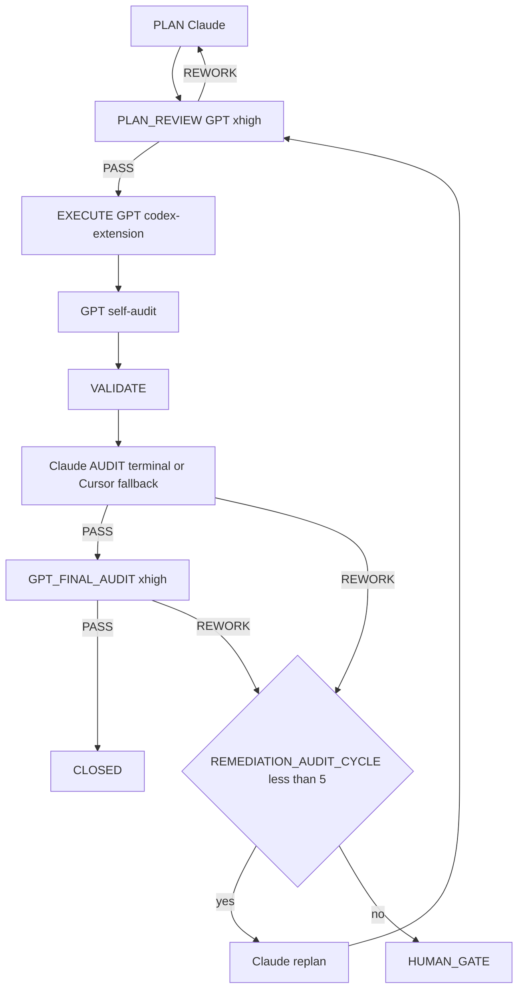

=== Auto-audit GPT (2e passe) ===
2026-04-25T17:04:34.148225Z  WARN codex_core::plugins::manager: failed to warm featured plugin ids cache error=remote plugin sync request to https://chatgpt.com/backend-api/plugins/featured failed with status 403 Forbidden: <html>
  <head>
    <meta name="viewport" content="width=device-width, initial-scale=1" />
    <style global>body{font-family:Arial,Helvetica,sans-serif}.container{align-items:center;display:flex;flex-direction:column;gap:2rem;height:100%;justify-content:center;width:100%}@keyframes enlarge-appear{0%{opacity:0;transform:scale(75%) rotate(-90deg)}to{opacity:1;transform:scale(100%) rotate(0deg)}}.logo{color:#8e8ea0}.scale-appear{animation:enlarge-appear .4s ease-out}@media (min-width:768px){.scale-appear{height:48px;width:48px}}.data:empty{display:none}.data{border-radius:5px;color:#8e8ea0;text-align:center}@media (prefers-color-scheme:dark){body{background-color:#343541}.logo{color:#acacbe}}</style>
  <meta http-equiv="refresh" content="360"></head>
  <body>
    <div class="container">
      <div class="logo">
        <svg
          width="41"
          height="41"
          viewBox="0 0 41 41"
          fill="none"
          xmlns="http://www.w3.org/2000/svg"
          strokeWidth="2"
          class="scale-appear"
        >
          <path
            d="M37.5324 16.8707C37.9808 15.5241 38.1363 14.0974 37.9886 12.6859C37.8409 11.2744 37.3934 9.91076 36.676 8.68622C35.6126 6.83404 33.9882 5.3676 32.0373 4.4985C30.0864 3.62941 27.9098 3.40259 25.8215 3.85078C24.8796 2.7893 23.7219 1.94125 22.4257 1.36341C21.1295 0.785575 19.7249 0.491269 18.3058 0.500197C16.1708 0.495044 14.0893 1.16803 12.3614 2.42214C10.6335 3.67624 9.34853 5.44666 8.6917 7.47815C7.30085 7.76286 5.98686 8.3414 4.8377 9.17505C3.68854 10.0087 2.73073 11.0782 2.02839 12.312C0.956464 14.1591 0.498905 16.2988 0.721698 18.4228C0.944492 20.5467 1.83612 22.5449 3.268 24.1293C2.81966 25.4759 2.66413 26.9026 2.81182 28.3141C2.95951 29.7256 3.40701 31.0892 4.12437 32.3138C5.18791 34.1659 6.8123 35.6322 8.76321 36.5013C10.7141 37.3704 12.8907 37.5973 14.9789 37.1492C15.9208 38.2107 17.0786 39.0587 18.3747 39.6366C19.6709 40.2144 21.0755 40.5087 22.4946 40.4998C24.6307 40.5054 26.7133 39.8321 28.4418 38.5772C30.1704 37.3223 31.4556 35.5506 32.1119 33.5179C33.5027 33.2332 34.8167 32.6547 35.9659 31.821C37.115 30.9874 38.0728 29.9178 38.7752 28.684C39.8458 26.8371 40.3023 24.6979 40.0789 22.5748C39.8556 20.4517 38.9639 18.4544 37.5324 16.8707ZM22.4978 37.8849C20.7443 37.8874 19.0459 37.2733 17.6994 36.1501C17.7601 36.117 17.8666 36.0586 17.936 36.0161L25.9004 31.4156C26.1003 31.3019 26.2663 31.137 26.3813 30.9378C26.4964 30.7386 26.5563 30.5124 26.5549 30.2825V19.0542L29.9213 20.998C29.9389 21.0068 29.9541 21.0198 29.9656 21.0359C29.977 21.052 29.9842 21.0707 29.9867 21.0902V30.3889C29.9842 32.375 29.1946 34.2791 27.7909 35.6841C26.3872 37.0892 24.4838 37.8806 22.4978 37.8849ZM6.39227 31.0064C5.51397 29.4888 5.19742 27.7107 5.49804 25.9832C5.55718 26.0187 5.66048 26.0818 5.73461 26.1244L13.699 30.7248C13.8975 30.8408 14.1233 30.902 14.3532 30.902C14.583 30.902 14.8088 30.8408 15.0073 30.7248L24.731 25.1103V28.9979C24.7321 29.0177 24.7283 29.0376 24.7199 29.0556C24.7115 29.0736 24.6988 29.0893 24.6829 29.1012L16.6317 33.7497C14.9096 34.7416 12.8643 35.0097 10.9447 34.4954C9.02506 33.9811 7.38785 32.7263 6.39227 31.0064ZM4.29707 13.6194C5.17156 12.0998 6.55279 10.9364 8.19885 10.3327C8.19885 10.4013 8.19491 10.5228 8.19491 10.6071V19.808C8.19351 20.0378 8.25334 20.2638 8.36823 20.4629C8.48312 20.6619 8.64893 20.8267 8.84863 20.9404L18.5723 26.5542L15.206 28.4979C15.1894 28.5089 15.1703 28.5155 15.1505 28.5173C15.1307 28.5191 15.1107 28.516 15.0924 28.5082L7.04046 23.8557C5.32135 22.8601 4.06716 21.2235 3.55289 19.3046C3.03862 17.3858 3.30624 15.3413 4.29707 13.6194ZM31.955 20.0556L22.2312 14.4411L25.5976 12.4981C25.6142 12.4872 25.6333 12.4805 25.6531 12.4787C25.6729 12.4769 25.6928 12.4801 25.7111 12.4879L33.7631 17.1364C34.9967 17.849 36.0017 18.8982 36.6606 20.1613C37.3194 21.4244 37.6047 22.849 37.4832 24.2684C37.3617 25.6878 36.8382 27.0432 35.9743 28.1759C35.1103 29.3086 33.9415 30.1717 32.6047 30.6641C32.6047 30.5947 32.6047 30.4733 32.6047 30.3889V21.188C32.6066 20.9586 32.5474 20.7328 32.4332 20.5338C32.319 20.3348 32.154 20.1698 31.955 20.0556ZM35.3055 15.0128C35.2464 14.9765 35.1431 14.9142 35.069 14.8717L27.1045 10.2712C26.906 10.1554 26.6803 10.0943 26.4504 10.0943C26.2206 10.0943 25.9948 10.1554 25.7963 10.2712L16.0726 15.8858V11.9982C16.0715 11.9783 16.0753 11.9585 16.0837 11.9405C16.0921 11.9225 16.1048 11.9068 16.1207 11.8949L24.1719 7.25025C25.4053 6.53903 26.8158 6.19376 28.2383 6.25482C29.6608 6.31589 31.0364 6.78077 32.2044 7.59508C33.3723 8.40939 34.2842 9.53945 34.8334 10.8531C35.3826 12.1667 35.5464 13.6095 35.3055 15.0128ZM14.2424 21.9419L10.8752 19.9981C10.8576 19.9893 10.8423 19.9763 10.8309 19.9602C10.8195 19.9441 10.8122 19.9254 10.8098 19.9058V10.6071C10.8107 9.18295 11.2173 7.78848 11.9819 6.58696C12.7466 5.38544 13.8377 4.42659 15.1275 3.82264C16.4173 3.21869 17.8524 2.99464 19.2649 3.1767C20.6775 3.35876 22.0089 3.93941 23.1034 4.85067C23.0427 4.88379 22.937 4.94215 22.8668 4.98473L14.9024 9.58517C14.7025 9.69878 14.5366 9.86356 14.4215 10.0626C14.3065 10.2616 14.2466 10.4877 14.2479 10.7175L14.2424 21.9419ZM16.071 17.9991L20.4018 15.4978L24.7325 17.9975V22.9985L20.4018 25.4983L16.071 22.9985V17.9991Z"
            fill="currentColor"
          />
        </svg>
      </div>
      <div class="data"><div class="main-wrapper" role="main"><div class="main-content"><noscript><div class="h2"><span id="challenge-error-text">Enable JavaScript and cookies to continue</span></div></noscript></div></div><script>(function(){window._cf_chl_opt = {cFPWv: 'g',cH: 'SJZRGOgN6X377rN2Eia0HhdfH8H.dk4xHy1VN6EpJyA-1777136674-1.2.1.1-tOh3WNzaIIJWGzG2V9Dn8uF1Vc5JG.LJNLcIVPt5G_LnsoraPkn.cd2h5iv0OusN',cITimeS: '1777136674',cRay: '9f1eed756d5d04a0',cTplB: '0',cTplC:1,cTplO:0,cTplV:5,cType: 'managed',cUPMDTk:"/backend-api/plugins/featured?platform=codex&__cf_chl_tk=IPmXvj.S7M0xevQeJtVr3E9XEpqRa9q6InFwC1ov5BA-1777136674-1.0.1.1-hFlkxstPYMB1f.wLj9sYj8stIlXrzZsnK.7tWXjC4vM",cvId: '3',cZone: 'chatgpt.com',fa:"/backend-api/plugins/featured?platform=codex&__cf_chl_f_tk=IPmXvj.S7M0xevQeJtVr3E9XEpqRa9q6InFwC1ov5BA-1777136674-1.0.1.1-hFlkxstPYMB1f.wLj9sYj8stIlXrzZsnK.7tWXjC4vM",md: '1wyrYAXRf2wPkt472bCWEXTXcx6IwsuFDOcwntfb1tI-1777136674-1.2.1.1-FIV2q7vjQQ2NMCuE7nMM41XHjy7kQGJgueWZnlBVat_wgf5wq17T_yzEvGQM6.5fQ4WHHNyQj8KJM88lpqK0B4LcQ9oHgOKLLeSiRPgYXFGT9GON3oZR4s5AXrpOUErCk2V02hv4D7n.gCOTPHm_Jcq6ewl.5a0RfNaZwOCsD25qvOO9qcSL0mqRbSL14K.nTn11_6dYrUke7gBD1dGkI8VKd4xNxz8BeKig1VF9WX3l6DLBMkZ3z3AMzJyA0wadK.X9TsXzp.BGR1_DHyPZVn9LrNhDIofXx5KduYABa9smFTXrSQ5jYByDbsJx.n3Aq.MSJyZ8WaeCjv7xtPGjgdOVYTg_nC4E1gesWcp1uEuJPH6uCeScba1INE3tBqbyrNMTI6nGS3bmj8L0t4I1Ly512VhR71W7Hby1J8B1TR1Off1nExr551DrwHXHGrTaEkPIYdrZH1T4JWC7Y3bLBIrNXERY.4xJ_tmrppzCTwNtki74iCd6QTtuaGiFNSgEzTyEUH7tBocMzsIajnWflrUxOLe8wttUsdFSewRNDFF_TaFwi4vBguOtQkQ6B4YaPpeWIzSPy2CObDis4vTWyjz7eHbnvUgXU7AisEKIL5jMq9WjRTsfkgvGPysr3xLhgmfYOHhTcf4kOGtsdqpnqrzaNcCdkANFZVR4UUf3ST2Jnt9n1bpVswLWpTSCMVu75.4SXgZVLDr9Z3DDVBVnJnc2BfA2fVvu8MSpBHeWLshEGDlakFgXqOq.WUdnLF2vki.ELXz0zijfwYbJKJDHAe8j8bGCHovDeOpPaOhfixhiHQl.qD037DCnYoqKusq3Y8_bjkEPDQxLvM0ooa9DO.h3c0YeJeXlprVvg.IJ21JNDgtOkzycu0nrThRcjxOVrZ5S6nrsiopjgGnOElDjBmuiBVlIAVfyUQ5BHDozD7XaVGj4Il9I4zmVyjVOztEMJ7gShn0ml9Zoz8zTPcyPus6NxMszXpWZigTkCGjqKgsiI5e57tMBnxjBwIKJAIMklQIG_mtSME5DIqkCN11TwyhCu4ygsj84HCXYd6G6OBI',mdrd: 'PPuALmOS.xWaFprpFV7S16wAnvk9LCVfTort97E143k-1777136674-1.2.1.1-lLTQmkQRtY.eITA19fK9tKD4Nk3hETTW2blE0yXlCrB.rnxyQ8FjwZg_qhECKUu.NRxbZ7QQc.z6tTjgg85.3MjatxMiXQtQOsGhgr2IzIZzW5UQBCSiGTKbeRow62R5TrICna23iVbJ5_EM7AdH.9lxZUY.8juJ8PN0xN0gdEYMJXx8h3mYh1MAeeR0qPiqqY87NNJbEOf5fgd4l1dbGvDZ897MCCmCAJGvpdY7U_X3zy19tU9s69fPm9oE4LBEypzx1DQi.MkiJORcgzkXX9QxCFU91dgmn2ksjensJzM0Dsfkwk2ET9nmdUJRBNiP4iFwMez7kB7vY2MGzb7FKIkb.W94B5aULYOuenMfuNvx6ZgbkBgZAqkIen5JpQNZjm3I9MhXvcfqxWVtaNceV6AsU8hFlqSl501Y4QHg3l.MoJHbSoNJJK.TvdnHgRIz_Ac7Nxad9NlNHD_0lRgK9EOvRlxN.I0XnL86xicQi0wSDT7un032Xjbfndyy3R_tkackGHU5qs8dQiWjCBQQ8gYbf1qLMKn8VS33E0wBYgh5gzuisAjAFfgtV1l5yUC59RhmWl6BpPoT0fgFWkLIV1MKSQ7YxxMTwV4bKztSlhT_l0BQ4G6vxJTkrs3Zaal.aOmplf0CBcjjXl6xFr9qinzEzsrnAFdT_qY4rwYO_K.EDRHckTEusAu9s_pctNGJKsyQxvJd4KV.QVMwKoEvLVLUCWkc9u6jggJ2k9Ot9VPxK4yncTo7Uo15NK0WdhXEg69A_3toRzZnMhKjK7N6PSZh9OHI9Cm6GJwWbMPQw7.lIofxg.Btj44SpF0MOsge5Wl77di2Fj8bj_ULaU4V2HkITFOs0Q9p5MGExA7zCIaSKlLcjX.VXUcyXzJTJuWHL2UR17QNb_JrEP8Xn4DlC_rn4Vqskfc8oZPeEyjvxvrDu51EwgsDRk9ve4gYChV3sC3P5NqO.iSAkEQ7jq9HumPYwQLBmOR1Z8gpi46qZzXFsXDWlGR81NamO0Q8CYrfUSkczfPsIL2trKSr2GiWvk_7E7HqXfGcYEsfo6IJuBY9nyGRj7gwmgX21pNjkMZCwvIEVLLXlrNgxV6H5ZtIlo60GkNm.GiembONSAlDugS_FjdsMoUOGdg2q0bvDP3KfLfY4yL4XhLAzTmw9sDTPx_45YUd07RvDbnhGBF2LK9XD8NNrKxec1afL4J983hYKGkyzi4vmWTJwmduw.JCTIcTnnEznprPBa8jcpTnTXY7tua4vENDqId9dGBOyy.M5lwWI4YhzkvF6HYWI8W24vHZDUj_jzRKnP7heh38e4b859HBHFIN64PwaxbnkeyZitoGAj8WYQ7VhYk2jep893TI4mzgLnQQTyra.IaHDa43538.t.Ihl5K2c8hV4sSpN81wUl1pTnB6DKjq6dutKLRtCagaO5hTAtWMBdMXUqRklfk0lFhON7hiyvvS0j0Dy3Cus_zgXfwEIFu26.zlQuYdN3.3Rbkd80F9yejCpR7T.k6F_ozpDDSaoVA835VxnibgBa1CMrUEkOcwrBPKaIXOiXBMPFvK_br1EBTkXsONtkSbgh3CxHFv0cw9ZlqF8s9dRNKatvgN10jAKrn2qNH66FWvpTFy08pWPLe2Rgr_bldFOim5D8GFRcq2VmuS3LKr7On.Q36xm0.h3_Z2rOcPt6zQfzekV3xMr555l9NKCodL4A2XlckKFDE5Ar6SykWshcKrBcTgcG9N6oF4IG_GZm6XYIPefrTYMSyHvIS0SMtkWJ19zGgN6758hX_GTuFz.k.Cdtc9_q7LiJp81.62LKra9JFzN4gRxyH.4pGflABOBJGmqVf_pzqGWRu79Yzw10jOdOu7PYBBfvX4N7KavcfGhGm50ciH9fjhSVP2Fm8kEhZ3vICpVnwSGrnilsoMWz.i3pFgsZpCHAi6n7UCds2brxmVweCJIrEKJ5_7BSK79Sk4cGlz.7vbhpSzsnRcyLu46dr71eSsj6VyGy1IWQhMxqTPdEToxYRYvb7AqpDQpKlpEcYtlwzc4Zk3QoJZHrAndpeTZzo78uUHpHeBOGPMp624h5VmfMHtYGYfGBWxqSG138x5nZVy4q7yyQs8ppbgJE7l7QdyPdlSt3hVhiMPTorULgU8dNGb4rE_P.9TM81b9lnhjw.YD0EA1ZELwG_VM6m5SpoeyDl5eMtCYPOj.KnVBnruXZnXamU62zkjflQerK7AT3GuElwsWjhS.AvSXv53GcHAHWfjZ9Pn1lQwl0W8kVSrcIalRgkthwhbJBW9_NPpd0PfsiooH.VIg6qfFsa86KcZEo7hyLOB5Z_f3NsNRD6Lv9qV14Qgt06Dg5pAGRokb4jSBNiq',};var a = document.createElement('script');a.src = '/cdn-cgi/challenge-platform/h/g/orchestrate/chl_page/v1?ray=9f1eed756d5d04a0';window._cf_chl_opt.cOgUHash = location.hash === '' && location.href.indexOf('#') !== -1 ? '#' : location.hash;window._cf_chl_opt.cOgUQuery = location.search === '' && location.href.slice(0, location.href.length - window._cf_chl_opt.cOgUHash.length).indexOf('?') !== -1 ? '?' : location.search;if (window.history && window.history.replaceState) {var ogU = location.pathname + window._cf_chl_opt.cOgUQuery + window._cf_chl_opt.cOgUHash;history.replaceState(null, null,"/backend-api/plugins/featured?platform=codex&__cf_chl_rt_tk=IPmXvj.S7M0xevQeJtVr3E9XEpqRa9q6InFwC1ov5BA-1777136674-1.0.1.1-hFlkxstPYMB1f.wLj9sYj8stIlXrzZsnK.7tWXjC4vM"+ window._cf_chl_opt.cOgUHash);a.onload = function() {history.replaceState(null, null, ogU);}}document.getElementsByTagName('head')[0].appendChild(a);}());</script></div>
    </div>
  </body>
</html>

2026-04-25T17:04:34.168825Z  WARN codex_core::agents_md: Project doc `/Users/1millnonstop/Downloads/projet/foodking-web/web/testttt/AGENTS.md` exceeds remaining budget (32768 bytes) - truncating.
OpenAI Codex v0.125.0 (research preview)
--------
workdir: /Users/1millnonstop/Downloads/projet/foodking-web/web/testttt
model: gpt-5.5
provider: openai
approval: never
sandbox: workspace-write [workdir, /tmp, $TMPDIR, /Users/1millnonstop/.codex/memories]
reasoning effort: xhigh
reasoning summaries: none
session id: 019dc599-a57a-7f92-ab1a-e14588994fa2
--------
user
Tu effectues l’**auto-audit GPT** (2e passe) d’un cycle FoodKing — **pas** l’audit Claude terminal.

**Contexte** : le JSON ci-dessous est la proposition d’implémentation (format agents/codex.prompt.txt) pour la mission `CV1-M09-BRANCH-ISOLATION`.


**JSON d’implémentation (à recouper)** :
```json
{
  "files_to_modify": [
    "app/Services/OrderService.php",
    "app/Services/FrontendOrderService.php",
    "scripts/lint-fk-branch-isolation.sh",
    "tests/Feature/Branch/OrderBranchIsolationTest.php",
    "tests/Feature/Branch/OssAdminBranchPolicyTest.php"
  ],
  "implementation_steps": [
    "Special-cased branch_id filters to use exact integer equality in OrderService list, userOrder, deliveredOrder, deliveryBoyOrder, and salesReportOverview while preserving LIKE for non-branch text filters.",
    "Special-cased branch_id exact equality in FrontendOrderService::myOrder.",
    "Formalized global admin as Admin role plus branch_id=0 for OrderService::posOrderStore and OrderService::destroy; non-admin branch_id=0 actors are no longer treated as global.",
    "Added a branch isolation lint that blocks direct where/orWhere branch_id LIKE patterns in product PHP.",
    "Added focused Feature tests under tests/Feature/Branch for no prefix bleed and branch_id=0 admin-global policy."
  ],
  "code_blocks": [
    {
      "path": "app/Services/OrderService.php",
      "op": "replace",
      "excerpt": "Replaced the generic branch_id LIKE fallbacks at M-09 target filter call sites with applyOrderFilter($query, $key, $request). Added applyOrderFilter() so branch_id uses where('branch_id', '=', (int) $value) and all other fields keep escaped LIKE. Added isGlobalAdmin(?User $user) and used it in posOrderStore and destroy so only Admin role + branch_id=0 receives global authority."
    },
    {
      "path": "app/Services/FrontendOrderService.php",
      "op": "replace",
      "excerpt": "In myOrder(), added an elseif for $key === 'branch_id' using where('branch_id', '=', (int) $request); status remains integer exact and other frontend filters keep existing LIKE behavior."
    },
    {
      "path": "scripts/lint-fk-branch-isolation.sh",
      "op": "create",
      "excerpt": "Created executable lint script that scans app PHP files and fails on direct where('branch_id', 'like') or orWhere('branch_id', 'like') patterns, including single- and double-quoted variants."
    },
    {
      "path": "tests/Feature/Branch/OrderBranchIsolationTest.php",
      "op": "create",
      "excerpt": "Created RefreshDatabase feature coverage proving branch_id=1 does not match 10/100 across OrderService::list, userOrder, deliveredOrder, deliveryBoyOrder, salesReportOverview, and FrontendOrderService::myOrder."
    },
    {
      "path": "tests/Feature/Branch/OssAdminBranchPolicyTest.php",
      "op": "create",
      "excerpt": "Created RefreshDatabase feature coverage proving branch_id=0 non-admin users are not global for OrderService::posOrderStore or OrderService::destroy."
    }
  ],
  "risks": [
    "NEEDS_FIX: mandatory broad validation is not fully green. php artisan test --filter=Branch fails on FiscalZBranchExactnessSentinelTest, OrderShowBranchGuardSentinelTest, OssAdminBranchPolicySentinelTest, PaymentConfirmCrossBranchSentinelTest, QueueNumberUniquenessSentinelTest, and TransactionBranchExactnessSentinelTest.",
    "NEEDS_FIX: php artisan test --filter=Sentinel fails on 15 existing/future-mission sentinel surfaces, including payment-confirm, KDS status, fiscal Z, queue uniqueness, transaction branch guard, OSS branch policy route, and order show 404-vs-403 behavior. These require out-of-M09 or off-allowlist files, so no expansion was made."
  ],
  "notes": [
    "SYMMETRY_NOTE: OrderService and FrontendOrderService were both touched; both now treat branch_id as exact equality while retaining existing LIKE behavior for non-branch filters.",
    "Validation passed: bash scripts/lint-fk-branch-isolation.sh; php artisan test --filter=OrderBranchIsolationTest; php artisan test --filter=OssAdminBranchPolicyTest; PHP syntax checks for modified PHP files.",
    "Validation partial: php artisan test --filter=Branch reports 132 passed, 1 skipped, 6 failed; php artisan test --filter=Sentinel reports 5 passed, 15 failed.",
    "Graphiti query was attempted but the MCP call was cancelled by the MCP layer; mission plan_excerpt and execute_brief were used as authoritative context."
  ],
  "execution_trace": {
    "delegation": "codex-extension",
    "invariants_considered": [
      "pricing_ssot",
      "order_status",
      "branch_id",
      "commit_before_dispatch"
    ]
  }
}
```

**Livrable** (Markdown uniquement, en français) :
# AUTO_AUDIT_GPT — CV1-M09-BRANCH-ISOLATION

## 1. Conformité au plan / scope
(Énumérer manques ou dérives ; si scope élargi sans escale → **ESCALATE**)

## 2. Invariants FoodKing
Pour chacun : OK / RISQUE / N/A
- pricing_ssot (backend seul)
- order_status (enum, pas de strings)
- branch_id
- commit_before_dispatch
- frozen_zones
- order_service_symmetry (si un des deux services touché)

## 3. Verdict
Une ligne : `VERDICT: PASS` | `VERDICT: NEEDS_FIX` | `VERDICT: ESCALATE` + 1–3 phrases.

2026-04-25T17:04:34.514100Z  WARN codex_core_plugins::manifest: ignoring interface.defaultPrompt: prompt must be at most 128 characters path=/Users/1millnonstop/.codex/.tmp/plugins/plugins/build-ios-apps/.codex-plugin/plugin.json
2026-04-25T17:04:34.516671Z  WARN codex_core_plugins::manifest: ignoring interface.defaultPrompt: maximum of 3 prompts is supported path=/Users/1millnonstop/.codex/.tmp/plugins/plugins/plugin-eval/.codex-plugin/plugin.json
2026-04-25T17:04:42.155908Z  WARN codex_core_plugins::manifest: ignoring interface.defaultPrompt: prompt must be at most 128 characters path=/Users/1millnonstop/.codex/.tmp/plugins/plugins/build-ios-apps/.codex-plugin/plugin.json
2026-04-25T17:04:42.158179Z  WARN codex_core_plugins::manifest: ignoring interface.defaultPrompt: maximum of 3 prompts is supported path=/Users/1millnonstop/.codex/.tmp/plugins/plugins/plugin-eval/.codex-plugin/plugin.json
2026-04-25T17:04:43.496069Z  WARN codex_core_plugins::manifest: ignoring interface.defaultPrompt: prompt must be at most 128 characters path=/Users/1millnonstop/.codex/.tmp/plugins/plugins/build-ios-apps/.codex-plugin/plugin.json
2026-04-25T17:04:43.496418Z  WARN codex_core_plugins::manifest: ignoring interface.defaultPrompt: maximum of 3 prompts is supported path=/Users/1millnonstop/.codex/.tmp/plugins/plugins/plugin-eval/.codex-plugin/plugin.json
codex
Je vais vérifier le contexte de cycle et les fichiers réellement modifiés avant de rendre l’auto-audit, pour éviter de juger uniquement sur le JSON d’implémentation.
exec
/bin/zsh -lc "pwd && rg --files | rg '("'^AGENTS'"\\.md"'$|''^'"\\.cursor/ACTIVE_CYCLE\\.md"'$|''^plans/masterplay/(MASTERPLAY_DISCIPLINE|MASTERPLAY_QUEUE|GO)'"\\.md"'$|''^docs/orchestration/(GLOBAL_SYSTEM_PRIMER|MEMORY_MATRIX)'"\\.md"'$|''^'"\\.cursor/commands/run-cycle\\.md"'$|''^'"\\.cursor/routing\\.md"'$|''^missions/CV1-M09-BRANCH-ISOLATION/|''^plans/PLAN_.*CV1.*M09|''^plans/PLAN_CAISSE_V1)'"'" in /Users/1millnonstop/Downloads/projet/foodking-web/web/testttt
 succeeded in 0ms:
/Users/1millnonstop/Downloads/projet/foodking-web/web/testttt
AGENTS.md
docs/orchestration/GLOBAL_SYSTEM_PRIMER.md
docs/orchestration/MEMORY_MATRIX.md
plans/masterplay/MASTERPLAY_QUEUE.md
plans/masterplay/MASTERPLAY_DISCIPLINE.md
plans/masterplay/GO.md
plans/PLAN_CAISSE_V1_MEGA_CORRECTION_2026-04-25.md
plans/PLAN_CAISSE_V1_SUPER_MASTER_2026-04-25.md
plans/PLAN_CAISSE_V1_HYPER_EXEC_GPT_2026-04-25.md
plans/PLAN_CAISSE_V1_GPT_MASTERPLAY_2026-04-25.md
missions/CV1-M09-BRANCH-ISOLATION/plan_excerpt.md
missions/CV1-M09-BRANCH-ISOLATION/execute_brief.md
missions/CV1-M09-BRANCH-ISOLATION/input.json

2026-04-25T17:04:59.084579Z  WARN codex_core_plugins::manifest: ignoring interface.defaultPrompt: prompt must be at most 128 characters path=/Users/1millnonstop/.codex/.tmp/plugins/plugins/build-ios-apps/.codex-plugin/plugin.json
2026-04-25T17:04:59.086852Z  WARN codex_core_plugins::manifest: ignoring interface.defaultPrompt: maximum of 3 prompts is supported path=/Users/1millnonstop/.codex/.tmp/plugins/plugins/plugin-eval/.codex-plugin/plugin.json
codex
J’utilise la compétence `sync-risk-review`, car la mission touche l’isolation `branch_id`, l’OSS/admin et le cycle commande. Ensuite je recoupe le plan M09 avec le diff local.
exec
/bin/zsh -lc "sed -n '1,220p' /Users/1millnonstop/Downloads/projet/foodking-web/web/testttt/.agents/skills/sync-risk-review/SKILL.md" in /Users/1millnonstop/Downloads/projet/foodking-web/web/testttt
 succeeded in 0ms:
---
name: sync-risk-review
description: Review changes affecting synchronization, auth, pricing, KDS, OSS, or order lifecycle for architectural and business risk.
disable-model-invocation: true
---

# Sync Risk Review Skill

Use this skill when a change affects:
- sync
- auth
- pricing
- KDS
- OSS
- order lifecycle
- cross-device behavior

## Steps
1. Read the relevant docs
2. Inspect the diff or current implementation
3. Identify:
   - architecture risk
   - state consistency risk
   - business rule violations
   - authz issues
   - missing tests
4. Produce a concise review with recommended next actions.

exec
/bin/zsh -lc "sed -n '1,220p' .cursor/ACTIVE_CYCLE.md" in /Users/1millnonstop/Downloads/projet/foodking-web/web/testttt
 succeeded in 0ms:
# Active Cycle – FoodKing

**Méta (SSOT `run-cycle.md` Step 0 + `AGENTS.md` § *Authoritative … cycle state*)** — requis pour que l’orchestrateur ne s’arrête pas sur *« RUNNER_MODE not set »*.

| Champ | Valeur actuelle |
| --- | --- |
| **RUNNER_MODE** | `single-session` |
| **PHASE (cycle W10)** | `IN_PROGRESS` (détail = section `CYCLE_W10_…` ci-dessous) |
| **TASK_ID** | `P_EXEC_CLOSEOUT_GRAPHITI_CI_PROD_2026-04-22` |
| **PLAN_FILE** | `plans/PLAN_EXECUTION_CLOSEOUT_GRAPHITI_CI_PROD_2026-04-22.md` |
| **REPORT_FILE** | `reports/post_execute_latest.log` (append — preuve `EXECUTE_DELEGATION` / `AUDIT_*`) |

> **ACTIVE_PRIMARY** : `CYCLE_W10_EXECUTION_CLOSEOUT` (un seul cycle peut être actif à la fois — voir B03 méga-checklist).
> Cycles plus anciens en lecture seule = **archive** déplacée dans **`.cursor/ACTIVE_CYCLE_ARCHIVE.md`** (lecture humaine / forensique uniquement, **non requise** par le parcours obligatoire).

## CYCLE_W10_EXECUTION_CLOSEOUT (IN_PROGRESS — mémoire 180 + MCP global + commit + CI + prod)

**TASK_ID** : `P_EXEC_CLOSEOUT_GRAPHITI_CI_PROD_2026-04-22`  
**Plan SSOT** : `plans/PLAN_EXECUTION_CLOSEOUT_GRAPHITI_CI_PROD_2026-04-22.md`  
**Ordre** : Piste A (POS+Centrale : PLAN-MEM-1) ∥ Piste B (humain : PLAN-MEM-3) → C (smoke) → D (commit sur « go commit ») → E (CI) → F (prod J-7→J+7).  
**Gate mémoire** : `python3 memory/verify.py` → count **≥ 175** (180 idéal) avant de considérer PLAN-MEM-1 **CLOSED**.

- **Vérif locale (2026-04-22)** : `python3 memory/verify.py` → **count = 182**, smoke `search_memory_facts` OK — gate **satisfaite** pour clôturer l'ingestion côté seuil d'épisodes (suite : commit / CI / prod selon plan `PLAN_EXECUTION_CLOSEOUT_*`).

**Gouvernance globale (2e passe 2026-04-22)** : primer multi-agents + Graphiti vivant + tokens « zéro effet négatif » → **`docs/orchestration/GLOBAL_SYSTEM_PRIMER.md`** + rapport **`reports/audit/AUDIT_SECOND_PASS_GLOBAL_GOVERNANCE_REPORT_2026-04-22.md`**.

---

## CAISSE_V1_MASTERPLAY (ACTIVE — 2026-04-25)

**Phase** : finition Caisse V1 (POS + Kiosk + KDS + Centrale + Fiscal + Ops).
**Plan parent** : `plans/PLAN_CAISSE_V1_GPT_MASTERPLAY_2026-04-25.md`
**Plan DAG autoritaire** : `plans/PLAN_CAISSE_V1_SUPER_MASTER_2026-04-25.md`
**Boucle d'exécution** : `plans/masterplay/MASTERPLAY_DISCIPLINE.md` + `plans/masterplay/MASTERPLAY_QUEUE.md` + `scripts/run-masterplay.sh`
**Statut temps réel** : `reports/masterplay/status.json`

**Règle** : tout `TASK_ID` au format `CV1-MXX-…` passe par la masterplay (cf. `AGENTS.md` § "Caisse V1 — Masterplay loop", `.cursor/rules/global.mdc` § "Caisse V1 — Masterplay loop", `.cursor/commands/run-cycle.md` Step 0 item 0). **NE PAS** ouvrir un `run-cycle` standard sur un `CV1-MXX-…`.

---

## Archive

Tous les cycles **CLOSED / COMPLETED PASSED** (W4 → W9, NF525, etc.) ont été déplacés dans **`.cursor/ACTIVE_CYCLE_ARCHIVE.md`** pour réduire le coût de lecture du parcours obligatoire (audit 2026-04-24, mission `T-PARCOURS-OPTIMIZE-001`).

- **Lecture humaine** : ouvrir `.cursor/ACTIVE_CYCLE_ARCHIVE.md`.
- **Lecture agent** : **non requise** sauf instruction explicite du plan ou du chat (ex. "reprend le rationale du cycle W9").
- **Recherche** : `rg "CYCLE_W9_" .cursor/ACTIVE_CYCLE_ARCHIVE.md` ou `git log --follow .cursor/ACTIVE_CYCLE.md`.

exec
/bin/zsh -lc "sed -n '1,220p' plans/masterplay/MASTERPLAY_DISCIPLINE.md" in /Users/1millnonstop/Downloads/projet/foodking-web/web/testttt
exec
/bin/zsh -lc "sed -n '1,220p' AGENTS.md" in /Users/1millnonstop/Downloads/projet/foodking-web/web/testttt
 succeeded in 0ms:
# MASTERPLAY DISCIPLINE — Caisse V1 (loop master)

> **But** : règles strictes que le runner et chaque mission GPT respectent en boucle, pendant des heures, jusqu'à finition de toutes les missions de `MASTERPLAY_QUEUE.md`. Lecture obligatoire avant de lancer `bash scripts/run-masterplay.sh`.

## 1. Autorité

| Source | Rôle |
|--------|------|
| `AGENTS.md` | Parcours obligatoire, cycle FoodKing |
| `plans/PLAN_CAISSE_V1_SUPER_MASTER_2026-04-25.md` | DAG autoritaire (ordre, gates) |
| `plans/PLAN_CAISSE_V1_GPT_MASTERPLAY_2026-04-25.md` | Catalogue 22 missions M-XX (objectifs, allowlist) |
| `plans/masterplay/MASTERPLAY_QUEUE.md` | File d'exécution courante |
| `plans/masterplay/MASTERPLAY_DISCIPLINE.md` | (ce fichier) règles d'exécution |
| `.cursor/rules/*.mdc` | Toujours appliquées |
| `docs/gates/GATE_LOG.md` | État des gates humains |

## 2. Boucle d'exécution (run-masterplay.sh)

```
LOOP {
  1. tail activity log (~500 tokens)
  2. find next PENDING task in MASTERPLAY_QUEUE with all DEPENDS_ON == CLOSED
  3. if none → break (all done or all blocked)
  4. verify missions/<TASK_ID>/input.json + execute_brief.md exist
  5. activity-log start codex-extension <TASK_ID> execute "<allowlist CSV>" "<note>"
     if exit 2 (collision) → MARK BLOCKED note=collision, continue loop
  6. update status: RUNNING
  7. npm run codex:complex -- <TASK_ID>     (génère output_codex.json + GPT_SELF_AUDIT)
  8. update status: EXECUTED
  9. activity-log done codex-extension <TASK_ID> done "<résumé court>"
 10. (option --with-audit) bash scripts/foodking-claude-orchestrate.sh audit-brief <TASK_ID>
       if PASS → status: AUDIT_PASS
       if REWORK → status: REWORK ; increment REWORK_COUNT ; if >=5 → BLOCKED note=human_gate
 11. (option --with-final) npm run codex:final-audit -- <TASK_ID>
       if PASS → status: FINAL_PASS
 12. if FINAL_PASS:
       bash scripts/after-execute-memory.sh
       update status: CLOSED
 13. sleep INTER_TASK_PAUSE_SECONDS (default 5s)
 14. continue LOOP
}
```

## 3. Garde-fous (non négociables)

### 3.1 Allowlist stricte par mission
Codex modifie **uniquement** les fichiers listés dans `missions/<TASK_ID>/input.json.allowlist`. Si modification hors liste détectée à l'audit → `REWORK`.

### 3.2 Frozen zones
Aucune édition d'un fichier frozen sans gate signé dans `docs/gates/GATE_LOG.md`. Le runner **refuse** de lancer une mission marquée `BLOCKED` jusqu'à ce que le statut soit changé manuellement après signature.

### 3.3 Invariants FoodKing — `REWORK` automatique
- Pricing client-authoritative
- Status littéral numérique (`status: 16`)
- `branch_id` LIKE
- Dispatch dans transaction
- OS ou FOS modifié sans `SYMMETRY_NOTE`
- Frozen modifié sans gate

### 3.4 Pas de gate auto-approuvée
Codex peut **rédiger** options ; aucune mission ne coche `[x] Approved`. Si une mission le tente → `REWORK` + `risks: ["ESCALATION: gate self-approved"]`.

### 3.5 Tests obligatoires
Chaque `mandatory_tests` listé doit être lancé et reporté dans le rapport. Échec → `REWORK`.

### 3.6 Diff minimal
Aucun renommage opportuniste, aucun refactor non demandé, aucune optimisation collatérale. Si ajout justifié → `notes` du JSON.

### 3.7 Activity log
`start` avant chaque mission ; `done` après. Sans cela → réservation fantôme = autres agents bloqués. Le runner enforce.

### 3.8 Mémoire
À CLOSE : compléter `memory/episodes/caisse_v1_<topic>_*.jsonl` (squelettes créés par M-19) puis `bash scripts/after-execute-memory.sh`. Si Graphiti UP : `bash bin/graphiti-ingest.sh` + `python3 memory/verify.py`.

## 4. Boucles de rework

- Max **5 cycles `REWORK`** consécutifs sur la même mission. Au 5e → `BLOCKED note=human_gate_required`.
- Max **3 cycles healing** consécutifs (cf. CLAUDE.md §8) avant escalade.
- Toute escalation → écrite dans `reports/masterplay/ESCALATIONS_<date>.md`.

## 5. Pause / arrêt

- `Ctrl-C` arrête la boucle proprement (mission en cours finit, runner s'arrête après).
- `touch reports/masterplay/STOP` → le runner s'arrête à la fin de la mission courante.
- `touch reports/masterplay/PAUSE` → le runner pause entre les missions tant que le fichier existe.

## 6. Logs

- `reports/masterplay/run_<ISO>.log` : log de la boucle.
- `reports/masterplay/status.json` : état temps réel (mission courante, compteurs).
- `missions/<TASK_ID>/output_codex.raw.log` : raw codex.
- `missions/<TASK_ID>/output_codex.json` : json structuré.
- `reports/audit/GPT_SELF_AUDIT_<TASK_ID>.md` : self-audit GPT.
- `reports/post_execute_latest.log` : trace `EXECUTE_DELEGATION`.
- `reports/AGENT_ACTIVITY_LOG.md` : start/done.

## 7. Audit Claude (en fin de boucle, manuel)

Quand toutes les missions sont `CLOSED` (ou `BLOCKED` documentés) :

```
bash scripts/foodking-claude-orchestrate.sh context
bash scripts/foodking-claude-orchestrate.sh audit
```

Sortie attendue : verdict transversal Caisse V1 (chaîne sync borne→centrale→POS→KDS→fiscal). Le verdict détermine `GO/HOLD/NO-GO` pour `GATE_GO_NO_GO_CAISSE_V1`.

## 8. Critères d'arrêt anormal

- 3 missions consécutives en `REWORK` → halt + alerte humaine.
- Activity-log refuse 3 fois → halt (collision permanente).
- `npm run codex:complex` échoue 3 fois sur la même mission (binaire codex KO) → halt.
- `claude` terminal indisponible 3 fois consécutives → continue avec fallback subagent + `AUDIT_FALLBACK_REASON: terminal-unavailable`.

## 9. Token discipline

- Le prompt envoyé à codex contient : template `agents/codex.prompt.txt` + `input.json` + `execute_brief.md` + (optionnel) `graphiti_context.md`, `plan_excerpt.md`, `cycle_snapshot.md`.
- Pas de duplication : pas de re-coller AGENTS.md ou super master plan dans chaque mission.
- Cap typique d'un prompt : ≤ 30 KB. Au-delà → splitter la mission.

## 10. Anti-pattern interdits

- ❌ Lancer 2 missions en parallèle sur les mêmes fichiers (collision activity-log).
- ❌ Modifier `MASTERPLAY_QUEUE.md` pendant que le runner tourne (sauf marquer BLOCKED → PENDING après gate).
- ❌ Skipper l'audit Claude pour aller plus vite.
- ❌ Marquer CLOSED manuellement sans double PASS (PASS Claude + PASS Codex final).
- ❌ Ignorer un `risks: ["ESCALATION: ..."]` dans output_codex.json.

---

`MASTERPLAY_DISCIPLINE_VERSION: 1.0` · `STRICT_MODE: ON`

 succeeded in 0ms:
# FoodKing – Cursor Agent Operating Contract

## 0. Quick start contract — read this first

Commence ici. Ne lance aucune action tant que tu n'as pas lu les priorités P0.
Ce contrat fixe l'ordre minimal de lecture pour comprendre le repo en moins de 60 secondes.
Lis complètement ce qui est marqué obligatoire ; diffère seulement ce qui est explicitement classé P2.

### Reading priority

| Priority | What to read | Why |
| --- | --- | --- |
| P0 | `AGENTS.md §1 Parcours obligatoire` | Cadre impératif de travail, ordre de lecture, discipline de cycle. |
| P0 | `.cursor/ACTIVE_CYCLE.md` (continuation) | État courant du cycle actif, contexte vivant, reprise sans divergence. |
| P0 | `.cursor/rules/global.mdc` (auto-attaché — mentionné pour info) | Règles globales toujours applicables, même si déjà injectées par l'outil. |
| P0 | `plans/masterplay/MASTERPLAY_DISCIPLINE.md` + `plans/masterplay/MASTERPLAY_QUEUE.md` (Caisse V1 actif) | **Pendant la phase Caisse V1** : règles d'or de la boucle GPT + file d'exécution. Tout agent qui touche une mission `CV1-MXX-…` DOIT lire ces deux fichiers avant d'agir. |
| P1 | `docs/orchestration/GLOBAL_SYSTEM_PRIMER.md` | Vocabulaire, architecture d'orchestration, invariants transverses. |
| P1 | `.cursor/commands/run-cycle.md` | Procédure exacte pour démarrer un cycle borné correctement. |
| P1 | `docs/orchestration/MEMORY_MATRIX.md` | Où chercher la mémoire utile sans relire tout le dépôt. |
| P1 | `.cursor/routing.md` | Routage des tâches, choix du bon canal, limites d'intervention. |
| P2 | `docs/orchestration/CODEX_API_DELEGATION.md` (quand EXECUTE complexe) | À lire si tu délègues ou exécutes du complexe (uniquement **CLI `codex`**, pas d’exécuteur HTTP dans le dépôt). |
| P2 | `.cursor/ACTIVE_CYCLE_ARCHIVE.md` (forensique humain) | Historique utile pour audit humain, pas requis au démarrage. |
| P2 | `docs/orchestration/EXPORT_CONFIG_CODEX_GPT_API_ET_AUDIT_PERSISTANCE.md` (nouveau poste) | Configuration et persistance utiles surtout lors d'un nouvel environnement. |

Règle simple : P0 avant toute action, P1 avant tout EXECUTE, P2 seulement à la demande du sujet.
Si un doute persiste après P0+P1, arrête-toi et relis ; n'improvise pas.

### One-line bootstrap

```bash
npm run verify:boucle
bash scripts/agent-activity-log.sh tail 50
run-cycle <TASK_ID>
```

### Caisse V1 — Masterplay loop (actif)

Pendant la phase de finition Caisse V1 (POS + Kiosk + KDS + Centrale + Fiscal), l'orchestration passe par la **MASTERPLAY** :

```bash
# Lire d'abord (obligatoire)
cat plans/masterplay/MASTERPLAY_DISCIPLINE.md
cat plans/masterplay/MASTERPLAY_QUEUE.md
cat plans/masterplay/GO.md

# Lancer la boucle (Codex extension complexe + audit Claude terminal + audit Codex final)
bash scripts/run-masterplay.sh --with-audit --with-final
```

- **Plan parent** : `plans/PLAN_CAISSE_V1_GPT_MASTERPLAY_2026-04-25.md` (catalogue 22 missions M-XX, ancrages file:line)
- **Plan autoritaire DAG** : `plans/PLAN_CAISSE_V1_SUPER_MASTER_2026-04-25.md`
- **Statut temps réel** : `reports/masterplay/status.json` + `reports/masterplay/run_*.log`
- Tout `TASK_ID` au format `CV1-MXX-…` est gouverné par la masterplay (allowlist, frozen, gates, REWORK max 5).
- Hors phase Caisse V1 : repasser au `run-cycle <TASK_ID>` standard.

**Anti-répétition (nouvel onglet / agent parallèle)** : copier d’abord le bloc de `docs/orchestration/SESSION_OPENING_ENFORCEMENT.md` — même discipline, moins d’oubli de `ACTIVE_CYCLE` / `run-cycle`.

Utilise `run-cycle <TASK_ID>` pour initier tout cycle borné.
Les deux autres commandes servent à vérifier l'état local et le journal d'activité avant d'exécuter.

### Quality-first, not token-cheap

Lis P0 et P1 intégralement, sans skim. Les économies de tokens ne se font jamais sur la substance des règles, seulement sur la répétition, le bruit et les relectures inutiles. En cas de tension entre vitesse et rigueur, applique la rigueur ; voir `.cursor/rules/global.mdc § Token Discipline`.

### If you're a new human contributor

Commence par `docs/orchestration/EXPORT_CONFIG_CODEX_GPT_API_ET_AUDIT_PERSISTANCE.md` pour préparer ton poste et comprendre le mode de persistance attendu.
Lis-le après P0, puis enchaîne sur P1 avant toute contribution effective.

---

## 1. Parcours obligatoire — **nouvelle conversation** **et** **continuation** (production, non négociable)

> **Objectif** : qu’**à chaque** session (premier message ou 500e message), l’exécutant sache **quel** chemin suivre — **sans** supposer un historique de chat. Tout est **dans le dépôt** ; l’histoire de conversation **n’est pas** la SSOT.

**Règle d’or** : *aucune* modification de code **produit** (hors `plans/`, `reports/`, `docs/gates/`, `missions/`, JSONL gouvernance) **dans le cadre d’un travail borné** sans **(a)** parcours ci-dessous **et** **(b)** cycle `run-cycle` + plan actif, sauf **exception** explicite humaine (notée dans le plan / gate).

| Étape | Action | Quand / pourquoi |
|-------|--------|------------------|
| **0. Continuation** | Lire **`.cursor/ACTIVE_CYCLE.md`**. | Si `PHASE` n’est **pas** vide et le cycle n’est **pas** archivé : **reprendre** ce `TASK_ID` / ce `PLAN_FILE` / ce `REPORT_FILE` — **ne pas** dupliquer un second cycle fantôme. Si humain confirme **nouveau** sujet : réinitialiser / nouveau `TASK_ID` selon `run-cycle` Step 0. |
| **1. Lecture initiale** | Lire **ce fichier** (`AGENTS.md`) **puis** **`docs/orchestration/GLOBAL_SYSTEM_PRIMER.md`** (table §1 = ordre complet : routing, `run-cycle`, Graphiti, `MEMORY_MATRIX`, etc.). | **Avant** tout code ou plan non trivial. Même en « continuation » si le contexte a dérivé ou l’onglet a été rafraîchi. |
| **2. Cycle structuré (SSOT procédurale)** | Toute tâche avec **`TASK_ID`** : suivre **`.cursor/commands/run-cycle.md`** et la commande **`run-cycle <TASK_ID>`** (ou équivalent explicite dans le chat : enchaîner les **Steps 0 → 5** sans en sauter). | **Programme courant (quota-optimized)** : `PLAN GPT → PLAN_REVIEW GPT → EXECUTE GPT → VALIDATE → AUDIT GPT → [CLAUDE CRITIQUE SI NÉCESSAIRE] → [GATE \| CLOSE]`. Aucun « close » sans audit PASS documenté. |
| **3. Vérification d’environnement** | `npm run verify:boucle` (0 requête par défaut). **Si le terminal ne “voit” pas Codex alors que l’extension est connectée** : l’auth IDE n’alimente pas le CLI — lancer `npm run codex:doctor` (npm + `login status` + 1 requête). **Rapide :** `npm run codex:verify-pro`. **Complet :** `npm run verify:boucle:full`. Encart : `agents/codex-extension-instructions.md`. | Même en **Step 5** : l’`EXECUTE` (CLI `codex`) requiert le binaire + session Pro sur **ce** binaire. Voir `run-cycle` Step 0 item 8. |
| **4. Secrets & outils machine** | Binaire **`claude`** sur le **`PATH`** (Claude Code CLI) pour l’**AUDIT** PRIMARY en terminal. Binaire **`codex`** (CLI OpenAI) : *Sign in with ChatGPT* **Pro** — **pas** de clé API dans le dépôt. Résolution : `PATH` **ou** `node_modules/.bin/codex` après **`npm install`** (dépendance **`@openai/codex`**) **ou** `npm i -g @openai/codex`. **Ne pas** mélanger avec une clé *Platform* restreinte dans l’environnement (provoque des 401 *scopes* sur l’API Responses) — `npm run codex:audit-bleed` aide. (Option) MCP Graphiti selon `~/.cursor/mcp.json`. | Sans `claude` : noter dès le **plan** l’`AUDIT` fallback + `AUDIT_FALLBACK_REASON`. Sans binaire `codex` : pas d’`EXECUTE` complexe PRIMARY (sub-agent + `FALLBACK_REASON` ou `npm install` + auth Pro). |
| **5. Traces & mémoire (déjà dans ce fichier)** | **`EXECUTE_DELEGATION:`** avant VALIDATE ; **`AUDIT_CHANNEL:`** + **`TERMINAL_AUDIT_OK: 1`** si audit terminal OK ; `docs/orchestration/MEMORY_MATRIX.md` ; `scripts/agent-activity-log.sh` (tail / start / done). | Traçabilité = **même** qualité en prod sur N agents parallèles. |

**Ce n’est pas optionnel** pour travailler « en production FoodKing » : c’est le **contrat** d’onboarding. Les **règles** `.cursor/rules/*.mdc` (dont **`global.mdc` — alwaysApply**) et ce fichier **s’imposent** **à** tout modèle, **dans** toute conversation, dès l’ouverture du dépôt.

**Pour un humain / nouveau compte** : mêmes étapes ; la doc **`docs/orchestration/EXPORT_CONFIG_CODEX_GPT_API_ET_AUDIT_PERSISTANCE.md`** regroupe l’**export** config API + persistance des règles hors-chat.

## Engine
Cursor local agent. No cloud orchestration. No external framework.
Auto/Premium routing: disabled. Model selection is explicit per cycle.

## Global system primer (multi-agents, Graphiti, tokens — lecture clé)

Tout nouvel intervenant (session Cursor, sub-agent Task, CLI terminal, humain) qui touche **orchestration**, **mémoire**, ou **discipline de contexte** : lire **`docs/orchestration/GLOBAL_SYSTEM_PRIMER.md`** après ce fichier. Y sont définis : ordre de lecture obligatoire, `codex-extension` GPT-5.5-pro/xhigh, fallback `foodking-complex-implementer`, fallback audit `foodking-planner-orchestrator`, terminal **`claude` / `codex`**, **mise à jour continue de Graphiti**, et la politique **« intelligence max — zéro optimisation négative »** (tokens : supprimer le gaspillage, pas la substance). Pour audits longs et robustesse **opération + agentique + mémoire** : **`docs/orchestration/MEGA_CHECKLIST_AUTONOMY_AND_MEMORY.md`** (180 tâches) et le narratif **`reports/audit/MEGA_AUDIT_SYSTEM_OPERATION_AGENTIC_2026-04-23.md`**.

**Discipline mémoire (qui écrit où, qui lit quoi, quand)** : **`docs/orchestration/MEMORY_MATRIX.md`** — matrice unique des **4 stores autorisés** (Code A · Graphiti+JSONL B · Missions C · Rapports D), table d'écriture par phase, ordre de lecture pour une nouvelle session, anti-patterns. Aucun nouveau store de mémoire ne peut être ajouté sans gate `docs/gates/GATE_MEMORY_*`. Décisions 2026-04-23 sur OpenSpace et claude-mem : **non intégrés**, justifications dans la matrice.

**Synchro multi-agents (cross-conv, cross-terminal)** : `.cursor/rules/cross-agent-sync.mdc` (alwaysApply) + `reports/AGENT_ACTIVITY_LOG.md` (append-only) + `scripts/agent-activity-log.sh` (`tail | start | done | collisions | active`). Au démarrage de session : `tail 50` (~500 tokens). Avant édition produit (Step 2 EXECUTE) : `start` (refus exit 2 si collision). À la clôture (Step 5 CLOSE) : `done`. Évite que deux agents (Cursor convs / `codex-extension` / `claude-terminal` / humain) modifient les mêmes fichiers à leur insu. **Doctrine étendue** (Graphiti = mémoire partagée, rôles Claude vs Codex, anti-patterns) : **`docs/orchestration/MULTI_AGENT_ORCHESTRATION.md`**.

## Workflow
PLAN GPT (codex) → PLAN_REVIEW GPT (codex) → EXECUTE GPT (codex) → VALIDATE → AUDIT GPT (codex) → [CLAUDE CRITICAL ESCALATION ONLY] → [HUMAN GATE | CLOSE]

No phase may be skipped. Default close condition is `AUDIT_VERDICT: PASS` from GPT path, with optional Claude escalation audit only for critical/blocked cases.

## Model Roles
| Model | Role | Channel (priorité **qualité maximale / zéro raccourci token**) |
|---|---|---|
| Claude | Escalade critique uniquement | Utiliser Claude seulement pour cas vraiment critiques: blocage logique majeur, gate ambigu non résoluble, conflit d'audits, ou arbitrage architecture multi-fichiers à haut risque. Le canal prioritaire reste GPT/Codex pour économiser les quotas Claude. |
| **GPT-5.5 / GPT-5.5-pro** | **PLAN + PLAN_REVIEW + EXECUTE + AUDIT** | **`codex-extension`** — `npm run codex:plan-review`, `npm run codex:complex`, `npm run codex:final-audit` (CLI `codex` + `codex exec`, **compte ChatGPT Pro**, modèle `gpt-5.5-pro` si dispo sinon `gpt-5.5`, `model_reasoning_effort=xhigh`). GPT devient le canal principal d'orchestration, implémentation et audit de routine. |
| GPT-5.5 (fallback) | Complex implementation (FALLBACK only) | **Sub-agent** `foodking-complex-implementer` (Task Cursor) — consomme l’**usage** des modèles de l’**abonnement Cursor**. **Uniquement** si `codex` / l’exécution `codex exec` a échoué (≥2 tentatives documentées) ou binaire indispo. |
| Composer | Validation/report only | Plus d’implémentation routine pendant les cycles de finition. Composer peut résumer, exécuter/rapporter des validations, mais toute correction produit repart en EXECUTE GPT. |

**Qui décide (mode actuel quota-optimized)** : **GPT/Codex** porte l’**autorité opérationnelle** sur planification, implémentation, auto-audit, et audit final de routine. **Claude** est mis en pause et appelé uniquement en **escalade critique** (ambiguïté structurelle, gate sensible, conflit technique majeur, analyse de risque à très forte complexité). Le **fait** code / test l’emporte sur la croyance.

**Principe unique (mode actuel) — à valider en prod sur chaque cycle :** **PLAN GPT → PLAN_REVIEW GPT → EXECUTE GPT → self-audit GPT → VALIDATE → AUDIT GPT**. Le repli vers Claude n’intervient qu'en escalade critique documentée (`CLAUDE_ESCALATION_REASON:`), avec portée minimale.

One PRIMARY_EXECUTION_MODEL per cycle. Roles are explicit and layered; review checkpoints do not authorize scope expansion.
Full routing policy: `.cursor/routing.md`. Naming: the **PRIMARY complex implementer** is the **FoodKing Codex Complex Implementer** (slug `codex-extension`); see `docs/orchestration/CODEX_API_DELEGATION.md`.

## Authoritative multi-agent bounded cycle (SSOT)

For **TASK_ID-driven** work in Cursor, this path is **authoritative** and overrides any conflicting step elsewhere in this document:

1. **Command:** `.cursor/commands/run-cycle.md` (invoke with a `TASK_ID`, e.g. `run-cycle SMOKE-001`).
2. **Cycle state:** `.cursor/ACTIVE_CYCLE.md` (`RUNNER_MODE: single-session`, `PHASE`, `PLAN_FILE`, `REPORT_FILE`, completion rows).
3. **Plan artifact:** `plans/PLAN_[TASK_ID]_[DATE].md` per `.cursor/context/plan-context.md` (from `plans/PLAN_TEMPLATE.md` when applicable).
4. **Phase instructions:** `.cursor/context/plan-context.md` (PLAN), `.cursor/context/execute-context.md` (EXECUTE), `.cursor/context/audit-context.md` (AUDIT); VALIDATE per `run-cycle.md` when `validate-context.md` is absent.

**EXECUTE delegation (GPT only; PRIMARY first, FALLBACK only on failure):**

- **Routine implementation disabled during finishing cycles** : no product edit via Composer / `foodking-routine-implementer`. Small edits still route through GPT to keep the same quality chain.
- **PRIMARY** : **`codex-extension`** — **FoodKing Codex Complex Implementer** (CLI `codex`, compte **ChatGPT Pro**, `gpt-5.5-pro`, `model_reasoning_effort=xhigh`). Procédure :
  1. Préparer `missions/{TASK_ID}/input.json` (+ optionnels : `graphiti_context.md` issu de `search_memory_facts(group_ids=["foodking"])`, `plan_excerpt.md`, `execute_brief.md`, `cycle_snapshot.md` — fusionnés par le script d’assemblage de prompt).
  2. Lancer `npm run codex:complex -- {TASK_ID}` (`bash scripts/codex-extension-execute.sh`) ; le wrapper passe explicitement `-m ${CODEX_EXT_MODEL_PRO:-gpt-5.5-pro}` et `model_reasoning_effort=${CODEX_EXT_REASONING_EFFORT:-xhigh}`. (Instructions custom : `agents/codex-extension-instructions.md`.) **Bootstrap** : `npm run codex:prepare -- {TASK_ID}`.
  3. Appliquer `missions/{TASK_ID}/output_codex.json` ; consommer l’**auto-audit** `reports/audit/GPT_SELF_AUDIT_{TASK_ID}.md` (généré par le wrapper).
  4. Tracer `EXECUTE_DELEGATION: codex-extension` dans `reports/post_execute_latest.log` et le `REPORT_FILE`.
- **Complexe — FALLBACK (uniquement si `codex exec` est HS après reprises, ou binaire manquant)** : `Task` → `foodking-complex-implementer` — tracer `EXECUTE_DELEGATION: foodking-complex-implementer (codex-extension-fallback)` + `FALLBACK_REASON:`. 

Référence complète : **`docs/orchestration/CODEX_API_DELEGATION.md`** (naming, fallback contract, audit handoff, token discipline, schéma boucle). Procédure cycle : `.cursor/commands/run-cycle.md`. La trace `EXECUTE_DELEGATION` dans le rapport est **obligatoire** pour passer en VALIDATE.

**Clôture vs. audit :** Après `VALIDATE`, l’**audit** **Claude** (terminal `foodking-claude-orchestrate.sh` en PRIMARY, fallback Cursor si quota/rate-limit/terminal HS) écrit `AUDIT_VERDICT: PASS|REWORK`, puis GPT écrit `GPT_FINAL_AUDIT_VERDICT: PASS|REWORK|ESCALATE`. **Pas** de `CLOSED` sans double PASS. Sur `REWORK`, boucle `replan (orchestration Claude) → missions + EXECUTE GPT → self-audit GPT → VALIDATE → re-audit Claude → GPT final`, avec `REMEDIATION_AUDIT_CYCLE` 1..5 — au 5e `REWORK` sans double PASS, **HUMAN_GATE** (détail : Step 5 de `run-cycle.md` et `auto-remediation.mdc`).

Sections below labeled **Legacy workflow** remain valid for **PR-centric / review-loop** habits but **do not replace** this SSOT for bounded cycles.

## Source of truth (extended)
- README.md
- docs/PROJECT_CONTINUITY_AND_VISION.md
- docs/ARCHITECTURE.md
- docs/API_MAP.md
- docs/AUTHZ_MATRIX.md
- docs/ORDER_FLOW.md
- docs/DEVICE_FLOW.md
- docs/BUSINESS_RULES.md
- docs/CORE_MODULES.md
- docs/DATABASE_SCHEMA_CORE.md
- docs/ERROR_HANDLING.md
- docs/SECURITY_NOTES.md
- docs/TEST_PLAN.md
- docs/MASSIVE_TEST_PLAN.md
- docs/SAAS_VISION.md
- docs/CONTRIBUTING_QA_BOTS.md
- workflows/qa-loop.md
- workflows/task-routing.md
- workflows/report-format.md
- workflows/task-status.md
- reports/README.md
- docs/orchestration/MEGA_CHECKLIST_AUTONOMY_AND_MEMORY.md
- docs/orchestration/WORKFLOW_AUDIT_GRAPHIQUE_2026-04-23.md
- docs/orchestration/TERMINAL_CLAUDE_GRAPHITI_ORCHESTRATION.md
- docs/orchestration/ROUTING_MATRIX.md

## Stop Conditions
Halt and generate a gate brief on any of:
- Gate trigger detected
- Scope expansion beyond declared boundary
- FoodKing invariant violation
- Two consecutive validation failures
- Planning ambiguity unresolvable from task context
- **`codex` / `codex exec` indisponible après reprises (auth, binaire, ou échec ≥2 sur la même tâche)** : basculer sur le fallback `Task → foodking-complex-implementer` et **noter explicitement** `EXECUTE_DELEGATION: foodking-complex-implementer (codex-extension-fallback)` + `FALLBACK_REASON:`.
- **Audit en terminal (PRIMARY) indisponible ou limité** (`claude` absent, **quota / rate limit / session Anthropic saturée**, auth, réseau — après **1 retry** documenté de `context` + `audit-brief` ou `audit`) : **continuer le cycle** — même checklist `audit-context.md` via Task **`foodking-planner-orchestrator`** (recommandé) ou session Cursor **Claude** ; **`AUDIT_CHANNEL: cursor-session`** + **`AUDIT_FALLBACK_REASON:`** (obligatoire) + optionnel **`AUDIT_SUBAGENT_FALLBACK: foodking-planner-orchestrator`**. Voir `docs/orchestration/AUDIT_TERMINAL_QUOTA_FALLBACK.md`. **Ne jamais** omettre la raison.

## FoodKing Non-Negotiables
- Backend is pricing SSOT — no frontend price logic
- `OrderStatus` enum is authoritative — no hardcoded strings
- `branch_id` = business data isolation — no cross-branch data bleed
- Dispatch strictly after DB commit
- `OrderService` / `FrontendOrderService` symmetry mandatory on any order change
- Frozen zones require gate clearance before any edit

## MCP

### Phase 1 — Filesystem
Filesystem MCP only for repo reads where applicable.

### Phase 2 — Graphiti (mémoire inter-cycles — **présent dans toutes les sessions où le serveur est enregistré**)

**Objectif** : décisions d’architecture, invariants, sync borne↔POS↔KDS, fiscal NF525, historique de cycles — récupérables sans relire des centaines de fichiers.

| Élément | Détail |
|--------|--------|
| **Enregistrement Cursor (obligatoire côté humain)** | Fusionner le bloc `graphiti` dans **`~/.cursor/mcp.json`** (Settings → MCP). Modèle : **`.cursor/mcp/graphiti.json.example`**. Le dépôt ne peut pas injecter un MCP automatiquement dans l’IDE. |
| **Règle agent (automatique dès que le MCP est chargé)** | Voir **`.cursor/rules/graphiti-memory.mdc`** (always-on) + **`global.mdc`** : avant toute tâche non triviale, appeler au moins **`search_memory_facts`** (et optionnellement **`search_memory_nodes`**) avec `group_ids=["foodking"]`. |
| **Après AUDIT / CLOSE** | Si `add_memory` est disponible : enregistrer les décisions durables (ADR, gate, invariant clarifié). |
| **Si Graphiti absent de la session** | **Ne pas bloquer** PLAN / EXECUTE : une ligne « Graphiti non chargé » + secours **`memory/INDEX.md`** + lecture ciblée des JSONL sous `memory/episodes/`. |
| **Server** | Zep Graphiti — wrapper local **`.cursor/mcp/start-graphiti-mcp.sh`** (voir exemple JSON). Clone typique : `/Users/1millnonstop/graphiti`. |
| **Backend** | Neo4j (ex. Aura) — credentials hors repo. |
| **Dépannage** | **`.cursor/mcp/GRAPHITI_TROUBLESHOOTING.md`** (LiteLLM, embeddings, redémarrage proxy). |
| **Group ID** | Toujours **`foodking`**. |
| **Ingestion / vérif locale** | `memory/ingest.py`, `memory/verify.py`, `bin/graphiti-ingest.sh` ; index des domaines **`memory/INDEX.md`**. |

**Intégration bounded cycle** : la commande **`.cursor/commands/run-cycle.md`** inclut l’appel Graphiti en **Step 0 item 5** (query avant PLAN).

### Phase 3 — Playwright MCP (tests E2E sur flows critiques FoodKing)

- Package : `@playwright/mcp@latest` (npx, pas d’install global)
- Browser : Chromium
- BASE_URL : `http://localhost:8000`

exec
/bin/zsh -lc "sed -n '1,220p' plans/masterplay/MASTERPLAY_QUEUE.md" in /Users/1millnonstop/Downloads/projet/foodking-web/web/testttt
exec
/bin/zsh -lc "sed -n '1,220p' plans/masterplay/GO.md" in /Users/1millnonstop/Downloads/projet/foodking-web/web/testttt
 succeeded in 0ms:
# MASTERPLAY_QUEUE — Caisse V1

**Source de vérité de l'orchestration en boucle** : `bash scripts/run-masterplay.sh` lit cette file et exécute en série.

**Discipline** : `plans/masterplay/MASTERPLAY_DISCIPLINE.md`.  
**Plan parent** : `plans/PLAN_CAISSE_V1_GPT_MASTERPLAY_2026-04-25.md`.

## Légende statut
- `PENDING` — pas encore lancé
- `RUNNING` — codex exec en cours (ne pas relancer)
- `EXECUTED` — codex exec terminé, attend audit
- `AUDIT_PASS` — `AUDIT_VERDICT: PASS` Claude
- `FINAL_PASS` — `GPT_FINAL_AUDIT_VERDICT: PASS`
- `CLOSED` — mémoire ingestée + activity-log done
- `REWORK` — audit a demandé rework
- `BLOCKED` — gate humain ou dépendance manquante

## Légende vague
- `WAVE_A` — NO-GATE, parallélisable, démarre immédiatement
- `WAVE_B` — POST-GATE, séquencé selon DAG

## File d'exécution

| ORDER | TASK_ID | MISSION | WAVE | DEPENDS_ON | STATUS | NOTE |
|-------|---------|---------|------|------------|--------|------|
| 01 |CV1-M19-MEMORY-DISCIPLINE| M-19 | WAVE_A | — | CLOSED | Crée squelettes JSONL pour les 22 missions |
| 02 | CV1-M01-TRACEABILITY-MATRIX | M-01 | WAVE_A | — | CLOSED | Matrice findings → tasks → tests → gates (REWORK resolved GPT PASS) |
| 03 | CV1-M02-SENTINEL-BASELINE | M-02 | WAVE_A | CV1-M01 | CLOSED | 18 sentinels fail-first + 4 lints |
| 04 |CV1-M12-LEGACY-GUARDS-CI| M-12 | WAVE_A | — | CLOSED | Lint imports + bundle scan + workflow (recovered: extractor JSON fix) |
| 05 |CV1-M16-HARDWARE-LAB| M-16 | WAVE_A | — | CLOSED | Checklist hardware signable (recovered: JSON valid, files materialized) |
| 06 | CV1-M18-TEST-ARCHITECTURE | M-18 | WAVE_A | CV1-M02 | CLOSED | Grille couverture + plan campagne |
| 07 | CV1-M20-RUNBOOKS-SKELETON | M-20 | WAVE_A | — | CLOSED | 8 runbooks ops (REWORK Horizon resolved GPT PASS) |
| 08 | CV1-M21A-QUICKWINS-LOT0 | M-21a | WAVE_A | — | CLOSED | POS: discount v-model + Swiper RTL + focustrap dead |
| 09 | CV1-M03-GATES-DRAFT | M-03 | WAVE_A | CV1-M01 | CLOSED | 8 briefs gates Caisse V1 créés; Wave B reste bloquée par signatures humaines |
| 10 | CV1-M09-BRANCH-ISOLATION | M-09 | WAVE_B | CV1-M03(gates), CV1-M02 | RUNNING | Gate frozen Approved Option C |
| 11 | CV1-M06-POS-REVENUE-GUARDS | M-06 | WAVE_B | CV1-M09, CV1-M03 | BLOCKED | Gate frozen + payment_prop_mutation |
| 12 | CV1-M05-ORDER-QUOTE | M-05 | WAVE_B | CV1-M03 | BLOCKED | Gate schema |
| 13 | CV1-M04A-PAYMENT-LEDGER-FULL | M-04A | WAVE_B | CV1-M03 (ledger=A) | BLOCKED | Ledger gate chose Option B; M-04A not selected |
| 14 | CV1-M04B-PAYMENT-PILOT-RESTRICT | M-04B | WAVE_B | CV1-M03 (ledger=B) | PENDING | Gate ledger Approved Option B |
| 15 | CV1-M08-FISCAL-Z-NF525 | M-08 | WAVE_B | CV1-M03 (fiscal+schema) | BLOCKED | Gates fiscal + schema |
| 16 | CV1-M07-KDS-RELEASE | M-07 | WAVE_B | CV1-M03 (kds_bump) | BLOCKED | Gate kds_bump |
| 17 | CV1-M10-OS-FOS-SYMMETRY | M-10 | WAVE_B | CV1-M06, CV1-M09 | BLOCKED | Après guards POS + branch |
| 18 | CV1-M11-KIOSK-RUNTIME | M-11 | WAVE_B | CV1-M03 (offline+fiscal) | BLOCKED | Gates offline + fiscal |
| 19 | CV1-M17-WEB-STRIPE-SCOPE | M-17 | WAVE_B | CV1-M03 (web+stripe) | BLOCKED | Gates web + stripe |
| 20 | CV1-M13-MIGRATIONS-SAFETY | M-13 | WAVE_B | CV1-M03 (schema) | BLOCKED | Gate schema |
| 21 | CV1-M14-OPS-PREFLIGHT | M-14 | WAVE_B | CV1-M13 | BLOCKED | — |
| 22 | CV1-M15-ROLLOUT-CANARY | M-15 | WAVE_B | CV1-M04*, CV1-M08, CV1-M14 | BLOCKED | — |
| 23 | CV1-M21B-PAYMENT-REFACTOR | M-21b | WAVE_B | CV1-M03 (prop_mutation) | BLOCKED | Gate payment_prop_mutation |
| 24 | CV1-M22-POST-LAUNCH-OBSERVABILITY | M-22 | WAVE_B | CV1-M14, CV1-M15 | BLOCKED | — |

## Ce que le runner exécute

À chaque tour de boucle, le runner :
1. Lit cette table.
2. Prend la **première** ligne au statut `PENDING`.
3. Vérifie que toutes ses `DEPENDS_ON` sont au statut `CLOSED`. Sinon → skip.
4. Vérifie que `missions/<TASK_ID>/input.json` et `execute_brief.md` existent. Sinon → marque `BLOCKED note=missing-mission-files`.
5. `start` activity-log → `npm run codex:complex -- <TASK_ID>` → `done` activity-log.
6. Mise à jour statut : `EXECUTED`.
7. Audit Claude terminal automatique (si activé `--with-audit`) → `AUDIT_PASS` ou `REWORK`.
8. Si `AUDIT_PASS` : `npm run codex:final-audit -- <TASK_ID>` → `FINAL_PASS`.
9. Si `FINAL_PASS` : ingestion mémoire + `done` → `CLOSED`.
10. Loop.

## Statut initial (à la création)

Les 6 missions Vague A préparées par M-19/M-01/M-02/M-12/M-16/M-18 sont au statut `PENDING`. Les autres `TODO_NEXT` (à créer après le premier round) ou `BLOCKED` (gates).

## Mise à jour manuelle

Le runner met à jour la colonne `STATUS` automatiquement (sed sur cette table). Tu peux aussi éditer manuellement entre 2 runs (ex: marquer `BLOCKED → PENDING` après gate signé).

 succeeded in 0ms:
# GO — Lance la masterplay Caisse V1

> **Intégration obligatoire confirmée (2026-04-25)** : la masterplay est désormais référencée dans :
> - `AGENTS.md` P0 + section "Caisse V1 — Masterplay loop"
> - `.cursor/rules/global.mdc` (alwaysApply) section "Caisse V1 — Masterplay loop"
> - `.cursor/commands/run-cycle.md` Step 0 item 0 (fast-path `^CV1-M…`)
> - `.cursor/ACTIVE_CYCLE.md` section "CAISSE_V1_MASTERPLAY (ACTIVE)"
>
> Tout agent qui ouvre le repo et touche un `TASK_ID` `CV1-MXX-…` est OBLIGÉ de lire `MASTERPLAY_DISCIPLINE.md` + `MASTERPLAY_QUEUE.md` avant d'agir.

## 0. Prérequis (1 fois)

```bash
# Vérifier binaire codex (CLI OpenAI, compte ChatGPT Pro)
npm run codex:doctor || npm install   # installe @openai/codex si absent

# Vérifier binaire claude (Anthropic, audit terminal)
which claude && claude --version       # doit retourner 2.x.x

# Vérifier la boucle FoodKing
npm run verify:boucle
```

Si l'un échoue : voir `AGENTS.md` § "Parcours obligatoire" et `agents/codex-extension-instructions.md`.

## 1. Démarrage propre (boucle longue)

```bash
# Boucle simple — exécute toutes les missions PENDING dans l'ordre, sans audit auto
bash scripts/run-masterplay.sh

# Boucle complète — codex exec + audit Claude terminal + audit Codex final + ingest mémoire
bash scripts/run-masterplay.sh --with-audit --with-final

# Boucle limitée (tester sur 2 missions d'abord)
bash scripts/run-masterplay.sh --with-audit --with-final --max 2
```

## 2. Suivre l'avancement

```bash
# Statut temps réel (fichier JSON mis à jour à chaque mission)
cat reports/masterplay/status.json

# Log de la boucle courante
ls -lt reports/masterplay/run_*.log | head -1
tail -f $(ls -t reports/masterplay/run_*.log | head -1)

# File d'attente (à jour)
cat plans/masterplay/MASTERPLAY_QUEUE.md
```

## 3. Pause / Stop

```bash
# Pause (rester en attente, le runner reprend dès suppression)
touch reports/masterplay/PAUSE
# Reprendre
rm reports/masterplay/PAUSE

# Stop propre (à la fin de la mission courante)
touch reports/masterplay/STOP

# Stop immédiat (Ctrl-C dans le terminal du runner)
```

## 4. Missions Vague A prêtes (no-gate, démarrent immédiatement)

| ORDER | TASK_ID | Mission | Livrables clés |
|-------|---------|---------|----------------|
| 01 | `CV1-M19-MEMORY-DISCIPLINE` | M-19 | 22 squelettes JSONL, procédure mémoire |
| 02 | `CV1-M01-TRACEABILITY-MATRIX` | M-01 | Matrice findings .md+.csv, script de check |
| 03 | `CV1-M02-SENTINEL-BASELINE` | M-02 | 18 tests sentinels rouges + 4 lints + index |
| 04 | `CV1-M12-LEGACY-GUARDS-CI` | M-12 | Workflow CI + 4 scripts lint legacy |
| 05 | `CV1-M16-HARDWARE-LAB` | M-16 | Checklist + protocoles + grille acceptation |
| 06 | `CV1-M18-TEST-ARCHITECTURE` | M-18 | Matrice couverture + plan campagne |

## 5. Pendant que ça tourne (de mon côté, la prochaine fois)

Je préparerai en parallèle :
- `CV1-M20-RUNBOOKS-SKELETON` (M-20) — squelettes runbooks ops
- `CV1-M21A-QUICKWINS-LOT0` (M-21a) — quickwins POS (discount v-model + Swiper RTL)
- `CV1-M03-GATES-DRAFT` (M-03) — briefs des 7 gates TO_DRAFT

## 6. Après ces 6 (toi + humain)

1. Audit Claude transversal :
   ```bash
   bash scripts/foodking-claude-orchestrate.sh context
   bash scripts/foodking-claude-orchestrate.sh audit
   ```
2. Signer les gates `PENDING_HUMAN_GATE` (cf. `docs/gates/GATE_LOG.md`).
3. Une fois M-03 livré, signer les 7 gates `TO_DRAFT`.
4. Débloquer la Vague B en passant manuellement les BLOCKED → PENDING au fil des signatures.

## 7. Garde-fous (rappel)

- **Allowlist stricte par mission** : codex ne touche QUE les fichiers listés.
- **Frozen zones** : intouchables sans gate signé.
- **Invariants FoodKing** : violation = REWORK auto.
- **Activity-log** : enforce les collisions (pas de double édition cross-agent).
- **Max 5 REWORK** par mission → BLOCKED + escalation humaine.

Lis `plans/masterplay/MASTERPLAY_DISCIPLINE.md` pour le détail complet.

---

**TL;DR** : `bash scripts/run-masterplay.sh --with-audit --with-final` → laisse tourner → reviens dans X heures → check `cat reports/masterplay/status.json` et `cat plans/masterplay/MASTERPLAY_QUEUE.md`.

2026-04-25T17:05:07.200381Z  WARN codex_core_plugins::manifest: ignoring interface.defaultPrompt: prompt must be at most 128 characters path=/Users/1millnonstop/.codex/.tmp/plugins/plugins/build-ios-apps/.codex-plugin/plugin.json
2026-04-25T17:05:07.202647Z  WARN codex_core_plugins::manifest: ignoring interface.defaultPrompt: maximum of 3 prompts is supported path=/Users/1millnonstop/.codex/.tmp/plugins/plugins/plugin-eval/.codex-plugin/plugin.json
exec
/bin/zsh -lc "sed -n '1,220p' .cursor/rules/global.mdc" in /Users/1millnonstop/Downloads/projet/foodking-web/web/testttt
 succeeded in 0ms:
---
description: Always-on rules for the FoodKing Cursor local agent. Applied to every cycle, every model, every task.
globs: ["**/*"]
alwaysApply: true
---

# Global Rules – FoodKing

## Caisse V1 — Masterplay loop (active phase)

Pendant la phase de finition Caisse V1, **toute mission `CV1-MXX-…` est gouvernée par** :
- `plans/masterplay/MASTERPLAY_DISCIPLINE.md` — règles d'or (allowlist, frozen, REWORK max 5, activity-log, mémoire)
- `plans/masterplay/MASTERPLAY_QUEUE.md` — file d'exécution (statut, dépendances DAG)
- `plans/masterplay/GO.md` — comment lancer / suivre / pause / stop
- `scripts/run-masterplay.sh` — runner officiel (boucle codex + audit Claude + audit final + ingest mémoire)

**Lecture obligatoire** avant tout EXECUTE sur un `TASK_ID` `CV1-MXX-…`. Hors Caisse V1 : `run-cycle <TASK_ID>` standard.

## New or continued session — **mandatory path** (applies to **every** conversation and **every** model)

- **The chat log is not the SSOT.** **This repo** (`AGENTS.md`, `.mdc` rules, `docs/orchestration/`, `run-cycle.md`) is.
- On **any** new thread **or** long continuation: (1) Read **`AGENTS.md` § *Parcours obligatoire*** first, then **`docs/orchestration/GLOBAL_SYSTEM_PRIMER.md`** (§1 table). (2) If resuming work, read **`.cursor/ACTIVE_CYCLE.md`** *before* starting a duplicate cycle — follow the same `TASK_ID` / `PHASE` until `CLOSE` or an explicit new task. (3) For bounded work: run **`run-cycle` / `run-cycle.md`** (Steps 0–5) — do not skip `AUDIT` before `CLOSE`. (4) Run `npm run verify:boucle` (and `verify:boucle:full` when an API proof is needed) per `AGENTS.md`. (5) Ensure **`claude` on `PATH` (AUDIT terminal) et binaire `codex` (CLI OpenAI) pour l’EXÉCUTE complexe (compte ChatGPT Pro)**, pas de clé proxy obligatoire — voir `agents/codex-extension-instructions.md`. (6) Obey **`MEMORY_MATRIX.md`**, `EXECUTE_DELEGATION`, `AUDIT_CHANNEL` + `TERMINAL_AUDIT_OK` when using terminal audit, and **`agent-activity-log.sh`** (tail / start / done).
- Full checklist and French wording: **`AGENTS.md` → section *Parcours obligatoire*.

## Cycle Structure
PLAN Claude → PLAN_REVIEW GPT-5.5-pro/xhigh → EXECUTE GPT → VALIDATE → AUDIT Claude → GPT_FINAL_AUDIT → [HUMAN GATE | CLOSE]

Phases are sequential and non-skippable.
Dual audit (`AUDIT_VERDICT: PASS` + `GPT_FINAL_AUDIT_VERDICT: PASS`) precedes close on every cycle without exception.

## Model Discipline
- Auto/Premium routing is disabled
- PRIMARY_EXECUTION_MODEL is declared in the plan file before execution begins
- One PRIMARY_EXECUTION_MODEL per cycle; review checkpoints are explicit and mandatory
- Mid-cycle model switch requires Claude confirmation logged under `ESCALATION` in the plan file
- Full routing policy: `.cursor/routing.md`

## GPT Checkpoints + EXECUTE Delegation (PRIMARY = `codex-extension`)
- The **FoodKing Codex Complex Implementer** (slug `codex-extension`, CLI `codex` + compte ChatGPT Pro) is the **primary** route for `PLAN_REVIEW`, all product EXÉCUTE work, GPT self-audit, and `GPT_FINAL_AUDIT`.
- Procedure: run `npm run codex:plan-review -- {TASK_ID}` before EXECUTE; prepare `missions/{TASK_ID}/input.json` (+ optional `graphiti_context.md` / `plan_excerpt.md` / `execute_brief.md`); run `npm run codex:complex -- {TASK_ID}` (wrapper `bash scripts/codex-extension-execute.sh`, `gpt-5.5-pro`, `xhigh`); apply `output_codex.json` + lire l’auto-audit `reports/audit/GPT_SELF_AUDIT_{TASK_ID}.md`; after Claude PASS run `npm run codex:final-audit -- {TASK_ID}`. Product edits require `EXECUTE_DELEGATION: codex-extension`.
- The Cursor sub-agent `foodking-complex-implementer` is **fallback only** — invoked if `codex` / `exec` échoue (≥2 tentatives documentées) or human-escalation. Trace alors `EXECUTE_DELEGATION: foodking-complex-implementer (codex-extension-fallback)` + `FALLBACK_REASON:`.
- Composer / `foodking-routine-implementer` is not an implementation route during finishing cycles. It may summarize or validate; product fixes return to GPT EXECUTE.
- Reference docs: `docs/orchestration/CODEX_API_DELEGATION.md`, `AGENTS.md` § "EXECUTE delegation".

## Autonomy Contract
The agent operates autonomously within declared scope.
It halts and escalates — never self-approves — on any gate trigger, scope expansion,
invariant violation, two consecutive validation failures, or unresolvable ambiguity.
Full policies: `human-gates.mdc`, `scope.mdc`, `project-invariants.mdc`.

## Graphiti (mémoire inter-sessions)
- When the Graphiti MCP server is loaded for this workspace, **query it first** on any non-trivial task (see `.cursor/rules/graphiti-memory.mdc` and `AGENTS.md` § MCP).
- If Graphiti is not loaded, continue without blocking; one-line note to enable `~/.cursor/mcp.json` is enough.

## Quality channels — terminal first where defined
- **GPT route (`codex-extension` — CLI `codex` Pro)** is the **default** for PLAN_REVIEW, all product implementation, self-audit, and GPT_FINAL_AUDIT; Cursor sub-agent `foodking-complex-implementer` is **only** a fallback if the `codex exec` path fails (≥2 attempts or binaire indispo) — `EXECUTE_DELEGATION: …` + `FALLBACK_REASON:`. See `AGENTS.md` and `docs/orchestration/CODEX_API_DELEGATION.md`.
- **Claude AUDIT after implementation** is **by default the terminal** (`bash scripts/foodking-claude-orchestrate.sh context` then `audit` or `audit-brief` — **Anthropic subscription** via `claude` CLI). If the terminal fails after **1 retry** (**quota / rate limit / session saturated**, missing binary, auth, network), **do not stop the cycle**: use the **FALLBACK** — same `audit-context.md` checklist via Cursor Task **`foodking-planner-orchestrator`** (recommended) or in-session **Claude** — with `AUDIT_CHANNEL: cursor-session` **plus** mandatory `AUDIT_FALLBACK_REASON:` and optional `AUDIT_SUBAGENT_FALLBACK: foodking-planner-orchestrator`. See `docs/orchestration/AUDIT_TERMINAL_QUOTA_FALLBACK.md` and `run-cycle.md` Step 5; verify env with `bash scripts/verify-orchestration-boucle.sh`.
- Never invert primary/fallback for billing convenience without that trace — that would be indistinguishable from a mistake in production evidence.

## Token Discipline (quality-first — zero negative optimization)
- **Goal**: maximum correct intelligence per cycle — not shortest answers. Removing detail, skipping invariants, or omitting Graphiti queries to "save tokens" is **forbidden** when it reduces correctness or auditability.
- **Allowed savings only**: do not re-read files already in full context; do not paste verbatim large blobs already in the plan; use **Graphiti** + `## PRIOR_CONTEXT` to avoid re-opening dozens of historical reports; use phase summaries per `context-hygiene.mdc` §4 **after** a phase completes (handoff), not to shrink the plan itself.
- Do not re-explain decisions already recorded in the plan file (link/summarize in one line if needed).
- Structured output in reports — narrative allowed in plans/gates when it carries decisions, risks, or test strategy.
- Flag real risks only — no speculative commentary on out-of-scope subsystems

## Reports Discipline
- Bounded-cycle **plans** live under `plans/`; **gate briefs** under `docs/gates/`; validation logs, execution summaries, and other run evidence under `reports/` per `run-cycle.md` and `ACTIVE_CYCLE.md`
- Composer generates run evidence in `reports/` where applicable — Claude audits
- No new reporting structure without a plan-phase decision

## Absolute Prohibitions
The agent must never: self-approve a gate, expand scope without human instruction,
edit a frozen zone without cleared gate, modify `.cursor/routing.md` mid-cycle.
All invariant prohibitions enforced per `project-invariants.mdc`.

exec
/bin/zsh -lc "sed -n '1,240p' .cursor/commands/run-cycle.md" in /Users/1millnonstop/Downloads/projet/foodking-web/web/testttt
exec
/bin/zsh -lc "sed -n '1,220p' docs/orchestration/GLOBAL_SYSTEM_PRIMER.md" in /Users/1millnonstop/Downloads/projet/foodking-web/web/testttt
 succeeded in 0ms:
# FoodKing — Primer système global (agents, sous-agents, Graphiti, tokens)

> **Passation + index complet des chemins (SSOT, un seul fichier)** : **`../DOC_EXPO_HER_ANCIEN_AGENT_ALIMENTATION_WORKFLOW_2026-04-22.md`** (table §2 = utilité de chaque path pour une nouvelle session).

> **Fichier d’entrée** pour toute nouvelle conversation, tout nouvel outil d’agent (Cursor, terminal, futur bot), ou tout humain qui reprend le projet.  
> Objectif : **robustesse** = même avec 100 cycles et des exécuteurs différents, le comportement reste **prévisible**, **traçable**, et la **mémoire** reste **alignée** sur le code.

**Obligatoire avant ce Primer (SSOT d’onboarding)** : lire `**AGENTS.md`**, section **Parcours obligatoire** (nouvelle session **et** continuation), puis enchaîner ici.  
**En continuation d’un cycle** : lire d’**abord** `**.cursor/ACTIVE_CYCLE.md`** (éviter un second `TASK_ID` fantôme) ; si `PHASE` = vide ou `CLOSED`, revenir à la table ci-dessous.

---

## 1. Ordre de lecture obligatoire (minimum viable)

Lire **dans cet ordre** avant d’écrire du code ou un plan non trivial (voir aussi `**AGENTS.md` § *Parcours obligatoire* — tableau** pour la même doctrine) :


| #   | Fichier                                                    | Pourquoi                                                                                                                  |
| --- | ---------------------------------------------------------- | ------------------------------------------------------------------------------------------------------------------------- |
| 0   | `**.cursor/ACTIVE_CYCLE.md`** (si reprise)                 | Cycle déjà en cours : même `TASK_ID` / mêmes Steps **jusqu’à** `CLOSE` — **ne pas** forker un plan parallèle sans le dire |
| 1   | `**AGENTS.md`** (dont § *Parcours obligatoire*)            | Contrat global : phases, routing, MCP, terminal, parcours production, non-négociables                                     |
| 1b  | `**docs/orchestration/SESSION_OPENING_ENFORCEMENT.md**`  | **Bloc unique** (tail log + `verify:boucle` + rappel phases) — réduit la répétition « refais la boucle » en session ; **modèle Cursor = Claude pour PLAN** (Auto/Composer ne remplacent pas `routing.md`) |
| 1c  | `**reports/audit/SIMULATION_PARCOURS_PROD_CHECKPOINTS_2026-04-25.md**` | **Simulation production** : checkpoints par phase, fichiers SSOT, limite IDE (qui orchestre quoi) — avant de promettre « zéro dérive » |
| 2   | `**.cursor/routing.md*`*                                   | Qui fait quoi (Claude plan/audit, GPT-5.5-pro xhigh plan review / execute / final audit, Composer validation only)         |
| 3   | `**.cursor/commands/run-cycle.md**`                        | Déroulé exact d’un cycle `TASK_ID` (incl. Graphiti Step 0.5)                                                              |
| 4   | `**.cursor/rules/graphiti-memory.mdc**`                    | Mémoire Graphiti : quand lire / quand écrire                                                                              |
| 5   | `**.cursor/rules/global.mdc**` + `**context-hygiene.mdc**` | Gates, discipline tokens **sans** réduire l’intelligence                                                                  |
| 6   | `**docs/orchestration/MEMORY_MATRIX.md`**                  | **Quel store écrit quoi, lit quoi, quand** (4 stores autorisés A/B/C/D) — antidote unique à la complexité mémoire         |
| 6b  | `**docs/orchestration/MULTI_AGENT_ORCHESTRATION.md`**      | Même tâches, plusieurs onglets Cursor : **activité** + **Graphiti** (lecture) + `AUDIT_VERDICT` — sans empiéter           |
| 7   | `**memory/INDEX.md`**                                      | Carte des domaines mémoire Graphiti (store B) — secours si MCP absent                                                     |
| 8   | `**tasks/[TASK_ID].md**`                                   | Quand un cycle borné est lancé — périmètre de la tâche                                                                    |


Ensuite, **selon le domaine** : `docs/ORDER_FLOW.md`, `docs/DEVICE_FLOW.md`, `docs/ARCHITECTURE.md`, `project-invariants.mdc`, etc.

Référence roster court : `**docs/orchestration/AGENT_ROLES.md`**.

### 1.1 Décision : Claude orchestre ; GPT challenge et exécute en xhigh

- **Cerveau** (priorité, plan, re-plan, gates) : **Claude** (session + terminal `foodking-claude-orchestrate.sh`) — il écrit le plan et tranche la stratégie de remédiation.
- **Challenge plan obligatoire** : **GPT-5.5-pro / xhigh** relit le plan avant EXECUTE (`npm run codex:plan-review -- {TASK_ID}` → `PLAN_REVIEW_VERDICT`). Si `REWORK`, Claude révise avant tout code.
- **Bras + premier contrôle qualité** : **EXECUTE = Codex (PRIMARY)** pour toutes les implémentations produit, même les petites corrections : `npm run codex:complex -- {TASK_ID}` → `reports/audit/GPT_SELF_AUDIT_{TASK_ID}.md`.
- **Pas de routine product implementation** : Composer / `foodking-routine-implementer` ne fait plus d’édition produit en cycle de finition ; il peut aider au reporting/validation seulement.
- **Double audit final** : Claude audit d’abord (`AUDIT_VERDICT`) avec terminal primary + fallback Cursor si quota/rate-limit/terminal HS, puis GPT final audit (`npm run codex:final-audit -- {TASK_ID}` → `GPT_FINAL_AUDIT_VERDICT`). Close seulement si les deux sont `PASS`.

---

## 2. Sous-agents Cursor (Task tool) — intégration dans le flux

Ce ne sont **pas** des fichiers dans le repo ; ce sont des **profils** invoqués par Cursor selon `.cursor/routing.md` et `**run-cycle.md` Step 2**.


| Sub-agent / Canal                                                               | Modèle cible                                                                  | Quand                                                                                                                                                                                                                                          |
| ------------------------------------------------------------------------------- | ----------------------------------------------------------------------------- | ---------------------------------------------------------------------------------------------------------------------------------------------------------------------------------------------------------------------------------------------- |
| `**foodking-routine-implementer`** (sub-agent Cursor)                           | Composer                                                                      | **Validation/report only** en cycles de finition. Pas d’implémentation produit.                                                                                                                                             |
| `**codex-extension` — FoodKing Codex Complex Implementer (PRIMARY)**            | **GPT-5.5-pro / xhigh** via CLI `codex` (compte **ChatGPT Pro**) + `codex exec` | **PLAN_REVIEW + toute implémentation produit + auto-audit + GPT_FINAL_AUDIT**. `npm run codex:complex -- {TASK_ID}`. Voir `scripts/codex-extension-execute.sh`, `agents/codex-extension-instructions.md`. |
| `**foodking-complex-implementer`** (sub-agent Cursor — **FALLBACK uniquement**) | Aligné exécution **GPT-5.5** (emplacement sub-agent)                          | Uniquement si `codex` / `codex exec` est indisponible après reprises sur la même tâche                                                                                                                                                         |


**Règles d'or**

1. **Délégation obligatoire** pour toute modification produit en EXECUTE, avec trace `EXECUTE_DELEGATION:` dans le log de validation. Valeurs autorisées : `codex-extension` | `foodking-complex-implementer (codex-extension-fallback)` | `explicit-prompt-bind`.
2. **EXECUTE = `codex-extension` PRIMAIRE** (CLI `codex` + Pro, `npm run codex:complex -- {TASK_ID}` ; contexte Graphiti/plan dans `missions/…/graphiti_context.md` etc. ; voir `**docs/orchestration/CODEX_API_DELEGATION.md`**). Le sub-agent `foodking-complex-implementer` est le **fallback** (usage Cursor) — indispo `codex exec`. Aucun **connecteur HTTP** / proxy n’est maintenu dans le dépôt.
3. Le sous-agent **ne voit pas toujours** le MCP Graphiti du parent : le plan **doit** contenir `**## PRIOR_CONTEXT`** (faits Graphiti + invariants) — copier ou résumer dans le message de délégation **ou** dans `missions/{TASK_ID}/graphiti_context.md` pour l’appel API.
4. Aucun sub-agent ne **contourne** un gate humain ni n’édite une frozen zone sans `docs/gates/` approuvé.

---

## 3. Terminal allies (hors Task tool) — intégration

Documentés dans `**AGENTS.md` § Terminal allies** :


| Outil                                                                  | Rôle                                                                     | Position + **canal d’abonnement** (SSOT)                                                                                                                                                                                         |
| ---------------------------------------------------------------------- | ------------------------------------------------------------------------ | -------------------------------------------------------------------------------------------------------------------------------------------------------------------------------------------------------------------------------- |
| `**claude` +** `foodking-claude-orchestrate.sh`                        | **AUDIT cycle — PRIMARY (Step 5)** : `context` → `audit` / `audit-brief` | Abonnement **Anthropic (CLI sur terminal)** ; n’**emprunte** pas l’orchestrateur de modèles de Cursor. **FALLBACK actif** (quota / limite / panne après 1 retry) : Task **`foodking-planner-orchestrator`** + même checklist + `AUDIT_CHANNEL: cursor-session` + `AUDIT_FALLBACK_REASON:` — `docs/orchestration/AUDIT_TERMINAL_QUOTA_FALLBACK.md`. |
| **CLI** `codex` + `npm run codex:complex` (`**codex-extension`**, Pro) | **PLAN_REVIEW + EXECUTE + GPT_FINAL_AUDIT — PRIMARY** (GPT-5.5-pro/xhigh) | Compte **ChatGPT Pro** sur le terminal ; ne passe **pas** par l’orchestrateur de modèles **Cursor** ; facturation côté OpenAI ; **FALLBACK** = sub-agent.     |
| `codex` / REPL interactif (OpenAI)                                     | Tâches ad hoc **hors** cycle, ou côté humain                             | N’enlèvent **pas** VALIDATE + AUDIT du `run-cycle`.                                                                                                                                                                              |
| `verify-orchestration-boucle.sh`                                       | Preuve binaire + optionnel smoke (API)                                   | `bash scripts/verify-orchestration-boucle.sh` — `VERIFY_BILLING_FULL=1` lance 1× smoke `claude` + 1× `npm run codex:smoke`.                                                                                                      |


**Clôture :** l’audit Claude écrit `AUDIT_VERDICT: PASS` ou `REWORK`, puis GPT écrit `GPT_FINAL_AUDIT_VERDICT: PASS|REWORK|ESCALATE` (voir `run-cycle.md` Step 5). Pas de `CLOSED` sans double `PASS`. En `REWORK` : re-orchestration + re-EXECUTE GPT jusqu’à double `PASS` ou 5e tour → humain. Schéma :




Le terminal **n’enregistre** pas **Graphiti** seul : après AUDIT/CLOSE, décisions → JSONL + `after-execute-memory.sh` (voir §5) comme avant.

---

## 4. Graphiti — vivre avec l’avancement du projet (N agents, N cycles)

### 4.1 Rôles


| Rôle                                    | Responsable                                                          |
| --------------------------------------- | -------------------------------------------------------------------- |
| **Lecture** avant plan / audit complexe | Tout agent avec MCP `graphiti` chargé                                |
| **Écriture** après décision durable     | Phase AUDIT + CLOSED (`audit-context.md`) ou humain via `add_memory` |
| **Alimentation batch** (JSONL → Neo4j)  | Humain ou pipeline : `bash bin/graphiti-ingest.sh`                   |


### 4.2 Quand mettre à jour la mémoire (checklist — « ne pas oublier »)

Cocher mentalement à **chaque** fin de sujet significatif :

- **Invariant** clarifié ou renforcé → nouvelle ligne dans `memory/episodes/02_architecture_invariants.jsonl` (ou fichier le plus proche) + `ingest` ciblé.
- **Sync / event / canal** modifié → `03_domain_events_sync.jsonl` + ingest.
- **Décision produit / ADR** → `12_decisions_log.jsonl` + ingest.
- **Nouvelle tâche V14+** ou finding cross-vagues → `09_tasks_history.jsonl` + ingest.
- **Changement prod / rollout** → `11_production_plan.jsonl` + ingest.
- **Nouveau rôle agent ou règle d’orchestration** → `13_agents_roles.jsonl` + ingest + **mettre à jour ce Primer** si le modèle change.
- **Audit long (ops + agentique + mémoire)** → suivre `docs/orchestration/MEGA_CHECKLIST_AUTONOMY_AND_MEMORY.md` (180 tâches) ; narratif `reports/audit/MEGA_AUDIT_SYSTEM_OPERATION_AGENTIC_2026-04-23.md`.
- **Après toute écriture JSONL** → `bash scripts/after-execute-memory.sh` (rafraîchit `reports/memory/jsonl_manifest.json`, cohérent avec CI) puis `bin/graphiti-ingest.sh` sur les domaines touchés.

**Règle d’or** : si le code ou la doc **canonical** a changé et que la mémoire dit encore l’ancienne vérité → **mise à jour sous 48 h** (sinon dérive silencieuse).

### 4.3 Outils

- Pipeline post-écriture (manifeste + rappel ingest) : `bash scripts/after-execute-memory.sh`.
- Ingestion : `bin/graphiti-ingest.sh [filtre]` — voir `memory/README.md`.
- Vérification : `python3 memory/verify.py`.
- Terminal (bref + audit option) : `bash scripts/foodking-claude-orchestrate.sh post-execute` ou `context` puis `audit-brief` — `docs/orchestration/TERMINAL_CLAUDE_GRAPHITI_ORCHESTRATION.md`.
- Reset rare : `@graphiti clear_graph` puis full ingest (politique humaine).

---

## 5. Tokens, contexte, cache — politique « intelligence max, gaspillage min »

**But** : réponses **détaillées et stables**, pas des réponses courtes pour économiser des tokens au détriment de la qualité.


| On optimise (effet ≥ 0)                                                              | On n’optimise pas (effet négatif interdit)                               |
| ------------------------------------------------------------------------------------ | ------------------------------------------------------------------------ |
| Re-lire un fichier **déjà** dans la fenêtre contexte                                 | Tronquer un plan, une analyse de risque, ou un gate pour « faire court » |
| Résumer une phase **terminée** pour handoff (voir `context-hygiene.mdc` §4)          | Supprimer `## PRIOR_CONTEXT` ou les invariants du plan                   |
| Utiliser **Graphiti** pour récupérer faits structurés au lieu de rouvrir 50 rapports | Désactiver Graphiti pour « aller plus vite » sur du sync / fiscal        |
| Écrire les preuves dans `reports/` structuré                                         | Remplacer des tests par de la prose vague                                |


**Cache applicatif** (Redis, etc.) : régie par le code Laravel et `**app:preflight-production`** — hors scope de ce Primer, mais **ne jamais** confondre « cache métier » et « mémoire Graphiti » : ce sont deux systèmes.

---

## 6. Révision de ce document

- **À chaque** changement majeur d’orchestration (nouveau sub-agent, nouveau MCP, nouveau cycle obligatoire) : mettre à jour **ce fichier** + une ligne dans `13_agents_roles.jsonl` + ingest.
- **Trimestriel** : relire §4.2 avec un lead dev.

---

## 7. Pointers rapides


| Besoin                                                        | Aller à                                                           |
| ------------------------------------------------------------- | ----------------------------------------------------------------- |
| Cycle complet                                                 | `.cursor/commands/run-cycle.md`                                   |
| Gates                                                         | `.cursor/rules/human-gates.mdc`                                   |
| Invariants code                                               | `.cursor/rules/project-invariants.mdc`                            |
| Mémoire locale                                                | `memory/INDEX.md`                                                 |
| Pannes Graphiti                                               | `.cursor/mcp/GRAPHITI_TROUBLESHOOTING.md`                         |
| Closeout prod + mémoire                                       | `plans/PLAN_EXECUTION_CLOSEOUT_GRAPHITI_CI_PROD_2026-04-22.md`    |
| Méga-checklist autonomie / Graphiti                           | `docs/orchestration/MEGA_CHECKLIST_AUTONOMY_AND_MEMORY.md`        |
| Méga-audit narratif (compagnon)                               | `reports/audit/MEGA_AUDIT_SYSTEM_OPERATION_AGENTIC_2026-04-23.md` |
| Audit graphique workflow                                      | `docs/orchestration/WORKFLOW_AUDIT_GRAPHIQUE_2026-04-23.md`       |
| Terminal Claude + Graphiti (rôles, `context` / `audit-brief`) | `docs/orchestration/TERMINAL_CLAUDE_GRAPHITI_ORCHESTRATION.md`    |
| Matrice routine / complexe (sub-agents)                       | `docs/orchestration/ROUTING_MATRIX.md`                            |

 succeeded in 0ms:
# Command: run-cycle

Orchestrate one full bounded cycle inside a single Cursor session.

## Trigger
Invoke with a TASK_ID. Example: `run-cycle SMOKE-001`

---

## Step 0 — Pre-flight

0. **Caisse V1 fast-path** : si `TASK_ID` matche `^CV1-M[0-9]{2}[A-Z]?-`, ne pas exécuter ce `run-cycle.md` directement. Utiliser **la masterplay** :
   - Lire `plans/masterplay/MASTERPLAY_DISCIPLINE.md` (règles d'or)
   - Lire `plans/masterplay/MASTERPLAY_QUEUE.md` (statut + DAG)
   - Lancer `bash scripts/run-masterplay.sh --with-audit --with-final` (ou `--max 1` pour une seule mission)
   - Le runner orchestre lui-même PLAN/EXECUTE/AUDIT pour la mission via `missions/<TASK_ID>/input.json` + `execute_brief.md`.
   - Ce `run-cycle.md` standard reste valide pour tout autre `TASK_ID`.

1. Read `.cursor/ACTIVE_CYCLE.md`.
2. Read `RUNNER_MODE`:
   - `single-session` → proceed automatically through all phases without stopping between them.
   - `manual` → execute one phase at a time. After each phase, output: `→ PHASE: [completed]. Awaiting manual confirmation to continue to [next phase].` and halt until the developer explicitly says "continue".
   - If RUNNER_MODE is missing: halt. `"RUNNER_MODE not set in ACTIVE_CYCLE.md. Set to single-session or manual and retry."`
3. Confirm TASK_ID matches the provided input. If ACTIVE_CYCLE is blank, write TASK_ID and PHASE: PLAN first.
4. Confirm no gate is currently open (`Gate: None` or all gate rows unchecked). If a gate is open, halt and surface the gate file path.
5. **Graphiti (when MCP `graphiti` is loaded):** call `search_memory_facts` once with a natural-language query derived from the TASK_ID / subsystem (always `group_ids=["foodking"]`). Fold any returned facts into context before PLAN. If Graphiti is not loaded: one-line note only — do not block the cycle (see `.cursor/rules/graphiti-memory.mdc`).
6. **Memory discipline (mandatory):** before writing anywhere, recall the matrix in `docs/orchestration/MEMORY_MATRIX.md`. PLAN writes to **C** (`missions/<TASK>/`) + **D** (`plans/`, `ACTIVE_CYCLE.md`); EXECUTE writes to **A** (code) + **D** (`post_execute_latest.log`); AUDIT writes to **B** (Graphiti/JSONL — *only* for durable decisions) + **D** (verdict). Never invent a 5th store; if a need appears, halt and open `docs/gates/GATE_MEMORY_*`.
7. **Cross-agent sync (mandatory, ~500 tokens):** read the tail of the activity log to detect parallel work :
   ```bash
   bash scripts/agent-activity-log.sh tail 50
   ```
   If an active reservation overlaps the planned scope, halt and adapt the plan (or wait / coordinate). Per `.cursor/rules/cross-agent-sync.mdc`.
8. **Boucle terminal (pre-check, 0 requête API) :** `npm run verify:boucle` — vérifie que le binaire `claude` est sur PATH, que `CODEX_API_DELEGATION` / `run-cycle` contiennent le schéma *terminal-first*, et avertit tôt si l’environnement ne peut pas exécuter l’**AUDIT** / **EXÉCUTE** PRIMARY. Si **exit 1** (binaire `claude` manquant) : le cycle peut quand même **planifier** mais doit **déclarer dès le plan** l’**AUDIT fallback** `cursor-session` (raison: `claude` absent) pour éviter une impasse en Step 5. Pré-API complète (1× chaque) : `npm run verify:boucle:full` — pour cycles **critiques** (POS, fiscal) ou avant release. **Trip E2E automatisé (smoke + mini mission) :** `npm run boucle:e2e` (journal : `reports/execution/BOUCLE_E2E_LAST_RUN.txt`, schéma : `reports/execution/RUN_P_BOUCLE_E2E_2026-04-24.md`).

---

## Step 1 — PLAN

Load `.cursor/context/plan-context.md` and follow its instructions exactly.

- If Step 0 item 5 (Graphiti) returned facts, reference them explicitly in the plan as **`## PRIOR_CONTEXT`** (per `plan-context.md`; 2–5 lines max).
- Produce `plans/PLAN_[TASK_ID]_[DATE].md` (fichier **SSOT** du cycle — l’orchestrateur en **session Cursor** en est l’auteur formel). **Option (tâches sensibles / alignement long)** : amorcer l’orchestration **Claude en terminal** avant d’exécuter le code : `bash scripts/foodking-claude-orchestrate.sh context` (génère le bref disque consommable par un audit/une planification cohérente) ; cela **ne** remplace **pas** le plan `plans/…` — c’est un **gabarit d’intelligence** pour la même session.
- **PLAN_REVIEW obligatoire (second avis GPT, max qualité)** : avant de passer en EXECUTE, faire relire le plan par **GPT-5.5 / GPT-5.5-pro en reasoning `xhigh`** via `npm run codex:plan-review -- {TASK_ID}` (`codex-extension`) ou, si le CLI est indisponible, `foodking-complex-implementer (codex-extension-fallback)`. La revue doit vérifier scope, invariants FoodKing, gates, stratégie de tests, frozen zones, parité OrderService/FrontendOrderService si applicable, et absence de logique prix frontend. Tracer dans le plan ou le `REPORT_FILE` :
  - `PLAN_REVIEW_CHANNEL: codex-extension | foodking-complex-implementer (codex-extension-fallback)`
  - `PLAN_REVIEW_MODEL: gpt-5.5-pro`
  - `PLAN_REVIEW_REASONING_EFFORT: xhigh`
  - `PLAN_REVIEW_VERDICT: PASS | REWORK | ESCALATE`
- Si `PLAN_REVIEW_VERDICT: REWORK`, Claude révise le plan puis relance une revue GPT. Si `ESCALATE`, ouvrir gate ou demander arbitrage humain. Ne jamais passer en EXECUTE sans `PLAN_REVIEW_VERDICT: PASS`.
- Update `ACTIVE_CYCLE.md`: PHASE → EXECUTE, PLAN_FILE set, PLAN row checked.
- Halt if:
  - Scope is ambiguous
  - A frozen zone is in scope without a cleared gate
  - Any gate condition is anticipated and not pre-cleared

If `RUNNER_MODE: single-session`: proceed to Step 2 immediately without stopping.
If `RUNNER_MODE: manual`: halt here. Output `→ PHASE: PLAN complete. Awaiting confirmation to start EXECUTE.`

---

## Step 2 — EXECUTE

Read the plan file. **Delegation is mandatory** per `.cursor/routing.md`. **Toutes les implémentations passent par GPT** : fold Graphiti `search_memory_facts` (group `foodking`) and plan `## PRIOR_CONTEXT` into `missions/{TASK_ID}/graphiti_context.md` and/or `plan_excerpt.md` (see `docs/orchestration/CODEX_API_DELEGATION.md`), then run `missions/{TASK_ID}/input.json` + `npm run codex:complex -- {TASK_ID}` (`bash scripts/codex-extension-execute.sh`, CLI `codex` + compte **ChatGPT Pro**, model `gpt-5.5-pro`, `model_reasoning_effort=xhigh` by default), apply `missions/{TASK_ID}/output_codex.json`, review `reports/audit/GPT_SELF_AUDIT_{TASK_ID}.md`, and set `EXECUTE_DELEGATION: codex-extension`. If the **CLI `codex`** path fails after retries, use the Cursor subagent **`foodking-complex-implementer`** with the same plan and invariants. **No routine implementation path is allowed during finishing cycles**: Composer / `foodking-routine-implementer` may summarize or validate, but must not implement product changes. All product edits in this phase must be evidenced by one of these paths (or the same chat only with **human-acknowledged** `explicit-prompt-bind` as in the exception below).

- Before leaving EXECUTE, ensure **delegation is evidenced** for auditors: the validation input (`reports/post_execute_latest.log` and/or `REPORT_FILE` from `ACTIVE_CYCLE.md`) must contain a line `EXECUTE_DELEGATION: codex-extension | foodking-complex-implementer (codex-extension-fallback) | explicit-prompt-bind (human-acknowledged)` naming what actually ran. **Do not** advance to VALIDATE if product code changed without that line (unless EXECUTE made **zero** product edits).
- **Reserve scope before any product edit** (per `.cursor/rules/cross-agent-sync.mdc`):
  ```bash
  bash scripts/agent-activity-log.sh start <AGENT> <TASK_ID> execute "<csv_files_or_dirs>" "<short note>"
  ```
  If exit code 2 (collision with another agent), **halt** — do not force. Adapt scope, wait for release, or coordinate.
- **Then run preflight** (executable guard, refuses if scope mismatch — see `docs/orchestration/COMMAND_DECK.md`):
  ```bash
  bash scripts/preflight-execute.sh <TASK_ID> --scope="<csv>"   # exit 2/3/4 if not aligned
  ```
  Modes: `--mode=governance` (no product edit), `--mode=read-only`, or `--override="reason"` (logged) for documented human exceptions.
- Implementation must follow the active plan only — no scope expansion.
- Before transitioning out of EXECUTE, re-read the plan file and confirm no `ESCALATION` entry is unresolved. If one exists, halt:
  > "Unresolved ESCALATION detected. Halting. Developer action required."
- Update `ACTIVE_CYCLE.md`: PHASE → VALIDATE, EXECUTE row checked.

---

## Step 3 — Post-execute hook

Attempt to trigger `.cursor/hooks/post-execute.sh`.

- If shell execution is available: run it, capture result to `reports/post_execute_latest.log`.
- If shell execution is not available:
  > "Shell execution unavailable. Run `.cursor/hooks/post-execute.sh` manually, then confirm to continue."
  Wait for developer confirmation before proceeding to Step 4.
- If the hook exits non-zero or the log shows a failure: halt.
  > "Post-execute hook failed. Review reports/post_execute_latest.log before continuing."

---

## Step 4 — VALIDATE

Load `.cursor/context/execute-context.md` and apply its handoff section as the validate protocol:

- Primary input: `reports/post_execute_latest.log`
- Invoke validation as declared in the plan's test strategy. Validation may use Composer/session tooling for summaries and test execution, but **any product fix discovered during VALIDATE must return to Step 2 and be implemented by GPT**.
- Confirm only declared subsystems were touched.
- Confirm `EXECUTE_DELEGATION:` line is present in the log (required for audit traceability).
- **Run post-execute guard** (refuses VALIDATE if delegation missing OR diff out of reserved scope):
  ```bash
  bash scripts/post-execute-guard.sh <TASK_ID>   # exit 1 (no delegation) or 4 (diff out of scope)
  ```
- Update `ACTIVE_CYCLE.md`: PHASE → AUDIT, VALIDATE row checked.
- **Tests verts ne suffisent pas à clôturer** : la **clôture** d’un cycle borné exige en plus **`AUDIT_VERDICT: PASS`** issu de l’**audit Claude** et **`GPT_FINAL_AUDIT_VERDICT: PASS`** issu du second avis GPT (Step 5). Tant qu’un audit conclut `REWORK`, **ne pas** passer en `PHASE: CLOSED` (voir Step 5 — boucle de remédiation, plafond 5).
- Halt on two consecutive **VALIDATE** failures **without intervening AUDIT-driven remediation** — do not retry autonomously. (REMEDIATION-driven re-runs of EXECUTE → VALIDATE that follow an `audit-context.md` triage are NOT counted as "consecutive validation failures"; they are distinct attempts. See `.cursor/rules/auto-remediation.mdc`.)

---

## Step 5 — AUDIT

Load `.cursor/context/audit-context.md` and follow its checklist exactly.

> **Canal d’audit — ordre de priorité (obligatoire, aligné abonnement produit)**
>
> **PRIMARY** : **Claude en terminal** (abonnement Anthropic / CLI `claude` — l’audit **n’emprunte pas** l’orchestrateur de modèles de Cursor ; c’est l’**abonnement cible côté terminal**) :
> 1) `bash scripts/foodking-claude-orchestrate.sh context` (génère `reports/audit/_TERMINAL_CONTEXT_BRIEF.md` à partir d’ACTIVE_CYCLE + JSONL — peu de tokens),
> 2) puis un audit ciblé : `bash scripts/foodking-claude-orchestrate.sh audit-brief` (audit court) **ou** `bash scripts/foodking-claude-orchestrate.sh audit` (passe d’orchestration plus large, selon criticité de la tâche).
>    - Résultat de checklist dans le `REPORT_FILE` (le même que `ACTIVE_CYCLE.md` → `REPORT_FILE` ou log append).
> 3) Dès qu’un `audit` / `audit-brief` terminal a **produit** une sortie d’audit exploitable (commande **exit 0**), tracer dans le `REPORT_FILE` **`AUDIT_CHANNEL: claude-terminal`** **et** **`TERMINAL_AUDIT_OK: 1`**. Même sémantique de gate que `EXECUTE_DELEGATION` avant VALIDATE : **ne pas** CLOSE avec `claude-terminal` seul **sans** `TERMINAL_AUDIT_OK: 1`. En cas d’**échec** terminal (exit non-zéro) : **1 retour** (retry réseau) autorisé ; si encore KO → **FALLBACK** obligatoire : `AUDIT_CHANNEL: cursor-session` + `AUDIT_FALLBACK_REASON:` (ex. `terminal_exit_nonzero` ou message court).
>
> **FALLBACK** (uniquement si PRIMARY impossible après **1 retry** terminal) : **ne pas bloquer le cycle** si l’abonnement Anthropic est **à court de quota**, en **rate limit**, ou si la **session terminal** est saturée. Repli **canonique** : invoquer le sub-agent Cursor **`foodking-planner-orchestrator`** (Task) avec la **même** checklist `.cursor/context/audit-context.md`, lecture de `reports/audit/_TERMINAL_CONTEXT_BRIEF.md` si utile, et production de **`AUDIT_VERDICT: PASS | REWORK`** dans le `REPORT_FILE`. Alternative acceptée : même checklist en **session Cursor** avec le **modèle Claude** (sans sub-agent), si tu préfères une seule conversation. Dans **tous** les cas : **`AUDIT_CHANNEL: cursor-session`** + **`AUDIT_FALLBACK_REASON: <1 ligne>`** obligatoires ; recommandé en plus **`AUDIT_SUBAGENT_FALLBACK: foodking-planner-orchestrator`** quand le Task planner est utilisé. Exemples de raison : `anthropic_rate_limit_after_retry`, `quota_exceeded`, `claude: command not found`, `terminal_auth_network`.
>
> Doc détaillée : `docs/orchestration/AUDIT_TERMINAL_QUOTA_FALLBACK.md`.
>
> Cette règle réplique la logique **`codex-extension` PRIMARY → `foodking-complex-implementer` FALLBACK** pour l’**EXECUTE**, mais côté **Claude/audit** : *terminal d’abord (abonnement cible), puis repli orchestrateur Cursor (`foodking-planner-orchestrator` ou session Claude) si terminal HS ou limité*.
>
> Vérif. technique d’environnement : `bash scripts/verify-orchestration-boucle.sh` (binaire + optionnel : smoke `codex` + `claude` si `VERIFY_BILLING_FULL=1`).

> **Cycles avec section `## SUBTASKS` (team workflow — voir `docs/orchestration/TEAM_WORKFLOW.md`)** :
> L’audit global Claude **ne démarre qu’après** que **toutes** les sous-tâches soient `DONE` (avec `CLAUDE_MINI_PASS`) ou qu’un `HUMAN_GATE` soit ouvert.
> Les `REWORK_SUB` (échec mini-audit par sous-tâche) sont traités **localement** avec **max 3 retries par sous-tâche** ; au 3e échec → `HUMAN_GATE`.
> Les `REWORK` **post-audit global** (ci-dessous) continuent d’utiliser le `REMEDIATION_AUDIT_CYCLE` 1..5 comme d’habitude.
> Lancement type : `npm run team:audit:global -- <TASK_ID>` (= `foodking-claude-orchestrate.sh audit` avec pré-vérif que toutes les sous-tâches sont `DONE`).

**Verdict Claude (obligatoire — canal terminal PRIMARY ou fallback Cursor explicite)** : dans le `REPORT_FILE` (même run que l’audit), **une ligne unique** :
```
AUDIT_VERDICT: PASS
```
ou
```
AUDIT_VERDICT: REWORK
```
- **`PASS` (vert)** = l’implémentation + le plan sont **acceptés** sur le fond (gouvernance, invariants, cohérence) ; **décision** portée par la sortie **Claude** du terminal (ou, en repli, session Cursor + `AUDIT_FALLBACK_REASON:` explicite — même règle de suite).
- **`REWORK` (non vert)** = corrections / replan / nouvelle exécution requises avant toute clôture.

**GPT_FINAL_AUDIT obligatoire (double avis final)** : après `AUDIT_VERDICT: PASS` Claude, faire une revue finale par **GPT-5.5 / GPT-5.5-pro en reasoning `xhigh`** via `npm run codex:final-audit -- {TASK_ID}` contre le plan, le diff, `reports/post_execute_latest.log`, les tests, `GPT_SELF_AUDIT_{TASK_ID}.md`, et le verdict Claude. Tracer :
```
GPT_FINAL_AUDIT_CHANNEL: codex-extension | foodking-complex-implementer (codex-extension-fallback)
GPT_FINAL_AUDIT_MODEL: gpt-5.5-pro
GPT_FINAL_AUDIT_REASONING_EFFORT: xhigh
GPT_FINAL_AUDIT_VERDICT: PASS | REWORK | ESCALATE
```
Si le verdict GPT final est `REWORK`, retour à la boucle de remédiation. Si `ESCALATE`, ouvrir gate. **Jamais** de `CLOSED` sans **les deux lignes** `AUDIT_VERDICT: PASS` et `GPT_FINAL_AUDIT_VERDICT: PASS` (les tests du Step 4 seuls ne suffisent pas).

**Boucle de remédiation (audit → orchestration → EXECUTE), plafond 5**

1. Après les audits, lire les verdicts. Si **`AUDIT_VERDICT: PASS`** et **`GPT_FINAL_AUDIT_VERDICT: PASS`** → seulement alors : append `Audit: PASSED` (cohérent audit-context), `PHASE → CLOSED`, mémoire / `agent-activity-log.sh done` comme ci-dessous.
2. Si **`AUDIT_VERDICT: REWORK`** ou **`GPT_FINAL_AUDIT_VERDICT: REWORK`** :
   - Lire / incrémenter dans `REPORT_FILE` le compteur **`REMEDIATION_AUDIT_CYCLE`** (1 à 5 ; noter `REMEDIATION_AUDIT_CYCLE: N/5` à chaque tour).
   - Si **N < 5** : **ne pas** CLOSED — tracers `CLAUDE_ORCHESTRATION: replan` (l’orchestrateur **Claude** : session et/ou terminal) pour ajuster le plan, la mission `missions/{TASK_ID}/` ou le brief, puis **retour Step 2 EXECUTE** (PRIMARY `codex-extension` si correction complexe), enchaîner **Step 3 → 4 → 5** jusqu’à `PASS` ou épuisement des 5 tours.
   - Si **N == 5** et l’audit reste `REWORK` → **HUMAN_GATE** : bref de gate, `PHASE → GATE`, **pas** de 6e boucle autonome. Intervention humaine requise (stratégie, scope, ou arbitrage de risque).

**Sortie heureuse (PASS)** — alignée audit-context + mémoire :

- Append `Audit: PASSED` (si pas déjà fait) et conserver `AUDIT_VERDICT: PASS` + `GPT_FINAL_AUDIT_VERDICT: PASS` dans le même `REPORT_FILE`, `PHASE → CLOSED`, archiver.
  - **Memory write (only durable decisions):** if AUDIT confirmed a durable decision/invariant/ADR (per `docs/orchestration/MEMORY_MATRIX.md` row B), append **one** JSONL line in the right `memory/episodes/*.jsonl`, then run `bash scripts/after-execute-memory.sh`. The report (D) keeps a 1-line ref, **never** a verbatim copy.
  - **Release scope reservation** (per `.cursor/rules/cross-agent-sync.mdc`):
    ```bash
    bash scripts/agent-activity-log.sh done <AGENT> <TASK_ID> done "1-line summary"
    ```
    Use `blocked` instead of `done` if a gate was opened; use `abandoned` if the cycle was dropped. **Always release** — orphan reservations block future agents.

- Si l’audit échoue sur **invariant / zone critique / même bug 3×** (voir `auto-remediation.mdc` + `audit-context.md` triage) indépendamment de `REWORK` : appliquer la branche **GATE** (gate brief, halt) — cela **court-circuite** le plafond des 5 tours si le risque l’exige.

---

## Hard halts (any phase)

Stop immediately and surface the condition on any of:
- Gate brief required
- Ambiguity unresolvable from task context
- Unresolved ESCALATION in plan file
- Post-execute hook failed or unavailable without developer confirmation
- Two consecutive **VALIDATE** failures **without intervening AUDIT remediation** (see Step 4 nuance above)
- Same bug `bug_signature` reaches **3rd consecutive remediation attempt** (per `.cursor/rules/auto-remediation.mdc`)
- **`AUDIT_VERDICT: REWORK` or `GPT_FINAL_AUDIT_VERDICT: REWORK` at `REMEDIATION_AUDIT_CYCLE: 5/5` still without dual `PASS`** → **HUMAN_GATE** (orchestrator stops autonomous retries; see Step 5)
- Manual UX test required (per plan)
- Product decision required (per plan)
- Invariant violation detected

Do not self-approve any halt condition. Do not silently continue.

---

## Token discipline

Do not re-read files already in context. Do not re-explain policies defined in .mdc rules. Output phase transitions as single-line status only: `→ PHASE: [name]`.

exec
/bin/zsh -lc "sed -n '1,220p' docs/orchestration/MEMORY_MATRIX.md" in /Users/1millnonstop/Downloads/projet/foodking-web/web/testttt
 succeeded in 0ms:
# Matrice mémoire FoodKing — qui écrit quoi, qui lit quoi, quand

> **But** : une seule page, lue par **tout agent / humain / nouvelle session** avant d'écrire ou de lire de la "mémoire". Évite la double source, le doc-mort, l'oubli d'ingestion.
>
> **Règle d'or** : *un type de fait → un seul propriétaire de store*. Si le fait existe ailleurs, c'est un **miroir** (lecture), pas une vérité.

---

## 1. Les 4 stores autorisés (et **rien d'autre**)

| # | Store | Format / lieu | Propriétaire | Vérité pour… |
|---|-------|---------------|--------------|--------------|
| **A** | **Code + tests** | git (`app/`, `resources/`, `tests/`) | Le dépôt | **Comportement réel** (la seule vérité absolue). Si Graphiti dit X et le code fait Y → le code gagne, Graphiti a un drift. |
| **B** | **Graphiti** (Neo4j via MCP) + miroir local **`memory/episodes/*.jsonl`** | `.cursor/mcp/graphiti.json` + `bin/graphiti-ingest.sh` | Phase **AUDIT** (humain ou Claude) | **Décisions durables, invariants, ADR, gates, liens entités** *cross-cycle* |
| **C** | **Mission de tâche** | `missions/<TASK_ID>/{input.json, graphiti_context.md, plan_excerpt.md, execute_brief.md, output_codex.json}` | Phase **PLAN + EXECUTE** | **Contexte d'une tâche unique** : ce qui entre dans `codex-terminal`, ce qui en sort. Éphémère par cycle. |
| **D** | **Rapports & cycle** | `plans/PLAN_*.md`, `reports/execution/RUN_*.md`, `reports/post_execute_latest.log`, `.cursor/ACTIVE_CYCLE.md`, `docs/gates/`, **`reports/AGENT_ACTIVITY_LOG.md`** (cross-agent sync) | Phases **PLAN, EXECUTE, VALIDATE, AUDIT** | **Trace procédurale et preuve d'audit** : qui a fait quoi, quand, avec quel résultat (`EXECUTE_DELEGATION`, `AUDIT_VERDICT`), **+ qui réserve quels fichiers en parallèle** (voir `.cursor/rules/cross-agent-sync.mdc`) |

**Aucun autre store** n'est autorisé sans gate. Pas d'OpenSpace, pas de claude-mem, pas de Notion sauvage. Si un besoin nouveau apparaît, il doit s'inscrire dans **A, B, C ou D** ou ouvrir un gate dans `docs/gates/` avec justification.

---

## 2. Matrice "écriture" — qui écrit quoi, à quel moment du cycle

| Phase | Store A (code) | Store B (Graphiti / JSONL) | Store C (missions) | Store D (rapports / cycle) |
|------|----------------|----------------------------|---------------------|----------------------------|
| **PLAN** | — | *Lecture seule* (`search_memory_facts`) | crée `missions/<TASK>/graphiti_context.md` + `plan_excerpt.md` | crée `plans/PLAN_*.md`, met à jour `ACTIVE_CYCLE.md` PHASE→EXECUTE |
| **PLAN_REVIEW (`codex-extension`, CLI `codex` + Pro)** | — | — | lit `plan_excerpt.md` si présent | écrit `reports/audit/GPT_PLAN_REVIEW_<TASK>.md` + `PLAN_REVIEW_VERDICT` |
| **EXECUTE produit (`codex-extension`, CLI `codex` + Pro)** | écrit (apply `output_codex.json`) | — | écrit `output_codex.json` (par le wrapper) | trace `EXECUTE_DELEGATION: codex-extension` dans `post_execute_latest.log` / `REPORT_FILE` |
| **EXECUTE fallback (`foodking-complex-implementer`)** | écrit | — | — | trace `EXECUTE_DELEGATION: foodking-complex-implementer (codex-extension-fallback)` + `FALLBACK_REASON:` |
| **VALIDATE** | — (lit, run tests) | — | — | écrit résultats tests dans `REPORT_FILE` + `post_execute_latest.log` |
| **AUDIT Claude** | — | écrit (1 ligne JSONL → ingest) **si décision durable** | — | écrit **`AUDIT_VERDICT: PASS \| REWORK`**, compteur `REMEDIATION_AUDIT_CYCLE` si reprise, + `AUDIT_CHANNEL: claude-terminal \| cursor-session` |
| **GPT_FINAL_AUDIT** | — | — | lit mission + rapports utiles | écrit `reports/audit/GPT_FINAL_AUDIT_<TASK>.md` + `GPT_FINAL_AUDIT_VERDICT` |
| **CLOSE** | — | `bash scripts/after-execute-memory.sh` (manifest + ingest si JSONL touché) | archive ou laisse | append `## Final report` dans `REPORT_FILE` |
| **GATE** (zone critique / 3e remediation) | — | — | — | écrit `docs/gates/GATE_<TASK>_<DATE>.md`, halt humain |

> **Règle anti-doublon** : si une décision sort de l'AUDIT, elle va dans **B** (Graphiti + JSONL). Le rapport (D) la **résume en 1 ligne** avec le `episode_id` ou la ref JSONL. Pas de copie verbatim.

---

## 3. Matrice "lecture" — qui lit quoi, dans quel ordre

| Question | Lire d'abord | Puis si besoin |
|----------|--------------|----------------|
| "Quelle est la règle métier sur X ?" | **A** (code) puis **B** (Graphiti `search_memory_facts`) | docs/ canoniques |
| "Pourquoi cette décision a été prise ?" | **B** (`12_decisions_log.jsonl` ou `search_memory_facts`) | `docs/gates/` (D) |
| "Que faisait le cycle précédent ?" | **D** (`ACTIVE_CYCLE.md`, dernier `RUN_*.md`) | **C** (`missions/<DERNIER_TASK>/`) |
| "Que doit livrer cette tâche ?" | **D** (`plans/PLAN_<TASK>_*.md`) | **C** (`missions/<TASK>/input.json`) |
| "Qu'a livré l’EXECUTE `codex-extension` ?" | **C** (`missions/<TASK>/output_codex.json`) | **D** (`post_execute_latest.log`, `GPT_SELF_AUDIT_*.md`) |
| "Quelle invariant interdit ce que je veux faire ?" | **B** (`02_architecture_invariants.jsonl`) + `.cursor/rules/project-invariants.mdc` | **A** (le code lui-même) |
| "Qui a auditeur le dernier cycle ?" | **D** (`AUDIT_VERDICT` + `AUDIT_CHANNEL` dans `RUN_*.md`) | — |

**Ordre de défaut pour une nouvelle session Cursor (zéro contexte)** :
1. `AGENTS.md` (10 lignes top)
2. `docs/orchestration/GLOBAL_SYSTEM_PRIMER.md`
3. `docs/orchestration/MEMORY_MATRIX.md` (ce fichier)
4. `.cursor/ACTIVE_CYCLE.md`
5. Le `PLAN_FILE` cité par ACTIVE_CYCLE
6. Si Graphiti MCP chargé : `search_memory_facts(query=<sujet>, group_ids=["foodking"])`
7. Si pas chargé : `memory/INDEX.md` + JSONL ciblés

---

## 4. Décisions sur les outils tiers évalués (2026-04-23)

| Outil | Verdict | Pourquoi |
|-------|---------|----------|
| **Graphiti** (Zep) | **GARDÉ** = store B officiel | Déjà intégré, MCP, group `foodking`, `add_memory`/`search_memory_facts`, fallback JSONL. Aucun remplaçant équivalent pour la mémoire métier *graphée*. |
| [HKUDS/OpenSpace](https://github.com/HKUDS/OpenSpace) | **NON intégré** (réévaluer si besoin réel apparaît) | Cible *skills auto-évolutives*, pas la mémoire métier. Empile Python + DB + cloud. **N'écrit dans aucun de nos 4 stores**. À reconsidérer seulement si on identifie une famille de tâches répétitives sur lesquelles les *patterns d'exécution* (≠ décisions) coûtent vraiment. |
| [thedotmack/claude-mem](https://github.com/thedotmack/claude-mem) | **NON intégré** | Cible la continuité *intra-session Claude Code* ; nous, on travaille majoritairement dans Cursor + `codex-terminal` + `claude` terminal **non interactif** (audit). Aussi **AGPL-3.0** : redéploiement ou exposition réseau impose ouverture de la source. Si un jour l'usage devient majoritairement Claude Code interactif, à réévaluer alors. |

**Comment ces décisions sont enforced ?** En présence de l'une de ces stacks dans le repo, l'auditeur (humain ou Claude terminal) doit ouvrir un `docs/gates/` car ça change la matrice.

---

## 5. Anti-patterns (à refuser en review)

- ❌ Coller un résumé de chat dans `reports/` "pour mémoire" → c'est un **pseudo-store**. Si c'est important : 1 ligne JSONL dans **B** + référence dans **D**.
- ❌ Stocker une décision dans un commit message uniquement → invisible à `search_memory_facts`.
- ❌ Mettre la sortie `codex-extension` ailleurs que dans `missions/<TASK>/output_codex.json` (ou hors dépôt) sans traçage **D**.
- ❌ Ajouter un nouveau dossier "doc/" parallèle à `docs/orchestration/` → consolider ici.
- ❌ Écrire dans Graphiti **pendant** PLAN ou EXECUTE (ça pollue les faits avec des hypothèses non auditées) — Graphiti = phase AUDIT/CLOSE.
- ❌ Lire `reports/` antérieurs à 30 jours sans passer par Graphiti d'abord (token waste, et Graphiti **est** le résumé canonique).

---

## 6. Comment cette matrice s'auto-applique

- **Référencée depuis** : `AGENTS.md` (§ MCP/store discipline), `.cursor/commands/run-cycle.md` (Step 0 et Step 5), `docs/orchestration/GLOBAL_SYSTEM_PRIMER.md` (§ ordre de lecture).
- **Maintenue par** : la phase AUDIT. Toute proposition d'ajouter un store passe par un **gate** (`docs/gates/GATE_MEMORY_*`).
- **Vérifiable** : `bash scripts/after-execute-memory.sh` confirme la cohérence JSONL ↔ manifeste ; un nouveau store apparaîtrait comme un fichier non listé ici.

---

**TL;DR pour une nouvelle session** :
*Code = vérité. Graphiti = pourquoi. Missions = ce que la tâche fait. Rapports = preuve. Rien d'autre.*

Date : 2026-04-23

exec
/bin/zsh -lc "sed -n '1,220p' .cursor/routing.md" in /Users/1millnonstop/Downloads/projet/foodking-web/web/testttt
 succeeded in 0ms:
# FoodKing – Model Routing Policy

Auto/Premium routing: DISABLED
One PRIMARY_EXECUTION_MODEL per cycle. Current quota strategy: GPT/Codex owns orchestration, plan review, implementation, self-audit, and final audit. Claude is reserved for critical escalation only.

---

## Routing Table — Max Quality Finishing Mode

| Phase | Model | Permitted scope |
|---|---|---|
| PLAN | **GPT-5.5 / xhigh via `codex-extension`** | Canal primary. Lit la tâche, écrit le plan, signale invariants/gates, prépare le briefing d'exécution. Claude uniquement si escalade critique explicite. |
| PLAN_REVIEW (mandatory) | **GPT-5.5-pro / xhigh** via `codex-extension` | `npm run codex:plan-review -- <TASK_ID>`. Second avis avant EXECUTE : vérifie scope, invariants, gates, tests, frozen zones, `branch_id`, prix backend SSOT, OrderStatus enum, dispatch after commit. Trace obligatoire : `PLAN_REVIEW_VERDICT: PASS | REWORK | ESCALATE`. |
| EXECUTE (PRIMARY) | **`codex-extension`** — GPT-5.5-pro / **xhigh** via **CLI `codex`** (compte **ChatGPT Pro** — *Sign in with ChatGPT*, pas de clé API dans le dépôt) | Préparer `missions/{TASK_ID}/input.json` (+ contextes), `npm run codex:complex -- {TASK_ID}` (`bash scripts/codex-extension-execute.sh`), appliquer `output_codex.json`, `EXECUTE_DELEGATION: codex-extension`, auto-audit → `reports/audit/GPT_SELF_AUDIT_*.md`. Voir `docs/orchestration/CODEX_API_DELEGATION.md`. |
| EXECUTE — complex (FALLBACK) | Sub-agent Cursor `foodking-complex-implementer` | **Uniquement** si le binaire `codex` / Pro échoue (≥2 tentatives) ou tâches complexes impossibles en `codex exec` documentées. **Facturé côté Cursor (usage de l’abonnement Cursor)**. Trace : `EXECUTE_DELEGATION: foodking-complex-implementer (codex-extension-fallback)` + `FALLBACK_REASON:`. |
| EXECUTE — routine | **Disabled for finishing cycles** | Pas d’implémentation Composer / `foodking-routine-implementer`. Les petites tâches passent aussi par `codex-extension` pour garder le même niveau de revue et d’auto-audit. |
| VALIDATE | Cursor session / local tools | Diff summary, test results, anomaly flags, report draft. No product fix here; fixes return to EXECUTE through GPT. |
| **AUDIT (PRIMARY)** | **GPT-5.5 / xhigh via `codex-extension`** | Audit standard par GPT/Codex (`self-audit` + final audit), avec traces `AUDIT_CHANNEL: gpt-codex` et `AUDIT_VERDICT`. |
| **AUDIT (CRITICAL ESCALATION)** | **Claude (terminal ou sub-agent)** | À utiliser seulement si escalade critique documentée (`CLAUDE_ESCALATION_REASON:`), par exemple conflit d'invariants, gate ambigu, ou litige architectural majeur. |
| GPT_FINAL_AUDIT (mandatory) | **GPT-5.5-pro / xhigh** via `codex-extension` | `npm run codex:final-audit -- <TASK_ID>`. Avis final principal. Si Claude a été appelé en critique, GPT compare les deux et trace l'arbitrage. |
| GATE BRIEF | Claude → Human | Même règle d’orchestrateur, mais brouillon de gate côté procédure humaine. |
| REPORT | Composer | Cycle summary aligned to `reports/` discipline |

---

## Hard Boundaries

**Claude**
- No product/application implementation code (`app/`, `resources/`, `routes/`, etc.)
- Intervention sur demande explicite d'escalade critique
- May write gate briefs and critical arbitration notes only

**GPT-5.5**
- Primary for planning, plan-review, execution, and routine audits
- Executes within declared scope and must still honor human gate constraints
- No self-approval of human gates
- **Schema, migrations, and DDL** are **non-routine**: only here, only when explicitly listed in `SUBSYSTEMS_TOUCHED` with gates satisfied as required
- No auth changes or external service wiring unless explicitly scoped
- No frozen zone edits without gate clearance

**Composer**
- **No** `database/migrations`, migration stubs, schema, or DDL — not even “scaffold-only”; route schema work to GPT-5.5 (complex) with explicit plan scope
- No product implementation in finishing cycles; even routine product edits route to GPT
- No auth, sync, pricing, dispatch, or `branch_id` filtering logic
- No frozen zone edits
- No architectural decisions
- No gate briefs

---

## FoodKing Routing Triggers

| Condition | Routing consequence |
|---|---|
| `OrderService` or `FrontendOrderService` in scope | GPT-5.5 + symmetry check required in plan |
| Pricing logic in scope | Claude confirms backend-first in plan before routing to GPT-5.5 |
| `OrderStatus` reference in scope | GPT-5.5 must reference enum from code — no strings |
| Dispatch logic in scope | GPT-5.5 + post-commit constraint explicit in plan |
| `branch_id` filtering or scoping in scope | GPT-5.5 + isolation logic declared in plan |
| Frozen zone file in scope | Gate brief required before any implementation begins |
| Schema / migrations / DDL in scope | **Complex (GPT-5.5)** only, explicitly declared; **never** Composer (routine) |

---

## Escalation Protocol
If Composer or GPT-5.5 discovers a scope gap or invariant conflict mid-cycle:
1. Stop execution
2. Log under `ESCALATION` in the active plan file
3. Do not self-resolve — Claude reviews and decides: re-plan or gate

Mid-cycle model switch requires Claude confirmation logged in the plan file.

---

## Routing Integrity
This file is version-controlled and may not be modified during an active cycle.
Routing changes require a plan-phase Claude decision recorded in `docs/gates/GATE_LOG.md`.

2026-04-25T17:05:13.202001Z  WARN codex_core_plugins::manifest: ignoring interface.defaultPrompt: prompt must be at most 128 characters path=/Users/1millnonstop/.codex/.tmp/plugins/plugins/build-ios-apps/.codex-plugin/plugin.json
2026-04-25T17:05:13.204179Z  WARN codex_core_plugins::manifest: ignoring interface.defaultPrompt: maximum of 3 prompts is supported path=/Users/1millnonstop/.codex/.tmp/plugins/plugins/plugin-eval/.codex-plugin/plugin.json
2026-04-25T17:05:16.562766Z  WARN codex_core_plugins::manifest: ignoring interface.defaultPrompt: prompt must be at most 128 characters path=/Users/1millnonstop/.codex/.tmp/plugins/plugins/build-ios-apps/.codex-plugin/plugin.json
2026-04-25T17:05:16.563347Z  WARN codex_core_plugins::manifest: ignoring interface.defaultPrompt: maximum of 3 prompts is supported path=/Users/1millnonstop/.codex/.tmp/plugins/plugins/plugin-eval/.codex-plugin/plugin.json
mcp: graphiti/search_memory_facts started
mcp: graphiti/search_memory_facts (failed)
user cancelled MCP tool call
2026-04-25T17:05:20.310985Z  WARN codex_core_plugins::manifest: ignoring interface.defaultPrompt: prompt must be at most 128 characters path=/Users/1millnonstop/.codex/.tmp/plugins/plugins/build-ios-apps/.codex-plugin/plugin.json
2026-04-25T17:05:20.311382Z  WARN codex_core_plugins::manifest: ignoring interface.defaultPrompt: maximum of 3 prompts is supported path=/Users/1millnonstop/.codex/.tmp/plugins/plugins/plugin-eval/.codex-plugin/plugin.json
codex
Le MCP Graphiti répond par annulation côté couche MCP, donc je passe sur les sources disque de mission et la mémoire locale, comme prévu par la matrice.
exec
/bin/zsh -lc "sed -n '1,260p' missions/CV1-M09-BRANCH-ISOLATION/input.json" in /Users/1millnonstop/Downloads/projet/foodking-web/web/testttt
exec
/bin/zsh -lc "sed -n '1,220p' memory/INDEX.md" in /Users/1millnonstop/Downloads/projet/foodking-web/web/testttt
 succeeded in 0ms:
# FoodKing — Index de la mémoire d'intelligence

> Table des matières navigable des épisodes Graphiti.
> Chaque fichier = un domaine. Chaque ligne JSONL = un fact atomique.

| # | Fichier | Domaine | Épisodes | Pour qui |
|---|---------|---------|----------|----------|
| 01 | `01_project_overview.jsonl` | Vision, business, stack, surfaces | ~10 | Tout LLM/dev qui découvre le projet |
| 02 | `02_architecture_invariants.jsonl` | Invariants techniques, frozen zones, multi-tenant | ~16 | Avant toute modification backend |
| 03 | `03_domain_events_sync.jsonl` | Outbox, DispatchableAfterCommit, Echo, dédup | ~14 | Travail sur sync borne↔POS↔KDS |
| 04 | `04_pricing_ssot.jsonl` | Single Source of Truth pricing, formules, edge cases | ~10 | Avant toute modif PricingService |
| 05 | `05_fiscal_nf525.jsonl` | Conformité fiscale FR, chain hash, Z, audit_log | ~12 | Conformité, compta, fiscaliste |
| 06 | `06_kiosk_features.jsonl` | Wizard tacos, multi-quantité, allergens, offline, a11y | ~14 | Dev frontend Kiosk |
| 07 | `07_pos_features.jsonl` | Park orders, multi-tender, refund, floorplan, ESC/POS, NFC | ~16 | Dev frontend POS |
| 08 | `08_kds_features.jsonl` | Bump/recall, station filter, timers, item availability | ~10 | Dev KDS |
| 09 | `09_tasks_history.jsonl` | 22 tasks V14 + Vague D + cross-wave findings (G-1, G-2, G-3, SYNC-001/002) | 24 | Audit, planning, debug régression |
| 10 | `10_tests_coverage.jsonl` | Sentinels Vitest 707 + PHPUnit 825, par domaine | ~12 | Avant tout refactor |
| 11 | `11_production_plan.jsonl` | Sync-first rollout phases 0-5, monitoring, V2 plan | ~12 | Préparation prod, ops |
| 12 | `12_decisions_log.jsonl` | ADRs, gates passed/blocked, choix d'architecture | 25 | Comprendre POURQUOI |
| 13 | `13_agents_roles.jsonl` | Multi-agents (Claude/GPT-5.4/Composer), orchestration | ~20 | Reprendre orchestration |
| 14 | `14_conventions.jsonl` | Naming, scope, safety, paths critiques, hooks | ~10 | Tout dev |

> Voir aussi : `memory/JSONL_SCHEMA.md` (schéma strict), `memory/POLICIES.md` (clear_graph + duplicates).

## Recherche typique par cas d'usage

### "Reprendre le projet sans contexte (nouveau LLM)"
```
search_memory_facts query="FoodKing project overview surfaces stack"
search_nodes query="frozen zone OrderService PaymentService"
```

### "Que fait composition_snapshot et quand l'utiliser ?"
```
search_memory_facts query="composition_snapshot order_items NF525 immutable"
```

### "Pourquoi DispatchableAfterCommit ?"
```
search_memory_facts query="DispatchableAfterCommit transaction rollback gate C9"
```

### "Comment sont synchronisés borne POS KDS ?"
```
search_memory_facts query="DomainEvent outbox correlation_id dédup KDS ItemAvailabilityChanged"
```

### "Quels tests garantissent quoi ?"
```
search_memory_facts query="sentinel test parked recall variation availability"
search_memory_facts query="PosKioskPricingParityTest"
```

### "Comment passer en production ?"
```
search_memory_facts query="production rollout phase sync monitoring G14-B compta DPO"
```

### "Quelle décision pour quel problème historique ?"
```
search_memory_facts query="decision NF525 chain hash branch isolation"
```

## Conventions des fields

- **name** : titre court orienté facts (~80 chars max)
- **episode_body** : `text` ou JSON échappé selon `source`
- **source** :
  - `text` → narratif factuel
  - `json` → structures (matrices d'événements, tableaux d'état)
  - `message` → décisions de type "X a décidé Y parce que Z"
- **source_description** : path(s) source ou rapport(s) d'origine, séparés par ` + `
- **group_id** : toujours `"foodking"` (override env `GRAPHITI_GROUP_ID` si besoin)

 succeeded in 0ms:
{
  "task_id": "CV1-M09-BRANCH-ISOLATION",
  "mission_id": "M-09",
  "plan_file": "plans/PLAN_CAISSE_V1_GPT_MASTERPLAY_2026-04-25.md",
  "primary_model": "codex-extension",
  "model": "gpt-5.5-pro",
  "reasoning_effort": "xhigh",
  "objective": "Eliminer les fuites branch_id LIKE ciblees par M-09, formaliser la policy branch_id=0 admin global only, ajouter un lint statique bloquant, et couvrir par tests Feature sous tests/Feature/Branch/.",
  "instruction": "Applique uniquement M-09. Gate frozen approuvee Option C: Partial allowlist by method/surface. Ne touche pas aux autres gates ni aux missions fiscal/schema/kds/offline/web/stripe. JSON unique selon agents/codex.prompt.txt.",
  "allowlist": [
    "app/Services/OrderService.php",
    "app/Services/FrontendOrderService.php",
    "tests/Feature/Branch/",
    "scripts/lint-fk-branch-isolation.sh"
  ],
  "off_limits": [
    "database/**",
    "resources/**",
    "routes/**",
    "config/**",
    "app/Services/PaymentService.php",
    "app/Services/KitchenDisplaySystemOrderService.php",
    "app/Http/Controllers/**",
    "docs/gates/**",
    ".cursor/**",
    "AGENTS.md"
  ],
  "human_gate_decisions": [
    {
      "gate": "GATE_FROZEN_ZONES_CAISSE_V1_2026-04-25",
      "status": "Approved",
      "decision": "Option C — Partial allowlist by method/surface",
      "approved_by": "Codex (instruction humaine explicite)",
      "date": "2026-04-25"
    }
  ],
  "invariants_at_risk": [
    "branch_id isolation stricte",
    "OrderService / FrontendOrderService symmetry",
    "frozen zones require gate clearance"
  ],
  "gate_conditions": [
    "GATE_FROZEN_ZONES_CAISSE_V1_2026-04-25 Approved Option C"
  ],
  "mandatory_tests": [
    "bash scripts/lint-fk-branch-isolation.sh",
    "php artisan test --filter=Branch",
    "php artisan test --filter=Sentinel"
  ],
  "self_audit_checklist": [
    "OrderService filters branch_id with strict equality at M-09 target locations while preserving LIKE for textual fields",
    "FrontendOrderService branch_id filtering is strict equality",
    "branch_id=0 policy is explicit and covered by tests",
    "Static lint fails on where('branch_id', 'like') / orWhere('branch_id', 'like') patterns",
    "Tests cover exact branch matching, no prefix bleed (1 vs 10), and admin-global branch_id=0 policy",
    "SYMMETRY_NOTE documents OrderService and FrontendOrderService parity"
  ],
  "rollback": {
    "feature_flag": null,
    "max_window_days": 0,
    "predicates": [
      "lint or branch isolation tests fail",
      "unexpected behavior change outside branch filter exactness"
    ]
  },
  "graphiti_query": "Caisse V1 branch isolation branch_id LIKE exact policy branch_id 0",
  "memory_episode_to_write_on_close": "memory/episodes/caisse_v1_branch_isolation_2026-04-25.jsonl",
  "claude_audit_prompt_id": "disabled-gpt-only"
}

exec
/bin/zsh -lc "sed -n '1,260p' missions/CV1-M09-BRANCH-ISOLATION/execute_brief.md" in /Users/1millnonstop/Downloads/projet/foodking-web/web/testttt
 succeeded in 0ms:
# EXECUTE BRIEF — CV1-M09-BRANCH-ISOLATION (M-09)

## Inviolable

1. Read `AGENTS.md`, this mission `input.json`, this `plan_excerpt.md`, and the M-09 section of the parent plan before editing.
2. Gate frozen is approved only as Option C — Partial allowlist by method/surface.
3. Do not touch fiscal, schema, KDS, offline, web payment, Stripe, routes, migrations, or UI files.
4. Touch only the allowlist.

## Objective

Replace unsafe branch-id pattern matching with exact branch equality in the plan-listed service paths, formalize the `branch_id=0` policy, and add tests plus lint to prevent recurrence.

## Implementation requirements

- `OrderService.php`:
  - In generic `$orderFilter` handling, special-case `branch_id` with exact equality.
  - Keep existing LIKE behavior for textual search fields.
  - In `salesReportOverview`, use exact equality for `branch_id`.
  - Formalize `branch_id=0` policy as admin-global only at the plan-listed paths. Do not widen access.
- `FrontendOrderService.php`:
  - Use exact equality for `branch_id`.
- `scripts/lint-fk-branch-isolation.sh`:
  - Fail if product PHP code contains `where('branch_id', 'like')`, `orWhere('branch_id', 'like')`, or obvious double-quoted variants.
  - Exclude generated/vendor/test files where appropriate.
- `tests/Feature/Branch/`:
  - Add focused tests for no prefix bleed (`1` must not match `10`), exact branch list/show/report behavior where feasible, and admin-global `branch_id=0` policy.

## Validation

Run the most focused passing commands available:

```bash
bash scripts/lint-fk-branch-isolation.sh
php artisan test --filter=Branch
php artisan test --filter=Sentinel
```

If the full sentinel filter is too broad or blocked by pre-existing unrelated failures, record exact failing tests and create a GPT audit verdict of `NEEDS_FIX` unless M-09 evidence is sufficient and failures are unrelated.

## Output contract

Return one JSON object with `files_to_modify`, `implementation_steps`, `code_blocks`, `risks`, `notes`, and `execution_trace`. Include `execution_trace.delegation = "codex-extension"` and list the invariants checked.

Include a `SYMMETRY_NOTE` in `notes` because both OrderService and FrontendOrderService are in scope.

exec
/bin/zsh -lc "sed -n '1,260p' missions/CV1-M09-BRANCH-ISOLATION/plan_excerpt.md" in /Users/1millnonstop/Downloads/projet/foodking-web/web/testttt
 succeeded in 0ms:
# PLAN EXCERPT — CV1-M09-BRANCH-ISOLATION

Source: `plans/PLAN_CAISSE_V1_GPT_MASTERPLAY_2026-04-25.md`

## M-09 — CAISSE_V1_BRANCH_ISOLATION_2026-04-25

Gate: `GATE_FROZEN_ZONES_CAISSE_V1_2026-04-25` approved on 2026-04-25.

Human decision: Option C — Partial allowlist by method/surface.

Goal: eliminate the `branch_id LIKE` leaks listed by the parent plan and formalize the `branch_id=0` policy.

Precise tasks:

1. `OrderService.php:151,194,230,267` — detect `branch_id` in `$orderFilter` and use strict `where('branch_id', '=', $value)`; keep LIKE for other text fields.
2. `OrderService.php:1920` — `salesReportOverview` else branch must use exact branch equality.
3. `FrontendOrderService.php:99` — exact branch equality.
4. Audit `branch_id=0`: `posOrderStore:610`, `destroy:1793-1795` — formalize policy as admin global only and cover with `OssAdminBranchPolicyTest`.
5. Add a static lint rule blocking `where('branch_id', 'like')`.

Allowlist: `app/Services/OrderService.php`, `app/Services/FrontendOrderService.php`, `tests/Feature/Branch/*`, `scripts/lint-fk-branch-isolation.sh`.

Mandatory tests: sentinels #7-#11 pass green, branch isolation tests pass, branch lint passes.

SYMMETRY_NOTE required: both OrderService and FrontendOrderService are touched.

exec
/bin/zsh -lc 'rg -n "CV1-M09|M-09|BRANCH-ISOLATION|branch_id=0|branch_id LIKE|branch isolation|Branch" plans/PLAN_CAISSE_V1_GPT_MASTERPLAY_2026-04-25.md plans/PLAN_CAISSE_V1_SUPER_MASTER_2026-04-25.md docs/gates/GATE_LOG.md memory/episodes -S' in /Users/1millnonstop/Downloads/projet/foodking-web/web/testttt
 succeeded in 0ms:
docs/gates/GATE_LOG.md:28:| 2026-04-15 | GATE_V1_MENU_86_001_2026-04-15 | docs/gates/GATE_V1_MENU_86_001_2026-04-15.md | `item_branch_availability` (migration), `ItemBranchAvailability`, `AvailabilityService`, listener `DecrementItemAvailabilityOnOrder`, `ItemController`, UI POS/Kiosk/KDS ; pas `OrderService` / `FrontendOrderService` (selon brief) | (non documenté — rétroactif) | (non documenté — rétroactif) | (rétroactif — non corrélé) |
plans/PLAN_CAISSE_V1_SUPER_MASTER_2026-04-25.md:77:| PLAN-09 | BRANCH_ISOLATION_HARDENING | branch isolation across 7+ surfaces | PLAN-02, PLAN-03 | frozen | Codex | branch isolation fixes/tests |
plans/PLAN_CAISSE_V1_SUPER_MASTER_2026-04-25.md:175:- OrderListBranchExactnessSentinelTest
plans/PLAN_CAISSE_V1_SUPER_MASTER_2026-04-25.md:176:- OrderShowBranchGuardSentinelTest
plans/PLAN_CAISSE_V1_SUPER_MASTER_2026-04-25.md:250:- branch isolation;
plans/PLAN_CAISSE_V1_SUPER_MASTER_2026-04-25.md:268:### PLAN-09 — Branch Isolation
plans/PLAN_CAISSE_V1_SUPER_MASTER_2026-04-25.md:308:| PaymentConfirmCrossBranchTest | PHP Feature | Kiosk/payment | PLAN-06/09 | yes |
plans/PLAN_CAISSE_V1_SUPER_MASTER_2026-04-25.md:311:| OrderListBranchExactnessTest | PHP Feature | Orders | PLAN-09 | yes |
plans/PLAN_CAISSE_V1_SUPER_MASTER_2026-04-25.md:312:| OrderShowBranchGuardTest | PHP Feature | Orders | PLAN-09 | yes |
plans/PLAN_CAISSE_V1_SUPER_MASTER_2026-04-25.md:313:| TransactionBranchExactnessTest | PHP Feature | Transactions | PLAN-09 | yes |
plans/PLAN_CAISSE_V1_SUPER_MASTER_2026-04-25.md:314:| FiscalZBranchExactnessTest | PHP Feature | Fiscal | PLAN-08/09 | yes |
plans/PLAN_CAISSE_V1_SUPER_MASTER_2026-04-25.md:390:- [ ] Branch isolation implemented.
plans/PLAN_CAISSE_V1_GPT_MASTERPLAY_2026-04-25.md:64:| `GATE_VERIFY_P0_FROZEN_CONSOLIDATED_2026-04-20` | `docs/gates/GATE_VERIFY_P0_FROZEN_CONSOLIDATED_2026-04-20.md` | `PENDING_HUMAN_GATE` | M-06, M-09, M-10       |
plans/PLAN_CAISSE_V1_GPT_MASTERPLAY_2026-04-25.md:66:| `GATE_FROZEN_ZONES_CAISSE_V1`                   | à drafter                                                     | `TO_DRAFT`           | M-06, M-09             |
plans/PLAN_CAISSE_V1_GPT_MASTERPLAY_2026-04-25.md:99:### 2.2 `OrderService` vs `FrontendOrderService` (cibles **M-09, M-10**)
plans/PLAN_CAISSE_V1_GPT_MASTERPLAY_2026-04-25.md:111:| `destroy` (void)                | L1783         | absent               | dispatch L1793-1795 (`branch_id=0`?) — vérifier scope            |
plans/PLAN_CAISSE_V1_GPT_MASTERPLAY_2026-04-25.md:116:### 2.3 Branch isolation — *fuites identifiées* (cible **M-09**)
plans/PLAN_CAISSE_V1_GPT_MASTERPLAY_2026-04-25.md:127:| `app/Services/OrderStatusScreenOrderService.php`    | L65-67           | `where('branch_id', $userBranchId)`                                                           | OK                                    |
plans/PLAN_CAISSE_V1_GPT_MASTERPLAY_2026-04-25.md:128:| `OrderService::posOrderStore`                       | L610             | usage `branch_id=0` (admin global ?)                                                          | à scoper M-09                         |
plans/PLAN_CAISSE_V1_GPT_MASTERPLAY_2026-04-25.md:129:| `OrderService::destroy`                             | L1793-1795       | dispatch + scope `branch_id=0`                                                                | à vérifier M-09/M-10                  |
plans/PLAN_CAISSE_V1_GPT_MASTERPLAY_2026-04-25.md:200:`M-09` branch isolation → `M-06` POS guards (incl. `payment-confirm` durci) → `M-05` `OrderQuote` → `M-04A` *xor* `M-04B` paiement → `M-08` fiscal Z → `M-07` KDS release → `M-10` symétrie OS/FOS → `M-11` kiosk runtime → `M-17` web/Stripe → `M-13` migrations → `M-14` ops → `M-15` rollout → `M-21b` payment refactor + 401 retry → `M-22` post-launch.
plans/PLAN_CAISSE_V1_GPT_MASTERPLAY_2026-04-25.md:202:> **Note** : la séquence place **branch isolation avant POS guards** (sécurité d'abord), puis quote *avant* paiement (le paiement consomme un quote signé), conforme à l'arbitrage Claude.
plans/PLAN_CAISSE_V1_GPT_MASTERPLAY_2026-04-25.md:239:2. `PaymentConfirmCrossBranchSentinelTest` (Feature) — utilisateur kiosk machine branche A confirme commande branche B → 403, mutation = 0.
plans/PLAN_CAISSE_V1_GPT_MASTERPLAY_2026-04-25.md:244:7. `OrderListBranchExactnessSentinelTest` (Feature, P0) — query-param `branch_id=1` ne fuit pas en LIKE vers `10/100`. Ancrage : `OrderService.php:151,194,230,267,1920` + `FrontendOrderService.php:99`.
plans/PLAN_CAISSE_V1_GPT_MASTERPLAY_2026-04-25.md:245:8. `OrderShowBranchGuardSentinelTest` — `GET /admin/order/{id}` autre branche → 403.
plans/PLAN_CAISSE_V1_GPT_MASTERPLAY_2026-04-25.md:246:9. `TransactionBranchExactnessSentinelTest` — `TransactionService::list` cross-branch → vide.
plans/PLAN_CAISSE_V1_GPT_MASTERPLAY_2026-04-25.md:247:10. `FiscalZBranchExactnessSentinelTest` — Z branche A n'inclut pas commandes branche B.
plans/PLAN_CAISSE_V1_GPT_MASTERPLAY_2026-04-25.md:248:11. `OssAdminBranchPolicySentinelTest` — `branch_id=0` réservé aux admins globaux ; staff branch ≠ 0.
plans/PLAN_CAISSE_V1_GPT_MASTERPLAY_2026-04-25.md:351:- Tests : `PaymentConfirmAbilityTest.php`, `PaymentConfirmMachineResolverTest.php`, `PaymentConfirmCrossBranchTest.php`, `OrderStatusNoopSideEffectsTest.php`, `PaymentNoopIdempotencyTest.php`, `CleanupVsConfirmRaceTest.php`, `PosCollectKioskCashRouteTest.php`, `PosDiscountForgeryTest.php`.
plans/PLAN_CAISSE_V1_GPT_MASTERPLAY_2026-04-25.md:400:### 🔴 M-09 — `CAISSE_V1_BRANCH_ISOLATION_2026-04-25` (GATE_FROZEN)
plans/PLAN_CAISSE_V1_GPT_MASTERPLAY_2026-04-25.md:402:**But** : éliminer les fuites LIKE listées §2.3 et formaliser policy `branch_id=0`.
plans/PLAN_CAISSE_V1_GPT_MASTERPLAY_2026-04-25.md:409:4. Audit `branch_id=0` : `posOrderStore:610`, `destroy:1793-1795` — formaliser policy (admin global only) et tests `OssAdminBranchPolicyTest`.
plans/PLAN_CAISSE_V1_GPT_MASTERPLAY_2026-04-25.md:412:**Allowlist** : `app/Services/OrderService.php`, `app/Services/FrontendOrderService.php`, `tests/Feature/Branch/`* (NEW), `scripts/lint-fk-branch-isolation.sh` (NEW).
plans/PLAN_CAISSE_V1_GPT_MASTERPLAY_2026-04-25.md:615:J5-J7  (post-gate)       : M-09 (branch isolation) ; M-13 dry-run migrations
plans/PLAN_CAISSE_V1_GPT_MASTERPLAY_2026-04-25.md:620:J18-J20                  : M-10 (symétrie OS/FOS) — clôture après M-06+M-09
plans/PLAN_CAISSE_V1_GPT_MASTERPLAY_2026-04-25.md:627:**Avec bloqueur** : M-09/M-06/M-05 décalés → mais Vague A finit en 5j parallèles.
plans/PLAN_CAISSE_V1_GPT_MASTERPLAY_2026-04-25.md:636:- M-04 (A ou B) + M-05 + M-06 + M-07 + M-08 + M-09 + M-10 + M-11 — `AUDIT_VERDICT: PASS` *et* `GPT_FINAL_AUDIT_VERDICT: PASS`.
memory/episodes/05_fiscal_nf525.jsonl:7:{"name": "Identité fiscale par branche — colonnes obligatoires", "source": "json", "source_description": "app/Models/Branch.php + reports/audit-orchestration/REPORT_TASK12_NF525_FISCAL_2026-04-20.md", "episode_body": "{\"branch_columns_fiscal\":[\"siret (14 digits, validé checksum Luhn)\",\"vat_intra (FR XX XXXXXXXXX, validé regex + API VIES optionnel)\",\"register_id (identifiant unique caisse, ex: 'FK-PARIS-01')\",\"legal_footer (texte libre, mention obligatoire ticket : 'Conservation du ticket recommandée. SARL FoodKing au capital de X€...')\"],\"validation_at_save\":\"BranchService::saveFiscalIdentity() valide tout avant écriture; refuse si manquant en prod\",\"display_on_receipt\":\"header receipt = nom_branche + adresse + siret + tva_intra + register_id; footer = legal_footer\",\"changes_logged\":\"toute modif d'identité fiscale → audit_log spécifique (branch.fiscal.updated)\"}"}
memory/episodes/10_tests_coverage.jsonl:2:{"name": "Sentinels backend — couverture par domaine", "source": "json", "source_description": "tests/Feature/ + tests/Unit/", "episode_body": "{\"orders\":[\"OrderStateMachineTest\",\"OrderAllergenSnapshotComposedTest\",\"OrderItemCompositionSnapshotTest\"],\"payments\":[\"MultiTenderTest\",\"PartialRefundTest\",\"IdempotencyBranchScopedTest\"],\"pricing\":[\"PosKioskPricingParityTest\",\"PricingServiceCentsTest\",\"PricingServiceMinZeroTest\",\"CouponStackingTest\"],\"sync_events\":[\"OutboxTest\",\"DispatchAfterCommitTest\",\"BranchIsolationTest\",\"ChannelAuthorizationTest\",\"KdsConcurrencyTest\"],\"fiscal\":[\"AuditLogChainHashTest\",\"ZReportGenerationTest\",\"FiscalIdentityValidationTest\"],\"pos\":[\"PosParkedRecallVariationAvailabilityTest\",\"PosReceiptFiscalExposureTest\",\"EscPosOpenDrawerTest\",\"CustomerNfcLookupTest\"],\"observability\":[\"SchedulerTest\",\"SloEvaluatorTest\"]}"}
memory/episodes/10_tests_coverage.jsonl:5:{"name": "Sentinels par 'invariant' — quoi protégeant quoi", "source": "json", "source_description": "synthese tests + .cursor/rules/project-invariants.mdc", "episode_body": "{\"branch_isolation\":\"BranchIsolationTest + ChannelAuthorizationTest\",\"NF525_immutability\":\"OrderItemCompositionSnapshotTest + OrderAllergenSnapshotComposedTest + AuditLogChainHashTest\",\"event_atomicity\":\"OutboxTest + DispatchAfterCommitTest\",\"client_dedup\":\"eventContractDedupe.spec.js\",\"pricing_ssot\":\"PosKioskPricingParityTest + PricingServiceCentsTest\",\"idempotency\":\"IdempotencyBranchScopedTest + middleware tests\",\"a11y\":\"posComponentA11y.spec.js + lint rule type=button\",\"hardware_fallback\":\"EscPosOpenDrawerTest + printer offline simulation tests\"}"}
memory/episodes/10_tests_coverage.jsonl:7:{"name": "Sentinels qui DOIVENT exister avant prod — checklist gate", "source": "json", "source_description": "RAPPORT_FINAL_PRODUCTION_ALL_GREEN_2026-04-20.md + verify-2026-04-20/", "episode_body": "{\"must_exist\":[\"PosParkedRecallVariationAvailabilityTest (G-3)\",\"PosReceiptFiscalExposureTest (G-1, G-2)\",\"DispatchAfterCommitTest (C9)\",\"OrderAllergenSnapshotComposedTest (BACK_DEFERRED)\",\"BranchIsolationTest (T08)\",\"PosKioskPricingParityTest (T06)\",\"AuditLogChainHashTest (NF525)\",\"eventContractDedupe.spec.js (SYNC-002)\"],\"to_add_v2\":[\"E2E NFC flow avec mock\",\"E2E offline kiosk submit + recovery\",\"E2E refund partiel POS + KDS sync\",\"Load test 100 commandes simultanées multi-branches\"]}"}
memory/episodes/12_decisions_log.jsonl:14:{"ts":"2026-04-23T23:35:00Z","cycle":"sync_hardening_v3","lot":"NEW-04","status":"completed","files":["database/migrations/2026_04_23_220000_create_sync_metrics_table.php","app/Services/Observability/SyncMetricsRecorder.php","app/Http/Requests/Admin/Observability/StoreClientMetricsRequest.php","app/Http/Controllers/Admin/Observability/SyncOverviewController.php","app/Providers/AppServiceProvider.php","app/Jobs/DispatchDomainEventsJob.php","resources/js/services/MetricsBatcher.js","resources/js/services/WebSocketService.js","resources/js/bootstrap.js","routes/api.php","tests/Feature/Observability/SyncMetricsRecorderTest.php","tests/Feature/Observability/SyncOverviewControllerTest.php","tests/Feature/Observability/EnsureCorrelationIdPropagatesToMetricsTest.php","tests/Feature/Observability/DispatchDomainEventsObservabilityIntegrationTest.php","tests/js/metricsBatcherFlush.spec.js","tests/js/metricsBatcherEvents.spec.js"],"description":"Observability surface: sync_metrics table (3 indexed + 2 composite), SyncMetricsRecorder singleton (non-blocking try/catch around DB::insert + correlation_id fallback to X-Correlation-ID header), GET /api/admin/observability/sync-overview (p50/p95/p99 dispatch-latency, ws.auth_failures_count, kds.sync_fallback_p50, recent_failures from domain_events, since= filter, branch_id scoping with Spatie permission gate), POST /api/admin/observability/client-metrics (whitelisted metric_type Rule::in, max:200 batch, throttle 60/min). MetricsBatcher.js (FIFO buffer 200, retry-preserving flush via unshift on 5xx, lifecycle start/stop/destroy, subscribes to ws.connected/disconnected/reconnect_storm/auth_error + kds.sync_fallback_change). DispatchDomainEventsJob.handle() success branch records outbox.dispatch_latency_ms via app(SyncMetricsRecorder)->recordEventDispatched in non-blocking try/catch. WebSocketService emits observability_metric ws.auth_failure on subscription error. bootstrap.js axios interceptor captures X-Correlation-ID header → window.__correlationId + localStorage so MetricsBatcher.readCorrelationId() can echo same id end-to-end.","tests":"15/15 SyncOverviewControllerTest + 6/6 SyncMetricsRecorderTest + 1/1 EnsureCorrelationIdPropagates + 2/2 DispatchDomainEventsObservabilityIntegration + 8/8 metricsBatcherFlush + 3/3 metricsBatcherEvents = 35 NEW-04 tests passing; 798/798 vitest full suite + 9/9 Outbox + 13/13 Queue + 8/8 KdsSyncController regression + 6/6 invariants","audit_report_t":"missions/T-AUDIT-NEW04/output_codex.json","audit_report_claude":"reports/audit/AUDIT_LOT_NEW04_OBSERVABILITY_2026-04-23.md","audit_findings":"Audit T (GPT-5.5 high): FAIL — G2 critical (cross-branch data leak: GET /sync-overview did NOT enforce branch isolation, branch-scoped operator could read any ?branch_id= → fixed via resolveBranchScope() + permission:kitchen-display-system gate) / G3 (SELECT cap silently skewed percentiles → fixed: SELECT_LIMIT=50000 const + truncated flag + orderBy('id') for determinism) / G4 (ws.auth_failure emitted client-side but missing from ALLOWED_CLIENT_METRICS whitelist → fixed in both PHP and JS) / G9 (frontend correlation ID hydration unproven → fixed: axios response interceptor in bootstrap.js captures X-Correlation-ID echoed by CorrelationIdMiddleware). T-MISS-A,B,C,D,E (5 tests) added. Audit Claude (terminal): PASS_WITH_WARNINGS — A1 (NULL/0 branch_id silently promoted ANY user to global admin → fixed: hasRole('Admin') gate added in resolveBranchScope, returns 403 instead of empty result to surface misconfiguration deterministically) / A3 (POST /client-metrics had no permission gate, asymmetric with GET → fixed: middleware now applies to both 'index' and 'clientMetrics', consistent gating) / A5 (ws.auth_failure double-counting trap if server-side recordWebSocketAuthFailure() ever wired → fixed: extensive doc comment instructs future caller to add 'source' label, dead method preserved with explicit warning). T-CLA-1,2,3,4 added (T-CLA-1 P0 = Branch Manager 403 on GET; T-CLA-2 P1 = POS Operator cross-branch 403; T-CLA-3 P0 = null branch_id without Admin role 403; T-CLA-4 P2 = Branch Manager 403 on POST too).","decided_by":"orchestrator_claude_opus","implementer":"gpt_5_5_high_via_codex_runner_then_orchestrator_patches","auditor_t":"gpt_5_5_high_via_codex_runner","auditor_claude":"claude_code_cli_independent"}
memory/episodes/caisse_v1_branch_isolation_2026-04-25.jsonl:1:{"name":"caisse_v1_branch_isolation","group_id":"foodking","episode_body":"PLACEHOLDER - Completer au CLOSE de la mission. Format attendu : 1) decisions durables (1-3 phrases), 2) fichiers principaux touches (file:line si possible), 3) tests verts, 4) etat gate, 5) symmetry note OS/FOS si applicable, 6) date CLOSE.","source":"text","source_description":"FoodKing Caisse V1 - M-09","reference_time":"2026-04-25T00:00:00Z","metadata":{"task_id":"CV1-M09-BRANCH-ISOLATION","mission_id":"M-09","plan_file":"plans/PLAN_CAISSE_V1_GPT_MASTERPLAY_2026-04-25.md","verdict":"PLACEHOLDER_FILL_AT_CLOSE","gate_status":"PLACEHOLDER","symmetry_note":"PLACEHOLDER","close_date":"PLACEHOLDER_DATE_AT_CLOSE"}}
memory/episodes/02_architecture_invariants.jsonl:2:{"name": "BranchScope — global scope Eloquent multi-tenant", "source": "text", "source_description": "app/Models/Concerns/HasBranchScope.php + app/Scopes/BranchScope.php", "episode_body": "Tout modèle métier (Order, OrderItem, Payment, Item, AuditLog, DomainEvent, ParkedOrder, etc.) DOIT déclarer le trait HasBranchScope qui applique automatiquement un global scope filtrant where('branch_id', auth_user_active_branch_id). Les jobs queue qui s'exécutent sans user (CLI, schedule) DOIVENT explicitement passer par withoutGlobalScope(BranchScope::class) ET filtrer manuellement par branch_id. Sentinel test : tests/Feature/BranchIsolationTest.php vérifie qu'un user de branche A ne voit jamais de row de branche B."}
memory/episodes/02_architecture_invariants.jsonl:12:{"name": "Audit log chain hash — chaînage cryptographique NF525", "source": "text", "source_description": "app/Services/Fiscal/AuditLogService.php + reports/review/AUDIT_POS_110_FISCAL_NF525_2026-04-19.md", "episode_body": "Chaque écriture audit_log calcule chain_hash = sha256(previous_chain_hash || json_payload). Le service AuditLogService::write() (1) acquiert un lock pessimiste par branche (cache lock 5s, F-C5), (2) lit le dernier chain_hash de la branche, (3) calcule le nouveau, (4) insère dans une transaction. Si une écriture passe sans branch_id, REJETÉE car cela polluerait le chain shared. La vérification de chain integrity se fait via Z report et CLI fiscal:verify-chain. Branche par branche, le hash forme une liste chaînée immutable."}
memory/episodes/02_architecture_invariants.jsonl:14:{"name": "Auth invariants — branch, kiosk token, admin branch_id=0", "source": "json", "source_description": "méga-checklist H11/A18 + conventions sécurité", "episode_body": "{\"auth_invariants\":[\"branch_id ne doit pas être pris depuis la request utilisateur sur le flux commande (SSOT serveur)\",\"token kiosk:order branch-scoped\",\"admin branch_id=0 peut voir toutes les branches mais actions sensibles requièrent journalisation explicite\"]}"}
memory/episodes/13_agents_roles.jsonl:4:{"name": "Sub-agent explore — readonly research", "source": "text", "source_description": "Task tool docs + AGENTS.md", "episode_body": "Sub-agent explore (readonly) sert à scanner le codebase sans risque d'écriture. Cas d'usage : (a) audit de surface (combien de fichiers utilisent BranchScope ? quels endpoints émettent OrderCreated ?), (b) cross-référence (où est consommé composition_snapshot ?), (c) découverte initiale d'un domaine. Toujours préciser thoroughness : 'quick' (< 5 fichiers), 'medium' (5-30), 'very thorough' (architecture review). Économique : ne write rien, donc safe pour parallel exploration."}
memory/episodes/08_kds_features.jsonl:9:{"name": "KDS — sentinels concurrence et isolation", "source": "text", "source_description": "tests/Feature/KdsConcurrencyTest.php + reports/review/VERIFY_04_P4_KDS_CONCURRENCY_2026-04-20.md", "episode_body": "Tests : (1) double bump simultané même station → backend lock empêche double transition, (2) bump puis recall puis bump → state cohérent, (3) bump station A pendant station B encore preparing → order reste 'preparing' tant que B non-bumped, (4) BranchScope : KDS branche A ne reçoit jamais order branche B (broadcasts isolés), (5) idempotency : retry bump avec même Idempotency-Key → 200 retour cached."}
memory/episodes/07_pos_features.jsonl:6:{"name": "POS — floorplan tables (T22-α)", "source": "text", "source_description": "resources/js/components/admin/pos/FloorplanComponent.vue + app/Models/DiningTable.php + DiningTableAuditLog.php", "episode_body": "Vue plan de salle : grille de tables avec status visuel (libre = vert, occupée = orange, à débarrasser = rouge). Click table libre → assign current cart à cette table. Click table occupée → menu : voir cart, transférer vers autre table, demander addition. Transfert : crée DiningTableAuditLog (from_table, to_table, by_user, at) — auditable. inFlight flag dans le composant Vue empêche double-click race condition (génère 2 transfers simultanés). Branche par branche, layout configurable backoffice."}
memory/episodes/07_pos_features.jsonl:8:{"name": "POS — ESC/POS impression et printer config (T13)", "source": "text", "source_description": "app/Models/Printer.php + EscPosPrinterService.php + Branch hardware config", "episode_body": "Configuration Printer par branche dans backoffice : ip + port (TCP/IP) ou /dev/usb/lp0 (USB), encoding (cp858 défaut FR), type ('ticket' = caisse client, 'kitchen' = KDS station, 'duplicate' = backup). Job EscPosPrintJob lance impression async. Polling printer status (3min) met à jour table printers (online/offline) → POS affiche badge si printer down. Encoding cp858 supporte é è à ç ñ ; if charset error → fallback ASCII (perte accents)."}
memory/episodes/01_project_overview.jsonl:4:{"name": "Multi-tenant et branch isolation", "source": "text", "source_description": ".cursor/rules/project-invariants.mdc + reports/audit-orchestration/REPORT_TASK08_BRANCH_ISOLATION_2026-04-20.md", "episode_body": "FoodKing est strictement multi-tenant par branche. Chaque ressource métier (orders, items, payments, audit_logs, domain_events, etc.) DOIT porter un branch_id. Un BranchScope (global scope Eloquent) filtre automatiquement par la branche active de l'utilisateur authentifié. Les requêtes cross-branch sont interdites sauf super-admin explicit. Tous les broadcasts Echo utilisent un channel scopé branche : private-branch.{branchId}.kds, private-branch.{branchId}.pos, etc. Tâche T08 a vérifié et corrigé toutes les fuites de scope (ex: événements broadcast sans filtrage branche). Sentinel : tests/Feature/BranchIsolationTest.php."}
memory/episodes/01_project_overview.jsonl:11:{"name": "Branches : entité multi-tenant centrale", "source": "json", "source_description": "app/Models/Branch.php + database/migrations/*_branches_table*", "episode_body": "{\"description\":\"point de vente physique = unité d'isolation tenant\",\"key_columns\":[\"id\",\"name\",\"slug\",\"siret (NF525)\",\"vat_intra (NF525)\",\"register_id (NF525, identifiant caisse)\",\"legal_footer (NF525, mention obligatoire ticket)\",\"timezone\",\"is_active\"],\"relations\":[\"users (M2M via branch_user, rôles)\",\"items (M2M via branch_item, prix par branche possible)\",\"orders (1-N)\",\"audit_logs (1-N)\",\"domain_events (1-N)\"],\"scope\":\"BranchScope global (filtre auto sur user actif)\"}"}
memory/episodes/03_domain_events_sync.jsonl:7:{"name": "Channels Pusher — autorisation et scoping", "source": "text", "source_description": "routes/channels.php + app/Listeners/Persist*ToOutbox.php + reports/audit-orchestration/REPORT_TASK08_BRANCH_ISOLATION_2026-04-20.md", "episode_body": "Outbox stocke des canaux JSON du type [\"private-branch.{branchId}\"] (listeners PersistOrder* / PersistItemAvailability*). Côté client Echo : Echo.private('branch.{branchId}') — Laravel mappe branch.* vers le channel private-branch.*. Authorization (routes/channels.php) : Broadcast::channel('branch.{branchId}', callback) — tokens kiosk:kiosk:order restreints à la branche de la KioskMachine ; staff branch_id>0 = propre branche uniquement ; admin branch_id=0 peut souscrire à toute branche. Pas de segment .{surface} dans le nom de canal PHP : le routage KDS vs POS se fait dans les composants (handlers d'événements), pas dans le nom Pusher. Si auth échoue → 403. tests/Feature/ChannelAuthorizationTest.php : isolation branche A vs B."}
memory/episodes/03_domain_events_sync.jsonl:11:{"name": "Sentinels tests sync — couverture", "source": "json", "source_description": "tests/Feature/ + tests/js/", "episode_body": "{\"backend\":[\"OutboxTest.php (6 tests : pending insert, dispatched after commit, NOT persisted on rollback, replay idempotent)\",\"DispatchAfterCommitTest.php (6 tests : 3 events × dispatched/not-dispatched)\",\"BranchIsolationTest.php (couverture broadcasts + queries)\",\"ChannelAuthorizationTest.php\"],\"frontend\":[\"eventContractDedupe.spec.js (7 tests : isDuplicateCorrelation + parseEvent + validateEnvelope)\",\"kioskAnalytics.spec.js (events frontend tracking)\"],\"to_strengthen_v2\":[\"E2E qui simule double-broadcast et asserte single UI update\",\"Test KDS reçoit ItemAvailabilityChanged et grise vraiment l'item dans la queue\"]}"}
memory/episodes/09_tasks_history.jsonl:13:{"name": "T12 — NF525 fiscal POS deep audit", "source": "text", "source_description": "REPORT_TASK12_NF525_FISCAL_2026-04-20.md", "episode_body": "Status CLOSED PASSED. Audit complet : (a) chain_hash audit_log présent et correct, (b) Z report génération + archivage S3 OK, (c) identité fiscale Branch (siret/vat/register/footer) validée à save, (d) interdiction hard delete vérifiée, (e) immuabilité composition + allergens snapshot vérifiée. Gate G14-B-compta reste pendant pour validation officielle expert-comptable."}

2026-04-25T17:05:28.205448Z  WARN codex_core_plugins::manifest: ignoring interface.defaultPrompt: prompt must be at most 128 characters path=/Users/1millnonstop/.codex/.tmp/plugins/plugins/build-ios-apps/.codex-plugin/plugin.json
2026-04-25T17:05:28.205807Z  WARN codex_core_plugins::manifest: ignoring interface.defaultPrompt: maximum of 3 prompts is supported path=/Users/1millnonstop/.codex/.tmp/plugins/plugins/plugin-eval/.codex-plugin/plugin.json
codex
Le périmètre M09 est clair : allowlist étroite, gate frozen Option C, tests obligatoires incluant `Branch` et `Sentinel`. Je vérifie maintenant que les fichiers et le diff correspondent réellement au JSON.
exec
/bin/zsh -lc 'ls -l scripts/lint-fk-branch-isolation.sh tests/Feature/Branch/OrderBranchIsolationTest.php tests/Feature/Branch/OssAdminBranchPolicyTest.php' in /Users/1millnonstop/Downloads/projet/foodking-web/web/testttt
 succeeded in 0ms:
-rwxr-xr-x@ 1 1millnonstop  staff   687 Apr 25 19:00 scripts/lint-fk-branch-isolation.sh
-rw-r--r--@ 1 1millnonstop  staff  3662 Apr 25 19:01 tests/Feature/Branch/OrderBranchIsolationTest.php
-rw-r--r--@ 1 1millnonstop  staff  3709 Apr 25 19:01 tests/Feature/Branch/OssAdminBranchPolicyTest.php

exec
/bin/zsh -lc 'git diff -- app/Services/OrderService.php app/Services/FrontendOrderService.php scripts/lint-fk-branch-isolation.sh tests/Feature/Branch/OrderBranchIsolationTest.php tests/Feature/Branch/OssAdminBranchPolicyTest.php' in /Users/1millnonstop/Downloads/projet/foodking-web/web/testttt
 succeeded in 0ms:
diff --git a/app/Services/FrontendOrderService.php b/app/Services/FrontendOrderService.php
index b96555a8b..c0c2f0d05 100755
--- a/app/Services/FrontendOrderService.php
+++ b/app/Services/FrontendOrderService.php
@@ -95,6 +95,8 @@ class FrontendOrderService
                     if (in_array($key, $this->frontendOrderFilter)) {
                         if ($key === "status") {
                             $query->where($key, (int) $request);
+                        } elseif ($key === 'branch_id') {
+                            $query->where('branch_id', '=', (int) $request);
                         } else {
                             $query->where($key, 'like', '%' . $request . '%');
                         }
@@ -135,7 +137,11 @@ class FrontendOrderService
                 10
             );
             $idempotencyLock->block(5);
-            $existing = FrontendOrder::where('idempotency_key', $idempotencyKey)->first();
+            // [SIM-MP] Read must match DB unique (branch_id, idempotency_key) — not key alone.
+            $existing = FrontendOrder::query()
+                ->where('idempotency_key', $idempotencyKey)
+                ->where('branch_id', $lockBranchId)
+                ->first();
             if ($existing) {
                 $this->frontendOrder = $existing;
                 // [AUDIT-P47-BUG10] Restore loyaltyApplied based on existing order's discount
@@ -610,7 +616,10 @@ class FrontendOrderService
             // [FIX-54-6] Catch MySQL duplicate key on idempotency_key UNIQUE constraint.
             // Same recovery logic as OrderService::posOrderStore() for consistency.
             if ($qe->getCode() === '23000' && $idempotencyKey) {
-                $existing = FrontendOrder::where('idempotency_key', $idempotencyKey)->first();
+                $existing = FrontendOrder::query()
+                    ->where('idempotency_key', $idempotencyKey)
+                    ->where('branch_id', $lockBranchId)
+                    ->first();
                 if ($existing) {
                     Log::info('[Kiosk Idempotency] Duplicate key caught at DB level — returning existing order #' . $existing->id);
                     return $existing;
diff --git a/app/Services/OrderService.php b/app/Services/OrderService.php
index 2875857a7..cf281bede 100755
--- a/app/Services/OrderService.php
+++ b/app/Services/OrderService.php
@@ -148,7 +148,7 @@ class OrderService
                                 $query->where('pos_payment_method', abs((int) $request));
                             }
                         } else {
-                            $query->where($key, 'like', '%' . $this->escapeLike((string) $request) . '%');
+                            $this->applyOrderFilter($query, $key, $request);
                         }
                     }
 
@@ -191,7 +191,7 @@ class OrderService
                 $query->where('user_id', $user->id);
                 foreach ($requests as $key => $request) {
                     if (in_array($key, $this->orderFilter)) {
-                        $query->where($key, 'like', '%' . $this->escapeLike((string) $request) . '%');
+                        $this->applyOrderFilter($query, $key, $request);
                     }
                     if (in_array($key, $this->exceptFilter)) {
                         $explodes = explode('|', $request);
@@ -227,7 +227,7 @@ class OrderService
                         function ($query) use ($requests) {
                             foreach ($requests as $key => $request) {
                                 if (in_array($key, $this->orderFilter)) {
-                                    $query->where($key, 'like', '%' . $this->escapeLike((string) $request) . '%');
+                                    $this->applyOrderFilter($query, $key, $request);
                                 }
                                 if (in_array($key, $this->exceptFilter)) {
                                     $explodes = explode('|', $request);
@@ -264,7 +264,7 @@ class OrderService
                         function ($query) use ($requests) {
                             foreach ($requests as $key => $request) {
                                 if (in_array($key, $this->orderFilter)) {
-                                    $query->where($key, 'like', '%' . $this->escapeLike((string) $request) . '%');
+                                    $this->applyOrderFilter($query, $key, $request);
                                 }
                                 if (in_array($key, $this->exceptFilter)) {
                                     $explodes = explode('|', $request);
@@ -605,9 +605,11 @@ class OrderService
                 }
 
                 // [AUDIT-P1-A] Validate branch_id ownership: cashier can only create orders for their own branch.
-                // Admin (branch_id=0) can create orders for any branch.
+                // Only a real global Admin (Admin role + branch_id=0) can create orders for any branch.
                 $authUser = \Illuminate\Support\Facades\Auth::user();
-                if ($authUser->branch_id !== 0 && (int) $request->branch_id !== (int) $authUser->branch_id) { // allow: defensive branch comparison (not a write)
+                $authBranchId = (int) ($authUser->branch_id ?? 0);
+                if (! $this->isGlobalAdmin($authUser)
+                    && ($authBranchId <= 0 || (int) $request->branch_id !== $authBranchId)) { // allow: defensive branch comparison (not a write)
                     throw new \InvalidArgumentException(
                         'Vous ne pouvez pas créer une commande pour une autre branche.',
                         403
@@ -1790,8 +1792,8 @@ class OrderService
         $actorBranchId = (int) ($actor->branch_id ?? 0);
         $orderBranchId = (int) $order->branch_id;
 
-        // Admin (branch_id=0) can destroy any; branch staff only own branch.
-        if ($actorBranchId > 0 && $actorBranchId !== $orderBranchId) {
+        // Only a real global Admin (Admin role + branch_id=0) can destroy across branches; branch staff only own branch.
+        if (! $this->isGlobalAdmin($actor) && ($actorBranchId <= 0 || $actorBranchId !== $orderBranchId)) {
             abort(403, 'Access denied: order does not belong to your branch.');
         }
 
@@ -1917,7 +1919,7 @@ class OrderService
                         } else if ($key === 'source') {
                             $query->where($key, $request);
                         } else {
-                            $query->where($key, 'like', '%' . $this->escapeLike((string) $request) . '%');
+                            $this->applyOrderFilter($query, $key, $request);
                         }
                     }
 
@@ -1957,6 +1959,25 @@ class OrderService
         return in_array($requestedDirection, ['asc', 'desc'], true) ? $requestedDirection : 'desc';
     }
 
+    private function applyOrderFilter($query, string $key, $value): void
+    {
+        if ($key === 'branch_id') {
+            $query->where('branch_id', '=', (int) $value);
+            return;
+        }
+
+        $query->where($key, 'like', '%' . $this->escapeLike((string) $value) . '%');
+    }
+
+    private function isGlobalAdmin(?User $user): bool
+    {
+        return $user !== null
+            && $user->branch_id !== null
+            && (int) $user->branch_id === 0
+            && method_exists($user, 'hasRole')
+            && $user->hasRole('Admin');
+    }
+
     private function escapeLike(string $value): string
     {
         return str_replace(['\\', '%', '_'], ['\\\\', '\\%', '\\_'], $value);

exec
/bin/zsh -lc 'git diff --name-only' in /Users/1millnonstop/Downloads/projet/foodking-web/web/testttt
 succeeded in 0ms:
.cursor/ACTIVE_CYCLE.md
.cursor/commands/run-cycle.md
.cursor/context/audit-context.md
.cursor/context/execute-context.md
.cursor/context/plan-context.md
.cursor/routing.md
.cursor/rules/auto-remediation.mdc
.cursor/rules/claude.mdc
.cursor/rules/composer.mdc
.cursor/rules/context-hygiene.mdc
.cursor/rules/cross-agent-sync.mdc
.cursor/rules/global-operating-principles.md
.cursor/rules/global.mdc
.cursor/rules/gpt.mdc
.cursor/rules/project-invariants.mdc
.cursor/rules/scope.mdc
AGENTS.md
agents/codex-extension-instructions.md
agents/codex.prepare.mjs
app/Services/FrontendOrderService.php
app/Services/OrderService.php
docs/DEVICE_FLOW.md
docs/gates/GATE_LOG.md
docs/orchestration/AGENT_ROLES.md
docs/orchestration/CODEX_API_DELEGATION.md
docs/orchestration/GLOBAL_SYSTEM_PRIMER.md
docs/orchestration/MEMORY_MATRIX.md
docs/orchestration/MULTI_AGENT_ORCHESTRATION.md
docs/orchestration/ROUTING_MATRIX.md
package.json
plans/MEGA_PLAN_ORCHESTRATION_2026-04-24.md
plans/PLAN_TEMPLATE.md
reports/AGENT_ACTIVITY_LOG.md
reports/antigravity/playwright-latest.json
reports/audit/MASTER_REVIEW_POS_KDS_FINITIONS_BRIEF_2026-04-26.md
reports/audit/MASTER_REVIEW_POS_KDS_FINITIONS_CLAUDE_2026-04-26.md
reports/audit/_TERMINAL_CONTEXT_BRIEF.md
reports/compact_snapshot.md
resources/js/components/admin/kitchenDisplaySystem/KitchenDisplaySystemComponent.vue
resources/js/components/admin/pos/PosComponent.vue
scripts/agent-activity-log.sh
scripts/codex-extension-execute.sh
scripts/codex-extract-json-output.mjs
scripts/foodking-claude-orchestrate.sh
tests/Feature/DispatchAfterCommitTest.php

exec
/bin/zsh -lc 'git diff --stat' in /Users/1millnonstop/Downloads/projet/foodking-web/web/testttt
 succeeded in 0ms:
 .cursor/ACTIVE_CYCLE.md                            |  12 ++
 .cursor/commands/run-cycle.md                      |  61 ++++++--
 .cursor/context/audit-context.md                   |  11 +-
 .cursor/context/execute-context.md                 |  13 +-
 .cursor/context/plan-context.md                    |   9 +-
 .cursor/routing.md                                 |  29 ++--
 .cursor/rules/auto-remediation.mdc                 |  20 +--
 .cursor/rules/claude.mdc                           |   5 +-
 .cursor/rules/composer.mdc                         |  50 +++----
 .cursor/rules/context-hygiene.mdc                  |   8 +-
 .cursor/rules/cross-agent-sync.mdc                 |   2 +-
 .cursor/rules/global-operating-principles.md       |  10 +-
 .cursor/rules/global.mdc                           |  31 ++--
 .cursor/rules/gpt.mdc                              |  22 ++-
 .cursor/rules/project-invariants.mdc               |   6 +-
 .cursor/rules/scope.mdc                            |   4 +-
 AGENTS.md                                          |  68 ++++++---
 agents/codex-extension-instructions.md             |  21 +--
 agents/codex.prepare.mjs                           |  14 +-
 app/Services/FrontendOrderService.php              |  13 +-
 app/Services/OrderService.php                      |  39 +++--
 docs/DEVICE_FLOW.md                                |   2 +-
 docs/gates/GATE_LOG.md                             |   8 ++
 docs/orchestration/AGENT_ROLES.md                  |  10 +-
 docs/orchestration/CODEX_API_DELEGATION.md         |  18 ++-
 docs/orchestration/GLOBAL_SYSTEM_PRIMER.md         |  45 +++---
 docs/orchestration/MEMORY_MATRIX.md                |   7 +-
 docs/orchestration/MULTI_AGENT_ORCHESTRATION.md    |  14 +-
 docs/orchestration/ROUTING_MATRIX.md               |  41 ++++--
 package.json                                       |  14 +-
 plans/MEGA_PLAN_ORCHESTRATION_2026-04-24.md        |   2 +-
 plans/PLAN_TEMPLATE.md                             |  31 +++-
 reports/AGENT_ACTIVITY_LOG.md                      |  75 ++++++++++
 reports/antigravity/playwright-latest.json         | 157 ++------------------
 ...ER_REVIEW_POS_KDS_FINITIONS_BRIEF_2026-04-26.md | 157 --------------------
 ...R_REVIEW_POS_KDS_FINITIONS_CLAUDE_2026-04-26.md |  18 ++-
 reports/audit/_TERMINAL_CONTEXT_BRIEF.md           |   2 +-
 reports/compact_snapshot.md                        |   2 +-
 .../KitchenDisplaySystemComponent.vue              |   8 +-
 resources/js/components/admin/pos/PosComponent.vue |  14 +-
 scripts/agent-activity-log.sh                      |   9 ++
 scripts/codex-extension-execute.sh                 |  15 +-
 scripts/codex-extract-json-output.mjs              | 158 ++++++++++++---------
 scripts/foodking-claude-orchestrate.sh             |  45 +++++-
 tests/Feature/DispatchAfterCommitTest.php          |  10 ++
 45 files changed, 703 insertions(+), 607 deletions(-)

exec
/bin/zsh -lc 'git status --short' in /Users/1millnonstop/Downloads/projet/foodking-web/web/testttt
 succeeded in 0ms:
 M .cursor/ACTIVE_CYCLE.md
 M .cursor/commands/run-cycle.md
 M .cursor/context/audit-context.md
 M .cursor/context/execute-context.md
 M .cursor/context/plan-context.md
 M .cursor/routing.md
 M .cursor/rules/auto-remediation.mdc
 M .cursor/rules/claude.mdc
 M .cursor/rules/composer.mdc
 M .cursor/rules/context-hygiene.mdc
 M .cursor/rules/cross-agent-sync.mdc
 M .cursor/rules/global-operating-principles.md
 M .cursor/rules/global.mdc
 M .cursor/rules/gpt.mdc
 M .cursor/rules/project-invariants.mdc
 M .cursor/rules/scope.mdc
 M AGENTS.md
 M agents/codex-extension-instructions.md
 M agents/codex.prepare.mjs
 M app/Services/FrontendOrderService.php
 M app/Services/OrderService.php
 M docs/DEVICE_FLOW.md
 M docs/gates/GATE_LOG.md
 M docs/orchestration/AGENT_ROLES.md
 M docs/orchestration/CODEX_API_DELEGATION.md
 M docs/orchestration/GLOBAL_SYSTEM_PRIMER.md
 M docs/orchestration/MEMORY_MATRIX.md
 M docs/orchestration/MULTI_AGENT_ORCHESTRATION.md
 M docs/orchestration/ROUTING_MATRIX.md
 M package.json
 M plans/MEGA_PLAN_ORCHESTRATION_2026-04-24.md
 M plans/PLAN_TEMPLATE.md
 M reports/AGENT_ACTIVITY_LOG.md
 M reports/antigravity/playwright-latest.json
 M reports/audit/MASTER_REVIEW_POS_KDS_FINITIONS_BRIEF_2026-04-26.md
 M reports/audit/MASTER_REVIEW_POS_KDS_FINITIONS_CLAUDE_2026-04-26.md
 M reports/audit/_TERMINAL_CONTEXT_BRIEF.md
 M reports/compact_snapshot.md
 M resources/js/components/admin/kitchenDisplaySystem/KitchenDisplaySystemComponent.vue
 M resources/js/components/admin/pos/PosComponent.vue
 M scripts/agent-activity-log.sh
 M scripts/codex-extension-execute.sh
 M scripts/codex-extract-json-output.mjs
 M scripts/foodking-claude-orchestrate.sh
 M tests/Feature/DispatchAfterCommitTest.php
?? .github/workflows/legacy-guards.yml
?? "borne (Remix)/ARCHIVE_BANNER.md"
?? docs/gates/GATE_FISCAL_KIOSK_SCOPE_V1_2026-04-25.md
?? docs/gates/GATE_FROZEN_ZONES_CAISSE_V1_2026-04-25.md
?? docs/gates/GATE_KDS_BUMP_AUTHORITY_V1_2026-04-25.md
?? docs/gates/GATE_OFFLINE_SCOPE_V1_2026-04-25.md
?? docs/gates/GATE_PAYMENT_LEDGER_V1_2026-04-25.md
?? docs/gates/GATE_SCHEMA_MIGRATIONS_CAISSE_V1_2026-04-25.md
?? docs/gates/GATE_STRIPE_CENTS_ACTIVE_2026-04-25.md
?? docs/gates/GATE_WEB_PAYMENT_SCOPE_V1_2026-04-25.md
?? docs/operations/CODEX_API_RESPONSES_401.md
?? docs/orchestration/AUDIT_TERMINAL_QUOTA_FALLBACK.md
?? docs/orchestration/CHALLENGE_CODEX_CLAUDE_TERMINAL_PLAYBOOK.md
?? docs/orchestration/CODEX_MCP_CLAUDE_TERMINAL_SETUP.md
?? docs/orchestration/COMMAND_DECK.md
?? docs/orchestration/EXPORT_HANDOFF_POS_KDS_MASTER_FINITIONS_2026-04-26.md
?? docs/orchestration/HARDWARE_LAB_PROCEDURE_2026-04-25.md
?? docs/orchestration/LEGACY_QUARANTINE_2026-04-25.md
?? docs/orchestration/MEMORY_DISCIPLINE_CAISSE_V1_2026-04-25.md
?? docs/orchestration/SESSION_OPENING_ENFORCEMENT.md
?? docs/orchestration/SIM_MASTERPLAY_POS_BORNE_KDS_CHALLENGE.md
?? docs/orchestration/TEAM_WORKFLOW.md
?? docs/orchestration/challenge-prompts/
?? kiosk_implementation/ARCHIVE_BANNER.md
?? memory/episodes/caisse_v1_branch_isolation_2026-04-25.jsonl
?? memory/episodes/caisse_v1_fiscal_z_2026-04-25.jsonl
?? memory/episodes/caisse_v1_hardware_lab_2026-04-25.jsonl
?? memory/episodes/caisse_v1_kds_release_2026-04-25.jsonl
?? memory/episodes/caisse_v1_kiosk_runtime_2026-04-25.jsonl
?? memory/episodes/caisse_v1_legacy_guards_2026-04-25.jsonl
?? memory/episodes/caisse_v1_memory_discipline_2026-04-25.jsonl
?? memory/episodes/caisse_v1_migrations_2026-04-25.jsonl
?? memory/episodes/caisse_v1_ops_preflight_2026-04-25.jsonl
?? memory/episodes/caisse_v1_order_quote_2026-04-25.jsonl
?? memory/episodes/caisse_v1_os_fos_symmetry_2026-04-25.jsonl
?? memory/episodes/caisse_v1_payment_ledger_2026-04-25.jsonl
?? memory/episodes/caisse_v1_payment_pilot_2026-04-25.jsonl
?? memory/episodes/caisse_v1_pos_guards_2026-04-25.jsonl
?? memory/episodes/caisse_v1_post_launch_2026-04-25.jsonl
?? memory/episodes/caisse_v1_quickwins_2026-04-25.jsonl
?? memory/episodes/caisse_v1_rollout_canary_2026-04-25.jsonl
?? memory/episodes/caisse_v1_runbooks_skeleton_2026-04-25.jsonl
?? memory/episodes/caisse_v1_sentinels_2026-04-25.jsonl
?? memory/episodes/caisse_v1_test_arch_2026-04-25.jsonl
?? memory/episodes/caisse_v1_traceability_2026-04-25.jsonl
?? memory/episodes/caisse_v1_web_stripe_2026-04-25.jsonl
?? missions/CV1-M01-TRACEABILITY-MATRIX/
?? missions/CV1-M02-SENTINEL-BASELINE/
?? missions/CV1-M03-GATES-DRAFT/
?? missions/CV1-M04B-PAYMENT-PILOT-RESTRICT/
?? missions/CV1-M09-BRANCH-ISOLATION/
?? missions/CV1-M12-LEGACY-GUARDS-CI/
?? missions/CV1-M16-HARDWARE-LAB/
?? missions/CV1-M18-TEST-ARCHITECTURE/
?? missions/CV1-M19-MEMORY-DISCIPLINE/
?? missions/CV1-M20-RUNBOOKS-SKELETON/
?? missions/CV1-M21A-QUICKWINS-LOT0/
?? missions/ORCH-DISCIPLINE-2026-04-25/
?? missions/PROD-CHK-PARCOURS-2026-04-25/
?? missions/SIM-MASTERPLAY-2026-04-25/
?? missions/TEAM-WORKFLOW-2026-04-25/
?? plans/PLAN_CAISSE_V1_GPT_MASTERPLAY_2026-04-25.md
?? plans/PLAN_CAISSE_V1_HYPER_EXEC_GPT_2026-04-25.md
?? plans/PLAN_CAISSE_V1_MEGA_CORRECTION_2026-04-25.md
?? plans/PLAN_CAISSE_V1_SUPER_MASTER_2026-04-25.md
?? plans/PLAN_ORCHESTRATION_DISCIPLINE_SYNTH_2026-04-25.md
?? plans/PLAN_SIM_MASTERPLAY_2026-04-25.md
?? plans/PLAN_TEAM_WORKFLOW_2026-04-25.md
?? plans/masterplay/
?? reports/audit/AUDIT_COMPLET_BORNE_KIOSK_CONNECTEE_DEEP_2026-04-25.md
?? reports/audit/AUDIT_CV1-M01-TRACEABILITY-MATRIX.md
?? reports/audit/AUDIT_CV1-M12-LEGACY-GUARDS-CI.md
?? reports/audit/AUDIT_CV1-M16-HARDWARE-LAB.md
?? reports/audit/AUDIT_CV1-M19-MEMORY-DISCIPLINE.md
?? reports/audit/AUDIT_CV1-M20-RUNBOOKS-SKELETON.md
?? reports/audit/AUDIT_TOTAL_SYSTEME_FOCUS_CAISSE_POS_2026-04-25.md
?? reports/audit/CHALLENGE_CLAUDE_R2_2026-04-25.md
?? reports/audit/CHALLENGE_CLAUDE_R2_PROMPT_2026-04-25.md
?? reports/audit/CHALLENGE_CLAUDE_R4_PROMPT_2026-04-25.md
?? reports/audit/CHALLENGE_CODEX_R1_2026-04-25.md
?? reports/audit/CHALLENGE_CODEX_R1_2026-04-25_TRACE.md
?? reports/audit/CHALLENGE_CODEX_R3_2026-04-25.md
?? reports/audit/CHALLENGE_CODEX_R3_2026-04-25_TRACE.md
?? reports/audit/CHALLENGE_CODEX_R3_PROMPT_2026-04-25.md
?? reports/audit/CHALLENGE_MANIFEST_2026-04-25.md
?? reports/audit/CHALLENGE_MASTER_CHECKLIST_DEEP_SINGLE_2026-04-25.md
?? reports/audit/CHALLENGE_RAPPORT_FINAL_CONSOLIDE_2026-04-25.md
?? reports/audit/CHALLENGE_RAPPORT_FINAL_DEEP_SINGLE_2026-04-25.md
?? reports/audit/CLAUDE_AUDIT_CV1-M12-LEGACY-GUARDS-CI.md
?? reports/audit/CLAUDE_AUDIT_CV1-M16-HARDWARE-LAB.md
?? reports/audit/CLAUDE_AUDIT_CV1-M19-MEMORY-DISCIPLINE_2026-04-25.md
?? reports/audit/CLAUDE_AUDIT_CV1-M21A-QUICKWINS-LOT0.md
?? reports/audit/CLAUDE_AUDIT_PROD_PARCOURS_SIMULATION_2026-04-25.md
?? reports/audit/CLAUDE_CODEX_401_SANITIZE_AUDIT_AFTER_2026-04-25.md
?? reports/audit/CLAUDE_CODEX_401_SANITIZE_AUDIT_BEFORE_2026-04-25.md
?? reports/audit/CLAUDE_MAX_ORCHESTRATION_CAISSE_V1_2026-04-25.md
?? reports/audit/CLAUDE_MAX_ORCHESTRATION_PROMPT_CAISSE_V1_2026-04-25.md
?? reports/audit/CLAUDE_SUPER_MASTER_PLAN_PROMPT_CAISSE_V1_2026-04-25.md
?? reports/audit/CLAUDE_SUPER_MASTER_PLAN_REVIEW_CAISSE_V1_2026-04-25.md
?? reports/audit/CLAUDE_TERMINAL_CODEX_401_SANITIZE_2026-04-25.md
?? reports/audit/CODEX_CLAUDE_MEGA_PLAN_COMPARISON_CAISSE_V1_2026-04-25.md
?? reports/audit/CODEX_META_PLAN_COMPETITION_BRIEF_CAISSE_V1_2026-04-25.md
?? reports/audit/GPT_AUDIT_CV1-M01-TRACEABILITY-MATRIX_REWORK_FIX_2026-04-25.md
?? reports/audit/GPT_AUDIT_CV1-M03-GATES-DRAFT_REWORK_FIX_2026-04-25.md
?? reports/audit/GPT_AUDIT_CV1-M20-RUNBOOKS-SKELETON_REWORK_FIX_2026-04-25.md
?? reports/audit/GPT_SELF_AUDIT_CV1-M01-TRACEABILITY-MATRIX.md
?? reports/audit/GPT_SELF_AUDIT_CV1-M02-SENTINEL-BASELINE.md
?? reports/audit/GPT_SELF_AUDIT_CV1-M03-GATES-DRAFT.md
?? reports/audit/GPT_SELF_AUDIT_CV1-M18-TEST-ARCHITECTURE.md
?? reports/audit/GPT_SELF_AUDIT_CV1-M19-MEMORY-DISCIPLINE.md
?? reports/audit/GPT_SELF_AUDIT_CV1-M20-RUNBOOKS-SKELETON.md
?? reports/audit/GPT_SELF_AUDIT_CV1-M21A-QUICKWINS-LOT0.md
?? reports/audit/GPT_SELF_AUDIT_PROD-CHK-PARCOURS_2026-04-25.md
?? reports/audit/MASTER_REQUEST_CAISSE_V1_ULTRA_DEEP_SINGLE_FILE_2026-04-25.md
?? reports/audit/MEGA_DISPUTE_CLAUDE_R2_CAISSE_POS_KIOSK_KDS_2026-04-25.md
?? reports/audit/MEGA_DISPUTE_CLAUDE_R2_COMPACT_CAISSE_POS_KIOSK_KDS_2026-04-25.md
?? reports/audit/MEGA_DISPUTE_CODEX_R1_CAISSE_POS_KIOSK_KDS_2026-04-25.md
?? reports/audit/MEGA_HANDOFF_CONTEXT_INTEGRATION_CAISSE_POS_KIOSK_KDS_2026-04-25.md
?? reports/audit/MEGA_ORCHESTRATION_FILE_INDEX_CAISSE_V1_2026-04-25.md
?? reports/audit/MEGA_PLAN_READINESS_GAP_ANALYSIS_CAISSE_POS_KIOSK_KDS_2026-04-25.md
?? reports/audit/MEGA_RAPPORT_FINAL_DISPUTE_CAISSE_POS_KIOSK_KDS_2026-04-25.md
?? reports/audit/RAPPORT_ECONOMIE_TOKENS_ET_CONTEXTE_2026-04-25.md
?? reports/audit/SIMULATION_PARCOURS_PROD_CHECKPOINTS_2026-04-25.md
?? reports/audit/SIM_MASTERPLAY_BREAKDOWN_SYNTH_V0_2026-04-25.md
?? reports/audit/SIM_MASTERPLAY_BREAKDOWN_SYNTH_V1_2026-04-25.md
?? reports/audit/SIM_MASTERPLAY_CLAUDE_TERMINAL_ROUND4_2026-04-25.md
?? reports/audit/SIM_MASTERPLAY_FINAL_CONSOLIDATED_2026-04-25.md
?? reports/audit/SIM_MASTERPLAY_GPT_CHALLENGE_ROUND2_2026-04-25.md
?? reports/audit/SIM_MASTERPLAY_ORCHESTRATION_PLAN_EXECUTED_2026-04-25.md
?? reports/audit/SIM_MASTERPLAY_P0_CONTINUATION_2026-04-25.md
?? reports/audit/SIM_MASTERPLAY_SYNTH_BRIDGE_ROUND3_2026-04-25.md
?? reports/audit/TRACEABILITY_MATRIX_CAISSE_V1_2026-04-25.csv
?? reports/audit/TRACEABILITY_MATRIX_CAISSE_V1_2026-04-25.md
?? reports/hardware/
?? reports/masterplay/
?? reports/runbooks/
?? reports/sentinels/
?? scripts/_audit-terminal-fallback-hint.sh
?? scripts/_lib-active-cycle.sh
?? scripts/_masterplay-claude-brief.sh
?? scripts/check-traceability.sh
?? scripts/codex-final-audit.sh
?? scripts/codex-invoke-claude-audit.sh
?? scripts/codex-plan-review.sh
?? scripts/lint-fk-archive-banner.sh
?? scripts/lint-fk-branch-isolation.sh
?? scripts/lint-fk-bundle-legacy.sh
?? scripts/lint-fk-enum-status.sh
?? scripts/lint-fk-legacy-imports.sh
?? scripts/lint-fk-legacy-routes.sh
?? scripts/post-execute-guard.sh
?? scripts/preflight-execute.sh
?? scripts/run-masterplay.sh
?? scripts/scan-bundle-legacy.sh
?? scripts/session-open.sh
?? scripts/team-audit-global.sh
?? scripts/team-audit-subtask.sh
?? scripts/team-run-task.sh
?? scripts/team-status.sh
?? tests/Feature/Branch/OrderBranchIsolationTest.php
?? tests/Feature/Branch/OssAdminBranchPolicyTest.php
?? tests/Feature/Sentinels/
?? tests/Playwright/
?? tests/js/quickwins/
?? tests/js/sentinels/

2026-04-25T17:05:37.698042Z  WARN codex_core_plugins::manifest: ignoring interface.defaultPrompt: prompt must be at most 128 characters path=/Users/1millnonstop/.codex/.tmp/plugins/plugins/build-ios-apps/.codex-plugin/plugin.json
2026-04-25T17:05:37.700566Z  WARN codex_core_plugins::manifest: ignoring interface.defaultPrompt: maximum of 3 prompts is supported path=/Users/1millnonstop/.codex/.tmp/plugins/plugins/plugin-eval/.codex-plugin/plugin.json
exec
/bin/zsh -lc "rg --files missions/CV1-M09-BRANCH-ISOLATION reports/audit reports/masterplay reports/post_execute_latest.log | rg 'CV1-M09|post_execute|masterplay/status|output_codex|GPT_SELF_AUDIT'" in /Users/1millnonstop/Downloads/projet/foodking-web/web/testttt
 succeeded in 0ms:
reports/post_execute_latest.log
reports/masterplay/status.json
missions/CV1-M09-BRANCH-ISOLATION/plan_excerpt.md
missions/CV1-M09-BRANCH-ISOLATION/execute_brief.md
missions/CV1-M09-BRANCH-ISOLATION/input.json
reports/audit/GPT_SELF_AUDIT_CV1-M19-MEMORY-DISCIPLINE.md
reports/audit/GPT_SELF_AUDIT_CV1-M18-TEST-ARCHITECTURE.md
reports/audit/GPT_SELF_AUDIT_CV1-M01-TRACEABILITY-MATRIX.md
reports/audit/GPT_SELF_AUDIT_CV1-M03-GATES-DRAFT.md
reports/audit/GPT_SELF_AUDIT_CV1-M02-SENTINEL-BASELINE.md
reports/audit/GPT_SELF_AUDIT_CV1-M21A-QUICKWINS-LOT0.md
reports/audit/GPT_SELF_AUDIT_CV1-M20-RUNBOOKS-SKELETON.md
reports/audit/GPT_SELF_AUDIT_PROD-CHK-PARCOURS_2026-04-25.md

2026-04-25T17:05:44.580651Z  WARN codex_core_plugins::manifest: ignoring interface.defaultPrompt: prompt must be at most 128 characters path=/Users/1millnonstop/.codex/.tmp/plugins/plugins/build-ios-apps/.codex-plugin/plugin.json
2026-04-25T17:05:44.583461Z  WARN codex_core_plugins::manifest: ignoring interface.defaultPrompt: maximum of 3 prompts is supported path=/Users/1millnonstop/.codex/.tmp/plugins/plugins/plugin-eval/.codex-plugin/plugin.json
exec
/bin/zsh -lc "nl -ba app/Services/OrderService.php | sed -n '120,290p'" in /Users/1millnonstop/Downloads/projet/foodking-web/web/testttt
 succeeded in 0ms:
   120	                'orderItems.item.category',
   121	                'branch',
   122	                'user'
   123	            ])->where(function ($query) use ($requests) {
   124	                if (isset($requests['from_date']) && isset($requests['to_date'])) {
   125	                    $first_date = Date('Y-m-d', strtotime($requests['from_date']));
   126	                    $last_date = Date('Y-m-d', strtotime($requests['to_date']));
   127	                    $query->whereDate('order_datetime', '>=', $first_date)->whereDate(
   128	                        'order_datetime',
   129	                        '<=',
   130	                        $last_date
   131	                    );
   132	                }
   133	                foreach ($requests as $key => $request) {
   134	                    if (in_array($key, $this->orderFilter)) {
   135	                        if ($key === "status") {
   136	                            $query->where($key, (int) $request);
   137	                        } else if ($key === 'payment_method') {
   138	                            if ((int) $request > 0) {
   139	                                if ((int) $request === 1) {
   140	                                    $query->where('payment_method', 1)->where('pos_payment_method', null)->whereDoesntHave('transaction');
   141	                                } else {
   142	                                    $paymentGateway = PaymentGateway::findOrFail((int) $request);
   143	                                    $query->whereHas('transaction', function ($q) use ($paymentGateway) {
   144	                                        $q->where('payment_method', $paymentGateway->slug);
   145	                                    });
   146	                                }
   147	                            } else {
   148	                                $query->where('pos_payment_method', abs((int) $request));
   149	                            }
   150	                        } else {
   151	                            $this->applyOrderFilter($query, $key, $request);
   152	                        }
   153	                    }
   154	
   155	                    if (in_array($key, $this->exceptFilter)) {
   156	                        $explodes = explode('|', $request);
   157	                        if (is_array($explodes)) {
   158	                            foreach ($explodes as $explode) {
   159	                                $query->where('order_type', '!=', $explode);
   160	                            }
   161	                        }
   162	                    }
   163	                }
   164	
   165	                // Add condition for "exceptSource"
   166	                if (isset($requests['exceptSource'])) {
   167	                    $query->where('source', '!=', $requests['exceptSource']);
   168	                }
   169	            })->orderBy($orderColumn, $orderType)->$method(
   170	                    $methodValue
   171	                );
   172	        } catch (Exception $exception) {
   173	            Log::info($exception->getMessage());
   174	            throw new Exception(QueryExceptionLibrary::message($exception), 422);
   175	        }
   176	    }
   177	
   178	    /**
   179	     * @throws Exception
   180	     */
   181	    public function userOrder(PaginateRequest $request, User $user)
   182	    {
   183	        try {
   184	            $requests = $request->all();
   185	            $method = $request->get('paginate', 0) == 1 ? 'paginate' : 'get';
   186	            $methodValue = $request->get('paginate', 0) == 1 ? $request->get('per_page', 10) : '*';
   187	            $orderColumn = $this->sanitizeOrderColumn((string) ($request->get('order_column') ?? 'id'));
   188	            $orderType = $this->sanitizeOrderDirection((string) ($request->get('order_by') ?? 'desc'));
   189	
   190	            return Order::with('transaction', 'orderItems', 'branch', 'user')->where('order_type', "!=", OrderType::POS)->where(function ($query) use ($requests, $user) {
   191	                $query->where('user_id', $user->id);
   192	                foreach ($requests as $key => $request) {
   193	                    if (in_array($key, $this->orderFilter)) {
   194	                        $this->applyOrderFilter($query, $key, $request);
   195	                    }
   196	                    if (in_array($key, $this->exceptFilter)) {
   197	                        $explodes = explode('|', $request);
   198	                        if (is_array($explodes)) {
   199	                            foreach ($explodes as $explode) {
   200	                                $query->where('status', '!=', $explode);
   201	                            }
   202	                        }
   203	                    }
   204	                }
   205	            })->orderBy($orderColumn, $orderType)->$method(
   206	                    $methodValue
   207	                );
   208	        } catch (Exception $exception) {
   209	            Log::info($exception->getMessage());
   210	            throw new Exception(QueryExceptionLibrary::message($exception), 422);
   211	        }
   212	    }
   213	
   214	    /**
   215	     * @throws Exception
   216	     */
   217	    public function deliveredOrder(PaginateRequest $request, User $user)
   218	    {
   219	        try {
   220	            $requests = $request->all();
   221	            $method = $request->get('paginate', 0) == 1 ? 'paginate' : 'get';
   222	            $methodValue = $request->get('paginate', 0) == 1 ? $request->get('per_page', 10) : '*';
   223	            $orderColumn = $this->sanitizeOrderColumn((string) ($request->get('order_column') ?? 'id'));
   224	            $orderType = $this->sanitizeOrderDirection((string) ($request->get('order_by') ?? 'desc'));
   225	
   226	            return Order::with('transaction', 'orderItems', 'branch', 'user')->where('delivery_boy_id', $user->id)->where('order_type', "!=", OrderType::POS)->where(
   227	                        function ($query) use ($requests) {
   228	                            foreach ($requests as $key => $request) {
   229	                                if (in_array($key, $this->orderFilter)) {
   230	                                    $this->applyOrderFilter($query, $key, $request);
   231	                                }
   232	                                if (in_array($key, $this->exceptFilter)) {
   233	                                    $explodes = explode('|', $request);
   234	                                    if (is_array($explodes)) {
   235	                                        foreach ($explodes as $explode) {
   236	                                            $query->where('status', '!=', $explode);
   237	                                        }
   238	                                    }
   239	                                }
   240	                            }
   241	                        }
   242	                    )->orderBy($orderColumn, $orderType)->$method(
   243	                    $methodValue
   244	                );
   245	        } catch (Exception $exception) {
   246	            Log::info($exception->getMessage());
   247	            throw new Exception(QueryExceptionLibrary::message($exception), 422);
   248	        }
   249	    }
   250	
   251	    /**
   252	     * @throws Exception
   253	     */
   254	    public function deliveryBoyOrder(PaginateRequest $request)
   255	    {
   256	        try {
   257	            $requests = $request->all();
   258	            $method = $request->get('paginate', 0) == 1 ? 'paginate' : 'get';
   259	            $methodValue = $request->get('paginate', 0) == 1 ? $request->get('per_page', 10) : '*';
   260	            $orderColumn = $this->sanitizeOrderColumn((string) ($request->get('order_column') ?? 'id'));
   261	            $orderType = $this->sanitizeOrderDirection((string) ($request->get('order_by') ?? 'desc'));
   262	
   263	            return Order::with('transaction', 'orderItems', 'branch', 'user')->where('order_type', "!=", OrderType::POS)->where('delivery_boy_id', Auth::user()->id)->where(
   264	                        function ($query) use ($requests) {
   265	                            foreach ($requests as $key => $request) {
   266	                                if (in_array($key, $this->orderFilter)) {
   267	                                    $this->applyOrderFilter($query, $key, $request);
   268	                                }
   269	                                if (in_array($key, $this->exceptFilter)) {
   270	                                    $explodes = explode('|', $request);
   271	                                    if (is_array($explodes)) {
   272	                                        foreach ($explodes as $explode) {
   273	                                            $query->where('status', '!=', $explode);
   274	                                        }
   275	                                    }
   276	                                }
   277	                            }
   278	                        }
   279	                    )->orderBy($orderColumn, $orderType)->$method(
   280	                    $methodValue
   281	                );
   282	        } catch (Exception $exception) {
   283	            Log::info($exception->getMessage());
   284	            throw new Exception(QueryExceptionLibrary::message($exception), 422);
   285	        }
   286	    }
   287	
   288	    /**
   289	     * @throws Exception
   290	     */

exec
/bin/zsh -lc "nl -ba app/Services/OrderService.php | sed -n '580,630p'" in /Users/1millnonstop/Downloads/projet/foodking-web/web/testttt
 succeeded in 0ms:
   580	        $idempotencyKey = $request->header('X-Idempotency-Key');
   581	        if ($idempotencyKey) {
   582	            $targetBranchId = (int) ($request->branch_id ?: 0); // allow: idempotency PROD-2 scoped lookup (not order-create)
   583	            $existing = Order::query()
   584	                ->where('idempotency_key', $idempotencyKey)
   585	                ->when($targetBranchId > 0, fn ($q) => $q->where('branch_id', $targetBranchId))
   586	                ->first();
   587	            if ($existing) {
   588	                return $existing;
   589	            }
   590	        }
   591	
   592	        try {
   593	            $order = null;
   594	            DB::transaction(function () use ($request, &$order, $idempotencyKey) {
   595	                // [GAP-20-3] Unset client-supplied financial fields before Order::create().
   596	                // Mirrors the same pattern in myOrderStore() — server always recalculates
   597	                // total, subtotal, discount from DB prices below. This prevents any
   598	                // client-manipulated value from persisting even transiently in the DB row.
   599	                $validated = $request->validated();
   600	                unset($validated['total'], $validated['subtotal'], $validated['discount']);
   601	
   602	                // Attach idempotency key if provided by client
   603	                if ($idempotencyKey) {
   604	                    $validated['idempotency_key'] = substr($idempotencyKey, 0, 64);
   605	                }
   606	
   607	                // [AUDIT-P1-A] Validate branch_id ownership: cashier can only create orders for their own branch.
   608	                // Only a real global Admin (Admin role + branch_id=0) can create orders for any branch.
   609	                $authUser = \Illuminate\Support\Facades\Auth::user();
   610	                $authBranchId = (int) ($authUser->branch_id ?? 0);
   611	                if (! $this->isGlobalAdmin($authUser)
   612	                    && ($authBranchId <= 0 || (int) $request->branch_id !== $authBranchId)) { // allow: defensive branch comparison (not a write)
   613	                    throw new \InvalidArgumentException(
   614	                        'Vous ne pouvez pas créer une commande pour une autre branche.',
   615	                        403
   616	                    );
   617	                }
   618	
   619	                $this->order = Order::create(
   620	                    $validated + [
   621	                        'user_id' => $request->customer_id,
   622	                        'status' => OrderStatus::ACCEPT,
   623	                        'token' => $request->token,
   624	                        'payment_status' => PaymentStatus::PAID,
   625	                        'order_datetime' => date('Y-m-d H:i:s'),
   626	                        'preparation_time' => Settings::group('order_setup')->get('order_setup_food_preparation_time'),
   627	                        'total'    => 0,
   628	                        'subtotal' => 0,
   629	                        'discount' => 0,
   630	                    ]

exec
/bin/zsh -lc "nl -ba app/Services/OrderService.php | sed -n '1760,1975p'" in /Users/1millnonstop/Downloads/projet/foodking-web/web/testttt
 succeeded in 0ms:
  1760	                    $order->save();
  1761	                    SendOrderDeliveryBoyMail::dispatch(['order_id' => $order->id, 'status' => 101]);
  1762	                    SendOrderDeliveryBoySms::dispatch(['order_id' => $order->id, 'status' => 101]);
  1763	                    SendOrderDeliveryBoyPush::dispatch(['order_id' => $order->id, 'status' => 101]);
  1764	                    return $order;
  1765	                } else {
  1766	                    abort(403, 'Access denied: you do not have permission to modify this order.');
  1767	                }
  1768	            } else {
  1769	                $order->delivery_boy_id = $request->delivery_boy_id;
  1770	                $order->save();
  1771	                SendOrderDeliveryBoyMail::dispatch(['order_id' => $order->id, 'status' => 101]);
  1772	                SendOrderDeliveryBoySms::dispatch(['order_id' => $order->id, 'status' => 101]);
  1773	                SendOrderDeliveryBoyPush::dispatch(['order_id' => $order->id, 'status' => 101]);
  1774	                return $order;
  1775	            }
  1776	        } catch (Exception $exception) {
  1777	            Log::info($exception->getMessage());
  1778	            throw new Exception(QueryExceptionLibrary::message($exception), 422);
  1779	        }
  1780	    }
  1781	
  1782	    /**
  1783	     * @throws Exception
  1784	     */
  1785	    public function destroy(Order $order)
  1786	    {
  1787	        // [POS-9.1.2] Branch isolation + payment guard + audit log.
  1788	        // [Gate POS-9.1] HTTP guard checks must run OUTSIDE the try/catch
  1789	        // so abort(403,…) (HttpException) propagates as a 403 instead of
  1790	        // being swallowed and re-thrown as a generic 422.
  1791	        $actor = Auth::user();
  1792	        $actorBranchId = (int) ($actor->branch_id ?? 0);
  1793	        $orderBranchId = (int) $order->branch_id;
  1794	
  1795	        // Only a real global Admin (Admin role + branch_id=0) can destroy across branches; branch staff only own branch.
  1796	        if (! $this->isGlobalAdmin($actor) && ($actorBranchId <= 0 || $actorBranchId !== $orderBranchId)) {
  1797	            abort(403, 'Access denied: order does not belong to your branch.');
  1798	        }
  1799	
  1800	        // Block PAID orders unless the actor carries the dedicated permission.
  1801	        if ((int) $order->payment_status === PaymentStatus::PAID
  1802	            && $actor && !$actor->can('pos-destroy-paid')) {
  1803	            abort(403, 'Paid orders cannot be destroyed without elevated permission.');
  1804	        }
  1805	
  1806	        // [POS-9.4.BL.3] NF525 immutability: once a Z report is closed, every
  1807	        // order that was aggregated in it becomes fiscally sealed. We detect
  1808	        // seal state by checking if there exists a closed ZReport whose
  1809	        // (opened_at, closed_at] half-open window contains the order's
  1810	        // created_at — the same half-open semantic used by Z aggregation
  1811	        // itself (Phase H.2). Returning 409 (Conflict) makes the intent
  1812	        // explicit: "the server state conflicts with what you're trying to do".
  1813	        if ($order->fiscal_sequence_no !== null) {
  1814	            $isSealed = \App\Models\ZReport::query()
  1815	                ->where('branch_id', $orderBranchId)
  1816	                ->where('status', \App\Models\ZReport::STATUS_CLOSED)
  1817	                ->where('opened_at', '<', $order->created_at)
  1818	                ->where('closed_at', '>=', $order->created_at)
  1819	                ->exists();
  1820	            if ($isSealed) {
  1821	                abort(
  1822	                    409,
  1823	                    'Order is sealed by a closed Z report — cannot destroy (NF525 immutability).'
  1824	                );
  1825	            }
  1826	        }
  1827	
  1828	        try {
  1829	            $reason = trim((string) request('destroy_reason', ''));
  1830	
  1831	            DB::transaction(function () use ($order, $actor, $reason) {
  1832	                $order->address()?->delete();
  1833	                $order->coupon()?->delete();
  1834	                $order->orderItems()?->delete();
  1835	                // Soft-delete only (Order model uses SoftDeletes)
  1836	                $order->delete();
  1837	
  1838	                \App\Models\ActionLog::create([
  1839	                    'user_id'  => $actor?->id,
  1840	                    'action'   => 'order.destroyed',
  1841	                    'resource' => 'Order #' . $order->id,
  1842	                    'details'  => json_encode([
  1843	                        'order_id'       => $order->id,
  1844	                        'branch_id'      => $order->branch_id,
  1845	                        'order_type'     => $order->order_type,
  1846	                        'status'         => $order->status,
  1847	                        'payment_status' => $order->payment_status,
  1848	                        'total'          => $order->total,
  1849	                        'reason'         => $reason ?: null,
  1850	                        'actor_id'       => $actor?->id,
  1851	                        'actor_branch'   => $actor?->branch_id,
  1852	                    ]),
  1853	                ]);
  1854	
  1855	                // [POS-9.4.BL.2] NF525 audit trail on soft-delete of an order.
  1856	                // Critical because order items and address are hard-deleted
  1857	                // above (one-way), so the audit chain is the ONLY surviving
  1858	                // canonical record of what was on this order at destroy time.
  1859	                app(AuditLogService::class)->write([
  1860	                    'branch_id'   => (int) $order->branch_id,
  1861	                    'user_id'     => $actor?->id,
  1862	                    'action'      => 'order.destroyed',
  1863	                    'resource'    => 'order',
  1864	                    'resource_id' => (int) $order->id,
  1865	                    'payload'     => [
  1866	                        'order_serial_no'    => $order->order_serial_no,
  1867	                        'order_type'         => (int) $order->order_type,
  1868	                        'status_at_destroy'  => (int) $order->status,
  1869	                        'payment_status_at_destroy' => (int) $order->payment_status,
  1870	                        'total'              => round((float) $order->total, 2),
  1871	                        'fiscal_sequence_no' => $order->fiscal_sequence_no,
  1872	                        'reason'             => $reason ?: null,
  1873	                    ],
  1874	                ]);
  1875	            });
  1876	        } catch (\Symfony\Component\HttpKernel\Exception\HttpException $http) {
  1877	            // Bubble HTTP exceptions (403/404) untouched.
  1878	            throw $http;
  1879	        } catch (Exception $exception) {
  1880	            Log::info($exception->getMessage());
  1881	            throw new Exception(QueryExceptionLibrary::message($exception), 422);
  1882	        }
  1883	    }
  1884	
  1885	    public function salesReportOverview(Request $request)
  1886	    {
  1887	        try {
  1888	            $requests = $request->all();
  1889	            $orderColumn = $this->sanitizeOrderColumn((string) ($request->get('order_column') ?? 'id'));
  1890	            $orderType = $this->sanitizeOrderDirection((string) ($request->get('order_by') ?? 'desc'));
  1891	
  1892	            $orders = Order::with('transaction', 'orderItems')->where(function ($query) use ($requests) {
  1893	                if (isset($requests['from_date']) && isset($requests['to_date'])) {
  1894	                    $first_date = Date('Y-m-d', strtotime($requests['from_date']));
  1895	                    $last_date = Date('Y-m-d', strtotime($requests['to_date']));
  1896	                    $query->whereDate('order_datetime', '>=', $first_date)->whereDate(
  1897	                        'order_datetime',
  1898	                        '<=',
  1899	                        $last_date
  1900	                    );
  1901	                }
  1902	                foreach ($requests as $key => $request) {
  1903	                    if (in_array($key, $this->orderFilter)) {
  1904	                        if ($key === "status") {
  1905	                            $query->where($key, (int) $request);
  1906	                        } else if ($key === 'payment_method') {
  1907	                            if ((int) $request > 0) {
  1908	                                if ((int) $request === 1) {
  1909	                                    $query->where('payment_method', 1)->where('pos_payment_method', null)->whereDoesntHave('transaction');
  1910	                                } else {
  1911	                                    $paymentGateway = PaymentGateway::findOrFail((int) $request);
  1912	                                    $query->whereHas('transaction', function ($q) use ($paymentGateway) {
  1913	                                        $q->where('payment_method', $paymentGateway->slug);
  1914	                                    });
  1915	                                }
  1916	                            } else {
  1917	                                $query->where('pos_payment_method', abs((int) $request));
  1918	                            }
  1919	                        } else if ($key === 'source') {
  1920	                            $query->where($key, $request);
  1921	                        } else {
  1922	                            $this->applyOrderFilter($query, $key, $request);
  1923	                        }
  1924	                    }
  1925	
  1926	                    if (in_array($key, $this->exceptFilter)) {
  1927	                        $explodes = explode('|', $request);
  1928	                        if (is_array($explodes)) {
  1929	                            foreach ($explodes as $explode) {
  1930	                                $query->where('order_type', '!=', $explode);
  1931	                            }
  1932	                        }
  1933	                    }
  1934	                }
  1935	            })->orderBy($orderColumn, $orderType)->get();
  1936	            $salesReportArray = [];
  1937	
  1938	            $salesReportArray['total_orders'] = $orders->count();
  1939	            $salesReportArray['total_earnings'] = AppLibrary::currencyAmountFormat($orders->sum('total'));
  1940	            $salesReportArray['total_discounts'] = AppLibrary::currencyAmountFormat($orders->sum('discount'));
  1941	            $salesReportArray['total_delivery_charges'] = AppLibrary::currencyAmountFormat($orders->sum('delivery_charge'));
  1942	
  1943	            return $salesReportArray;
  1944	        } catch (Exception $exception) {
  1945	            Log::info($exception->getMessage());
  1946	            throw new Exception(QueryExceptionLibrary::message($exception), 422);
  1947	        }
  1948	    }
  1949	
  1950	    private function sanitizeOrderColumn(string $requestedColumn): string
  1951	    {
  1952	        return in_array($requestedColumn, $this->allowedOrderColumns, true) ? $requestedColumn : 'id';
  1953	    }
  1954	
  1955	    private function sanitizeOrderDirection(string $requestedDirection): string
  1956	    {
  1957	        $requestedDirection = strtolower($requestedDirection);
  1958	
  1959	        return in_array($requestedDirection, ['asc', 'desc'], true) ? $requestedDirection : 'desc';
  1960	    }
  1961	
  1962	    private function applyOrderFilter($query, string $key, $value): void
  1963	    {
  1964	        if ($key === 'branch_id') {
  1965	            $query->where('branch_id', '=', (int) $value);
  1966	            return;
  1967	        }
  1968	
  1969	        $query->where($key, 'like', '%' . $this->escapeLike((string) $value) . '%');
  1970	    }
  1971	
  1972	    private function isGlobalAdmin(?User $user): bool
  1973	    {
  1974	        return $user !== null
  1975	            && $user->branch_id !== null

exec
/bin/zsh -lc "nl -ba app/Services/FrontendOrderService.php | sed -n '70,115p'" in /Users/1millnonstop/Downloads/projet/foodking-web/web/testttt
 succeeded in 0ms:
    70	    ];
    71	
    72	    protected array $exceptFilter = [
    73	        'excepts'
    74	    ];
    75	
    76	    /**
    77	     * @throws Exception
    78	     */
    79	    public function myOrder(PaginateRequest $request)
    80	    {
    81	        try {
    82	            $requests = $request->all();
    83	            $method = $request->get('paginate', 0) == 1 ? 'paginate' : 'get';
    84	            $methodValue = $request->get('paginate', 0) == 1 ? $request->get('per_page', 10) : '*';
    85	            // [SECURITY] Whitelist sortable columns to prevent SQL manipulation via order_column
    86	            $allowedColumns = ['id', 'order_serial_no', 'total', 'order_datetime', 'status', 'created_at'];
    87	            $requestedColumn = $request->get('order_column', 'id');
    88	            $frontendOrderColumn = in_array($requestedColumn, $allowedColumns, true) ? $requestedColumn : 'id';
    89	            $requestedType = strtolower($request->get('order_by', 'desc'));
    90	            $frontendOrderType = in_array($requestedType, ['asc', 'desc'], true) ? $requestedType : 'desc';
    91	
    92	            return FrontendOrder::with('transaction', 'orderItems', 'branch', 'user')->where('order_type', "!=", OrderType::POS)->where(function ($query) use ($requests) {
    93	                $query->where('user_id', auth()->user()->id);
    94	                foreach ($requests as $key => $request) {
    95	                    if (in_array($key, $this->frontendOrderFilter)) {
    96	                        if ($key === "status") {
    97	                            $query->where($key, (int) $request);
    98	                        } elseif ($key === 'branch_id') {
    99	                            $query->where('branch_id', '=', (int) $request);
   100	                        } else {
   101	                            $query->where($key, 'like', '%' . $request . '%');
   102	                        }
   103	                    }
   104	                    if (in_array($key, $this->exceptFilter)) {
   105	                        $explodes = explode('|', $request);
   106	                        if (is_array($explodes)) {
   107	                            foreach ($explodes as $explode) {
   108	                                $query->where('status', '!=', $explode);
   109	                            }
   110	                        }
   111	                    }
   112	                }
   113	            })->orderBy($frontendOrderColumn, $frontendOrderType)->$method(
   114	                    $methodValue
   115	                );

exec
/bin/zsh -lc "sed -n '1,220p' scripts/lint-fk-branch-isolation.sh" in /Users/1millnonstop/Downloads/projet/foodking-web/web/testttt
 succeeded in 0ms:
#!/usr/bin/env bash
# FoodKing Caisse V1 sentinel: branch_id must be exact, never LIKE/substr.

set -euo pipefail

ROOT_DIR="$(cd "$(dirname "${BASH_SOURCE[0]}")/.." && pwd)"
cd "$ROOT_DIR"

TMP="${TMPDIR:-/tmp}/fk-branch-isolation.$$"
trap 'rm -f "$TMP"' EXIT
: > "$TMP"

grep -RInE \
  "(where|orWhere)\([[:space:]]*['\"]branch_id['\"][[:space:]]*,[[:space:]]*['\"]like['\"]" \
  --include='*.php' \
  --exclude-dir=vendor \
  --exclude-dir=node_modules \
  --exclude-dir=storage \
  --exclude-dir=bootstrap/cache \
  app 2>/dev/null >> "$TMP" || true

if [ -s "$TMP" ]; then
  echo "[FAIL] branch_id LIKE filter found:"
  cat "$TMP"
  exit 1
fi

echo "[OK] no branch_id LIKE filters"

exec
/bin/zsh -lc "sed -n '1,260p' tests/Feature/Branch/OrderBranchIsolationTest.php && sed -n '1,260p' tests/Feature/Branch/OssAdminBranchPolicyTest.php" in /Users/1millnonstop/Downloads/projet/foodking-web/web/testttt
 succeeded in 0ms:
<?php

namespace Tests\Feature\Branch;

use App\Enums\OrderStatus;
use App\Enums\OrderType;
use App\Http\Requests\PaginateRequest;
use App\Models\Branch;
use App\Models\Order;
use App\Models\User;
use App\Services\FrontendOrderService;
use App\Services\OrderService;
use Illuminate\Foundation\Testing\RefreshDatabase;
use Tests\TestCase;

class OrderBranchIsolationTest extends TestCase
{
    use RefreshDatabase;

    protected function setUp(): void
    {
        parent::setUp();
        $this->seedSpatieRoles();
        $this->seedMinimalSettings();
    }

    public function test_order_and_frontend_branch_filters_are_exact_not_prefix_matches(): void
    {
        foreach ([1, 10, 100] as $id) {
            Branch::factory()->create(['id' => $id]);
        }

        $admin = User::factory()->create(['branch_id' => 0]);
        $admin->assignRole('Admin');
        $this->actingAs($admin, 'sanctum');

        Order::factory()->create([
            'branch_id' => 1,
            'user_id' => $admin->id,
            'delivery_boy_id' => $admin->id,
            'order_type' => OrderType::POS,
            'status' => OrderStatus::ACCEPT,
            'total' => 11,
        ]);
        Order::factory()->create([
            'branch_id' => 10,
            'user_id' => $admin->id,
            'delivery_boy_id' => $admin->id,
            'order_type' => OrderType::POS,
            'status' => OrderStatus::ACCEPT,
            'total' => 110,
        ]);
        Order::factory()->create([
            'branch_id' => 100,
            'user_id' => $admin->id,
            'delivery_boy_id' => $admin->id,
            'order_type' => OrderType::POS,
            'status' => OrderStatus::ACCEPT,
            'total' => 1000,
        ]);
        Order::factory()->create([
            'branch_id' => 1,
            'user_id' => $admin->id,
            'delivery_boy_id' => $admin->id,
            'order_type' => OrderType::TAKEAWAY,
            'status' => OrderStatus::ACCEPT,
            'total' => 12,
        ]);
        Order::factory()->create([
            'branch_id' => 10,
            'user_id' => $admin->id,
            'delivery_boy_id' => $admin->id,
            'order_type' => OrderType::TAKEAWAY,
            'status' => OrderStatus::ACCEPT,
            'total' => 120,
        ]);

        $orderService = app(OrderService::class);
        $branchFilter = $this->paginateRequest(['branch_id' => 1]);

        $this->assertOnlyBranch($orderService->list($branchFilter), 1);
        $this->assertOnlyBranch($orderService->userOrder($branchFilter, $admin), 1);
        $this->assertOnlyBranch($orderService->deliveredOrder($branchFilter, $admin), 1);
        $this->assertOnlyBranch($orderService->deliveryBoyOrder($branchFilter), 1);
        $this->assertOnlyBranch(app(FrontendOrderService::class)->myOrder($branchFilter), 1);

        $overview = $orderService->salesReportOverview($branchFilter);
        $this->assertSame(2, $overview['total_orders']);
    }

    private function assertOnlyBranch($orders, int $branchId): void
    {
        $collection = collect($orders);

        $this->assertNotCount(0, $collection);
        $this->assertSame(
            [$branchId],
            $collection->pluck('branch_id')->map(fn ($id) => (int) $id)->unique()->sort()->values()->all()
        );
    }

    private function paginateRequest(array $query): PaginateRequest
    {
        $request = PaginateRequest::create('/api/admin/pos-order', 'GET', $query);
        $request->setContainer($this->app);
        $request->setRedirector($this->app->make('redirect'));
        $request->validateResolved();

        return $request;
    }
}
<?php

namespace Tests\Feature\Branch;

use App\Enums\Ask;
use App\Enums\OrderStatus;
use App\Enums\OrderType;
use App\Enums\PaymentStatus;
use App\Enums\PosPaymentMethod;
use App\Enums\Source;
use App\Http\Requests\PosOrderRequest;
use App\Models\Branch;
use App\Models\Order;
use App\Models\User;
use App\Services\OrderService;
use Illuminate\Foundation\Testing\RefreshDatabase;
use Symfony\Component\HttpKernel\Exception\HttpException;
use Tests\TestCase;

class OssAdminBranchPolicyTest extends TestCase
{
    use RefreshDatabase;

    protected function setUp(): void
    {
        parent::setUp();
        $this->seedSpatieRoles();
        $this->seedMinimalSettings();
    }

    public function test_branch_id_zero_non_admin_is_not_global_for_pos_order_store(): void
    {
        $branch = Branch::factory()->create();
        $customer = User::factory()->create(['branch_id' => $branch->id]);
        $misconfiguredChef = User::factory()->create(['branch_id' => 0]);
        $misconfiguredChef->assignRole('Chef');

        $this->actingAs($misconfiguredChef, 'sanctum');

        $request = $this->posOrderRequest([
            'branch_id' => $branch->id,
            'customer_id' => $customer->id,
        ]);

        try {
            app(OrderService::class)->posOrderStore($request);
            $this->fail('A non-admin branch_id=0 actor must not be treated as a global admin.');
        } catch (\Exception $exception) {
            $this->assertSame(422, $exception->getCode());
        }

        $this->assertDatabaseMissing('orders', [
            'branch_id' => $branch->id,
            'user_id' => $customer->id,
        ]);
    }

    public function test_branch_id_zero_non_admin_is_not_global_for_destroy(): void
    {
        $branch = Branch::factory()->create();
        $misconfiguredChef = User::factory()->create(['branch_id' => 0]);
        $misconfiguredChef->assignRole('Chef');
        $order = Order::factory()->create([
            'branch_id' => $branch->id,
            'order_type' => OrderType::POS,
            'payment_status' => PaymentStatus::UNPAID,
            'status' => OrderStatus::ACCEPT,
        ]);

        $this->actingAs($misconfiguredChef, 'sanctum');

        try {
            app(OrderService::class)->destroy($order);
            $this->fail('A non-admin branch_id=0 actor must not destroy another branch order.');
        } catch (HttpException $exception) {
            $this->assertSame(403, $exception->getStatusCode());
        }

        $this->assertFalse(Order::withTrashed()->findOrFail($order->id)->trashed());
    }

    private function posOrderRequest(array $overrides): PosOrderRequest
    {
        $payload = array_replace([
            'token' => 'A1',
            'customer_id' => User::factory()->create()->id,
            'branch_id' => Branch::factory()->create()->id,
            'subtotal' => 0,
            'discount' => 0,
            'order_type' => OrderType::POS,
            'is_advance_order' => Ask::NO,
            'delivery_charge' => 0,
            'total' => 0,
            'coupon_id' => 0,
            'source' => Source::POS,
            'items' => json_encode([['item_id' => 999999, 'quantity' => 1]]),
            'pos_payment_method' => PosPaymentMethod::CASH,
            'pos_received_amount' => 0,
        ], $overrides);

        $request = PosOrderRequest::create('/api/admin/pos-order', 'POST', $payload);
        $request->setContainer($this->app);
        $request->setRedirector($this->app->make('redirect'));
        $request->setUserResolver(fn () => auth()->user());
        $this->app->instance('request', $request);
        $request->validateResolved();

        return $request;
    }
}

2026-04-25T17:05:52.188790Z  WARN codex_core_plugins::manifest: ignoring interface.defaultPrompt: prompt must be at most 128 characters path=/Users/1millnonstop/.codex/.tmp/plugins/plugins/build-ios-apps/.codex-plugin/plugin.json
2026-04-25T17:05:52.191682Z  WARN codex_core_plugins::manifest: ignoring interface.defaultPrompt: maximum of 3 prompts is supported path=/Users/1millnonstop/.codex/.tmp/plugins/plugins/plugin-eval/.codex-plugin/plugin.json
exec
/bin/zsh -lc "head -80 app/Services/OrderService.php && nl -ba app/Services/OrderService.php | sed -n '1968,1995p'" in /Users/1millnonstop/Downloads/projet/foodking-web/web/testttt
 succeeded in 0ms:
<?php

namespace App\Services;

use Exception;
use Carbon\Carbon;
use App\Models\Tax;
use App\Models\Item;
use App\Models\User;
use App\Models\Order;
use App\Enums\TaxType;
use App\Models\Address;
use App\Enums\OrderType;
use App\Models\OrderItem;
use App\Enums\OrderStatus;
use App\Models\OrderCoupon;
use App\Models\Transaction;
use App\Enums\PaymentStatus;
use App\Events\OrderCanceled; // allow: domain event class import — audit log written by ActionLog/AuditLogService at call sites.
use App\Events\SendOrderSms;
use App\Models\OrderAddress;
use Illuminate\Http\Request;
use App\Events\SendOrderMail;
use App\Events\SendOrderPush;
use App\Libraries\AppLibrary;
use App\Models\FrontendOrder;
use App\Models\PaymentGateway;
use App\Events\SendOrderGotSms;
use App\Events\SendOrderGotMail;
use App\Events\SendOrderGotPush;
use Illuminate\Support\Facades\DB;
use App\Http\Requests\OrderRequest;
use Illuminate\Support\Facades\Log;
use Illuminate\Support\Facades\Auth;
use App\Http\Requests\PaginateRequest;
use App\Http\Requests\PosOrderRequest;
use App\Events\SendOrderDeliveryBoySms;
use App\Events\SendOrderDeliveryBoyMail;
use App\Events\SendOrderDeliveryBoyPush;
use App\Http\Requests\TableOrderRequest;
use App\Libraries\QueryExceptionLibrary;
use Smartisan\Settings\Facades\Settings;
use App\Http\Requests\OrderStatusRequest;
use App\Http\Requests\PaymentStatusRequest;
use App\Domain\Order\OrderStateMachine;
use App\Http\Requests\TableOrderTokenRequest;
use App\Services\Fiscal\AuditLogService;
use App\Services\Fiscal\FiscalSequenceService;
use App\Services\Orders\OrderItemAllergenSnapshot;
use App\Services\Pricing\PricingRequest;
use App\Services\Pricing\PricingResult;
use App\Services\Pricing\PricingService;
use App\Services\Menu\AvailabilityService;
use App\Services\DiningTableService;

class OrderService
{
    public object $order;
    protected CouponService $couponService;
    protected PricingService $pricingService;
    protected array $orderFilter = [
        'order_serial_no',
        'user_id',
        'branch_id',
        'total',
        'order_type',
        'order_datetime',
        'payment_method',
        'payment_status',
        'status',
        'delivery_boy_id',
        'source'
    ];

    protected array $exceptFilter = [
        'excepts'
    ];

    protected array $allowedOrderColumns = [
        'id',
  1968	
  1969	        $query->where($key, 'like', '%' . $this->escapeLike((string) $value) . '%');
  1970	    }
  1971	
  1972	    private function isGlobalAdmin(?User $user): bool
  1973	    {
  1974	        return $user !== null
  1975	            && $user->branch_id !== null
  1976	            && (int) $user->branch_id === 0
  1977	            && method_exists($user, 'hasRole')
  1978	            && $user->hasRole('Admin');
  1979	    }
  1980	
  1981	    private function escapeLike(string $value): string
  1982	    {
  1983	        return str_replace(['\\', '%', '_'], ['\\\\', '\\%', '\\_'], $value);
  1984	    }
  1985	
  1986	    /**
  1987	     * Safely decode JSON with error checking
  1988	     */
  1989	    private function safeJsonDecode(?string $json): mixed
  1990	    {
  1991	        if (empty($json)) {
  1992	            return [];
  1993	        }
  1994	        $decoded = json_decode($json);
  1995	        return json_last_error() === JSON_ERROR_NONE ? $decoded : [];

exec
/bin/zsh -lc 'rg -n "branch_id" app/Services/OrderService.php app/Services/FrontendOrderService.php tests/Feature/Branch scripts/lint-fk-branch-isolation.sh -S' in /Users/1millnonstop/Downloads/projet/foodking-web/web/testttt
 succeeded in 0ms:
app/Services/FrontendOrderService.php:62:        'branch_id',
app/Services/FrontendOrderService.php:98:                        } elseif ($key === 'branch_id') {
app/Services/FrontendOrderService.php:99:                            $query->where('branch_id', '=', (int) $request);
app/Services/FrontendOrderService.php:129:        $lockBranchId = (int) (\App\Models\KioskMachine::where('user_id', Auth::id())->value('branch_id')
app/Services/FrontendOrderService.php:130:            ?? (Auth::user()?->branch_id ?? 0));
app/Services/FrontendOrderService.php:140:            // [SIM-MP] Read must match DB unique (branch_id, idempotency_key) — not key alone.
app/Services/FrontendOrderService.php:143:                ->where('branch_id', $lockBranchId)
app/Services/FrontendOrderService.php:173:                    $validatedRequest['branch_id'] = $kiosk->branch_id;
app/Services/FrontendOrderService.php:222:                            (int) $this->frontendOrder->branch_id,
app/Services/FrontendOrderService.php:281:                        (int) $this->frontendOrder->branch_id,
app/Services/FrontendOrderService.php:366:                                'branch_id' => $this->frontendOrder->branch_id,
app/Services/FrontendOrderService.php:400:                $lockKey = 'queue_lock_' . $this->frontendOrder->branch_id . '_' . $today;
app/Services/FrontendOrderService.php:409:                        ->where('branch_id', $this->frontendOrder->branch_id)
app/Services/FrontendOrderService.php:423:                    \Illuminate\Support\Facades\Log::warning('[Queue] Lock timeout for branch ' . $this->frontendOrder->branch_id . ' — fallback queue number used.');
app/Services/FrontendOrderService.php:621:                    ->where('branch_id', $lockBranchId)
scripts/lint-fk-branch-isolation.sh:2:# FoodKing Caisse V1 sentinel: branch_id must be exact, never LIKE/substr.
scripts/lint-fk-branch-isolation.sh:14:  "(where|orWhere)\([[:space:]]*['\"]branch_id['\"][[:space:]]*,[[:space:]]*['\"]like['\"]" \
scripts/lint-fk-branch-isolation.sh:23:  echo "[FAIL] branch_id LIKE filter found:"
scripts/lint-fk-branch-isolation.sh:28:echo "[OK] no branch_id LIKE filters"
app/Services/OrderService.php:64:        'branch_id',
app/Services/OrderService.php:83:        'branch_id',
app/Services/OrderService.php:319:                            (int) $this->order->branch_id,
app/Services/OrderService.php:363:                        (int) $this->order->branch_id,
app/Services/OrderService.php:425:                                'branch_id'            => $this->order->branch_id,
app/Services/OrderService.php:468:                $lockKey = 'queue_lock_' . $this->order->branch_id . '_' . $today;
app/Services/OrderService.php:477:                        ->where('branch_id', $this->order->branch_id)
app/Services/OrderService.php:489:                    \Illuminate\Support\Facades\Log::warning('[Queue] Lock timeout for branch ' . $this->order->branch_id . ' — fallback queue number used.');
app/Services/OrderService.php:572:        // BranchScope for Admin (branch_id=0), which means the same idempotency key
app/Services/OrderService.php:579:        // both Admin (branch_id=0) and cashier flows.
app/Services/OrderService.php:582:            $targetBranchId = (int) ($request->branch_id ?: 0); // allow: idempotency PROD-2 scoped lookup (not order-create)
app/Services/OrderService.php:585:                ->when($targetBranchId > 0, fn ($q) => $q->where('branch_id', $targetBranchId))
app/Services/OrderService.php:607:                // [AUDIT-P1-A] Validate branch_id ownership: cashier can only create orders for their own branch.
app/Services/OrderService.php:608:                // Only a real global Admin (Admin role + branch_id=0) can create orders for any branch.
app/Services/OrderService.php:610:                $authBranchId = (int) ($authUser->branch_id ?? 0);
app/Services/OrderService.php:612:                    && ($authBranchId <= 0 || (int) $request->branch_id !== $authBranchId)) { // allow: defensive branch comparison (not a write)
app/Services/OrderService.php:641:                            (int) $this->order->branch_id,
app/Services/OrderService.php:686:                        (int) $this->order->branch_id,
app/Services/OrderService.php:778:                                'branch_id'            => $this->order->branch_id,
app/Services/OrderService.php:833:                $lockKey = 'queue_lock_' . $this->order->branch_id . '_' . $today;
app/Services/OrderService.php:841:                        ->where('branch_id', $this->order->branch_id)
app/Services/OrderService.php:853:                    \Illuminate\Support\Facades\Log::warning('[Queue] Lock timeout for branch ' . $this->order->branch_id . ' — fallback queue number used.');
app/Services/OrderService.php:910:                    ->next((int) $this->order->branch_id);
app/Services/OrderService.php:969:                        'branch_id'   => (int) $this->order->branch_id,
app/Services/OrderService.php:1061:                            (int) $this->order->branch_id,
app/Services/OrderService.php:1102:                        (int) $this->order->branch_id,
app/Services/OrderService.php:1188:                                'branch_id'            => $this->order->branch_id, // [AUDIT-P47-BUG3] always use order's branch, never client payload
app/Services/OrderService.php:1239:                $lockKey = 'queue_lock_' . $this->order->branch_id . '_' . $today;
app/Services/OrderService.php:1247:                        ->where('branch_id', $this->order->branch_id)
app/Services/OrderService.php:1259:                    \Illuminate\Support\Facades\Log::warning('[Queue] Lock timeout for branch ' . $this->order->branch_id . ' (table) — fallback used.');
app/Services/OrderService.php:1554:                        $userBranch = Auth::user()->branch_id ?? null;
app/Services/OrderService.php:1555:                        if ($userBranch && (int) $userBranch !== (int) $order->branch_id) {
app/Services/OrderService.php:1597:                            'Nouveau statut: %s | Par: %s (branch_id=%s)',
app/Services/OrderService.php:1600:                            Auth::check() ? (Auth::user()->branch_id ?? 'admin') : '?'
app/Services/OrderService.php:1612:                            'branch_id'   => (int) $order->branch_id,
app/Services/OrderService.php:1678:                    $userBranch = Auth::user()->branch_id ?? null;
app/Services/OrderService.php:1679:                    if ($userBranch && (int) $userBranch !== (int) $order->branch_id) {
app/Services/OrderService.php:1692:                        'Statut paiement: %s | Par: %s (branch_id=%s)',
app/Services/OrderService.php:1695:                        Auth::check() ? (Auth::user()->branch_id ?? 'admin') : '?'
app/Services/OrderService.php:1703:                    'branch_id'   => (int) $order->branch_id,
app/Services/OrderService.php:1792:        $actorBranchId = (int) ($actor->branch_id ?? 0);
app/Services/OrderService.php:1793:        $orderBranchId = (int) $order->branch_id;
app/Services/OrderService.php:1795:        // Only a real global Admin (Admin role + branch_id=0) can destroy across branches; branch staff only own branch.
app/Services/OrderService.php:1815:                ->where('branch_id', $orderBranchId)
app/Services/OrderService.php:1844:                        'branch_id'      => $order->branch_id,
app/Services/OrderService.php:1851:                        'actor_branch'   => $actor?->branch_id,
app/Services/OrderService.php:1860:                    'branch_id'   => (int) $order->branch_id,
app/Services/OrderService.php:1964:        if ($key === 'branch_id') {
app/Services/OrderService.php:1965:            $query->where('branch_id', '=', (int) $value);
app/Services/OrderService.php:1975:            && $user->branch_id !== null
app/Services/OrderService.php:1976:            && (int) $user->branch_id === 0
tests/Feature/Branch/OrderBranchIsolationTest.php:33:        $admin = User::factory()->create(['branch_id' => 0]);
tests/Feature/Branch/OrderBranchIsolationTest.php:38:            'branch_id' => 1,
tests/Feature/Branch/OrderBranchIsolationTest.php:46:            'branch_id' => 10,
tests/Feature/Branch/OrderBranchIsolationTest.php:54:            'branch_id' => 100,
tests/Feature/Branch/OrderBranchIsolationTest.php:62:            'branch_id' => 1,
tests/Feature/Branch/OrderBranchIsolationTest.php:70:            'branch_id' => 10,
tests/Feature/Branch/OrderBranchIsolationTest.php:79:        $branchFilter = $this->paginateRequest(['branch_id' => 1]);
tests/Feature/Branch/OrderBranchIsolationTest.php:98:            $collection->pluck('branch_id')->map(fn ($id) => (int) $id)->unique()->sort()->values()->all()
tests/Feature/Branch/OssAdminBranchPolicyTest.php:31:    public function test_branch_id_zero_non_admin_is_not_global_for_pos_order_store(): void
tests/Feature/Branch/OssAdminBranchPolicyTest.php:34:        $customer = User::factory()->create(['branch_id' => $branch->id]);
tests/Feature/Branch/OssAdminBranchPolicyTest.php:35:        $misconfiguredChef = User::factory()->create(['branch_id' => 0]);
tests/Feature/Branch/OssAdminBranchPolicyTest.php:41:            'branch_id' => $branch->id,
tests/Feature/Branch/OssAdminBranchPolicyTest.php:47:            $this->fail('A non-admin branch_id=0 actor must not be treated as a global admin.');
tests/Feature/Branch/OssAdminBranchPolicyTest.php:53:            'branch_id' => $branch->id,
tests/Feature/Branch/OssAdminBranchPolicyTest.php:58:    public function test_branch_id_zero_non_admin_is_not_global_for_destroy(): void
tests/Feature/Branch/OssAdminBranchPolicyTest.php:61:        $misconfiguredChef = User::factory()->create(['branch_id' => 0]);
tests/Feature/Branch/OssAdminBranchPolicyTest.php:64:            'branch_id' => $branch->id,
tests/Feature/Branch/OssAdminBranchPolicyTest.php:74:            $this->fail('A non-admin branch_id=0 actor must not destroy another branch order.');
tests/Feature/Branch/OssAdminBranchPolicyTest.php:87:            'branch_id' => Branch::factory()->create()->id,

exec
/bin/zsh -lc 'rg -n "orderFilter|frontendOrderFilter" app/Services/OrderService.php app/Services/FrontendOrderService.php -n' in /Users/1millnonstop/Downloads/projet/foodking-web/web/testttt
 succeeded in 0ms:
app/Services/FrontendOrderService.php:59:    protected array $frontendOrderFilter = [
app/Services/FrontendOrderService.php:95:                    if (in_array($key, $this->frontendOrderFilter)) {
app/Services/OrderService.php:61:    protected array $orderFilter = [
app/Services/OrderService.php:134:                    if (in_array($key, $this->orderFilter)) {
app/Services/OrderService.php:193:                    if (in_array($key, $this->orderFilter)) {
app/Services/OrderService.php:229:                                if (in_array($key, $this->orderFilter)) {
app/Services/OrderService.php:266:                                if (in_array($key, $this->orderFilter)) {
app/Services/OrderService.php:1903:                    if (in_array($key, $this->orderFilter)) {

exec
/bin/zsh -lc "rg -n \"branch_id['\\\"]\\s*,\\s*['\\\"]like|branch_id.*like|like.*branch_id|orWhere\\(.*branch_id\" app tests -S" in /Users/1millnonstop/Downloads/projet/foodking-web/web/testttt
 exited 1 in 0ms:
2026-04-25T17:06:00.179772Z  WARN codex_core_plugins::manifest: ignoring interface.defaultPrompt: prompt must be at most 128 characters path=/Users/1millnonstop/.codex/.tmp/plugins/plugins/build-ios-apps/.codex-plugin/plugin.json
2026-04-25T17:06:00.182333Z  WARN codex_core_plugins::manifest: ignoring interface.defaultPrompt: maximum of 3 prompts is supported path=/Users/1millnonstop/.codex/.tmp/plugins/plugins/plugin-eval/.codex-plugin/plugin.json
codex
Les changements ciblés existent, mais le diff global contient beaucoup d’autres fichiers et `FrontendOrderService.php` a aussi des modifications non décrites par le JSON dans le même fichier. Je lance les validations ciblées pour distinguer défaut de M09 et bruit de worktree.
exec
/bin/zsh -lc 'php -l app/Services/FrontendOrderService.php' in /Users/1millnonstop/Downloads/projet/foodking-web/web/testttt
 succeeded in 0ms:
No syntax errors detected in app/Services/FrontendOrderService.php

exec
/bin/zsh -lc 'php -l app/Services/OrderService.php' in /Users/1millnonstop/Downloads/projet/foodking-web/web/testttt
 succeeded in 0ms:
No syntax errors detected in app/Services/OrderService.php

exec
/bin/zsh -lc 'bash scripts/lint-fk-branch-isolation.sh' in /Users/1millnonstop/Downloads/projet/foodking-web/web/testttt
exec
/bin/zsh -lc 'php -l tests/Feature/Branch/OrderBranchIsolationTest.php && php -l tests/Feature/Branch/OssAdminBranchPolicyTest.php' in /Users/1millnonstop/Downloads/projet/foodking-web/web/testttt
 succeeded in 0ms:
No syntax errors detected in tests/Feature/Branch/OrderBranchIsolationTest.php
No syntax errors detected in tests/Feature/Branch/OssAdminBranchPolicyTest.php

2026-04-25T17:06:09.253755Z  WARN codex_core_plugins::manifest: ignoring interface.defaultPrompt: prompt must be at most 128 characters path=/Users/1millnonstop/.codex/.tmp/plugins/plugins/build-ios-apps/.codex-plugin/plugin.json
2026-04-25T17:06:09.255977Z  WARN codex_core_plugins::manifest: ignoring interface.defaultPrompt: maximum of 3 prompts is supported path=/Users/1millnonstop/.codex/.tmp/plugins/plugins/plugin-eval/.codex-plugin/plugin.json
 succeeded in 158ms:
[OK] no branch_id LIKE filters

exec
/bin/zsh -lc 'php artisan test --filter=OrderBranchIsolationTest' in /Users/1millnonstop/Downloads/projet/foodking-web/web/testttt
2026-04-25T17:06:13.460955Z  WARN codex_core_plugins::manifest: ignoring interface.defaultPrompt: prompt must be at most 128 characters path=/Users/1millnonstop/.codex/.tmp/plugins/plugins/build-ios-apps/.codex-plugin/plugin.json
2026-04-25T17:06:13.461358Z  WARN codex_core_plugins::manifest: ignoring interface.defaultPrompt: maximum of 3 prompts is supported path=/Users/1millnonstop/.codex/.tmp/plugins/plugins/plugin-eval/.codex-plugin/plugin.json
 succeeded in 883ms:
Warning: TTY mode requires /dev/tty to be read/writable.

   PASS  Tests\Feature\Branch\OrderBranchIsolationTest
  ✓ order and frontend branch filters are exact not prefix matches

  Tests:  1 passed
  Time:   0.33s


exec
/bin/zsh -lc 'php artisan test --filter=OssAdminBranchPolicyTest' in /Users/1millnonstop/Downloads/projet/foodking-web/web/testttt
2026-04-25T17:06:17.721284Z  WARN codex_core_plugins::manifest: ignoring interface.defaultPrompt: prompt must be at most 128 characters path=/Users/1millnonstop/.codex/.tmp/plugins/plugins/build-ios-apps/.codex-plugin/plugin.json
2026-04-25T17:06:17.721686Z  WARN codex_core_plugins::manifest: ignoring interface.defaultPrompt: maximum of 3 prompts is supported path=/Users/1millnonstop/.codex/.tmp/plugins/plugins/plugin-eval/.codex-plugin/plugin.json
 succeeded in 855ms:
Warning: TTY mode requires /dev/tty to be read/writable.

   PASS  Tests\Feature\Branch\OssAdminBranchPolicyTest
  ✓ branch id zero non admin is not global for pos order store
  ✓ branch id zero non admin is not global for destroy

  Tests:  2 passed
  Time:   0.43s


codex
Les validations ciblées M09 passent localement. Je vérifie aussi les filtres larges exigés par la mission, car le JSON annonce des échecs obligatoires qui influencent directement le verdict.
exec
/bin/zsh -lc 'php artisan test --filter=Branch' in /Users/1millnonstop/Downloads/projet/foodking-web/web/testttt
2026-04-25T17:06:24.104943Z  WARN codex_core_plugins::manifest: ignoring interface.defaultPrompt: prompt must be at most 128 characters path=/Users/1millnonstop/.codex/.tmp/plugins/plugins/build-ios-apps/.codex-plugin/plugin.json
2026-04-25T17:06:24.105329Z  WARN codex_core_plugins::manifest: ignoring interface.defaultPrompt: maximum of 3 prompts is supported path=/Users/1millnonstop/.codex/.tmp/plugins/plugins/plugin-eval/.codex-plugin/plugin.json
2026-04-25T17:06:32.585021Z  WARN codex_core_plugins::manifest: ignoring interface.defaultPrompt: prompt must be at most 128 characters path=/Users/1millnonstop/.codex/.tmp/plugins/plugins/build-ios-apps/.codex-plugin/plugin.json
2026-04-25T17:06:32.585778Z  WARN codex_core_plugins::manifest: ignoring interface.defaultPrompt: maximum of 3 prompts is supported path=/Users/1millnonstop/.codex/.tmp/plugins/plugins/plugin-eval/.codex-plugin/plugin.json
2026-04-25T17:06:39.149045Z  WARN codex_core_plugins::manifest: ignoring interface.defaultPrompt: prompt must be at most 128 characters path=/Users/1millnonstop/.codex/.tmp/plugins/plugins/build-ios-apps/.codex-plugin/plugin.json
2026-04-25T17:06:39.149574Z  WARN codex_core_plugins::manifest: ignoring interface.defaultPrompt: maximum of 3 prompts is supported path=/Users/1millnonstop/.codex/.tmp/plugins/plugins/plugin-eval/.codex-plugin/plugin.json
 exited 1 in 16149ms:
Warning: TTY mode requires /dev/tty to be read/writable.

   PASS  Tests\Unit\Domain\Events\EventContractUnitTest
  ✓ envelope missing branch id key throws

   PASS  Tests\Unit\Services\Menu\MenuSnapshotTest
  ✓ branches are isolated

   PASS  Tests\Unit\Services\Pricing\TaxCalculatorTest
  ✓ unknown tax type falls back to percentage branch

   PASS  Tests\Feature\ActionLogBranchIsolationTest
  ✓ creating log authenticated auto sets branch id
  ✓ creating log unauthenticated falls back to user branch
  ✓ audit trail scoped to actor branch
  ✓ audit trail admin sees null branch legacy rows
  ✓ admin action log gets branch id zero not null
  ✓ audit trail admin sees every branch

   PASS  Tests\Feature\Admin\AvailabilityControllerTest
  ✓ admin global can toggle with branch id null fan out
  ✓ branch staff cannot toggle other branch item 403

   PASS  Tests\Feature\Admin\KdsSyncControllerTest
  ✓ sync branch isolation non admin cannot cross branch
  ✓ sync admin can view all branches with branch id zero
  ✓ sync cache key is isolated per branch

   PASS  Tests\Feature\Admin\POS\ReceiptPrintControllerTest
  ✓ cross branch order returns 404

   PASS  Tests\Feature\AdminCrudComprehensiveTest
  ✓ admin can list branches
  ✓ admin can create branch
  ✓ admin can update branch
  ✓ admin can delete branch

   PASS  Tests\Feature\AntiGravityTest
  ✓ t18 kds sees only own branch

   PASS  Tests\Feature\Branch\BranchFiscalIdentityTest
  ✓ fillable persists fiscal identity fields
  ✓ migration down up is idempotent for fiscal columns
  ✓ legacy branch has null fiscal fields by default

   PASS  Tests\Feature\Branch\OrderBranchIsolationTest
  ✓ order and frontend branch filters are exact not prefix matches

   PASS  Tests\Feature\Branch\OssAdminBranchPolicyTest
  ✓ branch id zero non admin is not global for pos order store
  ✓ branch id zero non admin is not global for destroy

   PASS  Tests\Feature\BranchIsolationTest
  ✓ cashier index does not leak other branch orders
  ✓ cashier cannot show other branch order
  ✓ cashier cannot change status of other branch order
  ✓ cashier cannot change payment status of other branch order
  ✓ cashier cannot destroy other branch order
  ✓ chef kds does not leak other branch orders

   PASS  Tests\Feature\BranchScopeTest
  ✓ user branch a only sees branch a orders
  ✓ user branch b cannot see branch a orders
  ✓ admin sees all branches orders
  ✓ complex query with where respects branch scope
  ✓ orwhere does not break isolation
  ✓ global records with branch id zero are visible
  ✓ frontend order has same branch scope
  ✓ api admin orders respects branch scope

   PASS  Tests\Feature\CustomerNfcLookupTest
  ✓ lookup returns customer when uid matches in branch
  ✓ lookup returns 404 for cross branch uid

   WARN  Tests\Feature\Database\ItemBranchAvailabilityFkTest
  - cascade on item delete → MySQL-only: ALTER TABLE foreign keys are asserted in CI on MySQL.

   PASS  Tests\Feature\EscPosOpenDrawerTest
  ✓ open drawer uses default receipt printer for branch

   PASS  Tests\Feature\Fiscal\AuditLogBranchRequiredTest
  ✓ null branch is rejected
  ✓ explicit null branch is rejected
  ✓ zero branch is accepted as system chain
  ✓ system and tenant chains are independent
  ✓ negative branch is accepted but isolated

   PASS  Tests\Feature\Fiscal\AuditLogConcurrencyTest
  ✓ two sequential branches do not interfere

   PASS  Tests\Feature\Fiscal\FiscalArchiveScheduledTest
  ✓ it runs archive for all active branches on yesterday only

   PASS  Tests\Feature\Fiscal\FiscalArchiveVerifyChainTest
  ✓ archive succeeds for branch with no z reports yet

   PASS  Tests\Feature\Fiscal\FiscalPermissionTest
  ✓ branch manager can manage fiscal

   PASS  Tests\Feature\Fiscal\FiscalSequenceTest
  ✓ first number for a branch is one
  ✓ atomic per branch no gaps
  ✓ sequences are independent per branch
  ✓ non positive branch id is rejected

   PASS  Tests\Feature\Fiscal\OrderFiscalSequenceSchemaTest
  ✓ unique branch fiscal sequence is enforced
  ✓ same sequence allowed on different branches

   PASS  Tests\Feature\Fiscal\PosOrderBL1WireInTest
  ✓ pos order receives fiscal sequence no monotonic per branch
  ✓ fiscal sequence is scoped per branch

   PASS  Tests\Feature\Fiscal\ZReportControllerTest
  ✓ cross branch show is forbidden

   PASS  Tests\Feature\Fiscal\ZReportSchemaTest
  ✓ branch sequence unique

   PASS  Tests\Feature\KDSFlowTest
  ✓ kds list filtered by branch

   PASS  Tests\Feature\KdsBranchFilterExactTest
  ✓ branch id filter does not match substring branches

   PASS  Tests\Feature\KioskMultiBranch\KioskLocaleMiddlewareTest
  ✓ no locale header nor query passes through
  ✓ allowed locale via header is accepted
  ✓ denied locale via header returns 400 with structured code
  ✓ denied locale via query returns 400
  ✓ malformed locale is rejected 400
  ✓ header takes precedence over query
  ✓ off allowlist denial is logged to observability channel
  ✓ malformed locale is also logged to observability channel

   PASS  Tests\Feature\KioskPhase1\BranchAvailableLocalesTest
  ✓ available locales cast to array
  ✓ active locales falls back to default when null
  ✓ active locales returns branch field when set

   PASS  Tests\Feature\KioskPhase1\InvalidateKioskMenuCacheListenerTest
  ✓ branch scoped event invalidates only that branch key
  ✓ global event invalidates all active branches

   PASS  Tests\Feature\KioskPhase1\KioskEndpointsTest
  ✓ promo validate kiosk branch isolation

   PASS  Tests\Feature\KioskPhase1\KioskPromoModelTest
  ✓ branch isolation unique constraint

   PASS  Tests\Feature\KioskPhase1\Phase1MigrationsTest
  ✓ branches has available locales

   PASS  Tests\Feature\KioskPhase1\SsotInjectionHardeningTest
  ✓ preview injection branch id is ignored
  ✓ promo validate ignores injected branch id
  ✓ menu ignores injected branch id query string
  ✓ upsell ignores injected branch id

   PASS  Tests\Feature\KioskPhase1\UpsellRuleModelTest
  ✓ active for branch scope filters inactive
  ✓ active for branch scope respects time window

   PASS  Tests\Feature\KioskPhase7\KioskEventBranchIsolationTest
  ✓ analytics event with forged branch id logs server branch  a
  ✓ branch id fallback to machine branch when payload absent
  ✓ unauthenticated cannot post any event
  ✓ token without kiosk order ability is rejected
  ✓ all phase5 types respect branch isolation

   PASS  Tests\Feature\KioskScopeIsolationTest
  ✓ kiosk token cannot delete branch

   PASS  Tests\Feature\KioskSecurity\KioskEventBranchSpoofingTest
  ✓ match no security log branch authoritative
  ✓ mismatch logs security and uses server branch kiosk event route
  ✓ mismatch logs security and uses server branch kiosk slash event route
  ✓ no branch id in payload uses server branch no security log

   PASS  Tests\Feature\KioskSecurityTest
  ✓ kiosk branch id is forced from machine

   PASS  Tests\Feature\Menu\AvailabilityServiceTest
  ✓ toggle for all branches touches every branch
  ✓ listener persists branch scoped event to outbox

   PASS  Tests\Feature\Menu\BumpMenuSnapshotListenerTest
  ✓ branch scoped event bumps only that branch
  ✓ global event bumps every active branch

   PASS  Tests\Feature\Menu\OrderRejectsUnavailableBranchItemTest
  ✓ frontend order rejects item marked unavailable for branch

   PASS  Tests\Feature\Migrations\ActionLogsCompositeIndexTest
  ✓ composite branch created index exists

   PASS  Tests\Feature\Observability\SloEvaluatorJobTest
  ✓ evaluates active branches and persists snapshot
  ✓ job is resilient to branch processing error

   PASS  Tests\Feature\Observability\SyncOverviewControllerTest
  ✓ admin user can query sync overview for their branch
  ✓ branch scoped operator cannot read another branch metrics
  ✓ branch scoped operator omitting branch id is force scoped to own branch
  ✓ global admin can aggregate across branches when omitting branch id
  ✓ branch manager without kds permission cannot read sync overview
  ✓ branch manager cannot post client metrics either
  ✓ pos operator cannot read another branch metrics
  ✓ null branch id without admin role cannot aggregate globally

   PASS  Tests\Feature\Orders\IdempotencyBranchScopedTest
  ✓ same key different branches ok
  ✓ same key same branch duplicate rejected

   PASS  Tests\Feature\Pos\FloorplanControllerTest
  ✓ state returns only tables from the current branch
  ✓ transfer within the same branch frees the source and occupies the target
  ✓ transfer cross branch returns 404
  ✓ assign with cross branch order id returns 422

   PASS  Tests\Feature\PosOrderDestroyTest
  ✓ cannot destroy order from another branch

   PASS  Tests\Feature\PosParkedOrderTest
  ✓ list returns only orders for the same operator and branch
  ✓ recall cross branch returns 404
  ✓ discard cross branch returns 404

   PASS  Tests\Feature\PosReceiptFiscalExposureTest
  ✓ order details resource exposes fiscal branch operator and payments breakdown

   PASS  Tests\Feature\PrinterControllerTest
  ✓ index returns only printers for the current branch

   PASS  Tests\Feature\PrinterServiceTest
  ✓ printer model is branch scoped

   PASS  Tests\Feature\SecurityComprehensiveTest
  ✓ kiosk cannot delete branch
  ✓ chef cannot see other branch orders

   PASS  Tests\Feature\Seeders\RolePermissionSeederTest
  ✓ branch manager receives expected permissions

   FAIL  Tests\Feature\Sentinels\FiscalZBranchExactnessSentinelTest
  ⨯ z report aggregate counts only requested branch

   PASS  Tests\Feature\Sentinels\OrderListBranchExactnessSentinelTest
  ✓ order list branch id filter is exact not substring

   FAIL  Tests\Feature\Sentinels\OrderShowBranchGuardSentinelTest
  ⨯ branch staff cannot show foreign branch order

   FAIL  Tests\Feature\Sentinels\OssAdminBranchPolicySentinelTest
  ⨯ branch staff cannot request global oss scope but global admin can

   FAIL  Tests\Feature\Sentinels\PaymentConfirmCrossBranchSentinelTest
  ⨯ kiosk machine cannot confirm order from another branch

   FAIL  Tests\Feature\Sentinels\QueueNumberUniquenessSentinelTest
  ⨯ orders have database unique guard for branch queue number

   FAIL  Tests\Feature\Sentinels\TransactionBranchExactnessSentinelTest
  ⨯ branch staff cannot query transactions for another branch

   PASS  Tests\Feature\Services\Menu\MenuProjectionServiceTest
  ✓ availability is scoped to the requested branch

   PASS  Tests\Feature\Services\Pricing\PricingServiceTest
  ✓ insert rows contain branch id and order id

  ---

  • Tests\Feature\Sentinels\FiscalZBranchExactnessSentinelTest > z report aggregate counts only requested branch
  Failed asserting that 0 is identical to 1.

  at tests/Feature/Sentinels/FiscalZBranchExactnessSentinelTest.php:45
     41▕         ]);
     42▕ 
     43▕         $aggregate = app(ZReportService::class)->aggregate($branchA->id, now()->subHour(), now()->addHour());
     44▕ 
  ➜  45▕         $this->assertSame(1, (int) $aggregate['order_count']);
     46▕         $this->assertEqualsWithDelta(100.00, (float) $aggregate['total_ttc'], 0.01);
     47▕     }
     48▕ }
     49▕

  • Tests\Feature\Sentinels\OrderShowBranchGuardSentinelTest > branch staff cannot show foreign branch order
  Expected response status code [403] but received 404.
  Failed asserting that 403 is identical to 404.

  at tests/Feature/Sentinels/OrderShowBranchGuardSentinelTest.php:44
     40▕ 
     41▕         $response = $this->actingAs($staff, 'sanctum')
     42▕             ->getJson('/api/admin/pos-order/show/' . $foreignOrder->id);
     43▕ 
  ➜  44▕         $response->assertStatus(403);
     45▕     }
     46▕ }
     47▕

  • Tests\Feature\Sentinels\OssAdminBranchPolicySentinelTest > branch staff cannot request global oss scope but global admin can
  Expected response status code [403] but received 200.
  Failed asserting that 403 is identical to 200.

  at tests/Feature/Sentinels/OssAdminBranchPolicySentinelTest.php:46
     42▕ 
     43▕         $staffResponse = $this->actingAs($chef, 'sanctum')
     44▕             ->getJson('/api/admin/oss-order?branch_id=0');
     45▕ 
  ➜  46▕         $staffResponse->assertStatus(403);
     47▕ 
     48▕         $admin = User::factory()->create(['branch_id' => 0]);
     49▕         $admin->assignRole('Admin');
     50▕

  • Tests\Feature\Sentinels\PaymentConfirmCrossBranchSentinelTest > kiosk machine cannot confirm order from another branch
  Expected response status code [403] but received 422.
  Failed asserting that 403 is identical to 422.

  at tests/Feature/Sentinels/PaymentConfirmCrossBranchSentinelTest.php:60
     56▕             'card_type' => 'visa',
     57▕             'payment_method' => PaymentGateway::CARD,
     58▕         ]);
     59▕ 
  ➜  60▕         $response->assertStatus(403);
     61▕         $this->assertSame(
     62▕             PaymentStatus::UNPAID,
     63▕             (int) Order::withoutGlobalScopes()->findOrFail($foreignOrder->id)->payment_status,
     64▕             'Cross-branch kiosk confirm must leave payment_status unchanged.'

  • Tests\Feature\Sentinels\QueueNumberUniquenessSentinelTest > orders have database unique guard for branch queue number
  orders must have a unique index containing branch_id and queue_number to protect concurrent POS creation.
  Failed asserting that false is true.

  at tests/Feature/Sentinels/QueueNumberUniquenessSentinelTest.php:18
     14▕     use RefreshDatabase;
     15▕ 
     16▕     public function test_orders_have_database_unique_guard_for_branch_queue_number(): void
     17▕     {
  ➜  18▕         $this->assertTrue(
     19▕             $this->hasUniqueIndexContaining(['branch_id', 'queue_number']),
     20▕             'orders must have a unique index containing branch_id and queue_number to protect concurrent POS creation.'
     21▕         );
     22▕     }

  • Tests\Feature\Sentinels\TransactionBranchExactnessSentinelTest > branch staff cannot query transactions for another branch
  Expected response status code [403] but received 200.
  Failed asserting that 403 is identical to 200.

  at tests/Feature/Sentinels/TransactionBranchExactnessSentinelTest.php:61
     57▕         ]);
     58▕ 
     59▕         $this->actingAs($staff, 'sanctum')
     60▕             ->getJson('/api/admin/transaction?branch_id=1')
  ➜  61▕             ->assertStatus(403);
     62▕     }
     63▕ }
     64▕


  Tests:  6 failed, 1 skipped, 132 passed
  Time:   15.72s


exec
/bin/zsh -lc 'php artisan test --filter=Sentinel' in /Users/1millnonstop/Downloads/projet/foodking-web/web/testttt
2026-04-25T17:06:45.242589Z  WARN codex_core_plugins::manifest: ignoring interface.defaultPrompt: prompt must be at most 128 characters path=/Users/1millnonstop/.codex/.tmp/plugins/plugins/build-ios-apps/.codex-plugin/plugin.json
2026-04-25T17:06:45.243649Z  WARN codex_core_plugins::manifest: ignoring interface.defaultPrompt: maximum of 3 prompts is supported path=/Users/1millnonstop/.codex/.tmp/plugins/plugins/plugin-eval/.codex-plugin/plugin.json
2026-04-25T17:06:47.764883Z  WARN codex_core_plugins::manifest: ignoring interface.defaultPrompt: prompt must be at most 128 characters path=/Users/1millnonstop/.codex/.tmp/plugins/plugins/build-ios-apps/.codex-plugin/plugin.json
2026-04-25T17:06:47.765208Z  WARN codex_core_plugins::manifest: ignoring interface.defaultPrompt: maximum of 3 prompts is supported path=/Users/1millnonstop/.codex/.tmp/plugins/plugins/plugin-eval/.codex-plugin/plugin.json
 exited 2 in 3631ms:
Warning: TTY mode requires /dev/tty to be read/writable.

   PASS  Tests\Feature\Fiscal\FiscalSecretProductionGuardTest
  ✓ audit log rejects dev sentinel in production
  ✓ audit log allows dev sentinel outside production
  ✓ z report rejects dev sentinel in production

   PASS  Tests\Feature\Orders\OrderAllergenSnapshotComposedTest
  ✓ sentinel base item plus extra with milk should snapshot lait

   FAIL  Tests\Feature\Sentinels\CleanupVsConfirmRaceSentinelTest
  ⨯ late payment confirm after cleanup is rejected and audited

   FAIL  Tests\Feature\Sentinels\FiscalZBranchExactnessSentinelTest
  ⨯ z report aggregate counts only requested branch

   FAIL  Tests\Feature\Sentinels\KdsExpectedStatusConflictSentinelTest
  ⨯ second kds bump with same expected status returns conflict

   FAIL  Tests\Feature\Sentinels\KdsTransitionWhitelistSentinelTest
  ⨯ kds cannot cancel order from kitchen screen

   PASS  Tests\Feature\Sentinels\OrderListBranchExactnessSentinelTest
  ✓ order list branch id filter is exact not substring

   FAIL  Tests\Feature\Sentinels\OrderShowBranchGuardSentinelTest
  ⨯ branch staff cannot show foreign branch order

   FAIL  Tests\Feature\Sentinels\OrderStatusNoopSideEffectsSentinelTest
  ⨯ repeated cancel invokes cashback once only

   FAIL  Tests\Feature\Sentinels\OssAdminBranchPolicySentinelTest
  ⨯ branch staff cannot request global oss scope but global admin can

   FAIL  Tests\Feature\Sentinels\PaymentConfirmAbilitySentinelTest
  ⨯ non kiosk staff token cannot confirm kiosk card payment

   FAIL  Tests\Feature\Sentinels\PaymentConfirmCashOrderSentinelTest
  ⨯ cash kiosk order cannot be confirmed as card payment

   FAIL  Tests\Feature\Sentinels\PaymentConfirmConcurrencySentinelTest
  ⨯ duplicate tpe transaction reference cannot pay two orders

   FAIL  Tests\Feature\Sentinels\PaymentConfirmCrossBranchSentinelTest
  ⨯ kiosk machine cannot confirm order from another branch

   FAIL  Tests\Feature\Sentinels\PosCashEndpointSentinelTest
  ⨯ pos has dedicated collect kiosk cash route

   FAIL  Tests\Feature\Sentinels\PosSubtotalForgerySentinelTest
  ⨯ pos discount permission uses backend subtotal not forged client subtotal

   FAIL  Tests\Feature\Sentinels\QueueNumberUniquenessSentinelTest
  ⨯ orders have database unique guard for branch queue number

   FAIL  Tests\Feature\Sentinels\TransactionBranchExactnessSentinelTest
  ⨯ branch staff cannot query transactions for another branch

  ---

  • Tests\Feature\Sentinels\CleanupVsConfirmRaceSentinelTest > late payment confirm after cleanup is rejected and audited
  Expected response status code [422] but received 200.
  Failed asserting that 422 is identical to 200.

  at tests/Feature/Sentinels/CleanupVsConfirmRaceSentinelTest.php:68
     64▕             'card_type' => 'visa',
     65▕             'payment_method' => PaymentGateway::CARD,
     66▕         ]);
     67▕ 
  ➜  68▕         $response->assertStatus(422);
     69▕         $this->assertDatabaseHas(ActionLog::class, [
     70▕             'action' => 'payment_late_after_cleanup',
     71▕         ]);
     72▕     }

  • Tests\Feature\Sentinels\FiscalZBranchExactnessSentinelTest > z report aggregate counts only requested branch
  Failed asserting that 0 is identical to 1.

  at tests/Feature/Sentinels/FiscalZBranchExactnessSentinelTest.php:45
     41▕         ]);
     42▕ 
     43▕         $aggregate = app(ZReportService::class)->aggregate($branchA->id, now()->subHour(), now()->addHour());
     44▕ 
  ➜  45▕         $this->assertSame(1, (int) $aggregate['order_count']);
     46▕         $this->assertEqualsWithDelta(100.00, (float) $aggregate['total_ttc'], 0.01);
     47▕     }
     48▕ }
     49▕

  • Tests\Feature\Sentinels\KdsExpectedStatusConflictSentinelTest > second kds bump with same expected status returns conflict
  Expected response status code [409] but received 202.
  Failed asserting that 409 is identical to 202.

  at tests/Feature/Sentinels/KdsExpectedStatusConflictSentinelTest.php:52
     48▕             ->assertSuccessful();
     49▕ 
     50▕         $this->actingAs($chef, 'sanctum')
     51▕             ->postJson('/api/admin/kds-order/change-status/' . $order->id, $payload)
  ➜  52▕             ->assertStatus(409);
     53▕     }
     54▕ }
     55▕

  • Tests\Feature\Sentinels\KdsTransitionWhitelistSentinelTest > kds cannot cancel order from kitchen screen
  Expected response status code [422] but received 202.
  Failed asserting that 422 is identical to 202.

  at tests/Feature/Sentinels/KdsTransitionWhitelistSentinelTest.php:46
     42▕             ->postJson('/api/admin/kds-order/change-status/' . $order->id, [
     43▕                 'status' => OrderStatus::CANCELED,
     44▕             ]);
     45▕ 
  ➜  46▕         $response->assertStatus(422);
     47▕     }
     48▕ }
     49▕

  • Tests\Feature\Sentinels\OrderShowBranchGuardSentinelTest > branch staff cannot show foreign branch order
  Expected response status code [403] but received 404.
  Failed asserting that 403 is identical to 404.

  at tests/Feature/Sentinels/OrderShowBranchGuardSentinelTest.php:44
     40▕ 
     41▕         $response = $this->actingAs($staff, 'sanctum')
     42▕             ->getJson('/api/admin/pos-order/show/' . $foreignOrder->id);
     43▕ 
  ➜  44▕         $response->assertStatus(403);
     45▕     }
     46▕ }
     47▕

  • Tests\Feature\Sentinels\OrderStatusNoopSideEffectsSentinelTest > repeated cancel invokes cashback once only
   PHPUnit\Framework\ExceptionWrapper 

  Method cashBack(<Any Arguments>) from Mockery_3_App_Services_PaymentService should be called
 exactly 1 times but called 2 times.

  at vendor/phpunit/phpunit/phpunit:107
    103▕ unset($options);
    104▕ 
    105▕ require PHPUNIT_COMPOSER_INSTALL;
    106▕ 
  ➜ 107▕ PHPUnit\TextUI\Command::main();
    108▕


  • Tests\Feature\Sentinels\OssAdminBranchPolicySentinelTest > branch staff cannot request global oss scope but global admin can
  Expected response status code [403] but received 200.
  Failed asserting that 403 is identical to 200.

  at tests/Feature/Sentinels/OssAdminBranchPolicySentinelTest.php:46
     42▕ 
     43▕         $staffResponse = $this->actingAs($chef, 'sanctum')
     44▕             ->getJson('/api/admin/oss-order?branch_id=0');
     45▕ 
  ➜  46▕         $staffResponse->assertStatus(403);
     47▕ 
     48▕         $admin = User::factory()->create(['branch_id' => 0]);
     49▕         $admin->assignRole('Admin');
     50▕

  • Tests\Feature\Sentinels\PaymentConfirmAbilitySentinelTest > non kiosk staff token cannot confirm kiosk card payment
  Expected response status code [403] but received 200.
  Failed asserting that 403 is identical to 200.

  at tests/Feature/Sentinels/PaymentConfirmAbilitySentinelTest.php:52
     48▕                 'card_type' => 'visa',
     49▕                 'payment_method' => PaymentGateway::CARD,
     50▕             ]);
     51▕ 
  ➜  52▕         $response->assertStatus(403);
     53▕         $this->assertNotSame(
     54▕             PaymentStatus::PAID,
     55▕             (int) Order::withoutGlobalScopes()->findOrFail($order->id)->payment_status,
     56▕             'A non-kiosk token must not mutate payment_status to PAID.'

  • Tests\Feature\Sentinels\PaymentConfirmCashOrderSentinelTest > cash kiosk order cannot be confirmed as card payment
  Failed asserting that 5 is identical to 10.

  at tests/Feature/Sentinels/PaymentConfirmCashOrderSentinelTest.php:61
     57▕         ]);
     58▕ 
     59▕         $response->assertStatus(422);
     60▕         $fresh = Order::withoutGlobalScopes()->findOrFail($order->id);
  ➜  61▕         $this->assertSame(PaymentStatus::UNPAID, (int) $fresh->payment_status);
     62▕         $this->assertSame(PaymentGateway::CASH_ON_DELIVERY, (int) $fresh->payment_method);
     63▕     }
     64▕ }
     65▕

  • Tests\Feature\Sentinels\PaymentConfirmConcurrencySentinelTest > duplicate tpe transaction reference cannot pay two orders
  The expected [App\Events\OrderStatusChanged] event was dispatched 2 times instead of 1 times.
  Failed asserting that 2 is identical to 1.

  at vendor/laravel/framework/src/Illuminate/Support/Testing/Fakes/EventFake.php:158
    154▕     public function assertDispatchedTimes($event, $times = 1)
    155▕     {
    156▕         $count = $this->dispatched($event)->count();
    157▕ 
  ➜ 158▕         PHPUnit::assertSame(
    159▕             $times, $count,
    160▕             "The expected [{$event}] event was dispatched {$count} times instead of {$times} times."
    161▕         );
    162▕     }

      +1 vendor frames 
  2   tests/Feature/Sentinels/PaymentConfirmConcurrencySentinelTest.php:70
      Illuminate\Support\Facades\Facade::__callStatic("assertDispatchedTimes")

  • Tests\Feature\Sentinels\PaymentConfirmCrossBranchSentinelTest > kiosk machine cannot confirm order from another branch
  Expected response status code [403] but received 422.
  Failed asserting that 403 is identical to 422.

  at tests/Feature/Sentinels/PaymentConfirmCrossBranchSentinelTest.php:60
     56▕             'card_type' => 'visa',
     57▕             'payment_method' => PaymentGateway::CARD,
     58▕         ]);
     59▕ 
  ➜  60▕         $response->assertStatus(403);
     61▕         $this->assertSame(
     62▕             PaymentStatus::UNPAID,
     63▕             (int) Order::withoutGlobalScopes()->findOrFail($foreignOrder->id)->payment_status,
     64▕             'Cross-branch kiosk confirm must leave payment_status unchanged.'

  • Tests\Feature\Sentinels\PosCashEndpointSentinelTest > pos has dedicated collect kiosk cash route
  Expected route name admin.pos.collect-kiosk-cash for POS kiosk cash collection.
  Failed asserting that false is true.

  at tests/Feature/Sentinels/PosCashEndpointSentinelTest.php:18
     14▕     use RefreshDatabase;
     15▕ 
     16▕     public function test_pos_has_dedicated_collect_kiosk_cash_route(): void
     17▕     {
  ➜  18▕         $this->assertTrue(
     19▕             Route::has('admin.pos.collect-kiosk-cash'),
     20▕             'Expected route name admin.pos.collect-kiosk-cash for POS kiosk cash collection.'
     21▕         );
     22▕     }

  • Tests\Feature\Sentinels\PosSubtotalForgerySentinelTest > pos discount permission uses backend subtotal not forged client subtotal
  Expected response status code [201] but received 422.
  Failed asserting that 201 is identical to 422.
  
  The following errors occurred during the last request:
  
  {
      "message": "Only an owner can apply a discount above 50%.",
      "errors": {
          "discount": [
              "Only an owner can apply a discount above 50%."
          ]
      }
  }

  at tests/Feature/Sentinels/PosSubtotalForgerySentinelTest.php:63
     59▕                     'quantity' => 1,
     60▕                 ]]),
     61▕             ]);
     62▕ 
  ➜  63▕         $response->assertStatus(201);
     64▕ 
     65▕         $order = Order::withoutGlobalScopes()->latest('id')->firstOrFail();
     66▕         $this->assertEqualsWithDelta(100.00, (float) $order->subtotal, 0.01);
     67▕         $this->assertEqualsWithDelta(10.00, (float) $order->discount, 0.01);

  • Tests\Feature\Sentinels\QueueNumberUniquenessSentinelTest > orders have database unique guard for branch queue number
  orders must have a unique index containing branch_id and queue_number to protect concurrent POS creation.
  Failed asserting that false is true.

  at tests/Feature/Sentinels/QueueNumberUniquenessSentinelTest.php:18
     14▕     use RefreshDatabase;
     15▕ 
     16▕     public function test_orders_have_database_unique_guard_for_branch_queue_number(): void
     17▕     {
  ➜  18▕         $this->assertTrue(
     19▕             $this->hasUniqueIndexContaining(['branch_id', 'queue_number']),
     20▕             'orders must have a unique index containing branch_id and queue_number to protect concurrent POS creation.'
     21▕         );
     22▕     }

  • Tests\Feature\Sentinels\TransactionBranchExactnessSentinelTest > branch staff cannot query transactions for another branch
  Expected response status code [403] but received 200.
  Failed asserting that 403 is identical to 200.

  at tests/Feature/Sentinels/TransactionBranchExactnessSentinelTest.php:61
     57▕         ]);
     58▕ 
     59▕         $this->actingAs($staff, 'sanctum')
     60▕             ->getJson('/api/admin/transaction?branch_id=1')
  ➜  61▕             ->assertStatus(403);
     62▕     }
     63▕ }
     64▕


  Tests:  15 failed, 5 passed
  Time:   2.99s


exec
/bin/zsh -lc "sed -n '1,120p' docs/gates/GATE_LOG.md && sed -n '1,220p' docs/gates/GATE_FROZEN_ZONES_CAISSE_V1_2026-04-25.md" in /Users/1millnonstop/Downloads/projet/foodking-web/web/testttt
 succeeded in 0ms:
# GATE_LOG — Frozen Zone Decisions Trail

**Politique** : tout changement qui touche un fichier sous **verrou** actif (`tasks/phase9-sync/LOCK_*.md`), ou le **schéma DB**, l’**auth**, le **pricing SSOT**, le **fiscal / NF525**, la **machine à états commande**, ou un **dispatch** sensible (ordre vs commit), doit être couvert par un **Gate Brief** humain (`docs/gates/GATE_*.md`, hors ce fichier) puis **consigné ici** après décision. Procédure de brief et de reprise de boucle : `.cursor/rules/human-gates.mdc`.

Cartographie indicative **fichier frozen ↔ LOCK file ↔ cycles** : `plans/PLAN_POST_VERIFY_2026-04-20.md` §3 (tableau « Gate humain requis », env. lignes 156–173).

---

## Format d’entrée obligatoire

| Date | Gate ID | Brief file | Frozen files touched | Decision | Approver | Commit SHA / Cycle |
|------|---------|------------|----------------------|----------|----------|-------------------|
| YYYY-MM-DD | `GATE_*` | `docs/gates/GATE_*.md` | chemins relatifs repo, ou `?` si incertain | Approved / Approved-with-constraint / Rejected / Deferred / `PENDING_HUMAN_GATE` | Nom (humain) | sha7, identifiant de tâche, ou `(rétroactif — non corrélé)` |

---

## Trail rétroactif (reconstitué 2026-04-20)

_Une ligne par brief présent dans `docs/gates/` au 2026-04-20 (hors `GATE_LOG.md`). Champs non attestés dans le brief source : `(non documenté — rétroactif)`._

| Date | Gate ID | Brief file | Frozen files touched | Decision | Approver | Commit SHA / Cycle |
|------|---------|------------|----------------------|----------|----------|-------------------|
| 2026-04-14 | GATE_MULTISURF_001_2026-04-14 | docs/gates/GATE_MULTISURF_001_2026-04-14.md | `routes/api.php`, `resources/js/router/**`, `app/Http/Controllers/Auth/LoginController.php`, seeds / rôles `landing_url` (OrderService / FrontendOrderService exclus selon brief) | Approved | Kossay | (rétroactif — non corrélé) |
| 2026-04-14 | GATE_PAYMENT_SAFETY_001_2026-04-14 | docs/gates/GATE_PAYMENT_SAFETY_001_2026-04-14.md | `app/Services/OrderService.php`, `app/Services/FrontendOrderService.php` | Approved | Kossay (human) | (rétroactif — non corrélé) |
| 2026-04-14 | GATE_SYNC_WIZARD_DEEP_001_2026-04-14 | docs/gates/GATE_SYNC_WIZARD_DEEP_001_2026-04-14.md | `app/Services/FrontendOrderService.php`, `app/Services/OrderService.php` | Approved | Kossay (human) | (rétroactif — non corrélé) |
| 2026-04-15 | GATE_BATCH_V1_APPROVAL_CHECKLIST | docs/gates/GATE_BATCH_V1_APPROVAL_CHECKLIST.md | Checklist batch renvoyant vers 4 briefs V1 : `OrderService` + `FrontendOrderService` (pricing / status machine), migration `item_branch_availability`, soft-delete + `deletion_log` | (non documenté — rétroactif) | (non documenté — rétroactif) | (rétroactif — non corrélé) |
| 2026-04-15 | GATE_V1_DATA_SOFTDELETE_001_2026-04-15 | docs/gates/GATE_V1_DATA_SOFTDELETE_001_2026-04-15.md | `orders`, `frontend_orders`, `order_items`, `branches`, `item_categories` (`deleted_at`), table `deletion_log`, modèles + observer admin (OrderService / FrontendOrderService non modifiés selon brief) | (non documenté — rétroactif) | (non documenté — rétroactif) | (rétroactif — non corrélé) |
| 2026-04-15 | GATE_V1_MENU_86_001_2026-04-15 | docs/gates/GATE_V1_MENU_86_001_2026-04-15.md | `item_branch_availability` (migration), `ItemBranchAvailability`, `AvailabilityService`, listener `DecrementItemAvailabilityOnOrder`, `ItemController`, UI POS/Kiosk/KDS ; pas `OrderService` / `FrontendOrderService` (selon brief) | (non documenté — rétroactif) | (non documenté — rétroactif) | (rétroactif — non corrélé) |
| 2026-04-15 | GATE_V1_PRICING_SSOT_001_2026-04-15 | docs/gates/GATE_V1_PRICING_SSOT_001_2026-04-15.md | `app/Services/OrderService.php`, `app/Services/FrontendOrderService.php`, namespace `app/Services/Pricing/` (`PricingService`, etc.) | (non documenté — rétroactif) | (non documenté — rétroactif) | (rétroactif — non corrélé) |
| 2026-04-15 | GATE_V1_STATUS_MACHINE_001_2026-04-15 | docs/gates/GATE_V1_STATUS_MACHINE_001_2026-04-15.md | `app/Domain/Order/OrderStateMachine.php`, `IllegalTransitionException.php`, `OrderStatusTransition`, migration `order_status_transitions`, `OrderService.php`, `FrontendOrderService.php`, `KitchenDisplaySystemOrderService.php` | (non documenté — rétroactif) | (non documenté — rétroactif) | (rétroactif — non corrélé) |
| 2026-04-20 | GATE_VERIFY_P0_FROZEN_CONSOLIDATED_2026-04-20 | docs/gates/GATE_VERIFY_P0_FROZEN_CONSOLIDATED_2026-04-20.md | `app/Services/OrderService.php`, `app/Services/PaymentService.php`, `routes/api.php`, `app/Services/Pricing/DiscountCalculator.php`, migrations idempotency / coupons / pricing ; périmètre détaillé §1–2 du brief (8 cycles P0) | `PENDING_HUMAN_GATE` | (non documenté — en attente humain sur le brief) | (rétroactif — non corrélé) |

---

## Trail courant

| Date | Gate ID | Brief file | Frozen files touched | Decision | Approver | Commit SHA / Cycle |
|------|---------|------------|----------------------|----------|----------|-------------------|
| 2026-04-25 | GATE_FROZEN_ZONES_CAISSE_V1_2026-04-25 | docs/gates/GATE_FROZEN_ZONES_CAISSE_V1_2026-04-25.md | `app/Services/OrderService.php`, `app/Services/FrontendOrderService.php`, `app/Services/PaymentService.php`, `app/Services/KitchenDisplaySystemOrderService.php`, `routes/api.php`, `app/Http/Controllers/Frontend/OrderController.php` | Approved — Option C — Partial allowlist by method/surface | Codex (instruction humaine explicite, 2026-04-25) | CV1-M03-GATES-DRAFT |
| 2026-04-25 | GATE_FISCAL_KIOSK_SCOPE_V1_2026-04-25 | docs/gates/GATE_FISCAL_KIOSK_SCOPE_V1_2026-04-25.md | `app/Services/FrontendOrderService.php`, `app/Http/Controllers/Frontend/OrderController.php` | `PENDING_HUMAN_GATE` | (en attente - TL + QA NF525 + UX) | CV1-M03-GATES-DRAFT |
| 2026-04-25 | GATE_PAYMENT_LEDGER_V1_2026-04-25 | docs/gates/GATE_PAYMENT_LEDGER_V1_2026-04-25.md | `app/Services/PaymentService.php`, future payment migrations if Option A | Approved — Option B — Restricted pilot | Codex (instruction humaine explicite, 2026-04-25) | CV1-M03-GATES-DRAFT |
| 2026-04-25 | GATE_KDS_BUMP_AUTHORITY_V1_2026-04-25 | docs/gates/GATE_KDS_BUMP_AUTHORITY_V1_2026-04-25.md | `app/Http/Requests/OrderStatusRequest.php`, `app/Services/KitchenDisplaySystemOrderService.php`, `resources/js/components/admin/kitchenDisplaySystem/KitchenDisplaySystemComponent.vue` | `PENDING_HUMAN_GATE` | (en attente - TL + Backend owner + Ops) | CV1-M03-GATES-DRAFT |
| 2026-04-25 | GATE_SCHEMA_MIGRATIONS_CAISSE_V1_2026-04-25 | docs/gates/GATE_SCHEMA_MIGRATIONS_CAISSE_V1_2026-04-25.md | future schema migrations for payment, order quotes, KDS releases, fiscal Z, idempotency | `PENDING_HUMAN_GATE` | (en attente - TL + BE owner + DBA + Ops) | CV1-M03-GATES-DRAFT |
| 2026-04-25 | GATE_OFFLINE_SCOPE_V1_2026-04-25 | docs/gates/GATE_OFFLINE_SCOPE_V1_2026-04-25.md | `resources/js/helpers/kioskOfflineQueue.js`, `resources/js/components/frontend/kiosk/KioskPaymentComponent.vue`, kiosk cart/menu store surfaces | `PENDING_HUMAN_GATE` | (en attente - TL + UX + Ops + BE) | CV1-M03-GATES-DRAFT |
| 2026-04-25 | GATE_WEB_PAYMENT_SCOPE_V1_2026-04-25 | docs/gates/GATE_WEB_PAYMENT_SCOPE_V1_2026-04-25.md | public payment route and PaymentIntent signing surfaces if Option A | `PENDING_HUMAN_GATE` | (en attente - TL + Product + BE owner) | CV1-M03-GATES-DRAFT |
| 2026-04-25 | GATE_STRIPE_CENTS_ACTIVE_2026-04-25 | docs/gates/GATE_STRIPE_CENTS_ACTIVE_2026-04-25.md | Stripe config/payment tests if Stripe active | `PENDING_HUMAN_GATE` | (en attente - TL + BE owner + Ops) | CV1-M03-GATES-DRAFT |
| 2026-04-26 | GATE_PAYMENT_PROP_MUTATION_2026-04-26 | docs/gates/GATE_PAYMENT_PROP_MUTATION_2026-04-26.md | `resources/js/components/admin/pos/PaymentComponent.vue`, `resources/js/components/admin/pos/PosComponent.vue`, `resources/js/components/frontend/kiosk/KioskPaymentComponent.vue` (symétrie), backend `OrderService` / `FrontendOrderService` (vérification contrat API) | `PENDING_HUMAN_GATE` | (en attente — TL + Backend + QA NF525 + UX) | POS_V4_W1B_VENDOR_CHUNK (cycle d'origine du brief — refactor en cycle dédié POS_V4_W2_PAYMENT_REFACTOR si Option A approuvée) |
| 2026-04-26 | HG-W2-1 (cutover POS V4) | docs/gates/GATE_W2_CUTOVER_2026-04-26.md | `routes/web.php` (Options B/C/D), `resources/views/master.blade.php` (Option D si redirige `/admin/pos` → `/admin/pos-v4`), `app/Http/Controllers/Frontend/RootController.php` (Option C A/B branch-aware) — Options A/E/F : aucun frozen touché | `PENDING_HUMAN_GATE` (soft-blocked — attend HG-W2-3 cleared + 1 campagne LCP réel) | (en attente — Product + UX + Tech Lead) | POS_V4_W2_DEDICATED_ENTRY |
| 2026-04-26 | HG-W2-2 (vendor split `vendor-pos.js`) | À DRAFTER après HG-W2-3 (Options B/C/D pourraient le rendre inutile) | `webpack.mix.js`, `resources/views/master.blade.php`, `resources/views/admin-pos-v4.blade.php` | `BLOCKED` (HG-W2-3 KPI revision requise d'abord — si Option A/E/F retenue, ce gate est annulé) | (bloqué) | POS_V4_W2_DEDICATED_ENTRY |
| 2026-04-26 | HG-W2-3 (KPI revision 220 → 600 KB + LCP) | docs/gates/GATE_W2_KPI_REVISION_2026-04-26.md | aucun frozen — décision produit (cible de mesure, pas de code) | `PENDING_HUMAN_GATE` | (en attente — Product owner + UX) | POS_V4_W2_DEDICATED_ENTRY |

---

## Process futur

### Quand créer une entrée

- Dès qu’un **Gate Brief** obtient une **décision humaine** (ou reste `PENDING_HUMAN_GATE`), et avant de considérer la zone comme levée pour l’exécution.
- **Systématiquement** si le diff touche :
  - un chemin **frozen** ou listé dans `plans/PLAN_POST_VERIFY_2026-04-20.md` §3 ;
  - un fichier associé à un **`tasks/phase9-sync/LOCK_*.md`** ;
  - une **migration** ou contrainte DB ;
  - l’**auth** / tokens / garde-fous API ;
  - le **calcul de prix** côté serveur ou sa symétrie POS/kiosk ;
  - **OrderStatus** / fiscal / audit immuable ;
  - un **dispatch** devant rester **après commit** transactionnel.

### Format

- Une ligne par décision (ou mise à jour explicite de statut), en reprenant les colonnes du tableau « Format d’entrée obligatoire ».

### Liste des LOCK files (référence 2026-04-20)

Fichiers sous `tasks/phase9-sync/` :  
`LOCK_A_P9_5_FrontendOrderService_2026-04-18.md`,  
`LOCK_A_P9_5_OrderItem_migration_allergens_2026-04-18.md`,  
`LOCK_A_P9_5_OrderService_2026-04-18.md`,  
`LOCK_A_P9_5_PricingService_PricingRequests_2026-04-18.md`,  
`LOCK_A_P9_5_idempotency_key_migration_2026-04-18.md`,  
`LOCK_B_POS_9_2_FrontendOrderService_2026-04-18.md`,  
`LOCK_B_POS_9_2_OrderController_admin_2026-04-18.md`,  
`LOCK_B_POS_9_2_routes_api_2026-04-18.md`,  
`LOCK_B_POS_9_3_EventContract_2026-04-18.md`,  
`LOCK_B_POS_9_4_BL_DiscountCalculator_2026-04-18.md`,  
`LOCK_B_POS_9_2_3_OrderService_2026-04-18.md`,  
`LOCK_B_POS_9_2_3_PaymentService_2026-04-18.md`.  
*(Convention : tout nouveau verrou suit le motif `LOCK_*.md` dans ce répertoire.)*

### Self-approval interdite — `.cursor/rules/human-gates.mdc` (lignes 79–86)

Rappel des **Absolute Prohibitions** : pas de remplissage du champ d’approbation par le modèle ; pas de reprise de boucle parce qu’un gate « paraît » résolu ; pas de traitement silencieux d’un soft gate comme absence de gate ; **pas d’édition frozen sans gate approuvé et trace ici** ; pas de migration sans approbation humaine écrite ; pas de changement d’isolation `branch_id` sans revue d’isolation enregistrée.

La **reprise de boucle** reste conditionnée par le protocole §Resumption Protocol du même fichier (approbation humaine dans le brief, décision dans ce log, relecture du brief levé, plan à jour).
# Gate Brief — Frozen Zones Caisse V1 — 2026-04-25

- Gate ID: GATE_FROZEN_ZONES_CAISSE_V1_2026-04-25
- Statut: Approved
- Auteur du brief: GPT-only orchestrateur/exécuteur — cycle CV1-M03-GATES-DRAFT
- Date d'émission: 2026-04-25
- Plan parent: plans/PLAN_CAISSE_V1_SUPER_MASTER_2026-04-25.md + plans/PLAN_CAISSE_V1_GPT_MASTERPLAY_2026-04-25.md
- Bloque: M-06 POS guards, M-09 branch isolation, M-10 OS/FOS symmetry
- Recommandation technique initiale: Option C — partial allowlist par méthode/surface

## Trigger

La Wave B Caisse V1 doit corriger des chemins qui touchent des fichiers ou surfaces frozen: `OrderService`, `FrontendOrderService`, `PaymentService`, KDS service, routes API et controller frontend order.
Les règles FoodKing interdisent toute édition frozen sans gate humain écrit.
Le plan Masterplay identifie ces ouvertures comme prérequis de M-06, M-09 et M-10.
Ce brief ne libère rien seul; il prépare la décision humaine avant déblocage de la queue.

## Affected Subsystems

| Path | Lignes / surface | Rôle |
| --- | --- | --- |
| `app/Services/OrderService.php` | `changeStatus`, `changePaymentStatus`, order filters | Lifecycle, paiement, branch isolation |
| `app/Services/FrontendOrderService.php` | `finalizePaidKioskOrder`, order filters | Kiosk payment finalization, branch isolation |
| `app/Services/PaymentService.php` | payment/cashback surfaces | Paiement, refunds, ledger |
| `app/Services/KitchenDisplaySystemOrderService.php` | transition KDS | Release cuisine et status machine |
| `routes/api.php` | POS/KDS/frontend routes | Surfaces API sensibles |
| `app/Http/Controllers/Frontend/OrderController.php` | `paymentConfirm` | Confirmation TPE kiosk |

## Invariants at Risk

1. Invariant #1 Backend Pricing SSOT — les chemins paiement ne doivent pas déplacer de logique prix côté frontend.
2. Invariant #3 branch_id isolation — les filtres branch doivent rester stricts.
3. Invariant #4 Dispatch after commit — tout event/job doit rester post-commit.
4. Invariant #5 OS/FOS symmetry — modification d'un service commande implique revue explicite de l'autre.
5. Invariant #6 Frozen Zones — aucune édition sans décision humaine.

## Decision Required

Le tenant FoodKing autorise-t-il l'ouverture des frozen zones Caisse V1, et avec quelle granularité ?

## Options

### Option A — Open all scoped frozen files

Action: autoriser les fichiers listés ci-dessus pour les missions Wave B déclarées.
Conséquence: déblocage rapide, complexité high, surface large à auditer.
Risques résiduels: drift de scope, régression cross-méthode, charge de revue élevée.

### Option B — Refuse frozen opening

Action: maintenir les zones frozen fermées pour V1.
Conséquence: M-06, M-09 et M-10 restent bloquées; V1 ne livre pas ces P0.
Risques résiduels: go-live avec branch/payment/order lifecycle debt connue.

### Option C — Partial allowlist by method/surface

Action: autoriser uniquement les méthodes/surfaces citées par chaque mission, avec note de scope par mission.
Conséquence: complexité medium-high, coordination plus lente, mais blast radius contrôlé.
Risques résiduels: oubli d'une surface nécessaire, gate complémentaire possible.

### Option D — Cancel / Différer Caisse V1.1

Action: arrêter le périmètre Caisse V1 qui touche les frozen zones et replanifier.
Conséquence: livraison V1 réduite; effort business à rechiffrer.
Risques résiduels: perte de continuité et dette P0 reportée.

## Recommandation technique (non-décisive)

Option C est le meilleur compromis technique: elle débloque la Wave B sans ouvrir des fichiers entiers.
Option A n'est acceptable que si l'équipe accepte une revue renforcée après chaque mission.
Option B est cohérente seulement si le business accepte de différer les correctifs P0.
Décision finale = humain. Cette section n'est pas une approbation.

## Evidence requise pour signature

- [ ] Lecture de l'option choisie.
- [ ] Confirmation TL sur la granularité d'ouverture.
- [ ] Confirmation BE owner sur les services commande/paiement.
- [ ] Confirmation QA NF525 si une surface paiement/fiscal est ouverte.
- [ ] Mise à jour de `plans/masterplay/MASTERPLAY_QUEUE.md` après décision.

## Rollback prévu (si option A/C exécutée puis rejetée)

Arrêter les missions dépendantes non commencées.
Revert mission par mission les patches déjà livrés sur frozen zones.
Runbook prévu: `docs/runbooks/caisse_v1_frozen_zones_rollback.md`.
Fenêtre maximale recommandée: 7 jours après première modification frozen.

## Approval

- [x] Approved — option selected: Option C — Partial allowlist by method/surface
- [ ] Cancelled

Approved by: Codex (instruction humaine explicite)
Co-signed by: ___________________ (TL + BE + QA NF525 si paiement/fiscal)
Date: 2026-04-25

## Resumption Protocol

- Approval complété par un humain.
- Décision reportée dans `docs/gates/GATE_LOG.md`.
- Missions M-06, M-09 et M-10 passées de `BLOCKED` à `PENDING` si l'option les autorise.
- La queue Masterplay reste la source d'ordre.

## Annexes & références

- `plans/PLAN_CAISSE_V1_GPT_MASTERPLAY_2026-04-25.md`
- `plans/PLAN_CAISSE_V1_SUPER_MASTER_2026-04-25.md`
- `.cursor/rules/project-invariants.mdc`
- `docs/gates/GATE_VERIFY_P0_FROZEN_CONSOLIDATED_2026-04-20.md`

2026-04-25T17:06:55.433502Z  WARN codex_core_plugins::manifest: ignoring interface.defaultPrompt: prompt must be at most 128 characters path=/Users/1millnonstop/.codex/.tmp/plugins/plugins/build-ios-apps/.codex-plugin/plugin.json
2026-04-25T17:06:55.433909Z  WARN codex_core_plugins::manifest: ignoring interface.defaultPrompt: maximum of 3 prompts is supported path=/Users/1millnonstop/.codex/.tmp/plugins/plugins/plugin-eval/.codex-plugin/plugin.json
codex
# AUTO_AUDIT_GPT — CV1-M09-BRANCH-ISOLATION

## 1. Conformité au plan / scope

- Scope déclaré conforme à l’allowlist M-09 : `OrderService`, `FrontendOrderService`, `tests/Feature/Branch/`, `scripts/lint-fk-branch-isolation.sh`.
- Les corrections exactes `branch_id =` sont présentes aux cibles M-09 principales, et le lint bloque bien les patterns `branch_id LIKE`.
- Manque bloquant : les tests obligatoires larges ne sont pas verts. Revalidation locale :
  - `bash scripts/lint-fk-branch-isolation.sh` : PASS.
  - `php artisan test --filter=OrderBranchIsolationTest` : PASS.
  - `php artisan test --filter=OssAdminBranchPolicyTest` : PASS.
  - `php artisan test --filter=Branch` : FAIL, 6 échecs.
  - `php artisan test --filter=Sentinel` : FAIL, 15 échecs.
- Les sentinels M-09 #8-#11 restent rouges sur `OrderShowBranchGuard`, `TransactionBranchExactness`, `FiscalZBranchExactness`, `OssAdminBranchPolicy`. Le cas OSS global `GET /api/admin/oss-order?branch_id=0` retourne encore `200` pour un staff non-admin.
- Pas de scope élargi détecté dans le JSON ; les surfaces nécessaires pour les sentinels rouges semblent hors allowlist, donc retour replan/rework plutôt qu’improvisation.

## 2. Invariants FoodKing

- `pricing_ssot` : OK — pas de logique prix frontend ajoutée ; les champs prix restent côté backend.
- `order_status` : OK — pas de nouvelle chaîne magique de statut introduite dans les changements M-09.
- `branch_id` : RISQUE — les filtres ciblés sont corrigés, mais la validation obligatoire révèle encore des fuites/guards cross-branch rouges.
- `commit_before_dispatch` : N/A — aucun dispatch ajouté ou déplacé par cette proposition.
- `frozen_zones` : OK — gate frozen Caisse V1 Option C présent dans `GATE_LOG`, et fichiers touchés dans l’allowlist M-09.
- `order_service_symmetry` : OK — `OrderService` et `FrontendOrderService` traitent maintenant `branch_id` en égalité stricte et le JSON inclut une `SYMMETRY_NOTE`.

## 3. Verdict

`VERDICT: NEEDS_FIX` — L’implémentation ciblée M-09 est cohérente et les tests locaux ajoutés passent, mais les validations obligatoires `Branch` et `Sentinel` restent rouges sur des surfaces branch isolation explicitement listées par le plan. Il faut rework/replan avec allowlist adaptée ou décision explicite de découpage avant clôture.
2026-04-25T17:07:34.158766Z ERROR codex_core::session: failed to record rollout items: thread 019dc599-a57a-7f92-ab1a-e14588994fa2 not found
tokens used
173 487
# AUTO_AUDIT_GPT — CV1-M09-BRANCH-ISOLATION

## 1. Conformité au plan / scope

- Scope déclaré conforme à l’allowlist M-09 : `OrderService`, `FrontendOrderService`, `tests/Feature/Branch/`, `scripts/lint-fk-branch-isolation.sh`.
- Les corrections exactes `branch_id =` sont présentes aux cibles M-09 principales, et le lint bloque bien les patterns `branch_id LIKE`.
- Manque bloquant : les tests obligatoires larges ne sont pas verts. Revalidation locale :
  - `bash scripts/lint-fk-branch-isolation.sh` : PASS.
  - `php artisan test --filter=OrderBranchIsolationTest` : PASS.
  - `php artisan test --filter=OssAdminBranchPolicyTest` : PASS.
  - `php artisan test --filter=Branch` : FAIL, 6 échecs.
  - `php artisan test --filter=Sentinel` : FAIL, 15 échecs.
- Les sentinels M-09 #8-#11 restent rouges sur `OrderShowBranchGuard`, `TransactionBranchExactness`, `FiscalZBranchExactness`, `OssAdminBranchPolicy`. Le cas OSS global `GET /api/admin/oss-order?branch_id=0` retourne encore `200` pour un staff non-admin.
- Pas de scope élargi détecté dans le JSON ; les surfaces nécessaires pour les sentinels rouges semblent hors allowlist, donc retour replan/rework plutôt qu’improvisation.

## 2. Invariants FoodKing

- `pricing_ssot` : OK — pas de logique prix frontend ajoutée ; les champs prix restent côté backend.
- `order_status` : OK — pas de nouvelle chaîne magique de statut introduite dans les changements M-09.
- `branch_id` : RISQUE — les filtres ciblés sont corrigés, mais la validation obligatoire révèle encore des fuites/guards cross-branch rouges.
- `commit_before_dispatch` : N/A — aucun dispatch ajouté ou déplacé par cette proposition.
- `frozen_zones` : OK — gate frozen Caisse V1 Option C présent dans `GATE_LOG`, et fichiers touchés dans l’allowlist M-09.
- `order_service_symmetry` : OK — `OrderService` et `FrontendOrderService` traitent maintenant `branch_id` en égalité stricte et le JSON inclut une `SYMMETRY_NOTE`.

## 3. Verdict

`VERDICT: NEEDS_FIX` — L’implémentation ciblée M-09 est cohérente et les tests locaux ajoutés passent, mais les validations obligatoires `Branch` et `Sentinel` restent rouges sur des surfaces branch isolation explicitement listées par le plan. Il faut rework/replan avec allowlist adaptée ou décision explicite de découpage avant clôture.
