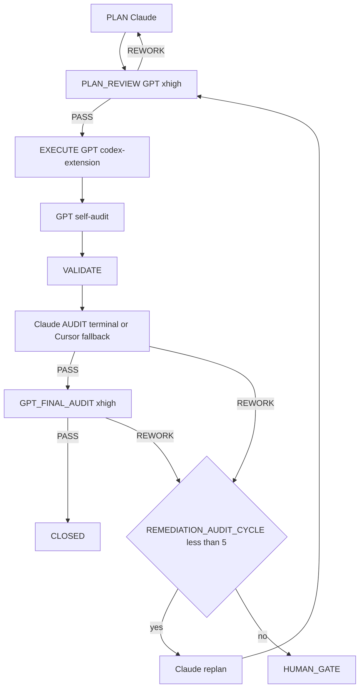

=== Auto-audit GPT (2e passe) ===
2026-04-25T20:25:08.523321Z  WARN codex_core::agents_md: Project doc `/Users/1millnonstop/Downloads/projet/foodking-web/web/testttt/AGENTS.md` exceeds remaining budget (32768 bytes) - truncating.
OpenAI Codex v0.125.0 (research preview)
--------
workdir: /Users/1millnonstop/Downloads/projet/foodking-web/web/testttt
model: gpt-5.5
provider: openai
approval: never
sandbox: workspace-write [workdir, /tmp, $TMPDIR, /Users/1millnonstop/.codex/memories]
reasoning effort: xhigh
reasoning summaries: none
session id: 019dc651-46ac-7e63-b3e3-2b99ced25fbc
--------
user
Tu effectues l’**auto-audit GPT** (2e passe) d’un cycle FoodKing — **pas** l’audit Claude terminal.

**Contexte** : le JSON ci-dessous est la proposition d’implémentation (format agents/codex.prompt.txt) pour la mission `CV1-M10-OS-FOS-SYMMETRY`.


**JSON d’implémentation (à recouper)** :
```json
{
  "files_to_modify": [
    "docs/orchestration/OS_FOS_SYMMETRY_MATRIX_2026-04-25.md",
    "tests/Feature/Symmetry/OrderServicesContractTest.php"
  ],
  "implementation_steps": [
    "Created the OS/FOS symmetry matrix with source anchors for create, status, payment, cancellation, branch isolation, and dispatch timing.",
    "Created the OrderServicesContractTest feature contract suite covering intentional OS/FOS asymmetry, no-op side-effect guards, branch/dispatch source anchors, and deferred kiosk payment golden response idempotency.",
    "Kept product code unchanged per M-10 GPT-only hard boundary.",
    "Ran mandatory validation filters and syntax checks."
  ],
  "code_blocks": [
    {
      "path": "docs/orchestration/OS_FOS_SYMMETRY_MATRIX_2026-04-25.md",
      "op": "create",
      "excerpt": "Created a 59-line source-anchored matrix. Includes SYMMETRY_NOTE: OrderService and FrontendOrderService share the orders table, OrderStatus constants, and branch isolation invariant; create/payment authority is intentionally asymmetric; OrderService::changePaymentStatus is POS/admin-only; FOS deferred payment is paymentConfirm + finalizePaidKioskOrder."
    },
    {
      "path": "tests/Feature/Symmetry/OrderServicesContractTest.php",
      "op": "create",
      "excerpt": "Created a 251-line Feature test class with 5 tests: method/route asymmetry for payment status, source-anchored exact branch filters and dispatch-after-mutation ordering, OS no-op status/payment side-effect suppression, FOS no-op cancel side-effect suppression, and FOS deferred payment confirmation idempotent golden response."
    }
  ],
  "risks": [],
  "notes": [
    "Commands run: php -l tests/Feature/Symmetry/OrderServicesContractTest.php -> PASS.",
    "Commands run: php artisan test --filter=OrderServicesContractTest -> PASS, 5 tests.",
    "Commands run: php artisan test --filter=OrderStatusNoopSideEffectsTest -> PASS, 1 test.",
    "Commands run: php artisan test --filter=PaymentNoopIdempotencyTest -> PASS, 1 test.",
    "Commands run: php artisan test --filter=PaymentConfirmCrossBranchTest -> PASS, 5 tests.",
    "Commands run: bash scripts/verify-orchestration-boucle.sh -> exit 0 conditional binary governance check.",
    "Commands run: LC_ALL=C grep -n '[^ -~]' on created files -> no non-ASCII matches.",
    "SYMMETRY_NOTE included in docs/orchestration/OS_FOS_SYMMETRY_MATRIX_2026-04-25.md.",
    "Product gap found: false.",
    "Product code patched: false.",
    "Existing worktree has many unrelated dirty/untracked files; M-10 changes were limited to the two allowlisted artifacts."
  ],
  "execution_trace": {
    "delegation": "codex-extension",
    "invariants_considered": [
      "pricing_ssot",
      "order_status",
      "branch_id",
      "commit_before_dispatch"
    ]
  }
}
```

**Livrable** (Markdown uniquement, en français) :
# AUTO_AUDIT_GPT — CV1-M10-OS-FOS-SYMMETRY

## 1. Conformité au plan / scope
(Énumérer manques ou dérives ; si scope élargi sans escale → **ESCALATE**)

## 2. Invariants FoodKing
Pour chacun : OK / RISQUE / N/A
- pricing_ssot (backend seul)
- order_status (enum, pas de strings)
- branch_id
- commit_before_dispatch
- frozen_zones
- order_service_symmetry (si un des deux services touché)

## 3. Verdict
Une ligne : `VERDICT: PASS` | `VERDICT: NEEDS_FIX` | `VERDICT: ESCALATE` + 1–3 phrases.

2026-04-25T20:25:08.629559Z  WARN codex_analytics::client: events failed with status 403 Forbidden: <html>
  <head>
    <meta name="viewport" content="width=device-width, initial-scale=1" />
    <style global>body{font-family:Arial,Helvetica,sans-serif}.container{align-items:center;display:flex;flex-direction:column;gap:2rem;height:100%;justify-content:center;width:100%}@keyframes enlarge-appear{0%{opacity:0;transform:scale(75%) rotate(-90deg)}to{opacity:1;transform:scale(100%) rotate(0deg)}}.logo{color:#8e8ea0}.scale-appear{animation:enlarge-appear .4s ease-out}@media (min-width:768px){.scale-appear{height:48px;width:48px}}.data:empty{display:none}.data{border-radius:5px;color:#8e8ea0;text-align:center}@media (prefers-color-scheme:dark){body{background-color:#343541}.logo{color:#acacbe}}</style>
  <meta http-equiv="refresh" content="360"></head>
  <body>
    <div class="container">
      <div class="logo">
        <svg
          width="41"
          height="41"
          viewBox="0 0 41 41"
          fill="none"
          xmlns="http://www.w3.org/2000/svg"
          strokeWidth="2"
          class="scale-appear"
        >
          <path
            d="M37.5324 16.8707C37.9808 15.5241 38.1363 14.0974 37.9886 12.6859C37.8409 11.2744 37.3934 9.91076 36.676 8.68622C35.6126 6.83404 33.9882 5.3676 32.0373 4.4985C30.0864 3.62941 27.9098 3.40259 25.8215 3.85078C24.8796 2.7893 23.7219 1.94125 22.4257 1.36341C21.1295 0.785575 19.7249 0.491269 18.3058 0.500197C16.1708 0.495044 14.0893 1.16803 12.3614 2.42214C10.6335 3.67624 9.34853 5.44666 8.6917 7.47815C7.30085 7.76286 5.98686 8.3414 4.8377 9.17505C3.68854 10.0087 2.73073 11.0782 2.02839 12.312C0.956464 14.1591 0.498905 16.2988 0.721698 18.4228C0.944492 20.5467 1.83612 22.5449 3.268 24.1293C2.81966 25.4759 2.66413 26.9026 2.81182 28.3141C2.95951 29.7256 3.40701 31.0892 4.12437 32.3138C5.18791 34.1659 6.8123 35.6322 8.76321 36.5013C10.7141 37.3704 12.8907 37.5973 14.9789 37.1492C15.9208 38.2107 17.0786 39.0587 18.3747 39.6366C19.6709 40.2144 21.0755 40.5087 22.4946 40.4998C24.6307 40.5054 26.7133 39.8321 28.4418 38.5772C30.1704 37.3223 31.4556 35.5506 32.1119 33.5179C33.5027 33.2332 34.8167 32.6547 35.9659 31.821C37.115 30.9874 38.0728 29.9178 38.7752 28.684C39.8458 26.8371 40.3023 24.6979 40.0789 22.5748C39.8556 20.4517 38.9639 18.4544 37.5324 16.8707ZM22.4978 37.8849C20.7443 37.8874 19.0459 37.2733 17.6994 36.1501C17.7601 36.117 17.8666 36.0586 17.936 36.0161L25.9004 31.4156C26.1003 31.3019 26.2663 31.137 26.3813 30.9378C26.4964 30.7386 26.5563 30.5124 26.5549 30.2825V19.0542L29.9213 20.998C29.9389 21.0068 29.9541 21.0198 29.9656 21.0359C29.977 21.052 29.9842 21.0707 29.9867 21.0902V30.3889C29.9842 32.375 29.1946 34.2791 27.7909 35.6841C26.3872 37.0892 24.4838 37.8806 22.4978 37.8849ZM6.39227 31.0064C5.51397 29.4888 5.19742 27.7107 5.49804 25.9832C5.55718 26.0187 5.66048 26.0818 5.73461 26.1244L13.699 30.7248C13.8975 30.8408 14.1233 30.902 14.3532 30.902C14.583 30.902 14.8088 30.8408 15.0073 30.7248L24.731 25.1103V28.9979C24.7321 29.0177 24.7283 29.0376 24.7199 29.0556C24.7115 29.0736 24.6988 29.0893 24.6829 29.1012L16.6317 33.7497C14.9096 34.7416 12.8643 35.0097 10.9447 34.4954C9.02506 33.9811 7.38785 32.7263 6.39227 31.0064ZM4.29707 13.6194C5.17156 12.0998 6.55279 10.9364 8.19885 10.3327C8.19885 10.4013 8.19491 10.5228 8.19491 10.6071V19.808C8.19351 20.0378 8.25334 20.2638 8.36823 20.4629C8.48312 20.6619 8.64893 20.8267 8.84863 20.9404L18.5723 26.5542L15.206 28.4979C15.1894 28.5089 15.1703 28.5155 15.1505 28.5173C15.1307 28.5191 15.1107 28.516 15.0924 28.5082L7.04046 23.8557C5.32135 22.8601 4.06716 21.2235 3.55289 19.3046C3.03862 17.3858 3.30624 15.3413 4.29707 13.6194ZM31.955 20.0556L22.2312 14.4411L25.5976 12.4981C25.6142 12.4872 25.6333 12.4805 25.6531 12.4787C25.6729 12.4769 25.6928 12.4801 25.7111 12.4879L33.7631 17.1364C34.9967 17.849 36.0017 18.8982 36.6606 20.1613C37.3194 21.4244 37.6047 22.849 37.4832 24.2684C37.3617 25.6878 36.8382 27.0432 35.9743 28.1759C35.1103 29.3086 33.9415 30.1717 32.6047 30.6641C32.6047 30.5947 32.6047 30.4733 32.6047 30.3889V21.188C32.6066 20.9586 32.5474 20.7328 32.4332 20.5338C32.319 20.3348 32.154 20.1698 31.955 20.0556ZM35.3055 15.0128C35.2464 14.9765 35.1431 14.9142 35.069 14.8717L27.1045 10.2712C26.906 10.1554 26.6803 10.0943 26.4504 10.0943C26.2206 10.0943 25.9948 10.1554 25.7963 10.2712L16.0726 15.8858V11.9982C16.0715 11.9783 16.0753 11.9585 16.0837 11.9405C16.0921 11.9225 16.1048 11.9068 16.1207 11.8949L24.1719 7.25025C25.4053 6.53903 26.8158 6.19376 28.2383 6.25482C29.6608 6.31589 31.0364 6.78077 32.2044 7.59508C33.3723 8.40939 34.2842 9.53945 34.8334 10.8531C35.3826 12.1667 35.5464 13.6095 35.3055 15.0128ZM14.2424 21.9419L10.8752 19.9981C10.8576 19.9893 10.8423 19.9763 10.8309 19.9602C10.8195 19.9441 10.8122 19.9254 10.8098 19.9058V10.6071C10.8107 9.18295 11.2173 7.78848 11.9819 6.58696C12.7466 5.38544 13.8377 4.42659 15.1275 3.82264C16.4173 3.21869 17.8524 2.99464 19.2649 3.1767C20.6775 3.35876 22.0089 3.93941 23.1034 4.85067C23.0427 4.88379 22.937 4.94215 22.8668 4.98473L14.9024 9.58517C14.7025 9.69878 14.5366 9.86356 14.4215 10.0626C14.3065 10.2616 14.2466 10.4877 14.2479 10.7175L14.2424 21.9419ZM16.071 17.9991L20.4018 15.4978L24.7325 17.9975V22.9985L20.4018 25.4983L16.071 22.9985V17.9991Z"
            fill="currentColor"
          />
        </svg>
      </div>
      <div class="data"><div class="main-wrapper" role="main"><div class="main-content"><noscript><div class="h2"><span id="challenge-error-text">Enable JavaScript and cookies to continue</span></div></noscript></div></div><script>(function(){window._cf_chl_opt = {cFPWv: 'g',cH: '.89M1h86NEFj6zepREkBKL74_o8jY.lKj00KqmsdJoU-1777148708-1.2.1.1-Owp8TsLxp3zGME5SeUjp9oDBPNI1WL1V5gFtbZdyUKQQdEc3Fo_aaXXdX_qpqmjs',cITimeS: '1777148708',cRay: '9f201344d88f6eb5',cTplB: '0',cTplC:1,cTplO:0,cTplV:5,cType: 'managed',cUPMDTk:"/backend-api/codex/analytics-events/events?__cf_chl_tk=1Ybc.xAYZKkyQAwcuzRbZuVB1dXZKV3kdQFb9rnwq5c-1777148708-1.0.1.1-4dgsjTmEXNJuym_Cl5Zm6RkhmfKQElSwDzj5AzIS1_4",cvId: '3',cZone: 'chatgpt.com',fa:"/backend-api/codex/analytics-events/events?__cf_chl_f_tk=1Ybc.xAYZKkyQAwcuzRbZuVB1dXZKV3kdQFb9rnwq5c-1777148708-1.0.1.1-4dgsjTmEXNJuym_Cl5Zm6RkhmfKQElSwDzj5AzIS1_4",md: 'BxAY88YBW0ICh8aJx76ckuKHSIkoehfDq.3QUogGOuk-1777148708-1.2.1.1-fqGVu66yCsV_3N4N9DXvmuKMI0i7CjcJMFMDhdjBsJCuCxUBbXhj1H.k2X2ZOLzLsSIay44XuGO07vRQr3SPL90iTNOWstnK08qo2VtdMxC77fJ8x9Dh2qOEwCMV8b08YJ2PdRN0TKfyTnSbQ4p0V8JZBJgu5TaqRzvf0.rQSL6IjHIdOIEzq3YOK4lRVi4VzyVtpmye2cPqkpabfPur0KihP2a.k07cE1pHgjJBZUPZMeJbYI4trymuJPEO_5Uq2xCGPpRGAyM2O9XdzTCt.Uw4oJstPFg2ED0Is8vhKmUKl5ij55a4sW8qraicboyYfJ89OpJegEII6tyVI4tHgoWAFWC9jwNaWp0oL6bnk_pEHbY7.m36bLBA.MLaNLi5wcq8dwcr9nx0EWb2_wEH20D7hiEzWaxZJqrIyXnp12yDIpibi462pHn2ZHxars.U3H1fou.D1ioKfTLSAx7JoaQFz67baVeNyNS4v_m2revGjGiiJ39_Lx9Y8X5eGfvTJCER0eayUPwb2lsx59KYGMpNdTu9f4DgIhdd7Q37Jl7Az7c5tw4WRHJodq3LJN.O9cLBEauXB.kv_zPtH7HwkmbJ_pvYUaCEhtUAqPJBXzwBCGzHvkEAyTKV6P5RmrRNmT_Lp42Vz5sqJl40Z60prQStFb.Un3uW5fLW.MvNcrFaV3fimv2VvjCrSO9ypPgVsKtc4lUjWvvo3NtCSaucXxMypKkRG0Ls_dCx8iLG.w0HNRI7aL_5rLaVcSsnPfjy2ejYaLVcPYLsGlwBL3siA34iHZxipRReXOgPqam99ZIYIENn3TX_PkQbSMWAmZ_I0wyhMm.AxGFUaDtwcpp_us4Bqa302s5D2KMy_eIH4f7bQTQJMAZqa5sXi_t9mm7110Z07b8pH3kts6ZCAcbQVI1_HMDvgv1TxmchITi_cnLb4I_XWXHxlR_UL.dBqWn3HA0iBOAVlF0DJhxEaNhpZ30.toCKNo.s2XXeYs3rT0qT1Oy8iJUDd1MZrI19v.R5glwwIoVRZvwt.K0jMKMngxUKmUhH7lcm7lmlLPP5rVusCLAXiANE5wBL92Z8gHcD',mdrd: '0TDpIGcApz4pAD3zm5IgfsooLKNnGSet0ijy29ytjVE-1777148708-1.2.1.1-XdsraCGjwEXgj.vyaFedfyhRXrWWLd7HCGywNSu3omkf9EjyFeu56Qzrwqf56VO3eptAAuXr.HWZy.BXdyXztPgbNH.eylGZOUIRGmQw9QHiVkVGqdo6k.aOc6G00Nn5oQtNLk1YxQdg1tJdIF7ZnjTq6KpgXVjRgOHicNFq8TLIoeL5JyatUelEiUJnuKfK8b2hD2EoPBt3XBvH7bKTfLThUs.vle8ZZTExQBeQ9sqvnyzIxNBVngVS2vEnC_DqgrkORatxcof6r.BKm41lYOg.MAfBQxLf5upAlkSURLYugj44tc1o6tpMEcZSkhbmcV3APHmqN3TSOgB1IsIAR5iNM1L_9hSg6RzTzKaA49WrOODY7Ryio25FDZGe4l0XJZzOo.4CrdCXQPkOQ9ZrL6V5WBlH52W92oedzj6J.4PJBru6Dfpt9HPdQdOWU441KMbHvgn4vuvQDj3rD4bZAIupKJAiTn4C6a1htzIXFjxJDSHRssPFLJk9FR8Hxa9aKObYbgi1_DOeALJtlbTjXrH6H84jKCO4tMOc0hRAi1SB81afvNTDaHJtdgncOVYp2h0VvEPO4KeSRgJAa3yya.wtxpaverUNAeGSbXOcL5SVTtXUH7DgutglNvuYCbSv1XhZjVY3C6WV1qjF4cQuspyMFTqhOnkW.U1ACbLOBTrbgHGBMh9RFWadse.9eBUVQM085X0_92KLqGGVrifL4uYm2Y_dLddrFyFVqPxDG1WqRA8rIPAbK4VAqtDtgFYmtkDs1TnNf2Lx3r6wdRuHIf96QNHW3hB7DuDp2lLPMwLc691j_kWNclfGqZumpMaMD7sD40t8bxU2nNDcilHw6XP_zIyIS.inaiYwj7gtrOkzH0R3a57pb57NEoxTq3ev.d_J__ekfPTuUvfr37DvoQY9Q_vmNaSeFmn06hpWUz8LGWG1j2.RegOJi1m6zJkuKvA1PKYn4PNDhQG3HCzKkRygIjukZewZVTOHQQSrH7.YseCFVji4sPWGC.hGmI15VCLyZSB7YvEWm6.Z1psg.rai4MpKIlxnTs2ZTzqmXu9e8qghgt2MNPXjxp.F84BqauQXQuHpumbcnEM4mfEbwdeb.U5TCgzdSZxMPlhbzE_JuamLsm4R.w5LcJmTw9Qd8cQshH.qvOldh_Rjg1x7wqFZbOFFdapU.hSNI2445AEAUQGGx57SguZA7ASMBBGQU75wLJBDFB2zI1DmWwJc5at..ewImGNRz6He47FuPut4TVPMJtT3KRWqNBRh7p1zSVQuXXlXtNDVNVRVU5FJ9IcGintG3ztilgOBq9VsAKnLf_uJcPoGVTZqQFlrChLB0y1YDhQ.lgArmWhrNZ_Vkhr.Fg8tLbuLyIqbWa6OBPqTTxPJBf_k9yl5HILhUJRcie3XqyNZTbGjwnRtefjTxIhJ1pIXRNWfU7V4NLsp2ZVDes.956C9mYQRNF2P6h03fz.XWacMBY6gLZeUwORjAKb0xxmCNirUWDRt2U5AP5NO0MuAo1lK069u7pj1YXb7wfZPGtju66UvQIYum6BQxm3ZyNMOnMbsUIRKRT.PipVA33xQcfZztd95L1FiDfU8cdL.Rd6j0Hk4exml.5kK0y0vN9EW5CtQIo6iPGikZiN1WQaD6_DYM1xylKwPUM9CbxiGecqH7Fx6oHr8j8XX6IhvBkEUiGtibXsQ5J9qgZwdqFf72CFxT7thIf8iMURl_hnLL9pV8ijbn1YNJQilk75y8RhMoYeoOdaukZPAXey8k5uVrYU1ew1hp69uAsLWW1aG44gpIBlvlcu8uzx3Uo3fcduXGcgdtJ0CwLbMy2dJh6vHvk8J3krlRCGk6.MvWZl2n4K2hRdyjXDT4XiQizTudMEhndBCtF2tTG.O.9kYzYRkxSwFVfA8DU7sbmA1zB6PNjuudhBKovAVdyd0Sa9ivUMiIQLxQ3CPThe0Lbs5GQYLDC.WVdaYAq3rs2J0FtxH1FTd.r3I27Cep2mKbPiKDA3Ix9GmKqVAuabBt0DQ65pc1pe_.4pHW.wwOO_h76ZwTsiz8e7eOMsnbAR_PJTSC4CEcjhyfHUaOQEgsdT9sKNgnDfmciK75gsxySMCii0EGcBoP6jS2Rm_E5oQE4WDeE1wy_WUe7xaYf42JA7F.XQGZN8WHwUbSsRTGoY1A9OWasdSJDY.YFCTm5bwG3GAdQwOPQJ_n5lX0eP1R5gY0bK3O.aON1v_0fIwnhymNRvWtJVGXWlubICY0R96f5_FZECNswHundmYCeirrme8fluKYSnyvEP2_2nYE8IJoQ4Nk0if_qyjqfpA1JHhpMc0bXYsqhU8786uUOiB81QQUrTh99HKSICfn5Z1vpOz11EtEH4LlvzSg4050WKLw9zH2FzXRI6qQYqz9hOhFhvUbHhb5sT4bNy5_UyTKiWlii5A2P3rkwCvuMADbinlJW_T6EMyOE.ZOfvyKFZTYnKo7wlDtydZ5OhJiwfuZUcTEgo9gPXCToEeU8mEZ2Drwg0sozozMtdor3YFaJgz0i3fJHvaHJUFuErkNAM33G6TwhIkTNPqofIkATCmOxY_zResp5bHFYClIxGzR_mF19ueyr6efWzeIADB4wFY37YSxX0L4VO5eFysSSMYCp3S7rFCXXfQJgFJHSxKY2r7KxRCF3ao4wLLtzIKQnPR1gEHFz4C7c81VCMRiAKDTv_cFtjJQRPZg.yiAqvPZAYqzF8EL78BIxZpPdiCn5HnlgJnx67xwbVKihgZ1pxcsKgOWSx9whUgRbeDn30rYHF3o6opJPmm8s6zVk1zzfAQMdszgaADbYKjm2haNi_QdZMpq3wvGWdCj5xvLcAHBLzoBTM',};var a = document.createElement('script');a.src = '/cdn-cgi/challenge-platform/h/g/orchestrate/chl_page/v1?ray=9f201344d88f6eb5';window._cf_chl_opt.cOgUHash = location.hash === '' && location.href.indexOf('#') !== -1 ? '#' : location.hash;window._cf_chl_opt.cOgUQuery = location.search === '' && location.href.slice(0, location.href.length - window._cf_chl_opt.cOgUHash.length).indexOf('?') !== -1 ? '?' : location.search;if (window.history && window.history.replaceState) {var ogU = location.pathname + window._cf_chl_opt.cOgUQuery + window._cf_chl_opt.cOgUHash;history.replaceState(null, null,"/backend-api/codex/analytics-events/events?__cf_chl_rt_tk=1Ybc.xAYZKkyQAwcuzRbZuVB1dXZKV3kdQFb9rnwq5c-1777148708-1.0.1.1-4dgsjTmEXNJuym_Cl5Zm6RkhmfKQElSwDzj5AzIS1_4"+ window._cf_chl_opt.cOgUHash);a.onload = function() {history.replaceState(null, null, ogU);}}document.getElementsByTagName('head')[0].appendChild(a);}());</script></div>
    </div>
  </body>
</html>

2026-04-25T20:25:08.985311Z  WARN codex_core_plugins::manifest: ignoring interface.defaultPrompt: prompt must be at most 128 characters path=/Users/1millnonstop/.codex/.tmp/plugins/plugins/build-ios-apps/.codex-plugin/plugin.json
2026-04-25T20:25:08.987920Z  WARN codex_core_plugins::manifest: ignoring interface.defaultPrompt: maximum of 3 prompts is supported path=/Users/1millnonstop/.codex/.tmp/plugins/plugins/plugin-eval/.codex-plugin/plugin.json
2026-04-25T20:25:16.462803Z  WARN codex_core_plugins::manifest: ignoring interface.defaultPrompt: prompt must be at most 128 characters path=/Users/1millnonstop/.codex/.tmp/plugins/plugins/build-ios-apps/.codex-plugin/plugin.json
2026-04-25T20:25:16.464695Z  WARN codex_core_plugins::manifest: ignoring interface.defaultPrompt: maximum of 3 prompts is supported path=/Users/1millnonstop/.codex/.tmp/plugins/plugins/plugin-eval/.codex-plugin/plugin.json
2026-04-25T20:25:17.276783Z  WARN codex_core_plugins::manifest: ignoring interface.defaultPrompt: prompt must be at most 128 characters path=/Users/1millnonstop/.codex/.tmp/plugins/plugins/build-ios-apps/.codex-plugin/plugin.json
2026-04-25T20:25:17.277072Z  WARN codex_core_plugins::manifest: ignoring interface.defaultPrompt: maximum of 3 prompts is supported path=/Users/1millnonstop/.codex/.tmp/plugins/plugins/plugin-eval/.codex-plugin/plugin.json
codex
J’utilise le skill `sync-risk-review` car la mission touche la symétrie OS/FOS et les invariants de cycle de commande. Je vais recouper le JSON avec les artefacts réels et le contexte de cycle, sans modifier le dépôt.
exec
/bin/zsh -lc "sed -n '1,220p' /Users/1millnonstop/Downloads/projet/foodking-web/web/testttt/.agents/skills/sync-risk-review/SKILL.md" in /Users/1millnonstop/Downloads/projet/foodking-web/web/testttt
 succeeded in 0ms:
---
name: sync-risk-review
description: Review changes affecting synchronization, auth, pricing, KDS, OSS, or order lifecycle for architectural and business risk.
disable-model-invocation: true
---

# Sync Risk Review Skill

Use this skill when a change affects:
- sync
- auth
- pricing
- KDS
- OSS
- order lifecycle
- cross-device behavior

## Steps
1. Read the relevant docs
2. Inspect the diff or current implementation
3. Identify:
   - architecture risk
   - state consistency risk
   - business rule violations
   - authz issues
   - missing tests
4. Produce a concise review with recommended next actions.

exec
/bin/zsh -lc "sed -n '1,220p' .cursor/ACTIVE_CYCLE.md" in /Users/1millnonstop/Downloads/projet/foodking-web/web/testttt
exec
/bin/zsh -lc "sed -n '1,220p' AGENTS.md" in /Users/1millnonstop/Downloads/projet/foodking-web/web/testttt
 succeeded in 0ms:
# Active Cycle – FoodKing

**Méta (SSOT `run-cycle.md` Step 0 + `AGENTS.md` § *Authoritative … cycle state*)** — requis pour que l’orchestrateur ne s’arrête pas sur *« RUNNER_MODE not set »*.

| Champ | Valeur actuelle |
| --- | --- |
| **RUNNER_MODE** | `single-session` |
| **PHASE (cycle W10)** | `IN_PROGRESS` (détail = section `CYCLE_W10_…` ci-dessous) |
| **TASK_ID** | `P_EXEC_CLOSEOUT_GRAPHITI_CI_PROD_2026-04-22` |
| **PLAN_FILE** | `plans/PLAN_EXECUTION_CLOSEOUT_GRAPHITI_CI_PROD_2026-04-22.md` |
| **REPORT_FILE** | `reports/post_execute_latest.log` (append — preuve `EXECUTE_DELEGATION` / `AUDIT_*`) |

> **ACTIVE_PRIMARY** : `CYCLE_W10_EXECUTION_CLOSEOUT` (un seul cycle peut être actif à la fois — voir B03 méga-checklist).
> Cycles plus anciens en lecture seule = **archive** déplacée dans **`.cursor/ACTIVE_CYCLE_ARCHIVE.md`** (lecture humaine / forensique uniquement, **non requise** par le parcours obligatoire).

## CYCLE_W10_EXECUTION_CLOSEOUT (IN_PROGRESS — mémoire 180 + MCP global + commit + CI + prod)

**TASK_ID** : `P_EXEC_CLOSEOUT_GRAPHITI_CI_PROD_2026-04-22`  
**Plan SSOT** : `plans/PLAN_EXECUTION_CLOSEOUT_GRAPHITI_CI_PROD_2026-04-22.md`  
**Ordre** : Piste A (POS+Centrale : PLAN-MEM-1) ∥ Piste B (humain : PLAN-MEM-3) → C (smoke) → D (commit sur « go commit ») → E (CI) → F (prod J-7→J+7).  
**Gate mémoire** : `python3 memory/verify.py` → count **≥ 175** (180 idéal) avant de considérer PLAN-MEM-1 **CLOSED**.

- **Vérif locale (2026-04-22)** : `python3 memory/verify.py` → **count = 182**, smoke `search_memory_facts` OK — gate **satisfaite** pour clôturer l'ingestion côté seuil d'épisodes (suite : commit / CI / prod selon plan `PLAN_EXECUTION_CLOSEOUT_*`).

**Gouvernance globale (2e passe 2026-04-22)** : primer multi-agents + Graphiti vivant + tokens « zéro effet négatif » → **`docs/orchestration/GLOBAL_SYSTEM_PRIMER.md`** + rapport **`reports/audit/AUDIT_SECOND_PASS_GLOBAL_GOVERNANCE_REPORT_2026-04-22.md`**.

---

## CAISSE_V1_MASTERPLAY (ACTIVE — 2026-04-25)

**Phase** : finition Caisse V1 (POS + Kiosk + KDS + Centrale + Fiscal + Ops).
**Plan parent** : `plans/PLAN_CAISSE_V1_GPT_MASTERPLAY_2026-04-25.md`
**Plan DAG autoritaire** : `plans/PLAN_CAISSE_V1_SUPER_MASTER_2026-04-25.md`
**Boucle d'exécution** : `plans/masterplay/MASTERPLAY_DISCIPLINE.md` + `plans/masterplay/MASTERPLAY_QUEUE.md` + `scripts/run-masterplay.sh`
**Statut temps réel** : `reports/masterplay/status.json`

**Règle** : tout `TASK_ID` au format `CV1-MXX-…` passe par la masterplay (cf. `AGENTS.md` § "Caisse V1 — Masterplay loop", `.cursor/rules/global.mdc` § "Caisse V1 — Masterplay loop", `.cursor/commands/run-cycle.md` Step 0 item 0). **NE PAS** ouvrir un `run-cycle` standard sur un `CV1-MXX-…`.

---

## Archive

Tous les cycles **CLOSED / COMPLETED PASSED** (W4 → W9, NF525, etc.) ont été déplacés dans **`.cursor/ACTIVE_CYCLE_ARCHIVE.md`** pour réduire le coût de lecture du parcours obligatoire (audit 2026-04-24, mission `T-PARCOURS-OPTIMIZE-001`).

- **Lecture humaine** : ouvrir `.cursor/ACTIVE_CYCLE_ARCHIVE.md`.
- **Lecture agent** : **non requise** sauf instruction explicite du plan ou du chat (ex. "reprend le rationale du cycle W9").
- **Recherche** : `rg "CYCLE_W9_" .cursor/ACTIVE_CYCLE_ARCHIVE.md` ou `git log --follow .cursor/ACTIVE_CYCLE.md`.

 succeeded in 0ms:
# FoodKing – Cursor Agent Operating Contract

## 0. Quick start contract — read this first

Commence ici. Ne lance aucune action tant que tu n'as pas lu les priorités P0.
Ce contrat fixe l'ordre minimal de lecture pour comprendre le repo en moins de 60 secondes.
Lis complètement ce qui est marqué obligatoire ; diffère seulement ce qui est explicitement classé P2.

### Reading priority

| Priority | What to read | Why |
| --- | --- | --- |
| P0 | `AGENTS.md §1 Parcours obligatoire` | Cadre impératif de travail, ordre de lecture, discipline de cycle. |
| P0 | `.cursor/ACTIVE_CYCLE.md` (continuation) | État courant du cycle actif, contexte vivant, reprise sans divergence. |
| P0 | `.cursor/rules/global.mdc` (auto-attaché — mentionné pour info) | Règles globales toujours applicables, même si déjà injectées par l'outil. |
| P0 | `plans/masterplay/MASTERPLAY_DISCIPLINE.md` + `plans/masterplay/MASTERPLAY_QUEUE.md` (Caisse V1 actif) | **Pendant la phase Caisse V1** : règles d'or de la boucle GPT + file d'exécution. Tout agent qui touche une mission `CV1-MXX-…` DOIT lire ces deux fichiers avant d'agir. |
| P1 | `docs/orchestration/GLOBAL_SYSTEM_PRIMER.md` | Vocabulaire, architecture d'orchestration, invariants transverses. |
| P1 | `.cursor/commands/run-cycle.md` | Procédure exacte pour démarrer un cycle borné correctement. |
| P1 | `docs/orchestration/MEMORY_MATRIX.md` | Où chercher la mémoire utile sans relire tout le dépôt. |
| P1 | `.cursor/routing.md` | Routage des tâches, choix du bon canal, limites d'intervention. |
| P2 | `docs/orchestration/CODEX_API_DELEGATION.md` (quand EXECUTE complexe) | À lire si tu délègues ou exécutes du complexe (uniquement **CLI `codex`**, pas d’exécuteur HTTP dans le dépôt). |
| P2 | `.cursor/ACTIVE_CYCLE_ARCHIVE.md` (forensique humain) | Historique utile pour audit humain, pas requis au démarrage. |
| P2 | `docs/orchestration/EXPORT_CONFIG_CODEX_GPT_API_ET_AUDIT_PERSISTANCE.md` (nouveau poste) | Configuration et persistance utiles surtout lors d'un nouvel environnement. |

Règle simple : P0 avant toute action, P1 avant tout EXECUTE, P2 seulement à la demande du sujet.
Si un doute persiste après P0+P1, arrête-toi et relis ; n'improvise pas.

### One-line bootstrap

```bash
npm run verify:boucle
bash scripts/agent-activity-log.sh tail 50
run-cycle <TASK_ID>
```

### Caisse V1 — Masterplay loop (actif)

Pendant la phase de finition Caisse V1 (POS + Kiosk + KDS + Centrale + Fiscal), l'orchestration passe par la **MASTERPLAY** :

```bash
# Lire d'abord (obligatoire)
cat plans/masterplay/MASTERPLAY_DISCIPLINE.md
cat plans/masterplay/MASTERPLAY_QUEUE.md
cat plans/masterplay/GO.md

# Lancer la boucle (Codex extension complexe + audit Claude terminal + audit Codex final)
bash scripts/run-masterplay.sh --with-audit --with-final
```

- **Plan parent** : `plans/PLAN_CAISSE_V1_GPT_MASTERPLAY_2026-04-25.md` (catalogue 22 missions M-XX, ancrages file:line)
- **Plan autoritaire DAG** : `plans/PLAN_CAISSE_V1_SUPER_MASTER_2026-04-25.md`
- **Statut temps réel** : `reports/masterplay/status.json` + `reports/masterplay/run_*.log`
- Tout `TASK_ID` au format `CV1-MXX-…` est gouverné par la masterplay (allowlist, frozen, gates, REWORK max 5).
- Hors phase Caisse V1 : repasser au `run-cycle <TASK_ID>` standard.

**Anti-répétition (nouvel onglet / agent parallèle)** : copier d’abord le bloc de `docs/orchestration/SESSION_OPENING_ENFORCEMENT.md` — même discipline, moins d’oubli de `ACTIVE_CYCLE` / `run-cycle`.

Utilise `run-cycle <TASK_ID>` pour initier tout cycle borné.
Les deux autres commandes servent à vérifier l'état local et le journal d'activité avant d'exécuter.

### Quality-first, not token-cheap

Lis P0 et P1 intégralement, sans skim. Les économies de tokens ne se font jamais sur la substance des règles, seulement sur la répétition, le bruit et les relectures inutiles. En cas de tension entre vitesse et rigueur, applique la rigueur ; voir `.cursor/rules/global.mdc § Token Discipline`.

### If you're a new human contributor

Commence par `docs/orchestration/EXPORT_CONFIG_CODEX_GPT_API_ET_AUDIT_PERSISTANCE.md` pour préparer ton poste et comprendre le mode de persistance attendu.
Lis-le après P0, puis enchaîne sur P1 avant toute contribution effective.

---

## 1. Parcours obligatoire — **nouvelle conversation** **et** **continuation** (production, non négociable)

> **Objectif** : qu’**à chaque** session (premier message ou 500e message), l’exécutant sache **quel** chemin suivre — **sans** supposer un historique de chat. Tout est **dans le dépôt** ; l’histoire de conversation **n’est pas** la SSOT.

**Règle d’or** : *aucune* modification de code **produit** (hors `plans/`, `reports/`, `docs/gates/`, `missions/`, JSONL gouvernance) **dans le cadre d’un travail borné** sans **(a)** parcours ci-dessous **et** **(b)** cycle `run-cycle` + plan actif, sauf **exception** explicite humaine (notée dans le plan / gate).

| Étape | Action | Quand / pourquoi |
|-------|--------|------------------|
| **0. Continuation** | Lire **`.cursor/ACTIVE_CYCLE.md`**. | Si `PHASE` n’est **pas** vide et le cycle n’est **pas** archivé : **reprendre** ce `TASK_ID` / ce `PLAN_FILE` / ce `REPORT_FILE` — **ne pas** dupliquer un second cycle fantôme. Si humain confirme **nouveau** sujet : réinitialiser / nouveau `TASK_ID` selon `run-cycle` Step 0. |
| **1. Lecture initiale** | Lire **ce fichier** (`AGENTS.md`) **puis** **`docs/orchestration/GLOBAL_SYSTEM_PRIMER.md`** (table §1 = ordre complet : routing, `run-cycle`, Graphiti, `MEMORY_MATRIX`, etc.). | **Avant** tout code ou plan non trivial. Même en « continuation » si le contexte a dérivé ou l’onglet a été rafraîchi. |
| **2. Cycle structuré (SSOT procédurale)** | Toute tâche avec **`TASK_ID`** : suivre **`.cursor/commands/run-cycle.md`** et la commande **`run-cycle <TASK_ID>`** (ou équivalent explicite dans le chat : enchaîner les **Steps 0 → 5** sans en sauter). | **Programme courant (quota-optimized)** : `PLAN GPT → PLAN_REVIEW GPT → EXECUTE GPT → VALIDATE → AUDIT GPT → [CLAUDE CRITIQUE SI NÉCESSAIRE] → [GATE \| CLOSE]`. Aucun « close » sans audit PASS documenté. |
| **3. Vérification d’environnement** | `npm run verify:boucle` (0 requête par défaut). **Si le terminal ne “voit” pas Codex alors que l’extension est connectée** : l’auth IDE n’alimente pas le CLI — lancer `npm run codex:doctor` (npm + `login status` + 1 requête). **Rapide :** `npm run codex:verify-pro`. **Complet :** `npm run verify:boucle:full`. Encart : `agents/codex-extension-instructions.md`. | Même en **Step 5** : l’`EXECUTE` (CLI `codex`) requiert le binaire + session Pro sur **ce** binaire. Voir `run-cycle` Step 0 item 8. |
| **4. Secrets & outils machine** | Binaire **`claude`** sur le **`PATH`** (Claude Code CLI) pour l’**AUDIT** PRIMARY en terminal. Binaire **`codex`** (CLI OpenAI) : *Sign in with ChatGPT* **Pro** — **pas** de clé API dans le dépôt. Résolution : `PATH` **ou** `node_modules/.bin/codex` après **`npm install`** (dépendance **`@openai/codex`**) **ou** `npm i -g @openai/codex`. **Ne pas** mélanger avec une clé *Platform* restreinte dans l’environnement (provoque des 401 *scopes* sur l’API Responses) — `npm run codex:audit-bleed` aide. (Option) MCP Graphiti selon `~/.cursor/mcp.json`. | Sans `claude` : noter dès le **plan** l’`AUDIT` fallback + `AUDIT_FALLBACK_REASON`. Sans binaire `codex` : pas d’`EXECUTE` complexe PRIMARY (sub-agent + `FALLBACK_REASON` ou `npm install` + auth Pro). |
| **5. Traces & mémoire (déjà dans ce fichier)** | **`EXECUTE_DELEGATION:`** avant VALIDATE ; **`AUDIT_CHANNEL:`** + **`TERMINAL_AUDIT_OK: 1`** si audit terminal OK ; `docs/orchestration/MEMORY_MATRIX.md` ; `scripts/agent-activity-log.sh` (tail / start / done). | Traçabilité = **même** qualité en prod sur N agents parallèles. |

**Ce n’est pas optionnel** pour travailler « en production FoodKing » : c’est le **contrat** d’onboarding. Les **règles** `.cursor/rules/*.mdc` (dont **`global.mdc` — alwaysApply**) et ce fichier **s’imposent** **à** tout modèle, **dans** toute conversation, dès l’ouverture du dépôt.

**Pour un humain / nouveau compte** : mêmes étapes ; la doc **`docs/orchestration/EXPORT_CONFIG_CODEX_GPT_API_ET_AUDIT_PERSISTANCE.md`** regroupe l’**export** config API + persistance des règles hors-chat.

## Engine
Cursor local agent. No cloud orchestration. No external framework.
Auto/Premium routing: disabled. Model selection is explicit per cycle.

## Global system primer (multi-agents, Graphiti, tokens — lecture clé)

Tout nouvel intervenant (session Cursor, sub-agent Task, CLI terminal, humain) qui touche **orchestration**, **mémoire**, ou **discipline de contexte** : lire **`docs/orchestration/GLOBAL_SYSTEM_PRIMER.md`** après ce fichier. Y sont définis : ordre de lecture obligatoire, `codex-extension` GPT-5.5-pro/xhigh, fallback `foodking-complex-implementer`, fallback audit `foodking-planner-orchestrator`, terminal **`claude` / `codex`**, **mise à jour continue de Graphiti**, et la politique **« intelligence max — zéro optimisation négative »** (tokens : supprimer le gaspillage, pas la substance). Pour audits longs et robustesse **opération + agentique + mémoire** : **`docs/orchestration/MEGA_CHECKLIST_AUTONOMY_AND_MEMORY.md`** (180 tâches) et le narratif **`reports/audit/MEGA_AUDIT_SYSTEM_OPERATION_AGENTIC_2026-04-23.md`**.

**Discipline mémoire (qui écrit où, qui lit quoi, quand)** : **`docs/orchestration/MEMORY_MATRIX.md`** — matrice unique des **4 stores autorisés** (Code A · Graphiti+JSONL B · Missions C · Rapports D), table d'écriture par phase, ordre de lecture pour une nouvelle session, anti-patterns. Aucun nouveau store de mémoire ne peut être ajouté sans gate `docs/gates/GATE_MEMORY_*`. Décisions 2026-04-23 sur OpenSpace et claude-mem : **non intégrés**, justifications dans la matrice.

**Synchro multi-agents (cross-conv, cross-terminal)** : `.cursor/rules/cross-agent-sync.mdc` (alwaysApply) + `reports/AGENT_ACTIVITY_LOG.md` (append-only) + `scripts/agent-activity-log.sh` (`tail | start | done | collisions | active`). Au démarrage de session : `tail 50` (~500 tokens). Avant édition produit (Step 2 EXECUTE) : `start` (refus exit 2 si collision). À la clôture (Step 5 CLOSE) : `done`. Évite que deux agents (Cursor convs / `codex-extension` / `claude-terminal` / humain) modifient les mêmes fichiers à leur insu. **Doctrine étendue** (Graphiti = mémoire partagée, rôles Claude vs Codex, anti-patterns) : **`docs/orchestration/MULTI_AGENT_ORCHESTRATION.md`**.

## Workflow
PLAN GPT (codex) → PLAN_REVIEW GPT (codex) → EXECUTE GPT (codex) → VALIDATE → AUDIT GPT (codex) → [CLAUDE CRITICAL ESCALATION ONLY] → [HUMAN GATE | CLOSE]

No phase may be skipped. Default close condition is `AUDIT_VERDICT: PASS` from GPT path, with optional Claude escalation audit only for critical/blocked cases.

## Model Roles
| Model | Role | Channel (priorité **qualité maximale / zéro raccourci token**) |
|---|---|---|
| Claude | Escalade critique uniquement | Utiliser Claude seulement pour cas vraiment critiques: blocage logique majeur, gate ambigu non résoluble, conflit d'audits, ou arbitrage architecture multi-fichiers à haut risque. Le canal prioritaire reste GPT/Codex pour économiser les quotas Claude. |
| **GPT-5.5 / GPT-5.5-pro** | **PLAN + PLAN_REVIEW + EXECUTE + AUDIT** | **`codex-extension`** — `npm run codex:plan-review`, `npm run codex:complex`, `npm run codex:final-audit` (CLI `codex` + `codex exec`, **compte ChatGPT Pro**, modèle `gpt-5.5-pro` si dispo sinon `gpt-5.5`, `model_reasoning_effort=xhigh`). GPT devient le canal principal d'orchestration, implémentation et audit de routine. |
| GPT-5.5 (fallback) | Complex implementation (FALLBACK only) | **Sub-agent** `foodking-complex-implementer` (Task Cursor) — consomme l’**usage** des modèles de l’**abonnement Cursor**. **Uniquement** si `codex` / l’exécution `codex exec` a échoué (≥2 tentatives documentées) ou binaire indispo. |
| Composer | Validation/report only | Plus d’implémentation routine pendant les cycles de finition. Composer peut résumer, exécuter/rapporter des validations, mais toute correction produit repart en EXECUTE GPT. |

**Qui décide (mode actuel quota-optimized)** : **GPT/Codex** porte l’**autorité opérationnelle** sur planification, implémentation, auto-audit, et audit final de routine. **Claude** est mis en pause et appelé uniquement en **escalade critique** (ambiguïté structurelle, gate sensible, conflit technique majeur, analyse de risque à très forte complexité). Le **fait** code / test l’emporte sur la croyance.

**Principe unique (mode actuel) — à valider en prod sur chaque cycle :** **PLAN GPT → PLAN_REVIEW GPT → EXECUTE GPT → self-audit GPT → VALIDATE → AUDIT GPT**. Le repli vers Claude n’intervient qu'en escalade critique documentée (`CLAUDE_ESCALATION_REASON:`), avec portée minimale.

One PRIMARY_EXECUTION_MODEL per cycle. Roles are explicit and layered; review checkpoints do not authorize scope expansion.
Full routing policy: `.cursor/routing.md`. Naming: the **PRIMARY complex implementer** is the **FoodKing Codex Complex Implementer** (slug `codex-extension`); see `docs/orchestration/CODEX_API_DELEGATION.md`.

## Authoritative multi-agent bounded cycle (SSOT)

For **TASK_ID-driven** work in Cursor, this path is **authoritative** and overrides any conflicting step elsewhere in this document:

1. **Command:** `.cursor/commands/run-cycle.md` (invoke with a `TASK_ID`, e.g. `run-cycle SMOKE-001`).
2. **Cycle state:** `.cursor/ACTIVE_CYCLE.md` (`RUNNER_MODE: single-session`, `PHASE`, `PLAN_FILE`, `REPORT_FILE`, completion rows).
3. **Plan artifact:** `plans/PLAN_[TASK_ID]_[DATE].md` per `.cursor/context/plan-context.md` (from `plans/PLAN_TEMPLATE.md` when applicable).
4. **Phase instructions:** `.cursor/context/plan-context.md` (PLAN), `.cursor/context/execute-context.md` (EXECUTE), `.cursor/context/audit-context.md` (AUDIT); VALIDATE per `run-cycle.md` when `validate-context.md` is absent.

**EXECUTE delegation (GPT only; PRIMARY first, FALLBACK only on failure):**

- **Routine implementation disabled during finishing cycles** : no product edit via Composer / `foodking-routine-implementer`. Small edits still route through GPT to keep the same quality chain.
- **PRIMARY** : **`codex-extension`** — **FoodKing Codex Complex Implementer** (CLI `codex`, compte **ChatGPT Pro**, `gpt-5.5-pro`, `model_reasoning_effort=xhigh`). Procédure :
  1. Préparer `missions/{TASK_ID}/input.json` (+ optionnels : `graphiti_context.md` issu de `search_memory_facts(group_ids=["foodking"])`, `plan_excerpt.md`, `execute_brief.md`, `cycle_snapshot.md` — fusionnés par le script d’assemblage de prompt).
  2. Lancer `npm run codex:complex -- {TASK_ID}` (`bash scripts/codex-extension-execute.sh`) ; le wrapper passe explicitement `-m ${CODEX_EXT_MODEL_PRO:-gpt-5.5-pro}` et `model_reasoning_effort=${CODEX_EXT_REASONING_EFFORT:-xhigh}`. (Instructions custom : `agents/codex-extension-instructions.md`.) **Bootstrap** : `npm run codex:prepare -- {TASK_ID}`.
  3. Appliquer `missions/{TASK_ID}/output_codex.json` ; consommer l’**auto-audit** `reports/audit/GPT_SELF_AUDIT_{TASK_ID}.md` (généré par le wrapper).
  4. Tracer `EXECUTE_DELEGATION: codex-extension` dans `reports/post_execute_latest.log` et le `REPORT_FILE`.
- **Complexe — FALLBACK (uniquement si `codex exec` est HS après reprises, ou binaire manquant)** : `Task` → `foodking-complex-implementer` — tracer `EXECUTE_DELEGATION: foodking-complex-implementer (codex-extension-fallback)` + `FALLBACK_REASON:`. 

Référence complète : **`docs/orchestration/CODEX_API_DELEGATION.md`** (naming, fallback contract, audit handoff, token discipline, schéma boucle). Procédure cycle : `.cursor/commands/run-cycle.md`. La trace `EXECUTE_DELEGATION` dans le rapport est **obligatoire** pour passer en VALIDATE.

**Clôture vs. audit :** Après `VALIDATE`, l’**audit** **Claude** (terminal `foodking-claude-orchestrate.sh` en PRIMARY, fallback Cursor si quota/rate-limit/terminal HS) écrit `AUDIT_VERDICT: PASS|REWORK`, puis GPT écrit `GPT_FINAL_AUDIT_VERDICT: PASS|REWORK|ESCALATE`. **Pas** de `CLOSED` sans double PASS. Sur `REWORK`, boucle `replan (orchestration Claude) → missions + EXECUTE GPT → self-audit GPT → VALIDATE → re-audit Claude → GPT final`, avec `REMEDIATION_AUDIT_CYCLE` 1..5 — au 5e `REWORK` sans double PASS, **HUMAN_GATE** (détail : Step 5 de `run-cycle.md` et `auto-remediation.mdc`).

Sections below labeled **Legacy workflow** remain valid for **PR-centric / review-loop** habits but **do not replace** this SSOT for bounded cycles.

## Source of truth (extended)
- README.md
- docs/PROJECT_CONTINUITY_AND_VISION.md
- docs/ARCHITECTURE.md
- docs/API_MAP.md
- docs/AUTHZ_MATRIX.md
- docs/ORDER_FLOW.md
- docs/DEVICE_FLOW.md
- docs/BUSINESS_RULES.md
- docs/CORE_MODULES.md
- docs/DATABASE_SCHEMA_CORE.md
- docs/ERROR_HANDLING.md
- docs/SECURITY_NOTES.md
- docs/TEST_PLAN.md
- docs/MASSIVE_TEST_PLAN.md
- docs/SAAS_VISION.md
- docs/CONTRIBUTING_QA_BOTS.md
- workflows/qa-loop.md
- workflows/task-routing.md
- workflows/report-format.md
- workflows/task-status.md
- reports/README.md
- docs/orchestration/MEGA_CHECKLIST_AUTONOMY_AND_MEMORY.md
- docs/orchestration/WORKFLOW_AUDIT_GRAPHIQUE_2026-04-23.md
- docs/orchestration/TERMINAL_CLAUDE_GRAPHITI_ORCHESTRATION.md
- docs/orchestration/ROUTING_MATRIX.md

## Stop Conditions
Halt and generate a gate brief on any of:
- Gate trigger detected
- Scope expansion beyond declared boundary
- FoodKing invariant violation
- Two consecutive validation failures
- Planning ambiguity unresolvable from task context
- **`codex` / `codex exec` indisponible après reprises (auth, binaire, ou échec ≥2 sur la même tâche)** : basculer sur le fallback `Task → foodking-complex-implementer` et **noter explicitement** `EXECUTE_DELEGATION: foodking-complex-implementer (codex-extension-fallback)` + `FALLBACK_REASON:`.
- **Audit en terminal (PRIMARY) indisponible ou limité** (`claude` absent, **quota / rate limit / session Anthropic saturée**, auth, réseau — après **1 retry** documenté de `context` + `audit-brief` ou `audit`) : **continuer le cycle** — même checklist `audit-context.md` via Task **`foodking-planner-orchestrator`** (recommandé) ou session Cursor **Claude** ; **`AUDIT_CHANNEL: cursor-session`** + **`AUDIT_FALLBACK_REASON:`** (obligatoire) + optionnel **`AUDIT_SUBAGENT_FALLBACK: foodking-planner-orchestrator`**. Voir `docs/orchestration/AUDIT_TERMINAL_QUOTA_FALLBACK.md`. **Ne jamais** omettre la raison.

## FoodKing Non-Negotiables
- Backend is pricing SSOT — no frontend price logic
- `OrderStatus` enum is authoritative — no hardcoded strings
- `branch_id` = business data isolation — no cross-branch data bleed
- Dispatch strictly after DB commit
- `OrderService` / `FrontendOrderService` symmetry mandatory on any order change
- Frozen zones require gate clearance before any edit

## MCP

### Phase 1 — Filesystem
Filesystem MCP only for repo reads where applicable.

### Phase 2 — Graphiti (mémoire inter-cycles — **présent dans toutes les sessions où le serveur est enregistré**)

**Objectif** : décisions d’architecture, invariants, sync borne↔POS↔KDS, fiscal NF525, historique de cycles — récupérables sans relire des centaines de fichiers.

| Élément | Détail |
|--------|--------|
| **Enregistrement Cursor (obligatoire côté humain)** | Fusionner le bloc `graphiti` dans **`~/.cursor/mcp.json`** (Settings → MCP). Modèle : **`.cursor/mcp/graphiti.json.example`**. Le dépôt ne peut pas injecter un MCP automatiquement dans l’IDE. |
| **Règle agent (automatique dès que le MCP est chargé)** | Voir **`.cursor/rules/graphiti-memory.mdc`** (always-on) + **`global.mdc`** : avant toute tâche non triviale, appeler au moins **`search_memory_facts`** (et optionnellement **`search_memory_nodes`**) avec `group_ids=["foodking"]`. |
| **Après AUDIT / CLOSE** | Si `add_memory` est disponible : enregistrer les décisions durables (ADR, gate, invariant clarifié). |
| **Si Graphiti absent de la session** | **Ne pas bloquer** PLAN / EXECUTE : une ligne « Graphiti non chargé » + secours **`memory/INDEX.md`** + lecture ciblée des JSONL sous `memory/episodes/`. |
| **Server** | Zep Graphiti — wrapper local **`.cursor/mcp/start-graphiti-mcp.sh`** (voir exemple JSON). Clone typique : `/Users/1millnonstop/graphiti`. |
| **Backend** | Neo4j (ex. Aura) — credentials hors repo. |
| **Dépannage** | **`.cursor/mcp/GRAPHITI_TROUBLESHOOTING.md`** (LiteLLM, embeddings, redémarrage proxy). |
| **Group ID** | Toujours **`foodking`**. |
| **Ingestion / vérif locale** | `memory/ingest.py`, `memory/verify.py`, `bin/graphiti-ingest.sh` ; index des domaines **`memory/INDEX.md`**. |

**Intégration bounded cycle** : la commande **`.cursor/commands/run-cycle.md`** inclut l’appel Graphiti en **Step 0 item 5** (query avant PLAN).

### Phase 3 — Playwright MCP (tests E2E sur flows critiques FoodKing)

- Package : `@playwright/mcp@latest` (npx, pas d’install global)
- Browser : Chromium
- BASE_URL : `http://localhost:8000`

exec
/bin/zsh -lc "sed -n '1,220p' plans/masterplay/MASTERPLAY_DISCIPLINE.md" in /Users/1millnonstop/Downloads/projet/foodking-web/web/testttt
 succeeded in 0ms:
# MASTERPLAY DISCIPLINE — Caisse V1 (loop master)

> **But** : règles strictes que le runner et chaque mission GPT respectent en boucle, pendant des heures, jusqu'à finition de toutes les missions de `MASTERPLAY_QUEUE.md`. Lecture obligatoire avant de lancer `bash scripts/run-masterplay.sh`.

## 1. Autorité

| Source | Rôle |
|--------|------|
| `AGENTS.md` | Parcours obligatoire, cycle FoodKing |
| `plans/PLAN_CAISSE_V1_SUPER_MASTER_2026-04-25.md` | DAG autoritaire (ordre, gates) |
| `plans/PLAN_CAISSE_V1_GPT_MASTERPLAY_2026-04-25.md` | Catalogue 22 missions M-XX (objectifs, allowlist) |
| `plans/masterplay/MASTERPLAY_QUEUE.md` | File d'exécution courante |
| `plans/masterplay/MASTERPLAY_DISCIPLINE.md` | (ce fichier) règles d'exécution |
| `.cursor/rules/*.mdc` | Toujours appliquées |
| `docs/gates/GATE_LOG.md` | État des gates humains |

## 2. Boucle d'exécution (run-masterplay.sh)

```
LOOP {
  1. tail activity log (~500 tokens)
  2. find next PENDING task in MASTERPLAY_QUEUE with all DEPENDS_ON == CLOSED
  3. if none → break (all done or all blocked)
  4. verify missions/<TASK_ID>/input.json + execute_brief.md exist
  5. activity-log start codex-extension <TASK_ID> execute "<allowlist CSV>" "<note>"
     if exit 2 (collision) → MARK BLOCKED note=collision, continue loop
  6. update status: RUNNING
  7. npm run codex:complex -- <TASK_ID>     (génère output_codex.json + GPT_SELF_AUDIT)
  8. update status: EXECUTED
  9. activity-log done codex-extension <TASK_ID> done "<résumé court>"
 10. (option --with-audit) bash scripts/foodking-claude-orchestrate.sh audit-brief <TASK_ID>
       if PASS → status: AUDIT_PASS
       if REWORK → status: REWORK ; increment REWORK_COUNT ; if >=5 → BLOCKED note=human_gate
 11. (option --with-final) npm run codex:final-audit -- <TASK_ID>
       if PASS → status: FINAL_PASS
 12. if FINAL_PASS:
       bash scripts/after-execute-memory.sh
       update status: CLOSED
 13. sleep INTER_TASK_PAUSE_SECONDS (default 5s)
 14. continue LOOP
}
```

## 3. Garde-fous (non négociables)

### 3.1 Allowlist stricte par mission
Codex modifie **uniquement** les fichiers listés dans `missions/<TASK_ID>/input.json.allowlist`. Si modification hors liste détectée à l'audit → `REWORK`.

### 3.2 Frozen zones
Aucune édition d'un fichier frozen sans gate signé dans `docs/gates/GATE_LOG.md`. Le runner **refuse** de lancer une mission marquée `BLOCKED` jusqu'à ce que le statut soit changé manuellement après signature.

### 3.3 Invariants FoodKing — `REWORK` automatique
- Pricing client-authoritative
- Status littéral numérique (`status: 16`)
- `branch_id` LIKE
- Dispatch dans transaction
- OS ou FOS modifié sans `SYMMETRY_NOTE`
- Frozen modifié sans gate

### 3.4 Pas de gate auto-approuvée
Codex peut **rédiger** options ; aucune mission ne coche `[x] Approved`. Si une mission le tente → `REWORK` + `risks: ["ESCALATION: gate self-approved"]`.

### 3.5 Tests obligatoires
Chaque `mandatory_tests` listé doit être lancé et reporté dans le rapport. Échec → `REWORK`.

### 3.6 Diff minimal
Aucun renommage opportuniste, aucun refactor non demandé, aucune optimisation collatérale. Si ajout justifié → `notes` du JSON.

### 3.7 Activity log
`start` avant chaque mission ; `done` après. Sans cela → réservation fantôme = autres agents bloqués. Le runner enforce.

### 3.8 Mémoire
À CLOSE : compléter `memory/episodes/caisse_v1_<topic>_*.jsonl` (squelettes créés par M-19) puis `bash scripts/after-execute-memory.sh`. Si Graphiti UP : `bash bin/graphiti-ingest.sh` + `python3 memory/verify.py`.

## 4. Boucles de rework

- Max **5 cycles `REWORK`** consécutifs sur la même mission. Au 5e → `BLOCKED note=human_gate_required`.
- Max **3 cycles healing** consécutifs (cf. CLAUDE.md §8) avant escalade.
- Toute escalation → écrite dans `reports/masterplay/ESCALATIONS_<date>.md`.

## 5. Pause / arrêt

- `Ctrl-C` arrête la boucle proprement (mission en cours finit, runner s'arrête après).
- `touch reports/masterplay/STOP` → le runner s'arrête à la fin de la mission courante.
- `touch reports/masterplay/PAUSE` → le runner pause entre les missions tant que le fichier existe.

## 6. Logs

- `reports/masterplay/run_<ISO>.log` : log de la boucle.
- `reports/masterplay/status.json` : état temps réel (mission courante, compteurs).
- `missions/<TASK_ID>/output_codex.raw.log` : raw codex.
- `missions/<TASK_ID>/output_codex.json` : json structuré.
- `reports/audit/GPT_SELF_AUDIT_<TASK_ID>.md` : self-audit GPT.
- `reports/post_execute_latest.log` : trace `EXECUTE_DELEGATION`.
- `reports/AGENT_ACTIVITY_LOG.md` : start/done.

## 7. Audit Claude (en fin de boucle, manuel)

Quand toutes les missions sont `CLOSED` (ou `BLOCKED` documentés) :

```
bash scripts/foodking-claude-orchestrate.sh context
bash scripts/foodking-claude-orchestrate.sh audit
```

Sortie attendue : verdict transversal Caisse V1 (chaîne sync borne→centrale→POS→KDS→fiscal). Le verdict détermine `GO/HOLD/NO-GO` pour `GATE_GO_NO_GO_CAISSE_V1`.

## 8. Critères d'arrêt anormal

- 3 missions consécutives en `REWORK` → halt + alerte humaine.
- Activity-log refuse 3 fois → halt (collision permanente).
- `npm run codex:complex` échoue 3 fois sur la même mission (binaire codex KO) → halt.
- `claude` terminal indisponible 3 fois consécutives → continue avec fallback subagent + `AUDIT_FALLBACK_REASON: terminal-unavailable`.

## 9. Token discipline

- Le prompt envoyé à codex contient : template `agents/codex.prompt.txt` + `input.json` + `execute_brief.md` + (optionnel) `graphiti_context.md`, `plan_excerpt.md`, `cycle_snapshot.md`.
- Pas de duplication : pas de re-coller AGENTS.md ou super master plan dans chaque mission.
- Cap typique d'un prompt : ≤ 30 KB. Au-delà → splitter la mission.

## 10. Anti-pattern interdits

- ❌ Lancer 2 missions en parallèle sur les mêmes fichiers (collision activity-log).
- ❌ Modifier `MASTERPLAY_QUEUE.md` pendant que le runner tourne (sauf marquer BLOCKED → PENDING après gate).
- ❌ Skipper l'audit Claude pour aller plus vite.
- ❌ Marquer CLOSED manuellement sans double PASS (PASS Claude + PASS Codex final).
- ❌ Ignorer un `risks: ["ESCALATION: ..."]` dans output_codex.json.

---

`MASTERPLAY_DISCIPLINE_VERSION: 1.0` · `STRICT_MODE: ON`

exec
/bin/zsh -lc "sed -n '1,220p' plans/masterplay/MASTERPLAY_QUEUE.md" in /Users/1millnonstop/Downloads/projet/foodking-web/web/testttt
 succeeded in 0ms:
# MASTERPLAY_QUEUE — Caisse V1

**Source de vérité de l'orchestration en boucle** : `bash scripts/run-masterplay.sh` lit cette file et exécute en série.

**Discipline** : `plans/masterplay/MASTERPLAY_DISCIPLINE.md`.  
**Plan parent** : `plans/PLAN_CAISSE_V1_GPT_MASTERPLAY_2026-04-25.md`.

## Légende statut

- `PENDING` — pas encore lancé
- `RUNNING` — codex exec en cours (ne pas relancer)
- `EXECUTED` — codex exec terminé, attend audit
- `AUDIT_PASS` — `AUDIT_VERDICT: PASS` Claude
- `FINAL_PASS` — `GPT_FINAL_AUDIT_VERDICT: PASS`
- `CLOSED` — mémoire ingestée + activity-log done
- `REWORK` — audit a demandé rework
- `BLOCKED` — gate humain ou dépendance manquante

## Légende vague

- `WAVE_A` — NO-GATE, parallélisable, démarre immédiatement
- `WAVE_B` — POST-GATE, séquencé selon DAG

## File d'exécution


| ORDER | TASK_ID                           | MISSION | WAVE   | DEPENDS_ON                 | STATUS  | NOTE                                                                         |
| ----- | --------------------------------- | ------- | ------ | -------------------------- | ------- | ---------------------------------------------------------------------------- |
| 01    | CV1-M19-MEMORY-DISCIPLINE         | M-19    | WAVE_A | —                          | CLOSED  | Crée squelettes JSONL pour les 22 missions                                   |
| 02    | CV1-M01-TRACEABILITY-MATRIX       | M-01    | WAVE_A | —                          | CLOSED  | Matrice findings → tasks → tests → gates (REWORK resolved GPT PASS)          |
| 03    | CV1-M02-SENTINEL-BASELINE         | M-02    | WAVE_A | CV1-M01                    | CLOSED  | 18 sentinels fail-first + 4 lints                                            |
| 04    | CV1-M12-LEGACY-GUARDS-CI          | M-12    | WAVE_A | —                          | CLOSED  | Lint imports + bundle scan + workflow (recovered: extractor JSON fix)        |
| 05    | CV1-M16-HARDWARE-LAB              | M-16    | WAVE_A | —                          | CLOSED  | Checklist hardware signable (recovered: JSON valid, files materialized)      |
| 06    | CV1-M18-TEST-ARCHITECTURE         | M-18    | WAVE_A | CV1-M02                    | CLOSED  | Grille couverture + plan campagne                                            |
| 07    | CV1-M20-RUNBOOKS-SKELETON         | M-20    | WAVE_A | —                          | CLOSED  | 8 runbooks ops (REWORK Horizon resolved GPT PASS)                            |
| 08    | CV1-M21A-QUICKWINS-LOT0           | M-21a   | WAVE_A | —                          | CLOSED  | POS: discount v-model + Swiper RTL + focustrap dead                          |
| 09    | CV1-M03-GATES-DRAFT               | M-03    | WAVE_A | CV1-M01                    | CLOSED  | 8 briefs gates Caisse V1 créés; Wave B reste bloquée par signatures humaines |
| 10    | CV1-M09-BRANCH-ISOLATION          | M-09    | WAVE_B | CV1-M03(gates), CV1-M02    | CLOSED  | GPT audit PASS; M-08/M-06/schema sentinels remain gated                      |
| 11    | CV1-M06-POS-REVENUE-GUARDS        | M-06    | WAVE_B | CV1-M09, CV1-M03           | CLOSED | GPT rework audit PASS; gates frozen C + payment_prop A approved              |
| 12    | CV1-M05-ORDER-QUOTE               | M-05    | WAVE_B | CV1-M03                    | CLOSED | GPT final PASS; quote sealed/consumed at POS+kiosk commit                    |
| 13    | CV1-M04A-PAYMENT-LEDGER-FULL      | M-04A   | WAVE_B | CV1-M03 (ledger=A)         | BLOCKED | Ledger gate chose Option B; M-04A not selected                               |
| 14    | CV1-M04B-PAYMENT-PILOT-RESTRICT   | M-04B   | WAVE_B | CV1-M03 (ledger=B)         | CLOSED  | GPT audit PASS; Option B restricted pilot implemented                        |
| 15    | CV1-M08-FISCAL-Z-NF525            | M-08    | WAVE_B | CV1-M03 (fiscal+schema)    | CLOSED | GPT final PASS; fiscal Option B Z policy sealed                              |
| 16    | CV1-M07-KDS-RELEASE               | M-07    | WAVE_B | CV1-M03 (kds_bump)         | CLOSED | GPT final PASS; KDS server authority with expected_status sealed             |
| 17    | CV1-M10-OS-FOS-SYMMETRY           | M-10    | WAVE_B | CV1-M06, CV1-M09           | RUNNING | Unlocked after M-06 GPT audit PASS and M-09 CLOSED                           |
| 18    | CV1-M11-KIOSK-RUNTIME             | M-11    | WAVE_B | CV1-M03 (offline+fiscal)   | BLOCKED | Will unlock after M-08 policy evidence                                       |
| 19    | CV1-M17-WEB-STRIPE-SCOPE          | M-17    | WAVE_B | CV1-M03 (web+stripe)       | PENDING | Web Option B + Stripe Option B approved                                      |
| 20    | CV1-M13-MIGRATIONS-SAFETY         | M-13    | WAVE_B | CV1-M03 (schema)           | PENDING | Schema Option A approved                                                     |
| 21    | CV1-M14-OPS-PREFLIGHT             | M-14    | WAVE_B | CV1-M13                    | BLOCKED | —                                                                            |
| 22    | CV1-M15-ROLLOUT-CANARY            | M-15    | WAVE_B | CV1-M04*, CV1-M08, CV1-M14 | BLOCKED | —                                                                            |
| 23    | CV1-M21B-PAYMENT-REFACTOR         | M-21b   | WAVE_B | CV1-M03 (prop_mutation)    | BLOCKED | Gate approved; unlock after M-06/M-10 stabilization                          |
| 24    | CV1-M22-POST-LAUNCH-OBSERVABILITY | M-22    | WAVE_B | CV1-M14, CV1-M15           | BLOCKED | —                                                                            |


## Ce que le runner exécute

À chaque tour de boucle, le runner :

1. Lit cette table.
2. Prend la **première** ligne au statut `PENDING`.
3. Vérifie que toutes ses `DEPENDS_ON` sont au statut `CLOSED`. Sinon → skip.
4. Vérifie que `missions/<TASK_ID>/input.json` et `execute_brief.md` existent. Sinon → marque `BLOCKED note=missing-mission-files`.
5. `start` activity-log → `npm run codex:complex -- <TASK_ID>` → `done` activity-log.
6. Mise à jour statut : `EXECUTED`.
7. Audit Claude terminal automatique (si activé `--with-audit`) → `AUDIT_PASS` ou `REWORK`.
8. Si `AUDIT_PASS` : `npm run codex:final-audit -- <TASK_ID>` → `FINAL_PASS`.
9. Si `FINAL_PASS` : ingestion mémoire + `done` → `CLOSED`.
10. Loop.

## Statut initial (à la création)

Les 6 missions Vague A préparées par M-19/M-01/M-02/M-12/M-16/M-18 sont au statut `PENDING`. Les autres `TODO_NEXT` (à créer après le premier round) ou `BLOCKED` (gates).

## Mise à jour manuelle

Le runner met à jour la colonne `STATUS` automatiquement (sed sur cette table). Tu peux aussi éditer manuellement entre 2 runs (ex: marquer `BLOCKED → PENDING` après gate signé).

2026-04-25T20:25:35.510898Z  WARN codex_core_plugins::manifest: ignoring interface.defaultPrompt: prompt must be at most 128 characters path=/Users/1millnonstop/.codex/.tmp/plugins/plugins/build-ios-apps/.codex-plugin/plugin.json
2026-04-25T20:25:35.512406Z  WARN codex_core_plugins::manifest: ignoring interface.defaultPrompt: maximum of 3 prompts is supported path=/Users/1millnonstop/.codex/.tmp/plugins/plugins/plugin-eval/.codex-plugin/plugin.json
codex
Le contexte confirme que `CV1-M10-OS-FOS-SYMMETRY` est une mission Masterplay active avec allowlist stricte et dépendances fermées. Je lis maintenant le bref mission/plan et les deux fichiers livrés pour vérifier les ancrages, le scope et les invariants.
exec
/bin/zsh -lc "sed -n '1,220p' docs/orchestration/GLOBAL_SYSTEM_PRIMER.md" in /Users/1millnonstop/Downloads/projet/foodking-web/web/testttt
 succeeded in 0ms:
# FoodKing — Primer système global (agents, sous-agents, Graphiti, tokens)

> **Passation + index complet des chemins (SSOT, un seul fichier)** : **`../DOC_EXPO_HER_ANCIEN_AGENT_ALIMENTATION_WORKFLOW_2026-04-22.md`** (table §2 = utilité de chaque path pour une nouvelle session).

> **Fichier d’entrée** pour toute nouvelle conversation, tout nouvel outil d’agent (Cursor, terminal, futur bot), ou tout humain qui reprend le projet.  
> Objectif : **robustesse** = même avec 100 cycles et des exécuteurs différents, le comportement reste **prévisible**, **traçable**, et la **mémoire** reste **alignée** sur le code.

**Obligatoire avant ce Primer (SSOT d’onboarding)** : lire `**AGENTS.md`**, section **Parcours obligatoire** (nouvelle session **et** continuation), puis enchaîner ici.  
**En continuation d’un cycle** : lire d’**abord** `**.cursor/ACTIVE_CYCLE.md`** (éviter un second `TASK_ID` fantôme) ; si `PHASE` = vide ou `CLOSED`, revenir à la table ci-dessous.

---

## 1. Ordre de lecture obligatoire (minimum viable)

Lire **dans cet ordre** avant d’écrire du code ou un plan non trivial (voir aussi `**AGENTS.md` § *Parcours obligatoire* — tableau** pour la même doctrine) :


| #   | Fichier                                                    | Pourquoi                                                                                                                  |
| --- | ---------------------------------------------------------- | ------------------------------------------------------------------------------------------------------------------------- |
| 0   | `**.cursor/ACTIVE_CYCLE.md`** (si reprise)                 | Cycle déjà en cours : même `TASK_ID` / mêmes Steps **jusqu’à** `CLOSE` — **ne pas** forker un plan parallèle sans le dire |
| 1   | `**AGENTS.md`** (dont § *Parcours obligatoire*)            | Contrat global : phases, routing, MCP, terminal, parcours production, non-négociables                                     |
| 1b  | `**docs/orchestration/SESSION_OPENING_ENFORCEMENT.md**`  | **Bloc unique** (tail log + `verify:boucle` + rappel phases) — réduit la répétition « refais la boucle » en session ; **modèle Cursor = Claude pour PLAN** (Auto/Composer ne remplacent pas `routing.md`) |
| 1c  | `**reports/audit/SIMULATION_PARCOURS_PROD_CHECKPOINTS_2026-04-25.md**` | **Simulation production** : checkpoints par phase, fichiers SSOT, limite IDE (qui orchestre quoi) — avant de promettre « zéro dérive » |
| 2   | `**.cursor/routing.md*`*                                   | Qui fait quoi (Claude plan/audit, GPT-5.5-pro xhigh plan review / execute / final audit, Composer validation only)         |
| 3   | `**.cursor/commands/run-cycle.md**`                        | Déroulé exact d’un cycle `TASK_ID` (incl. Graphiti Step 0.5)                                                              |
| 4   | `**.cursor/rules/graphiti-memory.mdc**`                    | Mémoire Graphiti : quand lire / quand écrire                                                                              |
| 5   | `**.cursor/rules/global.mdc**` + `**context-hygiene.mdc**` | Gates, discipline tokens **sans** réduire l’intelligence                                                                  |
| 6   | `**docs/orchestration/MEMORY_MATRIX.md`**                  | **Quel store écrit quoi, lit quoi, quand** (4 stores autorisés A/B/C/D) — antidote unique à la complexité mémoire         |
| 6b  | `**docs/orchestration/MULTI_AGENT_ORCHESTRATION.md`**      | Même tâches, plusieurs onglets Cursor : **activité** + **Graphiti** (lecture) + `AUDIT_VERDICT` — sans empiéter           |
| 7   | `**memory/INDEX.md`**                                      | Carte des domaines mémoire Graphiti (store B) — secours si MCP absent                                                     |
| 8   | `**tasks/[TASK_ID].md**`                                   | Quand un cycle borné est lancé — périmètre de la tâche                                                                    |


Ensuite, **selon le domaine** : `docs/ORDER_FLOW.md`, `docs/DEVICE_FLOW.md`, `docs/ARCHITECTURE.md`, `project-invariants.mdc`, etc.

Référence roster court : `**docs/orchestration/AGENT_ROLES.md`**.

### 1.1 Décision : Claude orchestre ; GPT challenge et exécute en xhigh

- **Cerveau** (priorité, plan, re-plan, gates) : **Claude** (session + terminal `foodking-claude-orchestrate.sh`) — il écrit le plan et tranche la stratégie de remédiation.
- **Challenge plan obligatoire** : **GPT-5.5-pro / xhigh** relit le plan avant EXECUTE (`npm run codex:plan-review -- {TASK_ID}` → `PLAN_REVIEW_VERDICT`). Si `REWORK`, Claude révise avant tout code.
- **Bras + premier contrôle qualité** : **EXECUTE = Codex (PRIMARY)** pour toutes les implémentations produit, même les petites corrections : `npm run codex:complex -- {TASK_ID}` → `reports/audit/GPT_SELF_AUDIT_{TASK_ID}.md`.
- **Pas de routine product implementation** : Composer / `foodking-routine-implementer` ne fait plus d’édition produit en cycle de finition ; il peut aider au reporting/validation seulement.
- **Double audit final** : Claude audit d’abord (`AUDIT_VERDICT`) avec terminal primary + fallback Cursor si quota/rate-limit/terminal HS, puis GPT final audit (`npm run codex:final-audit -- {TASK_ID}` → `GPT_FINAL_AUDIT_VERDICT`). Close seulement si les deux sont `PASS`.

---

## 2. Sous-agents Cursor (Task tool) — intégration dans le flux

Ce ne sont **pas** des fichiers dans le repo ; ce sont des **profils** invoqués par Cursor selon `.cursor/routing.md` et `**run-cycle.md` Step 2**.


| Sub-agent / Canal                                                               | Modèle cible                                                                  | Quand                                                                                                                                                                                                                                          |
| ------------------------------------------------------------------------------- | ----------------------------------------------------------------------------- | ---------------------------------------------------------------------------------------------------------------------------------------------------------------------------------------------------------------------------------------------- |
| `**foodking-routine-implementer`** (sub-agent Cursor)                           | Composer                                                                      | **Validation/report only** en cycles de finition. Pas d’implémentation produit.                                                                                                                                             |
| `**codex-extension` — FoodKing Codex Complex Implementer (PRIMARY)**            | **GPT-5.5-pro / xhigh** via CLI `codex` (compte **ChatGPT Pro**) + `codex exec` | **PLAN_REVIEW + toute implémentation produit + auto-audit + GPT_FINAL_AUDIT**. `npm run codex:complex -- {TASK_ID}`. Voir `scripts/codex-extension-execute.sh`, `agents/codex-extension-instructions.md`. |
| `**foodking-complex-implementer`** (sub-agent Cursor — **FALLBACK uniquement**) | Aligné exécution **GPT-5.5** (emplacement sub-agent)                          | Uniquement si `codex` / `codex exec` est indisponible après reprises sur la même tâche                                                                                                                                                         |


**Règles d'or**

1. **Délégation obligatoire** pour toute modification produit en EXECUTE, avec trace `EXECUTE_DELEGATION:` dans le log de validation. Valeurs autorisées : `codex-extension` | `foodking-complex-implementer (codex-extension-fallback)` | `explicit-prompt-bind`.
2. **EXECUTE = `codex-extension` PRIMAIRE** (CLI `codex` + Pro, `npm run codex:complex -- {TASK_ID}` ; contexte Graphiti/plan dans `missions/…/graphiti_context.md` etc. ; voir `**docs/orchestration/CODEX_API_DELEGATION.md`**). Le sub-agent `foodking-complex-implementer` est le **fallback** (usage Cursor) — indispo `codex exec`. Aucun **connecteur HTTP** / proxy n’est maintenu dans le dépôt.
3. Le sous-agent **ne voit pas toujours** le MCP Graphiti du parent : le plan **doit** contenir `**## PRIOR_CONTEXT`** (faits Graphiti + invariants) — copier ou résumer dans le message de délégation **ou** dans `missions/{TASK_ID}/graphiti_context.md` pour l’appel API.
4. Aucun sub-agent ne **contourne** un gate humain ni n’édite une frozen zone sans `docs/gates/` approuvé.

---

## 3. Terminal allies (hors Task tool) — intégration

Documentés dans `**AGENTS.md` § Terminal allies** :


| Outil                                                                  | Rôle                                                                     | Position + **canal d’abonnement** (SSOT)                                                                                                                                                                                         |
| ---------------------------------------------------------------------- | ------------------------------------------------------------------------ | -------------------------------------------------------------------------------------------------------------------------------------------------------------------------------------------------------------------------------- |
| `**claude` +** `foodking-claude-orchestrate.sh`                        | **AUDIT cycle — PRIMARY (Step 5)** : `context` → `audit` / `audit-brief` | Abonnement **Anthropic (CLI sur terminal)** ; n’**emprunte** pas l’orchestrateur de modèles de Cursor. **FALLBACK actif** (quota / limite / panne après 1 retry) : Task **`foodking-planner-orchestrator`** + même checklist + `AUDIT_CHANNEL: cursor-session` + `AUDIT_FALLBACK_REASON:` — `docs/orchestration/AUDIT_TERMINAL_QUOTA_FALLBACK.md`. |
| **CLI** `codex` + `npm run codex:complex` (`**codex-extension`**, Pro) | **PLAN_REVIEW + EXECUTE + GPT_FINAL_AUDIT — PRIMARY** (GPT-5.5-pro/xhigh) | Compte **ChatGPT Pro** sur le terminal ; ne passe **pas** par l’orchestrateur de modèles **Cursor** ; facturation côté OpenAI ; **FALLBACK** = sub-agent.     |
| `codex` / REPL interactif (OpenAI)                                     | Tâches ad hoc **hors** cycle, ou côté humain                             | N’enlèvent **pas** VALIDATE + AUDIT du `run-cycle`.                                                                                                                                                                              |
| `verify-orchestration-boucle.sh`                                       | Preuve binaire + optionnel smoke (API)                                   | `bash scripts/verify-orchestration-boucle.sh` — `VERIFY_BILLING_FULL=1` lance 1× smoke `claude` + 1× `npm run codex:smoke`.                                                                                                      |


**Clôture :** l’audit Claude écrit `AUDIT_VERDICT: PASS` ou `REWORK`, puis GPT écrit `GPT_FINAL_AUDIT_VERDICT: PASS|REWORK|ESCALATE` (voir `run-cycle.md` Step 5). Pas de `CLOSED` sans double `PASS`. En `REWORK` : re-orchestration + re-EXECUTE GPT jusqu’à double `PASS` ou 5e tour → humain. Schéma :




Le terminal **n’enregistre** pas **Graphiti** seul : après AUDIT/CLOSE, décisions → JSONL + `after-execute-memory.sh` (voir §5) comme avant.

---

## 4. Graphiti — vivre avec l’avancement du projet (N agents, N cycles)

### 4.1 Rôles


| Rôle                                    | Responsable                                                          |
| --------------------------------------- | -------------------------------------------------------------------- |
| **Lecture** avant plan / audit complexe | Tout agent avec MCP `graphiti` chargé                                |
| **Écriture** après décision durable     | Phase AUDIT + CLOSED (`audit-context.md`) ou humain via `add_memory` |
| **Alimentation batch** (JSONL → Neo4j)  | Humain ou pipeline : `bash bin/graphiti-ingest.sh`                   |


### 4.2 Quand mettre à jour la mémoire (checklist — « ne pas oublier »)

Cocher mentalement à **chaque** fin de sujet significatif :

- **Invariant** clarifié ou renforcé → nouvelle ligne dans `memory/episodes/02_architecture_invariants.jsonl` (ou fichier le plus proche) + `ingest` ciblé.
- **Sync / event / canal** modifié → `03_domain_events_sync.jsonl` + ingest.
- **Décision produit / ADR** → `12_decisions_log.jsonl` + ingest.
- **Nouvelle tâche V14+** ou finding cross-vagues → `09_tasks_history.jsonl` + ingest.
- **Changement prod / rollout** → `11_production_plan.jsonl` + ingest.
- **Nouveau rôle agent ou règle d’orchestration** → `13_agents_roles.jsonl` + ingest + **mettre à jour ce Primer** si le modèle change.
- **Audit long (ops + agentique + mémoire)** → suivre `docs/orchestration/MEGA_CHECKLIST_AUTONOMY_AND_MEMORY.md` (180 tâches) ; narratif `reports/audit/MEGA_AUDIT_SYSTEM_OPERATION_AGENTIC_2026-04-23.md`.
- **Après toute écriture JSONL** → `bash scripts/after-execute-memory.sh` (rafraîchit `reports/memory/jsonl_manifest.json`, cohérent avec CI) puis `bin/graphiti-ingest.sh` sur les domaines touchés.

**Règle d’or** : si le code ou la doc **canonical** a changé et que la mémoire dit encore l’ancienne vérité → **mise à jour sous 48 h** (sinon dérive silencieuse).

### 4.3 Outils

- Pipeline post-écriture (manifeste + rappel ingest) : `bash scripts/after-execute-memory.sh`.
- Ingestion : `bin/graphiti-ingest.sh [filtre]` — voir `memory/README.md`.
- Vérification : `python3 memory/verify.py`.
- Terminal (bref + audit option) : `bash scripts/foodking-claude-orchestrate.sh post-execute` ou `context` puis `audit-brief` — `docs/orchestration/TERMINAL_CLAUDE_GRAPHITI_ORCHESTRATION.md`.
- Reset rare : `@graphiti clear_graph` puis full ingest (politique humaine).

---

## 5. Tokens, contexte, cache — politique « intelligence max, gaspillage min »

**But** : réponses **détaillées et stables**, pas des réponses courtes pour économiser des tokens au détriment de la qualité.


| On optimise (effet ≥ 0)                                                              | On n’optimise pas (effet négatif interdit)                               |
| ------------------------------------------------------------------------------------ | ------------------------------------------------------------------------ |
| Re-lire un fichier **déjà** dans la fenêtre contexte                                 | Tronquer un plan, une analyse de risque, ou un gate pour « faire court » |
| Résumer une phase **terminée** pour handoff (voir `context-hygiene.mdc` §4)          | Supprimer `## PRIOR_CONTEXT` ou les invariants du plan                   |
| Utiliser **Graphiti** pour récupérer faits structurés au lieu de rouvrir 50 rapports | Désactiver Graphiti pour « aller plus vite » sur du sync / fiscal        |
| Écrire les preuves dans `reports/` structuré                                         | Remplacer des tests par de la prose vague                                |


**Cache applicatif** (Redis, etc.) : régie par le code Laravel et `**app:preflight-production`** — hors scope de ce Primer, mais **ne jamais** confondre « cache métier » et « mémoire Graphiti » : ce sont deux systèmes.

---

## 6. Révision de ce document

- **À chaque** changement majeur d’orchestration (nouveau sub-agent, nouveau MCP, nouveau cycle obligatoire) : mettre à jour **ce fichier** + une ligne dans `13_agents_roles.jsonl` + ingest.
- **Trimestriel** : relire §4.2 avec un lead dev.

---

## 7. Pointers rapides


| Besoin                                                        | Aller à                                                           |
| ------------------------------------------------------------- | ----------------------------------------------------------------- |
| Cycle complet                                                 | `.cursor/commands/run-cycle.md`                                   |
| Gates                                                         | `.cursor/rules/human-gates.mdc`                                   |
| Invariants code                                               | `.cursor/rules/project-invariants.mdc`                            |
| Mémoire locale                                                | `memory/INDEX.md`                                                 |
| Pannes Graphiti                                               | `.cursor/mcp/GRAPHITI_TROUBLESHOOTING.md`                         |
| Closeout prod + mémoire                                       | `plans/PLAN_EXECUTION_CLOSEOUT_GRAPHITI_CI_PROD_2026-04-22.md`    |
| Méga-checklist autonomie / Graphiti                           | `docs/orchestration/MEGA_CHECKLIST_AUTONOMY_AND_MEMORY.md`        |
| Méga-audit narratif (compagnon)                               | `reports/audit/MEGA_AUDIT_SYSTEM_OPERATION_AGENTIC_2026-04-23.md` |
| Audit graphique workflow                                      | `docs/orchestration/WORKFLOW_AUDIT_GRAPHIQUE_2026-04-23.md`       |
| Terminal Claude + Graphiti (rôles, `context` / `audit-brief`) | `docs/orchestration/TERMINAL_CLAUDE_GRAPHITI_ORCHESTRATION.md`    |
| Matrice routine / complexe (sub-agents)                       | `docs/orchestration/ROUTING_MATRIX.md`                            |

exec
/bin/zsh -lc "sed -n '1,220p' docs/orchestration/MEMORY_MATRIX.md" in /Users/1millnonstop/Downloads/projet/foodking-web/web/testttt
exec
/bin/zsh -lc "sed -n '1,220p' .cursor/commands/run-cycle.md" in /Users/1millnonstop/Downloads/projet/foodking-web/web/testttt
 succeeded in 0ms:
# Matrice mémoire FoodKing — qui écrit quoi, qui lit quoi, quand

> **But** : une seule page, lue par **tout agent / humain / nouvelle session** avant d'écrire ou de lire de la "mémoire". Évite la double source, le doc-mort, l'oubli d'ingestion.
>
> **Règle d'or** : *un type de fait → un seul propriétaire de store*. Si le fait existe ailleurs, c'est un **miroir** (lecture), pas une vérité.

---

## 1. Les 4 stores autorisés (et **rien d'autre**)

| # | Store | Format / lieu | Propriétaire | Vérité pour… |
|---|-------|---------------|--------------|--------------|
| **A** | **Code + tests** | git (`app/`, `resources/`, `tests/`) | Le dépôt | **Comportement réel** (la seule vérité absolue). Si Graphiti dit X et le code fait Y → le code gagne, Graphiti a un drift. |
| **B** | **Graphiti** (Neo4j via MCP) + miroir local **`memory/episodes/*.jsonl`** | `.cursor/mcp/graphiti.json` + `bin/graphiti-ingest.sh` | Phase **AUDIT** (humain ou Claude) | **Décisions durables, invariants, ADR, gates, liens entités** *cross-cycle* |
| **C** | **Mission de tâche** | `missions/<TASK_ID>/{input.json, graphiti_context.md, plan_excerpt.md, execute_brief.md, output_codex.json}` | Phase **PLAN + EXECUTE** | **Contexte d'une tâche unique** : ce qui entre dans `codex-terminal`, ce qui en sort. Éphémère par cycle. |
| **D** | **Rapports & cycle** | `plans/PLAN_*.md`, `reports/execution/RUN_*.md`, `reports/post_execute_latest.log`, `.cursor/ACTIVE_CYCLE.md`, `docs/gates/`, **`reports/AGENT_ACTIVITY_LOG.md`** (cross-agent sync) | Phases **PLAN, EXECUTE, VALIDATE, AUDIT** | **Trace procédurale et preuve d'audit** : qui a fait quoi, quand, avec quel résultat (`EXECUTE_DELEGATION`, `AUDIT_VERDICT`), **+ qui réserve quels fichiers en parallèle** (voir `.cursor/rules/cross-agent-sync.mdc`) |

**Aucun autre store** n'est autorisé sans gate. Pas d'OpenSpace, pas de claude-mem, pas de Notion sauvage. Si un besoin nouveau apparaît, il doit s'inscrire dans **A, B, C ou D** ou ouvrir un gate dans `docs/gates/` avec justification.

---

## 2. Matrice "écriture" — qui écrit quoi, à quel moment du cycle

| Phase | Store A (code) | Store B (Graphiti / JSONL) | Store C (missions) | Store D (rapports / cycle) |
|------|----------------|----------------------------|---------------------|----------------------------|
| **PLAN** | — | *Lecture seule* (`search_memory_facts`) | crée `missions/<TASK>/graphiti_context.md` + `plan_excerpt.md` | crée `plans/PLAN_*.md`, met à jour `ACTIVE_CYCLE.md` PHASE→EXECUTE |
| **PLAN_REVIEW (`codex-extension`, CLI `codex` + Pro)** | — | — | lit `plan_excerpt.md` si présent | écrit `reports/audit/GPT_PLAN_REVIEW_<TASK>.md` + `PLAN_REVIEW_VERDICT` |
| **EXECUTE produit (`codex-extension`, CLI `codex` + Pro)** | écrit (apply `output_codex.json`) | — | écrit `output_codex.json` (par le wrapper) | trace `EXECUTE_DELEGATION: codex-extension` dans `post_execute_latest.log` / `REPORT_FILE` |
| **EXECUTE fallback (`foodking-complex-implementer`)** | écrit | — | — | trace `EXECUTE_DELEGATION: foodking-complex-implementer (codex-extension-fallback)` + `FALLBACK_REASON:` |
| **VALIDATE** | — (lit, run tests) | — | — | écrit résultats tests dans `REPORT_FILE` + `post_execute_latest.log` |
| **AUDIT Claude** | — | écrit (1 ligne JSONL → ingest) **si décision durable** | — | écrit **`AUDIT_VERDICT: PASS \| REWORK`**, compteur `REMEDIATION_AUDIT_CYCLE` si reprise, + `AUDIT_CHANNEL: claude-terminal \| cursor-session` |
| **GPT_FINAL_AUDIT** | — | — | lit mission + rapports utiles | écrit `reports/audit/GPT_FINAL_AUDIT_<TASK>.md` + `GPT_FINAL_AUDIT_VERDICT` |
| **CLOSE** | — | `bash scripts/after-execute-memory.sh` (manifest + ingest si JSONL touché) | archive ou laisse | append `## Final report` dans `REPORT_FILE` |
| **GATE** (zone critique / 3e remediation) | — | — | — | écrit `docs/gates/GATE_<TASK>_<DATE>.md`, halt humain |

> **Règle anti-doublon** : si une décision sort de l'AUDIT, elle va dans **B** (Graphiti + JSONL). Le rapport (D) la **résume en 1 ligne** avec le `episode_id` ou la ref JSONL. Pas de copie verbatim.

---

## 3. Matrice "lecture" — qui lit quoi, dans quel ordre

| Question | Lire d'abord | Puis si besoin |
|----------|--------------|----------------|
| "Quelle est la règle métier sur X ?" | **A** (code) puis **B** (Graphiti `search_memory_facts`) | docs/ canoniques |
| "Pourquoi cette décision a été prise ?" | **B** (`12_decisions_log.jsonl` ou `search_memory_facts`) | `docs/gates/` (D) |
| "Que faisait le cycle précédent ?" | **D** (`ACTIVE_CYCLE.md`, dernier `RUN_*.md`) | **C** (`missions/<DERNIER_TASK>/`) |
| "Que doit livrer cette tâche ?" | **D** (`plans/PLAN_<TASK>_*.md`) | **C** (`missions/<TASK>/input.json`) |
| "Qu'a livré l’EXECUTE `codex-extension` ?" | **C** (`missions/<TASK>/output_codex.json`) | **D** (`post_execute_latest.log`, `GPT_SELF_AUDIT_*.md`) |
| "Quelle invariant interdit ce que je veux faire ?" | **B** (`02_architecture_invariants.jsonl`) + `.cursor/rules/project-invariants.mdc` | **A** (le code lui-même) |
| "Qui a auditeur le dernier cycle ?" | **D** (`AUDIT_VERDICT` + `AUDIT_CHANNEL` dans `RUN_*.md`) | — |

**Ordre de défaut pour une nouvelle session Cursor (zéro contexte)** :
1. `AGENTS.md` (10 lignes top)
2. `docs/orchestration/GLOBAL_SYSTEM_PRIMER.md`
3. `docs/orchestration/MEMORY_MATRIX.md` (ce fichier)
4. `.cursor/ACTIVE_CYCLE.md`
5. Le `PLAN_FILE` cité par ACTIVE_CYCLE
6. Si Graphiti MCP chargé : `search_memory_facts(query=<sujet>, group_ids=["foodking"])`
7. Si pas chargé : `memory/INDEX.md` + JSONL ciblés

---

## 4. Décisions sur les outils tiers évalués (2026-04-23)

| Outil | Verdict | Pourquoi |
|-------|---------|----------|
| **Graphiti** (Zep) | **GARDÉ** = store B officiel | Déjà intégré, MCP, group `foodking`, `add_memory`/`search_memory_facts`, fallback JSONL. Aucun remplaçant équivalent pour la mémoire métier *graphée*. |
| [HKUDS/OpenSpace](https://github.com/HKUDS/OpenSpace) | **NON intégré** (réévaluer si besoin réel apparaît) | Cible *skills auto-évolutives*, pas la mémoire métier. Empile Python + DB + cloud. **N'écrit dans aucun de nos 4 stores**. À reconsidérer seulement si on identifie une famille de tâches répétitives sur lesquelles les *patterns d'exécution* (≠ décisions) coûtent vraiment. |
| [thedotmack/claude-mem](https://github.com/thedotmack/claude-mem) | **NON intégré** | Cible la continuité *intra-session Claude Code* ; nous, on travaille majoritairement dans Cursor + `codex-terminal` + `claude` terminal **non interactif** (audit). Aussi **AGPL-3.0** : redéploiement ou exposition réseau impose ouverture de la source. Si un jour l'usage devient majoritairement Claude Code interactif, à réévaluer alors. |

**Comment ces décisions sont enforced ?** En présence de l'une de ces stacks dans le repo, l'auditeur (humain ou Claude terminal) doit ouvrir un `docs/gates/` car ça change la matrice.

---

## 5. Anti-patterns (à refuser en review)

- ❌ Coller un résumé de chat dans `reports/` "pour mémoire" → c'est un **pseudo-store**. Si c'est important : 1 ligne JSONL dans **B** + référence dans **D**.
- ❌ Stocker une décision dans un commit message uniquement → invisible à `search_memory_facts`.
- ❌ Mettre la sortie `codex-extension` ailleurs que dans `missions/<TASK>/output_codex.json` (ou hors dépôt) sans traçage **D**.
- ❌ Ajouter un nouveau dossier "doc/" parallèle à `docs/orchestration/` → consolider ici.
- ❌ Écrire dans Graphiti **pendant** PLAN ou EXECUTE (ça pollue les faits avec des hypothèses non auditées) — Graphiti = phase AUDIT/CLOSE.
- ❌ Lire `reports/` antérieurs à 30 jours sans passer par Graphiti d'abord (token waste, et Graphiti **est** le résumé canonique).

---

## 6. Comment cette matrice s'auto-applique

- **Référencée depuis** : `AGENTS.md` (§ MCP/store discipline), `.cursor/commands/run-cycle.md` (Step 0 et Step 5), `docs/orchestration/GLOBAL_SYSTEM_PRIMER.md` (§ ordre de lecture).
- **Maintenue par** : la phase AUDIT. Toute proposition d'ajouter un store passe par un **gate** (`docs/gates/GATE_MEMORY_*`).
- **Vérifiable** : `bash scripts/after-execute-memory.sh` confirme la cohérence JSONL ↔ manifeste ; un nouveau store apparaîtrait comme un fichier non listé ici.

---

**TL;DR pour une nouvelle session** :
*Code = vérité. Graphiti = pourquoi. Missions = ce que la tâche fait. Rapports = preuve. Rien d'autre.*

Date : 2026-04-23

 succeeded in 0ms:
# Command: run-cycle

Orchestrate one full bounded cycle inside a single Cursor session.

## Trigger
Invoke with a TASK_ID. Example: `run-cycle SMOKE-001`

---

## Step 0 — Pre-flight

0. **Caisse V1 fast-path** : si `TASK_ID` matche `^CV1-M[0-9]{2}[A-Z]?-`, ne pas exécuter ce `run-cycle.md` directement. Utiliser **la masterplay** :
   - Lire `plans/masterplay/MASTERPLAY_DISCIPLINE.md` (règles d'or)
   - Lire `plans/masterplay/MASTERPLAY_QUEUE.md` (statut + DAG)
   - Lancer `bash scripts/run-masterplay.sh --with-audit --with-final` (ou `--max 1` pour une seule mission)
   - Le runner orchestre lui-même PLAN/EXECUTE/AUDIT pour la mission via `missions/<TASK_ID>/input.json` + `execute_brief.md`.
   - Ce `run-cycle.md` standard reste valide pour tout autre `TASK_ID`.

1. Read `.cursor/ACTIVE_CYCLE.md`.
2. Read `RUNNER_MODE`:
   - `single-session` → proceed automatically through all phases without stopping between them.
   - `manual` → execute one phase at a time. After each phase, output: `→ PHASE: [completed]. Awaiting manual confirmation to continue to [next phase].` and halt until the developer explicitly says "continue".
   - If RUNNER_MODE is missing: halt. `"RUNNER_MODE not set in ACTIVE_CYCLE.md. Set to single-session or manual and retry."`
3. Confirm TASK_ID matches the provided input. If ACTIVE_CYCLE is blank, write TASK_ID and PHASE: PLAN first.
4. Confirm no gate is currently open (`Gate: None` or all gate rows unchecked). If a gate is open, halt and surface the gate file path.
5. **Graphiti (when MCP `graphiti` is loaded):** call `search_memory_facts` once with a natural-language query derived from the TASK_ID / subsystem (always `group_ids=["foodking"]`). Fold any returned facts into context before PLAN. If Graphiti is not loaded: one-line note only — do not block the cycle (see `.cursor/rules/graphiti-memory.mdc`).
6. **Memory discipline (mandatory):** before writing anywhere, recall the matrix in `docs/orchestration/MEMORY_MATRIX.md`. PLAN writes to **C** (`missions/<TASK>/`) + **D** (`plans/`, `ACTIVE_CYCLE.md`); EXECUTE writes to **A** (code) + **D** (`post_execute_latest.log`); AUDIT writes to **B** (Graphiti/JSONL — *only* for durable decisions) + **D** (verdict). Never invent a 5th store; if a need appears, halt and open `docs/gates/GATE_MEMORY_*`.
7. **Cross-agent sync (mandatory, ~500 tokens):** read the tail of the activity log to detect parallel work :
   ```bash
   bash scripts/agent-activity-log.sh tail 50
   ```
   If an active reservation overlaps the planned scope, halt and adapt the plan (or wait / coordinate). Per `.cursor/rules/cross-agent-sync.mdc`.
8. **Boucle terminal (pre-check, 0 requête API) :** `npm run verify:boucle` — vérifie que le binaire `claude` est sur PATH, que `CODEX_API_DELEGATION` / `run-cycle` contiennent le schéma *terminal-first*, et avertit tôt si l’environnement ne peut pas exécuter l’**AUDIT** / **EXÉCUTE** PRIMARY. Si **exit 1** (binaire `claude` manquant) : le cycle peut quand même **planifier** mais doit **déclarer dès le plan** l’**AUDIT fallback** `cursor-session` (raison: `claude` absent) pour éviter une impasse en Step 5. Pré-API complète (1× chaque) : `npm run verify:boucle:full` — pour cycles **critiques** (POS, fiscal) ou avant release. **Trip E2E automatisé (smoke + mini mission) :** `npm run boucle:e2e` (journal : `reports/execution/BOUCLE_E2E_LAST_RUN.txt`, schéma : `reports/execution/RUN_P_BOUCLE_E2E_2026-04-24.md`).

---

## Step 1 — PLAN

Load `.cursor/context/plan-context.md` and follow its instructions exactly.

- If Step 0 item 5 (Graphiti) returned facts, reference them explicitly in the plan as **`## PRIOR_CONTEXT`** (per `plan-context.md`; 2–5 lines max).
- Produce `plans/PLAN_[TASK_ID]_[DATE].md` (fichier **SSOT** du cycle — l’orchestrateur en **session Cursor** en est l’auteur formel). **Option (tâches sensibles / alignement long)** : amorcer l’orchestration **Claude en terminal** avant d’exécuter le code : `bash scripts/foodking-claude-orchestrate.sh context` (génère le bref disque consommable par un audit/une planification cohérente) ; cela **ne** remplace **pas** le plan `plans/…` — c’est un **gabarit d’intelligence** pour la même session.
- **PLAN_REVIEW obligatoire (second avis GPT, max qualité)** : avant de passer en EXECUTE, faire relire le plan par **GPT-5.5 / GPT-5.5-pro en reasoning `xhigh`** via `npm run codex:plan-review -- {TASK_ID}` (`codex-extension`) ou, si le CLI est indisponible, `foodking-complex-implementer (codex-extension-fallback)`. La revue doit vérifier scope, invariants FoodKing, gates, stratégie de tests, frozen zones, parité OrderService/FrontendOrderService si applicable, et absence de logique prix frontend. Tracer dans le plan ou le `REPORT_FILE` :
  - `PLAN_REVIEW_CHANNEL: codex-extension | foodking-complex-implementer (codex-extension-fallback)`
  - `PLAN_REVIEW_MODEL: gpt-5.5-pro`
  - `PLAN_REVIEW_REASONING_EFFORT: xhigh`
  - `PLAN_REVIEW_VERDICT: PASS | REWORK | ESCALATE`
- Si `PLAN_REVIEW_VERDICT: REWORK`, Claude révise le plan puis relance une revue GPT. Si `ESCALATE`, ouvrir gate ou demander arbitrage humain. Ne jamais passer en EXECUTE sans `PLAN_REVIEW_VERDICT: PASS`.
- Update `ACTIVE_CYCLE.md`: PHASE → EXECUTE, PLAN_FILE set, PLAN row checked.
- Halt if:
  - Scope is ambiguous
  - A frozen zone is in scope without a cleared gate
  - Any gate condition is anticipated and not pre-cleared

If `RUNNER_MODE: single-session`: proceed to Step 2 immediately without stopping.
If `RUNNER_MODE: manual`: halt here. Output `→ PHASE: PLAN complete. Awaiting confirmation to start EXECUTE.`

---

## Step 2 — EXECUTE

Read the plan file. **Delegation is mandatory** per `.cursor/routing.md`. **Toutes les implémentations passent par GPT** : fold Graphiti `search_memory_facts` (group `foodking`) and plan `## PRIOR_CONTEXT` into `missions/{TASK_ID}/graphiti_context.md` and/or `plan_excerpt.md` (see `docs/orchestration/CODEX_API_DELEGATION.md`), then run `missions/{TASK_ID}/input.json` + `npm run codex:complex -- {TASK_ID}` (`bash scripts/codex-extension-execute.sh`, CLI `codex` + compte **ChatGPT Pro**, model `gpt-5.5-pro`, `model_reasoning_effort=xhigh` by default), apply `missions/{TASK_ID}/output_codex.json`, review `reports/audit/GPT_SELF_AUDIT_{TASK_ID}.md`, and set `EXECUTE_DELEGATION: codex-extension`. If the **CLI `codex`** path fails after retries, use the Cursor subagent **`foodking-complex-implementer`** with the same plan and invariants. **No routine implementation path is allowed during finishing cycles**: Composer / `foodking-routine-implementer` may summarize or validate, but must not implement product changes. All product edits in this phase must be evidenced by one of these paths (or the same chat only with **human-acknowledged** `explicit-prompt-bind` as in the exception below).

- Before leaving EXECUTE, ensure **delegation is evidenced** for auditors: the validation input (`reports/post_execute_latest.log` and/or `REPORT_FILE` from `ACTIVE_CYCLE.md`) must contain a line `EXECUTE_DELEGATION: codex-extension | foodking-complex-implementer (codex-extension-fallback) | explicit-prompt-bind (human-acknowledged)` naming what actually ran. **Do not** advance to VALIDATE if product code changed without that line (unless EXECUTE made **zero** product edits).
- **Reserve scope before any product edit** (per `.cursor/rules/cross-agent-sync.mdc`):
  ```bash
  bash scripts/agent-activity-log.sh start <AGENT> <TASK_ID> execute "<csv_files_or_dirs>" "<short note>"
  ```
  If exit code 2 (collision with another agent), **halt** — do not force. Adapt scope, wait for release, or coordinate.
- **Then run preflight** (executable guard, refuses if scope mismatch — see `docs/orchestration/COMMAND_DECK.md`):
  ```bash
  bash scripts/preflight-execute.sh <TASK_ID> --scope="<csv>"   # exit 2/3/4 if not aligned
  ```
  Modes: `--mode=governance` (no product edit), `--mode=read-only`, or `--override="reason"` (logged) for documented human exceptions.
- Implementation must follow the active plan only — no scope expansion.
- Before transitioning out of EXECUTE, re-read the plan file and confirm no `ESCALATION` entry is unresolved. If one exists, halt:
  > "Unresolved ESCALATION detected. Halting. Developer action required."
- Update `ACTIVE_CYCLE.md`: PHASE → VALIDATE, EXECUTE row checked.

---

## Step 3 — Post-execute hook

Attempt to trigger `.cursor/hooks/post-execute.sh`.

- If shell execution is available: run it, capture result to `reports/post_execute_latest.log`.
- If shell execution is not available:
  > "Shell execution unavailable. Run `.cursor/hooks/post-execute.sh` manually, then confirm to continue."
  Wait for developer confirmation before proceeding to Step 4.
- If the hook exits non-zero or the log shows a failure: halt.
  > "Post-execute hook failed. Review reports/post_execute_latest.log before continuing."

---

## Step 4 — VALIDATE

Load `.cursor/context/execute-context.md` and apply its handoff section as the validate protocol:

- Primary input: `reports/post_execute_latest.log`
- Invoke validation as declared in the plan's test strategy. Validation may use Composer/session tooling for summaries and test execution, but **any product fix discovered during VALIDATE must return to Step 2 and be implemented by GPT**.
- Confirm only declared subsystems were touched.
- Confirm `EXECUTE_DELEGATION:` line is present in the log (required for audit traceability).
- **Run post-execute guard** (refuses VALIDATE if delegation missing OR diff out of reserved scope):
  ```bash
  bash scripts/post-execute-guard.sh <TASK_ID>   # exit 1 (no delegation) or 4 (diff out of scope)
  ```
- Update `ACTIVE_CYCLE.md`: PHASE → AUDIT, VALIDATE row checked.
- **Tests verts ne suffisent pas à clôturer** : la **clôture** d’un cycle borné exige en plus **`AUDIT_VERDICT: PASS`** issu de l’**audit Claude** et **`GPT_FINAL_AUDIT_VERDICT: PASS`** issu du second avis GPT (Step 5). Tant qu’un audit conclut `REWORK`, **ne pas** passer en `PHASE: CLOSED` (voir Step 5 — boucle de remédiation, plafond 5).
- Halt on two consecutive **VALIDATE** failures **without intervening AUDIT-driven remediation** — do not retry autonomously. (REMEDIATION-driven re-runs of EXECUTE → VALIDATE that follow an `audit-context.md` triage are NOT counted as "consecutive validation failures"; they are distinct attempts. See `.cursor/rules/auto-remediation.mdc`.)

---

## Step 5 — AUDIT

Load `.cursor/context/audit-context.md` and follow its checklist exactly.

> **Canal d’audit — ordre de priorité (obligatoire, aligné abonnement produit)**
>
> **PRIMARY** : **Claude en terminal** (abonnement Anthropic / CLI `claude` — l’audit **n’emprunte pas** l’orchestrateur de modèles de Cursor ; c’est l’**abonnement cible côté terminal**) :
> 1) `bash scripts/foodking-claude-orchestrate.sh context` (génère `reports/audit/_TERMINAL_CONTEXT_BRIEF.md` à partir d’ACTIVE_CYCLE + JSONL — peu de tokens),
> 2) puis un audit ciblé : `bash scripts/foodking-claude-orchestrate.sh audit-brief` (audit court) **ou** `bash scripts/foodking-claude-orchestrate.sh audit` (passe d’orchestration plus large, selon criticité de la tâche).
>    - Résultat de checklist dans le `REPORT_FILE` (le même que `ACTIVE_CYCLE.md` → `REPORT_FILE` ou log append).
> 3) Dès qu’un `audit` / `audit-brief` terminal a **produit** une sortie d’audit exploitable (commande **exit 0**), tracer dans le `REPORT_FILE` **`AUDIT_CHANNEL: claude-terminal`** **et** **`TERMINAL_AUDIT_OK: 1`**. Même sémantique de gate que `EXECUTE_DELEGATION` avant VALIDATE : **ne pas** CLOSE avec `claude-terminal` seul **sans** `TERMINAL_AUDIT_OK: 1`. En cas d’**échec** terminal (exit non-zéro) : **1 retour** (retry réseau) autorisé ; si encore KO → **FALLBACK** obligatoire : `AUDIT_CHANNEL: cursor-session` + `AUDIT_FALLBACK_REASON:` (ex. `terminal_exit_nonzero` ou message court).
>
> **FALLBACK** (uniquement si PRIMARY impossible après **1 retry** terminal) : **ne pas bloquer le cycle** si l’abonnement Anthropic est **à court de quota**, en **rate limit**, ou si la **session terminal** est saturée. Repli **canonique** : invoquer le sub-agent Cursor **`foodking-planner-orchestrator`** (Task) avec la **même** checklist `.cursor/context/audit-context.md`, lecture de `reports/audit/_TERMINAL_CONTEXT_BRIEF.md` si utile, et production de **`AUDIT_VERDICT: PASS | REWORK`** dans le `REPORT_FILE`. Alternative acceptée : même checklist en **session Cursor** avec le **modèle Claude** (sans sub-agent), si tu préfères une seule conversation. Dans **tous** les cas : **`AUDIT_CHANNEL: cursor-session`** + **`AUDIT_FALLBACK_REASON: <1 ligne>`** obligatoires ; recommandé en plus **`AUDIT_SUBAGENT_FALLBACK: foodking-planner-orchestrator`** quand le Task planner est utilisé. Exemples de raison : `anthropic_rate_limit_after_retry`, `quota_exceeded`, `claude: command not found`, `terminal_auth_network`.
>
> Doc détaillée : `docs/orchestration/AUDIT_TERMINAL_QUOTA_FALLBACK.md`.
>
> Cette règle réplique la logique **`codex-extension` PRIMARY → `foodking-complex-implementer` FALLBACK** pour l’**EXECUTE**, mais côté **Claude/audit** : *terminal d’abord (abonnement cible), puis repli orchestrateur Cursor (`foodking-planner-orchestrator` ou session Claude) si terminal HS ou limité*.
>
> Vérif. technique d’environnement : `bash scripts/verify-orchestration-boucle.sh` (binaire + optionnel : smoke `codex` + `claude` si `VERIFY_BILLING_FULL=1`).

> **Cycles avec section `## SUBTASKS` (team workflow — voir `docs/orchestration/TEAM_WORKFLOW.md`)** :
> L’audit global Claude **ne démarre qu’après** que **toutes** les sous-tâches soient `DONE` (avec `CLAUDE_MINI_PASS`) ou qu’un `HUMAN_GATE` soit ouvert.
> Les `REWORK_SUB` (échec mini-audit par sous-tâche) sont traités **localement** avec **max 3 retries par sous-tâche** ; au 3e échec → `HUMAN_GATE`.
> Les `REWORK` **post-audit global** (ci-dessous) continuent d’utiliser le `REMEDIATION_AUDIT_CYCLE` 1..5 comme d’habitude.
> Lancement type : `npm run team:audit:global -- <TASK_ID>` (= `foodking-claude-orchestrate.sh audit` avec pré-vérif que toutes les sous-tâches sont `DONE`).

**Verdict Claude (obligatoire — canal terminal PRIMARY ou fallback Cursor explicite)** : dans le `REPORT_FILE` (même run que l’audit), **une ligne unique** :
```
AUDIT_VERDICT: PASS
```
ou
```
AUDIT_VERDICT: REWORK
```
- **`PASS` (vert)** = l’implémentation + le plan sont **acceptés** sur le fond (gouvernance, invariants, cohérence) ; **décision** portée par la sortie **Claude** du terminal (ou, en repli, session Cursor + `AUDIT_FALLBACK_REASON:` explicite — même règle de suite).
- **`REWORK` (non vert)** = corrections / replan / nouvelle exécution requises avant toute clôture.

**GPT_FINAL_AUDIT obligatoire (double avis final)** : après `AUDIT_VERDICT: PASS` Claude, faire une revue finale par **GPT-5.5 / GPT-5.5-pro en reasoning `xhigh`** via `npm run codex:final-audit -- {TASK_ID}` contre le plan, le diff, `reports/post_execute_latest.log`, les tests, `GPT_SELF_AUDIT_{TASK_ID}.md`, et le verdict Claude. Tracer :
```
GPT_FINAL_AUDIT_CHANNEL: codex-extension | foodking-complex-implementer (codex-extension-fallback)
GPT_FINAL_AUDIT_MODEL: gpt-5.5-pro
GPT_FINAL_AUDIT_REASONING_EFFORT: xhigh
GPT_FINAL_AUDIT_VERDICT: PASS | REWORK | ESCALATE
```
Si le verdict GPT final est `REWORK`, retour à la boucle de remédiation. Si `ESCALATE`, ouvrir gate. **Jamais** de `CLOSED` sans **les deux lignes** `AUDIT_VERDICT: PASS` et `GPT_FINAL_AUDIT_VERDICT: PASS` (les tests du Step 4 seuls ne suffisent pas).

**Boucle de remédiation (audit → orchestration → EXECUTE), plafond 5**

1. Après les audits, lire les verdicts. Si **`AUDIT_VERDICT: PASS`** et **`GPT_FINAL_AUDIT_VERDICT: PASS`** → seulement alors : append `Audit: PASSED` (cohérent audit-context), `PHASE → CLOSED`, mémoire / `agent-activity-log.sh done` comme ci-dessous.
2. Si **`AUDIT_VERDICT: REWORK`** ou **`GPT_FINAL_AUDIT_VERDICT: REWORK`** :
   - Lire / incrémenter dans `REPORT_FILE` le compteur **`REMEDIATION_AUDIT_CYCLE`** (1 à 5 ; noter `REMEDIATION_AUDIT_CYCLE: N/5` à chaque tour).
   - Si **N < 5** : **ne pas** CLOSED — tracers `CLAUDE_ORCHESTRATION: replan` (l’orchestrateur **Claude** : session et/ou terminal) pour ajuster le plan, la mission `missions/{TASK_ID}/` ou le brief, puis **retour Step 2 EXECUTE** (PRIMARY `codex-extension` si correction complexe), enchaîner **Step 3 → 4 → 5** jusqu’à `PASS` ou épuisement des 5 tours.
   - Si **N == 5** et l’audit reste `REWORK` → **HUMAN_GATE** : bref de gate, `PHASE → GATE`, **pas** de 6e boucle autonome. Intervention humaine requise (stratégie, scope, ou arbitrage de risque).

**Sortie heureuse (PASS)** — alignée audit-context + mémoire :

- Append `Audit: PASSED` (si pas déjà fait) et conserver `AUDIT_VERDICT: PASS` + `GPT_FINAL_AUDIT_VERDICT: PASS` dans le même `REPORT_FILE`, `PHASE → CLOSED`, archiver.
  - **Memory write (only durable decisions):** if AUDIT confirmed a durable decision/invariant/ADR (per `docs/orchestration/MEMORY_MATRIX.md` row B), append **one** JSONL line in the right `memory/episodes/*.jsonl`, then run `bash scripts/after-execute-memory.sh`. The report (D) keeps a 1-line ref, **never** a verbatim copy.
  - **Release scope reservation** (per `.cursor/rules/cross-agent-sync.mdc`):
    ```bash
    bash scripts/agent-activity-log.sh done <AGENT> <TASK_ID> done "1-line summary"
    ```
    Use `blocked` instead of `done` if a gate was opened; use `abandoned` if the cycle was dropped. **Always release** — orphan reservations block future agents.

- Si l’audit échoue sur **invariant / zone critique / même bug 3×** (voir `auto-remediation.mdc` + `audit-context.md` triage) indépendamment de `REWORK` : appliquer la branche **GATE** (gate brief, halt) — cela **court-circuite** le plafond des 5 tours si le risque l’exige.

---

## Hard halts (any phase)

Stop immediately and surface the condition on any of:
- Gate brief required
- Ambiguity unresolvable from task context
- Unresolved ESCALATION in plan file
- Post-execute hook failed or unavailable without developer confirmation
- Two consecutive **VALIDATE** failures **without intervening AUDIT remediation** (see Step 4 nuance above)
- Same bug `bug_signature` reaches **3rd consecutive remediation attempt** (per `.cursor/rules/auto-remediation.mdc`)
- **`AUDIT_VERDICT: REWORK` or `GPT_FINAL_AUDIT_VERDICT: REWORK` at `REMEDIATION_AUDIT_CYCLE: 5/5` still without dual `PASS`** → **HUMAN_GATE** (orchestrator stops autonomous retries; see Step 5)
- Manual UX test required (per plan)
- Product decision required (per plan)
- Invariant violation detected

Do not self-approve any halt condition. Do not silently continue.

---

## Token discipline

Do not re-read files already in context. Do not re-explain policies defined in .mdc rules. Output phase transitions as single-line status only: `→ PHASE: [name]`.

exec
/bin/zsh -lc "sed -n '1,220p' .cursor/routing.md" in /Users/1millnonstop/Downloads/projet/foodking-web/web/testttt
 succeeded in 0ms:
# FoodKing – Model Routing Policy

Auto/Premium routing: DISABLED
One PRIMARY_EXECUTION_MODEL per cycle. Current quota strategy: GPT/Codex owns orchestration, plan review, implementation, self-audit, and final audit. Claude is reserved for critical escalation only.

---

## Routing Table — Max Quality Finishing Mode

| Phase | Model | Permitted scope |
|---|---|---|
| PLAN | **GPT-5.5 / xhigh via `codex-extension`** | Canal primary. Lit la tâche, écrit le plan, signale invariants/gates, prépare le briefing d'exécution. Claude uniquement si escalade critique explicite. |
| PLAN_REVIEW (mandatory) | **GPT-5.5-pro / xhigh** via `codex-extension` | `npm run codex:plan-review -- <TASK_ID>`. Second avis avant EXECUTE : vérifie scope, invariants, gates, tests, frozen zones, `branch_id`, prix backend SSOT, OrderStatus enum, dispatch after commit. Trace obligatoire : `PLAN_REVIEW_VERDICT: PASS | REWORK | ESCALATE`. |
| EXECUTE (PRIMARY) | **`codex-extension`** — GPT-5.5-pro / **xhigh** via **CLI `codex`** (compte **ChatGPT Pro** — *Sign in with ChatGPT*, pas de clé API dans le dépôt) | Préparer `missions/{TASK_ID}/input.json` (+ contextes), `npm run codex:complex -- {TASK_ID}` (`bash scripts/codex-extension-execute.sh`), appliquer `output_codex.json`, `EXECUTE_DELEGATION: codex-extension`, auto-audit → `reports/audit/GPT_SELF_AUDIT_*.md`. Voir `docs/orchestration/CODEX_API_DELEGATION.md`. |
| EXECUTE — complex (FALLBACK) | Sub-agent Cursor `foodking-complex-implementer` | **Uniquement** si le binaire `codex` / Pro échoue (≥2 tentatives) ou tâches complexes impossibles en `codex exec` documentées. **Facturé côté Cursor (usage de l’abonnement Cursor)**. Trace : `EXECUTE_DELEGATION: foodking-complex-implementer (codex-extension-fallback)` + `FALLBACK_REASON:`. |
| EXECUTE — routine | **Disabled for finishing cycles** | Pas d’implémentation Composer / `foodking-routine-implementer`. Les petites tâches passent aussi par `codex-extension` pour garder le même niveau de revue et d’auto-audit. |
| VALIDATE | Cursor session / local tools | Diff summary, test results, anomaly flags, report draft. No product fix here; fixes return to EXECUTE through GPT. |
| **AUDIT (PRIMARY)** | **GPT-5.5 / xhigh via `codex-extension`** | Audit standard par GPT/Codex (`self-audit` + final audit), avec traces `AUDIT_CHANNEL: gpt-codex` et `AUDIT_VERDICT`. |
| **AUDIT (CRITICAL ESCALATION)** | **Claude (terminal ou sub-agent)** | À utiliser seulement si escalade critique documentée (`CLAUDE_ESCALATION_REASON:`), par exemple conflit d'invariants, gate ambigu, ou litige architectural majeur. |
| GPT_FINAL_AUDIT (mandatory) | **GPT-5.5-pro / xhigh** via `codex-extension` | `npm run codex:final-audit -- <TASK_ID>`. Avis final principal. Si Claude a été appelé en critique, GPT compare les deux et trace l'arbitrage. |
| GATE BRIEF | Claude → Human | Même règle d’orchestrateur, mais brouillon de gate côté procédure humaine. |
| REPORT | Composer | Cycle summary aligned to `reports/` discipline |

---

## Hard Boundaries

**Claude**
- No product/application implementation code (`app/`, `resources/`, `routes/`, etc.)
- Intervention sur demande explicite d'escalade critique
- May write gate briefs and critical arbitration notes only

**GPT-5.5**
- Primary for planning, plan-review, execution, and routine audits
- Executes within declared scope and must still honor human gate constraints
- No self-approval of human gates
- **Schema, migrations, and DDL** are **non-routine**: only here, only when explicitly listed in `SUBSYSTEMS_TOUCHED` with gates satisfied as required
- No auth changes or external service wiring unless explicitly scoped
- No frozen zone edits without gate clearance

**Composer**
- **No** `database/migrations`, migration stubs, schema, or DDL — not even “scaffold-only”; route schema work to GPT-5.5 (complex) with explicit plan scope
- No product implementation in finishing cycles; even routine product edits route to GPT
- No auth, sync, pricing, dispatch, or `branch_id` filtering logic
- No frozen zone edits
- No architectural decisions
- No gate briefs

---

## FoodKing Routing Triggers

| Condition | Routing consequence |
|---|---|
| `OrderService` or `FrontendOrderService` in scope | GPT-5.5 + symmetry check required in plan |
| Pricing logic in scope | Claude confirms backend-first in plan before routing to GPT-5.5 |
| `OrderStatus` reference in scope | GPT-5.5 must reference enum from code — no strings |
| Dispatch logic in scope | GPT-5.5 + post-commit constraint explicit in plan |
| `branch_id` filtering or scoping in scope | GPT-5.5 + isolation logic declared in plan |
| Frozen zone file in scope | Gate brief required before any implementation begins |
| Schema / migrations / DDL in scope | **Complex (GPT-5.5)** only, explicitly declared; **never** Composer (routine) |

---

## Escalation Protocol
If Composer or GPT-5.5 discovers a scope gap or invariant conflict mid-cycle:
1. Stop execution
2. Log under `ESCALATION` in the active plan file
3. Do not self-resolve — Claude reviews and decides: re-plan or gate

Mid-cycle model switch requires Claude confirmation logged in the plan file.

---

## Routing Integrity
This file is version-controlled and may not be modified during an active cycle.
Routing changes require a plan-phase Claude decision recorded in `docs/gates/GATE_LOG.md`.

exec
/bin/zsh -lc "sed -n '1,220p' .cursor/rules/global.mdc" in /Users/1millnonstop/Downloads/projet/foodking-web/web/testttt
 succeeded in 0ms:
---
description: Always-on rules for the FoodKing Cursor local agent. Applied to every cycle, every model, every task.
globs: ["**/*"]
alwaysApply: true
---

# Global Rules – FoodKing

## Caisse V1 — Masterplay loop (active phase)

Pendant la phase de finition Caisse V1, **toute mission `CV1-MXX-…` est gouvernée par** :
- `plans/masterplay/MASTERPLAY_DISCIPLINE.md` — règles d'or (allowlist, frozen, REWORK max 5, activity-log, mémoire)
- `plans/masterplay/MASTERPLAY_QUEUE.md` — file d'exécution (statut, dépendances DAG)
- `plans/masterplay/GO.md` — comment lancer / suivre / pause / stop
- `scripts/run-masterplay.sh` — runner officiel (boucle codex + audit Claude + audit final + ingest mémoire)

**Lecture obligatoire** avant tout EXECUTE sur un `TASK_ID` `CV1-MXX-…`. Hors Caisse V1 : `run-cycle <TASK_ID>` standard.

## New or continued session — **mandatory path** (applies to **every** conversation and **every** model)

- **The chat log is not the SSOT.** **This repo** (`AGENTS.md`, `.mdc` rules, `docs/orchestration/`, `run-cycle.md`) is.
- On **any** new thread **or** long continuation: (1) Read **`AGENTS.md` § *Parcours obligatoire*** first, then **`docs/orchestration/GLOBAL_SYSTEM_PRIMER.md`** (§1 table). (2) If resuming work, read **`.cursor/ACTIVE_CYCLE.md`** *before* starting a duplicate cycle — follow the same `TASK_ID` / `PHASE` until `CLOSE` or an explicit new task. (3) For bounded work: run **`run-cycle` / `run-cycle.md`** (Steps 0–5) — do not skip `AUDIT` before `CLOSE`. (4) Run `npm run verify:boucle` (and `verify:boucle:full` when an API proof is needed) per `AGENTS.md`. (5) Ensure **`claude` on `PATH` (AUDIT terminal) et binaire `codex` (CLI OpenAI) pour l’EXÉCUTE complexe (compte ChatGPT Pro)**, pas de clé proxy obligatoire — voir `agents/codex-extension-instructions.md`. (6) Obey **`MEMORY_MATRIX.md`**, `EXECUTE_DELEGATION`, `AUDIT_CHANNEL` + `TERMINAL_AUDIT_OK` when using terminal audit, and **`agent-activity-log.sh`** (tail / start / done).
- Full checklist and French wording: **`AGENTS.md` → section *Parcours obligatoire*.

## Cycle Structure
PLAN Claude → PLAN_REVIEW GPT-5.5-pro/xhigh → EXECUTE GPT → VALIDATE → AUDIT Claude → GPT_FINAL_AUDIT → [HUMAN GATE | CLOSE]

Phases are sequential and non-skippable.
Dual audit (`AUDIT_VERDICT: PASS` + `GPT_FINAL_AUDIT_VERDICT: PASS`) precedes close on every cycle without exception.

## Model Discipline
- Auto/Premium routing is disabled
- PRIMARY_EXECUTION_MODEL is declared in the plan file before execution begins
- One PRIMARY_EXECUTION_MODEL per cycle; review checkpoints are explicit and mandatory
- Mid-cycle model switch requires Claude confirmation logged under `ESCALATION` in the plan file
- Full routing policy: `.cursor/routing.md`

## GPT Checkpoints + EXECUTE Delegation (PRIMARY = `codex-extension`)
- The **FoodKing Codex Complex Implementer** (slug `codex-extension`, CLI `codex` + compte ChatGPT Pro) is the **primary** route for `PLAN_REVIEW`, all product EXÉCUTE work, GPT self-audit, and `GPT_FINAL_AUDIT`.
- Procedure: run `npm run codex:plan-review -- {TASK_ID}` before EXECUTE; prepare `missions/{TASK_ID}/input.json` (+ optional `graphiti_context.md` / `plan_excerpt.md` / `execute_brief.md`); run `npm run codex:complex -- {TASK_ID}` (wrapper `bash scripts/codex-extension-execute.sh`, `gpt-5.5-pro`, `xhigh`); apply `output_codex.json` + lire l’auto-audit `reports/audit/GPT_SELF_AUDIT_{TASK_ID}.md`; after Claude PASS run `npm run codex:final-audit -- {TASK_ID}`. Product edits require `EXECUTE_DELEGATION: codex-extension`.
- The Cursor sub-agent `foodking-complex-implementer` is **fallback only** — invoked if `codex` / `exec` échoue (≥2 tentatives documentées) or human-escalation. Trace alors `EXECUTE_DELEGATION: foodking-complex-implementer (codex-extension-fallback)` + `FALLBACK_REASON:`.
- Composer / `foodking-routine-implementer` is not an implementation route during finishing cycles. It may summarize or validate; product fixes return to GPT EXECUTE.
- Reference docs: `docs/orchestration/CODEX_API_DELEGATION.md`, `AGENTS.md` § "EXECUTE delegation".

## Autonomy Contract
The agent operates autonomously within declared scope.
It halts and escalates — never self-approves — on any gate trigger, scope expansion,
invariant violation, two consecutive validation failures, or unresolvable ambiguity.
Full policies: `human-gates.mdc`, `scope.mdc`, `project-invariants.mdc`.

## Graphiti (mémoire inter-sessions)
- When the Graphiti MCP server is loaded for this workspace, **query it first** on any non-trivial task (see `.cursor/rules/graphiti-memory.mdc` and `AGENTS.md` § MCP).
- If Graphiti is not loaded, continue without blocking; one-line note to enable `~/.cursor/mcp.json` is enough.

## Quality channels — terminal first where defined
- **GPT route (`codex-extension` — CLI `codex` Pro)** is the **default** for PLAN_REVIEW, all product implementation, self-audit, and GPT_FINAL_AUDIT; Cursor sub-agent `foodking-complex-implementer` is **only** a fallback if the `codex exec` path fails (≥2 attempts or binaire indispo) — `EXECUTE_DELEGATION: …` + `FALLBACK_REASON:`. See `AGENTS.md` and `docs/orchestration/CODEX_API_DELEGATION.md`.
- **Claude AUDIT after implementation** is **by default the terminal** (`bash scripts/foodking-claude-orchestrate.sh context` then `audit` or `audit-brief` — **Anthropic subscription** via `claude` CLI). If the terminal fails after **1 retry** (**quota / rate limit / session saturated**, missing binary, auth, network), **do not stop the cycle**: use the **FALLBACK** — same `audit-context.md` checklist via Cursor Task **`foodking-planner-orchestrator`** (recommended) or in-session **Claude** — with `AUDIT_CHANNEL: cursor-session` **plus** mandatory `AUDIT_FALLBACK_REASON:` and optional `AUDIT_SUBAGENT_FALLBACK: foodking-planner-orchestrator`. See `docs/orchestration/AUDIT_TERMINAL_QUOTA_FALLBACK.md` and `run-cycle.md` Step 5; verify env with `bash scripts/verify-orchestration-boucle.sh`.
- Never invert primary/fallback for billing convenience without that trace — that would be indistinguishable from a mistake in production evidence.

## Token Discipline (quality-first — zero negative optimization)
- **Goal**: maximum correct intelligence per cycle — not shortest answers. Removing detail, skipping invariants, or omitting Graphiti queries to "save tokens" is **forbidden** when it reduces correctness or auditability.
- **Allowed savings only**: do not re-read files already in full context; do not paste verbatim large blobs already in the plan; use **Graphiti** + `## PRIOR_CONTEXT` to avoid re-opening dozens of historical reports; use phase summaries per `context-hygiene.mdc` §4 **after** a phase completes (handoff), not to shrink the plan itself.
- Do not re-explain decisions already recorded in the plan file (link/summarize in one line if needed).
- Structured output in reports — narrative allowed in plans/gates when it carries decisions, risks, or test strategy.
- Flag real risks only — no speculative commentary on out-of-scope subsystems

## Reports Discipline
- Bounded-cycle **plans** live under `plans/`; **gate briefs** under `docs/gates/`; validation logs, execution summaries, and other run evidence under `reports/` per `run-cycle.md` and `ACTIVE_CYCLE.md`
- Composer generates run evidence in `reports/` where applicable — Claude audits
- No new reporting structure without a plan-phase decision

## Absolute Prohibitions
The agent must never: self-approve a gate, expand scope without human instruction,
edit a frozen zone without cleared gate, modify `.cursor/routing.md` mid-cycle.
All invariant prohibitions enforced per `project-invariants.mdc`.

2026-04-25T20:25:46.637810Z  WARN codex_core_plugins::manifest: ignoring interface.defaultPrompt: prompt must be at most 128 characters path=/Users/1millnonstop/.codex/.tmp/plugins/plugins/build-ios-apps/.codex-plugin/plugin.json
2026-04-25T20:25:46.650068Z  WARN codex_core_plugins::manifest: ignoring interface.defaultPrompt: maximum of 3 prompts is supported path=/Users/1millnonstop/.codex/.tmp/plugins/plugins/plugin-eval/.codex-plugin/plugin.json
2026-04-25T20:25:50.575930Z  WARN codex_core_plugins::manifest: ignoring interface.defaultPrompt: prompt must be at most 128 characters path=/Users/1millnonstop/.codex/.tmp/plugins/plugins/build-ios-apps/.codex-plugin/plugin.json
2026-04-25T20:25:50.576270Z  WARN codex_core_plugins::manifest: ignoring interface.defaultPrompt: maximum of 3 prompts is supported path=/Users/1millnonstop/.codex/.tmp/plugins/plugins/plugin-eval/.codex-plugin/plugin.json
mcp: graphiti/search_memory_facts started
mcp: graphiti/search_memory_facts (failed)
user cancelled MCP tool call
2026-04-25T20:25:53.074754Z  WARN codex_core_plugins::manifest: ignoring interface.defaultPrompt: prompt must be at most 128 characters path=/Users/1millnonstop/.codex/.tmp/plugins/plugins/build-ios-apps/.codex-plugin/plugin.json
2026-04-25T20:25:53.075078Z  WARN codex_core_plugins::manifest: ignoring interface.defaultPrompt: maximum of 3 prompts is supported path=/Users/1millnonstop/.codex/.tmp/plugins/plugins/plugin-eval/.codex-plugin/plugin.json
codex
La requête Graphiti a été annulée côté outil ; je continue avec la source de vérité locale, ce qui est acceptable pour cette passe d’audit. Le code et les artefacts mission restent prioritaires sur la mémoire.
exec
/bin/zsh -lc "sed -n '1,260p' missions/CV1-M10-OS-FOS-SYMMETRY/input.json" in /Users/1millnonstop/Downloads/projet/foodking-web/web/testttt
 succeeded in 0ms:
{
  "task_id": "CV1-M10-OS-FOS-SYMMETRY",
  "mission_id": "M-10",
  "plan_file": "plans/PLAN_CAISSE_V1_GPT_MASTERPLAY_2026-04-25.md",
  "primary_model": "codex-extension",
  "model": "gpt-5.5",
  "reasoning_effort": "xhigh",
  "objective": "Formaliser la symetrie OrderService / FrontendOrderService apres M-09 et M-06: matrice methodes, divergences justifiees, tests de contrat golden response sans patch produit sauf gap critique.",
  "instruction": "Applique uniquement M-10. Ne modifie pas le code produit sauf si un gap critique est prouve; dans ce cas, ne patche pas et marque ESCALATE dans output_codex.json. Produis la matrice OS/FOS et le test contractuel autorise.",
  "allowlist": [
    "tests/Feature/Symmetry/OrderServicesContractTest.php",
    "docs/orchestration/OS_FOS_SYMMETRY_MATRIX_2026-04-25.md"
  ],
  "off_limits": [
    "app/**",
    "resources/**",
    "routes/**",
    "database/**",
    ".cursor/**",
    "AGENTS.md"
  ],
  "human_gate_decisions": [
    {
      "gate": "GATE_FROZEN_ZONES_CAISSE_V1_2026-04-25",
      "status": "Approved",
      "decision": "Option C — Partial allowlist by method/surface",
      "date": "2026-04-25"
    }
  ],
  "dependencies": [
    "CV1-M06-POS-REVENUE-GUARDS",
    "CV1-M09-BRANCH-ISOLATION"
  ],
  "invariants_at_risk": [
    "order_status",
    "branch_id",
    "dispatch_after_commit",
    "order_service_symmetry",
    "frozen_zones"
  ],
  "mandatory_tests": [
    "php artisan test --filter=OrderServicesContractTest",
    "php artisan test --filter=OrderStatusNoopSideEffectsTest",
    "php artisan test --filter=PaymentNoopIdempotencyTest",
    "php artisan test --filter=PaymentConfirmCrossBranchTest"
  ],
  "self_audit_checklist": [
    "matrix documents OS/FOS create/status/payment/cancel paths",
    "changePaymentStatus absence in FOS is explicitly classified as POS/admin-only or escalated",
    "cashBack/refundPoints/no-op side effects are covered with contract evidence",
    "test file does not require product edits and fails only on real contract drift",
    "output contains SYMMETRY_NOTE"
  ],
  "rollback": {
    "feature_flag": "none-doc-test-only",
    "max_window_days": 0,
    "predicates": [
      "contract test unstable",
      "matrix contradicts current code"
    ]
  },
  "graphiti_query": "Caisse V1 OrderService FrontendOrderService symmetry contract changeStatus changePaymentStatus cashback refundPoints",
  "memory_episode_to_write_on_close": "memory/episodes/caisse_v1_os_fos_symmetry_2026-04-25.jsonl",
  "claude_audit_prompt_id": "disabled-gpt-only"
}

exec
/bin/zsh -lc "sed -n '1,260p' missions/CV1-M10-OS-FOS-SYMMETRY/execute_brief.md" in /Users/1millnonstop/Downloads/projet/foodking-web/web/testttt
 succeeded in 0ms:
# Execute Brief — CV1-M10-OS-FOS-SYMMETRY

You are executing M-10 in GPT-only mode. No Claude. No sub-agent.

## Objective

Formalize the post M-06/M-09 OrderService and FrontendOrderService symmetry contract:

- create flows: POS/admin/table vs kiosk/frontend are intentionally asymmetric
- status changes: both services must guard no-op side effects
- payment changes: `OrderService::changePaymentStatus` is POS/admin-only; FOS payment is kiosk `paymentConfirm` + `finalizePaidKioskOrder`
- branch isolation: both services use exact branch guard/filtering
- dispatch: status/payment side effects after DB mutation only

## Hard Boundary

Do not edit product code. Allowed outputs are:

- `docs/orchestration/OS_FOS_SYMMETRY_MATRIX_2026-04-25.md`
- `tests/Feature/Symmetry/OrderServicesContractTest.php`

If a product bug is discovered, return `ESCALATE` with exact file/line and keep product code unchanged.

## Tests

Run or define:

- `php artisan test --filter=OrderServicesContractTest`
- `php artisan test --filter=OrderStatusNoopSideEffectsTest`
- `php artisan test --filter=PaymentNoopIdempotencyTest`
- `php artisan test --filter=PaymentConfirmCrossBranchTest`

## Output Requirements

`output_codex.json` must include:

- files changed
- commands run
- `SYMMETRY_NOTE`
- whether any product gap was found
- invariants considered

exec
/bin/zsh -lc "sed -n '1,260p' missions/CV1-M10-OS-FOS-SYMMETRY/output_codex.json" in /Users/1millnonstop/Downloads/projet/foodking-web/web/testttt
 succeeded in 0ms:
{
  "files_to_modify": [
    "docs/orchestration/OS_FOS_SYMMETRY_MATRIX_2026-04-25.md",
    "tests/Feature/Symmetry/OrderServicesContractTest.php"
  ],
  "implementation_steps": [
    "Created the OS/FOS symmetry matrix with source anchors for create, status, payment, cancellation, branch isolation, and dispatch timing.",
    "Created the OrderServicesContractTest feature contract suite covering intentional OS/FOS asymmetry, no-op side-effect guards, branch/dispatch source anchors, and deferred kiosk payment golden response idempotency.",
    "Kept product code unchanged per M-10 GPT-only hard boundary.",
    "Ran mandatory validation filters and syntax checks."
  ],
  "code_blocks": [
    {
      "path": "docs/orchestration/OS_FOS_SYMMETRY_MATRIX_2026-04-25.md",
      "op": "create",
      "excerpt": "Created a 59-line source-anchored matrix. Includes SYMMETRY_NOTE: OrderService and FrontendOrderService share the orders table, OrderStatus constants, and branch isolation invariant; create/payment authority is intentionally asymmetric; OrderService::changePaymentStatus is POS/admin-only; FOS deferred payment is paymentConfirm + finalizePaidKioskOrder."
    },
    {
      "path": "tests/Feature/Symmetry/OrderServicesContractTest.php",
      "op": "create",
      "excerpt": "Created a 251-line Feature test class with 5 tests: method/route asymmetry for payment status, source-anchored exact branch filters and dispatch-after-mutation ordering, OS no-op status/payment side-effect suppression, FOS no-op cancel side-effect suppression, and FOS deferred payment confirmation idempotent golden response."
    }
  ],
  "risks": [],
  "notes": [
    "Commands run: php -l tests/Feature/Symmetry/OrderServicesContractTest.php -> PASS.",
    "Commands run: php artisan test --filter=OrderServicesContractTest -> PASS, 5 tests.",
    "Commands run: php artisan test --filter=OrderStatusNoopSideEffectsTest -> PASS, 1 test.",
    "Commands run: php artisan test --filter=PaymentNoopIdempotencyTest -> PASS, 1 test.",
    "Commands run: php artisan test --filter=PaymentConfirmCrossBranchTest -> PASS, 5 tests.",
    "Commands run: bash scripts/verify-orchestration-boucle.sh -> exit 0 conditional binary governance check.",
    "Commands run: LC_ALL=C grep -n '[^ -~]' on created files -> no non-ASCII matches.",
    "SYMMETRY_NOTE included in docs/orchestration/OS_FOS_SYMMETRY_MATRIX_2026-04-25.md.",
    "Product gap found: false.",
    "Product code patched: false.",
    "Existing worktree has many unrelated dirty/untracked files; M-10 changes were limited to the two allowlisted artifacts."
  ],
  "execution_trace": {
    "delegation": "codex-extension",
    "invariants_considered": [
      "pricing_ssot",
      "order_status",
      "branch_id",
      "commit_before_dispatch"
    ]
  }
}
exec
/bin/zsh -lc "sed -n '1,260p' reports/audit/GPT_SELF_AUDIT_CV1-M10-OS-FOS-SYMMETRY.md" in /Users/1millnonstop/Downloads/projet/foodking-web/web/testttt
 exited 1 in 0ms:
sed: reports/audit/GPT_SELF_AUDIT_CV1-M10-OS-FOS-SYMMETRY.md: No such file or directory

exec
/bin/zsh -lc 'rg -n "CV1-M10|M-10|OS-FOS|SYMMETRY" plans missions reports/masterplay reports/post_execute_latest.log docs/gates/GATE_LOG.md' in /Users/1millnonstop/Downloads/projet/foodking-web/web/testttt
 succeeded in 0ms:
reports/post_execute_latest.log:1856:SYMMETRY_NOTE: OrderService::posOrderStore and FrontendOrderService::myOrderStore both call OrderQuoteService::sealForCommit before save/dispatch.
reports/post_execute_latest.log:1884:SYMMETRY_NOTE: FrontendOrderService was touched only to document/enforce kiosk fiscal Option B; kiosk payment confirmation does not allocate fiscal_sequence_no or close/seal Z. OrderService remains the fiscal POS path and was reviewed for M08 symmetry.
reports/masterplay/status.json:3:  "current_task": "CV1-M10-OS-FOS-SYMMETRY",
plans/PLAN_MULTISURF_001_2026-04-14.md:41:## SYMMETRY_NOTE
reports/masterplay/GATES_TO_SIGN_2026-04-25.md:13:| GATE_FROZEN_ZONES_CAISSE_V1_2026-04-25 | `docs/gates/GATE_FROZEN_ZONES_CAISSE_V1_2026-04-25.md` | PENDING_HUMAN_GATE | M-09, M-06, M-10 | Option A/B/C/D sur ouverture frozen |
reports/masterplay/GATES_TO_SIGN_2026-04-25.md:46:7. M-10 après M-06 + M-09.
plans/PLAN_TASK_V1_TEST_PW_5FLOWS_001_2026-04-15.md:91:## SYMMETRY_NOTE
plans/PLAN_TEAM_WORKFLOW_2026-04-25.md:76:## SYMMETRY_NOTE
plans/PLAN_TASK_V1_EVENT_CONTRACT_001_2026-04-15.md:136:## SYMMETRY_NOTE
missions/POS_V4_DESIGN_AUDIT_001/input.json:19:    "SYMMETRY: note if any Payment/Order flows need backend review when only UI changes (usually no, but call out if design implies new API calls)."
plans/masterplay/MASTERPLAY_QUEUE.md:45:| 17    | CV1-M10-OS-FOS-SYMMETRY           | M-10    | WAVE_B | CV1-M06, CV1-M09           | RUNNING | Unlocked after M-06 GPT audit PASS and M-09 CLOSED                           |
plans/masterplay/MASTERPLAY_QUEUE.md:51:| 23    | CV1-M21B-PAYMENT-REFACTOR         | M-21b   | WAVE_B | CV1-M03 (prop_mutation)    | BLOCKED | Gate approved; unlock after M-06/M-10 stabilization                          |
missions/POS_V4_DESIGN_AUDIT_001/output_codex.json:18:    "## Verdict\nDo not merge v4 as-is into production POS surfaces without a binding and operations pass. As a visual direction, it can be useful if it preserves FoodKing’s cashier-first reality: rapid item entry, immediate totals, visible order state, table/floor context, parked-order recovery, and clear KDS handoff. Treat the export as a design candidate, not an implementation contract.\n\nThe export should remain template/style-only unless the team explicitly reviews and approves any implied change to order, payment, table, KDS, or parked-order behavior. Backend pricing and order lifecycle must remain authoritative.\n\n## P0\n1. Verify operational mapping before merge:\n   - Active order\n   - Cart/ticket lines\n   - Modifiers/options\n   - Discounts/taxes/fees/tips\n   - Payment state\n   - Parked orders\n   - Table/floorplan assignment\n   - KDS/send-to-kitchen state\n   - Branch context\n\n2. Block any UI-implied business logic:\n   - No frontend price calculations beyond displaying backend-provided values.\n   - No new magic order/payment statuses from the design.\n   - No new transition such as parked → paid, table → takeaway, sent → editable, refunded, voided, or split without backend review.\n\n3. Protect fast cashier flow:\n   - Primary add-item, quantity, remove, hold/park, pay, and send-to-kitchen actions must remain one-tap or keyboard-efficient.\n   - Totals and current order state must remain visible without scrolling or modal nesting.\n   - Avoid designs where aesthetics hide operational urgency.\n\n4. Confirm KDS/floorplan/parked reality:\n   - If v4 only showcases a generic checkout UI, it is incomplete for FoodKing POS.\n   - FoodKing needs clear handling for table service, quick service, parked orders, and kitchen dispatch.\n\n5. Require backend review if the design implies new API calls:\n   - Payment intents, partial payments, split payments, refunds, order reopen, order merge/split, table transfer, KDS resend, discounts, loyalty, or branch-spanning views must not be treated as UI-only.\n\n## P1\n1. Brand system decision:\n   - Resolve whether #0084FF is a temporary design accent or an approved brand extension.\n   - If not approved, map it to FoodKing tokens and preserve #FF006B as the primary brand anchor.\n\n2. Accessibility:\n   - Add explicit requirements for contrast, focus rings, keyboard flow, screen-reader labels where relevant, touch target size, and error/disabled states.\n   - POS terminals may be used under glare, speed pressure, and by staff with varied accessibility needs.\n\n3. Performance:\n   - Avoid expensive animations on every cart update.\n   - Virtualize or constrain large product/category/order lists if needed.\n   - Keep layout stable during rapid item entry.\n\n4. Responsive/device coverage:\n   - Validate register desktop, tablet landscape, tablet portrait if supported, and any customer-facing display assumptions.\n   - Ensure dense modes do not collapse essential order controls.\n\n5. State coverage:\n   - Include empty, loading, error, offline/degraded, long order, many modifiers, out-of-stock, discount applied, tax/fee included, paid, failed payment, parked, table assigned, KDS sent, and cancelled/voided examples.\n\n## Merge checklist\n- [ ] Confirm v4 is template/style-only; no business logic copied from preview mocks.\n- [ ] Map every displayed value to an existing backend/API field or approved view-model field.\n- [ ] Confirm all prices/totals/taxes/discounts come from backend authoritative data.\n- [ ] Confirm all order statuses use existing authoritative enum/representation.\n- [ ] Confirm branch isolation is preserved for order, table, floorplan, parked, and KDS data.\n- [ ] Confirm no dispatch/event behavior is introduced or moved by UI merge.\n- [ ] Confirm Payment/Order flows do not imply new backend transitions or API calls; if they do, route to backend review.\n- [ ] Validate cashier happy path time/click count against current POS.\n- [ ] Validate parked-order retrieval and table/floorplan assignment paths.\n- [ ] Validate KDS send/status visibility.\n- [ ] Validate keyboard/touch accessibility and focus states.\n- [ ] Validate color tokens and brand decision before applying #0084FF broadly.\n- [ ] Add visual/regression tests for core POS states and responsive breakpoints.\n- [ ] Add fixture examples for long tickets, modifiers, failed payment, parked order, and KDS-sent order.\n\n## Notes\n- The design URL returning 403 means review must be limited to the zip/export artifacts; do not assume hidden Figma behavior.\n- Because the script is frozen and the intended merge is template/style-only, the safest implementation strategy is to adapt markup/classes to existing data bindings rather than import preview state models.\n- SYMMETRY: UI-only visual changes usually do not need backend review, but any design implication around Payment or Order behavior does. Specific triggers include new payment methods, partial/split payments, refunds, failed-payment recovery, order reopen, parked-order lifecycle changes, table transfer, KDS resend, discounts, or newly named statuses."
plans/masterplay/MASTERPLAY_DISCIPLINE.md:57:- OS ou FOS modifié sans `SYMMETRY_NOTE`
missions/CV1-M19-MEMORY-DISCIPLINE/execute_brief.md:100:| caisse_v1_os_fos_symmetry_2026-04-25.jsonl | M-10 | CV1-M10-OS-FOS-SYMMETRY |
plans/PLAN_TASK_V1_SEC_CORS_RATELIMIT_001_2026-04-15.md:88:## SYMMETRY_NOTE
missions/TEAM-WORKFLOW-2026-04-25/plan_excerpt.md:76:## SYMMETRY_NOTE
missions/CV1-M10-OS-FOS-SYMMETRY/input.json:2:  "task_id": "CV1-M10-OS-FOS-SYMMETRY",
missions/CV1-M10-OS-FOS-SYMMETRY/input.json:3:  "mission_id": "M-10",
missions/CV1-M10-OS-FOS-SYMMETRY/input.json:9:  "instruction": "Applique uniquement M-10. Ne modifie pas le code produit sauf si un gap critique est prouve; dans ce cas, ne patche pas et marque ESCALATE dans output_codex.json. Produis la matrice OS/FOS et le test contractuel autorise.",
missions/CV1-M10-OS-FOS-SYMMETRY/input.json:12:    "docs/orchestration/OS_FOS_SYMMETRY_MATRIX_2026-04-25.md"
missions/CV1-M10-OS-FOS-SYMMETRY/input.json:52:    "output contains SYMMETRY_NOTE"
missions/CV1-M10-OS-FOS-SYMMETRY/plan_excerpt.md:1:# Plan Excerpt — CV1-M10-OS-FOS-SYMMETRY
missions/CV1-M10-OS-FOS-SYMMETRY/plan_excerpt.md:7:M-10 — `CAISSE_V1_OS_FOS_SYMMETRY_2026-04-25`
missions/CV1-M10-OS-FOS-SYMMETRY/plan_excerpt.md:14:- `docs/orchestration/OS_FOS_SYMMETRY_MATRIX_2026-04-25.md`
missions/CV1-M10-OS-FOS-SYMMETRY/plan_excerpt.md:28:- `SYMMETRY_NOTE` in output.
plans/PLAN_TASK_V1_MENU_86_001_2026-04-15.md:257:## SYMMETRY_NOTE
missions/CV1-M10-OS-FOS-SYMMETRY/output_codex.json:3:    "docs/orchestration/OS_FOS_SYMMETRY_MATRIX_2026-04-25.md",
missions/CV1-M10-OS-FOS-SYMMETRY/output_codex.json:9:    "Kept product code unchanged per M-10 GPT-only hard boundary.",
missions/CV1-M10-OS-FOS-SYMMETRY/output_codex.json:14:      "path": "docs/orchestration/OS_FOS_SYMMETRY_MATRIX_2026-04-25.md",
missions/CV1-M10-OS-FOS-SYMMETRY/output_codex.json:16:      "excerpt": "Created a 59-line source-anchored matrix. Includes SYMMETRY_NOTE: OrderService and FrontendOrderService share the orders table, OrderStatus constants, and branch isolation invariant; create/payment authority is intentionally asymmetric; OrderService::changePaymentStatus is POS/admin-only; FOS deferred payment is paymentConfirm + finalizePaidKioskOrder."
missions/CV1-M10-OS-FOS-SYMMETRY/output_codex.json:33:    "SYMMETRY_NOTE included in docs/orchestration/OS_FOS_SYMMETRY_MATRIX_2026-04-25.md.",
missions/CV1-M10-OS-FOS-SYMMETRY/output_codex.json:36:    "Existing worktree has many unrelated dirty/untracked files; M-10 changes were limited to the two allowlisted artifacts."
missions/CV1-M10-OS-FOS-SYMMETRY/execute_brief.md:1:# Execute Brief — CV1-M10-OS-FOS-SYMMETRY
missions/CV1-M10-OS-FOS-SYMMETRY/execute_brief.md:3:You are executing M-10 in GPT-only mode. No Claude. No sub-agent.
missions/CV1-M10-OS-FOS-SYMMETRY/execute_brief.md:19:- `docs/orchestration/OS_FOS_SYMMETRY_MATRIX_2026-04-25.md`
missions/CV1-M10-OS-FOS-SYMMETRY/execute_brief.md:39:- `SYMMETRY_NOTE`
missions/CV1-M06-POS-REVENUE-GUARDS/input.json:49:    "SYMMETRY_NOTE covers OrderService and FrontendOrderService"
missions/CV1-M06-POS-REVENUE-GUARDS/output_codex.json:72:    "SYMMETRY_NOTE: OrderService and FrontendOrderService both now short-circuit same-status no-op changes before refund/cashback/dispatch side effects; POS-only collect-cash and backend discount guard have no frontend-order analogue.",
plans/PLAN_FINALISATION_POS_BASE_2026-04-20.md:26:| AM-10 | Aucune tâche **performance perçue** caisse (skeleton, optimistic add-to-cart, debounce search) | Lenteur perçue qui dégrade le rythme service | T12 |
plans/PLAN_CAISSE_V1_MEGA_CORRECTION_2026-04-25.md:81:| Service symmetry | Any OrderService/FrontendOrderService behavior change needs explicit `SYMMETRY_NOTE`. |
plans/PLAN_CAISSE_V1_MEGA_CORRECTION_2026-04-25.md:319:- `SYMMETRY_NOTE` completed if OrderService/FrontendOrderService parity is touched.
plans/PLAN_CAISSE_V1_MEGA_CORRECTION_2026-04-25.md:743:- `SYMMETRY_NOTE:` if order services touched
plans/PLAN_TASK_V1_STATUS_MACHINE_001_2026-04-15.md:215:## SYMMETRY_NOTE
missions/CV1-M09-BRANCH-ISOLATION/plan_excerpt.md:25:SYMMETRY_NOTE required: both OrderService and FrontendOrderService are touched.
missions/CV1-M09-BRANCH-ISOLATION/input.json:63:    "SYMMETRY_NOTE documents OrderService and FrontendOrderService parity"
missions/CV1-M09-BRANCH-ISOLATION/execute_brief.md:50:Include a `SYMMETRY_NOTE` in `notes` because both OrderService and FrontendOrderService are in scope.
missions/CV1-M03-GATES-DRAFT/execute_brief.md:50:- **Bloque** : M-06 (POS guards), M-09 (branch isolation), M-10 (OS/FOS symmetry) — cf. masterplay § 1.
missions/CV1-M03-GATES-DRAFT/execute_brief.md:146:**Decision Required** : Quels fichiers frozen ouvre-t-on, par quelle granularité (fichier entier vs méthode/surface), pour permettre l'exécution de la séquence Caisse V1 (M-06, M-09, M-10) ?
missions/CV1-M03-GATES-DRAFT/execute_brief.md:149:- **Option B — Refuse (maintenir frozen)** : aucune ouverture ; M-06/M-09/M-10 différés post-V1. **Conséquence** : V1 ne peut pas livrer les revenue guards POS ni la branch isolation P0 ; sentinels M-02 #7‑#11 et #1‑#6 restent rouges. **Risque résiduel** : V1 ne livre pas les fixes P0 — décision business de différer le go-live.
plans/PLAN_P1_STOCK_SYNC_HANDOFF.md:23:## SYMMETRY_NOTE
missions/CV1-M09-BRANCH-ISOLATION/output_codex.json:48:    "SYMMETRY_NOTE: OrderService and FrontendOrderService were both touched; both now treat branch_id as exact equality while retaining existing LIKE behavior for non-branch filters.",
plans/PLAN_HOTFIX_OBSERVABILITY_001_2026-04-20.md:55:- **OrderService / FrontendOrderService symmetry** : non touchés → SYMMETRY_NOTE = N/A.
plans/PLAN_HOTFIX_OBSERVABILITY_001_2026-04-20.md:101:## SYMMETRY_NOTE
plans/PLAN_CAISSE_V1_SUPER_MASTER_2026-04-25.md:78:| PLAN-10 | OS_FOS_SYMMETRY_AND_CONTRACTS | OrderService / FrontendOrderService parity | PLAN-06, PLAN-09 | frozen signed | Codex + Claude audit | symmetry report/tests |
plans/PLAN_CAISSE_V1_SUPER_MASTER_2026-04-25.md:360:- `SYMMETRY_NOTE:` when OrderService/FrontendOrderService touched
plans/PLAN_TEMPLATE.md:51:## SYMMETRY_NOTE
plans/PLAN_SIM_001_2026-04-13.md:44:## SYMMETRY_NOTE
plans/PLAN_WIZARD_AUDIT_001_2026-04-14.md:59:## SYMMETRY_NOTE
plans/PLAN_UX_FLOW_001_2026-04-14.md:132:## SYMMETRY_NOTE
plans/PLAN_TASK_V1_DATA_SOFTDELETE_001_2026-04-15.md:153:## SYMMETRY_NOTE
plans/PLAN_P3_REFUND_HANDOFF.md:22:## SYMMETRY_NOTE
plans/PLAN_CAISSE_V1_GPT_MASTERPLAY_2026-04-25.md:32:5. **Symétrie `OrderService` / `FrontendOrderService`** — `SYMMETRY_NOTE` obligatoire si l'un est touché.
plans/PLAN_CAISSE_V1_GPT_MASTERPLAY_2026-04-25.md:44:| `**SYMMETRY_NOTE`**            | Rempli si OS ou FOS modifié — résolu avant close.                                                                |
plans/PLAN_CAISSE_V1_GPT_MASTERPLAY_2026-04-25.md:64:| `GATE_VERIFY_P0_FROZEN_CONSOLIDATED_2026-04-20` | `docs/gates/GATE_VERIFY_P0_FROZEN_CONSOLIDATED_2026-04-20.md` | `PENDING_HUMAN_GATE` | M-06, M-09, M-10       |
plans/PLAN_CAISSE_V1_GPT_MASTERPLAY_2026-04-25.md:99:### 2.2 `OrderService` vs `FrontendOrderService` (cibles **M-09, M-10**)
plans/PLAN_CAISSE_V1_GPT_MASTERPLAY_2026-04-25.md:107:| `changeStatus`                  | L1489         | L659                 | présents des deux côtés ; `SYMMETRY_NOTE` requis si modification |
plans/PLAN_CAISSE_V1_GPT_MASTERPLAY_2026-04-25.md:108:| `changePaymentStatus`           | L1661         | **absent FOS**       | divergence : seul OS gère ; à formaliser dans M-10               |
plans/PLAN_CAISSE_V1_GPT_MASTERPLAY_2026-04-25.md:129:| `OrderService::destroy`                             | L1793-1795       | dispatch + scope `branch_id=0`                                                                | à vérifier M-09/M-10                  |
plans/PLAN_CAISSE_V1_GPT_MASTERPLAY_2026-04-25.md:200:`M-09` branch isolation → `M-06` POS guards (incl. `payment-confirm` durci) → `M-05` `OrderQuote` → `M-04A` *xor* `M-04B` paiement → `M-08` fiscal Z → `M-07` KDS release → `M-10` symétrie OS/FOS → `M-11` kiosk runtime → `M-17` web/Stripe → `M-13` migrations → `M-14` ops → `M-15` rollout → `M-21b` payment refactor + 401 retry → `M-22` post-launch.
plans/PLAN_CAISSE_V1_GPT_MASTERPLAY_2026-04-25.md:287:`**SYMMETRY_NOTE`** : si `PaymentService` ou `OrderController::paymentConfirm` touche `OrderService`/`FrontendOrderService` → revue obligatoire.
plans/PLAN_CAISSE_V1_GPT_MASTERPLAY_2026-04-25.md:327:**SYMMETRY_NOTE (REWORK GPT final 2026-04-25)** : toute quote créée par `POST /quote` doit être revalidée et consommée dans le commit réel sur les deux surfaces (`OrderService::posOrderStore` pour POS, `FrontendOrderService::myOrderStore` pour kiosk). Le commit rejette les quote expirées/tamper/cross-branch et attache `consumed_order_id`.
plans/PLAN_CAISSE_V1_GPT_MASTERPLAY_2026-04-25.md:359:`**SYMMETRY_NOTE`** obligatoire : OS et FOS tous deux touchés → revue M-10 enchaînée.
plans/PLAN_CAISSE_V1_GPT_MASTERPLAY_2026-04-25.md:422:`**SYMMETRY_NOTE`** : OS et FOS touchés.
plans/PLAN_CAISSE_V1_GPT_MASTERPLAY_2026-04-25.md:426:### 🔴 M-10 — `CAISSE_V1_OS_FOS_SYMMETRY_2026-04-25`
plans/PLAN_CAISSE_V1_GPT_MASTERPLAY_2026-04-25.md:430:**Allowlist** : `tests/Feature/Symmetry/OrderServicesContractTest.php` (NEW), `docs/orchestration/OS_FOS_SYMMETRY_MATRIX_2026-04-25.md` (NEW). Code produit *seulement* si gap critique détecté → escalade gate.
plans/PLAN_CAISSE_V1_GPT_MASTERPLAY_2026-04-25.md:551:    "SYMMETRY_NOTE filled if OS/FOS touched",
plans/PLAN_CAISSE_V1_GPT_MASTERPLAY_2026-04-25.md:580:6. Si OrderService OU FrontendOrderService est modifié : remplir SYMMETRY_NOTE et examiner l'autre.
plans/PLAN_CAISSE_V1_GPT_MASTERPLAY_2026-04-25.md:626:J18-J20                  : M-10 (symétrie OS/FOS) — clôture après M-06+M-09
plans/PLAN_CAISSE_V1_GPT_MASTERPLAY_2026-04-25.md:642:- M-04 (A ou B) + M-05 + M-06 + M-07 + M-08 + M-09 + M-10 + M-11 — `AUDIT_VERDICT: PASS` *et* `GPT_FINAL_AUDIT_VERDICT: PASS`.
plans/PLAN_TASK_V1_OBS_HEALTH_CORR_001_2026-04-15.md:86:## SYMMETRY_NOTE
plans/PLAN_TASK_V1_PRICING_SSOT_001_2026-04-15.md:147:## SYMMETRY_NOTE
plans/PLAN_SYNC_WIZARD_DEEP_001_2026-04-14.md:57:## SYMMETRY_NOTE
plans/PLAN_PAYMENT_SAFETY_001_2026-04-14.md:54:## SYMMETRY_NOTE
plans/PLAN_TASK_V1_SEC_XSS_001_2026-04-15.md:70:## SYMMETRY_NOTE
plans/PLAN_CAISSE_V1_HYPER_EXEC_GPT_2026-04-25.md:86:- **SYMMETRY_NOTE** : toute logique d’ordre partagé kiosk/POS : auditer l’autre service.
plans/PLAN_CAISSE_V1_HYPER_EXEC_GPT_2026-04-25.md:125:### PLAN-10 — `CAISSE_V1_OS_FOS_SYMMETRY_2026-04-25`
plans/PLAN_CAISSE_V1_HYPER_EXEC_GPT_2026-04-25.md:128:- Tests de contrat / golden responses ; `SYMMETRY_NOTE` **vide** ou résolu pour close.
plans/PLAN_CAISSE_V1_HYPER_EXEC_GPT_2026-04-25.md:161:> **Livrable** : diff minimal, tests exigés passent, `SYMMETRY_NOTE` rempli, pas d’approbation de gate.  
plans/PLAN_CAISSE_V1_HYPER_EXEC_GPT_2026-04-25.md:173:| **Fermeture** | `CLOSED` seulement si double PASS + gates résolus + trace `EXECUTE_DELEGATION` + pas d’`ESCALATION` / `SYMMETRY_NOTE` ouvert. |
plans/PLAN_MASTER_FINITIONS_POS_KDS_AVANT_LANCEMENT_2026-04-26.md:170:**GATE_CONDITIONS** : `SYMMETRY_NOTE` obligatoire à logger en début de cycle (cf. `project-invariants.mdc` invariant 5).
plans/PLAN_MASTER_FINITIONS_POS_KDS_AVANT_LANCEMENT_2026-04-26.md:172:**Critère de succès** : rapport produit, divergences listées, fix appliqué OU gate ouvert pour suite, `SYMMETRY_NOTE` résolu.
plans/PLAN_MASTER_FINITIONS_POS_KDS_AVANT_LANCEMENT_2026-04-26.md:332:6. **LOT-4** : `SYMMETRY_NOTE` résolu (rapport produit, divergences traitées).
plans/PLAN_TASK_V1_SYNC_BACKBONE_001_2026-04-15.md:98:## SYMMETRY_NOTE
plans/PLAN_SMOKE_001_2026-04-14.md:34:## SYMMETRY_NOTE
plans/PLAN_POS_V4_IMPL_MASTER_2026-04-26.md:446:| Dérive API / scope               | L   | `SYMMETRY` si `FrontendOrderService` touché           |
plans/PLAN_POST_VERIFY_2026-04-20.md:60:| **P11_COUPON_AUDIT_LOG_SYMMETRY** | F-VERIFY-06-03 | P1 | GPT5 | complex-impl | 0.5 | OUI (NF525) | NF525 audit | CouponService, FrontendOrderService |
plans/PLAN_POST_VERIFY_2026-04-20.md:147:| 26 | P11_COUPON_AUDIT_LOG_SYMMETRY (GPT5) | oui | OUI (NF525), après #11 |
plans/PLAN_POST_VERIFY_2026-04-20.md:163:| `app/Services/FrontendOrderService.php` | LOCK_A_P9_5_FrontendOrderService_2026-04-18.md, LOCK_B_POS_9_2_FrontendOrderService_2026-04-18.md | P11_PRICING_FRONT_PURGE, P11_COUPON_AUDIT_LOG_SYMMETRY, P11_LOGS_CORRELATION_ID, P11_TRUE_OUTBOX_TRANSACTIONAL |
plans/PLAN_POST_VERIFY_2026-04-20.md:180:- NF525 fiscal (audit_log immuable, séquence fiscale, Z reports) → P11_FISCAL_Z_OPEN_HARDENING, P11_AUDIT_TENDER_ON_CREATE, P11_COUPON_AUDIT_LOG_SYMMETRY, P12_RETURNED_FISCAL_INTEGRATION, P12_FISCAL_AUDIT_LOG_IMMUTABLE_AUTOVERIFY, P13_FISCAL_EXPORT_JET, P13_FISCAL_Z_STATUS_CLOSING.
plans/PLAN_POST_VERIFY_2026-04-20.md:195:| **P11_COUPON_HARDENING_BUNDLE** (à évaluer) | P11_COUPON_BRANCH_ISOLATION + P11_COUPON_LIMIT_PER_USER_KIOSK + P11_COUPON_AUDIT_LOG_SYMMETRY | Touche `CouponService` + migration coupons + FrontendOrderService — fusion possible mais augmente le risque diff. **Décision parent : recommandé NE PAS fusionner pour gate granulaire.** |
plans/PLAN_POST_VERIFY_2026-04-20.md:287:| V06 | **P11_COUPON_BRANCH_ISOLATION**, **P11_COUPON_LIMIT_PER_USER_KIOSK**, P11_COUPON_AUDIT_LOG_SYMMETRY |
plans/PLAN_TASK_V1_OUTBOX_001_2026-04-15.md:153:## SYMMETRY_NOTE
plans/PLAN_P2_MULTI_TENDER_HANDOFF.md:63:## SYMMETRY_NOTE
plans/PLAN_SMOKE_001_2026-04-13.md:35:## SYMMETRY_NOTE
plans/PLAN_POS_V4_EXPORT_READINESS_2026-04-25.md:120:| 3.3 | Répéter pour Pos, Parked, Floorplan, **Payment** en dernier (surface max) | `SYMMETRY_NOTE` si OrderService jamais touché : N/A |
plans/PLAN_POS_V4_EXPORT_READINESS_2026-04-25.md:126:- Revoir **SYMMETRY** : si `FrontendOrderService` ou POS API touché indirectement — revue de paire.
plans/PLAN_POS_V4_EXPORT_READINESS_2026-04-25.md:150:## SYMMETRY_NOTE
plans/PLAN_P_MEGA_W3_2026-04-20.md:87:## SYMMETRY_NOTE
plans/PLAN_P_MEGA_W3_2026-04-20.md:247:1. **Snapshot backend allergens (variations + extras)** — `FrontendOrderService::resolveAllergenSnapshot` + `OrderItemAllergenSnapshot::resolveSnapshot`. Hors scope W3 car invariant 5 symmetry + dispatch invariant si réécriture du chemin order item insert. À ouvrir comme cycle dédié `P_MEGA_W3_C_BACKEND_SNAPSHOT_ENRICHMENT` avec PRIMARY_MODEL = GPT-5.4 complex + SYMMETRY_NOTE complète si la direction confirme.

2026-04-25T20:26:04.457610Z  WARN codex_core_plugins::manifest: ignoring interface.defaultPrompt: prompt must be at most 128 characters path=/Users/1millnonstop/.codex/.tmp/plugins/plugins/build-ios-apps/.codex-plugin/plugin.json
2026-04-25T20:26:04.459247Z  WARN codex_core_plugins::manifest: ignoring interface.defaultPrompt: maximum of 3 prompts is supported path=/Users/1millnonstop/.codex/.tmp/plugins/plugins/plugin-eval/.codex-plugin/plugin.json
exec
/bin/zsh -lc "sed -n '1,240p' docs/orchestration/OS_FOS_SYMMETRY_MATRIX_2026-04-25.md" in /Users/1millnonstop/Downloads/projet/foodking-web/web/testttt
 succeeded in 0ms:
# OS / FOS Symmetry Matrix - 2026-04-25

Mission: `CV1-M10-OS-FOS-SYMMETRY`

Scope: documentation and contract tests only. Product code is unchanged.

SYMMETRY_NOTE: `OrderService` and `FrontendOrderService` share the same physical `orders` table, the same `OrderStatus` constants, and the same branch isolation invariant. They are intentionally asymmetric on creation and payment completion: POS/admin/table flows are operational and cashier/admin controlled, while frontend/kiosk flows are machine/customer controlled and must confirm deferred kiosk payments through `paymentConfirm` followed by `finalizePaidKioskOrder`. `OrderService::changePaymentStatus` remains POS/admin-only; there is no matching `FrontendOrderService::changePaymentStatus`.

## Current-State Method Matrix

| Capability | OrderService / OS | FrontendOrderService / FOS | Contract classification | Evidence |
| --- | --- | --- | --- | --- |
| Order table | `App\Models\Order` uses `orders`. | `App\Models\FrontendOrder` also uses `orders`. | Symmetric storage, asymmetric models. | `app/Models/Order.php`; `app/Models/FrontendOrder.php` |
| Create - POS/admin | `posOrderStore` creates accepted and paid POS orders, rejects cross-branch cashier creation, recalculates totals server-side. | No POS create method. | Intentional asymmetry: POS/admin only. | `app/Services/OrderService.php:570`, `app/Services/OrderService.php:611` |
| Create - web/app | `myOrderStore` exists for non-POS customer orders. | `myOrderStore` exists for kiosk/web frontend orders. | Similar surface, different actor and branch derivation. | `app/Services/OrderService.php:295`, `app/Services/FrontendOrderService.php:127` |
| Create - table | `tableOrderStore` is OS-owned. | No table-create method. | Intentional asymmetry: table/admin flow only. | `app/Services/OrderService.php:1057` |
| Pricing | OS create paths unset submitted totals and recalculate through backend pricing. | FOS create path unsets submitted totals and recalculates through backend pricing. | Symmetric invariant: backend pricing SSOT. | `app/Services/OrderService.php:599`, `app/Services/FrontendOrderService.php:199` |
| Status change | `changeStatus` handles admin/POS and self-cancel paths. Uses `OrderStatus` constants and no-ops when current status equals target. | `changeStatus` allows owner cancel only. Uses `OrderStatus` constants and no-ops when current status equals target. | Symmetric no-op side-effect guard; intentionally narrower frontend authority. | `app/Services/OrderService.php:1517`, `app/Services/OrderService.php:1529`, `app/Services/OrderService.php:1591`, `app/Services/FrontendOrderService.php:674`, `app/Services/FrontendOrderService.php:683` |
| Cancel side effects | On actual cancel/reject/return, OS may call `PaymentService::cashBack`, `LoyaltyService::refundPoints`, status transition audit, notifications, and stock release. | On actual cancel, FOS may call `cashBack`, `refundPoints`, status transition audit, notifications, and stock release. | Similar side-effect classes, different actor limits. Both must skip on no-op. | `app/Services/OrderService.php:1596`, `app/Services/FrontendOrderService.php:691` |
| Payment status update | `changePaymentStatus` updates `payment_status`, no-ops when unchanged, branch-guards staff, and writes audit on real change. | No `changePaymentStatus` method and no frontend route for it. | Intentional asymmetry: POS/admin-only. | `app/Services/OrderService.php:1702`, `app/Services/OrderService.php:1719`, `app/Services/OrderService.php:1728`, `routes/api.php:682`, `routes/api.php:697` |
| Deferred kiosk payment | POS cash collection can promote kiosk cash orders through `collectKioskCash`. | Card / ticket kiosk payment is confirmed by `paymentConfirm`, then operationally promoted by `finalizePaidKioskOrder`. | Intentional asymmetry by payment rail. | `app/Services/OrderService.php:1799`, `routes/api.php:638`, `app/Http/Controllers/Frontend/OrderController.php:88`, `app/Services/FrontendOrderService.php:812`, `routes/api.php:910` |
| Branch isolation - listing | `OrderService::applyOrderFilter` applies exact `branch_id = (int) value`. | `FrontendOrderService::myOrder` applies exact `branch_id = (int) value` inside owner query. | Symmetric exact branch filtering where branch filter is accepted. | `app/Services/OrderService.php:2084`, `app/Services/FrontendOrderService.php:100` |
| Branch isolation - mutation | OS status/payment/destroy paths guard non-admin staff against foreign branch orders. | FOS status uses owner check; `paymentConfirm` binds authenticated kiosk user to `KioskMachine.branch_id` and rejects order branch mismatch. | Symmetric branch isolation invariant, actor-specific enforcement. | `app/Services/OrderService.php:1584`, `app/Services/OrderService.php:1721`, `app/Services/OrderService.php:1917`, `app/Services/FrontendOrderService.php:680`, `app/Http/Controllers/Frontend/OrderController.php:100`, `app/Http/Controllers/Frontend/OrderController.php:126` |
| Dispatch timing | OS admin status dispatches status notifications only after the DB transaction closes. `collectKioskCash` dispatches only if collection occurred after transaction. | FOS `myOrderStore`, `changeStatus`, and `finalizePaidKioskOrder` dispatch after DB mutation; payment confirmation calls finalization after its payment transaction. | Symmetric invariant: side effects after DB mutation/commit for touched paths. | `app/Services/OrderService.php:1581`, `app/Services/OrderService.php:1669`, `app/Services/OrderService.php:1804`, `app/Services/OrderService.php:1859`, `app/Http/Controllers/Frontend/OrderController.php:116`, `app/Http/Controllers/Frontend/OrderController.php:199`, `app/Services/FrontendOrderService.php:832`, `app/Services/FrontendOrderService.php:878` |

## Intentional Asymmetries

1. POS/admin payment mutation is not exposed in FOS.
   - OS: `OrderService::changePaymentStatus`.
   - FOS: `paymentConfirm` validates kiosk ownership, branch, original payment rail, duplicate transaction id, and pending status; `finalizePaidKioskOrder` promotes paid deferred kiosk orders to `ACCEPT`.

2. POS/table order creation is not mirrored in FOS.
   - POS creation sets POS-specific payment defaults, cashier branch guards, fiscal sequence, and optional floorplan release.
   - Kiosk/frontend creation derives branch from the authenticated `KioskMachine`, handles kiosk idempotency by `(branch_id, idempotency_key)`, and keeps deferred card/ticket orders pending until payment confirmation.

3. Cancel authority is intentionally narrower in FOS.
   - OS admin/POS may process broader status transitions through the state machine and permissions.
   - FOS only allows owner cancellation and rejects non-cancel transitions.

## Contract Tests

`tests/Feature/Symmetry/OrderServicesContractTest.php` covers:

- method/route presence and intentional absence of FOS `changePaymentStatus`;
- exact branch filtering and kiosk branch guard evidence;
- no-op status/payment side-effect guards for OS and FOS;
- deferred kiosk payment golden response/idempotency;
- dispatch-after-mutation ordering by source anchor checks.

Mandatory related tests for this mission:

- `php artisan test --filter=OrderServicesContractTest`
- `php artisan test --filter=OrderStatusNoopSideEffectsTest`
- `php artisan test --filter=PaymentNoopIdempotencyTest`
- `php artisan test --filter=PaymentConfirmCrossBranchTest`

## Product Gaps

No product patch was applied in M-10. The current code supports the documented contract. Any future drift that introduces FOS payment-status mutation, removes exact branch equality filters, or moves lifecycle dispatch inside a transaction should fail the contract tests before product code is changed.

exec
/bin/zsh -lc "sed -n '1,320p' tests/Feature/Symmetry/OrderServicesContractTest.php" in /Users/1millnonstop/Downloads/projet/foodking-web/web/testttt
 succeeded in 0ms:
<?php

namespace Tests\Feature\Symmetry;

use App\Enums\OrderStatus;
use App\Enums\OrderType;
use App\Enums\PaymentGateway;
use App\Enums\PaymentStatus;
use App\Events\OrderCanceled;
use App\Events\OrderStatusChanged;
use App\Models\Branch;
use App\Models\FrontendOrder;
use App\Models\KioskMachine;
use App\Models\Order;
use App\Models\Transaction;
use App\Models\User;
use App\Services\Fiscal\AuditLogService;
use App\Services\FrontendOrderService;
use App\Services\LoyaltyService;
use App\Services\OrderService;
use App\Services\PaymentService;
use Illuminate\Foundation\Testing\RefreshDatabase;
use Illuminate\Support\Facades\Event;
use Mockery;
use Tests\TestCase;

class OrderServicesContractTest extends TestCase
{
    use RefreshDatabase;

    protected function setUp(): void
    {
        parent::setUp();
        $this->seedSpatieRoles();
        $this->seedMinimalSettings();

        $this->app->instance(AuditLogService::class, new class {
            public function write(array $payload): void {}
        });
    }

    protected function tearDown(): void
    {
        Mockery::close();
        parent::tearDown();
    }

    public function test_method_contract_documents_intentional_payment_asymmetry(): void
    {
        $this->assertSame('orders', (new Order())->getTable());
        $this->assertSame('orders', (new FrontendOrder())->getTable());

        $this->assertTrue(method_exists(OrderService::class, 'posOrderStore'));
        $this->assertTrue(method_exists(OrderService::class, 'myOrderStore'));
        $this->assertTrue(method_exists(OrderService::class, 'tableOrderStore'));
        $this->assertTrue(method_exists(OrderService::class, 'changeStatus'));
        $this->assertTrue(method_exists(OrderService::class, 'changePaymentStatus'));
        $this->assertTrue(method_exists(OrderService::class, 'collectKioskCash'));

        $this->assertTrue(method_exists(FrontendOrderService::class, 'myOrderStore'));
        $this->assertTrue(method_exists(FrontendOrderService::class, 'changeStatus'));
        $this->assertTrue(method_exists(FrontendOrderService::class, 'finalizePaidKioskOrder'));
        $this->assertFalse(
            method_exists(FrontendOrderService::class, 'changePaymentStatus'),
            'FOS payment status mutation must stay kiosk paymentConfirm/finalize only.'
        );

        $routes = file_get_contents(base_path('routes/api.php'));
        $frontendOrderRoutes = $this->frontendOrderRouteGroup($routes);

        $this->assertStringContainsString("Route::post('/{frontendOrder}/payment-confirm'", $frontendOrderRoutes);
        $this->assertStringNotContainsString('change-payment-status', $frontendOrderRoutes);
    }

    public function test_branch_and_dispatch_contract_is_source_anchored(): void
    {
        $orderService = file_get_contents(base_path('app/Services/OrderService.php'));
        $frontendService = file_get_contents(base_path('app/Services/FrontendOrderService.php'));
        $frontendController = file_get_contents(base_path('app/Http/Controllers/Frontend/OrderController.php'));

        $this->assertStringContainsString("if (\$key === 'branch_id')", $orderService);
        $this->assertStringContainsString("\$query->where('branch_id', '=', (int) \$value);", $orderService);
        $this->assertStringContainsString("\$query->where('branch_id', '=', (int) \$request);", $frontendService);
        $this->assertStringContainsString("(int) \$locked->branch_id !== (int) \$kioskMachine->branch_id", $frontendController);

        $this->assertSourceOrder(
            $orderService,
            'DB::transaction(function () use ($order, $request, $targetStatus, &$oldStatusForBroadcast)',
            "SendOrderMail::dispatch(['order_id' => \$order->id, 'status' => \$targetStatus]);"
        );
        $this->assertSourceOrder(
            $orderService,
            'DB::transaction(function () use ($order, &$oldStatusForBroadcast, &$collected): void',
            'if ($collected) {'
        );
        $this->assertSourceOrder(
            $frontendController,
            'DB::transaction(function () use ($frontendOrder, $request, $kioskMachine',
            '$promoted = $this->frontendOrderService->finalizePaidKioskOrder'
        );
        $this->assertSourceOrder(
            $frontendService,
            'DB::transaction(function () use ($frontendOrder, &$promoted)',
            '$this->dispatchNewOrderSignals($frontendOrder);'
        );
    }

    public function test_os_status_and_payment_noops_do_not_emit_side_effects(): void
    {
        Event::fake([OrderStatusChanged::class, OrderCanceled::class]);

        $branch = Branch::factory()->create();
        $cashier = User::factory()->create(['branch_id' => $branch->id]);
        $cashier->assignRole('POS Operator');

        $order = Order::factory()->create([
            'user_id' => $cashier->id,
            'branch_id' => $branch->id,
            'order_type' => OrderType::POS,
            'payment_status' => PaymentStatus::PAID,
            'status' => OrderStatus::CANCELED,
            'total' => 25.00,
        ]);

        Transaction::create([
            'order_id' => $order->id,
            'transaction_no' => 'FK-M10-NOOP-PAYMENT',
            'amount' => 25.00,
            'payment_method' => 'cash',
            'type' => 'payment',
            'sign' => '+',
        ]);

        $payment = Mockery::mock(PaymentService::class);
        $payment->shouldReceive('cashBack')->never();
        $this->app->instance(PaymentService::class, $payment);

        $loyalty = Mockery::mock(LoyaltyService::class);
        $loyalty->shouldReceive('refundPoints')->never();
        $this->app->instance(LoyaltyService::class, $loyalty);

        $audit = Mockery::mock(AuditLogService::class);
        $audit->shouldReceive('write')->never();
        $this->app->instance(AuditLogService::class, $audit);

        $this->actingAs($cashier, 'sanctum')->postJson('/api/admin/pos-order/change-status/'.$order->id, [
            'status' => OrderStatus::CANCELED,
            'reason' => 'contract noop',
        ])->assertSuccessful();

        $this->actingAs($cashier, 'sanctum')->postJson('/api/admin/pos-order/change-payment-status/'.$order->id, [
            'payment_status' => PaymentStatus::PAID,
        ])->assertSuccessful();

        $this->assertSame(OrderStatus::CANCELED, (int) $order->fresh()->status);
        $this->assertSame(PaymentStatus::PAID, (int) $order->fresh()->payment_status);
        Event::assertNotDispatched(OrderStatusChanged::class);
        Event::assertNotDispatched(OrderCanceled::class);
    }

    public function test_fos_status_noop_does_not_emit_cancel_side_effects(): void
    {
        Event::fake([OrderStatusChanged::class, OrderCanceled::class]);

        $branch = Branch::factory()->create();
        $kioskUser = User::factory()->create(['branch_id' => $branch->id]);
        KioskMachine::factory()->create(['user_id' => $kioskUser->id, 'branch_id' => $branch->id]);

        $order = Order::factory()->create([
            'user_id' => $kioskUser->id,
            'branch_id' => $branch->id,
            'order_type' => OrderType::KIOSK,
            'payment_method' => PaymentGateway::CARD,
            'payment_status' => PaymentStatus::PAID,
            'status' => OrderStatus::CANCELED,
            'source_surface' => 'kiosk',
        ]);

        $payment = Mockery::mock(PaymentService::class);
        $payment->shouldReceive('cashBack')->never();
        $this->app->instance(PaymentService::class, $payment);

        $loyalty = Mockery::mock(LoyaltyService::class);
        $loyalty->shouldReceive('refundPoints')->never();
        $this->app->instance(LoyaltyService::class, $loyalty);

        $token = $kioskUser->createToken('kiosk', ['kiosk:order'])->plainTextToken;
        $this->withToken($token)->postJson('/api/frontend/order/change-status/'.$order->id, [
            'status' => OrderStatus::CANCELED,
        ])->assertSuccessful();

        $this->assertSame(OrderStatus::CANCELED, (int) Order::withoutGlobalScopes()->findOrFail($order->id)->status);
        Event::assertNotDispatched(OrderStatusChanged::class);
        Event::assertNotDispatched(OrderCanceled::class);
    }

    public function test_fos_deferred_payment_confirm_golden_response_is_idempotent(): void
    {
        Event::fake();

        $branch = Branch::factory()->create();
        $kioskUser = User::factory()->create(['branch_id' => $branch->id]);
        KioskMachine::factory()->create(['user_id' => $kioskUser->id, 'branch_id' => $branch->id]);

        $order = Order::factory()->create([
            'user_id' => $kioskUser->id,
            'branch_id' => $branch->id,
            'order_type' => OrderType::KIOSK,
            'payment_method' => PaymentGateway::CARD,
            'payment_status' => PaymentStatus::UNPAID,
            'status' => OrderStatus::PENDING,
            'source_surface' => 'kiosk',
            'transaction_id' => null,
            'card_type' => null,
        ]);

        $token = $kioskUser->createToken('kiosk', ['kiosk:order'])->plainTextToken;
        $payload = [
            'transaction_id' => 'FK-M10-GOLDEN-TPE',
            'card_type' => 'visa',
            'payment_method' => PaymentGateway::CARD,
        ];

        $this->withToken($token)
            ->postJson('/api/frontend/order/'.$order->id.'/payment-confirm', $payload)
            ->assertOk()
            ->assertJsonPath('status', true)
            ->assertJsonPath('data.order_id', $order->id);

        $fresh = Order::withoutGlobalScopes()->findOrFail($order->id);
        $this->assertSame(PaymentStatus::PAID, (int) $fresh->payment_status);
        $this->assertSame(OrderStatus::ACCEPT, (int) $fresh->status);
        $this->assertSame('FK-M10-GOLDEN-TPE', $fresh->transaction_id);

        $this->withToken($token)
            ->postJson('/api/frontend/order/'.$order->id.'/payment-confirm', $payload)
            ->assertOk()
            ->assertJsonPath('status', true)
            ->assertJsonPath('data.order_id', $order->id);

        $this->assertSame(1, Order::withoutGlobalScopes()->where('transaction_id', 'FK-M10-GOLDEN-TPE')->count());
    }

    private function assertSourceOrder(string $source, string $firstNeedle, string $secondNeedle): void
    {
        $firstPosition = strpos($source, $firstNeedle);
        $secondPosition = strpos($source, $secondNeedle);

        $this->assertNotFalse($firstPosition, "Missing source anchor: {$firstNeedle}");
        $this->assertNotFalse($secondPosition, "Missing source anchor: {$secondNeedle}");
        $this->assertLessThan($secondPosition, $firstPosition);
    }

    private function frontendOrderRouteGroup(string $routes): string
    {
        $startNeedle = "Route::prefix('order')->name('order.')->middleware(['auth:sanctum'])->group(function () {";
        $endNeedle = "Route::prefix('offer')->name('offer.')->group(function () {";
        $start = strpos($routes, $startNeedle);
        $end = strpos($routes, $endNeedle, $start ?: 0);

        $this->assertNotFalse($start, 'Missing frontend order route group.');
        $this->assertNotFalse($end, 'Missing frontend order route group terminator.');

        return substr($routes, $start, $end - $start);
    }
}

exec
/bin/zsh -lc "sed -n '1,120p' missions/CV1-M10-OS-FOS-SYMMETRY/plan_excerpt.md" in /Users/1millnonstop/Downloads/projet/foodking-web/web/testttt
 succeeded in 0ms:
# Plan Excerpt — CV1-M10-OS-FOS-SYMMETRY

Source: `plans/PLAN_CAISSE_V1_GPT_MASTERPLAY_2026-04-25.md`

## Mission

M-10 — `CAISSE_V1_OS_FOS_SYMMETRY_2026-04-25`

But: tableau de correspondance des methodes creation, statut, paiement, annulation; tests de contrat golden response. Voir §2.2: `changePaymentStatus` absent FOS, divergence `cashBack` / `refundPoints` a formaliser.

## Allowlist

- `tests/Feature/Symmetry/OrderServicesContractTest.php`
- `docs/orchestration/OS_FOS_SYMMETRY_MATRIX_2026-04-25.md`

Code produit seulement si gap critique detecte. Dans ce run GPT-only, ne patcher aucun fichier produit; produire `ESCALATE` si un gap critique impose code.

## Dependencies

- M-06 POS guards: CLOSED with GPT rework audit PASS.
- M-09 branch isolation: CLOSED with GPT audit PASS.
- Frozen gate: Approved Option C.

## Required Evidence

- Method matrix OS/FOS current-state.
- Contract tests proving documented symmetry / intentional asymmetry.
- `SYMMETRY_NOTE` in output.

exec
/bin/zsh -lc 'git status --short' in /Users/1millnonstop/Downloads/projet/foodking-web/web/testttt
 succeeded in 0ms:
 M .cursor/ACTIVE_CYCLE.md
 M .cursor/commands/run-cycle.md
 M .cursor/context/audit-context.md
 M .cursor/context/execute-context.md
 M .cursor/context/plan-context.md
 M .cursor/routing.md
 M .cursor/rules/auto-remediation.mdc
 M .cursor/rules/claude.mdc
 M .cursor/rules/composer.mdc
 M .cursor/rules/context-hygiene.mdc
 M .cursor/rules/cross-agent-sync.mdc
 M .cursor/rules/global-operating-principles.md
 M .cursor/rules/global.mdc
 M .cursor/rules/gpt.mdc
 M .cursor/rules/project-invariants.mdc
 M .cursor/rules/scope.mdc
 M AGENTS.md
 M agents/codex-extension-instructions.md
 M agents/codex.prepare.mjs
 M app/Domain/Order/OrderStateMachine.php
 M app/Http/Controllers/Admin/KitchenDisplaySystemController.php
 M app/Http/Controllers/Admin/OrderStatusScreenController.php
 M app/Http/Controllers/Admin/PosController.php
 M app/Http/Controllers/Admin/PosOrderController.php
 M app/Http/Controllers/Admin/TransactionController.php
 M app/Http/Controllers/Frontend/OrderController.php
 M app/Http/Controllers/Frontend/PaymentController.php
 M app/Http/Requests/PosOrderRequest.php
 M app/Jobs/CleanupStalePendingKioskOrders.php
 M app/Services/Fiscal/ZReportService.php
 M app/Services/FrontendOrderService.php
 M app/Services/KitchenDisplaySystemOrderService.php
 M app/Services/OrderService.php
 M app/Services/OrderStatusScreenOrderService.php
 M app/Services/PaymentService.php
 M app/Services/TransactionService.php
 M docs/DEVICE_FLOW.md
 M docs/gates/GATE_LOG.md
 M docs/gates/GATE_PAYMENT_PROP_MUTATION_2026-04-26.md
 M docs/orchestration/AGENT_ROLES.md
 M docs/orchestration/CODEX_API_DELEGATION.md
 M docs/orchestration/GLOBAL_SYSTEM_PRIMER.md
 M docs/orchestration/MEMORY_MATRIX.md
 M docs/orchestration/MULTI_AGENT_ORCHESTRATION.md
 M docs/orchestration/ROUTING_MATRIX.md
 M package.json
 M plans/MEGA_PLAN_ORCHESTRATION_2026-04-24.md
 M plans/PLAN_TEMPLATE.md
 M public/css/app.css
 M public/js/admin-kds.js
 M public/js/admin-oss.js
 M public/js/admin-reports.js
 M public/js/admin-shell.js
 M public/js/kiosk-admin.js
 M public/js/kiosk-errors.js
 M public/js/kiosk-shell.js
 M public/js/kiosk-wizard-step.js
 M public/js/kiosk-wizard.js
 M public/js/manifest.js
 M public/js/pos-app.js
 M public/js/pos-shell.js
 M public/js/vendor.js
 M public/mix-manifest.json
 M reports/AGENT_ACTIVITY_LOG.md
 M reports/antigravity/playwright-latest.json
 M reports/audit/MASTER_REVIEW_POS_KDS_FINITIONS_BRIEF_2026-04-26.md
 M reports/audit/MASTER_REVIEW_POS_KDS_FINITIONS_CLAUDE_2026-04-26.md
 M reports/audit/_TERMINAL_CONTEXT_BRIEF.md
 M reports/compact_snapshot.md
 M reports/post_execute_latest.log
 M resources/js/components/admin/kitchenDisplaySystem/KitchenDisplaySystemComponent.vue
 M resources/js/components/admin/pos/PaymentComponent.vue
 M resources/js/components/admin/pos/PosComponent.vue
 M resources/js/components/frontend/kiosk/KioskPaymentComponent.vue
 M resources/js/i18n.js
 M resources/js/store/modules/kds.js
 M resources/js/store/modules/kioskCart.js
 M routes/api.php
 M scripts/agent-activity-log.sh
 M scripts/codex-extension-execute.sh
 M scripts/codex-extract-json-output.mjs
 M scripts/foodking-claude-orchestrate.sh
 M tests/Feature/DispatchAfterCommitTest.php
?? .github/workflows/legacy-guards.yml
?? app/Http/Requests/Frontend/
?? app/Http/Requests/Kds/
?? app/Http/Requests/PaymentMethodRequest.php
?? app/Models/OrderQuote.php
?? app/Services/Fiscal/FiscalSealingService.php
?? app/Services/Order/
?? "borne (Remix)/ARCHIVE_BANNER.md"
?? config/payment.php
?? database/migrations/2026_04_25_190000_create_order_quotes_table.php
?? docs/gates/GATE_FISCAL_KIOSK_SCOPE_V1_2026-04-25.md
?? docs/gates/GATE_FROZEN_ZONES_CAISSE_V1_2026-04-25.md
?? docs/gates/GATE_KDS_BUMP_AUTHORITY_V1_2026-04-25.md
?? docs/gates/GATE_OFFLINE_SCOPE_V1_2026-04-25.md
?? docs/gates/GATE_PAYMENT_LEDGER_V1_2026-04-25.md
?? docs/gates/GATE_SCHEMA_MIGRATIONS_CAISSE_V1_2026-04-25.md
?? docs/gates/GATE_STRIPE_CENTS_ACTIVE_2026-04-25.md
?? docs/gates/GATE_WEB_PAYMENT_SCOPE_V1_2026-04-25.md
?? docs/operations/CODEX_API_RESPONSES_401.md
?? docs/orchestration/AUDIT_TERMINAL_QUOTA_FALLBACK.md
?? docs/orchestration/CHALLENGE_CODEX_CLAUDE_TERMINAL_PLAYBOOK.md
?? docs/orchestration/CODEX_MCP_CLAUDE_TERMINAL_SETUP.md
?? docs/orchestration/COMMAND_DECK.md
?? docs/orchestration/EXPORT_HANDOFF_POS_KDS_MASTER_FINITIONS_2026-04-26.md
?? docs/orchestration/HARDWARE_LAB_PROCEDURE_2026-04-25.md
?? docs/orchestration/LEGACY_QUARANTINE_2026-04-25.md
?? docs/orchestration/MEMORY_DISCIPLINE_CAISSE_V1_2026-04-25.md
?? docs/orchestration/OS_FOS_SYMMETRY_MATRIX_2026-04-25.md
?? docs/orchestration/SESSION_OPENING_ENFORCEMENT.md
?? docs/orchestration/SIM_MASTERPLAY_POS_BORNE_KDS_CHALLENGE.md
?? docs/orchestration/TEAM_WORKFLOW.md
?? docs/orchestration/challenge-prompts/
?? kiosk_implementation/ARCHIVE_BANNER.md
?? memory/episodes/caisse_v1_branch_isolation_2026-04-25.jsonl
?? memory/episodes/caisse_v1_fiscal_z_2026-04-25.jsonl
?? memory/episodes/caisse_v1_hardware_lab_2026-04-25.jsonl
?? memory/episodes/caisse_v1_kds_release_2026-04-25.jsonl
?? memory/episodes/caisse_v1_kiosk_runtime_2026-04-25.jsonl
?? memory/episodes/caisse_v1_legacy_guards_2026-04-25.jsonl
?? memory/episodes/caisse_v1_memory_discipline_2026-04-25.jsonl
?? memory/episodes/caisse_v1_migrations_2026-04-25.jsonl
?? memory/episodes/caisse_v1_ops_preflight_2026-04-25.jsonl
?? memory/episodes/caisse_v1_order_quote_2026-04-25.jsonl
?? memory/episodes/caisse_v1_os_fos_symmetry_2026-04-25.jsonl
?? memory/episodes/caisse_v1_payment_ledger_2026-04-25.jsonl
?? memory/episodes/caisse_v1_payment_pilot_2026-04-25.jsonl
?? memory/episodes/caisse_v1_pos_guards_2026-04-25.jsonl
?? memory/episodes/caisse_v1_post_launch_2026-04-25.jsonl
?? memory/episodes/caisse_v1_quickwins_2026-04-25.jsonl
?? memory/episodes/caisse_v1_rollout_canary_2026-04-25.jsonl
?? memory/episodes/caisse_v1_runbooks_skeleton_2026-04-25.jsonl
?? memory/episodes/caisse_v1_sentinels_2026-04-25.jsonl
?? memory/episodes/caisse_v1_test_arch_2026-04-25.jsonl
?? memory/episodes/caisse_v1_traceability_2026-04-25.jsonl
?? memory/episodes/caisse_v1_web_stripe_2026-04-25.jsonl
?? missions/CV1-M01-TRACEABILITY-MATRIX/
?? missions/CV1-M02-SENTINEL-BASELINE/
?? missions/CV1-M03-GATES-DRAFT/
?? missions/CV1-M04B-PAYMENT-PILOT-RESTRICT/
?? missions/CV1-M05-ORDER-QUOTE/
?? missions/CV1-M06-POS-REVENUE-GUARDS/
?? missions/CV1-M07-KDS-RELEASE/
?? missions/CV1-M08-FISCAL-Z-NF525/
?? missions/CV1-M09-BRANCH-ISOLATION/
?? missions/CV1-M10-OS-FOS-SYMMETRY/
?? missions/CV1-M12-LEGACY-GUARDS-CI/
?? missions/CV1-M13-MIGRATIONS-SAFETY/
?? missions/CV1-M16-HARDWARE-LAB/
?? missions/CV1-M17-WEB-STRIPE-SCOPE/
?? missions/CV1-M18-TEST-ARCHITECTURE/
?? missions/CV1-M19-MEMORY-DISCIPLINE/
?? missions/CV1-M20-RUNBOOKS-SKELETON/
?? missions/CV1-M21A-QUICKWINS-LOT0/
?? missions/ORCH-DISCIPLINE-2026-04-25/
?? missions/PROD-CHK-PARCOURS-2026-04-25/
?? missions/SIM-MASTERPLAY-2026-04-25/
?? missions/TEAM-WORKFLOW-2026-04-25/
?? plans/PLAN_CAISSE_V1_GPT_MASTERPLAY_2026-04-25.md
?? plans/PLAN_CAISSE_V1_HYPER_EXEC_GPT_2026-04-25.md
?? plans/PLAN_CAISSE_V1_MEGA_CORRECTION_2026-04-25.md
?? plans/PLAN_CAISSE_V1_SUPER_MASTER_2026-04-25.md
?? plans/PLAN_ORCHESTRATION_DISCIPLINE_SYNTH_2026-04-25.md
?? plans/PLAN_SIM_MASTERPLAY_2026-04-25.md
?? plans/PLAN_TEAM_WORKFLOW_2026-04-25.md
?? plans/masterplay/
?? reports/audit/AUDIT_COMPLET_BORNE_KIOSK_CONNECTEE_DEEP_2026-04-25.md
?? reports/audit/AUDIT_CV1-M01-TRACEABILITY-MATRIX.md
?? reports/audit/AUDIT_CV1-M12-LEGACY-GUARDS-CI.md
?? reports/audit/AUDIT_CV1-M16-HARDWARE-LAB.md
?? reports/audit/AUDIT_CV1-M19-MEMORY-DISCIPLINE.md
?? reports/audit/AUDIT_CV1-M20-RUNBOOKS-SKELETON.md
?? reports/audit/AUDIT_TOTAL_SYSTEME_FOCUS_CAISSE_POS_2026-04-25.md
?? reports/audit/CHALLENGE_CLAUDE_R2_2026-04-25.md
?? reports/audit/CHALLENGE_CLAUDE_R2_PROMPT_2026-04-25.md
?? reports/audit/CHALLENGE_CLAUDE_R4_PROMPT_2026-04-25.md
?? reports/audit/CHALLENGE_CODEX_R1_2026-04-25.md
?? reports/audit/CHALLENGE_CODEX_R1_2026-04-25_TRACE.md
?? reports/audit/CHALLENGE_CODEX_R3_2026-04-25.md
?? reports/audit/CHALLENGE_CODEX_R3_2026-04-25_TRACE.md
?? reports/audit/CHALLENGE_CODEX_R3_PROMPT_2026-04-25.md
?? reports/audit/CHALLENGE_MANIFEST_2026-04-25.md
?? reports/audit/CHALLENGE_MASTER_CHECKLIST_DEEP_SINGLE_2026-04-25.md
?? reports/audit/CHALLENGE_RAPPORT_FINAL_CONSOLIDE_2026-04-25.md
?? reports/audit/CHALLENGE_RAPPORT_FINAL_DEEP_SINGLE_2026-04-25.md
?? reports/audit/CLAUDE_AUDIT_CV1-M12-LEGACY-GUARDS-CI.md
?? reports/audit/CLAUDE_AUDIT_CV1-M16-HARDWARE-LAB.md
?? reports/audit/CLAUDE_AUDIT_CV1-M19-MEMORY-DISCIPLINE_2026-04-25.md
?? reports/audit/CLAUDE_AUDIT_CV1-M21A-QUICKWINS-LOT0.md
?? reports/audit/CLAUDE_AUDIT_PROD_PARCOURS_SIMULATION_2026-04-25.md
?? reports/audit/CLAUDE_CODEX_401_SANITIZE_AUDIT_AFTER_2026-04-25.md
?? reports/audit/CLAUDE_CODEX_401_SANITIZE_AUDIT_BEFORE_2026-04-25.md
?? reports/audit/CLAUDE_MAX_ORCHESTRATION_CAISSE_V1_2026-04-25.md
?? reports/audit/CLAUDE_MAX_ORCHESTRATION_PROMPT_CAISSE_V1_2026-04-25.md
?? reports/audit/CLAUDE_SUPER_MASTER_PLAN_PROMPT_CAISSE_V1_2026-04-25.md
?? reports/audit/CLAUDE_SUPER_MASTER_PLAN_REVIEW_CAISSE_V1_2026-04-25.md
?? reports/audit/CLAUDE_TERMINAL_CODEX_401_SANITIZE_2026-04-25.md
?? reports/audit/CODEX_CLAUDE_MEGA_PLAN_COMPARISON_CAISSE_V1_2026-04-25.md
?? reports/audit/CODEX_META_PLAN_COMPETITION_BRIEF_CAISSE_V1_2026-04-25.md
?? reports/audit/GPT_AUDIT_CV1-M01-TRACEABILITY-MATRIX_REWORK_FIX_2026-04-25.md
?? reports/audit/GPT_AUDIT_CV1-M03-GATES-DRAFT_REWORK_FIX_2026-04-25.md
?? reports/audit/GPT_AUDIT_CV1-M04B-PAYMENT-PILOT-RESTRICT_2026-04-25.md
?? reports/audit/GPT_AUDIT_CV1-M05-ORDER-QUOTE_REWORK_FIX_2026-04-25.md
?? reports/audit/GPT_AUDIT_CV1-M06-POS-REVENUE-GUARDS_REWORK_FIX_2026-04-25.md
?? reports/audit/GPT_AUDIT_CV1-M07-KDS-RELEASE_REWORK_FIX_2026-04-25.md
?? reports/audit/GPT_AUDIT_CV1-M08-FISCAL-Z-NF525_REWORK_FIX_2026-04-25.md
?? reports/audit/GPT_AUDIT_CV1-M09-BRANCH-ISOLATION_REWORK_FIX_2026-04-25.md
?? reports/audit/GPT_AUDIT_CV1-M20-RUNBOOKS-SKELETON_REWORK_FIX_2026-04-25.md
?? reports/audit/GPT_FINAL_AUDIT_CV1-M05-ORDER-QUOTE.md
?? reports/audit/GPT_FINAL_AUDIT_CV1-M05-ORDER-QUOTE_PRE_REWORK_TRACE_2026-04-25.md
?? reports/audit/GPT_FINAL_AUDIT_CV1-M06-POS-REVENUE-GUARDS.md
?? reports/audit/GPT_FINAL_AUDIT_CV1-M07-KDS-RELEASE.md
?? reports/audit/GPT_FINAL_AUDIT_CV1-M07-KDS-RELEASE_PRE_REWORK_TRACE_2026-04-25.md
?? reports/audit/GPT_FINAL_AUDIT_CV1-M08-FISCAL-Z-NF525.md
?? reports/audit/GPT_FINAL_AUDIT_CV1-M08-FISCAL-Z-NF525_PRE_REWORK_TRACE_2026-04-25.md
?? reports/audit/GPT_FINAL_AUDIT_CV1-M08-FISCAL-Z-NF525_SCOPE_REWORK_TRACE_2026-04-25.md
?? reports/audit/GPT_SELF_AUDIT_CV1-M01-TRACEABILITY-MATRIX.md
?? reports/audit/GPT_SELF_AUDIT_CV1-M02-SENTINEL-BASELINE.md
?? reports/audit/GPT_SELF_AUDIT_CV1-M03-GATES-DRAFT.md
?? reports/audit/GPT_SELF_AUDIT_CV1-M05-ORDER-QUOTE.md
?? reports/audit/GPT_SELF_AUDIT_CV1-M06-POS-REVENUE-GUARDS.md
?? reports/audit/GPT_SELF_AUDIT_CV1-M07-KDS-RELEASE.md
?? reports/audit/GPT_SELF_AUDIT_CV1-M08-FISCAL-Z-NF525.md
?? reports/audit/GPT_SELF_AUDIT_CV1-M09-BRANCH-ISOLATION.md
?? reports/audit/GPT_SELF_AUDIT_CV1-M18-TEST-ARCHITECTURE.md
?? reports/audit/GPT_SELF_AUDIT_CV1-M19-MEMORY-DISCIPLINE.md
?? reports/audit/GPT_SELF_AUDIT_CV1-M20-RUNBOOKS-SKELETON.md
?? reports/audit/GPT_SELF_AUDIT_CV1-M21A-QUICKWINS-LOT0.md
?? reports/audit/GPT_SELF_AUDIT_PROD-CHK-PARCOURS_2026-04-25.md
?? reports/audit/M05_SCOPE_PROOF_2026-04-25.md
?? reports/audit/M08_SCOPE_PROOF_2026-04-25.md
?? reports/audit/MASTER_REQUEST_CAISSE_V1_ULTRA_DEEP_SINGLE_FILE_2026-04-25.md
?? reports/audit/MEGA_DISPUTE_CLAUDE_R2_CAISSE_POS_KIOSK_KDS_2026-04-25.md
?? reports/audit/MEGA_DISPUTE_CLAUDE_R2_COMPACT_CAISSE_POS_KIOSK_KDS_2026-04-25.md
?? reports/audit/MEGA_DISPUTE_CODEX_R1_CAISSE_POS_KIOSK_KDS_2026-04-25.md
?? reports/audit/MEGA_HANDOFF_CONTEXT_INTEGRATION_CAISSE_POS_KIOSK_KDS_2026-04-25.md
?? reports/audit/MEGA_ORCHESTRATION_FILE_INDEX_CAISSE_V1_2026-04-25.md
?? reports/audit/MEGA_PLAN_READINESS_GAP_ANALYSIS_CAISSE_POS_KIOSK_KDS_2026-04-25.md
?? reports/audit/MEGA_RAPPORT_FINAL_DISPUTE_CAISSE_POS_KIOSK_KDS_2026-04-25.md
?? reports/audit/RAPPORT_ECONOMIE_TOKENS_ET_CONTEXTE_2026-04-25.md
?? reports/audit/SIMULATION_PARCOURS_PROD_CHECKPOINTS_2026-04-25.md
?? reports/audit/SIM_MASTERPLAY_BREAKDOWN_SYNTH_V0_2026-04-25.md
?? reports/audit/SIM_MASTERPLAY_BREAKDOWN_SYNTH_V1_2026-04-25.md
?? reports/audit/SIM_MASTERPLAY_CLAUDE_TERMINAL_ROUND4_2026-04-25.md
?? reports/audit/SIM_MASTERPLAY_FINAL_CONSOLIDATED_2026-04-25.md
?? reports/audit/SIM_MASTERPLAY_GPT_CHALLENGE_ROUND2_2026-04-25.md
?? reports/audit/SIM_MASTERPLAY_ORCHESTRATION_PLAN_EXECUTED_2026-04-25.md
?? reports/audit/SIM_MASTERPLAY_P0_CONTINUATION_2026-04-25.md
?? reports/audit/SIM_MASTERPLAY_SYNTH_BRIDGE_ROUND3_2026-04-25.md
?? reports/audit/TRACEABILITY_MATRIX_CAISSE_V1_2026-04-25.csv
?? reports/audit/TRACEABILITY_MATRIX_CAISSE_V1_2026-04-25.md
?? reports/hardware/
?? reports/masterplay/
?? reports/runbooks/
?? reports/sentinels/
?? scripts/_audit-terminal-fallback-hint.sh
?? scripts/_lib-active-cycle.sh
?? scripts/_masterplay-claude-brief.sh
?? scripts/check-traceability.sh
?? scripts/codex-final-audit.sh
?? scripts/codex-invoke-claude-audit.sh
?? scripts/codex-plan-review.sh
?? scripts/lint-fk-archive-banner.sh
?? scripts/lint-fk-branch-isolation.sh
?? scripts/lint-fk-bundle-legacy.sh
?? scripts/lint-fk-enum-status.sh
?? scripts/lint-fk-legacy-imports.sh
?? scripts/lint-fk-legacy-routes.sh
?? scripts/post-execute-guard.sh
?? scripts/preflight-execute.sh
?? scripts/run-masterplay.sh
?? scripts/scan-bundle-legacy.sh
?? scripts/session-open.sh
?? scripts/team-audit-global.sh
?? scripts/team-audit-subtask.sh
?? scripts/team-run-task.sh
?? scripts/team-status.sh
?? tests/Feature/Branch/OrderBranchIsolationTest.php
?? tests/Feature/Branch/OssAdminBranchPolicyTest.php
?? tests/Feature/CleanupVsConfirmRaceTest.php
?? tests/Feature/Fiscal/FiscalArchiveTtlTest.php
?? tests/Feature/Fiscal/FiscalSealingHmacTest.php
?? tests/Feature/Fiscal/RefundPostZTest.php
?? tests/Feature/Fiscal/RefundPreZTest.php
?? tests/Feature/Fiscal/VoidPreZTest.php
?? tests/Feature/Fiscal/ZAggregationKioskRoutingTest.php
?? tests/Feature/KdsExpectedStatusConflictTest.php
?? tests/Feature/KdsPaginationOverflowTest.php
?? tests/Feature/KdsTransitionWhitelistTest.php
?? tests/Feature/KitchenReleaseRuleTest.php
?? tests/Feature/OrderStatusNoopSideEffectsTest.php
?? tests/Feature/Payment/
?? tests/Feature/PaymentConfirmAbilityTest.php
?? tests/Feature/PaymentConfirmCrossBranchTest.php
?? tests/Feature/PaymentConfirmMachineResolverTest.php
?? tests/Feature/PaymentNoopIdempotencyTest.php
?? tests/Feature/PosCollectKioskCashRouteTest.php
?? tests/Feature/PosDiscountForgeryTest.php
?? tests/Feature/QuoteCurrencyOriginTest.php
?? tests/Feature/QuoteDiscountAuthoritativeTest.php
?? tests/Feature/QuoteExpirationTest.php
?? tests/Feature/QuoteReplayIdempotencyTest.php
?? tests/Feature/QuoteTamperTest.php
?? tests/Feature/Sentinels/
?? tests/Feature/Symmetry/
?? tests/Playwright/
?? tests/js/quickwins/
?? tests/js/sentinels/

exec
/bin/zsh -lc 'git diff --name-only' in /Users/1millnonstop/Downloads/projet/foodking-web/web/testttt
2026-04-25T20:26:16.534102Z  WARN codex_core_plugins::manifest: ignoring interface.defaultPrompt: prompt must be at most 128 characters path=/Users/1millnonstop/.codex/.tmp/plugins/plugins/build-ios-apps/.codex-plugin/plugin.json
2026-04-25T20:26:16.535564Z  WARN codex_core_plugins::manifest: ignoring interface.defaultPrompt: maximum of 3 prompts is supported path=/Users/1millnonstop/.codex/.tmp/plugins/plugins/plugin-eval/.codex-plugin/plugin.json
 succeeded in 191ms:
warning: in the working copy of 'public/js/pos-app.js', CRLF will be replaced by LF the next time Git touches it
warning: in the working copy of 'public/js/vendor.js', CRLF will be replaced by LF the next time Git touches it
.cursor/ACTIVE_CYCLE.md
.cursor/commands/run-cycle.md
.cursor/context/audit-context.md
.cursor/context/execute-context.md
.cursor/context/plan-context.md
.cursor/routing.md
.cursor/rules/auto-remediation.mdc
.cursor/rules/claude.mdc
.cursor/rules/composer.mdc
.cursor/rules/context-hygiene.mdc
.cursor/rules/cross-agent-sync.mdc
.cursor/rules/global-operating-principles.md
.cursor/rules/global.mdc
.cursor/rules/gpt.mdc
.cursor/rules/project-invariants.mdc
.cursor/rules/scope.mdc
AGENTS.md
agents/codex-extension-instructions.md
agents/codex.prepare.mjs
app/Domain/Order/OrderStateMachine.php
app/Http/Controllers/Admin/KitchenDisplaySystemController.php
app/Http/Controllers/Admin/OrderStatusScreenController.php
app/Http/Controllers/Admin/PosController.php
app/Http/Controllers/Admin/PosOrderController.php
app/Http/Controllers/Admin/TransactionController.php
app/Http/Controllers/Frontend/OrderController.php
app/Http/Controllers/Frontend/PaymentController.php
app/Http/Requests/PosOrderRequest.php
app/Jobs/CleanupStalePendingKioskOrders.php
app/Services/Fiscal/ZReportService.php
app/Services/FrontendOrderService.php
app/Services/KitchenDisplaySystemOrderService.php
app/Services/OrderService.php
app/Services/OrderStatusScreenOrderService.php
app/Services/PaymentService.php
app/Services/TransactionService.php
docs/DEVICE_FLOW.md
docs/gates/GATE_LOG.md
docs/gates/GATE_PAYMENT_PROP_MUTATION_2026-04-26.md
docs/orchestration/AGENT_ROLES.md
docs/orchestration/CODEX_API_DELEGATION.md
docs/orchestration/GLOBAL_SYSTEM_PRIMER.md
docs/orchestration/MEMORY_MATRIX.md
docs/orchestration/MULTI_AGENT_ORCHESTRATION.md
docs/orchestration/ROUTING_MATRIX.md
package.json
plans/MEGA_PLAN_ORCHESTRATION_2026-04-24.md
plans/PLAN_TEMPLATE.md
public/css/app.css
public/js/admin-kds.js
public/js/admin-oss.js
public/js/admin-reports.js
public/js/admin-shell.js
public/js/kiosk-admin.js
public/js/kiosk-errors.js
public/js/kiosk-shell.js
public/js/kiosk-wizard-step.js
public/js/kiosk-wizard.js
public/js/manifest.js
public/js/pos-app.js
public/js/pos-shell.js
public/js/vendor.js
public/mix-manifest.json
reports/AGENT_ACTIVITY_LOG.md
reports/antigravity/playwright-latest.json
reports/audit/MASTER_REVIEW_POS_KDS_FINITIONS_BRIEF_2026-04-26.md
reports/audit/MASTER_REVIEW_POS_KDS_FINITIONS_CLAUDE_2026-04-26.md
reports/audit/_TERMINAL_CONTEXT_BRIEF.md
reports/compact_snapshot.md
reports/post_execute_latest.log
resources/js/components/admin/kitchenDisplaySystem/KitchenDisplaySystemComponent.vue
resources/js/components/admin/pos/PaymentComponent.vue
resources/js/components/admin/pos/PosComponent.vue
resources/js/components/frontend/kiosk/KioskPaymentComponent.vue
resources/js/i18n.js
resources/js/store/modules/kds.js
resources/js/store/modules/kioskCart.js
routes/api.php
scripts/agent-activity-log.sh
scripts/codex-extension-execute.sh
scripts/codex-extract-json-output.mjs
scripts/foodking-claude-orchestrate.sh
tests/Feature/DispatchAfterCommitTest.php

codex
Les deux artefacts existent et correspondent globalement au bref : documentation + test contractuel seulement. Je vérifie maintenant les ancrages critiques dans les services/routes pour éviter de valider une matrice qui décrirait un état de code périmé.
exec
/bin/zsh -lc "rg -n \"payment-confirm|change-payment-status|Route::prefix\\('order'\\)|pos-order\" routes/api.php" in /Users/1millnonstop/Downloads/projet/foodking-web/web/testttt
exec
/bin/zsh -lc 'rg -n "function (myOrder|myOrderStore|changeStatus|finalizePaidKioskOrder)|branch_id|DB::transaction|dispatchNewOrderSignals|cashBack|refundPoints|OrderStatus::" app/Services/FrontendOrderService.php' in /Users/1millnonstop/Downloads/projet/foodking-web/web/testttt
 succeeded in 0ms:
635:            ->middleware('throttle:pos-order-create')
637:        Route::post('/', [PosController::class, 'store'])->middleware('throttle:pos-order-create');
648:        })->middleware('throttle:pos-order-update')->name('collect-kiosk-cash');
675:    Route::prefix('pos-order')->name('posOrder.')->group(function () {
681:            ->middleware('throttle:pos-order-update');
682:        Route::post('/change-payment-status/{order}', [PosOrderController::class, 'changePaymentStatus'])
683:            ->middleware('throttle:pos-order-update');
685:            ->middleware('throttle:pos-order-update');
697:        Route::post('/change-payment-status/{order}', [OnlineOrderController::class, 'changePaymentStatus']);
707:        Route::post('/change-payment-status/{order}', [AdminTableOrderController::class, 'changePaymentStatus']);
903:    Route::prefix('order')->name('order.')->middleware(['auth:sanctum'])->group(function () {
910:        Route::post('/{frontendOrder}/payment-confirm', [FrontendOrderController::class, 'paymentConfirm']);

 succeeded in 0ms:
64:        'branch_id',
81:    public function myOrder(PaginateRequest $request)
100:                        } elseif ($key === 'branch_id') {
101:                            $query->where('branch_id', '=', (int) $request);
127:    public function myOrderStore(OrderRequest $request): object
131:        $lockBranchId = (int) (\App\Models\KioskMachine::where('user_id', Auth::id())->value('branch_id')
132:            ?? (Auth::user()?->branch_id ?? 0));
142:            // [SIM-MP] Read must match DB unique (branch_id, idempotency_key) — not key alone.
145:                ->where('branch_id', $lockBranchId)
160:            DB::transaction(function () use (
175:                    $validatedRequest['branch_id'] = $kiosk->branch_id;
207:                        'status'           => OrderStatus::PENDING,
224:                            (int) $this->frontendOrder->branch_id,
283:                        (int) $this->frontendOrder->branch_id,
368:                                'branch_id' => $this->frontendOrder->branch_id,
402:                $lockKey = 'queue_lock_' . $this->frontendOrder->branch_id . '_' . $today;
411:                        ->where('branch_id', $this->frontendOrder->branch_id)
425:                    \Illuminate\Support\Facades\Log::warning('[Queue] Lock timeout for branch ' . $this->frontendOrder->branch_id . ' — fallback queue number used.');
592:                    $this->frontendOrder->status = OrderStatus::ACCEPT;
602:                    OrderStatus::PENDING,
603:                    OrderStatus::ACCEPT,
607:                $this->dispatchOrderStatusSignals($this->frontendOrder, OrderStatus::PENDING, OrderStatus::ACCEPT);
619:                    $this->dispatchNewOrderSignals($this->frontendOrder);
634:                    ->where('branch_id', $lockBranchId)
644:            // Note: DB::transaction() already rolls back on exception.
674:    public function changeStatus(FrontendOrder $frontendOrder, OrderStatusRequest $request): FrontendOrder
687:                if ($targetStatus !== (int) OrderStatus::CANCELED) {
691:                if ($targetStatus === (int) OrderStatus::CANCELED) {
699:                    $cancelableThreshold = $isKioskOrder ? OrderStatus::PREPARING : OrderStatus::ACCEPT;
706:                        app(PaymentService::class)->cashBack(
712:                    app(LoyaltyService::class)->refundPoints($frontendOrder, 'kiosk');
812:    public function finalizePaidKioskOrder(FrontendOrder $frontendOrder): bool
832:        DB::transaction(function () use ($frontendOrder, &$promoted) {
837:            if ((int) $locked->status >= OrderStatus::ACCEPT) {
858:            $locked->status = OrderStatus::ACCEPT;
870:            OrderStatus::PENDING,
871:            OrderStatus::ACCEPT,
878:        $this->dispatchNewOrderSignals($frontendOrder);
879:        SendOrderMail::dispatch(['order_id' => $frontendOrder->id, 'status' => OrderStatus::ACCEPT]);
880:        SendOrderSms::dispatch(['order_id' => $frontendOrder->id, 'status' => OrderStatus::ACCEPT]);
881:        SendOrderPush::dispatch(['order_id' => $frontendOrder->id, 'status' => OrderStatus::ACCEPT]);
882:        $this->dispatchOrderStatusSignals($frontendOrder, OrderStatus::PENDING, OrderStatus::ACCEPT);
887:    private function dispatchNewOrderSignals(FrontendOrder $frontendOrder): void

exec
/bin/zsh -lc 'rg -n "function (posOrderStore|myOrderStore|tableOrderStore|changeStatus|changePaymentStatus|collectKioskCash)|function finalizePaidKioskOrder|branch_id|SendOrderMail::dispatch|DB::transaction|dispatchNewOrderSignals|cashBack|refundPoints" app/Services/OrderService.php' in /Users/1millnonstop/Downloads/projet/foodking-web/web/testttt
 succeeded in 0ms:
68:        'branch_id',
87:        'branch_id',
295:    public function myOrderStore(OrderRequest $request): object
298:            DB::transaction(function () use ($request) {
323:                            (int) $this->order->branch_id,
367:                        (int) $this->order->branch_id,
429:                                'branch_id'            => $this->order->branch_id,
472:                $lockKey = 'queue_lock_' . $this->order->branch_id . '_' . $today;
481:                        ->where('branch_id', $this->order->branch_id)
493:                    \Illuminate\Support\Facades\Log::warning('[Queue] Lock timeout for branch ' . $this->order->branch_id . ' — fallback queue number used.');
548:                SendOrderMail::dispatch(['order_id' => $this->order->id, 'status' => OrderStatus::PENDING]);
570:    public function posOrderStore(PosOrderRequest $request): object
576:        // BranchScope for Admin (branch_id=0), which means the same idempotency key
583:        // both Admin (branch_id=0) and cashier flows.
586:            $targetBranchId = (int) ($request->branch_id ?: 0); // allow: idempotency PROD-2 scoped lookup (not order-create)
589:                ->when($targetBranchId > 0, fn ($q) => $q->where('branch_id', $targetBranchId))
598:            DB::transaction(function () use ($request, &$order, $idempotencyKey) {
611:                // [AUDIT-P1-A] Validate branch_id ownership: cashier can only create orders for their own branch.
612:                // Only a real global Admin (Admin role + branch_id=0) can create orders for any branch.
614:                $authBranchId = (int) ($authUser->branch_id ?? 0);
616:                    && ($authBranchId <= 0 || (int) $request->branch_id !== $authBranchId)) { // allow: defensive branch comparison (not a write)
645:                            (int) $this->order->branch_id,
697:                        (int) $this->order->branch_id,
789:                                'branch_id'            => $this->order->branch_id,
845:                $lockKey = 'queue_lock_' . $this->order->branch_id . '_' . $today;
853:                        ->where('branch_id', $this->order->branch_id)
865:                    \Illuminate\Support\Facades\Log::warning('[Queue] Lock timeout for branch ' . $this->order->branch_id . ' — fallback queue number used.');
924:                // DB::transaction only creates a SAVEPOINT — if our outer
929:                    ->next((int) $this->order->branch_id);
988:                        'branch_id'   => (int) $this->order->branch_id,
1057:    public function tableOrderStore(TableOrderRequest $request): object
1060:            DB::transaction(function () use ($request) {
1084:                            (int) $this->order->branch_id,
1125:                        (int) $this->order->branch_id,
1211:                                'branch_id'            => $this->order->branch_id, // [AUDIT-P47-BUG3] always use order's branch, never client payload
1262:                $lockKey = 'queue_lock_' . $this->order->branch_id . '_' . $today;
1270:                        ->where('branch_id', $this->order->branch_id)
1282:                    \Illuminate\Support\Facades\Log::warning('[Queue] Lock timeout for branch ' . $this->order->branch_id . ' (table) — fallback used.');
1468:            // [POS-9.1.7] Wrap mutations in DB::transaction so a partial failure
1473:            DB::transaction(function () use ($order, $oldStatus, $newStatus) {
1494:            SendOrderMail::dispatch(['order_id' => $order->id, 'status' => $newStatus]);
1517:    public function changeStatus(Order $order, OrderStatusRequest $request, bool $auth = false): Order|array
1538:                            app(PaymentService::class)->cashBack(
1544:                        app(LoyaltyService::class)->refundPoints($order, 'pos');
1556:                    SendOrderMail::dispatch(['order_id' => $order->id, 'status' => $request->status]);
1581:                DB::transaction(function () use ($order, $request, $targetStatus, &$oldStatusForBroadcast) {
1585:                        $userBranch = Auth::user()->branch_id ?? null;
1586:                        if ($userBranch && (int) $userBranch !== (int) $order->branch_id) {
1605:                            app(PaymentService::class)->cashBack(
1611:                        app(LoyaltyService::class)->refundPoints($order, 'pos');
1632:                            'Nouveau statut: %s | Par: %s (branch_id=%s)',
1635:                            Auth::check() ? (Auth::user()->branch_id ?? 'admin') : '?'
1647:                            'branch_id'   => (int) $order->branch_id,
1669:                SendOrderMail::dispatch(['order_id' => $order->id, 'status' => $targetStatus]);
1673:                // [PHASE-E] After commit; ShouldBroadcastNow — must not run inside DB::transaction
1702:    public function changePaymentStatus(Order $order, PaymentStatusRequest $request, bool $auth = false): Order|array
1722:                    $userBranch = Auth::user()->branch_id ?? null;
1723:                    if ($userBranch && (int) $userBranch !== (int) $order->branch_id) {
1740:                        'Statut paiement: %s | Par: %s (branch_id=%s)',
1743:                        Auth::check() ? (Auth::user()->branch_id ?? 'admin') : '?'
1751:                    'branch_id'   => (int) $order->branch_id,
1799:    public function collectKioskCash(Order $order): Order
1804:        DB::transaction(function () use ($order, &$oldStatusForBroadcast, &$collected): void {
1848:                    'Cash borne collecté au POS | Total: %s€ | branch_id=%s',
1850:                    $locked->branch_id
1864:            SendOrderMail::dispatch(['order_id' => $order->id, 'status' => OrderStatus::ACCEPT]);
1914:        $actorBranchId = (int) ($actor->branch_id ?? 0);
1915:        $orderBranchId = (int) $order->branch_id;
1917:        // Only a real global Admin (Admin role + branch_id=0) can destroy across branches; branch staff only own branch.
1937:                ->where('branch_id', $orderBranchId)
1953:            DB::transaction(function () use ($order, $actor, $reason) {
1966:                        'branch_id'      => $order->branch_id,
1973:                        'actor_branch'   => $actor?->branch_id,
1982:                    'branch_id'   => (int) $order->branch_id,
2086:        if ($key === 'branch_id') {
2087:            $query->where('branch_id', '=', (int) $value);
2097:            && $user->branch_id !== null
2098:            && (int) $user->branch_id === 0
2110:        $userBranchId = (int) ($user?->branch_id ?? 0);
2111:        if ($userBranchId <= 0 || $userBranchId !== (int) $order->branch_id) {

exec
/bin/zsh -lc 'rg -n "function paymentConfirm|KioskMachine|branch_id|DB::transaction|finalizePaidKioskOrder|transaction_id|PaymentStatus|OrderStatus" app/Http/Controllers/Frontend/OrderController.php' in /Users/1millnonstop/Downloads/projet/foodking-web/web/testttt
 succeeded in 0ms:
14:use App\Http\Requests\OrderStatusRequest;
16:use App\Enums\PaymentStatus;
18:use App\Enums\OrderStatus;
20:use App\Models\KioskMachine;
74:    public function changeStatus(FrontendOrder $frontendOrder, OrderStatusRequest $request): \Illuminate\Http\Response | OrderDetailsResource | \Illuminate\Contracts\Foundation\Application | \Illuminate\Contracts\Routing\ResponseFactory
85:     * Idempotent: calling twice with same transaction_id returns 200 without double-billing.
88:    public function paymentConfirm(FrontendOrder $frontendOrder, PaymentConfirmRequest $request): \Illuminate\Http\Response|\Illuminate\Contracts\Foundation\Application|\Illuminate\Contracts\Routing\ResponseFactory
100:            $kioskMachine = KioskMachine::query()
116:            DB::transaction(function () use ($frontendOrder, $request, $kioskMachine, &$alreadyPaid, &$lateAfterCleanup, &$nonConfirmableStatus) {
126:                if ((int) $locked->branch_id !== (int) $kioskMachine->branch_id) {
143:                    ->where('transaction_id', $request->transaction_id)
151:                if ((int) $locked->payment_status === PaymentStatus::PAID) {
152:                    if (filled($locked->transaction_id) && (string) $locked->transaction_id !== (string) $request->transaction_id) {
156:                    if (blank($locked->transaction_id)) {
157:                        $locked->transaction_id = $request->transaction_id;
167:                if ((int) $locked->status !== OrderStatus::PENDING) {
169:                    $lateAfterCleanup = in_array((int) $locked->status, [OrderStatus::REJECTED, OrderStatus::CANCELED], true);
173:                $locked->payment_status = PaymentStatus::PAID;
174:                $locked->transaction_id = $request->transaction_id;
199:            $promoted = $this->frontendOrderService->finalizePaidKioskOrder(
218:                        $request->transaction_id,

exec
/bin/zsh -lc 'rg -n "GATE_FROZEN_ZONES_CAISSE_V1_2026-04-25|Approved|Option C" docs/gates/GATE_LOG.md docs/gates/GATE_FROZEN_ZONES_CAISSE_V1_2026-04-25.md' in /Users/1millnonstop/Downloads/projet/foodking-web/web/testttt
 succeeded in 0ms:
docs/gates/GATE_LOG.md:13:| YYYY-MM-DD | `GATE_*` | `docs/gates/GATE_*.md` | chemins relatifs repo, ou `?` si incertain | Approved / Approved-with-constraint / Rejected / Deferred / `PENDING_HUMAN_GATE` | Nom (humain) | sha7, identifiant de tâche, ou `(rétroactif — non corrélé)` |
docs/gates/GATE_LOG.md:23:| 2026-04-14 | GATE_MULTISURF_001_2026-04-14 | docs/gates/GATE_MULTISURF_001_2026-04-14.md | `routes/api.php`, `resources/js/router/**`, `app/Http/Controllers/Auth/LoginController.php`, seeds / rôles `landing_url` (OrderService / FrontendOrderService exclus selon brief) | Approved | Kossay | (rétroactif — non corrélé) |
docs/gates/GATE_LOG.md:24:| 2026-04-14 | GATE_PAYMENT_SAFETY_001_2026-04-14 | docs/gates/GATE_PAYMENT_SAFETY_001_2026-04-14.md | `app/Services/OrderService.php`, `app/Services/FrontendOrderService.php` | Approved | Kossay (human) | (rétroactif — non corrélé) |
docs/gates/GATE_LOG.md:25:| 2026-04-14 | GATE_SYNC_WIZARD_DEEP_001_2026-04-14 | docs/gates/GATE_SYNC_WIZARD_DEEP_001_2026-04-14.md | `app/Services/FrontendOrderService.php`, `app/Services/OrderService.php` | Approved | Kossay (human) | (rétroactif — non corrélé) |
docs/gates/GATE_LOG.md:39:| 2026-04-25 | GATE_FROZEN_ZONES_CAISSE_V1_2026-04-25 | docs/gates/GATE_FROZEN_ZONES_CAISSE_V1_2026-04-25.md | `app/Services/OrderService.php`, `app/Services/FrontendOrderService.php`, `app/Services/PaymentService.php`, `app/Services/KitchenDisplaySystemOrderService.php`, `routes/api.php`, `app/Http/Controllers/Frontend/OrderController.php` | Approved — Option C — Partial allowlist by method/surface | Codex (instruction humaine explicite, 2026-04-25) | CV1-M03-GATES-DRAFT |
docs/gates/GATE_LOG.md:40:| 2026-04-25 | GATE_FISCAL_KIOSK_SCOPE_V1_2026-04-25 | docs/gates/GATE_FISCAL_KIOSK_SCOPE_V1_2026-04-25.md | `app/Services/FrontendOrderService.php`, `app/Http/Controllers/Frontend/OrderController.php` | Approved — Option B — POS finalize | Codex (instruction humaine explicite, 2026-04-25) | CV1-M03-GATES-DRAFT |
docs/gates/GATE_LOG.md:41:| 2026-04-25 | GATE_PAYMENT_LEDGER_V1_2026-04-25 | docs/gates/GATE_PAYMENT_LEDGER_V1_2026-04-25.md | `app/Services/PaymentService.php`, future payment migrations if Option A | Approved — Option B — Restricted pilot | Codex (instruction humaine explicite, 2026-04-25) | CV1-M03-GATES-DRAFT |
docs/gates/GATE_LOG.md:42:| 2026-04-25 | GATE_KDS_BUMP_AUTHORITY_V1_2026-04-25 | docs/gates/GATE_KDS_BUMP_AUTHORITY_V1_2026-04-25.md | `app/Http/Requests/OrderStatusRequest.php`, `app/Services/KitchenDisplaySystemOrderService.php`, `resources/js/components/admin/kitchenDisplaySystem/KitchenDisplaySystemComponent.vue` | Approved — Option B — Server authority with `expected_status` | Codex (instruction humaine explicite, 2026-04-25) | CV1-M03-GATES-DRAFT |
docs/gates/GATE_LOG.md:43:| 2026-04-25 | GATE_SCHEMA_MIGRATIONS_CAISSE_V1_2026-04-25 | docs/gates/GATE_SCHEMA_MIGRATIONS_CAISSE_V1_2026-04-25.md | future schema migrations for payment, order quotes, KDS releases, fiscal Z, idempotency | Approved — Option A — All migrations with rehearsal + backup | Codex (instruction humaine explicite, 2026-04-25) | CV1-M03-GATES-DRAFT |
docs/gates/GATE_LOG.md:44:| 2026-04-25 | GATE_OFFLINE_SCOPE_V1_2026-04-25 | docs/gates/GATE_OFFLINE_SCOPE_V1_2026-04-25.md | `resources/js/helpers/kioskOfflineQueue.js`, `resources/js/components/frontend/kiosk/KioskPaymentComponent.vue`, kiosk cart/menu store surfaces | Approved — Option A — Read-only menu, paiement désactivé | Codex (instruction humaine explicite, 2026-04-25) | CV1-M03-GATES-DRAFT |
docs/gates/GATE_LOG.md:45:| 2026-04-25 | GATE_WEB_PAYMENT_SCOPE_V1_2026-04-25 | docs/gates/GATE_WEB_PAYMENT_SCOPE_V1_2026-04-25.md | public payment route and PaymentIntent signing surfaces if Option A | Approved — Option B — Web payment off V1 | Codex (instruction humaine explicite, 2026-04-25) | CV1-M03-GATES-DRAFT |
docs/gates/GATE_LOG.md:46:| 2026-04-25 | GATE_STRIPE_CENTS_ACTIVE_2026-04-25 | docs/gates/GATE_STRIPE_CENTS_ACTIVE_2026-04-25.md | Stripe config/payment tests if Stripe active | Approved — Option B — Stripe inactive prod V1 guard | Codex (instruction humaine explicite, 2026-04-25) | CV1-M03-GATES-DRAFT |
docs/gates/GATE_LOG.md:47:| 2026-04-26 | GATE_PAYMENT_PROP_MUTATION_2026-04-26 | docs/gates/GATE_PAYMENT_PROP_MUTATION_2026-04-26.md | `resources/js/components/admin/pos/PaymentComponent.vue`, `resources/js/components/admin/pos/PosComponent.vue`, `resources/js/components/frontend/kiosk/KioskPaymentComponent.vue` (symétrie), backend `OrderService` / `FrontendOrderService` (vérification contrat API) | Approved — Option A — Refactor complet sous gate | Codex (instruction humaine explicite, 2026-04-25) | POS_V4_W1B_VENDOR_CHUNK (cycle d'origine du brief — refactor en cycle dédié POS_V4_W2_PAYMENT_REFACTOR si Option A approuvée) |
docs/gates/GATE_LOG.md:48:| 2026-04-26 | HG-W2-1 (cutover POS V4) | docs/gates/GATE_W2_CUTOVER_2026-04-26.md | `routes/web.php` (Options B/C/D), `resources/views/master.blade.php` (Option D si redirige `/admin/pos` → `/admin/pos-v4`), `app/Http/Controllers/Frontend/RootController.php` (Option C A/B branch-aware) — Options A/E/F : aucun frozen touché | `PENDING_HUMAN_GATE` (soft-blocked — attend HG-W2-3 cleared + 1 campagne LCP réel) | (en attente — Product + UX + Tech Lead) | POS_V4_W2_DEDICATED_ENTRY |
docs/gates/GATE_FROZEN_ZONES_CAISSE_V1_2026-04-25.md:3:- Gate ID: GATE_FROZEN_ZONES_CAISSE_V1_2026-04-25
docs/gates/GATE_FROZEN_ZONES_CAISSE_V1_2026-04-25.md:4:- Statut: Approved
docs/gates/GATE_FROZEN_ZONES_CAISSE_V1_2026-04-25.md:9:- Recommandation technique initiale: Option C — partial allowlist par méthode/surface
docs/gates/GATE_FROZEN_ZONES_CAISSE_V1_2026-04-25.md:55:### Option C — Partial allowlist by method/surface
docs/gates/GATE_FROZEN_ZONES_CAISSE_V1_2026-04-25.md:69:Option C est le meilleur compromis technique: elle débloque la Wave B sans ouvrir des fichiers entiers.
docs/gates/GATE_FROZEN_ZONES_CAISSE_V1_2026-04-25.md:91:- [x] Approved — option selected: Option C — Partial allowlist by method/surface
docs/gates/GATE_FROZEN_ZONES_CAISSE_V1_2026-04-25.md:94:Approved by: Codex (instruction humaine explicite)

2026-04-25T20:26:33.184714Z  WARN codex_core_plugins::manifest: ignoring interface.defaultPrompt: prompt must be at most 128 characters path=/Users/1millnonstop/.codex/.tmp/plugins/plugins/build-ios-apps/.codex-plugin/plugin.json
2026-04-25T20:26:33.186152Z  WARN codex_core_plugins::manifest: ignoring interface.defaultPrompt: maximum of 3 prompts is supported path=/Users/1millnonstop/.codex/.tmp/plugins/plugins/plugin-eval/.codex-plugin/plugin.json
codex
Les ancrages critiques existent : absence de `changePaymentStatus` côté FOS, filtres `branch_id` exacts, routes POS/admin séparées et `payment-confirm` frontend. Il reste à confirmer que les validations obligatoires annoncées passent dans l’état local actuel.
exec
/bin/zsh -lc 'php -l tests/Feature/Symmetry/OrderServicesContractTest.php' in /Users/1millnonstop/Downloads/projet/foodking-web/web/testttt
 succeeded in 0ms:
No syntax errors detected in tests/Feature/Symmetry/OrderServicesContractTest.php

2026-04-25T20:26:39.348777Z  WARN codex_core_plugins::manifest: ignoring interface.defaultPrompt: prompt must be at most 128 characters path=/Users/1millnonstop/.codex/.tmp/plugins/plugins/build-ios-apps/.codex-plugin/plugin.json
2026-04-25T20:26:39.349069Z  WARN codex_core_plugins::manifest: ignoring interface.defaultPrompt: maximum of 3 prompts is supported path=/Users/1millnonstop/.codex/.tmp/plugins/plugins/plugin-eval/.codex-plugin/plugin.json
exec
/bin/zsh -lc 'php artisan test --filter=OrderServicesContractTest' in /Users/1millnonstop/Downloads/projet/foodking-web/web/testttt
2026-04-25T20:26:43.853440Z  WARN codex_core_plugins::manifest: ignoring interface.defaultPrompt: prompt must be at most 128 characters path=/Users/1millnonstop/.codex/.tmp/plugins/plugins/build-ios-apps/.codex-plugin/plugin.json
2026-04-25T20:26:43.853941Z  WARN codex_core_plugins::manifest: ignoring interface.defaultPrompt: maximum of 3 prompts is supported path=/Users/1millnonstop/.codex/.tmp/plugins/plugins/plugin-eval/.codex-plugin/plugin.json
 succeeded in 1419ms:
Warning: TTY mode requires /dev/tty to be read/writable.

   PASS  Tests\Feature\Symmetry\OrderServicesContractTest
  ✓ method contract documents intentional payment asymmetry
  ✓ branch and dispatch contract is source anchored
  ✓ os status and payment noops do not emit side effects
  ✓ fos status noop does not emit cancel side effects
  ✓ fos deferred payment confirm golden response is idempotent

  Tests:  5 passed
  Time:   0.86s


2026-04-25T20:26:46.538633Z  WARN codex_core_plugins::manifest: ignoring interface.defaultPrompt: prompt must be at most 128 characters path=/Users/1millnonstop/.codex/.tmp/plugins/plugins/build-ios-apps/.codex-plugin/plugin.json
2026-04-25T20:26:46.538991Z  WARN codex_core_plugins::manifest: ignoring interface.defaultPrompt: maximum of 3 prompts is supported path=/Users/1millnonstop/.codex/.tmp/plugins/plugins/plugin-eval/.codex-plugin/plugin.json
exec
/bin/zsh -lc 'php artisan test --filter=OrderStatusNoopSideEffectsTest' in /Users/1millnonstop/Downloads/projet/foodking-web/web/testttt
2026-04-25T20:26:49.712598Z  WARN codex_core_plugins::manifest: ignoring interface.defaultPrompt: prompt must be at most 128 characters path=/Users/1millnonstop/.codex/.tmp/plugins/plugins/build-ios-apps/.codex-plugin/plugin.json
2026-04-25T20:26:49.712972Z  WARN codex_core_plugins::manifest: ignoring interface.defaultPrompt: maximum of 3 prompts is supported path=/Users/1millnonstop/.codex/.tmp/plugins/plugins/plugin-eval/.codex-plugin/plugin.json
 succeeded in 833ms:
Warning: TTY mode requires /dev/tty to be read/writable.

   PASS  Tests\Feature\OrderStatusNoopSideEffectsTest
  ✓ repeated cancel invokes cashback once only

  Tests:  1 passed
  Time:   0.38s


exec
/bin/zsh -lc 'php artisan test --filter=PaymentNoopIdempotencyTest' in /Users/1millnonstop/Downloads/projet/foodking-web/web/testttt
2026-04-25T20:26:52.813661Z  WARN codex_core_plugins::manifest: ignoring interface.defaultPrompt: prompt must be at most 128 characters path=/Users/1millnonstop/.codex/.tmp/plugins/plugins/build-ios-apps/.codex-plugin/plugin.json
2026-04-25T20:26:52.814102Z  WARN codex_core_plugins::manifest: ignoring interface.defaultPrompt: maximum of 3 prompts is supported path=/Users/1millnonstop/.codex/.tmp/plugins/plugins/plugin-eval/.codex-plugin/plugin.json
 succeeded in 615ms:
Warning: TTY mode requires /dev/tty to be read/writable.

   PASS  Tests\Feature\PaymentNoopIdempotencyTest
  ✓ cashback is idempotent for same order

  Tests:  1 passed
  Time:   0.25s


exec
/bin/zsh -lc 'php artisan test --filter=PaymentConfirmCrossBranchTest' in /Users/1millnonstop/Downloads/projet/foodking-web/web/testttt
2026-04-25T20:26:56.243775Z  WARN codex_core_plugins::manifest: ignoring interface.defaultPrompt: prompt must be at most 128 characters path=/Users/1millnonstop/.codex/.tmp/plugins/plugins/build-ios-apps/.codex-plugin/plugin.json
2026-04-25T20:26:56.244077Z  WARN codex_core_plugins::manifest: ignoring interface.defaultPrompt: maximum of 3 prompts is supported path=/Users/1millnonstop/.codex/.tmp/plugins/plugins/plugin-eval/.codex-plugin/plugin.json
 succeeded in 1217ms:
Warning: TTY mode requires /dev/tty to be read/writable.

   PASS  Tests\Feature\PaymentConfirmCrossBranchTest
  ✓ kiosk machine cannot confirm order from another branch
  ✓ cash kiosk order cannot be confirmed as card payment
  ✓ duplicate tpe transaction reference cannot pay two orders
  ✓ payment confirm rejects unpaid non pending order
  ✓ already paid order requires same tpe transaction for idempotence

  Tests:  5 passed
  Time:   0.85s


2026-04-25T20:26:57.947040Z  WARN codex_core_plugins::manifest: ignoring interface.defaultPrompt: prompt must be at most 128 characters path=/Users/1millnonstop/.codex/.tmp/plugins/plugins/build-ios-apps/.codex-plugin/plugin.json
2026-04-25T20:26:57.947352Z  WARN codex_core_plugins::manifest: ignoring interface.defaultPrompt: maximum of 3 prompts is supported path=/Users/1millnonstop/.codex/.tmp/plugins/plugins/plugin-eval/.codex-plugin/plugin.json
exec
/bin/zsh -lc "LC_ALL=C grep -n '["'^ -~]'"' docs/orchestration/OS_FOS_SYMMETRY_MATRIX_2026-04-25.md tests/Feature/Symmetry/OrderServicesContractTest.php" in /Users/1millnonstop/Downloads/projet/foodking-web/web/testttt
 exited 1 in 0ms:
exec
/bin/zsh -lc 'git ls-files --others --exclude-standard docs/orchestration/OS_FOS_SYMMETRY_MATRIX_2026-04-25.md tests/Feature/Symmetry/OrderServicesContractTest.php' in /Users/1millnonstop/Downloads/projet/foodking-web/web/testttt
 succeeded in 0ms:
docs/orchestration/OS_FOS_SYMMETRY_MATRIX_2026-04-25.md
tests/Feature/Symmetry/OrderServicesContractTest.php

exec
/bin/zsh -lc 'git diff --cached --name-only' in /Users/1millnonstop/Downloads/projet/foodking-web/web/testttt
 succeeded in 0ms:
exec
/bin/zsh -lc 'bash scripts/verify-orchestration-boucle.sh' in /Users/1millnonstop/Downloads/projet/foodking-web/web/testttt
 succeeded in 0ms:
=== verify-orchestration-boucle (VERIFY_BILLING_FULL=0) ===

[OK] claude on PATH: /Users/1millnonstop/.local/bin/claude
     2.1.119 (Claude Code)

[--] claude API non testé (défaut). Pour 1x test API : VERIFY_BILLING_FULL=1 scripts/verify-orchestration-boucle.sh

[--] codex (extension Pro) non teste (defaut). FULL: npm run codex:smoke avec VERIFY_BILLING_FULL=1

[OK] run-cycle.md : AUDIT terminal PRIMARY documenté (grep AUDIT_CHANNEL: claude-terminal)
[OK] CODEX_API_DELEGATION.md : section terminal-first présente

=== RÉSULTAT: boucle gouvernée (terminal-first) — binaire claude=1, claude API smoke=0, codex smoke=0 ===
CONDITIONAL: binaire OK ; lancer VERIFY_BILLING_FULL=1 pour prouver les deux canaux API.

2026-04-25T20:27:07.045792Z  WARN codex_core_plugins::manifest: ignoring interface.defaultPrompt: prompt must be at most 128 characters path=/Users/1millnonstop/.codex/.tmp/plugins/plugins/build-ios-apps/.codex-plugin/plugin.json
2026-04-25T20:27:07.046091Z  WARN codex_core_plugins::manifest: ignoring interface.defaultPrompt: maximum of 3 prompts is supported path=/Users/1millnonstop/.codex/.tmp/plugins/plugins/plugin-eval/.codex-plugin/plugin.json
exec
/bin/zsh -lc "sed -n '670,722p' app/Services/FrontendOrderService.php" in /Users/1millnonstop/Downloads/projet/foodking-web/web/testttt
 succeeded in 0ms:

    /**
     * @throws Exception
     */
    public function changeStatus(FrontendOrder $frontendOrder, OrderStatusRequest $request): FrontendOrder
    {
        try {
            if (!(new \App\Rules\ValidStatusTransition($frontendOrder->status))->passes('status', $request->status)) {
                throw new Exception(trans('all.message.invalid_status_transition'), 422);
            }
            if ((int) $frontendOrder->user_id === (int) Auth::id()) {
                $targetStatus = (int) $request->status;

                if ((int) $frontendOrder->status === $targetStatus) {
                    return $frontendOrder;
                }

                if ($targetStatus !== (int) OrderStatus::CANCELED) {
                    throw new Exception(trans('all.message.invalid_status_transition'), 422);
                }

                if ($targetStatus === (int) OrderStatus::CANCELED) {
                    // [FIX] Both KIOSK (25) and TAKEAWAY (10) from kiosk machine follow the same
                    // cancel threshold: allow cancel until PREPARING starts.
                    $isKioskOrder = in_array(
                        (int) $frontendOrder->order_type,
                        [OrderType::KIOSK, OrderType::TAKEAWAY],
                        true
                    );
                    $cancelableThreshold = $isKioskOrder ? OrderStatus::PREPARING : OrderStatus::ACCEPT;

                    if ($frontendOrder->status >= $cancelableThreshold) {
                        throw new Exception(trans('all.message.order_accept'), 422);
                    }

                    if ($frontendOrder->transaction) {
                        app(PaymentService::class)->cashBack(
                            $frontendOrder,
                            'credit',
                            'TXN-' . \Illuminate\Support\Str::random(12)
                        );
                    }
                    app(LoyaltyService::class)->refundPoints($frontendOrder, 'kiosk');
                    $oldStatus = $frontendOrder->status;
                    $frontendOrder->status = $request->status;
                    $frontendOrder->save();
                    OrderStateMachine::recordTransition(
                        FrontendOrder::class,
                        (int) $frontendOrder->id,
                        (int) $oldStatus,
                        (int) $request->status,
                        Auth::check() ? (int) Auth::id() : null,
                        null

exec
/bin/zsh -lc "sed -n '1568,1680p' app/Services/OrderService.php" in /Users/1millnonstop/Downloads/projet/foodking-web/web/testttt
 succeeded in 0ms:
                        try {
                            OrderCanceled::dispatch($order); // allow: stock-release dispatch; ActionLog already recorded by self-cancel branch caller.
                        } catch (\Exception $e) {
                            Log::warning('[OrderService] OrderCanceled on self-cancel failed: ' . $e->getMessage()); // allow: warning only
                        }
                    }
                } else {
                    // [FIX-54-7] Return 403 instead of silent 200 for non-owner
                    abort(403, 'Access denied: you do not own this order.');
                }
            } else {
                // [CYCLE-002b] Atomic branch check, cashback, status save + ActionLog; notifications after commit.
                $oldStatusForBroadcast = null;
                DB::transaction(function () use ($order, $request, $targetStatus, &$oldStatusForBroadcast) {
                    // [AUDIT-FIX P0-2 / POS-9-H.1.1] Branch isolation: non-Admin staff can only modify orders of their branch.
                    // Use abort() so the 403 is a real HttpException and bubbles untouched through the generic catch below.
                    if (Auth::check() && !Auth::user()->hasRole('Admin')) {
                        $userBranch = Auth::user()->branch_id ?? null;
                        if ($userBranch && (int) $userBranch !== (int) $order->branch_id) {
                            abort(403, 'Accès refusé : cette commande appartient à une autre succursale.');
                        }
                    }

                    $toStatus = $targetStatus;
                    if ((int) $order->status === $toStatus) {
                        return;
                    }

                    // [P3] RETURNED — même barrière motif / contrepartie que CANCELED & REJECTED.
                    if (in_array($toStatus, [OrderStatus::REJECTED, OrderStatus::CANCELED, OrderStatus::RETURNED], true)) {
                        $request->validate([
                            'reason' => 'required|max:700',
                        ]);
                        if ($request->reason) {
                            $order->reason = $request->reason;
                        }
                        if ($order->transaction) {
                            app(PaymentService::class)->cashBack(
                                $order,
                                'credit',
                                'TXN-' . \Illuminate\Support\Str::random(12)
                            );
                        }
                        app(LoyaltyService::class)->refundPoints($order, 'pos');
                    }

                    $oldStatusForBroadcast = $order->status;
                    $order->status = $request->status;
                    $order->save();

                    OrderStateMachine::recordTransition(
                        Order::class,
                        (int) $order->id,
                        (int) $oldStatusForBroadcast,
                        (int) $request->status,
                        Auth::check() ? (int) Auth::id() : null,
                        $request->reason ?? null
                    );

                    \App\Models\ActionLog::create([
                        'user_id'  => Auth::check() ? Auth::user()->id : null,
                        'action'   => 'Changement de statut',
                        'resource' => 'Commande #' . $order->order_serial_no,
                        'details'  => sprintf(
                            'Nouveau statut: %s | Par: %s (branch_id=%s)',
                            trans('all.order.status.' . $request->status),
                            Auth::check() ? Auth::user()->name : 'Système',
                            Auth::check() ? (Auth::user()->branch_id ?? 'admin') : '?'
                        ),
                    ]);

                    // [POS-9.4.BL.2] NF525 — cancel / reject / return (contrepartie comptable ou clôture client).
                    if (in_array((int) $request->status, [OrderStatus::CANCELED, OrderStatus::REJECTED, OrderStatus::RETURNED], true)) {
                        $action = (int) $request->status === OrderStatus::CANCELED
                            ? 'order.cancelled'
                            : ((int) $request->status === OrderStatus::REJECTED
                                ? 'order.rejected'
                                : 'order.returned');
                        app(AuditLogService::class)->write([
                            'branch_id'   => (int) $order->branch_id,
                            'user_id'     => Auth::check() ? (int) Auth::id() : null,
                            'action'      => $action,
                            'resource'    => 'order',
                            'resource_id' => (int) $order->id,
                            'payload'     => [
                                'order_serial_no' => $order->order_serial_no,
                                'from_status'     => (int) $oldStatusForBroadcast,
                                'to_status'       => (int) $request->status,
                                'reason'          => $request->reason,
                                'total'           => round((float) $order->total, 2),
                                'payment_status'  => (int) $order->payment_status,
                                'fiscal_sequence_no' => $order->fiscal_sequence_no,
                            ],
                        ]);
                    }
                });

                if ($oldStatusForBroadcast === null) {
                    return $order;
                }

                SendOrderMail::dispatch(['order_id' => $order->id, 'status' => $targetStatus]);
                SendOrderSms::dispatch(['order_id' => $order->id, 'status' => $targetStatus]);
                SendOrderPush::dispatch(['order_id' => $order->id, 'status' => $targetStatus]);

                // [PHASE-E] After commit; ShouldBroadcastNow — must not run inside DB::transaction
                try {
                    \App\Events\OrderStatusChanged::dispatch($order, $oldStatusForBroadcast, $targetStatus);
                } catch (\Exception $e) {
                    Log::warning('OrderStatusChanged broadcast failed: ' . $e->getMessage());
                }
                // [F-01] Compensating release of branch-scoped stock counters when an order
                // is cancelled or rejected by admin / POS / branch staff. Idempotent ledger

exec
/bin/zsh -lc "sed -n '1700,1875p' app/Services/OrderService.php" in /Users/1millnonstop/Downloads/projet/foodking-web/web/testttt
 succeeded in 0ms:
     * @throws Exception
     */
    public function changePaymentStatus(Order $order, PaymentStatusRequest $request, bool $auth = false): Order|array
    {
        try {
            $targetPaymentStatus = (int) $request->payment_status;

            if ($auth) {
                if ($order->user_id == Auth::user()->id) {
                    if ((int) $order->payment_status === $targetPaymentStatus) {
                        return $order;
                    }
                    $order->payment_status = $request->payment_status;
                    $order->save();
                    return $order;
                } else {
                    abort(403, 'Access denied: you do not have permission to modify this order.');
                }
            } else {
                // [AUDIT-FIX P0-2 / POS-9-H.1.1] Branch isolation: non-Admin staff can only modify their branch's orders.
                // Use abort() so the 403 bubbles through the generic catch as a real HttpException.
                if (Auth::check() && !Auth::user()->hasRole('Admin')) {
                    $userBranch = Auth::user()->branch_id ?? null;
                    if ($userBranch && (int) $userBranch !== (int) $order->branch_id) {
                        abort(403, 'Accès refusé : cette commande appartient à une autre succursale.');
                    }
                }

                if ((int) $order->payment_status === $targetPaymentStatus) {
                    return $order;
                }

                $order->payment_status = $request->payment_status;
                $order->save();

                \App\Models\ActionLog::create([
                    'user_id'  => Auth::check() ? Auth::id() : null,
                    'action'   => 'Statut paiement modifié',
                    'resource' => 'Commande #' . $order->order_serial_no,
                    'details'  => sprintf(
                        'Statut paiement: %s | Par: %s (branch_id=%s)',
                        $request->payment_status,
                        Auth::check() ? Auth::user()->name : 'Système',
                        Auth::check() ? (Auth::user()->branch_id ?? 'admin') : '?'
                    ),
                ]);

                // [POS-9.4.BL.2] NF525 audit trail on payment_status change.
                // Change of payment status is financially sensitive (especially
                // PAID→UNPAID or PAID→REFUNDED, which impacts Z report totals).
                app(AuditLogService::class)->write([
                    'branch_id'   => (int) $order->branch_id,
                    'user_id'     => Auth::check() ? (int) Auth::id() : null,
                    'action'      => 'order.payment_status_changed',
                    'resource'    => 'order',
                    'resource_id' => (int) $order->id,
                    'payload'     => [
                        'order_serial_no'    => $order->order_serial_no,
                        'to_payment_status'  => (int) $request->payment_status,
                        'total'              => round((float) $order->total, 2),
                        'fiscal_sequence_no' => $order->fiscal_sequence_no,
                    ],
                ]);

                return $order;
            }
        } catch (\Symfony\Component\HttpKernel\Exception\HttpException $http) {
            throw $http;
        } catch (Exception $exception) {
            Log::info($exception->getMessage());
            throw new Exception(QueryExceptionLibrary::message($exception), 422);
        }
    }


    public function tokenCreate(Order $order, TableOrderTokenRequest $request, bool $auth = false): Order|array
    {
        try {
            if ($auth) {
                if ($order->user_id == Auth::user()->id) {
                    $order->token = $request->token;
                    $order->save();
                    return $order;
                } else {
                    abort(403, 'Access denied: you do not have permission to modify this order.');
                }
            } else {
                $order->token = $request->token;
                $order->save();
                return $order;
            }
        } catch (\Symfony\Component\HttpKernel\Exception\HttpException $http) {
            throw $http;
        } catch (Exception $exception) {
            Log::info($exception->getMessage());
            throw new Exception(QueryExceptionLibrary::message($exception), 422);
        }
    }

    public function collectKioskCash(Order $order): Order
    {
        $oldStatusForBroadcast = null;
        $collected = false;

        DB::transaction(function () use ($order, &$oldStatusForBroadcast, &$collected): void {
            $locked = Order::query()
                ->whereKey($order->id)
                ->lockForUpdate()
                ->firstOrFail();

            $this->assertOrderBranchVisible($locked);

            if (!in_array((int) $locked->order_type, [OrderType::KIOSK, OrderType::TAKEAWAY], true)
                || (string) ($locked->source_surface ?? '') !== 'kiosk'
                || (int) $locked->payment_method !== \App\Enums\PaymentGateway::CASH_ON_DELIVERY) {
                throw new \InvalidArgumentException('This order is not a pending kiosk cash collection.', 422);
            }

            if ((int) $locked->payment_status === PaymentStatus::PAID
                && (int) $locked->status >= OrderStatus::ACCEPT) {
                $order->setRawAttributes($locked->getAttributes(), true);
                return;
            }

            if ((int) $locked->status !== OrderStatus::PENDING
                || (int) $locked->payment_status !== PaymentStatus::UNPAID) {
                throw new \InvalidArgumentException('This kiosk cash order can no longer be collected.', 422);
            }

            $oldStatusForBroadcast = (int) $locked->status;
            $locked->payment_status = PaymentStatus::PAID;
            $locked->status = OrderStatus::ACCEPT;
            $locked->save();

            OrderStateMachine::recordTransition(
                Order::class,
                (int) $locked->id,
                $oldStatusForBroadcast,
                OrderStatus::ACCEPT,
                Auth::check() ? (int) Auth::id() : null,
                'Kiosk cash collected at POS.'
            );

            \App\Models\ActionLog::create([
                'user_id' => Auth::check() ? Auth::id() : null,
                'action' => 'Encaissement cash borne',
                'resource' => 'Commande #' . $locked->order_serial_no,
                'details' => sprintf(
                    'Cash borne collecté au POS | Total: %s€ | branch_id=%s',
                    number_format((float) $locked->total, 2),
                    $locked->branch_id
                ),
            ]);

            $locked->refresh();
            $order->setRawAttributes($locked->getAttributes(), true);
            $collected = true;
        });

        if ($collected) {
            SendOrderGotMail::dispatch(['order_id' => $order->id]);
            SendOrderGotSms::dispatch(['order_id' => $order->id]);
            SendOrderGotPush::dispatch(['order_id' => $order->id]);
            OrderCreated::dispatch($order);
            SendOrderMail::dispatch(['order_id' => $order->id, 'status' => OrderStatus::ACCEPT]);
            SendOrderSms::dispatch(['order_id' => $order->id, 'status' => OrderStatus::ACCEPT]);
            SendOrderPush::dispatch(['order_id' => $order->id, 'status' => OrderStatus::ACCEPT]);
            OrderStatusChanged::dispatch($order, $oldStatusForBroadcast, OrderStatus::ACCEPT);
        }

        return $order;
    }

    /**
     * @throws Exception
     */

exec
/bin/zsh -lc "sed -n '108,210p' app/Http/Controllers/Frontend/OrderController.php" in /Users/1millnonstop/Downloads/projet/foodking-web/web/testttt
 succeeded in 0ms:
            if ((int) $frontendOrder->user_id !== $authenticatedUserId) {
                return response(['status' => false, 'message' => 'Unauthorized'], 403);
            }

            $alreadyPaid = false;
            $lateAfterCleanup = false;
            $nonConfirmableStatus = null;

            DB::transaction(function () use ($frontendOrder, $request, $kioskMachine, &$alreadyPaid, &$lateAfterCleanup, &$nonConfirmableStatus) {
                $locked = FrontendOrder::withoutGlobalScope(BranchScope::class)
                    ->where('id', $frontendOrder->id)
                    ->lockForUpdate()
                    ->first();

                if (!$locked) {
                    abort(404);
                }

                if ((int) $locked->branch_id !== (int) $kioskMachine->branch_id) {
                    abort(403, 'Unauthorized');
                }

                if (!in_array((int) $locked->payment_method, [PaymentGateway::CARD, PaymentGateway::TICKET_RESTAURANT], true)) {
                    throw ValidationException::withMessages([
                        'payment_method' => 'This order is not waiting for a deferred kiosk card payment.',
                    ]);
                }

                if ($request->filled('payment_method') && (int) $request->payment_method !== (int) $locked->payment_method) {
                    throw ValidationException::withMessages([
                        'payment_method' => 'Payment method does not match the original kiosk order.',
                    ]);
                }

                $duplicateTransaction = FrontendOrder::withoutGlobalScope(BranchScope::class)
                    ->where('transaction_id', $request->transaction_id)
                    ->where('id', '!=', $locked->id)
                    ->exists();

                if ($duplicateTransaction) {
                    abort(409, 'This payment transaction is already attached to another order.');
                }

                if ((int) $locked->payment_status === PaymentStatus::PAID) {
                    if (filled($locked->transaction_id) && (string) $locked->transaction_id !== (string) $request->transaction_id) {
                        abort(409, 'This order is already paid with a different payment transaction.');
                    }

                    if (blank($locked->transaction_id)) {
                        $locked->transaction_id = $request->transaction_id;
                        $locked->card_type = $request->card_type;
                        $locked->save();
                    }

                    $alreadyPaid = true;
                    $frontendOrder->setRawAttributes($locked->getAttributes(), true);
                    return;
                }

                if ((int) $locked->status !== OrderStatus::PENDING) {
                    $nonConfirmableStatus = (int) $locked->status;
                    $lateAfterCleanup = in_array((int) $locked->status, [OrderStatus::REJECTED, OrderStatus::CANCELED], true);
                    return;
                }

                $locked->payment_status = PaymentStatus::PAID;
                $locked->transaction_id = $request->transaction_id;
                $locked->card_type = $request->card_type;
                $locked->save();

                $frontendOrder->setRawAttributes($locked->getAttributes(), true);
            });

            if ($nonConfirmableStatus !== null) {
                try {
                    \App\Models\ActionLog::create([
                        'user_id' => $authenticatedUserId,
                        'action' => $lateAfterCleanup ? 'payment_late_after_cleanup' : 'payment_confirm_invalid_status',
                        'resource' => 'Commande #' . $frontendOrder->order_serial_no,
                        'details' => sprintf(
                            'Kiosk payment confirm rejected for non-confirmable status=%s.',
                            $nonConfirmableStatus
                        ),
                    ]);
                } catch (\Throwable $e) {
                    \Illuminate\Support\Facades\Log::warning('[Kiosk] Rejected payment ActionLog write failed: ' . $e->getMessage());
                }

                return response(['status' => false, 'message' => 'Payment confirmation is no longer accepted for this order.'], 422);
            }

            $promoted = $this->frontendOrderService->finalizePaidKioskOrder(
                $frontendOrder->fresh()
            );

            if ($alreadyPaid && !$promoted) {
                return response([
                    'status'  => true,
                    'message' => 'Paiement déjà confirmé',
                    'data'    => ['order_id' => $frontendOrder->id],
                ], 200);
            }


exec
/bin/zsh -lc "sed -n '812,890p' app/Services/FrontendOrderService.php" in /Users/1millnonstop/Downloads/projet/foodking-web/web/testttt
 succeeded in 0ms:
    public function finalizePaidKioskOrder(FrontendOrder $frontendOrder): bool
    {
        $isKioskMachineOrder = \App\Models\KioskMachine::where('user_id', $frontendOrder->user_id)->exists();
        $isKioskOrderType = $isKioskMachineOrder && in_array(
            (int) $frontendOrder->order_type,
            [OrderType::KIOSK, OrderType::TAKEAWAY],
            true
        );
        $isDeferredPaymentMethod = in_array(
            (int) $frontendOrder->payment_method,
            [PaymentGateway::CARD, PaymentGateway::TICKET_RESTAURANT],
            true
        );

        if (!$isKioskOrderType || !$isDeferredPaymentMethod) {
            return false;
        }

        $promoted = false;

        DB::transaction(function () use ($frontendOrder, &$promoted) {
            $locked = FrontendOrder::where('id', $frontendOrder->id)
                ->lockForUpdate()
                ->first();

            if ((int) $locked->status >= OrderStatus::ACCEPT) {
                return;
            }

            // [F-21] Defense in depth — never advance to ACCEPT without confirmed payment.
            // Re-check inside the lock to prevent race / misuse from any caller path
            // (controller already pre-checks, but service must guarantee invariant on
            // its own — see tasks/gates/GATE_FROZEN_F21_FINALIZE_PAID_KIOSK_2026-04-23.md).
            if ((int) $locked->payment_status !== PaymentStatus::PAID) {
                Log::warning('finalizePaidKioskOrder called without confirmed payment', [
                    'order_id'       => $locked->id,
                    'payment_status' => $locked->payment_status,
                    'order_type'     => $locked->order_type,
                ]);
                return;
            }

            // M-08 fiscal gate Option B: kiosk payment confirmation may
            // release the order operationally, but it must not allocate a
            // fiscal_sequence_no or close/seal a Z. Fiscal finalization is
            // delegated to the POS path.
            $locked->status = OrderStatus::ACCEPT;
            $locked->save();
            $promoted = true;
        });

        if (!$promoted) {
            return false;
        }

        OrderStateMachine::recordTransition(
            FrontendOrder::class,
            (int) $frontendOrder->id,
            OrderStatus::PENDING,
            OrderStatus::ACCEPT,
            null,
            null
        );

        $frontendOrder->refresh();

        $this->dispatchNewOrderSignals($frontendOrder);
        SendOrderMail::dispatch(['order_id' => $frontendOrder->id, 'status' => OrderStatus::ACCEPT]);
        SendOrderSms::dispatch(['order_id' => $frontendOrder->id, 'status' => OrderStatus::ACCEPT]);
        SendOrderPush::dispatch(['order_id' => $frontendOrder->id, 'status' => OrderStatus::ACCEPT]);
        $this->dispatchOrderStatusSignals($frontendOrder, OrderStatus::PENDING, OrderStatus::ACCEPT);

        return true;
    }

    private function dispatchNewOrderSignals(FrontendOrder $frontendOrder): void
    {
        SendOrderGotMail::dispatch(['order_id' => $frontendOrder->id]);
        SendOrderGotSms::dispatch(['order_id' => $frontendOrder->id]);

2026-04-25T20:27:27.070591Z  WARN codex_core_plugins::manifest: ignoring interface.defaultPrompt: prompt must be at most 128 characters path=/Users/1millnonstop/.codex/.tmp/plugins/plugins/build-ios-apps/.codex-plugin/plugin.json
2026-04-25T20:27:27.072902Z  WARN codex_core_plugins::manifest: ignoring interface.defaultPrompt: maximum of 3 prompts is supported path=/Users/1millnonstop/.codex/.tmp/plugins/plugins/plugin-eval/.codex-plugin/plugin.json
exec
/bin/zsh -lc "sed -n '426,446p' plans/PLAN_CAISSE_V1_GPT_MASTERPLAY_2026-04-25.md" in /Users/1millnonstop/Downloads/projet/foodking-web/web/testttt
 succeeded in 0ms:
### 🔴 M-10 — `CAISSE_V1_OS_FOS_SYMMETRY_2026-04-25`

**But** : tableau de correspondance des méthodes (création, statut, paiement, annulation), tests de contrat *golden response*. Voir §2.2 — `changePaymentStatus` absent FOS, divergence `cashBack`/`refundPoints` à formaliser.

**Allowlist** : `tests/Feature/Symmetry/OrderServicesContractTest.php` (NEW), `docs/orchestration/OS_FOS_SYMMETRY_MATRIX_2026-04-25.md` (NEW). Code produit *seulement* si gap critique détecté → escalade gate.

---

### 🔴 M-11 — `CAISSE_V1_KIOSK_RUNTIME_2026-04-25` (GATE_OFFLINE_SCOPE_V1 + GATE_FISCAL_KIOSK_V1)

**But** : remplacer `status: 16` littéral (`KioskWaitingComponent.vue:392`) par enum ; prefix `offline`_ strict sur tout ID (cf. §2.5) ; selon gate offline = A : refus CB/TR offline (UI grisée + serveur refuse 422) ; selon gate offline = B : queue signée ledger ; parité preview promo / checkout.

**Allowlist** : `resources/js/components/frontend/kiosk/*.vue`, `resources/js/store/modules/kioskCart.js`, `resources/js/helpers/kioskOfflineQueue.js`, `app/Http/Controllers/Frontend/OrderController.php` (refus offline CB selon gate), tests Vitest + Playwright sentinels #17-#18.

---

### 🟢 M-12 — `CAISSE_V1_LEGACY_GUARDS_CI_2026-04-25` (NO-GATE)

**But** : guards CI bloquants pour les chemins legacy (`kiosk_implementation/`, `borne (Remix)/`, `pos-wizard.js`).

**Allowlist** : `scripts/lint-fk-legacy.sh` (NEW), `scripts/scan-bundle-legacy.sh` (NEW), `.github/workflows/legacy-guards.yml` (NEW), `eslint.config.`* (modify règle), `phpcs.xml` (modify).

2026-04-25T20:27:31.215996Z  WARN codex_core_plugins::manifest: ignoring interface.defaultPrompt: prompt must be at most 128 characters path=/Users/1millnonstop/.codex/.tmp/plugins/plugins/build-ios-apps/.codex-plugin/plugin.json
2026-04-25T20:27:31.216433Z  WARN codex_core_plugins::manifest: ignoring interface.defaultPrompt: maximum of 3 prompts is supported path=/Users/1millnonstop/.codex/.tmp/plugins/plugins/plugin-eval/.codex-plugin/plugin.json
codex
# AUTO_AUDIT_GPT — CV1-M10-OS-FOS-SYMMETRY

## 1. Conformité au plan / scope

Aucun élargissement de scope détecté. Les deux artefacts livrés correspondent à l’allowlist M-10 : `docs/orchestration/OS_FOS_SYMMETRY_MATRIX_2026-04-25.md` et `tests/Feature/Symmetry/OrderServicesContractTest.php`.

Code produit non modifié dans cette proposition M-10 ; les fichiers produit déjà dirty dans le worktree restent hors attribution M-10 d’après les artefacts mission. Les tests obligatoires annoncés ont été recoupés et passent : `OrderServicesContractTest`, `OrderStatusNoopSideEffectsTest`, `PaymentNoopIdempotencyTest`, `PaymentConfirmCrossBranchTest`.

Manque mineur non bloquant : `execution_trace.invariants_considered` ne liste pas explicitement `frozen_zones` ni `order_service_symmetry`, bien que les artefacts les couvrent via gate, hard boundary et `SYMMETRY_NOTE`.

## 2. Invariants FoodKing

- pricing_ssot : OK — aucun prix frontend ajouté ; la matrice documente le recalcul backend côté OS/FOS.
- order_status : OK — tests et ancrages utilisent `OrderStatus` / `PaymentStatus`, pas de statut métier magique.
- branch_id : OK — filtres exacts et garde kiosk cross-branch recoupés par source anchors et tests.
- commit_before_dispatch : OK — dispatch après mutation/transaction vérifié pour les chemins status, collect cash, payment confirm et finalize kiosk.
- frozen_zones : OK — aucun fichier frozen produit touché par M-10 ; gate frozen Option C existant recoupé.
- order_service_symmetry : OK — services non modifiés, symétrie/asymétries OS/FOS formalisées, `SYMMETRY_NOTE` présent, tests de contrat ajoutés.

## 3. Verdict

`VERDICT: PASS` — La mission respecte le scope doc/test-only, formalise la divergence volontaire OS/FOS et passe les validations obligatoires. Réserve de traçabilité seulement : enrichir `invariants_considered` avec `frozen_zones` et `order_service_symmetry` si le JSON est persisté comme preuve finale.
2026-04-25T20:28:09.637773Z ERROR codex_core::session: failed to record rollout items: thread 019dc651-46ac-7e63-b3e3-2b99ced25fbc not found
tokens used
150 039
# AUTO_AUDIT_GPT — CV1-M10-OS-FOS-SYMMETRY

## 1. Conformité au plan / scope

Aucun élargissement de scope détecté. Les deux artefacts livrés correspondent à l’allowlist M-10 : `docs/orchestration/OS_FOS_SYMMETRY_MATRIX_2026-04-25.md` et `tests/Feature/Symmetry/OrderServicesContractTest.php`.

Code produit non modifié dans cette proposition M-10 ; les fichiers produit déjà dirty dans le worktree restent hors attribution M-10 d’après les artefacts mission. Les tests obligatoires annoncés ont été recoupés et passent : `OrderServicesContractTest`, `OrderStatusNoopSideEffectsTest`, `PaymentNoopIdempotencyTest`, `PaymentConfirmCrossBranchTest`.

Manque mineur non bloquant : `execution_trace.invariants_considered` ne liste pas explicitement `frozen_zones` ni `order_service_symmetry`, bien que les artefacts les couvrent via gate, hard boundary et `SYMMETRY_NOTE`.

## 2. Invariants FoodKing

- pricing_ssot : OK — aucun prix frontend ajouté ; la matrice documente le recalcul backend côté OS/FOS.
- order_status : OK — tests et ancrages utilisent `OrderStatus` / `PaymentStatus`, pas de statut métier magique.
- branch_id : OK — filtres exacts et garde kiosk cross-branch recoupés par source anchors et tests.
- commit_before_dispatch : OK — dispatch après mutation/transaction vérifié pour les chemins status, collect cash, payment confirm et finalize kiosk.
- frozen_zones : OK — aucun fichier frozen produit touché par M-10 ; gate frozen Option C existant recoupé.
- order_service_symmetry : OK — services non modifiés, symétrie/asymétries OS/FOS formalisées, `SYMMETRY_NOTE` présent, tests de contrat ajoutés.

## 3. Verdict

`VERDICT: PASS` — La mission respecte le scope doc/test-only, formalise la divergence volontaire OS/FOS et passe les validations obligatoires. Réserve de traçabilité seulement : enrichir `invariants_considered` avec `frozen_zones` et `order_service_symmetry` si le JSON est persisté comme preuve finale.
2026-04-25T20:28:09.663191Z  WARN codex_analytics::client: events failed with status 403 Forbidden: <html>
  <head>
    <meta name="viewport" content="width=device-width, initial-scale=1" />
    <style global>body{font-family:Arial,Helvetica,sans-serif}.container{align-items:center;display:flex;flex-direction:column;gap:2rem;height:100%;justify-content:center;width:100%}@keyframes enlarge-appear{0%{opacity:0;transform:scale(75%) rotate(-90deg)}to{opacity:1;transform:scale(100%) rotate(0deg)}}.logo{color:#8e8ea0}.scale-appear{animation:enlarge-appear .4s ease-out}@media (min-width:768px){.scale-appear{height:48px;width:48px}}.data:empty{display:none}.data{border-radius:5px;color:#8e8ea0;text-align:center}@media (prefers-color-scheme:dark){body{background-color:#343541}.logo{color:#acacbe}}</style>
  <meta http-equiv="refresh" content="360"></head>
  <body>
    <div class="container">
      <div class="logo">
        <svg
          width="41"
          height="41"
          viewBox="0 0 41 41"
          fill="none"
          xmlns="http://www.w3.org/2000/svg"
          strokeWidth="2"
          class="scale-appear"
        >
          <path
            d="M37.5324 16.8707C37.9808 15.5241 38.1363 14.0974 37.9886 12.6859C37.8409 11.2744 37.3934 9.91076 36.676 8.68622C35.6126 6.83404 33.9882 5.3676 32.0373 4.4985C30.0864 3.62941 27.9098 3.40259 25.8215 3.85078C24.8796 2.7893 23.7219 1.94125 22.4257 1.36341C21.1295 0.785575 19.7249 0.491269 18.3058 0.500197C16.1708 0.495044 14.0893 1.16803 12.3614 2.42214C10.6335 3.67624 9.34853 5.44666 8.6917 7.47815C7.30085 7.76286 5.98686 8.3414 4.8377 9.17505C3.68854 10.0087 2.73073 11.0782 2.02839 12.312C0.956464 14.1591 0.498905 16.2988 0.721698 18.4228C0.944492 20.5467 1.83612 22.5449 3.268 24.1293C2.81966 25.4759 2.66413 26.9026 2.81182 28.3141C2.95951 29.7256 3.40701 31.0892 4.12437 32.3138C5.18791 34.1659 6.8123 35.6322 8.76321 36.5013C10.7141 37.3704 12.8907 37.5973 14.9789 37.1492C15.9208 38.2107 17.0786 39.0587 18.3747 39.6366C19.6709 40.2144 21.0755 40.5087 22.4946 40.4998C24.6307 40.5054 26.7133 39.8321 28.4418 38.5772C30.1704 37.3223 31.4556 35.5506 32.1119 33.5179C33.5027 33.2332 34.8167 32.6547 35.9659 31.821C37.115 30.9874 38.0728 29.9178 38.7752 28.684C39.8458 26.8371 40.3023 24.6979 40.0789 22.5748C39.8556 20.4517 38.9639 18.4544 37.5324 16.8707ZM22.4978 37.8849C20.7443 37.8874 19.0459 37.2733 17.6994 36.1501C17.7601 36.117 17.8666 36.0586 17.936 36.0161L25.9004 31.4156C26.1003 31.3019 26.2663 31.137 26.3813 30.9378C26.4964 30.7386 26.5563 30.5124 26.5549 30.2825V19.0542L29.9213 20.998C29.9389 21.0068 29.9541 21.0198 29.9656 21.0359C29.977 21.052 29.9842 21.0707 29.9867 21.0902V30.3889C29.9842 32.375 29.1946 34.2791 27.7909 35.6841C26.3872 37.0892 24.4838 37.8806 22.4978 37.8849ZM6.39227 31.0064C5.51397 29.4888 5.19742 27.7107 5.49804 25.9832C5.55718 26.0187 5.66048 26.0818 5.73461 26.1244L13.699 30.7248C13.8975 30.8408 14.1233 30.902 14.3532 30.902C14.583 30.902 14.8088 30.8408 15.0073 30.7248L24.731 25.1103V28.9979C24.7321 29.0177 24.7283 29.0376 24.7199 29.0556C24.7115 29.0736 24.6988 29.0893 24.6829 29.1012L16.6317 33.7497C14.9096 34.7416 12.8643 35.0097 10.9447 34.4954C9.02506 33.9811 7.38785 32.7263 6.39227 31.0064ZM4.29707 13.6194C5.17156 12.0998 6.55279 10.9364 8.19885 10.3327C8.19885 10.4013 8.19491 10.5228 8.19491 10.6071V19.808C8.19351 20.0378 8.25334 20.2638 8.36823 20.4629C8.48312 20.6619 8.64893 20.8267 8.84863 20.9404L18.5723 26.5542L15.206 28.4979C15.1894 28.5089 15.1703 28.5155 15.1505 28.5173C15.1307 28.5191 15.1107 28.516 15.0924 28.5082L7.04046 23.8557C5.32135 22.8601 4.06716 21.2235 3.55289 19.3046C3.03862 17.3858 3.30624 15.3413 4.29707 13.6194ZM31.955 20.0556L22.2312 14.4411L25.5976 12.4981C25.6142 12.4872 25.6333 12.4805 25.6531 12.4787C25.6729 12.4769 25.6928 12.4801 25.7111 12.4879L33.7631 17.1364C34.9967 17.849 36.0017 18.8982 36.6606 20.1613C37.3194 21.4244 37.6047 22.849 37.4832 24.2684C37.3617 25.6878 36.8382 27.0432 35.9743 28.1759C35.1103 29.3086 33.9415 30.1717 32.6047 30.6641C32.6047 30.5947 32.6047 30.4733 32.6047 30.3889V21.188C32.6066 20.9586 32.5474 20.7328 32.4332 20.5338C32.319 20.3348 32.154 20.1698 31.955 20.0556ZM35.3055 15.0128C35.2464 14.9765 35.1431 14.9142 35.069 14.8717L27.1045 10.2712C26.906 10.1554 26.6803 10.0943 26.4504 10.0943C26.2206 10.0943 25.9948 10.1554 25.7963 10.2712L16.0726 15.8858V11.9982C16.0715 11.9783 16.0753 11.9585 16.0837 11.9405C16.0921 11.9225 16.1048 11.9068 16.1207 11.8949L24.1719 7.25025C25.4053 6.53903 26.8158 6.19376 28.2383 6.25482C29.6608 6.31589 31.0364 6.78077 32.2044 7.59508C33.3723 8.40939 34.2842 9.53945 34.8334 10.8531C35.3826 12.1667 35.5464 13.6095 35.3055 15.0128ZM14.2424 21.9419L10.8752 19.9981C10.8576 19.9893 10.8423 19.9763 10.8309 19.9602C10.8195 19.9441 10.8122 19.9254 10.8098 19.9058V10.6071C10.8107 9.18295 11.2173 7.78848 11.9819 6.58696C12.7466 5.38544 13.8377 4.42659 15.1275 3.82264C16.4173 3.21869 17.8524 2.99464 19.2649 3.1767C20.6775 3.35876 22.0089 3.93941 23.1034 4.85067C23.0427 4.88379 22.937 4.94215 22.8668 4.98473L14.9024 9.58517C14.7025 9.69878 14.5366 9.86356 14.4215 10.0626C14.3065 10.2616 14.2466 10.4877 14.2479 10.7175L14.2424 21.9419ZM16.071 17.9991L20.4018 15.4978L24.7325 17.9975V22.9985L20.4018 25.4983L16.071 22.9985V17.9991Z"
            fill="currentColor"
          />
        </svg>
      </div>
      <div class="data"><div class="main-wrapper" role="main"><div class="main-content"><noscript><div class="h2"><span id="challenge-error-text">Enable JavaScript and cookies to continue</span></div></noscript></div></div><script>(function(){window._cf_chl_opt = {cFPWv: 'g',cH: 'gv6CDxc5YxsEqHLS798FML2j1A6QkflYOAZg6bnxgLs-1777148889-1.2.1.1-C6NGDd5fdyroqOFvXmWSRll_MU09NWOOvrWcWYYTuyYyoKEPCtzsSlDOrBIBChM8',cITimeS: '1777148889',cRay: '9f2017b05ff449ca',cTplB: '0',cTplC:1,cTplO:0,cTplV:5,cType: 'managed',cUPMDTk:"/backend-api/codex/analytics-events/events?__cf_chl_tk=iu5lYAxkhXsgVNvYioEWnWPEqHlKVlmFa0pyx3kkc_Y-1777148889-1.0.1.1-Lc2zoItJpywojvuqkO4LaYKrlZm5V8bQyKoQYYkBrpQ",cvId: '3',cZone: 'chatgpt.com',fa:"/backend-api/codex/analytics-events/events?__cf_chl_f_tk=iu5lYAxkhXsgVNvYioEWnWPEqHlKVlmFa0pyx3kkc_Y-1777148889-1.0.1.1-Lc2zoItJpywojvuqkO4LaYKrlZm5V8bQyKoQYYkBrpQ",md: 'XZ26htMHIvT5fGIlUlNyK3WbA.uEYzk_SKp3LtnnlBw-1777148889-1.2.1.1-YwitL4yZrCXvkM0zmqjK6JvVDUih3dD.g_TkcpmehzUc1nzQv6qsKg6osb_ahi_53jMvSz44S1nPkD76hmJcs7mSUNk_oSlMvalyOSpgBrSED1PL6UtRQdK8_ke7oYgXwcs0LyyzHzXhvQ4Be_.9DFLZAGsIdrX45cY4WgN91hary.qS.ez5i2iCF2SjYQdlJ9ww_c0L_Lui5ECaJRQPmuI5OCyvBsg0LfEsgEUwURwO5kn1wUx7BcfupSCANGxrsuOokUto8ewyxkXssG_r7CyLrTjO9vxvWghYIumSUzMvivC1Nl67NAlsVWOcyVFJXlOCTxgqlTFNUc89gh9P4TXxDsvpm06HS0vcEwz6jLUfumU3V0TYp2wHU0OaUDyT3O.sPYq.UO8QEN7JWa85HnwQQSK431Iost3QHBOALt.i5PDYujDYU2xlTVvuZQ2Tbnhw1tpEo8brDP9BzK_OBMDbzKORjI3kLAMvjJ8SEuG17EKRYxgz.tSpzQS3pioPsf5hFeci1YOwAGSbR_.0qgBIIs23MW3cz4_KSJpfUYGLnTqq76_OLpKIHcL0izPT_vgv7dAP9rRM6fHNfOk4g0pG.c5XKsLC96PVXHNSRBletRlXOWLJXLO2f5QP.OEkGHOphAnWWuLEsSarV1VdwucaUK8Wuf3_vxW65v8QIqpSjHbKrqpdh9yUZHt2GLPad9xX37YcGNQVlodJagHoHtEDfNI_iIZAzGdBR.7sS1djDiDQFFTujUS3p.mCOoUyC24GCcuCvtPVCRrcbnrk8QF5tW3xcpGO3_W.VnF5hdjMqaa.VRPrk34s9ajFkDkj0JaQlKuHfPzrFvP937OyBiiJUXIDOKgLDUalw72r_3UTHThOpfSBCCDJYdPQnFQkBwtdGqNodEWO_2AUqmnJNrDqjQ0tKakn_NJnXYCQROepI731qFjVWdehRr2d4WUDkhIDVaSBkm0yYBO_8D2VPFb8XWaIHQRZvWBEL.a4CBQAJ0SJYaLvTLbrdNjMSnWLPbtTf.CsP_HPCvHz5GtuoHFXli7iMZdJTJxBBFnPYHHmQNneyxdeslYbD.vH4Vrp',mdrd: 'VaZH8wi78oHB3yVXwWIl7CKkofSQZuDoJ3HyRQeO3Gs-1777148889-1.2.1.1-gdmvF6V9U3QbSi51h_XbN2lJ57Jnrmttd0k7YC7tMbtjQb6T6kQSh6xEn9DCZMCXfOFS.xeptB5gHAoRSvfqiLTfCUGjOn5Z.XR7HmSj6wHsqCZ05oAWhterkojyQwf7vqkcE7qG9Xln.BpcETOmbW4qBMOHBgz0gg6XldCAjbghUsdjxldNV36eHQ5WswPJEstOO4eigzgf2BGcdGN8nGwvwsw6DxgT_6IJzZsqjG7MXmBpiiG_.7D5DiAt91M3clkl1gARKQePjZtS4fYvjWxbAqvMw3eelgkrc6pU2fsg9rESkP3_c07ZxNlR4.KwFeh14zlQ0Eqt_Evy.yutL1yI1780B6_rqwmd5x3XukqLqbi5hfLJh2jL9VVyCFzyS7ejjgFSgP0GBpeZKaUzCJxtt0Py33BCNJWjRl6pQG2UhzBXg5ALjn5qFMZdtjLMDsEr0LY_yDhDzN.wfTgjD13T4SS64yNQ8yfoiYHE4MVHhqDgIPbnhQRlp5aAtvVV2US5ipAflCj_4cljRMaIMQ45W6I5wb88LqgkRGm6so3G.nDqA2Dt51ZUs2Trl.ftvqmVQcPMMuOR.Pog2kLE168ur9VsK5PdmyGe_NXIYNm2N05h6B11zS9834.X4u1aTq3dPOkKS87QI5eOIztIS9KC8MAskQoUzrRXmC.aZ6Z3NRSapIaY_J6r1biujwbZp2c5KW4bS1lh0ogtUYL5SIaunqWmC1ZfnwL2YIJK4Xi6fdWOmprtdxMxo_axkgOjiY0eKIhXFz0.mkneyv3oApV0T8jtsF4VC3K9Kl.X0UjJsszBYLZ.KuN0E_denm35qF40gsP42cog7UFMa.ZwvYw9Vrnvl.gQec.cVpai1AoW22jM8oeoSCHa3aus6kliLwnMbhNK8u3mMsC508CbvKvgNxyBhMufjNkwtHcKB7.qiisx2m5HalaxJA_gbRYB.2GBR5gAPShFssyHre.u9un_tt9QWFV26Zn7wopBhr3gSvbia6CkhrV2UtwMtmvrgnvaJCF0a8sm9orQdk_tPszoOtxl5YRhaq.vq9ReK0_k5g68HiUw1FI.MulhNzwfifKCM8jCUe2z3DP9skswx9ehptl9oa33cY9U1S3QPw1Qx.m_CyiX6geRrl1UF.SFoi9yl_K6yI0XYNTrEoyBa1pl59ihigVJcm3U5gUYZEwNnxSVg4LkE2IES5qHSYIKB4YG7WtuxrXH3gSe5oO4_xfU9V.eb.Jbvu9fbtzIIFx7Ta_uvmSfa5pJ0v6vfjYjKqveQro5CpHMbyxPgZcS6bPpOjy5T2IXPEMtqIePj3NTwIVqB4vK0u0bo0lQLMttP6kmb6zkCGSGVdXlRDPYSd9HBMn4.6H8mkda23SVsdJf.qVbEei.ZdJxFFLydmmBRYFB8nZ861Yy322.O6KNsWkyfaxZxTzAyGeQlH6zNB5JiqGVMSlfQFndE8oJ_CYXvCQzVDzXq1L9OP_yKko1rqTLlY7AirGxSKT77fObvL9_We7x2sLTd7EtbOlHhA5cMvW1BxsZLwvD33mN8VMYK1NO2PJb4nHWZ5BGofKqxbDDOc0ktr4UCMdv0FoRjzZE7_MYEF25hYP6ULmR1E49H_jMl7BnaMPTYm2EKvlBx1nWpFOik_o95DY67q3KZg9d4BCsMEwAnTivT_WJ7KteBgZTm70b5D0NeLVktlOrFzcCg7WZ939t.9Vndgl0856RAb_Yo8_7NGciRgasqt_Vu3b1FTGI1sOL76N5UANIdbuwEZ5v5KRFB9Ojl3AFogXP0vWdbcGv6DCQTBsvb0rIND9e7P_JS2rH_TaNr.7ID5nMTiwdC2ABoHJIxu1EJscBrvY343_9g10dflMuGY6HyJ83Qn5mvdspyHF.n0BzjEZ4Cxbg3O6Eqz4ossYkKeW2INbLOfm6Vr5016MRxFjPDy_YKqcwHS54RIiPElG.385L0NLmZjFtq37ZDPFfES9y4oF9ZVNm3zC9Gvk33ejRWRSdmL2c4BH5h6PFE8_i.7UTJyQ2q7n87lGJ2iyNknDMT1KosOWxds8uokAK_thrNHm3kozVscxnsmbTWarRmMbbCDPH2JeDyXOcTt3bkkX3OZS7NuYZFBnS87.rMR5gGZKSH0d0N54SXi8rkorJx5IXBEWCBHs7ydpXgw6Cz0P5KchTBmsg4g1tgIgOnCBg7jVhDdRcO19KISM1WqivUI9Aq53HJICy_uYB1.9uqtjRWhvKXWmFyDxcIsUisyjdOJ6fgDmceiXHFQ7_uDTFrFw8FhYcsAjcuhEaUW6lXKwAgp2C8bZKNOC6SpyvWo0WQnX4oZ2w4zeL7F14pmeHxZqgFJafxwjqBDnbqiSLI_Hp0kP3UeL3vexVLMLKI4WyEJdg7Eay_fOCXDiDdUX5Ec3tIm5rrYLfkQ6hAgPD.ytqlu3nLoBnXPzzh7JsXxZ2yiKHfI8GK6takEX4dr6.Th.5skJIOQLJ6gPBiuY8VEU5dPaakCms89qTXj5PTHXjQl9.paPZy_dC6KbMf7_XgrWagA2m8mKjBfdYxF2xxUQCEDjadHMhoqWjEXmqcjGGcB64nr94wJEeztXAs1clMJ48iIpBmjlqYhBCSBELG9mrWnx53xYuYbsuWZaC7g5FGHOMdayGjAcXr1INQXm5o8.k9tnpfW.zX4kSbg9y3uNkDsTv27ItegTyOFP1zP2tR4rs340QylW13RE7gm2th6oFtJa23air.PS4L7vAjQaihVmwb3BXpCY9oIix.bnDtp8aOnUNC2sEFhipIBtjGCqamLF5DinFjxDmb_Z3FzFIqMfNAlN4KwcZ6ujAXPNEN8urxcwk5BqKaO_Jp33kCifIiCEotHpz8iXhhsl5G8_av2v_bXP9xyvuoQgk4vIURlW0GjYL4wl4kEPzSU3qt7lXqADuaEvSxcEf50HG0KuOM2gV5CU4Bv1Ole_1t7mV9xbAY6D5isLXJCwZbfu45bEygRGBI3dgsuLDpYX2jXImsAWiG8vs0GaZb4FmDsftSuVNA5SY6gvCF6r1gFn9L7vy4Svevhi6ng11g7XnOd3fHoI3BK.3TBJy0AyB.KeG.s8OgIiUMbU5JV2NAsSwNQ2fKNRma1s4YYgXAY8SdrIP_7ljYoWxJCs6B3oM9kHhaJz1qDPiK9SqWqB0O_ue0enKRc9W9bxVAYE6PDQuQf5QBwPIm494sPcX0e1GXw8zIdYg9XO6QuusACBFin_Ho6fmM6PUmZaKvwdaFkx.F3IQcD_Ix5kaeixovuO8c7_GB_Qz3SGZPT4nmjiY1OvxKQntKB.HIu0j6e0ju9UR2oCb5Rfc6SJjlySHYWc9nQvemSP.D2QUOOgeD.9NCdgJyZVoVIydFuzhISQFcrmIBl8_',};var a = document.createElement('script');a.src = '/cdn-cgi/challenge-platform/h/g/orchestrate/chl_page/v1?ray=9f2017b05ff449ca';window._cf_chl_opt.cOgUHash = location.hash === '' && location.href.indexOf('#') !== -1 ? '#' : location.hash;window._cf_chl_opt.cOgUQuery = location.search === '' && location.href.slice(0, location.href.length - window._cf_chl_opt.cOgUHash.length).indexOf('?') !== -1 ? '?' : location.search;if (window.history && window.history.replaceState) {var ogU = location.pathname + window._cf_chl_opt.cOgUQuery + window._cf_chl_opt.cOgUHash;history.replaceState(null, null,"/backend-api/codex/analytics-events/events?__cf_chl_rt_tk=iu5lYAxkhXsgVNvYioEWnWPEqHlKVlmFa0pyx3kkc_Y-1777148889-1.0.1.1-Lc2zoItJpywojvuqkO4LaYKrlZm5V8bQyKoQYYkBrpQ"+ window._cf_chl_opt.cOgUHash);a.onload = function() {history.replaceState(null, null, ogU);}}document.getElementsByTagName('head')[0].appendChild(a);}());</script></div>
    </div>
  </body>
</html>

